::: {.cell}

```{.r .cell-code}
library(tidyverse)
library(easystats)
library(patchwork)
library(magick)
library(ggside)
```
:::


In this neuroaesthetics experiment, gaze data was collected through webgazer.js during each fixation cross and subsequent stimuli.

## Data

### Loading


::: {.cell}

```{.r .cell-code  code-fold="false"}
# Gaze data
df <- rbind(
  read.csv("../data/rawdata_eyetracking1.csv"),
  read.csv("../data/rawdata_eyetracking2.csv")
) |>
  mutate(
    # (0, 0) = screen centre; units = fraction of screen width
    # x: ranges [-0.5, +0.5];  y: ranges ≈ [-0.28, +0.28] for 16:9
    z_x = (x - ScreenWidth  / 2) / ScreenWidth,
    z_y = (y - ScreenHeight / 2) / ScreenWidth,   # divided by the same constant so that anistropy preserved (z_y is expressed in % of screen width)
    
    # Stimulus boundaries — same shift
    z_Stimulus_left   = (Stimulus_left  - ScreenWidth  / 2) / ScreenWidth,
    z_Stimulus_right  = (Stimulus_left  + Stimulus_width  - ScreenWidth  / 2) / ScreenWidth,
    z_Stimulus_top    = (Stimulus_top   - ScreenHeight / 2) / ScreenWidth,
    z_Stimulus_bottom = (Stimulus_top   + Stimulus_height - ScreenHeight / 2) / ScreenWidth,
    
    # GazeWithin — same comparisons still valid
    GazeWithin_Strict  = z_x >= z_Stimulus_left         & z_x <= z_Stimulus_right &
                          z_y >= z_Stimulus_top          & z_y <= z_Stimulus_bottom,
    GazeWithin_Lenient = z_x >= (z_Stimulus_left  - 0.05) & z_x <= (z_Stimulus_right + 0.05) &
                          z_y >= (z_Stimulus_top   - 0.05) & z_y <= (z_Stimulus_bottom + 0.05),
    
    # (0, 0) = centre of the jsPsych stimulus container
  # ±0.5 in x = left/right edge of container; AR preserved (both ÷ Stimulus_width)
  z_x_stim = (x - (Stimulus_left + Stimulus_width  / 2)) / Stimulus_width,
  z_y_stim = (y - (Stimulus_top  + Stimulus_height / 2)) / Stimulus_width,
  )


# Load the data of participants, which includes calibration scores
df_ppt <- read.csv("../data/data_participants.csv") |>
  select(Participant, starts_with("Eyetracking_")) |>
  pivot_longer(-Participant, names_to="Index", values_to="Value") |>
  filter(!is.na(Value)) |>
  mutate(Participant = fct_reorder(Participant, Value)) |>
  mutate(Index = str_remove(Index, "Eyetracking_Validation"),
         Index = ifelse(Index == "1", "Initial",  "Midtask"))

# Keep only participants that were not rejected as outliers
df <- df[df$Participant %in% df_ppt$Participant,]
```
:::


## Cleaning

### Participant-Level


::: {.cell}

```{.r .cell-code}
participant_dup <- df |>
  arrange(Participant, Item, Stimulus, t) |>
  group_by(Participant, Item, Stimulus) |>
  mutate(dup = x == lag(x) & y == lag(y)) |>
  ungroup() |>
  group_by(Participant) |>
  summarise(prop_dup = mean(dup, na.rm = TRUE), .groups = "drop")

# Candidates for full removal from eyetracking module
broken_ppts <- participant_dup |> filter(prop_dup > 0.25) |> pull(Participant)
length(broken_ppts)  # expect ~14
```

::: {.cell-output .cell-output-stdout}

```
[1] 15
```


:::

```{.r .cell-code}
participant_dup |> 
  mutate(Flagged = Participant %in% broken_ppts,
         Participant = fct_reorder(Participant, prop_dup)) |>
  ggplot(aes(x = prop_dup, y = Participant, fill = Flagged)) +
  geom_bar(stat = "identity", position = "stack") +
  geom_vline(xintercept = 0.25, linetype = "dashed", color = "black", linewidth = 0.8) +
  scale_fill_manual(values = c("FALSE" = "#4CAF50", "TRUE" = "firebrick")) +
  theme_minimal() +
  theme(axis.text.y = element_blank()) +
  labs(title = "Proportion of duplicate samples per participant",
       x = "Proportion of duplicate samples",
       y = "Count", fill = NULL)
```

::: {.cell-output-display}
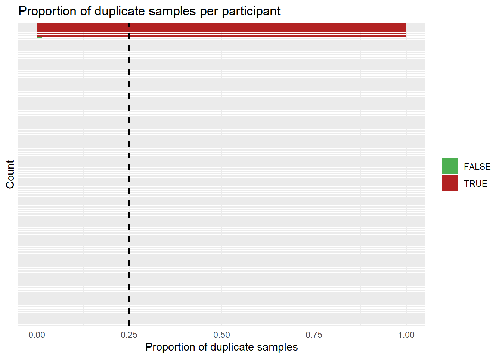{width=672}
:::

```{.r .cell-code}
df <- df |> filter(!Participant %in% broken_ppts)
```
:::


We removed 15 participants (4.72%) with >25% duplicate samples (frozen gaze / face loss).


### Observation Level

#### Off-screen coordinates

Outside screen = face loss / artifact.

We removed 182638 samples (9.14%).


::: {.cell}

```{.r .cell-code}
df <- df |>
  filter(
    x >= 0, x <= ScreenWidth,   
    y >= 0, y <= ScreenHeight
  )
```
:::


#### Velocity


::: {.cell}

```{.r .cell-code}
vel_threshold <- 6  # 6 stimulus-widths/sec ≈ upper bound of real saccade

# Compute velocity on the full df (pre-filter)
df_vel <- df |>
  arrange(Participant, Item, Stimulus, t) |>
  mutate(
    dx = z_x_stim - lag(z_x_stim),
    dy = z_y_stim - lag(z_y_stim),
    dt = t - lag(t),
    velocity = sqrt(dx^2 + dy^2) / dt,
    .by = c("Participant", "Item", "Stimulus")
  ) |>
  filter(!is.na(velocity), is.finite(velocity))

prop_vel_dropped <- mean(df_vel$velocity >= vel_threshold, na.rm = TRUE)

df_vel |>
  mutate(Dropped = velocity >= vel_threshold) |>
  ggplot(aes(x = pmin(velocity, 12), fill = Dropped)) +   # cap at 12 for readability
  geom_histogram(bins = 200, alpha = 0.8, position = "stack") +
  geom_vline(xintercept = vel_threshold,
             linetype = "dashed", color = "black", linewidth = 0.8) +
  annotate("text", x = vel_threshold, y = Inf,
           label = paste0("threshold = ", vel_threshold,
                          "\n", round(prop_vel_dropped * 100, 1), "% dropped"),
           vjust = 1.5, hjust = -0.1, size = 3, color = "black") +
  scale_fill_manual(values = c("FALSE" = "#4CAF50", "TRUE" = "firebrick"),
                    labels = c("Kept", "Dropped")) +
  scale_x_continuous(breaks = seq(0, 12, 2.5)) +
  theme_minimal() +
  labs(title = "Sample velocity",
       subtitle = "Implausibly fast transitions = blinks / face loss",
       x = "Velocity (stim-widths / sec; capped at 12)", y = "Count", fill = NULL)
```

::: {.cell-output-display}
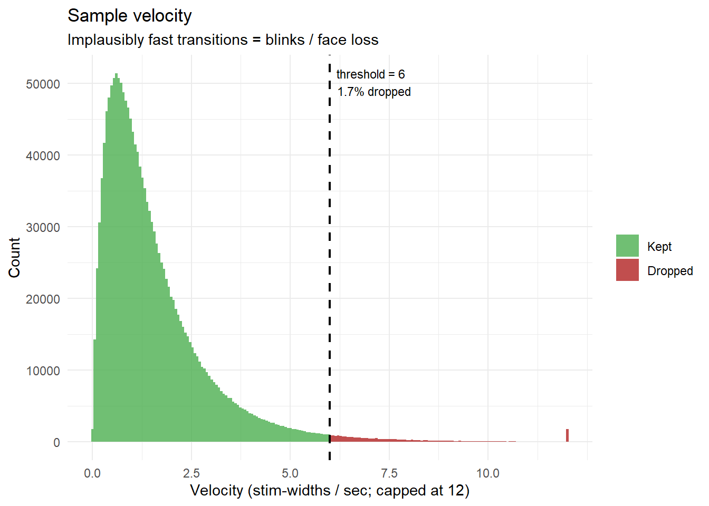{width=672}
:::

```{.r .cell-code}
df <- df |>
  arrange(Participant, Item, Stimulus, t) |>
  mutate(
    dx = z_x_stim - lag(z_x_stim),
    dy = z_y_stim - lag(z_y_stim),
    velocity = sqrt(dx^2 + dy^2) / (t - lag(t)),  # units/sec in stim-relative space
    .by = c("Participant", "Item", "Stimulus")
  ) |>
  filter(is.na(velocity) | velocity < vel_threshold | velocity == 0) |>   
  select(-dx, -dy, -velocity) 
```
:::


### Trial-Level

#### Functions


::: {.cell}

```{.r .cell-code}
# Safe Correlation 
safe_cor <- function(x, y) {
  if (length(x) < 3) return(NA_real_)                        # too few points
  if (sd(x, na.rm = TRUE) < 1e-10 ||
      sd(y, na.rm = TRUE) < 1e-10) return(NA_real_)          # zero variance
  cor(x, y, use = "complete.obs")
}


# BCEA — Bivariate Contour Ellipse Area (Crossland & Rubin, 2002)
#    Area of the ellipse containing proportion `p` of gaze (assuming bivariate normal).
#    Units: squared stimulus-widths.
#    Small  → concentrated gaze (or frozen — guard with SD check upstream)
#    Large  → scattered, exploratory, or noisy
compute_bcea <- function(x, y, p = 0.68) {
  ok  <- !is.na(x) & !is.na(y)
  x   <- x[ok]; y <- y[ok]
  if (length(x) < 3) return(NA_real_)
  sx  <- sd(x); sy <- sd(y)
  if (sx < 1e-10 || sy < 1e-10) return(NA_real_)   # frozen → NA
  rho <- cor(x, y)
  k   <- -2 * log(1 - p)
  2 * pi * k * sx * sy * sqrt(max(0, 1 - rho^2))   # max() guards |rho| > 1 from floating point
}

# Normalised spatial entropy
#    Discretise into a bins×bins grid → Shannon entropy normalised to [0, 1].
#    ~1.0 = perfectly uniform scatter (random noise — bad)
#    ~0.0 = all mass in one cell  (frozen — already caught by SD, but visible here)
#    ~0.3–0.6 = healthy fixation clusters across the image
compute_spatial_entropy <- function(x, y, n_grid = 10L) {
  ok      <- !is.na(x) & !is.na(y)
  x       <- x[ok]; y <- y[ok]
  n_valid <- length(x)
  
  if (n_valid < 2L) return(NA_real_)
  
  counts <- table(
    cut(x, breaks = n_grid),
    cut(y, breaks = n_grid)
  )
  
  # Maximum achievable entropy is bounded by both the number of points
  # (can't spread n points across more than n cells) and the grid size.
  # Normalising by log2(n_grid^2) when n < n_grid^2 artificially deflates
  # the score for data-sparse trials, making them look "focused" by artefact.
  max_cells   <- min(n_valid, n_grid^2L)
  if (max_cells <= 1L) return(0)           # only 1 reachable cell → entropy = 0
  max_entropy <- log2(max_cells)
  
  entropy::entropy(as.vector(counts), unit = "log2") / max_entropy
}

# Gini coefficient of a 2D KDE
#    Measures concentration of the density surface.
#    ~1  → density is sharply peaked (tight clusters — good)
#    ~0  → density is flat / uniform (random scatter — bad)
#    Sensitive to whether gaze *forms structure* rather than just spreading
compute_gini_kde <- function(x, y, n = 25) {
  ok  <- !is.na(x) & !is.na(y)
  x   <- x[ok]; y <- y[ok]
  if (length(x) < 10) return(NA_real_)
  z <- tryCatch(
    as.vector(MASS::kde2d(x, y, n = n)$z),
    error = function(e) NULL
  )
  if (is.null(z) || all(z == 0)) return(NA_real_)
  z   <- sort(z / sum(z))          # normalise to probability mass
  n_z <- length(z)
  2 * sum(seq_len(n_z) * z) / (n_z * sum(z)) - (n_z + 1) / n_z
}

# Convex hull area: robust alternative to BCEA -- doesn't assume bivariate-
# normal gaze, so a few outlier samples distort it less than they distort BCEA.
compute_hull_area <- function(x, y) {
  ok <- !is.na(x) & !is.na(y)
  x <- x[ok]; y <- y[ok]
  if (length(x) < 3 || sd(x) < 1e-10 || sd(y) < 1e-10) return(NA_real_)
  tryCatch({
    h  <- chull(x, y)
    xh <- x[h]; yh <- y[h]
    0.5 * abs(sum(xh * c(yh[-1], yh[1]) - c(xh[-1], xh[1]) * yh))
  }, error = function(e) NA_real_)
}

# Total scanpath length: sum of consecutive sample-to-sample distances.
# A coarse "how much did gaze move overall" measure -- not a saccade count,
# just total trajectory length, which holds up much better under webgazer
# noise than trying to detect discrete fixations/saccades.
compute_path_length <- function(x, y, t) {
  ok <- !is.na(x) & !is.na(y) & !is.na(t)
  x <- x[ok]; y <- y[ok]; t <- t[ok]
  if (length(x) < 2) return(NA_real_)
  o <- order(t); x <- x[o]; y <- y[o]
  sum(sqrt(diff(x)^2 + diff(y)^2))
}

# Straightness index: net displacement / total path length, in [0, 1].
# Low = wandered around; high = moved in essentially one direction.
# It's a ratio, so it's fairly insensitive to a handful of noisy jumps
# unless they dominate the whole path.
compute_straightness <- function(x, y, t) {
  ok <- !is.na(x) & !is.na(y) & !is.na(t)
  x <- x[ok]; y <- y[ok]; t <- t[ok]
  if (length(x) < 2) return(NA_real_)
  o <- order(t); x <- x[o]; y <- y[o]
  path <- sum(sqrt(diff(x)^2 + diff(y)^2))
  if (path < 1e-10) return(NA_real_)
  disp <- sqrt((x[length(x)] - x[1])^2 + (y[length(y)] - y[1])^2)
  disp / path
}

# Centroid shift between first and second half of the trial.
# Large = gaze relocated to a different part of the image partway through;
# near-zero = stable focus throughout.
compute_half_shift <- function(x, y, t) {
  ok <- !is.na(x) & !is.na(y) & !is.na(t)
  x <- x[ok]; y <- y[ok]; t <- t[ok]
  n <- length(x)
  if (n < 6) return(NA_real_)
  o <- order(t); x <- x[o]; y <- y[o]
  h  <- floor(n / 2)
  c1 <- c(mean(x[1:h]),     mean(y[1:h]))
  c2 <- c(mean(x[(h+1):n]), mean(y[(h+1):n]))
  sqrt(sum((c1 - c2)^2))
}

# Dispersion ratio: 2nd-half spread / 1st-half spread.
# < 1 = gaze "settled"/consolidated over the trial; > 1 = became more
# exploratory over time. Relevant to initial-scan vs. sustained-appraisal
# distinctions in aesthetic judgment.
compute_dispersion_ratio <- function(x, y, t) {
  ok <- !is.na(x) & !is.na(y) & !is.na(t)
  x <- x[ok]; y <- y[ok]; t <- t[ok]
  n <- length(x)
  if (n < 6) return(NA_real_)
  o <- order(t); x <- x[o]; y <- y[o]
  h  <- floor(n / 2)
  d1 <- sqrt(var(x[1:h])     + var(y[1:h]))
  d2 <- sqrt(var(x[(h+1):n]) + var(y[(h+1):n]))
  if (is.na(d1) || d1 < 1e-10) return(NA_real_)
  d2 / d1
}

# Max Bipartite Shift: Finds the true moment of gaze relocation
# Large = distinct spatial phases; near-zero = single stable focus
compute_max_shift <- function(x, y, t, min_samples = 5) {
  ok <- !is.na(x) & !is.na(y) & !is.na(t)
  x <- x[ok]; y <- y[ok]; t <- t[ok]
  n <- length(x)
  
  # Need enough samples to form two valid time blocks
  if (n < min_samples * 2) return(NA_real_)
  
  o <- order(t); x <- x[o]; y <- y[o]
  
  # Precompute cumulative sums to avoid slow loops (O(N) optimization)
  cx <- cumsum(x)
  cy <- cumsum(y)
  
  # Evaluate every valid split point 'k'
  k <- min_samples:(n - min_samples)
  
  # Centroids of the "Before k" phase
  c1_x <- cx[k] / k
  c1_y <- cy[k] / k
  
  # Centroids of the "After k" phase
  c2_x <- (cx[n] - cx[k]) / (n - k)
  c2_y <- (cy[n] - cy[k]) / (n - k)
  
  # Calculate distances for all possible splits and return the absolute max
  max_dist <- max(sqrt((c1_x - c2_x)^2 + (c1_y - c2_y)^2))
  return(max_dist)
}

# Macro Wandering: Scanpath length of the smoothed rolling centroid
# Low = stable appraisal; High = continuous exploration / wandering
compute_macro_wandering <- function(x, y, t, window_size = 10) {
  ok <- !is.na(x) & !is.na(y) & !is.na(t)
  x <- x[ok]; y <- y[ok]; t <- t[ok]
  n <- length(x)
  
  if (n < window_size * 2) return(NA_real_)
  o <- order(t); x <- x[o]; y <- y[o]
  
  # Compute rolling average to smooth out jitter and micro-saccades
  roll_x <- stats::filter(x, rep(1/window_size, window_size), sides = 2)
  roll_y <- stats::filter(y, rep(1/window_size, window_size), sides = 2)
  
  # Remove NAs at the boundaries created by the rolling window
  ok_roll <- !is.na(roll_x) & !is.na(roll_y)
  roll_x <- roll_x[ok_roll]
  roll_y <- roll_y[ok_roll]
  
  # Path length of the macro-centroid
  sum(sqrt(diff(roll_x)^2 + diff(roll_y)^2))
}

# Total Linear Drift: The absolute magnitude of spatial drift from start to finish
compute_drift_magnitude <- function(x, y, t) {
  ok <- !is.na(x) & !is.na(y) & !is.na(t)
  x <- x[ok]; y <- y[ok]; t <- t[ok]
  
  if (length(x) < 5 || sd(t, na.rm = TRUE) < 1e-10) return(NA_real_)
  
  # Normalize time to 0-1 so coefficients represent the total trial displacement
  t_norm <- (t - min(t)) / (max(t) - min(t))
  
  lm_x <- lm(x ~ t_norm)
  lm_y <- lm(y ~ t_norm)
  
  # Pythagorean theorem on the slopes (total X drift + total Y drift)
  sqrt(coef(lm_x)[2]^2 + coef(lm_y)[2]^2)
}
```
:::


#### Feature Extraction


::: {.cell}

```{.r .cell-code}
# ---- Main per-trial extractor ----------------------------------------------

extract_gaze_features <- function(data) {
  x <- data$z_x_stim
  y <- data$z_y_stim
  t <- data$t
  ok <- !is.na(x) & !is.na(y) & !is.na(t)
  n_valid <- sum(ok)
  x <- x[ok]; y <- y[ok]; t <- t[ok]

  # Too little data to compute anything meaningful -- return n_samples only;
  # group_modify()/bind_rows() will fill every other column with NA below.
  if (n_valid < 2) return(tibble(n_samples = n_valid))

  duration <- diff(range(t))

  tibble(
    # -- Data quantity / tracking quality --------------------------------
    n_samples     = n_valid,
    duration      = duration,
    sampling_rate = n_valid / pmax(duration, 1e-6),
    prop_within_strict  = mean(data$GazeWithin_Strict[ok],  na.rm = TRUE),
    prop_within_lenient = mean(data$GazeWithin_Lenient[ok], na.rm = TRUE),

    # -- Where on the image they looked -----------------------------------
    centroid_x  = mean(x),   centroid_y  = mean(y),
    median_x    = median(x), median_y    = median(y),
    prop_top    = mean(y < 0),                    # upper vs. lower half
    prop_left   = mean(x < 0),                     # left vs. right half
    prop_center = mean(sqrt(x^2 + y^2) < 0.33),    # central-bias proxy
    prop_center10 = mean(sqrt(x^2 + y^2) < 0.10), 
    prop_center25 = mean(sqrt(x^2 + y^2) < 0.25), 
    prop_center33 = mean(sqrt(x^2 + y^2) < 0.33), 

    # -- How spread out (classic + robust versions) -------------------------
    sd_x  = sd(x),   sd_y  = sd(y),
    mad_x = mad(x),  mad_y = mad(y),
    range_x = diff(quantile(x, c(.05, .95))),
    range_y = diff(quantile(y, c(.05, .95))),
    bcea      = compute_bcea(x, y, p = 0.68),
    bcea50      = compute_bcea(x, y, p = 0.50),
    bcea98     = compute_bcea(x, y, p = 0.98),
    hull_area = compute_hull_area(x, y),
    # entropy   = compute_spatial_entropy(x, y, n_grid = 20),
    entropy2   = compute_spatial_entropy(x, y, n_grid = 2),
    entropy3   = compute_spatial_entropy(x, y, n_grid = 3),
    entropy4   = compute_spatial_entropy(x, y, n_grid = 4),
    entropy5   = compute_spatial_entropy(x, y, n_grid = 5),
    entropy6   = compute_spatial_entropy(x, y, n_grid = 6),
    # entropy8   = compute_spatial_entropy(x, y, n_grid = 8),
    entropy10   = compute_spatial_entropy(x, y, n_grid = 10),
    # entropy12   = compute_spatial_entropy(x, y, n_grid = 12),
    # entropy14   = compute_spatial_entropy(x, y, n_grid = 14),
    entropy16   = compute_spatial_entropy(x, y, n_grid = 16),
    entropy18   = compute_spatial_entropy(x, y, n_grid = 18),
    entropy20   = compute_spatial_entropy(x, y, n_grid = 20),
    entropy21   = compute_spatial_entropy(x, y, n_grid = 21),
    entropy22   = compute_spatial_entropy(x, y, n_grid = 22),
    entropy24   = compute_spatial_entropy(x, y, n_grid = 24),
    entropy26   = compute_spatial_entropy(x, y, n_grid = 26),
    entropy30   = compute_spatial_entropy(x, y, n_grid = 30),
    gini_kde  = compute_gini_kde(x, y, n = 25),
    gini_kde10  = compute_gini_kde(x, y, n = 10),
    gini_kde50  = compute_gini_kde(x, y, n = 50),
    gini_kde100  = compute_gini_kde(x, y, n = 100),

    # -- Temporal dynamics ---------------------------------------------------
    drift_x          = safe_cor(t, x),   # signed: direction, not just magnitude
    drift_y          = safe_cor(t, y),
    path_length      = compute_path_length(x, y, t),
    mean_speed       = compute_path_length(x, y, t) / pmax(duration, 1e-6),
    straightness     = compute_straightness(x, y, t),
    half_shift       = compute_half_shift(x, y, t),
    dispersion_ratio = compute_dispersion_ratio(x, y, t),
    max_shift5        = compute_max_shift(x, y, t, min_samples = 5),
    max_shift10        = compute_max_shift(x, y, t, min_samples = 10),
    max_shift15        = compute_max_shift(x, y, t, min_samples = 15),
    max_shift20        = compute_max_shift(x, y, t, min_samples = 20),
    max_shift25        = compute_max_shift(x, y, t, min_samples = 25),
    max_shift30        = compute_max_shift(x, y, t, min_samples = 30),
    macro_wandering2   = compute_macro_wandering(x, y, t, window_size = 2),
    macro_wandering3   = compute_macro_wandering(x, y, t, window_size = 3),
    macro_wandering5   = compute_macro_wandering(x, y, t, window_size = 5),
    macro_wandering7   = compute_macro_wandering(x, y, t, window_size = 7),
    macro_wandering8   = compute_macro_wandering(x, y, t, window_size = 8),
    macro_wandering10   = compute_macro_wandering(x, y, t, window_size = 10),
    macro_wandering15   = compute_macro_wandering(x, y, t, window_size = 15),
    macro_wandering20   = compute_macro_wandering(x, y, t, window_size = 20),
    macro_wandering25   = compute_macro_wandering(x, y, t, window_size = 25),
    macro_wandering30   = compute_macro_wandering(x, y, t, window_size = 30),
    drift_magnitude  = compute_drift_magnitude(x, y, t)
  )
}

# ---- Apply per Participant x Item ------------------------------------------

df_features <- df |>
  filter(Stimulus == "Image") |>
  group_by(Participant, Item) |>
  group_modify(~ extract_gaze_features(.x)) |>
  ungroup()
```
:::


#### Quality Control


::: {.cell}

```{.r .cell-code}
# ---- Quality-control thresholds --------------------------------------------

thresh_n_samples   <- 20
thresh_sd_min      <- 0.02
thresh_sd_max      <- 0.60
thresh_prop_within <- 0.50
thresh_drift       <- 1.0  # stim-widths of total linear displacement
thresh_entropy     <- c(0.5, 0.975)   


# ---- Trial-level QC classification -----------------------------------------

df_features <- df_features |>
  mutate(
    Status = case_when(
      n_samples < thresh_n_samples ~
        "Dropped (too few samples)",

      is.na(sd_x) | is.na(sd_y) ~
        "Dropped (frozen/single point)",

      sd_x < thresh_sd_min | sd_y < thresh_sd_min ~
        "Dropped (frozen gaze)",

      sd_x > thresh_sd_max | sd_y > thresh_sd_max ~
        "Dropped (pure noise)",

      prop_within_lenient < thresh_prop_within ~
        "Dropped (never on screen)",

      drift_magnitude > thresh_drift ~ "Dropped (severe drift)",

      entropy5 > thresh_entropy[2] | entropy5 < thresh_entropy[1] ~
        "Dropped (random scatter)",

      TRUE ~ "Kept"
    )
  )
```
:::


#### Tracking Quality


::: {.cell}

```{.r .cell-code}
flag_for_plot <- function(data, criterion) {
  criterion <- rlang::enquo(criterion)   # capture the expression + its environment, unevaluated
  data |>
    mutate(
      .flag_this = !!criterion,           # inject it, now evaluated *inside* mutate's data mask
      PlotCategory = case_when(
        .flag_this        ~ "Dropped (this criterion)",
        Status != "Kept"  ~ "Dropped (other criterion)",
        TRUE              ~ "Kept"
      ),
      PlotCategory = factor(PlotCategory,
        levels = c("Kept", "Dropped (other criterion)", "Dropped (this criterion)"))
    ) |>
    arrange(PlotCategory)
}

palette <- c("Kept" = "#4CAF50",
           "Dropped (other criterion)" = "orange",
           "Dropped (this criterion)"  = "firebrick")


p_sampling <- df_features |>
  ggplot(aes(sampling_rate, fill = Status != "Kept")) +
  geom_histogram(bins = 50) +
  scale_fill_manual(values = c("#4CAF50","firebrick")) +
  theme_minimal() +
  labs(
    title = "Effective sampling rate",
    x = "Samples / second",
    y = "Trials",
    fill = NULL
  )

# n_samples -------------------------------------------------------------------
p_n <- df_features |>
  mutate(Dropped = n_samples < thresh_n_samples) |>
  ggplot(aes(x = n_samples, fill = Dropped)) +
  geom_histogram(bins = 50, alpha = 0.8, position = "stack") +
  geom_vline(xintercept = thresh_n_samples,
             linetype = "dashed", color = "black", linewidth = 0.8) +
  annotate("text", x = thresh_n_samples, y = Inf,
           label = paste0("< ", thresh_n_samples),
           vjust = 1.5, hjust = -0.2, size = 3) +
  scale_fill_manual(values = c("FALSE" = "#4CAF50", "TRUE" = "firebrick")) +
  theme_minimal() +
  labs(title = "n_samples per trial",
       subtitle = "Too few = dropped frames",
       x = "N gaze samples", y = "N trials", fill = NULL)

# sd_x vs sd_y ----------------------------------------------------------------
p_sd <- df_features |>
  flag_for_plot(sd_x < thresh_sd_min | sd_y < thresh_sd_min |
                sd_x > thresh_sd_max | sd_y > thresh_sd_max) |>
  ggplot(aes(x = sd_x, y = sd_y)) +
  geom_point(aes(color = PlotCategory), alpha = 0.35, size = 1.2) +
  geom_vline(xintercept = c(thresh_sd_min, thresh_sd_max),
             linetype = "dashed", color = "black", linewidth = 0.7) +
  geom_hline(yintercept = c(thresh_sd_min, thresh_sd_max),
             linetype = "dashed", color = "black", linewidth = 0.7) +
  annotate("text", x = thresh_sd_min, y = Inf,
           label = paste0("min=", thresh_sd_min),
           vjust = 1.5, hjust = -0.1, size = 3) +
  annotate("text", x = thresh_sd_max, y = Inf,
           label = paste0("max=", thresh_sd_max),
           vjust = 1.5, hjust = 1.1, size = 3) +
  scale_color_manual(values = palette, na.translate = FALSE) +
  coord_cartesian(xlim = c(0, 0.7), ylim = c(0, 0.7)) +
  theme_minimal() +
  labs(title = "Gaze SD (X vs Y)",
       subtitle = "Too low = frozen; too high = pure noise",
       x = "SD x (stim-relative)", y = "SD y (stim-relative)", color = NULL,
       caption = "17 trials omitted: SD undefined (single-sample trials, already dropped)") +
  ggside::geom_xsidehistogram(aes(y = after_stat(density)), alpha = 0.4, fill = "darkgrey", bins = 100) +
  ggside::geom_ysidehistogram(aes(x = after_stat(density)), alpha = 0.4, fill = "darkgrey", bins = 100) +
  ggside::theme_ggside_void()

# prop_within -----------------------------------------------------------------
p_prop <- df_features |>
  mutate(Dropped = prop_within_lenient < thresh_prop_within) |>
  ggplot(aes(x = prop_within_lenient, fill = Dropped)) +
  geom_histogram(bins = 40, alpha = 0.8, position = "stack") +
  geom_vline(xintercept = thresh_prop_within,
             linetype = "dashed", color = "black", linewidth = 0.8) +
  annotate("text", x = thresh_prop_within, y = Inf,
           label = paste0("< ", thresh_prop_within),
           vjust = 1.5, hjust = -0.2, size = 3) +
  scale_fill_manual(values = c("FALSE" = "#4CAF50", "TRUE" = "firebrick")) +
  theme_minimal() +
  labs(title = "Prop. samples within stimulus",
       subtitle = "Almost never on screen = unusable trial",
       x = "Proportion within bounds", y = "N trials", fill = NULL)

# range_x vs range_y ----------------------------------------------------------
p_range <- df_features |>
  flag_for_plot(FALSE) |> 
  ggplot(aes(x = range_x, y = range_y)) +
  geom_point(aes(color = PlotCategory), alpha = 0.3, size = 1.2) +
  geom_vline(xintercept = thresh_sd_max * 2,   # approximate: wide range ≈ high SD
             linetype = "dashed", color = "black", linewidth = 0.7) +
  geom_hline(yintercept = thresh_sd_max * 2,
             linetype = "dashed", color = "black", linewidth = 0.7) +
  theme_minimal() +
  labs(title = "Gaze range (5th–95th pctile)",
       subtitle = "Extremely wide = scanning whole screen randomly",
       x = "Range x (stim-relative)", y = "Range y (stim-relative)") +
  scale_color_manual(values = palette, na.translate = FALSE) +
  ggside::geom_xsidehistogram(aes(y = after_stat(density)), alpha = 0.4, fill = "darkgrey", bins = 100) +
  ggside::geom_ysidehistogram(aes(x = after_stat(density)), alpha = 0.4, fill = "darkgrey", bins = 100) +
  ggside::theme_ggside_void() 
  

# drift ----------------------------------------------------------
p_drift <- df_features |>
  mutate(Dropped = drift_magnitude > thresh_drift) |>
  ggplot(aes(x = drift_magnitude, fill = Dropped)) +
  geom_histogram(bins = 50, alpha = 0.8, position = "stack") +
  geom_vline(xintercept = thresh_drift, 
             linetype = "dashed", color = "black", linewidth = 0.8) +
  annotate("text", x = thresh_drift, y = Inf, 
           label = paste0("> ", thresh_drift),
           vjust = 1.5, hjust = -0.2, size = 3) +
  scale_fill_manual(values = c("FALSE" = "#4CAF50", "TRUE" = "firebrick")) +
  theme_minimal() +
  labs(title = "Total linear drift", 
       subtitle = "Large = gaze relocated to a different part of the image",
       x = "Drift magnitude (stim-widths)", y = "N trials", fill = NULL)

# Waterfall — how many trials survive each successive criterion ---------------
# Build a tidy summary of cumulative exclusions
criteria_order <- c("Total", "n_samples", "frozen", "noise", "prop_within", "drift")

waterfall <- df_features |>
  summarise(
    Total        = n(),
    n_samples    = sum(n_samples >= thresh_n_samples),
    frozen       = sum(n_samples >= thresh_n_samples &
                         !is.na(sd_x) & sd_x > thresh_sd_min & sd_y > thresh_sd_min),
    noise        = sum(n_samples >= thresh_n_samples &
                         !is.na(sd_x) & sd_x > thresh_sd_min & sd_y > thresh_sd_min &
                         sd_x < thresh_sd_max & sd_y < thresh_sd_max),
    prop_within = sum(n_samples >= thresh_n_samples &
                   !is.na(sd_x) & !is.na(sd_y) &
                   sd_x > thresh_sd_min & sd_x < thresh_sd_max &
                   sd_y > thresh_sd_min & sd_y < thresh_sd_max &
                   prop_within_lenient >= thresh_prop_within),
    Final        = sum(Status == "Kept")
  ) |>
  pivot_longer(everything(), names_to = "Step", values_to = "N_trials") |>
  mutate(
    Step = factor(Step, levels = c("Total", "n_samples", "frozen",
                                   "noise", "prop_within", "Final")),
    label = paste0(N_trials, "\n(", round(N_trials / N_trials[1] * 100), "%)")
  )

p_waterfall <- waterfall |>
  ggplot(aes(x = Step, y = N_trials)) +
  geom_col(fill = "black", alpha = 0.8, width = 0.6) +
  geom_text(aes(label = label), vjust = -0.3, size = 3) +
  scale_y_continuous(expand = expansion(mult = c(0, 0.15))) +
  theme_minimal() +
  labs(title = "Trial survival — cumulative exclusions",
       subtitle = "Each bar = trials surviving all criteria up to that step",
       x = NULL, y = "N trials retained")


(p_sampling | p_n | p_sd) / 
            (p_prop | p_drift | p_range) / 
            p_waterfall +
  plot_annotation(
    title = "Level 2 — Trial-level exclusions",
    theme = theme(plot.title = element_text(face = "bold", size = 13))
  )
```

::: {.cell-output-display}
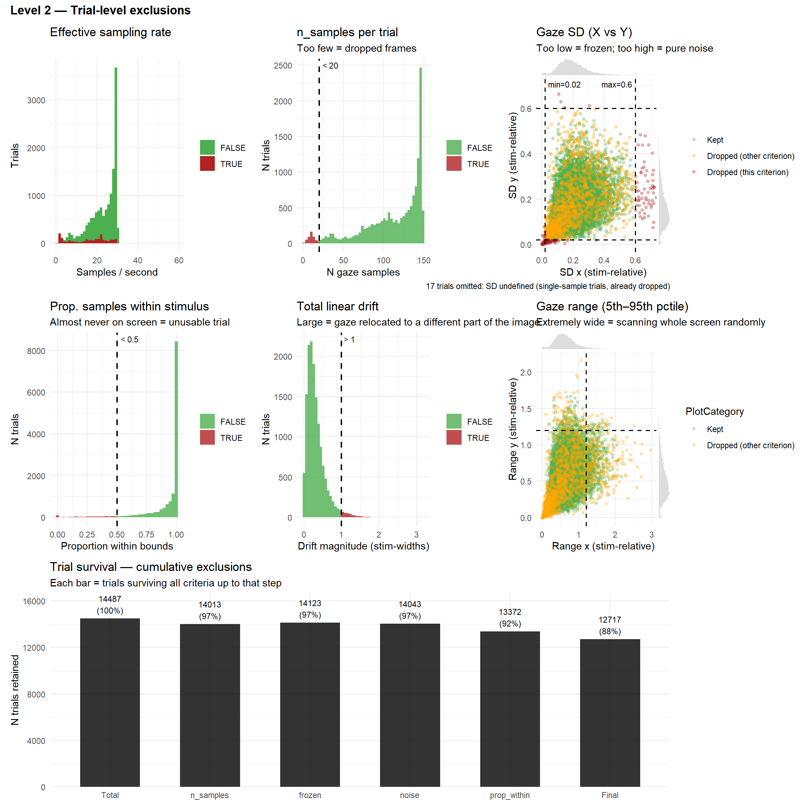{width=1152}
:::
:::


#### Spatial Distribution


::: {.cell}

```{.r .cell-code}
p_bcea <- df_features |>
  mutate(Dropped = Status != "Kept",
         bcea_clipped = pmin(bcea, 1.5)) |>   # clip extremes for readability
  ggplot(aes(x = bcea_clipped, fill = Dropped)) +
  geom_histogram(bins = 50, alpha = 0.8, position = "stack") +
  scale_fill_manual(values = c("FALSE" = "#4CAF50", "TRUE" = "firebrick"),
                    labels = c("Kept", "Dropped")) +
  scale_x_continuous(breaks = seq(0, 1.5, 0.25)) +
  theme_minimal() +
  labs(title = "BCEA (p = 0.68)",
       subtitle = "Ellipse area containing 68% of gaze — large = scattered",
       x = "BCEA (stim-widths²; clipped at 1.5)", y = "N trials", fill = NULL)

p_hull <- df_features |>
  mutate(
    Dropped = Status != "Kept",
    hull_clipped = pmin(hull_area, quantile(hull_area, 0.99, na.rm = TRUE))
  ) |>
  ggplot(aes(x = hull_clipped, fill = Dropped)) +
  geom_histogram(bins = 50, alpha = 0.8) +
  scale_fill_manual(values = c("FALSE" = "#4CAF50",
                               "TRUE" = "firebrick")) +
  theme_minimal() +
  labs(
    title = "Convex hull area",
    subtitle = "Robust spatial spread of gaze",
    x = "Hull area (99th percentile clipped)",
    y = "Trials",
    fill = NULL
  )

p_entropy <- df_features |>
  mutate(Dropped = Status != "Kept") |>
  ggplot(aes(x = entropy5, fill = Dropped)) +
  geom_histogram(bins = 40, alpha = 0.8, position = "stack") +
  geom_vline(xintercept = thresh_entropy,
             linetype = "dashed", color = "black", linewidth = 0.8) +
  annotate("text", x = thresh_entropy, y = Inf,
           label = paste0("threshold = ", thresh_entropy),
           vjust = 1.5, hjust = -0.1, size = 3) +
  scale_fill_manual(values = c("FALSE" = "#4CAF50", "TRUE" = "firebrick"),
                    labels = c("Kept", "Dropped")) +
  theme_minimal() +
  labs(title = "Normalised spatial entropy",
       subtitle = "~1 = uniform scatter (bad); ~0 = frozen (bad)",
       x = "Entropy (normalised)", y = "N trials", fill = NULL)

p_gini <- df_features |>
  mutate(Dropped = Status != "Kept") |>
  ggplot(aes(x = gini_kde, fill = Dropped)) +
  geom_histogram(bins = 40, alpha = 0.8, position = "stack") +
  scale_fill_manual(values = c("FALSE" = "#4CAF50", "TRUE" = "firebrick"),
                    labels = c("Kept", "Dropped")) +
  theme_minimal() +
  labs(title = "Gini coefficient of 2D KDE",
       subtitle = "~1 = sharp peaks / clustered (good); ~0 = flat / random (bad)",
       x = "Gini (KDE)", y = "N trials", fill = NULL)


(p_bcea | p_hull) / (p_entropy | p_gini) +
  plot_annotation(
    title = "Spatial clustering metrics",
    subtitle = "Univariate distributions of spatial spread and concentration",
    theme = theme(plot.title    = element_text(face = "bold", size = 13),
                  plot.subtitle = element_text(size = 10, color = "gray40"))
  )
```

::: {.cell-output-display}
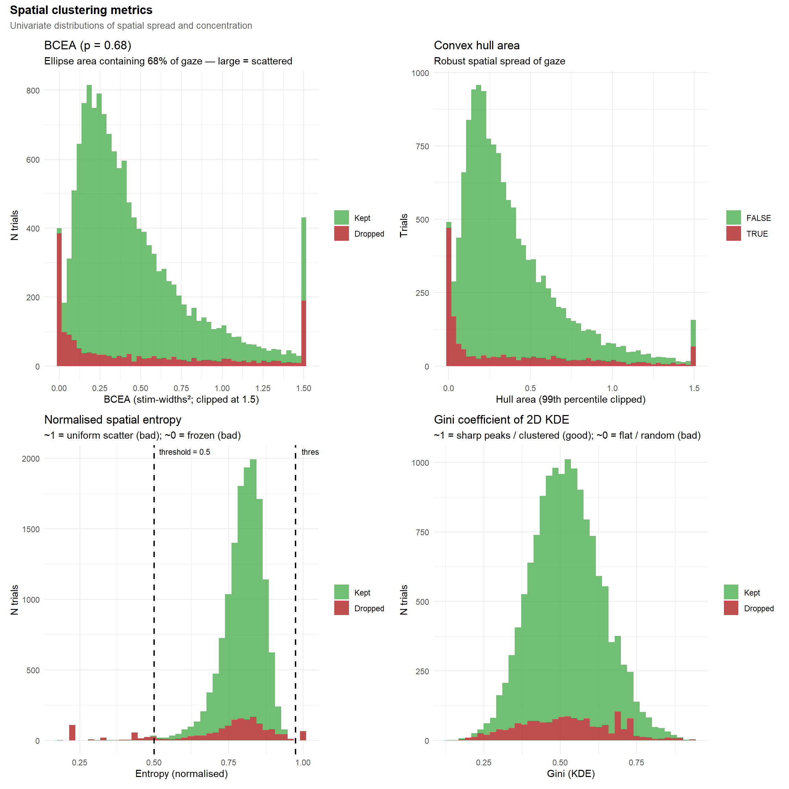{width=1152}
:::
:::


#### Temporal Dynamics


::: {.cell}

```{.r .cell-code}
p_path <- df_features |>
  mutate(Dropped = Status != "Kept") |>
  ggplot(aes(path_length, fill = Dropped)) +
  geom_histogram(bins = 50) +
  scale_fill_manual(values = c("FALSE" = "#4CAF50",
                               "TRUE" = "firebrick")) +
  theme_minimal() +
  labs(title = "Total scanpath length", x = "Path length", y = "Trials", fill = NULL)

p_speed <- df_features |>
  ggplot(aes(mean_speed, fill = Status != "Kept")) +
  geom_histogram(bins = 50) +
  scale_fill_manual(values = c("#4CAF50","firebrick")) +
  theme_minimal() +
  labs(title="Mean gaze speed", fill = NULL)

p_straight <- df_features |>
  ggplot(aes(straightness, fill = Status != "Kept")) +
  geom_histogram(bins = 50) +
  scale_fill_manual(values = c("#4CAF50","firebrick")) +
  theme_minimal() +
  labs(title="Straightness index", fill = NULL)

p_half <- df_features |>
  ggplot(aes(half_shift, fill = Status != "Kept")) +
  geom_histogram(bins = 50) +
  scale_fill_manual(values = c("#4CAF50","firebrick")) +
  theme_minimal() +
  labs(title="Centroid shift", fill = NULL)

p_dispersion <- df_features |>
  ggplot(aes(dispersion_ratio, fill = Status != "Kept")) +
  geom_histogram(bins = 50) +
  scale_fill_manual(values = c("#4CAF50","firebrick")) +
  theme_minimal() +
  labs(title="Dispersion ratio", fill = NULL)


 (p_path | p_speed | p_straight) / (p_half | p_dispersion) +
  plot_annotation(
    title = "Temporal dynamics metrics",
    subtitle = "Univariate distributions of movement magnitude and trial evolution",
    theme = theme(plot.title = element_text(face = "bold", size = 13),
                  plot.subtitle = element_text(size = 10, color = "gray40"))
  )
```

::: {.cell-output-display}
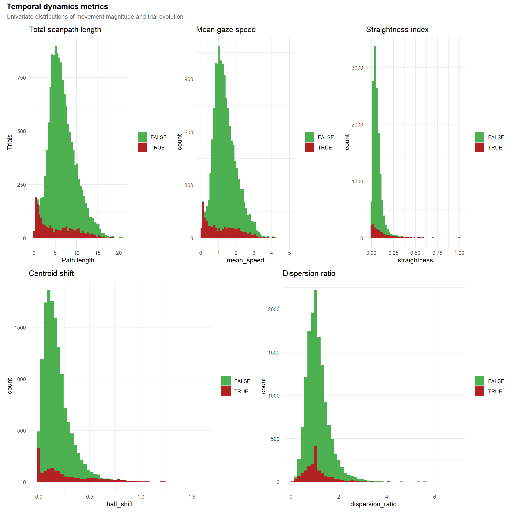{width=1152}
:::
:::


#### Feature Relationship


::: {.cell}

```{.r .cell-code}
p_sd_bcea <- df_features |>
  mutate(mean_sd = (sd_x + sd_y)/2) |>
  ggplot(aes(mean_sd, bcea, colour=Status)) +
  geom_point(alpha=.35) +
  theme_minimal() +
  labs(title="SD vs BCEA")

p_bcea_vs_hull <- df_features |>
  ggplot(aes(x = pmin(bcea, 1.5), y = hull_area, colour = Status)) +
  geom_point(alpha = 0.35, size = 1.2) +
  theme_minimal() +
  labs(title = "BCEA vs Hull area", subtitle = "Area assuming Gaussian vs robust area",
       x = "BCEA", y = "Hull area")

p_hull_entropy <- df_features |>
  ggplot(aes(hull_area, entropy5, colour = Status)) +
  geom_point(alpha=.35) +
  theme_minimal() +
  labs(title="Hull area vs Entropy", subtitle="Large hull + high entropy = random exploration")

p_gini_vs_entropy <- df_features |>
  ggplot(aes(x = entropy5, y = gini_kde, color = Status)) +
  geom_point(alpha = 0.35, size = 1.2) +
  geom_vline(xintercept = thresh_entropy, linetype = "dashed", color = "gray30", linewidth = 0.7) +
  theme_minimal() +
  labs(title = "Entropy vs. Gini KDE", subtitle = "Should be anti-correlated",
       x = "Spatial entropy (higher = more uniform)", y = "Gini KDE (higher = more clustered)", color = "Status") +
  theme(legend.position = "none")

p_bcea_vs_gini <- df_features |>
  mutate(bcea_clipped = pmin(bcea, 1.5)) |>
  ggplot(aes(x = bcea_clipped, y = gini_kde, color = Status)) +
  geom_point(alpha = 0.35, size = 1.2) +
  theme_minimal() +
  labs(title = "BCEA vs. Gini KDE", subtitle = "Large BCEA + low Gini = diffuse random scatter",
       x = "BCEA (clipped at 1.5)", y = "Gini KDE", color = "Status") +
  theme(legend.position = "none")

p_path_vs_straight <- df_features |>
  ggplot(aes(path_length, straightness, colour = Status)) +
  geom_point(alpha = .35) +
  theme_minimal() +
  labs(title = "Path length vs Straightness", subtitle = "Long paths separate from directed movements") +
  theme(legend.position = "none")

p_shift <- df_features |>
  ggplot(aes(half_shift, dispersion_ratio, colour = Status)) +
  geom_point(alpha = .35) +
  theme_minimal() +
  labs(title = "Centroid shift vs Dispersion ratio", subtitle = "Temporal evolution of gaze") +
  theme(legend.position = "none")


(p_sd_bcea | p_bcea_vs_hull | p_hull_entropy) /
                       (p_gini_vs_entropy | p_bcea_vs_gini | plot_spacer()) / 
                       (p_path_vs_straight | p_shift | plot_spacer()) +
  plot_layout(guides = "collect") +
  plot_annotation(
    title = "Feature Relationships",
    subtitle = "Bivariate associations between spatial and temporal metrics",
    theme = theme(plot.title = element_text(face = "bold", size = 13),
                  plot.subtitle = element_text(size = 10, color = "gray40"))
  )
```

::: {.cell-output-display}
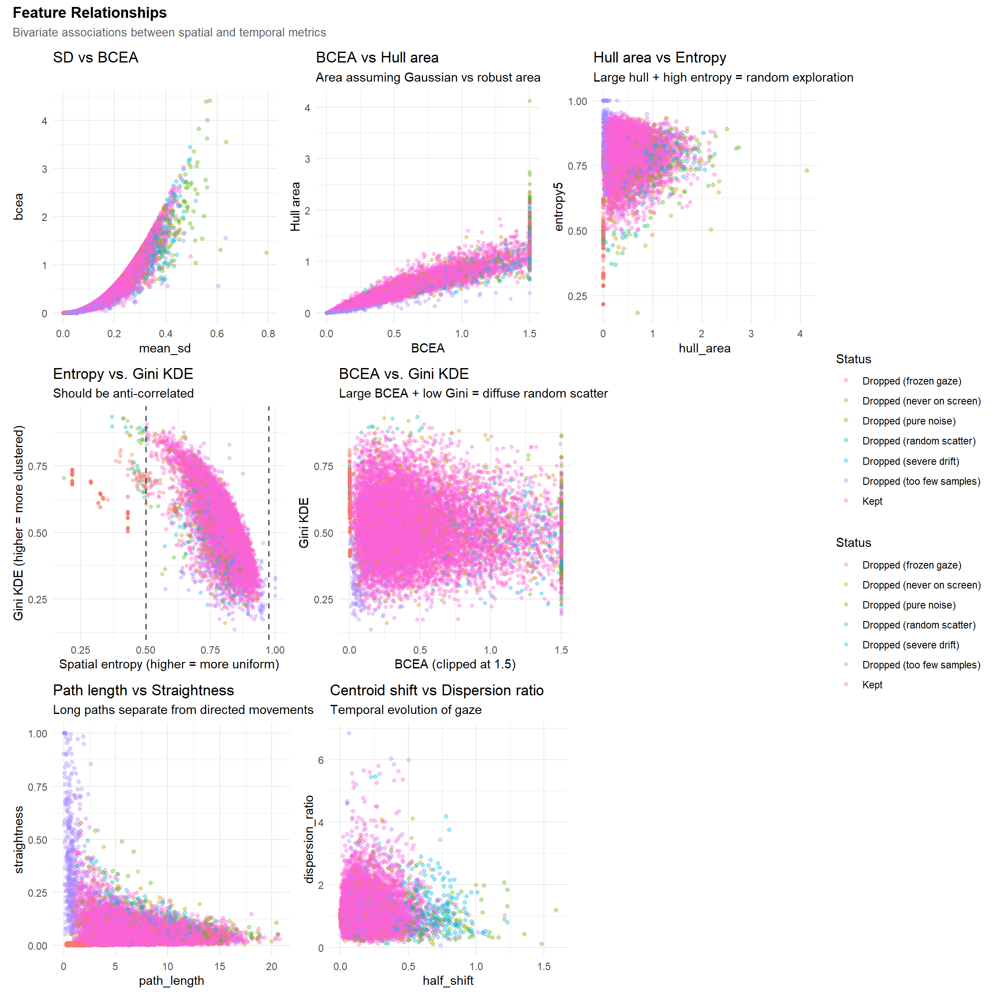{width=1152}
:::
:::


    
#### Exclude


::: {.cell}

```{.r .cell-code}
df_features <- df_features |> 
  filter(Status == "Kept") |> 
  select(-Status)

df <- df |> 
  filter(paste(Participant, Item) %in% paste(df_features$Participant, df_features$Item))
```
:::


### Participant-Level

#### Calibration Scores

Calibration scores relate to the % of gaze in the target areas during the calibration phase. One of them took place at the beginning, and the second one in the middle.


::: {.cell}

```{.r .cell-code}
p_val1 <- df_ppt |>
  ggplot(aes(x=Value, y=Participant)) +
  geom_bar(stat="identity", aes(fill=Index), position = position_dodge2(reverse=TRUE)) +
  theme_minimal() +
  labs(title="Calibration Scores", fill="Calibration Phase", color="Calibration Phase", x="Calibration Score", y=NULL) +
  theme(legend.position = "inside", legend.position.inside = c(0.9, 0.1),
        axis.text.y = element_blank()) +
  ggside::geom_xsidedensity(aes(fill=Index, color=Index), alpha=0.3) +
  ggside::theme_ggside_void() +
  scale_fill_manual(values=c("forestgreen", "orange")) +
  scale_color_manual(values=c("forestgreen", "orange"))

p_val2 <- df_ppt |> 
  pivot_wider(names_from="Index", values_from="Value") |>
  ggplot(aes(x=Initial, y=Midtask)) +
  geom_abline(intercept=0, slope=1, linetype="dashed") +
  geom_point2(size=3, alpha=0.5, color="forestgreen") +
  geom_smooth(method="lm", formula = 'y ~ x', color="forestgreen") +
  theme_minimal() +
  labs(title="Initial vs. Midtask Calibration Scores")

features_ppt <- df_features |> 
  summarise(
    n_samples_total = sum(n_samples, na.rm=TRUE),
    n_samples_median = mean(n_samples, na.rm=TRUE),
    mean_bcea = mean(bcea, na.rm=TRUE),
    mean_entropy = mean(entropy5, na.rm=TRUE),
    mean_gini_kde = mean(gini_kde, na.rm=TRUE),
    mean_path_length = mean(path_length, na.rm=TRUE),
    mean_straightness = mean(straightness, na.rm=TRUE),
    .by = "Participant"
  ) 

p_val3 <- features_ppt |> 
  mutate(status = ifelse(n_samples_total < 2000, "Dropped", "Kept")) |>
  ggplot(aes(x=n_samples_total, y=n_samples_median)) +
  geom_point(aes(color = status), alpha=0.5) 

(p_val1 | p_val2) / p_val3
```

::: {.cell-output-display}
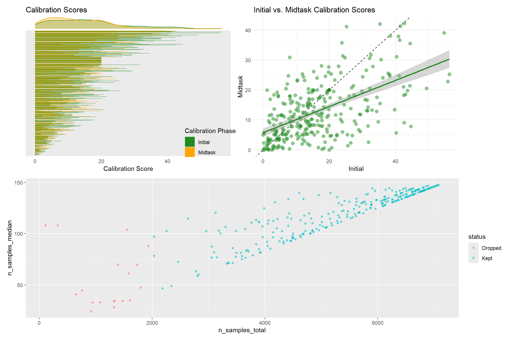{width=1152}
:::
:::


#### Exclude


::: {.cell}

```{.r .cell-code}
exclude <- features_ppt |> 
  filter(n_samples_total < 2000) |> 
  pull(Participant)

df_features <- filter(df_features, !Participant %in% exclude)
df <- filter(df, !Participant %in% exclude)
```
:::


We excluded 18 participants with fewer than 2000 valid gaze samples across all trials. 


## Features


::: {.cell}

```{.r .cell-code}
# 1. Select the core numeric features (drop quality-control features)
df_num <- df_features |>
  select(-Participant, -Item) |>
  drop_na() # Require complete cases for hierarchical clustering

# plot(n_factors(df_num, n_max = 10))
# fa <- factor_analysis(df_num, n = 5, sort = TRUE, threshold = 0.5)
# fa <- parameters::factor_analysis(mtcars, n = 5, sort = TRUE, threshold = 0.5)

# 2. Compute correlation matrix & hierarchical clustering
cor_mat <- cor(df_num, method = "spearman")

# Use 1 - |r| for distance so highly correlated features group together
dist_mat <- as.dist(1 - abs(cor_mat))
hc <- hclust(dist_mat, method = "complete")

# 3. Extract order and dendrogram data
var_order <- hc$labels[hc$order]
dendro_data <- ggdendro::dendro_data(hc, type = "rectangle")

# 4. Prepare heatmap data for ggplot
cor_df <- cor_mat |>
  as.data.frame() |>
  rownames_to_column("Var1") |>
  pivot_longer(cols = -Var1, names_to = "Var2", values_to = "corr") |>
  mutate(
    # Relevel factors to match the hierarchical clustering order
    Var1 = factor(Var1, levels = var_order),
    Var2 = factor(Var2, levels = var_order)
  )

# 5. Build Heatmap (Text on Left, Legend Removed)
p_cor_mat <- ggplot(cor_df, aes(x = Var1, y = Var2, fill = corr)) +
  geom_tile(color = "white", linewidth = 0.5) +
  scale_fill_distiller(
    palette = "RdBu", limits = c(-1, 1), direction = -1, guide = "none"
  ) +
  # Default y-axis position is left. Just set the expansion.
  scale_y_discrete(expand = c(0, 0.5)) +
  scale_x_discrete(expand = c(0, 0.5)) +
  theme_minimal() +
  theme(
    axis.text.x = element_text(angle = 45, hjust = 1, vjust = 1),
    axis.title = element_blank(),
    panel.grid = element_blank()
  )

# 6. Build Dendrogram (Right side, branches pointing Left)
p_dendro_side <- ggplot(ggdendro::segment(dendro_data)) +
  geom_segment(aes(x = x, y = y, xend = xend, yend = yend)) +
  coord_flip() +
  # Match the continuous expansion factor to the discrete heatmap to align rows
  scale_x_continuous(expand = c(0, 0.5)) +
  # By NOT reversing the y-axis, 0 remains on the left, making branches point to the matrix
  scale_y_continuous(expand = c(0, 0)) +
  theme_void() +
  theme(plot.margin = margin(0, 0, 0, 0))

# 7. Compose using patchwork (Heatmap | Dendrogram)
patch_cor <- (p_cor_mat | p_dendro_side) +
  plot_layout(widths = c(5, 1)) +
  plot_annotation(
    title = "Feature Correlation Matrix",
    subtitle = "Hierarchical clustering of spatial and temporal gaze metrics",
    theme = theme(
      plot.title = element_text(face = "bold", size = 13),
      plot.subtitle = element_text(size = 10, color = "gray40")
    )
  )

patch_cor
```

::: {.cell-output-display}
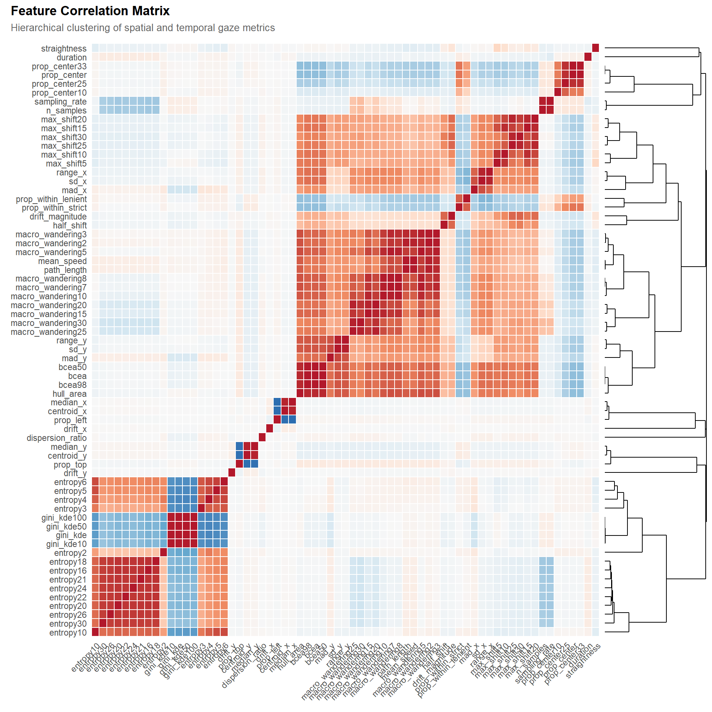{width=960}
:::
:::


<!-- ## Sensitivity Test -->

<!-- ```{r} -->
<!-- #| warning: false -->


<!-- dftask <- read.csv("../data/data_task.csv") -->
<!-- dftask <- dplyr::left_join(df_features, dftask, by = c("Participant", "Item")) -->

<!-- rez <- data.frame() -->
<!-- for (feature in names(select(df_features, -Participant, -Item))) { -->
<!--   cat(".") -->
<!--   # for (adj in c("", "(n_samples adjusted)")) { -->
<!--   adj <- "(n_samples adjusted)" -->
<!--     for (outcome in c("Beauty", "Meaning", "Valence", "Worth", "Authenticity", "Reality", "SelfRelevance")) { -->
<!--       if (adj == "") { -->
<!--         f <- paste0(outcome, " ~ ", feature, " + (1|Participant) + (1|Item)") -->
<!--       } else { -->
<!--         f <- paste0(outcome, " ~ ", feature, " + n_samples + (1|Participant) + (1|Item)") -->
<!--       } -->

<!--       m <- glmmTMB::glmmTMB(as.formula(f), data = dftask) |> -->
<!--         parameters::parameters(effects = "fixed") -->

<!--       rez <-  m[2,] |> -->
<!--         dplyr::mutate(Feature = feature, Outcome = paste(outcome, adj)) |> -->
<!--         rbind(rez) -->
<!--     } -->

<!--     if (adj == "") { -->
<!--       f <- paste0(feature, " ~ Condition + (1|Participant) + (1|Item)") -->
<!--     } else { -->
<!--       f <- paste0(feature, " ~ Condition + n_samples + (1|Participant) + (1|Item)") -->
<!--     } -->
<!--     m <- glmmTMB::glmmTMB(as.formula(f), data = dftask) |> -->
<!--       parameters::parameters(effects = "fixed") -->

<!--     rez <- m[2:3, ] |> -->
<!--       dplyr::mutate(Feature = feature, Outcome = paste("Eyetracking Feature ~ ", Parameter, adj)) |> -->
<!--       rbind(rez) -->
<!--   # } -->
<!-- } -->

<!-- ``` -->


<!-- ```{r} -->
<!-- #| warning: false -->
<!-- #| fig-width: 12 -->
<!-- #| fig-height: 7 -->


<!-- # rez |> -->
<!-- #   filter(p < .1) |> -->
<!-- #   summarize(N = n(), .by = c("Feature")) |> -->
<!-- #   arrange(desc(N)) -->

<!-- rez |> -->
<!--   filter(!is.na(p)) |> -->
<!--   mutate(Sig = ifelse(p < .05, "Sig", "Non-Sig"), -->
<!--          Feature = factor(Feature, levels = levels(cor_df$Var1))) |> -->
<!--   ggplot(aes(x = Feature, y = Outcome, fill = 1 - p)) + -->
<!--   geom_tile(aes(alpha = Sig)) + -->
<!--   scale_fill_gradientn(colors = c(rep_len("white", 40), "#2196F3", "#3F51B5", "#673AB7", "#9C27B0", "#E91E63"), limits = c(0, 1)) + -->
<!--   theme(axis.text.x = element_text(angle = 45, hjust = 1)) -->

<!-- ``` -->

## Final Selection

### Save


::: {.cell}

```{.r .cell-code}
df_final <- df_features |> 
  select(Participant, Item,
         # Gaze_Entropy20 = entropy20, 
         Gaze_Entropy = entropy5, 
         # Gaze_Gini = gini_kde,  # Correlates less with nsamples
         # Gaze_Drift = drift_magnitude, 
         Gaze_Shift = max_shift30,
         # Gaze_Hull = hull_area,
         Gaze_pLeft = prop_left,
         Gaze_pCenter = prop_center,
         Gaze_pTop = prop_top, 
         Gaze_nSamples = n_samples
         )

report(df_final)
```

::: {.cell-output .cell-output-stdout}

```
The data contains 12220 observations of the following 8 variables:

  - Participant: 274 entries, such as S012 (0.39%); S017 (0.39%); S019 (0.39%)
and 271 others (0 missing)
  - Item: 48 entries, such as 10130.jpg (2.18%); 10224.jpg (2.15%); 11126.jpg
(2.14%) and 45 others (0 missing)
  - Gaze_Entropy: n = 12220, Mean = 0.80, SD = 0.06, Median = 0.81, MAD = 0.06,
range: [0.50, 0.95], Skewness = -0.86, Kurtosis = 1.27, 0% missing
  - Gaze_Shift: n = 12220, Mean = 0.27, SD = 0.13, Median = 0.25, MAD = 0.12,
range: [0.02, 1.15], Skewness = 1.01, Kurtosis = 1.26, 3.67% missing
  - Gaze_pLeft: n = 12220, Mean = 0.49, SD = 0.30, Median = 0.49, MAD = 0.36,
range: [0, 1], Skewness = 7.51e-03, Kurtosis = -1.12, 0% missing
  - Gaze_pCenter: n = 12220, Mean = 0.54, SD = 0.28, Median = 0.56, MAD = 0.33,
range: [0, 1], Skewness = -0.17, Kurtosis = -1.00, 0% missing
  - Gaze_pTop: n = 12220, Mean = 0.48, SD = 0.32, Median = 0.48, MAD = 0.42,
range: [0, 1], Skewness = 0.03, Kurtosis = -1.27, 0% missing
  - Gaze_nSamples: n = 12220, Mean = 120.62, SD = 27.92, Median = 131.00, MAD =
22.24, range: [20, 149], Skewness = -1.07, Kurtosis = 0.37, 0% missing
```


:::

```{.r .cell-code}
write.csv(df_final, "../data/data_eyetracking.csv", row.names = FALSE)
```
:::


### Validation


::: {.cell}

```{.r .cell-code}
df_final |> 
  pivot_longer(cols = -c(Participant, Item), names_to = "Feature", values_to = "Value") |>
  ggplot(aes(x = Value)) +
  geom_histogram(bins = 50, alpha = 0.8, fill = "steelblue") +
  facet_wrap(~Feature, scales = "free") 
```

::: {.cell-output .cell-output-stderr}

```
Warning: Removed 448 rows containing non-finite outside the scale range
(`stat_bin()`).
```


:::

::: {.cell-output-display}
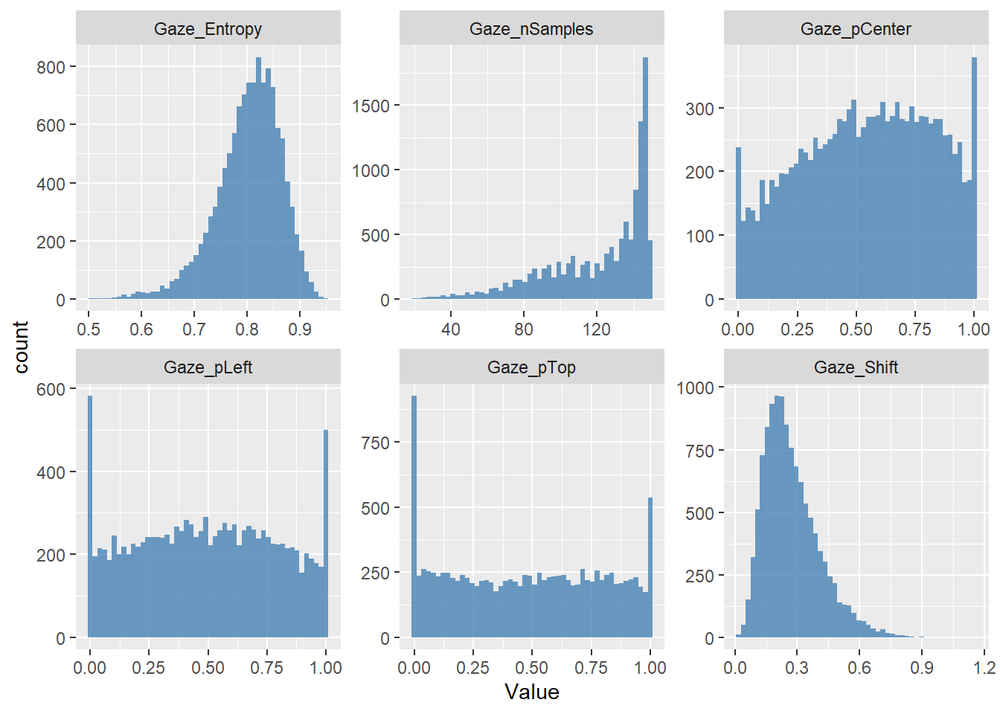{width=672}
:::

```{.r .cell-code}
correlation(df_final, redundant = TRUE) |> 
  cor_sort() |> 
  summary() |> 
  plot()
```

::: {.cell-output-display}
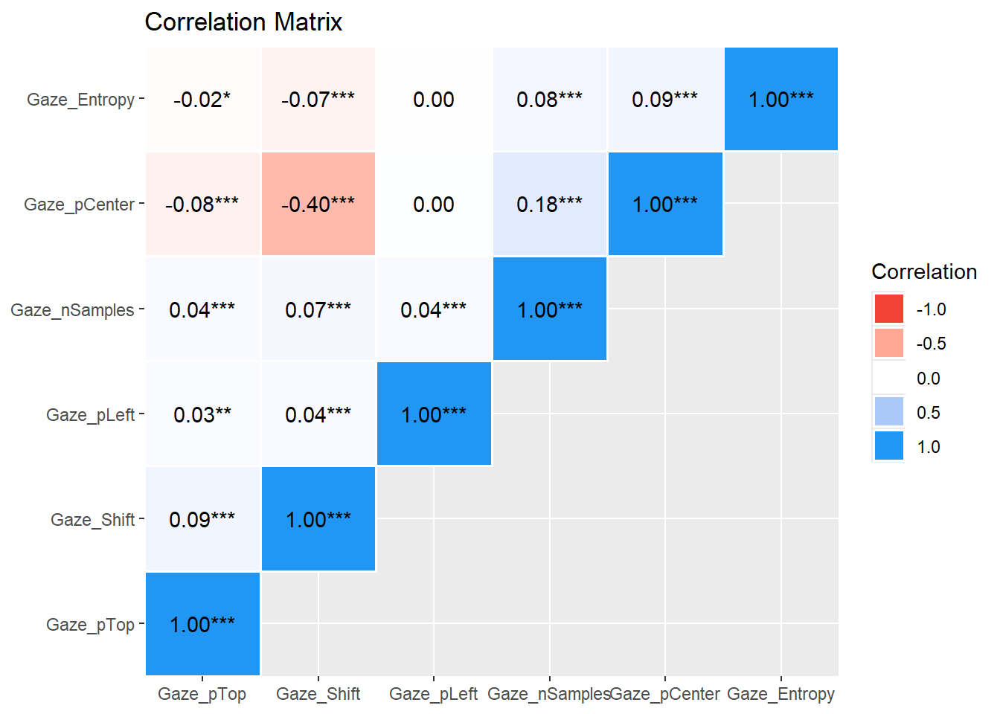{width=672}
:::
:::


::: {.cell}

```{.r .cell-code}
dftask <- read.csv("../data/data_task.csv") |> 
  mutate(Condition = fct_relevel(Condition, "Human Original", "Human Forgery", "AI-Generated"),
         Emotion = fct_relevel(Emotion, "Positive - Low intensity", "Negative - Low intensity", "Positive - High intensity", "Negative - High intensity")) 
# Standardize the gaze features so that coefficients are expressed per SD of the
# feature. Outcomes are left on their native 0-1 scale, so that a coefficient
# reads as a proportion of the outcome's scale range (x 100 = % of scale range,
# the same unit used to report the main results).
dftask <- dplyr::left_join(df_final, dftask, by = c("Participant", "Item")) |> 
  datawizard::standardize(select = c("Gaze_Entropy", "Gaze_Shift", "Gaze_pLeft", 
                                     "Gaze_pCenter", "Gaze_nSamples"))

rez_cor <- data.frame()
for(outcome in c("Beauty", "Meaning", "Valence", "Worth", "Beauty2", "SelfRelevance", "Authenticity", "Reality")) {
  for(feature in c("Gaze_Entropy", "Gaze_Shift", "Gaze_pLeft", "Gaze_pCenter")) {
    f <- paste0(outcome, " ~ ", feature, " + Gaze_nSamples + (1|Participant) + (1|Item)")
    m <- glmmTMB::glmmTMB(as.formula(f), data = dftask) 
    param <- parameters::parameters(m, effects = "fixed")
    rez_cor <- rbind(rez_cor,
                     data.frame(Outcome = outcome, Feature = feature,
                                Coefficient = 100 * param$Coefficient[2],
                                CI_low = 100 * param$CI_low[2],
                                CI_high = 100 * param$CI_high[2],
                                p = param$p[2]))
  }
}

rez_cor |> 
  arrange(p) |> 
  format_table() |> 
  gt::gt() |> 
  gt::tab_header(
    "Sensitivity of the gaze features to the behavioural outcomes",
    subtitle = "Coefficients in % of the outcome's scale range, per SD of the gaze feature")
```

::: {.cell-output-display}

```{=html}
<div id="mmxhtkgbjs" style="padding-left:0px;padding-right:0px;padding-top:10px;padding-bottom:10px;overflow-x:auto;overflow-y:auto;width:auto;height:auto;">
<style>#mmxhtkgbjs table {
  font-family: system-ui, 'Segoe UI', Roboto, Helvetica, Arial, sans-serif, 'Apple Color Emoji', 'Segoe UI Emoji', 'Segoe UI Symbol', 'Noto Color Emoji';
  -webkit-font-smoothing: antialiased;
  -moz-osx-font-smoothing: grayscale;
}

#mmxhtkgbjs thead, #mmxhtkgbjs tbody, #mmxhtkgbjs tfoot, #mmxhtkgbjs tr, #mmxhtkgbjs td, #mmxhtkgbjs th {
  border-style: none;
}

#mmxhtkgbjs p {
  margin: 0;
  padding: 0;
}

#mmxhtkgbjs .gt_table {
  display: table;
  border-collapse: collapse;
  line-height: normal;
  margin-left: auto;
  margin-right: auto;
  color: #333333;
  font-size: 16px;
  font-weight: normal;
  font-style: normal;
  background-color: #FFFFFF;
  width: auto;
  border-top-style: solid;
  border-top-width: 2px;
  border-top-color: #A8A8A8;
  border-right-style: none;
  border-right-width: 2px;
  border-right-color: #D3D3D3;
  border-bottom-style: solid;
  border-bottom-width: 2px;
  border-bottom-color: #A8A8A8;
  border-left-style: none;
  border-left-width: 2px;
  border-left-color: #D3D3D3;
}

#mmxhtkgbjs .gt_caption {
  padding-top: 4px;
  padding-bottom: 4px;
}

#mmxhtkgbjs .gt_title {
  color: #333333;
  font-size: 125%;
  font-weight: initial;
  padding-top: 4px;
  padding-bottom: 4px;
  padding-left: 5px;
  padding-right: 5px;
  border-bottom-color: #FFFFFF;
  border-bottom-width: 0;
}

#mmxhtkgbjs .gt_subtitle {
  color: #333333;
  font-size: 85%;
  font-weight: initial;
  padding-top: 3px;
  padding-bottom: 5px;
  padding-left: 5px;
  padding-right: 5px;
  border-top-color: #FFFFFF;
  border-top-width: 0;
}

#mmxhtkgbjs .gt_heading {
  background-color: #FFFFFF;
  text-align: center;
  border-bottom-color: #FFFFFF;
  border-left-style: none;
  border-left-width: 1px;
  border-left-color: #D3D3D3;
  border-right-style: none;
  border-right-width: 1px;
  border-right-color: #D3D3D3;
}

#mmxhtkgbjs .gt_bottom_border {
  border-bottom-style: solid;
  border-bottom-width: 2px;
  border-bottom-color: #D3D3D3;
}

#mmxhtkgbjs .gt_col_headings {
  border-top-style: solid;
  border-top-width: 2px;
  border-top-color: #D3D3D3;
  border-bottom-style: solid;
  border-bottom-width: 2px;
  border-bottom-color: #D3D3D3;
  border-left-style: none;
  border-left-width: 1px;
  border-left-color: #D3D3D3;
  border-right-style: none;
  border-right-width: 1px;
  border-right-color: #D3D3D3;
}

#mmxhtkgbjs .gt_col_heading {
  color: #333333;
  background-color: #FFFFFF;
  font-size: 100%;
  font-weight: normal;
  text-transform: inherit;
  border-left-style: none;
  border-left-width: 1px;
  border-left-color: #D3D3D3;
  border-right-style: none;
  border-right-width: 1px;
  border-right-color: #D3D3D3;
  vertical-align: bottom;
  padding-top: 5px;
  padding-bottom: 6px;
  padding-left: 5px;
  padding-right: 5px;
  overflow-x: hidden;
}

#mmxhtkgbjs .gt_column_spanner_outer {
  color: #333333;
  background-color: #FFFFFF;
  font-size: 100%;
  font-weight: normal;
  text-transform: inherit;
  padding-top: 0;
  padding-bottom: 0;
  padding-left: 4px;
  padding-right: 4px;
}

#mmxhtkgbjs .gt_column_spanner_outer:first-child {
  padding-left: 0;
}

#mmxhtkgbjs .gt_column_spanner_outer:last-child {
  padding-right: 0;
}

#mmxhtkgbjs .gt_column_spanner {
  border-bottom-style: solid;
  border-bottom-width: 2px;
  border-bottom-color: #D3D3D3;
  vertical-align: bottom;
  padding-top: 5px;
  padding-bottom: 5px;
  overflow-x: hidden;
  display: inline-block;
  width: 100%;
}

#mmxhtkgbjs .gt_spanner_row {
  border-bottom-style: hidden;
}

#mmxhtkgbjs .gt_group_heading {
  padding-top: 8px;
  padding-bottom: 8px;
  padding-left: 5px;
  padding-right: 5px;
  color: #333333;
  background-color: #FFFFFF;
  font-size: 100%;
  font-weight: initial;
  text-transform: inherit;
  border-top-style: solid;
  border-top-width: 2px;
  border-top-color: #D3D3D3;
  border-bottom-style: solid;
  border-bottom-width: 2px;
  border-bottom-color: #D3D3D3;
  border-left-style: none;
  border-left-width: 1px;
  border-left-color: #D3D3D3;
  border-right-style: none;
  border-right-width: 1px;
  border-right-color: #D3D3D3;
  vertical-align: middle;
  text-align: left;
}

#mmxhtkgbjs .gt_empty_group_heading {
  padding: 0.5px;
  color: #333333;
  background-color: #FFFFFF;
  font-size: 100%;
  font-weight: initial;
  border-top-style: solid;
  border-top-width: 2px;
  border-top-color: #D3D3D3;
  border-bottom-style: solid;
  border-bottom-width: 2px;
  border-bottom-color: #D3D3D3;
  vertical-align: middle;
}

#mmxhtkgbjs .gt_from_md > :first-child {
  margin-top: 0;
}

#mmxhtkgbjs .gt_from_md > :last-child {
  margin-bottom: 0;
}

#mmxhtkgbjs .gt_row {
  padding-top: 8px;
  padding-bottom: 8px;
  padding-left: 5px;
  padding-right: 5px;
  margin: 10px;
  border-top-style: solid;
  border-top-width: 1px;
  border-top-color: #D3D3D3;
  border-left-style: none;
  border-left-width: 1px;
  border-left-color: #D3D3D3;
  border-right-style: none;
  border-right-width: 1px;
  border-right-color: #D3D3D3;
  vertical-align: middle;
  overflow-x: hidden;
}

#mmxhtkgbjs .gt_stub {
  color: #333333;
  background-color: #FFFFFF;
  font-size: 100%;
  font-weight: initial;
  text-transform: inherit;
  border-right-style: solid;
  border-right-width: 2px;
  border-right-color: #D3D3D3;
  padding-left: 5px;
  padding-right: 5px;
}

#mmxhtkgbjs .gt_stub_row_group {
  color: #333333;
  background-color: #FFFFFF;
  font-size: 100%;
  font-weight: initial;
  text-transform: inherit;
  border-right-style: solid;
  border-right-width: 2px;
  border-right-color: #D3D3D3;
  padding-left: 5px;
  padding-right: 5px;
  vertical-align: top;
}

#mmxhtkgbjs .gt_row_group_first td {
  border-top-width: 2px;
}

#mmxhtkgbjs .gt_row_group_first th {
  border-top-width: 2px;
}

#mmxhtkgbjs .gt_summary_row {
  color: #333333;
  background-color: #FFFFFF;
  text-transform: inherit;
  padding-top: 8px;
  padding-bottom: 8px;
  padding-left: 5px;
  padding-right: 5px;
}

#mmxhtkgbjs .gt_first_summary_row {
  border-top-style: solid;
  border-top-color: #D3D3D3;
}

#mmxhtkgbjs .gt_first_summary_row.thick {
  border-top-width: 2px;
}

#mmxhtkgbjs .gt_last_summary_row {
  padding-top: 8px;
  padding-bottom: 8px;
  padding-left: 5px;
  padding-right: 5px;
  border-bottom-style: solid;
  border-bottom-width: 2px;
  border-bottom-color: #D3D3D3;
}

#mmxhtkgbjs .gt_grand_summary_row {
  color: #333333;
  background-color: #FFFFFF;
  text-transform: inherit;
  padding-top: 8px;
  padding-bottom: 8px;
  padding-left: 5px;
  padding-right: 5px;
}

#mmxhtkgbjs .gt_first_grand_summary_row {
  padding-top: 8px;
  padding-bottom: 8px;
  padding-left: 5px;
  padding-right: 5px;
  border-top-style: double;
  border-top-width: 6px;
  border-top-color: #D3D3D3;
}

#mmxhtkgbjs .gt_last_grand_summary_row_top {
  padding-top: 8px;
  padding-bottom: 8px;
  padding-left: 5px;
  padding-right: 5px;
  border-bottom-style: double;
  border-bottom-width: 6px;
  border-bottom-color: #D3D3D3;
}

#mmxhtkgbjs .gt_striped {
  background-color: rgba(128, 128, 128, 0.05);
}

#mmxhtkgbjs .gt_table_body {
  border-top-style: solid;
  border-top-width: 2px;
  border-top-color: #D3D3D3;
  border-bottom-style: solid;
  border-bottom-width: 2px;
  border-bottom-color: #D3D3D3;
}

#mmxhtkgbjs .gt_footnotes {
  color: #333333;
  background-color: #FFFFFF;
  border-bottom-style: none;
  border-bottom-width: 2px;
  border-bottom-color: #D3D3D3;
  border-left-style: none;
  border-left-width: 2px;
  border-left-color: #D3D3D3;
  border-right-style: none;
  border-right-width: 2px;
  border-right-color: #D3D3D3;
}

#mmxhtkgbjs .gt_footnote {
  margin: 0px;
  font-size: 90%;
  padding-top: 4px;
  padding-bottom: 4px;
  padding-left: 5px;
  padding-right: 5px;
}

#mmxhtkgbjs .gt_sourcenotes {
  color: #333333;
  background-color: #FFFFFF;
  border-bottom-style: none;
  border-bottom-width: 2px;
  border-bottom-color: #D3D3D3;
  border-left-style: none;
  border-left-width: 2px;
  border-left-color: #D3D3D3;
  border-right-style: none;
  border-right-width: 2px;
  border-right-color: #D3D3D3;
}

#mmxhtkgbjs .gt_sourcenote {
  font-size: 90%;
  padding-top: 4px;
  padding-bottom: 4px;
  padding-left: 5px;
  padding-right: 5px;
}

#mmxhtkgbjs .gt_left {
  text-align: left;
}

#mmxhtkgbjs .gt_center {
  text-align: center;
}

#mmxhtkgbjs .gt_right {
  text-align: right;
  font-variant-numeric: tabular-nums;
}

#mmxhtkgbjs .gt_font_normal {
  font-weight: normal;
}

#mmxhtkgbjs .gt_font_bold {
  font-weight: bold;
}

#mmxhtkgbjs .gt_font_italic {
  font-style: italic;
}

#mmxhtkgbjs .gt_super {
  font-size: 65%;
}

#mmxhtkgbjs .gt_footnote_marks {
  font-size: 75%;
  vertical-align: 0.4em;
  position: initial;
}

#mmxhtkgbjs .gt_asterisk {
  font-size: 100%;
  vertical-align: 0;
}

#mmxhtkgbjs .gt_indent_1 {
  text-indent: 5px;
}

#mmxhtkgbjs .gt_indent_2 {
  text-indent: 10px;
}

#mmxhtkgbjs .gt_indent_3 {
  text-indent: 15px;
}

#mmxhtkgbjs .gt_indent_4 {
  text-indent: 20px;
}

#mmxhtkgbjs .gt_indent_5 {
  text-indent: 25px;
}

#mmxhtkgbjs .katex-display {
  display: inline-flex !important;
  margin-bottom: 0.75em !important;
}

#mmxhtkgbjs div.Reactable > div.rt-table > div.rt-thead > div.rt-tr.rt-tr-group-header > div.rt-th-group:after {
  height: 0px !important;
}
</style>
<table class="gt_table" data-quarto-disable-processing="false" data-quarto-bootstrap="false">
  <thead>
    <tr class="gt_heading">
      <td colspan="5" class="gt_heading gt_title gt_font_normal" style>Sensitivity of the gaze features to the behavioural outcomes</td>
    </tr>
    <tr class="gt_heading">
      <td colspan="5" class="gt_heading gt_subtitle gt_font_normal gt_bottom_border" style>Coefficients in % of the outcome's scale range, per SD of the gaze feature</td>
    </tr>
    <tr class="gt_col_headings">
      <th class="gt_col_heading gt_columns_bottom_border gt_left" rowspan="1" colspan="1" scope="col" id="Outcome">Outcome</th>
      <th class="gt_col_heading gt_columns_bottom_border gt_left" rowspan="1" colspan="1" scope="col" id="Feature">Feature</th>
      <th class="gt_col_heading gt_columns_bottom_border gt_right" rowspan="1" colspan="1" scope="col" id="Coefficient">Coefficient</th>
      <th class="gt_col_heading gt_columns_bottom_border gt_left" rowspan="1" colspan="1" scope="col" id="CI">CI</th>
      <th class="gt_col_heading gt_columns_bottom_border gt_left" rowspan="1" colspan="1" scope="col" id="p">p</th>
    </tr>
  </thead>
  <tbody class="gt_table_body">
    <tr><td headers="Outcome" class="gt_row gt_left">SelfRelevance</td>
<td headers="Feature" class="gt_row gt_left">Gaze_pLeft</td>
<td headers="Coefficient" class="gt_row gt_right">1.11</td>
<td headers="CI" class="gt_row gt_left">[ 0.54,  1.68]</td>
<td headers="p" class="gt_row gt_left">&lt; .001</td></tr>
    <tr><td headers="Outcome" class="gt_row gt_left">Meaning</td>
<td headers="Feature" class="gt_row gt_left">Gaze_Entropy</td>
<td headers="Coefficient" class="gt_row gt_right">0.73</td>
<td headers="CI" class="gt_row gt_left">[ 0.31,  1.15]</td>
<td headers="p" class="gt_row gt_left">&lt; .001</td></tr>
    <tr><td headers="Outcome" class="gt_row gt_left">Beauty</td>
<td headers="Feature" class="gt_row gt_left">Gaze_Entropy</td>
<td headers="Coefficient" class="gt_row gt_right">0.57</td>
<td headers="CI" class="gt_row gt_left">[ 0.23,  0.92]</td>
<td headers="p" class="gt_row gt_left">0.001 </td></tr>
    <tr><td headers="Outcome" class="gt_row gt_left">SelfRelevance</td>
<td headers="Feature" class="gt_row gt_left">Gaze_Entropy</td>
<td headers="Coefficient" class="gt_row gt_right">0.60</td>
<td headers="CI" class="gt_row gt_left">[ 0.12,  1.09]</td>
<td headers="p" class="gt_row gt_left">0.014 </td></tr>
    <tr><td headers="Outcome" class="gt_row gt_left">Beauty2</td>
<td headers="Feature" class="gt_row gt_left">Gaze_pLeft</td>
<td headers="Coefficient" class="gt_row gt_right">0.62</td>
<td headers="CI" class="gt_row gt_left">[ 0.11,  1.13]</td>
<td headers="p" class="gt_row gt_left">0.017 </td></tr>
    <tr><td headers="Outcome" class="gt_row gt_left">Worth</td>
<td headers="Feature" class="gt_row gt_left">Gaze_Entropy</td>
<td headers="Coefficient" class="gt_row gt_right">0.42</td>
<td headers="CI" class="gt_row gt_left">[ 0.07,  0.76]</td>
<td headers="p" class="gt_row gt_left">0.019 </td></tr>
    <tr><td headers="Outcome" class="gt_row gt_left">Authenticity</td>
<td headers="Feature" class="gt_row gt_left">Gaze_Shift</td>
<td headers="Coefficient" class="gt_row gt_right">-0.66</td>
<td headers="CI" class="gt_row gt_left">[-1.22, -0.10]</td>
<td headers="p" class="gt_row gt_left">0.022 </td></tr>
    <tr><td headers="Outcome" class="gt_row gt_left">Authenticity</td>
<td headers="Feature" class="gt_row gt_left">Gaze_Entropy</td>
<td headers="Coefficient" class="gt_row gt_right">0.63</td>
<td headers="CI" class="gt_row gt_left">[ 0.08,  1.18]</td>
<td headers="p" class="gt_row gt_left">0.025 </td></tr>
    <tr><td headers="Outcome" class="gt_row gt_left">Worth</td>
<td headers="Feature" class="gt_row gt_left">Gaze_Shift</td>
<td headers="Coefficient" class="gt_row gt_right">-0.40</td>
<td headers="CI" class="gt_row gt_left">[-0.75, -0.04]</td>
<td headers="p" class="gt_row gt_left">0.029 </td></tr>
    <tr><td headers="Outcome" class="gt_row gt_left">Reality</td>
<td headers="Feature" class="gt_row gt_left">Gaze_pCenter</td>
<td headers="Coefficient" class="gt_row gt_right">-0.66</td>
<td headers="CI" class="gt_row gt_left">[-1.26, -0.07]</td>
<td headers="p" class="gt_row gt_left">0.029 </td></tr>
    <tr><td headers="Outcome" class="gt_row gt_left">Valence</td>
<td headers="Feature" class="gt_row gt_left">Gaze_Shift</td>
<td headers="Coefficient" class="gt_row gt_right">-0.41</td>
<td headers="CI" class="gt_row gt_left">[-0.78, -0.03]</td>
<td headers="p" class="gt_row gt_left">0.032 </td></tr>
    <tr><td headers="Outcome" class="gt_row gt_left">Valence</td>
<td headers="Feature" class="gt_row gt_left">Gaze_Entropy</td>
<td headers="Coefficient" class="gt_row gt_right">0.38</td>
<td headers="CI" class="gt_row gt_left">[ 0.01,  0.74]</td>
<td headers="p" class="gt_row gt_left">0.043 </td></tr>
    <tr><td headers="Outcome" class="gt_row gt_left">Meaning</td>
<td headers="Feature" class="gt_row gt_left">Gaze_Shift</td>
<td headers="Coefficient" class="gt_row gt_right">-0.38</td>
<td headers="CI" class="gt_row gt_left">[-0.81,  0.05]</td>
<td headers="p" class="gt_row gt_left">0.082 </td></tr>
    <tr><td headers="Outcome" class="gt_row gt_left">Beauty</td>
<td headers="Feature" class="gt_row gt_left">Gaze_pLeft</td>
<td headers="Coefficient" class="gt_row gt_right">0.29</td>
<td headers="CI" class="gt_row gt_left">[-0.11,  0.69]</td>
<td headers="p" class="gt_row gt_left">0.157 </td></tr>
    <tr><td headers="Outcome" class="gt_row gt_left">Authenticity</td>
<td headers="Feature" class="gt_row gt_left">Gaze_pLeft</td>
<td headers="Coefficient" class="gt_row gt_right">-0.40</td>
<td headers="CI" class="gt_row gt_left">[-1.03,  0.22]</td>
<td headers="p" class="gt_row gt_left">0.205 </td></tr>
    <tr><td headers="Outcome" class="gt_row gt_left">Worth</td>
<td headers="Feature" class="gt_row gt_left">Gaze_pCenter</td>
<td headers="Coefficient" class="gt_row gt_right">-0.20</td>
<td headers="CI" class="gt_row gt_left">[-0.56,  0.17]</td>
<td headers="p" class="gt_row gt_left">0.294 </td></tr>
    <tr><td headers="Outcome" class="gt_row gt_left">Beauty</td>
<td headers="Feature" class="gt_row gt_left">Gaze_Shift</td>
<td headers="Coefficient" class="gt_row gt_right">-0.19</td>
<td headers="CI" class="gt_row gt_left">[-0.54,  0.17]</td>
<td headers="p" class="gt_row gt_left">0.299 </td></tr>
    <tr><td headers="Outcome" class="gt_row gt_left">Beauty2</td>
<td headers="Feature" class="gt_row gt_left">Gaze_Entropy</td>
<td headers="Coefficient" class="gt_row gt_right">0.23</td>
<td headers="CI" class="gt_row gt_left">[-0.21,  0.66]</td>
<td headers="p" class="gt_row gt_left">0.303 </td></tr>
    <tr><td headers="Outcome" class="gt_row gt_left">SelfRelevance</td>
<td headers="Feature" class="gt_row gt_left">Gaze_Shift</td>
<td headers="Coefficient" class="gt_row gt_right">-0.16</td>
<td headers="CI" class="gt_row gt_left">[-0.66,  0.33]</td>
<td headers="p" class="gt_row gt_left">0.518 </td></tr>
    <tr><td headers="Outcome" class="gt_row gt_left">Reality</td>
<td headers="Feature" class="gt_row gt_left">Gaze_Entropy</td>
<td headers="Coefficient" class="gt_row gt_right">0.16</td>
<td headers="CI" class="gt_row gt_left">[-0.41,  0.73]</td>
<td headers="p" class="gt_row gt_left">0.584 </td></tr>
    <tr><td headers="Outcome" class="gt_row gt_left">Valence</td>
<td headers="Feature" class="gt_row gt_left">Gaze_pCenter</td>
<td headers="Coefficient" class="gt_row gt_right">-0.09</td>
<td headers="CI" class="gt_row gt_left">[-0.47,  0.30]</td>
<td headers="p" class="gt_row gt_left">0.655 </td></tr>
    <tr><td headers="Outcome" class="gt_row gt_left">Reality</td>
<td headers="Feature" class="gt_row gt_left">Gaze_Shift</td>
<td headers="Coefficient" class="gt_row gt_right">0.09</td>
<td headers="CI" class="gt_row gt_left">[-0.49,  0.67]</td>
<td headers="p" class="gt_row gt_left">0.761 </td></tr>
    <tr><td headers="Outcome" class="gt_row gt_left">Authenticity</td>
<td headers="Feature" class="gt_row gt_left">Gaze_pCenter</td>
<td headers="Coefficient" class="gt_row gt_right">0.08</td>
<td headers="CI" class="gt_row gt_left">[-0.49,  0.66]</td>
<td headers="p" class="gt_row gt_left">0.774 </td></tr>
    <tr><td headers="Outcome" class="gt_row gt_left">Beauty</td>
<td headers="Feature" class="gt_row gt_left">Gaze_pCenter</td>
<td headers="Coefficient" class="gt_row gt_right">-0.05</td>
<td headers="CI" class="gt_row gt_left">[-0.41,  0.32]</td>
<td headers="p" class="gt_row gt_left">0.807 </td></tr>
    <tr><td headers="Outcome" class="gt_row gt_left">Worth</td>
<td headers="Feature" class="gt_row gt_left">Gaze_pLeft</td>
<td headers="Coefficient" class="gt_row gt_right">-0.05</td>
<td headers="CI" class="gt_row gt_left">[-0.46,  0.36]</td>
<td headers="p" class="gt_row gt_left">0.813 </td></tr>
    <tr><td headers="Outcome" class="gt_row gt_left">Beauty2</td>
<td headers="Feature" class="gt_row gt_left">Gaze_Shift</td>
<td headers="Coefficient" class="gt_row gt_right">-0.04</td>
<td headers="CI" class="gt_row gt_left">[-0.48,  0.40]</td>
<td headers="p" class="gt_row gt_left">0.865 </td></tr>
    <tr><td headers="Outcome" class="gt_row gt_left">SelfRelevance</td>
<td headers="Feature" class="gt_row gt_left">Gaze_pCenter</td>
<td headers="Coefficient" class="gt_row gt_right">0.04</td>
<td headers="CI" class="gt_row gt_left">[-0.46,  0.55]</td>
<td headers="p" class="gt_row gt_left">0.869 </td></tr>
    <tr><td headers="Outcome" class="gt_row gt_left">Beauty2</td>
<td headers="Feature" class="gt_row gt_left">Gaze_pCenter</td>
<td headers="Coefficient" class="gt_row gt_right">0.03</td>
<td headers="CI" class="gt_row gt_left">[-0.42,  0.49]</td>
<td headers="p" class="gt_row gt_left">0.886 </td></tr>
    <tr><td headers="Outcome" class="gt_row gt_left">Meaning</td>
<td headers="Feature" class="gt_row gt_left">Gaze_pCenter</td>
<td headers="Coefficient" class="gt_row gt_right">0.03</td>
<td headers="CI" class="gt_row gt_left">[-0.42,  0.47]</td>
<td headers="p" class="gt_row gt_left">0.901 </td></tr>
    <tr><td headers="Outcome" class="gt_row gt_left">Reality</td>
<td headers="Feature" class="gt_row gt_left">Gaze_pLeft</td>
<td headers="Coefficient" class="gt_row gt_right">0.02</td>
<td headers="CI" class="gt_row gt_left">[-0.62,  0.66]</td>
<td headers="p" class="gt_row gt_left">0.948 </td></tr>
    <tr><td headers="Outcome" class="gt_row gt_left">Valence</td>
<td headers="Feature" class="gt_row gt_left">Gaze_pLeft</td>
<td headers="Coefficient" class="gt_row gt_right">-0.01</td>
<td headers="CI" class="gt_row gt_left">[-0.44,  0.41]</td>
<td headers="p" class="gt_row gt_left">0.953 </td></tr>
    <tr><td headers="Outcome" class="gt_row gt_left">Meaning</td>
<td headers="Feature" class="gt_row gt_left">Gaze_pLeft</td>
<td headers="Coefficient" class="gt_row gt_right">0.01</td>
<td headers="CI" class="gt_row gt_left">[-0.48,  0.51]</td>
<td headers="p" class="gt_row gt_left">0.961 </td></tr>
  </tbody>
  
</table>
</div>
```

:::

```{.r .cell-code}
# rez <- data.frame()
# for(feature in names(select(df_final, -Participant, -Item))) {
#   f <- paste0(feature, " ~ Condition + (1|Participant) + (1|Item)")
#   m <- glmmTMB::glmmTMB(as.formula(f), data = dftask) 
#   rez <- rbind(rez, parameters::parameters(m, effects = "fixed") |> 
#                      mutate(Feature = feature))
# }
# 
# rez |> 
#   arrange(p) |> 
#   format_table() |> 
#   gt::gt()
```
:::


### Visualization


::: {.cell}

```{.r .cell-code}
# high_quality_ppts <- unique(arrange(df_ppt, desc(Value))$Participant[1:20])

# df |> 
#   filter(Stimulus == "Fixation", 
#          # Participant %in% c(high_quality_ppts),
#          !is.na(z_x), !is.na(z_y)) |>
#   filter(Stimulus == "Fixation") |>
#   ggplot(aes(x = z_x, y = z_y)) +
#   geom_vline(xintercept = 0, linetype = "dashed", color = "black", linewidth = 0.8) +
#   geom_hline(yintercept = 0, linetype = "dashed", color = "black", linewidth = 0.8) +
#   geom_point(aes(color=Participant), alpha = 0.2, shape = 4) +
#   stat_ellipse(aes(color=Participant)) +
#   scale_y_reverse() +
#   guides(color = "none") +
#   coord_fixed() +
#   theme_minimal()
```
:::


::: {.cell}

```{.r .cell-code}
# item_names <- unique(df$Item)[1:9]
# plot_margin <- 0.05
# 
# # ── helper ────────────────────────────────────────────────────────────────────
# make_gaze_plot <- function(item_name) {
#   
#   stim_img  <- image_read(paste0("../experiment/stimuli/stimuli/", item_name))
#   img_ratio <- image_info(stim_img)$height / image_info(stim_img)$width
#   
#   df_agg <- df |>
#     filter(Item == item_name,
#            # Participant %in% high_quality_ppts,
#            Stimulus != "Fixation",
#            !is.na(z_x_stim), !is.na(z_y_stim))
#   
#   if (nrow(df_agg) == 0) return(NULL)
#   
#   box_ratio <- mean(df_agg$Stimulus_height / df_agg$Stimulus_width, na.rm = TRUE)
#   
#   if (img_ratio > box_ratio) {
#     draw_height <- box_ratio
#     draw_width  <- box_ratio / img_ratio
#   } else {
#     draw_width  <- 1.0
#     draw_height <- img_ratio
#   }
#   
#   draw_xmin <- -draw_width  / 2;  draw_xmax <- draw_width  / 2
#   draw_ymin <- -draw_height / 2;  draw_ymax <- draw_height / 2
#   
#   ggplot(df_agg, aes(x = z_x_stim, y = z_y_stim)) +
#     annotation_raster(stim_img,
#                       xmin = draw_xmin, xmax = draw_xmax,
#                       ymin = draw_ymin, ymax = draw_ymax) +
#     stat_density_2d(aes(fill = after_stat(level)),
#                     geom = "polygon", alpha = 0.1, bins = 20, n = 200, adjust = 0.5) +
#     scale_fill_viridis_c(option = "inferno", guide = "none") +
#     # geom_point(aes(color = Participant), alpha = 0.05, shape = 4) +
#     scale_y_reverse() +
#     guides(color = "none") +
#     coord_fixed(
#       xlim = c(draw_xmin - plot_margin, draw_xmax + plot_margin),
#       ylim = c(draw_ymin - plot_margin, draw_ymax + plot_margin),
#       expand = FALSE
#     ) +
#     theme_void() +
#     labs(title = item_name)
# }
# 
# # ── assemble ──────────────────────────────────────────────────────────────────
# plots <- lapply(item_names, make_gaze_plot) |> Filter(Negate(is.null), x = _)
# 
# wrap_plots(plots, ncol = 3)   # adjust ncol to taste
```
:::


::: {.cell}

```{.r .cell-code}
feature_meta <- tribble(
  ~col,              ~label,           ~lo_desc,                   ~hi_desc,
 
  # "gini_kde",        "Gaze Gini",      "Flat / diffuse density",   "Peaked / concentrated",
  # "drift_magnitude", "Gaze Drift",     "Spatially stable",         "Systematic drift",
  # "hull_area",       "Gaze Hull",      "Compact scanpath",         "Wide exploration",
  "prop_left",       "P(Left)",     "Right-biased gaze",        "Left-biased gaze",
  "prop_center",     "P(Center)",   "Peripheral gaze",          "Centre-biased gaze",
  # "prop_top",        "P(Top)",      "Bottom-biased gaze",       "Top-biased gaze",
  "entropy20",       "Entropy",   "Structured / clustered",   "Uniform scatter",
  "max_shift30",       "Max. Shift",   "Continuous",   "Switching"
)

img_dir <- "../experiment/stimuli/stimuli/"

# ── Item selector ─────────────────────────────────────────────────────────────
# `excluded` accumulates across features so each gets a distinct stimulus.
find_best_item <- function(feature_col, excluded = c(), min_n_each = 5) {
  items_ranked <- df_features |>
    count(Item, sort = TRUE) |>
    filter(!Item %in% excluded) |>
    pull(Item)
  for (item in items_ranked) {
    vals <- df_features |>
      filter(Item == item) |>
      pull(!!sym(feature_col)) |>
      na.omit()
    if (length(vals) < min_n_each * 2)                        next
    if (IQR(vals) < 1e-6)                                     next
    if (sum(vals <= quantile(vals, .25)) >= min_n_each &&
        sum(vals >= quantile(vals, .75)) >= min_n_each) return(item)
  }
  NA_character_
}

# Pre-assign one distinct item per feature before rendering anything
used_items <- c("11126.jpg")
assigned   <- character(nrow(feature_meta))
for (i in seq_len(nrow(feature_meta))) {
  it          <- find_best_item(feature_meta$col[i], excluded = used_items)
  assigned[i] <- it
  if (!is.na(it)) used_items <- c(used_items, it)
}
feature_meta$item <- assigned

# ── Contrast figure ───────────────────────────────────────────────────────────
make_contrast <- function(col, label, lo_desc, hi_desc, item) {

  if (is.na(item)) { message("No suitable item for: ", col); return(NULL) }

  feat <- df_features |>
    filter(Item == item) |>
    select(Participant, val = !!sym(col)) |>
    filter(!is.na(val))

  ppts_lo <- feat |> filter(val <= quantile(val, .25)) |> pull(Participant)
  ppts_hi <- feat |> filter(val >= quantile(val, .75)) |> pull(Participant)

  gaze_lo <- df |> filter(Item == item, Participant %in% ppts_lo, Stimulus == "Image")
  gaze_hi <- df |> filter(Item == item, Participant %in% ppts_hi, Stimulus == "Image")
  if (nrow(gaze_lo) < 10 || nrow(gaze_hi) < 10) return(NULL)

  stim_img <- tryCatch(image_read(file.path(img_dir, item)), error = function(e) NULL)

  # ── Letterbox-aware bounds ─────────────────────────────────────────────────
  # Use ALL retained gaze for this item so both panels share identical bounds,
  # regardless of any display-size variation between participant subgroups.
  all_gaze <- df |> filter(Item == item, Stimulus == "Image")

  bounds <- if (!is.null(stim_img)) {
    ir <- image_info(stim_img)$height / image_info(stim_img)$width
    br <- mean(all_gaze$Stimulus_height / all_gaze$Stimulus_width, na.rm = TRUE)
    if (!is.finite(br)) br <- ir
    # ir > br : image taller than container → pillarboxed (bars on sides)
    # ir ≤ br : image wider  than container → letterboxed (bars top/bottom)
    if (ir > br) {
      list(xmin = -(br/ir)/2, xmax = (br/ir)/2, ymin = -br/2, ymax = br/2)
    } else {
      list(xmin = -0.5, xmax = 0.5, ymin = -ir/2, ymax = ir/2)
    }
  } else {
    list(xmin = -0.5, xmax = 0.5, ymin = -0.3, ymax = 0.3)
  }

  pad    <- 0
  xlim_p <- c(bounds$xmin - pad, bounds$xmax + pad)
  ylim_p <- c(bounds$ymin - pad, bounds$ymax + pad)

  # ── Single panel ─────────────────────────────────────────────────────────
  one_panel <- function(gaze_df, title_str, subtitle_str) {
    p <- ggplot(gaze_df, aes(x = z_x_stim, y = z_y_stim))

    if (!is.null(stim_img))
      p <- p + annotation_raster(stim_img,
                                  xmin = bounds$xmin, xmax = bounds$xmax,
                                  ymin = bounds$ymin, ymax = bounds$ymax)
    p +
      stat_density_2d(aes(fill = after_stat(level)),
                      geom  = "polygon", alpha = 0.25,
                      bins  = 10, n = 150, adjust = 0.6) +
      scale_fill_viridis_c(option = "magma", guide = "none") +
      scale_y_reverse() +
      coord_fixed(xlim = xlim_p, ylim = ylim_p, expand = FALSE) +
      theme_void() +
      labs(title = title_str, subtitle = subtitle_str) +
      theme(
        plot.title    = element_text(face = "bold", hjust = 0.5, size = 10),
        plot.subtitle = element_text(hjust = 0.5, size = 8, color = "gray40"),
        plot.margin   = ggplot2::margin(4, 8, 4, 8)
      )
  }

  wrap_elements((one_panel(gaze_lo, "Low",  lo_desc) |
   one_panel(gaze_hi, "High", hi_desc)) +
    plot_annotation(
      title = label,
      theme = theme(
        plot.title = element_text(face = "bold", size = 13, hjust = 0.5)
      )
    ))
}

# ── Render ────────────────────────────────────────────────────────────────────
contrast_plots <- purrr::pmap(feature_meta, make_contrast) |>
  Filter(Negate(is.null), x = _)

wrap_plots(contrast_plots, ncol = 2)
```

::: {.cell-output-display}
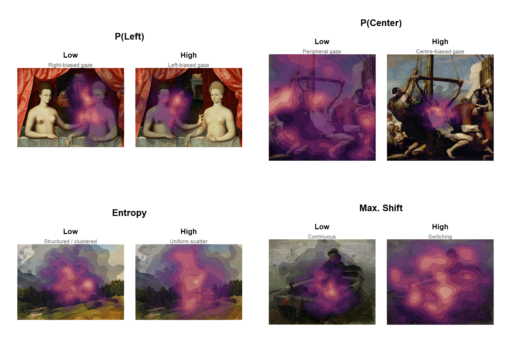{width=960}
:::
:::


