<!-- Estimates are computed on the cluster (`./hpc extract`, see server/estimates.R) and read from models/estimates/. -->

## Data Preparation


::: {.cell}

```{.r .cell-code}
library(tidyverse)
library(easystats)
library(patchwork)

df <- read.csv("../data/data_participants.csv")
dftask <- read.csv("../data/data_task.csv") |>
  merge(read.csv("../data/data_eyetracking.csv"), all.x = TRUE) |>
  mutate(Condition = fct_relevel(Condition, "Human Original", "Human Forgery", "AI-Generated"),
         Emotion = fct_relevel(Emotion, "Positive - Low intensity", "Negative - Low intensity", "Positive - High intensity", "Negative - High intensity"),
         Meaning = Meaning * 6,
         Valence = Valence * 6 + 1,
         Worth = factor(Worth * 6, ordered = TRUE),
         SelfRelevance = SelfRelevance * 6)
levels(dftask$Worth) <- c("0", "10", "100", "1000", "10000", "100000")

cols <- c(
  # Condition
  "Human Original" = "#F51D56",
  "Human Forgery" = "#F5A41D",
  "AI-Generated" = "#1D9AF5",
  "AI Original" = "#1D9AF5",
  "AI Copy" = "#4CAF50",
  "Not recognized" = "#607D8B")

source("server/estimates.R") # outcome_info, prep_contrasts()
source("report.R")           # make_asis(), make_tables(), make_markdown(), read_estimates()

estimates <- read_estimates(names(outcome_info))
provenance_table(estimates)
```

::: {.cell-output-display}


Table: Provenance of the estimates read by this report.

|Model         |Fit               | Draws| Max_Rhat|Extracted        |
|:-------------|:-----------------|-----:|--------:|:----------------|
|Beauty        |Beauty.rds        |  4000|    1.068|2026-09-22 19:58 |
|Beauty2       |Beauty2.rds       |  4000|    1.088|2026-09-22 19:57 |
|Reality       |Reality.rds       |  4000|    1.071|2026-09-22 19:57 |
|Authenticity  |Authenticity.rds  |  4000|    1.065|2026-09-22 19:57 |
|Artificiality |Artificiality.rds |  4000|    1.038|2026-09-22 19:57 |
|Valence       |Valence.rds       |  4000|    1.039|2026-09-22 19:57 |
|Meaning       |Meaning.rds       |  4000|    1.041|2026-09-22 19:57 |
|Worth         |Worth.rds         |  4000|    1.037|2026-09-22 20:31 |
|SelfRelevance |SelfRelevance.rds |  4000|    1.085|2026-09-22 20:32 |
|Entropy       |Entropy.rds       |  4000|    1.021|2026-09-22 19:57 |
|pLeft         |pLeft.rds         |  4000|    1.058|2026-09-22 19:57 |
|pCenter       |pCenter.rds       |  4000|    1.037|2026-09-22 19:57 |
|Shift         |Shift.rds         |  4000|    1.018|2026-09-22 19:57 |


:::
:::


## How to read this report

Each model is a Bayesian mixed model of one outcome on `Condition * Emotion`
(**Condition**: label shown before the artwork, all of which were human
originals; **Emotion**: normative valence x arousal quadrant), with
`(Condition * Emotion | Participant)` and `(Condition | Item)`.

Each section: model-implied distributions (figures), convergence, marginal
means per condition (response scale), all contrasts between conditions for
every distributional parameter (green = credibly positive, red = credibly
negative, grey = CI includes 0), the same within each emotion quadrant, and an
auto-generated summary. Every table has a folded Markdown twin; the Summary
section writes `data/results_contrasts.csv` and `data/results_means.csv`.

Contrasts (`Level1 - Level2`) are posterior medians with 95% CI and probability
of direction (`pd`). "Credible" = CI excludes 0 (no multiplicity correction).

**Units.** Differences on a bounded scale are in **% of the scale range**: 0-1
sliders and gaze proportions, probabilities (`mu`, `confright`, `confleft`,
`pex`, `bex`, `pmid`, `pzero`, `zoi`, `coi`, ordinal categories) x 100;
Valence and Meaning `response` / 6 x 100. Unbounded parameters (`phi`,
`precright`, `precleft`, `sigma`, `disc`, Shift in stimulus widths) are
marked `raw`. The CSVs carry both.


::: {.cell}

```{.r .cell-code  code-summary="Reporting helpers (tables, prose, plots)"}
# get_*() returns data, make_*() returns output.

param_glossary <- c(
  response = "expected value on the response scale",
  mu = "CHOCO: probability of choosing the upper half of the scale (logit link). Discrete Beta / Beta: mean of the latent Beta",
  confright = "CHOCO: mean confidence (position within the upper half) when the upper half is chosen",
  confleft = "CHOCO: mean confidence within the lower half when the lower half is chosen",
  precright = "CHOCO: precision (inverse spread) of ratings within the upper half",
  precleft = "CHOCO: precision of ratings within the lower half",
  pex = "CHOCO: probability of an extreme response (exactly 0 or 1)",
  bex = "CHOCO: balance of the extreme mass towards 1 (> 0.5) or 0 (< 0.5)",
  pmid = "CHOCO: probability of answering exactly at the midpoint",
  phi = "precision of the latent Beta (higher = more agreement / less dispersion)",
  pzero = "probability of the hurdle category 0",
  sigma = "LogNormal: scale (spread) parameter on the log scale",
  zoi = "probability of an exact 0 or 1", coi = "conditional probability that an extreme is 1 rather than 0",
  disc = "ordinal discrimination"
)

# Generated summary of the credible effects
make_summary <- function(dat, dat_emo, outcome) {
  info <- outcome_info[[outcome]]
  main_pars <- c("response", "mu")
  out <- c(sprintf("**%s** (%s). Scale: %s. Differences are posterior medians with 95%% CI, in %% of the scale range for bounded parameters and on the parameter's own scale for those marked `raw`; `pd` is the probability of direction. An effect is called credible when the CI excludes 0.", info$label, info$family, info$scale), "")
  for (con in levels(dat$Contrast)) {
    d <- dat[dat$Contrast == con, ]
    if (nrow(d) == 0) next
    cred <- d[d$Credible, ]
    if (nrow(cred) == 0) {
      out <- c(out, sprintf("- **%s**: no credible difference on any parameter (%s).", con, paste(unique(d$Parameter), collapse = ", ")))
      next
    }
    cred <- cred[order(!cred$Parameter %in% main_pars & !grepl("^response", cred$Parameter), cred$Parameter), ]
    up <- cred[cred$Difference > 0, ]; down <- cred[cred$Difference < 0, ]
    fmt <- function(x) paste(sprintf("`%s` %s%s %s", x$Parameter, x$Diff, ifelse(x$Unit == "%", "%", ""), x$CI), collapse = "; ")
    parts <- c(if (nrow(down)) sprintf("lower %s", fmt(down)), if (nrow(up)) sprintf("higher %s", fmt(up)))
    ns <- setdiff(unique(d$Parameter), cred$Parameter)
    out <- c(out, sprintf("- **%s**: %s.%s", con, paste(parts, collapse = "; "),
                          if (length(ns)) sprintf(" No credible difference on %s.", paste0("`", ns, "`", collapse = ", ")) else ""))
  }
  if (!is.null(dat_emo) && nrow(dat_emo) > 0 && "Emotion" %in% names(dat_emo)) {
    out <- c(out, "", "By stimulus emotion (same contrasts within each valence x arousal quadrant, main parameter only):")
    for (con in levels(dat$Contrast)) {
      d <- dat_emo[dat_emo$Contrast == con & (dat_emo$Parameter %in% main_pars | grepl("^response", dat_emo$Parameter)), ]
      if (nrow(d) == 0) next
      d <- d[d$Parameter == d$Parameter[1], ] # first main parameter available
      cred <- d[d$Credible, ]
      out <- c(out, sprintf("- **%s** on `%s`: credible in %s%s.", con, d$Parameter[1],
                            if (nrow(cred)) paste(sprintf("%s (%s%s %s)", cred$Emotion, cred$Diff, ifelse(cred$Unit == "%", "%", ""), cred$CI), collapse = ", ") else "no quadrant",
                            if (nrow(cred) && nrow(cred) < nrow(d)) sprintf("; not in %s", paste(setdiff(d$Emotion, cred$Emotion), collapse = ", ")) else ""))
    }
  }
  make_asis("", '::: {.callout-tip title="Summary of credible effects (generated from the tables above)"}', "", out, "", ":::", "")
}

# One model section's tables and summary. prep_contrasts() is re-run locally
# so scaling/labelling changes need no re-extraction.
make_report <- function(est) {
  rep <- est$report
  info <- outcome_info[[rep$outcome]]
  dat <- prep_contrasts(rep$contrasts, rep$outcome)
  dat_emo <- prep_contrasts(rep$contrasts_emo, rep$outcome)
  extra <- if (!is.null(rep$contrasts_extra)) prep_contrasts(rep$contrasts_extra, rep$outcome) else NULL
  means_fmt <- rep$means
  num <- vapply(means_fmt, is.numeric, logical(1))
  means_fmt[num] <- lapply(means_fmt[num], insight::format_value, zap_small = TRUE)
  cols <- c("Contrast", "Parameter", "Diff", "CI", "Unit", "pd_fmt", "Effect")
  # Digest of credible parameters per contrast, then the full tables
  credible <- list(est$contrasts_credible, est$contrasts_extra_credible)
  credible <- credible[!vapply(credible, is.null, logical(1))]
  make_asis(
    vapply(credible, function(x) as.character(knitr::knit_print(gt::gt(x))), ""),
    "",
    make_tables(rep$diag, c("Model", "Family", "N_obs", "N_participants", "Chains", "Draws", "Max_Rhat", "Min_ESS_ratio", "Divergent_pct", "Criterion"),
                sprintf("%s: convergence", info$label)),
    make_tables(means_fmt, names(means_fmt),
                sprintf("%s: marginal means per label condition (response scale)", info$label)),
    make_tables(dat, cols, sprintf("%s: all contrasts between label conditions", info$label)),
    if (!is.null(extra)) make_tables(extra, cols, sprintf("%s: %s", info$label, rep$extra_title)) else "",
    # Markdown only (36-72 rows)
    make_markdown(dat_emo[c("Emotion", cols)],
                  sprintf("%s: contrasts within each stimulus emotion", info$label)),
    make_summary(dat, dat_emo, rep$outcome)
  )
}


# Figures -------------------------------------------------------------------

# CHOCO density per condition from the marginal parameters (est$marginal).
# `adjust` scales the curve to match the histogram.
get_marginal_densities <- function(dat_par, adjust = 2) {
  dat_dens <- data.frame()
  dat_annot <- data.frame()
  for (row in 1:nrow(dat_par)) {
    x <- seq(0, 1, length.out = 201)
    y <- cogmod::dcogmod_choco(
      x = x, p = dat_par$Mu[row], confleft = dat_par$Confleft[row], confright = dat_par$Confright[row],
      precleft = dat_par$Precleft[row], precright = dat_par$Precright[row],
      pmid = dat_par$Pmid[row], pex = dat_par$Pex[row], bex = dat_par$Bex[row]
    )
    y <- y * adjust
    dat_dens <- rbind(dat_dens, data.frame(Condition = dat_par$Condition[row], x = x, y = y))

    # Modes of each half, sized by the probability of that half
    dat_annot <- rbind(dat_annot, data.frame(
      Condition = dat_par$Condition[row],
      right_y = max(y[x > 0.5]), left_y = max(y[x < 0.5]),
      right_x = 0.5 + x[which.max(y[x > 0.5])], left_x = x[which.max(y[x < 0.5])],
      right_size = dat_par$Mu[row], left_size = 1 - dat_par$Mu[row]
    ))
  }


  offset <- 1 - (rev(as.numeric(dat_par$Condition)) / 3)
  max_y <- max(dat_dens$y)
  dat_par$Mean_y <- 1.2 * max_y - offset * (1.2 * max_y - max_y)

  list(par=dat_par, dens=dat_dens, annot=dat_annot)
}

# The same per emotion quadrant (est$marginal_emo)
get_marginal_densities_emo <- function(dat_par, adjust = 2) {
  out <- list(par = data.frame(), dens = data.frame(), annot = data.frame())
  for (emo in unique(dat_par$Emotion)) {
    dat <- get_marginal_densities(dat_par[dat_par$Emotion == emo, ], adjust = adjust)
    dat[["dens"]]$Emotion <- emo
    dat[["annot"]]$Emotion <- emo
    for (el in c("par", "dens", "annot")) out[[el]] <- rbind(out[[el]], dat[[el]])
  }
  lv <- rev(levels(dftask$Emotion))
  out$dens$Emotion <- fct_relevel(out$dens$Emotion, lv)
  out$annot$Emotion <- fct_relevel(out$annot$Emotion, lv)
  out
}

get_choco_plot <- function(dat, title = "Beauty", observed = title, xlabs = c("0% - Ugly", "100% - Beautiful"), facet = NULL, ...) {
   dat_obs <- dftask
   dat_obs$obs <- dat_obs[[observed]]
   dat_obs <- dat_obs[!is.na(dat_obs$obs), ]

  p <- dat$dens |>
    ggplot(aes(x = x, y = y)) +
    geom_histogram(data = dat_obs, aes(x = obs, y = after_stat(density)), alpha = 0.1, bins = 47) +
    geom_segment(data = dat$annot, aes(
      x = right_x, xend = right_x,
      y = 0, yend = right_y, color = Condition
    ), linewidth = 0.5, linetype = "dashed") +
    geom_segment(data = dat$annot, aes(
      x = left_x, xend = left_x,
      y = 0, yend = left_y, color = Condition
    ), linewidth = 0.5, linetype = "dashed") +
    geom_point(data = dat$annot, aes(x = right_x, y = 0, color = Condition, size = right_size * 6)) +
    geom_point(data = dat$annot, aes(x = left_x, y = 0, color = Condition, size = left_size * 6)) +
    geom_pointrange(data = dat$par, aes(x = Mean, y = Mean_y, xmin = Mean_low, xmax = Mean_high, color = Condition), linewidth = 0.5) +
    geom_line(aes(color = Condition), linewidth = 1.3) +
    labs(y = "Likelihood of Response", title = title) +
    scale_size_identity() +
    scale_color_manual(values = cols) +
    scale_x_continuous(breaks = c(0, 0.25, 0.5, 0.75, 1),
                       labels = c(xlabs[1], "25%", "50%",  "75%", xlabs[2])) +
    theme_minimal() +
    theme(axis.text.y = element_blank(),
          axis.title.x = element_blank(),
          axis.title.y = element_blank(),
          plot.title = element_text(face = "bold"))

  if(!is.null(facet)) p <- p + facet_wrap(facet, ...)
  p
}

# `pred_long` = est$discrete(_emo): predicted proportion per response category.
# `shift` = 1 maps ordinal category indices 1..k onto a 0-based scale.
get_discrete_plot <- function(pred_long, title = "Valence", observed = title, facet = NULL, shift = 0, ...) {
   dat_obs <- dftask
   dat_obs$obs <- dat_obs[[observed]]
   dat_obs <- dat_obs[!is.na(dat_obs$obs), ]

   if(title == "Worth") dat_obs$obs <- as.numeric(dat_obs$obs)

  pred_long$iter_value <- pred_long$iter_value - shift

  p <- dat_obs |>
    ggplot(aes(x = obs)) +
    geom_bar(alpha = 0.1, aes(y = after_stat(prop))) +
    geom_line(
    data = pred_long,
    aes(x = iter_value, y = median, group = Condition, colour = Condition),
    position = position_dodge(width = 0.25, reverse = TRUE), linewidth = 1.3
  )  +
    geom_pointrange(
    data = pred_long,
    aes(x = iter_value, y = median,  ymin = lower,  ymax = upper,  color = Condition),
    position = position_dodge(width = 0.25, reverse = TRUE)
  ) +
    labs(y = "Likelihood of Response", title = title) +
    scale_size_identity() +
    scale_color_manual(values = cols) +
    theme_minimal() +
    theme(axis.text.y = element_blank(),
          axis.title.x = element_blank(),
          axis.title.y = element_blank(),
          plot.title = element_text(face = "bold"))

  if(!is.null(facet)) p <- p + facet_wrap(facet, ...)
  p
}

# `dens` = est$density: one posterior-predictive density per draw
get_density_plot <- function(dens, observed, bins = 40, alpha = 0.5, facet = NULL, xlim = NULL) {
  p <- dftask |>
    ggplot(aes(x = .data[[observed]])) +
    geom_histogram(aes(y = after_stat(density)), bins = bins) +
    geom_line(data = dens, alpha = alpha,
              aes(x = x, y = y, group = interaction(Condition, iter_group), color = Condition))
  if (!is.null(xlim)) p <- p + coord_cartesian(xlim = xlim)
  if (!is.null(facet)) p <- p + facet_wrap(facet)
  p
}
```
:::


::: {.cell}

```{.r .cell-code}
knitr::kable(
  data.frame(
    Model = vapply(outcome_info, `[[`, "", "label"),
    Outcome = names(outcome_info),
    Family = vapply(outcome_info, `[[`, "", "family"),
    Scale = vapply(outcome_info, `[[`, "", "scale"),
    row.names = NULL
  ),
  caption = "Outcomes, model families and response scales.", format = "pipe"
)
```

::: {.cell-output-display}


Table: Outcomes, model families and response scales.

|Model                       |Outcome       |Family                                 |Scale                                                                                                                                            |
|:---------------------------|:-------------|:--------------------------------------|:------------------------------------------------------------------------------------------------------------------------------------------------|
|Beauty                      |Beauty        |CHOCO                                  |analog slider rescaled to 0 (Ugly) - 1 (Beautiful)                                                                                               |
|Beauty (follow-up)          |Beauty2       |CHOCO                                  |analog slider rescaled to 0 (Ugly) - 1 (Beautiful), rated again in the follow-up session after the debrief                                       |
|Syntheticness               |Reality       |CHOCO                                  |slider rescaled to 0 (AI-Generated) - 1 (Human Creation); higher = judged more human                                                             |
|Authenticity                |Authenticity  |CHOCO                                  |slider rescaled to 0 (Copy / Forgery) - 1 (Original Creation)                                                                                    |
|Perceived Artificiality     |Artificiality |CHOCO                                  |slider rescaled to 0 (Very Human) - 1 (Very Artificial), follow-up, items judged 'new' only                                                      |
|Valence                     |Valence       |Discrete Beta (k = 7)                  |7-point pictorial scale coded 1 (Negative) - 7 (Positive); `response` differences are reported in % of the 6-point range                         |
|Meaning                     |Meaning       |Discrete Beta (k = 6) with zero hurdle |0 (Not at all) - 6 (Very much); `response` differences are reported in % of the 6-point range; `pzero` is the probability of answering exactly 0 |
|Worth                       |Worth         |Cumulative (ordinal)                   |6 ordered categories $0, $10, $100, $1,000, $10,000, $100,000; `response - <k>` rows are differences in the probability of choosing category k   |
|Self-Relevance              |SelfRelevance |Cumulative (ordinal)                   |7 ordered categories 0 (Not at all) - 6 (Very much); `response - <k>` rows are differences in the probability of choosing category k             |
|Gaze Entropy                |Entropy       |Beta                                   |normalised spatial entropy of gaze in (0, 1); higher = more dispersed gaze                                                                       |
|Gaze Laterality (pLeft)     |pLeft         |Zero-one-inflated Beta                 |proportion of gaze samples on the left half of the image (0 - 1)                                                                                 |
|Gaze Centeredness (pCenter) |pCenter       |Zero-one-inflated Beta                 |proportion of gaze samples in the central region of the image (0 - 1)                                                                            |
|Gaze Max. Shift             |Shift         |LogNormal                              |largest within-trial relocation of the gaze centroid, in stimulus widths                                                                         |


:::

```{.r .cell-code}
knitr::kable(
  data.frame(Parameter = names(param_glossary), Meaning = unname(param_glossary)),
  caption = "Distributional parameters that appear in the contrast tables.", format = "pipe"
)
```

::: {.cell-output-display}


Table: Distributional parameters that appear in the contrast tables.

|Parameter |Meaning                                                                                                                |
|:---------|:----------------------------------------------------------------------------------------------------------------------|
|response  |expected value on the response scale                                                                                   |
|mu        |CHOCO: probability of choosing the upper half of the scale (logit link). Discrete Beta / Beta: mean of the latent Beta |
|confright |CHOCO: mean confidence (position within the upper half) when the upper half is chosen                                  |
|confleft  |CHOCO: mean confidence within the lower half when the lower half is chosen                                             |
|precright |CHOCO: precision (inverse spread) of ratings within the upper half                                                     |
|precleft  |CHOCO: precision of ratings within the lower half                                                                      |
|pex       |CHOCO: probability of an extreme response (exactly 0 or 1)                                                             |
|bex       |CHOCO: balance of the extreme mass towards 1 (> 0.5) or 0 (< 0.5)                                                      |
|pmid      |CHOCO: probability of answering exactly at the midpoint                                                                |
|phi       |precision of the latent Beta (higher = more agreement / less dispersion)                                               |
|pzero     |probability of the hurdle category 0                                                                                   |
|sigma     |LogNormal: scale (spread) parameter on the log scale                                                                   |
|zoi       |probability of an exact 0 or 1                                                                                         |
|coi       |conditional probability that an extreme is 1 rather than 0                                                             |
|disc      |ordinal discrimination                                                                                                 |


:::
:::


## Distributions

::: {.panel-tabset}

### Phase 1


::: {.cell}

```{.r .cell-code}
p_dist_beauty <- dftask |> 
  ggplot(aes(x=Beauty)) +
  geom_histogram(aes(y=after_stat(density)), bins = 47, fill = colorRampPalette(c("#1976D2", "#0D47A1"))(47))

p_dist_valence <- dftask |> 
  ggplot(aes(x=Valence)) +
  geom_bar(fill = colorRampPalette(c("#388E3C", "#1B5E20"))(7)) 
  
p_dist_meaning <- dftask |> 
  ggplot(aes(x=Meaning)) +
  geom_bar(fill = colorRampPalette(c("#512DA8", "#311B92"))(7))

p_dist_worth <- dftask |> 
  ggplot(aes(x=Worth)) +
  geom_bar(fill = colorRampPalette(c("#FBC02D", "#F57F17"))(6)) 

p_dist_entropy <- dftask |> 
  ggplot(aes(x=Gaze_Entropy)) +
  geom_histogram(aes(y=after_stat(density)), bins = 100, fill = colorRampPalette(c("#455A64", "#263238"))(100)) 

p_dist_shift <- dftask |> 
  ggplot(aes(x=Gaze_Shift)) +
  geom_histogram(aes(y=after_stat(density)), bins = 100, fill = colorRampPalette(c("#455A64", "#263238"))(100)) 

p_dist_pleft <- dftask |> 
  ggplot(aes(x=Gaze_pLeft)) +
  geom_histogram(aes(y=after_stat(density)), bins = 51, fill = colorRampPalette(c("#455A64", "#263238"))(51)) 

p_dist_pcenter <- dftask |> 
  ggplot(aes(x=Gaze_pCenter)) +
  geom_histogram(aes(y=after_stat(density)), bins = 51, fill = colorRampPalette(c("#455A64", "#263238"))(51))

wrap_plots(
  (p_dist_beauty + labs(title = "Beauty")), 
    (p_dist_valence + labs(title = "Valence")),
    (p_dist_meaning + labs(title = "Meaning")), 
    (p_dist_worth + labs(title = "Worth")),
    (p_dist_entropy + labs(title = "Entropy")),
    (p_dist_shift + labs(title = "Shift")),
    (p_dist_pleft + labs(title = "pLeft")),
    (p_dist_pcenter + labs(title = "pCenter")),
  ncol = 4
)
```

::: {.cell-output-display}
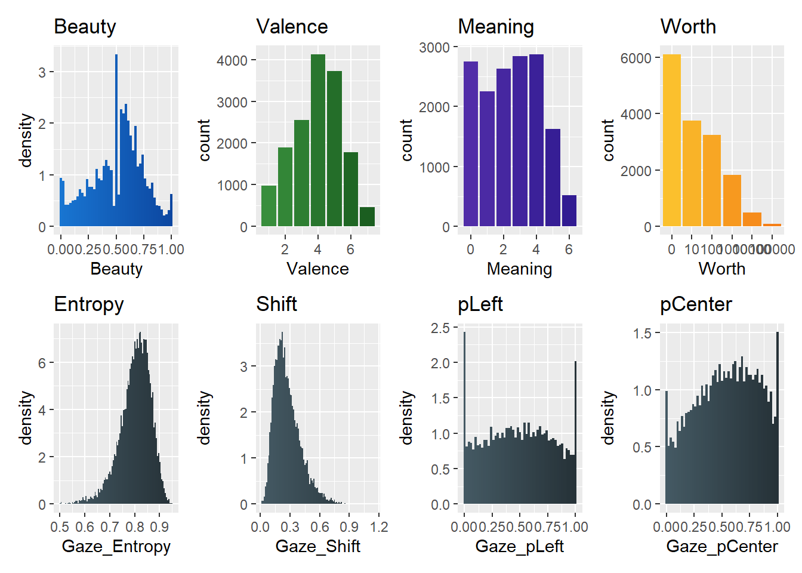{#fig-dist-phase1 fig-alt='Observed distributions of the Phase 1 ratings (Beauty 0-1, Valence 1-7, Meaning 0-6, Worth in 6 money categories) and of the four gaze features, pooled over conditions.' width=672}
:::
:::


::: {.cell}

```{.r .cell-code}
# Run by hand: bare panels for figures/figure1.pptx
# (ppt/media/image7,8,9,13,15,16,17,18).

dist_theme <- list(
  scale_x_continuous(expand = c(0, 0)),
  scale_y_continuous(expand = c(0, 0)),
  theme_void(),
  theme(axis.title.x = element_blank(),
        axis.title.y = element_blank(),
        axis.text.x = element_blank(),
        axis.text.y = element_blank(),
        plot.title = element_text(face = "bold"))
)


ggsave(p_dist_beauty + dist_theme, filename = "figures/dist_beauty.png", width = 6, height = 4, dpi = 300)
ggsave(p_dist_valence + dist_theme, filename = "figures/dist_valence.png", width = 6, height = 4, dpi = 300)
ggsave(p_dist_meaning + dist_theme, filename = "figures/dist_meaning.png", width = 6, height = 4, dpi = 300)
ggsave(p_dist_worth + dist_theme[-1] + scale_x_discrete(expand = c(0, 0)), filename = "figures/dist_worth.png", width = 6, height = 4, dpi = 300) # Worth is a factor: discrete x scale
ggsave(p_dist_entropy + dist_theme, filename = "figures/dist_entropy.png", width = 6, height = 1.5, dpi = 300)
ggsave(p_dist_shift + dist_theme, filename = "figures/dist_shift.png", width = 6, height = 1.5, dpi = 300)
ggsave(p_dist_pleft + dist_theme, filename = "figures/dist_pleft.png", width = 6, height = 1.5, dpi = 300)
ggsave(p_dist_pcenter + dist_theme, filename = "figures/dist_pcenter.png", width = 6, height = 1.5, dpi = 300)
```
:::


### Phase 2 and Follow-Up


::: {.cell}

```{.r .cell-code}
p_dist_reality <- dftask |> 
  ggplot(aes(x=Reality)) +
  geom_histogram(aes(y=after_stat(density)), bins = 51, fill = colorRampPalette(c("#C2185B", "#880E4F"))(51))

p_dist_authenticity <- dftask |> 
  ggplot(aes(x=Authenticity)) +
  geom_histogram(aes(y=after_stat(density)), bins = 51, fill = colorRampPalette(c("#E64A19", "#BF360C"))(51))

p_dist_beauty2 <- dftask |> 
  ggplot(aes(x=Beauty2)) +
  geom_histogram(aes(y=after_stat(density)), bins = 47, fill = colorRampPalette(c("#0097A7", "#006064"))(47))

p_dist_selfrel <- dftask |> 
  ggplot(aes(x=SelfRelevance)) +
  geom_bar(fill = colorRampPalette(c("#00796B", "#004D40"))(7))  

p_dist_artificiality <- dftask |> 
  ggplot(aes(x=PerceivedArtificiality)) +
  geom_histogram(aes(y=after_stat(density)), bins = 21, fill = colorRampPalette(c("#AFB42B", "#827717"))(21))

wrap_plots(
  (p_dist_reality + labs(title = "Syntheticness")), 
    (p_dist_authenticity + labs(title = "Authenticity")),
    (p_dist_beauty2 + labs(title = "Beauty (follow-up)")), 
    (p_dist_selfrel + labs(title = "Self-Relevance")),
    (p_dist_artificiality + labs(title = "Artificiality")),
  ncol = 3
)
```

::: {.cell-output-display}
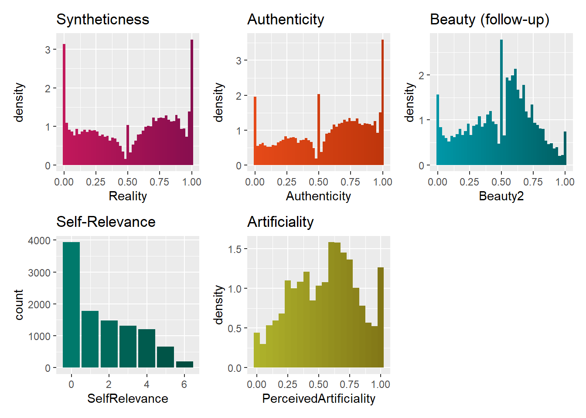{#fig-dist-phase2 fig-alt='Observed distributions of the Phase 2 sliders (Syntheticness: 0 = AI-Generated, 1 = Human; Authenticity: 0 = Copy, 1 = Original) and of the follow-up outcomes (Beauty rated again, Self-Relevance 0-6, Perceived Artificiality 0-1).' width=672}
:::
:::


:::


## Phase 1 - Ratings

::: {.panel-tabset}

### Beauty


::: {.cell}

```{.r .cell-code}
make_report(estimates$Beauty)
```

::: {.cell-output-display}

```{=html}
<div id="tmgrlscalg" style="padding-left:0px;padding-right:0px;padding-top:10px;padding-bottom:10px;overflow-x:auto;overflow-y:auto;width:auto;height:auto;">
<style>#tmgrlscalg table {
  font-family: system-ui, 'Segoe UI', Roboto, Helvetica, Arial, sans-serif, 'Apple Color Emoji', 'Segoe UI Emoji', 'Segoe UI Symbol', 'Noto Color Emoji';
  -webkit-font-smoothing: antialiased;
  -moz-osx-font-smoothing: grayscale;
}

#tmgrlscalg thead, #tmgrlscalg tbody, #tmgrlscalg tfoot, #tmgrlscalg tr, #tmgrlscalg td, #tmgrlscalg th {
  border-style: none;
}

#tmgrlscalg p {
  margin: 0;
  padding: 0;
}

#tmgrlscalg .gt_table {
  display: table;
  border-collapse: collapse;
  line-height: normal;
  margin-left: auto;
  margin-right: auto;
  color: #333333;
  font-size: 16px;
  font-weight: normal;
  font-style: normal;
  background-color: #FFFFFF;
  width: auto;
  border-top-style: solid;
  border-top-width: 2px;
  border-top-color: #A8A8A8;
  border-right-style: none;
  border-right-width: 2px;
  border-right-color: #D3D3D3;
  border-bottom-style: solid;
  border-bottom-width: 2px;
  border-bottom-color: #A8A8A8;
  border-left-style: none;
  border-left-width: 2px;
  border-left-color: #D3D3D3;
}

#tmgrlscalg .gt_caption {
  padding-top: 4px;
  padding-bottom: 4px;
}

#tmgrlscalg .gt_title {
  color: #333333;
  font-size: 125%;
  font-weight: initial;
  padding-top: 4px;
  padding-bottom: 4px;
  padding-left: 5px;
  padding-right: 5px;
  border-bottom-color: #FFFFFF;
  border-bottom-width: 0;
}

#tmgrlscalg .gt_subtitle {
  color: #333333;
  font-size: 85%;
  font-weight: initial;
  padding-top: 3px;
  padding-bottom: 5px;
  padding-left: 5px;
  padding-right: 5px;
  border-top-color: #FFFFFF;
  border-top-width: 0;
}

#tmgrlscalg .gt_heading {
  background-color: #FFFFFF;
  text-align: center;
  border-bottom-color: #FFFFFF;
  border-left-style: none;
  border-left-width: 1px;
  border-left-color: #D3D3D3;
  border-right-style: none;
  border-right-width: 1px;
  border-right-color: #D3D3D3;
}

#tmgrlscalg .gt_bottom_border {
  border-bottom-style: solid;
  border-bottom-width: 2px;
  border-bottom-color: #D3D3D3;
}

#tmgrlscalg .gt_col_headings {
  border-top-style: solid;
  border-top-width: 2px;
  border-top-color: #D3D3D3;
  border-bottom-style: solid;
  border-bottom-width: 2px;
  border-bottom-color: #D3D3D3;
  border-left-style: none;
  border-left-width: 1px;
  border-left-color: #D3D3D3;
  border-right-style: none;
  border-right-width: 1px;
  border-right-color: #D3D3D3;
}

#tmgrlscalg .gt_col_heading {
  color: #333333;
  background-color: #FFFFFF;
  font-size: 100%;
  font-weight: normal;
  text-transform: inherit;
  border-left-style: none;
  border-left-width: 1px;
  border-left-color: #D3D3D3;
  border-right-style: none;
  border-right-width: 1px;
  border-right-color: #D3D3D3;
  vertical-align: bottom;
  padding-top: 5px;
  padding-bottom: 6px;
  padding-left: 5px;
  padding-right: 5px;
  overflow-x: hidden;
}

#tmgrlscalg .gt_column_spanner_outer {
  color: #333333;
  background-color: #FFFFFF;
  font-size: 100%;
  font-weight: normal;
  text-transform: inherit;
  padding-top: 0;
  padding-bottom: 0;
  padding-left: 4px;
  padding-right: 4px;
}

#tmgrlscalg .gt_column_spanner_outer:first-child {
  padding-left: 0;
}

#tmgrlscalg .gt_column_spanner_outer:last-child {
  padding-right: 0;
}

#tmgrlscalg .gt_column_spanner {
  border-bottom-style: solid;
  border-bottom-width: 2px;
  border-bottom-color: #D3D3D3;
  vertical-align: bottom;
  padding-top: 5px;
  padding-bottom: 5px;
  overflow-x: hidden;
  display: inline-block;
  width: 100%;
}

#tmgrlscalg .gt_spanner_row {
  border-bottom-style: hidden;
}

#tmgrlscalg .gt_group_heading {
  padding-top: 8px;
  padding-bottom: 8px;
  padding-left: 5px;
  padding-right: 5px;
  color: #333333;
  background-color: #FFFFFF;
  font-size: 100%;
  font-weight: initial;
  text-transform: inherit;
  border-top-style: solid;
  border-top-width: 2px;
  border-top-color: #D3D3D3;
  border-bottom-style: solid;
  border-bottom-width: 2px;
  border-bottom-color: #D3D3D3;
  border-left-style: none;
  border-left-width: 1px;
  border-left-color: #D3D3D3;
  border-right-style: none;
  border-right-width: 1px;
  border-right-color: #D3D3D3;
  vertical-align: middle;
  text-align: left;
}

#tmgrlscalg .gt_empty_group_heading {
  padding: 0.5px;
  color: #333333;
  background-color: #FFFFFF;
  font-size: 100%;
  font-weight: initial;
  border-top-style: solid;
  border-top-width: 2px;
  border-top-color: #D3D3D3;
  border-bottom-style: solid;
  border-bottom-width: 2px;
  border-bottom-color: #D3D3D3;
  vertical-align: middle;
}

#tmgrlscalg .gt_from_md > :first-child {
  margin-top: 0;
}

#tmgrlscalg .gt_from_md > :last-child {
  margin-bottom: 0;
}

#tmgrlscalg .gt_row {
  padding-top: 8px;
  padding-bottom: 8px;
  padding-left: 5px;
  padding-right: 5px;
  margin: 10px;
  border-top-style: solid;
  border-top-width: 1px;
  border-top-color: #D3D3D3;
  border-left-style: none;
  border-left-width: 1px;
  border-left-color: #D3D3D3;
  border-right-style: none;
  border-right-width: 1px;
  border-right-color: #D3D3D3;
  vertical-align: middle;
  overflow-x: hidden;
}

#tmgrlscalg .gt_stub {
  color: #333333;
  background-color: #FFFFFF;
  font-size: 100%;
  font-weight: initial;
  text-transform: inherit;
  border-right-style: solid;
  border-right-width: 2px;
  border-right-color: #D3D3D3;
  padding-left: 5px;
  padding-right: 5px;
}

#tmgrlscalg .gt_stub_row_group {
  color: #333333;
  background-color: #FFFFFF;
  font-size: 100%;
  font-weight: initial;
  text-transform: inherit;
  border-right-style: solid;
  border-right-width: 2px;
  border-right-color: #D3D3D3;
  padding-left: 5px;
  padding-right: 5px;
  vertical-align: top;
}

#tmgrlscalg .gt_row_group_first td {
  border-top-width: 2px;
}

#tmgrlscalg .gt_row_group_first th {
  border-top-width: 2px;
}

#tmgrlscalg .gt_summary_row {
  color: #333333;
  background-color: #FFFFFF;
  text-transform: inherit;
  padding-top: 8px;
  padding-bottom: 8px;
  padding-left: 5px;
  padding-right: 5px;
}

#tmgrlscalg .gt_first_summary_row {
  border-top-style: solid;
  border-top-color: #D3D3D3;
}

#tmgrlscalg .gt_first_summary_row.thick {
  border-top-width: 2px;
}

#tmgrlscalg .gt_last_summary_row {
  padding-top: 8px;
  padding-bottom: 8px;
  padding-left: 5px;
  padding-right: 5px;
  border-bottom-style: solid;
  border-bottom-width: 2px;
  border-bottom-color: #D3D3D3;
}

#tmgrlscalg .gt_grand_summary_row {
  color: #333333;
  background-color: #FFFFFF;
  text-transform: inherit;
  padding-top: 8px;
  padding-bottom: 8px;
  padding-left: 5px;
  padding-right: 5px;
}

#tmgrlscalg .gt_first_grand_summary_row {
  padding-top: 8px;
  padding-bottom: 8px;
  padding-left: 5px;
  padding-right: 5px;
  border-top-style: double;
  border-top-width: 6px;
  border-top-color: #D3D3D3;
}

#tmgrlscalg .gt_last_grand_summary_row_top {
  padding-top: 8px;
  padding-bottom: 8px;
  padding-left: 5px;
  padding-right: 5px;
  border-bottom-style: double;
  border-bottom-width: 6px;
  border-bottom-color: #D3D3D3;
}

#tmgrlscalg .gt_striped {
  background-color: rgba(128, 128, 128, 0.05);
}

#tmgrlscalg .gt_table_body {
  border-top-style: solid;
  border-top-width: 2px;
  border-top-color: #D3D3D3;
  border-bottom-style: solid;
  border-bottom-width: 2px;
  border-bottom-color: #D3D3D3;
}

#tmgrlscalg .gt_footnotes {
  color: #333333;
  background-color: #FFFFFF;
  border-bottom-style: none;
  border-bottom-width: 2px;
  border-bottom-color: #D3D3D3;
  border-left-style: none;
  border-left-width: 2px;
  border-left-color: #D3D3D3;
  border-right-style: none;
  border-right-width: 2px;
  border-right-color: #D3D3D3;
}

#tmgrlscalg .gt_footnote {
  margin: 0px;
  font-size: 90%;
  padding-top: 4px;
  padding-bottom: 4px;
  padding-left: 5px;
  padding-right: 5px;
}

#tmgrlscalg .gt_sourcenotes {
  color: #333333;
  background-color: #FFFFFF;
  border-bottom-style: none;
  border-bottom-width: 2px;
  border-bottom-color: #D3D3D3;
  border-left-style: none;
  border-left-width: 2px;
  border-left-color: #D3D3D3;
  border-right-style: none;
  border-right-width: 2px;
  border-right-color: #D3D3D3;
}

#tmgrlscalg .gt_sourcenote {
  font-size: 90%;
  padding-top: 4px;
  padding-bottom: 4px;
  padding-left: 5px;
  padding-right: 5px;
}

#tmgrlscalg .gt_left {
  text-align: left;
}

#tmgrlscalg .gt_center {
  text-align: center;
}

#tmgrlscalg .gt_right {
  text-align: right;
  font-variant-numeric: tabular-nums;
}

#tmgrlscalg .gt_font_normal {
  font-weight: normal;
}

#tmgrlscalg .gt_font_bold {
  font-weight: bold;
}

#tmgrlscalg .gt_font_italic {
  font-style: italic;
}

#tmgrlscalg .gt_super {
  font-size: 65%;
}

#tmgrlscalg .gt_footnote_marks {
  font-size: 75%;
  vertical-align: 0.4em;
  position: initial;
}

#tmgrlscalg .gt_asterisk {
  font-size: 100%;
  vertical-align: 0;
}

#tmgrlscalg .gt_indent_1 {
  text-indent: 5px;
}

#tmgrlscalg .gt_indent_2 {
  text-indent: 10px;
}

#tmgrlscalg .gt_indent_3 {
  text-indent: 15px;
}

#tmgrlscalg .gt_indent_4 {
  text-indent: 20px;
}

#tmgrlscalg .gt_indent_5 {
  text-indent: 25px;
}

#tmgrlscalg .katex-display {
  display: inline-flex !important;
  margin-bottom: 0.75em !important;
}

#tmgrlscalg div.Reactable > div.rt-table > div.rt-thead > div.rt-tr.rt-tr-group-header > div.rt-th-group:after {
  height: 0px !important;
}
</style>
<table class="gt_table" data-quarto-disable-processing="false" data-quarto-bootstrap="false">
  <thead>
    <tr class="gt_col_headings">
      <th class="gt_col_heading gt_columns_bottom_border gt_left" rowspan="1" colspan="1" scope="col" id="Contrast">Contrast</th>
      <th class="gt_col_heading gt_columns_bottom_border gt_left" rowspan="1" colspan="1" scope="col" id="Parameters">Parameters</th>
    </tr>
  </thead>
  <tbody class="gt_table_body">
    <tr><td headers="Contrast" class="gt_row gt_left">Human Forgery - Human Original</td>
<td headers="Parameters" class="gt_row gt_left">response (-0.04, [-0.05, -0.03]); mu (-0.07, [-0.10, -0.04]); confright (-0.04, [-0.05, -0.03]); confleft (0.02, [ 0.01,  0.04]); precright (0.74, [ 0.38,  1.12]); precleft (0.27, [ 0.03,  0.55])</td></tr>
    <tr><td headers="Contrast" class="gt_row gt_left">AI-Generated - Human Original</td>
<td headers="Parameters" class="gt_row gt_left">response (-0.07, [-0.08, -0.06]); mu (-0.16, [-0.19, -0.13]); confright (-0.06, [-0.07, -0.05]); confleft (0.04, [ 0.02,  0.06]); precright (0.82, [ 0.52,  1.15]); pex (0.00, [-0.01,  0.00])</td></tr>
    <tr><td headers="Contrast" class="gt_row gt_left">AI-Generated - Human Forgery</td>
<td headers="Parameters" class="gt_row gt_left">response (-0.03, [-0.04, -0.02]); mu (-0.09, [-0.13, -0.06]); confright (-0.02, [-0.03, -0.01]); precleft (-0.29, [-0.57, -0.03]); pmid (0.01, [ 0.00,  0.01])</td></tr>
  </tbody>
  
</table>
</div>
```

```{=html}
<div id="wajjqisneg" style="padding-left:0px;padding-right:0px;padding-top:10px;padding-bottom:10px;overflow-x:auto;overflow-y:auto;width:auto;height:auto;">
<style>#wajjqisneg table {
  font-family: system-ui, 'Segoe UI', Roboto, Helvetica, Arial, sans-serif, 'Apple Color Emoji', 'Segoe UI Emoji', 'Segoe UI Symbol', 'Noto Color Emoji';
  -webkit-font-smoothing: antialiased;
  -moz-osx-font-smoothing: grayscale;
}

#wajjqisneg thead, #wajjqisneg tbody, #wajjqisneg tfoot, #wajjqisneg tr, #wajjqisneg td, #wajjqisneg th {
  border-style: none;
}

#wajjqisneg p {
  margin: 0;
  padding: 0;
}

#wajjqisneg .gt_table {
  display: table;
  border-collapse: collapse;
  line-height: normal;
  margin-left: auto;
  margin-right: auto;
  color: #333333;
  font-size: 13px;
  font-weight: normal;
  font-style: normal;
  background-color: #FFFFFF;
  width: auto;
  border-top-style: solid;
  border-top-width: 3px;
  border-top-color: #D5D5D5;
  border-right-style: solid;
  border-right-width: 3px;
  border-right-color: #D5D5D5;
  border-bottom-style: solid;
  border-bottom-width: 3px;
  border-bottom-color: #D5D5D5;
  border-left-style: solid;
  border-left-width: 3px;
  border-left-color: #D5D5D5;
}

#wajjqisneg .gt_caption {
  padding-top: 4px;
  padding-bottom: 4px;
}

#wajjqisneg .gt_title {
  color: #333333;
  font-size: 125%;
  font-weight: initial;
  padding-top: 4px;
  padding-bottom: 4px;
  padding-left: 5px;
  padding-right: 5px;
  border-bottom-color: #FFFFFF;
  border-bottom-width: 0;
}

#wajjqisneg .gt_subtitle {
  color: #333333;
  font-size: 85%;
  font-weight: initial;
  padding-top: 3px;
  padding-bottom: 5px;
  padding-left: 5px;
  padding-right: 5px;
  border-top-color: #FFFFFF;
  border-top-width: 0;
}

#wajjqisneg .gt_heading {
  background-color: #FFFFFF;
  text-align: left;
  border-bottom-color: #FFFFFF;
  border-left-style: none;
  border-left-width: 1px;
  border-left-color: #D3D3D3;
  border-right-style: none;
  border-right-width: 1px;
  border-right-color: #D3D3D3;
}

#wajjqisneg .gt_bottom_border {
  border-bottom-style: solid;
  border-bottom-width: 2px;
  border-bottom-color: #D5D5D5;
}

#wajjqisneg .gt_col_headings {
  border-top-style: solid;
  border-top-width: 2px;
  border-top-color: #D5D5D5;
  border-bottom-style: solid;
  border-bottom-width: 2px;
  border-bottom-color: #D5D5D5;
  border-left-style: none;
  border-left-width: 1px;
  border-left-color: #D3D3D3;
  border-right-style: none;
  border-right-width: 1px;
  border-right-color: #D3D3D3;
}

#wajjqisneg .gt_col_heading {
  color: #FFFFFF;
  background-color: #000000;
  font-size: 100%;
  font-weight: normal;
  text-transform: inherit;
  border-left-style: none;
  border-left-width: 1px;
  border-left-color: #D3D3D3;
  border-right-style: none;
  border-right-width: 1px;
  border-right-color: #D3D3D3;
  vertical-align: bottom;
  padding-top: 5px;
  padding-bottom: 6px;
  padding-left: 5px;
  padding-right: 5px;
  overflow-x: hidden;
}

#wajjqisneg .gt_column_spanner_outer {
  color: #FFFFFF;
  background-color: #000000;
  font-size: 100%;
  font-weight: normal;
  text-transform: inherit;
  padding-top: 0;
  padding-bottom: 0;
  padding-left: 4px;
  padding-right: 4px;
}

#wajjqisneg .gt_column_spanner_outer:first-child {
  padding-left: 0;
}

#wajjqisneg .gt_column_spanner_outer:last-child {
  padding-right: 0;
}

#wajjqisneg .gt_column_spanner {
  border-bottom-style: solid;
  border-bottom-width: 2px;
  border-bottom-color: #D5D5D5;
  vertical-align: bottom;
  padding-top: 5px;
  padding-bottom: 5px;
  overflow-x: hidden;
  display: inline-block;
  width: 100%;
}

#wajjqisneg .gt_spanner_row {
  border-bottom-style: hidden;
}

#wajjqisneg .gt_group_heading {
  padding-top: 8px;
  padding-bottom: 8px;
  padding-left: 5px;
  padding-right: 5px;
  color: #333333;
  background-color: #FFFFFF;
  font-size: 100%;
  font-weight: initial;
  text-transform: inherit;
  border-top-style: solid;
  border-top-width: 2px;
  border-top-color: #D5D5D5;
  border-bottom-style: solid;
  border-bottom-width: 2px;
  border-bottom-color: #D5D5D5;
  border-left-style: none;
  border-left-width: 1px;
  border-left-color: #D3D3D3;
  border-right-style: none;
  border-right-width: 1px;
  border-right-color: #D3D3D3;
  vertical-align: middle;
  text-align: left;
}

#wajjqisneg .gt_empty_group_heading {
  padding: 0.5px;
  color: #333333;
  background-color: #FFFFFF;
  font-size: 100%;
  font-weight: initial;
  border-top-style: solid;
  border-top-width: 2px;
  border-top-color: #D5D5D5;
  border-bottom-style: solid;
  border-bottom-width: 2px;
  border-bottom-color: #D5D5D5;
  vertical-align: middle;
}

#wajjqisneg .gt_from_md > :first-child {
  margin-top: 0;
}

#wajjqisneg .gt_from_md > :last-child {
  margin-bottom: 0;
}

#wajjqisneg .gt_row {
  padding-top: 8px;
  padding-bottom: 8px;
  padding-left: 5px;
  padding-right: 5px;
  margin: 10px;
  border-top-style: solid;
  border-top-width: 1px;
  border-top-color: #D5D5D5;
  border-left-style: solid;
  border-left-width: 1px;
  border-left-color: #D5D5D5;
  border-right-style: solid;
  border-right-width: 1px;
  border-right-color: #D5D5D5;
  vertical-align: middle;
  overflow-x: hidden;
}

#wajjqisneg .gt_stub {
  color: #333333;
  background-color: #FFFFFF;
  font-size: 100%;
  font-weight: initial;
  text-transform: inherit;
  border-right-style: solid;
  border-right-width: 2px;
  border-right-color: #5F5F5F;
  padding-left: 5px;
  padding-right: 5px;
}

#wajjqisneg .gt_stub_row_group {
  color: #333333;
  background-color: #FFFFFF;
  font-size: 100%;
  font-weight: initial;
  text-transform: inherit;
  border-right-style: solid;
  border-right-width: 2px;
  border-right-color: #D3D3D3;
  padding-left: 5px;
  padding-right: 5px;
  vertical-align: top;
}

#wajjqisneg .gt_row_group_first td {
  border-top-width: 2px;
}

#wajjqisneg .gt_row_group_first th {
  border-top-width: 2px;
}

#wajjqisneg .gt_summary_row {
  color: #333333;
  background-color: #D5D5D5;
  text-transform: inherit;
  padding-top: 8px;
  padding-bottom: 8px;
  padding-left: 5px;
  padding-right: 5px;
}

#wajjqisneg .gt_first_summary_row {
  border-top-style: solid;
  border-top-color: #D5D5D5;
}

#wajjqisneg .gt_first_summary_row.thick {
  border-top-width: 2px;
}

#wajjqisneg .gt_last_summary_row {
  padding-top: 8px;
  padding-bottom: 8px;
  padding-left: 5px;
  padding-right: 5px;
  border-bottom-style: solid;
  border-bottom-width: 2px;
  border-bottom-color: #D5D5D5;
}

#wajjqisneg .gt_grand_summary_row {
  color: #FFFFFF;
  background-color: #929292;
  text-transform: inherit;
  padding-top: 8px;
  padding-bottom: 8px;
  padding-left: 5px;
  padding-right: 5px;
}

#wajjqisneg .gt_first_grand_summary_row {
  padding-top: 8px;
  padding-bottom: 8px;
  padding-left: 5px;
  padding-right: 5px;
  border-top-style: double;
  border-top-width: 6px;
  border-top-color: #D5D5D5;
}

#wajjqisneg .gt_last_grand_summary_row_top {
  padding-top: 8px;
  padding-bottom: 8px;
  padding-left: 5px;
  padding-right: 5px;
  border-bottom-style: double;
  border-bottom-width: 6px;
  border-bottom-color: #D5D5D5;
}

#wajjqisneg .gt_striped {
  background-color: #F4F4F4;
}

#wajjqisneg .gt_table_body {
  border-top-style: solid;
  border-top-width: 2px;
  border-top-color: #D5D5D5;
  border-bottom-style: solid;
  border-bottom-width: 2px;
  border-bottom-color: #D5D5D5;
}

#wajjqisneg .gt_footnotes {
  color: #333333;
  background-color: #FFFFFF;
  border-bottom-style: none;
  border-bottom-width: 2px;
  border-bottom-color: #D3D3D3;
  border-left-style: none;
  border-left-width: 2px;
  border-left-color: #D3D3D3;
  border-right-style: none;
  border-right-width: 2px;
  border-right-color: #D3D3D3;
}

#wajjqisneg .gt_footnote {
  margin: 0px;
  font-size: 90%;
  padding-top: 4px;
  padding-bottom: 4px;
  padding-left: 5px;
  padding-right: 5px;
}

#wajjqisneg .gt_sourcenotes {
  color: #333333;
  background-color: #FFFFFF;
  border-bottom-style: none;
  border-bottom-width: 2px;
  border-bottom-color: #D3D3D3;
  border-left-style: none;
  border-left-width: 2px;
  border-left-color: #D3D3D3;
  border-right-style: none;
  border-right-width: 2px;
  border-right-color: #D3D3D3;
}

#wajjqisneg .gt_sourcenote {
  font-size: 90%;
  padding-top: 4px;
  padding-bottom: 4px;
  padding-left: 5px;
  padding-right: 5px;
}

#wajjqisneg .gt_left {
  text-align: left;
}

#wajjqisneg .gt_center {
  text-align: center;
}

#wajjqisneg .gt_right {
  text-align: right;
  font-variant-numeric: tabular-nums;
}

#wajjqisneg .gt_font_normal {
  font-weight: normal;
}

#wajjqisneg .gt_font_bold {
  font-weight: bold;
}

#wajjqisneg .gt_font_italic {
  font-style: italic;
}

#wajjqisneg .gt_super {
  font-size: 65%;
}

#wajjqisneg .gt_footnote_marks {
  font-size: 75%;
  vertical-align: 0.4em;
  position: initial;
}

#wajjqisneg .gt_asterisk {
  font-size: 100%;
  vertical-align: 0;
}

#wajjqisneg .gt_indent_1 {
  text-indent: 5px;
}

#wajjqisneg .gt_indent_2 {
  text-indent: 10px;
}

#wajjqisneg .gt_indent_3 {
  text-indent: 15px;
}

#wajjqisneg .gt_indent_4 {
  text-indent: 20px;
}

#wajjqisneg .gt_indent_5 {
  text-indent: 25px;
}

#wajjqisneg .katex-display {
  display: inline-flex !important;
  margin-bottom: 0.75em !important;
}

#wajjqisneg div.Reactable > div.rt-table > div.rt-thead > div.rt-tr.rt-tr-group-header > div.rt-th-group:after {
  height: 0px !important;
}
</style>
<table class="gt_table" data-quarto-disable-processing="false" data-quarto-bootstrap="false">
  <thead>
    <tr class="gt_heading">
      <td colspan="10" class="gt_heading gt_title gt_font_normal gt_bottom_border" style>Beauty: convergence</td>
    </tr>
    
    <tr class="gt_col_headings">
      <th class="gt_col_heading gt_columns_bottom_border gt_left" rowspan="1" colspan="1" scope="col" id="Model">Model</th>
      <th class="gt_col_heading gt_columns_bottom_border gt_left" rowspan="1" colspan="1" scope="col" id="Family">Family</th>
      <th class="gt_col_heading gt_columns_bottom_border gt_right" rowspan="1" colspan="1" scope="col" id="N_obs">N_obs</th>
      <th class="gt_col_heading gt_columns_bottom_border gt_right" rowspan="1" colspan="1" scope="col" id="N_participants">N_participants</th>
      <th class="gt_col_heading gt_columns_bottom_border gt_right" rowspan="1" colspan="1" scope="col" id="Chains">Chains</th>
      <th class="gt_col_heading gt_columns_bottom_border gt_right" rowspan="1" colspan="1" scope="col" id="Draws">Draws</th>
      <th class="gt_col_heading gt_columns_bottom_border gt_right" rowspan="1" colspan="1" scope="col" id="Max_Rhat">Max_Rhat</th>
      <th class="gt_col_heading gt_columns_bottom_border gt_right" rowspan="1" colspan="1" scope="col" id="Min_ESS_ratio">Min_ESS_ratio</th>
      <th class="gt_col_heading gt_columns_bottom_border gt_right" rowspan="1" colspan="1" scope="col" id="Divergent_pct">Divergent_pct</th>
      <th class="gt_col_heading gt_columns_bottom_border gt_left" rowspan="1" colspan="1" scope="col" id="Criterion">Criterion</th>
    </tr>
  </thead>
  <tbody class="gt_table_body">
    <tr><td headers="Model" class="gt_row gt_left">Beauty</td>
<td headers="Family" class="gt_row gt_left">CHOCO</td>
<td headers="N_obs" class="gt_row gt_right">15552</td>
<td headers="N_participants" class="gt_row gt_right">324</td>
<td headers="Chains" class="gt_row gt_right">8</td>
<td headers="Draws" class="gt_row gt_right">4000</td>
<td headers="Max_Rhat" class="gt_row gt_right">1.068</td>
<td headers="Min_ESS_ratio" class="gt_row gt_right">0.023</td>
<td headers="Divergent_pct" class="gt_row gt_right">0</td>
<td headers="Criterion" class="gt_row gt_left">loo</td></tr>
  </tbody>
  
</table>
</div>
```


::: {.callout-note collapse="true" title="Beauty: convergence (Markdown table, for text readers)"}

|Model  |Family | N_obs| N_participants| Chains| Draws| Max_Rhat| Min_ESS_ratio| Divergent_pct|Criterion |
|:------|:------|-----:|--------------:|------:|-----:|--------:|-------------:|-------------:|:---------|
|Beauty |CHOCO  | 15552|            324|      8|  4000|    1.068|         0.023|             0|loo       |

:::

```{=html}
<div id="xtizunyaav" style="padding-left:0px;padding-right:0px;padding-top:10px;padding-bottom:10px;overflow-x:auto;overflow-y:auto;width:auto;height:auto;">
<style>#xtizunyaav table {
  font-family: system-ui, 'Segoe UI', Roboto, Helvetica, Arial, sans-serif, 'Apple Color Emoji', 'Segoe UI Emoji', 'Segoe UI Symbol', 'Noto Color Emoji';
  -webkit-font-smoothing: antialiased;
  -moz-osx-font-smoothing: grayscale;
}

#xtizunyaav thead, #xtizunyaav tbody, #xtizunyaav tfoot, #xtizunyaav tr, #xtizunyaav td, #xtizunyaav th {
  border-style: none;
}

#xtizunyaav p {
  margin: 0;
  padding: 0;
}

#xtizunyaav .gt_table {
  display: table;
  border-collapse: collapse;
  line-height: normal;
  margin-left: auto;
  margin-right: auto;
  color: #333333;
  font-size: 13px;
  font-weight: normal;
  font-style: normal;
  background-color: #FFFFFF;
  width: auto;
  border-top-style: solid;
  border-top-width: 3px;
  border-top-color: #D5D5D5;
  border-right-style: solid;
  border-right-width: 3px;
  border-right-color: #D5D5D5;
  border-bottom-style: solid;
  border-bottom-width: 3px;
  border-bottom-color: #D5D5D5;
  border-left-style: solid;
  border-left-width: 3px;
  border-left-color: #D5D5D5;
}

#xtizunyaav .gt_caption {
  padding-top: 4px;
  padding-bottom: 4px;
}

#xtizunyaav .gt_title {
  color: #333333;
  font-size: 125%;
  font-weight: initial;
  padding-top: 4px;
  padding-bottom: 4px;
  padding-left: 5px;
  padding-right: 5px;
  border-bottom-color: #FFFFFF;
  border-bottom-width: 0;
}

#xtizunyaav .gt_subtitle {
  color: #333333;
  font-size: 85%;
  font-weight: initial;
  padding-top: 3px;
  padding-bottom: 5px;
  padding-left: 5px;
  padding-right: 5px;
  border-top-color: #FFFFFF;
  border-top-width: 0;
}

#xtizunyaav .gt_heading {
  background-color: #FFFFFF;
  text-align: left;
  border-bottom-color: #FFFFFF;
  border-left-style: none;
  border-left-width: 1px;
  border-left-color: #D3D3D3;
  border-right-style: none;
  border-right-width: 1px;
  border-right-color: #D3D3D3;
}

#xtizunyaav .gt_bottom_border {
  border-bottom-style: solid;
  border-bottom-width: 2px;
  border-bottom-color: #D5D5D5;
}

#xtizunyaav .gt_col_headings {
  border-top-style: solid;
  border-top-width: 2px;
  border-top-color: #D5D5D5;
  border-bottom-style: solid;
  border-bottom-width: 2px;
  border-bottom-color: #D5D5D5;
  border-left-style: none;
  border-left-width: 1px;
  border-left-color: #D3D3D3;
  border-right-style: none;
  border-right-width: 1px;
  border-right-color: #D3D3D3;
}

#xtizunyaav .gt_col_heading {
  color: #FFFFFF;
  background-color: #000000;
  font-size: 100%;
  font-weight: normal;
  text-transform: inherit;
  border-left-style: none;
  border-left-width: 1px;
  border-left-color: #D3D3D3;
  border-right-style: none;
  border-right-width: 1px;
  border-right-color: #D3D3D3;
  vertical-align: bottom;
  padding-top: 5px;
  padding-bottom: 6px;
  padding-left: 5px;
  padding-right: 5px;
  overflow-x: hidden;
}

#xtizunyaav .gt_column_spanner_outer {
  color: #FFFFFF;
  background-color: #000000;
  font-size: 100%;
  font-weight: normal;
  text-transform: inherit;
  padding-top: 0;
  padding-bottom: 0;
  padding-left: 4px;
  padding-right: 4px;
}

#xtizunyaav .gt_column_spanner_outer:first-child {
  padding-left: 0;
}

#xtizunyaav .gt_column_spanner_outer:last-child {
  padding-right: 0;
}

#xtizunyaav .gt_column_spanner {
  border-bottom-style: solid;
  border-bottom-width: 2px;
  border-bottom-color: #D5D5D5;
  vertical-align: bottom;
  padding-top: 5px;
  padding-bottom: 5px;
  overflow-x: hidden;
  display: inline-block;
  width: 100%;
}

#xtizunyaav .gt_spanner_row {
  border-bottom-style: hidden;
}

#xtizunyaav .gt_group_heading {
  padding-top: 8px;
  padding-bottom: 8px;
  padding-left: 5px;
  padding-right: 5px;
  color: #333333;
  background-color: #FFFFFF;
  font-size: 100%;
  font-weight: initial;
  text-transform: inherit;
  border-top-style: solid;
  border-top-width: 2px;
  border-top-color: #D5D5D5;
  border-bottom-style: solid;
  border-bottom-width: 2px;
  border-bottom-color: #D5D5D5;
  border-left-style: none;
  border-left-width: 1px;
  border-left-color: #D3D3D3;
  border-right-style: none;
  border-right-width: 1px;
  border-right-color: #D3D3D3;
  vertical-align: middle;
  text-align: left;
}

#xtizunyaav .gt_empty_group_heading {
  padding: 0.5px;
  color: #333333;
  background-color: #FFFFFF;
  font-size: 100%;
  font-weight: initial;
  border-top-style: solid;
  border-top-width: 2px;
  border-top-color: #D5D5D5;
  border-bottom-style: solid;
  border-bottom-width: 2px;
  border-bottom-color: #D5D5D5;
  vertical-align: middle;
}

#xtizunyaav .gt_from_md > :first-child {
  margin-top: 0;
}

#xtizunyaav .gt_from_md > :last-child {
  margin-bottom: 0;
}

#xtizunyaav .gt_row {
  padding-top: 8px;
  padding-bottom: 8px;
  padding-left: 5px;
  padding-right: 5px;
  margin: 10px;
  border-top-style: solid;
  border-top-width: 1px;
  border-top-color: #D5D5D5;
  border-left-style: solid;
  border-left-width: 1px;
  border-left-color: #D5D5D5;
  border-right-style: solid;
  border-right-width: 1px;
  border-right-color: #D5D5D5;
  vertical-align: middle;
  overflow-x: hidden;
}

#xtizunyaav .gt_stub {
  color: #333333;
  background-color: #FFFFFF;
  font-size: 100%;
  font-weight: initial;
  text-transform: inherit;
  border-right-style: solid;
  border-right-width: 2px;
  border-right-color: #5F5F5F;
  padding-left: 5px;
  padding-right: 5px;
}

#xtizunyaav .gt_stub_row_group {
  color: #333333;
  background-color: #FFFFFF;
  font-size: 100%;
  font-weight: initial;
  text-transform: inherit;
  border-right-style: solid;
  border-right-width: 2px;
  border-right-color: #D3D3D3;
  padding-left: 5px;
  padding-right: 5px;
  vertical-align: top;
}

#xtizunyaav .gt_row_group_first td {
  border-top-width: 2px;
}

#xtizunyaav .gt_row_group_first th {
  border-top-width: 2px;
}

#xtizunyaav .gt_summary_row {
  color: #333333;
  background-color: #D5D5D5;
  text-transform: inherit;
  padding-top: 8px;
  padding-bottom: 8px;
  padding-left: 5px;
  padding-right: 5px;
}

#xtizunyaav .gt_first_summary_row {
  border-top-style: solid;
  border-top-color: #D5D5D5;
}

#xtizunyaav .gt_first_summary_row.thick {
  border-top-width: 2px;
}

#xtizunyaav .gt_last_summary_row {
  padding-top: 8px;
  padding-bottom: 8px;
  padding-left: 5px;
  padding-right: 5px;
  border-bottom-style: solid;
  border-bottom-width: 2px;
  border-bottom-color: #D5D5D5;
}

#xtizunyaav .gt_grand_summary_row {
  color: #FFFFFF;
  background-color: #929292;
  text-transform: inherit;
  padding-top: 8px;
  padding-bottom: 8px;
  padding-left: 5px;
  padding-right: 5px;
}

#xtizunyaav .gt_first_grand_summary_row {
  padding-top: 8px;
  padding-bottom: 8px;
  padding-left: 5px;
  padding-right: 5px;
  border-top-style: double;
  border-top-width: 6px;
  border-top-color: #D5D5D5;
}

#xtizunyaav .gt_last_grand_summary_row_top {
  padding-top: 8px;
  padding-bottom: 8px;
  padding-left: 5px;
  padding-right: 5px;
  border-bottom-style: double;
  border-bottom-width: 6px;
  border-bottom-color: #D5D5D5;
}

#xtizunyaav .gt_striped {
  background-color: #F4F4F4;
}

#xtizunyaav .gt_table_body {
  border-top-style: solid;
  border-top-width: 2px;
  border-top-color: #D5D5D5;
  border-bottom-style: solid;
  border-bottom-width: 2px;
  border-bottom-color: #D5D5D5;
}

#xtizunyaav .gt_footnotes {
  color: #333333;
  background-color: #FFFFFF;
  border-bottom-style: none;
  border-bottom-width: 2px;
  border-bottom-color: #D3D3D3;
  border-left-style: none;
  border-left-width: 2px;
  border-left-color: #D3D3D3;
  border-right-style: none;
  border-right-width: 2px;
  border-right-color: #D3D3D3;
}

#xtizunyaav .gt_footnote {
  margin: 0px;
  font-size: 90%;
  padding-top: 4px;
  padding-bottom: 4px;
  padding-left: 5px;
  padding-right: 5px;
}

#xtizunyaav .gt_sourcenotes {
  color: #333333;
  background-color: #FFFFFF;
  border-bottom-style: none;
  border-bottom-width: 2px;
  border-bottom-color: #D3D3D3;
  border-left-style: none;
  border-left-width: 2px;
  border-left-color: #D3D3D3;
  border-right-style: none;
  border-right-width: 2px;
  border-right-color: #D3D3D3;
}

#xtizunyaav .gt_sourcenote {
  font-size: 90%;
  padding-top: 4px;
  padding-bottom: 4px;
  padding-left: 5px;
  padding-right: 5px;
}

#xtizunyaav .gt_left {
  text-align: left;
}

#xtizunyaav .gt_center {
  text-align: center;
}

#xtizunyaav .gt_right {
  text-align: right;
  font-variant-numeric: tabular-nums;
}

#xtizunyaav .gt_font_normal {
  font-weight: normal;
}

#xtizunyaav .gt_font_bold {
  font-weight: bold;
}

#xtizunyaav .gt_font_italic {
  font-style: italic;
}

#xtizunyaav .gt_super {
  font-size: 65%;
}

#xtizunyaav .gt_footnote_marks {
  font-size: 75%;
  vertical-align: 0.4em;
  position: initial;
}

#xtizunyaav .gt_asterisk {
  font-size: 100%;
  vertical-align: 0;
}

#xtizunyaav .gt_indent_1 {
  text-indent: 5px;
}

#xtizunyaav .gt_indent_2 {
  text-indent: 10px;
}

#xtizunyaav .gt_indent_3 {
  text-indent: 15px;
}

#xtizunyaav .gt_indent_4 {
  text-indent: 20px;
}

#xtizunyaav .gt_indent_5 {
  text-indent: 25px;
}

#xtizunyaav .katex-display {
  display: inline-flex !important;
  margin-bottom: 0.75em !important;
}

#xtizunyaav div.Reactable > div.rt-table > div.rt-thead > div.rt-tr.rt-tr-group-header > div.rt-th-group:after {
  height: 0px !important;
}
</style>
<table class="gt_table" data-quarto-disable-processing="false" data-quarto-bootstrap="false">
  <thead>
    <tr class="gt_heading">
      <td colspan="4" class="gt_heading gt_title gt_font_normal gt_bottom_border" style>Beauty: marginal means per label condition (response scale)</td>
    </tr>
    
    <tr class="gt_col_headings">
      <th class="gt_col_heading gt_columns_bottom_border gt_center" rowspan="1" colspan="1" scope="col" id="Condition">Condition</th>
      <th class="gt_col_heading gt_columns_bottom_border gt_right" rowspan="1" colspan="1" scope="col" id="Estimate">Estimate</th>
      <th class="gt_col_heading gt_columns_bottom_border gt_right" rowspan="1" colspan="1" scope="col" id="CI_low">CI_low</th>
      <th class="gt_col_heading gt_columns_bottom_border gt_right" rowspan="1" colspan="1" scope="col" id="CI_high">CI_high</th>
    </tr>
  </thead>
  <tbody class="gt_table_body">
    <tr><td headers="Condition" class="gt_row gt_center">Human Original</td>
<td headers="Estimate" class="gt_row gt_right">0.55</td>
<td headers="CI_low" class="gt_row gt_right">0.52</td>
<td headers="CI_high" class="gt_row gt_right">0.57</td></tr>
    <tr><td headers="Condition" class="gt_row gt_center gt_striped">Human Forgery</td>
<td headers="Estimate" class="gt_row gt_right gt_striped">0.51</td>
<td headers="CI_low" class="gt_row gt_right gt_striped">0.49</td>
<td headers="CI_high" class="gt_row gt_right gt_striped">0.54</td></tr>
    <tr><td headers="Condition" class="gt_row gt_center">AI-Generated</td>
<td headers="Estimate" class="gt_row gt_right">0.48</td>
<td headers="CI_low" class="gt_row gt_right">0.45</td>
<td headers="CI_high" class="gt_row gt_right">0.50</td></tr>
  </tbody>
  
</table>
</div>
```


::: {.callout-note collapse="true" title="Beauty: marginal means per label condition (response scale) (Markdown table, for text readers)"}

|Condition      |Estimate |CI_low |CI_high |
|:--------------|:--------|:------|:-------|
|Human Original |0.55     |0.52   |0.57    |
|Human Forgery  |0.51     |0.49   |0.54    |
|AI-Generated   |0.48     |0.45   |0.50    |

:::

```{=html}
<div id="duwhndhngp" style="padding-left:0px;padding-right:0px;padding-top:10px;padding-bottom:10px;overflow-x:auto;overflow-y:auto;width:auto;height:auto;">
<style>#duwhndhngp table {
  font-family: system-ui, 'Segoe UI', Roboto, Helvetica, Arial, sans-serif, 'Apple Color Emoji', 'Segoe UI Emoji', 'Segoe UI Symbol', 'Noto Color Emoji';
  -webkit-font-smoothing: antialiased;
  -moz-osx-font-smoothing: grayscale;
}

#duwhndhngp thead, #duwhndhngp tbody, #duwhndhngp tfoot, #duwhndhngp tr, #duwhndhngp td, #duwhndhngp th {
  border-style: none;
}

#duwhndhngp p {
  margin: 0;
  padding: 0;
}

#duwhndhngp .gt_table {
  display: table;
  border-collapse: collapse;
  line-height: normal;
  margin-left: auto;
  margin-right: auto;
  color: #333333;
  font-size: 13px;
  font-weight: normal;
  font-style: normal;
  background-color: #FFFFFF;
  width: auto;
  border-top-style: solid;
  border-top-width: 3px;
  border-top-color: #D5D5D5;
  border-right-style: solid;
  border-right-width: 3px;
  border-right-color: #D5D5D5;
  border-bottom-style: solid;
  border-bottom-width: 3px;
  border-bottom-color: #D5D5D5;
  border-left-style: solid;
  border-left-width: 3px;
  border-left-color: #D5D5D5;
}

#duwhndhngp .gt_caption {
  padding-top: 4px;
  padding-bottom: 4px;
}

#duwhndhngp .gt_title {
  color: #333333;
  font-size: 125%;
  font-weight: initial;
  padding-top: 4px;
  padding-bottom: 4px;
  padding-left: 5px;
  padding-right: 5px;
  border-bottom-color: #FFFFFF;
  border-bottom-width: 0;
}

#duwhndhngp .gt_subtitle {
  color: #333333;
  font-size: 85%;
  font-weight: initial;
  padding-top: 3px;
  padding-bottom: 5px;
  padding-left: 5px;
  padding-right: 5px;
  border-top-color: #FFFFFF;
  border-top-width: 0;
}

#duwhndhngp .gt_heading {
  background-color: #FFFFFF;
  text-align: left;
  border-bottom-color: #FFFFFF;
  border-left-style: none;
  border-left-width: 1px;
  border-left-color: #D3D3D3;
  border-right-style: none;
  border-right-width: 1px;
  border-right-color: #D3D3D3;
}

#duwhndhngp .gt_bottom_border {
  border-bottom-style: solid;
  border-bottom-width: 2px;
  border-bottom-color: #D5D5D5;
}

#duwhndhngp .gt_col_headings {
  border-top-style: solid;
  border-top-width: 2px;
  border-top-color: #D5D5D5;
  border-bottom-style: solid;
  border-bottom-width: 2px;
  border-bottom-color: #D5D5D5;
  border-left-style: none;
  border-left-width: 1px;
  border-left-color: #D3D3D3;
  border-right-style: none;
  border-right-width: 1px;
  border-right-color: #D3D3D3;
}

#duwhndhngp .gt_col_heading {
  color: #FFFFFF;
  background-color: #000000;
  font-size: 100%;
  font-weight: normal;
  text-transform: inherit;
  border-left-style: none;
  border-left-width: 1px;
  border-left-color: #D3D3D3;
  border-right-style: none;
  border-right-width: 1px;
  border-right-color: #D3D3D3;
  vertical-align: bottom;
  padding-top: 5px;
  padding-bottom: 6px;
  padding-left: 5px;
  padding-right: 5px;
  overflow-x: hidden;
}

#duwhndhngp .gt_column_spanner_outer {
  color: #FFFFFF;
  background-color: #000000;
  font-size: 100%;
  font-weight: normal;
  text-transform: inherit;
  padding-top: 0;
  padding-bottom: 0;
  padding-left: 4px;
  padding-right: 4px;
}

#duwhndhngp .gt_column_spanner_outer:first-child {
  padding-left: 0;
}

#duwhndhngp .gt_column_spanner_outer:last-child {
  padding-right: 0;
}

#duwhndhngp .gt_column_spanner {
  border-bottom-style: solid;
  border-bottom-width: 2px;
  border-bottom-color: #D5D5D5;
  vertical-align: bottom;
  padding-top: 5px;
  padding-bottom: 5px;
  overflow-x: hidden;
  display: inline-block;
  width: 100%;
}

#duwhndhngp .gt_spanner_row {
  border-bottom-style: hidden;
}

#duwhndhngp .gt_group_heading {
  padding-top: 8px;
  padding-bottom: 8px;
  padding-left: 5px;
  padding-right: 5px;
  color: #333333;
  background-color: #FFFFFF;
  font-size: 100%;
  font-weight: initial;
  text-transform: inherit;
  border-top-style: solid;
  border-top-width: 2px;
  border-top-color: #D5D5D5;
  border-bottom-style: solid;
  border-bottom-width: 2px;
  border-bottom-color: #D5D5D5;
  border-left-style: none;
  border-left-width: 1px;
  border-left-color: #D3D3D3;
  border-right-style: none;
  border-right-width: 1px;
  border-right-color: #D3D3D3;
  vertical-align: middle;
  text-align: left;
}

#duwhndhngp .gt_empty_group_heading {
  padding: 0.5px;
  color: #333333;
  background-color: #FFFFFF;
  font-size: 100%;
  font-weight: initial;
  border-top-style: solid;
  border-top-width: 2px;
  border-top-color: #D5D5D5;
  border-bottom-style: solid;
  border-bottom-width: 2px;
  border-bottom-color: #D5D5D5;
  vertical-align: middle;
}

#duwhndhngp .gt_from_md > :first-child {
  margin-top: 0;
}

#duwhndhngp .gt_from_md > :last-child {
  margin-bottom: 0;
}

#duwhndhngp .gt_row {
  padding-top: 8px;
  padding-bottom: 8px;
  padding-left: 5px;
  padding-right: 5px;
  margin: 10px;
  border-top-style: solid;
  border-top-width: 1px;
  border-top-color: #D5D5D5;
  border-left-style: solid;
  border-left-width: 1px;
  border-left-color: #D5D5D5;
  border-right-style: solid;
  border-right-width: 1px;
  border-right-color: #D5D5D5;
  vertical-align: middle;
  overflow-x: hidden;
}

#duwhndhngp .gt_stub {
  color: #333333;
  background-color: #FFFFFF;
  font-size: 100%;
  font-weight: initial;
  text-transform: inherit;
  border-right-style: solid;
  border-right-width: 2px;
  border-right-color: #5F5F5F;
  padding-left: 5px;
  padding-right: 5px;
}

#duwhndhngp .gt_stub_row_group {
  color: #333333;
  background-color: #FFFFFF;
  font-size: 100%;
  font-weight: initial;
  text-transform: inherit;
  border-right-style: solid;
  border-right-width: 2px;
  border-right-color: #D3D3D3;
  padding-left: 5px;
  padding-right: 5px;
  vertical-align: top;
}

#duwhndhngp .gt_row_group_first td {
  border-top-width: 2px;
}

#duwhndhngp .gt_row_group_first th {
  border-top-width: 2px;
}

#duwhndhngp .gt_summary_row {
  color: #333333;
  background-color: #D5D5D5;
  text-transform: inherit;
  padding-top: 8px;
  padding-bottom: 8px;
  padding-left: 5px;
  padding-right: 5px;
}

#duwhndhngp .gt_first_summary_row {
  border-top-style: solid;
  border-top-color: #D5D5D5;
}

#duwhndhngp .gt_first_summary_row.thick {
  border-top-width: 2px;
}

#duwhndhngp .gt_last_summary_row {
  padding-top: 8px;
  padding-bottom: 8px;
  padding-left: 5px;
  padding-right: 5px;
  border-bottom-style: solid;
  border-bottom-width: 2px;
  border-bottom-color: #D5D5D5;
}

#duwhndhngp .gt_grand_summary_row {
  color: #FFFFFF;
  background-color: #929292;
  text-transform: inherit;
  padding-top: 8px;
  padding-bottom: 8px;
  padding-left: 5px;
  padding-right: 5px;
}

#duwhndhngp .gt_first_grand_summary_row {
  padding-top: 8px;
  padding-bottom: 8px;
  padding-left: 5px;
  padding-right: 5px;
  border-top-style: double;
  border-top-width: 6px;
  border-top-color: #D5D5D5;
}

#duwhndhngp .gt_last_grand_summary_row_top {
  padding-top: 8px;
  padding-bottom: 8px;
  padding-left: 5px;
  padding-right: 5px;
  border-bottom-style: double;
  border-bottom-width: 6px;
  border-bottom-color: #D5D5D5;
}

#duwhndhngp .gt_striped {
  background-color: #F4F4F4;
}

#duwhndhngp .gt_table_body {
  border-top-style: solid;
  border-top-width: 2px;
  border-top-color: #D5D5D5;
  border-bottom-style: solid;
  border-bottom-width: 2px;
  border-bottom-color: #D5D5D5;
}

#duwhndhngp .gt_footnotes {
  color: #333333;
  background-color: #FFFFFF;
  border-bottom-style: none;
  border-bottom-width: 2px;
  border-bottom-color: #D3D3D3;
  border-left-style: none;
  border-left-width: 2px;
  border-left-color: #D3D3D3;
  border-right-style: none;
  border-right-width: 2px;
  border-right-color: #D3D3D3;
}

#duwhndhngp .gt_footnote {
  margin: 0px;
  font-size: 90%;
  padding-top: 4px;
  padding-bottom: 4px;
  padding-left: 5px;
  padding-right: 5px;
}

#duwhndhngp .gt_sourcenotes {
  color: #333333;
  background-color: #FFFFFF;
  border-bottom-style: none;
  border-bottom-width: 2px;
  border-bottom-color: #D3D3D3;
  border-left-style: none;
  border-left-width: 2px;
  border-left-color: #D3D3D3;
  border-right-style: none;
  border-right-width: 2px;
  border-right-color: #D3D3D3;
}

#duwhndhngp .gt_sourcenote {
  font-size: 90%;
  padding-top: 4px;
  padding-bottom: 4px;
  padding-left: 5px;
  padding-right: 5px;
}

#duwhndhngp .gt_left {
  text-align: left;
}

#duwhndhngp .gt_center {
  text-align: center;
}

#duwhndhngp .gt_right {
  text-align: right;
  font-variant-numeric: tabular-nums;
}

#duwhndhngp .gt_font_normal {
  font-weight: normal;
}

#duwhndhngp .gt_font_bold {
  font-weight: bold;
}

#duwhndhngp .gt_font_italic {
  font-style: italic;
}

#duwhndhngp .gt_super {
  font-size: 65%;
}

#duwhndhngp .gt_footnote_marks {
  font-size: 75%;
  vertical-align: 0.4em;
  position: initial;
}

#duwhndhngp .gt_asterisk {
  font-size: 100%;
  vertical-align: 0;
}

#duwhndhngp .gt_indent_1 {
  text-indent: 5px;
}

#duwhndhngp .gt_indent_2 {
  text-indent: 10px;
}

#duwhndhngp .gt_indent_3 {
  text-indent: 15px;
}

#duwhndhngp .gt_indent_4 {
  text-indent: 20px;
}

#duwhndhngp .gt_indent_5 {
  text-indent: 25px;
}

#duwhndhngp .katex-display {
  display: inline-flex !important;
  margin-bottom: 0.75em !important;
}

#duwhndhngp div.Reactable > div.rt-table > div.rt-thead > div.rt-tr.rt-tr-group-header > div.rt-th-group:after {
  height: 0px !important;
}
</style>
<table class="gt_table" data-quarto-disable-processing="false" data-quarto-bootstrap="false">
  <thead>
    <tr class="gt_heading">
      <td colspan="6" class="gt_heading gt_title gt_font_normal gt_bottom_border" style>Beauty: all contrasts between label conditions</td>
    </tr>
    
    <tr class="gt_col_headings">
      <th class="gt_col_heading gt_columns_bottom_border gt_left" rowspan="1" colspan="1" scope="col" id="Parameter">Parameter</th>
      <th class="gt_col_heading gt_columns_bottom_border gt_right" rowspan="1" colspan="1" scope="col" id="Diff">Diff</th>
      <th class="gt_col_heading gt_columns_bottom_border gt_left" rowspan="1" colspan="1" scope="col" id="CI">CI</th>
      <th class="gt_col_heading gt_columns_bottom_border gt_left" rowspan="1" colspan="1" scope="col" id="Unit">Unit</th>
      <th class="gt_col_heading gt_columns_bottom_border gt_right" rowspan="1" colspan="1" scope="col" id="pd_fmt">pd_fmt</th>
      <th class="gt_col_heading gt_columns_bottom_border gt_left" rowspan="1" colspan="1" scope="col" id="Effect">Effect</th>
    </tr>
  </thead>
  <tbody class="gt_table_body">
    <tr class="gt_group_heading_row">
      <th colspan="6" class="gt_group_heading" scope="colgroup" id="AI-Generated - Human Original">AI-Generated - Human Original</th>
    </tr>
    <tr class="gt_row_group_first"><td headers="AI-Generated - Human Original  Parameter" class="gt_row gt_left" style="background-color: #FFEBEE;">response</td>
<td headers="AI-Generated - Human Original  Diff" class="gt_row gt_right" style="background-color: #FFEBEE;">-7.06</td>
<td headers="AI-Generated - Human Original  CI" class="gt_row gt_left" style="background-color: #FFEBEE;">[-8.22, -5.92]</td>
<td headers="AI-Generated - Human Original  Unit" class="gt_row gt_left" style="background-color: #FFEBEE;">%</td>
<td headers="AI-Generated - Human Original  pd_fmt" class="gt_row gt_right" style="background-color: #FFEBEE;">100%</td>
<td headers="AI-Generated - Human Original  Effect" class="gt_row gt_left" style="background-color: #FFEBEE;">Negative</td></tr>
    <tr><td headers="AI-Generated - Human Original  Parameter" class="gt_row gt_left gt_striped" style="background-color: #FFEBEE;">mu</td>
<td headers="AI-Generated - Human Original  Diff" class="gt_row gt_right gt_striped" style="background-color: #FFEBEE;">-15.92</td>
<td headers="AI-Generated - Human Original  CI" class="gt_row gt_left gt_striped" style="background-color: #FFEBEE;">[-19.33, -12.53]</td>
<td headers="AI-Generated - Human Original  Unit" class="gt_row gt_left gt_striped" style="background-color: #FFEBEE;">%</td>
<td headers="AI-Generated - Human Original  pd_fmt" class="gt_row gt_right gt_striped" style="background-color: #FFEBEE;">100%</td>
<td headers="AI-Generated - Human Original  Effect" class="gt_row gt_left gt_striped" style="background-color: #FFEBEE;">Negative</td></tr>
    <tr><td headers="AI-Generated - Human Original  Parameter" class="gt_row gt_left" style="background-color: #FFEBEE;">confright</td>
<td headers="AI-Generated - Human Original  Diff" class="gt_row gt_right" style="background-color: #FFEBEE;">-6.39</td>
<td headers="AI-Generated - Human Original  CI" class="gt_row gt_left" style="background-color: #FFEBEE;">[-7.48, -5.19]</td>
<td headers="AI-Generated - Human Original  Unit" class="gt_row gt_left" style="background-color: #FFEBEE;">%</td>
<td headers="AI-Generated - Human Original  pd_fmt" class="gt_row gt_right" style="background-color: #FFEBEE;">100%</td>
<td headers="AI-Generated - Human Original  Effect" class="gt_row gt_left" style="background-color: #FFEBEE;">Negative</td></tr>
    <tr><td headers="AI-Generated - Human Original  Parameter" class="gt_row gt_left gt_striped" style="background-color: #E8F5E9;">confleft</td>
<td headers="AI-Generated - Human Original  Diff" class="gt_row gt_right gt_striped" style="background-color: #E8F5E9;">4.06</td>
<td headers="AI-Generated - Human Original  CI" class="gt_row gt_left gt_striped" style="background-color: #E8F5E9;">[2.40, 5.61]</td>
<td headers="AI-Generated - Human Original  Unit" class="gt_row gt_left gt_striped" style="background-color: #E8F5E9;">%</td>
<td headers="AI-Generated - Human Original  pd_fmt" class="gt_row gt_right gt_striped" style="background-color: #E8F5E9;">100%</td>
<td headers="AI-Generated - Human Original  Effect" class="gt_row gt_left gt_striped" style="background-color: #E8F5E9;">Positive</td></tr>
    <tr><td headers="AI-Generated - Human Original  Parameter" class="gt_row gt_left" style="background-color: #E8F5E9;">precright</td>
<td headers="AI-Generated - Human Original  Diff" class="gt_row gt_right" style="background-color: #E8F5E9;">0.82</td>
<td headers="AI-Generated - Human Original  CI" class="gt_row gt_left" style="background-color: #E8F5E9;">[0.52, 1.15]</td>
<td headers="AI-Generated - Human Original  Unit" class="gt_row gt_left" style="background-color: #E8F5E9;">raw</td>
<td headers="AI-Generated - Human Original  pd_fmt" class="gt_row gt_right" style="background-color: #E8F5E9;">100%</td>
<td headers="AI-Generated - Human Original  Effect" class="gt_row gt_left" style="background-color: #E8F5E9;">Positive</td></tr>
    <tr><td headers="AI-Generated - Human Original  Parameter" class="gt_row gt_left gt_striped" style="color: #9E9E9E;">precleft</td>
<td headers="AI-Generated - Human Original  Diff" class="gt_row gt_right gt_striped" style="color: #9E9E9E;">-0.02</td>
<td headers="AI-Generated - Human Original  CI" class="gt_row gt_left gt_striped" style="color: #9E9E9E;">[-0.24, 0.21]</td>
<td headers="AI-Generated - Human Original  Unit" class="gt_row gt_left gt_striped" style="color: #9E9E9E;">raw</td>
<td headers="AI-Generated - Human Original  pd_fmt" class="gt_row gt_right gt_striped" style="color: #9E9E9E;">55.88%</td>
<td headers="AI-Generated - Human Original  Effect" class="gt_row gt_left gt_striped" style="color: #9E9E9E;">n.s.</td></tr>
    <tr><td headers="AI-Generated - Human Original  Parameter" class="gt_row gt_left" style="background-color: #FFEBEE;">pex</td>
<td headers="AI-Generated - Human Original  Diff" class="gt_row gt_right" style="background-color: #FFEBEE;">-0.28</td>
<td headers="AI-Generated - Human Original  CI" class="gt_row gt_left" style="background-color: #FFEBEE;">[-0.62, -0.05]</td>
<td headers="AI-Generated - Human Original  Unit" class="gt_row gt_left" style="background-color: #FFEBEE;">%</td>
<td headers="AI-Generated - Human Original  pd_fmt" class="gt_row gt_right" style="background-color: #FFEBEE;">99.45%</td>
<td headers="AI-Generated - Human Original  Effect" class="gt_row gt_left" style="background-color: #FFEBEE;">Negative</td></tr>
    <tr><td headers="AI-Generated - Human Original  Parameter" class="gt_row gt_left gt_striped" style="color: #9E9E9E;">bex</td>
<td headers="AI-Generated - Human Original  Diff" class="gt_row gt_right gt_striped" style="color: #9E9E9E;">5.31</td>
<td headers="AI-Generated - Human Original  CI" class="gt_row gt_left gt_striped" style="color: #9E9E9E;">[-3.85, 14.73]</td>
<td headers="AI-Generated - Human Original  Unit" class="gt_row gt_left gt_striped" style="color: #9E9E9E;">%</td>
<td headers="AI-Generated - Human Original  pd_fmt" class="gt_row gt_right gt_striped" style="color: #9E9E9E;">86.78%</td>
<td headers="AI-Generated - Human Original  Effect" class="gt_row gt_left gt_striped" style="color: #9E9E9E;">n.s.</td></tr>
    <tr><td headers="AI-Generated - Human Original  Parameter" class="gt_row gt_left" style="color: #9E9E9E;">pmid</td>
<td headers="AI-Generated - Human Original  Diff" class="gt_row gt_right" style="color: #9E9E9E;">0.44</td>
<td headers="AI-Generated - Human Original  CI" class="gt_row gt_left" style="color: #9E9E9E;">[-0.07, 0.98]</td>
<td headers="AI-Generated - Human Original  Unit" class="gt_row gt_left" style="color: #9E9E9E;">%</td>
<td headers="AI-Generated - Human Original  pd_fmt" class="gt_row gt_right" style="color: #9E9E9E;">95.73%</td>
<td headers="AI-Generated - Human Original  Effect" class="gt_row gt_left" style="color: #9E9E9E;">n.s.</td></tr>
    <tr class="gt_group_heading_row">
      <th colspan="6" class="gt_group_heading" scope="colgroup" id="Human Forgery - Human Original">Human Forgery - Human Original</th>
    </tr>
    <tr class="gt_row_group_first"><td headers="Human Forgery - Human Original  Parameter" class="gt_row gt_left gt_striped" style="background-color: #FFEBEE;">response</td>
<td headers="Human Forgery - Human Original  Diff" class="gt_row gt_right gt_striped" style="background-color: #FFEBEE;">-3.66</td>
<td headers="Human Forgery - Human Original  CI" class="gt_row gt_left gt_striped" style="background-color: #FFEBEE;">[-4.59, -2.80]</td>
<td headers="Human Forgery - Human Original  Unit" class="gt_row gt_left gt_striped" style="background-color: #FFEBEE;">%</td>
<td headers="Human Forgery - Human Original  pd_fmt" class="gt_row gt_right gt_striped" style="background-color: #FFEBEE;">100%</td>
<td headers="Human Forgery - Human Original  Effect" class="gt_row gt_left gt_striped" style="background-color: #FFEBEE;">Negative</td></tr>
    <tr><td headers="Human Forgery - Human Original  Parameter" class="gt_row gt_left" style="background-color: #FFEBEE;">mu</td>
<td headers="Human Forgery - Human Original  Diff" class="gt_row gt_right" style="background-color: #FFEBEE;">-6.76</td>
<td headers="Human Forgery - Human Original  CI" class="gt_row gt_left" style="background-color: #FFEBEE;">[-9.57, -4.04]</td>
<td headers="Human Forgery - Human Original  Unit" class="gt_row gt_left" style="background-color: #FFEBEE;">%</td>
<td headers="Human Forgery - Human Original  pd_fmt" class="gt_row gt_right" style="background-color: #FFEBEE;">100%</td>
<td headers="Human Forgery - Human Original  Effect" class="gt_row gt_left" style="background-color: #FFEBEE;">Negative</td></tr>
    <tr><td headers="Human Forgery - Human Original  Parameter" class="gt_row gt_left gt_striped" style="background-color: #FFEBEE;">confright</td>
<td headers="Human Forgery - Human Original  Diff" class="gt_row gt_right gt_striped" style="background-color: #FFEBEE;">-4.26</td>
<td headers="Human Forgery - Human Original  CI" class="gt_row gt_left gt_striped" style="background-color: #FFEBEE;">[-5.25, -3.20]</td>
<td headers="Human Forgery - Human Original  Unit" class="gt_row gt_left gt_striped" style="background-color: #FFEBEE;">%</td>
<td headers="Human Forgery - Human Original  pd_fmt" class="gt_row gt_right gt_striped" style="background-color: #FFEBEE;">100%</td>
<td headers="Human Forgery - Human Original  Effect" class="gt_row gt_left gt_striped" style="background-color: #FFEBEE;">Negative</td></tr>
    <tr><td headers="Human Forgery - Human Original  Parameter" class="gt_row gt_left" style="background-color: #E8F5E9;">confleft</td>
<td headers="Human Forgery - Human Original  Diff" class="gt_row gt_right" style="background-color: #E8F5E9;">2.39</td>
<td headers="Human Forgery - Human Original  CI" class="gt_row gt_left" style="background-color: #E8F5E9;">[0.74, 4.06]</td>
<td headers="Human Forgery - Human Original  Unit" class="gt_row gt_left" style="background-color: #E8F5E9;">%</td>
<td headers="Human Forgery - Human Original  pd_fmt" class="gt_row gt_right" style="background-color: #E8F5E9;">99.67%</td>
<td headers="Human Forgery - Human Original  Effect" class="gt_row gt_left" style="background-color: #E8F5E9;">Positive</td></tr>
    <tr><td headers="Human Forgery - Human Original  Parameter" class="gt_row gt_left gt_striped" style="background-color: #E8F5E9;">precright</td>
<td headers="Human Forgery - Human Original  Diff" class="gt_row gt_right gt_striped" style="background-color: #E8F5E9;">0.74</td>
<td headers="Human Forgery - Human Original  CI" class="gt_row gt_left gt_striped" style="background-color: #E8F5E9;">[0.38, 1.12]</td>
<td headers="Human Forgery - Human Original  Unit" class="gt_row gt_left gt_striped" style="background-color: #E8F5E9;">raw</td>
<td headers="Human Forgery - Human Original  pd_fmt" class="gt_row gt_right gt_striped" style="background-color: #E8F5E9;">100%</td>
<td headers="Human Forgery - Human Original  Effect" class="gt_row gt_left gt_striped" style="background-color: #E8F5E9;">Positive</td></tr>
    <tr><td headers="Human Forgery - Human Original  Parameter" class="gt_row gt_left" style="background-color: #E8F5E9;">precleft</td>
<td headers="Human Forgery - Human Original  Diff" class="gt_row gt_right" style="background-color: #E8F5E9;">0.27</td>
<td headers="Human Forgery - Human Original  CI" class="gt_row gt_left" style="background-color: #E8F5E9;">[0.03, 0.55]</td>
<td headers="Human Forgery - Human Original  Unit" class="gt_row gt_left" style="background-color: #E8F5E9;">raw</td>
<td headers="Human Forgery - Human Original  pd_fmt" class="gt_row gt_right" style="background-color: #E8F5E9;">98.40%</td>
<td headers="Human Forgery - Human Original  Effect" class="gt_row gt_left" style="background-color: #E8F5E9;">Positive</td></tr>
    <tr><td headers="Human Forgery - Human Original  Parameter" class="gt_row gt_left gt_striped" style="color: #9E9E9E;">pex</td>
<td headers="Human Forgery - Human Original  Diff" class="gt_row gt_right gt_striped" style="color: #9E9E9E;">-0.10</td>
<td headers="Human Forgery - Human Original  CI" class="gt_row gt_left gt_striped" style="color: #9E9E9E;">[-0.40, 0.15]</td>
<td headers="Human Forgery - Human Original  Unit" class="gt_row gt_left gt_striped" style="color: #9E9E9E;">%</td>
<td headers="Human Forgery - Human Original  pd_fmt" class="gt_row gt_right gt_striped" style="color: #9E9E9E;">78.88%</td>
<td headers="Human Forgery - Human Original  Effect" class="gt_row gt_left gt_striped" style="color: #9E9E9E;">n.s.</td></tr>
    <tr><td headers="Human Forgery - Human Original  Parameter" class="gt_row gt_left" style="color: #9E9E9E;">bex</td>
<td headers="Human Forgery - Human Original  Diff" class="gt_row gt_right" style="color: #9E9E9E;">0.77</td>
<td headers="Human Forgery - Human Original  CI" class="gt_row gt_left" style="color: #9E9E9E;">[-7.22, 9.46]</td>
<td headers="Human Forgery - Human Original  Unit" class="gt_row gt_left" style="color: #9E9E9E;">%</td>
<td headers="Human Forgery - Human Original  pd_fmt" class="gt_row gt_right" style="color: #9E9E9E;">57.67%</td>
<td headers="Human Forgery - Human Original  Effect" class="gt_row gt_left" style="color: #9E9E9E;">n.s.</td></tr>
    <tr><td headers="Human Forgery - Human Original  Parameter" class="gt_row gt_left gt_striped" style="color: #9E9E9E;">pmid</td>
<td headers="Human Forgery - Human Original  Diff" class="gt_row gt_right gt_striped" style="color: #9E9E9E;">-0.26</td>
<td headers="Human Forgery - Human Original  CI" class="gt_row gt_left gt_striped" style="color: #9E9E9E;">[-0.73, 0.24]</td>
<td headers="Human Forgery - Human Original  Unit" class="gt_row gt_left gt_striped" style="color: #9E9E9E;">%</td>
<td headers="Human Forgery - Human Original  pd_fmt" class="gt_row gt_right gt_striped" style="color: #9E9E9E;">84.97%</td>
<td headers="Human Forgery - Human Original  Effect" class="gt_row gt_left gt_striped" style="color: #9E9E9E;">n.s.</td></tr>
    <tr class="gt_group_heading_row">
      <th colspan="6" class="gt_group_heading" scope="colgroup" id="AI-Generated - Human Forgery">AI-Generated - Human Forgery</th>
    </tr>
    <tr class="gt_row_group_first"><td headers="AI-Generated - Human Forgery  Parameter" class="gt_row gt_left" style="background-color: #FFEBEE;">response</td>
<td headers="AI-Generated - Human Forgery  Diff" class="gt_row gt_right" style="background-color: #FFEBEE;">-3.39</td>
<td headers="AI-Generated - Human Forgery  CI" class="gt_row gt_left" style="background-color: #FFEBEE;">[-4.49, -2.32]</td>
<td headers="AI-Generated - Human Forgery  Unit" class="gt_row gt_left" style="background-color: #FFEBEE;">%</td>
<td headers="AI-Generated - Human Forgery  pd_fmt" class="gt_row gt_right" style="background-color: #FFEBEE;">100%</td>
<td headers="AI-Generated - Human Forgery  Effect" class="gt_row gt_left" style="background-color: #FFEBEE;">Negative</td></tr>
    <tr><td headers="AI-Generated - Human Forgery  Parameter" class="gt_row gt_left gt_striped" style="background-color: #FFEBEE;">mu</td>
<td headers="AI-Generated - Human Forgery  Diff" class="gt_row gt_right gt_striped" style="background-color: #FFEBEE;">-9.18</td>
<td headers="AI-Generated - Human Forgery  CI" class="gt_row gt_left gt_striped" style="background-color: #FFEBEE;">[-12.58, -5.86]</td>
<td headers="AI-Generated - Human Forgery  Unit" class="gt_row gt_left gt_striped" style="background-color: #FFEBEE;">%</td>
<td headers="AI-Generated - Human Forgery  pd_fmt" class="gt_row gt_right gt_striped" style="background-color: #FFEBEE;">100%</td>
<td headers="AI-Generated - Human Forgery  Effect" class="gt_row gt_left gt_striped" style="background-color: #FFEBEE;">Negative</td></tr>
    <tr><td headers="AI-Generated - Human Forgery  Parameter" class="gt_row gt_left" style="background-color: #FFEBEE;">confright</td>
<td headers="AI-Generated - Human Forgery  Diff" class="gt_row gt_right" style="background-color: #FFEBEE;">-2.11</td>
<td headers="AI-Generated - Human Forgery  CI" class="gt_row gt_left" style="background-color: #FFEBEE;">[-3.20, -1.03]</td>
<td headers="AI-Generated - Human Forgery  Unit" class="gt_row gt_left" style="background-color: #FFEBEE;">%</td>
<td headers="AI-Generated - Human Forgery  pd_fmt" class="gt_row gt_right" style="background-color: #FFEBEE;">99.98%</td>
<td headers="AI-Generated - Human Forgery  Effect" class="gt_row gt_left" style="background-color: #FFEBEE;">Negative</td></tr>
    <tr><td headers="AI-Generated - Human Forgery  Parameter" class="gt_row gt_left gt_striped" style="color: #9E9E9E;">confleft</td>
<td headers="AI-Generated - Human Forgery  Diff" class="gt_row gt_right gt_striped" style="color: #9E9E9E;">1.64</td>
<td headers="AI-Generated - Human Forgery  CI" class="gt_row gt_left gt_striped" style="color: #9E9E9E;">[-0.06, 3.32]</td>
<td headers="AI-Generated - Human Forgery  Unit" class="gt_row gt_left gt_striped" style="color: #9E9E9E;">%</td>
<td headers="AI-Generated - Human Forgery  pd_fmt" class="gt_row gt_right gt_striped" style="color: #9E9E9E;">97.02%</td>
<td headers="AI-Generated - Human Forgery  Effect" class="gt_row gt_left gt_striped" style="color: #9E9E9E;">n.s.</td></tr>
    <tr><td headers="AI-Generated - Human Forgery  Parameter" class="gt_row gt_left" style="color: #9E9E9E;">precright</td>
<td headers="AI-Generated - Human Forgery  Diff" class="gt_row gt_right" style="color: #9E9E9E;">0.08</td>
<td headers="AI-Generated - Human Forgery  CI" class="gt_row gt_left" style="color: #9E9E9E;">[-0.35, 0.52]</td>
<td headers="AI-Generated - Human Forgery  Unit" class="gt_row gt_left" style="color: #9E9E9E;">raw</td>
<td headers="AI-Generated - Human Forgery  pd_fmt" class="gt_row gt_right" style="color: #9E9E9E;">65.38%</td>
<td headers="AI-Generated - Human Forgery  Effect" class="gt_row gt_left" style="color: #9E9E9E;">n.s.</td></tr>
    <tr><td headers="AI-Generated - Human Forgery  Parameter" class="gt_row gt_left gt_striped" style="background-color: #FFEBEE;">precleft</td>
<td headers="AI-Generated - Human Forgery  Diff" class="gt_row gt_right gt_striped" style="background-color: #FFEBEE;">-0.29</td>
<td headers="AI-Generated - Human Forgery  CI" class="gt_row gt_left gt_striped" style="background-color: #FFEBEE;">[-0.57, -0.03]</td>
<td headers="AI-Generated - Human Forgery  Unit" class="gt_row gt_left gt_striped" style="background-color: #FFEBEE;">raw</td>
<td headers="AI-Generated - Human Forgery  pd_fmt" class="gt_row gt_right gt_striped" style="background-color: #FFEBEE;">98.40%</td>
<td headers="AI-Generated - Human Forgery  Effect" class="gt_row gt_left gt_striped" style="background-color: #FFEBEE;">Negative</td></tr>
    <tr><td headers="AI-Generated - Human Forgery  Parameter" class="gt_row gt_left" style="color: #9E9E9E;">pex</td>
<td headers="AI-Generated - Human Forgery  Diff" class="gt_row gt_right" style="color: #9E9E9E;">-0.18</td>
<td headers="AI-Generated - Human Forgery  CI" class="gt_row gt_left" style="color: #9E9E9E;">[-0.48, 0.04]</td>
<td headers="AI-Generated - Human Forgery  Unit" class="gt_row gt_left" style="color: #9E9E9E;">%</td>
<td headers="AI-Generated - Human Forgery  pd_fmt" class="gt_row gt_right" style="color: #9E9E9E;">94.65%</td>
<td headers="AI-Generated - Human Forgery  Effect" class="gt_row gt_left" style="color: #9E9E9E;">n.s.</td></tr>
    <tr><td headers="AI-Generated - Human Forgery  Parameter" class="gt_row gt_left gt_striped" style="color: #9E9E9E;">bex</td>
<td headers="AI-Generated - Human Forgery  Diff" class="gt_row gt_right gt_striped" style="color: #9E9E9E;">4.41</td>
<td headers="AI-Generated - Human Forgery  CI" class="gt_row gt_left gt_striped" style="color: #9E9E9E;">[-5.36, 14.42]</td>
<td headers="AI-Generated - Human Forgery  Unit" class="gt_row gt_left gt_striped" style="color: #9E9E9E;">%</td>
<td headers="AI-Generated - Human Forgery  pd_fmt" class="gt_row gt_right gt_striped" style="color: #9E9E9E;">80.77%</td>
<td headers="AI-Generated - Human Forgery  Effect" class="gt_row gt_left gt_striped" style="color: #9E9E9E;">n.s.</td></tr>
    <tr><td headers="AI-Generated - Human Forgery  Parameter" class="gt_row gt_left" style="background-color: #E8F5E9;">pmid</td>
<td headers="AI-Generated - Human Forgery  Diff" class="gt_row gt_right" style="background-color: #E8F5E9;">0.70</td>
<td headers="AI-Generated - Human Forgery  CI" class="gt_row gt_left" style="background-color: #E8F5E9;">[0.17, 1.24]</td>
<td headers="AI-Generated - Human Forgery  Unit" class="gt_row gt_left" style="background-color: #E8F5E9;">%</td>
<td headers="AI-Generated - Human Forgery  pd_fmt" class="gt_row gt_right" style="background-color: #E8F5E9;">99.52%</td>
<td headers="AI-Generated - Human Forgery  Effect" class="gt_row gt_left" style="background-color: #E8F5E9;">Positive</td></tr>
  </tbody>
  
</table>
</div>
```


::: {.callout-note collapse="true" title="Beauty: all contrasts between label conditions (Markdown table, for text readers)"}

|Contrast                       |Parameter |Diff   |CI               |Unit |pd_fmt |Effect   |
|:------------------------------|:---------|:------|:----------------|:----|:------|:--------|
|AI-Generated - Human Original  |response  |-7.06  |[-8.22, -5.92]   |%    |100%   |Negative |
|AI-Generated - Human Original  |mu        |-15.92 |[-19.33, -12.53] |%    |100%   |Negative |
|AI-Generated - Human Original  |confright |-6.39  |[-7.48, -5.19]   |%    |100%   |Negative |
|AI-Generated - Human Original  |confleft  |4.06   |[2.40, 5.61]     |%    |100%   |Positive |
|AI-Generated - Human Original  |precright |0.82   |[0.52, 1.15]     |raw  |100%   |Positive |
|AI-Generated - Human Original  |precleft  |-0.02  |[-0.24, 0.21]    |raw  |55.88% |n.s.     |
|AI-Generated - Human Original  |pex       |-0.28  |[-0.62, -0.05]   |%    |99.45% |Negative |
|AI-Generated - Human Original  |bex       |5.31   |[-3.85, 14.73]   |%    |86.78% |n.s.     |
|AI-Generated - Human Original  |pmid      |0.44   |[-0.07, 0.98]    |%    |95.73% |n.s.     |
|Human Forgery - Human Original |response  |-3.66  |[-4.59, -2.80]   |%    |100%   |Negative |
|Human Forgery - Human Original |mu        |-6.76  |[-9.57, -4.04]   |%    |100%   |Negative |
|Human Forgery - Human Original |confright |-4.26  |[-5.25, -3.20]   |%    |100%   |Negative |
|Human Forgery - Human Original |confleft  |2.39   |[0.74, 4.06]     |%    |99.67% |Positive |
|Human Forgery - Human Original |precright |0.74   |[0.38, 1.12]     |raw  |100%   |Positive |
|Human Forgery - Human Original |precleft  |0.27   |[0.03, 0.55]     |raw  |98.40% |Positive |
|Human Forgery - Human Original |pex       |-0.10  |[-0.40, 0.15]    |%    |78.88% |n.s.     |
|Human Forgery - Human Original |bex       |0.77   |[-7.22, 9.46]    |%    |57.67% |n.s.     |
|Human Forgery - Human Original |pmid      |-0.26  |[-0.73, 0.24]    |%    |84.97% |n.s.     |
|AI-Generated - Human Forgery   |response  |-3.39  |[-4.49, -2.32]   |%    |100%   |Negative |
|AI-Generated - Human Forgery   |mu        |-9.18  |[-12.58, -5.86]  |%    |100%   |Negative |
|AI-Generated - Human Forgery   |confright |-2.11  |[-3.20, -1.03]   |%    |99.98% |Negative |
|AI-Generated - Human Forgery   |confleft  |1.64   |[-0.06, 3.32]    |%    |97.02% |n.s.     |
|AI-Generated - Human Forgery   |precright |0.08   |[-0.35, 0.52]    |raw  |65.38% |n.s.     |
|AI-Generated - Human Forgery   |precleft  |-0.29  |[-0.57, -0.03]   |raw  |98.40% |Negative |
|AI-Generated - Human Forgery   |pex       |-0.18  |[-0.48, 0.04]    |%    |94.65% |n.s.     |
|AI-Generated - Human Forgery   |bex       |4.41   |[-5.36, 14.42]   |%    |80.77% |n.s.     |
|AI-Generated - Human Forgery   |pmid      |0.70   |[0.17, 1.24]     |%    |99.52% |Positive |

:::


::: {.callout-note collapse="true" title="Beauty: contrasts within each stimulus emotion (Markdown table, for text readers)"}

|Emotion                   |Contrast                       |Parameter |Diff   |CI               |Unit |pd_fmt |Effect   |
|:-------------------------|:------------------------------|:---------|:------|:----------------|:----|:------|:--------|
|Positive - Low intensity  |AI-Generated - Human Original  |response  |-5.37  |[-7.33, -3.75]   |%    |100%   |Negative |
|Negative - Low intensity  |AI-Generated - Human Original  |response  |-8.80  |[-10.76, -6.82]  |%    |100%   |Negative |
|Positive - High intensity |AI-Generated - Human Original  |response  |-6.60  |[-8.65, -4.81]   |%    |100%   |Negative |
|Negative - High intensity |AI-Generated - Human Original  |response  |-7.36  |[-9.98, -4.82]   |%    |100%   |Negative |
|Positive - Low intensity  |AI-Generated - Human Original  |mu        |-7.32  |[-12.78, -3.36]  |%    |100%   |Negative |
|Negative - Low intensity  |AI-Generated - Human Original  |mu        |-19.48 |[-24.99, -14.00] |%    |100%   |Negative |
|Positive - High intensity |AI-Generated - Human Original  |mu        |-12.11 |[-18.25, -7.03]  |%    |100%   |Negative |
|Negative - High intensity |AI-Generated - Human Original  |mu        |-13.96 |[-20.38, -7.97]  |%    |100%   |Negative |
|Positive - Low intensity  |AI-Generated - Human Original  |confright |-6.40  |[-8.31, -4.32]   |%    |100%   |Negative |
|Negative - Low intensity  |AI-Generated - Human Original  |confright |-6.42  |[-8.51, -4.36]   |%    |100%   |Negative |
|Positive - High intensity |AI-Generated - Human Original  |confright |-6.27  |[-8.26, -4.40]   |%    |100%   |Negative |
|Negative - High intensity |AI-Generated - Human Original  |confright |-6.18  |[-8.66, -3.79]   |%    |100%   |Negative |
|Positive - Low intensity  |AI-Generated - Human Original  |confleft  |3.32   |[-0.23, 6.68]    |%    |96.50% |n.s.     |
|Negative - Low intensity  |AI-Generated - Human Original  |confleft  |4.98   |[2.25, 7.78]     |%    |100%   |Positive |
|Positive - High intensity |AI-Generated - Human Original  |confleft  |3.44   |[0.36, 6.71]     |%    |98.35% |Positive |
|Negative - High intensity |AI-Generated - Human Original  |confleft  |4.20   |[1.55, 6.64]     |%    |99.92% |Positive |
|Positive - Low intensity  |AI-Generated - Human Original  |precright |0.62   |[0.29, 0.98]     |raw  |99.98% |Positive |
|Negative - Low intensity  |AI-Generated - Human Original  |precright |0.90   |[0.33, 1.57]     |raw  |99.85% |Positive |
|Positive - High intensity |AI-Generated - Human Original  |precright |0.75   |[0.32, 1.18]     |raw  |99.98% |Positive |
|Negative - High intensity |AI-Generated - Human Original  |precright |1.00   |[0.40, 1.73]     |raw  |99.98% |Positive |
|Positive - Low intensity  |AI-Generated - Human Original  |precleft  |-0.11  |[-0.46, 0.24]    |raw  |73.90% |n.s.     |
|Negative - Low intensity  |AI-Generated - Human Original  |precleft  |0.00   |[-0.36, 0.38]    |raw  |50.62% |n.s.     |
|Positive - High intensity |AI-Generated - Human Original  |precleft  |-0.14  |[-0.60, 0.36]    |raw  |71.43% |n.s.     |
|Negative - High intensity |AI-Generated - Human Original  |precleft  |0.18   |[-0.16, 0.52]    |raw  |84.33% |n.s.     |
|Positive - Low intensity  |Human Forgery - Human Original |response  |-3.55  |[-5.11, -2.21]   |%    |100%   |Negative |
|Negative - Low intensity  |Human Forgery - Human Original |response  |-4.69  |[-6.59, -2.84]   |%    |100%   |Negative |
|Positive - High intensity |Human Forgery - Human Original |response  |-3.66  |[-5.32, -2.20]   |%    |100%   |Negative |
|Negative - High intensity |Human Forgery - Human Original |response  |-2.72  |[-4.79, -0.61]   |%    |99.42% |Negative |
|Positive - Low intensity  |Human Forgery - Human Original |mu        |-3.42  |[-7.60, -0.34]   |%    |98.58% |Negative |
|Negative - Low intensity  |Human Forgery - Human Original |mu        |-9.44  |[-14.97, -4.14]  |%    |100%   |Negative |
|Positive - High intensity |Human Forgery - Human Original |mu        |-4.72  |[-9.26, -0.89]   |%    |99.35% |Negative |
|Negative - High intensity |Human Forgery - Human Original |mu        |-5.21  |[-10.37, -0.24]  |%    |98.02% |Negative |
|Positive - Low intensity  |Human Forgery - Human Original |confright |-5.37  |[-7.12, -3.42]   |%    |100%   |Negative |
|Negative - Low intensity  |Human Forgery - Human Original |confright |-3.73  |[-5.59, -1.83]   |%    |100%   |Negative |
|Positive - High intensity |Human Forgery - Human Original |confright |-4.92  |[-6.72, -3.12]   |%    |100%   |Negative |
|Negative - High intensity |Human Forgery - Human Original |confright |-3.05  |[-5.34, -0.73]   |%    |99.58% |Negative |
|Positive - Low intensity  |Human Forgery - Human Original |confleft  |2.49   |[-0.85, 6.02]    |%    |92.50% |n.s.     |
|Negative - Low intensity  |Human Forgery - Human Original |confleft  |3.28   |[0.52, 6.16]     |%    |99.08% |Positive |
|Positive - High intensity |Human Forgery - Human Original |confleft  |2.72   |[-0.58, 6.01]    |%    |94.58% |n.s.     |
|Negative - High intensity |Human Forgery - Human Original |confleft  |0.86   |[-1.83, 3.53]    |%    |74.02% |n.s.     |
|Positive - Low intensity  |Human Forgery - Human Original |precright |0.60   |[0.21, 1.03]     |raw  |99.83% |Positive |
|Negative - Low intensity  |Human Forgery - Human Original |precright |0.97   |[0.39, 1.56]     |raw  |99.95% |Positive |
|Positive - High intensity |Human Forgery - Human Original |precright |0.80   |[0.33, 1.34]     |raw  |99.98% |Positive |
|Negative - High intensity |Human Forgery - Human Original |precright |0.58   |[-0.05, 1.27]    |raw  |96.53% |n.s.     |
|Positive - Low intensity  |Human Forgery - Human Original |precleft  |0.11   |[-0.25, 0.48]    |raw  |71.65% |n.s.     |
|Negative - Low intensity  |Human Forgery - Human Original |precleft  |0.33   |[-0.06, 0.76]    |raw  |94.92% |n.s.     |
|Positive - High intensity |Human Forgery - Human Original |precleft  |0.18   |[-0.32, 0.71]    |raw  |74.80% |n.s.     |
|Negative - High intensity |Human Forgery - Human Original |precleft  |0.48   |[0.11, 0.88]     |raw  |99.33% |Positive |
|Positive - Low intensity  |AI-Generated - Human Forgery   |response  |-1.81  |[-3.51, -0.33]   |%    |99.12% |Negative |
|Negative - Low intensity  |AI-Generated - Human Forgery   |response  |-4.09  |[-6.14, -2.16]   |%    |100%   |Negative |
|Positive - High intensity |AI-Generated - Human Forgery   |response  |-2.93  |[-4.90, -1.21]   |%    |100%   |Negative |
|Negative - High intensity |AI-Generated - Human Forgery   |response  |-4.61  |[-7.08, -2.35]   |%    |100%   |Negative |
|Positive - Low intensity  |AI-Generated - Human Forgery   |mu        |-3.81  |[-8.49, -0.11]   |%    |97.82% |Negative |
|Negative - Low intensity  |AI-Generated - Human Forgery   |mu        |-10.05 |[-15.70, -4.52]  |%    |99.98% |Negative |
|Positive - High intensity |AI-Generated - Human Forgery   |mu        |-7.33  |[-12.90, -2.54]  |%    |99.83% |Negative |
|Negative - High intensity |AI-Generated - Human Forgery   |mu        |-8.68  |[-14.85, -3.41]  |%    |100%   |Negative |
|Positive - Low intensity  |AI-Generated - Human Forgery   |confright |-0.98  |[-2.87, 0.90]    |%    |86.40% |n.s.     |
|Negative - Low intensity  |AI-Generated - Human Forgery   |confright |-2.71  |[-4.66, -0.62]   |%    |99.52% |Negative |
|Positive - High intensity |AI-Generated - Human Forgery   |confright |-1.38  |[-3.22, 0.46]    |%    |93.10% |n.s.     |
|Negative - High intensity |AI-Generated - Human Forgery   |confright |-3.15  |[-5.57, -0.80]   |%    |99.60% |Negative |
|Positive - Low intensity  |AI-Generated - Human Forgery   |confleft  |0.86   |[-2.89, 4.42]    |%    |66.05% |n.s.     |
|Negative - Low intensity  |AI-Generated - Human Forgery   |confleft  |1.71   |[-1.28, 4.60]    |%    |87.05% |n.s.     |
|Positive - High intensity |AI-Generated - Human Forgery   |confleft  |0.78   |[-2.63, 4.10]    |%    |67.33% |n.s.     |
|Negative - High intensity |AI-Generated - Human Forgery   |confleft  |3.33   |[0.47, 6.11]     |%    |98.88% |Positive |
|Positive - Low intensity  |AI-Generated - Human Forgery   |precright |0.02   |[-0.46, 0.50]    |raw  |53.62% |n.s.     |
|Negative - Low intensity  |AI-Generated - Human Forgery   |precright |-0.07  |[-0.83, 0.74]    |raw  |56.95% |n.s.     |
|Positive - High intensity |AI-Generated - Human Forgery   |precright |-0.06  |[-0.66, 0.50]    |raw  |57.77% |n.s.     |
|Negative - High intensity |AI-Generated - Human Forgery   |precright |0.43   |[-0.42, 1.30]    |raw  |84.33% |n.s.     |
|Positive - Low intensity  |AI-Generated - Human Forgery   |precleft  |-0.22  |[-0.65, 0.19]    |raw  |84.90% |n.s.     |
|Negative - Low intensity  |AI-Generated - Human Forgery   |precleft  |-0.33  |[-0.75, 0.10]    |raw  |93.47% |n.s.     |
|Positive - High intensity |AI-Generated - Human Forgery   |precleft  |-0.32  |[-0.87, 0.25]    |raw  |86.72% |n.s.     |
|Negative - High intensity |AI-Generated - Human Forgery   |precleft  |-0.31  |[-0.74, 0.10]    |raw  |92.67% |n.s.     |

:::

::: {.callout-tip title="Summary of credible effects (generated from the tables above)"}

**Beauty** (CHOCO). Scale: analog slider rescaled to 0 (Ugly) - 1 (Beautiful). Differences are posterior medians with 95% CI, in % of the scale range for bounded parameters and on the parameter's own scale for those marked `raw`; `pd` is the probability of direction. An effect is called credible when the CI excludes 0.

- **AI-Generated - Human Original**: lower `mu` -15.92% [-19.33, -12.53]; `response` -7.06% [-8.22, -5.92]; `confright` -6.39% [-7.48, -5.19]; `pex` -0.28% [-0.62, -0.05]; higher `confleft` 4.06% [2.40, 5.61]; `precright` 0.82 [0.52, 1.15]. No credible difference on `precleft`, `bex`, `pmid`.
- **Human Forgery - Human Original**: lower `mu` -6.76% [-9.57, -4.04]; `response` -3.66% [-4.59, -2.80]; `confright` -4.26% [-5.25, -3.20]; higher `confleft` 2.39% [0.74, 4.06]; `precleft` 0.27 [0.03, 0.55]; `precright` 0.74 [0.38, 1.12]. No credible difference on `pex`, `bex`, `pmid`.
- **AI-Generated - Human Forgery**: lower `mu` -9.18% [-12.58, -5.86]; `response` -3.39% [-4.49, -2.32]; `confright` -2.11% [-3.20, -1.03]; `precleft` -0.29 [-0.57, -0.03]; higher `pmid` 0.70% [0.17, 1.24]. No credible difference on `confleft`, `precright`, `pex`, `bex`.

By stimulus emotion (same contrasts within each valence x arousal quadrant, main parameter only):
- **AI-Generated - Human Original** on `response`: credible in Positive - Low intensity (-5.37% [-7.33, -3.75]), Negative - Low intensity (-8.80% [-10.76, -6.82]), Positive - High intensity (-6.60% [-8.65, -4.81]), Negative - High intensity (-7.36% [-9.98, -4.82]).
- **Human Forgery - Human Original** on `response`: credible in Positive - Low intensity (-3.55% [-5.11, -2.21]), Negative - Low intensity (-4.69% [-6.59, -2.84]), Positive - High intensity (-3.66% [-5.32, -2.20]), Negative - High intensity (-2.72% [-4.79, -0.61]).
- **AI-Generated - Human Forgery** on `response`: credible in Positive - Low intensity (-1.81% [-3.51, -0.33]), Negative - Low intensity (-4.09% [-6.14, -2.16]), Positive - High intensity (-2.93% [-4.90, -1.21]), Negative - High intensity (-4.61% [-7.08, -2.35]).

:::

:::
:::


::: {.cell}

```{.r .cell-code}
dens_beauty <- get_marginal_densities(estimates$Beauty$marginal, adjust = 0.8)
p_beauty <- get_choco_plot(dens_beauty, title = "Beauty", xlabs = c("0%\nUgly", "100%\nBeautiful"))
p_beauty
```

::: {.cell-output-display}
{#fig-beauty fig-alt='Beauty: observed ratings (grey histogram, 0 = Ugly, 1 = Beautiful) with the model-implied CHOCO density for each label condition. The two dots per condition on the x-axis mark the modal rating within the lower and upper half of the scale, sized by the probability of choosing that half (mu); the point-ranges above are the marginal means with 95% CI.' width=960}
:::
:::


::: {.cell}

```{.r .cell-code}
dens_beauty_emo <- get_marginal_densities_emo(estimates$Beauty$marginal_emo, adjust = 0.8)
p_beauty_emo <- get_choco_plot(dens_beauty_emo, title = "Beauty",
                               xlabs = c("0%\nUgly", "100%\nBeautiful"), facet = ~Emotion)
p_beauty_emo
```

::: {.cell-output-display}
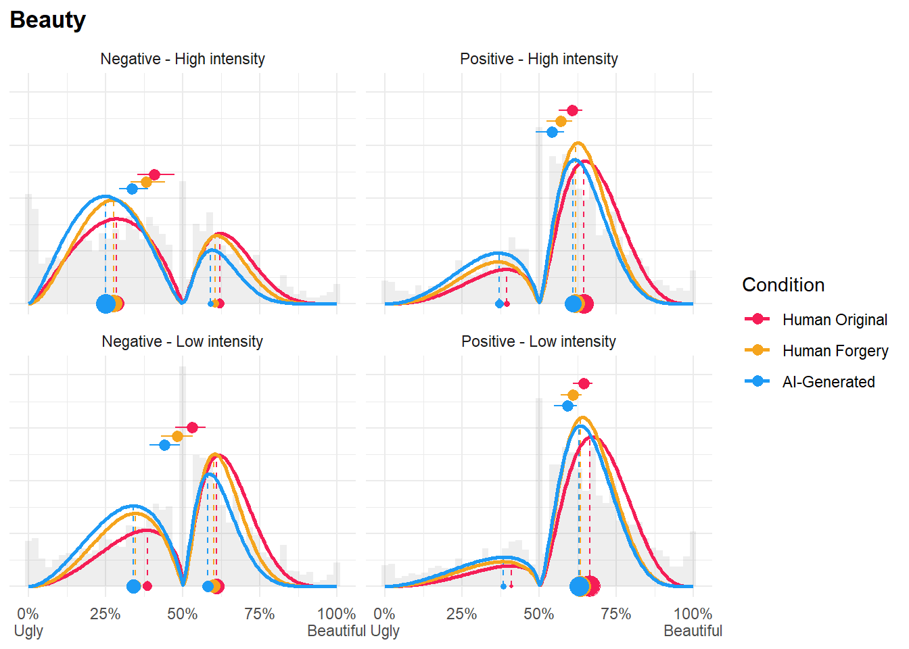{#fig-beauty-emotion fig-alt='Beauty by stimulus emotion quadrant: as the previous figure, one panel per valence x arousal quadrant of the artworks.' width=672}
:::
:::


### Valence


::: {.cell}

```{.r .cell-code}
make_report(estimates$Valence)
```

::: {.cell-output-display}

```{=html}
<div id="ggqtdcsxrf" style="padding-left:0px;padding-right:0px;padding-top:10px;padding-bottom:10px;overflow-x:auto;overflow-y:auto;width:auto;height:auto;">
<style>#ggqtdcsxrf table {
  font-family: system-ui, 'Segoe UI', Roboto, Helvetica, Arial, sans-serif, 'Apple Color Emoji', 'Segoe UI Emoji', 'Segoe UI Symbol', 'Noto Color Emoji';
  -webkit-font-smoothing: antialiased;
  -moz-osx-font-smoothing: grayscale;
}

#ggqtdcsxrf thead, #ggqtdcsxrf tbody, #ggqtdcsxrf tfoot, #ggqtdcsxrf tr, #ggqtdcsxrf td, #ggqtdcsxrf th {
  border-style: none;
}

#ggqtdcsxrf p {
  margin: 0;
  padding: 0;
}

#ggqtdcsxrf .gt_table {
  display: table;
  border-collapse: collapse;
  line-height: normal;
  margin-left: auto;
  margin-right: auto;
  color: #333333;
  font-size: 16px;
  font-weight: normal;
  font-style: normal;
  background-color: #FFFFFF;
  width: auto;
  border-top-style: solid;
  border-top-width: 2px;
  border-top-color: #A8A8A8;
  border-right-style: none;
  border-right-width: 2px;
  border-right-color: #D3D3D3;
  border-bottom-style: solid;
  border-bottom-width: 2px;
  border-bottom-color: #A8A8A8;
  border-left-style: none;
  border-left-width: 2px;
  border-left-color: #D3D3D3;
}

#ggqtdcsxrf .gt_caption {
  padding-top: 4px;
  padding-bottom: 4px;
}

#ggqtdcsxrf .gt_title {
  color: #333333;
  font-size: 125%;
  font-weight: initial;
  padding-top: 4px;
  padding-bottom: 4px;
  padding-left: 5px;
  padding-right: 5px;
  border-bottom-color: #FFFFFF;
  border-bottom-width: 0;
}

#ggqtdcsxrf .gt_subtitle {
  color: #333333;
  font-size: 85%;
  font-weight: initial;
  padding-top: 3px;
  padding-bottom: 5px;
  padding-left: 5px;
  padding-right: 5px;
  border-top-color: #FFFFFF;
  border-top-width: 0;
}

#ggqtdcsxrf .gt_heading {
  background-color: #FFFFFF;
  text-align: center;
  border-bottom-color: #FFFFFF;
  border-left-style: none;
  border-left-width: 1px;
  border-left-color: #D3D3D3;
  border-right-style: none;
  border-right-width: 1px;
  border-right-color: #D3D3D3;
}

#ggqtdcsxrf .gt_bottom_border {
  border-bottom-style: solid;
  border-bottom-width: 2px;
  border-bottom-color: #D3D3D3;
}

#ggqtdcsxrf .gt_col_headings {
  border-top-style: solid;
  border-top-width: 2px;
  border-top-color: #D3D3D3;
  border-bottom-style: solid;
  border-bottom-width: 2px;
  border-bottom-color: #D3D3D3;
  border-left-style: none;
  border-left-width: 1px;
  border-left-color: #D3D3D3;
  border-right-style: none;
  border-right-width: 1px;
  border-right-color: #D3D3D3;
}

#ggqtdcsxrf .gt_col_heading {
  color: #333333;
  background-color: #FFFFFF;
  font-size: 100%;
  font-weight: normal;
  text-transform: inherit;
  border-left-style: none;
  border-left-width: 1px;
  border-left-color: #D3D3D3;
  border-right-style: none;
  border-right-width: 1px;
  border-right-color: #D3D3D3;
  vertical-align: bottom;
  padding-top: 5px;
  padding-bottom: 6px;
  padding-left: 5px;
  padding-right: 5px;
  overflow-x: hidden;
}

#ggqtdcsxrf .gt_column_spanner_outer {
  color: #333333;
  background-color: #FFFFFF;
  font-size: 100%;
  font-weight: normal;
  text-transform: inherit;
  padding-top: 0;
  padding-bottom: 0;
  padding-left: 4px;
  padding-right: 4px;
}

#ggqtdcsxrf .gt_column_spanner_outer:first-child {
  padding-left: 0;
}

#ggqtdcsxrf .gt_column_spanner_outer:last-child {
  padding-right: 0;
}

#ggqtdcsxrf .gt_column_spanner {
  border-bottom-style: solid;
  border-bottom-width: 2px;
  border-bottom-color: #D3D3D3;
  vertical-align: bottom;
  padding-top: 5px;
  padding-bottom: 5px;
  overflow-x: hidden;
  display: inline-block;
  width: 100%;
}

#ggqtdcsxrf .gt_spanner_row {
  border-bottom-style: hidden;
}

#ggqtdcsxrf .gt_group_heading {
  padding-top: 8px;
  padding-bottom: 8px;
  padding-left: 5px;
  padding-right: 5px;
  color: #333333;
  background-color: #FFFFFF;
  font-size: 100%;
  font-weight: initial;
  text-transform: inherit;
  border-top-style: solid;
  border-top-width: 2px;
  border-top-color: #D3D3D3;
  border-bottom-style: solid;
  border-bottom-width: 2px;
  border-bottom-color: #D3D3D3;
  border-left-style: none;
  border-left-width: 1px;
  border-left-color: #D3D3D3;
  border-right-style: none;
  border-right-width: 1px;
  border-right-color: #D3D3D3;
  vertical-align: middle;
  text-align: left;
}

#ggqtdcsxrf .gt_empty_group_heading {
  padding: 0.5px;
  color: #333333;
  background-color: #FFFFFF;
  font-size: 100%;
  font-weight: initial;
  border-top-style: solid;
  border-top-width: 2px;
  border-top-color: #D3D3D3;
  border-bottom-style: solid;
  border-bottom-width: 2px;
  border-bottom-color: #D3D3D3;
  vertical-align: middle;
}

#ggqtdcsxrf .gt_from_md > :first-child {
  margin-top: 0;
}

#ggqtdcsxrf .gt_from_md > :last-child {
  margin-bottom: 0;
}

#ggqtdcsxrf .gt_row {
  padding-top: 8px;
  padding-bottom: 8px;
  padding-left: 5px;
  padding-right: 5px;
  margin: 10px;
  border-top-style: solid;
  border-top-width: 1px;
  border-top-color: #D3D3D3;
  border-left-style: none;
  border-left-width: 1px;
  border-left-color: #D3D3D3;
  border-right-style: none;
  border-right-width: 1px;
  border-right-color: #D3D3D3;
  vertical-align: middle;
  overflow-x: hidden;
}

#ggqtdcsxrf .gt_stub {
  color: #333333;
  background-color: #FFFFFF;
  font-size: 100%;
  font-weight: initial;
  text-transform: inherit;
  border-right-style: solid;
  border-right-width: 2px;
  border-right-color: #D3D3D3;
  padding-left: 5px;
  padding-right: 5px;
}

#ggqtdcsxrf .gt_stub_row_group {
  color: #333333;
  background-color: #FFFFFF;
  font-size: 100%;
  font-weight: initial;
  text-transform: inherit;
  border-right-style: solid;
  border-right-width: 2px;
  border-right-color: #D3D3D3;
  padding-left: 5px;
  padding-right: 5px;
  vertical-align: top;
}

#ggqtdcsxrf .gt_row_group_first td {
  border-top-width: 2px;
}

#ggqtdcsxrf .gt_row_group_first th {
  border-top-width: 2px;
}

#ggqtdcsxrf .gt_summary_row {
  color: #333333;
  background-color: #FFFFFF;
  text-transform: inherit;
  padding-top: 8px;
  padding-bottom: 8px;
  padding-left: 5px;
  padding-right: 5px;
}

#ggqtdcsxrf .gt_first_summary_row {
  border-top-style: solid;
  border-top-color: #D3D3D3;
}

#ggqtdcsxrf .gt_first_summary_row.thick {
  border-top-width: 2px;
}

#ggqtdcsxrf .gt_last_summary_row {
  padding-top: 8px;
  padding-bottom: 8px;
  padding-left: 5px;
  padding-right: 5px;
  border-bottom-style: solid;
  border-bottom-width: 2px;
  border-bottom-color: #D3D3D3;
}

#ggqtdcsxrf .gt_grand_summary_row {
  color: #333333;
  background-color: #FFFFFF;
  text-transform: inherit;
  padding-top: 8px;
  padding-bottom: 8px;
  padding-left: 5px;
  padding-right: 5px;
}

#ggqtdcsxrf .gt_first_grand_summary_row {
  padding-top: 8px;
  padding-bottom: 8px;
  padding-left: 5px;
  padding-right: 5px;
  border-top-style: double;
  border-top-width: 6px;
  border-top-color: #D3D3D3;
}

#ggqtdcsxrf .gt_last_grand_summary_row_top {
  padding-top: 8px;
  padding-bottom: 8px;
  padding-left: 5px;
  padding-right: 5px;
  border-bottom-style: double;
  border-bottom-width: 6px;
  border-bottom-color: #D3D3D3;
}

#ggqtdcsxrf .gt_striped {
  background-color: rgba(128, 128, 128, 0.05);
}

#ggqtdcsxrf .gt_table_body {
  border-top-style: solid;
  border-top-width: 2px;
  border-top-color: #D3D3D3;
  border-bottom-style: solid;
  border-bottom-width: 2px;
  border-bottom-color: #D3D3D3;
}

#ggqtdcsxrf .gt_footnotes {
  color: #333333;
  background-color: #FFFFFF;
  border-bottom-style: none;
  border-bottom-width: 2px;
  border-bottom-color: #D3D3D3;
  border-left-style: none;
  border-left-width: 2px;
  border-left-color: #D3D3D3;
  border-right-style: none;
  border-right-width: 2px;
  border-right-color: #D3D3D3;
}

#ggqtdcsxrf .gt_footnote {
  margin: 0px;
  font-size: 90%;
  padding-top: 4px;
  padding-bottom: 4px;
  padding-left: 5px;
  padding-right: 5px;
}

#ggqtdcsxrf .gt_sourcenotes {
  color: #333333;
  background-color: #FFFFFF;
  border-bottom-style: none;
  border-bottom-width: 2px;
  border-bottom-color: #D3D3D3;
  border-left-style: none;
  border-left-width: 2px;
  border-left-color: #D3D3D3;
  border-right-style: none;
  border-right-width: 2px;
  border-right-color: #D3D3D3;
}

#ggqtdcsxrf .gt_sourcenote {
  font-size: 90%;
  padding-top: 4px;
  padding-bottom: 4px;
  padding-left: 5px;
  padding-right: 5px;
}

#ggqtdcsxrf .gt_left {
  text-align: left;
}

#ggqtdcsxrf .gt_center {
  text-align: center;
}

#ggqtdcsxrf .gt_right {
  text-align: right;
  font-variant-numeric: tabular-nums;
}

#ggqtdcsxrf .gt_font_normal {
  font-weight: normal;
}

#ggqtdcsxrf .gt_font_bold {
  font-weight: bold;
}

#ggqtdcsxrf .gt_font_italic {
  font-style: italic;
}

#ggqtdcsxrf .gt_super {
  font-size: 65%;
}

#ggqtdcsxrf .gt_footnote_marks {
  font-size: 75%;
  vertical-align: 0.4em;
  position: initial;
}

#ggqtdcsxrf .gt_asterisk {
  font-size: 100%;
  vertical-align: 0;
}

#ggqtdcsxrf .gt_indent_1 {
  text-indent: 5px;
}

#ggqtdcsxrf .gt_indent_2 {
  text-indent: 10px;
}

#ggqtdcsxrf .gt_indent_3 {
  text-indent: 15px;
}

#ggqtdcsxrf .gt_indent_4 {
  text-indent: 20px;
}

#ggqtdcsxrf .gt_indent_5 {
  text-indent: 25px;
}

#ggqtdcsxrf .katex-display {
  display: inline-flex !important;
  margin-bottom: 0.75em !important;
}

#ggqtdcsxrf div.Reactable > div.rt-table > div.rt-thead > div.rt-tr.rt-tr-group-header > div.rt-th-group:after {
  height: 0px !important;
}
</style>
<table class="gt_table" data-quarto-disable-processing="false" data-quarto-bootstrap="false">
  <thead>
    <tr class="gt_col_headings">
      <th class="gt_col_heading gt_columns_bottom_border gt_left" rowspan="1" colspan="1" scope="col" id="Contrast">Contrast</th>
      <th class="gt_col_heading gt_columns_bottom_border gt_left" rowspan="1" colspan="1" scope="col" id="Parameters">Parameters</th>
    </tr>
  </thead>
  <tbody class="gt_table_body">
    <tr><td headers="Contrast" class="gt_row gt_left">Human Forgery - Human Original</td>
<td headers="Parameters" class="gt_row gt_left">response (-0.21, [-0.26, -0.16]); mu (-0.03, [-0.04, -0.02]); phi (0.49, [ 0.05,  0.91])</td></tr>
    <tr><td headers="Contrast" class="gt_row gt_left">AI-Generated - Human Original</td>
<td headers="Parameters" class="gt_row gt_left">response (-0.37, [-0.43, -0.31]); mu (-0.05, [-0.06, -0.05]); phi (0.46, [ 0.04,  0.92])</td></tr>
    <tr><td headers="Contrast" class="gt_row gt_left">AI-Generated - Human Forgery</td>
<td headers="Parameters" class="gt_row gt_left">response (-0.16, [-0.22, -0.10]); mu (-0.02, [-0.03, -0.01])</td></tr>
  </tbody>
  
</table>
</div>
```

```{=html}
<div id="lrmatuylqw" style="padding-left:0px;padding-right:0px;padding-top:10px;padding-bottom:10px;overflow-x:auto;overflow-y:auto;width:auto;height:auto;">
<style>#lrmatuylqw table {
  font-family: system-ui, 'Segoe UI', Roboto, Helvetica, Arial, sans-serif, 'Apple Color Emoji', 'Segoe UI Emoji', 'Segoe UI Symbol', 'Noto Color Emoji';
  -webkit-font-smoothing: antialiased;
  -moz-osx-font-smoothing: grayscale;
}

#lrmatuylqw thead, #lrmatuylqw tbody, #lrmatuylqw tfoot, #lrmatuylqw tr, #lrmatuylqw td, #lrmatuylqw th {
  border-style: none;
}

#lrmatuylqw p {
  margin: 0;
  padding: 0;
}

#lrmatuylqw .gt_table {
  display: table;
  border-collapse: collapse;
  line-height: normal;
  margin-left: auto;
  margin-right: auto;
  color: #333333;
  font-size: 13px;
  font-weight: normal;
  font-style: normal;
  background-color: #FFFFFF;
  width: auto;
  border-top-style: solid;
  border-top-width: 3px;
  border-top-color: #D5D5D5;
  border-right-style: solid;
  border-right-width: 3px;
  border-right-color: #D5D5D5;
  border-bottom-style: solid;
  border-bottom-width: 3px;
  border-bottom-color: #D5D5D5;
  border-left-style: solid;
  border-left-width: 3px;
  border-left-color: #D5D5D5;
}

#lrmatuylqw .gt_caption {
  padding-top: 4px;
  padding-bottom: 4px;
}

#lrmatuylqw .gt_title {
  color: #333333;
  font-size: 125%;
  font-weight: initial;
  padding-top: 4px;
  padding-bottom: 4px;
  padding-left: 5px;
  padding-right: 5px;
  border-bottom-color: #FFFFFF;
  border-bottom-width: 0;
}

#lrmatuylqw .gt_subtitle {
  color: #333333;
  font-size: 85%;
  font-weight: initial;
  padding-top: 3px;
  padding-bottom: 5px;
  padding-left: 5px;
  padding-right: 5px;
  border-top-color: #FFFFFF;
  border-top-width: 0;
}

#lrmatuylqw .gt_heading {
  background-color: #FFFFFF;
  text-align: left;
  border-bottom-color: #FFFFFF;
  border-left-style: none;
  border-left-width: 1px;
  border-left-color: #D3D3D3;
  border-right-style: none;
  border-right-width: 1px;
  border-right-color: #D3D3D3;
}

#lrmatuylqw .gt_bottom_border {
  border-bottom-style: solid;
  border-bottom-width: 2px;
  border-bottom-color: #D5D5D5;
}

#lrmatuylqw .gt_col_headings {
  border-top-style: solid;
  border-top-width: 2px;
  border-top-color: #D5D5D5;
  border-bottom-style: solid;
  border-bottom-width: 2px;
  border-bottom-color: #D5D5D5;
  border-left-style: none;
  border-left-width: 1px;
  border-left-color: #D3D3D3;
  border-right-style: none;
  border-right-width: 1px;
  border-right-color: #D3D3D3;
}

#lrmatuylqw .gt_col_heading {
  color: #FFFFFF;
  background-color: #000000;
  font-size: 100%;
  font-weight: normal;
  text-transform: inherit;
  border-left-style: none;
  border-left-width: 1px;
  border-left-color: #D3D3D3;
  border-right-style: none;
  border-right-width: 1px;
  border-right-color: #D3D3D3;
  vertical-align: bottom;
  padding-top: 5px;
  padding-bottom: 6px;
  padding-left: 5px;
  padding-right: 5px;
  overflow-x: hidden;
}

#lrmatuylqw .gt_column_spanner_outer {
  color: #FFFFFF;
  background-color: #000000;
  font-size: 100%;
  font-weight: normal;
  text-transform: inherit;
  padding-top: 0;
  padding-bottom: 0;
  padding-left: 4px;
  padding-right: 4px;
}

#lrmatuylqw .gt_column_spanner_outer:first-child {
  padding-left: 0;
}

#lrmatuylqw .gt_column_spanner_outer:last-child {
  padding-right: 0;
}

#lrmatuylqw .gt_column_spanner {
  border-bottom-style: solid;
  border-bottom-width: 2px;
  border-bottom-color: #D5D5D5;
  vertical-align: bottom;
  padding-top: 5px;
  padding-bottom: 5px;
  overflow-x: hidden;
  display: inline-block;
  width: 100%;
}

#lrmatuylqw .gt_spanner_row {
  border-bottom-style: hidden;
}

#lrmatuylqw .gt_group_heading {
  padding-top: 8px;
  padding-bottom: 8px;
  padding-left: 5px;
  padding-right: 5px;
  color: #333333;
  background-color: #FFFFFF;
  font-size: 100%;
  font-weight: initial;
  text-transform: inherit;
  border-top-style: solid;
  border-top-width: 2px;
  border-top-color: #D5D5D5;
  border-bottom-style: solid;
  border-bottom-width: 2px;
  border-bottom-color: #D5D5D5;
  border-left-style: none;
  border-left-width: 1px;
  border-left-color: #D3D3D3;
  border-right-style: none;
  border-right-width: 1px;
  border-right-color: #D3D3D3;
  vertical-align: middle;
  text-align: left;
}

#lrmatuylqw .gt_empty_group_heading {
  padding: 0.5px;
  color: #333333;
  background-color: #FFFFFF;
  font-size: 100%;
  font-weight: initial;
  border-top-style: solid;
  border-top-width: 2px;
  border-top-color: #D5D5D5;
  border-bottom-style: solid;
  border-bottom-width: 2px;
  border-bottom-color: #D5D5D5;
  vertical-align: middle;
}

#lrmatuylqw .gt_from_md > :first-child {
  margin-top: 0;
}

#lrmatuylqw .gt_from_md > :last-child {
  margin-bottom: 0;
}

#lrmatuylqw .gt_row {
  padding-top: 8px;
  padding-bottom: 8px;
  padding-left: 5px;
  padding-right: 5px;
  margin: 10px;
  border-top-style: solid;
  border-top-width: 1px;
  border-top-color: #D5D5D5;
  border-left-style: solid;
  border-left-width: 1px;
  border-left-color: #D5D5D5;
  border-right-style: solid;
  border-right-width: 1px;
  border-right-color: #D5D5D5;
  vertical-align: middle;
  overflow-x: hidden;
}

#lrmatuylqw .gt_stub {
  color: #333333;
  background-color: #FFFFFF;
  font-size: 100%;
  font-weight: initial;
  text-transform: inherit;
  border-right-style: solid;
  border-right-width: 2px;
  border-right-color: #5F5F5F;
  padding-left: 5px;
  padding-right: 5px;
}

#lrmatuylqw .gt_stub_row_group {
  color: #333333;
  background-color: #FFFFFF;
  font-size: 100%;
  font-weight: initial;
  text-transform: inherit;
  border-right-style: solid;
  border-right-width: 2px;
  border-right-color: #D3D3D3;
  padding-left: 5px;
  padding-right: 5px;
  vertical-align: top;
}

#lrmatuylqw .gt_row_group_first td {
  border-top-width: 2px;
}

#lrmatuylqw .gt_row_group_first th {
  border-top-width: 2px;
}

#lrmatuylqw .gt_summary_row {
  color: #333333;
  background-color: #D5D5D5;
  text-transform: inherit;
  padding-top: 8px;
  padding-bottom: 8px;
  padding-left: 5px;
  padding-right: 5px;
}

#lrmatuylqw .gt_first_summary_row {
  border-top-style: solid;
  border-top-color: #D5D5D5;
}

#lrmatuylqw .gt_first_summary_row.thick {
  border-top-width: 2px;
}

#lrmatuylqw .gt_last_summary_row {
  padding-top: 8px;
  padding-bottom: 8px;
  padding-left: 5px;
  padding-right: 5px;
  border-bottom-style: solid;
  border-bottom-width: 2px;
  border-bottom-color: #D5D5D5;
}

#lrmatuylqw .gt_grand_summary_row {
  color: #FFFFFF;
  background-color: #929292;
  text-transform: inherit;
  padding-top: 8px;
  padding-bottom: 8px;
  padding-left: 5px;
  padding-right: 5px;
}

#lrmatuylqw .gt_first_grand_summary_row {
  padding-top: 8px;
  padding-bottom: 8px;
  padding-left: 5px;
  padding-right: 5px;
  border-top-style: double;
  border-top-width: 6px;
  border-top-color: #D5D5D5;
}

#lrmatuylqw .gt_last_grand_summary_row_top {
  padding-top: 8px;
  padding-bottom: 8px;
  padding-left: 5px;
  padding-right: 5px;
  border-bottom-style: double;
  border-bottom-width: 6px;
  border-bottom-color: #D5D5D5;
}

#lrmatuylqw .gt_striped {
  background-color: #F4F4F4;
}

#lrmatuylqw .gt_table_body {
  border-top-style: solid;
  border-top-width: 2px;
  border-top-color: #D5D5D5;
  border-bottom-style: solid;
  border-bottom-width: 2px;
  border-bottom-color: #D5D5D5;
}

#lrmatuylqw .gt_footnotes {
  color: #333333;
  background-color: #FFFFFF;
  border-bottom-style: none;
  border-bottom-width: 2px;
  border-bottom-color: #D3D3D3;
  border-left-style: none;
  border-left-width: 2px;
  border-left-color: #D3D3D3;
  border-right-style: none;
  border-right-width: 2px;
  border-right-color: #D3D3D3;
}

#lrmatuylqw .gt_footnote {
  margin: 0px;
  font-size: 90%;
  padding-top: 4px;
  padding-bottom: 4px;
  padding-left: 5px;
  padding-right: 5px;
}

#lrmatuylqw .gt_sourcenotes {
  color: #333333;
  background-color: #FFFFFF;
  border-bottom-style: none;
  border-bottom-width: 2px;
  border-bottom-color: #D3D3D3;
  border-left-style: none;
  border-left-width: 2px;
  border-left-color: #D3D3D3;
  border-right-style: none;
  border-right-width: 2px;
  border-right-color: #D3D3D3;
}

#lrmatuylqw .gt_sourcenote {
  font-size: 90%;
  padding-top: 4px;
  padding-bottom: 4px;
  padding-left: 5px;
  padding-right: 5px;
}

#lrmatuylqw .gt_left {
  text-align: left;
}

#lrmatuylqw .gt_center {
  text-align: center;
}

#lrmatuylqw .gt_right {
  text-align: right;
  font-variant-numeric: tabular-nums;
}

#lrmatuylqw .gt_font_normal {
  font-weight: normal;
}

#lrmatuylqw .gt_font_bold {
  font-weight: bold;
}

#lrmatuylqw .gt_font_italic {
  font-style: italic;
}

#lrmatuylqw .gt_super {
  font-size: 65%;
}

#lrmatuylqw .gt_footnote_marks {
  font-size: 75%;
  vertical-align: 0.4em;
  position: initial;
}

#lrmatuylqw .gt_asterisk {
  font-size: 100%;
  vertical-align: 0;
}

#lrmatuylqw .gt_indent_1 {
  text-indent: 5px;
}

#lrmatuylqw .gt_indent_2 {
  text-indent: 10px;
}

#lrmatuylqw .gt_indent_3 {
  text-indent: 15px;
}

#lrmatuylqw .gt_indent_4 {
  text-indent: 20px;
}

#lrmatuylqw .gt_indent_5 {
  text-indent: 25px;
}

#lrmatuylqw .katex-display {
  display: inline-flex !important;
  margin-bottom: 0.75em !important;
}

#lrmatuylqw div.Reactable > div.rt-table > div.rt-thead > div.rt-tr.rt-tr-group-header > div.rt-th-group:after {
  height: 0px !important;
}
</style>
<table class="gt_table" data-quarto-disable-processing="false" data-quarto-bootstrap="false">
  <thead>
    <tr class="gt_heading">
      <td colspan="10" class="gt_heading gt_title gt_font_normal gt_bottom_border" style>Valence: convergence</td>
    </tr>
    
    <tr class="gt_col_headings">
      <th class="gt_col_heading gt_columns_bottom_border gt_left" rowspan="1" colspan="1" scope="col" id="Model">Model</th>
      <th class="gt_col_heading gt_columns_bottom_border gt_left" rowspan="1" colspan="1" scope="col" id="Family">Family</th>
      <th class="gt_col_heading gt_columns_bottom_border gt_right" rowspan="1" colspan="1" scope="col" id="N_obs">N_obs</th>
      <th class="gt_col_heading gt_columns_bottom_border gt_right" rowspan="1" colspan="1" scope="col" id="N_participants">N_participants</th>
      <th class="gt_col_heading gt_columns_bottom_border gt_right" rowspan="1" colspan="1" scope="col" id="Chains">Chains</th>
      <th class="gt_col_heading gt_columns_bottom_border gt_right" rowspan="1" colspan="1" scope="col" id="Draws">Draws</th>
      <th class="gt_col_heading gt_columns_bottom_border gt_right" rowspan="1" colspan="1" scope="col" id="Max_Rhat">Max_Rhat</th>
      <th class="gt_col_heading gt_columns_bottom_border gt_right" rowspan="1" colspan="1" scope="col" id="Min_ESS_ratio">Min_ESS_ratio</th>
      <th class="gt_col_heading gt_columns_bottom_border gt_right" rowspan="1" colspan="1" scope="col" id="Divergent_pct">Divergent_pct</th>
      <th class="gt_col_heading gt_columns_bottom_border gt_left" rowspan="1" colspan="1" scope="col" id="Criterion">Criterion</th>
    </tr>
  </thead>
  <tbody class="gt_table_body">
    <tr><td headers="Model" class="gt_row gt_left">Valence</td>
<td headers="Family" class="gt_row gt_left">Discrete Beta (k = 7)</td>
<td headers="N_obs" class="gt_row gt_right">15552</td>
<td headers="N_participants" class="gt_row gt_right">324</td>
<td headers="Chains" class="gt_row gt_right">8</td>
<td headers="Draws" class="gt_row gt_right">4000</td>
<td headers="Max_Rhat" class="gt_row gt_right">1.039</td>
<td headers="Min_ESS_ratio" class="gt_row gt_right">0.035</td>
<td headers="Divergent_pct" class="gt_row gt_right">0.1</td>
<td headers="Criterion" class="gt_row gt_left">loo</td></tr>
  </tbody>
  
</table>
</div>
```


::: {.callout-note collapse="true" title="Valence: convergence (Markdown table, for text readers)"}

|Model   |Family                | N_obs| N_participants| Chains| Draws| Max_Rhat| Min_ESS_ratio| Divergent_pct|Criterion |
|:-------|:---------------------|-----:|--------------:|------:|-----:|--------:|-------------:|-------------:|:---------|
|Valence |Discrete Beta (k = 7) | 15552|            324|      8|  4000|    1.039|         0.035|           0.1|loo       |

:::

```{=html}
<div id="gewmkjdqhy" style="padding-left:0px;padding-right:0px;padding-top:10px;padding-bottom:10px;overflow-x:auto;overflow-y:auto;width:auto;height:auto;">
<style>#gewmkjdqhy table {
  font-family: system-ui, 'Segoe UI', Roboto, Helvetica, Arial, sans-serif, 'Apple Color Emoji', 'Segoe UI Emoji', 'Segoe UI Symbol', 'Noto Color Emoji';
  -webkit-font-smoothing: antialiased;
  -moz-osx-font-smoothing: grayscale;
}

#gewmkjdqhy thead, #gewmkjdqhy tbody, #gewmkjdqhy tfoot, #gewmkjdqhy tr, #gewmkjdqhy td, #gewmkjdqhy th {
  border-style: none;
}

#gewmkjdqhy p {
  margin: 0;
  padding: 0;
}

#gewmkjdqhy .gt_table {
  display: table;
  border-collapse: collapse;
  line-height: normal;
  margin-left: auto;
  margin-right: auto;
  color: #333333;
  font-size: 13px;
  font-weight: normal;
  font-style: normal;
  background-color: #FFFFFF;
  width: auto;
  border-top-style: solid;
  border-top-width: 3px;
  border-top-color: #D5D5D5;
  border-right-style: solid;
  border-right-width: 3px;
  border-right-color: #D5D5D5;
  border-bottom-style: solid;
  border-bottom-width: 3px;
  border-bottom-color: #D5D5D5;
  border-left-style: solid;
  border-left-width: 3px;
  border-left-color: #D5D5D5;
}

#gewmkjdqhy .gt_caption {
  padding-top: 4px;
  padding-bottom: 4px;
}

#gewmkjdqhy .gt_title {
  color: #333333;
  font-size: 125%;
  font-weight: initial;
  padding-top: 4px;
  padding-bottom: 4px;
  padding-left: 5px;
  padding-right: 5px;
  border-bottom-color: #FFFFFF;
  border-bottom-width: 0;
}

#gewmkjdqhy .gt_subtitle {
  color: #333333;
  font-size: 85%;
  font-weight: initial;
  padding-top: 3px;
  padding-bottom: 5px;
  padding-left: 5px;
  padding-right: 5px;
  border-top-color: #FFFFFF;
  border-top-width: 0;
}

#gewmkjdqhy .gt_heading {
  background-color: #FFFFFF;
  text-align: left;
  border-bottom-color: #FFFFFF;
  border-left-style: none;
  border-left-width: 1px;
  border-left-color: #D3D3D3;
  border-right-style: none;
  border-right-width: 1px;
  border-right-color: #D3D3D3;
}

#gewmkjdqhy .gt_bottom_border {
  border-bottom-style: solid;
  border-bottom-width: 2px;
  border-bottom-color: #D5D5D5;
}

#gewmkjdqhy .gt_col_headings {
  border-top-style: solid;
  border-top-width: 2px;
  border-top-color: #D5D5D5;
  border-bottom-style: solid;
  border-bottom-width: 2px;
  border-bottom-color: #D5D5D5;
  border-left-style: none;
  border-left-width: 1px;
  border-left-color: #D3D3D3;
  border-right-style: none;
  border-right-width: 1px;
  border-right-color: #D3D3D3;
}

#gewmkjdqhy .gt_col_heading {
  color: #FFFFFF;
  background-color: #000000;
  font-size: 100%;
  font-weight: normal;
  text-transform: inherit;
  border-left-style: none;
  border-left-width: 1px;
  border-left-color: #D3D3D3;
  border-right-style: none;
  border-right-width: 1px;
  border-right-color: #D3D3D3;
  vertical-align: bottom;
  padding-top: 5px;
  padding-bottom: 6px;
  padding-left: 5px;
  padding-right: 5px;
  overflow-x: hidden;
}

#gewmkjdqhy .gt_column_spanner_outer {
  color: #FFFFFF;
  background-color: #000000;
  font-size: 100%;
  font-weight: normal;
  text-transform: inherit;
  padding-top: 0;
  padding-bottom: 0;
  padding-left: 4px;
  padding-right: 4px;
}

#gewmkjdqhy .gt_column_spanner_outer:first-child {
  padding-left: 0;
}

#gewmkjdqhy .gt_column_spanner_outer:last-child {
  padding-right: 0;
}

#gewmkjdqhy .gt_column_spanner {
  border-bottom-style: solid;
  border-bottom-width: 2px;
  border-bottom-color: #D5D5D5;
  vertical-align: bottom;
  padding-top: 5px;
  padding-bottom: 5px;
  overflow-x: hidden;
  display: inline-block;
  width: 100%;
}

#gewmkjdqhy .gt_spanner_row {
  border-bottom-style: hidden;
}

#gewmkjdqhy .gt_group_heading {
  padding-top: 8px;
  padding-bottom: 8px;
  padding-left: 5px;
  padding-right: 5px;
  color: #333333;
  background-color: #FFFFFF;
  font-size: 100%;
  font-weight: initial;
  text-transform: inherit;
  border-top-style: solid;
  border-top-width: 2px;
  border-top-color: #D5D5D5;
  border-bottom-style: solid;
  border-bottom-width: 2px;
  border-bottom-color: #D5D5D5;
  border-left-style: none;
  border-left-width: 1px;
  border-left-color: #D3D3D3;
  border-right-style: none;
  border-right-width: 1px;
  border-right-color: #D3D3D3;
  vertical-align: middle;
  text-align: left;
}

#gewmkjdqhy .gt_empty_group_heading {
  padding: 0.5px;
  color: #333333;
  background-color: #FFFFFF;
  font-size: 100%;
  font-weight: initial;
  border-top-style: solid;
  border-top-width: 2px;
  border-top-color: #D5D5D5;
  border-bottom-style: solid;
  border-bottom-width: 2px;
  border-bottom-color: #D5D5D5;
  vertical-align: middle;
}

#gewmkjdqhy .gt_from_md > :first-child {
  margin-top: 0;
}

#gewmkjdqhy .gt_from_md > :last-child {
  margin-bottom: 0;
}

#gewmkjdqhy .gt_row {
  padding-top: 8px;
  padding-bottom: 8px;
  padding-left: 5px;
  padding-right: 5px;
  margin: 10px;
  border-top-style: solid;
  border-top-width: 1px;
  border-top-color: #D5D5D5;
  border-left-style: solid;
  border-left-width: 1px;
  border-left-color: #D5D5D5;
  border-right-style: solid;
  border-right-width: 1px;
  border-right-color: #D5D5D5;
  vertical-align: middle;
  overflow-x: hidden;
}

#gewmkjdqhy .gt_stub {
  color: #333333;
  background-color: #FFFFFF;
  font-size: 100%;
  font-weight: initial;
  text-transform: inherit;
  border-right-style: solid;
  border-right-width: 2px;
  border-right-color: #5F5F5F;
  padding-left: 5px;
  padding-right: 5px;
}

#gewmkjdqhy .gt_stub_row_group {
  color: #333333;
  background-color: #FFFFFF;
  font-size: 100%;
  font-weight: initial;
  text-transform: inherit;
  border-right-style: solid;
  border-right-width: 2px;
  border-right-color: #D3D3D3;
  padding-left: 5px;
  padding-right: 5px;
  vertical-align: top;
}

#gewmkjdqhy .gt_row_group_first td {
  border-top-width: 2px;
}

#gewmkjdqhy .gt_row_group_first th {
  border-top-width: 2px;
}

#gewmkjdqhy .gt_summary_row {
  color: #333333;
  background-color: #D5D5D5;
  text-transform: inherit;
  padding-top: 8px;
  padding-bottom: 8px;
  padding-left: 5px;
  padding-right: 5px;
}

#gewmkjdqhy .gt_first_summary_row {
  border-top-style: solid;
  border-top-color: #D5D5D5;
}

#gewmkjdqhy .gt_first_summary_row.thick {
  border-top-width: 2px;
}

#gewmkjdqhy .gt_last_summary_row {
  padding-top: 8px;
  padding-bottom: 8px;
  padding-left: 5px;
  padding-right: 5px;
  border-bottom-style: solid;
  border-bottom-width: 2px;
  border-bottom-color: #D5D5D5;
}

#gewmkjdqhy .gt_grand_summary_row {
  color: #FFFFFF;
  background-color: #929292;
  text-transform: inherit;
  padding-top: 8px;
  padding-bottom: 8px;
  padding-left: 5px;
  padding-right: 5px;
}

#gewmkjdqhy .gt_first_grand_summary_row {
  padding-top: 8px;
  padding-bottom: 8px;
  padding-left: 5px;
  padding-right: 5px;
  border-top-style: double;
  border-top-width: 6px;
  border-top-color: #D5D5D5;
}

#gewmkjdqhy .gt_last_grand_summary_row_top {
  padding-top: 8px;
  padding-bottom: 8px;
  padding-left: 5px;
  padding-right: 5px;
  border-bottom-style: double;
  border-bottom-width: 6px;
  border-bottom-color: #D5D5D5;
}

#gewmkjdqhy .gt_striped {
  background-color: #F4F4F4;
}

#gewmkjdqhy .gt_table_body {
  border-top-style: solid;
  border-top-width: 2px;
  border-top-color: #D5D5D5;
  border-bottom-style: solid;
  border-bottom-width: 2px;
  border-bottom-color: #D5D5D5;
}

#gewmkjdqhy .gt_footnotes {
  color: #333333;
  background-color: #FFFFFF;
  border-bottom-style: none;
  border-bottom-width: 2px;
  border-bottom-color: #D3D3D3;
  border-left-style: none;
  border-left-width: 2px;
  border-left-color: #D3D3D3;
  border-right-style: none;
  border-right-width: 2px;
  border-right-color: #D3D3D3;
}

#gewmkjdqhy .gt_footnote {
  margin: 0px;
  font-size: 90%;
  padding-top: 4px;
  padding-bottom: 4px;
  padding-left: 5px;
  padding-right: 5px;
}

#gewmkjdqhy .gt_sourcenotes {
  color: #333333;
  background-color: #FFFFFF;
  border-bottom-style: none;
  border-bottom-width: 2px;
  border-bottom-color: #D3D3D3;
  border-left-style: none;
  border-left-width: 2px;
  border-left-color: #D3D3D3;
  border-right-style: none;
  border-right-width: 2px;
  border-right-color: #D3D3D3;
}

#gewmkjdqhy .gt_sourcenote {
  font-size: 90%;
  padding-top: 4px;
  padding-bottom: 4px;
  padding-left: 5px;
  padding-right: 5px;
}

#gewmkjdqhy .gt_left {
  text-align: left;
}

#gewmkjdqhy .gt_center {
  text-align: center;
}

#gewmkjdqhy .gt_right {
  text-align: right;
  font-variant-numeric: tabular-nums;
}

#gewmkjdqhy .gt_font_normal {
  font-weight: normal;
}

#gewmkjdqhy .gt_font_bold {
  font-weight: bold;
}

#gewmkjdqhy .gt_font_italic {
  font-style: italic;
}

#gewmkjdqhy .gt_super {
  font-size: 65%;
}

#gewmkjdqhy .gt_footnote_marks {
  font-size: 75%;
  vertical-align: 0.4em;
  position: initial;
}

#gewmkjdqhy .gt_asterisk {
  font-size: 100%;
  vertical-align: 0;
}

#gewmkjdqhy .gt_indent_1 {
  text-indent: 5px;
}

#gewmkjdqhy .gt_indent_2 {
  text-indent: 10px;
}

#gewmkjdqhy .gt_indent_3 {
  text-indent: 15px;
}

#gewmkjdqhy .gt_indent_4 {
  text-indent: 20px;
}

#gewmkjdqhy .gt_indent_5 {
  text-indent: 25px;
}

#gewmkjdqhy .katex-display {
  display: inline-flex !important;
  margin-bottom: 0.75em !important;
}

#gewmkjdqhy div.Reactable > div.rt-table > div.rt-thead > div.rt-tr.rt-tr-group-header > div.rt-th-group:after {
  height: 0px !important;
}
</style>
<table class="gt_table" data-quarto-disable-processing="false" data-quarto-bootstrap="false">
  <thead>
    <tr class="gt_heading">
      <td colspan="4" class="gt_heading gt_title gt_font_normal gt_bottom_border" style>Valence: marginal means per label condition (response scale)</td>
    </tr>
    
    <tr class="gt_col_headings">
      <th class="gt_col_heading gt_columns_bottom_border gt_center" rowspan="1" colspan="1" scope="col" id="Condition">Condition</th>
      <th class="gt_col_heading gt_columns_bottom_border gt_right" rowspan="1" colspan="1" scope="col" id="Estimate">Estimate</th>
      <th class="gt_col_heading gt_columns_bottom_border gt_right" rowspan="1" colspan="1" scope="col" id="CI_low">CI_low</th>
      <th class="gt_col_heading gt_columns_bottom_border gt_right" rowspan="1" colspan="1" scope="col" id="CI_high">CI_high</th>
    </tr>
  </thead>
  <tbody class="gt_table_body">
    <tr><td headers="Condition" class="gt_row gt_center">Human Original</td>
<td headers="Estimate" class="gt_row gt_right">4.14</td>
<td headers="CI_low" class="gt_row gt_right">3.99</td>
<td headers="CI_high" class="gt_row gt_right">4.28</td></tr>
    <tr><td headers="Condition" class="gt_row gt_center gt_striped">Human Forgery</td>
<td headers="Estimate" class="gt_row gt_right gt_striped">3.92</td>
<td headers="CI_low" class="gt_row gt_right gt_striped">3.78</td>
<td headers="CI_high" class="gt_row gt_right gt_striped">4.07</td></tr>
    <tr><td headers="Condition" class="gt_row gt_center">AI-Generated</td>
<td headers="Estimate" class="gt_row gt_right">3.77</td>
<td headers="CI_low" class="gt_row gt_right">3.63</td>
<td headers="CI_high" class="gt_row gt_right">3.90</td></tr>
  </tbody>
  
</table>
</div>
```


::: {.callout-note collapse="true" title="Valence: marginal means per label condition (response scale) (Markdown table, for text readers)"}

|Condition      |Estimate |CI_low |CI_high |
|:--------------|:--------|:------|:-------|
|Human Original |4.14     |3.99   |4.28    |
|Human Forgery  |3.92     |3.78   |4.07    |
|AI-Generated   |3.77     |3.63   |3.90    |

:::

```{=html}
<div id="ecvdigvbol" style="padding-left:0px;padding-right:0px;padding-top:10px;padding-bottom:10px;overflow-x:auto;overflow-y:auto;width:auto;height:auto;">
<style>#ecvdigvbol table {
  font-family: system-ui, 'Segoe UI', Roboto, Helvetica, Arial, sans-serif, 'Apple Color Emoji', 'Segoe UI Emoji', 'Segoe UI Symbol', 'Noto Color Emoji';
  -webkit-font-smoothing: antialiased;
  -moz-osx-font-smoothing: grayscale;
}

#ecvdigvbol thead, #ecvdigvbol tbody, #ecvdigvbol tfoot, #ecvdigvbol tr, #ecvdigvbol td, #ecvdigvbol th {
  border-style: none;
}

#ecvdigvbol p {
  margin: 0;
  padding: 0;
}

#ecvdigvbol .gt_table {
  display: table;
  border-collapse: collapse;
  line-height: normal;
  margin-left: auto;
  margin-right: auto;
  color: #333333;
  font-size: 13px;
  font-weight: normal;
  font-style: normal;
  background-color: #FFFFFF;
  width: auto;
  border-top-style: solid;
  border-top-width: 3px;
  border-top-color: #D5D5D5;
  border-right-style: solid;
  border-right-width: 3px;
  border-right-color: #D5D5D5;
  border-bottom-style: solid;
  border-bottom-width: 3px;
  border-bottom-color: #D5D5D5;
  border-left-style: solid;
  border-left-width: 3px;
  border-left-color: #D5D5D5;
}

#ecvdigvbol .gt_caption {
  padding-top: 4px;
  padding-bottom: 4px;
}

#ecvdigvbol .gt_title {
  color: #333333;
  font-size: 125%;
  font-weight: initial;
  padding-top: 4px;
  padding-bottom: 4px;
  padding-left: 5px;
  padding-right: 5px;
  border-bottom-color: #FFFFFF;
  border-bottom-width: 0;
}

#ecvdigvbol .gt_subtitle {
  color: #333333;
  font-size: 85%;
  font-weight: initial;
  padding-top: 3px;
  padding-bottom: 5px;
  padding-left: 5px;
  padding-right: 5px;
  border-top-color: #FFFFFF;
  border-top-width: 0;
}

#ecvdigvbol .gt_heading {
  background-color: #FFFFFF;
  text-align: left;
  border-bottom-color: #FFFFFF;
  border-left-style: none;
  border-left-width: 1px;
  border-left-color: #D3D3D3;
  border-right-style: none;
  border-right-width: 1px;
  border-right-color: #D3D3D3;
}

#ecvdigvbol .gt_bottom_border {
  border-bottom-style: solid;
  border-bottom-width: 2px;
  border-bottom-color: #D5D5D5;
}

#ecvdigvbol .gt_col_headings {
  border-top-style: solid;
  border-top-width: 2px;
  border-top-color: #D5D5D5;
  border-bottom-style: solid;
  border-bottom-width: 2px;
  border-bottom-color: #D5D5D5;
  border-left-style: none;
  border-left-width: 1px;
  border-left-color: #D3D3D3;
  border-right-style: none;
  border-right-width: 1px;
  border-right-color: #D3D3D3;
}

#ecvdigvbol .gt_col_heading {
  color: #FFFFFF;
  background-color: #000000;
  font-size: 100%;
  font-weight: normal;
  text-transform: inherit;
  border-left-style: none;
  border-left-width: 1px;
  border-left-color: #D3D3D3;
  border-right-style: none;
  border-right-width: 1px;
  border-right-color: #D3D3D3;
  vertical-align: bottom;
  padding-top: 5px;
  padding-bottom: 6px;
  padding-left: 5px;
  padding-right: 5px;
  overflow-x: hidden;
}

#ecvdigvbol .gt_column_spanner_outer {
  color: #FFFFFF;
  background-color: #000000;
  font-size: 100%;
  font-weight: normal;
  text-transform: inherit;
  padding-top: 0;
  padding-bottom: 0;
  padding-left: 4px;
  padding-right: 4px;
}

#ecvdigvbol .gt_column_spanner_outer:first-child {
  padding-left: 0;
}

#ecvdigvbol .gt_column_spanner_outer:last-child {
  padding-right: 0;
}

#ecvdigvbol .gt_column_spanner {
  border-bottom-style: solid;
  border-bottom-width: 2px;
  border-bottom-color: #D5D5D5;
  vertical-align: bottom;
  padding-top: 5px;
  padding-bottom: 5px;
  overflow-x: hidden;
  display: inline-block;
  width: 100%;
}

#ecvdigvbol .gt_spanner_row {
  border-bottom-style: hidden;
}

#ecvdigvbol .gt_group_heading {
  padding-top: 8px;
  padding-bottom: 8px;
  padding-left: 5px;
  padding-right: 5px;
  color: #333333;
  background-color: #FFFFFF;
  font-size: 100%;
  font-weight: initial;
  text-transform: inherit;
  border-top-style: solid;
  border-top-width: 2px;
  border-top-color: #D5D5D5;
  border-bottom-style: solid;
  border-bottom-width: 2px;
  border-bottom-color: #D5D5D5;
  border-left-style: none;
  border-left-width: 1px;
  border-left-color: #D3D3D3;
  border-right-style: none;
  border-right-width: 1px;
  border-right-color: #D3D3D3;
  vertical-align: middle;
  text-align: left;
}

#ecvdigvbol .gt_empty_group_heading {
  padding: 0.5px;
  color: #333333;
  background-color: #FFFFFF;
  font-size: 100%;
  font-weight: initial;
  border-top-style: solid;
  border-top-width: 2px;
  border-top-color: #D5D5D5;
  border-bottom-style: solid;
  border-bottom-width: 2px;
  border-bottom-color: #D5D5D5;
  vertical-align: middle;
}

#ecvdigvbol .gt_from_md > :first-child {
  margin-top: 0;
}

#ecvdigvbol .gt_from_md > :last-child {
  margin-bottom: 0;
}

#ecvdigvbol .gt_row {
  padding-top: 8px;
  padding-bottom: 8px;
  padding-left: 5px;
  padding-right: 5px;
  margin: 10px;
  border-top-style: solid;
  border-top-width: 1px;
  border-top-color: #D5D5D5;
  border-left-style: solid;
  border-left-width: 1px;
  border-left-color: #D5D5D5;
  border-right-style: solid;
  border-right-width: 1px;
  border-right-color: #D5D5D5;
  vertical-align: middle;
  overflow-x: hidden;
}

#ecvdigvbol .gt_stub {
  color: #333333;
  background-color: #FFFFFF;
  font-size: 100%;
  font-weight: initial;
  text-transform: inherit;
  border-right-style: solid;
  border-right-width: 2px;
  border-right-color: #5F5F5F;
  padding-left: 5px;
  padding-right: 5px;
}

#ecvdigvbol .gt_stub_row_group {
  color: #333333;
  background-color: #FFFFFF;
  font-size: 100%;
  font-weight: initial;
  text-transform: inherit;
  border-right-style: solid;
  border-right-width: 2px;
  border-right-color: #D3D3D3;
  padding-left: 5px;
  padding-right: 5px;
  vertical-align: top;
}

#ecvdigvbol .gt_row_group_first td {
  border-top-width: 2px;
}

#ecvdigvbol .gt_row_group_first th {
  border-top-width: 2px;
}

#ecvdigvbol .gt_summary_row {
  color: #333333;
  background-color: #D5D5D5;
  text-transform: inherit;
  padding-top: 8px;
  padding-bottom: 8px;
  padding-left: 5px;
  padding-right: 5px;
}

#ecvdigvbol .gt_first_summary_row {
  border-top-style: solid;
  border-top-color: #D5D5D5;
}

#ecvdigvbol .gt_first_summary_row.thick {
  border-top-width: 2px;
}

#ecvdigvbol .gt_last_summary_row {
  padding-top: 8px;
  padding-bottom: 8px;
  padding-left: 5px;
  padding-right: 5px;
  border-bottom-style: solid;
  border-bottom-width: 2px;
  border-bottom-color: #D5D5D5;
}

#ecvdigvbol .gt_grand_summary_row {
  color: #FFFFFF;
  background-color: #929292;
  text-transform: inherit;
  padding-top: 8px;
  padding-bottom: 8px;
  padding-left: 5px;
  padding-right: 5px;
}

#ecvdigvbol .gt_first_grand_summary_row {
  padding-top: 8px;
  padding-bottom: 8px;
  padding-left: 5px;
  padding-right: 5px;
  border-top-style: double;
  border-top-width: 6px;
  border-top-color: #D5D5D5;
}

#ecvdigvbol .gt_last_grand_summary_row_top {
  padding-top: 8px;
  padding-bottom: 8px;
  padding-left: 5px;
  padding-right: 5px;
  border-bottom-style: double;
  border-bottom-width: 6px;
  border-bottom-color: #D5D5D5;
}

#ecvdigvbol .gt_striped {
  background-color: #F4F4F4;
}

#ecvdigvbol .gt_table_body {
  border-top-style: solid;
  border-top-width: 2px;
  border-top-color: #D5D5D5;
  border-bottom-style: solid;
  border-bottom-width: 2px;
  border-bottom-color: #D5D5D5;
}

#ecvdigvbol .gt_footnotes {
  color: #333333;
  background-color: #FFFFFF;
  border-bottom-style: none;
  border-bottom-width: 2px;
  border-bottom-color: #D3D3D3;
  border-left-style: none;
  border-left-width: 2px;
  border-left-color: #D3D3D3;
  border-right-style: none;
  border-right-width: 2px;
  border-right-color: #D3D3D3;
}

#ecvdigvbol .gt_footnote {
  margin: 0px;
  font-size: 90%;
  padding-top: 4px;
  padding-bottom: 4px;
  padding-left: 5px;
  padding-right: 5px;
}

#ecvdigvbol .gt_sourcenotes {
  color: #333333;
  background-color: #FFFFFF;
  border-bottom-style: none;
  border-bottom-width: 2px;
  border-bottom-color: #D3D3D3;
  border-left-style: none;
  border-left-width: 2px;
  border-left-color: #D3D3D3;
  border-right-style: none;
  border-right-width: 2px;
  border-right-color: #D3D3D3;
}

#ecvdigvbol .gt_sourcenote {
  font-size: 90%;
  padding-top: 4px;
  padding-bottom: 4px;
  padding-left: 5px;
  padding-right: 5px;
}

#ecvdigvbol .gt_left {
  text-align: left;
}

#ecvdigvbol .gt_center {
  text-align: center;
}

#ecvdigvbol .gt_right {
  text-align: right;
  font-variant-numeric: tabular-nums;
}

#ecvdigvbol .gt_font_normal {
  font-weight: normal;
}

#ecvdigvbol .gt_font_bold {
  font-weight: bold;
}

#ecvdigvbol .gt_font_italic {
  font-style: italic;
}

#ecvdigvbol .gt_super {
  font-size: 65%;
}

#ecvdigvbol .gt_footnote_marks {
  font-size: 75%;
  vertical-align: 0.4em;
  position: initial;
}

#ecvdigvbol .gt_asterisk {
  font-size: 100%;
  vertical-align: 0;
}

#ecvdigvbol .gt_indent_1 {
  text-indent: 5px;
}

#ecvdigvbol .gt_indent_2 {
  text-indent: 10px;
}

#ecvdigvbol .gt_indent_3 {
  text-indent: 15px;
}

#ecvdigvbol .gt_indent_4 {
  text-indent: 20px;
}

#ecvdigvbol .gt_indent_5 {
  text-indent: 25px;
}

#ecvdigvbol .katex-display {
  display: inline-flex !important;
  margin-bottom: 0.75em !important;
}

#ecvdigvbol div.Reactable > div.rt-table > div.rt-thead > div.rt-tr.rt-tr-group-header > div.rt-th-group:after {
  height: 0px !important;
}
</style>
<table class="gt_table" data-quarto-disable-processing="false" data-quarto-bootstrap="false">
  <thead>
    <tr class="gt_heading">
      <td colspan="6" class="gt_heading gt_title gt_font_normal gt_bottom_border" style>Valence: all contrasts between label conditions</td>
    </tr>
    
    <tr class="gt_col_headings">
      <th class="gt_col_heading gt_columns_bottom_border gt_left" rowspan="1" colspan="1" scope="col" id="Parameter">Parameter</th>
      <th class="gt_col_heading gt_columns_bottom_border gt_right" rowspan="1" colspan="1" scope="col" id="Diff">Diff</th>
      <th class="gt_col_heading gt_columns_bottom_border gt_left" rowspan="1" colspan="1" scope="col" id="CI">CI</th>
      <th class="gt_col_heading gt_columns_bottom_border gt_left" rowspan="1" colspan="1" scope="col" id="Unit">Unit</th>
      <th class="gt_col_heading gt_columns_bottom_border gt_right" rowspan="1" colspan="1" scope="col" id="pd_fmt">pd_fmt</th>
      <th class="gt_col_heading gt_columns_bottom_border gt_left" rowspan="1" colspan="1" scope="col" id="Effect">Effect</th>
    </tr>
  </thead>
  <tbody class="gt_table_body">
    <tr class="gt_group_heading_row">
      <th colspan="6" class="gt_group_heading" scope="colgroup" id="AI-Generated - Human Original">AI-Generated - Human Original</th>
    </tr>
    <tr class="gt_row_group_first"><td headers="AI-Generated - Human Original  Parameter" class="gt_row gt_left" style="background-color: #FFEBEE;">response</td>
<td headers="AI-Generated - Human Original  Diff" class="gt_row gt_right" style="background-color: #FFEBEE;">-6.17</td>
<td headers="AI-Generated - Human Original  CI" class="gt_row gt_left" style="background-color: #FFEBEE;">[-7.23, -5.13]</td>
<td headers="AI-Generated - Human Original  Unit" class="gt_row gt_left" style="background-color: #FFEBEE;">%</td>
<td headers="AI-Generated - Human Original  pd_fmt" class="gt_row gt_right" style="background-color: #FFEBEE;">100%</td>
<td headers="AI-Generated - Human Original  Effect" class="gt_row gt_left" style="background-color: #FFEBEE;">Negative</td></tr>
    <tr><td headers="AI-Generated - Human Original  Parameter" class="gt_row gt_left gt_striped" style="background-color: #FFEBEE;">mu</td>
<td headers="AI-Generated - Human Original  Diff" class="gt_row gt_right gt_striped" style="background-color: #FFEBEE;">-5.47</td>
<td headers="AI-Generated - Human Original  CI" class="gt_row gt_left gt_striped" style="background-color: #FFEBEE;">[-6.40, -4.54]</td>
<td headers="AI-Generated - Human Original  Unit" class="gt_row gt_left gt_striped" style="background-color: #FFEBEE;">%</td>
<td headers="AI-Generated - Human Original  pd_fmt" class="gt_row gt_right gt_striped" style="background-color: #FFEBEE;">100%</td>
<td headers="AI-Generated - Human Original  Effect" class="gt_row gt_left gt_striped" style="background-color: #FFEBEE;">Negative</td></tr>
    <tr><td headers="AI-Generated - Human Original  Parameter" class="gt_row gt_left" style="background-color: #E8F5E9;">phi</td>
<td headers="AI-Generated - Human Original  Diff" class="gt_row gt_right" style="background-color: #E8F5E9;">0.46</td>
<td headers="AI-Generated - Human Original  CI" class="gt_row gt_left" style="background-color: #E8F5E9;">[0.04, 0.92]</td>
<td headers="AI-Generated - Human Original  Unit" class="gt_row gt_left" style="background-color: #E8F5E9;">raw</td>
<td headers="AI-Generated - Human Original  pd_fmt" class="gt_row gt_right" style="background-color: #E8F5E9;">98.42%</td>
<td headers="AI-Generated - Human Original  Effect" class="gt_row gt_left" style="background-color: #E8F5E9;">Positive</td></tr>
    <tr class="gt_group_heading_row">
      <th colspan="6" class="gt_group_heading" scope="colgroup" id="Human Forgery - Human Original">Human Forgery - Human Original</th>
    </tr>
    <tr class="gt_row_group_first"><td headers="Human Forgery - Human Original  Parameter" class="gt_row gt_left gt_striped" style="background-color: #FFEBEE;">response</td>
<td headers="Human Forgery - Human Original  Diff" class="gt_row gt_right gt_striped" style="background-color: #FFEBEE;">-3.51</td>
<td headers="Human Forgery - Human Original  CI" class="gt_row gt_left gt_striped" style="background-color: #FFEBEE;">[-4.35, -2.71]</td>
<td headers="Human Forgery - Human Original  Unit" class="gt_row gt_left gt_striped" style="background-color: #FFEBEE;">%</td>
<td headers="Human Forgery - Human Original  pd_fmt" class="gt_row gt_right gt_striped" style="background-color: #FFEBEE;">100%</td>
<td headers="Human Forgery - Human Original  Effect" class="gt_row gt_left gt_striped" style="background-color: #FFEBEE;">Negative</td></tr>
    <tr><td headers="Human Forgery - Human Original  Parameter" class="gt_row gt_left" style="background-color: #FFEBEE;">mu</td>
<td headers="Human Forgery - Human Original  Diff" class="gt_row gt_right" style="background-color: #FFEBEE;">-3.10</td>
<td headers="Human Forgery - Human Original  CI" class="gt_row gt_left" style="background-color: #FFEBEE;">[-3.86, -2.38]</td>
<td headers="Human Forgery - Human Original  Unit" class="gt_row gt_left" style="background-color: #FFEBEE;">%</td>
<td headers="Human Forgery - Human Original  pd_fmt" class="gt_row gt_right" style="background-color: #FFEBEE;">100%</td>
<td headers="Human Forgery - Human Original  Effect" class="gt_row gt_left" style="background-color: #FFEBEE;">Negative</td></tr>
    <tr><td headers="Human Forgery - Human Original  Parameter" class="gt_row gt_left gt_striped" style="background-color: #E8F5E9;">phi</td>
<td headers="Human Forgery - Human Original  Diff" class="gt_row gt_right gt_striped" style="background-color: #E8F5E9;">0.49</td>
<td headers="Human Forgery - Human Original  CI" class="gt_row gt_left gt_striped" style="background-color: #E8F5E9;">[0.05, 0.91]</td>
<td headers="Human Forgery - Human Original  Unit" class="gt_row gt_left gt_striped" style="background-color: #E8F5E9;">raw</td>
<td headers="Human Forgery - Human Original  pd_fmt" class="gt_row gt_right gt_striped" style="background-color: #E8F5E9;">98.72%</td>
<td headers="Human Forgery - Human Original  Effect" class="gt_row gt_left gt_striped" style="background-color: #E8F5E9;">Positive</td></tr>
    <tr class="gt_group_heading_row">
      <th colspan="6" class="gt_group_heading" scope="colgroup" id="AI-Generated - Human Forgery">AI-Generated - Human Forgery</th>
    </tr>
    <tr class="gt_row_group_first"><td headers="AI-Generated - Human Forgery  Parameter" class="gt_row gt_left" style="background-color: #FFEBEE;">response</td>
<td headers="AI-Generated - Human Forgery  Diff" class="gt_row gt_right" style="background-color: #FFEBEE;">-2.67</td>
<td headers="AI-Generated - Human Forgery  CI" class="gt_row gt_left" style="background-color: #FFEBEE;">[-3.60, -1.67]</td>
<td headers="AI-Generated - Human Forgery  Unit" class="gt_row gt_left" style="background-color: #FFEBEE;">%</td>
<td headers="AI-Generated - Human Forgery  pd_fmt" class="gt_row gt_right" style="background-color: #FFEBEE;">100%</td>
<td headers="AI-Generated - Human Forgery  Effect" class="gt_row gt_left" style="background-color: #FFEBEE;">Negative</td></tr>
    <tr><td headers="AI-Generated - Human Forgery  Parameter" class="gt_row gt_left gt_striped" style="background-color: #FFEBEE;">mu</td>
<td headers="AI-Generated - Human Forgery  Diff" class="gt_row gt_right gt_striped" style="background-color: #FFEBEE;">-2.37</td>
<td headers="AI-Generated - Human Forgery  CI" class="gt_row gt_left gt_striped" style="background-color: #FFEBEE;">[-3.19, -1.49]</td>
<td headers="AI-Generated - Human Forgery  Unit" class="gt_row gt_left gt_striped" style="background-color: #FFEBEE;">%</td>
<td headers="AI-Generated - Human Forgery  pd_fmt" class="gt_row gt_right gt_striped" style="background-color: #FFEBEE;">100%</td>
<td headers="AI-Generated - Human Forgery  Effect" class="gt_row gt_left gt_striped" style="background-color: #FFEBEE;">Negative</td></tr>
    <tr><td headers="AI-Generated - Human Forgery  Parameter" class="gt_row gt_left" style="color: #9E9E9E;">phi</td>
<td headers="AI-Generated - Human Forgery  Diff" class="gt_row gt_right" style="color: #9E9E9E;">-0.01</td>
<td headers="AI-Generated - Human Forgery  CI" class="gt_row gt_left" style="color: #9E9E9E;">[-0.48, 0.47]</td>
<td headers="AI-Generated - Human Forgery  Unit" class="gt_row gt_left" style="color: #9E9E9E;">raw</td>
<td headers="AI-Generated - Human Forgery  pd_fmt" class="gt_row gt_right" style="color: #9E9E9E;">51.90%</td>
<td headers="AI-Generated - Human Forgery  Effect" class="gt_row gt_left" style="color: #9E9E9E;">n.s.</td></tr>
  </tbody>
  
</table>
</div>
```


::: {.callout-note collapse="true" title="Valence: all contrasts between label conditions (Markdown table, for text readers)"}

|Contrast                       |Parameter |Diff  |CI             |Unit |pd_fmt |Effect   |
|:------------------------------|:---------|:-----|:--------------|:----|:------|:--------|
|AI-Generated - Human Original  |response  |-6.17 |[-7.23, -5.13] |%    |100%   |Negative |
|AI-Generated - Human Original  |mu        |-5.47 |[-6.40, -4.54] |%    |100%   |Negative |
|AI-Generated - Human Original  |phi       |0.46  |[0.04, 0.92]   |raw  |98.42% |Positive |
|Human Forgery - Human Original |response  |-3.51 |[-4.35, -2.71] |%    |100%   |Negative |
|Human Forgery - Human Original |mu        |-3.10 |[-3.86, -2.38] |%    |100%   |Negative |
|Human Forgery - Human Original |phi       |0.49  |[0.05, 0.91]   |raw  |98.72% |Positive |
|AI-Generated - Human Forgery   |response  |-2.67 |[-3.60, -1.67] |%    |100%   |Negative |
|AI-Generated - Human Forgery   |mu        |-2.37 |[-3.19, -1.49] |%    |100%   |Negative |
|AI-Generated - Human Forgery   |phi       |-0.01 |[-0.48, 0.47]  |raw  |51.90% |n.s.     |

:::


::: {.callout-note collapse="true" title="Valence: contrasts within each stimulus emotion (Markdown table, for text readers)"}

|Emotion                   |Contrast                       |Parameter |Diff  |CI             |Unit |pd_fmt |Effect   |
|:-------------------------|:------------------------------|:---------|:-----|:--------------|:----|:------|:--------|
|Positive - Low intensity  |AI-Generated - Human Original  |response  |-6.46 |[-8.01, -4.95] |%    |100%   |Negative |
|Negative - Low intensity  |AI-Generated - Human Original  |response  |-6.32 |[-8.00, -4.67] |%    |100%   |Negative |
|Positive - High intensity |AI-Generated - Human Original  |response  |-7.17 |[-8.89, -5.52] |%    |100%   |Negative |
|Negative - High intensity |AI-Generated - Human Original  |response  |-4.72 |[-6.59, -2.91] |%    |100%   |Negative |
|Positive - Low intensity  |AI-Generated - Human Original  |mu        |-5.53 |[-6.87, -4.25] |%    |100%   |Negative |
|Negative - Low intensity  |AI-Generated - Human Original  |mu        |-5.42 |[-6.86, -4.01] |%    |100%   |Negative |
|Positive - High intensity |AI-Generated - Human Original  |mu        |-6.14 |[-7.62, -4.73] |%    |100%   |Negative |
|Negative - High intensity |AI-Generated - Human Original  |mu        |-4.04 |[-5.64, -2.49] |%    |100%   |Negative |
|Positive - Low intensity  |AI-Generated - Human Original  |phi       |1.15  |[0.19, 2.25]   |raw  |99.02% |Positive |
|Negative - Low intensity  |AI-Generated - Human Original  |phi       |0.41  |[-0.47, 1.39]  |raw  |81.10% |n.s.     |
|Positive - High intensity |AI-Generated - Human Original  |phi       |0.36  |[-0.41, 1.25]  |raw  |81.33% |n.s.     |
|Negative - High intensity |AI-Generated - Human Original  |phi       |0.15  |[-0.55, 0.85]  |raw  |67.15% |n.s.     |
|Positive - Low intensity  |Human Forgery - Human Original |response  |-3.84 |[-5.22, -2.51] |%    |100%   |Negative |
|Negative - Low intensity  |Human Forgery - Human Original |response  |-3.87 |[-5.36, -2.38] |%    |100%   |Negative |
|Positive - High intensity |Human Forgery - Human Original |response  |-4.54 |[-6.01, -3.08] |%    |100%   |Negative |
|Negative - High intensity |Human Forgery - Human Original |response  |-1.83 |[-3.50, -0.20] |%    |98.55% |Negative |
|Positive - Low intensity  |Human Forgery - Human Original |mu        |-3.29 |[-4.48, -2.15] |%    |100%   |Negative |
|Negative - Low intensity  |Human Forgery - Human Original |mu        |-3.31 |[-4.59, -2.04] |%    |100%   |Negative |
|Positive - High intensity |Human Forgery - Human Original |mu        |-3.89 |[-5.14, -2.64] |%    |100%   |Negative |
|Negative - High intensity |Human Forgery - Human Original |mu        |-1.57 |[-2.99, -0.17] |%    |98.58% |Negative |
|Positive - Low intensity  |Human Forgery - Human Original |phi       |1.80  |[0.74, 2.90]   |raw  |99.98% |Positive |
|Negative - Low intensity  |Human Forgery - Human Original |phi       |-0.06 |[-0.89, 0.81]  |raw  |55.65% |n.s.     |
|Positive - High intensity |Human Forgery - Human Original |phi       |0.29  |[-0.44, 1.09]  |raw  |78.10% |n.s.     |
|Negative - High intensity |Human Forgery - Human Original |phi       |0.22  |[-0.43, 0.87]  |raw  |74.70% |n.s.     |
|Positive - Low intensity  |AI-Generated - Human Forgery   |response  |-2.62 |[-4.05, -1.20] |%    |99.95% |Negative |
|Negative - Low intensity  |AI-Generated - Human Forgery   |response  |-2.47 |[-4.05, -0.81] |%    |99.65% |Negative |
|Positive - High intensity |AI-Generated - Human Forgery   |response  |-2.65 |[-4.26, -1.06] |%    |99.90% |Negative |
|Negative - High intensity |AI-Generated - Human Forgery   |response  |-2.88 |[-4.66, -1.12] |%    |99.92% |Negative |
|Positive - Low intensity  |AI-Generated - Human Forgery   |mu        |-2.25 |[-3.47, -1.02] |%    |99.95% |Negative |
|Negative - Low intensity  |AI-Generated - Human Forgery   |mu        |-2.12 |[-3.47, -0.70] |%    |99.65% |Negative |
|Positive - High intensity |AI-Generated - Human Forgery   |mu        |-2.27 |[-3.65, -0.91] |%    |99.90% |Negative |
|Negative - High intensity |AI-Generated - Human Forgery   |mu        |-2.47 |[-3.98, -0.96] |%    |99.92% |Negative |
|Positive - Low intensity  |AI-Generated - Human Forgery   |phi       |-0.65 |[-1.82, 0.57]  |raw  |85.62% |n.s.     |
|Negative - Low intensity  |AI-Generated - Human Forgery   |phi       |0.47  |[-0.48, 1.48]  |raw  |83.40% |n.s.     |
|Positive - High intensity |AI-Generated - Human Forgery   |phi       |0.07  |[-0.77, 0.96]  |raw  |55.85% |n.s.     |
|Negative - High intensity |AI-Generated - Human Forgery   |phi       |-0.08 |[-0.79, 0.65]  |raw  |58.17% |n.s.     |

:::

::: {.callout-tip title="Summary of credible effects (generated from the tables above)"}

**Valence** (Discrete Beta (k = 7)). Scale: 7-point pictorial scale coded 1 (Negative) - 7 (Positive); `response` differences are reported in % of the 6-point range. Differences are posterior medians with 95% CI, in % of the scale range for bounded parameters and on the parameter's own scale for those marked `raw`; `pd` is the probability of direction. An effect is called credible when the CI excludes 0.

- **AI-Generated - Human Original**: lower `mu` -5.47% [-6.40, -4.54]; `response` -6.17% [-7.23, -5.13]; higher `phi` 0.46 [0.04, 0.92].
- **Human Forgery - Human Original**: lower `mu` -3.10% [-3.86, -2.38]; `response` -3.51% [-4.35, -2.71]; higher `phi` 0.49 [0.05, 0.91].
- **AI-Generated - Human Forgery**: lower `mu` -2.37% [-3.19, -1.49]; `response` -2.67% [-3.60, -1.67]. No credible difference on `phi`.

By stimulus emotion (same contrasts within each valence x arousal quadrant, main parameter only):
- **AI-Generated - Human Original** on `response`: credible in Positive - Low intensity (-6.46% [-8.01, -4.95]), Negative - Low intensity (-6.32% [-8.00, -4.67]), Positive - High intensity (-7.17% [-8.89, -5.52]), Negative - High intensity (-4.72% [-6.59, -2.91]).
- **Human Forgery - Human Original** on `response`: credible in Positive - Low intensity (-3.84% [-5.22, -2.51]), Negative - Low intensity (-3.87% [-5.36, -2.38]), Positive - High intensity (-4.54% [-6.01, -3.08]), Negative - High intensity (-1.83% [-3.50, -0.20]).
- **AI-Generated - Human Forgery** on `response`: credible in Positive - Low intensity (-2.62% [-4.05, -1.20]), Negative - Low intensity (-2.47% [-4.05, -0.81]), Positive - High intensity (-2.65% [-4.26, -1.06]), Negative - High intensity (-2.88% [-4.66, -1.12]).

:::

:::
:::


::: {#fig-valence .cell layout-ncol="1"}

```{.r .cell-code}
p_valence <- get_discrete_plot(estimates$Valence$discrete, title = "Valence") +
    scale_x_continuous(breaks = 1:7, labels = c("-3\nNegative", "-2", "-1", "0", "+1", "+2", "+3\nPositive"))
p_valence

get_discrete_plot(estimates$Valence$discrete_emo, title = "Valence", facet = ~Emotion) +
    scale_x_continuous(breaks = 1:7, labels = c("-3\nNegative", "-2", "-1", "0", "+1", "+2", "+3\nPositive"))
```

::: {.cell-output-display}
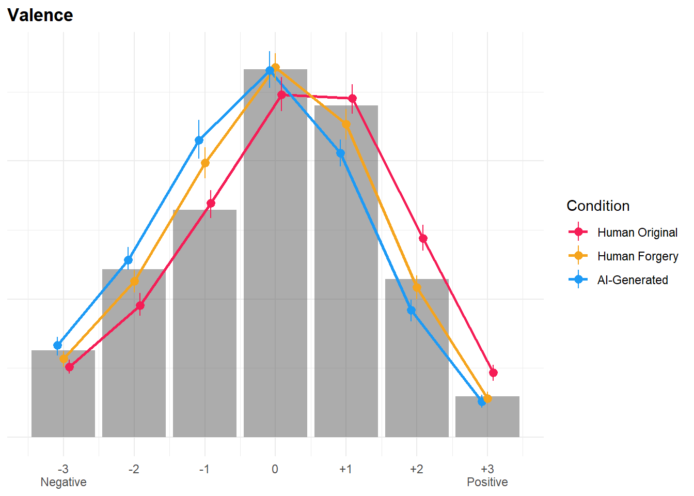{#fig-valence-1 width=672}
:::

::: {.cell-output-display}
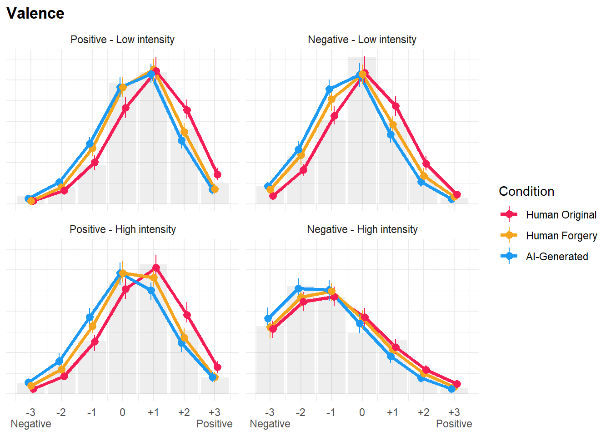{#fig-valence-2 width=672}
:::

Valence (1 = Negative, 7 = Positive): observed proportion of each response (grey bars) and the model-implied probability of each response per label condition (points with 95% CI).
:::


### Meaning


::: {.cell}

```{.r .cell-code}
make_report(estimates$Meaning)
```

::: {.cell-output-display}

```{=html}
<div id="ygpthhmazf" style="padding-left:0px;padding-right:0px;padding-top:10px;padding-bottom:10px;overflow-x:auto;overflow-y:auto;width:auto;height:auto;">
<style>#ygpthhmazf table {
  font-family: system-ui, 'Segoe UI', Roboto, Helvetica, Arial, sans-serif, 'Apple Color Emoji', 'Segoe UI Emoji', 'Segoe UI Symbol', 'Noto Color Emoji';
  -webkit-font-smoothing: antialiased;
  -moz-osx-font-smoothing: grayscale;
}

#ygpthhmazf thead, #ygpthhmazf tbody, #ygpthhmazf tfoot, #ygpthhmazf tr, #ygpthhmazf td, #ygpthhmazf th {
  border-style: none;
}

#ygpthhmazf p {
  margin: 0;
  padding: 0;
}

#ygpthhmazf .gt_table {
  display: table;
  border-collapse: collapse;
  line-height: normal;
  margin-left: auto;
  margin-right: auto;
  color: #333333;
  font-size: 16px;
  font-weight: normal;
  font-style: normal;
  background-color: #FFFFFF;
  width: auto;
  border-top-style: solid;
  border-top-width: 2px;
  border-top-color: #A8A8A8;
  border-right-style: none;
  border-right-width: 2px;
  border-right-color: #D3D3D3;
  border-bottom-style: solid;
  border-bottom-width: 2px;
  border-bottom-color: #A8A8A8;
  border-left-style: none;
  border-left-width: 2px;
  border-left-color: #D3D3D3;
}

#ygpthhmazf .gt_caption {
  padding-top: 4px;
  padding-bottom: 4px;
}

#ygpthhmazf .gt_title {
  color: #333333;
  font-size: 125%;
  font-weight: initial;
  padding-top: 4px;
  padding-bottom: 4px;
  padding-left: 5px;
  padding-right: 5px;
  border-bottom-color: #FFFFFF;
  border-bottom-width: 0;
}

#ygpthhmazf .gt_subtitle {
  color: #333333;
  font-size: 85%;
  font-weight: initial;
  padding-top: 3px;
  padding-bottom: 5px;
  padding-left: 5px;
  padding-right: 5px;
  border-top-color: #FFFFFF;
  border-top-width: 0;
}

#ygpthhmazf .gt_heading {
  background-color: #FFFFFF;
  text-align: center;
  border-bottom-color: #FFFFFF;
  border-left-style: none;
  border-left-width: 1px;
  border-left-color: #D3D3D3;
  border-right-style: none;
  border-right-width: 1px;
  border-right-color: #D3D3D3;
}

#ygpthhmazf .gt_bottom_border {
  border-bottom-style: solid;
  border-bottom-width: 2px;
  border-bottom-color: #D3D3D3;
}

#ygpthhmazf .gt_col_headings {
  border-top-style: solid;
  border-top-width: 2px;
  border-top-color: #D3D3D3;
  border-bottom-style: solid;
  border-bottom-width: 2px;
  border-bottom-color: #D3D3D3;
  border-left-style: none;
  border-left-width: 1px;
  border-left-color: #D3D3D3;
  border-right-style: none;
  border-right-width: 1px;
  border-right-color: #D3D3D3;
}

#ygpthhmazf .gt_col_heading {
  color: #333333;
  background-color: #FFFFFF;
  font-size: 100%;
  font-weight: normal;
  text-transform: inherit;
  border-left-style: none;
  border-left-width: 1px;
  border-left-color: #D3D3D3;
  border-right-style: none;
  border-right-width: 1px;
  border-right-color: #D3D3D3;
  vertical-align: bottom;
  padding-top: 5px;
  padding-bottom: 6px;
  padding-left: 5px;
  padding-right: 5px;
  overflow-x: hidden;
}

#ygpthhmazf .gt_column_spanner_outer {
  color: #333333;
  background-color: #FFFFFF;
  font-size: 100%;
  font-weight: normal;
  text-transform: inherit;
  padding-top: 0;
  padding-bottom: 0;
  padding-left: 4px;
  padding-right: 4px;
}

#ygpthhmazf .gt_column_spanner_outer:first-child {
  padding-left: 0;
}

#ygpthhmazf .gt_column_spanner_outer:last-child {
  padding-right: 0;
}

#ygpthhmazf .gt_column_spanner {
  border-bottom-style: solid;
  border-bottom-width: 2px;
  border-bottom-color: #D3D3D3;
  vertical-align: bottom;
  padding-top: 5px;
  padding-bottom: 5px;
  overflow-x: hidden;
  display: inline-block;
  width: 100%;
}

#ygpthhmazf .gt_spanner_row {
  border-bottom-style: hidden;
}

#ygpthhmazf .gt_group_heading {
  padding-top: 8px;
  padding-bottom: 8px;
  padding-left: 5px;
  padding-right: 5px;
  color: #333333;
  background-color: #FFFFFF;
  font-size: 100%;
  font-weight: initial;
  text-transform: inherit;
  border-top-style: solid;
  border-top-width: 2px;
  border-top-color: #D3D3D3;
  border-bottom-style: solid;
  border-bottom-width: 2px;
  border-bottom-color: #D3D3D3;
  border-left-style: none;
  border-left-width: 1px;
  border-left-color: #D3D3D3;
  border-right-style: none;
  border-right-width: 1px;
  border-right-color: #D3D3D3;
  vertical-align: middle;
  text-align: left;
}

#ygpthhmazf .gt_empty_group_heading {
  padding: 0.5px;
  color: #333333;
  background-color: #FFFFFF;
  font-size: 100%;
  font-weight: initial;
  border-top-style: solid;
  border-top-width: 2px;
  border-top-color: #D3D3D3;
  border-bottom-style: solid;
  border-bottom-width: 2px;
  border-bottom-color: #D3D3D3;
  vertical-align: middle;
}

#ygpthhmazf .gt_from_md > :first-child {
  margin-top: 0;
}

#ygpthhmazf .gt_from_md > :last-child {
  margin-bottom: 0;
}

#ygpthhmazf .gt_row {
  padding-top: 8px;
  padding-bottom: 8px;
  padding-left: 5px;
  padding-right: 5px;
  margin: 10px;
  border-top-style: solid;
  border-top-width: 1px;
  border-top-color: #D3D3D3;
  border-left-style: none;
  border-left-width: 1px;
  border-left-color: #D3D3D3;
  border-right-style: none;
  border-right-width: 1px;
  border-right-color: #D3D3D3;
  vertical-align: middle;
  overflow-x: hidden;
}

#ygpthhmazf .gt_stub {
  color: #333333;
  background-color: #FFFFFF;
  font-size: 100%;
  font-weight: initial;
  text-transform: inherit;
  border-right-style: solid;
  border-right-width: 2px;
  border-right-color: #D3D3D3;
  padding-left: 5px;
  padding-right: 5px;
}

#ygpthhmazf .gt_stub_row_group {
  color: #333333;
  background-color: #FFFFFF;
  font-size: 100%;
  font-weight: initial;
  text-transform: inherit;
  border-right-style: solid;
  border-right-width: 2px;
  border-right-color: #D3D3D3;
  padding-left: 5px;
  padding-right: 5px;
  vertical-align: top;
}

#ygpthhmazf .gt_row_group_first td {
  border-top-width: 2px;
}

#ygpthhmazf .gt_row_group_first th {
  border-top-width: 2px;
}

#ygpthhmazf .gt_summary_row {
  color: #333333;
  background-color: #FFFFFF;
  text-transform: inherit;
  padding-top: 8px;
  padding-bottom: 8px;
  padding-left: 5px;
  padding-right: 5px;
}

#ygpthhmazf .gt_first_summary_row {
  border-top-style: solid;
  border-top-color: #D3D3D3;
}

#ygpthhmazf .gt_first_summary_row.thick {
  border-top-width: 2px;
}

#ygpthhmazf .gt_last_summary_row {
  padding-top: 8px;
  padding-bottom: 8px;
  padding-left: 5px;
  padding-right: 5px;
  border-bottom-style: solid;
  border-bottom-width: 2px;
  border-bottom-color: #D3D3D3;
}

#ygpthhmazf .gt_grand_summary_row {
  color: #333333;
  background-color: #FFFFFF;
  text-transform: inherit;
  padding-top: 8px;
  padding-bottom: 8px;
  padding-left: 5px;
  padding-right: 5px;
}

#ygpthhmazf .gt_first_grand_summary_row {
  padding-top: 8px;
  padding-bottom: 8px;
  padding-left: 5px;
  padding-right: 5px;
  border-top-style: double;
  border-top-width: 6px;
  border-top-color: #D3D3D3;
}

#ygpthhmazf .gt_last_grand_summary_row_top {
  padding-top: 8px;
  padding-bottom: 8px;
  padding-left: 5px;
  padding-right: 5px;
  border-bottom-style: double;
  border-bottom-width: 6px;
  border-bottom-color: #D3D3D3;
}

#ygpthhmazf .gt_striped {
  background-color: rgba(128, 128, 128, 0.05);
}

#ygpthhmazf .gt_table_body {
  border-top-style: solid;
  border-top-width: 2px;
  border-top-color: #D3D3D3;
  border-bottom-style: solid;
  border-bottom-width: 2px;
  border-bottom-color: #D3D3D3;
}

#ygpthhmazf .gt_footnotes {
  color: #333333;
  background-color: #FFFFFF;
  border-bottom-style: none;
  border-bottom-width: 2px;
  border-bottom-color: #D3D3D3;
  border-left-style: none;
  border-left-width: 2px;
  border-left-color: #D3D3D3;
  border-right-style: none;
  border-right-width: 2px;
  border-right-color: #D3D3D3;
}

#ygpthhmazf .gt_footnote {
  margin: 0px;
  font-size: 90%;
  padding-top: 4px;
  padding-bottom: 4px;
  padding-left: 5px;
  padding-right: 5px;
}

#ygpthhmazf .gt_sourcenotes {
  color: #333333;
  background-color: #FFFFFF;
  border-bottom-style: none;
  border-bottom-width: 2px;
  border-bottom-color: #D3D3D3;
  border-left-style: none;
  border-left-width: 2px;
  border-left-color: #D3D3D3;
  border-right-style: none;
  border-right-width: 2px;
  border-right-color: #D3D3D3;
}

#ygpthhmazf .gt_sourcenote {
  font-size: 90%;
  padding-top: 4px;
  padding-bottom: 4px;
  padding-left: 5px;
  padding-right: 5px;
}

#ygpthhmazf .gt_left {
  text-align: left;
}

#ygpthhmazf .gt_center {
  text-align: center;
}

#ygpthhmazf .gt_right {
  text-align: right;
  font-variant-numeric: tabular-nums;
}

#ygpthhmazf .gt_font_normal {
  font-weight: normal;
}

#ygpthhmazf .gt_font_bold {
  font-weight: bold;
}

#ygpthhmazf .gt_font_italic {
  font-style: italic;
}

#ygpthhmazf .gt_super {
  font-size: 65%;
}

#ygpthhmazf .gt_footnote_marks {
  font-size: 75%;
  vertical-align: 0.4em;
  position: initial;
}

#ygpthhmazf .gt_asterisk {
  font-size: 100%;
  vertical-align: 0;
}

#ygpthhmazf .gt_indent_1 {
  text-indent: 5px;
}

#ygpthhmazf .gt_indent_2 {
  text-indent: 10px;
}

#ygpthhmazf .gt_indent_3 {
  text-indent: 15px;
}

#ygpthhmazf .gt_indent_4 {
  text-indent: 20px;
}

#ygpthhmazf .gt_indent_5 {
  text-indent: 25px;
}

#ygpthhmazf .katex-display {
  display: inline-flex !important;
  margin-bottom: 0.75em !important;
}

#ygpthhmazf div.Reactable > div.rt-table > div.rt-thead > div.rt-tr.rt-tr-group-header > div.rt-th-group:after {
  height: 0px !important;
}
</style>
<table class="gt_table" data-quarto-disable-processing="false" data-quarto-bootstrap="false">
  <thead>
    <tr class="gt_col_headings">
      <th class="gt_col_heading gt_columns_bottom_border gt_left" rowspan="1" colspan="1" scope="col" id="Contrast">Contrast</th>
      <th class="gt_col_heading gt_columns_bottom_border gt_left" rowspan="1" colspan="1" scope="col" id="Parameters">Parameters</th>
    </tr>
  </thead>
  <tbody class="gt_table_body">
    <tr><td headers="Contrast" class="gt_row gt_left">Human Forgery - Human Original</td>
<td headers="Parameters" class="gt_row gt_left">response (-0.26, [-0.32, -0.20]); mu (-0.04, [-0.05, -0.03]); pzero (0.01, [ 0.00,  0.02])</td></tr>
    <tr><td headers="Contrast" class="gt_row gt_left">AI-Generated - Human Original</td>
<td headers="Parameters" class="gt_row gt_left">response (-0.62, [-0.72, -0.54]); mu (-0.09, [-0.10, -0.07]); pzero (0.05, [ 0.03,  0.07])</td></tr>
    <tr><td headers="Contrast" class="gt_row gt_left">AI-Generated - Human Forgery</td>
<td headers="Parameters" class="gt_row gt_left">response (-0.37, [-0.45, -0.29]); mu (-0.05, [-0.06, -0.03]); phi (-0.35, [-0.70, -0.01]); pzero (0.04, [ 0.02,  0.06])</td></tr>
  </tbody>
  
</table>
</div>
```

```{=html}
<div id="fjummrcrek" style="padding-left:0px;padding-right:0px;padding-top:10px;padding-bottom:10px;overflow-x:auto;overflow-y:auto;width:auto;height:auto;">
<style>#fjummrcrek table {
  font-family: system-ui, 'Segoe UI', Roboto, Helvetica, Arial, sans-serif, 'Apple Color Emoji', 'Segoe UI Emoji', 'Segoe UI Symbol', 'Noto Color Emoji';
  -webkit-font-smoothing: antialiased;
  -moz-osx-font-smoothing: grayscale;
}

#fjummrcrek thead, #fjummrcrek tbody, #fjummrcrek tfoot, #fjummrcrek tr, #fjummrcrek td, #fjummrcrek th {
  border-style: none;
}

#fjummrcrek p {
  margin: 0;
  padding: 0;
}

#fjummrcrek .gt_table {
  display: table;
  border-collapse: collapse;
  line-height: normal;
  margin-left: auto;
  margin-right: auto;
  color: #333333;
  font-size: 13px;
  font-weight: normal;
  font-style: normal;
  background-color: #FFFFFF;
  width: auto;
  border-top-style: solid;
  border-top-width: 3px;
  border-top-color: #D5D5D5;
  border-right-style: solid;
  border-right-width: 3px;
  border-right-color: #D5D5D5;
  border-bottom-style: solid;
  border-bottom-width: 3px;
  border-bottom-color: #D5D5D5;
  border-left-style: solid;
  border-left-width: 3px;
  border-left-color: #D5D5D5;
}

#fjummrcrek .gt_caption {
  padding-top: 4px;
  padding-bottom: 4px;
}

#fjummrcrek .gt_title {
  color: #333333;
  font-size: 125%;
  font-weight: initial;
  padding-top: 4px;
  padding-bottom: 4px;
  padding-left: 5px;
  padding-right: 5px;
  border-bottom-color: #FFFFFF;
  border-bottom-width: 0;
}

#fjummrcrek .gt_subtitle {
  color: #333333;
  font-size: 85%;
  font-weight: initial;
  padding-top: 3px;
  padding-bottom: 5px;
  padding-left: 5px;
  padding-right: 5px;
  border-top-color: #FFFFFF;
  border-top-width: 0;
}

#fjummrcrek .gt_heading {
  background-color: #FFFFFF;
  text-align: left;
  border-bottom-color: #FFFFFF;
  border-left-style: none;
  border-left-width: 1px;
  border-left-color: #D3D3D3;
  border-right-style: none;
  border-right-width: 1px;
  border-right-color: #D3D3D3;
}

#fjummrcrek .gt_bottom_border {
  border-bottom-style: solid;
  border-bottom-width: 2px;
  border-bottom-color: #D5D5D5;
}

#fjummrcrek .gt_col_headings {
  border-top-style: solid;
  border-top-width: 2px;
  border-top-color: #D5D5D5;
  border-bottom-style: solid;
  border-bottom-width: 2px;
  border-bottom-color: #D5D5D5;
  border-left-style: none;
  border-left-width: 1px;
  border-left-color: #D3D3D3;
  border-right-style: none;
  border-right-width: 1px;
  border-right-color: #D3D3D3;
}

#fjummrcrek .gt_col_heading {
  color: #FFFFFF;
  background-color: #000000;
  font-size: 100%;
  font-weight: normal;
  text-transform: inherit;
  border-left-style: none;
  border-left-width: 1px;
  border-left-color: #D3D3D3;
  border-right-style: none;
  border-right-width: 1px;
  border-right-color: #D3D3D3;
  vertical-align: bottom;
  padding-top: 5px;
  padding-bottom: 6px;
  padding-left: 5px;
  padding-right: 5px;
  overflow-x: hidden;
}

#fjummrcrek .gt_column_spanner_outer {
  color: #FFFFFF;
  background-color: #000000;
  font-size: 100%;
  font-weight: normal;
  text-transform: inherit;
  padding-top: 0;
  padding-bottom: 0;
  padding-left: 4px;
  padding-right: 4px;
}

#fjummrcrek .gt_column_spanner_outer:first-child {
  padding-left: 0;
}

#fjummrcrek .gt_column_spanner_outer:last-child {
  padding-right: 0;
}

#fjummrcrek .gt_column_spanner {
  border-bottom-style: solid;
  border-bottom-width: 2px;
  border-bottom-color: #D5D5D5;
  vertical-align: bottom;
  padding-top: 5px;
  padding-bottom: 5px;
  overflow-x: hidden;
  display: inline-block;
  width: 100%;
}

#fjummrcrek .gt_spanner_row {
  border-bottom-style: hidden;
}

#fjummrcrek .gt_group_heading {
  padding-top: 8px;
  padding-bottom: 8px;
  padding-left: 5px;
  padding-right: 5px;
  color: #333333;
  background-color: #FFFFFF;
  font-size: 100%;
  font-weight: initial;
  text-transform: inherit;
  border-top-style: solid;
  border-top-width: 2px;
  border-top-color: #D5D5D5;
  border-bottom-style: solid;
  border-bottom-width: 2px;
  border-bottom-color: #D5D5D5;
  border-left-style: none;
  border-left-width: 1px;
  border-left-color: #D3D3D3;
  border-right-style: none;
  border-right-width: 1px;
  border-right-color: #D3D3D3;
  vertical-align: middle;
  text-align: left;
}

#fjummrcrek .gt_empty_group_heading {
  padding: 0.5px;
  color: #333333;
  background-color: #FFFFFF;
  font-size: 100%;
  font-weight: initial;
  border-top-style: solid;
  border-top-width: 2px;
  border-top-color: #D5D5D5;
  border-bottom-style: solid;
  border-bottom-width: 2px;
  border-bottom-color: #D5D5D5;
  vertical-align: middle;
}

#fjummrcrek .gt_from_md > :first-child {
  margin-top: 0;
}

#fjummrcrek .gt_from_md > :last-child {
  margin-bottom: 0;
}

#fjummrcrek .gt_row {
  padding-top: 8px;
  padding-bottom: 8px;
  padding-left: 5px;
  padding-right: 5px;
  margin: 10px;
  border-top-style: solid;
  border-top-width: 1px;
  border-top-color: #D5D5D5;
  border-left-style: solid;
  border-left-width: 1px;
  border-left-color: #D5D5D5;
  border-right-style: solid;
  border-right-width: 1px;
  border-right-color: #D5D5D5;
  vertical-align: middle;
  overflow-x: hidden;
}

#fjummrcrek .gt_stub {
  color: #333333;
  background-color: #FFFFFF;
  font-size: 100%;
  font-weight: initial;
  text-transform: inherit;
  border-right-style: solid;
  border-right-width: 2px;
  border-right-color: #5F5F5F;
  padding-left: 5px;
  padding-right: 5px;
}

#fjummrcrek .gt_stub_row_group {
  color: #333333;
  background-color: #FFFFFF;
  font-size: 100%;
  font-weight: initial;
  text-transform: inherit;
  border-right-style: solid;
  border-right-width: 2px;
  border-right-color: #D3D3D3;
  padding-left: 5px;
  padding-right: 5px;
  vertical-align: top;
}

#fjummrcrek .gt_row_group_first td {
  border-top-width: 2px;
}

#fjummrcrek .gt_row_group_first th {
  border-top-width: 2px;
}

#fjummrcrek .gt_summary_row {
  color: #333333;
  background-color: #D5D5D5;
  text-transform: inherit;
  padding-top: 8px;
  padding-bottom: 8px;
  padding-left: 5px;
  padding-right: 5px;
}

#fjummrcrek .gt_first_summary_row {
  border-top-style: solid;
  border-top-color: #D5D5D5;
}

#fjummrcrek .gt_first_summary_row.thick {
  border-top-width: 2px;
}

#fjummrcrek .gt_last_summary_row {
  padding-top: 8px;
  padding-bottom: 8px;
  padding-left: 5px;
  padding-right: 5px;
  border-bottom-style: solid;
  border-bottom-width: 2px;
  border-bottom-color: #D5D5D5;
}

#fjummrcrek .gt_grand_summary_row {
  color: #FFFFFF;
  background-color: #929292;
  text-transform: inherit;
  padding-top: 8px;
  padding-bottom: 8px;
  padding-left: 5px;
  padding-right: 5px;
}

#fjummrcrek .gt_first_grand_summary_row {
  padding-top: 8px;
  padding-bottom: 8px;
  padding-left: 5px;
  padding-right: 5px;
  border-top-style: double;
  border-top-width: 6px;
  border-top-color: #D5D5D5;
}

#fjummrcrek .gt_last_grand_summary_row_top {
  padding-top: 8px;
  padding-bottom: 8px;
  padding-left: 5px;
  padding-right: 5px;
  border-bottom-style: double;
  border-bottom-width: 6px;
  border-bottom-color: #D5D5D5;
}

#fjummrcrek .gt_striped {
  background-color: #F4F4F4;
}

#fjummrcrek .gt_table_body {
  border-top-style: solid;
  border-top-width: 2px;
  border-top-color: #D5D5D5;
  border-bottom-style: solid;
  border-bottom-width: 2px;
  border-bottom-color: #D5D5D5;
}

#fjummrcrek .gt_footnotes {
  color: #333333;
  background-color: #FFFFFF;
  border-bottom-style: none;
  border-bottom-width: 2px;
  border-bottom-color: #D3D3D3;
  border-left-style: none;
  border-left-width: 2px;
  border-left-color: #D3D3D3;
  border-right-style: none;
  border-right-width: 2px;
  border-right-color: #D3D3D3;
}

#fjummrcrek .gt_footnote {
  margin: 0px;
  font-size: 90%;
  padding-top: 4px;
  padding-bottom: 4px;
  padding-left: 5px;
  padding-right: 5px;
}

#fjummrcrek .gt_sourcenotes {
  color: #333333;
  background-color: #FFFFFF;
  border-bottom-style: none;
  border-bottom-width: 2px;
  border-bottom-color: #D3D3D3;
  border-left-style: none;
  border-left-width: 2px;
  border-left-color: #D3D3D3;
  border-right-style: none;
  border-right-width: 2px;
  border-right-color: #D3D3D3;
}

#fjummrcrek .gt_sourcenote {
  font-size: 90%;
  padding-top: 4px;
  padding-bottom: 4px;
  padding-left: 5px;
  padding-right: 5px;
}

#fjummrcrek .gt_left {
  text-align: left;
}

#fjummrcrek .gt_center {
  text-align: center;
}

#fjummrcrek .gt_right {
  text-align: right;
  font-variant-numeric: tabular-nums;
}

#fjummrcrek .gt_font_normal {
  font-weight: normal;
}

#fjummrcrek .gt_font_bold {
  font-weight: bold;
}

#fjummrcrek .gt_font_italic {
  font-style: italic;
}

#fjummrcrek .gt_super {
  font-size: 65%;
}

#fjummrcrek .gt_footnote_marks {
  font-size: 75%;
  vertical-align: 0.4em;
  position: initial;
}

#fjummrcrek .gt_asterisk {
  font-size: 100%;
  vertical-align: 0;
}

#fjummrcrek .gt_indent_1 {
  text-indent: 5px;
}

#fjummrcrek .gt_indent_2 {
  text-indent: 10px;
}

#fjummrcrek .gt_indent_3 {
  text-indent: 15px;
}

#fjummrcrek .gt_indent_4 {
  text-indent: 20px;
}

#fjummrcrek .gt_indent_5 {
  text-indent: 25px;
}

#fjummrcrek .katex-display {
  display: inline-flex !important;
  margin-bottom: 0.75em !important;
}

#fjummrcrek div.Reactable > div.rt-table > div.rt-thead > div.rt-tr.rt-tr-group-header > div.rt-th-group:after {
  height: 0px !important;
}
</style>
<table class="gt_table" data-quarto-disable-processing="false" data-quarto-bootstrap="false">
  <thead>
    <tr class="gt_heading">
      <td colspan="10" class="gt_heading gt_title gt_font_normal gt_bottom_border" style>Meaning: convergence</td>
    </tr>
    
    <tr class="gt_col_headings">
      <th class="gt_col_heading gt_columns_bottom_border gt_left" rowspan="1" colspan="1" scope="col" id="Model">Model</th>
      <th class="gt_col_heading gt_columns_bottom_border gt_left" rowspan="1" colspan="1" scope="col" id="Family">Family</th>
      <th class="gt_col_heading gt_columns_bottom_border gt_right" rowspan="1" colspan="1" scope="col" id="N_obs">N_obs</th>
      <th class="gt_col_heading gt_columns_bottom_border gt_right" rowspan="1" colspan="1" scope="col" id="N_participants">N_participants</th>
      <th class="gt_col_heading gt_columns_bottom_border gt_right" rowspan="1" colspan="1" scope="col" id="Chains">Chains</th>
      <th class="gt_col_heading gt_columns_bottom_border gt_right" rowspan="1" colspan="1" scope="col" id="Draws">Draws</th>
      <th class="gt_col_heading gt_columns_bottom_border gt_right" rowspan="1" colspan="1" scope="col" id="Max_Rhat">Max_Rhat</th>
      <th class="gt_col_heading gt_columns_bottom_border gt_right" rowspan="1" colspan="1" scope="col" id="Min_ESS_ratio">Min_ESS_ratio</th>
      <th class="gt_col_heading gt_columns_bottom_border gt_right" rowspan="1" colspan="1" scope="col" id="Divergent_pct">Divergent_pct</th>
      <th class="gt_col_heading gt_columns_bottom_border gt_left" rowspan="1" colspan="1" scope="col" id="Criterion">Criterion</th>
    </tr>
  </thead>
  <tbody class="gt_table_body">
    <tr><td headers="Model" class="gt_row gt_left">Meaning</td>
<td headers="Family" class="gt_row gt_left">Discrete Beta (k = 6) with zero hurdle</td>
<td headers="N_obs" class="gt_row gt_right">15552</td>
<td headers="N_participants" class="gt_row gt_right">324</td>
<td headers="Chains" class="gt_row gt_right">8</td>
<td headers="Draws" class="gt_row gt_right">4000</td>
<td headers="Max_Rhat" class="gt_row gt_right">1.041</td>
<td headers="Min_ESS_ratio" class="gt_row gt_right">0.05</td>
<td headers="Divergent_pct" class="gt_row gt_right">0.1</td>
<td headers="Criterion" class="gt_row gt_left">loo</td></tr>
  </tbody>
  
</table>
</div>
```


::: {.callout-note collapse="true" title="Meaning: convergence (Markdown table, for text readers)"}

|Model   |Family                                 | N_obs| N_participants| Chains| Draws| Max_Rhat| Min_ESS_ratio| Divergent_pct|Criterion |
|:-------|:--------------------------------------|-----:|--------------:|------:|-----:|--------:|-------------:|-------------:|:---------|
|Meaning |Discrete Beta (k = 6) with zero hurdle | 15552|            324|      8|  4000|    1.041|          0.05|           0.1|loo       |

:::

```{=html}
<div id="zfrrdqrhnl" style="padding-left:0px;padding-right:0px;padding-top:10px;padding-bottom:10px;overflow-x:auto;overflow-y:auto;width:auto;height:auto;">
<style>#zfrrdqrhnl table {
  font-family: system-ui, 'Segoe UI', Roboto, Helvetica, Arial, sans-serif, 'Apple Color Emoji', 'Segoe UI Emoji', 'Segoe UI Symbol', 'Noto Color Emoji';
  -webkit-font-smoothing: antialiased;
  -moz-osx-font-smoothing: grayscale;
}

#zfrrdqrhnl thead, #zfrrdqrhnl tbody, #zfrrdqrhnl tfoot, #zfrrdqrhnl tr, #zfrrdqrhnl td, #zfrrdqrhnl th {
  border-style: none;
}

#zfrrdqrhnl p {
  margin: 0;
  padding: 0;
}

#zfrrdqrhnl .gt_table {
  display: table;
  border-collapse: collapse;
  line-height: normal;
  margin-left: auto;
  margin-right: auto;
  color: #333333;
  font-size: 13px;
  font-weight: normal;
  font-style: normal;
  background-color: #FFFFFF;
  width: auto;
  border-top-style: solid;
  border-top-width: 3px;
  border-top-color: #D5D5D5;
  border-right-style: solid;
  border-right-width: 3px;
  border-right-color: #D5D5D5;
  border-bottom-style: solid;
  border-bottom-width: 3px;
  border-bottom-color: #D5D5D5;
  border-left-style: solid;
  border-left-width: 3px;
  border-left-color: #D5D5D5;
}

#zfrrdqrhnl .gt_caption {
  padding-top: 4px;
  padding-bottom: 4px;
}

#zfrrdqrhnl .gt_title {
  color: #333333;
  font-size: 125%;
  font-weight: initial;
  padding-top: 4px;
  padding-bottom: 4px;
  padding-left: 5px;
  padding-right: 5px;
  border-bottom-color: #FFFFFF;
  border-bottom-width: 0;
}

#zfrrdqrhnl .gt_subtitle {
  color: #333333;
  font-size: 85%;
  font-weight: initial;
  padding-top: 3px;
  padding-bottom: 5px;
  padding-left: 5px;
  padding-right: 5px;
  border-top-color: #FFFFFF;
  border-top-width: 0;
}

#zfrrdqrhnl .gt_heading {
  background-color: #FFFFFF;
  text-align: left;
  border-bottom-color: #FFFFFF;
  border-left-style: none;
  border-left-width: 1px;
  border-left-color: #D3D3D3;
  border-right-style: none;
  border-right-width: 1px;
  border-right-color: #D3D3D3;
}

#zfrrdqrhnl .gt_bottom_border {
  border-bottom-style: solid;
  border-bottom-width: 2px;
  border-bottom-color: #D5D5D5;
}

#zfrrdqrhnl .gt_col_headings {
  border-top-style: solid;
  border-top-width: 2px;
  border-top-color: #D5D5D5;
  border-bottom-style: solid;
  border-bottom-width: 2px;
  border-bottom-color: #D5D5D5;
  border-left-style: none;
  border-left-width: 1px;
  border-left-color: #D3D3D3;
  border-right-style: none;
  border-right-width: 1px;
  border-right-color: #D3D3D3;
}

#zfrrdqrhnl .gt_col_heading {
  color: #FFFFFF;
  background-color: #000000;
  font-size: 100%;
  font-weight: normal;
  text-transform: inherit;
  border-left-style: none;
  border-left-width: 1px;
  border-left-color: #D3D3D3;
  border-right-style: none;
  border-right-width: 1px;
  border-right-color: #D3D3D3;
  vertical-align: bottom;
  padding-top: 5px;
  padding-bottom: 6px;
  padding-left: 5px;
  padding-right: 5px;
  overflow-x: hidden;
}

#zfrrdqrhnl .gt_column_spanner_outer {
  color: #FFFFFF;
  background-color: #000000;
  font-size: 100%;
  font-weight: normal;
  text-transform: inherit;
  padding-top: 0;
  padding-bottom: 0;
  padding-left: 4px;
  padding-right: 4px;
}

#zfrrdqrhnl .gt_column_spanner_outer:first-child {
  padding-left: 0;
}

#zfrrdqrhnl .gt_column_spanner_outer:last-child {
  padding-right: 0;
}

#zfrrdqrhnl .gt_column_spanner {
  border-bottom-style: solid;
  border-bottom-width: 2px;
  border-bottom-color: #D5D5D5;
  vertical-align: bottom;
  padding-top: 5px;
  padding-bottom: 5px;
  overflow-x: hidden;
  display: inline-block;
  width: 100%;
}

#zfrrdqrhnl .gt_spanner_row {
  border-bottom-style: hidden;
}

#zfrrdqrhnl .gt_group_heading {
  padding-top: 8px;
  padding-bottom: 8px;
  padding-left: 5px;
  padding-right: 5px;
  color: #333333;
  background-color: #FFFFFF;
  font-size: 100%;
  font-weight: initial;
  text-transform: inherit;
  border-top-style: solid;
  border-top-width: 2px;
  border-top-color: #D5D5D5;
  border-bottom-style: solid;
  border-bottom-width: 2px;
  border-bottom-color: #D5D5D5;
  border-left-style: none;
  border-left-width: 1px;
  border-left-color: #D3D3D3;
  border-right-style: none;
  border-right-width: 1px;
  border-right-color: #D3D3D3;
  vertical-align: middle;
  text-align: left;
}

#zfrrdqrhnl .gt_empty_group_heading {
  padding: 0.5px;
  color: #333333;
  background-color: #FFFFFF;
  font-size: 100%;
  font-weight: initial;
  border-top-style: solid;
  border-top-width: 2px;
  border-top-color: #D5D5D5;
  border-bottom-style: solid;
  border-bottom-width: 2px;
  border-bottom-color: #D5D5D5;
  vertical-align: middle;
}

#zfrrdqrhnl .gt_from_md > :first-child {
  margin-top: 0;
}

#zfrrdqrhnl .gt_from_md > :last-child {
  margin-bottom: 0;
}

#zfrrdqrhnl .gt_row {
  padding-top: 8px;
  padding-bottom: 8px;
  padding-left: 5px;
  padding-right: 5px;
  margin: 10px;
  border-top-style: solid;
  border-top-width: 1px;
  border-top-color: #D5D5D5;
  border-left-style: solid;
  border-left-width: 1px;
  border-left-color: #D5D5D5;
  border-right-style: solid;
  border-right-width: 1px;
  border-right-color: #D5D5D5;
  vertical-align: middle;
  overflow-x: hidden;
}

#zfrrdqrhnl .gt_stub {
  color: #333333;
  background-color: #FFFFFF;
  font-size: 100%;
  font-weight: initial;
  text-transform: inherit;
  border-right-style: solid;
  border-right-width: 2px;
  border-right-color: #5F5F5F;
  padding-left: 5px;
  padding-right: 5px;
}

#zfrrdqrhnl .gt_stub_row_group {
  color: #333333;
  background-color: #FFFFFF;
  font-size: 100%;
  font-weight: initial;
  text-transform: inherit;
  border-right-style: solid;
  border-right-width: 2px;
  border-right-color: #D3D3D3;
  padding-left: 5px;
  padding-right: 5px;
  vertical-align: top;
}

#zfrrdqrhnl .gt_row_group_first td {
  border-top-width: 2px;
}

#zfrrdqrhnl .gt_row_group_first th {
  border-top-width: 2px;
}

#zfrrdqrhnl .gt_summary_row {
  color: #333333;
  background-color: #D5D5D5;
  text-transform: inherit;
  padding-top: 8px;
  padding-bottom: 8px;
  padding-left: 5px;
  padding-right: 5px;
}

#zfrrdqrhnl .gt_first_summary_row {
  border-top-style: solid;
  border-top-color: #D5D5D5;
}

#zfrrdqrhnl .gt_first_summary_row.thick {
  border-top-width: 2px;
}

#zfrrdqrhnl .gt_last_summary_row {
  padding-top: 8px;
  padding-bottom: 8px;
  padding-left: 5px;
  padding-right: 5px;
  border-bottom-style: solid;
  border-bottom-width: 2px;
  border-bottom-color: #D5D5D5;
}

#zfrrdqrhnl .gt_grand_summary_row {
  color: #FFFFFF;
  background-color: #929292;
  text-transform: inherit;
  padding-top: 8px;
  padding-bottom: 8px;
  padding-left: 5px;
  padding-right: 5px;
}

#zfrrdqrhnl .gt_first_grand_summary_row {
  padding-top: 8px;
  padding-bottom: 8px;
  padding-left: 5px;
  padding-right: 5px;
  border-top-style: double;
  border-top-width: 6px;
  border-top-color: #D5D5D5;
}

#zfrrdqrhnl .gt_last_grand_summary_row_top {
  padding-top: 8px;
  padding-bottom: 8px;
  padding-left: 5px;
  padding-right: 5px;
  border-bottom-style: double;
  border-bottom-width: 6px;
  border-bottom-color: #D5D5D5;
}

#zfrrdqrhnl .gt_striped {
  background-color: #F4F4F4;
}

#zfrrdqrhnl .gt_table_body {
  border-top-style: solid;
  border-top-width: 2px;
  border-top-color: #D5D5D5;
  border-bottom-style: solid;
  border-bottom-width: 2px;
  border-bottom-color: #D5D5D5;
}

#zfrrdqrhnl .gt_footnotes {
  color: #333333;
  background-color: #FFFFFF;
  border-bottom-style: none;
  border-bottom-width: 2px;
  border-bottom-color: #D3D3D3;
  border-left-style: none;
  border-left-width: 2px;
  border-left-color: #D3D3D3;
  border-right-style: none;
  border-right-width: 2px;
  border-right-color: #D3D3D3;
}

#zfrrdqrhnl .gt_footnote {
  margin: 0px;
  font-size: 90%;
  padding-top: 4px;
  padding-bottom: 4px;
  padding-left: 5px;
  padding-right: 5px;
}

#zfrrdqrhnl .gt_sourcenotes {
  color: #333333;
  background-color: #FFFFFF;
  border-bottom-style: none;
  border-bottom-width: 2px;
  border-bottom-color: #D3D3D3;
  border-left-style: none;
  border-left-width: 2px;
  border-left-color: #D3D3D3;
  border-right-style: none;
  border-right-width: 2px;
  border-right-color: #D3D3D3;
}

#zfrrdqrhnl .gt_sourcenote {
  font-size: 90%;
  padding-top: 4px;
  padding-bottom: 4px;
  padding-left: 5px;
  padding-right: 5px;
}

#zfrrdqrhnl .gt_left {
  text-align: left;
}

#zfrrdqrhnl .gt_center {
  text-align: center;
}

#zfrrdqrhnl .gt_right {
  text-align: right;
  font-variant-numeric: tabular-nums;
}

#zfrrdqrhnl .gt_font_normal {
  font-weight: normal;
}

#zfrrdqrhnl .gt_font_bold {
  font-weight: bold;
}

#zfrrdqrhnl .gt_font_italic {
  font-style: italic;
}

#zfrrdqrhnl .gt_super {
  font-size: 65%;
}

#zfrrdqrhnl .gt_footnote_marks {
  font-size: 75%;
  vertical-align: 0.4em;
  position: initial;
}

#zfrrdqrhnl .gt_asterisk {
  font-size: 100%;
  vertical-align: 0;
}

#zfrrdqrhnl .gt_indent_1 {
  text-indent: 5px;
}

#zfrrdqrhnl .gt_indent_2 {
  text-indent: 10px;
}

#zfrrdqrhnl .gt_indent_3 {
  text-indent: 15px;
}

#zfrrdqrhnl .gt_indent_4 {
  text-indent: 20px;
}

#zfrrdqrhnl .gt_indent_5 {
  text-indent: 25px;
}

#zfrrdqrhnl .katex-display {
  display: inline-flex !important;
  margin-bottom: 0.75em !important;
}

#zfrrdqrhnl div.Reactable > div.rt-table > div.rt-thead > div.rt-tr.rt-tr-group-header > div.rt-th-group:after {
  height: 0px !important;
}
</style>
<table class="gt_table" data-quarto-disable-processing="false" data-quarto-bootstrap="false">
  <thead>
    <tr class="gt_heading">
      <td colspan="4" class="gt_heading gt_title gt_font_normal gt_bottom_border" style>Meaning: marginal means per label condition (response scale)</td>
    </tr>
    
    <tr class="gt_col_headings">
      <th class="gt_col_heading gt_columns_bottom_border gt_center" rowspan="1" colspan="1" scope="col" id="Condition">Condition</th>
      <th class="gt_col_heading gt_columns_bottom_border gt_right" rowspan="1" colspan="1" scope="col" id="Estimate">Estimate</th>
      <th class="gt_col_heading gt_columns_bottom_border gt_right" rowspan="1" colspan="1" scope="col" id="CI_low">CI_low</th>
      <th class="gt_col_heading gt_columns_bottom_border gt_right" rowspan="1" colspan="1" scope="col" id="CI_high">CI_high</th>
    </tr>
  </thead>
  <tbody class="gt_table_body">
    <tr><td headers="Condition" class="gt_row gt_center">Human Original</td>
<td headers="Estimate" class="gt_row gt_right">2.95</td>
<td headers="CI_low" class="gt_row gt_right">2.77</td>
<td headers="CI_high" class="gt_row gt_right">3.13</td></tr>
    <tr><td headers="Condition" class="gt_row gt_center gt_striped">Human Forgery</td>
<td headers="Estimate" class="gt_row gt_right gt_striped">2.70</td>
<td headers="CI_low" class="gt_row gt_right gt_striped">2.52</td>
<td headers="CI_high" class="gt_row gt_right gt_striped">2.87</td></tr>
    <tr><td headers="Condition" class="gt_row gt_center">AI-Generated</td>
<td headers="Estimate" class="gt_row gt_right">2.33</td>
<td headers="CI_low" class="gt_row gt_right">2.15</td>
<td headers="CI_high" class="gt_row gt_right">2.50</td></tr>
  </tbody>
  
</table>
</div>
```


::: {.callout-note collapse="true" title="Meaning: marginal means per label condition (response scale) (Markdown table, for text readers)"}

|Condition      |Estimate |CI_low |CI_high |
|:--------------|:--------|:------|:-------|
|Human Original |2.95     |2.77   |3.13    |
|Human Forgery  |2.70     |2.52   |2.87    |
|AI-Generated   |2.33     |2.15   |2.50    |

:::

```{=html}
<div id="tapkliqekm" style="padding-left:0px;padding-right:0px;padding-top:10px;padding-bottom:10px;overflow-x:auto;overflow-y:auto;width:auto;height:auto;">
<style>#tapkliqekm table {
  font-family: system-ui, 'Segoe UI', Roboto, Helvetica, Arial, sans-serif, 'Apple Color Emoji', 'Segoe UI Emoji', 'Segoe UI Symbol', 'Noto Color Emoji';
  -webkit-font-smoothing: antialiased;
  -moz-osx-font-smoothing: grayscale;
}

#tapkliqekm thead, #tapkliqekm tbody, #tapkliqekm tfoot, #tapkliqekm tr, #tapkliqekm td, #tapkliqekm th {
  border-style: none;
}

#tapkliqekm p {
  margin: 0;
  padding: 0;
}

#tapkliqekm .gt_table {
  display: table;
  border-collapse: collapse;
  line-height: normal;
  margin-left: auto;
  margin-right: auto;
  color: #333333;
  font-size: 13px;
  font-weight: normal;
  font-style: normal;
  background-color: #FFFFFF;
  width: auto;
  border-top-style: solid;
  border-top-width: 3px;
  border-top-color: #D5D5D5;
  border-right-style: solid;
  border-right-width: 3px;
  border-right-color: #D5D5D5;
  border-bottom-style: solid;
  border-bottom-width: 3px;
  border-bottom-color: #D5D5D5;
  border-left-style: solid;
  border-left-width: 3px;
  border-left-color: #D5D5D5;
}

#tapkliqekm .gt_caption {
  padding-top: 4px;
  padding-bottom: 4px;
}

#tapkliqekm .gt_title {
  color: #333333;
  font-size: 125%;
  font-weight: initial;
  padding-top: 4px;
  padding-bottom: 4px;
  padding-left: 5px;
  padding-right: 5px;
  border-bottom-color: #FFFFFF;
  border-bottom-width: 0;
}

#tapkliqekm .gt_subtitle {
  color: #333333;
  font-size: 85%;
  font-weight: initial;
  padding-top: 3px;
  padding-bottom: 5px;
  padding-left: 5px;
  padding-right: 5px;
  border-top-color: #FFFFFF;
  border-top-width: 0;
}

#tapkliqekm .gt_heading {
  background-color: #FFFFFF;
  text-align: left;
  border-bottom-color: #FFFFFF;
  border-left-style: none;
  border-left-width: 1px;
  border-left-color: #D3D3D3;
  border-right-style: none;
  border-right-width: 1px;
  border-right-color: #D3D3D3;
}

#tapkliqekm .gt_bottom_border {
  border-bottom-style: solid;
  border-bottom-width: 2px;
  border-bottom-color: #D5D5D5;
}

#tapkliqekm .gt_col_headings {
  border-top-style: solid;
  border-top-width: 2px;
  border-top-color: #D5D5D5;
  border-bottom-style: solid;
  border-bottom-width: 2px;
  border-bottom-color: #D5D5D5;
  border-left-style: none;
  border-left-width: 1px;
  border-left-color: #D3D3D3;
  border-right-style: none;
  border-right-width: 1px;
  border-right-color: #D3D3D3;
}

#tapkliqekm .gt_col_heading {
  color: #FFFFFF;
  background-color: #000000;
  font-size: 100%;
  font-weight: normal;
  text-transform: inherit;
  border-left-style: none;
  border-left-width: 1px;
  border-left-color: #D3D3D3;
  border-right-style: none;
  border-right-width: 1px;
  border-right-color: #D3D3D3;
  vertical-align: bottom;
  padding-top: 5px;
  padding-bottom: 6px;
  padding-left: 5px;
  padding-right: 5px;
  overflow-x: hidden;
}

#tapkliqekm .gt_column_spanner_outer {
  color: #FFFFFF;
  background-color: #000000;
  font-size: 100%;
  font-weight: normal;
  text-transform: inherit;
  padding-top: 0;
  padding-bottom: 0;
  padding-left: 4px;
  padding-right: 4px;
}

#tapkliqekm .gt_column_spanner_outer:first-child {
  padding-left: 0;
}

#tapkliqekm .gt_column_spanner_outer:last-child {
  padding-right: 0;
}

#tapkliqekm .gt_column_spanner {
  border-bottom-style: solid;
  border-bottom-width: 2px;
  border-bottom-color: #D5D5D5;
  vertical-align: bottom;
  padding-top: 5px;
  padding-bottom: 5px;
  overflow-x: hidden;
  display: inline-block;
  width: 100%;
}

#tapkliqekm .gt_spanner_row {
  border-bottom-style: hidden;
}

#tapkliqekm .gt_group_heading {
  padding-top: 8px;
  padding-bottom: 8px;
  padding-left: 5px;
  padding-right: 5px;
  color: #333333;
  background-color: #FFFFFF;
  font-size: 100%;
  font-weight: initial;
  text-transform: inherit;
  border-top-style: solid;
  border-top-width: 2px;
  border-top-color: #D5D5D5;
  border-bottom-style: solid;
  border-bottom-width: 2px;
  border-bottom-color: #D5D5D5;
  border-left-style: none;
  border-left-width: 1px;
  border-left-color: #D3D3D3;
  border-right-style: none;
  border-right-width: 1px;
  border-right-color: #D3D3D3;
  vertical-align: middle;
  text-align: left;
}

#tapkliqekm .gt_empty_group_heading {
  padding: 0.5px;
  color: #333333;
  background-color: #FFFFFF;
  font-size: 100%;
  font-weight: initial;
  border-top-style: solid;
  border-top-width: 2px;
  border-top-color: #D5D5D5;
  border-bottom-style: solid;
  border-bottom-width: 2px;
  border-bottom-color: #D5D5D5;
  vertical-align: middle;
}

#tapkliqekm .gt_from_md > :first-child {
  margin-top: 0;
}

#tapkliqekm .gt_from_md > :last-child {
  margin-bottom: 0;
}

#tapkliqekm .gt_row {
  padding-top: 8px;
  padding-bottom: 8px;
  padding-left: 5px;
  padding-right: 5px;
  margin: 10px;
  border-top-style: solid;
  border-top-width: 1px;
  border-top-color: #D5D5D5;
  border-left-style: solid;
  border-left-width: 1px;
  border-left-color: #D5D5D5;
  border-right-style: solid;
  border-right-width: 1px;
  border-right-color: #D5D5D5;
  vertical-align: middle;
  overflow-x: hidden;
}

#tapkliqekm .gt_stub {
  color: #333333;
  background-color: #FFFFFF;
  font-size: 100%;
  font-weight: initial;
  text-transform: inherit;
  border-right-style: solid;
  border-right-width: 2px;
  border-right-color: #5F5F5F;
  padding-left: 5px;
  padding-right: 5px;
}

#tapkliqekm .gt_stub_row_group {
  color: #333333;
  background-color: #FFFFFF;
  font-size: 100%;
  font-weight: initial;
  text-transform: inherit;
  border-right-style: solid;
  border-right-width: 2px;
  border-right-color: #D3D3D3;
  padding-left: 5px;
  padding-right: 5px;
  vertical-align: top;
}

#tapkliqekm .gt_row_group_first td {
  border-top-width: 2px;
}

#tapkliqekm .gt_row_group_first th {
  border-top-width: 2px;
}

#tapkliqekm .gt_summary_row {
  color: #333333;
  background-color: #D5D5D5;
  text-transform: inherit;
  padding-top: 8px;
  padding-bottom: 8px;
  padding-left: 5px;
  padding-right: 5px;
}

#tapkliqekm .gt_first_summary_row {
  border-top-style: solid;
  border-top-color: #D5D5D5;
}

#tapkliqekm .gt_first_summary_row.thick {
  border-top-width: 2px;
}

#tapkliqekm .gt_last_summary_row {
  padding-top: 8px;
  padding-bottom: 8px;
  padding-left: 5px;
  padding-right: 5px;
  border-bottom-style: solid;
  border-bottom-width: 2px;
  border-bottom-color: #D5D5D5;
}

#tapkliqekm .gt_grand_summary_row {
  color: #FFFFFF;
  background-color: #929292;
  text-transform: inherit;
  padding-top: 8px;
  padding-bottom: 8px;
  padding-left: 5px;
  padding-right: 5px;
}

#tapkliqekm .gt_first_grand_summary_row {
  padding-top: 8px;
  padding-bottom: 8px;
  padding-left: 5px;
  padding-right: 5px;
  border-top-style: double;
  border-top-width: 6px;
  border-top-color: #D5D5D5;
}

#tapkliqekm .gt_last_grand_summary_row_top {
  padding-top: 8px;
  padding-bottom: 8px;
  padding-left: 5px;
  padding-right: 5px;
  border-bottom-style: double;
  border-bottom-width: 6px;
  border-bottom-color: #D5D5D5;
}

#tapkliqekm .gt_striped {
  background-color: #F4F4F4;
}

#tapkliqekm .gt_table_body {
  border-top-style: solid;
  border-top-width: 2px;
  border-top-color: #D5D5D5;
  border-bottom-style: solid;
  border-bottom-width: 2px;
  border-bottom-color: #D5D5D5;
}

#tapkliqekm .gt_footnotes {
  color: #333333;
  background-color: #FFFFFF;
  border-bottom-style: none;
  border-bottom-width: 2px;
  border-bottom-color: #D3D3D3;
  border-left-style: none;
  border-left-width: 2px;
  border-left-color: #D3D3D3;
  border-right-style: none;
  border-right-width: 2px;
  border-right-color: #D3D3D3;
}

#tapkliqekm .gt_footnote {
  margin: 0px;
  font-size: 90%;
  padding-top: 4px;
  padding-bottom: 4px;
  padding-left: 5px;
  padding-right: 5px;
}

#tapkliqekm .gt_sourcenotes {
  color: #333333;
  background-color: #FFFFFF;
  border-bottom-style: none;
  border-bottom-width: 2px;
  border-bottom-color: #D3D3D3;
  border-left-style: none;
  border-left-width: 2px;
  border-left-color: #D3D3D3;
  border-right-style: none;
  border-right-width: 2px;
  border-right-color: #D3D3D3;
}

#tapkliqekm .gt_sourcenote {
  font-size: 90%;
  padding-top: 4px;
  padding-bottom: 4px;
  padding-left: 5px;
  padding-right: 5px;
}

#tapkliqekm .gt_left {
  text-align: left;
}

#tapkliqekm .gt_center {
  text-align: center;
}

#tapkliqekm .gt_right {
  text-align: right;
  font-variant-numeric: tabular-nums;
}

#tapkliqekm .gt_font_normal {
  font-weight: normal;
}

#tapkliqekm .gt_font_bold {
  font-weight: bold;
}

#tapkliqekm .gt_font_italic {
  font-style: italic;
}

#tapkliqekm .gt_super {
  font-size: 65%;
}

#tapkliqekm .gt_footnote_marks {
  font-size: 75%;
  vertical-align: 0.4em;
  position: initial;
}

#tapkliqekm .gt_asterisk {
  font-size: 100%;
  vertical-align: 0;
}

#tapkliqekm .gt_indent_1 {
  text-indent: 5px;
}

#tapkliqekm .gt_indent_2 {
  text-indent: 10px;
}

#tapkliqekm .gt_indent_3 {
  text-indent: 15px;
}

#tapkliqekm .gt_indent_4 {
  text-indent: 20px;
}

#tapkliqekm .gt_indent_5 {
  text-indent: 25px;
}

#tapkliqekm .katex-display {
  display: inline-flex !important;
  margin-bottom: 0.75em !important;
}

#tapkliqekm div.Reactable > div.rt-table > div.rt-thead > div.rt-tr.rt-tr-group-header > div.rt-th-group:after {
  height: 0px !important;
}
</style>
<table class="gt_table" data-quarto-disable-processing="false" data-quarto-bootstrap="false">
  <thead>
    <tr class="gt_heading">
      <td colspan="6" class="gt_heading gt_title gt_font_normal gt_bottom_border" style>Meaning: all contrasts between label conditions</td>
    </tr>
    
    <tr class="gt_col_headings">
      <th class="gt_col_heading gt_columns_bottom_border gt_left" rowspan="1" colspan="1" scope="col" id="Parameter">Parameter</th>
      <th class="gt_col_heading gt_columns_bottom_border gt_right" rowspan="1" colspan="1" scope="col" id="Diff">Diff</th>
      <th class="gt_col_heading gt_columns_bottom_border gt_left" rowspan="1" colspan="1" scope="col" id="CI">CI</th>
      <th class="gt_col_heading gt_columns_bottom_border gt_left" rowspan="1" colspan="1" scope="col" id="Unit">Unit</th>
      <th class="gt_col_heading gt_columns_bottom_border gt_right" rowspan="1" colspan="1" scope="col" id="pd_fmt">pd_fmt</th>
      <th class="gt_col_heading gt_columns_bottom_border gt_left" rowspan="1" colspan="1" scope="col" id="Effect">Effect</th>
    </tr>
  </thead>
  <tbody class="gt_table_body">
    <tr class="gt_group_heading_row">
      <th colspan="6" class="gt_group_heading" scope="colgroup" id="AI-Generated - Human Original">AI-Generated - Human Original</th>
    </tr>
    <tr class="gt_row_group_first"><td headers="AI-Generated - Human Original  Parameter" class="gt_row gt_left" style="background-color: #FFEBEE;">response</td>
<td headers="AI-Generated - Human Original  Diff" class="gt_row gt_right" style="background-color: #FFEBEE;">-10.40</td>
<td headers="AI-Generated - Human Original  CI" class="gt_row gt_left" style="background-color: #FFEBEE;">[-11.93, -8.96]</td>
<td headers="AI-Generated - Human Original  Unit" class="gt_row gt_left" style="background-color: #FFEBEE;">%</td>
<td headers="AI-Generated - Human Original  pd_fmt" class="gt_row gt_right" style="background-color: #FFEBEE;">100%</td>
<td headers="AI-Generated - Human Original  Effect" class="gt_row gt_left" style="background-color: #FFEBEE;">Negative</td></tr>
    <tr><td headers="AI-Generated - Human Original  Parameter" class="gt_row gt_left gt_striped" style="background-color: #FFEBEE;">mu</td>
<td headers="AI-Generated - Human Original  Diff" class="gt_row gt_right gt_striped" style="background-color: #FFEBEE;">-8.60</td>
<td headers="AI-Generated - Human Original  CI" class="gt_row gt_left gt_striped" style="background-color: #FFEBEE;">[-9.87, -7.32]</td>
<td headers="AI-Generated - Human Original  Unit" class="gt_row gt_left gt_striped" style="background-color: #FFEBEE;">%</td>
<td headers="AI-Generated - Human Original  pd_fmt" class="gt_row gt_right gt_striped" style="background-color: #FFEBEE;">100%</td>
<td headers="AI-Generated - Human Original  Effect" class="gt_row gt_left gt_striped" style="background-color: #FFEBEE;">Negative</td></tr>
    <tr><td headers="AI-Generated - Human Original  Parameter" class="gt_row gt_left" style="color: #9E9E9E;">phi</td>
<td headers="AI-Generated - Human Original  Diff" class="gt_row gt_right" style="color: #9E9E9E;">-0.07</td>
<td headers="AI-Generated - Human Original  CI" class="gt_row gt_left" style="color: #9E9E9E;">[-0.38, 0.24]</td>
<td headers="AI-Generated - Human Original  Unit" class="gt_row gt_left" style="color: #9E9E9E;">raw</td>
<td headers="AI-Generated - Human Original  pd_fmt" class="gt_row gt_right" style="color: #9E9E9E;">68.27%</td>
<td headers="AI-Generated - Human Original  Effect" class="gt_row gt_left" style="color: #9E9E9E;">n.s.</td></tr>
    <tr><td headers="AI-Generated - Human Original  Parameter" class="gt_row gt_left gt_striped" style="background-color: #E8F5E9;">pzero</td>
<td headers="AI-Generated - Human Original  Diff" class="gt_row gt_right gt_striped" style="background-color: #E8F5E9;">4.92</td>
<td headers="AI-Generated - Human Original  CI" class="gt_row gt_left gt_striped" style="background-color: #E8F5E9;">[3.07, 7.44]</td>
<td headers="AI-Generated - Human Original  Unit" class="gt_row gt_left gt_striped" style="background-color: #E8F5E9;">%</td>
<td headers="AI-Generated - Human Original  pd_fmt" class="gt_row gt_right gt_striped" style="background-color: #E8F5E9;">100%</td>
<td headers="AI-Generated - Human Original  Effect" class="gt_row gt_left gt_striped" style="background-color: #E8F5E9;">Positive</td></tr>
    <tr class="gt_group_heading_row">
      <th colspan="6" class="gt_group_heading" scope="colgroup" id="Human Forgery - Human Original">Human Forgery - Human Original</th>
    </tr>
    <tr class="gt_row_group_first"><td headers="Human Forgery - Human Original  Parameter" class="gt_row gt_left" style="background-color: #FFEBEE;">response</td>
<td headers="Human Forgery - Human Original  Diff" class="gt_row gt_right" style="background-color: #FFEBEE;">-4.26</td>
<td headers="Human Forgery - Human Original  CI" class="gt_row gt_left" style="background-color: #FFEBEE;">[-5.27, -3.27]</td>
<td headers="Human Forgery - Human Original  Unit" class="gt_row gt_left" style="background-color: #FFEBEE;">%</td>
<td headers="Human Forgery - Human Original  pd_fmt" class="gt_row gt_right" style="background-color: #FFEBEE;">100%</td>
<td headers="Human Forgery - Human Original  Effect" class="gt_row gt_left" style="background-color: #FFEBEE;">Negative</td></tr>
    <tr><td headers="Human Forgery - Human Original  Parameter" class="gt_row gt_left gt_striped" style="background-color: #FFEBEE;">mu</td>
<td headers="Human Forgery - Human Original  Diff" class="gt_row gt_right gt_striped" style="background-color: #FFEBEE;">-3.98</td>
<td headers="Human Forgery - Human Original  CI" class="gt_row gt_left gt_striped" style="background-color: #FFEBEE;">[-4.96, -3.01]</td>
<td headers="Human Forgery - Human Original  Unit" class="gt_row gt_left gt_striped" style="background-color: #FFEBEE;">%</td>
<td headers="Human Forgery - Human Original  pd_fmt" class="gt_row gt_right gt_striped" style="background-color: #FFEBEE;">100%</td>
<td headers="Human Forgery - Human Original  Effect" class="gt_row gt_left gt_striped" style="background-color: #FFEBEE;">Negative</td></tr>
    <tr><td headers="Human Forgery - Human Original  Parameter" class="gt_row gt_left" style="color: #9E9E9E;">phi</td>
<td headers="Human Forgery - Human Original  Diff" class="gt_row gt_right" style="color: #9E9E9E;">0.28</td>
<td headers="Human Forgery - Human Original  CI" class="gt_row gt_left" style="color: #9E9E9E;">[-0.04, 0.59]</td>
<td headers="Human Forgery - Human Original  Unit" class="gt_row gt_left" style="color: #9E9E9E;">raw</td>
<td headers="Human Forgery - Human Original  pd_fmt" class="gt_row gt_right" style="color: #9E9E9E;">96.05%</td>
<td headers="Human Forgery - Human Original  Effect" class="gt_row gt_left" style="color: #9E9E9E;">n.s.</td></tr>
    <tr><td headers="Human Forgery - Human Original  Parameter" class="gt_row gt_left gt_striped" style="background-color: #E8F5E9;">pzero</td>
<td headers="Human Forgery - Human Original  Diff" class="gt_row gt_right gt_striped" style="background-color: #E8F5E9;">0.92</td>
<td headers="Human Forgery - Human Original  CI" class="gt_row gt_left gt_striped" style="background-color: #E8F5E9;">[0.24, 1.81]</td>
<td headers="Human Forgery - Human Original  Unit" class="gt_row gt_left gt_striped" style="background-color: #E8F5E9;">%</td>
<td headers="Human Forgery - Human Original  pd_fmt" class="gt_row gt_right gt_striped" style="background-color: #E8F5E9;">99.70%</td>
<td headers="Human Forgery - Human Original  Effect" class="gt_row gt_left gt_striped" style="background-color: #E8F5E9;">Positive</td></tr>
    <tr class="gt_group_heading_row">
      <th colspan="6" class="gt_group_heading" scope="colgroup" id="AI-Generated - Human Forgery">AI-Generated - Human Forgery</th>
    </tr>
    <tr class="gt_row_group_first"><td headers="AI-Generated - Human Forgery  Parameter" class="gt_row gt_left" style="background-color: #FFEBEE;">response</td>
<td headers="AI-Generated - Human Forgery  Diff" class="gt_row gt_right" style="background-color: #FFEBEE;">-6.16</td>
<td headers="AI-Generated - Human Forgery  CI" class="gt_row gt_left" style="background-color: #FFEBEE;">[-7.58, -4.77]</td>
<td headers="AI-Generated - Human Forgery  Unit" class="gt_row gt_left" style="background-color: #FFEBEE;">%</td>
<td headers="AI-Generated - Human Forgery  pd_fmt" class="gt_row gt_right" style="background-color: #FFEBEE;">100%</td>
<td headers="AI-Generated - Human Forgery  Effect" class="gt_row gt_left" style="background-color: #FFEBEE;">Negative</td></tr>
    <tr><td headers="AI-Generated - Human Forgery  Parameter" class="gt_row gt_left gt_striped" style="background-color: #FFEBEE;">mu</td>
<td headers="AI-Generated - Human Forgery  Diff" class="gt_row gt_right gt_striped" style="background-color: #FFEBEE;">-4.63</td>
<td headers="AI-Generated - Human Forgery  CI" class="gt_row gt_left gt_striped" style="background-color: #FFEBEE;">[-5.79, -3.40]</td>
<td headers="AI-Generated - Human Forgery  Unit" class="gt_row gt_left gt_striped" style="background-color: #FFEBEE;">%</td>
<td headers="AI-Generated - Human Forgery  pd_fmt" class="gt_row gt_right gt_striped" style="background-color: #FFEBEE;">100%</td>
<td headers="AI-Generated - Human Forgery  Effect" class="gt_row gt_left gt_striped" style="background-color: #FFEBEE;">Negative</td></tr>
    <tr><td headers="AI-Generated - Human Forgery  Parameter" class="gt_row gt_left" style="background-color: #FFEBEE;">phi</td>
<td headers="AI-Generated - Human Forgery  Diff" class="gt_row gt_right" style="background-color: #FFEBEE;">-0.35</td>
<td headers="AI-Generated - Human Forgery  CI" class="gt_row gt_left" style="background-color: #FFEBEE;">[-0.70, -0.01]</td>
<td headers="AI-Generated - Human Forgery  Unit" class="gt_row gt_left" style="background-color: #FFEBEE;">raw</td>
<td headers="AI-Generated - Human Forgery  pd_fmt" class="gt_row gt_right" style="background-color: #FFEBEE;">97.88%</td>
<td headers="AI-Generated - Human Forgery  Effect" class="gt_row gt_left" style="background-color: #FFEBEE;">Negative</td></tr>
    <tr><td headers="AI-Generated - Human Forgery  Parameter" class="gt_row gt_left gt_striped" style="background-color: #E8F5E9;">pzero</td>
<td headers="AI-Generated - Human Forgery  Diff" class="gt_row gt_right gt_striped" style="background-color: #E8F5E9;">4.02</td>
<td headers="AI-Generated - Human Forgery  CI" class="gt_row gt_left gt_striped" style="background-color: #E8F5E9;">[2.28, 6.35]</td>
<td headers="AI-Generated - Human Forgery  Unit" class="gt_row gt_left gt_striped" style="background-color: #E8F5E9;">%</td>
<td headers="AI-Generated - Human Forgery  pd_fmt" class="gt_row gt_right gt_striped" style="background-color: #E8F5E9;">100%</td>
<td headers="AI-Generated - Human Forgery  Effect" class="gt_row gt_left gt_striped" style="background-color: #E8F5E9;">Positive</td></tr>
  </tbody>
  
</table>
</div>
```


::: {.callout-note collapse="true" title="Meaning: all contrasts between label conditions (Markdown table, for text readers)"}

|Contrast                       |Parameter |Diff   |CI              |Unit |pd_fmt |Effect   |
|:------------------------------|:---------|:------|:---------------|:----|:------|:--------|
|AI-Generated - Human Original  |response  |-10.40 |[-11.93, -8.96] |%    |100%   |Negative |
|AI-Generated - Human Original  |mu        |-8.60  |[-9.87, -7.32]  |%    |100%   |Negative |
|AI-Generated - Human Original  |phi       |-0.07  |[-0.38, 0.24]   |raw  |68.27% |n.s.     |
|AI-Generated - Human Original  |pzero     |4.92   |[3.07, 7.44]    |%    |100%   |Positive |
|Human Forgery - Human Original |response  |-4.26  |[-5.27, -3.27]  |%    |100%   |Negative |
|Human Forgery - Human Original |mu        |-3.98  |[-4.96, -3.01]  |%    |100%   |Negative |
|Human Forgery - Human Original |phi       |0.28   |[-0.04, 0.59]   |raw  |96.05% |n.s.     |
|Human Forgery - Human Original |pzero     |0.92   |[0.24, 1.81]    |%    |99.70% |Positive |
|AI-Generated - Human Forgery   |response  |-6.16  |[-7.58, -4.77]  |%    |100%   |Negative |
|AI-Generated - Human Forgery   |mu        |-4.63  |[-5.79, -3.40]  |%    |100%   |Negative |
|AI-Generated - Human Forgery   |phi       |-0.35  |[-0.70, -0.01]  |raw  |97.88% |Negative |
|AI-Generated - Human Forgery   |pzero     |4.02   |[2.28, 6.35]    |%    |100%   |Positive |

:::


::: {.callout-note collapse="true" title="Meaning: contrasts within each stimulus emotion (Markdown table, for text readers)"}

|Emotion                   |Contrast                       |Parameter |Diff   |CI               |Unit |pd_fmt |Effect   |
|:-------------------------|:------------------------------|:---------|:------|:----------------|:----|:------|:--------|
|Positive - Low intensity  |AI-Generated - Human Original  |response  |-8.97  |[-11.15, -6.93]  |%    |100%   |Negative |
|Negative - Low intensity  |AI-Generated - Human Original  |response  |-9.86  |[-12.23, -7.73]  |%    |100%   |Negative |
|Positive - High intensity |AI-Generated - Human Original  |response  |-9.79  |[-12.35, -7.51]  |%    |100%   |Negative |
|Negative - High intensity |AI-Generated - Human Original  |response  |-13.02 |[-15.66, -10.43] |%    |100%   |Negative |
|Positive - Low intensity  |AI-Generated - Human Original  |mu        |-7.30  |[-9.21, -5.49]   |%    |100%   |Negative |
|Negative - Low intensity  |AI-Generated - Human Original  |mu        |-8.13  |[-10.01, -6.24]  |%    |100%   |Negative |
|Positive - High intensity |AI-Generated - Human Original  |mu        |-7.61  |[-9.64, -5.71]   |%    |100%   |Negative |
|Negative - High intensity |AI-Generated - Human Original  |mu        |-11.13 |[-13.45, -8.74]  |%    |100%   |Negative |
|Positive - Low intensity  |AI-Generated - Human Original  |phi       |0.16   |[-0.46, 0.79]    |raw  |70.83% |n.s.     |
|Negative - Low intensity  |AI-Generated - Human Original  |phi       |-0.06  |[-0.62, 0.45]    |raw  |58.45% |n.s.     |
|Positive - High intensity |AI-Generated - Human Original  |phi       |-0.06  |[-0.66, 0.54]    |raw  |58.85% |n.s.     |
|Negative - High intensity |AI-Generated - Human Original  |phi       |-0.32  |[-0.95, 0.32]    |raw  |84.15% |n.s.     |
|Positive - Low intensity  |AI-Generated - Human Original  |pzero     |4.70   |[2.39, 8.28]     |%    |100%   |Positive |
|Negative - Low intensity  |AI-Generated - Human Original  |pzero     |5.34   |[2.60, 9.87]     |%    |100%   |Positive |
|Positive - High intensity |AI-Generated - Human Original  |pzero     |5.49   |[2.66, 10.34]    |%    |100%   |Positive |
|Negative - High intensity |AI-Generated - Human Original  |pzero     |4.21   |[1.89, 7.95]     |%    |100%   |Positive |
|Positive - Low intensity  |Human Forgery - Human Original |response  |-3.98  |[-5.62, -2.38]   |%    |100%   |Negative |
|Negative - Low intensity  |Human Forgery - Human Original |response  |-3.50  |[-5.32, -1.72]   |%    |100%   |Negative |
|Positive - High intensity |Human Forgery - Human Original |response  |-4.82  |[-6.62, -3.14]   |%    |100%   |Negative |
|Negative - High intensity |Human Forgery - Human Original |response  |-4.73  |[-6.61, -2.87]   |%    |100%   |Negative |
|Positive - Low intensity  |Human Forgery - Human Original |mu        |-3.75  |[-5.36, -2.19]   |%    |100%   |Negative |
|Negative - Low intensity  |Human Forgery - Human Original |mu        |-3.37  |[-5.07, -1.63]   |%    |99.98% |Negative |
|Positive - High intensity |Human Forgery - Human Original |mu        |-4.45  |[-6.17, -2.82]   |%    |100%   |Negative |
|Negative - High intensity |Human Forgery - Human Original |mu        |-4.15  |[-5.93, -2.39]   |%    |100%   |Negative |
|Positive - Low intensity  |Human Forgery - Human Original |phi       |0.73   |[0.09, 1.43]     |raw  |98.88% |Positive |
|Negative - Low intensity  |Human Forgery - Human Original |phi       |0.20   |[-0.36, 0.78]    |raw  |76.05% |n.s.     |
|Positive - High intensity |Human Forgery - Human Original |phi       |-0.06  |[-0.63, 0.47]    |raw  |58.77% |n.s.     |
|Negative - High intensity |Human Forgery - Human Original |phi       |0.30   |[-0.34, 1.01]    |raw  |81.45% |n.s.     |
|Positive - Low intensity  |Human Forgery - Human Original |pzero     |0.75   |[-0.15, 2.06]    |%    |94.85% |n.s.     |
|Negative - Low intensity  |Human Forgery - Human Original |pzero     |0.60   |[-0.86, 2.43]    |%    |80.30% |n.s.     |
|Positive - High intensity |Human Forgery - Human Original |pzero     |1.03   |[-0.05, 2.77]    |%    |96.80% |n.s.     |
|Negative - High intensity |Human Forgery - Human Original |pzero     |1.17   |[0.02, 3.05]     |%    |97.70% |Positive |
|Positive - Low intensity  |AI-Generated - Human Forgery   |response  |-4.99  |[-7.04, -3.03]   |%    |100%   |Negative |
|Negative - Low intensity  |AI-Generated - Human Forgery   |response  |-6.39  |[-8.63, -4.19]   |%    |100%   |Negative |
|Positive - High intensity |AI-Generated - Human Forgery   |response  |-4.93  |[-7.45, -2.77]   |%    |100%   |Negative |
|Negative - High intensity |AI-Generated - Human Forgery   |response  |-8.23  |[-10.77, -5.78]  |%    |100%   |Negative |
|Positive - Low intensity  |AI-Generated - Human Forgery   |mu        |-3.57  |[-5.35, -1.81]   |%    |100%   |Negative |
|Negative - Low intensity  |AI-Generated - Human Forgery   |mu        |-4.79  |[-6.64, -2.80]   |%    |100%   |Negative |
|Positive - High intensity |AI-Generated - Human Forgery   |mu        |-3.14  |[-5.14, -1.25]   |%    |99.88% |Negative |
|Negative - High intensity |AI-Generated - Human Forgery   |mu        |-6.98  |[-9.24, -4.76]   |%    |100%   |Negative |
|Positive - Low intensity  |AI-Generated - Human Forgery   |phi       |-0.57  |[-1.31, 0.13]    |raw  |94.42% |n.s.     |
|Negative - Low intensity  |AI-Generated - Human Forgery   |phi       |-0.26  |[-0.89, 0.33]    |raw  |80.38% |n.s.     |
|Positive - High intensity |AI-Generated - Human Forgery   |phi       |0.00   |[-0.62, 0.66]    |raw  |50.28% |n.s.     |
|Negative - High intensity |AI-Generated - Human Forgery   |phi       |-0.61  |[-1.33, 0.05]    |raw  |96.40% |n.s.     |
|Positive - Low intensity  |AI-Generated - Human Forgery   |pzero     |3.90   |[1.77, 7.21]     |%    |100%   |Positive |
|Negative - Low intensity  |AI-Generated - Human Forgery   |pzero     |4.71   |[2.05, 8.81]     |%    |100%   |Positive |
|Positive - High intensity |AI-Generated - Human Forgery   |pzero     |4.41   |[1.78, 8.81]     |%    |100%   |Positive |
|Negative - High intensity |AI-Generated - Human Forgery   |pzero     |3.00   |[0.80, 6.29]     |%    |99.78% |Positive |

:::

::: {.callout-tip title="Summary of credible effects (generated from the tables above)"}

**Meaning** (Discrete Beta (k = 6) with zero hurdle). Scale: 0 (Not at all) - 6 (Very much); `response` differences are reported in % of the 6-point range; `pzero` is the probability of answering exactly 0. Differences are posterior medians with 95% CI, in % of the scale range for bounded parameters and on the parameter's own scale for those marked `raw`; `pd` is the probability of direction. An effect is called credible when the CI excludes 0.

- **AI-Generated - Human Original**: lower `mu` -8.60% [-9.87, -7.32]; `response` -10.40% [-11.93, -8.96]; higher `pzero` 4.92% [3.07, 7.44]. No credible difference on `phi`.
- **Human Forgery - Human Original**: lower `mu` -3.98% [-4.96, -3.01]; `response` -4.26% [-5.27, -3.27]; higher `pzero` 0.92% [0.24, 1.81]. No credible difference on `phi`.
- **AI-Generated - Human Forgery**: lower `mu` -4.63% [-5.79, -3.40]; `response` -6.16% [-7.58, -4.77]; `phi` -0.35 [-0.70, -0.01]; higher `pzero` 4.02% [2.28, 6.35].

By stimulus emotion (same contrasts within each valence x arousal quadrant, main parameter only):
- **AI-Generated - Human Original** on `response`: credible in Positive - Low intensity (-8.97% [-11.15, -6.93]), Negative - Low intensity (-9.86% [-12.23, -7.73]), Positive - High intensity (-9.79% [-12.35, -7.51]), Negative - High intensity (-13.02% [-15.66, -10.43]).
- **Human Forgery - Human Original** on `response`: credible in Positive - Low intensity (-3.98% [-5.62, -2.38]), Negative - Low intensity (-3.50% [-5.32, -1.72]), Positive - High intensity (-4.82% [-6.62, -3.14]), Negative - High intensity (-4.73% [-6.61, -2.87]).
- **AI-Generated - Human Forgery** on `response`: credible in Positive - Low intensity (-4.99% [-7.04, -3.03]), Negative - Low intensity (-6.39% [-8.63, -4.19]), Positive - High intensity (-4.93% [-7.45, -2.77]), Negative - High intensity (-8.23% [-10.77, -5.78]).

:::

:::
:::


::: {#fig-meaning .cell layout-ncol="1"}

```{.r .cell-code}
p_meaning <- get_discrete_plot(estimates$Meaning$discrete, title = "Meaning") +
    scale_x_continuous(breaks = 0:6, labels = c("0\nNot at all", 1:5, "6\nVery much"))
p_meaning

get_discrete_plot(estimates$Meaning$discrete_emo, title = "Meaning", facet = ~Emotion) +
    scale_x_continuous(breaks = 0:6, labels = c("0\nNot at all", 1:5, "6\nVery much"))
```

::: {.cell-output-display}
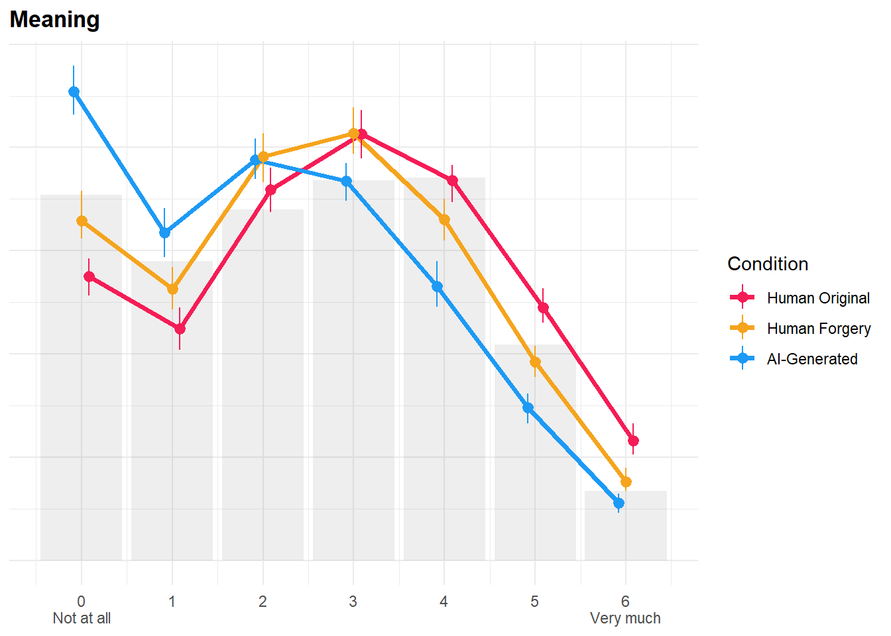{#fig-meaning-1 width=672}
:::

::: {.cell-output-display}
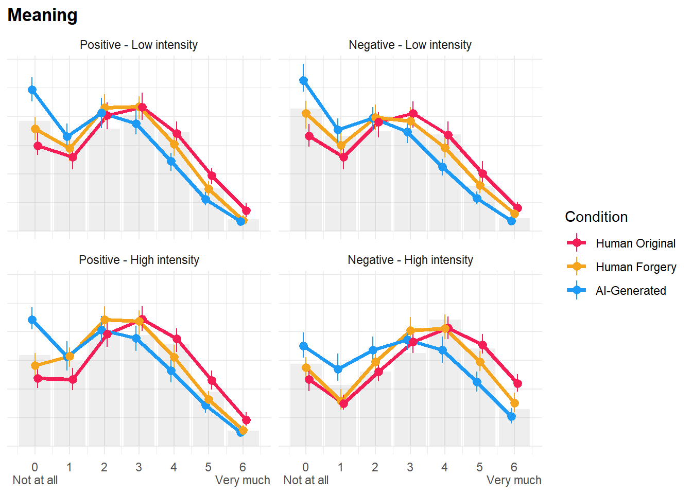{#fig-meaning-2 width=672}
:::

Meaning (0 = Not at all, 6 = Very much): observed proportion of each response (grey bars) and the model-implied probability per label condition (points with 95% CI).
:::


### Worth


::: {.cell}

```{.r .cell-code}
make_report(estimates$Worth)
```

::: {.cell-output-display}

```{=html}
<div id="oejhyexviw" style="padding-left:0px;padding-right:0px;padding-top:10px;padding-bottom:10px;overflow-x:auto;overflow-y:auto;width:auto;height:auto;">
<style>#oejhyexviw table {
  font-family: system-ui, 'Segoe UI', Roboto, Helvetica, Arial, sans-serif, 'Apple Color Emoji', 'Segoe UI Emoji', 'Segoe UI Symbol', 'Noto Color Emoji';
  -webkit-font-smoothing: antialiased;
  -moz-osx-font-smoothing: grayscale;
}

#oejhyexviw thead, #oejhyexviw tbody, #oejhyexviw tfoot, #oejhyexviw tr, #oejhyexviw td, #oejhyexviw th {
  border-style: none;
}

#oejhyexviw p {
  margin: 0;
  padding: 0;
}

#oejhyexviw .gt_table {
  display: table;
  border-collapse: collapse;
  line-height: normal;
  margin-left: auto;
  margin-right: auto;
  color: #333333;
  font-size: 16px;
  font-weight: normal;
  font-style: normal;
  background-color: #FFFFFF;
  width: auto;
  border-top-style: solid;
  border-top-width: 2px;
  border-top-color: #A8A8A8;
  border-right-style: none;
  border-right-width: 2px;
  border-right-color: #D3D3D3;
  border-bottom-style: solid;
  border-bottom-width: 2px;
  border-bottom-color: #A8A8A8;
  border-left-style: none;
  border-left-width: 2px;
  border-left-color: #D3D3D3;
}

#oejhyexviw .gt_caption {
  padding-top: 4px;
  padding-bottom: 4px;
}

#oejhyexviw .gt_title {
  color: #333333;
  font-size: 125%;
  font-weight: initial;
  padding-top: 4px;
  padding-bottom: 4px;
  padding-left: 5px;
  padding-right: 5px;
  border-bottom-color: #FFFFFF;
  border-bottom-width: 0;
}

#oejhyexviw .gt_subtitle {
  color: #333333;
  font-size: 85%;
  font-weight: initial;
  padding-top: 3px;
  padding-bottom: 5px;
  padding-left: 5px;
  padding-right: 5px;
  border-top-color: #FFFFFF;
  border-top-width: 0;
}

#oejhyexviw .gt_heading {
  background-color: #FFFFFF;
  text-align: center;
  border-bottom-color: #FFFFFF;
  border-left-style: none;
  border-left-width: 1px;
  border-left-color: #D3D3D3;
  border-right-style: none;
  border-right-width: 1px;
  border-right-color: #D3D3D3;
}

#oejhyexviw .gt_bottom_border {
  border-bottom-style: solid;
  border-bottom-width: 2px;
  border-bottom-color: #D3D3D3;
}

#oejhyexviw .gt_col_headings {
  border-top-style: solid;
  border-top-width: 2px;
  border-top-color: #D3D3D3;
  border-bottom-style: solid;
  border-bottom-width: 2px;
  border-bottom-color: #D3D3D3;
  border-left-style: none;
  border-left-width: 1px;
  border-left-color: #D3D3D3;
  border-right-style: none;
  border-right-width: 1px;
  border-right-color: #D3D3D3;
}

#oejhyexviw .gt_col_heading {
  color: #333333;
  background-color: #FFFFFF;
  font-size: 100%;
  font-weight: normal;
  text-transform: inherit;
  border-left-style: none;
  border-left-width: 1px;
  border-left-color: #D3D3D3;
  border-right-style: none;
  border-right-width: 1px;
  border-right-color: #D3D3D3;
  vertical-align: bottom;
  padding-top: 5px;
  padding-bottom: 6px;
  padding-left: 5px;
  padding-right: 5px;
  overflow-x: hidden;
}

#oejhyexviw .gt_column_spanner_outer {
  color: #333333;
  background-color: #FFFFFF;
  font-size: 100%;
  font-weight: normal;
  text-transform: inherit;
  padding-top: 0;
  padding-bottom: 0;
  padding-left: 4px;
  padding-right: 4px;
}

#oejhyexviw .gt_column_spanner_outer:first-child {
  padding-left: 0;
}

#oejhyexviw .gt_column_spanner_outer:last-child {
  padding-right: 0;
}

#oejhyexviw .gt_column_spanner {
  border-bottom-style: solid;
  border-bottom-width: 2px;
  border-bottom-color: #D3D3D3;
  vertical-align: bottom;
  padding-top: 5px;
  padding-bottom: 5px;
  overflow-x: hidden;
  display: inline-block;
  width: 100%;
}

#oejhyexviw .gt_spanner_row {
  border-bottom-style: hidden;
}

#oejhyexviw .gt_group_heading {
  padding-top: 8px;
  padding-bottom: 8px;
  padding-left: 5px;
  padding-right: 5px;
  color: #333333;
  background-color: #FFFFFF;
  font-size: 100%;
  font-weight: initial;
  text-transform: inherit;
  border-top-style: solid;
  border-top-width: 2px;
  border-top-color: #D3D3D3;
  border-bottom-style: solid;
  border-bottom-width: 2px;
  border-bottom-color: #D3D3D3;
  border-left-style: none;
  border-left-width: 1px;
  border-left-color: #D3D3D3;
  border-right-style: none;
  border-right-width: 1px;
  border-right-color: #D3D3D3;
  vertical-align: middle;
  text-align: left;
}

#oejhyexviw .gt_empty_group_heading {
  padding: 0.5px;
  color: #333333;
  background-color: #FFFFFF;
  font-size: 100%;
  font-weight: initial;
  border-top-style: solid;
  border-top-width: 2px;
  border-top-color: #D3D3D3;
  border-bottom-style: solid;
  border-bottom-width: 2px;
  border-bottom-color: #D3D3D3;
  vertical-align: middle;
}

#oejhyexviw .gt_from_md > :first-child {
  margin-top: 0;
}

#oejhyexviw .gt_from_md > :last-child {
  margin-bottom: 0;
}

#oejhyexviw .gt_row {
  padding-top: 8px;
  padding-bottom: 8px;
  padding-left: 5px;
  padding-right: 5px;
  margin: 10px;
  border-top-style: solid;
  border-top-width: 1px;
  border-top-color: #D3D3D3;
  border-left-style: none;
  border-left-width: 1px;
  border-left-color: #D3D3D3;
  border-right-style: none;
  border-right-width: 1px;
  border-right-color: #D3D3D3;
  vertical-align: middle;
  overflow-x: hidden;
}

#oejhyexviw .gt_stub {
  color: #333333;
  background-color: #FFFFFF;
  font-size: 100%;
  font-weight: initial;
  text-transform: inherit;
  border-right-style: solid;
  border-right-width: 2px;
  border-right-color: #D3D3D3;
  padding-left: 5px;
  padding-right: 5px;
}

#oejhyexviw .gt_stub_row_group {
  color: #333333;
  background-color: #FFFFFF;
  font-size: 100%;
  font-weight: initial;
  text-transform: inherit;
  border-right-style: solid;
  border-right-width: 2px;
  border-right-color: #D3D3D3;
  padding-left: 5px;
  padding-right: 5px;
  vertical-align: top;
}

#oejhyexviw .gt_row_group_first td {
  border-top-width: 2px;
}

#oejhyexviw .gt_row_group_first th {
  border-top-width: 2px;
}

#oejhyexviw .gt_summary_row {
  color: #333333;
  background-color: #FFFFFF;
  text-transform: inherit;
  padding-top: 8px;
  padding-bottom: 8px;
  padding-left: 5px;
  padding-right: 5px;
}

#oejhyexviw .gt_first_summary_row {
  border-top-style: solid;
  border-top-color: #D3D3D3;
}

#oejhyexviw .gt_first_summary_row.thick {
  border-top-width: 2px;
}

#oejhyexviw .gt_last_summary_row {
  padding-top: 8px;
  padding-bottom: 8px;
  padding-left: 5px;
  padding-right: 5px;
  border-bottom-style: solid;
  border-bottom-width: 2px;
  border-bottom-color: #D3D3D3;
}

#oejhyexviw .gt_grand_summary_row {
  color: #333333;
  background-color: #FFFFFF;
  text-transform: inherit;
  padding-top: 8px;
  padding-bottom: 8px;
  padding-left: 5px;
  padding-right: 5px;
}

#oejhyexviw .gt_first_grand_summary_row {
  padding-top: 8px;
  padding-bottom: 8px;
  padding-left: 5px;
  padding-right: 5px;
  border-top-style: double;
  border-top-width: 6px;
  border-top-color: #D3D3D3;
}

#oejhyexviw .gt_last_grand_summary_row_top {
  padding-top: 8px;
  padding-bottom: 8px;
  padding-left: 5px;
  padding-right: 5px;
  border-bottom-style: double;
  border-bottom-width: 6px;
  border-bottom-color: #D3D3D3;
}

#oejhyexviw .gt_striped {
  background-color: rgba(128, 128, 128, 0.05);
}

#oejhyexviw .gt_table_body {
  border-top-style: solid;
  border-top-width: 2px;
  border-top-color: #D3D3D3;
  border-bottom-style: solid;
  border-bottom-width: 2px;
  border-bottom-color: #D3D3D3;
}

#oejhyexviw .gt_footnotes {
  color: #333333;
  background-color: #FFFFFF;
  border-bottom-style: none;
  border-bottom-width: 2px;
  border-bottom-color: #D3D3D3;
  border-left-style: none;
  border-left-width: 2px;
  border-left-color: #D3D3D3;
  border-right-style: none;
  border-right-width: 2px;
  border-right-color: #D3D3D3;
}

#oejhyexviw .gt_footnote {
  margin: 0px;
  font-size: 90%;
  padding-top: 4px;
  padding-bottom: 4px;
  padding-left: 5px;
  padding-right: 5px;
}

#oejhyexviw .gt_sourcenotes {
  color: #333333;
  background-color: #FFFFFF;
  border-bottom-style: none;
  border-bottom-width: 2px;
  border-bottom-color: #D3D3D3;
  border-left-style: none;
  border-left-width: 2px;
  border-left-color: #D3D3D3;
  border-right-style: none;
  border-right-width: 2px;
  border-right-color: #D3D3D3;
}

#oejhyexviw .gt_sourcenote {
  font-size: 90%;
  padding-top: 4px;
  padding-bottom: 4px;
  padding-left: 5px;
  padding-right: 5px;
}

#oejhyexviw .gt_left {
  text-align: left;
}

#oejhyexviw .gt_center {
  text-align: center;
}

#oejhyexviw .gt_right {
  text-align: right;
  font-variant-numeric: tabular-nums;
}

#oejhyexviw .gt_font_normal {
  font-weight: normal;
}

#oejhyexviw .gt_font_bold {
  font-weight: bold;
}

#oejhyexviw .gt_font_italic {
  font-style: italic;
}

#oejhyexviw .gt_super {
  font-size: 65%;
}

#oejhyexviw .gt_footnote_marks {
  font-size: 75%;
  vertical-align: 0.4em;
  position: initial;
}

#oejhyexviw .gt_asterisk {
  font-size: 100%;
  vertical-align: 0;
}

#oejhyexviw .gt_indent_1 {
  text-indent: 5px;
}

#oejhyexviw .gt_indent_2 {
  text-indent: 10px;
}

#oejhyexviw .gt_indent_3 {
  text-indent: 15px;
}

#oejhyexviw .gt_indent_4 {
  text-indent: 20px;
}

#oejhyexviw .gt_indent_5 {
  text-indent: 25px;
}

#oejhyexviw .katex-display {
  display: inline-flex !important;
  margin-bottom: 0.75em !important;
}

#oejhyexviw div.Reactable > div.rt-table > div.rt-thead > div.rt-tr.rt-tr-group-header > div.rt-th-group:after {
  height: 0px !important;
}
</style>
<table class="gt_table" data-quarto-disable-processing="false" data-quarto-bootstrap="false">
  <thead>
    <tr class="gt_col_headings">
      <th class="gt_col_heading gt_columns_bottom_border gt_left" rowspan="1" colspan="1" scope="col" id="Contrast">Contrast</th>
      <th class="gt_col_heading gt_columns_bottom_border gt_left" rowspan="1" colspan="1" scope="col" id="Parameters">Parameters</th>
    </tr>
  </thead>
  <tbody class="gt_table_body">
    <tr><td headers="Contrast" class="gt_row gt_left">Human Forgery - Human Original</td>
<td headers="Parameters" class="gt_row gt_left">response - 0 (0.09, [ 0.08,  0.11]); response - 10 (0.02, [ 0.01,  0.03]); response - 100 (-0.03, [-0.04, -0.02]); response - 1000 (-0.06, [-0.06, -0.05]); response - 10000 (-0.02, [-0.03, -0.02]); response - 100000 (0.00, [-0.01,  0.00]); mu (-0.14, [-0.15, -0.12])</td></tr>
    <tr><td headers="Contrast" class="gt_row gt_left">AI-Generated - Human Original</td>
<td headers="Parameters" class="gt_row gt_left">response - 0 (0.18, [ 0.17,  0.19]); response - 10 (0.02, [ 0.01,  0.02]); response - 100 (-0.07, [-0.08, -0.07]); response - 1000 (-0.09, [-0.10, -0.08]); response - 10000 (-0.03, [-0.03, -0.03]); response - 100000 (-0.01, [-0.01,  0.00]); mu (-0.24, [-0.26, -0.21])</td></tr>
    <tr><td headers="Contrast" class="gt_row gt_left">AI-Generated - Human Forgery</td>
<td headers="Parameters" class="gt_row gt_left">response - 0 (0.09, [ 0.08,  0.10]); response - 100 (-0.04, [-0.05, -0.04]); response - 1000 (-0.03, [-0.04, -0.03]); response - 10000 (-0.01, [-0.01, -0.01]); response - 100000 (0.00, [ 0.00,  0.00]); mu (-0.10, [-0.12, -0.08])</td></tr>
  </tbody>
  
</table>
</div>
```

```{=html}
<div id="mnufcyjsiu" style="padding-left:0px;padding-right:0px;padding-top:10px;padding-bottom:10px;overflow-x:auto;overflow-y:auto;width:auto;height:auto;">
<style>#mnufcyjsiu table {
  font-family: system-ui, 'Segoe UI', Roboto, Helvetica, Arial, sans-serif, 'Apple Color Emoji', 'Segoe UI Emoji', 'Segoe UI Symbol', 'Noto Color Emoji';
  -webkit-font-smoothing: antialiased;
  -moz-osx-font-smoothing: grayscale;
}

#mnufcyjsiu thead, #mnufcyjsiu tbody, #mnufcyjsiu tfoot, #mnufcyjsiu tr, #mnufcyjsiu td, #mnufcyjsiu th {
  border-style: none;
}

#mnufcyjsiu p {
  margin: 0;
  padding: 0;
}

#mnufcyjsiu .gt_table {
  display: table;
  border-collapse: collapse;
  line-height: normal;
  margin-left: auto;
  margin-right: auto;
  color: #333333;
  font-size: 13px;
  font-weight: normal;
  font-style: normal;
  background-color: #FFFFFF;
  width: auto;
  border-top-style: solid;
  border-top-width: 3px;
  border-top-color: #D5D5D5;
  border-right-style: solid;
  border-right-width: 3px;
  border-right-color: #D5D5D5;
  border-bottom-style: solid;
  border-bottom-width: 3px;
  border-bottom-color: #D5D5D5;
  border-left-style: solid;
  border-left-width: 3px;
  border-left-color: #D5D5D5;
}

#mnufcyjsiu .gt_caption {
  padding-top: 4px;
  padding-bottom: 4px;
}

#mnufcyjsiu .gt_title {
  color: #333333;
  font-size: 125%;
  font-weight: initial;
  padding-top: 4px;
  padding-bottom: 4px;
  padding-left: 5px;
  padding-right: 5px;
  border-bottom-color: #FFFFFF;
  border-bottom-width: 0;
}

#mnufcyjsiu .gt_subtitle {
  color: #333333;
  font-size: 85%;
  font-weight: initial;
  padding-top: 3px;
  padding-bottom: 5px;
  padding-left: 5px;
  padding-right: 5px;
  border-top-color: #FFFFFF;
  border-top-width: 0;
}

#mnufcyjsiu .gt_heading {
  background-color: #FFFFFF;
  text-align: left;
  border-bottom-color: #FFFFFF;
  border-left-style: none;
  border-left-width: 1px;
  border-left-color: #D3D3D3;
  border-right-style: none;
  border-right-width: 1px;
  border-right-color: #D3D3D3;
}

#mnufcyjsiu .gt_bottom_border {
  border-bottom-style: solid;
  border-bottom-width: 2px;
  border-bottom-color: #D5D5D5;
}

#mnufcyjsiu .gt_col_headings {
  border-top-style: solid;
  border-top-width: 2px;
  border-top-color: #D5D5D5;
  border-bottom-style: solid;
  border-bottom-width: 2px;
  border-bottom-color: #D5D5D5;
  border-left-style: none;
  border-left-width: 1px;
  border-left-color: #D3D3D3;
  border-right-style: none;
  border-right-width: 1px;
  border-right-color: #D3D3D3;
}

#mnufcyjsiu .gt_col_heading {
  color: #FFFFFF;
  background-color: #000000;
  font-size: 100%;
  font-weight: normal;
  text-transform: inherit;
  border-left-style: none;
  border-left-width: 1px;
  border-left-color: #D3D3D3;
  border-right-style: none;
  border-right-width: 1px;
  border-right-color: #D3D3D3;
  vertical-align: bottom;
  padding-top: 5px;
  padding-bottom: 6px;
  padding-left: 5px;
  padding-right: 5px;
  overflow-x: hidden;
}

#mnufcyjsiu .gt_column_spanner_outer {
  color: #FFFFFF;
  background-color: #000000;
  font-size: 100%;
  font-weight: normal;
  text-transform: inherit;
  padding-top: 0;
  padding-bottom: 0;
  padding-left: 4px;
  padding-right: 4px;
}

#mnufcyjsiu .gt_column_spanner_outer:first-child {
  padding-left: 0;
}

#mnufcyjsiu .gt_column_spanner_outer:last-child {
  padding-right: 0;
}

#mnufcyjsiu .gt_column_spanner {
  border-bottom-style: solid;
  border-bottom-width: 2px;
  border-bottom-color: #D5D5D5;
  vertical-align: bottom;
  padding-top: 5px;
  padding-bottom: 5px;
  overflow-x: hidden;
  display: inline-block;
  width: 100%;
}

#mnufcyjsiu .gt_spanner_row {
  border-bottom-style: hidden;
}

#mnufcyjsiu .gt_group_heading {
  padding-top: 8px;
  padding-bottom: 8px;
  padding-left: 5px;
  padding-right: 5px;
  color: #333333;
  background-color: #FFFFFF;
  font-size: 100%;
  font-weight: initial;
  text-transform: inherit;
  border-top-style: solid;
  border-top-width: 2px;
  border-top-color: #D5D5D5;
  border-bottom-style: solid;
  border-bottom-width: 2px;
  border-bottom-color: #D5D5D5;
  border-left-style: none;
  border-left-width: 1px;
  border-left-color: #D3D3D3;
  border-right-style: none;
  border-right-width: 1px;
  border-right-color: #D3D3D3;
  vertical-align: middle;
  text-align: left;
}

#mnufcyjsiu .gt_empty_group_heading {
  padding: 0.5px;
  color: #333333;
  background-color: #FFFFFF;
  font-size: 100%;
  font-weight: initial;
  border-top-style: solid;
  border-top-width: 2px;
  border-top-color: #D5D5D5;
  border-bottom-style: solid;
  border-bottom-width: 2px;
  border-bottom-color: #D5D5D5;
  vertical-align: middle;
}

#mnufcyjsiu .gt_from_md > :first-child {
  margin-top: 0;
}

#mnufcyjsiu .gt_from_md > :last-child {
  margin-bottom: 0;
}

#mnufcyjsiu .gt_row {
  padding-top: 8px;
  padding-bottom: 8px;
  padding-left: 5px;
  padding-right: 5px;
  margin: 10px;
  border-top-style: solid;
  border-top-width: 1px;
  border-top-color: #D5D5D5;
  border-left-style: solid;
  border-left-width: 1px;
  border-left-color: #D5D5D5;
  border-right-style: solid;
  border-right-width: 1px;
  border-right-color: #D5D5D5;
  vertical-align: middle;
  overflow-x: hidden;
}

#mnufcyjsiu .gt_stub {
  color: #333333;
  background-color: #FFFFFF;
  font-size: 100%;
  font-weight: initial;
  text-transform: inherit;
  border-right-style: solid;
  border-right-width: 2px;
  border-right-color: #5F5F5F;
  padding-left: 5px;
  padding-right: 5px;
}

#mnufcyjsiu .gt_stub_row_group {
  color: #333333;
  background-color: #FFFFFF;
  font-size: 100%;
  font-weight: initial;
  text-transform: inherit;
  border-right-style: solid;
  border-right-width: 2px;
  border-right-color: #D3D3D3;
  padding-left: 5px;
  padding-right: 5px;
  vertical-align: top;
}

#mnufcyjsiu .gt_row_group_first td {
  border-top-width: 2px;
}

#mnufcyjsiu .gt_row_group_first th {
  border-top-width: 2px;
}

#mnufcyjsiu .gt_summary_row {
  color: #333333;
  background-color: #D5D5D5;
  text-transform: inherit;
  padding-top: 8px;
  padding-bottom: 8px;
  padding-left: 5px;
  padding-right: 5px;
}

#mnufcyjsiu .gt_first_summary_row {
  border-top-style: solid;
  border-top-color: #D5D5D5;
}

#mnufcyjsiu .gt_first_summary_row.thick {
  border-top-width: 2px;
}

#mnufcyjsiu .gt_last_summary_row {
  padding-top: 8px;
  padding-bottom: 8px;
  padding-left: 5px;
  padding-right: 5px;
  border-bottom-style: solid;
  border-bottom-width: 2px;
  border-bottom-color: #D5D5D5;
}

#mnufcyjsiu .gt_grand_summary_row {
  color: #FFFFFF;
  background-color: #929292;
  text-transform: inherit;
  padding-top: 8px;
  padding-bottom: 8px;
  padding-left: 5px;
  padding-right: 5px;
}

#mnufcyjsiu .gt_first_grand_summary_row {
  padding-top: 8px;
  padding-bottom: 8px;
  padding-left: 5px;
  padding-right: 5px;
  border-top-style: double;
  border-top-width: 6px;
  border-top-color: #D5D5D5;
}

#mnufcyjsiu .gt_last_grand_summary_row_top {
  padding-top: 8px;
  padding-bottom: 8px;
  padding-left: 5px;
  padding-right: 5px;
  border-bottom-style: double;
  border-bottom-width: 6px;
  border-bottom-color: #D5D5D5;
}

#mnufcyjsiu .gt_striped {
  background-color: #F4F4F4;
}

#mnufcyjsiu .gt_table_body {
  border-top-style: solid;
  border-top-width: 2px;
  border-top-color: #D5D5D5;
  border-bottom-style: solid;
  border-bottom-width: 2px;
  border-bottom-color: #D5D5D5;
}

#mnufcyjsiu .gt_footnotes {
  color: #333333;
  background-color: #FFFFFF;
  border-bottom-style: none;
  border-bottom-width: 2px;
  border-bottom-color: #D3D3D3;
  border-left-style: none;
  border-left-width: 2px;
  border-left-color: #D3D3D3;
  border-right-style: none;
  border-right-width: 2px;
  border-right-color: #D3D3D3;
}

#mnufcyjsiu .gt_footnote {
  margin: 0px;
  font-size: 90%;
  padding-top: 4px;
  padding-bottom: 4px;
  padding-left: 5px;
  padding-right: 5px;
}

#mnufcyjsiu .gt_sourcenotes {
  color: #333333;
  background-color: #FFFFFF;
  border-bottom-style: none;
  border-bottom-width: 2px;
  border-bottom-color: #D3D3D3;
  border-left-style: none;
  border-left-width: 2px;
  border-left-color: #D3D3D3;
  border-right-style: none;
  border-right-width: 2px;
  border-right-color: #D3D3D3;
}

#mnufcyjsiu .gt_sourcenote {
  font-size: 90%;
  padding-top: 4px;
  padding-bottom: 4px;
  padding-left: 5px;
  padding-right: 5px;
}

#mnufcyjsiu .gt_left {
  text-align: left;
}

#mnufcyjsiu .gt_center {
  text-align: center;
}

#mnufcyjsiu .gt_right {
  text-align: right;
  font-variant-numeric: tabular-nums;
}

#mnufcyjsiu .gt_font_normal {
  font-weight: normal;
}

#mnufcyjsiu .gt_font_bold {
  font-weight: bold;
}

#mnufcyjsiu .gt_font_italic {
  font-style: italic;
}

#mnufcyjsiu .gt_super {
  font-size: 65%;
}

#mnufcyjsiu .gt_footnote_marks {
  font-size: 75%;
  vertical-align: 0.4em;
  position: initial;
}

#mnufcyjsiu .gt_asterisk {
  font-size: 100%;
  vertical-align: 0;
}

#mnufcyjsiu .gt_indent_1 {
  text-indent: 5px;
}

#mnufcyjsiu .gt_indent_2 {
  text-indent: 10px;
}

#mnufcyjsiu .gt_indent_3 {
  text-indent: 15px;
}

#mnufcyjsiu .gt_indent_4 {
  text-indent: 20px;
}

#mnufcyjsiu .gt_indent_5 {
  text-indent: 25px;
}

#mnufcyjsiu .katex-display {
  display: inline-flex !important;
  margin-bottom: 0.75em !important;
}

#mnufcyjsiu div.Reactable > div.rt-table > div.rt-thead > div.rt-tr.rt-tr-group-header > div.rt-th-group:after {
  height: 0px !important;
}
</style>
<table class="gt_table" data-quarto-disable-processing="false" data-quarto-bootstrap="false">
  <thead>
    <tr class="gt_heading">
      <td colspan="10" class="gt_heading gt_title gt_font_normal gt_bottom_border" style>Worth: convergence</td>
    </tr>
    
    <tr class="gt_col_headings">
      <th class="gt_col_heading gt_columns_bottom_border gt_left" rowspan="1" colspan="1" scope="col" id="Model">Model</th>
      <th class="gt_col_heading gt_columns_bottom_border gt_left" rowspan="1" colspan="1" scope="col" id="Family">Family</th>
      <th class="gt_col_heading gt_columns_bottom_border gt_right" rowspan="1" colspan="1" scope="col" id="N_obs">N_obs</th>
      <th class="gt_col_heading gt_columns_bottom_border gt_right" rowspan="1" colspan="1" scope="col" id="N_participants">N_participants</th>
      <th class="gt_col_heading gt_columns_bottom_border gt_right" rowspan="1" colspan="1" scope="col" id="Chains">Chains</th>
      <th class="gt_col_heading gt_columns_bottom_border gt_right" rowspan="1" colspan="1" scope="col" id="Draws">Draws</th>
      <th class="gt_col_heading gt_columns_bottom_border gt_right" rowspan="1" colspan="1" scope="col" id="Max_Rhat">Max_Rhat</th>
      <th class="gt_col_heading gt_columns_bottom_border gt_right" rowspan="1" colspan="1" scope="col" id="Min_ESS_ratio">Min_ESS_ratio</th>
      <th class="gt_col_heading gt_columns_bottom_border gt_right" rowspan="1" colspan="1" scope="col" id="Divergent_pct">Divergent_pct</th>
      <th class="gt_col_heading gt_columns_bottom_border gt_left" rowspan="1" colspan="1" scope="col" id="Criterion">Criterion</th>
    </tr>
  </thead>
  <tbody class="gt_table_body">
    <tr><td headers="Model" class="gt_row gt_left">Worth</td>
<td headers="Family" class="gt_row gt_left">Cumulative (ordinal)</td>
<td headers="N_obs" class="gt_row gt_right">15552</td>
<td headers="N_participants" class="gt_row gt_right">324</td>
<td headers="Chains" class="gt_row gt_right">8</td>
<td headers="Draws" class="gt_row gt_right">4000</td>
<td headers="Max_Rhat" class="gt_row gt_right">1.037</td>
<td headers="Min_ESS_ratio" class="gt_row gt_right">0.078</td>
<td headers="Divergent_pct" class="gt_row gt_right">0</td>
<td headers="Criterion" class="gt_row gt_left">loo</td></tr>
  </tbody>
  
</table>
</div>
```


::: {.callout-note collapse="true" title="Worth: convergence (Markdown table, for text readers)"}

|Model |Family               | N_obs| N_participants| Chains| Draws| Max_Rhat| Min_ESS_ratio| Divergent_pct|Criterion |
|:-----|:--------------------|-----:|--------------:|------:|-----:|--------:|-------------:|-------------:|:---------|
|Worth |Cumulative (ordinal) | 15552|            324|      8|  4000|    1.037|         0.078|             0|loo       |

:::

```{=html}
<div id="fmgnpbgaas" style="padding-left:0px;padding-right:0px;padding-top:10px;padding-bottom:10px;overflow-x:auto;overflow-y:auto;width:auto;height:auto;">
<style>#fmgnpbgaas table {
  font-family: system-ui, 'Segoe UI', Roboto, Helvetica, Arial, sans-serif, 'Apple Color Emoji', 'Segoe UI Emoji', 'Segoe UI Symbol', 'Noto Color Emoji';
  -webkit-font-smoothing: antialiased;
  -moz-osx-font-smoothing: grayscale;
}

#fmgnpbgaas thead, #fmgnpbgaas tbody, #fmgnpbgaas tfoot, #fmgnpbgaas tr, #fmgnpbgaas td, #fmgnpbgaas th {
  border-style: none;
}

#fmgnpbgaas p {
  margin: 0;
  padding: 0;
}

#fmgnpbgaas .gt_table {
  display: table;
  border-collapse: collapse;
  line-height: normal;
  margin-left: auto;
  margin-right: auto;
  color: #333333;
  font-size: 13px;
  font-weight: normal;
  font-style: normal;
  background-color: #FFFFFF;
  width: auto;
  border-top-style: solid;
  border-top-width: 3px;
  border-top-color: #D5D5D5;
  border-right-style: solid;
  border-right-width: 3px;
  border-right-color: #D5D5D5;
  border-bottom-style: solid;
  border-bottom-width: 3px;
  border-bottom-color: #D5D5D5;
  border-left-style: solid;
  border-left-width: 3px;
  border-left-color: #D5D5D5;
}

#fmgnpbgaas .gt_caption {
  padding-top: 4px;
  padding-bottom: 4px;
}

#fmgnpbgaas .gt_title {
  color: #333333;
  font-size: 125%;
  font-weight: initial;
  padding-top: 4px;
  padding-bottom: 4px;
  padding-left: 5px;
  padding-right: 5px;
  border-bottom-color: #FFFFFF;
  border-bottom-width: 0;
}

#fmgnpbgaas .gt_subtitle {
  color: #333333;
  font-size: 85%;
  font-weight: initial;
  padding-top: 3px;
  padding-bottom: 5px;
  padding-left: 5px;
  padding-right: 5px;
  border-top-color: #FFFFFF;
  border-top-width: 0;
}

#fmgnpbgaas .gt_heading {
  background-color: #FFFFFF;
  text-align: left;
  border-bottom-color: #FFFFFF;
  border-left-style: none;
  border-left-width: 1px;
  border-left-color: #D3D3D3;
  border-right-style: none;
  border-right-width: 1px;
  border-right-color: #D3D3D3;
}

#fmgnpbgaas .gt_bottom_border {
  border-bottom-style: solid;
  border-bottom-width: 2px;
  border-bottom-color: #D5D5D5;
}

#fmgnpbgaas .gt_col_headings {
  border-top-style: solid;
  border-top-width: 2px;
  border-top-color: #D5D5D5;
  border-bottom-style: solid;
  border-bottom-width: 2px;
  border-bottom-color: #D5D5D5;
  border-left-style: none;
  border-left-width: 1px;
  border-left-color: #D3D3D3;
  border-right-style: none;
  border-right-width: 1px;
  border-right-color: #D3D3D3;
}

#fmgnpbgaas .gt_col_heading {
  color: #FFFFFF;
  background-color: #000000;
  font-size: 100%;
  font-weight: normal;
  text-transform: inherit;
  border-left-style: none;
  border-left-width: 1px;
  border-left-color: #D3D3D3;
  border-right-style: none;
  border-right-width: 1px;
  border-right-color: #D3D3D3;
  vertical-align: bottom;
  padding-top: 5px;
  padding-bottom: 6px;
  padding-left: 5px;
  padding-right: 5px;
  overflow-x: hidden;
}

#fmgnpbgaas .gt_column_spanner_outer {
  color: #FFFFFF;
  background-color: #000000;
  font-size: 100%;
  font-weight: normal;
  text-transform: inherit;
  padding-top: 0;
  padding-bottom: 0;
  padding-left: 4px;
  padding-right: 4px;
}

#fmgnpbgaas .gt_column_spanner_outer:first-child {
  padding-left: 0;
}

#fmgnpbgaas .gt_column_spanner_outer:last-child {
  padding-right: 0;
}

#fmgnpbgaas .gt_column_spanner {
  border-bottom-style: solid;
  border-bottom-width: 2px;
  border-bottom-color: #D5D5D5;
  vertical-align: bottom;
  padding-top: 5px;
  padding-bottom: 5px;
  overflow-x: hidden;
  display: inline-block;
  width: 100%;
}

#fmgnpbgaas .gt_spanner_row {
  border-bottom-style: hidden;
}

#fmgnpbgaas .gt_group_heading {
  padding-top: 8px;
  padding-bottom: 8px;
  padding-left: 5px;
  padding-right: 5px;
  color: #333333;
  background-color: #FFFFFF;
  font-size: 100%;
  font-weight: initial;
  text-transform: inherit;
  border-top-style: solid;
  border-top-width: 2px;
  border-top-color: #D5D5D5;
  border-bottom-style: solid;
  border-bottom-width: 2px;
  border-bottom-color: #D5D5D5;
  border-left-style: none;
  border-left-width: 1px;
  border-left-color: #D3D3D3;
  border-right-style: none;
  border-right-width: 1px;
  border-right-color: #D3D3D3;
  vertical-align: middle;
  text-align: left;
}

#fmgnpbgaas .gt_empty_group_heading {
  padding: 0.5px;
  color: #333333;
  background-color: #FFFFFF;
  font-size: 100%;
  font-weight: initial;
  border-top-style: solid;
  border-top-width: 2px;
  border-top-color: #D5D5D5;
  border-bottom-style: solid;
  border-bottom-width: 2px;
  border-bottom-color: #D5D5D5;
  vertical-align: middle;
}

#fmgnpbgaas .gt_from_md > :first-child {
  margin-top: 0;
}

#fmgnpbgaas .gt_from_md > :last-child {
  margin-bottom: 0;
}

#fmgnpbgaas .gt_row {
  padding-top: 8px;
  padding-bottom: 8px;
  padding-left: 5px;
  padding-right: 5px;
  margin: 10px;
  border-top-style: solid;
  border-top-width: 1px;
  border-top-color: #D5D5D5;
  border-left-style: solid;
  border-left-width: 1px;
  border-left-color: #D5D5D5;
  border-right-style: solid;
  border-right-width: 1px;
  border-right-color: #D5D5D5;
  vertical-align: middle;
  overflow-x: hidden;
}

#fmgnpbgaas .gt_stub {
  color: #333333;
  background-color: #FFFFFF;
  font-size: 100%;
  font-weight: initial;
  text-transform: inherit;
  border-right-style: solid;
  border-right-width: 2px;
  border-right-color: #5F5F5F;
  padding-left: 5px;
  padding-right: 5px;
}

#fmgnpbgaas .gt_stub_row_group {
  color: #333333;
  background-color: #FFFFFF;
  font-size: 100%;
  font-weight: initial;
  text-transform: inherit;
  border-right-style: solid;
  border-right-width: 2px;
  border-right-color: #D3D3D3;
  padding-left: 5px;
  padding-right: 5px;
  vertical-align: top;
}

#fmgnpbgaas .gt_row_group_first td {
  border-top-width: 2px;
}

#fmgnpbgaas .gt_row_group_first th {
  border-top-width: 2px;
}

#fmgnpbgaas .gt_summary_row {
  color: #333333;
  background-color: #D5D5D5;
  text-transform: inherit;
  padding-top: 8px;
  padding-bottom: 8px;
  padding-left: 5px;
  padding-right: 5px;
}

#fmgnpbgaas .gt_first_summary_row {
  border-top-style: solid;
  border-top-color: #D5D5D5;
}

#fmgnpbgaas .gt_first_summary_row.thick {
  border-top-width: 2px;
}

#fmgnpbgaas .gt_last_summary_row {
  padding-top: 8px;
  padding-bottom: 8px;
  padding-left: 5px;
  padding-right: 5px;
  border-bottom-style: solid;
  border-bottom-width: 2px;
  border-bottom-color: #D5D5D5;
}

#fmgnpbgaas .gt_grand_summary_row {
  color: #FFFFFF;
  background-color: #929292;
  text-transform: inherit;
  padding-top: 8px;
  padding-bottom: 8px;
  padding-left: 5px;
  padding-right: 5px;
}

#fmgnpbgaas .gt_first_grand_summary_row {
  padding-top: 8px;
  padding-bottom: 8px;
  padding-left: 5px;
  padding-right: 5px;
  border-top-style: double;
  border-top-width: 6px;
  border-top-color: #D5D5D5;
}

#fmgnpbgaas .gt_last_grand_summary_row_top {
  padding-top: 8px;
  padding-bottom: 8px;
  padding-left: 5px;
  padding-right: 5px;
  border-bottom-style: double;
  border-bottom-width: 6px;
  border-bottom-color: #D5D5D5;
}

#fmgnpbgaas .gt_striped {
  background-color: #F4F4F4;
}

#fmgnpbgaas .gt_table_body {
  border-top-style: solid;
  border-top-width: 2px;
  border-top-color: #D5D5D5;
  border-bottom-style: solid;
  border-bottom-width: 2px;
  border-bottom-color: #D5D5D5;
}

#fmgnpbgaas .gt_footnotes {
  color: #333333;
  background-color: #FFFFFF;
  border-bottom-style: none;
  border-bottom-width: 2px;
  border-bottom-color: #D3D3D3;
  border-left-style: none;
  border-left-width: 2px;
  border-left-color: #D3D3D3;
  border-right-style: none;
  border-right-width: 2px;
  border-right-color: #D3D3D3;
}

#fmgnpbgaas .gt_footnote {
  margin: 0px;
  font-size: 90%;
  padding-top: 4px;
  padding-bottom: 4px;
  padding-left: 5px;
  padding-right: 5px;
}

#fmgnpbgaas .gt_sourcenotes {
  color: #333333;
  background-color: #FFFFFF;
  border-bottom-style: none;
  border-bottom-width: 2px;
  border-bottom-color: #D3D3D3;
  border-left-style: none;
  border-left-width: 2px;
  border-left-color: #D3D3D3;
  border-right-style: none;
  border-right-width: 2px;
  border-right-color: #D3D3D3;
}

#fmgnpbgaas .gt_sourcenote {
  font-size: 90%;
  padding-top: 4px;
  padding-bottom: 4px;
  padding-left: 5px;
  padding-right: 5px;
}

#fmgnpbgaas .gt_left {
  text-align: left;
}

#fmgnpbgaas .gt_center {
  text-align: center;
}

#fmgnpbgaas .gt_right {
  text-align: right;
  font-variant-numeric: tabular-nums;
}

#fmgnpbgaas .gt_font_normal {
  font-weight: normal;
}

#fmgnpbgaas .gt_font_bold {
  font-weight: bold;
}

#fmgnpbgaas .gt_font_italic {
  font-style: italic;
}

#fmgnpbgaas .gt_super {
  font-size: 65%;
}

#fmgnpbgaas .gt_footnote_marks {
  font-size: 75%;
  vertical-align: 0.4em;
  position: initial;
}

#fmgnpbgaas .gt_asterisk {
  font-size: 100%;
  vertical-align: 0;
}

#fmgnpbgaas .gt_indent_1 {
  text-indent: 5px;
}

#fmgnpbgaas .gt_indent_2 {
  text-indent: 10px;
}

#fmgnpbgaas .gt_indent_3 {
  text-indent: 15px;
}

#fmgnpbgaas .gt_indent_4 {
  text-indent: 20px;
}

#fmgnpbgaas .gt_indent_5 {
  text-indent: 25px;
}

#fmgnpbgaas .katex-display {
  display: inline-flex !important;
  margin-bottom: 0.75em !important;
}

#fmgnpbgaas div.Reactable > div.rt-table > div.rt-thead > div.rt-tr.rt-tr-group-header > div.rt-th-group:after {
  height: 0px !important;
}
</style>
<table class="gt_table" data-quarto-disable-processing="false" data-quarto-bootstrap="false">
  <thead>
    <tr class="gt_heading">
      <td colspan="5" class="gt_heading gt_title gt_font_normal gt_bottom_border" style>Worth: marginal means per label condition (response scale)</td>
    </tr>
    
    <tr class="gt_col_headings">
      <th class="gt_col_heading gt_columns_bottom_border gt_center" rowspan="1" colspan="1" scope="col" id="Condition">Condition</th>
      <th class="gt_col_heading gt_columns_bottom_border gt_center" rowspan="1" colspan="1" scope="col" id="Response">Response</th>
      <th class="gt_col_heading gt_columns_bottom_border gt_right" rowspan="1" colspan="1" scope="col" id="Estimate">Estimate</th>
      <th class="gt_col_heading gt_columns_bottom_border gt_right" rowspan="1" colspan="1" scope="col" id="CI_low">CI_low</th>
      <th class="gt_col_heading gt_columns_bottom_border gt_right" rowspan="1" colspan="1" scope="col" id="CI_high">CI_high</th>
    </tr>
  </thead>
  <tbody class="gt_table_body">
    <tr><td headers="Condition" class="gt_row gt_center">Human Original</td>
<td headers="Response" class="gt_row gt_center">0</td>
<td headers="Estimate" class="gt_row gt_right">0.30</td>
<td headers="CI_low" class="gt_row gt_right">0.29</td>
<td headers="CI_high" class="gt_row gt_right">0.31</td></tr>
    <tr><td headers="Condition" class="gt_row gt_center gt_striped">Human Forgery</td>
<td headers="Response" class="gt_row gt_center gt_striped">0</td>
<td headers="Estimate" class="gt_row gt_right gt_striped">0.39</td>
<td headers="CI_low" class="gt_row gt_right gt_striped">0.38</td>
<td headers="CI_high" class="gt_row gt_right gt_striped">0.40</td></tr>
    <tr><td headers="Condition" class="gt_row gt_center">AI-Generated</td>
<td headers="Response" class="gt_row gt_center">0</td>
<td headers="Estimate" class="gt_row gt_right">0.48</td>
<td headers="CI_low" class="gt_row gt_right">0.47</td>
<td headers="CI_high" class="gt_row gt_right">0.49</td></tr>
    <tr><td headers="Condition" class="gt_row gt_center gt_striped">Human Original</td>
<td headers="Response" class="gt_row gt_center gt_striped">10</td>
<td headers="Estimate" class="gt_row gt_right gt_striped">0.23</td>
<td headers="CI_low" class="gt_row gt_right gt_striped">0.23</td>
<td headers="CI_high" class="gt_row gt_right gt_striped">0.24</td></tr>
    <tr><td headers="Condition" class="gt_row gt_center">Human Forgery</td>
<td headers="Response" class="gt_row gt_center">10</td>
<td headers="Estimate" class="gt_row gt_right">0.25</td>
<td headers="CI_low" class="gt_row gt_right">0.24</td>
<td headers="CI_high" class="gt_row gt_right">0.26</td></tr>
    <tr><td headers="Condition" class="gt_row gt_center gt_striped">AI-Generated</td>
<td headers="Response" class="gt_row gt_center gt_striped">10</td>
<td headers="Estimate" class="gt_row gt_right gt_striped">0.25</td>
<td headers="CI_low" class="gt_row gt_right gt_striped">0.24</td>
<td headers="CI_high" class="gt_row gt_right gt_striped">0.26</td></tr>
    <tr><td headers="Condition" class="gt_row gt_center">Human Original</td>
<td headers="Response" class="gt_row gt_center">100</td>
<td headers="Estimate" class="gt_row gt_right">0.24</td>
<td headers="CI_low" class="gt_row gt_right">0.24</td>
<td headers="CI_high" class="gt_row gt_right">0.25</td></tr>
    <tr><td headers="Condition" class="gt_row gt_center gt_striped">Human Forgery</td>
<td headers="Response" class="gt_row gt_center gt_striped">100</td>
<td headers="Estimate" class="gt_row gt_right gt_striped">0.21</td>
<td headers="CI_low" class="gt_row gt_right gt_striped">0.21</td>
<td headers="CI_high" class="gt_row gt_right gt_striped">0.22</td></tr>
    <tr><td headers="Condition" class="gt_row gt_center">AI-Generated</td>
<td headers="Response" class="gt_row gt_center">100</td>
<td headers="Estimate" class="gt_row gt_right">0.17</td>
<td headers="CI_low" class="gt_row gt_right">0.17</td>
<td headers="CI_high" class="gt_row gt_right">0.18</td></tr>
    <tr><td headers="Condition" class="gt_row gt_center gt_striped">Human Original</td>
<td headers="Response" class="gt_row gt_center gt_striped">1000</td>
<td headers="Estimate" class="gt_row gt_right gt_striped">0.17</td>
<td headers="CI_low" class="gt_row gt_right gt_striped">0.16</td>
<td headers="CI_high" class="gt_row gt_right gt_striped">0.17</td></tr>
    <tr><td headers="Condition" class="gt_row gt_center">Human Forgery</td>
<td headers="Response" class="gt_row gt_center">1000</td>
<td headers="Estimate" class="gt_row gt_right">0.11</td>
<td headers="CI_low" class="gt_row gt_right">0.10</td>
<td headers="CI_high" class="gt_row gt_right">0.11</td></tr>
    <tr><td headers="Condition" class="gt_row gt_center gt_striped">AI-Generated</td>
<td headers="Response" class="gt_row gt_center gt_striped">1000</td>
<td headers="Estimate" class="gt_row gt_right gt_striped">0.08</td>
<td headers="CI_low" class="gt_row gt_right gt_striped">0.07</td>
<td headers="CI_high" class="gt_row gt_right gt_striped">0.08</td></tr>
    <tr><td headers="Condition" class="gt_row gt_center">Human Original</td>
<td headers="Response" class="gt_row gt_center">10000</td>
<td headers="Estimate" class="gt_row gt_right">0.05</td>
<td headers="CI_low" class="gt_row gt_right">0.05</td>
<td headers="CI_high" class="gt_row gt_right">0.05</td></tr>
    <tr><td headers="Condition" class="gt_row gt_center gt_striped">Human Forgery</td>
<td headers="Response" class="gt_row gt_center gt_striped">10000</td>
<td headers="Estimate" class="gt_row gt_right gt_striped">0.03</td>
<td headers="CI_low" class="gt_row gt_right gt_striped">0.02</td>
<td headers="CI_high" class="gt_row gt_right gt_striped">0.03</td></tr>
    <tr><td headers="Condition" class="gt_row gt_center">AI-Generated</td>
<td headers="Response" class="gt_row gt_center">10000</td>
<td headers="Estimate" class="gt_row gt_right">0.02</td>
<td headers="CI_low" class="gt_row gt_right">0.02</td>
<td headers="CI_high" class="gt_row gt_right">0.02</td></tr>
    <tr><td headers="Condition" class="gt_row gt_center gt_striped">Human Original</td>
<td headers="Response" class="gt_row gt_center gt_striped">100000</td>
<td headers="Estimate" class="gt_row gt_right gt_striped">0.01</td>
<td headers="CI_low" class="gt_row gt_right gt_striped">0.01</td>
<td headers="CI_high" class="gt_row gt_right gt_striped">0.01</td></tr>
    <tr><td headers="Condition" class="gt_row gt_center">Human Forgery</td>
<td headers="Response" class="gt_row gt_center">100000</td>
<td headers="Estimate" class="gt_row gt_right">0.01</td>
<td headers="CI_low" class="gt_row gt_right">0.00</td>
<td headers="CI_high" class="gt_row gt_right">0.01</td></tr>
    <tr><td headers="Condition" class="gt_row gt_center gt_striped">AI-Generated</td>
<td headers="Response" class="gt_row gt_center gt_striped">100000</td>
<td headers="Estimate" class="gt_row gt_right gt_striped">0.00</td>
<td headers="CI_low" class="gt_row gt_right gt_striped">0.00</td>
<td headers="CI_high" class="gt_row gt_right gt_striped">0.00</td></tr>
  </tbody>
  
</table>
</div>
```


::: {.callout-note collapse="true" title="Worth: marginal means per label condition (response scale) (Markdown table, for text readers)"}

|Condition      |Response |Estimate |CI_low |CI_high |
|:--------------|:--------|:--------|:------|:-------|
|Human Original |0        |0.30     |0.29   |0.31    |
|Human Forgery  |0        |0.39     |0.38   |0.40    |
|AI-Generated   |0        |0.48     |0.47   |0.49    |
|Human Original |10       |0.23     |0.23   |0.24    |
|Human Forgery  |10       |0.25     |0.24   |0.26    |
|AI-Generated   |10       |0.25     |0.24   |0.26    |
|Human Original |100      |0.24     |0.24   |0.25    |
|Human Forgery  |100      |0.21     |0.21   |0.22    |
|AI-Generated   |100      |0.17     |0.17   |0.18    |
|Human Original |1000     |0.17     |0.16   |0.17    |
|Human Forgery  |1000     |0.11     |0.10   |0.11    |
|AI-Generated   |1000     |0.08     |0.07   |0.08    |
|Human Original |10000    |0.05     |0.05   |0.05    |
|Human Forgery  |10000    |0.03     |0.02   |0.03    |
|AI-Generated   |10000    |0.02     |0.02   |0.02    |
|Human Original |100000   |0.01     |0.01   |0.01    |
|Human Forgery  |100000   |0.01     |0.00   |0.01    |
|AI-Generated   |100000   |0.00     |0.00   |0.00    |

:::

```{=html}
<div id="dglorjbacq" style="padding-left:0px;padding-right:0px;padding-top:10px;padding-bottom:10px;overflow-x:auto;overflow-y:auto;width:auto;height:auto;">
<style>#dglorjbacq table {
  font-family: system-ui, 'Segoe UI', Roboto, Helvetica, Arial, sans-serif, 'Apple Color Emoji', 'Segoe UI Emoji', 'Segoe UI Symbol', 'Noto Color Emoji';
  -webkit-font-smoothing: antialiased;
  -moz-osx-font-smoothing: grayscale;
}

#dglorjbacq thead, #dglorjbacq tbody, #dglorjbacq tfoot, #dglorjbacq tr, #dglorjbacq td, #dglorjbacq th {
  border-style: none;
}

#dglorjbacq p {
  margin: 0;
  padding: 0;
}

#dglorjbacq .gt_table {
  display: table;
  border-collapse: collapse;
  line-height: normal;
  margin-left: auto;
  margin-right: auto;
  color: #333333;
  font-size: 13px;
  font-weight: normal;
  font-style: normal;
  background-color: #FFFFFF;
  width: auto;
  border-top-style: solid;
  border-top-width: 3px;
  border-top-color: #D5D5D5;
  border-right-style: solid;
  border-right-width: 3px;
  border-right-color: #D5D5D5;
  border-bottom-style: solid;
  border-bottom-width: 3px;
  border-bottom-color: #D5D5D5;
  border-left-style: solid;
  border-left-width: 3px;
  border-left-color: #D5D5D5;
}

#dglorjbacq .gt_caption {
  padding-top: 4px;
  padding-bottom: 4px;
}

#dglorjbacq .gt_title {
  color: #333333;
  font-size: 125%;
  font-weight: initial;
  padding-top: 4px;
  padding-bottom: 4px;
  padding-left: 5px;
  padding-right: 5px;
  border-bottom-color: #FFFFFF;
  border-bottom-width: 0;
}

#dglorjbacq .gt_subtitle {
  color: #333333;
  font-size: 85%;
  font-weight: initial;
  padding-top: 3px;
  padding-bottom: 5px;
  padding-left: 5px;
  padding-right: 5px;
  border-top-color: #FFFFFF;
  border-top-width: 0;
}

#dglorjbacq .gt_heading {
  background-color: #FFFFFF;
  text-align: left;
  border-bottom-color: #FFFFFF;
  border-left-style: none;
  border-left-width: 1px;
  border-left-color: #D3D3D3;
  border-right-style: none;
  border-right-width: 1px;
  border-right-color: #D3D3D3;
}

#dglorjbacq .gt_bottom_border {
  border-bottom-style: solid;
  border-bottom-width: 2px;
  border-bottom-color: #D5D5D5;
}

#dglorjbacq .gt_col_headings {
  border-top-style: solid;
  border-top-width: 2px;
  border-top-color: #D5D5D5;
  border-bottom-style: solid;
  border-bottom-width: 2px;
  border-bottom-color: #D5D5D5;
  border-left-style: none;
  border-left-width: 1px;
  border-left-color: #D3D3D3;
  border-right-style: none;
  border-right-width: 1px;
  border-right-color: #D3D3D3;
}

#dglorjbacq .gt_col_heading {
  color: #FFFFFF;
  background-color: #000000;
  font-size: 100%;
  font-weight: normal;
  text-transform: inherit;
  border-left-style: none;
  border-left-width: 1px;
  border-left-color: #D3D3D3;
  border-right-style: none;
  border-right-width: 1px;
  border-right-color: #D3D3D3;
  vertical-align: bottom;
  padding-top: 5px;
  padding-bottom: 6px;
  padding-left: 5px;
  padding-right: 5px;
  overflow-x: hidden;
}

#dglorjbacq .gt_column_spanner_outer {
  color: #FFFFFF;
  background-color: #000000;
  font-size: 100%;
  font-weight: normal;
  text-transform: inherit;
  padding-top: 0;
  padding-bottom: 0;
  padding-left: 4px;
  padding-right: 4px;
}

#dglorjbacq .gt_column_spanner_outer:first-child {
  padding-left: 0;
}

#dglorjbacq .gt_column_spanner_outer:last-child {
  padding-right: 0;
}

#dglorjbacq .gt_column_spanner {
  border-bottom-style: solid;
  border-bottom-width: 2px;
  border-bottom-color: #D5D5D5;
  vertical-align: bottom;
  padding-top: 5px;
  padding-bottom: 5px;
  overflow-x: hidden;
  display: inline-block;
  width: 100%;
}

#dglorjbacq .gt_spanner_row {
  border-bottom-style: hidden;
}

#dglorjbacq .gt_group_heading {
  padding-top: 8px;
  padding-bottom: 8px;
  padding-left: 5px;
  padding-right: 5px;
  color: #333333;
  background-color: #FFFFFF;
  font-size: 100%;
  font-weight: initial;
  text-transform: inherit;
  border-top-style: solid;
  border-top-width: 2px;
  border-top-color: #D5D5D5;
  border-bottom-style: solid;
  border-bottom-width: 2px;
  border-bottom-color: #D5D5D5;
  border-left-style: none;
  border-left-width: 1px;
  border-left-color: #D3D3D3;
  border-right-style: none;
  border-right-width: 1px;
  border-right-color: #D3D3D3;
  vertical-align: middle;
  text-align: left;
}

#dglorjbacq .gt_empty_group_heading {
  padding: 0.5px;
  color: #333333;
  background-color: #FFFFFF;
  font-size: 100%;
  font-weight: initial;
  border-top-style: solid;
  border-top-width: 2px;
  border-top-color: #D5D5D5;
  border-bottom-style: solid;
  border-bottom-width: 2px;
  border-bottom-color: #D5D5D5;
  vertical-align: middle;
}

#dglorjbacq .gt_from_md > :first-child {
  margin-top: 0;
}

#dglorjbacq .gt_from_md > :last-child {
  margin-bottom: 0;
}

#dglorjbacq .gt_row {
  padding-top: 8px;
  padding-bottom: 8px;
  padding-left: 5px;
  padding-right: 5px;
  margin: 10px;
  border-top-style: solid;
  border-top-width: 1px;
  border-top-color: #D5D5D5;
  border-left-style: solid;
  border-left-width: 1px;
  border-left-color: #D5D5D5;
  border-right-style: solid;
  border-right-width: 1px;
  border-right-color: #D5D5D5;
  vertical-align: middle;
  overflow-x: hidden;
}

#dglorjbacq .gt_stub {
  color: #333333;
  background-color: #FFFFFF;
  font-size: 100%;
  font-weight: initial;
  text-transform: inherit;
  border-right-style: solid;
  border-right-width: 2px;
  border-right-color: #5F5F5F;
  padding-left: 5px;
  padding-right: 5px;
}

#dglorjbacq .gt_stub_row_group {
  color: #333333;
  background-color: #FFFFFF;
  font-size: 100%;
  font-weight: initial;
  text-transform: inherit;
  border-right-style: solid;
  border-right-width: 2px;
  border-right-color: #D3D3D3;
  padding-left: 5px;
  padding-right: 5px;
  vertical-align: top;
}

#dglorjbacq .gt_row_group_first td {
  border-top-width: 2px;
}

#dglorjbacq .gt_row_group_first th {
  border-top-width: 2px;
}

#dglorjbacq .gt_summary_row {
  color: #333333;
  background-color: #D5D5D5;
  text-transform: inherit;
  padding-top: 8px;
  padding-bottom: 8px;
  padding-left: 5px;
  padding-right: 5px;
}

#dglorjbacq .gt_first_summary_row {
  border-top-style: solid;
  border-top-color: #D5D5D5;
}

#dglorjbacq .gt_first_summary_row.thick {
  border-top-width: 2px;
}

#dglorjbacq .gt_last_summary_row {
  padding-top: 8px;
  padding-bottom: 8px;
  padding-left: 5px;
  padding-right: 5px;
  border-bottom-style: solid;
  border-bottom-width: 2px;
  border-bottom-color: #D5D5D5;
}

#dglorjbacq .gt_grand_summary_row {
  color: #FFFFFF;
  background-color: #929292;
  text-transform: inherit;
  padding-top: 8px;
  padding-bottom: 8px;
  padding-left: 5px;
  padding-right: 5px;
}

#dglorjbacq .gt_first_grand_summary_row {
  padding-top: 8px;
  padding-bottom: 8px;
  padding-left: 5px;
  padding-right: 5px;
  border-top-style: double;
  border-top-width: 6px;
  border-top-color: #D5D5D5;
}

#dglorjbacq .gt_last_grand_summary_row_top {
  padding-top: 8px;
  padding-bottom: 8px;
  padding-left: 5px;
  padding-right: 5px;
  border-bottom-style: double;
  border-bottom-width: 6px;
  border-bottom-color: #D5D5D5;
}

#dglorjbacq .gt_striped {
  background-color: #F4F4F4;
}

#dglorjbacq .gt_table_body {
  border-top-style: solid;
  border-top-width: 2px;
  border-top-color: #D5D5D5;
  border-bottom-style: solid;
  border-bottom-width: 2px;
  border-bottom-color: #D5D5D5;
}

#dglorjbacq .gt_footnotes {
  color: #333333;
  background-color: #FFFFFF;
  border-bottom-style: none;
  border-bottom-width: 2px;
  border-bottom-color: #D3D3D3;
  border-left-style: none;
  border-left-width: 2px;
  border-left-color: #D3D3D3;
  border-right-style: none;
  border-right-width: 2px;
  border-right-color: #D3D3D3;
}

#dglorjbacq .gt_footnote {
  margin: 0px;
  font-size: 90%;
  padding-top: 4px;
  padding-bottom: 4px;
  padding-left: 5px;
  padding-right: 5px;
}

#dglorjbacq .gt_sourcenotes {
  color: #333333;
  background-color: #FFFFFF;
  border-bottom-style: none;
  border-bottom-width: 2px;
  border-bottom-color: #D3D3D3;
  border-left-style: none;
  border-left-width: 2px;
  border-left-color: #D3D3D3;
  border-right-style: none;
  border-right-width: 2px;
  border-right-color: #D3D3D3;
}

#dglorjbacq .gt_sourcenote {
  font-size: 90%;
  padding-top: 4px;
  padding-bottom: 4px;
  padding-left: 5px;
  padding-right: 5px;
}

#dglorjbacq .gt_left {
  text-align: left;
}

#dglorjbacq .gt_center {
  text-align: center;
}

#dglorjbacq .gt_right {
  text-align: right;
  font-variant-numeric: tabular-nums;
}

#dglorjbacq .gt_font_normal {
  font-weight: normal;
}

#dglorjbacq .gt_font_bold {
  font-weight: bold;
}

#dglorjbacq .gt_font_italic {
  font-style: italic;
}

#dglorjbacq .gt_super {
  font-size: 65%;
}

#dglorjbacq .gt_footnote_marks {
  font-size: 75%;
  vertical-align: 0.4em;
  position: initial;
}

#dglorjbacq .gt_asterisk {
  font-size: 100%;
  vertical-align: 0;
}

#dglorjbacq .gt_indent_1 {
  text-indent: 5px;
}

#dglorjbacq .gt_indent_2 {
  text-indent: 10px;
}

#dglorjbacq .gt_indent_3 {
  text-indent: 15px;
}

#dglorjbacq .gt_indent_4 {
  text-indent: 20px;
}

#dglorjbacq .gt_indent_5 {
  text-indent: 25px;
}

#dglorjbacq .katex-display {
  display: inline-flex !important;
  margin-bottom: 0.75em !important;
}

#dglorjbacq div.Reactable > div.rt-table > div.rt-thead > div.rt-tr.rt-tr-group-header > div.rt-th-group:after {
  height: 0px !important;
}
</style>
<table class="gt_table" data-quarto-disable-processing="false" data-quarto-bootstrap="false">
  <thead>
    <tr class="gt_heading">
      <td colspan="6" class="gt_heading gt_title gt_font_normal gt_bottom_border" style>Worth: all contrasts between label conditions</td>
    </tr>
    
    <tr class="gt_col_headings">
      <th class="gt_col_heading gt_columns_bottom_border gt_left" rowspan="1" colspan="1" scope="col" id="Parameter">Parameter</th>
      <th class="gt_col_heading gt_columns_bottom_border gt_right" rowspan="1" colspan="1" scope="col" id="Diff">Diff</th>
      <th class="gt_col_heading gt_columns_bottom_border gt_left" rowspan="1" colspan="1" scope="col" id="CI">CI</th>
      <th class="gt_col_heading gt_columns_bottom_border gt_right" rowspan="1" colspan="1" scope="col" id="Unit">Unit</th>
      <th class="gt_col_heading gt_columns_bottom_border gt_right" rowspan="1" colspan="1" scope="col" id="pd_fmt">pd_fmt</th>
      <th class="gt_col_heading gt_columns_bottom_border gt_left" rowspan="1" colspan="1" scope="col" id="Effect">Effect</th>
    </tr>
  </thead>
  <tbody class="gt_table_body">
    <tr class="gt_group_heading_row">
      <th colspan="6" class="gt_group_heading" scope="colgroup" id="AI-Generated - Human Original">AI-Generated - Human Original</th>
    </tr>
    <tr class="gt_row_group_first"><td headers="AI-Generated - Human Original  Parameter" class="gt_row gt_left" style="background-color: #E8F5E9;">response - 0</td>
<td headers="AI-Generated - Human Original  Diff" class="gt_row gt_right" style="background-color: #E8F5E9;">18.33</td>
<td headers="AI-Generated - Human Original  CI" class="gt_row gt_left" style="background-color: #E8F5E9;">[17.13, 19.46]</td>
<td headers="AI-Generated - Human Original  Unit" class="gt_row gt_right" style="background-color: #E8F5E9;">%</td>
<td headers="AI-Generated - Human Original  pd_fmt" class="gt_row gt_right" style="background-color: #E8F5E9;">100%</td>
<td headers="AI-Generated - Human Original  Effect" class="gt_row gt_left" style="background-color: #E8F5E9;">Positive</td></tr>
    <tr><td headers="AI-Generated - Human Original  Parameter" class="gt_row gt_left gt_striped" style="background-color: #E8F5E9;">response - 10</td>
<td headers="AI-Generated - Human Original  Diff" class="gt_row gt_right gt_striped" style="background-color: #E8F5E9;">1.60</td>
<td headers="AI-Generated - Human Original  CI" class="gt_row gt_left gt_striped" style="background-color: #E8F5E9;">[0.77, 2.32]</td>
<td headers="AI-Generated - Human Original  Unit" class="gt_row gt_right gt_striped" style="background-color: #E8F5E9;">%</td>
<td headers="AI-Generated - Human Original  pd_fmt" class="gt_row gt_right gt_striped" style="background-color: #E8F5E9;">100%</td>
<td headers="AI-Generated - Human Original  Effect" class="gt_row gt_left gt_striped" style="background-color: #E8F5E9;">Positive</td></tr>
    <tr><td headers="AI-Generated - Human Original  Parameter" class="gt_row gt_left" style="background-color: #FFEBEE;">response - 100</td>
<td headers="AI-Generated - Human Original  Diff" class="gt_row gt_right" style="background-color: #FFEBEE;">-7.25</td>
<td headers="AI-Generated - Human Original  CI" class="gt_row gt_left" style="background-color: #FFEBEE;">[-7.97, -6.50]</td>
<td headers="AI-Generated - Human Original  Unit" class="gt_row gt_right" style="background-color: #FFEBEE;">%</td>
<td headers="AI-Generated - Human Original  pd_fmt" class="gt_row gt_right" style="background-color: #FFEBEE;">100%</td>
<td headers="AI-Generated - Human Original  Effect" class="gt_row gt_left" style="background-color: #FFEBEE;">Negative</td></tr>
    <tr><td headers="AI-Generated - Human Original  Parameter" class="gt_row gt_left gt_striped" style="background-color: #FFEBEE;">response - 1000</td>
<td headers="AI-Generated - Human Original  Diff" class="gt_row gt_right gt_striped" style="background-color: #FFEBEE;">-8.93</td>
<td headers="AI-Generated - Human Original  CI" class="gt_row gt_left gt_striped" style="background-color: #FFEBEE;">[-9.52, -8.27]</td>
<td headers="AI-Generated - Human Original  Unit" class="gt_row gt_right gt_striped" style="background-color: #FFEBEE;">%</td>
<td headers="AI-Generated - Human Original  pd_fmt" class="gt_row gt_right gt_striped" style="background-color: #FFEBEE;">100%</td>
<td headers="AI-Generated - Human Original  Effect" class="gt_row gt_left gt_striped" style="background-color: #FFEBEE;">Negative</td></tr>
    <tr><td headers="AI-Generated - Human Original  Parameter" class="gt_row gt_left" style="background-color: #FFEBEE;">response - 10000</td>
<td headers="AI-Generated - Human Original  Diff" class="gt_row gt_right" style="background-color: #FFEBEE;">-3.08</td>
<td headers="AI-Generated - Human Original  CI" class="gt_row gt_left" style="background-color: #FFEBEE;">[-3.47, -2.74]</td>
<td headers="AI-Generated - Human Original  Unit" class="gt_row gt_right" style="background-color: #FFEBEE;">%</td>
<td headers="AI-Generated - Human Original  pd_fmt" class="gt_row gt_right" style="background-color: #FFEBEE;">100%</td>
<td headers="AI-Generated - Human Original  Effect" class="gt_row gt_left" style="background-color: #FFEBEE;">Negative</td></tr>
    <tr><td headers="AI-Generated - Human Original  Parameter" class="gt_row gt_left gt_striped" style="background-color: #FFEBEE;">response - 100000</td>
<td headers="AI-Generated - Human Original  Diff" class="gt_row gt_right gt_striped" style="background-color: #FFEBEE;">-0.62</td>
<td headers="AI-Generated - Human Original  CI" class="gt_row gt_left gt_striped" style="background-color: #FFEBEE;">[-0.76, -0.49]</td>
<td headers="AI-Generated - Human Original  Unit" class="gt_row gt_right gt_striped" style="background-color: #FFEBEE;">%</td>
<td headers="AI-Generated - Human Original  pd_fmt" class="gt_row gt_right gt_striped" style="background-color: #FFEBEE;">100%</td>
<td headers="AI-Generated - Human Original  Effect" class="gt_row gt_left gt_striped" style="background-color: #FFEBEE;">Negative</td></tr>
    <tr><td headers="AI-Generated - Human Original  Parameter" class="gt_row gt_left" style="background-color: #FFEBEE;">mu</td>
<td headers="AI-Generated - Human Original  Diff" class="gt_row gt_right" style="background-color: #FFEBEE;">-23.77</td>
<td headers="AI-Generated - Human Original  CI" class="gt_row gt_left" style="background-color: #FFEBEE;">[-25.66, -21.26]</td>
<td headers="AI-Generated - Human Original  Unit" class="gt_row gt_right" style="background-color: #FFEBEE;">%</td>
<td headers="AI-Generated - Human Original  pd_fmt" class="gt_row gt_right" style="background-color: #FFEBEE;">100%</td>
<td headers="AI-Generated - Human Original  Effect" class="gt_row gt_left" style="background-color: #FFEBEE;">Negative</td></tr>
    <tr class="gt_group_heading_row">
      <th colspan="6" class="gt_group_heading" scope="colgroup" id="Human Forgery - Human Original">Human Forgery - Human Original</th>
    </tr>
    <tr class="gt_row_group_first"><td headers="Human Forgery - Human Original  Parameter" class="gt_row gt_left gt_striped" style="background-color: #E8F5E9;">response - 0</td>
<td headers="Human Forgery - Human Original  Diff" class="gt_row gt_right gt_striped" style="background-color: #E8F5E9;">9.47</td>
<td headers="Human Forgery - Human Original  CI" class="gt_row gt_left gt_striped" style="background-color: #E8F5E9;">[8.29, 10.61]</td>
<td headers="Human Forgery - Human Original  Unit" class="gt_row gt_right gt_striped" style="background-color: #E8F5E9;">%</td>
<td headers="Human Forgery - Human Original  pd_fmt" class="gt_row gt_right gt_striped" style="background-color: #E8F5E9;">100%</td>
<td headers="Human Forgery - Human Original  Effect" class="gt_row gt_left gt_striped" style="background-color: #E8F5E9;">Positive</td></tr>
    <tr><td headers="Human Forgery - Human Original  Parameter" class="gt_row gt_left" style="background-color: #E8F5E9;">response - 10</td>
<td headers="Human Forgery - Human Original  Diff" class="gt_row gt_right" style="background-color: #E8F5E9;">1.89</td>
<td headers="Human Forgery - Human Original  CI" class="gt_row gt_left" style="background-color: #E8F5E9;">[1.16, 2.67]</td>
<td headers="Human Forgery - Human Original  Unit" class="gt_row gt_right" style="background-color: #E8F5E9;">%</td>
<td headers="Human Forgery - Human Original  pd_fmt" class="gt_row gt_right" style="background-color: #E8F5E9;">100%</td>
<td headers="Human Forgery - Human Original  Effect" class="gt_row gt_left" style="background-color: #E8F5E9;">Positive</td></tr>
    <tr><td headers="Human Forgery - Human Original  Parameter" class="gt_row gt_left gt_striped" style="background-color: #FFEBEE;">response - 100</td>
<td headers="Human Forgery - Human Original  Diff" class="gt_row gt_right gt_striped" style="background-color: #FFEBEE;">-3.02</td>
<td headers="Human Forgery - Human Original  CI" class="gt_row gt_left gt_striped" style="background-color: #FFEBEE;">[-3.71, -2.32]</td>
<td headers="Human Forgery - Human Original  Unit" class="gt_row gt_right gt_striped" style="background-color: #FFEBEE;">%</td>
<td headers="Human Forgery - Human Original  pd_fmt" class="gt_row gt_right gt_striped" style="background-color: #FFEBEE;">100%</td>
<td headers="Human Forgery - Human Original  Effect" class="gt_row gt_left gt_striped" style="background-color: #FFEBEE;">Negative</td></tr>
    <tr><td headers="Human Forgery - Human Original  Parameter" class="gt_row gt_left" style="background-color: #FFEBEE;">response - 1000</td>
<td headers="Human Forgery - Human Original  Diff" class="gt_row gt_right" style="background-color: #FFEBEE;">-5.58</td>
<td headers="Human Forgery - Human Original  CI" class="gt_row gt_left" style="background-color: #FFEBEE;">[-6.24, -4.99]</td>
<td headers="Human Forgery - Human Original  Unit" class="gt_row gt_right" style="background-color: #FFEBEE;">%</td>
<td headers="Human Forgery - Human Original  pd_fmt" class="gt_row gt_right" style="background-color: #FFEBEE;">100%</td>
<td headers="Human Forgery - Human Original  Effect" class="gt_row gt_left" style="background-color: #FFEBEE;">Negative</td></tr>
    <tr><td headers="Human Forgery - Human Original  Parameter" class="gt_row gt_left gt_striped" style="background-color: #FFEBEE;">response - 10000</td>
<td headers="Human Forgery - Human Original  Diff" class="gt_row gt_right gt_striped" style="background-color: #FFEBEE;">-2.30</td>
<td headers="Human Forgery - Human Original  CI" class="gt_row gt_left gt_striped" style="background-color: #FFEBEE;">[-2.64, -2.00]</td>
<td headers="Human Forgery - Human Original  Unit" class="gt_row gt_right gt_striped" style="background-color: #FFEBEE;">%</td>
<td headers="Human Forgery - Human Original  pd_fmt" class="gt_row gt_right gt_striped" style="background-color: #FFEBEE;">100%</td>
<td headers="Human Forgery - Human Original  Effect" class="gt_row gt_left gt_striped" style="background-color: #FFEBEE;">Negative</td></tr>
    <tr><td headers="Human Forgery - Human Original  Parameter" class="gt_row gt_left" style="background-color: #FFEBEE;">response - 100000</td>
<td headers="Human Forgery - Human Original  Diff" class="gt_row gt_right" style="background-color: #FFEBEE;">-0.45</td>
<td headers="Human Forgery - Human Original  CI" class="gt_row gt_left" style="background-color: #FFEBEE;">[-0.58, -0.34]</td>
<td headers="Human Forgery - Human Original  Unit" class="gt_row gt_right" style="background-color: #FFEBEE;">%</td>
<td headers="Human Forgery - Human Original  pd_fmt" class="gt_row gt_right" style="background-color: #FFEBEE;">100%</td>
<td headers="Human Forgery - Human Original  Effect" class="gt_row gt_left" style="background-color: #FFEBEE;">Negative</td></tr>
    <tr><td headers="Human Forgery - Human Original  Parameter" class="gt_row gt_left gt_striped" style="background-color: #FFEBEE;">mu</td>
<td headers="Human Forgery - Human Original  Diff" class="gt_row gt_right gt_striped" style="background-color: #FFEBEE;">-13.60</td>
<td headers="Human Forgery - Human Original  CI" class="gt_row gt_left gt_striped" style="background-color: #FFEBEE;">[-15.02, -12.26]</td>
<td headers="Human Forgery - Human Original  Unit" class="gt_row gt_right gt_striped" style="background-color: #FFEBEE;">%</td>
<td headers="Human Forgery - Human Original  pd_fmt" class="gt_row gt_right gt_striped" style="background-color: #FFEBEE;">100%</td>
<td headers="Human Forgery - Human Original  Effect" class="gt_row gt_left gt_striped" style="background-color: #FFEBEE;">Negative</td></tr>
    <tr class="gt_group_heading_row">
      <th colspan="6" class="gt_group_heading" scope="colgroup" id="AI-Generated - Human Forgery">AI-Generated - Human Forgery</th>
    </tr>
    <tr class="gt_row_group_first"><td headers="AI-Generated - Human Forgery  Parameter" class="gt_row gt_left" style="background-color: #E8F5E9;">response - 0</td>
<td headers="AI-Generated - Human Forgery  Diff" class="gt_row gt_right" style="background-color: #E8F5E9;">8.83</td>
<td headers="AI-Generated - Human Forgery  CI" class="gt_row gt_left" style="background-color: #E8F5E9;">[7.65, 10.10]</td>
<td headers="AI-Generated - Human Forgery  Unit" class="gt_row gt_right" style="background-color: #E8F5E9;">%</td>
<td headers="AI-Generated - Human Forgery  pd_fmt" class="gt_row gt_right" style="background-color: #E8F5E9;">100%</td>
<td headers="AI-Generated - Human Forgery  Effect" class="gt_row gt_left" style="background-color: #E8F5E9;">Positive</td></tr>
    <tr><td headers="AI-Generated - Human Forgery  Parameter" class="gt_row gt_left gt_striped" style="color: #9E9E9E;">response - 10</td>
<td headers="AI-Generated - Human Forgery  Diff" class="gt_row gt_right gt_striped" style="color: #9E9E9E;">-0.31</td>
<td headers="AI-Generated - Human Forgery  CI" class="gt_row gt_left gt_striped" style="color: #9E9E9E;">[-1.09, 0.52]</td>
<td headers="AI-Generated - Human Forgery  Unit" class="gt_row gt_right gt_striped" style="color: #9E9E9E;">%</td>
<td headers="AI-Generated - Human Forgery  pd_fmt" class="gt_row gt_right gt_striped" style="color: #9E9E9E;">75.80%</td>
<td headers="AI-Generated - Human Forgery  Effect" class="gt_row gt_left gt_striped" style="color: #9E9E9E;">n.s.</td></tr>
    <tr><td headers="AI-Generated - Human Forgery  Parameter" class="gt_row gt_left" style="background-color: #FFEBEE;">response - 100</td>
<td headers="AI-Generated - Human Forgery  Diff" class="gt_row gt_right" style="background-color: #FFEBEE;">-4.23</td>
<td headers="AI-Generated - Human Forgery  CI" class="gt_row gt_left" style="background-color: #FFEBEE;">[-4.91, -3.58]</td>
<td headers="AI-Generated - Human Forgery  Unit" class="gt_row gt_right" style="background-color: #FFEBEE;">%</td>
<td headers="AI-Generated - Human Forgery  pd_fmt" class="gt_row gt_right" style="background-color: #FFEBEE;">100%</td>
<td headers="AI-Generated - Human Forgery  Effect" class="gt_row gt_left" style="background-color: #FFEBEE;">Negative</td></tr>
    <tr><td headers="AI-Generated - Human Forgery  Parameter" class="gt_row gt_left gt_striped" style="background-color: #FFEBEE;">response - 1000</td>
<td headers="AI-Generated - Human Forgery  Diff" class="gt_row gt_right gt_striped" style="background-color: #FFEBEE;">-3.35</td>
<td headers="AI-Generated - Human Forgery  CI" class="gt_row gt_left gt_striped" style="background-color: #FFEBEE;">[-3.83, -2.81]</td>
<td headers="AI-Generated - Human Forgery  Unit" class="gt_row gt_right gt_striped" style="background-color: #FFEBEE;">%</td>
<td headers="AI-Generated - Human Forgery  pd_fmt" class="gt_row gt_right gt_striped" style="background-color: #FFEBEE;">100%</td>
<td headers="AI-Generated - Human Forgery  Effect" class="gt_row gt_left gt_striped" style="background-color: #FFEBEE;">Negative</td></tr>
    <tr><td headers="AI-Generated - Human Forgery  Parameter" class="gt_row gt_left" style="background-color: #FFEBEE;">response - 10000</td>
<td headers="AI-Generated - Human Forgery  Diff" class="gt_row gt_right" style="background-color: #FFEBEE;">-0.79</td>
<td headers="AI-Generated - Human Forgery  CI" class="gt_row gt_left" style="background-color: #FFEBEE;">[-1.03, -0.53]</td>
<td headers="AI-Generated - Human Forgery  Unit" class="gt_row gt_right" style="background-color: #FFEBEE;">%</td>
<td headers="AI-Generated - Human Forgery  pd_fmt" class="gt_row gt_right" style="background-color: #FFEBEE;">100%</td>
<td headers="AI-Generated - Human Forgery  Effect" class="gt_row gt_left" style="background-color: #FFEBEE;">Negative</td></tr>
    <tr><td headers="AI-Generated - Human Forgery  Parameter" class="gt_row gt_left gt_striped" style="background-color: #FFEBEE;">response - 100000</td>
<td headers="AI-Generated - Human Forgery  Diff" class="gt_row gt_right gt_striped" style="background-color: #FFEBEE;">-0.17</td>
<td headers="AI-Generated - Human Forgery  CI" class="gt_row gt_left gt_striped" style="background-color: #FFEBEE;">[-0.24, -0.11]</td>
<td headers="AI-Generated - Human Forgery  Unit" class="gt_row gt_right gt_striped" style="background-color: #FFEBEE;">%</td>
<td headers="AI-Generated - Human Forgery  pd_fmt" class="gt_row gt_right gt_striped" style="background-color: #FFEBEE;">100%</td>
<td headers="AI-Generated - Human Forgery  Effect" class="gt_row gt_left gt_striped" style="background-color: #FFEBEE;">Negative</td></tr>
    <tr><td headers="AI-Generated - Human Forgery  Parameter" class="gt_row gt_left" style="background-color: #FFEBEE;">mu</td>
<td headers="AI-Generated - Human Forgery  Diff" class="gt_row gt_right" style="background-color: #FFEBEE;">-10.09</td>
<td headers="AI-Generated - Human Forgery  CI" class="gt_row gt_left" style="background-color: #FFEBEE;">[-11.69, -8.30]</td>
<td headers="AI-Generated - Human Forgery  Unit" class="gt_row gt_right" style="background-color: #FFEBEE;">%</td>
<td headers="AI-Generated - Human Forgery  pd_fmt" class="gt_row gt_right" style="background-color: #FFEBEE;">100%</td>
<td headers="AI-Generated - Human Forgery  Effect" class="gt_row gt_left" style="background-color: #FFEBEE;">Negative</td></tr>
  </tbody>
  
</table>
</div>
```


::: {.callout-note collapse="true" title="Worth: all contrasts between label conditions (Markdown table, for text readers)"}

|Contrast                       |Parameter         |Diff   |CI               |Unit |pd_fmt |Effect   |
|:------------------------------|:-----------------|:------|:----------------|:----|:------|:--------|
|AI-Generated - Human Original  |response - 0      |18.33  |[17.13, 19.46]   |%    |100%   |Positive |
|AI-Generated - Human Original  |response - 10     |1.60   |[0.77, 2.32]     |%    |100%   |Positive |
|AI-Generated - Human Original  |response - 100    |-7.25  |[-7.97, -6.50]   |%    |100%   |Negative |
|AI-Generated - Human Original  |response - 1000   |-8.93  |[-9.52, -8.27]   |%    |100%   |Negative |
|AI-Generated - Human Original  |response - 10000  |-3.08  |[-3.47, -2.74]   |%    |100%   |Negative |
|AI-Generated - Human Original  |response - 100000 |-0.62  |[-0.76, -0.49]   |%    |100%   |Negative |
|AI-Generated - Human Original  |mu                |-23.77 |[-25.66, -21.26] |%    |100%   |Negative |
|Human Forgery - Human Original |response - 0      |9.47   |[8.29, 10.61]    |%    |100%   |Positive |
|Human Forgery - Human Original |response - 10     |1.89   |[1.16, 2.67]     |%    |100%   |Positive |
|Human Forgery - Human Original |response - 100    |-3.02  |[-3.71, -2.32]   |%    |100%   |Negative |
|Human Forgery - Human Original |response - 1000   |-5.58  |[-6.24, -4.99]   |%    |100%   |Negative |
|Human Forgery - Human Original |response - 10000  |-2.30  |[-2.64, -2.00]   |%    |100%   |Negative |
|Human Forgery - Human Original |response - 100000 |-0.45  |[-0.58, -0.34]   |%    |100%   |Negative |
|Human Forgery - Human Original |mu                |-13.60 |[-15.02, -12.26] |%    |100%   |Negative |
|AI-Generated - Human Forgery   |response - 0      |8.83   |[7.65, 10.10]    |%    |100%   |Positive |
|AI-Generated - Human Forgery   |response - 10     |-0.31  |[-1.09, 0.52]    |%    |75.80% |n.s.     |
|AI-Generated - Human Forgery   |response - 100    |-4.23  |[-4.91, -3.58]   |%    |100%   |Negative |
|AI-Generated - Human Forgery   |response - 1000   |-3.35  |[-3.83, -2.81]   |%    |100%   |Negative |
|AI-Generated - Human Forgery   |response - 10000  |-0.79  |[-1.03, -0.53]   |%    |100%   |Negative |
|AI-Generated - Human Forgery   |response - 100000 |-0.17  |[-0.24, -0.11]   |%    |100%   |Negative |
|AI-Generated - Human Forgery   |mu                |-10.09 |[-11.69, -8.30]  |%    |100%   |Negative |

:::


::: {.callout-note collapse="true" title="Worth: contrasts within each stimulus emotion (Markdown table, for text readers)"}

|Emotion                   |Contrast                       |Parameter         |Diff   |CI               |Unit |pd_fmt |Effect   |
|:-------------------------|:------------------------------|:-----------------|:------|:----------------|:----|:------|:--------|
|Positive - Low intensity  |AI-Generated - Human Original  |response - 0      |17.97  |[15.68, 20.27]   |%    |100%   |Positive |
|Positive - Low intensity  |AI-Generated - Human Original  |response - 10     |2.59   |[0.72, 4.32]     |%    |99.60% |Positive |
|Positive - Low intensity  |AI-Generated - Human Original  |response - 100    |-7.51  |[-8.80, -6.03]   |%    |100%   |Negative |
|Positive - Low intensity  |AI-Generated - Human Original  |response - 1000   |-9.46  |[-10.75, -8.09]  |%    |100%   |Negative |
|Positive - Low intensity  |AI-Generated - Human Original  |response - 10000  |-2.97  |[-3.82, -2.22]   |%    |100%   |Negative |
|Positive - Low intensity  |AI-Generated - Human Original  |response - 100000 |-0.59  |[-0.81, -0.41]   |%    |100%   |Negative |
|Negative - Low intensity  |AI-Generated - Human Original  |response - 0      |20.57  |[18.30, 22.93]   |%    |100%   |Positive |
|Negative - Low intensity  |AI-Generated - Human Original  |response - 10     |0.13   |[-1.75, 2.22]    |%    |56.00% |n.s.     |
|Negative - Low intensity  |AI-Generated - Human Original  |response - 100    |-8.76  |[-10.05, -7.46]  |%    |100%   |Negative |
|Negative - Low intensity  |AI-Generated - Human Original  |response - 1000   |-8.66  |[-10.18, -7.13]  |%    |100%   |Negative |
|Negative - Low intensity  |AI-Generated - Human Original  |response - 10000  |-2.72  |[-3.70, -1.95]   |%    |100%   |Negative |
|Negative - Low intensity  |AI-Generated - Human Original  |response - 100000 |-0.54  |[-0.78, -0.36]   |%    |100%   |Negative |
|Positive - High intensity |AI-Generated - Human Original  |response - 0      |17.37  |[15.09, 19.82]   |%    |100%   |Positive |
|Positive - High intensity |AI-Generated - Human Original  |response - 10     |3.37   |[1.55, 5.05]     |%    |100%   |Positive |
|Positive - High intensity |AI-Generated - Human Original  |response - 100    |-6.59  |[-8.20, -4.64]   |%    |100%   |Negative |
|Positive - High intensity |AI-Generated - Human Original  |response - 1000   |-9.92  |[-11.32, -8.44]  |%    |100%   |Negative |
|Positive - High intensity |AI-Generated - Human Original  |response - 10000  |-3.54  |[-4.70, -2.61]   |%    |100%   |Negative |
|Positive - High intensity |AI-Generated - Human Original  |response - 100000 |-0.70  |[-1.04, -0.48]   |%    |100%   |Negative |
|Negative - High intensity |AI-Generated - Human Original  |response - 0      |17.35  |[14.90, 19.45]   |%    |100%   |Positive |
|Negative - High intensity |AI-Generated - Human Original  |response - 10     |0.37   |[-1.17, 2.01]    |%    |69.40% |n.s.     |
|Negative - High intensity |AI-Generated - Human Original  |response - 100    |-6.15  |[-7.29, -4.84]   |%    |100%   |Negative |
|Negative - High intensity |AI-Generated - Human Original  |response - 1000   |-7.81  |[-9.06, -6.58]   |%    |100%   |Negative |
|Negative - High intensity |AI-Generated - Human Original  |response - 10000  |-3.06  |[-4.14, -2.31]   |%    |100%   |Negative |
|Negative - High intensity |AI-Generated - Human Original  |response - 100000 |-0.66  |[-0.99, -0.45]   |%    |100%   |Negative |
|Positive - Low intensity  |AI-Generated - Human Original  |mu                |-24.97 |[-27.67, -22.44] |%    |100%   |Negative |
|Negative - Low intensity  |AI-Generated - Human Original  |mu                |-24.37 |[-28.54, -19.66] |%    |100%   |Negative |
|Positive - High intensity |AI-Generated - Human Original  |mu                |-25.44 |[-28.77, -21.95] |%    |100%   |Negative |
|Negative - High intensity |AI-Generated - Human Original  |mu                |-19.82 |[-23.15, -16.74] |%    |100%   |Negative |
|Positive - Low intensity  |Human Forgery - Human Original |response - 0      |9.02   |[7.15, 11.17]    |%    |100%   |Positive |
|Positive - Low intensity  |Human Forgery - Human Original |response - 10     |2.69   |[1.48, 3.89]     |%    |100%   |Positive |
|Positive - Low intensity  |Human Forgery - Human Original |response - 100    |-3.05  |[-4.25, -1.79]   |%    |100%   |Negative |
|Positive - Low intensity  |Human Forgery - Human Original |response - 1000   |-6.03  |[-7.23, -5.03]   |%    |100%   |Negative |
|Positive - Low intensity  |Human Forgery - Human Original |response - 10000  |-2.21  |[-2.91, -1.59]   |%    |100%   |Negative |
|Positive - Low intensity  |Human Forgery - Human Original |response - 100000 |-0.41  |[-0.60, -0.27]   |%    |100%   |Negative |
|Negative - Low intensity  |Human Forgery - Human Original |response - 0      |10.26  |[8.09, 12.53]    |%    |100%   |Positive |
|Negative - Low intensity  |Human Forgery - Human Original |response - 10     |1.02   |[-0.37, 2.20]    |%    |91.80% |n.s.     |
|Negative - Low intensity  |Human Forgery - Human Original |response - 100    |-3.68  |[-4.98, -2.65]   |%    |100%   |Negative |
|Negative - Low intensity  |Human Forgery - Human Original |response - 1000   |-5.25  |[-6.40, -4.08]   |%    |100%   |Negative |
|Negative - Low intensity  |Human Forgery - Human Original |response - 10000  |-1.90  |[-2.64, -1.28]   |%    |100%   |Negative |
|Negative - Low intensity  |Human Forgery - Human Original |response - 100000 |-0.36  |[-0.55, -0.22]   |%    |100%   |Negative |
|Positive - High intensity |Human Forgery - Human Original |response - 0      |10.04  |[8.07, 12.14]    |%    |100%   |Positive |
|Positive - High intensity |Human Forgery - Human Original |response - 10     |3.04   |[1.66, 4.26]     |%    |100%   |Positive |
|Positive - High intensity |Human Forgery - Human Original |response - 100    |-2.94  |[-4.35, -1.49]   |%    |100%   |Negative |
|Positive - High intensity |Human Forgery - Human Original |response - 1000   |-6.71  |[-7.83, -5.48]   |%    |100%   |Negative |
|Positive - High intensity |Human Forgery - Human Original |response - 10000  |-2.90  |[-3.89, -2.10]   |%    |100%   |Negative |
|Positive - High intensity |Human Forgery - Human Original |response - 100000 |-0.54  |[-0.84, -0.35]   |%    |100%   |Negative |
|Negative - High intensity |Human Forgery - Human Original |response - 0      |8.58   |[6.37, 10.62]    |%    |100%   |Positive |
|Negative - High intensity |Human Forgery - Human Original |response - 10     |0.85   |[-0.39, 1.90]    |%    |91.00% |n.s.     |
|Negative - High intensity |Human Forgery - Human Original |response - 100    |-2.40  |[-3.54, -1.32]   |%    |100%   |Negative |
|Negative - High intensity |Human Forgery - Human Original |response - 1000   |-4.37  |[-5.38, -3.32]   |%    |100%   |Negative |
|Negative - High intensity |Human Forgery - Human Original |response - 10000  |-2.11  |[-2.95, -1.53]   |%    |100%   |Negative |
|Negative - High intensity |Human Forgery - Human Original |response - 100000 |-0.47  |[-0.73, -0.29]   |%    |100%   |Negative |
|Positive - Low intensity  |Human Forgery - Human Original |mu                |-14.36 |[-16.89, -11.61] |%    |100%   |Negative |
|Negative - Low intensity  |Human Forgery - Human Original |mu                |-13.39 |[-16.01, -10.58] |%    |100%   |Negative |
|Positive - High intensity |Human Forgery - Human Original |mu                |-16.03 |[-18.73, -13.30] |%    |100%   |Negative |
|Negative - High intensity |Human Forgery - Human Original |mu                |-10.37 |[-13.21, -7.95]  |%    |100%   |Negative |
|Positive - Low intensity  |AI-Generated - Human Forgery   |response - 0      |8.91   |[6.70, 11.13]    |%    |100%   |Positive |
|Positive - Low intensity  |AI-Generated - Human Forgery   |response - 10     |-0.10  |[-1.48, 1.22]    |%    |58.40% |n.s.     |
|Positive - Low intensity  |AI-Generated - Human Forgery   |response - 100    |-4.45  |[-5.61, -3.27]   |%    |100%   |Negative |
|Positive - Low intensity  |AI-Generated - Human Forgery   |response - 1000   |-3.36  |[-4.36, -2.49]   |%    |100%   |Negative |
|Positive - Low intensity  |AI-Generated - Human Forgery   |response - 10000  |-0.74  |[-1.15, -0.42]   |%    |100%   |Negative |
|Positive - Low intensity  |AI-Generated - Human Forgery   |response - 100000 |-0.17  |[-0.27, -0.10]   |%    |100%   |Negative |
|Negative - Low intensity  |AI-Generated - Human Forgery   |response - 0      |10.25  |[7.86, 12.74]    |%    |100%   |Positive |
|Negative - Low intensity  |AI-Generated - Human Forgery   |response - 10     |-0.83  |[-2.30, 0.65]    |%    |87.80% |n.s.     |
|Negative - Low intensity  |AI-Generated - Human Forgery   |response - 100    |-5.06  |[-6.21, -3.80]   |%    |100%   |Negative |
|Negative - Low intensity  |AI-Generated - Human Forgery   |response - 1000   |-3.42  |[-4.46, -2.51]   |%    |100%   |Negative |
|Negative - Low intensity  |AI-Generated - Human Forgery   |response - 10000  |-0.82  |[-1.30, -0.43]   |%    |100%   |Negative |
|Negative - Low intensity  |AI-Generated - Human Forgery   |response - 100000 |-0.17  |[-0.28, -0.09]   |%    |100%   |Negative |
|Positive - High intensity |AI-Generated - Human Forgery   |response - 0      |7.43   |[4.89, 9.66]     |%    |100%   |Positive |
|Positive - High intensity |AI-Generated - Human Forgery   |response - 10     |0.28   |[-1.08, 1.53]    |%    |67.00% |n.s.     |
|Positive - High intensity |AI-Generated - Human Forgery   |response - 100    |-3.61  |[-4.90, -2.24]   |%    |100%   |Negative |
|Positive - High intensity |AI-Generated - Human Forgery   |response - 1000   |-3.22  |[-4.29, -2.13]   |%    |100%   |Negative |
|Positive - High intensity |AI-Generated - Human Forgery   |response - 10000  |-0.66  |[-1.15, -0.27]   |%    |100%   |Negative |
|Positive - High intensity |AI-Generated - Human Forgery   |response - 100000 |-0.15  |[-0.26, -0.07]   |%    |100%   |Negative |
|Negative - High intensity |AI-Generated - Human Forgery   |response - 0      |8.75   |[6.36, 11.03]    |%    |100%   |Positive |
|Negative - High intensity |AI-Generated - Human Forgery   |response - 10     |-0.46  |[-1.68, 0.76]    |%    |75.60% |n.s.     |
|Negative - High intensity |AI-Generated - Human Forgery   |response - 100    |-3.74  |[-4.81, -2.48]   |%    |100%   |Negative |
|Negative - High intensity |AI-Generated - Human Forgery   |response - 1000   |-3.43  |[-4.55, -2.50]   |%    |100%   |Negative |
|Negative - High intensity |AI-Generated - Human Forgery   |response - 10000  |-0.93  |[-1.49, -0.48]   |%    |100%   |Negative |
|Negative - High intensity |AI-Generated - Human Forgery   |response - 100000 |-0.20  |[-0.32, -0.09]   |%    |99.80% |Negative |
|Positive - Low intensity  |AI-Generated - Human Forgery   |mu                |-10.64 |[-13.52, -8.12]  |%    |100%   |Negative |
|Negative - Low intensity  |AI-Generated - Human Forgery   |mu                |-10.79 |[-14.34, -7.62]  |%    |100%   |Negative |
|Positive - High intensity |AI-Generated - Human Forgery   |mu                |-9.34  |[-12.50, -6.78]  |%    |100%   |Negative |
|Negative - High intensity |AI-Generated - Human Forgery   |mu                |-9.41  |[-12.01, -6.95]  |%    |100%   |Negative |

:::

::: {.callout-tip title="Summary of credible effects (generated from the tables above)"}

**Worth** (Cumulative (ordinal)). Scale: 6 ordered categories $0, $10, $100, $1,000, $10,000, $100,000; `response - <k>` rows are differences in the probability of choosing category k. Differences are posterior medians with 95% CI, in % of the scale range for bounded parameters and on the parameter's own scale for those marked `raw`; `pd` is the probability of direction. An effect is called credible when the CI excludes 0.

- **AI-Generated - Human Original**: lower `mu` -23.77% [-25.66, -21.26]; `response - 100` -7.25% [-7.97, -6.50]; `response - 1000` -8.93% [-9.52, -8.27]; `response - 10000` -3.08% [-3.47, -2.74]; `response - 100000` -0.62% [-0.76, -0.49]; higher `response - 0` 18.33% [17.13, 19.46]; `response - 10` 1.60% [0.77, 2.32].
- **Human Forgery - Human Original**: lower `mu` -13.60% [-15.02, -12.26]; `response - 100` -3.02% [-3.71, -2.32]; `response - 1000` -5.58% [-6.24, -4.99]; `response - 10000` -2.30% [-2.64, -2.00]; `response - 100000` -0.45% [-0.58, -0.34]; higher `response - 0` 9.47% [8.29, 10.61]; `response - 10` 1.89% [1.16, 2.67].
- **AI-Generated - Human Forgery**: lower `mu` -10.09% [-11.69, -8.30]; `response - 100` -4.23% [-4.91, -3.58]; `response - 1000` -3.35% [-3.83, -2.81]; `response - 10000` -0.79% [-1.03, -0.53]; `response - 100000` -0.17% [-0.24, -0.11]; higher `response - 0` 8.83% [7.65, 10.10]. No credible difference on `response - 10`.

By stimulus emotion (same contrasts within each valence x arousal quadrant, main parameter only):
- **AI-Generated - Human Original** on `response - 0`: credible in Positive - Low intensity (17.97% [15.68, 20.27]), Negative - Low intensity (20.57% [18.30, 22.93]), Positive - High intensity (17.37% [15.09, 19.82]), Negative - High intensity (17.35% [14.90, 19.45]).
- **Human Forgery - Human Original** on `response - 0`: credible in Positive - Low intensity (9.02% [7.15, 11.17]), Negative - Low intensity (10.26% [8.09, 12.53]), Positive - High intensity (10.04% [8.07, 12.14]), Negative - High intensity (8.58% [6.37, 10.62]).
- **AI-Generated - Human Forgery** on `response - 0`: credible in Positive - Low intensity (8.91% [6.70, 11.13]), Negative - Low intensity (10.25% [7.86, 12.74]), Positive - High intensity (7.43% [4.89, 9.66]), Negative - High intensity (8.75% [6.36, 11.03]).

:::

:::
:::


::: {#fig-worth .cell layout-ncol="1"}

```{.r .cell-code}
p_worth <- get_discrete_plot(estimates$Worth$discrete, title = "Worth") +
    scale_x_continuous(breaks = 1:6, labels = c("$0", "$10", "$100", "$1,000", "$10,000", "$100,000"))
p_worth

get_discrete_plot(estimates$Worth$discrete_emo, title = "Worth", facet = ~Emotion) +
    scale_x_continuous(breaks = 1:6, labels = c("$0", "$10", "$100", "$1,000", "$10,000", "$100,000"))
```

::: {.cell-output-display}
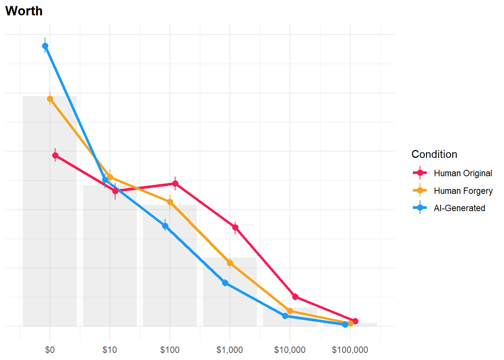{#fig-worth-1 width=672}
:::

::: {.cell-output-display}
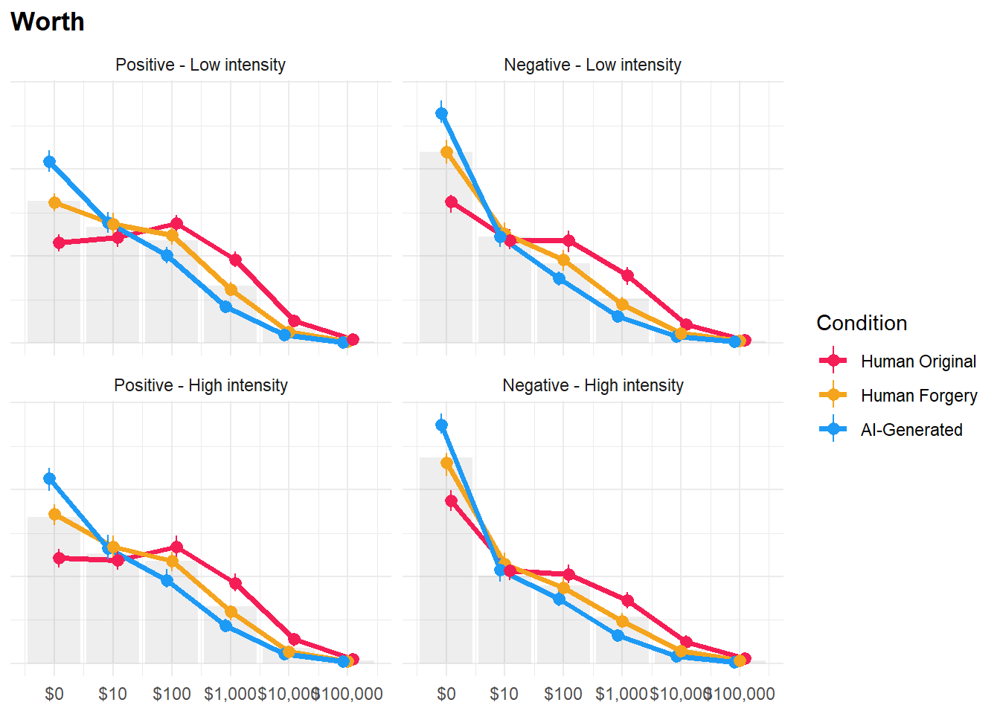{#fig-worth-2 width=672}
:::

Worth ($0 to $100,000, six ordered categories): observed proportion of each category (grey bars) and the model-implied probability per label condition (points with 95% CI).
:::


:::


### Figure 2


::: {.cell}

```{.r .cell-code}
# Manuscript Figure 2. Legend from the Valence panel only (Beauty's keys differ).
figure2 <- wrap_plots(
  p_beauty + guides(colour = "none"),
  p_valence,
  p_meaning + guides(colour = "none"),
  p_worth + guides(colour = "none"),
  ncol = 2
) +
  plot_layout(guides = "collect") &
  theme(legend.position = "bottom", legend.title = element_blank())

figure2

ggsave("figures/figure2.png", figure2, width = 12, height = 9, dpi = 300, bg = "white")
```

::: {.cell-output-display}
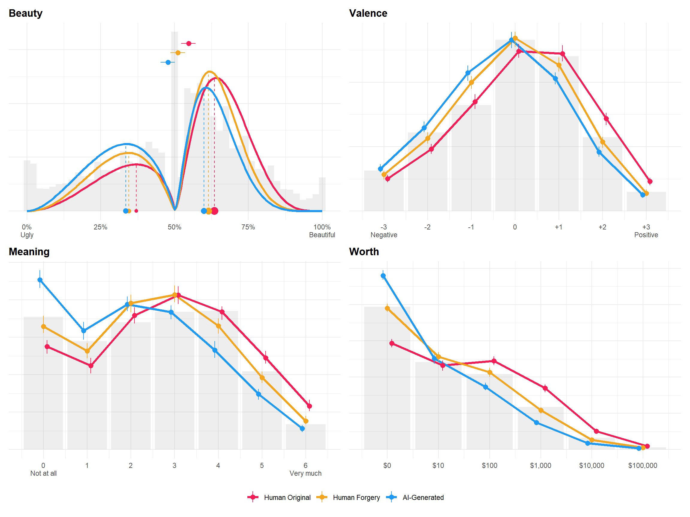{#fig-figure2 fig-alt='Four-panel grid showing the effect of the label condition (Human Original, Human Forgery, AI-Generated) on Beauty, Valence, Meaning and Worth ratings.' width=1152}
:::
:::


## Phase 1 - Eye-Tracking

::: {.panel-tabset}

### Entropy


::: {.cell}

```{.r .cell-code}
make_report(estimates$Entropy)
```

::: {.cell-output-display}

```{=html}
<div id="ijzpnpjtbl" style="padding-left:0px;padding-right:0px;padding-top:10px;padding-bottom:10px;overflow-x:auto;overflow-y:auto;width:auto;height:auto;">
<style>#ijzpnpjtbl table {
  font-family: system-ui, 'Segoe UI', Roboto, Helvetica, Arial, sans-serif, 'Apple Color Emoji', 'Segoe UI Emoji', 'Segoe UI Symbol', 'Noto Color Emoji';
  -webkit-font-smoothing: antialiased;
  -moz-osx-font-smoothing: grayscale;
}

#ijzpnpjtbl thead, #ijzpnpjtbl tbody, #ijzpnpjtbl tfoot, #ijzpnpjtbl tr, #ijzpnpjtbl td, #ijzpnpjtbl th {
  border-style: none;
}

#ijzpnpjtbl p {
  margin: 0;
  padding: 0;
}

#ijzpnpjtbl .gt_table {
  display: table;
  border-collapse: collapse;
  line-height: normal;
  margin-left: auto;
  margin-right: auto;
  color: #333333;
  font-size: 16px;
  font-weight: normal;
  font-style: normal;
  background-color: #FFFFFF;
  width: auto;
  border-top-style: solid;
  border-top-width: 2px;
  border-top-color: #A8A8A8;
  border-right-style: none;
  border-right-width: 2px;
  border-right-color: #D3D3D3;
  border-bottom-style: solid;
  border-bottom-width: 2px;
  border-bottom-color: #A8A8A8;
  border-left-style: none;
  border-left-width: 2px;
  border-left-color: #D3D3D3;
}

#ijzpnpjtbl .gt_caption {
  padding-top: 4px;
  padding-bottom: 4px;
}

#ijzpnpjtbl .gt_title {
  color: #333333;
  font-size: 125%;
  font-weight: initial;
  padding-top: 4px;
  padding-bottom: 4px;
  padding-left: 5px;
  padding-right: 5px;
  border-bottom-color: #FFFFFF;
  border-bottom-width: 0;
}

#ijzpnpjtbl .gt_subtitle {
  color: #333333;
  font-size: 85%;
  font-weight: initial;
  padding-top: 3px;
  padding-bottom: 5px;
  padding-left: 5px;
  padding-right: 5px;
  border-top-color: #FFFFFF;
  border-top-width: 0;
}

#ijzpnpjtbl .gt_heading {
  background-color: #FFFFFF;
  text-align: center;
  border-bottom-color: #FFFFFF;
  border-left-style: none;
  border-left-width: 1px;
  border-left-color: #D3D3D3;
  border-right-style: none;
  border-right-width: 1px;
  border-right-color: #D3D3D3;
}

#ijzpnpjtbl .gt_bottom_border {
  border-bottom-style: solid;
  border-bottom-width: 2px;
  border-bottom-color: #D3D3D3;
}

#ijzpnpjtbl .gt_col_headings {
  border-top-style: solid;
  border-top-width: 2px;
  border-top-color: #D3D3D3;
  border-bottom-style: solid;
  border-bottom-width: 2px;
  border-bottom-color: #D3D3D3;
  border-left-style: none;
  border-left-width: 1px;
  border-left-color: #D3D3D3;
  border-right-style: none;
  border-right-width: 1px;
  border-right-color: #D3D3D3;
}

#ijzpnpjtbl .gt_col_heading {
  color: #333333;
  background-color: #FFFFFF;
  font-size: 100%;
  font-weight: normal;
  text-transform: inherit;
  border-left-style: none;
  border-left-width: 1px;
  border-left-color: #D3D3D3;
  border-right-style: none;
  border-right-width: 1px;
  border-right-color: #D3D3D3;
  vertical-align: bottom;
  padding-top: 5px;
  padding-bottom: 6px;
  padding-left: 5px;
  padding-right: 5px;
  overflow-x: hidden;
}

#ijzpnpjtbl .gt_column_spanner_outer {
  color: #333333;
  background-color: #FFFFFF;
  font-size: 100%;
  font-weight: normal;
  text-transform: inherit;
  padding-top: 0;
  padding-bottom: 0;
  padding-left: 4px;
  padding-right: 4px;
}

#ijzpnpjtbl .gt_column_spanner_outer:first-child {
  padding-left: 0;
}

#ijzpnpjtbl .gt_column_spanner_outer:last-child {
  padding-right: 0;
}

#ijzpnpjtbl .gt_column_spanner {
  border-bottom-style: solid;
  border-bottom-width: 2px;
  border-bottom-color: #D3D3D3;
  vertical-align: bottom;
  padding-top: 5px;
  padding-bottom: 5px;
  overflow-x: hidden;
  display: inline-block;
  width: 100%;
}

#ijzpnpjtbl .gt_spanner_row {
  border-bottom-style: hidden;
}

#ijzpnpjtbl .gt_group_heading {
  padding-top: 8px;
  padding-bottom: 8px;
  padding-left: 5px;
  padding-right: 5px;
  color: #333333;
  background-color: #FFFFFF;
  font-size: 100%;
  font-weight: initial;
  text-transform: inherit;
  border-top-style: solid;
  border-top-width: 2px;
  border-top-color: #D3D3D3;
  border-bottom-style: solid;
  border-bottom-width: 2px;
  border-bottom-color: #D3D3D3;
  border-left-style: none;
  border-left-width: 1px;
  border-left-color: #D3D3D3;
  border-right-style: none;
  border-right-width: 1px;
  border-right-color: #D3D3D3;
  vertical-align: middle;
  text-align: left;
}

#ijzpnpjtbl .gt_empty_group_heading {
  padding: 0.5px;
  color: #333333;
  background-color: #FFFFFF;
  font-size: 100%;
  font-weight: initial;
  border-top-style: solid;
  border-top-width: 2px;
  border-top-color: #D3D3D3;
  border-bottom-style: solid;
  border-bottom-width: 2px;
  border-bottom-color: #D3D3D3;
  vertical-align: middle;
}

#ijzpnpjtbl .gt_from_md > :first-child {
  margin-top: 0;
}

#ijzpnpjtbl .gt_from_md > :last-child {
  margin-bottom: 0;
}

#ijzpnpjtbl .gt_row {
  padding-top: 8px;
  padding-bottom: 8px;
  padding-left: 5px;
  padding-right: 5px;
  margin: 10px;
  border-top-style: solid;
  border-top-width: 1px;
  border-top-color: #D3D3D3;
  border-left-style: none;
  border-left-width: 1px;
  border-left-color: #D3D3D3;
  border-right-style: none;
  border-right-width: 1px;
  border-right-color: #D3D3D3;
  vertical-align: middle;
  overflow-x: hidden;
}

#ijzpnpjtbl .gt_stub {
  color: #333333;
  background-color: #FFFFFF;
  font-size: 100%;
  font-weight: initial;
  text-transform: inherit;
  border-right-style: solid;
  border-right-width: 2px;
  border-right-color: #D3D3D3;
  padding-left: 5px;
  padding-right: 5px;
}

#ijzpnpjtbl .gt_stub_row_group {
  color: #333333;
  background-color: #FFFFFF;
  font-size: 100%;
  font-weight: initial;
  text-transform: inherit;
  border-right-style: solid;
  border-right-width: 2px;
  border-right-color: #D3D3D3;
  padding-left: 5px;
  padding-right: 5px;
  vertical-align: top;
}

#ijzpnpjtbl .gt_row_group_first td {
  border-top-width: 2px;
}

#ijzpnpjtbl .gt_row_group_first th {
  border-top-width: 2px;
}

#ijzpnpjtbl .gt_summary_row {
  color: #333333;
  background-color: #FFFFFF;
  text-transform: inherit;
  padding-top: 8px;
  padding-bottom: 8px;
  padding-left: 5px;
  padding-right: 5px;
}

#ijzpnpjtbl .gt_first_summary_row {
  border-top-style: solid;
  border-top-color: #D3D3D3;
}

#ijzpnpjtbl .gt_first_summary_row.thick {
  border-top-width: 2px;
}

#ijzpnpjtbl .gt_last_summary_row {
  padding-top: 8px;
  padding-bottom: 8px;
  padding-left: 5px;
  padding-right: 5px;
  border-bottom-style: solid;
  border-bottom-width: 2px;
  border-bottom-color: #D3D3D3;
}

#ijzpnpjtbl .gt_grand_summary_row {
  color: #333333;
  background-color: #FFFFFF;
  text-transform: inherit;
  padding-top: 8px;
  padding-bottom: 8px;
  padding-left: 5px;
  padding-right: 5px;
}

#ijzpnpjtbl .gt_first_grand_summary_row {
  padding-top: 8px;
  padding-bottom: 8px;
  padding-left: 5px;
  padding-right: 5px;
  border-top-style: double;
  border-top-width: 6px;
  border-top-color: #D3D3D3;
}

#ijzpnpjtbl .gt_last_grand_summary_row_top {
  padding-top: 8px;
  padding-bottom: 8px;
  padding-left: 5px;
  padding-right: 5px;
  border-bottom-style: double;
  border-bottom-width: 6px;
  border-bottom-color: #D3D3D3;
}

#ijzpnpjtbl .gt_striped {
  background-color: rgba(128, 128, 128, 0.05);
}

#ijzpnpjtbl .gt_table_body {
  border-top-style: solid;
  border-top-width: 2px;
  border-top-color: #D3D3D3;
  border-bottom-style: solid;
  border-bottom-width: 2px;
  border-bottom-color: #D3D3D3;
}

#ijzpnpjtbl .gt_footnotes {
  color: #333333;
  background-color: #FFFFFF;
  border-bottom-style: none;
  border-bottom-width: 2px;
  border-bottom-color: #D3D3D3;
  border-left-style: none;
  border-left-width: 2px;
  border-left-color: #D3D3D3;
  border-right-style: none;
  border-right-width: 2px;
  border-right-color: #D3D3D3;
}

#ijzpnpjtbl .gt_footnote {
  margin: 0px;
  font-size: 90%;
  padding-top: 4px;
  padding-bottom: 4px;
  padding-left: 5px;
  padding-right: 5px;
}

#ijzpnpjtbl .gt_sourcenotes {
  color: #333333;
  background-color: #FFFFFF;
  border-bottom-style: none;
  border-bottom-width: 2px;
  border-bottom-color: #D3D3D3;
  border-left-style: none;
  border-left-width: 2px;
  border-left-color: #D3D3D3;
  border-right-style: none;
  border-right-width: 2px;
  border-right-color: #D3D3D3;
}

#ijzpnpjtbl .gt_sourcenote {
  font-size: 90%;
  padding-top: 4px;
  padding-bottom: 4px;
  padding-left: 5px;
  padding-right: 5px;
}

#ijzpnpjtbl .gt_left {
  text-align: left;
}

#ijzpnpjtbl .gt_center {
  text-align: center;
}

#ijzpnpjtbl .gt_right {
  text-align: right;
  font-variant-numeric: tabular-nums;
}

#ijzpnpjtbl .gt_font_normal {
  font-weight: normal;
}

#ijzpnpjtbl .gt_font_bold {
  font-weight: bold;
}

#ijzpnpjtbl .gt_font_italic {
  font-style: italic;
}

#ijzpnpjtbl .gt_super {
  font-size: 65%;
}

#ijzpnpjtbl .gt_footnote_marks {
  font-size: 75%;
  vertical-align: 0.4em;
  position: initial;
}

#ijzpnpjtbl .gt_asterisk {
  font-size: 100%;
  vertical-align: 0;
}

#ijzpnpjtbl .gt_indent_1 {
  text-indent: 5px;
}

#ijzpnpjtbl .gt_indent_2 {
  text-indent: 10px;
}

#ijzpnpjtbl .gt_indent_3 {
  text-indent: 15px;
}

#ijzpnpjtbl .gt_indent_4 {
  text-indent: 20px;
}

#ijzpnpjtbl .gt_indent_5 {
  text-indent: 25px;
}

#ijzpnpjtbl .katex-display {
  display: inline-flex !important;
  margin-bottom: 0.75em !important;
}

#ijzpnpjtbl div.Reactable > div.rt-table > div.rt-thead > div.rt-tr.rt-tr-group-header > div.rt-th-group:after {
  height: 0px !important;
}
</style>
<table class="gt_table" data-quarto-disable-processing="false" data-quarto-bootstrap="false">
  <thead>
    <tr class="gt_col_headings">
      <th class="gt_col_heading gt_columns_bottom_border gt_left" rowspan="1" colspan="1" scope="col" id="Contrast">Contrast</th>
      <th class="gt_col_heading gt_columns_bottom_border gt_left" rowspan="1" colspan="1" scope="col" id="Parameters">Parameters</th>
    </tr>
  </thead>
  <tbody class="gt_table_body">
    <tr><td headers="Contrast" class="gt_row gt_left">Human Forgery - Human Original</td>
<td headers="Parameters" class="gt_row gt_left">None</td></tr>
    <tr><td headers="Contrast" class="gt_row gt_left">AI-Generated - Human Original</td>
<td headers="Parameters" class="gt_row gt_left">None</td></tr>
    <tr><td headers="Contrast" class="gt_row gt_left">AI-Generated - Human Forgery</td>
<td headers="Parameters" class="gt_row gt_left">None</td></tr>
  </tbody>
  
</table>
</div>
```

```{=html}
<div id="rmdlghjidc" style="padding-left:0px;padding-right:0px;padding-top:10px;padding-bottom:10px;overflow-x:auto;overflow-y:auto;width:auto;height:auto;">
<style>#rmdlghjidc table {
  font-family: system-ui, 'Segoe UI', Roboto, Helvetica, Arial, sans-serif, 'Apple Color Emoji', 'Segoe UI Emoji', 'Segoe UI Symbol', 'Noto Color Emoji';
  -webkit-font-smoothing: antialiased;
  -moz-osx-font-smoothing: grayscale;
}

#rmdlghjidc thead, #rmdlghjidc tbody, #rmdlghjidc tfoot, #rmdlghjidc tr, #rmdlghjidc td, #rmdlghjidc th {
  border-style: none;
}

#rmdlghjidc p {
  margin: 0;
  padding: 0;
}

#rmdlghjidc .gt_table {
  display: table;
  border-collapse: collapse;
  line-height: normal;
  margin-left: auto;
  margin-right: auto;
  color: #333333;
  font-size: 16px;
  font-weight: normal;
  font-style: normal;
  background-color: #FFFFFF;
  width: auto;
  border-top-style: solid;
  border-top-width: 2px;
  border-top-color: #A8A8A8;
  border-right-style: none;
  border-right-width: 2px;
  border-right-color: #D3D3D3;
  border-bottom-style: solid;
  border-bottom-width: 2px;
  border-bottom-color: #A8A8A8;
  border-left-style: none;
  border-left-width: 2px;
  border-left-color: #D3D3D3;
}

#rmdlghjidc .gt_caption {
  padding-top: 4px;
  padding-bottom: 4px;
}

#rmdlghjidc .gt_title {
  color: #333333;
  font-size: 125%;
  font-weight: initial;
  padding-top: 4px;
  padding-bottom: 4px;
  padding-left: 5px;
  padding-right: 5px;
  border-bottom-color: #FFFFFF;
  border-bottom-width: 0;
}

#rmdlghjidc .gt_subtitle {
  color: #333333;
  font-size: 85%;
  font-weight: initial;
  padding-top: 3px;
  padding-bottom: 5px;
  padding-left: 5px;
  padding-right: 5px;
  border-top-color: #FFFFFF;
  border-top-width: 0;
}

#rmdlghjidc .gt_heading {
  background-color: #FFFFFF;
  text-align: center;
  border-bottom-color: #FFFFFF;
  border-left-style: none;
  border-left-width: 1px;
  border-left-color: #D3D3D3;
  border-right-style: none;
  border-right-width: 1px;
  border-right-color: #D3D3D3;
}

#rmdlghjidc .gt_bottom_border {
  border-bottom-style: solid;
  border-bottom-width: 2px;
  border-bottom-color: #D3D3D3;
}

#rmdlghjidc .gt_col_headings {
  border-top-style: solid;
  border-top-width: 2px;
  border-top-color: #D3D3D3;
  border-bottom-style: solid;
  border-bottom-width: 2px;
  border-bottom-color: #D3D3D3;
  border-left-style: none;
  border-left-width: 1px;
  border-left-color: #D3D3D3;
  border-right-style: none;
  border-right-width: 1px;
  border-right-color: #D3D3D3;
}

#rmdlghjidc .gt_col_heading {
  color: #333333;
  background-color: #FFFFFF;
  font-size: 100%;
  font-weight: normal;
  text-transform: inherit;
  border-left-style: none;
  border-left-width: 1px;
  border-left-color: #D3D3D3;
  border-right-style: none;
  border-right-width: 1px;
  border-right-color: #D3D3D3;
  vertical-align: bottom;
  padding-top: 5px;
  padding-bottom: 6px;
  padding-left: 5px;
  padding-right: 5px;
  overflow-x: hidden;
}

#rmdlghjidc .gt_column_spanner_outer {
  color: #333333;
  background-color: #FFFFFF;
  font-size: 100%;
  font-weight: normal;
  text-transform: inherit;
  padding-top: 0;
  padding-bottom: 0;
  padding-left: 4px;
  padding-right: 4px;
}

#rmdlghjidc .gt_column_spanner_outer:first-child {
  padding-left: 0;
}

#rmdlghjidc .gt_column_spanner_outer:last-child {
  padding-right: 0;
}

#rmdlghjidc .gt_column_spanner {
  border-bottom-style: solid;
  border-bottom-width: 2px;
  border-bottom-color: #D3D3D3;
  vertical-align: bottom;
  padding-top: 5px;
  padding-bottom: 5px;
  overflow-x: hidden;
  display: inline-block;
  width: 100%;
}

#rmdlghjidc .gt_spanner_row {
  border-bottom-style: hidden;
}

#rmdlghjidc .gt_group_heading {
  padding-top: 8px;
  padding-bottom: 8px;
  padding-left: 5px;
  padding-right: 5px;
  color: #333333;
  background-color: #FFFFFF;
  font-size: 100%;
  font-weight: initial;
  text-transform: inherit;
  border-top-style: solid;
  border-top-width: 2px;
  border-top-color: #D3D3D3;
  border-bottom-style: solid;
  border-bottom-width: 2px;
  border-bottom-color: #D3D3D3;
  border-left-style: none;
  border-left-width: 1px;
  border-left-color: #D3D3D3;
  border-right-style: none;
  border-right-width: 1px;
  border-right-color: #D3D3D3;
  vertical-align: middle;
  text-align: left;
}

#rmdlghjidc .gt_empty_group_heading {
  padding: 0.5px;
  color: #333333;
  background-color: #FFFFFF;
  font-size: 100%;
  font-weight: initial;
  border-top-style: solid;
  border-top-width: 2px;
  border-top-color: #D3D3D3;
  border-bottom-style: solid;
  border-bottom-width: 2px;
  border-bottom-color: #D3D3D3;
  vertical-align: middle;
}

#rmdlghjidc .gt_from_md > :first-child {
  margin-top: 0;
}

#rmdlghjidc .gt_from_md > :last-child {
  margin-bottom: 0;
}

#rmdlghjidc .gt_row {
  padding-top: 8px;
  padding-bottom: 8px;
  padding-left: 5px;
  padding-right: 5px;
  margin: 10px;
  border-top-style: solid;
  border-top-width: 1px;
  border-top-color: #D3D3D3;
  border-left-style: none;
  border-left-width: 1px;
  border-left-color: #D3D3D3;
  border-right-style: none;
  border-right-width: 1px;
  border-right-color: #D3D3D3;
  vertical-align: middle;
  overflow-x: hidden;
}

#rmdlghjidc .gt_stub {
  color: #333333;
  background-color: #FFFFFF;
  font-size: 100%;
  font-weight: initial;
  text-transform: inherit;
  border-right-style: solid;
  border-right-width: 2px;
  border-right-color: #D3D3D3;
  padding-left: 5px;
  padding-right: 5px;
}

#rmdlghjidc .gt_stub_row_group {
  color: #333333;
  background-color: #FFFFFF;
  font-size: 100%;
  font-weight: initial;
  text-transform: inherit;
  border-right-style: solid;
  border-right-width: 2px;
  border-right-color: #D3D3D3;
  padding-left: 5px;
  padding-right: 5px;
  vertical-align: top;
}

#rmdlghjidc .gt_row_group_first td {
  border-top-width: 2px;
}

#rmdlghjidc .gt_row_group_first th {
  border-top-width: 2px;
}

#rmdlghjidc .gt_summary_row {
  color: #333333;
  background-color: #FFFFFF;
  text-transform: inherit;
  padding-top: 8px;
  padding-bottom: 8px;
  padding-left: 5px;
  padding-right: 5px;
}

#rmdlghjidc .gt_first_summary_row {
  border-top-style: solid;
  border-top-color: #D3D3D3;
}

#rmdlghjidc .gt_first_summary_row.thick {
  border-top-width: 2px;
}

#rmdlghjidc .gt_last_summary_row {
  padding-top: 8px;
  padding-bottom: 8px;
  padding-left: 5px;
  padding-right: 5px;
  border-bottom-style: solid;
  border-bottom-width: 2px;
  border-bottom-color: #D3D3D3;
}

#rmdlghjidc .gt_grand_summary_row {
  color: #333333;
  background-color: #FFFFFF;
  text-transform: inherit;
  padding-top: 8px;
  padding-bottom: 8px;
  padding-left: 5px;
  padding-right: 5px;
}

#rmdlghjidc .gt_first_grand_summary_row {
  padding-top: 8px;
  padding-bottom: 8px;
  padding-left: 5px;
  padding-right: 5px;
  border-top-style: double;
  border-top-width: 6px;
  border-top-color: #D3D3D3;
}

#rmdlghjidc .gt_last_grand_summary_row_top {
  padding-top: 8px;
  padding-bottom: 8px;
  padding-left: 5px;
  padding-right: 5px;
  border-bottom-style: double;
  border-bottom-width: 6px;
  border-bottom-color: #D3D3D3;
}

#rmdlghjidc .gt_striped {
  background-color: rgba(128, 128, 128, 0.05);
}

#rmdlghjidc .gt_table_body {
  border-top-style: solid;
  border-top-width: 2px;
  border-top-color: #D3D3D3;
  border-bottom-style: solid;
  border-bottom-width: 2px;
  border-bottom-color: #D3D3D3;
}

#rmdlghjidc .gt_footnotes {
  color: #333333;
  background-color: #FFFFFF;
  border-bottom-style: none;
  border-bottom-width: 2px;
  border-bottom-color: #D3D3D3;
  border-left-style: none;
  border-left-width: 2px;
  border-left-color: #D3D3D3;
  border-right-style: none;
  border-right-width: 2px;
  border-right-color: #D3D3D3;
}

#rmdlghjidc .gt_footnote {
  margin: 0px;
  font-size: 90%;
  padding-top: 4px;
  padding-bottom: 4px;
  padding-left: 5px;
  padding-right: 5px;
}

#rmdlghjidc .gt_sourcenotes {
  color: #333333;
  background-color: #FFFFFF;
  border-bottom-style: none;
  border-bottom-width: 2px;
  border-bottom-color: #D3D3D3;
  border-left-style: none;
  border-left-width: 2px;
  border-left-color: #D3D3D3;
  border-right-style: none;
  border-right-width: 2px;
  border-right-color: #D3D3D3;
}

#rmdlghjidc .gt_sourcenote {
  font-size: 90%;
  padding-top: 4px;
  padding-bottom: 4px;
  padding-left: 5px;
  padding-right: 5px;
}

#rmdlghjidc .gt_left {
  text-align: left;
}

#rmdlghjidc .gt_center {
  text-align: center;
}

#rmdlghjidc .gt_right {
  text-align: right;
  font-variant-numeric: tabular-nums;
}

#rmdlghjidc .gt_font_normal {
  font-weight: normal;
}

#rmdlghjidc .gt_font_bold {
  font-weight: bold;
}

#rmdlghjidc .gt_font_italic {
  font-style: italic;
}

#rmdlghjidc .gt_super {
  font-size: 65%;
}

#rmdlghjidc .gt_footnote_marks {
  font-size: 75%;
  vertical-align: 0.4em;
  position: initial;
}

#rmdlghjidc .gt_asterisk {
  font-size: 100%;
  vertical-align: 0;
}

#rmdlghjidc .gt_indent_1 {
  text-indent: 5px;
}

#rmdlghjidc .gt_indent_2 {
  text-indent: 10px;
}

#rmdlghjidc .gt_indent_3 {
  text-indent: 15px;
}

#rmdlghjidc .gt_indent_4 {
  text-indent: 20px;
}

#rmdlghjidc .gt_indent_5 {
  text-indent: 25px;
}

#rmdlghjidc .katex-display {
  display: inline-flex !important;
  margin-bottom: 0.75em !important;
}

#rmdlghjidc div.Reactable > div.rt-table > div.rt-thead > div.rt-tr.rt-tr-group-header > div.rt-th-group:after {
  height: 0px !important;
}
</style>
<table class="gt_table" data-quarto-disable-processing="false" data-quarto-bootstrap="false">
  <thead>
    <tr class="gt_col_headings">
      <th class="gt_col_heading gt_columns_bottom_border gt_left" rowspan="1" colspan="1" scope="col" id="Contrast">Contrast</th>
      <th class="gt_col_heading gt_columns_bottom_border gt_left" rowspan="1" colspan="1" scope="col" id="Parameters">Parameters</th>
    </tr>
  </thead>
  <tbody class="gt_table_body">
    <tr><td headers="Contrast" class="gt_row gt_left">Negative - High intensity - Positive - Low intensity</td>
<td headers="Parameters" class="gt_row gt_left">response (0.00, [-0.01,  0.00]); mu (0.00, [-0.01,  0.00])</td></tr>
  </tbody>
  
</table>
</div>
```

```{=html}
<div id="rctfjieosd" style="padding-left:0px;padding-right:0px;padding-top:10px;padding-bottom:10px;overflow-x:auto;overflow-y:auto;width:auto;height:auto;">
<style>#rctfjieosd table {
  font-family: system-ui, 'Segoe UI', Roboto, Helvetica, Arial, sans-serif, 'Apple Color Emoji', 'Segoe UI Emoji', 'Segoe UI Symbol', 'Noto Color Emoji';
  -webkit-font-smoothing: antialiased;
  -moz-osx-font-smoothing: grayscale;
}

#rctfjieosd thead, #rctfjieosd tbody, #rctfjieosd tfoot, #rctfjieosd tr, #rctfjieosd td, #rctfjieosd th {
  border-style: none;
}

#rctfjieosd p {
  margin: 0;
  padding: 0;
}

#rctfjieosd .gt_table {
  display: table;
  border-collapse: collapse;
  line-height: normal;
  margin-left: auto;
  margin-right: auto;
  color: #333333;
  font-size: 13px;
  font-weight: normal;
  font-style: normal;
  background-color: #FFFFFF;
  width: auto;
  border-top-style: solid;
  border-top-width: 3px;
  border-top-color: #D5D5D5;
  border-right-style: solid;
  border-right-width: 3px;
  border-right-color: #D5D5D5;
  border-bottom-style: solid;
  border-bottom-width: 3px;
  border-bottom-color: #D5D5D5;
  border-left-style: solid;
  border-left-width: 3px;
  border-left-color: #D5D5D5;
}

#rctfjieosd .gt_caption {
  padding-top: 4px;
  padding-bottom: 4px;
}

#rctfjieosd .gt_title {
  color: #333333;
  font-size: 125%;
  font-weight: initial;
  padding-top: 4px;
  padding-bottom: 4px;
  padding-left: 5px;
  padding-right: 5px;
  border-bottom-color: #FFFFFF;
  border-bottom-width: 0;
}

#rctfjieosd .gt_subtitle {
  color: #333333;
  font-size: 85%;
  font-weight: initial;
  padding-top: 3px;
  padding-bottom: 5px;
  padding-left: 5px;
  padding-right: 5px;
  border-top-color: #FFFFFF;
  border-top-width: 0;
}

#rctfjieosd .gt_heading {
  background-color: #FFFFFF;
  text-align: left;
  border-bottom-color: #FFFFFF;
  border-left-style: none;
  border-left-width: 1px;
  border-left-color: #D3D3D3;
  border-right-style: none;
  border-right-width: 1px;
  border-right-color: #D3D3D3;
}

#rctfjieosd .gt_bottom_border {
  border-bottom-style: solid;
  border-bottom-width: 2px;
  border-bottom-color: #D5D5D5;
}

#rctfjieosd .gt_col_headings {
  border-top-style: solid;
  border-top-width: 2px;
  border-top-color: #D5D5D5;
  border-bottom-style: solid;
  border-bottom-width: 2px;
  border-bottom-color: #D5D5D5;
  border-left-style: none;
  border-left-width: 1px;
  border-left-color: #D3D3D3;
  border-right-style: none;
  border-right-width: 1px;
  border-right-color: #D3D3D3;
}

#rctfjieosd .gt_col_heading {
  color: #FFFFFF;
  background-color: #000000;
  font-size: 100%;
  font-weight: normal;
  text-transform: inherit;
  border-left-style: none;
  border-left-width: 1px;
  border-left-color: #D3D3D3;
  border-right-style: none;
  border-right-width: 1px;
  border-right-color: #D3D3D3;
  vertical-align: bottom;
  padding-top: 5px;
  padding-bottom: 6px;
  padding-left: 5px;
  padding-right: 5px;
  overflow-x: hidden;
}

#rctfjieosd .gt_column_spanner_outer {
  color: #FFFFFF;
  background-color: #000000;
  font-size: 100%;
  font-weight: normal;
  text-transform: inherit;
  padding-top: 0;
  padding-bottom: 0;
  padding-left: 4px;
  padding-right: 4px;
}

#rctfjieosd .gt_column_spanner_outer:first-child {
  padding-left: 0;
}

#rctfjieosd .gt_column_spanner_outer:last-child {
  padding-right: 0;
}

#rctfjieosd .gt_column_spanner {
  border-bottom-style: solid;
  border-bottom-width: 2px;
  border-bottom-color: #D5D5D5;
  vertical-align: bottom;
  padding-top: 5px;
  padding-bottom: 5px;
  overflow-x: hidden;
  display: inline-block;
  width: 100%;
}

#rctfjieosd .gt_spanner_row {
  border-bottom-style: hidden;
}

#rctfjieosd .gt_group_heading {
  padding-top: 8px;
  padding-bottom: 8px;
  padding-left: 5px;
  padding-right: 5px;
  color: #333333;
  background-color: #FFFFFF;
  font-size: 100%;
  font-weight: initial;
  text-transform: inherit;
  border-top-style: solid;
  border-top-width: 2px;
  border-top-color: #D5D5D5;
  border-bottom-style: solid;
  border-bottom-width: 2px;
  border-bottom-color: #D5D5D5;
  border-left-style: none;
  border-left-width: 1px;
  border-left-color: #D3D3D3;
  border-right-style: none;
  border-right-width: 1px;
  border-right-color: #D3D3D3;
  vertical-align: middle;
  text-align: left;
}

#rctfjieosd .gt_empty_group_heading {
  padding: 0.5px;
  color: #333333;
  background-color: #FFFFFF;
  font-size: 100%;
  font-weight: initial;
  border-top-style: solid;
  border-top-width: 2px;
  border-top-color: #D5D5D5;
  border-bottom-style: solid;
  border-bottom-width: 2px;
  border-bottom-color: #D5D5D5;
  vertical-align: middle;
}

#rctfjieosd .gt_from_md > :first-child {
  margin-top: 0;
}

#rctfjieosd .gt_from_md > :last-child {
  margin-bottom: 0;
}

#rctfjieosd .gt_row {
  padding-top: 8px;
  padding-bottom: 8px;
  padding-left: 5px;
  padding-right: 5px;
  margin: 10px;
  border-top-style: solid;
  border-top-width: 1px;
  border-top-color: #D5D5D5;
  border-left-style: solid;
  border-left-width: 1px;
  border-left-color: #D5D5D5;
  border-right-style: solid;
  border-right-width: 1px;
  border-right-color: #D5D5D5;
  vertical-align: middle;
  overflow-x: hidden;
}

#rctfjieosd .gt_stub {
  color: #333333;
  background-color: #FFFFFF;
  font-size: 100%;
  font-weight: initial;
  text-transform: inherit;
  border-right-style: solid;
  border-right-width: 2px;
  border-right-color: #5F5F5F;
  padding-left: 5px;
  padding-right: 5px;
}

#rctfjieosd .gt_stub_row_group {
  color: #333333;
  background-color: #FFFFFF;
  font-size: 100%;
  font-weight: initial;
  text-transform: inherit;
  border-right-style: solid;
  border-right-width: 2px;
  border-right-color: #D3D3D3;
  padding-left: 5px;
  padding-right: 5px;
  vertical-align: top;
}

#rctfjieosd .gt_row_group_first td {
  border-top-width: 2px;
}

#rctfjieosd .gt_row_group_first th {
  border-top-width: 2px;
}

#rctfjieosd .gt_summary_row {
  color: #333333;
  background-color: #D5D5D5;
  text-transform: inherit;
  padding-top: 8px;
  padding-bottom: 8px;
  padding-left: 5px;
  padding-right: 5px;
}

#rctfjieosd .gt_first_summary_row {
  border-top-style: solid;
  border-top-color: #D5D5D5;
}

#rctfjieosd .gt_first_summary_row.thick {
  border-top-width: 2px;
}

#rctfjieosd .gt_last_summary_row {
  padding-top: 8px;
  padding-bottom: 8px;
  padding-left: 5px;
  padding-right: 5px;
  border-bottom-style: solid;
  border-bottom-width: 2px;
  border-bottom-color: #D5D5D5;
}

#rctfjieosd .gt_grand_summary_row {
  color: #FFFFFF;
  background-color: #929292;
  text-transform: inherit;
  padding-top: 8px;
  padding-bottom: 8px;
  padding-left: 5px;
  padding-right: 5px;
}

#rctfjieosd .gt_first_grand_summary_row {
  padding-top: 8px;
  padding-bottom: 8px;
  padding-left: 5px;
  padding-right: 5px;
  border-top-style: double;
  border-top-width: 6px;
  border-top-color: #D5D5D5;
}

#rctfjieosd .gt_last_grand_summary_row_top {
  padding-top: 8px;
  padding-bottom: 8px;
  padding-left: 5px;
  padding-right: 5px;
  border-bottom-style: double;
  border-bottom-width: 6px;
  border-bottom-color: #D5D5D5;
}

#rctfjieosd .gt_striped {
  background-color: #F4F4F4;
}

#rctfjieosd .gt_table_body {
  border-top-style: solid;
  border-top-width: 2px;
  border-top-color: #D5D5D5;
  border-bottom-style: solid;
  border-bottom-width: 2px;
  border-bottom-color: #D5D5D5;
}

#rctfjieosd .gt_footnotes {
  color: #333333;
  background-color: #FFFFFF;
  border-bottom-style: none;
  border-bottom-width: 2px;
  border-bottom-color: #D3D3D3;
  border-left-style: none;
  border-left-width: 2px;
  border-left-color: #D3D3D3;
  border-right-style: none;
  border-right-width: 2px;
  border-right-color: #D3D3D3;
}

#rctfjieosd .gt_footnote {
  margin: 0px;
  font-size: 90%;
  padding-top: 4px;
  padding-bottom: 4px;
  padding-left: 5px;
  padding-right: 5px;
}

#rctfjieosd .gt_sourcenotes {
  color: #333333;
  background-color: #FFFFFF;
  border-bottom-style: none;
  border-bottom-width: 2px;
  border-bottom-color: #D3D3D3;
  border-left-style: none;
  border-left-width: 2px;
  border-left-color: #D3D3D3;
  border-right-style: none;
  border-right-width: 2px;
  border-right-color: #D3D3D3;
}

#rctfjieosd .gt_sourcenote {
  font-size: 90%;
  padding-top: 4px;
  padding-bottom: 4px;
  padding-left: 5px;
  padding-right: 5px;
}

#rctfjieosd .gt_left {
  text-align: left;
}

#rctfjieosd .gt_center {
  text-align: center;
}

#rctfjieosd .gt_right {
  text-align: right;
  font-variant-numeric: tabular-nums;
}

#rctfjieosd .gt_font_normal {
  font-weight: normal;
}

#rctfjieosd .gt_font_bold {
  font-weight: bold;
}

#rctfjieosd .gt_font_italic {
  font-style: italic;
}

#rctfjieosd .gt_super {
  font-size: 65%;
}

#rctfjieosd .gt_footnote_marks {
  font-size: 75%;
  vertical-align: 0.4em;
  position: initial;
}

#rctfjieosd .gt_asterisk {
  font-size: 100%;
  vertical-align: 0;
}

#rctfjieosd .gt_indent_1 {
  text-indent: 5px;
}

#rctfjieosd .gt_indent_2 {
  text-indent: 10px;
}

#rctfjieosd .gt_indent_3 {
  text-indent: 15px;
}

#rctfjieosd .gt_indent_4 {
  text-indent: 20px;
}

#rctfjieosd .gt_indent_5 {
  text-indent: 25px;
}

#rctfjieosd .katex-display {
  display: inline-flex !important;
  margin-bottom: 0.75em !important;
}

#rctfjieosd div.Reactable > div.rt-table > div.rt-thead > div.rt-tr.rt-tr-group-header > div.rt-th-group:after {
  height: 0px !important;
}
</style>
<table class="gt_table" data-quarto-disable-processing="false" data-quarto-bootstrap="false">
  <thead>
    <tr class="gt_heading">
      <td colspan="10" class="gt_heading gt_title gt_font_normal gt_bottom_border" style>Gaze Entropy: convergence</td>
    </tr>
    
    <tr class="gt_col_headings">
      <th class="gt_col_heading gt_columns_bottom_border gt_left" rowspan="1" colspan="1" scope="col" id="Model">Model</th>
      <th class="gt_col_heading gt_columns_bottom_border gt_left" rowspan="1" colspan="1" scope="col" id="Family">Family</th>
      <th class="gt_col_heading gt_columns_bottom_border gt_right" rowspan="1" colspan="1" scope="col" id="N_obs">N_obs</th>
      <th class="gt_col_heading gt_columns_bottom_border gt_right" rowspan="1" colspan="1" scope="col" id="N_participants">N_participants</th>
      <th class="gt_col_heading gt_columns_bottom_border gt_right" rowspan="1" colspan="1" scope="col" id="Chains">Chains</th>
      <th class="gt_col_heading gt_columns_bottom_border gt_right" rowspan="1" colspan="1" scope="col" id="Draws">Draws</th>
      <th class="gt_col_heading gt_columns_bottom_border gt_right" rowspan="1" colspan="1" scope="col" id="Max_Rhat">Max_Rhat</th>
      <th class="gt_col_heading gt_columns_bottom_border gt_right" rowspan="1" colspan="1" scope="col" id="Min_ESS_ratio">Min_ESS_ratio</th>
      <th class="gt_col_heading gt_columns_bottom_border gt_right" rowspan="1" colspan="1" scope="col" id="Divergent_pct">Divergent_pct</th>
      <th class="gt_col_heading gt_columns_bottom_border gt_left" rowspan="1" colspan="1" scope="col" id="Criterion">Criterion</th>
    </tr>
  </thead>
  <tbody class="gt_table_body">
    <tr><td headers="Model" class="gt_row gt_left">Entropy</td>
<td headers="Family" class="gt_row gt_left">Beta</td>
<td headers="N_obs" class="gt_row gt_right">12220</td>
<td headers="N_participants" class="gt_row gt_right">274</td>
<td headers="Chains" class="gt_row gt_right">8</td>
<td headers="Draws" class="gt_row gt_right">4000</td>
<td headers="Max_Rhat" class="gt_row gt_right">1.021</td>
<td headers="Min_ESS_ratio" class="gt_row gt_right">0.089</td>
<td headers="Divergent_pct" class="gt_row gt_right">0</td>
<td headers="Criterion" class="gt_row gt_left">loo</td></tr>
  </tbody>
  
</table>
</div>
```


::: {.callout-note collapse="true" title="Gaze Entropy: convergence (Markdown table, for text readers)"}

|Model   |Family | N_obs| N_participants| Chains| Draws| Max_Rhat| Min_ESS_ratio| Divergent_pct|Criterion |
|:-------|:------|-----:|--------------:|------:|-----:|--------:|-------------:|-------------:|:---------|
|Entropy |Beta   | 12220|            274|      8|  4000|    1.021|         0.089|             0|loo       |

:::

```{=html}
<div id="kdhowmectn" style="padding-left:0px;padding-right:0px;padding-top:10px;padding-bottom:10px;overflow-x:auto;overflow-y:auto;width:auto;height:auto;">
<style>#kdhowmectn table {
  font-family: system-ui, 'Segoe UI', Roboto, Helvetica, Arial, sans-serif, 'Apple Color Emoji', 'Segoe UI Emoji', 'Segoe UI Symbol', 'Noto Color Emoji';
  -webkit-font-smoothing: antialiased;
  -moz-osx-font-smoothing: grayscale;
}

#kdhowmectn thead, #kdhowmectn tbody, #kdhowmectn tfoot, #kdhowmectn tr, #kdhowmectn td, #kdhowmectn th {
  border-style: none;
}

#kdhowmectn p {
  margin: 0;
  padding: 0;
}

#kdhowmectn .gt_table {
  display: table;
  border-collapse: collapse;
  line-height: normal;
  margin-left: auto;
  margin-right: auto;
  color: #333333;
  font-size: 13px;
  font-weight: normal;
  font-style: normal;
  background-color: #FFFFFF;
  width: auto;
  border-top-style: solid;
  border-top-width: 3px;
  border-top-color: #D5D5D5;
  border-right-style: solid;
  border-right-width: 3px;
  border-right-color: #D5D5D5;
  border-bottom-style: solid;
  border-bottom-width: 3px;
  border-bottom-color: #D5D5D5;
  border-left-style: solid;
  border-left-width: 3px;
  border-left-color: #D5D5D5;
}

#kdhowmectn .gt_caption {
  padding-top: 4px;
  padding-bottom: 4px;
}

#kdhowmectn .gt_title {
  color: #333333;
  font-size: 125%;
  font-weight: initial;
  padding-top: 4px;
  padding-bottom: 4px;
  padding-left: 5px;
  padding-right: 5px;
  border-bottom-color: #FFFFFF;
  border-bottom-width: 0;
}

#kdhowmectn .gt_subtitle {
  color: #333333;
  font-size: 85%;
  font-weight: initial;
  padding-top: 3px;
  padding-bottom: 5px;
  padding-left: 5px;
  padding-right: 5px;
  border-top-color: #FFFFFF;
  border-top-width: 0;
}

#kdhowmectn .gt_heading {
  background-color: #FFFFFF;
  text-align: left;
  border-bottom-color: #FFFFFF;
  border-left-style: none;
  border-left-width: 1px;
  border-left-color: #D3D3D3;
  border-right-style: none;
  border-right-width: 1px;
  border-right-color: #D3D3D3;
}

#kdhowmectn .gt_bottom_border {
  border-bottom-style: solid;
  border-bottom-width: 2px;
  border-bottom-color: #D5D5D5;
}

#kdhowmectn .gt_col_headings {
  border-top-style: solid;
  border-top-width: 2px;
  border-top-color: #D5D5D5;
  border-bottom-style: solid;
  border-bottom-width: 2px;
  border-bottom-color: #D5D5D5;
  border-left-style: none;
  border-left-width: 1px;
  border-left-color: #D3D3D3;
  border-right-style: none;
  border-right-width: 1px;
  border-right-color: #D3D3D3;
}

#kdhowmectn .gt_col_heading {
  color: #FFFFFF;
  background-color: #000000;
  font-size: 100%;
  font-weight: normal;
  text-transform: inherit;
  border-left-style: none;
  border-left-width: 1px;
  border-left-color: #D3D3D3;
  border-right-style: none;
  border-right-width: 1px;
  border-right-color: #D3D3D3;
  vertical-align: bottom;
  padding-top: 5px;
  padding-bottom: 6px;
  padding-left: 5px;
  padding-right: 5px;
  overflow-x: hidden;
}

#kdhowmectn .gt_column_spanner_outer {
  color: #FFFFFF;
  background-color: #000000;
  font-size: 100%;
  font-weight: normal;
  text-transform: inherit;
  padding-top: 0;
  padding-bottom: 0;
  padding-left: 4px;
  padding-right: 4px;
}

#kdhowmectn .gt_column_spanner_outer:first-child {
  padding-left: 0;
}

#kdhowmectn .gt_column_spanner_outer:last-child {
  padding-right: 0;
}

#kdhowmectn .gt_column_spanner {
  border-bottom-style: solid;
  border-bottom-width: 2px;
  border-bottom-color: #D5D5D5;
  vertical-align: bottom;
  padding-top: 5px;
  padding-bottom: 5px;
  overflow-x: hidden;
  display: inline-block;
  width: 100%;
}

#kdhowmectn .gt_spanner_row {
  border-bottom-style: hidden;
}

#kdhowmectn .gt_group_heading {
  padding-top: 8px;
  padding-bottom: 8px;
  padding-left: 5px;
  padding-right: 5px;
  color: #333333;
  background-color: #FFFFFF;
  font-size: 100%;
  font-weight: initial;
  text-transform: inherit;
  border-top-style: solid;
  border-top-width: 2px;
  border-top-color: #D5D5D5;
  border-bottom-style: solid;
  border-bottom-width: 2px;
  border-bottom-color: #D5D5D5;
  border-left-style: none;
  border-left-width: 1px;
  border-left-color: #D3D3D3;
  border-right-style: none;
  border-right-width: 1px;
  border-right-color: #D3D3D3;
  vertical-align: middle;
  text-align: left;
}

#kdhowmectn .gt_empty_group_heading {
  padding: 0.5px;
  color: #333333;
  background-color: #FFFFFF;
  font-size: 100%;
  font-weight: initial;
  border-top-style: solid;
  border-top-width: 2px;
  border-top-color: #D5D5D5;
  border-bottom-style: solid;
  border-bottom-width: 2px;
  border-bottom-color: #D5D5D5;
  vertical-align: middle;
}

#kdhowmectn .gt_from_md > :first-child {
  margin-top: 0;
}

#kdhowmectn .gt_from_md > :last-child {
  margin-bottom: 0;
}

#kdhowmectn .gt_row {
  padding-top: 8px;
  padding-bottom: 8px;
  padding-left: 5px;
  padding-right: 5px;
  margin: 10px;
  border-top-style: solid;
  border-top-width: 1px;
  border-top-color: #D5D5D5;
  border-left-style: solid;
  border-left-width: 1px;
  border-left-color: #D5D5D5;
  border-right-style: solid;
  border-right-width: 1px;
  border-right-color: #D5D5D5;
  vertical-align: middle;
  overflow-x: hidden;
}

#kdhowmectn .gt_stub {
  color: #333333;
  background-color: #FFFFFF;
  font-size: 100%;
  font-weight: initial;
  text-transform: inherit;
  border-right-style: solid;
  border-right-width: 2px;
  border-right-color: #5F5F5F;
  padding-left: 5px;
  padding-right: 5px;
}

#kdhowmectn .gt_stub_row_group {
  color: #333333;
  background-color: #FFFFFF;
  font-size: 100%;
  font-weight: initial;
  text-transform: inherit;
  border-right-style: solid;
  border-right-width: 2px;
  border-right-color: #D3D3D3;
  padding-left: 5px;
  padding-right: 5px;
  vertical-align: top;
}

#kdhowmectn .gt_row_group_first td {
  border-top-width: 2px;
}

#kdhowmectn .gt_row_group_first th {
  border-top-width: 2px;
}

#kdhowmectn .gt_summary_row {
  color: #333333;
  background-color: #D5D5D5;
  text-transform: inherit;
  padding-top: 8px;
  padding-bottom: 8px;
  padding-left: 5px;
  padding-right: 5px;
}

#kdhowmectn .gt_first_summary_row {
  border-top-style: solid;
  border-top-color: #D5D5D5;
}

#kdhowmectn .gt_first_summary_row.thick {
  border-top-width: 2px;
}

#kdhowmectn .gt_last_summary_row {
  padding-top: 8px;
  padding-bottom: 8px;
  padding-left: 5px;
  padding-right: 5px;
  border-bottom-style: solid;
  border-bottom-width: 2px;
  border-bottom-color: #D5D5D5;
}

#kdhowmectn .gt_grand_summary_row {
  color: #FFFFFF;
  background-color: #929292;
  text-transform: inherit;
  padding-top: 8px;
  padding-bottom: 8px;
  padding-left: 5px;
  padding-right: 5px;
}

#kdhowmectn .gt_first_grand_summary_row {
  padding-top: 8px;
  padding-bottom: 8px;
  padding-left: 5px;
  padding-right: 5px;
  border-top-style: double;
  border-top-width: 6px;
  border-top-color: #D5D5D5;
}

#kdhowmectn .gt_last_grand_summary_row_top {
  padding-top: 8px;
  padding-bottom: 8px;
  padding-left: 5px;
  padding-right: 5px;
  border-bottom-style: double;
  border-bottom-width: 6px;
  border-bottom-color: #D5D5D5;
}

#kdhowmectn .gt_striped {
  background-color: #F4F4F4;
}

#kdhowmectn .gt_table_body {
  border-top-style: solid;
  border-top-width: 2px;
  border-top-color: #D5D5D5;
  border-bottom-style: solid;
  border-bottom-width: 2px;
  border-bottom-color: #D5D5D5;
}

#kdhowmectn .gt_footnotes {
  color: #333333;
  background-color: #FFFFFF;
  border-bottom-style: none;
  border-bottom-width: 2px;
  border-bottom-color: #D3D3D3;
  border-left-style: none;
  border-left-width: 2px;
  border-left-color: #D3D3D3;
  border-right-style: none;
  border-right-width: 2px;
  border-right-color: #D3D3D3;
}

#kdhowmectn .gt_footnote {
  margin: 0px;
  font-size: 90%;
  padding-top: 4px;
  padding-bottom: 4px;
  padding-left: 5px;
  padding-right: 5px;
}

#kdhowmectn .gt_sourcenotes {
  color: #333333;
  background-color: #FFFFFF;
  border-bottom-style: none;
  border-bottom-width: 2px;
  border-bottom-color: #D3D3D3;
  border-left-style: none;
  border-left-width: 2px;
  border-left-color: #D3D3D3;
  border-right-style: none;
  border-right-width: 2px;
  border-right-color: #D3D3D3;
}

#kdhowmectn .gt_sourcenote {
  font-size: 90%;
  padding-top: 4px;
  padding-bottom: 4px;
  padding-left: 5px;
  padding-right: 5px;
}

#kdhowmectn .gt_left {
  text-align: left;
}

#kdhowmectn .gt_center {
  text-align: center;
}

#kdhowmectn .gt_right {
  text-align: right;
  font-variant-numeric: tabular-nums;
}

#kdhowmectn .gt_font_normal {
  font-weight: normal;
}

#kdhowmectn .gt_font_bold {
  font-weight: bold;
}

#kdhowmectn .gt_font_italic {
  font-style: italic;
}

#kdhowmectn .gt_super {
  font-size: 65%;
}

#kdhowmectn .gt_footnote_marks {
  font-size: 75%;
  vertical-align: 0.4em;
  position: initial;
}

#kdhowmectn .gt_asterisk {
  font-size: 100%;
  vertical-align: 0;
}

#kdhowmectn .gt_indent_1 {
  text-indent: 5px;
}

#kdhowmectn .gt_indent_2 {
  text-indent: 10px;
}

#kdhowmectn .gt_indent_3 {
  text-indent: 15px;
}

#kdhowmectn .gt_indent_4 {
  text-indent: 20px;
}

#kdhowmectn .gt_indent_5 {
  text-indent: 25px;
}

#kdhowmectn .katex-display {
  display: inline-flex !important;
  margin-bottom: 0.75em !important;
}

#kdhowmectn div.Reactable > div.rt-table > div.rt-thead > div.rt-tr.rt-tr-group-header > div.rt-th-group:after {
  height: 0px !important;
}
</style>
<table class="gt_table" data-quarto-disable-processing="false" data-quarto-bootstrap="false">
  <thead>
    <tr class="gt_heading">
      <td colspan="4" class="gt_heading gt_title gt_font_normal gt_bottom_border" style>Gaze Entropy: marginal means per label condition (response scale)</td>
    </tr>
    
    <tr class="gt_col_headings">
      <th class="gt_col_heading gt_columns_bottom_border gt_center" rowspan="1" colspan="1" scope="col" id="Condition">Condition</th>
      <th class="gt_col_heading gt_columns_bottom_border gt_right" rowspan="1" colspan="1" scope="col" id="Estimate">Estimate</th>
      <th class="gt_col_heading gt_columns_bottom_border gt_right" rowspan="1" colspan="1" scope="col" id="CI_low">CI_low</th>
      <th class="gt_col_heading gt_columns_bottom_border gt_right" rowspan="1" colspan="1" scope="col" id="CI_high">CI_high</th>
    </tr>
  </thead>
  <tbody class="gt_table_body">
    <tr><td headers="Condition" class="gt_row gt_center">Human Original</td>
<td headers="Estimate" class="gt_row gt_right">0.80</td>
<td headers="CI_low" class="gt_row gt_right">0.80</td>
<td headers="CI_high" class="gt_row gt_right">0.81</td></tr>
    <tr><td headers="Condition" class="gt_row gt_center gt_striped">Human Forgery</td>
<td headers="Estimate" class="gt_row gt_right gt_striped">0.80</td>
<td headers="CI_low" class="gt_row gt_right gt_striped">0.80</td>
<td headers="CI_high" class="gt_row gt_right gt_striped">0.81</td></tr>
    <tr><td headers="Condition" class="gt_row gt_center">AI-Generated</td>
<td headers="Estimate" class="gt_row gt_right">0.80</td>
<td headers="CI_low" class="gt_row gt_right">0.80</td>
<td headers="CI_high" class="gt_row gt_right">0.81</td></tr>
  </tbody>
  
</table>
</div>
```


::: {.callout-note collapse="true" title="Gaze Entropy: marginal means per label condition (response scale) (Markdown table, for text readers)"}

|Condition      |Estimate |CI_low |CI_high |
|:--------------|:--------|:------|:-------|
|Human Original |0.80     |0.80   |0.81    |
|Human Forgery  |0.80     |0.80   |0.81    |
|AI-Generated   |0.80     |0.80   |0.81    |

:::

```{=html}
<div id="eqjwrfksnx" style="padding-left:0px;padding-right:0px;padding-top:10px;padding-bottom:10px;overflow-x:auto;overflow-y:auto;width:auto;height:auto;">
<style>#eqjwrfksnx table {
  font-family: system-ui, 'Segoe UI', Roboto, Helvetica, Arial, sans-serif, 'Apple Color Emoji', 'Segoe UI Emoji', 'Segoe UI Symbol', 'Noto Color Emoji';
  -webkit-font-smoothing: antialiased;
  -moz-osx-font-smoothing: grayscale;
}

#eqjwrfksnx thead, #eqjwrfksnx tbody, #eqjwrfksnx tfoot, #eqjwrfksnx tr, #eqjwrfksnx td, #eqjwrfksnx th {
  border-style: none;
}

#eqjwrfksnx p {
  margin: 0;
  padding: 0;
}

#eqjwrfksnx .gt_table {
  display: table;
  border-collapse: collapse;
  line-height: normal;
  margin-left: auto;
  margin-right: auto;
  color: #333333;
  font-size: 13px;
  font-weight: normal;
  font-style: normal;
  background-color: #FFFFFF;
  width: auto;
  border-top-style: solid;
  border-top-width: 3px;
  border-top-color: #D5D5D5;
  border-right-style: solid;
  border-right-width: 3px;
  border-right-color: #D5D5D5;
  border-bottom-style: solid;
  border-bottom-width: 3px;
  border-bottom-color: #D5D5D5;
  border-left-style: solid;
  border-left-width: 3px;
  border-left-color: #D5D5D5;
}

#eqjwrfksnx .gt_caption {
  padding-top: 4px;
  padding-bottom: 4px;
}

#eqjwrfksnx .gt_title {
  color: #333333;
  font-size: 125%;
  font-weight: initial;
  padding-top: 4px;
  padding-bottom: 4px;
  padding-left: 5px;
  padding-right: 5px;
  border-bottom-color: #FFFFFF;
  border-bottom-width: 0;
}

#eqjwrfksnx .gt_subtitle {
  color: #333333;
  font-size: 85%;
  font-weight: initial;
  padding-top: 3px;
  padding-bottom: 5px;
  padding-left: 5px;
  padding-right: 5px;
  border-top-color: #FFFFFF;
  border-top-width: 0;
}

#eqjwrfksnx .gt_heading {
  background-color: #FFFFFF;
  text-align: left;
  border-bottom-color: #FFFFFF;
  border-left-style: none;
  border-left-width: 1px;
  border-left-color: #D3D3D3;
  border-right-style: none;
  border-right-width: 1px;
  border-right-color: #D3D3D3;
}

#eqjwrfksnx .gt_bottom_border {
  border-bottom-style: solid;
  border-bottom-width: 2px;
  border-bottom-color: #D5D5D5;
}

#eqjwrfksnx .gt_col_headings {
  border-top-style: solid;
  border-top-width: 2px;
  border-top-color: #D5D5D5;
  border-bottom-style: solid;
  border-bottom-width: 2px;
  border-bottom-color: #D5D5D5;
  border-left-style: none;
  border-left-width: 1px;
  border-left-color: #D3D3D3;
  border-right-style: none;
  border-right-width: 1px;
  border-right-color: #D3D3D3;
}

#eqjwrfksnx .gt_col_heading {
  color: #FFFFFF;
  background-color: #000000;
  font-size: 100%;
  font-weight: normal;
  text-transform: inherit;
  border-left-style: none;
  border-left-width: 1px;
  border-left-color: #D3D3D3;
  border-right-style: none;
  border-right-width: 1px;
  border-right-color: #D3D3D3;
  vertical-align: bottom;
  padding-top: 5px;
  padding-bottom: 6px;
  padding-left: 5px;
  padding-right: 5px;
  overflow-x: hidden;
}

#eqjwrfksnx .gt_column_spanner_outer {
  color: #FFFFFF;
  background-color: #000000;
  font-size: 100%;
  font-weight: normal;
  text-transform: inherit;
  padding-top: 0;
  padding-bottom: 0;
  padding-left: 4px;
  padding-right: 4px;
}

#eqjwrfksnx .gt_column_spanner_outer:first-child {
  padding-left: 0;
}

#eqjwrfksnx .gt_column_spanner_outer:last-child {
  padding-right: 0;
}

#eqjwrfksnx .gt_column_spanner {
  border-bottom-style: solid;
  border-bottom-width: 2px;
  border-bottom-color: #D5D5D5;
  vertical-align: bottom;
  padding-top: 5px;
  padding-bottom: 5px;
  overflow-x: hidden;
  display: inline-block;
  width: 100%;
}

#eqjwrfksnx .gt_spanner_row {
  border-bottom-style: hidden;
}

#eqjwrfksnx .gt_group_heading {
  padding-top: 8px;
  padding-bottom: 8px;
  padding-left: 5px;
  padding-right: 5px;
  color: #333333;
  background-color: #FFFFFF;
  font-size: 100%;
  font-weight: initial;
  text-transform: inherit;
  border-top-style: solid;
  border-top-width: 2px;
  border-top-color: #D5D5D5;
  border-bottom-style: solid;
  border-bottom-width: 2px;
  border-bottom-color: #D5D5D5;
  border-left-style: none;
  border-left-width: 1px;
  border-left-color: #D3D3D3;
  border-right-style: none;
  border-right-width: 1px;
  border-right-color: #D3D3D3;
  vertical-align: middle;
  text-align: left;
}

#eqjwrfksnx .gt_empty_group_heading {
  padding: 0.5px;
  color: #333333;
  background-color: #FFFFFF;
  font-size: 100%;
  font-weight: initial;
  border-top-style: solid;
  border-top-width: 2px;
  border-top-color: #D5D5D5;
  border-bottom-style: solid;
  border-bottom-width: 2px;
  border-bottom-color: #D5D5D5;
  vertical-align: middle;
}

#eqjwrfksnx .gt_from_md > :first-child {
  margin-top: 0;
}

#eqjwrfksnx .gt_from_md > :last-child {
  margin-bottom: 0;
}

#eqjwrfksnx .gt_row {
  padding-top: 8px;
  padding-bottom: 8px;
  padding-left: 5px;
  padding-right: 5px;
  margin: 10px;
  border-top-style: solid;
  border-top-width: 1px;
  border-top-color: #D5D5D5;
  border-left-style: solid;
  border-left-width: 1px;
  border-left-color: #D5D5D5;
  border-right-style: solid;
  border-right-width: 1px;
  border-right-color: #D5D5D5;
  vertical-align: middle;
  overflow-x: hidden;
}

#eqjwrfksnx .gt_stub {
  color: #333333;
  background-color: #FFFFFF;
  font-size: 100%;
  font-weight: initial;
  text-transform: inherit;
  border-right-style: solid;
  border-right-width: 2px;
  border-right-color: #5F5F5F;
  padding-left: 5px;
  padding-right: 5px;
}

#eqjwrfksnx .gt_stub_row_group {
  color: #333333;
  background-color: #FFFFFF;
  font-size: 100%;
  font-weight: initial;
  text-transform: inherit;
  border-right-style: solid;
  border-right-width: 2px;
  border-right-color: #D3D3D3;
  padding-left: 5px;
  padding-right: 5px;
  vertical-align: top;
}

#eqjwrfksnx .gt_row_group_first td {
  border-top-width: 2px;
}

#eqjwrfksnx .gt_row_group_first th {
  border-top-width: 2px;
}

#eqjwrfksnx .gt_summary_row {
  color: #333333;
  background-color: #D5D5D5;
  text-transform: inherit;
  padding-top: 8px;
  padding-bottom: 8px;
  padding-left: 5px;
  padding-right: 5px;
}

#eqjwrfksnx .gt_first_summary_row {
  border-top-style: solid;
  border-top-color: #D5D5D5;
}

#eqjwrfksnx .gt_first_summary_row.thick {
  border-top-width: 2px;
}

#eqjwrfksnx .gt_last_summary_row {
  padding-top: 8px;
  padding-bottom: 8px;
  padding-left: 5px;
  padding-right: 5px;
  border-bottom-style: solid;
  border-bottom-width: 2px;
  border-bottom-color: #D5D5D5;
}

#eqjwrfksnx .gt_grand_summary_row {
  color: #FFFFFF;
  background-color: #929292;
  text-transform: inherit;
  padding-top: 8px;
  padding-bottom: 8px;
  padding-left: 5px;
  padding-right: 5px;
}

#eqjwrfksnx .gt_first_grand_summary_row {
  padding-top: 8px;
  padding-bottom: 8px;
  padding-left: 5px;
  padding-right: 5px;
  border-top-style: double;
  border-top-width: 6px;
  border-top-color: #D5D5D5;
}

#eqjwrfksnx .gt_last_grand_summary_row_top {
  padding-top: 8px;
  padding-bottom: 8px;
  padding-left: 5px;
  padding-right: 5px;
  border-bottom-style: double;
  border-bottom-width: 6px;
  border-bottom-color: #D5D5D5;
}

#eqjwrfksnx .gt_striped {
  background-color: #F4F4F4;
}

#eqjwrfksnx .gt_table_body {
  border-top-style: solid;
  border-top-width: 2px;
  border-top-color: #D5D5D5;
  border-bottom-style: solid;
  border-bottom-width: 2px;
  border-bottom-color: #D5D5D5;
}

#eqjwrfksnx .gt_footnotes {
  color: #333333;
  background-color: #FFFFFF;
  border-bottom-style: none;
  border-bottom-width: 2px;
  border-bottom-color: #D3D3D3;
  border-left-style: none;
  border-left-width: 2px;
  border-left-color: #D3D3D3;
  border-right-style: none;
  border-right-width: 2px;
  border-right-color: #D3D3D3;
}

#eqjwrfksnx .gt_footnote {
  margin: 0px;
  font-size: 90%;
  padding-top: 4px;
  padding-bottom: 4px;
  padding-left: 5px;
  padding-right: 5px;
}

#eqjwrfksnx .gt_sourcenotes {
  color: #333333;
  background-color: #FFFFFF;
  border-bottom-style: none;
  border-bottom-width: 2px;
  border-bottom-color: #D3D3D3;
  border-left-style: none;
  border-left-width: 2px;
  border-left-color: #D3D3D3;
  border-right-style: none;
  border-right-width: 2px;
  border-right-color: #D3D3D3;
}

#eqjwrfksnx .gt_sourcenote {
  font-size: 90%;
  padding-top: 4px;
  padding-bottom: 4px;
  padding-left: 5px;
  padding-right: 5px;
}

#eqjwrfksnx .gt_left {
  text-align: left;
}

#eqjwrfksnx .gt_center {
  text-align: center;
}

#eqjwrfksnx .gt_right {
  text-align: right;
  font-variant-numeric: tabular-nums;
}

#eqjwrfksnx .gt_font_normal {
  font-weight: normal;
}

#eqjwrfksnx .gt_font_bold {
  font-weight: bold;
}

#eqjwrfksnx .gt_font_italic {
  font-style: italic;
}

#eqjwrfksnx .gt_super {
  font-size: 65%;
}

#eqjwrfksnx .gt_footnote_marks {
  font-size: 75%;
  vertical-align: 0.4em;
  position: initial;
}

#eqjwrfksnx .gt_asterisk {
  font-size: 100%;
  vertical-align: 0;
}

#eqjwrfksnx .gt_indent_1 {
  text-indent: 5px;
}

#eqjwrfksnx .gt_indent_2 {
  text-indent: 10px;
}

#eqjwrfksnx .gt_indent_3 {
  text-indent: 15px;
}

#eqjwrfksnx .gt_indent_4 {
  text-indent: 20px;
}

#eqjwrfksnx .gt_indent_5 {
  text-indent: 25px;
}

#eqjwrfksnx .katex-display {
  display: inline-flex !important;
  margin-bottom: 0.75em !important;
}

#eqjwrfksnx div.Reactable > div.rt-table > div.rt-thead > div.rt-tr.rt-tr-group-header > div.rt-th-group:after {
  height: 0px !important;
}
</style>
<table class="gt_table" data-quarto-disable-processing="false" data-quarto-bootstrap="false">
  <thead>
    <tr class="gt_heading">
      <td colspan="6" class="gt_heading gt_title gt_font_normal gt_bottom_border" style>Gaze Entropy: all contrasts between label conditions</td>
    </tr>
    
    <tr class="gt_col_headings">
      <th class="gt_col_heading gt_columns_bottom_border gt_left" rowspan="1" colspan="1" scope="col" id="Parameter">Parameter</th>
      <th class="gt_col_heading gt_columns_bottom_border gt_right" rowspan="1" colspan="1" scope="col" id="Diff">Diff</th>
      <th class="gt_col_heading gt_columns_bottom_border gt_left" rowspan="1" colspan="1" scope="col" id="CI">CI</th>
      <th class="gt_col_heading gt_columns_bottom_border gt_left" rowspan="1" colspan="1" scope="col" id="Unit">Unit</th>
      <th class="gt_col_heading gt_columns_bottom_border gt_right" rowspan="1" colspan="1" scope="col" id="pd_fmt">pd_fmt</th>
      <th class="gt_col_heading gt_columns_bottom_border gt_left" rowspan="1" colspan="1" scope="col" id="Effect">Effect</th>
    </tr>
  </thead>
  <tbody class="gt_table_body">
    <tr class="gt_group_heading_row">
      <th colspan="6" class="gt_group_heading" scope="colgroup" id="AI-Generated - Human Original">AI-Generated - Human Original</th>
    </tr>
    <tr class="gt_row_group_first"><td headers="AI-Generated - Human Original  Parameter" class="gt_row gt_left" style="color: #9E9E9E;">response</td>
<td headers="AI-Generated - Human Original  Diff" class="gt_row gt_right" style="color: #9E9E9E;">0.04</td>
<td headers="AI-Generated - Human Original  CI" class="gt_row gt_left" style="color: #9E9E9E;">[-0.21, 0.29]</td>
<td headers="AI-Generated - Human Original  Unit" class="gt_row gt_left" style="color: #9E9E9E;">%</td>
<td headers="AI-Generated - Human Original  pd_fmt" class="gt_row gt_right" style="color: #9E9E9E;">61.60%</td>
<td headers="AI-Generated - Human Original  Effect" class="gt_row gt_left" style="color: #9E9E9E;">n.s.</td></tr>
    <tr><td headers="AI-Generated - Human Original  Parameter" class="gt_row gt_left gt_striped" style="color: #9E9E9E;">mu</td>
<td headers="AI-Generated - Human Original  Diff" class="gt_row gt_right gt_striped" style="color: #9E9E9E;">0.04</td>
<td headers="AI-Generated - Human Original  CI" class="gt_row gt_left gt_striped" style="color: #9E9E9E;">[-0.21, 0.29]</td>
<td headers="AI-Generated - Human Original  Unit" class="gt_row gt_left gt_striped" style="color: #9E9E9E;">%</td>
<td headers="AI-Generated - Human Original  pd_fmt" class="gt_row gt_right gt_striped" style="color: #9E9E9E;">61.62%</td>
<td headers="AI-Generated - Human Original  Effect" class="gt_row gt_left gt_striped" style="color: #9E9E9E;">n.s.</td></tr>
    <tr><td headers="AI-Generated - Human Original  Parameter" class="gt_row gt_left" style="color: #9E9E9E;">phi</td>
<td headers="AI-Generated - Human Original  Diff" class="gt_row gt_right" style="color: #9E9E9E;">-0.94</td>
<td headers="AI-Generated - Human Original  CI" class="gt_row gt_left" style="color: #9E9E9E;">[-4.43, 2.72]</td>
<td headers="AI-Generated - Human Original  Unit" class="gt_row gt_left" style="color: #9E9E9E;">raw</td>
<td headers="AI-Generated - Human Original  pd_fmt" class="gt_row gt_right" style="color: #9E9E9E;">69.27%</td>
<td headers="AI-Generated - Human Original  Effect" class="gt_row gt_left" style="color: #9E9E9E;">n.s.</td></tr>
    <tr class="gt_group_heading_row">
      <th colspan="6" class="gt_group_heading" scope="colgroup" id="Human Forgery - Human Original">Human Forgery - Human Original</th>
    </tr>
    <tr class="gt_row_group_first"><td headers="Human Forgery - Human Original  Parameter" class="gt_row gt_left gt_striped" style="color: #9E9E9E;">response</td>
<td headers="Human Forgery - Human Original  Diff" class="gt_row gt_right gt_striped" style="color: #9E9E9E;">0.16</td>
<td headers="Human Forgery - Human Original  CI" class="gt_row gt_left gt_striped" style="color: #9E9E9E;">[-0.11, 0.45]</td>
<td headers="Human Forgery - Human Original  Unit" class="gt_row gt_left gt_striped" style="color: #9E9E9E;">%</td>
<td headers="Human Forgery - Human Original  pd_fmt" class="gt_row gt_right gt_striped" style="color: #9E9E9E;">87.50%</td>
<td headers="Human Forgery - Human Original  Effect" class="gt_row gt_left gt_striped" style="color: #9E9E9E;">n.s.</td></tr>
    <tr><td headers="Human Forgery - Human Original  Parameter" class="gt_row gt_left" style="color: #9E9E9E;">mu</td>
<td headers="Human Forgery - Human Original  Diff" class="gt_row gt_right" style="color: #9E9E9E;">0.16</td>
<td headers="Human Forgery - Human Original  CI" class="gt_row gt_left" style="color: #9E9E9E;">[-0.11, 0.45]</td>
<td headers="Human Forgery - Human Original  Unit" class="gt_row gt_left" style="color: #9E9E9E;">%</td>
<td headers="Human Forgery - Human Original  pd_fmt" class="gt_row gt_right" style="color: #9E9E9E;">87.40%</td>
<td headers="Human Forgery - Human Original  Effect" class="gt_row gt_left" style="color: #9E9E9E;">n.s.</td></tr>
    <tr><td headers="Human Forgery - Human Original  Parameter" class="gt_row gt_left gt_striped" style="color: #9E9E9E;">phi</td>
<td headers="Human Forgery - Human Original  Diff" class="gt_row gt_right gt_striped" style="color: #9E9E9E;">-0.33</td>
<td headers="Human Forgery - Human Original  CI" class="gt_row gt_left gt_striped" style="color: #9E9E9E;">[-3.94, 3.35]</td>
<td headers="Human Forgery - Human Original  Unit" class="gt_row gt_left gt_striped" style="color: #9E9E9E;">raw</td>
<td headers="Human Forgery - Human Original  pd_fmt" class="gt_row gt_right gt_striped" style="color: #9E9E9E;">56.80%</td>
<td headers="Human Forgery - Human Original  Effect" class="gt_row gt_left gt_striped" style="color: #9E9E9E;">n.s.</td></tr>
    <tr class="gt_group_heading_row">
      <th colspan="6" class="gt_group_heading" scope="colgroup" id="AI-Generated - Human Forgery">AI-Generated - Human Forgery</th>
    </tr>
    <tr class="gt_row_group_first"><td headers="AI-Generated - Human Forgery  Parameter" class="gt_row gt_left" style="color: #9E9E9E;">response</td>
<td headers="AI-Generated - Human Forgery  Diff" class="gt_row gt_right" style="color: #9E9E9E;">-0.12</td>
<td headers="AI-Generated - Human Forgery  CI" class="gt_row gt_left" style="color: #9E9E9E;">[-0.42, 0.17]</td>
<td headers="AI-Generated - Human Forgery  Unit" class="gt_row gt_left" style="color: #9E9E9E;">%</td>
<td headers="AI-Generated - Human Forgery  pd_fmt" class="gt_row gt_right" style="color: #9E9E9E;">80.25%</td>
<td headers="AI-Generated - Human Forgery  Effect" class="gt_row gt_left" style="color: #9E9E9E;">n.s.</td></tr>
    <tr><td headers="AI-Generated - Human Forgery  Parameter" class="gt_row gt_left gt_striped" style="color: #9E9E9E;">mu</td>
<td headers="AI-Generated - Human Forgery  Diff" class="gt_row gt_right gt_striped" style="color: #9E9E9E;">-0.12</td>
<td headers="AI-Generated - Human Forgery  CI" class="gt_row gt_left gt_striped" style="color: #9E9E9E;">[-0.42, 0.17]</td>
<td headers="AI-Generated - Human Forgery  Unit" class="gt_row gt_left gt_striped" style="color: #9E9E9E;">%</td>
<td headers="AI-Generated - Human Forgery  pd_fmt" class="gt_row gt_right gt_striped" style="color: #9E9E9E;">80.30%</td>
<td headers="AI-Generated - Human Forgery  Effect" class="gt_row gt_left gt_striped" style="color: #9E9E9E;">n.s.</td></tr>
    <tr><td headers="AI-Generated - Human Forgery  Parameter" class="gt_row gt_left" style="color: #9E9E9E;">phi</td>
<td headers="AI-Generated - Human Forgery  Diff" class="gt_row gt_right" style="color: #9E9E9E;">-0.63</td>
<td headers="AI-Generated - Human Forgery  CI" class="gt_row gt_left" style="color: #9E9E9E;">[-4.49, 3.26]</td>
<td headers="AI-Generated - Human Forgery  Unit" class="gt_row gt_left" style="color: #9E9E9E;">raw</td>
<td headers="AI-Generated - Human Forgery  pd_fmt" class="gt_row gt_right" style="color: #9E9E9E;">62.95%</td>
<td headers="AI-Generated - Human Forgery  Effect" class="gt_row gt_left" style="color: #9E9E9E;">n.s.</td></tr>
  </tbody>
  
</table>
</div>
```


::: {.callout-note collapse="true" title="Gaze Entropy: all contrasts between label conditions (Markdown table, for text readers)"}

|Contrast                       |Parameter |Diff  |CI            |Unit |pd_fmt |Effect |
|:------------------------------|:---------|:-----|:-------------|:----|:------|:------|
|AI-Generated - Human Original  |response  |0.04  |[-0.21, 0.29] |%    |61.60% |n.s.   |
|AI-Generated - Human Original  |mu        |0.04  |[-0.21, 0.29] |%    |61.62% |n.s.   |
|AI-Generated - Human Original  |phi       |-0.94 |[-4.43, 2.72] |raw  |69.27% |n.s.   |
|Human Forgery - Human Original |response  |0.16  |[-0.11, 0.45] |%    |87.50% |n.s.   |
|Human Forgery - Human Original |mu        |0.16  |[-0.11, 0.45] |%    |87.40% |n.s.   |
|Human Forgery - Human Original |phi       |-0.33 |[-3.94, 3.35] |raw  |56.80% |n.s.   |
|AI-Generated - Human Forgery   |response  |-0.12 |[-0.42, 0.17] |%    |80.25% |n.s.   |
|AI-Generated - Human Forgery   |mu        |-0.12 |[-0.42, 0.17] |%    |80.30% |n.s.   |
|AI-Generated - Human Forgery   |phi       |-0.63 |[-4.49, 3.26] |raw  |62.95% |n.s.   |

:::

```{=html}
<div id="vuffjdvftz" style="padding-left:0px;padding-right:0px;padding-top:10px;padding-bottom:10px;overflow-x:auto;overflow-y:auto;width:auto;height:auto;">
<style>#vuffjdvftz table {
  font-family: system-ui, 'Segoe UI', Roboto, Helvetica, Arial, sans-serif, 'Apple Color Emoji', 'Segoe UI Emoji', 'Segoe UI Symbol', 'Noto Color Emoji';
  -webkit-font-smoothing: antialiased;
  -moz-osx-font-smoothing: grayscale;
}

#vuffjdvftz thead, #vuffjdvftz tbody, #vuffjdvftz tfoot, #vuffjdvftz tr, #vuffjdvftz td, #vuffjdvftz th {
  border-style: none;
}

#vuffjdvftz p {
  margin: 0;
  padding: 0;
}

#vuffjdvftz .gt_table {
  display: table;
  border-collapse: collapse;
  line-height: normal;
  margin-left: auto;
  margin-right: auto;
  color: #333333;
  font-size: 13px;
  font-weight: normal;
  font-style: normal;
  background-color: #FFFFFF;
  width: auto;
  border-top-style: solid;
  border-top-width: 3px;
  border-top-color: #D5D5D5;
  border-right-style: solid;
  border-right-width: 3px;
  border-right-color: #D5D5D5;
  border-bottom-style: solid;
  border-bottom-width: 3px;
  border-bottom-color: #D5D5D5;
  border-left-style: solid;
  border-left-width: 3px;
  border-left-color: #D5D5D5;
}

#vuffjdvftz .gt_caption {
  padding-top: 4px;
  padding-bottom: 4px;
}

#vuffjdvftz .gt_title {
  color: #333333;
  font-size: 125%;
  font-weight: initial;
  padding-top: 4px;
  padding-bottom: 4px;
  padding-left: 5px;
  padding-right: 5px;
  border-bottom-color: #FFFFFF;
  border-bottom-width: 0;
}

#vuffjdvftz .gt_subtitle {
  color: #333333;
  font-size: 85%;
  font-weight: initial;
  padding-top: 3px;
  padding-bottom: 5px;
  padding-left: 5px;
  padding-right: 5px;
  border-top-color: #FFFFFF;
  border-top-width: 0;
}

#vuffjdvftz .gt_heading {
  background-color: #FFFFFF;
  text-align: left;
  border-bottom-color: #FFFFFF;
  border-left-style: none;
  border-left-width: 1px;
  border-left-color: #D3D3D3;
  border-right-style: none;
  border-right-width: 1px;
  border-right-color: #D3D3D3;
}

#vuffjdvftz .gt_bottom_border {
  border-bottom-style: solid;
  border-bottom-width: 2px;
  border-bottom-color: #D5D5D5;
}

#vuffjdvftz .gt_col_headings {
  border-top-style: solid;
  border-top-width: 2px;
  border-top-color: #D5D5D5;
  border-bottom-style: solid;
  border-bottom-width: 2px;
  border-bottom-color: #D5D5D5;
  border-left-style: none;
  border-left-width: 1px;
  border-left-color: #D3D3D3;
  border-right-style: none;
  border-right-width: 1px;
  border-right-color: #D3D3D3;
}

#vuffjdvftz .gt_col_heading {
  color: #FFFFFF;
  background-color: #000000;
  font-size: 100%;
  font-weight: normal;
  text-transform: inherit;
  border-left-style: none;
  border-left-width: 1px;
  border-left-color: #D3D3D3;
  border-right-style: none;
  border-right-width: 1px;
  border-right-color: #D3D3D3;
  vertical-align: bottom;
  padding-top: 5px;
  padding-bottom: 6px;
  padding-left: 5px;
  padding-right: 5px;
  overflow-x: hidden;
}

#vuffjdvftz .gt_column_spanner_outer {
  color: #FFFFFF;
  background-color: #000000;
  font-size: 100%;
  font-weight: normal;
  text-transform: inherit;
  padding-top: 0;
  padding-bottom: 0;
  padding-left: 4px;
  padding-right: 4px;
}

#vuffjdvftz .gt_column_spanner_outer:first-child {
  padding-left: 0;
}

#vuffjdvftz .gt_column_spanner_outer:last-child {
  padding-right: 0;
}

#vuffjdvftz .gt_column_spanner {
  border-bottom-style: solid;
  border-bottom-width: 2px;
  border-bottom-color: #D5D5D5;
  vertical-align: bottom;
  padding-top: 5px;
  padding-bottom: 5px;
  overflow-x: hidden;
  display: inline-block;
  width: 100%;
}

#vuffjdvftz .gt_spanner_row {
  border-bottom-style: hidden;
}

#vuffjdvftz .gt_group_heading {
  padding-top: 8px;
  padding-bottom: 8px;
  padding-left: 5px;
  padding-right: 5px;
  color: #333333;
  background-color: #FFFFFF;
  font-size: 100%;
  font-weight: initial;
  text-transform: inherit;
  border-top-style: solid;
  border-top-width: 2px;
  border-top-color: #D5D5D5;
  border-bottom-style: solid;
  border-bottom-width: 2px;
  border-bottom-color: #D5D5D5;
  border-left-style: none;
  border-left-width: 1px;
  border-left-color: #D3D3D3;
  border-right-style: none;
  border-right-width: 1px;
  border-right-color: #D3D3D3;
  vertical-align: middle;
  text-align: left;
}

#vuffjdvftz .gt_empty_group_heading {
  padding: 0.5px;
  color: #333333;
  background-color: #FFFFFF;
  font-size: 100%;
  font-weight: initial;
  border-top-style: solid;
  border-top-width: 2px;
  border-top-color: #D5D5D5;
  border-bottom-style: solid;
  border-bottom-width: 2px;
  border-bottom-color: #D5D5D5;
  vertical-align: middle;
}

#vuffjdvftz .gt_from_md > :first-child {
  margin-top: 0;
}

#vuffjdvftz .gt_from_md > :last-child {
  margin-bottom: 0;
}

#vuffjdvftz .gt_row {
  padding-top: 8px;
  padding-bottom: 8px;
  padding-left: 5px;
  padding-right: 5px;
  margin: 10px;
  border-top-style: solid;
  border-top-width: 1px;
  border-top-color: #D5D5D5;
  border-left-style: solid;
  border-left-width: 1px;
  border-left-color: #D5D5D5;
  border-right-style: solid;
  border-right-width: 1px;
  border-right-color: #D5D5D5;
  vertical-align: middle;
  overflow-x: hidden;
}

#vuffjdvftz .gt_stub {
  color: #333333;
  background-color: #FFFFFF;
  font-size: 100%;
  font-weight: initial;
  text-transform: inherit;
  border-right-style: solid;
  border-right-width: 2px;
  border-right-color: #5F5F5F;
  padding-left: 5px;
  padding-right: 5px;
}

#vuffjdvftz .gt_stub_row_group {
  color: #333333;
  background-color: #FFFFFF;
  font-size: 100%;
  font-weight: initial;
  text-transform: inherit;
  border-right-style: solid;
  border-right-width: 2px;
  border-right-color: #D3D3D3;
  padding-left: 5px;
  padding-right: 5px;
  vertical-align: top;
}

#vuffjdvftz .gt_row_group_first td {
  border-top-width: 2px;
}

#vuffjdvftz .gt_row_group_first th {
  border-top-width: 2px;
}

#vuffjdvftz .gt_summary_row {
  color: #333333;
  background-color: #D5D5D5;
  text-transform: inherit;
  padding-top: 8px;
  padding-bottom: 8px;
  padding-left: 5px;
  padding-right: 5px;
}

#vuffjdvftz .gt_first_summary_row {
  border-top-style: solid;
  border-top-color: #D5D5D5;
}

#vuffjdvftz .gt_first_summary_row.thick {
  border-top-width: 2px;
}

#vuffjdvftz .gt_last_summary_row {
  padding-top: 8px;
  padding-bottom: 8px;
  padding-left: 5px;
  padding-right: 5px;
  border-bottom-style: solid;
  border-bottom-width: 2px;
  border-bottom-color: #D5D5D5;
}

#vuffjdvftz .gt_grand_summary_row {
  color: #FFFFFF;
  background-color: #929292;
  text-transform: inherit;
  padding-top: 8px;
  padding-bottom: 8px;
  padding-left: 5px;
  padding-right: 5px;
}

#vuffjdvftz .gt_first_grand_summary_row {
  padding-top: 8px;
  padding-bottom: 8px;
  padding-left: 5px;
  padding-right: 5px;
  border-top-style: double;
  border-top-width: 6px;
  border-top-color: #D5D5D5;
}

#vuffjdvftz .gt_last_grand_summary_row_top {
  padding-top: 8px;
  padding-bottom: 8px;
  padding-left: 5px;
  padding-right: 5px;
  border-bottom-style: double;
  border-bottom-width: 6px;
  border-bottom-color: #D5D5D5;
}

#vuffjdvftz .gt_striped {
  background-color: #F4F4F4;
}

#vuffjdvftz .gt_table_body {
  border-top-style: solid;
  border-top-width: 2px;
  border-top-color: #D5D5D5;
  border-bottom-style: solid;
  border-bottom-width: 2px;
  border-bottom-color: #D5D5D5;
}

#vuffjdvftz .gt_footnotes {
  color: #333333;
  background-color: #FFFFFF;
  border-bottom-style: none;
  border-bottom-width: 2px;
  border-bottom-color: #D3D3D3;
  border-left-style: none;
  border-left-width: 2px;
  border-left-color: #D3D3D3;
  border-right-style: none;
  border-right-width: 2px;
  border-right-color: #D3D3D3;
}

#vuffjdvftz .gt_footnote {
  margin: 0px;
  font-size: 90%;
  padding-top: 4px;
  padding-bottom: 4px;
  padding-left: 5px;
  padding-right: 5px;
}

#vuffjdvftz .gt_sourcenotes {
  color: #333333;
  background-color: #FFFFFF;
  border-bottom-style: none;
  border-bottom-width: 2px;
  border-bottom-color: #D3D3D3;
  border-left-style: none;
  border-left-width: 2px;
  border-left-color: #D3D3D3;
  border-right-style: none;
  border-right-width: 2px;
  border-right-color: #D3D3D3;
}

#vuffjdvftz .gt_sourcenote {
  font-size: 90%;
  padding-top: 4px;
  padding-bottom: 4px;
  padding-left: 5px;
  padding-right: 5px;
}

#vuffjdvftz .gt_left {
  text-align: left;
}

#vuffjdvftz .gt_center {
  text-align: center;
}

#vuffjdvftz .gt_right {
  text-align: right;
  font-variant-numeric: tabular-nums;
}

#vuffjdvftz .gt_font_normal {
  font-weight: normal;
}

#vuffjdvftz .gt_font_bold {
  font-weight: bold;
}

#vuffjdvftz .gt_font_italic {
  font-style: italic;
}

#vuffjdvftz .gt_super {
  font-size: 65%;
}

#vuffjdvftz .gt_footnote_marks {
  font-size: 75%;
  vertical-align: 0.4em;
  position: initial;
}

#vuffjdvftz .gt_asterisk {
  font-size: 100%;
  vertical-align: 0;
}

#vuffjdvftz .gt_indent_1 {
  text-indent: 5px;
}

#vuffjdvftz .gt_indent_2 {
  text-indent: 10px;
}

#vuffjdvftz .gt_indent_3 {
  text-indent: 15px;
}

#vuffjdvftz .gt_indent_4 {
  text-indent: 20px;
}

#vuffjdvftz .gt_indent_5 {
  text-indent: 25px;
}

#vuffjdvftz .katex-display {
  display: inline-flex !important;
  margin-bottom: 0.75em !important;
}

#vuffjdvftz div.Reactable > div.rt-table > div.rt-thead > div.rt-tr.rt-tr-group-header > div.rt-th-group:after {
  height: 0px !important;
}
</style>
<table class="gt_table" data-quarto-disable-processing="false" data-quarto-bootstrap="false">
  <thead>
    <tr class="gt_heading">
      <td colspan="6" class="gt_heading gt_title gt_font_normal gt_bottom_border" style>Gaze Entropy: contrasts between stimulus emotion quadrants</td>
    </tr>
    
    <tr class="gt_col_headings">
      <th class="gt_col_heading gt_columns_bottom_border gt_left" rowspan="1" colspan="1" scope="col" id="Parameter">Parameter</th>
      <th class="gt_col_heading gt_columns_bottom_border gt_right" rowspan="1" colspan="1" scope="col" id="Diff">Diff</th>
      <th class="gt_col_heading gt_columns_bottom_border gt_left" rowspan="1" colspan="1" scope="col" id="CI">CI</th>
      <th class="gt_col_heading gt_columns_bottom_border gt_left" rowspan="1" colspan="1" scope="col" id="Unit">Unit</th>
      <th class="gt_col_heading gt_columns_bottom_border gt_right" rowspan="1" colspan="1" scope="col" id="pd_fmt">pd_fmt</th>
      <th class="gt_col_heading gt_columns_bottom_border gt_left" rowspan="1" colspan="1" scope="col" id="Effect">Effect</th>
    </tr>
  </thead>
  <tbody class="gt_table_body">
    <tr class="gt_group_heading_row">
      <th colspan="6" class="gt_group_heading" scope="colgroup" id="NA">NA</th>
    </tr>
    <tr class="gt_row_group_first"><td headers="NA  Parameter" class="gt_row gt_left" style="color: #9E9E9E;">response</td>
<td headers="NA  Diff" class="gt_row gt_right" style="color: #9E9E9E;">-0.21</td>
<td headers="NA  CI" class="gt_row gt_left" style="color: #9E9E9E;">[-0.57, 0.15]</td>
<td headers="NA  Unit" class="gt_row gt_left" style="color: #9E9E9E;">%</td>
<td headers="NA  pd_fmt" class="gt_row gt_right" style="color: #9E9E9E;">88.67%</td>
<td headers="NA  Effect" class="gt_row gt_left" style="color: #9E9E9E;">n.s.</td></tr>
    <tr><td headers="NA  Parameter" class="gt_row gt_left gt_striped" style="color: #9E9E9E;">mu</td>
<td headers="NA  Diff" class="gt_row gt_right gt_striped" style="color: #9E9E9E;">-0.21</td>
<td headers="NA  CI" class="gt_row gt_left gt_striped" style="color: #9E9E9E;">[-0.57, 0.15]</td>
<td headers="NA  Unit" class="gt_row gt_left gt_striped" style="color: #9E9E9E;">%</td>
<td headers="NA  pd_fmt" class="gt_row gt_right gt_striped" style="color: #9E9E9E;">88.70%</td>
<td headers="NA  Effect" class="gt_row gt_left gt_striped" style="color: #9E9E9E;">n.s.</td></tr>
    <tr><td headers="NA  Parameter" class="gt_row gt_left" style="color: #9E9E9E;">phi</td>
<td headers="NA  Diff" class="gt_row gt_right" style="color: #9E9E9E;">-1.01</td>
<td headers="NA  CI" class="gt_row gt_left" style="color: #9E9E9E;">[-5.45, 3.55]</td>
<td headers="NA  Unit" class="gt_row gt_left" style="color: #9E9E9E;">raw</td>
<td headers="NA  pd_fmt" class="gt_row gt_right" style="color: #9E9E9E;">66.75%</td>
<td headers="NA  Effect" class="gt_row gt_left" style="color: #9E9E9E;">n.s.</td></tr>
    <tr><td headers="NA  Parameter" class="gt_row gt_left gt_striped" style="color: #9E9E9E;">response</td>
<td headers="NA  Diff" class="gt_row gt_right gt_striped" style="color: #9E9E9E;">-0.31</td>
<td headers="NA  CI" class="gt_row gt_left gt_striped" style="color: #9E9E9E;">[-0.66, 0.05]</td>
<td headers="NA  Unit" class="gt_row gt_left gt_striped" style="color: #9E9E9E;">%</td>
<td headers="NA  pd_fmt" class="gt_row gt_right gt_striped" style="color: #9E9E9E;">95.12%</td>
<td headers="NA  Effect" class="gt_row gt_left gt_striped" style="color: #9E9E9E;">n.s.</td></tr>
    <tr><td headers="NA  Parameter" class="gt_row gt_left" style="color: #9E9E9E;">mu</td>
<td headers="NA  Diff" class="gt_row gt_right" style="color: #9E9E9E;">-0.31</td>
<td headers="NA  CI" class="gt_row gt_left" style="color: #9E9E9E;">[-0.66, 0.06]</td>
<td headers="NA  Unit" class="gt_row gt_left" style="color: #9E9E9E;">%</td>
<td headers="NA  pd_fmt" class="gt_row gt_right" style="color: #9E9E9E;">95.15%</td>
<td headers="NA  Effect" class="gt_row gt_left" style="color: #9E9E9E;">n.s.</td></tr>
    <tr><td headers="NA  Parameter" class="gt_row gt_left gt_striped" style="color: #9E9E9E;">phi</td>
<td headers="NA  Diff" class="gt_row gt_right gt_striped" style="color: #9E9E9E;">-1.80</td>
<td headers="NA  CI" class="gt_row gt_left gt_striped" style="color: #9E9E9E;">[-6.07, 2.64]</td>
<td headers="NA  Unit" class="gt_row gt_left gt_striped" style="color: #9E9E9E;">raw</td>
<td headers="NA  pd_fmt" class="gt_row gt_right gt_striped" style="color: #9E9E9E;">78.33%</td>
<td headers="NA  Effect" class="gt_row gt_left gt_striped" style="color: #9E9E9E;">n.s.</td></tr>
    <tr><td headers="NA  Parameter" class="gt_row gt_left" style="color: #9E9E9E;">response</td>
<td headers="NA  Diff" class="gt_row gt_right" style="color: #9E9E9E;">-0.09</td>
<td headers="NA  CI" class="gt_row gt_left" style="color: #9E9E9E;">[-0.45, 0.27]</td>
<td headers="NA  Unit" class="gt_row gt_left" style="color: #9E9E9E;">%</td>
<td headers="NA  pd_fmt" class="gt_row gt_right" style="color: #9E9E9E;">68.90%</td>
<td headers="NA  Effect" class="gt_row gt_left" style="color: #9E9E9E;">n.s.</td></tr>
    <tr><td headers="NA  Parameter" class="gt_row gt_left gt_striped" style="color: #9E9E9E;">mu</td>
<td headers="NA  Diff" class="gt_row gt_right gt_striped" style="color: #9E9E9E;">-0.09</td>
<td headers="NA  CI" class="gt_row gt_left gt_striped" style="color: #9E9E9E;">[-0.45, 0.27]</td>
<td headers="NA  Unit" class="gt_row gt_left gt_striped" style="color: #9E9E9E;">%</td>
<td headers="NA  pd_fmt" class="gt_row gt_right gt_striped" style="color: #9E9E9E;">68.90%</td>
<td headers="NA  Effect" class="gt_row gt_left gt_striped" style="color: #9E9E9E;">n.s.</td></tr>
    <tr><td headers="NA  Parameter" class="gt_row gt_left" style="color: #9E9E9E;">phi</td>
<td headers="NA  Diff" class="gt_row gt_right" style="color: #9E9E9E;">-0.79</td>
<td headers="NA  CI" class="gt_row gt_left" style="color: #9E9E9E;">[-5.54, 3.81]</td>
<td headers="NA  Unit" class="gt_row gt_left" style="color: #9E9E9E;">raw</td>
<td headers="NA  pd_fmt" class="gt_row gt_right" style="color: #9E9E9E;">63.05%</td>
<td headers="NA  Effect" class="gt_row gt_left" style="color: #9E9E9E;">n.s.</td></tr>
    <tr><td headers="NA  Parameter" class="gt_row gt_left gt_striped" style="background-color: #FFEBEE;">response</td>
<td headers="NA  Diff" class="gt_row gt_right gt_striped" style="background-color: #FFEBEE;">-0.39</td>
<td headers="NA  CI" class="gt_row gt_left gt_striped" style="background-color: #FFEBEE;">[-0.75, -0.03]</td>
<td headers="NA  Unit" class="gt_row gt_left gt_striped" style="background-color: #FFEBEE;">%</td>
<td headers="NA  pd_fmt" class="gt_row gt_right gt_striped" style="background-color: #FFEBEE;">98.25%</td>
<td headers="NA  Effect" class="gt_row gt_left gt_striped" style="background-color: #FFEBEE;">Negative</td></tr>
    <tr><td headers="NA  Parameter" class="gt_row gt_left" style="background-color: #FFEBEE;">mu</td>
<td headers="NA  Diff" class="gt_row gt_right" style="background-color: #FFEBEE;">-0.39</td>
<td headers="NA  CI" class="gt_row gt_left" style="background-color: #FFEBEE;">[-0.75, -0.03]</td>
<td headers="NA  Unit" class="gt_row gt_left" style="background-color: #FFEBEE;">%</td>
<td headers="NA  pd_fmt" class="gt_row gt_right" style="background-color: #FFEBEE;">98.25%</td>
<td headers="NA  Effect" class="gt_row gt_left" style="background-color: #FFEBEE;">Negative</td></tr>
    <tr><td headers="NA  Parameter" class="gt_row gt_left gt_striped" style="color: #9E9E9E;">phi</td>
<td headers="NA  Diff" class="gt_row gt_right gt_striped" style="color: #9E9E9E;">-1.91</td>
<td headers="NA  CI" class="gt_row gt_left gt_striped" style="color: #9E9E9E;">[-6.26, 2.72]</td>
<td headers="NA  Unit" class="gt_row gt_left gt_striped" style="color: #9E9E9E;">raw</td>
<td headers="NA  pd_fmt" class="gt_row gt_right gt_striped" style="color: #9E9E9E;">79.22%</td>
<td headers="NA  Effect" class="gt_row gt_left gt_striped" style="color: #9E9E9E;">n.s.</td></tr>
    <tr><td headers="NA  Parameter" class="gt_row gt_left" style="color: #9E9E9E;">response</td>
<td headers="NA  Diff" class="gt_row gt_right" style="color: #9E9E9E;">-0.17</td>
<td headers="NA  CI" class="gt_row gt_left" style="color: #9E9E9E;">[-0.53, 0.19]</td>
<td headers="NA  Unit" class="gt_row gt_left" style="color: #9E9E9E;">%</td>
<td headers="NA  pd_fmt" class="gt_row gt_right" style="color: #9E9E9E;">83.33%</td>
<td headers="NA  Effect" class="gt_row gt_left" style="color: #9E9E9E;">n.s.</td></tr>
    <tr><td headers="NA  Parameter" class="gt_row gt_left gt_striped" style="color: #9E9E9E;">mu</td>
<td headers="NA  Diff" class="gt_row gt_right gt_striped" style="color: #9E9E9E;">-0.17</td>
<td headers="NA  CI" class="gt_row gt_left gt_striped" style="color: #9E9E9E;">[-0.53, 0.19]</td>
<td headers="NA  Unit" class="gt_row gt_left gt_striped" style="color: #9E9E9E;">%</td>
<td headers="NA  pd_fmt" class="gt_row gt_right gt_striped" style="color: #9E9E9E;">83.25%</td>
<td headers="NA  Effect" class="gt_row gt_left gt_striped" style="color: #9E9E9E;">n.s.</td></tr>
    <tr><td headers="NA  Parameter" class="gt_row gt_left" style="color: #9E9E9E;">phi</td>
<td headers="NA  Diff" class="gt_row gt_right" style="color: #9E9E9E;">-0.88</td>
<td headers="NA  CI" class="gt_row gt_left" style="color: #9E9E9E;">[-5.67, 3.64]</td>
<td headers="NA  Unit" class="gt_row gt_left" style="color: #9E9E9E;">raw</td>
<td headers="NA  pd_fmt" class="gt_row gt_right" style="color: #9E9E9E;">63.98%</td>
<td headers="NA  Effect" class="gt_row gt_left" style="color: #9E9E9E;">n.s.</td></tr>
    <tr><td headers="NA  Parameter" class="gt_row gt_left gt_striped" style="color: #9E9E9E;">response</td>
<td headers="NA  Diff" class="gt_row gt_right gt_striped" style="color: #9E9E9E;">-0.08</td>
<td headers="NA  CI" class="gt_row gt_left gt_striped" style="color: #9E9E9E;">[-0.44, 0.29]</td>
<td headers="NA  Unit" class="gt_row gt_left gt_striped" style="color: #9E9E9E;">%</td>
<td headers="NA  pd_fmt" class="gt_row gt_right gt_striped" style="color: #9E9E9E;">67.12%</td>
<td headers="NA  Effect" class="gt_row gt_left gt_striped" style="color: #9E9E9E;">n.s.</td></tr>
    <tr><td headers="NA  Parameter" class="gt_row gt_left" style="color: #9E9E9E;">mu</td>
<td headers="NA  Diff" class="gt_row gt_right" style="color: #9E9E9E;">-0.08</td>
<td headers="NA  CI" class="gt_row gt_left" style="color: #9E9E9E;">[-0.44, 0.29]</td>
<td headers="NA  Unit" class="gt_row gt_left" style="color: #9E9E9E;">%</td>
<td headers="NA  pd_fmt" class="gt_row gt_right" style="color: #9E9E9E;">67.15%</td>
<td headers="NA  Effect" class="gt_row gt_left" style="color: #9E9E9E;">n.s.</td></tr>
    <tr><td headers="NA  Parameter" class="gt_row gt_left gt_striped" style="color: #9E9E9E;">phi</td>
<td headers="NA  Diff" class="gt_row gt_right gt_striped" style="color: #9E9E9E;">-0.08</td>
<td headers="NA  CI" class="gt_row gt_left gt_striped" style="color: #9E9E9E;">[-4.72, 4.61]</td>
<td headers="NA  Unit" class="gt_row gt_left gt_striped" style="color: #9E9E9E;">raw</td>
<td headers="NA  pd_fmt" class="gt_row gt_right gt_striped" style="color: #9E9E9E;">51.40%</td>
<td headers="NA  Effect" class="gt_row gt_left gt_striped" style="color: #9E9E9E;">n.s.</td></tr>
  </tbody>
  
</table>
</div>
```


::: {.callout-note collapse="true" title="Gaze Entropy: contrasts between stimulus emotion quadrants (Markdown table, for text readers)"}

|Contrast |Parameter |Diff  |CI             |Unit |pd_fmt |Effect   |
|:--------|:---------|:-----|:--------------|:----|:------|:--------|
|NA       |response  |-0.21 |[-0.57, 0.15]  |%    |88.67% |n.s.     |
|NA       |mu        |-0.21 |[-0.57, 0.15]  |%    |88.70% |n.s.     |
|NA       |phi       |-1.01 |[-5.45, 3.55]  |raw  |66.75% |n.s.     |
|NA       |response  |-0.31 |[-0.66, 0.05]  |%    |95.12% |n.s.     |
|NA       |mu        |-0.31 |[-0.66, 0.06]  |%    |95.15% |n.s.     |
|NA       |phi       |-1.80 |[-6.07, 2.64]  |raw  |78.33% |n.s.     |
|NA       |response  |-0.09 |[-0.45, 0.27]  |%    |68.90% |n.s.     |
|NA       |mu        |-0.09 |[-0.45, 0.27]  |%    |68.90% |n.s.     |
|NA       |phi       |-0.79 |[-5.54, 3.81]  |raw  |63.05% |n.s.     |
|NA       |response  |-0.39 |[-0.75, -0.03] |%    |98.25% |Negative |
|NA       |mu        |-0.39 |[-0.75, -0.03] |%    |98.25% |Negative |
|NA       |phi       |-1.91 |[-6.26, 2.72]  |raw  |79.22% |n.s.     |
|NA       |response  |-0.17 |[-0.53, 0.19]  |%    |83.33% |n.s.     |
|NA       |mu        |-0.17 |[-0.53, 0.19]  |%    |83.25% |n.s.     |
|NA       |phi       |-0.88 |[-5.67, 3.64]  |raw  |63.98% |n.s.     |
|NA       |response  |-0.08 |[-0.44, 0.29]  |%    |67.12% |n.s.     |
|NA       |mu        |-0.08 |[-0.44, 0.29]  |%    |67.15% |n.s.     |
|NA       |phi       |-0.08 |[-4.72, 4.61]  |raw  |51.40% |n.s.     |

:::

::: {.callout-note collapse="true" title="Gaze Entropy: contrasts within each stimulus emotion (Markdown table, for text readers)"}

|Emotion                   |Contrast                       |Parameter |Diff  |CI             |Unit |pd_fmt |Effect |
|:-------------------------|:------------------------------|:---------|:-----|:--------------|:----|:------|:------|
|Positive - Low intensity  |AI-Generated - Human Original  |response  |0.04  |[-0.46, 0.54]  |%    |55.53% |n.s.   |
|Negative - Low intensity  |AI-Generated - Human Original  |response  |-0.10 |[-0.62, 0.43]  |%    |64.88% |n.s.   |
|Positive - High intensity |AI-Generated - Human Original  |response  |-0.06 |[-0.57, 0.46]  |%    |59.03% |n.s.   |
|Negative - High intensity |AI-Generated - Human Original  |response  |0.28  |[-0.25, 0.81]  |%    |85.97% |n.s.   |
|Positive - Low intensity  |AI-Generated - Human Original  |mu        |0.04  |[-0.46, 0.54]  |%    |55.53% |n.s.   |
|Negative - Low intensity  |AI-Generated - Human Original  |mu        |-0.10 |[-0.62, 0.43]  |%    |64.88% |n.s.   |
|Positive - High intensity |AI-Generated - Human Original  |mu        |-0.06 |[-0.57, 0.46]  |%    |59.03% |n.s.   |
|Negative - High intensity |AI-Generated - Human Original  |mu        |0.28  |[-0.25, 0.81]  |%    |85.97% |n.s.   |
|Positive - Low intensity  |AI-Generated - Human Original  |phi       |-0.66 |[-7.64, 6.06]  |raw  |57.85% |n.s.   |
|Negative - Low intensity  |AI-Generated - Human Original  |phi       |6.16  |[-0.93, 14.34] |raw  |95.03% |n.s.   |
|Positive - High intensity |AI-Generated - Human Original  |phi       |-4.09 |[-10.82, 2.75] |raw  |88.50% |n.s.   |
|Negative - High intensity |AI-Generated - Human Original  |phi       |-5.11 |[-11.48, 1.82] |raw  |92.73% |n.s.   |
|Positive - Low intensity  |Human Forgery - Human Original |response  |0.19  |[-0.34, 0.72]  |%    |75.72% |n.s.   |
|Negative - Low intensity  |Human Forgery - Human Original |response  |-0.06 |[-0.64, 0.51]  |%    |58.33% |n.s.   |
|Positive - High intensity |Human Forgery - Human Original |response  |0.28  |[-0.26, 0.82]  |%    |84.67% |n.s.   |
|Negative - High intensity |Human Forgery - Human Original |response  |0.26  |[-0.28, 0.77]  |%    |82.75% |n.s.   |
|Positive - Low intensity  |Human Forgery - Human Original |mu        |0.19  |[-0.34, 0.72]  |%    |75.72% |n.s.   |
|Negative - Low intensity  |Human Forgery - Human Original |mu        |-0.06 |[-0.64, 0.51]  |%    |58.33% |n.s.   |
|Positive - High intensity |Human Forgery - Human Original |mu        |0.28  |[-0.26, 0.82]  |%    |84.67% |n.s.   |
|Negative - High intensity |Human Forgery - Human Original |mu        |0.26  |[-0.28, 0.77]  |%    |82.75% |n.s.   |
|Positive - Low intensity  |Human Forgery - Human Original |phi       |-1.40 |[-8.01, 5.38]  |raw  |65.00% |n.s.   |
|Negative - Low intensity  |Human Forgery - Human Original |phi       |4.42  |[-2.97, 12.71] |raw  |87.75% |n.s.   |
|Positive - High intensity |Human Forgery - Human Original |phi       |-2.60 |[-9.37, 4.82]  |raw  |76.28% |n.s.   |
|Negative - High intensity |Human Forgery - Human Original |phi       |-1.93 |[-9.01, 5.73]  |raw  |68.88% |n.s.   |
|Positive - Low intensity  |AI-Generated - Human Forgery   |response  |-0.15 |[-0.69, 0.38]  |%    |71.80% |n.s.   |
|Negative - Low intensity  |AI-Generated - Human Forgery   |response  |-0.04 |[-0.61, 0.52]  |%    |55.05% |n.s.   |
|Positive - High intensity |AI-Generated - Human Forgery   |response  |-0.34 |[-0.92, 0.24]  |%    |86.70% |n.s.   |
|Negative - High intensity |AI-Generated - Human Forgery   |response  |0.03  |[-0.54, 0.59]  |%    |53.77% |n.s.   |
|Positive - Low intensity  |AI-Generated - Human Forgery   |mu        |-0.15 |[-0.69, 0.38]  |%    |71.80% |n.s.   |
|Negative - Low intensity  |AI-Generated - Human Forgery   |mu        |-0.04 |[-0.61, 0.52]  |%    |55.05% |n.s.   |
|Positive - High intensity |AI-Generated - Human Forgery   |mu        |-0.34 |[-0.92, 0.24]  |%    |86.70% |n.s.   |
|Negative - High intensity |AI-Generated - Human Forgery   |mu        |0.03  |[-0.54, 0.59]  |%    |53.77% |n.s.   |
|Positive - Low intensity  |AI-Generated - Human Forgery   |phi       |0.66  |[-6.16, 7.71]  |raw  |57.43% |n.s.   |
|Negative - Low intensity  |AI-Generated - Human Forgery   |phi       |1.76  |[-7.02, 10.47] |raw  |65.55% |n.s.   |
|Positive - High intensity |AI-Generated - Human Forgery   |phi       |-1.58 |[-8.98, 5.71]  |raw  |65.80% |n.s.   |
|Negative - High intensity |AI-Generated - Human Forgery   |phi       |-3.17 |[-10.87, 4.08] |raw  |80.08% |n.s.   |

:::

::: {.callout-tip title="Summary of credible effects (generated from the tables above)"}

**Gaze Entropy** (Beta). Scale: normalised spatial entropy of gaze in (0, 1); higher = more dispersed gaze. Differences are posterior medians with 95% CI, in % of the scale range for bounded parameters and on the parameter's own scale for those marked `raw`; `pd` is the probability of direction. An effect is called credible when the CI excludes 0.

- **AI-Generated - Human Original**: no credible difference on any parameter (response, mu, phi).
- **Human Forgery - Human Original**: no credible difference on any parameter (response, mu, phi).
- **AI-Generated - Human Forgery**: no credible difference on any parameter (response, mu, phi).

By stimulus emotion (same contrasts within each valence x arousal quadrant, main parameter only):
- **AI-Generated - Human Original** on `response`: credible in no quadrant.
- **Human Forgery - Human Original** on `response`: credible in no quadrant.
- **AI-Generated - Human Forgery** on `response`: credible in no quadrant.

:::

:::
:::


::: {.cell}

```{.r .cell-code}
get_density_plot(estimates$Entropy$density, observed = "Gaze_Entropy", bins = 40)
```

::: {.cell-output .cell-output-stderr}

```
Warning: Removed 3332 rows containing non-finite outside the scale range
(`stat_bin()`).
```


:::

::: {.cell-output-display}
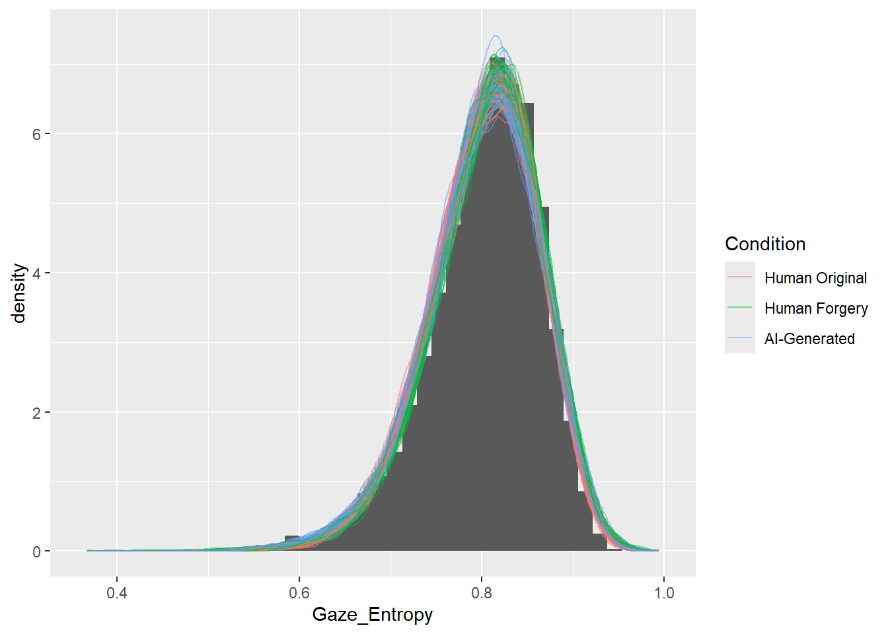{#fig-entropy fig-alt='Gaze entropy: observed distribution (histogram) with posterior-predictive densities per label condition (50 draws each).' width=672}
:::
:::


### pLeft


::: {.cell}

```{.r .cell-code}
make_report(estimates$pLeft)
```

::: {.cell-output-display}

```{=html}
<div id="eeemrqxyay" style="padding-left:0px;padding-right:0px;padding-top:10px;padding-bottom:10px;overflow-x:auto;overflow-y:auto;width:auto;height:auto;">
<style>#eeemrqxyay table {
  font-family: system-ui, 'Segoe UI', Roboto, Helvetica, Arial, sans-serif, 'Apple Color Emoji', 'Segoe UI Emoji', 'Segoe UI Symbol', 'Noto Color Emoji';
  -webkit-font-smoothing: antialiased;
  -moz-osx-font-smoothing: grayscale;
}

#eeemrqxyay thead, #eeemrqxyay tbody, #eeemrqxyay tfoot, #eeemrqxyay tr, #eeemrqxyay td, #eeemrqxyay th {
  border-style: none;
}

#eeemrqxyay p {
  margin: 0;
  padding: 0;
}

#eeemrqxyay .gt_table {
  display: table;
  border-collapse: collapse;
  line-height: normal;
  margin-left: auto;
  margin-right: auto;
  color: #333333;
  font-size: 16px;
  font-weight: normal;
  font-style: normal;
  background-color: #FFFFFF;
  width: auto;
  border-top-style: solid;
  border-top-width: 2px;
  border-top-color: #A8A8A8;
  border-right-style: none;
  border-right-width: 2px;
  border-right-color: #D3D3D3;
  border-bottom-style: solid;
  border-bottom-width: 2px;
  border-bottom-color: #A8A8A8;
  border-left-style: none;
  border-left-width: 2px;
  border-left-color: #D3D3D3;
}

#eeemrqxyay .gt_caption {
  padding-top: 4px;
  padding-bottom: 4px;
}

#eeemrqxyay .gt_title {
  color: #333333;
  font-size: 125%;
  font-weight: initial;
  padding-top: 4px;
  padding-bottom: 4px;
  padding-left: 5px;
  padding-right: 5px;
  border-bottom-color: #FFFFFF;
  border-bottom-width: 0;
}

#eeemrqxyay .gt_subtitle {
  color: #333333;
  font-size: 85%;
  font-weight: initial;
  padding-top: 3px;
  padding-bottom: 5px;
  padding-left: 5px;
  padding-right: 5px;
  border-top-color: #FFFFFF;
  border-top-width: 0;
}

#eeemrqxyay .gt_heading {
  background-color: #FFFFFF;
  text-align: center;
  border-bottom-color: #FFFFFF;
  border-left-style: none;
  border-left-width: 1px;
  border-left-color: #D3D3D3;
  border-right-style: none;
  border-right-width: 1px;
  border-right-color: #D3D3D3;
}

#eeemrqxyay .gt_bottom_border {
  border-bottom-style: solid;
  border-bottom-width: 2px;
  border-bottom-color: #D3D3D3;
}

#eeemrqxyay .gt_col_headings {
  border-top-style: solid;
  border-top-width: 2px;
  border-top-color: #D3D3D3;
  border-bottom-style: solid;
  border-bottom-width: 2px;
  border-bottom-color: #D3D3D3;
  border-left-style: none;
  border-left-width: 1px;
  border-left-color: #D3D3D3;
  border-right-style: none;
  border-right-width: 1px;
  border-right-color: #D3D3D3;
}

#eeemrqxyay .gt_col_heading {
  color: #333333;
  background-color: #FFFFFF;
  font-size: 100%;
  font-weight: normal;
  text-transform: inherit;
  border-left-style: none;
  border-left-width: 1px;
  border-left-color: #D3D3D3;
  border-right-style: none;
  border-right-width: 1px;
  border-right-color: #D3D3D3;
  vertical-align: bottom;
  padding-top: 5px;
  padding-bottom: 6px;
  padding-left: 5px;
  padding-right: 5px;
  overflow-x: hidden;
}

#eeemrqxyay .gt_column_spanner_outer {
  color: #333333;
  background-color: #FFFFFF;
  font-size: 100%;
  font-weight: normal;
  text-transform: inherit;
  padding-top: 0;
  padding-bottom: 0;
  padding-left: 4px;
  padding-right: 4px;
}

#eeemrqxyay .gt_column_spanner_outer:first-child {
  padding-left: 0;
}

#eeemrqxyay .gt_column_spanner_outer:last-child {
  padding-right: 0;
}

#eeemrqxyay .gt_column_spanner {
  border-bottom-style: solid;
  border-bottom-width: 2px;
  border-bottom-color: #D3D3D3;
  vertical-align: bottom;
  padding-top: 5px;
  padding-bottom: 5px;
  overflow-x: hidden;
  display: inline-block;
  width: 100%;
}

#eeemrqxyay .gt_spanner_row {
  border-bottom-style: hidden;
}

#eeemrqxyay .gt_group_heading {
  padding-top: 8px;
  padding-bottom: 8px;
  padding-left: 5px;
  padding-right: 5px;
  color: #333333;
  background-color: #FFFFFF;
  font-size: 100%;
  font-weight: initial;
  text-transform: inherit;
  border-top-style: solid;
  border-top-width: 2px;
  border-top-color: #D3D3D3;
  border-bottom-style: solid;
  border-bottom-width: 2px;
  border-bottom-color: #D3D3D3;
  border-left-style: none;
  border-left-width: 1px;
  border-left-color: #D3D3D3;
  border-right-style: none;
  border-right-width: 1px;
  border-right-color: #D3D3D3;
  vertical-align: middle;
  text-align: left;
}

#eeemrqxyay .gt_empty_group_heading {
  padding: 0.5px;
  color: #333333;
  background-color: #FFFFFF;
  font-size: 100%;
  font-weight: initial;
  border-top-style: solid;
  border-top-width: 2px;
  border-top-color: #D3D3D3;
  border-bottom-style: solid;
  border-bottom-width: 2px;
  border-bottom-color: #D3D3D3;
  vertical-align: middle;
}

#eeemrqxyay .gt_from_md > :first-child {
  margin-top: 0;
}

#eeemrqxyay .gt_from_md > :last-child {
  margin-bottom: 0;
}

#eeemrqxyay .gt_row {
  padding-top: 8px;
  padding-bottom: 8px;
  padding-left: 5px;
  padding-right: 5px;
  margin: 10px;
  border-top-style: solid;
  border-top-width: 1px;
  border-top-color: #D3D3D3;
  border-left-style: none;
  border-left-width: 1px;
  border-left-color: #D3D3D3;
  border-right-style: none;
  border-right-width: 1px;
  border-right-color: #D3D3D3;
  vertical-align: middle;
  overflow-x: hidden;
}

#eeemrqxyay .gt_stub {
  color: #333333;
  background-color: #FFFFFF;
  font-size: 100%;
  font-weight: initial;
  text-transform: inherit;
  border-right-style: solid;
  border-right-width: 2px;
  border-right-color: #D3D3D3;
  padding-left: 5px;
  padding-right: 5px;
}

#eeemrqxyay .gt_stub_row_group {
  color: #333333;
  background-color: #FFFFFF;
  font-size: 100%;
  font-weight: initial;
  text-transform: inherit;
  border-right-style: solid;
  border-right-width: 2px;
  border-right-color: #D3D3D3;
  padding-left: 5px;
  padding-right: 5px;
  vertical-align: top;
}

#eeemrqxyay .gt_row_group_first td {
  border-top-width: 2px;
}

#eeemrqxyay .gt_row_group_first th {
  border-top-width: 2px;
}

#eeemrqxyay .gt_summary_row {
  color: #333333;
  background-color: #FFFFFF;
  text-transform: inherit;
  padding-top: 8px;
  padding-bottom: 8px;
  padding-left: 5px;
  padding-right: 5px;
}

#eeemrqxyay .gt_first_summary_row {
  border-top-style: solid;
  border-top-color: #D3D3D3;
}

#eeemrqxyay .gt_first_summary_row.thick {
  border-top-width: 2px;
}

#eeemrqxyay .gt_last_summary_row {
  padding-top: 8px;
  padding-bottom: 8px;
  padding-left: 5px;
  padding-right: 5px;
  border-bottom-style: solid;
  border-bottom-width: 2px;
  border-bottom-color: #D3D3D3;
}

#eeemrqxyay .gt_grand_summary_row {
  color: #333333;
  background-color: #FFFFFF;
  text-transform: inherit;
  padding-top: 8px;
  padding-bottom: 8px;
  padding-left: 5px;
  padding-right: 5px;
}

#eeemrqxyay .gt_first_grand_summary_row {
  padding-top: 8px;
  padding-bottom: 8px;
  padding-left: 5px;
  padding-right: 5px;
  border-top-style: double;
  border-top-width: 6px;
  border-top-color: #D3D3D3;
}

#eeemrqxyay .gt_last_grand_summary_row_top {
  padding-top: 8px;
  padding-bottom: 8px;
  padding-left: 5px;
  padding-right: 5px;
  border-bottom-style: double;
  border-bottom-width: 6px;
  border-bottom-color: #D3D3D3;
}

#eeemrqxyay .gt_striped {
  background-color: rgba(128, 128, 128, 0.05);
}

#eeemrqxyay .gt_table_body {
  border-top-style: solid;
  border-top-width: 2px;
  border-top-color: #D3D3D3;
  border-bottom-style: solid;
  border-bottom-width: 2px;
  border-bottom-color: #D3D3D3;
}

#eeemrqxyay .gt_footnotes {
  color: #333333;
  background-color: #FFFFFF;
  border-bottom-style: none;
  border-bottom-width: 2px;
  border-bottom-color: #D3D3D3;
  border-left-style: none;
  border-left-width: 2px;
  border-left-color: #D3D3D3;
  border-right-style: none;
  border-right-width: 2px;
  border-right-color: #D3D3D3;
}

#eeemrqxyay .gt_footnote {
  margin: 0px;
  font-size: 90%;
  padding-top: 4px;
  padding-bottom: 4px;
  padding-left: 5px;
  padding-right: 5px;
}

#eeemrqxyay .gt_sourcenotes {
  color: #333333;
  background-color: #FFFFFF;
  border-bottom-style: none;
  border-bottom-width: 2px;
  border-bottom-color: #D3D3D3;
  border-left-style: none;
  border-left-width: 2px;
  border-left-color: #D3D3D3;
  border-right-style: none;
  border-right-width: 2px;
  border-right-color: #D3D3D3;
}

#eeemrqxyay .gt_sourcenote {
  font-size: 90%;
  padding-top: 4px;
  padding-bottom: 4px;
  padding-left: 5px;
  padding-right: 5px;
}

#eeemrqxyay .gt_left {
  text-align: left;
}

#eeemrqxyay .gt_center {
  text-align: center;
}

#eeemrqxyay .gt_right {
  text-align: right;
  font-variant-numeric: tabular-nums;
}

#eeemrqxyay .gt_font_normal {
  font-weight: normal;
}

#eeemrqxyay .gt_font_bold {
  font-weight: bold;
}

#eeemrqxyay .gt_font_italic {
  font-style: italic;
}

#eeemrqxyay .gt_super {
  font-size: 65%;
}

#eeemrqxyay .gt_footnote_marks {
  font-size: 75%;
  vertical-align: 0.4em;
  position: initial;
}

#eeemrqxyay .gt_asterisk {
  font-size: 100%;
  vertical-align: 0;
}

#eeemrqxyay .gt_indent_1 {
  text-indent: 5px;
}

#eeemrqxyay .gt_indent_2 {
  text-indent: 10px;
}

#eeemrqxyay .gt_indent_3 {
  text-indent: 15px;
}

#eeemrqxyay .gt_indent_4 {
  text-indent: 20px;
}

#eeemrqxyay .gt_indent_5 {
  text-indent: 25px;
}

#eeemrqxyay .katex-display {
  display: inline-flex !important;
  margin-bottom: 0.75em !important;
}

#eeemrqxyay div.Reactable > div.rt-table > div.rt-thead > div.rt-tr.rt-tr-group-header > div.rt-th-group:after {
  height: 0px !important;
}
</style>
<table class="gt_table" data-quarto-disable-processing="false" data-quarto-bootstrap="false">
  <thead>
    <tr class="gt_col_headings">
      <th class="gt_col_heading gt_columns_bottom_border gt_left" rowspan="1" colspan="1" scope="col" id="Contrast">Contrast</th>
      <th class="gt_col_heading gt_columns_bottom_border gt_left" rowspan="1" colspan="1" scope="col" id="Parameters">Parameters</th>
    </tr>
  </thead>
  <tbody class="gt_table_body">
    <tr><td headers="Contrast" class="gt_row gt_left">AI-Generated - Human Original</td>
<td headers="Parameters" class="gt_row gt_left">phi (0.31, [0.03, 0.60])</td></tr>
  </tbody>
  
</table>
</div>
```

```{=html}
<div id="ohdftdpgdq" style="padding-left:0px;padding-right:0px;padding-top:10px;padding-bottom:10px;overflow-x:auto;overflow-y:auto;width:auto;height:auto;">
<style>#ohdftdpgdq table {
  font-family: system-ui, 'Segoe UI', Roboto, Helvetica, Arial, sans-serif, 'Apple Color Emoji', 'Segoe UI Emoji', 'Segoe UI Symbol', 'Noto Color Emoji';
  -webkit-font-smoothing: antialiased;
  -moz-osx-font-smoothing: grayscale;
}

#ohdftdpgdq thead, #ohdftdpgdq tbody, #ohdftdpgdq tfoot, #ohdftdpgdq tr, #ohdftdpgdq td, #ohdftdpgdq th {
  border-style: none;
}

#ohdftdpgdq p {
  margin: 0;
  padding: 0;
}

#ohdftdpgdq .gt_table {
  display: table;
  border-collapse: collapse;
  line-height: normal;
  margin-left: auto;
  margin-right: auto;
  color: #333333;
  font-size: 16px;
  font-weight: normal;
  font-style: normal;
  background-color: #FFFFFF;
  width: auto;
  border-top-style: solid;
  border-top-width: 2px;
  border-top-color: #A8A8A8;
  border-right-style: none;
  border-right-width: 2px;
  border-right-color: #D3D3D3;
  border-bottom-style: solid;
  border-bottom-width: 2px;
  border-bottom-color: #A8A8A8;
  border-left-style: none;
  border-left-width: 2px;
  border-left-color: #D3D3D3;
}

#ohdftdpgdq .gt_caption {
  padding-top: 4px;
  padding-bottom: 4px;
}

#ohdftdpgdq .gt_title {
  color: #333333;
  font-size: 125%;
  font-weight: initial;
  padding-top: 4px;
  padding-bottom: 4px;
  padding-left: 5px;
  padding-right: 5px;
  border-bottom-color: #FFFFFF;
  border-bottom-width: 0;
}

#ohdftdpgdq .gt_subtitle {
  color: #333333;
  font-size: 85%;
  font-weight: initial;
  padding-top: 3px;
  padding-bottom: 5px;
  padding-left: 5px;
  padding-right: 5px;
  border-top-color: #FFFFFF;
  border-top-width: 0;
}

#ohdftdpgdq .gt_heading {
  background-color: #FFFFFF;
  text-align: center;
  border-bottom-color: #FFFFFF;
  border-left-style: none;
  border-left-width: 1px;
  border-left-color: #D3D3D3;
  border-right-style: none;
  border-right-width: 1px;
  border-right-color: #D3D3D3;
}

#ohdftdpgdq .gt_bottom_border {
  border-bottom-style: solid;
  border-bottom-width: 2px;
  border-bottom-color: #D3D3D3;
}

#ohdftdpgdq .gt_col_headings {
  border-top-style: solid;
  border-top-width: 2px;
  border-top-color: #D3D3D3;
  border-bottom-style: solid;
  border-bottom-width: 2px;
  border-bottom-color: #D3D3D3;
  border-left-style: none;
  border-left-width: 1px;
  border-left-color: #D3D3D3;
  border-right-style: none;
  border-right-width: 1px;
  border-right-color: #D3D3D3;
}

#ohdftdpgdq .gt_col_heading {
  color: #333333;
  background-color: #FFFFFF;
  font-size: 100%;
  font-weight: normal;
  text-transform: inherit;
  border-left-style: none;
  border-left-width: 1px;
  border-left-color: #D3D3D3;
  border-right-style: none;
  border-right-width: 1px;
  border-right-color: #D3D3D3;
  vertical-align: bottom;
  padding-top: 5px;
  padding-bottom: 6px;
  padding-left: 5px;
  padding-right: 5px;
  overflow-x: hidden;
}

#ohdftdpgdq .gt_column_spanner_outer {
  color: #333333;
  background-color: #FFFFFF;
  font-size: 100%;
  font-weight: normal;
  text-transform: inherit;
  padding-top: 0;
  padding-bottom: 0;
  padding-left: 4px;
  padding-right: 4px;
}

#ohdftdpgdq .gt_column_spanner_outer:first-child {
  padding-left: 0;
}

#ohdftdpgdq .gt_column_spanner_outer:last-child {
  padding-right: 0;
}

#ohdftdpgdq .gt_column_spanner {
  border-bottom-style: solid;
  border-bottom-width: 2px;
  border-bottom-color: #D3D3D3;
  vertical-align: bottom;
  padding-top: 5px;
  padding-bottom: 5px;
  overflow-x: hidden;
  display: inline-block;
  width: 100%;
}

#ohdftdpgdq .gt_spanner_row {
  border-bottom-style: hidden;
}

#ohdftdpgdq .gt_group_heading {
  padding-top: 8px;
  padding-bottom: 8px;
  padding-left: 5px;
  padding-right: 5px;
  color: #333333;
  background-color: #FFFFFF;
  font-size: 100%;
  font-weight: initial;
  text-transform: inherit;
  border-top-style: solid;
  border-top-width: 2px;
  border-top-color: #D3D3D3;
  border-bottom-style: solid;
  border-bottom-width: 2px;
  border-bottom-color: #D3D3D3;
  border-left-style: none;
  border-left-width: 1px;
  border-left-color: #D3D3D3;
  border-right-style: none;
  border-right-width: 1px;
  border-right-color: #D3D3D3;
  vertical-align: middle;
  text-align: left;
}

#ohdftdpgdq .gt_empty_group_heading {
  padding: 0.5px;
  color: #333333;
  background-color: #FFFFFF;
  font-size: 100%;
  font-weight: initial;
  border-top-style: solid;
  border-top-width: 2px;
  border-top-color: #D3D3D3;
  border-bottom-style: solid;
  border-bottom-width: 2px;
  border-bottom-color: #D3D3D3;
  vertical-align: middle;
}

#ohdftdpgdq .gt_from_md > :first-child {
  margin-top: 0;
}

#ohdftdpgdq .gt_from_md > :last-child {
  margin-bottom: 0;
}

#ohdftdpgdq .gt_row {
  padding-top: 8px;
  padding-bottom: 8px;
  padding-left: 5px;
  padding-right: 5px;
  margin: 10px;
  border-top-style: solid;
  border-top-width: 1px;
  border-top-color: #D3D3D3;
  border-left-style: none;
  border-left-width: 1px;
  border-left-color: #D3D3D3;
  border-right-style: none;
  border-right-width: 1px;
  border-right-color: #D3D3D3;
  vertical-align: middle;
  overflow-x: hidden;
}

#ohdftdpgdq .gt_stub {
  color: #333333;
  background-color: #FFFFFF;
  font-size: 100%;
  font-weight: initial;
  text-transform: inherit;
  border-right-style: solid;
  border-right-width: 2px;
  border-right-color: #D3D3D3;
  padding-left: 5px;
  padding-right: 5px;
}

#ohdftdpgdq .gt_stub_row_group {
  color: #333333;
  background-color: #FFFFFF;
  font-size: 100%;
  font-weight: initial;
  text-transform: inherit;
  border-right-style: solid;
  border-right-width: 2px;
  border-right-color: #D3D3D3;
  padding-left: 5px;
  padding-right: 5px;
  vertical-align: top;
}

#ohdftdpgdq .gt_row_group_first td {
  border-top-width: 2px;
}

#ohdftdpgdq .gt_row_group_first th {
  border-top-width: 2px;
}

#ohdftdpgdq .gt_summary_row {
  color: #333333;
  background-color: #FFFFFF;
  text-transform: inherit;
  padding-top: 8px;
  padding-bottom: 8px;
  padding-left: 5px;
  padding-right: 5px;
}

#ohdftdpgdq .gt_first_summary_row {
  border-top-style: solid;
  border-top-color: #D3D3D3;
}

#ohdftdpgdq .gt_first_summary_row.thick {
  border-top-width: 2px;
}

#ohdftdpgdq .gt_last_summary_row {
  padding-top: 8px;
  padding-bottom: 8px;
  padding-left: 5px;
  padding-right: 5px;
  border-bottom-style: solid;
  border-bottom-width: 2px;
  border-bottom-color: #D3D3D3;
}

#ohdftdpgdq .gt_grand_summary_row {
  color: #333333;
  background-color: #FFFFFF;
  text-transform: inherit;
  padding-top: 8px;
  padding-bottom: 8px;
  padding-left: 5px;
  padding-right: 5px;
}

#ohdftdpgdq .gt_first_grand_summary_row {
  padding-top: 8px;
  padding-bottom: 8px;
  padding-left: 5px;
  padding-right: 5px;
  border-top-style: double;
  border-top-width: 6px;
  border-top-color: #D3D3D3;
}

#ohdftdpgdq .gt_last_grand_summary_row_top {
  padding-top: 8px;
  padding-bottom: 8px;
  padding-left: 5px;
  padding-right: 5px;
  border-bottom-style: double;
  border-bottom-width: 6px;
  border-bottom-color: #D3D3D3;
}

#ohdftdpgdq .gt_striped {
  background-color: rgba(128, 128, 128, 0.05);
}

#ohdftdpgdq .gt_table_body {
  border-top-style: solid;
  border-top-width: 2px;
  border-top-color: #D3D3D3;
  border-bottom-style: solid;
  border-bottom-width: 2px;
  border-bottom-color: #D3D3D3;
}

#ohdftdpgdq .gt_footnotes {
  color: #333333;
  background-color: #FFFFFF;
  border-bottom-style: none;
  border-bottom-width: 2px;
  border-bottom-color: #D3D3D3;
  border-left-style: none;
  border-left-width: 2px;
  border-left-color: #D3D3D3;
  border-right-style: none;
  border-right-width: 2px;
  border-right-color: #D3D3D3;
}

#ohdftdpgdq .gt_footnote {
  margin: 0px;
  font-size: 90%;
  padding-top: 4px;
  padding-bottom: 4px;
  padding-left: 5px;
  padding-right: 5px;
}

#ohdftdpgdq .gt_sourcenotes {
  color: #333333;
  background-color: #FFFFFF;
  border-bottom-style: none;
  border-bottom-width: 2px;
  border-bottom-color: #D3D3D3;
  border-left-style: none;
  border-left-width: 2px;
  border-left-color: #D3D3D3;
  border-right-style: none;
  border-right-width: 2px;
  border-right-color: #D3D3D3;
}

#ohdftdpgdq .gt_sourcenote {
  font-size: 90%;
  padding-top: 4px;
  padding-bottom: 4px;
  padding-left: 5px;
  padding-right: 5px;
}

#ohdftdpgdq .gt_left {
  text-align: left;
}

#ohdftdpgdq .gt_center {
  text-align: center;
}

#ohdftdpgdq .gt_right {
  text-align: right;
  font-variant-numeric: tabular-nums;
}

#ohdftdpgdq .gt_font_normal {
  font-weight: normal;
}

#ohdftdpgdq .gt_font_bold {
  font-weight: bold;
}

#ohdftdpgdq .gt_font_italic {
  font-style: italic;
}

#ohdftdpgdq .gt_super {
  font-size: 65%;
}

#ohdftdpgdq .gt_footnote_marks {
  font-size: 75%;
  vertical-align: 0.4em;
  position: initial;
}

#ohdftdpgdq .gt_asterisk {
  font-size: 100%;
  vertical-align: 0;
}

#ohdftdpgdq .gt_indent_1 {
  text-indent: 5px;
}

#ohdftdpgdq .gt_indent_2 {
  text-indent: 10px;
}

#ohdftdpgdq .gt_indent_3 {
  text-indent: 15px;
}

#ohdftdpgdq .gt_indent_4 {
  text-indent: 20px;
}

#ohdftdpgdq .gt_indent_5 {
  text-indent: 25px;
}

#ohdftdpgdq .katex-display {
  display: inline-flex !important;
  margin-bottom: 0.75em !important;
}

#ohdftdpgdq div.Reactable > div.rt-table > div.rt-thead > div.rt-tr.rt-tr-group-header > div.rt-th-group:after {
  height: 0px !important;
}
</style>
<table class="gt_table" data-quarto-disable-processing="false" data-quarto-bootstrap="false">
  <thead>
    <tr class="gt_col_headings">
      <th class="gt_col_heading gt_columns_bottom_border gt_left" rowspan="1" colspan="1" scope="col" id="Contrast">Contrast</th>
      <th class="gt_col_heading gt_columns_bottom_border gt_left" rowspan="1" colspan="1" scope="col" id="Parameters">Parameters</th>
    </tr>
  </thead>
  <tbody class="gt_table_body">
    <tr><td headers="Contrast" class="gt_row gt_left">Negative - Low intensity - Positive - Low intensity</td>
<td headers="Parameters" class="gt_row gt_left">None</td></tr>
    <tr><td headers="Contrast" class="gt_row gt_left">Positive - High intensity - Positive - Low intensity</td>
<td headers="Parameters" class="gt_row gt_left">None</td></tr>
    <tr><td headers="Contrast" class="gt_row gt_left">Positive - High intensity - Negative - Low intensity</td>
<td headers="Parameters" class="gt_row gt_left">None</td></tr>
    <tr><td headers="Contrast" class="gt_row gt_left">Negative - High intensity - Positive - Low intensity</td>
<td headers="Parameters" class="gt_row gt_left">None</td></tr>
    <tr><td headers="Contrast" class="gt_row gt_left">Negative - High intensity - Negative - Low intensity</td>
<td headers="Parameters" class="gt_row gt_left">None</td></tr>
    <tr><td headers="Contrast" class="gt_row gt_left">Negative - High intensity - Positive - High intensity</td>
<td headers="Parameters" class="gt_row gt_left">None</td></tr>
  </tbody>
  
</table>
</div>
```

```{=html}
<div id="ejfcyjudsb" style="padding-left:0px;padding-right:0px;padding-top:10px;padding-bottom:10px;overflow-x:auto;overflow-y:auto;width:auto;height:auto;">
<style>#ejfcyjudsb table {
  font-family: system-ui, 'Segoe UI', Roboto, Helvetica, Arial, sans-serif, 'Apple Color Emoji', 'Segoe UI Emoji', 'Segoe UI Symbol', 'Noto Color Emoji';
  -webkit-font-smoothing: antialiased;
  -moz-osx-font-smoothing: grayscale;
}

#ejfcyjudsb thead, #ejfcyjudsb tbody, #ejfcyjudsb tfoot, #ejfcyjudsb tr, #ejfcyjudsb td, #ejfcyjudsb th {
  border-style: none;
}

#ejfcyjudsb p {
  margin: 0;
  padding: 0;
}

#ejfcyjudsb .gt_table {
  display: table;
  border-collapse: collapse;
  line-height: normal;
  margin-left: auto;
  margin-right: auto;
  color: #333333;
  font-size: 13px;
  font-weight: normal;
  font-style: normal;
  background-color: #FFFFFF;
  width: auto;
  border-top-style: solid;
  border-top-width: 3px;
  border-top-color: #D5D5D5;
  border-right-style: solid;
  border-right-width: 3px;
  border-right-color: #D5D5D5;
  border-bottom-style: solid;
  border-bottom-width: 3px;
  border-bottom-color: #D5D5D5;
  border-left-style: solid;
  border-left-width: 3px;
  border-left-color: #D5D5D5;
}

#ejfcyjudsb .gt_caption {
  padding-top: 4px;
  padding-bottom: 4px;
}

#ejfcyjudsb .gt_title {
  color: #333333;
  font-size: 125%;
  font-weight: initial;
  padding-top: 4px;
  padding-bottom: 4px;
  padding-left: 5px;
  padding-right: 5px;
  border-bottom-color: #FFFFFF;
  border-bottom-width: 0;
}

#ejfcyjudsb .gt_subtitle {
  color: #333333;
  font-size: 85%;
  font-weight: initial;
  padding-top: 3px;
  padding-bottom: 5px;
  padding-left: 5px;
  padding-right: 5px;
  border-top-color: #FFFFFF;
  border-top-width: 0;
}

#ejfcyjudsb .gt_heading {
  background-color: #FFFFFF;
  text-align: left;
  border-bottom-color: #FFFFFF;
  border-left-style: none;
  border-left-width: 1px;
  border-left-color: #D3D3D3;
  border-right-style: none;
  border-right-width: 1px;
  border-right-color: #D3D3D3;
}

#ejfcyjudsb .gt_bottom_border {
  border-bottom-style: solid;
  border-bottom-width: 2px;
  border-bottom-color: #D5D5D5;
}

#ejfcyjudsb .gt_col_headings {
  border-top-style: solid;
  border-top-width: 2px;
  border-top-color: #D5D5D5;
  border-bottom-style: solid;
  border-bottom-width: 2px;
  border-bottom-color: #D5D5D5;
  border-left-style: none;
  border-left-width: 1px;
  border-left-color: #D3D3D3;
  border-right-style: none;
  border-right-width: 1px;
  border-right-color: #D3D3D3;
}

#ejfcyjudsb .gt_col_heading {
  color: #FFFFFF;
  background-color: #000000;
  font-size: 100%;
  font-weight: normal;
  text-transform: inherit;
  border-left-style: none;
  border-left-width: 1px;
  border-left-color: #D3D3D3;
  border-right-style: none;
  border-right-width: 1px;
  border-right-color: #D3D3D3;
  vertical-align: bottom;
  padding-top: 5px;
  padding-bottom: 6px;
  padding-left: 5px;
  padding-right: 5px;
  overflow-x: hidden;
}

#ejfcyjudsb .gt_column_spanner_outer {
  color: #FFFFFF;
  background-color: #000000;
  font-size: 100%;
  font-weight: normal;
  text-transform: inherit;
  padding-top: 0;
  padding-bottom: 0;
  padding-left: 4px;
  padding-right: 4px;
}

#ejfcyjudsb .gt_column_spanner_outer:first-child {
  padding-left: 0;
}

#ejfcyjudsb .gt_column_spanner_outer:last-child {
  padding-right: 0;
}

#ejfcyjudsb .gt_column_spanner {
  border-bottom-style: solid;
  border-bottom-width: 2px;
  border-bottom-color: #D5D5D5;
  vertical-align: bottom;
  padding-top: 5px;
  padding-bottom: 5px;
  overflow-x: hidden;
  display: inline-block;
  width: 100%;
}

#ejfcyjudsb .gt_spanner_row {
  border-bottom-style: hidden;
}

#ejfcyjudsb .gt_group_heading {
  padding-top: 8px;
  padding-bottom: 8px;
  padding-left: 5px;
  padding-right: 5px;
  color: #333333;
  background-color: #FFFFFF;
  font-size: 100%;
  font-weight: initial;
  text-transform: inherit;
  border-top-style: solid;
  border-top-width: 2px;
  border-top-color: #D5D5D5;
  border-bottom-style: solid;
  border-bottom-width: 2px;
  border-bottom-color: #D5D5D5;
  border-left-style: none;
  border-left-width: 1px;
  border-left-color: #D3D3D3;
  border-right-style: none;
  border-right-width: 1px;
  border-right-color: #D3D3D3;
  vertical-align: middle;
  text-align: left;
}

#ejfcyjudsb .gt_empty_group_heading {
  padding: 0.5px;
  color: #333333;
  background-color: #FFFFFF;
  font-size: 100%;
  font-weight: initial;
  border-top-style: solid;
  border-top-width: 2px;
  border-top-color: #D5D5D5;
  border-bottom-style: solid;
  border-bottom-width: 2px;
  border-bottom-color: #D5D5D5;
  vertical-align: middle;
}

#ejfcyjudsb .gt_from_md > :first-child {
  margin-top: 0;
}

#ejfcyjudsb .gt_from_md > :last-child {
  margin-bottom: 0;
}

#ejfcyjudsb .gt_row {
  padding-top: 8px;
  padding-bottom: 8px;
  padding-left: 5px;
  padding-right: 5px;
  margin: 10px;
  border-top-style: solid;
  border-top-width: 1px;
  border-top-color: #D5D5D5;
  border-left-style: solid;
  border-left-width: 1px;
  border-left-color: #D5D5D5;
  border-right-style: solid;
  border-right-width: 1px;
  border-right-color: #D5D5D5;
  vertical-align: middle;
  overflow-x: hidden;
}

#ejfcyjudsb .gt_stub {
  color: #333333;
  background-color: #FFFFFF;
  font-size: 100%;
  font-weight: initial;
  text-transform: inherit;
  border-right-style: solid;
  border-right-width: 2px;
  border-right-color: #5F5F5F;
  padding-left: 5px;
  padding-right: 5px;
}

#ejfcyjudsb .gt_stub_row_group {
  color: #333333;
  background-color: #FFFFFF;
  font-size: 100%;
  font-weight: initial;
  text-transform: inherit;
  border-right-style: solid;
  border-right-width: 2px;
  border-right-color: #D3D3D3;
  padding-left: 5px;
  padding-right: 5px;
  vertical-align: top;
}

#ejfcyjudsb .gt_row_group_first td {
  border-top-width: 2px;
}

#ejfcyjudsb .gt_row_group_first th {
  border-top-width: 2px;
}

#ejfcyjudsb .gt_summary_row {
  color: #333333;
  background-color: #D5D5D5;
  text-transform: inherit;
  padding-top: 8px;
  padding-bottom: 8px;
  padding-left: 5px;
  padding-right: 5px;
}

#ejfcyjudsb .gt_first_summary_row {
  border-top-style: solid;
  border-top-color: #D5D5D5;
}

#ejfcyjudsb .gt_first_summary_row.thick {
  border-top-width: 2px;
}

#ejfcyjudsb .gt_last_summary_row {
  padding-top: 8px;
  padding-bottom: 8px;
  padding-left: 5px;
  padding-right: 5px;
  border-bottom-style: solid;
  border-bottom-width: 2px;
  border-bottom-color: #D5D5D5;
}

#ejfcyjudsb .gt_grand_summary_row {
  color: #FFFFFF;
  background-color: #929292;
  text-transform: inherit;
  padding-top: 8px;
  padding-bottom: 8px;
  padding-left: 5px;
  padding-right: 5px;
}

#ejfcyjudsb .gt_first_grand_summary_row {
  padding-top: 8px;
  padding-bottom: 8px;
  padding-left: 5px;
  padding-right: 5px;
  border-top-style: double;
  border-top-width: 6px;
  border-top-color: #D5D5D5;
}

#ejfcyjudsb .gt_last_grand_summary_row_top {
  padding-top: 8px;
  padding-bottom: 8px;
  padding-left: 5px;
  padding-right: 5px;
  border-bottom-style: double;
  border-bottom-width: 6px;
  border-bottom-color: #D5D5D5;
}

#ejfcyjudsb .gt_striped {
  background-color: #F4F4F4;
}

#ejfcyjudsb .gt_table_body {
  border-top-style: solid;
  border-top-width: 2px;
  border-top-color: #D5D5D5;
  border-bottom-style: solid;
  border-bottom-width: 2px;
  border-bottom-color: #D5D5D5;
}

#ejfcyjudsb .gt_footnotes {
  color: #333333;
  background-color: #FFFFFF;
  border-bottom-style: none;
  border-bottom-width: 2px;
  border-bottom-color: #D3D3D3;
  border-left-style: none;
  border-left-width: 2px;
  border-left-color: #D3D3D3;
  border-right-style: none;
  border-right-width: 2px;
  border-right-color: #D3D3D3;
}

#ejfcyjudsb .gt_footnote {
  margin: 0px;
  font-size: 90%;
  padding-top: 4px;
  padding-bottom: 4px;
  padding-left: 5px;
  padding-right: 5px;
}

#ejfcyjudsb .gt_sourcenotes {
  color: #333333;
  background-color: #FFFFFF;
  border-bottom-style: none;
  border-bottom-width: 2px;
  border-bottom-color: #D3D3D3;
  border-left-style: none;
  border-left-width: 2px;
  border-left-color: #D3D3D3;
  border-right-style: none;
  border-right-width: 2px;
  border-right-color: #D3D3D3;
}

#ejfcyjudsb .gt_sourcenote {
  font-size: 90%;
  padding-top: 4px;
  padding-bottom: 4px;
  padding-left: 5px;
  padding-right: 5px;
}

#ejfcyjudsb .gt_left {
  text-align: left;
}

#ejfcyjudsb .gt_center {
  text-align: center;
}

#ejfcyjudsb .gt_right {
  text-align: right;
  font-variant-numeric: tabular-nums;
}

#ejfcyjudsb .gt_font_normal {
  font-weight: normal;
}

#ejfcyjudsb .gt_font_bold {
  font-weight: bold;
}

#ejfcyjudsb .gt_font_italic {
  font-style: italic;
}

#ejfcyjudsb .gt_super {
  font-size: 65%;
}

#ejfcyjudsb .gt_footnote_marks {
  font-size: 75%;
  vertical-align: 0.4em;
  position: initial;
}

#ejfcyjudsb .gt_asterisk {
  font-size: 100%;
  vertical-align: 0;
}

#ejfcyjudsb .gt_indent_1 {
  text-indent: 5px;
}

#ejfcyjudsb .gt_indent_2 {
  text-indent: 10px;
}

#ejfcyjudsb .gt_indent_3 {
  text-indent: 15px;
}

#ejfcyjudsb .gt_indent_4 {
  text-indent: 20px;
}

#ejfcyjudsb .gt_indent_5 {
  text-indent: 25px;
}

#ejfcyjudsb .katex-display {
  display: inline-flex !important;
  margin-bottom: 0.75em !important;
}

#ejfcyjudsb div.Reactable > div.rt-table > div.rt-thead > div.rt-tr.rt-tr-group-header > div.rt-th-group:after {
  height: 0px !important;
}
</style>
<table class="gt_table" data-quarto-disable-processing="false" data-quarto-bootstrap="false">
  <thead>
    <tr class="gt_heading">
      <td colspan="10" class="gt_heading gt_title gt_font_normal gt_bottom_border" style>Gaze Laterality (pLeft): convergence</td>
    </tr>
    
    <tr class="gt_col_headings">
      <th class="gt_col_heading gt_columns_bottom_border gt_left" rowspan="1" colspan="1" scope="col" id="Model">Model</th>
      <th class="gt_col_heading gt_columns_bottom_border gt_left" rowspan="1" colspan="1" scope="col" id="Family">Family</th>
      <th class="gt_col_heading gt_columns_bottom_border gt_right" rowspan="1" colspan="1" scope="col" id="N_obs">N_obs</th>
      <th class="gt_col_heading gt_columns_bottom_border gt_right" rowspan="1" colspan="1" scope="col" id="N_participants">N_participants</th>
      <th class="gt_col_heading gt_columns_bottom_border gt_right" rowspan="1" colspan="1" scope="col" id="Chains">Chains</th>
      <th class="gt_col_heading gt_columns_bottom_border gt_right" rowspan="1" colspan="1" scope="col" id="Draws">Draws</th>
      <th class="gt_col_heading gt_columns_bottom_border gt_right" rowspan="1" colspan="1" scope="col" id="Max_Rhat">Max_Rhat</th>
      <th class="gt_col_heading gt_columns_bottom_border gt_right" rowspan="1" colspan="1" scope="col" id="Min_ESS_ratio">Min_ESS_ratio</th>
      <th class="gt_col_heading gt_columns_bottom_border gt_right" rowspan="1" colspan="1" scope="col" id="Divergent_pct">Divergent_pct</th>
      <th class="gt_col_heading gt_columns_bottom_border gt_left" rowspan="1" colspan="1" scope="col" id="Criterion">Criterion</th>
    </tr>
  </thead>
  <tbody class="gt_table_body">
    <tr><td headers="Model" class="gt_row gt_left">pLeft</td>
<td headers="Family" class="gt_row gt_left">Zero-one-inflated Beta</td>
<td headers="N_obs" class="gt_row gt_right">12220</td>
<td headers="N_participants" class="gt_row gt_right">274</td>
<td headers="Chains" class="gt_row gt_right">8</td>
<td headers="Draws" class="gt_row gt_right">4000</td>
<td headers="Max_Rhat" class="gt_row gt_right">1.058</td>
<td headers="Min_ESS_ratio" class="gt_row gt_right">0.033</td>
<td headers="Divergent_pct" class="gt_row gt_right">0</td>
<td headers="Criterion" class="gt_row gt_left">loo</td></tr>
  </tbody>
  
</table>
</div>
```


::: {.callout-note collapse="true" title="Gaze Laterality (pLeft): convergence (Markdown table, for text readers)"}

|Model |Family                 | N_obs| N_participants| Chains| Draws| Max_Rhat| Min_ESS_ratio| Divergent_pct|Criterion |
|:-----|:----------------------|-----:|--------------:|------:|-----:|--------:|-------------:|-------------:|:---------|
|pLeft |Zero-one-inflated Beta | 12220|            274|      8|  4000|    1.058|         0.033|             0|loo       |

:::

```{=html}
<div id="lucbxmriwl" style="padding-left:0px;padding-right:0px;padding-top:10px;padding-bottom:10px;overflow-x:auto;overflow-y:auto;width:auto;height:auto;">
<style>#lucbxmriwl table {
  font-family: system-ui, 'Segoe UI', Roboto, Helvetica, Arial, sans-serif, 'Apple Color Emoji', 'Segoe UI Emoji', 'Segoe UI Symbol', 'Noto Color Emoji';
  -webkit-font-smoothing: antialiased;
  -moz-osx-font-smoothing: grayscale;
}

#lucbxmriwl thead, #lucbxmriwl tbody, #lucbxmriwl tfoot, #lucbxmriwl tr, #lucbxmriwl td, #lucbxmriwl th {
  border-style: none;
}

#lucbxmriwl p {
  margin: 0;
  padding: 0;
}

#lucbxmriwl .gt_table {
  display: table;
  border-collapse: collapse;
  line-height: normal;
  margin-left: auto;
  margin-right: auto;
  color: #333333;
  font-size: 13px;
  font-weight: normal;
  font-style: normal;
  background-color: #FFFFFF;
  width: auto;
  border-top-style: solid;
  border-top-width: 3px;
  border-top-color: #D5D5D5;
  border-right-style: solid;
  border-right-width: 3px;
  border-right-color: #D5D5D5;
  border-bottom-style: solid;
  border-bottom-width: 3px;
  border-bottom-color: #D5D5D5;
  border-left-style: solid;
  border-left-width: 3px;
  border-left-color: #D5D5D5;
}

#lucbxmriwl .gt_caption {
  padding-top: 4px;
  padding-bottom: 4px;
}

#lucbxmriwl .gt_title {
  color: #333333;
  font-size: 125%;
  font-weight: initial;
  padding-top: 4px;
  padding-bottom: 4px;
  padding-left: 5px;
  padding-right: 5px;
  border-bottom-color: #FFFFFF;
  border-bottom-width: 0;
}

#lucbxmriwl .gt_subtitle {
  color: #333333;
  font-size: 85%;
  font-weight: initial;
  padding-top: 3px;
  padding-bottom: 5px;
  padding-left: 5px;
  padding-right: 5px;
  border-top-color: #FFFFFF;
  border-top-width: 0;
}

#lucbxmriwl .gt_heading {
  background-color: #FFFFFF;
  text-align: left;
  border-bottom-color: #FFFFFF;
  border-left-style: none;
  border-left-width: 1px;
  border-left-color: #D3D3D3;
  border-right-style: none;
  border-right-width: 1px;
  border-right-color: #D3D3D3;
}

#lucbxmriwl .gt_bottom_border {
  border-bottom-style: solid;
  border-bottom-width: 2px;
  border-bottom-color: #D5D5D5;
}

#lucbxmriwl .gt_col_headings {
  border-top-style: solid;
  border-top-width: 2px;
  border-top-color: #D5D5D5;
  border-bottom-style: solid;
  border-bottom-width: 2px;
  border-bottom-color: #D5D5D5;
  border-left-style: none;
  border-left-width: 1px;
  border-left-color: #D3D3D3;
  border-right-style: none;
  border-right-width: 1px;
  border-right-color: #D3D3D3;
}

#lucbxmriwl .gt_col_heading {
  color: #FFFFFF;
  background-color: #000000;
  font-size: 100%;
  font-weight: normal;
  text-transform: inherit;
  border-left-style: none;
  border-left-width: 1px;
  border-left-color: #D3D3D3;
  border-right-style: none;
  border-right-width: 1px;
  border-right-color: #D3D3D3;
  vertical-align: bottom;
  padding-top: 5px;
  padding-bottom: 6px;
  padding-left: 5px;
  padding-right: 5px;
  overflow-x: hidden;
}

#lucbxmriwl .gt_column_spanner_outer {
  color: #FFFFFF;
  background-color: #000000;
  font-size: 100%;
  font-weight: normal;
  text-transform: inherit;
  padding-top: 0;
  padding-bottom: 0;
  padding-left: 4px;
  padding-right: 4px;
}

#lucbxmriwl .gt_column_spanner_outer:first-child {
  padding-left: 0;
}

#lucbxmriwl .gt_column_spanner_outer:last-child {
  padding-right: 0;
}

#lucbxmriwl .gt_column_spanner {
  border-bottom-style: solid;
  border-bottom-width: 2px;
  border-bottom-color: #D5D5D5;
  vertical-align: bottom;
  padding-top: 5px;
  padding-bottom: 5px;
  overflow-x: hidden;
  display: inline-block;
  width: 100%;
}

#lucbxmriwl .gt_spanner_row {
  border-bottom-style: hidden;
}

#lucbxmriwl .gt_group_heading {
  padding-top: 8px;
  padding-bottom: 8px;
  padding-left: 5px;
  padding-right: 5px;
  color: #333333;
  background-color: #FFFFFF;
  font-size: 100%;
  font-weight: initial;
  text-transform: inherit;
  border-top-style: solid;
  border-top-width: 2px;
  border-top-color: #D5D5D5;
  border-bottom-style: solid;
  border-bottom-width: 2px;
  border-bottom-color: #D5D5D5;
  border-left-style: none;
  border-left-width: 1px;
  border-left-color: #D3D3D3;
  border-right-style: none;
  border-right-width: 1px;
  border-right-color: #D3D3D3;
  vertical-align: middle;
  text-align: left;
}

#lucbxmriwl .gt_empty_group_heading {
  padding: 0.5px;
  color: #333333;
  background-color: #FFFFFF;
  font-size: 100%;
  font-weight: initial;
  border-top-style: solid;
  border-top-width: 2px;
  border-top-color: #D5D5D5;
  border-bottom-style: solid;
  border-bottom-width: 2px;
  border-bottom-color: #D5D5D5;
  vertical-align: middle;
}

#lucbxmriwl .gt_from_md > :first-child {
  margin-top: 0;
}

#lucbxmriwl .gt_from_md > :last-child {
  margin-bottom: 0;
}

#lucbxmriwl .gt_row {
  padding-top: 8px;
  padding-bottom: 8px;
  padding-left: 5px;
  padding-right: 5px;
  margin: 10px;
  border-top-style: solid;
  border-top-width: 1px;
  border-top-color: #D5D5D5;
  border-left-style: solid;
  border-left-width: 1px;
  border-left-color: #D5D5D5;
  border-right-style: solid;
  border-right-width: 1px;
  border-right-color: #D5D5D5;
  vertical-align: middle;
  overflow-x: hidden;
}

#lucbxmriwl .gt_stub {
  color: #333333;
  background-color: #FFFFFF;
  font-size: 100%;
  font-weight: initial;
  text-transform: inherit;
  border-right-style: solid;
  border-right-width: 2px;
  border-right-color: #5F5F5F;
  padding-left: 5px;
  padding-right: 5px;
}

#lucbxmriwl .gt_stub_row_group {
  color: #333333;
  background-color: #FFFFFF;
  font-size: 100%;
  font-weight: initial;
  text-transform: inherit;
  border-right-style: solid;
  border-right-width: 2px;
  border-right-color: #D3D3D3;
  padding-left: 5px;
  padding-right: 5px;
  vertical-align: top;
}

#lucbxmriwl .gt_row_group_first td {
  border-top-width: 2px;
}

#lucbxmriwl .gt_row_group_first th {
  border-top-width: 2px;
}

#lucbxmriwl .gt_summary_row {
  color: #333333;
  background-color: #D5D5D5;
  text-transform: inherit;
  padding-top: 8px;
  padding-bottom: 8px;
  padding-left: 5px;
  padding-right: 5px;
}

#lucbxmriwl .gt_first_summary_row {
  border-top-style: solid;
  border-top-color: #D5D5D5;
}

#lucbxmriwl .gt_first_summary_row.thick {
  border-top-width: 2px;
}

#lucbxmriwl .gt_last_summary_row {
  padding-top: 8px;
  padding-bottom: 8px;
  padding-left: 5px;
  padding-right: 5px;
  border-bottom-style: solid;
  border-bottom-width: 2px;
  border-bottom-color: #D5D5D5;
}

#lucbxmriwl .gt_grand_summary_row {
  color: #FFFFFF;
  background-color: #929292;
  text-transform: inherit;
  padding-top: 8px;
  padding-bottom: 8px;
  padding-left: 5px;
  padding-right: 5px;
}

#lucbxmriwl .gt_first_grand_summary_row {
  padding-top: 8px;
  padding-bottom: 8px;
  padding-left: 5px;
  padding-right: 5px;
  border-top-style: double;
  border-top-width: 6px;
  border-top-color: #D5D5D5;
}

#lucbxmriwl .gt_last_grand_summary_row_top {
  padding-top: 8px;
  padding-bottom: 8px;
  padding-left: 5px;
  padding-right: 5px;
  border-bottom-style: double;
  border-bottom-width: 6px;
  border-bottom-color: #D5D5D5;
}

#lucbxmriwl .gt_striped {
  background-color: #F4F4F4;
}

#lucbxmriwl .gt_table_body {
  border-top-style: solid;
  border-top-width: 2px;
  border-top-color: #D5D5D5;
  border-bottom-style: solid;
  border-bottom-width: 2px;
  border-bottom-color: #D5D5D5;
}

#lucbxmriwl .gt_footnotes {
  color: #333333;
  background-color: #FFFFFF;
  border-bottom-style: none;
  border-bottom-width: 2px;
  border-bottom-color: #D3D3D3;
  border-left-style: none;
  border-left-width: 2px;
  border-left-color: #D3D3D3;
  border-right-style: none;
  border-right-width: 2px;
  border-right-color: #D3D3D3;
}

#lucbxmriwl .gt_footnote {
  margin: 0px;
  font-size: 90%;
  padding-top: 4px;
  padding-bottom: 4px;
  padding-left: 5px;
  padding-right: 5px;
}

#lucbxmriwl .gt_sourcenotes {
  color: #333333;
  background-color: #FFFFFF;
  border-bottom-style: none;
  border-bottom-width: 2px;
  border-bottom-color: #D3D3D3;
  border-left-style: none;
  border-left-width: 2px;
  border-left-color: #D3D3D3;
  border-right-style: none;
  border-right-width: 2px;
  border-right-color: #D3D3D3;
}

#lucbxmriwl .gt_sourcenote {
  font-size: 90%;
  padding-top: 4px;
  padding-bottom: 4px;
  padding-left: 5px;
  padding-right: 5px;
}

#lucbxmriwl .gt_left {
  text-align: left;
}

#lucbxmriwl .gt_center {
  text-align: center;
}

#lucbxmriwl .gt_right {
  text-align: right;
  font-variant-numeric: tabular-nums;
}

#lucbxmriwl .gt_font_normal {
  font-weight: normal;
}

#lucbxmriwl .gt_font_bold {
  font-weight: bold;
}

#lucbxmriwl .gt_font_italic {
  font-style: italic;
}

#lucbxmriwl .gt_super {
  font-size: 65%;
}

#lucbxmriwl .gt_footnote_marks {
  font-size: 75%;
  vertical-align: 0.4em;
  position: initial;
}

#lucbxmriwl .gt_asterisk {
  font-size: 100%;
  vertical-align: 0;
}

#lucbxmriwl .gt_indent_1 {
  text-indent: 5px;
}

#lucbxmriwl .gt_indent_2 {
  text-indent: 10px;
}

#lucbxmriwl .gt_indent_3 {
  text-indent: 15px;
}

#lucbxmriwl .gt_indent_4 {
  text-indent: 20px;
}

#lucbxmriwl .gt_indent_5 {
  text-indent: 25px;
}

#lucbxmriwl .katex-display {
  display: inline-flex !important;
  margin-bottom: 0.75em !important;
}

#lucbxmriwl div.Reactable > div.rt-table > div.rt-thead > div.rt-tr.rt-tr-group-header > div.rt-th-group:after {
  height: 0px !important;
}
</style>
<table class="gt_table" data-quarto-disable-processing="false" data-quarto-bootstrap="false">
  <thead>
    <tr class="gt_heading">
      <td colspan="4" class="gt_heading gt_title gt_font_normal gt_bottom_border" style>Gaze Laterality (pLeft): marginal means per label condition (response scale)</td>
    </tr>
    
    <tr class="gt_col_headings">
      <th class="gt_col_heading gt_columns_bottom_border gt_center" rowspan="1" colspan="1" scope="col" id="Condition">Condition</th>
      <th class="gt_col_heading gt_columns_bottom_border gt_right" rowspan="1" colspan="1" scope="col" id="Estimate">Estimate</th>
      <th class="gt_col_heading gt_columns_bottom_border gt_right" rowspan="1" colspan="1" scope="col" id="CI_low">CI_low</th>
      <th class="gt_col_heading gt_columns_bottom_border gt_right" rowspan="1" colspan="1" scope="col" id="CI_high">CI_high</th>
    </tr>
  </thead>
  <tbody class="gt_table_body">
    <tr><td headers="Condition" class="gt_row gt_center">Human Original</td>
<td headers="Estimate" class="gt_row gt_right">0.50</td>
<td headers="CI_low" class="gt_row gt_right">0.48</td>
<td headers="CI_high" class="gt_row gt_right">0.53</td></tr>
    <tr><td headers="Condition" class="gt_row gt_center gt_striped">Human Forgery</td>
<td headers="Estimate" class="gt_row gt_right gt_striped">0.49</td>
<td headers="CI_low" class="gt_row gt_right gt_striped">0.47</td>
<td headers="CI_high" class="gt_row gt_right gt_striped">0.52</td></tr>
    <tr><td headers="Condition" class="gt_row gt_center">AI-Generated</td>
<td headers="Estimate" class="gt_row gt_right">0.50</td>
<td headers="CI_low" class="gt_row gt_right">0.47</td>
<td headers="CI_high" class="gt_row gt_right">0.52</td></tr>
  </tbody>
  
</table>
</div>
```


::: {.callout-note collapse="true" title="Gaze Laterality (pLeft): marginal means per label condition (response scale) (Markdown table, for text readers)"}

|Condition      |Estimate |CI_low |CI_high |
|:--------------|:--------|:------|:-------|
|Human Original |0.50     |0.48   |0.53    |
|Human Forgery  |0.49     |0.47   |0.52    |
|AI-Generated   |0.50     |0.47   |0.52    |

:::

```{=html}
<div id="pmztvdmvqd" style="padding-left:0px;padding-right:0px;padding-top:10px;padding-bottom:10px;overflow-x:auto;overflow-y:auto;width:auto;height:auto;">
<style>#pmztvdmvqd table {
  font-family: system-ui, 'Segoe UI', Roboto, Helvetica, Arial, sans-serif, 'Apple Color Emoji', 'Segoe UI Emoji', 'Segoe UI Symbol', 'Noto Color Emoji';
  -webkit-font-smoothing: antialiased;
  -moz-osx-font-smoothing: grayscale;
}

#pmztvdmvqd thead, #pmztvdmvqd tbody, #pmztvdmvqd tfoot, #pmztvdmvqd tr, #pmztvdmvqd td, #pmztvdmvqd th {
  border-style: none;
}

#pmztvdmvqd p {
  margin: 0;
  padding: 0;
}

#pmztvdmvqd .gt_table {
  display: table;
  border-collapse: collapse;
  line-height: normal;
  margin-left: auto;
  margin-right: auto;
  color: #333333;
  font-size: 13px;
  font-weight: normal;
  font-style: normal;
  background-color: #FFFFFF;
  width: auto;
  border-top-style: solid;
  border-top-width: 3px;
  border-top-color: #D5D5D5;
  border-right-style: solid;
  border-right-width: 3px;
  border-right-color: #D5D5D5;
  border-bottom-style: solid;
  border-bottom-width: 3px;
  border-bottom-color: #D5D5D5;
  border-left-style: solid;
  border-left-width: 3px;
  border-left-color: #D5D5D5;
}

#pmztvdmvqd .gt_caption {
  padding-top: 4px;
  padding-bottom: 4px;
}

#pmztvdmvqd .gt_title {
  color: #333333;
  font-size: 125%;
  font-weight: initial;
  padding-top: 4px;
  padding-bottom: 4px;
  padding-left: 5px;
  padding-right: 5px;
  border-bottom-color: #FFFFFF;
  border-bottom-width: 0;
}

#pmztvdmvqd .gt_subtitle {
  color: #333333;
  font-size: 85%;
  font-weight: initial;
  padding-top: 3px;
  padding-bottom: 5px;
  padding-left: 5px;
  padding-right: 5px;
  border-top-color: #FFFFFF;
  border-top-width: 0;
}

#pmztvdmvqd .gt_heading {
  background-color: #FFFFFF;
  text-align: left;
  border-bottom-color: #FFFFFF;
  border-left-style: none;
  border-left-width: 1px;
  border-left-color: #D3D3D3;
  border-right-style: none;
  border-right-width: 1px;
  border-right-color: #D3D3D3;
}

#pmztvdmvqd .gt_bottom_border {
  border-bottom-style: solid;
  border-bottom-width: 2px;
  border-bottom-color: #D5D5D5;
}

#pmztvdmvqd .gt_col_headings {
  border-top-style: solid;
  border-top-width: 2px;
  border-top-color: #D5D5D5;
  border-bottom-style: solid;
  border-bottom-width: 2px;
  border-bottom-color: #D5D5D5;
  border-left-style: none;
  border-left-width: 1px;
  border-left-color: #D3D3D3;
  border-right-style: none;
  border-right-width: 1px;
  border-right-color: #D3D3D3;
}

#pmztvdmvqd .gt_col_heading {
  color: #FFFFFF;
  background-color: #000000;
  font-size: 100%;
  font-weight: normal;
  text-transform: inherit;
  border-left-style: none;
  border-left-width: 1px;
  border-left-color: #D3D3D3;
  border-right-style: none;
  border-right-width: 1px;
  border-right-color: #D3D3D3;
  vertical-align: bottom;
  padding-top: 5px;
  padding-bottom: 6px;
  padding-left: 5px;
  padding-right: 5px;
  overflow-x: hidden;
}

#pmztvdmvqd .gt_column_spanner_outer {
  color: #FFFFFF;
  background-color: #000000;
  font-size: 100%;
  font-weight: normal;
  text-transform: inherit;
  padding-top: 0;
  padding-bottom: 0;
  padding-left: 4px;
  padding-right: 4px;
}

#pmztvdmvqd .gt_column_spanner_outer:first-child {
  padding-left: 0;
}

#pmztvdmvqd .gt_column_spanner_outer:last-child {
  padding-right: 0;
}

#pmztvdmvqd .gt_column_spanner {
  border-bottom-style: solid;
  border-bottom-width: 2px;
  border-bottom-color: #D5D5D5;
  vertical-align: bottom;
  padding-top: 5px;
  padding-bottom: 5px;
  overflow-x: hidden;
  display: inline-block;
  width: 100%;
}

#pmztvdmvqd .gt_spanner_row {
  border-bottom-style: hidden;
}

#pmztvdmvqd .gt_group_heading {
  padding-top: 8px;
  padding-bottom: 8px;
  padding-left: 5px;
  padding-right: 5px;
  color: #333333;
  background-color: #FFFFFF;
  font-size: 100%;
  font-weight: initial;
  text-transform: inherit;
  border-top-style: solid;
  border-top-width: 2px;
  border-top-color: #D5D5D5;
  border-bottom-style: solid;
  border-bottom-width: 2px;
  border-bottom-color: #D5D5D5;
  border-left-style: none;
  border-left-width: 1px;
  border-left-color: #D3D3D3;
  border-right-style: none;
  border-right-width: 1px;
  border-right-color: #D3D3D3;
  vertical-align: middle;
  text-align: left;
}

#pmztvdmvqd .gt_empty_group_heading {
  padding: 0.5px;
  color: #333333;
  background-color: #FFFFFF;
  font-size: 100%;
  font-weight: initial;
  border-top-style: solid;
  border-top-width: 2px;
  border-top-color: #D5D5D5;
  border-bottom-style: solid;
  border-bottom-width: 2px;
  border-bottom-color: #D5D5D5;
  vertical-align: middle;
}

#pmztvdmvqd .gt_from_md > :first-child {
  margin-top: 0;
}

#pmztvdmvqd .gt_from_md > :last-child {
  margin-bottom: 0;
}

#pmztvdmvqd .gt_row {
  padding-top: 8px;
  padding-bottom: 8px;
  padding-left: 5px;
  padding-right: 5px;
  margin: 10px;
  border-top-style: solid;
  border-top-width: 1px;
  border-top-color: #D5D5D5;
  border-left-style: solid;
  border-left-width: 1px;
  border-left-color: #D5D5D5;
  border-right-style: solid;
  border-right-width: 1px;
  border-right-color: #D5D5D5;
  vertical-align: middle;
  overflow-x: hidden;
}

#pmztvdmvqd .gt_stub {
  color: #333333;
  background-color: #FFFFFF;
  font-size: 100%;
  font-weight: initial;
  text-transform: inherit;
  border-right-style: solid;
  border-right-width: 2px;
  border-right-color: #5F5F5F;
  padding-left: 5px;
  padding-right: 5px;
}

#pmztvdmvqd .gt_stub_row_group {
  color: #333333;
  background-color: #FFFFFF;
  font-size: 100%;
  font-weight: initial;
  text-transform: inherit;
  border-right-style: solid;
  border-right-width: 2px;
  border-right-color: #D3D3D3;
  padding-left: 5px;
  padding-right: 5px;
  vertical-align: top;
}

#pmztvdmvqd .gt_row_group_first td {
  border-top-width: 2px;
}

#pmztvdmvqd .gt_row_group_first th {
  border-top-width: 2px;
}

#pmztvdmvqd .gt_summary_row {
  color: #333333;
  background-color: #D5D5D5;
  text-transform: inherit;
  padding-top: 8px;
  padding-bottom: 8px;
  padding-left: 5px;
  padding-right: 5px;
}

#pmztvdmvqd .gt_first_summary_row {
  border-top-style: solid;
  border-top-color: #D5D5D5;
}

#pmztvdmvqd .gt_first_summary_row.thick {
  border-top-width: 2px;
}

#pmztvdmvqd .gt_last_summary_row {
  padding-top: 8px;
  padding-bottom: 8px;
  padding-left: 5px;
  padding-right: 5px;
  border-bottom-style: solid;
  border-bottom-width: 2px;
  border-bottom-color: #D5D5D5;
}

#pmztvdmvqd .gt_grand_summary_row {
  color: #FFFFFF;
  background-color: #929292;
  text-transform: inherit;
  padding-top: 8px;
  padding-bottom: 8px;
  padding-left: 5px;
  padding-right: 5px;
}

#pmztvdmvqd .gt_first_grand_summary_row {
  padding-top: 8px;
  padding-bottom: 8px;
  padding-left: 5px;
  padding-right: 5px;
  border-top-style: double;
  border-top-width: 6px;
  border-top-color: #D5D5D5;
}

#pmztvdmvqd .gt_last_grand_summary_row_top {
  padding-top: 8px;
  padding-bottom: 8px;
  padding-left: 5px;
  padding-right: 5px;
  border-bottom-style: double;
  border-bottom-width: 6px;
  border-bottom-color: #D5D5D5;
}

#pmztvdmvqd .gt_striped {
  background-color: #F4F4F4;
}

#pmztvdmvqd .gt_table_body {
  border-top-style: solid;
  border-top-width: 2px;
  border-top-color: #D5D5D5;
  border-bottom-style: solid;
  border-bottom-width: 2px;
  border-bottom-color: #D5D5D5;
}

#pmztvdmvqd .gt_footnotes {
  color: #333333;
  background-color: #FFFFFF;
  border-bottom-style: none;
  border-bottom-width: 2px;
  border-bottom-color: #D3D3D3;
  border-left-style: none;
  border-left-width: 2px;
  border-left-color: #D3D3D3;
  border-right-style: none;
  border-right-width: 2px;
  border-right-color: #D3D3D3;
}

#pmztvdmvqd .gt_footnote {
  margin: 0px;
  font-size: 90%;
  padding-top: 4px;
  padding-bottom: 4px;
  padding-left: 5px;
  padding-right: 5px;
}

#pmztvdmvqd .gt_sourcenotes {
  color: #333333;
  background-color: #FFFFFF;
  border-bottom-style: none;
  border-bottom-width: 2px;
  border-bottom-color: #D3D3D3;
  border-left-style: none;
  border-left-width: 2px;
  border-left-color: #D3D3D3;
  border-right-style: none;
  border-right-width: 2px;
  border-right-color: #D3D3D3;
}

#pmztvdmvqd .gt_sourcenote {
  font-size: 90%;
  padding-top: 4px;
  padding-bottom: 4px;
  padding-left: 5px;
  padding-right: 5px;
}

#pmztvdmvqd .gt_left {
  text-align: left;
}

#pmztvdmvqd .gt_center {
  text-align: center;
}

#pmztvdmvqd .gt_right {
  text-align: right;
  font-variant-numeric: tabular-nums;
}

#pmztvdmvqd .gt_font_normal {
  font-weight: normal;
}

#pmztvdmvqd .gt_font_bold {
  font-weight: bold;
}

#pmztvdmvqd .gt_font_italic {
  font-style: italic;
}

#pmztvdmvqd .gt_super {
  font-size: 65%;
}

#pmztvdmvqd .gt_footnote_marks {
  font-size: 75%;
  vertical-align: 0.4em;
  position: initial;
}

#pmztvdmvqd .gt_asterisk {
  font-size: 100%;
  vertical-align: 0;
}

#pmztvdmvqd .gt_indent_1 {
  text-indent: 5px;
}

#pmztvdmvqd .gt_indent_2 {
  text-indent: 10px;
}

#pmztvdmvqd .gt_indent_3 {
  text-indent: 15px;
}

#pmztvdmvqd .gt_indent_4 {
  text-indent: 20px;
}

#pmztvdmvqd .gt_indent_5 {
  text-indent: 25px;
}

#pmztvdmvqd .katex-display {
  display: inline-flex !important;
  margin-bottom: 0.75em !important;
}

#pmztvdmvqd div.Reactable > div.rt-table > div.rt-thead > div.rt-tr.rt-tr-group-header > div.rt-th-group:after {
  height: 0px !important;
}
</style>
<table class="gt_table" data-quarto-disable-processing="false" data-quarto-bootstrap="false">
  <thead>
    <tr class="gt_heading">
      <td colspan="6" class="gt_heading gt_title gt_font_normal gt_bottom_border" style>Gaze Laterality (pLeft): all contrasts between label conditions</td>
    </tr>
    
    <tr class="gt_col_headings">
      <th class="gt_col_heading gt_columns_bottom_border gt_left" rowspan="1" colspan="1" scope="col" id="Parameter">Parameter</th>
      <th class="gt_col_heading gt_columns_bottom_border gt_right" rowspan="1" colspan="1" scope="col" id="Diff">Diff</th>
      <th class="gt_col_heading gt_columns_bottom_border gt_left" rowspan="1" colspan="1" scope="col" id="CI">CI</th>
      <th class="gt_col_heading gt_columns_bottom_border gt_left" rowspan="1" colspan="1" scope="col" id="Unit">Unit</th>
      <th class="gt_col_heading gt_columns_bottom_border gt_right" rowspan="1" colspan="1" scope="col" id="pd_fmt">pd_fmt</th>
      <th class="gt_col_heading gt_columns_bottom_border gt_left" rowspan="1" colspan="1" scope="col" id="Effect">Effect</th>
    </tr>
  </thead>
  <tbody class="gt_table_body">
    <tr class="gt_group_heading_row">
      <th colspan="6" class="gt_group_heading" scope="colgroup" id="AI-Generated - Human Original">AI-Generated - Human Original</th>
    </tr>
    <tr class="gt_row_group_first"><td headers="AI-Generated - Human Original  Parameter" class="gt_row gt_left" style="color: #9E9E9E;">response</td>
<td headers="AI-Generated - Human Original  Diff" class="gt_row gt_right" style="color: #9E9E9E;">-0.32</td>
<td headers="AI-Generated - Human Original  CI" class="gt_row gt_left" style="color: #9E9E9E;">[-1.37, 0.74]</td>
<td headers="AI-Generated - Human Original  Unit" class="gt_row gt_left" style="color: #9E9E9E;">%</td>
<td headers="AI-Generated - Human Original  pd_fmt" class="gt_row gt_right" style="color: #9E9E9E;">73.12%</td>
<td headers="AI-Generated - Human Original  Effect" class="gt_row gt_left" style="color: #9E9E9E;">n.s.</td></tr>
    <tr><td headers="AI-Generated - Human Original  Parameter" class="gt_row gt_left gt_striped" style="color: #9E9E9E;">mu</td>
<td headers="AI-Generated - Human Original  Diff" class="gt_row gt_right gt_striped" style="color: #9E9E9E;">-0.33</td>
<td headers="AI-Generated - Human Original  CI" class="gt_row gt_left gt_striped" style="color: #9E9E9E;">[-1.42, 0.77]</td>
<td headers="AI-Generated - Human Original  Unit" class="gt_row gt_left gt_striped" style="color: #9E9E9E;">%</td>
<td headers="AI-Generated - Human Original  pd_fmt" class="gt_row gt_right gt_striped" style="color: #9E9E9E;">73.12%</td>
<td headers="AI-Generated - Human Original  Effect" class="gt_row gt_left gt_striped" style="color: #9E9E9E;">n.s.</td></tr>
    <tr><td headers="AI-Generated - Human Original  Parameter" class="gt_row gt_left" style="background-color: #E8F5E9;">phi</td>
<td headers="AI-Generated - Human Original  Diff" class="gt_row gt_right" style="background-color: #E8F5E9;">0.31</td>
<td headers="AI-Generated - Human Original  CI" class="gt_row gt_left" style="background-color: #E8F5E9;">[0.03, 0.60]</td>
<td headers="AI-Generated - Human Original  Unit" class="gt_row gt_left" style="background-color: #E8F5E9;">raw</td>
<td headers="AI-Generated - Human Original  pd_fmt" class="gt_row gt_right" style="background-color: #E8F5E9;">98.60%</td>
<td headers="AI-Generated - Human Original  Effect" class="gt_row gt_left" style="background-color: #E8F5E9;">Positive</td></tr>
    <tr class="gt_group_heading_row">
      <th colspan="6" class="gt_group_heading" scope="colgroup" id="Human Forgery - Human Original">Human Forgery - Human Original</th>
    </tr>
    <tr class="gt_row_group_first"><td headers="Human Forgery - Human Original  Parameter" class="gt_row gt_left gt_striped" style="color: #9E9E9E;">response</td>
<td headers="Human Forgery - Human Original  Diff" class="gt_row gt_right gt_striped" style="color: #9E9E9E;">-0.98</td>
<td headers="Human Forgery - Human Original  CI" class="gt_row gt_left gt_striped" style="color: #9E9E9E;">[-2.03, 0.08]</td>
<td headers="Human Forgery - Human Original  Unit" class="gt_row gt_left gt_striped" style="color: #9E9E9E;">%</td>
<td headers="Human Forgery - Human Original  pd_fmt" class="gt_row gt_right gt_striped" style="color: #9E9E9E;">96.25%</td>
<td headers="Human Forgery - Human Original  Effect" class="gt_row gt_left gt_striped" style="color: #9E9E9E;">n.s.</td></tr>
    <tr><td headers="Human Forgery - Human Original  Parameter" class="gt_row gt_left" style="color: #9E9E9E;">mu</td>
<td headers="Human Forgery - Human Original  Diff" class="gt_row gt_right" style="color: #9E9E9E;">-1.02</td>
<td headers="Human Forgery - Human Original  CI" class="gt_row gt_left" style="color: #9E9E9E;">[-2.13, 0.08]</td>
<td headers="Human Forgery - Human Original  Unit" class="gt_row gt_left" style="color: #9E9E9E;">%</td>
<td headers="Human Forgery - Human Original  pd_fmt" class="gt_row gt_right" style="color: #9E9E9E;">96.25%</td>
<td headers="Human Forgery - Human Original  Effect" class="gt_row gt_left" style="color: #9E9E9E;">n.s.</td></tr>
    <tr><td headers="Human Forgery - Human Original  Parameter" class="gt_row gt_left gt_striped" style="color: #9E9E9E;">phi</td>
<td headers="Human Forgery - Human Original  Diff" class="gt_row gt_right gt_striped" style="color: #9E9E9E;">0.18</td>
<td headers="Human Forgery - Human Original  CI" class="gt_row gt_left gt_striped" style="color: #9E9E9E;">[-0.09, 0.46]</td>
<td headers="Human Forgery - Human Original  Unit" class="gt_row gt_left gt_striped" style="color: #9E9E9E;">raw</td>
<td headers="Human Forgery - Human Original  pd_fmt" class="gt_row gt_right gt_striped" style="color: #9E9E9E;">91.22%</td>
<td headers="Human Forgery - Human Original  Effect" class="gt_row gt_left gt_striped" style="color: #9E9E9E;">n.s.</td></tr>
    <tr class="gt_group_heading_row">
      <th colspan="6" class="gt_group_heading" scope="colgroup" id="AI-Generated - Human Forgery">AI-Generated - Human Forgery</th>
    </tr>
    <tr class="gt_row_group_first"><td headers="AI-Generated - Human Forgery  Parameter" class="gt_row gt_left" style="color: #9E9E9E;">response</td>
<td headers="AI-Generated - Human Forgery  Diff" class="gt_row gt_right" style="color: #9E9E9E;">0.66</td>
<td headers="AI-Generated - Human Forgery  CI" class="gt_row gt_left" style="color: #9E9E9E;">[-0.49, 1.76]</td>
<td headers="AI-Generated - Human Forgery  Unit" class="gt_row gt_left" style="color: #9E9E9E;">%</td>
<td headers="AI-Generated - Human Forgery  pd_fmt" class="gt_row gt_right" style="color: #9E9E9E;">87.42%</td>
<td headers="AI-Generated - Human Forgery  Effect" class="gt_row gt_left" style="color: #9E9E9E;">n.s.</td></tr>
    <tr><td headers="AI-Generated - Human Forgery  Parameter" class="gt_row gt_left gt_striped" style="color: #9E9E9E;">mu</td>
<td headers="AI-Generated - Human Forgery  Diff" class="gt_row gt_right gt_striped" style="color: #9E9E9E;">0.69</td>
<td headers="AI-Generated - Human Forgery  CI" class="gt_row gt_left gt_striped" style="color: #9E9E9E;">[-0.51, 1.83]</td>
<td headers="AI-Generated - Human Forgery  Unit" class="gt_row gt_left gt_striped" style="color: #9E9E9E;">%</td>
<td headers="AI-Generated - Human Forgery  pd_fmt" class="gt_row gt_right gt_striped" style="color: #9E9E9E;">87.42%</td>
<td headers="AI-Generated - Human Forgery  Effect" class="gt_row gt_left gt_striped" style="color: #9E9E9E;">n.s.</td></tr>
    <tr><td headers="AI-Generated - Human Forgery  Parameter" class="gt_row gt_left" style="color: #9E9E9E;">phi</td>
<td headers="AI-Generated - Human Forgery  Diff" class="gt_row gt_right" style="color: #9E9E9E;">0.12</td>
<td headers="AI-Generated - Human Forgery  CI" class="gt_row gt_left" style="color: #9E9E9E;">[-0.19, 0.43]</td>
<td headers="AI-Generated - Human Forgery  Unit" class="gt_row gt_left" style="color: #9E9E9E;">raw</td>
<td headers="AI-Generated - Human Forgery  pd_fmt" class="gt_row gt_right" style="color: #9E9E9E;">78.17%</td>
<td headers="AI-Generated - Human Forgery  Effect" class="gt_row gt_left" style="color: #9E9E9E;">n.s.</td></tr>
  </tbody>
  
</table>
</div>
```


::: {.callout-note collapse="true" title="Gaze Laterality (pLeft): all contrasts between label conditions (Markdown table, for text readers)"}

|Contrast                       |Parameter |Diff  |CI            |Unit |pd_fmt |Effect   |
|:------------------------------|:---------|:-----|:-------------|:----|:------|:--------|
|AI-Generated - Human Original  |response  |-0.32 |[-1.37, 0.74] |%    |73.12% |n.s.     |
|AI-Generated - Human Original  |mu        |-0.33 |[-1.42, 0.77] |%    |73.12% |n.s.     |
|AI-Generated - Human Original  |phi       |0.31  |[0.03, 0.60]  |raw  |98.60% |Positive |
|Human Forgery - Human Original |response  |-0.98 |[-2.03, 0.08] |%    |96.25% |n.s.     |
|Human Forgery - Human Original |mu        |-1.02 |[-2.13, 0.08] |%    |96.25% |n.s.     |
|Human Forgery - Human Original |phi       |0.18  |[-0.09, 0.46] |raw  |91.22% |n.s.     |
|AI-Generated - Human Forgery   |response  |0.66  |[-0.49, 1.76] |%    |87.42% |n.s.     |
|AI-Generated - Human Forgery   |mu        |0.69  |[-0.51, 1.83] |%    |87.42% |n.s.     |
|AI-Generated - Human Forgery   |phi       |0.12  |[-0.19, 0.43] |raw  |78.17% |n.s.     |

:::

```{=html}
<div id="ytvrpzjjuz" style="padding-left:0px;padding-right:0px;padding-top:10px;padding-bottom:10px;overflow-x:auto;overflow-y:auto;width:auto;height:auto;">
<style>#ytvrpzjjuz table {
  font-family: system-ui, 'Segoe UI', Roboto, Helvetica, Arial, sans-serif, 'Apple Color Emoji', 'Segoe UI Emoji', 'Segoe UI Symbol', 'Noto Color Emoji';
  -webkit-font-smoothing: antialiased;
  -moz-osx-font-smoothing: grayscale;
}

#ytvrpzjjuz thead, #ytvrpzjjuz tbody, #ytvrpzjjuz tfoot, #ytvrpzjjuz tr, #ytvrpzjjuz td, #ytvrpzjjuz th {
  border-style: none;
}

#ytvrpzjjuz p {
  margin: 0;
  padding: 0;
}

#ytvrpzjjuz .gt_table {
  display: table;
  border-collapse: collapse;
  line-height: normal;
  margin-left: auto;
  margin-right: auto;
  color: #333333;
  font-size: 13px;
  font-weight: normal;
  font-style: normal;
  background-color: #FFFFFF;
  width: auto;
  border-top-style: solid;
  border-top-width: 3px;
  border-top-color: #D5D5D5;
  border-right-style: solid;
  border-right-width: 3px;
  border-right-color: #D5D5D5;
  border-bottom-style: solid;
  border-bottom-width: 3px;
  border-bottom-color: #D5D5D5;
  border-left-style: solid;
  border-left-width: 3px;
  border-left-color: #D5D5D5;
}

#ytvrpzjjuz .gt_caption {
  padding-top: 4px;
  padding-bottom: 4px;
}

#ytvrpzjjuz .gt_title {
  color: #333333;
  font-size: 125%;
  font-weight: initial;
  padding-top: 4px;
  padding-bottom: 4px;
  padding-left: 5px;
  padding-right: 5px;
  border-bottom-color: #FFFFFF;
  border-bottom-width: 0;
}

#ytvrpzjjuz .gt_subtitle {
  color: #333333;
  font-size: 85%;
  font-weight: initial;
  padding-top: 3px;
  padding-bottom: 5px;
  padding-left: 5px;
  padding-right: 5px;
  border-top-color: #FFFFFF;
  border-top-width: 0;
}

#ytvrpzjjuz .gt_heading {
  background-color: #FFFFFF;
  text-align: left;
  border-bottom-color: #FFFFFF;
  border-left-style: none;
  border-left-width: 1px;
  border-left-color: #D3D3D3;
  border-right-style: none;
  border-right-width: 1px;
  border-right-color: #D3D3D3;
}

#ytvrpzjjuz .gt_bottom_border {
  border-bottom-style: solid;
  border-bottom-width: 2px;
  border-bottom-color: #D5D5D5;
}

#ytvrpzjjuz .gt_col_headings {
  border-top-style: solid;
  border-top-width: 2px;
  border-top-color: #D5D5D5;
  border-bottom-style: solid;
  border-bottom-width: 2px;
  border-bottom-color: #D5D5D5;
  border-left-style: none;
  border-left-width: 1px;
  border-left-color: #D3D3D3;
  border-right-style: none;
  border-right-width: 1px;
  border-right-color: #D3D3D3;
}

#ytvrpzjjuz .gt_col_heading {
  color: #FFFFFF;
  background-color: #000000;
  font-size: 100%;
  font-weight: normal;
  text-transform: inherit;
  border-left-style: none;
  border-left-width: 1px;
  border-left-color: #D3D3D3;
  border-right-style: none;
  border-right-width: 1px;
  border-right-color: #D3D3D3;
  vertical-align: bottom;
  padding-top: 5px;
  padding-bottom: 6px;
  padding-left: 5px;
  padding-right: 5px;
  overflow-x: hidden;
}

#ytvrpzjjuz .gt_column_spanner_outer {
  color: #FFFFFF;
  background-color: #000000;
  font-size: 100%;
  font-weight: normal;
  text-transform: inherit;
  padding-top: 0;
  padding-bottom: 0;
  padding-left: 4px;
  padding-right: 4px;
}

#ytvrpzjjuz .gt_column_spanner_outer:first-child {
  padding-left: 0;
}

#ytvrpzjjuz .gt_column_spanner_outer:last-child {
  padding-right: 0;
}

#ytvrpzjjuz .gt_column_spanner {
  border-bottom-style: solid;
  border-bottom-width: 2px;
  border-bottom-color: #D5D5D5;
  vertical-align: bottom;
  padding-top: 5px;
  padding-bottom: 5px;
  overflow-x: hidden;
  display: inline-block;
  width: 100%;
}

#ytvrpzjjuz .gt_spanner_row {
  border-bottom-style: hidden;
}

#ytvrpzjjuz .gt_group_heading {
  padding-top: 8px;
  padding-bottom: 8px;
  padding-left: 5px;
  padding-right: 5px;
  color: #333333;
  background-color: #FFFFFF;
  font-size: 100%;
  font-weight: initial;
  text-transform: inherit;
  border-top-style: solid;
  border-top-width: 2px;
  border-top-color: #D5D5D5;
  border-bottom-style: solid;
  border-bottom-width: 2px;
  border-bottom-color: #D5D5D5;
  border-left-style: none;
  border-left-width: 1px;
  border-left-color: #D3D3D3;
  border-right-style: none;
  border-right-width: 1px;
  border-right-color: #D3D3D3;
  vertical-align: middle;
  text-align: left;
}

#ytvrpzjjuz .gt_empty_group_heading {
  padding: 0.5px;
  color: #333333;
  background-color: #FFFFFF;
  font-size: 100%;
  font-weight: initial;
  border-top-style: solid;
  border-top-width: 2px;
  border-top-color: #D5D5D5;
  border-bottom-style: solid;
  border-bottom-width: 2px;
  border-bottom-color: #D5D5D5;
  vertical-align: middle;
}

#ytvrpzjjuz .gt_from_md > :first-child {
  margin-top: 0;
}

#ytvrpzjjuz .gt_from_md > :last-child {
  margin-bottom: 0;
}

#ytvrpzjjuz .gt_row {
  padding-top: 8px;
  padding-bottom: 8px;
  padding-left: 5px;
  padding-right: 5px;
  margin: 10px;
  border-top-style: solid;
  border-top-width: 1px;
  border-top-color: #D5D5D5;
  border-left-style: solid;
  border-left-width: 1px;
  border-left-color: #D5D5D5;
  border-right-style: solid;
  border-right-width: 1px;
  border-right-color: #D5D5D5;
  vertical-align: middle;
  overflow-x: hidden;
}

#ytvrpzjjuz .gt_stub {
  color: #333333;
  background-color: #FFFFFF;
  font-size: 100%;
  font-weight: initial;
  text-transform: inherit;
  border-right-style: solid;
  border-right-width: 2px;
  border-right-color: #5F5F5F;
  padding-left: 5px;
  padding-right: 5px;
}

#ytvrpzjjuz .gt_stub_row_group {
  color: #333333;
  background-color: #FFFFFF;
  font-size: 100%;
  font-weight: initial;
  text-transform: inherit;
  border-right-style: solid;
  border-right-width: 2px;
  border-right-color: #D3D3D3;
  padding-left: 5px;
  padding-right: 5px;
  vertical-align: top;
}

#ytvrpzjjuz .gt_row_group_first td {
  border-top-width: 2px;
}

#ytvrpzjjuz .gt_row_group_first th {
  border-top-width: 2px;
}

#ytvrpzjjuz .gt_summary_row {
  color: #333333;
  background-color: #D5D5D5;
  text-transform: inherit;
  padding-top: 8px;
  padding-bottom: 8px;
  padding-left: 5px;
  padding-right: 5px;
}

#ytvrpzjjuz .gt_first_summary_row {
  border-top-style: solid;
  border-top-color: #D5D5D5;
}

#ytvrpzjjuz .gt_first_summary_row.thick {
  border-top-width: 2px;
}

#ytvrpzjjuz .gt_last_summary_row {
  padding-top: 8px;
  padding-bottom: 8px;
  padding-left: 5px;
  padding-right: 5px;
  border-bottom-style: solid;
  border-bottom-width: 2px;
  border-bottom-color: #D5D5D5;
}

#ytvrpzjjuz .gt_grand_summary_row {
  color: #FFFFFF;
  background-color: #929292;
  text-transform: inherit;
  padding-top: 8px;
  padding-bottom: 8px;
  padding-left: 5px;
  padding-right: 5px;
}

#ytvrpzjjuz .gt_first_grand_summary_row {
  padding-top: 8px;
  padding-bottom: 8px;
  padding-left: 5px;
  padding-right: 5px;
  border-top-style: double;
  border-top-width: 6px;
  border-top-color: #D5D5D5;
}

#ytvrpzjjuz .gt_last_grand_summary_row_top {
  padding-top: 8px;
  padding-bottom: 8px;
  padding-left: 5px;
  padding-right: 5px;
  border-bottom-style: double;
  border-bottom-width: 6px;
  border-bottom-color: #D5D5D5;
}

#ytvrpzjjuz .gt_striped {
  background-color: #F4F4F4;
}

#ytvrpzjjuz .gt_table_body {
  border-top-style: solid;
  border-top-width: 2px;
  border-top-color: #D5D5D5;
  border-bottom-style: solid;
  border-bottom-width: 2px;
  border-bottom-color: #D5D5D5;
}

#ytvrpzjjuz .gt_footnotes {
  color: #333333;
  background-color: #FFFFFF;
  border-bottom-style: none;
  border-bottom-width: 2px;
  border-bottom-color: #D3D3D3;
  border-left-style: none;
  border-left-width: 2px;
  border-left-color: #D3D3D3;
  border-right-style: none;
  border-right-width: 2px;
  border-right-color: #D3D3D3;
}

#ytvrpzjjuz .gt_footnote {
  margin: 0px;
  font-size: 90%;
  padding-top: 4px;
  padding-bottom: 4px;
  padding-left: 5px;
  padding-right: 5px;
}

#ytvrpzjjuz .gt_sourcenotes {
  color: #333333;
  background-color: #FFFFFF;
  border-bottom-style: none;
  border-bottom-width: 2px;
  border-bottom-color: #D3D3D3;
  border-left-style: none;
  border-left-width: 2px;
  border-left-color: #D3D3D3;
  border-right-style: none;
  border-right-width: 2px;
  border-right-color: #D3D3D3;
}

#ytvrpzjjuz .gt_sourcenote {
  font-size: 90%;
  padding-top: 4px;
  padding-bottom: 4px;
  padding-left: 5px;
  padding-right: 5px;
}

#ytvrpzjjuz .gt_left {
  text-align: left;
}

#ytvrpzjjuz .gt_center {
  text-align: center;
}

#ytvrpzjjuz .gt_right {
  text-align: right;
  font-variant-numeric: tabular-nums;
}

#ytvrpzjjuz .gt_font_normal {
  font-weight: normal;
}

#ytvrpzjjuz .gt_font_bold {
  font-weight: bold;
}

#ytvrpzjjuz .gt_font_italic {
  font-style: italic;
}

#ytvrpzjjuz .gt_super {
  font-size: 65%;
}

#ytvrpzjjuz .gt_footnote_marks {
  font-size: 75%;
  vertical-align: 0.4em;
  position: initial;
}

#ytvrpzjjuz .gt_asterisk {
  font-size: 100%;
  vertical-align: 0;
}

#ytvrpzjjuz .gt_indent_1 {
  text-indent: 5px;
}

#ytvrpzjjuz .gt_indent_2 {
  text-indent: 10px;
}

#ytvrpzjjuz .gt_indent_3 {
  text-indent: 15px;
}

#ytvrpzjjuz .gt_indent_4 {
  text-indent: 20px;
}

#ytvrpzjjuz .gt_indent_5 {
  text-indent: 25px;
}

#ytvrpzjjuz .katex-display {
  display: inline-flex !important;
  margin-bottom: 0.75em !important;
}

#ytvrpzjjuz div.Reactable > div.rt-table > div.rt-thead > div.rt-tr.rt-tr-group-header > div.rt-th-group:after {
  height: 0px !important;
}
</style>
<table class="gt_table" data-quarto-disable-processing="false" data-quarto-bootstrap="false">
  <thead>
    <tr class="gt_heading">
      <td colspan="6" class="gt_heading gt_title gt_font_normal gt_bottom_border" style>Gaze Laterality (pLeft): contrasts between stimulus emotion quadrants</td>
    </tr>
    
    <tr class="gt_col_headings">
      <th class="gt_col_heading gt_columns_bottom_border gt_left" rowspan="1" colspan="1" scope="col" id="Parameter">Parameter</th>
      <th class="gt_col_heading gt_columns_bottom_border gt_right" rowspan="1" colspan="1" scope="col" id="Diff">Diff</th>
      <th class="gt_col_heading gt_columns_bottom_border gt_left" rowspan="1" colspan="1" scope="col" id="CI">CI</th>
      <th class="gt_col_heading gt_columns_bottom_border gt_left" rowspan="1" colspan="1" scope="col" id="Unit">Unit</th>
      <th class="gt_col_heading gt_columns_bottom_border gt_right" rowspan="1" colspan="1" scope="col" id="pd_fmt">pd_fmt</th>
      <th class="gt_col_heading gt_columns_bottom_border gt_left" rowspan="1" colspan="1" scope="col" id="Effect">Effect</th>
    </tr>
  </thead>
  <tbody class="gt_table_body">
    <tr class="gt_group_heading_row">
      <th colspan="6" class="gt_group_heading" scope="colgroup" id="NA">NA</th>
    </tr>
    <tr class="gt_row_group_first"><td headers="NA  Parameter" class="gt_row gt_left" style="color: #9E9E9E;">response</td>
<td headers="NA  Diff" class="gt_row gt_right" style="color: #9E9E9E;">0.46</td>
<td headers="NA  CI" class="gt_row gt_left" style="color: #9E9E9E;">[-0.92, 1.82]</td>
<td headers="NA  Unit" class="gt_row gt_left" style="color: #9E9E9E;">%</td>
<td headers="NA  pd_fmt" class="gt_row gt_right" style="color: #9E9E9E;">74.38%</td>
<td headers="NA  Effect" class="gt_row gt_left" style="color: #9E9E9E;">n.s.</td></tr>
    <tr><td headers="NA  Parameter" class="gt_row gt_left gt_striped" style="color: #9E9E9E;">mu</td>
<td headers="NA  Diff" class="gt_row gt_right gt_striped" style="color: #9E9E9E;">0.48</td>
<td headers="NA  CI" class="gt_row gt_left gt_striped" style="color: #9E9E9E;">[-0.96, 1.91]</td>
<td headers="NA  Unit" class="gt_row gt_left gt_striped" style="color: #9E9E9E;">%</td>
<td headers="NA  pd_fmt" class="gt_row gt_right gt_striped" style="color: #9E9E9E;">74.35%</td>
<td headers="NA  Effect" class="gt_row gt_left gt_striped" style="color: #9E9E9E;">n.s.</td></tr>
    <tr><td headers="NA  Parameter" class="gt_row gt_left" style="color: #9E9E9E;">phi</td>
<td headers="NA  Diff" class="gt_row gt_right" style="color: #9E9E9E;">-0.32</td>
<td headers="NA  CI" class="gt_row gt_left" style="color: #9E9E9E;">[-0.69, 0.05]</td>
<td headers="NA  Unit" class="gt_row gt_left" style="color: #9E9E9E;">raw</td>
<td headers="NA  pd_fmt" class="gt_row gt_right" style="color: #9E9E9E;">95.75%</td>
<td headers="NA  Effect" class="gt_row gt_left" style="color: #9E9E9E;">n.s.</td></tr>
    <tr><td headers="NA  Parameter" class="gt_row gt_left gt_striped" style="color: #9E9E9E;">response</td>
<td headers="NA  Diff" class="gt_row gt_right gt_striped" style="color: #9E9E9E;">0.08</td>
<td headers="NA  CI" class="gt_row gt_left gt_striped" style="color: #9E9E9E;">[-1.44, 1.62]</td>
<td headers="NA  Unit" class="gt_row gt_left gt_striped" style="color: #9E9E9E;">%</td>
<td headers="NA  pd_fmt" class="gt_row gt_right gt_striped" style="color: #9E9E9E;">53.83%</td>
<td headers="NA  Effect" class="gt_row gt_left gt_striped" style="color: #9E9E9E;">n.s.</td></tr>
    <tr><td headers="NA  Parameter" class="gt_row gt_left" style="color: #9E9E9E;">mu</td>
<td headers="NA  Diff" class="gt_row gt_right" style="color: #9E9E9E;">0.09</td>
<td headers="NA  CI" class="gt_row gt_left" style="color: #9E9E9E;">[-1.50, 1.69]</td>
<td headers="NA  Unit" class="gt_row gt_left" style="color: #9E9E9E;">%</td>
<td headers="NA  pd_fmt" class="gt_row gt_right" style="color: #9E9E9E;">53.83%</td>
<td headers="NA  Effect" class="gt_row gt_left" style="color: #9E9E9E;">n.s.</td></tr>
    <tr><td headers="NA  Parameter" class="gt_row gt_left gt_striped" style="color: #9E9E9E;">phi</td>
<td headers="NA  Diff" class="gt_row gt_right gt_striped" style="color: #9E9E9E;">-0.24</td>
<td headers="NA  CI" class="gt_row gt_left gt_striped" style="color: #9E9E9E;">[-0.60, 0.13]</td>
<td headers="NA  Unit" class="gt_row gt_left gt_striped" style="color: #9E9E9E;">raw</td>
<td headers="NA  pd_fmt" class="gt_row gt_right gt_striped" style="color: #9E9E9E;">90.72%</td>
<td headers="NA  Effect" class="gt_row gt_left gt_striped" style="color: #9E9E9E;">n.s.</td></tr>
    <tr><td headers="NA  Parameter" class="gt_row gt_left" style="color: #9E9E9E;">response</td>
<td headers="NA  Diff" class="gt_row gt_right" style="color: #9E9E9E;">-0.39</td>
<td headers="NA  CI" class="gt_row gt_left" style="color: #9E9E9E;">[-1.72, 0.99]</td>
<td headers="NA  Unit" class="gt_row gt_left" style="color: #9E9E9E;">%</td>
<td headers="NA  pd_fmt" class="gt_row gt_right" style="color: #9E9E9E;">70.65%</td>
<td headers="NA  Effect" class="gt_row gt_left" style="color: #9E9E9E;">n.s.</td></tr>
    <tr><td headers="NA  Parameter" class="gt_row gt_left gt_striped" style="color: #9E9E9E;">mu</td>
<td headers="NA  Diff" class="gt_row gt_right gt_striped" style="color: #9E9E9E;">-0.40</td>
<td headers="NA  CI" class="gt_row gt_left gt_striped" style="color: #9E9E9E;">[-1.80, 1.03]</td>
<td headers="NA  Unit" class="gt_row gt_left gt_striped" style="color: #9E9E9E;">%</td>
<td headers="NA  pd_fmt" class="gt_row gt_right gt_striped" style="color: #9E9E9E;">70.65%</td>
<td headers="NA  Effect" class="gt_row gt_left gt_striped" style="color: #9E9E9E;">n.s.</td></tr>
    <tr><td headers="NA  Parameter" class="gt_row gt_left" style="color: #9E9E9E;">phi</td>
<td headers="NA  Diff" class="gt_row gt_right" style="color: #9E9E9E;">0.08</td>
<td headers="NA  CI" class="gt_row gt_left" style="color: #9E9E9E;">[-0.28, 0.44]</td>
<td headers="NA  Unit" class="gt_row gt_left" style="color: #9E9E9E;">raw</td>
<td headers="NA  pd_fmt" class="gt_row gt_right" style="color: #9E9E9E;">66.85%</td>
<td headers="NA  Effect" class="gt_row gt_left" style="color: #9E9E9E;">n.s.</td></tr>
    <tr><td headers="NA  Parameter" class="gt_row gt_left gt_striped" style="color: #9E9E9E;">response</td>
<td headers="NA  Diff" class="gt_row gt_right gt_striped" style="color: #9E9E9E;">0.57</td>
<td headers="NA  CI" class="gt_row gt_left gt_striped" style="color: #9E9E9E;">[-1.09, 2.20]</td>
<td headers="NA  Unit" class="gt_row gt_left gt_striped" style="color: #9E9E9E;">%</td>
<td headers="NA  pd_fmt" class="gt_row gt_right gt_striped" style="color: #9E9E9E;">75.10%</td>
<td headers="NA  Effect" class="gt_row gt_left gt_striped" style="color: #9E9E9E;">n.s.</td></tr>
    <tr><td headers="NA  Parameter" class="gt_row gt_left" style="color: #9E9E9E;">mu</td>
<td headers="NA  Diff" class="gt_row gt_right" style="color: #9E9E9E;">0.59</td>
<td headers="NA  CI" class="gt_row gt_left" style="color: #9E9E9E;">[-1.14, 2.30]</td>
<td headers="NA  Unit" class="gt_row gt_left" style="color: #9E9E9E;">%</td>
<td headers="NA  pd_fmt" class="gt_row gt_right" style="color: #9E9E9E;">75.10%</td>
<td headers="NA  Effect" class="gt_row gt_left" style="color: #9E9E9E;">n.s.</td></tr>
    <tr><td headers="NA  Parameter" class="gt_row gt_left gt_striped" style="color: #9E9E9E;">phi</td>
<td headers="NA  Diff" class="gt_row gt_right gt_striped" style="color: #9E9E9E;">-0.04</td>
<td headers="NA  CI" class="gt_row gt_left gt_striped" style="color: #9E9E9E;">[-0.42, 0.36]</td>
<td headers="NA  Unit" class="gt_row gt_left gt_striped" style="color: #9E9E9E;">raw</td>
<td headers="NA  pd_fmt" class="gt_row gt_right gt_striped" style="color: #9E9E9E;">58.33%</td>
<td headers="NA  Effect" class="gt_row gt_left gt_striped" style="color: #9E9E9E;">n.s.</td></tr>
    <tr><td headers="NA  Parameter" class="gt_row gt_left" style="color: #9E9E9E;">response</td>
<td headers="NA  Diff" class="gt_row gt_right" style="color: #9E9E9E;">0.09</td>
<td headers="NA  CI" class="gt_row gt_left" style="color: #9E9E9E;">[-1.35, 1.60]</td>
<td headers="NA  Unit" class="gt_row gt_left" style="color: #9E9E9E;">%</td>
<td headers="NA  pd_fmt" class="gt_row gt_right" style="color: #9E9E9E;">54.62%</td>
<td headers="NA  Effect" class="gt_row gt_left" style="color: #9E9E9E;">n.s.</td></tr>
    <tr><td headers="NA  Parameter" class="gt_row gt_left gt_striped" style="color: #9E9E9E;">mu</td>
<td headers="NA  Diff" class="gt_row gt_right gt_striped" style="color: #9E9E9E;">0.09</td>
<td headers="NA  CI" class="gt_row gt_left gt_striped" style="color: #9E9E9E;">[-1.41, 1.69]</td>
<td headers="NA  Unit" class="gt_row gt_left gt_striped" style="color: #9E9E9E;">%</td>
<td headers="NA  pd_fmt" class="gt_row gt_right gt_striped" style="color: #9E9E9E;">54.65%</td>
<td headers="NA  Effect" class="gt_row gt_left gt_striped" style="color: #9E9E9E;">n.s.</td></tr>
    <tr><td headers="NA  Parameter" class="gt_row gt_left" style="color: #9E9E9E;">phi</td>
<td headers="NA  Diff" class="gt_row gt_right" style="color: #9E9E9E;">0.28</td>
<td headers="NA  CI" class="gt_row gt_left" style="color: #9E9E9E;">[-0.10, 0.67]</td>
<td headers="NA  Unit" class="gt_row gt_left" style="color: #9E9E9E;">raw</td>
<td headers="NA  pd_fmt" class="gt_row gt_right" style="color: #9E9E9E;">92.05%</td>
<td headers="NA  Effect" class="gt_row gt_left" style="color: #9E9E9E;">n.s.</td></tr>
    <tr><td headers="NA  Parameter" class="gt_row gt_left gt_striped" style="color: #9E9E9E;">response</td>
<td headers="NA  Diff" class="gt_row gt_right gt_striped" style="color: #9E9E9E;">0.50</td>
<td headers="NA  CI" class="gt_row gt_left gt_striped" style="color: #9E9E9E;">[-0.87, 1.83]</td>
<td headers="NA  Unit" class="gt_row gt_left gt_striped" style="color: #9E9E9E;">%</td>
<td headers="NA  pd_fmt" class="gt_row gt_right gt_striped" style="color: #9E9E9E;">76.83%</td>
<td headers="NA  Effect" class="gt_row gt_left gt_striped" style="color: #9E9E9E;">n.s.</td></tr>
    <tr><td headers="NA  Parameter" class="gt_row gt_left" style="color: #9E9E9E;">mu</td>
<td headers="NA  Diff" class="gt_row gt_right" style="color: #9E9E9E;">0.52</td>
<td headers="NA  CI" class="gt_row gt_left" style="color: #9E9E9E;">[-0.91, 1.92]</td>
<td headers="NA  Unit" class="gt_row gt_left" style="color: #9E9E9E;">%</td>
<td headers="NA  pd_fmt" class="gt_row gt_right" style="color: #9E9E9E;">76.83%</td>
<td headers="NA  Effect" class="gt_row gt_left" style="color: #9E9E9E;">n.s.</td></tr>
    <tr><td headers="NA  Parameter" class="gt_row gt_left gt_striped" style="color: #9E9E9E;">phi</td>
<td headers="NA  Diff" class="gt_row gt_right gt_striped" style="color: #9E9E9E;">0.21</td>
<td headers="NA  CI" class="gt_row gt_left gt_striped" style="color: #9E9E9E;">[-0.18, 0.58]</td>
<td headers="NA  Unit" class="gt_row gt_left gt_striped" style="color: #9E9E9E;">raw</td>
<td headers="NA  pd_fmt" class="gt_row gt_right gt_striped" style="color: #9E9E9E;">85.40%</td>
<td headers="NA  Effect" class="gt_row gt_left gt_striped" style="color: #9E9E9E;">n.s.</td></tr>
  </tbody>
  
</table>
</div>
```


::: {.callout-note collapse="true" title="Gaze Laterality (pLeft): contrasts between stimulus emotion quadrants (Markdown table, for text readers)"}

|Contrast |Parameter |Diff  |CI            |Unit |pd_fmt |Effect |
|:--------|:---------|:-----|:-------------|:----|:------|:------|
|NA       |response  |0.46  |[-0.92, 1.82] |%    |74.38% |n.s.   |
|NA       |mu        |0.48  |[-0.96, 1.91] |%    |74.35% |n.s.   |
|NA       |phi       |-0.32 |[-0.69, 0.05] |raw  |95.75% |n.s.   |
|NA       |response  |0.08  |[-1.44, 1.62] |%    |53.83% |n.s.   |
|NA       |mu        |0.09  |[-1.50, 1.69] |%    |53.83% |n.s.   |
|NA       |phi       |-0.24 |[-0.60, 0.13] |raw  |90.72% |n.s.   |
|NA       |response  |-0.39 |[-1.72, 0.99] |%    |70.65% |n.s.   |
|NA       |mu        |-0.40 |[-1.80, 1.03] |%    |70.65% |n.s.   |
|NA       |phi       |0.08  |[-0.28, 0.44] |raw  |66.85% |n.s.   |
|NA       |response  |0.57  |[-1.09, 2.20] |%    |75.10% |n.s.   |
|NA       |mu        |0.59  |[-1.14, 2.30] |%    |75.10% |n.s.   |
|NA       |phi       |-0.04 |[-0.42, 0.36] |raw  |58.33% |n.s.   |
|NA       |response  |0.09  |[-1.35, 1.60] |%    |54.62% |n.s.   |
|NA       |mu        |0.09  |[-1.41, 1.69] |%    |54.65% |n.s.   |
|NA       |phi       |0.28  |[-0.10, 0.67] |raw  |92.05% |n.s.   |
|NA       |response  |0.50  |[-0.87, 1.83] |%    |76.83% |n.s.   |
|NA       |mu        |0.52  |[-0.91, 1.92] |%    |76.83% |n.s.   |
|NA       |phi       |0.21  |[-0.18, 0.58] |raw  |85.40% |n.s.   |

:::

::: {.callout-note collapse="true" title="Gaze Laterality (pLeft): contrasts within each stimulus emotion (Markdown table, for text readers)"}

|Emotion                   |Contrast                       |Parameter |Diff  |CI            |Unit |pd_fmt |Effect   |
|:-------------------------|:------------------------------|:---------|:-----|:-------------|:----|:------|:--------|
|Positive - Low intensity  |AI-Generated - Human Original  |response  |1.11  |[-0.89, 3.21] |%    |85.67% |n.s.     |
|Negative - Low intensity  |AI-Generated - Human Original  |response  |-0.17 |[-2.25, 1.88] |%    |56.73% |n.s.     |
|Positive - High intensity |AI-Generated - Human Original  |response  |-1.55 |[-3.63, 0.53] |%    |92.75% |n.s.     |
|Negative - High intensity |AI-Generated - Human Original  |response  |-0.66 |[-2.77, 1.49] |%    |73.83% |n.s.     |
|Positive - Low intensity  |AI-Generated - Human Original  |mu        |1.16  |[-0.93, 3.35] |%    |85.67% |n.s.     |
|Negative - Low intensity  |AI-Generated - Human Original  |mu        |-0.18 |[-2.36, 1.95] |%    |56.73% |n.s.     |
|Positive - High intensity |AI-Generated - Human Original  |mu        |-1.62 |[-3.79, 0.55] |%    |92.75% |n.s.     |
|Negative - High intensity |AI-Generated - Human Original  |mu        |-0.69 |[-2.90, 1.56] |%    |73.83% |n.s.     |
|Positive - Low intensity  |AI-Generated - Human Original  |phi       |0.34  |[-0.19, 0.90] |raw  |89.45% |n.s.     |
|Negative - Low intensity  |AI-Generated - Human Original  |phi       |0.66  |[0.16, 1.23]  |raw  |99.40% |Positive |
|Positive - High intensity |AI-Generated - Human Original  |phi       |-0.15 |[-0.66, 0.40] |raw  |71.10% |n.s.     |
|Negative - High intensity |AI-Generated - Human Original  |phi       |0.37  |[-0.20, 0.96] |raw  |90.05% |n.s.     |
|Positive - Low intensity  |Human Forgery - Human Original |response  |-0.60 |[-2.66, 1.48] |%    |71.45% |n.s.     |
|Negative - Low intensity  |Human Forgery - Human Original |response  |-0.64 |[-2.80, 1.46] |%    |73.32% |n.s.     |
|Positive - High intensity |Human Forgery - Human Original |response  |-1.84 |[-3.79, 0.26] |%    |95.93% |n.s.     |
|Negative - High intensity |Human Forgery - Human Original |response  |-0.81 |[-2.82, 1.20] |%    |77.55% |n.s.     |
|Positive - Low intensity  |Human Forgery - Human Original |mu        |-0.63 |[-2.76, 1.55] |%    |71.45% |n.s.     |
|Negative - Low intensity  |Human Forgery - Human Original |mu        |-0.67 |[-2.93, 1.54] |%    |73.32% |n.s.     |
|Positive - High intensity |Human Forgery - Human Original |mu        |-1.92 |[-3.97, 0.27] |%    |95.93% |n.s.     |
|Negative - High intensity |Human Forgery - Human Original |mu        |-0.84 |[-2.95, 1.24] |%    |77.55% |n.s.     |
|Positive - Low intensity  |Human Forgery - Human Original |phi       |0.07  |[-0.47, 0.61] |raw  |60.58% |n.s.     |
|Negative - Low intensity  |Human Forgery - Human Original |phi       |0.46  |[-0.06, 1.03] |raw  |95.75% |n.s.     |
|Positive - High intensity |Human Forgery - Human Original |phi       |-0.02 |[-0.53, 0.51] |raw  |53.45% |n.s.     |
|Negative - High intensity |Human Forgery - Human Original |phi       |0.20  |[-0.36, 0.82] |raw  |75.33% |n.s.     |
|Positive - Low intensity  |AI-Generated - Human Forgery   |response  |1.70  |[-0.39, 3.78] |%    |94.25% |n.s.     |
|Negative - Low intensity  |AI-Generated - Human Forgery   |response  |0.50  |[-1.72, 2.65] |%    |66.95% |n.s.     |
|Positive - High intensity |AI-Generated - Human Forgery   |response  |0.27  |[-1.95, 2.47] |%    |59.58% |n.s.     |
|Negative - High intensity |AI-Generated - Human Forgery   |response  |0.15  |[-2.10, 2.34] |%    |55.80% |n.s.     |
|Positive - Low intensity  |AI-Generated - Human Forgery   |mu        |1.77  |[-0.41, 3.95] |%    |94.25% |n.s.     |
|Negative - Low intensity  |AI-Generated - Human Forgery   |mu        |0.52  |[-1.79, 2.77] |%    |66.95% |n.s.     |
|Positive - High intensity |AI-Generated - Human Forgery   |mu        |0.28  |[-2.04, 2.58] |%    |59.58% |n.s.     |
|Negative - High intensity |AI-Generated - Human Forgery   |mu        |0.16  |[-2.19, 2.43] |%    |55.80% |n.s.     |
|Positive - Low intensity  |AI-Generated - Human Forgery   |phi       |0.27  |[-0.32, 0.88] |raw  |80.80% |n.s.     |
|Negative - Low intensity  |AI-Generated - Human Forgery   |phi       |0.21  |[-0.45, 0.83] |raw  |73.65% |n.s.     |
|Positive - High intensity |AI-Generated - Human Forgery   |phi       |-0.13 |[-0.72, 0.46] |raw  |66.65% |n.s.     |
|Negative - High intensity |AI-Generated - Human Forgery   |phi       |0.17  |[-0.48, 0.82] |raw  |69.25% |n.s.     |

:::

::: {.callout-tip title="Summary of credible effects (generated from the tables above)"}

**Gaze Laterality (pLeft)** (Zero-one-inflated Beta). Scale: proportion of gaze samples on the left half of the image (0 - 1). Differences are posterior medians with 95% CI, in % of the scale range for bounded parameters and on the parameter's own scale for those marked `raw`; `pd` is the probability of direction. An effect is called credible when the CI excludes 0.

- **AI-Generated - Human Original**: higher `phi` 0.31 [0.03, 0.60]. No credible difference on `response`, `mu`.
- **Human Forgery - Human Original**: no credible difference on any parameter (response, mu, phi).
- **AI-Generated - Human Forgery**: no credible difference on any parameter (response, mu, phi).

By stimulus emotion (same contrasts within each valence x arousal quadrant, main parameter only):
- **AI-Generated - Human Original** on `response`: credible in no quadrant.
- **Human Forgery - Human Original** on `response`: credible in no quadrant.
- **AI-Generated - Human Forgery** on `response`: credible in no quadrant.

:::

:::
:::


::: {.cell}

```{.r .cell-code}
get_density_plot(estimates$pLeft$density, observed = "Gaze_pLeft", bins = 40)
```

::: {.cell-output .cell-output-stderr}

```
Warning: Removed 3332 rows containing non-finite outside the scale range
(`stat_bin()`).
```


:::

::: {.cell-output-display}
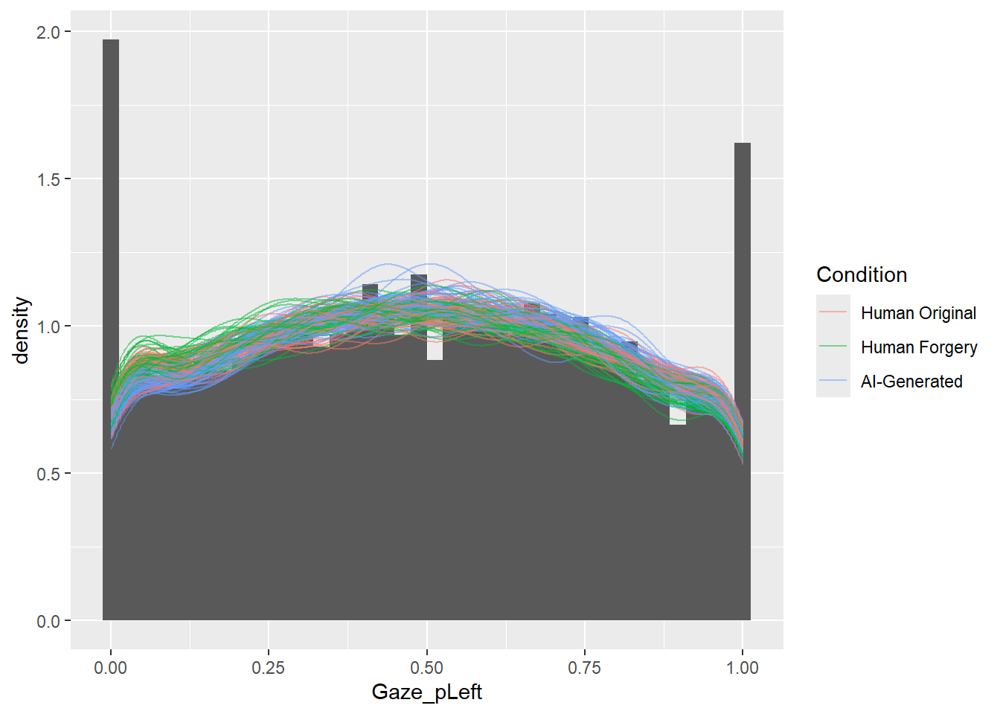{#fig-pleft fig-alt='Gaze laterality (proportion of samples on the left half of the image): observed distribution with posterior-predictive densities per label condition (50 draws each).' width=672}
:::
:::


### pCenter


::: {.cell}

```{.r .cell-code}
make_report(estimates$pCenter)
```

::: {.cell-output-display}

```{=html}
<div id="yzpfwbzrxx" style="padding-left:0px;padding-right:0px;padding-top:10px;padding-bottom:10px;overflow-x:auto;overflow-y:auto;width:auto;height:auto;">
<style>#yzpfwbzrxx table {
  font-family: system-ui, 'Segoe UI', Roboto, Helvetica, Arial, sans-serif, 'Apple Color Emoji', 'Segoe UI Emoji', 'Segoe UI Symbol', 'Noto Color Emoji';
  -webkit-font-smoothing: antialiased;
  -moz-osx-font-smoothing: grayscale;
}

#yzpfwbzrxx thead, #yzpfwbzrxx tbody, #yzpfwbzrxx tfoot, #yzpfwbzrxx tr, #yzpfwbzrxx td, #yzpfwbzrxx th {
  border-style: none;
}

#yzpfwbzrxx p {
  margin: 0;
  padding: 0;
}

#yzpfwbzrxx .gt_table {
  display: table;
  border-collapse: collapse;
  line-height: normal;
  margin-left: auto;
  margin-right: auto;
  color: #333333;
  font-size: 16px;
  font-weight: normal;
  font-style: normal;
  background-color: #FFFFFF;
  width: auto;
  border-top-style: solid;
  border-top-width: 2px;
  border-top-color: #A8A8A8;
  border-right-style: none;
  border-right-width: 2px;
  border-right-color: #D3D3D3;
  border-bottom-style: solid;
  border-bottom-width: 2px;
  border-bottom-color: #A8A8A8;
  border-left-style: none;
  border-left-width: 2px;
  border-left-color: #D3D3D3;
}

#yzpfwbzrxx .gt_caption {
  padding-top: 4px;
  padding-bottom: 4px;
}

#yzpfwbzrxx .gt_title {
  color: #333333;
  font-size: 125%;
  font-weight: initial;
  padding-top: 4px;
  padding-bottom: 4px;
  padding-left: 5px;
  padding-right: 5px;
  border-bottom-color: #FFFFFF;
  border-bottom-width: 0;
}

#yzpfwbzrxx .gt_subtitle {
  color: #333333;
  font-size: 85%;
  font-weight: initial;
  padding-top: 3px;
  padding-bottom: 5px;
  padding-left: 5px;
  padding-right: 5px;
  border-top-color: #FFFFFF;
  border-top-width: 0;
}

#yzpfwbzrxx .gt_heading {
  background-color: #FFFFFF;
  text-align: center;
  border-bottom-color: #FFFFFF;
  border-left-style: none;
  border-left-width: 1px;
  border-left-color: #D3D3D3;
  border-right-style: none;
  border-right-width: 1px;
  border-right-color: #D3D3D3;
}

#yzpfwbzrxx .gt_bottom_border {
  border-bottom-style: solid;
  border-bottom-width: 2px;
  border-bottom-color: #D3D3D3;
}

#yzpfwbzrxx .gt_col_headings {
  border-top-style: solid;
  border-top-width: 2px;
  border-top-color: #D3D3D3;
  border-bottom-style: solid;
  border-bottom-width: 2px;
  border-bottom-color: #D3D3D3;
  border-left-style: none;
  border-left-width: 1px;
  border-left-color: #D3D3D3;
  border-right-style: none;
  border-right-width: 1px;
  border-right-color: #D3D3D3;
}

#yzpfwbzrxx .gt_col_heading {
  color: #333333;
  background-color: #FFFFFF;
  font-size: 100%;
  font-weight: normal;
  text-transform: inherit;
  border-left-style: none;
  border-left-width: 1px;
  border-left-color: #D3D3D3;
  border-right-style: none;
  border-right-width: 1px;
  border-right-color: #D3D3D3;
  vertical-align: bottom;
  padding-top: 5px;
  padding-bottom: 6px;
  padding-left: 5px;
  padding-right: 5px;
  overflow-x: hidden;
}

#yzpfwbzrxx .gt_column_spanner_outer {
  color: #333333;
  background-color: #FFFFFF;
  font-size: 100%;
  font-weight: normal;
  text-transform: inherit;
  padding-top: 0;
  padding-bottom: 0;
  padding-left: 4px;
  padding-right: 4px;
}

#yzpfwbzrxx .gt_column_spanner_outer:first-child {
  padding-left: 0;
}

#yzpfwbzrxx .gt_column_spanner_outer:last-child {
  padding-right: 0;
}

#yzpfwbzrxx .gt_column_spanner {
  border-bottom-style: solid;
  border-bottom-width: 2px;
  border-bottom-color: #D3D3D3;
  vertical-align: bottom;
  padding-top: 5px;
  padding-bottom: 5px;
  overflow-x: hidden;
  display: inline-block;
  width: 100%;
}

#yzpfwbzrxx .gt_spanner_row {
  border-bottom-style: hidden;
}

#yzpfwbzrxx .gt_group_heading {
  padding-top: 8px;
  padding-bottom: 8px;
  padding-left: 5px;
  padding-right: 5px;
  color: #333333;
  background-color: #FFFFFF;
  font-size: 100%;
  font-weight: initial;
  text-transform: inherit;
  border-top-style: solid;
  border-top-width: 2px;
  border-top-color: #D3D3D3;
  border-bottom-style: solid;
  border-bottom-width: 2px;
  border-bottom-color: #D3D3D3;
  border-left-style: none;
  border-left-width: 1px;
  border-left-color: #D3D3D3;
  border-right-style: none;
  border-right-width: 1px;
  border-right-color: #D3D3D3;
  vertical-align: middle;
  text-align: left;
}

#yzpfwbzrxx .gt_empty_group_heading {
  padding: 0.5px;
  color: #333333;
  background-color: #FFFFFF;
  font-size: 100%;
  font-weight: initial;
  border-top-style: solid;
  border-top-width: 2px;
  border-top-color: #D3D3D3;
  border-bottom-style: solid;
  border-bottom-width: 2px;
  border-bottom-color: #D3D3D3;
  vertical-align: middle;
}

#yzpfwbzrxx .gt_from_md > :first-child {
  margin-top: 0;
}

#yzpfwbzrxx .gt_from_md > :last-child {
  margin-bottom: 0;
}

#yzpfwbzrxx .gt_row {
  padding-top: 8px;
  padding-bottom: 8px;
  padding-left: 5px;
  padding-right: 5px;
  margin: 10px;
  border-top-style: solid;
  border-top-width: 1px;
  border-top-color: #D3D3D3;
  border-left-style: none;
  border-left-width: 1px;
  border-left-color: #D3D3D3;
  border-right-style: none;
  border-right-width: 1px;
  border-right-color: #D3D3D3;
  vertical-align: middle;
  overflow-x: hidden;
}

#yzpfwbzrxx .gt_stub {
  color: #333333;
  background-color: #FFFFFF;
  font-size: 100%;
  font-weight: initial;
  text-transform: inherit;
  border-right-style: solid;
  border-right-width: 2px;
  border-right-color: #D3D3D3;
  padding-left: 5px;
  padding-right: 5px;
}

#yzpfwbzrxx .gt_stub_row_group {
  color: #333333;
  background-color: #FFFFFF;
  font-size: 100%;
  font-weight: initial;
  text-transform: inherit;
  border-right-style: solid;
  border-right-width: 2px;
  border-right-color: #D3D3D3;
  padding-left: 5px;
  padding-right: 5px;
  vertical-align: top;
}

#yzpfwbzrxx .gt_row_group_first td {
  border-top-width: 2px;
}

#yzpfwbzrxx .gt_row_group_first th {
  border-top-width: 2px;
}

#yzpfwbzrxx .gt_summary_row {
  color: #333333;
  background-color: #FFFFFF;
  text-transform: inherit;
  padding-top: 8px;
  padding-bottom: 8px;
  padding-left: 5px;
  padding-right: 5px;
}

#yzpfwbzrxx .gt_first_summary_row {
  border-top-style: solid;
  border-top-color: #D3D3D3;
}

#yzpfwbzrxx .gt_first_summary_row.thick {
  border-top-width: 2px;
}

#yzpfwbzrxx .gt_last_summary_row {
  padding-top: 8px;
  padding-bottom: 8px;
  padding-left: 5px;
  padding-right: 5px;
  border-bottom-style: solid;
  border-bottom-width: 2px;
  border-bottom-color: #D3D3D3;
}

#yzpfwbzrxx .gt_grand_summary_row {
  color: #333333;
  background-color: #FFFFFF;
  text-transform: inherit;
  padding-top: 8px;
  padding-bottom: 8px;
  padding-left: 5px;
  padding-right: 5px;
}

#yzpfwbzrxx .gt_first_grand_summary_row {
  padding-top: 8px;
  padding-bottom: 8px;
  padding-left: 5px;
  padding-right: 5px;
  border-top-style: double;
  border-top-width: 6px;
  border-top-color: #D3D3D3;
}

#yzpfwbzrxx .gt_last_grand_summary_row_top {
  padding-top: 8px;
  padding-bottom: 8px;
  padding-left: 5px;
  padding-right: 5px;
  border-bottom-style: double;
  border-bottom-width: 6px;
  border-bottom-color: #D3D3D3;
}

#yzpfwbzrxx .gt_striped {
  background-color: rgba(128, 128, 128, 0.05);
}

#yzpfwbzrxx .gt_table_body {
  border-top-style: solid;
  border-top-width: 2px;
  border-top-color: #D3D3D3;
  border-bottom-style: solid;
  border-bottom-width: 2px;
  border-bottom-color: #D3D3D3;
}

#yzpfwbzrxx .gt_footnotes {
  color: #333333;
  background-color: #FFFFFF;
  border-bottom-style: none;
  border-bottom-width: 2px;
  border-bottom-color: #D3D3D3;
  border-left-style: none;
  border-left-width: 2px;
  border-left-color: #D3D3D3;
  border-right-style: none;
  border-right-width: 2px;
  border-right-color: #D3D3D3;
}

#yzpfwbzrxx .gt_footnote {
  margin: 0px;
  font-size: 90%;
  padding-top: 4px;
  padding-bottom: 4px;
  padding-left: 5px;
  padding-right: 5px;
}

#yzpfwbzrxx .gt_sourcenotes {
  color: #333333;
  background-color: #FFFFFF;
  border-bottom-style: none;
  border-bottom-width: 2px;
  border-bottom-color: #D3D3D3;
  border-left-style: none;
  border-left-width: 2px;
  border-left-color: #D3D3D3;
  border-right-style: none;
  border-right-width: 2px;
  border-right-color: #D3D3D3;
}

#yzpfwbzrxx .gt_sourcenote {
  font-size: 90%;
  padding-top: 4px;
  padding-bottom: 4px;
  padding-left: 5px;
  padding-right: 5px;
}

#yzpfwbzrxx .gt_left {
  text-align: left;
}

#yzpfwbzrxx .gt_center {
  text-align: center;
}

#yzpfwbzrxx .gt_right {
  text-align: right;
  font-variant-numeric: tabular-nums;
}

#yzpfwbzrxx .gt_font_normal {
  font-weight: normal;
}

#yzpfwbzrxx .gt_font_bold {
  font-weight: bold;
}

#yzpfwbzrxx .gt_font_italic {
  font-style: italic;
}

#yzpfwbzrxx .gt_super {
  font-size: 65%;
}

#yzpfwbzrxx .gt_footnote_marks {
  font-size: 75%;
  vertical-align: 0.4em;
  position: initial;
}

#yzpfwbzrxx .gt_asterisk {
  font-size: 100%;
  vertical-align: 0;
}

#yzpfwbzrxx .gt_indent_1 {
  text-indent: 5px;
}

#yzpfwbzrxx .gt_indent_2 {
  text-indent: 10px;
}

#yzpfwbzrxx .gt_indent_3 {
  text-indent: 15px;
}

#yzpfwbzrxx .gt_indent_4 {
  text-indent: 20px;
}

#yzpfwbzrxx .gt_indent_5 {
  text-indent: 25px;
}

#yzpfwbzrxx .katex-display {
  display: inline-flex !important;
  margin-bottom: 0.75em !important;
}

#yzpfwbzrxx div.Reactable > div.rt-table > div.rt-thead > div.rt-tr.rt-tr-group-header > div.rt-th-group:after {
  height: 0px !important;
}
</style>
<table class="gt_table" data-quarto-disable-processing="false" data-quarto-bootstrap="false">
  <thead>
    <tr class="gt_col_headings">
      <th class="gt_col_heading gt_columns_bottom_border gt_left" rowspan="1" colspan="1" scope="col" id="Contrast">Contrast</th>
      <th class="gt_col_heading gt_columns_bottom_border gt_left" rowspan="1" colspan="1" scope="col" id="Parameters">Parameters</th>
    </tr>
  </thead>
  <tbody class="gt_table_body">
    <tr><td headers="Contrast" class="gt_row gt_left">Human Forgery - Human Original</td>
<td headers="Parameters" class="gt_row gt_left">phi (0.24, [0.02, 0.48])</td></tr>
  </tbody>
  
</table>
</div>
```

```{=html}
<div id="weeyftwanr" style="padding-left:0px;padding-right:0px;padding-top:10px;padding-bottom:10px;overflow-x:auto;overflow-y:auto;width:auto;height:auto;">
<style>#weeyftwanr table {
  font-family: system-ui, 'Segoe UI', Roboto, Helvetica, Arial, sans-serif, 'Apple Color Emoji', 'Segoe UI Emoji', 'Segoe UI Symbol', 'Noto Color Emoji';
  -webkit-font-smoothing: antialiased;
  -moz-osx-font-smoothing: grayscale;
}

#weeyftwanr thead, #weeyftwanr tbody, #weeyftwanr tfoot, #weeyftwanr tr, #weeyftwanr td, #weeyftwanr th {
  border-style: none;
}

#weeyftwanr p {
  margin: 0;
  padding: 0;
}

#weeyftwanr .gt_table {
  display: table;
  border-collapse: collapse;
  line-height: normal;
  margin-left: auto;
  margin-right: auto;
  color: #333333;
  font-size: 16px;
  font-weight: normal;
  font-style: normal;
  background-color: #FFFFFF;
  width: auto;
  border-top-style: solid;
  border-top-width: 2px;
  border-top-color: #A8A8A8;
  border-right-style: none;
  border-right-width: 2px;
  border-right-color: #D3D3D3;
  border-bottom-style: solid;
  border-bottom-width: 2px;
  border-bottom-color: #A8A8A8;
  border-left-style: none;
  border-left-width: 2px;
  border-left-color: #D3D3D3;
}

#weeyftwanr .gt_caption {
  padding-top: 4px;
  padding-bottom: 4px;
}

#weeyftwanr .gt_title {
  color: #333333;
  font-size: 125%;
  font-weight: initial;
  padding-top: 4px;
  padding-bottom: 4px;
  padding-left: 5px;
  padding-right: 5px;
  border-bottom-color: #FFFFFF;
  border-bottom-width: 0;
}

#weeyftwanr .gt_subtitle {
  color: #333333;
  font-size: 85%;
  font-weight: initial;
  padding-top: 3px;
  padding-bottom: 5px;
  padding-left: 5px;
  padding-right: 5px;
  border-top-color: #FFFFFF;
  border-top-width: 0;
}

#weeyftwanr .gt_heading {
  background-color: #FFFFFF;
  text-align: center;
  border-bottom-color: #FFFFFF;
  border-left-style: none;
  border-left-width: 1px;
  border-left-color: #D3D3D3;
  border-right-style: none;
  border-right-width: 1px;
  border-right-color: #D3D3D3;
}

#weeyftwanr .gt_bottom_border {
  border-bottom-style: solid;
  border-bottom-width: 2px;
  border-bottom-color: #D3D3D3;
}

#weeyftwanr .gt_col_headings {
  border-top-style: solid;
  border-top-width: 2px;
  border-top-color: #D3D3D3;
  border-bottom-style: solid;
  border-bottom-width: 2px;
  border-bottom-color: #D3D3D3;
  border-left-style: none;
  border-left-width: 1px;
  border-left-color: #D3D3D3;
  border-right-style: none;
  border-right-width: 1px;
  border-right-color: #D3D3D3;
}

#weeyftwanr .gt_col_heading {
  color: #333333;
  background-color: #FFFFFF;
  font-size: 100%;
  font-weight: normal;
  text-transform: inherit;
  border-left-style: none;
  border-left-width: 1px;
  border-left-color: #D3D3D3;
  border-right-style: none;
  border-right-width: 1px;
  border-right-color: #D3D3D3;
  vertical-align: bottom;
  padding-top: 5px;
  padding-bottom: 6px;
  padding-left: 5px;
  padding-right: 5px;
  overflow-x: hidden;
}

#weeyftwanr .gt_column_spanner_outer {
  color: #333333;
  background-color: #FFFFFF;
  font-size: 100%;
  font-weight: normal;
  text-transform: inherit;
  padding-top: 0;
  padding-bottom: 0;
  padding-left: 4px;
  padding-right: 4px;
}

#weeyftwanr .gt_column_spanner_outer:first-child {
  padding-left: 0;
}

#weeyftwanr .gt_column_spanner_outer:last-child {
  padding-right: 0;
}

#weeyftwanr .gt_column_spanner {
  border-bottom-style: solid;
  border-bottom-width: 2px;
  border-bottom-color: #D3D3D3;
  vertical-align: bottom;
  padding-top: 5px;
  padding-bottom: 5px;
  overflow-x: hidden;
  display: inline-block;
  width: 100%;
}

#weeyftwanr .gt_spanner_row {
  border-bottom-style: hidden;
}

#weeyftwanr .gt_group_heading {
  padding-top: 8px;
  padding-bottom: 8px;
  padding-left: 5px;
  padding-right: 5px;
  color: #333333;
  background-color: #FFFFFF;
  font-size: 100%;
  font-weight: initial;
  text-transform: inherit;
  border-top-style: solid;
  border-top-width: 2px;
  border-top-color: #D3D3D3;
  border-bottom-style: solid;
  border-bottom-width: 2px;
  border-bottom-color: #D3D3D3;
  border-left-style: none;
  border-left-width: 1px;
  border-left-color: #D3D3D3;
  border-right-style: none;
  border-right-width: 1px;
  border-right-color: #D3D3D3;
  vertical-align: middle;
  text-align: left;
}

#weeyftwanr .gt_empty_group_heading {
  padding: 0.5px;
  color: #333333;
  background-color: #FFFFFF;
  font-size: 100%;
  font-weight: initial;
  border-top-style: solid;
  border-top-width: 2px;
  border-top-color: #D3D3D3;
  border-bottom-style: solid;
  border-bottom-width: 2px;
  border-bottom-color: #D3D3D3;
  vertical-align: middle;
}

#weeyftwanr .gt_from_md > :first-child {
  margin-top: 0;
}

#weeyftwanr .gt_from_md > :last-child {
  margin-bottom: 0;
}

#weeyftwanr .gt_row {
  padding-top: 8px;
  padding-bottom: 8px;
  padding-left: 5px;
  padding-right: 5px;
  margin: 10px;
  border-top-style: solid;
  border-top-width: 1px;
  border-top-color: #D3D3D3;
  border-left-style: none;
  border-left-width: 1px;
  border-left-color: #D3D3D3;
  border-right-style: none;
  border-right-width: 1px;
  border-right-color: #D3D3D3;
  vertical-align: middle;
  overflow-x: hidden;
}

#weeyftwanr .gt_stub {
  color: #333333;
  background-color: #FFFFFF;
  font-size: 100%;
  font-weight: initial;
  text-transform: inherit;
  border-right-style: solid;
  border-right-width: 2px;
  border-right-color: #D3D3D3;
  padding-left: 5px;
  padding-right: 5px;
}

#weeyftwanr .gt_stub_row_group {
  color: #333333;
  background-color: #FFFFFF;
  font-size: 100%;
  font-weight: initial;
  text-transform: inherit;
  border-right-style: solid;
  border-right-width: 2px;
  border-right-color: #D3D3D3;
  padding-left: 5px;
  padding-right: 5px;
  vertical-align: top;
}

#weeyftwanr .gt_row_group_first td {
  border-top-width: 2px;
}

#weeyftwanr .gt_row_group_first th {
  border-top-width: 2px;
}

#weeyftwanr .gt_summary_row {
  color: #333333;
  background-color: #FFFFFF;
  text-transform: inherit;
  padding-top: 8px;
  padding-bottom: 8px;
  padding-left: 5px;
  padding-right: 5px;
}

#weeyftwanr .gt_first_summary_row {
  border-top-style: solid;
  border-top-color: #D3D3D3;
}

#weeyftwanr .gt_first_summary_row.thick {
  border-top-width: 2px;
}

#weeyftwanr .gt_last_summary_row {
  padding-top: 8px;
  padding-bottom: 8px;
  padding-left: 5px;
  padding-right: 5px;
  border-bottom-style: solid;
  border-bottom-width: 2px;
  border-bottom-color: #D3D3D3;
}

#weeyftwanr .gt_grand_summary_row {
  color: #333333;
  background-color: #FFFFFF;
  text-transform: inherit;
  padding-top: 8px;
  padding-bottom: 8px;
  padding-left: 5px;
  padding-right: 5px;
}

#weeyftwanr .gt_first_grand_summary_row {
  padding-top: 8px;
  padding-bottom: 8px;
  padding-left: 5px;
  padding-right: 5px;
  border-top-style: double;
  border-top-width: 6px;
  border-top-color: #D3D3D3;
}

#weeyftwanr .gt_last_grand_summary_row_top {
  padding-top: 8px;
  padding-bottom: 8px;
  padding-left: 5px;
  padding-right: 5px;
  border-bottom-style: double;
  border-bottom-width: 6px;
  border-bottom-color: #D3D3D3;
}

#weeyftwanr .gt_striped {
  background-color: rgba(128, 128, 128, 0.05);
}

#weeyftwanr .gt_table_body {
  border-top-style: solid;
  border-top-width: 2px;
  border-top-color: #D3D3D3;
  border-bottom-style: solid;
  border-bottom-width: 2px;
  border-bottom-color: #D3D3D3;
}

#weeyftwanr .gt_footnotes {
  color: #333333;
  background-color: #FFFFFF;
  border-bottom-style: none;
  border-bottom-width: 2px;
  border-bottom-color: #D3D3D3;
  border-left-style: none;
  border-left-width: 2px;
  border-left-color: #D3D3D3;
  border-right-style: none;
  border-right-width: 2px;
  border-right-color: #D3D3D3;
}

#weeyftwanr .gt_footnote {
  margin: 0px;
  font-size: 90%;
  padding-top: 4px;
  padding-bottom: 4px;
  padding-left: 5px;
  padding-right: 5px;
}

#weeyftwanr .gt_sourcenotes {
  color: #333333;
  background-color: #FFFFFF;
  border-bottom-style: none;
  border-bottom-width: 2px;
  border-bottom-color: #D3D3D3;
  border-left-style: none;
  border-left-width: 2px;
  border-left-color: #D3D3D3;
  border-right-style: none;
  border-right-width: 2px;
  border-right-color: #D3D3D3;
}

#weeyftwanr .gt_sourcenote {
  font-size: 90%;
  padding-top: 4px;
  padding-bottom: 4px;
  padding-left: 5px;
  padding-right: 5px;
}

#weeyftwanr .gt_left {
  text-align: left;
}

#weeyftwanr .gt_center {
  text-align: center;
}

#weeyftwanr .gt_right {
  text-align: right;
  font-variant-numeric: tabular-nums;
}

#weeyftwanr .gt_font_normal {
  font-weight: normal;
}

#weeyftwanr .gt_font_bold {
  font-weight: bold;
}

#weeyftwanr .gt_font_italic {
  font-style: italic;
}

#weeyftwanr .gt_super {
  font-size: 65%;
}

#weeyftwanr .gt_footnote_marks {
  font-size: 75%;
  vertical-align: 0.4em;
  position: initial;
}

#weeyftwanr .gt_asterisk {
  font-size: 100%;
  vertical-align: 0;
}

#weeyftwanr .gt_indent_1 {
  text-indent: 5px;
}

#weeyftwanr .gt_indent_2 {
  text-indent: 10px;
}

#weeyftwanr .gt_indent_3 {
  text-indent: 15px;
}

#weeyftwanr .gt_indent_4 {
  text-indent: 20px;
}

#weeyftwanr .gt_indent_5 {
  text-indent: 25px;
}

#weeyftwanr .katex-display {
  display: inline-flex !important;
  margin-bottom: 0.75em !important;
}

#weeyftwanr div.Reactable > div.rt-table > div.rt-thead > div.rt-tr.rt-tr-group-header > div.rt-th-group:after {
  height: 0px !important;
}
</style>
<table class="gt_table" data-quarto-disable-processing="false" data-quarto-bootstrap="false">
  <thead>
    <tr class="gt_col_headings">
      <th class="gt_col_heading gt_columns_bottom_border gt_left" rowspan="1" colspan="1" scope="col" id="Contrast">Contrast</th>
      <th class="gt_col_heading gt_columns_bottom_border gt_left" rowspan="1" colspan="1" scope="col" id="Parameters">Parameters</th>
    </tr>
  </thead>
  <tbody class="gt_table_body">
    <tr><td headers="Contrast" class="gt_row gt_left">Negative - Low intensity - Positive - Low intensity</td>
<td headers="Parameters" class="gt_row gt_left">None</td></tr>
    <tr><td headers="Contrast" class="gt_row gt_left">Positive - High intensity - Positive - Low intensity</td>
<td headers="Parameters" class="gt_row gt_left">None</td></tr>
    <tr><td headers="Contrast" class="gt_row gt_left">Positive - High intensity - Negative - Low intensity</td>
<td headers="Parameters" class="gt_row gt_left">None</td></tr>
    <tr><td headers="Contrast" class="gt_row gt_left">Negative - High intensity - Positive - Low intensity</td>
<td headers="Parameters" class="gt_row gt_left">None</td></tr>
    <tr><td headers="Contrast" class="gt_row gt_left">Negative - High intensity - Negative - Low intensity</td>
<td headers="Parameters" class="gt_row gt_left">None</td></tr>
    <tr><td headers="Contrast" class="gt_row gt_left">Negative - High intensity - Positive - High intensity</td>
<td headers="Parameters" class="gt_row gt_left">None</td></tr>
  </tbody>
  
</table>
</div>
```

```{=html}
<div id="afweoyggqn" style="padding-left:0px;padding-right:0px;padding-top:10px;padding-bottom:10px;overflow-x:auto;overflow-y:auto;width:auto;height:auto;">
<style>#afweoyggqn table {
  font-family: system-ui, 'Segoe UI', Roboto, Helvetica, Arial, sans-serif, 'Apple Color Emoji', 'Segoe UI Emoji', 'Segoe UI Symbol', 'Noto Color Emoji';
  -webkit-font-smoothing: antialiased;
  -moz-osx-font-smoothing: grayscale;
}

#afweoyggqn thead, #afweoyggqn tbody, #afweoyggqn tfoot, #afweoyggqn tr, #afweoyggqn td, #afweoyggqn th {
  border-style: none;
}

#afweoyggqn p {
  margin: 0;
  padding: 0;
}

#afweoyggqn .gt_table {
  display: table;
  border-collapse: collapse;
  line-height: normal;
  margin-left: auto;
  margin-right: auto;
  color: #333333;
  font-size: 13px;
  font-weight: normal;
  font-style: normal;
  background-color: #FFFFFF;
  width: auto;
  border-top-style: solid;
  border-top-width: 3px;
  border-top-color: #D5D5D5;
  border-right-style: solid;
  border-right-width: 3px;
  border-right-color: #D5D5D5;
  border-bottom-style: solid;
  border-bottom-width: 3px;
  border-bottom-color: #D5D5D5;
  border-left-style: solid;
  border-left-width: 3px;
  border-left-color: #D5D5D5;
}

#afweoyggqn .gt_caption {
  padding-top: 4px;
  padding-bottom: 4px;
}

#afweoyggqn .gt_title {
  color: #333333;
  font-size: 125%;
  font-weight: initial;
  padding-top: 4px;
  padding-bottom: 4px;
  padding-left: 5px;
  padding-right: 5px;
  border-bottom-color: #FFFFFF;
  border-bottom-width: 0;
}

#afweoyggqn .gt_subtitle {
  color: #333333;
  font-size: 85%;
  font-weight: initial;
  padding-top: 3px;
  padding-bottom: 5px;
  padding-left: 5px;
  padding-right: 5px;
  border-top-color: #FFFFFF;
  border-top-width: 0;
}

#afweoyggqn .gt_heading {
  background-color: #FFFFFF;
  text-align: left;
  border-bottom-color: #FFFFFF;
  border-left-style: none;
  border-left-width: 1px;
  border-left-color: #D3D3D3;
  border-right-style: none;
  border-right-width: 1px;
  border-right-color: #D3D3D3;
}

#afweoyggqn .gt_bottom_border {
  border-bottom-style: solid;
  border-bottom-width: 2px;
  border-bottom-color: #D5D5D5;
}

#afweoyggqn .gt_col_headings {
  border-top-style: solid;
  border-top-width: 2px;
  border-top-color: #D5D5D5;
  border-bottom-style: solid;
  border-bottom-width: 2px;
  border-bottom-color: #D5D5D5;
  border-left-style: none;
  border-left-width: 1px;
  border-left-color: #D3D3D3;
  border-right-style: none;
  border-right-width: 1px;
  border-right-color: #D3D3D3;
}

#afweoyggqn .gt_col_heading {
  color: #FFFFFF;
  background-color: #000000;
  font-size: 100%;
  font-weight: normal;
  text-transform: inherit;
  border-left-style: none;
  border-left-width: 1px;
  border-left-color: #D3D3D3;
  border-right-style: none;
  border-right-width: 1px;
  border-right-color: #D3D3D3;
  vertical-align: bottom;
  padding-top: 5px;
  padding-bottom: 6px;
  padding-left: 5px;
  padding-right: 5px;
  overflow-x: hidden;
}

#afweoyggqn .gt_column_spanner_outer {
  color: #FFFFFF;
  background-color: #000000;
  font-size: 100%;
  font-weight: normal;
  text-transform: inherit;
  padding-top: 0;
  padding-bottom: 0;
  padding-left: 4px;
  padding-right: 4px;
}

#afweoyggqn .gt_column_spanner_outer:first-child {
  padding-left: 0;
}

#afweoyggqn .gt_column_spanner_outer:last-child {
  padding-right: 0;
}

#afweoyggqn .gt_column_spanner {
  border-bottom-style: solid;
  border-bottom-width: 2px;
  border-bottom-color: #D5D5D5;
  vertical-align: bottom;
  padding-top: 5px;
  padding-bottom: 5px;
  overflow-x: hidden;
  display: inline-block;
  width: 100%;
}

#afweoyggqn .gt_spanner_row {
  border-bottom-style: hidden;
}

#afweoyggqn .gt_group_heading {
  padding-top: 8px;
  padding-bottom: 8px;
  padding-left: 5px;
  padding-right: 5px;
  color: #333333;
  background-color: #FFFFFF;
  font-size: 100%;
  font-weight: initial;
  text-transform: inherit;
  border-top-style: solid;
  border-top-width: 2px;
  border-top-color: #D5D5D5;
  border-bottom-style: solid;
  border-bottom-width: 2px;
  border-bottom-color: #D5D5D5;
  border-left-style: none;
  border-left-width: 1px;
  border-left-color: #D3D3D3;
  border-right-style: none;
  border-right-width: 1px;
  border-right-color: #D3D3D3;
  vertical-align: middle;
  text-align: left;
}

#afweoyggqn .gt_empty_group_heading {
  padding: 0.5px;
  color: #333333;
  background-color: #FFFFFF;
  font-size: 100%;
  font-weight: initial;
  border-top-style: solid;
  border-top-width: 2px;
  border-top-color: #D5D5D5;
  border-bottom-style: solid;
  border-bottom-width: 2px;
  border-bottom-color: #D5D5D5;
  vertical-align: middle;
}

#afweoyggqn .gt_from_md > :first-child {
  margin-top: 0;
}

#afweoyggqn .gt_from_md > :last-child {
  margin-bottom: 0;
}

#afweoyggqn .gt_row {
  padding-top: 8px;
  padding-bottom: 8px;
  padding-left: 5px;
  padding-right: 5px;
  margin: 10px;
  border-top-style: solid;
  border-top-width: 1px;
  border-top-color: #D5D5D5;
  border-left-style: solid;
  border-left-width: 1px;
  border-left-color: #D5D5D5;
  border-right-style: solid;
  border-right-width: 1px;
  border-right-color: #D5D5D5;
  vertical-align: middle;
  overflow-x: hidden;
}

#afweoyggqn .gt_stub {
  color: #333333;
  background-color: #FFFFFF;
  font-size: 100%;
  font-weight: initial;
  text-transform: inherit;
  border-right-style: solid;
  border-right-width: 2px;
  border-right-color: #5F5F5F;
  padding-left: 5px;
  padding-right: 5px;
}

#afweoyggqn .gt_stub_row_group {
  color: #333333;
  background-color: #FFFFFF;
  font-size: 100%;
  font-weight: initial;
  text-transform: inherit;
  border-right-style: solid;
  border-right-width: 2px;
  border-right-color: #D3D3D3;
  padding-left: 5px;
  padding-right: 5px;
  vertical-align: top;
}

#afweoyggqn .gt_row_group_first td {
  border-top-width: 2px;
}

#afweoyggqn .gt_row_group_first th {
  border-top-width: 2px;
}

#afweoyggqn .gt_summary_row {
  color: #333333;
  background-color: #D5D5D5;
  text-transform: inherit;
  padding-top: 8px;
  padding-bottom: 8px;
  padding-left: 5px;
  padding-right: 5px;
}

#afweoyggqn .gt_first_summary_row {
  border-top-style: solid;
  border-top-color: #D5D5D5;
}

#afweoyggqn .gt_first_summary_row.thick {
  border-top-width: 2px;
}

#afweoyggqn .gt_last_summary_row {
  padding-top: 8px;
  padding-bottom: 8px;
  padding-left: 5px;
  padding-right: 5px;
  border-bottom-style: solid;
  border-bottom-width: 2px;
  border-bottom-color: #D5D5D5;
}

#afweoyggqn .gt_grand_summary_row {
  color: #FFFFFF;
  background-color: #929292;
  text-transform: inherit;
  padding-top: 8px;
  padding-bottom: 8px;
  padding-left: 5px;
  padding-right: 5px;
}

#afweoyggqn .gt_first_grand_summary_row {
  padding-top: 8px;
  padding-bottom: 8px;
  padding-left: 5px;
  padding-right: 5px;
  border-top-style: double;
  border-top-width: 6px;
  border-top-color: #D5D5D5;
}

#afweoyggqn .gt_last_grand_summary_row_top {
  padding-top: 8px;
  padding-bottom: 8px;
  padding-left: 5px;
  padding-right: 5px;
  border-bottom-style: double;
  border-bottom-width: 6px;
  border-bottom-color: #D5D5D5;
}

#afweoyggqn .gt_striped {
  background-color: #F4F4F4;
}

#afweoyggqn .gt_table_body {
  border-top-style: solid;
  border-top-width: 2px;
  border-top-color: #D5D5D5;
  border-bottom-style: solid;
  border-bottom-width: 2px;
  border-bottom-color: #D5D5D5;
}

#afweoyggqn .gt_footnotes {
  color: #333333;
  background-color: #FFFFFF;
  border-bottom-style: none;
  border-bottom-width: 2px;
  border-bottom-color: #D3D3D3;
  border-left-style: none;
  border-left-width: 2px;
  border-left-color: #D3D3D3;
  border-right-style: none;
  border-right-width: 2px;
  border-right-color: #D3D3D3;
}

#afweoyggqn .gt_footnote {
  margin: 0px;
  font-size: 90%;
  padding-top: 4px;
  padding-bottom: 4px;
  padding-left: 5px;
  padding-right: 5px;
}

#afweoyggqn .gt_sourcenotes {
  color: #333333;
  background-color: #FFFFFF;
  border-bottom-style: none;
  border-bottom-width: 2px;
  border-bottom-color: #D3D3D3;
  border-left-style: none;
  border-left-width: 2px;
  border-left-color: #D3D3D3;
  border-right-style: none;
  border-right-width: 2px;
  border-right-color: #D3D3D3;
}

#afweoyggqn .gt_sourcenote {
  font-size: 90%;
  padding-top: 4px;
  padding-bottom: 4px;
  padding-left: 5px;
  padding-right: 5px;
}

#afweoyggqn .gt_left {
  text-align: left;
}

#afweoyggqn .gt_center {
  text-align: center;
}

#afweoyggqn .gt_right {
  text-align: right;
  font-variant-numeric: tabular-nums;
}

#afweoyggqn .gt_font_normal {
  font-weight: normal;
}

#afweoyggqn .gt_font_bold {
  font-weight: bold;
}

#afweoyggqn .gt_font_italic {
  font-style: italic;
}

#afweoyggqn .gt_super {
  font-size: 65%;
}

#afweoyggqn .gt_footnote_marks {
  font-size: 75%;
  vertical-align: 0.4em;
  position: initial;
}

#afweoyggqn .gt_asterisk {
  font-size: 100%;
  vertical-align: 0;
}

#afweoyggqn .gt_indent_1 {
  text-indent: 5px;
}

#afweoyggqn .gt_indent_2 {
  text-indent: 10px;
}

#afweoyggqn .gt_indent_3 {
  text-indent: 15px;
}

#afweoyggqn .gt_indent_4 {
  text-indent: 20px;
}

#afweoyggqn .gt_indent_5 {
  text-indent: 25px;
}

#afweoyggqn .katex-display {
  display: inline-flex !important;
  margin-bottom: 0.75em !important;
}

#afweoyggqn div.Reactable > div.rt-table > div.rt-thead > div.rt-tr.rt-tr-group-header > div.rt-th-group:after {
  height: 0px !important;
}
</style>
<table class="gt_table" data-quarto-disable-processing="false" data-quarto-bootstrap="false">
  <thead>
    <tr class="gt_heading">
      <td colspan="10" class="gt_heading gt_title gt_font_normal gt_bottom_border" style>Gaze Centeredness (pCenter): convergence</td>
    </tr>
    
    <tr class="gt_col_headings">
      <th class="gt_col_heading gt_columns_bottom_border gt_left" rowspan="1" colspan="1" scope="col" id="Model">Model</th>
      <th class="gt_col_heading gt_columns_bottom_border gt_left" rowspan="1" colspan="1" scope="col" id="Family">Family</th>
      <th class="gt_col_heading gt_columns_bottom_border gt_right" rowspan="1" colspan="1" scope="col" id="N_obs">N_obs</th>
      <th class="gt_col_heading gt_columns_bottom_border gt_right" rowspan="1" colspan="1" scope="col" id="N_participants">N_participants</th>
      <th class="gt_col_heading gt_columns_bottom_border gt_right" rowspan="1" colspan="1" scope="col" id="Chains">Chains</th>
      <th class="gt_col_heading gt_columns_bottom_border gt_right" rowspan="1" colspan="1" scope="col" id="Draws">Draws</th>
      <th class="gt_col_heading gt_columns_bottom_border gt_right" rowspan="1" colspan="1" scope="col" id="Max_Rhat">Max_Rhat</th>
      <th class="gt_col_heading gt_columns_bottom_border gt_right" rowspan="1" colspan="1" scope="col" id="Min_ESS_ratio">Min_ESS_ratio</th>
      <th class="gt_col_heading gt_columns_bottom_border gt_right" rowspan="1" colspan="1" scope="col" id="Divergent_pct">Divergent_pct</th>
      <th class="gt_col_heading gt_columns_bottom_border gt_left" rowspan="1" colspan="1" scope="col" id="Criterion">Criterion</th>
    </tr>
  </thead>
  <tbody class="gt_table_body">
    <tr><td headers="Model" class="gt_row gt_left">pCenter</td>
<td headers="Family" class="gt_row gt_left">Zero-one-inflated Beta</td>
<td headers="N_obs" class="gt_row gt_right">12220</td>
<td headers="N_participants" class="gt_row gt_right">274</td>
<td headers="Chains" class="gt_row gt_right">8</td>
<td headers="Draws" class="gt_row gt_right">4000</td>
<td headers="Max_Rhat" class="gt_row gt_right">1.037</td>
<td headers="Min_ESS_ratio" class="gt_row gt_right">0.057</td>
<td headers="Divergent_pct" class="gt_row gt_right">0</td>
<td headers="Criterion" class="gt_row gt_left">loo</td></tr>
  </tbody>
  
</table>
</div>
```


::: {.callout-note collapse="true" title="Gaze Centeredness (pCenter): convergence (Markdown table, for text readers)"}

|Model   |Family                 | N_obs| N_participants| Chains| Draws| Max_Rhat| Min_ESS_ratio| Divergent_pct|Criterion |
|:-------|:----------------------|-----:|--------------:|------:|-----:|--------:|-------------:|-------------:|:---------|
|pCenter |Zero-one-inflated Beta | 12220|            274|      8|  4000|    1.037|         0.057|             0|loo       |

:::

```{=html}
<div id="avfqgxjcpq" style="padding-left:0px;padding-right:0px;padding-top:10px;padding-bottom:10px;overflow-x:auto;overflow-y:auto;width:auto;height:auto;">
<style>#avfqgxjcpq table {
  font-family: system-ui, 'Segoe UI', Roboto, Helvetica, Arial, sans-serif, 'Apple Color Emoji', 'Segoe UI Emoji', 'Segoe UI Symbol', 'Noto Color Emoji';
  -webkit-font-smoothing: antialiased;
  -moz-osx-font-smoothing: grayscale;
}

#avfqgxjcpq thead, #avfqgxjcpq tbody, #avfqgxjcpq tfoot, #avfqgxjcpq tr, #avfqgxjcpq td, #avfqgxjcpq th {
  border-style: none;
}

#avfqgxjcpq p {
  margin: 0;
  padding: 0;
}

#avfqgxjcpq .gt_table {
  display: table;
  border-collapse: collapse;
  line-height: normal;
  margin-left: auto;
  margin-right: auto;
  color: #333333;
  font-size: 13px;
  font-weight: normal;
  font-style: normal;
  background-color: #FFFFFF;
  width: auto;
  border-top-style: solid;
  border-top-width: 3px;
  border-top-color: #D5D5D5;
  border-right-style: solid;
  border-right-width: 3px;
  border-right-color: #D5D5D5;
  border-bottom-style: solid;
  border-bottom-width: 3px;
  border-bottom-color: #D5D5D5;
  border-left-style: solid;
  border-left-width: 3px;
  border-left-color: #D5D5D5;
}

#avfqgxjcpq .gt_caption {
  padding-top: 4px;
  padding-bottom: 4px;
}

#avfqgxjcpq .gt_title {
  color: #333333;
  font-size: 125%;
  font-weight: initial;
  padding-top: 4px;
  padding-bottom: 4px;
  padding-left: 5px;
  padding-right: 5px;
  border-bottom-color: #FFFFFF;
  border-bottom-width: 0;
}

#avfqgxjcpq .gt_subtitle {
  color: #333333;
  font-size: 85%;
  font-weight: initial;
  padding-top: 3px;
  padding-bottom: 5px;
  padding-left: 5px;
  padding-right: 5px;
  border-top-color: #FFFFFF;
  border-top-width: 0;
}

#avfqgxjcpq .gt_heading {
  background-color: #FFFFFF;
  text-align: left;
  border-bottom-color: #FFFFFF;
  border-left-style: none;
  border-left-width: 1px;
  border-left-color: #D3D3D3;
  border-right-style: none;
  border-right-width: 1px;
  border-right-color: #D3D3D3;
}

#avfqgxjcpq .gt_bottom_border {
  border-bottom-style: solid;
  border-bottom-width: 2px;
  border-bottom-color: #D5D5D5;
}

#avfqgxjcpq .gt_col_headings {
  border-top-style: solid;
  border-top-width: 2px;
  border-top-color: #D5D5D5;
  border-bottom-style: solid;
  border-bottom-width: 2px;
  border-bottom-color: #D5D5D5;
  border-left-style: none;
  border-left-width: 1px;
  border-left-color: #D3D3D3;
  border-right-style: none;
  border-right-width: 1px;
  border-right-color: #D3D3D3;
}

#avfqgxjcpq .gt_col_heading {
  color: #FFFFFF;
  background-color: #000000;
  font-size: 100%;
  font-weight: normal;
  text-transform: inherit;
  border-left-style: none;
  border-left-width: 1px;
  border-left-color: #D3D3D3;
  border-right-style: none;
  border-right-width: 1px;
  border-right-color: #D3D3D3;
  vertical-align: bottom;
  padding-top: 5px;
  padding-bottom: 6px;
  padding-left: 5px;
  padding-right: 5px;
  overflow-x: hidden;
}

#avfqgxjcpq .gt_column_spanner_outer {
  color: #FFFFFF;
  background-color: #000000;
  font-size: 100%;
  font-weight: normal;
  text-transform: inherit;
  padding-top: 0;
  padding-bottom: 0;
  padding-left: 4px;
  padding-right: 4px;
}

#avfqgxjcpq .gt_column_spanner_outer:first-child {
  padding-left: 0;
}

#avfqgxjcpq .gt_column_spanner_outer:last-child {
  padding-right: 0;
}

#avfqgxjcpq .gt_column_spanner {
  border-bottom-style: solid;
  border-bottom-width: 2px;
  border-bottom-color: #D5D5D5;
  vertical-align: bottom;
  padding-top: 5px;
  padding-bottom: 5px;
  overflow-x: hidden;
  display: inline-block;
  width: 100%;
}

#avfqgxjcpq .gt_spanner_row {
  border-bottom-style: hidden;
}

#avfqgxjcpq .gt_group_heading {
  padding-top: 8px;
  padding-bottom: 8px;
  padding-left: 5px;
  padding-right: 5px;
  color: #333333;
  background-color: #FFFFFF;
  font-size: 100%;
  font-weight: initial;
  text-transform: inherit;
  border-top-style: solid;
  border-top-width: 2px;
  border-top-color: #D5D5D5;
  border-bottom-style: solid;
  border-bottom-width: 2px;
  border-bottom-color: #D5D5D5;
  border-left-style: none;
  border-left-width: 1px;
  border-left-color: #D3D3D3;
  border-right-style: none;
  border-right-width: 1px;
  border-right-color: #D3D3D3;
  vertical-align: middle;
  text-align: left;
}

#avfqgxjcpq .gt_empty_group_heading {
  padding: 0.5px;
  color: #333333;
  background-color: #FFFFFF;
  font-size: 100%;
  font-weight: initial;
  border-top-style: solid;
  border-top-width: 2px;
  border-top-color: #D5D5D5;
  border-bottom-style: solid;
  border-bottom-width: 2px;
  border-bottom-color: #D5D5D5;
  vertical-align: middle;
}

#avfqgxjcpq .gt_from_md > :first-child {
  margin-top: 0;
}

#avfqgxjcpq .gt_from_md > :last-child {
  margin-bottom: 0;
}

#avfqgxjcpq .gt_row {
  padding-top: 8px;
  padding-bottom: 8px;
  padding-left: 5px;
  padding-right: 5px;
  margin: 10px;
  border-top-style: solid;
  border-top-width: 1px;
  border-top-color: #D5D5D5;
  border-left-style: solid;
  border-left-width: 1px;
  border-left-color: #D5D5D5;
  border-right-style: solid;
  border-right-width: 1px;
  border-right-color: #D5D5D5;
  vertical-align: middle;
  overflow-x: hidden;
}

#avfqgxjcpq .gt_stub {
  color: #333333;
  background-color: #FFFFFF;
  font-size: 100%;
  font-weight: initial;
  text-transform: inherit;
  border-right-style: solid;
  border-right-width: 2px;
  border-right-color: #5F5F5F;
  padding-left: 5px;
  padding-right: 5px;
}

#avfqgxjcpq .gt_stub_row_group {
  color: #333333;
  background-color: #FFFFFF;
  font-size: 100%;
  font-weight: initial;
  text-transform: inherit;
  border-right-style: solid;
  border-right-width: 2px;
  border-right-color: #D3D3D3;
  padding-left: 5px;
  padding-right: 5px;
  vertical-align: top;
}

#avfqgxjcpq .gt_row_group_first td {
  border-top-width: 2px;
}

#avfqgxjcpq .gt_row_group_first th {
  border-top-width: 2px;
}

#avfqgxjcpq .gt_summary_row {
  color: #333333;
  background-color: #D5D5D5;
  text-transform: inherit;
  padding-top: 8px;
  padding-bottom: 8px;
  padding-left: 5px;
  padding-right: 5px;
}

#avfqgxjcpq .gt_first_summary_row {
  border-top-style: solid;
  border-top-color: #D5D5D5;
}

#avfqgxjcpq .gt_first_summary_row.thick {
  border-top-width: 2px;
}

#avfqgxjcpq .gt_last_summary_row {
  padding-top: 8px;
  padding-bottom: 8px;
  padding-left: 5px;
  padding-right: 5px;
  border-bottom-style: solid;
  border-bottom-width: 2px;
  border-bottom-color: #D5D5D5;
}

#avfqgxjcpq .gt_grand_summary_row {
  color: #FFFFFF;
  background-color: #929292;
  text-transform: inherit;
  padding-top: 8px;
  padding-bottom: 8px;
  padding-left: 5px;
  padding-right: 5px;
}

#avfqgxjcpq .gt_first_grand_summary_row {
  padding-top: 8px;
  padding-bottom: 8px;
  padding-left: 5px;
  padding-right: 5px;
  border-top-style: double;
  border-top-width: 6px;
  border-top-color: #D5D5D5;
}

#avfqgxjcpq .gt_last_grand_summary_row_top {
  padding-top: 8px;
  padding-bottom: 8px;
  padding-left: 5px;
  padding-right: 5px;
  border-bottom-style: double;
  border-bottom-width: 6px;
  border-bottom-color: #D5D5D5;
}

#avfqgxjcpq .gt_striped {
  background-color: #F4F4F4;
}

#avfqgxjcpq .gt_table_body {
  border-top-style: solid;
  border-top-width: 2px;
  border-top-color: #D5D5D5;
  border-bottom-style: solid;
  border-bottom-width: 2px;
  border-bottom-color: #D5D5D5;
}

#avfqgxjcpq .gt_footnotes {
  color: #333333;
  background-color: #FFFFFF;
  border-bottom-style: none;
  border-bottom-width: 2px;
  border-bottom-color: #D3D3D3;
  border-left-style: none;
  border-left-width: 2px;
  border-left-color: #D3D3D3;
  border-right-style: none;
  border-right-width: 2px;
  border-right-color: #D3D3D3;
}

#avfqgxjcpq .gt_footnote {
  margin: 0px;
  font-size: 90%;
  padding-top: 4px;
  padding-bottom: 4px;
  padding-left: 5px;
  padding-right: 5px;
}

#avfqgxjcpq .gt_sourcenotes {
  color: #333333;
  background-color: #FFFFFF;
  border-bottom-style: none;
  border-bottom-width: 2px;
  border-bottom-color: #D3D3D3;
  border-left-style: none;
  border-left-width: 2px;
  border-left-color: #D3D3D3;
  border-right-style: none;
  border-right-width: 2px;
  border-right-color: #D3D3D3;
}

#avfqgxjcpq .gt_sourcenote {
  font-size: 90%;
  padding-top: 4px;
  padding-bottom: 4px;
  padding-left: 5px;
  padding-right: 5px;
}

#avfqgxjcpq .gt_left {
  text-align: left;
}

#avfqgxjcpq .gt_center {
  text-align: center;
}

#avfqgxjcpq .gt_right {
  text-align: right;
  font-variant-numeric: tabular-nums;
}

#avfqgxjcpq .gt_font_normal {
  font-weight: normal;
}

#avfqgxjcpq .gt_font_bold {
  font-weight: bold;
}

#avfqgxjcpq .gt_font_italic {
  font-style: italic;
}

#avfqgxjcpq .gt_super {
  font-size: 65%;
}

#avfqgxjcpq .gt_footnote_marks {
  font-size: 75%;
  vertical-align: 0.4em;
  position: initial;
}

#avfqgxjcpq .gt_asterisk {
  font-size: 100%;
  vertical-align: 0;
}

#avfqgxjcpq .gt_indent_1 {
  text-indent: 5px;
}

#avfqgxjcpq .gt_indent_2 {
  text-indent: 10px;
}

#avfqgxjcpq .gt_indent_3 {
  text-indent: 15px;
}

#avfqgxjcpq .gt_indent_4 {
  text-indent: 20px;
}

#avfqgxjcpq .gt_indent_5 {
  text-indent: 25px;
}

#avfqgxjcpq .katex-display {
  display: inline-flex !important;
  margin-bottom: 0.75em !important;
}

#avfqgxjcpq div.Reactable > div.rt-table > div.rt-thead > div.rt-tr.rt-tr-group-header > div.rt-th-group:after {
  height: 0px !important;
}
</style>
<table class="gt_table" data-quarto-disable-processing="false" data-quarto-bootstrap="false">
  <thead>
    <tr class="gt_heading">
      <td colspan="4" class="gt_heading gt_title gt_font_normal gt_bottom_border" style>Gaze Centeredness (pCenter): marginal means per label condition (response scale)</td>
    </tr>
    
    <tr class="gt_col_headings">
      <th class="gt_col_heading gt_columns_bottom_border gt_center" rowspan="1" colspan="1" scope="col" id="Condition">Condition</th>
      <th class="gt_col_heading gt_columns_bottom_border gt_right" rowspan="1" colspan="1" scope="col" id="Estimate">Estimate</th>
      <th class="gt_col_heading gt_columns_bottom_border gt_right" rowspan="1" colspan="1" scope="col" id="CI_low">CI_low</th>
      <th class="gt_col_heading gt_columns_bottom_border gt_right" rowspan="1" colspan="1" scope="col" id="CI_high">CI_high</th>
    </tr>
  </thead>
  <tbody class="gt_table_body">
    <tr><td headers="Condition" class="gt_row gt_center">Human Original</td>
<td headers="Estimate" class="gt_row gt_right">0.54</td>
<td headers="CI_low" class="gt_row gt_right">0.52</td>
<td headers="CI_high" class="gt_row gt_right">0.55</td></tr>
    <tr><td headers="Condition" class="gt_row gt_center gt_striped">Human Forgery</td>
<td headers="Estimate" class="gt_row gt_right gt_striped">0.54</td>
<td headers="CI_low" class="gt_row gt_right gt_striped">0.52</td>
<td headers="CI_high" class="gt_row gt_right gt_striped">0.55</td></tr>
    <tr><td headers="Condition" class="gt_row gt_center">AI-Generated</td>
<td headers="Estimate" class="gt_row gt_right">0.54</td>
<td headers="CI_low" class="gt_row gt_right">0.52</td>
<td headers="CI_high" class="gt_row gt_right">0.56</td></tr>
  </tbody>
  
</table>
</div>
```


::: {.callout-note collapse="true" title="Gaze Centeredness (pCenter): marginal means per label condition (response scale) (Markdown table, for text readers)"}

|Condition      |Estimate |CI_low |CI_high |
|:--------------|:--------|:------|:-------|
|Human Original |0.54     |0.52   |0.55    |
|Human Forgery  |0.54     |0.52   |0.55    |
|AI-Generated   |0.54     |0.52   |0.56    |

:::

```{=html}
<div id="rteyaymqtt" style="padding-left:0px;padding-right:0px;padding-top:10px;padding-bottom:10px;overflow-x:auto;overflow-y:auto;width:auto;height:auto;">
<style>#rteyaymqtt table {
  font-family: system-ui, 'Segoe UI', Roboto, Helvetica, Arial, sans-serif, 'Apple Color Emoji', 'Segoe UI Emoji', 'Segoe UI Symbol', 'Noto Color Emoji';
  -webkit-font-smoothing: antialiased;
  -moz-osx-font-smoothing: grayscale;
}

#rteyaymqtt thead, #rteyaymqtt tbody, #rteyaymqtt tfoot, #rteyaymqtt tr, #rteyaymqtt td, #rteyaymqtt th {
  border-style: none;
}

#rteyaymqtt p {
  margin: 0;
  padding: 0;
}

#rteyaymqtt .gt_table {
  display: table;
  border-collapse: collapse;
  line-height: normal;
  margin-left: auto;
  margin-right: auto;
  color: #333333;
  font-size: 13px;
  font-weight: normal;
  font-style: normal;
  background-color: #FFFFFF;
  width: auto;
  border-top-style: solid;
  border-top-width: 3px;
  border-top-color: #D5D5D5;
  border-right-style: solid;
  border-right-width: 3px;
  border-right-color: #D5D5D5;
  border-bottom-style: solid;
  border-bottom-width: 3px;
  border-bottom-color: #D5D5D5;
  border-left-style: solid;
  border-left-width: 3px;
  border-left-color: #D5D5D5;
}

#rteyaymqtt .gt_caption {
  padding-top: 4px;
  padding-bottom: 4px;
}

#rteyaymqtt .gt_title {
  color: #333333;
  font-size: 125%;
  font-weight: initial;
  padding-top: 4px;
  padding-bottom: 4px;
  padding-left: 5px;
  padding-right: 5px;
  border-bottom-color: #FFFFFF;
  border-bottom-width: 0;
}

#rteyaymqtt .gt_subtitle {
  color: #333333;
  font-size: 85%;
  font-weight: initial;
  padding-top: 3px;
  padding-bottom: 5px;
  padding-left: 5px;
  padding-right: 5px;
  border-top-color: #FFFFFF;
  border-top-width: 0;
}

#rteyaymqtt .gt_heading {
  background-color: #FFFFFF;
  text-align: left;
  border-bottom-color: #FFFFFF;
  border-left-style: none;
  border-left-width: 1px;
  border-left-color: #D3D3D3;
  border-right-style: none;
  border-right-width: 1px;
  border-right-color: #D3D3D3;
}

#rteyaymqtt .gt_bottom_border {
  border-bottom-style: solid;
  border-bottom-width: 2px;
  border-bottom-color: #D5D5D5;
}

#rteyaymqtt .gt_col_headings {
  border-top-style: solid;
  border-top-width: 2px;
  border-top-color: #D5D5D5;
  border-bottom-style: solid;
  border-bottom-width: 2px;
  border-bottom-color: #D5D5D5;
  border-left-style: none;
  border-left-width: 1px;
  border-left-color: #D3D3D3;
  border-right-style: none;
  border-right-width: 1px;
  border-right-color: #D3D3D3;
}

#rteyaymqtt .gt_col_heading {
  color: #FFFFFF;
  background-color: #000000;
  font-size: 100%;
  font-weight: normal;
  text-transform: inherit;
  border-left-style: none;
  border-left-width: 1px;
  border-left-color: #D3D3D3;
  border-right-style: none;
  border-right-width: 1px;
  border-right-color: #D3D3D3;
  vertical-align: bottom;
  padding-top: 5px;
  padding-bottom: 6px;
  padding-left: 5px;
  padding-right: 5px;
  overflow-x: hidden;
}

#rteyaymqtt .gt_column_spanner_outer {
  color: #FFFFFF;
  background-color: #000000;
  font-size: 100%;
  font-weight: normal;
  text-transform: inherit;
  padding-top: 0;
  padding-bottom: 0;
  padding-left: 4px;
  padding-right: 4px;
}

#rteyaymqtt .gt_column_spanner_outer:first-child {
  padding-left: 0;
}

#rteyaymqtt .gt_column_spanner_outer:last-child {
  padding-right: 0;
}

#rteyaymqtt .gt_column_spanner {
  border-bottom-style: solid;
  border-bottom-width: 2px;
  border-bottom-color: #D5D5D5;
  vertical-align: bottom;
  padding-top: 5px;
  padding-bottom: 5px;
  overflow-x: hidden;
  display: inline-block;
  width: 100%;
}

#rteyaymqtt .gt_spanner_row {
  border-bottom-style: hidden;
}

#rteyaymqtt .gt_group_heading {
  padding-top: 8px;
  padding-bottom: 8px;
  padding-left: 5px;
  padding-right: 5px;
  color: #333333;
  background-color: #FFFFFF;
  font-size: 100%;
  font-weight: initial;
  text-transform: inherit;
  border-top-style: solid;
  border-top-width: 2px;
  border-top-color: #D5D5D5;
  border-bottom-style: solid;
  border-bottom-width: 2px;
  border-bottom-color: #D5D5D5;
  border-left-style: none;
  border-left-width: 1px;
  border-left-color: #D3D3D3;
  border-right-style: none;
  border-right-width: 1px;
  border-right-color: #D3D3D3;
  vertical-align: middle;
  text-align: left;
}

#rteyaymqtt .gt_empty_group_heading {
  padding: 0.5px;
  color: #333333;
  background-color: #FFFFFF;
  font-size: 100%;
  font-weight: initial;
  border-top-style: solid;
  border-top-width: 2px;
  border-top-color: #D5D5D5;
  border-bottom-style: solid;
  border-bottom-width: 2px;
  border-bottom-color: #D5D5D5;
  vertical-align: middle;
}

#rteyaymqtt .gt_from_md > :first-child {
  margin-top: 0;
}

#rteyaymqtt .gt_from_md > :last-child {
  margin-bottom: 0;
}

#rteyaymqtt .gt_row {
  padding-top: 8px;
  padding-bottom: 8px;
  padding-left: 5px;
  padding-right: 5px;
  margin: 10px;
  border-top-style: solid;
  border-top-width: 1px;
  border-top-color: #D5D5D5;
  border-left-style: solid;
  border-left-width: 1px;
  border-left-color: #D5D5D5;
  border-right-style: solid;
  border-right-width: 1px;
  border-right-color: #D5D5D5;
  vertical-align: middle;
  overflow-x: hidden;
}

#rteyaymqtt .gt_stub {
  color: #333333;
  background-color: #FFFFFF;
  font-size: 100%;
  font-weight: initial;
  text-transform: inherit;
  border-right-style: solid;
  border-right-width: 2px;
  border-right-color: #5F5F5F;
  padding-left: 5px;
  padding-right: 5px;
}

#rteyaymqtt .gt_stub_row_group {
  color: #333333;
  background-color: #FFFFFF;
  font-size: 100%;
  font-weight: initial;
  text-transform: inherit;
  border-right-style: solid;
  border-right-width: 2px;
  border-right-color: #D3D3D3;
  padding-left: 5px;
  padding-right: 5px;
  vertical-align: top;
}

#rteyaymqtt .gt_row_group_first td {
  border-top-width: 2px;
}

#rteyaymqtt .gt_row_group_first th {
  border-top-width: 2px;
}

#rteyaymqtt .gt_summary_row {
  color: #333333;
  background-color: #D5D5D5;
  text-transform: inherit;
  padding-top: 8px;
  padding-bottom: 8px;
  padding-left: 5px;
  padding-right: 5px;
}

#rteyaymqtt .gt_first_summary_row {
  border-top-style: solid;
  border-top-color: #D5D5D5;
}

#rteyaymqtt .gt_first_summary_row.thick {
  border-top-width: 2px;
}

#rteyaymqtt .gt_last_summary_row {
  padding-top: 8px;
  padding-bottom: 8px;
  padding-left: 5px;
  padding-right: 5px;
  border-bottom-style: solid;
  border-bottom-width: 2px;
  border-bottom-color: #D5D5D5;
}

#rteyaymqtt .gt_grand_summary_row {
  color: #FFFFFF;
  background-color: #929292;
  text-transform: inherit;
  padding-top: 8px;
  padding-bottom: 8px;
  padding-left: 5px;
  padding-right: 5px;
}

#rteyaymqtt .gt_first_grand_summary_row {
  padding-top: 8px;
  padding-bottom: 8px;
  padding-left: 5px;
  padding-right: 5px;
  border-top-style: double;
  border-top-width: 6px;
  border-top-color: #D5D5D5;
}

#rteyaymqtt .gt_last_grand_summary_row_top {
  padding-top: 8px;
  padding-bottom: 8px;
  padding-left: 5px;
  padding-right: 5px;
  border-bottom-style: double;
  border-bottom-width: 6px;
  border-bottom-color: #D5D5D5;
}

#rteyaymqtt .gt_striped {
  background-color: #F4F4F4;
}

#rteyaymqtt .gt_table_body {
  border-top-style: solid;
  border-top-width: 2px;
  border-top-color: #D5D5D5;
  border-bottom-style: solid;
  border-bottom-width: 2px;
  border-bottom-color: #D5D5D5;
}

#rteyaymqtt .gt_footnotes {
  color: #333333;
  background-color: #FFFFFF;
  border-bottom-style: none;
  border-bottom-width: 2px;
  border-bottom-color: #D3D3D3;
  border-left-style: none;
  border-left-width: 2px;
  border-left-color: #D3D3D3;
  border-right-style: none;
  border-right-width: 2px;
  border-right-color: #D3D3D3;
}

#rteyaymqtt .gt_footnote {
  margin: 0px;
  font-size: 90%;
  padding-top: 4px;
  padding-bottom: 4px;
  padding-left: 5px;
  padding-right: 5px;
}

#rteyaymqtt .gt_sourcenotes {
  color: #333333;
  background-color: #FFFFFF;
  border-bottom-style: none;
  border-bottom-width: 2px;
  border-bottom-color: #D3D3D3;
  border-left-style: none;
  border-left-width: 2px;
  border-left-color: #D3D3D3;
  border-right-style: none;
  border-right-width: 2px;
  border-right-color: #D3D3D3;
}

#rteyaymqtt .gt_sourcenote {
  font-size: 90%;
  padding-top: 4px;
  padding-bottom: 4px;
  padding-left: 5px;
  padding-right: 5px;
}

#rteyaymqtt .gt_left {
  text-align: left;
}

#rteyaymqtt .gt_center {
  text-align: center;
}

#rteyaymqtt .gt_right {
  text-align: right;
  font-variant-numeric: tabular-nums;
}

#rteyaymqtt .gt_font_normal {
  font-weight: normal;
}

#rteyaymqtt .gt_font_bold {
  font-weight: bold;
}

#rteyaymqtt .gt_font_italic {
  font-style: italic;
}

#rteyaymqtt .gt_super {
  font-size: 65%;
}

#rteyaymqtt .gt_footnote_marks {
  font-size: 75%;
  vertical-align: 0.4em;
  position: initial;
}

#rteyaymqtt .gt_asterisk {
  font-size: 100%;
  vertical-align: 0;
}

#rteyaymqtt .gt_indent_1 {
  text-indent: 5px;
}

#rteyaymqtt .gt_indent_2 {
  text-indent: 10px;
}

#rteyaymqtt .gt_indent_3 {
  text-indent: 15px;
}

#rteyaymqtt .gt_indent_4 {
  text-indent: 20px;
}

#rteyaymqtt .gt_indent_5 {
  text-indent: 25px;
}

#rteyaymqtt .katex-display {
  display: inline-flex !important;
  margin-bottom: 0.75em !important;
}

#rteyaymqtt div.Reactable > div.rt-table > div.rt-thead > div.rt-tr.rt-tr-group-header > div.rt-th-group:after {
  height: 0px !important;
}
</style>
<table class="gt_table" data-quarto-disable-processing="false" data-quarto-bootstrap="false">
  <thead>
    <tr class="gt_heading">
      <td colspan="6" class="gt_heading gt_title gt_font_normal gt_bottom_border" style>Gaze Centeredness (pCenter): all contrasts between label conditions</td>
    </tr>
    
    <tr class="gt_col_headings">
      <th class="gt_col_heading gt_columns_bottom_border gt_left" rowspan="1" colspan="1" scope="col" id="Parameter">Parameter</th>
      <th class="gt_col_heading gt_columns_bottom_border gt_right" rowspan="1" colspan="1" scope="col" id="Diff">Diff</th>
      <th class="gt_col_heading gt_columns_bottom_border gt_left" rowspan="1" colspan="1" scope="col" id="CI">CI</th>
      <th class="gt_col_heading gt_columns_bottom_border gt_left" rowspan="1" colspan="1" scope="col" id="Unit">Unit</th>
      <th class="gt_col_heading gt_columns_bottom_border gt_right" rowspan="1" colspan="1" scope="col" id="pd_fmt">pd_fmt</th>
      <th class="gt_col_heading gt_columns_bottom_border gt_left" rowspan="1" colspan="1" scope="col" id="Effect">Effect</th>
    </tr>
  </thead>
  <tbody class="gt_table_body">
    <tr class="gt_group_heading_row">
      <th colspan="6" class="gt_group_heading" scope="colgroup" id="AI-Generated - Human Original">AI-Generated - Human Original</th>
    </tr>
    <tr class="gt_row_group_first"><td headers="AI-Generated - Human Original  Parameter" class="gt_row gt_left" style="color: #9E9E9E;">response</td>
<td headers="AI-Generated - Human Original  Diff" class="gt_row gt_right" style="color: #9E9E9E;">0.13</td>
<td headers="AI-Generated - Human Original  CI" class="gt_row gt_left" style="color: #9E9E9E;">[-0.98, 1.23]</td>
<td headers="AI-Generated - Human Original  Unit" class="gt_row gt_left" style="color: #9E9E9E;">%</td>
<td headers="AI-Generated - Human Original  pd_fmt" class="gt_row gt_right" style="color: #9E9E9E;">59.17%</td>
<td headers="AI-Generated - Human Original  Effect" class="gt_row gt_left" style="color: #9E9E9E;">n.s.</td></tr>
    <tr><td headers="AI-Generated - Human Original  Parameter" class="gt_row gt_left gt_striped" style="color: #9E9E9E;">mu</td>
<td headers="AI-Generated - Human Original  Diff" class="gt_row gt_right gt_striped" style="color: #9E9E9E;">0.14</td>
<td headers="AI-Generated - Human Original  CI" class="gt_row gt_left gt_striped" style="color: #9E9E9E;">[-1.01, 1.26]</td>
<td headers="AI-Generated - Human Original  Unit" class="gt_row gt_left gt_striped" style="color: #9E9E9E;">%</td>
<td headers="AI-Generated - Human Original  pd_fmt" class="gt_row gt_right gt_striped" style="color: #9E9E9E;">59.10%</td>
<td headers="AI-Generated - Human Original  Effect" class="gt_row gt_left gt_striped" style="color: #9E9E9E;">n.s.</td></tr>
    <tr><td headers="AI-Generated - Human Original  Parameter" class="gt_row gt_left" style="color: #9E9E9E;">phi</td>
<td headers="AI-Generated - Human Original  Diff" class="gt_row gt_right" style="color: #9E9E9E;">0.13</td>
<td headers="AI-Generated - Human Original  CI" class="gt_row gt_left" style="color: #9E9E9E;">[-0.09, 0.36]</td>
<td headers="AI-Generated - Human Original  Unit" class="gt_row gt_left" style="color: #9E9E9E;">raw</td>
<td headers="AI-Generated - Human Original  pd_fmt" class="gt_row gt_right" style="color: #9E9E9E;">88.40%</td>
<td headers="AI-Generated - Human Original  Effect" class="gt_row gt_left" style="color: #9E9E9E;">n.s.</td></tr>
    <tr class="gt_group_heading_row">
      <th colspan="6" class="gt_group_heading" scope="colgroup" id="Human Forgery - Human Original">Human Forgery - Human Original</th>
    </tr>
    <tr class="gt_row_group_first"><td headers="Human Forgery - Human Original  Parameter" class="gt_row gt_left gt_striped" style="color: #9E9E9E;">response</td>
<td headers="Human Forgery - Human Original  Diff" class="gt_row gt_right gt_striped" style="color: #9E9E9E;">-0.19</td>
<td headers="Human Forgery - Human Original  CI" class="gt_row gt_left gt_striped" style="color: #9E9E9E;">[-1.29, 0.91]</td>
<td headers="Human Forgery - Human Original  Unit" class="gt_row gt_left gt_striped" style="color: #9E9E9E;">%</td>
<td headers="Human Forgery - Human Original  pd_fmt" class="gt_row gt_right gt_striped" style="color: #9E9E9E;">62.40%</td>
<td headers="Human Forgery - Human Original  Effect" class="gt_row gt_left gt_striped" style="color: #9E9E9E;">n.s.</td></tr>
    <tr><td headers="Human Forgery - Human Original  Parameter" class="gt_row gt_left" style="color: #9E9E9E;">mu</td>
<td headers="Human Forgery - Human Original  Diff" class="gt_row gt_right" style="color: #9E9E9E;">-0.19</td>
<td headers="Human Forgery - Human Original  CI" class="gt_row gt_left" style="color: #9E9E9E;">[-1.32, 0.93]</td>
<td headers="Human Forgery - Human Original  Unit" class="gt_row gt_left" style="color: #9E9E9E;">%</td>
<td headers="Human Forgery - Human Original  pd_fmt" class="gt_row gt_right" style="color: #9E9E9E;">62.38%</td>
<td headers="Human Forgery - Human Original  Effect" class="gt_row gt_left" style="color: #9E9E9E;">n.s.</td></tr>
    <tr><td headers="Human Forgery - Human Original  Parameter" class="gt_row gt_left gt_striped" style="background-color: #E8F5E9;">phi</td>
<td headers="Human Forgery - Human Original  Diff" class="gt_row gt_right gt_striped" style="background-color: #E8F5E9;">0.24</td>
<td headers="Human Forgery - Human Original  CI" class="gt_row gt_left gt_striped" style="background-color: #E8F5E9;">[0.02, 0.48]</td>
<td headers="Human Forgery - Human Original  Unit" class="gt_row gt_left gt_striped" style="background-color: #E8F5E9;">raw</td>
<td headers="Human Forgery - Human Original  pd_fmt" class="gt_row gt_right gt_striped" style="background-color: #E8F5E9;">98.30%</td>
<td headers="Human Forgery - Human Original  Effect" class="gt_row gt_left gt_striped" style="background-color: #E8F5E9;">Positive</td></tr>
    <tr class="gt_group_heading_row">
      <th colspan="6" class="gt_group_heading" scope="colgroup" id="AI-Generated - Human Forgery">AI-Generated - Human Forgery</th>
    </tr>
    <tr class="gt_row_group_first"><td headers="AI-Generated - Human Forgery  Parameter" class="gt_row gt_left" style="color: #9E9E9E;">response</td>
<td headers="AI-Generated - Human Forgery  Diff" class="gt_row gt_right" style="color: #9E9E9E;">0.31</td>
<td headers="AI-Generated - Human Forgery  CI" class="gt_row gt_left" style="color: #9E9E9E;">[-0.87, 1.45]</td>
<td headers="AI-Generated - Human Forgery  Unit" class="gt_row gt_left" style="color: #9E9E9E;">%</td>
<td headers="AI-Generated - Human Forgery  pd_fmt" class="gt_row gt_right" style="color: #9E9E9E;">69.40%</td>
<td headers="AI-Generated - Human Forgery  Effect" class="gt_row gt_left" style="color: #9E9E9E;">n.s.</td></tr>
    <tr><td headers="AI-Generated - Human Forgery  Parameter" class="gt_row gt_left gt_striped" style="color: #9E9E9E;">mu</td>
<td headers="AI-Generated - Human Forgery  Diff" class="gt_row gt_right gt_striped" style="color: #9E9E9E;">0.31</td>
<td headers="AI-Generated - Human Forgery  CI" class="gt_row gt_left gt_striped" style="color: #9E9E9E;">[-0.90, 1.48]</td>
<td headers="AI-Generated - Human Forgery  Unit" class="gt_row gt_left gt_striped" style="color: #9E9E9E;">%</td>
<td headers="AI-Generated - Human Forgery  pd_fmt" class="gt_row gt_right gt_striped" style="color: #9E9E9E;">69.38%</td>
<td headers="AI-Generated - Human Forgery  Effect" class="gt_row gt_left gt_striped" style="color: #9E9E9E;">n.s.</td></tr>
    <tr><td headers="AI-Generated - Human Forgery  Parameter" class="gt_row gt_left" style="color: #9E9E9E;">phi</td>
<td headers="AI-Generated - Human Forgery  Diff" class="gt_row gt_right" style="color: #9E9E9E;">-0.11</td>
<td headers="AI-Generated - Human Forgery  CI" class="gt_row gt_left" style="color: #9E9E9E;">[-0.37, 0.15]</td>
<td headers="AI-Generated - Human Forgery  Unit" class="gt_row gt_left" style="color: #9E9E9E;">raw</td>
<td headers="AI-Generated - Human Forgery  pd_fmt" class="gt_row gt_right" style="color: #9E9E9E;">79.15%</td>
<td headers="AI-Generated - Human Forgery  Effect" class="gt_row gt_left" style="color: #9E9E9E;">n.s.</td></tr>
  </tbody>
  
</table>
</div>
```


::: {.callout-note collapse="true" title="Gaze Centeredness (pCenter): all contrasts between label conditions (Markdown table, for text readers)"}

|Contrast                       |Parameter |Diff  |CI            |Unit |pd_fmt |Effect   |
|:------------------------------|:---------|:-----|:-------------|:----|:------|:--------|
|AI-Generated - Human Original  |response  |0.13  |[-0.98, 1.23] |%    |59.17% |n.s.     |
|AI-Generated - Human Original  |mu        |0.14  |[-1.01, 1.26] |%    |59.10% |n.s.     |
|AI-Generated - Human Original  |phi       |0.13  |[-0.09, 0.36] |raw  |88.40% |n.s.     |
|Human Forgery - Human Original |response  |-0.19 |[-1.29, 0.91] |%    |62.40% |n.s.     |
|Human Forgery - Human Original |mu        |-0.19 |[-1.32, 0.93] |%    |62.38% |n.s.     |
|Human Forgery - Human Original |phi       |0.24  |[0.02, 0.48]  |raw  |98.30% |Positive |
|AI-Generated - Human Forgery   |response  |0.31  |[-0.87, 1.45] |%    |69.40% |n.s.     |
|AI-Generated - Human Forgery   |mu        |0.31  |[-0.90, 1.48] |%    |69.38% |n.s.     |
|AI-Generated - Human Forgery   |phi       |-0.11 |[-0.37, 0.15] |raw  |79.15% |n.s.     |

:::

```{=html}
<div id="hlupkhildo" style="padding-left:0px;padding-right:0px;padding-top:10px;padding-bottom:10px;overflow-x:auto;overflow-y:auto;width:auto;height:auto;">
<style>#hlupkhildo table {
  font-family: system-ui, 'Segoe UI', Roboto, Helvetica, Arial, sans-serif, 'Apple Color Emoji', 'Segoe UI Emoji', 'Segoe UI Symbol', 'Noto Color Emoji';
  -webkit-font-smoothing: antialiased;
  -moz-osx-font-smoothing: grayscale;
}

#hlupkhildo thead, #hlupkhildo tbody, #hlupkhildo tfoot, #hlupkhildo tr, #hlupkhildo td, #hlupkhildo th {
  border-style: none;
}

#hlupkhildo p {
  margin: 0;
  padding: 0;
}

#hlupkhildo .gt_table {
  display: table;
  border-collapse: collapse;
  line-height: normal;
  margin-left: auto;
  margin-right: auto;
  color: #333333;
  font-size: 13px;
  font-weight: normal;
  font-style: normal;
  background-color: #FFFFFF;
  width: auto;
  border-top-style: solid;
  border-top-width: 3px;
  border-top-color: #D5D5D5;
  border-right-style: solid;
  border-right-width: 3px;
  border-right-color: #D5D5D5;
  border-bottom-style: solid;
  border-bottom-width: 3px;
  border-bottom-color: #D5D5D5;
  border-left-style: solid;
  border-left-width: 3px;
  border-left-color: #D5D5D5;
}

#hlupkhildo .gt_caption {
  padding-top: 4px;
  padding-bottom: 4px;
}

#hlupkhildo .gt_title {
  color: #333333;
  font-size: 125%;
  font-weight: initial;
  padding-top: 4px;
  padding-bottom: 4px;
  padding-left: 5px;
  padding-right: 5px;
  border-bottom-color: #FFFFFF;
  border-bottom-width: 0;
}

#hlupkhildo .gt_subtitle {
  color: #333333;
  font-size: 85%;
  font-weight: initial;
  padding-top: 3px;
  padding-bottom: 5px;
  padding-left: 5px;
  padding-right: 5px;
  border-top-color: #FFFFFF;
  border-top-width: 0;
}

#hlupkhildo .gt_heading {
  background-color: #FFFFFF;
  text-align: left;
  border-bottom-color: #FFFFFF;
  border-left-style: none;
  border-left-width: 1px;
  border-left-color: #D3D3D3;
  border-right-style: none;
  border-right-width: 1px;
  border-right-color: #D3D3D3;
}

#hlupkhildo .gt_bottom_border {
  border-bottom-style: solid;
  border-bottom-width: 2px;
  border-bottom-color: #D5D5D5;
}

#hlupkhildo .gt_col_headings {
  border-top-style: solid;
  border-top-width: 2px;
  border-top-color: #D5D5D5;
  border-bottom-style: solid;
  border-bottom-width: 2px;
  border-bottom-color: #D5D5D5;
  border-left-style: none;
  border-left-width: 1px;
  border-left-color: #D3D3D3;
  border-right-style: none;
  border-right-width: 1px;
  border-right-color: #D3D3D3;
}

#hlupkhildo .gt_col_heading {
  color: #FFFFFF;
  background-color: #000000;
  font-size: 100%;
  font-weight: normal;
  text-transform: inherit;
  border-left-style: none;
  border-left-width: 1px;
  border-left-color: #D3D3D3;
  border-right-style: none;
  border-right-width: 1px;
  border-right-color: #D3D3D3;
  vertical-align: bottom;
  padding-top: 5px;
  padding-bottom: 6px;
  padding-left: 5px;
  padding-right: 5px;
  overflow-x: hidden;
}

#hlupkhildo .gt_column_spanner_outer {
  color: #FFFFFF;
  background-color: #000000;
  font-size: 100%;
  font-weight: normal;
  text-transform: inherit;
  padding-top: 0;
  padding-bottom: 0;
  padding-left: 4px;
  padding-right: 4px;
}

#hlupkhildo .gt_column_spanner_outer:first-child {
  padding-left: 0;
}

#hlupkhildo .gt_column_spanner_outer:last-child {
  padding-right: 0;
}

#hlupkhildo .gt_column_spanner {
  border-bottom-style: solid;
  border-bottom-width: 2px;
  border-bottom-color: #D5D5D5;
  vertical-align: bottom;
  padding-top: 5px;
  padding-bottom: 5px;
  overflow-x: hidden;
  display: inline-block;
  width: 100%;
}

#hlupkhildo .gt_spanner_row {
  border-bottom-style: hidden;
}

#hlupkhildo .gt_group_heading {
  padding-top: 8px;
  padding-bottom: 8px;
  padding-left: 5px;
  padding-right: 5px;
  color: #333333;
  background-color: #FFFFFF;
  font-size: 100%;
  font-weight: initial;
  text-transform: inherit;
  border-top-style: solid;
  border-top-width: 2px;
  border-top-color: #D5D5D5;
  border-bottom-style: solid;
  border-bottom-width: 2px;
  border-bottom-color: #D5D5D5;
  border-left-style: none;
  border-left-width: 1px;
  border-left-color: #D3D3D3;
  border-right-style: none;
  border-right-width: 1px;
  border-right-color: #D3D3D3;
  vertical-align: middle;
  text-align: left;
}

#hlupkhildo .gt_empty_group_heading {
  padding: 0.5px;
  color: #333333;
  background-color: #FFFFFF;
  font-size: 100%;
  font-weight: initial;
  border-top-style: solid;
  border-top-width: 2px;
  border-top-color: #D5D5D5;
  border-bottom-style: solid;
  border-bottom-width: 2px;
  border-bottom-color: #D5D5D5;
  vertical-align: middle;
}

#hlupkhildo .gt_from_md > :first-child {
  margin-top: 0;
}

#hlupkhildo .gt_from_md > :last-child {
  margin-bottom: 0;
}

#hlupkhildo .gt_row {
  padding-top: 8px;
  padding-bottom: 8px;
  padding-left: 5px;
  padding-right: 5px;
  margin: 10px;
  border-top-style: solid;
  border-top-width: 1px;
  border-top-color: #D5D5D5;
  border-left-style: solid;
  border-left-width: 1px;
  border-left-color: #D5D5D5;
  border-right-style: solid;
  border-right-width: 1px;
  border-right-color: #D5D5D5;
  vertical-align: middle;
  overflow-x: hidden;
}

#hlupkhildo .gt_stub {
  color: #333333;
  background-color: #FFFFFF;
  font-size: 100%;
  font-weight: initial;
  text-transform: inherit;
  border-right-style: solid;
  border-right-width: 2px;
  border-right-color: #5F5F5F;
  padding-left: 5px;
  padding-right: 5px;
}

#hlupkhildo .gt_stub_row_group {
  color: #333333;
  background-color: #FFFFFF;
  font-size: 100%;
  font-weight: initial;
  text-transform: inherit;
  border-right-style: solid;
  border-right-width: 2px;
  border-right-color: #D3D3D3;
  padding-left: 5px;
  padding-right: 5px;
  vertical-align: top;
}

#hlupkhildo .gt_row_group_first td {
  border-top-width: 2px;
}

#hlupkhildo .gt_row_group_first th {
  border-top-width: 2px;
}

#hlupkhildo .gt_summary_row {
  color: #333333;
  background-color: #D5D5D5;
  text-transform: inherit;
  padding-top: 8px;
  padding-bottom: 8px;
  padding-left: 5px;
  padding-right: 5px;
}

#hlupkhildo .gt_first_summary_row {
  border-top-style: solid;
  border-top-color: #D5D5D5;
}

#hlupkhildo .gt_first_summary_row.thick {
  border-top-width: 2px;
}

#hlupkhildo .gt_last_summary_row {
  padding-top: 8px;
  padding-bottom: 8px;
  padding-left: 5px;
  padding-right: 5px;
  border-bottom-style: solid;
  border-bottom-width: 2px;
  border-bottom-color: #D5D5D5;
}

#hlupkhildo .gt_grand_summary_row {
  color: #FFFFFF;
  background-color: #929292;
  text-transform: inherit;
  padding-top: 8px;
  padding-bottom: 8px;
  padding-left: 5px;
  padding-right: 5px;
}

#hlupkhildo .gt_first_grand_summary_row {
  padding-top: 8px;
  padding-bottom: 8px;
  padding-left: 5px;
  padding-right: 5px;
  border-top-style: double;
  border-top-width: 6px;
  border-top-color: #D5D5D5;
}

#hlupkhildo .gt_last_grand_summary_row_top {
  padding-top: 8px;
  padding-bottom: 8px;
  padding-left: 5px;
  padding-right: 5px;
  border-bottom-style: double;
  border-bottom-width: 6px;
  border-bottom-color: #D5D5D5;
}

#hlupkhildo .gt_striped {
  background-color: #F4F4F4;
}

#hlupkhildo .gt_table_body {
  border-top-style: solid;
  border-top-width: 2px;
  border-top-color: #D5D5D5;
  border-bottom-style: solid;
  border-bottom-width: 2px;
  border-bottom-color: #D5D5D5;
}

#hlupkhildo .gt_footnotes {
  color: #333333;
  background-color: #FFFFFF;
  border-bottom-style: none;
  border-bottom-width: 2px;
  border-bottom-color: #D3D3D3;
  border-left-style: none;
  border-left-width: 2px;
  border-left-color: #D3D3D3;
  border-right-style: none;
  border-right-width: 2px;
  border-right-color: #D3D3D3;
}

#hlupkhildo .gt_footnote {
  margin: 0px;
  font-size: 90%;
  padding-top: 4px;
  padding-bottom: 4px;
  padding-left: 5px;
  padding-right: 5px;
}

#hlupkhildo .gt_sourcenotes {
  color: #333333;
  background-color: #FFFFFF;
  border-bottom-style: none;
  border-bottom-width: 2px;
  border-bottom-color: #D3D3D3;
  border-left-style: none;
  border-left-width: 2px;
  border-left-color: #D3D3D3;
  border-right-style: none;
  border-right-width: 2px;
  border-right-color: #D3D3D3;
}

#hlupkhildo .gt_sourcenote {
  font-size: 90%;
  padding-top: 4px;
  padding-bottom: 4px;
  padding-left: 5px;
  padding-right: 5px;
}

#hlupkhildo .gt_left {
  text-align: left;
}

#hlupkhildo .gt_center {
  text-align: center;
}

#hlupkhildo .gt_right {
  text-align: right;
  font-variant-numeric: tabular-nums;
}

#hlupkhildo .gt_font_normal {
  font-weight: normal;
}

#hlupkhildo .gt_font_bold {
  font-weight: bold;
}

#hlupkhildo .gt_font_italic {
  font-style: italic;
}

#hlupkhildo .gt_super {
  font-size: 65%;
}

#hlupkhildo .gt_footnote_marks {
  font-size: 75%;
  vertical-align: 0.4em;
  position: initial;
}

#hlupkhildo .gt_asterisk {
  font-size: 100%;
  vertical-align: 0;
}

#hlupkhildo .gt_indent_1 {
  text-indent: 5px;
}

#hlupkhildo .gt_indent_2 {
  text-indent: 10px;
}

#hlupkhildo .gt_indent_3 {
  text-indent: 15px;
}

#hlupkhildo .gt_indent_4 {
  text-indent: 20px;
}

#hlupkhildo .gt_indent_5 {
  text-indent: 25px;
}

#hlupkhildo .katex-display {
  display: inline-flex !important;
  margin-bottom: 0.75em !important;
}

#hlupkhildo div.Reactable > div.rt-table > div.rt-thead > div.rt-tr.rt-tr-group-header > div.rt-th-group:after {
  height: 0px !important;
}
</style>
<table class="gt_table" data-quarto-disable-processing="false" data-quarto-bootstrap="false">
  <thead>
    <tr class="gt_heading">
      <td colspan="6" class="gt_heading gt_title gt_font_normal gt_bottom_border" style>Gaze Centeredness (pCenter): contrasts between stimulus emotion quadrants</td>
    </tr>
    
    <tr class="gt_col_headings">
      <th class="gt_col_heading gt_columns_bottom_border gt_left" rowspan="1" colspan="1" scope="col" id="Parameter">Parameter</th>
      <th class="gt_col_heading gt_columns_bottom_border gt_right" rowspan="1" colspan="1" scope="col" id="Diff">Diff</th>
      <th class="gt_col_heading gt_columns_bottom_border gt_left" rowspan="1" colspan="1" scope="col" id="CI">CI</th>
      <th class="gt_col_heading gt_columns_bottom_border gt_left" rowspan="1" colspan="1" scope="col" id="Unit">Unit</th>
      <th class="gt_col_heading gt_columns_bottom_border gt_right" rowspan="1" colspan="1" scope="col" id="pd_fmt">pd_fmt</th>
      <th class="gt_col_heading gt_columns_bottom_border gt_left" rowspan="1" colspan="1" scope="col" id="Effect">Effect</th>
    </tr>
  </thead>
  <tbody class="gt_table_body">
    <tr class="gt_group_heading_row">
      <th colspan="6" class="gt_group_heading" scope="colgroup" id="NA">NA</th>
    </tr>
    <tr class="gt_row_group_first"><td headers="NA  Parameter" class="gt_row gt_left" style="color: #9E9E9E;">response</td>
<td headers="NA  Diff" class="gt_row gt_right" style="color: #9E9E9E;">-1.09</td>
<td headers="NA  CI" class="gt_row gt_left" style="color: #9E9E9E;">[-2.67, 0.41]</td>
<td headers="NA  Unit" class="gt_row gt_left" style="color: #9E9E9E;">%</td>
<td headers="NA  pd_fmt" class="gt_row gt_right" style="color: #9E9E9E;">92.40%</td>
<td headers="NA  Effect" class="gt_row gt_left" style="color: #9E9E9E;">n.s.</td></tr>
    <tr><td headers="NA  Parameter" class="gt_row gt_left gt_striped" style="color: #9E9E9E;">mu</td>
<td headers="NA  Diff" class="gt_row gt_right gt_striped" style="color: #9E9E9E;">-1.12</td>
<td headers="NA  CI" class="gt_row gt_left gt_striped" style="color: #9E9E9E;">[-2.74, 0.42]</td>
<td headers="NA  Unit" class="gt_row gt_left gt_striped" style="color: #9E9E9E;">%</td>
<td headers="NA  pd_fmt" class="gt_row gt_right gt_striped" style="color: #9E9E9E;">92.40%</td>
<td headers="NA  Effect" class="gt_row gt_left gt_striped" style="color: #9E9E9E;">n.s.</td></tr>
    <tr><td headers="NA  Parameter" class="gt_row gt_left" style="color: #9E9E9E;">phi</td>
<td headers="NA  Diff" class="gt_row gt_right" style="color: #9E9E9E;">-0.04</td>
<td headers="NA  CI" class="gt_row gt_left" style="color: #9E9E9E;">[-0.39, 0.31]</td>
<td headers="NA  Unit" class="gt_row gt_left" style="color: #9E9E9E;">raw</td>
<td headers="NA  pd_fmt" class="gt_row gt_right" style="color: #9E9E9E;">60.62%</td>
<td headers="NA  Effect" class="gt_row gt_left" style="color: #9E9E9E;">n.s.</td></tr>
    <tr><td headers="NA  Parameter" class="gt_row gt_left gt_striped" style="color: #9E9E9E;">response</td>
<td headers="NA  Diff" class="gt_row gt_right gt_striped" style="color: #9E9E9E;">-0.43</td>
<td headers="NA  CI" class="gt_row gt_left gt_striped" style="color: #9E9E9E;">[-1.99, 1.18]</td>
<td headers="NA  Unit" class="gt_row gt_left gt_striped" style="color: #9E9E9E;">%</td>
<td headers="NA  pd_fmt" class="gt_row gt_right gt_striped" style="color: #9E9E9E;">71.08%</td>
<td headers="NA  Effect" class="gt_row gt_left gt_striped" style="color: #9E9E9E;">n.s.</td></tr>
    <tr><td headers="NA  Parameter" class="gt_row gt_left" style="color: #9E9E9E;">mu</td>
<td headers="NA  Diff" class="gt_row gt_right" style="color: #9E9E9E;">-0.44</td>
<td headers="NA  CI" class="gt_row gt_left" style="color: #9E9E9E;">[-2.04, 1.20]</td>
<td headers="NA  Unit" class="gt_row gt_left" style="color: #9E9E9E;">%</td>
<td headers="NA  pd_fmt" class="gt_row gt_right" style="color: #9E9E9E;">71.03%</td>
<td headers="NA  Effect" class="gt_row gt_left" style="color: #9E9E9E;">n.s.</td></tr>
    <tr><td headers="NA  Parameter" class="gt_row gt_left gt_striped" style="color: #9E9E9E;">phi</td>
<td headers="NA  Diff" class="gt_row gt_right gt_striped" style="color: #9E9E9E;">-0.20</td>
<td headers="NA  CI" class="gt_row gt_left gt_striped" style="color: #9E9E9E;">[-0.54, 0.15]</td>
<td headers="NA  Unit" class="gt_row gt_left gt_striped" style="color: #9E9E9E;">raw</td>
<td headers="NA  pd_fmt" class="gt_row gt_right gt_striped" style="color: #9E9E9E;">87.30%</td>
<td headers="NA  Effect" class="gt_row gt_left gt_striped" style="color: #9E9E9E;">n.s.</td></tr>
    <tr><td headers="NA  Parameter" class="gt_row gt_left" style="color: #9E9E9E;">response</td>
<td headers="NA  Diff" class="gt_row gt_right" style="color: #9E9E9E;">0.69</td>
<td headers="NA  CI" class="gt_row gt_left" style="color: #9E9E9E;">[-0.91, 2.23]</td>
<td headers="NA  Unit" class="gt_row gt_left" style="color: #9E9E9E;">%</td>
<td headers="NA  pd_fmt" class="gt_row gt_right" style="color: #9E9E9E;">79.15%</td>
<td headers="NA  Effect" class="gt_row gt_left" style="color: #9E9E9E;">n.s.</td></tr>
    <tr><td headers="NA  Parameter" class="gt_row gt_left gt_striped" style="color: #9E9E9E;">mu</td>
<td headers="NA  Diff" class="gt_row gt_right gt_striped" style="color: #9E9E9E;">0.70</td>
<td headers="NA  CI" class="gt_row gt_left gt_striped" style="color: #9E9E9E;">[-0.93, 2.29]</td>
<td headers="NA  Unit" class="gt_row gt_left gt_striped" style="color: #9E9E9E;">%</td>
<td headers="NA  pd_fmt" class="gt_row gt_right gt_striped" style="color: #9E9E9E;">79.20%</td>
<td headers="NA  Effect" class="gt_row gt_left gt_striped" style="color: #9E9E9E;">n.s.</td></tr>
    <tr><td headers="NA  Parameter" class="gt_row gt_left" style="color: #9E9E9E;">phi</td>
<td headers="NA  Diff" class="gt_row gt_right" style="color: #9E9E9E;">-0.15</td>
<td headers="NA  CI" class="gt_row gt_left" style="color: #9E9E9E;">[-0.52, 0.19]</td>
<td headers="NA  Unit" class="gt_row gt_left" style="color: #9E9E9E;">raw</td>
<td headers="NA  pd_fmt" class="gt_row gt_right" style="color: #9E9E9E;">81.12%</td>
<td headers="NA  Effect" class="gt_row gt_left" style="color: #9E9E9E;">n.s.</td></tr>
    <tr><td headers="NA  Parameter" class="gt_row gt_left gt_striped" style="color: #9E9E9E;">response</td>
<td headers="NA  Diff" class="gt_row gt_right gt_striped" style="color: #9E9E9E;">-1.28</td>
<td headers="NA  CI" class="gt_row gt_left gt_striped" style="color: #9E9E9E;">[-2.93, 0.40]</td>
<td headers="NA  Unit" class="gt_row gt_left gt_striped" style="color: #9E9E9E;">%</td>
<td headers="NA  pd_fmt" class="gt_row gt_right gt_striped" style="color: #9E9E9E;">92.92%</td>
<td headers="NA  Effect" class="gt_row gt_left gt_striped" style="color: #9E9E9E;">n.s.</td></tr>
    <tr><td headers="NA  Parameter" class="gt_row gt_left" style="color: #9E9E9E;">mu</td>
<td headers="NA  Diff" class="gt_row gt_right" style="color: #9E9E9E;">-1.31</td>
<td headers="NA  CI" class="gt_row gt_left" style="color: #9E9E9E;">[-3.00, 0.41]</td>
<td headers="NA  Unit" class="gt_row gt_left" style="color: #9E9E9E;">%</td>
<td headers="NA  pd_fmt" class="gt_row gt_right" style="color: #9E9E9E;">92.90%</td>
<td headers="NA  Effect" class="gt_row gt_left" style="color: #9E9E9E;">n.s.</td></tr>
    <tr><td headers="NA  Parameter" class="gt_row gt_left gt_striped" style="color: #9E9E9E;">phi</td>
<td headers="NA  Diff" class="gt_row gt_right gt_striped" style="color: #9E9E9E;">-0.16</td>
<td headers="NA  CI" class="gt_row gt_left gt_striped" style="color: #9E9E9E;">[-0.52, 0.17]</td>
<td headers="NA  Unit" class="gt_row gt_left gt_striped" style="color: #9E9E9E;">raw</td>
<td headers="NA  pd_fmt" class="gt_row gt_right gt_striped" style="color: #9E9E9E;">83.00%</td>
<td headers="NA  Effect" class="gt_row gt_left gt_striped" style="color: #9E9E9E;">n.s.</td></tr>
    <tr><td headers="NA  Parameter" class="gt_row gt_left" style="color: #9E9E9E;">response</td>
<td headers="NA  Diff" class="gt_row gt_right" style="color: #9E9E9E;">-0.18</td>
<td headers="NA  CI" class="gt_row gt_left" style="color: #9E9E9E;">[-1.78, 1.49]</td>
<td headers="NA  Unit" class="gt_row gt_left" style="color: #9E9E9E;">%</td>
<td headers="NA  pd_fmt" class="gt_row gt_right" style="color: #9E9E9E;">57.98%</td>
<td headers="NA  Effect" class="gt_row gt_left" style="color: #9E9E9E;">n.s.</td></tr>
    <tr><td headers="NA  Parameter" class="gt_row gt_left gt_striped" style="color: #9E9E9E;">mu</td>
<td headers="NA  Diff" class="gt_row gt_right gt_striped" style="color: #9E9E9E;">-0.18</td>
<td headers="NA  CI" class="gt_row gt_left gt_striped" style="color: #9E9E9E;">[-1.83, 1.52]</td>
<td headers="NA  Unit" class="gt_row gt_left gt_striped" style="color: #9E9E9E;">%</td>
<td headers="NA  pd_fmt" class="gt_row gt_right gt_striped" style="color: #9E9E9E;">57.98%</td>
<td headers="NA  Effect" class="gt_row gt_left gt_striped" style="color: #9E9E9E;">n.s.</td></tr>
    <tr><td headers="NA  Parameter" class="gt_row gt_left" style="color: #9E9E9E;">phi</td>
<td headers="NA  Diff" class="gt_row gt_right" style="color: #9E9E9E;">-0.12</td>
<td headers="NA  CI" class="gt_row gt_left" style="color: #9E9E9E;">[-0.48, 0.23]</td>
<td headers="NA  Unit" class="gt_row gt_left" style="color: #9E9E9E;">raw</td>
<td headers="NA  pd_fmt" class="gt_row gt_right" style="color: #9E9E9E;">75.52%</td>
<td headers="NA  Effect" class="gt_row gt_left" style="color: #9E9E9E;">n.s.</td></tr>
    <tr><td headers="NA  Parameter" class="gt_row gt_left gt_striped" style="color: #9E9E9E;">response</td>
<td headers="NA  Diff" class="gt_row gt_right gt_striped" style="color: #9E9E9E;">-0.85</td>
<td headers="NA  CI" class="gt_row gt_left gt_striped" style="color: #9E9E9E;">[-2.39, 0.74]</td>
<td headers="NA  Unit" class="gt_row gt_left gt_striped" style="color: #9E9E9E;">%</td>
<td headers="NA  pd_fmt" class="gt_row gt_right gt_striped" style="color: #9E9E9E;">84.75%</td>
<td headers="NA  Effect" class="gt_row gt_left gt_striped" style="color: #9E9E9E;">n.s.</td></tr>
    <tr><td headers="NA  Parameter" class="gt_row gt_left" style="color: #9E9E9E;">mu</td>
<td headers="NA  Diff" class="gt_row gt_right" style="color: #9E9E9E;">-0.87</td>
<td headers="NA  CI" class="gt_row gt_left" style="color: #9E9E9E;">[-2.46, 0.76]</td>
<td headers="NA  Unit" class="gt_row gt_left" style="color: #9E9E9E;">%</td>
<td headers="NA  pd_fmt" class="gt_row gt_right" style="color: #9E9E9E;">84.72%</td>
<td headers="NA  Effect" class="gt_row gt_left" style="color: #9E9E9E;">n.s.</td></tr>
    <tr><td headers="NA  Parameter" class="gt_row gt_left gt_striped" style="color: #9E9E9E;">phi</td>
<td headers="NA  Diff" class="gt_row gt_right gt_striped" style="color: #9E9E9E;">0.03</td>
<td headers="NA  CI" class="gt_row gt_left gt_striped" style="color: #9E9E9E;">[-0.30, 0.37]</td>
<td headers="NA  Unit" class="gt_row gt_left gt_striped" style="color: #9E9E9E;">raw</td>
<td headers="NA  pd_fmt" class="gt_row gt_right gt_striped" style="color: #9E9E9E;">57.65%</td>
<td headers="NA  Effect" class="gt_row gt_left gt_striped" style="color: #9E9E9E;">n.s.</td></tr>
  </tbody>
  
</table>
</div>
```


::: {.callout-note collapse="true" title="Gaze Centeredness (pCenter): contrasts between stimulus emotion quadrants (Markdown table, for text readers)"}

|Contrast |Parameter |Diff  |CI            |Unit |pd_fmt |Effect |
|:--------|:---------|:-----|:-------------|:----|:------|:------|
|NA       |response  |-1.09 |[-2.67, 0.41] |%    |92.40% |n.s.   |
|NA       |mu        |-1.12 |[-2.74, 0.42] |%    |92.40% |n.s.   |
|NA       |phi       |-0.04 |[-0.39, 0.31] |raw  |60.62% |n.s.   |
|NA       |response  |-0.43 |[-1.99, 1.18] |%    |71.08% |n.s.   |
|NA       |mu        |-0.44 |[-2.04, 1.20] |%    |71.03% |n.s.   |
|NA       |phi       |-0.20 |[-0.54, 0.15] |raw  |87.30% |n.s.   |
|NA       |response  |0.69  |[-0.91, 2.23] |%    |79.15% |n.s.   |
|NA       |mu        |0.70  |[-0.93, 2.29] |%    |79.20% |n.s.   |
|NA       |phi       |-0.15 |[-0.52, 0.19] |raw  |81.12% |n.s.   |
|NA       |response  |-1.28 |[-2.93, 0.40] |%    |92.92% |n.s.   |
|NA       |mu        |-1.31 |[-3.00, 0.41] |%    |92.90% |n.s.   |
|NA       |phi       |-0.16 |[-0.52, 0.17] |raw  |83.00% |n.s.   |
|NA       |response  |-0.18 |[-1.78, 1.49] |%    |57.98% |n.s.   |
|NA       |mu        |-0.18 |[-1.83, 1.52] |%    |57.98% |n.s.   |
|NA       |phi       |-0.12 |[-0.48, 0.23] |raw  |75.52% |n.s.   |
|NA       |response  |-0.85 |[-2.39, 0.74] |%    |84.75% |n.s.   |
|NA       |mu        |-0.87 |[-2.46, 0.76] |%    |84.72% |n.s.   |
|NA       |phi       |0.03  |[-0.30, 0.37] |raw  |57.65% |n.s.   |

:::

::: {.callout-note collapse="true" title="Gaze Centeredness (pCenter): contrasts within each stimulus emotion (Markdown table, for text readers)"}

|Emotion                   |Contrast                       |Parameter |Diff  |CI            |Unit |pd_fmt |Effect |
|:-------------------------|:------------------------------|:---------|:-----|:-------------|:----|:------|:------|
|Positive - Low intensity  |AI-Generated - Human Original  |response  |-0.28 |[-2.39, 1.81] |%    |59.90% |n.s.   |
|Negative - Low intensity  |AI-Generated - Human Original  |response  |1.15  |[-0.97, 3.40] |%    |85.25% |n.s.   |
|Positive - High intensity |AI-Generated - Human Original  |response  |-1.60 |[-3.88, 0.63] |%    |91.92% |n.s.   |
|Negative - High intensity |AI-Generated - Human Original  |response  |1.23  |[-1.01, 3.50] |%    |85.10% |n.s.   |
|Positive - Low intensity  |AI-Generated - Human Original  |mu        |-0.29 |[-2.46, 1.87] |%    |59.90% |n.s.   |
|Negative - Low intensity  |AI-Generated - Human Original  |mu        |1.18  |[-0.99, 3.48] |%    |85.25% |n.s.   |
|Positive - High intensity |AI-Generated - Human Original  |mu        |-1.64 |[-3.97, 0.65] |%    |91.92% |n.s.   |
|Negative - High intensity |AI-Generated - Human Original  |mu        |1.26  |[-1.04, 3.59] |%    |85.10% |n.s.   |
|Positive - Low intensity  |AI-Generated - Human Original  |phi       |0.21  |[-0.22, 0.62] |raw  |83.10% |n.s.   |
|Negative - Low intensity  |AI-Generated - Human Original  |phi       |0.39  |[-0.06, 0.86] |raw  |95.62% |n.s.   |
|Positive - High intensity |AI-Generated - Human Original  |phi       |0.23  |[-0.20, 0.68] |raw  |85.58% |n.s.   |
|Negative - High intensity |AI-Generated - Human Original  |phi       |-0.30 |[-0.75, 0.14] |raw  |90.88% |n.s.   |
|Positive - Low intensity  |Human Forgery - Human Original |response  |-0.32 |[-2.42, 1.84] |%    |61.75% |n.s.   |
|Negative - Low intensity  |Human Forgery - Human Original |response  |0.03  |[-2.08, 2.36] |%    |50.98% |n.s.   |
|Positive - High intensity |Human Forgery - Human Original |response  |0.11  |[-2.18, 2.28] |%    |53.83% |n.s.   |
|Negative - High intensity |Human Forgery - Human Original |response  |-0.53 |[-2.69, 1.59] |%    |68.17% |n.s.   |
|Positive - Low intensity  |Human Forgery - Human Original |mu        |-0.33 |[-2.49, 1.88] |%    |61.75% |n.s.   |
|Negative - Low intensity  |Human Forgery - Human Original |mu        |0.03  |[-2.14, 2.42] |%    |50.98% |n.s.   |
|Positive - High intensity |Human Forgery - Human Original |mu        |0.11  |[-2.23, 2.34] |%    |53.83% |n.s.   |
|Negative - High intensity |Human Forgery - Human Original |mu        |-0.54 |[-2.76, 1.64] |%    |68.17% |n.s.   |
|Positive - Low intensity  |Human Forgery - Human Original |phi       |0.36  |[-0.09, 0.84] |raw  |94.40% |n.s.   |
|Negative - Low intensity  |Human Forgery - Human Original |phi       |0.40  |[-0.07, 0.88] |raw  |95.43% |n.s.   |
|Positive - High intensity |Human Forgery - Human Original |phi       |0.36  |[-0.06, 0.79] |raw  |95.05% |n.s.   |
|Negative - High intensity |Human Forgery - Human Original |phi       |-0.16 |[-0.60, 0.30] |raw  |75.67% |n.s.   |
|Positive - Low intensity  |AI-Generated - Human Forgery   |response  |0.02  |[-2.14, 2.23] |%    |50.82% |n.s.   |
|Negative - Low intensity  |AI-Generated - Human Forgery   |response  |1.14  |[-1.12, 3.32] |%    |83.50% |n.s.   |
|Positive - High intensity |AI-Generated - Human Forgery   |response  |-1.71 |[-4.00, 0.65] |%    |92.35% |n.s.   |
|Negative - High intensity |AI-Generated - Human Forgery   |response  |1.78  |[-0.60, 4.07] |%    |92.45% |n.s.   |
|Positive - Low intensity  |AI-Generated - Human Forgery   |mu        |0.02  |[-2.19, 2.29] |%    |50.82% |n.s.   |
|Negative - Low intensity  |AI-Generated - Human Forgery   |mu        |1.17  |[-1.15, 3.42] |%    |83.50% |n.s.   |
|Positive - High intensity |AI-Generated - Human Forgery   |mu        |-1.75 |[-4.11, 0.67] |%    |92.35% |n.s.   |
|Negative - High intensity |AI-Generated - Human Forgery   |mu        |1.83  |[-0.62, 4.18] |%    |92.45% |n.s.   |
|Positive - Low intensity  |AI-Generated - Human Forgery   |phi       |-0.15 |[-0.64, 0.33] |raw  |74.20% |n.s.   |
|Negative - Low intensity  |AI-Generated - Human Forgery   |phi       |0.00  |[-0.54, 0.52] |raw  |50.05% |n.s.   |
|Positive - High intensity |AI-Generated - Human Forgery   |phi       |-0.14 |[-0.63, 0.37] |raw  |70.15% |n.s.   |
|Negative - High intensity |AI-Generated - Human Forgery   |phi       |-0.14 |[-0.63, 0.33] |raw  |72.30% |n.s.   |

:::

::: {.callout-tip title="Summary of credible effects (generated from the tables above)"}

**Gaze Centeredness (pCenter)** (Zero-one-inflated Beta). Scale: proportion of gaze samples in the central region of the image (0 - 1). Differences are posterior medians with 95% CI, in % of the scale range for bounded parameters and on the parameter's own scale for those marked `raw`; `pd` is the probability of direction. An effect is called credible when the CI excludes 0.

- **AI-Generated - Human Original**: no credible difference on any parameter (response, mu, phi).
- **Human Forgery - Human Original**: higher `phi` 0.24 [0.02, 0.48]. No credible difference on `response`, `mu`.
- **AI-Generated - Human Forgery**: no credible difference on any parameter (response, mu, phi).

By stimulus emotion (same contrasts within each valence x arousal quadrant, main parameter only):
- **AI-Generated - Human Original** on `response`: credible in no quadrant.
- **Human Forgery - Human Original** on `response`: credible in no quadrant.
- **AI-Generated - Human Forgery** on `response`: credible in no quadrant.

:::

:::
:::


::: {.cell}

```{.r .cell-code}
get_density_plot(estimates$pCenter$density, observed = "Gaze_pCenter", bins = 40)
```

::: {.cell-output .cell-output-stderr}

```
Warning: Removed 3332 rows containing non-finite outside the scale range
(`stat_bin()`).
```


:::

::: {.cell-output-display}
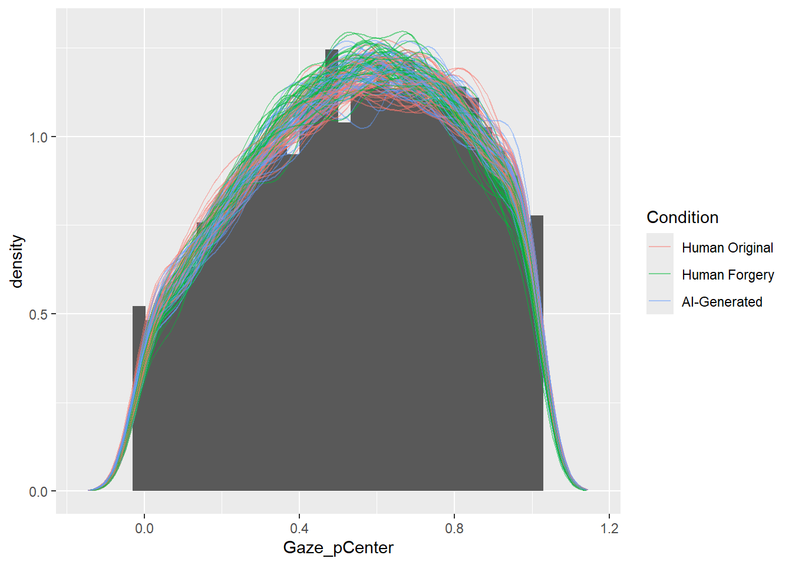{#fig-pcenter fig-alt='Gaze centeredness (proportion of samples in the central region): observed distribution with posterior-predictive densities per label condition (50 draws each).' width=672}
:::
:::


### Shift


::: {.cell}

```{.r .cell-code}
make_report(estimates$Shift)
```

::: {.cell-output-display}

```{=html}
<div id="herqcjgkpu" style="padding-left:0px;padding-right:0px;padding-top:10px;padding-bottom:10px;overflow-x:auto;overflow-y:auto;width:auto;height:auto;">
<style>#herqcjgkpu table {
  font-family: system-ui, 'Segoe UI', Roboto, Helvetica, Arial, sans-serif, 'Apple Color Emoji', 'Segoe UI Emoji', 'Segoe UI Symbol', 'Noto Color Emoji';
  -webkit-font-smoothing: antialiased;
  -moz-osx-font-smoothing: grayscale;
}

#herqcjgkpu thead, #herqcjgkpu tbody, #herqcjgkpu tfoot, #herqcjgkpu tr, #herqcjgkpu td, #herqcjgkpu th {
  border-style: none;
}

#herqcjgkpu p {
  margin: 0;
  padding: 0;
}

#herqcjgkpu .gt_table {
  display: table;
  border-collapse: collapse;
  line-height: normal;
  margin-left: auto;
  margin-right: auto;
  color: #333333;
  font-size: 16px;
  font-weight: normal;
  font-style: normal;
  background-color: #FFFFFF;
  width: auto;
  border-top-style: solid;
  border-top-width: 2px;
  border-top-color: #A8A8A8;
  border-right-style: none;
  border-right-width: 2px;
  border-right-color: #D3D3D3;
  border-bottom-style: solid;
  border-bottom-width: 2px;
  border-bottom-color: #A8A8A8;
  border-left-style: none;
  border-left-width: 2px;
  border-left-color: #D3D3D3;
}

#herqcjgkpu .gt_caption {
  padding-top: 4px;
  padding-bottom: 4px;
}

#herqcjgkpu .gt_title {
  color: #333333;
  font-size: 125%;
  font-weight: initial;
  padding-top: 4px;
  padding-bottom: 4px;
  padding-left: 5px;
  padding-right: 5px;
  border-bottom-color: #FFFFFF;
  border-bottom-width: 0;
}

#herqcjgkpu .gt_subtitle {
  color: #333333;
  font-size: 85%;
  font-weight: initial;
  padding-top: 3px;
  padding-bottom: 5px;
  padding-left: 5px;
  padding-right: 5px;
  border-top-color: #FFFFFF;
  border-top-width: 0;
}

#herqcjgkpu .gt_heading {
  background-color: #FFFFFF;
  text-align: center;
  border-bottom-color: #FFFFFF;
  border-left-style: none;
  border-left-width: 1px;
  border-left-color: #D3D3D3;
  border-right-style: none;
  border-right-width: 1px;
  border-right-color: #D3D3D3;
}

#herqcjgkpu .gt_bottom_border {
  border-bottom-style: solid;
  border-bottom-width: 2px;
  border-bottom-color: #D3D3D3;
}

#herqcjgkpu .gt_col_headings {
  border-top-style: solid;
  border-top-width: 2px;
  border-top-color: #D3D3D3;
  border-bottom-style: solid;
  border-bottom-width: 2px;
  border-bottom-color: #D3D3D3;
  border-left-style: none;
  border-left-width: 1px;
  border-left-color: #D3D3D3;
  border-right-style: none;
  border-right-width: 1px;
  border-right-color: #D3D3D3;
}

#herqcjgkpu .gt_col_heading {
  color: #333333;
  background-color: #FFFFFF;
  font-size: 100%;
  font-weight: normal;
  text-transform: inherit;
  border-left-style: none;
  border-left-width: 1px;
  border-left-color: #D3D3D3;
  border-right-style: none;
  border-right-width: 1px;
  border-right-color: #D3D3D3;
  vertical-align: bottom;
  padding-top: 5px;
  padding-bottom: 6px;
  padding-left: 5px;
  padding-right: 5px;
  overflow-x: hidden;
}

#herqcjgkpu .gt_column_spanner_outer {
  color: #333333;
  background-color: #FFFFFF;
  font-size: 100%;
  font-weight: normal;
  text-transform: inherit;
  padding-top: 0;
  padding-bottom: 0;
  padding-left: 4px;
  padding-right: 4px;
}

#herqcjgkpu .gt_column_spanner_outer:first-child {
  padding-left: 0;
}

#herqcjgkpu .gt_column_spanner_outer:last-child {
  padding-right: 0;
}

#herqcjgkpu .gt_column_spanner {
  border-bottom-style: solid;
  border-bottom-width: 2px;
  border-bottom-color: #D3D3D3;
  vertical-align: bottom;
  padding-top: 5px;
  padding-bottom: 5px;
  overflow-x: hidden;
  display: inline-block;
  width: 100%;
}

#herqcjgkpu .gt_spanner_row {
  border-bottom-style: hidden;
}

#herqcjgkpu .gt_group_heading {
  padding-top: 8px;
  padding-bottom: 8px;
  padding-left: 5px;
  padding-right: 5px;
  color: #333333;
  background-color: #FFFFFF;
  font-size: 100%;
  font-weight: initial;
  text-transform: inherit;
  border-top-style: solid;
  border-top-width: 2px;
  border-top-color: #D3D3D3;
  border-bottom-style: solid;
  border-bottom-width: 2px;
  border-bottom-color: #D3D3D3;
  border-left-style: none;
  border-left-width: 1px;
  border-left-color: #D3D3D3;
  border-right-style: none;
  border-right-width: 1px;
  border-right-color: #D3D3D3;
  vertical-align: middle;
  text-align: left;
}

#herqcjgkpu .gt_empty_group_heading {
  padding: 0.5px;
  color: #333333;
  background-color: #FFFFFF;
  font-size: 100%;
  font-weight: initial;
  border-top-style: solid;
  border-top-width: 2px;
  border-top-color: #D3D3D3;
  border-bottom-style: solid;
  border-bottom-width: 2px;
  border-bottom-color: #D3D3D3;
  vertical-align: middle;
}

#herqcjgkpu .gt_from_md > :first-child {
  margin-top: 0;
}

#herqcjgkpu .gt_from_md > :last-child {
  margin-bottom: 0;
}

#herqcjgkpu .gt_row {
  padding-top: 8px;
  padding-bottom: 8px;
  padding-left: 5px;
  padding-right: 5px;
  margin: 10px;
  border-top-style: solid;
  border-top-width: 1px;
  border-top-color: #D3D3D3;
  border-left-style: none;
  border-left-width: 1px;
  border-left-color: #D3D3D3;
  border-right-style: none;
  border-right-width: 1px;
  border-right-color: #D3D3D3;
  vertical-align: middle;
  overflow-x: hidden;
}

#herqcjgkpu .gt_stub {
  color: #333333;
  background-color: #FFFFFF;
  font-size: 100%;
  font-weight: initial;
  text-transform: inherit;
  border-right-style: solid;
  border-right-width: 2px;
  border-right-color: #D3D3D3;
  padding-left: 5px;
  padding-right: 5px;
}

#herqcjgkpu .gt_stub_row_group {
  color: #333333;
  background-color: #FFFFFF;
  font-size: 100%;
  font-weight: initial;
  text-transform: inherit;
  border-right-style: solid;
  border-right-width: 2px;
  border-right-color: #D3D3D3;
  padding-left: 5px;
  padding-right: 5px;
  vertical-align: top;
}

#herqcjgkpu .gt_row_group_first td {
  border-top-width: 2px;
}

#herqcjgkpu .gt_row_group_first th {
  border-top-width: 2px;
}

#herqcjgkpu .gt_summary_row {
  color: #333333;
  background-color: #FFFFFF;
  text-transform: inherit;
  padding-top: 8px;
  padding-bottom: 8px;
  padding-left: 5px;
  padding-right: 5px;
}

#herqcjgkpu .gt_first_summary_row {
  border-top-style: solid;
  border-top-color: #D3D3D3;
}

#herqcjgkpu .gt_first_summary_row.thick {
  border-top-width: 2px;
}

#herqcjgkpu .gt_last_summary_row {
  padding-top: 8px;
  padding-bottom: 8px;
  padding-left: 5px;
  padding-right: 5px;
  border-bottom-style: solid;
  border-bottom-width: 2px;
  border-bottom-color: #D3D3D3;
}

#herqcjgkpu .gt_grand_summary_row {
  color: #333333;
  background-color: #FFFFFF;
  text-transform: inherit;
  padding-top: 8px;
  padding-bottom: 8px;
  padding-left: 5px;
  padding-right: 5px;
}

#herqcjgkpu .gt_first_grand_summary_row {
  padding-top: 8px;
  padding-bottom: 8px;
  padding-left: 5px;
  padding-right: 5px;
  border-top-style: double;
  border-top-width: 6px;
  border-top-color: #D3D3D3;
}

#herqcjgkpu .gt_last_grand_summary_row_top {
  padding-top: 8px;
  padding-bottom: 8px;
  padding-left: 5px;
  padding-right: 5px;
  border-bottom-style: double;
  border-bottom-width: 6px;
  border-bottom-color: #D3D3D3;
}

#herqcjgkpu .gt_striped {
  background-color: rgba(128, 128, 128, 0.05);
}

#herqcjgkpu .gt_table_body {
  border-top-style: solid;
  border-top-width: 2px;
  border-top-color: #D3D3D3;
  border-bottom-style: solid;
  border-bottom-width: 2px;
  border-bottom-color: #D3D3D3;
}

#herqcjgkpu .gt_footnotes {
  color: #333333;
  background-color: #FFFFFF;
  border-bottom-style: none;
  border-bottom-width: 2px;
  border-bottom-color: #D3D3D3;
  border-left-style: none;
  border-left-width: 2px;
  border-left-color: #D3D3D3;
  border-right-style: none;
  border-right-width: 2px;
  border-right-color: #D3D3D3;
}

#herqcjgkpu .gt_footnote {
  margin: 0px;
  font-size: 90%;
  padding-top: 4px;
  padding-bottom: 4px;
  padding-left: 5px;
  padding-right: 5px;
}

#herqcjgkpu .gt_sourcenotes {
  color: #333333;
  background-color: #FFFFFF;
  border-bottom-style: none;
  border-bottom-width: 2px;
  border-bottom-color: #D3D3D3;
  border-left-style: none;
  border-left-width: 2px;
  border-left-color: #D3D3D3;
  border-right-style: none;
  border-right-width: 2px;
  border-right-color: #D3D3D3;
}

#herqcjgkpu .gt_sourcenote {
  font-size: 90%;
  padding-top: 4px;
  padding-bottom: 4px;
  padding-left: 5px;
  padding-right: 5px;
}

#herqcjgkpu .gt_left {
  text-align: left;
}

#herqcjgkpu .gt_center {
  text-align: center;
}

#herqcjgkpu .gt_right {
  text-align: right;
  font-variant-numeric: tabular-nums;
}

#herqcjgkpu .gt_font_normal {
  font-weight: normal;
}

#herqcjgkpu .gt_font_bold {
  font-weight: bold;
}

#herqcjgkpu .gt_font_italic {
  font-style: italic;
}

#herqcjgkpu .gt_super {
  font-size: 65%;
}

#herqcjgkpu .gt_footnote_marks {
  font-size: 75%;
  vertical-align: 0.4em;
  position: initial;
}

#herqcjgkpu .gt_asterisk {
  font-size: 100%;
  vertical-align: 0;
}

#herqcjgkpu .gt_indent_1 {
  text-indent: 5px;
}

#herqcjgkpu .gt_indent_2 {
  text-indent: 10px;
}

#herqcjgkpu .gt_indent_3 {
  text-indent: 15px;
}

#herqcjgkpu .gt_indent_4 {
  text-indent: 20px;
}

#herqcjgkpu .gt_indent_5 {
  text-indent: 25px;
}

#herqcjgkpu .katex-display {
  display: inline-flex !important;
  margin-bottom: 0.75em !important;
}

#herqcjgkpu div.Reactable > div.rt-table > div.rt-thead > div.rt-tr.rt-tr-group-header > div.rt-th-group:after {
  height: 0px !important;
}
</style>
<table class="gt_table" data-quarto-disable-processing="false" data-quarto-bootstrap="false">
  <thead>
    <tr class="gt_col_headings">
      <th class="gt_col_heading gt_columns_bottom_border gt_left" rowspan="1" colspan="1" scope="col" id="Contrast">Contrast</th>
      <th class="gt_col_heading gt_columns_bottom_border gt_left" rowspan="1" colspan="1" scope="col" id="Parameters">Parameters</th>
    </tr>
  </thead>
  <tbody class="gt_table_body">
    <tr><td headers="Contrast" class="gt_row gt_left">Human Forgery - Human Original</td>
<td headers="Parameters" class="gt_row gt_left">None</td></tr>
    <tr><td headers="Contrast" class="gt_row gt_left">AI-Generated - Human Original</td>
<td headers="Parameters" class="gt_row gt_left">None</td></tr>
    <tr><td headers="Contrast" class="gt_row gt_left">AI-Generated - Human Forgery</td>
<td headers="Parameters" class="gt_row gt_left">None</td></tr>
  </tbody>
  
</table>
</div>
```

```{=html}
<div id="zqcagxhnig" style="padding-left:0px;padding-right:0px;padding-top:10px;padding-bottom:10px;overflow-x:auto;overflow-y:auto;width:auto;height:auto;">
<style>#zqcagxhnig table {
  font-family: system-ui, 'Segoe UI', Roboto, Helvetica, Arial, sans-serif, 'Apple Color Emoji', 'Segoe UI Emoji', 'Segoe UI Symbol', 'Noto Color Emoji';
  -webkit-font-smoothing: antialiased;
  -moz-osx-font-smoothing: grayscale;
}

#zqcagxhnig thead, #zqcagxhnig tbody, #zqcagxhnig tfoot, #zqcagxhnig tr, #zqcagxhnig td, #zqcagxhnig th {
  border-style: none;
}

#zqcagxhnig p {
  margin: 0;
  padding: 0;
}

#zqcagxhnig .gt_table {
  display: table;
  border-collapse: collapse;
  line-height: normal;
  margin-left: auto;
  margin-right: auto;
  color: #333333;
  font-size: 16px;
  font-weight: normal;
  font-style: normal;
  background-color: #FFFFFF;
  width: auto;
  border-top-style: solid;
  border-top-width: 2px;
  border-top-color: #A8A8A8;
  border-right-style: none;
  border-right-width: 2px;
  border-right-color: #D3D3D3;
  border-bottom-style: solid;
  border-bottom-width: 2px;
  border-bottom-color: #A8A8A8;
  border-left-style: none;
  border-left-width: 2px;
  border-left-color: #D3D3D3;
}

#zqcagxhnig .gt_caption {
  padding-top: 4px;
  padding-bottom: 4px;
}

#zqcagxhnig .gt_title {
  color: #333333;
  font-size: 125%;
  font-weight: initial;
  padding-top: 4px;
  padding-bottom: 4px;
  padding-left: 5px;
  padding-right: 5px;
  border-bottom-color: #FFFFFF;
  border-bottom-width: 0;
}

#zqcagxhnig .gt_subtitle {
  color: #333333;
  font-size: 85%;
  font-weight: initial;
  padding-top: 3px;
  padding-bottom: 5px;
  padding-left: 5px;
  padding-right: 5px;
  border-top-color: #FFFFFF;
  border-top-width: 0;
}

#zqcagxhnig .gt_heading {
  background-color: #FFFFFF;
  text-align: center;
  border-bottom-color: #FFFFFF;
  border-left-style: none;
  border-left-width: 1px;
  border-left-color: #D3D3D3;
  border-right-style: none;
  border-right-width: 1px;
  border-right-color: #D3D3D3;
}

#zqcagxhnig .gt_bottom_border {
  border-bottom-style: solid;
  border-bottom-width: 2px;
  border-bottom-color: #D3D3D3;
}

#zqcagxhnig .gt_col_headings {
  border-top-style: solid;
  border-top-width: 2px;
  border-top-color: #D3D3D3;
  border-bottom-style: solid;
  border-bottom-width: 2px;
  border-bottom-color: #D3D3D3;
  border-left-style: none;
  border-left-width: 1px;
  border-left-color: #D3D3D3;
  border-right-style: none;
  border-right-width: 1px;
  border-right-color: #D3D3D3;
}

#zqcagxhnig .gt_col_heading {
  color: #333333;
  background-color: #FFFFFF;
  font-size: 100%;
  font-weight: normal;
  text-transform: inherit;
  border-left-style: none;
  border-left-width: 1px;
  border-left-color: #D3D3D3;
  border-right-style: none;
  border-right-width: 1px;
  border-right-color: #D3D3D3;
  vertical-align: bottom;
  padding-top: 5px;
  padding-bottom: 6px;
  padding-left: 5px;
  padding-right: 5px;
  overflow-x: hidden;
}

#zqcagxhnig .gt_column_spanner_outer {
  color: #333333;
  background-color: #FFFFFF;
  font-size: 100%;
  font-weight: normal;
  text-transform: inherit;
  padding-top: 0;
  padding-bottom: 0;
  padding-left: 4px;
  padding-right: 4px;
}

#zqcagxhnig .gt_column_spanner_outer:first-child {
  padding-left: 0;
}

#zqcagxhnig .gt_column_spanner_outer:last-child {
  padding-right: 0;
}

#zqcagxhnig .gt_column_spanner {
  border-bottom-style: solid;
  border-bottom-width: 2px;
  border-bottom-color: #D3D3D3;
  vertical-align: bottom;
  padding-top: 5px;
  padding-bottom: 5px;
  overflow-x: hidden;
  display: inline-block;
  width: 100%;
}

#zqcagxhnig .gt_spanner_row {
  border-bottom-style: hidden;
}

#zqcagxhnig .gt_group_heading {
  padding-top: 8px;
  padding-bottom: 8px;
  padding-left: 5px;
  padding-right: 5px;
  color: #333333;
  background-color: #FFFFFF;
  font-size: 100%;
  font-weight: initial;
  text-transform: inherit;
  border-top-style: solid;
  border-top-width: 2px;
  border-top-color: #D3D3D3;
  border-bottom-style: solid;
  border-bottom-width: 2px;
  border-bottom-color: #D3D3D3;
  border-left-style: none;
  border-left-width: 1px;
  border-left-color: #D3D3D3;
  border-right-style: none;
  border-right-width: 1px;
  border-right-color: #D3D3D3;
  vertical-align: middle;
  text-align: left;
}

#zqcagxhnig .gt_empty_group_heading {
  padding: 0.5px;
  color: #333333;
  background-color: #FFFFFF;
  font-size: 100%;
  font-weight: initial;
  border-top-style: solid;
  border-top-width: 2px;
  border-top-color: #D3D3D3;
  border-bottom-style: solid;
  border-bottom-width: 2px;
  border-bottom-color: #D3D3D3;
  vertical-align: middle;
}

#zqcagxhnig .gt_from_md > :first-child {
  margin-top: 0;
}

#zqcagxhnig .gt_from_md > :last-child {
  margin-bottom: 0;
}

#zqcagxhnig .gt_row {
  padding-top: 8px;
  padding-bottom: 8px;
  padding-left: 5px;
  padding-right: 5px;
  margin: 10px;
  border-top-style: solid;
  border-top-width: 1px;
  border-top-color: #D3D3D3;
  border-left-style: none;
  border-left-width: 1px;
  border-left-color: #D3D3D3;
  border-right-style: none;
  border-right-width: 1px;
  border-right-color: #D3D3D3;
  vertical-align: middle;
  overflow-x: hidden;
}

#zqcagxhnig .gt_stub {
  color: #333333;
  background-color: #FFFFFF;
  font-size: 100%;
  font-weight: initial;
  text-transform: inherit;
  border-right-style: solid;
  border-right-width: 2px;
  border-right-color: #D3D3D3;
  padding-left: 5px;
  padding-right: 5px;
}

#zqcagxhnig .gt_stub_row_group {
  color: #333333;
  background-color: #FFFFFF;
  font-size: 100%;
  font-weight: initial;
  text-transform: inherit;
  border-right-style: solid;
  border-right-width: 2px;
  border-right-color: #D3D3D3;
  padding-left: 5px;
  padding-right: 5px;
  vertical-align: top;
}

#zqcagxhnig .gt_row_group_first td {
  border-top-width: 2px;
}

#zqcagxhnig .gt_row_group_first th {
  border-top-width: 2px;
}

#zqcagxhnig .gt_summary_row {
  color: #333333;
  background-color: #FFFFFF;
  text-transform: inherit;
  padding-top: 8px;
  padding-bottom: 8px;
  padding-left: 5px;
  padding-right: 5px;
}

#zqcagxhnig .gt_first_summary_row {
  border-top-style: solid;
  border-top-color: #D3D3D3;
}

#zqcagxhnig .gt_first_summary_row.thick {
  border-top-width: 2px;
}

#zqcagxhnig .gt_last_summary_row {
  padding-top: 8px;
  padding-bottom: 8px;
  padding-left: 5px;
  padding-right: 5px;
  border-bottom-style: solid;
  border-bottom-width: 2px;
  border-bottom-color: #D3D3D3;
}

#zqcagxhnig .gt_grand_summary_row {
  color: #333333;
  background-color: #FFFFFF;
  text-transform: inherit;
  padding-top: 8px;
  padding-bottom: 8px;
  padding-left: 5px;
  padding-right: 5px;
}

#zqcagxhnig .gt_first_grand_summary_row {
  padding-top: 8px;
  padding-bottom: 8px;
  padding-left: 5px;
  padding-right: 5px;
  border-top-style: double;
  border-top-width: 6px;
  border-top-color: #D3D3D3;
}

#zqcagxhnig .gt_last_grand_summary_row_top {
  padding-top: 8px;
  padding-bottom: 8px;
  padding-left: 5px;
  padding-right: 5px;
  border-bottom-style: double;
  border-bottom-width: 6px;
  border-bottom-color: #D3D3D3;
}

#zqcagxhnig .gt_striped {
  background-color: rgba(128, 128, 128, 0.05);
}

#zqcagxhnig .gt_table_body {
  border-top-style: solid;
  border-top-width: 2px;
  border-top-color: #D3D3D3;
  border-bottom-style: solid;
  border-bottom-width: 2px;
  border-bottom-color: #D3D3D3;
}

#zqcagxhnig .gt_footnotes {
  color: #333333;
  background-color: #FFFFFF;
  border-bottom-style: none;
  border-bottom-width: 2px;
  border-bottom-color: #D3D3D3;
  border-left-style: none;
  border-left-width: 2px;
  border-left-color: #D3D3D3;
  border-right-style: none;
  border-right-width: 2px;
  border-right-color: #D3D3D3;
}

#zqcagxhnig .gt_footnote {
  margin: 0px;
  font-size: 90%;
  padding-top: 4px;
  padding-bottom: 4px;
  padding-left: 5px;
  padding-right: 5px;
}

#zqcagxhnig .gt_sourcenotes {
  color: #333333;
  background-color: #FFFFFF;
  border-bottom-style: none;
  border-bottom-width: 2px;
  border-bottom-color: #D3D3D3;
  border-left-style: none;
  border-left-width: 2px;
  border-left-color: #D3D3D3;
  border-right-style: none;
  border-right-width: 2px;
  border-right-color: #D3D3D3;
}

#zqcagxhnig .gt_sourcenote {
  font-size: 90%;
  padding-top: 4px;
  padding-bottom: 4px;
  padding-left: 5px;
  padding-right: 5px;
}

#zqcagxhnig .gt_left {
  text-align: left;
}

#zqcagxhnig .gt_center {
  text-align: center;
}

#zqcagxhnig .gt_right {
  text-align: right;
  font-variant-numeric: tabular-nums;
}

#zqcagxhnig .gt_font_normal {
  font-weight: normal;
}

#zqcagxhnig .gt_font_bold {
  font-weight: bold;
}

#zqcagxhnig .gt_font_italic {
  font-style: italic;
}

#zqcagxhnig .gt_super {
  font-size: 65%;
}

#zqcagxhnig .gt_footnote_marks {
  font-size: 75%;
  vertical-align: 0.4em;
  position: initial;
}

#zqcagxhnig .gt_asterisk {
  font-size: 100%;
  vertical-align: 0;
}

#zqcagxhnig .gt_indent_1 {
  text-indent: 5px;
}

#zqcagxhnig .gt_indent_2 {
  text-indent: 10px;
}

#zqcagxhnig .gt_indent_3 {
  text-indent: 15px;
}

#zqcagxhnig .gt_indent_4 {
  text-indent: 20px;
}

#zqcagxhnig .gt_indent_5 {
  text-indent: 25px;
}

#zqcagxhnig .katex-display {
  display: inline-flex !important;
  margin-bottom: 0.75em !important;
}

#zqcagxhnig div.Reactable > div.rt-table > div.rt-thead > div.rt-tr.rt-tr-group-header > div.rt-th-group:after {
  height: 0px !important;
}
</style>
<table class="gt_table" data-quarto-disable-processing="false" data-quarto-bootstrap="false">
  <thead>
    <tr class="gt_col_headings">
      <th class="gt_col_heading gt_columns_bottom_border gt_left" rowspan="1" colspan="1" scope="col" id="Contrast">Contrast</th>
      <th class="gt_col_heading gt_columns_bottom_border gt_left" rowspan="1" colspan="1" scope="col" id="Parameters">Parameters</th>
    </tr>
  </thead>
  <tbody class="gt_table_body">
    <tr><td headers="Contrast" class="gt_row gt_left">Negative - High intensity - Positive - Low intensity</td>
<td headers="Parameters" class="gt_row gt_left">response (-0.01, [-0.02,  0.00]); mu (-0.04, [-0.06, -0.01])</td></tr>
  </tbody>
  
</table>
</div>
```

```{=html}
<div id="yxolfnimod" style="padding-left:0px;padding-right:0px;padding-top:10px;padding-bottom:10px;overflow-x:auto;overflow-y:auto;width:auto;height:auto;">
<style>#yxolfnimod table {
  font-family: system-ui, 'Segoe UI', Roboto, Helvetica, Arial, sans-serif, 'Apple Color Emoji', 'Segoe UI Emoji', 'Segoe UI Symbol', 'Noto Color Emoji';
  -webkit-font-smoothing: antialiased;
  -moz-osx-font-smoothing: grayscale;
}

#yxolfnimod thead, #yxolfnimod tbody, #yxolfnimod tfoot, #yxolfnimod tr, #yxolfnimod td, #yxolfnimod th {
  border-style: none;
}

#yxolfnimod p {
  margin: 0;
  padding: 0;
}

#yxolfnimod .gt_table {
  display: table;
  border-collapse: collapse;
  line-height: normal;
  margin-left: auto;
  margin-right: auto;
  color: #333333;
  font-size: 13px;
  font-weight: normal;
  font-style: normal;
  background-color: #FFFFFF;
  width: auto;
  border-top-style: solid;
  border-top-width: 3px;
  border-top-color: #D5D5D5;
  border-right-style: solid;
  border-right-width: 3px;
  border-right-color: #D5D5D5;
  border-bottom-style: solid;
  border-bottom-width: 3px;
  border-bottom-color: #D5D5D5;
  border-left-style: solid;
  border-left-width: 3px;
  border-left-color: #D5D5D5;
}

#yxolfnimod .gt_caption {
  padding-top: 4px;
  padding-bottom: 4px;
}

#yxolfnimod .gt_title {
  color: #333333;
  font-size: 125%;
  font-weight: initial;
  padding-top: 4px;
  padding-bottom: 4px;
  padding-left: 5px;
  padding-right: 5px;
  border-bottom-color: #FFFFFF;
  border-bottom-width: 0;
}

#yxolfnimod .gt_subtitle {
  color: #333333;
  font-size: 85%;
  font-weight: initial;
  padding-top: 3px;
  padding-bottom: 5px;
  padding-left: 5px;
  padding-right: 5px;
  border-top-color: #FFFFFF;
  border-top-width: 0;
}

#yxolfnimod .gt_heading {
  background-color: #FFFFFF;
  text-align: left;
  border-bottom-color: #FFFFFF;
  border-left-style: none;
  border-left-width: 1px;
  border-left-color: #D3D3D3;
  border-right-style: none;
  border-right-width: 1px;
  border-right-color: #D3D3D3;
}

#yxolfnimod .gt_bottom_border {
  border-bottom-style: solid;
  border-bottom-width: 2px;
  border-bottom-color: #D5D5D5;
}

#yxolfnimod .gt_col_headings {
  border-top-style: solid;
  border-top-width: 2px;
  border-top-color: #D5D5D5;
  border-bottom-style: solid;
  border-bottom-width: 2px;
  border-bottom-color: #D5D5D5;
  border-left-style: none;
  border-left-width: 1px;
  border-left-color: #D3D3D3;
  border-right-style: none;
  border-right-width: 1px;
  border-right-color: #D3D3D3;
}

#yxolfnimod .gt_col_heading {
  color: #FFFFFF;
  background-color: #000000;
  font-size: 100%;
  font-weight: normal;
  text-transform: inherit;
  border-left-style: none;
  border-left-width: 1px;
  border-left-color: #D3D3D3;
  border-right-style: none;
  border-right-width: 1px;
  border-right-color: #D3D3D3;
  vertical-align: bottom;
  padding-top: 5px;
  padding-bottom: 6px;
  padding-left: 5px;
  padding-right: 5px;
  overflow-x: hidden;
}

#yxolfnimod .gt_column_spanner_outer {
  color: #FFFFFF;
  background-color: #000000;
  font-size: 100%;
  font-weight: normal;
  text-transform: inherit;
  padding-top: 0;
  padding-bottom: 0;
  padding-left: 4px;
  padding-right: 4px;
}

#yxolfnimod .gt_column_spanner_outer:first-child {
  padding-left: 0;
}

#yxolfnimod .gt_column_spanner_outer:last-child {
  padding-right: 0;
}

#yxolfnimod .gt_column_spanner {
  border-bottom-style: solid;
  border-bottom-width: 2px;
  border-bottom-color: #D5D5D5;
  vertical-align: bottom;
  padding-top: 5px;
  padding-bottom: 5px;
  overflow-x: hidden;
  display: inline-block;
  width: 100%;
}

#yxolfnimod .gt_spanner_row {
  border-bottom-style: hidden;
}

#yxolfnimod .gt_group_heading {
  padding-top: 8px;
  padding-bottom: 8px;
  padding-left: 5px;
  padding-right: 5px;
  color: #333333;
  background-color: #FFFFFF;
  font-size: 100%;
  font-weight: initial;
  text-transform: inherit;
  border-top-style: solid;
  border-top-width: 2px;
  border-top-color: #D5D5D5;
  border-bottom-style: solid;
  border-bottom-width: 2px;
  border-bottom-color: #D5D5D5;
  border-left-style: none;
  border-left-width: 1px;
  border-left-color: #D3D3D3;
  border-right-style: none;
  border-right-width: 1px;
  border-right-color: #D3D3D3;
  vertical-align: middle;
  text-align: left;
}

#yxolfnimod .gt_empty_group_heading {
  padding: 0.5px;
  color: #333333;
  background-color: #FFFFFF;
  font-size: 100%;
  font-weight: initial;
  border-top-style: solid;
  border-top-width: 2px;
  border-top-color: #D5D5D5;
  border-bottom-style: solid;
  border-bottom-width: 2px;
  border-bottom-color: #D5D5D5;
  vertical-align: middle;
}

#yxolfnimod .gt_from_md > :first-child {
  margin-top: 0;
}

#yxolfnimod .gt_from_md > :last-child {
  margin-bottom: 0;
}

#yxolfnimod .gt_row {
  padding-top: 8px;
  padding-bottom: 8px;
  padding-left: 5px;
  padding-right: 5px;
  margin: 10px;
  border-top-style: solid;
  border-top-width: 1px;
  border-top-color: #D5D5D5;
  border-left-style: solid;
  border-left-width: 1px;
  border-left-color: #D5D5D5;
  border-right-style: solid;
  border-right-width: 1px;
  border-right-color: #D5D5D5;
  vertical-align: middle;
  overflow-x: hidden;
}

#yxolfnimod .gt_stub {
  color: #333333;
  background-color: #FFFFFF;
  font-size: 100%;
  font-weight: initial;
  text-transform: inherit;
  border-right-style: solid;
  border-right-width: 2px;
  border-right-color: #5F5F5F;
  padding-left: 5px;
  padding-right: 5px;
}

#yxolfnimod .gt_stub_row_group {
  color: #333333;
  background-color: #FFFFFF;
  font-size: 100%;
  font-weight: initial;
  text-transform: inherit;
  border-right-style: solid;
  border-right-width: 2px;
  border-right-color: #D3D3D3;
  padding-left: 5px;
  padding-right: 5px;
  vertical-align: top;
}

#yxolfnimod .gt_row_group_first td {
  border-top-width: 2px;
}

#yxolfnimod .gt_row_group_first th {
  border-top-width: 2px;
}

#yxolfnimod .gt_summary_row {
  color: #333333;
  background-color: #D5D5D5;
  text-transform: inherit;
  padding-top: 8px;
  padding-bottom: 8px;
  padding-left: 5px;
  padding-right: 5px;
}

#yxolfnimod .gt_first_summary_row {
  border-top-style: solid;
  border-top-color: #D5D5D5;
}

#yxolfnimod .gt_first_summary_row.thick {
  border-top-width: 2px;
}

#yxolfnimod .gt_last_summary_row {
  padding-top: 8px;
  padding-bottom: 8px;
  padding-left: 5px;
  padding-right: 5px;
  border-bottom-style: solid;
  border-bottom-width: 2px;
  border-bottom-color: #D5D5D5;
}

#yxolfnimod .gt_grand_summary_row {
  color: #FFFFFF;
  background-color: #929292;
  text-transform: inherit;
  padding-top: 8px;
  padding-bottom: 8px;
  padding-left: 5px;
  padding-right: 5px;
}

#yxolfnimod .gt_first_grand_summary_row {
  padding-top: 8px;
  padding-bottom: 8px;
  padding-left: 5px;
  padding-right: 5px;
  border-top-style: double;
  border-top-width: 6px;
  border-top-color: #D5D5D5;
}

#yxolfnimod .gt_last_grand_summary_row_top {
  padding-top: 8px;
  padding-bottom: 8px;
  padding-left: 5px;
  padding-right: 5px;
  border-bottom-style: double;
  border-bottom-width: 6px;
  border-bottom-color: #D5D5D5;
}

#yxolfnimod .gt_striped {
  background-color: #F4F4F4;
}

#yxolfnimod .gt_table_body {
  border-top-style: solid;
  border-top-width: 2px;
  border-top-color: #D5D5D5;
  border-bottom-style: solid;
  border-bottom-width: 2px;
  border-bottom-color: #D5D5D5;
}

#yxolfnimod .gt_footnotes {
  color: #333333;
  background-color: #FFFFFF;
  border-bottom-style: none;
  border-bottom-width: 2px;
  border-bottom-color: #D3D3D3;
  border-left-style: none;
  border-left-width: 2px;
  border-left-color: #D3D3D3;
  border-right-style: none;
  border-right-width: 2px;
  border-right-color: #D3D3D3;
}

#yxolfnimod .gt_footnote {
  margin: 0px;
  font-size: 90%;
  padding-top: 4px;
  padding-bottom: 4px;
  padding-left: 5px;
  padding-right: 5px;
}

#yxolfnimod .gt_sourcenotes {
  color: #333333;
  background-color: #FFFFFF;
  border-bottom-style: none;
  border-bottom-width: 2px;
  border-bottom-color: #D3D3D3;
  border-left-style: none;
  border-left-width: 2px;
  border-left-color: #D3D3D3;
  border-right-style: none;
  border-right-width: 2px;
  border-right-color: #D3D3D3;
}

#yxolfnimod .gt_sourcenote {
  font-size: 90%;
  padding-top: 4px;
  padding-bottom: 4px;
  padding-left: 5px;
  padding-right: 5px;
}

#yxolfnimod .gt_left {
  text-align: left;
}

#yxolfnimod .gt_center {
  text-align: center;
}

#yxolfnimod .gt_right {
  text-align: right;
  font-variant-numeric: tabular-nums;
}

#yxolfnimod .gt_font_normal {
  font-weight: normal;
}

#yxolfnimod .gt_font_bold {
  font-weight: bold;
}

#yxolfnimod .gt_font_italic {
  font-style: italic;
}

#yxolfnimod .gt_super {
  font-size: 65%;
}

#yxolfnimod .gt_footnote_marks {
  font-size: 75%;
  vertical-align: 0.4em;
  position: initial;
}

#yxolfnimod .gt_asterisk {
  font-size: 100%;
  vertical-align: 0;
}

#yxolfnimod .gt_indent_1 {
  text-indent: 5px;
}

#yxolfnimod .gt_indent_2 {
  text-indent: 10px;
}

#yxolfnimod .gt_indent_3 {
  text-indent: 15px;
}

#yxolfnimod .gt_indent_4 {
  text-indent: 20px;
}

#yxolfnimod .gt_indent_5 {
  text-indent: 25px;
}

#yxolfnimod .katex-display {
  display: inline-flex !important;
  margin-bottom: 0.75em !important;
}

#yxolfnimod div.Reactable > div.rt-table > div.rt-thead > div.rt-tr.rt-tr-group-header > div.rt-th-group:after {
  height: 0px !important;
}
</style>
<table class="gt_table" data-quarto-disable-processing="false" data-quarto-bootstrap="false">
  <thead>
    <tr class="gt_heading">
      <td colspan="10" class="gt_heading gt_title gt_font_normal gt_bottom_border" style>Gaze Max. Shift: convergence</td>
    </tr>
    
    <tr class="gt_col_headings">
      <th class="gt_col_heading gt_columns_bottom_border gt_left" rowspan="1" colspan="1" scope="col" id="Model">Model</th>
      <th class="gt_col_heading gt_columns_bottom_border gt_left" rowspan="1" colspan="1" scope="col" id="Family">Family</th>
      <th class="gt_col_heading gt_columns_bottom_border gt_right" rowspan="1" colspan="1" scope="col" id="N_obs">N_obs</th>
      <th class="gt_col_heading gt_columns_bottom_border gt_right" rowspan="1" colspan="1" scope="col" id="N_participants">N_participants</th>
      <th class="gt_col_heading gt_columns_bottom_border gt_right" rowspan="1" colspan="1" scope="col" id="Chains">Chains</th>
      <th class="gt_col_heading gt_columns_bottom_border gt_right" rowspan="1" colspan="1" scope="col" id="Draws">Draws</th>
      <th class="gt_col_heading gt_columns_bottom_border gt_right" rowspan="1" colspan="1" scope="col" id="Max_Rhat">Max_Rhat</th>
      <th class="gt_col_heading gt_columns_bottom_border gt_right" rowspan="1" colspan="1" scope="col" id="Min_ESS_ratio">Min_ESS_ratio</th>
      <th class="gt_col_heading gt_columns_bottom_border gt_right" rowspan="1" colspan="1" scope="col" id="Divergent_pct">Divergent_pct</th>
      <th class="gt_col_heading gt_columns_bottom_border gt_left" rowspan="1" colspan="1" scope="col" id="Criterion">Criterion</th>
    </tr>
  </thead>
  <tbody class="gt_table_body">
    <tr><td headers="Model" class="gt_row gt_left">Shift</td>
<td headers="Family" class="gt_row gt_left">LogNormal</td>
<td headers="N_obs" class="gt_row gt_right">11772</td>
<td headers="N_participants" class="gt_row gt_right">273</td>
<td headers="Chains" class="gt_row gt_right">8</td>
<td headers="Draws" class="gt_row gt_right">4000</td>
<td headers="Max_Rhat" class="gt_row gt_right">1.018</td>
<td headers="Min_ESS_ratio" class="gt_row gt_right">0.1</td>
<td headers="Divergent_pct" class="gt_row gt_right">0</td>
<td headers="Criterion" class="gt_row gt_left">loo</td></tr>
  </tbody>
  
</table>
</div>
```


::: {.callout-note collapse="true" title="Gaze Max. Shift: convergence (Markdown table, for text readers)"}

|Model |Family    | N_obs| N_participants| Chains| Draws| Max_Rhat| Min_ESS_ratio| Divergent_pct|Criterion |
|:-----|:---------|-----:|--------------:|------:|-----:|--------:|-------------:|-------------:|:---------|
|Shift |LogNormal | 11772|            273|      8|  4000|    1.018|           0.1|             0|loo       |

:::

```{=html}
<div id="dtlaasoton" style="padding-left:0px;padding-right:0px;padding-top:10px;padding-bottom:10px;overflow-x:auto;overflow-y:auto;width:auto;height:auto;">
<style>#dtlaasoton table {
  font-family: system-ui, 'Segoe UI', Roboto, Helvetica, Arial, sans-serif, 'Apple Color Emoji', 'Segoe UI Emoji', 'Segoe UI Symbol', 'Noto Color Emoji';
  -webkit-font-smoothing: antialiased;
  -moz-osx-font-smoothing: grayscale;
}

#dtlaasoton thead, #dtlaasoton tbody, #dtlaasoton tfoot, #dtlaasoton tr, #dtlaasoton td, #dtlaasoton th {
  border-style: none;
}

#dtlaasoton p {
  margin: 0;
  padding: 0;
}

#dtlaasoton .gt_table {
  display: table;
  border-collapse: collapse;
  line-height: normal;
  margin-left: auto;
  margin-right: auto;
  color: #333333;
  font-size: 13px;
  font-weight: normal;
  font-style: normal;
  background-color: #FFFFFF;
  width: auto;
  border-top-style: solid;
  border-top-width: 3px;
  border-top-color: #D5D5D5;
  border-right-style: solid;
  border-right-width: 3px;
  border-right-color: #D5D5D5;
  border-bottom-style: solid;
  border-bottom-width: 3px;
  border-bottom-color: #D5D5D5;
  border-left-style: solid;
  border-left-width: 3px;
  border-left-color: #D5D5D5;
}

#dtlaasoton .gt_caption {
  padding-top: 4px;
  padding-bottom: 4px;
}

#dtlaasoton .gt_title {
  color: #333333;
  font-size: 125%;
  font-weight: initial;
  padding-top: 4px;
  padding-bottom: 4px;
  padding-left: 5px;
  padding-right: 5px;
  border-bottom-color: #FFFFFF;
  border-bottom-width: 0;
}

#dtlaasoton .gt_subtitle {
  color: #333333;
  font-size: 85%;
  font-weight: initial;
  padding-top: 3px;
  padding-bottom: 5px;
  padding-left: 5px;
  padding-right: 5px;
  border-top-color: #FFFFFF;
  border-top-width: 0;
}

#dtlaasoton .gt_heading {
  background-color: #FFFFFF;
  text-align: left;
  border-bottom-color: #FFFFFF;
  border-left-style: none;
  border-left-width: 1px;
  border-left-color: #D3D3D3;
  border-right-style: none;
  border-right-width: 1px;
  border-right-color: #D3D3D3;
}

#dtlaasoton .gt_bottom_border {
  border-bottom-style: solid;
  border-bottom-width: 2px;
  border-bottom-color: #D5D5D5;
}

#dtlaasoton .gt_col_headings {
  border-top-style: solid;
  border-top-width: 2px;
  border-top-color: #D5D5D5;
  border-bottom-style: solid;
  border-bottom-width: 2px;
  border-bottom-color: #D5D5D5;
  border-left-style: none;
  border-left-width: 1px;
  border-left-color: #D3D3D3;
  border-right-style: none;
  border-right-width: 1px;
  border-right-color: #D3D3D3;
}

#dtlaasoton .gt_col_heading {
  color: #FFFFFF;
  background-color: #000000;
  font-size: 100%;
  font-weight: normal;
  text-transform: inherit;
  border-left-style: none;
  border-left-width: 1px;
  border-left-color: #D3D3D3;
  border-right-style: none;
  border-right-width: 1px;
  border-right-color: #D3D3D3;
  vertical-align: bottom;
  padding-top: 5px;
  padding-bottom: 6px;
  padding-left: 5px;
  padding-right: 5px;
  overflow-x: hidden;
}

#dtlaasoton .gt_column_spanner_outer {
  color: #FFFFFF;
  background-color: #000000;
  font-size: 100%;
  font-weight: normal;
  text-transform: inherit;
  padding-top: 0;
  padding-bottom: 0;
  padding-left: 4px;
  padding-right: 4px;
}

#dtlaasoton .gt_column_spanner_outer:first-child {
  padding-left: 0;
}

#dtlaasoton .gt_column_spanner_outer:last-child {
  padding-right: 0;
}

#dtlaasoton .gt_column_spanner {
  border-bottom-style: solid;
  border-bottom-width: 2px;
  border-bottom-color: #D5D5D5;
  vertical-align: bottom;
  padding-top: 5px;
  padding-bottom: 5px;
  overflow-x: hidden;
  display: inline-block;
  width: 100%;
}

#dtlaasoton .gt_spanner_row {
  border-bottom-style: hidden;
}

#dtlaasoton .gt_group_heading {
  padding-top: 8px;
  padding-bottom: 8px;
  padding-left: 5px;
  padding-right: 5px;
  color: #333333;
  background-color: #FFFFFF;
  font-size: 100%;
  font-weight: initial;
  text-transform: inherit;
  border-top-style: solid;
  border-top-width: 2px;
  border-top-color: #D5D5D5;
  border-bottom-style: solid;
  border-bottom-width: 2px;
  border-bottom-color: #D5D5D5;
  border-left-style: none;
  border-left-width: 1px;
  border-left-color: #D3D3D3;
  border-right-style: none;
  border-right-width: 1px;
  border-right-color: #D3D3D3;
  vertical-align: middle;
  text-align: left;
}

#dtlaasoton .gt_empty_group_heading {
  padding: 0.5px;
  color: #333333;
  background-color: #FFFFFF;
  font-size: 100%;
  font-weight: initial;
  border-top-style: solid;
  border-top-width: 2px;
  border-top-color: #D5D5D5;
  border-bottom-style: solid;
  border-bottom-width: 2px;
  border-bottom-color: #D5D5D5;
  vertical-align: middle;
}

#dtlaasoton .gt_from_md > :first-child {
  margin-top: 0;
}

#dtlaasoton .gt_from_md > :last-child {
  margin-bottom: 0;
}

#dtlaasoton .gt_row {
  padding-top: 8px;
  padding-bottom: 8px;
  padding-left: 5px;
  padding-right: 5px;
  margin: 10px;
  border-top-style: solid;
  border-top-width: 1px;
  border-top-color: #D5D5D5;
  border-left-style: solid;
  border-left-width: 1px;
  border-left-color: #D5D5D5;
  border-right-style: solid;
  border-right-width: 1px;
  border-right-color: #D5D5D5;
  vertical-align: middle;
  overflow-x: hidden;
}

#dtlaasoton .gt_stub {
  color: #333333;
  background-color: #FFFFFF;
  font-size: 100%;
  font-weight: initial;
  text-transform: inherit;
  border-right-style: solid;
  border-right-width: 2px;
  border-right-color: #5F5F5F;
  padding-left: 5px;
  padding-right: 5px;
}

#dtlaasoton .gt_stub_row_group {
  color: #333333;
  background-color: #FFFFFF;
  font-size: 100%;
  font-weight: initial;
  text-transform: inherit;
  border-right-style: solid;
  border-right-width: 2px;
  border-right-color: #D3D3D3;
  padding-left: 5px;
  padding-right: 5px;
  vertical-align: top;
}

#dtlaasoton .gt_row_group_first td {
  border-top-width: 2px;
}

#dtlaasoton .gt_row_group_first th {
  border-top-width: 2px;
}

#dtlaasoton .gt_summary_row {
  color: #333333;
  background-color: #D5D5D5;
  text-transform: inherit;
  padding-top: 8px;
  padding-bottom: 8px;
  padding-left: 5px;
  padding-right: 5px;
}

#dtlaasoton .gt_first_summary_row {
  border-top-style: solid;
  border-top-color: #D5D5D5;
}

#dtlaasoton .gt_first_summary_row.thick {
  border-top-width: 2px;
}

#dtlaasoton .gt_last_summary_row {
  padding-top: 8px;
  padding-bottom: 8px;
  padding-left: 5px;
  padding-right: 5px;
  border-bottom-style: solid;
  border-bottom-width: 2px;
  border-bottom-color: #D5D5D5;
}

#dtlaasoton .gt_grand_summary_row {
  color: #FFFFFF;
  background-color: #929292;
  text-transform: inherit;
  padding-top: 8px;
  padding-bottom: 8px;
  padding-left: 5px;
  padding-right: 5px;
}

#dtlaasoton .gt_first_grand_summary_row {
  padding-top: 8px;
  padding-bottom: 8px;
  padding-left: 5px;
  padding-right: 5px;
  border-top-style: double;
  border-top-width: 6px;
  border-top-color: #D5D5D5;
}

#dtlaasoton .gt_last_grand_summary_row_top {
  padding-top: 8px;
  padding-bottom: 8px;
  padding-left: 5px;
  padding-right: 5px;
  border-bottom-style: double;
  border-bottom-width: 6px;
  border-bottom-color: #D5D5D5;
}

#dtlaasoton .gt_striped {
  background-color: #F4F4F4;
}

#dtlaasoton .gt_table_body {
  border-top-style: solid;
  border-top-width: 2px;
  border-top-color: #D5D5D5;
  border-bottom-style: solid;
  border-bottom-width: 2px;
  border-bottom-color: #D5D5D5;
}

#dtlaasoton .gt_footnotes {
  color: #333333;
  background-color: #FFFFFF;
  border-bottom-style: none;
  border-bottom-width: 2px;
  border-bottom-color: #D3D3D3;
  border-left-style: none;
  border-left-width: 2px;
  border-left-color: #D3D3D3;
  border-right-style: none;
  border-right-width: 2px;
  border-right-color: #D3D3D3;
}

#dtlaasoton .gt_footnote {
  margin: 0px;
  font-size: 90%;
  padding-top: 4px;
  padding-bottom: 4px;
  padding-left: 5px;
  padding-right: 5px;
}

#dtlaasoton .gt_sourcenotes {
  color: #333333;
  background-color: #FFFFFF;
  border-bottom-style: none;
  border-bottom-width: 2px;
  border-bottom-color: #D3D3D3;
  border-left-style: none;
  border-left-width: 2px;
  border-left-color: #D3D3D3;
  border-right-style: none;
  border-right-width: 2px;
  border-right-color: #D3D3D3;
}

#dtlaasoton .gt_sourcenote {
  font-size: 90%;
  padding-top: 4px;
  padding-bottom: 4px;
  padding-left: 5px;
  padding-right: 5px;
}

#dtlaasoton .gt_left {
  text-align: left;
}

#dtlaasoton .gt_center {
  text-align: center;
}

#dtlaasoton .gt_right {
  text-align: right;
  font-variant-numeric: tabular-nums;
}

#dtlaasoton .gt_font_normal {
  font-weight: normal;
}

#dtlaasoton .gt_font_bold {
  font-weight: bold;
}

#dtlaasoton .gt_font_italic {
  font-style: italic;
}

#dtlaasoton .gt_super {
  font-size: 65%;
}

#dtlaasoton .gt_footnote_marks {
  font-size: 75%;
  vertical-align: 0.4em;
  position: initial;
}

#dtlaasoton .gt_asterisk {
  font-size: 100%;
  vertical-align: 0;
}

#dtlaasoton .gt_indent_1 {
  text-indent: 5px;
}

#dtlaasoton .gt_indent_2 {
  text-indent: 10px;
}

#dtlaasoton .gt_indent_3 {
  text-indent: 15px;
}

#dtlaasoton .gt_indent_4 {
  text-indent: 20px;
}

#dtlaasoton .gt_indent_5 {
  text-indent: 25px;
}

#dtlaasoton .katex-display {
  display: inline-flex !important;
  margin-bottom: 0.75em !important;
}

#dtlaasoton div.Reactable > div.rt-table > div.rt-thead > div.rt-tr.rt-tr-group-header > div.rt-th-group:after {
  height: 0px !important;
}
</style>
<table class="gt_table" data-quarto-disable-processing="false" data-quarto-bootstrap="false">
  <thead>
    <tr class="gt_heading">
      <td colspan="4" class="gt_heading gt_title gt_font_normal gt_bottom_border" style>Gaze Max. Shift: marginal means per label condition (response scale)</td>
    </tr>
    
    <tr class="gt_col_headings">
      <th class="gt_col_heading gt_columns_bottom_border gt_center" rowspan="1" colspan="1" scope="col" id="Condition">Condition</th>
      <th class="gt_col_heading gt_columns_bottom_border gt_right" rowspan="1" colspan="1" scope="col" id="Estimate">Estimate</th>
      <th class="gt_col_heading gt_columns_bottom_border gt_right" rowspan="1" colspan="1" scope="col" id="CI_low">CI_low</th>
      <th class="gt_col_heading gt_columns_bottom_border gt_right" rowspan="1" colspan="1" scope="col" id="CI_high">CI_high</th>
    </tr>
  </thead>
  <tbody class="gt_table_body">
    <tr><td headers="Condition" class="gt_row gt_center">Human Original</td>
<td headers="Estimate" class="gt_row gt_right">0.27</td>
<td headers="CI_low" class="gt_row gt_right">0.26</td>
<td headers="CI_high" class="gt_row gt_right">0.28</td></tr>
    <tr><td headers="Condition" class="gt_row gt_center gt_striped">Human Forgery</td>
<td headers="Estimate" class="gt_row gt_right gt_striped">0.27</td>
<td headers="CI_low" class="gt_row gt_right gt_striped">0.26</td>
<td headers="CI_high" class="gt_row gt_right gt_striped">0.28</td></tr>
    <tr><td headers="Condition" class="gt_row gt_center">AI-Generated</td>
<td headers="Estimate" class="gt_row gt_right">0.27</td>
<td headers="CI_low" class="gt_row gt_right">0.26</td>
<td headers="CI_high" class="gt_row gt_right">0.28</td></tr>
  </tbody>
  
</table>
</div>
```


::: {.callout-note collapse="true" title="Gaze Max. Shift: marginal means per label condition (response scale) (Markdown table, for text readers)"}

|Condition      |Estimate |CI_low |CI_high |
|:--------------|:--------|:------|:-------|
|Human Original |0.27     |0.26   |0.28    |
|Human Forgery  |0.27     |0.26   |0.28    |
|AI-Generated   |0.27     |0.26   |0.28    |

:::

```{=html}
<div id="ztzdbgibtz" style="padding-left:0px;padding-right:0px;padding-top:10px;padding-bottom:10px;overflow-x:auto;overflow-y:auto;width:auto;height:auto;">
<style>#ztzdbgibtz table {
  font-family: system-ui, 'Segoe UI', Roboto, Helvetica, Arial, sans-serif, 'Apple Color Emoji', 'Segoe UI Emoji', 'Segoe UI Symbol', 'Noto Color Emoji';
  -webkit-font-smoothing: antialiased;
  -moz-osx-font-smoothing: grayscale;
}

#ztzdbgibtz thead, #ztzdbgibtz tbody, #ztzdbgibtz tfoot, #ztzdbgibtz tr, #ztzdbgibtz td, #ztzdbgibtz th {
  border-style: none;
}

#ztzdbgibtz p {
  margin: 0;
  padding: 0;
}

#ztzdbgibtz .gt_table {
  display: table;
  border-collapse: collapse;
  line-height: normal;
  margin-left: auto;
  margin-right: auto;
  color: #333333;
  font-size: 13px;
  font-weight: normal;
  font-style: normal;
  background-color: #FFFFFF;
  width: auto;
  border-top-style: solid;
  border-top-width: 3px;
  border-top-color: #D5D5D5;
  border-right-style: solid;
  border-right-width: 3px;
  border-right-color: #D5D5D5;
  border-bottom-style: solid;
  border-bottom-width: 3px;
  border-bottom-color: #D5D5D5;
  border-left-style: solid;
  border-left-width: 3px;
  border-left-color: #D5D5D5;
}

#ztzdbgibtz .gt_caption {
  padding-top: 4px;
  padding-bottom: 4px;
}

#ztzdbgibtz .gt_title {
  color: #333333;
  font-size: 125%;
  font-weight: initial;
  padding-top: 4px;
  padding-bottom: 4px;
  padding-left: 5px;
  padding-right: 5px;
  border-bottom-color: #FFFFFF;
  border-bottom-width: 0;
}

#ztzdbgibtz .gt_subtitle {
  color: #333333;
  font-size: 85%;
  font-weight: initial;
  padding-top: 3px;
  padding-bottom: 5px;
  padding-left: 5px;
  padding-right: 5px;
  border-top-color: #FFFFFF;
  border-top-width: 0;
}

#ztzdbgibtz .gt_heading {
  background-color: #FFFFFF;
  text-align: left;
  border-bottom-color: #FFFFFF;
  border-left-style: none;
  border-left-width: 1px;
  border-left-color: #D3D3D3;
  border-right-style: none;
  border-right-width: 1px;
  border-right-color: #D3D3D3;
}

#ztzdbgibtz .gt_bottom_border {
  border-bottom-style: solid;
  border-bottom-width: 2px;
  border-bottom-color: #D5D5D5;
}

#ztzdbgibtz .gt_col_headings {
  border-top-style: solid;
  border-top-width: 2px;
  border-top-color: #D5D5D5;
  border-bottom-style: solid;
  border-bottom-width: 2px;
  border-bottom-color: #D5D5D5;
  border-left-style: none;
  border-left-width: 1px;
  border-left-color: #D3D3D3;
  border-right-style: none;
  border-right-width: 1px;
  border-right-color: #D3D3D3;
}

#ztzdbgibtz .gt_col_heading {
  color: #FFFFFF;
  background-color: #000000;
  font-size: 100%;
  font-weight: normal;
  text-transform: inherit;
  border-left-style: none;
  border-left-width: 1px;
  border-left-color: #D3D3D3;
  border-right-style: none;
  border-right-width: 1px;
  border-right-color: #D3D3D3;
  vertical-align: bottom;
  padding-top: 5px;
  padding-bottom: 6px;
  padding-left: 5px;
  padding-right: 5px;
  overflow-x: hidden;
}

#ztzdbgibtz .gt_column_spanner_outer {
  color: #FFFFFF;
  background-color: #000000;
  font-size: 100%;
  font-weight: normal;
  text-transform: inherit;
  padding-top: 0;
  padding-bottom: 0;
  padding-left: 4px;
  padding-right: 4px;
}

#ztzdbgibtz .gt_column_spanner_outer:first-child {
  padding-left: 0;
}

#ztzdbgibtz .gt_column_spanner_outer:last-child {
  padding-right: 0;
}

#ztzdbgibtz .gt_column_spanner {
  border-bottom-style: solid;
  border-bottom-width: 2px;
  border-bottom-color: #D5D5D5;
  vertical-align: bottom;
  padding-top: 5px;
  padding-bottom: 5px;
  overflow-x: hidden;
  display: inline-block;
  width: 100%;
}

#ztzdbgibtz .gt_spanner_row {
  border-bottom-style: hidden;
}

#ztzdbgibtz .gt_group_heading {
  padding-top: 8px;
  padding-bottom: 8px;
  padding-left: 5px;
  padding-right: 5px;
  color: #333333;
  background-color: #FFFFFF;
  font-size: 100%;
  font-weight: initial;
  text-transform: inherit;
  border-top-style: solid;
  border-top-width: 2px;
  border-top-color: #D5D5D5;
  border-bottom-style: solid;
  border-bottom-width: 2px;
  border-bottom-color: #D5D5D5;
  border-left-style: none;
  border-left-width: 1px;
  border-left-color: #D3D3D3;
  border-right-style: none;
  border-right-width: 1px;
  border-right-color: #D3D3D3;
  vertical-align: middle;
  text-align: left;
}

#ztzdbgibtz .gt_empty_group_heading {
  padding: 0.5px;
  color: #333333;
  background-color: #FFFFFF;
  font-size: 100%;
  font-weight: initial;
  border-top-style: solid;
  border-top-width: 2px;
  border-top-color: #D5D5D5;
  border-bottom-style: solid;
  border-bottom-width: 2px;
  border-bottom-color: #D5D5D5;
  vertical-align: middle;
}

#ztzdbgibtz .gt_from_md > :first-child {
  margin-top: 0;
}

#ztzdbgibtz .gt_from_md > :last-child {
  margin-bottom: 0;
}

#ztzdbgibtz .gt_row {
  padding-top: 8px;
  padding-bottom: 8px;
  padding-left: 5px;
  padding-right: 5px;
  margin: 10px;
  border-top-style: solid;
  border-top-width: 1px;
  border-top-color: #D5D5D5;
  border-left-style: solid;
  border-left-width: 1px;
  border-left-color: #D5D5D5;
  border-right-style: solid;
  border-right-width: 1px;
  border-right-color: #D5D5D5;
  vertical-align: middle;
  overflow-x: hidden;
}

#ztzdbgibtz .gt_stub {
  color: #333333;
  background-color: #FFFFFF;
  font-size: 100%;
  font-weight: initial;
  text-transform: inherit;
  border-right-style: solid;
  border-right-width: 2px;
  border-right-color: #5F5F5F;
  padding-left: 5px;
  padding-right: 5px;
}

#ztzdbgibtz .gt_stub_row_group {
  color: #333333;
  background-color: #FFFFFF;
  font-size: 100%;
  font-weight: initial;
  text-transform: inherit;
  border-right-style: solid;
  border-right-width: 2px;
  border-right-color: #D3D3D3;
  padding-left: 5px;
  padding-right: 5px;
  vertical-align: top;
}

#ztzdbgibtz .gt_row_group_first td {
  border-top-width: 2px;
}

#ztzdbgibtz .gt_row_group_first th {
  border-top-width: 2px;
}

#ztzdbgibtz .gt_summary_row {
  color: #333333;
  background-color: #D5D5D5;
  text-transform: inherit;
  padding-top: 8px;
  padding-bottom: 8px;
  padding-left: 5px;
  padding-right: 5px;
}

#ztzdbgibtz .gt_first_summary_row {
  border-top-style: solid;
  border-top-color: #D5D5D5;
}

#ztzdbgibtz .gt_first_summary_row.thick {
  border-top-width: 2px;
}

#ztzdbgibtz .gt_last_summary_row {
  padding-top: 8px;
  padding-bottom: 8px;
  padding-left: 5px;
  padding-right: 5px;
  border-bottom-style: solid;
  border-bottom-width: 2px;
  border-bottom-color: #D5D5D5;
}

#ztzdbgibtz .gt_grand_summary_row {
  color: #FFFFFF;
  background-color: #929292;
  text-transform: inherit;
  padding-top: 8px;
  padding-bottom: 8px;
  padding-left: 5px;
  padding-right: 5px;
}

#ztzdbgibtz .gt_first_grand_summary_row {
  padding-top: 8px;
  padding-bottom: 8px;
  padding-left: 5px;
  padding-right: 5px;
  border-top-style: double;
  border-top-width: 6px;
  border-top-color: #D5D5D5;
}

#ztzdbgibtz .gt_last_grand_summary_row_top {
  padding-top: 8px;
  padding-bottom: 8px;
  padding-left: 5px;
  padding-right: 5px;
  border-bottom-style: double;
  border-bottom-width: 6px;
  border-bottom-color: #D5D5D5;
}

#ztzdbgibtz .gt_striped {
  background-color: #F4F4F4;
}

#ztzdbgibtz .gt_table_body {
  border-top-style: solid;
  border-top-width: 2px;
  border-top-color: #D5D5D5;
  border-bottom-style: solid;
  border-bottom-width: 2px;
  border-bottom-color: #D5D5D5;
}

#ztzdbgibtz .gt_footnotes {
  color: #333333;
  background-color: #FFFFFF;
  border-bottom-style: none;
  border-bottom-width: 2px;
  border-bottom-color: #D3D3D3;
  border-left-style: none;
  border-left-width: 2px;
  border-left-color: #D3D3D3;
  border-right-style: none;
  border-right-width: 2px;
  border-right-color: #D3D3D3;
}

#ztzdbgibtz .gt_footnote {
  margin: 0px;
  font-size: 90%;
  padding-top: 4px;
  padding-bottom: 4px;
  padding-left: 5px;
  padding-right: 5px;
}

#ztzdbgibtz .gt_sourcenotes {
  color: #333333;
  background-color: #FFFFFF;
  border-bottom-style: none;
  border-bottom-width: 2px;
  border-bottom-color: #D3D3D3;
  border-left-style: none;
  border-left-width: 2px;
  border-left-color: #D3D3D3;
  border-right-style: none;
  border-right-width: 2px;
  border-right-color: #D3D3D3;
}

#ztzdbgibtz .gt_sourcenote {
  font-size: 90%;
  padding-top: 4px;
  padding-bottom: 4px;
  padding-left: 5px;
  padding-right: 5px;
}

#ztzdbgibtz .gt_left {
  text-align: left;
}

#ztzdbgibtz .gt_center {
  text-align: center;
}

#ztzdbgibtz .gt_right {
  text-align: right;
  font-variant-numeric: tabular-nums;
}

#ztzdbgibtz .gt_font_normal {
  font-weight: normal;
}

#ztzdbgibtz .gt_font_bold {
  font-weight: bold;
}

#ztzdbgibtz .gt_font_italic {
  font-style: italic;
}

#ztzdbgibtz .gt_super {
  font-size: 65%;
}

#ztzdbgibtz .gt_footnote_marks {
  font-size: 75%;
  vertical-align: 0.4em;
  position: initial;
}

#ztzdbgibtz .gt_asterisk {
  font-size: 100%;
  vertical-align: 0;
}

#ztzdbgibtz .gt_indent_1 {
  text-indent: 5px;
}

#ztzdbgibtz .gt_indent_2 {
  text-indent: 10px;
}

#ztzdbgibtz .gt_indent_3 {
  text-indent: 15px;
}

#ztzdbgibtz .gt_indent_4 {
  text-indent: 20px;
}

#ztzdbgibtz .gt_indent_5 {
  text-indent: 25px;
}

#ztzdbgibtz .katex-display {
  display: inline-flex !important;
  margin-bottom: 0.75em !important;
}

#ztzdbgibtz div.Reactable > div.rt-table > div.rt-thead > div.rt-tr.rt-tr-group-header > div.rt-th-group:after {
  height: 0px !important;
}
</style>
<table class="gt_table" data-quarto-disable-processing="false" data-quarto-bootstrap="false">
  <thead>
    <tr class="gt_heading">
      <td colspan="6" class="gt_heading gt_title gt_font_normal gt_bottom_border" style>Gaze Max. Shift: all contrasts between label conditions</td>
    </tr>
    
    <tr class="gt_col_headings">
      <th class="gt_col_heading gt_columns_bottom_border gt_left" rowspan="1" colspan="1" scope="col" id="Parameter">Parameter</th>
      <th class="gt_col_heading gt_columns_bottom_border gt_right" rowspan="1" colspan="1" scope="col" id="Diff">Diff</th>
      <th class="gt_col_heading gt_columns_bottom_border gt_left" rowspan="1" colspan="1" scope="col" id="CI">CI</th>
      <th class="gt_col_heading gt_columns_bottom_border gt_left" rowspan="1" colspan="1" scope="col" id="Unit">Unit</th>
      <th class="gt_col_heading gt_columns_bottom_border gt_right" rowspan="1" colspan="1" scope="col" id="pd_fmt">pd_fmt</th>
      <th class="gt_col_heading gt_columns_bottom_border gt_left" rowspan="1" colspan="1" scope="col" id="Effect">Effect</th>
    </tr>
  </thead>
  <tbody class="gt_table_body">
    <tr class="gt_group_heading_row">
      <th colspan="6" class="gt_group_heading" scope="colgroup" id="AI-Generated - Human Original">AI-Generated - Human Original</th>
    </tr>
    <tr class="gt_row_group_first"><td headers="AI-Generated - Human Original  Parameter" class="gt_row gt_left" style="color: #9E9E9E;">response</td>
<td headers="AI-Generated - Human Original  Diff" class="gt_row gt_right" style="color: #9E9E9E;">0.00</td>
<td headers="AI-Generated - Human Original  CI" class="gt_row gt_left" style="color: #9E9E9E;">[0.00, 0.01]</td>
<td headers="AI-Generated - Human Original  Unit" class="gt_row gt_left" style="color: #9E9E9E;">raw</td>
<td headers="AI-Generated - Human Original  pd_fmt" class="gt_row gt_right" style="color: #9E9E9E;">92.85%</td>
<td headers="AI-Generated - Human Original  Effect" class="gt_row gt_left" style="color: #9E9E9E;">n.s.</td></tr>
    <tr><td headers="AI-Generated - Human Original  Parameter" class="gt_row gt_left gt_striped" style="color: #9E9E9E;">mu</td>
<td headers="AI-Generated - Human Original  Diff" class="gt_row gt_right gt_striped" style="color: #9E9E9E;">1.69</td>
<td headers="AI-Generated - Human Original  CI" class="gt_row gt_left gt_striped" style="color: #9E9E9E;">[-0.42, 3.88]</td>
<td headers="AI-Generated - Human Original  Unit" class="gt_row gt_left gt_striped" style="color: #9E9E9E;">%</td>
<td headers="AI-Generated - Human Original  pd_fmt" class="gt_row gt_right gt_striped" style="color: #9E9E9E;">93.65%</td>
<td headers="AI-Generated - Human Original  Effect" class="gt_row gt_left gt_striped" style="color: #9E9E9E;">n.s.</td></tr>
    <tr><td headers="AI-Generated - Human Original  Parameter" class="gt_row gt_left" style="color: #9E9E9E;">sigma</td>
<td headers="AI-Generated - Human Original  Diff" class="gt_row gt_right" style="color: #9E9E9E;">0.00</td>
<td headers="AI-Generated - Human Original  CI" class="gt_row gt_left" style="color: #9E9E9E;">[-0.02, 0.01]</td>
<td headers="AI-Generated - Human Original  Unit" class="gt_row gt_left" style="color: #9E9E9E;">raw</td>
<td headers="AI-Generated - Human Original  pd_fmt" class="gt_row gt_right" style="color: #9E9E9E;">55.33%</td>
<td headers="AI-Generated - Human Original  Effect" class="gt_row gt_left" style="color: #9E9E9E;">n.s.</td></tr>
    <tr class="gt_group_heading_row">
      <th colspan="6" class="gt_group_heading" scope="colgroup" id="Human Forgery - Human Original">Human Forgery - Human Original</th>
    </tr>
    <tr class="gt_row_group_first"><td headers="Human Forgery - Human Original  Parameter" class="gt_row gt_left gt_striped" style="color: #9E9E9E;">response</td>
<td headers="Human Forgery - Human Original  Diff" class="gt_row gt_right gt_striped" style="color: #9E9E9E;">0.00</td>
<td headers="Human Forgery - Human Original  CI" class="gt_row gt_left gt_striped" style="color: #9E9E9E;">[-0.01, 0.01]</td>
<td headers="Human Forgery - Human Original  Unit" class="gt_row gt_left gt_striped" style="color: #9E9E9E;">raw</td>
<td headers="Human Forgery - Human Original  pd_fmt" class="gt_row gt_right gt_striped" style="color: #9E9E9E;">63.92%</td>
<td headers="Human Forgery - Human Original  Effect" class="gt_row gt_left gt_striped" style="color: #9E9E9E;">n.s.</td></tr>
    <tr><td headers="Human Forgery - Human Original  Parameter" class="gt_row gt_left" style="color: #9E9E9E;">mu</td>
<td headers="Human Forgery - Human Original  Diff" class="gt_row gt_right" style="color: #9E9E9E;">-0.01</td>
<td headers="Human Forgery - Human Original  CI" class="gt_row gt_left" style="color: #9E9E9E;">[-2.31, 2.34]</td>
<td headers="Human Forgery - Human Original  Unit" class="gt_row gt_left" style="color: #9E9E9E;">%</td>
<td headers="Human Forgery - Human Original  pd_fmt" class="gt_row gt_right" style="color: #9E9E9E;">50.50%</td>
<td headers="Human Forgery - Human Original  Effect" class="gt_row gt_left" style="color: #9E9E9E;">n.s.</td></tr>
    <tr><td headers="Human Forgery - Human Original  Parameter" class="gt_row gt_left gt_striped" style="color: #9E9E9E;">sigma</td>
<td headers="Human Forgery - Human Original  Diff" class="gt_row gt_right gt_striped" style="color: #9E9E9E;">-0.01</td>
<td headers="Human Forgery - Human Original  CI" class="gt_row gt_left gt_striped" style="color: #9E9E9E;">[-0.03, 0.01]</td>
<td headers="Human Forgery - Human Original  Unit" class="gt_row gt_left gt_striped" style="color: #9E9E9E;">raw</td>
<td headers="Human Forgery - Human Original  pd_fmt" class="gt_row gt_right gt_striped" style="color: #9E9E9E;">87.12%</td>
<td headers="Human Forgery - Human Original  Effect" class="gt_row gt_left gt_striped" style="color: #9E9E9E;">n.s.</td></tr>
    <tr class="gt_group_heading_row">
      <th colspan="6" class="gt_group_heading" scope="colgroup" id="AI-Generated - Human Forgery">AI-Generated - Human Forgery</th>
    </tr>
    <tr class="gt_row_group_first"><td headers="AI-Generated - Human Forgery  Parameter" class="gt_row gt_left" style="color: #9E9E9E;">response</td>
<td headers="AI-Generated - Human Forgery  Diff" class="gt_row gt_right" style="color: #9E9E9E;">0.01</td>
<td headers="AI-Generated - Human Forgery  CI" class="gt_row gt_left" style="color: #9E9E9E;">[0.00, 0.01]</td>
<td headers="AI-Generated - Human Forgery  Unit" class="gt_row gt_left" style="color: #9E9E9E;">raw</td>
<td headers="AI-Generated - Human Forgery  pd_fmt" class="gt_row gt_right" style="color: #9E9E9E;">95.15%</td>
<td headers="AI-Generated - Human Forgery  Effect" class="gt_row gt_left" style="color: #9E9E9E;">n.s.</td></tr>
    <tr><td headers="AI-Generated - Human Forgery  Parameter" class="gt_row gt_left gt_striped" style="color: #9E9E9E;">mu</td>
<td headers="AI-Generated - Human Forgery  Diff" class="gt_row gt_right gt_striped" style="color: #9E9E9E;">1.71</td>
<td headers="AI-Generated - Human Forgery  CI" class="gt_row gt_left gt_striped" style="color: #9E9E9E;">[-0.69, 4.15]</td>
<td headers="AI-Generated - Human Forgery  Unit" class="gt_row gt_left gt_striped" style="color: #9E9E9E;">%</td>
<td headers="AI-Generated - Human Forgery  pd_fmt" class="gt_row gt_right gt_striped" style="color: #9E9E9E;">91.97%</td>
<td headers="AI-Generated - Human Forgery  Effect" class="gt_row gt_left gt_striped" style="color: #9E9E9E;">n.s.</td></tr>
    <tr><td headers="AI-Generated - Human Forgery  Parameter" class="gt_row gt_left" style="color: #9E9E9E;">sigma</td>
<td headers="AI-Generated - Human Forgery  Diff" class="gt_row gt_right" style="color: #9E9E9E;">0.01</td>
<td headers="AI-Generated - Human Forgery  CI" class="gt_row gt_left" style="color: #9E9E9E;">[-0.01, 0.03]</td>
<td headers="AI-Generated - Human Forgery  Unit" class="gt_row gt_left" style="color: #9E9E9E;">raw</td>
<td headers="AI-Generated - Human Forgery  pd_fmt" class="gt_row gt_right" style="color: #9E9E9E;">82.70%</td>
<td headers="AI-Generated - Human Forgery  Effect" class="gt_row gt_left" style="color: #9E9E9E;">n.s.</td></tr>
  </tbody>
  
</table>
</div>
```


::: {.callout-note collapse="true" title="Gaze Max. Shift: all contrasts between label conditions (Markdown table, for text readers)"}

|Contrast                       |Parameter |Diff  |CI            |Unit |pd_fmt |Effect |
|:------------------------------|:---------|:-----|:-------------|:----|:------|:------|
|AI-Generated - Human Original  |response  |0.00  |[0.00, 0.01]  |raw  |92.85% |n.s.   |
|AI-Generated - Human Original  |mu        |1.69  |[-0.42, 3.88] |%    |93.65% |n.s.   |
|AI-Generated - Human Original  |sigma     |0.00  |[-0.02, 0.01] |raw  |55.33% |n.s.   |
|Human Forgery - Human Original |response  |0.00  |[-0.01, 0.01] |raw  |63.92% |n.s.   |
|Human Forgery - Human Original |mu        |-0.01 |[-2.31, 2.34] |%    |50.50% |n.s.   |
|Human Forgery - Human Original |sigma     |-0.01 |[-0.03, 0.01] |raw  |87.12% |n.s.   |
|AI-Generated - Human Forgery   |response  |0.01  |[0.00, 0.01]  |raw  |95.15% |n.s.   |
|AI-Generated - Human Forgery   |mu        |1.71  |[-0.69, 4.15] |%    |91.97% |n.s.   |
|AI-Generated - Human Forgery   |sigma     |0.01  |[-0.01, 0.03] |raw  |82.70% |n.s.   |

:::

```{=html}
<div id="oazlqtnxac" style="padding-left:0px;padding-right:0px;padding-top:10px;padding-bottom:10px;overflow-x:auto;overflow-y:auto;width:auto;height:auto;">
<style>#oazlqtnxac table {
  font-family: system-ui, 'Segoe UI', Roboto, Helvetica, Arial, sans-serif, 'Apple Color Emoji', 'Segoe UI Emoji', 'Segoe UI Symbol', 'Noto Color Emoji';
  -webkit-font-smoothing: antialiased;
  -moz-osx-font-smoothing: grayscale;
}

#oazlqtnxac thead, #oazlqtnxac tbody, #oazlqtnxac tfoot, #oazlqtnxac tr, #oazlqtnxac td, #oazlqtnxac th {
  border-style: none;
}

#oazlqtnxac p {
  margin: 0;
  padding: 0;
}

#oazlqtnxac .gt_table {
  display: table;
  border-collapse: collapse;
  line-height: normal;
  margin-left: auto;
  margin-right: auto;
  color: #333333;
  font-size: 13px;
  font-weight: normal;
  font-style: normal;
  background-color: #FFFFFF;
  width: auto;
  border-top-style: solid;
  border-top-width: 3px;
  border-top-color: #D5D5D5;
  border-right-style: solid;
  border-right-width: 3px;
  border-right-color: #D5D5D5;
  border-bottom-style: solid;
  border-bottom-width: 3px;
  border-bottom-color: #D5D5D5;
  border-left-style: solid;
  border-left-width: 3px;
  border-left-color: #D5D5D5;
}

#oazlqtnxac .gt_caption {
  padding-top: 4px;
  padding-bottom: 4px;
}

#oazlqtnxac .gt_title {
  color: #333333;
  font-size: 125%;
  font-weight: initial;
  padding-top: 4px;
  padding-bottom: 4px;
  padding-left: 5px;
  padding-right: 5px;
  border-bottom-color: #FFFFFF;
  border-bottom-width: 0;
}

#oazlqtnxac .gt_subtitle {
  color: #333333;
  font-size: 85%;
  font-weight: initial;
  padding-top: 3px;
  padding-bottom: 5px;
  padding-left: 5px;
  padding-right: 5px;
  border-top-color: #FFFFFF;
  border-top-width: 0;
}

#oazlqtnxac .gt_heading {
  background-color: #FFFFFF;
  text-align: left;
  border-bottom-color: #FFFFFF;
  border-left-style: none;
  border-left-width: 1px;
  border-left-color: #D3D3D3;
  border-right-style: none;
  border-right-width: 1px;
  border-right-color: #D3D3D3;
}

#oazlqtnxac .gt_bottom_border {
  border-bottom-style: solid;
  border-bottom-width: 2px;
  border-bottom-color: #D5D5D5;
}

#oazlqtnxac .gt_col_headings {
  border-top-style: solid;
  border-top-width: 2px;
  border-top-color: #D5D5D5;
  border-bottom-style: solid;
  border-bottom-width: 2px;
  border-bottom-color: #D5D5D5;
  border-left-style: none;
  border-left-width: 1px;
  border-left-color: #D3D3D3;
  border-right-style: none;
  border-right-width: 1px;
  border-right-color: #D3D3D3;
}

#oazlqtnxac .gt_col_heading {
  color: #FFFFFF;
  background-color: #000000;
  font-size: 100%;
  font-weight: normal;
  text-transform: inherit;
  border-left-style: none;
  border-left-width: 1px;
  border-left-color: #D3D3D3;
  border-right-style: none;
  border-right-width: 1px;
  border-right-color: #D3D3D3;
  vertical-align: bottom;
  padding-top: 5px;
  padding-bottom: 6px;
  padding-left: 5px;
  padding-right: 5px;
  overflow-x: hidden;
}

#oazlqtnxac .gt_column_spanner_outer {
  color: #FFFFFF;
  background-color: #000000;
  font-size: 100%;
  font-weight: normal;
  text-transform: inherit;
  padding-top: 0;
  padding-bottom: 0;
  padding-left: 4px;
  padding-right: 4px;
}

#oazlqtnxac .gt_column_spanner_outer:first-child {
  padding-left: 0;
}

#oazlqtnxac .gt_column_spanner_outer:last-child {
  padding-right: 0;
}

#oazlqtnxac .gt_column_spanner {
  border-bottom-style: solid;
  border-bottom-width: 2px;
  border-bottom-color: #D5D5D5;
  vertical-align: bottom;
  padding-top: 5px;
  padding-bottom: 5px;
  overflow-x: hidden;
  display: inline-block;
  width: 100%;
}

#oazlqtnxac .gt_spanner_row {
  border-bottom-style: hidden;
}

#oazlqtnxac .gt_group_heading {
  padding-top: 8px;
  padding-bottom: 8px;
  padding-left: 5px;
  padding-right: 5px;
  color: #333333;
  background-color: #FFFFFF;
  font-size: 100%;
  font-weight: initial;
  text-transform: inherit;
  border-top-style: solid;
  border-top-width: 2px;
  border-top-color: #D5D5D5;
  border-bottom-style: solid;
  border-bottom-width: 2px;
  border-bottom-color: #D5D5D5;
  border-left-style: none;
  border-left-width: 1px;
  border-left-color: #D3D3D3;
  border-right-style: none;
  border-right-width: 1px;
  border-right-color: #D3D3D3;
  vertical-align: middle;
  text-align: left;
}

#oazlqtnxac .gt_empty_group_heading {
  padding: 0.5px;
  color: #333333;
  background-color: #FFFFFF;
  font-size: 100%;
  font-weight: initial;
  border-top-style: solid;
  border-top-width: 2px;
  border-top-color: #D5D5D5;
  border-bottom-style: solid;
  border-bottom-width: 2px;
  border-bottom-color: #D5D5D5;
  vertical-align: middle;
}

#oazlqtnxac .gt_from_md > :first-child {
  margin-top: 0;
}

#oazlqtnxac .gt_from_md > :last-child {
  margin-bottom: 0;
}

#oazlqtnxac .gt_row {
  padding-top: 8px;
  padding-bottom: 8px;
  padding-left: 5px;
  padding-right: 5px;
  margin: 10px;
  border-top-style: solid;
  border-top-width: 1px;
  border-top-color: #D5D5D5;
  border-left-style: solid;
  border-left-width: 1px;
  border-left-color: #D5D5D5;
  border-right-style: solid;
  border-right-width: 1px;
  border-right-color: #D5D5D5;
  vertical-align: middle;
  overflow-x: hidden;
}

#oazlqtnxac .gt_stub {
  color: #333333;
  background-color: #FFFFFF;
  font-size: 100%;
  font-weight: initial;
  text-transform: inherit;
  border-right-style: solid;
  border-right-width: 2px;
  border-right-color: #5F5F5F;
  padding-left: 5px;
  padding-right: 5px;
}

#oazlqtnxac .gt_stub_row_group {
  color: #333333;
  background-color: #FFFFFF;
  font-size: 100%;
  font-weight: initial;
  text-transform: inherit;
  border-right-style: solid;
  border-right-width: 2px;
  border-right-color: #D3D3D3;
  padding-left: 5px;
  padding-right: 5px;
  vertical-align: top;
}

#oazlqtnxac .gt_row_group_first td {
  border-top-width: 2px;
}

#oazlqtnxac .gt_row_group_first th {
  border-top-width: 2px;
}

#oazlqtnxac .gt_summary_row {
  color: #333333;
  background-color: #D5D5D5;
  text-transform: inherit;
  padding-top: 8px;
  padding-bottom: 8px;
  padding-left: 5px;
  padding-right: 5px;
}

#oazlqtnxac .gt_first_summary_row {
  border-top-style: solid;
  border-top-color: #D5D5D5;
}

#oazlqtnxac .gt_first_summary_row.thick {
  border-top-width: 2px;
}

#oazlqtnxac .gt_last_summary_row {
  padding-top: 8px;
  padding-bottom: 8px;
  padding-left: 5px;
  padding-right: 5px;
  border-bottom-style: solid;
  border-bottom-width: 2px;
  border-bottom-color: #D5D5D5;
}

#oazlqtnxac .gt_grand_summary_row {
  color: #FFFFFF;
  background-color: #929292;
  text-transform: inherit;
  padding-top: 8px;
  padding-bottom: 8px;
  padding-left: 5px;
  padding-right: 5px;
}

#oazlqtnxac .gt_first_grand_summary_row {
  padding-top: 8px;
  padding-bottom: 8px;
  padding-left: 5px;
  padding-right: 5px;
  border-top-style: double;
  border-top-width: 6px;
  border-top-color: #D5D5D5;
}

#oazlqtnxac .gt_last_grand_summary_row_top {
  padding-top: 8px;
  padding-bottom: 8px;
  padding-left: 5px;
  padding-right: 5px;
  border-bottom-style: double;
  border-bottom-width: 6px;
  border-bottom-color: #D5D5D5;
}

#oazlqtnxac .gt_striped {
  background-color: #F4F4F4;
}

#oazlqtnxac .gt_table_body {
  border-top-style: solid;
  border-top-width: 2px;
  border-top-color: #D5D5D5;
  border-bottom-style: solid;
  border-bottom-width: 2px;
  border-bottom-color: #D5D5D5;
}

#oazlqtnxac .gt_footnotes {
  color: #333333;
  background-color: #FFFFFF;
  border-bottom-style: none;
  border-bottom-width: 2px;
  border-bottom-color: #D3D3D3;
  border-left-style: none;
  border-left-width: 2px;
  border-left-color: #D3D3D3;
  border-right-style: none;
  border-right-width: 2px;
  border-right-color: #D3D3D3;
}

#oazlqtnxac .gt_footnote {
  margin: 0px;
  font-size: 90%;
  padding-top: 4px;
  padding-bottom: 4px;
  padding-left: 5px;
  padding-right: 5px;
}

#oazlqtnxac .gt_sourcenotes {
  color: #333333;
  background-color: #FFFFFF;
  border-bottom-style: none;
  border-bottom-width: 2px;
  border-bottom-color: #D3D3D3;
  border-left-style: none;
  border-left-width: 2px;
  border-left-color: #D3D3D3;
  border-right-style: none;
  border-right-width: 2px;
  border-right-color: #D3D3D3;
}

#oazlqtnxac .gt_sourcenote {
  font-size: 90%;
  padding-top: 4px;
  padding-bottom: 4px;
  padding-left: 5px;
  padding-right: 5px;
}

#oazlqtnxac .gt_left {
  text-align: left;
}

#oazlqtnxac .gt_center {
  text-align: center;
}

#oazlqtnxac .gt_right {
  text-align: right;
  font-variant-numeric: tabular-nums;
}

#oazlqtnxac .gt_font_normal {
  font-weight: normal;
}

#oazlqtnxac .gt_font_bold {
  font-weight: bold;
}

#oazlqtnxac .gt_font_italic {
  font-style: italic;
}

#oazlqtnxac .gt_super {
  font-size: 65%;
}

#oazlqtnxac .gt_footnote_marks {
  font-size: 75%;
  vertical-align: 0.4em;
  position: initial;
}

#oazlqtnxac .gt_asterisk {
  font-size: 100%;
  vertical-align: 0;
}

#oazlqtnxac .gt_indent_1 {
  text-indent: 5px;
}

#oazlqtnxac .gt_indent_2 {
  text-indent: 10px;
}

#oazlqtnxac .gt_indent_3 {
  text-indent: 15px;
}

#oazlqtnxac .gt_indent_4 {
  text-indent: 20px;
}

#oazlqtnxac .gt_indent_5 {
  text-indent: 25px;
}

#oazlqtnxac .katex-display {
  display: inline-flex !important;
  margin-bottom: 0.75em !important;
}

#oazlqtnxac div.Reactable > div.rt-table > div.rt-thead > div.rt-tr.rt-tr-group-header > div.rt-th-group:after {
  height: 0px !important;
}
</style>
<table class="gt_table" data-quarto-disable-processing="false" data-quarto-bootstrap="false">
  <thead>
    <tr class="gt_heading">
      <td colspan="6" class="gt_heading gt_title gt_font_normal gt_bottom_border" style>Gaze Max. Shift: contrasts between stimulus emotion quadrants</td>
    </tr>
    
    <tr class="gt_col_headings">
      <th class="gt_col_heading gt_columns_bottom_border gt_left" rowspan="1" colspan="1" scope="col" id="Parameter">Parameter</th>
      <th class="gt_col_heading gt_columns_bottom_border gt_right" rowspan="1" colspan="1" scope="col" id="Diff">Diff</th>
      <th class="gt_col_heading gt_columns_bottom_border gt_left" rowspan="1" colspan="1" scope="col" id="CI">CI</th>
      <th class="gt_col_heading gt_columns_bottom_border gt_left" rowspan="1" colspan="1" scope="col" id="Unit">Unit</th>
      <th class="gt_col_heading gt_columns_bottom_border gt_right" rowspan="1" colspan="1" scope="col" id="pd_fmt">pd_fmt</th>
      <th class="gt_col_heading gt_columns_bottom_border gt_left" rowspan="1" colspan="1" scope="col" id="Effect">Effect</th>
    </tr>
  </thead>
  <tbody class="gt_table_body">
    <tr class="gt_group_heading_row">
      <th colspan="6" class="gt_group_heading" scope="colgroup" id="NA">NA</th>
    </tr>
    <tr class="gt_row_group_first"><td headers="NA  Parameter" class="gt_row gt_left" style="color: #9E9E9E;">response</td>
<td headers="NA  Diff" class="gt_row gt_right" style="color: #9E9E9E;">0.00</td>
<td headers="NA  CI" class="gt_row gt_left" style="color: #9E9E9E;">[-0.01, 0.00]</td>
<td headers="NA  Unit" class="gt_row gt_left" style="color: #9E9E9E;">raw</td>
<td headers="NA  pd_fmt" class="gt_row gt_right" style="color: #9E9E9E;">78.10%</td>
<td headers="NA  Effect" class="gt_row gt_left" style="color: #9E9E9E;">n.s.</td></tr>
    <tr><td headers="NA  Parameter" class="gt_row gt_left gt_striped" style="color: #9E9E9E;">mu</td>
<td headers="NA  Diff" class="gt_row gt_right gt_striped" style="color: #9E9E9E;">-0.85</td>
<td headers="NA  CI" class="gt_row gt_left gt_striped" style="color: #9E9E9E;">[-3.58, 1.78]</td>
<td headers="NA  Unit" class="gt_row gt_left gt_striped" style="color: #9E9E9E;">%</td>
<td headers="NA  pd_fmt" class="gt_row gt_right gt_striped" style="color: #9E9E9E;">73.90%</td>
<td headers="NA  Effect" class="gt_row gt_left gt_striped" style="color: #9E9E9E;">n.s.</td></tr>
    <tr><td headers="NA  Parameter" class="gt_row gt_left" style="color: #9E9E9E;">sigma</td>
<td headers="NA  Diff" class="gt_row gt_right" style="color: #9E9E9E;">0.00</td>
<td headers="NA  CI" class="gt_row gt_left" style="color: #9E9E9E;">[-0.02, 0.02]</td>
<td headers="NA  Unit" class="gt_row gt_left" style="color: #9E9E9E;">raw</td>
<td headers="NA  pd_fmt" class="gt_row gt_right" style="color: #9E9E9E;">63.80%</td>
<td headers="NA  Effect" class="gt_row gt_left" style="color: #9E9E9E;">n.s.</td></tr>
    <tr><td headers="NA  Parameter" class="gt_row gt_left gt_striped" style="color: #9E9E9E;">response</td>
<td headers="NA  Diff" class="gt_row gt_right gt_striped" style="color: #9E9E9E;">0.00</td>
<td headers="NA  CI" class="gt_row gt_left gt_striped" style="color: #9E9E9E;">[-0.01, 0.01]</td>
<td headers="NA  Unit" class="gt_row gt_left gt_striped" style="color: #9E9E9E;">raw</td>
<td headers="NA  pd_fmt" class="gt_row gt_right gt_striped" style="color: #9E9E9E;">76.92%</td>
<td headers="NA  Effect" class="gt_row gt_left gt_striped" style="color: #9E9E9E;">n.s.</td></tr>
    <tr><td headers="NA  Parameter" class="gt_row gt_left" style="color: #9E9E9E;">mu</td>
<td headers="NA  Diff" class="gt_row gt_right" style="color: #9E9E9E;">-1.26</td>
<td headers="NA  CI" class="gt_row gt_left" style="color: #9E9E9E;">[-3.95, 1.45]</td>
<td headers="NA  Unit" class="gt_row gt_left" style="color: #9E9E9E;">%</td>
<td headers="NA  pd_fmt" class="gt_row gt_right" style="color: #9E9E9E;">81.12%</td>
<td headers="NA  Effect" class="gt_row gt_left" style="color: #9E9E9E;">n.s.</td></tr>
    <tr><td headers="NA  Parameter" class="gt_row gt_left gt_striped" style="color: #9E9E9E;">sigma</td>
<td headers="NA  Diff" class="gt_row gt_right gt_striped" style="color: #9E9E9E;">0.01</td>
<td headers="NA  CI" class="gt_row gt_left gt_striped" style="color: #9E9E9E;">[-0.02, 0.03]</td>
<td headers="NA  Unit" class="gt_row gt_left gt_striped" style="color: #9E9E9E;">raw</td>
<td headers="NA  pd_fmt" class="gt_row gt_right gt_striped" style="color: #9E9E9E;">70.45%</td>
<td headers="NA  Effect" class="gt_row gt_left gt_striped" style="color: #9E9E9E;">n.s.</td></tr>
    <tr><td headers="NA  Parameter" class="gt_row gt_left" style="color: #9E9E9E;">response</td>
<td headers="NA  Diff" class="gt_row gt_right" style="color: #9E9E9E;">0.00</td>
<td headers="NA  CI" class="gt_row gt_left" style="color: #9E9E9E;">[-0.01, 0.01]</td>
<td headers="NA  Unit" class="gt_row gt_left" style="color: #9E9E9E;">raw</td>
<td headers="NA  pd_fmt" class="gt_row gt_right" style="color: #9E9E9E;">51.28%</td>
<td headers="NA  Effect" class="gt_row gt_left" style="color: #9E9E9E;">n.s.</td></tr>
    <tr><td headers="NA  Parameter" class="gt_row gt_left gt_striped" style="color: #9E9E9E;">mu</td>
<td headers="NA  Diff" class="gt_row gt_right gt_striped" style="color: #9E9E9E;">-0.38</td>
<td headers="NA  CI" class="gt_row gt_left gt_striped" style="color: #9E9E9E;">[-3.24, 2.31]</td>
<td headers="NA  Unit" class="gt_row gt_left gt_striped" style="color: #9E9E9E;">%</td>
<td headers="NA  pd_fmt" class="gt_row gt_right gt_striped" style="color: #9E9E9E;">60.68%</td>
<td headers="NA  Effect" class="gt_row gt_left gt_striped" style="color: #9E9E9E;">n.s.</td></tr>
    <tr><td headers="NA  Parameter" class="gt_row gt_left" style="color: #9E9E9E;">sigma</td>
<td headers="NA  Diff" class="gt_row gt_right" style="color: #9E9E9E;">0.01</td>
<td headers="NA  CI" class="gt_row gt_left" style="color: #9E9E9E;">[-0.01, 0.03]</td>
<td headers="NA  Unit" class="gt_row gt_left" style="color: #9E9E9E;">raw</td>
<td headers="NA  pd_fmt" class="gt_row gt_right" style="color: #9E9E9E;">81.70%</td>
<td headers="NA  Effect" class="gt_row gt_left" style="color: #9E9E9E;">n.s.</td></tr>
    <tr><td headers="NA  Parameter" class="gt_row gt_left gt_striped" style="background-color: #FFEBEE;">response</td>
<td headers="NA  Diff" class="gt_row gt_right gt_striped" style="background-color: #FFEBEE;">-0.01</td>
<td headers="NA  CI" class="gt_row gt_left gt_striped" style="background-color: #FFEBEE;">[-0.02, 0.00]</td>
<td headers="NA  Unit" class="gt_row gt_left gt_striped" style="background-color: #FFEBEE;">raw</td>
<td headers="NA  pd_fmt" class="gt_row gt_right gt_striped" style="background-color: #FFEBEE;">98.75%</td>
<td headers="NA  Effect" class="gt_row gt_left gt_striped" style="background-color: #FFEBEE;">Negative</td></tr>
    <tr><td headers="NA  Parameter" class="gt_row gt_left" style="background-color: #FFEBEE;">mu</td>
<td headers="NA  Diff" class="gt_row gt_right" style="background-color: #FFEBEE;">-3.59</td>
<td headers="NA  CI" class="gt_row gt_left" style="background-color: #FFEBEE;">[-6.34, -0.93]</td>
<td headers="NA  Unit" class="gt_row gt_left" style="background-color: #FFEBEE;">%</td>
<td headers="NA  pd_fmt" class="gt_row gt_right" style="background-color: #FFEBEE;">99.58%</td>
<td headers="NA  Effect" class="gt_row gt_left" style="background-color: #FFEBEE;">Negative</td></tr>
    <tr><td headers="NA  Parameter" class="gt_row gt_left gt_striped" style="color: #9E9E9E;">sigma</td>
<td headers="NA  Diff" class="gt_row gt_right gt_striped" style="color: #9E9E9E;">0.01</td>
<td headers="NA  CI" class="gt_row gt_left gt_striped" style="color: #9E9E9E;">[-0.01, 0.03]</td>
<td headers="NA  Unit" class="gt_row gt_left gt_striped" style="color: #9E9E9E;">raw</td>
<td headers="NA  pd_fmt" class="gt_row gt_right gt_striped" style="color: #9E9E9E;">85.15%</td>
<td headers="NA  Effect" class="gt_row gt_left gt_striped" style="color: #9E9E9E;">n.s.</td></tr>
    <tr><td headers="NA  Parameter" class="gt_row gt_left" style="color: #9E9E9E;">response</td>
<td headers="NA  Diff" class="gt_row gt_right" style="color: #9E9E9E;">-0.01</td>
<td headers="NA  CI" class="gt_row gt_left" style="color: #9E9E9E;">[-0.01, 0.00]</td>
<td headers="NA  Unit" class="gt_row gt_left" style="color: #9E9E9E;">raw</td>
<td headers="NA  pd_fmt" class="gt_row gt_right" style="color: #9E9E9E;">91.80%</td>
<td headers="NA  Effect" class="gt_row gt_left" style="color: #9E9E9E;">n.s.</td></tr>
    <tr><td headers="NA  Parameter" class="gt_row gt_left gt_striped" style="color: #9E9E9E;">mu</td>
<td headers="NA  Diff" class="gt_row gt_right gt_striped" style="color: #9E9E9E;">-2.72</td>
<td headers="NA  CI" class="gt_row gt_left gt_striped" style="color: #9E9E9E;">[-5.52, 0.03]</td>
<td headers="NA  Unit" class="gt_row gt_left gt_striped" style="color: #9E9E9E;">%</td>
<td headers="NA  pd_fmt" class="gt_row gt_right gt_striped" style="color: #9E9E9E;">97.22%</td>
<td headers="NA  Effect" class="gt_row gt_left gt_striped" style="color: #9E9E9E;">n.s.</td></tr>
    <tr><td headers="NA  Parameter" class="gt_row gt_left" style="color: #9E9E9E;">sigma</td>
<td headers="NA  Diff" class="gt_row gt_right" style="color: #9E9E9E;">0.01</td>
<td headers="NA  CI" class="gt_row gt_left" style="color: #9E9E9E;">[-0.01, 0.04]</td>
<td headers="NA  Unit" class="gt_row gt_left" style="color: #9E9E9E;">raw</td>
<td headers="NA  pd_fmt" class="gt_row gt_right" style="color: #9E9E9E;">90.38%</td>
<td headers="NA  Effect" class="gt_row gt_left" style="color: #9E9E9E;">n.s.</td></tr>
    <tr><td headers="NA  Parameter" class="gt_row gt_left gt_striped" style="color: #9E9E9E;">response</td>
<td headers="NA  Diff" class="gt_row gt_right gt_striped" style="color: #9E9E9E;">-0.01</td>
<td headers="NA  CI" class="gt_row gt_left gt_striped" style="color: #9E9E9E;">[-0.01, 0.00]</td>
<td headers="NA  Unit" class="gt_row gt_left gt_striped" style="color: #9E9E9E;">raw</td>
<td headers="NA  pd_fmt" class="gt_row gt_right gt_striped" style="color: #9E9E9E;">91.92%</td>
<td headers="NA  Effect" class="gt_row gt_left gt_striped" style="color: #9E9E9E;">n.s.</td></tr>
    <tr><td headers="NA  Parameter" class="gt_row gt_left" style="color: #9E9E9E;">mu</td>
<td headers="NA  Diff" class="gt_row gt_right" style="color: #9E9E9E;">-2.37</td>
<td headers="NA  CI" class="gt_row gt_left" style="color: #9E9E9E;">[-5.07, 0.48]</td>
<td headers="NA  Unit" class="gt_row gt_left" style="color: #9E9E9E;">%</td>
<td headers="NA  pd_fmt" class="gt_row gt_right" style="color: #9E9E9E;">94.70%</td>
<td headers="NA  Effect" class="gt_row gt_left" style="color: #9E9E9E;">n.s.</td></tr>
    <tr><td headers="NA  Parameter" class="gt_row gt_left gt_striped" style="color: #9E9E9E;">sigma</td>
<td headers="NA  Diff" class="gt_row gt_right gt_striped" style="color: #9E9E9E;">0.01</td>
<td headers="NA  CI" class="gt_row gt_left gt_striped" style="color: #9E9E9E;">[-0.02, 0.03]</td>
<td headers="NA  Unit" class="gt_row gt_left gt_striped" style="color: #9E9E9E;">raw</td>
<td headers="NA  pd_fmt" class="gt_row gt_right gt_striped" style="color: #9E9E9E;">68.75%</td>
<td headers="NA  Effect" class="gt_row gt_left gt_striped" style="color: #9E9E9E;">n.s.</td></tr>
  </tbody>
  
</table>
</div>
```


::: {.callout-note collapse="true" title="Gaze Max. Shift: contrasts between stimulus emotion quadrants (Markdown table, for text readers)"}

|Contrast |Parameter |Diff  |CI             |Unit |pd_fmt |Effect   |
|:--------|:---------|:-----|:--------------|:----|:------|:--------|
|NA       |response  |0.00  |[-0.01, 0.00]  |raw  |78.10% |n.s.     |
|NA       |mu        |-0.85 |[-3.58, 1.78]  |%    |73.90% |n.s.     |
|NA       |sigma     |0.00  |[-0.02, 0.02]  |raw  |63.80% |n.s.     |
|NA       |response  |0.00  |[-0.01, 0.01]  |raw  |76.92% |n.s.     |
|NA       |mu        |-1.26 |[-3.95, 1.45]  |%    |81.12% |n.s.     |
|NA       |sigma     |0.01  |[-0.02, 0.03]  |raw  |70.45% |n.s.     |
|NA       |response  |0.00  |[-0.01, 0.01]  |raw  |51.28% |n.s.     |
|NA       |mu        |-0.38 |[-3.24, 2.31]  |%    |60.68% |n.s.     |
|NA       |sigma     |0.01  |[-0.01, 0.03]  |raw  |81.70% |n.s.     |
|NA       |response  |-0.01 |[-0.02, 0.00]  |raw  |98.75% |Negative |
|NA       |mu        |-3.59 |[-6.34, -0.93] |%    |99.58% |Negative |
|NA       |sigma     |0.01  |[-0.01, 0.03]  |raw  |85.15% |n.s.     |
|NA       |response  |-0.01 |[-0.01, 0.00]  |raw  |91.80% |n.s.     |
|NA       |mu        |-2.72 |[-5.52, 0.03]  |%    |97.22% |n.s.     |
|NA       |sigma     |0.01  |[-0.01, 0.04]  |raw  |90.38% |n.s.     |
|NA       |response  |-0.01 |[-0.01, 0.00]  |raw  |91.92% |n.s.     |
|NA       |mu        |-2.37 |[-5.07, 0.48]  |%    |94.70% |n.s.     |
|NA       |sigma     |0.01  |[-0.02, 0.03]  |raw  |68.75% |n.s.     |

:::

::: {.callout-note collapse="true" title="Gaze Max. Shift: contrasts within each stimulus emotion (Markdown table, for text readers)"}

|Emotion                   |Contrast                       |Parameter |Diff  |CI             |Unit |pd_fmt |Effect   |
|:-------------------------|:------------------------------|:---------|:-----|:--------------|:----|:------|:--------|
|Positive - Low intensity  |AI-Generated - Human Original  |response  |0.02  |[0.01, 0.03]   |raw  |99.70% |Positive |
|Negative - Low intensity  |AI-Generated - Human Original  |response  |0.00  |[-0.01, 0.01]  |raw  |53.77% |n.s.     |
|Positive - High intensity |AI-Generated - Human Original  |response  |0.00  |[-0.01, 0.01]  |raw  |61.52% |n.s.     |
|Negative - High intensity |AI-Generated - Human Original  |response  |0.00  |[-0.01, 0.02]  |raw  |69.12% |n.s.     |
|Positive - Low intensity  |AI-Generated - Human Original  |mu        |6.66  |[2.34, 11.01]  |%    |99.98% |Positive |
|Negative - Low intensity  |AI-Generated - Human Original  |mu        |0.27  |[-3.92, 4.64]  |%    |54.50% |n.s.     |
|Positive - High intensity |AI-Generated - Human Original  |mu        |-0.80 |[-5.23, 3.43]  |%    |63.45% |n.s.     |
|Negative - High intensity |AI-Generated - Human Original  |mu        |0.63  |[-3.74, 5.09]  |%    |61.32% |n.s.     |
|Positive - Low intensity  |AI-Generated - Human Original  |sigma     |-0.01 |[-0.04, 0.02]  |raw  |69.60% |n.s.     |
|Negative - Low intensity  |AI-Generated - Human Original  |sigma     |-0.01 |[-0.04, 0.02]  |raw  |74.35% |n.s.     |
|Positive - High intensity |AI-Generated - Human Original  |sigma     |0.00  |[-0.03, 0.03]  |raw  |54.95% |n.s.     |
|Negative - High intensity |AI-Generated - Human Original  |sigma     |0.01  |[-0.02, 0.05]  |raw  |75.62% |n.s.     |
|Positive - Low intensity  |Human Forgery - Human Original |response  |0.00  |[-0.01, 0.01]  |raw  |60.88% |n.s.     |
|Negative - Low intensity  |Human Forgery - Human Original |response  |0.00  |[-0.01, 0.01]  |raw  |58.33% |n.s.     |
|Positive - High intensity |Human Forgery - Human Original |response  |0.00  |[-0.01, 0.01]  |raw  |58.23% |n.s.     |
|Negative - High intensity |Human Forgery - Human Original |response  |0.00  |[-0.01, 0.01]  |raw  |51.52% |n.s.     |
|Positive - Low intensity  |Human Forgery - Human Original |mu        |1.10  |[-3.25, 5.57]  |%    |68.30% |n.s.     |
|Negative - Low intensity  |Human Forgery - Human Original |mu        |-0.22 |[-4.72, 4.59]  |%    |53.60% |n.s.     |
|Positive - High intensity |Human Forgery - Human Original |mu        |-0.42 |[-4.91, 4.03]  |%    |57.65% |n.s.     |
|Negative - High intensity |Human Forgery - Human Original |mu        |-0.45 |[-4.98, 4.23]  |%    |57.93% |n.s.     |
|Positive - Low intensity  |Human Forgery - Human Original |sigma     |-0.04 |[-0.07, -0.01] |raw  |99.17% |Negative |
|Negative - Low intensity  |Human Forgery - Human Original |sigma     |-0.01 |[-0.04, 0.03]  |raw  |65.08% |n.s.     |
|Positive - High intensity |Human Forgery - Human Original |sigma     |0.00  |[-0.03, 0.03]  |raw  |52.38% |n.s.     |
|Negative - High intensity |Human Forgery - Human Original |sigma     |0.01  |[-0.02, 0.04]  |raw  |69.05% |n.s.     |
|Positive - Low intensity  |AI-Generated - Human Forgery   |response  |0.02  |[0.01, 0.03]   |raw  |99.80% |Positive |
|Negative - Low intensity  |AI-Generated - Human Forgery   |response  |0.00  |[-0.01, 0.01]  |raw  |54.67% |n.s.     |
|Positive - High intensity |AI-Generated - Human Forgery   |response  |0.00  |[-0.01, 0.01]  |raw  |53.60% |n.s.     |
|Negative - High intensity |AI-Generated - Human Forgery   |response  |0.00  |[-0.01, 0.02]  |raw  |68.83% |n.s.     |
|Positive - Low intensity  |AI-Generated - Human Forgery   |mu        |5.61  |[1.09, 10.06]  |%    |99.35% |Positive |
|Negative - Low intensity  |AI-Generated - Human Forgery   |mu        |0.47  |[-4.42, 5.19]  |%    |57.57% |n.s.     |
|Positive - High intensity |AI-Generated - Human Forgery   |mu        |-0.38 |[-5.20, 4.40]  |%    |55.85% |n.s.     |
|Negative - High intensity |AI-Generated - Human Forgery   |mu        |1.07  |[-3.74, 6.00]  |%    |66.95% |n.s.     |
|Positive - Low intensity  |AI-Generated - Human Forgery   |sigma     |0.03  |[0.00, 0.06]   |raw  |96.60% |n.s.     |
|Negative - Low intensity  |AI-Generated - Human Forgery   |sigma     |0.00  |[-0.04, 0.03]  |raw  |59.30% |n.s.     |
|Positive - High intensity |AI-Generated - Human Forgery   |sigma     |0.00  |[-0.03, 0.04]  |raw  |55.95% |n.s.     |
|Negative - High intensity |AI-Generated - Human Forgery   |sigma     |0.00  |[-0.03, 0.04]  |raw  |58.80% |n.s.     |

:::

::: {.callout-tip title="Summary of credible effects (generated from the tables above)"}

**Gaze Max. Shift** (LogNormal). Scale: largest within-trial relocation of the gaze centroid, in stimulus widths. Differences are posterior medians with 95% CI, in % of the scale range for bounded parameters and on the parameter's own scale for those marked `raw`; `pd` is the probability of direction. An effect is called credible when the CI excludes 0.

- **AI-Generated - Human Original**: no credible difference on any parameter (response, mu, sigma).
- **Human Forgery - Human Original**: no credible difference on any parameter (response, mu, sigma).
- **AI-Generated - Human Forgery**: no credible difference on any parameter (response, mu, sigma).

By stimulus emotion (same contrasts within each valence x arousal quadrant, main parameter only):
- **AI-Generated - Human Original** on `response`: credible in Positive - Low intensity (0.02 [0.01, 0.03]); not in Negative - Low intensity, Positive - High intensity, Negative - High intensity.
- **Human Forgery - Human Original** on `response`: credible in no quadrant.
- **AI-Generated - Human Forgery** on `response`: credible in Positive - Low intensity (0.02 [0.01, 0.03]); not in Negative - Low intensity, Positive - High intensity, Negative - High intensity.

:::

:::
:::


::: {.cell}

```{.r .cell-code}
get_density_plot(estimates$Shift$density, observed = "Gaze_Shift", bins = 100,
                 alpha = 0.05, facet = ~Emotion, xlim = c(0, 1))
```

::: {.cell-output .cell-output-stderr}

```
Warning: Removed 3780 rows containing non-finite outside the scale range
(`stat_bin()`).
```


:::

::: {.cell-output-display}
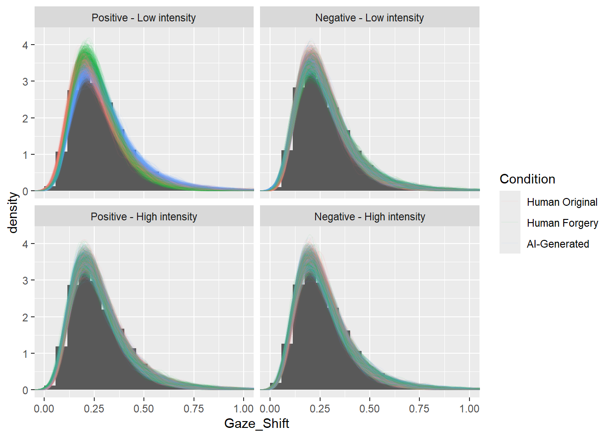{#fig-shift fig-alt='Gaze maximal shift (largest within-trial relocation of the gaze centroid, in stimulus widths, truncated at 1): observed distribution with posterior-predictive densities per label condition (500 draws), one panel per stimulus emotion quadrant.' width=672}
:::
:::


:::


## Phase 2

::: {.panel-tabset}

### Syntheticness


::: {.cell}

```{.r .cell-code}
make_report(estimates$Reality)
```

::: {.cell-output-display}

```{=html}
<div id="nsixesehlu" style="padding-left:0px;padding-right:0px;padding-top:10px;padding-bottom:10px;overflow-x:auto;overflow-y:auto;width:auto;height:auto;">
<style>#nsixesehlu table {
  font-family: system-ui, 'Segoe UI', Roboto, Helvetica, Arial, sans-serif, 'Apple Color Emoji', 'Segoe UI Emoji', 'Segoe UI Symbol', 'Noto Color Emoji';
  -webkit-font-smoothing: antialiased;
  -moz-osx-font-smoothing: grayscale;
}

#nsixesehlu thead, #nsixesehlu tbody, #nsixesehlu tfoot, #nsixesehlu tr, #nsixesehlu td, #nsixesehlu th {
  border-style: none;
}

#nsixesehlu p {
  margin: 0;
  padding: 0;
}

#nsixesehlu .gt_table {
  display: table;
  border-collapse: collapse;
  line-height: normal;
  margin-left: auto;
  margin-right: auto;
  color: #333333;
  font-size: 16px;
  font-weight: normal;
  font-style: normal;
  background-color: #FFFFFF;
  width: auto;
  border-top-style: solid;
  border-top-width: 2px;
  border-top-color: #A8A8A8;
  border-right-style: none;
  border-right-width: 2px;
  border-right-color: #D3D3D3;
  border-bottom-style: solid;
  border-bottom-width: 2px;
  border-bottom-color: #A8A8A8;
  border-left-style: none;
  border-left-width: 2px;
  border-left-color: #D3D3D3;
}

#nsixesehlu .gt_caption {
  padding-top: 4px;
  padding-bottom: 4px;
}

#nsixesehlu .gt_title {
  color: #333333;
  font-size: 125%;
  font-weight: initial;
  padding-top: 4px;
  padding-bottom: 4px;
  padding-left: 5px;
  padding-right: 5px;
  border-bottom-color: #FFFFFF;
  border-bottom-width: 0;
}

#nsixesehlu .gt_subtitle {
  color: #333333;
  font-size: 85%;
  font-weight: initial;
  padding-top: 3px;
  padding-bottom: 5px;
  padding-left: 5px;
  padding-right: 5px;
  border-top-color: #FFFFFF;
  border-top-width: 0;
}

#nsixesehlu .gt_heading {
  background-color: #FFFFFF;
  text-align: center;
  border-bottom-color: #FFFFFF;
  border-left-style: none;
  border-left-width: 1px;
  border-left-color: #D3D3D3;
  border-right-style: none;
  border-right-width: 1px;
  border-right-color: #D3D3D3;
}

#nsixesehlu .gt_bottom_border {
  border-bottom-style: solid;
  border-bottom-width: 2px;
  border-bottom-color: #D3D3D3;
}

#nsixesehlu .gt_col_headings {
  border-top-style: solid;
  border-top-width: 2px;
  border-top-color: #D3D3D3;
  border-bottom-style: solid;
  border-bottom-width: 2px;
  border-bottom-color: #D3D3D3;
  border-left-style: none;
  border-left-width: 1px;
  border-left-color: #D3D3D3;
  border-right-style: none;
  border-right-width: 1px;
  border-right-color: #D3D3D3;
}

#nsixesehlu .gt_col_heading {
  color: #333333;
  background-color: #FFFFFF;
  font-size: 100%;
  font-weight: normal;
  text-transform: inherit;
  border-left-style: none;
  border-left-width: 1px;
  border-left-color: #D3D3D3;
  border-right-style: none;
  border-right-width: 1px;
  border-right-color: #D3D3D3;
  vertical-align: bottom;
  padding-top: 5px;
  padding-bottom: 6px;
  padding-left: 5px;
  padding-right: 5px;
  overflow-x: hidden;
}

#nsixesehlu .gt_column_spanner_outer {
  color: #333333;
  background-color: #FFFFFF;
  font-size: 100%;
  font-weight: normal;
  text-transform: inherit;
  padding-top: 0;
  padding-bottom: 0;
  padding-left: 4px;
  padding-right: 4px;
}

#nsixesehlu .gt_column_spanner_outer:first-child {
  padding-left: 0;
}

#nsixesehlu .gt_column_spanner_outer:last-child {
  padding-right: 0;
}

#nsixesehlu .gt_column_spanner {
  border-bottom-style: solid;
  border-bottom-width: 2px;
  border-bottom-color: #D3D3D3;
  vertical-align: bottom;
  padding-top: 5px;
  padding-bottom: 5px;
  overflow-x: hidden;
  display: inline-block;
  width: 100%;
}

#nsixesehlu .gt_spanner_row {
  border-bottom-style: hidden;
}

#nsixesehlu .gt_group_heading {
  padding-top: 8px;
  padding-bottom: 8px;
  padding-left: 5px;
  padding-right: 5px;
  color: #333333;
  background-color: #FFFFFF;
  font-size: 100%;
  font-weight: initial;
  text-transform: inherit;
  border-top-style: solid;
  border-top-width: 2px;
  border-top-color: #D3D3D3;
  border-bottom-style: solid;
  border-bottom-width: 2px;
  border-bottom-color: #D3D3D3;
  border-left-style: none;
  border-left-width: 1px;
  border-left-color: #D3D3D3;
  border-right-style: none;
  border-right-width: 1px;
  border-right-color: #D3D3D3;
  vertical-align: middle;
  text-align: left;
}

#nsixesehlu .gt_empty_group_heading {
  padding: 0.5px;
  color: #333333;
  background-color: #FFFFFF;
  font-size: 100%;
  font-weight: initial;
  border-top-style: solid;
  border-top-width: 2px;
  border-top-color: #D3D3D3;
  border-bottom-style: solid;
  border-bottom-width: 2px;
  border-bottom-color: #D3D3D3;
  vertical-align: middle;
}

#nsixesehlu .gt_from_md > :first-child {
  margin-top: 0;
}

#nsixesehlu .gt_from_md > :last-child {
  margin-bottom: 0;
}

#nsixesehlu .gt_row {
  padding-top: 8px;
  padding-bottom: 8px;
  padding-left: 5px;
  padding-right: 5px;
  margin: 10px;
  border-top-style: solid;
  border-top-width: 1px;
  border-top-color: #D3D3D3;
  border-left-style: none;
  border-left-width: 1px;
  border-left-color: #D3D3D3;
  border-right-style: none;
  border-right-width: 1px;
  border-right-color: #D3D3D3;
  vertical-align: middle;
  overflow-x: hidden;
}

#nsixesehlu .gt_stub {
  color: #333333;
  background-color: #FFFFFF;
  font-size: 100%;
  font-weight: initial;
  text-transform: inherit;
  border-right-style: solid;
  border-right-width: 2px;
  border-right-color: #D3D3D3;
  padding-left: 5px;
  padding-right: 5px;
}

#nsixesehlu .gt_stub_row_group {
  color: #333333;
  background-color: #FFFFFF;
  font-size: 100%;
  font-weight: initial;
  text-transform: inherit;
  border-right-style: solid;
  border-right-width: 2px;
  border-right-color: #D3D3D3;
  padding-left: 5px;
  padding-right: 5px;
  vertical-align: top;
}

#nsixesehlu .gt_row_group_first td {
  border-top-width: 2px;
}

#nsixesehlu .gt_row_group_first th {
  border-top-width: 2px;
}

#nsixesehlu .gt_summary_row {
  color: #333333;
  background-color: #FFFFFF;
  text-transform: inherit;
  padding-top: 8px;
  padding-bottom: 8px;
  padding-left: 5px;
  padding-right: 5px;
}

#nsixesehlu .gt_first_summary_row {
  border-top-style: solid;
  border-top-color: #D3D3D3;
}

#nsixesehlu .gt_first_summary_row.thick {
  border-top-width: 2px;
}

#nsixesehlu .gt_last_summary_row {
  padding-top: 8px;
  padding-bottom: 8px;
  padding-left: 5px;
  padding-right: 5px;
  border-bottom-style: solid;
  border-bottom-width: 2px;
  border-bottom-color: #D3D3D3;
}

#nsixesehlu .gt_grand_summary_row {
  color: #333333;
  background-color: #FFFFFF;
  text-transform: inherit;
  padding-top: 8px;
  padding-bottom: 8px;
  padding-left: 5px;
  padding-right: 5px;
}

#nsixesehlu .gt_first_grand_summary_row {
  padding-top: 8px;
  padding-bottom: 8px;
  padding-left: 5px;
  padding-right: 5px;
  border-top-style: double;
  border-top-width: 6px;
  border-top-color: #D3D3D3;
}

#nsixesehlu .gt_last_grand_summary_row_top {
  padding-top: 8px;
  padding-bottom: 8px;
  padding-left: 5px;
  padding-right: 5px;
  border-bottom-style: double;
  border-bottom-width: 6px;
  border-bottom-color: #D3D3D3;
}

#nsixesehlu .gt_striped {
  background-color: rgba(128, 128, 128, 0.05);
}

#nsixesehlu .gt_table_body {
  border-top-style: solid;
  border-top-width: 2px;
  border-top-color: #D3D3D3;
  border-bottom-style: solid;
  border-bottom-width: 2px;
  border-bottom-color: #D3D3D3;
}

#nsixesehlu .gt_footnotes {
  color: #333333;
  background-color: #FFFFFF;
  border-bottom-style: none;
  border-bottom-width: 2px;
  border-bottom-color: #D3D3D3;
  border-left-style: none;
  border-left-width: 2px;
  border-left-color: #D3D3D3;
  border-right-style: none;
  border-right-width: 2px;
  border-right-color: #D3D3D3;
}

#nsixesehlu .gt_footnote {
  margin: 0px;
  font-size: 90%;
  padding-top: 4px;
  padding-bottom: 4px;
  padding-left: 5px;
  padding-right: 5px;
}

#nsixesehlu .gt_sourcenotes {
  color: #333333;
  background-color: #FFFFFF;
  border-bottom-style: none;
  border-bottom-width: 2px;
  border-bottom-color: #D3D3D3;
  border-left-style: none;
  border-left-width: 2px;
  border-left-color: #D3D3D3;
  border-right-style: none;
  border-right-width: 2px;
  border-right-color: #D3D3D3;
}

#nsixesehlu .gt_sourcenote {
  font-size: 90%;
  padding-top: 4px;
  padding-bottom: 4px;
  padding-left: 5px;
  padding-right: 5px;
}

#nsixesehlu .gt_left {
  text-align: left;
}

#nsixesehlu .gt_center {
  text-align: center;
}

#nsixesehlu .gt_right {
  text-align: right;
  font-variant-numeric: tabular-nums;
}

#nsixesehlu .gt_font_normal {
  font-weight: normal;
}

#nsixesehlu .gt_font_bold {
  font-weight: bold;
}

#nsixesehlu .gt_font_italic {
  font-style: italic;
}

#nsixesehlu .gt_super {
  font-size: 65%;
}

#nsixesehlu .gt_footnote_marks {
  font-size: 75%;
  vertical-align: 0.4em;
  position: initial;
}

#nsixesehlu .gt_asterisk {
  font-size: 100%;
  vertical-align: 0;
}

#nsixesehlu .gt_indent_1 {
  text-indent: 5px;
}

#nsixesehlu .gt_indent_2 {
  text-indent: 10px;
}

#nsixesehlu .gt_indent_3 {
  text-indent: 15px;
}

#nsixesehlu .gt_indent_4 {
  text-indent: 20px;
}

#nsixesehlu .gt_indent_5 {
  text-indent: 25px;
}

#nsixesehlu .katex-display {
  display: inline-flex !important;
  margin-bottom: 0.75em !important;
}

#nsixesehlu div.Reactable > div.rt-table > div.rt-thead > div.rt-tr.rt-tr-group-header > div.rt-th-group:after {
  height: 0px !important;
}
</style>
<table class="gt_table" data-quarto-disable-processing="false" data-quarto-bootstrap="false">
  <thead>
    <tr class="gt_col_headings">
      <th class="gt_col_heading gt_columns_bottom_border gt_left" rowspan="1" colspan="1" scope="col" id="Contrast">Contrast</th>
      <th class="gt_col_heading gt_columns_bottom_border gt_left" rowspan="1" colspan="1" scope="col" id="Parameters">Parameters</th>
    </tr>
  </thead>
  <tbody class="gt_table_body">
    <tr><td headers="Contrast" class="gt_row gt_left">Human Forgery - Human Original</td>
<td headers="Parameters" class="gt_row gt_left">response (-0.01, [-0.03,  0.00])</td></tr>
    <tr><td headers="Contrast" class="gt_row gt_left">AI-Generated - Human Original</td>
<td headers="Parameters" class="gt_row gt_left">response (-0.06, [-0.07, -0.04]); mu (-0.08, [-0.10, -0.06]); confright (-0.03, [-0.04, -0.01]); pex (0.00, [ 0.00,  0.01])</td></tr>
    <tr><td headers="Contrast" class="gt_row gt_left">AI-Generated - Human Forgery</td>
<td headers="Parameters" class="gt_row gt_left">response (-0.04, [-0.06, -0.03]); mu (-0.06, [-0.08, -0.03]); confright (-0.02, [-0.03, -0.01])</td></tr>
  </tbody>
  
</table>
</div>
```

```{=html}
<div id="vztmhigvys" style="padding-left:0px;padding-right:0px;padding-top:10px;padding-bottom:10px;overflow-x:auto;overflow-y:auto;width:auto;height:auto;">
<style>#vztmhigvys table {
  font-family: system-ui, 'Segoe UI', Roboto, Helvetica, Arial, sans-serif, 'Apple Color Emoji', 'Segoe UI Emoji', 'Segoe UI Symbol', 'Noto Color Emoji';
  -webkit-font-smoothing: antialiased;
  -moz-osx-font-smoothing: grayscale;
}

#vztmhigvys thead, #vztmhigvys tbody, #vztmhigvys tfoot, #vztmhigvys tr, #vztmhigvys td, #vztmhigvys th {
  border-style: none;
}

#vztmhigvys p {
  margin: 0;
  padding: 0;
}

#vztmhigvys .gt_table {
  display: table;
  border-collapse: collapse;
  line-height: normal;
  margin-left: auto;
  margin-right: auto;
  color: #333333;
  font-size: 13px;
  font-weight: normal;
  font-style: normal;
  background-color: #FFFFFF;
  width: auto;
  border-top-style: solid;
  border-top-width: 3px;
  border-top-color: #D5D5D5;
  border-right-style: solid;
  border-right-width: 3px;
  border-right-color: #D5D5D5;
  border-bottom-style: solid;
  border-bottom-width: 3px;
  border-bottom-color: #D5D5D5;
  border-left-style: solid;
  border-left-width: 3px;
  border-left-color: #D5D5D5;
}

#vztmhigvys .gt_caption {
  padding-top: 4px;
  padding-bottom: 4px;
}

#vztmhigvys .gt_title {
  color: #333333;
  font-size: 125%;
  font-weight: initial;
  padding-top: 4px;
  padding-bottom: 4px;
  padding-left: 5px;
  padding-right: 5px;
  border-bottom-color: #FFFFFF;
  border-bottom-width: 0;
}

#vztmhigvys .gt_subtitle {
  color: #333333;
  font-size: 85%;
  font-weight: initial;
  padding-top: 3px;
  padding-bottom: 5px;
  padding-left: 5px;
  padding-right: 5px;
  border-top-color: #FFFFFF;
  border-top-width: 0;
}

#vztmhigvys .gt_heading {
  background-color: #FFFFFF;
  text-align: left;
  border-bottom-color: #FFFFFF;
  border-left-style: none;
  border-left-width: 1px;
  border-left-color: #D3D3D3;
  border-right-style: none;
  border-right-width: 1px;
  border-right-color: #D3D3D3;
}

#vztmhigvys .gt_bottom_border {
  border-bottom-style: solid;
  border-bottom-width: 2px;
  border-bottom-color: #D5D5D5;
}

#vztmhigvys .gt_col_headings {
  border-top-style: solid;
  border-top-width: 2px;
  border-top-color: #D5D5D5;
  border-bottom-style: solid;
  border-bottom-width: 2px;
  border-bottom-color: #D5D5D5;
  border-left-style: none;
  border-left-width: 1px;
  border-left-color: #D3D3D3;
  border-right-style: none;
  border-right-width: 1px;
  border-right-color: #D3D3D3;
}

#vztmhigvys .gt_col_heading {
  color: #FFFFFF;
  background-color: #000000;
  font-size: 100%;
  font-weight: normal;
  text-transform: inherit;
  border-left-style: none;
  border-left-width: 1px;
  border-left-color: #D3D3D3;
  border-right-style: none;
  border-right-width: 1px;
  border-right-color: #D3D3D3;
  vertical-align: bottom;
  padding-top: 5px;
  padding-bottom: 6px;
  padding-left: 5px;
  padding-right: 5px;
  overflow-x: hidden;
}

#vztmhigvys .gt_column_spanner_outer {
  color: #FFFFFF;
  background-color: #000000;
  font-size: 100%;
  font-weight: normal;
  text-transform: inherit;
  padding-top: 0;
  padding-bottom: 0;
  padding-left: 4px;
  padding-right: 4px;
}

#vztmhigvys .gt_column_spanner_outer:first-child {
  padding-left: 0;
}

#vztmhigvys .gt_column_spanner_outer:last-child {
  padding-right: 0;
}

#vztmhigvys .gt_column_spanner {
  border-bottom-style: solid;
  border-bottom-width: 2px;
  border-bottom-color: #D5D5D5;
  vertical-align: bottom;
  padding-top: 5px;
  padding-bottom: 5px;
  overflow-x: hidden;
  display: inline-block;
  width: 100%;
}

#vztmhigvys .gt_spanner_row {
  border-bottom-style: hidden;
}

#vztmhigvys .gt_group_heading {
  padding-top: 8px;
  padding-bottom: 8px;
  padding-left: 5px;
  padding-right: 5px;
  color: #333333;
  background-color: #FFFFFF;
  font-size: 100%;
  font-weight: initial;
  text-transform: inherit;
  border-top-style: solid;
  border-top-width: 2px;
  border-top-color: #D5D5D5;
  border-bottom-style: solid;
  border-bottom-width: 2px;
  border-bottom-color: #D5D5D5;
  border-left-style: none;
  border-left-width: 1px;
  border-left-color: #D3D3D3;
  border-right-style: none;
  border-right-width: 1px;
  border-right-color: #D3D3D3;
  vertical-align: middle;
  text-align: left;
}

#vztmhigvys .gt_empty_group_heading {
  padding: 0.5px;
  color: #333333;
  background-color: #FFFFFF;
  font-size: 100%;
  font-weight: initial;
  border-top-style: solid;
  border-top-width: 2px;
  border-top-color: #D5D5D5;
  border-bottom-style: solid;
  border-bottom-width: 2px;
  border-bottom-color: #D5D5D5;
  vertical-align: middle;
}

#vztmhigvys .gt_from_md > :first-child {
  margin-top: 0;
}

#vztmhigvys .gt_from_md > :last-child {
  margin-bottom: 0;
}

#vztmhigvys .gt_row {
  padding-top: 8px;
  padding-bottom: 8px;
  padding-left: 5px;
  padding-right: 5px;
  margin: 10px;
  border-top-style: solid;
  border-top-width: 1px;
  border-top-color: #D5D5D5;
  border-left-style: solid;
  border-left-width: 1px;
  border-left-color: #D5D5D5;
  border-right-style: solid;
  border-right-width: 1px;
  border-right-color: #D5D5D5;
  vertical-align: middle;
  overflow-x: hidden;
}

#vztmhigvys .gt_stub {
  color: #333333;
  background-color: #FFFFFF;
  font-size: 100%;
  font-weight: initial;
  text-transform: inherit;
  border-right-style: solid;
  border-right-width: 2px;
  border-right-color: #5F5F5F;
  padding-left: 5px;
  padding-right: 5px;
}

#vztmhigvys .gt_stub_row_group {
  color: #333333;
  background-color: #FFFFFF;
  font-size: 100%;
  font-weight: initial;
  text-transform: inherit;
  border-right-style: solid;
  border-right-width: 2px;
  border-right-color: #D3D3D3;
  padding-left: 5px;
  padding-right: 5px;
  vertical-align: top;
}

#vztmhigvys .gt_row_group_first td {
  border-top-width: 2px;
}

#vztmhigvys .gt_row_group_first th {
  border-top-width: 2px;
}

#vztmhigvys .gt_summary_row {
  color: #333333;
  background-color: #D5D5D5;
  text-transform: inherit;
  padding-top: 8px;
  padding-bottom: 8px;
  padding-left: 5px;
  padding-right: 5px;
}

#vztmhigvys .gt_first_summary_row {
  border-top-style: solid;
  border-top-color: #D5D5D5;
}

#vztmhigvys .gt_first_summary_row.thick {
  border-top-width: 2px;
}

#vztmhigvys .gt_last_summary_row {
  padding-top: 8px;
  padding-bottom: 8px;
  padding-left: 5px;
  padding-right: 5px;
  border-bottom-style: solid;
  border-bottom-width: 2px;
  border-bottom-color: #D5D5D5;
}

#vztmhigvys .gt_grand_summary_row {
  color: #FFFFFF;
  background-color: #929292;
  text-transform: inherit;
  padding-top: 8px;
  padding-bottom: 8px;
  padding-left: 5px;
  padding-right: 5px;
}

#vztmhigvys .gt_first_grand_summary_row {
  padding-top: 8px;
  padding-bottom: 8px;
  padding-left: 5px;
  padding-right: 5px;
  border-top-style: double;
  border-top-width: 6px;
  border-top-color: #D5D5D5;
}

#vztmhigvys .gt_last_grand_summary_row_top {
  padding-top: 8px;
  padding-bottom: 8px;
  padding-left: 5px;
  padding-right: 5px;
  border-bottom-style: double;
  border-bottom-width: 6px;
  border-bottom-color: #D5D5D5;
}

#vztmhigvys .gt_striped {
  background-color: #F4F4F4;
}

#vztmhigvys .gt_table_body {
  border-top-style: solid;
  border-top-width: 2px;
  border-top-color: #D5D5D5;
  border-bottom-style: solid;
  border-bottom-width: 2px;
  border-bottom-color: #D5D5D5;
}

#vztmhigvys .gt_footnotes {
  color: #333333;
  background-color: #FFFFFF;
  border-bottom-style: none;
  border-bottom-width: 2px;
  border-bottom-color: #D3D3D3;
  border-left-style: none;
  border-left-width: 2px;
  border-left-color: #D3D3D3;
  border-right-style: none;
  border-right-width: 2px;
  border-right-color: #D3D3D3;
}

#vztmhigvys .gt_footnote {
  margin: 0px;
  font-size: 90%;
  padding-top: 4px;
  padding-bottom: 4px;
  padding-left: 5px;
  padding-right: 5px;
}

#vztmhigvys .gt_sourcenotes {
  color: #333333;
  background-color: #FFFFFF;
  border-bottom-style: none;
  border-bottom-width: 2px;
  border-bottom-color: #D3D3D3;
  border-left-style: none;
  border-left-width: 2px;
  border-left-color: #D3D3D3;
  border-right-style: none;
  border-right-width: 2px;
  border-right-color: #D3D3D3;
}

#vztmhigvys .gt_sourcenote {
  font-size: 90%;
  padding-top: 4px;
  padding-bottom: 4px;
  padding-left: 5px;
  padding-right: 5px;
}

#vztmhigvys .gt_left {
  text-align: left;
}

#vztmhigvys .gt_center {
  text-align: center;
}

#vztmhigvys .gt_right {
  text-align: right;
  font-variant-numeric: tabular-nums;
}

#vztmhigvys .gt_font_normal {
  font-weight: normal;
}

#vztmhigvys .gt_font_bold {
  font-weight: bold;
}

#vztmhigvys .gt_font_italic {
  font-style: italic;
}

#vztmhigvys .gt_super {
  font-size: 65%;
}

#vztmhigvys .gt_footnote_marks {
  font-size: 75%;
  vertical-align: 0.4em;
  position: initial;
}

#vztmhigvys .gt_asterisk {
  font-size: 100%;
  vertical-align: 0;
}

#vztmhigvys .gt_indent_1 {
  text-indent: 5px;
}

#vztmhigvys .gt_indent_2 {
  text-indent: 10px;
}

#vztmhigvys .gt_indent_3 {
  text-indent: 15px;
}

#vztmhigvys .gt_indent_4 {
  text-indent: 20px;
}

#vztmhigvys .gt_indent_5 {
  text-indent: 25px;
}

#vztmhigvys .katex-display {
  display: inline-flex !important;
  margin-bottom: 0.75em !important;
}

#vztmhigvys div.Reactable > div.rt-table > div.rt-thead > div.rt-tr.rt-tr-group-header > div.rt-th-group:after {
  height: 0px !important;
}
</style>
<table class="gt_table" data-quarto-disable-processing="false" data-quarto-bootstrap="false">
  <thead>
    <tr class="gt_heading">
      <td colspan="10" class="gt_heading gt_title gt_font_normal gt_bottom_border" style>Syntheticness: convergence</td>
    </tr>
    
    <tr class="gt_col_headings">
      <th class="gt_col_heading gt_columns_bottom_border gt_left" rowspan="1" colspan="1" scope="col" id="Model">Model</th>
      <th class="gt_col_heading gt_columns_bottom_border gt_left" rowspan="1" colspan="1" scope="col" id="Family">Family</th>
      <th class="gt_col_heading gt_columns_bottom_border gt_right" rowspan="1" colspan="1" scope="col" id="N_obs">N_obs</th>
      <th class="gt_col_heading gt_columns_bottom_border gt_right" rowspan="1" colspan="1" scope="col" id="N_participants">N_participants</th>
      <th class="gt_col_heading gt_columns_bottom_border gt_right" rowspan="1" colspan="1" scope="col" id="Chains">Chains</th>
      <th class="gt_col_heading gt_columns_bottom_border gt_right" rowspan="1" colspan="1" scope="col" id="Draws">Draws</th>
      <th class="gt_col_heading gt_columns_bottom_border gt_right" rowspan="1" colspan="1" scope="col" id="Max_Rhat">Max_Rhat</th>
      <th class="gt_col_heading gt_columns_bottom_border gt_right" rowspan="1" colspan="1" scope="col" id="Min_ESS_ratio">Min_ESS_ratio</th>
      <th class="gt_col_heading gt_columns_bottom_border gt_right" rowspan="1" colspan="1" scope="col" id="Divergent_pct">Divergent_pct</th>
      <th class="gt_col_heading gt_columns_bottom_border gt_left" rowspan="1" colspan="1" scope="col" id="Criterion">Criterion</th>
    </tr>
  </thead>
  <tbody class="gt_table_body">
    <tr><td headers="Model" class="gt_row gt_left">Reality</td>
<td headers="Family" class="gt_row gt_left">CHOCO</td>
<td headers="N_obs" class="gt_row gt_right">15216</td>
<td headers="N_participants" class="gt_row gt_right">317</td>
<td headers="Chains" class="gt_row gt_right">8</td>
<td headers="Draws" class="gt_row gt_right">4000</td>
<td headers="Max_Rhat" class="gt_row gt_right">1.071</td>
<td headers="Min_ESS_ratio" class="gt_row gt_right">0.02</td>
<td headers="Divergent_pct" class="gt_row gt_right">0</td>
<td headers="Criterion" class="gt_row gt_left">loo</td></tr>
  </tbody>
  
</table>
</div>
```


::: {.callout-note collapse="true" title="Syntheticness: convergence (Markdown table, for text readers)"}

|Model   |Family | N_obs| N_participants| Chains| Draws| Max_Rhat| Min_ESS_ratio| Divergent_pct|Criterion |
|:-------|:------|-----:|--------------:|------:|-----:|--------:|-------------:|-------------:|:---------|
|Reality |CHOCO  | 15216|            317|      8|  4000|    1.071|          0.02|             0|loo       |

:::

```{=html}
<div id="vqhpjucioa" style="padding-left:0px;padding-right:0px;padding-top:10px;padding-bottom:10px;overflow-x:auto;overflow-y:auto;width:auto;height:auto;">
<style>#vqhpjucioa table {
  font-family: system-ui, 'Segoe UI', Roboto, Helvetica, Arial, sans-serif, 'Apple Color Emoji', 'Segoe UI Emoji', 'Segoe UI Symbol', 'Noto Color Emoji';
  -webkit-font-smoothing: antialiased;
  -moz-osx-font-smoothing: grayscale;
}

#vqhpjucioa thead, #vqhpjucioa tbody, #vqhpjucioa tfoot, #vqhpjucioa tr, #vqhpjucioa td, #vqhpjucioa th {
  border-style: none;
}

#vqhpjucioa p {
  margin: 0;
  padding: 0;
}

#vqhpjucioa .gt_table {
  display: table;
  border-collapse: collapse;
  line-height: normal;
  margin-left: auto;
  margin-right: auto;
  color: #333333;
  font-size: 13px;
  font-weight: normal;
  font-style: normal;
  background-color: #FFFFFF;
  width: auto;
  border-top-style: solid;
  border-top-width: 3px;
  border-top-color: #D5D5D5;
  border-right-style: solid;
  border-right-width: 3px;
  border-right-color: #D5D5D5;
  border-bottom-style: solid;
  border-bottom-width: 3px;
  border-bottom-color: #D5D5D5;
  border-left-style: solid;
  border-left-width: 3px;
  border-left-color: #D5D5D5;
}

#vqhpjucioa .gt_caption {
  padding-top: 4px;
  padding-bottom: 4px;
}

#vqhpjucioa .gt_title {
  color: #333333;
  font-size: 125%;
  font-weight: initial;
  padding-top: 4px;
  padding-bottom: 4px;
  padding-left: 5px;
  padding-right: 5px;
  border-bottom-color: #FFFFFF;
  border-bottom-width: 0;
}

#vqhpjucioa .gt_subtitle {
  color: #333333;
  font-size: 85%;
  font-weight: initial;
  padding-top: 3px;
  padding-bottom: 5px;
  padding-left: 5px;
  padding-right: 5px;
  border-top-color: #FFFFFF;
  border-top-width: 0;
}

#vqhpjucioa .gt_heading {
  background-color: #FFFFFF;
  text-align: left;
  border-bottom-color: #FFFFFF;
  border-left-style: none;
  border-left-width: 1px;
  border-left-color: #D3D3D3;
  border-right-style: none;
  border-right-width: 1px;
  border-right-color: #D3D3D3;
}

#vqhpjucioa .gt_bottom_border {
  border-bottom-style: solid;
  border-bottom-width: 2px;
  border-bottom-color: #D5D5D5;
}

#vqhpjucioa .gt_col_headings {
  border-top-style: solid;
  border-top-width: 2px;
  border-top-color: #D5D5D5;
  border-bottom-style: solid;
  border-bottom-width: 2px;
  border-bottom-color: #D5D5D5;
  border-left-style: none;
  border-left-width: 1px;
  border-left-color: #D3D3D3;
  border-right-style: none;
  border-right-width: 1px;
  border-right-color: #D3D3D3;
}

#vqhpjucioa .gt_col_heading {
  color: #FFFFFF;
  background-color: #000000;
  font-size: 100%;
  font-weight: normal;
  text-transform: inherit;
  border-left-style: none;
  border-left-width: 1px;
  border-left-color: #D3D3D3;
  border-right-style: none;
  border-right-width: 1px;
  border-right-color: #D3D3D3;
  vertical-align: bottom;
  padding-top: 5px;
  padding-bottom: 6px;
  padding-left: 5px;
  padding-right: 5px;
  overflow-x: hidden;
}

#vqhpjucioa .gt_column_spanner_outer {
  color: #FFFFFF;
  background-color: #000000;
  font-size: 100%;
  font-weight: normal;
  text-transform: inherit;
  padding-top: 0;
  padding-bottom: 0;
  padding-left: 4px;
  padding-right: 4px;
}

#vqhpjucioa .gt_column_spanner_outer:first-child {
  padding-left: 0;
}

#vqhpjucioa .gt_column_spanner_outer:last-child {
  padding-right: 0;
}

#vqhpjucioa .gt_column_spanner {
  border-bottom-style: solid;
  border-bottom-width: 2px;
  border-bottom-color: #D5D5D5;
  vertical-align: bottom;
  padding-top: 5px;
  padding-bottom: 5px;
  overflow-x: hidden;
  display: inline-block;
  width: 100%;
}

#vqhpjucioa .gt_spanner_row {
  border-bottom-style: hidden;
}

#vqhpjucioa .gt_group_heading {
  padding-top: 8px;
  padding-bottom: 8px;
  padding-left: 5px;
  padding-right: 5px;
  color: #333333;
  background-color: #FFFFFF;
  font-size: 100%;
  font-weight: initial;
  text-transform: inherit;
  border-top-style: solid;
  border-top-width: 2px;
  border-top-color: #D5D5D5;
  border-bottom-style: solid;
  border-bottom-width: 2px;
  border-bottom-color: #D5D5D5;
  border-left-style: none;
  border-left-width: 1px;
  border-left-color: #D3D3D3;
  border-right-style: none;
  border-right-width: 1px;
  border-right-color: #D3D3D3;
  vertical-align: middle;
  text-align: left;
}

#vqhpjucioa .gt_empty_group_heading {
  padding: 0.5px;
  color: #333333;
  background-color: #FFFFFF;
  font-size: 100%;
  font-weight: initial;
  border-top-style: solid;
  border-top-width: 2px;
  border-top-color: #D5D5D5;
  border-bottom-style: solid;
  border-bottom-width: 2px;
  border-bottom-color: #D5D5D5;
  vertical-align: middle;
}

#vqhpjucioa .gt_from_md > :first-child {
  margin-top: 0;
}

#vqhpjucioa .gt_from_md > :last-child {
  margin-bottom: 0;
}

#vqhpjucioa .gt_row {
  padding-top: 8px;
  padding-bottom: 8px;
  padding-left: 5px;
  padding-right: 5px;
  margin: 10px;
  border-top-style: solid;
  border-top-width: 1px;
  border-top-color: #D5D5D5;
  border-left-style: solid;
  border-left-width: 1px;
  border-left-color: #D5D5D5;
  border-right-style: solid;
  border-right-width: 1px;
  border-right-color: #D5D5D5;
  vertical-align: middle;
  overflow-x: hidden;
}

#vqhpjucioa .gt_stub {
  color: #333333;
  background-color: #FFFFFF;
  font-size: 100%;
  font-weight: initial;
  text-transform: inherit;
  border-right-style: solid;
  border-right-width: 2px;
  border-right-color: #5F5F5F;
  padding-left: 5px;
  padding-right: 5px;
}

#vqhpjucioa .gt_stub_row_group {
  color: #333333;
  background-color: #FFFFFF;
  font-size: 100%;
  font-weight: initial;
  text-transform: inherit;
  border-right-style: solid;
  border-right-width: 2px;
  border-right-color: #D3D3D3;
  padding-left: 5px;
  padding-right: 5px;
  vertical-align: top;
}

#vqhpjucioa .gt_row_group_first td {
  border-top-width: 2px;
}

#vqhpjucioa .gt_row_group_first th {
  border-top-width: 2px;
}

#vqhpjucioa .gt_summary_row {
  color: #333333;
  background-color: #D5D5D5;
  text-transform: inherit;
  padding-top: 8px;
  padding-bottom: 8px;
  padding-left: 5px;
  padding-right: 5px;
}

#vqhpjucioa .gt_first_summary_row {
  border-top-style: solid;
  border-top-color: #D5D5D5;
}

#vqhpjucioa .gt_first_summary_row.thick {
  border-top-width: 2px;
}

#vqhpjucioa .gt_last_summary_row {
  padding-top: 8px;
  padding-bottom: 8px;
  padding-left: 5px;
  padding-right: 5px;
  border-bottom-style: solid;
  border-bottom-width: 2px;
  border-bottom-color: #D5D5D5;
}

#vqhpjucioa .gt_grand_summary_row {
  color: #FFFFFF;
  background-color: #929292;
  text-transform: inherit;
  padding-top: 8px;
  padding-bottom: 8px;
  padding-left: 5px;
  padding-right: 5px;
}

#vqhpjucioa .gt_first_grand_summary_row {
  padding-top: 8px;
  padding-bottom: 8px;
  padding-left: 5px;
  padding-right: 5px;
  border-top-style: double;
  border-top-width: 6px;
  border-top-color: #D5D5D5;
}

#vqhpjucioa .gt_last_grand_summary_row_top {
  padding-top: 8px;
  padding-bottom: 8px;
  padding-left: 5px;
  padding-right: 5px;
  border-bottom-style: double;
  border-bottom-width: 6px;
  border-bottom-color: #D5D5D5;
}

#vqhpjucioa .gt_striped {
  background-color: #F4F4F4;
}

#vqhpjucioa .gt_table_body {
  border-top-style: solid;
  border-top-width: 2px;
  border-top-color: #D5D5D5;
  border-bottom-style: solid;
  border-bottom-width: 2px;
  border-bottom-color: #D5D5D5;
}

#vqhpjucioa .gt_footnotes {
  color: #333333;
  background-color: #FFFFFF;
  border-bottom-style: none;
  border-bottom-width: 2px;
  border-bottom-color: #D3D3D3;
  border-left-style: none;
  border-left-width: 2px;
  border-left-color: #D3D3D3;
  border-right-style: none;
  border-right-width: 2px;
  border-right-color: #D3D3D3;
}

#vqhpjucioa .gt_footnote {
  margin: 0px;
  font-size: 90%;
  padding-top: 4px;
  padding-bottom: 4px;
  padding-left: 5px;
  padding-right: 5px;
}

#vqhpjucioa .gt_sourcenotes {
  color: #333333;
  background-color: #FFFFFF;
  border-bottom-style: none;
  border-bottom-width: 2px;
  border-bottom-color: #D3D3D3;
  border-left-style: none;
  border-left-width: 2px;
  border-left-color: #D3D3D3;
  border-right-style: none;
  border-right-width: 2px;
  border-right-color: #D3D3D3;
}

#vqhpjucioa .gt_sourcenote {
  font-size: 90%;
  padding-top: 4px;
  padding-bottom: 4px;
  padding-left: 5px;
  padding-right: 5px;
}

#vqhpjucioa .gt_left {
  text-align: left;
}

#vqhpjucioa .gt_center {
  text-align: center;
}

#vqhpjucioa .gt_right {
  text-align: right;
  font-variant-numeric: tabular-nums;
}

#vqhpjucioa .gt_font_normal {
  font-weight: normal;
}

#vqhpjucioa .gt_font_bold {
  font-weight: bold;
}

#vqhpjucioa .gt_font_italic {
  font-style: italic;
}

#vqhpjucioa .gt_super {
  font-size: 65%;
}

#vqhpjucioa .gt_footnote_marks {
  font-size: 75%;
  vertical-align: 0.4em;
  position: initial;
}

#vqhpjucioa .gt_asterisk {
  font-size: 100%;
  vertical-align: 0;
}

#vqhpjucioa .gt_indent_1 {
  text-indent: 5px;
}

#vqhpjucioa .gt_indent_2 {
  text-indent: 10px;
}

#vqhpjucioa .gt_indent_3 {
  text-indent: 15px;
}

#vqhpjucioa .gt_indent_4 {
  text-indent: 20px;
}

#vqhpjucioa .gt_indent_5 {
  text-indent: 25px;
}

#vqhpjucioa .katex-display {
  display: inline-flex !important;
  margin-bottom: 0.75em !important;
}

#vqhpjucioa div.Reactable > div.rt-table > div.rt-thead > div.rt-tr.rt-tr-group-header > div.rt-th-group:after {
  height: 0px !important;
}
</style>
<table class="gt_table" data-quarto-disable-processing="false" data-quarto-bootstrap="false">
  <thead>
    <tr class="gt_heading">
      <td colspan="4" class="gt_heading gt_title gt_font_normal gt_bottom_border" style>Syntheticness: marginal means per label condition (response scale)</td>
    </tr>
    
    <tr class="gt_col_headings">
      <th class="gt_col_heading gt_columns_bottom_border gt_center" rowspan="1" colspan="1" scope="col" id="Condition">Condition</th>
      <th class="gt_col_heading gt_columns_bottom_border gt_right" rowspan="1" colspan="1" scope="col" id="Estimate">Estimate</th>
      <th class="gt_col_heading gt_columns_bottom_border gt_right" rowspan="1" colspan="1" scope="col" id="CI_low">CI_low</th>
      <th class="gt_col_heading gt_columns_bottom_border gt_right" rowspan="1" colspan="1" scope="col" id="CI_high">CI_high</th>
    </tr>
  </thead>
  <tbody class="gt_table_body">
    <tr><td headers="Condition" class="gt_row gt_center">Human Original</td>
<td headers="Estimate" class="gt_row gt_right">0.56</td>
<td headers="CI_low" class="gt_row gt_right">0.53</td>
<td headers="CI_high" class="gt_row gt_right">0.59</td></tr>
    <tr><td headers="Condition" class="gt_row gt_center gt_striped">Human Forgery</td>
<td headers="Estimate" class="gt_row gt_right gt_striped">0.55</td>
<td headers="CI_low" class="gt_row gt_right gt_striped">0.51</td>
<td headers="CI_high" class="gt_row gt_right gt_striped">0.58</td></tr>
    <tr><td headers="Condition" class="gt_row gt_center">AI-Generated</td>
<td headers="Estimate" class="gt_row gt_right">0.51</td>
<td headers="CI_low" class="gt_row gt_right">0.47</td>
<td headers="CI_high" class="gt_row gt_right">0.54</td></tr>
  </tbody>
  
</table>
</div>
```


::: {.callout-note collapse="true" title="Syntheticness: marginal means per label condition (response scale) (Markdown table, for text readers)"}

|Condition      |Estimate |CI_low |CI_high |
|:--------------|:--------|:------|:-------|
|Human Original |0.56     |0.53   |0.59    |
|Human Forgery  |0.55     |0.51   |0.58    |
|AI-Generated   |0.51     |0.47   |0.54    |

:::

```{=html}
<div id="cfnlnjivmu" style="padding-left:0px;padding-right:0px;padding-top:10px;padding-bottom:10px;overflow-x:auto;overflow-y:auto;width:auto;height:auto;">
<style>#cfnlnjivmu table {
  font-family: system-ui, 'Segoe UI', Roboto, Helvetica, Arial, sans-serif, 'Apple Color Emoji', 'Segoe UI Emoji', 'Segoe UI Symbol', 'Noto Color Emoji';
  -webkit-font-smoothing: antialiased;
  -moz-osx-font-smoothing: grayscale;
}

#cfnlnjivmu thead, #cfnlnjivmu tbody, #cfnlnjivmu tfoot, #cfnlnjivmu tr, #cfnlnjivmu td, #cfnlnjivmu th {
  border-style: none;
}

#cfnlnjivmu p {
  margin: 0;
  padding: 0;
}

#cfnlnjivmu .gt_table {
  display: table;
  border-collapse: collapse;
  line-height: normal;
  margin-left: auto;
  margin-right: auto;
  color: #333333;
  font-size: 13px;
  font-weight: normal;
  font-style: normal;
  background-color: #FFFFFF;
  width: auto;
  border-top-style: solid;
  border-top-width: 3px;
  border-top-color: #D5D5D5;
  border-right-style: solid;
  border-right-width: 3px;
  border-right-color: #D5D5D5;
  border-bottom-style: solid;
  border-bottom-width: 3px;
  border-bottom-color: #D5D5D5;
  border-left-style: solid;
  border-left-width: 3px;
  border-left-color: #D5D5D5;
}

#cfnlnjivmu .gt_caption {
  padding-top: 4px;
  padding-bottom: 4px;
}

#cfnlnjivmu .gt_title {
  color: #333333;
  font-size: 125%;
  font-weight: initial;
  padding-top: 4px;
  padding-bottom: 4px;
  padding-left: 5px;
  padding-right: 5px;
  border-bottom-color: #FFFFFF;
  border-bottom-width: 0;
}

#cfnlnjivmu .gt_subtitle {
  color: #333333;
  font-size: 85%;
  font-weight: initial;
  padding-top: 3px;
  padding-bottom: 5px;
  padding-left: 5px;
  padding-right: 5px;
  border-top-color: #FFFFFF;
  border-top-width: 0;
}

#cfnlnjivmu .gt_heading {
  background-color: #FFFFFF;
  text-align: left;
  border-bottom-color: #FFFFFF;
  border-left-style: none;
  border-left-width: 1px;
  border-left-color: #D3D3D3;
  border-right-style: none;
  border-right-width: 1px;
  border-right-color: #D3D3D3;
}

#cfnlnjivmu .gt_bottom_border {
  border-bottom-style: solid;
  border-bottom-width: 2px;
  border-bottom-color: #D5D5D5;
}

#cfnlnjivmu .gt_col_headings {
  border-top-style: solid;
  border-top-width: 2px;
  border-top-color: #D5D5D5;
  border-bottom-style: solid;
  border-bottom-width: 2px;
  border-bottom-color: #D5D5D5;
  border-left-style: none;
  border-left-width: 1px;
  border-left-color: #D3D3D3;
  border-right-style: none;
  border-right-width: 1px;
  border-right-color: #D3D3D3;
}

#cfnlnjivmu .gt_col_heading {
  color: #FFFFFF;
  background-color: #000000;
  font-size: 100%;
  font-weight: normal;
  text-transform: inherit;
  border-left-style: none;
  border-left-width: 1px;
  border-left-color: #D3D3D3;
  border-right-style: none;
  border-right-width: 1px;
  border-right-color: #D3D3D3;
  vertical-align: bottom;
  padding-top: 5px;
  padding-bottom: 6px;
  padding-left: 5px;
  padding-right: 5px;
  overflow-x: hidden;
}

#cfnlnjivmu .gt_column_spanner_outer {
  color: #FFFFFF;
  background-color: #000000;
  font-size: 100%;
  font-weight: normal;
  text-transform: inherit;
  padding-top: 0;
  padding-bottom: 0;
  padding-left: 4px;
  padding-right: 4px;
}

#cfnlnjivmu .gt_column_spanner_outer:first-child {
  padding-left: 0;
}

#cfnlnjivmu .gt_column_spanner_outer:last-child {
  padding-right: 0;
}

#cfnlnjivmu .gt_column_spanner {
  border-bottom-style: solid;
  border-bottom-width: 2px;
  border-bottom-color: #D5D5D5;
  vertical-align: bottom;
  padding-top: 5px;
  padding-bottom: 5px;
  overflow-x: hidden;
  display: inline-block;
  width: 100%;
}

#cfnlnjivmu .gt_spanner_row {
  border-bottom-style: hidden;
}

#cfnlnjivmu .gt_group_heading {
  padding-top: 8px;
  padding-bottom: 8px;
  padding-left: 5px;
  padding-right: 5px;
  color: #333333;
  background-color: #FFFFFF;
  font-size: 100%;
  font-weight: initial;
  text-transform: inherit;
  border-top-style: solid;
  border-top-width: 2px;
  border-top-color: #D5D5D5;
  border-bottom-style: solid;
  border-bottom-width: 2px;
  border-bottom-color: #D5D5D5;
  border-left-style: none;
  border-left-width: 1px;
  border-left-color: #D3D3D3;
  border-right-style: none;
  border-right-width: 1px;
  border-right-color: #D3D3D3;
  vertical-align: middle;
  text-align: left;
}

#cfnlnjivmu .gt_empty_group_heading {
  padding: 0.5px;
  color: #333333;
  background-color: #FFFFFF;
  font-size: 100%;
  font-weight: initial;
  border-top-style: solid;
  border-top-width: 2px;
  border-top-color: #D5D5D5;
  border-bottom-style: solid;
  border-bottom-width: 2px;
  border-bottom-color: #D5D5D5;
  vertical-align: middle;
}

#cfnlnjivmu .gt_from_md > :first-child {
  margin-top: 0;
}

#cfnlnjivmu .gt_from_md > :last-child {
  margin-bottom: 0;
}

#cfnlnjivmu .gt_row {
  padding-top: 8px;
  padding-bottom: 8px;
  padding-left: 5px;
  padding-right: 5px;
  margin: 10px;
  border-top-style: solid;
  border-top-width: 1px;
  border-top-color: #D5D5D5;
  border-left-style: solid;
  border-left-width: 1px;
  border-left-color: #D5D5D5;
  border-right-style: solid;
  border-right-width: 1px;
  border-right-color: #D5D5D5;
  vertical-align: middle;
  overflow-x: hidden;
}

#cfnlnjivmu .gt_stub {
  color: #333333;
  background-color: #FFFFFF;
  font-size: 100%;
  font-weight: initial;
  text-transform: inherit;
  border-right-style: solid;
  border-right-width: 2px;
  border-right-color: #5F5F5F;
  padding-left: 5px;
  padding-right: 5px;
}

#cfnlnjivmu .gt_stub_row_group {
  color: #333333;
  background-color: #FFFFFF;
  font-size: 100%;
  font-weight: initial;
  text-transform: inherit;
  border-right-style: solid;
  border-right-width: 2px;
  border-right-color: #D3D3D3;
  padding-left: 5px;
  padding-right: 5px;
  vertical-align: top;
}

#cfnlnjivmu .gt_row_group_first td {
  border-top-width: 2px;
}

#cfnlnjivmu .gt_row_group_first th {
  border-top-width: 2px;
}

#cfnlnjivmu .gt_summary_row {
  color: #333333;
  background-color: #D5D5D5;
  text-transform: inherit;
  padding-top: 8px;
  padding-bottom: 8px;
  padding-left: 5px;
  padding-right: 5px;
}

#cfnlnjivmu .gt_first_summary_row {
  border-top-style: solid;
  border-top-color: #D5D5D5;
}

#cfnlnjivmu .gt_first_summary_row.thick {
  border-top-width: 2px;
}

#cfnlnjivmu .gt_last_summary_row {
  padding-top: 8px;
  padding-bottom: 8px;
  padding-left: 5px;
  padding-right: 5px;
  border-bottom-style: solid;
  border-bottom-width: 2px;
  border-bottom-color: #D5D5D5;
}

#cfnlnjivmu .gt_grand_summary_row {
  color: #FFFFFF;
  background-color: #929292;
  text-transform: inherit;
  padding-top: 8px;
  padding-bottom: 8px;
  padding-left: 5px;
  padding-right: 5px;
}

#cfnlnjivmu .gt_first_grand_summary_row {
  padding-top: 8px;
  padding-bottom: 8px;
  padding-left: 5px;
  padding-right: 5px;
  border-top-style: double;
  border-top-width: 6px;
  border-top-color: #D5D5D5;
}

#cfnlnjivmu .gt_last_grand_summary_row_top {
  padding-top: 8px;
  padding-bottom: 8px;
  padding-left: 5px;
  padding-right: 5px;
  border-bottom-style: double;
  border-bottom-width: 6px;
  border-bottom-color: #D5D5D5;
}

#cfnlnjivmu .gt_striped {
  background-color: #F4F4F4;
}

#cfnlnjivmu .gt_table_body {
  border-top-style: solid;
  border-top-width: 2px;
  border-top-color: #D5D5D5;
  border-bottom-style: solid;
  border-bottom-width: 2px;
  border-bottom-color: #D5D5D5;
}

#cfnlnjivmu .gt_footnotes {
  color: #333333;
  background-color: #FFFFFF;
  border-bottom-style: none;
  border-bottom-width: 2px;
  border-bottom-color: #D3D3D3;
  border-left-style: none;
  border-left-width: 2px;
  border-left-color: #D3D3D3;
  border-right-style: none;
  border-right-width: 2px;
  border-right-color: #D3D3D3;
}

#cfnlnjivmu .gt_footnote {
  margin: 0px;
  font-size: 90%;
  padding-top: 4px;
  padding-bottom: 4px;
  padding-left: 5px;
  padding-right: 5px;
}

#cfnlnjivmu .gt_sourcenotes {
  color: #333333;
  background-color: #FFFFFF;
  border-bottom-style: none;
  border-bottom-width: 2px;
  border-bottom-color: #D3D3D3;
  border-left-style: none;
  border-left-width: 2px;
  border-left-color: #D3D3D3;
  border-right-style: none;
  border-right-width: 2px;
  border-right-color: #D3D3D3;
}

#cfnlnjivmu .gt_sourcenote {
  font-size: 90%;
  padding-top: 4px;
  padding-bottom: 4px;
  padding-left: 5px;
  padding-right: 5px;
}

#cfnlnjivmu .gt_left {
  text-align: left;
}

#cfnlnjivmu .gt_center {
  text-align: center;
}

#cfnlnjivmu .gt_right {
  text-align: right;
  font-variant-numeric: tabular-nums;
}

#cfnlnjivmu .gt_font_normal {
  font-weight: normal;
}

#cfnlnjivmu .gt_font_bold {
  font-weight: bold;
}

#cfnlnjivmu .gt_font_italic {
  font-style: italic;
}

#cfnlnjivmu .gt_super {
  font-size: 65%;
}

#cfnlnjivmu .gt_footnote_marks {
  font-size: 75%;
  vertical-align: 0.4em;
  position: initial;
}

#cfnlnjivmu .gt_asterisk {
  font-size: 100%;
  vertical-align: 0;
}

#cfnlnjivmu .gt_indent_1 {
  text-indent: 5px;
}

#cfnlnjivmu .gt_indent_2 {
  text-indent: 10px;
}

#cfnlnjivmu .gt_indent_3 {
  text-indent: 15px;
}

#cfnlnjivmu .gt_indent_4 {
  text-indent: 20px;
}

#cfnlnjivmu .gt_indent_5 {
  text-indent: 25px;
}

#cfnlnjivmu .katex-display {
  display: inline-flex !important;
  margin-bottom: 0.75em !important;
}

#cfnlnjivmu div.Reactable > div.rt-table > div.rt-thead > div.rt-tr.rt-tr-group-header > div.rt-th-group:after {
  height: 0px !important;
}
</style>
<table class="gt_table" data-quarto-disable-processing="false" data-quarto-bootstrap="false">
  <thead>
    <tr class="gt_heading">
      <td colspan="6" class="gt_heading gt_title gt_font_normal gt_bottom_border" style>Syntheticness: all contrasts between label conditions</td>
    </tr>
    
    <tr class="gt_col_headings">
      <th class="gt_col_heading gt_columns_bottom_border gt_left" rowspan="1" colspan="1" scope="col" id="Parameter">Parameter</th>
      <th class="gt_col_heading gt_columns_bottom_border gt_right" rowspan="1" colspan="1" scope="col" id="Diff">Diff</th>
      <th class="gt_col_heading gt_columns_bottom_border gt_left" rowspan="1" colspan="1" scope="col" id="CI">CI</th>
      <th class="gt_col_heading gt_columns_bottom_border gt_left" rowspan="1" colspan="1" scope="col" id="Unit">Unit</th>
      <th class="gt_col_heading gt_columns_bottom_border gt_right" rowspan="1" colspan="1" scope="col" id="pd_fmt">pd_fmt</th>
      <th class="gt_col_heading gt_columns_bottom_border gt_left" rowspan="1" colspan="1" scope="col" id="Effect">Effect</th>
    </tr>
  </thead>
  <tbody class="gt_table_body">
    <tr class="gt_group_heading_row">
      <th colspan="6" class="gt_group_heading" scope="colgroup" id="AI-Generated - Human Original">AI-Generated - Human Original</th>
    </tr>
    <tr class="gt_row_group_first"><td headers="AI-Generated - Human Original  Parameter" class="gt_row gt_left" style="background-color: #FFEBEE;">response</td>
<td headers="AI-Generated - Human Original  Diff" class="gt_row gt_right" style="background-color: #FFEBEE;">-5.51</td>
<td headers="AI-Generated - Human Original  CI" class="gt_row gt_left" style="background-color: #FFEBEE;">[-6.94, -4.12]</td>
<td headers="AI-Generated - Human Original  Unit" class="gt_row gt_left" style="background-color: #FFEBEE;">%</td>
<td headers="AI-Generated - Human Original  pd_fmt" class="gt_row gt_right" style="background-color: #FFEBEE;">100%</td>
<td headers="AI-Generated - Human Original  Effect" class="gt_row gt_left" style="background-color: #FFEBEE;">Negative</td></tr>
    <tr><td headers="AI-Generated - Human Original  Parameter" class="gt_row gt_left gt_striped" style="background-color: #FFEBEE;">mu</td>
<td headers="AI-Generated - Human Original  Diff" class="gt_row gt_right gt_striped" style="background-color: #FFEBEE;">-8.09</td>
<td headers="AI-Generated - Human Original  CI" class="gt_row gt_left gt_striped" style="background-color: #FFEBEE;">[-10.39, -5.76]</td>
<td headers="AI-Generated - Human Original  Unit" class="gt_row gt_left gt_striped" style="background-color: #FFEBEE;">%</td>
<td headers="AI-Generated - Human Original  pd_fmt" class="gt_row gt_right gt_striped" style="background-color: #FFEBEE;">100%</td>
<td headers="AI-Generated - Human Original  Effect" class="gt_row gt_left gt_striped" style="background-color: #FFEBEE;">Negative</td></tr>
    <tr><td headers="AI-Generated - Human Original  Parameter" class="gt_row gt_left" style="background-color: #FFEBEE;">confright</td>
<td headers="AI-Generated - Human Original  Diff" class="gt_row gt_right" style="background-color: #FFEBEE;">-2.53</td>
<td headers="AI-Generated - Human Original  CI" class="gt_row gt_left" style="background-color: #FFEBEE;">[-3.53, -1.49]</td>
<td headers="AI-Generated - Human Original  Unit" class="gt_row gt_left" style="background-color: #FFEBEE;">%</td>
<td headers="AI-Generated - Human Original  pd_fmt" class="gt_row gt_right" style="background-color: #FFEBEE;">100%</td>
<td headers="AI-Generated - Human Original  Effect" class="gt_row gt_left" style="background-color: #FFEBEE;">Negative</td></tr>
    <tr><td headers="AI-Generated - Human Original  Parameter" class="gt_row gt_left gt_striped" style="color: #9E9E9E;">confleft</td>
<td headers="AI-Generated - Human Original  Diff" class="gt_row gt_right gt_striped" style="color: #9E9E9E;">0.94</td>
<td headers="AI-Generated - Human Original  CI" class="gt_row gt_left gt_striped" style="color: #9E9E9E;">[-0.39, 2.24]</td>
<td headers="AI-Generated - Human Original  Unit" class="gt_row gt_left gt_striped" style="color: #9E9E9E;">%</td>
<td headers="AI-Generated - Human Original  pd_fmt" class="gt_row gt_right gt_striped" style="color: #9E9E9E;">92.25%</td>
<td headers="AI-Generated - Human Original  Effect" class="gt_row gt_left gt_striped" style="color: #9E9E9E;">n.s.</td></tr>
    <tr><td headers="AI-Generated - Human Original  Parameter" class="gt_row gt_left" style="color: #9E9E9E;">precright</td>
<td headers="AI-Generated - Human Original  Diff" class="gt_row gt_right" style="color: #9E9E9E;">-0.15</td>
<td headers="AI-Generated - Human Original  CI" class="gt_row gt_left" style="color: #9E9E9E;">[-0.41, 0.11]</td>
<td headers="AI-Generated - Human Original  Unit" class="gt_row gt_left" style="color: #9E9E9E;">raw</td>
<td headers="AI-Generated - Human Original  pd_fmt" class="gt_row gt_right" style="color: #9E9E9E;">86.42%</td>
<td headers="AI-Generated - Human Original  Effect" class="gt_row gt_left" style="color: #9E9E9E;">n.s.</td></tr>
    <tr><td headers="AI-Generated - Human Original  Parameter" class="gt_row gt_left gt_striped" style="color: #9E9E9E;">precleft</td>
<td headers="AI-Generated - Human Original  Diff" class="gt_row gt_right gt_striped" style="color: #9E9E9E;">-0.10</td>
<td headers="AI-Generated - Human Original  CI" class="gt_row gt_left gt_striped" style="color: #9E9E9E;">[-0.41, 0.20]</td>
<td headers="AI-Generated - Human Original  Unit" class="gt_row gt_left gt_striped" style="color: #9E9E9E;">raw</td>
<td headers="AI-Generated - Human Original  pd_fmt" class="gt_row gt_right gt_striped" style="color: #9E9E9E;">72.92%</td>
<td headers="AI-Generated - Human Original  Effect" class="gt_row gt_left gt_striped" style="color: #9E9E9E;">n.s.</td></tr>
    <tr><td headers="AI-Generated - Human Original  Parameter" class="gt_row gt_left" style="background-color: #E8F5E9;">pex</td>
<td headers="AI-Generated - Human Original  Diff" class="gt_row gt_right" style="background-color: #E8F5E9;">0.21</td>
<td headers="AI-Generated - Human Original  CI" class="gt_row gt_left" style="background-color: #E8F5E9;">[0.04, 0.50]</td>
<td headers="AI-Generated - Human Original  Unit" class="gt_row gt_left" style="background-color: #E8F5E9;">%</td>
<td headers="AI-Generated - Human Original  pd_fmt" class="gt_row gt_right" style="background-color: #E8F5E9;">99.20%</td>
<td headers="AI-Generated - Human Original  Effect" class="gt_row gt_left" style="background-color: #E8F5E9;">Positive</td></tr>
    <tr><td headers="AI-Generated - Human Original  Parameter" class="gt_row gt_left gt_striped" style="color: #9E9E9E;">bex</td>
<td headers="AI-Generated - Human Original  Diff" class="gt_row gt_right gt_striped" style="color: #9E9E9E;">-3.62</td>
<td headers="AI-Generated - Human Original  CI" class="gt_row gt_left gt_striped" style="color: #9E9E9E;">[-10.17, 2.87]</td>
<td headers="AI-Generated - Human Original  Unit" class="gt_row gt_left gt_striped" style="color: #9E9E9E;">%</td>
<td headers="AI-Generated - Human Original  pd_fmt" class="gt_row gt_right gt_striped" style="color: #9E9E9E;">86.30%</td>
<td headers="AI-Generated - Human Original  Effect" class="gt_row gt_left gt_striped" style="color: #9E9E9E;">n.s.</td></tr>
    <tr><td headers="AI-Generated - Human Original  Parameter" class="gt_row gt_left" style="color: #9E9E9E;">pmid</td>
<td headers="AI-Generated - Human Original  Diff" class="gt_row gt_right" style="color: #9E9E9E;">-0.01</td>
<td headers="AI-Generated - Human Original  CI" class="gt_row gt_left" style="color: #9E9E9E;">[-0.13, 0.10]</td>
<td headers="AI-Generated - Human Original  Unit" class="gt_row gt_left" style="color: #9E9E9E;">%</td>
<td headers="AI-Generated - Human Original  pd_fmt" class="gt_row gt_right" style="color: #9E9E9E;">55.75%</td>
<td headers="AI-Generated - Human Original  Effect" class="gt_row gt_left" style="color: #9E9E9E;">n.s.</td></tr>
    <tr class="gt_group_heading_row">
      <th colspan="6" class="gt_group_heading" scope="colgroup" id="Human Forgery - Human Original">Human Forgery - Human Original</th>
    </tr>
    <tr class="gt_row_group_first"><td headers="Human Forgery - Human Original  Parameter" class="gt_row gt_left gt_striped" style="background-color: #FFEBEE;">response</td>
<td headers="Human Forgery - Human Original  Diff" class="gt_row gt_right gt_striped" style="background-color: #FFEBEE;">-1.48</td>
<td headers="Human Forgery - Human Original  CI" class="gt_row gt_left gt_striped" style="background-color: #FFEBEE;">[-2.91, -0.11]</td>
<td headers="Human Forgery - Human Original  Unit" class="gt_row gt_left gt_striped" style="background-color: #FFEBEE;">%</td>
<td headers="Human Forgery - Human Original  pd_fmt" class="gt_row gt_right gt_striped" style="background-color: #FFEBEE;">98.30%</td>
<td headers="Human Forgery - Human Original  Effect" class="gt_row gt_left gt_striped" style="background-color: #FFEBEE;">Negative</td></tr>
    <tr><td headers="Human Forgery - Human Original  Parameter" class="gt_row gt_left" style="color: #9E9E9E;">mu</td>
<td headers="Human Forgery - Human Original  Diff" class="gt_row gt_right" style="color: #9E9E9E;">-2.05</td>
<td headers="Human Forgery - Human Original  CI" class="gt_row gt_left" style="color: #9E9E9E;">[-4.43, 0.21]</td>
<td headers="Human Forgery - Human Original  Unit" class="gt_row gt_left" style="color: #9E9E9E;">%</td>
<td headers="Human Forgery - Human Original  pd_fmt" class="gt_row gt_right" style="color: #9E9E9E;">96.10%</td>
<td headers="Human Forgery - Human Original  Effect" class="gt_row gt_left" style="color: #9E9E9E;">n.s.</td></tr>
    <tr><td headers="Human Forgery - Human Original  Parameter" class="gt_row gt_left gt_striped" style="color: #9E9E9E;">confright</td>
<td headers="Human Forgery - Human Original  Diff" class="gt_row gt_right gt_striped" style="color: #9E9E9E;">-0.92</td>
<td headers="Human Forgery - Human Original  CI" class="gt_row gt_left gt_striped" style="color: #9E9E9E;">[-1.98, 0.10]</td>
<td headers="Human Forgery - Human Original  Unit" class="gt_row gt_left gt_striped" style="color: #9E9E9E;">%</td>
<td headers="Human Forgery - Human Original  pd_fmt" class="gt_row gt_right gt_striped" style="color: #9E9E9E;">96.30%</td>
<td headers="Human Forgery - Human Original  Effect" class="gt_row gt_left gt_striped" style="color: #9E9E9E;">n.s.</td></tr>
    <tr><td headers="Human Forgery - Human Original  Parameter" class="gt_row gt_left" style="color: #9E9E9E;">confleft</td>
<td headers="Human Forgery - Human Original  Diff" class="gt_row gt_right" style="color: #9E9E9E;">0.44</td>
<td headers="Human Forgery - Human Original  CI" class="gt_row gt_left" style="color: #9E9E9E;">[-0.87, 1.74]</td>
<td headers="Human Forgery - Human Original  Unit" class="gt_row gt_left" style="color: #9E9E9E;">%</td>
<td headers="Human Forgery - Human Original  pd_fmt" class="gt_row gt_right" style="color: #9E9E9E;">75.22%</td>
<td headers="Human Forgery - Human Original  Effect" class="gt_row gt_left" style="color: #9E9E9E;">n.s.</td></tr>
    <tr><td headers="Human Forgery - Human Original  Parameter" class="gt_row gt_left gt_striped" style="color: #9E9E9E;">precright</td>
<td headers="Human Forgery - Human Original  Diff" class="gt_row gt_right gt_striped" style="color: #9E9E9E;">0.09</td>
<td headers="Human Forgery - Human Original  CI" class="gt_row gt_left gt_striped" style="color: #9E9E9E;">[-0.17, 0.38]</td>
<td headers="Human Forgery - Human Original  Unit" class="gt_row gt_left gt_striped" style="color: #9E9E9E;">raw</td>
<td headers="Human Forgery - Human Original  pd_fmt" class="gt_row gt_right gt_striped" style="color: #9E9E9E;">75.98%</td>
<td headers="Human Forgery - Human Original  Effect" class="gt_row gt_left gt_striped" style="color: #9E9E9E;">n.s.</td></tr>
    <tr><td headers="Human Forgery - Human Original  Parameter" class="gt_row gt_left" style="color: #9E9E9E;">precleft</td>
<td headers="Human Forgery - Human Original  Diff" class="gt_row gt_right" style="color: #9E9E9E;">0.20</td>
<td headers="Human Forgery - Human Original  CI" class="gt_row gt_left" style="color: #9E9E9E;">[-0.10, 0.55]</td>
<td headers="Human Forgery - Human Original  Unit" class="gt_row gt_left" style="color: #9E9E9E;">raw</td>
<td headers="Human Forgery - Human Original  pd_fmt" class="gt_row gt_right" style="color: #9E9E9E;">88.90%</td>
<td headers="Human Forgery - Human Original  Effect" class="gt_row gt_left" style="color: #9E9E9E;">n.s.</td></tr>
    <tr><td headers="Human Forgery - Human Original  Parameter" class="gt_row gt_left gt_striped" style="color: #9E9E9E;">pex</td>
<td headers="Human Forgery - Human Original  Diff" class="gt_row gt_right gt_striped" style="color: #9E9E9E;">0.04</td>
<td headers="Human Forgery - Human Original  CI" class="gt_row gt_left gt_striped" style="color: #9E9E9E;">[-0.12, 0.23]</td>
<td headers="Human Forgery - Human Original  Unit" class="gt_row gt_left gt_striped" style="color: #9E9E9E;">%</td>
<td headers="Human Forgery - Human Original  pd_fmt" class="gt_row gt_right gt_striped" style="color: #9E9E9E;">70.85%</td>
<td headers="Human Forgery - Human Original  Effect" class="gt_row gt_left gt_striped" style="color: #9E9E9E;">n.s.</td></tr>
    <tr><td headers="Human Forgery - Human Original  Parameter" class="gt_row gt_left" style="color: #9E9E9E;">bex</td>
<td headers="Human Forgery - Human Original  Diff" class="gt_row gt_right" style="color: #9E9E9E;">0.56</td>
<td headers="Human Forgery - Human Original  CI" class="gt_row gt_left" style="color: #9E9E9E;">[-5.95, 7.13]</td>
<td headers="Human Forgery - Human Original  Unit" class="gt_row gt_left" style="color: #9E9E9E;">%</td>
<td headers="Human Forgery - Human Original  pd_fmt" class="gt_row gt_right" style="color: #9E9E9E;">57.03%</td>
<td headers="Human Forgery - Human Original  Effect" class="gt_row gt_left" style="color: #9E9E9E;">n.s.</td></tr>
    <tr><td headers="Human Forgery - Human Original  Parameter" class="gt_row gt_left gt_striped" style="color: #9E9E9E;">pmid</td>
<td headers="Human Forgery - Human Original  Diff" class="gt_row gt_right gt_striped" style="color: #9E9E9E;">-0.07</td>
<td headers="Human Forgery - Human Original  CI" class="gt_row gt_left gt_striped" style="color: #9E9E9E;">[-0.20, 0.03]</td>
<td headers="Human Forgery - Human Original  Unit" class="gt_row gt_left gt_striped" style="color: #9E9E9E;">%</td>
<td headers="Human Forgery - Human Original  pd_fmt" class="gt_row gt_right gt_striped" style="color: #9E9E9E;">91.30%</td>
<td headers="Human Forgery - Human Original  Effect" class="gt_row gt_left gt_striped" style="color: #9E9E9E;">n.s.</td></tr>
    <tr class="gt_group_heading_row">
      <th colspan="6" class="gt_group_heading" scope="colgroup" id="AI-Generated - Human Forgery">AI-Generated - Human Forgery</th>
    </tr>
    <tr class="gt_row_group_first"><td headers="AI-Generated - Human Forgery  Parameter" class="gt_row gt_left" style="background-color: #FFEBEE;">response</td>
<td headers="AI-Generated - Human Forgery  Diff" class="gt_row gt_right" style="background-color: #FFEBEE;">-4.00</td>
<td headers="AI-Generated - Human Forgery  CI" class="gt_row gt_left" style="background-color: #FFEBEE;">[-5.54, -2.54]</td>
<td headers="AI-Generated - Human Forgery  Unit" class="gt_row gt_left" style="background-color: #FFEBEE;">%</td>
<td headers="AI-Generated - Human Forgery  pd_fmt" class="gt_row gt_right" style="background-color: #FFEBEE;">100%</td>
<td headers="AI-Generated - Human Forgery  Effect" class="gt_row gt_left" style="background-color: #FFEBEE;">Negative</td></tr>
    <tr><td headers="AI-Generated - Human Forgery  Parameter" class="gt_row gt_left gt_striped" style="background-color: #FFEBEE;">mu</td>
<td headers="AI-Generated - Human Forgery  Diff" class="gt_row gt_right gt_striped" style="background-color: #FFEBEE;">-5.99</td>
<td headers="AI-Generated - Human Forgery  CI" class="gt_row gt_left gt_striped" style="background-color: #FFEBEE;">[-8.47, -3.49]</td>
<td headers="AI-Generated - Human Forgery  Unit" class="gt_row gt_left gt_striped" style="background-color: #FFEBEE;">%</td>
<td headers="AI-Generated - Human Forgery  pd_fmt" class="gt_row gt_right gt_striped" style="background-color: #FFEBEE;">100%</td>
<td headers="AI-Generated - Human Forgery  Effect" class="gt_row gt_left gt_striped" style="background-color: #FFEBEE;">Negative</td></tr>
    <tr><td headers="AI-Generated - Human Forgery  Parameter" class="gt_row gt_left" style="background-color: #FFEBEE;">confright</td>
<td headers="AI-Generated - Human Forgery  Diff" class="gt_row gt_right" style="background-color: #FFEBEE;">-1.61</td>
<td headers="AI-Generated - Human Forgery  CI" class="gt_row gt_left" style="background-color: #FFEBEE;">[-2.68, -0.51]</td>
<td headers="AI-Generated - Human Forgery  Unit" class="gt_row gt_left" style="background-color: #FFEBEE;">%</td>
<td headers="AI-Generated - Human Forgery  pd_fmt" class="gt_row gt_right" style="background-color: #FFEBEE;">99.70%</td>
<td headers="AI-Generated - Human Forgery  Effect" class="gt_row gt_left" style="background-color: #FFEBEE;">Negative</td></tr>
    <tr><td headers="AI-Generated - Human Forgery  Parameter" class="gt_row gt_left gt_striped" style="color: #9E9E9E;">confleft</td>
<td headers="AI-Generated - Human Forgery  Diff" class="gt_row gt_right gt_striped" style="color: #9E9E9E;">0.50</td>
<td headers="AI-Generated - Human Forgery  CI" class="gt_row gt_left gt_striped" style="color: #9E9E9E;">[-0.78, 1.81]</td>
<td headers="AI-Generated - Human Forgery  Unit" class="gt_row gt_left gt_striped" style="color: #9E9E9E;">%</td>
<td headers="AI-Generated - Human Forgery  pd_fmt" class="gt_row gt_right gt_striped" style="color: #9E9E9E;">77.42%</td>
<td headers="AI-Generated - Human Forgery  Effect" class="gt_row gt_left gt_striped" style="color: #9E9E9E;">n.s.</td></tr>
    <tr><td headers="AI-Generated - Human Forgery  Parameter" class="gt_row gt_left" style="color: #9E9E9E;">precright</td>
<td headers="AI-Generated - Human Forgery  Diff" class="gt_row gt_right" style="color: #9E9E9E;">-0.25</td>
<td headers="AI-Generated - Human Forgery  CI" class="gt_row gt_left" style="color: #9E9E9E;">[-0.55, 0.07]</td>
<td headers="AI-Generated - Human Forgery  Unit" class="gt_row gt_left" style="color: #9E9E9E;">raw</td>
<td headers="AI-Generated - Human Forgery  pd_fmt" class="gt_row gt_right" style="color: #9E9E9E;">93.95%</td>
<td headers="AI-Generated - Human Forgery  Effect" class="gt_row gt_left" style="color: #9E9E9E;">n.s.</td></tr>
    <tr><td headers="AI-Generated - Human Forgery  Parameter" class="gt_row gt_left gt_striped" style="color: #9E9E9E;">precleft</td>
<td headers="AI-Generated - Human Forgery  Diff" class="gt_row gt_right gt_striped" style="color: #9E9E9E;">-0.30</td>
<td headers="AI-Generated - Human Forgery  CI" class="gt_row gt_left gt_striped" style="color: #9E9E9E;">[-0.68, 0.06]</td>
<td headers="AI-Generated - Human Forgery  Unit" class="gt_row gt_left gt_striped" style="color: #9E9E9E;">raw</td>
<td headers="AI-Generated - Human Forgery  pd_fmt" class="gt_row gt_right gt_striped" style="color: #9E9E9E;">94.73%</td>
<td headers="AI-Generated - Human Forgery  Effect" class="gt_row gt_left gt_striped" style="color: #9E9E9E;">n.s.</td></tr>
    <tr><td headers="AI-Generated - Human Forgery  Parameter" class="gt_row gt_left" style="color: #9E9E9E;">pex</td>
<td headers="AI-Generated - Human Forgery  Diff" class="gt_row gt_right" style="color: #9E9E9E;">0.17</td>
<td headers="AI-Generated - Human Forgery  CI" class="gt_row gt_left" style="color: #9E9E9E;">[-0.02, 0.46]</td>
<td headers="AI-Generated - Human Forgery  Unit" class="gt_row gt_left" style="color: #9E9E9E;">%</td>
<td headers="AI-Generated - Human Forgery  pd_fmt" class="gt_row gt_right" style="color: #9E9E9E;">96.43%</td>
<td headers="AI-Generated - Human Forgery  Effect" class="gt_row gt_left" style="color: #9E9E9E;">n.s.</td></tr>
    <tr><td headers="AI-Generated - Human Forgery  Parameter" class="gt_row gt_left gt_striped" style="color: #9E9E9E;">bex</td>
<td headers="AI-Generated - Human Forgery  Diff" class="gt_row gt_right gt_striped" style="color: #9E9E9E;">-4.29</td>
<td headers="AI-Generated - Human Forgery  CI" class="gt_row gt_left gt_striped" style="color: #9E9E9E;">[-11.00, 2.71]</td>
<td headers="AI-Generated - Human Forgery  Unit" class="gt_row gt_left gt_striped" style="color: #9E9E9E;">%</td>
<td headers="AI-Generated - Human Forgery  pd_fmt" class="gt_row gt_right gt_striped" style="color: #9E9E9E;">89.50%</td>
<td headers="AI-Generated - Human Forgery  Effect" class="gt_row gt_left gt_striped" style="color: #9E9E9E;">n.s.</td></tr>
    <tr><td headers="AI-Generated - Human Forgery  Parameter" class="gt_row gt_left" style="color: #9E9E9E;">pmid</td>
<td headers="AI-Generated - Human Forgery  Diff" class="gt_row gt_right" style="color: #9E9E9E;">0.06</td>
<td headers="AI-Generated - Human Forgery  CI" class="gt_row gt_left" style="color: #9E9E9E;">[-0.05, 0.19]</td>
<td headers="AI-Generated - Human Forgery  Unit" class="gt_row gt_left" style="color: #9E9E9E;">%</td>
<td headers="AI-Generated - Human Forgery  pd_fmt" class="gt_row gt_right" style="color: #9E9E9E;">87.58%</td>
<td headers="AI-Generated - Human Forgery  Effect" class="gt_row gt_left" style="color: #9E9E9E;">n.s.</td></tr>
  </tbody>
  
</table>
</div>
```


::: {.callout-note collapse="true" title="Syntheticness: all contrasts between label conditions (Markdown table, for text readers)"}

|Contrast                       |Parameter |Diff  |CI              |Unit |pd_fmt |Effect   |
|:------------------------------|:---------|:-----|:---------------|:----|:------|:--------|
|AI-Generated - Human Original  |response  |-5.51 |[-6.94, -4.12]  |%    |100%   |Negative |
|AI-Generated - Human Original  |mu        |-8.09 |[-10.39, -5.76] |%    |100%   |Negative |
|AI-Generated - Human Original  |confright |-2.53 |[-3.53, -1.49]  |%    |100%   |Negative |
|AI-Generated - Human Original  |confleft  |0.94  |[-0.39, 2.24]   |%    |92.25% |n.s.     |
|AI-Generated - Human Original  |precright |-0.15 |[-0.41, 0.11]   |raw  |86.42% |n.s.     |
|AI-Generated - Human Original  |precleft  |-0.10 |[-0.41, 0.20]   |raw  |72.92% |n.s.     |
|AI-Generated - Human Original  |pex       |0.21  |[0.04, 0.50]    |%    |99.20% |Positive |
|AI-Generated - Human Original  |bex       |-3.62 |[-10.17, 2.87]  |%    |86.30% |n.s.     |
|AI-Generated - Human Original  |pmid      |-0.01 |[-0.13, 0.10]   |%    |55.75% |n.s.     |
|Human Forgery - Human Original |response  |-1.48 |[-2.91, -0.11]  |%    |98.30% |Negative |
|Human Forgery - Human Original |mu        |-2.05 |[-4.43, 0.21]   |%    |96.10% |n.s.     |
|Human Forgery - Human Original |confright |-0.92 |[-1.98, 0.10]   |%    |96.30% |n.s.     |
|Human Forgery - Human Original |confleft  |0.44  |[-0.87, 1.74]   |%    |75.22% |n.s.     |
|Human Forgery - Human Original |precright |0.09  |[-0.17, 0.38]   |raw  |75.98% |n.s.     |
|Human Forgery - Human Original |precleft  |0.20  |[-0.10, 0.55]   |raw  |88.90% |n.s.     |
|Human Forgery - Human Original |pex       |0.04  |[-0.12, 0.23]   |%    |70.85% |n.s.     |
|Human Forgery - Human Original |bex       |0.56  |[-5.95, 7.13]   |%    |57.03% |n.s.     |
|Human Forgery - Human Original |pmid      |-0.07 |[-0.20, 0.03]   |%    |91.30% |n.s.     |
|AI-Generated - Human Forgery   |response  |-4.00 |[-5.54, -2.54]  |%    |100%   |Negative |
|AI-Generated - Human Forgery   |mu        |-5.99 |[-8.47, -3.49]  |%    |100%   |Negative |
|AI-Generated - Human Forgery   |confright |-1.61 |[-2.68, -0.51]  |%    |99.70% |Negative |
|AI-Generated - Human Forgery   |confleft  |0.50  |[-0.78, 1.81]   |%    |77.42% |n.s.     |
|AI-Generated - Human Forgery   |precright |-0.25 |[-0.55, 0.07]   |raw  |93.95% |n.s.     |
|AI-Generated - Human Forgery   |precleft  |-0.30 |[-0.68, 0.06]   |raw  |94.73% |n.s.     |
|AI-Generated - Human Forgery   |pex       |0.17  |[-0.02, 0.46]   |%    |96.43% |n.s.     |
|AI-Generated - Human Forgery   |bex       |-4.29 |[-11.00, 2.71]  |%    |89.50% |n.s.     |
|AI-Generated - Human Forgery   |pmid      |0.06  |[-0.05, 0.19]   |%    |87.58% |n.s.     |

:::


::: {.callout-note collapse="true" title="Syntheticness: contrasts within each stimulus emotion (Markdown table, for text readers)"}

|Emotion                   |Contrast                       |Parameter |Diff   |CI              |Unit |pd_fmt |Effect   |
|:-------------------------|:------------------------------|:---------|:------|:---------------|:----|:------|:--------|
|Positive - Low intensity  |AI-Generated - Human Original  |response  |-4.57  |[-7.17, -1.99]  |%    |99.98% |Negative |
|Negative - Low intensity  |AI-Generated - Human Original  |response  |-4.59  |[-7.13, -1.83]  |%    |99.90% |Negative |
|Positive - High intensity |AI-Generated - Human Original  |response  |-7.13  |[-9.87, -4.33]  |%    |100%   |Negative |
|Negative - High intensity |AI-Generated - Human Original  |response  |-5.83  |[-8.76, -2.87]  |%    |100%   |Negative |
|Positive - Low intensity  |AI-Generated - Human Original  |mu        |-6.79  |[-11.22, -2.48] |%    |99.90% |Negative |
|Negative - Low intensity  |AI-Generated - Human Original  |mu        |-6.03  |[-10.26, -1.66] |%    |99.55% |Negative |
|Positive - High intensity |AI-Generated - Human Original  |mu        |-10.57 |[-15.06, -6.07] |%    |100%   |Negative |
|Negative - High intensity |AI-Generated - Human Original  |mu        |-7.94  |[-12.53, -3.27] |%    |99.98% |Negative |
|Positive - Low intensity  |AI-Generated - Human Original  |confright |-2.54  |[-4.41, -0.73]  |%    |99.55% |Negative |
|Negative - Low intensity  |AI-Generated - Human Original  |confright |-2.12  |[-4.04, -0.15]  |%    |98.30% |Negative |
|Positive - High intensity |AI-Generated - Human Original  |confright |-2.06  |[-3.95, -0.21]  |%    |98.32% |Negative |
|Negative - High intensity |AI-Generated - Human Original  |confright |-3.38  |[-5.63, -1.17]  |%    |99.78% |Negative |
|Positive - Low intensity  |AI-Generated - Human Original  |confleft  |-0.89  |[-3.56, 1.64]   |%    |75.12% |n.s.     |
|Negative - Low intensity  |AI-Generated - Human Original  |confleft  |2.27   |[-0.39, 4.96]   |%    |95.55% |n.s.     |
|Positive - High intensity |AI-Generated - Human Original  |confleft  |1.16   |[-1.45, 3.71]   |%    |82.20% |n.s.     |
|Negative - High intensity |AI-Generated - Human Original  |confleft  |1.17   |[-0.99, 3.24]   |%    |86.33% |n.s.     |
|Positive - Low intensity  |AI-Generated - Human Original  |precright |-0.11  |[-0.46, 0.21]   |raw  |74.15% |n.s.     |
|Negative - Low intensity  |AI-Generated - Human Original  |precright |-0.27  |[-0.76, 0.26]   |raw  |85.25% |n.s.     |
|Positive - High intensity |AI-Generated - Human Original  |precright |-0.23  |[-0.69, 0.22]   |raw  |85.28% |n.s.     |
|Negative - High intensity |AI-Generated - Human Original  |precright |0.00   |[-0.48, 0.51]   |raw  |50.48% |n.s.     |
|Positive - Low intensity  |AI-Generated - Human Original  |precleft  |-0.10  |[-0.48, 0.27]   |raw  |69.97% |n.s.     |
|Negative - Low intensity  |AI-Generated - Human Original  |precleft  |-0.17  |[-0.71, 0.38]   |raw  |71.90% |n.s.     |
|Positive - High intensity |AI-Generated - Human Original  |precleft  |-0.01  |[-0.55, 0.59]   |raw  |50.88% |n.s.     |
|Negative - High intensity |AI-Generated - Human Original  |precleft  |-0.13  |[-0.59, 0.34]   |raw  |70.33% |n.s.     |
|Positive - Low intensity  |Human Forgery - Human Original |response  |-0.83  |[-3.49, 1.62]   |%    |73.35% |n.s.     |
|Negative - Low intensity  |Human Forgery - Human Original |response  |-0.62  |[-3.41, 1.94]   |%    |68.25% |n.s.     |
|Positive - High intensity |Human Forgery - Human Original |response  |-2.91  |[-5.82, -0.15]  |%    |97.97% |Negative |
|Negative - High intensity |Human Forgery - Human Original |response  |-1.59  |[-4.47, 1.35]   |%    |84.80% |n.s.     |
|Positive - Low intensity  |Human Forgery - Human Original |mu        |-1.68  |[-6.02, 2.34]   |%    |78.27% |n.s.     |
|Negative - Low intensity  |Human Forgery - Human Original |mu        |-0.45  |[-4.96, 3.85]   |%    |58.17% |n.s.     |
|Positive - High intensity |Human Forgery - Human Original |mu        |-4.45  |[-9.09, 0.01]   |%    |97.40% |n.s.     |
|Negative - High intensity |Human Forgery - Human Original |mu        |-1.49  |[-6.16, 3.21]   |%    |72.90% |n.s.     |
|Positive - Low intensity  |Human Forgery - Human Original |confright |0.54   |[-1.42, 2.50]   |%    |71.15% |n.s.     |
|Negative - Low intensity  |Human Forgery - Human Original |confright |-1.05  |[-3.02, 0.82]   |%    |85.65% |n.s.     |
|Positive - High intensity |Human Forgery - Human Original |confright |0.03   |[-1.88, 2.03]   |%    |51.28% |n.s.     |
|Negative - High intensity |Human Forgery - Human Original |confright |-3.28  |[-5.54, -1.03]  |%    |99.65% |Negative |
|Positive - Low intensity  |Human Forgery - Human Original |confleft  |0.33   |[-2.32, 2.78]   |%    |60.40% |n.s.     |
|Negative - Low intensity  |Human Forgery - Human Original |confleft  |0.21   |[-2.42, 2.79]   |%    |55.93% |n.s.     |
|Positive - High intensity |Human Forgery - Human Original |confleft  |1.41   |[-0.96, 3.87]   |%    |87.20% |n.s.     |
|Negative - High intensity |Human Forgery - Human Original |confleft  |-0.18  |[-2.33, 1.90]   |%    |57.07% |n.s.     |
|Positive - Low intensity  |Human Forgery - Human Original |precright |-0.03  |[-0.37, 0.31]   |raw  |57.63% |n.s.     |
|Negative - Low intensity  |Human Forgery - Human Original |precright |0.05   |[-0.41, 0.52]   |raw  |57.17% |n.s.     |
|Positive - High intensity |Human Forgery - Human Original |precright |0.13   |[-0.29, 0.59]   |raw  |71.62% |n.s.     |
|Negative - High intensity |Human Forgery - Human Original |precright |0.23   |[-0.30, 0.80]   |raw  |80.40% |n.s.     |
|Positive - Low intensity  |Human Forgery - Human Original |precleft  |0.11   |[-0.28, 0.55]   |raw  |69.15% |n.s.     |
|Negative - Low intensity  |Human Forgery - Human Original |precleft  |0.14   |[-0.41, 0.71]   |raw  |69.15% |n.s.     |
|Positive - High intensity |Human Forgery - Human Original |precleft  |0.27   |[-0.25, 0.82]   |raw  |84.33% |n.s.     |
|Negative - High intensity |Human Forgery - Human Original |precleft  |0.27   |[-0.23, 0.81]   |raw  |85.67% |n.s.     |
|Positive - Low intensity  |AI-Generated - Human Forgery   |response  |-3.72  |[-6.35, -0.98]  |%    |99.62% |Negative |
|Negative - Low intensity  |AI-Generated - Human Forgery   |response  |-3.89  |[-6.79, -1.19]  |%    |99.60% |Negative |
|Positive - High intensity |AI-Generated - Human Forgery   |response  |-4.17  |[-7.16, -1.28]  |%    |99.85% |Negative |
|Negative - High intensity |AI-Generated - Human Forgery   |response  |-4.23  |[-7.29, -1.03]  |%    |99.58% |Negative |
|Positive - Low intensity  |AI-Generated - Human Forgery   |mu        |-5.15  |[-9.45, -0.69]  |%    |98.70% |Negative |
|Negative - Low intensity  |AI-Generated - Human Forgery   |mu        |-5.48  |[-10.18, -0.94] |%    |99.00% |Negative |
|Positive - High intensity |AI-Generated - Human Forgery   |mu        |-6.08  |[-10.86, -1.39] |%    |99.45% |Negative |
|Negative - High intensity |AI-Generated - Human Forgery   |mu        |-6.45  |[-11.43, -1.28] |%    |99.38% |Negative |
|Positive - Low intensity  |AI-Generated - Human Forgery   |confright |-3.08  |[-5.05, -1.09]  |%    |99.90% |Negative |
|Negative - Low intensity  |AI-Generated - Human Forgery   |confright |-1.07  |[-3.02, 1.11]   |%    |84.85% |n.s.     |
|Positive - High intensity |AI-Generated - Human Forgery   |confright |-2.09  |[-4.24, -0.05]  |%    |97.75% |Negative |
|Negative - High intensity |AI-Generated - Human Forgery   |confright |-0.13  |[-2.53, 2.34]   |%    |53.97% |n.s.     |
|Positive - Low intensity  |AI-Generated - Human Forgery   |confleft  |-1.19  |[-3.77, 1.35]   |%    |81.73% |n.s.     |
|Negative - Low intensity  |AI-Generated - Human Forgery   |confleft  |2.10   |[-0.63, 4.83]   |%    |92.60% |n.s.     |
|Positive - High intensity |AI-Generated - Human Forgery   |confleft  |-0.24  |[-2.81, 2.26]   |%    |57.53% |n.s.     |
|Negative - High intensity |AI-Generated - Human Forgery   |confleft  |1.33   |[-0.78, 3.54]   |%    |88.98% |n.s.     |
|Positive - Low intensity  |AI-Generated - Human Forgery   |precright |-0.08  |[-0.48, 0.33]   |raw  |65.62% |n.s.     |
|Negative - Low intensity  |AI-Generated - Human Forgery   |precright |-0.31  |[-0.88, 0.27]   |raw  |85.82% |n.s.     |
|Positive - High intensity |AI-Generated - Human Forgery   |precright |-0.36  |[-0.86, 0.15]   |raw  |91.85% |n.s.     |
|Negative - High intensity |AI-Generated - Human Forgery   |precright |-0.23  |[-0.87, 0.42]   |raw  |75.92% |n.s.     |
|Positive - Low intensity  |AI-Generated - Human Forgery   |precleft  |-0.21  |[-0.71, 0.25]   |raw  |80.85% |n.s.     |
|Negative - Low intensity  |AI-Generated - Human Forgery   |precleft  |-0.32  |[-0.98, 0.34]   |raw  |82.62% |n.s.     |
|Positive - High intensity |AI-Generated - Human Forgery   |precleft  |-0.28  |[-0.96, 0.41]   |raw  |78.35% |n.s.     |
|Negative - High intensity |AI-Generated - Human Forgery   |precleft  |-0.39  |[-1.02, 0.18]   |raw  |91.35% |n.s.     |

:::

::: {.callout-tip title="Summary of credible effects (generated from the tables above)"}

**Syntheticness** (CHOCO). Scale: slider rescaled to 0 (AI-Generated) - 1 (Human Creation); higher = judged more human. Differences are posterior medians with 95% CI, in % of the scale range for bounded parameters and on the parameter's own scale for those marked `raw`; `pd` is the probability of direction. An effect is called credible when the CI excludes 0.

- **AI-Generated - Human Original**: lower `mu` -8.09% [-10.39, -5.76]; `response` -5.51% [-6.94, -4.12]; `confright` -2.53% [-3.53, -1.49]; higher `pex` 0.21% [0.04, 0.50]. No credible difference on `confleft`, `precright`, `precleft`, `bex`, `pmid`.
- **Human Forgery - Human Original**: lower `response` -1.48% [-2.91, -0.11]. No credible difference on `mu`, `confright`, `confleft`, `precright`, `precleft`, `pex`, `bex`, `pmid`.
- **AI-Generated - Human Forgery**: lower `mu` -5.99% [-8.47, -3.49]; `response` -4.00% [-5.54, -2.54]; `confright` -1.61% [-2.68, -0.51]. No credible difference on `confleft`, `precright`, `precleft`, `pex`, `bex`, `pmid`.

By stimulus emotion (same contrasts within each valence x arousal quadrant, main parameter only):
- **AI-Generated - Human Original** on `response`: credible in Positive - Low intensity (-4.57% [-7.17, -1.99]), Negative - Low intensity (-4.59% [-7.13, -1.83]), Positive - High intensity (-7.13% [-9.87, -4.33]), Negative - High intensity (-5.83% [-8.76, -2.87]).
- **Human Forgery - Human Original** on `response`: credible in Positive - High intensity (-2.91% [-5.82, -0.15]); not in Positive - Low intensity, Negative - Low intensity, Negative - High intensity.
- **AI-Generated - Human Forgery** on `response`: credible in Positive - Low intensity (-3.72% [-6.35, -0.98]), Negative - Low intensity (-3.89% [-6.79, -1.19]), Positive - High intensity (-4.17% [-7.16, -1.28]), Negative - High intensity (-4.23% [-7.29, -1.03]).

:::

:::
:::


::: {.cell}

```{.r .cell-code}
dens_reality <- get_marginal_densities(estimates$Reality$marginal, adjust = 0.5)
p_reality <- get_choco_plot(dens_reality, title = "Syntheticness", observed = "Reality", xlabs = c("0%\nAI-Generated", "100%\nHuman-Creation"))
p_reality
```

::: {.cell-output-display}
{#fig-reality fig-alt='Syntheticness (Phase 2 slider, 0 = AI-Generated, 1 = Human Creation): observed ratings with the model-implied CHOCO density per label condition; dots mark the modal rating in each half of the scale sized by the probability of choosing that half, point-ranges are marginal means with 95% CI.' width=960}
:::
:::


### Authenticity


::: {.cell}

```{.r .cell-code}
make_report(estimates$Authenticity)
```

::: {.cell-output-display}

```{=html}
<div id="owdfnrlhfm" style="padding-left:0px;padding-right:0px;padding-top:10px;padding-bottom:10px;overflow-x:auto;overflow-y:auto;width:auto;height:auto;">
<style>#owdfnrlhfm table {
  font-family: system-ui, 'Segoe UI', Roboto, Helvetica, Arial, sans-serif, 'Apple Color Emoji', 'Segoe UI Emoji', 'Segoe UI Symbol', 'Noto Color Emoji';
  -webkit-font-smoothing: antialiased;
  -moz-osx-font-smoothing: grayscale;
}

#owdfnrlhfm thead, #owdfnrlhfm tbody, #owdfnrlhfm tfoot, #owdfnrlhfm tr, #owdfnrlhfm td, #owdfnrlhfm th {
  border-style: none;
}

#owdfnrlhfm p {
  margin: 0;
  padding: 0;
}

#owdfnrlhfm .gt_table {
  display: table;
  border-collapse: collapse;
  line-height: normal;
  margin-left: auto;
  margin-right: auto;
  color: #333333;
  font-size: 16px;
  font-weight: normal;
  font-style: normal;
  background-color: #FFFFFF;
  width: auto;
  border-top-style: solid;
  border-top-width: 2px;
  border-top-color: #A8A8A8;
  border-right-style: none;
  border-right-width: 2px;
  border-right-color: #D3D3D3;
  border-bottom-style: solid;
  border-bottom-width: 2px;
  border-bottom-color: #A8A8A8;
  border-left-style: none;
  border-left-width: 2px;
  border-left-color: #D3D3D3;
}

#owdfnrlhfm .gt_caption {
  padding-top: 4px;
  padding-bottom: 4px;
}

#owdfnrlhfm .gt_title {
  color: #333333;
  font-size: 125%;
  font-weight: initial;
  padding-top: 4px;
  padding-bottom: 4px;
  padding-left: 5px;
  padding-right: 5px;
  border-bottom-color: #FFFFFF;
  border-bottom-width: 0;
}

#owdfnrlhfm .gt_subtitle {
  color: #333333;
  font-size: 85%;
  font-weight: initial;
  padding-top: 3px;
  padding-bottom: 5px;
  padding-left: 5px;
  padding-right: 5px;
  border-top-color: #FFFFFF;
  border-top-width: 0;
}

#owdfnrlhfm .gt_heading {
  background-color: #FFFFFF;
  text-align: center;
  border-bottom-color: #FFFFFF;
  border-left-style: none;
  border-left-width: 1px;
  border-left-color: #D3D3D3;
  border-right-style: none;
  border-right-width: 1px;
  border-right-color: #D3D3D3;
}

#owdfnrlhfm .gt_bottom_border {
  border-bottom-style: solid;
  border-bottom-width: 2px;
  border-bottom-color: #D3D3D3;
}

#owdfnrlhfm .gt_col_headings {
  border-top-style: solid;
  border-top-width: 2px;
  border-top-color: #D3D3D3;
  border-bottom-style: solid;
  border-bottom-width: 2px;
  border-bottom-color: #D3D3D3;
  border-left-style: none;
  border-left-width: 1px;
  border-left-color: #D3D3D3;
  border-right-style: none;
  border-right-width: 1px;
  border-right-color: #D3D3D3;
}

#owdfnrlhfm .gt_col_heading {
  color: #333333;
  background-color: #FFFFFF;
  font-size: 100%;
  font-weight: normal;
  text-transform: inherit;
  border-left-style: none;
  border-left-width: 1px;
  border-left-color: #D3D3D3;
  border-right-style: none;
  border-right-width: 1px;
  border-right-color: #D3D3D3;
  vertical-align: bottom;
  padding-top: 5px;
  padding-bottom: 6px;
  padding-left: 5px;
  padding-right: 5px;
  overflow-x: hidden;
}

#owdfnrlhfm .gt_column_spanner_outer {
  color: #333333;
  background-color: #FFFFFF;
  font-size: 100%;
  font-weight: normal;
  text-transform: inherit;
  padding-top: 0;
  padding-bottom: 0;
  padding-left: 4px;
  padding-right: 4px;
}

#owdfnrlhfm .gt_column_spanner_outer:first-child {
  padding-left: 0;
}

#owdfnrlhfm .gt_column_spanner_outer:last-child {
  padding-right: 0;
}

#owdfnrlhfm .gt_column_spanner {
  border-bottom-style: solid;
  border-bottom-width: 2px;
  border-bottom-color: #D3D3D3;
  vertical-align: bottom;
  padding-top: 5px;
  padding-bottom: 5px;
  overflow-x: hidden;
  display: inline-block;
  width: 100%;
}

#owdfnrlhfm .gt_spanner_row {
  border-bottom-style: hidden;
}

#owdfnrlhfm .gt_group_heading {
  padding-top: 8px;
  padding-bottom: 8px;
  padding-left: 5px;
  padding-right: 5px;
  color: #333333;
  background-color: #FFFFFF;
  font-size: 100%;
  font-weight: initial;
  text-transform: inherit;
  border-top-style: solid;
  border-top-width: 2px;
  border-top-color: #D3D3D3;
  border-bottom-style: solid;
  border-bottom-width: 2px;
  border-bottom-color: #D3D3D3;
  border-left-style: none;
  border-left-width: 1px;
  border-left-color: #D3D3D3;
  border-right-style: none;
  border-right-width: 1px;
  border-right-color: #D3D3D3;
  vertical-align: middle;
  text-align: left;
}

#owdfnrlhfm .gt_empty_group_heading {
  padding: 0.5px;
  color: #333333;
  background-color: #FFFFFF;
  font-size: 100%;
  font-weight: initial;
  border-top-style: solid;
  border-top-width: 2px;
  border-top-color: #D3D3D3;
  border-bottom-style: solid;
  border-bottom-width: 2px;
  border-bottom-color: #D3D3D3;
  vertical-align: middle;
}

#owdfnrlhfm .gt_from_md > :first-child {
  margin-top: 0;
}

#owdfnrlhfm .gt_from_md > :last-child {
  margin-bottom: 0;
}

#owdfnrlhfm .gt_row {
  padding-top: 8px;
  padding-bottom: 8px;
  padding-left: 5px;
  padding-right: 5px;
  margin: 10px;
  border-top-style: solid;
  border-top-width: 1px;
  border-top-color: #D3D3D3;
  border-left-style: none;
  border-left-width: 1px;
  border-left-color: #D3D3D3;
  border-right-style: none;
  border-right-width: 1px;
  border-right-color: #D3D3D3;
  vertical-align: middle;
  overflow-x: hidden;
}

#owdfnrlhfm .gt_stub {
  color: #333333;
  background-color: #FFFFFF;
  font-size: 100%;
  font-weight: initial;
  text-transform: inherit;
  border-right-style: solid;
  border-right-width: 2px;
  border-right-color: #D3D3D3;
  padding-left: 5px;
  padding-right: 5px;
}

#owdfnrlhfm .gt_stub_row_group {
  color: #333333;
  background-color: #FFFFFF;
  font-size: 100%;
  font-weight: initial;
  text-transform: inherit;
  border-right-style: solid;
  border-right-width: 2px;
  border-right-color: #D3D3D3;
  padding-left: 5px;
  padding-right: 5px;
  vertical-align: top;
}

#owdfnrlhfm .gt_row_group_first td {
  border-top-width: 2px;
}

#owdfnrlhfm .gt_row_group_first th {
  border-top-width: 2px;
}

#owdfnrlhfm .gt_summary_row {
  color: #333333;
  background-color: #FFFFFF;
  text-transform: inherit;
  padding-top: 8px;
  padding-bottom: 8px;
  padding-left: 5px;
  padding-right: 5px;
}

#owdfnrlhfm .gt_first_summary_row {
  border-top-style: solid;
  border-top-color: #D3D3D3;
}

#owdfnrlhfm .gt_first_summary_row.thick {
  border-top-width: 2px;
}

#owdfnrlhfm .gt_last_summary_row {
  padding-top: 8px;
  padding-bottom: 8px;
  padding-left: 5px;
  padding-right: 5px;
  border-bottom-style: solid;
  border-bottom-width: 2px;
  border-bottom-color: #D3D3D3;
}

#owdfnrlhfm .gt_grand_summary_row {
  color: #333333;
  background-color: #FFFFFF;
  text-transform: inherit;
  padding-top: 8px;
  padding-bottom: 8px;
  padding-left: 5px;
  padding-right: 5px;
}

#owdfnrlhfm .gt_first_grand_summary_row {
  padding-top: 8px;
  padding-bottom: 8px;
  padding-left: 5px;
  padding-right: 5px;
  border-top-style: double;
  border-top-width: 6px;
  border-top-color: #D3D3D3;
}

#owdfnrlhfm .gt_last_grand_summary_row_top {
  padding-top: 8px;
  padding-bottom: 8px;
  padding-left: 5px;
  padding-right: 5px;
  border-bottom-style: double;
  border-bottom-width: 6px;
  border-bottom-color: #D3D3D3;
}

#owdfnrlhfm .gt_striped {
  background-color: rgba(128, 128, 128, 0.05);
}

#owdfnrlhfm .gt_table_body {
  border-top-style: solid;
  border-top-width: 2px;
  border-top-color: #D3D3D3;
  border-bottom-style: solid;
  border-bottom-width: 2px;
  border-bottom-color: #D3D3D3;
}

#owdfnrlhfm .gt_footnotes {
  color: #333333;
  background-color: #FFFFFF;
  border-bottom-style: none;
  border-bottom-width: 2px;
  border-bottom-color: #D3D3D3;
  border-left-style: none;
  border-left-width: 2px;
  border-left-color: #D3D3D3;
  border-right-style: none;
  border-right-width: 2px;
  border-right-color: #D3D3D3;
}

#owdfnrlhfm .gt_footnote {
  margin: 0px;
  font-size: 90%;
  padding-top: 4px;
  padding-bottom: 4px;
  padding-left: 5px;
  padding-right: 5px;
}

#owdfnrlhfm .gt_sourcenotes {
  color: #333333;
  background-color: #FFFFFF;
  border-bottom-style: none;
  border-bottom-width: 2px;
  border-bottom-color: #D3D3D3;
  border-left-style: none;
  border-left-width: 2px;
  border-left-color: #D3D3D3;
  border-right-style: none;
  border-right-width: 2px;
  border-right-color: #D3D3D3;
}

#owdfnrlhfm .gt_sourcenote {
  font-size: 90%;
  padding-top: 4px;
  padding-bottom: 4px;
  padding-left: 5px;
  padding-right: 5px;
}

#owdfnrlhfm .gt_left {
  text-align: left;
}

#owdfnrlhfm .gt_center {
  text-align: center;
}

#owdfnrlhfm .gt_right {
  text-align: right;
  font-variant-numeric: tabular-nums;
}

#owdfnrlhfm .gt_font_normal {
  font-weight: normal;
}

#owdfnrlhfm .gt_font_bold {
  font-weight: bold;
}

#owdfnrlhfm .gt_font_italic {
  font-style: italic;
}

#owdfnrlhfm .gt_super {
  font-size: 65%;
}

#owdfnrlhfm .gt_footnote_marks {
  font-size: 75%;
  vertical-align: 0.4em;
  position: initial;
}

#owdfnrlhfm .gt_asterisk {
  font-size: 100%;
  vertical-align: 0;
}

#owdfnrlhfm .gt_indent_1 {
  text-indent: 5px;
}

#owdfnrlhfm .gt_indent_2 {
  text-indent: 10px;
}

#owdfnrlhfm .gt_indent_3 {
  text-indent: 15px;
}

#owdfnrlhfm .gt_indent_4 {
  text-indent: 20px;
}

#owdfnrlhfm .gt_indent_5 {
  text-indent: 25px;
}

#owdfnrlhfm .katex-display {
  display: inline-flex !important;
  margin-bottom: 0.75em !important;
}

#owdfnrlhfm div.Reactable > div.rt-table > div.rt-thead > div.rt-tr.rt-tr-group-header > div.rt-th-group:after {
  height: 0px !important;
}
</style>
<table class="gt_table" data-quarto-disable-processing="false" data-quarto-bootstrap="false">
  <thead>
    <tr class="gt_col_headings">
      <th class="gt_col_heading gt_columns_bottom_border gt_left" rowspan="1" colspan="1" scope="col" id="Contrast">Contrast</th>
      <th class="gt_col_heading gt_columns_bottom_border gt_left" rowspan="1" colspan="1" scope="col" id="Parameters">Parameters</th>
    </tr>
  </thead>
  <tbody class="gt_table_body">
    <tr><td headers="Contrast" class="gt_row gt_left">Human Forgery - Human Original</td>
<td headers="Parameters" class="gt_row gt_left">response (-0.02, [-0.03, -0.01]); mu (-0.04, [-0.06, -0.01])</td></tr>
    <tr><td headers="Contrast" class="gt_row gt_left">AI-Generated - Human Original</td>
<td headers="Parameters" class="gt_row gt_left">response (-0.01, [-0.03,  0.00]); mu (-0.02, [-0.04,  0.00])</td></tr>
  </tbody>
  
</table>
</div>
```

```{=html}
<div id="vjgvxhtwkz" style="padding-left:0px;padding-right:0px;padding-top:10px;padding-bottom:10px;overflow-x:auto;overflow-y:auto;width:auto;height:auto;">
<style>#vjgvxhtwkz table {
  font-family: system-ui, 'Segoe UI', Roboto, Helvetica, Arial, sans-serif, 'Apple Color Emoji', 'Segoe UI Emoji', 'Segoe UI Symbol', 'Noto Color Emoji';
  -webkit-font-smoothing: antialiased;
  -moz-osx-font-smoothing: grayscale;
}

#vjgvxhtwkz thead, #vjgvxhtwkz tbody, #vjgvxhtwkz tfoot, #vjgvxhtwkz tr, #vjgvxhtwkz td, #vjgvxhtwkz th {
  border-style: none;
}

#vjgvxhtwkz p {
  margin: 0;
  padding: 0;
}

#vjgvxhtwkz .gt_table {
  display: table;
  border-collapse: collapse;
  line-height: normal;
  margin-left: auto;
  margin-right: auto;
  color: #333333;
  font-size: 13px;
  font-weight: normal;
  font-style: normal;
  background-color: #FFFFFF;
  width: auto;
  border-top-style: solid;
  border-top-width: 3px;
  border-top-color: #D5D5D5;
  border-right-style: solid;
  border-right-width: 3px;
  border-right-color: #D5D5D5;
  border-bottom-style: solid;
  border-bottom-width: 3px;
  border-bottom-color: #D5D5D5;
  border-left-style: solid;
  border-left-width: 3px;
  border-left-color: #D5D5D5;
}

#vjgvxhtwkz .gt_caption {
  padding-top: 4px;
  padding-bottom: 4px;
}

#vjgvxhtwkz .gt_title {
  color: #333333;
  font-size: 125%;
  font-weight: initial;
  padding-top: 4px;
  padding-bottom: 4px;
  padding-left: 5px;
  padding-right: 5px;
  border-bottom-color: #FFFFFF;
  border-bottom-width: 0;
}

#vjgvxhtwkz .gt_subtitle {
  color: #333333;
  font-size: 85%;
  font-weight: initial;
  padding-top: 3px;
  padding-bottom: 5px;
  padding-left: 5px;
  padding-right: 5px;
  border-top-color: #FFFFFF;
  border-top-width: 0;
}

#vjgvxhtwkz .gt_heading {
  background-color: #FFFFFF;
  text-align: left;
  border-bottom-color: #FFFFFF;
  border-left-style: none;
  border-left-width: 1px;
  border-left-color: #D3D3D3;
  border-right-style: none;
  border-right-width: 1px;
  border-right-color: #D3D3D3;
}

#vjgvxhtwkz .gt_bottom_border {
  border-bottom-style: solid;
  border-bottom-width: 2px;
  border-bottom-color: #D5D5D5;
}

#vjgvxhtwkz .gt_col_headings {
  border-top-style: solid;
  border-top-width: 2px;
  border-top-color: #D5D5D5;
  border-bottom-style: solid;
  border-bottom-width: 2px;
  border-bottom-color: #D5D5D5;
  border-left-style: none;
  border-left-width: 1px;
  border-left-color: #D3D3D3;
  border-right-style: none;
  border-right-width: 1px;
  border-right-color: #D3D3D3;
}

#vjgvxhtwkz .gt_col_heading {
  color: #FFFFFF;
  background-color: #000000;
  font-size: 100%;
  font-weight: normal;
  text-transform: inherit;
  border-left-style: none;
  border-left-width: 1px;
  border-left-color: #D3D3D3;
  border-right-style: none;
  border-right-width: 1px;
  border-right-color: #D3D3D3;
  vertical-align: bottom;
  padding-top: 5px;
  padding-bottom: 6px;
  padding-left: 5px;
  padding-right: 5px;
  overflow-x: hidden;
}

#vjgvxhtwkz .gt_column_spanner_outer {
  color: #FFFFFF;
  background-color: #000000;
  font-size: 100%;
  font-weight: normal;
  text-transform: inherit;
  padding-top: 0;
  padding-bottom: 0;
  padding-left: 4px;
  padding-right: 4px;
}

#vjgvxhtwkz .gt_column_spanner_outer:first-child {
  padding-left: 0;
}

#vjgvxhtwkz .gt_column_spanner_outer:last-child {
  padding-right: 0;
}

#vjgvxhtwkz .gt_column_spanner {
  border-bottom-style: solid;
  border-bottom-width: 2px;
  border-bottom-color: #D5D5D5;
  vertical-align: bottom;
  padding-top: 5px;
  padding-bottom: 5px;
  overflow-x: hidden;
  display: inline-block;
  width: 100%;
}

#vjgvxhtwkz .gt_spanner_row {
  border-bottom-style: hidden;
}

#vjgvxhtwkz .gt_group_heading {
  padding-top: 8px;
  padding-bottom: 8px;
  padding-left: 5px;
  padding-right: 5px;
  color: #333333;
  background-color: #FFFFFF;
  font-size: 100%;
  font-weight: initial;
  text-transform: inherit;
  border-top-style: solid;
  border-top-width: 2px;
  border-top-color: #D5D5D5;
  border-bottom-style: solid;
  border-bottom-width: 2px;
  border-bottom-color: #D5D5D5;
  border-left-style: none;
  border-left-width: 1px;
  border-left-color: #D3D3D3;
  border-right-style: none;
  border-right-width: 1px;
  border-right-color: #D3D3D3;
  vertical-align: middle;
  text-align: left;
}

#vjgvxhtwkz .gt_empty_group_heading {
  padding: 0.5px;
  color: #333333;
  background-color: #FFFFFF;
  font-size: 100%;
  font-weight: initial;
  border-top-style: solid;
  border-top-width: 2px;
  border-top-color: #D5D5D5;
  border-bottom-style: solid;
  border-bottom-width: 2px;
  border-bottom-color: #D5D5D5;
  vertical-align: middle;
}

#vjgvxhtwkz .gt_from_md > :first-child {
  margin-top: 0;
}

#vjgvxhtwkz .gt_from_md > :last-child {
  margin-bottom: 0;
}

#vjgvxhtwkz .gt_row {
  padding-top: 8px;
  padding-bottom: 8px;
  padding-left: 5px;
  padding-right: 5px;
  margin: 10px;
  border-top-style: solid;
  border-top-width: 1px;
  border-top-color: #D5D5D5;
  border-left-style: solid;
  border-left-width: 1px;
  border-left-color: #D5D5D5;
  border-right-style: solid;
  border-right-width: 1px;
  border-right-color: #D5D5D5;
  vertical-align: middle;
  overflow-x: hidden;
}

#vjgvxhtwkz .gt_stub {
  color: #333333;
  background-color: #FFFFFF;
  font-size: 100%;
  font-weight: initial;
  text-transform: inherit;
  border-right-style: solid;
  border-right-width: 2px;
  border-right-color: #5F5F5F;
  padding-left: 5px;
  padding-right: 5px;
}

#vjgvxhtwkz .gt_stub_row_group {
  color: #333333;
  background-color: #FFFFFF;
  font-size: 100%;
  font-weight: initial;
  text-transform: inherit;
  border-right-style: solid;
  border-right-width: 2px;
  border-right-color: #D3D3D3;
  padding-left: 5px;
  padding-right: 5px;
  vertical-align: top;
}

#vjgvxhtwkz .gt_row_group_first td {
  border-top-width: 2px;
}

#vjgvxhtwkz .gt_row_group_first th {
  border-top-width: 2px;
}

#vjgvxhtwkz .gt_summary_row {
  color: #333333;
  background-color: #D5D5D5;
  text-transform: inherit;
  padding-top: 8px;
  padding-bottom: 8px;
  padding-left: 5px;
  padding-right: 5px;
}

#vjgvxhtwkz .gt_first_summary_row {
  border-top-style: solid;
  border-top-color: #D5D5D5;
}

#vjgvxhtwkz .gt_first_summary_row.thick {
  border-top-width: 2px;
}

#vjgvxhtwkz .gt_last_summary_row {
  padding-top: 8px;
  padding-bottom: 8px;
  padding-left: 5px;
  padding-right: 5px;
  border-bottom-style: solid;
  border-bottom-width: 2px;
  border-bottom-color: #D5D5D5;
}

#vjgvxhtwkz .gt_grand_summary_row {
  color: #FFFFFF;
  background-color: #929292;
  text-transform: inherit;
  padding-top: 8px;
  padding-bottom: 8px;
  padding-left: 5px;
  padding-right: 5px;
}

#vjgvxhtwkz .gt_first_grand_summary_row {
  padding-top: 8px;
  padding-bottom: 8px;
  padding-left: 5px;
  padding-right: 5px;
  border-top-style: double;
  border-top-width: 6px;
  border-top-color: #D5D5D5;
}

#vjgvxhtwkz .gt_last_grand_summary_row_top {
  padding-top: 8px;
  padding-bottom: 8px;
  padding-left: 5px;
  padding-right: 5px;
  border-bottom-style: double;
  border-bottom-width: 6px;
  border-bottom-color: #D5D5D5;
}

#vjgvxhtwkz .gt_striped {
  background-color: #F4F4F4;
}

#vjgvxhtwkz .gt_table_body {
  border-top-style: solid;
  border-top-width: 2px;
  border-top-color: #D5D5D5;
  border-bottom-style: solid;
  border-bottom-width: 2px;
  border-bottom-color: #D5D5D5;
}

#vjgvxhtwkz .gt_footnotes {
  color: #333333;
  background-color: #FFFFFF;
  border-bottom-style: none;
  border-bottom-width: 2px;
  border-bottom-color: #D3D3D3;
  border-left-style: none;
  border-left-width: 2px;
  border-left-color: #D3D3D3;
  border-right-style: none;
  border-right-width: 2px;
  border-right-color: #D3D3D3;
}

#vjgvxhtwkz .gt_footnote {
  margin: 0px;
  font-size: 90%;
  padding-top: 4px;
  padding-bottom: 4px;
  padding-left: 5px;
  padding-right: 5px;
}

#vjgvxhtwkz .gt_sourcenotes {
  color: #333333;
  background-color: #FFFFFF;
  border-bottom-style: none;
  border-bottom-width: 2px;
  border-bottom-color: #D3D3D3;
  border-left-style: none;
  border-left-width: 2px;
  border-left-color: #D3D3D3;
  border-right-style: none;
  border-right-width: 2px;
  border-right-color: #D3D3D3;
}

#vjgvxhtwkz .gt_sourcenote {
  font-size: 90%;
  padding-top: 4px;
  padding-bottom: 4px;
  padding-left: 5px;
  padding-right: 5px;
}

#vjgvxhtwkz .gt_left {
  text-align: left;
}

#vjgvxhtwkz .gt_center {
  text-align: center;
}

#vjgvxhtwkz .gt_right {
  text-align: right;
  font-variant-numeric: tabular-nums;
}

#vjgvxhtwkz .gt_font_normal {
  font-weight: normal;
}

#vjgvxhtwkz .gt_font_bold {
  font-weight: bold;
}

#vjgvxhtwkz .gt_font_italic {
  font-style: italic;
}

#vjgvxhtwkz .gt_super {
  font-size: 65%;
}

#vjgvxhtwkz .gt_footnote_marks {
  font-size: 75%;
  vertical-align: 0.4em;
  position: initial;
}

#vjgvxhtwkz .gt_asterisk {
  font-size: 100%;
  vertical-align: 0;
}

#vjgvxhtwkz .gt_indent_1 {
  text-indent: 5px;
}

#vjgvxhtwkz .gt_indent_2 {
  text-indent: 10px;
}

#vjgvxhtwkz .gt_indent_3 {
  text-indent: 15px;
}

#vjgvxhtwkz .gt_indent_4 {
  text-indent: 20px;
}

#vjgvxhtwkz .gt_indent_5 {
  text-indent: 25px;
}

#vjgvxhtwkz .katex-display {
  display: inline-flex !important;
  margin-bottom: 0.75em !important;
}

#vjgvxhtwkz div.Reactable > div.rt-table > div.rt-thead > div.rt-tr.rt-tr-group-header > div.rt-th-group:after {
  height: 0px !important;
}
</style>
<table class="gt_table" data-quarto-disable-processing="false" data-quarto-bootstrap="false">
  <thead>
    <tr class="gt_heading">
      <td colspan="10" class="gt_heading gt_title gt_font_normal gt_bottom_border" style>Authenticity: convergence</td>
    </tr>
    
    <tr class="gt_col_headings">
      <th class="gt_col_heading gt_columns_bottom_border gt_left" rowspan="1" colspan="1" scope="col" id="Model">Model</th>
      <th class="gt_col_heading gt_columns_bottom_border gt_left" rowspan="1" colspan="1" scope="col" id="Family">Family</th>
      <th class="gt_col_heading gt_columns_bottom_border gt_right" rowspan="1" colspan="1" scope="col" id="N_obs">N_obs</th>
      <th class="gt_col_heading gt_columns_bottom_border gt_right" rowspan="1" colspan="1" scope="col" id="N_participants">N_participants</th>
      <th class="gt_col_heading gt_columns_bottom_border gt_right" rowspan="1" colspan="1" scope="col" id="Chains">Chains</th>
      <th class="gt_col_heading gt_columns_bottom_border gt_right" rowspan="1" colspan="1" scope="col" id="Draws">Draws</th>
      <th class="gt_col_heading gt_columns_bottom_border gt_right" rowspan="1" colspan="1" scope="col" id="Max_Rhat">Max_Rhat</th>
      <th class="gt_col_heading gt_columns_bottom_border gt_right" rowspan="1" colspan="1" scope="col" id="Min_ESS_ratio">Min_ESS_ratio</th>
      <th class="gt_col_heading gt_columns_bottom_border gt_right" rowspan="1" colspan="1" scope="col" id="Divergent_pct">Divergent_pct</th>
      <th class="gt_col_heading gt_columns_bottom_border gt_left" rowspan="1" colspan="1" scope="col" id="Criterion">Criterion</th>
    </tr>
  </thead>
  <tbody class="gt_table_body">
    <tr><td headers="Model" class="gt_row gt_left">Authenticity</td>
<td headers="Family" class="gt_row gt_left">CHOCO</td>
<td headers="N_obs" class="gt_row gt_right">15216</td>
<td headers="N_participants" class="gt_row gt_right">317</td>
<td headers="Chains" class="gt_row gt_right">8</td>
<td headers="Draws" class="gt_row gt_right">4000</td>
<td headers="Max_Rhat" class="gt_row gt_right">1.065</td>
<td headers="Min_ESS_ratio" class="gt_row gt_right">0.025</td>
<td headers="Divergent_pct" class="gt_row gt_right">0</td>
<td headers="Criterion" class="gt_row gt_left">loo</td></tr>
  </tbody>
  
</table>
</div>
```


::: {.callout-note collapse="true" title="Authenticity: convergence (Markdown table, for text readers)"}

|Model        |Family | N_obs| N_participants| Chains| Draws| Max_Rhat| Min_ESS_ratio| Divergent_pct|Criterion |
|:------------|:------|-----:|--------------:|------:|-----:|--------:|-------------:|-------------:|:---------|
|Authenticity |CHOCO  | 15216|            317|      8|  4000|    1.065|         0.025|             0|loo       |

:::

```{=html}
<div id="gnrjqnoykk" style="padding-left:0px;padding-right:0px;padding-top:10px;padding-bottom:10px;overflow-x:auto;overflow-y:auto;width:auto;height:auto;">
<style>#gnrjqnoykk table {
  font-family: system-ui, 'Segoe UI', Roboto, Helvetica, Arial, sans-serif, 'Apple Color Emoji', 'Segoe UI Emoji', 'Segoe UI Symbol', 'Noto Color Emoji';
  -webkit-font-smoothing: antialiased;
  -moz-osx-font-smoothing: grayscale;
}

#gnrjqnoykk thead, #gnrjqnoykk tbody, #gnrjqnoykk tfoot, #gnrjqnoykk tr, #gnrjqnoykk td, #gnrjqnoykk th {
  border-style: none;
}

#gnrjqnoykk p {
  margin: 0;
  padding: 0;
}

#gnrjqnoykk .gt_table {
  display: table;
  border-collapse: collapse;
  line-height: normal;
  margin-left: auto;
  margin-right: auto;
  color: #333333;
  font-size: 13px;
  font-weight: normal;
  font-style: normal;
  background-color: #FFFFFF;
  width: auto;
  border-top-style: solid;
  border-top-width: 3px;
  border-top-color: #D5D5D5;
  border-right-style: solid;
  border-right-width: 3px;
  border-right-color: #D5D5D5;
  border-bottom-style: solid;
  border-bottom-width: 3px;
  border-bottom-color: #D5D5D5;
  border-left-style: solid;
  border-left-width: 3px;
  border-left-color: #D5D5D5;
}

#gnrjqnoykk .gt_caption {
  padding-top: 4px;
  padding-bottom: 4px;
}

#gnrjqnoykk .gt_title {
  color: #333333;
  font-size: 125%;
  font-weight: initial;
  padding-top: 4px;
  padding-bottom: 4px;
  padding-left: 5px;
  padding-right: 5px;
  border-bottom-color: #FFFFFF;
  border-bottom-width: 0;
}

#gnrjqnoykk .gt_subtitle {
  color: #333333;
  font-size: 85%;
  font-weight: initial;
  padding-top: 3px;
  padding-bottom: 5px;
  padding-left: 5px;
  padding-right: 5px;
  border-top-color: #FFFFFF;
  border-top-width: 0;
}

#gnrjqnoykk .gt_heading {
  background-color: #FFFFFF;
  text-align: left;
  border-bottom-color: #FFFFFF;
  border-left-style: none;
  border-left-width: 1px;
  border-left-color: #D3D3D3;
  border-right-style: none;
  border-right-width: 1px;
  border-right-color: #D3D3D3;
}

#gnrjqnoykk .gt_bottom_border {
  border-bottom-style: solid;
  border-bottom-width: 2px;
  border-bottom-color: #D5D5D5;
}

#gnrjqnoykk .gt_col_headings {
  border-top-style: solid;
  border-top-width: 2px;
  border-top-color: #D5D5D5;
  border-bottom-style: solid;
  border-bottom-width: 2px;
  border-bottom-color: #D5D5D5;
  border-left-style: none;
  border-left-width: 1px;
  border-left-color: #D3D3D3;
  border-right-style: none;
  border-right-width: 1px;
  border-right-color: #D3D3D3;
}

#gnrjqnoykk .gt_col_heading {
  color: #FFFFFF;
  background-color: #000000;
  font-size: 100%;
  font-weight: normal;
  text-transform: inherit;
  border-left-style: none;
  border-left-width: 1px;
  border-left-color: #D3D3D3;
  border-right-style: none;
  border-right-width: 1px;
  border-right-color: #D3D3D3;
  vertical-align: bottom;
  padding-top: 5px;
  padding-bottom: 6px;
  padding-left: 5px;
  padding-right: 5px;
  overflow-x: hidden;
}

#gnrjqnoykk .gt_column_spanner_outer {
  color: #FFFFFF;
  background-color: #000000;
  font-size: 100%;
  font-weight: normal;
  text-transform: inherit;
  padding-top: 0;
  padding-bottom: 0;
  padding-left: 4px;
  padding-right: 4px;
}

#gnrjqnoykk .gt_column_spanner_outer:first-child {
  padding-left: 0;
}

#gnrjqnoykk .gt_column_spanner_outer:last-child {
  padding-right: 0;
}

#gnrjqnoykk .gt_column_spanner {
  border-bottom-style: solid;
  border-bottom-width: 2px;
  border-bottom-color: #D5D5D5;
  vertical-align: bottom;
  padding-top: 5px;
  padding-bottom: 5px;
  overflow-x: hidden;
  display: inline-block;
  width: 100%;
}

#gnrjqnoykk .gt_spanner_row {
  border-bottom-style: hidden;
}

#gnrjqnoykk .gt_group_heading {
  padding-top: 8px;
  padding-bottom: 8px;
  padding-left: 5px;
  padding-right: 5px;
  color: #333333;
  background-color: #FFFFFF;
  font-size: 100%;
  font-weight: initial;
  text-transform: inherit;
  border-top-style: solid;
  border-top-width: 2px;
  border-top-color: #D5D5D5;
  border-bottom-style: solid;
  border-bottom-width: 2px;
  border-bottom-color: #D5D5D5;
  border-left-style: none;
  border-left-width: 1px;
  border-left-color: #D3D3D3;
  border-right-style: none;
  border-right-width: 1px;
  border-right-color: #D3D3D3;
  vertical-align: middle;
  text-align: left;
}

#gnrjqnoykk .gt_empty_group_heading {
  padding: 0.5px;
  color: #333333;
  background-color: #FFFFFF;
  font-size: 100%;
  font-weight: initial;
  border-top-style: solid;
  border-top-width: 2px;
  border-top-color: #D5D5D5;
  border-bottom-style: solid;
  border-bottom-width: 2px;
  border-bottom-color: #D5D5D5;
  vertical-align: middle;
}

#gnrjqnoykk .gt_from_md > :first-child {
  margin-top: 0;
}

#gnrjqnoykk .gt_from_md > :last-child {
  margin-bottom: 0;
}

#gnrjqnoykk .gt_row {
  padding-top: 8px;
  padding-bottom: 8px;
  padding-left: 5px;
  padding-right: 5px;
  margin: 10px;
  border-top-style: solid;
  border-top-width: 1px;
  border-top-color: #D5D5D5;
  border-left-style: solid;
  border-left-width: 1px;
  border-left-color: #D5D5D5;
  border-right-style: solid;
  border-right-width: 1px;
  border-right-color: #D5D5D5;
  vertical-align: middle;
  overflow-x: hidden;
}

#gnrjqnoykk .gt_stub {
  color: #333333;
  background-color: #FFFFFF;
  font-size: 100%;
  font-weight: initial;
  text-transform: inherit;
  border-right-style: solid;
  border-right-width: 2px;
  border-right-color: #5F5F5F;
  padding-left: 5px;
  padding-right: 5px;
}

#gnrjqnoykk .gt_stub_row_group {
  color: #333333;
  background-color: #FFFFFF;
  font-size: 100%;
  font-weight: initial;
  text-transform: inherit;
  border-right-style: solid;
  border-right-width: 2px;
  border-right-color: #D3D3D3;
  padding-left: 5px;
  padding-right: 5px;
  vertical-align: top;
}

#gnrjqnoykk .gt_row_group_first td {
  border-top-width: 2px;
}

#gnrjqnoykk .gt_row_group_first th {
  border-top-width: 2px;
}

#gnrjqnoykk .gt_summary_row {
  color: #333333;
  background-color: #D5D5D5;
  text-transform: inherit;
  padding-top: 8px;
  padding-bottom: 8px;
  padding-left: 5px;
  padding-right: 5px;
}

#gnrjqnoykk .gt_first_summary_row {
  border-top-style: solid;
  border-top-color: #D5D5D5;
}

#gnrjqnoykk .gt_first_summary_row.thick {
  border-top-width: 2px;
}

#gnrjqnoykk .gt_last_summary_row {
  padding-top: 8px;
  padding-bottom: 8px;
  padding-left: 5px;
  padding-right: 5px;
  border-bottom-style: solid;
  border-bottom-width: 2px;
  border-bottom-color: #D5D5D5;
}

#gnrjqnoykk .gt_grand_summary_row {
  color: #FFFFFF;
  background-color: #929292;
  text-transform: inherit;
  padding-top: 8px;
  padding-bottom: 8px;
  padding-left: 5px;
  padding-right: 5px;
}

#gnrjqnoykk .gt_first_grand_summary_row {
  padding-top: 8px;
  padding-bottom: 8px;
  padding-left: 5px;
  padding-right: 5px;
  border-top-style: double;
  border-top-width: 6px;
  border-top-color: #D5D5D5;
}

#gnrjqnoykk .gt_last_grand_summary_row_top {
  padding-top: 8px;
  padding-bottom: 8px;
  padding-left: 5px;
  padding-right: 5px;
  border-bottom-style: double;
  border-bottom-width: 6px;
  border-bottom-color: #D5D5D5;
}

#gnrjqnoykk .gt_striped {
  background-color: #F4F4F4;
}

#gnrjqnoykk .gt_table_body {
  border-top-style: solid;
  border-top-width: 2px;
  border-top-color: #D5D5D5;
  border-bottom-style: solid;
  border-bottom-width: 2px;
  border-bottom-color: #D5D5D5;
}

#gnrjqnoykk .gt_footnotes {
  color: #333333;
  background-color: #FFFFFF;
  border-bottom-style: none;
  border-bottom-width: 2px;
  border-bottom-color: #D3D3D3;
  border-left-style: none;
  border-left-width: 2px;
  border-left-color: #D3D3D3;
  border-right-style: none;
  border-right-width: 2px;
  border-right-color: #D3D3D3;
}

#gnrjqnoykk .gt_footnote {
  margin: 0px;
  font-size: 90%;
  padding-top: 4px;
  padding-bottom: 4px;
  padding-left: 5px;
  padding-right: 5px;
}

#gnrjqnoykk .gt_sourcenotes {
  color: #333333;
  background-color: #FFFFFF;
  border-bottom-style: none;
  border-bottom-width: 2px;
  border-bottom-color: #D3D3D3;
  border-left-style: none;
  border-left-width: 2px;
  border-left-color: #D3D3D3;
  border-right-style: none;
  border-right-width: 2px;
  border-right-color: #D3D3D3;
}

#gnrjqnoykk .gt_sourcenote {
  font-size: 90%;
  padding-top: 4px;
  padding-bottom: 4px;
  padding-left: 5px;
  padding-right: 5px;
}

#gnrjqnoykk .gt_left {
  text-align: left;
}

#gnrjqnoykk .gt_center {
  text-align: center;
}

#gnrjqnoykk .gt_right {
  text-align: right;
  font-variant-numeric: tabular-nums;
}

#gnrjqnoykk .gt_font_normal {
  font-weight: normal;
}

#gnrjqnoykk .gt_font_bold {
  font-weight: bold;
}

#gnrjqnoykk .gt_font_italic {
  font-style: italic;
}

#gnrjqnoykk .gt_super {
  font-size: 65%;
}

#gnrjqnoykk .gt_footnote_marks {
  font-size: 75%;
  vertical-align: 0.4em;
  position: initial;
}

#gnrjqnoykk .gt_asterisk {
  font-size: 100%;
  vertical-align: 0;
}

#gnrjqnoykk .gt_indent_1 {
  text-indent: 5px;
}

#gnrjqnoykk .gt_indent_2 {
  text-indent: 10px;
}

#gnrjqnoykk .gt_indent_3 {
  text-indent: 15px;
}

#gnrjqnoykk .gt_indent_4 {
  text-indent: 20px;
}

#gnrjqnoykk .gt_indent_5 {
  text-indent: 25px;
}

#gnrjqnoykk .katex-display {
  display: inline-flex !important;
  margin-bottom: 0.75em !important;
}

#gnrjqnoykk div.Reactable > div.rt-table > div.rt-thead > div.rt-tr.rt-tr-group-header > div.rt-th-group:after {
  height: 0px !important;
}
</style>
<table class="gt_table" data-quarto-disable-processing="false" data-quarto-bootstrap="false">
  <thead>
    <tr class="gt_heading">
      <td colspan="4" class="gt_heading gt_title gt_font_normal gt_bottom_border" style>Authenticity: marginal means per label condition (response scale)</td>
    </tr>
    
    <tr class="gt_col_headings">
      <th class="gt_col_heading gt_columns_bottom_border gt_center" rowspan="1" colspan="1" scope="col" id="Condition">Condition</th>
      <th class="gt_col_heading gt_columns_bottom_border gt_right" rowspan="1" colspan="1" scope="col" id="Estimate">Estimate</th>
      <th class="gt_col_heading gt_columns_bottom_border gt_right" rowspan="1" colspan="1" scope="col" id="CI_low">CI_low</th>
      <th class="gt_col_heading gt_columns_bottom_border gt_right" rowspan="1" colspan="1" scope="col" id="CI_high">CI_high</th>
    </tr>
  </thead>
  <tbody class="gt_table_body">
    <tr><td headers="Condition" class="gt_row gt_center">Human Original</td>
<td headers="Estimate" class="gt_row gt_right">0.61</td>
<td headers="CI_low" class="gt_row gt_right">0.59</td>
<td headers="CI_high" class="gt_row gt_right">0.62</td></tr>
    <tr><td headers="Condition" class="gt_row gt_center gt_striped">Human Forgery</td>
<td headers="Estimate" class="gt_row gt_right gt_striped">0.58</td>
<td headers="CI_low" class="gt_row gt_right gt_striped">0.57</td>
<td headers="CI_high" class="gt_row gt_right gt_striped">0.60</td></tr>
    <tr><td headers="Condition" class="gt_row gt_center">AI-Generated</td>
<td headers="Estimate" class="gt_row gt_right">0.59</td>
<td headers="CI_low" class="gt_row gt_right">0.57</td>
<td headers="CI_high" class="gt_row gt_right">0.61</td></tr>
  </tbody>
  
</table>
</div>
```


::: {.callout-note collapse="true" title="Authenticity: marginal means per label condition (response scale) (Markdown table, for text readers)"}

|Condition      |Estimate |CI_low |CI_high |
|:--------------|:--------|:------|:-------|
|Human Original |0.61     |0.59   |0.62    |
|Human Forgery  |0.58     |0.57   |0.60    |
|AI-Generated   |0.59     |0.57   |0.61    |

:::

```{=html}
<div id="axujyqgsdt" style="padding-left:0px;padding-right:0px;padding-top:10px;padding-bottom:10px;overflow-x:auto;overflow-y:auto;width:auto;height:auto;">
<style>#axujyqgsdt table {
  font-family: system-ui, 'Segoe UI', Roboto, Helvetica, Arial, sans-serif, 'Apple Color Emoji', 'Segoe UI Emoji', 'Segoe UI Symbol', 'Noto Color Emoji';
  -webkit-font-smoothing: antialiased;
  -moz-osx-font-smoothing: grayscale;
}

#axujyqgsdt thead, #axujyqgsdt tbody, #axujyqgsdt tfoot, #axujyqgsdt tr, #axujyqgsdt td, #axujyqgsdt th {
  border-style: none;
}

#axujyqgsdt p {
  margin: 0;
  padding: 0;
}

#axujyqgsdt .gt_table {
  display: table;
  border-collapse: collapse;
  line-height: normal;
  margin-left: auto;
  margin-right: auto;
  color: #333333;
  font-size: 13px;
  font-weight: normal;
  font-style: normal;
  background-color: #FFFFFF;
  width: auto;
  border-top-style: solid;
  border-top-width: 3px;
  border-top-color: #D5D5D5;
  border-right-style: solid;
  border-right-width: 3px;
  border-right-color: #D5D5D5;
  border-bottom-style: solid;
  border-bottom-width: 3px;
  border-bottom-color: #D5D5D5;
  border-left-style: solid;
  border-left-width: 3px;
  border-left-color: #D5D5D5;
}

#axujyqgsdt .gt_caption {
  padding-top: 4px;
  padding-bottom: 4px;
}

#axujyqgsdt .gt_title {
  color: #333333;
  font-size: 125%;
  font-weight: initial;
  padding-top: 4px;
  padding-bottom: 4px;
  padding-left: 5px;
  padding-right: 5px;
  border-bottom-color: #FFFFFF;
  border-bottom-width: 0;
}

#axujyqgsdt .gt_subtitle {
  color: #333333;
  font-size: 85%;
  font-weight: initial;
  padding-top: 3px;
  padding-bottom: 5px;
  padding-left: 5px;
  padding-right: 5px;
  border-top-color: #FFFFFF;
  border-top-width: 0;
}

#axujyqgsdt .gt_heading {
  background-color: #FFFFFF;
  text-align: left;
  border-bottom-color: #FFFFFF;
  border-left-style: none;
  border-left-width: 1px;
  border-left-color: #D3D3D3;
  border-right-style: none;
  border-right-width: 1px;
  border-right-color: #D3D3D3;
}

#axujyqgsdt .gt_bottom_border {
  border-bottom-style: solid;
  border-bottom-width: 2px;
  border-bottom-color: #D5D5D5;
}

#axujyqgsdt .gt_col_headings {
  border-top-style: solid;
  border-top-width: 2px;
  border-top-color: #D5D5D5;
  border-bottom-style: solid;
  border-bottom-width: 2px;
  border-bottom-color: #D5D5D5;
  border-left-style: none;
  border-left-width: 1px;
  border-left-color: #D3D3D3;
  border-right-style: none;
  border-right-width: 1px;
  border-right-color: #D3D3D3;
}

#axujyqgsdt .gt_col_heading {
  color: #FFFFFF;
  background-color: #000000;
  font-size: 100%;
  font-weight: normal;
  text-transform: inherit;
  border-left-style: none;
  border-left-width: 1px;
  border-left-color: #D3D3D3;
  border-right-style: none;
  border-right-width: 1px;
  border-right-color: #D3D3D3;
  vertical-align: bottom;
  padding-top: 5px;
  padding-bottom: 6px;
  padding-left: 5px;
  padding-right: 5px;
  overflow-x: hidden;
}

#axujyqgsdt .gt_column_spanner_outer {
  color: #FFFFFF;
  background-color: #000000;
  font-size: 100%;
  font-weight: normal;
  text-transform: inherit;
  padding-top: 0;
  padding-bottom: 0;
  padding-left: 4px;
  padding-right: 4px;
}

#axujyqgsdt .gt_column_spanner_outer:first-child {
  padding-left: 0;
}

#axujyqgsdt .gt_column_spanner_outer:last-child {
  padding-right: 0;
}

#axujyqgsdt .gt_column_spanner {
  border-bottom-style: solid;
  border-bottom-width: 2px;
  border-bottom-color: #D5D5D5;
  vertical-align: bottom;
  padding-top: 5px;
  padding-bottom: 5px;
  overflow-x: hidden;
  display: inline-block;
  width: 100%;
}

#axujyqgsdt .gt_spanner_row {
  border-bottom-style: hidden;
}

#axujyqgsdt .gt_group_heading {
  padding-top: 8px;
  padding-bottom: 8px;
  padding-left: 5px;
  padding-right: 5px;
  color: #333333;
  background-color: #FFFFFF;
  font-size: 100%;
  font-weight: initial;
  text-transform: inherit;
  border-top-style: solid;
  border-top-width: 2px;
  border-top-color: #D5D5D5;
  border-bottom-style: solid;
  border-bottom-width: 2px;
  border-bottom-color: #D5D5D5;
  border-left-style: none;
  border-left-width: 1px;
  border-left-color: #D3D3D3;
  border-right-style: none;
  border-right-width: 1px;
  border-right-color: #D3D3D3;
  vertical-align: middle;
  text-align: left;
}

#axujyqgsdt .gt_empty_group_heading {
  padding: 0.5px;
  color: #333333;
  background-color: #FFFFFF;
  font-size: 100%;
  font-weight: initial;
  border-top-style: solid;
  border-top-width: 2px;
  border-top-color: #D5D5D5;
  border-bottom-style: solid;
  border-bottom-width: 2px;
  border-bottom-color: #D5D5D5;
  vertical-align: middle;
}

#axujyqgsdt .gt_from_md > :first-child {
  margin-top: 0;
}

#axujyqgsdt .gt_from_md > :last-child {
  margin-bottom: 0;
}

#axujyqgsdt .gt_row {
  padding-top: 8px;
  padding-bottom: 8px;
  padding-left: 5px;
  padding-right: 5px;
  margin: 10px;
  border-top-style: solid;
  border-top-width: 1px;
  border-top-color: #D5D5D5;
  border-left-style: solid;
  border-left-width: 1px;
  border-left-color: #D5D5D5;
  border-right-style: solid;
  border-right-width: 1px;
  border-right-color: #D5D5D5;
  vertical-align: middle;
  overflow-x: hidden;
}

#axujyqgsdt .gt_stub {
  color: #333333;
  background-color: #FFFFFF;
  font-size: 100%;
  font-weight: initial;
  text-transform: inherit;
  border-right-style: solid;
  border-right-width: 2px;
  border-right-color: #5F5F5F;
  padding-left: 5px;
  padding-right: 5px;
}

#axujyqgsdt .gt_stub_row_group {
  color: #333333;
  background-color: #FFFFFF;
  font-size: 100%;
  font-weight: initial;
  text-transform: inherit;
  border-right-style: solid;
  border-right-width: 2px;
  border-right-color: #D3D3D3;
  padding-left: 5px;
  padding-right: 5px;
  vertical-align: top;
}

#axujyqgsdt .gt_row_group_first td {
  border-top-width: 2px;
}

#axujyqgsdt .gt_row_group_first th {
  border-top-width: 2px;
}

#axujyqgsdt .gt_summary_row {
  color: #333333;
  background-color: #D5D5D5;
  text-transform: inherit;
  padding-top: 8px;
  padding-bottom: 8px;
  padding-left: 5px;
  padding-right: 5px;
}

#axujyqgsdt .gt_first_summary_row {
  border-top-style: solid;
  border-top-color: #D5D5D5;
}

#axujyqgsdt .gt_first_summary_row.thick {
  border-top-width: 2px;
}

#axujyqgsdt .gt_last_summary_row {
  padding-top: 8px;
  padding-bottom: 8px;
  padding-left: 5px;
  padding-right: 5px;
  border-bottom-style: solid;
  border-bottom-width: 2px;
  border-bottom-color: #D5D5D5;
}

#axujyqgsdt .gt_grand_summary_row {
  color: #FFFFFF;
  background-color: #929292;
  text-transform: inherit;
  padding-top: 8px;
  padding-bottom: 8px;
  padding-left: 5px;
  padding-right: 5px;
}

#axujyqgsdt .gt_first_grand_summary_row {
  padding-top: 8px;
  padding-bottom: 8px;
  padding-left: 5px;
  padding-right: 5px;
  border-top-style: double;
  border-top-width: 6px;
  border-top-color: #D5D5D5;
}

#axujyqgsdt .gt_last_grand_summary_row_top {
  padding-top: 8px;
  padding-bottom: 8px;
  padding-left: 5px;
  padding-right: 5px;
  border-bottom-style: double;
  border-bottom-width: 6px;
  border-bottom-color: #D5D5D5;
}

#axujyqgsdt .gt_striped {
  background-color: #F4F4F4;
}

#axujyqgsdt .gt_table_body {
  border-top-style: solid;
  border-top-width: 2px;
  border-top-color: #D5D5D5;
  border-bottom-style: solid;
  border-bottom-width: 2px;
  border-bottom-color: #D5D5D5;
}

#axujyqgsdt .gt_footnotes {
  color: #333333;
  background-color: #FFFFFF;
  border-bottom-style: none;
  border-bottom-width: 2px;
  border-bottom-color: #D3D3D3;
  border-left-style: none;
  border-left-width: 2px;
  border-left-color: #D3D3D3;
  border-right-style: none;
  border-right-width: 2px;
  border-right-color: #D3D3D3;
}

#axujyqgsdt .gt_footnote {
  margin: 0px;
  font-size: 90%;
  padding-top: 4px;
  padding-bottom: 4px;
  padding-left: 5px;
  padding-right: 5px;
}

#axujyqgsdt .gt_sourcenotes {
  color: #333333;
  background-color: #FFFFFF;
  border-bottom-style: none;
  border-bottom-width: 2px;
  border-bottom-color: #D3D3D3;
  border-left-style: none;
  border-left-width: 2px;
  border-left-color: #D3D3D3;
  border-right-style: none;
  border-right-width: 2px;
  border-right-color: #D3D3D3;
}

#axujyqgsdt .gt_sourcenote {
  font-size: 90%;
  padding-top: 4px;
  padding-bottom: 4px;
  padding-left: 5px;
  padding-right: 5px;
}

#axujyqgsdt .gt_left {
  text-align: left;
}

#axujyqgsdt .gt_center {
  text-align: center;
}

#axujyqgsdt .gt_right {
  text-align: right;
  font-variant-numeric: tabular-nums;
}

#axujyqgsdt .gt_font_normal {
  font-weight: normal;
}

#axujyqgsdt .gt_font_bold {
  font-weight: bold;
}

#axujyqgsdt .gt_font_italic {
  font-style: italic;
}

#axujyqgsdt .gt_super {
  font-size: 65%;
}

#axujyqgsdt .gt_footnote_marks {
  font-size: 75%;
  vertical-align: 0.4em;
  position: initial;
}

#axujyqgsdt .gt_asterisk {
  font-size: 100%;
  vertical-align: 0;
}

#axujyqgsdt .gt_indent_1 {
  text-indent: 5px;
}

#axujyqgsdt .gt_indent_2 {
  text-indent: 10px;
}

#axujyqgsdt .gt_indent_3 {
  text-indent: 15px;
}

#axujyqgsdt .gt_indent_4 {
  text-indent: 20px;
}

#axujyqgsdt .gt_indent_5 {
  text-indent: 25px;
}

#axujyqgsdt .katex-display {
  display: inline-flex !important;
  margin-bottom: 0.75em !important;
}

#axujyqgsdt div.Reactable > div.rt-table > div.rt-thead > div.rt-tr.rt-tr-group-header > div.rt-th-group:after {
  height: 0px !important;
}
</style>
<table class="gt_table" data-quarto-disable-processing="false" data-quarto-bootstrap="false">
  <thead>
    <tr class="gt_heading">
      <td colspan="6" class="gt_heading gt_title gt_font_normal gt_bottom_border" style>Authenticity: all contrasts between label conditions</td>
    </tr>
    
    <tr class="gt_col_headings">
      <th class="gt_col_heading gt_columns_bottom_border gt_left" rowspan="1" colspan="1" scope="col" id="Parameter">Parameter</th>
      <th class="gt_col_heading gt_columns_bottom_border gt_right" rowspan="1" colspan="1" scope="col" id="Diff">Diff</th>
      <th class="gt_col_heading gt_columns_bottom_border gt_left" rowspan="1" colspan="1" scope="col" id="CI">CI</th>
      <th class="gt_col_heading gt_columns_bottom_border gt_left" rowspan="1" colspan="1" scope="col" id="Unit">Unit</th>
      <th class="gt_col_heading gt_columns_bottom_border gt_right" rowspan="1" colspan="1" scope="col" id="pd_fmt">pd_fmt</th>
      <th class="gt_col_heading gt_columns_bottom_border gt_left" rowspan="1" colspan="1" scope="col" id="Effect">Effect</th>
    </tr>
  </thead>
  <tbody class="gt_table_body">
    <tr class="gt_group_heading_row">
      <th colspan="6" class="gt_group_heading" scope="colgroup" id="AI-Generated - Human Original">AI-Generated - Human Original</th>
    </tr>
    <tr class="gt_row_group_first"><td headers="AI-Generated - Human Original  Parameter" class="gt_row gt_left" style="background-color: #FFEBEE;">response</td>
<td headers="AI-Generated - Human Original  Diff" class="gt_row gt_right" style="background-color: #FFEBEE;">-1.39</td>
<td headers="AI-Generated - Human Original  CI" class="gt_row gt_left" style="background-color: #FFEBEE;">[-2.64, -0.19]</td>
<td headers="AI-Generated - Human Original  Unit" class="gt_row gt_left" style="background-color: #FFEBEE;">%</td>
<td headers="AI-Generated - Human Original  pd_fmt" class="gt_row gt_right" style="background-color: #FFEBEE;">98.65%</td>
<td headers="AI-Generated - Human Original  Effect" class="gt_row gt_left" style="background-color: #FFEBEE;">Negative</td></tr>
    <tr><td headers="AI-Generated - Human Original  Parameter" class="gt_row gt_left gt_striped" style="background-color: #FFEBEE;">mu</td>
<td headers="AI-Generated - Human Original  Diff" class="gt_row gt_right gt_striped" style="background-color: #FFEBEE;">-2.10</td>
<td headers="AI-Generated - Human Original  CI" class="gt_row gt_left gt_striped" style="background-color: #FFEBEE;">[-4.26, -0.05]</td>
<td headers="AI-Generated - Human Original  Unit" class="gt_row gt_left gt_striped" style="background-color: #FFEBEE;">%</td>
<td headers="AI-Generated - Human Original  pd_fmt" class="gt_row gt_right gt_striped" style="background-color: #FFEBEE;">97.72%</td>
<td headers="AI-Generated - Human Original  Effect" class="gt_row gt_left gt_striped" style="background-color: #FFEBEE;">Negative</td></tr>
    <tr><td headers="AI-Generated - Human Original  Parameter" class="gt_row gt_left" style="color: #9E9E9E;">confright</td>
<td headers="AI-Generated - Human Original  Diff" class="gt_row gt_right" style="color: #9E9E9E;">-0.86</td>
<td headers="AI-Generated - Human Original  CI" class="gt_row gt_left" style="color: #9E9E9E;">[-1.85, 0.13]</td>
<td headers="AI-Generated - Human Original  Unit" class="gt_row gt_left" style="color: #9E9E9E;">%</td>
<td headers="AI-Generated - Human Original  pd_fmt" class="gt_row gt_right" style="color: #9E9E9E;">95.75%</td>
<td headers="AI-Generated - Human Original  Effect" class="gt_row gt_left" style="color: #9E9E9E;">n.s.</td></tr>
    <tr><td headers="AI-Generated - Human Original  Parameter" class="gt_row gt_left gt_striped" style="color: #9E9E9E;">confleft</td>
<td headers="AI-Generated - Human Original  Diff" class="gt_row gt_right gt_striped" style="color: #9E9E9E;">-0.23</td>
<td headers="AI-Generated - Human Original  CI" class="gt_row gt_left gt_striped" style="color: #9E9E9E;">[-1.65, 1.14]</td>
<td headers="AI-Generated - Human Original  Unit" class="gt_row gt_left gt_striped" style="color: #9E9E9E;">%</td>
<td headers="AI-Generated - Human Original  pd_fmt" class="gt_row gt_right gt_striped" style="color: #9E9E9E;">62.18%</td>
<td headers="AI-Generated - Human Original  Effect" class="gt_row gt_left gt_striped" style="color: #9E9E9E;">n.s.</td></tr>
    <tr><td headers="AI-Generated - Human Original  Parameter" class="gt_row gt_left" style="color: #9E9E9E;">precright</td>
<td headers="AI-Generated - Human Original  Diff" class="gt_row gt_right" style="color: #9E9E9E;">0.11</td>
<td headers="AI-Generated - Human Original  CI" class="gt_row gt_left" style="color: #9E9E9E;">[-0.11, 0.35]</td>
<td headers="AI-Generated - Human Original  Unit" class="gt_row gt_left" style="color: #9E9E9E;">raw</td>
<td headers="AI-Generated - Human Original  pd_fmt" class="gt_row gt_right" style="color: #9E9E9E;">82.80%</td>
<td headers="AI-Generated - Human Original  Effect" class="gt_row gt_left" style="color: #9E9E9E;">n.s.</td></tr>
    <tr><td headers="AI-Generated - Human Original  Parameter" class="gt_row gt_left gt_striped" style="color: #9E9E9E;">precleft</td>
<td headers="AI-Generated - Human Original  Diff" class="gt_row gt_right gt_striped" style="color: #9E9E9E;">0.19</td>
<td headers="AI-Generated - Human Original  CI" class="gt_row gt_left gt_striped" style="color: #9E9E9E;">[-0.15, 0.56]</td>
<td headers="AI-Generated - Human Original  Unit" class="gt_row gt_left gt_striped" style="color: #9E9E9E;">raw</td>
<td headers="AI-Generated - Human Original  pd_fmt" class="gt_row gt_right gt_striped" style="color: #9E9E9E;">85.82%</td>
<td headers="AI-Generated - Human Original  Effect" class="gt_row gt_left gt_striped" style="color: #9E9E9E;">n.s.</td></tr>
    <tr><td headers="AI-Generated - Human Original  Parameter" class="gt_row gt_left" style="color: #9E9E9E;">pex</td>
<td headers="AI-Generated - Human Original  Diff" class="gt_row gt_right" style="color: #9E9E9E;">0.08</td>
<td headers="AI-Generated - Human Original  CI" class="gt_row gt_left" style="color: #9E9E9E;">[-0.10, 0.32]</td>
<td headers="AI-Generated - Human Original  Unit" class="gt_row gt_left" style="color: #9E9E9E;">%</td>
<td headers="AI-Generated - Human Original  pd_fmt" class="gt_row gt_right" style="color: #9E9E9E;">80.35%</td>
<td headers="AI-Generated - Human Original  Effect" class="gt_row gt_left" style="color: #9E9E9E;">n.s.</td></tr>
    <tr><td headers="AI-Generated - Human Original  Parameter" class="gt_row gt_left gt_striped" style="color: #9E9E9E;">bex</td>
<td headers="AI-Generated - Human Original  Diff" class="gt_row gt_right gt_striped" style="color: #9E9E9E;">-0.13</td>
<td headers="AI-Generated - Human Original  CI" class="gt_row gt_left gt_striped" style="color: #9E9E9E;">[-7.15, 7.22]</td>
<td headers="AI-Generated - Human Original  Unit" class="gt_row gt_left gt_striped" style="color: #9E9E9E;">%</td>
<td headers="AI-Generated - Human Original  pd_fmt" class="gt_row gt_right gt_striped" style="color: #9E9E9E;">51.58%</td>
<td headers="AI-Generated - Human Original  Effect" class="gt_row gt_left gt_striped" style="color: #9E9E9E;">n.s.</td></tr>
    <tr><td headers="AI-Generated - Human Original  Parameter" class="gt_row gt_left" style="color: #9E9E9E;">pmid</td>
<td headers="AI-Generated - Human Original  Diff" class="gt_row gt_right" style="color: #9E9E9E;">0.03</td>
<td headers="AI-Generated - Human Original  CI" class="gt_row gt_left" style="color: #9E9E9E;">[-0.06, 0.14]</td>
<td headers="AI-Generated - Human Original  Unit" class="gt_row gt_left" style="color: #9E9E9E;">%</td>
<td headers="AI-Generated - Human Original  pd_fmt" class="gt_row gt_right" style="color: #9E9E9E;">76.60%</td>
<td headers="AI-Generated - Human Original  Effect" class="gt_row gt_left" style="color: #9E9E9E;">n.s.</td></tr>
    <tr class="gt_group_heading_row">
      <th colspan="6" class="gt_group_heading" scope="colgroup" id="Human Forgery - Human Original">Human Forgery - Human Original</th>
    </tr>
    <tr class="gt_row_group_first"><td headers="Human Forgery - Human Original  Parameter" class="gt_row gt_left gt_striped" style="background-color: #FFEBEE;">response</td>
<td headers="Human Forgery - Human Original  Diff" class="gt_row gt_right gt_striped" style="background-color: #FFEBEE;">-2.05</td>
<td headers="Human Forgery - Human Original  CI" class="gt_row gt_left gt_striped" style="background-color: #FFEBEE;">[-3.31, -0.86]</td>
<td headers="Human Forgery - Human Original  Unit" class="gt_row gt_left gt_striped" style="background-color: #FFEBEE;">%</td>
<td headers="Human Forgery - Human Original  pd_fmt" class="gt_row gt_right gt_striped" style="background-color: #FFEBEE;">99.92%</td>
<td headers="Human Forgery - Human Original  Effect" class="gt_row gt_left gt_striped" style="background-color: #FFEBEE;">Negative</td></tr>
    <tr><td headers="Human Forgery - Human Original  Parameter" class="gt_row gt_left" style="background-color: #FFEBEE;">mu</td>
<td headers="Human Forgery - Human Original  Diff" class="gt_row gt_right" style="background-color: #FFEBEE;">-3.52</td>
<td headers="Human Forgery - Human Original  CI" class="gt_row gt_left" style="background-color: #FFEBEE;">[-5.60, -1.40]</td>
<td headers="Human Forgery - Human Original  Unit" class="gt_row gt_left" style="background-color: #FFEBEE;">%</td>
<td headers="Human Forgery - Human Original  pd_fmt" class="gt_row gt_right" style="background-color: #FFEBEE;">100%</td>
<td headers="Human Forgery - Human Original  Effect" class="gt_row gt_left" style="background-color: #FFEBEE;">Negative</td></tr>
    <tr><td headers="Human Forgery - Human Original  Parameter" class="gt_row gt_left gt_striped" style="color: #9E9E9E;">confright</td>
<td headers="Human Forgery - Human Original  Diff" class="gt_row gt_right gt_striped" style="color: #9E9E9E;">-0.26</td>
<td headers="Human Forgery - Human Original  CI" class="gt_row gt_left gt_striped" style="color: #9E9E9E;">[-1.28, 0.74]</td>
<td headers="Human Forgery - Human Original  Unit" class="gt_row gt_left gt_striped" style="color: #9E9E9E;">%</td>
<td headers="Human Forgery - Human Original  pd_fmt" class="gt_row gt_right gt_striped" style="color: #9E9E9E;">69.83%</td>
<td headers="Human Forgery - Human Original  Effect" class="gt_row gt_left gt_striped" style="color: #9E9E9E;">n.s.</td></tr>
    <tr><td headers="Human Forgery - Human Original  Parameter" class="gt_row gt_left" style="color: #9E9E9E;">confleft</td>
<td headers="Human Forgery - Human Original  Diff" class="gt_row gt_right" style="color: #9E9E9E;">0.20</td>
<td headers="Human Forgery - Human Original  CI" class="gt_row gt_left" style="color: #9E9E9E;">[-1.18, 1.53]</td>
<td headers="Human Forgery - Human Original  Unit" class="gt_row gt_left" style="color: #9E9E9E;">%</td>
<td headers="Human Forgery - Human Original  pd_fmt" class="gt_row gt_right" style="color: #9E9E9E;">61.58%</td>
<td headers="Human Forgery - Human Original  Effect" class="gt_row gt_left" style="color: #9E9E9E;">n.s.</td></tr>
    <tr><td headers="Human Forgery - Human Original  Parameter" class="gt_row gt_left gt_striped" style="color: #9E9E9E;">precright</td>
<td headers="Human Forgery - Human Original  Diff" class="gt_row gt_right gt_striped" style="color: #9E9E9E;">0.17</td>
<td headers="Human Forgery - Human Original  CI" class="gt_row gt_left gt_striped" style="color: #9E9E9E;">[-0.05, 0.43]</td>
<td headers="Human Forgery - Human Original  Unit" class="gt_row gt_left gt_striped" style="color: #9E9E9E;">raw</td>
<td headers="Human Forgery - Human Original  pd_fmt" class="gt_row gt_right gt_striped" style="color: #9E9E9E;">93.45%</td>
<td headers="Human Forgery - Human Original  Effect" class="gt_row gt_left gt_striped" style="color: #9E9E9E;">n.s.</td></tr>
    <tr><td headers="Human Forgery - Human Original  Parameter" class="gt_row gt_left" style="color: #9E9E9E;">precleft</td>
<td headers="Human Forgery - Human Original  Diff" class="gt_row gt_right" style="color: #9E9E9E;">0.19</td>
<td headers="Human Forgery - Human Original  CI" class="gt_row gt_left" style="color: #9E9E9E;">[-0.17, 0.62]</td>
<td headers="Human Forgery - Human Original  Unit" class="gt_row gt_left" style="color: #9E9E9E;">raw</td>
<td headers="Human Forgery - Human Original  pd_fmt" class="gt_row gt_right" style="color: #9E9E9E;">84.00%</td>
<td headers="Human Forgery - Human Original  Effect" class="gt_row gt_left" style="color: #9E9E9E;">n.s.</td></tr>
    <tr><td headers="Human Forgery - Human Original  Parameter" class="gt_row gt_left gt_striped" style="color: #9E9E9E;">pex</td>
<td headers="Human Forgery - Human Original  Diff" class="gt_row gt_right gt_striped" style="color: #9E9E9E;">0.02</td>
<td headers="Human Forgery - Human Original  CI" class="gt_row gt_left gt_striped" style="color: #9E9E9E;">[-0.17, 0.23]</td>
<td headers="Human Forgery - Human Original  Unit" class="gt_row gt_left gt_striped" style="color: #9E9E9E;">%</td>
<td headers="Human Forgery - Human Original  pd_fmt" class="gt_row gt_right gt_striped" style="color: #9E9E9E;">59.77%</td>
<td headers="Human Forgery - Human Original  Effect" class="gt_row gt_left gt_striped" style="color: #9E9E9E;">n.s.</td></tr>
    <tr><td headers="Human Forgery - Human Original  Parameter" class="gt_row gt_left" style="color: #9E9E9E;">bex</td>
<td headers="Human Forgery - Human Original  Diff" class="gt_row gt_right" style="color: #9E9E9E;">-4.73</td>
<td headers="Human Forgery - Human Original  CI" class="gt_row gt_left" style="color: #9E9E9E;">[-12.08, 2.26]</td>
<td headers="Human Forgery - Human Original  Unit" class="gt_row gt_left" style="color: #9E9E9E;">%</td>
<td headers="Human Forgery - Human Original  pd_fmt" class="gt_row gt_right" style="color: #9E9E9E;">90.48%</td>
<td headers="Human Forgery - Human Original  Effect" class="gt_row gt_left" style="color: #9E9E9E;">n.s.</td></tr>
    <tr><td headers="Human Forgery - Human Original  Parameter" class="gt_row gt_left gt_striped" style="color: #9E9E9E;">pmid</td>
<td headers="Human Forgery - Human Original  Diff" class="gt_row gt_right gt_striped" style="color: #9E9E9E;">-0.04</td>
<td headers="Human Forgery - Human Original  CI" class="gt_row gt_left gt_striped" style="color: #9E9E9E;">[-0.14, 0.05]</td>
<td headers="Human Forgery - Human Original  Unit" class="gt_row gt_left gt_striped" style="color: #9E9E9E;">%</td>
<td headers="Human Forgery - Human Original  pd_fmt" class="gt_row gt_right gt_striped" style="color: #9E9E9E;">82.25%</td>
<td headers="Human Forgery - Human Original  Effect" class="gt_row gt_left gt_striped" style="color: #9E9E9E;">n.s.</td></tr>
    <tr class="gt_group_heading_row">
      <th colspan="6" class="gt_group_heading" scope="colgroup" id="AI-Generated - Human Forgery">AI-Generated - Human Forgery</th>
    </tr>
    <tr class="gt_row_group_first"><td headers="AI-Generated - Human Forgery  Parameter" class="gt_row gt_left" style="color: #9E9E9E;">response</td>
<td headers="AI-Generated - Human Forgery  Diff" class="gt_row gt_right" style="color: #9E9E9E;">0.66</td>
<td headers="AI-Generated - Human Forgery  CI" class="gt_row gt_left" style="color: #9E9E9E;">[-0.63, 1.96]</td>
<td headers="AI-Generated - Human Forgery  Unit" class="gt_row gt_left" style="color: #9E9E9E;">%</td>
<td headers="AI-Generated - Human Forgery  pd_fmt" class="gt_row gt_right" style="color: #9E9E9E;">84.85%</td>
<td headers="AI-Generated - Human Forgery  Effect" class="gt_row gt_left" style="color: #9E9E9E;">n.s.</td></tr>
    <tr><td headers="AI-Generated - Human Forgery  Parameter" class="gt_row gt_left gt_striped" style="color: #9E9E9E;">mu</td>
<td headers="AI-Generated - Human Forgery  Diff" class="gt_row gt_right gt_striped" style="color: #9E9E9E;">1.41</td>
<td headers="AI-Generated - Human Forgery  CI" class="gt_row gt_left gt_striped" style="color: #9E9E9E;">[-0.85, 3.60]</td>
<td headers="AI-Generated - Human Forgery  Unit" class="gt_row gt_left gt_striped" style="color: #9E9E9E;">%</td>
<td headers="AI-Generated - Human Forgery  pd_fmt" class="gt_row gt_right gt_striped" style="color: #9E9E9E;">89.15%</td>
<td headers="AI-Generated - Human Forgery  Effect" class="gt_row gt_left gt_striped" style="color: #9E9E9E;">n.s.</td></tr>
    <tr><td headers="AI-Generated - Human Forgery  Parameter" class="gt_row gt_left" style="color: #9E9E9E;">confright</td>
<td headers="AI-Generated - Human Forgery  Diff" class="gt_row gt_right" style="color: #9E9E9E;">-0.60</td>
<td headers="AI-Generated - Human Forgery  CI" class="gt_row gt_left" style="color: #9E9E9E;">[-1.67, 0.43]</td>
<td headers="AI-Generated - Human Forgery  Unit" class="gt_row gt_left" style="color: #9E9E9E;">%</td>
<td headers="AI-Generated - Human Forgery  pd_fmt" class="gt_row gt_right" style="color: #9E9E9E;">87.88%</td>
<td headers="AI-Generated - Human Forgery  Effect" class="gt_row gt_left" style="color: #9E9E9E;">n.s.</td></tr>
    <tr><td headers="AI-Generated - Human Forgery  Parameter" class="gt_row gt_left gt_striped" style="color: #9E9E9E;">confleft</td>
<td headers="AI-Generated - Human Forgery  Diff" class="gt_row gt_right gt_striped" style="color: #9E9E9E;">-0.42</td>
<td headers="AI-Generated - Human Forgery  CI" class="gt_row gt_left gt_striped" style="color: #9E9E9E;">[-1.95, 1.05]</td>
<td headers="AI-Generated - Human Forgery  Unit" class="gt_row gt_left gt_striped" style="color: #9E9E9E;">%</td>
<td headers="AI-Generated - Human Forgery  pd_fmt" class="gt_row gt_right gt_striped" style="color: #9E9E9E;">71.35%</td>
<td headers="AI-Generated - Human Forgery  Effect" class="gt_row gt_left gt_striped" style="color: #9E9E9E;">n.s.</td></tr>
    <tr><td headers="AI-Generated - Human Forgery  Parameter" class="gt_row gt_left" style="color: #9E9E9E;">precright</td>
<td headers="AI-Generated - Human Forgery  Diff" class="gt_row gt_right" style="color: #9E9E9E;">-0.06</td>
<td headers="AI-Generated - Human Forgery  CI" class="gt_row gt_left" style="color: #9E9E9E;">[-0.33, 0.20]</td>
<td headers="AI-Generated - Human Forgery  Unit" class="gt_row gt_left" style="color: #9E9E9E;">raw</td>
<td headers="AI-Generated - Human Forgery  pd_fmt" class="gt_row gt_right" style="color: #9E9E9E;">67.38%</td>
<td headers="AI-Generated - Human Forgery  Effect" class="gt_row gt_left" style="color: #9E9E9E;">n.s.</td></tr>
    <tr><td headers="AI-Generated - Human Forgery  Parameter" class="gt_row gt_left gt_striped" style="color: #9E9E9E;">precleft</td>
<td headers="AI-Generated - Human Forgery  Diff" class="gt_row gt_right gt_striped" style="color: #9E9E9E;">0.00</td>
<td headers="AI-Generated - Human Forgery  CI" class="gt_row gt_left gt_striped" style="color: #9E9E9E;">[-0.45, 0.43]</td>
<td headers="AI-Generated - Human Forgery  Unit" class="gt_row gt_left gt_striped" style="color: #9E9E9E;">raw</td>
<td headers="AI-Generated - Human Forgery  pd_fmt" class="gt_row gt_right gt_striped" style="color: #9E9E9E;">50.08%</td>
<td headers="AI-Generated - Human Forgery  Effect" class="gt_row gt_left gt_striped" style="color: #9E9E9E;">n.s.</td></tr>
    <tr><td headers="AI-Generated - Human Forgery  Parameter" class="gt_row gt_left" style="color: #9E9E9E;">pex</td>
<td headers="AI-Generated - Human Forgery  Diff" class="gt_row gt_right" style="color: #9E9E9E;">0.05</td>
<td headers="AI-Generated - Human Forgery  CI" class="gt_row gt_left" style="color: #9E9E9E;">[-0.14, 0.29]</td>
<td headers="AI-Generated - Human Forgery  Unit" class="gt_row gt_left" style="color: #9E9E9E;">%</td>
<td headers="AI-Generated - Human Forgery  pd_fmt" class="gt_row gt_right" style="color: #9E9E9E;">73.35%</td>
<td headers="AI-Generated - Human Forgery  Effect" class="gt_row gt_left" style="color: #9E9E9E;">n.s.</td></tr>
    <tr><td headers="AI-Generated - Human Forgery  Parameter" class="gt_row gt_left gt_striped" style="color: #9E9E9E;">bex</td>
<td headers="AI-Generated - Human Forgery  Diff" class="gt_row gt_right gt_striped" style="color: #9E9E9E;">4.75</td>
<td headers="AI-Generated - Human Forgery  CI" class="gt_row gt_left gt_striped" style="color: #9E9E9E;">[-2.60, 12.03]</td>
<td headers="AI-Generated - Human Forgery  Unit" class="gt_row gt_left gt_striped" style="color: #9E9E9E;">%</td>
<td headers="AI-Generated - Human Forgery  pd_fmt" class="gt_row gt_right gt_striped" style="color: #9E9E9E;">89.28%</td>
<td headers="AI-Generated - Human Forgery  Effect" class="gt_row gt_left gt_striped" style="color: #9E9E9E;">n.s.</td></tr>
    <tr><td headers="AI-Generated - Human Forgery  Parameter" class="gt_row gt_left" style="color: #9E9E9E;">pmid</td>
<td headers="AI-Generated - Human Forgery  Diff" class="gt_row gt_right" style="color: #9E9E9E;">0.07</td>
<td headers="AI-Generated - Human Forgery  CI" class="gt_row gt_left" style="color: #9E9E9E;">[-0.02, 0.19]</td>
<td headers="AI-Generated - Human Forgery  Unit" class="gt_row gt_left" style="color: #9E9E9E;">%</td>
<td headers="AI-Generated - Human Forgery  pd_fmt" class="gt_row gt_right" style="color: #9E9E9E;">94.03%</td>
<td headers="AI-Generated - Human Forgery  Effect" class="gt_row gt_left" style="color: #9E9E9E;">n.s.</td></tr>
  </tbody>
  
</table>
</div>
```


::: {.callout-note collapse="true" title="Authenticity: all contrasts between label conditions (Markdown table, for text readers)"}

|Contrast                       |Parameter |Diff  |CI             |Unit |pd_fmt |Effect   |
|:------------------------------|:---------|:-----|:--------------|:----|:------|:--------|
|AI-Generated - Human Original  |response  |-1.39 |[-2.64, -0.19] |%    |98.65% |Negative |
|AI-Generated - Human Original  |mu        |-2.10 |[-4.26, -0.05] |%    |97.72% |Negative |
|AI-Generated - Human Original  |confright |-0.86 |[-1.85, 0.13]  |%    |95.75% |n.s.     |
|AI-Generated - Human Original  |confleft  |-0.23 |[-1.65, 1.14]  |%    |62.18% |n.s.     |
|AI-Generated - Human Original  |precright |0.11  |[-0.11, 0.35]  |raw  |82.80% |n.s.     |
|AI-Generated - Human Original  |precleft  |0.19  |[-0.15, 0.56]  |raw  |85.82% |n.s.     |
|AI-Generated - Human Original  |pex       |0.08  |[-0.10, 0.32]  |%    |80.35% |n.s.     |
|AI-Generated - Human Original  |bex       |-0.13 |[-7.15, 7.22]  |%    |51.58% |n.s.     |
|AI-Generated - Human Original  |pmid      |0.03  |[-0.06, 0.14]  |%    |76.60% |n.s.     |
|Human Forgery - Human Original |response  |-2.05 |[-3.31, -0.86] |%    |99.92% |Negative |
|Human Forgery - Human Original |mu        |-3.52 |[-5.60, -1.40] |%    |100%   |Negative |
|Human Forgery - Human Original |confright |-0.26 |[-1.28, 0.74]  |%    |69.83% |n.s.     |
|Human Forgery - Human Original |confleft  |0.20  |[-1.18, 1.53]  |%    |61.58% |n.s.     |
|Human Forgery - Human Original |precright |0.17  |[-0.05, 0.43]  |raw  |93.45% |n.s.     |
|Human Forgery - Human Original |precleft  |0.19  |[-0.17, 0.62]  |raw  |84.00% |n.s.     |
|Human Forgery - Human Original |pex       |0.02  |[-0.17, 0.23]  |%    |59.77% |n.s.     |
|Human Forgery - Human Original |bex       |-4.73 |[-12.08, 2.26] |%    |90.48% |n.s.     |
|Human Forgery - Human Original |pmid      |-0.04 |[-0.14, 0.05]  |%    |82.25% |n.s.     |
|AI-Generated - Human Forgery   |response  |0.66  |[-0.63, 1.96]  |%    |84.85% |n.s.     |
|AI-Generated - Human Forgery   |mu        |1.41  |[-0.85, 3.60]  |%    |89.15% |n.s.     |
|AI-Generated - Human Forgery   |confright |-0.60 |[-1.67, 0.43]  |%    |87.88% |n.s.     |
|AI-Generated - Human Forgery   |confleft  |-0.42 |[-1.95, 1.05]  |%    |71.35% |n.s.     |
|AI-Generated - Human Forgery   |precright |-0.06 |[-0.33, 0.20]  |raw  |67.38% |n.s.     |
|AI-Generated - Human Forgery   |precleft  |0.00  |[-0.45, 0.43]  |raw  |50.08% |n.s.     |
|AI-Generated - Human Forgery   |pex       |0.05  |[-0.14, 0.29]  |%    |73.35% |n.s.     |
|AI-Generated - Human Forgery   |bex       |4.75  |[-2.60, 12.03] |%    |89.28% |n.s.     |
|AI-Generated - Human Forgery   |pmid      |0.07  |[-0.02, 0.19]  |%    |94.03% |n.s.     |

:::


::: {.callout-note collapse="true" title="Authenticity: contrasts within each stimulus emotion (Markdown table, for text readers)"}

|Emotion                   |Contrast                       |Parameter |Diff  |CI              |Unit |pd_fmt |Effect   |
|:-------------------------|:------------------------------|:---------|:-----|:---------------|:----|:------|:--------|
|Positive - Low intensity  |AI-Generated - Human Original  |response  |-1.90 |[-4.08, 0.37]   |%    |95.50% |n.s.     |
|Negative - Low intensity  |AI-Generated - Human Original  |response  |-1.43 |[-3.95, 0.95]   |%    |87.95% |n.s.     |
|Positive - High intensity |AI-Generated - Human Original  |response  |-1.13 |[-3.60, 1.27]   |%    |81.45% |n.s.     |
|Negative - High intensity |AI-Generated - Human Original  |response  |-1.13 |[-3.56, 1.47]   |%    |80.62% |n.s.     |
|Positive - Low intensity  |AI-Generated - Human Original  |mu        |-2.86 |[-6.70, 1.01]   |%    |92.12% |n.s.     |
|Negative - Low intensity  |AI-Generated - Human Original  |mu        |-1.88 |[-6.30, 2.19]   |%    |81.15% |n.s.     |
|Positive - High intensity |AI-Generated - Human Original  |mu        |-1.38 |[-5.56, 2.62]   |%    |73.78% |n.s.     |
|Negative - High intensity |AI-Generated - Human Original  |mu        |-2.24 |[-6.54, 2.08]   |%    |85.35% |n.s.     |
|Positive - Low intensity  |AI-Generated - Human Original  |confright |-1.66 |[-3.50, 0.24]   |%    |95.33% |n.s.     |
|Negative - Low intensity  |AI-Generated - Human Original  |confright |-1.22 |[-3.25, 0.81]   |%    |87.72% |n.s.     |
|Positive - High intensity |AI-Generated - Human Original  |confright |-0.70 |[-2.59, 1.27]   |%    |75.55% |n.s.     |
|Negative - High intensity |AI-Generated - Human Original  |confright |0.05  |[-2.02, 2.06]   |%    |51.90% |n.s.     |
|Positive - Low intensity  |AI-Generated - Human Original  |confleft  |-1.22 |[-3.93, 1.40]   |%    |81.58% |n.s.     |
|Negative - Low intensity  |AI-Generated - Human Original  |confleft  |0.16  |[-2.51, 2.72]   |%    |54.77% |n.s.     |
|Positive - High intensity |AI-Generated - Human Original  |confleft  |0.92  |[-1.85, 3.55]   |%    |73.60% |n.s.     |
|Negative - High intensity |AI-Generated - Human Original  |confleft  |-0.72 |[-3.59, 2.14]   |%    |69.67% |n.s.     |
|Positive - Low intensity  |AI-Generated - Human Original  |precright |0.01  |[-0.30, 0.32]   |raw  |52.18% |n.s.     |
|Negative - Low intensity  |AI-Generated - Human Original  |precright |-0.05 |[-0.44, 0.33]   |raw  |59.15% |n.s.     |
|Positive - High intensity |AI-Generated - Human Original  |precright |0.43  |[0.01, 0.87]    |raw  |97.82% |Positive |
|Negative - High intensity |AI-Generated - Human Original  |precright |0.05  |[-0.37, 0.52]   |raw  |57.50% |n.s.     |
|Positive - Low intensity  |AI-Generated - Human Original  |precleft  |0.16  |[-0.27, 0.61]   |raw  |75.20% |n.s.     |
|Negative - Low intensity  |AI-Generated - Human Original  |precleft  |0.11  |[-0.43, 0.65]   |raw  |66.40% |n.s.     |
|Positive - High intensity |AI-Generated - Human Original  |precleft  |0.10  |[-0.45, 0.70]   |raw  |63.50% |n.s.     |
|Negative - High intensity |AI-Generated - Human Original  |precleft  |0.38  |[-0.23, 1.05]   |raw  |88.85% |n.s.     |
|Positive - Low intensity  |Human Forgery - Human Original |response  |-0.87 |[-3.09, 1.42]   |%    |77.65% |n.s.     |
|Negative - Low intensity  |Human Forgery - Human Original |response  |-1.08 |[-3.53, 1.39]   |%    |80.55% |n.s.     |
|Positive - High intensity |Human Forgery - Human Original |response  |-3.48 |[-6.00, -1.03]  |%    |99.58% |Negative |
|Negative - High intensity |Human Forgery - Human Original |response  |-2.82 |[-5.29, -0.33]  |%    |98.80% |Negative |
|Positive - Low intensity  |Human Forgery - Human Original |mu        |-1.89 |[-5.65, 1.90]   |%    |83.40% |n.s.     |
|Negative - Low intensity  |Human Forgery - Human Original |mu        |-1.17 |[-5.24, 3.14]   |%    |70.33% |n.s.     |
|Positive - High intensity |Human Forgery - Human Original |mu        |-5.84 |[-10.23, -1.74] |%    |99.67% |Negative |
|Negative - High intensity |Human Forgery - Human Original |mu        |-5.18 |[-9.35, -0.97]  |%    |99.15% |Negative |
|Positive - Low intensity  |Human Forgery - Human Original |confright |0.34  |[-1.54, 2.28]   |%    |64.70% |n.s.     |
|Negative - Low intensity  |Human Forgery - Human Original |confright |-1.08 |[-3.14, 0.98]   |%    |85.52% |n.s.     |
|Positive - High intensity |Human Forgery - Human Original |confright |0.55  |[-1.45, 2.47]   |%    |71.62% |n.s.     |
|Negative - High intensity |Human Forgery - Human Original |confright |-0.90 |[-2.87, 1.05]   |%    |80.97% |n.s.     |
|Positive - Low intensity  |Human Forgery - Human Original |confleft  |-0.31 |[-3.06, 2.37]   |%    |59.70% |n.s.     |
|Negative - Low intensity  |Human Forgery - Human Original |confleft  |0.63  |[-2.02, 3.38]   |%    |67.25% |n.s.     |
|Positive - High intensity |Human Forgery - Human Original |confleft  |2.26  |[-0.39, 4.88]   |%    |95.25% |n.s.     |
|Negative - High intensity |Human Forgery - Human Original |confleft  |-1.76 |[-4.51, 0.84]   |%    |90.67% |n.s.     |
|Positive - Low intensity  |Human Forgery - Human Original |precright |0.07  |[-0.23, 0.40]   |raw  |68.35% |n.s.     |
|Negative - Low intensity  |Human Forgery - Human Original |precright |0.16  |[-0.24, 0.61]   |raw  |78.33% |n.s.     |
|Positive - High intensity |Human Forgery - Human Original |precright |0.16  |[-0.24, 0.61]   |raw  |77.72% |n.s.     |
|Negative - High intensity |Human Forgery - Human Original |precright |0.28  |[-0.13, 0.75]   |raw  |90.33% |n.s.     |
|Positive - Low intensity  |Human Forgery - Human Original |precleft  |0.11  |[-0.33, 0.58]   |raw  |68.25% |n.s.     |
|Negative - Low intensity  |Human Forgery - Human Original |precleft  |0.23  |[-0.42, 0.93]   |raw  |74.98% |n.s.     |
|Positive - High intensity |Human Forgery - Human Original |precleft  |0.30  |[-0.27, 0.94]   |raw  |86.12% |n.s.     |
|Negative - High intensity |Human Forgery - Human Original |precleft  |0.11  |[-0.43, 0.71]   |raw  |65.90% |n.s.     |
|Positive - Low intensity  |AI-Generated - Human Forgery   |response  |-1.01 |[-3.43, 1.35]   |%    |80.88% |n.s.     |
|Negative - Low intensity  |AI-Generated - Human Forgery   |response  |-0.37 |[-3.04, 2.21]   |%    |61.55% |n.s.     |
|Positive - High intensity |AI-Generated - Human Forgery   |response  |2.35  |[-0.37, 5.03]   |%    |95.53% |n.s.     |
|Negative - High intensity |AI-Generated - Human Forgery   |response  |1.74  |[-0.94, 4.26]   |%    |89.90% |n.s.     |
|Positive - Low intensity  |AI-Generated - Human Forgery   |mu        |-0.94 |[-5.05, 3.26]   |%    |68.00% |n.s.     |
|Negative - Low intensity  |AI-Generated - Human Forgery   |mu        |-0.78 |[-5.32, 3.65]   |%    |64.05% |n.s.     |
|Positive - High intensity |AI-Generated - Human Forgery   |mu        |4.50  |[-0.17, 9.16]   |%    |96.97% |n.s.     |
|Negative - High intensity |AI-Generated - Human Forgery   |mu        |2.97  |[-1.58, 7.25]   |%    |90.60% |n.s.     |
|Positive - Low intensity  |AI-Generated - Human Forgery   |confright |-1.99 |[-3.99, -0.12]  |%    |98.05% |Negative |
|Negative - Low intensity  |AI-Generated - Human Forgery   |confright |-0.14 |[-2.23, 1.93]   |%    |54.95% |n.s.     |
|Positive - High intensity |AI-Generated - Human Forgery   |confright |-1.24 |[-3.24, 0.83]   |%    |88.22% |n.s.     |
|Negative - High intensity |AI-Generated - Human Forgery   |confright |0.96  |[-1.18, 3.07]   |%    |81.60% |n.s.     |
|Positive - Low intensity  |AI-Generated - Human Forgery   |confleft  |-0.95 |[-3.83, 1.98]   |%    |72.45% |n.s.     |
|Negative - Low intensity  |AI-Generated - Human Forgery   |confleft  |-0.45 |[-3.28, 2.30]   |%    |63.08% |n.s.     |
|Positive - High intensity |AI-Generated - Human Forgery   |confleft  |-1.37 |[-4.29, 1.51]   |%    |81.92% |n.s.     |
|Negative - High intensity |AI-Generated - Human Forgery   |confleft  |1.08  |[-1.99, 4.01]   |%    |76.22% |n.s.     |
|Positive - Low intensity  |AI-Generated - Human Forgery   |precright |-0.07 |[-0.43, 0.30]   |raw  |65.92% |n.s.     |
|Negative - Low intensity  |AI-Generated - Human Forgery   |precright |-0.21 |[-0.70, 0.24]   |raw  |82.50% |n.s.     |
|Positive - High intensity |AI-Generated - Human Forgery   |precright |0.27  |[-0.24, 0.76]   |raw  |84.95% |n.s.     |
|Negative - High intensity |AI-Generated - Human Forgery   |precright |-0.23 |[-0.78, 0.29]   |raw  |80.95% |n.s.     |
|Positive - Low intensity  |AI-Generated - Human Forgery   |precleft  |0.05  |[-0.53, 0.60]   |raw  |57.07% |n.s.     |
|Negative - Low intensity  |AI-Generated - Human Forgery   |precleft  |-0.10 |[-0.89, 0.60]   |raw  |61.42% |n.s.     |
|Positive - High intensity |AI-Generated - Human Forgery   |precleft  |-0.20 |[-0.95, 0.47]   |raw  |72.52% |n.s.     |
|Negative - High intensity |AI-Generated - Human Forgery   |precleft  |0.27  |[-0.48, 1.02]   |raw  |75.62% |n.s.     |

:::

::: {.callout-tip title="Summary of credible effects (generated from the tables above)"}

**Authenticity** (CHOCO). Scale: slider rescaled to 0 (Copy / Forgery) - 1 (Original Creation). Differences are posterior medians with 95% CI, in % of the scale range for bounded parameters and on the parameter's own scale for those marked `raw`; `pd` is the probability of direction. An effect is called credible when the CI excludes 0.

- **AI-Generated - Human Original**: lower `mu` -2.10% [-4.26, -0.05]; `response` -1.39% [-2.64, -0.19]. No credible difference on `confright`, `confleft`, `precright`, `precleft`, `pex`, `bex`, `pmid`.
- **Human Forgery - Human Original**: lower `mu` -3.52% [-5.60, -1.40]; `response` -2.05% [-3.31, -0.86]. No credible difference on `confright`, `confleft`, `precright`, `precleft`, `pex`, `bex`, `pmid`.
- **AI-Generated - Human Forgery**: no credible difference on any parameter (response, mu, confright, confleft, precright, precleft, pex, bex, pmid).

By stimulus emotion (same contrasts within each valence x arousal quadrant, main parameter only):
- **AI-Generated - Human Original** on `response`: credible in no quadrant.
- **Human Forgery - Human Original** on `response`: credible in Positive - High intensity (-3.48% [-6.00, -1.03]), Negative - High intensity (-2.82% [-5.29, -0.33]); not in Positive - Low intensity, Negative - Low intensity.
- **AI-Generated - Human Forgery** on `response`: credible in no quadrant.

:::

:::
:::


::: {.cell}

```{.r .cell-code}
dens_authenticity <- get_marginal_densities(estimates$Authenticity$marginal, adjust = 0.5)
p_authenticity <- get_choco_plot(dens_authenticity, title = "Authenticity", xlabs = c("0%\nCopy", "100%\nOriginal"))
p_authenticity
```

::: {.cell-output-display}
{#fig-authenticity fig-alt='Authenticity (Phase 2 slider, 0 = Copy, 1 = Original): observed ratings with the model-implied CHOCO density per label condition; dots mark the modal rating in each half of the scale sized by the probability of choosing that half, point-ranges are marginal means with 95% CI.' width=960}
:::
:::


:::


## Follow-up

::: {.panel-tabset}

### Beauty2


::: {.cell}

```{.r .cell-code}
make_report(estimates$Beauty2)
```

::: {.cell-output-display}

```{=html}
<div id="lwoihtfvmh" style="padding-left:0px;padding-right:0px;padding-top:10px;padding-bottom:10px;overflow-x:auto;overflow-y:auto;width:auto;height:auto;">
<style>#lwoihtfvmh table {
  font-family: system-ui, 'Segoe UI', Roboto, Helvetica, Arial, sans-serif, 'Apple Color Emoji', 'Segoe UI Emoji', 'Segoe UI Symbol', 'Noto Color Emoji';
  -webkit-font-smoothing: antialiased;
  -moz-osx-font-smoothing: grayscale;
}

#lwoihtfvmh thead, #lwoihtfvmh tbody, #lwoihtfvmh tfoot, #lwoihtfvmh tr, #lwoihtfvmh td, #lwoihtfvmh th {
  border-style: none;
}

#lwoihtfvmh p {
  margin: 0;
  padding: 0;
}

#lwoihtfvmh .gt_table {
  display: table;
  border-collapse: collapse;
  line-height: normal;
  margin-left: auto;
  margin-right: auto;
  color: #333333;
  font-size: 16px;
  font-weight: normal;
  font-style: normal;
  background-color: #FFFFFF;
  width: auto;
  border-top-style: solid;
  border-top-width: 2px;
  border-top-color: #A8A8A8;
  border-right-style: none;
  border-right-width: 2px;
  border-right-color: #D3D3D3;
  border-bottom-style: solid;
  border-bottom-width: 2px;
  border-bottom-color: #A8A8A8;
  border-left-style: none;
  border-left-width: 2px;
  border-left-color: #D3D3D3;
}

#lwoihtfvmh .gt_caption {
  padding-top: 4px;
  padding-bottom: 4px;
}

#lwoihtfvmh .gt_title {
  color: #333333;
  font-size: 125%;
  font-weight: initial;
  padding-top: 4px;
  padding-bottom: 4px;
  padding-left: 5px;
  padding-right: 5px;
  border-bottom-color: #FFFFFF;
  border-bottom-width: 0;
}

#lwoihtfvmh .gt_subtitle {
  color: #333333;
  font-size: 85%;
  font-weight: initial;
  padding-top: 3px;
  padding-bottom: 5px;
  padding-left: 5px;
  padding-right: 5px;
  border-top-color: #FFFFFF;
  border-top-width: 0;
}

#lwoihtfvmh .gt_heading {
  background-color: #FFFFFF;
  text-align: center;
  border-bottom-color: #FFFFFF;
  border-left-style: none;
  border-left-width: 1px;
  border-left-color: #D3D3D3;
  border-right-style: none;
  border-right-width: 1px;
  border-right-color: #D3D3D3;
}

#lwoihtfvmh .gt_bottom_border {
  border-bottom-style: solid;
  border-bottom-width: 2px;
  border-bottom-color: #D3D3D3;
}

#lwoihtfvmh .gt_col_headings {
  border-top-style: solid;
  border-top-width: 2px;
  border-top-color: #D3D3D3;
  border-bottom-style: solid;
  border-bottom-width: 2px;
  border-bottom-color: #D3D3D3;
  border-left-style: none;
  border-left-width: 1px;
  border-left-color: #D3D3D3;
  border-right-style: none;
  border-right-width: 1px;
  border-right-color: #D3D3D3;
}

#lwoihtfvmh .gt_col_heading {
  color: #333333;
  background-color: #FFFFFF;
  font-size: 100%;
  font-weight: normal;
  text-transform: inherit;
  border-left-style: none;
  border-left-width: 1px;
  border-left-color: #D3D3D3;
  border-right-style: none;
  border-right-width: 1px;
  border-right-color: #D3D3D3;
  vertical-align: bottom;
  padding-top: 5px;
  padding-bottom: 6px;
  padding-left: 5px;
  padding-right: 5px;
  overflow-x: hidden;
}

#lwoihtfvmh .gt_column_spanner_outer {
  color: #333333;
  background-color: #FFFFFF;
  font-size: 100%;
  font-weight: normal;
  text-transform: inherit;
  padding-top: 0;
  padding-bottom: 0;
  padding-left: 4px;
  padding-right: 4px;
}

#lwoihtfvmh .gt_column_spanner_outer:first-child {
  padding-left: 0;
}

#lwoihtfvmh .gt_column_spanner_outer:last-child {
  padding-right: 0;
}

#lwoihtfvmh .gt_column_spanner {
  border-bottom-style: solid;
  border-bottom-width: 2px;
  border-bottom-color: #D3D3D3;
  vertical-align: bottom;
  padding-top: 5px;
  padding-bottom: 5px;
  overflow-x: hidden;
  display: inline-block;
  width: 100%;
}

#lwoihtfvmh .gt_spanner_row {
  border-bottom-style: hidden;
}

#lwoihtfvmh .gt_group_heading {
  padding-top: 8px;
  padding-bottom: 8px;
  padding-left: 5px;
  padding-right: 5px;
  color: #333333;
  background-color: #FFFFFF;
  font-size: 100%;
  font-weight: initial;
  text-transform: inherit;
  border-top-style: solid;
  border-top-width: 2px;
  border-top-color: #D3D3D3;
  border-bottom-style: solid;
  border-bottom-width: 2px;
  border-bottom-color: #D3D3D3;
  border-left-style: none;
  border-left-width: 1px;
  border-left-color: #D3D3D3;
  border-right-style: none;
  border-right-width: 1px;
  border-right-color: #D3D3D3;
  vertical-align: middle;
  text-align: left;
}

#lwoihtfvmh .gt_empty_group_heading {
  padding: 0.5px;
  color: #333333;
  background-color: #FFFFFF;
  font-size: 100%;
  font-weight: initial;
  border-top-style: solid;
  border-top-width: 2px;
  border-top-color: #D3D3D3;
  border-bottom-style: solid;
  border-bottom-width: 2px;
  border-bottom-color: #D3D3D3;
  vertical-align: middle;
}

#lwoihtfvmh .gt_from_md > :first-child {
  margin-top: 0;
}

#lwoihtfvmh .gt_from_md > :last-child {
  margin-bottom: 0;
}

#lwoihtfvmh .gt_row {
  padding-top: 8px;
  padding-bottom: 8px;
  padding-left: 5px;
  padding-right: 5px;
  margin: 10px;
  border-top-style: solid;
  border-top-width: 1px;
  border-top-color: #D3D3D3;
  border-left-style: none;
  border-left-width: 1px;
  border-left-color: #D3D3D3;
  border-right-style: none;
  border-right-width: 1px;
  border-right-color: #D3D3D3;
  vertical-align: middle;
  overflow-x: hidden;
}

#lwoihtfvmh .gt_stub {
  color: #333333;
  background-color: #FFFFFF;
  font-size: 100%;
  font-weight: initial;
  text-transform: inherit;
  border-right-style: solid;
  border-right-width: 2px;
  border-right-color: #D3D3D3;
  padding-left: 5px;
  padding-right: 5px;
}

#lwoihtfvmh .gt_stub_row_group {
  color: #333333;
  background-color: #FFFFFF;
  font-size: 100%;
  font-weight: initial;
  text-transform: inherit;
  border-right-style: solid;
  border-right-width: 2px;
  border-right-color: #D3D3D3;
  padding-left: 5px;
  padding-right: 5px;
  vertical-align: top;
}

#lwoihtfvmh .gt_row_group_first td {
  border-top-width: 2px;
}

#lwoihtfvmh .gt_row_group_first th {
  border-top-width: 2px;
}

#lwoihtfvmh .gt_summary_row {
  color: #333333;
  background-color: #FFFFFF;
  text-transform: inherit;
  padding-top: 8px;
  padding-bottom: 8px;
  padding-left: 5px;
  padding-right: 5px;
}

#lwoihtfvmh .gt_first_summary_row {
  border-top-style: solid;
  border-top-color: #D3D3D3;
}

#lwoihtfvmh .gt_first_summary_row.thick {
  border-top-width: 2px;
}

#lwoihtfvmh .gt_last_summary_row {
  padding-top: 8px;
  padding-bottom: 8px;
  padding-left: 5px;
  padding-right: 5px;
  border-bottom-style: solid;
  border-bottom-width: 2px;
  border-bottom-color: #D3D3D3;
}

#lwoihtfvmh .gt_grand_summary_row {
  color: #333333;
  background-color: #FFFFFF;
  text-transform: inherit;
  padding-top: 8px;
  padding-bottom: 8px;
  padding-left: 5px;
  padding-right: 5px;
}

#lwoihtfvmh .gt_first_grand_summary_row {
  padding-top: 8px;
  padding-bottom: 8px;
  padding-left: 5px;
  padding-right: 5px;
  border-top-style: double;
  border-top-width: 6px;
  border-top-color: #D3D3D3;
}

#lwoihtfvmh .gt_last_grand_summary_row_top {
  padding-top: 8px;
  padding-bottom: 8px;
  padding-left: 5px;
  padding-right: 5px;
  border-bottom-style: double;
  border-bottom-width: 6px;
  border-bottom-color: #D3D3D3;
}

#lwoihtfvmh .gt_striped {
  background-color: rgba(128, 128, 128, 0.05);
}

#lwoihtfvmh .gt_table_body {
  border-top-style: solid;
  border-top-width: 2px;
  border-top-color: #D3D3D3;
  border-bottom-style: solid;
  border-bottom-width: 2px;
  border-bottom-color: #D3D3D3;
}

#lwoihtfvmh .gt_footnotes {
  color: #333333;
  background-color: #FFFFFF;
  border-bottom-style: none;
  border-bottom-width: 2px;
  border-bottom-color: #D3D3D3;
  border-left-style: none;
  border-left-width: 2px;
  border-left-color: #D3D3D3;
  border-right-style: none;
  border-right-width: 2px;
  border-right-color: #D3D3D3;
}

#lwoihtfvmh .gt_footnote {
  margin: 0px;
  font-size: 90%;
  padding-top: 4px;
  padding-bottom: 4px;
  padding-left: 5px;
  padding-right: 5px;
}

#lwoihtfvmh .gt_sourcenotes {
  color: #333333;
  background-color: #FFFFFF;
  border-bottom-style: none;
  border-bottom-width: 2px;
  border-bottom-color: #D3D3D3;
  border-left-style: none;
  border-left-width: 2px;
  border-left-color: #D3D3D3;
  border-right-style: none;
  border-right-width: 2px;
  border-right-color: #D3D3D3;
}

#lwoihtfvmh .gt_sourcenote {
  font-size: 90%;
  padding-top: 4px;
  padding-bottom: 4px;
  padding-left: 5px;
  padding-right: 5px;
}

#lwoihtfvmh .gt_left {
  text-align: left;
}

#lwoihtfvmh .gt_center {
  text-align: center;
}

#lwoihtfvmh .gt_right {
  text-align: right;
  font-variant-numeric: tabular-nums;
}

#lwoihtfvmh .gt_font_normal {
  font-weight: normal;
}

#lwoihtfvmh .gt_font_bold {
  font-weight: bold;
}

#lwoihtfvmh .gt_font_italic {
  font-style: italic;
}

#lwoihtfvmh .gt_super {
  font-size: 65%;
}

#lwoihtfvmh .gt_footnote_marks {
  font-size: 75%;
  vertical-align: 0.4em;
  position: initial;
}

#lwoihtfvmh .gt_asterisk {
  font-size: 100%;
  vertical-align: 0;
}

#lwoihtfvmh .gt_indent_1 {
  text-indent: 5px;
}

#lwoihtfvmh .gt_indent_2 {
  text-indent: 10px;
}

#lwoihtfvmh .gt_indent_3 {
  text-indent: 15px;
}

#lwoihtfvmh .gt_indent_4 {
  text-indent: 20px;
}

#lwoihtfvmh .gt_indent_5 {
  text-indent: 25px;
}

#lwoihtfvmh .katex-display {
  display: inline-flex !important;
  margin-bottom: 0.75em !important;
}

#lwoihtfvmh div.Reactable > div.rt-table > div.rt-thead > div.rt-tr.rt-tr-group-header > div.rt-th-group:after {
  height: 0px !important;
}
</style>
<table class="gt_table" data-quarto-disable-processing="false" data-quarto-bootstrap="false">
  <thead>
    <tr class="gt_col_headings">
      <th class="gt_col_heading gt_columns_bottom_border gt_left" rowspan="1" colspan="1" scope="col" id="Contrast">Contrast</th>
      <th class="gt_col_heading gt_columns_bottom_border gt_left" rowspan="1" colspan="1" scope="col" id="Parameters">Parameters</th>
    </tr>
  </thead>
  <tbody class="gt_table_body">
    <tr><td headers="Contrast" class="gt_row gt_left">AI-Generated - Human Original</td>
<td headers="Parameters" class="gt_row gt_left">precleft (-0.26, [-0.53,  0.00])</td></tr>
  </tbody>
  
</table>
</div>
```

```{=html}
<div id="qfmjhdlbwi" style="padding-left:0px;padding-right:0px;padding-top:10px;padding-bottom:10px;overflow-x:auto;overflow-y:auto;width:auto;height:auto;">
<style>#qfmjhdlbwi table {
  font-family: system-ui, 'Segoe UI', Roboto, Helvetica, Arial, sans-serif, 'Apple Color Emoji', 'Segoe UI Emoji', 'Segoe UI Symbol', 'Noto Color Emoji';
  -webkit-font-smoothing: antialiased;
  -moz-osx-font-smoothing: grayscale;
}

#qfmjhdlbwi thead, #qfmjhdlbwi tbody, #qfmjhdlbwi tfoot, #qfmjhdlbwi tr, #qfmjhdlbwi td, #qfmjhdlbwi th {
  border-style: none;
}

#qfmjhdlbwi p {
  margin: 0;
  padding: 0;
}

#qfmjhdlbwi .gt_table {
  display: table;
  border-collapse: collapse;
  line-height: normal;
  margin-left: auto;
  margin-right: auto;
  color: #333333;
  font-size: 13px;
  font-weight: normal;
  font-style: normal;
  background-color: #FFFFFF;
  width: auto;
  border-top-style: solid;
  border-top-width: 3px;
  border-top-color: #D5D5D5;
  border-right-style: solid;
  border-right-width: 3px;
  border-right-color: #D5D5D5;
  border-bottom-style: solid;
  border-bottom-width: 3px;
  border-bottom-color: #D5D5D5;
  border-left-style: solid;
  border-left-width: 3px;
  border-left-color: #D5D5D5;
}

#qfmjhdlbwi .gt_caption {
  padding-top: 4px;
  padding-bottom: 4px;
}

#qfmjhdlbwi .gt_title {
  color: #333333;
  font-size: 125%;
  font-weight: initial;
  padding-top: 4px;
  padding-bottom: 4px;
  padding-left: 5px;
  padding-right: 5px;
  border-bottom-color: #FFFFFF;
  border-bottom-width: 0;
}

#qfmjhdlbwi .gt_subtitle {
  color: #333333;
  font-size: 85%;
  font-weight: initial;
  padding-top: 3px;
  padding-bottom: 5px;
  padding-left: 5px;
  padding-right: 5px;
  border-top-color: #FFFFFF;
  border-top-width: 0;
}

#qfmjhdlbwi .gt_heading {
  background-color: #FFFFFF;
  text-align: left;
  border-bottom-color: #FFFFFF;
  border-left-style: none;
  border-left-width: 1px;
  border-left-color: #D3D3D3;
  border-right-style: none;
  border-right-width: 1px;
  border-right-color: #D3D3D3;
}

#qfmjhdlbwi .gt_bottom_border {
  border-bottom-style: solid;
  border-bottom-width: 2px;
  border-bottom-color: #D5D5D5;
}

#qfmjhdlbwi .gt_col_headings {
  border-top-style: solid;
  border-top-width: 2px;
  border-top-color: #D5D5D5;
  border-bottom-style: solid;
  border-bottom-width: 2px;
  border-bottom-color: #D5D5D5;
  border-left-style: none;
  border-left-width: 1px;
  border-left-color: #D3D3D3;
  border-right-style: none;
  border-right-width: 1px;
  border-right-color: #D3D3D3;
}

#qfmjhdlbwi .gt_col_heading {
  color: #FFFFFF;
  background-color: #000000;
  font-size: 100%;
  font-weight: normal;
  text-transform: inherit;
  border-left-style: none;
  border-left-width: 1px;
  border-left-color: #D3D3D3;
  border-right-style: none;
  border-right-width: 1px;
  border-right-color: #D3D3D3;
  vertical-align: bottom;
  padding-top: 5px;
  padding-bottom: 6px;
  padding-left: 5px;
  padding-right: 5px;
  overflow-x: hidden;
}

#qfmjhdlbwi .gt_column_spanner_outer {
  color: #FFFFFF;
  background-color: #000000;
  font-size: 100%;
  font-weight: normal;
  text-transform: inherit;
  padding-top: 0;
  padding-bottom: 0;
  padding-left: 4px;
  padding-right: 4px;
}

#qfmjhdlbwi .gt_column_spanner_outer:first-child {
  padding-left: 0;
}

#qfmjhdlbwi .gt_column_spanner_outer:last-child {
  padding-right: 0;
}

#qfmjhdlbwi .gt_column_spanner {
  border-bottom-style: solid;
  border-bottom-width: 2px;
  border-bottom-color: #D5D5D5;
  vertical-align: bottom;
  padding-top: 5px;
  padding-bottom: 5px;
  overflow-x: hidden;
  display: inline-block;
  width: 100%;
}

#qfmjhdlbwi .gt_spanner_row {
  border-bottom-style: hidden;
}

#qfmjhdlbwi .gt_group_heading {
  padding-top: 8px;
  padding-bottom: 8px;
  padding-left: 5px;
  padding-right: 5px;
  color: #333333;
  background-color: #FFFFFF;
  font-size: 100%;
  font-weight: initial;
  text-transform: inherit;
  border-top-style: solid;
  border-top-width: 2px;
  border-top-color: #D5D5D5;
  border-bottom-style: solid;
  border-bottom-width: 2px;
  border-bottom-color: #D5D5D5;
  border-left-style: none;
  border-left-width: 1px;
  border-left-color: #D3D3D3;
  border-right-style: none;
  border-right-width: 1px;
  border-right-color: #D3D3D3;
  vertical-align: middle;
  text-align: left;
}

#qfmjhdlbwi .gt_empty_group_heading {
  padding: 0.5px;
  color: #333333;
  background-color: #FFFFFF;
  font-size: 100%;
  font-weight: initial;
  border-top-style: solid;
  border-top-width: 2px;
  border-top-color: #D5D5D5;
  border-bottom-style: solid;
  border-bottom-width: 2px;
  border-bottom-color: #D5D5D5;
  vertical-align: middle;
}

#qfmjhdlbwi .gt_from_md > :first-child {
  margin-top: 0;
}

#qfmjhdlbwi .gt_from_md > :last-child {
  margin-bottom: 0;
}

#qfmjhdlbwi .gt_row {
  padding-top: 8px;
  padding-bottom: 8px;
  padding-left: 5px;
  padding-right: 5px;
  margin: 10px;
  border-top-style: solid;
  border-top-width: 1px;
  border-top-color: #D5D5D5;
  border-left-style: solid;
  border-left-width: 1px;
  border-left-color: #D5D5D5;
  border-right-style: solid;
  border-right-width: 1px;
  border-right-color: #D5D5D5;
  vertical-align: middle;
  overflow-x: hidden;
}

#qfmjhdlbwi .gt_stub {
  color: #333333;
  background-color: #FFFFFF;
  font-size: 100%;
  font-weight: initial;
  text-transform: inherit;
  border-right-style: solid;
  border-right-width: 2px;
  border-right-color: #5F5F5F;
  padding-left: 5px;
  padding-right: 5px;
}

#qfmjhdlbwi .gt_stub_row_group {
  color: #333333;
  background-color: #FFFFFF;
  font-size: 100%;
  font-weight: initial;
  text-transform: inherit;
  border-right-style: solid;
  border-right-width: 2px;
  border-right-color: #D3D3D3;
  padding-left: 5px;
  padding-right: 5px;
  vertical-align: top;
}

#qfmjhdlbwi .gt_row_group_first td {
  border-top-width: 2px;
}

#qfmjhdlbwi .gt_row_group_first th {
  border-top-width: 2px;
}

#qfmjhdlbwi .gt_summary_row {
  color: #333333;
  background-color: #D5D5D5;
  text-transform: inherit;
  padding-top: 8px;
  padding-bottom: 8px;
  padding-left: 5px;
  padding-right: 5px;
}

#qfmjhdlbwi .gt_first_summary_row {
  border-top-style: solid;
  border-top-color: #D5D5D5;
}

#qfmjhdlbwi .gt_first_summary_row.thick {
  border-top-width: 2px;
}

#qfmjhdlbwi .gt_last_summary_row {
  padding-top: 8px;
  padding-bottom: 8px;
  padding-left: 5px;
  padding-right: 5px;
  border-bottom-style: solid;
  border-bottom-width: 2px;
  border-bottom-color: #D5D5D5;
}

#qfmjhdlbwi .gt_grand_summary_row {
  color: #FFFFFF;
  background-color: #929292;
  text-transform: inherit;
  padding-top: 8px;
  padding-bottom: 8px;
  padding-left: 5px;
  padding-right: 5px;
}

#qfmjhdlbwi .gt_first_grand_summary_row {
  padding-top: 8px;
  padding-bottom: 8px;
  padding-left: 5px;
  padding-right: 5px;
  border-top-style: double;
  border-top-width: 6px;
  border-top-color: #D5D5D5;
}

#qfmjhdlbwi .gt_last_grand_summary_row_top {
  padding-top: 8px;
  padding-bottom: 8px;
  padding-left: 5px;
  padding-right: 5px;
  border-bottom-style: double;
  border-bottom-width: 6px;
  border-bottom-color: #D5D5D5;
}

#qfmjhdlbwi .gt_striped {
  background-color: #F4F4F4;
}

#qfmjhdlbwi .gt_table_body {
  border-top-style: solid;
  border-top-width: 2px;
  border-top-color: #D5D5D5;
  border-bottom-style: solid;
  border-bottom-width: 2px;
  border-bottom-color: #D5D5D5;
}

#qfmjhdlbwi .gt_footnotes {
  color: #333333;
  background-color: #FFFFFF;
  border-bottom-style: none;
  border-bottom-width: 2px;
  border-bottom-color: #D3D3D3;
  border-left-style: none;
  border-left-width: 2px;
  border-left-color: #D3D3D3;
  border-right-style: none;
  border-right-width: 2px;
  border-right-color: #D3D3D3;
}

#qfmjhdlbwi .gt_footnote {
  margin: 0px;
  font-size: 90%;
  padding-top: 4px;
  padding-bottom: 4px;
  padding-left: 5px;
  padding-right: 5px;
}

#qfmjhdlbwi .gt_sourcenotes {
  color: #333333;
  background-color: #FFFFFF;
  border-bottom-style: none;
  border-bottom-width: 2px;
  border-bottom-color: #D3D3D3;
  border-left-style: none;
  border-left-width: 2px;
  border-left-color: #D3D3D3;
  border-right-style: none;
  border-right-width: 2px;
  border-right-color: #D3D3D3;
}

#qfmjhdlbwi .gt_sourcenote {
  font-size: 90%;
  padding-top: 4px;
  padding-bottom: 4px;
  padding-left: 5px;
  padding-right: 5px;
}

#qfmjhdlbwi .gt_left {
  text-align: left;
}

#qfmjhdlbwi .gt_center {
  text-align: center;
}

#qfmjhdlbwi .gt_right {
  text-align: right;
  font-variant-numeric: tabular-nums;
}

#qfmjhdlbwi .gt_font_normal {
  font-weight: normal;
}

#qfmjhdlbwi .gt_font_bold {
  font-weight: bold;
}

#qfmjhdlbwi .gt_font_italic {
  font-style: italic;
}

#qfmjhdlbwi .gt_super {
  font-size: 65%;
}

#qfmjhdlbwi .gt_footnote_marks {
  font-size: 75%;
  vertical-align: 0.4em;
  position: initial;
}

#qfmjhdlbwi .gt_asterisk {
  font-size: 100%;
  vertical-align: 0;
}

#qfmjhdlbwi .gt_indent_1 {
  text-indent: 5px;
}

#qfmjhdlbwi .gt_indent_2 {
  text-indent: 10px;
}

#qfmjhdlbwi .gt_indent_3 {
  text-indent: 15px;
}

#qfmjhdlbwi .gt_indent_4 {
  text-indent: 20px;
}

#qfmjhdlbwi .gt_indent_5 {
  text-indent: 25px;
}

#qfmjhdlbwi .katex-display {
  display: inline-flex !important;
  margin-bottom: 0.75em !important;
}

#qfmjhdlbwi div.Reactable > div.rt-table > div.rt-thead > div.rt-tr.rt-tr-group-header > div.rt-th-group:after {
  height: 0px !important;
}
</style>
<table class="gt_table" data-quarto-disable-processing="false" data-quarto-bootstrap="false">
  <thead>
    <tr class="gt_heading">
      <td colspan="10" class="gt_heading gt_title gt_font_normal gt_bottom_border" style>Beauty (follow-up): convergence</td>
    </tr>
    
    <tr class="gt_col_headings">
      <th class="gt_col_heading gt_columns_bottom_border gt_left" rowspan="1" colspan="1" scope="col" id="Model">Model</th>
      <th class="gt_col_heading gt_columns_bottom_border gt_left" rowspan="1" colspan="1" scope="col" id="Family">Family</th>
      <th class="gt_col_heading gt_columns_bottom_border gt_right" rowspan="1" colspan="1" scope="col" id="N_obs">N_obs</th>
      <th class="gt_col_heading gt_columns_bottom_border gt_right" rowspan="1" colspan="1" scope="col" id="N_participants">N_participants</th>
      <th class="gt_col_heading gt_columns_bottom_border gt_right" rowspan="1" colspan="1" scope="col" id="Chains">Chains</th>
      <th class="gt_col_heading gt_columns_bottom_border gt_right" rowspan="1" colspan="1" scope="col" id="Draws">Draws</th>
      <th class="gt_col_heading gt_columns_bottom_border gt_right" rowspan="1" colspan="1" scope="col" id="Max_Rhat">Max_Rhat</th>
      <th class="gt_col_heading gt_columns_bottom_border gt_right" rowspan="1" colspan="1" scope="col" id="Min_ESS_ratio">Min_ESS_ratio</th>
      <th class="gt_col_heading gt_columns_bottom_border gt_right" rowspan="1" colspan="1" scope="col" id="Divergent_pct">Divergent_pct</th>
      <th class="gt_col_heading gt_columns_bottom_border gt_left" rowspan="1" colspan="1" scope="col" id="Criterion">Criterion</th>
    </tr>
  </thead>
  <tbody class="gt_table_body">
    <tr><td headers="Model" class="gt_row gt_left">Beauty2</td>
<td headers="Family" class="gt_row gt_left">CHOCO</td>
<td headers="N_obs" class="gt_row gt_right">10560</td>
<td headers="N_participants" class="gt_row gt_right">220</td>
<td headers="Chains" class="gt_row gt_right">8</td>
<td headers="Draws" class="gt_row gt_right">4000</td>
<td headers="Max_Rhat" class="gt_row gt_right">1.088</td>
<td headers="Min_ESS_ratio" class="gt_row gt_right">0.023</td>
<td headers="Divergent_pct" class="gt_row gt_right">0</td>
<td headers="Criterion" class="gt_row gt_left">loo</td></tr>
  </tbody>
  
</table>
</div>
```


::: {.callout-note collapse="true" title="Beauty (follow-up): convergence (Markdown table, for text readers)"}

|Model   |Family | N_obs| N_participants| Chains| Draws| Max_Rhat| Min_ESS_ratio| Divergent_pct|Criterion |
|:-------|:------|-----:|--------------:|------:|-----:|--------:|-------------:|-------------:|:---------|
|Beauty2 |CHOCO  | 10560|            220|      8|  4000|    1.088|         0.023|             0|loo       |

:::

```{=html}
<div id="doswifizob" style="padding-left:0px;padding-right:0px;padding-top:10px;padding-bottom:10px;overflow-x:auto;overflow-y:auto;width:auto;height:auto;">
<style>#doswifizob table {
  font-family: system-ui, 'Segoe UI', Roboto, Helvetica, Arial, sans-serif, 'Apple Color Emoji', 'Segoe UI Emoji', 'Segoe UI Symbol', 'Noto Color Emoji';
  -webkit-font-smoothing: antialiased;
  -moz-osx-font-smoothing: grayscale;
}

#doswifizob thead, #doswifizob tbody, #doswifizob tfoot, #doswifizob tr, #doswifizob td, #doswifizob th {
  border-style: none;
}

#doswifizob p {
  margin: 0;
  padding: 0;
}

#doswifizob .gt_table {
  display: table;
  border-collapse: collapse;
  line-height: normal;
  margin-left: auto;
  margin-right: auto;
  color: #333333;
  font-size: 13px;
  font-weight: normal;
  font-style: normal;
  background-color: #FFFFFF;
  width: auto;
  border-top-style: solid;
  border-top-width: 3px;
  border-top-color: #D5D5D5;
  border-right-style: solid;
  border-right-width: 3px;
  border-right-color: #D5D5D5;
  border-bottom-style: solid;
  border-bottom-width: 3px;
  border-bottom-color: #D5D5D5;
  border-left-style: solid;
  border-left-width: 3px;
  border-left-color: #D5D5D5;
}

#doswifizob .gt_caption {
  padding-top: 4px;
  padding-bottom: 4px;
}

#doswifizob .gt_title {
  color: #333333;
  font-size: 125%;
  font-weight: initial;
  padding-top: 4px;
  padding-bottom: 4px;
  padding-left: 5px;
  padding-right: 5px;
  border-bottom-color: #FFFFFF;
  border-bottom-width: 0;
}

#doswifizob .gt_subtitle {
  color: #333333;
  font-size: 85%;
  font-weight: initial;
  padding-top: 3px;
  padding-bottom: 5px;
  padding-left: 5px;
  padding-right: 5px;
  border-top-color: #FFFFFF;
  border-top-width: 0;
}

#doswifizob .gt_heading {
  background-color: #FFFFFF;
  text-align: left;
  border-bottom-color: #FFFFFF;
  border-left-style: none;
  border-left-width: 1px;
  border-left-color: #D3D3D3;
  border-right-style: none;
  border-right-width: 1px;
  border-right-color: #D3D3D3;
}

#doswifizob .gt_bottom_border {
  border-bottom-style: solid;
  border-bottom-width: 2px;
  border-bottom-color: #D5D5D5;
}

#doswifizob .gt_col_headings {
  border-top-style: solid;
  border-top-width: 2px;
  border-top-color: #D5D5D5;
  border-bottom-style: solid;
  border-bottom-width: 2px;
  border-bottom-color: #D5D5D5;
  border-left-style: none;
  border-left-width: 1px;
  border-left-color: #D3D3D3;
  border-right-style: none;
  border-right-width: 1px;
  border-right-color: #D3D3D3;
}

#doswifizob .gt_col_heading {
  color: #FFFFFF;
  background-color: #000000;
  font-size: 100%;
  font-weight: normal;
  text-transform: inherit;
  border-left-style: none;
  border-left-width: 1px;
  border-left-color: #D3D3D3;
  border-right-style: none;
  border-right-width: 1px;
  border-right-color: #D3D3D3;
  vertical-align: bottom;
  padding-top: 5px;
  padding-bottom: 6px;
  padding-left: 5px;
  padding-right: 5px;
  overflow-x: hidden;
}

#doswifizob .gt_column_spanner_outer {
  color: #FFFFFF;
  background-color: #000000;
  font-size: 100%;
  font-weight: normal;
  text-transform: inherit;
  padding-top: 0;
  padding-bottom: 0;
  padding-left: 4px;
  padding-right: 4px;
}

#doswifizob .gt_column_spanner_outer:first-child {
  padding-left: 0;
}

#doswifizob .gt_column_spanner_outer:last-child {
  padding-right: 0;
}

#doswifizob .gt_column_spanner {
  border-bottom-style: solid;
  border-bottom-width: 2px;
  border-bottom-color: #D5D5D5;
  vertical-align: bottom;
  padding-top: 5px;
  padding-bottom: 5px;
  overflow-x: hidden;
  display: inline-block;
  width: 100%;
}

#doswifizob .gt_spanner_row {
  border-bottom-style: hidden;
}

#doswifizob .gt_group_heading {
  padding-top: 8px;
  padding-bottom: 8px;
  padding-left: 5px;
  padding-right: 5px;
  color: #333333;
  background-color: #FFFFFF;
  font-size: 100%;
  font-weight: initial;
  text-transform: inherit;
  border-top-style: solid;
  border-top-width: 2px;
  border-top-color: #D5D5D5;
  border-bottom-style: solid;
  border-bottom-width: 2px;
  border-bottom-color: #D5D5D5;
  border-left-style: none;
  border-left-width: 1px;
  border-left-color: #D3D3D3;
  border-right-style: none;
  border-right-width: 1px;
  border-right-color: #D3D3D3;
  vertical-align: middle;
  text-align: left;
}

#doswifizob .gt_empty_group_heading {
  padding: 0.5px;
  color: #333333;
  background-color: #FFFFFF;
  font-size: 100%;
  font-weight: initial;
  border-top-style: solid;
  border-top-width: 2px;
  border-top-color: #D5D5D5;
  border-bottom-style: solid;
  border-bottom-width: 2px;
  border-bottom-color: #D5D5D5;
  vertical-align: middle;
}

#doswifizob .gt_from_md > :first-child {
  margin-top: 0;
}

#doswifizob .gt_from_md > :last-child {
  margin-bottom: 0;
}

#doswifizob .gt_row {
  padding-top: 8px;
  padding-bottom: 8px;
  padding-left: 5px;
  padding-right: 5px;
  margin: 10px;
  border-top-style: solid;
  border-top-width: 1px;
  border-top-color: #D5D5D5;
  border-left-style: solid;
  border-left-width: 1px;
  border-left-color: #D5D5D5;
  border-right-style: solid;
  border-right-width: 1px;
  border-right-color: #D5D5D5;
  vertical-align: middle;
  overflow-x: hidden;
}

#doswifizob .gt_stub {
  color: #333333;
  background-color: #FFFFFF;
  font-size: 100%;
  font-weight: initial;
  text-transform: inherit;
  border-right-style: solid;
  border-right-width: 2px;
  border-right-color: #5F5F5F;
  padding-left: 5px;
  padding-right: 5px;
}

#doswifizob .gt_stub_row_group {
  color: #333333;
  background-color: #FFFFFF;
  font-size: 100%;
  font-weight: initial;
  text-transform: inherit;
  border-right-style: solid;
  border-right-width: 2px;
  border-right-color: #D3D3D3;
  padding-left: 5px;
  padding-right: 5px;
  vertical-align: top;
}

#doswifizob .gt_row_group_first td {
  border-top-width: 2px;
}

#doswifizob .gt_row_group_first th {
  border-top-width: 2px;
}

#doswifizob .gt_summary_row {
  color: #333333;
  background-color: #D5D5D5;
  text-transform: inherit;
  padding-top: 8px;
  padding-bottom: 8px;
  padding-left: 5px;
  padding-right: 5px;
}

#doswifizob .gt_first_summary_row {
  border-top-style: solid;
  border-top-color: #D5D5D5;
}

#doswifizob .gt_first_summary_row.thick {
  border-top-width: 2px;
}

#doswifizob .gt_last_summary_row {
  padding-top: 8px;
  padding-bottom: 8px;
  padding-left: 5px;
  padding-right: 5px;
  border-bottom-style: solid;
  border-bottom-width: 2px;
  border-bottom-color: #D5D5D5;
}

#doswifizob .gt_grand_summary_row {
  color: #FFFFFF;
  background-color: #929292;
  text-transform: inherit;
  padding-top: 8px;
  padding-bottom: 8px;
  padding-left: 5px;
  padding-right: 5px;
}

#doswifizob .gt_first_grand_summary_row {
  padding-top: 8px;
  padding-bottom: 8px;
  padding-left: 5px;
  padding-right: 5px;
  border-top-style: double;
  border-top-width: 6px;
  border-top-color: #D5D5D5;
}

#doswifizob .gt_last_grand_summary_row_top {
  padding-top: 8px;
  padding-bottom: 8px;
  padding-left: 5px;
  padding-right: 5px;
  border-bottom-style: double;
  border-bottom-width: 6px;
  border-bottom-color: #D5D5D5;
}

#doswifizob .gt_striped {
  background-color: #F4F4F4;
}

#doswifizob .gt_table_body {
  border-top-style: solid;
  border-top-width: 2px;
  border-top-color: #D5D5D5;
  border-bottom-style: solid;
  border-bottom-width: 2px;
  border-bottom-color: #D5D5D5;
}

#doswifizob .gt_footnotes {
  color: #333333;
  background-color: #FFFFFF;
  border-bottom-style: none;
  border-bottom-width: 2px;
  border-bottom-color: #D3D3D3;
  border-left-style: none;
  border-left-width: 2px;
  border-left-color: #D3D3D3;
  border-right-style: none;
  border-right-width: 2px;
  border-right-color: #D3D3D3;
}

#doswifizob .gt_footnote {
  margin: 0px;
  font-size: 90%;
  padding-top: 4px;
  padding-bottom: 4px;
  padding-left: 5px;
  padding-right: 5px;
}

#doswifizob .gt_sourcenotes {
  color: #333333;
  background-color: #FFFFFF;
  border-bottom-style: none;
  border-bottom-width: 2px;
  border-bottom-color: #D3D3D3;
  border-left-style: none;
  border-left-width: 2px;
  border-left-color: #D3D3D3;
  border-right-style: none;
  border-right-width: 2px;
  border-right-color: #D3D3D3;
}

#doswifizob .gt_sourcenote {
  font-size: 90%;
  padding-top: 4px;
  padding-bottom: 4px;
  padding-left: 5px;
  padding-right: 5px;
}

#doswifizob .gt_left {
  text-align: left;
}

#doswifizob .gt_center {
  text-align: center;
}

#doswifizob .gt_right {
  text-align: right;
  font-variant-numeric: tabular-nums;
}

#doswifizob .gt_font_normal {
  font-weight: normal;
}

#doswifizob .gt_font_bold {
  font-weight: bold;
}

#doswifizob .gt_font_italic {
  font-style: italic;
}

#doswifizob .gt_super {
  font-size: 65%;
}

#doswifizob .gt_footnote_marks {
  font-size: 75%;
  vertical-align: 0.4em;
  position: initial;
}

#doswifizob .gt_asterisk {
  font-size: 100%;
  vertical-align: 0;
}

#doswifizob .gt_indent_1 {
  text-indent: 5px;
}

#doswifizob .gt_indent_2 {
  text-indent: 10px;
}

#doswifizob .gt_indent_3 {
  text-indent: 15px;
}

#doswifizob .gt_indent_4 {
  text-indent: 20px;
}

#doswifizob .gt_indent_5 {
  text-indent: 25px;
}

#doswifizob .katex-display {
  display: inline-flex !important;
  margin-bottom: 0.75em !important;
}

#doswifizob div.Reactable > div.rt-table > div.rt-thead > div.rt-tr.rt-tr-group-header > div.rt-th-group:after {
  height: 0px !important;
}
</style>
<table class="gt_table" data-quarto-disable-processing="false" data-quarto-bootstrap="false">
  <thead>
    <tr class="gt_heading">
      <td colspan="4" class="gt_heading gt_title gt_font_normal gt_bottom_border" style>Beauty (follow-up): marginal means per label condition (response scale)</td>
    </tr>
    
    <tr class="gt_col_headings">
      <th class="gt_col_heading gt_columns_bottom_border gt_center" rowspan="1" colspan="1" scope="col" id="Condition">Condition</th>
      <th class="gt_col_heading gt_columns_bottom_border gt_right" rowspan="1" colspan="1" scope="col" id="Estimate">Estimate</th>
      <th class="gt_col_heading gt_columns_bottom_border gt_right" rowspan="1" colspan="1" scope="col" id="CI_low">CI_low</th>
      <th class="gt_col_heading gt_columns_bottom_border gt_right" rowspan="1" colspan="1" scope="col" id="CI_high">CI_high</th>
    </tr>
  </thead>
  <tbody class="gt_table_body">
    <tr><td headers="Condition" class="gt_row gt_center">Human Original</td>
<td headers="Estimate" class="gt_row gt_right">0.51</td>
<td headers="CI_low" class="gt_row gt_right">0.48</td>
<td headers="CI_high" class="gt_row gt_right">0.53</td></tr>
    <tr><td headers="Condition" class="gt_row gt_center gt_striped">Human Forgery</td>
<td headers="Estimate" class="gt_row gt_right gt_striped">0.50</td>
<td headers="CI_low" class="gt_row gt_right gt_striped">0.48</td>
<td headers="CI_high" class="gt_row gt_right gt_striped">0.53</td></tr>
    <tr><td headers="Condition" class="gt_row gt_center">AI-Generated</td>
<td headers="Estimate" class="gt_row gt_right">0.50</td>
<td headers="CI_low" class="gt_row gt_right">0.47</td>
<td headers="CI_high" class="gt_row gt_right">0.52</td></tr>
  </tbody>
  
</table>
</div>
```


::: {.callout-note collapse="true" title="Beauty (follow-up): marginal means per label condition (response scale) (Markdown table, for text readers)"}

|Condition      |Estimate |CI_low |CI_high |
|:--------------|:--------|:------|:-------|
|Human Original |0.51     |0.48   |0.53    |
|Human Forgery  |0.50     |0.48   |0.53    |
|AI-Generated   |0.50     |0.47   |0.52    |

:::

```{=html}
<div id="lgdmbsrczc" style="padding-left:0px;padding-right:0px;padding-top:10px;padding-bottom:10px;overflow-x:auto;overflow-y:auto;width:auto;height:auto;">
<style>#lgdmbsrczc table {
  font-family: system-ui, 'Segoe UI', Roboto, Helvetica, Arial, sans-serif, 'Apple Color Emoji', 'Segoe UI Emoji', 'Segoe UI Symbol', 'Noto Color Emoji';
  -webkit-font-smoothing: antialiased;
  -moz-osx-font-smoothing: grayscale;
}

#lgdmbsrczc thead, #lgdmbsrczc tbody, #lgdmbsrczc tfoot, #lgdmbsrczc tr, #lgdmbsrczc td, #lgdmbsrczc th {
  border-style: none;
}

#lgdmbsrczc p {
  margin: 0;
  padding: 0;
}

#lgdmbsrczc .gt_table {
  display: table;
  border-collapse: collapse;
  line-height: normal;
  margin-left: auto;
  margin-right: auto;
  color: #333333;
  font-size: 13px;
  font-weight: normal;
  font-style: normal;
  background-color: #FFFFFF;
  width: auto;
  border-top-style: solid;
  border-top-width: 3px;
  border-top-color: #D5D5D5;
  border-right-style: solid;
  border-right-width: 3px;
  border-right-color: #D5D5D5;
  border-bottom-style: solid;
  border-bottom-width: 3px;
  border-bottom-color: #D5D5D5;
  border-left-style: solid;
  border-left-width: 3px;
  border-left-color: #D5D5D5;
}

#lgdmbsrczc .gt_caption {
  padding-top: 4px;
  padding-bottom: 4px;
}

#lgdmbsrczc .gt_title {
  color: #333333;
  font-size: 125%;
  font-weight: initial;
  padding-top: 4px;
  padding-bottom: 4px;
  padding-left: 5px;
  padding-right: 5px;
  border-bottom-color: #FFFFFF;
  border-bottom-width: 0;
}

#lgdmbsrczc .gt_subtitle {
  color: #333333;
  font-size: 85%;
  font-weight: initial;
  padding-top: 3px;
  padding-bottom: 5px;
  padding-left: 5px;
  padding-right: 5px;
  border-top-color: #FFFFFF;
  border-top-width: 0;
}

#lgdmbsrczc .gt_heading {
  background-color: #FFFFFF;
  text-align: left;
  border-bottom-color: #FFFFFF;
  border-left-style: none;
  border-left-width: 1px;
  border-left-color: #D3D3D3;
  border-right-style: none;
  border-right-width: 1px;
  border-right-color: #D3D3D3;
}

#lgdmbsrczc .gt_bottom_border {
  border-bottom-style: solid;
  border-bottom-width: 2px;
  border-bottom-color: #D5D5D5;
}

#lgdmbsrczc .gt_col_headings {
  border-top-style: solid;
  border-top-width: 2px;
  border-top-color: #D5D5D5;
  border-bottom-style: solid;
  border-bottom-width: 2px;
  border-bottom-color: #D5D5D5;
  border-left-style: none;
  border-left-width: 1px;
  border-left-color: #D3D3D3;
  border-right-style: none;
  border-right-width: 1px;
  border-right-color: #D3D3D3;
}

#lgdmbsrczc .gt_col_heading {
  color: #FFFFFF;
  background-color: #000000;
  font-size: 100%;
  font-weight: normal;
  text-transform: inherit;
  border-left-style: none;
  border-left-width: 1px;
  border-left-color: #D3D3D3;
  border-right-style: none;
  border-right-width: 1px;
  border-right-color: #D3D3D3;
  vertical-align: bottom;
  padding-top: 5px;
  padding-bottom: 6px;
  padding-left: 5px;
  padding-right: 5px;
  overflow-x: hidden;
}

#lgdmbsrczc .gt_column_spanner_outer {
  color: #FFFFFF;
  background-color: #000000;
  font-size: 100%;
  font-weight: normal;
  text-transform: inherit;
  padding-top: 0;
  padding-bottom: 0;
  padding-left: 4px;
  padding-right: 4px;
}

#lgdmbsrczc .gt_column_spanner_outer:first-child {
  padding-left: 0;
}

#lgdmbsrczc .gt_column_spanner_outer:last-child {
  padding-right: 0;
}

#lgdmbsrczc .gt_column_spanner {
  border-bottom-style: solid;
  border-bottom-width: 2px;
  border-bottom-color: #D5D5D5;
  vertical-align: bottom;
  padding-top: 5px;
  padding-bottom: 5px;
  overflow-x: hidden;
  display: inline-block;
  width: 100%;
}

#lgdmbsrczc .gt_spanner_row {
  border-bottom-style: hidden;
}

#lgdmbsrczc .gt_group_heading {
  padding-top: 8px;
  padding-bottom: 8px;
  padding-left: 5px;
  padding-right: 5px;
  color: #333333;
  background-color: #FFFFFF;
  font-size: 100%;
  font-weight: initial;
  text-transform: inherit;
  border-top-style: solid;
  border-top-width: 2px;
  border-top-color: #D5D5D5;
  border-bottom-style: solid;
  border-bottom-width: 2px;
  border-bottom-color: #D5D5D5;
  border-left-style: none;
  border-left-width: 1px;
  border-left-color: #D3D3D3;
  border-right-style: none;
  border-right-width: 1px;
  border-right-color: #D3D3D3;
  vertical-align: middle;
  text-align: left;
}

#lgdmbsrczc .gt_empty_group_heading {
  padding: 0.5px;
  color: #333333;
  background-color: #FFFFFF;
  font-size: 100%;
  font-weight: initial;
  border-top-style: solid;
  border-top-width: 2px;
  border-top-color: #D5D5D5;
  border-bottom-style: solid;
  border-bottom-width: 2px;
  border-bottom-color: #D5D5D5;
  vertical-align: middle;
}

#lgdmbsrczc .gt_from_md > :first-child {
  margin-top: 0;
}

#lgdmbsrczc .gt_from_md > :last-child {
  margin-bottom: 0;
}

#lgdmbsrczc .gt_row {
  padding-top: 8px;
  padding-bottom: 8px;
  padding-left: 5px;
  padding-right: 5px;
  margin: 10px;
  border-top-style: solid;
  border-top-width: 1px;
  border-top-color: #D5D5D5;
  border-left-style: solid;
  border-left-width: 1px;
  border-left-color: #D5D5D5;
  border-right-style: solid;
  border-right-width: 1px;
  border-right-color: #D5D5D5;
  vertical-align: middle;
  overflow-x: hidden;
}

#lgdmbsrczc .gt_stub {
  color: #333333;
  background-color: #FFFFFF;
  font-size: 100%;
  font-weight: initial;
  text-transform: inherit;
  border-right-style: solid;
  border-right-width: 2px;
  border-right-color: #5F5F5F;
  padding-left: 5px;
  padding-right: 5px;
}

#lgdmbsrczc .gt_stub_row_group {
  color: #333333;
  background-color: #FFFFFF;
  font-size: 100%;
  font-weight: initial;
  text-transform: inherit;
  border-right-style: solid;
  border-right-width: 2px;
  border-right-color: #D3D3D3;
  padding-left: 5px;
  padding-right: 5px;
  vertical-align: top;
}

#lgdmbsrczc .gt_row_group_first td {
  border-top-width: 2px;
}

#lgdmbsrczc .gt_row_group_first th {
  border-top-width: 2px;
}

#lgdmbsrczc .gt_summary_row {
  color: #333333;
  background-color: #D5D5D5;
  text-transform: inherit;
  padding-top: 8px;
  padding-bottom: 8px;
  padding-left: 5px;
  padding-right: 5px;
}

#lgdmbsrczc .gt_first_summary_row {
  border-top-style: solid;
  border-top-color: #D5D5D5;
}

#lgdmbsrczc .gt_first_summary_row.thick {
  border-top-width: 2px;
}

#lgdmbsrczc .gt_last_summary_row {
  padding-top: 8px;
  padding-bottom: 8px;
  padding-left: 5px;
  padding-right: 5px;
  border-bottom-style: solid;
  border-bottom-width: 2px;
  border-bottom-color: #D5D5D5;
}

#lgdmbsrczc .gt_grand_summary_row {
  color: #FFFFFF;
  background-color: #929292;
  text-transform: inherit;
  padding-top: 8px;
  padding-bottom: 8px;
  padding-left: 5px;
  padding-right: 5px;
}

#lgdmbsrczc .gt_first_grand_summary_row {
  padding-top: 8px;
  padding-bottom: 8px;
  padding-left: 5px;
  padding-right: 5px;
  border-top-style: double;
  border-top-width: 6px;
  border-top-color: #D5D5D5;
}

#lgdmbsrczc .gt_last_grand_summary_row_top {
  padding-top: 8px;
  padding-bottom: 8px;
  padding-left: 5px;
  padding-right: 5px;
  border-bottom-style: double;
  border-bottom-width: 6px;
  border-bottom-color: #D5D5D5;
}

#lgdmbsrczc .gt_striped {
  background-color: #F4F4F4;
}

#lgdmbsrczc .gt_table_body {
  border-top-style: solid;
  border-top-width: 2px;
  border-top-color: #D5D5D5;
  border-bottom-style: solid;
  border-bottom-width: 2px;
  border-bottom-color: #D5D5D5;
}

#lgdmbsrczc .gt_footnotes {
  color: #333333;
  background-color: #FFFFFF;
  border-bottom-style: none;
  border-bottom-width: 2px;
  border-bottom-color: #D3D3D3;
  border-left-style: none;
  border-left-width: 2px;
  border-left-color: #D3D3D3;
  border-right-style: none;
  border-right-width: 2px;
  border-right-color: #D3D3D3;
}

#lgdmbsrczc .gt_footnote {
  margin: 0px;
  font-size: 90%;
  padding-top: 4px;
  padding-bottom: 4px;
  padding-left: 5px;
  padding-right: 5px;
}

#lgdmbsrczc .gt_sourcenotes {
  color: #333333;
  background-color: #FFFFFF;
  border-bottom-style: none;
  border-bottom-width: 2px;
  border-bottom-color: #D3D3D3;
  border-left-style: none;
  border-left-width: 2px;
  border-left-color: #D3D3D3;
  border-right-style: none;
  border-right-width: 2px;
  border-right-color: #D3D3D3;
}

#lgdmbsrczc .gt_sourcenote {
  font-size: 90%;
  padding-top: 4px;
  padding-bottom: 4px;
  padding-left: 5px;
  padding-right: 5px;
}

#lgdmbsrczc .gt_left {
  text-align: left;
}

#lgdmbsrczc .gt_center {
  text-align: center;
}

#lgdmbsrczc .gt_right {
  text-align: right;
  font-variant-numeric: tabular-nums;
}

#lgdmbsrczc .gt_font_normal {
  font-weight: normal;
}

#lgdmbsrczc .gt_font_bold {
  font-weight: bold;
}

#lgdmbsrczc .gt_font_italic {
  font-style: italic;
}

#lgdmbsrczc .gt_super {
  font-size: 65%;
}

#lgdmbsrczc .gt_footnote_marks {
  font-size: 75%;
  vertical-align: 0.4em;
  position: initial;
}

#lgdmbsrczc .gt_asterisk {
  font-size: 100%;
  vertical-align: 0;
}

#lgdmbsrczc .gt_indent_1 {
  text-indent: 5px;
}

#lgdmbsrczc .gt_indent_2 {
  text-indent: 10px;
}

#lgdmbsrczc .gt_indent_3 {
  text-indent: 15px;
}

#lgdmbsrczc .gt_indent_4 {
  text-indent: 20px;
}

#lgdmbsrczc .gt_indent_5 {
  text-indent: 25px;
}

#lgdmbsrczc .katex-display {
  display: inline-flex !important;
  margin-bottom: 0.75em !important;
}

#lgdmbsrczc div.Reactable > div.rt-table > div.rt-thead > div.rt-tr.rt-tr-group-header > div.rt-th-group:after {
  height: 0px !important;
}
</style>
<table class="gt_table" data-quarto-disable-processing="false" data-quarto-bootstrap="false">
  <thead>
    <tr class="gt_heading">
      <td colspan="6" class="gt_heading gt_title gt_font_normal gt_bottom_border" style>Beauty (follow-up): all contrasts between label conditions</td>
    </tr>
    
    <tr class="gt_col_headings">
      <th class="gt_col_heading gt_columns_bottom_border gt_left" rowspan="1" colspan="1" scope="col" id="Parameter">Parameter</th>
      <th class="gt_col_heading gt_columns_bottom_border gt_right" rowspan="1" colspan="1" scope="col" id="Diff">Diff</th>
      <th class="gt_col_heading gt_columns_bottom_border gt_left" rowspan="1" colspan="1" scope="col" id="CI">CI</th>
      <th class="gt_col_heading gt_columns_bottom_border gt_left" rowspan="1" colspan="1" scope="col" id="Unit">Unit</th>
      <th class="gt_col_heading gt_columns_bottom_border gt_right" rowspan="1" colspan="1" scope="col" id="pd_fmt">pd_fmt</th>
      <th class="gt_col_heading gt_columns_bottom_border gt_left" rowspan="1" colspan="1" scope="col" id="Effect">Effect</th>
    </tr>
  </thead>
  <tbody class="gt_table_body">
    <tr class="gt_group_heading_row">
      <th colspan="6" class="gt_group_heading" scope="colgroup" id="AI-Generated - Human Original">AI-Generated - Human Original</th>
    </tr>
    <tr class="gt_row_group_first"><td headers="AI-Generated - Human Original  Parameter" class="gt_row gt_left" style="color: #9E9E9E;">response</td>
<td headers="AI-Generated - Human Original  Diff" class="gt_row gt_right" style="color: #9E9E9E;">-0.94</td>
<td headers="AI-Generated - Human Original  CI" class="gt_row gt_left" style="color: #9E9E9E;">[-2.03, 0.14]</td>
<td headers="AI-Generated - Human Original  Unit" class="gt_row gt_left" style="color: #9E9E9E;">%</td>
<td headers="AI-Generated - Human Original  pd_fmt" class="gt_row gt_right" style="color: #9E9E9E;">95.25%</td>
<td headers="AI-Generated - Human Original  Effect" class="gt_row gt_left" style="color: #9E9E9E;">n.s.</td></tr>
    <tr><td headers="AI-Generated - Human Original  Parameter" class="gt_row gt_left gt_striped" style="color: #9E9E9E;">mu</td>
<td headers="AI-Generated - Human Original  Diff" class="gt_row gt_right gt_striped" style="color: #9E9E9E;">-2.30</td>
<td headers="AI-Generated - Human Original  CI" class="gt_row gt_left gt_striped" style="color: #9E9E9E;">[-5.77, 1.24]</td>
<td headers="AI-Generated - Human Original  Unit" class="gt_row gt_left gt_striped" style="color: #9E9E9E;">%</td>
<td headers="AI-Generated - Human Original  pd_fmt" class="gt_row gt_right gt_striped" style="color: #9E9E9E;">89.85%</td>
<td headers="AI-Generated - Human Original  Effect" class="gt_row gt_left gt_striped" style="color: #9E9E9E;">n.s.</td></tr>
    <tr><td headers="AI-Generated - Human Original  Parameter" class="gt_row gt_left" style="color: #9E9E9E;">confright</td>
<td headers="AI-Generated - Human Original  Diff" class="gt_row gt_right" style="color: #9E9E9E;">-0.57</td>
<td headers="AI-Generated - Human Original  CI" class="gt_row gt_left" style="color: #9E9E9E;">[-1.85, 0.69]</td>
<td headers="AI-Generated - Human Original  Unit" class="gt_row gt_left" style="color: #9E9E9E;">%</td>
<td headers="AI-Generated - Human Original  pd_fmt" class="gt_row gt_right" style="color: #9E9E9E;">81.40%</td>
<td headers="AI-Generated - Human Original  Effect" class="gt_row gt_left" style="color: #9E9E9E;">n.s.</td></tr>
    <tr><td headers="AI-Generated - Human Original  Parameter" class="gt_row gt_left gt_striped" style="color: #9E9E9E;">confleft</td>
<td headers="AI-Generated - Human Original  Diff" class="gt_row gt_right gt_striped" style="color: #9E9E9E;">0.36</td>
<td headers="AI-Generated - Human Original  CI" class="gt_row gt_left gt_striped" style="color: #9E9E9E;">[-1.48, 2.16]</td>
<td headers="AI-Generated - Human Original  Unit" class="gt_row gt_left gt_striped" style="color: #9E9E9E;">%</td>
<td headers="AI-Generated - Human Original  pd_fmt" class="gt_row gt_right gt_striped" style="color: #9E9E9E;">64.83%</td>
<td headers="AI-Generated - Human Original  Effect" class="gt_row gt_left gt_striped" style="color: #9E9E9E;">n.s.</td></tr>
    <tr><td headers="AI-Generated - Human Original  Parameter" class="gt_row gt_left" style="color: #9E9E9E;">precright</td>
<td headers="AI-Generated - Human Original  Diff" class="gt_row gt_right" style="color: #9E9E9E;">0.14</td>
<td headers="AI-Generated - Human Original  CI" class="gt_row gt_left" style="color: #9E9E9E;">[-0.20, 0.51]</td>
<td headers="AI-Generated - Human Original  Unit" class="gt_row gt_left" style="color: #9E9E9E;">raw</td>
<td headers="AI-Generated - Human Original  pd_fmt" class="gt_row gt_right" style="color: #9E9E9E;">79.42%</td>
<td headers="AI-Generated - Human Original  Effect" class="gt_row gt_left" style="color: #9E9E9E;">n.s.</td></tr>
    <tr><td headers="AI-Generated - Human Original  Parameter" class="gt_row gt_left gt_striped" style="background-color: #FFEBEE;">precleft</td>
<td headers="AI-Generated - Human Original  Diff" class="gt_row gt_right gt_striped" style="background-color: #FFEBEE;">-0.26</td>
<td headers="AI-Generated - Human Original  CI" class="gt_row gt_left gt_striped" style="background-color: #FFEBEE;">[-0.53, 0.00]</td>
<td headers="AI-Generated - Human Original  Unit" class="gt_row gt_left gt_striped" style="background-color: #FFEBEE;">raw</td>
<td headers="AI-Generated - Human Original  pd_fmt" class="gt_row gt_right gt_striped" style="background-color: #FFEBEE;">97.65%</td>
<td headers="AI-Generated - Human Original  Effect" class="gt_row gt_left gt_striped" style="background-color: #FFEBEE;">Negative</td></tr>
    <tr><td headers="AI-Generated - Human Original  Parameter" class="gt_row gt_left" style="color: #9E9E9E;">pex</td>
<td headers="AI-Generated - Human Original  Diff" class="gt_row gt_right" style="color: #9E9E9E;">0.02</td>
<td headers="AI-Generated - Human Original  CI" class="gt_row gt_left" style="color: #9E9E9E;">[-0.35, 0.42]</td>
<td headers="AI-Generated - Human Original  Unit" class="gt_row gt_left" style="color: #9E9E9E;">%</td>
<td headers="AI-Generated - Human Original  pd_fmt" class="gt_row gt_right" style="color: #9E9E9E;">54.52%</td>
<td headers="AI-Generated - Human Original  Effect" class="gt_row gt_left" style="color: #9E9E9E;">n.s.</td></tr>
    <tr><td headers="AI-Generated - Human Original  Parameter" class="gt_row gt_left gt_striped" style="color: #9E9E9E;">bex</td>
<td headers="AI-Generated - Human Original  Diff" class="gt_row gt_right gt_striped" style="color: #9E9E9E;">0.52</td>
<td headers="AI-Generated - Human Original  CI" class="gt_row gt_left gt_striped" style="color: #9E9E9E;">[-8.27, 9.58]</td>
<td headers="AI-Generated - Human Original  Unit" class="gt_row gt_left gt_striped" style="color: #9E9E9E;">%</td>
<td headers="AI-Generated - Human Original  pd_fmt" class="gt_row gt_right gt_striped" style="color: #9E9E9E;">54.65%</td>
<td headers="AI-Generated - Human Original  Effect" class="gt_row gt_left gt_striped" style="color: #9E9E9E;">n.s.</td></tr>
    <tr><td headers="AI-Generated - Human Original  Parameter" class="gt_row gt_left" style="color: #9E9E9E;">pmid</td>
<td headers="AI-Generated - Human Original  Diff" class="gt_row gt_right" style="color: #9E9E9E;">0.21</td>
<td headers="AI-Generated - Human Original  CI" class="gt_row gt_left" style="color: #9E9E9E;">[-0.29, 0.76]</td>
<td headers="AI-Generated - Human Original  Unit" class="gt_row gt_left" style="color: #9E9E9E;">%</td>
<td headers="AI-Generated - Human Original  pd_fmt" class="gt_row gt_right" style="color: #9E9E9E;">79.17%</td>
<td headers="AI-Generated - Human Original  Effect" class="gt_row gt_left" style="color: #9E9E9E;">n.s.</td></tr>
    <tr class="gt_group_heading_row">
      <th colspan="6" class="gt_group_heading" scope="colgroup" id="Human Forgery - Human Original">Human Forgery - Human Original</th>
    </tr>
    <tr class="gt_row_group_first"><td headers="Human Forgery - Human Original  Parameter" class="gt_row gt_left gt_striped" style="color: #9E9E9E;">response</td>
<td headers="Human Forgery - Human Original  Diff" class="gt_row gt_right gt_striped" style="color: #9E9E9E;">-0.27</td>
<td headers="Human Forgery - Human Original  CI" class="gt_row gt_left gt_striped" style="color: #9E9E9E;">[-1.43, 0.91]</td>
<td headers="Human Forgery - Human Original  Unit" class="gt_row gt_left gt_striped" style="color: #9E9E9E;">%</td>
<td headers="Human Forgery - Human Original  pd_fmt" class="gt_row gt_right gt_striped" style="color: #9E9E9E;">67.60%</td>
<td headers="Human Forgery - Human Original  Effect" class="gt_row gt_left gt_striped" style="color: #9E9E9E;">n.s.</td></tr>
    <tr><td headers="Human Forgery - Human Original  Parameter" class="gt_row gt_left" style="color: #9E9E9E;">mu</td>
<td headers="Human Forgery - Human Original  Diff" class="gt_row gt_right" style="color: #9E9E9E;">-0.31</td>
<td headers="Human Forgery - Human Original  CI" class="gt_row gt_left" style="color: #9E9E9E;">[-4.14, 3.49]</td>
<td headers="Human Forgery - Human Original  Unit" class="gt_row gt_left" style="color: #9E9E9E;">%</td>
<td headers="Human Forgery - Human Original  pd_fmt" class="gt_row gt_right" style="color: #9E9E9E;">55.65%</td>
<td headers="Human Forgery - Human Original  Effect" class="gt_row gt_left" style="color: #9E9E9E;">n.s.</td></tr>
    <tr><td headers="Human Forgery - Human Original  Parameter" class="gt_row gt_left gt_striped" style="color: #9E9E9E;">confright</td>
<td headers="Human Forgery - Human Original  Diff" class="gt_row gt_right gt_striped" style="color: #9E9E9E;">-0.48</td>
<td headers="Human Forgery - Human Original  CI" class="gt_row gt_left gt_striped" style="color: #9E9E9E;">[-1.66, 0.74]</td>
<td headers="Human Forgery - Human Original  Unit" class="gt_row gt_left gt_striped" style="color: #9E9E9E;">%</td>
<td headers="Human Forgery - Human Original  pd_fmt" class="gt_row gt_right gt_striped" style="color: #9E9E9E;">77.40%</td>
<td headers="Human Forgery - Human Original  Effect" class="gt_row gt_left gt_striped" style="color: #9E9E9E;">n.s.</td></tr>
    <tr><td headers="Human Forgery - Human Original  Parameter" class="gt_row gt_left" style="color: #9E9E9E;">confleft</td>
<td headers="Human Forgery - Human Original  Diff" class="gt_row gt_right" style="color: #9E9E9E;">-0.26</td>
<td headers="Human Forgery - Human Original  CI" class="gt_row gt_left" style="color: #9E9E9E;">[-2.10, 1.53]</td>
<td headers="Human Forgery - Human Original  Unit" class="gt_row gt_left" style="color: #9E9E9E;">%</td>
<td headers="Human Forgery - Human Original  pd_fmt" class="gt_row gt_right" style="color: #9E9E9E;">61.40%</td>
<td headers="Human Forgery - Human Original  Effect" class="gt_row gt_left" style="color: #9E9E9E;">n.s.</td></tr>
    <tr><td headers="Human Forgery - Human Original  Parameter" class="gt_row gt_left gt_striped" style="color: #9E9E9E;">precright</td>
<td headers="Human Forgery - Human Original  Diff" class="gt_row gt_right gt_striped" style="color: #9E9E9E;">0.05</td>
<td headers="Human Forgery - Human Original  CI" class="gt_row gt_left gt_striped" style="color: #9E9E9E;">[-0.27, 0.38]</td>
<td headers="Human Forgery - Human Original  Unit" class="gt_row gt_left gt_striped" style="color: #9E9E9E;">raw</td>
<td headers="Human Forgery - Human Original  pd_fmt" class="gt_row gt_right gt_striped" style="color: #9E9E9E;">63.42%</td>
<td headers="Human Forgery - Human Original  Effect" class="gt_row gt_left gt_striped" style="color: #9E9E9E;">n.s.</td></tr>
    <tr><td headers="Human Forgery - Human Original  Parameter" class="gt_row gt_left" style="color: #9E9E9E;">precleft</td>
<td headers="Human Forgery - Human Original  Diff" class="gt_row gt_right" style="color: #9E9E9E;">-0.23</td>
<td headers="Human Forgery - Human Original  CI" class="gt_row gt_left" style="color: #9E9E9E;">[-0.50, 0.05]</td>
<td headers="Human Forgery - Human Original  Unit" class="gt_row gt_left" style="color: #9E9E9E;">raw</td>
<td headers="Human Forgery - Human Original  pd_fmt" class="gt_row gt_right" style="color: #9E9E9E;">95.25%</td>
<td headers="Human Forgery - Human Original  Effect" class="gt_row gt_left" style="color: #9E9E9E;">n.s.</td></tr>
    <tr><td headers="Human Forgery - Human Original  Parameter" class="gt_row gt_left gt_striped" style="color: #9E9E9E;">pex</td>
<td headers="Human Forgery - Human Original  Diff" class="gt_row gt_right gt_striped" style="color: #9E9E9E;">-0.22</td>
<td headers="Human Forgery - Human Original  CI" class="gt_row gt_left gt_striped" style="color: #9E9E9E;">[-0.64, 0.06]</td>
<td headers="Human Forgery - Human Original  Unit" class="gt_row gt_left gt_striped" style="color: #9E9E9E;">%</td>
<td headers="Human Forgery - Human Original  pd_fmt" class="gt_row gt_right gt_striped" style="color: #9E9E9E;">94.15%</td>
<td headers="Human Forgery - Human Original  Effect" class="gt_row gt_left gt_striped" style="color: #9E9E9E;">n.s.</td></tr>
    <tr><td headers="Human Forgery - Human Original  Parameter" class="gt_row gt_left" style="color: #9E9E9E;">bex</td>
<td headers="Human Forgery - Human Original  Diff" class="gt_row gt_right" style="color: #9E9E9E;">-0.33</td>
<td headers="Human Forgery - Human Original  CI" class="gt_row gt_left" style="color: #9E9E9E;">[-9.32, 8.95]</td>
<td headers="Human Forgery - Human Original  Unit" class="gt_row gt_left" style="color: #9E9E9E;">%</td>
<td headers="Human Forgery - Human Original  pd_fmt" class="gt_row gt_right" style="color: #9E9E9E;">53.27%</td>
<td headers="Human Forgery - Human Original  Effect" class="gt_row gt_left" style="color: #9E9E9E;">n.s.</td></tr>
    <tr><td headers="Human Forgery - Human Original  Parameter" class="gt_row gt_left gt_striped" style="color: #9E9E9E;">pmid</td>
<td headers="Human Forgery - Human Original  Diff" class="gt_row gt_right gt_striped" style="color: #9E9E9E;">0.01</td>
<td headers="Human Forgery - Human Original  CI" class="gt_row gt_left gt_striped" style="color: #9E9E9E;">[-0.51, 0.51]</td>
<td headers="Human Forgery - Human Original  Unit" class="gt_row gt_left gt_striped" style="color: #9E9E9E;">%</td>
<td headers="Human Forgery - Human Original  pd_fmt" class="gt_row gt_right gt_striped" style="color: #9E9E9E;">50.98%</td>
<td headers="Human Forgery - Human Original  Effect" class="gt_row gt_left gt_striped" style="color: #9E9E9E;">n.s.</td></tr>
    <tr class="gt_group_heading_row">
      <th colspan="6" class="gt_group_heading" scope="colgroup" id="AI-Generated - Human Forgery">AI-Generated - Human Forgery</th>
    </tr>
    <tr class="gt_row_group_first"><td headers="AI-Generated - Human Forgery  Parameter" class="gt_row gt_left" style="color: #9E9E9E;">response</td>
<td headers="AI-Generated - Human Forgery  Diff" class="gt_row gt_right" style="color: #9E9E9E;">-0.65</td>
<td headers="AI-Generated - Human Forgery  CI" class="gt_row gt_left" style="color: #9E9E9E;">[-1.89, 0.50]</td>
<td headers="AI-Generated - Human Forgery  Unit" class="gt_row gt_left" style="color: #9E9E9E;">%</td>
<td headers="AI-Generated - Human Forgery  pd_fmt" class="gt_row gt_right" style="color: #9E9E9E;">87.17%</td>
<td headers="AI-Generated - Human Forgery  Effect" class="gt_row gt_left" style="color: #9E9E9E;">n.s.</td></tr>
    <tr><td headers="AI-Generated - Human Forgery  Parameter" class="gt_row gt_left gt_striped" style="color: #9E9E9E;">mu</td>
<td headers="AI-Generated - Human Forgery  Diff" class="gt_row gt_right gt_striped" style="color: #9E9E9E;">-1.93</td>
<td headers="AI-Generated - Human Forgery  CI" class="gt_row gt_left gt_striped" style="color: #9E9E9E;">[-5.96, 1.91]</td>
<td headers="AI-Generated - Human Forgery  Unit" class="gt_row gt_left gt_striped" style="color: #9E9E9E;">%</td>
<td headers="AI-Generated - Human Forgery  pd_fmt" class="gt_row gt_right gt_striped" style="color: #9E9E9E;">83.75%</td>
<td headers="AI-Generated - Human Forgery  Effect" class="gt_row gt_left gt_striped" style="color: #9E9E9E;">n.s.</td></tr>
    <tr><td headers="AI-Generated - Human Forgery  Parameter" class="gt_row gt_left" style="color: #9E9E9E;">confright</td>
<td headers="AI-Generated - Human Forgery  Diff" class="gt_row gt_right" style="color: #9E9E9E;">-0.10</td>
<td headers="AI-Generated - Human Forgery  CI" class="gt_row gt_left" style="color: #9E9E9E;">[-1.44, 1.17]</td>
<td headers="AI-Generated - Human Forgery  Unit" class="gt_row gt_left" style="color: #9E9E9E;">%</td>
<td headers="AI-Generated - Human Forgery  pd_fmt" class="gt_row gt_right" style="color: #9E9E9E;">56.75%</td>
<td headers="AI-Generated - Human Forgery  Effect" class="gt_row gt_left" style="color: #9E9E9E;">n.s.</td></tr>
    <tr><td headers="AI-Generated - Human Forgery  Parameter" class="gt_row gt_left gt_striped" style="color: #9E9E9E;">confleft</td>
<td headers="AI-Generated - Human Forgery  Diff" class="gt_row gt_right gt_striped" style="color: #9E9E9E;">0.63</td>
<td headers="AI-Generated - Human Forgery  CI" class="gt_row gt_left gt_striped" style="color: #9E9E9E;">[-1.33, 2.61]</td>
<td headers="AI-Generated - Human Forgery  Unit" class="gt_row gt_left gt_striped" style="color: #9E9E9E;">%</td>
<td headers="AI-Generated - Human Forgery  pd_fmt" class="gt_row gt_right gt_striped" style="color: #9E9E9E;">74.30%</td>
<td headers="AI-Generated - Human Forgery  Effect" class="gt_row gt_left gt_striped" style="color: #9E9E9E;">n.s.</td></tr>
    <tr><td headers="AI-Generated - Human Forgery  Parameter" class="gt_row gt_left" style="color: #9E9E9E;">precright</td>
<td headers="AI-Generated - Human Forgery  Diff" class="gt_row gt_right" style="color: #9E9E9E;">0.09</td>
<td headers="AI-Generated - Human Forgery  CI" class="gt_row gt_left" style="color: #9E9E9E;">[-0.30, 0.49]</td>
<td headers="AI-Generated - Human Forgery  Unit" class="gt_row gt_left" style="color: #9E9E9E;">raw</td>
<td headers="AI-Generated - Human Forgery  pd_fmt" class="gt_row gt_right" style="color: #9E9E9E;">66.33%</td>
<td headers="AI-Generated - Human Forgery  Effect" class="gt_row gt_left" style="color: #9E9E9E;">n.s.</td></tr>
    <tr><td headers="AI-Generated - Human Forgery  Parameter" class="gt_row gt_left gt_striped" style="color: #9E9E9E;">precleft</td>
<td headers="AI-Generated - Human Forgery  Diff" class="gt_row gt_right gt_striped" style="color: #9E9E9E;">-0.03</td>
<td headers="AI-Generated - Human Forgery  CI" class="gt_row gt_left gt_striped" style="color: #9E9E9E;">[-0.32, 0.25]</td>
<td headers="AI-Generated - Human Forgery  Unit" class="gt_row gt_left gt_striped" style="color: #9E9E9E;">raw</td>
<td headers="AI-Generated - Human Forgery  pd_fmt" class="gt_row gt_right gt_striped" style="color: #9E9E9E;">58.27%</td>
<td headers="AI-Generated - Human Forgery  Effect" class="gt_row gt_left gt_striped" style="color: #9E9E9E;">n.s.</td></tr>
    <tr><td headers="AI-Generated - Human Forgery  Parameter" class="gt_row gt_left" style="color: #9E9E9E;">pex</td>
<td headers="AI-Generated - Human Forgery  Diff" class="gt_row gt_right" style="color: #9E9E9E;">0.24</td>
<td headers="AI-Generated - Human Forgery  CI" class="gt_row gt_left" style="color: #9E9E9E;">[-0.07, 0.71]</td>
<td headers="AI-Generated - Human Forgery  Unit" class="gt_row gt_left" style="color: #9E9E9E;">%</td>
<td headers="AI-Generated - Human Forgery  pd_fmt" class="gt_row gt_right" style="color: #9E9E9E;">93.80%</td>
<td headers="AI-Generated - Human Forgery  Effect" class="gt_row gt_left" style="color: #9E9E9E;">n.s.</td></tr>
    <tr><td headers="AI-Generated - Human Forgery  Parameter" class="gt_row gt_left gt_striped" style="color: #9E9E9E;">bex</td>
<td headers="AI-Generated - Human Forgery  Diff" class="gt_row gt_right gt_striped" style="color: #9E9E9E;">1.00</td>
<td headers="AI-Generated - Human Forgery  CI" class="gt_row gt_left gt_striped" style="color: #9E9E9E;">[-9.43, 10.95]</td>
<td headers="AI-Generated - Human Forgery  Unit" class="gt_row gt_left gt_striped" style="color: #9E9E9E;">%</td>
<td headers="AI-Generated - Human Forgery  pd_fmt" class="gt_row gt_right gt_striped" style="color: #9E9E9E;">57.80%</td>
<td headers="AI-Generated - Human Forgery  Effect" class="gt_row gt_left gt_striped" style="color: #9E9E9E;">n.s.</td></tr>
    <tr><td headers="AI-Generated - Human Forgery  Parameter" class="gt_row gt_left" style="color: #9E9E9E;">pmid</td>
<td headers="AI-Generated - Human Forgery  Diff" class="gt_row gt_right" style="color: #9E9E9E;">0.21</td>
<td headers="AI-Generated - Human Forgery  CI" class="gt_row gt_left" style="color: #9E9E9E;">[-0.33, 0.76]</td>
<td headers="AI-Generated - Human Forgery  Unit" class="gt_row gt_left" style="color: #9E9E9E;">%</td>
<td headers="AI-Generated - Human Forgery  pd_fmt" class="gt_row gt_right" style="color: #9E9E9E;">78.85%</td>
<td headers="AI-Generated - Human Forgery  Effect" class="gt_row gt_left" style="color: #9E9E9E;">n.s.</td></tr>
  </tbody>
  
</table>
</div>
```


::: {.callout-note collapse="true" title="Beauty (follow-up): all contrasts between label conditions (Markdown table, for text readers)"}

|Contrast                       |Parameter |Diff  |CI             |Unit |pd_fmt |Effect   |
|:------------------------------|:---------|:-----|:--------------|:----|:------|:--------|
|AI-Generated - Human Original  |response  |-0.94 |[-2.03, 0.14]  |%    |95.25% |n.s.     |
|AI-Generated - Human Original  |mu        |-2.30 |[-5.77, 1.24]  |%    |89.85% |n.s.     |
|AI-Generated - Human Original  |confright |-0.57 |[-1.85, 0.69]  |%    |81.40% |n.s.     |
|AI-Generated - Human Original  |confleft  |0.36  |[-1.48, 2.16]  |%    |64.83% |n.s.     |
|AI-Generated - Human Original  |precright |0.14  |[-0.20, 0.51]  |raw  |79.42% |n.s.     |
|AI-Generated - Human Original  |precleft  |-0.26 |[-0.53, 0.00]  |raw  |97.65% |Negative |
|AI-Generated - Human Original  |pex       |0.02  |[-0.35, 0.42]  |%    |54.52% |n.s.     |
|AI-Generated - Human Original  |bex       |0.52  |[-8.27, 9.58]  |%    |54.65% |n.s.     |
|AI-Generated - Human Original  |pmid      |0.21  |[-0.29, 0.76]  |%    |79.17% |n.s.     |
|Human Forgery - Human Original |response  |-0.27 |[-1.43, 0.91]  |%    |67.60% |n.s.     |
|Human Forgery - Human Original |mu        |-0.31 |[-4.14, 3.49]  |%    |55.65% |n.s.     |
|Human Forgery - Human Original |confright |-0.48 |[-1.66, 0.74]  |%    |77.40% |n.s.     |
|Human Forgery - Human Original |confleft  |-0.26 |[-2.10, 1.53]  |%    |61.40% |n.s.     |
|Human Forgery - Human Original |precright |0.05  |[-0.27, 0.38]  |raw  |63.42% |n.s.     |
|Human Forgery - Human Original |precleft  |-0.23 |[-0.50, 0.05]  |raw  |95.25% |n.s.     |
|Human Forgery - Human Original |pex       |-0.22 |[-0.64, 0.06]  |%    |94.15% |n.s.     |
|Human Forgery - Human Original |bex       |-0.33 |[-9.32, 8.95]  |%    |53.27% |n.s.     |
|Human Forgery - Human Original |pmid      |0.01  |[-0.51, 0.51]  |%    |50.98% |n.s.     |
|AI-Generated - Human Forgery   |response  |-0.65 |[-1.89, 0.50]  |%    |87.17% |n.s.     |
|AI-Generated - Human Forgery   |mu        |-1.93 |[-5.96, 1.91]  |%    |83.75% |n.s.     |
|AI-Generated - Human Forgery   |confright |-0.10 |[-1.44, 1.17]  |%    |56.75% |n.s.     |
|AI-Generated - Human Forgery   |confleft  |0.63  |[-1.33, 2.61]  |%    |74.30% |n.s.     |
|AI-Generated - Human Forgery   |precright |0.09  |[-0.30, 0.49]  |raw  |66.33% |n.s.     |
|AI-Generated - Human Forgery   |precleft  |-0.03 |[-0.32, 0.25]  |raw  |58.27% |n.s.     |
|AI-Generated - Human Forgery   |pex       |0.24  |[-0.07, 0.71]  |%    |93.80% |n.s.     |
|AI-Generated - Human Forgery   |bex       |1.00  |[-9.43, 10.95] |%    |57.80% |n.s.     |
|AI-Generated - Human Forgery   |pmid      |0.21  |[-0.33, 0.76]  |%    |78.85% |n.s.     |

:::


::: {.callout-note collapse="true" title="Beauty (follow-up): contrasts within each stimulus emotion (Markdown table, for text readers)"}

|Emotion                   |Contrast                       |Parameter |Diff  |CI              |Unit |pd_fmt |Effect   |
|:-------------------------|:------------------------------|:---------|:-----|:---------------|:----|:------|:--------|
|Positive - Low intensity  |AI-Generated - Human Original  |response  |0.24  |[-1.36, 1.96]   |%    |61.65% |n.s.     |
|Negative - Low intensity  |AI-Generated - Human Original  |response  |-1.41 |[-3.71, 0.87]   |%    |89.48% |n.s.     |
|Positive - High intensity |AI-Generated - Human Original  |response  |-2.47 |[-4.73, -0.45]  |%    |99.00% |Negative |
|Negative - High intensity |AI-Generated - Human Original  |response  |-0.10 |[-2.40, 2.15]   |%    |53.27% |n.s.     |
|Positive - Low intensity  |AI-Generated - Human Original  |mu        |1.88  |[-1.59, 6.05]   |%    |85.67% |n.s.     |
|Negative - Low intensity  |AI-Generated - Human Original  |mu        |-4.50 |[-10.70, 1.61]  |%    |92.42% |n.s.     |
|Positive - High intensity |AI-Generated - Human Original  |mu        |-5.24 |[-11.25, -0.05] |%    |97.50% |Negative |
|Negative - High intensity |AI-Generated - Human Original  |mu        |-1.48 |[-6.60, 3.41]   |%    |73.00% |n.s.     |
|Positive - Low intensity  |AI-Generated - Human Original  |confright |-0.62 |[-2.82, 1.53]   |%    |70.95% |n.s.     |
|Negative - Low intensity  |AI-Generated - Human Original  |confright |0.22  |[-1.99, 2.52]   |%    |57.73% |n.s.     |
|Positive - High intensity |AI-Generated - Human Original  |confright |-1.63 |[-3.84, 0.61]   |%    |92.35% |n.s.     |
|Negative - High intensity |AI-Generated - Human Original  |confright |-0.35 |[-3.31, 2.48]   |%    |59.65% |n.s.     |
|Positive - Low intensity  |AI-Generated - Human Original  |confleft  |2.55  |[-1.68, 6.83]   |%    |88.28% |n.s.     |
|Negative - Low intensity  |AI-Generated - Human Original  |confleft  |-0.13 |[-3.08, 2.79]   |%    |53.20% |n.s.     |
|Positive - High intensity |AI-Generated - Human Original  |confleft  |0.13  |[-3.30, 3.56]   |%    |52.73% |n.s.     |
|Negative - High intensity |AI-Generated - Human Original  |confleft  |-1.32 |[-4.14, 1.37]   |%    |83.12% |n.s.     |
|Positive - Low intensity  |AI-Generated - Human Original  |precright |-0.06 |[-0.43, 0.32]   |raw  |61.58% |n.s.     |
|Negative - Low intensity  |AI-Generated - Human Original  |precright |0.14  |[-0.44, 0.74]   |raw  |67.42% |n.s.     |
|Positive - High intensity |AI-Generated - Human Original  |precright |0.08  |[-0.40, 0.61]   |raw  |63.88% |n.s.     |
|Negative - High intensity |AI-Generated - Human Original  |precright |0.38  |[-0.31, 1.18]   |raw  |85.05% |n.s.     |
|Positive - Low intensity  |AI-Generated - Human Original  |precleft  |-0.26 |[-0.69, 0.15]   |raw  |89.25% |n.s.     |
|Negative - Low intensity  |AI-Generated - Human Original  |precleft  |-0.19 |[-0.65, 0.25]   |raw  |81.03% |n.s.     |
|Positive - High intensity |AI-Generated - Human Original  |precleft  |-0.18 |[-0.69, 0.33]   |raw  |75.65% |n.s.     |
|Negative - High intensity |AI-Generated - Human Original  |precleft  |-0.42 |[-0.84, -0.01]  |raw  |97.67% |Negative |
|Positive - Low intensity  |Human Forgery - Human Original |response  |0.63  |[-1.05, 2.43]   |%    |77.60% |n.s.     |
|Negative - Low intensity  |Human Forgery - Human Original |response  |0.44  |[-2.20, 2.95]   |%    |62.35% |n.s.     |
|Positive - High intensity |Human Forgery - Human Original |response  |-2.30 |[-4.59, -0.08]  |%    |97.75% |Negative |
|Negative - High intensity |Human Forgery - Human Original |response  |0.20  |[-2.22, 2.65]   |%    |56.47% |n.s.     |
|Positive - Low intensity  |Human Forgery - Human Original |mu        |1.57  |[-2.29, 5.66]   |%    |79.30% |n.s.     |
|Negative - Low intensity  |Human Forgery - Human Original |mu        |0.50  |[-6.61, 7.47]   |%    |55.43% |n.s.     |
|Positive - High intensity |Human Forgery - Human Original |mu        |-3.61 |[-9.61, 2.03]   |%    |89.70% |n.s.     |
|Negative - High intensity |Human Forgery - Human Original |mu        |-0.40 |[-5.93, 5.16]   |%    |56.33% |n.s.     |
|Positive - Low intensity  |Human Forgery - Human Original |confright |0.14  |[-2.11, 2.26]   |%    |54.47% |n.s.     |
|Negative - Low intensity  |Human Forgery - Human Original |confright |0.83  |[-1.54, 3.16]   |%    |76.65% |n.s.     |
|Positive - High intensity |Human Forgery - Human Original |confright |-2.76 |[-4.80, -0.61]  |%    |99.40% |Negative |
|Negative - High intensity |Human Forgery - Human Original |confright |-0.13 |[-2.87, 2.57]   |%    |53.45% |n.s.     |
|Positive - Low intensity  |Human Forgery - Human Original |confleft  |-0.57 |[-4.45, 3.46]   |%    |60.55% |n.s.     |
|Negative - Low intensity  |Human Forgery - Human Original |confleft  |-0.15 |[-3.29, 2.97]   |%    |53.62% |n.s.     |
|Positive - High intensity |Human Forgery - Human Original |confleft  |0.50  |[-3.23, 4.22]   |%    |60.25% |n.s.     |
|Negative - High intensity |Human Forgery - Human Original |confleft  |-0.92 |[-3.67, 1.96]   |%    |74.65% |n.s.     |
|Positive - Low intensity  |Human Forgery - Human Original |precright |-0.25 |[-0.60, 0.11]   |raw  |91.88% |n.s.     |
|Negative - Low intensity  |Human Forgery - Human Original |precright |0.04  |[-0.57, 0.74]   |raw  |55.02% |n.s.     |
|Positive - High intensity |Human Forgery - Human Original |precright |0.29  |[-0.19, 0.79]   |raw  |87.75% |n.s.     |
|Negative - High intensity |Human Forgery - Human Original |precright |0.14  |[-0.51, 0.77]   |raw  |65.95% |n.s.     |
|Positive - Low intensity  |Human Forgery - Human Original |precleft  |-0.16 |[-0.57, 0.25]   |raw  |78.77% |n.s.     |
|Negative - Low intensity  |Human Forgery - Human Original |precleft  |-0.19 |[-0.63, 0.29]   |raw  |77.53% |n.s.     |
|Positive - High intensity |Human Forgery - Human Original |precleft  |-0.48 |[-0.97, 0.03]   |raw  |96.65% |n.s.     |
|Negative - High intensity |Human Forgery - Human Original |precleft  |-0.11 |[-0.54, 0.32]   |raw  |69.03% |n.s.     |
|Positive - Low intensity  |AI-Generated - Human Forgery   |response  |-0.41 |[-2.04, 1.36]   |%    |67.65% |n.s.     |
|Negative - Low intensity  |AI-Generated - Human Forgery   |response  |-1.81 |[-4.38, 0.81]   |%    |91.25% |n.s.     |
|Positive - High intensity |AI-Generated - Human Forgery   |response  |-0.17 |[-2.64, 2.16]   |%    |55.43% |n.s.     |
|Negative - High intensity |AI-Generated - Human Forgery   |response  |-0.29 |[-2.90, 2.13]   |%    |58.38% |n.s.     |
|Positive - Low intensity  |AI-Generated - Human Forgery   |mu        |0.30  |[-3.61, 4.48]   |%    |56.23% |n.s.     |
|Negative - Low intensity  |AI-Generated - Human Forgery   |mu        |-4.99 |[-12.04, 2.24]  |%    |91.07% |n.s.     |
|Positive - High intensity |AI-Generated - Human Forgery   |mu        |-1.71 |[-8.22, 4.61]   |%    |70.67% |n.s.     |
|Negative - High intensity |AI-Generated - Human Forgery   |mu        |-1.08 |[-7.10, 4.54]   |%    |65.97% |n.s.     |
|Positive - Low intensity  |AI-Generated - Human Forgery   |confright |-0.72 |[-3.04, 1.54]   |%    |73.72% |n.s.     |
|Negative - Low intensity  |AI-Generated - Human Forgery   |confright |-0.61 |[-3.06, 1.84]   |%    |68.42% |n.s.     |
|Positive - High intensity |AI-Generated - Human Forgery   |confright |1.16  |[-1.16, 3.45]   |%    |83.85% |n.s.     |
|Negative - High intensity |AI-Generated - Human Forgery   |confright |-0.27 |[-3.30, 2.64]   |%    |56.35% |n.s.     |
|Positive - Low intensity  |AI-Generated - Human Forgery   |confleft  |3.09  |[-1.19, 7.52]   |%    |90.97% |n.s.     |
|Negative - Low intensity  |AI-Generated - Human Forgery   |confleft  |0.00  |[-3.13, 3.24]   |%    |50.18% |n.s.     |
|Positive - High intensity |AI-Generated - Human Forgery   |confleft  |-0.38 |[-4.16, 3.52]   |%    |57.38% |n.s.     |
|Negative - High intensity |AI-Generated - Human Forgery   |confleft  |-0.40 |[-3.30, 2.50]   |%    |60.42% |n.s.     |
|Positive - Low intensity  |AI-Generated - Human Forgery   |precright |0.19  |[-0.22, 0.62]   |raw  |81.60% |n.s.     |
|Negative - Low intensity  |AI-Generated - Human Forgery   |precright |0.09  |[-0.72, 0.89]   |raw  |59.35% |n.s.     |
|Positive - High intensity |AI-Generated - Human Forgery   |precright |-0.20 |[-0.80, 0.40]   |raw  |74.67% |n.s.     |
|Negative - High intensity |AI-Generated - Human Forgery   |precright |0.25  |[-0.61, 1.19]   |raw  |71.40% |n.s.     |
|Positive - Low intensity  |AI-Generated - Human Forgery   |precleft  |-0.09 |[-0.63, 0.41]   |raw  |65.53% |n.s.     |
|Negative - Low intensity  |AI-Generated - Human Forgery   |precleft  |-0.01 |[-0.52, 0.46]   |raw  |52.12% |n.s.     |
|Positive - High intensity |AI-Generated - Human Forgery   |precleft  |0.30  |[-0.24, 0.83]   |raw  |86.55% |n.s.     |
|Negative - High intensity |AI-Generated - Human Forgery   |precleft  |-0.31 |[-0.77, 0.15]   |raw  |90.60% |n.s.     |

:::

::: {.callout-tip title="Summary of credible effects (generated from the tables above)"}

**Beauty (follow-up)** (CHOCO). Scale: analog slider rescaled to 0 (Ugly) - 1 (Beautiful), rated again in the follow-up session after the debrief. Differences are posterior medians with 95% CI, in % of the scale range for bounded parameters and on the parameter's own scale for those marked `raw`; `pd` is the probability of direction. An effect is called credible when the CI excludes 0.

- **AI-Generated - Human Original**: lower `precleft` -0.26 [-0.53, 0.00]. No credible difference on `response`, `mu`, `confright`, `confleft`, `precright`, `pex`, `bex`, `pmid`.
- **Human Forgery - Human Original**: no credible difference on any parameter (response, mu, confright, confleft, precright, precleft, pex, bex, pmid).
- **AI-Generated - Human Forgery**: no credible difference on any parameter (response, mu, confright, confleft, precright, precleft, pex, bex, pmid).

By stimulus emotion (same contrasts within each valence x arousal quadrant, main parameter only):
- **AI-Generated - Human Original** on `response`: credible in Positive - High intensity (-2.47% [-4.73, -0.45]); not in Positive - Low intensity, Negative - Low intensity, Negative - High intensity.
- **Human Forgery - Human Original** on `response`: credible in Positive - High intensity (-2.30% [-4.59, -0.08]); not in Positive - Low intensity, Negative - Low intensity, Negative - High intensity.
- **AI-Generated - Human Forgery** on `response`: credible in no quadrant.

:::

:::
:::


::: {.cell}

```{.r .cell-code}
dens_beauty2 <- get_marginal_densities(estimates$Beauty2$marginal, adjust = 0.5)
p_beauty2 <- get_choco_plot(dens_beauty2, title = "Beauty2", xlabs = c("0%\nUgly", "100%\nBeautiful"))
p_beauty2
```

::: {.cell-output-display}
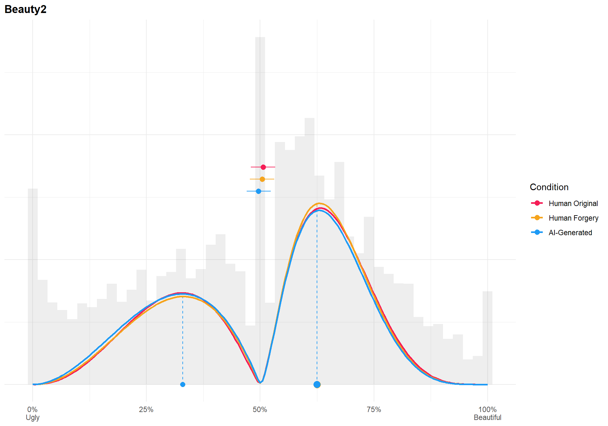{#fig-beauty2 fig-alt='Beauty rated again in the follow-up session (after participants were told all artworks were human originals): observed ratings with the model-implied CHOCO density per original label condition.' width=960}
:::
:::


### Self-Relevance


::: {.cell}

```{.r .cell-code}
make_report(estimates$SelfRelevance)
```

::: {.cell-output-display}

```{=html}
<div id="ytcqnvvoey" style="padding-left:0px;padding-right:0px;padding-top:10px;padding-bottom:10px;overflow-x:auto;overflow-y:auto;width:auto;height:auto;">
<style>#ytcqnvvoey table {
  font-family: system-ui, 'Segoe UI', Roboto, Helvetica, Arial, sans-serif, 'Apple Color Emoji', 'Segoe UI Emoji', 'Segoe UI Symbol', 'Noto Color Emoji';
  -webkit-font-smoothing: antialiased;
  -moz-osx-font-smoothing: grayscale;
}

#ytcqnvvoey thead, #ytcqnvvoey tbody, #ytcqnvvoey tfoot, #ytcqnvvoey tr, #ytcqnvvoey td, #ytcqnvvoey th {
  border-style: none;
}

#ytcqnvvoey p {
  margin: 0;
  padding: 0;
}

#ytcqnvvoey .gt_table {
  display: table;
  border-collapse: collapse;
  line-height: normal;
  margin-left: auto;
  margin-right: auto;
  color: #333333;
  font-size: 16px;
  font-weight: normal;
  font-style: normal;
  background-color: #FFFFFF;
  width: auto;
  border-top-style: solid;
  border-top-width: 2px;
  border-top-color: #A8A8A8;
  border-right-style: none;
  border-right-width: 2px;
  border-right-color: #D3D3D3;
  border-bottom-style: solid;
  border-bottom-width: 2px;
  border-bottom-color: #A8A8A8;
  border-left-style: none;
  border-left-width: 2px;
  border-left-color: #D3D3D3;
}

#ytcqnvvoey .gt_caption {
  padding-top: 4px;
  padding-bottom: 4px;
}

#ytcqnvvoey .gt_title {
  color: #333333;
  font-size: 125%;
  font-weight: initial;
  padding-top: 4px;
  padding-bottom: 4px;
  padding-left: 5px;
  padding-right: 5px;
  border-bottom-color: #FFFFFF;
  border-bottom-width: 0;
}

#ytcqnvvoey .gt_subtitle {
  color: #333333;
  font-size: 85%;
  font-weight: initial;
  padding-top: 3px;
  padding-bottom: 5px;
  padding-left: 5px;
  padding-right: 5px;
  border-top-color: #FFFFFF;
  border-top-width: 0;
}

#ytcqnvvoey .gt_heading {
  background-color: #FFFFFF;
  text-align: center;
  border-bottom-color: #FFFFFF;
  border-left-style: none;
  border-left-width: 1px;
  border-left-color: #D3D3D3;
  border-right-style: none;
  border-right-width: 1px;
  border-right-color: #D3D3D3;
}

#ytcqnvvoey .gt_bottom_border {
  border-bottom-style: solid;
  border-bottom-width: 2px;
  border-bottom-color: #D3D3D3;
}

#ytcqnvvoey .gt_col_headings {
  border-top-style: solid;
  border-top-width: 2px;
  border-top-color: #D3D3D3;
  border-bottom-style: solid;
  border-bottom-width: 2px;
  border-bottom-color: #D3D3D3;
  border-left-style: none;
  border-left-width: 1px;
  border-left-color: #D3D3D3;
  border-right-style: none;
  border-right-width: 1px;
  border-right-color: #D3D3D3;
}

#ytcqnvvoey .gt_col_heading {
  color: #333333;
  background-color: #FFFFFF;
  font-size: 100%;
  font-weight: normal;
  text-transform: inherit;
  border-left-style: none;
  border-left-width: 1px;
  border-left-color: #D3D3D3;
  border-right-style: none;
  border-right-width: 1px;
  border-right-color: #D3D3D3;
  vertical-align: bottom;
  padding-top: 5px;
  padding-bottom: 6px;
  padding-left: 5px;
  padding-right: 5px;
  overflow-x: hidden;
}

#ytcqnvvoey .gt_column_spanner_outer {
  color: #333333;
  background-color: #FFFFFF;
  font-size: 100%;
  font-weight: normal;
  text-transform: inherit;
  padding-top: 0;
  padding-bottom: 0;
  padding-left: 4px;
  padding-right: 4px;
}

#ytcqnvvoey .gt_column_spanner_outer:first-child {
  padding-left: 0;
}

#ytcqnvvoey .gt_column_spanner_outer:last-child {
  padding-right: 0;
}

#ytcqnvvoey .gt_column_spanner {
  border-bottom-style: solid;
  border-bottom-width: 2px;
  border-bottom-color: #D3D3D3;
  vertical-align: bottom;
  padding-top: 5px;
  padding-bottom: 5px;
  overflow-x: hidden;
  display: inline-block;
  width: 100%;
}

#ytcqnvvoey .gt_spanner_row {
  border-bottom-style: hidden;
}

#ytcqnvvoey .gt_group_heading {
  padding-top: 8px;
  padding-bottom: 8px;
  padding-left: 5px;
  padding-right: 5px;
  color: #333333;
  background-color: #FFFFFF;
  font-size: 100%;
  font-weight: initial;
  text-transform: inherit;
  border-top-style: solid;
  border-top-width: 2px;
  border-top-color: #D3D3D3;
  border-bottom-style: solid;
  border-bottom-width: 2px;
  border-bottom-color: #D3D3D3;
  border-left-style: none;
  border-left-width: 1px;
  border-left-color: #D3D3D3;
  border-right-style: none;
  border-right-width: 1px;
  border-right-color: #D3D3D3;
  vertical-align: middle;
  text-align: left;
}

#ytcqnvvoey .gt_empty_group_heading {
  padding: 0.5px;
  color: #333333;
  background-color: #FFFFFF;
  font-size: 100%;
  font-weight: initial;
  border-top-style: solid;
  border-top-width: 2px;
  border-top-color: #D3D3D3;
  border-bottom-style: solid;
  border-bottom-width: 2px;
  border-bottom-color: #D3D3D3;
  vertical-align: middle;
}

#ytcqnvvoey .gt_from_md > :first-child {
  margin-top: 0;
}

#ytcqnvvoey .gt_from_md > :last-child {
  margin-bottom: 0;
}

#ytcqnvvoey .gt_row {
  padding-top: 8px;
  padding-bottom: 8px;
  padding-left: 5px;
  padding-right: 5px;
  margin: 10px;
  border-top-style: solid;
  border-top-width: 1px;
  border-top-color: #D3D3D3;
  border-left-style: none;
  border-left-width: 1px;
  border-left-color: #D3D3D3;
  border-right-style: none;
  border-right-width: 1px;
  border-right-color: #D3D3D3;
  vertical-align: middle;
  overflow-x: hidden;
}

#ytcqnvvoey .gt_stub {
  color: #333333;
  background-color: #FFFFFF;
  font-size: 100%;
  font-weight: initial;
  text-transform: inherit;
  border-right-style: solid;
  border-right-width: 2px;
  border-right-color: #D3D3D3;
  padding-left: 5px;
  padding-right: 5px;
}

#ytcqnvvoey .gt_stub_row_group {
  color: #333333;
  background-color: #FFFFFF;
  font-size: 100%;
  font-weight: initial;
  text-transform: inherit;
  border-right-style: solid;
  border-right-width: 2px;
  border-right-color: #D3D3D3;
  padding-left: 5px;
  padding-right: 5px;
  vertical-align: top;
}

#ytcqnvvoey .gt_row_group_first td {
  border-top-width: 2px;
}

#ytcqnvvoey .gt_row_group_first th {
  border-top-width: 2px;
}

#ytcqnvvoey .gt_summary_row {
  color: #333333;
  background-color: #FFFFFF;
  text-transform: inherit;
  padding-top: 8px;
  padding-bottom: 8px;
  padding-left: 5px;
  padding-right: 5px;
}

#ytcqnvvoey .gt_first_summary_row {
  border-top-style: solid;
  border-top-color: #D3D3D3;
}

#ytcqnvvoey .gt_first_summary_row.thick {
  border-top-width: 2px;
}

#ytcqnvvoey .gt_last_summary_row {
  padding-top: 8px;
  padding-bottom: 8px;
  padding-left: 5px;
  padding-right: 5px;
  border-bottom-style: solid;
  border-bottom-width: 2px;
  border-bottom-color: #D3D3D3;
}

#ytcqnvvoey .gt_grand_summary_row {
  color: #333333;
  background-color: #FFFFFF;
  text-transform: inherit;
  padding-top: 8px;
  padding-bottom: 8px;
  padding-left: 5px;
  padding-right: 5px;
}

#ytcqnvvoey .gt_first_grand_summary_row {
  padding-top: 8px;
  padding-bottom: 8px;
  padding-left: 5px;
  padding-right: 5px;
  border-top-style: double;
  border-top-width: 6px;
  border-top-color: #D3D3D3;
}

#ytcqnvvoey .gt_last_grand_summary_row_top {
  padding-top: 8px;
  padding-bottom: 8px;
  padding-left: 5px;
  padding-right: 5px;
  border-bottom-style: double;
  border-bottom-width: 6px;
  border-bottom-color: #D3D3D3;
}

#ytcqnvvoey .gt_striped {
  background-color: rgba(128, 128, 128, 0.05);
}

#ytcqnvvoey .gt_table_body {
  border-top-style: solid;
  border-top-width: 2px;
  border-top-color: #D3D3D3;
  border-bottom-style: solid;
  border-bottom-width: 2px;
  border-bottom-color: #D3D3D3;
}

#ytcqnvvoey .gt_footnotes {
  color: #333333;
  background-color: #FFFFFF;
  border-bottom-style: none;
  border-bottom-width: 2px;
  border-bottom-color: #D3D3D3;
  border-left-style: none;
  border-left-width: 2px;
  border-left-color: #D3D3D3;
  border-right-style: none;
  border-right-width: 2px;
  border-right-color: #D3D3D3;
}

#ytcqnvvoey .gt_footnote {
  margin: 0px;
  font-size: 90%;
  padding-top: 4px;
  padding-bottom: 4px;
  padding-left: 5px;
  padding-right: 5px;
}

#ytcqnvvoey .gt_sourcenotes {
  color: #333333;
  background-color: #FFFFFF;
  border-bottom-style: none;
  border-bottom-width: 2px;
  border-bottom-color: #D3D3D3;
  border-left-style: none;
  border-left-width: 2px;
  border-left-color: #D3D3D3;
  border-right-style: none;
  border-right-width: 2px;
  border-right-color: #D3D3D3;
}

#ytcqnvvoey .gt_sourcenote {
  font-size: 90%;
  padding-top: 4px;
  padding-bottom: 4px;
  padding-left: 5px;
  padding-right: 5px;
}

#ytcqnvvoey .gt_left {
  text-align: left;
}

#ytcqnvvoey .gt_center {
  text-align: center;
}

#ytcqnvvoey .gt_right {
  text-align: right;
  font-variant-numeric: tabular-nums;
}

#ytcqnvvoey .gt_font_normal {
  font-weight: normal;
}

#ytcqnvvoey .gt_font_bold {
  font-weight: bold;
}

#ytcqnvvoey .gt_font_italic {
  font-style: italic;
}

#ytcqnvvoey .gt_super {
  font-size: 65%;
}

#ytcqnvvoey .gt_footnote_marks {
  font-size: 75%;
  vertical-align: 0.4em;
  position: initial;
}

#ytcqnvvoey .gt_asterisk {
  font-size: 100%;
  vertical-align: 0;
}

#ytcqnvvoey .gt_indent_1 {
  text-indent: 5px;
}

#ytcqnvvoey .gt_indent_2 {
  text-indent: 10px;
}

#ytcqnvvoey .gt_indent_3 {
  text-indent: 15px;
}

#ytcqnvvoey .gt_indent_4 {
  text-indent: 20px;
}

#ytcqnvvoey .gt_indent_5 {
  text-indent: 25px;
}

#ytcqnvvoey .katex-display {
  display: inline-flex !important;
  margin-bottom: 0.75em !important;
}

#ytcqnvvoey div.Reactable > div.rt-table > div.rt-thead > div.rt-tr.rt-tr-group-header > div.rt-th-group:after {
  height: 0px !important;
}
</style>
<table class="gt_table" data-quarto-disable-processing="false" data-quarto-bootstrap="false">
  <thead>
    <tr class="gt_col_headings">
      <th class="gt_col_heading gt_columns_bottom_border gt_left" rowspan="1" colspan="1" scope="col" id="Contrast">Contrast</th>
      <th class="gt_col_heading gt_columns_bottom_border gt_left" rowspan="1" colspan="1" scope="col" id="Parameters">Parameters</th>
    </tr>
  </thead>
  <tbody class="gt_table_body">
    <tr><td headers="Contrast" class="gt_row gt_left">Human Forgery - Human Original</td>
<td headers="Parameters" class="gt_row gt_left">None</td></tr>
    <tr><td headers="Contrast" class="gt_row gt_left">AI-Generated - Human Original</td>
<td headers="Parameters" class="gt_row gt_left">None</td></tr>
    <tr><td headers="Contrast" class="gt_row gt_left">AI-Generated - Human Forgery</td>
<td headers="Parameters" class="gt_row gt_left">None</td></tr>
  </tbody>
  
</table>
</div>
```

```{=html}
<div id="htraagxusv" style="padding-left:0px;padding-right:0px;padding-top:10px;padding-bottom:10px;overflow-x:auto;overflow-y:auto;width:auto;height:auto;">
<style>#htraagxusv table {
  font-family: system-ui, 'Segoe UI', Roboto, Helvetica, Arial, sans-serif, 'Apple Color Emoji', 'Segoe UI Emoji', 'Segoe UI Symbol', 'Noto Color Emoji';
  -webkit-font-smoothing: antialiased;
  -moz-osx-font-smoothing: grayscale;
}

#htraagxusv thead, #htraagxusv tbody, #htraagxusv tfoot, #htraagxusv tr, #htraagxusv td, #htraagxusv th {
  border-style: none;
}

#htraagxusv p {
  margin: 0;
  padding: 0;
}

#htraagxusv .gt_table {
  display: table;
  border-collapse: collapse;
  line-height: normal;
  margin-left: auto;
  margin-right: auto;
  color: #333333;
  font-size: 13px;
  font-weight: normal;
  font-style: normal;
  background-color: #FFFFFF;
  width: auto;
  border-top-style: solid;
  border-top-width: 3px;
  border-top-color: #D5D5D5;
  border-right-style: solid;
  border-right-width: 3px;
  border-right-color: #D5D5D5;
  border-bottom-style: solid;
  border-bottom-width: 3px;
  border-bottom-color: #D5D5D5;
  border-left-style: solid;
  border-left-width: 3px;
  border-left-color: #D5D5D5;
}

#htraagxusv .gt_caption {
  padding-top: 4px;
  padding-bottom: 4px;
}

#htraagxusv .gt_title {
  color: #333333;
  font-size: 125%;
  font-weight: initial;
  padding-top: 4px;
  padding-bottom: 4px;
  padding-left: 5px;
  padding-right: 5px;
  border-bottom-color: #FFFFFF;
  border-bottom-width: 0;
}

#htraagxusv .gt_subtitle {
  color: #333333;
  font-size: 85%;
  font-weight: initial;
  padding-top: 3px;
  padding-bottom: 5px;
  padding-left: 5px;
  padding-right: 5px;
  border-top-color: #FFFFFF;
  border-top-width: 0;
}

#htraagxusv .gt_heading {
  background-color: #FFFFFF;
  text-align: left;
  border-bottom-color: #FFFFFF;
  border-left-style: none;
  border-left-width: 1px;
  border-left-color: #D3D3D3;
  border-right-style: none;
  border-right-width: 1px;
  border-right-color: #D3D3D3;
}

#htraagxusv .gt_bottom_border {
  border-bottom-style: solid;
  border-bottom-width: 2px;
  border-bottom-color: #D5D5D5;
}

#htraagxusv .gt_col_headings {
  border-top-style: solid;
  border-top-width: 2px;
  border-top-color: #D5D5D5;
  border-bottom-style: solid;
  border-bottom-width: 2px;
  border-bottom-color: #D5D5D5;
  border-left-style: none;
  border-left-width: 1px;
  border-left-color: #D3D3D3;
  border-right-style: none;
  border-right-width: 1px;
  border-right-color: #D3D3D3;
}

#htraagxusv .gt_col_heading {
  color: #FFFFFF;
  background-color: #000000;
  font-size: 100%;
  font-weight: normal;
  text-transform: inherit;
  border-left-style: none;
  border-left-width: 1px;
  border-left-color: #D3D3D3;
  border-right-style: none;
  border-right-width: 1px;
  border-right-color: #D3D3D3;
  vertical-align: bottom;
  padding-top: 5px;
  padding-bottom: 6px;
  padding-left: 5px;
  padding-right: 5px;
  overflow-x: hidden;
}

#htraagxusv .gt_column_spanner_outer {
  color: #FFFFFF;
  background-color: #000000;
  font-size: 100%;
  font-weight: normal;
  text-transform: inherit;
  padding-top: 0;
  padding-bottom: 0;
  padding-left: 4px;
  padding-right: 4px;
}

#htraagxusv .gt_column_spanner_outer:first-child {
  padding-left: 0;
}

#htraagxusv .gt_column_spanner_outer:last-child {
  padding-right: 0;
}

#htraagxusv .gt_column_spanner {
  border-bottom-style: solid;
  border-bottom-width: 2px;
  border-bottom-color: #D5D5D5;
  vertical-align: bottom;
  padding-top: 5px;
  padding-bottom: 5px;
  overflow-x: hidden;
  display: inline-block;
  width: 100%;
}

#htraagxusv .gt_spanner_row {
  border-bottom-style: hidden;
}

#htraagxusv .gt_group_heading {
  padding-top: 8px;
  padding-bottom: 8px;
  padding-left: 5px;
  padding-right: 5px;
  color: #333333;
  background-color: #FFFFFF;
  font-size: 100%;
  font-weight: initial;
  text-transform: inherit;
  border-top-style: solid;
  border-top-width: 2px;
  border-top-color: #D5D5D5;
  border-bottom-style: solid;
  border-bottom-width: 2px;
  border-bottom-color: #D5D5D5;
  border-left-style: none;
  border-left-width: 1px;
  border-left-color: #D3D3D3;
  border-right-style: none;
  border-right-width: 1px;
  border-right-color: #D3D3D3;
  vertical-align: middle;
  text-align: left;
}

#htraagxusv .gt_empty_group_heading {
  padding: 0.5px;
  color: #333333;
  background-color: #FFFFFF;
  font-size: 100%;
  font-weight: initial;
  border-top-style: solid;
  border-top-width: 2px;
  border-top-color: #D5D5D5;
  border-bottom-style: solid;
  border-bottom-width: 2px;
  border-bottom-color: #D5D5D5;
  vertical-align: middle;
}

#htraagxusv .gt_from_md > :first-child {
  margin-top: 0;
}

#htraagxusv .gt_from_md > :last-child {
  margin-bottom: 0;
}

#htraagxusv .gt_row {
  padding-top: 8px;
  padding-bottom: 8px;
  padding-left: 5px;
  padding-right: 5px;
  margin: 10px;
  border-top-style: solid;
  border-top-width: 1px;
  border-top-color: #D5D5D5;
  border-left-style: solid;
  border-left-width: 1px;
  border-left-color: #D5D5D5;
  border-right-style: solid;
  border-right-width: 1px;
  border-right-color: #D5D5D5;
  vertical-align: middle;
  overflow-x: hidden;
}

#htraagxusv .gt_stub {
  color: #333333;
  background-color: #FFFFFF;
  font-size: 100%;
  font-weight: initial;
  text-transform: inherit;
  border-right-style: solid;
  border-right-width: 2px;
  border-right-color: #5F5F5F;
  padding-left: 5px;
  padding-right: 5px;
}

#htraagxusv .gt_stub_row_group {
  color: #333333;
  background-color: #FFFFFF;
  font-size: 100%;
  font-weight: initial;
  text-transform: inherit;
  border-right-style: solid;
  border-right-width: 2px;
  border-right-color: #D3D3D3;
  padding-left: 5px;
  padding-right: 5px;
  vertical-align: top;
}

#htraagxusv .gt_row_group_first td {
  border-top-width: 2px;
}

#htraagxusv .gt_row_group_first th {
  border-top-width: 2px;
}

#htraagxusv .gt_summary_row {
  color: #333333;
  background-color: #D5D5D5;
  text-transform: inherit;
  padding-top: 8px;
  padding-bottom: 8px;
  padding-left: 5px;
  padding-right: 5px;
}

#htraagxusv .gt_first_summary_row {
  border-top-style: solid;
  border-top-color: #D5D5D5;
}

#htraagxusv .gt_first_summary_row.thick {
  border-top-width: 2px;
}

#htraagxusv .gt_last_summary_row {
  padding-top: 8px;
  padding-bottom: 8px;
  padding-left: 5px;
  padding-right: 5px;
  border-bottom-style: solid;
  border-bottom-width: 2px;
  border-bottom-color: #D5D5D5;
}

#htraagxusv .gt_grand_summary_row {
  color: #FFFFFF;
  background-color: #929292;
  text-transform: inherit;
  padding-top: 8px;
  padding-bottom: 8px;
  padding-left: 5px;
  padding-right: 5px;
}

#htraagxusv .gt_first_grand_summary_row {
  padding-top: 8px;
  padding-bottom: 8px;
  padding-left: 5px;
  padding-right: 5px;
  border-top-style: double;
  border-top-width: 6px;
  border-top-color: #D5D5D5;
}

#htraagxusv .gt_last_grand_summary_row_top {
  padding-top: 8px;
  padding-bottom: 8px;
  padding-left: 5px;
  padding-right: 5px;
  border-bottom-style: double;
  border-bottom-width: 6px;
  border-bottom-color: #D5D5D5;
}

#htraagxusv .gt_striped {
  background-color: #F4F4F4;
}

#htraagxusv .gt_table_body {
  border-top-style: solid;
  border-top-width: 2px;
  border-top-color: #D5D5D5;
  border-bottom-style: solid;
  border-bottom-width: 2px;
  border-bottom-color: #D5D5D5;
}

#htraagxusv .gt_footnotes {
  color: #333333;
  background-color: #FFFFFF;
  border-bottom-style: none;
  border-bottom-width: 2px;
  border-bottom-color: #D3D3D3;
  border-left-style: none;
  border-left-width: 2px;
  border-left-color: #D3D3D3;
  border-right-style: none;
  border-right-width: 2px;
  border-right-color: #D3D3D3;
}

#htraagxusv .gt_footnote {
  margin: 0px;
  font-size: 90%;
  padding-top: 4px;
  padding-bottom: 4px;
  padding-left: 5px;
  padding-right: 5px;
}

#htraagxusv .gt_sourcenotes {
  color: #333333;
  background-color: #FFFFFF;
  border-bottom-style: none;
  border-bottom-width: 2px;
  border-bottom-color: #D3D3D3;
  border-left-style: none;
  border-left-width: 2px;
  border-left-color: #D3D3D3;
  border-right-style: none;
  border-right-width: 2px;
  border-right-color: #D3D3D3;
}

#htraagxusv .gt_sourcenote {
  font-size: 90%;
  padding-top: 4px;
  padding-bottom: 4px;
  padding-left: 5px;
  padding-right: 5px;
}

#htraagxusv .gt_left {
  text-align: left;
}

#htraagxusv .gt_center {
  text-align: center;
}

#htraagxusv .gt_right {
  text-align: right;
  font-variant-numeric: tabular-nums;
}

#htraagxusv .gt_font_normal {
  font-weight: normal;
}

#htraagxusv .gt_font_bold {
  font-weight: bold;
}

#htraagxusv .gt_font_italic {
  font-style: italic;
}

#htraagxusv .gt_super {
  font-size: 65%;
}

#htraagxusv .gt_footnote_marks {
  font-size: 75%;
  vertical-align: 0.4em;
  position: initial;
}

#htraagxusv .gt_asterisk {
  font-size: 100%;
  vertical-align: 0;
}

#htraagxusv .gt_indent_1 {
  text-indent: 5px;
}

#htraagxusv .gt_indent_2 {
  text-indent: 10px;
}

#htraagxusv .gt_indent_3 {
  text-indent: 15px;
}

#htraagxusv .gt_indent_4 {
  text-indent: 20px;
}

#htraagxusv .gt_indent_5 {
  text-indent: 25px;
}

#htraagxusv .katex-display {
  display: inline-flex !important;
  margin-bottom: 0.75em !important;
}

#htraagxusv div.Reactable > div.rt-table > div.rt-thead > div.rt-tr.rt-tr-group-header > div.rt-th-group:after {
  height: 0px !important;
}
</style>
<table class="gt_table" data-quarto-disable-processing="false" data-quarto-bootstrap="false">
  <thead>
    <tr class="gt_heading">
      <td colspan="10" class="gt_heading gt_title gt_font_normal gt_bottom_border" style>Self-Relevance: convergence</td>
    </tr>
    
    <tr class="gt_col_headings">
      <th class="gt_col_heading gt_columns_bottom_border gt_left" rowspan="1" colspan="1" scope="col" id="Model">Model</th>
      <th class="gt_col_heading gt_columns_bottom_border gt_left" rowspan="1" colspan="1" scope="col" id="Family">Family</th>
      <th class="gt_col_heading gt_columns_bottom_border gt_right" rowspan="1" colspan="1" scope="col" id="N_obs">N_obs</th>
      <th class="gt_col_heading gt_columns_bottom_border gt_right" rowspan="1" colspan="1" scope="col" id="N_participants">N_participants</th>
      <th class="gt_col_heading gt_columns_bottom_border gt_right" rowspan="1" colspan="1" scope="col" id="Chains">Chains</th>
      <th class="gt_col_heading gt_columns_bottom_border gt_right" rowspan="1" colspan="1" scope="col" id="Draws">Draws</th>
      <th class="gt_col_heading gt_columns_bottom_border gt_right" rowspan="1" colspan="1" scope="col" id="Max_Rhat">Max_Rhat</th>
      <th class="gt_col_heading gt_columns_bottom_border gt_right" rowspan="1" colspan="1" scope="col" id="Min_ESS_ratio">Min_ESS_ratio</th>
      <th class="gt_col_heading gt_columns_bottom_border gt_right" rowspan="1" colspan="1" scope="col" id="Divergent_pct">Divergent_pct</th>
      <th class="gt_col_heading gt_columns_bottom_border gt_left" rowspan="1" colspan="1" scope="col" id="Criterion">Criterion</th>
    </tr>
  </thead>
  <tbody class="gt_table_body">
    <tr><td headers="Model" class="gt_row gt_left">SelfRelevance</td>
<td headers="Family" class="gt_row gt_left">Cumulative (ordinal)</td>
<td headers="N_obs" class="gt_row gt_right">10560</td>
<td headers="N_participants" class="gt_row gt_right">220</td>
<td headers="Chains" class="gt_row gt_right">8</td>
<td headers="Draws" class="gt_row gt_right">4000</td>
<td headers="Max_Rhat" class="gt_row gt_right">1.085</td>
<td headers="Min_ESS_ratio" class="gt_row gt_right">0.021</td>
<td headers="Divergent_pct" class="gt_row gt_right">0</td>
<td headers="Criterion" class="gt_row gt_left">loo</td></tr>
  </tbody>
  
</table>
</div>
```


::: {.callout-note collapse="true" title="Self-Relevance: convergence (Markdown table, for text readers)"}

|Model         |Family               | N_obs| N_participants| Chains| Draws| Max_Rhat| Min_ESS_ratio| Divergent_pct|Criterion |
|:-------------|:--------------------|-----:|--------------:|------:|-----:|--------:|-------------:|-------------:|:---------|
|SelfRelevance |Cumulative (ordinal) | 10560|            220|      8|  4000|    1.085|         0.021|             0|loo       |

:::

```{=html}
<div id="oahbkcyrtc" style="padding-left:0px;padding-right:0px;padding-top:10px;padding-bottom:10px;overflow-x:auto;overflow-y:auto;width:auto;height:auto;">
<style>#oahbkcyrtc table {
  font-family: system-ui, 'Segoe UI', Roboto, Helvetica, Arial, sans-serif, 'Apple Color Emoji', 'Segoe UI Emoji', 'Segoe UI Symbol', 'Noto Color Emoji';
  -webkit-font-smoothing: antialiased;
  -moz-osx-font-smoothing: grayscale;
}

#oahbkcyrtc thead, #oahbkcyrtc tbody, #oahbkcyrtc tfoot, #oahbkcyrtc tr, #oahbkcyrtc td, #oahbkcyrtc th {
  border-style: none;
}

#oahbkcyrtc p {
  margin: 0;
  padding: 0;
}

#oahbkcyrtc .gt_table {
  display: table;
  border-collapse: collapse;
  line-height: normal;
  margin-left: auto;
  margin-right: auto;
  color: #333333;
  font-size: 13px;
  font-weight: normal;
  font-style: normal;
  background-color: #FFFFFF;
  width: auto;
  border-top-style: solid;
  border-top-width: 3px;
  border-top-color: #D5D5D5;
  border-right-style: solid;
  border-right-width: 3px;
  border-right-color: #D5D5D5;
  border-bottom-style: solid;
  border-bottom-width: 3px;
  border-bottom-color: #D5D5D5;
  border-left-style: solid;
  border-left-width: 3px;
  border-left-color: #D5D5D5;
}

#oahbkcyrtc .gt_caption {
  padding-top: 4px;
  padding-bottom: 4px;
}

#oahbkcyrtc .gt_title {
  color: #333333;
  font-size: 125%;
  font-weight: initial;
  padding-top: 4px;
  padding-bottom: 4px;
  padding-left: 5px;
  padding-right: 5px;
  border-bottom-color: #FFFFFF;
  border-bottom-width: 0;
}

#oahbkcyrtc .gt_subtitle {
  color: #333333;
  font-size: 85%;
  font-weight: initial;
  padding-top: 3px;
  padding-bottom: 5px;
  padding-left: 5px;
  padding-right: 5px;
  border-top-color: #FFFFFF;
  border-top-width: 0;
}

#oahbkcyrtc .gt_heading {
  background-color: #FFFFFF;
  text-align: left;
  border-bottom-color: #FFFFFF;
  border-left-style: none;
  border-left-width: 1px;
  border-left-color: #D3D3D3;
  border-right-style: none;
  border-right-width: 1px;
  border-right-color: #D3D3D3;
}

#oahbkcyrtc .gt_bottom_border {
  border-bottom-style: solid;
  border-bottom-width: 2px;
  border-bottom-color: #D5D5D5;
}

#oahbkcyrtc .gt_col_headings {
  border-top-style: solid;
  border-top-width: 2px;
  border-top-color: #D5D5D5;
  border-bottom-style: solid;
  border-bottom-width: 2px;
  border-bottom-color: #D5D5D5;
  border-left-style: none;
  border-left-width: 1px;
  border-left-color: #D3D3D3;
  border-right-style: none;
  border-right-width: 1px;
  border-right-color: #D3D3D3;
}

#oahbkcyrtc .gt_col_heading {
  color: #FFFFFF;
  background-color: #000000;
  font-size: 100%;
  font-weight: normal;
  text-transform: inherit;
  border-left-style: none;
  border-left-width: 1px;
  border-left-color: #D3D3D3;
  border-right-style: none;
  border-right-width: 1px;
  border-right-color: #D3D3D3;
  vertical-align: bottom;
  padding-top: 5px;
  padding-bottom: 6px;
  padding-left: 5px;
  padding-right: 5px;
  overflow-x: hidden;
}

#oahbkcyrtc .gt_column_spanner_outer {
  color: #FFFFFF;
  background-color: #000000;
  font-size: 100%;
  font-weight: normal;
  text-transform: inherit;
  padding-top: 0;
  padding-bottom: 0;
  padding-left: 4px;
  padding-right: 4px;
}

#oahbkcyrtc .gt_column_spanner_outer:first-child {
  padding-left: 0;
}

#oahbkcyrtc .gt_column_spanner_outer:last-child {
  padding-right: 0;
}

#oahbkcyrtc .gt_column_spanner {
  border-bottom-style: solid;
  border-bottom-width: 2px;
  border-bottom-color: #D5D5D5;
  vertical-align: bottom;
  padding-top: 5px;
  padding-bottom: 5px;
  overflow-x: hidden;
  display: inline-block;
  width: 100%;
}

#oahbkcyrtc .gt_spanner_row {
  border-bottom-style: hidden;
}

#oahbkcyrtc .gt_group_heading {
  padding-top: 8px;
  padding-bottom: 8px;
  padding-left: 5px;
  padding-right: 5px;
  color: #333333;
  background-color: #FFFFFF;
  font-size: 100%;
  font-weight: initial;
  text-transform: inherit;
  border-top-style: solid;
  border-top-width: 2px;
  border-top-color: #D5D5D5;
  border-bottom-style: solid;
  border-bottom-width: 2px;
  border-bottom-color: #D5D5D5;
  border-left-style: none;
  border-left-width: 1px;
  border-left-color: #D3D3D3;
  border-right-style: none;
  border-right-width: 1px;
  border-right-color: #D3D3D3;
  vertical-align: middle;
  text-align: left;
}

#oahbkcyrtc .gt_empty_group_heading {
  padding: 0.5px;
  color: #333333;
  background-color: #FFFFFF;
  font-size: 100%;
  font-weight: initial;
  border-top-style: solid;
  border-top-width: 2px;
  border-top-color: #D5D5D5;
  border-bottom-style: solid;
  border-bottom-width: 2px;
  border-bottom-color: #D5D5D5;
  vertical-align: middle;
}

#oahbkcyrtc .gt_from_md > :first-child {
  margin-top: 0;
}

#oahbkcyrtc .gt_from_md > :last-child {
  margin-bottom: 0;
}

#oahbkcyrtc .gt_row {
  padding-top: 8px;
  padding-bottom: 8px;
  padding-left: 5px;
  padding-right: 5px;
  margin: 10px;
  border-top-style: solid;
  border-top-width: 1px;
  border-top-color: #D5D5D5;
  border-left-style: solid;
  border-left-width: 1px;
  border-left-color: #D5D5D5;
  border-right-style: solid;
  border-right-width: 1px;
  border-right-color: #D5D5D5;
  vertical-align: middle;
  overflow-x: hidden;
}

#oahbkcyrtc .gt_stub {
  color: #333333;
  background-color: #FFFFFF;
  font-size: 100%;
  font-weight: initial;
  text-transform: inherit;
  border-right-style: solid;
  border-right-width: 2px;
  border-right-color: #5F5F5F;
  padding-left: 5px;
  padding-right: 5px;
}

#oahbkcyrtc .gt_stub_row_group {
  color: #333333;
  background-color: #FFFFFF;
  font-size: 100%;
  font-weight: initial;
  text-transform: inherit;
  border-right-style: solid;
  border-right-width: 2px;
  border-right-color: #D3D3D3;
  padding-left: 5px;
  padding-right: 5px;
  vertical-align: top;
}

#oahbkcyrtc .gt_row_group_first td {
  border-top-width: 2px;
}

#oahbkcyrtc .gt_row_group_first th {
  border-top-width: 2px;
}

#oahbkcyrtc .gt_summary_row {
  color: #333333;
  background-color: #D5D5D5;
  text-transform: inherit;
  padding-top: 8px;
  padding-bottom: 8px;
  padding-left: 5px;
  padding-right: 5px;
}

#oahbkcyrtc .gt_first_summary_row {
  border-top-style: solid;
  border-top-color: #D5D5D5;
}

#oahbkcyrtc .gt_first_summary_row.thick {
  border-top-width: 2px;
}

#oahbkcyrtc .gt_last_summary_row {
  padding-top: 8px;
  padding-bottom: 8px;
  padding-left: 5px;
  padding-right: 5px;
  border-bottom-style: solid;
  border-bottom-width: 2px;
  border-bottom-color: #D5D5D5;
}

#oahbkcyrtc .gt_grand_summary_row {
  color: #FFFFFF;
  background-color: #929292;
  text-transform: inherit;
  padding-top: 8px;
  padding-bottom: 8px;
  padding-left: 5px;
  padding-right: 5px;
}

#oahbkcyrtc .gt_first_grand_summary_row {
  padding-top: 8px;
  padding-bottom: 8px;
  padding-left: 5px;
  padding-right: 5px;
  border-top-style: double;
  border-top-width: 6px;
  border-top-color: #D5D5D5;
}

#oahbkcyrtc .gt_last_grand_summary_row_top {
  padding-top: 8px;
  padding-bottom: 8px;
  padding-left: 5px;
  padding-right: 5px;
  border-bottom-style: double;
  border-bottom-width: 6px;
  border-bottom-color: #D5D5D5;
}

#oahbkcyrtc .gt_striped {
  background-color: #F4F4F4;
}

#oahbkcyrtc .gt_table_body {
  border-top-style: solid;
  border-top-width: 2px;
  border-top-color: #D5D5D5;
  border-bottom-style: solid;
  border-bottom-width: 2px;
  border-bottom-color: #D5D5D5;
}

#oahbkcyrtc .gt_footnotes {
  color: #333333;
  background-color: #FFFFFF;
  border-bottom-style: none;
  border-bottom-width: 2px;
  border-bottom-color: #D3D3D3;
  border-left-style: none;
  border-left-width: 2px;
  border-left-color: #D3D3D3;
  border-right-style: none;
  border-right-width: 2px;
  border-right-color: #D3D3D3;
}

#oahbkcyrtc .gt_footnote {
  margin: 0px;
  font-size: 90%;
  padding-top: 4px;
  padding-bottom: 4px;
  padding-left: 5px;
  padding-right: 5px;
}

#oahbkcyrtc .gt_sourcenotes {
  color: #333333;
  background-color: #FFFFFF;
  border-bottom-style: none;
  border-bottom-width: 2px;
  border-bottom-color: #D3D3D3;
  border-left-style: none;
  border-left-width: 2px;
  border-left-color: #D3D3D3;
  border-right-style: none;
  border-right-width: 2px;
  border-right-color: #D3D3D3;
}

#oahbkcyrtc .gt_sourcenote {
  font-size: 90%;
  padding-top: 4px;
  padding-bottom: 4px;
  padding-left: 5px;
  padding-right: 5px;
}

#oahbkcyrtc .gt_left {
  text-align: left;
}

#oahbkcyrtc .gt_center {
  text-align: center;
}

#oahbkcyrtc .gt_right {
  text-align: right;
  font-variant-numeric: tabular-nums;
}

#oahbkcyrtc .gt_font_normal {
  font-weight: normal;
}

#oahbkcyrtc .gt_font_bold {
  font-weight: bold;
}

#oahbkcyrtc .gt_font_italic {
  font-style: italic;
}

#oahbkcyrtc .gt_super {
  font-size: 65%;
}

#oahbkcyrtc .gt_footnote_marks {
  font-size: 75%;
  vertical-align: 0.4em;
  position: initial;
}

#oahbkcyrtc .gt_asterisk {
  font-size: 100%;
  vertical-align: 0;
}

#oahbkcyrtc .gt_indent_1 {
  text-indent: 5px;
}

#oahbkcyrtc .gt_indent_2 {
  text-indent: 10px;
}

#oahbkcyrtc .gt_indent_3 {
  text-indent: 15px;
}

#oahbkcyrtc .gt_indent_4 {
  text-indent: 20px;
}

#oahbkcyrtc .gt_indent_5 {
  text-indent: 25px;
}

#oahbkcyrtc .katex-display {
  display: inline-flex !important;
  margin-bottom: 0.75em !important;
}

#oahbkcyrtc div.Reactable > div.rt-table > div.rt-thead > div.rt-tr.rt-tr-group-header > div.rt-th-group:after {
  height: 0px !important;
}
</style>
<table class="gt_table" data-quarto-disable-processing="false" data-quarto-bootstrap="false">
  <thead>
    <tr class="gt_heading">
      <td colspan="5" class="gt_heading gt_title gt_font_normal gt_bottom_border" style>Self-Relevance: marginal means per label condition (response scale)</td>
    </tr>
    
    <tr class="gt_col_headings">
      <th class="gt_col_heading gt_columns_bottom_border gt_center" rowspan="1" colspan="1" scope="col" id="Condition">Condition</th>
      <th class="gt_col_heading gt_columns_bottom_border gt_center" rowspan="1" colspan="1" scope="col" id="Response">Response</th>
      <th class="gt_col_heading gt_columns_bottom_border gt_right" rowspan="1" colspan="1" scope="col" id="Estimate">Estimate</th>
      <th class="gt_col_heading gt_columns_bottom_border gt_right" rowspan="1" colspan="1" scope="col" id="CI_low">CI_low</th>
      <th class="gt_col_heading gt_columns_bottom_border gt_right" rowspan="1" colspan="1" scope="col" id="CI_high">CI_high</th>
    </tr>
  </thead>
  <tbody class="gt_table_body">
    <tr><td headers="Condition" class="gt_row gt_center">Human Original</td>
<td headers="Response" class="gt_row gt_center">0</td>
<td headers="Estimate" class="gt_row gt_right">0.37</td>
<td headers="CI_low" class="gt_row gt_right">0.36</td>
<td headers="CI_high" class="gt_row gt_right">0.38</td></tr>
    <tr><td headers="Condition" class="gt_row gt_center gt_striped">Human Forgery</td>
<td headers="Response" class="gt_row gt_center gt_striped">0</td>
<td headers="Estimate" class="gt_row gt_right gt_striped">0.37</td>
<td headers="CI_low" class="gt_row gt_right gt_striped">0.36</td>
<td headers="CI_high" class="gt_row gt_right gt_striped">0.38</td></tr>
    <tr><td headers="Condition" class="gt_row gt_center">AI-Generated</td>
<td headers="Response" class="gt_row gt_center">0</td>
<td headers="Estimate" class="gt_row gt_right">0.38</td>
<td headers="CI_low" class="gt_row gt_right">0.37</td>
<td headers="CI_high" class="gt_row gt_right">0.39</td></tr>
    <tr><td headers="Condition" class="gt_row gt_center gt_striped">Human Original</td>
<td headers="Response" class="gt_row gt_center gt_striped">1</td>
<td headers="Estimate" class="gt_row gt_right gt_striped">0.17</td>
<td headers="CI_low" class="gt_row gt_right gt_striped">0.17</td>
<td headers="CI_high" class="gt_row gt_right gt_striped">0.18</td></tr>
    <tr><td headers="Condition" class="gt_row gt_center">Human Forgery</td>
<td headers="Response" class="gt_row gt_center">1</td>
<td headers="Estimate" class="gt_row gt_right">0.17</td>
<td headers="CI_low" class="gt_row gt_right">0.17</td>
<td headers="CI_high" class="gt_row gt_right">0.18</td></tr>
    <tr><td headers="Condition" class="gt_row gt_center gt_striped">AI-Generated</td>
<td headers="Response" class="gt_row gt_center gt_striped">1</td>
<td headers="Estimate" class="gt_row gt_right gt_striped">0.17</td>
<td headers="CI_low" class="gt_row gt_right gt_striped">0.16</td>
<td headers="CI_high" class="gt_row gt_right gt_striped">0.18</td></tr>
    <tr><td headers="Condition" class="gt_row gt_center">Human Original</td>
<td headers="Response" class="gt_row gt_center">2</td>
<td headers="Estimate" class="gt_row gt_right">0.14</td>
<td headers="CI_low" class="gt_row gt_right">0.14</td>
<td headers="CI_high" class="gt_row gt_right">0.15</td></tr>
    <tr><td headers="Condition" class="gt_row gt_center gt_striped">Human Forgery</td>
<td headers="Response" class="gt_row gt_center gt_striped">2</td>
<td headers="Estimate" class="gt_row gt_right gt_striped">0.14</td>
<td headers="CI_low" class="gt_row gt_right gt_striped">0.14</td>
<td headers="CI_high" class="gt_row gt_right gt_striped">0.15</td></tr>
    <tr><td headers="Condition" class="gt_row gt_center">AI-Generated</td>
<td headers="Response" class="gt_row gt_center">2</td>
<td headers="Estimate" class="gt_row gt_right">0.14</td>
<td headers="CI_low" class="gt_row gt_right">0.13</td>
<td headers="CI_high" class="gt_row gt_right">0.15</td></tr>
    <tr><td headers="Condition" class="gt_row gt_center gt_striped">Human Original</td>
<td headers="Response" class="gt_row gt_center gt_striped">3</td>
<td headers="Estimate" class="gt_row gt_right gt_striped">0.13</td>
<td headers="CI_low" class="gt_row gt_right gt_striped">0.12</td>
<td headers="CI_high" class="gt_row gt_right gt_striped">0.13</td></tr>
    <tr><td headers="Condition" class="gt_row gt_center">Human Forgery</td>
<td headers="Response" class="gt_row gt_center">3</td>
<td headers="Estimate" class="gt_row gt_right">0.13</td>
<td headers="CI_low" class="gt_row gt_right">0.12</td>
<td headers="CI_high" class="gt_row gt_right">0.13</td></tr>
    <tr><td headers="Condition" class="gt_row gt_center gt_striped">AI-Generated</td>
<td headers="Response" class="gt_row gt_center gt_striped">3</td>
<td headers="Estimate" class="gt_row gt_right gt_striped">0.13</td>
<td headers="CI_low" class="gt_row gt_right gt_striped">0.12</td>
<td headers="CI_high" class="gt_row gt_right gt_striped">0.13</td></tr>
    <tr><td headers="Condition" class="gt_row gt_center">Human Original</td>
<td headers="Response" class="gt_row gt_center">4</td>
<td headers="Estimate" class="gt_row gt_right">0.11</td>
<td headers="CI_low" class="gt_row gt_right">0.11</td>
<td headers="CI_high" class="gt_row gt_right">0.12</td></tr>
    <tr><td headers="Condition" class="gt_row gt_center gt_striped">Human Forgery</td>
<td headers="Response" class="gt_row gt_center gt_striped">4</td>
<td headers="Estimate" class="gt_row gt_right gt_striped">0.11</td>
<td headers="CI_low" class="gt_row gt_right gt_striped">0.11</td>
<td headers="CI_high" class="gt_row gt_right gt_striped">0.12</td></tr>
    <tr><td headers="Condition" class="gt_row gt_center">AI-Generated</td>
<td headers="Response" class="gt_row gt_center">4</td>
<td headers="Estimate" class="gt_row gt_right">0.11</td>
<td headers="CI_low" class="gt_row gt_right">0.11</td>
<td headers="CI_high" class="gt_row gt_right">0.12</td></tr>
    <tr><td headers="Condition" class="gt_row gt_center gt_striped">Human Original</td>
<td headers="Response" class="gt_row gt_center gt_striped">5</td>
<td headers="Estimate" class="gt_row gt_right gt_striped">0.06</td>
<td headers="CI_low" class="gt_row gt_right gt_striped">0.06</td>
<td headers="CI_high" class="gt_row gt_right gt_striped">0.07</td></tr>
    <tr><td headers="Condition" class="gt_row gt_center">Human Forgery</td>
<td headers="Response" class="gt_row gt_center">5</td>
<td headers="Estimate" class="gt_row gt_right">0.06</td>
<td headers="CI_low" class="gt_row gt_right">0.06</td>
<td headers="CI_high" class="gt_row gt_right">0.07</td></tr>
    <tr><td headers="Condition" class="gt_row gt_center gt_striped">AI-Generated</td>
<td headers="Response" class="gt_row gt_center gt_striped">5</td>
<td headers="Estimate" class="gt_row gt_right gt_striped">0.06</td>
<td headers="CI_low" class="gt_row gt_right gt_striped">0.06</td>
<td headers="CI_high" class="gt_row gt_right gt_striped">0.07</td></tr>
    <tr><td headers="Condition" class="gt_row gt_center">Human Original</td>
<td headers="Response" class="gt_row gt_center">6</td>
<td headers="Estimate" class="gt_row gt_right">0.02</td>
<td headers="CI_low" class="gt_row gt_right">0.01</td>
<td headers="CI_high" class="gt_row gt_right">0.02</td></tr>
    <tr><td headers="Condition" class="gt_row gt_center gt_striped">Human Forgery</td>
<td headers="Response" class="gt_row gt_center gt_striped">6</td>
<td headers="Estimate" class="gt_row gt_right gt_striped">0.02</td>
<td headers="CI_low" class="gt_row gt_right gt_striped">0.01</td>
<td headers="CI_high" class="gt_row gt_right gt_striped">0.02</td></tr>
    <tr><td headers="Condition" class="gt_row gt_center">AI-Generated</td>
<td headers="Response" class="gt_row gt_center">6</td>
<td headers="Estimate" class="gt_row gt_right">0.02</td>
<td headers="CI_low" class="gt_row gt_right">0.01</td>
<td headers="CI_high" class="gt_row gt_right">0.02</td></tr>
  </tbody>
  
</table>
</div>
```


::: {.callout-note collapse="true" title="Self-Relevance: marginal means per label condition (response scale) (Markdown table, for text readers)"}

|Condition      |Response |Estimate |CI_low |CI_high |
|:--------------|:--------|:--------|:------|:-------|
|Human Original |0        |0.37     |0.36   |0.38    |
|Human Forgery  |0        |0.37     |0.36   |0.38    |
|AI-Generated   |0        |0.38     |0.37   |0.39    |
|Human Original |1        |0.17     |0.17   |0.18    |
|Human Forgery  |1        |0.17     |0.17   |0.18    |
|AI-Generated   |1        |0.17     |0.16   |0.18    |
|Human Original |2        |0.14     |0.14   |0.15    |
|Human Forgery  |2        |0.14     |0.14   |0.15    |
|AI-Generated   |2        |0.14     |0.13   |0.15    |
|Human Original |3        |0.13     |0.12   |0.13    |
|Human Forgery  |3        |0.13     |0.12   |0.13    |
|AI-Generated   |3        |0.13     |0.12   |0.13    |
|Human Original |4        |0.11     |0.11   |0.12    |
|Human Forgery  |4        |0.11     |0.11   |0.12    |
|AI-Generated   |4        |0.11     |0.11   |0.12    |
|Human Original |5        |0.06     |0.06   |0.07    |
|Human Forgery  |5        |0.06     |0.06   |0.07    |
|AI-Generated   |5        |0.06     |0.06   |0.07    |
|Human Original |6        |0.02     |0.01   |0.02    |
|Human Forgery  |6        |0.02     |0.01   |0.02    |
|AI-Generated   |6        |0.02     |0.01   |0.02    |

:::

```{=html}
<div id="hncrqsxxby" style="padding-left:0px;padding-right:0px;padding-top:10px;padding-bottom:10px;overflow-x:auto;overflow-y:auto;width:auto;height:auto;">
<style>#hncrqsxxby table {
  font-family: system-ui, 'Segoe UI', Roboto, Helvetica, Arial, sans-serif, 'Apple Color Emoji', 'Segoe UI Emoji', 'Segoe UI Symbol', 'Noto Color Emoji';
  -webkit-font-smoothing: antialiased;
  -moz-osx-font-smoothing: grayscale;
}

#hncrqsxxby thead, #hncrqsxxby tbody, #hncrqsxxby tfoot, #hncrqsxxby tr, #hncrqsxxby td, #hncrqsxxby th {
  border-style: none;
}

#hncrqsxxby p {
  margin: 0;
  padding: 0;
}

#hncrqsxxby .gt_table {
  display: table;
  border-collapse: collapse;
  line-height: normal;
  margin-left: auto;
  margin-right: auto;
  color: #333333;
  font-size: 13px;
  font-weight: normal;
  font-style: normal;
  background-color: #FFFFFF;
  width: auto;
  border-top-style: solid;
  border-top-width: 3px;
  border-top-color: #D5D5D5;
  border-right-style: solid;
  border-right-width: 3px;
  border-right-color: #D5D5D5;
  border-bottom-style: solid;
  border-bottom-width: 3px;
  border-bottom-color: #D5D5D5;
  border-left-style: solid;
  border-left-width: 3px;
  border-left-color: #D5D5D5;
}

#hncrqsxxby .gt_caption {
  padding-top: 4px;
  padding-bottom: 4px;
}

#hncrqsxxby .gt_title {
  color: #333333;
  font-size: 125%;
  font-weight: initial;
  padding-top: 4px;
  padding-bottom: 4px;
  padding-left: 5px;
  padding-right: 5px;
  border-bottom-color: #FFFFFF;
  border-bottom-width: 0;
}

#hncrqsxxby .gt_subtitle {
  color: #333333;
  font-size: 85%;
  font-weight: initial;
  padding-top: 3px;
  padding-bottom: 5px;
  padding-left: 5px;
  padding-right: 5px;
  border-top-color: #FFFFFF;
  border-top-width: 0;
}

#hncrqsxxby .gt_heading {
  background-color: #FFFFFF;
  text-align: left;
  border-bottom-color: #FFFFFF;
  border-left-style: none;
  border-left-width: 1px;
  border-left-color: #D3D3D3;
  border-right-style: none;
  border-right-width: 1px;
  border-right-color: #D3D3D3;
}

#hncrqsxxby .gt_bottom_border {
  border-bottom-style: solid;
  border-bottom-width: 2px;
  border-bottom-color: #D5D5D5;
}

#hncrqsxxby .gt_col_headings {
  border-top-style: solid;
  border-top-width: 2px;
  border-top-color: #D5D5D5;
  border-bottom-style: solid;
  border-bottom-width: 2px;
  border-bottom-color: #D5D5D5;
  border-left-style: none;
  border-left-width: 1px;
  border-left-color: #D3D3D3;
  border-right-style: none;
  border-right-width: 1px;
  border-right-color: #D3D3D3;
}

#hncrqsxxby .gt_col_heading {
  color: #FFFFFF;
  background-color: #000000;
  font-size: 100%;
  font-weight: normal;
  text-transform: inherit;
  border-left-style: none;
  border-left-width: 1px;
  border-left-color: #D3D3D3;
  border-right-style: none;
  border-right-width: 1px;
  border-right-color: #D3D3D3;
  vertical-align: bottom;
  padding-top: 5px;
  padding-bottom: 6px;
  padding-left: 5px;
  padding-right: 5px;
  overflow-x: hidden;
}

#hncrqsxxby .gt_column_spanner_outer {
  color: #FFFFFF;
  background-color: #000000;
  font-size: 100%;
  font-weight: normal;
  text-transform: inherit;
  padding-top: 0;
  padding-bottom: 0;
  padding-left: 4px;
  padding-right: 4px;
}

#hncrqsxxby .gt_column_spanner_outer:first-child {
  padding-left: 0;
}

#hncrqsxxby .gt_column_spanner_outer:last-child {
  padding-right: 0;
}

#hncrqsxxby .gt_column_spanner {
  border-bottom-style: solid;
  border-bottom-width: 2px;
  border-bottom-color: #D5D5D5;
  vertical-align: bottom;
  padding-top: 5px;
  padding-bottom: 5px;
  overflow-x: hidden;
  display: inline-block;
  width: 100%;
}

#hncrqsxxby .gt_spanner_row {
  border-bottom-style: hidden;
}

#hncrqsxxby .gt_group_heading {
  padding-top: 8px;
  padding-bottom: 8px;
  padding-left: 5px;
  padding-right: 5px;
  color: #333333;
  background-color: #FFFFFF;
  font-size: 100%;
  font-weight: initial;
  text-transform: inherit;
  border-top-style: solid;
  border-top-width: 2px;
  border-top-color: #D5D5D5;
  border-bottom-style: solid;
  border-bottom-width: 2px;
  border-bottom-color: #D5D5D5;
  border-left-style: none;
  border-left-width: 1px;
  border-left-color: #D3D3D3;
  border-right-style: none;
  border-right-width: 1px;
  border-right-color: #D3D3D3;
  vertical-align: middle;
  text-align: left;
}

#hncrqsxxby .gt_empty_group_heading {
  padding: 0.5px;
  color: #333333;
  background-color: #FFFFFF;
  font-size: 100%;
  font-weight: initial;
  border-top-style: solid;
  border-top-width: 2px;
  border-top-color: #D5D5D5;
  border-bottom-style: solid;
  border-bottom-width: 2px;
  border-bottom-color: #D5D5D5;
  vertical-align: middle;
}

#hncrqsxxby .gt_from_md > :first-child {
  margin-top: 0;
}

#hncrqsxxby .gt_from_md > :last-child {
  margin-bottom: 0;
}

#hncrqsxxby .gt_row {
  padding-top: 8px;
  padding-bottom: 8px;
  padding-left: 5px;
  padding-right: 5px;
  margin: 10px;
  border-top-style: solid;
  border-top-width: 1px;
  border-top-color: #D5D5D5;
  border-left-style: solid;
  border-left-width: 1px;
  border-left-color: #D5D5D5;
  border-right-style: solid;
  border-right-width: 1px;
  border-right-color: #D5D5D5;
  vertical-align: middle;
  overflow-x: hidden;
}

#hncrqsxxby .gt_stub {
  color: #333333;
  background-color: #FFFFFF;
  font-size: 100%;
  font-weight: initial;
  text-transform: inherit;
  border-right-style: solid;
  border-right-width: 2px;
  border-right-color: #5F5F5F;
  padding-left: 5px;
  padding-right: 5px;
}

#hncrqsxxby .gt_stub_row_group {
  color: #333333;
  background-color: #FFFFFF;
  font-size: 100%;
  font-weight: initial;
  text-transform: inherit;
  border-right-style: solid;
  border-right-width: 2px;
  border-right-color: #D3D3D3;
  padding-left: 5px;
  padding-right: 5px;
  vertical-align: top;
}

#hncrqsxxby .gt_row_group_first td {
  border-top-width: 2px;
}

#hncrqsxxby .gt_row_group_first th {
  border-top-width: 2px;
}

#hncrqsxxby .gt_summary_row {
  color: #333333;
  background-color: #D5D5D5;
  text-transform: inherit;
  padding-top: 8px;
  padding-bottom: 8px;
  padding-left: 5px;
  padding-right: 5px;
}

#hncrqsxxby .gt_first_summary_row {
  border-top-style: solid;
  border-top-color: #D5D5D5;
}

#hncrqsxxby .gt_first_summary_row.thick {
  border-top-width: 2px;
}

#hncrqsxxby .gt_last_summary_row {
  padding-top: 8px;
  padding-bottom: 8px;
  padding-left: 5px;
  padding-right: 5px;
  border-bottom-style: solid;
  border-bottom-width: 2px;
  border-bottom-color: #D5D5D5;
}

#hncrqsxxby .gt_grand_summary_row {
  color: #FFFFFF;
  background-color: #929292;
  text-transform: inherit;
  padding-top: 8px;
  padding-bottom: 8px;
  padding-left: 5px;
  padding-right: 5px;
}

#hncrqsxxby .gt_first_grand_summary_row {
  padding-top: 8px;
  padding-bottom: 8px;
  padding-left: 5px;
  padding-right: 5px;
  border-top-style: double;
  border-top-width: 6px;
  border-top-color: #D5D5D5;
}

#hncrqsxxby .gt_last_grand_summary_row_top {
  padding-top: 8px;
  padding-bottom: 8px;
  padding-left: 5px;
  padding-right: 5px;
  border-bottom-style: double;
  border-bottom-width: 6px;
  border-bottom-color: #D5D5D5;
}

#hncrqsxxby .gt_striped {
  background-color: #F4F4F4;
}

#hncrqsxxby .gt_table_body {
  border-top-style: solid;
  border-top-width: 2px;
  border-top-color: #D5D5D5;
  border-bottom-style: solid;
  border-bottom-width: 2px;
  border-bottom-color: #D5D5D5;
}

#hncrqsxxby .gt_footnotes {
  color: #333333;
  background-color: #FFFFFF;
  border-bottom-style: none;
  border-bottom-width: 2px;
  border-bottom-color: #D3D3D3;
  border-left-style: none;
  border-left-width: 2px;
  border-left-color: #D3D3D3;
  border-right-style: none;
  border-right-width: 2px;
  border-right-color: #D3D3D3;
}

#hncrqsxxby .gt_footnote {
  margin: 0px;
  font-size: 90%;
  padding-top: 4px;
  padding-bottom: 4px;
  padding-left: 5px;
  padding-right: 5px;
}

#hncrqsxxby .gt_sourcenotes {
  color: #333333;
  background-color: #FFFFFF;
  border-bottom-style: none;
  border-bottom-width: 2px;
  border-bottom-color: #D3D3D3;
  border-left-style: none;
  border-left-width: 2px;
  border-left-color: #D3D3D3;
  border-right-style: none;
  border-right-width: 2px;
  border-right-color: #D3D3D3;
}

#hncrqsxxby .gt_sourcenote {
  font-size: 90%;
  padding-top: 4px;
  padding-bottom: 4px;
  padding-left: 5px;
  padding-right: 5px;
}

#hncrqsxxby .gt_left {
  text-align: left;
}

#hncrqsxxby .gt_center {
  text-align: center;
}

#hncrqsxxby .gt_right {
  text-align: right;
  font-variant-numeric: tabular-nums;
}

#hncrqsxxby .gt_font_normal {
  font-weight: normal;
}

#hncrqsxxby .gt_font_bold {
  font-weight: bold;
}

#hncrqsxxby .gt_font_italic {
  font-style: italic;
}

#hncrqsxxby .gt_super {
  font-size: 65%;
}

#hncrqsxxby .gt_footnote_marks {
  font-size: 75%;
  vertical-align: 0.4em;
  position: initial;
}

#hncrqsxxby .gt_asterisk {
  font-size: 100%;
  vertical-align: 0;
}

#hncrqsxxby .gt_indent_1 {
  text-indent: 5px;
}

#hncrqsxxby .gt_indent_2 {
  text-indent: 10px;
}

#hncrqsxxby .gt_indent_3 {
  text-indent: 15px;
}

#hncrqsxxby .gt_indent_4 {
  text-indent: 20px;
}

#hncrqsxxby .gt_indent_5 {
  text-indent: 25px;
}

#hncrqsxxby .katex-display {
  display: inline-flex !important;
  margin-bottom: 0.75em !important;
}

#hncrqsxxby div.Reactable > div.rt-table > div.rt-thead > div.rt-tr.rt-tr-group-header > div.rt-th-group:after {
  height: 0px !important;
}
</style>
<table class="gt_table" data-quarto-disable-processing="false" data-quarto-bootstrap="false">
  <thead>
    <tr class="gt_heading">
      <td colspan="6" class="gt_heading gt_title gt_font_normal gt_bottom_border" style>Self-Relevance: all contrasts between label conditions</td>
    </tr>
    
    <tr class="gt_col_headings">
      <th class="gt_col_heading gt_columns_bottom_border gt_left" rowspan="1" colspan="1" scope="col" id="Parameter">Parameter</th>
      <th class="gt_col_heading gt_columns_bottom_border gt_right" rowspan="1" colspan="1" scope="col" id="Diff">Diff</th>
      <th class="gt_col_heading gt_columns_bottom_border gt_left" rowspan="1" colspan="1" scope="col" id="CI">CI</th>
      <th class="gt_col_heading gt_columns_bottom_border gt_right" rowspan="1" colspan="1" scope="col" id="Unit">Unit</th>
      <th class="gt_col_heading gt_columns_bottom_border gt_right" rowspan="1" colspan="1" scope="col" id="pd_fmt">pd_fmt</th>
      <th class="gt_col_heading gt_columns_bottom_border gt_left" rowspan="1" colspan="1" scope="col" id="Effect">Effect</th>
    </tr>
  </thead>
  <tbody class="gt_table_body">
    <tr class="gt_group_heading_row">
      <th colspan="6" class="gt_group_heading" scope="colgroup" id="AI-Generated - Human Original">AI-Generated - Human Original</th>
    </tr>
    <tr class="gt_row_group_first"><td headers="AI-Generated - Human Original  Parameter" class="gt_row gt_left" style="color: #9E9E9E;">response - 0</td>
<td headers="AI-Generated - Human Original  Diff" class="gt_row gt_right" style="color: #9E9E9E;">1.03</td>
<td headers="AI-Generated - Human Original  CI" class="gt_row gt_left" style="color: #9E9E9E;">[-0.10, 2.04]</td>
<td headers="AI-Generated - Human Original  Unit" class="gt_row gt_right" style="color: #9E9E9E;">%</td>
<td headers="AI-Generated - Human Original  pd_fmt" class="gt_row gt_right" style="color: #9E9E9E;">96.80%</td>
<td headers="AI-Generated - Human Original  Effect" class="gt_row gt_left" style="color: #9E9E9E;">n.s.</td></tr>
    <tr><td headers="AI-Generated - Human Original  Parameter" class="gt_row gt_left gt_striped" style="color: #9E9E9E;">response - 1</td>
<td headers="AI-Generated - Human Original  Diff" class="gt_row gt_right gt_striped" style="color: #9E9E9E;">-0.06</td>
<td headers="AI-Generated - Human Original  CI" class="gt_row gt_left gt_striped" style="color: #9E9E9E;">[-0.49, 0.30]</td>
<td headers="AI-Generated - Human Original  Unit" class="gt_row gt_right gt_striped" style="color: #9E9E9E;">%</td>
<td headers="AI-Generated - Human Original  pd_fmt" class="gt_row gt_right gt_striped" style="color: #9E9E9E;">62.20%</td>
<td headers="AI-Generated - Human Original  Effect" class="gt_row gt_left gt_striped" style="color: #9E9E9E;">n.s.</td></tr>
    <tr><td headers="AI-Generated - Human Original  Parameter" class="gt_row gt_left" style="color: #9E9E9E;">response - 2</td>
<td headers="AI-Generated - Human Original  Diff" class="gt_row gt_right" style="color: #9E9E9E;">-0.25</td>
<td headers="AI-Generated - Human Original  CI" class="gt_row gt_left" style="color: #9E9E9E;">[-0.56, 0.04]</td>
<td headers="AI-Generated - Human Original  Unit" class="gt_row gt_right" style="color: #9E9E9E;">%</td>
<td headers="AI-Generated - Human Original  pd_fmt" class="gt_row gt_right" style="color: #9E9E9E;">95.00%</td>
<td headers="AI-Generated - Human Original  Effect" class="gt_row gt_left" style="color: #9E9E9E;">n.s.</td></tr>
    <tr><td headers="AI-Generated - Human Original  Parameter" class="gt_row gt_left gt_striped" style="color: #9E9E9E;">response - 3</td>
<td headers="AI-Generated - Human Original  Diff" class="gt_row gt_right gt_striped" style="color: #9E9E9E;">-0.30</td>
<td headers="AI-Generated - Human Original  CI" class="gt_row gt_left gt_striped" style="color: #9E9E9E;">[-0.60, 0.03]</td>
<td headers="AI-Generated - Human Original  Unit" class="gt_row gt_right gt_striped" style="color: #9E9E9E;">%</td>
<td headers="AI-Generated - Human Original  pd_fmt" class="gt_row gt_right gt_striped" style="color: #9E9E9E;">96.60%</td>
<td headers="AI-Generated - Human Original  Effect" class="gt_row gt_left gt_striped" style="color: #9E9E9E;">n.s.</td></tr>
    <tr><td headers="AI-Generated - Human Original  Parameter" class="gt_row gt_left" style="color: #9E9E9E;">response - 4</td>
<td headers="AI-Generated - Human Original  Diff" class="gt_row gt_right" style="color: #9E9E9E;">-0.25</td>
<td headers="AI-Generated - Human Original  CI" class="gt_row gt_left" style="color: #9E9E9E;">[-0.69, 0.19]</td>
<td headers="AI-Generated - Human Original  Unit" class="gt_row gt_right" style="color: #9E9E9E;">%</td>
<td headers="AI-Generated - Human Original  pd_fmt" class="gt_row gt_right" style="color: #9E9E9E;">85.60%</td>
<td headers="AI-Generated - Human Original  Effect" class="gt_row gt_left" style="color: #9E9E9E;">n.s.</td></tr>
    <tr><td headers="AI-Generated - Human Original  Parameter" class="gt_row gt_left gt_striped" style="color: #9E9E9E;">response - 5</td>
<td headers="AI-Generated - Human Original  Diff" class="gt_row gt_right gt_striped" style="color: #9E9E9E;">-0.12</td>
<td headers="AI-Generated - Human Original  CI" class="gt_row gt_left gt_striped" style="color: #9E9E9E;">[-0.45, 0.21]</td>
<td headers="AI-Generated - Human Original  Unit" class="gt_row gt_right gt_striped" style="color: #9E9E9E;">%</td>
<td headers="AI-Generated - Human Original  pd_fmt" class="gt_row gt_right gt_striped" style="color: #9E9E9E;">75.60%</td>
<td headers="AI-Generated - Human Original  Effect" class="gt_row gt_left gt_striped" style="color: #9E9E9E;">n.s.</td></tr>
    <tr><td headers="AI-Generated - Human Original  Parameter" class="gt_row gt_left" style="color: #9E9E9E;">response - 6</td>
<td headers="AI-Generated - Human Original  Diff" class="gt_row gt_right" style="color: #9E9E9E;">-0.03</td>
<td headers="AI-Generated - Human Original  CI" class="gt_row gt_left" style="color: #9E9E9E;">[-0.12, 0.05]</td>
<td headers="AI-Generated - Human Original  Unit" class="gt_row gt_right" style="color: #9E9E9E;">%</td>
<td headers="AI-Generated - Human Original  pd_fmt" class="gt_row gt_right" style="color: #9E9E9E;">75.40%</td>
<td headers="AI-Generated - Human Original  Effect" class="gt_row gt_left" style="color: #9E9E9E;">n.s.</td></tr>
    <tr><td headers="AI-Generated - Human Original  Parameter" class="gt_row gt_left gt_striped" style="color: #9E9E9E;">mu</td>
<td headers="AI-Generated - Human Original  Diff" class="gt_row gt_right gt_striped" style="color: #9E9E9E;">-0.92</td>
<td headers="AI-Generated - Human Original  CI" class="gt_row gt_left gt_striped" style="color: #9E9E9E;">[-2.32, 0.48]</td>
<td headers="AI-Generated - Human Original  Unit" class="gt_row gt_right gt_striped" style="color: #9E9E9E;">%</td>
<td headers="AI-Generated - Human Original  pd_fmt" class="gt_row gt_right gt_striped" style="color: #9E9E9E;">92.00%</td>
<td headers="AI-Generated - Human Original  Effect" class="gt_row gt_left gt_striped" style="color: #9E9E9E;">n.s.</td></tr>
    <tr class="gt_group_heading_row">
      <th colspan="6" class="gt_group_heading" scope="colgroup" id="Human Forgery - Human Original">Human Forgery - Human Original</th>
    </tr>
    <tr class="gt_row_group_first"><td headers="Human Forgery - Human Original  Parameter" class="gt_row gt_left" style="color: #9E9E9E;">response - 0</td>
<td headers="Human Forgery - Human Original  Diff" class="gt_row gt_right" style="color: #9E9E9E;">0.36</td>
<td headers="Human Forgery - Human Original  CI" class="gt_row gt_left" style="color: #9E9E9E;">[-0.83, 1.47]</td>
<td headers="Human Forgery - Human Original  Unit" class="gt_row gt_right" style="color: #9E9E9E;">%</td>
<td headers="Human Forgery - Human Original  pd_fmt" class="gt_row gt_right" style="color: #9E9E9E;">70.80%</td>
<td headers="Human Forgery - Human Original  Effect" class="gt_row gt_left" style="color: #9E9E9E;">n.s.</td></tr>
    <tr><td headers="Human Forgery - Human Original  Parameter" class="gt_row gt_left gt_striped" style="color: #9E9E9E;">response - 1</td>
<td headers="Human Forgery - Human Original  Diff" class="gt_row gt_right gt_striped" style="color: #9E9E9E;">0.09</td>
<td headers="Human Forgery - Human Original  CI" class="gt_row gt_left gt_striped" style="color: #9E9E9E;">[-0.20, 0.44]</td>
<td headers="Human Forgery - Human Original  Unit" class="gt_row gt_right gt_striped" style="color: #9E9E9E;">%</td>
<td headers="Human Forgery - Human Original  pd_fmt" class="gt_row gt_right gt_striped" style="color: #9E9E9E;">73.20%</td>
<td headers="Human Forgery - Human Original  Effect" class="gt_row gt_left gt_striped" style="color: #9E9E9E;">n.s.</td></tr>
    <tr><td headers="Human Forgery - Human Original  Parameter" class="gt_row gt_left" style="color: #9E9E9E;">response - 2</td>
<td headers="Human Forgery - Human Original  Diff" class="gt_row gt_right" style="color: #9E9E9E;">-0.02</td>
<td headers="Human Forgery - Human Original  CI" class="gt_row gt_left" style="color: #9E9E9E;">[-0.29, 0.28]</td>
<td headers="Human Forgery - Human Original  Unit" class="gt_row gt_right" style="color: #9E9E9E;">%</td>
<td headers="Human Forgery - Human Original  pd_fmt" class="gt_row gt_right" style="color: #9E9E9E;">55.00%</td>
<td headers="Human Forgery - Human Original  Effect" class="gt_row gt_left" style="color: #9E9E9E;">n.s.</td></tr>
    <tr><td headers="Human Forgery - Human Original  Parameter" class="gt_row gt_left gt_striped" style="color: #9E9E9E;">response - 3</td>
<td headers="Human Forgery - Human Original  Diff" class="gt_row gt_right gt_striped" style="color: #9E9E9E;">-0.10</td>
<td headers="Human Forgery - Human Original  CI" class="gt_row gt_left gt_striped" style="color: #9E9E9E;">[-0.44, 0.26]</td>
<td headers="Human Forgery - Human Original  Unit" class="gt_row gt_right gt_striped" style="color: #9E9E9E;">%</td>
<td headers="Human Forgery - Human Original  pd_fmt" class="gt_row gt_right gt_striped" style="color: #9E9E9E;">70.80%</td>
<td headers="Human Forgery - Human Original  Effect" class="gt_row gt_left gt_striped" style="color: #9E9E9E;">n.s.</td></tr>
    <tr><td headers="Human Forgery - Human Original  Parameter" class="gt_row gt_left" style="color: #9E9E9E;">response - 4</td>
<td headers="Human Forgery - Human Original  Diff" class="gt_row gt_right" style="color: #9E9E9E;">-0.18</td>
<td headers="Human Forgery - Human Original  CI" class="gt_row gt_left" style="color: #9E9E9E;">[-0.60, 0.28]</td>
<td headers="Human Forgery - Human Original  Unit" class="gt_row gt_right" style="color: #9E9E9E;">%</td>
<td headers="Human Forgery - Human Original  pd_fmt" class="gt_row gt_right" style="color: #9E9E9E;">75.00%</td>
<td headers="Human Forgery - Human Original  Effect" class="gt_row gt_left" style="color: #9E9E9E;">n.s.</td></tr>
    <tr><td headers="Human Forgery - Human Original  Parameter" class="gt_row gt_left gt_striped" style="color: #9E9E9E;">response - 5</td>
<td headers="Human Forgery - Human Original  Diff" class="gt_row gt_right gt_striped" style="color: #9E9E9E;">-0.13</td>
<td headers="Human Forgery - Human Original  CI" class="gt_row gt_left gt_striped" style="color: #9E9E9E;">[-0.46, 0.21]</td>
<td headers="Human Forgery - Human Original  Unit" class="gt_row gt_right gt_striped" style="color: #9E9E9E;">%</td>
<td headers="Human Forgery - Human Original  pd_fmt" class="gt_row gt_right gt_striped" style="color: #9E9E9E;">76.60%</td>
<td headers="Human Forgery - Human Original  Effect" class="gt_row gt_left gt_striped" style="color: #9E9E9E;">n.s.</td></tr>
    <tr><td headers="Human Forgery - Human Original  Parameter" class="gt_row gt_left" style="color: #9E9E9E;">response - 6</td>
<td headers="Human Forgery - Human Original  Diff" class="gt_row gt_right" style="color: #9E9E9E;">-0.04</td>
<td headers="Human Forgery - Human Original  CI" class="gt_row gt_left" style="color: #9E9E9E;">[-0.12, 0.05]</td>
<td headers="Human Forgery - Human Original  Unit" class="gt_row gt_right" style="color: #9E9E9E;">%</td>
<td headers="Human Forgery - Human Original  pd_fmt" class="gt_row gt_right" style="color: #9E9E9E;">80.00%</td>
<td headers="Human Forgery - Human Original  Effect" class="gt_row gt_left" style="color: #9E9E9E;">n.s.</td></tr>
    <tr><td headers="Human Forgery - Human Original  Parameter" class="gt_row gt_left gt_striped" style="color: #9E9E9E;">mu</td>
<td headers="Human Forgery - Human Original  Diff" class="gt_row gt_right gt_striped" style="color: #9E9E9E;">-0.60</td>
<td headers="Human Forgery - Human Original  CI" class="gt_row gt_left gt_striped" style="color: #9E9E9E;">[-1.84, 0.78]</td>
<td headers="Human Forgery - Human Original  Unit" class="gt_row gt_right gt_striped" style="color: #9E9E9E;">%</td>
<td headers="Human Forgery - Human Original  pd_fmt" class="gt_row gt_right gt_striped" style="color: #9E9E9E;">79.40%</td>
<td headers="Human Forgery - Human Original  Effect" class="gt_row gt_left gt_striped" style="color: #9E9E9E;">n.s.</td></tr>
    <tr class="gt_group_heading_row">
      <th colspan="6" class="gt_group_heading" scope="colgroup" id="AI-Generated - Human Forgery">AI-Generated - Human Forgery</th>
    </tr>
    <tr class="gt_row_group_first"><td headers="AI-Generated - Human Forgery  Parameter" class="gt_row gt_left" style="color: #9E9E9E;">response - 0</td>
<td headers="AI-Generated - Human Forgery  Diff" class="gt_row gt_right" style="color: #9E9E9E;">0.70</td>
<td headers="AI-Generated - Human Forgery  CI" class="gt_row gt_left" style="color: #9E9E9E;">[-0.58, 1.82]</td>
<td headers="AI-Generated - Human Forgery  Unit" class="gt_row gt_right" style="color: #9E9E9E;">%</td>
<td headers="AI-Generated - Human Forgery  pd_fmt" class="gt_row gt_right" style="color: #9E9E9E;">88.80%</td>
<td headers="AI-Generated - Human Forgery  Effect" class="gt_row gt_left" style="color: #9E9E9E;">n.s.</td></tr>
    <tr><td headers="AI-Generated - Human Forgery  Parameter" class="gt_row gt_left gt_striped" style="color: #9E9E9E;">response - 1</td>
<td headers="AI-Generated - Human Forgery  Diff" class="gt_row gt_right gt_striped" style="color: #9E9E9E;">-0.15</td>
<td headers="AI-Generated - Human Forgery  CI" class="gt_row gt_left gt_striped" style="color: #9E9E9E;">[-0.63, 0.26]</td>
<td headers="AI-Generated - Human Forgery  Unit" class="gt_row gt_right gt_striped" style="color: #9E9E9E;">%</td>
<td headers="AI-Generated - Human Forgery  pd_fmt" class="gt_row gt_right gt_striped" style="color: #9E9E9E;">77.80%</td>
<td headers="AI-Generated - Human Forgery  Effect" class="gt_row gt_left gt_striped" style="color: #9E9E9E;">n.s.</td></tr>
    <tr><td headers="AI-Generated - Human Forgery  Parameter" class="gt_row gt_left" style="color: #9E9E9E;">response - 2</td>
<td headers="AI-Generated - Human Forgery  Diff" class="gt_row gt_right" style="color: #9E9E9E;">-0.24</td>
<td headers="AI-Generated - Human Forgery  CI" class="gt_row gt_left" style="color: #9E9E9E;">[-0.60, 0.09]</td>
<td headers="AI-Generated - Human Forgery  Unit" class="gt_row gt_right" style="color: #9E9E9E;">%</td>
<td headers="AI-Generated - Human Forgery  pd_fmt" class="gt_row gt_right" style="color: #9E9E9E;">90.80%</td>
<td headers="AI-Generated - Human Forgery  Effect" class="gt_row gt_left" style="color: #9E9E9E;">n.s.</td></tr>
    <tr><td headers="AI-Generated - Human Forgery  Parameter" class="gt_row gt_left gt_striped" style="color: #9E9E9E;">response - 3</td>
<td headers="AI-Generated - Human Forgery  Diff" class="gt_row gt_right gt_striped" style="color: #9E9E9E;">-0.20</td>
<td headers="AI-Generated - Human Forgery  CI" class="gt_row gt_left gt_striped" style="color: #9E9E9E;">[-0.55, 0.19]</td>
<td headers="AI-Generated - Human Forgery  Unit" class="gt_row gt_right gt_striped" style="color: #9E9E9E;">%</td>
<td headers="AI-Generated - Human Forgery  pd_fmt" class="gt_row gt_right gt_striped" style="color: #9E9E9E;">86.20%</td>
<td headers="AI-Generated - Human Forgery  Effect" class="gt_row gt_left gt_striped" style="color: #9E9E9E;">n.s.</td></tr>
    <tr><td headers="AI-Generated - Human Forgery  Parameter" class="gt_row gt_left" style="color: #9E9E9E;">response - 4</td>
<td headers="AI-Generated - Human Forgery  Diff" class="gt_row gt_right" style="color: #9E9E9E;">-0.10</td>
<td headers="AI-Generated - Human Forgery  CI" class="gt_row gt_left" style="color: #9E9E9E;">[-0.58, 0.43]</td>
<td headers="AI-Generated - Human Forgery  Unit" class="gt_row gt_right" style="color: #9E9E9E;">%</td>
<td headers="AI-Generated - Human Forgery  pd_fmt" class="gt_row gt_right" style="color: #9E9E9E;">63.40%</td>
<td headers="AI-Generated - Human Forgery  Effect" class="gt_row gt_left" style="color: #9E9E9E;">n.s.</td></tr>
    <tr><td headers="AI-Generated - Human Forgery  Parameter" class="gt_row gt_left gt_striped" style="color: #9E9E9E;">response - 5</td>
<td headers="AI-Generated - Human Forgery  Diff" class="gt_row gt_right gt_striped" style="color: #9E9E9E;">-0.01</td>
<td headers="AI-Generated - Human Forgery  CI" class="gt_row gt_left gt_striped" style="color: #9E9E9E;">[-0.39, 0.41]</td>
<td headers="AI-Generated - Human Forgery  Unit" class="gt_row gt_right gt_striped" style="color: #9E9E9E;">%</td>
<td headers="AI-Generated - Human Forgery  pd_fmt" class="gt_row gt_right gt_striped" style="color: #9E9E9E;">52.80%</td>
<td headers="AI-Generated - Human Forgery  Effect" class="gt_row gt_left gt_striped" style="color: #9E9E9E;">n.s.</td></tr>
    <tr><td headers="AI-Generated - Human Forgery  Parameter" class="gt_row gt_left" style="color: #9E9E9E;">response - 6</td>
<td headers="AI-Generated - Human Forgery  Diff" class="gt_row gt_right" style="color: #9E9E9E;">0.00</td>
<td headers="AI-Generated - Human Forgery  CI" class="gt_row gt_left" style="color: #9E9E9E;">[-0.10, 0.11]</td>
<td headers="AI-Generated - Human Forgery  Unit" class="gt_row gt_right" style="color: #9E9E9E;">%</td>
<td headers="AI-Generated - Human Forgery  pd_fmt" class="gt_row gt_right" style="color: #9E9E9E;">52.80%</td>
<td headers="AI-Generated - Human Forgery  Effect" class="gt_row gt_left" style="color: #9E9E9E;">n.s.</td></tr>
    <tr><td headers="AI-Generated - Human Forgery  Parameter" class="gt_row gt_left gt_striped" style="color: #9E9E9E;">mu</td>
<td headers="AI-Generated - Human Forgery  Diff" class="gt_row gt_right gt_striped" style="color: #9E9E9E;">-0.38</td>
<td headers="AI-Generated - Human Forgery  CI" class="gt_row gt_left gt_striped" style="color: #9E9E9E;">[-1.80, 1.13]</td>
<td headers="AI-Generated - Human Forgery  Unit" class="gt_row gt_right gt_striped" style="color: #9E9E9E;">%</td>
<td headers="AI-Generated - Human Forgery  pd_fmt" class="gt_row gt_right gt_striped" style="color: #9E9E9E;">69.00%</td>
<td headers="AI-Generated - Human Forgery  Effect" class="gt_row gt_left gt_striped" style="color: #9E9E9E;">n.s.</td></tr>
  </tbody>
  
</table>
</div>
```


::: {.callout-note collapse="true" title="Self-Relevance: all contrasts between label conditions (Markdown table, for text readers)"}

|Contrast                       |Parameter    |Diff  |CI            |Unit |pd_fmt |Effect |
|:------------------------------|:------------|:-----|:-------------|:----|:------|:------|
|AI-Generated - Human Original  |response - 0 |1.03  |[-0.10, 2.04] |%    |96.80% |n.s.   |
|AI-Generated - Human Original  |response - 1 |-0.06 |[-0.49, 0.30] |%    |62.20% |n.s.   |
|AI-Generated - Human Original  |response - 2 |-0.25 |[-0.56, 0.04] |%    |95.00% |n.s.   |
|AI-Generated - Human Original  |response - 3 |-0.30 |[-0.60, 0.03] |%    |96.60% |n.s.   |
|AI-Generated - Human Original  |response - 4 |-0.25 |[-0.69, 0.19] |%    |85.60% |n.s.   |
|AI-Generated - Human Original  |response - 5 |-0.12 |[-0.45, 0.21] |%    |75.60% |n.s.   |
|AI-Generated - Human Original  |response - 6 |-0.03 |[-0.12, 0.05] |%    |75.40% |n.s.   |
|AI-Generated - Human Original  |mu           |-0.92 |[-2.32, 0.48] |%    |92.00% |n.s.   |
|Human Forgery - Human Original |response - 0 |0.36  |[-0.83, 1.47] |%    |70.80% |n.s.   |
|Human Forgery - Human Original |response - 1 |0.09  |[-0.20, 0.44] |%    |73.20% |n.s.   |
|Human Forgery - Human Original |response - 2 |-0.02 |[-0.29, 0.28] |%    |55.00% |n.s.   |
|Human Forgery - Human Original |response - 3 |-0.10 |[-0.44, 0.26] |%    |70.80% |n.s.   |
|Human Forgery - Human Original |response - 4 |-0.18 |[-0.60, 0.28] |%    |75.00% |n.s.   |
|Human Forgery - Human Original |response - 5 |-0.13 |[-0.46, 0.21] |%    |76.60% |n.s.   |
|Human Forgery - Human Original |response - 6 |-0.04 |[-0.12, 0.05] |%    |80.00% |n.s.   |
|Human Forgery - Human Original |mu           |-0.60 |[-1.84, 0.78] |%    |79.40% |n.s.   |
|AI-Generated - Human Forgery   |response - 0 |0.70  |[-0.58, 1.82] |%    |88.80% |n.s.   |
|AI-Generated - Human Forgery   |response - 1 |-0.15 |[-0.63, 0.26] |%    |77.80% |n.s.   |
|AI-Generated - Human Forgery   |response - 2 |-0.24 |[-0.60, 0.09] |%    |90.80% |n.s.   |
|AI-Generated - Human Forgery   |response - 3 |-0.20 |[-0.55, 0.19] |%    |86.20% |n.s.   |
|AI-Generated - Human Forgery   |response - 4 |-0.10 |[-0.58, 0.43] |%    |63.40% |n.s.   |
|AI-Generated - Human Forgery   |response - 5 |-0.01 |[-0.39, 0.41] |%    |52.80% |n.s.   |
|AI-Generated - Human Forgery   |response - 6 |0.00  |[-0.10, 0.11] |%    |52.80% |n.s.   |
|AI-Generated - Human Forgery   |mu           |-0.38 |[-1.80, 1.13] |%    |69.00% |n.s.   |

:::


::: {.callout-note collapse="true" title="Self-Relevance: contrasts within each stimulus emotion (Markdown table, for text readers)"}

|Emotion                   |Contrast                       |Parameter    |Diff  |CI             |Unit |pd_fmt |Effect   |
|:-------------------------|:------------------------------|:------------|:-----|:--------------|:----|:------|:--------|
|Positive - Low intensity  |AI-Generated - Human Original  |response - 0 |-0.21 |[-1.81, 1.45]  |%    |59.40% |n.s.     |
|Positive - Low intensity  |AI-Generated - Human Original  |response - 1 |-0.11 |[-0.71, 0.52]  |%    |63.00% |n.s.     |
|Positive - Low intensity  |AI-Generated - Human Original  |response - 2 |-0.07 |[-0.42, 0.23]  |%    |67.80% |n.s.     |
|Positive - Low intensity  |AI-Generated - Human Original  |response - 3 |0.03  |[-0.47, 0.48]  |%    |54.80% |n.s.     |
|Positive - Low intensity  |AI-Generated - Human Original  |response - 4 |0.18  |[-0.81, 1.13]  |%    |62.40% |n.s.     |
|Positive - Low intensity  |AI-Generated - Human Original  |response - 5 |0.15  |[-0.61, 0.91]  |%    |64.60% |n.s.     |
|Positive - Low intensity  |AI-Generated - Human Original  |response - 6 |0.04  |[-0.15, 0.22]  |%    |63.40% |n.s.     |
|Negative - Low intensity  |AI-Generated - Human Original  |response - 0 |2.51  |[0.31, 4.95]   |%    |99.00% |Positive |
|Negative - Low intensity  |AI-Generated - Human Original  |response - 1 |-0.20 |[-1.10, 0.50]  |%    |71.80% |n.s.     |
|Negative - Low intensity  |AI-Generated - Human Original  |response - 2 |-0.63 |[-1.36, -0.02] |%    |97.80% |Negative |
|Negative - Low intensity  |AI-Generated - Human Original  |response - 3 |-0.73 |[-1.43, -0.02] |%    |98.00% |Negative |
|Negative - Low intensity  |AI-Generated - Human Original  |response - 4 |-0.57 |[-1.41, 0.20]  |%    |92.00% |n.s.     |
|Negative - Low intensity  |AI-Generated - Human Original  |response - 5 |-0.25 |[-0.82, 0.29]  |%    |82.80% |n.s.     |
|Negative - Low intensity  |AI-Generated - Human Original  |response - 6 |-0.07 |[-0.21, 0.07]  |%    |81.80% |n.s.     |
|Positive - High intensity |AI-Generated - Human Original  |response - 0 |1.04  |[-1.01, 3.08]  |%    |81.60% |n.s.     |
|Positive - High intensity |AI-Generated - Human Original  |response - 1 |0.22  |[-0.36, 0.87]  |%    |80.40% |n.s.     |
|Positive - High intensity |AI-Generated - Human Original  |response - 2 |-0.09 |[-0.58, 0.38]  |%    |66.80% |n.s.     |
|Positive - High intensity |AI-Generated - Human Original  |response - 3 |-0.29 |[-0.92, 0.29]  |%    |80.40% |n.s.     |
|Positive - High intensity |AI-Generated - Human Original  |response - 4 |-0.49 |[-1.38, 0.44]  |%    |82.00% |n.s.     |
|Positive - High intensity |AI-Generated - Human Original  |response - 5 |-0.35 |[-1.03, 0.35]  |%    |82.20% |n.s.     |
|Positive - High intensity |AI-Generated - Human Original  |response - 6 |-0.07 |[-0.24, 0.09]  |%    |81.60% |n.s.     |
|Negative - High intensity |AI-Generated - Human Original  |response - 0 |0.88  |[-1.59, 3.10]  |%    |76.60% |n.s.     |
|Negative - High intensity |AI-Generated - Human Original  |response - 1 |-0.07 |[-0.81, 0.48]  |%    |60.20% |n.s.     |
|Negative - High intensity |AI-Generated - Human Original  |response - 2 |-0.19 |[-0.76, 0.42]  |%    |74.80% |n.s.     |
|Negative - High intensity |AI-Generated - Human Original  |response - 3 |-0.17 |[-0.74, 0.45]  |%    |70.00% |n.s.     |
|Negative - High intensity |AI-Generated - Human Original  |response - 4 |-0.22 |[-0.95, 0.49]  |%    |72.80% |n.s.     |
|Negative - High intensity |AI-Generated - Human Original  |response - 5 |-0.16 |[-0.64, 0.35]  |%    |73.20% |n.s.     |
|Negative - High intensity |AI-Generated - Human Original  |response - 6 |-0.03 |[-0.14, 0.07]  |%    |76.00% |n.s.     |
|Positive - Low intensity  |AI-Generated - Human Original  |mu           |0.56  |[-2.52, 3.93]  |%    |62.40% |n.s.     |
|Negative - Low intensity  |AI-Generated - Human Original  |mu           |-2.33 |[-4.89, 0.20]  |%    |95.60% |n.s.     |
|Positive - High intensity |AI-Generated - Human Original  |mu           |-1.43 |[-4.46, 1.27]  |%    |83.80% |n.s.     |
|Negative - High intensity |AI-Generated - Human Original  |mu           |-0.72 |[-3.22, 1.71]  |%    |72.00% |n.s.     |
|Positive - Low intensity  |Human Forgery - Human Original |response - 0 |0.07  |[-1.77, 1.62]  |%    |52.40% |n.s.     |
|Positive - Low intensity  |Human Forgery - Human Original |response - 1 |0.04  |[-0.62, 0.62]  |%    |54.40% |n.s.     |
|Positive - Low intensity  |Human Forgery - Human Original |response - 2 |0.00  |[-0.25, 0.28]  |%    |51.40% |n.s.     |
|Positive - Low intensity  |Human Forgery - Human Original |response - 3 |-0.02 |[-0.45, 0.47]  |%    |55.00% |n.s.     |
|Positive - Low intensity  |Human Forgery - Human Original |response - 4 |-0.07 |[-1.00, 1.03]  |%    |54.80% |n.s.     |
|Positive - Low intensity  |Human Forgery - Human Original |response - 5 |-0.05 |[-0.76, 0.81]  |%    |54.60% |n.s.     |
|Positive - Low intensity  |Human Forgery - Human Original |response - 6 |-0.01 |[-0.17, 0.18]  |%    |53.80% |n.s.     |
|Negative - Low intensity  |Human Forgery - Human Original |response - 0 |0.14  |[-1.96, 2.30]  |%    |56.00% |n.s.     |
|Negative - Low intensity  |Human Forgery - Human Original |response - 1 |0.01  |[-0.53, 0.59]  |%    |52.40% |n.s.     |
|Negative - Low intensity  |Human Forgery - Human Original |response - 2 |-0.04 |[-0.54, 0.45]  |%    |57.80% |n.s.     |
|Negative - Low intensity  |Human Forgery - Human Original |response - 3 |-0.04 |[-0.76, 0.62]  |%    |56.60% |n.s.     |
|Negative - Low intensity  |Human Forgery - Human Original |response - 4 |0.00  |[-0.90, 0.84]  |%    |50.60% |n.s.     |
|Negative - Low intensity  |Human Forgery - Human Original |response - 5 |-0.02 |[-0.54, 0.50]  |%    |53.60% |n.s.     |
|Negative - Low intensity  |Human Forgery - Human Original |response - 6 |-0.01 |[-0.15, 0.11]  |%    |57.60% |n.s.     |
|Positive - High intensity |Human Forgery - Human Original |response - 0 |1.09  |[-0.97, 3.20]  |%    |80.60% |n.s.     |
|Positive - High intensity |Human Forgery - Human Original |response - 1 |0.38  |[-0.29, 1.15]  |%    |88.40% |n.s.     |
|Positive - High intensity |Human Forgery - Human Original |response - 2 |0.10  |[-0.45, 0.76]  |%    |62.20% |n.s.     |
|Positive - High intensity |Human Forgery - Human Original |response - 3 |-0.26 |[-0.95, 0.38]  |%    |73.60% |n.s.     |
|Positive - High intensity |Human Forgery - Human Original |response - 4 |-0.62 |[-1.64, 0.22]  |%    |90.00% |n.s.     |
|Positive - High intensity |Human Forgery - Human Original |response - 5 |-0.49 |[-1.24, 0.13]  |%    |91.80% |n.s.     |
|Positive - High intensity |Human Forgery - Human Original |response - 6 |-0.13 |[-0.34, 0.02]  |%    |93.40% |n.s.     |
|Negative - High intensity |Human Forgery - Human Original |response - 0 |0.26  |[-1.99, 2.43]  |%    |58.60% |n.s.     |
|Negative - High intensity |Human Forgery - Human Original |response - 1 |0.01  |[-0.51, 0.46]  |%    |51.60% |n.s.     |
|Negative - High intensity |Human Forgery - Human Original |response - 2 |-0.07 |[-0.64, 0.44]  |%    |62.00% |n.s.     |
|Negative - High intensity |Human Forgery - Human Original |response - 3 |-0.08 |[-0.65, 0.49]  |%    |60.00% |n.s.     |
|Negative - High intensity |Human Forgery - Human Original |response - 4 |-0.07 |[-0.77, 0.62]  |%    |56.60% |n.s.     |
|Negative - High intensity |Human Forgery - Human Original |response - 5 |-0.04 |[-0.54, 0.46]  |%    |55.60% |n.s.     |
|Negative - High intensity |Human Forgery - Human Original |response - 6 |-0.01 |[-0.11, 0.11]  |%    |55.40% |n.s.     |
|Positive - Low intensity  |Human Forgery - Human Original |mu           |-0.05 |[-3.25, 2.94]  |%    |50.80% |n.s.     |
|Negative - Low intensity  |Human Forgery - Human Original |mu           |-0.18 |[-3.03, 2.50]  |%    |55.40% |n.s.     |
|Positive - High intensity |Human Forgery - Human Original |mu           |-1.91 |[-4.83, 1.01]  |%    |90.60% |n.s.     |
|Negative - High intensity |Human Forgery - Human Original |mu           |-0.06 |[-2.56, 2.41]  |%    |51.40% |n.s.     |
|Positive - Low intensity  |AI-Generated - Human Forgery   |response - 0 |-0.36 |[-1.93, 1.51]  |%    |64.20% |n.s.     |
|Positive - Low intensity  |AI-Generated - Human Forgery   |response - 1 |-0.14 |[-0.82, 0.66]  |%    |66.80% |n.s.     |
|Positive - Low intensity  |AI-Generated - Human Forgery   |response - 2 |-0.08 |[-0.46, 0.31]  |%    |65.60% |n.s.     |
|Positive - Low intensity  |AI-Generated - Human Forgery   |response - 3 |0.05  |[-0.47, 0.54]  |%    |58.80% |n.s.     |
|Positive - Low intensity  |AI-Generated - Human Forgery   |response - 4 |0.25  |[-0.95, 1.28]  |%    |64.40% |n.s.     |
|Positive - Low intensity  |AI-Generated - Human Forgery   |response - 5 |0.19  |[-0.82, 1.03]  |%    |66.20% |n.s.     |
|Positive - Low intensity  |AI-Generated - Human Forgery   |response - 6 |0.04  |[-0.19, 0.26]  |%    |66.00% |n.s.     |
|Negative - Low intensity  |AI-Generated - Human Forgery   |response - 0 |2.46  |[-0.27, 4.88]  |%    |95.80% |n.s.     |
|Negative - Low intensity  |AI-Generated - Human Forgery   |response - 1 |-0.26 |[-1.18, 0.60]  |%    |71.40% |n.s.     |
|Negative - Low intensity  |AI-Generated - Human Forgery   |response - 2 |-0.60 |[-1.37, 0.15]  |%    |93.00% |n.s.     |
|Negative - Low intensity  |AI-Generated - Human Forgery   |response - 3 |-0.71 |[-1.48, 0.10]  |%    |95.60% |n.s.     |
|Negative - Low intensity  |AI-Generated - Human Forgery   |response - 4 |-0.58 |[-1.51, 0.41]  |%    |87.80% |n.s.     |
|Negative - Low intensity  |AI-Generated - Human Forgery   |response - 5 |-0.24 |[-0.88, 0.37]  |%    |75.40% |n.s.     |
|Negative - Low intensity  |AI-Generated - Human Forgery   |response - 6 |-0.06 |[-0.21, 0.11]  |%    |75.60% |n.s.     |
|Positive - High intensity |AI-Generated - Human Forgery   |response - 0 |-0.07 |[-2.20, 2.51]  |%    |52.40% |n.s.     |
|Positive - High intensity |AI-Generated - Human Forgery   |response - 1 |-0.16 |[-0.96, 0.64]  |%    |67.80% |n.s.     |
|Positive - High intensity |AI-Generated - Human Forgery   |response - 2 |-0.20 |[-0.84, 0.46]  |%    |72.20% |n.s.     |
|Positive - High intensity |AI-Generated - Human Forgery   |response - 3 |-0.03 |[-0.82, 0.69]  |%    |52.40% |n.s.     |
|Positive - High intensity |AI-Generated - Human Forgery   |response - 4 |0.21  |[-0.89, 1.15]  |%    |63.20% |n.s.     |
|Positive - High intensity |AI-Generated - Human Forgery   |response - 5 |0.20  |[-0.59, 1.00]  |%    |68.20% |n.s.     |
|Positive - High intensity |AI-Generated - Human Forgery   |response - 6 |0.06  |[-0.12, 0.28]  |%    |75.80% |n.s.     |
|Negative - High intensity |AI-Generated - Human Forgery   |response - 0 |0.53  |[-1.96, 3.10]  |%    |68.40% |n.s.     |
|Negative - High intensity |AI-Generated - Human Forgery   |response - 1 |-0.10 |[-0.85, 0.58]  |%    |61.00% |n.s.     |
|Negative - High intensity |AI-Generated - Human Forgery   |response - 2 |-0.11 |[-0.79, 0.47]  |%    |67.60% |n.s.     |
|Negative - High intensity |AI-Generated - Human Forgery   |response - 3 |-0.07 |[-0.69, 0.61]  |%    |59.20% |n.s.     |
|Negative - High intensity |AI-Generated - Human Forgery   |response - 4 |-0.13 |[-0.86, 0.59]  |%    |63.20% |n.s.     |
|Negative - High intensity |AI-Generated - Human Forgery   |response - 5 |-0.12 |[-0.69, 0.41]  |%    |67.20% |n.s.     |
|Negative - High intensity |AI-Generated - Human Forgery   |response - 6 |-0.03 |[-0.17, 0.09]  |%    |69.40% |n.s.     |
|Positive - Low intensity  |AI-Generated - Human Forgery   |mu           |0.48  |[-2.81, 3.88]  |%    |62.80% |n.s.     |
|Negative - Low intensity  |AI-Generated - Human Forgery   |mu           |-2.06 |[-4.96, 0.80]  |%    |91.40% |n.s.     |
|Positive - High intensity |AI-Generated - Human Forgery   |mu           |0.49  |[-2.91, 3.39]  |%    |63.80% |n.s.     |
|Negative - High intensity |AI-Generated - Human Forgery   |mu           |-0.68 |[-3.49, 1.64]  |%    |69.40% |n.s.     |

:::

::: {.callout-tip title="Summary of credible effects (generated from the tables above)"}

**Self-Relevance** (Cumulative (ordinal)). Scale: 7 ordered categories 0 (Not at all) - 6 (Very much); `response - <k>` rows are differences in the probability of choosing category k. Differences are posterior medians with 95% CI, in % of the scale range for bounded parameters and on the parameter's own scale for those marked `raw`; `pd` is the probability of direction. An effect is called credible when the CI excludes 0.

- **AI-Generated - Human Original**: no credible difference on any parameter (response - 0, response - 1, response - 2, response - 3, response - 4, response - 5, response - 6, mu).
- **Human Forgery - Human Original**: no credible difference on any parameter (response - 0, response - 1, response - 2, response - 3, response - 4, response - 5, response - 6, mu).
- **AI-Generated - Human Forgery**: no credible difference on any parameter (response - 0, response - 1, response - 2, response - 3, response - 4, response - 5, response - 6, mu).

By stimulus emotion (same contrasts within each valence x arousal quadrant, main parameter only):
- **AI-Generated - Human Original** on `response - 0`: credible in Negative - Low intensity (2.51% [0.31, 4.95]); not in Positive - Low intensity, Positive - High intensity, Negative - High intensity.
- **Human Forgery - Human Original** on `response - 0`: credible in no quadrant.
- **AI-Generated - Human Forgery** on `response - 0`: credible in no quadrant.

:::

:::
:::


::: {#fig-selfrelevance .cell layout-ncol="1"}

```{.r .cell-code}
get_discrete_plot(estimates$SelfRelevance$discrete, title = "SelfRelevance", shift = 1) +
    scale_x_continuous(breaks = 0:6, labels = c("0\nNot at all", 1:5, "6\nVery much"))

get_discrete_plot(estimates$SelfRelevance$discrete_emo, title = "SelfRelevance", facet = ~Emotion, shift = 1) +
    scale_x_continuous(breaks = 0:6, labels = c("0\nNot at all", 1:5, "6\nVery much"))
```

::: {.cell-output-display}
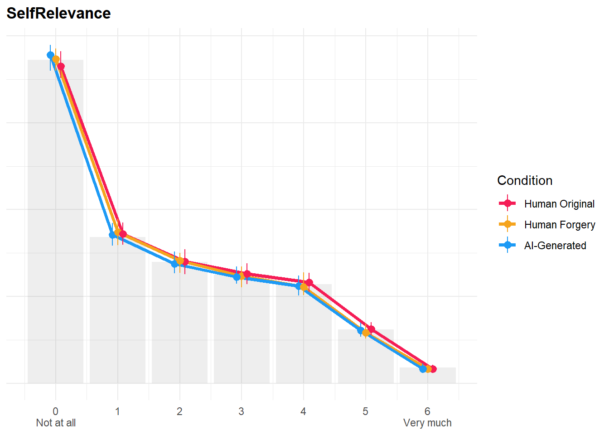{#fig-selfrelevance-1 width=672}
:::

::: {.cell-output-display}
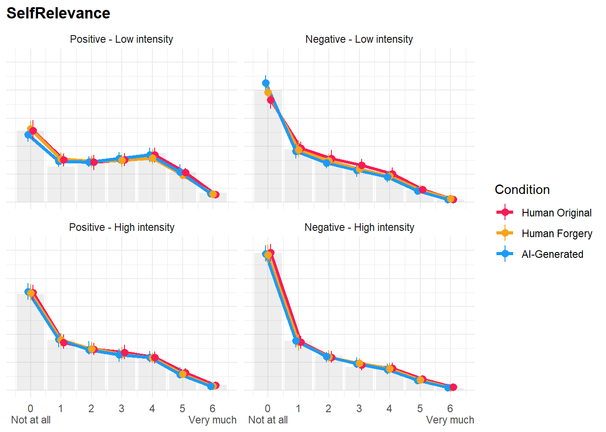{#fig-selfrelevance-2 width=672}
:::

Self-Relevance (0 = Not at all, 6 = Very much; follow-up session): observed proportion of each response and the model-implied probability per original label condition.
:::


### Artificiality


::: {.cell}

```{.r .cell-code}
make_report(estimates$Artificiality)
```

::: {.cell-output-display}

```{=html}
<div id="exnefvyrou" style="padding-left:0px;padding-right:0px;padding-top:10px;padding-bottom:10px;overflow-x:auto;overflow-y:auto;width:auto;height:auto;">
<style>#exnefvyrou table {
  font-family: system-ui, 'Segoe UI', Roboto, Helvetica, Arial, sans-serif, 'Apple Color Emoji', 'Segoe UI Emoji', 'Segoe UI Symbol', 'Noto Color Emoji';
  -webkit-font-smoothing: antialiased;
  -moz-osx-font-smoothing: grayscale;
}

#exnefvyrou thead, #exnefvyrou tbody, #exnefvyrou tfoot, #exnefvyrou tr, #exnefvyrou td, #exnefvyrou th {
  border-style: none;
}

#exnefvyrou p {
  margin: 0;
  padding: 0;
}

#exnefvyrou .gt_table {
  display: table;
  border-collapse: collapse;
  line-height: normal;
  margin-left: auto;
  margin-right: auto;
  color: #333333;
  font-size: 16px;
  font-weight: normal;
  font-style: normal;
  background-color: #FFFFFF;
  width: auto;
  border-top-style: solid;
  border-top-width: 2px;
  border-top-color: #A8A8A8;
  border-right-style: none;
  border-right-width: 2px;
  border-right-color: #D3D3D3;
  border-bottom-style: solid;
  border-bottom-width: 2px;
  border-bottom-color: #A8A8A8;
  border-left-style: none;
  border-left-width: 2px;
  border-left-color: #D3D3D3;
}

#exnefvyrou .gt_caption {
  padding-top: 4px;
  padding-bottom: 4px;
}

#exnefvyrou .gt_title {
  color: #333333;
  font-size: 125%;
  font-weight: initial;
  padding-top: 4px;
  padding-bottom: 4px;
  padding-left: 5px;
  padding-right: 5px;
  border-bottom-color: #FFFFFF;
  border-bottom-width: 0;
}

#exnefvyrou .gt_subtitle {
  color: #333333;
  font-size: 85%;
  font-weight: initial;
  padding-top: 3px;
  padding-bottom: 5px;
  padding-left: 5px;
  padding-right: 5px;
  border-top-color: #FFFFFF;
  border-top-width: 0;
}

#exnefvyrou .gt_heading {
  background-color: #FFFFFF;
  text-align: center;
  border-bottom-color: #FFFFFF;
  border-left-style: none;
  border-left-width: 1px;
  border-left-color: #D3D3D3;
  border-right-style: none;
  border-right-width: 1px;
  border-right-color: #D3D3D3;
}

#exnefvyrou .gt_bottom_border {
  border-bottom-style: solid;
  border-bottom-width: 2px;
  border-bottom-color: #D3D3D3;
}

#exnefvyrou .gt_col_headings {
  border-top-style: solid;
  border-top-width: 2px;
  border-top-color: #D3D3D3;
  border-bottom-style: solid;
  border-bottom-width: 2px;
  border-bottom-color: #D3D3D3;
  border-left-style: none;
  border-left-width: 1px;
  border-left-color: #D3D3D3;
  border-right-style: none;
  border-right-width: 1px;
  border-right-color: #D3D3D3;
}

#exnefvyrou .gt_col_heading {
  color: #333333;
  background-color: #FFFFFF;
  font-size: 100%;
  font-weight: normal;
  text-transform: inherit;
  border-left-style: none;
  border-left-width: 1px;
  border-left-color: #D3D3D3;
  border-right-style: none;
  border-right-width: 1px;
  border-right-color: #D3D3D3;
  vertical-align: bottom;
  padding-top: 5px;
  padding-bottom: 6px;
  padding-left: 5px;
  padding-right: 5px;
  overflow-x: hidden;
}

#exnefvyrou .gt_column_spanner_outer {
  color: #333333;
  background-color: #FFFFFF;
  font-size: 100%;
  font-weight: normal;
  text-transform: inherit;
  padding-top: 0;
  padding-bottom: 0;
  padding-left: 4px;
  padding-right: 4px;
}

#exnefvyrou .gt_column_spanner_outer:first-child {
  padding-left: 0;
}

#exnefvyrou .gt_column_spanner_outer:last-child {
  padding-right: 0;
}

#exnefvyrou .gt_column_spanner {
  border-bottom-style: solid;
  border-bottom-width: 2px;
  border-bottom-color: #D3D3D3;
  vertical-align: bottom;
  padding-top: 5px;
  padding-bottom: 5px;
  overflow-x: hidden;
  display: inline-block;
  width: 100%;
}

#exnefvyrou .gt_spanner_row {
  border-bottom-style: hidden;
}

#exnefvyrou .gt_group_heading {
  padding-top: 8px;
  padding-bottom: 8px;
  padding-left: 5px;
  padding-right: 5px;
  color: #333333;
  background-color: #FFFFFF;
  font-size: 100%;
  font-weight: initial;
  text-transform: inherit;
  border-top-style: solid;
  border-top-width: 2px;
  border-top-color: #D3D3D3;
  border-bottom-style: solid;
  border-bottom-width: 2px;
  border-bottom-color: #D3D3D3;
  border-left-style: none;
  border-left-width: 1px;
  border-left-color: #D3D3D3;
  border-right-style: none;
  border-right-width: 1px;
  border-right-color: #D3D3D3;
  vertical-align: middle;
  text-align: left;
}

#exnefvyrou .gt_empty_group_heading {
  padding: 0.5px;
  color: #333333;
  background-color: #FFFFFF;
  font-size: 100%;
  font-weight: initial;
  border-top-style: solid;
  border-top-width: 2px;
  border-top-color: #D3D3D3;
  border-bottom-style: solid;
  border-bottom-width: 2px;
  border-bottom-color: #D3D3D3;
  vertical-align: middle;
}

#exnefvyrou .gt_from_md > :first-child {
  margin-top: 0;
}

#exnefvyrou .gt_from_md > :last-child {
  margin-bottom: 0;
}

#exnefvyrou .gt_row {
  padding-top: 8px;
  padding-bottom: 8px;
  padding-left: 5px;
  padding-right: 5px;
  margin: 10px;
  border-top-style: solid;
  border-top-width: 1px;
  border-top-color: #D3D3D3;
  border-left-style: none;
  border-left-width: 1px;
  border-left-color: #D3D3D3;
  border-right-style: none;
  border-right-width: 1px;
  border-right-color: #D3D3D3;
  vertical-align: middle;
  overflow-x: hidden;
}

#exnefvyrou .gt_stub {
  color: #333333;
  background-color: #FFFFFF;
  font-size: 100%;
  font-weight: initial;
  text-transform: inherit;
  border-right-style: solid;
  border-right-width: 2px;
  border-right-color: #D3D3D3;
  padding-left: 5px;
  padding-right: 5px;
}

#exnefvyrou .gt_stub_row_group {
  color: #333333;
  background-color: #FFFFFF;
  font-size: 100%;
  font-weight: initial;
  text-transform: inherit;
  border-right-style: solid;
  border-right-width: 2px;
  border-right-color: #D3D3D3;
  padding-left: 5px;
  padding-right: 5px;
  vertical-align: top;
}

#exnefvyrou .gt_row_group_first td {
  border-top-width: 2px;
}

#exnefvyrou .gt_row_group_first th {
  border-top-width: 2px;
}

#exnefvyrou .gt_summary_row {
  color: #333333;
  background-color: #FFFFFF;
  text-transform: inherit;
  padding-top: 8px;
  padding-bottom: 8px;
  padding-left: 5px;
  padding-right: 5px;
}

#exnefvyrou .gt_first_summary_row {
  border-top-style: solid;
  border-top-color: #D3D3D3;
}

#exnefvyrou .gt_first_summary_row.thick {
  border-top-width: 2px;
}

#exnefvyrou .gt_last_summary_row {
  padding-top: 8px;
  padding-bottom: 8px;
  padding-left: 5px;
  padding-right: 5px;
  border-bottom-style: solid;
  border-bottom-width: 2px;
  border-bottom-color: #D3D3D3;
}

#exnefvyrou .gt_grand_summary_row {
  color: #333333;
  background-color: #FFFFFF;
  text-transform: inherit;
  padding-top: 8px;
  padding-bottom: 8px;
  padding-left: 5px;
  padding-right: 5px;
}

#exnefvyrou .gt_first_grand_summary_row {
  padding-top: 8px;
  padding-bottom: 8px;
  padding-left: 5px;
  padding-right: 5px;
  border-top-style: double;
  border-top-width: 6px;
  border-top-color: #D3D3D3;
}

#exnefvyrou .gt_last_grand_summary_row_top {
  padding-top: 8px;
  padding-bottom: 8px;
  padding-left: 5px;
  padding-right: 5px;
  border-bottom-style: double;
  border-bottom-width: 6px;
  border-bottom-color: #D3D3D3;
}

#exnefvyrou .gt_striped {
  background-color: rgba(128, 128, 128, 0.05);
}

#exnefvyrou .gt_table_body {
  border-top-style: solid;
  border-top-width: 2px;
  border-top-color: #D3D3D3;
  border-bottom-style: solid;
  border-bottom-width: 2px;
  border-bottom-color: #D3D3D3;
}

#exnefvyrou .gt_footnotes {
  color: #333333;
  background-color: #FFFFFF;
  border-bottom-style: none;
  border-bottom-width: 2px;
  border-bottom-color: #D3D3D3;
  border-left-style: none;
  border-left-width: 2px;
  border-left-color: #D3D3D3;
  border-right-style: none;
  border-right-width: 2px;
  border-right-color: #D3D3D3;
}

#exnefvyrou .gt_footnote {
  margin: 0px;
  font-size: 90%;
  padding-top: 4px;
  padding-bottom: 4px;
  padding-left: 5px;
  padding-right: 5px;
}

#exnefvyrou .gt_sourcenotes {
  color: #333333;
  background-color: #FFFFFF;
  border-bottom-style: none;
  border-bottom-width: 2px;
  border-bottom-color: #D3D3D3;
  border-left-style: none;
  border-left-width: 2px;
  border-left-color: #D3D3D3;
  border-right-style: none;
  border-right-width: 2px;
  border-right-color: #D3D3D3;
}

#exnefvyrou .gt_sourcenote {
  font-size: 90%;
  padding-top: 4px;
  padding-bottom: 4px;
  padding-left: 5px;
  padding-right: 5px;
}

#exnefvyrou .gt_left {
  text-align: left;
}

#exnefvyrou .gt_center {
  text-align: center;
}

#exnefvyrou .gt_right {
  text-align: right;
  font-variant-numeric: tabular-nums;
}

#exnefvyrou .gt_font_normal {
  font-weight: normal;
}

#exnefvyrou .gt_font_bold {
  font-weight: bold;
}

#exnefvyrou .gt_font_italic {
  font-style: italic;
}

#exnefvyrou .gt_super {
  font-size: 65%;
}

#exnefvyrou .gt_footnote_marks {
  font-size: 75%;
  vertical-align: 0.4em;
  position: initial;
}

#exnefvyrou .gt_asterisk {
  font-size: 100%;
  vertical-align: 0;
}

#exnefvyrou .gt_indent_1 {
  text-indent: 5px;
}

#exnefvyrou .gt_indent_2 {
  text-indent: 10px;
}

#exnefvyrou .gt_indent_3 {
  text-indent: 15px;
}

#exnefvyrou .gt_indent_4 {
  text-indent: 20px;
}

#exnefvyrou .gt_indent_5 {
  text-indent: 25px;
}

#exnefvyrou .katex-display {
  display: inline-flex !important;
  margin-bottom: 0.75em !important;
}

#exnefvyrou div.Reactable > div.rt-table > div.rt-thead > div.rt-tr.rt-tr-group-header > div.rt-th-group:after {
  height: 0px !important;
}
</style>
<table class="gt_table" data-quarto-disable-processing="false" data-quarto-bootstrap="false">
  <thead>
    <tr class="gt_col_headings">
      <th class="gt_col_heading gt_columns_bottom_border gt_left" rowspan="1" colspan="1" scope="col" id="Contrast">Contrast</th>
      <th class="gt_col_heading gt_columns_bottom_border gt_left" rowspan="1" colspan="1" scope="col" id="Parameters">Parameters</th>
    </tr>
  </thead>
  <tbody class="gt_table_body">
    <tr><td headers="Contrast" class="gt_row gt_left">Human Forgery - Human Original</td>
<td headers="Parameters" class="gt_row gt_left">pmid (0.00, [-0.01,  0.00])</td></tr>
    <tr><td headers="Contrast" class="gt_row gt_left">AI-Generated - Human Forgery</td>
<td headers="Parameters" class="gt_row gt_left">pmid (0.00, [ 0.00,  0.01])</td></tr>
  </tbody>
  
</table>
</div>
```

```{=html}
<div id="mllkovyyaj" style="padding-left:0px;padding-right:0px;padding-top:10px;padding-bottom:10px;overflow-x:auto;overflow-y:auto;width:auto;height:auto;">
<style>#mllkovyyaj table {
  font-family: system-ui, 'Segoe UI', Roboto, Helvetica, Arial, sans-serif, 'Apple Color Emoji', 'Segoe UI Emoji', 'Segoe UI Symbol', 'Noto Color Emoji';
  -webkit-font-smoothing: antialiased;
  -moz-osx-font-smoothing: grayscale;
}

#mllkovyyaj thead, #mllkovyyaj tbody, #mllkovyyaj tfoot, #mllkovyyaj tr, #mllkovyyaj td, #mllkovyyaj th {
  border-style: none;
}

#mllkovyyaj p {
  margin: 0;
  padding: 0;
}

#mllkovyyaj .gt_table {
  display: table;
  border-collapse: collapse;
  line-height: normal;
  margin-left: auto;
  margin-right: auto;
  color: #333333;
  font-size: 13px;
  font-weight: normal;
  font-style: normal;
  background-color: #FFFFFF;
  width: auto;
  border-top-style: solid;
  border-top-width: 3px;
  border-top-color: #D5D5D5;
  border-right-style: solid;
  border-right-width: 3px;
  border-right-color: #D5D5D5;
  border-bottom-style: solid;
  border-bottom-width: 3px;
  border-bottom-color: #D5D5D5;
  border-left-style: solid;
  border-left-width: 3px;
  border-left-color: #D5D5D5;
}

#mllkovyyaj .gt_caption {
  padding-top: 4px;
  padding-bottom: 4px;
}

#mllkovyyaj .gt_title {
  color: #333333;
  font-size: 125%;
  font-weight: initial;
  padding-top: 4px;
  padding-bottom: 4px;
  padding-left: 5px;
  padding-right: 5px;
  border-bottom-color: #FFFFFF;
  border-bottom-width: 0;
}

#mllkovyyaj .gt_subtitle {
  color: #333333;
  font-size: 85%;
  font-weight: initial;
  padding-top: 3px;
  padding-bottom: 5px;
  padding-left: 5px;
  padding-right: 5px;
  border-top-color: #FFFFFF;
  border-top-width: 0;
}

#mllkovyyaj .gt_heading {
  background-color: #FFFFFF;
  text-align: left;
  border-bottom-color: #FFFFFF;
  border-left-style: none;
  border-left-width: 1px;
  border-left-color: #D3D3D3;
  border-right-style: none;
  border-right-width: 1px;
  border-right-color: #D3D3D3;
}

#mllkovyyaj .gt_bottom_border {
  border-bottom-style: solid;
  border-bottom-width: 2px;
  border-bottom-color: #D5D5D5;
}

#mllkovyyaj .gt_col_headings {
  border-top-style: solid;
  border-top-width: 2px;
  border-top-color: #D5D5D5;
  border-bottom-style: solid;
  border-bottom-width: 2px;
  border-bottom-color: #D5D5D5;
  border-left-style: none;
  border-left-width: 1px;
  border-left-color: #D3D3D3;
  border-right-style: none;
  border-right-width: 1px;
  border-right-color: #D3D3D3;
}

#mllkovyyaj .gt_col_heading {
  color: #FFFFFF;
  background-color: #000000;
  font-size: 100%;
  font-weight: normal;
  text-transform: inherit;
  border-left-style: none;
  border-left-width: 1px;
  border-left-color: #D3D3D3;
  border-right-style: none;
  border-right-width: 1px;
  border-right-color: #D3D3D3;
  vertical-align: bottom;
  padding-top: 5px;
  padding-bottom: 6px;
  padding-left: 5px;
  padding-right: 5px;
  overflow-x: hidden;
}

#mllkovyyaj .gt_column_spanner_outer {
  color: #FFFFFF;
  background-color: #000000;
  font-size: 100%;
  font-weight: normal;
  text-transform: inherit;
  padding-top: 0;
  padding-bottom: 0;
  padding-left: 4px;
  padding-right: 4px;
}

#mllkovyyaj .gt_column_spanner_outer:first-child {
  padding-left: 0;
}

#mllkovyyaj .gt_column_spanner_outer:last-child {
  padding-right: 0;
}

#mllkovyyaj .gt_column_spanner {
  border-bottom-style: solid;
  border-bottom-width: 2px;
  border-bottom-color: #D5D5D5;
  vertical-align: bottom;
  padding-top: 5px;
  padding-bottom: 5px;
  overflow-x: hidden;
  display: inline-block;
  width: 100%;
}

#mllkovyyaj .gt_spanner_row {
  border-bottom-style: hidden;
}

#mllkovyyaj .gt_group_heading {
  padding-top: 8px;
  padding-bottom: 8px;
  padding-left: 5px;
  padding-right: 5px;
  color: #333333;
  background-color: #FFFFFF;
  font-size: 100%;
  font-weight: initial;
  text-transform: inherit;
  border-top-style: solid;
  border-top-width: 2px;
  border-top-color: #D5D5D5;
  border-bottom-style: solid;
  border-bottom-width: 2px;
  border-bottom-color: #D5D5D5;
  border-left-style: none;
  border-left-width: 1px;
  border-left-color: #D3D3D3;
  border-right-style: none;
  border-right-width: 1px;
  border-right-color: #D3D3D3;
  vertical-align: middle;
  text-align: left;
}

#mllkovyyaj .gt_empty_group_heading {
  padding: 0.5px;
  color: #333333;
  background-color: #FFFFFF;
  font-size: 100%;
  font-weight: initial;
  border-top-style: solid;
  border-top-width: 2px;
  border-top-color: #D5D5D5;
  border-bottom-style: solid;
  border-bottom-width: 2px;
  border-bottom-color: #D5D5D5;
  vertical-align: middle;
}

#mllkovyyaj .gt_from_md > :first-child {
  margin-top: 0;
}

#mllkovyyaj .gt_from_md > :last-child {
  margin-bottom: 0;
}

#mllkovyyaj .gt_row {
  padding-top: 8px;
  padding-bottom: 8px;
  padding-left: 5px;
  padding-right: 5px;
  margin: 10px;
  border-top-style: solid;
  border-top-width: 1px;
  border-top-color: #D5D5D5;
  border-left-style: solid;
  border-left-width: 1px;
  border-left-color: #D5D5D5;
  border-right-style: solid;
  border-right-width: 1px;
  border-right-color: #D5D5D5;
  vertical-align: middle;
  overflow-x: hidden;
}

#mllkovyyaj .gt_stub {
  color: #333333;
  background-color: #FFFFFF;
  font-size: 100%;
  font-weight: initial;
  text-transform: inherit;
  border-right-style: solid;
  border-right-width: 2px;
  border-right-color: #5F5F5F;
  padding-left: 5px;
  padding-right: 5px;
}

#mllkovyyaj .gt_stub_row_group {
  color: #333333;
  background-color: #FFFFFF;
  font-size: 100%;
  font-weight: initial;
  text-transform: inherit;
  border-right-style: solid;
  border-right-width: 2px;
  border-right-color: #D3D3D3;
  padding-left: 5px;
  padding-right: 5px;
  vertical-align: top;
}

#mllkovyyaj .gt_row_group_first td {
  border-top-width: 2px;
}

#mllkovyyaj .gt_row_group_first th {
  border-top-width: 2px;
}

#mllkovyyaj .gt_summary_row {
  color: #333333;
  background-color: #D5D5D5;
  text-transform: inherit;
  padding-top: 8px;
  padding-bottom: 8px;
  padding-left: 5px;
  padding-right: 5px;
}

#mllkovyyaj .gt_first_summary_row {
  border-top-style: solid;
  border-top-color: #D5D5D5;
}

#mllkovyyaj .gt_first_summary_row.thick {
  border-top-width: 2px;
}

#mllkovyyaj .gt_last_summary_row {
  padding-top: 8px;
  padding-bottom: 8px;
  padding-left: 5px;
  padding-right: 5px;
  border-bottom-style: solid;
  border-bottom-width: 2px;
  border-bottom-color: #D5D5D5;
}

#mllkovyyaj .gt_grand_summary_row {
  color: #FFFFFF;
  background-color: #929292;
  text-transform: inherit;
  padding-top: 8px;
  padding-bottom: 8px;
  padding-left: 5px;
  padding-right: 5px;
}

#mllkovyyaj .gt_first_grand_summary_row {
  padding-top: 8px;
  padding-bottom: 8px;
  padding-left: 5px;
  padding-right: 5px;
  border-top-style: double;
  border-top-width: 6px;
  border-top-color: #D5D5D5;
}

#mllkovyyaj .gt_last_grand_summary_row_top {
  padding-top: 8px;
  padding-bottom: 8px;
  padding-left: 5px;
  padding-right: 5px;
  border-bottom-style: double;
  border-bottom-width: 6px;
  border-bottom-color: #D5D5D5;
}

#mllkovyyaj .gt_striped {
  background-color: #F4F4F4;
}

#mllkovyyaj .gt_table_body {
  border-top-style: solid;
  border-top-width: 2px;
  border-top-color: #D5D5D5;
  border-bottom-style: solid;
  border-bottom-width: 2px;
  border-bottom-color: #D5D5D5;
}

#mllkovyyaj .gt_footnotes {
  color: #333333;
  background-color: #FFFFFF;
  border-bottom-style: none;
  border-bottom-width: 2px;
  border-bottom-color: #D3D3D3;
  border-left-style: none;
  border-left-width: 2px;
  border-left-color: #D3D3D3;
  border-right-style: none;
  border-right-width: 2px;
  border-right-color: #D3D3D3;
}

#mllkovyyaj .gt_footnote {
  margin: 0px;
  font-size: 90%;
  padding-top: 4px;
  padding-bottom: 4px;
  padding-left: 5px;
  padding-right: 5px;
}

#mllkovyyaj .gt_sourcenotes {
  color: #333333;
  background-color: #FFFFFF;
  border-bottom-style: none;
  border-bottom-width: 2px;
  border-bottom-color: #D3D3D3;
  border-left-style: none;
  border-left-width: 2px;
  border-left-color: #D3D3D3;
  border-right-style: none;
  border-right-width: 2px;
  border-right-color: #D3D3D3;
}

#mllkovyyaj .gt_sourcenote {
  font-size: 90%;
  padding-top: 4px;
  padding-bottom: 4px;
  padding-left: 5px;
  padding-right: 5px;
}

#mllkovyyaj .gt_left {
  text-align: left;
}

#mllkovyyaj .gt_center {
  text-align: center;
}

#mllkovyyaj .gt_right {
  text-align: right;
  font-variant-numeric: tabular-nums;
}

#mllkovyyaj .gt_font_normal {
  font-weight: normal;
}

#mllkovyyaj .gt_font_bold {
  font-weight: bold;
}

#mllkovyyaj .gt_font_italic {
  font-style: italic;
}

#mllkovyyaj .gt_super {
  font-size: 65%;
}

#mllkovyyaj .gt_footnote_marks {
  font-size: 75%;
  vertical-align: 0.4em;
  position: initial;
}

#mllkovyyaj .gt_asterisk {
  font-size: 100%;
  vertical-align: 0;
}

#mllkovyyaj .gt_indent_1 {
  text-indent: 5px;
}

#mllkovyyaj .gt_indent_2 {
  text-indent: 10px;
}

#mllkovyyaj .gt_indent_3 {
  text-indent: 15px;
}

#mllkovyyaj .gt_indent_4 {
  text-indent: 20px;
}

#mllkovyyaj .gt_indent_5 {
  text-indent: 25px;
}

#mllkovyyaj .katex-display {
  display: inline-flex !important;
  margin-bottom: 0.75em !important;
}

#mllkovyyaj div.Reactable > div.rt-table > div.rt-thead > div.rt-tr.rt-tr-group-header > div.rt-th-group:after {
  height: 0px !important;
}
</style>
<table class="gt_table" data-quarto-disable-processing="false" data-quarto-bootstrap="false">
  <thead>
    <tr class="gt_heading">
      <td colspan="10" class="gt_heading gt_title gt_font_normal gt_bottom_border" style>Perceived Artificiality: convergence</td>
    </tr>
    
    <tr class="gt_col_headings">
      <th class="gt_col_heading gt_columns_bottom_border gt_left" rowspan="1" colspan="1" scope="col" id="Model">Model</th>
      <th class="gt_col_heading gt_columns_bottom_border gt_left" rowspan="1" colspan="1" scope="col" id="Family">Family</th>
      <th class="gt_col_heading gt_columns_bottom_border gt_right" rowspan="1" colspan="1" scope="col" id="N_obs">N_obs</th>
      <th class="gt_col_heading gt_columns_bottom_border gt_right" rowspan="1" colspan="1" scope="col" id="N_participants">N_participants</th>
      <th class="gt_col_heading gt_columns_bottom_border gt_right" rowspan="1" colspan="1" scope="col" id="Chains">Chains</th>
      <th class="gt_col_heading gt_columns_bottom_border gt_right" rowspan="1" colspan="1" scope="col" id="Draws">Draws</th>
      <th class="gt_col_heading gt_columns_bottom_border gt_right" rowspan="1" colspan="1" scope="col" id="Max_Rhat">Max_Rhat</th>
      <th class="gt_col_heading gt_columns_bottom_border gt_right" rowspan="1" colspan="1" scope="col" id="Min_ESS_ratio">Min_ESS_ratio</th>
      <th class="gt_col_heading gt_columns_bottom_border gt_right" rowspan="1" colspan="1" scope="col" id="Divergent_pct">Divergent_pct</th>
      <th class="gt_col_heading gt_columns_bottom_border gt_left" rowspan="1" colspan="1" scope="col" id="Criterion">Criterion</th>
    </tr>
  </thead>
  <tbody class="gt_table_body">
    <tr><td headers="Model" class="gt_row gt_left">Artificiality</td>
<td headers="Family" class="gt_row gt_left">CHOCO</td>
<td headers="N_obs" class="gt_row gt_right">6009</td>
<td headers="N_participants" class="gt_row gt_right">220</td>
<td headers="Chains" class="gt_row gt_right">8</td>
<td headers="Draws" class="gt_row gt_right">4000</td>
<td headers="Max_Rhat" class="gt_row gt_right">1.038</td>
<td headers="Min_ESS_ratio" class="gt_row gt_right">0.047</td>
<td headers="Divergent_pct" class="gt_row gt_right">0</td>
<td headers="Criterion" class="gt_row gt_left">loo</td></tr>
  </tbody>
  
</table>
</div>
```


::: {.callout-note collapse="true" title="Perceived Artificiality: convergence (Markdown table, for text readers)"}

|Model         |Family | N_obs| N_participants| Chains| Draws| Max_Rhat| Min_ESS_ratio| Divergent_pct|Criterion |
|:-------------|:------|-----:|--------------:|------:|-----:|--------:|-------------:|-------------:|:---------|
|Artificiality |CHOCO  |  6009|            220|      8|  4000|    1.038|         0.047|             0|loo       |

:::

```{=html}
<div id="cayftvtkgl" style="padding-left:0px;padding-right:0px;padding-top:10px;padding-bottom:10px;overflow-x:auto;overflow-y:auto;width:auto;height:auto;">
<style>#cayftvtkgl table {
  font-family: system-ui, 'Segoe UI', Roboto, Helvetica, Arial, sans-serif, 'Apple Color Emoji', 'Segoe UI Emoji', 'Segoe UI Symbol', 'Noto Color Emoji';
  -webkit-font-smoothing: antialiased;
  -moz-osx-font-smoothing: grayscale;
}

#cayftvtkgl thead, #cayftvtkgl tbody, #cayftvtkgl tfoot, #cayftvtkgl tr, #cayftvtkgl td, #cayftvtkgl th {
  border-style: none;
}

#cayftvtkgl p {
  margin: 0;
  padding: 0;
}

#cayftvtkgl .gt_table {
  display: table;
  border-collapse: collapse;
  line-height: normal;
  margin-left: auto;
  margin-right: auto;
  color: #333333;
  font-size: 13px;
  font-weight: normal;
  font-style: normal;
  background-color: #FFFFFF;
  width: auto;
  border-top-style: solid;
  border-top-width: 3px;
  border-top-color: #D5D5D5;
  border-right-style: solid;
  border-right-width: 3px;
  border-right-color: #D5D5D5;
  border-bottom-style: solid;
  border-bottom-width: 3px;
  border-bottom-color: #D5D5D5;
  border-left-style: solid;
  border-left-width: 3px;
  border-left-color: #D5D5D5;
}

#cayftvtkgl .gt_caption {
  padding-top: 4px;
  padding-bottom: 4px;
}

#cayftvtkgl .gt_title {
  color: #333333;
  font-size: 125%;
  font-weight: initial;
  padding-top: 4px;
  padding-bottom: 4px;
  padding-left: 5px;
  padding-right: 5px;
  border-bottom-color: #FFFFFF;
  border-bottom-width: 0;
}

#cayftvtkgl .gt_subtitle {
  color: #333333;
  font-size: 85%;
  font-weight: initial;
  padding-top: 3px;
  padding-bottom: 5px;
  padding-left: 5px;
  padding-right: 5px;
  border-top-color: #FFFFFF;
  border-top-width: 0;
}

#cayftvtkgl .gt_heading {
  background-color: #FFFFFF;
  text-align: left;
  border-bottom-color: #FFFFFF;
  border-left-style: none;
  border-left-width: 1px;
  border-left-color: #D3D3D3;
  border-right-style: none;
  border-right-width: 1px;
  border-right-color: #D3D3D3;
}

#cayftvtkgl .gt_bottom_border {
  border-bottom-style: solid;
  border-bottom-width: 2px;
  border-bottom-color: #D5D5D5;
}

#cayftvtkgl .gt_col_headings {
  border-top-style: solid;
  border-top-width: 2px;
  border-top-color: #D5D5D5;
  border-bottom-style: solid;
  border-bottom-width: 2px;
  border-bottom-color: #D5D5D5;
  border-left-style: none;
  border-left-width: 1px;
  border-left-color: #D3D3D3;
  border-right-style: none;
  border-right-width: 1px;
  border-right-color: #D3D3D3;
}

#cayftvtkgl .gt_col_heading {
  color: #FFFFFF;
  background-color: #000000;
  font-size: 100%;
  font-weight: normal;
  text-transform: inherit;
  border-left-style: none;
  border-left-width: 1px;
  border-left-color: #D3D3D3;
  border-right-style: none;
  border-right-width: 1px;
  border-right-color: #D3D3D3;
  vertical-align: bottom;
  padding-top: 5px;
  padding-bottom: 6px;
  padding-left: 5px;
  padding-right: 5px;
  overflow-x: hidden;
}

#cayftvtkgl .gt_column_spanner_outer {
  color: #FFFFFF;
  background-color: #000000;
  font-size: 100%;
  font-weight: normal;
  text-transform: inherit;
  padding-top: 0;
  padding-bottom: 0;
  padding-left: 4px;
  padding-right: 4px;
}

#cayftvtkgl .gt_column_spanner_outer:first-child {
  padding-left: 0;
}

#cayftvtkgl .gt_column_spanner_outer:last-child {
  padding-right: 0;
}

#cayftvtkgl .gt_column_spanner {
  border-bottom-style: solid;
  border-bottom-width: 2px;
  border-bottom-color: #D5D5D5;
  vertical-align: bottom;
  padding-top: 5px;
  padding-bottom: 5px;
  overflow-x: hidden;
  display: inline-block;
  width: 100%;
}

#cayftvtkgl .gt_spanner_row {
  border-bottom-style: hidden;
}

#cayftvtkgl .gt_group_heading {
  padding-top: 8px;
  padding-bottom: 8px;
  padding-left: 5px;
  padding-right: 5px;
  color: #333333;
  background-color: #FFFFFF;
  font-size: 100%;
  font-weight: initial;
  text-transform: inherit;
  border-top-style: solid;
  border-top-width: 2px;
  border-top-color: #D5D5D5;
  border-bottom-style: solid;
  border-bottom-width: 2px;
  border-bottom-color: #D5D5D5;
  border-left-style: none;
  border-left-width: 1px;
  border-left-color: #D3D3D3;
  border-right-style: none;
  border-right-width: 1px;
  border-right-color: #D3D3D3;
  vertical-align: middle;
  text-align: left;
}

#cayftvtkgl .gt_empty_group_heading {
  padding: 0.5px;
  color: #333333;
  background-color: #FFFFFF;
  font-size: 100%;
  font-weight: initial;
  border-top-style: solid;
  border-top-width: 2px;
  border-top-color: #D5D5D5;
  border-bottom-style: solid;
  border-bottom-width: 2px;
  border-bottom-color: #D5D5D5;
  vertical-align: middle;
}

#cayftvtkgl .gt_from_md > :first-child {
  margin-top: 0;
}

#cayftvtkgl .gt_from_md > :last-child {
  margin-bottom: 0;
}

#cayftvtkgl .gt_row {
  padding-top: 8px;
  padding-bottom: 8px;
  padding-left: 5px;
  padding-right: 5px;
  margin: 10px;
  border-top-style: solid;
  border-top-width: 1px;
  border-top-color: #D5D5D5;
  border-left-style: solid;
  border-left-width: 1px;
  border-left-color: #D5D5D5;
  border-right-style: solid;
  border-right-width: 1px;
  border-right-color: #D5D5D5;
  vertical-align: middle;
  overflow-x: hidden;
}

#cayftvtkgl .gt_stub {
  color: #333333;
  background-color: #FFFFFF;
  font-size: 100%;
  font-weight: initial;
  text-transform: inherit;
  border-right-style: solid;
  border-right-width: 2px;
  border-right-color: #5F5F5F;
  padding-left: 5px;
  padding-right: 5px;
}

#cayftvtkgl .gt_stub_row_group {
  color: #333333;
  background-color: #FFFFFF;
  font-size: 100%;
  font-weight: initial;
  text-transform: inherit;
  border-right-style: solid;
  border-right-width: 2px;
  border-right-color: #D3D3D3;
  padding-left: 5px;
  padding-right: 5px;
  vertical-align: top;
}

#cayftvtkgl .gt_row_group_first td {
  border-top-width: 2px;
}

#cayftvtkgl .gt_row_group_first th {
  border-top-width: 2px;
}

#cayftvtkgl .gt_summary_row {
  color: #333333;
  background-color: #D5D5D5;
  text-transform: inherit;
  padding-top: 8px;
  padding-bottom: 8px;
  padding-left: 5px;
  padding-right: 5px;
}

#cayftvtkgl .gt_first_summary_row {
  border-top-style: solid;
  border-top-color: #D5D5D5;
}

#cayftvtkgl .gt_first_summary_row.thick {
  border-top-width: 2px;
}

#cayftvtkgl .gt_last_summary_row {
  padding-top: 8px;
  padding-bottom: 8px;
  padding-left: 5px;
  padding-right: 5px;
  border-bottom-style: solid;
  border-bottom-width: 2px;
  border-bottom-color: #D5D5D5;
}

#cayftvtkgl .gt_grand_summary_row {
  color: #FFFFFF;
  background-color: #929292;
  text-transform: inherit;
  padding-top: 8px;
  padding-bottom: 8px;
  padding-left: 5px;
  padding-right: 5px;
}

#cayftvtkgl .gt_first_grand_summary_row {
  padding-top: 8px;
  padding-bottom: 8px;
  padding-left: 5px;
  padding-right: 5px;
  border-top-style: double;
  border-top-width: 6px;
  border-top-color: #D5D5D5;
}

#cayftvtkgl .gt_last_grand_summary_row_top {
  padding-top: 8px;
  padding-bottom: 8px;
  padding-left: 5px;
  padding-right: 5px;
  border-bottom-style: double;
  border-bottom-width: 6px;
  border-bottom-color: #D5D5D5;
}

#cayftvtkgl .gt_striped {
  background-color: #F4F4F4;
}

#cayftvtkgl .gt_table_body {
  border-top-style: solid;
  border-top-width: 2px;
  border-top-color: #D5D5D5;
  border-bottom-style: solid;
  border-bottom-width: 2px;
  border-bottom-color: #D5D5D5;
}

#cayftvtkgl .gt_footnotes {
  color: #333333;
  background-color: #FFFFFF;
  border-bottom-style: none;
  border-bottom-width: 2px;
  border-bottom-color: #D3D3D3;
  border-left-style: none;
  border-left-width: 2px;
  border-left-color: #D3D3D3;
  border-right-style: none;
  border-right-width: 2px;
  border-right-color: #D3D3D3;
}

#cayftvtkgl .gt_footnote {
  margin: 0px;
  font-size: 90%;
  padding-top: 4px;
  padding-bottom: 4px;
  padding-left: 5px;
  padding-right: 5px;
}

#cayftvtkgl .gt_sourcenotes {
  color: #333333;
  background-color: #FFFFFF;
  border-bottom-style: none;
  border-bottom-width: 2px;
  border-bottom-color: #D3D3D3;
  border-left-style: none;
  border-left-width: 2px;
  border-left-color: #D3D3D3;
  border-right-style: none;
  border-right-width: 2px;
  border-right-color: #D3D3D3;
}

#cayftvtkgl .gt_sourcenote {
  font-size: 90%;
  padding-top: 4px;
  padding-bottom: 4px;
  padding-left: 5px;
  padding-right: 5px;
}

#cayftvtkgl .gt_left {
  text-align: left;
}

#cayftvtkgl .gt_center {
  text-align: center;
}

#cayftvtkgl .gt_right {
  text-align: right;
  font-variant-numeric: tabular-nums;
}

#cayftvtkgl .gt_font_normal {
  font-weight: normal;
}

#cayftvtkgl .gt_font_bold {
  font-weight: bold;
}

#cayftvtkgl .gt_font_italic {
  font-style: italic;
}

#cayftvtkgl .gt_super {
  font-size: 65%;
}

#cayftvtkgl .gt_footnote_marks {
  font-size: 75%;
  vertical-align: 0.4em;
  position: initial;
}

#cayftvtkgl .gt_asterisk {
  font-size: 100%;
  vertical-align: 0;
}

#cayftvtkgl .gt_indent_1 {
  text-indent: 5px;
}

#cayftvtkgl .gt_indent_2 {
  text-indent: 10px;
}

#cayftvtkgl .gt_indent_3 {
  text-indent: 15px;
}

#cayftvtkgl .gt_indent_4 {
  text-indent: 20px;
}

#cayftvtkgl .gt_indent_5 {
  text-indent: 25px;
}

#cayftvtkgl .katex-display {
  display: inline-flex !important;
  margin-bottom: 0.75em !important;
}

#cayftvtkgl div.Reactable > div.rt-table > div.rt-thead > div.rt-tr.rt-tr-group-header > div.rt-th-group:after {
  height: 0px !important;
}
</style>
<table class="gt_table" data-quarto-disable-processing="false" data-quarto-bootstrap="false">
  <thead>
    <tr class="gt_heading">
      <td colspan="4" class="gt_heading gt_title gt_font_normal gt_bottom_border" style>Perceived Artificiality: marginal means per label condition (response scale)</td>
    </tr>
    
    <tr class="gt_col_headings">
      <th class="gt_col_heading gt_columns_bottom_border gt_center" rowspan="1" colspan="1" scope="col" id="Condition">Condition</th>
      <th class="gt_col_heading gt_columns_bottom_border gt_right" rowspan="1" colspan="1" scope="col" id="Estimate">Estimate</th>
      <th class="gt_col_heading gt_columns_bottom_border gt_right" rowspan="1" colspan="1" scope="col" id="CI_low">CI_low</th>
      <th class="gt_col_heading gt_columns_bottom_border gt_right" rowspan="1" colspan="1" scope="col" id="CI_high">CI_high</th>
    </tr>
  </thead>
  <tbody class="gt_table_body">
    <tr><td headers="Condition" class="gt_row gt_center">Human Original</td>
<td headers="Estimate" class="gt_row gt_right">0.57</td>
<td headers="CI_low" class="gt_row gt_right">0.53</td>
<td headers="CI_high" class="gt_row gt_right">0.60</td></tr>
    <tr><td headers="Condition" class="gt_row gt_center gt_striped">Human Forgery</td>
<td headers="Estimate" class="gt_row gt_right gt_striped">0.58</td>
<td headers="CI_low" class="gt_row gt_right gt_striped">0.54</td>
<td headers="CI_high" class="gt_row gt_right gt_striped">0.61</td></tr>
    <tr><td headers="Condition" class="gt_row gt_center">AI-Generated</td>
<td headers="Estimate" class="gt_row gt_right">0.57</td>
<td headers="CI_low" class="gt_row gt_right">0.54</td>
<td headers="CI_high" class="gt_row gt_right">0.61</td></tr>
  </tbody>
  
</table>
</div>
```


::: {.callout-note collapse="true" title="Perceived Artificiality: marginal means per label condition (response scale) (Markdown table, for text readers)"}

|Condition      |Estimate |CI_low |CI_high |
|:--------------|:--------|:------|:-------|
|Human Original |0.57     |0.53   |0.60    |
|Human Forgery  |0.58     |0.54   |0.61    |
|AI-Generated   |0.57     |0.54   |0.61    |

:::

```{=html}
<div id="ggcusxclzp" style="padding-left:0px;padding-right:0px;padding-top:10px;padding-bottom:10px;overflow-x:auto;overflow-y:auto;width:auto;height:auto;">
<style>#ggcusxclzp table {
  font-family: system-ui, 'Segoe UI', Roboto, Helvetica, Arial, sans-serif, 'Apple Color Emoji', 'Segoe UI Emoji', 'Segoe UI Symbol', 'Noto Color Emoji';
  -webkit-font-smoothing: antialiased;
  -moz-osx-font-smoothing: grayscale;
}

#ggcusxclzp thead, #ggcusxclzp tbody, #ggcusxclzp tfoot, #ggcusxclzp tr, #ggcusxclzp td, #ggcusxclzp th {
  border-style: none;
}

#ggcusxclzp p {
  margin: 0;
  padding: 0;
}

#ggcusxclzp .gt_table {
  display: table;
  border-collapse: collapse;
  line-height: normal;
  margin-left: auto;
  margin-right: auto;
  color: #333333;
  font-size: 13px;
  font-weight: normal;
  font-style: normal;
  background-color: #FFFFFF;
  width: auto;
  border-top-style: solid;
  border-top-width: 3px;
  border-top-color: #D5D5D5;
  border-right-style: solid;
  border-right-width: 3px;
  border-right-color: #D5D5D5;
  border-bottom-style: solid;
  border-bottom-width: 3px;
  border-bottom-color: #D5D5D5;
  border-left-style: solid;
  border-left-width: 3px;
  border-left-color: #D5D5D5;
}

#ggcusxclzp .gt_caption {
  padding-top: 4px;
  padding-bottom: 4px;
}

#ggcusxclzp .gt_title {
  color: #333333;
  font-size: 125%;
  font-weight: initial;
  padding-top: 4px;
  padding-bottom: 4px;
  padding-left: 5px;
  padding-right: 5px;
  border-bottom-color: #FFFFFF;
  border-bottom-width: 0;
}

#ggcusxclzp .gt_subtitle {
  color: #333333;
  font-size: 85%;
  font-weight: initial;
  padding-top: 3px;
  padding-bottom: 5px;
  padding-left: 5px;
  padding-right: 5px;
  border-top-color: #FFFFFF;
  border-top-width: 0;
}

#ggcusxclzp .gt_heading {
  background-color: #FFFFFF;
  text-align: left;
  border-bottom-color: #FFFFFF;
  border-left-style: none;
  border-left-width: 1px;
  border-left-color: #D3D3D3;
  border-right-style: none;
  border-right-width: 1px;
  border-right-color: #D3D3D3;
}

#ggcusxclzp .gt_bottom_border {
  border-bottom-style: solid;
  border-bottom-width: 2px;
  border-bottom-color: #D5D5D5;
}

#ggcusxclzp .gt_col_headings {
  border-top-style: solid;
  border-top-width: 2px;
  border-top-color: #D5D5D5;
  border-bottom-style: solid;
  border-bottom-width: 2px;
  border-bottom-color: #D5D5D5;
  border-left-style: none;
  border-left-width: 1px;
  border-left-color: #D3D3D3;
  border-right-style: none;
  border-right-width: 1px;
  border-right-color: #D3D3D3;
}

#ggcusxclzp .gt_col_heading {
  color: #FFFFFF;
  background-color: #000000;
  font-size: 100%;
  font-weight: normal;
  text-transform: inherit;
  border-left-style: none;
  border-left-width: 1px;
  border-left-color: #D3D3D3;
  border-right-style: none;
  border-right-width: 1px;
  border-right-color: #D3D3D3;
  vertical-align: bottom;
  padding-top: 5px;
  padding-bottom: 6px;
  padding-left: 5px;
  padding-right: 5px;
  overflow-x: hidden;
}

#ggcusxclzp .gt_column_spanner_outer {
  color: #FFFFFF;
  background-color: #000000;
  font-size: 100%;
  font-weight: normal;
  text-transform: inherit;
  padding-top: 0;
  padding-bottom: 0;
  padding-left: 4px;
  padding-right: 4px;
}

#ggcusxclzp .gt_column_spanner_outer:first-child {
  padding-left: 0;
}

#ggcusxclzp .gt_column_spanner_outer:last-child {
  padding-right: 0;
}

#ggcusxclzp .gt_column_spanner {
  border-bottom-style: solid;
  border-bottom-width: 2px;
  border-bottom-color: #D5D5D5;
  vertical-align: bottom;
  padding-top: 5px;
  padding-bottom: 5px;
  overflow-x: hidden;
  display: inline-block;
  width: 100%;
}

#ggcusxclzp .gt_spanner_row {
  border-bottom-style: hidden;
}

#ggcusxclzp .gt_group_heading {
  padding-top: 8px;
  padding-bottom: 8px;
  padding-left: 5px;
  padding-right: 5px;
  color: #333333;
  background-color: #FFFFFF;
  font-size: 100%;
  font-weight: initial;
  text-transform: inherit;
  border-top-style: solid;
  border-top-width: 2px;
  border-top-color: #D5D5D5;
  border-bottom-style: solid;
  border-bottom-width: 2px;
  border-bottom-color: #D5D5D5;
  border-left-style: none;
  border-left-width: 1px;
  border-left-color: #D3D3D3;
  border-right-style: none;
  border-right-width: 1px;
  border-right-color: #D3D3D3;
  vertical-align: middle;
  text-align: left;
}

#ggcusxclzp .gt_empty_group_heading {
  padding: 0.5px;
  color: #333333;
  background-color: #FFFFFF;
  font-size: 100%;
  font-weight: initial;
  border-top-style: solid;
  border-top-width: 2px;
  border-top-color: #D5D5D5;
  border-bottom-style: solid;
  border-bottom-width: 2px;
  border-bottom-color: #D5D5D5;
  vertical-align: middle;
}

#ggcusxclzp .gt_from_md > :first-child {
  margin-top: 0;
}

#ggcusxclzp .gt_from_md > :last-child {
  margin-bottom: 0;
}

#ggcusxclzp .gt_row {
  padding-top: 8px;
  padding-bottom: 8px;
  padding-left: 5px;
  padding-right: 5px;
  margin: 10px;
  border-top-style: solid;
  border-top-width: 1px;
  border-top-color: #D5D5D5;
  border-left-style: solid;
  border-left-width: 1px;
  border-left-color: #D5D5D5;
  border-right-style: solid;
  border-right-width: 1px;
  border-right-color: #D5D5D5;
  vertical-align: middle;
  overflow-x: hidden;
}

#ggcusxclzp .gt_stub {
  color: #333333;
  background-color: #FFFFFF;
  font-size: 100%;
  font-weight: initial;
  text-transform: inherit;
  border-right-style: solid;
  border-right-width: 2px;
  border-right-color: #5F5F5F;
  padding-left: 5px;
  padding-right: 5px;
}

#ggcusxclzp .gt_stub_row_group {
  color: #333333;
  background-color: #FFFFFF;
  font-size: 100%;
  font-weight: initial;
  text-transform: inherit;
  border-right-style: solid;
  border-right-width: 2px;
  border-right-color: #D3D3D3;
  padding-left: 5px;
  padding-right: 5px;
  vertical-align: top;
}

#ggcusxclzp .gt_row_group_first td {
  border-top-width: 2px;
}

#ggcusxclzp .gt_row_group_first th {
  border-top-width: 2px;
}

#ggcusxclzp .gt_summary_row {
  color: #333333;
  background-color: #D5D5D5;
  text-transform: inherit;
  padding-top: 8px;
  padding-bottom: 8px;
  padding-left: 5px;
  padding-right: 5px;
}

#ggcusxclzp .gt_first_summary_row {
  border-top-style: solid;
  border-top-color: #D5D5D5;
}

#ggcusxclzp .gt_first_summary_row.thick {
  border-top-width: 2px;
}

#ggcusxclzp .gt_last_summary_row {
  padding-top: 8px;
  padding-bottom: 8px;
  padding-left: 5px;
  padding-right: 5px;
  border-bottom-style: solid;
  border-bottom-width: 2px;
  border-bottom-color: #D5D5D5;
}

#ggcusxclzp .gt_grand_summary_row {
  color: #FFFFFF;
  background-color: #929292;
  text-transform: inherit;
  padding-top: 8px;
  padding-bottom: 8px;
  padding-left: 5px;
  padding-right: 5px;
}

#ggcusxclzp .gt_first_grand_summary_row {
  padding-top: 8px;
  padding-bottom: 8px;
  padding-left: 5px;
  padding-right: 5px;
  border-top-style: double;
  border-top-width: 6px;
  border-top-color: #D5D5D5;
}

#ggcusxclzp .gt_last_grand_summary_row_top {
  padding-top: 8px;
  padding-bottom: 8px;
  padding-left: 5px;
  padding-right: 5px;
  border-bottom-style: double;
  border-bottom-width: 6px;
  border-bottom-color: #D5D5D5;
}

#ggcusxclzp .gt_striped {
  background-color: #F4F4F4;
}

#ggcusxclzp .gt_table_body {
  border-top-style: solid;
  border-top-width: 2px;
  border-top-color: #D5D5D5;
  border-bottom-style: solid;
  border-bottom-width: 2px;
  border-bottom-color: #D5D5D5;
}

#ggcusxclzp .gt_footnotes {
  color: #333333;
  background-color: #FFFFFF;
  border-bottom-style: none;
  border-bottom-width: 2px;
  border-bottom-color: #D3D3D3;
  border-left-style: none;
  border-left-width: 2px;
  border-left-color: #D3D3D3;
  border-right-style: none;
  border-right-width: 2px;
  border-right-color: #D3D3D3;
}

#ggcusxclzp .gt_footnote {
  margin: 0px;
  font-size: 90%;
  padding-top: 4px;
  padding-bottom: 4px;
  padding-left: 5px;
  padding-right: 5px;
}

#ggcusxclzp .gt_sourcenotes {
  color: #333333;
  background-color: #FFFFFF;
  border-bottom-style: none;
  border-bottom-width: 2px;
  border-bottom-color: #D3D3D3;
  border-left-style: none;
  border-left-width: 2px;
  border-left-color: #D3D3D3;
  border-right-style: none;
  border-right-width: 2px;
  border-right-color: #D3D3D3;
}

#ggcusxclzp .gt_sourcenote {
  font-size: 90%;
  padding-top: 4px;
  padding-bottom: 4px;
  padding-left: 5px;
  padding-right: 5px;
}

#ggcusxclzp .gt_left {
  text-align: left;
}

#ggcusxclzp .gt_center {
  text-align: center;
}

#ggcusxclzp .gt_right {
  text-align: right;
  font-variant-numeric: tabular-nums;
}

#ggcusxclzp .gt_font_normal {
  font-weight: normal;
}

#ggcusxclzp .gt_font_bold {
  font-weight: bold;
}

#ggcusxclzp .gt_font_italic {
  font-style: italic;
}

#ggcusxclzp .gt_super {
  font-size: 65%;
}

#ggcusxclzp .gt_footnote_marks {
  font-size: 75%;
  vertical-align: 0.4em;
  position: initial;
}

#ggcusxclzp .gt_asterisk {
  font-size: 100%;
  vertical-align: 0;
}

#ggcusxclzp .gt_indent_1 {
  text-indent: 5px;
}

#ggcusxclzp .gt_indent_2 {
  text-indent: 10px;
}

#ggcusxclzp .gt_indent_3 {
  text-indent: 15px;
}

#ggcusxclzp .gt_indent_4 {
  text-indent: 20px;
}

#ggcusxclzp .gt_indent_5 {
  text-indent: 25px;
}

#ggcusxclzp .katex-display {
  display: inline-flex !important;
  margin-bottom: 0.75em !important;
}

#ggcusxclzp div.Reactable > div.rt-table > div.rt-thead > div.rt-tr.rt-tr-group-header > div.rt-th-group:after {
  height: 0px !important;
}
</style>
<table class="gt_table" data-quarto-disable-processing="false" data-quarto-bootstrap="false">
  <thead>
    <tr class="gt_heading">
      <td colspan="6" class="gt_heading gt_title gt_font_normal gt_bottom_border" style>Perceived Artificiality: all contrasts between label conditions</td>
    </tr>
    
    <tr class="gt_col_headings">
      <th class="gt_col_heading gt_columns_bottom_border gt_left" rowspan="1" colspan="1" scope="col" id="Parameter">Parameter</th>
      <th class="gt_col_heading gt_columns_bottom_border gt_right" rowspan="1" colspan="1" scope="col" id="Diff">Diff</th>
      <th class="gt_col_heading gt_columns_bottom_border gt_left" rowspan="1" colspan="1" scope="col" id="CI">CI</th>
      <th class="gt_col_heading gt_columns_bottom_border gt_left" rowspan="1" colspan="1" scope="col" id="Unit">Unit</th>
      <th class="gt_col_heading gt_columns_bottom_border gt_right" rowspan="1" colspan="1" scope="col" id="pd_fmt">pd_fmt</th>
      <th class="gt_col_heading gt_columns_bottom_border gt_left" rowspan="1" colspan="1" scope="col" id="Effect">Effect</th>
    </tr>
  </thead>
  <tbody class="gt_table_body">
    <tr class="gt_group_heading_row">
      <th colspan="6" class="gt_group_heading" scope="colgroup" id="AI-Generated - Human Original">AI-Generated - Human Original</th>
    </tr>
    <tr class="gt_row_group_first"><td headers="AI-Generated - Human Original  Parameter" class="gt_row gt_left" style="color: #9E9E9E;">response</td>
<td headers="AI-Generated - Human Original  Diff" class="gt_row gt_right" style="color: #9E9E9E;">0.37</td>
<td headers="AI-Generated - Human Original  CI" class="gt_row gt_left" style="color: #9E9E9E;">[-1.77, 2.49]</td>
<td headers="AI-Generated - Human Original  Unit" class="gt_row gt_left" style="color: #9E9E9E;">%</td>
<td headers="AI-Generated - Human Original  pd_fmt" class="gt_row gt_right" style="color: #9E9E9E;">63.58%</td>
<td headers="AI-Generated - Human Original  Effect" class="gt_row gt_left" style="color: #9E9E9E;">n.s.</td></tr>
    <tr><td headers="AI-Generated - Human Original  Parameter" class="gt_row gt_left gt_striped" style="color: #9E9E9E;">mu</td>
<td headers="AI-Generated - Human Original  Diff" class="gt_row gt_right gt_striped" style="color: #9E9E9E;">0.13</td>
<td headers="AI-Generated - Human Original  CI" class="gt_row gt_left gt_striped" style="color: #9E9E9E;">[-4.73, 4.89]</td>
<td headers="AI-Generated - Human Original  Unit" class="gt_row gt_left gt_striped" style="color: #9E9E9E;">%</td>
<td headers="AI-Generated - Human Original  pd_fmt" class="gt_row gt_right gt_striped" style="color: #9E9E9E;">52.25%</td>
<td headers="AI-Generated - Human Original  Effect" class="gt_row gt_left gt_striped" style="color: #9E9E9E;">n.s.</td></tr>
    <tr><td headers="AI-Generated - Human Original  Parameter" class="gt_row gt_left" style="color: #9E9E9E;">confright</td>
<td headers="AI-Generated - Human Original  Diff" class="gt_row gt_right" style="color: #9E9E9E;">0.33</td>
<td headers="AI-Generated - Human Original  CI" class="gt_row gt_left" style="color: #9E9E9E;">[-1.40, 2.06]</td>
<td headers="AI-Generated - Human Original  Unit" class="gt_row gt_left" style="color: #9E9E9E;">%</td>
<td headers="AI-Generated - Human Original  pd_fmt" class="gt_row gt_right" style="color: #9E9E9E;">64.03%</td>
<td headers="AI-Generated - Human Original  Effect" class="gt_row gt_left" style="color: #9E9E9E;">n.s.</td></tr>
    <tr><td headers="AI-Generated - Human Original  Parameter" class="gt_row gt_left gt_striped" style="color: #9E9E9E;">confleft</td>
<td headers="AI-Generated - Human Original  Diff" class="gt_row gt_right gt_striped" style="color: #9E9E9E;">-1.03</td>
<td headers="AI-Generated - Human Original  CI" class="gt_row gt_left gt_striped" style="color: #9E9E9E;">[-3.06, 1.07]</td>
<td headers="AI-Generated - Human Original  Unit" class="gt_row gt_left gt_striped" style="color: #9E9E9E;">%</td>
<td headers="AI-Generated - Human Original  pd_fmt" class="gt_row gt_right gt_striped" style="color: #9E9E9E;">83.23%</td>
<td headers="AI-Generated - Human Original  Effect" class="gt_row gt_left gt_striped" style="color: #9E9E9E;">n.s.</td></tr>
    <tr><td headers="AI-Generated - Human Original  Parameter" class="gt_row gt_left" style="color: #9E9E9E;">precright</td>
<td headers="AI-Generated - Human Original  Diff" class="gt_row gt_right" style="color: #9E9E9E;">0.30</td>
<td headers="AI-Generated - Human Original  CI" class="gt_row gt_left" style="color: #9E9E9E;">[-0.11, 0.75]</td>
<td headers="AI-Generated - Human Original  Unit" class="gt_row gt_left" style="color: #9E9E9E;">raw</td>
<td headers="AI-Generated - Human Original  pd_fmt" class="gt_row gt_right" style="color: #9E9E9E;">92.70%</td>
<td headers="AI-Generated - Human Original  Effect" class="gt_row gt_left" style="color: #9E9E9E;">n.s.</td></tr>
    <tr><td headers="AI-Generated - Human Original  Parameter" class="gt_row gt_left gt_striped" style="color: #9E9E9E;">precleft</td>
<td headers="AI-Generated - Human Original  Diff" class="gt_row gt_right gt_striped" style="color: #9E9E9E;">0.10</td>
<td headers="AI-Generated - Human Original  CI" class="gt_row gt_left gt_striped" style="color: #9E9E9E;">[-0.40, 0.62]</td>
<td headers="AI-Generated - Human Original  Unit" class="gt_row gt_left gt_striped" style="color: #9E9E9E;">raw</td>
<td headers="AI-Generated - Human Original  pd_fmt" class="gt_row gt_right gt_striped" style="color: #9E9E9E;">64.78%</td>
<td headers="AI-Generated - Human Original  Effect" class="gt_row gt_left gt_striped" style="color: #9E9E9E;">n.s.</td></tr>
    <tr><td headers="AI-Generated - Human Original  Parameter" class="gt_row gt_left" style="color: #9E9E9E;">pex</td>
<td headers="AI-Generated - Human Original  Diff" class="gt_row gt_right" style="color: #9E9E9E;">0.09</td>
<td headers="AI-Generated - Human Original  CI" class="gt_row gt_left" style="color: #9E9E9E;">[-1.06, 1.27]</td>
<td headers="AI-Generated - Human Original  Unit" class="gt_row gt_left" style="color: #9E9E9E;">%</td>
<td headers="AI-Generated - Human Original  pd_fmt" class="gt_row gt_right" style="color: #9E9E9E;">57.10%</td>
<td headers="AI-Generated - Human Original  Effect" class="gt_row gt_left" style="color: #9E9E9E;">n.s.</td></tr>
    <tr><td headers="AI-Generated - Human Original  Parameter" class="gt_row gt_left gt_striped" style="color: #9E9E9E;">bex</td>
<td headers="AI-Generated - Human Original  Diff" class="gt_row gt_right gt_striped" style="color: #9E9E9E;">3.75</td>
<td headers="AI-Generated - Human Original  CI" class="gt_row gt_left gt_striped" style="color: #9E9E9E;">[-6.80, 15.00]</td>
<td headers="AI-Generated - Human Original  Unit" class="gt_row gt_left gt_striped" style="color: #9E9E9E;">%</td>
<td headers="AI-Generated - Human Original  pd_fmt" class="gt_row gt_right gt_striped" style="color: #9E9E9E;">76.02%</td>
<td headers="AI-Generated - Human Original  Effect" class="gt_row gt_left gt_striped" style="color: #9E9E9E;">n.s.</td></tr>
    <tr><td headers="AI-Generated - Human Original  Parameter" class="gt_row gt_left" style="color: #9E9E9E;">pmid</td>
<td headers="AI-Generated - Human Original  Diff" class="gt_row gt_right" style="color: #9E9E9E;">-0.03</td>
<td headers="AI-Generated - Human Original  CI" class="gt_row gt_left" style="color: #9E9E9E;">[-0.40, 0.34]</td>
<td headers="AI-Generated - Human Original  Unit" class="gt_row gt_left" style="color: #9E9E9E;">%</td>
<td headers="AI-Generated - Human Original  pd_fmt" class="gt_row gt_right" style="color: #9E9E9E;">56.85%</td>
<td headers="AI-Generated - Human Original  Effect" class="gt_row gt_left" style="color: #9E9E9E;">n.s.</td></tr>
    <tr class="gt_group_heading_row">
      <th colspan="6" class="gt_group_heading" scope="colgroup" id="Human Forgery - Human Original">Human Forgery - Human Original</th>
    </tr>
    <tr class="gt_row_group_first"><td headers="Human Forgery - Human Original  Parameter" class="gt_row gt_left gt_striped" style="color: #9E9E9E;">response</td>
<td headers="Human Forgery - Human Original  Diff" class="gt_row gt_right gt_striped" style="color: #9E9E9E;">0.74</td>
<td headers="Human Forgery - Human Original  CI" class="gt_row gt_left gt_striped" style="color: #9E9E9E;">[-1.38, 2.85]</td>
<td headers="Human Forgery - Human Original  Unit" class="gt_row gt_left gt_striped" style="color: #9E9E9E;">%</td>
<td headers="Human Forgery - Human Original  pd_fmt" class="gt_row gt_right gt_striped" style="color: #9E9E9E;">74.78%</td>
<td headers="Human Forgery - Human Original  Effect" class="gt_row gt_left gt_striped" style="color: #9E9E9E;">n.s.</td></tr>
    <tr><td headers="Human Forgery - Human Original  Parameter" class="gt_row gt_left" style="color: #9E9E9E;">mu</td>
<td headers="Human Forgery - Human Original  Diff" class="gt_row gt_right" style="color: #9E9E9E;">0.12</td>
<td headers="Human Forgery - Human Original  CI" class="gt_row gt_left" style="color: #9E9E9E;">[-4.58, 4.88]</td>
<td headers="Human Forgery - Human Original  Unit" class="gt_row gt_left" style="color: #9E9E9E;">%</td>
<td headers="Human Forgery - Human Original  pd_fmt" class="gt_row gt_right" style="color: #9E9E9E;">52.02%</td>
<td headers="Human Forgery - Human Original  Effect" class="gt_row gt_left" style="color: #9E9E9E;">n.s.</td></tr>
    <tr><td headers="Human Forgery - Human Original  Parameter" class="gt_row gt_left gt_striped" style="color: #9E9E9E;">confright</td>
<td headers="Human Forgery - Human Original  Diff" class="gt_row gt_right gt_striped" style="color: #9E9E9E;">1.02</td>
<td headers="Human Forgery - Human Original  CI" class="gt_row gt_left gt_striped" style="color: #9E9E9E;">[-0.79, 2.83]</td>
<td headers="Human Forgery - Human Original  Unit" class="gt_row gt_left gt_striped" style="color: #9E9E9E;">%</td>
<td headers="Human Forgery - Human Original  pd_fmt" class="gt_row gt_right gt_striped" style="color: #9E9E9E;">86.80%</td>
<td headers="Human Forgery - Human Original  Effect" class="gt_row gt_left gt_striped" style="color: #9E9E9E;">n.s.</td></tr>
    <tr><td headers="Human Forgery - Human Original  Parameter" class="gt_row gt_left" style="color: #9E9E9E;">confleft</td>
<td headers="Human Forgery - Human Original  Diff" class="gt_row gt_right" style="color: #9E9E9E;">-1.89</td>
<td headers="Human Forgery - Human Original  CI" class="gt_row gt_left" style="color: #9E9E9E;">[-4.33, 0.64]</td>
<td headers="Human Forgery - Human Original  Unit" class="gt_row gt_left" style="color: #9E9E9E;">%</td>
<td headers="Human Forgery - Human Original  pd_fmt" class="gt_row gt_right" style="color: #9E9E9E;">93.40%</td>
<td headers="Human Forgery - Human Original  Effect" class="gt_row gt_left" style="color: #9E9E9E;">n.s.</td></tr>
    <tr><td headers="Human Forgery - Human Original  Parameter" class="gt_row gt_left gt_striped" style="color: #9E9E9E;">precright</td>
<td headers="Human Forgery - Human Original  Diff" class="gt_row gt_right gt_striped" style="color: #9E9E9E;">0.18</td>
<td headers="Human Forgery - Human Original  CI" class="gt_row gt_left gt_striped" style="color: #9E9E9E;">[-0.24, 0.62]</td>
<td headers="Human Forgery - Human Original  Unit" class="gt_row gt_left gt_striped" style="color: #9E9E9E;">raw</td>
<td headers="Human Forgery - Human Original  pd_fmt" class="gt_row gt_right gt_striped" style="color: #9E9E9E;">80.77%</td>
<td headers="Human Forgery - Human Original  Effect" class="gt_row gt_left gt_striped" style="color: #9E9E9E;">n.s.</td></tr>
    <tr><td headers="Human Forgery - Human Original  Parameter" class="gt_row gt_left" style="color: #9E9E9E;">precleft</td>
<td headers="Human Forgery - Human Original  Diff" class="gt_row gt_right" style="color: #9E9E9E;">0.22</td>
<td headers="Human Forgery - Human Original  CI" class="gt_row gt_left" style="color: #9E9E9E;">[-0.26, 0.76]</td>
<td headers="Human Forgery - Human Original  Unit" class="gt_row gt_left" style="color: #9E9E9E;">raw</td>
<td headers="Human Forgery - Human Original  pd_fmt" class="gt_row gt_right" style="color: #9E9E9E;">80.67%</td>
<td headers="Human Forgery - Human Original  Effect" class="gt_row gt_left" style="color: #9E9E9E;">n.s.</td></tr>
    <tr><td headers="Human Forgery - Human Original  Parameter" class="gt_row gt_left gt_striped" style="color: #9E9E9E;">pex</td>
<td headers="Human Forgery - Human Original  Diff" class="gt_row gt_right gt_striped" style="color: #9E9E9E;">-0.14</td>
<td headers="Human Forgery - Human Original  CI" class="gt_row gt_left gt_striped" style="color: #9E9E9E;">[-1.31, 0.90]</td>
<td headers="Human Forgery - Human Original  Unit" class="gt_row gt_left gt_striped" style="color: #9E9E9E;">%</td>
<td headers="Human Forgery - Human Original  pd_fmt" class="gt_row gt_right gt_striped" style="color: #9E9E9E;">61.82%</td>
<td headers="Human Forgery - Human Original  Effect" class="gt_row gt_left gt_striped" style="color: #9E9E9E;">n.s.</td></tr>
    <tr><td headers="Human Forgery - Human Original  Parameter" class="gt_row gt_left" style="color: #9E9E9E;">bex</td>
<td headers="Human Forgery - Human Original  Diff" class="gt_row gt_right" style="color: #9E9E9E;">-1.18</td>
<td headers="Human Forgery - Human Original  CI" class="gt_row gt_left" style="color: #9E9E9E;">[-12.59, 9.86]</td>
<td headers="Human Forgery - Human Original  Unit" class="gt_row gt_left" style="color: #9E9E9E;">%</td>
<td headers="Human Forgery - Human Original  pd_fmt" class="gt_row gt_right" style="color: #9E9E9E;">58.15%</td>
<td headers="Human Forgery - Human Original  Effect" class="gt_row gt_left" style="color: #9E9E9E;">n.s.</td></tr>
    <tr><td headers="Human Forgery - Human Original  Parameter" class="gt_row gt_left gt_striped" style="background-color: #FFEBEE;">pmid</td>
<td headers="Human Forgery - Human Original  Diff" class="gt_row gt_right gt_striped" style="background-color: #FFEBEE;">-0.35</td>
<td headers="Human Forgery - Human Original  CI" class="gt_row gt_left gt_striped" style="background-color: #FFEBEE;">[-0.77, -0.06]</td>
<td headers="Human Forgery - Human Original  Unit" class="gt_row gt_left gt_striped" style="background-color: #FFEBEE;">%</td>
<td headers="Human Forgery - Human Original  pd_fmt" class="gt_row gt_right gt_striped" style="background-color: #FFEBEE;">99.15%</td>
<td headers="Human Forgery - Human Original  Effect" class="gt_row gt_left gt_striped" style="background-color: #FFEBEE;">Negative</td></tr>
    <tr class="gt_group_heading_row">
      <th colspan="6" class="gt_group_heading" scope="colgroup" id="AI-Generated - Human Forgery">AI-Generated - Human Forgery</th>
    </tr>
    <tr class="gt_row_group_first"><td headers="AI-Generated - Human Forgery  Parameter" class="gt_row gt_left" style="color: #9E9E9E;">response</td>
<td headers="AI-Generated - Human Forgery  Diff" class="gt_row gt_right" style="color: #9E9E9E;">-0.36</td>
<td headers="AI-Generated - Human Forgery  CI" class="gt_row gt_left" style="color: #9E9E9E;">[-2.41, 1.63]</td>
<td headers="AI-Generated - Human Forgery  Unit" class="gt_row gt_left" style="color: #9E9E9E;">%</td>
<td headers="AI-Generated - Human Forgery  pd_fmt" class="gt_row gt_right" style="color: #9E9E9E;">63.88%</td>
<td headers="AI-Generated - Human Forgery  Effect" class="gt_row gt_left" style="color: #9E9E9E;">n.s.</td></tr>
    <tr><td headers="AI-Generated - Human Forgery  Parameter" class="gt_row gt_left gt_striped" style="color: #9E9E9E;">mu</td>
<td headers="AI-Generated - Human Forgery  Diff" class="gt_row gt_right gt_striped" style="color: #9E9E9E;">-0.04</td>
<td headers="AI-Generated - Human Forgery  CI" class="gt_row gt_left gt_striped" style="color: #9E9E9E;">[-4.48, 4.53]</td>
<td headers="AI-Generated - Human Forgery  Unit" class="gt_row gt_left gt_striped" style="color: #9E9E9E;">%</td>
<td headers="AI-Generated - Human Forgery  pd_fmt" class="gt_row gt_right gt_striped" style="color: #9E9E9E;">50.45%</td>
<td headers="AI-Generated - Human Forgery  Effect" class="gt_row gt_left gt_striped" style="color: #9E9E9E;">n.s.</td></tr>
    <tr><td headers="AI-Generated - Human Forgery  Parameter" class="gt_row gt_left" style="color: #9E9E9E;">confright</td>
<td headers="AI-Generated - Human Forgery  Diff" class="gt_row gt_right" style="color: #9E9E9E;">-0.70</td>
<td headers="AI-Generated - Human Forgery  CI" class="gt_row gt_left" style="color: #9E9E9E;">[-2.47, 1.19]</td>
<td headers="AI-Generated - Human Forgery  Unit" class="gt_row gt_left" style="color: #9E9E9E;">%</td>
<td headers="AI-Generated - Human Forgery  pd_fmt" class="gt_row gt_right" style="color: #9E9E9E;">77.95%</td>
<td headers="AI-Generated - Human Forgery  Effect" class="gt_row gt_left" style="color: #9E9E9E;">n.s.</td></tr>
    <tr><td headers="AI-Generated - Human Forgery  Parameter" class="gt_row gt_left gt_striped" style="color: #9E9E9E;">confleft</td>
<td headers="AI-Generated - Human Forgery  Diff" class="gt_row gt_right gt_striped" style="color: #9E9E9E;">0.87</td>
<td headers="AI-Generated - Human Forgery  CI" class="gt_row gt_left gt_striped" style="color: #9E9E9E;">[-1.68, 3.52]</td>
<td headers="AI-Generated - Human Forgery  Unit" class="gt_row gt_left gt_striped" style="color: #9E9E9E;">%</td>
<td headers="AI-Generated - Human Forgery  pd_fmt" class="gt_row gt_right gt_striped" style="color: #9E9E9E;">74.02%</td>
<td headers="AI-Generated - Human Forgery  Effect" class="gt_row gt_left gt_striped" style="color: #9E9E9E;">n.s.</td></tr>
    <tr><td headers="AI-Generated - Human Forgery  Parameter" class="gt_row gt_left" style="color: #9E9E9E;">precright</td>
<td headers="AI-Generated - Human Forgery  Diff" class="gt_row gt_right" style="color: #9E9E9E;">0.12</td>
<td headers="AI-Generated - Human Forgery  CI" class="gt_row gt_left" style="color: #9E9E9E;">[-0.37, 0.62]</td>
<td headers="AI-Generated - Human Forgery  Unit" class="gt_row gt_left" style="color: #9E9E9E;">raw</td>
<td headers="AI-Generated - Human Forgery  pd_fmt" class="gt_row gt_right" style="color: #9E9E9E;">68.95%</td>
<td headers="AI-Generated - Human Forgery  Effect" class="gt_row gt_left" style="color: #9E9E9E;">n.s.</td></tr>
    <tr><td headers="AI-Generated - Human Forgery  Parameter" class="gt_row gt_left gt_striped" style="color: #9E9E9E;">precleft</td>
<td headers="AI-Generated - Human Forgery  Diff" class="gt_row gt_right gt_striped" style="color: #9E9E9E;">-0.13</td>
<td headers="AI-Generated - Human Forgery  CI" class="gt_row gt_left gt_striped" style="color: #9E9E9E;">[-0.74, 0.48]</td>
<td headers="AI-Generated - Human Forgery  Unit" class="gt_row gt_left gt_striped" style="color: #9E9E9E;">raw</td>
<td headers="AI-Generated - Human Forgery  pd_fmt" class="gt_row gt_right gt_striped" style="color: #9E9E9E;">67.30%</td>
<td headers="AI-Generated - Human Forgery  Effect" class="gt_row gt_left gt_striped" style="color: #9E9E9E;">n.s.</td></tr>
    <tr><td headers="AI-Generated - Human Forgery  Parameter" class="gt_row gt_left" style="color: #9E9E9E;">pex</td>
<td headers="AI-Generated - Human Forgery  Diff" class="gt_row gt_right" style="color: #9E9E9E;">0.24</td>
<td headers="AI-Generated - Human Forgery  CI" class="gt_row gt_left" style="color: #9E9E9E;">[-0.98, 1.53]</td>
<td headers="AI-Generated - Human Forgery  Unit" class="gt_row gt_left" style="color: #9E9E9E;">%</td>
<td headers="AI-Generated - Human Forgery  pd_fmt" class="gt_row gt_right" style="color: #9E9E9E;">66.60%</td>
<td headers="AI-Generated - Human Forgery  Effect" class="gt_row gt_left" style="color: #9E9E9E;">n.s.</td></tr>
    <tr><td headers="AI-Generated - Human Forgery  Parameter" class="gt_row gt_left gt_striped" style="color: #9E9E9E;">bex</td>
<td headers="AI-Generated - Human Forgery  Diff" class="gt_row gt_right gt_striped" style="color: #9E9E9E;">4.98</td>
<td headers="AI-Generated - Human Forgery  CI" class="gt_row gt_left gt_striped" style="color: #9E9E9E;">[-7.04, 17.02]</td>
<td headers="AI-Generated - Human Forgery  Unit" class="gt_row gt_left gt_striped" style="color: #9E9E9E;">%</td>
<td headers="AI-Generated - Human Forgery  pd_fmt" class="gt_row gt_right gt_striped" style="color: #9E9E9E;">79.77%</td>
<td headers="AI-Generated - Human Forgery  Effect" class="gt_row gt_left gt_striped" style="color: #9E9E9E;">n.s.</td></tr>
    <tr><td headers="AI-Generated - Human Forgery  Parameter" class="gt_row gt_left" style="background-color: #E8F5E9;">pmid</td>
<td headers="AI-Generated - Human Forgery  Diff" class="gt_row gt_right" style="background-color: #E8F5E9;">0.32</td>
<td headers="AI-Generated - Human Forgery  CI" class="gt_row gt_left" style="background-color: #E8F5E9;">[0.03, 0.75]</td>
<td headers="AI-Generated - Human Forgery  Unit" class="gt_row gt_left" style="background-color: #E8F5E9;">%</td>
<td headers="AI-Generated - Human Forgery  pd_fmt" class="gt_row gt_right" style="background-color: #E8F5E9;">98.60%</td>
<td headers="AI-Generated - Human Forgery  Effect" class="gt_row gt_left" style="background-color: #E8F5E9;">Positive</td></tr>
  </tbody>
  
</table>
</div>
```


::: {.callout-note collapse="true" title="Perceived Artificiality: all contrasts between label conditions (Markdown table, for text readers)"}

|Contrast                       |Parameter |Diff  |CI             |Unit |pd_fmt |Effect   |
|:------------------------------|:---------|:-----|:--------------|:----|:------|:--------|
|AI-Generated - Human Original  |response  |0.37  |[-1.77, 2.49]  |%    |63.58% |n.s.     |
|AI-Generated - Human Original  |mu        |0.13  |[-4.73, 4.89]  |%    |52.25% |n.s.     |
|AI-Generated - Human Original  |confright |0.33  |[-1.40, 2.06]  |%    |64.03% |n.s.     |
|AI-Generated - Human Original  |confleft  |-1.03 |[-3.06, 1.07]  |%    |83.23% |n.s.     |
|AI-Generated - Human Original  |precright |0.30  |[-0.11, 0.75]  |raw  |92.70% |n.s.     |
|AI-Generated - Human Original  |precleft  |0.10  |[-0.40, 0.62]  |raw  |64.78% |n.s.     |
|AI-Generated - Human Original  |pex       |0.09  |[-1.06, 1.27]  |%    |57.10% |n.s.     |
|AI-Generated - Human Original  |bex       |3.75  |[-6.80, 15.00] |%    |76.02% |n.s.     |
|AI-Generated - Human Original  |pmid      |-0.03 |[-0.40, 0.34]  |%    |56.85% |n.s.     |
|Human Forgery - Human Original |response  |0.74  |[-1.38, 2.85]  |%    |74.78% |n.s.     |
|Human Forgery - Human Original |mu        |0.12  |[-4.58, 4.88]  |%    |52.02% |n.s.     |
|Human Forgery - Human Original |confright |1.02  |[-0.79, 2.83]  |%    |86.80% |n.s.     |
|Human Forgery - Human Original |confleft  |-1.89 |[-4.33, 0.64]  |%    |93.40% |n.s.     |
|Human Forgery - Human Original |precright |0.18  |[-0.24, 0.62]  |raw  |80.77% |n.s.     |
|Human Forgery - Human Original |precleft  |0.22  |[-0.26, 0.76]  |raw  |80.67% |n.s.     |
|Human Forgery - Human Original |pex       |-0.14 |[-1.31, 0.90]  |%    |61.82% |n.s.     |
|Human Forgery - Human Original |bex       |-1.18 |[-12.59, 9.86] |%    |58.15% |n.s.     |
|Human Forgery - Human Original |pmid      |-0.35 |[-0.77, -0.06] |%    |99.15% |Negative |
|AI-Generated - Human Forgery   |response  |-0.36 |[-2.41, 1.63]  |%    |63.88% |n.s.     |
|AI-Generated - Human Forgery   |mu        |-0.04 |[-4.48, 4.53]  |%    |50.45% |n.s.     |
|AI-Generated - Human Forgery   |confright |-0.70 |[-2.47, 1.19]  |%    |77.95% |n.s.     |
|AI-Generated - Human Forgery   |confleft  |0.87  |[-1.68, 3.52]  |%    |74.02% |n.s.     |
|AI-Generated - Human Forgery   |precright |0.12  |[-0.37, 0.62]  |raw  |68.95% |n.s.     |
|AI-Generated - Human Forgery   |precleft  |-0.13 |[-0.74, 0.48]  |raw  |67.30% |n.s.     |
|AI-Generated - Human Forgery   |pex       |0.24  |[-0.98, 1.53]  |%    |66.60% |n.s.     |
|AI-Generated - Human Forgery   |bex       |4.98  |[-7.04, 17.02] |%    |79.77% |n.s.     |
|AI-Generated - Human Forgery   |pmid      |0.32  |[0.03, 0.75]   |%    |98.60% |Positive |

:::


::: {.callout-note collapse="true" title="Perceived Artificiality: contrasts within each stimulus emotion (Markdown table, for text readers)"}

|Emotion                   |Contrast                       |Parameter |Diff  |CI             |Unit |pd_fmt |Effect   |
|:-------------------------|:------------------------------|:---------|:-----|:--------------|:----|:------|:--------|
|Positive - Low intensity  |AI-Generated - Human Original  |response  |0.95  |[-2.85, 4.73]  |%    |69.90% |n.s.     |
|Negative - Low intensity  |AI-Generated - Human Original  |response  |1.52  |[-2.66, 5.69]  |%    |76.95% |n.s.     |
|Positive - High intensity |AI-Generated - Human Original  |response  |0.84  |[-3.39, 4.80]  |%    |64.60% |n.s.     |
|Negative - High intensity |AI-Generated - Human Original  |response  |-1.74 |[-6.12, 2.47]  |%    |79.00% |n.s.     |
|Positive - Low intensity  |AI-Generated - Human Original  |mu        |0.61  |[-7.89, 8.97]  |%    |56.15% |n.s.     |
|Negative - Low intensity  |AI-Generated - Human Original  |mu        |3.56  |[-5.54, 12.86] |%    |78.30% |n.s.     |
|Positive - High intensity |AI-Generated - Human Original  |mu        |0.75  |[-8.99, 9.53]  |%    |56.60% |n.s.     |
|Negative - High intensity |AI-Generated - Human Original  |mu        |-4.19 |[-13.77, 5.01] |%    |81.30% |n.s.     |
|Positive - Low intensity  |AI-Generated - Human Original  |confright |1.17  |[-1.81, 4.47]  |%    |78.08% |n.s.     |
|Negative - Low intensity  |AI-Generated - Human Original  |confright |-1.19 |[-4.71, 2.35]  |%    |74.30% |n.s.     |
|Positive - High intensity |AI-Generated - Human Original  |confright |2.03  |[-1.46, 5.38]  |%    |88.17% |n.s.     |
|Negative - High intensity |AI-Generated - Human Original  |confright |-0.79 |[-4.25, 2.68]  |%    |66.70% |n.s.     |
|Positive - Low intensity  |AI-Generated - Human Original  |confleft  |-1.44 |[-5.06, 2.08]  |%    |79.75% |n.s.     |
|Negative - Low intensity  |AI-Generated - Human Original  |confleft  |-2.17 |[-6.15, 1.84]  |%    |85.22% |n.s.     |
|Positive - High intensity |AI-Generated - Human Original  |confleft  |1.39  |[-2.94, 5.78]  |%    |72.88% |n.s.     |
|Negative - High intensity |AI-Generated - Human Original  |confleft  |-1.82 |[-6.11, 2.68]  |%    |79.25% |n.s.     |
|Positive - Low intensity  |AI-Generated - Human Original  |precright |0.13  |[-0.34, 0.64]  |raw  |70.25% |n.s.     |
|Negative - Low intensity  |AI-Generated - Human Original  |precright |0.48  |[-0.21, 1.24]  |raw  |91.72% |n.s.     |
|Positive - High intensity |AI-Generated - Human Original  |precright |0.43  |[-0.27, 1.16]  |raw  |88.80% |n.s.     |
|Negative - High intensity |AI-Generated - Human Original  |precright |0.16  |[-0.52, 0.86]  |raw  |66.90% |n.s.     |
|Positive - Low intensity  |AI-Generated - Human Original  |precleft  |0.05  |[-0.47, 0.59]  |raw  |57.55% |n.s.     |
|Negative - Low intensity  |AI-Generated - Human Original  |precleft  |0.01  |[-0.74, 0.74]  |raw  |51.32% |n.s.     |
|Positive - High intensity |AI-Generated - Human Original  |precleft  |-0.14 |[-0.95, 0.75]  |raw  |62.28% |n.s.     |
|Negative - High intensity |AI-Generated - Human Original  |precleft  |0.47  |[-0.38, 1.33]  |raw  |85.85% |n.s.     |
|Positive - Low intensity  |Human Forgery - Human Original |response  |0.77  |[-2.82, 4.58]  |%    |66.42% |n.s.     |
|Negative - Low intensity  |Human Forgery - Human Original |response  |1.71  |[-2.33, 6.02]  |%    |79.03% |n.s.     |
|Positive - High intensity |Human Forgery - Human Original |response  |1.21  |[-2.83, 5.42]  |%    |73.05% |n.s.     |
|Negative - High intensity |Human Forgery - Human Original |response  |-0.87 |[-4.82, 3.36]  |%    |65.53% |n.s.     |
|Positive - Low intensity  |Human Forgery - Human Original |mu        |-0.73 |[-8.90, 7.71]  |%    |56.65% |n.s.     |
|Negative - Low intensity  |Human Forgery - Human Original |mu        |2.66  |[-6.51, 12.21] |%    |71.25% |n.s.     |
|Positive - High intensity |Human Forgery - Human Original |mu        |1.68  |[-7.27, 11.24] |%    |64.88% |n.s.     |
|Negative - High intensity |Human Forgery - Human Original |mu        |-3.21 |[-11.69, 5.90] |%    |74.90% |n.s.     |
|Positive - Low intensity  |Human Forgery - Human Original |confright |0.54  |[-2.61, 3.63]  |%    |63.10% |n.s.     |
|Negative - Low intensity  |Human Forgery - Human Original |confright |1.13  |[-2.58, 5.04]  |%    |72.35% |n.s.     |
|Positive - High intensity |Human Forgery - Human Original |confright |2.05  |[-1.50, 5.68]  |%    |86.00% |n.s.     |
|Negative - High intensity |Human Forgery - Human Original |confright |0.44  |[-3.17, 3.87]  |%    |59.25% |n.s.     |
|Positive - Low intensity  |Human Forgery - Human Original |confleft  |-5.00 |[-9.23, -0.87] |%    |99.17% |Negative |
|Negative - Low intensity  |Human Forgery - Human Original |confleft  |-1.25 |[-5.87, 3.35]  |%    |70.88% |n.s.     |
|Positive - High intensity |Human Forgery - Human Original |confleft  |1.18  |[-3.62, 6.11]  |%    |68.97% |n.s.     |
|Negative - High intensity |Human Forgery - Human Original |confleft  |-2.48 |[-7.39, 2.54]  |%    |83.53% |n.s.     |
|Positive - Low intensity  |Human Forgery - Human Original |precright |0.22  |[-0.26, 0.69]  |raw  |82.05% |n.s.     |
|Negative - Low intensity  |Human Forgery - Human Original |precright |0.00  |[-0.66, 0.70]  |raw  |50.60% |n.s.     |
|Positive - High intensity |Human Forgery - Human Original |precright |0.28  |[-0.45, 1.03]  |raw  |77.12% |n.s.     |
|Negative - High intensity |Human Forgery - Human Original |precright |0.22  |[-0.44, 0.93]  |raw  |73.55% |n.s.     |
|Positive - Low intensity  |Human Forgery - Human Original |precleft  |0.08  |[-0.44, 0.62]  |raw  |62.45% |n.s.     |
|Negative - Low intensity  |Human Forgery - Human Original |precleft  |0.26  |[-0.53, 1.08]  |raw  |73.55% |n.s.     |
|Positive - High intensity |Human Forgery - Human Original |precleft  |0.20  |[-0.62, 1.07]  |raw  |67.50% |n.s.     |
|Negative - High intensity |Human Forgery - Human Original |precleft  |0.37  |[-0.41, 1.21]  |raw  |80.95% |n.s.     |
|Positive - Low intensity  |AI-Generated - Human Forgery   |response  |0.17  |[-3.47, 3.58]  |%    |54.50% |n.s.     |
|Negative - Low intensity  |AI-Generated - Human Forgery   |response  |-0.19 |[-4.13, 3.47]  |%    |53.92% |n.s.     |
|Positive - High intensity |AI-Generated - Human Forgery   |response  |-0.38 |[-4.85, 3.65]  |%    |57.48% |n.s.     |
|Negative - High intensity |AI-Generated - Human Forgery   |response  |-0.87 |[-5.23, 3.21]  |%    |66.42% |n.s.     |
|Positive - Low intensity  |AI-Generated - Human Forgery   |mu        |1.31  |[-6.91, 8.93]  |%    |63.05% |n.s.     |
|Negative - Low intensity  |AI-Generated - Human Forgery   |mu        |0.87  |[-8.24, 9.01]  |%    |57.80% |n.s.     |
|Positive - High intensity |AI-Generated - Human Forgery   |mu        |-1.12 |[-10.45, 7.71] |%    |59.45% |n.s.     |
|Negative - High intensity |AI-Generated - Human Forgery   |mu        |-1.04 |[-10.53, 7.92] |%    |58.13% |n.s.     |
|Positive - Low intensity  |AI-Generated - Human Forgery   |confright |0.70  |[-2.46, 3.89]  |%    |66.57% |n.s.     |
|Negative - Low intensity  |AI-Generated - Human Forgery   |confright |-2.35 |[-6.06, 1.46]  |%    |89.12% |n.s.     |
|Positive - High intensity |AI-Generated - Human Forgery   |confright |0.02  |[-3.66, 3.71]  |%    |50.38% |n.s.     |
|Negative - High intensity |AI-Generated - Human Forgery   |confright |-1.17 |[-4.72, 2.44]  |%    |74.95% |n.s.     |
|Positive - Low intensity  |AI-Generated - Human Forgery   |confleft  |3.52  |[-0.99, 8.15]  |%    |93.33% |n.s.     |
|Negative - Low intensity  |AI-Generated - Human Forgery   |confleft  |-0.93 |[-5.79, 4.04]  |%    |63.70% |n.s.     |
|Positive - High intensity |AI-Generated - Human Forgery   |confleft  |0.13  |[-5.28, 5.61]  |%    |51.62% |n.s.     |
|Negative - High intensity |AI-Generated - Human Forgery   |confleft  |0.69  |[-4.47, 5.73]  |%    |60.60% |n.s.     |
|Positive - Low intensity  |AI-Generated - Human Forgery   |precright |-0.08 |[-0.68, 0.50]  |raw  |60.58% |n.s.     |
|Negative - Low intensity  |AI-Generated - Human Forgery   |precright |0.48  |[-0.35, 1.31]  |raw  |87.20% |n.s.     |
|Positive - High intensity |AI-Generated - Human Forgery   |precright |0.16  |[-0.78, 1.04]  |raw  |62.32% |n.s.     |
|Negative - High intensity |AI-Generated - Human Forgery   |precright |-0.06 |[-0.92, 0.76]  |raw  |55.75% |n.s.     |
|Positive - Low intensity  |AI-Generated - Human Forgery   |precleft  |-0.03 |[-0.65, 0.59]  |raw  |53.47% |n.s.     |
|Negative - Low intensity  |AI-Generated - Human Forgery   |precleft  |-0.25 |[-1.19, 0.69]  |raw  |70.00% |n.s.     |
|Positive - High intensity |AI-Generated - Human Forgery   |precleft  |-0.34 |[-1.41, 0.80]  |raw  |72.35% |n.s.     |
|Negative - High intensity |AI-Generated - Human Forgery   |precleft  |0.09  |[-0.98, 1.17]  |raw  |56.60% |n.s.     |

:::

::: {.callout-tip title="Summary of credible effects (generated from the tables above)"}

**Perceived Artificiality** (CHOCO). Scale: slider rescaled to 0 (Very Human) - 1 (Very Artificial), follow-up, items judged 'new' only. Differences are posterior medians with 95% CI, in % of the scale range for bounded parameters and on the parameter's own scale for those marked `raw`; `pd` is the probability of direction. An effect is called credible when the CI excludes 0.

- **AI-Generated - Human Original**: no credible difference on any parameter (response, mu, confright, confleft, precright, precleft, pex, bex, pmid).
- **Human Forgery - Human Original**: lower `pmid` -0.35% [-0.77, -0.06]. No credible difference on `response`, `mu`, `confright`, `confleft`, `precright`, `precleft`, `pex`, `bex`.
- **AI-Generated - Human Forgery**: higher `pmid` 0.32% [0.03, 0.75]. No credible difference on `response`, `mu`, `confright`, `confleft`, `precright`, `precleft`, `pex`, `bex`.

By stimulus emotion (same contrasts within each valence x arousal quadrant, main parameter only):
- **AI-Generated - Human Original** on `response`: credible in no quadrant.
- **Human Forgery - Human Original** on `response`: credible in no quadrant.
- **AI-Generated - Human Forgery** on `response`: credible in no quadrant.

:::

:::
:::


::: {.cell}

```{.r .cell-code}
dens_artificiality <- get_marginal_densities(estimates$Artificiality$marginal, adjust = 0.8)
p_artificiality <- get_choco_plot(dens_artificiality, title = "Artificiality", observed = "PerceivedArtificiality", xlabs = c("0%\nVery Human", "100%\nVery Artificial"))
p_artificiality
```

::: {.cell-output-display}
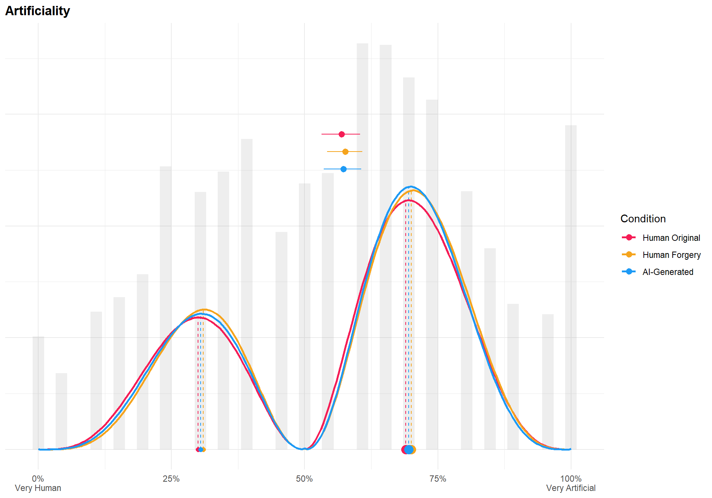{#fig-artificiality fig-alt='Perceived Artificiality (follow-up, items judged as new; 0 = Very Human, 1 = Very Artificial): observed ratings with the model-implied CHOCO density per original label condition.' width=960}
:::
:::


:::

## Summary

- `data/results_contrasts.csv`: every contrast x parameter x (overall or emotion quadrant), raw and % columns.
- `data/results_means.csv`: marginal means per label condition (response scale).


::: {.cell}

```{.r .cell-code}
# Document order (outcome_info is grouped by family)
section_order <- c("Beauty", "Valence", "Meaning", "Worth",
                   "Entropy", "pLeft", "pCenter", "Shift",
                   "Reality", "Authenticity",
                   "Beauty2", "SelfRelevance", "Artificiality")
# unname(): bind_rows() reads the names of two named lists as columns
reps <- unname(lapply(estimates[section_order], `[[`, "report"))

results_contrasts <- bind_rows(
  lapply(reps, function(r) mutate(r$contrasts, Emotion = "Overall")),
  lapply(reps, function(r) r$contrasts_emo)
) |>
  select(Outcome, Emotion, Contrast, Parameter, Unit, Difference, CI_low, CI_high,
         Difference_pct, CI_low_pct, CI_high_pct, pd, Credible, Effect) |>
  mutate(Contrast = as.character(Contrast)) |>
  arrange(Outcome, Emotion, Contrast, Parameter)
write.csv(results_contrasts, "../data/results_contrasts.csv", row.names = FALSE)

results_means <- bind_rows(lapply(reps, function(r) cbind(Outcome = r$diag$Model, r$means)))
write.csv(results_means, "../data/results_means.csv", row.names = FALSE)

diag_all <- bind_rows(lapply(reps, `[[`, "diag"))
make_tables(diag_all, names(diag_all), "Convergence of all models")
```

::: {.cell-output-display}

```{=html}
<div id="syiummjqtl" style="padding-left:0px;padding-right:0px;padding-top:10px;padding-bottom:10px;overflow-x:auto;overflow-y:auto;width:auto;height:auto;">
<style>#syiummjqtl table {
  font-family: system-ui, 'Segoe UI', Roboto, Helvetica, Arial, sans-serif, 'Apple Color Emoji', 'Segoe UI Emoji', 'Segoe UI Symbol', 'Noto Color Emoji';
  -webkit-font-smoothing: antialiased;
  -moz-osx-font-smoothing: grayscale;
}

#syiummjqtl thead, #syiummjqtl tbody, #syiummjqtl tfoot, #syiummjqtl tr, #syiummjqtl td, #syiummjqtl th {
  border-style: none;
}

#syiummjqtl p {
  margin: 0;
  padding: 0;
}

#syiummjqtl .gt_table {
  display: table;
  border-collapse: collapse;
  line-height: normal;
  margin-left: auto;
  margin-right: auto;
  color: #333333;
  font-size: 13px;
  font-weight: normal;
  font-style: normal;
  background-color: #FFFFFF;
  width: auto;
  border-top-style: solid;
  border-top-width: 3px;
  border-top-color: #D5D5D5;
  border-right-style: solid;
  border-right-width: 3px;
  border-right-color: #D5D5D5;
  border-bottom-style: solid;
  border-bottom-width: 3px;
  border-bottom-color: #D5D5D5;
  border-left-style: solid;
  border-left-width: 3px;
  border-left-color: #D5D5D5;
}

#syiummjqtl .gt_caption {
  padding-top: 4px;
  padding-bottom: 4px;
}

#syiummjqtl .gt_title {
  color: #333333;
  font-size: 125%;
  font-weight: initial;
  padding-top: 4px;
  padding-bottom: 4px;
  padding-left: 5px;
  padding-right: 5px;
  border-bottom-color: #FFFFFF;
  border-bottom-width: 0;
}

#syiummjqtl .gt_subtitle {
  color: #333333;
  font-size: 85%;
  font-weight: initial;
  padding-top: 3px;
  padding-bottom: 5px;
  padding-left: 5px;
  padding-right: 5px;
  border-top-color: #FFFFFF;
  border-top-width: 0;
}

#syiummjqtl .gt_heading {
  background-color: #FFFFFF;
  text-align: left;
  border-bottom-color: #FFFFFF;
  border-left-style: none;
  border-left-width: 1px;
  border-left-color: #D3D3D3;
  border-right-style: none;
  border-right-width: 1px;
  border-right-color: #D3D3D3;
}

#syiummjqtl .gt_bottom_border {
  border-bottom-style: solid;
  border-bottom-width: 2px;
  border-bottom-color: #D5D5D5;
}

#syiummjqtl .gt_col_headings {
  border-top-style: solid;
  border-top-width: 2px;
  border-top-color: #D5D5D5;
  border-bottom-style: solid;
  border-bottom-width: 2px;
  border-bottom-color: #D5D5D5;
  border-left-style: none;
  border-left-width: 1px;
  border-left-color: #D3D3D3;
  border-right-style: none;
  border-right-width: 1px;
  border-right-color: #D3D3D3;
}

#syiummjqtl .gt_col_heading {
  color: #FFFFFF;
  background-color: #000000;
  font-size: 100%;
  font-weight: normal;
  text-transform: inherit;
  border-left-style: none;
  border-left-width: 1px;
  border-left-color: #D3D3D3;
  border-right-style: none;
  border-right-width: 1px;
  border-right-color: #D3D3D3;
  vertical-align: bottom;
  padding-top: 5px;
  padding-bottom: 6px;
  padding-left: 5px;
  padding-right: 5px;
  overflow-x: hidden;
}

#syiummjqtl .gt_column_spanner_outer {
  color: #FFFFFF;
  background-color: #000000;
  font-size: 100%;
  font-weight: normal;
  text-transform: inherit;
  padding-top: 0;
  padding-bottom: 0;
  padding-left: 4px;
  padding-right: 4px;
}

#syiummjqtl .gt_column_spanner_outer:first-child {
  padding-left: 0;
}

#syiummjqtl .gt_column_spanner_outer:last-child {
  padding-right: 0;
}

#syiummjqtl .gt_column_spanner {
  border-bottom-style: solid;
  border-bottom-width: 2px;
  border-bottom-color: #D5D5D5;
  vertical-align: bottom;
  padding-top: 5px;
  padding-bottom: 5px;
  overflow-x: hidden;
  display: inline-block;
  width: 100%;
}

#syiummjqtl .gt_spanner_row {
  border-bottom-style: hidden;
}

#syiummjqtl .gt_group_heading {
  padding-top: 8px;
  padding-bottom: 8px;
  padding-left: 5px;
  padding-right: 5px;
  color: #333333;
  background-color: #FFFFFF;
  font-size: 100%;
  font-weight: initial;
  text-transform: inherit;
  border-top-style: solid;
  border-top-width: 2px;
  border-top-color: #D5D5D5;
  border-bottom-style: solid;
  border-bottom-width: 2px;
  border-bottom-color: #D5D5D5;
  border-left-style: none;
  border-left-width: 1px;
  border-left-color: #D3D3D3;
  border-right-style: none;
  border-right-width: 1px;
  border-right-color: #D3D3D3;
  vertical-align: middle;
  text-align: left;
}

#syiummjqtl .gt_empty_group_heading {
  padding: 0.5px;
  color: #333333;
  background-color: #FFFFFF;
  font-size: 100%;
  font-weight: initial;
  border-top-style: solid;
  border-top-width: 2px;
  border-top-color: #D5D5D5;
  border-bottom-style: solid;
  border-bottom-width: 2px;
  border-bottom-color: #D5D5D5;
  vertical-align: middle;
}

#syiummjqtl .gt_from_md > :first-child {
  margin-top: 0;
}

#syiummjqtl .gt_from_md > :last-child {
  margin-bottom: 0;
}

#syiummjqtl .gt_row {
  padding-top: 8px;
  padding-bottom: 8px;
  padding-left: 5px;
  padding-right: 5px;
  margin: 10px;
  border-top-style: solid;
  border-top-width: 1px;
  border-top-color: #D5D5D5;
  border-left-style: solid;
  border-left-width: 1px;
  border-left-color: #D5D5D5;
  border-right-style: solid;
  border-right-width: 1px;
  border-right-color: #D5D5D5;
  vertical-align: middle;
  overflow-x: hidden;
}

#syiummjqtl .gt_stub {
  color: #333333;
  background-color: #FFFFFF;
  font-size: 100%;
  font-weight: initial;
  text-transform: inherit;
  border-right-style: solid;
  border-right-width: 2px;
  border-right-color: #5F5F5F;
  padding-left: 5px;
  padding-right: 5px;
}

#syiummjqtl .gt_stub_row_group {
  color: #333333;
  background-color: #FFFFFF;
  font-size: 100%;
  font-weight: initial;
  text-transform: inherit;
  border-right-style: solid;
  border-right-width: 2px;
  border-right-color: #D3D3D3;
  padding-left: 5px;
  padding-right: 5px;
  vertical-align: top;
}

#syiummjqtl .gt_row_group_first td {
  border-top-width: 2px;
}

#syiummjqtl .gt_row_group_first th {
  border-top-width: 2px;
}

#syiummjqtl .gt_summary_row {
  color: #333333;
  background-color: #D5D5D5;
  text-transform: inherit;
  padding-top: 8px;
  padding-bottom: 8px;
  padding-left: 5px;
  padding-right: 5px;
}

#syiummjqtl .gt_first_summary_row {
  border-top-style: solid;
  border-top-color: #D5D5D5;
}

#syiummjqtl .gt_first_summary_row.thick {
  border-top-width: 2px;
}

#syiummjqtl .gt_last_summary_row {
  padding-top: 8px;
  padding-bottom: 8px;
  padding-left: 5px;
  padding-right: 5px;
  border-bottom-style: solid;
  border-bottom-width: 2px;
  border-bottom-color: #D5D5D5;
}

#syiummjqtl .gt_grand_summary_row {
  color: #FFFFFF;
  background-color: #929292;
  text-transform: inherit;
  padding-top: 8px;
  padding-bottom: 8px;
  padding-left: 5px;
  padding-right: 5px;
}

#syiummjqtl .gt_first_grand_summary_row {
  padding-top: 8px;
  padding-bottom: 8px;
  padding-left: 5px;
  padding-right: 5px;
  border-top-style: double;
  border-top-width: 6px;
  border-top-color: #D5D5D5;
}

#syiummjqtl .gt_last_grand_summary_row_top {
  padding-top: 8px;
  padding-bottom: 8px;
  padding-left: 5px;
  padding-right: 5px;
  border-bottom-style: double;
  border-bottom-width: 6px;
  border-bottom-color: #D5D5D5;
}

#syiummjqtl .gt_striped {
  background-color: #F4F4F4;
}

#syiummjqtl .gt_table_body {
  border-top-style: solid;
  border-top-width: 2px;
  border-top-color: #D5D5D5;
  border-bottom-style: solid;
  border-bottom-width: 2px;
  border-bottom-color: #D5D5D5;
}

#syiummjqtl .gt_footnotes {
  color: #333333;
  background-color: #FFFFFF;
  border-bottom-style: none;
  border-bottom-width: 2px;
  border-bottom-color: #D3D3D3;
  border-left-style: none;
  border-left-width: 2px;
  border-left-color: #D3D3D3;
  border-right-style: none;
  border-right-width: 2px;
  border-right-color: #D3D3D3;
}

#syiummjqtl .gt_footnote {
  margin: 0px;
  font-size: 90%;
  padding-top: 4px;
  padding-bottom: 4px;
  padding-left: 5px;
  padding-right: 5px;
}

#syiummjqtl .gt_sourcenotes {
  color: #333333;
  background-color: #FFFFFF;
  border-bottom-style: none;
  border-bottom-width: 2px;
  border-bottom-color: #D3D3D3;
  border-left-style: none;
  border-left-width: 2px;
  border-left-color: #D3D3D3;
  border-right-style: none;
  border-right-width: 2px;
  border-right-color: #D3D3D3;
}

#syiummjqtl .gt_sourcenote {
  font-size: 90%;
  padding-top: 4px;
  padding-bottom: 4px;
  padding-left: 5px;
  padding-right: 5px;
}

#syiummjqtl .gt_left {
  text-align: left;
}

#syiummjqtl .gt_center {
  text-align: center;
}

#syiummjqtl .gt_right {
  text-align: right;
  font-variant-numeric: tabular-nums;
}

#syiummjqtl .gt_font_normal {
  font-weight: normal;
}

#syiummjqtl .gt_font_bold {
  font-weight: bold;
}

#syiummjqtl .gt_font_italic {
  font-style: italic;
}

#syiummjqtl .gt_super {
  font-size: 65%;
}

#syiummjqtl .gt_footnote_marks {
  font-size: 75%;
  vertical-align: 0.4em;
  position: initial;
}

#syiummjqtl .gt_asterisk {
  font-size: 100%;
  vertical-align: 0;
}

#syiummjqtl .gt_indent_1 {
  text-indent: 5px;
}

#syiummjqtl .gt_indent_2 {
  text-indent: 10px;
}

#syiummjqtl .gt_indent_3 {
  text-indent: 15px;
}

#syiummjqtl .gt_indent_4 {
  text-indent: 20px;
}

#syiummjqtl .gt_indent_5 {
  text-indent: 25px;
}

#syiummjqtl .katex-display {
  display: inline-flex !important;
  margin-bottom: 0.75em !important;
}

#syiummjqtl div.Reactable > div.rt-table > div.rt-thead > div.rt-tr.rt-tr-group-header > div.rt-th-group:after {
  height: 0px !important;
}
</style>
<table class="gt_table" data-quarto-disable-processing="false" data-quarto-bootstrap="false">
  <thead>
    <tr class="gt_heading">
      <td colspan="10" class="gt_heading gt_title gt_font_normal gt_bottom_border" style>Convergence of all models</td>
    </tr>
    
    <tr class="gt_col_headings">
      <th class="gt_col_heading gt_columns_bottom_border gt_left" rowspan="1" colspan="1" scope="col" id="Model">Model</th>
      <th class="gt_col_heading gt_columns_bottom_border gt_left" rowspan="1" colspan="1" scope="col" id="Family">Family</th>
      <th class="gt_col_heading gt_columns_bottom_border gt_right" rowspan="1" colspan="1" scope="col" id="N_obs">N_obs</th>
      <th class="gt_col_heading gt_columns_bottom_border gt_right" rowspan="1" colspan="1" scope="col" id="N_participants">N_participants</th>
      <th class="gt_col_heading gt_columns_bottom_border gt_right" rowspan="1" colspan="1" scope="col" id="Chains">Chains</th>
      <th class="gt_col_heading gt_columns_bottom_border gt_right" rowspan="1" colspan="1" scope="col" id="Draws">Draws</th>
      <th class="gt_col_heading gt_columns_bottom_border gt_right" rowspan="1" colspan="1" scope="col" id="Max_Rhat">Max_Rhat</th>
      <th class="gt_col_heading gt_columns_bottom_border gt_right" rowspan="1" colspan="1" scope="col" id="Min_ESS_ratio">Min_ESS_ratio</th>
      <th class="gt_col_heading gt_columns_bottom_border gt_right" rowspan="1" colspan="1" scope="col" id="Divergent_pct">Divergent_pct</th>
      <th class="gt_col_heading gt_columns_bottom_border gt_left" rowspan="1" colspan="1" scope="col" id="Criterion">Criterion</th>
    </tr>
  </thead>
  <tbody class="gt_table_body">
    <tr><td headers="Model" class="gt_row gt_left">Beauty</td>
<td headers="Family" class="gt_row gt_left">CHOCO</td>
<td headers="N_obs" class="gt_row gt_right">15552</td>
<td headers="N_participants" class="gt_row gt_right">324</td>
<td headers="Chains" class="gt_row gt_right">8</td>
<td headers="Draws" class="gt_row gt_right">4000</td>
<td headers="Max_Rhat" class="gt_row gt_right">1.068</td>
<td headers="Min_ESS_ratio" class="gt_row gt_right">0.023</td>
<td headers="Divergent_pct" class="gt_row gt_right">0.0</td>
<td headers="Criterion" class="gt_row gt_left">loo</td></tr>
    <tr><td headers="Model" class="gt_row gt_left gt_striped">Valence</td>
<td headers="Family" class="gt_row gt_left gt_striped">Discrete Beta (k = 7)</td>
<td headers="N_obs" class="gt_row gt_right gt_striped">15552</td>
<td headers="N_participants" class="gt_row gt_right gt_striped">324</td>
<td headers="Chains" class="gt_row gt_right gt_striped">8</td>
<td headers="Draws" class="gt_row gt_right gt_striped">4000</td>
<td headers="Max_Rhat" class="gt_row gt_right gt_striped">1.039</td>
<td headers="Min_ESS_ratio" class="gt_row gt_right gt_striped">0.035</td>
<td headers="Divergent_pct" class="gt_row gt_right gt_striped">0.1</td>
<td headers="Criterion" class="gt_row gt_left gt_striped">loo</td></tr>
    <tr><td headers="Model" class="gt_row gt_left">Meaning</td>
<td headers="Family" class="gt_row gt_left">Discrete Beta (k = 6) with zero hurdle</td>
<td headers="N_obs" class="gt_row gt_right">15552</td>
<td headers="N_participants" class="gt_row gt_right">324</td>
<td headers="Chains" class="gt_row gt_right">8</td>
<td headers="Draws" class="gt_row gt_right">4000</td>
<td headers="Max_Rhat" class="gt_row gt_right">1.041</td>
<td headers="Min_ESS_ratio" class="gt_row gt_right">0.050</td>
<td headers="Divergent_pct" class="gt_row gt_right">0.1</td>
<td headers="Criterion" class="gt_row gt_left">loo</td></tr>
    <tr><td headers="Model" class="gt_row gt_left gt_striped">Worth</td>
<td headers="Family" class="gt_row gt_left gt_striped">Cumulative (ordinal)</td>
<td headers="N_obs" class="gt_row gt_right gt_striped">15552</td>
<td headers="N_participants" class="gt_row gt_right gt_striped">324</td>
<td headers="Chains" class="gt_row gt_right gt_striped">8</td>
<td headers="Draws" class="gt_row gt_right gt_striped">4000</td>
<td headers="Max_Rhat" class="gt_row gt_right gt_striped">1.037</td>
<td headers="Min_ESS_ratio" class="gt_row gt_right gt_striped">0.078</td>
<td headers="Divergent_pct" class="gt_row gt_right gt_striped">0.0</td>
<td headers="Criterion" class="gt_row gt_left gt_striped">loo</td></tr>
    <tr><td headers="Model" class="gt_row gt_left">Entropy</td>
<td headers="Family" class="gt_row gt_left">Beta</td>
<td headers="N_obs" class="gt_row gt_right">12220</td>
<td headers="N_participants" class="gt_row gt_right">274</td>
<td headers="Chains" class="gt_row gt_right">8</td>
<td headers="Draws" class="gt_row gt_right">4000</td>
<td headers="Max_Rhat" class="gt_row gt_right">1.021</td>
<td headers="Min_ESS_ratio" class="gt_row gt_right">0.089</td>
<td headers="Divergent_pct" class="gt_row gt_right">0.0</td>
<td headers="Criterion" class="gt_row gt_left">loo</td></tr>
    <tr><td headers="Model" class="gt_row gt_left gt_striped">pLeft</td>
<td headers="Family" class="gt_row gt_left gt_striped">Zero-one-inflated Beta</td>
<td headers="N_obs" class="gt_row gt_right gt_striped">12220</td>
<td headers="N_participants" class="gt_row gt_right gt_striped">274</td>
<td headers="Chains" class="gt_row gt_right gt_striped">8</td>
<td headers="Draws" class="gt_row gt_right gt_striped">4000</td>
<td headers="Max_Rhat" class="gt_row gt_right gt_striped">1.058</td>
<td headers="Min_ESS_ratio" class="gt_row gt_right gt_striped">0.033</td>
<td headers="Divergent_pct" class="gt_row gt_right gt_striped">0.0</td>
<td headers="Criterion" class="gt_row gt_left gt_striped">loo</td></tr>
    <tr><td headers="Model" class="gt_row gt_left">pCenter</td>
<td headers="Family" class="gt_row gt_left">Zero-one-inflated Beta</td>
<td headers="N_obs" class="gt_row gt_right">12220</td>
<td headers="N_participants" class="gt_row gt_right">274</td>
<td headers="Chains" class="gt_row gt_right">8</td>
<td headers="Draws" class="gt_row gt_right">4000</td>
<td headers="Max_Rhat" class="gt_row gt_right">1.037</td>
<td headers="Min_ESS_ratio" class="gt_row gt_right">0.057</td>
<td headers="Divergent_pct" class="gt_row gt_right">0.0</td>
<td headers="Criterion" class="gt_row gt_left">loo</td></tr>
    <tr><td headers="Model" class="gt_row gt_left gt_striped">Shift</td>
<td headers="Family" class="gt_row gt_left gt_striped">LogNormal</td>
<td headers="N_obs" class="gt_row gt_right gt_striped">11772</td>
<td headers="N_participants" class="gt_row gt_right gt_striped">273</td>
<td headers="Chains" class="gt_row gt_right gt_striped">8</td>
<td headers="Draws" class="gt_row gt_right gt_striped">4000</td>
<td headers="Max_Rhat" class="gt_row gt_right gt_striped">1.018</td>
<td headers="Min_ESS_ratio" class="gt_row gt_right gt_striped">0.100</td>
<td headers="Divergent_pct" class="gt_row gt_right gt_striped">0.0</td>
<td headers="Criterion" class="gt_row gt_left gt_striped">loo</td></tr>
    <tr><td headers="Model" class="gt_row gt_left">Reality</td>
<td headers="Family" class="gt_row gt_left">CHOCO</td>
<td headers="N_obs" class="gt_row gt_right">15216</td>
<td headers="N_participants" class="gt_row gt_right">317</td>
<td headers="Chains" class="gt_row gt_right">8</td>
<td headers="Draws" class="gt_row gt_right">4000</td>
<td headers="Max_Rhat" class="gt_row gt_right">1.071</td>
<td headers="Min_ESS_ratio" class="gt_row gt_right">0.020</td>
<td headers="Divergent_pct" class="gt_row gt_right">0.0</td>
<td headers="Criterion" class="gt_row gt_left">loo</td></tr>
    <tr><td headers="Model" class="gt_row gt_left gt_striped">Authenticity</td>
<td headers="Family" class="gt_row gt_left gt_striped">CHOCO</td>
<td headers="N_obs" class="gt_row gt_right gt_striped">15216</td>
<td headers="N_participants" class="gt_row gt_right gt_striped">317</td>
<td headers="Chains" class="gt_row gt_right gt_striped">8</td>
<td headers="Draws" class="gt_row gt_right gt_striped">4000</td>
<td headers="Max_Rhat" class="gt_row gt_right gt_striped">1.065</td>
<td headers="Min_ESS_ratio" class="gt_row gt_right gt_striped">0.025</td>
<td headers="Divergent_pct" class="gt_row gt_right gt_striped">0.0</td>
<td headers="Criterion" class="gt_row gt_left gt_striped">loo</td></tr>
    <tr><td headers="Model" class="gt_row gt_left">Beauty2</td>
<td headers="Family" class="gt_row gt_left">CHOCO</td>
<td headers="N_obs" class="gt_row gt_right">10560</td>
<td headers="N_participants" class="gt_row gt_right">220</td>
<td headers="Chains" class="gt_row gt_right">8</td>
<td headers="Draws" class="gt_row gt_right">4000</td>
<td headers="Max_Rhat" class="gt_row gt_right">1.088</td>
<td headers="Min_ESS_ratio" class="gt_row gt_right">0.023</td>
<td headers="Divergent_pct" class="gt_row gt_right">0.0</td>
<td headers="Criterion" class="gt_row gt_left">loo</td></tr>
    <tr><td headers="Model" class="gt_row gt_left gt_striped">SelfRelevance</td>
<td headers="Family" class="gt_row gt_left gt_striped">Cumulative (ordinal)</td>
<td headers="N_obs" class="gt_row gt_right gt_striped">10560</td>
<td headers="N_participants" class="gt_row gt_right gt_striped">220</td>
<td headers="Chains" class="gt_row gt_right gt_striped">8</td>
<td headers="Draws" class="gt_row gt_right gt_striped">4000</td>
<td headers="Max_Rhat" class="gt_row gt_right gt_striped">1.085</td>
<td headers="Min_ESS_ratio" class="gt_row gt_right gt_striped">0.021</td>
<td headers="Divergent_pct" class="gt_row gt_right gt_striped">0.0</td>
<td headers="Criterion" class="gt_row gt_left gt_striped">loo</td></tr>
    <tr><td headers="Model" class="gt_row gt_left">Artificiality</td>
<td headers="Family" class="gt_row gt_left">CHOCO</td>
<td headers="N_obs" class="gt_row gt_right">6009</td>
<td headers="N_participants" class="gt_row gt_right">220</td>
<td headers="Chains" class="gt_row gt_right">8</td>
<td headers="Draws" class="gt_row gt_right">4000</td>
<td headers="Max_Rhat" class="gt_row gt_right">1.038</td>
<td headers="Min_ESS_ratio" class="gt_row gt_right">0.047</td>
<td headers="Divergent_pct" class="gt_row gt_right">0.0</td>
<td headers="Criterion" class="gt_row gt_left">loo</td></tr>
  </tbody>
  
</table>
</div>
```


::: {.callout-note collapse="true" title="Convergence of all models (Markdown table, for text readers)"}

|Model         |Family                                 | N_obs| N_participants| Chains| Draws| Max_Rhat| Min_ESS_ratio| Divergent_pct|Criterion |
|:-------------|:--------------------------------------|-----:|--------------:|------:|-----:|--------:|-------------:|-------------:|:---------|
|Beauty        |CHOCO                                  | 15552|            324|      8|  4000|    1.068|         0.023|           0.0|loo       |
|Valence       |Discrete Beta (k = 7)                  | 15552|            324|      8|  4000|    1.039|         0.035|           0.1|loo       |
|Meaning       |Discrete Beta (k = 6) with zero hurdle | 15552|            324|      8|  4000|    1.041|         0.050|           0.1|loo       |
|Worth         |Cumulative (ordinal)                   | 15552|            324|      8|  4000|    1.037|         0.078|           0.0|loo       |
|Entropy       |Beta                                   | 12220|            274|      8|  4000|    1.021|         0.089|           0.0|loo       |
|pLeft         |Zero-one-inflated Beta                 | 12220|            274|      8|  4000|    1.058|         0.033|           0.0|loo       |
|pCenter       |Zero-one-inflated Beta                 | 12220|            274|      8|  4000|    1.037|         0.057|           0.0|loo       |
|Shift         |LogNormal                              | 11772|            273|      8|  4000|    1.018|         0.100|           0.0|loo       |
|Reality       |CHOCO                                  | 15216|            317|      8|  4000|    1.071|         0.020|           0.0|loo       |
|Authenticity  |CHOCO                                  | 15216|            317|      8|  4000|    1.065|         0.025|           0.0|loo       |
|Beauty2       |CHOCO                                  | 10560|            220|      8|  4000|    1.088|         0.023|           0.0|loo       |
|SelfRelevance |Cumulative (ordinal)                   | 10560|            220|      8|  4000|    1.085|         0.021|           0.0|loo       |
|Artificiality |CHOCO                                  |  6009|            220|      8|  4000|    1.038|         0.047|           0.0|loo       |

:::

:::
:::


::: {.cell}

```{.r .cell-code}
(p_beauty | p_reality) +
  plot_layout(guides = "collect")
```

::: {.cell-output-display}
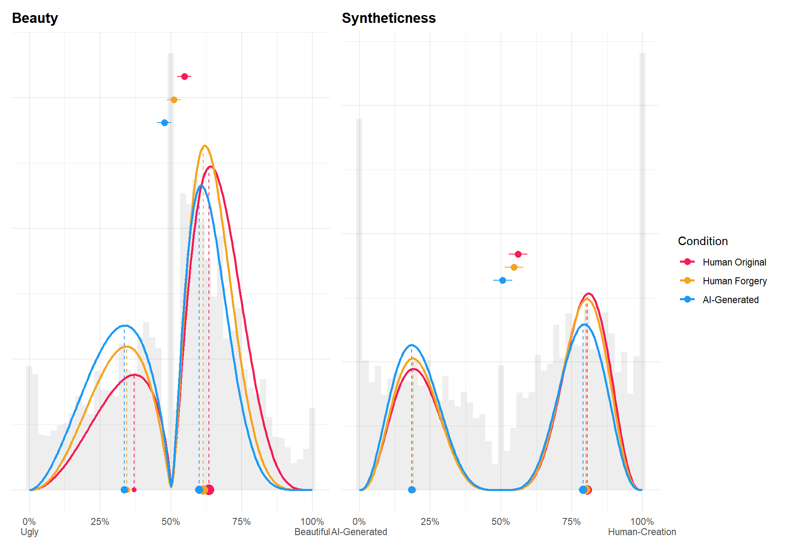{#fig-summary-beauty-reality fig-alt='Two panels of histograms with overlaid density curves in three colours, one per label condition.' width=960}
:::
:::


::: {.cell}

```{.r .cell-code}
rez_con <- results_contrasts |>
  filter(Parameter %in% c("response", "mu", "confright", "confleft", "pzero"), Unit == "%") |>
  mutate(Difference = Difference_pct, CI_low = CI_low_pct, CI_high = CI_high_pct) |>
  mutate(Effect = fct_relevel(Effect, "Negative", "n.s.", "Positive"),
         Contrast = fct_relevel(Contrast, "AI-Generated - Human Original", "Human Forgery - Human Original", "AI-Generated - Human Forgery"))

rez_con |>
  filter(Emotion == "Overall") |>
  ggplot(aes(x = Difference, y = Parameter, color = Effect)) +
  geom_point(size = 2) +
  geom_errorbar(aes(xmin = CI_low, xmax = CI_high), width = 0.2) +
  geom_point(data = filter(rez_con, Emotion != "Overall"), aes(shape = Emotion), size = 2, position = position_nudge(y = 0.18)) +
  geom_vline(xintercept = 0, linetype = "dashed", color = "gray50") +
  facet_grid(
  Contrast ~ Outcome,
  scales = "free_y",
  switch = "y"
) +
  scale_shape_manual(values = c("Positive - High intensity" = "square plus", "Positive - Low intensity" = "square",
                                "Negative - Low intensity" = "circle", "Negative - High intensity" = "circle plus")) +
  scale_y_discrete(position = "right") +
  scale_color_manual(values = c("Negative" = "#F44336", "n.s." = "#FF9800", "Positive" = "#4CAF50")) +
  theme_bw() +
  labs(
    title = "Effect Sizes by Contrast and Outcome",
    x = "Difference in % of the scale range (with 95% CI)",
    y = "Model Parameter"
  ) +
  theme(
  strip.placement = "outside",
  strip.background = element_rect(fill = "grey90"),
  strip.text.y.left = element_text(angle = 0),
  legend.position = "bottom"
)
```

::: {.cell-output-display}
{#fig-summary-effects fig-alt='Grid of dot-and-whisker plots, one cell per contrast and outcome, coloured by direction and credibility of the effect.' width=1152}
:::
:::


::: {.cell}

```{.r .cell-code}
credible_main <- results_contrasts |>
  filter(Emotion == "Overall", Credible, Parameter %in% c("response", "mu") | grepl("^response", Parameter)) |>
  mutate(shown_d = ifelse(Unit == "%", Difference_pct, Difference),
         shown_lo = ifelse(Unit == "%", CI_low_pct, CI_low),
         shown_hi = ifelse(Unit == "%", CI_high_pct, CI_high),
         Diff = insight::format_value(shown_d, zap_small = TRUE),
         CI = sprintf("[%s, %s]", insight::format_value(shown_lo, zap_small = TRUE), insight::format_value(shown_hi, zap_small = TRUE)),
         pd_fmt = insight::format_pd(pd, name = NULL)) |>
  select(Outcome, Contrast, Parameter, Diff, CI, Unit, pd_fmt, Effect)

make_tables(credible_main, names(credible_main),
            "Credible overall effects of the label on the main parameter of each model (response / mu), in % of the scale range")
```

::: {.cell-output-display}

```{=html}
<div id="uvxravcjox" style="padding-left:0px;padding-right:0px;padding-top:10px;padding-bottom:10px;overflow-x:auto;overflow-y:auto;width:auto;height:auto;">
<style>#uvxravcjox table {
  font-family: system-ui, 'Segoe UI', Roboto, Helvetica, Arial, sans-serif, 'Apple Color Emoji', 'Segoe UI Emoji', 'Segoe UI Symbol', 'Noto Color Emoji';
  -webkit-font-smoothing: antialiased;
  -moz-osx-font-smoothing: grayscale;
}

#uvxravcjox thead, #uvxravcjox tbody, #uvxravcjox tfoot, #uvxravcjox tr, #uvxravcjox td, #uvxravcjox th {
  border-style: none;
}

#uvxravcjox p {
  margin: 0;
  padding: 0;
}

#uvxravcjox .gt_table {
  display: table;
  border-collapse: collapse;
  line-height: normal;
  margin-left: auto;
  margin-right: auto;
  color: #333333;
  font-size: 13px;
  font-weight: normal;
  font-style: normal;
  background-color: #FFFFFF;
  width: auto;
  border-top-style: solid;
  border-top-width: 3px;
  border-top-color: #D5D5D5;
  border-right-style: solid;
  border-right-width: 3px;
  border-right-color: #D5D5D5;
  border-bottom-style: solid;
  border-bottom-width: 3px;
  border-bottom-color: #D5D5D5;
  border-left-style: solid;
  border-left-width: 3px;
  border-left-color: #D5D5D5;
}

#uvxravcjox .gt_caption {
  padding-top: 4px;
  padding-bottom: 4px;
}

#uvxravcjox .gt_title {
  color: #333333;
  font-size: 125%;
  font-weight: initial;
  padding-top: 4px;
  padding-bottom: 4px;
  padding-left: 5px;
  padding-right: 5px;
  border-bottom-color: #FFFFFF;
  border-bottom-width: 0;
}

#uvxravcjox .gt_subtitle {
  color: #333333;
  font-size: 85%;
  font-weight: initial;
  padding-top: 3px;
  padding-bottom: 5px;
  padding-left: 5px;
  padding-right: 5px;
  border-top-color: #FFFFFF;
  border-top-width: 0;
}

#uvxravcjox .gt_heading {
  background-color: #FFFFFF;
  text-align: left;
  border-bottom-color: #FFFFFF;
  border-left-style: none;
  border-left-width: 1px;
  border-left-color: #D3D3D3;
  border-right-style: none;
  border-right-width: 1px;
  border-right-color: #D3D3D3;
}

#uvxravcjox .gt_bottom_border {
  border-bottom-style: solid;
  border-bottom-width: 2px;
  border-bottom-color: #D5D5D5;
}

#uvxravcjox .gt_col_headings {
  border-top-style: solid;
  border-top-width: 2px;
  border-top-color: #D5D5D5;
  border-bottom-style: solid;
  border-bottom-width: 2px;
  border-bottom-color: #D5D5D5;
  border-left-style: none;
  border-left-width: 1px;
  border-left-color: #D3D3D3;
  border-right-style: none;
  border-right-width: 1px;
  border-right-color: #D3D3D3;
}

#uvxravcjox .gt_col_heading {
  color: #FFFFFF;
  background-color: #000000;
  font-size: 100%;
  font-weight: normal;
  text-transform: inherit;
  border-left-style: none;
  border-left-width: 1px;
  border-left-color: #D3D3D3;
  border-right-style: none;
  border-right-width: 1px;
  border-right-color: #D3D3D3;
  vertical-align: bottom;
  padding-top: 5px;
  padding-bottom: 6px;
  padding-left: 5px;
  padding-right: 5px;
  overflow-x: hidden;
}

#uvxravcjox .gt_column_spanner_outer {
  color: #FFFFFF;
  background-color: #000000;
  font-size: 100%;
  font-weight: normal;
  text-transform: inherit;
  padding-top: 0;
  padding-bottom: 0;
  padding-left: 4px;
  padding-right: 4px;
}

#uvxravcjox .gt_column_spanner_outer:first-child {
  padding-left: 0;
}

#uvxravcjox .gt_column_spanner_outer:last-child {
  padding-right: 0;
}

#uvxravcjox .gt_column_spanner {
  border-bottom-style: solid;
  border-bottom-width: 2px;
  border-bottom-color: #D5D5D5;
  vertical-align: bottom;
  padding-top: 5px;
  padding-bottom: 5px;
  overflow-x: hidden;
  display: inline-block;
  width: 100%;
}

#uvxravcjox .gt_spanner_row {
  border-bottom-style: hidden;
}

#uvxravcjox .gt_group_heading {
  padding-top: 8px;
  padding-bottom: 8px;
  padding-left: 5px;
  padding-right: 5px;
  color: #333333;
  background-color: #FFFFFF;
  font-size: 100%;
  font-weight: initial;
  text-transform: inherit;
  border-top-style: solid;
  border-top-width: 2px;
  border-top-color: #D5D5D5;
  border-bottom-style: solid;
  border-bottom-width: 2px;
  border-bottom-color: #D5D5D5;
  border-left-style: none;
  border-left-width: 1px;
  border-left-color: #D3D3D3;
  border-right-style: none;
  border-right-width: 1px;
  border-right-color: #D3D3D3;
  vertical-align: middle;
  text-align: left;
}

#uvxravcjox .gt_empty_group_heading {
  padding: 0.5px;
  color: #333333;
  background-color: #FFFFFF;
  font-size: 100%;
  font-weight: initial;
  border-top-style: solid;
  border-top-width: 2px;
  border-top-color: #D5D5D5;
  border-bottom-style: solid;
  border-bottom-width: 2px;
  border-bottom-color: #D5D5D5;
  vertical-align: middle;
}

#uvxravcjox .gt_from_md > :first-child {
  margin-top: 0;
}

#uvxravcjox .gt_from_md > :last-child {
  margin-bottom: 0;
}

#uvxravcjox .gt_row {
  padding-top: 8px;
  padding-bottom: 8px;
  padding-left: 5px;
  padding-right: 5px;
  margin: 10px;
  border-top-style: solid;
  border-top-width: 1px;
  border-top-color: #D5D5D5;
  border-left-style: solid;
  border-left-width: 1px;
  border-left-color: #D5D5D5;
  border-right-style: solid;
  border-right-width: 1px;
  border-right-color: #D5D5D5;
  vertical-align: middle;
  overflow-x: hidden;
}

#uvxravcjox .gt_stub {
  color: #333333;
  background-color: #FFFFFF;
  font-size: 100%;
  font-weight: initial;
  text-transform: inherit;
  border-right-style: solid;
  border-right-width: 2px;
  border-right-color: #5F5F5F;
  padding-left: 5px;
  padding-right: 5px;
}

#uvxravcjox .gt_stub_row_group {
  color: #333333;
  background-color: #FFFFFF;
  font-size: 100%;
  font-weight: initial;
  text-transform: inherit;
  border-right-style: solid;
  border-right-width: 2px;
  border-right-color: #D3D3D3;
  padding-left: 5px;
  padding-right: 5px;
  vertical-align: top;
}

#uvxravcjox .gt_row_group_first td {
  border-top-width: 2px;
}

#uvxravcjox .gt_row_group_first th {
  border-top-width: 2px;
}

#uvxravcjox .gt_summary_row {
  color: #333333;
  background-color: #D5D5D5;
  text-transform: inherit;
  padding-top: 8px;
  padding-bottom: 8px;
  padding-left: 5px;
  padding-right: 5px;
}

#uvxravcjox .gt_first_summary_row {
  border-top-style: solid;
  border-top-color: #D5D5D5;
}

#uvxravcjox .gt_first_summary_row.thick {
  border-top-width: 2px;
}

#uvxravcjox .gt_last_summary_row {
  padding-top: 8px;
  padding-bottom: 8px;
  padding-left: 5px;
  padding-right: 5px;
  border-bottom-style: solid;
  border-bottom-width: 2px;
  border-bottom-color: #D5D5D5;
}

#uvxravcjox .gt_grand_summary_row {
  color: #FFFFFF;
  background-color: #929292;
  text-transform: inherit;
  padding-top: 8px;
  padding-bottom: 8px;
  padding-left: 5px;
  padding-right: 5px;
}

#uvxravcjox .gt_first_grand_summary_row {
  padding-top: 8px;
  padding-bottom: 8px;
  padding-left: 5px;
  padding-right: 5px;
  border-top-style: double;
  border-top-width: 6px;
  border-top-color: #D5D5D5;
}

#uvxravcjox .gt_last_grand_summary_row_top {
  padding-top: 8px;
  padding-bottom: 8px;
  padding-left: 5px;
  padding-right: 5px;
  border-bottom-style: double;
  border-bottom-width: 6px;
  border-bottom-color: #D5D5D5;
}

#uvxravcjox .gt_striped {
  background-color: #F4F4F4;
}

#uvxravcjox .gt_table_body {
  border-top-style: solid;
  border-top-width: 2px;
  border-top-color: #D5D5D5;
  border-bottom-style: solid;
  border-bottom-width: 2px;
  border-bottom-color: #D5D5D5;
}

#uvxravcjox .gt_footnotes {
  color: #333333;
  background-color: #FFFFFF;
  border-bottom-style: none;
  border-bottom-width: 2px;
  border-bottom-color: #D3D3D3;
  border-left-style: none;
  border-left-width: 2px;
  border-left-color: #D3D3D3;
  border-right-style: none;
  border-right-width: 2px;
  border-right-color: #D3D3D3;
}

#uvxravcjox .gt_footnote {
  margin: 0px;
  font-size: 90%;
  padding-top: 4px;
  padding-bottom: 4px;
  padding-left: 5px;
  padding-right: 5px;
}

#uvxravcjox .gt_sourcenotes {
  color: #333333;
  background-color: #FFFFFF;
  border-bottom-style: none;
  border-bottom-width: 2px;
  border-bottom-color: #D3D3D3;
  border-left-style: none;
  border-left-width: 2px;
  border-left-color: #D3D3D3;
  border-right-style: none;
  border-right-width: 2px;
  border-right-color: #D3D3D3;
}

#uvxravcjox .gt_sourcenote {
  font-size: 90%;
  padding-top: 4px;
  padding-bottom: 4px;
  padding-left: 5px;
  padding-right: 5px;
}

#uvxravcjox .gt_left {
  text-align: left;
}

#uvxravcjox .gt_center {
  text-align: center;
}

#uvxravcjox .gt_right {
  text-align: right;
  font-variant-numeric: tabular-nums;
}

#uvxravcjox .gt_font_normal {
  font-weight: normal;
}

#uvxravcjox .gt_font_bold {
  font-weight: bold;
}

#uvxravcjox .gt_font_italic {
  font-style: italic;
}

#uvxravcjox .gt_super {
  font-size: 65%;
}

#uvxravcjox .gt_footnote_marks {
  font-size: 75%;
  vertical-align: 0.4em;
  position: initial;
}

#uvxravcjox .gt_asterisk {
  font-size: 100%;
  vertical-align: 0;
}

#uvxravcjox .gt_indent_1 {
  text-indent: 5px;
}

#uvxravcjox .gt_indent_2 {
  text-indent: 10px;
}

#uvxravcjox .gt_indent_3 {
  text-indent: 15px;
}

#uvxravcjox .gt_indent_4 {
  text-indent: 20px;
}

#uvxravcjox .gt_indent_5 {
  text-indent: 25px;
}

#uvxravcjox .katex-display {
  display: inline-flex !important;
  margin-bottom: 0.75em !important;
}

#uvxravcjox div.Reactable > div.rt-table > div.rt-thead > div.rt-tr.rt-tr-group-header > div.rt-th-group:after {
  height: 0px !important;
}
</style>
<table class="gt_table" data-quarto-disable-processing="false" data-quarto-bootstrap="false">
  <thead>
    <tr class="gt_heading">
      <td colspan="7" class="gt_heading gt_title gt_font_normal gt_bottom_border" style>Credible overall effects of the label on the main parameter of each model (response / mu), in % of the scale range</td>
    </tr>
    
    <tr class="gt_col_headings">
      <th class="gt_col_heading gt_columns_bottom_border gt_left" rowspan="1" colspan="1" scope="col" id="Outcome">Outcome</th>
      <th class="gt_col_heading gt_columns_bottom_border gt_left" rowspan="1" colspan="1" scope="col" id="Parameter">Parameter</th>
      <th class="gt_col_heading gt_columns_bottom_border gt_right" rowspan="1" colspan="1" scope="col" id="Diff">Diff</th>
      <th class="gt_col_heading gt_columns_bottom_border gt_left" rowspan="1" colspan="1" scope="col" id="CI">CI</th>
      <th class="gt_col_heading gt_columns_bottom_border gt_right" rowspan="1" colspan="1" scope="col" id="Unit">Unit</th>
      <th class="gt_col_heading gt_columns_bottom_border gt_right" rowspan="1" colspan="1" scope="col" id="pd_fmt">pd_fmt</th>
      <th class="gt_col_heading gt_columns_bottom_border gt_left" rowspan="1" colspan="1" scope="col" id="Effect">Effect</th>
    </tr>
  </thead>
  <tbody class="gt_table_body">
    <tr class="gt_group_heading_row">
      <th colspan="7" class="gt_group_heading" scope="colgroup" id="AI-Generated - Human Original">AI-Generated - Human Original</th>
    </tr>
    <tr class="gt_row_group_first"><td headers="AI-Generated - Human Original  Outcome" class="gt_row gt_left" style="background-color: #FFEBEE;">Authenticity</td>
<td headers="AI-Generated - Human Original  Parameter" class="gt_row gt_left" style="background-color: #FFEBEE;">mu</td>
<td headers="AI-Generated - Human Original  Diff" class="gt_row gt_right" style="background-color: #FFEBEE;">-2.10</td>
<td headers="AI-Generated - Human Original  CI" class="gt_row gt_left" style="background-color: #FFEBEE;">[-4.26, -0.05]</td>
<td headers="AI-Generated - Human Original  Unit" class="gt_row gt_right" style="background-color: #FFEBEE;">%</td>
<td headers="AI-Generated - Human Original  pd_fmt" class="gt_row gt_right" style="background-color: #FFEBEE;">97.72%</td>
<td headers="AI-Generated - Human Original  Effect" class="gt_row gt_left" style="background-color: #FFEBEE;">Negative</td></tr>
    <tr><td headers="AI-Generated - Human Original  Outcome" class="gt_row gt_left gt_striped" style="background-color: #FFEBEE;">Authenticity</td>
<td headers="AI-Generated - Human Original  Parameter" class="gt_row gt_left gt_striped" style="background-color: #FFEBEE;">response</td>
<td headers="AI-Generated - Human Original  Diff" class="gt_row gt_right gt_striped" style="background-color: #FFEBEE;">-1.39</td>
<td headers="AI-Generated - Human Original  CI" class="gt_row gt_left gt_striped" style="background-color: #FFEBEE;">[-2.64, -0.19]</td>
<td headers="AI-Generated - Human Original  Unit" class="gt_row gt_right gt_striped" style="background-color: #FFEBEE;">%</td>
<td headers="AI-Generated - Human Original  pd_fmt" class="gt_row gt_right gt_striped" style="background-color: #FFEBEE;">98.65%</td>
<td headers="AI-Generated - Human Original  Effect" class="gt_row gt_left gt_striped" style="background-color: #FFEBEE;">Negative</td></tr>
    <tr><td headers="AI-Generated - Human Original  Outcome" class="gt_row gt_left" style="background-color: #FFEBEE;">Beauty</td>
<td headers="AI-Generated - Human Original  Parameter" class="gt_row gt_left" style="background-color: #FFEBEE;">mu</td>
<td headers="AI-Generated - Human Original  Diff" class="gt_row gt_right" style="background-color: #FFEBEE;">-15.92</td>
<td headers="AI-Generated - Human Original  CI" class="gt_row gt_left" style="background-color: #FFEBEE;">[-19.33, -12.53]</td>
<td headers="AI-Generated - Human Original  Unit" class="gt_row gt_right" style="background-color: #FFEBEE;">%</td>
<td headers="AI-Generated - Human Original  pd_fmt" class="gt_row gt_right" style="background-color: #FFEBEE;">100%</td>
<td headers="AI-Generated - Human Original  Effect" class="gt_row gt_left" style="background-color: #FFEBEE;">Negative</td></tr>
    <tr><td headers="AI-Generated - Human Original  Outcome" class="gt_row gt_left gt_striped" style="background-color: #FFEBEE;">Beauty</td>
<td headers="AI-Generated - Human Original  Parameter" class="gt_row gt_left gt_striped" style="background-color: #FFEBEE;">response</td>
<td headers="AI-Generated - Human Original  Diff" class="gt_row gt_right gt_striped" style="background-color: #FFEBEE;">-7.06</td>
<td headers="AI-Generated - Human Original  CI" class="gt_row gt_left gt_striped" style="background-color: #FFEBEE;">[-8.22, -5.92]</td>
<td headers="AI-Generated - Human Original  Unit" class="gt_row gt_right gt_striped" style="background-color: #FFEBEE;">%</td>
<td headers="AI-Generated - Human Original  pd_fmt" class="gt_row gt_right gt_striped" style="background-color: #FFEBEE;">100%</td>
<td headers="AI-Generated - Human Original  Effect" class="gt_row gt_left gt_striped" style="background-color: #FFEBEE;">Negative</td></tr>
    <tr><td headers="AI-Generated - Human Original  Outcome" class="gt_row gt_left" style="background-color: #FFEBEE;">Meaning</td>
<td headers="AI-Generated - Human Original  Parameter" class="gt_row gt_left" style="background-color: #FFEBEE;">mu</td>
<td headers="AI-Generated - Human Original  Diff" class="gt_row gt_right" style="background-color: #FFEBEE;">-8.60</td>
<td headers="AI-Generated - Human Original  CI" class="gt_row gt_left" style="background-color: #FFEBEE;">[-9.87, -7.32]</td>
<td headers="AI-Generated - Human Original  Unit" class="gt_row gt_right" style="background-color: #FFEBEE;">%</td>
<td headers="AI-Generated - Human Original  pd_fmt" class="gt_row gt_right" style="background-color: #FFEBEE;">100%</td>
<td headers="AI-Generated - Human Original  Effect" class="gt_row gt_left" style="background-color: #FFEBEE;">Negative</td></tr>
    <tr><td headers="AI-Generated - Human Original  Outcome" class="gt_row gt_left gt_striped" style="background-color: #FFEBEE;">Meaning</td>
<td headers="AI-Generated - Human Original  Parameter" class="gt_row gt_left gt_striped" style="background-color: #FFEBEE;">response</td>
<td headers="AI-Generated - Human Original  Diff" class="gt_row gt_right gt_striped" style="background-color: #FFEBEE;">-10.40</td>
<td headers="AI-Generated - Human Original  CI" class="gt_row gt_left gt_striped" style="background-color: #FFEBEE;">[-11.93, -8.96]</td>
<td headers="AI-Generated - Human Original  Unit" class="gt_row gt_right gt_striped" style="background-color: #FFEBEE;">%</td>
<td headers="AI-Generated - Human Original  pd_fmt" class="gt_row gt_right gt_striped" style="background-color: #FFEBEE;">100%</td>
<td headers="AI-Generated - Human Original  Effect" class="gt_row gt_left gt_striped" style="background-color: #FFEBEE;">Negative</td></tr>
    <tr><td headers="AI-Generated - Human Original  Outcome" class="gt_row gt_left" style="background-color: #FFEBEE;">Reality</td>
<td headers="AI-Generated - Human Original  Parameter" class="gt_row gt_left" style="background-color: #FFEBEE;">mu</td>
<td headers="AI-Generated - Human Original  Diff" class="gt_row gt_right" style="background-color: #FFEBEE;">-8.09</td>
<td headers="AI-Generated - Human Original  CI" class="gt_row gt_left" style="background-color: #FFEBEE;">[-10.39, -5.76]</td>
<td headers="AI-Generated - Human Original  Unit" class="gt_row gt_right" style="background-color: #FFEBEE;">%</td>
<td headers="AI-Generated - Human Original  pd_fmt" class="gt_row gt_right" style="background-color: #FFEBEE;">100%</td>
<td headers="AI-Generated - Human Original  Effect" class="gt_row gt_left" style="background-color: #FFEBEE;">Negative</td></tr>
    <tr><td headers="AI-Generated - Human Original  Outcome" class="gt_row gt_left gt_striped" style="background-color: #FFEBEE;">Reality</td>
<td headers="AI-Generated - Human Original  Parameter" class="gt_row gt_left gt_striped" style="background-color: #FFEBEE;">response</td>
<td headers="AI-Generated - Human Original  Diff" class="gt_row gt_right gt_striped" style="background-color: #FFEBEE;">-5.51</td>
<td headers="AI-Generated - Human Original  CI" class="gt_row gt_left gt_striped" style="background-color: #FFEBEE;">[-6.94, -4.12]</td>
<td headers="AI-Generated - Human Original  Unit" class="gt_row gt_right gt_striped" style="background-color: #FFEBEE;">%</td>
<td headers="AI-Generated - Human Original  pd_fmt" class="gt_row gt_right gt_striped" style="background-color: #FFEBEE;">100%</td>
<td headers="AI-Generated - Human Original  Effect" class="gt_row gt_left gt_striped" style="background-color: #FFEBEE;">Negative</td></tr>
    <tr><td headers="AI-Generated - Human Original  Outcome" class="gt_row gt_left" style="background-color: #FFEBEE;">Valence</td>
<td headers="AI-Generated - Human Original  Parameter" class="gt_row gt_left" style="background-color: #FFEBEE;">mu</td>
<td headers="AI-Generated - Human Original  Diff" class="gt_row gt_right" style="background-color: #FFEBEE;">-5.47</td>
<td headers="AI-Generated - Human Original  CI" class="gt_row gt_left" style="background-color: #FFEBEE;">[-6.40, -4.54]</td>
<td headers="AI-Generated - Human Original  Unit" class="gt_row gt_right" style="background-color: #FFEBEE;">%</td>
<td headers="AI-Generated - Human Original  pd_fmt" class="gt_row gt_right" style="background-color: #FFEBEE;">100%</td>
<td headers="AI-Generated - Human Original  Effect" class="gt_row gt_left" style="background-color: #FFEBEE;">Negative</td></tr>
    <tr><td headers="AI-Generated - Human Original  Outcome" class="gt_row gt_left gt_striped" style="background-color: #FFEBEE;">Valence</td>
<td headers="AI-Generated - Human Original  Parameter" class="gt_row gt_left gt_striped" style="background-color: #FFEBEE;">response</td>
<td headers="AI-Generated - Human Original  Diff" class="gt_row gt_right gt_striped" style="background-color: #FFEBEE;">-6.17</td>
<td headers="AI-Generated - Human Original  CI" class="gt_row gt_left gt_striped" style="background-color: #FFEBEE;">[-7.23, -5.13]</td>
<td headers="AI-Generated - Human Original  Unit" class="gt_row gt_right gt_striped" style="background-color: #FFEBEE;">%</td>
<td headers="AI-Generated - Human Original  pd_fmt" class="gt_row gt_right gt_striped" style="background-color: #FFEBEE;">100%</td>
<td headers="AI-Generated - Human Original  Effect" class="gt_row gt_left gt_striped" style="background-color: #FFEBEE;">Negative</td></tr>
    <tr><td headers="AI-Generated - Human Original  Outcome" class="gt_row gt_left" style="background-color: #FFEBEE;">Worth</td>
<td headers="AI-Generated - Human Original  Parameter" class="gt_row gt_left" style="background-color: #FFEBEE;">mu</td>
<td headers="AI-Generated - Human Original  Diff" class="gt_row gt_right" style="background-color: #FFEBEE;">-23.77</td>
<td headers="AI-Generated - Human Original  CI" class="gt_row gt_left" style="background-color: #FFEBEE;">[-25.66, -21.26]</td>
<td headers="AI-Generated - Human Original  Unit" class="gt_row gt_right" style="background-color: #FFEBEE;">%</td>
<td headers="AI-Generated - Human Original  pd_fmt" class="gt_row gt_right" style="background-color: #FFEBEE;">100%</td>
<td headers="AI-Generated - Human Original  Effect" class="gt_row gt_left" style="background-color: #FFEBEE;">Negative</td></tr>
    <tr><td headers="AI-Generated - Human Original  Outcome" class="gt_row gt_left gt_striped" style="background-color: #E8F5E9;">Worth</td>
<td headers="AI-Generated - Human Original  Parameter" class="gt_row gt_left gt_striped" style="background-color: #E8F5E9;">response - 0</td>
<td headers="AI-Generated - Human Original  Diff" class="gt_row gt_right gt_striped" style="background-color: #E8F5E9;">18.33</td>
<td headers="AI-Generated - Human Original  CI" class="gt_row gt_left gt_striped" style="background-color: #E8F5E9;">[17.13, 19.46]</td>
<td headers="AI-Generated - Human Original  Unit" class="gt_row gt_right gt_striped" style="background-color: #E8F5E9;">%</td>
<td headers="AI-Generated - Human Original  pd_fmt" class="gt_row gt_right gt_striped" style="background-color: #E8F5E9;">100%</td>
<td headers="AI-Generated - Human Original  Effect" class="gt_row gt_left gt_striped" style="background-color: #E8F5E9;">Positive</td></tr>
    <tr><td headers="AI-Generated - Human Original  Outcome" class="gt_row gt_left" style="background-color: #E8F5E9;">Worth</td>
<td headers="AI-Generated - Human Original  Parameter" class="gt_row gt_left" style="background-color: #E8F5E9;">response - 10</td>
<td headers="AI-Generated - Human Original  Diff" class="gt_row gt_right" style="background-color: #E8F5E9;">1.60</td>
<td headers="AI-Generated - Human Original  CI" class="gt_row gt_left" style="background-color: #E8F5E9;">[0.77, 2.32]</td>
<td headers="AI-Generated - Human Original  Unit" class="gt_row gt_right" style="background-color: #E8F5E9;">%</td>
<td headers="AI-Generated - Human Original  pd_fmt" class="gt_row gt_right" style="background-color: #E8F5E9;">100%</td>
<td headers="AI-Generated - Human Original  Effect" class="gt_row gt_left" style="background-color: #E8F5E9;">Positive</td></tr>
    <tr><td headers="AI-Generated - Human Original  Outcome" class="gt_row gt_left gt_striped" style="background-color: #FFEBEE;">Worth</td>
<td headers="AI-Generated - Human Original  Parameter" class="gt_row gt_left gt_striped" style="background-color: #FFEBEE;">response - 100</td>
<td headers="AI-Generated - Human Original  Diff" class="gt_row gt_right gt_striped" style="background-color: #FFEBEE;">-7.25</td>
<td headers="AI-Generated - Human Original  CI" class="gt_row gt_left gt_striped" style="background-color: #FFEBEE;">[-7.97, -6.50]</td>
<td headers="AI-Generated - Human Original  Unit" class="gt_row gt_right gt_striped" style="background-color: #FFEBEE;">%</td>
<td headers="AI-Generated - Human Original  pd_fmt" class="gt_row gt_right gt_striped" style="background-color: #FFEBEE;">100%</td>
<td headers="AI-Generated - Human Original  Effect" class="gt_row gt_left gt_striped" style="background-color: #FFEBEE;">Negative</td></tr>
    <tr><td headers="AI-Generated - Human Original  Outcome" class="gt_row gt_left" style="background-color: #FFEBEE;">Worth</td>
<td headers="AI-Generated - Human Original  Parameter" class="gt_row gt_left" style="background-color: #FFEBEE;">response - 1000</td>
<td headers="AI-Generated - Human Original  Diff" class="gt_row gt_right" style="background-color: #FFEBEE;">-8.93</td>
<td headers="AI-Generated - Human Original  CI" class="gt_row gt_left" style="background-color: #FFEBEE;">[-9.52, -8.27]</td>
<td headers="AI-Generated - Human Original  Unit" class="gt_row gt_right" style="background-color: #FFEBEE;">%</td>
<td headers="AI-Generated - Human Original  pd_fmt" class="gt_row gt_right" style="background-color: #FFEBEE;">100%</td>
<td headers="AI-Generated - Human Original  Effect" class="gt_row gt_left" style="background-color: #FFEBEE;">Negative</td></tr>
    <tr><td headers="AI-Generated - Human Original  Outcome" class="gt_row gt_left gt_striped" style="background-color: #FFEBEE;">Worth</td>
<td headers="AI-Generated - Human Original  Parameter" class="gt_row gt_left gt_striped" style="background-color: #FFEBEE;">response - 10000</td>
<td headers="AI-Generated - Human Original  Diff" class="gt_row gt_right gt_striped" style="background-color: #FFEBEE;">-3.08</td>
<td headers="AI-Generated - Human Original  CI" class="gt_row gt_left gt_striped" style="background-color: #FFEBEE;">[-3.47, -2.74]</td>
<td headers="AI-Generated - Human Original  Unit" class="gt_row gt_right gt_striped" style="background-color: #FFEBEE;">%</td>
<td headers="AI-Generated - Human Original  pd_fmt" class="gt_row gt_right gt_striped" style="background-color: #FFEBEE;">100%</td>
<td headers="AI-Generated - Human Original  Effect" class="gt_row gt_left gt_striped" style="background-color: #FFEBEE;">Negative</td></tr>
    <tr><td headers="AI-Generated - Human Original  Outcome" class="gt_row gt_left" style="background-color: #FFEBEE;">Worth</td>
<td headers="AI-Generated - Human Original  Parameter" class="gt_row gt_left" style="background-color: #FFEBEE;">response - 100000</td>
<td headers="AI-Generated - Human Original  Diff" class="gt_row gt_right" style="background-color: #FFEBEE;">-0.62</td>
<td headers="AI-Generated - Human Original  CI" class="gt_row gt_left" style="background-color: #FFEBEE;">[-0.76, -0.49]</td>
<td headers="AI-Generated - Human Original  Unit" class="gt_row gt_right" style="background-color: #FFEBEE;">%</td>
<td headers="AI-Generated - Human Original  pd_fmt" class="gt_row gt_right" style="background-color: #FFEBEE;">100%</td>
<td headers="AI-Generated - Human Original  Effect" class="gt_row gt_left" style="background-color: #FFEBEE;">Negative</td></tr>
    <tr class="gt_group_heading_row">
      <th colspan="7" class="gt_group_heading" scope="colgroup" id="Human Forgery - Human Original">Human Forgery - Human Original</th>
    </tr>
    <tr class="gt_row_group_first"><td headers="Human Forgery - Human Original  Outcome" class="gt_row gt_left gt_striped" style="background-color: #FFEBEE;">Authenticity</td>
<td headers="Human Forgery - Human Original  Parameter" class="gt_row gt_left gt_striped" style="background-color: #FFEBEE;">mu</td>
<td headers="Human Forgery - Human Original  Diff" class="gt_row gt_right gt_striped" style="background-color: #FFEBEE;">-3.52</td>
<td headers="Human Forgery - Human Original  CI" class="gt_row gt_left gt_striped" style="background-color: #FFEBEE;">[-5.60, -1.40]</td>
<td headers="Human Forgery - Human Original  Unit" class="gt_row gt_right gt_striped" style="background-color: #FFEBEE;">%</td>
<td headers="Human Forgery - Human Original  pd_fmt" class="gt_row gt_right gt_striped" style="background-color: #FFEBEE;">100%</td>
<td headers="Human Forgery - Human Original  Effect" class="gt_row gt_left gt_striped" style="background-color: #FFEBEE;">Negative</td></tr>
    <tr><td headers="Human Forgery - Human Original  Outcome" class="gt_row gt_left" style="background-color: #FFEBEE;">Authenticity</td>
<td headers="Human Forgery - Human Original  Parameter" class="gt_row gt_left" style="background-color: #FFEBEE;">response</td>
<td headers="Human Forgery - Human Original  Diff" class="gt_row gt_right" style="background-color: #FFEBEE;">-2.05</td>
<td headers="Human Forgery - Human Original  CI" class="gt_row gt_left" style="background-color: #FFEBEE;">[-3.31, -0.86]</td>
<td headers="Human Forgery - Human Original  Unit" class="gt_row gt_right" style="background-color: #FFEBEE;">%</td>
<td headers="Human Forgery - Human Original  pd_fmt" class="gt_row gt_right" style="background-color: #FFEBEE;">99.92%</td>
<td headers="Human Forgery - Human Original  Effect" class="gt_row gt_left" style="background-color: #FFEBEE;">Negative</td></tr>
    <tr><td headers="Human Forgery - Human Original  Outcome" class="gt_row gt_left gt_striped" style="background-color: #FFEBEE;">Beauty</td>
<td headers="Human Forgery - Human Original  Parameter" class="gt_row gt_left gt_striped" style="background-color: #FFEBEE;">mu</td>
<td headers="Human Forgery - Human Original  Diff" class="gt_row gt_right gt_striped" style="background-color: #FFEBEE;">-6.76</td>
<td headers="Human Forgery - Human Original  CI" class="gt_row gt_left gt_striped" style="background-color: #FFEBEE;">[-9.57, -4.04]</td>
<td headers="Human Forgery - Human Original  Unit" class="gt_row gt_right gt_striped" style="background-color: #FFEBEE;">%</td>
<td headers="Human Forgery - Human Original  pd_fmt" class="gt_row gt_right gt_striped" style="background-color: #FFEBEE;">100%</td>
<td headers="Human Forgery - Human Original  Effect" class="gt_row gt_left gt_striped" style="background-color: #FFEBEE;">Negative</td></tr>
    <tr><td headers="Human Forgery - Human Original  Outcome" class="gt_row gt_left" style="background-color: #FFEBEE;">Beauty</td>
<td headers="Human Forgery - Human Original  Parameter" class="gt_row gt_left" style="background-color: #FFEBEE;">response</td>
<td headers="Human Forgery - Human Original  Diff" class="gt_row gt_right" style="background-color: #FFEBEE;">-3.66</td>
<td headers="Human Forgery - Human Original  CI" class="gt_row gt_left" style="background-color: #FFEBEE;">[-4.59, -2.80]</td>
<td headers="Human Forgery - Human Original  Unit" class="gt_row gt_right" style="background-color: #FFEBEE;">%</td>
<td headers="Human Forgery - Human Original  pd_fmt" class="gt_row gt_right" style="background-color: #FFEBEE;">100%</td>
<td headers="Human Forgery - Human Original  Effect" class="gt_row gt_left" style="background-color: #FFEBEE;">Negative</td></tr>
    <tr><td headers="Human Forgery - Human Original  Outcome" class="gt_row gt_left gt_striped" style="background-color: #FFEBEE;">Meaning</td>
<td headers="Human Forgery - Human Original  Parameter" class="gt_row gt_left gt_striped" style="background-color: #FFEBEE;">mu</td>
<td headers="Human Forgery - Human Original  Diff" class="gt_row gt_right gt_striped" style="background-color: #FFEBEE;">-3.98</td>
<td headers="Human Forgery - Human Original  CI" class="gt_row gt_left gt_striped" style="background-color: #FFEBEE;">[-4.96, -3.01]</td>
<td headers="Human Forgery - Human Original  Unit" class="gt_row gt_right gt_striped" style="background-color: #FFEBEE;">%</td>
<td headers="Human Forgery - Human Original  pd_fmt" class="gt_row gt_right gt_striped" style="background-color: #FFEBEE;">100%</td>
<td headers="Human Forgery - Human Original  Effect" class="gt_row gt_left gt_striped" style="background-color: #FFEBEE;">Negative</td></tr>
    <tr><td headers="Human Forgery - Human Original  Outcome" class="gt_row gt_left" style="background-color: #FFEBEE;">Meaning</td>
<td headers="Human Forgery - Human Original  Parameter" class="gt_row gt_left" style="background-color: #FFEBEE;">response</td>
<td headers="Human Forgery - Human Original  Diff" class="gt_row gt_right" style="background-color: #FFEBEE;">-4.26</td>
<td headers="Human Forgery - Human Original  CI" class="gt_row gt_left" style="background-color: #FFEBEE;">[-5.27, -3.27]</td>
<td headers="Human Forgery - Human Original  Unit" class="gt_row gt_right" style="background-color: #FFEBEE;">%</td>
<td headers="Human Forgery - Human Original  pd_fmt" class="gt_row gt_right" style="background-color: #FFEBEE;">100%</td>
<td headers="Human Forgery - Human Original  Effect" class="gt_row gt_left" style="background-color: #FFEBEE;">Negative</td></tr>
    <tr><td headers="Human Forgery - Human Original  Outcome" class="gt_row gt_left gt_striped" style="background-color: #FFEBEE;">Reality</td>
<td headers="Human Forgery - Human Original  Parameter" class="gt_row gt_left gt_striped" style="background-color: #FFEBEE;">response</td>
<td headers="Human Forgery - Human Original  Diff" class="gt_row gt_right gt_striped" style="background-color: #FFEBEE;">-1.48</td>
<td headers="Human Forgery - Human Original  CI" class="gt_row gt_left gt_striped" style="background-color: #FFEBEE;">[-2.91, -0.11]</td>
<td headers="Human Forgery - Human Original  Unit" class="gt_row gt_right gt_striped" style="background-color: #FFEBEE;">%</td>
<td headers="Human Forgery - Human Original  pd_fmt" class="gt_row gt_right gt_striped" style="background-color: #FFEBEE;">98.30%</td>
<td headers="Human Forgery - Human Original  Effect" class="gt_row gt_left gt_striped" style="background-color: #FFEBEE;">Negative</td></tr>
    <tr><td headers="Human Forgery - Human Original  Outcome" class="gt_row gt_left" style="background-color: #FFEBEE;">Valence</td>
<td headers="Human Forgery - Human Original  Parameter" class="gt_row gt_left" style="background-color: #FFEBEE;">mu</td>
<td headers="Human Forgery - Human Original  Diff" class="gt_row gt_right" style="background-color: #FFEBEE;">-3.10</td>
<td headers="Human Forgery - Human Original  CI" class="gt_row gt_left" style="background-color: #FFEBEE;">[-3.86, -2.38]</td>
<td headers="Human Forgery - Human Original  Unit" class="gt_row gt_right" style="background-color: #FFEBEE;">%</td>
<td headers="Human Forgery - Human Original  pd_fmt" class="gt_row gt_right" style="background-color: #FFEBEE;">100%</td>
<td headers="Human Forgery - Human Original  Effect" class="gt_row gt_left" style="background-color: #FFEBEE;">Negative</td></tr>
    <tr><td headers="Human Forgery - Human Original  Outcome" class="gt_row gt_left gt_striped" style="background-color: #FFEBEE;">Valence</td>
<td headers="Human Forgery - Human Original  Parameter" class="gt_row gt_left gt_striped" style="background-color: #FFEBEE;">response</td>
<td headers="Human Forgery - Human Original  Diff" class="gt_row gt_right gt_striped" style="background-color: #FFEBEE;">-3.51</td>
<td headers="Human Forgery - Human Original  CI" class="gt_row gt_left gt_striped" style="background-color: #FFEBEE;">[-4.35, -2.71]</td>
<td headers="Human Forgery - Human Original  Unit" class="gt_row gt_right gt_striped" style="background-color: #FFEBEE;">%</td>
<td headers="Human Forgery - Human Original  pd_fmt" class="gt_row gt_right gt_striped" style="background-color: #FFEBEE;">100%</td>
<td headers="Human Forgery - Human Original  Effect" class="gt_row gt_left gt_striped" style="background-color: #FFEBEE;">Negative</td></tr>
    <tr><td headers="Human Forgery - Human Original  Outcome" class="gt_row gt_left" style="background-color: #FFEBEE;">Worth</td>
<td headers="Human Forgery - Human Original  Parameter" class="gt_row gt_left" style="background-color: #FFEBEE;">mu</td>
<td headers="Human Forgery - Human Original  Diff" class="gt_row gt_right" style="background-color: #FFEBEE;">-13.60</td>
<td headers="Human Forgery - Human Original  CI" class="gt_row gt_left" style="background-color: #FFEBEE;">[-15.02, -12.26]</td>
<td headers="Human Forgery - Human Original  Unit" class="gt_row gt_right" style="background-color: #FFEBEE;">%</td>
<td headers="Human Forgery - Human Original  pd_fmt" class="gt_row gt_right" style="background-color: #FFEBEE;">100%</td>
<td headers="Human Forgery - Human Original  Effect" class="gt_row gt_left" style="background-color: #FFEBEE;">Negative</td></tr>
    <tr><td headers="Human Forgery - Human Original  Outcome" class="gt_row gt_left gt_striped" style="background-color: #E8F5E9;">Worth</td>
<td headers="Human Forgery - Human Original  Parameter" class="gt_row gt_left gt_striped" style="background-color: #E8F5E9;">response - 0</td>
<td headers="Human Forgery - Human Original  Diff" class="gt_row gt_right gt_striped" style="background-color: #E8F5E9;">9.47</td>
<td headers="Human Forgery - Human Original  CI" class="gt_row gt_left gt_striped" style="background-color: #E8F5E9;">[8.29, 10.61]</td>
<td headers="Human Forgery - Human Original  Unit" class="gt_row gt_right gt_striped" style="background-color: #E8F5E9;">%</td>
<td headers="Human Forgery - Human Original  pd_fmt" class="gt_row gt_right gt_striped" style="background-color: #E8F5E9;">100%</td>
<td headers="Human Forgery - Human Original  Effect" class="gt_row gt_left gt_striped" style="background-color: #E8F5E9;">Positive</td></tr>
    <tr><td headers="Human Forgery - Human Original  Outcome" class="gt_row gt_left" style="background-color: #E8F5E9;">Worth</td>
<td headers="Human Forgery - Human Original  Parameter" class="gt_row gt_left" style="background-color: #E8F5E9;">response - 10</td>
<td headers="Human Forgery - Human Original  Diff" class="gt_row gt_right" style="background-color: #E8F5E9;">1.89</td>
<td headers="Human Forgery - Human Original  CI" class="gt_row gt_left" style="background-color: #E8F5E9;">[1.16, 2.67]</td>
<td headers="Human Forgery - Human Original  Unit" class="gt_row gt_right" style="background-color: #E8F5E9;">%</td>
<td headers="Human Forgery - Human Original  pd_fmt" class="gt_row gt_right" style="background-color: #E8F5E9;">100%</td>
<td headers="Human Forgery - Human Original  Effect" class="gt_row gt_left" style="background-color: #E8F5E9;">Positive</td></tr>
    <tr><td headers="Human Forgery - Human Original  Outcome" class="gt_row gt_left gt_striped" style="background-color: #FFEBEE;">Worth</td>
<td headers="Human Forgery - Human Original  Parameter" class="gt_row gt_left gt_striped" style="background-color: #FFEBEE;">response - 100</td>
<td headers="Human Forgery - Human Original  Diff" class="gt_row gt_right gt_striped" style="background-color: #FFEBEE;">-3.02</td>
<td headers="Human Forgery - Human Original  CI" class="gt_row gt_left gt_striped" style="background-color: #FFEBEE;">[-3.71, -2.32]</td>
<td headers="Human Forgery - Human Original  Unit" class="gt_row gt_right gt_striped" style="background-color: #FFEBEE;">%</td>
<td headers="Human Forgery - Human Original  pd_fmt" class="gt_row gt_right gt_striped" style="background-color: #FFEBEE;">100%</td>
<td headers="Human Forgery - Human Original  Effect" class="gt_row gt_left gt_striped" style="background-color: #FFEBEE;">Negative</td></tr>
    <tr><td headers="Human Forgery - Human Original  Outcome" class="gt_row gt_left" style="background-color: #FFEBEE;">Worth</td>
<td headers="Human Forgery - Human Original  Parameter" class="gt_row gt_left" style="background-color: #FFEBEE;">response - 1000</td>
<td headers="Human Forgery - Human Original  Diff" class="gt_row gt_right" style="background-color: #FFEBEE;">-5.58</td>
<td headers="Human Forgery - Human Original  CI" class="gt_row gt_left" style="background-color: #FFEBEE;">[-6.24, -4.99]</td>
<td headers="Human Forgery - Human Original  Unit" class="gt_row gt_right" style="background-color: #FFEBEE;">%</td>
<td headers="Human Forgery - Human Original  pd_fmt" class="gt_row gt_right" style="background-color: #FFEBEE;">100%</td>
<td headers="Human Forgery - Human Original  Effect" class="gt_row gt_left" style="background-color: #FFEBEE;">Negative</td></tr>
    <tr><td headers="Human Forgery - Human Original  Outcome" class="gt_row gt_left gt_striped" style="background-color: #FFEBEE;">Worth</td>
<td headers="Human Forgery - Human Original  Parameter" class="gt_row gt_left gt_striped" style="background-color: #FFEBEE;">response - 10000</td>
<td headers="Human Forgery - Human Original  Diff" class="gt_row gt_right gt_striped" style="background-color: #FFEBEE;">-2.30</td>
<td headers="Human Forgery - Human Original  CI" class="gt_row gt_left gt_striped" style="background-color: #FFEBEE;">[-2.64, -2.00]</td>
<td headers="Human Forgery - Human Original  Unit" class="gt_row gt_right gt_striped" style="background-color: #FFEBEE;">%</td>
<td headers="Human Forgery - Human Original  pd_fmt" class="gt_row gt_right gt_striped" style="background-color: #FFEBEE;">100%</td>
<td headers="Human Forgery - Human Original  Effect" class="gt_row gt_left gt_striped" style="background-color: #FFEBEE;">Negative</td></tr>
    <tr><td headers="Human Forgery - Human Original  Outcome" class="gt_row gt_left" style="background-color: #FFEBEE;">Worth</td>
<td headers="Human Forgery - Human Original  Parameter" class="gt_row gt_left" style="background-color: #FFEBEE;">response - 100000</td>
<td headers="Human Forgery - Human Original  Diff" class="gt_row gt_right" style="background-color: #FFEBEE;">-0.45</td>
<td headers="Human Forgery - Human Original  CI" class="gt_row gt_left" style="background-color: #FFEBEE;">[-0.58, -0.34]</td>
<td headers="Human Forgery - Human Original  Unit" class="gt_row gt_right" style="background-color: #FFEBEE;">%</td>
<td headers="Human Forgery - Human Original  pd_fmt" class="gt_row gt_right" style="background-color: #FFEBEE;">100%</td>
<td headers="Human Forgery - Human Original  Effect" class="gt_row gt_left" style="background-color: #FFEBEE;">Negative</td></tr>
    <tr class="gt_group_heading_row">
      <th colspan="7" class="gt_group_heading" scope="colgroup" id="AI-Generated - Human Forgery">AI-Generated - Human Forgery</th>
    </tr>
    <tr class="gt_row_group_first"><td headers="AI-Generated - Human Forgery  Outcome" class="gt_row gt_left gt_striped" style="background-color: #FFEBEE;">Beauty</td>
<td headers="AI-Generated - Human Forgery  Parameter" class="gt_row gt_left gt_striped" style="background-color: #FFEBEE;">mu</td>
<td headers="AI-Generated - Human Forgery  Diff" class="gt_row gt_right gt_striped" style="background-color: #FFEBEE;">-9.18</td>
<td headers="AI-Generated - Human Forgery  CI" class="gt_row gt_left gt_striped" style="background-color: #FFEBEE;">[-12.58, -5.86]</td>
<td headers="AI-Generated - Human Forgery  Unit" class="gt_row gt_right gt_striped" style="background-color: #FFEBEE;">%</td>
<td headers="AI-Generated - Human Forgery  pd_fmt" class="gt_row gt_right gt_striped" style="background-color: #FFEBEE;">100%</td>
<td headers="AI-Generated - Human Forgery  Effect" class="gt_row gt_left gt_striped" style="background-color: #FFEBEE;">Negative</td></tr>
    <tr><td headers="AI-Generated - Human Forgery  Outcome" class="gt_row gt_left" style="background-color: #FFEBEE;">Beauty</td>
<td headers="AI-Generated - Human Forgery  Parameter" class="gt_row gt_left" style="background-color: #FFEBEE;">response</td>
<td headers="AI-Generated - Human Forgery  Diff" class="gt_row gt_right" style="background-color: #FFEBEE;">-3.39</td>
<td headers="AI-Generated - Human Forgery  CI" class="gt_row gt_left" style="background-color: #FFEBEE;">[-4.49, -2.32]</td>
<td headers="AI-Generated - Human Forgery  Unit" class="gt_row gt_right" style="background-color: #FFEBEE;">%</td>
<td headers="AI-Generated - Human Forgery  pd_fmt" class="gt_row gt_right" style="background-color: #FFEBEE;">100%</td>
<td headers="AI-Generated - Human Forgery  Effect" class="gt_row gt_left" style="background-color: #FFEBEE;">Negative</td></tr>
    <tr><td headers="AI-Generated - Human Forgery  Outcome" class="gt_row gt_left gt_striped" style="background-color: #FFEBEE;">Meaning</td>
<td headers="AI-Generated - Human Forgery  Parameter" class="gt_row gt_left gt_striped" style="background-color: #FFEBEE;">mu</td>
<td headers="AI-Generated - Human Forgery  Diff" class="gt_row gt_right gt_striped" style="background-color: #FFEBEE;">-4.63</td>
<td headers="AI-Generated - Human Forgery  CI" class="gt_row gt_left gt_striped" style="background-color: #FFEBEE;">[-5.79, -3.40]</td>
<td headers="AI-Generated - Human Forgery  Unit" class="gt_row gt_right gt_striped" style="background-color: #FFEBEE;">%</td>
<td headers="AI-Generated - Human Forgery  pd_fmt" class="gt_row gt_right gt_striped" style="background-color: #FFEBEE;">100%</td>
<td headers="AI-Generated - Human Forgery  Effect" class="gt_row gt_left gt_striped" style="background-color: #FFEBEE;">Negative</td></tr>
    <tr><td headers="AI-Generated - Human Forgery  Outcome" class="gt_row gt_left" style="background-color: #FFEBEE;">Meaning</td>
<td headers="AI-Generated - Human Forgery  Parameter" class="gt_row gt_left" style="background-color: #FFEBEE;">response</td>
<td headers="AI-Generated - Human Forgery  Diff" class="gt_row gt_right" style="background-color: #FFEBEE;">-6.16</td>
<td headers="AI-Generated - Human Forgery  CI" class="gt_row gt_left" style="background-color: #FFEBEE;">[-7.58, -4.77]</td>
<td headers="AI-Generated - Human Forgery  Unit" class="gt_row gt_right" style="background-color: #FFEBEE;">%</td>
<td headers="AI-Generated - Human Forgery  pd_fmt" class="gt_row gt_right" style="background-color: #FFEBEE;">100%</td>
<td headers="AI-Generated - Human Forgery  Effect" class="gt_row gt_left" style="background-color: #FFEBEE;">Negative</td></tr>
    <tr><td headers="AI-Generated - Human Forgery  Outcome" class="gt_row gt_left gt_striped" style="background-color: #FFEBEE;">Reality</td>
<td headers="AI-Generated - Human Forgery  Parameter" class="gt_row gt_left gt_striped" style="background-color: #FFEBEE;">mu</td>
<td headers="AI-Generated - Human Forgery  Diff" class="gt_row gt_right gt_striped" style="background-color: #FFEBEE;">-5.99</td>
<td headers="AI-Generated - Human Forgery  CI" class="gt_row gt_left gt_striped" style="background-color: #FFEBEE;">[-8.47, -3.49]</td>
<td headers="AI-Generated - Human Forgery  Unit" class="gt_row gt_right gt_striped" style="background-color: #FFEBEE;">%</td>
<td headers="AI-Generated - Human Forgery  pd_fmt" class="gt_row gt_right gt_striped" style="background-color: #FFEBEE;">100%</td>
<td headers="AI-Generated - Human Forgery  Effect" class="gt_row gt_left gt_striped" style="background-color: #FFEBEE;">Negative</td></tr>
    <tr><td headers="AI-Generated - Human Forgery  Outcome" class="gt_row gt_left" style="background-color: #FFEBEE;">Reality</td>
<td headers="AI-Generated - Human Forgery  Parameter" class="gt_row gt_left" style="background-color: #FFEBEE;">response</td>
<td headers="AI-Generated - Human Forgery  Diff" class="gt_row gt_right" style="background-color: #FFEBEE;">-4.00</td>
<td headers="AI-Generated - Human Forgery  CI" class="gt_row gt_left" style="background-color: #FFEBEE;">[-5.54, -2.54]</td>
<td headers="AI-Generated - Human Forgery  Unit" class="gt_row gt_right" style="background-color: #FFEBEE;">%</td>
<td headers="AI-Generated - Human Forgery  pd_fmt" class="gt_row gt_right" style="background-color: #FFEBEE;">100%</td>
<td headers="AI-Generated - Human Forgery  Effect" class="gt_row gt_left" style="background-color: #FFEBEE;">Negative</td></tr>
    <tr><td headers="AI-Generated - Human Forgery  Outcome" class="gt_row gt_left gt_striped" style="background-color: #FFEBEE;">Valence</td>
<td headers="AI-Generated - Human Forgery  Parameter" class="gt_row gt_left gt_striped" style="background-color: #FFEBEE;">mu</td>
<td headers="AI-Generated - Human Forgery  Diff" class="gt_row gt_right gt_striped" style="background-color: #FFEBEE;">-2.37</td>
<td headers="AI-Generated - Human Forgery  CI" class="gt_row gt_left gt_striped" style="background-color: #FFEBEE;">[-3.19, -1.49]</td>
<td headers="AI-Generated - Human Forgery  Unit" class="gt_row gt_right gt_striped" style="background-color: #FFEBEE;">%</td>
<td headers="AI-Generated - Human Forgery  pd_fmt" class="gt_row gt_right gt_striped" style="background-color: #FFEBEE;">100%</td>
<td headers="AI-Generated - Human Forgery  Effect" class="gt_row gt_left gt_striped" style="background-color: #FFEBEE;">Negative</td></tr>
    <tr><td headers="AI-Generated - Human Forgery  Outcome" class="gt_row gt_left" style="background-color: #FFEBEE;">Valence</td>
<td headers="AI-Generated - Human Forgery  Parameter" class="gt_row gt_left" style="background-color: #FFEBEE;">response</td>
<td headers="AI-Generated - Human Forgery  Diff" class="gt_row gt_right" style="background-color: #FFEBEE;">-2.67</td>
<td headers="AI-Generated - Human Forgery  CI" class="gt_row gt_left" style="background-color: #FFEBEE;">[-3.60, -1.67]</td>
<td headers="AI-Generated - Human Forgery  Unit" class="gt_row gt_right" style="background-color: #FFEBEE;">%</td>
<td headers="AI-Generated - Human Forgery  pd_fmt" class="gt_row gt_right" style="background-color: #FFEBEE;">100%</td>
<td headers="AI-Generated - Human Forgery  Effect" class="gt_row gt_left" style="background-color: #FFEBEE;">Negative</td></tr>
    <tr><td headers="AI-Generated - Human Forgery  Outcome" class="gt_row gt_left gt_striped" style="background-color: #FFEBEE;">Worth</td>
<td headers="AI-Generated - Human Forgery  Parameter" class="gt_row gt_left gt_striped" style="background-color: #FFEBEE;">mu</td>
<td headers="AI-Generated - Human Forgery  Diff" class="gt_row gt_right gt_striped" style="background-color: #FFEBEE;">-10.09</td>
<td headers="AI-Generated - Human Forgery  CI" class="gt_row gt_left gt_striped" style="background-color: #FFEBEE;">[-11.69, -8.30]</td>
<td headers="AI-Generated - Human Forgery  Unit" class="gt_row gt_right gt_striped" style="background-color: #FFEBEE;">%</td>
<td headers="AI-Generated - Human Forgery  pd_fmt" class="gt_row gt_right gt_striped" style="background-color: #FFEBEE;">100%</td>
<td headers="AI-Generated - Human Forgery  Effect" class="gt_row gt_left gt_striped" style="background-color: #FFEBEE;">Negative</td></tr>
    <tr><td headers="AI-Generated - Human Forgery  Outcome" class="gt_row gt_left" style="background-color: #E8F5E9;">Worth</td>
<td headers="AI-Generated - Human Forgery  Parameter" class="gt_row gt_left" style="background-color: #E8F5E9;">response - 0</td>
<td headers="AI-Generated - Human Forgery  Diff" class="gt_row gt_right" style="background-color: #E8F5E9;">8.83</td>
<td headers="AI-Generated - Human Forgery  CI" class="gt_row gt_left" style="background-color: #E8F5E9;">[7.65, 10.10]</td>
<td headers="AI-Generated - Human Forgery  Unit" class="gt_row gt_right" style="background-color: #E8F5E9;">%</td>
<td headers="AI-Generated - Human Forgery  pd_fmt" class="gt_row gt_right" style="background-color: #E8F5E9;">100%</td>
<td headers="AI-Generated - Human Forgery  Effect" class="gt_row gt_left" style="background-color: #E8F5E9;">Positive</td></tr>
    <tr><td headers="AI-Generated - Human Forgery  Outcome" class="gt_row gt_left gt_striped" style="background-color: #FFEBEE;">Worth</td>
<td headers="AI-Generated - Human Forgery  Parameter" class="gt_row gt_left gt_striped" style="background-color: #FFEBEE;">response - 100</td>
<td headers="AI-Generated - Human Forgery  Diff" class="gt_row gt_right gt_striped" style="background-color: #FFEBEE;">-4.23</td>
<td headers="AI-Generated - Human Forgery  CI" class="gt_row gt_left gt_striped" style="background-color: #FFEBEE;">[-4.91, -3.58]</td>
<td headers="AI-Generated - Human Forgery  Unit" class="gt_row gt_right gt_striped" style="background-color: #FFEBEE;">%</td>
<td headers="AI-Generated - Human Forgery  pd_fmt" class="gt_row gt_right gt_striped" style="background-color: #FFEBEE;">100%</td>
<td headers="AI-Generated - Human Forgery  Effect" class="gt_row gt_left gt_striped" style="background-color: #FFEBEE;">Negative</td></tr>
    <tr><td headers="AI-Generated - Human Forgery  Outcome" class="gt_row gt_left" style="background-color: #FFEBEE;">Worth</td>
<td headers="AI-Generated - Human Forgery  Parameter" class="gt_row gt_left" style="background-color: #FFEBEE;">response - 1000</td>
<td headers="AI-Generated - Human Forgery  Diff" class="gt_row gt_right" style="background-color: #FFEBEE;">-3.35</td>
<td headers="AI-Generated - Human Forgery  CI" class="gt_row gt_left" style="background-color: #FFEBEE;">[-3.83, -2.81]</td>
<td headers="AI-Generated - Human Forgery  Unit" class="gt_row gt_right" style="background-color: #FFEBEE;">%</td>
<td headers="AI-Generated - Human Forgery  pd_fmt" class="gt_row gt_right" style="background-color: #FFEBEE;">100%</td>
<td headers="AI-Generated - Human Forgery  Effect" class="gt_row gt_left" style="background-color: #FFEBEE;">Negative</td></tr>
    <tr><td headers="AI-Generated - Human Forgery  Outcome" class="gt_row gt_left gt_striped" style="background-color: #FFEBEE;">Worth</td>
<td headers="AI-Generated - Human Forgery  Parameter" class="gt_row gt_left gt_striped" style="background-color: #FFEBEE;">response - 10000</td>
<td headers="AI-Generated - Human Forgery  Diff" class="gt_row gt_right gt_striped" style="background-color: #FFEBEE;">-0.79</td>
<td headers="AI-Generated - Human Forgery  CI" class="gt_row gt_left gt_striped" style="background-color: #FFEBEE;">[-1.03, -0.53]</td>
<td headers="AI-Generated - Human Forgery  Unit" class="gt_row gt_right gt_striped" style="background-color: #FFEBEE;">%</td>
<td headers="AI-Generated - Human Forgery  pd_fmt" class="gt_row gt_right gt_striped" style="background-color: #FFEBEE;">100%</td>
<td headers="AI-Generated - Human Forgery  Effect" class="gt_row gt_left gt_striped" style="background-color: #FFEBEE;">Negative</td></tr>
    <tr><td headers="AI-Generated - Human Forgery  Outcome" class="gt_row gt_left" style="background-color: #FFEBEE;">Worth</td>
<td headers="AI-Generated - Human Forgery  Parameter" class="gt_row gt_left" style="background-color: #FFEBEE;">response - 100000</td>
<td headers="AI-Generated - Human Forgery  Diff" class="gt_row gt_right" style="background-color: #FFEBEE;">-0.17</td>
<td headers="AI-Generated - Human Forgery  CI" class="gt_row gt_left" style="background-color: #FFEBEE;">[-0.24, -0.11]</td>
<td headers="AI-Generated - Human Forgery  Unit" class="gt_row gt_right" style="background-color: #FFEBEE;">%</td>
<td headers="AI-Generated - Human Forgery  pd_fmt" class="gt_row gt_right" style="background-color: #FFEBEE;">100%</td>
<td headers="AI-Generated - Human Forgery  Effect" class="gt_row gt_left" style="background-color: #FFEBEE;">Negative</td></tr>
  </tbody>
  
</table>
</div>
```


::: {.callout-note collapse="true" title="Credible overall effects of the label on the main parameter of each model (response / mu), in % of the scale range (Markdown table, for text readers)"}

|Outcome      |Contrast                       |Parameter         |Diff   |CI               |Unit |pd_fmt |Effect   |
|:------------|:------------------------------|:-----------------|:------|:----------------|:----|:------|:--------|
|Authenticity |AI-Generated - Human Original  |mu                |-2.10  |[-4.26, -0.05]   |%    |97.72% |Negative |
|Authenticity |AI-Generated - Human Original  |response          |-1.39  |[-2.64, -0.19]   |%    |98.65% |Negative |
|Authenticity |Human Forgery - Human Original |mu                |-3.52  |[-5.60, -1.40]   |%    |100%   |Negative |
|Authenticity |Human Forgery - Human Original |response          |-2.05  |[-3.31, -0.86]   |%    |99.92% |Negative |
|Beauty       |AI-Generated - Human Forgery   |mu                |-9.18  |[-12.58, -5.86]  |%    |100%   |Negative |
|Beauty       |AI-Generated - Human Forgery   |response          |-3.39  |[-4.49, -2.32]   |%    |100%   |Negative |
|Beauty       |AI-Generated - Human Original  |mu                |-15.92 |[-19.33, -12.53] |%    |100%   |Negative |
|Beauty       |AI-Generated - Human Original  |response          |-7.06  |[-8.22, -5.92]   |%    |100%   |Negative |
|Beauty       |Human Forgery - Human Original |mu                |-6.76  |[-9.57, -4.04]   |%    |100%   |Negative |
|Beauty       |Human Forgery - Human Original |response          |-3.66  |[-4.59, -2.80]   |%    |100%   |Negative |
|Meaning      |AI-Generated - Human Forgery   |mu                |-4.63  |[-5.79, -3.40]   |%    |100%   |Negative |
|Meaning      |AI-Generated - Human Forgery   |response          |-6.16  |[-7.58, -4.77]   |%    |100%   |Negative |
|Meaning      |AI-Generated - Human Original  |mu                |-8.60  |[-9.87, -7.32]   |%    |100%   |Negative |
|Meaning      |AI-Generated - Human Original  |response          |-10.40 |[-11.93, -8.96]  |%    |100%   |Negative |
|Meaning      |Human Forgery - Human Original |mu                |-3.98  |[-4.96, -3.01]   |%    |100%   |Negative |
|Meaning      |Human Forgery - Human Original |response          |-4.26  |[-5.27, -3.27]   |%    |100%   |Negative |
|Reality      |AI-Generated - Human Forgery   |mu                |-5.99  |[-8.47, -3.49]   |%    |100%   |Negative |
|Reality      |AI-Generated - Human Forgery   |response          |-4.00  |[-5.54, -2.54]   |%    |100%   |Negative |
|Reality      |AI-Generated - Human Original  |mu                |-8.09  |[-10.39, -5.76]  |%    |100%   |Negative |
|Reality      |AI-Generated - Human Original  |response          |-5.51  |[-6.94, -4.12]   |%    |100%   |Negative |
|Reality      |Human Forgery - Human Original |response          |-1.48  |[-2.91, -0.11]   |%    |98.30% |Negative |
|Valence      |AI-Generated - Human Forgery   |mu                |-2.37  |[-3.19, -1.49]   |%    |100%   |Negative |
|Valence      |AI-Generated - Human Forgery   |response          |-2.67  |[-3.60, -1.67]   |%    |100%   |Negative |
|Valence      |AI-Generated - Human Original  |mu                |-5.47  |[-6.40, -4.54]   |%    |100%   |Negative |
|Valence      |AI-Generated - Human Original  |response          |-6.17  |[-7.23, -5.13]   |%    |100%   |Negative |
|Valence      |Human Forgery - Human Original |mu                |-3.10  |[-3.86, -2.38]   |%    |100%   |Negative |
|Valence      |Human Forgery - Human Original |response          |-3.51  |[-4.35, -2.71]   |%    |100%   |Negative |
|Worth        |AI-Generated - Human Forgery   |mu                |-10.09 |[-11.69, -8.30]  |%    |100%   |Negative |
|Worth        |AI-Generated - Human Forgery   |response - 0      |8.83   |[7.65, 10.10]    |%    |100%   |Positive |
|Worth        |AI-Generated - Human Forgery   |response - 100    |-4.23  |[-4.91, -3.58]   |%    |100%   |Negative |
|Worth        |AI-Generated - Human Forgery   |response - 1000   |-3.35  |[-3.83, -2.81]   |%    |100%   |Negative |
|Worth        |AI-Generated - Human Forgery   |response - 10000  |-0.79  |[-1.03, -0.53]   |%    |100%   |Negative |
|Worth        |AI-Generated - Human Forgery   |response - 100000 |-0.17  |[-0.24, -0.11]   |%    |100%   |Negative |
|Worth        |AI-Generated - Human Original  |mu                |-23.77 |[-25.66, -21.26] |%    |100%   |Negative |
|Worth        |AI-Generated - Human Original  |response - 0      |18.33  |[17.13, 19.46]   |%    |100%   |Positive |
|Worth        |AI-Generated - Human Original  |response - 10     |1.60   |[0.77, 2.32]     |%    |100%   |Positive |
|Worth        |AI-Generated - Human Original  |response - 100    |-7.25  |[-7.97, -6.50]   |%    |100%   |Negative |
|Worth        |AI-Generated - Human Original  |response - 1000   |-8.93  |[-9.52, -8.27]   |%    |100%   |Negative |
|Worth        |AI-Generated - Human Original  |response - 10000  |-3.08  |[-3.47, -2.74]   |%    |100%   |Negative |
|Worth        |AI-Generated - Human Original  |response - 100000 |-0.62  |[-0.76, -0.49]   |%    |100%   |Negative |
|Worth        |Human Forgery - Human Original |mu                |-13.60 |[-15.02, -12.26] |%    |100%   |Negative |
|Worth        |Human Forgery - Human Original |response - 0      |9.47   |[8.29, 10.61]    |%    |100%   |Positive |
|Worth        |Human Forgery - Human Original |response - 10     |1.89   |[1.16, 2.67]     |%    |100%   |Positive |
|Worth        |Human Forgery - Human Original |response - 100    |-3.02  |[-3.71, -2.32]   |%    |100%   |Negative |
|Worth        |Human Forgery - Human Original |response - 1000   |-5.58  |[-6.24, -4.99]   |%    |100%   |Negative |
|Worth        |Human Forgery - Human Original |response - 10000  |-2.30  |[-2.64, -2.00]   |%    |100%   |Negative |
|Worth        |Human Forgery - Human Original |response - 100000 |-0.45  |[-0.58, -0.34]   |%    |100%   |Negative |

:::

:::
:::


## Animations

### Beauty


::: {.cell}

```{.python .cell-code}
import matplotlib.pyplot as plt
import matplotlib.animation as animation
import pandas as pd
import numpy as np


# ─── Data from R ──────────────────────────────────────────────────────────────
df_dens  = r.dens_beauty["dens"]
df_annot = r.dens_beauty["annot"]
df_par   = r.dens_beauty["par"]
df_task  = r.dftask

conditions = ["Human Original", "Human Forgery", "AI-Generated"]
colors = {
    "Human Original": "#F51D56",
    "Human Forgery":  "#F5A41D",
    "AI-Generated":   "#1D9AF5",
}

# ─── Figure — match minimal R aesthetic ───────────────────────────────────────
fig, ax = plt.subplots(figsize=(12, 8), dpi=150)
fig.patch.set_facecolor("white")
ax.set_facecolor("white")

max_y = df_dens["y"].max()

# Slider-scale band below y = 0 — tightened up vs. before.
slider_y = -max_y * 0.20     # vertical position of the slider track
pct_y    = slider_y - max_y * 0.09   # live % readout, just under the pill
anchor_y = slider_y - max_y * 0.20   # "Ugly" / "Beautiful" anchor labels
y_bottom = -max_y * 0.32             # margin below the anchor labels
ax.set_xlim(0, 1)
ax.set_ylim(y_bottom, max_y * 1.55)

for spine in ["top", "right", "bottom"]:
    ax.spines[spine].set_visible(False)
ax.spines["left"].set_color("#cccccc")
ax.spines["left"].set_linewidth(0.8)
ax.spines["left"].set_bounds(0, max_y * 1.55)

ax.tick_params(length=0, labelbottom=False)
ax.set_yticks([])
ax.set_xticks([0, 0.25, 0.50, 0.75, 1.0])
ax.set_ylabel("Likelihood of Response", fontsize=11, color="#333333", labelpad=8)
ax.grid(True, alpha=0.2, linestyle="-", color="#aaaaaa", linewidth=0.5, zorder=0)
ax.set_axisbelow(True)

ax.hist(df_task["Beauty"].dropna(), bins=47, density=True,
        alpha=0.1, color="gray", zorder=1)

# ─── Slider track + static anchors (the handle + % readout are animated, set up below) ─
ax.plot([0, 1], [slider_y, slider_y], color="#cccccc", linewidth=3,
        solid_capstyle="round", zorder=2, clip_on=False)
ax.plot([0, 1], [slider_y, slider_y], "o", markersize=6,
        color="#bbbbbb", zorder=3, clip_on=False)
ax.text(0, anchor_y, "Ugly", ha="center", va="top",
        fontsize=10.5, color="#666666", style="italic", clip_on=False)
ax.text(1, anchor_y, "Beautiful", ha="center", va="top",
        fontsize=10.5, color="#666666", style="italic", clip_on=False)

# ─── Frame plan ───────────────────────────────────────────────────────────────
F_LINE  = 55   # frames per density line
PAUSE   = 10   # quiet gap between phases
F_SLIDE = 40   # pointranges slide in
F_DROP  = 40   # vertical lines fall
F_DOT   = 18   # bottom dots grow in
TAIL    = 30   # hold at end

p1_end   = 3 * F_LINE                  # 165
p2_start = p1_end   + PAUSE            # 175
p2_end   = p2_start + F_SLIDE          # 215
p3_start = p2_end   + PAUSE            # 225
p3_end   = p3_start + F_DROP           # 265
p4_start = p3_end                      # 265  (dots pop as lines finish)
p4_end   = p4_start + F_DOT            # 283
N_FRAMES = p4_end   + TAIL             # 313

# Slider-handle intro: middle → wait → slow drag left → brief pause → drag
# right to settle on the Human Original mean.
HANDLE_START = 0.5
HANDLE_LEFT  = 0.15     # how far left it explores before committing
F_WAIT       = 40
F_DRAG_LEFT  = 80       # the first drag left
F_PAUSE_LEFT = 10
F_DRAG_RIGHT = 90       # On the way to the answer
h_wait_end  = F_WAIT
h_left_end  = h_wait_end  + F_DRAG_LEFT
h_pause_end = h_left_end  + F_PAUSE_LEFT
h_end       = h_pause_end + F_DRAG_RIGHT   
assert h_end <= N_FRAMES

# ─── Pre-process data per condition ───────────────────────────────────────────
dens  = {c: df_dens [df_dens ["Condition"] == c].sort_values("x").reset_index(drop=True) for c in conditions}
annot = {c: df_annot[df_annot["Condition"] == c].iloc[0]  for c in conditions}
par   = {c: df_par  [df_par  ["Condition"] == c].iloc[0]  for c in conditions}

# ─── Artists ──────────────────────────────────────────────────────────────────
# Phase 1: smooth density curves
dens_lines = {}
for cond in conditions:
    (l,) = ax.plot([], [], lw=2, color=colors[cond], zorder=3,
                   solid_capstyle="round", label=cond)
    dens_lines[cond] = l

# Phase 2: horizontal pointranges (line + centre dot)
pr_segs = {}
pr_dots = {}
for cond in conditions:
    (s,) = ax.plot([], [], lw=1.2, color=colors[cond], zorder=5, solid_capstyle="round")
    (d,) = ax.plot([], [], "o",    ms=0,  color=colors[cond], zorder=6)
    pr_segs[cond] = s
    pr_dots[cond] = d

# Phase 3: vertical dashed lines (left & right per condition)
vl_left  = {}
vl_right = {}
for cond in conditions:
    (ll,) = ax.plot([], [], "--", lw=0.9, color=colors[cond], alpha=0.75, zorder=4)
    (lr,) = ax.plot([], [], "--", lw=0.9, color=colors[cond], alpha=0.75, zorder=4)
    vl_left[cond]  = ll
    vl_right[cond] = lr

# Phase 4: bottom dots — clip_on=False so they're not half-swallowed by the axis
bdot_left  = {}
bdot_right = {}
for cond in conditions:
    (dl,) = ax.plot([], [], "o", color=colors[cond], zorder=7, clip_on=False)
    (dr,) = ax.plot([], [], "o", color=colors[cond], zorder=7, clip_on=False)
    bdot_left[cond]  = dl
    bdot_right[cond] = dr

ax.legend(
    handles=[dens_lines[c] for c in conditions],
    labels=conditions,
    frameon=False, loc="upper right",
    fontsize=9, title="Condition", title_fontsize=9.5,
)

handle_text = ax.text(HANDLE_START, slider_y, "Beauty", ha="center", va="center",
                       fontsize=9.5, color="white", fontweight="bold", zorder=5,
                       clip_on=False,
                       bbox=dict(boxstyle="round,pad=0.55", facecolor="#555555", edgecolor="none"))
pct_text = ax.text(HANDLE_START, pct_y, "50%", ha="center", va="top",
                    fontsize=9, color="#888888", clip_on=False)

# ─── Easing ───────────────────────────────────────────────────────────────────
def ease_out(t: float) -> float:
    t = max(0.0, min(1.0, t))
    return 1 - (1 - t) ** 2

def ease_in_out(t: float) -> float:
    t = max(0.0, min(1.0, t))
    return t * t * (3 - 2 * t)
  
# ─── Update ───────────────────────────────────────────────────────────────────
def update(frame: int):

    # ── Phase 1: draw density lines one by one, left→right ────────────────────
    for i, cond in enumerate(conditions):
        fs, fe = i * F_LINE, (i + 1) * F_LINE
        d = dens[cond]
        if frame >= fe:
            dens_lines[cond].set_data(d["x"], d["y"])
        elif frame >= fs:
            t = ease_out((frame - fs) / F_LINE)
            n = max(1, int(t * len(d)))
            dens_lines[cond].set_data(d["x"].iloc[:n], d["y"].iloc[:n])

    # ── Phase 2: all three pointranges slide in from the left simultaneously ───
    if frame >= p2_start:
        t = ease_out((frame - p2_start) / F_SLIDE)
        for cond in conditions:
            p = par[cond]
            low, high, mean, y_pr = p["Mean_low"], p["Mean_high"], p["Mean"], p["Mean_y"]
            cur_hi = low + t * (high - low)
            pr_segs[cond].set_data([low, cur_hi], [y_pr, y_pr])
            # Centre dot appears once the sliding front reaches the mean position
            frac = (mean - low) / max(high - low, 1e-9)
            if t >= frac:
                dot_t = ease_out((t - frac) / max(1.0 - frac, 1e-9))
                pr_dots[cond].set_data([mean], [y_pr])
                pr_dots[cond].set_markersize(5.5 * dot_t)
            else:
                pr_dots[cond].set_data([], [])

    # ── Phase 3: vertical lines fall downward from the density peak ────────────
    # Top stays pinned at the curve; bottom drops from peak → 0
    if frame >= p3_start:
        t = ease_out((frame - p3_start) / F_DROP)
        for cond in conditions:
            a = annot[cond]
            bot_r = a["right_y"] * (1 - t)   # bottom falls from right_y to 0
            bot_l = a["left_y"]  * (1 - t)
            vl_right[cond].set_data([a["right_x"], a["right_x"]], [bot_r, a["right_y"]])
            vl_left[cond].set_data( [a["left_x"],  a["left_x"] ], [bot_l, a["left_y"] ])

    # ── Phase 4: bottom dots grow in at y = 0 ─────────────────────────────────
    # Sizes mirror R's geom_point(aes(size = right_size * 6)) with scale_size_identity()
    # ggplot size in mm → matplotlib markersize in pts: × 2.835
    if frame >= p4_start:
        t = ease_out((frame - p4_start) / F_DOT)
        for cond in conditions:
            a = annot[cond]
            ms_r = a["right_size"] * 6 * 2.835 * t
            ms_l = a["left_size"]  * 6 * 2.835 * t
            bdot_right[cond].set_data([a["right_x"]], [0])
            bdot_right[cond].set_markersize(max(0.1, ms_r))
            bdot_left[cond].set_data( [a["left_x"]],  [0])
            bdot_left[cond].set_markersize(max(0.1, ms_l))
            
    # ── Slider handle: middle → wait → drag left → drag right to the mean ─────
    target_x = par["Human Original"]["Mean"]
    if frame <= h_wait_end:
        x = HANDLE_START
    elif frame <= h_left_end:
        t = ease_in_out((frame - h_wait_end) / F_DRAG_LEFT)
        x = HANDLE_START + t * (HANDLE_LEFT - HANDLE_START)
    elif frame <= h_pause_end:
        x = HANDLE_LEFT
    elif frame <= h_end:
        t = ease_in_out((frame - h_pause_end) / F_DRAG_RIGHT)
        x = HANDLE_LEFT + t * (target_x - HANDLE_LEFT)
    else:
        x = target_x

    handle_text.set_x(x)
    pct_text.set_x(x)
    pct_text.set_text(f"{x * 100:.0f}%")

    return (
        list(dens_lines.values())
        + list(pr_segs.values())
        + list(pr_dots.values())
        + list(vl_left.values())
        + list(vl_right.values())
        + list(bdot_left.values())
        + list(bdot_right.values())
        + [handle_text, pct_text]
    )

# ─── Build & save ─────────────────────────────────────────────────────────────
ani = animation.FuncAnimation(
    fig, update,
    frames=N_FRAMES,
    interval=40,
    blit=False,   # False is safer with clip_on=False artists
    repeat=False,
)

ani.save("figures/anim_beauty.gif", writer="pillow", fps=30, dpi=150)
plt.close()
print("✓ Saved anim_beauty.gif")
```
:::


### Beauty by Emotion


::: {.cell}

```{.python .cell-code}
import matplotlib.pyplot as plt
from matplotlib.patches import Polygon
from matplotlib.colors import to_rgb
from PIL import Image
import pandas as pd
import numpy as np

# ─── Data from R ──────────────────────────────────────────────────────────────
df_dens_neutral  = r.dens_beauty["dens"]
df_annot_neutral = r.dens_beauty["annot"]
df_par_neutral   = r.dens_beauty["par"]

df_dens_emo  = r.dens_beauty_emo["dens"]
df_annot_emo = r.dens_beauty_emo["annot"]
df_par_emo   = r.dens_beauty_emo["par"]

df_task = r.dftask

conditions = ["Human Original", "Human Forgery", "AI-Generated"]
colors = {
    "Human Original": "#F51D56",
    "Human Forgery":  "#F5A41D",
    "AI-Generated":   "#1D9AF5",
}

# ─── Cycle order (loops back to Neutral) ──────────────────────────────────────
state_order = [
    "Neutral",
    "Positive - High intensity",
    "Positive - Low intensity",
    "Negative - Low intensity",
    "Negative - High intensity",
]
N_STATES = len(state_order)

quadrant_coords = {
    "Neutral":                    (0.0,   0.0),
    "Positive - High intensity":  (0.65,  0.65),
    "Positive - Low intensity":   (0.65, -0.65),
    "Negative - Low intensity":   (-0.65, -0.65),
    "Negative - High intensity":  (-0.65,  0.65),
}

quad_colors = {
    "Neutral":                    "#1a1a1a",
    "Positive - High intensity":  "#2E9E4F",
    "Positive - Low intensity":   "#2E9E4F",
    "Negative - Low intensity":   "#D1453D",
    "Negative - High intensity":  "#D1453D",
}

# ─── Build per-state, per-condition lookups ───────────────────────────────────
def build_state_dict(dens_df, annot_df, par_df, emotion=None):
    out = {}
    for cond in conditions:
        if emotion is None:
            d = dens_df[dens_df["Condition"] == cond].sort_values("x").reset_index(drop=True)
            a = annot_df[annot_df["Condition"] == cond].iloc[0]
            p = par_df[par_df["Condition"] == cond].iloc[0]
        else:
            d = dens_df[(dens_df["Condition"] == cond) & (dens_df["Emotion"] == emotion)] \
                    .sort_values("x").reset_index(drop=True)
            a = annot_df[(annot_df["Condition"] == cond) & (annot_df["Emotion"] == emotion)].iloc[0]
            p = par_df[(par_df["Condition"] == cond) & (par_df["Emotion"] == emotion)].iloc[0]
        out[cond] = {"x": d["x"].to_numpy(), "y": d["y"].to_numpy(), "annot": a, "par": p}
    return out

states = {"Neutral": build_state_dict(df_dens_neutral, df_annot_neutral, df_par_neutral, emotion=None)}
for emo in state_order[1:]:
    states[emo] = build_state_dict(df_dens_emo, df_annot_emo, df_par_emo, emotion=emo)

# ─── Global axis scaling ────────────────────────────────────────────────────
max_y = max(df_dens_neutral["y"].max(), df_dens_emo["y"].max())
all_par = pd.concat([df_par_neutral, df_par_emo], ignore_index=True, sort=False)
y_top = max(max_y * 1.35, all_par["Mean_y"].max() * 1.15)
y_bottom = -max_y * 0.12

# ─── Figure ────────────────────────────────────────────────────────────────────
fig, ax = plt.subplots(figsize=(11, 8), dpi=150)
fig.patch.set_facecolor("white")
ax.set_facecolor("white")

# reserve headroom above the axes so the raised legend/quadrant never clip
fig.subplots_adjust(top=0.97, bottom=0.10, left=0.07, right=0.95)

ax.set_xlim(0, 1)
ax.set_ylim(y_bottom, y_top)
for spine in ["top", "right", "bottom"]:
    ax.spines[spine].set_visible(False)
ax.spines["left"].set_color("#cccccc")
ax.spines["left"].set_linewidth(0.8)
ax.spines["left"].set_bounds(0, y_top)
ax.tick_params(length=0, labelbottom=True)
ax.set_yticks([])
ax.set_xticks([0, 0.25, 0.50, 0.75, 1.0])
ax.set_xticklabels(["0%\nUgly", "25%", "50%", "75%", "100%\nBeautiful"], fontsize=9.5)
ax.set_ylabel("Likelihood of Response", fontsize=11, color="#333333", labelpad=8, fontweight='bold')
ax.set_xlabel("Beauty Rating", fontsize=11, color="#333333", labelpad=10, fontweight='bold')
ax.grid(True, alpha=0.2, linestyle="-", color="#aaaaaa", linewidth=0.5, zorder=0)
ax.set_axisbelow(True)

if "Beauty" in df_task.columns:
    ax.hist(df_task["Beauty"].dropna(), bins=47, density=True,
            alpha=0.1, color="gray", zorder=1)

# ─── Artists: density curves, pointranges, vertical lines, bottom dots ────────
dens_lines, pr_segs, pr_dots = {}, {}, {}
vl_left, vl_right, bdot_left, bdot_right = {}, {}, {}, {}
for cond in conditions:
    (l,)  = ax.plot([], [], lw=2, color=colors[cond], zorder=3, solid_capstyle="round", label=cond)
    (s,)  = ax.plot([], [], lw=1.2, color=colors[cond], zorder=5, solid_capstyle="round")
    (d,)  = ax.plot([], [], "o", ms=5.5, color=colors[cond], zorder=6)
    (ll,) = ax.plot([], [], "--", lw=0.9, color=colors[cond], alpha=0.75, zorder=4)
    (lr,) = ax.plot([], [], "--", lw=0.9, color=colors[cond], alpha=0.75, zorder=4)
    (dl,) = ax.plot([], [], "o", color=colors[cond], zorder=7, clip_on=False)
    (dr,) = ax.plot([], [], "o", color=colors[cond], zorder=7, clip_on=False)
    dens_lines[cond] = l
    pr_segs[cond]    = s
    pr_dots[cond]    = d
    vl_left[cond]    = ll
    vl_right[cond]   = lr
    bdot_left[cond]  = dl
    bdot_right[cond] = dr

leg = ax.legend(
    handles=[dens_lines[c] for c in conditions], labels=conditions,
    frameon=False, loc="upper right", bbox_to_anchor=(0.995, 0.9),
    fontsize=9, title="Condition", title_fontsize=9.5,
)
leg.get_title().set_fontweight("bold")
leg.get_title().set_color("#333333")

# ─── Valence × Intensity quadrant inset ───────────────────────────────────────
QUAD_SIZE = 0.33
ax_quad = ax.inset_axes([-0.04, 0.86 - QUAD_SIZE, QUAD_SIZE, QUAD_SIZE])
ax_quad.set_xlim(-1.6, 1.6)
ax_quad.set_ylim(-1.6, 1.6)
ax_quad.set_aspect("equal")
ax_quad.set_facecolor("white")
ax_quad.patch.set_alpha(0.85)
for spine in ax_quad.spines.values():
    spine.set_visible(False)
ax_quad.set_xticks([])
ax_quad.set_yticks([])

ax_quad.set_title("Emotion", fontsize=9.5, fontweight="bold", color="#333333", pad=6)

ax_quad.annotate("", xy=(1.3, 0), xytext=(-1.3, 0),
                  arrowprops=dict(arrowstyle="-|>", color="#cccccc", lw=0.8,
                                   shrinkA=0, shrinkB=0))
ax_quad.annotate("", xy=(0, 1.3), xytext=(0, -1.3),
                  arrowprops=dict(arrowstyle="-|>", color="#cccccc", lw=0.8,
                                   shrinkA=0, shrinkB=0))

ax_quad.text(-1.4, 0.12, "Negative", ha="left", va="bottom", fontsize=7.6, color="#888888")
ax_quad.text(1.4, 0.12, "Positive", ha="right", va="bottom", fontsize=7.6, color="#888888")
ax_quad.text(0.12, 1.32, "High", ha="left", va="center", fontsize=7.6, color="#888888")
ax_quad.text(0.12, -1.32, "Low", ha="left", va="center", fontsize=7.6, color="#888888")

def star_vertices(cx, cy, outer_r, spikiness, n_points=5, rotation=np.pi / 2):
    spikiness = np.clip(spikiness, 0.0, 1.0)
    inner_r = outer_r * (1 - spikiness * 0.62)
    n = n_points * 2
    angles = rotation + np.arange(n) * (2 * np.pi / n)
    radii = np.where(np.arange(n) % 2 == 0, outer_r, inner_r)
    return np.column_stack([cx + radii * np.cos(angles), cy + radii * np.sin(angles)])

quad_dot = Polygon(star_vertices(0, 0, 0.20, 0.0), closed=True,
                    facecolor=quad_colors["Neutral"], edgecolor="white",
                    linewidth=0.7, zorder=6)
ax_quad.add_patch(quad_dot)

# ─── Easing / interpolation helpers ───────────────────────────────────────────
def ease_in_out(t: float) -> float:
    t = max(0.0, min(1.0, t))
    return t * t * (3 - 2 * t)

def lerp(a, b, t):
    return a + t * (b - a)

def lerp_color(c0, c1, t):
    rgb0, rgb1 = np.array(to_rgb(c0)), np.array(to_rgb(c1))
    return tuple(lerp(rgb0, rgb1, t))

# ─── Frame plan ───────────────────────────────────────────────────────────────
F_HOLD  = 45
F_TRANS = 55
SEG = F_HOLD + F_TRANS
N_FRAMES = N_STATES * SEG  # last morph lands back on Neutral -> seamless loop

# ─── Update (mutates all artists for a given frame) ───────────────────────────
def update(frame: int):
    s = frame // SEG
    local = frame % SEG
    cur_state = state_order[s]
    nxt_state = state_order[(s + 1) % N_STATES]
    t = 0.0 if local < F_HOLD else ease_in_out((local - F_HOLD) / F_TRANS)

    cur = states[cur_state]
    nxt = states[nxt_state]

    for cond in conditions:
        c0, c1 = cur[cond], nxt[cond]
        y = lerp(c0["y"], c1["y"], t)
        dens_lines[cond].set_data(c0["x"], y)

        a0, a1 = c0["annot"], c1["annot"]
        p0, p1 = c0["par"], c1["par"]

        rx = lerp(a0["right_x"], a1["right_x"], t)
        ry = lerp(a0["right_y"], a1["right_y"], t)
        lx = lerp(a0["left_x"],  a1["left_x"],  t)
        ly = lerp(a0["left_y"],  a1["left_y"],  t)
        r_size = lerp(a0["right_size"], a1["right_size"], t)
        l_size = lerp(a0["left_size"],  a1["left_size"],  t)

        vl_right[cond].set_data([rx, rx], [0, ry])
        vl_left[cond].set_data([lx, lx], [0, ly])
        bdot_right[cond].set_data([rx], [0])
        bdot_right[cond].set_markersize(max(0.1, r_size * 6 * 2.835))
        bdot_left[cond].set_data([lx], [0])
        bdot_left[cond].set_markersize(max(0.1, l_size * 6 * 2.835))

        mean   = lerp(p0["Mean"], p1["Mean"], t)
        m_low  = lerp(p0["Mean_low"], p1["Mean_low"], t)
        m_high = lerp(p0["Mean_high"], p1["Mean_high"], t)
        m_y    = lerp(p0["Mean_y"], p1["Mean_y"], t)

        pr_segs[cond].set_data([m_low, m_high], [m_y, m_y])
        pr_dots[cond].set_data([mean], [m_y])

    qx0, qy0 = quadrant_coords[cur_state]
    qx1, qy1 = quadrant_coords[nxt_state]
    qx, qy = lerp(qx0, qx1, t), lerp(qy0, qy1, t)

    col = lerp_color(quad_colors[cur_state], quad_colors[nxt_state], t)
    spikiness = np.clip(qy / 0.65, 0.0, 1.0)
    quad_dot.set_xy(star_vertices(qx, qy, 0.20, spikiness))
    quad_dot.set_facecolor(col)

# Manual render loop with a fixed global GIF palette 
def render_frame_image():
    fig.canvas.draw()
    buf = np.asarray(fig.canvas.buffer_rgba())
    return Image.fromarray(buf).convert("RGB")

# Sample a handful of frames spanning every hold + transition, so the shared
# palette actually contains black, green, red, and the in-between hues.
calibration_frames = sorted(set(
    [0, N_FRAMES - 1] +
    [i * SEG for i in range(N_STATES)] +
    [i * SEG + F_HOLD // 2 for i in range(N_STATES)] +
    [i * SEG + F_HOLD + F_TRANS // 2 for i in range(N_STATES)]
))
calib_imgs = []
for f in calibration_frames:
    update(f)
    calib_imgs.append(render_frame_image())

calib_strip = Image.new("RGB", (calib_imgs[0].width, calib_imgs[0].height * len(calib_imgs)))
for i, im_ in enumerate(calib_imgs):
    calib_strip.paste(im_, (0, i * im_.height))
base_palette_img = calib_strip.quantize(colors=256, method=Image.MEDIANCUT)

# Now render every real frame and quantize it against that ONE shared palette.
# dither=Image.NONE keeps flat color regions (backgrounds, lines) perfectly
# stable frame-to-frame -- this is what actually removes the flicker.
quantized_frames = []
for frame in range(N_FRAMES):
    update(frame)
    img = render_frame_image()
    quantized_frames.append(img.quantize(palette=base_palette_img, dither=Image.NONE))

# NOTE: do NOT pass optimize=True below -- it can silently re-quantize frames
# per-frame and reintroduce the exact flicker we just fixed.
quantized_frames[0].save(
    "figures/anim_beauty_emotion.gif",
    save_all=True,
    append_images=quantized_frames[1:],
    duration=33,   # ~30fps
    loop=0,
    disposal=2,
)
plt.close()
print("✓ Saved anim_beauty_emotion.gif")
```
:::


