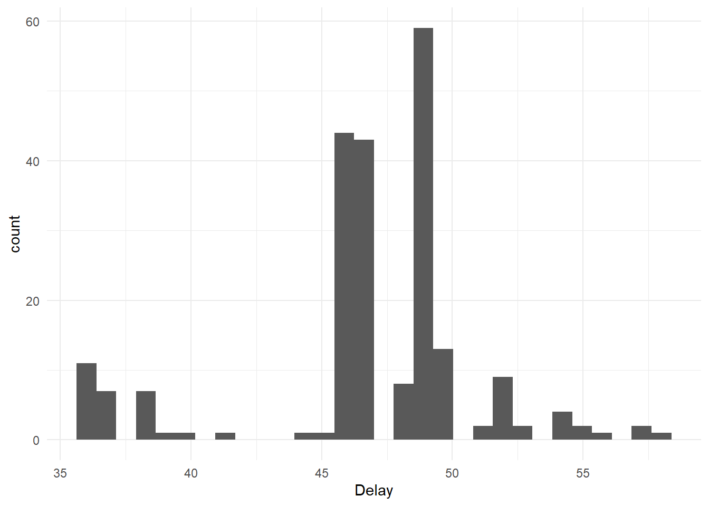
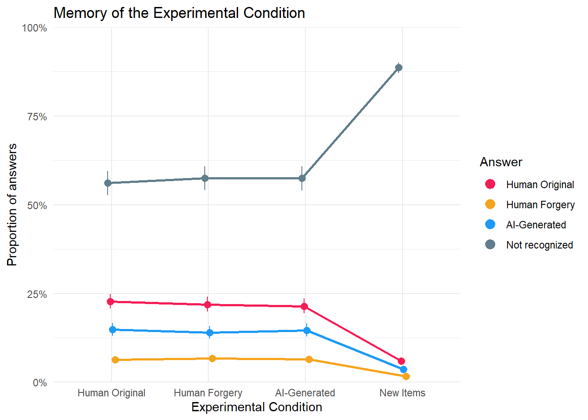
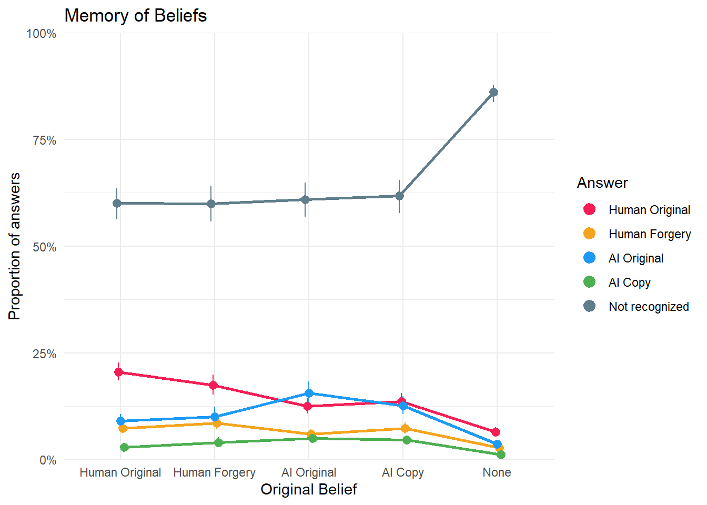
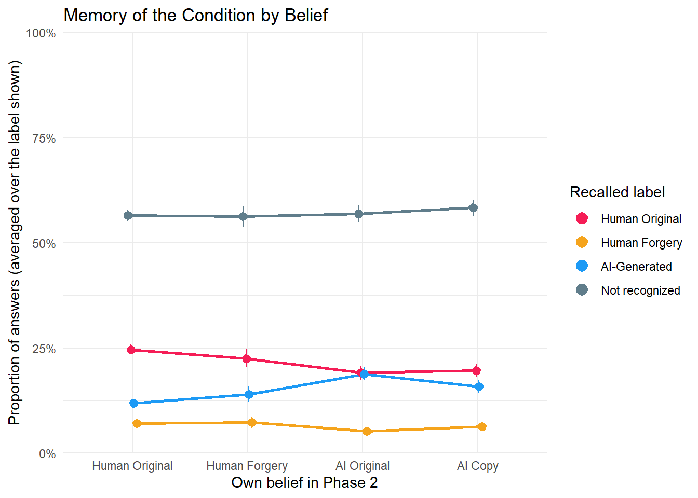
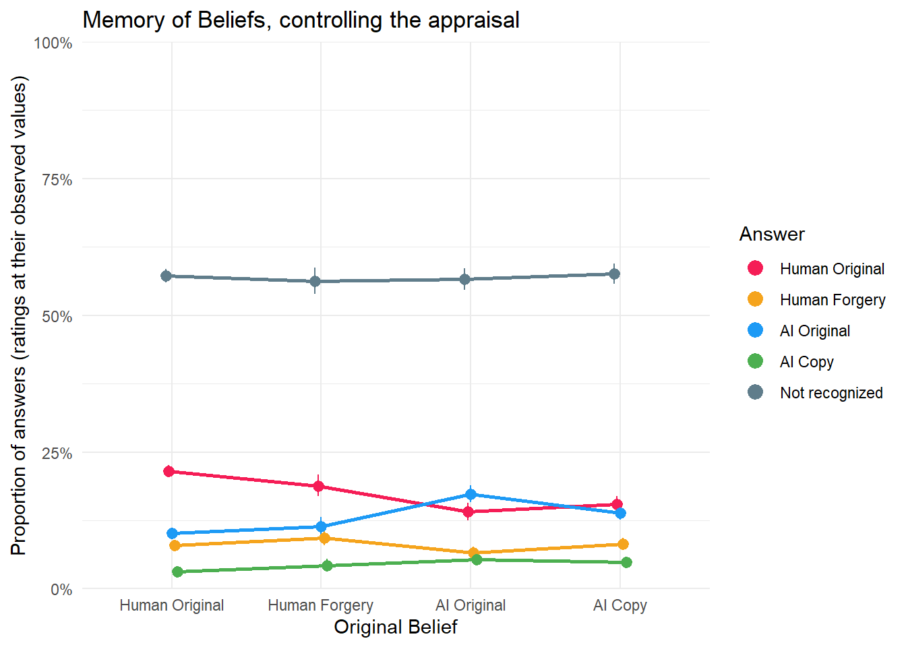
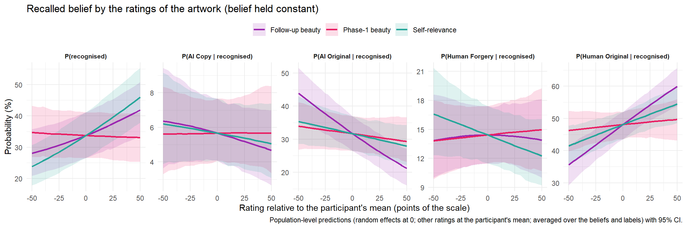
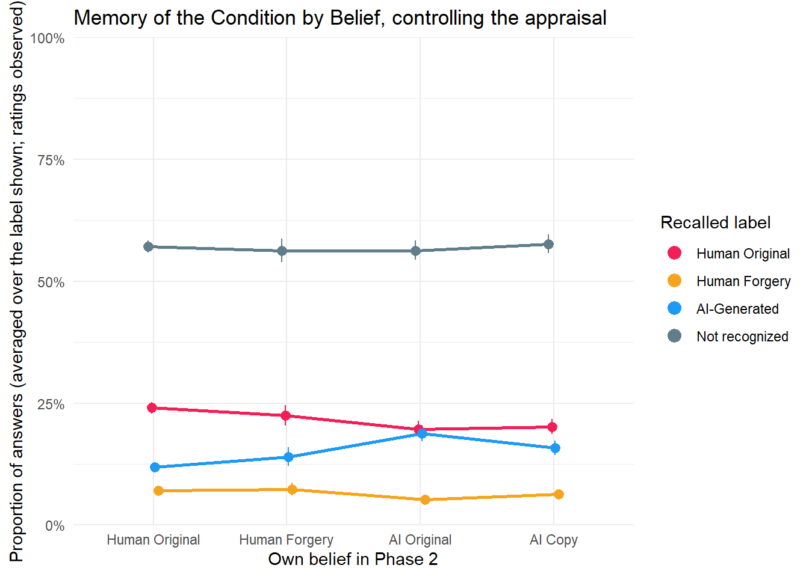
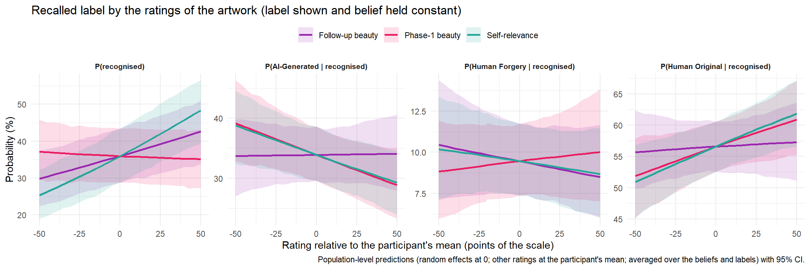
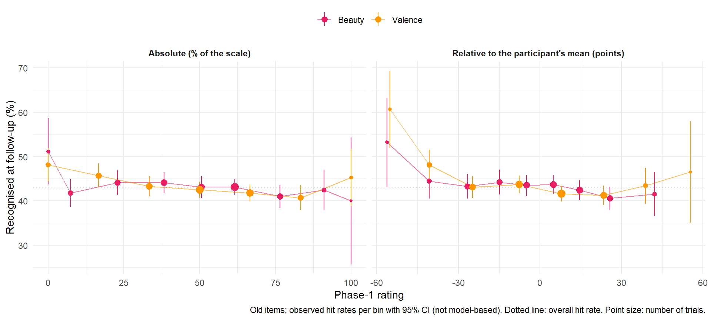
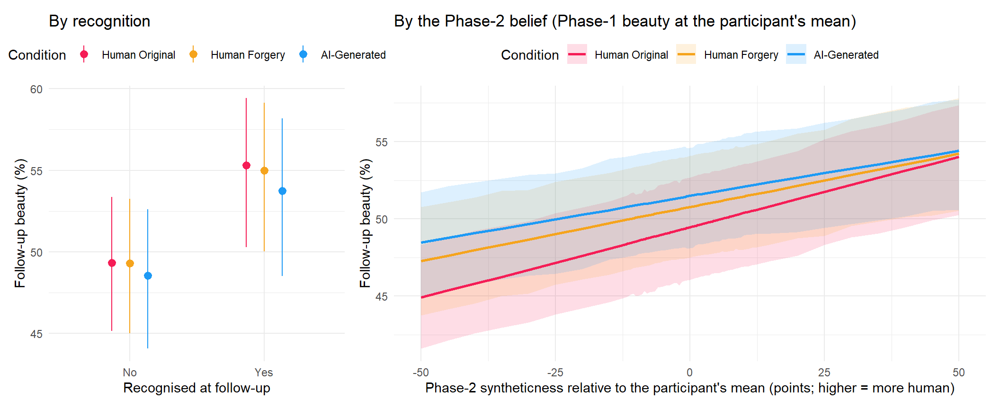

<!-- Estimates are computed on the cluster (`./hpc extract`, see server/estimates.R) and read from models/estimates/. -->

## Data Preparation


::: {.cell}

```{.r .cell-code  code-fold="false"}
library(tidyverse)
library(easystats)
library(patchwork)

df <- read.csv("../data/data_memory_task.csv") |>
  mutate(Condition = fct_relevel(Condition, "Human Original", "Human Forgery", "AI-Generated", "New Items"),
         AnswerCondition = fct_relevel(AnswerCondition, "Human Original", "Human Forgery", "AI-Generated", "Not recognized"),
         AnswerBelief = fct_relevel(AnswerBelief, "Human Original", "Human Forgery", "AI Original", "AI Copy", "Not recognized"),
         Belief = fct_relevel(Belief, "Human Original", "Human Forgery", "AI Original", "AI Copy", "None"))

dfsub <- read.csv("../data/data_participants.csv") |> 
  filter(Participant %in% df$Participant)

cols <- c(
  # Condition
  "Human Original" = "#F51D56",
  "Human Forgery" = "#F5A41D",
  "AI-Generated" = "#1D9AF5",
  "AI Original" = "#1D9AF5",
  "AI Copy" = "#4CAF50",
  "Not recognized" = "#607D8B",
  # Style
  "Abstract and Avant-garde" = "#E41A1C", 
  "Classical" = "#377EB8", 
  "Impressionist and Expressionist" = "#4DAF4A",
  "Romantic and Realism" = "#FF7F00"
)

source("server/estimates.R") # memory_info
source("report.R")           # make_asis(), make_tables(), make_markdown(), read_estimates()

estimates <- read_estimates(names(memory_info))
provenance_table(estimates)
```

::: {.cell-output-display}


Table: Provenance of the estimates read by this report.

|Model                    |Fit                          | Draws| Max_Rhat|Extracted        |
|:------------------------|:----------------------------|-----:|--------:|:----------------|
|MemoryCondition          |MemoryCondition.rds          |  4000|    1.131|2026-09-22 20:32 |
|MemoryBelief             |MemoryBelief.rds             |  4000|    1.043|2026-09-22 20:33 |
|MemoryConditionBelief    |MemoryConditionBelief.rds    |  4000|    1.031|2026-09-23 15:50 |
|MemoryBeliefAppraisal    |MemoryBeliefAppraisal.rds    |  4000|    1.013|2026-09-26 09:24 |
|MemoryConditionAppraisal |MemoryConditionAppraisal.rds |  4000|    1.016|2026-09-26 09:25 |


:::
:::


## How to read this report

Four Bayesian categorical mixed models of what participants remembered in the
follow-up session (220 participants × 96 items = 21,120 rows: 48 seen in Phase 1,
48 new).

| model | outcome | predictor | levels of the predictor |
| --- | --- | --- | --- |
| **Memory of Condition** | `AnswerCondition`: which label the participant recalls being shown | `Condition`: the label actually shown in Phase 1 | Human Original, Human Forgery, AI-Generated, **New Items** (never seen) |
| **Memory of Beliefs** | `AnswerBelief`: what the participant recalls believing the artwork was | `Belief`: what they actually reported believing in Phase 2 | Human Original, Human Forgery, AI Original, AI Copy, None |
| **Memory of the Condition by Belief** | `AnswerCondition` | `Condition` **+** `Belief` (additive; old items with a recorded belief only, 10,416 rows) | Belief: Human Original, Human Forgery, AI Original, AI Copy |
| **Memory by Phase-1 Appraisal** (MemoryAppraisal, its own section) | `AnswerCondition` | `Condition` + Phase-1 beauty and valence, each centred within participant, with quadratic terms (old items only, 10,560 rows) | continuous |
| **Memory of Beliefs, controlling the appraisal** (MemoryBeliefAppraisal) | `AnswerBelief` | `Belief` + Phase-1 beauty, follow-up beauty and self-relevance of the artwork, each centred within participant (old items with a recorded belief, 10,416 rows) | Belief levels as above; ratings continuous |
| **Memory of the Condition by Belief, controlling the appraisal** (MemoryConditionAppraisal) | `AnswerCondition` | `Condition` + `Belief` + the same three ratings (same rows) | as above |
| **Durability** (Beauty2Recognition, Beauty2Reality; their own section) | `Beauty2`, the follow-up beauty slider (CHOCO) | `Condition * Recognition` (old items, 10,560 rows); `Condition * Reality_w + Beauty_w` (Phase-2 syntheticness and Phase-1 beauty, centred within participant; 217 participants) | Recognition Yes / No; continuous |

All outcomes include **Not recognized** (item judged "new"): correct for
`New Items`, forgetting for the seen levels. The third model asks whether the
recalled label is reconstructed from one's own Phase-2 belief: its `Belief`
means and contrasts are averaged over the label actually shown (computed over
the observed trials, see `memory_observed()` in `server/estimates.R`), so a
`Belief` effect is the effect of the belief with the label held constant.
The two "controlling the appraisal" models (2026-09-26) ask whether those
`Belief` effects are memory of the belief or a fresh inference from the
current impression of the work: follow-up beauty and self-relevance were rated
right before the memory questions, Phase-1 beauty is what drove the belief in
the first place. Their `Belief` contrasts are computed the same way (ratings
at their observed values); the ratings' own effects come from population-level
predictions over a grid of each rating (`by_rating`, as MemoryAppraisal).
The durability models ask whether the (null) label effect on follow-up beauty
hides a residual effect among the artworks still recognised, or an effect
carried by the syntheticness belief the label had induced in Phase 2.

Each section: figure of the probability of each answer per level, convergence,
marginal means, contrasts (coloured tables of interest + the complete set), and
an auto-generated summary. Every table has a folded Markdown twin; the Summary
section writes `data/results_memory_contrasts.csv` and
`data/results_memory_means.csv`.

Estimates are probabilities and contrasts (`Level1 - Level2`) differences of
probabilities, reported in percentage points as posterior medians with 95% CI
and probability of direction (`pd`). "Credible" = CI excludes 0 (no
multiplicity correction).

## Delay


::: {.cell}

```{.r .cell-code}
dfsub |> 
  ggplot(aes(x=Delay)) +
  geom_histogram(bins=30) +
  theme_minimal()
```

::: {.cell-output-display}
{width=672}
:::
:::


The mean and median days between the two experiments were 46.95 and 47.00, respectively.

## Memory of Condition

### Main Model


::: {.cell}

```{.r .cell-code}
# Dodging order of the answers in the figures
make_group <- function(resp, covariate = NULL) {
  group <- case_when(  
    resp == "Not recognized" ~ 0,
    resp == "Human Original" ~ 1,
    resp == "AI-Generated" ~ 2,
    resp == "AI Original" ~ 2,
    resp == "Human Forgery" ~ 3,
    resp == "AI Copy" ~ 4,
    .default = NA)
  
  if(!is.null(covariate)) {
    covariate <- insight::format_value(normalize(covariate), style_positive="plus")
    group <- paste0(group, covariate)
  }
  group
}

dat_cond1 <- estimates$MemoryCondition$means |>
  mutate(group = make_group(Response))

p_cond1 <- dat_cond1 |> 
  ggplot(aes(x=Condition,  y = Median, color = Response)) +
  geom_line(aes(group=group), position = position_dodge(width=0.1), linewidth = 1,
            show.legend = FALSE) +
  geom_pointrange(aes(group=group, ymin = CI_low, ymax = CI_high), position = position_dodge(width=0.1),
                  key_glyph = "point") +
  scale_y_continuous(label = scales::percent, limits = c(0,1), expand = c(0, 0)) +
  scale_color_manual(values = cols) +
  guides(color = guide_legend(override.aes = list(size = 3))) +
  labs(y="Proportion of answers", color = "Answer", x =  "Experimental Condition",
       title = "Memory of the Experimental Condition") +
  theme_minimal() 
p_cond1
```

::: {.cell-output-display}
{width=672}
:::
:::


::: {.cell}

```{.r .cell-code}
make_contrasts <- function(c, answer=NULL, condition=NULL, title="Marginal Contrasts") {

  if(!is.null(answer)) {
    c <- filter(c, str_detect(Response1, answer) & str_detect(Response2, answer))
  }
  if(!is.null(condition)) {
    c <- filter(c, str_detect(Level1, condition) & str_detect(Level2, condition))
  }

  # Collapse a constant Response/Level pair into one Category column
  if(length(unique(c$Response1)) == 1 & all(c$Response1 == c$Response2)) {
    c <- cbind(data.frame("Category" = c$Response1[1]), c)
    c$Response1 <- NULL
    c$Response2 <- NULL
  }
  if(length(unique(c$Level1)) == 1 & all(c$Level1 == c$Level2)) {
    c <- cbind(data.frame("Category" = c$Level1[1]), c)
    c$Level1 <- NULL
    c$Level2 <- NULL
  }

  c <- arrange(c, desc(abs(Median)))
  t <- format_table(c, zap_small = TRUE)

  t$effectsize <- as.numeric(c$Median)
  t$sig <- as.numeric(c$pd)

  g <- gt::gt(t) |>
    gt::data_color(columns = "effectsize", target_columns = "Median", method = "numeric",
palette = c("red", "red", "white", "green", "green"), domain = c(-0.7, 0.7)) |>
    gt::data_color(columns = "sig", target_columns = "pd", fn = \(x) {
      ifelse(x > 0.99, "#FFC107", ifelse(x > 0.97, "#FFEB3B", ifelse(x > 0.95, "#FFF59D", "white")))
    }) |>
    gt::cols_hide(c("effectsize", "sig")) |>
    gt::tab_header(title = title)

  # Markdown twin: colour coding replaced by an Effect column
  md <- t[setdiff(names(t), c("effectsize", "sig"))]
  md$Effect <- ifelse(sign(c$CI_low) != sign(c$CI_high), "n.s.",
                      ifelse(c$Median < 0, "Negative", "Positive"))
  make_asis(as.character(knitr::knit_print(g)), "", make_markdown(md, title), "")
}

# Convergence, marginal means and the complete contrast set
make_memory_tables <- function(est) {
  means_fmt <- as.data.frame(est$means)[c(est$by, "Response", "Median", "CI_low", "CI_high")]
  num <- vapply(means_fmt, is.numeric, logical(1))
  means_fmt[num] <- lapply(means_fmt[num], insight::format_value, zap_small = TRUE)

  all_con <- as.data.frame(est$contrasts)
  all_con$Effect <- ifelse(sign(all_con$CI_low) != sign(all_con$CI_high), "n.s.",
                           ifelse(all_con$Median < 0, "Negative", "Positive"))
  all_fmt <- all_con[c("Level1", "Response1", "Level2", "Response2", "Median", "CI_low", "CI_high", "pd", "Effect")]
  n <- vapply(all_fmt, is.numeric, logical(1))
  all_fmt[n] <- lapply(all_fmt[n], insight::format_value, zap_small = TRUE)

  make_asis(
    make_tables(est$diag,
                c("Model", "Family", "N_obs", "N_participants", "Chains", "Draws",
                  "Max_Rhat", "Min_ESS_ratio", "Divergent_pct", "Criterion"),
                sprintf("%s: convergence", est$label)),
    make_tables(means_fmt, names(means_fmt),
                sprintf("%s: probability of each answer per %s (marginal means)", est$label, est$by)),
    # Markdown only (120-300 rows)
    make_markdown(all_fmt, sprintf("%s: all %d contrasts", est$label, nrow(all_fmt)))
  )
}

# Generated summary of the credible same-answer contrasts
make_memory_summary <- function(est) {
  d <- as.data.frame(est$contrasts)
  d <- d[d$Response1 == d$Response2, ]
  d$Credible <- sign(d$CI_low) == sign(d$CI_high)
  pp <- function(x) insight::format_value(100 * x)
  out <- c(sprintf(
    "**%s.** Each row of the model is the probability of one answer. The differences below are between %s levels *within* the same answer, in percentage points, as posterior medians with 95%% CI; `pd` is the probability of direction. An effect is called credible when the CI excludes 0. Contrasts *across* answers are in the full table above.",
    est$label, est$by), "")
  for (r in unique(d$Response1)) {
    dr <- d[d$Response1 == r, ]
    cred <- dr[dr$Credible, ]
    if (nrow(cred) == 0) {
      out <- c(out, sprintf("- **%s**: no credible difference between any pair of %s levels.", r, est$by))
      next
    }
    cred <- cred[order(-abs(cred$Median)), ]
    out <- c(out, sprintf("- **%s**: %s.%s", r,
      paste(sprintf("%s - %s %s pp [%s, %s]", cred$Level1, cred$Level2,
                    pp(cred$Median), pp(cred$CI_low), pp(cred$CI_high)), collapse = "; "),
      if (nrow(cred) < nrow(dr)) sprintf(" The other %d pair(s) are not credible.", nrow(dr) - nrow(cred)) else ""))
  }
  make_asis("", '::: {.callout-tip title="Summary of credible effects (generated from the tables above)"}',
            "", out, "", ":::", "")
}
```
:::


::: {.cell}

```{.r .cell-code}
make_memory_tables(estimates$MemoryCondition)
```

::: {.cell-output-display}

```{=html}
<div id="asrpivsiql" style="padding-left:0px;padding-right:0px;padding-top:10px;padding-bottom:10px;overflow-x:auto;overflow-y:auto;width:auto;height:auto;">
<style>#asrpivsiql table {
  font-family: system-ui, 'Segoe UI', Roboto, Helvetica, Arial, sans-serif, 'Apple Color Emoji', 'Segoe UI Emoji', 'Segoe UI Symbol', 'Noto Color Emoji';
  -webkit-font-smoothing: antialiased;
  -moz-osx-font-smoothing: grayscale;
}

#asrpivsiql thead, #asrpivsiql tbody, #asrpivsiql tfoot, #asrpivsiql tr, #asrpivsiql td, #asrpivsiql th {
  border-style: none;
}

#asrpivsiql p {
  margin: 0;
  padding: 0;
}

#asrpivsiql .gt_table {
  display: table;
  border-collapse: collapse;
  line-height: normal;
  margin-left: auto;
  margin-right: auto;
  color: #333333;
  font-size: 13px;
  font-weight: normal;
  font-style: normal;
  background-color: #FFFFFF;
  width: auto;
  border-top-style: solid;
  border-top-width: 3px;
  border-top-color: #D5D5D5;
  border-right-style: solid;
  border-right-width: 3px;
  border-right-color: #D5D5D5;
  border-bottom-style: solid;
  border-bottom-width: 3px;
  border-bottom-color: #D5D5D5;
  border-left-style: solid;
  border-left-width: 3px;
  border-left-color: #D5D5D5;
}

#asrpivsiql .gt_caption {
  padding-top: 4px;
  padding-bottom: 4px;
}

#asrpivsiql .gt_title {
  color: #333333;
  font-size: 125%;
  font-weight: initial;
  padding-top: 4px;
  padding-bottom: 4px;
  padding-left: 5px;
  padding-right: 5px;
  border-bottom-color: #FFFFFF;
  border-bottom-width: 0;
}

#asrpivsiql .gt_subtitle {
  color: #333333;
  font-size: 85%;
  font-weight: initial;
  padding-top: 3px;
  padding-bottom: 5px;
  padding-left: 5px;
  padding-right: 5px;
  border-top-color: #FFFFFF;
  border-top-width: 0;
}

#asrpivsiql .gt_heading {
  background-color: #FFFFFF;
  text-align: left;
  border-bottom-color: #FFFFFF;
  border-left-style: none;
  border-left-width: 1px;
  border-left-color: #D3D3D3;
  border-right-style: none;
  border-right-width: 1px;
  border-right-color: #D3D3D3;
}

#asrpivsiql .gt_bottom_border {
  border-bottom-style: solid;
  border-bottom-width: 2px;
  border-bottom-color: #D5D5D5;
}

#asrpivsiql .gt_col_headings {
  border-top-style: solid;
  border-top-width: 2px;
  border-top-color: #D5D5D5;
  border-bottom-style: solid;
  border-bottom-width: 2px;
  border-bottom-color: #D5D5D5;
  border-left-style: none;
  border-left-width: 1px;
  border-left-color: #D3D3D3;
  border-right-style: none;
  border-right-width: 1px;
  border-right-color: #D3D3D3;
}

#asrpivsiql .gt_col_heading {
  color: #FFFFFF;
  background-color: #000000;
  font-size: 100%;
  font-weight: normal;
  text-transform: inherit;
  border-left-style: none;
  border-left-width: 1px;
  border-left-color: #D3D3D3;
  border-right-style: none;
  border-right-width: 1px;
  border-right-color: #D3D3D3;
  vertical-align: bottom;
  padding-top: 5px;
  padding-bottom: 6px;
  padding-left: 5px;
  padding-right: 5px;
  overflow-x: hidden;
}

#asrpivsiql .gt_column_spanner_outer {
  color: #FFFFFF;
  background-color: #000000;
  font-size: 100%;
  font-weight: normal;
  text-transform: inherit;
  padding-top: 0;
  padding-bottom: 0;
  padding-left: 4px;
  padding-right: 4px;
}

#asrpivsiql .gt_column_spanner_outer:first-child {
  padding-left: 0;
}

#asrpivsiql .gt_column_spanner_outer:last-child {
  padding-right: 0;
}

#asrpivsiql .gt_column_spanner {
  border-bottom-style: solid;
  border-bottom-width: 2px;
  border-bottom-color: #D5D5D5;
  vertical-align: bottom;
  padding-top: 5px;
  padding-bottom: 5px;
  overflow-x: hidden;
  display: inline-block;
  width: 100%;
}

#asrpivsiql .gt_spanner_row {
  border-bottom-style: hidden;
}

#asrpivsiql .gt_group_heading {
  padding-top: 8px;
  padding-bottom: 8px;
  padding-left: 5px;
  padding-right: 5px;
  color: #333333;
  background-color: #FFFFFF;
  font-size: 100%;
  font-weight: initial;
  text-transform: inherit;
  border-top-style: solid;
  border-top-width: 2px;
  border-top-color: #D5D5D5;
  border-bottom-style: solid;
  border-bottom-width: 2px;
  border-bottom-color: #D5D5D5;
  border-left-style: none;
  border-left-width: 1px;
  border-left-color: #D3D3D3;
  border-right-style: none;
  border-right-width: 1px;
  border-right-color: #D3D3D3;
  vertical-align: middle;
  text-align: left;
}

#asrpivsiql .gt_empty_group_heading {
  padding: 0.5px;
  color: #333333;
  background-color: #FFFFFF;
  font-size: 100%;
  font-weight: initial;
  border-top-style: solid;
  border-top-width: 2px;
  border-top-color: #D5D5D5;
  border-bottom-style: solid;
  border-bottom-width: 2px;
  border-bottom-color: #D5D5D5;
  vertical-align: middle;
}

#asrpivsiql .gt_from_md > :first-child {
  margin-top: 0;
}

#asrpivsiql .gt_from_md > :last-child {
  margin-bottom: 0;
}

#asrpivsiql .gt_row {
  padding-top: 8px;
  padding-bottom: 8px;
  padding-left: 5px;
  padding-right: 5px;
  margin: 10px;
  border-top-style: solid;
  border-top-width: 1px;
  border-top-color: #D5D5D5;
  border-left-style: solid;
  border-left-width: 1px;
  border-left-color: #D5D5D5;
  border-right-style: solid;
  border-right-width: 1px;
  border-right-color: #D5D5D5;
  vertical-align: middle;
  overflow-x: hidden;
}

#asrpivsiql .gt_stub {
  color: #333333;
  background-color: #FFFFFF;
  font-size: 100%;
  font-weight: initial;
  text-transform: inherit;
  border-right-style: solid;
  border-right-width: 2px;
  border-right-color: #5F5F5F;
  padding-left: 5px;
  padding-right: 5px;
}

#asrpivsiql .gt_stub_row_group {
  color: #333333;
  background-color: #FFFFFF;
  font-size: 100%;
  font-weight: initial;
  text-transform: inherit;
  border-right-style: solid;
  border-right-width: 2px;
  border-right-color: #D3D3D3;
  padding-left: 5px;
  padding-right: 5px;
  vertical-align: top;
}

#asrpivsiql .gt_row_group_first td {
  border-top-width: 2px;
}

#asrpivsiql .gt_row_group_first th {
  border-top-width: 2px;
}

#asrpivsiql .gt_summary_row {
  color: #333333;
  background-color: #D5D5D5;
  text-transform: inherit;
  padding-top: 8px;
  padding-bottom: 8px;
  padding-left: 5px;
  padding-right: 5px;
}

#asrpivsiql .gt_first_summary_row {
  border-top-style: solid;
  border-top-color: #D5D5D5;
}

#asrpivsiql .gt_first_summary_row.thick {
  border-top-width: 2px;
}

#asrpivsiql .gt_last_summary_row {
  padding-top: 8px;
  padding-bottom: 8px;
  padding-left: 5px;
  padding-right: 5px;
  border-bottom-style: solid;
  border-bottom-width: 2px;
  border-bottom-color: #D5D5D5;
}

#asrpivsiql .gt_grand_summary_row {
  color: #FFFFFF;
  background-color: #929292;
  text-transform: inherit;
  padding-top: 8px;
  padding-bottom: 8px;
  padding-left: 5px;
  padding-right: 5px;
}

#asrpivsiql .gt_first_grand_summary_row {
  padding-top: 8px;
  padding-bottom: 8px;
  padding-left: 5px;
  padding-right: 5px;
  border-top-style: double;
  border-top-width: 6px;
  border-top-color: #D5D5D5;
}

#asrpivsiql .gt_last_grand_summary_row_top {
  padding-top: 8px;
  padding-bottom: 8px;
  padding-left: 5px;
  padding-right: 5px;
  border-bottom-style: double;
  border-bottom-width: 6px;
  border-bottom-color: #D5D5D5;
}

#asrpivsiql .gt_striped {
  background-color: #F4F4F4;
}

#asrpivsiql .gt_table_body {
  border-top-style: solid;
  border-top-width: 2px;
  border-top-color: #D5D5D5;
  border-bottom-style: solid;
  border-bottom-width: 2px;
  border-bottom-color: #D5D5D5;
}

#asrpivsiql .gt_footnotes {
  color: #333333;
  background-color: #FFFFFF;
  border-bottom-style: none;
  border-bottom-width: 2px;
  border-bottom-color: #D3D3D3;
  border-left-style: none;
  border-left-width: 2px;
  border-left-color: #D3D3D3;
  border-right-style: none;
  border-right-width: 2px;
  border-right-color: #D3D3D3;
}

#asrpivsiql .gt_footnote {
  margin: 0px;
  font-size: 90%;
  padding-top: 4px;
  padding-bottom: 4px;
  padding-left: 5px;
  padding-right: 5px;
}

#asrpivsiql .gt_sourcenotes {
  color: #333333;
  background-color: #FFFFFF;
  border-bottom-style: none;
  border-bottom-width: 2px;
  border-bottom-color: #D3D3D3;
  border-left-style: none;
  border-left-width: 2px;
  border-left-color: #D3D3D3;
  border-right-style: none;
  border-right-width: 2px;
  border-right-color: #D3D3D3;
}

#asrpivsiql .gt_sourcenote {
  font-size: 90%;
  padding-top: 4px;
  padding-bottom: 4px;
  padding-left: 5px;
  padding-right: 5px;
}

#asrpivsiql .gt_left {
  text-align: left;
}

#asrpivsiql .gt_center {
  text-align: center;
}

#asrpivsiql .gt_right {
  text-align: right;
  font-variant-numeric: tabular-nums;
}

#asrpivsiql .gt_font_normal {
  font-weight: normal;
}

#asrpivsiql .gt_font_bold {
  font-weight: bold;
}

#asrpivsiql .gt_font_italic {
  font-style: italic;
}

#asrpivsiql .gt_super {
  font-size: 65%;
}

#asrpivsiql .gt_footnote_marks {
  font-size: 75%;
  vertical-align: 0.4em;
  position: initial;
}

#asrpivsiql .gt_asterisk {
  font-size: 100%;
  vertical-align: 0;
}

#asrpivsiql .gt_indent_1 {
  text-indent: 5px;
}

#asrpivsiql .gt_indent_2 {
  text-indent: 10px;
}

#asrpivsiql .gt_indent_3 {
  text-indent: 15px;
}

#asrpivsiql .gt_indent_4 {
  text-indent: 20px;
}

#asrpivsiql .gt_indent_5 {
  text-indent: 25px;
}

#asrpivsiql .katex-display {
  display: inline-flex !important;
  margin-bottom: 0.75em !important;
}

#asrpivsiql div.Reactable > div.rt-table > div.rt-thead > div.rt-tr.rt-tr-group-header > div.rt-th-group:after {
  height: 0px !important;
}
</style>
<table class="gt_table" data-quarto-disable-processing="false" data-quarto-bootstrap="false">
  <thead>
    <tr class="gt_heading">
      <td colspan="10" class="gt_heading gt_title gt_font_normal gt_bottom_border" style>Memory of the Experimental Condition: convergence</td>
    </tr>
    
    <tr class="gt_col_headings">
      <th class="gt_col_heading gt_columns_bottom_border gt_left" rowspan="1" colspan="1" scope="col" id="Model">Model</th>
      <th class="gt_col_heading gt_columns_bottom_border gt_left" rowspan="1" colspan="1" scope="col" id="Family">Family</th>
      <th class="gt_col_heading gt_columns_bottom_border gt_right" rowspan="1" colspan="1" scope="col" id="N_obs">N_obs</th>
      <th class="gt_col_heading gt_columns_bottom_border gt_right" rowspan="1" colspan="1" scope="col" id="N_participants">N_participants</th>
      <th class="gt_col_heading gt_columns_bottom_border gt_right" rowspan="1" colspan="1" scope="col" id="Chains">Chains</th>
      <th class="gt_col_heading gt_columns_bottom_border gt_right" rowspan="1" colspan="1" scope="col" id="Draws">Draws</th>
      <th class="gt_col_heading gt_columns_bottom_border gt_right" rowspan="1" colspan="1" scope="col" id="Max_Rhat">Max_Rhat</th>
      <th class="gt_col_heading gt_columns_bottom_border gt_right" rowspan="1" colspan="1" scope="col" id="Min_ESS_ratio">Min_ESS_ratio</th>
      <th class="gt_col_heading gt_columns_bottom_border gt_right" rowspan="1" colspan="1" scope="col" id="Divergent_pct">Divergent_pct</th>
      <th class="gt_col_heading gt_columns_bottom_border gt_left" rowspan="1" colspan="1" scope="col" id="Criterion">Criterion</th>
    </tr>
  </thead>
  <tbody class="gt_table_body">
    <tr><td headers="Model" class="gt_row gt_left">MemoryCondition</td>
<td headers="Family" class="gt_row gt_left">Categorical</td>
<td headers="N_obs" class="gt_row gt_right">21120</td>
<td headers="N_participants" class="gt_row gt_right">220</td>
<td headers="Chains" class="gt_row gt_right">8</td>
<td headers="Draws" class="gt_row gt_right">4000</td>
<td headers="Max_Rhat" class="gt_row gt_right">1.131</td>
<td headers="Min_ESS_ratio" class="gt_row gt_right">0.011</td>
<td headers="Divergent_pct" class="gt_row gt_right">1.45</td>
<td headers="Criterion" class="gt_row gt_left">loo</td></tr>
  </tbody>
  
</table>
</div>
```


::: {.callout-note collapse="true" title="Memory of the Experimental Condition: convergence (Markdown table, for text readers)"}

|Model           |Family      | N_obs| N_participants| Chains| Draws| Max_Rhat| Min_ESS_ratio| Divergent_pct|Criterion |
|:---------------|:-----------|-----:|--------------:|------:|-----:|--------:|-------------:|-------------:|:---------|
|MemoryCondition |Categorical | 21120|            220|      8|  4000|    1.131|         0.011|          1.45|loo       |

:::

```{=html}
<div id="jprrqpnozq" style="padding-left:0px;padding-right:0px;padding-top:10px;padding-bottom:10px;overflow-x:auto;overflow-y:auto;width:auto;height:auto;">
<style>#jprrqpnozq table {
  font-family: system-ui, 'Segoe UI', Roboto, Helvetica, Arial, sans-serif, 'Apple Color Emoji', 'Segoe UI Emoji', 'Segoe UI Symbol', 'Noto Color Emoji';
  -webkit-font-smoothing: antialiased;
  -moz-osx-font-smoothing: grayscale;
}

#jprrqpnozq thead, #jprrqpnozq tbody, #jprrqpnozq tfoot, #jprrqpnozq tr, #jprrqpnozq td, #jprrqpnozq th {
  border-style: none;
}

#jprrqpnozq p {
  margin: 0;
  padding: 0;
}

#jprrqpnozq .gt_table {
  display: table;
  border-collapse: collapse;
  line-height: normal;
  margin-left: auto;
  margin-right: auto;
  color: #333333;
  font-size: 13px;
  font-weight: normal;
  font-style: normal;
  background-color: #FFFFFF;
  width: auto;
  border-top-style: solid;
  border-top-width: 3px;
  border-top-color: #D5D5D5;
  border-right-style: solid;
  border-right-width: 3px;
  border-right-color: #D5D5D5;
  border-bottom-style: solid;
  border-bottom-width: 3px;
  border-bottom-color: #D5D5D5;
  border-left-style: solid;
  border-left-width: 3px;
  border-left-color: #D5D5D5;
}

#jprrqpnozq .gt_caption {
  padding-top: 4px;
  padding-bottom: 4px;
}

#jprrqpnozq .gt_title {
  color: #333333;
  font-size: 125%;
  font-weight: initial;
  padding-top: 4px;
  padding-bottom: 4px;
  padding-left: 5px;
  padding-right: 5px;
  border-bottom-color: #FFFFFF;
  border-bottom-width: 0;
}

#jprrqpnozq .gt_subtitle {
  color: #333333;
  font-size: 85%;
  font-weight: initial;
  padding-top: 3px;
  padding-bottom: 5px;
  padding-left: 5px;
  padding-right: 5px;
  border-top-color: #FFFFFF;
  border-top-width: 0;
}

#jprrqpnozq .gt_heading {
  background-color: #FFFFFF;
  text-align: left;
  border-bottom-color: #FFFFFF;
  border-left-style: none;
  border-left-width: 1px;
  border-left-color: #D3D3D3;
  border-right-style: none;
  border-right-width: 1px;
  border-right-color: #D3D3D3;
}

#jprrqpnozq .gt_bottom_border {
  border-bottom-style: solid;
  border-bottom-width: 2px;
  border-bottom-color: #D5D5D5;
}

#jprrqpnozq .gt_col_headings {
  border-top-style: solid;
  border-top-width: 2px;
  border-top-color: #D5D5D5;
  border-bottom-style: solid;
  border-bottom-width: 2px;
  border-bottom-color: #D5D5D5;
  border-left-style: none;
  border-left-width: 1px;
  border-left-color: #D3D3D3;
  border-right-style: none;
  border-right-width: 1px;
  border-right-color: #D3D3D3;
}

#jprrqpnozq .gt_col_heading {
  color: #FFFFFF;
  background-color: #000000;
  font-size: 100%;
  font-weight: normal;
  text-transform: inherit;
  border-left-style: none;
  border-left-width: 1px;
  border-left-color: #D3D3D3;
  border-right-style: none;
  border-right-width: 1px;
  border-right-color: #D3D3D3;
  vertical-align: bottom;
  padding-top: 5px;
  padding-bottom: 6px;
  padding-left: 5px;
  padding-right: 5px;
  overflow-x: hidden;
}

#jprrqpnozq .gt_column_spanner_outer {
  color: #FFFFFF;
  background-color: #000000;
  font-size: 100%;
  font-weight: normal;
  text-transform: inherit;
  padding-top: 0;
  padding-bottom: 0;
  padding-left: 4px;
  padding-right: 4px;
}

#jprrqpnozq .gt_column_spanner_outer:first-child {
  padding-left: 0;
}

#jprrqpnozq .gt_column_spanner_outer:last-child {
  padding-right: 0;
}

#jprrqpnozq .gt_column_spanner {
  border-bottom-style: solid;
  border-bottom-width: 2px;
  border-bottom-color: #D5D5D5;
  vertical-align: bottom;
  padding-top: 5px;
  padding-bottom: 5px;
  overflow-x: hidden;
  display: inline-block;
  width: 100%;
}

#jprrqpnozq .gt_spanner_row {
  border-bottom-style: hidden;
}

#jprrqpnozq .gt_group_heading {
  padding-top: 8px;
  padding-bottom: 8px;
  padding-left: 5px;
  padding-right: 5px;
  color: #333333;
  background-color: #FFFFFF;
  font-size: 100%;
  font-weight: initial;
  text-transform: inherit;
  border-top-style: solid;
  border-top-width: 2px;
  border-top-color: #D5D5D5;
  border-bottom-style: solid;
  border-bottom-width: 2px;
  border-bottom-color: #D5D5D5;
  border-left-style: none;
  border-left-width: 1px;
  border-left-color: #D3D3D3;
  border-right-style: none;
  border-right-width: 1px;
  border-right-color: #D3D3D3;
  vertical-align: middle;
  text-align: left;
}

#jprrqpnozq .gt_empty_group_heading {
  padding: 0.5px;
  color: #333333;
  background-color: #FFFFFF;
  font-size: 100%;
  font-weight: initial;
  border-top-style: solid;
  border-top-width: 2px;
  border-top-color: #D5D5D5;
  border-bottom-style: solid;
  border-bottom-width: 2px;
  border-bottom-color: #D5D5D5;
  vertical-align: middle;
}

#jprrqpnozq .gt_from_md > :first-child {
  margin-top: 0;
}

#jprrqpnozq .gt_from_md > :last-child {
  margin-bottom: 0;
}

#jprrqpnozq .gt_row {
  padding-top: 8px;
  padding-bottom: 8px;
  padding-left: 5px;
  padding-right: 5px;
  margin: 10px;
  border-top-style: solid;
  border-top-width: 1px;
  border-top-color: #D5D5D5;
  border-left-style: solid;
  border-left-width: 1px;
  border-left-color: #D5D5D5;
  border-right-style: solid;
  border-right-width: 1px;
  border-right-color: #D5D5D5;
  vertical-align: middle;
  overflow-x: hidden;
}

#jprrqpnozq .gt_stub {
  color: #333333;
  background-color: #FFFFFF;
  font-size: 100%;
  font-weight: initial;
  text-transform: inherit;
  border-right-style: solid;
  border-right-width: 2px;
  border-right-color: #5F5F5F;
  padding-left: 5px;
  padding-right: 5px;
}

#jprrqpnozq .gt_stub_row_group {
  color: #333333;
  background-color: #FFFFFF;
  font-size: 100%;
  font-weight: initial;
  text-transform: inherit;
  border-right-style: solid;
  border-right-width: 2px;
  border-right-color: #D3D3D3;
  padding-left: 5px;
  padding-right: 5px;
  vertical-align: top;
}

#jprrqpnozq .gt_row_group_first td {
  border-top-width: 2px;
}

#jprrqpnozq .gt_row_group_first th {
  border-top-width: 2px;
}

#jprrqpnozq .gt_summary_row {
  color: #333333;
  background-color: #D5D5D5;
  text-transform: inherit;
  padding-top: 8px;
  padding-bottom: 8px;
  padding-left: 5px;
  padding-right: 5px;
}

#jprrqpnozq .gt_first_summary_row {
  border-top-style: solid;
  border-top-color: #D5D5D5;
}

#jprrqpnozq .gt_first_summary_row.thick {
  border-top-width: 2px;
}

#jprrqpnozq .gt_last_summary_row {
  padding-top: 8px;
  padding-bottom: 8px;
  padding-left: 5px;
  padding-right: 5px;
  border-bottom-style: solid;
  border-bottom-width: 2px;
  border-bottom-color: #D5D5D5;
}

#jprrqpnozq .gt_grand_summary_row {
  color: #FFFFFF;
  background-color: #929292;
  text-transform: inherit;
  padding-top: 8px;
  padding-bottom: 8px;
  padding-left: 5px;
  padding-right: 5px;
}

#jprrqpnozq .gt_first_grand_summary_row {
  padding-top: 8px;
  padding-bottom: 8px;
  padding-left: 5px;
  padding-right: 5px;
  border-top-style: double;
  border-top-width: 6px;
  border-top-color: #D5D5D5;
}

#jprrqpnozq .gt_last_grand_summary_row_top {
  padding-top: 8px;
  padding-bottom: 8px;
  padding-left: 5px;
  padding-right: 5px;
  border-bottom-style: double;
  border-bottom-width: 6px;
  border-bottom-color: #D5D5D5;
}

#jprrqpnozq .gt_striped {
  background-color: #F4F4F4;
}

#jprrqpnozq .gt_table_body {
  border-top-style: solid;
  border-top-width: 2px;
  border-top-color: #D5D5D5;
  border-bottom-style: solid;
  border-bottom-width: 2px;
  border-bottom-color: #D5D5D5;
}

#jprrqpnozq .gt_footnotes {
  color: #333333;
  background-color: #FFFFFF;
  border-bottom-style: none;
  border-bottom-width: 2px;
  border-bottom-color: #D3D3D3;
  border-left-style: none;
  border-left-width: 2px;
  border-left-color: #D3D3D3;
  border-right-style: none;
  border-right-width: 2px;
  border-right-color: #D3D3D3;
}

#jprrqpnozq .gt_footnote {
  margin: 0px;
  font-size: 90%;
  padding-top: 4px;
  padding-bottom: 4px;
  padding-left: 5px;
  padding-right: 5px;
}

#jprrqpnozq .gt_sourcenotes {
  color: #333333;
  background-color: #FFFFFF;
  border-bottom-style: none;
  border-bottom-width: 2px;
  border-bottom-color: #D3D3D3;
  border-left-style: none;
  border-left-width: 2px;
  border-left-color: #D3D3D3;
  border-right-style: none;
  border-right-width: 2px;
  border-right-color: #D3D3D3;
}

#jprrqpnozq .gt_sourcenote {
  font-size: 90%;
  padding-top: 4px;
  padding-bottom: 4px;
  padding-left: 5px;
  padding-right: 5px;
}

#jprrqpnozq .gt_left {
  text-align: left;
}

#jprrqpnozq .gt_center {
  text-align: center;
}

#jprrqpnozq .gt_right {
  text-align: right;
  font-variant-numeric: tabular-nums;
}

#jprrqpnozq .gt_font_normal {
  font-weight: normal;
}

#jprrqpnozq .gt_font_bold {
  font-weight: bold;
}

#jprrqpnozq .gt_font_italic {
  font-style: italic;
}

#jprrqpnozq .gt_super {
  font-size: 65%;
}

#jprrqpnozq .gt_footnote_marks {
  font-size: 75%;
  vertical-align: 0.4em;
  position: initial;
}

#jprrqpnozq .gt_asterisk {
  font-size: 100%;
  vertical-align: 0;
}

#jprrqpnozq .gt_indent_1 {
  text-indent: 5px;
}

#jprrqpnozq .gt_indent_2 {
  text-indent: 10px;
}

#jprrqpnozq .gt_indent_3 {
  text-indent: 15px;
}

#jprrqpnozq .gt_indent_4 {
  text-indent: 20px;
}

#jprrqpnozq .gt_indent_5 {
  text-indent: 25px;
}

#jprrqpnozq .katex-display {
  display: inline-flex !important;
  margin-bottom: 0.75em !important;
}

#jprrqpnozq div.Reactable > div.rt-table > div.rt-thead > div.rt-tr.rt-tr-group-header > div.rt-th-group:after {
  height: 0px !important;
}
</style>
<table class="gt_table" data-quarto-disable-processing="false" data-quarto-bootstrap="false">
  <thead>
    <tr class="gt_heading">
      <td colspan="5" class="gt_heading gt_title gt_font_normal gt_bottom_border" style>Memory of the Experimental Condition: probability of each answer per Condition (marginal means)</td>
    </tr>
    
    <tr class="gt_col_headings">
      <th class="gt_col_heading gt_columns_bottom_border gt_center" rowspan="1" colspan="1" scope="col" id="Condition">Condition</th>
      <th class="gt_col_heading gt_columns_bottom_border gt_center" rowspan="1" colspan="1" scope="col" id="Response">Response</th>
      <th class="gt_col_heading gt_columns_bottom_border gt_right" rowspan="1" colspan="1" scope="col" id="Median">Median</th>
      <th class="gt_col_heading gt_columns_bottom_border gt_right" rowspan="1" colspan="1" scope="col" id="CI_low">CI_low</th>
      <th class="gt_col_heading gt_columns_bottom_border gt_right" rowspan="1" colspan="1" scope="col" id="CI_high">CI_high</th>
    </tr>
  </thead>
  <tbody class="gt_table_body">
    <tr><td headers="Condition" class="gt_row gt_center">Human Original</td>
<td headers="Response" class="gt_row gt_center">Human Original</td>
<td headers="Median" class="gt_row gt_right">0.23</td>
<td headers="CI_low" class="gt_row gt_right">0.21</td>
<td headers="CI_high" class="gt_row gt_right">0.25</td></tr>
    <tr><td headers="Condition" class="gt_row gt_center gt_striped">Human Forgery</td>
<td headers="Response" class="gt_row gt_center gt_striped">Human Original</td>
<td headers="Median" class="gt_row gt_right gt_striped">0.22</td>
<td headers="CI_low" class="gt_row gt_right gt_striped">0.20</td>
<td headers="CI_high" class="gt_row gt_right gt_striped">0.24</td></tr>
    <tr><td headers="Condition" class="gt_row gt_center">AI-Generated</td>
<td headers="Response" class="gt_row gt_center">Human Original</td>
<td headers="Median" class="gt_row gt_right">0.21</td>
<td headers="CI_low" class="gt_row gt_right">0.19</td>
<td headers="CI_high" class="gt_row gt_right">0.24</td></tr>
    <tr><td headers="Condition" class="gt_row gt_center gt_striped">New Items</td>
<td headers="Response" class="gt_row gt_center gt_striped">Human Original</td>
<td headers="Median" class="gt_row gt_right gt_striped">0.06</td>
<td headers="CI_low" class="gt_row gt_right gt_striped">0.05</td>
<td headers="CI_high" class="gt_row gt_right gt_striped">0.07</td></tr>
    <tr><td headers="Condition" class="gt_row gt_center">Human Original</td>
<td headers="Response" class="gt_row gt_center">Human Forgery</td>
<td headers="Median" class="gt_row gt_right">0.06</td>
<td headers="CI_low" class="gt_row gt_right">0.06</td>
<td headers="CI_high" class="gt_row gt_right">0.07</td></tr>
    <tr><td headers="Condition" class="gt_row gt_center gt_striped">Human Forgery</td>
<td headers="Response" class="gt_row gt_center gt_striped">Human Forgery</td>
<td headers="Median" class="gt_row gt_right gt_striped">0.07</td>
<td headers="CI_low" class="gt_row gt_right gt_striped">0.06</td>
<td headers="CI_high" class="gt_row gt_right gt_striped">0.08</td></tr>
    <tr><td headers="Condition" class="gt_row gt_center">AI-Generated</td>
<td headers="Response" class="gt_row gt_center">Human Forgery</td>
<td headers="Median" class="gt_row gt_right">0.07</td>
<td headers="CI_low" class="gt_row gt_right">0.06</td>
<td headers="CI_high" class="gt_row gt_right">0.07</td></tr>
    <tr><td headers="Condition" class="gt_row gt_center gt_striped">New Items</td>
<td headers="Response" class="gt_row gt_center gt_striped">Human Forgery</td>
<td headers="Median" class="gt_row gt_right gt_striped">0.02</td>
<td headers="CI_low" class="gt_row gt_right gt_striped">0.01</td>
<td headers="CI_high" class="gt_row gt_right gt_striped">0.02</td></tr>
    <tr><td headers="Condition" class="gt_row gt_center">Human Original</td>
<td headers="Response" class="gt_row gt_center">AI-Generated</td>
<td headers="Median" class="gt_row gt_right">0.15</td>
<td headers="CI_low" class="gt_row gt_right">0.13</td>
<td headers="CI_high" class="gt_row gt_right">0.17</td></tr>
    <tr><td headers="Condition" class="gt_row gt_center gt_striped">Human Forgery</td>
<td headers="Response" class="gt_row gt_center gt_striped">AI-Generated</td>
<td headers="Median" class="gt_row gt_right gt_striped">0.14</td>
<td headers="CI_low" class="gt_row gt_right gt_striped">0.12</td>
<td headers="CI_high" class="gt_row gt_right gt_striped">0.16</td></tr>
    <tr><td headers="Condition" class="gt_row gt_center">AI-Generated</td>
<td headers="Response" class="gt_row gt_center">AI-Generated</td>
<td headers="Median" class="gt_row gt_right">0.15</td>
<td headers="CI_low" class="gt_row gt_right">0.13</td>
<td headers="CI_high" class="gt_row gt_right">0.17</td></tr>
    <tr><td headers="Condition" class="gt_row gt_center gt_striped">New Items</td>
<td headers="Response" class="gt_row gt_center gt_striped">AI-Generated</td>
<td headers="Median" class="gt_row gt_right gt_striped">0.04</td>
<td headers="CI_low" class="gt_row gt_right gt_striped">0.03</td>
<td headers="CI_high" class="gt_row gt_right gt_striped">0.04</td></tr>
    <tr><td headers="Condition" class="gt_row gt_center">Human Original</td>
<td headers="Response" class="gt_row gt_center">Not recognized</td>
<td headers="Median" class="gt_row gt_right">0.56</td>
<td headers="CI_low" class="gt_row gt_right">0.53</td>
<td headers="CI_high" class="gt_row gt_right">0.59</td></tr>
    <tr><td headers="Condition" class="gt_row gt_center gt_striped">Human Forgery</td>
<td headers="Response" class="gt_row gt_center gt_striped">Not recognized</td>
<td headers="Median" class="gt_row gt_right gt_striped">0.57</td>
<td headers="CI_low" class="gt_row gt_right gt_striped">0.54</td>
<td headers="CI_high" class="gt_row gt_right gt_striped">0.61</td></tr>
    <tr><td headers="Condition" class="gt_row gt_center">AI-Generated</td>
<td headers="Response" class="gt_row gt_center">Not recognized</td>
<td headers="Median" class="gt_row gt_right">0.57</td>
<td headers="CI_low" class="gt_row gt_right">0.54</td>
<td headers="CI_high" class="gt_row gt_right">0.61</td></tr>
    <tr><td headers="Condition" class="gt_row gt_center gt_striped">New Items</td>
<td headers="Response" class="gt_row gt_center gt_striped">Not recognized</td>
<td headers="Median" class="gt_row gt_right gt_striped">0.89</td>
<td headers="CI_low" class="gt_row gt_right gt_striped">0.87</td>
<td headers="CI_high" class="gt_row gt_right gt_striped">0.90</td></tr>
  </tbody>
  
</table>
</div>
```


::: {.callout-note collapse="true" title="Memory of the Experimental Condition: probability of each answer per Condition (marginal means) (Markdown table, for text readers)"}

|Condition      |Response       |Median |CI_low |CI_high |
|:--------------|:--------------|:------|:------|:-------|
|Human Original |Human Original |0.23   |0.21   |0.25    |
|Human Forgery  |Human Original |0.22   |0.20   |0.24    |
|AI-Generated   |Human Original |0.21   |0.19   |0.24    |
|New Items      |Human Original |0.06   |0.05   |0.07    |
|Human Original |Human Forgery  |0.06   |0.06   |0.07    |
|Human Forgery  |Human Forgery  |0.07   |0.06   |0.08    |
|AI-Generated   |Human Forgery  |0.07   |0.06   |0.07    |
|New Items      |Human Forgery  |0.02   |0.01   |0.02    |
|Human Original |AI-Generated   |0.15   |0.13   |0.17    |
|Human Forgery  |AI-Generated   |0.14   |0.12   |0.16    |
|AI-Generated   |AI-Generated   |0.15   |0.13   |0.17    |
|New Items      |AI-Generated   |0.04   |0.03   |0.04    |
|Human Original |Not recognized |0.56   |0.53   |0.59    |
|Human Forgery  |Not recognized |0.57   |0.54   |0.61    |
|AI-Generated   |Not recognized |0.57   |0.54   |0.61    |
|New Items      |Not recognized |0.89   |0.87   |0.90    |

:::

::: {.callout-note collapse="true" title="Memory of the Experimental Condition: all 120 contrasts (Markdown table, for text readers)"}

|Level1         |Response1      |Level2         |Response2      |Median |CI_low |CI_high |pd   |Effect   |
|:--------------|:--------------|:--------------|:--------------|:------|:------|:-------|:----|:--------|
|Human Forgery  |Human Original |Human Original |Human Original |-0.01  |-0.03  |0.01    |0.82 |n.s.     |
|AI-Generated   |Human Original |Human Original |Human Original |-0.01  |-0.03  |0.01    |0.91 |n.s.     |
|New Items      |Human Original |Human Original |Human Original |-0.17  |-0.19  |-0.14   |1.00 |Negative |
|Human Original |Human Forgery  |Human Original |Human Original |-0.16  |-0.19  |-0.14   |1.00 |Negative |
|Human Forgery  |Human Forgery  |Human Original |Human Original |-0.16  |-0.18  |-0.14   |1.00 |Negative |
|AI-Generated   |Human Forgery  |Human Original |Human Original |-0.16  |-0.18  |-0.14   |1.00 |Negative |
|New Items      |Human Forgery  |Human Original |Human Original |-0.21  |-0.23  |-0.19   |1.00 |Negative |
|Human Original |AI-Generated   |Human Original |Human Original |-0.08  |-0.10  |-0.05   |1.00 |Negative |
|Human Forgery  |AI-Generated   |Human Original |Human Original |-0.09  |-0.11  |-0.06   |1.00 |Negative |
|AI-Generated   |AI-Generated   |Human Original |Human Original |-0.08  |-0.11  |-0.06   |1.00 |Negative |
|New Items      |AI-Generated   |Human Original |Human Original |-0.19  |-0.21  |-0.17   |1.00 |Negative |
|Human Original |Not recognized |Human Original |Human Original |0.33   |0.28   |0.39    |1.00 |Positive |
|Human Forgery  |Not recognized |Human Original |Human Original |0.35   |0.30   |0.40    |1.00 |Positive |
|AI-Generated   |Not recognized |Human Original |Human Original |0.35   |0.30   |0.40    |1.00 |Positive |
|New Items      |Not recognized |Human Original |Human Original |0.66   |0.64   |0.68    |1.00 |Positive |
|AI-Generated   |Human Original |Human Forgery  |Human Original |0.00   |-0.02  |0.01    |0.69 |n.s.     |
|New Items      |Human Original |Human Forgery  |Human Original |-0.16  |-0.18  |-0.13   |1.00 |Negative |
|Human Original |Human Forgery  |Human Forgery  |Human Original |-0.16  |-0.18  |-0.14   |1.00 |Negative |
|Human Forgery  |Human Forgery  |Human Forgery  |Human Original |-0.15  |-0.17  |-0.13   |1.00 |Negative |
|AI-Generated   |Human Forgery  |Human Forgery  |Human Original |-0.15  |-0.17  |-0.13   |1.00 |Negative |
|New Items      |Human Forgery  |Human Forgery  |Human Original |-0.20  |-0.22  |-0.18   |1.00 |Negative |
|Human Original |AI-Generated   |Human Forgery  |Human Original |-0.07  |-0.09  |-0.05   |1.00 |Negative |
|Human Forgery  |AI-Generated   |Human Forgery  |Human Original |-0.08  |-0.10  |-0.05   |1.00 |Negative |
|AI-Generated   |AI-Generated   |Human Forgery  |Human Original |-0.07  |-0.10  |-0.05   |1.00 |Negative |
|New Items      |AI-Generated   |Human Forgery  |Human Original |-0.18  |-0.21  |-0.16   |1.00 |Negative |
|Human Original |Not recognized |Human Forgery  |Human Original |0.34   |0.29   |0.39    |1.00 |Positive |
|Human Forgery  |Not recognized |Human Forgery  |Human Original |0.36   |0.30   |0.41    |1.00 |Positive |
|AI-Generated   |Not recognized |Human Forgery  |Human Original |0.36   |0.31   |0.40    |1.00 |Positive |
|New Items      |Not recognized |Human Forgery  |Human Original |0.67   |0.65   |0.68    |1.00 |Positive |
|New Items      |Human Original |AI-Generated   |Human Original |-0.15  |-0.18  |-0.13   |1.00 |Negative |
|Human Original |Human Forgery  |AI-Generated   |Human Original |-0.15  |-0.17  |-0.13   |1.00 |Negative |
|Human Forgery  |Human Forgery  |AI-Generated   |Human Original |-0.15  |-0.17  |-0.13   |1.00 |Negative |
|AI-Generated   |Human Forgery  |AI-Generated   |Human Original |-0.15  |-0.17  |-0.13   |1.00 |Negative |
|New Items      |Human Forgery  |AI-Generated   |Human Original |-0.20  |-0.22  |-0.18   |1.00 |Negative |
|Human Original |AI-Generated   |AI-Generated   |Human Original |-0.07  |-0.09  |-0.04   |1.00 |Negative |
|Human Forgery  |AI-Generated   |AI-Generated   |Human Original |-0.07  |-0.10  |-0.05   |1.00 |Negative |
|AI-Generated   |AI-Generated   |AI-Generated   |Human Original |-0.07  |-0.09  |-0.04   |1.00 |Negative |
|New Items      |AI-Generated   |AI-Generated   |Human Original |-0.18  |-0.20  |-0.15   |1.00 |Negative |
|Human Original |Not recognized |AI-Generated   |Human Original |0.35   |0.30   |0.39    |1.00 |Positive |
|Human Forgery  |Not recognized |AI-Generated   |Human Original |0.36   |0.31   |0.41    |1.00 |Positive |
|AI-Generated   |Not recognized |AI-Generated   |Human Original |0.36   |0.31   |0.41    |1.00 |Positive |
|New Items      |Not recognized |AI-Generated   |Human Original |0.67   |0.65   |0.69    |1.00 |Positive |
|Human Original |Human Forgery  |New Items      |Human Original |0.00   |-0.01  |0.02    |0.67 |n.s.     |
|Human Forgery  |Human Forgery  |New Items      |Human Original |0.01   |-0.01  |0.02    |0.82 |n.s.     |
|AI-Generated   |Human Forgery  |New Items      |Human Original |0.00   |-0.01  |0.02    |0.75 |n.s.     |
|New Items      |Human Forgery  |New Items      |Human Original |-0.04  |-0.05  |-0.04   |1.00 |Negative |
|Human Original |AI-Generated   |New Items      |Human Original |0.09   |0.06   |0.11    |1.00 |Positive |
|Human Forgery  |AI-Generated   |New Items      |Human Original |0.08   |0.06   |0.10    |1.00 |Positive |
|AI-Generated   |AI-Generated   |New Items      |Human Original |0.09   |0.06   |0.11    |1.00 |Positive |
|New Items      |AI-Generated   |New Items      |Human Original |-0.02  |-0.03  |-0.02   |1.00 |Negative |
|Human Original |Not recognized |New Items      |Human Original |0.50   |0.47   |0.53    |1.00 |Positive |
|Human Forgery  |Not recognized |New Items      |Human Original |0.51   |0.48   |0.54    |1.00 |Positive |
|AI-Generated   |Not recognized |New Items      |Human Original |0.51   |0.48   |0.54    |1.00 |Positive |
|New Items      |Not recognized |New Items      |Human Original |0.83   |0.80   |0.85    |1.00 |Positive |
|Human Forgery  |Human Forgery  |Human Original |Human Forgery  |0.00   |-0.01  |0.02    |0.73 |n.s.     |
|AI-Generated   |Human Forgery  |Human Original |Human Forgery  |0.00   |-0.01  |0.01    |0.63 |n.s.     |
|New Items      |Human Forgery  |Human Original |Human Forgery  |-0.05  |-0.06  |-0.04   |1.00 |Negative |
|Human Original |AI-Generated   |Human Original |Human Forgery  |0.08   |0.07   |0.11    |1.00 |Positive |
|Human Forgery  |AI-Generated   |Human Original |Human Forgery  |0.08   |0.06   |0.10    |1.00 |Positive |
|AI-Generated   |AI-Generated   |Human Original |Human Forgery  |0.08   |0.06   |0.10    |1.00 |Positive |
|New Items      |AI-Generated   |Human Original |Human Forgery  |-0.03  |-0.04  |-0.01   |1.00 |Negative |
|Human Original |Not recognized |Human Original |Human Forgery  |0.50   |0.46   |0.54    |1.00 |Positive |
|Human Forgery  |Not recognized |Human Original |Human Forgery  |0.51   |0.47   |0.55    |1.00 |Positive |
|AI-Generated   |Not recognized |Human Original |Human Forgery  |0.51   |0.47   |0.55    |1.00 |Positive |
|New Items      |Not recognized |Human Original |Human Forgery  |0.82   |0.81   |0.84    |1.00 |Positive |
|AI-Generated   |Human Forgery  |Human Forgery  |Human Forgery  |0.00   |-0.01  |0.01    |0.61 |n.s.     |
|New Items      |Human Forgery  |Human Forgery  |Human Forgery  |-0.05  |-0.06  |-0.04   |1.00 |Negative |
|Human Original |AI-Generated   |Human Forgery  |Human Forgery  |0.08   |0.06   |0.10    |1.00 |Positive |
|Human Forgery  |AI-Generated   |Human Forgery  |Human Forgery  |0.07   |0.05   |0.09    |1.00 |Positive |
|AI-Generated   |AI-Generated   |Human Forgery  |Human Forgery  |0.08   |0.06   |0.10    |1.00 |Positive |
|New Items      |AI-Generated   |Human Forgery  |Human Forgery  |-0.03  |-0.04  |-0.02   |1.00 |Negative |
|Human Original |Not recognized |Human Forgery  |Human Forgery  |0.49   |0.46   |0.53    |1.00 |Positive |
|Human Forgery  |Not recognized |Human Forgery  |Human Forgery  |0.51   |0.47   |0.55    |1.00 |Positive |
|AI-Generated   |Not recognized |Human Forgery  |Human Forgery  |0.51   |0.47   |0.55    |1.00 |Positive |
|New Items      |Not recognized |Human Forgery  |Human Forgery  |0.82   |0.80   |0.83    |1.00 |Positive |
|New Items      |Human Forgery  |AI-Generated   |Human Forgery  |-0.05  |-0.06  |-0.04   |1.00 |Negative |
|Human Original |AI-Generated   |AI-Generated   |Human Forgery  |0.08   |0.06   |0.10    |1.00 |Positive |
|Human Forgery  |AI-Generated   |AI-Generated   |Human Forgery  |0.07   |0.06   |0.09    |1.00 |Positive |
|AI-Generated   |AI-Generated   |AI-Generated   |Human Forgery  |0.08   |0.06   |0.10    |1.00 |Positive |
|New Items      |AI-Generated   |AI-Generated   |Human Forgery  |-0.03  |-0.04  |-0.02   |1.00 |Negative |
|Human Original |Not recognized |AI-Generated   |Human Forgery  |0.50   |0.46   |0.53    |1.00 |Positive |
|Human Forgery  |Not recognized |AI-Generated   |Human Forgery  |0.51   |0.47   |0.55    |1.00 |Positive |
|AI-Generated   |Not recognized |AI-Generated   |Human Forgery  |0.51   |0.47   |0.55    |1.00 |Positive |
|New Items      |Not recognized |AI-Generated   |Human Forgery  |0.82   |0.81   |0.83    |1.00 |Positive |
|Human Original |AI-Generated   |New Items      |Human Forgery  |0.13   |0.11   |0.15    |1.00 |Positive |
|Human Forgery  |AI-Generated   |New Items      |Human Forgery  |0.12   |0.10   |0.14    |1.00 |Positive |
|AI-Generated   |AI-Generated   |New Items      |Human Forgery  |0.13   |0.11   |0.15    |1.00 |Positive |
|New Items      |AI-Generated   |New Items      |Human Forgery  |0.02   |0.01   |0.03    |1.00 |Positive |
|Human Original |Not recognized |New Items      |Human Forgery  |0.54   |0.51   |0.58    |1.00 |Positive |
|Human Forgery  |Not recognized |New Items      |Human Forgery  |0.56   |0.53   |0.59    |1.00 |Positive |
|AI-Generated   |Not recognized |New Items      |Human Forgery  |0.56   |0.52   |0.59    |1.00 |Positive |
|New Items      |Not recognized |New Items      |Human Forgery  |0.87   |0.85   |0.88    |1.00 |Positive |
|Human Forgery  |AI-Generated   |Human Original |AI-Generated   |-0.01  |-0.02  |0.01    |0.85 |n.s.     |
|AI-Generated   |AI-Generated   |Human Original |AI-Generated   |0.00   |-0.02  |0.01    |0.62 |n.s.     |
|New Items      |AI-Generated   |Human Original |AI-Generated   |-0.11  |-0.13  |-0.09   |1.00 |Negative |
|Human Original |Not recognized |Human Original |AI-Generated   |0.41   |0.36   |0.46    |1.00 |Positive |
|Human Forgery  |Not recognized |Human Original |AI-Generated   |0.43   |0.38   |0.47    |1.00 |Positive |
|AI-Generated   |Not recognized |Human Original |AI-Generated   |0.43   |0.38   |0.47    |1.00 |Positive |
|New Items      |Not recognized |Human Original |AI-Generated   |0.74   |0.72   |0.75    |1.00 |Positive |
|AI-Generated   |AI-Generated   |Human Forgery  |AI-Generated   |0.01   |-0.01  |0.02    |0.76 |n.s.     |
|New Items      |AI-Generated   |Human Forgery  |AI-Generated   |-0.10  |-0.13  |-0.08   |1.00 |Negative |
|Human Original |Not recognized |Human Forgery  |AI-Generated   |0.42   |0.37   |0.47    |1.00 |Positive |
|Human Forgery  |Not recognized |Human Forgery  |AI-Generated   |0.43   |0.39   |0.48    |1.00 |Positive |
|AI-Generated   |Not recognized |Human Forgery  |AI-Generated   |0.43   |0.39   |0.48    |1.00 |Positive |
|New Items      |Not recognized |Human Forgery  |AI-Generated   |0.75   |0.73   |0.76    |1.00 |Positive |
|New Items      |AI-Generated   |AI-Generated   |AI-Generated   |-0.11  |-0.13  |-0.09   |1.00 |Negative |
|Human Original |Not recognized |AI-Generated   |AI-Generated   |0.42   |0.37   |0.46    |1.00 |Positive |
|Human Forgery  |Not recognized |AI-Generated   |AI-Generated   |0.43   |0.38   |0.47    |1.00 |Positive |
|AI-Generated   |Not recognized |AI-Generated   |AI-Generated   |0.43   |0.38   |0.48    |1.00 |Positive |
|New Items      |Not recognized |AI-Generated   |AI-Generated   |0.74   |0.72   |0.76    |1.00 |Positive |
|Human Original |Not recognized |New Items      |AI-Generated   |0.52   |0.49   |0.55    |1.00 |Positive |
|Human Forgery  |Not recognized |New Items      |AI-Generated   |0.54   |0.51   |0.57    |1.00 |Positive |
|AI-Generated   |Not recognized |New Items      |AI-Generated   |0.54   |0.51   |0.57    |1.00 |Positive |
|New Items      |Not recognized |New Items      |AI-Generated   |0.85   |0.83   |0.87    |1.00 |Positive |
|Human Forgery  |Not recognized |Human Original |Not recognized |0.01   |-0.01  |0.03    |0.90 |n.s.     |
|AI-Generated   |Not recognized |Human Original |Not recognized |0.01   |-0.01  |0.03    |0.90 |n.s.     |
|New Items      |Not recognized |Human Original |Not recognized |0.32   |0.28   |0.37    |1.00 |Positive |
|AI-Generated   |Not recognized |Human Forgery  |Not recognized |0.00   |-0.02  |0.02    |0.51 |n.s.     |
|New Items      |Not recognized |Human Forgery  |Not recognized |0.31   |0.27   |0.36    |1.00 |Positive |
|New Items      |Not recognized |AI-Generated   |Not recognized |0.31   |0.27   |0.36    |1.00 |Positive |

:::
:::
:::


::: {.cell}

```{.r .cell-code}
c <- estimates$MemoryCondition$contrasts
make_contrasts(c, answer="Not recognized",
               title="Memory of Condition: forgetting ('Not recognized') by condition")
```

::: {.cell-output-display}

```{=html}
<div id="sdbujilcfe" style="padding-left:0px;padding-right:0px;padding-top:10px;padding-bottom:10px;overflow-x:auto;overflow-y:auto;width:auto;height:auto;">
<style>#sdbujilcfe table {
  font-family: system-ui, 'Segoe UI', Roboto, Helvetica, Arial, sans-serif, 'Apple Color Emoji', 'Segoe UI Emoji', 'Segoe UI Symbol', 'Noto Color Emoji';
  -webkit-font-smoothing: antialiased;
  -moz-osx-font-smoothing: grayscale;
}

#sdbujilcfe thead, #sdbujilcfe tbody, #sdbujilcfe tfoot, #sdbujilcfe tr, #sdbujilcfe td, #sdbujilcfe th {
  border-style: none;
}

#sdbujilcfe p {
  margin: 0;
  padding: 0;
}

#sdbujilcfe .gt_table {
  display: table;
  border-collapse: collapse;
  line-height: normal;
  margin-left: auto;
  margin-right: auto;
  color: #333333;
  font-size: 16px;
  font-weight: normal;
  font-style: normal;
  background-color: #FFFFFF;
  width: auto;
  border-top-style: solid;
  border-top-width: 2px;
  border-top-color: #A8A8A8;
  border-right-style: none;
  border-right-width: 2px;
  border-right-color: #D3D3D3;
  border-bottom-style: solid;
  border-bottom-width: 2px;
  border-bottom-color: #A8A8A8;
  border-left-style: none;
  border-left-width: 2px;
  border-left-color: #D3D3D3;
}

#sdbujilcfe .gt_caption {
  padding-top: 4px;
  padding-bottom: 4px;
}

#sdbujilcfe .gt_title {
  color: #333333;
  font-size: 125%;
  font-weight: initial;
  padding-top: 4px;
  padding-bottom: 4px;
  padding-left: 5px;
  padding-right: 5px;
  border-bottom-color: #FFFFFF;
  border-bottom-width: 0;
}

#sdbujilcfe .gt_subtitle {
  color: #333333;
  font-size: 85%;
  font-weight: initial;
  padding-top: 3px;
  padding-bottom: 5px;
  padding-left: 5px;
  padding-right: 5px;
  border-top-color: #FFFFFF;
  border-top-width: 0;
}

#sdbujilcfe .gt_heading {
  background-color: #FFFFFF;
  text-align: center;
  border-bottom-color: #FFFFFF;
  border-left-style: none;
  border-left-width: 1px;
  border-left-color: #D3D3D3;
  border-right-style: none;
  border-right-width: 1px;
  border-right-color: #D3D3D3;
}

#sdbujilcfe .gt_bottom_border {
  border-bottom-style: solid;
  border-bottom-width: 2px;
  border-bottom-color: #D3D3D3;
}

#sdbujilcfe .gt_col_headings {
  border-top-style: solid;
  border-top-width: 2px;
  border-top-color: #D3D3D3;
  border-bottom-style: solid;
  border-bottom-width: 2px;
  border-bottom-color: #D3D3D3;
  border-left-style: none;
  border-left-width: 1px;
  border-left-color: #D3D3D3;
  border-right-style: none;
  border-right-width: 1px;
  border-right-color: #D3D3D3;
}

#sdbujilcfe .gt_col_heading {
  color: #333333;
  background-color: #FFFFFF;
  font-size: 100%;
  font-weight: normal;
  text-transform: inherit;
  border-left-style: none;
  border-left-width: 1px;
  border-left-color: #D3D3D3;
  border-right-style: none;
  border-right-width: 1px;
  border-right-color: #D3D3D3;
  vertical-align: bottom;
  padding-top: 5px;
  padding-bottom: 6px;
  padding-left: 5px;
  padding-right: 5px;
  overflow-x: hidden;
}

#sdbujilcfe .gt_column_spanner_outer {
  color: #333333;
  background-color: #FFFFFF;
  font-size: 100%;
  font-weight: normal;
  text-transform: inherit;
  padding-top: 0;
  padding-bottom: 0;
  padding-left: 4px;
  padding-right: 4px;
}

#sdbujilcfe .gt_column_spanner_outer:first-child {
  padding-left: 0;
}

#sdbujilcfe .gt_column_spanner_outer:last-child {
  padding-right: 0;
}

#sdbujilcfe .gt_column_spanner {
  border-bottom-style: solid;
  border-bottom-width: 2px;
  border-bottom-color: #D3D3D3;
  vertical-align: bottom;
  padding-top: 5px;
  padding-bottom: 5px;
  overflow-x: hidden;
  display: inline-block;
  width: 100%;
}

#sdbujilcfe .gt_spanner_row {
  border-bottom-style: hidden;
}

#sdbujilcfe .gt_group_heading {
  padding-top: 8px;
  padding-bottom: 8px;
  padding-left: 5px;
  padding-right: 5px;
  color: #333333;
  background-color: #FFFFFF;
  font-size: 100%;
  font-weight: initial;
  text-transform: inherit;
  border-top-style: solid;
  border-top-width: 2px;
  border-top-color: #D3D3D3;
  border-bottom-style: solid;
  border-bottom-width: 2px;
  border-bottom-color: #D3D3D3;
  border-left-style: none;
  border-left-width: 1px;
  border-left-color: #D3D3D3;
  border-right-style: none;
  border-right-width: 1px;
  border-right-color: #D3D3D3;
  vertical-align: middle;
  text-align: left;
}

#sdbujilcfe .gt_empty_group_heading {
  padding: 0.5px;
  color: #333333;
  background-color: #FFFFFF;
  font-size: 100%;
  font-weight: initial;
  border-top-style: solid;
  border-top-width: 2px;
  border-top-color: #D3D3D3;
  border-bottom-style: solid;
  border-bottom-width: 2px;
  border-bottom-color: #D3D3D3;
  vertical-align: middle;
}

#sdbujilcfe .gt_from_md > :first-child {
  margin-top: 0;
}

#sdbujilcfe .gt_from_md > :last-child {
  margin-bottom: 0;
}

#sdbujilcfe .gt_row {
  padding-top: 8px;
  padding-bottom: 8px;
  padding-left: 5px;
  padding-right: 5px;
  margin: 10px;
  border-top-style: solid;
  border-top-width: 1px;
  border-top-color: #D3D3D3;
  border-left-style: none;
  border-left-width: 1px;
  border-left-color: #D3D3D3;
  border-right-style: none;
  border-right-width: 1px;
  border-right-color: #D3D3D3;
  vertical-align: middle;
  overflow-x: hidden;
}

#sdbujilcfe .gt_stub {
  color: #333333;
  background-color: #FFFFFF;
  font-size: 100%;
  font-weight: initial;
  text-transform: inherit;
  border-right-style: solid;
  border-right-width: 2px;
  border-right-color: #D3D3D3;
  padding-left: 5px;
  padding-right: 5px;
}

#sdbujilcfe .gt_stub_row_group {
  color: #333333;
  background-color: #FFFFFF;
  font-size: 100%;
  font-weight: initial;
  text-transform: inherit;
  border-right-style: solid;
  border-right-width: 2px;
  border-right-color: #D3D3D3;
  padding-left: 5px;
  padding-right: 5px;
  vertical-align: top;
}

#sdbujilcfe .gt_row_group_first td {
  border-top-width: 2px;
}

#sdbujilcfe .gt_row_group_first th {
  border-top-width: 2px;
}

#sdbujilcfe .gt_summary_row {
  color: #333333;
  background-color: #FFFFFF;
  text-transform: inherit;
  padding-top: 8px;
  padding-bottom: 8px;
  padding-left: 5px;
  padding-right: 5px;
}

#sdbujilcfe .gt_first_summary_row {
  border-top-style: solid;
  border-top-color: #D3D3D3;
}

#sdbujilcfe .gt_first_summary_row.thick {
  border-top-width: 2px;
}

#sdbujilcfe .gt_last_summary_row {
  padding-top: 8px;
  padding-bottom: 8px;
  padding-left: 5px;
  padding-right: 5px;
  border-bottom-style: solid;
  border-bottom-width: 2px;
  border-bottom-color: #D3D3D3;
}

#sdbujilcfe .gt_grand_summary_row {
  color: #333333;
  background-color: #FFFFFF;
  text-transform: inherit;
  padding-top: 8px;
  padding-bottom: 8px;
  padding-left: 5px;
  padding-right: 5px;
}

#sdbujilcfe .gt_first_grand_summary_row {
  padding-top: 8px;
  padding-bottom: 8px;
  padding-left: 5px;
  padding-right: 5px;
  border-top-style: double;
  border-top-width: 6px;
  border-top-color: #D3D3D3;
}

#sdbujilcfe .gt_last_grand_summary_row_top {
  padding-top: 8px;
  padding-bottom: 8px;
  padding-left: 5px;
  padding-right: 5px;
  border-bottom-style: double;
  border-bottom-width: 6px;
  border-bottom-color: #D3D3D3;
}

#sdbujilcfe .gt_striped {
  background-color: rgba(128, 128, 128, 0.05);
}

#sdbujilcfe .gt_table_body {
  border-top-style: solid;
  border-top-width: 2px;
  border-top-color: #D3D3D3;
  border-bottom-style: solid;
  border-bottom-width: 2px;
  border-bottom-color: #D3D3D3;
}

#sdbujilcfe .gt_footnotes {
  color: #333333;
  background-color: #FFFFFF;
  border-bottom-style: none;
  border-bottom-width: 2px;
  border-bottom-color: #D3D3D3;
  border-left-style: none;
  border-left-width: 2px;
  border-left-color: #D3D3D3;
  border-right-style: none;
  border-right-width: 2px;
  border-right-color: #D3D3D3;
}

#sdbujilcfe .gt_footnote {
  margin: 0px;
  font-size: 90%;
  padding-top: 4px;
  padding-bottom: 4px;
  padding-left: 5px;
  padding-right: 5px;
}

#sdbujilcfe .gt_sourcenotes {
  color: #333333;
  background-color: #FFFFFF;
  border-bottom-style: none;
  border-bottom-width: 2px;
  border-bottom-color: #D3D3D3;
  border-left-style: none;
  border-left-width: 2px;
  border-left-color: #D3D3D3;
  border-right-style: none;
  border-right-width: 2px;
  border-right-color: #D3D3D3;
}

#sdbujilcfe .gt_sourcenote {
  font-size: 90%;
  padding-top: 4px;
  padding-bottom: 4px;
  padding-left: 5px;
  padding-right: 5px;
}

#sdbujilcfe .gt_left {
  text-align: left;
}

#sdbujilcfe .gt_center {
  text-align: center;
}

#sdbujilcfe .gt_right {
  text-align: right;
  font-variant-numeric: tabular-nums;
}

#sdbujilcfe .gt_font_normal {
  font-weight: normal;
}

#sdbujilcfe .gt_font_bold {
  font-weight: bold;
}

#sdbujilcfe .gt_font_italic {
  font-style: italic;
}

#sdbujilcfe .gt_super {
  font-size: 65%;
}

#sdbujilcfe .gt_footnote_marks {
  font-size: 75%;
  vertical-align: 0.4em;
  position: initial;
}

#sdbujilcfe .gt_asterisk {
  font-size: 100%;
  vertical-align: 0;
}

#sdbujilcfe .gt_indent_1 {
  text-indent: 5px;
}

#sdbujilcfe .gt_indent_2 {
  text-indent: 10px;
}

#sdbujilcfe .gt_indent_3 {
  text-indent: 15px;
}

#sdbujilcfe .gt_indent_4 {
  text-indent: 20px;
}

#sdbujilcfe .gt_indent_5 {
  text-indent: 25px;
}

#sdbujilcfe .katex-display {
  display: inline-flex !important;
  margin-bottom: 0.75em !important;
}

#sdbujilcfe div.Reactable > div.rt-table > div.rt-thead > div.rt-tr.rt-tr-group-header > div.rt-th-group:after {
  height: 0px !important;
}
</style>
<table class="gt_table" data-quarto-disable-processing="false" data-quarto-bootstrap="false">
  <thead>
    <tr class="gt_heading">
      <td colspan="6" class="gt_heading gt_title gt_font_normal gt_bottom_border" style>Memory of Condition: forgetting ('Not recognized') by condition</td>
    </tr>
    
    <tr class="gt_col_headings">
      <th class="gt_col_heading gt_columns_bottom_border gt_left" rowspan="1" colspan="1" scope="col" id="Category">Category</th>
      <th class="gt_col_heading gt_columns_bottom_border gt_left" rowspan="1" colspan="1" scope="col" id="Level1">Level1</th>
      <th class="gt_col_heading gt_columns_bottom_border gt_left" rowspan="1" colspan="1" scope="col" id="Level2">Level2</th>
      <th class="gt_col_heading gt_columns_bottom_border gt_right" rowspan="1" colspan="1" scope="col" id="Median">Median</th>
      <th class="gt_col_heading gt_columns_bottom_border gt_left" rowspan="1" colspan="1" scope="col" id="CI">CI</th>
      <th class="gt_col_heading gt_columns_bottom_border gt_right" rowspan="1" colspan="1" scope="col" id="pd">pd</th>
    </tr>
  </thead>
  <tbody class="gt_table_body">
    <tr><td headers="Category" class="gt_row gt_left">Not recognized</td>
<td headers="Level1" class="gt_row gt_left">New Items</td>
<td headers="Level2" class="gt_row gt_left">Human Original</td>
<td headers="Median" class="gt_row gt_right" style="background-color: #42FF30; color: #000000;">0.32</td>
<td headers="CI" class="gt_row gt_left">[ 0.28, 0.37]</td>
<td headers="pd" class="gt_row gt_right" style="background-color: #FFC107; color: #000000;">100%</td></tr>
    <tr><td headers="Category" class="gt_row gt_left">Not recognized</td>
<td headers="Level1" class="gt_row gt_left">New Items</td>
<td headers="Level2" class="gt_row gt_left">Human Forgery</td>
<td headers="Median" class="gt_row gt_right" style="background-color: #52FF3D; color: #000000;">0.31</td>
<td headers="CI" class="gt_row gt_left">[ 0.27, 0.36]</td>
<td headers="pd" class="gt_row gt_right" style="background-color: #FFC107; color: #000000;">100%</td></tr>
    <tr><td headers="Category" class="gt_row gt_left">Not recognized</td>
<td headers="Level1" class="gt_row gt_left">New Items</td>
<td headers="Level2" class="gt_row gt_left">AI-Generated</td>
<td headers="Median" class="gt_row gt_right" style="background-color: #52FF3D; color: #000000;">0.31</td>
<td headers="CI" class="gt_row gt_left">[ 0.27, 0.36]</td>
<td headers="pd" class="gt_row gt_right" style="background-color: #FFC107; color: #000000;">100%</td></tr>
    <tr><td headers="Category" class="gt_row gt_left">Not recognized</td>
<td headers="Level1" class="gt_row gt_left">AI-Generated</td>
<td headers="Level2" class="gt_row gt_left">Human Original</td>
<td headers="Median" class="gt_row gt_right" style="background-color: #FAFFF7; color: #000000;">0.01</td>
<td headers="CI" class="gt_row gt_left">[-0.01, 0.03]</td>
<td headers="pd" class="gt_row gt_right" style="background-color: #FFFFFF; color: #000000;">90.10%</td></tr>
    <tr><td headers="Category" class="gt_row gt_left">Not recognized</td>
<td headers="Level1" class="gt_row gt_left">Human Forgery</td>
<td headers="Level2" class="gt_row gt_left">Human Original</td>
<td headers="Median" class="gt_row gt_right" style="background-color: #FAFFF7; color: #000000;">0.01</td>
<td headers="CI" class="gt_row gt_left">[-0.01, 0.03]</td>
<td headers="pd" class="gt_row gt_right" style="background-color: #FFFFFF; color: #000000;">89.98%</td></tr>
    <tr><td headers="Category" class="gt_row gt_left">Not recognized</td>
<td headers="Level1" class="gt_row gt_left">AI-Generated</td>
<td headers="Level2" class="gt_row gt_left">Human Forgery</td>
<td headers="Median" class="gt_row gt_right" style="background-color: #FFFFFF; color: #000000;">0.00</td>
<td headers="CI" class="gt_row gt_left">[-0.02, 0.02]</td>
<td headers="pd" class="gt_row gt_right" style="background-color: #FFFFFF; color: #000000;">50.55%</td></tr>
  </tbody>
  
</table>
</div>
```


::: {.callout-note collapse="true" title="Memory of Condition: forgetting ('Not recognized') by condition (Markdown table, for text readers)"}

|Category       |Level1        |Level2         |Median |CI            |pd     |Effect   |
|:--------------|:-------------|:--------------|:------|:-------------|:------|:--------|
|Not recognized |New Items     |Human Original |0.32   |[ 0.28, 0.37] |100%   |Positive |
|Not recognized |New Items     |Human Forgery  |0.31   |[ 0.27, 0.36] |100%   |Positive |
|Not recognized |New Items     |AI-Generated   |0.31   |[ 0.27, 0.36] |100%   |Positive |
|Not recognized |AI-Generated  |Human Original |0.01   |[-0.01, 0.03] |90.10% |n.s.     |
|Not recognized |Human Forgery |Human Original |0.01   |[-0.01, 0.03] |89.98% |n.s.     |
|Not recognized |AI-Generated  |Human Forgery  |0.00   |[-0.02, 0.02] |50.55% |n.s.     |

:::

:::

```{.r .cell-code}
make_contrasts(c, condition="Human Original",
               title="Memory of Condition: which answer, within the Human Original condition")
```

::: {.cell-output-display}

```{=html}
<div id="vlblkemffz" style="padding-left:0px;padding-right:0px;padding-top:10px;padding-bottom:10px;overflow-x:auto;overflow-y:auto;width:auto;height:auto;">
<style>#vlblkemffz table {
  font-family: system-ui, 'Segoe UI', Roboto, Helvetica, Arial, sans-serif, 'Apple Color Emoji', 'Segoe UI Emoji', 'Segoe UI Symbol', 'Noto Color Emoji';
  -webkit-font-smoothing: antialiased;
  -moz-osx-font-smoothing: grayscale;
}

#vlblkemffz thead, #vlblkemffz tbody, #vlblkemffz tfoot, #vlblkemffz tr, #vlblkemffz td, #vlblkemffz th {
  border-style: none;
}

#vlblkemffz p {
  margin: 0;
  padding: 0;
}

#vlblkemffz .gt_table {
  display: table;
  border-collapse: collapse;
  line-height: normal;
  margin-left: auto;
  margin-right: auto;
  color: #333333;
  font-size: 16px;
  font-weight: normal;
  font-style: normal;
  background-color: #FFFFFF;
  width: auto;
  border-top-style: solid;
  border-top-width: 2px;
  border-top-color: #A8A8A8;
  border-right-style: none;
  border-right-width: 2px;
  border-right-color: #D3D3D3;
  border-bottom-style: solid;
  border-bottom-width: 2px;
  border-bottom-color: #A8A8A8;
  border-left-style: none;
  border-left-width: 2px;
  border-left-color: #D3D3D3;
}

#vlblkemffz .gt_caption {
  padding-top: 4px;
  padding-bottom: 4px;
}

#vlblkemffz .gt_title {
  color: #333333;
  font-size: 125%;
  font-weight: initial;
  padding-top: 4px;
  padding-bottom: 4px;
  padding-left: 5px;
  padding-right: 5px;
  border-bottom-color: #FFFFFF;
  border-bottom-width: 0;
}

#vlblkemffz .gt_subtitle {
  color: #333333;
  font-size: 85%;
  font-weight: initial;
  padding-top: 3px;
  padding-bottom: 5px;
  padding-left: 5px;
  padding-right: 5px;
  border-top-color: #FFFFFF;
  border-top-width: 0;
}

#vlblkemffz .gt_heading {
  background-color: #FFFFFF;
  text-align: center;
  border-bottom-color: #FFFFFF;
  border-left-style: none;
  border-left-width: 1px;
  border-left-color: #D3D3D3;
  border-right-style: none;
  border-right-width: 1px;
  border-right-color: #D3D3D3;
}

#vlblkemffz .gt_bottom_border {
  border-bottom-style: solid;
  border-bottom-width: 2px;
  border-bottom-color: #D3D3D3;
}

#vlblkemffz .gt_col_headings {
  border-top-style: solid;
  border-top-width: 2px;
  border-top-color: #D3D3D3;
  border-bottom-style: solid;
  border-bottom-width: 2px;
  border-bottom-color: #D3D3D3;
  border-left-style: none;
  border-left-width: 1px;
  border-left-color: #D3D3D3;
  border-right-style: none;
  border-right-width: 1px;
  border-right-color: #D3D3D3;
}

#vlblkemffz .gt_col_heading {
  color: #333333;
  background-color: #FFFFFF;
  font-size: 100%;
  font-weight: normal;
  text-transform: inherit;
  border-left-style: none;
  border-left-width: 1px;
  border-left-color: #D3D3D3;
  border-right-style: none;
  border-right-width: 1px;
  border-right-color: #D3D3D3;
  vertical-align: bottom;
  padding-top: 5px;
  padding-bottom: 6px;
  padding-left: 5px;
  padding-right: 5px;
  overflow-x: hidden;
}

#vlblkemffz .gt_column_spanner_outer {
  color: #333333;
  background-color: #FFFFFF;
  font-size: 100%;
  font-weight: normal;
  text-transform: inherit;
  padding-top: 0;
  padding-bottom: 0;
  padding-left: 4px;
  padding-right: 4px;
}

#vlblkemffz .gt_column_spanner_outer:first-child {
  padding-left: 0;
}

#vlblkemffz .gt_column_spanner_outer:last-child {
  padding-right: 0;
}

#vlblkemffz .gt_column_spanner {
  border-bottom-style: solid;
  border-bottom-width: 2px;
  border-bottom-color: #D3D3D3;
  vertical-align: bottom;
  padding-top: 5px;
  padding-bottom: 5px;
  overflow-x: hidden;
  display: inline-block;
  width: 100%;
}

#vlblkemffz .gt_spanner_row {
  border-bottom-style: hidden;
}

#vlblkemffz .gt_group_heading {
  padding-top: 8px;
  padding-bottom: 8px;
  padding-left: 5px;
  padding-right: 5px;
  color: #333333;
  background-color: #FFFFFF;
  font-size: 100%;
  font-weight: initial;
  text-transform: inherit;
  border-top-style: solid;
  border-top-width: 2px;
  border-top-color: #D3D3D3;
  border-bottom-style: solid;
  border-bottom-width: 2px;
  border-bottom-color: #D3D3D3;
  border-left-style: none;
  border-left-width: 1px;
  border-left-color: #D3D3D3;
  border-right-style: none;
  border-right-width: 1px;
  border-right-color: #D3D3D3;
  vertical-align: middle;
  text-align: left;
}

#vlblkemffz .gt_empty_group_heading {
  padding: 0.5px;
  color: #333333;
  background-color: #FFFFFF;
  font-size: 100%;
  font-weight: initial;
  border-top-style: solid;
  border-top-width: 2px;
  border-top-color: #D3D3D3;
  border-bottom-style: solid;
  border-bottom-width: 2px;
  border-bottom-color: #D3D3D3;
  vertical-align: middle;
}

#vlblkemffz .gt_from_md > :first-child {
  margin-top: 0;
}

#vlblkemffz .gt_from_md > :last-child {
  margin-bottom: 0;
}

#vlblkemffz .gt_row {
  padding-top: 8px;
  padding-bottom: 8px;
  padding-left: 5px;
  padding-right: 5px;
  margin: 10px;
  border-top-style: solid;
  border-top-width: 1px;
  border-top-color: #D3D3D3;
  border-left-style: none;
  border-left-width: 1px;
  border-left-color: #D3D3D3;
  border-right-style: none;
  border-right-width: 1px;
  border-right-color: #D3D3D3;
  vertical-align: middle;
  overflow-x: hidden;
}

#vlblkemffz .gt_stub {
  color: #333333;
  background-color: #FFFFFF;
  font-size: 100%;
  font-weight: initial;
  text-transform: inherit;
  border-right-style: solid;
  border-right-width: 2px;
  border-right-color: #D3D3D3;
  padding-left: 5px;
  padding-right: 5px;
}

#vlblkemffz .gt_stub_row_group {
  color: #333333;
  background-color: #FFFFFF;
  font-size: 100%;
  font-weight: initial;
  text-transform: inherit;
  border-right-style: solid;
  border-right-width: 2px;
  border-right-color: #D3D3D3;
  padding-left: 5px;
  padding-right: 5px;
  vertical-align: top;
}

#vlblkemffz .gt_row_group_first td {
  border-top-width: 2px;
}

#vlblkemffz .gt_row_group_first th {
  border-top-width: 2px;
}

#vlblkemffz .gt_summary_row {
  color: #333333;
  background-color: #FFFFFF;
  text-transform: inherit;
  padding-top: 8px;
  padding-bottom: 8px;
  padding-left: 5px;
  padding-right: 5px;
}

#vlblkemffz .gt_first_summary_row {
  border-top-style: solid;
  border-top-color: #D3D3D3;
}

#vlblkemffz .gt_first_summary_row.thick {
  border-top-width: 2px;
}

#vlblkemffz .gt_last_summary_row {
  padding-top: 8px;
  padding-bottom: 8px;
  padding-left: 5px;
  padding-right: 5px;
  border-bottom-style: solid;
  border-bottom-width: 2px;
  border-bottom-color: #D3D3D3;
}

#vlblkemffz .gt_grand_summary_row {
  color: #333333;
  background-color: #FFFFFF;
  text-transform: inherit;
  padding-top: 8px;
  padding-bottom: 8px;
  padding-left: 5px;
  padding-right: 5px;
}

#vlblkemffz .gt_first_grand_summary_row {
  padding-top: 8px;
  padding-bottom: 8px;
  padding-left: 5px;
  padding-right: 5px;
  border-top-style: double;
  border-top-width: 6px;
  border-top-color: #D3D3D3;
}

#vlblkemffz .gt_last_grand_summary_row_top {
  padding-top: 8px;
  padding-bottom: 8px;
  padding-left: 5px;
  padding-right: 5px;
  border-bottom-style: double;
  border-bottom-width: 6px;
  border-bottom-color: #D3D3D3;
}

#vlblkemffz .gt_striped {
  background-color: rgba(128, 128, 128, 0.05);
}

#vlblkemffz .gt_table_body {
  border-top-style: solid;
  border-top-width: 2px;
  border-top-color: #D3D3D3;
  border-bottom-style: solid;
  border-bottom-width: 2px;
  border-bottom-color: #D3D3D3;
}

#vlblkemffz .gt_footnotes {
  color: #333333;
  background-color: #FFFFFF;
  border-bottom-style: none;
  border-bottom-width: 2px;
  border-bottom-color: #D3D3D3;
  border-left-style: none;
  border-left-width: 2px;
  border-left-color: #D3D3D3;
  border-right-style: none;
  border-right-width: 2px;
  border-right-color: #D3D3D3;
}

#vlblkemffz .gt_footnote {
  margin: 0px;
  font-size: 90%;
  padding-top: 4px;
  padding-bottom: 4px;
  padding-left: 5px;
  padding-right: 5px;
}

#vlblkemffz .gt_sourcenotes {
  color: #333333;
  background-color: #FFFFFF;
  border-bottom-style: none;
  border-bottom-width: 2px;
  border-bottom-color: #D3D3D3;
  border-left-style: none;
  border-left-width: 2px;
  border-left-color: #D3D3D3;
  border-right-style: none;
  border-right-width: 2px;
  border-right-color: #D3D3D3;
}

#vlblkemffz .gt_sourcenote {
  font-size: 90%;
  padding-top: 4px;
  padding-bottom: 4px;
  padding-left: 5px;
  padding-right: 5px;
}

#vlblkemffz .gt_left {
  text-align: left;
}

#vlblkemffz .gt_center {
  text-align: center;
}

#vlblkemffz .gt_right {
  text-align: right;
  font-variant-numeric: tabular-nums;
}

#vlblkemffz .gt_font_normal {
  font-weight: normal;
}

#vlblkemffz .gt_font_bold {
  font-weight: bold;
}

#vlblkemffz .gt_font_italic {
  font-style: italic;
}

#vlblkemffz .gt_super {
  font-size: 65%;
}

#vlblkemffz .gt_footnote_marks {
  font-size: 75%;
  vertical-align: 0.4em;
  position: initial;
}

#vlblkemffz .gt_asterisk {
  font-size: 100%;
  vertical-align: 0;
}

#vlblkemffz .gt_indent_1 {
  text-indent: 5px;
}

#vlblkemffz .gt_indent_2 {
  text-indent: 10px;
}

#vlblkemffz .gt_indent_3 {
  text-indent: 15px;
}

#vlblkemffz .gt_indent_4 {
  text-indent: 20px;
}

#vlblkemffz .gt_indent_5 {
  text-indent: 25px;
}

#vlblkemffz .katex-display {
  display: inline-flex !important;
  margin-bottom: 0.75em !important;
}

#vlblkemffz div.Reactable > div.rt-table > div.rt-thead > div.rt-tr.rt-tr-group-header > div.rt-th-group:after {
  height: 0px !important;
}
</style>
<table class="gt_table" data-quarto-disable-processing="false" data-quarto-bootstrap="false">
  <thead>
    <tr class="gt_heading">
      <td colspan="6" class="gt_heading gt_title gt_font_normal gt_bottom_border" style>Memory of Condition: which answer, within the Human Original condition</td>
    </tr>
    
    <tr class="gt_col_headings">
      <th class="gt_col_heading gt_columns_bottom_border gt_left" rowspan="1" colspan="1" scope="col" id="Category">Category</th>
      <th class="gt_col_heading gt_columns_bottom_border gt_left" rowspan="1" colspan="1" scope="col" id="Response1">Response1</th>
      <th class="gt_col_heading gt_columns_bottom_border gt_left" rowspan="1" colspan="1" scope="col" id="Response2">Response2</th>
      <th class="gt_col_heading gt_columns_bottom_border gt_right" rowspan="1" colspan="1" scope="col" id="Median">Median</th>
      <th class="gt_col_heading gt_columns_bottom_border gt_left" rowspan="1" colspan="1" scope="col" id="CI">CI</th>
      <th class="gt_col_heading gt_columns_bottom_border gt_right" rowspan="1" colspan="1" scope="col" id="pd">pd</th>
    </tr>
  </thead>
  <tbody class="gt_table_body">
    <tr><td headers="Category" class="gt_row gt_left">Human Original</td>
<td headers="Response1" class="gt_row gt_left">Not recognized</td>
<td headers="Response2" class="gt_row gt_left">Human Forgery</td>
<td headers="Median" class="gt_row gt_right" style="background-color: #00FF00; color: #000000;">0.50</td>
<td headers="CI" class="gt_row gt_left">[ 0.46,  0.54]</td>
<td headers="pd" class="gt_row gt_right" style="background-color: #FFC107; color: #000000;">100%</td></tr>
    <tr><td headers="Category" class="gt_row gt_left">Human Original</td>
<td headers="Response1" class="gt_row gt_left">Not recognized</td>
<td headers="Response2" class="gt_row gt_left">AI-Generated</td>
<td headers="Median" class="gt_row gt_right" style="background-color: #00FF00; color: #000000;">0.41</td>
<td headers="CI" class="gt_row gt_left">[ 0.36,  0.46]</td>
<td headers="pd" class="gt_row gt_right" style="background-color: #FFC107; color: #000000;">100%</td></tr>
    <tr><td headers="Category" class="gt_row gt_left">Human Original</td>
<td headers="Response1" class="gt_row gt_left">Not recognized</td>
<td headers="Response2" class="gt_row gt_left">Human Original</td>
<td headers="Median" class="gt_row gt_right" style="background-color: #34FF24; color: #000000;">0.33</td>
<td headers="CI" class="gt_row gt_left">[ 0.28,  0.39]</td>
<td headers="pd" class="gt_row gt_right" style="background-color: #FFC107; color: #000000;">100%</td></tr>
    <tr><td headers="Category" class="gt_row gt_left">Human Original</td>
<td headers="Response1" class="gt_row gt_left">Human Forgery</td>
<td headers="Response2" class="gt_row gt_left">Human Original</td>
<td headers="Median" class="gt_row gt_right" style="background-color: #FFA489; color: #000000;">-0.16</td>
<td headers="CI" class="gt_row gt_left">[-0.19, -0.14]</td>
<td headers="pd" class="gt_row gt_right" style="background-color: #FFC107; color: #000000;">100%</td></tr>
    <tr><td headers="Category" class="gt_row gt_left">Human Original</td>
<td headers="Response1" class="gt_row gt_left">AI-Generated</td>
<td headers="Response2" class="gt_row gt_left">Human Forgery</td>
<td headers="Median" class="gt_row gt_right" style="background-color: #DCFFCF; color: #000000;">0.08</td>
<td headers="CI" class="gt_row gt_left">[ 0.07,  0.11]</td>
<td headers="pd" class="gt_row gt_right" style="background-color: #FFC107; color: #000000;">100%</td></tr>
    <tr><td headers="Category" class="gt_row gt_left">Human Original</td>
<td headers="Response1" class="gt_row gt_left">AI-Generated</td>
<td headers="Response2" class="gt_row gt_left">Human Original</td>
<td headers="Median" class="gt_row gt_right" style="background-color: #FFD4C5; color: #000000;">-0.08</td>
<td headers="CI" class="gt_row gt_left">[-0.10, -0.05]</td>
<td headers="pd" class="gt_row gt_right" style="background-color: #FFC107; color: #000000;">100%</td></tr>
  </tbody>
  
</table>
</div>
```


::: {.callout-note collapse="true" title="Memory of Condition: which answer, within the Human Original condition (Markdown table, for text readers)"}

|Category       |Response1      |Response2      |Median |CI             |pd   |Effect   |
|:--------------|:--------------|:--------------|:------|:--------------|:----|:--------|
|Human Original |Not recognized |Human Forgery  |0.50   |[ 0.46,  0.54] |100% |Positive |
|Human Original |Not recognized |AI-Generated   |0.41   |[ 0.36,  0.46] |100% |Positive |
|Human Original |Not recognized |Human Original |0.33   |[ 0.28,  0.39] |100% |Positive |
|Human Original |Human Forgery  |Human Original |-0.16  |[-0.19, -0.14] |100% |Negative |
|Human Original |AI-Generated   |Human Forgery  |0.08   |[ 0.07,  0.11] |100% |Positive |
|Human Original |AI-Generated   |Human Original |-0.08  |[-0.10, -0.05] |100% |Negative |

:::

:::

```{.r .cell-code}
make_contrasts(c, condition="New Items",
               title="Memory of Condition: which answer, within the New Items condition")
```

::: {.cell-output .cell-output-stderr}

```
Warning: Some values were outside the color scale and will be treated as NA
```


:::

::: {.cell-output-display}

```{=html}
<div id="emerobzkbm" style="padding-left:0px;padding-right:0px;padding-top:10px;padding-bottom:10px;overflow-x:auto;overflow-y:auto;width:auto;height:auto;">
<style>#emerobzkbm table {
  font-family: system-ui, 'Segoe UI', Roboto, Helvetica, Arial, sans-serif, 'Apple Color Emoji', 'Segoe UI Emoji', 'Segoe UI Symbol', 'Noto Color Emoji';
  -webkit-font-smoothing: antialiased;
  -moz-osx-font-smoothing: grayscale;
}

#emerobzkbm thead, #emerobzkbm tbody, #emerobzkbm tfoot, #emerobzkbm tr, #emerobzkbm td, #emerobzkbm th {
  border-style: none;
}

#emerobzkbm p {
  margin: 0;
  padding: 0;
}

#emerobzkbm .gt_table {
  display: table;
  border-collapse: collapse;
  line-height: normal;
  margin-left: auto;
  margin-right: auto;
  color: #333333;
  font-size: 16px;
  font-weight: normal;
  font-style: normal;
  background-color: #FFFFFF;
  width: auto;
  border-top-style: solid;
  border-top-width: 2px;
  border-top-color: #A8A8A8;
  border-right-style: none;
  border-right-width: 2px;
  border-right-color: #D3D3D3;
  border-bottom-style: solid;
  border-bottom-width: 2px;
  border-bottom-color: #A8A8A8;
  border-left-style: none;
  border-left-width: 2px;
  border-left-color: #D3D3D3;
}

#emerobzkbm .gt_caption {
  padding-top: 4px;
  padding-bottom: 4px;
}

#emerobzkbm .gt_title {
  color: #333333;
  font-size: 125%;
  font-weight: initial;
  padding-top: 4px;
  padding-bottom: 4px;
  padding-left: 5px;
  padding-right: 5px;
  border-bottom-color: #FFFFFF;
  border-bottom-width: 0;
}

#emerobzkbm .gt_subtitle {
  color: #333333;
  font-size: 85%;
  font-weight: initial;
  padding-top: 3px;
  padding-bottom: 5px;
  padding-left: 5px;
  padding-right: 5px;
  border-top-color: #FFFFFF;
  border-top-width: 0;
}

#emerobzkbm .gt_heading {
  background-color: #FFFFFF;
  text-align: center;
  border-bottom-color: #FFFFFF;
  border-left-style: none;
  border-left-width: 1px;
  border-left-color: #D3D3D3;
  border-right-style: none;
  border-right-width: 1px;
  border-right-color: #D3D3D3;
}

#emerobzkbm .gt_bottom_border {
  border-bottom-style: solid;
  border-bottom-width: 2px;
  border-bottom-color: #D3D3D3;
}

#emerobzkbm .gt_col_headings {
  border-top-style: solid;
  border-top-width: 2px;
  border-top-color: #D3D3D3;
  border-bottom-style: solid;
  border-bottom-width: 2px;
  border-bottom-color: #D3D3D3;
  border-left-style: none;
  border-left-width: 1px;
  border-left-color: #D3D3D3;
  border-right-style: none;
  border-right-width: 1px;
  border-right-color: #D3D3D3;
}

#emerobzkbm .gt_col_heading {
  color: #333333;
  background-color: #FFFFFF;
  font-size: 100%;
  font-weight: normal;
  text-transform: inherit;
  border-left-style: none;
  border-left-width: 1px;
  border-left-color: #D3D3D3;
  border-right-style: none;
  border-right-width: 1px;
  border-right-color: #D3D3D3;
  vertical-align: bottom;
  padding-top: 5px;
  padding-bottom: 6px;
  padding-left: 5px;
  padding-right: 5px;
  overflow-x: hidden;
}

#emerobzkbm .gt_column_spanner_outer {
  color: #333333;
  background-color: #FFFFFF;
  font-size: 100%;
  font-weight: normal;
  text-transform: inherit;
  padding-top: 0;
  padding-bottom: 0;
  padding-left: 4px;
  padding-right: 4px;
}

#emerobzkbm .gt_column_spanner_outer:first-child {
  padding-left: 0;
}

#emerobzkbm .gt_column_spanner_outer:last-child {
  padding-right: 0;
}

#emerobzkbm .gt_column_spanner {
  border-bottom-style: solid;
  border-bottom-width: 2px;
  border-bottom-color: #D3D3D3;
  vertical-align: bottom;
  padding-top: 5px;
  padding-bottom: 5px;
  overflow-x: hidden;
  display: inline-block;
  width: 100%;
}

#emerobzkbm .gt_spanner_row {
  border-bottom-style: hidden;
}

#emerobzkbm .gt_group_heading {
  padding-top: 8px;
  padding-bottom: 8px;
  padding-left: 5px;
  padding-right: 5px;
  color: #333333;
  background-color: #FFFFFF;
  font-size: 100%;
  font-weight: initial;
  text-transform: inherit;
  border-top-style: solid;
  border-top-width: 2px;
  border-top-color: #D3D3D3;
  border-bottom-style: solid;
  border-bottom-width: 2px;
  border-bottom-color: #D3D3D3;
  border-left-style: none;
  border-left-width: 1px;
  border-left-color: #D3D3D3;
  border-right-style: none;
  border-right-width: 1px;
  border-right-color: #D3D3D3;
  vertical-align: middle;
  text-align: left;
}

#emerobzkbm .gt_empty_group_heading {
  padding: 0.5px;
  color: #333333;
  background-color: #FFFFFF;
  font-size: 100%;
  font-weight: initial;
  border-top-style: solid;
  border-top-width: 2px;
  border-top-color: #D3D3D3;
  border-bottom-style: solid;
  border-bottom-width: 2px;
  border-bottom-color: #D3D3D3;
  vertical-align: middle;
}

#emerobzkbm .gt_from_md > :first-child {
  margin-top: 0;
}

#emerobzkbm .gt_from_md > :last-child {
  margin-bottom: 0;
}

#emerobzkbm .gt_row {
  padding-top: 8px;
  padding-bottom: 8px;
  padding-left: 5px;
  padding-right: 5px;
  margin: 10px;
  border-top-style: solid;
  border-top-width: 1px;
  border-top-color: #D3D3D3;
  border-left-style: none;
  border-left-width: 1px;
  border-left-color: #D3D3D3;
  border-right-style: none;
  border-right-width: 1px;
  border-right-color: #D3D3D3;
  vertical-align: middle;
  overflow-x: hidden;
}

#emerobzkbm .gt_stub {
  color: #333333;
  background-color: #FFFFFF;
  font-size: 100%;
  font-weight: initial;
  text-transform: inherit;
  border-right-style: solid;
  border-right-width: 2px;
  border-right-color: #D3D3D3;
  padding-left: 5px;
  padding-right: 5px;
}

#emerobzkbm .gt_stub_row_group {
  color: #333333;
  background-color: #FFFFFF;
  font-size: 100%;
  font-weight: initial;
  text-transform: inherit;
  border-right-style: solid;
  border-right-width: 2px;
  border-right-color: #D3D3D3;
  padding-left: 5px;
  padding-right: 5px;
  vertical-align: top;
}

#emerobzkbm .gt_row_group_first td {
  border-top-width: 2px;
}

#emerobzkbm .gt_row_group_first th {
  border-top-width: 2px;
}

#emerobzkbm .gt_summary_row {
  color: #333333;
  background-color: #FFFFFF;
  text-transform: inherit;
  padding-top: 8px;
  padding-bottom: 8px;
  padding-left: 5px;
  padding-right: 5px;
}

#emerobzkbm .gt_first_summary_row {
  border-top-style: solid;
  border-top-color: #D3D3D3;
}

#emerobzkbm .gt_first_summary_row.thick {
  border-top-width: 2px;
}

#emerobzkbm .gt_last_summary_row {
  padding-top: 8px;
  padding-bottom: 8px;
  padding-left: 5px;
  padding-right: 5px;
  border-bottom-style: solid;
  border-bottom-width: 2px;
  border-bottom-color: #D3D3D3;
}

#emerobzkbm .gt_grand_summary_row {
  color: #333333;
  background-color: #FFFFFF;
  text-transform: inherit;
  padding-top: 8px;
  padding-bottom: 8px;
  padding-left: 5px;
  padding-right: 5px;
}

#emerobzkbm .gt_first_grand_summary_row {
  padding-top: 8px;
  padding-bottom: 8px;
  padding-left: 5px;
  padding-right: 5px;
  border-top-style: double;
  border-top-width: 6px;
  border-top-color: #D3D3D3;
}

#emerobzkbm .gt_last_grand_summary_row_top {
  padding-top: 8px;
  padding-bottom: 8px;
  padding-left: 5px;
  padding-right: 5px;
  border-bottom-style: double;
  border-bottom-width: 6px;
  border-bottom-color: #D3D3D3;
}

#emerobzkbm .gt_striped {
  background-color: rgba(128, 128, 128, 0.05);
}

#emerobzkbm .gt_table_body {
  border-top-style: solid;
  border-top-width: 2px;
  border-top-color: #D3D3D3;
  border-bottom-style: solid;
  border-bottom-width: 2px;
  border-bottom-color: #D3D3D3;
}

#emerobzkbm .gt_footnotes {
  color: #333333;
  background-color: #FFFFFF;
  border-bottom-style: none;
  border-bottom-width: 2px;
  border-bottom-color: #D3D3D3;
  border-left-style: none;
  border-left-width: 2px;
  border-left-color: #D3D3D3;
  border-right-style: none;
  border-right-width: 2px;
  border-right-color: #D3D3D3;
}

#emerobzkbm .gt_footnote {
  margin: 0px;
  font-size: 90%;
  padding-top: 4px;
  padding-bottom: 4px;
  padding-left: 5px;
  padding-right: 5px;
}

#emerobzkbm .gt_sourcenotes {
  color: #333333;
  background-color: #FFFFFF;
  border-bottom-style: none;
  border-bottom-width: 2px;
  border-bottom-color: #D3D3D3;
  border-left-style: none;
  border-left-width: 2px;
  border-left-color: #D3D3D3;
  border-right-style: none;
  border-right-width: 2px;
  border-right-color: #D3D3D3;
}

#emerobzkbm .gt_sourcenote {
  font-size: 90%;
  padding-top: 4px;
  padding-bottom: 4px;
  padding-left: 5px;
  padding-right: 5px;
}

#emerobzkbm .gt_left {
  text-align: left;
}

#emerobzkbm .gt_center {
  text-align: center;
}

#emerobzkbm .gt_right {
  text-align: right;
  font-variant-numeric: tabular-nums;
}

#emerobzkbm .gt_font_normal {
  font-weight: normal;
}

#emerobzkbm .gt_font_bold {
  font-weight: bold;
}

#emerobzkbm .gt_font_italic {
  font-style: italic;
}

#emerobzkbm .gt_super {
  font-size: 65%;
}

#emerobzkbm .gt_footnote_marks {
  font-size: 75%;
  vertical-align: 0.4em;
  position: initial;
}

#emerobzkbm .gt_asterisk {
  font-size: 100%;
  vertical-align: 0;
}

#emerobzkbm .gt_indent_1 {
  text-indent: 5px;
}

#emerobzkbm .gt_indent_2 {
  text-indent: 10px;
}

#emerobzkbm .gt_indent_3 {
  text-indent: 15px;
}

#emerobzkbm .gt_indent_4 {
  text-indent: 20px;
}

#emerobzkbm .gt_indent_5 {
  text-indent: 25px;
}

#emerobzkbm .katex-display {
  display: inline-flex !important;
  margin-bottom: 0.75em !important;
}

#emerobzkbm div.Reactable > div.rt-table > div.rt-thead > div.rt-tr.rt-tr-group-header > div.rt-th-group:after {
  height: 0px !important;
}
</style>
<table class="gt_table" data-quarto-disable-processing="false" data-quarto-bootstrap="false">
  <thead>
    <tr class="gt_heading">
      <td colspan="6" class="gt_heading gt_title gt_font_normal gt_bottom_border" style>Memory of Condition: which answer, within the New Items condition</td>
    </tr>
    
    <tr class="gt_col_headings">
      <th class="gt_col_heading gt_columns_bottom_border gt_left" rowspan="1" colspan="1" scope="col" id="Category">Category</th>
      <th class="gt_col_heading gt_columns_bottom_border gt_left" rowspan="1" colspan="1" scope="col" id="Response1">Response1</th>
      <th class="gt_col_heading gt_columns_bottom_border gt_left" rowspan="1" colspan="1" scope="col" id="Response2">Response2</th>
      <th class="gt_col_heading gt_columns_bottom_border gt_right" rowspan="1" colspan="1" scope="col" id="Median">Median</th>
      <th class="gt_col_heading gt_columns_bottom_border gt_left" rowspan="1" colspan="1" scope="col" id="CI">CI</th>
      <th class="gt_col_heading gt_columns_bottom_border gt_right" rowspan="1" colspan="1" scope="col" id="pd">pd</th>
    </tr>
  </thead>
  <tbody class="gt_table_body">
    <tr><td headers="Category" class="gt_row gt_left">New Items</td>
<td headers="Response1" class="gt_row gt_left">Not recognized</td>
<td headers="Response2" class="gt_row gt_left">Human Forgery</td>
<td headers="Median" class="gt_row gt_right" style="background-color: #808080; color: #FFFFFF;">0.87</td>
<td headers="CI" class="gt_row gt_left">[ 0.85,  0.88]</td>
<td headers="pd" class="gt_row gt_right" style="background-color: #FFC107; color: #000000;">100%</td></tr>
    <tr><td headers="Category" class="gt_row gt_left">New Items</td>
<td headers="Response1" class="gt_row gt_left">Not recognized</td>
<td headers="Response2" class="gt_row gt_left">AI-Generated</td>
<td headers="Median" class="gt_row gt_right" style="background-color: #808080; color: #FFFFFF;">0.85</td>
<td headers="CI" class="gt_row gt_left">[ 0.83,  0.87]</td>
<td headers="pd" class="gt_row gt_right" style="background-color: #FFC107; color: #000000;">100%</td></tr>
    <tr><td headers="Category" class="gt_row gt_left">New Items</td>
<td headers="Response1" class="gt_row gt_left">Not recognized</td>
<td headers="Response2" class="gt_row gt_left">Human Original</td>
<td headers="Median" class="gt_row gt_right" style="background-color: #808080; color: #FFFFFF;">0.83</td>
<td headers="CI" class="gt_row gt_left">[ 0.80,  0.85]</td>
<td headers="pd" class="gt_row gt_right" style="background-color: #FFC107; color: #000000;">100%</td></tr>
    <tr><td headers="Category" class="gt_row gt_left">New Items</td>
<td headers="Response1" class="gt_row gt_left">Human Forgery</td>
<td headers="Response2" class="gt_row gt_left">Human Original</td>
<td headers="Median" class="gt_row gt_right" style="background-color: #FFE7DF; color: #000000;">-0.04</td>
<td headers="CI" class="gt_row gt_left">[-0.05, -0.04]</td>
<td headers="pd" class="gt_row gt_right" style="background-color: #FFC107; color: #000000;">100%</td></tr>
    <tr><td headers="Category" class="gt_row gt_left">New Items</td>
<td headers="Response1" class="gt_row gt_left">AI-Generated</td>
<td headers="Response2" class="gt_row gt_left">Human Original</td>
<td headers="Median" class="gt_row gt_right" style="background-color: #FFF2ED; color: #000000;">-0.02</td>
<td headers="CI" class="gt_row gt_left">[-0.03, -0.02]</td>
<td headers="pd" class="gt_row gt_right" style="background-color: #FFC107; color: #000000;">100%</td></tr>
    <tr><td headers="Category" class="gt_row gt_left">New Items</td>
<td headers="Response1" class="gt_row gt_left">AI-Generated</td>
<td headers="Response2" class="gt_row gt_left">Human Forgery</td>
<td headers="Median" class="gt_row gt_right" style="background-color: #F7FFF4; color: #000000;">0.02</td>
<td headers="CI" class="gt_row gt_left">[ 0.01,  0.03]</td>
<td headers="pd" class="gt_row gt_right" style="background-color: #FFC107; color: #000000;">100%</td></tr>
  </tbody>
  
</table>
</div>
```


::: {.callout-note collapse="true" title="Memory of Condition: which answer, within the New Items condition (Markdown table, for text readers)"}

|Category  |Response1      |Response2      |Median |CI             |pd   |Effect   |
|:---------|:--------------|:--------------|:------|:--------------|:----|:--------|
|New Items |Not recognized |Human Forgery  |0.87   |[ 0.85,  0.88] |100% |Positive |
|New Items |Not recognized |AI-Generated   |0.85   |[ 0.83,  0.87] |100% |Positive |
|New Items |Not recognized |Human Original |0.83   |[ 0.80,  0.85] |100% |Positive |
|New Items |Human Forgery  |Human Original |-0.04  |[-0.05, -0.04] |100% |Negative |
|New Items |AI-Generated   |Human Original |-0.02  |[-0.03, -0.02] |100% |Negative |
|New Items |AI-Generated   |Human Forgery  |0.02   |[ 0.01,  0.03] |100% |Positive |

:::

:::
:::


::: {.cell}

```{.r .cell-code}
make_memory_summary(estimates$MemoryCondition)
```

::: {.cell-output-display}

::: {.callout-tip title="Summary of credible effects (generated from the tables above)"}

**Memory of the Experimental Condition.** Each row of the model is the probability of one answer. The differences below are between Condition levels *within* the same answer, in percentage points, as posterior medians with 95% CI; `pd` is the probability of direction. An effect is called credible when the CI excludes 0. Contrasts *across* answers are in the full table above.

- **Human Original**: New Items - Human Original -16.66 pp [-19.31, -14.11]; New Items - Human Forgery -15.85 pp [-18.46, -13.29]; New Items - AI-Generated -15.38 pp [-18.06, -12.84]. The other 3 pair(s) are not credible.
- **Human Forgery**: New Items - Human Forgery -5.02 pp [-6.12, -3.98]; New Items - AI-Generated -4.84 pp [-5.94, -3.83]; New Items - Human Original -4.65 pp [-5.70, -3.68]. The other 3 pair(s) are not credible.
- **AI-Generated**: New Items - Human Original -11.15 pp [-13.44, -8.84]; New Items - AI-Generated -10.92 pp [-13.25, -8.70]; New Items - Human Forgery -10.30 pp [-12.51, -8.11]. The other 3 pair(s) are not credible.
- **Not recognized**: New Items - Human Original 32.50 pp [28.02, 36.86]; New Items - Human Forgery 31.22 pp [26.71, 35.51]; New Items - AI-Generated 31.22 pp [26.65, 35.59]. The other 3 pair(s) are not credible.

:::

:::
:::


## Memory of Beliefs

### Main Model


::: {.cell}

```{.r .cell-code}
dat_belief1a <- estimates$MemoryBelief$means |>
  mutate(group = make_group(Response))

p_belief1a <- dat_belief1a |> 
  ggplot(aes(x=Belief,  y = Median, color = Response)) +
  geom_line(aes(group=group), position = position_dodge(width=0.1), linewidth = 1, 
            show.legend = FALSE) +
  geom_pointrange(aes(group=group, ymin = CI_low, ymax = CI_high), position = position_dodge(width=0.1),
                  key_glyph = "point") +
  scale_y_continuous(label = scales::percent, limits = c(0,1), expand = c(0, 0)) +
  scale_color_manual(values = cols) +
  guides(color = guide_legend(override.aes = list(size = 3))) +
  labs(y="Proportion of answers", color = "Answer", x =  "Original Belief",
       title = "Memory of Beliefs") +
  theme_minimal()
p_belief1a
```

::: {.cell-output-display}
{width=672}
:::
:::


::: {.cell}

```{.r .cell-code}
make_memory_tables(estimates$MemoryBelief)
```

::: {.cell-output-display}

```{=html}
<div id="zrcpzfwgjx" style="padding-left:0px;padding-right:0px;padding-top:10px;padding-bottom:10px;overflow-x:auto;overflow-y:auto;width:auto;height:auto;">
<style>#zrcpzfwgjx table {
  font-family: system-ui, 'Segoe UI', Roboto, Helvetica, Arial, sans-serif, 'Apple Color Emoji', 'Segoe UI Emoji', 'Segoe UI Symbol', 'Noto Color Emoji';
  -webkit-font-smoothing: antialiased;
  -moz-osx-font-smoothing: grayscale;
}

#zrcpzfwgjx thead, #zrcpzfwgjx tbody, #zrcpzfwgjx tfoot, #zrcpzfwgjx tr, #zrcpzfwgjx td, #zrcpzfwgjx th {
  border-style: none;
}

#zrcpzfwgjx p {
  margin: 0;
  padding: 0;
}

#zrcpzfwgjx .gt_table {
  display: table;
  border-collapse: collapse;
  line-height: normal;
  margin-left: auto;
  margin-right: auto;
  color: #333333;
  font-size: 13px;
  font-weight: normal;
  font-style: normal;
  background-color: #FFFFFF;
  width: auto;
  border-top-style: solid;
  border-top-width: 3px;
  border-top-color: #D5D5D5;
  border-right-style: solid;
  border-right-width: 3px;
  border-right-color: #D5D5D5;
  border-bottom-style: solid;
  border-bottom-width: 3px;
  border-bottom-color: #D5D5D5;
  border-left-style: solid;
  border-left-width: 3px;
  border-left-color: #D5D5D5;
}

#zrcpzfwgjx .gt_caption {
  padding-top: 4px;
  padding-bottom: 4px;
}

#zrcpzfwgjx .gt_title {
  color: #333333;
  font-size: 125%;
  font-weight: initial;
  padding-top: 4px;
  padding-bottom: 4px;
  padding-left: 5px;
  padding-right: 5px;
  border-bottom-color: #FFFFFF;
  border-bottom-width: 0;
}

#zrcpzfwgjx .gt_subtitle {
  color: #333333;
  font-size: 85%;
  font-weight: initial;
  padding-top: 3px;
  padding-bottom: 5px;
  padding-left: 5px;
  padding-right: 5px;
  border-top-color: #FFFFFF;
  border-top-width: 0;
}

#zrcpzfwgjx .gt_heading {
  background-color: #FFFFFF;
  text-align: left;
  border-bottom-color: #FFFFFF;
  border-left-style: none;
  border-left-width: 1px;
  border-left-color: #D3D3D3;
  border-right-style: none;
  border-right-width: 1px;
  border-right-color: #D3D3D3;
}

#zrcpzfwgjx .gt_bottom_border {
  border-bottom-style: solid;
  border-bottom-width: 2px;
  border-bottom-color: #D5D5D5;
}

#zrcpzfwgjx .gt_col_headings {
  border-top-style: solid;
  border-top-width: 2px;
  border-top-color: #D5D5D5;
  border-bottom-style: solid;
  border-bottom-width: 2px;
  border-bottom-color: #D5D5D5;
  border-left-style: none;
  border-left-width: 1px;
  border-left-color: #D3D3D3;
  border-right-style: none;
  border-right-width: 1px;
  border-right-color: #D3D3D3;
}

#zrcpzfwgjx .gt_col_heading {
  color: #FFFFFF;
  background-color: #000000;
  font-size: 100%;
  font-weight: normal;
  text-transform: inherit;
  border-left-style: none;
  border-left-width: 1px;
  border-left-color: #D3D3D3;
  border-right-style: none;
  border-right-width: 1px;
  border-right-color: #D3D3D3;
  vertical-align: bottom;
  padding-top: 5px;
  padding-bottom: 6px;
  padding-left: 5px;
  padding-right: 5px;
  overflow-x: hidden;
}

#zrcpzfwgjx .gt_column_spanner_outer {
  color: #FFFFFF;
  background-color: #000000;
  font-size: 100%;
  font-weight: normal;
  text-transform: inherit;
  padding-top: 0;
  padding-bottom: 0;
  padding-left: 4px;
  padding-right: 4px;
}

#zrcpzfwgjx .gt_column_spanner_outer:first-child {
  padding-left: 0;
}

#zrcpzfwgjx .gt_column_spanner_outer:last-child {
  padding-right: 0;
}

#zrcpzfwgjx .gt_column_spanner {
  border-bottom-style: solid;
  border-bottom-width: 2px;
  border-bottom-color: #D5D5D5;
  vertical-align: bottom;
  padding-top: 5px;
  padding-bottom: 5px;
  overflow-x: hidden;
  display: inline-block;
  width: 100%;
}

#zrcpzfwgjx .gt_spanner_row {
  border-bottom-style: hidden;
}

#zrcpzfwgjx .gt_group_heading {
  padding-top: 8px;
  padding-bottom: 8px;
  padding-left: 5px;
  padding-right: 5px;
  color: #333333;
  background-color: #FFFFFF;
  font-size: 100%;
  font-weight: initial;
  text-transform: inherit;
  border-top-style: solid;
  border-top-width: 2px;
  border-top-color: #D5D5D5;
  border-bottom-style: solid;
  border-bottom-width: 2px;
  border-bottom-color: #D5D5D5;
  border-left-style: none;
  border-left-width: 1px;
  border-left-color: #D3D3D3;
  border-right-style: none;
  border-right-width: 1px;
  border-right-color: #D3D3D3;
  vertical-align: middle;
  text-align: left;
}

#zrcpzfwgjx .gt_empty_group_heading {
  padding: 0.5px;
  color: #333333;
  background-color: #FFFFFF;
  font-size: 100%;
  font-weight: initial;
  border-top-style: solid;
  border-top-width: 2px;
  border-top-color: #D5D5D5;
  border-bottom-style: solid;
  border-bottom-width: 2px;
  border-bottom-color: #D5D5D5;
  vertical-align: middle;
}

#zrcpzfwgjx .gt_from_md > :first-child {
  margin-top: 0;
}

#zrcpzfwgjx .gt_from_md > :last-child {
  margin-bottom: 0;
}

#zrcpzfwgjx .gt_row {
  padding-top: 8px;
  padding-bottom: 8px;
  padding-left: 5px;
  padding-right: 5px;
  margin: 10px;
  border-top-style: solid;
  border-top-width: 1px;
  border-top-color: #D5D5D5;
  border-left-style: solid;
  border-left-width: 1px;
  border-left-color: #D5D5D5;
  border-right-style: solid;
  border-right-width: 1px;
  border-right-color: #D5D5D5;
  vertical-align: middle;
  overflow-x: hidden;
}

#zrcpzfwgjx .gt_stub {
  color: #333333;
  background-color: #FFFFFF;
  font-size: 100%;
  font-weight: initial;
  text-transform: inherit;
  border-right-style: solid;
  border-right-width: 2px;
  border-right-color: #5F5F5F;
  padding-left: 5px;
  padding-right: 5px;
}

#zrcpzfwgjx .gt_stub_row_group {
  color: #333333;
  background-color: #FFFFFF;
  font-size: 100%;
  font-weight: initial;
  text-transform: inherit;
  border-right-style: solid;
  border-right-width: 2px;
  border-right-color: #D3D3D3;
  padding-left: 5px;
  padding-right: 5px;
  vertical-align: top;
}

#zrcpzfwgjx .gt_row_group_first td {
  border-top-width: 2px;
}

#zrcpzfwgjx .gt_row_group_first th {
  border-top-width: 2px;
}

#zrcpzfwgjx .gt_summary_row {
  color: #333333;
  background-color: #D5D5D5;
  text-transform: inherit;
  padding-top: 8px;
  padding-bottom: 8px;
  padding-left: 5px;
  padding-right: 5px;
}

#zrcpzfwgjx .gt_first_summary_row {
  border-top-style: solid;
  border-top-color: #D5D5D5;
}

#zrcpzfwgjx .gt_first_summary_row.thick {
  border-top-width: 2px;
}

#zrcpzfwgjx .gt_last_summary_row {
  padding-top: 8px;
  padding-bottom: 8px;
  padding-left: 5px;
  padding-right: 5px;
  border-bottom-style: solid;
  border-bottom-width: 2px;
  border-bottom-color: #D5D5D5;
}

#zrcpzfwgjx .gt_grand_summary_row {
  color: #FFFFFF;
  background-color: #929292;
  text-transform: inherit;
  padding-top: 8px;
  padding-bottom: 8px;
  padding-left: 5px;
  padding-right: 5px;
}

#zrcpzfwgjx .gt_first_grand_summary_row {
  padding-top: 8px;
  padding-bottom: 8px;
  padding-left: 5px;
  padding-right: 5px;
  border-top-style: double;
  border-top-width: 6px;
  border-top-color: #D5D5D5;
}

#zrcpzfwgjx .gt_last_grand_summary_row_top {
  padding-top: 8px;
  padding-bottom: 8px;
  padding-left: 5px;
  padding-right: 5px;
  border-bottom-style: double;
  border-bottom-width: 6px;
  border-bottom-color: #D5D5D5;
}

#zrcpzfwgjx .gt_striped {
  background-color: #F4F4F4;
}

#zrcpzfwgjx .gt_table_body {
  border-top-style: solid;
  border-top-width: 2px;
  border-top-color: #D5D5D5;
  border-bottom-style: solid;
  border-bottom-width: 2px;
  border-bottom-color: #D5D5D5;
}

#zrcpzfwgjx .gt_footnotes {
  color: #333333;
  background-color: #FFFFFF;
  border-bottom-style: none;
  border-bottom-width: 2px;
  border-bottom-color: #D3D3D3;
  border-left-style: none;
  border-left-width: 2px;
  border-left-color: #D3D3D3;
  border-right-style: none;
  border-right-width: 2px;
  border-right-color: #D3D3D3;
}

#zrcpzfwgjx .gt_footnote {
  margin: 0px;
  font-size: 90%;
  padding-top: 4px;
  padding-bottom: 4px;
  padding-left: 5px;
  padding-right: 5px;
}

#zrcpzfwgjx .gt_sourcenotes {
  color: #333333;
  background-color: #FFFFFF;
  border-bottom-style: none;
  border-bottom-width: 2px;
  border-bottom-color: #D3D3D3;
  border-left-style: none;
  border-left-width: 2px;
  border-left-color: #D3D3D3;
  border-right-style: none;
  border-right-width: 2px;
  border-right-color: #D3D3D3;
}

#zrcpzfwgjx .gt_sourcenote {
  font-size: 90%;
  padding-top: 4px;
  padding-bottom: 4px;
  padding-left: 5px;
  padding-right: 5px;
}

#zrcpzfwgjx .gt_left {
  text-align: left;
}

#zrcpzfwgjx .gt_center {
  text-align: center;
}

#zrcpzfwgjx .gt_right {
  text-align: right;
  font-variant-numeric: tabular-nums;
}

#zrcpzfwgjx .gt_font_normal {
  font-weight: normal;
}

#zrcpzfwgjx .gt_font_bold {
  font-weight: bold;
}

#zrcpzfwgjx .gt_font_italic {
  font-style: italic;
}

#zrcpzfwgjx .gt_super {
  font-size: 65%;
}

#zrcpzfwgjx .gt_footnote_marks {
  font-size: 75%;
  vertical-align: 0.4em;
  position: initial;
}

#zrcpzfwgjx .gt_asterisk {
  font-size: 100%;
  vertical-align: 0;
}

#zrcpzfwgjx .gt_indent_1 {
  text-indent: 5px;
}

#zrcpzfwgjx .gt_indent_2 {
  text-indent: 10px;
}

#zrcpzfwgjx .gt_indent_3 {
  text-indent: 15px;
}

#zrcpzfwgjx .gt_indent_4 {
  text-indent: 20px;
}

#zrcpzfwgjx .gt_indent_5 {
  text-indent: 25px;
}

#zrcpzfwgjx .katex-display {
  display: inline-flex !important;
  margin-bottom: 0.75em !important;
}

#zrcpzfwgjx div.Reactable > div.rt-table > div.rt-thead > div.rt-tr.rt-tr-group-header > div.rt-th-group:after {
  height: 0px !important;
}
</style>
<table class="gt_table" data-quarto-disable-processing="false" data-quarto-bootstrap="false">
  <thead>
    <tr class="gt_heading">
      <td colspan="10" class="gt_heading gt_title gt_font_normal gt_bottom_border" style>Memory of Beliefs: convergence</td>
    </tr>
    
    <tr class="gt_col_headings">
      <th class="gt_col_heading gt_columns_bottom_border gt_left" rowspan="1" colspan="1" scope="col" id="Model">Model</th>
      <th class="gt_col_heading gt_columns_bottom_border gt_left" rowspan="1" colspan="1" scope="col" id="Family">Family</th>
      <th class="gt_col_heading gt_columns_bottom_border gt_right" rowspan="1" colspan="1" scope="col" id="N_obs">N_obs</th>
      <th class="gt_col_heading gt_columns_bottom_border gt_right" rowspan="1" colspan="1" scope="col" id="N_participants">N_participants</th>
      <th class="gt_col_heading gt_columns_bottom_border gt_right" rowspan="1" colspan="1" scope="col" id="Chains">Chains</th>
      <th class="gt_col_heading gt_columns_bottom_border gt_right" rowspan="1" colspan="1" scope="col" id="Draws">Draws</th>
      <th class="gt_col_heading gt_columns_bottom_border gt_right" rowspan="1" colspan="1" scope="col" id="Max_Rhat">Max_Rhat</th>
      <th class="gt_col_heading gt_columns_bottom_border gt_right" rowspan="1" colspan="1" scope="col" id="Min_ESS_ratio">Min_ESS_ratio</th>
      <th class="gt_col_heading gt_columns_bottom_border gt_right" rowspan="1" colspan="1" scope="col" id="Divergent_pct">Divergent_pct</th>
      <th class="gt_col_heading gt_columns_bottom_border gt_left" rowspan="1" colspan="1" scope="col" id="Criterion">Criterion</th>
    </tr>
  </thead>
  <tbody class="gt_table_body">
    <tr><td headers="Model" class="gt_row gt_left">MemoryBelief</td>
<td headers="Family" class="gt_row gt_left">Categorical</td>
<td headers="N_obs" class="gt_row gt_right">21120</td>
<td headers="N_participants" class="gt_row gt_right">220</td>
<td headers="Chains" class="gt_row gt_right">8</td>
<td headers="Draws" class="gt_row gt_right">4000</td>
<td headers="Max_Rhat" class="gt_row gt_right">1.043</td>
<td headers="Min_ESS_ratio" class="gt_row gt_right">0.035</td>
<td headers="Divergent_pct" class="gt_row gt_right">0</td>
<td headers="Criterion" class="gt_row gt_left">loo</td></tr>
  </tbody>
  
</table>
</div>
```


::: {.callout-note collapse="true" title="Memory of Beliefs: convergence (Markdown table, for text readers)"}

|Model        |Family      | N_obs| N_participants| Chains| Draws| Max_Rhat| Min_ESS_ratio| Divergent_pct|Criterion |
|:------------|:-----------|-----:|--------------:|------:|-----:|--------:|-------------:|-------------:|:---------|
|MemoryBelief |Categorical | 21120|            220|      8|  4000|    1.043|         0.035|             0|loo       |

:::

```{=html}
<div id="naqnrxvoud" style="padding-left:0px;padding-right:0px;padding-top:10px;padding-bottom:10px;overflow-x:auto;overflow-y:auto;width:auto;height:auto;">
<style>#naqnrxvoud table {
  font-family: system-ui, 'Segoe UI', Roboto, Helvetica, Arial, sans-serif, 'Apple Color Emoji', 'Segoe UI Emoji', 'Segoe UI Symbol', 'Noto Color Emoji';
  -webkit-font-smoothing: antialiased;
  -moz-osx-font-smoothing: grayscale;
}

#naqnrxvoud thead, #naqnrxvoud tbody, #naqnrxvoud tfoot, #naqnrxvoud tr, #naqnrxvoud td, #naqnrxvoud th {
  border-style: none;
}

#naqnrxvoud p {
  margin: 0;
  padding: 0;
}

#naqnrxvoud .gt_table {
  display: table;
  border-collapse: collapse;
  line-height: normal;
  margin-left: auto;
  margin-right: auto;
  color: #333333;
  font-size: 13px;
  font-weight: normal;
  font-style: normal;
  background-color: #FFFFFF;
  width: auto;
  border-top-style: solid;
  border-top-width: 3px;
  border-top-color: #D5D5D5;
  border-right-style: solid;
  border-right-width: 3px;
  border-right-color: #D5D5D5;
  border-bottom-style: solid;
  border-bottom-width: 3px;
  border-bottom-color: #D5D5D5;
  border-left-style: solid;
  border-left-width: 3px;
  border-left-color: #D5D5D5;
}

#naqnrxvoud .gt_caption {
  padding-top: 4px;
  padding-bottom: 4px;
}

#naqnrxvoud .gt_title {
  color: #333333;
  font-size: 125%;
  font-weight: initial;
  padding-top: 4px;
  padding-bottom: 4px;
  padding-left: 5px;
  padding-right: 5px;
  border-bottom-color: #FFFFFF;
  border-bottom-width: 0;
}

#naqnrxvoud .gt_subtitle {
  color: #333333;
  font-size: 85%;
  font-weight: initial;
  padding-top: 3px;
  padding-bottom: 5px;
  padding-left: 5px;
  padding-right: 5px;
  border-top-color: #FFFFFF;
  border-top-width: 0;
}

#naqnrxvoud .gt_heading {
  background-color: #FFFFFF;
  text-align: left;
  border-bottom-color: #FFFFFF;
  border-left-style: none;
  border-left-width: 1px;
  border-left-color: #D3D3D3;
  border-right-style: none;
  border-right-width: 1px;
  border-right-color: #D3D3D3;
}

#naqnrxvoud .gt_bottom_border {
  border-bottom-style: solid;
  border-bottom-width: 2px;
  border-bottom-color: #D5D5D5;
}

#naqnrxvoud .gt_col_headings {
  border-top-style: solid;
  border-top-width: 2px;
  border-top-color: #D5D5D5;
  border-bottom-style: solid;
  border-bottom-width: 2px;
  border-bottom-color: #D5D5D5;
  border-left-style: none;
  border-left-width: 1px;
  border-left-color: #D3D3D3;
  border-right-style: none;
  border-right-width: 1px;
  border-right-color: #D3D3D3;
}

#naqnrxvoud .gt_col_heading {
  color: #FFFFFF;
  background-color: #000000;
  font-size: 100%;
  font-weight: normal;
  text-transform: inherit;
  border-left-style: none;
  border-left-width: 1px;
  border-left-color: #D3D3D3;
  border-right-style: none;
  border-right-width: 1px;
  border-right-color: #D3D3D3;
  vertical-align: bottom;
  padding-top: 5px;
  padding-bottom: 6px;
  padding-left: 5px;
  padding-right: 5px;
  overflow-x: hidden;
}

#naqnrxvoud .gt_column_spanner_outer {
  color: #FFFFFF;
  background-color: #000000;
  font-size: 100%;
  font-weight: normal;
  text-transform: inherit;
  padding-top: 0;
  padding-bottom: 0;
  padding-left: 4px;
  padding-right: 4px;
}

#naqnrxvoud .gt_column_spanner_outer:first-child {
  padding-left: 0;
}

#naqnrxvoud .gt_column_spanner_outer:last-child {
  padding-right: 0;
}

#naqnrxvoud .gt_column_spanner {
  border-bottom-style: solid;
  border-bottom-width: 2px;
  border-bottom-color: #D5D5D5;
  vertical-align: bottom;
  padding-top: 5px;
  padding-bottom: 5px;
  overflow-x: hidden;
  display: inline-block;
  width: 100%;
}

#naqnrxvoud .gt_spanner_row {
  border-bottom-style: hidden;
}

#naqnrxvoud .gt_group_heading {
  padding-top: 8px;
  padding-bottom: 8px;
  padding-left: 5px;
  padding-right: 5px;
  color: #333333;
  background-color: #FFFFFF;
  font-size: 100%;
  font-weight: initial;
  text-transform: inherit;
  border-top-style: solid;
  border-top-width: 2px;
  border-top-color: #D5D5D5;
  border-bottom-style: solid;
  border-bottom-width: 2px;
  border-bottom-color: #D5D5D5;
  border-left-style: none;
  border-left-width: 1px;
  border-left-color: #D3D3D3;
  border-right-style: none;
  border-right-width: 1px;
  border-right-color: #D3D3D3;
  vertical-align: middle;
  text-align: left;
}

#naqnrxvoud .gt_empty_group_heading {
  padding: 0.5px;
  color: #333333;
  background-color: #FFFFFF;
  font-size: 100%;
  font-weight: initial;
  border-top-style: solid;
  border-top-width: 2px;
  border-top-color: #D5D5D5;
  border-bottom-style: solid;
  border-bottom-width: 2px;
  border-bottom-color: #D5D5D5;
  vertical-align: middle;
}

#naqnrxvoud .gt_from_md > :first-child {
  margin-top: 0;
}

#naqnrxvoud .gt_from_md > :last-child {
  margin-bottom: 0;
}

#naqnrxvoud .gt_row {
  padding-top: 8px;
  padding-bottom: 8px;
  padding-left: 5px;
  padding-right: 5px;
  margin: 10px;
  border-top-style: solid;
  border-top-width: 1px;
  border-top-color: #D5D5D5;
  border-left-style: solid;
  border-left-width: 1px;
  border-left-color: #D5D5D5;
  border-right-style: solid;
  border-right-width: 1px;
  border-right-color: #D5D5D5;
  vertical-align: middle;
  overflow-x: hidden;
}

#naqnrxvoud .gt_stub {
  color: #333333;
  background-color: #FFFFFF;
  font-size: 100%;
  font-weight: initial;
  text-transform: inherit;
  border-right-style: solid;
  border-right-width: 2px;
  border-right-color: #5F5F5F;
  padding-left: 5px;
  padding-right: 5px;
}

#naqnrxvoud .gt_stub_row_group {
  color: #333333;
  background-color: #FFFFFF;
  font-size: 100%;
  font-weight: initial;
  text-transform: inherit;
  border-right-style: solid;
  border-right-width: 2px;
  border-right-color: #D3D3D3;
  padding-left: 5px;
  padding-right: 5px;
  vertical-align: top;
}

#naqnrxvoud .gt_row_group_first td {
  border-top-width: 2px;
}

#naqnrxvoud .gt_row_group_first th {
  border-top-width: 2px;
}

#naqnrxvoud .gt_summary_row {
  color: #333333;
  background-color: #D5D5D5;
  text-transform: inherit;
  padding-top: 8px;
  padding-bottom: 8px;
  padding-left: 5px;
  padding-right: 5px;
}

#naqnrxvoud .gt_first_summary_row {
  border-top-style: solid;
  border-top-color: #D5D5D5;
}

#naqnrxvoud .gt_first_summary_row.thick {
  border-top-width: 2px;
}

#naqnrxvoud .gt_last_summary_row {
  padding-top: 8px;
  padding-bottom: 8px;
  padding-left: 5px;
  padding-right: 5px;
  border-bottom-style: solid;
  border-bottom-width: 2px;
  border-bottom-color: #D5D5D5;
}

#naqnrxvoud .gt_grand_summary_row {
  color: #FFFFFF;
  background-color: #929292;
  text-transform: inherit;
  padding-top: 8px;
  padding-bottom: 8px;
  padding-left: 5px;
  padding-right: 5px;
}

#naqnrxvoud .gt_first_grand_summary_row {
  padding-top: 8px;
  padding-bottom: 8px;
  padding-left: 5px;
  padding-right: 5px;
  border-top-style: double;
  border-top-width: 6px;
  border-top-color: #D5D5D5;
}

#naqnrxvoud .gt_last_grand_summary_row_top {
  padding-top: 8px;
  padding-bottom: 8px;
  padding-left: 5px;
  padding-right: 5px;
  border-bottom-style: double;
  border-bottom-width: 6px;
  border-bottom-color: #D5D5D5;
}

#naqnrxvoud .gt_striped {
  background-color: #F4F4F4;
}

#naqnrxvoud .gt_table_body {
  border-top-style: solid;
  border-top-width: 2px;
  border-top-color: #D5D5D5;
  border-bottom-style: solid;
  border-bottom-width: 2px;
  border-bottom-color: #D5D5D5;
}

#naqnrxvoud .gt_footnotes {
  color: #333333;
  background-color: #FFFFFF;
  border-bottom-style: none;
  border-bottom-width: 2px;
  border-bottom-color: #D3D3D3;
  border-left-style: none;
  border-left-width: 2px;
  border-left-color: #D3D3D3;
  border-right-style: none;
  border-right-width: 2px;
  border-right-color: #D3D3D3;
}

#naqnrxvoud .gt_footnote {
  margin: 0px;
  font-size: 90%;
  padding-top: 4px;
  padding-bottom: 4px;
  padding-left: 5px;
  padding-right: 5px;
}

#naqnrxvoud .gt_sourcenotes {
  color: #333333;
  background-color: #FFFFFF;
  border-bottom-style: none;
  border-bottom-width: 2px;
  border-bottom-color: #D3D3D3;
  border-left-style: none;
  border-left-width: 2px;
  border-left-color: #D3D3D3;
  border-right-style: none;
  border-right-width: 2px;
  border-right-color: #D3D3D3;
}

#naqnrxvoud .gt_sourcenote {
  font-size: 90%;
  padding-top: 4px;
  padding-bottom: 4px;
  padding-left: 5px;
  padding-right: 5px;
}

#naqnrxvoud .gt_left {
  text-align: left;
}

#naqnrxvoud .gt_center {
  text-align: center;
}

#naqnrxvoud .gt_right {
  text-align: right;
  font-variant-numeric: tabular-nums;
}

#naqnrxvoud .gt_font_normal {
  font-weight: normal;
}

#naqnrxvoud .gt_font_bold {
  font-weight: bold;
}

#naqnrxvoud .gt_font_italic {
  font-style: italic;
}

#naqnrxvoud .gt_super {
  font-size: 65%;
}

#naqnrxvoud .gt_footnote_marks {
  font-size: 75%;
  vertical-align: 0.4em;
  position: initial;
}

#naqnrxvoud .gt_asterisk {
  font-size: 100%;
  vertical-align: 0;
}

#naqnrxvoud .gt_indent_1 {
  text-indent: 5px;
}

#naqnrxvoud .gt_indent_2 {
  text-indent: 10px;
}

#naqnrxvoud .gt_indent_3 {
  text-indent: 15px;
}

#naqnrxvoud .gt_indent_4 {
  text-indent: 20px;
}

#naqnrxvoud .gt_indent_5 {
  text-indent: 25px;
}

#naqnrxvoud .katex-display {
  display: inline-flex !important;
  margin-bottom: 0.75em !important;
}

#naqnrxvoud div.Reactable > div.rt-table > div.rt-thead > div.rt-tr.rt-tr-group-header > div.rt-th-group:after {
  height: 0px !important;
}
</style>
<table class="gt_table" data-quarto-disable-processing="false" data-quarto-bootstrap="false">
  <thead>
    <tr class="gt_heading">
      <td colspan="5" class="gt_heading gt_title gt_font_normal gt_bottom_border" style>Memory of Beliefs: probability of each answer per Belief (marginal means)</td>
    </tr>
    
    <tr class="gt_col_headings">
      <th class="gt_col_heading gt_columns_bottom_border gt_center" rowspan="1" colspan="1" scope="col" id="Belief">Belief</th>
      <th class="gt_col_heading gt_columns_bottom_border gt_center" rowspan="1" colspan="1" scope="col" id="Response">Response</th>
      <th class="gt_col_heading gt_columns_bottom_border gt_right" rowspan="1" colspan="1" scope="col" id="Median">Median</th>
      <th class="gt_col_heading gt_columns_bottom_border gt_right" rowspan="1" colspan="1" scope="col" id="CI_low">CI_low</th>
      <th class="gt_col_heading gt_columns_bottom_border gt_right" rowspan="1" colspan="1" scope="col" id="CI_high">CI_high</th>
    </tr>
  </thead>
  <tbody class="gt_table_body">
    <tr><td headers="Belief" class="gt_row gt_center">Human Original</td>
<td headers="Response" class="gt_row gt_center">Human Original</td>
<td headers="Median" class="gt_row gt_right">0.21</td>
<td headers="CI_low" class="gt_row gt_right">0.19</td>
<td headers="CI_high" class="gt_row gt_right">0.23</td></tr>
    <tr><td headers="Belief" class="gt_row gt_center gt_striped">Human Forgery</td>
<td headers="Response" class="gt_row gt_center gt_striped">Human Original</td>
<td headers="Median" class="gt_row gt_right gt_striped">0.17</td>
<td headers="CI_low" class="gt_row gt_right gt_striped">0.15</td>
<td headers="CI_high" class="gt_row gt_right gt_striped">0.20</td></tr>
    <tr><td headers="Belief" class="gt_row gt_center">AI Original</td>
<td headers="Response" class="gt_row gt_center">Human Original</td>
<td headers="Median" class="gt_row gt_right">0.13</td>
<td headers="CI_low" class="gt_row gt_right">0.11</td>
<td headers="CI_high" class="gt_row gt_right">0.14</td></tr>
    <tr><td headers="Belief" class="gt_row gt_center gt_striped">AI Copy</td>
<td headers="Response" class="gt_row gt_center gt_striped">Human Original</td>
<td headers="Median" class="gt_row gt_right gt_striped">0.14</td>
<td headers="CI_low" class="gt_row gt_right gt_striped">0.12</td>
<td headers="CI_high" class="gt_row gt_right gt_striped">0.16</td></tr>
    <tr><td headers="Belief" class="gt_row gt_center">None</td>
<td headers="Response" class="gt_row gt_center">Human Original</td>
<td headers="Median" class="gt_row gt_right">0.06</td>
<td headers="CI_low" class="gt_row gt_right">0.06</td>
<td headers="CI_high" class="gt_row gt_right">0.08</td></tr>
    <tr><td headers="Belief" class="gt_row gt_center gt_striped">Human Original</td>
<td headers="Response" class="gt_row gt_center gt_striped">Human Forgery</td>
<td headers="Median" class="gt_row gt_right gt_striped">0.07</td>
<td headers="CI_low" class="gt_row gt_right gt_striped">0.06</td>
<td headers="CI_high" class="gt_row gt_right gt_striped">0.08</td></tr>
    <tr><td headers="Belief" class="gt_row gt_center">Human Forgery</td>
<td headers="Response" class="gt_row gt_center">Human Forgery</td>
<td headers="Median" class="gt_row gt_right">0.09</td>
<td headers="CI_low" class="gt_row gt_right">0.07</td>
<td headers="CI_high" class="gt_row gt_right">0.10</td></tr>
    <tr><td headers="Belief" class="gt_row gt_center gt_striped">AI Original</td>
<td headers="Response" class="gt_row gt_center gt_striped">Human Forgery</td>
<td headers="Median" class="gt_row gt_right gt_striped">0.06</td>
<td headers="CI_low" class="gt_row gt_right gt_striped">0.05</td>
<td headers="CI_high" class="gt_row gt_right gt_striped">0.07</td></tr>
    <tr><td headers="Belief" class="gt_row gt_center">AI Copy</td>
<td headers="Response" class="gt_row gt_center">Human Forgery</td>
<td headers="Median" class="gt_row gt_right">0.07</td>
<td headers="CI_low" class="gt_row gt_right">0.06</td>
<td headers="CI_high" class="gt_row gt_right">0.09</td></tr>
    <tr><td headers="Belief" class="gt_row gt_center gt_striped">None</td>
<td headers="Response" class="gt_row gt_center gt_striped">Human Forgery</td>
<td headers="Median" class="gt_row gt_right gt_striped">0.03</td>
<td headers="CI_low" class="gt_row gt_right gt_striped">0.02</td>
<td headers="CI_high" class="gt_row gt_right gt_striped">0.03</td></tr>
    <tr><td headers="Belief" class="gt_row gt_center">Human Original</td>
<td headers="Response" class="gt_row gt_center">AI Original</td>
<td headers="Median" class="gt_row gt_right">0.09</td>
<td headers="CI_low" class="gt_row gt_right">0.08</td>
<td headers="CI_high" class="gt_row gt_right">0.11</td></tr>
    <tr><td headers="Belief" class="gt_row gt_center gt_striped">Human Forgery</td>
<td headers="Response" class="gt_row gt_center gt_striped">AI Original</td>
<td headers="Median" class="gt_row gt_right gt_striped">0.10</td>
<td headers="CI_low" class="gt_row gt_right gt_striped">0.08</td>
<td headers="CI_high" class="gt_row gt_right gt_striped">0.12</td></tr>
    <tr><td headers="Belief" class="gt_row gt_center">AI Original</td>
<td headers="Response" class="gt_row gt_center">AI Original</td>
<td headers="Median" class="gt_row gt_right">0.16</td>
<td headers="CI_low" class="gt_row gt_right">0.13</td>
<td headers="CI_high" class="gt_row gt_right">0.18</td></tr>
    <tr><td headers="Belief" class="gt_row gt_center gt_striped">AI Copy</td>
<td headers="Response" class="gt_row gt_center gt_striped">AI Original</td>
<td headers="Median" class="gt_row gt_right gt_striped">0.13</td>
<td headers="CI_low" class="gt_row gt_right gt_striped">0.11</td>
<td headers="CI_high" class="gt_row gt_right gt_striped">0.15</td></tr>
    <tr><td headers="Belief" class="gt_row gt_center">None</td>
<td headers="Response" class="gt_row gt_center">AI Original</td>
<td headers="Median" class="gt_row gt_right">0.04</td>
<td headers="CI_low" class="gt_row gt_right">0.03</td>
<td headers="CI_high" class="gt_row gt_right">0.05</td></tr>
    <tr><td headers="Belief" class="gt_row gt_center gt_striped">Human Original</td>
<td headers="Response" class="gt_row gt_center gt_striped">AI Copy</td>
<td headers="Median" class="gt_row gt_right gt_striped">0.03</td>
<td headers="CI_low" class="gt_row gt_right gt_striped">0.02</td>
<td headers="CI_high" class="gt_row gt_right gt_striped">0.04</td></tr>
    <tr><td headers="Belief" class="gt_row gt_center">Human Forgery</td>
<td headers="Response" class="gt_row gt_center">AI Copy</td>
<td headers="Median" class="gt_row gt_right">0.04</td>
<td headers="CI_low" class="gt_row gt_right">0.03</td>
<td headers="CI_high" class="gt_row gt_right">0.05</td></tr>
    <tr><td headers="Belief" class="gt_row gt_center gt_striped">AI Original</td>
<td headers="Response" class="gt_row gt_center gt_striped">AI Copy</td>
<td headers="Median" class="gt_row gt_right gt_striped">0.05</td>
<td headers="CI_low" class="gt_row gt_right gt_striped">0.04</td>
<td headers="CI_high" class="gt_row gt_right gt_striped">0.06</td></tr>
    <tr><td headers="Belief" class="gt_row gt_center">AI Copy</td>
<td headers="Response" class="gt_row gt_center">AI Copy</td>
<td headers="Median" class="gt_row gt_right">0.05</td>
<td headers="CI_low" class="gt_row gt_right">0.04</td>
<td headers="CI_high" class="gt_row gt_right">0.06</td></tr>
    <tr><td headers="Belief" class="gt_row gt_center gt_striped">None</td>
<td headers="Response" class="gt_row gt_center gt_striped">AI Copy</td>
<td headers="Median" class="gt_row gt_right gt_striped">0.01</td>
<td headers="CI_low" class="gt_row gt_right gt_striped">0.01</td>
<td headers="CI_high" class="gt_row gt_right gt_striped">0.01</td></tr>
    <tr><td headers="Belief" class="gt_row gt_center">Human Original</td>
<td headers="Response" class="gt_row gt_center">Not recognized</td>
<td headers="Median" class="gt_row gt_right">0.60</td>
<td headers="CI_low" class="gt_row gt_right">0.56</td>
<td headers="CI_high" class="gt_row gt_right">0.64</td></tr>
    <tr><td headers="Belief" class="gt_row gt_center gt_striped">Human Forgery</td>
<td headers="Response" class="gt_row gt_center gt_striped">Not recognized</td>
<td headers="Median" class="gt_row gt_right gt_striped">0.60</td>
<td headers="CI_low" class="gt_row gt_right gt_striped">0.56</td>
<td headers="CI_high" class="gt_row gt_right gt_striped">0.64</td></tr>
    <tr><td headers="Belief" class="gt_row gt_center">AI Original</td>
<td headers="Response" class="gt_row gt_center">Not recognized</td>
<td headers="Median" class="gt_row gt_right">0.61</td>
<td headers="CI_low" class="gt_row gt_right">0.57</td>
<td headers="CI_high" class="gt_row gt_right">0.65</td></tr>
    <tr><td headers="Belief" class="gt_row gt_center gt_striped">AI Copy</td>
<td headers="Response" class="gt_row gt_center gt_striped">Not recognized</td>
<td headers="Median" class="gt_row gt_right gt_striped">0.62</td>
<td headers="CI_low" class="gt_row gt_right gt_striped">0.58</td>
<td headers="CI_high" class="gt_row gt_right gt_striped">0.65</td></tr>
    <tr><td headers="Belief" class="gt_row gt_center">None</td>
<td headers="Response" class="gt_row gt_center">Not recognized</td>
<td headers="Median" class="gt_row gt_right">0.86</td>
<td headers="CI_low" class="gt_row gt_right">0.84</td>
<td headers="CI_high" class="gt_row gt_right">0.88</td></tr>
  </tbody>
  
</table>
</div>
```


::: {.callout-note collapse="true" title="Memory of Beliefs: probability of each answer per Belief (marginal means) (Markdown table, for text readers)"}

|Belief         |Response       |Median |CI_low |CI_high |
|:--------------|:--------------|:------|:------|:-------|
|Human Original |Human Original |0.21   |0.19   |0.23    |
|Human Forgery  |Human Original |0.17   |0.15   |0.20    |
|AI Original    |Human Original |0.13   |0.11   |0.14    |
|AI Copy        |Human Original |0.14   |0.12   |0.16    |
|None           |Human Original |0.06   |0.06   |0.08    |
|Human Original |Human Forgery  |0.07   |0.06   |0.08    |
|Human Forgery  |Human Forgery  |0.09   |0.07   |0.10    |
|AI Original    |Human Forgery  |0.06   |0.05   |0.07    |
|AI Copy        |Human Forgery  |0.07   |0.06   |0.09    |
|None           |Human Forgery  |0.03   |0.02   |0.03    |
|Human Original |AI Original    |0.09   |0.08   |0.11    |
|Human Forgery  |AI Original    |0.10   |0.08   |0.12    |
|AI Original    |AI Original    |0.16   |0.13   |0.18    |
|AI Copy        |AI Original    |0.13   |0.11   |0.15    |
|None           |AI Original    |0.04   |0.03   |0.05    |
|Human Original |AI Copy        |0.03   |0.02   |0.04    |
|Human Forgery  |AI Copy        |0.04   |0.03   |0.05    |
|AI Original    |AI Copy        |0.05   |0.04   |0.06    |
|AI Copy        |AI Copy        |0.05   |0.04   |0.06    |
|None           |AI Copy        |0.01   |0.01   |0.01    |
|Human Original |Not recognized |0.60   |0.56   |0.64    |
|Human Forgery  |Not recognized |0.60   |0.56   |0.64    |
|AI Original    |Not recognized |0.61   |0.57   |0.65    |
|AI Copy        |Not recognized |0.62   |0.58   |0.65    |
|None           |Not recognized |0.86   |0.84   |0.88    |

:::

::: {.callout-note collapse="true" title="Memory of Beliefs: all 300 contrasts (Markdown table, for text readers)"}

|Level1         |Response1      |Level2         |Response2      |Median |CI_low |CI_high |pd   |Effect   |
|:--------------|:--------------|:--------------|:--------------|:------|:------|:-------|:----|:--------|
|Human Forgery  |Human Original |Human Original |Human Original |-0.03  |-0.05  |-0.01   |1.00 |Negative |
|AI Original    |Human Original |Human Original |Human Original |-0.08  |-0.10  |-0.06   |1.00 |Negative |
|AI Copy        |Human Original |Human Original |Human Original |-0.07  |-0.09  |-0.05   |1.00 |Negative |
|None           |Human Original |Human Original |Human Original |-0.14  |-0.17  |-0.11   |1.00 |Negative |
|Human Original |Human Forgery  |Human Original |Human Original |-0.13  |-0.15  |-0.11   |1.00 |Negative |
|Human Forgery  |Human Forgery  |Human Original |Human Original |-0.12  |-0.14  |-0.10   |1.00 |Negative |
|AI Original    |Human Forgery  |Human Original |Human Original |-0.15  |-0.17  |-0.13   |1.00 |Negative |
|AI Copy        |Human Forgery  |Human Original |Human Original |-0.13  |-0.15  |-0.11   |1.00 |Negative |
|None           |Human Forgery  |Human Original |Human Original |-0.18  |-0.20  |-0.16   |1.00 |Negative |
|Human Original |AI Original    |Human Original |Human Original |-0.11  |-0.14  |-0.09   |1.00 |Negative |
|Human Forgery  |AI Original    |Human Original |Human Original |-0.10  |-0.13  |-0.08   |1.00 |Negative |
|AI Original    |AI Original    |Human Original |Human Original |-0.05  |-0.07  |-0.02   |1.00 |Negative |
|AI Copy        |AI Original    |Human Original |Human Original |-0.08  |-0.10  |-0.06   |1.00 |Negative |
|None           |AI Original    |Human Original |Human Original |-0.17  |-0.19  |-0.15   |1.00 |Negative |
|Human Original |AI Copy        |Human Original |Human Original |-0.18  |-0.20  |-0.16   |1.00 |Negative |
|Human Forgery  |AI Copy        |Human Original |Human Original |-0.17  |-0.19  |-0.14   |1.00 |Negative |
|AI Original    |AI Copy        |Human Original |Human Original |-0.16  |-0.18  |-0.14   |1.00 |Negative |
|AI Copy        |AI Copy        |Human Original |Human Original |-0.16  |-0.18  |-0.14   |1.00 |Negative |
|None           |AI Copy        |Human Original |Human Original |-0.19  |-0.22  |-0.17   |1.00 |Negative |
|Human Original |Not recognized |Human Original |Human Original |0.40   |0.34   |0.45    |1.00 |Positive |
|Human Forgery  |Not recognized |Human Original |Human Original |0.39   |0.33   |0.45    |1.00 |Positive |
|AI Original    |Not recognized |Human Original |Human Original |0.40   |0.34   |0.46    |1.00 |Positive |
|AI Copy        |Not recognized |Human Original |Human Original |0.41   |0.35   |0.46    |1.00 |Positive |
|None           |Not recognized |Human Original |Human Original |0.66   |0.63   |0.67    |1.00 |Positive |
|AI Original    |Human Original |Human Forgery  |Human Original |-0.05  |-0.07  |-0.03   |1.00 |Negative |
|AI Copy        |Human Original |Human Forgery  |Human Original |-0.04  |-0.06  |-0.01   |1.00 |Negative |
|None           |Human Original |Human Forgery  |Human Original |-0.11  |-0.14  |-0.08   |1.00 |Negative |
|Human Original |Human Forgery  |Human Forgery  |Human Original |-0.10  |-0.12  |-0.08   |1.00 |Negative |
|Human Forgery  |Human Forgery  |Human Forgery  |Human Original |-0.09  |-0.11  |-0.06   |1.00 |Negative |
|AI Original    |Human Forgery  |Human Forgery  |Human Original |-0.11  |-0.14  |-0.09   |1.00 |Negative |
|AI Copy        |Human Forgery  |Human Forgery  |Human Original |-0.10  |-0.12  |-0.08   |1.00 |Negative |
|None           |Human Forgery  |Human Forgery  |Human Original |-0.15  |-0.17  |-0.12   |1.00 |Negative |
|Human Original |AI Original    |Human Forgery  |Human Original |-0.08  |-0.11  |-0.06   |1.00 |Negative |
|Human Forgery  |AI Original    |Human Forgery  |Human Original |-0.07  |-0.10  |-0.04   |1.00 |Negative |
|AI Original    |AI Original    |Human Forgery  |Human Original |-0.02  |-0.05  |0.01    |0.89 |n.s.     |
|AI Copy        |AI Original    |Human Forgery  |Human Original |-0.05  |-0.07  |-0.02   |1.00 |Negative |
|None           |AI Original    |Human Forgery  |Human Original |-0.14  |-0.16  |-0.11   |1.00 |Negative |
|Human Original |AI Copy        |Human Forgery  |Human Original |-0.14  |-0.17  |-0.12   |1.00 |Negative |
|Human Forgery  |AI Copy        |Human Forgery  |Human Original |-0.13  |-0.16  |-0.11   |1.00 |Negative |
|AI Original    |AI Copy        |Human Forgery  |Human Original |-0.12  |-0.15  |-0.10   |1.00 |Negative |
|AI Copy        |AI Copy        |Human Forgery  |Human Original |-0.13  |-0.15  |-0.11   |1.00 |Negative |
|None           |AI Copy        |Human Forgery  |Human Original |-0.16  |-0.19  |-0.14   |1.00 |Negative |
|Human Original |Not recognized |Human Forgery  |Human Original |0.43   |0.37   |0.48    |1.00 |Positive |
|Human Forgery  |Not recognized |Human Forgery  |Human Original |0.43   |0.36   |0.48    |1.00 |Positive |
|AI Original    |Not recognized |Human Forgery  |Human Original |0.44   |0.38   |0.49    |1.00 |Positive |
|AI Copy        |Not recognized |Human Forgery  |Human Original |0.44   |0.39   |0.49    |1.00 |Positive |
|None           |Not recognized |Human Forgery  |Human Original |0.69   |0.66   |0.71    |1.00 |Positive |
|AI Copy        |Human Original |AI Original    |Human Original |0.01   |-0.01  |0.03    |0.86 |n.s.     |
|None           |Human Original |AI Original    |Human Original |-0.06  |-0.08  |-0.04   |1.00 |Negative |
|Human Original |Human Forgery  |AI Original    |Human Original |-0.05  |-0.07  |-0.04   |1.00 |Negative |
|Human Forgery  |Human Forgery  |AI Original    |Human Original |-0.04  |-0.06  |-0.02   |1.00 |Negative |
|AI Original    |Human Forgery  |AI Original    |Human Original |-0.07  |-0.09  |-0.05   |1.00 |Negative |
|AI Copy        |Human Forgery  |AI Original    |Human Original |-0.05  |-0.07  |-0.03   |1.00 |Negative |
|None           |Human Forgery  |AI Original    |Human Original |-0.10  |-0.12  |-0.08   |1.00 |Negative |
|Human Original |AI Original    |AI Original    |Human Original |-0.03  |-0.05  |-0.01   |1.00 |Negative |
|Human Forgery  |AI Original    |AI Original    |Human Original |-0.02  |-0.05  |0.00    |0.97 |n.s.     |
|AI Original    |AI Original    |AI Original    |Human Original |0.03   |0.00   |0.06    |0.99 |Positive |
|AI Copy        |AI Original    |AI Original    |Human Original |0.00   |-0.02  |0.03    |0.52 |n.s.     |
|None           |AI Original    |AI Original    |Human Original |-0.09  |-0.11  |-0.07   |1.00 |Negative |
|Human Original |AI Copy        |AI Original    |Human Original |-0.10  |-0.11  |-0.08   |1.00 |Negative |
|Human Forgery  |AI Copy        |AI Original    |Human Original |-0.09  |-0.11  |-0.07   |1.00 |Negative |
|AI Original    |AI Copy        |AI Original    |Human Original |-0.08  |-0.10  |-0.06   |1.00 |Negative |
|AI Copy        |AI Copy        |AI Original    |Human Original |-0.08  |-0.10  |-0.06   |1.00 |Negative |
|None           |AI Copy        |AI Original    |Human Original |-0.11  |-0.13  |-0.10   |1.00 |Negative |
|Human Original |Not recognized |AI Original    |Human Original |0.48   |0.43   |0.52    |1.00 |Positive |
|Human Forgery  |Not recognized |AI Original    |Human Original |0.47   |0.42   |0.52    |1.00 |Positive |
|AI Original    |Not recognized |AI Original    |Human Original |0.48   |0.43   |0.54    |1.00 |Positive |
|AI Copy        |Not recognized |AI Original    |Human Original |0.49   |0.44   |0.54    |1.00 |Positive |
|None           |Not recognized |AI Original    |Human Original |0.74   |0.71   |0.75    |1.00 |Positive |
|None           |Human Original |AI Copy        |Human Original |-0.07  |-0.10  |-0.05   |1.00 |Negative |
|Human Original |Human Forgery  |AI Copy        |Human Original |-0.06  |-0.08  |-0.05   |1.00 |Negative |
|Human Forgery  |Human Forgery  |AI Copy        |Human Original |-0.05  |-0.07  |-0.03   |1.00 |Negative |
|AI Original    |Human Forgery  |AI Copy        |Human Original |-0.08  |-0.10  |-0.06   |1.00 |Negative |
|AI Copy        |Human Forgery  |AI Copy        |Human Original |-0.06  |-0.08  |-0.04   |1.00 |Negative |
|None           |Human Forgery  |AI Copy        |Human Original |-0.11  |-0.13  |-0.09   |1.00 |Negative |
|Human Original |AI Original    |AI Copy        |Human Original |-0.05  |-0.07  |-0.02   |1.00 |Negative |
|Human Forgery  |AI Original    |AI Copy        |Human Original |-0.04  |-0.06  |-0.01   |0.99 |Negative |
|AI Original    |AI Original    |AI Copy        |Human Original |0.02   |-0.01  |0.05    |0.94 |n.s.     |
|AI Copy        |AI Original    |AI Copy        |Human Original |-0.01  |-0.03  |0.02    |0.79 |n.s.     |
|None           |AI Original    |AI Copy        |Human Original |-0.10  |-0.12  |-0.08   |1.00 |Negative |
|Human Original |AI Copy        |AI Copy        |Human Original |-0.11  |-0.13  |-0.09   |1.00 |Negative |
|Human Forgery  |AI Copy        |AI Copy        |Human Original |-0.10  |-0.12  |-0.08   |1.00 |Negative |
|AI Original    |AI Copy        |AI Copy        |Human Original |-0.09  |-0.11  |-0.07   |1.00 |Negative |
|AI Copy        |AI Copy        |AI Copy        |Human Original |-0.09  |-0.11  |-0.07   |1.00 |Negative |
|None           |AI Copy        |AI Copy        |Human Original |-0.12  |-0.15  |-0.11   |1.00 |Negative |
|Human Original |Not recognized |AI Copy        |Human Original |0.46   |0.41   |0.51    |1.00 |Positive |
|Human Forgery  |Not recognized |AI Copy        |Human Original |0.46   |0.41   |0.51    |1.00 |Positive |
|AI Original    |Not recognized |AI Copy        |Human Original |0.47   |0.42   |0.52    |1.00 |Positive |
|AI Copy        |Not recognized |AI Copy        |Human Original |0.48   |0.42   |0.53    |1.00 |Positive |
|None           |Not recognized |AI Copy        |Human Original |0.72   |0.70   |0.74    |1.00 |Positive |
|Human Original |Human Forgery  |None           |Human Original |0.01   |-0.01  |0.02    |0.83 |n.s.     |
|Human Forgery  |Human Forgery  |None           |Human Original |0.02   |0.00   |0.04    |0.97 |n.s.     |
|AI Original    |Human Forgery  |None           |Human Original |-0.01  |-0.02  |0.01    |0.74 |n.s.     |
|AI Copy        |Human Forgery  |None           |Human Original |0.01   |-0.01  |0.03    |0.82 |n.s.     |
|None           |Human Forgery  |None           |Human Original |-0.04  |-0.05  |-0.03   |1.00 |Negative |
|Human Original |AI Original    |None           |Human Original |0.03   |0.01   |0.05    |1.00 |Positive |
|Human Forgery  |AI Original    |None           |Human Original |0.04   |0.01   |0.06    |1.00 |Positive |
|AI Original    |AI Original    |None           |Human Original |0.09   |0.06   |0.12    |1.00 |Positive |
|AI Copy        |AI Original    |None           |Human Original |0.06   |0.04   |0.09    |1.00 |Positive |
|None           |AI Original    |None           |Human Original |-0.03  |-0.04  |-0.02   |1.00 |Negative |
|Human Original |AI Copy        |None           |Human Original |-0.04  |-0.05  |-0.02   |1.00 |Negative |
|Human Forgery  |AI Copy        |None           |Human Original |-0.03  |-0.04  |-0.01   |1.00 |Negative |
|AI Original    |AI Copy        |None           |Human Original |-0.01  |-0.03  |0.00    |0.97 |n.s.     |
|AI Copy        |AI Copy        |None           |Human Original |-0.02  |-0.04  |0.00    |1.00 |Negative |
|None           |AI Copy        |None           |Human Original |-0.05  |-0.06  |-0.05   |1.00 |Negative |
|Human Original |Not recognized |None           |Human Original |0.54   |0.50   |0.57    |1.00 |Positive |
|Human Forgery  |Not recognized |None           |Human Original |0.53   |0.49   |0.57    |1.00 |Positive |
|AI Original    |Not recognized |None           |Human Original |0.54   |0.50   |0.58    |1.00 |Positive |
|AI Copy        |Not recognized |None           |Human Original |0.55   |0.51   |0.59    |1.00 |Positive |
|None           |Not recognized |None           |Human Original |0.80   |0.76   |0.82    |1.00 |Positive |
|Human Forgery  |Human Forgery  |Human Original |Human Forgery  |0.01   |0.00   |0.03    |0.95 |n.s.     |
|AI Original    |Human Forgery  |Human Original |Human Forgery  |-0.01  |-0.03  |0.00    |0.98 |Negative |
|AI Copy        |Human Forgery  |Human Original |Human Forgery  |0.00   |-0.01  |0.01    |0.53 |n.s.     |
|None           |Human Forgery  |Human Original |Human Forgery  |-0.05  |-0.06  |-0.03   |1.00 |Negative |
|Human Original |AI Original    |Human Original |Human Forgery  |0.02   |0.00   |0.04    |0.99 |Positive |
|Human Forgery  |AI Original    |Human Original |Human Forgery  |0.03   |0.01   |0.05    |1.00 |Positive |
|AI Original    |AI Original    |Human Original |Human Forgery  |0.08   |0.06   |0.11    |1.00 |Positive |
|AI Copy        |AI Original    |Human Original |Human Forgery  |0.05   |0.03   |0.07    |1.00 |Positive |
|None           |AI Original    |Human Original |Human Forgery  |-0.04  |-0.05  |-0.02   |1.00 |Negative |
|Human Original |AI Copy        |Human Original |Human Forgery  |-0.04  |-0.05  |-0.03   |1.00 |Negative |
|Human Forgery  |AI Copy        |Human Original |Human Forgery  |-0.03  |-0.05  |-0.02   |1.00 |Negative |
|AI Original    |AI Copy        |Human Original |Human Forgery  |-0.02  |-0.03  |-0.01   |1.00 |Negative |
|AI Copy        |AI Copy        |Human Original |Human Forgery  |-0.03  |-0.04  |-0.02   |1.00 |Negative |
|None           |AI Copy        |Human Original |Human Forgery  |-0.06  |-0.07  |-0.05   |1.00 |Negative |
|Human Original |Not recognized |Human Original |Human Forgery  |0.53   |0.48   |0.57    |1.00 |Positive |
|Human Forgery  |Not recognized |Human Original |Human Forgery  |0.53   |0.48   |0.57    |1.00 |Positive |
|AI Original    |Not recognized |Human Original |Human Forgery  |0.54   |0.49   |0.58    |1.00 |Positive |
|AI Copy        |Not recognized |Human Original |Human Forgery  |0.55   |0.50   |0.59    |1.00 |Positive |
|None           |Not recognized |Human Original |Human Forgery  |0.79   |0.76   |0.80    |1.00 |Positive |
|AI Original    |Human Forgery  |Human Forgery  |Human Forgery  |-0.03  |-0.04  |-0.01   |1.00 |Negative |
|AI Copy        |Human Forgery  |Human Forgery  |Human Forgery  |-0.01  |-0.03  |0.01    |0.91 |n.s.     |
|None           |Human Forgery  |Human Forgery  |Human Forgery  |-0.06  |-0.08  |-0.04   |1.00 |Negative |
|Human Original |AI Original    |Human Forgery  |Human Forgery  |0.01   |-0.01  |0.03    |0.73 |n.s.     |
|Human Forgery  |AI Original    |Human Forgery  |Human Forgery  |0.02   |-0.01  |0.04    |0.89 |n.s.     |
|AI Original    |AI Original    |Human Forgery  |Human Forgery  |0.07   |0.05   |0.10    |1.00 |Positive |
|AI Copy        |AI Original    |Human Forgery  |Human Forgery  |0.04   |0.02   |0.07    |1.00 |Positive |
|None           |AI Original    |Human Forgery  |Human Forgery  |-0.05  |-0.07  |-0.03   |1.00 |Negative |
|Human Original |AI Copy        |Human Forgery  |Human Forgery  |-0.06  |-0.07  |-0.04   |1.00 |Negative |
|Human Forgery  |AI Copy        |Human Forgery  |Human Forgery  |-0.05  |-0.06  |-0.03   |1.00 |Negative |
|AI Original    |AI Copy        |Human Forgery  |Human Forgery  |-0.04  |-0.05  |-0.02   |1.00 |Negative |
|AI Copy        |AI Copy        |Human Forgery  |Human Forgery  |-0.04  |-0.06  |-0.02   |1.00 |Negative |
|None           |AI Copy        |Human Forgery  |Human Forgery  |-0.07  |-0.09  |-0.06   |1.00 |Negative |
|Human Original |Not recognized |Human Forgery  |Human Forgery  |0.52   |0.47   |0.56    |1.00 |Positive |
|Human Forgery  |Not recognized |Human Forgery  |Human Forgery  |0.51   |0.46   |0.56    |1.00 |Positive |
|AI Original    |Not recognized |Human Forgery  |Human Forgery  |0.52   |0.47   |0.57    |1.00 |Positive |
|AI Copy        |Not recognized |Human Forgery  |Human Forgery  |0.53   |0.48   |0.58    |1.00 |Positive |
|None           |Not recognized |Human Forgery  |Human Forgery  |0.77   |0.75   |0.79    |1.00 |Positive |
|AI Copy        |Human Forgery  |AI Original    |Human Forgery  |0.01   |0.00   |0.03    |0.96 |n.s.     |
|None           |Human Forgery  |AI Original    |Human Forgery  |-0.03  |-0.05  |-0.02   |1.00 |Negative |
|Human Original |AI Original    |AI Original    |Human Forgery  |0.03   |0.01   |0.05    |1.00 |Positive |
|Human Forgery  |AI Original    |AI Original    |Human Forgery  |0.04   |0.02   |0.07    |1.00 |Positive |
|AI Original    |AI Original    |AI Original    |Human Forgery  |0.10   |0.07   |0.12    |1.00 |Positive |
|AI Copy        |AI Original    |AI Original    |Human Forgery  |0.07   |0.05   |0.09    |1.00 |Positive |
|None           |AI Original    |AI Original    |Human Forgery  |-0.02  |-0.04  |-0.01   |1.00 |Negative |
|Human Original |AI Copy        |AI Original    |Human Forgery  |-0.03  |-0.04  |-0.02   |1.00 |Negative |
|Human Forgery  |AI Copy        |AI Original    |Human Forgery  |-0.02  |-0.04  |0.00    |0.99 |Negative |
|AI Original    |AI Copy        |AI Original    |Human Forgery  |-0.01  |-0.02  |0.01    |0.89 |n.s.     |
|AI Copy        |AI Copy        |AI Original    |Human Forgery  |-0.01  |-0.03  |0.00    |0.98 |Negative |
|None           |AI Copy        |AI Original    |Human Forgery  |-0.05  |-0.06  |-0.04   |1.00 |Negative |
|Human Original |Not recognized |AI Original    |Human Forgery  |0.54   |0.50   |0.58    |1.00 |Positive |
|Human Forgery  |Not recognized |AI Original    |Human Forgery  |0.54   |0.49   |0.58    |1.00 |Positive |
|AI Original    |Not recognized |AI Original    |Human Forgery  |0.55   |0.50   |0.59    |1.00 |Positive |
|AI Copy        |Not recognized |AI Original    |Human Forgery  |0.56   |0.51   |0.60    |1.00 |Positive |
|None           |Not recognized |AI Original    |Human Forgery  |0.80   |0.78   |0.82    |1.00 |Positive |
|None           |Human Forgery  |AI Copy        |Human Forgery  |-0.05  |-0.06  |-0.03   |1.00 |Negative |
|Human Original |AI Original    |AI Copy        |Human Forgery  |0.02   |0.00   |0.04    |0.98 |Positive |
|Human Forgery  |AI Original    |AI Copy        |Human Forgery  |0.03   |0.01   |0.05    |0.99 |Positive |
|AI Original    |AI Original    |AI Copy        |Human Forgery  |0.08   |0.06   |0.11    |1.00 |Positive |
|AI Copy        |AI Original    |AI Copy        |Human Forgery  |0.05   |0.03   |0.08    |1.00 |Positive |
|None           |AI Original    |AI Copy        |Human Forgery  |-0.04  |-0.05  |-0.02   |1.00 |Negative |
|Human Original |AI Copy        |AI Copy        |Human Forgery  |-0.04  |-0.06  |-0.03   |1.00 |Negative |
|Human Forgery  |AI Copy        |AI Copy        |Human Forgery  |-0.03  |-0.05  |-0.02   |1.00 |Negative |
|AI Original    |AI Copy        |AI Copy        |Human Forgery  |-0.02  |-0.04  |-0.01   |1.00 |Negative |
|AI Copy        |AI Copy        |AI Copy        |Human Forgery  |-0.03  |-0.04  |-0.01   |1.00 |Negative |
|None           |AI Copy        |AI Copy        |Human Forgery  |-0.06  |-0.08  |-0.05   |1.00 |Negative |
|Human Original |Not recognized |AI Copy        |Human Forgery  |0.53   |0.48   |0.57    |1.00 |Positive |
|Human Forgery  |Not recognized |AI Copy        |Human Forgery  |0.53   |0.48   |0.57    |1.00 |Positive |
|AI Original    |Not recognized |AI Copy        |Human Forgery  |0.54   |0.49   |0.58    |1.00 |Positive |
|AI Copy        |Not recognized |AI Copy        |Human Forgery  |0.54   |0.49   |0.59    |1.00 |Positive |
|None           |Not recognized |AI Copy        |Human Forgery  |0.79   |0.76   |0.81    |1.00 |Positive |
|Human Original |AI Original    |None           |Human Forgery  |0.06   |0.05   |0.08    |1.00 |Positive |
|Human Forgery  |AI Original    |None           |Human Forgery  |0.07   |0.05   |0.10    |1.00 |Positive |
|AI Original    |AI Original    |None           |Human Forgery  |0.13   |0.10   |0.16    |1.00 |Positive |
|AI Copy        |AI Original    |None           |Human Forgery  |0.10   |0.08   |0.12    |1.00 |Positive |
|None           |AI Original    |None           |Human Forgery  |0.01   |0.00   |0.02    |0.98 |Positive |
|Human Original |AI Copy        |None           |Human Forgery  |0.00   |-0.01  |0.01    |0.69 |n.s.     |
|Human Forgery  |AI Copy        |None           |Human Forgery  |0.01   |0.00   |0.03    |0.98 |Positive |
|AI Original    |AI Copy        |None           |Human Forgery  |0.02   |0.01   |0.04    |1.00 |Positive |
|AI Copy        |AI Copy        |None           |Human Forgery  |0.02   |0.01   |0.03    |1.00 |Positive |
|None           |AI Copy        |None           |Human Forgery  |-0.02  |-0.02  |-0.01   |1.00 |Negative |
|Human Original |Not recognized |None           |Human Forgery  |0.57   |0.54   |0.61    |1.00 |Positive |
|Human Forgery  |Not recognized |None           |Human Forgery  |0.57   |0.53   |0.61    |1.00 |Positive |
|AI Original    |Not recognized |None           |Human Forgery  |0.58   |0.54   |0.62    |1.00 |Positive |
|AI Copy        |Not recognized |None           |Human Forgery  |0.59   |0.55   |0.63    |1.00 |Positive |
|None           |Not recognized |None           |Human Forgery  |0.83   |0.81   |0.85    |1.00 |Positive |
|Human Forgery  |AI Original    |Human Original |AI Original    |0.01   |-0.01  |0.03    |0.86 |n.s.     |
|AI Original    |AI Original    |Human Original |AI Original    |0.06   |0.05   |0.09    |1.00 |Positive |
|AI Copy        |AI Original    |Human Original |AI Original    |0.03   |0.02   |0.05    |1.00 |Positive |
|None           |AI Original    |Human Original |AI Original    |-0.06  |-0.08  |-0.04   |1.00 |Negative |
|Human Original |AI Copy        |Human Original |AI Original    |-0.06  |-0.08  |-0.05   |1.00 |Negative |
|Human Forgery  |AI Copy        |Human Original |AI Original    |-0.05  |-0.07  |-0.03   |1.00 |Negative |
|AI Original    |AI Copy        |Human Original |AI Original    |-0.04  |-0.06  |-0.03   |1.00 |Negative |
|AI Copy        |AI Copy        |Human Original |AI Original    |-0.05  |-0.06  |-0.03   |1.00 |Negative |
|None           |AI Copy        |Human Original |AI Original    |-0.08  |-0.10  |-0.07   |1.00 |Negative |
|Human Original |Not recognized |Human Original |AI Original    |0.51   |0.46   |0.55    |1.00 |Positive |
|Human Forgery  |Not recognized |Human Original |AI Original    |0.51   |0.46   |0.56    |1.00 |Positive |
|AI Original    |Not recognized |Human Original |AI Original    |0.52   |0.47   |0.57    |1.00 |Positive |
|AI Copy        |Not recognized |Human Original |AI Original    |0.53   |0.47   |0.57    |1.00 |Positive |
|None           |Not recognized |Human Original |AI Original    |0.77   |0.74   |0.79    |1.00 |Positive |
|AI Original    |AI Original    |Human Forgery  |AI Original    |0.06   |0.03   |0.08    |1.00 |Positive |
|AI Copy        |AI Original    |Human Forgery  |AI Original    |0.03   |0.00   |0.05    |0.99 |Positive |
|None           |AI Original    |Human Forgery  |AI Original    |-0.06  |-0.09  |-0.04   |1.00 |Negative |
|Human Original |AI Copy        |Human Forgery  |AI Original    |-0.07  |-0.09  |-0.05   |1.00 |Negative |
|Human Forgery  |AI Copy        |Human Forgery  |AI Original    |-0.06  |-0.09  |-0.04   |1.00 |Negative |
|AI Original    |AI Copy        |Human Forgery  |AI Original    |-0.05  |-0.07  |-0.03   |1.00 |Negative |
|AI Copy        |AI Copy        |Human Forgery  |AI Original    |-0.05  |-0.08  |-0.03   |1.00 |Negative |
|None           |AI Copy        |Human Forgery  |AI Original    |-0.09  |-0.11  |-0.07   |1.00 |Negative |
|Human Original |Not recognized |Human Forgery  |AI Original    |0.50   |0.45   |0.55    |1.00 |Positive |
|Human Forgery  |Not recognized |Human Forgery  |AI Original    |0.50   |0.44   |0.55    |1.00 |Positive |
|AI Original    |Not recognized |Human Forgery  |AI Original    |0.51   |0.45   |0.56    |1.00 |Positive |
|AI Copy        |Not recognized |Human Forgery  |AI Original    |0.52   |0.46   |0.57    |1.00 |Positive |
|None           |Not recognized |Human Forgery  |AI Original    |0.76   |0.73   |0.78    |1.00 |Positive |
|AI Copy        |AI Original    |AI Original    |AI Original    |-0.03  |-0.05  |-0.01   |1.00 |Negative |
|None           |AI Original    |AI Original    |AI Original    |-0.12  |-0.15  |-0.09   |1.00 |Negative |
|Human Original |AI Copy        |AI Original    |AI Original    |-0.13  |-0.15  |-0.10   |1.00 |Negative |
|Human Forgery  |AI Copy        |AI Original    |AI Original    |-0.12  |-0.14  |-0.09   |1.00 |Negative |
|AI Original    |AI Copy        |AI Original    |AI Original    |-0.11  |-0.13  |-0.08   |1.00 |Negative |
|AI Copy        |AI Copy        |AI Original    |AI Original    |-0.11  |-0.14  |-0.09   |1.00 |Negative |
|None           |AI Copy        |AI Original    |AI Original    |-0.14  |-0.17  |-0.12   |1.00 |Negative |
|Human Original |Not recognized |AI Original    |AI Original    |0.45   |0.39   |0.50    |1.00 |Positive |
|Human Forgery  |Not recognized |AI Original    |AI Original    |0.44   |0.38   |0.50    |1.00 |Positive |
|AI Original    |Not recognized |AI Original    |AI Original    |0.45   |0.39   |0.51    |1.00 |Positive |
|AI Copy        |Not recognized |AI Original    |AI Original    |0.46   |0.40   |0.52    |1.00 |Positive |
|None           |Not recognized |AI Original    |AI Original    |0.70   |0.67   |0.73    |1.00 |Positive |
|None           |AI Original    |AI Copy        |AI Original    |-0.09  |-0.12  |-0.07   |1.00 |Negative |
|Human Original |AI Copy        |AI Copy        |AI Original    |-0.10  |-0.12  |-0.08   |1.00 |Negative |
|Human Forgery  |AI Copy        |AI Copy        |AI Original    |-0.09  |-0.11  |-0.06   |1.00 |Negative |
|AI Original    |AI Copy        |AI Copy        |AI Original    |-0.08  |-0.10  |-0.05   |1.00 |Negative |
|AI Copy        |AI Copy        |AI Copy        |AI Original    |-0.08  |-0.10  |-0.06   |1.00 |Negative |
|None           |AI Copy        |AI Copy        |AI Original    |-0.11  |-0.14  |-0.09   |1.00 |Negative |
|Human Original |Not recognized |AI Copy        |AI Original    |0.48   |0.42   |0.52    |1.00 |Positive |
|Human Forgery  |Not recognized |AI Copy        |AI Original    |0.47   |0.42   |0.53    |1.00 |Positive |
|AI Original    |Not recognized |AI Copy        |AI Original    |0.48   |0.43   |0.54    |1.00 |Positive |
|AI Copy        |Not recognized |AI Copy        |AI Original    |0.49   |0.43   |0.54    |1.00 |Positive |
|None           |Not recognized |AI Copy        |AI Original    |0.73   |0.71   |0.76    |1.00 |Positive |
|Human Original |AI Copy        |None           |AI Original    |-0.01  |-0.02  |0.00    |0.90 |n.s.     |
|Human Forgery  |AI Copy        |None           |AI Original    |0.00   |-0.01  |0.02    |0.70 |n.s.     |
|AI Original    |AI Copy        |None           |AI Original    |0.01   |0.00   |0.03    |0.97 |n.s.     |
|AI Copy        |AI Copy        |None           |AI Original    |0.01   |0.00   |0.02    |0.92 |n.s.     |
|None           |AI Copy        |None           |AI Original    |-0.02  |-0.03  |-0.02   |1.00 |Negative |
|Human Original |Not recognized |None           |AI Original    |0.56   |0.53   |0.60    |1.00 |Positive |
|Human Forgery  |Not recognized |None           |AI Original    |0.56   |0.52   |0.60    |1.00 |Positive |
|AI Original    |Not recognized |None           |AI Original    |0.57   |0.53   |0.61    |1.00 |Positive |
|AI Copy        |Not recognized |None           |AI Original    |0.58   |0.54   |0.62    |1.00 |Positive |
|None           |Not recognized |None           |AI Original    |0.82   |0.79   |0.85    |1.00 |Positive |
|Human Forgery  |AI Copy        |Human Original |AI Copy        |0.01   |0.00   |0.02    |0.96 |n.s.     |
|AI Original    |AI Copy        |Human Original |AI Copy        |0.02   |0.01   |0.03    |1.00 |Positive |
|AI Copy        |AI Copy        |Human Original |AI Copy        |0.02   |0.01   |0.03    |1.00 |Positive |
|None           |AI Copy        |Human Original |AI Copy        |-0.02  |-0.03  |-0.01   |1.00 |Negative |
|Human Original |Not recognized |Human Original |AI Copy        |0.57   |0.53   |0.61    |1.00 |Positive |
|Human Forgery  |Not recognized |Human Original |AI Copy        |0.57   |0.52   |0.61    |1.00 |Positive |
|AI Original    |Not recognized |Human Original |AI Copy        |0.58   |0.54   |0.62    |1.00 |Positive |
|AI Copy        |Not recognized |Human Original |AI Copy        |0.59   |0.54   |0.63    |1.00 |Positive |
|None           |Not recognized |Human Original |AI Copy        |0.83   |0.81   |0.85    |1.00 |Positive |
|AI Original    |AI Copy        |Human Forgery  |AI Copy        |0.01   |-0.01  |0.02    |0.91 |n.s.     |
|AI Copy        |AI Copy        |Human Forgery  |AI Copy        |0.01   |-0.01  |0.02    |0.79 |n.s.     |
|None           |AI Copy        |Human Forgery  |AI Copy        |-0.03  |-0.04  |-0.02   |1.00 |Negative |
|Human Original |Not recognized |Human Forgery  |AI Copy        |0.56   |0.52   |0.60    |1.00 |Positive |
|Human Forgery  |Not recognized |Human Forgery  |AI Copy        |0.56   |0.51   |0.60    |1.00 |Positive |
|AI Original    |Not recognized |Human Forgery  |AI Copy        |0.57   |0.52   |0.61    |1.00 |Positive |
|AI Copy        |Not recognized |Human Forgery  |AI Copy        |0.58   |0.53   |0.62    |1.00 |Positive |
|None           |Not recognized |Human Forgery  |AI Copy        |0.82   |0.80   |0.84    |1.00 |Positive |
|AI Copy        |AI Copy        |AI Original    |AI Copy        |0.00   |-0.02  |0.01    |0.75 |n.s.     |
|None           |AI Copy        |AI Original    |AI Copy        |-0.04  |-0.05  |-0.03   |1.00 |Negative |
|Human Original |Not recognized |AI Original    |AI Copy        |0.55   |0.51   |0.59    |1.00 |Positive |
|Human Forgery  |Not recognized |AI Original    |AI Copy        |0.55   |0.50   |0.59    |1.00 |Positive |
|AI Original    |Not recognized |AI Original    |AI Copy        |0.56   |0.51   |0.60    |1.00 |Positive |
|AI Copy        |Not recognized |AI Original    |AI Copy        |0.57   |0.52   |0.61    |1.00 |Positive |
|None           |Not recognized |AI Original    |AI Copy        |0.81   |0.79   |0.83    |1.00 |Positive |
|None           |AI Copy        |AI Copy        |AI Copy        |-0.03  |-0.05  |-0.02   |1.00 |Negative |
|Human Original |Not recognized |AI Copy        |AI Copy        |0.56   |0.51   |0.59    |1.00 |Positive |
|Human Forgery  |Not recognized |AI Copy        |AI Copy        |0.55   |0.51   |0.60    |1.00 |Positive |
|AI Original    |Not recognized |AI Copy        |AI Copy        |0.56   |0.52   |0.61    |1.00 |Positive |
|AI Copy        |Not recognized |AI Copy        |AI Copy        |0.57   |0.53   |0.61    |1.00 |Positive |
|None           |Not recognized |AI Copy        |AI Copy        |0.81   |0.79   |0.83    |1.00 |Positive |
|Human Original |Not recognized |None           |AI Copy        |0.59   |0.55   |0.62    |1.00 |Positive |
|Human Forgery  |Not recognized |None           |AI Copy        |0.59   |0.55   |0.63    |1.00 |Positive |
|AI Original    |Not recognized |None           |AI Copy        |0.60   |0.56   |0.64    |1.00 |Positive |
|AI Copy        |Not recognized |None           |AI Copy        |0.61   |0.57   |0.64    |1.00 |Positive |
|None           |Not recognized |None           |AI Copy        |0.85   |0.82   |0.87    |1.00 |Positive |
|Human Forgery  |Not recognized |Human Original |Not recognized |0.00   |-0.03  |0.03    |0.54 |n.s.     |
|AI Original    |Not recognized |Human Original |Not recognized |0.01   |-0.02  |0.03    |0.75 |n.s.     |
|AI Copy        |Not recognized |Human Original |Not recognized |0.02   |-0.01  |0.04    |0.93 |n.s.     |
|None           |Not recognized |Human Original |Not recognized |0.26   |0.21   |0.31    |1.00 |Positive |
|AI Original    |Not recognized |Human Forgery  |Not recognized |0.01   |-0.02  |0.04    |0.72 |n.s.     |
|AI Copy        |Not recognized |Human Forgery  |Not recognized |0.02   |-0.01  |0.05    |0.88 |n.s.     |
|None           |Not recognized |Human Forgery  |Not recognized |0.26   |0.21   |0.31    |1.00 |Positive |
|AI Copy        |Not recognized |AI Original    |Not recognized |0.01   |-0.02  |0.04    |0.74 |n.s.     |
|None           |Not recognized |AI Original    |Not recognized |0.25   |0.20   |0.30    |1.00 |Positive |
|None           |Not recognized |AI Copy        |Not recognized |0.24   |0.19   |0.29    |1.00 |Positive |

:::
:::
:::


::: {.cell}

```{.r .cell-code}
c <- estimates$MemoryBelief$contrasts
make_contrasts(c, answer="Not recognized",
               title="Memory of Beliefs: forgetting ('Not recognized') by original belief")
```

::: {.cell-output-display}

```{=html}
<div id="idhdncgfwb" style="padding-left:0px;padding-right:0px;padding-top:10px;padding-bottom:10px;overflow-x:auto;overflow-y:auto;width:auto;height:auto;">
<style>#idhdncgfwb table {
  font-family: system-ui, 'Segoe UI', Roboto, Helvetica, Arial, sans-serif, 'Apple Color Emoji', 'Segoe UI Emoji', 'Segoe UI Symbol', 'Noto Color Emoji';
  -webkit-font-smoothing: antialiased;
  -moz-osx-font-smoothing: grayscale;
}

#idhdncgfwb thead, #idhdncgfwb tbody, #idhdncgfwb tfoot, #idhdncgfwb tr, #idhdncgfwb td, #idhdncgfwb th {
  border-style: none;
}

#idhdncgfwb p {
  margin: 0;
  padding: 0;
}

#idhdncgfwb .gt_table {
  display: table;
  border-collapse: collapse;
  line-height: normal;
  margin-left: auto;
  margin-right: auto;
  color: #333333;
  font-size: 16px;
  font-weight: normal;
  font-style: normal;
  background-color: #FFFFFF;
  width: auto;
  border-top-style: solid;
  border-top-width: 2px;
  border-top-color: #A8A8A8;
  border-right-style: none;
  border-right-width: 2px;
  border-right-color: #D3D3D3;
  border-bottom-style: solid;
  border-bottom-width: 2px;
  border-bottom-color: #A8A8A8;
  border-left-style: none;
  border-left-width: 2px;
  border-left-color: #D3D3D3;
}

#idhdncgfwb .gt_caption {
  padding-top: 4px;
  padding-bottom: 4px;
}

#idhdncgfwb .gt_title {
  color: #333333;
  font-size: 125%;
  font-weight: initial;
  padding-top: 4px;
  padding-bottom: 4px;
  padding-left: 5px;
  padding-right: 5px;
  border-bottom-color: #FFFFFF;
  border-bottom-width: 0;
}

#idhdncgfwb .gt_subtitle {
  color: #333333;
  font-size: 85%;
  font-weight: initial;
  padding-top: 3px;
  padding-bottom: 5px;
  padding-left: 5px;
  padding-right: 5px;
  border-top-color: #FFFFFF;
  border-top-width: 0;
}

#idhdncgfwb .gt_heading {
  background-color: #FFFFFF;
  text-align: center;
  border-bottom-color: #FFFFFF;
  border-left-style: none;
  border-left-width: 1px;
  border-left-color: #D3D3D3;
  border-right-style: none;
  border-right-width: 1px;
  border-right-color: #D3D3D3;
}

#idhdncgfwb .gt_bottom_border {
  border-bottom-style: solid;
  border-bottom-width: 2px;
  border-bottom-color: #D3D3D3;
}

#idhdncgfwb .gt_col_headings {
  border-top-style: solid;
  border-top-width: 2px;
  border-top-color: #D3D3D3;
  border-bottom-style: solid;
  border-bottom-width: 2px;
  border-bottom-color: #D3D3D3;
  border-left-style: none;
  border-left-width: 1px;
  border-left-color: #D3D3D3;
  border-right-style: none;
  border-right-width: 1px;
  border-right-color: #D3D3D3;
}

#idhdncgfwb .gt_col_heading {
  color: #333333;
  background-color: #FFFFFF;
  font-size: 100%;
  font-weight: normal;
  text-transform: inherit;
  border-left-style: none;
  border-left-width: 1px;
  border-left-color: #D3D3D3;
  border-right-style: none;
  border-right-width: 1px;
  border-right-color: #D3D3D3;
  vertical-align: bottom;
  padding-top: 5px;
  padding-bottom: 6px;
  padding-left: 5px;
  padding-right: 5px;
  overflow-x: hidden;
}

#idhdncgfwb .gt_column_spanner_outer {
  color: #333333;
  background-color: #FFFFFF;
  font-size: 100%;
  font-weight: normal;
  text-transform: inherit;
  padding-top: 0;
  padding-bottom: 0;
  padding-left: 4px;
  padding-right: 4px;
}

#idhdncgfwb .gt_column_spanner_outer:first-child {
  padding-left: 0;
}

#idhdncgfwb .gt_column_spanner_outer:last-child {
  padding-right: 0;
}

#idhdncgfwb .gt_column_spanner {
  border-bottom-style: solid;
  border-bottom-width: 2px;
  border-bottom-color: #D3D3D3;
  vertical-align: bottom;
  padding-top: 5px;
  padding-bottom: 5px;
  overflow-x: hidden;
  display: inline-block;
  width: 100%;
}

#idhdncgfwb .gt_spanner_row {
  border-bottom-style: hidden;
}

#idhdncgfwb .gt_group_heading {
  padding-top: 8px;
  padding-bottom: 8px;
  padding-left: 5px;
  padding-right: 5px;
  color: #333333;
  background-color: #FFFFFF;
  font-size: 100%;
  font-weight: initial;
  text-transform: inherit;
  border-top-style: solid;
  border-top-width: 2px;
  border-top-color: #D3D3D3;
  border-bottom-style: solid;
  border-bottom-width: 2px;
  border-bottom-color: #D3D3D3;
  border-left-style: none;
  border-left-width: 1px;
  border-left-color: #D3D3D3;
  border-right-style: none;
  border-right-width: 1px;
  border-right-color: #D3D3D3;
  vertical-align: middle;
  text-align: left;
}

#idhdncgfwb .gt_empty_group_heading {
  padding: 0.5px;
  color: #333333;
  background-color: #FFFFFF;
  font-size: 100%;
  font-weight: initial;
  border-top-style: solid;
  border-top-width: 2px;
  border-top-color: #D3D3D3;
  border-bottom-style: solid;
  border-bottom-width: 2px;
  border-bottom-color: #D3D3D3;
  vertical-align: middle;
}

#idhdncgfwb .gt_from_md > :first-child {
  margin-top: 0;
}

#idhdncgfwb .gt_from_md > :last-child {
  margin-bottom: 0;
}

#idhdncgfwb .gt_row {
  padding-top: 8px;
  padding-bottom: 8px;
  padding-left: 5px;
  padding-right: 5px;
  margin: 10px;
  border-top-style: solid;
  border-top-width: 1px;
  border-top-color: #D3D3D3;
  border-left-style: none;
  border-left-width: 1px;
  border-left-color: #D3D3D3;
  border-right-style: none;
  border-right-width: 1px;
  border-right-color: #D3D3D3;
  vertical-align: middle;
  overflow-x: hidden;
}

#idhdncgfwb .gt_stub {
  color: #333333;
  background-color: #FFFFFF;
  font-size: 100%;
  font-weight: initial;
  text-transform: inherit;
  border-right-style: solid;
  border-right-width: 2px;
  border-right-color: #D3D3D3;
  padding-left: 5px;
  padding-right: 5px;
}

#idhdncgfwb .gt_stub_row_group {
  color: #333333;
  background-color: #FFFFFF;
  font-size: 100%;
  font-weight: initial;
  text-transform: inherit;
  border-right-style: solid;
  border-right-width: 2px;
  border-right-color: #D3D3D3;
  padding-left: 5px;
  padding-right: 5px;
  vertical-align: top;
}

#idhdncgfwb .gt_row_group_first td {
  border-top-width: 2px;
}

#idhdncgfwb .gt_row_group_first th {
  border-top-width: 2px;
}

#idhdncgfwb .gt_summary_row {
  color: #333333;
  background-color: #FFFFFF;
  text-transform: inherit;
  padding-top: 8px;
  padding-bottom: 8px;
  padding-left: 5px;
  padding-right: 5px;
}

#idhdncgfwb .gt_first_summary_row {
  border-top-style: solid;
  border-top-color: #D3D3D3;
}

#idhdncgfwb .gt_first_summary_row.thick {
  border-top-width: 2px;
}

#idhdncgfwb .gt_last_summary_row {
  padding-top: 8px;
  padding-bottom: 8px;
  padding-left: 5px;
  padding-right: 5px;
  border-bottom-style: solid;
  border-bottom-width: 2px;
  border-bottom-color: #D3D3D3;
}

#idhdncgfwb .gt_grand_summary_row {
  color: #333333;
  background-color: #FFFFFF;
  text-transform: inherit;
  padding-top: 8px;
  padding-bottom: 8px;
  padding-left: 5px;
  padding-right: 5px;
}

#idhdncgfwb .gt_first_grand_summary_row {
  padding-top: 8px;
  padding-bottom: 8px;
  padding-left: 5px;
  padding-right: 5px;
  border-top-style: double;
  border-top-width: 6px;
  border-top-color: #D3D3D3;
}

#idhdncgfwb .gt_last_grand_summary_row_top {
  padding-top: 8px;
  padding-bottom: 8px;
  padding-left: 5px;
  padding-right: 5px;
  border-bottom-style: double;
  border-bottom-width: 6px;
  border-bottom-color: #D3D3D3;
}

#idhdncgfwb .gt_striped {
  background-color: rgba(128, 128, 128, 0.05);
}

#idhdncgfwb .gt_table_body {
  border-top-style: solid;
  border-top-width: 2px;
  border-top-color: #D3D3D3;
  border-bottom-style: solid;
  border-bottom-width: 2px;
  border-bottom-color: #D3D3D3;
}

#idhdncgfwb .gt_footnotes {
  color: #333333;
  background-color: #FFFFFF;
  border-bottom-style: none;
  border-bottom-width: 2px;
  border-bottom-color: #D3D3D3;
  border-left-style: none;
  border-left-width: 2px;
  border-left-color: #D3D3D3;
  border-right-style: none;
  border-right-width: 2px;
  border-right-color: #D3D3D3;
}

#idhdncgfwb .gt_footnote {
  margin: 0px;
  font-size: 90%;
  padding-top: 4px;
  padding-bottom: 4px;
  padding-left: 5px;
  padding-right: 5px;
}

#idhdncgfwb .gt_sourcenotes {
  color: #333333;
  background-color: #FFFFFF;
  border-bottom-style: none;
  border-bottom-width: 2px;
  border-bottom-color: #D3D3D3;
  border-left-style: none;
  border-left-width: 2px;
  border-left-color: #D3D3D3;
  border-right-style: none;
  border-right-width: 2px;
  border-right-color: #D3D3D3;
}

#idhdncgfwb .gt_sourcenote {
  font-size: 90%;
  padding-top: 4px;
  padding-bottom: 4px;
  padding-left: 5px;
  padding-right: 5px;
}

#idhdncgfwb .gt_left {
  text-align: left;
}

#idhdncgfwb .gt_center {
  text-align: center;
}

#idhdncgfwb .gt_right {
  text-align: right;
  font-variant-numeric: tabular-nums;
}

#idhdncgfwb .gt_font_normal {
  font-weight: normal;
}

#idhdncgfwb .gt_font_bold {
  font-weight: bold;
}

#idhdncgfwb .gt_font_italic {
  font-style: italic;
}

#idhdncgfwb .gt_super {
  font-size: 65%;
}

#idhdncgfwb .gt_footnote_marks {
  font-size: 75%;
  vertical-align: 0.4em;
  position: initial;
}

#idhdncgfwb .gt_asterisk {
  font-size: 100%;
  vertical-align: 0;
}

#idhdncgfwb .gt_indent_1 {
  text-indent: 5px;
}

#idhdncgfwb .gt_indent_2 {
  text-indent: 10px;
}

#idhdncgfwb .gt_indent_3 {
  text-indent: 15px;
}

#idhdncgfwb .gt_indent_4 {
  text-indent: 20px;
}

#idhdncgfwb .gt_indent_5 {
  text-indent: 25px;
}

#idhdncgfwb .katex-display {
  display: inline-flex !important;
  margin-bottom: 0.75em !important;
}

#idhdncgfwb div.Reactable > div.rt-table > div.rt-thead > div.rt-tr.rt-tr-group-header > div.rt-th-group:after {
  height: 0px !important;
}
</style>
<table class="gt_table" data-quarto-disable-processing="false" data-quarto-bootstrap="false">
  <thead>
    <tr class="gt_heading">
      <td colspan="6" class="gt_heading gt_title gt_font_normal gt_bottom_border" style>Memory of Beliefs: forgetting ('Not recognized') by original belief</td>
    </tr>
    
    <tr class="gt_col_headings">
      <th class="gt_col_heading gt_columns_bottom_border gt_left" rowspan="1" colspan="1" scope="col" id="Category">Category</th>
      <th class="gt_col_heading gt_columns_bottom_border gt_left" rowspan="1" colspan="1" scope="col" id="Level1">Level1</th>
      <th class="gt_col_heading gt_columns_bottom_border gt_left" rowspan="1" colspan="1" scope="col" id="Level2">Level2</th>
      <th class="gt_col_heading gt_columns_bottom_border gt_right" rowspan="1" colspan="1" scope="col" id="Median">Median</th>
      <th class="gt_col_heading gt_columns_bottom_border gt_left" rowspan="1" colspan="1" scope="col" id="CI">CI</th>
      <th class="gt_col_heading gt_columns_bottom_border gt_right" rowspan="1" colspan="1" scope="col" id="pd">pd</th>
    </tr>
  </thead>
  <tbody class="gt_table_body">
    <tr><td headers="Category" class="gt_row gt_left">Not recognized</td>
<td headers="Level1" class="gt_row gt_left">None</td>
<td headers="Level2" class="gt_row gt_left">Human Forgery</td>
<td headers="Median" class="gt_row gt_right" style="background-color: #7EFF65; color: #000000;">0.26</td>
<td headers="CI" class="gt_row gt_left">[ 0.21, 0.31]</td>
<td headers="pd" class="gt_row gt_right" style="background-color: #FFC107; color: #000000;">100%</td></tr>
    <tr><td headers="Category" class="gt_row gt_left">Not recognized</td>
<td headers="Level1" class="gt_row gt_left">None</td>
<td headers="Level2" class="gt_row gt_left">Human Original</td>
<td headers="Median" class="gt_row gt_right" style="background-color: #7FFF66; color: #000000;">0.26</td>
<td headers="CI" class="gt_row gt_left">[ 0.21, 0.31]</td>
<td headers="pd" class="gt_row gt_right" style="background-color: #FFC107; color: #000000;">100%</td></tr>
    <tr><td headers="Category" class="gt_row gt_left">Not recognized</td>
<td headers="Level1" class="gt_row gt_left">None</td>
<td headers="Level2" class="gt_row gt_left">AI Original</td>
<td headers="Median" class="gt_row gt_right" style="background-color: #85FF6B; color: #000000;">0.25</td>
<td headers="CI" class="gt_row gt_left">[ 0.20, 0.30]</td>
<td headers="pd" class="gt_row gt_right" style="background-color: #FFC107; color: #000000;">100%</td></tr>
    <tr><td headers="Category" class="gt_row gt_left">Not recognized</td>
<td headers="Level1" class="gt_row gt_left">None</td>
<td headers="Level2" class="gt_row gt_left">AI Copy</td>
<td headers="Median" class="gt_row gt_right" style="background-color: #8BFF71; color: #000000;">0.24</td>
<td headers="CI" class="gt_row gt_left">[ 0.19, 0.29]</td>
<td headers="pd" class="gt_row gt_right" style="background-color: #FFC107; color: #000000;">100%</td></tr>
    <tr><td headers="Category" class="gt_row gt_left">Not recognized</td>
<td headers="Level1" class="gt_row gt_left">AI Copy</td>
<td headers="Level2" class="gt_row gt_left">Human Forgery</td>
<td headers="Median" class="gt_row gt_right" style="background-color: #F8FFF4; color: #000000;">0.02</td>
<td headers="CI" class="gt_row gt_left">[-0.01, 0.05]</td>
<td headers="pd" class="gt_row gt_right" style="background-color: #FFFFFF; color: #000000;">87.60%</td></tr>
    <tr><td headers="Category" class="gt_row gt_left">Not recognized</td>
<td headers="Level1" class="gt_row gt_left">AI Copy</td>
<td headers="Level2" class="gt_row gt_left">Human Original</td>
<td headers="Median" class="gt_row gt_right" style="background-color: #F8FFF5; color: #000000;">0.02</td>
<td headers="CI" class="gt_row gt_left">[-0.01, 0.04]</td>
<td headers="pd" class="gt_row gt_right" style="background-color: #FFFFFF; color: #000000;">92.58%</td></tr>
    <tr><td headers="Category" class="gt_row gt_left">Not recognized</td>
<td headers="Level1" class="gt_row gt_left">AI Original</td>
<td headers="Level2" class="gt_row gt_left">Human Forgery</td>
<td headers="Median" class="gt_row gt_right" style="background-color: #FBFFF9; color: #000000;">0.01</td>
<td headers="CI" class="gt_row gt_left">[-0.02, 0.04]</td>
<td headers="pd" class="gt_row gt_right" style="background-color: #FFFFFF; color: #000000;">72.00%</td></tr>
    <tr><td headers="Category" class="gt_row gt_left">Not recognized</td>
<td headers="Level1" class="gt_row gt_left">AI Copy</td>
<td headers="Level2" class="gt_row gt_left">AI Original</td>
<td headers="Median" class="gt_row gt_right" style="background-color: #FBFFFA; color: #000000;">0.01</td>
<td headers="CI" class="gt_row gt_left">[-0.02, 0.04]</td>
<td headers="pd" class="gt_row gt_right" style="background-color: #FFFFFF; color: #000000;">73.90%</td></tr>
    <tr><td headers="Category" class="gt_row gt_left">Not recognized</td>
<td headers="Level1" class="gt_row gt_left">AI Original</td>
<td headers="Level2" class="gt_row gt_left">Human Original</td>
<td headers="Median" class="gt_row gt_right" style="background-color: #FCFFFA; color: #000000;">0.01</td>
<td headers="CI" class="gt_row gt_left">[-0.02, 0.03]</td>
<td headers="pd" class="gt_row gt_right" style="background-color: #FFFFFF; color: #000000;">74.52%</td></tr>
    <tr><td headers="Category" class="gt_row gt_left">Not recognized</td>
<td headers="Level1" class="gt_row gt_left">Human Forgery</td>
<td headers="Level2" class="gt_row gt_left">Human Original</td>
<td headers="Median" class="gt_row gt_right" style="background-color: #FFFEFE; color: #000000;">0.00</td>
<td headers="CI" class="gt_row gt_left">[-0.03, 0.03]</td>
<td headers="pd" class="gt_row gt_right" style="background-color: #FFFFFF; color: #000000;">53.55%</td></tr>
  </tbody>
  
</table>
</div>
```


::: {.callout-note collapse="true" title="Memory of Beliefs: forgetting ('Not recognized') by original belief (Markdown table, for text readers)"}

|Category       |Level1        |Level2         |Median |CI            |pd     |Effect   |
|:--------------|:-------------|:--------------|:------|:-------------|:------|:--------|
|Not recognized |None          |Human Forgery  |0.26   |[ 0.21, 0.31] |100%   |Positive |
|Not recognized |None          |Human Original |0.26   |[ 0.21, 0.31] |100%   |Positive |
|Not recognized |None          |AI Original    |0.25   |[ 0.20, 0.30] |100%   |Positive |
|Not recognized |None          |AI Copy        |0.24   |[ 0.19, 0.29] |100%   |Positive |
|Not recognized |AI Copy       |Human Forgery  |0.02   |[-0.01, 0.05] |87.60% |n.s.     |
|Not recognized |AI Copy       |Human Original |0.02   |[-0.01, 0.04] |92.58% |n.s.     |
|Not recognized |AI Original   |Human Forgery  |0.01   |[-0.02, 0.04] |72.00% |n.s.     |
|Not recognized |AI Copy       |AI Original    |0.01   |[-0.02, 0.04] |73.90% |n.s.     |
|Not recognized |AI Original   |Human Original |0.01   |[-0.02, 0.03] |74.52% |n.s.     |
|Not recognized |Human Forgery |Human Original |0.00   |[-0.03, 0.03] |53.55% |n.s.     |

:::

:::

```{.r .cell-code}
make_contrasts(c, condition="Human Original",
               title="Memory of Beliefs: which answer, within the Human Original belief")
```

::: {.cell-output-display}

```{=html}
<div id="pzvkqvriqm" style="padding-left:0px;padding-right:0px;padding-top:10px;padding-bottom:10px;overflow-x:auto;overflow-y:auto;width:auto;height:auto;">
<style>#pzvkqvriqm table {
  font-family: system-ui, 'Segoe UI', Roboto, Helvetica, Arial, sans-serif, 'Apple Color Emoji', 'Segoe UI Emoji', 'Segoe UI Symbol', 'Noto Color Emoji';
  -webkit-font-smoothing: antialiased;
  -moz-osx-font-smoothing: grayscale;
}

#pzvkqvriqm thead, #pzvkqvriqm tbody, #pzvkqvriqm tfoot, #pzvkqvriqm tr, #pzvkqvriqm td, #pzvkqvriqm th {
  border-style: none;
}

#pzvkqvriqm p {
  margin: 0;
  padding: 0;
}

#pzvkqvriqm .gt_table {
  display: table;
  border-collapse: collapse;
  line-height: normal;
  margin-left: auto;
  margin-right: auto;
  color: #333333;
  font-size: 16px;
  font-weight: normal;
  font-style: normal;
  background-color: #FFFFFF;
  width: auto;
  border-top-style: solid;
  border-top-width: 2px;
  border-top-color: #A8A8A8;
  border-right-style: none;
  border-right-width: 2px;
  border-right-color: #D3D3D3;
  border-bottom-style: solid;
  border-bottom-width: 2px;
  border-bottom-color: #A8A8A8;
  border-left-style: none;
  border-left-width: 2px;
  border-left-color: #D3D3D3;
}

#pzvkqvriqm .gt_caption {
  padding-top: 4px;
  padding-bottom: 4px;
}

#pzvkqvriqm .gt_title {
  color: #333333;
  font-size: 125%;
  font-weight: initial;
  padding-top: 4px;
  padding-bottom: 4px;
  padding-left: 5px;
  padding-right: 5px;
  border-bottom-color: #FFFFFF;
  border-bottom-width: 0;
}

#pzvkqvriqm .gt_subtitle {
  color: #333333;
  font-size: 85%;
  font-weight: initial;
  padding-top: 3px;
  padding-bottom: 5px;
  padding-left: 5px;
  padding-right: 5px;
  border-top-color: #FFFFFF;
  border-top-width: 0;
}

#pzvkqvriqm .gt_heading {
  background-color: #FFFFFF;
  text-align: center;
  border-bottom-color: #FFFFFF;
  border-left-style: none;
  border-left-width: 1px;
  border-left-color: #D3D3D3;
  border-right-style: none;
  border-right-width: 1px;
  border-right-color: #D3D3D3;
}

#pzvkqvriqm .gt_bottom_border {
  border-bottom-style: solid;
  border-bottom-width: 2px;
  border-bottom-color: #D3D3D3;
}

#pzvkqvriqm .gt_col_headings {
  border-top-style: solid;
  border-top-width: 2px;
  border-top-color: #D3D3D3;
  border-bottom-style: solid;
  border-bottom-width: 2px;
  border-bottom-color: #D3D3D3;
  border-left-style: none;
  border-left-width: 1px;
  border-left-color: #D3D3D3;
  border-right-style: none;
  border-right-width: 1px;
  border-right-color: #D3D3D3;
}

#pzvkqvriqm .gt_col_heading {
  color: #333333;
  background-color: #FFFFFF;
  font-size: 100%;
  font-weight: normal;
  text-transform: inherit;
  border-left-style: none;
  border-left-width: 1px;
  border-left-color: #D3D3D3;
  border-right-style: none;
  border-right-width: 1px;
  border-right-color: #D3D3D3;
  vertical-align: bottom;
  padding-top: 5px;
  padding-bottom: 6px;
  padding-left: 5px;
  padding-right: 5px;
  overflow-x: hidden;
}

#pzvkqvriqm .gt_column_spanner_outer {
  color: #333333;
  background-color: #FFFFFF;
  font-size: 100%;
  font-weight: normal;
  text-transform: inherit;
  padding-top: 0;
  padding-bottom: 0;
  padding-left: 4px;
  padding-right: 4px;
}

#pzvkqvriqm .gt_column_spanner_outer:first-child {
  padding-left: 0;
}

#pzvkqvriqm .gt_column_spanner_outer:last-child {
  padding-right: 0;
}

#pzvkqvriqm .gt_column_spanner {
  border-bottom-style: solid;
  border-bottom-width: 2px;
  border-bottom-color: #D3D3D3;
  vertical-align: bottom;
  padding-top: 5px;
  padding-bottom: 5px;
  overflow-x: hidden;
  display: inline-block;
  width: 100%;
}

#pzvkqvriqm .gt_spanner_row {
  border-bottom-style: hidden;
}

#pzvkqvriqm .gt_group_heading {
  padding-top: 8px;
  padding-bottom: 8px;
  padding-left: 5px;
  padding-right: 5px;
  color: #333333;
  background-color: #FFFFFF;
  font-size: 100%;
  font-weight: initial;
  text-transform: inherit;
  border-top-style: solid;
  border-top-width: 2px;
  border-top-color: #D3D3D3;
  border-bottom-style: solid;
  border-bottom-width: 2px;
  border-bottom-color: #D3D3D3;
  border-left-style: none;
  border-left-width: 1px;
  border-left-color: #D3D3D3;
  border-right-style: none;
  border-right-width: 1px;
  border-right-color: #D3D3D3;
  vertical-align: middle;
  text-align: left;
}

#pzvkqvriqm .gt_empty_group_heading {
  padding: 0.5px;
  color: #333333;
  background-color: #FFFFFF;
  font-size: 100%;
  font-weight: initial;
  border-top-style: solid;
  border-top-width: 2px;
  border-top-color: #D3D3D3;
  border-bottom-style: solid;
  border-bottom-width: 2px;
  border-bottom-color: #D3D3D3;
  vertical-align: middle;
}

#pzvkqvriqm .gt_from_md > :first-child {
  margin-top: 0;
}

#pzvkqvriqm .gt_from_md > :last-child {
  margin-bottom: 0;
}

#pzvkqvriqm .gt_row {
  padding-top: 8px;
  padding-bottom: 8px;
  padding-left: 5px;
  padding-right: 5px;
  margin: 10px;
  border-top-style: solid;
  border-top-width: 1px;
  border-top-color: #D3D3D3;
  border-left-style: none;
  border-left-width: 1px;
  border-left-color: #D3D3D3;
  border-right-style: none;
  border-right-width: 1px;
  border-right-color: #D3D3D3;
  vertical-align: middle;
  overflow-x: hidden;
}

#pzvkqvriqm .gt_stub {
  color: #333333;
  background-color: #FFFFFF;
  font-size: 100%;
  font-weight: initial;
  text-transform: inherit;
  border-right-style: solid;
  border-right-width: 2px;
  border-right-color: #D3D3D3;
  padding-left: 5px;
  padding-right: 5px;
}

#pzvkqvriqm .gt_stub_row_group {
  color: #333333;
  background-color: #FFFFFF;
  font-size: 100%;
  font-weight: initial;
  text-transform: inherit;
  border-right-style: solid;
  border-right-width: 2px;
  border-right-color: #D3D3D3;
  padding-left: 5px;
  padding-right: 5px;
  vertical-align: top;
}

#pzvkqvriqm .gt_row_group_first td {
  border-top-width: 2px;
}

#pzvkqvriqm .gt_row_group_first th {
  border-top-width: 2px;
}

#pzvkqvriqm .gt_summary_row {
  color: #333333;
  background-color: #FFFFFF;
  text-transform: inherit;
  padding-top: 8px;
  padding-bottom: 8px;
  padding-left: 5px;
  padding-right: 5px;
}

#pzvkqvriqm .gt_first_summary_row {
  border-top-style: solid;
  border-top-color: #D3D3D3;
}

#pzvkqvriqm .gt_first_summary_row.thick {
  border-top-width: 2px;
}

#pzvkqvriqm .gt_last_summary_row {
  padding-top: 8px;
  padding-bottom: 8px;
  padding-left: 5px;
  padding-right: 5px;
  border-bottom-style: solid;
  border-bottom-width: 2px;
  border-bottom-color: #D3D3D3;
}

#pzvkqvriqm .gt_grand_summary_row {
  color: #333333;
  background-color: #FFFFFF;
  text-transform: inherit;
  padding-top: 8px;
  padding-bottom: 8px;
  padding-left: 5px;
  padding-right: 5px;
}

#pzvkqvriqm .gt_first_grand_summary_row {
  padding-top: 8px;
  padding-bottom: 8px;
  padding-left: 5px;
  padding-right: 5px;
  border-top-style: double;
  border-top-width: 6px;
  border-top-color: #D3D3D3;
}

#pzvkqvriqm .gt_last_grand_summary_row_top {
  padding-top: 8px;
  padding-bottom: 8px;
  padding-left: 5px;
  padding-right: 5px;
  border-bottom-style: double;
  border-bottom-width: 6px;
  border-bottom-color: #D3D3D3;
}

#pzvkqvriqm .gt_striped {
  background-color: rgba(128, 128, 128, 0.05);
}

#pzvkqvriqm .gt_table_body {
  border-top-style: solid;
  border-top-width: 2px;
  border-top-color: #D3D3D3;
  border-bottom-style: solid;
  border-bottom-width: 2px;
  border-bottom-color: #D3D3D3;
}

#pzvkqvriqm .gt_footnotes {
  color: #333333;
  background-color: #FFFFFF;
  border-bottom-style: none;
  border-bottom-width: 2px;
  border-bottom-color: #D3D3D3;
  border-left-style: none;
  border-left-width: 2px;
  border-left-color: #D3D3D3;
  border-right-style: none;
  border-right-width: 2px;
  border-right-color: #D3D3D3;
}

#pzvkqvriqm .gt_footnote {
  margin: 0px;
  font-size: 90%;
  padding-top: 4px;
  padding-bottom: 4px;
  padding-left: 5px;
  padding-right: 5px;
}

#pzvkqvriqm .gt_sourcenotes {
  color: #333333;
  background-color: #FFFFFF;
  border-bottom-style: none;
  border-bottom-width: 2px;
  border-bottom-color: #D3D3D3;
  border-left-style: none;
  border-left-width: 2px;
  border-left-color: #D3D3D3;
  border-right-style: none;
  border-right-width: 2px;
  border-right-color: #D3D3D3;
}

#pzvkqvriqm .gt_sourcenote {
  font-size: 90%;
  padding-top: 4px;
  padding-bottom: 4px;
  padding-left: 5px;
  padding-right: 5px;
}

#pzvkqvriqm .gt_left {
  text-align: left;
}

#pzvkqvriqm .gt_center {
  text-align: center;
}

#pzvkqvriqm .gt_right {
  text-align: right;
  font-variant-numeric: tabular-nums;
}

#pzvkqvriqm .gt_font_normal {
  font-weight: normal;
}

#pzvkqvriqm .gt_font_bold {
  font-weight: bold;
}

#pzvkqvriqm .gt_font_italic {
  font-style: italic;
}

#pzvkqvriqm .gt_super {
  font-size: 65%;
}

#pzvkqvriqm .gt_footnote_marks {
  font-size: 75%;
  vertical-align: 0.4em;
  position: initial;
}

#pzvkqvriqm .gt_asterisk {
  font-size: 100%;
  vertical-align: 0;
}

#pzvkqvriqm .gt_indent_1 {
  text-indent: 5px;
}

#pzvkqvriqm .gt_indent_2 {
  text-indent: 10px;
}

#pzvkqvriqm .gt_indent_3 {
  text-indent: 15px;
}

#pzvkqvriqm .gt_indent_4 {
  text-indent: 20px;
}

#pzvkqvriqm .gt_indent_5 {
  text-indent: 25px;
}

#pzvkqvriqm .katex-display {
  display: inline-flex !important;
  margin-bottom: 0.75em !important;
}

#pzvkqvriqm div.Reactable > div.rt-table > div.rt-thead > div.rt-tr.rt-tr-group-header > div.rt-th-group:after {
  height: 0px !important;
}
</style>
<table class="gt_table" data-quarto-disable-processing="false" data-quarto-bootstrap="false">
  <thead>
    <tr class="gt_heading">
      <td colspan="6" class="gt_heading gt_title gt_font_normal gt_bottom_border" style>Memory of Beliefs: which answer, within the Human Original belief</td>
    </tr>
    
    <tr class="gt_col_headings">
      <th class="gt_col_heading gt_columns_bottom_border gt_left" rowspan="1" colspan="1" scope="col" id="Category">Category</th>
      <th class="gt_col_heading gt_columns_bottom_border gt_left" rowspan="1" colspan="1" scope="col" id="Response1">Response1</th>
      <th class="gt_col_heading gt_columns_bottom_border gt_left" rowspan="1" colspan="1" scope="col" id="Response2">Response2</th>
      <th class="gt_col_heading gt_columns_bottom_border gt_right" rowspan="1" colspan="1" scope="col" id="Median">Median</th>
      <th class="gt_col_heading gt_columns_bottom_border gt_left" rowspan="1" colspan="1" scope="col" id="CI">CI</th>
      <th class="gt_col_heading gt_columns_bottom_border gt_right" rowspan="1" colspan="1" scope="col" id="pd">pd</th>
    </tr>
  </thead>
  <tbody class="gt_table_body">
    <tr><td headers="Category" class="gt_row gt_left">Human Original</td>
<td headers="Response1" class="gt_row gt_left">Not recognized</td>
<td headers="Response2" class="gt_row gt_left">AI Copy</td>
<td headers="Median" class="gt_row gt_right" style="background-color: #00FF00; color: #000000;">0.57</td>
<td headers="CI" class="gt_row gt_left">[ 0.53,  0.61]</td>
<td headers="pd" class="gt_row gt_right" style="background-color: #FFC107; color: #000000;">100%</td></tr>
    <tr><td headers="Category" class="gt_row gt_left">Human Original</td>
<td headers="Response1" class="gt_row gt_left">Not recognized</td>
<td headers="Response2" class="gt_row gt_left">Human Forgery</td>
<td headers="Median" class="gt_row gt_right" style="background-color: #00FF00; color: #000000;">0.53</td>
<td headers="CI" class="gt_row gt_left">[ 0.48,  0.57]</td>
<td headers="pd" class="gt_row gt_right" style="background-color: #FFC107; color: #000000;">100%</td></tr>
    <tr><td headers="Category" class="gt_row gt_left">Human Original</td>
<td headers="Response1" class="gt_row gt_left">Not recognized</td>
<td headers="Response2" class="gt_row gt_left">AI Original</td>
<td headers="Median" class="gt_row gt_right" style="background-color: #00FF00; color: #000000;">0.51</td>
<td headers="CI" class="gt_row gt_left">[ 0.46,  0.55]</td>
<td headers="pd" class="gt_row gt_right" style="background-color: #FFC107; color: #000000;">100%</td></tr>
    <tr><td headers="Category" class="gt_row gt_left">Human Original</td>
<td headers="Response1" class="gt_row gt_left">Not recognized</td>
<td headers="Response2" class="gt_row gt_left">Human Original</td>
<td headers="Median" class="gt_row gt_right" style="background-color: #00FF00; color: #000000;">0.40</td>
<td headers="CI" class="gt_row gt_left">[ 0.34,  0.45]</td>
<td headers="pd" class="gt_row gt_right" style="background-color: #FFC107; color: #000000;">100%</td></tr>
    <tr><td headers="Category" class="gt_row gt_left">Human Original</td>
<td headers="Response1" class="gt_row gt_left">AI Copy</td>
<td headers="Response2" class="gt_row gt_left">Human Original</td>
<td headers="Median" class="gt_row gt_right" style="background-color: #FF9D81; color: #000000;">-0.18</td>
<td headers="CI" class="gt_row gt_left">[-0.20, -0.16]</td>
<td headers="pd" class="gt_row gt_right" style="background-color: #FFC107; color: #000000;">100%</td></tr>
    <tr><td headers="Category" class="gt_row gt_left">Human Original</td>
<td headers="Response1" class="gt_row gt_left">Human Forgery</td>
<td headers="Response2" class="gt_row gt_left">Human Original</td>
<td headers="Median" class="gt_row gt_right" style="background-color: #FFB69F; color: #000000;">-0.13</td>
<td headers="CI" class="gt_row gt_left">[-0.15, -0.11]</td>
<td headers="pd" class="gt_row gt_right" style="background-color: #FFC107; color: #000000;">100%</td></tr>
    <tr><td headers="Category" class="gt_row gt_left">Human Original</td>
<td headers="Response1" class="gt_row gt_left">AI Original</td>
<td headers="Response2" class="gt_row gt_left">Human Original</td>
<td headers="Median" class="gt_row gt_right" style="background-color: #FFC0AC; color: #000000;">-0.11</td>
<td headers="CI" class="gt_row gt_left">[-0.14, -0.09]</td>
<td headers="pd" class="gt_row gt_right" style="background-color: #FFC107; color: #000000;">100%</td></tr>
    <tr><td headers="Category" class="gt_row gt_left">Human Original</td>
<td headers="Response1" class="gt_row gt_left">AI Copy</td>
<td headers="Response2" class="gt_row gt_left">AI Original</td>
<td headers="Median" class="gt_row gt_right" style="background-color: #FFDED2; color: #000000;">-0.06</td>
<td headers="CI" class="gt_row gt_left">[-0.08, -0.05]</td>
<td headers="pd" class="gt_row gt_right" style="background-color: #FFC107; color: #000000;">100%</td></tr>
    <tr><td headers="Category" class="gt_row gt_left">Human Original</td>
<td headers="Response1" class="gt_row gt_left">AI Copy</td>
<td headers="Response2" class="gt_row gt_left">Human Forgery</td>
<td headers="Median" class="gt_row gt_right" style="background-color: #FFE7DF; color: #000000;">-0.04</td>
<td headers="CI" class="gt_row gt_left">[-0.05, -0.03]</td>
<td headers="pd" class="gt_row gt_right" style="background-color: #FFC107; color: #000000;">100%</td></tr>
    <tr><td headers="Category" class="gt_row gt_left">Human Original</td>
<td headers="Response1" class="gt_row gt_left">AI Original</td>
<td headers="Response2" class="gt_row gt_left">Human Forgery</td>
<td headers="Median" class="gt_row gt_right" style="background-color: #F8FFF5; color: #000000;">0.02</td>
<td headers="CI" class="gt_row gt_left">[ 0.00,  0.04]</td>
<td headers="pd" class="gt_row gt_right" style="background-color: #FFC107; color: #000000;">99.22%</td></tr>
  </tbody>
  
</table>
</div>
```


::: {.callout-note collapse="true" title="Memory of Beliefs: which answer, within the Human Original belief (Markdown table, for text readers)"}

|Category       |Response1      |Response2      |Median |CI             |pd     |Effect   |
|:--------------|:--------------|:--------------|:------|:--------------|:------|:--------|
|Human Original |Not recognized |AI Copy        |0.57   |[ 0.53,  0.61] |100%   |Positive |
|Human Original |Not recognized |Human Forgery  |0.53   |[ 0.48,  0.57] |100%   |Positive |
|Human Original |Not recognized |AI Original    |0.51   |[ 0.46,  0.55] |100%   |Positive |
|Human Original |Not recognized |Human Original |0.40   |[ 0.34,  0.45] |100%   |Positive |
|Human Original |AI Copy        |Human Original |-0.18  |[-0.20, -0.16] |100%   |Negative |
|Human Original |Human Forgery  |Human Original |-0.13  |[-0.15, -0.11] |100%   |Negative |
|Human Original |AI Original    |Human Original |-0.11  |[-0.14, -0.09] |100%   |Negative |
|Human Original |AI Copy        |AI Original    |-0.06  |[-0.08, -0.05] |100%   |Negative |
|Human Original |AI Copy        |Human Forgery  |-0.04  |[-0.05, -0.03] |100%   |Negative |
|Human Original |AI Original    |Human Forgery  |0.02   |[ 0.00,  0.04] |99.22% |Positive |

:::

:::
:::


::: {.cell}

```{.r .cell-code}
make_memory_summary(estimates$MemoryBelief)
```

::: {.cell-output-display}

::: {.callout-tip title="Summary of credible effects (generated from the tables above)"}

**Memory of Beliefs.** Each row of the model is the probability of one answer. The differences below are between Belief levels *within* the same answer, in percentage points, as posterior medians with 95% CI; `pd` is the probability of direction. An effect is called credible when the CI excludes 0. Contrasts *across* answers are in the full table above.

- **Human Original**: None - Human Original -14.08 pp [-16.68, -11.39]; None - Human Forgery -10.94 pp [-13.75, -8.15]; AI Original - Human Original -8.02 pp [-9.95, -6.15]; None - AI Copy -7.12 pp [-9.51, -4.80]; AI Copy - Human Original -6.90 pp [-8.79, -5.09]; None - AI Original -6.01 pp [-8.33, -3.77]; AI Original - Human Forgery -4.89 pp [-7.27, -2.61]; AI Copy - Human Forgery -3.77 pp [-6.17, -1.46]; Human Forgery - Human Original -3.16 pp [-5.27, -0.98]. The other 1 pair(s) are not credible.
- **Human Forgery**: None - Human Forgery -5.78 pp [-7.60, -4.08]; None - AI Copy -4.60 pp [-6.14, -3.14]; None - Human Original -4.55 pp [-5.78, -3.34]; None - AI Original -3.19 pp [-4.70, -1.85]; AI Original - Human Forgery -2.56 pp [-4.32, -0.89]; AI Original - Human Original -1.37 pp [-2.58, -0.05]. The other 4 pair(s) are not credible.
- **AI Original**: None - AI Original -11.99 pp [-15.04, -9.22]; None - AI Copy -8.99 pp [-11.64, -6.56]; AI Original - Human Original 6.47 pp [4.65, 8.52]; None - Human Forgery -6.44 pp [-9.10, -4.07]; AI Original - Human Forgery 5.54 pp [3.27, 7.87]; None - Human Original -5.52 pp [-7.56, -3.57]; AI Copy - Human Original 3.49 pp [1.87, 5.19]; AI Copy - AI Original -2.97 pp [-5.19, -0.88]; AI Copy - Human Forgery 2.54 pp [0.41, 4.63]. The other 1 pair(s) are not credible.
- **AI Copy**: None - AI Original -3.84 pp [-5.06, -2.75]; None - AI Copy -3.40 pp [-4.55, -2.41]; None - Human Forgery -2.80 pp [-4.21, -1.70]; AI Original - Human Original 2.05 pp [1.03, 3.16]; None - Human Original -1.79 pp [-2.51, -1.12]; AI Copy - Human Original 1.60 pp [0.68, 2.66]. The other 4 pair(s) are not credible.
- **Not recognized**: None - Human Forgery 26.05 pp [20.71, 31.17]; None - Human Original 25.98 pp [20.93, 30.73]; None - AI Original 25.14 pp [19.75, 30.08]; None - AI Copy 24.20 pp [19.18, 29.17]. The other 6 pair(s) are not credible.

:::

:::
:::


## Memory of the Condition by Belief

Does the recalled label follow what the participant came to believe about the
artwork (Phase 2), once the label actually shown is controlled for?


::: {.cell}

```{.r .cell-code}
dat_cb <- estimates$MemoryConditionBelief$means |>
  mutate(group = make_group(Response))

dat_cb |>
  ggplot(aes(x = Belief, y = Median, color = Response)) +
  geom_line(aes(group = group), position = position_dodge(width = 0.1), linewidth = 1,
            show.legend = FALSE) +
  geom_pointrange(aes(group = group, ymin = CI_low, ymax = CI_high), position = position_dodge(width = 0.1),
                  key_glyph = "point") +
  scale_y_continuous(label = scales::percent, limits = c(0, 1), expand = c(0, 0)) +
  scale_color_manual(values = cols) +
  guides(color = guide_legend(override.aes = list(size = 3))) +
  labs(y = "Proportion of answers (averaged over the label shown)", color = "Recalled label",
       x = "Own belief in Phase 2", title = "Memory of the Condition by Belief") +
  theme_minimal()
```

::: {.cell-output-display}
{width=672}
:::
:::


::: {.cell}

```{.r .cell-code}
make_memory_tables(estimates$MemoryConditionBelief)
```

::: {.cell-output-display}

```{=html}
<div id="btlzqyrewq" style="padding-left:0px;padding-right:0px;padding-top:10px;padding-bottom:10px;overflow-x:auto;overflow-y:auto;width:auto;height:auto;">
<style>#btlzqyrewq table {
  font-family: system-ui, 'Segoe UI', Roboto, Helvetica, Arial, sans-serif, 'Apple Color Emoji', 'Segoe UI Emoji', 'Segoe UI Symbol', 'Noto Color Emoji';
  -webkit-font-smoothing: antialiased;
  -moz-osx-font-smoothing: grayscale;
}

#btlzqyrewq thead, #btlzqyrewq tbody, #btlzqyrewq tfoot, #btlzqyrewq tr, #btlzqyrewq td, #btlzqyrewq th {
  border-style: none;
}

#btlzqyrewq p {
  margin: 0;
  padding: 0;
}

#btlzqyrewq .gt_table {
  display: table;
  border-collapse: collapse;
  line-height: normal;
  margin-left: auto;
  margin-right: auto;
  color: #333333;
  font-size: 13px;
  font-weight: normal;
  font-style: normal;
  background-color: #FFFFFF;
  width: auto;
  border-top-style: solid;
  border-top-width: 3px;
  border-top-color: #D5D5D5;
  border-right-style: solid;
  border-right-width: 3px;
  border-right-color: #D5D5D5;
  border-bottom-style: solid;
  border-bottom-width: 3px;
  border-bottom-color: #D5D5D5;
  border-left-style: solid;
  border-left-width: 3px;
  border-left-color: #D5D5D5;
}

#btlzqyrewq .gt_caption {
  padding-top: 4px;
  padding-bottom: 4px;
}

#btlzqyrewq .gt_title {
  color: #333333;
  font-size: 125%;
  font-weight: initial;
  padding-top: 4px;
  padding-bottom: 4px;
  padding-left: 5px;
  padding-right: 5px;
  border-bottom-color: #FFFFFF;
  border-bottom-width: 0;
}

#btlzqyrewq .gt_subtitle {
  color: #333333;
  font-size: 85%;
  font-weight: initial;
  padding-top: 3px;
  padding-bottom: 5px;
  padding-left: 5px;
  padding-right: 5px;
  border-top-color: #FFFFFF;
  border-top-width: 0;
}

#btlzqyrewq .gt_heading {
  background-color: #FFFFFF;
  text-align: left;
  border-bottom-color: #FFFFFF;
  border-left-style: none;
  border-left-width: 1px;
  border-left-color: #D3D3D3;
  border-right-style: none;
  border-right-width: 1px;
  border-right-color: #D3D3D3;
}

#btlzqyrewq .gt_bottom_border {
  border-bottom-style: solid;
  border-bottom-width: 2px;
  border-bottom-color: #D5D5D5;
}

#btlzqyrewq .gt_col_headings {
  border-top-style: solid;
  border-top-width: 2px;
  border-top-color: #D5D5D5;
  border-bottom-style: solid;
  border-bottom-width: 2px;
  border-bottom-color: #D5D5D5;
  border-left-style: none;
  border-left-width: 1px;
  border-left-color: #D3D3D3;
  border-right-style: none;
  border-right-width: 1px;
  border-right-color: #D3D3D3;
}

#btlzqyrewq .gt_col_heading {
  color: #FFFFFF;
  background-color: #000000;
  font-size: 100%;
  font-weight: normal;
  text-transform: inherit;
  border-left-style: none;
  border-left-width: 1px;
  border-left-color: #D3D3D3;
  border-right-style: none;
  border-right-width: 1px;
  border-right-color: #D3D3D3;
  vertical-align: bottom;
  padding-top: 5px;
  padding-bottom: 6px;
  padding-left: 5px;
  padding-right: 5px;
  overflow-x: hidden;
}

#btlzqyrewq .gt_column_spanner_outer {
  color: #FFFFFF;
  background-color: #000000;
  font-size: 100%;
  font-weight: normal;
  text-transform: inherit;
  padding-top: 0;
  padding-bottom: 0;
  padding-left: 4px;
  padding-right: 4px;
}

#btlzqyrewq .gt_column_spanner_outer:first-child {
  padding-left: 0;
}

#btlzqyrewq .gt_column_spanner_outer:last-child {
  padding-right: 0;
}

#btlzqyrewq .gt_column_spanner {
  border-bottom-style: solid;
  border-bottom-width: 2px;
  border-bottom-color: #D5D5D5;
  vertical-align: bottom;
  padding-top: 5px;
  padding-bottom: 5px;
  overflow-x: hidden;
  display: inline-block;
  width: 100%;
}

#btlzqyrewq .gt_spanner_row {
  border-bottom-style: hidden;
}

#btlzqyrewq .gt_group_heading {
  padding-top: 8px;
  padding-bottom: 8px;
  padding-left: 5px;
  padding-right: 5px;
  color: #333333;
  background-color: #FFFFFF;
  font-size: 100%;
  font-weight: initial;
  text-transform: inherit;
  border-top-style: solid;
  border-top-width: 2px;
  border-top-color: #D5D5D5;
  border-bottom-style: solid;
  border-bottom-width: 2px;
  border-bottom-color: #D5D5D5;
  border-left-style: none;
  border-left-width: 1px;
  border-left-color: #D3D3D3;
  border-right-style: none;
  border-right-width: 1px;
  border-right-color: #D3D3D3;
  vertical-align: middle;
  text-align: left;
}

#btlzqyrewq .gt_empty_group_heading {
  padding: 0.5px;
  color: #333333;
  background-color: #FFFFFF;
  font-size: 100%;
  font-weight: initial;
  border-top-style: solid;
  border-top-width: 2px;
  border-top-color: #D5D5D5;
  border-bottom-style: solid;
  border-bottom-width: 2px;
  border-bottom-color: #D5D5D5;
  vertical-align: middle;
}

#btlzqyrewq .gt_from_md > :first-child {
  margin-top: 0;
}

#btlzqyrewq .gt_from_md > :last-child {
  margin-bottom: 0;
}

#btlzqyrewq .gt_row {
  padding-top: 8px;
  padding-bottom: 8px;
  padding-left: 5px;
  padding-right: 5px;
  margin: 10px;
  border-top-style: solid;
  border-top-width: 1px;
  border-top-color: #D5D5D5;
  border-left-style: solid;
  border-left-width: 1px;
  border-left-color: #D5D5D5;
  border-right-style: solid;
  border-right-width: 1px;
  border-right-color: #D5D5D5;
  vertical-align: middle;
  overflow-x: hidden;
}

#btlzqyrewq .gt_stub {
  color: #333333;
  background-color: #FFFFFF;
  font-size: 100%;
  font-weight: initial;
  text-transform: inherit;
  border-right-style: solid;
  border-right-width: 2px;
  border-right-color: #5F5F5F;
  padding-left: 5px;
  padding-right: 5px;
}

#btlzqyrewq .gt_stub_row_group {
  color: #333333;
  background-color: #FFFFFF;
  font-size: 100%;
  font-weight: initial;
  text-transform: inherit;
  border-right-style: solid;
  border-right-width: 2px;
  border-right-color: #D3D3D3;
  padding-left: 5px;
  padding-right: 5px;
  vertical-align: top;
}

#btlzqyrewq .gt_row_group_first td {
  border-top-width: 2px;
}

#btlzqyrewq .gt_row_group_first th {
  border-top-width: 2px;
}

#btlzqyrewq .gt_summary_row {
  color: #333333;
  background-color: #D5D5D5;
  text-transform: inherit;
  padding-top: 8px;
  padding-bottom: 8px;
  padding-left: 5px;
  padding-right: 5px;
}

#btlzqyrewq .gt_first_summary_row {
  border-top-style: solid;
  border-top-color: #D5D5D5;
}

#btlzqyrewq .gt_first_summary_row.thick {
  border-top-width: 2px;
}

#btlzqyrewq .gt_last_summary_row {
  padding-top: 8px;
  padding-bottom: 8px;
  padding-left: 5px;
  padding-right: 5px;
  border-bottom-style: solid;
  border-bottom-width: 2px;
  border-bottom-color: #D5D5D5;
}

#btlzqyrewq .gt_grand_summary_row {
  color: #FFFFFF;
  background-color: #929292;
  text-transform: inherit;
  padding-top: 8px;
  padding-bottom: 8px;
  padding-left: 5px;
  padding-right: 5px;
}

#btlzqyrewq .gt_first_grand_summary_row {
  padding-top: 8px;
  padding-bottom: 8px;
  padding-left: 5px;
  padding-right: 5px;
  border-top-style: double;
  border-top-width: 6px;
  border-top-color: #D5D5D5;
}

#btlzqyrewq .gt_last_grand_summary_row_top {
  padding-top: 8px;
  padding-bottom: 8px;
  padding-left: 5px;
  padding-right: 5px;
  border-bottom-style: double;
  border-bottom-width: 6px;
  border-bottom-color: #D5D5D5;
}

#btlzqyrewq .gt_striped {
  background-color: #F4F4F4;
}

#btlzqyrewq .gt_table_body {
  border-top-style: solid;
  border-top-width: 2px;
  border-top-color: #D5D5D5;
  border-bottom-style: solid;
  border-bottom-width: 2px;
  border-bottom-color: #D5D5D5;
}

#btlzqyrewq .gt_footnotes {
  color: #333333;
  background-color: #FFFFFF;
  border-bottom-style: none;
  border-bottom-width: 2px;
  border-bottom-color: #D3D3D3;
  border-left-style: none;
  border-left-width: 2px;
  border-left-color: #D3D3D3;
  border-right-style: none;
  border-right-width: 2px;
  border-right-color: #D3D3D3;
}

#btlzqyrewq .gt_footnote {
  margin: 0px;
  font-size: 90%;
  padding-top: 4px;
  padding-bottom: 4px;
  padding-left: 5px;
  padding-right: 5px;
}

#btlzqyrewq .gt_sourcenotes {
  color: #333333;
  background-color: #FFFFFF;
  border-bottom-style: none;
  border-bottom-width: 2px;
  border-bottom-color: #D3D3D3;
  border-left-style: none;
  border-left-width: 2px;
  border-left-color: #D3D3D3;
  border-right-style: none;
  border-right-width: 2px;
  border-right-color: #D3D3D3;
}

#btlzqyrewq .gt_sourcenote {
  font-size: 90%;
  padding-top: 4px;
  padding-bottom: 4px;
  padding-left: 5px;
  padding-right: 5px;
}

#btlzqyrewq .gt_left {
  text-align: left;
}

#btlzqyrewq .gt_center {
  text-align: center;
}

#btlzqyrewq .gt_right {
  text-align: right;
  font-variant-numeric: tabular-nums;
}

#btlzqyrewq .gt_font_normal {
  font-weight: normal;
}

#btlzqyrewq .gt_font_bold {
  font-weight: bold;
}

#btlzqyrewq .gt_font_italic {
  font-style: italic;
}

#btlzqyrewq .gt_super {
  font-size: 65%;
}

#btlzqyrewq .gt_footnote_marks {
  font-size: 75%;
  vertical-align: 0.4em;
  position: initial;
}

#btlzqyrewq .gt_asterisk {
  font-size: 100%;
  vertical-align: 0;
}

#btlzqyrewq .gt_indent_1 {
  text-indent: 5px;
}

#btlzqyrewq .gt_indent_2 {
  text-indent: 10px;
}

#btlzqyrewq .gt_indent_3 {
  text-indent: 15px;
}

#btlzqyrewq .gt_indent_4 {
  text-indent: 20px;
}

#btlzqyrewq .gt_indent_5 {
  text-indent: 25px;
}

#btlzqyrewq .katex-display {
  display: inline-flex !important;
  margin-bottom: 0.75em !important;
}

#btlzqyrewq div.Reactable > div.rt-table > div.rt-thead > div.rt-tr.rt-tr-group-header > div.rt-th-group:after {
  height: 0px !important;
}
</style>
<table class="gt_table" data-quarto-disable-processing="false" data-quarto-bootstrap="false">
  <thead>
    <tr class="gt_heading">
      <td colspan="10" class="gt_heading gt_title gt_font_normal gt_bottom_border" style>Memory of the Condition by Belief: convergence</td>
    </tr>
    
    <tr class="gt_col_headings">
      <th class="gt_col_heading gt_columns_bottom_border gt_left" rowspan="1" colspan="1" scope="col" id="Model">Model</th>
      <th class="gt_col_heading gt_columns_bottom_border gt_left" rowspan="1" colspan="1" scope="col" id="Family">Family</th>
      <th class="gt_col_heading gt_columns_bottom_border gt_right" rowspan="1" colspan="1" scope="col" id="N_obs">N_obs</th>
      <th class="gt_col_heading gt_columns_bottom_border gt_right" rowspan="1" colspan="1" scope="col" id="N_participants">N_participants</th>
      <th class="gt_col_heading gt_columns_bottom_border gt_right" rowspan="1" colspan="1" scope="col" id="Chains">Chains</th>
      <th class="gt_col_heading gt_columns_bottom_border gt_right" rowspan="1" colspan="1" scope="col" id="Draws">Draws</th>
      <th class="gt_col_heading gt_columns_bottom_border gt_right" rowspan="1" colspan="1" scope="col" id="Max_Rhat">Max_Rhat</th>
      <th class="gt_col_heading gt_columns_bottom_border gt_right" rowspan="1" colspan="1" scope="col" id="Min_ESS_ratio">Min_ESS_ratio</th>
      <th class="gt_col_heading gt_columns_bottom_border gt_right" rowspan="1" colspan="1" scope="col" id="Divergent_pct">Divergent_pct</th>
      <th class="gt_col_heading gt_columns_bottom_border gt_left" rowspan="1" colspan="1" scope="col" id="Criterion">Criterion</th>
    </tr>
  </thead>
  <tbody class="gt_table_body">
    <tr><td headers="Model" class="gt_row gt_left">MemoryConditionBelief</td>
<td headers="Family" class="gt_row gt_left">Categorical</td>
<td headers="N_obs" class="gt_row gt_right">10416</td>
<td headers="N_participants" class="gt_row gt_right">217</td>
<td headers="Chains" class="gt_row gt_right">8</td>
<td headers="Draws" class="gt_row gt_right">4000</td>
<td headers="Max_Rhat" class="gt_row gt_right">1.031</td>
<td headers="Min_ESS_ratio" class="gt_row gt_right">0.078</td>
<td headers="Divergent_pct" class="gt_row gt_right">0</td>
<td headers="Criterion" class="gt_row gt_left">loo</td></tr>
  </tbody>
  
</table>
</div>
```


::: {.callout-note collapse="true" title="Memory of the Condition by Belief: convergence (Markdown table, for text readers)"}

|Model                 |Family      | N_obs| N_participants| Chains| Draws| Max_Rhat| Min_ESS_ratio| Divergent_pct|Criterion |
|:---------------------|:-----------|-----:|--------------:|------:|-----:|--------:|-------------:|-------------:|:---------|
|MemoryConditionBelief |Categorical | 10416|            217|      8|  4000|    1.031|         0.078|             0|loo       |

:::

```{=html}
<div id="zoclnsuxxv" style="padding-left:0px;padding-right:0px;padding-top:10px;padding-bottom:10px;overflow-x:auto;overflow-y:auto;width:auto;height:auto;">
<style>#zoclnsuxxv table {
  font-family: system-ui, 'Segoe UI', Roboto, Helvetica, Arial, sans-serif, 'Apple Color Emoji', 'Segoe UI Emoji', 'Segoe UI Symbol', 'Noto Color Emoji';
  -webkit-font-smoothing: antialiased;
  -moz-osx-font-smoothing: grayscale;
}

#zoclnsuxxv thead, #zoclnsuxxv tbody, #zoclnsuxxv tfoot, #zoclnsuxxv tr, #zoclnsuxxv td, #zoclnsuxxv th {
  border-style: none;
}

#zoclnsuxxv p {
  margin: 0;
  padding: 0;
}

#zoclnsuxxv .gt_table {
  display: table;
  border-collapse: collapse;
  line-height: normal;
  margin-left: auto;
  margin-right: auto;
  color: #333333;
  font-size: 13px;
  font-weight: normal;
  font-style: normal;
  background-color: #FFFFFF;
  width: auto;
  border-top-style: solid;
  border-top-width: 3px;
  border-top-color: #D5D5D5;
  border-right-style: solid;
  border-right-width: 3px;
  border-right-color: #D5D5D5;
  border-bottom-style: solid;
  border-bottom-width: 3px;
  border-bottom-color: #D5D5D5;
  border-left-style: solid;
  border-left-width: 3px;
  border-left-color: #D5D5D5;
}

#zoclnsuxxv .gt_caption {
  padding-top: 4px;
  padding-bottom: 4px;
}

#zoclnsuxxv .gt_title {
  color: #333333;
  font-size: 125%;
  font-weight: initial;
  padding-top: 4px;
  padding-bottom: 4px;
  padding-left: 5px;
  padding-right: 5px;
  border-bottom-color: #FFFFFF;
  border-bottom-width: 0;
}

#zoclnsuxxv .gt_subtitle {
  color: #333333;
  font-size: 85%;
  font-weight: initial;
  padding-top: 3px;
  padding-bottom: 5px;
  padding-left: 5px;
  padding-right: 5px;
  border-top-color: #FFFFFF;
  border-top-width: 0;
}

#zoclnsuxxv .gt_heading {
  background-color: #FFFFFF;
  text-align: left;
  border-bottom-color: #FFFFFF;
  border-left-style: none;
  border-left-width: 1px;
  border-left-color: #D3D3D3;
  border-right-style: none;
  border-right-width: 1px;
  border-right-color: #D3D3D3;
}

#zoclnsuxxv .gt_bottom_border {
  border-bottom-style: solid;
  border-bottom-width: 2px;
  border-bottom-color: #D5D5D5;
}

#zoclnsuxxv .gt_col_headings {
  border-top-style: solid;
  border-top-width: 2px;
  border-top-color: #D5D5D5;
  border-bottom-style: solid;
  border-bottom-width: 2px;
  border-bottom-color: #D5D5D5;
  border-left-style: none;
  border-left-width: 1px;
  border-left-color: #D3D3D3;
  border-right-style: none;
  border-right-width: 1px;
  border-right-color: #D3D3D3;
}

#zoclnsuxxv .gt_col_heading {
  color: #FFFFFF;
  background-color: #000000;
  font-size: 100%;
  font-weight: normal;
  text-transform: inherit;
  border-left-style: none;
  border-left-width: 1px;
  border-left-color: #D3D3D3;
  border-right-style: none;
  border-right-width: 1px;
  border-right-color: #D3D3D3;
  vertical-align: bottom;
  padding-top: 5px;
  padding-bottom: 6px;
  padding-left: 5px;
  padding-right: 5px;
  overflow-x: hidden;
}

#zoclnsuxxv .gt_column_spanner_outer {
  color: #FFFFFF;
  background-color: #000000;
  font-size: 100%;
  font-weight: normal;
  text-transform: inherit;
  padding-top: 0;
  padding-bottom: 0;
  padding-left: 4px;
  padding-right: 4px;
}

#zoclnsuxxv .gt_column_spanner_outer:first-child {
  padding-left: 0;
}

#zoclnsuxxv .gt_column_spanner_outer:last-child {
  padding-right: 0;
}

#zoclnsuxxv .gt_column_spanner {
  border-bottom-style: solid;
  border-bottom-width: 2px;
  border-bottom-color: #D5D5D5;
  vertical-align: bottom;
  padding-top: 5px;
  padding-bottom: 5px;
  overflow-x: hidden;
  display: inline-block;
  width: 100%;
}

#zoclnsuxxv .gt_spanner_row {
  border-bottom-style: hidden;
}

#zoclnsuxxv .gt_group_heading {
  padding-top: 8px;
  padding-bottom: 8px;
  padding-left: 5px;
  padding-right: 5px;
  color: #333333;
  background-color: #FFFFFF;
  font-size: 100%;
  font-weight: initial;
  text-transform: inherit;
  border-top-style: solid;
  border-top-width: 2px;
  border-top-color: #D5D5D5;
  border-bottom-style: solid;
  border-bottom-width: 2px;
  border-bottom-color: #D5D5D5;
  border-left-style: none;
  border-left-width: 1px;
  border-left-color: #D3D3D3;
  border-right-style: none;
  border-right-width: 1px;
  border-right-color: #D3D3D3;
  vertical-align: middle;
  text-align: left;
}

#zoclnsuxxv .gt_empty_group_heading {
  padding: 0.5px;
  color: #333333;
  background-color: #FFFFFF;
  font-size: 100%;
  font-weight: initial;
  border-top-style: solid;
  border-top-width: 2px;
  border-top-color: #D5D5D5;
  border-bottom-style: solid;
  border-bottom-width: 2px;
  border-bottom-color: #D5D5D5;
  vertical-align: middle;
}

#zoclnsuxxv .gt_from_md > :first-child {
  margin-top: 0;
}

#zoclnsuxxv .gt_from_md > :last-child {
  margin-bottom: 0;
}

#zoclnsuxxv .gt_row {
  padding-top: 8px;
  padding-bottom: 8px;
  padding-left: 5px;
  padding-right: 5px;
  margin: 10px;
  border-top-style: solid;
  border-top-width: 1px;
  border-top-color: #D5D5D5;
  border-left-style: solid;
  border-left-width: 1px;
  border-left-color: #D5D5D5;
  border-right-style: solid;
  border-right-width: 1px;
  border-right-color: #D5D5D5;
  vertical-align: middle;
  overflow-x: hidden;
}

#zoclnsuxxv .gt_stub {
  color: #333333;
  background-color: #FFFFFF;
  font-size: 100%;
  font-weight: initial;
  text-transform: inherit;
  border-right-style: solid;
  border-right-width: 2px;
  border-right-color: #5F5F5F;
  padding-left: 5px;
  padding-right: 5px;
}

#zoclnsuxxv .gt_stub_row_group {
  color: #333333;
  background-color: #FFFFFF;
  font-size: 100%;
  font-weight: initial;
  text-transform: inherit;
  border-right-style: solid;
  border-right-width: 2px;
  border-right-color: #D3D3D3;
  padding-left: 5px;
  padding-right: 5px;
  vertical-align: top;
}

#zoclnsuxxv .gt_row_group_first td {
  border-top-width: 2px;
}

#zoclnsuxxv .gt_row_group_first th {
  border-top-width: 2px;
}

#zoclnsuxxv .gt_summary_row {
  color: #333333;
  background-color: #D5D5D5;
  text-transform: inherit;
  padding-top: 8px;
  padding-bottom: 8px;
  padding-left: 5px;
  padding-right: 5px;
}

#zoclnsuxxv .gt_first_summary_row {
  border-top-style: solid;
  border-top-color: #D5D5D5;
}

#zoclnsuxxv .gt_first_summary_row.thick {
  border-top-width: 2px;
}

#zoclnsuxxv .gt_last_summary_row {
  padding-top: 8px;
  padding-bottom: 8px;
  padding-left: 5px;
  padding-right: 5px;
  border-bottom-style: solid;
  border-bottom-width: 2px;
  border-bottom-color: #D5D5D5;
}

#zoclnsuxxv .gt_grand_summary_row {
  color: #FFFFFF;
  background-color: #929292;
  text-transform: inherit;
  padding-top: 8px;
  padding-bottom: 8px;
  padding-left: 5px;
  padding-right: 5px;
}

#zoclnsuxxv .gt_first_grand_summary_row {
  padding-top: 8px;
  padding-bottom: 8px;
  padding-left: 5px;
  padding-right: 5px;
  border-top-style: double;
  border-top-width: 6px;
  border-top-color: #D5D5D5;
}

#zoclnsuxxv .gt_last_grand_summary_row_top {
  padding-top: 8px;
  padding-bottom: 8px;
  padding-left: 5px;
  padding-right: 5px;
  border-bottom-style: double;
  border-bottom-width: 6px;
  border-bottom-color: #D5D5D5;
}

#zoclnsuxxv .gt_striped {
  background-color: #F4F4F4;
}

#zoclnsuxxv .gt_table_body {
  border-top-style: solid;
  border-top-width: 2px;
  border-top-color: #D5D5D5;
  border-bottom-style: solid;
  border-bottom-width: 2px;
  border-bottom-color: #D5D5D5;
}

#zoclnsuxxv .gt_footnotes {
  color: #333333;
  background-color: #FFFFFF;
  border-bottom-style: none;
  border-bottom-width: 2px;
  border-bottom-color: #D3D3D3;
  border-left-style: none;
  border-left-width: 2px;
  border-left-color: #D3D3D3;
  border-right-style: none;
  border-right-width: 2px;
  border-right-color: #D3D3D3;
}

#zoclnsuxxv .gt_footnote {
  margin: 0px;
  font-size: 90%;
  padding-top: 4px;
  padding-bottom: 4px;
  padding-left: 5px;
  padding-right: 5px;
}

#zoclnsuxxv .gt_sourcenotes {
  color: #333333;
  background-color: #FFFFFF;
  border-bottom-style: none;
  border-bottom-width: 2px;
  border-bottom-color: #D3D3D3;
  border-left-style: none;
  border-left-width: 2px;
  border-left-color: #D3D3D3;
  border-right-style: none;
  border-right-width: 2px;
  border-right-color: #D3D3D3;
}

#zoclnsuxxv .gt_sourcenote {
  font-size: 90%;
  padding-top: 4px;
  padding-bottom: 4px;
  padding-left: 5px;
  padding-right: 5px;
}

#zoclnsuxxv .gt_left {
  text-align: left;
}

#zoclnsuxxv .gt_center {
  text-align: center;
}

#zoclnsuxxv .gt_right {
  text-align: right;
  font-variant-numeric: tabular-nums;
}

#zoclnsuxxv .gt_font_normal {
  font-weight: normal;
}

#zoclnsuxxv .gt_font_bold {
  font-weight: bold;
}

#zoclnsuxxv .gt_font_italic {
  font-style: italic;
}

#zoclnsuxxv .gt_super {
  font-size: 65%;
}

#zoclnsuxxv .gt_footnote_marks {
  font-size: 75%;
  vertical-align: 0.4em;
  position: initial;
}

#zoclnsuxxv .gt_asterisk {
  font-size: 100%;
  vertical-align: 0;
}

#zoclnsuxxv .gt_indent_1 {
  text-indent: 5px;
}

#zoclnsuxxv .gt_indent_2 {
  text-indent: 10px;
}

#zoclnsuxxv .gt_indent_3 {
  text-indent: 15px;
}

#zoclnsuxxv .gt_indent_4 {
  text-indent: 20px;
}

#zoclnsuxxv .gt_indent_5 {
  text-indent: 25px;
}

#zoclnsuxxv .katex-display {
  display: inline-flex !important;
  margin-bottom: 0.75em !important;
}

#zoclnsuxxv div.Reactable > div.rt-table > div.rt-thead > div.rt-tr.rt-tr-group-header > div.rt-th-group:after {
  height: 0px !important;
}
</style>
<table class="gt_table" data-quarto-disable-processing="false" data-quarto-bootstrap="false">
  <thead>
    <tr class="gt_heading">
      <td colspan="5" class="gt_heading gt_title gt_font_normal gt_bottom_border" style>Memory of the Condition by Belief: probability of each answer per Belief (marginal means)</td>
    </tr>
    
    <tr class="gt_col_headings">
      <th class="gt_col_heading gt_columns_bottom_border gt_center" rowspan="1" colspan="1" scope="col" id="Belief">Belief</th>
      <th class="gt_col_heading gt_columns_bottom_border gt_center" rowspan="1" colspan="1" scope="col" id="Response">Response</th>
      <th class="gt_col_heading gt_columns_bottom_border gt_right" rowspan="1" colspan="1" scope="col" id="Median">Median</th>
      <th class="gt_col_heading gt_columns_bottom_border gt_right" rowspan="1" colspan="1" scope="col" id="CI_low">CI_low</th>
      <th class="gt_col_heading gt_columns_bottom_border gt_right" rowspan="1" colspan="1" scope="col" id="CI_high">CI_high</th>
    </tr>
  </thead>
  <tbody class="gt_table_body">
    <tr><td headers="Belief" class="gt_row gt_center">Human Original</td>
<td headers="Response" class="gt_row gt_center">Human Original</td>
<td headers="Median" class="gt_row gt_right">0.25</td>
<td headers="CI_low" class="gt_row gt_right">0.23</td>
<td headers="CI_high" class="gt_row gt_right">0.26</td></tr>
    <tr><td headers="Belief" class="gt_row gt_center gt_striped">Human Forgery</td>
<td headers="Response" class="gt_row gt_center gt_striped">Human Original</td>
<td headers="Median" class="gt_row gt_right gt_striped">0.22</td>
<td headers="CI_low" class="gt_row gt_right gt_striped">0.20</td>
<td headers="CI_high" class="gt_row gt_right gt_striped">0.25</td></tr>
    <tr><td headers="Belief" class="gt_row gt_center">AI Original</td>
<td headers="Response" class="gt_row gt_center">Human Original</td>
<td headers="Median" class="gt_row gt_right">0.19</td>
<td headers="CI_low" class="gt_row gt_right">0.17</td>
<td headers="CI_high" class="gt_row gt_right">0.21</td></tr>
    <tr><td headers="Belief" class="gt_row gt_center gt_striped">AI Copy</td>
<td headers="Response" class="gt_row gt_center gt_striped">Human Original</td>
<td headers="Median" class="gt_row gt_right gt_striped">0.20</td>
<td headers="CI_low" class="gt_row gt_right gt_striped">0.18</td>
<td headers="CI_high" class="gt_row gt_right gt_striped">0.21</td></tr>
    <tr><td headers="Belief" class="gt_row gt_center">Human Original</td>
<td headers="Response" class="gt_row gt_center">Human Forgery</td>
<td headers="Median" class="gt_row gt_right">0.07</td>
<td headers="CI_low" class="gt_row gt_right">0.06</td>
<td headers="CI_high" class="gt_row gt_right">0.08</td></tr>
    <tr><td headers="Belief" class="gt_row gt_center gt_striped">Human Forgery</td>
<td headers="Response" class="gt_row gt_center gt_striped">Human Forgery</td>
<td headers="Median" class="gt_row gt_right gt_striped">0.07</td>
<td headers="CI_low" class="gt_row gt_right gt_striped">0.06</td>
<td headers="CI_high" class="gt_row gt_right gt_striped">0.09</td></tr>
    <tr><td headers="Belief" class="gt_row gt_center">AI Original</td>
<td headers="Response" class="gt_row gt_center">Human Forgery</td>
<td headers="Median" class="gt_row gt_right">0.05</td>
<td headers="CI_low" class="gt_row gt_right">0.04</td>
<td headers="CI_high" class="gt_row gt_right">0.06</td></tr>
    <tr><td headers="Belief" class="gt_row gt_center gt_striped">AI Copy</td>
<td headers="Response" class="gt_row gt_center gt_striped">Human Forgery</td>
<td headers="Median" class="gt_row gt_right gt_striped">0.06</td>
<td headers="CI_low" class="gt_row gt_right gt_striped">0.05</td>
<td headers="CI_high" class="gt_row gt_right gt_striped">0.07</td></tr>
    <tr><td headers="Belief" class="gt_row gt_center">Human Original</td>
<td headers="Response" class="gt_row gt_center">AI-Generated</td>
<td headers="Median" class="gt_row gt_right">0.12</td>
<td headers="CI_low" class="gt_row gt_right">0.11</td>
<td headers="CI_high" class="gt_row gt_right">0.13</td></tr>
    <tr><td headers="Belief" class="gt_row gt_center gt_striped">Human Forgery</td>
<td headers="Response" class="gt_row gt_center gt_striped">AI-Generated</td>
<td headers="Median" class="gt_row gt_right gt_striped">0.14</td>
<td headers="CI_low" class="gt_row gt_right gt_striped">0.12</td>
<td headers="CI_high" class="gt_row gt_right gt_striped">0.16</td></tr>
    <tr><td headers="Belief" class="gt_row gt_center">AI Original</td>
<td headers="Response" class="gt_row gt_center">AI-Generated</td>
<td headers="Median" class="gt_row gt_right">0.19</td>
<td headers="CI_low" class="gt_row gt_right">0.17</td>
<td headers="CI_high" class="gt_row gt_right">0.21</td></tr>
    <tr><td headers="Belief" class="gt_row gt_center gt_striped">AI Copy</td>
<td headers="Response" class="gt_row gt_center gt_striped">AI-Generated</td>
<td headers="Median" class="gt_row gt_right gt_striped">0.16</td>
<td headers="CI_low" class="gt_row gt_right gt_striped">0.14</td>
<td headers="CI_high" class="gt_row gt_right gt_striped">0.17</td></tr>
    <tr><td headers="Belief" class="gt_row gt_center">Human Original</td>
<td headers="Response" class="gt_row gt_center">Not recognized</td>
<td headers="Median" class="gt_row gt_right">0.56</td>
<td headers="CI_low" class="gt_row gt_right">0.55</td>
<td headers="CI_high" class="gt_row gt_right">0.58</td></tr>
    <tr><td headers="Belief" class="gt_row gt_center gt_striped">Human Forgery</td>
<td headers="Response" class="gt_row gt_center gt_striped">Not recognized</td>
<td headers="Median" class="gt_row gt_right gt_striped">0.56</td>
<td headers="CI_low" class="gt_row gt_right gt_striped">0.54</td>
<td headers="CI_high" class="gt_row gt_right gt_striped">0.59</td></tr>
    <tr><td headers="Belief" class="gt_row gt_center">AI Original</td>
<td headers="Response" class="gt_row gt_center">Not recognized</td>
<td headers="Median" class="gt_row gt_right">0.57</td>
<td headers="CI_low" class="gt_row gt_right">0.55</td>
<td headers="CI_high" class="gt_row gt_right">0.59</td></tr>
    <tr><td headers="Belief" class="gt_row gt_center gt_striped">AI Copy</td>
<td headers="Response" class="gt_row gt_center gt_striped">Not recognized</td>
<td headers="Median" class="gt_row gt_right gt_striped">0.58</td>
<td headers="CI_low" class="gt_row gt_right gt_striped">0.56</td>
<td headers="CI_high" class="gt_row gt_right gt_striped">0.60</td></tr>
  </tbody>
  
</table>
</div>
```


::: {.callout-note collapse="true" title="Memory of the Condition by Belief: probability of each answer per Belief (marginal means) (Markdown table, for text readers)"}

|Belief         |Response       |Median |CI_low |CI_high |
|:--------------|:--------------|:------|:------|:-------|
|Human Original |Human Original |0.25   |0.23   |0.26    |
|Human Forgery  |Human Original |0.22   |0.20   |0.25    |
|AI Original    |Human Original |0.19   |0.17   |0.21    |
|AI Copy        |Human Original |0.20   |0.18   |0.21    |
|Human Original |Human Forgery  |0.07   |0.06   |0.08    |
|Human Forgery  |Human Forgery  |0.07   |0.06   |0.09    |
|AI Original    |Human Forgery  |0.05   |0.04   |0.06    |
|AI Copy        |Human Forgery  |0.06   |0.05   |0.07    |
|Human Original |AI-Generated   |0.12   |0.11   |0.13    |
|Human Forgery  |AI-Generated   |0.14   |0.12   |0.16    |
|AI Original    |AI-Generated   |0.19   |0.17   |0.21    |
|AI Copy        |AI-Generated   |0.16   |0.14   |0.17    |
|Human Original |Not recognized |0.56   |0.55   |0.58    |
|Human Forgery  |Not recognized |0.56   |0.54   |0.59    |
|AI Original    |Not recognized |0.57   |0.55   |0.59    |
|AI Copy        |Not recognized |0.58   |0.56   |0.60    |

:::

::: {.callout-note collapse="true" title="Memory of the Condition by Belief: all 120 contrasts (Markdown table, for text readers)"}

|Level1         |Response1      |Level2         |Response2      |Median |CI_low |CI_high |pd   |Effect   |
|:--------------|:--------------|:--------------|:--------------|:------|:------|:-------|:----|:--------|
|Human Original |Human Original |Human Forgery  |Human Original |0.02   |0.00   |0.05    |0.95 |n.s.     |
|Human Original |Human Original |AI Original    |Human Original |0.05   |0.03   |0.08    |1.00 |Positive |
|Human Original |Human Original |AI Copy        |Human Original |0.05   |0.03   |0.07    |1.00 |Positive |
|Human Original |Human Original |Human Original |Human Forgery  |0.18   |0.16   |0.19    |1.00 |Positive |
|Human Original |Human Original |Human Forgery  |Human Forgery  |0.17   |0.16   |0.19    |1.00 |Positive |
|Human Original |Human Original |AI Original    |Human Forgery  |0.19   |0.18   |0.21    |1.00 |Positive |
|Human Original |Human Original |AI Copy        |Human Forgery  |0.18   |0.17   |0.20    |1.00 |Positive |
|Human Original |Human Original |Human Original |AI-Generated   |0.13   |0.11   |0.14    |1.00 |Positive |
|Human Original |Human Original |Human Forgery  |AI-Generated   |0.11   |0.08   |0.13    |1.00 |Positive |
|Human Original |Human Original |AI Original    |AI-Generated   |0.06   |0.04   |0.08    |1.00 |Positive |
|Human Original |Human Original |AI Copy        |AI-Generated   |0.09   |0.07   |0.11    |1.00 |Positive |
|Human Original |Human Original |Human Original |Not recognized |-0.32  |-0.34  |-0.30   |1.00 |Negative |
|Human Original |Human Original |Human Forgery  |Not recognized |-0.32  |-0.34  |-0.29   |1.00 |Negative |
|Human Original |Human Original |AI Original    |Not recognized |-0.32  |-0.34  |-0.30   |1.00 |Negative |
|Human Original |Human Original |AI Copy        |Not recognized |-0.34  |-0.36  |-0.31   |1.00 |Negative |
|Human Forgery  |Human Original |AI Original    |Human Original |0.03   |0.01   |0.06    |0.99 |Positive |
|Human Forgery  |Human Original |AI Copy        |Human Original |0.03   |0.00   |0.06    |0.99 |Positive |
|Human Forgery  |Human Original |Human Original |Human Forgery  |0.15   |0.13   |0.18    |1.00 |Positive |
|Human Forgery  |Human Original |Human Forgery  |Human Forgery  |0.15   |0.13   |0.18    |1.00 |Positive |
|Human Forgery  |Human Original |AI Original    |Human Forgery  |0.17   |0.15   |0.20    |1.00 |Positive |
|Human Forgery  |Human Original |AI Copy        |Human Forgery  |0.16   |0.14   |0.19    |1.00 |Positive |
|Human Forgery  |Human Original |Human Original |AI-Generated   |0.11   |0.08   |0.13    |1.00 |Positive |
|Human Forgery  |Human Original |Human Forgery  |AI-Generated   |0.09   |0.05   |0.12    |1.00 |Positive |
|Human Forgery  |Human Original |AI Original    |AI-Generated   |0.04   |0.01   |0.06    |1.00 |Positive |
|Human Forgery  |Human Original |AI Copy        |AI-Generated   |0.07   |0.04   |0.09    |1.00 |Positive |
|Human Forgery  |Human Original |Human Original |Not recognized |-0.34  |-0.36  |-0.31   |1.00 |Negative |
|Human Forgery  |Human Original |Human Forgery  |Not recognized |-0.34  |-0.38  |-0.30   |1.00 |Negative |
|Human Forgery  |Human Original |AI Original    |Not recognized |-0.34  |-0.37  |-0.31   |1.00 |Negative |
|Human Forgery  |Human Original |AI Copy        |Not recognized |-0.36  |-0.39  |-0.33   |1.00 |Negative |
|AI Original    |Human Original |AI Copy        |Human Original |0.00   |-0.03  |0.02    |0.66 |n.s.     |
|AI Original    |Human Original |Human Original |Human Forgery  |0.12   |0.10   |0.14    |1.00 |Positive |
|AI Original    |Human Original |Human Forgery  |Human Forgery  |0.12   |0.10   |0.14    |1.00 |Positive |
|AI Original    |Human Original |AI Original    |Human Forgery  |0.14   |0.12   |0.16    |1.00 |Positive |
|AI Original    |Human Original |AI Copy        |Human Forgery  |0.13   |0.11   |0.15    |1.00 |Positive |
|AI Original    |Human Original |Human Original |AI-Generated   |0.07   |0.05   |0.09    |1.00 |Positive |
|AI Original    |Human Original |Human Forgery  |AI-Generated   |0.05   |0.03   |0.08    |1.00 |Positive |
|AI Original    |Human Original |AI Original    |AI-Generated   |0.00   |-0.02  |0.03    |0.59 |n.s.     |
|AI Original    |Human Original |AI Copy        |AI-Generated   |0.03   |0.01   |0.05    |1.00 |Positive |
|AI Original    |Human Original |Human Original |Not recognized |-0.37  |-0.39  |-0.35   |1.00 |Negative |
|AI Original    |Human Original |Human Forgery  |Not recognized |-0.37  |-0.40  |-0.34   |1.00 |Negative |
|AI Original    |Human Original |AI Original    |Not recognized |-0.38  |-0.41  |-0.34   |1.00 |Negative |
|AI Original    |Human Original |AI Copy        |Not recognized |-0.39  |-0.42  |-0.37   |1.00 |Negative |
|AI Copy        |Human Original |Human Original |Human Forgery  |0.13   |0.11   |0.14    |1.00 |Positive |
|AI Copy        |Human Original |Human Forgery  |Human Forgery  |0.12   |0.10   |0.14    |1.00 |Positive |
|AI Copy        |Human Original |AI Original    |Human Forgery  |0.14   |0.12   |0.16    |1.00 |Positive |
|AI Copy        |Human Original |AI Copy        |Human Forgery  |0.13   |0.11   |0.15    |1.00 |Positive |
|AI Copy        |Human Original |Human Original |AI-Generated   |0.08   |0.06   |0.10    |1.00 |Positive |
|AI Copy        |Human Original |Human Forgery  |AI-Generated   |0.06   |0.03   |0.08    |1.00 |Positive |
|AI Copy        |Human Original |AI Original    |AI-Generated   |0.01   |-0.02  |0.03    |0.75 |n.s.     |
|AI Copy        |Human Original |AI Copy        |AI-Generated   |0.04   |0.01   |0.06    |1.00 |Positive |
|AI Copy        |Human Original |Human Original |Not recognized |-0.37  |-0.39  |-0.35   |1.00 |Negative |
|AI Copy        |Human Original |Human Forgery  |Not recognized |-0.37  |-0.40  |-0.34   |1.00 |Negative |
|AI Copy        |Human Original |AI Original    |Not recognized |-0.37  |-0.40  |-0.35   |1.00 |Negative |
|AI Copy        |Human Original |AI Copy        |Not recognized |-0.39  |-0.42  |-0.36   |1.00 |Negative |
|Human Original |Human Forgery  |Human Forgery  |Human Forgery  |0.00   |-0.02  |0.01    |0.60 |n.s.     |
|Human Original |Human Forgery  |AI Original    |Human Forgery  |0.02   |0.01   |0.03    |1.00 |Positive |
|Human Original |Human Forgery  |AI Copy        |Human Forgery  |0.01   |0.00   |0.02    |0.90 |n.s.     |
|Human Original |Human Forgery  |Human Original |AI-Generated   |-0.05  |-0.06  |-0.04   |1.00 |Negative |
|Human Original |Human Forgery  |Human Forgery  |AI-Generated   |-0.07  |-0.09  |-0.05   |1.00 |Negative |
|Human Original |Human Forgery  |AI Original    |AI-Generated   |-0.12  |-0.14  |-0.10   |1.00 |Negative |
|Human Original |Human Forgery  |AI Copy        |AI-Generated   |-0.09  |-0.10  |-0.07   |1.00 |Negative |
|Human Original |Human Forgery  |Human Original |Not recognized |-0.49  |-0.51  |-0.48   |1.00 |Negative |
|Human Original |Human Forgery  |Human Forgery  |Not recognized |-0.49  |-0.52  |-0.47   |1.00 |Negative |
|Human Original |Human Forgery  |AI Original    |Not recognized |-0.50  |-0.52  |-0.48   |1.00 |Negative |
|Human Original |Human Forgery  |AI Copy        |Not recognized |-0.51  |-0.53  |-0.49   |1.00 |Negative |
|Human Forgery  |Human Forgery  |AI Original    |Human Forgery  |0.02   |0.00   |0.04    |0.99 |Positive |
|Human Forgery  |Human Forgery  |AI Copy        |Human Forgery  |0.01   |-0.01  |0.03    |0.88 |n.s.     |
|Human Forgery  |Human Forgery  |Human Original |AI-Generated   |-0.05  |-0.06  |-0.03   |1.00 |Negative |
|Human Forgery  |Human Forgery  |Human Forgery  |AI-Generated   |-0.07  |-0.09  |-0.04   |1.00 |Negative |
|Human Forgery  |Human Forgery  |AI Original    |AI-Generated   |-0.12  |-0.14  |-0.09   |1.00 |Negative |
|Human Forgery  |Human Forgery  |AI Copy        |AI-Generated   |-0.09  |-0.11  |-0.07   |1.00 |Negative |
|Human Forgery  |Human Forgery  |Human Original |Not recognized |-0.49  |-0.51  |-0.47   |1.00 |Negative |
|Human Forgery  |Human Forgery  |Human Forgery  |Not recognized |-0.49  |-0.52  |-0.46   |1.00 |Negative |
|Human Forgery  |Human Forgery  |AI Original    |Not recognized |-0.50  |-0.52  |-0.47   |1.00 |Negative |
|Human Forgery  |Human Forgery  |AI Copy        |Not recognized |-0.51  |-0.53  |-0.49   |1.00 |Negative |
|AI Original    |Human Forgery  |AI Copy        |Human Forgery  |-0.01  |-0.03  |0.00    |0.94 |n.s.     |
|AI Original    |Human Forgery  |Human Original |AI-Generated   |-0.07  |-0.08  |-0.05   |1.00 |Negative |
|AI Original    |Human Forgery  |Human Forgery  |AI-Generated   |-0.09  |-0.11  |-0.07   |1.00 |Negative |
|AI Original    |Human Forgery  |AI Original    |AI-Generated   |-0.14  |-0.16  |-0.12   |1.00 |Negative |
|AI Original    |Human Forgery  |AI Copy        |AI-Generated   |-0.11  |-0.12  |-0.09   |1.00 |Negative |
|AI Original    |Human Forgery  |Human Original |Not recognized |-0.51  |-0.53  |-0.50   |1.00 |Negative |
|AI Original    |Human Forgery  |Human Forgery  |Not recognized |-0.51  |-0.54  |-0.48   |1.00 |Negative |
|AI Original    |Human Forgery  |AI Original    |Not recognized |-0.52  |-0.54  |-0.49   |1.00 |Negative |
|AI Original    |Human Forgery  |AI Copy        |Not recognized |-0.53  |-0.55  |-0.51   |1.00 |Negative |
|AI Copy        |Human Forgery  |Human Original |AI-Generated   |-0.06  |-0.07  |-0.04   |1.00 |Negative |
|AI Copy        |Human Forgery  |Human Forgery  |AI-Generated   |-0.08  |-0.10  |-0.06   |1.00 |Negative |
|AI Copy        |Human Forgery  |AI Original    |AI-Generated   |-0.13  |-0.14  |-0.11   |1.00 |Negative |
|AI Copy        |Human Forgery  |AI Copy        |AI-Generated   |-0.10  |-0.11  |-0.08   |1.00 |Negative |
|AI Copy        |Human Forgery  |Human Original |Not recognized |-0.50  |-0.52  |-0.49   |1.00 |Negative |
|AI Copy        |Human Forgery  |Human Forgery  |Not recognized |-0.50  |-0.53  |-0.47   |1.00 |Negative |
|AI Copy        |Human Forgery  |AI Original    |Not recognized |-0.51  |-0.53  |-0.48   |1.00 |Negative |
|AI Copy        |Human Forgery  |AI Copy        |Not recognized |-0.52  |-0.54  |-0.50   |1.00 |Negative |
|Human Original |AI-Generated   |Human Forgery  |AI-Generated   |-0.02  |-0.04  |0.00    |0.98 |Negative |
|Human Original |AI-Generated   |AI Original    |AI-Generated   |-0.07  |-0.09  |-0.05   |1.00 |Negative |
|Human Original |AI-Generated   |AI Copy        |AI-Generated   |-0.04  |-0.06  |-0.02   |1.00 |Negative |
|Human Original |AI-Generated   |Human Original |Not recognized |-0.45  |-0.46  |-0.43   |1.00 |Negative |
|Human Original |AI-Generated   |Human Forgery  |Not recognized |-0.44  |-0.47  |-0.42   |1.00 |Negative |
|Human Original |AI-Generated   |AI Original    |Not recognized |-0.45  |-0.47  |-0.43   |1.00 |Negative |
|Human Original |AI-Generated   |AI Copy        |Not recognized |-0.46  |-0.48  |-0.44   |1.00 |Negative |
|Human Forgery  |AI-Generated   |AI Original    |AI-Generated   |-0.05  |-0.07  |-0.02   |1.00 |Negative |
|Human Forgery  |AI-Generated   |AI Copy        |AI-Generated   |-0.02  |-0.04  |0.01    |0.94 |n.s.     |
|Human Forgery  |AI-Generated   |Human Original |Not recognized |-0.42  |-0.45  |-0.40   |1.00 |Negative |
|Human Forgery  |AI-Generated   |Human Forgery  |Not recognized |-0.42  |-0.46  |-0.39   |1.00 |Negative |
|Human Forgery  |AI-Generated   |AI Original    |Not recognized |-0.43  |-0.45  |-0.40   |1.00 |Negative |
|Human Forgery  |AI-Generated   |AI Copy        |Not recognized |-0.44  |-0.47  |-0.42   |1.00 |Negative |
|AI Original    |AI-Generated   |AI Copy        |AI-Generated   |0.03   |0.01   |0.05    |1.00 |Positive |
|AI Original    |AI-Generated   |Human Original |Not recognized |-0.38  |-0.40  |-0.36   |1.00 |Negative |
|AI Original    |AI-Generated   |Human Forgery  |Not recognized |-0.37  |-0.40  |-0.35   |1.00 |Negative |
|AI Original    |AI-Generated   |AI Original    |Not recognized |-0.38  |-0.41  |-0.35   |1.00 |Negative |
|AI Original    |AI-Generated   |AI Copy        |Not recognized |-0.39  |-0.42  |-0.37   |1.00 |Negative |
|AI Copy        |AI-Generated   |Human Original |Not recognized |-0.41  |-0.43  |-0.39   |1.00 |Negative |
|AI Copy        |AI-Generated   |Human Forgery  |Not recognized |-0.40  |-0.43  |-0.38   |1.00 |Negative |
|AI Copy        |AI-Generated   |AI Original    |Not recognized |-0.41  |-0.43  |-0.39   |1.00 |Negative |
|AI Copy        |AI-Generated   |AI Copy        |Not recognized |-0.42  |-0.45  |-0.40   |1.00 |Negative |
|Human Original |Not recognized |Human Forgery  |Not recognized |0.00   |-0.03  |0.03    |0.55 |n.s.     |
|Human Original |Not recognized |AI Original    |Not recognized |0.00   |-0.03  |0.02    |0.64 |n.s.     |
|Human Original |Not recognized |AI Copy        |Not recognized |-0.02  |-0.04  |0.00    |0.94 |n.s.     |
|Human Forgery  |Not recognized |AI Original    |Not recognized |-0.01  |-0.04  |0.03    |0.65 |n.s.     |
|Human Forgery  |Not recognized |AI Copy        |Not recognized |-0.02  |-0.05  |0.01    |0.90 |n.s.     |
|AI Original    |Not recognized |AI Copy        |Not recognized |-0.01  |-0.04  |0.01    |0.85 |n.s.     |

:::
:::
:::


::: {.cell}

```{.r .cell-code}
c <- estimates$MemoryConditionBelief$contrasts
make_contrasts(c, answer = "AI-Generated",
               title = "Memory of the Condition by Belief: recalling 'AI-Generated', by own belief")
```

::: {.cell-output-display}

```{=html}
<div id="rovxblzriq" style="padding-left:0px;padding-right:0px;padding-top:10px;padding-bottom:10px;overflow-x:auto;overflow-y:auto;width:auto;height:auto;">
<style>#rovxblzriq table {
  font-family: system-ui, 'Segoe UI', Roboto, Helvetica, Arial, sans-serif, 'Apple Color Emoji', 'Segoe UI Emoji', 'Segoe UI Symbol', 'Noto Color Emoji';
  -webkit-font-smoothing: antialiased;
  -moz-osx-font-smoothing: grayscale;
}

#rovxblzriq thead, #rovxblzriq tbody, #rovxblzriq tfoot, #rovxblzriq tr, #rovxblzriq td, #rovxblzriq th {
  border-style: none;
}

#rovxblzriq p {
  margin: 0;
  padding: 0;
}

#rovxblzriq .gt_table {
  display: table;
  border-collapse: collapse;
  line-height: normal;
  margin-left: auto;
  margin-right: auto;
  color: #333333;
  font-size: 16px;
  font-weight: normal;
  font-style: normal;
  background-color: #FFFFFF;
  width: auto;
  border-top-style: solid;
  border-top-width: 2px;
  border-top-color: #A8A8A8;
  border-right-style: none;
  border-right-width: 2px;
  border-right-color: #D3D3D3;
  border-bottom-style: solid;
  border-bottom-width: 2px;
  border-bottom-color: #A8A8A8;
  border-left-style: none;
  border-left-width: 2px;
  border-left-color: #D3D3D3;
}

#rovxblzriq .gt_caption {
  padding-top: 4px;
  padding-bottom: 4px;
}

#rovxblzriq .gt_title {
  color: #333333;
  font-size: 125%;
  font-weight: initial;
  padding-top: 4px;
  padding-bottom: 4px;
  padding-left: 5px;
  padding-right: 5px;
  border-bottom-color: #FFFFFF;
  border-bottom-width: 0;
}

#rovxblzriq .gt_subtitle {
  color: #333333;
  font-size: 85%;
  font-weight: initial;
  padding-top: 3px;
  padding-bottom: 5px;
  padding-left: 5px;
  padding-right: 5px;
  border-top-color: #FFFFFF;
  border-top-width: 0;
}

#rovxblzriq .gt_heading {
  background-color: #FFFFFF;
  text-align: center;
  border-bottom-color: #FFFFFF;
  border-left-style: none;
  border-left-width: 1px;
  border-left-color: #D3D3D3;
  border-right-style: none;
  border-right-width: 1px;
  border-right-color: #D3D3D3;
}

#rovxblzriq .gt_bottom_border {
  border-bottom-style: solid;
  border-bottom-width: 2px;
  border-bottom-color: #D3D3D3;
}

#rovxblzriq .gt_col_headings {
  border-top-style: solid;
  border-top-width: 2px;
  border-top-color: #D3D3D3;
  border-bottom-style: solid;
  border-bottom-width: 2px;
  border-bottom-color: #D3D3D3;
  border-left-style: none;
  border-left-width: 1px;
  border-left-color: #D3D3D3;
  border-right-style: none;
  border-right-width: 1px;
  border-right-color: #D3D3D3;
}

#rovxblzriq .gt_col_heading {
  color: #333333;
  background-color: #FFFFFF;
  font-size: 100%;
  font-weight: normal;
  text-transform: inherit;
  border-left-style: none;
  border-left-width: 1px;
  border-left-color: #D3D3D3;
  border-right-style: none;
  border-right-width: 1px;
  border-right-color: #D3D3D3;
  vertical-align: bottom;
  padding-top: 5px;
  padding-bottom: 6px;
  padding-left: 5px;
  padding-right: 5px;
  overflow-x: hidden;
}

#rovxblzriq .gt_column_spanner_outer {
  color: #333333;
  background-color: #FFFFFF;
  font-size: 100%;
  font-weight: normal;
  text-transform: inherit;
  padding-top: 0;
  padding-bottom: 0;
  padding-left: 4px;
  padding-right: 4px;
}

#rovxblzriq .gt_column_spanner_outer:first-child {
  padding-left: 0;
}

#rovxblzriq .gt_column_spanner_outer:last-child {
  padding-right: 0;
}

#rovxblzriq .gt_column_spanner {
  border-bottom-style: solid;
  border-bottom-width: 2px;
  border-bottom-color: #D3D3D3;
  vertical-align: bottom;
  padding-top: 5px;
  padding-bottom: 5px;
  overflow-x: hidden;
  display: inline-block;
  width: 100%;
}

#rovxblzriq .gt_spanner_row {
  border-bottom-style: hidden;
}

#rovxblzriq .gt_group_heading {
  padding-top: 8px;
  padding-bottom: 8px;
  padding-left: 5px;
  padding-right: 5px;
  color: #333333;
  background-color: #FFFFFF;
  font-size: 100%;
  font-weight: initial;
  text-transform: inherit;
  border-top-style: solid;
  border-top-width: 2px;
  border-top-color: #D3D3D3;
  border-bottom-style: solid;
  border-bottom-width: 2px;
  border-bottom-color: #D3D3D3;
  border-left-style: none;
  border-left-width: 1px;
  border-left-color: #D3D3D3;
  border-right-style: none;
  border-right-width: 1px;
  border-right-color: #D3D3D3;
  vertical-align: middle;
  text-align: left;
}

#rovxblzriq .gt_empty_group_heading {
  padding: 0.5px;
  color: #333333;
  background-color: #FFFFFF;
  font-size: 100%;
  font-weight: initial;
  border-top-style: solid;
  border-top-width: 2px;
  border-top-color: #D3D3D3;
  border-bottom-style: solid;
  border-bottom-width: 2px;
  border-bottom-color: #D3D3D3;
  vertical-align: middle;
}

#rovxblzriq .gt_from_md > :first-child {
  margin-top: 0;
}

#rovxblzriq .gt_from_md > :last-child {
  margin-bottom: 0;
}

#rovxblzriq .gt_row {
  padding-top: 8px;
  padding-bottom: 8px;
  padding-left: 5px;
  padding-right: 5px;
  margin: 10px;
  border-top-style: solid;
  border-top-width: 1px;
  border-top-color: #D3D3D3;
  border-left-style: none;
  border-left-width: 1px;
  border-left-color: #D3D3D3;
  border-right-style: none;
  border-right-width: 1px;
  border-right-color: #D3D3D3;
  vertical-align: middle;
  overflow-x: hidden;
}

#rovxblzriq .gt_stub {
  color: #333333;
  background-color: #FFFFFF;
  font-size: 100%;
  font-weight: initial;
  text-transform: inherit;
  border-right-style: solid;
  border-right-width: 2px;
  border-right-color: #D3D3D3;
  padding-left: 5px;
  padding-right: 5px;
}

#rovxblzriq .gt_stub_row_group {
  color: #333333;
  background-color: #FFFFFF;
  font-size: 100%;
  font-weight: initial;
  text-transform: inherit;
  border-right-style: solid;
  border-right-width: 2px;
  border-right-color: #D3D3D3;
  padding-left: 5px;
  padding-right: 5px;
  vertical-align: top;
}

#rovxblzriq .gt_row_group_first td {
  border-top-width: 2px;
}

#rovxblzriq .gt_row_group_first th {
  border-top-width: 2px;
}

#rovxblzriq .gt_summary_row {
  color: #333333;
  background-color: #FFFFFF;
  text-transform: inherit;
  padding-top: 8px;
  padding-bottom: 8px;
  padding-left: 5px;
  padding-right: 5px;
}

#rovxblzriq .gt_first_summary_row {
  border-top-style: solid;
  border-top-color: #D3D3D3;
}

#rovxblzriq .gt_first_summary_row.thick {
  border-top-width: 2px;
}

#rovxblzriq .gt_last_summary_row {
  padding-top: 8px;
  padding-bottom: 8px;
  padding-left: 5px;
  padding-right: 5px;
  border-bottom-style: solid;
  border-bottom-width: 2px;
  border-bottom-color: #D3D3D3;
}

#rovxblzriq .gt_grand_summary_row {
  color: #333333;
  background-color: #FFFFFF;
  text-transform: inherit;
  padding-top: 8px;
  padding-bottom: 8px;
  padding-left: 5px;
  padding-right: 5px;
}

#rovxblzriq .gt_first_grand_summary_row {
  padding-top: 8px;
  padding-bottom: 8px;
  padding-left: 5px;
  padding-right: 5px;
  border-top-style: double;
  border-top-width: 6px;
  border-top-color: #D3D3D3;
}

#rovxblzriq .gt_last_grand_summary_row_top {
  padding-top: 8px;
  padding-bottom: 8px;
  padding-left: 5px;
  padding-right: 5px;
  border-bottom-style: double;
  border-bottom-width: 6px;
  border-bottom-color: #D3D3D3;
}

#rovxblzriq .gt_striped {
  background-color: rgba(128, 128, 128, 0.05);
}

#rovxblzriq .gt_table_body {
  border-top-style: solid;
  border-top-width: 2px;
  border-top-color: #D3D3D3;
  border-bottom-style: solid;
  border-bottom-width: 2px;
  border-bottom-color: #D3D3D3;
}

#rovxblzriq .gt_footnotes {
  color: #333333;
  background-color: #FFFFFF;
  border-bottom-style: none;
  border-bottom-width: 2px;
  border-bottom-color: #D3D3D3;
  border-left-style: none;
  border-left-width: 2px;
  border-left-color: #D3D3D3;
  border-right-style: none;
  border-right-width: 2px;
  border-right-color: #D3D3D3;
}

#rovxblzriq .gt_footnote {
  margin: 0px;
  font-size: 90%;
  padding-top: 4px;
  padding-bottom: 4px;
  padding-left: 5px;
  padding-right: 5px;
}

#rovxblzriq .gt_sourcenotes {
  color: #333333;
  background-color: #FFFFFF;
  border-bottom-style: none;
  border-bottom-width: 2px;
  border-bottom-color: #D3D3D3;
  border-left-style: none;
  border-left-width: 2px;
  border-left-color: #D3D3D3;
  border-right-style: none;
  border-right-width: 2px;
  border-right-color: #D3D3D3;
}

#rovxblzriq .gt_sourcenote {
  font-size: 90%;
  padding-top: 4px;
  padding-bottom: 4px;
  padding-left: 5px;
  padding-right: 5px;
}

#rovxblzriq .gt_left {
  text-align: left;
}

#rovxblzriq .gt_center {
  text-align: center;
}

#rovxblzriq .gt_right {
  text-align: right;
  font-variant-numeric: tabular-nums;
}

#rovxblzriq .gt_font_normal {
  font-weight: normal;
}

#rovxblzriq .gt_font_bold {
  font-weight: bold;
}

#rovxblzriq .gt_font_italic {
  font-style: italic;
}

#rovxblzriq .gt_super {
  font-size: 65%;
}

#rovxblzriq .gt_footnote_marks {
  font-size: 75%;
  vertical-align: 0.4em;
  position: initial;
}

#rovxblzriq .gt_asterisk {
  font-size: 100%;
  vertical-align: 0;
}

#rovxblzriq .gt_indent_1 {
  text-indent: 5px;
}

#rovxblzriq .gt_indent_2 {
  text-indent: 10px;
}

#rovxblzriq .gt_indent_3 {
  text-indent: 15px;
}

#rovxblzriq .gt_indent_4 {
  text-indent: 20px;
}

#rovxblzriq .gt_indent_5 {
  text-indent: 25px;
}

#rovxblzriq .katex-display {
  display: inline-flex !important;
  margin-bottom: 0.75em !important;
}

#rovxblzriq div.Reactable > div.rt-table > div.rt-thead > div.rt-tr.rt-tr-group-header > div.rt-th-group:after {
  height: 0px !important;
}
</style>
<table class="gt_table" data-quarto-disable-processing="false" data-quarto-bootstrap="false">
  <thead>
    <tr class="gt_heading">
      <td colspan="6" class="gt_heading gt_title gt_font_normal gt_bottom_border" style>Memory of the Condition by Belief: recalling 'AI-Generated', by own belief</td>
    </tr>
    
    <tr class="gt_col_headings">
      <th class="gt_col_heading gt_columns_bottom_border gt_left" rowspan="1" colspan="1" scope="col" id="Category">Category</th>
      <th class="gt_col_heading gt_columns_bottom_border gt_left" rowspan="1" colspan="1" scope="col" id="Level1">Level1</th>
      <th class="gt_col_heading gt_columns_bottom_border gt_left" rowspan="1" colspan="1" scope="col" id="Level2">Level2</th>
      <th class="gt_col_heading gt_columns_bottom_border gt_right" rowspan="1" colspan="1" scope="col" id="Median">Median</th>
      <th class="gt_col_heading gt_columns_bottom_border gt_left" rowspan="1" colspan="1" scope="col" id="CI">CI</th>
      <th class="gt_col_heading gt_columns_bottom_border gt_right" rowspan="1" colspan="1" scope="col" id="pd">pd</th>
    </tr>
  </thead>
  <tbody class="gt_table_body">
    <tr><td headers="Category" class="gt_row gt_left">AI-Generated</td>
<td headers="Level1" class="gt_row gt_left">Human Original</td>
<td headers="Level2" class="gt_row gt_left">AI Original</td>
<td headers="Median" class="gt_row gt_right" style="background-color: #FFD9CC; color: #000000;">-0.07</td>
<td headers="CI" class="gt_row gt_left">[-0.09, -0.05]</td>
<td headers="pd" class="gt_row gt_right" style="background-color: #FFC107; color: #000000;">100%</td></tr>
    <tr><td headers="Category" class="gt_row gt_left">AI-Generated</td>
<td headers="Level1" class="gt_row gt_left">Human Forgery</td>
<td headers="Level2" class="gt_row gt_left">AI Original</td>
<td headers="Median" class="gt_row gt_right" style="background-color: #FFE4DB; color: #000000;">-0.05</td>
<td headers="CI" class="gt_row gt_left">[-0.07, -0.02]</td>
<td headers="pd" class="gt_row gt_right" style="background-color: #FFC107; color: #000000;">100%</td></tr>
    <tr><td headers="Category" class="gt_row gt_left">AI-Generated</td>
<td headers="Level1" class="gt_row gt_left">Human Original</td>
<td headers="Level2" class="gt_row gt_left">AI Copy</td>
<td headers="Median" class="gt_row gt_right" style="background-color: #FFE9E2; color: #000000;">-0.04</td>
<td headers="CI" class="gt_row gt_left">[-0.06, -0.02]</td>
<td headers="pd" class="gt_row gt_right" style="background-color: #FFC107; color: #000000;">100%</td></tr>
    <tr><td headers="Category" class="gt_row gt_left">AI-Generated</td>
<td headers="Level1" class="gt_row gt_left">AI Original</td>
<td headers="Level2" class="gt_row gt_left">AI Copy</td>
<td headers="Median" class="gt_row gt_right" style="background-color: #F3FFEE; color: #000000;">0.03</td>
<td headers="CI" class="gt_row gt_left">[ 0.01,  0.05]</td>
<td headers="pd" class="gt_row gt_right" style="background-color: #FFC107; color: #000000;">99.62%</td></tr>
    <tr><td headers="Category" class="gt_row gt_left">AI-Generated</td>
<td headers="Level1" class="gt_row gt_left">Human Original</td>
<td headers="Level2" class="gt_row gt_left">Human Forgery</td>
<td headers="Median" class="gt_row gt_right" style="background-color: #FFF4EF; color: #000000;">-0.02</td>
<td headers="CI" class="gt_row gt_left">[-0.04,  0.00]</td>
<td headers="pd" class="gt_row gt_right" style="background-color: #FFEB3B; color: #000000;">97.78%</td></tr>
    <tr><td headers="Category" class="gt_row gt_left">AI-Generated</td>
<td headers="Level1" class="gt_row gt_left">Human Forgery</td>
<td headers="Level2" class="gt_row gt_left">AI Copy</td>
<td headers="Median" class="gt_row gt_right" style="background-color: #FFF5F1; color: #000000;">-0.02</td>
<td headers="CI" class="gt_row gt_left">[-0.04,  0.01]</td>
<td headers="pd" class="gt_row gt_right" style="background-color: #FFFFFF; color: #000000;">94.30%</td></tr>
  </tbody>
  
</table>
</div>
```


::: {.callout-note collapse="true" title="Memory of the Condition by Belief: recalling 'AI-Generated', by own belief (Markdown table, for text readers)"}

|Category     |Level1         |Level2        |Median |CI             |pd     |Effect   |
|:------------|:--------------|:-------------|:------|:--------------|:------|:--------|
|AI-Generated |Human Original |AI Original   |-0.07  |[-0.09, -0.05] |100%   |Negative |
|AI-Generated |Human Forgery  |AI Original   |-0.05  |[-0.07, -0.02] |100%   |Negative |
|AI-Generated |Human Original |AI Copy       |-0.04  |[-0.06, -0.02] |100%   |Negative |
|AI-Generated |AI Original    |AI Copy       |0.03   |[ 0.01,  0.05] |99.62% |Positive |
|AI-Generated |Human Original |Human Forgery |-0.02  |[-0.04,  0.00] |97.78% |Negative |
|AI-Generated |Human Forgery  |AI Copy       |-0.02  |[-0.04,  0.01] |94.30% |n.s.     |

:::

:::

```{.r .cell-code}
make_contrasts(c, answer = "Human Original",
               title = "Memory of the Condition by Belief: recalling 'Human Original', by own belief")
```

::: {.cell-output-display}

```{=html}
<div id="qpxuxjbwsz" style="padding-left:0px;padding-right:0px;padding-top:10px;padding-bottom:10px;overflow-x:auto;overflow-y:auto;width:auto;height:auto;">
<style>#qpxuxjbwsz table {
  font-family: system-ui, 'Segoe UI', Roboto, Helvetica, Arial, sans-serif, 'Apple Color Emoji', 'Segoe UI Emoji', 'Segoe UI Symbol', 'Noto Color Emoji';
  -webkit-font-smoothing: antialiased;
  -moz-osx-font-smoothing: grayscale;
}

#qpxuxjbwsz thead, #qpxuxjbwsz tbody, #qpxuxjbwsz tfoot, #qpxuxjbwsz tr, #qpxuxjbwsz td, #qpxuxjbwsz th {
  border-style: none;
}

#qpxuxjbwsz p {
  margin: 0;
  padding: 0;
}

#qpxuxjbwsz .gt_table {
  display: table;
  border-collapse: collapse;
  line-height: normal;
  margin-left: auto;
  margin-right: auto;
  color: #333333;
  font-size: 16px;
  font-weight: normal;
  font-style: normal;
  background-color: #FFFFFF;
  width: auto;
  border-top-style: solid;
  border-top-width: 2px;
  border-top-color: #A8A8A8;
  border-right-style: none;
  border-right-width: 2px;
  border-right-color: #D3D3D3;
  border-bottom-style: solid;
  border-bottom-width: 2px;
  border-bottom-color: #A8A8A8;
  border-left-style: none;
  border-left-width: 2px;
  border-left-color: #D3D3D3;
}

#qpxuxjbwsz .gt_caption {
  padding-top: 4px;
  padding-bottom: 4px;
}

#qpxuxjbwsz .gt_title {
  color: #333333;
  font-size: 125%;
  font-weight: initial;
  padding-top: 4px;
  padding-bottom: 4px;
  padding-left: 5px;
  padding-right: 5px;
  border-bottom-color: #FFFFFF;
  border-bottom-width: 0;
}

#qpxuxjbwsz .gt_subtitle {
  color: #333333;
  font-size: 85%;
  font-weight: initial;
  padding-top: 3px;
  padding-bottom: 5px;
  padding-left: 5px;
  padding-right: 5px;
  border-top-color: #FFFFFF;
  border-top-width: 0;
}

#qpxuxjbwsz .gt_heading {
  background-color: #FFFFFF;
  text-align: center;
  border-bottom-color: #FFFFFF;
  border-left-style: none;
  border-left-width: 1px;
  border-left-color: #D3D3D3;
  border-right-style: none;
  border-right-width: 1px;
  border-right-color: #D3D3D3;
}

#qpxuxjbwsz .gt_bottom_border {
  border-bottom-style: solid;
  border-bottom-width: 2px;
  border-bottom-color: #D3D3D3;
}

#qpxuxjbwsz .gt_col_headings {
  border-top-style: solid;
  border-top-width: 2px;
  border-top-color: #D3D3D3;
  border-bottom-style: solid;
  border-bottom-width: 2px;
  border-bottom-color: #D3D3D3;
  border-left-style: none;
  border-left-width: 1px;
  border-left-color: #D3D3D3;
  border-right-style: none;
  border-right-width: 1px;
  border-right-color: #D3D3D3;
}

#qpxuxjbwsz .gt_col_heading {
  color: #333333;
  background-color: #FFFFFF;
  font-size: 100%;
  font-weight: normal;
  text-transform: inherit;
  border-left-style: none;
  border-left-width: 1px;
  border-left-color: #D3D3D3;
  border-right-style: none;
  border-right-width: 1px;
  border-right-color: #D3D3D3;
  vertical-align: bottom;
  padding-top: 5px;
  padding-bottom: 6px;
  padding-left: 5px;
  padding-right: 5px;
  overflow-x: hidden;
}

#qpxuxjbwsz .gt_column_spanner_outer {
  color: #333333;
  background-color: #FFFFFF;
  font-size: 100%;
  font-weight: normal;
  text-transform: inherit;
  padding-top: 0;
  padding-bottom: 0;
  padding-left: 4px;
  padding-right: 4px;
}

#qpxuxjbwsz .gt_column_spanner_outer:first-child {
  padding-left: 0;
}

#qpxuxjbwsz .gt_column_spanner_outer:last-child {
  padding-right: 0;
}

#qpxuxjbwsz .gt_column_spanner {
  border-bottom-style: solid;
  border-bottom-width: 2px;
  border-bottom-color: #D3D3D3;
  vertical-align: bottom;
  padding-top: 5px;
  padding-bottom: 5px;
  overflow-x: hidden;
  display: inline-block;
  width: 100%;
}

#qpxuxjbwsz .gt_spanner_row {
  border-bottom-style: hidden;
}

#qpxuxjbwsz .gt_group_heading {
  padding-top: 8px;
  padding-bottom: 8px;
  padding-left: 5px;
  padding-right: 5px;
  color: #333333;
  background-color: #FFFFFF;
  font-size: 100%;
  font-weight: initial;
  text-transform: inherit;
  border-top-style: solid;
  border-top-width: 2px;
  border-top-color: #D3D3D3;
  border-bottom-style: solid;
  border-bottom-width: 2px;
  border-bottom-color: #D3D3D3;
  border-left-style: none;
  border-left-width: 1px;
  border-left-color: #D3D3D3;
  border-right-style: none;
  border-right-width: 1px;
  border-right-color: #D3D3D3;
  vertical-align: middle;
  text-align: left;
}

#qpxuxjbwsz .gt_empty_group_heading {
  padding: 0.5px;
  color: #333333;
  background-color: #FFFFFF;
  font-size: 100%;
  font-weight: initial;
  border-top-style: solid;
  border-top-width: 2px;
  border-top-color: #D3D3D3;
  border-bottom-style: solid;
  border-bottom-width: 2px;
  border-bottom-color: #D3D3D3;
  vertical-align: middle;
}

#qpxuxjbwsz .gt_from_md > :first-child {
  margin-top: 0;
}

#qpxuxjbwsz .gt_from_md > :last-child {
  margin-bottom: 0;
}

#qpxuxjbwsz .gt_row {
  padding-top: 8px;
  padding-bottom: 8px;
  padding-left: 5px;
  padding-right: 5px;
  margin: 10px;
  border-top-style: solid;
  border-top-width: 1px;
  border-top-color: #D3D3D3;
  border-left-style: none;
  border-left-width: 1px;
  border-left-color: #D3D3D3;
  border-right-style: none;
  border-right-width: 1px;
  border-right-color: #D3D3D3;
  vertical-align: middle;
  overflow-x: hidden;
}

#qpxuxjbwsz .gt_stub {
  color: #333333;
  background-color: #FFFFFF;
  font-size: 100%;
  font-weight: initial;
  text-transform: inherit;
  border-right-style: solid;
  border-right-width: 2px;
  border-right-color: #D3D3D3;
  padding-left: 5px;
  padding-right: 5px;
}

#qpxuxjbwsz .gt_stub_row_group {
  color: #333333;
  background-color: #FFFFFF;
  font-size: 100%;
  font-weight: initial;
  text-transform: inherit;
  border-right-style: solid;
  border-right-width: 2px;
  border-right-color: #D3D3D3;
  padding-left: 5px;
  padding-right: 5px;
  vertical-align: top;
}

#qpxuxjbwsz .gt_row_group_first td {
  border-top-width: 2px;
}

#qpxuxjbwsz .gt_row_group_first th {
  border-top-width: 2px;
}

#qpxuxjbwsz .gt_summary_row {
  color: #333333;
  background-color: #FFFFFF;
  text-transform: inherit;
  padding-top: 8px;
  padding-bottom: 8px;
  padding-left: 5px;
  padding-right: 5px;
}

#qpxuxjbwsz .gt_first_summary_row {
  border-top-style: solid;
  border-top-color: #D3D3D3;
}

#qpxuxjbwsz .gt_first_summary_row.thick {
  border-top-width: 2px;
}

#qpxuxjbwsz .gt_last_summary_row {
  padding-top: 8px;
  padding-bottom: 8px;
  padding-left: 5px;
  padding-right: 5px;
  border-bottom-style: solid;
  border-bottom-width: 2px;
  border-bottom-color: #D3D3D3;
}

#qpxuxjbwsz .gt_grand_summary_row {
  color: #333333;
  background-color: #FFFFFF;
  text-transform: inherit;
  padding-top: 8px;
  padding-bottom: 8px;
  padding-left: 5px;
  padding-right: 5px;
}

#qpxuxjbwsz .gt_first_grand_summary_row {
  padding-top: 8px;
  padding-bottom: 8px;
  padding-left: 5px;
  padding-right: 5px;
  border-top-style: double;
  border-top-width: 6px;
  border-top-color: #D3D3D3;
}

#qpxuxjbwsz .gt_last_grand_summary_row_top {
  padding-top: 8px;
  padding-bottom: 8px;
  padding-left: 5px;
  padding-right: 5px;
  border-bottom-style: double;
  border-bottom-width: 6px;
  border-bottom-color: #D3D3D3;
}

#qpxuxjbwsz .gt_striped {
  background-color: rgba(128, 128, 128, 0.05);
}

#qpxuxjbwsz .gt_table_body {
  border-top-style: solid;
  border-top-width: 2px;
  border-top-color: #D3D3D3;
  border-bottom-style: solid;
  border-bottom-width: 2px;
  border-bottom-color: #D3D3D3;
}

#qpxuxjbwsz .gt_footnotes {
  color: #333333;
  background-color: #FFFFFF;
  border-bottom-style: none;
  border-bottom-width: 2px;
  border-bottom-color: #D3D3D3;
  border-left-style: none;
  border-left-width: 2px;
  border-left-color: #D3D3D3;
  border-right-style: none;
  border-right-width: 2px;
  border-right-color: #D3D3D3;
}

#qpxuxjbwsz .gt_footnote {
  margin: 0px;
  font-size: 90%;
  padding-top: 4px;
  padding-bottom: 4px;
  padding-left: 5px;
  padding-right: 5px;
}

#qpxuxjbwsz .gt_sourcenotes {
  color: #333333;
  background-color: #FFFFFF;
  border-bottom-style: none;
  border-bottom-width: 2px;
  border-bottom-color: #D3D3D3;
  border-left-style: none;
  border-left-width: 2px;
  border-left-color: #D3D3D3;
  border-right-style: none;
  border-right-width: 2px;
  border-right-color: #D3D3D3;
}

#qpxuxjbwsz .gt_sourcenote {
  font-size: 90%;
  padding-top: 4px;
  padding-bottom: 4px;
  padding-left: 5px;
  padding-right: 5px;
}

#qpxuxjbwsz .gt_left {
  text-align: left;
}

#qpxuxjbwsz .gt_center {
  text-align: center;
}

#qpxuxjbwsz .gt_right {
  text-align: right;
  font-variant-numeric: tabular-nums;
}

#qpxuxjbwsz .gt_font_normal {
  font-weight: normal;
}

#qpxuxjbwsz .gt_font_bold {
  font-weight: bold;
}

#qpxuxjbwsz .gt_font_italic {
  font-style: italic;
}

#qpxuxjbwsz .gt_super {
  font-size: 65%;
}

#qpxuxjbwsz .gt_footnote_marks {
  font-size: 75%;
  vertical-align: 0.4em;
  position: initial;
}

#qpxuxjbwsz .gt_asterisk {
  font-size: 100%;
  vertical-align: 0;
}

#qpxuxjbwsz .gt_indent_1 {
  text-indent: 5px;
}

#qpxuxjbwsz .gt_indent_2 {
  text-indent: 10px;
}

#qpxuxjbwsz .gt_indent_3 {
  text-indent: 15px;
}

#qpxuxjbwsz .gt_indent_4 {
  text-indent: 20px;
}

#qpxuxjbwsz .gt_indent_5 {
  text-indent: 25px;
}

#qpxuxjbwsz .katex-display {
  display: inline-flex !important;
  margin-bottom: 0.75em !important;
}

#qpxuxjbwsz div.Reactable > div.rt-table > div.rt-thead > div.rt-tr.rt-tr-group-header > div.rt-th-group:after {
  height: 0px !important;
}
</style>
<table class="gt_table" data-quarto-disable-processing="false" data-quarto-bootstrap="false">
  <thead>
    <tr class="gt_heading">
      <td colspan="6" class="gt_heading gt_title gt_font_normal gt_bottom_border" style>Memory of the Condition by Belief: recalling 'Human Original', by own belief</td>
    </tr>
    
    <tr class="gt_col_headings">
      <th class="gt_col_heading gt_columns_bottom_border gt_left" rowspan="1" colspan="1" scope="col" id="Category">Category</th>
      <th class="gt_col_heading gt_columns_bottom_border gt_left" rowspan="1" colspan="1" scope="col" id="Level1">Level1</th>
      <th class="gt_col_heading gt_columns_bottom_border gt_left" rowspan="1" colspan="1" scope="col" id="Level2">Level2</th>
      <th class="gt_col_heading gt_columns_bottom_border gt_right" rowspan="1" colspan="1" scope="col" id="Median">Median</th>
      <th class="gt_col_heading gt_columns_bottom_border gt_left" rowspan="1" colspan="1" scope="col" id="CI">CI</th>
      <th class="gt_col_heading gt_columns_bottom_border gt_right" rowspan="1" colspan="1" scope="col" id="pd">pd</th>
    </tr>
  </thead>
  <tbody class="gt_table_body">
    <tr><td headers="Category" class="gt_row gt_left">Human Original</td>
<td headers="Level1" class="gt_row gt_left">Human Original</td>
<td headers="Level2" class="gt_row gt_left">AI Original</td>
<td headers="Median" class="gt_row gt_right" style="background-color: #E9FFE0; color: #000000;">0.05</td>
<td headers="CI" class="gt_row gt_left">[ 0.03, 0.08]</td>
<td headers="pd" class="gt_row gt_right" style="background-color: #FFC107; color: #000000;">100%</td></tr>
    <tr><td headers="Category" class="gt_row gt_left">Human Original</td>
<td headers="Level1" class="gt_row gt_left">Human Original</td>
<td headers="Level2" class="gt_row gt_left">AI Copy</td>
<td headers="Median" class="gt_row gt_right" style="background-color: #EBFFE3; color: #000000;">0.05</td>
<td headers="CI" class="gt_row gt_left">[ 0.03, 0.07]</td>
<td headers="pd" class="gt_row gt_right" style="background-color: #FFC107; color: #000000;">100%</td></tr>
    <tr><td headers="Category" class="gt_row gt_left">Human Original</td>
<td headers="Level1" class="gt_row gt_left">Human Forgery</td>
<td headers="Level2" class="gt_row gt_left">AI Original</td>
<td headers="Median" class="gt_row gt_right" style="background-color: #F1FFEC; color: #000000;">0.03</td>
<td headers="CI" class="gt_row gt_left">[ 0.01, 0.06]</td>
<td headers="pd" class="gt_row gt_right" style="background-color: #FFC107; color: #000000;">99.40%</td></tr>
    <tr><td headers="Category" class="gt_row gt_left">Human Original</td>
<td headers="Level1" class="gt_row gt_left">Human Forgery</td>
<td headers="Level2" class="gt_row gt_left">AI Copy</td>
<td headers="Median" class="gt_row gt_right" style="background-color: #F3FFEF; color: #000000;">0.03</td>
<td headers="CI" class="gt_row gt_left">[ 0.00, 0.06]</td>
<td headers="pd" class="gt_row gt_right" style="background-color: #FFEB3B; color: #000000;">98.52%</td></tr>
    <tr><td headers="Category" class="gt_row gt_left">Human Original</td>
<td headers="Level1" class="gt_row gt_left">Human Original</td>
<td headers="Level2" class="gt_row gt_left">Human Forgery</td>
<td headers="Median" class="gt_row gt_right" style="background-color: #F6FFF3; color: #000000;">0.02</td>
<td headers="CI" class="gt_row gt_left">[ 0.00, 0.05]</td>
<td headers="pd" class="gt_row gt_right" style="background-color: #FFF59D; color: #000000;">95.23%</td></tr>
    <tr><td headers="Category" class="gt_row gt_left">Human Original</td>
<td headers="Level1" class="gt_row gt_left">AI Original</td>
<td headers="Level2" class="gt_row gt_left">AI Copy</td>
<td headers="Median" class="gt_row gt_right" style="background-color: #FFFCFB; color: #000000;">0.00</td>
<td headers="CI" class="gt_row gt_left">[-0.03, 0.02]</td>
<td headers="pd" class="gt_row gt_right" style="background-color: #FFFFFF; color: #000000;">66.12%</td></tr>
  </tbody>
  
</table>
</div>
```


::: {.callout-note collapse="true" title="Memory of the Condition by Belief: recalling 'Human Original', by own belief (Markdown table, for text readers)"}

|Category       |Level1         |Level2        |Median |CI            |pd     |Effect   |
|:--------------|:--------------|:-------------|:------|:-------------|:------|:--------|
|Human Original |Human Original |AI Original   |0.05   |[ 0.03, 0.08] |100%   |Positive |
|Human Original |Human Original |AI Copy       |0.05   |[ 0.03, 0.07] |100%   |Positive |
|Human Original |Human Forgery  |AI Original   |0.03   |[ 0.01, 0.06] |99.40% |Positive |
|Human Original |Human Forgery  |AI Copy       |0.03   |[ 0.00, 0.06] |98.52% |Positive |
|Human Original |Human Original |Human Forgery |0.02   |[ 0.00, 0.05] |95.23% |n.s.     |
|Human Original |AI Original    |AI Copy       |0.00   |[-0.03, 0.02] |66.12% |n.s.     |

:::

:::

```{.r .cell-code}
make_contrasts(c, answer = "Human Forgery",
               title = "Memory of the Condition by Belief: recalling 'Human Forgery', by own belief")
```

::: {.cell-output-display}

```{=html}
<div id="dvllavebci" style="padding-left:0px;padding-right:0px;padding-top:10px;padding-bottom:10px;overflow-x:auto;overflow-y:auto;width:auto;height:auto;">
<style>#dvllavebci table {
  font-family: system-ui, 'Segoe UI', Roboto, Helvetica, Arial, sans-serif, 'Apple Color Emoji', 'Segoe UI Emoji', 'Segoe UI Symbol', 'Noto Color Emoji';
  -webkit-font-smoothing: antialiased;
  -moz-osx-font-smoothing: grayscale;
}

#dvllavebci thead, #dvllavebci tbody, #dvllavebci tfoot, #dvllavebci tr, #dvllavebci td, #dvllavebci th {
  border-style: none;
}

#dvllavebci p {
  margin: 0;
  padding: 0;
}

#dvllavebci .gt_table {
  display: table;
  border-collapse: collapse;
  line-height: normal;
  margin-left: auto;
  margin-right: auto;
  color: #333333;
  font-size: 16px;
  font-weight: normal;
  font-style: normal;
  background-color: #FFFFFF;
  width: auto;
  border-top-style: solid;
  border-top-width: 2px;
  border-top-color: #A8A8A8;
  border-right-style: none;
  border-right-width: 2px;
  border-right-color: #D3D3D3;
  border-bottom-style: solid;
  border-bottom-width: 2px;
  border-bottom-color: #A8A8A8;
  border-left-style: none;
  border-left-width: 2px;
  border-left-color: #D3D3D3;
}

#dvllavebci .gt_caption {
  padding-top: 4px;
  padding-bottom: 4px;
}

#dvllavebci .gt_title {
  color: #333333;
  font-size: 125%;
  font-weight: initial;
  padding-top: 4px;
  padding-bottom: 4px;
  padding-left: 5px;
  padding-right: 5px;
  border-bottom-color: #FFFFFF;
  border-bottom-width: 0;
}

#dvllavebci .gt_subtitle {
  color: #333333;
  font-size: 85%;
  font-weight: initial;
  padding-top: 3px;
  padding-bottom: 5px;
  padding-left: 5px;
  padding-right: 5px;
  border-top-color: #FFFFFF;
  border-top-width: 0;
}

#dvllavebci .gt_heading {
  background-color: #FFFFFF;
  text-align: center;
  border-bottom-color: #FFFFFF;
  border-left-style: none;
  border-left-width: 1px;
  border-left-color: #D3D3D3;
  border-right-style: none;
  border-right-width: 1px;
  border-right-color: #D3D3D3;
}

#dvllavebci .gt_bottom_border {
  border-bottom-style: solid;
  border-bottom-width: 2px;
  border-bottom-color: #D3D3D3;
}

#dvllavebci .gt_col_headings {
  border-top-style: solid;
  border-top-width: 2px;
  border-top-color: #D3D3D3;
  border-bottom-style: solid;
  border-bottom-width: 2px;
  border-bottom-color: #D3D3D3;
  border-left-style: none;
  border-left-width: 1px;
  border-left-color: #D3D3D3;
  border-right-style: none;
  border-right-width: 1px;
  border-right-color: #D3D3D3;
}

#dvllavebci .gt_col_heading {
  color: #333333;
  background-color: #FFFFFF;
  font-size: 100%;
  font-weight: normal;
  text-transform: inherit;
  border-left-style: none;
  border-left-width: 1px;
  border-left-color: #D3D3D3;
  border-right-style: none;
  border-right-width: 1px;
  border-right-color: #D3D3D3;
  vertical-align: bottom;
  padding-top: 5px;
  padding-bottom: 6px;
  padding-left: 5px;
  padding-right: 5px;
  overflow-x: hidden;
}

#dvllavebci .gt_column_spanner_outer {
  color: #333333;
  background-color: #FFFFFF;
  font-size: 100%;
  font-weight: normal;
  text-transform: inherit;
  padding-top: 0;
  padding-bottom: 0;
  padding-left: 4px;
  padding-right: 4px;
}

#dvllavebci .gt_column_spanner_outer:first-child {
  padding-left: 0;
}

#dvllavebci .gt_column_spanner_outer:last-child {
  padding-right: 0;
}

#dvllavebci .gt_column_spanner {
  border-bottom-style: solid;
  border-bottom-width: 2px;
  border-bottom-color: #D3D3D3;
  vertical-align: bottom;
  padding-top: 5px;
  padding-bottom: 5px;
  overflow-x: hidden;
  display: inline-block;
  width: 100%;
}

#dvllavebci .gt_spanner_row {
  border-bottom-style: hidden;
}

#dvllavebci .gt_group_heading {
  padding-top: 8px;
  padding-bottom: 8px;
  padding-left: 5px;
  padding-right: 5px;
  color: #333333;
  background-color: #FFFFFF;
  font-size: 100%;
  font-weight: initial;
  text-transform: inherit;
  border-top-style: solid;
  border-top-width: 2px;
  border-top-color: #D3D3D3;
  border-bottom-style: solid;
  border-bottom-width: 2px;
  border-bottom-color: #D3D3D3;
  border-left-style: none;
  border-left-width: 1px;
  border-left-color: #D3D3D3;
  border-right-style: none;
  border-right-width: 1px;
  border-right-color: #D3D3D3;
  vertical-align: middle;
  text-align: left;
}

#dvllavebci .gt_empty_group_heading {
  padding: 0.5px;
  color: #333333;
  background-color: #FFFFFF;
  font-size: 100%;
  font-weight: initial;
  border-top-style: solid;
  border-top-width: 2px;
  border-top-color: #D3D3D3;
  border-bottom-style: solid;
  border-bottom-width: 2px;
  border-bottom-color: #D3D3D3;
  vertical-align: middle;
}

#dvllavebci .gt_from_md > :first-child {
  margin-top: 0;
}

#dvllavebci .gt_from_md > :last-child {
  margin-bottom: 0;
}

#dvllavebci .gt_row {
  padding-top: 8px;
  padding-bottom: 8px;
  padding-left: 5px;
  padding-right: 5px;
  margin: 10px;
  border-top-style: solid;
  border-top-width: 1px;
  border-top-color: #D3D3D3;
  border-left-style: none;
  border-left-width: 1px;
  border-left-color: #D3D3D3;
  border-right-style: none;
  border-right-width: 1px;
  border-right-color: #D3D3D3;
  vertical-align: middle;
  overflow-x: hidden;
}

#dvllavebci .gt_stub {
  color: #333333;
  background-color: #FFFFFF;
  font-size: 100%;
  font-weight: initial;
  text-transform: inherit;
  border-right-style: solid;
  border-right-width: 2px;
  border-right-color: #D3D3D3;
  padding-left: 5px;
  padding-right: 5px;
}

#dvllavebci .gt_stub_row_group {
  color: #333333;
  background-color: #FFFFFF;
  font-size: 100%;
  font-weight: initial;
  text-transform: inherit;
  border-right-style: solid;
  border-right-width: 2px;
  border-right-color: #D3D3D3;
  padding-left: 5px;
  padding-right: 5px;
  vertical-align: top;
}

#dvllavebci .gt_row_group_first td {
  border-top-width: 2px;
}

#dvllavebci .gt_row_group_first th {
  border-top-width: 2px;
}

#dvllavebci .gt_summary_row {
  color: #333333;
  background-color: #FFFFFF;
  text-transform: inherit;
  padding-top: 8px;
  padding-bottom: 8px;
  padding-left: 5px;
  padding-right: 5px;
}

#dvllavebci .gt_first_summary_row {
  border-top-style: solid;
  border-top-color: #D3D3D3;
}

#dvllavebci .gt_first_summary_row.thick {
  border-top-width: 2px;
}

#dvllavebci .gt_last_summary_row {
  padding-top: 8px;
  padding-bottom: 8px;
  padding-left: 5px;
  padding-right: 5px;
  border-bottom-style: solid;
  border-bottom-width: 2px;
  border-bottom-color: #D3D3D3;
}

#dvllavebci .gt_grand_summary_row {
  color: #333333;
  background-color: #FFFFFF;
  text-transform: inherit;
  padding-top: 8px;
  padding-bottom: 8px;
  padding-left: 5px;
  padding-right: 5px;
}

#dvllavebci .gt_first_grand_summary_row {
  padding-top: 8px;
  padding-bottom: 8px;
  padding-left: 5px;
  padding-right: 5px;
  border-top-style: double;
  border-top-width: 6px;
  border-top-color: #D3D3D3;
}

#dvllavebci .gt_last_grand_summary_row_top {
  padding-top: 8px;
  padding-bottom: 8px;
  padding-left: 5px;
  padding-right: 5px;
  border-bottom-style: double;
  border-bottom-width: 6px;
  border-bottom-color: #D3D3D3;
}

#dvllavebci .gt_striped {
  background-color: rgba(128, 128, 128, 0.05);
}

#dvllavebci .gt_table_body {
  border-top-style: solid;
  border-top-width: 2px;
  border-top-color: #D3D3D3;
  border-bottom-style: solid;
  border-bottom-width: 2px;
  border-bottom-color: #D3D3D3;
}

#dvllavebci .gt_footnotes {
  color: #333333;
  background-color: #FFFFFF;
  border-bottom-style: none;
  border-bottom-width: 2px;
  border-bottom-color: #D3D3D3;
  border-left-style: none;
  border-left-width: 2px;
  border-left-color: #D3D3D3;
  border-right-style: none;
  border-right-width: 2px;
  border-right-color: #D3D3D3;
}

#dvllavebci .gt_footnote {
  margin: 0px;
  font-size: 90%;
  padding-top: 4px;
  padding-bottom: 4px;
  padding-left: 5px;
  padding-right: 5px;
}

#dvllavebci .gt_sourcenotes {
  color: #333333;
  background-color: #FFFFFF;
  border-bottom-style: none;
  border-bottom-width: 2px;
  border-bottom-color: #D3D3D3;
  border-left-style: none;
  border-left-width: 2px;
  border-left-color: #D3D3D3;
  border-right-style: none;
  border-right-width: 2px;
  border-right-color: #D3D3D3;
}

#dvllavebci .gt_sourcenote {
  font-size: 90%;
  padding-top: 4px;
  padding-bottom: 4px;
  padding-left: 5px;
  padding-right: 5px;
}

#dvllavebci .gt_left {
  text-align: left;
}

#dvllavebci .gt_center {
  text-align: center;
}

#dvllavebci .gt_right {
  text-align: right;
  font-variant-numeric: tabular-nums;
}

#dvllavebci .gt_font_normal {
  font-weight: normal;
}

#dvllavebci .gt_font_bold {
  font-weight: bold;
}

#dvllavebci .gt_font_italic {
  font-style: italic;
}

#dvllavebci .gt_super {
  font-size: 65%;
}

#dvllavebci .gt_footnote_marks {
  font-size: 75%;
  vertical-align: 0.4em;
  position: initial;
}

#dvllavebci .gt_asterisk {
  font-size: 100%;
  vertical-align: 0;
}

#dvllavebci .gt_indent_1 {
  text-indent: 5px;
}

#dvllavebci .gt_indent_2 {
  text-indent: 10px;
}

#dvllavebci .gt_indent_3 {
  text-indent: 15px;
}

#dvllavebci .gt_indent_4 {
  text-indent: 20px;
}

#dvllavebci .gt_indent_5 {
  text-indent: 25px;
}

#dvllavebci .katex-display {
  display: inline-flex !important;
  margin-bottom: 0.75em !important;
}

#dvllavebci div.Reactable > div.rt-table > div.rt-thead > div.rt-tr.rt-tr-group-header > div.rt-th-group:after {
  height: 0px !important;
}
</style>
<table class="gt_table" data-quarto-disable-processing="false" data-quarto-bootstrap="false">
  <thead>
    <tr class="gt_heading">
      <td colspan="6" class="gt_heading gt_title gt_font_normal gt_bottom_border" style>Memory of the Condition by Belief: recalling 'Human Forgery', by own belief</td>
    </tr>
    
    <tr class="gt_col_headings">
      <th class="gt_col_heading gt_columns_bottom_border gt_left" rowspan="1" colspan="1" scope="col" id="Category">Category</th>
      <th class="gt_col_heading gt_columns_bottom_border gt_left" rowspan="1" colspan="1" scope="col" id="Level1">Level1</th>
      <th class="gt_col_heading gt_columns_bottom_border gt_left" rowspan="1" colspan="1" scope="col" id="Level2">Level2</th>
      <th class="gt_col_heading gt_columns_bottom_border gt_right" rowspan="1" colspan="1" scope="col" id="Median">Median</th>
      <th class="gt_col_heading gt_columns_bottom_border gt_left" rowspan="1" colspan="1" scope="col" id="CI">CI</th>
      <th class="gt_col_heading gt_columns_bottom_border gt_right" rowspan="1" colspan="1" scope="col" id="pd">pd</th>
    </tr>
  </thead>
  <tbody class="gt_table_body">
    <tr><td headers="Category" class="gt_row gt_left">Human Forgery</td>
<td headers="Level1" class="gt_row gt_left">Human Forgery</td>
<td headers="Level2" class="gt_row gt_left">AI Original</td>
<td headers="Median" class="gt_row gt_right" style="background-color: #F7FFF3; color: #000000;">0.02</td>
<td headers="CI" class="gt_row gt_left">[ 0.00, 0.04]</td>
<td headers="pd" class="gt_row gt_right" style="background-color: #FFC107; color: #000000;">99.38%</td></tr>
    <tr><td headers="Category" class="gt_row gt_left">Human Forgery</td>
<td headers="Level1" class="gt_row gt_left">Human Original</td>
<td headers="Level2" class="gt_row gt_left">AI Original</td>
<td headers="Median" class="gt_row gt_right" style="background-color: #F8FFF4; color: #000000;">0.02</td>
<td headers="CI" class="gt_row gt_left">[ 0.01, 0.03]</td>
<td headers="pd" class="gt_row gt_right" style="background-color: #FFC107; color: #000000;">99.88%</td></tr>
    <tr><td headers="Category" class="gt_row gt_left">Human Forgery</td>
<td headers="Level1" class="gt_row gt_left">AI Original</td>
<td headers="Level2" class="gt_row gt_left">AI Copy</td>
<td headers="Median" class="gt_row gt_right" style="background-color: #FFF9F7; color: #000000;">-0.01</td>
<td headers="CI" class="gt_row gt_left">[-0.03, 0.00]</td>
<td headers="pd" class="gt_row gt_right" style="background-color: #FFFFFF; color: #000000;">93.53%</td></tr>
    <tr><td headers="Category" class="gt_row gt_left">Human Forgery</td>
<td headers="Level1" class="gt_row gt_left">Human Forgery</td>
<td headers="Level2" class="gt_row gt_left">AI Copy</td>
<td headers="Median" class="gt_row gt_right" style="background-color: #FBFFF9; color: #000000;">0.01</td>
<td headers="CI" class="gt_row gt_left">[-0.01, 0.03]</td>
<td headers="pd" class="gt_row gt_right" style="background-color: #FFFFFF; color: #000000;">87.58%</td></tr>
    <tr><td headers="Category" class="gt_row gt_left">Human Forgery</td>
<td headers="Level1" class="gt_row gt_left">Human Original</td>
<td headers="Level2" class="gt_row gt_left">AI Copy</td>
<td headers="Median" class="gt_row gt_right" style="background-color: #FCFFFA; color: #000000;">0.01</td>
<td headers="CI" class="gt_row gt_left">[ 0.00, 0.02]</td>
<td headers="pd" class="gt_row gt_right" style="background-color: #FFFFFF; color: #000000;">89.95%</td></tr>
    <tr><td headers="Category" class="gt_row gt_left">Human Forgery</td>
<td headers="Level1" class="gt_row gt_left">Human Original</td>
<td headers="Level2" class="gt_row gt_left">Human Forgery</td>
<td headers="Median" class="gt_row gt_right" style="background-color: #FFFEFD; color: #000000;">0.00</td>
<td headers="CI" class="gt_row gt_left">[-0.02, 0.01]</td>
<td headers="pd" class="gt_row gt_right" style="background-color: #FFFFFF; color: #000000;">59.88%</td></tr>
  </tbody>
  
</table>
</div>
```


::: {.callout-note collapse="true" title="Memory of the Condition by Belief: recalling 'Human Forgery', by own belief (Markdown table, for text readers)"}

|Category      |Level1         |Level2        |Median |CI            |pd     |Effect   |
|:-------------|:--------------|:-------------|:------|:-------------|:------|:--------|
|Human Forgery |Human Forgery  |AI Original   |0.02   |[ 0.00, 0.04] |99.38% |Positive |
|Human Forgery |Human Original |AI Original   |0.02   |[ 0.01, 0.03] |99.88% |Positive |
|Human Forgery |AI Original    |AI Copy       |-0.01  |[-0.03, 0.00] |93.53% |n.s.     |
|Human Forgery |Human Forgery  |AI Copy       |0.01   |[-0.01, 0.03] |87.58% |n.s.     |
|Human Forgery |Human Original |AI Copy       |0.01   |[ 0.00, 0.02] |89.95% |n.s.     |
|Human Forgery |Human Original |Human Forgery |0.00   |[-0.02, 0.01] |59.88% |n.s.     |

:::

:::
:::


Among **recognised** items only (each answer probability divided by the
probability of recognising the item, per draw), and the difference from the
Human Original belief:


```{.r .cell-code}
D <- estimates$MemoryConditionBelief$draws # draws x Belief x answer
rec <- 1 - D[, , "Not recognized"]
describe_pp <- function(x) {
  ci <- bayestestR::eti(x)
  data.frame(Median = 100 * median(x), CI_low = 100 * ci$CI_low, CI_high = 100 * ci$CI_high,
             pd = as.numeric(bayestestR::p_direction(x)))
}
dat_rec <- bind_rows(lapply(setdiff(dimnames(D)[[3]], "Not recognized"), function(a) {
  bind_rows(lapply(dimnames(D)[[2]], function(b) {
    p <- D[, b, a] / rec[, b]
    p0 <- D[, "Human Original", a] / rec[, "Human Original"]
    cbind(data.frame(Answer = a, Belief = b),
          setNames(describe_pp(p)[1:3], c("P", "P_low", "P_high")),
          describe_pp(p - p0))
  }))
})) |>
  mutate(P = sprintf("%s [%s, %s]", insight::format_value(P), insight::format_value(P_low), insight::format_value(P_high)),
         Diff = ifelse(Belief == "Human Original", "", insight::format_value(Median)),
         CI = ifelse(Belief == "Human Original", "", sprintf("[%s, %s]", insight::format_value(CI_low), insight::format_value(CI_high))),
         pd_fmt = ifelse(Belief == "Human Original", "", insight::format_pd(pd, name = NULL)),
         Effect = ifelse(Belief == "Human Original", "",
                         ifelse(sign(CI_low) != sign(CI_high), "n.s.", ifelse(Median < 0, "Negative", "Positive")))) |>
  rename(Contrast = Answer)
make_tables(dat_rec, c("Contrast", "Belief", "P", "Diff", "CI", "pd_fmt", "Effect"),
            "Memory of the Condition by Belief: P(recalled label | recognised), in %, and difference from the Human Original belief (percentage points)")
```

```{=html}
<div id="zsflruvhum" style="padding-left:0px;padding-right:0px;padding-top:10px;padding-bottom:10px;overflow-x:auto;overflow-y:auto;width:auto;height:auto;">
<style>#zsflruvhum table {
  font-family: system-ui, 'Segoe UI', Roboto, Helvetica, Arial, sans-serif, 'Apple Color Emoji', 'Segoe UI Emoji', 'Segoe UI Symbol', 'Noto Color Emoji';
  -webkit-font-smoothing: antialiased;
  -moz-osx-font-smoothing: grayscale;
}

#zsflruvhum thead, #zsflruvhum tbody, #zsflruvhum tfoot, #zsflruvhum tr, #zsflruvhum td, #zsflruvhum th {
  border-style: none;
}

#zsflruvhum p {
  margin: 0;
  padding: 0;
}

#zsflruvhum .gt_table {
  display: table;
  border-collapse: collapse;
  line-height: normal;
  margin-left: auto;
  margin-right: auto;
  color: #333333;
  font-size: 13px;
  font-weight: normal;
  font-style: normal;
  background-color: #FFFFFF;
  width: auto;
  border-top-style: solid;
  border-top-width: 3px;
  border-top-color: #D5D5D5;
  border-right-style: solid;
  border-right-width: 3px;
  border-right-color: #D5D5D5;
  border-bottom-style: solid;
  border-bottom-width: 3px;
  border-bottom-color: #D5D5D5;
  border-left-style: solid;
  border-left-width: 3px;
  border-left-color: #D5D5D5;
}

#zsflruvhum .gt_caption {
  padding-top: 4px;
  padding-bottom: 4px;
}

#zsflruvhum .gt_title {
  color: #333333;
  font-size: 125%;
  font-weight: initial;
  padding-top: 4px;
  padding-bottom: 4px;
  padding-left: 5px;
  padding-right: 5px;
  border-bottom-color: #FFFFFF;
  border-bottom-width: 0;
}

#zsflruvhum .gt_subtitle {
  color: #333333;
  font-size: 85%;
  font-weight: initial;
  padding-top: 3px;
  padding-bottom: 5px;
  padding-left: 5px;
  padding-right: 5px;
  border-top-color: #FFFFFF;
  border-top-width: 0;
}

#zsflruvhum .gt_heading {
  background-color: #FFFFFF;
  text-align: left;
  border-bottom-color: #FFFFFF;
  border-left-style: none;
  border-left-width: 1px;
  border-left-color: #D3D3D3;
  border-right-style: none;
  border-right-width: 1px;
  border-right-color: #D3D3D3;
}

#zsflruvhum .gt_bottom_border {
  border-bottom-style: solid;
  border-bottom-width: 2px;
  border-bottom-color: #D5D5D5;
}

#zsflruvhum .gt_col_headings {
  border-top-style: solid;
  border-top-width: 2px;
  border-top-color: #D5D5D5;
  border-bottom-style: solid;
  border-bottom-width: 2px;
  border-bottom-color: #D5D5D5;
  border-left-style: none;
  border-left-width: 1px;
  border-left-color: #D3D3D3;
  border-right-style: none;
  border-right-width: 1px;
  border-right-color: #D3D3D3;
}

#zsflruvhum .gt_col_heading {
  color: #FFFFFF;
  background-color: #000000;
  font-size: 100%;
  font-weight: normal;
  text-transform: inherit;
  border-left-style: none;
  border-left-width: 1px;
  border-left-color: #D3D3D3;
  border-right-style: none;
  border-right-width: 1px;
  border-right-color: #D3D3D3;
  vertical-align: bottom;
  padding-top: 5px;
  padding-bottom: 6px;
  padding-left: 5px;
  padding-right: 5px;
  overflow-x: hidden;
}

#zsflruvhum .gt_column_spanner_outer {
  color: #FFFFFF;
  background-color: #000000;
  font-size: 100%;
  font-weight: normal;
  text-transform: inherit;
  padding-top: 0;
  padding-bottom: 0;
  padding-left: 4px;
  padding-right: 4px;
}

#zsflruvhum .gt_column_spanner_outer:first-child {
  padding-left: 0;
}

#zsflruvhum .gt_column_spanner_outer:last-child {
  padding-right: 0;
}

#zsflruvhum .gt_column_spanner {
  border-bottom-style: solid;
  border-bottom-width: 2px;
  border-bottom-color: #D5D5D5;
  vertical-align: bottom;
  padding-top: 5px;
  padding-bottom: 5px;
  overflow-x: hidden;
  display: inline-block;
  width: 100%;
}

#zsflruvhum .gt_spanner_row {
  border-bottom-style: hidden;
}

#zsflruvhum .gt_group_heading {
  padding-top: 8px;
  padding-bottom: 8px;
  padding-left: 5px;
  padding-right: 5px;
  color: #333333;
  background-color: #FFFFFF;
  font-size: 100%;
  font-weight: initial;
  text-transform: inherit;
  border-top-style: solid;
  border-top-width: 2px;
  border-top-color: #D5D5D5;
  border-bottom-style: solid;
  border-bottom-width: 2px;
  border-bottom-color: #D5D5D5;
  border-left-style: none;
  border-left-width: 1px;
  border-left-color: #D3D3D3;
  border-right-style: none;
  border-right-width: 1px;
  border-right-color: #D3D3D3;
  vertical-align: middle;
  text-align: left;
}

#zsflruvhum .gt_empty_group_heading {
  padding: 0.5px;
  color: #333333;
  background-color: #FFFFFF;
  font-size: 100%;
  font-weight: initial;
  border-top-style: solid;
  border-top-width: 2px;
  border-top-color: #D5D5D5;
  border-bottom-style: solid;
  border-bottom-width: 2px;
  border-bottom-color: #D5D5D5;
  vertical-align: middle;
}

#zsflruvhum .gt_from_md > :first-child {
  margin-top: 0;
}

#zsflruvhum .gt_from_md > :last-child {
  margin-bottom: 0;
}

#zsflruvhum .gt_row {
  padding-top: 8px;
  padding-bottom: 8px;
  padding-left: 5px;
  padding-right: 5px;
  margin: 10px;
  border-top-style: solid;
  border-top-width: 1px;
  border-top-color: #D5D5D5;
  border-left-style: solid;
  border-left-width: 1px;
  border-left-color: #D5D5D5;
  border-right-style: solid;
  border-right-width: 1px;
  border-right-color: #D5D5D5;
  vertical-align: middle;
  overflow-x: hidden;
}

#zsflruvhum .gt_stub {
  color: #333333;
  background-color: #FFFFFF;
  font-size: 100%;
  font-weight: initial;
  text-transform: inherit;
  border-right-style: solid;
  border-right-width: 2px;
  border-right-color: #5F5F5F;
  padding-left: 5px;
  padding-right: 5px;
}

#zsflruvhum .gt_stub_row_group {
  color: #333333;
  background-color: #FFFFFF;
  font-size: 100%;
  font-weight: initial;
  text-transform: inherit;
  border-right-style: solid;
  border-right-width: 2px;
  border-right-color: #D3D3D3;
  padding-left: 5px;
  padding-right: 5px;
  vertical-align: top;
}

#zsflruvhum .gt_row_group_first td {
  border-top-width: 2px;
}

#zsflruvhum .gt_row_group_first th {
  border-top-width: 2px;
}

#zsflruvhum .gt_summary_row {
  color: #333333;
  background-color: #D5D5D5;
  text-transform: inherit;
  padding-top: 8px;
  padding-bottom: 8px;
  padding-left: 5px;
  padding-right: 5px;
}

#zsflruvhum .gt_first_summary_row {
  border-top-style: solid;
  border-top-color: #D5D5D5;
}

#zsflruvhum .gt_first_summary_row.thick {
  border-top-width: 2px;
}

#zsflruvhum .gt_last_summary_row {
  padding-top: 8px;
  padding-bottom: 8px;
  padding-left: 5px;
  padding-right: 5px;
  border-bottom-style: solid;
  border-bottom-width: 2px;
  border-bottom-color: #D5D5D5;
}

#zsflruvhum .gt_grand_summary_row {
  color: #FFFFFF;
  background-color: #929292;
  text-transform: inherit;
  padding-top: 8px;
  padding-bottom: 8px;
  padding-left: 5px;
  padding-right: 5px;
}

#zsflruvhum .gt_first_grand_summary_row {
  padding-top: 8px;
  padding-bottom: 8px;
  padding-left: 5px;
  padding-right: 5px;
  border-top-style: double;
  border-top-width: 6px;
  border-top-color: #D5D5D5;
}

#zsflruvhum .gt_last_grand_summary_row_top {
  padding-top: 8px;
  padding-bottom: 8px;
  padding-left: 5px;
  padding-right: 5px;
  border-bottom-style: double;
  border-bottom-width: 6px;
  border-bottom-color: #D5D5D5;
}

#zsflruvhum .gt_striped {
  background-color: #F4F4F4;
}

#zsflruvhum .gt_table_body {
  border-top-style: solid;
  border-top-width: 2px;
  border-top-color: #D5D5D5;
  border-bottom-style: solid;
  border-bottom-width: 2px;
  border-bottom-color: #D5D5D5;
}

#zsflruvhum .gt_footnotes {
  color: #333333;
  background-color: #FFFFFF;
  border-bottom-style: none;
  border-bottom-width: 2px;
  border-bottom-color: #D3D3D3;
  border-left-style: none;
  border-left-width: 2px;
  border-left-color: #D3D3D3;
  border-right-style: none;
  border-right-width: 2px;
  border-right-color: #D3D3D3;
}

#zsflruvhum .gt_footnote {
  margin: 0px;
  font-size: 90%;
  padding-top: 4px;
  padding-bottom: 4px;
  padding-left: 5px;
  padding-right: 5px;
}

#zsflruvhum .gt_sourcenotes {
  color: #333333;
  background-color: #FFFFFF;
  border-bottom-style: none;
  border-bottom-width: 2px;
  border-bottom-color: #D3D3D3;
  border-left-style: none;
  border-left-width: 2px;
  border-left-color: #D3D3D3;
  border-right-style: none;
  border-right-width: 2px;
  border-right-color: #D3D3D3;
}

#zsflruvhum .gt_sourcenote {
  font-size: 90%;
  padding-top: 4px;
  padding-bottom: 4px;
  padding-left: 5px;
  padding-right: 5px;
}

#zsflruvhum .gt_left {
  text-align: left;
}

#zsflruvhum .gt_center {
  text-align: center;
}

#zsflruvhum .gt_right {
  text-align: right;
  font-variant-numeric: tabular-nums;
}

#zsflruvhum .gt_font_normal {
  font-weight: normal;
}

#zsflruvhum .gt_font_bold {
  font-weight: bold;
}

#zsflruvhum .gt_font_italic {
  font-style: italic;
}

#zsflruvhum .gt_super {
  font-size: 65%;
}

#zsflruvhum .gt_footnote_marks {
  font-size: 75%;
  vertical-align: 0.4em;
  position: initial;
}

#zsflruvhum .gt_asterisk {
  font-size: 100%;
  vertical-align: 0;
}

#zsflruvhum .gt_indent_1 {
  text-indent: 5px;
}

#zsflruvhum .gt_indent_2 {
  text-indent: 10px;
}

#zsflruvhum .gt_indent_3 {
  text-indent: 15px;
}

#zsflruvhum .gt_indent_4 {
  text-indent: 20px;
}

#zsflruvhum .gt_indent_5 {
  text-indent: 25px;
}

#zsflruvhum .katex-display {
  display: inline-flex !important;
  margin-bottom: 0.75em !important;
}

#zsflruvhum div.Reactable > div.rt-table > div.rt-thead > div.rt-tr.rt-tr-group-header > div.rt-th-group:after {
  height: 0px !important;
}
</style>
<table class="gt_table" data-quarto-disable-processing="false" data-quarto-bootstrap="false">
  <thead>
    <tr class="gt_heading">
      <td colspan="6" class="gt_heading gt_title gt_font_normal gt_bottom_border" style>Memory of the Condition by Belief: P(recalled label | recognised), in %, and difference from the Human Original belief (percentage points)</td>
    </tr>
    
    <tr class="gt_col_headings">
      <th class="gt_col_heading gt_columns_bottom_border gt_left" rowspan="1" colspan="1" scope="col" id="Belief">Belief</th>
      <th class="gt_col_heading gt_columns_bottom_border gt_left" rowspan="1" colspan="1" scope="col" id="P">P</th>
      <th class="gt_col_heading gt_columns_bottom_border gt_right" rowspan="1" colspan="1" scope="col" id="Diff">Diff</th>
      <th class="gt_col_heading gt_columns_bottom_border gt_left" rowspan="1" colspan="1" scope="col" id="CI">CI</th>
      <th class="gt_col_heading gt_columns_bottom_border gt_right" rowspan="1" colspan="1" scope="col" id="pd_fmt">pd_fmt</th>
      <th class="gt_col_heading gt_columns_bottom_border gt_left" rowspan="1" colspan="1" scope="col" id="Effect">Effect</th>
    </tr>
  </thead>
  <tbody class="gt_table_body">
    <tr class="gt_group_heading_row">
      <th colspan="6" class="gt_group_heading" scope="colgroup" id="Human Original">Human Original</th>
    </tr>
    <tr class="gt_row_group_first"><td headers="Human Original  Belief" class="gt_row gt_left">Human Original</td>
<td headers="Human Original  P" class="gt_row gt_left">56.49 [54.33, 58.62]</td>
<td headers="Human Original  Diff" class="gt_row gt_right"></td>
<td headers="Human Original  CI" class="gt_row gt_left"></td>
<td headers="Human Original  pd_fmt" class="gt_row gt_right"></td>
<td headers="Human Original  Effect" class="gt_row gt_left"></td></tr>
    <tr><td headers="Human Original  Belief" class="gt_row gt_left gt_striped" style="background-color: #FFEBEE;">Human Forgery</td>
<td headers="Human Original  P" class="gt_row gt_left gt_striped" style="background-color: #FFEBEE;">51.40 [47.52, 55.33]</td>
<td headers="Human Original  Diff" class="gt_row gt_right gt_striped" style="background-color: #FFEBEE;">-5.09</td>
<td headers="Human Original  CI" class="gt_row gt_left gt_striped" style="background-color: #FFEBEE;">[-9.61, -0.73]</td>
<td headers="Human Original  pd_fmt" class="gt_row gt_right gt_striped" style="background-color: #FFEBEE;">98.90%</td>
<td headers="Human Original  Effect" class="gt_row gt_left gt_striped" style="background-color: #FFEBEE;">Negative</td></tr>
    <tr><td headers="Human Original  Belief" class="gt_row gt_left" style="background-color: #FFEBEE;">AI Original</td>
<td headers="Human Original  P" class="gt_row gt_left" style="background-color: #FFEBEE;">44.25 [40.96, 47.46]</td>
<td headers="Human Original  Diff" class="gt_row gt_right" style="background-color: #FFEBEE;">-12.21</td>
<td headers="Human Original  CI" class="gt_row gt_left" style="background-color: #FFEBEE;">[-16.17, -8.30]</td>
<td headers="Human Original  pd_fmt" class="gt_row gt_right" style="background-color: #FFEBEE;">100%</td>
<td headers="Human Original  Effect" class="gt_row gt_left" style="background-color: #FFEBEE;">Negative</td></tr>
    <tr><td headers="Human Original  Belief" class="gt_row gt_left gt_striped" style="background-color: #FFEBEE;">AI Copy</td>
<td headers="Human Original  P" class="gt_row gt_left gt_striped" style="background-color: #FFEBEE;">47.02 [43.87, 50.17]</td>
<td headers="Human Original  Diff" class="gt_row gt_right gt_striped" style="background-color: #FFEBEE;">-9.53</td>
<td headers="Human Original  CI" class="gt_row gt_left gt_striped" style="background-color: #FFEBEE;">[-13.36, -5.51]</td>
<td headers="Human Original  pd_fmt" class="gt_row gt_right gt_striped" style="background-color: #FFEBEE;">100%</td>
<td headers="Human Original  Effect" class="gt_row gt_left gt_striped" style="background-color: #FFEBEE;">Negative</td></tr>
    <tr class="gt_group_heading_row">
      <th colspan="6" class="gt_group_heading" scope="colgroup" id="Human Forgery">Human Forgery</th>
    </tr>
    <tr class="gt_row_group_first"><td headers="Human Forgery  Belief" class="gt_row gt_left">Human Original</td>
<td headers="Human Forgery  P" class="gt_row gt_left">16.23 [14.70, 17.81]</td>
<td headers="Human Forgery  Diff" class="gt_row gt_right"></td>
<td headers="Human Forgery  CI" class="gt_row gt_left"></td>
<td headers="Human Forgery  pd_fmt" class="gt_row gt_right"></td>
<td headers="Human Forgery  Effect" class="gt_row gt_left"></td></tr>
    <tr><td headers="Human Forgery  Belief" class="gt_row gt_left gt_striped" style="color: #9E9E9E;">Human Forgery</td>
<td headers="Human Forgery  P" class="gt_row gt_left gt_striped" style="color: #9E9E9E;">16.60 [13.74, 19.62]</td>
<td headers="Human Forgery  Diff" class="gt_row gt_right gt_striped" style="color: #9E9E9E;">0.36</td>
<td headers="Human Forgery  CI" class="gt_row gt_left gt_striped" style="color: #9E9E9E;">[-2.97, 3.78]</td>
<td headers="Human Forgery  pd_fmt" class="gt_row gt_right gt_striped" style="color: #9E9E9E;">59.30%</td>
<td headers="Human Forgery  Effect" class="gt_row gt_left gt_striped" style="color: #9E9E9E;">n.s.</td></tr>
    <tr><td headers="Human Forgery  Belief" class="gt_row gt_left" style="background-color: #FFEBEE;">AI Original</td>
<td headers="Human Forgery  P" class="gt_row gt_left" style="background-color: #FFEBEE;">12.08 [9.96, 14.39]</td>
<td headers="Human Forgery  Diff" class="gt_row gt_right" style="background-color: #FFEBEE;">-4.18</td>
<td headers="Human Forgery  CI" class="gt_row gt_left" style="background-color: #FFEBEE;">[-6.83, -1.33]</td>
<td headers="Human Forgery  pd_fmt" class="gt_row gt_right" style="background-color: #FFEBEE;">99.80%</td>
<td headers="Human Forgery  Effect" class="gt_row gt_left" style="background-color: #FFEBEE;">Negative</td></tr>
    <tr><td headers="Human Forgery  Belief" class="gt_row gt_left gt_striped" style="color: #9E9E9E;">AI Copy</td>
<td headers="Human Forgery  P" class="gt_row gt_left gt_striped" style="color: #9E9E9E;">15.03 [12.91, 17.40]</td>
<td headers="Human Forgery  Diff" class="gt_row gt_right gt_striped" style="color: #9E9E9E;">-1.21</td>
<td headers="Human Forgery  CI" class="gt_row gt_left gt_striped" style="color: #9E9E9E;">[-3.82, 1.61]</td>
<td headers="Human Forgery  pd_fmt" class="gt_row gt_right gt_striped" style="color: #9E9E9E;">79.85%</td>
<td headers="Human Forgery  Effect" class="gt_row gt_left gt_striped" style="color: #9E9E9E;">n.s.</td></tr>
    <tr class="gt_group_heading_row">
      <th colspan="6" class="gt_group_heading" scope="colgroup" id="AI-Generated">AI-Generated</th>
    </tr>
    <tr class="gt_row_group_first"><td headers="AI-Generated  Belief" class="gt_row gt_left">Human Original</td>
<td headers="AI-Generated  P" class="gt_row gt_left">27.28 [25.25, 29.29]</td>
<td headers="AI-Generated  Diff" class="gt_row gt_right"></td>
<td headers="AI-Generated  CI" class="gt_row gt_left"></td>
<td headers="AI-Generated  pd_fmt" class="gt_row gt_right"></td>
<td headers="AI-Generated  Effect" class="gt_row gt_left"></td></tr>
    <tr><td headers="AI-Generated  Belief" class="gt_row gt_left gt_striped" style="background-color: #E8F5E9;">Human Forgery</td>
<td headers="AI-Generated  P" class="gt_row gt_left gt_striped" style="background-color: #E8F5E9;">31.96 [28.39, 35.83]</td>
<td headers="AI-Generated  Diff" class="gt_row gt_right gt_striped" style="background-color: #E8F5E9;">4.66</td>
<td headers="AI-Generated  CI" class="gt_row gt_left gt_striped" style="background-color: #E8F5E9;">[0.48, 9.07]</td>
<td headers="AI-Generated  pd_fmt" class="gt_row gt_right gt_striped" style="background-color: #E8F5E9;">98.52%</td>
<td headers="AI-Generated  Effect" class="gt_row gt_left gt_striped" style="background-color: #E8F5E9;">Positive</td></tr>
    <tr><td headers="AI-Generated  Belief" class="gt_row gt_left" style="background-color: #E8F5E9;">AI Original</td>
<td headers="AI-Generated  P" class="gt_row gt_left" style="background-color: #E8F5E9;">43.61 [40.41, 46.86]</td>
<td headers="AI-Generated  Diff" class="gt_row gt_right" style="background-color: #E8F5E9;">16.39</td>
<td headers="AI-Generated  CI" class="gt_row gt_left" style="background-color: #E8F5E9;">[12.42, 20.24]</td>
<td headers="AI-Generated  pd_fmt" class="gt_row gt_right" style="background-color: #E8F5E9;">100%</td>
<td headers="AI-Generated  Effect" class="gt_row gt_left" style="background-color: #E8F5E9;">Positive</td></tr>
    <tr><td headers="AI-Generated  Belief" class="gt_row gt_left gt_striped" style="background-color: #E8F5E9;">AI Copy</td>
<td headers="AI-Generated  P" class="gt_row gt_left gt_striped" style="background-color: #E8F5E9;">37.95 [34.77, 41.04]</td>
<td headers="AI-Generated  Diff" class="gt_row gt_right gt_striped" style="background-color: #E8F5E9;">10.70</td>
<td headers="AI-Generated  CI" class="gt_row gt_left gt_striped" style="background-color: #E8F5E9;">[6.88, 14.46]</td>
<td headers="AI-Generated  pd_fmt" class="gt_row gt_right gt_striped" style="background-color: #E8F5E9;">100%</td>
<td headers="AI-Generated  Effect" class="gt_row gt_left gt_striped" style="background-color: #E8F5E9;">Positive</td></tr>
  </tbody>
  
</table>
</div>
```


::: {.callout-note collapse="true" title="Memory of the Condition by Belief: P(recalled label | recognised), in %, and difference from the Human Original belief (percentage points) (Markdown table, for text readers)"}

|Contrast       |Belief         |P                    |Diff   |CI              |pd_fmt |Effect   |
|:--------------|:--------------|:--------------------|:------|:---------------|:------|:--------|
|Human Original |Human Original |56.49 [54.33, 58.62] |       |                |       |         |
|Human Original |Human Forgery  |51.40 [47.52, 55.33] |-5.09  |[-9.61, -0.73]  |98.90% |Negative |
|Human Original |AI Original    |44.25 [40.96, 47.46] |-12.21 |[-16.17, -8.30] |100%   |Negative |
|Human Original |AI Copy        |47.02 [43.87, 50.17] |-9.53  |[-13.36, -5.51] |100%   |Negative |
|Human Forgery  |Human Original |16.23 [14.70, 17.81] |       |                |       |         |
|Human Forgery  |Human Forgery  |16.60 [13.74, 19.62] |0.36   |[-2.97, 3.78]   |59.30% |n.s.     |
|Human Forgery  |AI Original    |12.08 [9.96, 14.39]  |-4.18  |[-6.83, -1.33]  |99.80% |Negative |
|Human Forgery  |AI Copy        |15.03 [12.91, 17.40] |-1.21  |[-3.82, 1.61]   |79.85% |n.s.     |
|AI-Generated   |Human Original |27.28 [25.25, 29.29] |       |                |       |         |
|AI-Generated   |Human Forgery  |31.96 [28.39, 35.83] |4.66   |[0.48, 9.07]    |98.52% |Positive |
|AI-Generated   |AI Original    |43.61 [40.41, 46.86] |16.39  |[12.42, 20.24]  |100%   |Positive |
|AI-Generated   |AI Copy        |37.95 [34.77, 41.04] |10.70  |[6.88, 14.46]   |100%   |Positive |

:::


::: {.cell}

```{.r .cell-code}
make_memory_summary(estimates$MemoryConditionBelief)
```

::: {.cell-output-display}

::: {.callout-tip title="Summary of credible effects (generated from the tables above)"}

**Memory of the Condition by Belief.** Each row of the model is the probability of one answer. The differences below are between Belief levels *within* the same answer, in percentage points, as posterior medians with 95% CI; `pd` is the probability of direction. An effect is called credible when the CI excludes 0. Contrasts *across* answers are in the full table above.

- **Human Original**: Human Original - AI Original 5.49 pp [3.41, 7.60]; Human Original - AI Copy 5.00 pp [2.92, 7.07]; Human Forgery - AI Original 3.37 pp [0.73, 6.07]; Human Forgery - AI Copy 2.89 pp [0.27, 5.58]. The other 2 pair(s) are not credible.
- **Human Forgery**: Human Forgery - AI Original 2.03 pp [0.42, 3.75]; Human Original - AI Original 1.86 pp [0.61, 3.05]. The other 4 pair(s) are not credible.
- **AI-Generated**: Human Original - AI Original -6.95 pp [-8.93, -5.01]; Human Forgery - AI Original -4.87 pp [-7.30, -2.32]; Human Original - AI Copy -3.95 pp [-5.75, -2.18]; AI Original - AI Copy 2.97 pp [0.77, 5.29]; Human Original - Human Forgery -2.09 pp [-4.22, -0.05]. The other 1 pair(s) are not credible.
- **Not recognized**: no credible difference between any pair of Belief levels.

:::

:::
:::


## Memory or Re-inference? Controlling for the Appraisal

The recalled belief follows the actual Phase-2 belief (Memory of Beliefs),
and the recalled label follows it too (Memory of the Condition by Belief).
But the belief was itself driven by beauty ("beautiful = human",
`5_realitydeterminants.qmd`), and beauty and self-relevance are rated again
right before the memory questions, so both correspondences could be fresh
inferences from the current impression of the work rather than memories.
**MemoryBeliefAppraisal** and **MemoryConditionAppraisal** (`server/models.R`)
add the Phase-1 beauty (what drove the belief), the follow-up beauty and the
self-relevance of the artwork (the current impression), centred within
participant, to the two models above. A `Belief` effect that survives them
is what memory has to explain; a rating effect on the answer, with the belief
held constant, is re-inference.


::: {.cell}

```{.r .cell-code}
# Same-answer cells the manuscript quotes, in the two models with and without
# the ratings: Level1 - Level2 on the probability of `Response`, in
# percentage points. memory_observed() stores each pair once, in either
# orientation, so the sign is flipped where needed.
cell_contrast <- function(est, level1, level2, response) {
  c <- as.data.frame(est$contrasts)
  r <- c[c$Response1 == response & c$Response2 == response &
           ((c$Level1 == level1 & c$Level2 == level2) | (c$Level1 == level2 & c$Level2 == level1)), ]
  if (nrow(r) != 1) return(data.frame(Median = NA, CI_low = NA, CI_high = NA, pd = NA))
  k <- if (r$Level1 == level1) 1 else -1
  data.frame(Median = k * r$Median, CI_low = min(k * r$CI_low, k * r$CI_high),
             CI_high = max(k * r$CI_low, k * r$CI_high), pd = r$pd)
}
compare_models <- function(cells, with, without) {
  fmt <- function(x) sprintf("%s [%s, %s]", insight::format_value(100 * x$Median),
                             insight::format_value(100 * x$CI_low), insight::format_value(100 * x$CI_high))
  eff <- function(x) ifelse(sign(x$CI_low) != sign(x$CI_high), "n.s.", ifelse(x$Median < 0, "Negative", "Positive"))
  bind_rows(lapply(seq_len(nrow(cells)), function(i) {
    a <- cell_contrast(without, cells$Level1[i], cells$Level2[i], cells$Response[i])
    b <- cell_contrast(with, cells$Level1[i], cells$Level2[i], cells$Response[i])
    data.frame(Answer = cells$Response[i], Contrast = paste(cells$Level1[i], "-", cells$Level2[i]),
               Without = fmt(a), Effect_without = eff(a), With = fmt(b), Effect_with = eff(b))
  }))
}
rating_labels <- c(Beauty_w = "Phase-1 beauty", Beauty2_w = "Follow-up beauty", SR_w = "Self-relevance")
rating_cols <- c("Phase-1 beauty" = "#E91E63", "Follow-up beauty" = "#9C27B0", "Self-relevance" = "#26A69A")
fmt_eff <- function(d) {
  d |> mutate(Effect = ifelse(sign(CI_low) != sign(CI_high), "n.s.", ifelse(Median < 0, "Negative", "Positive")),
              Diff = insight::format_value(Median),
              CI = sprintf("[%s, %s]", insight::format_value(CI_low), insight::format_value(CI_high)),
              pd_fmt = insight::format_pd(pd, name = NULL))
}
rating_tables <- function(est, what) {
  fixed <- est$by_rating$fixed |>
    filter(str_detect(Parameter, "Beauty_w|Beauty2_w|SR_w")) |>
    mutate(Answer = str_match(Parameter, "^b_mu([^_]+)_")[, 2],
           Term = rating_labels[str_remove(Parameter, "^b_mu[^_]+_")]) |>
    fmt_eff()
  eff <- memory_grid_effects(est$by_rating)$effects |>
    filter(Type == "unique", Effect %in% c("-2 SD", "+2 SD")) |>
    mutate(Predictor = rating_labels[Predictor], At = Effect) |>
    fmt_eff()
  make_asis(
    make_tables(fixed, c("Answer", "Term", "Diff", "CI", "pd_fmt", "Effect"),
                sprintf("%s: fixed effects of the ratings (log-odds of each answer vs. the reference answer, per full range of the rating; belief and label held constant)", what)),
    make_tables(eff, c("Outcome", "Predictor", "At", "Diff", "CI", "pd_fmt", "Effect"),
                sprintf("%s: P(recognised) and P(answer | recognised) at -2 / +2 SD of the rating minus at the participant's mean (other ratings at the mean, averaged over the beliefs and labels), percentage points", what))
  )
}
plot_rating_curves <- function(est, title) {
  memory_grid_effects(est$by_rating)$curves |>
    filter(Type == "unique", abs(x) <= 0.5) |>
    mutate(Predictor = rating_labels[Predictor]) |>
    ggplot(aes(x = 100 * x, y = Median, color = Predictor, fill = Predictor)) +
    geom_ribbon(aes(ymin = CI_low, ymax = CI_high), alpha = 0.15, color = NA) +
    geom_line(linewidth = 1) +
    facet_wrap(~fct_relevel(Outcome, "P(recognised)"), scales = "free_y", nrow = 1) +
    scale_color_manual(values = rating_cols) +
    scale_fill_manual(values = rating_cols) +
    labs(x = "Rating relative to the participant's mean (points of the scale)", y = "Probability (%)",
         color = NULL, fill = NULL, title = title,
         caption = "Population-level predictions (random effects at 0; other ratings at the participant's mean; averaged over the beliefs and labels) with 95% CI.") +
    theme_minimal() +
    theme(legend.position = "top", strip.text = element_text(face = "bold", size = 8))
}
```
:::


### Memory of Beliefs, controlling the appraisal


::: {.cell}

```{.r .cell-code}
estimates$MemoryBeliefAppraisal$means |>
  mutate(group = make_group(Response)) |>
  ggplot(aes(x = Belief, y = Median, color = Response)) +
  geom_line(aes(group = group), position = position_dodge(width = 0.1), linewidth = 1, show.legend = FALSE) +
  geom_pointrange(aes(group = group, ymin = CI_low, ymax = CI_high), position = position_dodge(width = 0.1), key_glyph = "point") +
  scale_y_continuous(label = scales::percent, limits = c(0, 1), expand = c(0, 0)) +
  scale_color_manual(values = cols) +
  guides(color = guide_legend(override.aes = list(size = 3))) +
  labs(y = "Proportion of answers (ratings at their observed values)", color = "Answer", x = "Original Belief",
       title = "Memory of Beliefs, controlling the appraisal") +
  theme_minimal()
```

::: {.cell-output-display}
{width=672}
:::
:::


::: {.cell}

```{.r .cell-code}
make_memory_tables(estimates$MemoryBeliefAppraisal)
```

::: {.cell-output-display}

```{=html}
<div id="ujiemisato" style="padding-left:0px;padding-right:0px;padding-top:10px;padding-bottom:10px;overflow-x:auto;overflow-y:auto;width:auto;height:auto;">
<style>#ujiemisato table {
  font-family: system-ui, 'Segoe UI', Roboto, Helvetica, Arial, sans-serif, 'Apple Color Emoji', 'Segoe UI Emoji', 'Segoe UI Symbol', 'Noto Color Emoji';
  -webkit-font-smoothing: antialiased;
  -moz-osx-font-smoothing: grayscale;
}

#ujiemisato thead, #ujiemisato tbody, #ujiemisato tfoot, #ujiemisato tr, #ujiemisato td, #ujiemisato th {
  border-style: none;
}

#ujiemisato p {
  margin: 0;
  padding: 0;
}

#ujiemisato .gt_table {
  display: table;
  border-collapse: collapse;
  line-height: normal;
  margin-left: auto;
  margin-right: auto;
  color: #333333;
  font-size: 13px;
  font-weight: normal;
  font-style: normal;
  background-color: #FFFFFF;
  width: auto;
  border-top-style: solid;
  border-top-width: 3px;
  border-top-color: #D5D5D5;
  border-right-style: solid;
  border-right-width: 3px;
  border-right-color: #D5D5D5;
  border-bottom-style: solid;
  border-bottom-width: 3px;
  border-bottom-color: #D5D5D5;
  border-left-style: solid;
  border-left-width: 3px;
  border-left-color: #D5D5D5;
}

#ujiemisato .gt_caption {
  padding-top: 4px;
  padding-bottom: 4px;
}

#ujiemisato .gt_title {
  color: #333333;
  font-size: 125%;
  font-weight: initial;
  padding-top: 4px;
  padding-bottom: 4px;
  padding-left: 5px;
  padding-right: 5px;
  border-bottom-color: #FFFFFF;
  border-bottom-width: 0;
}

#ujiemisato .gt_subtitle {
  color: #333333;
  font-size: 85%;
  font-weight: initial;
  padding-top: 3px;
  padding-bottom: 5px;
  padding-left: 5px;
  padding-right: 5px;
  border-top-color: #FFFFFF;
  border-top-width: 0;
}

#ujiemisato .gt_heading {
  background-color: #FFFFFF;
  text-align: left;
  border-bottom-color: #FFFFFF;
  border-left-style: none;
  border-left-width: 1px;
  border-left-color: #D3D3D3;
  border-right-style: none;
  border-right-width: 1px;
  border-right-color: #D3D3D3;
}

#ujiemisato .gt_bottom_border {
  border-bottom-style: solid;
  border-bottom-width: 2px;
  border-bottom-color: #D5D5D5;
}

#ujiemisato .gt_col_headings {
  border-top-style: solid;
  border-top-width: 2px;
  border-top-color: #D5D5D5;
  border-bottom-style: solid;
  border-bottom-width: 2px;
  border-bottom-color: #D5D5D5;
  border-left-style: none;
  border-left-width: 1px;
  border-left-color: #D3D3D3;
  border-right-style: none;
  border-right-width: 1px;
  border-right-color: #D3D3D3;
}

#ujiemisato .gt_col_heading {
  color: #FFFFFF;
  background-color: #000000;
  font-size: 100%;
  font-weight: normal;
  text-transform: inherit;
  border-left-style: none;
  border-left-width: 1px;
  border-left-color: #D3D3D3;
  border-right-style: none;
  border-right-width: 1px;
  border-right-color: #D3D3D3;
  vertical-align: bottom;
  padding-top: 5px;
  padding-bottom: 6px;
  padding-left: 5px;
  padding-right: 5px;
  overflow-x: hidden;
}

#ujiemisato .gt_column_spanner_outer {
  color: #FFFFFF;
  background-color: #000000;
  font-size: 100%;
  font-weight: normal;
  text-transform: inherit;
  padding-top: 0;
  padding-bottom: 0;
  padding-left: 4px;
  padding-right: 4px;
}

#ujiemisato .gt_column_spanner_outer:first-child {
  padding-left: 0;
}

#ujiemisato .gt_column_spanner_outer:last-child {
  padding-right: 0;
}

#ujiemisato .gt_column_spanner {
  border-bottom-style: solid;
  border-bottom-width: 2px;
  border-bottom-color: #D5D5D5;
  vertical-align: bottom;
  padding-top: 5px;
  padding-bottom: 5px;
  overflow-x: hidden;
  display: inline-block;
  width: 100%;
}

#ujiemisato .gt_spanner_row {
  border-bottom-style: hidden;
}

#ujiemisato .gt_group_heading {
  padding-top: 8px;
  padding-bottom: 8px;
  padding-left: 5px;
  padding-right: 5px;
  color: #333333;
  background-color: #FFFFFF;
  font-size: 100%;
  font-weight: initial;
  text-transform: inherit;
  border-top-style: solid;
  border-top-width: 2px;
  border-top-color: #D5D5D5;
  border-bottom-style: solid;
  border-bottom-width: 2px;
  border-bottom-color: #D5D5D5;
  border-left-style: none;
  border-left-width: 1px;
  border-left-color: #D3D3D3;
  border-right-style: none;
  border-right-width: 1px;
  border-right-color: #D3D3D3;
  vertical-align: middle;
  text-align: left;
}

#ujiemisato .gt_empty_group_heading {
  padding: 0.5px;
  color: #333333;
  background-color: #FFFFFF;
  font-size: 100%;
  font-weight: initial;
  border-top-style: solid;
  border-top-width: 2px;
  border-top-color: #D5D5D5;
  border-bottom-style: solid;
  border-bottom-width: 2px;
  border-bottom-color: #D5D5D5;
  vertical-align: middle;
}

#ujiemisato .gt_from_md > :first-child {
  margin-top: 0;
}

#ujiemisato .gt_from_md > :last-child {
  margin-bottom: 0;
}

#ujiemisato .gt_row {
  padding-top: 8px;
  padding-bottom: 8px;
  padding-left: 5px;
  padding-right: 5px;
  margin: 10px;
  border-top-style: solid;
  border-top-width: 1px;
  border-top-color: #D5D5D5;
  border-left-style: solid;
  border-left-width: 1px;
  border-left-color: #D5D5D5;
  border-right-style: solid;
  border-right-width: 1px;
  border-right-color: #D5D5D5;
  vertical-align: middle;
  overflow-x: hidden;
}

#ujiemisato .gt_stub {
  color: #333333;
  background-color: #FFFFFF;
  font-size: 100%;
  font-weight: initial;
  text-transform: inherit;
  border-right-style: solid;
  border-right-width: 2px;
  border-right-color: #5F5F5F;
  padding-left: 5px;
  padding-right: 5px;
}

#ujiemisato .gt_stub_row_group {
  color: #333333;
  background-color: #FFFFFF;
  font-size: 100%;
  font-weight: initial;
  text-transform: inherit;
  border-right-style: solid;
  border-right-width: 2px;
  border-right-color: #D3D3D3;
  padding-left: 5px;
  padding-right: 5px;
  vertical-align: top;
}

#ujiemisato .gt_row_group_first td {
  border-top-width: 2px;
}

#ujiemisato .gt_row_group_first th {
  border-top-width: 2px;
}

#ujiemisato .gt_summary_row {
  color: #333333;
  background-color: #D5D5D5;
  text-transform: inherit;
  padding-top: 8px;
  padding-bottom: 8px;
  padding-left: 5px;
  padding-right: 5px;
}

#ujiemisato .gt_first_summary_row {
  border-top-style: solid;
  border-top-color: #D5D5D5;
}

#ujiemisato .gt_first_summary_row.thick {
  border-top-width: 2px;
}

#ujiemisato .gt_last_summary_row {
  padding-top: 8px;
  padding-bottom: 8px;
  padding-left: 5px;
  padding-right: 5px;
  border-bottom-style: solid;
  border-bottom-width: 2px;
  border-bottom-color: #D5D5D5;
}

#ujiemisato .gt_grand_summary_row {
  color: #FFFFFF;
  background-color: #929292;
  text-transform: inherit;
  padding-top: 8px;
  padding-bottom: 8px;
  padding-left: 5px;
  padding-right: 5px;
}

#ujiemisato .gt_first_grand_summary_row {
  padding-top: 8px;
  padding-bottom: 8px;
  padding-left: 5px;
  padding-right: 5px;
  border-top-style: double;
  border-top-width: 6px;
  border-top-color: #D5D5D5;
}

#ujiemisato .gt_last_grand_summary_row_top {
  padding-top: 8px;
  padding-bottom: 8px;
  padding-left: 5px;
  padding-right: 5px;
  border-bottom-style: double;
  border-bottom-width: 6px;
  border-bottom-color: #D5D5D5;
}

#ujiemisato .gt_striped {
  background-color: #F4F4F4;
}

#ujiemisato .gt_table_body {
  border-top-style: solid;
  border-top-width: 2px;
  border-top-color: #D5D5D5;
  border-bottom-style: solid;
  border-bottom-width: 2px;
  border-bottom-color: #D5D5D5;
}

#ujiemisato .gt_footnotes {
  color: #333333;
  background-color: #FFFFFF;
  border-bottom-style: none;
  border-bottom-width: 2px;
  border-bottom-color: #D3D3D3;
  border-left-style: none;
  border-left-width: 2px;
  border-left-color: #D3D3D3;
  border-right-style: none;
  border-right-width: 2px;
  border-right-color: #D3D3D3;
}

#ujiemisato .gt_footnote {
  margin: 0px;
  font-size: 90%;
  padding-top: 4px;
  padding-bottom: 4px;
  padding-left: 5px;
  padding-right: 5px;
}

#ujiemisato .gt_sourcenotes {
  color: #333333;
  background-color: #FFFFFF;
  border-bottom-style: none;
  border-bottom-width: 2px;
  border-bottom-color: #D3D3D3;
  border-left-style: none;
  border-left-width: 2px;
  border-left-color: #D3D3D3;
  border-right-style: none;
  border-right-width: 2px;
  border-right-color: #D3D3D3;
}

#ujiemisato .gt_sourcenote {
  font-size: 90%;
  padding-top: 4px;
  padding-bottom: 4px;
  padding-left: 5px;
  padding-right: 5px;
}

#ujiemisato .gt_left {
  text-align: left;
}

#ujiemisato .gt_center {
  text-align: center;
}

#ujiemisato .gt_right {
  text-align: right;
  font-variant-numeric: tabular-nums;
}

#ujiemisato .gt_font_normal {
  font-weight: normal;
}

#ujiemisato .gt_font_bold {
  font-weight: bold;
}

#ujiemisato .gt_font_italic {
  font-style: italic;
}

#ujiemisato .gt_super {
  font-size: 65%;
}

#ujiemisato .gt_footnote_marks {
  font-size: 75%;
  vertical-align: 0.4em;
  position: initial;
}

#ujiemisato .gt_asterisk {
  font-size: 100%;
  vertical-align: 0;
}

#ujiemisato .gt_indent_1 {
  text-indent: 5px;
}

#ujiemisato .gt_indent_2 {
  text-indent: 10px;
}

#ujiemisato .gt_indent_3 {
  text-indent: 15px;
}

#ujiemisato .gt_indent_4 {
  text-indent: 20px;
}

#ujiemisato .gt_indent_5 {
  text-indent: 25px;
}

#ujiemisato .katex-display {
  display: inline-flex !important;
  margin-bottom: 0.75em !important;
}

#ujiemisato div.Reactable > div.rt-table > div.rt-thead > div.rt-tr.rt-tr-group-header > div.rt-th-group:after {
  height: 0px !important;
}
</style>
<table class="gt_table" data-quarto-disable-processing="false" data-quarto-bootstrap="false">
  <thead>
    <tr class="gt_heading">
      <td colspan="10" class="gt_heading gt_title gt_font_normal gt_bottom_border" style>Memory of Beliefs, controlling the appraisal: convergence</td>
    </tr>
    
    <tr class="gt_col_headings">
      <th class="gt_col_heading gt_columns_bottom_border gt_left" rowspan="1" colspan="1" scope="col" id="Model">Model</th>
      <th class="gt_col_heading gt_columns_bottom_border gt_left" rowspan="1" colspan="1" scope="col" id="Family">Family</th>
      <th class="gt_col_heading gt_columns_bottom_border gt_right" rowspan="1" colspan="1" scope="col" id="N_obs">N_obs</th>
      <th class="gt_col_heading gt_columns_bottom_border gt_right" rowspan="1" colspan="1" scope="col" id="N_participants">N_participants</th>
      <th class="gt_col_heading gt_columns_bottom_border gt_right" rowspan="1" colspan="1" scope="col" id="Chains">Chains</th>
      <th class="gt_col_heading gt_columns_bottom_border gt_right" rowspan="1" colspan="1" scope="col" id="Draws">Draws</th>
      <th class="gt_col_heading gt_columns_bottom_border gt_right" rowspan="1" colspan="1" scope="col" id="Max_Rhat">Max_Rhat</th>
      <th class="gt_col_heading gt_columns_bottom_border gt_right" rowspan="1" colspan="1" scope="col" id="Min_ESS_ratio">Min_ESS_ratio</th>
      <th class="gt_col_heading gt_columns_bottom_border gt_right" rowspan="1" colspan="1" scope="col" id="Divergent_pct">Divergent_pct</th>
      <th class="gt_col_heading gt_columns_bottom_border gt_left" rowspan="1" colspan="1" scope="col" id="Criterion">Criterion</th>
    </tr>
  </thead>
  <tbody class="gt_table_body">
    <tr><td headers="Model" class="gt_row gt_left">MemoryBeliefAppraisal</td>
<td headers="Family" class="gt_row gt_left">Categorical</td>
<td headers="N_obs" class="gt_row gt_right">10416</td>
<td headers="N_participants" class="gt_row gt_right">217</td>
<td headers="Chains" class="gt_row gt_right">8</td>
<td headers="Draws" class="gt_row gt_right">4000</td>
<td headers="Max_Rhat" class="gt_row gt_right">1.013</td>
<td headers="Min_ESS_ratio" class="gt_row gt_right">0.125</td>
<td headers="Divergent_pct" class="gt_row gt_right">0</td>
<td headers="Criterion" class="gt_row gt_left">loo</td></tr>
  </tbody>
  
</table>
</div>
```


::: {.callout-note collapse="true" title="Memory of Beliefs, controlling the appraisal: convergence (Markdown table, for text readers)"}

|Model                 |Family      | N_obs| N_participants| Chains| Draws| Max_Rhat| Min_ESS_ratio| Divergent_pct|Criterion |
|:---------------------|:-----------|-----:|--------------:|------:|-----:|--------:|-------------:|-------------:|:---------|
|MemoryBeliefAppraisal |Categorical | 10416|            217|      8|  4000|    1.013|         0.125|             0|loo       |

:::

```{=html}
<div id="stvodgrjsi" style="padding-left:0px;padding-right:0px;padding-top:10px;padding-bottom:10px;overflow-x:auto;overflow-y:auto;width:auto;height:auto;">
<style>#stvodgrjsi table {
  font-family: system-ui, 'Segoe UI', Roboto, Helvetica, Arial, sans-serif, 'Apple Color Emoji', 'Segoe UI Emoji', 'Segoe UI Symbol', 'Noto Color Emoji';
  -webkit-font-smoothing: antialiased;
  -moz-osx-font-smoothing: grayscale;
}

#stvodgrjsi thead, #stvodgrjsi tbody, #stvodgrjsi tfoot, #stvodgrjsi tr, #stvodgrjsi td, #stvodgrjsi th {
  border-style: none;
}

#stvodgrjsi p {
  margin: 0;
  padding: 0;
}

#stvodgrjsi .gt_table {
  display: table;
  border-collapse: collapse;
  line-height: normal;
  margin-left: auto;
  margin-right: auto;
  color: #333333;
  font-size: 13px;
  font-weight: normal;
  font-style: normal;
  background-color: #FFFFFF;
  width: auto;
  border-top-style: solid;
  border-top-width: 3px;
  border-top-color: #D5D5D5;
  border-right-style: solid;
  border-right-width: 3px;
  border-right-color: #D5D5D5;
  border-bottom-style: solid;
  border-bottom-width: 3px;
  border-bottom-color: #D5D5D5;
  border-left-style: solid;
  border-left-width: 3px;
  border-left-color: #D5D5D5;
}

#stvodgrjsi .gt_caption {
  padding-top: 4px;
  padding-bottom: 4px;
}

#stvodgrjsi .gt_title {
  color: #333333;
  font-size: 125%;
  font-weight: initial;
  padding-top: 4px;
  padding-bottom: 4px;
  padding-left: 5px;
  padding-right: 5px;
  border-bottom-color: #FFFFFF;
  border-bottom-width: 0;
}

#stvodgrjsi .gt_subtitle {
  color: #333333;
  font-size: 85%;
  font-weight: initial;
  padding-top: 3px;
  padding-bottom: 5px;
  padding-left: 5px;
  padding-right: 5px;
  border-top-color: #FFFFFF;
  border-top-width: 0;
}

#stvodgrjsi .gt_heading {
  background-color: #FFFFFF;
  text-align: left;
  border-bottom-color: #FFFFFF;
  border-left-style: none;
  border-left-width: 1px;
  border-left-color: #D3D3D3;
  border-right-style: none;
  border-right-width: 1px;
  border-right-color: #D3D3D3;
}

#stvodgrjsi .gt_bottom_border {
  border-bottom-style: solid;
  border-bottom-width: 2px;
  border-bottom-color: #D5D5D5;
}

#stvodgrjsi .gt_col_headings {
  border-top-style: solid;
  border-top-width: 2px;
  border-top-color: #D5D5D5;
  border-bottom-style: solid;
  border-bottom-width: 2px;
  border-bottom-color: #D5D5D5;
  border-left-style: none;
  border-left-width: 1px;
  border-left-color: #D3D3D3;
  border-right-style: none;
  border-right-width: 1px;
  border-right-color: #D3D3D3;
}

#stvodgrjsi .gt_col_heading {
  color: #FFFFFF;
  background-color: #000000;
  font-size: 100%;
  font-weight: normal;
  text-transform: inherit;
  border-left-style: none;
  border-left-width: 1px;
  border-left-color: #D3D3D3;
  border-right-style: none;
  border-right-width: 1px;
  border-right-color: #D3D3D3;
  vertical-align: bottom;
  padding-top: 5px;
  padding-bottom: 6px;
  padding-left: 5px;
  padding-right: 5px;
  overflow-x: hidden;
}

#stvodgrjsi .gt_column_spanner_outer {
  color: #FFFFFF;
  background-color: #000000;
  font-size: 100%;
  font-weight: normal;
  text-transform: inherit;
  padding-top: 0;
  padding-bottom: 0;
  padding-left: 4px;
  padding-right: 4px;
}

#stvodgrjsi .gt_column_spanner_outer:first-child {
  padding-left: 0;
}

#stvodgrjsi .gt_column_spanner_outer:last-child {
  padding-right: 0;
}

#stvodgrjsi .gt_column_spanner {
  border-bottom-style: solid;
  border-bottom-width: 2px;
  border-bottom-color: #D5D5D5;
  vertical-align: bottom;
  padding-top: 5px;
  padding-bottom: 5px;
  overflow-x: hidden;
  display: inline-block;
  width: 100%;
}

#stvodgrjsi .gt_spanner_row {
  border-bottom-style: hidden;
}

#stvodgrjsi .gt_group_heading {
  padding-top: 8px;
  padding-bottom: 8px;
  padding-left: 5px;
  padding-right: 5px;
  color: #333333;
  background-color: #FFFFFF;
  font-size: 100%;
  font-weight: initial;
  text-transform: inherit;
  border-top-style: solid;
  border-top-width: 2px;
  border-top-color: #D5D5D5;
  border-bottom-style: solid;
  border-bottom-width: 2px;
  border-bottom-color: #D5D5D5;
  border-left-style: none;
  border-left-width: 1px;
  border-left-color: #D3D3D3;
  border-right-style: none;
  border-right-width: 1px;
  border-right-color: #D3D3D3;
  vertical-align: middle;
  text-align: left;
}

#stvodgrjsi .gt_empty_group_heading {
  padding: 0.5px;
  color: #333333;
  background-color: #FFFFFF;
  font-size: 100%;
  font-weight: initial;
  border-top-style: solid;
  border-top-width: 2px;
  border-top-color: #D5D5D5;
  border-bottom-style: solid;
  border-bottom-width: 2px;
  border-bottom-color: #D5D5D5;
  vertical-align: middle;
}

#stvodgrjsi .gt_from_md > :first-child {
  margin-top: 0;
}

#stvodgrjsi .gt_from_md > :last-child {
  margin-bottom: 0;
}

#stvodgrjsi .gt_row {
  padding-top: 8px;
  padding-bottom: 8px;
  padding-left: 5px;
  padding-right: 5px;
  margin: 10px;
  border-top-style: solid;
  border-top-width: 1px;
  border-top-color: #D5D5D5;
  border-left-style: solid;
  border-left-width: 1px;
  border-left-color: #D5D5D5;
  border-right-style: solid;
  border-right-width: 1px;
  border-right-color: #D5D5D5;
  vertical-align: middle;
  overflow-x: hidden;
}

#stvodgrjsi .gt_stub {
  color: #333333;
  background-color: #FFFFFF;
  font-size: 100%;
  font-weight: initial;
  text-transform: inherit;
  border-right-style: solid;
  border-right-width: 2px;
  border-right-color: #5F5F5F;
  padding-left: 5px;
  padding-right: 5px;
}

#stvodgrjsi .gt_stub_row_group {
  color: #333333;
  background-color: #FFFFFF;
  font-size: 100%;
  font-weight: initial;
  text-transform: inherit;
  border-right-style: solid;
  border-right-width: 2px;
  border-right-color: #D3D3D3;
  padding-left: 5px;
  padding-right: 5px;
  vertical-align: top;
}

#stvodgrjsi .gt_row_group_first td {
  border-top-width: 2px;
}

#stvodgrjsi .gt_row_group_first th {
  border-top-width: 2px;
}

#stvodgrjsi .gt_summary_row {
  color: #333333;
  background-color: #D5D5D5;
  text-transform: inherit;
  padding-top: 8px;
  padding-bottom: 8px;
  padding-left: 5px;
  padding-right: 5px;
}

#stvodgrjsi .gt_first_summary_row {
  border-top-style: solid;
  border-top-color: #D5D5D5;
}

#stvodgrjsi .gt_first_summary_row.thick {
  border-top-width: 2px;
}

#stvodgrjsi .gt_last_summary_row {
  padding-top: 8px;
  padding-bottom: 8px;
  padding-left: 5px;
  padding-right: 5px;
  border-bottom-style: solid;
  border-bottom-width: 2px;
  border-bottom-color: #D5D5D5;
}

#stvodgrjsi .gt_grand_summary_row {
  color: #FFFFFF;
  background-color: #929292;
  text-transform: inherit;
  padding-top: 8px;
  padding-bottom: 8px;
  padding-left: 5px;
  padding-right: 5px;
}

#stvodgrjsi .gt_first_grand_summary_row {
  padding-top: 8px;
  padding-bottom: 8px;
  padding-left: 5px;
  padding-right: 5px;
  border-top-style: double;
  border-top-width: 6px;
  border-top-color: #D5D5D5;
}

#stvodgrjsi .gt_last_grand_summary_row_top {
  padding-top: 8px;
  padding-bottom: 8px;
  padding-left: 5px;
  padding-right: 5px;
  border-bottom-style: double;
  border-bottom-width: 6px;
  border-bottom-color: #D5D5D5;
}

#stvodgrjsi .gt_striped {
  background-color: #F4F4F4;
}

#stvodgrjsi .gt_table_body {
  border-top-style: solid;
  border-top-width: 2px;
  border-top-color: #D5D5D5;
  border-bottom-style: solid;
  border-bottom-width: 2px;
  border-bottom-color: #D5D5D5;
}

#stvodgrjsi .gt_footnotes {
  color: #333333;
  background-color: #FFFFFF;
  border-bottom-style: none;
  border-bottom-width: 2px;
  border-bottom-color: #D3D3D3;
  border-left-style: none;
  border-left-width: 2px;
  border-left-color: #D3D3D3;
  border-right-style: none;
  border-right-width: 2px;
  border-right-color: #D3D3D3;
}

#stvodgrjsi .gt_footnote {
  margin: 0px;
  font-size: 90%;
  padding-top: 4px;
  padding-bottom: 4px;
  padding-left: 5px;
  padding-right: 5px;
}

#stvodgrjsi .gt_sourcenotes {
  color: #333333;
  background-color: #FFFFFF;
  border-bottom-style: none;
  border-bottom-width: 2px;
  border-bottom-color: #D3D3D3;
  border-left-style: none;
  border-left-width: 2px;
  border-left-color: #D3D3D3;
  border-right-style: none;
  border-right-width: 2px;
  border-right-color: #D3D3D3;
}

#stvodgrjsi .gt_sourcenote {
  font-size: 90%;
  padding-top: 4px;
  padding-bottom: 4px;
  padding-left: 5px;
  padding-right: 5px;
}

#stvodgrjsi .gt_left {
  text-align: left;
}

#stvodgrjsi .gt_center {
  text-align: center;
}

#stvodgrjsi .gt_right {
  text-align: right;
  font-variant-numeric: tabular-nums;
}

#stvodgrjsi .gt_font_normal {
  font-weight: normal;
}

#stvodgrjsi .gt_font_bold {
  font-weight: bold;
}

#stvodgrjsi .gt_font_italic {
  font-style: italic;
}

#stvodgrjsi .gt_super {
  font-size: 65%;
}

#stvodgrjsi .gt_footnote_marks {
  font-size: 75%;
  vertical-align: 0.4em;
  position: initial;
}

#stvodgrjsi .gt_asterisk {
  font-size: 100%;
  vertical-align: 0;
}

#stvodgrjsi .gt_indent_1 {
  text-indent: 5px;
}

#stvodgrjsi .gt_indent_2 {
  text-indent: 10px;
}

#stvodgrjsi .gt_indent_3 {
  text-indent: 15px;
}

#stvodgrjsi .gt_indent_4 {
  text-indent: 20px;
}

#stvodgrjsi .gt_indent_5 {
  text-indent: 25px;
}

#stvodgrjsi .katex-display {
  display: inline-flex !important;
  margin-bottom: 0.75em !important;
}

#stvodgrjsi div.Reactable > div.rt-table > div.rt-thead > div.rt-tr.rt-tr-group-header > div.rt-th-group:after {
  height: 0px !important;
}
</style>
<table class="gt_table" data-quarto-disable-processing="false" data-quarto-bootstrap="false">
  <thead>
    <tr class="gt_heading">
      <td colspan="5" class="gt_heading gt_title gt_font_normal gt_bottom_border" style>Memory of Beliefs, controlling the appraisal: probability of each answer per Belief (marginal means)</td>
    </tr>
    
    <tr class="gt_col_headings">
      <th class="gt_col_heading gt_columns_bottom_border gt_center" rowspan="1" colspan="1" scope="col" id="Belief">Belief</th>
      <th class="gt_col_heading gt_columns_bottom_border gt_center" rowspan="1" colspan="1" scope="col" id="Response">Response</th>
      <th class="gt_col_heading gt_columns_bottom_border gt_right" rowspan="1" colspan="1" scope="col" id="Median">Median</th>
      <th class="gt_col_heading gt_columns_bottom_border gt_right" rowspan="1" colspan="1" scope="col" id="CI_low">CI_low</th>
      <th class="gt_col_heading gt_columns_bottom_border gt_right" rowspan="1" colspan="1" scope="col" id="CI_high">CI_high</th>
    </tr>
  </thead>
  <tbody class="gt_table_body">
    <tr><td headers="Belief" class="gt_row gt_center">Human Original</td>
<td headers="Response" class="gt_row gt_center">Human Original</td>
<td headers="Median" class="gt_row gt_right">0.21</td>
<td headers="CI_low" class="gt_row gt_right">0.20</td>
<td headers="CI_high" class="gt_row gt_right">0.23</td></tr>
    <tr><td headers="Belief" class="gt_row gt_center gt_striped">Human Forgery</td>
<td headers="Response" class="gt_row gt_center gt_striped">Human Original</td>
<td headers="Median" class="gt_row gt_right gt_striped">0.19</td>
<td headers="CI_low" class="gt_row gt_right gt_striped">0.17</td>
<td headers="CI_high" class="gt_row gt_right gt_striped">0.21</td></tr>
    <tr><td headers="Belief" class="gt_row gt_center">AI Original</td>
<td headers="Response" class="gt_row gt_center">Human Original</td>
<td headers="Median" class="gt_row gt_right">0.14</td>
<td headers="CI_low" class="gt_row gt_right">0.13</td>
<td headers="CI_high" class="gt_row gt_right">0.16</td></tr>
    <tr><td headers="Belief" class="gt_row gt_center gt_striped">AI Copy</td>
<td headers="Response" class="gt_row gt_center gt_striped">Human Original</td>
<td headers="Median" class="gt_row gt_right gt_striped">0.15</td>
<td headers="CI_low" class="gt_row gt_right gt_striped">0.14</td>
<td headers="CI_high" class="gt_row gt_right gt_striped">0.17</td></tr>
    <tr><td headers="Belief" class="gt_row gt_center">Human Original</td>
<td headers="Response" class="gt_row gt_center">Human Forgery</td>
<td headers="Median" class="gt_row gt_right">0.08</td>
<td headers="CI_low" class="gt_row gt_right">0.07</td>
<td headers="CI_high" class="gt_row gt_right">0.09</td></tr>
    <tr><td headers="Belief" class="gt_row gt_center gt_striped">Human Forgery</td>
<td headers="Response" class="gt_row gt_center gt_striped">Human Forgery</td>
<td headers="Median" class="gt_row gt_right gt_striped">0.09</td>
<td headers="CI_low" class="gt_row gt_right gt_striped">0.08</td>
<td headers="CI_high" class="gt_row gt_right gt_striped">0.11</td></tr>
    <tr><td headers="Belief" class="gt_row gt_center">AI Original</td>
<td headers="Response" class="gt_row gt_center">Human Forgery</td>
<td headers="Median" class="gt_row gt_right">0.07</td>
<td headers="CI_low" class="gt_row gt_right">0.05</td>
<td headers="CI_high" class="gt_row gt_right">0.08</td></tr>
    <tr><td headers="Belief" class="gt_row gt_center gt_striped">AI Copy</td>
<td headers="Response" class="gt_row gt_center gt_striped">Human Forgery</td>
<td headers="Median" class="gt_row gt_right gt_striped">0.08</td>
<td headers="CI_low" class="gt_row gt_right gt_striped">0.07</td>
<td headers="CI_high" class="gt_row gt_right gt_striped">0.09</td></tr>
    <tr><td headers="Belief" class="gt_row gt_center">Human Original</td>
<td headers="Response" class="gt_row gt_center">AI Original</td>
<td headers="Median" class="gt_row gt_right">0.10</td>
<td headers="CI_low" class="gt_row gt_right">0.09</td>
<td headers="CI_high" class="gt_row gt_right">0.11</td></tr>
    <tr><td headers="Belief" class="gt_row gt_center gt_striped">Human Forgery</td>
<td headers="Response" class="gt_row gt_center gt_striped">AI Original</td>
<td headers="Median" class="gt_row gt_right gt_striped">0.11</td>
<td headers="CI_low" class="gt_row gt_right gt_striped">0.10</td>
<td headers="CI_high" class="gt_row gt_right gt_striped">0.13</td></tr>
    <tr><td headers="Belief" class="gt_row gt_center">AI Original</td>
<td headers="Response" class="gt_row gt_center">AI Original</td>
<td headers="Median" class="gt_row gt_right">0.17</td>
<td headers="CI_low" class="gt_row gt_right">0.16</td>
<td headers="CI_high" class="gt_row gt_right">0.19</td></tr>
    <tr><td headers="Belief" class="gt_row gt_center gt_striped">AI Copy</td>
<td headers="Response" class="gt_row gt_center gt_striped">AI Original</td>
<td headers="Median" class="gt_row gt_right gt_striped">0.14</td>
<td headers="CI_low" class="gt_row gt_right gt_striped">0.13</td>
<td headers="CI_high" class="gt_row gt_right gt_striped">0.15</td></tr>
    <tr><td headers="Belief" class="gt_row gt_center">Human Original</td>
<td headers="Response" class="gt_row gt_center">AI Copy</td>
<td headers="Median" class="gt_row gt_right">0.03</td>
<td headers="CI_low" class="gt_row gt_right">0.03</td>
<td headers="CI_high" class="gt_row gt_right">0.04</td></tr>
    <tr><td headers="Belief" class="gt_row gt_center gt_striped">Human Forgery</td>
<td headers="Response" class="gt_row gt_center gt_striped">AI Copy</td>
<td headers="Median" class="gt_row gt_right gt_striped">0.04</td>
<td headers="CI_low" class="gt_row gt_right gt_striped">0.03</td>
<td headers="CI_high" class="gt_row gt_right gt_striped">0.05</td></tr>
    <tr><td headers="Belief" class="gt_row gt_center">AI Original</td>
<td headers="Response" class="gt_row gt_center">AI Copy</td>
<td headers="Median" class="gt_row gt_right">0.05</td>
<td headers="CI_low" class="gt_row gt_right">0.04</td>
<td headers="CI_high" class="gt_row gt_right">0.06</td></tr>
    <tr><td headers="Belief" class="gt_row gt_center gt_striped">AI Copy</td>
<td headers="Response" class="gt_row gt_center gt_striped">AI Copy</td>
<td headers="Median" class="gt_row gt_right gt_striped">0.05</td>
<td headers="CI_low" class="gt_row gt_right gt_striped">0.04</td>
<td headers="CI_high" class="gt_row gt_right gt_striped">0.06</td></tr>
    <tr><td headers="Belief" class="gt_row gt_center">Human Original</td>
<td headers="Response" class="gt_row gt_center">Not recognized</td>
<td headers="Median" class="gt_row gt_right">0.57</td>
<td headers="CI_low" class="gt_row gt_right">0.56</td>
<td headers="CI_high" class="gt_row gt_right">0.58</td></tr>
    <tr><td headers="Belief" class="gt_row gt_center gt_striped">Human Forgery</td>
<td headers="Response" class="gt_row gt_center gt_striped">Not recognized</td>
<td headers="Median" class="gt_row gt_right gt_striped">0.56</td>
<td headers="CI_low" class="gt_row gt_right gt_striped">0.54</td>
<td headers="CI_high" class="gt_row gt_right gt_striped">0.59</td></tr>
    <tr><td headers="Belief" class="gt_row gt_center">AI Original</td>
<td headers="Response" class="gt_row gt_center">Not recognized</td>
<td headers="Median" class="gt_row gt_right">0.57</td>
<td headers="CI_low" class="gt_row gt_right">0.55</td>
<td headers="CI_high" class="gt_row gt_right">0.59</td></tr>
    <tr><td headers="Belief" class="gt_row gt_center gt_striped">AI Copy</td>
<td headers="Response" class="gt_row gt_center gt_striped">Not recognized</td>
<td headers="Median" class="gt_row gt_right gt_striped">0.58</td>
<td headers="CI_low" class="gt_row gt_right gt_striped">0.56</td>
<td headers="CI_high" class="gt_row gt_right gt_striped">0.59</td></tr>
  </tbody>
  
</table>
</div>
```


::: {.callout-note collapse="true" title="Memory of Beliefs, controlling the appraisal: probability of each answer per Belief (marginal means) (Markdown table, for text readers)"}

|Belief         |Response       |Median |CI_low |CI_high |
|:--------------|:--------------|:------|:------|:-------|
|Human Original |Human Original |0.21   |0.20   |0.23    |
|Human Forgery  |Human Original |0.19   |0.17   |0.21    |
|AI Original    |Human Original |0.14   |0.13   |0.16    |
|AI Copy        |Human Original |0.15   |0.14   |0.17    |
|Human Original |Human Forgery  |0.08   |0.07   |0.09    |
|Human Forgery  |Human Forgery  |0.09   |0.08   |0.11    |
|AI Original    |Human Forgery  |0.07   |0.05   |0.08    |
|AI Copy        |Human Forgery  |0.08   |0.07   |0.09    |
|Human Original |AI Original    |0.10   |0.09   |0.11    |
|Human Forgery  |AI Original    |0.11   |0.10   |0.13    |
|AI Original    |AI Original    |0.17   |0.16   |0.19    |
|AI Copy        |AI Original    |0.14   |0.13   |0.15    |
|Human Original |AI Copy        |0.03   |0.03   |0.04    |
|Human Forgery  |AI Copy        |0.04   |0.03   |0.05    |
|AI Original    |AI Copy        |0.05   |0.04   |0.06    |
|AI Copy        |AI Copy        |0.05   |0.04   |0.06    |
|Human Original |Not recognized |0.57   |0.56   |0.58    |
|Human Forgery  |Not recognized |0.56   |0.54   |0.59    |
|AI Original    |Not recognized |0.57   |0.55   |0.59    |
|AI Copy        |Not recognized |0.58   |0.56   |0.59    |

:::

::: {.callout-note collapse="true" title="Memory of Beliefs, controlling the appraisal: all 190 contrasts (Markdown table, for text readers)"}

|Level1         |Response1      |Level2         |Response2      |Median |CI_low |CI_high |pd   |Effect   |
|:--------------|:--------------|:--------------|:--------------|:------|:------|:-------|:----|:--------|
|Human Original |Human Original |Human Forgery  |Human Original |0.03   |0.00   |0.05    |0.99 |Positive |
|Human Original |Human Original |AI Original    |Human Original |0.07   |0.06   |0.09    |1.00 |Positive |
|Human Original |Human Original |AI Copy        |Human Original |0.06   |0.04   |0.08    |1.00 |Positive |
|Human Original |Human Original |Human Original |Human Forgery  |0.14   |0.12   |0.15    |1.00 |Positive |
|Human Original |Human Original |Human Forgery  |Human Forgery  |0.12   |0.10   |0.14    |1.00 |Positive |
|Human Original |Human Original |AI Original    |Human Forgery  |0.15   |0.13   |0.17    |1.00 |Positive |
|Human Original |Human Original |AI Copy        |Human Forgery  |0.13   |0.12   |0.15    |1.00 |Positive |
|Human Original |Human Original |Human Original |AI Original    |0.11   |0.10   |0.13    |1.00 |Positive |
|Human Original |Human Original |Human Forgery  |AI Original    |0.10   |0.08   |0.12    |1.00 |Positive |
|Human Original |Human Original |AI Original    |AI Original    |0.04   |0.02   |0.06    |1.00 |Positive |
|Human Original |Human Original |AI Copy        |AI Original    |0.08   |0.06   |0.09    |1.00 |Positive |
|Human Original |Human Original |Human Original |AI Copy        |0.18   |0.17   |0.20    |1.00 |Positive |
|Human Original |Human Original |Human Forgery  |AI Copy        |0.17   |0.16   |0.19    |1.00 |Positive |
|Human Original |Human Original |AI Original    |AI Copy        |0.16   |0.15   |0.17    |1.00 |Positive |
|Human Original |Human Original |AI Copy        |AI Copy        |0.17   |0.15   |0.18    |1.00 |Positive |
|Human Original |Human Original |Human Original |Not recognized |-0.36  |-0.38  |-0.34   |1.00 |Negative |
|Human Original |Human Original |Human Forgery  |Not recognized |-0.35  |-0.37  |-0.32   |1.00 |Negative |
|Human Original |Human Original |AI Original    |Not recognized |-0.35  |-0.37  |-0.33   |1.00 |Negative |
|Human Original |Human Original |AI Copy        |Not recognized |-0.36  |-0.38  |-0.34   |1.00 |Negative |
|Human Forgery  |Human Original |AI Original    |Human Original |0.05   |0.02   |0.07    |1.00 |Positive |
|Human Forgery  |Human Original |AI Copy        |Human Original |0.03   |0.01   |0.06    |1.00 |Positive |
|Human Forgery  |Human Original |Human Original |Human Forgery  |0.11   |0.09   |0.13    |1.00 |Positive |
|Human Forgery  |Human Original |Human Forgery  |Human Forgery  |0.10   |0.07   |0.12    |1.00 |Positive |
|Human Forgery  |Human Original |AI Original    |Human Forgery  |0.12   |0.10   |0.15    |1.00 |Positive |
|Human Forgery  |Human Original |AI Copy        |Human Forgery  |0.11   |0.08   |0.13    |1.00 |Positive |
|Human Forgery  |Human Original |Human Original |AI Original    |0.09   |0.06   |0.11    |1.00 |Positive |
|Human Forgery  |Human Original |Human Forgery  |AI Original    |0.07   |0.05   |0.10    |1.00 |Positive |
|Human Forgery  |Human Original |AI Original    |AI Original    |0.02   |-0.01  |0.04    |0.89 |n.s.     |
|Human Forgery  |Human Original |AI Copy        |AI Original    |0.05   |0.03   |0.07    |1.00 |Positive |
|Human Forgery  |Human Original |Human Original |AI Copy        |0.16   |0.14   |0.18    |1.00 |Positive |
|Human Forgery  |Human Original |Human Forgery  |AI Copy        |0.15   |0.12   |0.17    |1.00 |Positive |
|Human Forgery  |Human Original |AI Original    |AI Copy        |0.13   |0.11   |0.16    |1.00 |Positive |
|Human Forgery  |Human Original |AI Copy        |AI Copy        |0.14   |0.12   |0.16    |1.00 |Positive |
|Human Forgery  |Human Original |Human Original |Not recognized |-0.38  |-0.41  |-0.36   |1.00 |Negative |
|Human Forgery  |Human Original |Human Forgery  |Not recognized |-0.37  |-0.41  |-0.34   |1.00 |Negative |
|Human Forgery  |Human Original |AI Original    |Not recognized |-0.38  |-0.41  |-0.35   |1.00 |Negative |
|Human Forgery  |Human Original |AI Copy        |Not recognized |-0.39  |-0.41  |-0.36   |1.00 |Negative |
|AI Original    |Human Original |AI Copy        |Human Original |-0.01  |-0.03  |0.01    |0.90 |n.s.     |
|AI Original    |Human Original |Human Original |Human Forgery  |0.06   |0.04   |0.08    |1.00 |Positive |
|AI Original    |Human Original |Human Forgery  |Human Forgery  |0.05   |0.03   |0.07    |1.00 |Positive |
|AI Original    |Human Original |AI Original    |Human Forgery  |0.08   |0.06   |0.10    |1.00 |Positive |
|AI Original    |Human Original |AI Copy        |Human Forgery  |0.06   |0.04   |0.08    |1.00 |Positive |
|AI Original    |Human Original |Human Original |AI Original    |0.04   |0.02   |0.06    |1.00 |Positive |
|AI Original    |Human Original |Human Forgery  |AI Original    |0.03   |0.00   |0.05    |0.99 |Positive |
|AI Original    |Human Original |AI Original    |AI Original    |-0.03  |-0.06  |-0.01   |0.99 |Negative |
|AI Original    |Human Original |AI Copy        |AI Original    |0.00   |-0.02  |0.02    |0.55 |n.s.     |
|AI Original    |Human Original |Human Original |AI Copy        |0.11   |0.09   |0.13    |1.00 |Positive |
|AI Original    |Human Original |Human Forgery  |AI Copy        |0.10   |0.08   |0.12    |1.00 |Positive |
|AI Original    |Human Original |AI Original    |AI Copy        |0.09   |0.07   |0.11    |1.00 |Positive |
|AI Original    |Human Original |AI Copy        |AI Copy        |0.09   |0.07   |0.11    |1.00 |Positive |
|AI Original    |Human Original |Human Original |Not recognized |-0.43  |-0.45  |-0.41   |1.00 |Negative |
|AI Original    |Human Original |Human Forgery  |Not recognized |-0.42  |-0.45  |-0.39   |1.00 |Negative |
|AI Original    |Human Original |AI Original    |Not recognized |-0.43  |-0.46  |-0.39   |1.00 |Negative |
|AI Original    |Human Original |AI Copy        |Not recognized |-0.44  |-0.46  |-0.41   |1.00 |Negative |
|AI Copy        |Human Original |Human Original |Human Forgery  |0.08   |0.06   |0.09    |1.00 |Positive |
|AI Copy        |Human Original |Human Forgery  |Human Forgery  |0.06   |0.04   |0.08    |1.00 |Positive |
|AI Copy        |Human Original |AI Original    |Human Forgery  |0.09   |0.07   |0.11    |1.00 |Positive |
|AI Copy        |Human Original |AI Copy        |Human Forgery  |0.07   |0.05   |0.09    |1.00 |Positive |
|AI Copy        |Human Original |Human Original |AI Original    |0.05   |0.04   |0.07    |1.00 |Positive |
|AI Copy        |Human Original |Human Forgery  |AI Original    |0.04   |0.02   |0.06    |1.00 |Positive |
|AI Copy        |Human Original |AI Original    |AI Original    |-0.02  |-0.04  |0.00    |0.96 |n.s.     |
|AI Copy        |Human Original |AI Copy        |AI Original    |0.02   |-0.01  |0.04    |0.91 |n.s.     |
|AI Copy        |Human Original |Human Original |AI Copy        |0.12   |0.11   |0.14    |1.00 |Positive |
|AI Copy        |Human Original |Human Forgery  |AI Copy        |0.11   |0.09   |0.13    |1.00 |Positive |
|AI Copy        |Human Original |AI Original    |AI Copy        |0.10   |0.08   |0.12    |1.00 |Positive |
|AI Copy        |Human Original |AI Copy        |AI Copy        |0.11   |0.09   |0.12    |1.00 |Positive |
|AI Copy        |Human Original |Human Original |Not recognized |-0.42  |-0.44  |-0.40   |1.00 |Negative |
|AI Copy        |Human Original |Human Forgery  |Not recognized |-0.41  |-0.44  |-0.38   |1.00 |Negative |
|AI Copy        |Human Original |AI Original    |Not recognized |-0.41  |-0.44  |-0.39   |1.00 |Negative |
|AI Copy        |Human Original |AI Copy        |Not recognized |-0.42  |-0.45  |-0.39   |1.00 |Negative |
|Human Original |Human Forgery  |Human Forgery  |Human Forgery  |-0.01  |-0.03  |0.00    |0.96 |n.s.     |
|Human Original |Human Forgery  |AI Original    |Human Forgery  |0.01   |0.00   |0.03    |0.97 |n.s.     |
|Human Original |Human Forgery  |AI Copy        |Human Forgery  |0.00   |-0.02  |0.01    |0.62 |n.s.     |
|Human Original |Human Forgery  |Human Original |AI Original    |-0.02  |-0.04  |-0.01   |1.00 |Negative |
|Human Original |Human Forgery  |Human Forgery  |AI Original    |-0.03  |-0.05  |-0.02   |1.00 |Negative |
|Human Original |Human Forgery  |AI Original    |AI Original    |-0.09  |-0.11  |-0.08   |1.00 |Negative |
|Human Original |Human Forgery  |AI Copy        |AI Original    |-0.06  |-0.08  |-0.04   |1.00 |Negative |
|Human Original |Human Forgery  |Human Original |AI Copy        |0.05   |0.04   |0.06    |1.00 |Positive |
|Human Original |Human Forgery  |Human Forgery  |AI Copy        |0.04   |0.02   |0.05    |1.00 |Positive |
|Human Original |Human Forgery  |AI Original    |AI Copy        |0.02   |0.01   |0.04    |1.00 |Positive |
|Human Original |Human Forgery  |AI Copy        |AI Copy        |0.03   |0.02   |0.04    |1.00 |Positive |
|Human Original |Human Forgery  |Human Original |Not recognized |-0.49  |-0.51  |-0.48   |1.00 |Negative |
|Human Original |Human Forgery  |Human Forgery  |Not recognized |-0.48  |-0.51  |-0.46   |1.00 |Negative |
|Human Original |Human Forgery  |AI Original    |Not recognized |-0.49  |-0.51  |-0.47   |1.00 |Negative |
|Human Original |Human Forgery  |AI Copy        |Not recognized |-0.50  |-0.52  |-0.48   |1.00 |Negative |
|Human Forgery  |Human Forgery  |AI Original    |Human Forgery  |0.03   |0.01   |0.05    |1.00 |Positive |
|Human Forgery  |Human Forgery  |AI Copy        |Human Forgery  |0.01   |-0.01  |0.03    |0.89 |n.s.     |
|Human Forgery  |Human Forgery  |Human Original |AI Original    |-0.01  |-0.03  |0.01    |0.86 |n.s.     |
|Human Forgery  |Human Forgery  |Human Forgery  |AI Original    |-0.02  |-0.04  |0.00    |0.96 |n.s.     |
|Human Forgery  |Human Forgery  |AI Original    |AI Original    |-0.08  |-0.10  |-0.06   |1.00 |Negative |
|Human Forgery  |Human Forgery  |AI Copy        |AI Original    |-0.05  |-0.07  |-0.03   |1.00 |Negative |
|Human Forgery  |Human Forgery  |Human Original |AI Copy        |0.06   |0.05   |0.08    |1.00 |Positive |
|Human Forgery  |Human Forgery  |Human Forgery  |AI Copy        |0.05   |0.03   |0.07    |1.00 |Positive |
|Human Forgery  |Human Forgery  |AI Original    |AI Copy        |0.04   |0.02   |0.06    |1.00 |Positive |
|Human Forgery  |Human Forgery  |AI Copy        |AI Copy        |0.04   |0.03   |0.06    |1.00 |Positive |
|Human Forgery  |Human Forgery  |Human Original |Not recognized |-0.48  |-0.50  |-0.46   |1.00 |Negative |
|Human Forgery  |Human Forgery  |Human Forgery  |Not recognized |-0.47  |-0.50  |-0.44   |1.00 |Negative |
|Human Forgery  |Human Forgery  |AI Original    |Not recognized |-0.47  |-0.50  |-0.45   |1.00 |Negative |
|Human Forgery  |Human Forgery  |AI Copy        |Not recognized |-0.48  |-0.51  |-0.46   |1.00 |Negative |
|AI Original    |Human Forgery  |AI Copy        |Human Forgery  |-0.02  |-0.03  |0.00    |0.97 |n.s.     |
|AI Original    |Human Forgery  |Human Original |AI Original    |-0.04  |-0.05  |-0.02   |1.00 |Negative |
|AI Original    |Human Forgery  |Human Forgery  |AI Original    |-0.05  |-0.07  |-0.03   |1.00 |Negative |
|AI Original    |Human Forgery  |AI Original    |AI Original    |-0.11  |-0.13  |-0.09   |1.00 |Negative |
|AI Original    |Human Forgery  |AI Copy        |AI Original    |-0.07  |-0.09  |-0.06   |1.00 |Negative |
|AI Original    |Human Forgery  |Human Original |AI Copy        |0.03   |0.02   |0.05    |1.00 |Positive |
|AI Original    |Human Forgery  |Human Forgery  |AI Copy        |0.02   |0.01   |0.04    |1.00 |Positive |
|AI Original    |Human Forgery  |AI Original    |AI Copy        |0.01   |0.00   |0.03    |0.92 |n.s.     |
|AI Original    |Human Forgery  |AI Copy        |AI Copy        |0.02   |0.00   |0.03    |0.99 |Positive |
|AI Original    |Human Forgery  |Human Original |Not recognized |-0.51  |-0.52  |-0.49   |1.00 |Negative |
|AI Original    |Human Forgery  |Human Forgery  |Not recognized |-0.50  |-0.52  |-0.47   |1.00 |Negative |
|AI Original    |Human Forgery  |AI Original    |Not recognized |-0.50  |-0.53  |-0.48   |1.00 |Negative |
|AI Original    |Human Forgery  |AI Copy        |Not recognized |-0.51  |-0.53  |-0.49   |1.00 |Negative |
|AI Copy        |Human Forgery  |Human Original |AI Original    |-0.02  |-0.04  |-0.01   |1.00 |Negative |
|AI Copy        |Human Forgery  |Human Forgery  |AI Original    |-0.03  |-0.05  |-0.01   |1.00 |Negative |
|AI Copy        |Human Forgery  |AI Original    |AI Original    |-0.09  |-0.11  |-0.07   |1.00 |Negative |
|AI Copy        |Human Forgery  |AI Copy        |AI Original    |-0.06  |-0.08  |-0.04   |1.00 |Negative |
|AI Copy        |Human Forgery  |Human Original |AI Copy        |0.05   |0.04   |0.06    |1.00 |Positive |
|AI Copy        |Human Forgery  |Human Forgery  |AI Copy        |0.04   |0.02   |0.05    |1.00 |Positive |
|AI Copy        |Human Forgery  |AI Original    |AI Copy        |0.03   |0.01   |0.04    |1.00 |Positive |
|AI Copy        |Human Forgery  |AI Copy        |AI Copy        |0.03   |0.02   |0.05    |1.00 |Positive |
|AI Copy        |Human Forgery  |Human Original |Not recognized |-0.49  |-0.51  |-0.47   |1.00 |Negative |
|AI Copy        |Human Forgery  |Human Forgery  |Not recognized |-0.48  |-0.51  |-0.45   |1.00 |Negative |
|AI Copy        |Human Forgery  |AI Original    |Not recognized |-0.48  |-0.51  |-0.46   |1.00 |Negative |
|AI Copy        |Human Forgery  |AI Copy        |Not recognized |-0.49  |-0.52  |-0.47   |1.00 |Negative |
|Human Original |AI Original    |Human Forgery  |AI Original    |-0.01  |-0.03  |0.01    |0.87 |n.s.     |
|Human Original |AI Original    |AI Original    |AI Original    |-0.07  |-0.09  |-0.05   |1.00 |Negative |
|Human Original |AI Original    |AI Copy        |AI Original    |-0.04  |-0.05  |-0.02   |1.00 |Negative |
|Human Original |AI Original    |Human Original |AI Copy        |0.07   |0.06   |0.08    |1.00 |Positive |
|Human Original |AI Original    |Human Forgery  |AI Copy        |0.06   |0.04   |0.07    |1.00 |Positive |
|Human Original |AI Original    |AI Original    |AI Copy        |0.05   |0.03   |0.06    |1.00 |Positive |
|Human Original |AI Original    |AI Copy        |AI Copy        |0.05   |0.04   |0.07    |1.00 |Positive |
|Human Original |AI Original    |Human Original |Not recognized |-0.47  |-0.49  |-0.45   |1.00 |Negative |
|Human Original |AI Original    |Human Forgery  |Not recognized |-0.46  |-0.49  |-0.43   |1.00 |Negative |
|Human Original |AI Original    |AI Original    |Not recognized |-0.46  |-0.49  |-0.44   |1.00 |Negative |
|Human Original |AI Original    |AI Copy        |Not recognized |-0.47  |-0.49  |-0.45   |1.00 |Negative |
|Human Forgery  |AI Original    |AI Original    |AI Original    |-0.06  |-0.08  |-0.04   |1.00 |Negative |
|Human Forgery  |AI Original    |AI Copy        |AI Original    |-0.03  |-0.05  |0.00    |0.99 |Negative |
|Human Forgery  |AI Original    |Human Original |AI Copy        |0.08   |0.06   |0.10    |1.00 |Positive |
|Human Forgery  |AI Original    |Human Forgery  |AI Copy        |0.07   |0.05   |0.09    |1.00 |Positive |
|Human Forgery  |AI Original    |AI Original    |AI Copy        |0.06   |0.04   |0.08    |1.00 |Positive |
|Human Forgery  |AI Original    |AI Copy        |AI Copy        |0.06   |0.05   |0.08    |1.00 |Positive |
|Human Forgery  |AI Original    |Human Original |Not recognized |-0.46  |-0.48  |-0.44   |1.00 |Negative |
|Human Forgery  |AI Original    |Human Forgery  |Not recognized |-0.45  |-0.48  |-0.41   |1.00 |Negative |
|Human Forgery  |AI Original    |AI Original    |Not recognized |-0.45  |-0.48  |-0.43   |1.00 |Negative |
|Human Forgery  |AI Original    |AI Copy        |Not recognized |-0.46  |-0.49  |-0.44   |1.00 |Negative |
|AI Original    |AI Original    |AI Copy        |AI Original    |0.03   |0.01   |0.05    |1.00 |Positive |
|AI Original    |AI Original    |Human Original |AI Copy        |0.14   |0.13   |0.16    |1.00 |Positive |
|AI Original    |AI Original    |Human Forgery  |AI Copy        |0.13   |0.11   |0.15    |1.00 |Positive |
|AI Original    |AI Original    |AI Original    |AI Copy        |0.12   |0.10   |0.14    |1.00 |Positive |
|AI Original    |AI Original    |AI Copy        |AI Copy        |0.12   |0.11   |0.14    |1.00 |Positive |
|AI Original    |AI Original    |Human Original |Not recognized |-0.40  |-0.42  |-0.38   |1.00 |Negative |
|AI Original    |AI Original    |Human Forgery  |Not recognized |-0.39  |-0.42  |-0.36   |1.00 |Negative |
|AI Original    |AI Original    |AI Original    |Not recognized |-0.39  |-0.42  |-0.36   |1.00 |Negative |
|AI Original    |AI Original    |AI Copy        |Not recognized |-0.40  |-0.43  |-0.38   |1.00 |Negative |
|AI Copy        |AI Original    |Human Original |AI Copy        |0.11   |0.09   |0.12    |1.00 |Positive |
|AI Copy        |AI Original    |Human Forgery  |AI Copy        |0.10   |0.08   |0.11    |1.00 |Positive |
|AI Copy        |AI Original    |AI Original    |AI Copy        |0.08   |0.07   |0.10    |1.00 |Positive |
|AI Copy        |AI Original    |AI Copy        |AI Copy        |0.09   |0.07   |0.11    |1.00 |Positive |
|AI Copy        |AI Original    |Human Original |Not recognized |-0.43  |-0.45  |-0.41   |1.00 |Negative |
|AI Copy        |AI Original    |Human Forgery  |Not recognized |-0.42  |-0.45  |-0.40   |1.00 |Negative |
|AI Copy        |AI Original    |AI Original    |Not recognized |-0.43  |-0.45  |-0.40   |1.00 |Negative |
|AI Copy        |AI Original    |AI Copy        |Not recognized |-0.44  |-0.46  |-0.41   |1.00 |Negative |
|Human Original |AI Copy        |Human Forgery  |AI Copy        |-0.01  |-0.02  |0.00    |0.97 |n.s.     |
|Human Original |AI Copy        |AI Original    |AI Copy        |-0.02  |-0.03  |-0.01   |1.00 |Negative |
|Human Original |AI Copy        |AI Copy        |AI Copy        |-0.02  |-0.03  |-0.01   |1.00 |Negative |
|Human Original |AI Copy        |Human Original |Not recognized |-0.54  |-0.55  |-0.53   |1.00 |Negative |
|Human Original |AI Copy        |Human Forgery  |Not recognized |-0.53  |-0.56  |-0.51   |1.00 |Negative |
|Human Original |AI Copy        |AI Original    |Not recognized |-0.53  |-0.55  |-0.51   |1.00 |Negative |
|Human Original |AI Copy        |AI Copy        |Not recognized |-0.54  |-0.56  |-0.53   |1.00 |Negative |
|Human Forgery  |AI Copy        |AI Original    |AI Copy        |-0.01  |-0.03  |0.00    |0.93 |n.s.     |
|Human Forgery  |AI Copy        |AI Copy        |AI Copy        |-0.01  |-0.02  |0.01    |0.79 |n.s.     |
|Human Forgery  |AI Copy        |Human Original |Not recognized |-0.53  |-0.54  |-0.51   |1.00 |Negative |
|Human Forgery  |AI Copy        |Human Forgery  |Not recognized |-0.52  |-0.55  |-0.49   |1.00 |Negative |
|Human Forgery  |AI Copy        |AI Original    |Not recognized |-0.52  |-0.55  |-0.50   |1.00 |Negative |
|Human Forgery  |AI Copy        |AI Copy        |Not recognized |-0.53  |-0.55  |-0.51   |1.00 |Negative |
|AI Original    |AI Copy        |AI Copy        |AI Copy        |0.01   |-0.01  |0.02    |0.79 |n.s.     |
|AI Original    |AI Copy        |Human Original |Not recognized |-0.52  |-0.53  |-0.50   |1.00 |Negative |
|AI Original    |AI Copy        |Human Forgery  |Not recognized |-0.51  |-0.53  |-0.48   |1.00 |Negative |
|AI Original    |AI Copy        |AI Original    |Not recognized |-0.51  |-0.54  |-0.49   |1.00 |Negative |
|AI Original    |AI Copy        |AI Copy        |Not recognized |-0.52  |-0.54  |-0.50   |1.00 |Negative |
|AI Copy        |AI Copy        |Human Original |Not recognized |-0.52  |-0.54  |-0.51   |1.00 |Negative |
|AI Copy        |AI Copy        |Human Forgery  |Not recognized |-0.51  |-0.54  |-0.49   |1.00 |Negative |
|AI Copy        |AI Copy        |AI Original    |Not recognized |-0.52  |-0.54  |-0.50   |1.00 |Negative |
|AI Copy        |AI Copy        |AI Copy        |Not recognized |-0.53  |-0.55  |-0.51   |1.00 |Negative |
|Human Original |Not recognized |Human Forgery  |Not recognized |0.01   |-0.02  |0.04    |0.76 |n.s.     |
|Human Original |Not recognized |AI Original    |Not recognized |0.01   |-0.02  |0.03    |0.67 |n.s.     |
|Human Original |Not recognized |AI Copy        |Not recognized |0.00   |-0.03  |0.02    |0.64 |n.s.     |
|Human Forgery  |Not recognized |AI Original    |Not recognized |0.00   |-0.04  |0.03    |0.60 |n.s.     |
|Human Forgery  |Not recognized |AI Copy        |Not recognized |-0.01  |-0.04  |0.02    |0.81 |n.s.     |
|AI Original    |Not recognized |AI Copy        |Not recognized |-0.01  |-0.04  |0.02    |0.76 |n.s.     |

:::
:::
:::


```{.r .cell-code}
belief_cells <- tribble(
  ~Level1, ~Level2, ~Response,
  "AI Original", "Human Original", "AI Original",
  "AI Original", "Human Forgery", "AI Original",
  "AI Original", "Human Original", "Human Original",
  "Human Original", "Human Forgery", "Human Original",
  "Human Forgery", "Human Original", "Human Forgery",
  "AI Copy", "AI Original", "AI Copy"
)
make_asis(make_tables(
  compare_models(belief_cells, estimates$MemoryBeliefAppraisal, estimates$MemoryBelief),
  c("Answer", "Contrast", "Without", "Effect_without", "With", "Effect_with"),
  "Memory of Beliefs: the same-answer Belief contrasts (percentage points) without and with the three ratings in the model"))
```

```{=html}
<div id="jcuuiuqytk" style="padding-left:0px;padding-right:0px;padding-top:10px;padding-bottom:10px;overflow-x:auto;overflow-y:auto;width:auto;height:auto;">
<style>#jcuuiuqytk table {
  font-family: system-ui, 'Segoe UI', Roboto, Helvetica, Arial, sans-serif, 'Apple Color Emoji', 'Segoe UI Emoji', 'Segoe UI Symbol', 'Noto Color Emoji';
  -webkit-font-smoothing: antialiased;
  -moz-osx-font-smoothing: grayscale;
}

#jcuuiuqytk thead, #jcuuiuqytk tbody, #jcuuiuqytk tfoot, #jcuuiuqytk tr, #jcuuiuqytk td, #jcuuiuqytk th {
  border-style: none;
}

#jcuuiuqytk p {
  margin: 0;
  padding: 0;
}

#jcuuiuqytk .gt_table {
  display: table;
  border-collapse: collapse;
  line-height: normal;
  margin-left: auto;
  margin-right: auto;
  color: #333333;
  font-size: 13px;
  font-weight: normal;
  font-style: normal;
  background-color: #FFFFFF;
  width: auto;
  border-top-style: solid;
  border-top-width: 3px;
  border-top-color: #D5D5D5;
  border-right-style: solid;
  border-right-width: 3px;
  border-right-color: #D5D5D5;
  border-bottom-style: solid;
  border-bottom-width: 3px;
  border-bottom-color: #D5D5D5;
  border-left-style: solid;
  border-left-width: 3px;
  border-left-color: #D5D5D5;
}

#jcuuiuqytk .gt_caption {
  padding-top: 4px;
  padding-bottom: 4px;
}

#jcuuiuqytk .gt_title {
  color: #333333;
  font-size: 125%;
  font-weight: initial;
  padding-top: 4px;
  padding-bottom: 4px;
  padding-left: 5px;
  padding-right: 5px;
  border-bottom-color: #FFFFFF;
  border-bottom-width: 0;
}

#jcuuiuqytk .gt_subtitle {
  color: #333333;
  font-size: 85%;
  font-weight: initial;
  padding-top: 3px;
  padding-bottom: 5px;
  padding-left: 5px;
  padding-right: 5px;
  border-top-color: #FFFFFF;
  border-top-width: 0;
}

#jcuuiuqytk .gt_heading {
  background-color: #FFFFFF;
  text-align: left;
  border-bottom-color: #FFFFFF;
  border-left-style: none;
  border-left-width: 1px;
  border-left-color: #D3D3D3;
  border-right-style: none;
  border-right-width: 1px;
  border-right-color: #D3D3D3;
}

#jcuuiuqytk .gt_bottom_border {
  border-bottom-style: solid;
  border-bottom-width: 2px;
  border-bottom-color: #D5D5D5;
}

#jcuuiuqytk .gt_col_headings {
  border-top-style: solid;
  border-top-width: 2px;
  border-top-color: #D5D5D5;
  border-bottom-style: solid;
  border-bottom-width: 2px;
  border-bottom-color: #D5D5D5;
  border-left-style: none;
  border-left-width: 1px;
  border-left-color: #D3D3D3;
  border-right-style: none;
  border-right-width: 1px;
  border-right-color: #D3D3D3;
}

#jcuuiuqytk .gt_col_heading {
  color: #FFFFFF;
  background-color: #000000;
  font-size: 100%;
  font-weight: normal;
  text-transform: inherit;
  border-left-style: none;
  border-left-width: 1px;
  border-left-color: #D3D3D3;
  border-right-style: none;
  border-right-width: 1px;
  border-right-color: #D3D3D3;
  vertical-align: bottom;
  padding-top: 5px;
  padding-bottom: 6px;
  padding-left: 5px;
  padding-right: 5px;
  overflow-x: hidden;
}

#jcuuiuqytk .gt_column_spanner_outer {
  color: #FFFFFF;
  background-color: #000000;
  font-size: 100%;
  font-weight: normal;
  text-transform: inherit;
  padding-top: 0;
  padding-bottom: 0;
  padding-left: 4px;
  padding-right: 4px;
}

#jcuuiuqytk .gt_column_spanner_outer:first-child {
  padding-left: 0;
}

#jcuuiuqytk .gt_column_spanner_outer:last-child {
  padding-right: 0;
}

#jcuuiuqytk .gt_column_spanner {
  border-bottom-style: solid;
  border-bottom-width: 2px;
  border-bottom-color: #D5D5D5;
  vertical-align: bottom;
  padding-top: 5px;
  padding-bottom: 5px;
  overflow-x: hidden;
  display: inline-block;
  width: 100%;
}

#jcuuiuqytk .gt_spanner_row {
  border-bottom-style: hidden;
}

#jcuuiuqytk .gt_group_heading {
  padding-top: 8px;
  padding-bottom: 8px;
  padding-left: 5px;
  padding-right: 5px;
  color: #333333;
  background-color: #FFFFFF;
  font-size: 100%;
  font-weight: initial;
  text-transform: inherit;
  border-top-style: solid;
  border-top-width: 2px;
  border-top-color: #D5D5D5;
  border-bottom-style: solid;
  border-bottom-width: 2px;
  border-bottom-color: #D5D5D5;
  border-left-style: none;
  border-left-width: 1px;
  border-left-color: #D3D3D3;
  border-right-style: none;
  border-right-width: 1px;
  border-right-color: #D3D3D3;
  vertical-align: middle;
  text-align: left;
}

#jcuuiuqytk .gt_empty_group_heading {
  padding: 0.5px;
  color: #333333;
  background-color: #FFFFFF;
  font-size: 100%;
  font-weight: initial;
  border-top-style: solid;
  border-top-width: 2px;
  border-top-color: #D5D5D5;
  border-bottom-style: solid;
  border-bottom-width: 2px;
  border-bottom-color: #D5D5D5;
  vertical-align: middle;
}

#jcuuiuqytk .gt_from_md > :first-child {
  margin-top: 0;
}

#jcuuiuqytk .gt_from_md > :last-child {
  margin-bottom: 0;
}

#jcuuiuqytk .gt_row {
  padding-top: 8px;
  padding-bottom: 8px;
  padding-left: 5px;
  padding-right: 5px;
  margin: 10px;
  border-top-style: solid;
  border-top-width: 1px;
  border-top-color: #D5D5D5;
  border-left-style: solid;
  border-left-width: 1px;
  border-left-color: #D5D5D5;
  border-right-style: solid;
  border-right-width: 1px;
  border-right-color: #D5D5D5;
  vertical-align: middle;
  overflow-x: hidden;
}

#jcuuiuqytk .gt_stub {
  color: #333333;
  background-color: #FFFFFF;
  font-size: 100%;
  font-weight: initial;
  text-transform: inherit;
  border-right-style: solid;
  border-right-width: 2px;
  border-right-color: #5F5F5F;
  padding-left: 5px;
  padding-right: 5px;
}

#jcuuiuqytk .gt_stub_row_group {
  color: #333333;
  background-color: #FFFFFF;
  font-size: 100%;
  font-weight: initial;
  text-transform: inherit;
  border-right-style: solid;
  border-right-width: 2px;
  border-right-color: #D3D3D3;
  padding-left: 5px;
  padding-right: 5px;
  vertical-align: top;
}

#jcuuiuqytk .gt_row_group_first td {
  border-top-width: 2px;
}

#jcuuiuqytk .gt_row_group_first th {
  border-top-width: 2px;
}

#jcuuiuqytk .gt_summary_row {
  color: #333333;
  background-color: #D5D5D5;
  text-transform: inherit;
  padding-top: 8px;
  padding-bottom: 8px;
  padding-left: 5px;
  padding-right: 5px;
}

#jcuuiuqytk .gt_first_summary_row {
  border-top-style: solid;
  border-top-color: #D5D5D5;
}

#jcuuiuqytk .gt_first_summary_row.thick {
  border-top-width: 2px;
}

#jcuuiuqytk .gt_last_summary_row {
  padding-top: 8px;
  padding-bottom: 8px;
  padding-left: 5px;
  padding-right: 5px;
  border-bottom-style: solid;
  border-bottom-width: 2px;
  border-bottom-color: #D5D5D5;
}

#jcuuiuqytk .gt_grand_summary_row {
  color: #FFFFFF;
  background-color: #929292;
  text-transform: inherit;
  padding-top: 8px;
  padding-bottom: 8px;
  padding-left: 5px;
  padding-right: 5px;
}

#jcuuiuqytk .gt_first_grand_summary_row {
  padding-top: 8px;
  padding-bottom: 8px;
  padding-left: 5px;
  padding-right: 5px;
  border-top-style: double;
  border-top-width: 6px;
  border-top-color: #D5D5D5;
}

#jcuuiuqytk .gt_last_grand_summary_row_top {
  padding-top: 8px;
  padding-bottom: 8px;
  padding-left: 5px;
  padding-right: 5px;
  border-bottom-style: double;
  border-bottom-width: 6px;
  border-bottom-color: #D5D5D5;
}

#jcuuiuqytk .gt_striped {
  background-color: #F4F4F4;
}

#jcuuiuqytk .gt_table_body {
  border-top-style: solid;
  border-top-width: 2px;
  border-top-color: #D5D5D5;
  border-bottom-style: solid;
  border-bottom-width: 2px;
  border-bottom-color: #D5D5D5;
}

#jcuuiuqytk .gt_footnotes {
  color: #333333;
  background-color: #FFFFFF;
  border-bottom-style: none;
  border-bottom-width: 2px;
  border-bottom-color: #D3D3D3;
  border-left-style: none;
  border-left-width: 2px;
  border-left-color: #D3D3D3;
  border-right-style: none;
  border-right-width: 2px;
  border-right-color: #D3D3D3;
}

#jcuuiuqytk .gt_footnote {
  margin: 0px;
  font-size: 90%;
  padding-top: 4px;
  padding-bottom: 4px;
  padding-left: 5px;
  padding-right: 5px;
}

#jcuuiuqytk .gt_sourcenotes {
  color: #333333;
  background-color: #FFFFFF;
  border-bottom-style: none;
  border-bottom-width: 2px;
  border-bottom-color: #D3D3D3;
  border-left-style: none;
  border-left-width: 2px;
  border-left-color: #D3D3D3;
  border-right-style: none;
  border-right-width: 2px;
  border-right-color: #D3D3D3;
}

#jcuuiuqytk .gt_sourcenote {
  font-size: 90%;
  padding-top: 4px;
  padding-bottom: 4px;
  padding-left: 5px;
  padding-right: 5px;
}

#jcuuiuqytk .gt_left {
  text-align: left;
}

#jcuuiuqytk .gt_center {
  text-align: center;
}

#jcuuiuqytk .gt_right {
  text-align: right;
  font-variant-numeric: tabular-nums;
}

#jcuuiuqytk .gt_font_normal {
  font-weight: normal;
}

#jcuuiuqytk .gt_font_bold {
  font-weight: bold;
}

#jcuuiuqytk .gt_font_italic {
  font-style: italic;
}

#jcuuiuqytk .gt_super {
  font-size: 65%;
}

#jcuuiuqytk .gt_footnote_marks {
  font-size: 75%;
  vertical-align: 0.4em;
  position: initial;
}

#jcuuiuqytk .gt_asterisk {
  font-size: 100%;
  vertical-align: 0;
}

#jcuuiuqytk .gt_indent_1 {
  text-indent: 5px;
}

#jcuuiuqytk .gt_indent_2 {
  text-indent: 10px;
}

#jcuuiuqytk .gt_indent_3 {
  text-indent: 15px;
}

#jcuuiuqytk .gt_indent_4 {
  text-indent: 20px;
}

#jcuuiuqytk .gt_indent_5 {
  text-indent: 25px;
}

#jcuuiuqytk .katex-display {
  display: inline-flex !important;
  margin-bottom: 0.75em !important;
}

#jcuuiuqytk div.Reactable > div.rt-table > div.rt-thead > div.rt-tr.rt-tr-group-header > div.rt-th-group:after {
  height: 0px !important;
}
</style>
<table class="gt_table" data-quarto-disable-processing="false" data-quarto-bootstrap="false">
  <thead>
    <tr class="gt_heading">
      <td colspan="5" class="gt_heading gt_title gt_font_normal gt_bottom_border" style>Memory of Beliefs: the same-answer Belief contrasts (percentage points) without and with the three ratings in the model</td>
    </tr>
    
    <tr class="gt_col_headings">
      <th class="gt_col_heading gt_columns_bottom_border gt_left" rowspan="1" colspan="1" scope="col" id="Answer">Answer</th>
      <th class="gt_col_heading gt_columns_bottom_border gt_left" rowspan="1" colspan="1" scope="col" id="Without">Without</th>
      <th class="gt_col_heading gt_columns_bottom_border gt_left" rowspan="1" colspan="1" scope="col" id="Effect_without">Effect_without</th>
      <th class="gt_col_heading gt_columns_bottom_border gt_left" rowspan="1" colspan="1" scope="col" id="With">With</th>
      <th class="gt_col_heading gt_columns_bottom_border gt_left" rowspan="1" colspan="1" scope="col" id="Effect_with">Effect_with</th>
    </tr>
  </thead>
  <tbody class="gt_table_body">
    <tr class="gt_group_heading_row">
      <th colspan="5" class="gt_group_heading" scope="colgroup" id="AI Original - Human Original">AI Original - Human Original</th>
    </tr>
    <tr class="gt_row_group_first"><td headers="AI Original - Human Original  Answer" class="gt_row gt_left">AI Original</td>
<td headers="AI Original - Human Original  Without" class="gt_row gt_left">6.47 [4.65, 8.52]</td>
<td headers="AI Original - Human Original  Effect_without" class="gt_row gt_left">Positive</td>
<td headers="AI Original - Human Original  With" class="gt_row gt_left">7.09 [5.23, 9.01]</td>
<td headers="AI Original - Human Original  Effect_with" class="gt_row gt_left">Positive</td></tr>
    <tr><td headers="AI Original - Human Original  Answer" class="gt_row gt_left gt_striped">Human Original</td>
<td headers="AI Original - Human Original  Without" class="gt_row gt_left gt_striped">-8.02 [-9.95, -6.15]</td>
<td headers="AI Original - Human Original  Effect_without" class="gt_row gt_left gt_striped">Negative</td>
<td headers="AI Original - Human Original  With" class="gt_row gt_left gt_striped">-7.41 [-9.29, -5.51]</td>
<td headers="AI Original - Human Original  Effect_with" class="gt_row gt_left gt_striped">Negative</td></tr>
    <tr class="gt_group_heading_row">
      <th colspan="5" class="gt_group_heading" scope="colgroup" id="AI Original - Human Forgery">AI Original - Human Forgery</th>
    </tr>
    <tr class="gt_row_group_first"><td headers="AI Original - Human Forgery  Answer" class="gt_row gt_left">AI Original</td>
<td headers="AI Original - Human Forgery  Without" class="gt_row gt_left">5.54 [3.27, 7.87]</td>
<td headers="AI Original - Human Forgery  Effect_without" class="gt_row gt_left">Positive</td>
<td headers="AI Original - Human Forgery  With" class="gt_row gt_left">5.96 [3.61, 8.38]</td>
<td headers="AI Original - Human Forgery  Effect_with" class="gt_row gt_left">Positive</td></tr>
    <tr class="gt_group_heading_row">
      <th colspan="5" class="gt_group_heading" scope="colgroup" id="Human Original - Human Forgery">Human Original - Human Forgery</th>
    </tr>
    <tr class="gt_row_group_first"><td headers="Human Original - Human Forgery  Answer" class="gt_row gt_left gt_striped">Human Original</td>
<td headers="Human Original - Human Forgery  Without" class="gt_row gt_left gt_striped">3.16 [0.98, 5.27]</td>
<td headers="Human Original - Human Forgery  Effect_without" class="gt_row gt_left gt_striped">Positive</td>
<td headers="Human Original - Human Forgery  With" class="gt_row gt_left gt_striped">2.66 [0.36, 4.88]</td>
<td headers="Human Original - Human Forgery  Effect_with" class="gt_row gt_left gt_striped">Positive</td></tr>
    <tr class="gt_group_heading_row">
      <th colspan="5" class="gt_group_heading" scope="colgroup" id="Human Forgery - Human Original">Human Forgery - Human Original</th>
    </tr>
    <tr class="gt_row_group_first"><td headers="Human Forgery - Human Original  Answer" class="gt_row gt_left">Human Forgery</td>
<td headers="Human Forgery - Human Original  Without" class="gt_row gt_left">1.23 [-0.24, 2.78]</td>
<td headers="Human Forgery - Human Original  Effect_without" class="gt_row gt_left">n.s.</td>
<td headers="Human Forgery - Human Original  With" class="gt_row gt_left">1.34 [-0.17, 3.03]</td>
<td headers="Human Forgery - Human Original  Effect_with" class="gt_row gt_left">n.s.</td></tr>
    <tr class="gt_group_heading_row">
      <th colspan="5" class="gt_group_heading" scope="colgroup" id="AI Copy - AI Original">AI Copy - AI Original</th>
    </tr>
    <tr class="gt_row_group_first"><td headers="AI Copy - AI Original  Answer" class="gt_row gt_left gt_striped">AI Copy</td>
<td headers="AI Copy - AI Original  Without" class="gt_row gt_left gt_striped">-0.44 [-1.73, 0.83]</td>
<td headers="AI Copy - AI Original  Effect_without" class="gt_row gt_left gt_striped">n.s.</td>
<td headers="AI Copy - AI Original  With" class="gt_row gt_left gt_striped">-0.53 [-1.82, 0.77]</td>
<td headers="AI Copy - AI Original  Effect_with" class="gt_row gt_left gt_striped">n.s.</td></tr>
  </tbody>
  
</table>
</div>
```


::: {.callout-note collapse="true" title="Memory of Beliefs: the same-answer Belief contrasts (percentage points) without and with the three ratings in the model (Markdown table, for text readers)"}

|Answer         |Contrast                       |Without              |Effect_without |With                 |Effect_with |
|:--------------|:------------------------------|:--------------------|:--------------|:--------------------|:-----------|
|AI Original    |AI Original - Human Original   |6.47 [4.65, 8.52]    |Positive       |7.09 [5.23, 9.01]    |Positive    |
|AI Original    |AI Original - Human Forgery    |5.54 [3.27, 7.87]    |Positive       |5.96 [3.61, 8.38]    |Positive    |
|Human Original |AI Original - Human Original   |-8.02 [-9.95, -6.15] |Negative       |-7.41 [-9.29, -5.51] |Negative    |
|Human Original |Human Original - Human Forgery |3.16 [0.98, 5.27]    |Positive       |2.66 [0.36, 4.88]    |Positive    |
|Human Forgery  |Human Forgery - Human Original |1.23 [-0.24, 2.78]   |n.s.           |1.34 [-0.17, 3.03]   |n.s.        |
|AI Copy        |AI Copy - AI Original          |-0.44 [-1.73, 0.83]  |n.s.           |-0.53 [-1.82, 0.77]  |n.s.        |

:::


```{.r .cell-code}
rating_tables(estimates$MemoryBeliefAppraisal, "Memory of Beliefs, controlling the appraisal")
```

```{=html}
<div id="vfrssosouo" style="padding-left:0px;padding-right:0px;padding-top:10px;padding-bottom:10px;overflow-x:auto;overflow-y:auto;width:auto;height:auto;">
<style>#vfrssosouo table {
  font-family: system-ui, 'Segoe UI', Roboto, Helvetica, Arial, sans-serif, 'Apple Color Emoji', 'Segoe UI Emoji', 'Segoe UI Symbol', 'Noto Color Emoji';
  -webkit-font-smoothing: antialiased;
  -moz-osx-font-smoothing: grayscale;
}

#vfrssosouo thead, #vfrssosouo tbody, #vfrssosouo tfoot, #vfrssosouo tr, #vfrssosouo td, #vfrssosouo th {
  border-style: none;
}

#vfrssosouo p {
  margin: 0;
  padding: 0;
}

#vfrssosouo .gt_table {
  display: table;
  border-collapse: collapse;
  line-height: normal;
  margin-left: auto;
  margin-right: auto;
  color: #333333;
  font-size: 13px;
  font-weight: normal;
  font-style: normal;
  background-color: #FFFFFF;
  width: auto;
  border-top-style: solid;
  border-top-width: 3px;
  border-top-color: #D5D5D5;
  border-right-style: solid;
  border-right-width: 3px;
  border-right-color: #D5D5D5;
  border-bottom-style: solid;
  border-bottom-width: 3px;
  border-bottom-color: #D5D5D5;
  border-left-style: solid;
  border-left-width: 3px;
  border-left-color: #D5D5D5;
}

#vfrssosouo .gt_caption {
  padding-top: 4px;
  padding-bottom: 4px;
}

#vfrssosouo .gt_title {
  color: #333333;
  font-size: 125%;
  font-weight: initial;
  padding-top: 4px;
  padding-bottom: 4px;
  padding-left: 5px;
  padding-right: 5px;
  border-bottom-color: #FFFFFF;
  border-bottom-width: 0;
}

#vfrssosouo .gt_subtitle {
  color: #333333;
  font-size: 85%;
  font-weight: initial;
  padding-top: 3px;
  padding-bottom: 5px;
  padding-left: 5px;
  padding-right: 5px;
  border-top-color: #FFFFFF;
  border-top-width: 0;
}

#vfrssosouo .gt_heading {
  background-color: #FFFFFF;
  text-align: left;
  border-bottom-color: #FFFFFF;
  border-left-style: none;
  border-left-width: 1px;
  border-left-color: #D3D3D3;
  border-right-style: none;
  border-right-width: 1px;
  border-right-color: #D3D3D3;
}

#vfrssosouo .gt_bottom_border {
  border-bottom-style: solid;
  border-bottom-width: 2px;
  border-bottom-color: #D5D5D5;
}

#vfrssosouo .gt_col_headings {
  border-top-style: solid;
  border-top-width: 2px;
  border-top-color: #D5D5D5;
  border-bottom-style: solid;
  border-bottom-width: 2px;
  border-bottom-color: #D5D5D5;
  border-left-style: none;
  border-left-width: 1px;
  border-left-color: #D3D3D3;
  border-right-style: none;
  border-right-width: 1px;
  border-right-color: #D3D3D3;
}

#vfrssosouo .gt_col_heading {
  color: #FFFFFF;
  background-color: #000000;
  font-size: 100%;
  font-weight: normal;
  text-transform: inherit;
  border-left-style: none;
  border-left-width: 1px;
  border-left-color: #D3D3D3;
  border-right-style: none;
  border-right-width: 1px;
  border-right-color: #D3D3D3;
  vertical-align: bottom;
  padding-top: 5px;
  padding-bottom: 6px;
  padding-left: 5px;
  padding-right: 5px;
  overflow-x: hidden;
}

#vfrssosouo .gt_column_spanner_outer {
  color: #FFFFFF;
  background-color: #000000;
  font-size: 100%;
  font-weight: normal;
  text-transform: inherit;
  padding-top: 0;
  padding-bottom: 0;
  padding-left: 4px;
  padding-right: 4px;
}

#vfrssosouo .gt_column_spanner_outer:first-child {
  padding-left: 0;
}

#vfrssosouo .gt_column_spanner_outer:last-child {
  padding-right: 0;
}

#vfrssosouo .gt_column_spanner {
  border-bottom-style: solid;
  border-bottom-width: 2px;
  border-bottom-color: #D5D5D5;
  vertical-align: bottom;
  padding-top: 5px;
  padding-bottom: 5px;
  overflow-x: hidden;
  display: inline-block;
  width: 100%;
}

#vfrssosouo .gt_spanner_row {
  border-bottom-style: hidden;
}

#vfrssosouo .gt_group_heading {
  padding-top: 8px;
  padding-bottom: 8px;
  padding-left: 5px;
  padding-right: 5px;
  color: #333333;
  background-color: #FFFFFF;
  font-size: 100%;
  font-weight: initial;
  text-transform: inherit;
  border-top-style: solid;
  border-top-width: 2px;
  border-top-color: #D5D5D5;
  border-bottom-style: solid;
  border-bottom-width: 2px;
  border-bottom-color: #D5D5D5;
  border-left-style: none;
  border-left-width: 1px;
  border-left-color: #D3D3D3;
  border-right-style: none;
  border-right-width: 1px;
  border-right-color: #D3D3D3;
  vertical-align: middle;
  text-align: left;
}

#vfrssosouo .gt_empty_group_heading {
  padding: 0.5px;
  color: #333333;
  background-color: #FFFFFF;
  font-size: 100%;
  font-weight: initial;
  border-top-style: solid;
  border-top-width: 2px;
  border-top-color: #D5D5D5;
  border-bottom-style: solid;
  border-bottom-width: 2px;
  border-bottom-color: #D5D5D5;
  vertical-align: middle;
}

#vfrssosouo .gt_from_md > :first-child {
  margin-top: 0;
}

#vfrssosouo .gt_from_md > :last-child {
  margin-bottom: 0;
}

#vfrssosouo .gt_row {
  padding-top: 8px;
  padding-bottom: 8px;
  padding-left: 5px;
  padding-right: 5px;
  margin: 10px;
  border-top-style: solid;
  border-top-width: 1px;
  border-top-color: #D5D5D5;
  border-left-style: solid;
  border-left-width: 1px;
  border-left-color: #D5D5D5;
  border-right-style: solid;
  border-right-width: 1px;
  border-right-color: #D5D5D5;
  vertical-align: middle;
  overflow-x: hidden;
}

#vfrssosouo .gt_stub {
  color: #333333;
  background-color: #FFFFFF;
  font-size: 100%;
  font-weight: initial;
  text-transform: inherit;
  border-right-style: solid;
  border-right-width: 2px;
  border-right-color: #5F5F5F;
  padding-left: 5px;
  padding-right: 5px;
}

#vfrssosouo .gt_stub_row_group {
  color: #333333;
  background-color: #FFFFFF;
  font-size: 100%;
  font-weight: initial;
  text-transform: inherit;
  border-right-style: solid;
  border-right-width: 2px;
  border-right-color: #D3D3D3;
  padding-left: 5px;
  padding-right: 5px;
  vertical-align: top;
}

#vfrssosouo .gt_row_group_first td {
  border-top-width: 2px;
}

#vfrssosouo .gt_row_group_first th {
  border-top-width: 2px;
}

#vfrssosouo .gt_summary_row {
  color: #333333;
  background-color: #D5D5D5;
  text-transform: inherit;
  padding-top: 8px;
  padding-bottom: 8px;
  padding-left: 5px;
  padding-right: 5px;
}

#vfrssosouo .gt_first_summary_row {
  border-top-style: solid;
  border-top-color: #D5D5D5;
}

#vfrssosouo .gt_first_summary_row.thick {
  border-top-width: 2px;
}

#vfrssosouo .gt_last_summary_row {
  padding-top: 8px;
  padding-bottom: 8px;
  padding-left: 5px;
  padding-right: 5px;
  border-bottom-style: solid;
  border-bottom-width: 2px;
  border-bottom-color: #D5D5D5;
}

#vfrssosouo .gt_grand_summary_row {
  color: #FFFFFF;
  background-color: #929292;
  text-transform: inherit;
  padding-top: 8px;
  padding-bottom: 8px;
  padding-left: 5px;
  padding-right: 5px;
}

#vfrssosouo .gt_first_grand_summary_row {
  padding-top: 8px;
  padding-bottom: 8px;
  padding-left: 5px;
  padding-right: 5px;
  border-top-style: double;
  border-top-width: 6px;
  border-top-color: #D5D5D5;
}

#vfrssosouo .gt_last_grand_summary_row_top {
  padding-top: 8px;
  padding-bottom: 8px;
  padding-left: 5px;
  padding-right: 5px;
  border-bottom-style: double;
  border-bottom-width: 6px;
  border-bottom-color: #D5D5D5;
}

#vfrssosouo .gt_striped {
  background-color: #F4F4F4;
}

#vfrssosouo .gt_table_body {
  border-top-style: solid;
  border-top-width: 2px;
  border-top-color: #D5D5D5;
  border-bottom-style: solid;
  border-bottom-width: 2px;
  border-bottom-color: #D5D5D5;
}

#vfrssosouo .gt_footnotes {
  color: #333333;
  background-color: #FFFFFF;
  border-bottom-style: none;
  border-bottom-width: 2px;
  border-bottom-color: #D3D3D3;
  border-left-style: none;
  border-left-width: 2px;
  border-left-color: #D3D3D3;
  border-right-style: none;
  border-right-width: 2px;
  border-right-color: #D3D3D3;
}

#vfrssosouo .gt_footnote {
  margin: 0px;
  font-size: 90%;
  padding-top: 4px;
  padding-bottom: 4px;
  padding-left: 5px;
  padding-right: 5px;
}

#vfrssosouo .gt_sourcenotes {
  color: #333333;
  background-color: #FFFFFF;
  border-bottom-style: none;
  border-bottom-width: 2px;
  border-bottom-color: #D3D3D3;
  border-left-style: none;
  border-left-width: 2px;
  border-left-color: #D3D3D3;
  border-right-style: none;
  border-right-width: 2px;
  border-right-color: #D3D3D3;
}

#vfrssosouo .gt_sourcenote {
  font-size: 90%;
  padding-top: 4px;
  padding-bottom: 4px;
  padding-left: 5px;
  padding-right: 5px;
}

#vfrssosouo .gt_left {
  text-align: left;
}

#vfrssosouo .gt_center {
  text-align: center;
}

#vfrssosouo .gt_right {
  text-align: right;
  font-variant-numeric: tabular-nums;
}

#vfrssosouo .gt_font_normal {
  font-weight: normal;
}

#vfrssosouo .gt_font_bold {
  font-weight: bold;
}

#vfrssosouo .gt_font_italic {
  font-style: italic;
}

#vfrssosouo .gt_super {
  font-size: 65%;
}

#vfrssosouo .gt_footnote_marks {
  font-size: 75%;
  vertical-align: 0.4em;
  position: initial;
}

#vfrssosouo .gt_asterisk {
  font-size: 100%;
  vertical-align: 0;
}

#vfrssosouo .gt_indent_1 {
  text-indent: 5px;
}

#vfrssosouo .gt_indent_2 {
  text-indent: 10px;
}

#vfrssosouo .gt_indent_3 {
  text-indent: 15px;
}

#vfrssosouo .gt_indent_4 {
  text-indent: 20px;
}

#vfrssosouo .gt_indent_5 {
  text-indent: 25px;
}

#vfrssosouo .katex-display {
  display: inline-flex !important;
  margin-bottom: 0.75em !important;
}

#vfrssosouo div.Reactable > div.rt-table > div.rt-thead > div.rt-tr.rt-tr-group-header > div.rt-th-group:after {
  height: 0px !important;
}
</style>
<table class="gt_table" data-quarto-disable-processing="false" data-quarto-bootstrap="false">
  <thead>
    <tr class="gt_heading">
      <td colspan="6" class="gt_heading gt_title gt_font_normal gt_bottom_border" style>Memory of Beliefs, controlling the appraisal: fixed effects of the ratings (log-odds of each answer vs. the reference answer, per full range of the rating; belief and label held constant)</td>
    </tr>
    
    <tr class="gt_col_headings">
      <th class="gt_col_heading gt_columns_bottom_border gt_left" rowspan="1" colspan="1" scope="col" id="Answer">Answer</th>
      <th class="gt_col_heading gt_columns_bottom_border gt_left" rowspan="1" colspan="1" scope="col" id="Term">Term</th>
      <th class="gt_col_heading gt_columns_bottom_border gt_left" rowspan="1" colspan="1" scope="col" id="Diff">Diff</th>
      <th class="gt_col_heading gt_columns_bottom_border gt_left" rowspan="1" colspan="1" scope="col" id="CI">CI</th>
      <th class="gt_col_heading gt_columns_bottom_border gt_right" rowspan="1" colspan="1" scope="col" id="pd_fmt">pd_fmt</th>
      <th class="gt_col_heading gt_columns_bottom_border gt_left" rowspan="1" colspan="1" scope="col" id="Effect">Effect</th>
    </tr>
  </thead>
  <tbody class="gt_table_body">
    <tr><td headers="Answer" class="gt_row gt_left" style="color: #9E9E9E;">HumanForgery</td>
<td headers="Term" class="gt_row gt_left" style="color: #9E9E9E;">Phase-1 beauty</td>
<td headers="Diff" class="gt_row gt_left" style="color: #9E9E9E;">0.01</td>
<td headers="CI" class="gt_row gt_left" style="color: #9E9E9E;">[-0.52, 0.53]</td>
<td headers="pd_fmt" class="gt_row gt_right" style="color: #9E9E9E;">51.85%</td>
<td headers="Effect" class="gt_row gt_left" style="color: #9E9E9E;">n.s.</td></tr>
    <tr><td headers="Answer" class="gt_row gt_left gt_striped" style="color: #9E9E9E;">HumanForgery</td>
<td headers="Term" class="gt_row gt_left gt_striped" style="color: #9E9E9E;">Follow-up beauty</td>
<td headers="Diff" class="gt_row gt_left gt_striped" style="color: #9E9E9E;">-0.52</td>
<td headers="CI" class="gt_row gt_left gt_striped" style="color: #9E9E9E;">[-1.07, 7.75e-03]</td>
<td headers="pd_fmt" class="gt_row gt_right gt_striped" style="color: #9E9E9E;">97.15%</td>
<td headers="Effect" class="gt_row gt_left gt_striped" style="color: #9E9E9E;">n.s.</td></tr>
    <tr><td headers="Answer" class="gt_row gt_left" style="background-color: #FFEBEE;">HumanForgery</td>
<td headers="Term" class="gt_row gt_left" style="background-color: #FFEBEE;">Self-relevance</td>
<td headers="Diff" class="gt_row gt_left" style="background-color: #FFEBEE;">-0.58</td>
<td headers="CI" class="gt_row gt_left" style="background-color: #FFEBEE;">[-1.01, -0.12]</td>
<td headers="pd_fmt" class="gt_row gt_right" style="background-color: #FFEBEE;">99.52%</td>
<td headers="Effect" class="gt_row gt_left" style="background-color: #FFEBEE;">Negative</td></tr>
    <tr><td headers="Answer" class="gt_row gt_left gt_striped" style="color: #9E9E9E;">AIOriginal</td>
<td headers="Term" class="gt_row gt_left gt_striped" style="color: #9E9E9E;">Phase-1 beauty</td>
<td headers="Diff" class="gt_row gt_left gt_striped" style="color: #9E9E9E;">-0.22</td>
<td headers="CI" class="gt_row gt_left gt_striped" style="color: #9E9E9E;">[-0.64, 0.30]</td>
<td headers="pd_fmt" class="gt_row gt_right gt_striped" style="color: #9E9E9E;">81.38%</td>
<td headers="Effect" class="gt_row gt_left gt_striped" style="color: #9E9E9E;">n.s.</td></tr>
    <tr><td headers="Answer" class="gt_row gt_left" style="background-color: #FFEBEE;">AIOriginal</td>
<td headers="Term" class="gt_row gt_left" style="background-color: #FFEBEE;">Follow-up beauty</td>
<td headers="Diff" class="gt_row gt_left" style="background-color: #FFEBEE;">-1.27</td>
<td headers="CI" class="gt_row gt_left" style="background-color: #FFEBEE;">[-1.76, -0.83]</td>
<td headers="pd_fmt" class="gt_row gt_right" style="background-color: #FFEBEE;">100%</td>
<td headers="Effect" class="gt_row gt_left" style="background-color: #FFEBEE;">Negative</td></tr>
    <tr><td headers="Answer" class="gt_row gt_left gt_striped" style="background-color: #FFEBEE;">AIOriginal</td>
<td headers="Term" class="gt_row gt_left gt_striped" style="background-color: #FFEBEE;">Self-relevance</td>
<td headers="Diff" class="gt_row gt_left gt_striped" style="background-color: #FFEBEE;">-0.51</td>
<td headers="CI" class="gt_row gt_left gt_striped" style="background-color: #FFEBEE;">[-0.92, -0.10]</td>
<td headers="pd_fmt" class="gt_row gt_right gt_striped" style="background-color: #FFEBEE;">99.25%</td>
<td headers="Effect" class="gt_row gt_left gt_striped" style="background-color: #FFEBEE;">Negative</td></tr>
    <tr><td headers="Answer" class="gt_row gt_left" style="color: #9E9E9E;">AICopy</td>
<td headers="Term" class="gt_row gt_left" style="color: #9E9E9E;">Phase-1 beauty</td>
<td headers="Diff" class="gt_row gt_left" style="color: #9E9E9E;">-0.06</td>
<td headers="CI" class="gt_row gt_left" style="color: #9E9E9E;">[-0.75, 0.63]</td>
<td headers="pd_fmt" class="gt_row gt_right" style="color: #9E9E9E;">56.65%</td>
<td headers="Effect" class="gt_row gt_left" style="color: #9E9E9E;">n.s.</td></tr>
    <tr><td headers="Answer" class="gt_row gt_left gt_striped" style="background-color: #FFEBEE;">AICopy</td>
<td headers="Term" class="gt_row gt_left gt_striped" style="background-color: #FFEBEE;">Follow-up beauty</td>
<td headers="Diff" class="gt_row gt_left gt_striped" style="background-color: #FFEBEE;">-0.84</td>
<td headers="CI" class="gt_row gt_left gt_striped" style="background-color: #FFEBEE;">[-1.59, -0.13]</td>
<td headers="pd_fmt" class="gt_row gt_right gt_striped" style="background-color: #FFEBEE;">99.02%</td>
<td headers="Effect" class="gt_row gt_left gt_striped" style="background-color: #FFEBEE;">Negative</td></tr>
    <tr><td headers="Answer" class="gt_row gt_left" style="color: #9E9E9E;">AICopy</td>
<td headers="Term" class="gt_row gt_left" style="color: #9E9E9E;">Self-relevance</td>
<td headers="Diff" class="gt_row gt_left" style="color: #9E9E9E;">-0.49</td>
<td headers="CI" class="gt_row gt_left" style="color: #9E9E9E;">[-1.11, 0.13]</td>
<td headers="pd_fmt" class="gt_row gt_right" style="color: #9E9E9E;">93.95%</td>
<td headers="Effect" class="gt_row gt_left" style="color: #9E9E9E;">n.s.</td></tr>
    <tr><td headers="Answer" class="gt_row gt_left gt_striped" style="color: #9E9E9E;">Notrecognized</td>
<td headers="Term" class="gt_row gt_left gt_striped" style="color: #9E9E9E;">Phase-1 beauty</td>
<td headers="Diff" class="gt_row gt_left gt_striped" style="color: #9E9E9E;">2.08e-03</td>
<td headers="CI" class="gt_row gt_left gt_striped" style="color: #9E9E9E;">[-0.37, 0.38]</td>
<td headers="pd_fmt" class="gt_row gt_right gt_striped" style="color: #9E9E9E;">50.38%</td>
<td headers="Effect" class="gt_row gt_left gt_striped" style="color: #9E9E9E;">n.s.</td></tr>
    <tr><td headers="Answer" class="gt_row gt_left" style="background-color: #FFEBEE;">Notrecognized</td>
<td headers="Term" class="gt_row gt_left" style="background-color: #FFEBEE;">Follow-up beauty</td>
<td headers="Diff" class="gt_row gt_left" style="background-color: #FFEBEE;">-1.14</td>
<td headers="CI" class="gt_row gt_left" style="background-color: #FFEBEE;">[-1.52, -0.75]</td>
<td headers="pd_fmt" class="gt_row gt_right" style="background-color: #FFEBEE;">100%</td>
<td headers="Effect" class="gt_row gt_left" style="background-color: #FFEBEE;">Negative</td></tr>
    <tr><td headers="Answer" class="gt_row gt_left gt_striped" style="background-color: #FFEBEE;">Notrecognized</td>
<td headers="Term" class="gt_row gt_left gt_striped" style="background-color: #FFEBEE;">Self-relevance</td>
<td headers="Diff" class="gt_row gt_left gt_striped" style="background-color: #FFEBEE;">-1.28</td>
<td headers="CI" class="gt_row gt_left gt_striped" style="background-color: #FFEBEE;">[-1.59, -0.96]</td>
<td headers="pd_fmt" class="gt_row gt_right gt_striped" style="background-color: #FFEBEE;">100%</td>
<td headers="Effect" class="gt_row gt_left gt_striped" style="background-color: #FFEBEE;">Negative</td></tr>
  </tbody>
  
</table>
</div>
```


::: {.callout-note collapse="true" title="Memory of Beliefs, controlling the appraisal: fixed effects of the ratings (log-odds of each answer vs. the reference answer, per full range of the rating; belief and label held constant) (Markdown table, for text readers)"}

|Answer        |Term             |Diff     |CI                |pd_fmt |Effect   |
|:-------------|:----------------|:--------|:-----------------|:------|:--------|
|HumanForgery  |Phase-1 beauty   |0.01     |[-0.52, 0.53]     |51.85% |n.s.     |
|HumanForgery  |Follow-up beauty |-0.52    |[-1.07, 7.75e-03] |97.15% |n.s.     |
|HumanForgery  |Self-relevance   |-0.58    |[-1.01, -0.12]    |99.52% |Negative |
|AIOriginal    |Phase-1 beauty   |-0.22    |[-0.64, 0.30]     |81.38% |n.s.     |
|AIOriginal    |Follow-up beauty |-1.27    |[-1.76, -0.83]    |100%   |Negative |
|AIOriginal    |Self-relevance   |-0.51    |[-0.92, -0.10]    |99.25% |Negative |
|AICopy        |Phase-1 beauty   |-0.06    |[-0.75, 0.63]     |56.65% |n.s.     |
|AICopy        |Follow-up beauty |-0.84    |[-1.59, -0.13]    |99.02% |Negative |
|AICopy        |Self-relevance   |-0.49    |[-1.11, 0.13]     |93.95% |n.s.     |
|Notrecognized |Phase-1 beauty   |2.08e-03 |[-0.37, 0.38]     |50.38% |n.s.     |
|Notrecognized |Follow-up beauty |-1.14    |[-1.52, -0.75]    |100%   |Negative |
|Notrecognized |Self-relevance   |-1.28    |[-1.59, -0.96]    |100%   |Negative |

:::

```{=html}
<div id="vjzhnwmobe" style="padding-left:0px;padding-right:0px;padding-top:10px;padding-bottom:10px;overflow-x:auto;overflow-y:auto;width:auto;height:auto;">
<style>#vjzhnwmobe table {
  font-family: system-ui, 'Segoe UI', Roboto, Helvetica, Arial, sans-serif, 'Apple Color Emoji', 'Segoe UI Emoji', 'Segoe UI Symbol', 'Noto Color Emoji';
  -webkit-font-smoothing: antialiased;
  -moz-osx-font-smoothing: grayscale;
}

#vjzhnwmobe thead, #vjzhnwmobe tbody, #vjzhnwmobe tfoot, #vjzhnwmobe tr, #vjzhnwmobe td, #vjzhnwmobe th {
  border-style: none;
}

#vjzhnwmobe p {
  margin: 0;
  padding: 0;
}

#vjzhnwmobe .gt_table {
  display: table;
  border-collapse: collapse;
  line-height: normal;
  margin-left: auto;
  margin-right: auto;
  color: #333333;
  font-size: 13px;
  font-weight: normal;
  font-style: normal;
  background-color: #FFFFFF;
  width: auto;
  border-top-style: solid;
  border-top-width: 3px;
  border-top-color: #D5D5D5;
  border-right-style: solid;
  border-right-width: 3px;
  border-right-color: #D5D5D5;
  border-bottom-style: solid;
  border-bottom-width: 3px;
  border-bottom-color: #D5D5D5;
  border-left-style: solid;
  border-left-width: 3px;
  border-left-color: #D5D5D5;
}

#vjzhnwmobe .gt_caption {
  padding-top: 4px;
  padding-bottom: 4px;
}

#vjzhnwmobe .gt_title {
  color: #333333;
  font-size: 125%;
  font-weight: initial;
  padding-top: 4px;
  padding-bottom: 4px;
  padding-left: 5px;
  padding-right: 5px;
  border-bottom-color: #FFFFFF;
  border-bottom-width: 0;
}

#vjzhnwmobe .gt_subtitle {
  color: #333333;
  font-size: 85%;
  font-weight: initial;
  padding-top: 3px;
  padding-bottom: 5px;
  padding-left: 5px;
  padding-right: 5px;
  border-top-color: #FFFFFF;
  border-top-width: 0;
}

#vjzhnwmobe .gt_heading {
  background-color: #FFFFFF;
  text-align: left;
  border-bottom-color: #FFFFFF;
  border-left-style: none;
  border-left-width: 1px;
  border-left-color: #D3D3D3;
  border-right-style: none;
  border-right-width: 1px;
  border-right-color: #D3D3D3;
}

#vjzhnwmobe .gt_bottom_border {
  border-bottom-style: solid;
  border-bottom-width: 2px;
  border-bottom-color: #D5D5D5;
}

#vjzhnwmobe .gt_col_headings {
  border-top-style: solid;
  border-top-width: 2px;
  border-top-color: #D5D5D5;
  border-bottom-style: solid;
  border-bottom-width: 2px;
  border-bottom-color: #D5D5D5;
  border-left-style: none;
  border-left-width: 1px;
  border-left-color: #D3D3D3;
  border-right-style: none;
  border-right-width: 1px;
  border-right-color: #D3D3D3;
}

#vjzhnwmobe .gt_col_heading {
  color: #FFFFFF;
  background-color: #000000;
  font-size: 100%;
  font-weight: normal;
  text-transform: inherit;
  border-left-style: none;
  border-left-width: 1px;
  border-left-color: #D3D3D3;
  border-right-style: none;
  border-right-width: 1px;
  border-right-color: #D3D3D3;
  vertical-align: bottom;
  padding-top: 5px;
  padding-bottom: 6px;
  padding-left: 5px;
  padding-right: 5px;
  overflow-x: hidden;
}

#vjzhnwmobe .gt_column_spanner_outer {
  color: #FFFFFF;
  background-color: #000000;
  font-size: 100%;
  font-weight: normal;
  text-transform: inherit;
  padding-top: 0;
  padding-bottom: 0;
  padding-left: 4px;
  padding-right: 4px;
}

#vjzhnwmobe .gt_column_spanner_outer:first-child {
  padding-left: 0;
}

#vjzhnwmobe .gt_column_spanner_outer:last-child {
  padding-right: 0;
}

#vjzhnwmobe .gt_column_spanner {
  border-bottom-style: solid;
  border-bottom-width: 2px;
  border-bottom-color: #D5D5D5;
  vertical-align: bottom;
  padding-top: 5px;
  padding-bottom: 5px;
  overflow-x: hidden;
  display: inline-block;
  width: 100%;
}

#vjzhnwmobe .gt_spanner_row {
  border-bottom-style: hidden;
}

#vjzhnwmobe .gt_group_heading {
  padding-top: 8px;
  padding-bottom: 8px;
  padding-left: 5px;
  padding-right: 5px;
  color: #333333;
  background-color: #FFFFFF;
  font-size: 100%;
  font-weight: initial;
  text-transform: inherit;
  border-top-style: solid;
  border-top-width: 2px;
  border-top-color: #D5D5D5;
  border-bottom-style: solid;
  border-bottom-width: 2px;
  border-bottom-color: #D5D5D5;
  border-left-style: none;
  border-left-width: 1px;
  border-left-color: #D3D3D3;
  border-right-style: none;
  border-right-width: 1px;
  border-right-color: #D3D3D3;
  vertical-align: middle;
  text-align: left;
}

#vjzhnwmobe .gt_empty_group_heading {
  padding: 0.5px;
  color: #333333;
  background-color: #FFFFFF;
  font-size: 100%;
  font-weight: initial;
  border-top-style: solid;
  border-top-width: 2px;
  border-top-color: #D5D5D5;
  border-bottom-style: solid;
  border-bottom-width: 2px;
  border-bottom-color: #D5D5D5;
  vertical-align: middle;
}

#vjzhnwmobe .gt_from_md > :first-child {
  margin-top: 0;
}

#vjzhnwmobe .gt_from_md > :last-child {
  margin-bottom: 0;
}

#vjzhnwmobe .gt_row {
  padding-top: 8px;
  padding-bottom: 8px;
  padding-left: 5px;
  padding-right: 5px;
  margin: 10px;
  border-top-style: solid;
  border-top-width: 1px;
  border-top-color: #D5D5D5;
  border-left-style: solid;
  border-left-width: 1px;
  border-left-color: #D5D5D5;
  border-right-style: solid;
  border-right-width: 1px;
  border-right-color: #D5D5D5;
  vertical-align: middle;
  overflow-x: hidden;
}

#vjzhnwmobe .gt_stub {
  color: #333333;
  background-color: #FFFFFF;
  font-size: 100%;
  font-weight: initial;
  text-transform: inherit;
  border-right-style: solid;
  border-right-width: 2px;
  border-right-color: #5F5F5F;
  padding-left: 5px;
  padding-right: 5px;
}

#vjzhnwmobe .gt_stub_row_group {
  color: #333333;
  background-color: #FFFFFF;
  font-size: 100%;
  font-weight: initial;
  text-transform: inherit;
  border-right-style: solid;
  border-right-width: 2px;
  border-right-color: #D3D3D3;
  padding-left: 5px;
  padding-right: 5px;
  vertical-align: top;
}

#vjzhnwmobe .gt_row_group_first td {
  border-top-width: 2px;
}

#vjzhnwmobe .gt_row_group_first th {
  border-top-width: 2px;
}

#vjzhnwmobe .gt_summary_row {
  color: #333333;
  background-color: #D5D5D5;
  text-transform: inherit;
  padding-top: 8px;
  padding-bottom: 8px;
  padding-left: 5px;
  padding-right: 5px;
}

#vjzhnwmobe .gt_first_summary_row {
  border-top-style: solid;
  border-top-color: #D5D5D5;
}

#vjzhnwmobe .gt_first_summary_row.thick {
  border-top-width: 2px;
}

#vjzhnwmobe .gt_last_summary_row {
  padding-top: 8px;
  padding-bottom: 8px;
  padding-left: 5px;
  padding-right: 5px;
  border-bottom-style: solid;
  border-bottom-width: 2px;
  border-bottom-color: #D5D5D5;
}

#vjzhnwmobe .gt_grand_summary_row {
  color: #FFFFFF;
  background-color: #929292;
  text-transform: inherit;
  padding-top: 8px;
  padding-bottom: 8px;
  padding-left: 5px;
  padding-right: 5px;
}

#vjzhnwmobe .gt_first_grand_summary_row {
  padding-top: 8px;
  padding-bottom: 8px;
  padding-left: 5px;
  padding-right: 5px;
  border-top-style: double;
  border-top-width: 6px;
  border-top-color: #D5D5D5;
}

#vjzhnwmobe .gt_last_grand_summary_row_top {
  padding-top: 8px;
  padding-bottom: 8px;
  padding-left: 5px;
  padding-right: 5px;
  border-bottom-style: double;
  border-bottom-width: 6px;
  border-bottom-color: #D5D5D5;
}

#vjzhnwmobe .gt_striped {
  background-color: #F4F4F4;
}

#vjzhnwmobe .gt_table_body {
  border-top-style: solid;
  border-top-width: 2px;
  border-top-color: #D5D5D5;
  border-bottom-style: solid;
  border-bottom-width: 2px;
  border-bottom-color: #D5D5D5;
}

#vjzhnwmobe .gt_footnotes {
  color: #333333;
  background-color: #FFFFFF;
  border-bottom-style: none;
  border-bottom-width: 2px;
  border-bottom-color: #D3D3D3;
  border-left-style: none;
  border-left-width: 2px;
  border-left-color: #D3D3D3;
  border-right-style: none;
  border-right-width: 2px;
  border-right-color: #D3D3D3;
}

#vjzhnwmobe .gt_footnote {
  margin: 0px;
  font-size: 90%;
  padding-top: 4px;
  padding-bottom: 4px;
  padding-left: 5px;
  padding-right: 5px;
}

#vjzhnwmobe .gt_sourcenotes {
  color: #333333;
  background-color: #FFFFFF;
  border-bottom-style: none;
  border-bottom-width: 2px;
  border-bottom-color: #D3D3D3;
  border-left-style: none;
  border-left-width: 2px;
  border-left-color: #D3D3D3;
  border-right-style: none;
  border-right-width: 2px;
  border-right-color: #D3D3D3;
}

#vjzhnwmobe .gt_sourcenote {
  font-size: 90%;
  padding-top: 4px;
  padding-bottom: 4px;
  padding-left: 5px;
  padding-right: 5px;
}

#vjzhnwmobe .gt_left {
  text-align: left;
}

#vjzhnwmobe .gt_center {
  text-align: center;
}

#vjzhnwmobe .gt_right {
  text-align: right;
  font-variant-numeric: tabular-nums;
}

#vjzhnwmobe .gt_font_normal {
  font-weight: normal;
}

#vjzhnwmobe .gt_font_bold {
  font-weight: bold;
}

#vjzhnwmobe .gt_font_italic {
  font-style: italic;
}

#vjzhnwmobe .gt_super {
  font-size: 65%;
}

#vjzhnwmobe .gt_footnote_marks {
  font-size: 75%;
  vertical-align: 0.4em;
  position: initial;
}

#vjzhnwmobe .gt_asterisk {
  font-size: 100%;
  vertical-align: 0;
}

#vjzhnwmobe .gt_indent_1 {
  text-indent: 5px;
}

#vjzhnwmobe .gt_indent_2 {
  text-indent: 10px;
}

#vjzhnwmobe .gt_indent_3 {
  text-indent: 15px;
}

#vjzhnwmobe .gt_indent_4 {
  text-indent: 20px;
}

#vjzhnwmobe .gt_indent_5 {
  text-indent: 25px;
}

#vjzhnwmobe .katex-display {
  display: inline-flex !important;
  margin-bottom: 0.75em !important;
}

#vjzhnwmobe div.Reactable > div.rt-table > div.rt-thead > div.rt-tr.rt-tr-group-header > div.rt-th-group:after {
  height: 0px !important;
}
</style>
<table class="gt_table" data-quarto-disable-processing="false" data-quarto-bootstrap="false">
  <thead>
    <tr class="gt_heading">
      <td colspan="7" class="gt_heading gt_title gt_font_normal gt_bottom_border" style>Memory of Beliefs, controlling the appraisal: P(recognised) and P(answer | recognised) at -2 / +2 SD of the rating minus at the participant's mean (other ratings at the mean, averaged over the beliefs and labels), percentage points</td>
    </tr>
    
    <tr class="gt_col_headings">
      <th class="gt_col_heading gt_columns_bottom_border gt_left" rowspan="1" colspan="1" scope="col" id="Outcome">Outcome</th>
      <th class="gt_col_heading gt_columns_bottom_border gt_left" rowspan="1" colspan="1" scope="col" id="Predictor">Predictor</th>
      <th class="gt_col_heading gt_columns_bottom_border gt_left" rowspan="1" colspan="1" scope="col" id="At">At</th>
      <th class="gt_col_heading gt_columns_bottom_border gt_left" rowspan="1" colspan="1" scope="col" id="Diff">Diff</th>
      <th class="gt_col_heading gt_columns_bottom_border gt_left" rowspan="1" colspan="1" scope="col" id="CI">CI</th>
      <th class="gt_col_heading gt_columns_bottom_border gt_right" rowspan="1" colspan="1" scope="col" id="pd_fmt">pd_fmt</th>
      <th class="gt_col_heading gt_columns_bottom_border gt_left" rowspan="1" colspan="1" scope="col" id="Effect">Effect</th>
    </tr>
  </thead>
  <tbody class="gt_table_body">
    <tr><td headers="Outcome" class="gt_row gt_left" style="color: #9E9E9E;">P(recognised)</td>
<td headers="Predictor" class="gt_row gt_left" style="color: #9E9E9E;">Phase-1 beauty</td>
<td headers="At" class="gt_row gt_left" style="color: #9E9E9E;">-2 SD</td>
<td headers="Diff" class="gt_row gt_left" style="color: #9E9E9E;">0.76</td>
<td headers="CI" class="gt_row gt_left" style="color: #9E9E9E;">[-1.72, 3.82]</td>
<td headers="pd_fmt" class="gt_row gt_right" style="color: #9E9E9E;">70.47%</td>
<td headers="Effect" class="gt_row gt_left" style="color: #9E9E9E;">n.s.</td></tr>
    <tr><td headers="Outcome" class="gt_row gt_left gt_striped" style="color: #9E9E9E;">P(recognised)</td>
<td headers="Predictor" class="gt_row gt_left gt_striped" style="color: #9E9E9E;">Phase-1 beauty</td>
<td headers="At" class="gt_row gt_left gt_striped" style="color: #9E9E9E;">+2 SD</td>
<td headers="Diff" class="gt_row gt_left gt_striped" style="color: #9E9E9E;">-0.62</td>
<td headers="CI" class="gt_row gt_left gt_striped" style="color: #9E9E9E;">[-3.43, 1.98]</td>
<td headers="pd_fmt" class="gt_row gt_right gt_striped" style="color: #9E9E9E;">67.17%</td>
<td headers="Effect" class="gt_row gt_left gt_striped" style="color: #9E9E9E;">n.s.</td></tr>
    <tr><td headers="Outcome" class="gt_row gt_left" style="background-color: #FFEBEE;">P(recognised)</td>
<td headers="Predictor" class="gt_row gt_left" style="background-color: #FFEBEE;">Follow-up beauty</td>
<td headers="At" class="gt_row gt_left" style="background-color: #FFEBEE;">-2 SD</td>
<td headers="Diff" class="gt_row gt_left" style="background-color: #FFEBEE;">-5.19</td>
<td headers="CI" class="gt_row gt_left" style="background-color: #FFEBEE;">[-8.34, -2.35]</td>
<td headers="pd_fmt" class="gt_row gt_right" style="background-color: #FFEBEE;">100%</td>
<td headers="Effect" class="gt_row gt_left" style="background-color: #FFEBEE;">Negative</td></tr>
    <tr><td headers="Outcome" class="gt_row gt_left gt_striped" style="background-color: #E8F5E9;">P(recognised)</td>
<td headers="Predictor" class="gt_row gt_left gt_striped" style="background-color: #E8F5E9;">Follow-up beauty</td>
<td headers="At" class="gt_row gt_left gt_striped" style="background-color: #E8F5E9;">+2 SD</td>
<td headers="Diff" class="gt_row gt_left gt_striped" style="background-color: #E8F5E9;">7.19</td>
<td headers="CI" class="gt_row gt_left gt_striped" style="background-color: #E8F5E9;">[3.80, 10.79]</td>
<td headers="pd_fmt" class="gt_row gt_right gt_striped" style="background-color: #E8F5E9;">100%</td>
<td headers="Effect" class="gt_row gt_left gt_striped" style="background-color: #E8F5E9;">Positive</td></tr>
    <tr><td headers="Outcome" class="gt_row gt_left" style="background-color: #FFEBEE;">P(recognised)</td>
<td headers="Predictor" class="gt_row gt_left" style="background-color: #FFEBEE;">Self-relevance</td>
<td headers="At" class="gt_row gt_left" style="background-color: #FFEBEE;">-2 SD</td>
<td headers="Diff" class="gt_row gt_left" style="background-color: #FFEBEE;">-9.09</td>
<td headers="CI" class="gt_row gt_left" style="background-color: #FFEBEE;">[-11.71, -6.69]</td>
<td headers="pd_fmt" class="gt_row gt_right" style="background-color: #FFEBEE;">100%</td>
<td headers="Effect" class="gt_row gt_left" style="background-color: #FFEBEE;">Negative</td></tr>
    <tr><td headers="Outcome" class="gt_row gt_left gt_striped" style="background-color: #E8F5E9;">P(recognised)</td>
<td headers="Predictor" class="gt_row gt_left gt_striped" style="background-color: #E8F5E9;">Self-relevance</td>
<td headers="At" class="gt_row gt_left gt_striped" style="background-color: #E8F5E9;">+2 SD</td>
<td headers="Diff" class="gt_row gt_left gt_striped" style="background-color: #E8F5E9;">10.94</td>
<td headers="CI" class="gt_row gt_left gt_striped" style="background-color: #E8F5E9;">[8.09, 14.07]</td>
<td headers="pd_fmt" class="gt_row gt_right gt_striped" style="background-color: #E8F5E9;">100%</td>
<td headers="Effect" class="gt_row gt_left gt_striped" style="background-color: #E8F5E9;">Positive</td></tr>
    <tr><td headers="Outcome" class="gt_row gt_left" style="color: #9E9E9E;">P(Human Original | recognised)</td>
<td headers="Predictor" class="gt_row gt_left" style="color: #9E9E9E;">Phase-1 beauty</td>
<td headers="At" class="gt_row gt_left" style="color: #9E9E9E;">-2 SD</td>
<td headers="Diff" class="gt_row gt_left" style="color: #9E9E9E;">-1.50</td>
<td headers="CI" class="gt_row gt_left" style="color: #9E9E9E;">[-5.60, 2.45]</td>
<td headers="pd_fmt" class="gt_row gt_right" style="color: #9E9E9E;">76.05%</td>
<td headers="Effect" class="gt_row gt_left" style="color: #9E9E9E;">n.s.</td></tr>
    <tr><td headers="Outcome" class="gt_row gt_left gt_striped" style="color: #9E9E9E;">P(Human Original | recognised)</td>
<td headers="Predictor" class="gt_row gt_left gt_striped" style="color: #9E9E9E;">Phase-1 beauty</td>
<td headers="At" class="gt_row gt_left gt_striped" style="color: #9E9E9E;">+2 SD</td>
<td headers="Diff" class="gt_row gt_left gt_striped" style="color: #9E9E9E;">1.31</td>
<td headers="CI" class="gt_row gt_left gt_striped" style="color: #9E9E9E;">[-2.72, 5.31]</td>
<td headers="pd_fmt" class="gt_row gt_right gt_striped" style="color: #9E9E9E;">73.72%</td>
<td headers="Effect" class="gt_row gt_left gt_striped" style="color: #9E9E9E;">n.s.</td></tr>
    <tr><td headers="Outcome" class="gt_row gt_left" style="background-color: #FFEBEE;">P(Human Original | recognised)</td>
<td headers="Predictor" class="gt_row gt_left" style="background-color: #FFEBEE;">Follow-up beauty</td>
<td headers="At" class="gt_row gt_left" style="background-color: #FFEBEE;">-2 SD</td>
<td headers="Diff" class="gt_row gt_left" style="background-color: #FFEBEE;">-11.24</td>
<td headers="CI" class="gt_row gt_left" style="background-color: #FFEBEE;">[-15.38, -7.07]</td>
<td headers="pd_fmt" class="gt_row gt_right" style="background-color: #FFEBEE;">100%</td>
<td headers="Effect" class="gt_row gt_left" style="background-color: #FFEBEE;">Negative</td></tr>
    <tr><td headers="Outcome" class="gt_row gt_left gt_striped" style="background-color: #E8F5E9;">P(Human Original | recognised)</td>
<td headers="Predictor" class="gt_row gt_left gt_striped" style="background-color: #E8F5E9;">Follow-up beauty</td>
<td headers="At" class="gt_row gt_left gt_striped" style="background-color: #E8F5E9;">+2 SD</td>
<td headers="Diff" class="gt_row gt_left gt_striped" style="background-color: #E8F5E9;">10.72</td>
<td headers="CI" class="gt_row gt_left gt_striped" style="background-color: #E8F5E9;">[6.80, 15.30]</td>
<td headers="pd_fmt" class="gt_row gt_right gt_striped" style="background-color: #E8F5E9;">100%</td>
<td headers="Effect" class="gt_row gt_left gt_striped" style="background-color: #E8F5E9;">Positive</td></tr>
    <tr><td headers="Outcome" class="gt_row gt_left" style="background-color: #FFEBEE;">P(Human Original | recognised)</td>
<td headers="Predictor" class="gt_row gt_left" style="background-color: #FFEBEE;">Self-relevance</td>
<td headers="At" class="gt_row gt_left" style="background-color: #FFEBEE;">-2 SD</td>
<td headers="Diff" class="gt_row gt_left" style="background-color: #FFEBEE;">-5.92</td>
<td headers="CI" class="gt_row gt_left" style="background-color: #FFEBEE;">[-9.66, -2.28]</td>
<td headers="pd_fmt" class="gt_row gt_right" style="background-color: #FFEBEE;">99.92%</td>
<td headers="Effect" class="gt_row gt_left" style="background-color: #FFEBEE;">Negative</td></tr>
    <tr><td headers="Outcome" class="gt_row gt_left gt_striped" style="background-color: #E8F5E9;">P(Human Original | recognised)</td>
<td headers="Predictor" class="gt_row gt_left gt_striped" style="background-color: #E8F5E9;">Self-relevance</td>
<td headers="At" class="gt_row gt_left gt_striped" style="background-color: #E8F5E9;">+2 SD</td>
<td headers="Diff" class="gt_row gt_left gt_striped" style="background-color: #E8F5E9;">5.80</td>
<td headers="CI" class="gt_row gt_left gt_striped" style="background-color: #E8F5E9;">[2.12, 9.51]</td>
<td headers="pd_fmt" class="gt_row gt_right gt_striped" style="background-color: #E8F5E9;">99.90%</td>
<td headers="Effect" class="gt_row gt_left gt_striped" style="background-color: #E8F5E9;">Positive</td></tr>
    <tr><td headers="Outcome" class="gt_row gt_left" style="color: #9E9E9E;">P(Human Forgery | recognised)</td>
<td headers="Predictor" class="gt_row gt_left" style="color: #9E9E9E;">Phase-1 beauty</td>
<td headers="At" class="gt_row gt_left" style="color: #9E9E9E;">-2 SD</td>
<td headers="Diff" class="gt_row gt_left" style="color: #9E9E9E;">-0.49</td>
<td headers="CI" class="gt_row gt_left" style="color: #9E9E9E;">[-2.91, 2.08]</td>
<td headers="pd_fmt" class="gt_row gt_right" style="color: #9E9E9E;">65.77%</td>
<td headers="Effect" class="gt_row gt_left" style="color: #9E9E9E;">n.s.</td></tr>
    <tr><td headers="Outcome" class="gt_row gt_left gt_striped" style="color: #9E9E9E;">P(Human Forgery | recognised)</td>
<td headers="Predictor" class="gt_row gt_left gt_striped" style="color: #9E9E9E;">Phase-1 beauty</td>
<td headers="At" class="gt_row gt_left gt_striped" style="color: #9E9E9E;">+2 SD</td>
<td headers="Diff" class="gt_row gt_left gt_striped" style="color: #9E9E9E;">0.44</td>
<td headers="CI" class="gt_row gt_left gt_striped" style="color: #9E9E9E;">[-2.27, 3.01]</td>
<td headers="pd_fmt" class="gt_row gt_right gt_striped" style="color: #9E9E9E;">63.60%</td>
<td headers="Effect" class="gt_row gt_left gt_striped" style="color: #9E9E9E;">n.s.</td></tr>
    <tr><td headers="Outcome" class="gt_row gt_left" style="color: #9E9E9E;">P(Human Forgery | recognised)</td>
<td headers="Predictor" class="gt_row gt_left" style="color: #9E9E9E;">Follow-up beauty</td>
<td headers="At" class="gt_row gt_left" style="color: #9E9E9E;">-2 SD</td>
<td headers="Diff" class="gt_row gt_left" style="color: #9E9E9E;">-0.45</td>
<td headers="CI" class="gt_row gt_left" style="color: #9E9E9E;">[-3.21, 2.44]</td>
<td headers="pd_fmt" class="gt_row gt_right" style="color: #9E9E9E;">62.42%</td>
<td headers="Effect" class="gt_row gt_left" style="color: #9E9E9E;">n.s.</td></tr>
    <tr><td headers="Outcome" class="gt_row gt_left gt_striped" style="color: #9E9E9E;">P(Human Forgery | recognised)</td>
<td headers="Predictor" class="gt_row gt_left gt_striped" style="color: #9E9E9E;">Follow-up beauty</td>
<td headers="At" class="gt_row gt_left gt_striped" style="color: #9E9E9E;">+2 SD</td>
<td headers="Diff" class="gt_row gt_left gt_striped" style="color: #9E9E9E;">-0.44</td>
<td headers="CI" class="gt_row gt_left gt_striped" style="color: #9E9E9E;">[-2.97, 2.61]</td>
<td headers="pd_fmt" class="gt_row gt_right gt_striped" style="color: #9E9E9E;">62.62%</td>
<td headers="Effect" class="gt_row gt_left gt_striped" style="color: #9E9E9E;">n.s.</td></tr>
    <tr><td headers="Outcome" class="gt_row gt_left" style="color: #9E9E9E;">P(Human Forgery | recognised)</td>
<td headers="Predictor" class="gt_row gt_left" style="color: #9E9E9E;">Self-relevance</td>
<td headers="At" class="gt_row gt_left" style="color: #9E9E9E;">-2 SD</td>
<td headers="Diff" class="gt_row gt_left" style="color: #9E9E9E;">1.95</td>
<td headers="CI" class="gt_row gt_left" style="color: #9E9E9E;">[-0.78, 4.66]</td>
<td headers="pd_fmt" class="gt_row gt_right" style="color: #9E9E9E;">93.88%</td>
<td headers="Effect" class="gt_row gt_left" style="color: #9E9E9E;">n.s.</td></tr>
    <tr><td headers="Outcome" class="gt_row gt_left gt_striped" style="color: #9E9E9E;">P(Human Forgery | recognised)</td>
<td headers="Predictor" class="gt_row gt_left gt_striped" style="color: #9E9E9E;">Self-relevance</td>
<td headers="At" class="gt_row gt_left gt_striped" style="color: #9E9E9E;">+2 SD</td>
<td headers="Diff" class="gt_row gt_left gt_striped" style="color: #9E9E9E;">-1.93</td>
<td headers="CI" class="gt_row gt_left gt_striped" style="color: #9E9E9E;">[-4.06, 0.30]</td>
<td headers="pd_fmt" class="gt_row gt_right gt_striped" style="color: #9E9E9E;">95.40%</td>
<td headers="Effect" class="gt_row gt_left gt_striped" style="color: #9E9E9E;">n.s.</td></tr>
    <tr><td headers="Outcome" class="gt_row gt_left" style="color: #9E9E9E;">P(AI Original | recognised)</td>
<td headers="Predictor" class="gt_row gt_left" style="color: #9E9E9E;">Phase-1 beauty</td>
<td headers="At" class="gt_row gt_left" style="color: #9E9E9E;">-2 SD</td>
<td headers="Diff" class="gt_row gt_left" style="color: #9E9E9E;">1.88</td>
<td headers="CI" class="gt_row gt_left" style="color: #9E9E9E;">[-2.01, 5.93]</td>
<td headers="pd_fmt" class="gt_row gt_right" style="color: #9E9E9E;">82.33%</td>
<td headers="Effect" class="gt_row gt_left" style="color: #9E9E9E;">n.s.</td></tr>
    <tr><td headers="Outcome" class="gt_row gt_left gt_striped" style="color: #9E9E9E;">P(AI Original | recognised)</td>
<td headers="Predictor" class="gt_row gt_left gt_striped" style="color: #9E9E9E;">Phase-1 beauty</td>
<td headers="At" class="gt_row gt_left gt_striped" style="color: #9E9E9E;">+2 SD</td>
<td headers="Diff" class="gt_row gt_left gt_striped" style="color: #9E9E9E;">-1.89</td>
<td headers="CI" class="gt_row gt_left gt_striped" style="color: #9E9E9E;">[-5.53, 1.95]</td>
<td headers="pd_fmt" class="gt_row gt_right gt_striped" style="color: #9E9E9E;">83.12%</td>
<td headers="Effect" class="gt_row gt_left gt_striped" style="color: #9E9E9E;">n.s.</td></tr>
    <tr><td headers="Outcome" class="gt_row gt_left" style="background-color: #E8F5E9;">P(AI Original | recognised)</td>
<td headers="Predictor" class="gt_row gt_left" style="background-color: #E8F5E9;">Follow-up beauty</td>
<td headers="At" class="gt_row gt_left" style="background-color: #E8F5E9;">-2 SD</td>
<td headers="Diff" class="gt_row gt_left" style="background-color: #E8F5E9;">10.96</td>
<td headers="CI" class="gt_row gt_left" style="background-color: #E8F5E9;">[5.94, 15.59]</td>
<td headers="pd_fmt" class="gt_row gt_right" style="background-color: #E8F5E9;">100%</td>
<td headers="Effect" class="gt_row gt_left" style="background-color: #E8F5E9;">Positive</td></tr>
    <tr><td headers="Outcome" class="gt_row gt_left gt_striped" style="background-color: #FFEBEE;">P(AI Original | recognised)</td>
<td headers="Predictor" class="gt_row gt_left gt_striped" style="background-color: #FFEBEE;">Follow-up beauty</td>
<td headers="At" class="gt_row gt_left gt_striped" style="background-color: #FFEBEE;">+2 SD</td>
<td headers="Diff" class="gt_row gt_left gt_striped" style="background-color: #FFEBEE;">-9.55</td>
<td headers="CI" class="gt_row gt_left gt_striped" style="background-color: #FFEBEE;">[-13.20, -6.05]</td>
<td headers="pd_fmt" class="gt_row gt_right gt_striped" style="background-color: #FFEBEE;">100%</td>
<td headers="Effect" class="gt_row gt_left gt_striped" style="background-color: #FFEBEE;">Negative</td></tr>
    <tr><td headers="Outcome" class="gt_row gt_left" style="color: #9E9E9E;">P(AI Original | recognised)</td>
<td headers="Predictor" class="gt_row gt_left" style="color: #9E9E9E;">Self-relevance</td>
<td headers="At" class="gt_row gt_left" style="color: #9E9E9E;">-2 SD</td>
<td headers="Diff" class="gt_row gt_left" style="color: #9E9E9E;">3.25</td>
<td headers="CI" class="gt_row gt_left" style="color: #9E9E9E;">[-0.76, 7.16]</td>
<td headers="pd_fmt" class="gt_row gt_right" style="color: #9E9E9E;">94.95%</td>
<td headers="Effect" class="gt_row gt_left" style="color: #9E9E9E;">n.s.</td></tr>
    <tr><td headers="Outcome" class="gt_row gt_left gt_striped" style="color: #9E9E9E;">P(AI Original | recognised)</td>
<td headers="Predictor" class="gt_row gt_left gt_striped" style="color: #9E9E9E;">Self-relevance</td>
<td headers="At" class="gt_row gt_left gt_striped" style="color: #9E9E9E;">+2 SD</td>
<td headers="Diff" class="gt_row gt_left gt_striped" style="color: #9E9E9E;">-3.40</td>
<td headers="CI" class="gt_row gt_left gt_striped" style="color: #9E9E9E;">[-6.99, 0.13]</td>
<td headers="pd_fmt" class="gt_row gt_right gt_striped" style="color: #9E9E9E;">96.38%</td>
<td headers="Effect" class="gt_row gt_left gt_striped" style="color: #9E9E9E;">n.s.</td></tr>
    <tr><td headers="Outcome" class="gt_row gt_left" style="color: #9E9E9E;">P(AI Copy | recognised)</td>
<td headers="Predictor" class="gt_row gt_left" style="color: #9E9E9E;">Phase-1 beauty</td>
<td headers="At" class="gt_row gt_left" style="color: #9E9E9E;">-2 SD</td>
<td headers="Diff" class="gt_row gt_left" style="color: #9E9E9E;">-0.04</td>
<td headers="CI" class="gt_row gt_left" style="color: #9E9E9E;">[-1.40, 1.60]</td>
<td headers="pd_fmt" class="gt_row gt_right" style="color: #9E9E9E;">51.80%</td>
<td headers="Effect" class="gt_row gt_left" style="color: #9E9E9E;">n.s.</td></tr>
    <tr><td headers="Outcome" class="gt_row gt_left gt_striped" style="color: #9E9E9E;">P(AI Copy | recognised)</td>
<td headers="Predictor" class="gt_row gt_left gt_striped" style="color: #9E9E9E;">Phase-1 beauty</td>
<td headers="At" class="gt_row gt_left gt_striped" style="color: #9E9E9E;">+2 SD</td>
<td headers="Diff" class="gt_row gt_left gt_striped" style="color: #9E9E9E;">7.53e-03</td>
<td headers="CI" class="gt_row gt_left gt_striped" style="color: #9E9E9E;">[-1.37, 1.64]</td>
<td headers="pd_fmt" class="gt_row gt_right gt_striped" style="color: #9E9E9E;">50.25%</td>
<td headers="Effect" class="gt_row gt_left gt_striped" style="color: #9E9E9E;">n.s.</td></tr>
    <tr><td headers="Outcome" class="gt_row gt_left" style="color: #9E9E9E;">P(AI Copy | recognised)</td>
<td headers="Predictor" class="gt_row gt_left" style="color: #9E9E9E;">Follow-up beauty</td>
<td headers="At" class="gt_row gt_left" style="color: #9E9E9E;">-2 SD</td>
<td headers="Diff" class="gt_row gt_left" style="color: #9E9E9E;">0.61</td>
<td headers="CI" class="gt_row gt_left" style="color: #9E9E9E;">[-1.07, 2.69]</td>
<td headers="pd_fmt" class="gt_row gt_right" style="color: #9E9E9E;">74.98%</td>
<td headers="Effect" class="gt_row gt_left" style="color: #9E9E9E;">n.s.</td></tr>
    <tr><td headers="Outcome" class="gt_row gt_left gt_striped" style="color: #9E9E9E;">P(AI Copy | recognised)</td>
<td headers="Predictor" class="gt_row gt_left gt_striped" style="color: #9E9E9E;">Follow-up beauty</td>
<td headers="At" class="gt_row gt_left gt_striped" style="color: #9E9E9E;">+2 SD</td>
<td headers="Diff" class="gt_row gt_left gt_striped" style="color: #9E9E9E;">-0.86</td>
<td headers="CI" class="gt_row gt_left gt_striped" style="color: #9E9E9E;">[-2.34, 0.66]</td>
<td headers="pd_fmt" class="gt_row gt_right gt_striped" style="color: #9E9E9E;">85.97%</td>
<td headers="Effect" class="gt_row gt_left gt_striped" style="color: #9E9E9E;">n.s.</td></tr>
    <tr><td headers="Outcome" class="gt_row gt_left" style="color: #9E9E9E;">P(AI Copy | recognised)</td>
<td headers="Predictor" class="gt_row gt_left" style="color: #9E9E9E;">Self-relevance</td>
<td headers="At" class="gt_row gt_left" style="color: #9E9E9E;">-2 SD</td>
<td headers="Diff" class="gt_row gt_left" style="color: #9E9E9E;">0.51</td>
<td headers="CI" class="gt_row gt_left" style="color: #9E9E9E;">[-0.98, 2.21]</td>
<td headers="pd_fmt" class="gt_row gt_right" style="color: #9E9E9E;">74.28%</td>
<td headers="Effect" class="gt_row gt_left" style="color: #9E9E9E;">n.s.</td></tr>
    <tr><td headers="Outcome" class="gt_row gt_left gt_striped" style="color: #9E9E9E;">P(AI Copy | recognised)</td>
<td headers="Predictor" class="gt_row gt_left gt_striped" style="color: #9E9E9E;">Self-relevance</td>
<td headers="At" class="gt_row gt_left gt_striped" style="color: #9E9E9E;">+2 SD</td>
<td headers="Diff" class="gt_row gt_left gt_striped" style="color: #9E9E9E;">-0.55</td>
<td headers="CI" class="gt_row gt_left gt_striped" style="color: #9E9E9E;">[-1.79, 0.94]</td>
<td headers="pd_fmt" class="gt_row gt_right gt_striped" style="color: #9E9E9E;">78.22%</td>
<td headers="Effect" class="gt_row gt_left gt_striped" style="color: #9E9E9E;">n.s.</td></tr>
  </tbody>
  
</table>
</div>
```


::: {.callout-note collapse="true" title="Memory of Beliefs, controlling the appraisal: P(recognised) and P(answer | recognised) at -2 / +2 SD of the rating minus at the participant's mean (other ratings at the mean, averaged over the beliefs and labels), percentage points (Markdown table, for text readers)"}

|Outcome                             |Predictor        |At    |Diff     |CI              |pd_fmt |Effect   |
|:-----------------------------------|:----------------|:-----|:--------|:---------------|:------|:--------|
|P(recognised)                       |Phase-1 beauty   |-2 SD |0.76     |[-1.72, 3.82]   |70.47% |n.s.     |
|P(recognised)                       |Phase-1 beauty   |+2 SD |-0.62    |[-3.43, 1.98]   |67.17% |n.s.     |
|P(recognised)                       |Follow-up beauty |-2 SD |-5.19    |[-8.34, -2.35]  |100%   |Negative |
|P(recognised)                       |Follow-up beauty |+2 SD |7.19     |[3.80, 10.79]   |100%   |Positive |
|P(recognised)                       |Self-relevance   |-2 SD |-9.09    |[-11.71, -6.69] |100%   |Negative |
|P(recognised)                       |Self-relevance   |+2 SD |10.94    |[8.09, 14.07]   |100%   |Positive |
|P(Human Original &#124; recognised) |Phase-1 beauty   |-2 SD |-1.50    |[-5.60, 2.45]   |76.05% |n.s.     |
|P(Human Original &#124; recognised) |Phase-1 beauty   |+2 SD |1.31     |[-2.72, 5.31]   |73.72% |n.s.     |
|P(Human Original &#124; recognised) |Follow-up beauty |-2 SD |-11.24   |[-15.38, -7.07] |100%   |Negative |
|P(Human Original &#124; recognised) |Follow-up beauty |+2 SD |10.72    |[6.80, 15.30]   |100%   |Positive |
|P(Human Original &#124; recognised) |Self-relevance   |-2 SD |-5.92    |[-9.66, -2.28]  |99.92% |Negative |
|P(Human Original &#124; recognised) |Self-relevance   |+2 SD |5.80     |[2.12, 9.51]    |99.90% |Positive |
|P(Human Forgery &#124; recognised)  |Phase-1 beauty   |-2 SD |-0.49    |[-2.91, 2.08]   |65.77% |n.s.     |
|P(Human Forgery &#124; recognised)  |Phase-1 beauty   |+2 SD |0.44     |[-2.27, 3.01]   |63.60% |n.s.     |
|P(Human Forgery &#124; recognised)  |Follow-up beauty |-2 SD |-0.45    |[-3.21, 2.44]   |62.42% |n.s.     |
|P(Human Forgery &#124; recognised)  |Follow-up beauty |+2 SD |-0.44    |[-2.97, 2.61]   |62.62% |n.s.     |
|P(Human Forgery &#124; recognised)  |Self-relevance   |-2 SD |1.95     |[-0.78, 4.66]   |93.88% |n.s.     |
|P(Human Forgery &#124; recognised)  |Self-relevance   |+2 SD |-1.93    |[-4.06, 0.30]   |95.40% |n.s.     |
|P(AI Original &#124; recognised)    |Phase-1 beauty   |-2 SD |1.88     |[-2.01, 5.93]   |82.33% |n.s.     |
|P(AI Original &#124; recognised)    |Phase-1 beauty   |+2 SD |-1.89    |[-5.53, 1.95]   |83.12% |n.s.     |
|P(AI Original &#124; recognised)    |Follow-up beauty |-2 SD |10.96    |[5.94, 15.59]   |100%   |Positive |
|P(AI Original &#124; recognised)    |Follow-up beauty |+2 SD |-9.55    |[-13.20, -6.05] |100%   |Negative |
|P(AI Original &#124; recognised)    |Self-relevance   |-2 SD |3.25     |[-0.76, 7.16]   |94.95% |n.s.     |
|P(AI Original &#124; recognised)    |Self-relevance   |+2 SD |-3.40    |[-6.99, 0.13]   |96.38% |n.s.     |
|P(AI Copy &#124; recognised)        |Phase-1 beauty   |-2 SD |-0.04    |[-1.40, 1.60]   |51.80% |n.s.     |
|P(AI Copy &#124; recognised)        |Phase-1 beauty   |+2 SD |7.53e-03 |[-1.37, 1.64]   |50.25% |n.s.     |
|P(AI Copy &#124; recognised)        |Follow-up beauty |-2 SD |0.61     |[-1.07, 2.69]   |74.98% |n.s.     |
|P(AI Copy &#124; recognised)        |Follow-up beauty |+2 SD |-0.86    |[-2.34, 0.66]   |85.97% |n.s.     |
|P(AI Copy &#124; recognised)        |Self-relevance   |-2 SD |0.51     |[-0.98, 2.21]   |74.28% |n.s.     |
|P(AI Copy &#124; recognised)        |Self-relevance   |+2 SD |-0.55    |[-1.79, 0.94]   |78.22% |n.s.     |

:::


::: {.cell}

```{.r .cell-code}
plot_rating_curves(estimates$MemoryBeliefAppraisal, "Recalled belief by the ratings of the artwork (belief held constant)")
```

::: {.cell-output-display}
{width=1152}
:::
:::


::: {.cell}

```{.r .cell-code}
make_memory_summary(estimates$MemoryBeliefAppraisal)
```

::: {.cell-output-display}

::: {.callout-tip title="Summary of credible effects (generated from the tables above)"}

**Memory of Beliefs, controlling the appraisal.** Each row of the model is the probability of one answer. The differences below are between Belief levels *within* the same answer, in percentage points, as posterior medians with 95% CI; `pd` is the probability of direction. An effect is called credible when the CI excludes 0. Contrasts *across* answers are in the full table above.

- **Human Original**: Human Original - AI Original 7.41 pp [5.51, 9.29]; Human Original - AI Copy 6.03 pp [4.21, 7.87]; Human Forgery - AI Original 4.74 pp [2.25, 7.37]; Human Forgery - AI Copy 3.39 pp [0.88, 5.94]; Human Original - Human Forgery 2.66 pp [0.36, 4.88]. The other 1 pair(s) are not credible.
- **Human Forgery**: Human Forgery - AI Original 2.76 pp [0.96, 4.51]. The other 5 pair(s) are not credible.
- **AI Original**: Human Original - AI Original -7.09 pp [-9.01, -5.23]; Human Forgery - AI Original -5.96 pp [-8.38, -3.61]; Human Original - AI Copy -3.70 pp [-5.40, -2.01]; AI Original - AI Copy 3.41 pp [1.25, 5.48]; Human Forgery - AI Copy -2.55 pp [-4.80, -0.33]. The other 1 pair(s) are not credible.
- **AI Copy**: Human Original - AI Original -2.24 pp [-3.37, -1.11]; Human Original - AI Copy -1.69 pp [-2.74, -0.72]. The other 4 pair(s) are not credible.
- **Not recognized**: no credible difference between any pair of Belief levels.

:::

:::
:::


### Memory of the Condition by Belief, controlling the appraisal


::: {.cell}

```{.r .cell-code}
estimates$MemoryConditionAppraisal$means |>
  mutate(group = make_group(Response)) |>
  ggplot(aes(x = Belief, y = Median, color = Response)) +
  geom_line(aes(group = group), position = position_dodge(width = 0.1), linewidth = 1, show.legend = FALSE) +
  geom_pointrange(aes(group = group, ymin = CI_low, ymax = CI_high), position = position_dodge(width = 0.1), key_glyph = "point") +
  scale_y_continuous(label = scales::percent, limits = c(0, 1), expand = c(0, 0)) +
  scale_color_manual(values = cols) +
  guides(color = guide_legend(override.aes = list(size = 3))) +
  labs(y = "Proportion of answers (averaged over the label shown; ratings observed)", color = "Recalled label",
       x = "Own belief in Phase 2", title = "Memory of the Condition by Belief, controlling the appraisal") +
  theme_minimal()
```

::: {.cell-output-display}
{width=672}
:::
:::


::: {.cell}

```{.r .cell-code}
make_memory_tables(estimates$MemoryConditionAppraisal)
```

::: {.cell-output-display}

```{=html}
<div id="wemujwjjln" style="padding-left:0px;padding-right:0px;padding-top:10px;padding-bottom:10px;overflow-x:auto;overflow-y:auto;width:auto;height:auto;">
<style>#wemujwjjln table {
  font-family: system-ui, 'Segoe UI', Roboto, Helvetica, Arial, sans-serif, 'Apple Color Emoji', 'Segoe UI Emoji', 'Segoe UI Symbol', 'Noto Color Emoji';
  -webkit-font-smoothing: antialiased;
  -moz-osx-font-smoothing: grayscale;
}

#wemujwjjln thead, #wemujwjjln tbody, #wemujwjjln tfoot, #wemujwjjln tr, #wemujwjjln td, #wemujwjjln th {
  border-style: none;
}

#wemujwjjln p {
  margin: 0;
  padding: 0;
}

#wemujwjjln .gt_table {
  display: table;
  border-collapse: collapse;
  line-height: normal;
  margin-left: auto;
  margin-right: auto;
  color: #333333;
  font-size: 13px;
  font-weight: normal;
  font-style: normal;
  background-color: #FFFFFF;
  width: auto;
  border-top-style: solid;
  border-top-width: 3px;
  border-top-color: #D5D5D5;
  border-right-style: solid;
  border-right-width: 3px;
  border-right-color: #D5D5D5;
  border-bottom-style: solid;
  border-bottom-width: 3px;
  border-bottom-color: #D5D5D5;
  border-left-style: solid;
  border-left-width: 3px;
  border-left-color: #D5D5D5;
}

#wemujwjjln .gt_caption {
  padding-top: 4px;
  padding-bottom: 4px;
}

#wemujwjjln .gt_title {
  color: #333333;
  font-size: 125%;
  font-weight: initial;
  padding-top: 4px;
  padding-bottom: 4px;
  padding-left: 5px;
  padding-right: 5px;
  border-bottom-color: #FFFFFF;
  border-bottom-width: 0;
}

#wemujwjjln .gt_subtitle {
  color: #333333;
  font-size: 85%;
  font-weight: initial;
  padding-top: 3px;
  padding-bottom: 5px;
  padding-left: 5px;
  padding-right: 5px;
  border-top-color: #FFFFFF;
  border-top-width: 0;
}

#wemujwjjln .gt_heading {
  background-color: #FFFFFF;
  text-align: left;
  border-bottom-color: #FFFFFF;
  border-left-style: none;
  border-left-width: 1px;
  border-left-color: #D3D3D3;
  border-right-style: none;
  border-right-width: 1px;
  border-right-color: #D3D3D3;
}

#wemujwjjln .gt_bottom_border {
  border-bottom-style: solid;
  border-bottom-width: 2px;
  border-bottom-color: #D5D5D5;
}

#wemujwjjln .gt_col_headings {
  border-top-style: solid;
  border-top-width: 2px;
  border-top-color: #D5D5D5;
  border-bottom-style: solid;
  border-bottom-width: 2px;
  border-bottom-color: #D5D5D5;
  border-left-style: none;
  border-left-width: 1px;
  border-left-color: #D3D3D3;
  border-right-style: none;
  border-right-width: 1px;
  border-right-color: #D3D3D3;
}

#wemujwjjln .gt_col_heading {
  color: #FFFFFF;
  background-color: #000000;
  font-size: 100%;
  font-weight: normal;
  text-transform: inherit;
  border-left-style: none;
  border-left-width: 1px;
  border-left-color: #D3D3D3;
  border-right-style: none;
  border-right-width: 1px;
  border-right-color: #D3D3D3;
  vertical-align: bottom;
  padding-top: 5px;
  padding-bottom: 6px;
  padding-left: 5px;
  padding-right: 5px;
  overflow-x: hidden;
}

#wemujwjjln .gt_column_spanner_outer {
  color: #FFFFFF;
  background-color: #000000;
  font-size: 100%;
  font-weight: normal;
  text-transform: inherit;
  padding-top: 0;
  padding-bottom: 0;
  padding-left: 4px;
  padding-right: 4px;
}

#wemujwjjln .gt_column_spanner_outer:first-child {
  padding-left: 0;
}

#wemujwjjln .gt_column_spanner_outer:last-child {
  padding-right: 0;
}

#wemujwjjln .gt_column_spanner {
  border-bottom-style: solid;
  border-bottom-width: 2px;
  border-bottom-color: #D5D5D5;
  vertical-align: bottom;
  padding-top: 5px;
  padding-bottom: 5px;
  overflow-x: hidden;
  display: inline-block;
  width: 100%;
}

#wemujwjjln .gt_spanner_row {
  border-bottom-style: hidden;
}

#wemujwjjln .gt_group_heading {
  padding-top: 8px;
  padding-bottom: 8px;
  padding-left: 5px;
  padding-right: 5px;
  color: #333333;
  background-color: #FFFFFF;
  font-size: 100%;
  font-weight: initial;
  text-transform: inherit;
  border-top-style: solid;
  border-top-width: 2px;
  border-top-color: #D5D5D5;
  border-bottom-style: solid;
  border-bottom-width: 2px;
  border-bottom-color: #D5D5D5;
  border-left-style: none;
  border-left-width: 1px;
  border-left-color: #D3D3D3;
  border-right-style: none;
  border-right-width: 1px;
  border-right-color: #D3D3D3;
  vertical-align: middle;
  text-align: left;
}

#wemujwjjln .gt_empty_group_heading {
  padding: 0.5px;
  color: #333333;
  background-color: #FFFFFF;
  font-size: 100%;
  font-weight: initial;
  border-top-style: solid;
  border-top-width: 2px;
  border-top-color: #D5D5D5;
  border-bottom-style: solid;
  border-bottom-width: 2px;
  border-bottom-color: #D5D5D5;
  vertical-align: middle;
}

#wemujwjjln .gt_from_md > :first-child {
  margin-top: 0;
}

#wemujwjjln .gt_from_md > :last-child {
  margin-bottom: 0;
}

#wemujwjjln .gt_row {
  padding-top: 8px;
  padding-bottom: 8px;
  padding-left: 5px;
  padding-right: 5px;
  margin: 10px;
  border-top-style: solid;
  border-top-width: 1px;
  border-top-color: #D5D5D5;
  border-left-style: solid;
  border-left-width: 1px;
  border-left-color: #D5D5D5;
  border-right-style: solid;
  border-right-width: 1px;
  border-right-color: #D5D5D5;
  vertical-align: middle;
  overflow-x: hidden;
}

#wemujwjjln .gt_stub {
  color: #333333;
  background-color: #FFFFFF;
  font-size: 100%;
  font-weight: initial;
  text-transform: inherit;
  border-right-style: solid;
  border-right-width: 2px;
  border-right-color: #5F5F5F;
  padding-left: 5px;
  padding-right: 5px;
}

#wemujwjjln .gt_stub_row_group {
  color: #333333;
  background-color: #FFFFFF;
  font-size: 100%;
  font-weight: initial;
  text-transform: inherit;
  border-right-style: solid;
  border-right-width: 2px;
  border-right-color: #D3D3D3;
  padding-left: 5px;
  padding-right: 5px;
  vertical-align: top;
}

#wemujwjjln .gt_row_group_first td {
  border-top-width: 2px;
}

#wemujwjjln .gt_row_group_first th {
  border-top-width: 2px;
}

#wemujwjjln .gt_summary_row {
  color: #333333;
  background-color: #D5D5D5;
  text-transform: inherit;
  padding-top: 8px;
  padding-bottom: 8px;
  padding-left: 5px;
  padding-right: 5px;
}

#wemujwjjln .gt_first_summary_row {
  border-top-style: solid;
  border-top-color: #D5D5D5;
}

#wemujwjjln .gt_first_summary_row.thick {
  border-top-width: 2px;
}

#wemujwjjln .gt_last_summary_row {
  padding-top: 8px;
  padding-bottom: 8px;
  padding-left: 5px;
  padding-right: 5px;
  border-bottom-style: solid;
  border-bottom-width: 2px;
  border-bottom-color: #D5D5D5;
}

#wemujwjjln .gt_grand_summary_row {
  color: #FFFFFF;
  background-color: #929292;
  text-transform: inherit;
  padding-top: 8px;
  padding-bottom: 8px;
  padding-left: 5px;
  padding-right: 5px;
}

#wemujwjjln .gt_first_grand_summary_row {
  padding-top: 8px;
  padding-bottom: 8px;
  padding-left: 5px;
  padding-right: 5px;
  border-top-style: double;
  border-top-width: 6px;
  border-top-color: #D5D5D5;
}

#wemujwjjln .gt_last_grand_summary_row_top {
  padding-top: 8px;
  padding-bottom: 8px;
  padding-left: 5px;
  padding-right: 5px;
  border-bottom-style: double;
  border-bottom-width: 6px;
  border-bottom-color: #D5D5D5;
}

#wemujwjjln .gt_striped {
  background-color: #F4F4F4;
}

#wemujwjjln .gt_table_body {
  border-top-style: solid;
  border-top-width: 2px;
  border-top-color: #D5D5D5;
  border-bottom-style: solid;
  border-bottom-width: 2px;
  border-bottom-color: #D5D5D5;
}

#wemujwjjln .gt_footnotes {
  color: #333333;
  background-color: #FFFFFF;
  border-bottom-style: none;
  border-bottom-width: 2px;
  border-bottom-color: #D3D3D3;
  border-left-style: none;
  border-left-width: 2px;
  border-left-color: #D3D3D3;
  border-right-style: none;
  border-right-width: 2px;
  border-right-color: #D3D3D3;
}

#wemujwjjln .gt_footnote {
  margin: 0px;
  font-size: 90%;
  padding-top: 4px;
  padding-bottom: 4px;
  padding-left: 5px;
  padding-right: 5px;
}

#wemujwjjln .gt_sourcenotes {
  color: #333333;
  background-color: #FFFFFF;
  border-bottom-style: none;
  border-bottom-width: 2px;
  border-bottom-color: #D3D3D3;
  border-left-style: none;
  border-left-width: 2px;
  border-left-color: #D3D3D3;
  border-right-style: none;
  border-right-width: 2px;
  border-right-color: #D3D3D3;
}

#wemujwjjln .gt_sourcenote {
  font-size: 90%;
  padding-top: 4px;
  padding-bottom: 4px;
  padding-left: 5px;
  padding-right: 5px;
}

#wemujwjjln .gt_left {
  text-align: left;
}

#wemujwjjln .gt_center {
  text-align: center;
}

#wemujwjjln .gt_right {
  text-align: right;
  font-variant-numeric: tabular-nums;
}

#wemujwjjln .gt_font_normal {
  font-weight: normal;
}

#wemujwjjln .gt_font_bold {
  font-weight: bold;
}

#wemujwjjln .gt_font_italic {
  font-style: italic;
}

#wemujwjjln .gt_super {
  font-size: 65%;
}

#wemujwjjln .gt_footnote_marks {
  font-size: 75%;
  vertical-align: 0.4em;
  position: initial;
}

#wemujwjjln .gt_asterisk {
  font-size: 100%;
  vertical-align: 0;
}

#wemujwjjln .gt_indent_1 {
  text-indent: 5px;
}

#wemujwjjln .gt_indent_2 {
  text-indent: 10px;
}

#wemujwjjln .gt_indent_3 {
  text-indent: 15px;
}

#wemujwjjln .gt_indent_4 {
  text-indent: 20px;
}

#wemujwjjln .gt_indent_5 {
  text-indent: 25px;
}

#wemujwjjln .katex-display {
  display: inline-flex !important;
  margin-bottom: 0.75em !important;
}

#wemujwjjln div.Reactable > div.rt-table > div.rt-thead > div.rt-tr.rt-tr-group-header > div.rt-th-group:after {
  height: 0px !important;
}
</style>
<table class="gt_table" data-quarto-disable-processing="false" data-quarto-bootstrap="false">
  <thead>
    <tr class="gt_heading">
      <td colspan="10" class="gt_heading gt_title gt_font_normal gt_bottom_border" style>Memory of the Condition by Belief, controlling the appraisal: convergence</td>
    </tr>
    
    <tr class="gt_col_headings">
      <th class="gt_col_heading gt_columns_bottom_border gt_left" rowspan="1" colspan="1" scope="col" id="Model">Model</th>
      <th class="gt_col_heading gt_columns_bottom_border gt_left" rowspan="1" colspan="1" scope="col" id="Family">Family</th>
      <th class="gt_col_heading gt_columns_bottom_border gt_right" rowspan="1" colspan="1" scope="col" id="N_obs">N_obs</th>
      <th class="gt_col_heading gt_columns_bottom_border gt_right" rowspan="1" colspan="1" scope="col" id="N_participants">N_participants</th>
      <th class="gt_col_heading gt_columns_bottom_border gt_right" rowspan="1" colspan="1" scope="col" id="Chains">Chains</th>
      <th class="gt_col_heading gt_columns_bottom_border gt_right" rowspan="1" colspan="1" scope="col" id="Draws">Draws</th>
      <th class="gt_col_heading gt_columns_bottom_border gt_right" rowspan="1" colspan="1" scope="col" id="Max_Rhat">Max_Rhat</th>
      <th class="gt_col_heading gt_columns_bottom_border gt_right" rowspan="1" colspan="1" scope="col" id="Min_ESS_ratio">Min_ESS_ratio</th>
      <th class="gt_col_heading gt_columns_bottom_border gt_right" rowspan="1" colspan="1" scope="col" id="Divergent_pct">Divergent_pct</th>
      <th class="gt_col_heading gt_columns_bottom_border gt_left" rowspan="1" colspan="1" scope="col" id="Criterion">Criterion</th>
    </tr>
  </thead>
  <tbody class="gt_table_body">
    <tr><td headers="Model" class="gt_row gt_left">MemoryConditionAppraisal</td>
<td headers="Family" class="gt_row gt_left">Categorical</td>
<td headers="N_obs" class="gt_row gt_right">10416</td>
<td headers="N_participants" class="gt_row gt_right">217</td>
<td headers="Chains" class="gt_row gt_right">8</td>
<td headers="Draws" class="gt_row gt_right">4000</td>
<td headers="Max_Rhat" class="gt_row gt_right">1.016</td>
<td headers="Min_ESS_ratio" class="gt_row gt_right">0.122</td>
<td headers="Divergent_pct" class="gt_row gt_right">0</td>
<td headers="Criterion" class="gt_row gt_left">loo</td></tr>
  </tbody>
  
</table>
</div>
```


::: {.callout-note collapse="true" title="Memory of the Condition by Belief, controlling the appraisal: convergence (Markdown table, for text readers)"}

|Model                    |Family      | N_obs| N_participants| Chains| Draws| Max_Rhat| Min_ESS_ratio| Divergent_pct|Criterion |
|:------------------------|:-----------|-----:|--------------:|------:|-----:|--------:|-------------:|-------------:|:---------|
|MemoryConditionAppraisal |Categorical | 10416|            217|      8|  4000|    1.016|         0.122|             0|loo       |

:::

```{=html}
<div id="gpgbteyjai" style="padding-left:0px;padding-right:0px;padding-top:10px;padding-bottom:10px;overflow-x:auto;overflow-y:auto;width:auto;height:auto;">
<style>#gpgbteyjai table {
  font-family: system-ui, 'Segoe UI', Roboto, Helvetica, Arial, sans-serif, 'Apple Color Emoji', 'Segoe UI Emoji', 'Segoe UI Symbol', 'Noto Color Emoji';
  -webkit-font-smoothing: antialiased;
  -moz-osx-font-smoothing: grayscale;
}

#gpgbteyjai thead, #gpgbteyjai tbody, #gpgbteyjai tfoot, #gpgbteyjai tr, #gpgbteyjai td, #gpgbteyjai th {
  border-style: none;
}

#gpgbteyjai p {
  margin: 0;
  padding: 0;
}

#gpgbteyjai .gt_table {
  display: table;
  border-collapse: collapse;
  line-height: normal;
  margin-left: auto;
  margin-right: auto;
  color: #333333;
  font-size: 13px;
  font-weight: normal;
  font-style: normal;
  background-color: #FFFFFF;
  width: auto;
  border-top-style: solid;
  border-top-width: 3px;
  border-top-color: #D5D5D5;
  border-right-style: solid;
  border-right-width: 3px;
  border-right-color: #D5D5D5;
  border-bottom-style: solid;
  border-bottom-width: 3px;
  border-bottom-color: #D5D5D5;
  border-left-style: solid;
  border-left-width: 3px;
  border-left-color: #D5D5D5;
}

#gpgbteyjai .gt_caption {
  padding-top: 4px;
  padding-bottom: 4px;
}

#gpgbteyjai .gt_title {
  color: #333333;
  font-size: 125%;
  font-weight: initial;
  padding-top: 4px;
  padding-bottom: 4px;
  padding-left: 5px;
  padding-right: 5px;
  border-bottom-color: #FFFFFF;
  border-bottom-width: 0;
}

#gpgbteyjai .gt_subtitle {
  color: #333333;
  font-size: 85%;
  font-weight: initial;
  padding-top: 3px;
  padding-bottom: 5px;
  padding-left: 5px;
  padding-right: 5px;
  border-top-color: #FFFFFF;
  border-top-width: 0;
}

#gpgbteyjai .gt_heading {
  background-color: #FFFFFF;
  text-align: left;
  border-bottom-color: #FFFFFF;
  border-left-style: none;
  border-left-width: 1px;
  border-left-color: #D3D3D3;
  border-right-style: none;
  border-right-width: 1px;
  border-right-color: #D3D3D3;
}

#gpgbteyjai .gt_bottom_border {
  border-bottom-style: solid;
  border-bottom-width: 2px;
  border-bottom-color: #D5D5D5;
}

#gpgbteyjai .gt_col_headings {
  border-top-style: solid;
  border-top-width: 2px;
  border-top-color: #D5D5D5;
  border-bottom-style: solid;
  border-bottom-width: 2px;
  border-bottom-color: #D5D5D5;
  border-left-style: none;
  border-left-width: 1px;
  border-left-color: #D3D3D3;
  border-right-style: none;
  border-right-width: 1px;
  border-right-color: #D3D3D3;
}

#gpgbteyjai .gt_col_heading {
  color: #FFFFFF;
  background-color: #000000;
  font-size: 100%;
  font-weight: normal;
  text-transform: inherit;
  border-left-style: none;
  border-left-width: 1px;
  border-left-color: #D3D3D3;
  border-right-style: none;
  border-right-width: 1px;
  border-right-color: #D3D3D3;
  vertical-align: bottom;
  padding-top: 5px;
  padding-bottom: 6px;
  padding-left: 5px;
  padding-right: 5px;
  overflow-x: hidden;
}

#gpgbteyjai .gt_column_spanner_outer {
  color: #FFFFFF;
  background-color: #000000;
  font-size: 100%;
  font-weight: normal;
  text-transform: inherit;
  padding-top: 0;
  padding-bottom: 0;
  padding-left: 4px;
  padding-right: 4px;
}

#gpgbteyjai .gt_column_spanner_outer:first-child {
  padding-left: 0;
}

#gpgbteyjai .gt_column_spanner_outer:last-child {
  padding-right: 0;
}

#gpgbteyjai .gt_column_spanner {
  border-bottom-style: solid;
  border-bottom-width: 2px;
  border-bottom-color: #D5D5D5;
  vertical-align: bottom;
  padding-top: 5px;
  padding-bottom: 5px;
  overflow-x: hidden;
  display: inline-block;
  width: 100%;
}

#gpgbteyjai .gt_spanner_row {
  border-bottom-style: hidden;
}

#gpgbteyjai .gt_group_heading {
  padding-top: 8px;
  padding-bottom: 8px;
  padding-left: 5px;
  padding-right: 5px;
  color: #333333;
  background-color: #FFFFFF;
  font-size: 100%;
  font-weight: initial;
  text-transform: inherit;
  border-top-style: solid;
  border-top-width: 2px;
  border-top-color: #D5D5D5;
  border-bottom-style: solid;
  border-bottom-width: 2px;
  border-bottom-color: #D5D5D5;
  border-left-style: none;
  border-left-width: 1px;
  border-left-color: #D3D3D3;
  border-right-style: none;
  border-right-width: 1px;
  border-right-color: #D3D3D3;
  vertical-align: middle;
  text-align: left;
}

#gpgbteyjai .gt_empty_group_heading {
  padding: 0.5px;
  color: #333333;
  background-color: #FFFFFF;
  font-size: 100%;
  font-weight: initial;
  border-top-style: solid;
  border-top-width: 2px;
  border-top-color: #D5D5D5;
  border-bottom-style: solid;
  border-bottom-width: 2px;
  border-bottom-color: #D5D5D5;
  vertical-align: middle;
}

#gpgbteyjai .gt_from_md > :first-child {
  margin-top: 0;
}

#gpgbteyjai .gt_from_md > :last-child {
  margin-bottom: 0;
}

#gpgbteyjai .gt_row {
  padding-top: 8px;
  padding-bottom: 8px;
  padding-left: 5px;
  padding-right: 5px;
  margin: 10px;
  border-top-style: solid;
  border-top-width: 1px;
  border-top-color: #D5D5D5;
  border-left-style: solid;
  border-left-width: 1px;
  border-left-color: #D5D5D5;
  border-right-style: solid;
  border-right-width: 1px;
  border-right-color: #D5D5D5;
  vertical-align: middle;
  overflow-x: hidden;
}

#gpgbteyjai .gt_stub {
  color: #333333;
  background-color: #FFFFFF;
  font-size: 100%;
  font-weight: initial;
  text-transform: inherit;
  border-right-style: solid;
  border-right-width: 2px;
  border-right-color: #5F5F5F;
  padding-left: 5px;
  padding-right: 5px;
}

#gpgbteyjai .gt_stub_row_group {
  color: #333333;
  background-color: #FFFFFF;
  font-size: 100%;
  font-weight: initial;
  text-transform: inherit;
  border-right-style: solid;
  border-right-width: 2px;
  border-right-color: #D3D3D3;
  padding-left: 5px;
  padding-right: 5px;
  vertical-align: top;
}

#gpgbteyjai .gt_row_group_first td {
  border-top-width: 2px;
}

#gpgbteyjai .gt_row_group_first th {
  border-top-width: 2px;
}

#gpgbteyjai .gt_summary_row {
  color: #333333;
  background-color: #D5D5D5;
  text-transform: inherit;
  padding-top: 8px;
  padding-bottom: 8px;
  padding-left: 5px;
  padding-right: 5px;
}

#gpgbteyjai .gt_first_summary_row {
  border-top-style: solid;
  border-top-color: #D5D5D5;
}

#gpgbteyjai .gt_first_summary_row.thick {
  border-top-width: 2px;
}

#gpgbteyjai .gt_last_summary_row {
  padding-top: 8px;
  padding-bottom: 8px;
  padding-left: 5px;
  padding-right: 5px;
  border-bottom-style: solid;
  border-bottom-width: 2px;
  border-bottom-color: #D5D5D5;
}

#gpgbteyjai .gt_grand_summary_row {
  color: #FFFFFF;
  background-color: #929292;
  text-transform: inherit;
  padding-top: 8px;
  padding-bottom: 8px;
  padding-left: 5px;
  padding-right: 5px;
}

#gpgbteyjai .gt_first_grand_summary_row {
  padding-top: 8px;
  padding-bottom: 8px;
  padding-left: 5px;
  padding-right: 5px;
  border-top-style: double;
  border-top-width: 6px;
  border-top-color: #D5D5D5;
}

#gpgbteyjai .gt_last_grand_summary_row_top {
  padding-top: 8px;
  padding-bottom: 8px;
  padding-left: 5px;
  padding-right: 5px;
  border-bottom-style: double;
  border-bottom-width: 6px;
  border-bottom-color: #D5D5D5;
}

#gpgbteyjai .gt_striped {
  background-color: #F4F4F4;
}

#gpgbteyjai .gt_table_body {
  border-top-style: solid;
  border-top-width: 2px;
  border-top-color: #D5D5D5;
  border-bottom-style: solid;
  border-bottom-width: 2px;
  border-bottom-color: #D5D5D5;
}

#gpgbteyjai .gt_footnotes {
  color: #333333;
  background-color: #FFFFFF;
  border-bottom-style: none;
  border-bottom-width: 2px;
  border-bottom-color: #D3D3D3;
  border-left-style: none;
  border-left-width: 2px;
  border-left-color: #D3D3D3;
  border-right-style: none;
  border-right-width: 2px;
  border-right-color: #D3D3D3;
}

#gpgbteyjai .gt_footnote {
  margin: 0px;
  font-size: 90%;
  padding-top: 4px;
  padding-bottom: 4px;
  padding-left: 5px;
  padding-right: 5px;
}

#gpgbteyjai .gt_sourcenotes {
  color: #333333;
  background-color: #FFFFFF;
  border-bottom-style: none;
  border-bottom-width: 2px;
  border-bottom-color: #D3D3D3;
  border-left-style: none;
  border-left-width: 2px;
  border-left-color: #D3D3D3;
  border-right-style: none;
  border-right-width: 2px;
  border-right-color: #D3D3D3;
}

#gpgbteyjai .gt_sourcenote {
  font-size: 90%;
  padding-top: 4px;
  padding-bottom: 4px;
  padding-left: 5px;
  padding-right: 5px;
}

#gpgbteyjai .gt_left {
  text-align: left;
}

#gpgbteyjai .gt_center {
  text-align: center;
}

#gpgbteyjai .gt_right {
  text-align: right;
  font-variant-numeric: tabular-nums;
}

#gpgbteyjai .gt_font_normal {
  font-weight: normal;
}

#gpgbteyjai .gt_font_bold {
  font-weight: bold;
}

#gpgbteyjai .gt_font_italic {
  font-style: italic;
}

#gpgbteyjai .gt_super {
  font-size: 65%;
}

#gpgbteyjai .gt_footnote_marks {
  font-size: 75%;
  vertical-align: 0.4em;
  position: initial;
}

#gpgbteyjai .gt_asterisk {
  font-size: 100%;
  vertical-align: 0;
}

#gpgbteyjai .gt_indent_1 {
  text-indent: 5px;
}

#gpgbteyjai .gt_indent_2 {
  text-indent: 10px;
}

#gpgbteyjai .gt_indent_3 {
  text-indent: 15px;
}

#gpgbteyjai .gt_indent_4 {
  text-indent: 20px;
}

#gpgbteyjai .gt_indent_5 {
  text-indent: 25px;
}

#gpgbteyjai .katex-display {
  display: inline-flex !important;
  margin-bottom: 0.75em !important;
}

#gpgbteyjai div.Reactable > div.rt-table > div.rt-thead > div.rt-tr.rt-tr-group-header > div.rt-th-group:after {
  height: 0px !important;
}
</style>
<table class="gt_table" data-quarto-disable-processing="false" data-quarto-bootstrap="false">
  <thead>
    <tr class="gt_heading">
      <td colspan="5" class="gt_heading gt_title gt_font_normal gt_bottom_border" style>Memory of the Condition by Belief, controlling the appraisal: probability of each answer per Belief (marginal means)</td>
    </tr>
    
    <tr class="gt_col_headings">
      <th class="gt_col_heading gt_columns_bottom_border gt_center" rowspan="1" colspan="1" scope="col" id="Belief">Belief</th>
      <th class="gt_col_heading gt_columns_bottom_border gt_center" rowspan="1" colspan="1" scope="col" id="Response">Response</th>
      <th class="gt_col_heading gt_columns_bottom_border gt_right" rowspan="1" colspan="1" scope="col" id="Median">Median</th>
      <th class="gt_col_heading gt_columns_bottom_border gt_right" rowspan="1" colspan="1" scope="col" id="CI_low">CI_low</th>
      <th class="gt_col_heading gt_columns_bottom_border gt_right" rowspan="1" colspan="1" scope="col" id="CI_high">CI_high</th>
    </tr>
  </thead>
  <tbody class="gt_table_body">
    <tr><td headers="Belief" class="gt_row gt_center">Human Original</td>
<td headers="Response" class="gt_row gt_center">Human Original</td>
<td headers="Median" class="gt_row gt_right">0.24</td>
<td headers="CI_low" class="gt_row gt_right">0.23</td>
<td headers="CI_high" class="gt_row gt_right">0.25</td></tr>
    <tr><td headers="Belief" class="gt_row gt_center gt_striped">Human Forgery</td>
<td headers="Response" class="gt_row gt_center gt_striped">Human Original</td>
<td headers="Median" class="gt_row gt_right gt_striped">0.22</td>
<td headers="CI_low" class="gt_row gt_right gt_striped">0.20</td>
<td headers="CI_high" class="gt_row gt_right gt_striped">0.25</td></tr>
    <tr><td headers="Belief" class="gt_row gt_center">AI Original</td>
<td headers="Response" class="gt_row gt_center">Human Original</td>
<td headers="Median" class="gt_row gt_right">0.20</td>
<td headers="CI_low" class="gt_row gt_right">0.18</td>
<td headers="CI_high" class="gt_row gt_right">0.21</td></tr>
    <tr><td headers="Belief" class="gt_row gt_center gt_striped">AI Copy</td>
<td headers="Response" class="gt_row gt_center gt_striped">Human Original</td>
<td headers="Median" class="gt_row gt_right gt_striped">0.20</td>
<td headers="CI_low" class="gt_row gt_right gt_striped">0.19</td>
<td headers="CI_high" class="gt_row gt_right gt_striped">0.22</td></tr>
    <tr><td headers="Belief" class="gt_row gt_center">Human Original</td>
<td headers="Response" class="gt_row gt_center">Human Forgery</td>
<td headers="Median" class="gt_row gt_right">0.07</td>
<td headers="CI_low" class="gt_row gt_right">0.06</td>
<td headers="CI_high" class="gt_row gt_right">0.08</td></tr>
    <tr><td headers="Belief" class="gt_row gt_center gt_striped">Human Forgery</td>
<td headers="Response" class="gt_row gt_center gt_striped">Human Forgery</td>
<td headers="Median" class="gt_row gt_right gt_striped">0.07</td>
<td headers="CI_low" class="gt_row gt_right gt_striped">0.06</td>
<td headers="CI_high" class="gt_row gt_right gt_striped">0.09</td></tr>
    <tr><td headers="Belief" class="gt_row gt_center">AI Original</td>
<td headers="Response" class="gt_row gt_center">Human Forgery</td>
<td headers="Median" class="gt_row gt_right">0.05</td>
<td headers="CI_low" class="gt_row gt_right">0.04</td>
<td headers="CI_high" class="gt_row gt_right">0.06</td></tr>
    <tr><td headers="Belief" class="gt_row gt_center gt_striped">AI Copy</td>
<td headers="Response" class="gt_row gt_center gt_striped">Human Forgery</td>
<td headers="Median" class="gt_row gt_right gt_striped">0.06</td>
<td headers="CI_low" class="gt_row gt_right gt_striped">0.05</td>
<td headers="CI_high" class="gt_row gt_right gt_striped">0.07</td></tr>
    <tr><td headers="Belief" class="gt_row gt_center">Human Original</td>
<td headers="Response" class="gt_row gt_center">AI-Generated</td>
<td headers="Median" class="gt_row gt_right">0.12</td>
<td headers="CI_low" class="gt_row gt_right">0.11</td>
<td headers="CI_high" class="gt_row gt_right">0.13</td></tr>
    <tr><td headers="Belief" class="gt_row gt_center gt_striped">Human Forgery</td>
<td headers="Response" class="gt_row gt_center gt_striped">AI-Generated</td>
<td headers="Median" class="gt_row gt_right gt_striped">0.14</td>
<td headers="CI_low" class="gt_row gt_right gt_striped">0.12</td>
<td headers="CI_high" class="gt_row gt_right gt_striped">0.16</td></tr>
    <tr><td headers="Belief" class="gt_row gt_center">AI Original</td>
<td headers="Response" class="gt_row gt_center">AI-Generated</td>
<td headers="Median" class="gt_row gt_right">0.19</td>
<td headers="CI_low" class="gt_row gt_right">0.17</td>
<td headers="CI_high" class="gt_row gt_right">0.21</td></tr>
    <tr><td headers="Belief" class="gt_row gt_center gt_striped">AI Copy</td>
<td headers="Response" class="gt_row gt_center gt_striped">AI-Generated</td>
<td headers="Median" class="gt_row gt_right gt_striped">0.16</td>
<td headers="CI_low" class="gt_row gt_right gt_striped">0.14</td>
<td headers="CI_high" class="gt_row gt_right gt_striped">0.17</td></tr>
    <tr><td headers="Belief" class="gt_row gt_center">Human Original</td>
<td headers="Response" class="gt_row gt_center">Not recognized</td>
<td headers="Median" class="gt_row gt_right">0.57</td>
<td headers="CI_low" class="gt_row gt_right">0.56</td>
<td headers="CI_high" class="gt_row gt_right">0.58</td></tr>
    <tr><td headers="Belief" class="gt_row gt_center gt_striped">Human Forgery</td>
<td headers="Response" class="gt_row gt_center gt_striped">Not recognized</td>
<td headers="Median" class="gt_row gt_right gt_striped">0.56</td>
<td headers="CI_low" class="gt_row gt_right gt_striped">0.54</td>
<td headers="CI_high" class="gt_row gt_right gt_striped">0.59</td></tr>
    <tr><td headers="Belief" class="gt_row gt_center">AI Original</td>
<td headers="Response" class="gt_row gt_center">Not recognized</td>
<td headers="Median" class="gt_row gt_right">0.56</td>
<td headers="CI_low" class="gt_row gt_right">0.54</td>
<td headers="CI_high" class="gt_row gt_right">0.58</td></tr>
    <tr><td headers="Belief" class="gt_row gt_center gt_striped">AI Copy</td>
<td headers="Response" class="gt_row gt_center gt_striped">Not recognized</td>
<td headers="Median" class="gt_row gt_right gt_striped">0.58</td>
<td headers="CI_low" class="gt_row gt_right gt_striped">0.56</td>
<td headers="CI_high" class="gt_row gt_right gt_striped">0.59</td></tr>
  </tbody>
  
</table>
</div>
```


::: {.callout-note collapse="true" title="Memory of the Condition by Belief, controlling the appraisal: probability of each answer per Belief (marginal means) (Markdown table, for text readers)"}

|Belief         |Response       |Median |CI_low |CI_high |
|:--------------|:--------------|:------|:------|:-------|
|Human Original |Human Original |0.24   |0.23   |0.25    |
|Human Forgery  |Human Original |0.22   |0.20   |0.25    |
|AI Original    |Human Original |0.20   |0.18   |0.21    |
|AI Copy        |Human Original |0.20   |0.19   |0.22    |
|Human Original |Human Forgery  |0.07   |0.06   |0.08    |
|Human Forgery  |Human Forgery  |0.07   |0.06   |0.09    |
|AI Original    |Human Forgery  |0.05   |0.04   |0.06    |
|AI Copy        |Human Forgery  |0.06   |0.05   |0.07    |
|Human Original |AI-Generated   |0.12   |0.11   |0.13    |
|Human Forgery  |AI-Generated   |0.14   |0.12   |0.16    |
|AI Original    |AI-Generated   |0.19   |0.17   |0.21    |
|AI Copy        |AI-Generated   |0.16   |0.14   |0.17    |
|Human Original |Not recognized |0.57   |0.56   |0.58    |
|Human Forgery  |Not recognized |0.56   |0.54   |0.59    |
|AI Original    |Not recognized |0.56   |0.54   |0.58    |
|AI Copy        |Not recognized |0.58   |0.56   |0.59    |

:::

::: {.callout-note collapse="true" title="Memory of the Condition by Belief, controlling the appraisal: all 120 contrasts (Markdown table, for text readers)"}

|Level1         |Response1      |Level2         |Response2      |Median |CI_low |CI_high |pd   |Effect   |
|:--------------|:--------------|:--------------|:--------------|:------|:------|:-------|:----|:--------|
|Human Original |Human Original |Human Forgery  |Human Original |0.02   |-0.01  |0.04    |0.90 |n.s.     |
|Human Original |Human Original |AI Original    |Human Original |0.04   |0.02   |0.06    |1.00 |Positive |
|Human Original |Human Original |AI Copy        |Human Original |0.04   |0.02   |0.06    |1.00 |Positive |
|Human Original |Human Original |Human Original |Human Forgery  |0.17   |0.15   |0.18    |1.00 |Positive |
|Human Original |Human Original |Human Forgery  |Human Forgery  |0.17   |0.15   |0.18    |1.00 |Positive |
|Human Original |Human Original |AI Original    |Human Forgery  |0.19   |0.17   |0.20    |1.00 |Positive |
|Human Original |Human Original |AI Copy        |Human Forgery  |0.18   |0.16   |0.19    |1.00 |Positive |
|Human Original |Human Original |Human Original |AI-Generated   |0.12   |0.10   |0.14    |1.00 |Positive |
|Human Original |Human Original |Human Forgery  |AI-Generated   |0.10   |0.08   |0.12    |1.00 |Positive |
|Human Original |Human Original |AI Original    |AI-Generated   |0.05   |0.03   |0.07    |1.00 |Positive |
|Human Original |Human Original |AI Copy        |AI-Generated   |0.08   |0.06   |0.10    |1.00 |Positive |
|Human Original |Human Original |Human Original |Not recognized |-0.33  |-0.35  |-0.31   |1.00 |Negative |
|Human Original |Human Original |Human Forgery  |Not recognized |-0.32  |-0.35  |-0.30   |1.00 |Negative |
|Human Original |Human Original |AI Original    |Not recognized |-0.32  |-0.35  |-0.30   |1.00 |Negative |
|Human Original |Human Original |AI Copy        |Not recognized |-0.34  |-0.36  |-0.31   |1.00 |Negative |
|Human Forgery  |Human Original |AI Original    |Human Original |0.03   |0.00   |0.06    |0.98 |Positive |
|Human Forgery  |Human Original |AI Copy        |Human Original |0.02   |0.00   |0.05    |0.95 |n.s.     |
|Human Forgery  |Human Original |Human Original |Human Forgery  |0.15   |0.13   |0.18    |1.00 |Positive |
|Human Forgery  |Human Original |Human Forgery  |Human Forgery  |0.15   |0.12   |0.18    |1.00 |Positive |
|Human Forgery  |Human Original |AI Original    |Human Forgery  |0.17   |0.15   |0.20    |1.00 |Positive |
|Human Forgery  |Human Original |AI Copy        |Human Forgery  |0.16   |0.14   |0.18    |1.00 |Positive |
|Human Forgery  |Human Original |Human Original |AI-Generated   |0.11   |0.08   |0.13    |1.00 |Positive |
|Human Forgery  |Human Original |Human Forgery  |AI-Generated   |0.08   |0.05   |0.12    |1.00 |Positive |
|Human Forgery  |Human Original |AI Original    |AI-Generated   |0.04   |0.01   |0.06    |1.00 |Positive |
|Human Forgery  |Human Original |AI Copy        |AI-Generated   |0.07   |0.04   |0.09    |1.00 |Positive |
|Human Forgery  |Human Original |Human Original |Not recognized |-0.35  |-0.37  |-0.32   |1.00 |Negative |
|Human Forgery  |Human Original |Human Forgery  |Not recognized |-0.34  |-0.38  |-0.30   |1.00 |Negative |
|Human Forgery  |Human Original |AI Original    |Not recognized |-0.34  |-0.37  |-0.31   |1.00 |Negative |
|Human Forgery  |Human Original |AI Copy        |Not recognized |-0.35  |-0.38  |-0.32   |1.00 |Negative |
|AI Original    |Human Original |AI Copy        |Human Original |-0.01  |-0.03  |0.02    |0.68 |n.s.     |
|AI Original    |Human Original |Human Original |Human Forgery  |0.13   |0.11   |0.14    |1.00 |Positive |
|AI Original    |Human Original |Human Forgery  |Human Forgery  |0.12   |0.10   |0.14    |1.00 |Positive |
|AI Original    |Human Original |AI Original    |Human Forgery  |0.14   |0.12   |0.16    |1.00 |Positive |
|AI Original    |Human Original |AI Copy        |Human Forgery  |0.13   |0.11   |0.15    |1.00 |Positive |
|AI Original    |Human Original |Human Original |AI-Generated   |0.08   |0.06   |0.10    |1.00 |Positive |
|AI Original    |Human Original |Human Forgery  |AI-Generated   |0.06   |0.03   |0.08    |1.00 |Positive |
|AI Original    |Human Original |AI Original    |AI-Generated   |0.01   |-0.02  |0.03    |0.71 |n.s.     |
|AI Original    |Human Original |AI Copy        |AI-Generated   |0.04   |0.02   |0.06    |1.00 |Positive |
|AI Original    |Human Original |Human Original |Not recognized |-0.37  |-0.40  |-0.35   |1.00 |Negative |
|AI Original    |Human Original |Human Forgery  |Not recognized |-0.37  |-0.40  |-0.34   |1.00 |Negative |
|AI Original    |Human Original |AI Original    |Not recognized |-0.37  |-0.40  |-0.34   |1.00 |Negative |
|AI Original    |Human Original |AI Copy        |Not recognized |-0.38  |-0.41  |-0.36   |1.00 |Negative |
|AI Copy        |Human Original |Human Original |Human Forgery  |0.13   |0.11   |0.15    |1.00 |Positive |
|AI Copy        |Human Original |Human Forgery  |Human Forgery  |0.13   |0.11   |0.15    |1.00 |Positive |
|AI Copy        |Human Original |AI Original    |Human Forgery  |0.15   |0.13   |0.17    |1.00 |Positive |
|AI Copy        |Human Original |AI Copy        |Human Forgery  |0.14   |0.12   |0.16    |1.00 |Positive |
|AI Copy        |Human Original |Human Original |AI-Generated   |0.08   |0.06   |0.10    |1.00 |Positive |
|AI Copy        |Human Original |Human Forgery  |AI-Generated   |0.06   |0.04   |0.09    |1.00 |Positive |
|AI Copy        |Human Original |AI Original    |AI-Generated   |0.01   |-0.01  |0.04    |0.86 |n.s.     |
|AI Copy        |Human Original |AI Copy        |AI-Generated   |0.04   |0.02   |0.07    |1.00 |Positive |
|AI Copy        |Human Original |Human Original |Not recognized |-0.37  |-0.39  |-0.35   |1.00 |Negative |
|AI Copy        |Human Original |Human Forgery  |Not recognized |-0.36  |-0.39  |-0.33   |1.00 |Negative |
|AI Copy        |Human Original |AI Original    |Not recognized |-0.36  |-0.39  |-0.34   |1.00 |Negative |
|AI Copy        |Human Original |AI Copy        |Not recognized |-0.37  |-0.40  |-0.34   |1.00 |Negative |
|Human Original |Human Forgery  |Human Forgery  |Human Forgery  |0.00   |-0.02  |0.01    |0.63 |n.s.     |
|Human Original |Human Forgery  |AI Original    |Human Forgery  |0.02   |0.01   |0.03    |1.00 |Positive |
|Human Original |Human Forgery  |AI Copy        |Human Forgery  |0.01   |-0.01  |0.02    |0.86 |n.s.     |
|Human Original |Human Forgery  |Human Original |AI-Generated   |-0.05  |-0.06  |-0.04   |1.00 |Negative |
|Human Original |Human Forgery  |Human Forgery  |AI-Generated   |-0.07  |-0.09  |-0.05   |1.00 |Negative |
|Human Original |Human Forgery  |AI Original    |AI-Generated   |-0.12  |-0.14  |-0.10   |1.00 |Negative |
|Human Original |Human Forgery  |AI Copy        |AI-Generated   |-0.09  |-0.10  |-0.07   |1.00 |Negative |
|Human Original |Human Forgery  |Human Original |Not recognized |-0.50  |-0.52  |-0.48   |1.00 |Negative |
|Human Original |Human Forgery  |Human Forgery  |Not recognized |-0.49  |-0.52  |-0.47   |1.00 |Negative |
|Human Original |Human Forgery  |AI Original    |Not recognized |-0.49  |-0.51  |-0.47   |1.00 |Negative |
|Human Original |Human Forgery  |AI Copy        |Not recognized |-0.51  |-0.53  |-0.49   |1.00 |Negative |
|Human Forgery  |Human Forgery  |AI Original    |Human Forgery  |0.02   |0.00   |0.04    |0.99 |Positive |
|Human Forgery  |Human Forgery  |AI Copy        |Human Forgery  |0.01   |-0.01  |0.03    |0.87 |n.s.     |
|Human Forgery  |Human Forgery  |Human Original |AI-Generated   |-0.05  |-0.06  |-0.03   |1.00 |Negative |
|Human Forgery  |Human Forgery  |Human Forgery  |AI-Generated   |-0.07  |-0.09  |-0.04   |1.00 |Negative |
|Human Forgery  |Human Forgery  |AI Original    |AI-Generated   |-0.12  |-0.14  |-0.09   |1.00 |Negative |
|Human Forgery  |Human Forgery  |AI Copy        |AI-Generated   |-0.09  |-0.10  |-0.07   |1.00 |Negative |
|Human Forgery  |Human Forgery  |Human Original |Not recognized |-0.50  |-0.52  |-0.48   |1.00 |Negative |
|Human Forgery  |Human Forgery  |Human Forgery  |Not recognized |-0.49  |-0.52  |-0.46   |1.00 |Negative |
|Human Forgery  |Human Forgery  |AI Original    |Not recognized |-0.49  |-0.51  |-0.47   |1.00 |Negative |
|Human Forgery  |Human Forgery  |AI Copy        |Not recognized |-0.50  |-0.53  |-0.48   |1.00 |Negative |
|AI Original    |Human Forgery  |AI Copy        |Human Forgery  |-0.01  |-0.03  |0.00    |0.94 |n.s.     |
|AI Original    |Human Forgery  |Human Original |AI-Generated   |-0.07  |-0.08  |-0.05   |1.00 |Negative |
|AI Original    |Human Forgery  |Human Forgery  |AI-Generated   |-0.09  |-0.11  |-0.07   |1.00 |Negative |
|AI Original    |Human Forgery  |AI Original    |AI-Generated   |-0.14  |-0.16  |-0.12   |1.00 |Negative |
|AI Original    |Human Forgery  |AI Copy        |AI-Generated   |-0.11  |-0.12  |-0.09   |1.00 |Negative |
|AI Original    |Human Forgery  |Human Original |Not recognized |-0.52  |-0.53  |-0.50   |1.00 |Negative |
|AI Original    |Human Forgery  |Human Forgery  |Not recognized |-0.51  |-0.54  |-0.48   |1.00 |Negative |
|AI Original    |Human Forgery  |AI Original    |Not recognized |-0.51  |-0.54  |-0.49   |1.00 |Negative |
|AI Original    |Human Forgery  |AI Copy        |Not recognized |-0.52  |-0.55  |-0.50   |1.00 |Negative |
|AI Copy        |Human Forgery  |Human Original |AI-Generated   |-0.06  |-0.07  |-0.04   |1.00 |Negative |
|AI Copy        |Human Forgery  |Human Forgery  |AI-Generated   |-0.08  |-0.10  |-0.06   |1.00 |Negative |
|AI Copy        |Human Forgery  |AI Original    |AI-Generated   |-0.12  |-0.14  |-0.11   |1.00 |Negative |
|AI Copy        |Human Forgery  |AI Copy        |AI-Generated   |-0.09  |-0.11  |-0.08   |1.00 |Negative |
|AI Copy        |Human Forgery  |Human Original |Not recognized |-0.51  |-0.52  |-0.49   |1.00 |Negative |
|AI Copy        |Human Forgery  |Human Forgery  |Not recognized |-0.50  |-0.53  |-0.47   |1.00 |Negative |
|AI Copy        |Human Forgery  |AI Original    |Not recognized |-0.50  |-0.52  |-0.48   |1.00 |Negative |
|AI Copy        |Human Forgery  |AI Copy        |Not recognized |-0.51  |-0.54  |-0.49   |1.00 |Negative |
|Human Original |AI-Generated   |Human Forgery  |AI-Generated   |-0.02  |-0.04  |0.00    |0.98 |Negative |
|Human Original |AI-Generated   |AI Original    |AI-Generated   |-0.07  |-0.09  |-0.05   |1.00 |Negative |
|Human Original |AI-Generated   |AI Copy        |AI-Generated   |-0.04  |-0.06  |-0.02   |1.00 |Negative |
|Human Original |AI-Generated   |Human Original |Not recognized |-0.45  |-0.47  |-0.43   |1.00 |Negative |
|Human Original |AI-Generated   |Human Forgery  |Not recognized |-0.44  |-0.47  |-0.42   |1.00 |Negative |
|Human Original |AI-Generated   |AI Original    |Not recognized |-0.44  |-0.47  |-0.42   |1.00 |Negative |
|Human Original |AI-Generated   |AI Copy        |Not recognized |-0.46  |-0.48  |-0.44   |1.00 |Negative |
|Human Forgery  |AI-Generated   |AI Original    |AI-Generated   |-0.05  |-0.07  |-0.02   |1.00 |Negative |
|Human Forgery  |AI-Generated   |AI Copy        |AI-Generated   |-0.02  |-0.04  |0.01    |0.93 |n.s.     |
|Human Forgery  |AI-Generated   |Human Original |Not recognized |-0.43  |-0.45  |-0.41   |1.00 |Negative |
|Human Forgery  |AI-Generated   |Human Forgery  |Not recognized |-0.42  |-0.46  |-0.39   |1.00 |Negative |
|Human Forgery  |AI-Generated   |AI Original    |Not recognized |-0.42  |-0.45  |-0.40   |1.00 |Negative |
|Human Forgery  |AI-Generated   |AI Copy        |Not recognized |-0.44  |-0.46  |-0.41   |1.00 |Negative |
|AI Original    |AI-Generated   |AI Copy        |AI-Generated   |0.03   |0.01   |0.05    |1.00 |Positive |
|AI Original    |AI-Generated   |Human Original |Not recognized |-0.38  |-0.40  |-0.36   |1.00 |Negative |
|AI Original    |AI-Generated   |Human Forgery  |Not recognized |-0.37  |-0.40  |-0.35   |1.00 |Negative |
|AI Original    |AI-Generated   |AI Original    |Not recognized |-0.37  |-0.41  |-0.34   |1.00 |Negative |
|AI Original    |AI-Generated   |AI Copy        |Not recognized |-0.39  |-0.41  |-0.36   |1.00 |Negative |
|AI Copy        |AI-Generated   |Human Original |Not recognized |-0.41  |-0.43  |-0.39   |1.00 |Negative |
|AI Copy        |AI-Generated   |Human Forgery  |Not recognized |-0.40  |-0.43  |-0.38   |1.00 |Negative |
|AI Copy        |AI-Generated   |AI Original    |Not recognized |-0.40  |-0.43  |-0.38   |1.00 |Negative |
|AI Copy        |AI-Generated   |AI Copy        |Not recognized |-0.42  |-0.45  |-0.39   |1.00 |Negative |
|Human Original |Not recognized |Human Forgery  |Not recognized |0.01   |-0.02  |0.04    |0.72 |n.s.     |
|Human Original |Not recognized |AI Original    |Not recognized |0.01   |-0.02  |0.03    |0.74 |n.s.     |
|Human Original |Not recognized |AI Copy        |Not recognized |-0.01  |-0.03  |0.02    |0.69 |n.s.     |
|Human Forgery  |Not recognized |AI Original    |Not recognized |0.00   |-0.03  |0.03    |0.50 |n.s.     |
|Human Forgery  |Not recognized |AI Copy        |Not recognized |-0.01  |-0.04  |0.02    |0.81 |n.s.     |
|AI Original    |Not recognized |AI Copy        |Not recognized |-0.01  |-0.04  |0.01    |0.83 |n.s.     |

:::
:::
:::


```{.r .cell-code}
label_cells <- tribble(
  ~Level1, ~Level2, ~Response,
  "AI Original", "Human Original", "AI-Generated",
  "AI Original", "Human Original", "Human Original",
  "Human Forgery", "Human Original", "Human Forgery",
  "AI Original", "Human Original", "Not recognized"
)
make_asis(make_tables(
  compare_models(label_cells, estimates$MemoryConditionAppraisal, estimates$MemoryConditionBelief),
  c("Answer", "Contrast", "Without", "Effect_without", "With", "Effect_with"),
  "Memory of the Condition by Belief: the same-answer Belief contrasts (percentage points, label shown held constant) without and with the three ratings in the model"))
```

```{=html}
<div id="ntpqdimvwt" style="padding-left:0px;padding-right:0px;padding-top:10px;padding-bottom:10px;overflow-x:auto;overflow-y:auto;width:auto;height:auto;">
<style>#ntpqdimvwt table {
  font-family: system-ui, 'Segoe UI', Roboto, Helvetica, Arial, sans-serif, 'Apple Color Emoji', 'Segoe UI Emoji', 'Segoe UI Symbol', 'Noto Color Emoji';
  -webkit-font-smoothing: antialiased;
  -moz-osx-font-smoothing: grayscale;
}

#ntpqdimvwt thead, #ntpqdimvwt tbody, #ntpqdimvwt tfoot, #ntpqdimvwt tr, #ntpqdimvwt td, #ntpqdimvwt th {
  border-style: none;
}

#ntpqdimvwt p {
  margin: 0;
  padding: 0;
}

#ntpqdimvwt .gt_table {
  display: table;
  border-collapse: collapse;
  line-height: normal;
  margin-left: auto;
  margin-right: auto;
  color: #333333;
  font-size: 13px;
  font-weight: normal;
  font-style: normal;
  background-color: #FFFFFF;
  width: auto;
  border-top-style: solid;
  border-top-width: 3px;
  border-top-color: #D5D5D5;
  border-right-style: solid;
  border-right-width: 3px;
  border-right-color: #D5D5D5;
  border-bottom-style: solid;
  border-bottom-width: 3px;
  border-bottom-color: #D5D5D5;
  border-left-style: solid;
  border-left-width: 3px;
  border-left-color: #D5D5D5;
}

#ntpqdimvwt .gt_caption {
  padding-top: 4px;
  padding-bottom: 4px;
}

#ntpqdimvwt .gt_title {
  color: #333333;
  font-size: 125%;
  font-weight: initial;
  padding-top: 4px;
  padding-bottom: 4px;
  padding-left: 5px;
  padding-right: 5px;
  border-bottom-color: #FFFFFF;
  border-bottom-width: 0;
}

#ntpqdimvwt .gt_subtitle {
  color: #333333;
  font-size: 85%;
  font-weight: initial;
  padding-top: 3px;
  padding-bottom: 5px;
  padding-left: 5px;
  padding-right: 5px;
  border-top-color: #FFFFFF;
  border-top-width: 0;
}

#ntpqdimvwt .gt_heading {
  background-color: #FFFFFF;
  text-align: left;
  border-bottom-color: #FFFFFF;
  border-left-style: none;
  border-left-width: 1px;
  border-left-color: #D3D3D3;
  border-right-style: none;
  border-right-width: 1px;
  border-right-color: #D3D3D3;
}

#ntpqdimvwt .gt_bottom_border {
  border-bottom-style: solid;
  border-bottom-width: 2px;
  border-bottom-color: #D5D5D5;
}

#ntpqdimvwt .gt_col_headings {
  border-top-style: solid;
  border-top-width: 2px;
  border-top-color: #D5D5D5;
  border-bottom-style: solid;
  border-bottom-width: 2px;
  border-bottom-color: #D5D5D5;
  border-left-style: none;
  border-left-width: 1px;
  border-left-color: #D3D3D3;
  border-right-style: none;
  border-right-width: 1px;
  border-right-color: #D3D3D3;
}

#ntpqdimvwt .gt_col_heading {
  color: #FFFFFF;
  background-color: #000000;
  font-size: 100%;
  font-weight: normal;
  text-transform: inherit;
  border-left-style: none;
  border-left-width: 1px;
  border-left-color: #D3D3D3;
  border-right-style: none;
  border-right-width: 1px;
  border-right-color: #D3D3D3;
  vertical-align: bottom;
  padding-top: 5px;
  padding-bottom: 6px;
  padding-left: 5px;
  padding-right: 5px;
  overflow-x: hidden;
}

#ntpqdimvwt .gt_column_spanner_outer {
  color: #FFFFFF;
  background-color: #000000;
  font-size: 100%;
  font-weight: normal;
  text-transform: inherit;
  padding-top: 0;
  padding-bottom: 0;
  padding-left: 4px;
  padding-right: 4px;
}

#ntpqdimvwt .gt_column_spanner_outer:first-child {
  padding-left: 0;
}

#ntpqdimvwt .gt_column_spanner_outer:last-child {
  padding-right: 0;
}

#ntpqdimvwt .gt_column_spanner {
  border-bottom-style: solid;
  border-bottom-width: 2px;
  border-bottom-color: #D5D5D5;
  vertical-align: bottom;
  padding-top: 5px;
  padding-bottom: 5px;
  overflow-x: hidden;
  display: inline-block;
  width: 100%;
}

#ntpqdimvwt .gt_spanner_row {
  border-bottom-style: hidden;
}

#ntpqdimvwt .gt_group_heading {
  padding-top: 8px;
  padding-bottom: 8px;
  padding-left: 5px;
  padding-right: 5px;
  color: #333333;
  background-color: #FFFFFF;
  font-size: 100%;
  font-weight: initial;
  text-transform: inherit;
  border-top-style: solid;
  border-top-width: 2px;
  border-top-color: #D5D5D5;
  border-bottom-style: solid;
  border-bottom-width: 2px;
  border-bottom-color: #D5D5D5;
  border-left-style: none;
  border-left-width: 1px;
  border-left-color: #D3D3D3;
  border-right-style: none;
  border-right-width: 1px;
  border-right-color: #D3D3D3;
  vertical-align: middle;
  text-align: left;
}

#ntpqdimvwt .gt_empty_group_heading {
  padding: 0.5px;
  color: #333333;
  background-color: #FFFFFF;
  font-size: 100%;
  font-weight: initial;
  border-top-style: solid;
  border-top-width: 2px;
  border-top-color: #D5D5D5;
  border-bottom-style: solid;
  border-bottom-width: 2px;
  border-bottom-color: #D5D5D5;
  vertical-align: middle;
}

#ntpqdimvwt .gt_from_md > :first-child {
  margin-top: 0;
}

#ntpqdimvwt .gt_from_md > :last-child {
  margin-bottom: 0;
}

#ntpqdimvwt .gt_row {
  padding-top: 8px;
  padding-bottom: 8px;
  padding-left: 5px;
  padding-right: 5px;
  margin: 10px;
  border-top-style: solid;
  border-top-width: 1px;
  border-top-color: #D5D5D5;
  border-left-style: solid;
  border-left-width: 1px;
  border-left-color: #D5D5D5;
  border-right-style: solid;
  border-right-width: 1px;
  border-right-color: #D5D5D5;
  vertical-align: middle;
  overflow-x: hidden;
}

#ntpqdimvwt .gt_stub {
  color: #333333;
  background-color: #FFFFFF;
  font-size: 100%;
  font-weight: initial;
  text-transform: inherit;
  border-right-style: solid;
  border-right-width: 2px;
  border-right-color: #5F5F5F;
  padding-left: 5px;
  padding-right: 5px;
}

#ntpqdimvwt .gt_stub_row_group {
  color: #333333;
  background-color: #FFFFFF;
  font-size: 100%;
  font-weight: initial;
  text-transform: inherit;
  border-right-style: solid;
  border-right-width: 2px;
  border-right-color: #D3D3D3;
  padding-left: 5px;
  padding-right: 5px;
  vertical-align: top;
}

#ntpqdimvwt .gt_row_group_first td {
  border-top-width: 2px;
}

#ntpqdimvwt .gt_row_group_first th {
  border-top-width: 2px;
}

#ntpqdimvwt .gt_summary_row {
  color: #333333;
  background-color: #D5D5D5;
  text-transform: inherit;
  padding-top: 8px;
  padding-bottom: 8px;
  padding-left: 5px;
  padding-right: 5px;
}

#ntpqdimvwt .gt_first_summary_row {
  border-top-style: solid;
  border-top-color: #D5D5D5;
}

#ntpqdimvwt .gt_first_summary_row.thick {
  border-top-width: 2px;
}

#ntpqdimvwt .gt_last_summary_row {
  padding-top: 8px;
  padding-bottom: 8px;
  padding-left: 5px;
  padding-right: 5px;
  border-bottom-style: solid;
  border-bottom-width: 2px;
  border-bottom-color: #D5D5D5;
}

#ntpqdimvwt .gt_grand_summary_row {
  color: #FFFFFF;
  background-color: #929292;
  text-transform: inherit;
  padding-top: 8px;
  padding-bottom: 8px;
  padding-left: 5px;
  padding-right: 5px;
}

#ntpqdimvwt .gt_first_grand_summary_row {
  padding-top: 8px;
  padding-bottom: 8px;
  padding-left: 5px;
  padding-right: 5px;
  border-top-style: double;
  border-top-width: 6px;
  border-top-color: #D5D5D5;
}

#ntpqdimvwt .gt_last_grand_summary_row_top {
  padding-top: 8px;
  padding-bottom: 8px;
  padding-left: 5px;
  padding-right: 5px;
  border-bottom-style: double;
  border-bottom-width: 6px;
  border-bottom-color: #D5D5D5;
}

#ntpqdimvwt .gt_striped {
  background-color: #F4F4F4;
}

#ntpqdimvwt .gt_table_body {
  border-top-style: solid;
  border-top-width: 2px;
  border-top-color: #D5D5D5;
  border-bottom-style: solid;
  border-bottom-width: 2px;
  border-bottom-color: #D5D5D5;
}

#ntpqdimvwt .gt_footnotes {
  color: #333333;
  background-color: #FFFFFF;
  border-bottom-style: none;
  border-bottom-width: 2px;
  border-bottom-color: #D3D3D3;
  border-left-style: none;
  border-left-width: 2px;
  border-left-color: #D3D3D3;
  border-right-style: none;
  border-right-width: 2px;
  border-right-color: #D3D3D3;
}

#ntpqdimvwt .gt_footnote {
  margin: 0px;
  font-size: 90%;
  padding-top: 4px;
  padding-bottom: 4px;
  padding-left: 5px;
  padding-right: 5px;
}

#ntpqdimvwt .gt_sourcenotes {
  color: #333333;
  background-color: #FFFFFF;
  border-bottom-style: none;
  border-bottom-width: 2px;
  border-bottom-color: #D3D3D3;
  border-left-style: none;
  border-left-width: 2px;
  border-left-color: #D3D3D3;
  border-right-style: none;
  border-right-width: 2px;
  border-right-color: #D3D3D3;
}

#ntpqdimvwt .gt_sourcenote {
  font-size: 90%;
  padding-top: 4px;
  padding-bottom: 4px;
  padding-left: 5px;
  padding-right: 5px;
}

#ntpqdimvwt .gt_left {
  text-align: left;
}

#ntpqdimvwt .gt_center {
  text-align: center;
}

#ntpqdimvwt .gt_right {
  text-align: right;
  font-variant-numeric: tabular-nums;
}

#ntpqdimvwt .gt_font_normal {
  font-weight: normal;
}

#ntpqdimvwt .gt_font_bold {
  font-weight: bold;
}

#ntpqdimvwt .gt_font_italic {
  font-style: italic;
}

#ntpqdimvwt .gt_super {
  font-size: 65%;
}

#ntpqdimvwt .gt_footnote_marks {
  font-size: 75%;
  vertical-align: 0.4em;
  position: initial;
}

#ntpqdimvwt .gt_asterisk {
  font-size: 100%;
  vertical-align: 0;
}

#ntpqdimvwt .gt_indent_1 {
  text-indent: 5px;
}

#ntpqdimvwt .gt_indent_2 {
  text-indent: 10px;
}

#ntpqdimvwt .gt_indent_3 {
  text-indent: 15px;
}

#ntpqdimvwt .gt_indent_4 {
  text-indent: 20px;
}

#ntpqdimvwt .gt_indent_5 {
  text-indent: 25px;
}

#ntpqdimvwt .katex-display {
  display: inline-flex !important;
  margin-bottom: 0.75em !important;
}

#ntpqdimvwt div.Reactable > div.rt-table > div.rt-thead > div.rt-tr.rt-tr-group-header > div.rt-th-group:after {
  height: 0px !important;
}
</style>
<table class="gt_table" data-quarto-disable-processing="false" data-quarto-bootstrap="false">
  <thead>
    <tr class="gt_heading">
      <td colspan="5" class="gt_heading gt_title gt_font_normal gt_bottom_border" style>Memory of the Condition by Belief: the same-answer Belief contrasts (percentage points, label shown held constant) without and with the three ratings in the model</td>
    </tr>
    
    <tr class="gt_col_headings">
      <th class="gt_col_heading gt_columns_bottom_border gt_left" rowspan="1" colspan="1" scope="col" id="Answer">Answer</th>
      <th class="gt_col_heading gt_columns_bottom_border gt_left" rowspan="1" colspan="1" scope="col" id="Without">Without</th>
      <th class="gt_col_heading gt_columns_bottom_border gt_left" rowspan="1" colspan="1" scope="col" id="Effect_without">Effect_without</th>
      <th class="gt_col_heading gt_columns_bottom_border gt_left" rowspan="1" colspan="1" scope="col" id="With">With</th>
      <th class="gt_col_heading gt_columns_bottom_border gt_left" rowspan="1" colspan="1" scope="col" id="Effect_with">Effect_with</th>
    </tr>
  </thead>
  <tbody class="gt_table_body">
    <tr class="gt_group_heading_row">
      <th colspan="5" class="gt_group_heading" scope="colgroup" id="AI Original - Human Original">AI Original - Human Original</th>
    </tr>
    <tr class="gt_row_group_first"><td headers="AI Original - Human Original  Answer" class="gt_row gt_left">AI-Generated</td>
<td headers="AI Original - Human Original  Without" class="gt_row gt_left">6.95 [5.01, 8.93]</td>
<td headers="AI Original - Human Original  Effect_without" class="gt_row gt_left">Positive</td>
<td headers="AI Original - Human Original  With" class="gt_row gt_left">6.96 [5.01, 8.92]</td>
<td headers="AI Original - Human Original  Effect_with" class="gt_row gt_left">Positive</td></tr>
    <tr><td headers="AI Original - Human Original  Answer" class="gt_row gt_left gt_striped">Human Original</td>
<td headers="AI Original - Human Original  Without" class="gt_row gt_left gt_striped">-5.49 [-7.60, -3.41]</td>
<td headers="AI Original - Human Original  Effect_without" class="gt_row gt_left gt_striped">Negative</td>
<td headers="AI Original - Human Original  With" class="gt_row gt_left gt_striped">-4.37 [-6.50, -2.29]</td>
<td headers="AI Original - Human Original  Effect_with" class="gt_row gt_left gt_striped">Negative</td></tr>
    <tr><td headers="AI Original - Human Original  Answer" class="gt_row gt_left">Not recognized</td>
<td headers="AI Original - Human Original  Without" class="gt_row gt_left">0.42 [-2.06, 2.78]</td>
<td headers="AI Original - Human Original  Effect_without" class="gt_row gt_left">n.s.</td>
<td headers="AI Original - Human Original  With" class="gt_row gt_left">-0.78 [-3.17, 1.60]</td>
<td headers="AI Original - Human Original  Effect_with" class="gt_row gt_left">n.s.</td></tr>
    <tr class="gt_group_heading_row">
      <th colspan="5" class="gt_group_heading" scope="colgroup" id="Human Forgery - Human Original">Human Forgery - Human Original</th>
    </tr>
    <tr class="gt_row_group_first"><td headers="Human Forgery - Human Original  Answer" class="gt_row gt_left gt_striped">Human Forgery</td>
<td headers="Human Forgery - Human Original  Without" class="gt_row gt_left gt_striped">0.20 [-1.29, 1.71]</td>
<td headers="Human Forgery - Human Original  Effect_without" class="gt_row gt_left gt_striped">n.s.</td>
<td headers="Human Forgery - Human Original  With" class="gt_row gt_left gt_striped">0.22 [-1.18, 1.82]</td>
<td headers="Human Forgery - Human Original  Effect_with" class="gt_row gt_left gt_striped">n.s.</td></tr>
  </tbody>
  
</table>
</div>
```


::: {.callout-note collapse="true" title="Memory of the Condition by Belief: the same-answer Belief contrasts (percentage points, label shown held constant) without and with the three ratings in the model (Markdown table, for text readers)"}

|Answer         |Contrast                       |Without              |Effect_without |With                 |Effect_with |
|:--------------|:------------------------------|:--------------------|:--------------|:--------------------|:-----------|
|AI-Generated   |AI Original - Human Original   |6.95 [5.01, 8.93]    |Positive       |6.96 [5.01, 8.92]    |Positive    |
|Human Original |AI Original - Human Original   |-5.49 [-7.60, -3.41] |Negative       |-4.37 [-6.50, -2.29] |Negative    |
|Human Forgery  |Human Forgery - Human Original |0.20 [-1.29, 1.71]   |n.s.           |0.22 [-1.18, 1.82]   |n.s.        |
|Not recognized |AI Original - Human Original   |0.42 [-2.06, 2.78]   |n.s.           |-0.78 [-3.17, 1.60]  |n.s.        |

:::


```{.r .cell-code}
rating_tables(estimates$MemoryConditionAppraisal, "Memory of the Condition by Belief, controlling the appraisal")
```

```{=html}
<div id="bfqfgxsltg" style="padding-left:0px;padding-right:0px;padding-top:10px;padding-bottom:10px;overflow-x:auto;overflow-y:auto;width:auto;height:auto;">
<style>#bfqfgxsltg table {
  font-family: system-ui, 'Segoe UI', Roboto, Helvetica, Arial, sans-serif, 'Apple Color Emoji', 'Segoe UI Emoji', 'Segoe UI Symbol', 'Noto Color Emoji';
  -webkit-font-smoothing: antialiased;
  -moz-osx-font-smoothing: grayscale;
}

#bfqfgxsltg thead, #bfqfgxsltg tbody, #bfqfgxsltg tfoot, #bfqfgxsltg tr, #bfqfgxsltg td, #bfqfgxsltg th {
  border-style: none;
}

#bfqfgxsltg p {
  margin: 0;
  padding: 0;
}

#bfqfgxsltg .gt_table {
  display: table;
  border-collapse: collapse;
  line-height: normal;
  margin-left: auto;
  margin-right: auto;
  color: #333333;
  font-size: 13px;
  font-weight: normal;
  font-style: normal;
  background-color: #FFFFFF;
  width: auto;
  border-top-style: solid;
  border-top-width: 3px;
  border-top-color: #D5D5D5;
  border-right-style: solid;
  border-right-width: 3px;
  border-right-color: #D5D5D5;
  border-bottom-style: solid;
  border-bottom-width: 3px;
  border-bottom-color: #D5D5D5;
  border-left-style: solid;
  border-left-width: 3px;
  border-left-color: #D5D5D5;
}

#bfqfgxsltg .gt_caption {
  padding-top: 4px;
  padding-bottom: 4px;
}

#bfqfgxsltg .gt_title {
  color: #333333;
  font-size: 125%;
  font-weight: initial;
  padding-top: 4px;
  padding-bottom: 4px;
  padding-left: 5px;
  padding-right: 5px;
  border-bottom-color: #FFFFFF;
  border-bottom-width: 0;
}

#bfqfgxsltg .gt_subtitle {
  color: #333333;
  font-size: 85%;
  font-weight: initial;
  padding-top: 3px;
  padding-bottom: 5px;
  padding-left: 5px;
  padding-right: 5px;
  border-top-color: #FFFFFF;
  border-top-width: 0;
}

#bfqfgxsltg .gt_heading {
  background-color: #FFFFFF;
  text-align: left;
  border-bottom-color: #FFFFFF;
  border-left-style: none;
  border-left-width: 1px;
  border-left-color: #D3D3D3;
  border-right-style: none;
  border-right-width: 1px;
  border-right-color: #D3D3D3;
}

#bfqfgxsltg .gt_bottom_border {
  border-bottom-style: solid;
  border-bottom-width: 2px;
  border-bottom-color: #D5D5D5;
}

#bfqfgxsltg .gt_col_headings {
  border-top-style: solid;
  border-top-width: 2px;
  border-top-color: #D5D5D5;
  border-bottom-style: solid;
  border-bottom-width: 2px;
  border-bottom-color: #D5D5D5;
  border-left-style: none;
  border-left-width: 1px;
  border-left-color: #D3D3D3;
  border-right-style: none;
  border-right-width: 1px;
  border-right-color: #D3D3D3;
}

#bfqfgxsltg .gt_col_heading {
  color: #FFFFFF;
  background-color: #000000;
  font-size: 100%;
  font-weight: normal;
  text-transform: inherit;
  border-left-style: none;
  border-left-width: 1px;
  border-left-color: #D3D3D3;
  border-right-style: none;
  border-right-width: 1px;
  border-right-color: #D3D3D3;
  vertical-align: bottom;
  padding-top: 5px;
  padding-bottom: 6px;
  padding-left: 5px;
  padding-right: 5px;
  overflow-x: hidden;
}

#bfqfgxsltg .gt_column_spanner_outer {
  color: #FFFFFF;
  background-color: #000000;
  font-size: 100%;
  font-weight: normal;
  text-transform: inherit;
  padding-top: 0;
  padding-bottom: 0;
  padding-left: 4px;
  padding-right: 4px;
}

#bfqfgxsltg .gt_column_spanner_outer:first-child {
  padding-left: 0;
}

#bfqfgxsltg .gt_column_spanner_outer:last-child {
  padding-right: 0;
}

#bfqfgxsltg .gt_column_spanner {
  border-bottom-style: solid;
  border-bottom-width: 2px;
  border-bottom-color: #D5D5D5;
  vertical-align: bottom;
  padding-top: 5px;
  padding-bottom: 5px;
  overflow-x: hidden;
  display: inline-block;
  width: 100%;
}

#bfqfgxsltg .gt_spanner_row {
  border-bottom-style: hidden;
}

#bfqfgxsltg .gt_group_heading {
  padding-top: 8px;
  padding-bottom: 8px;
  padding-left: 5px;
  padding-right: 5px;
  color: #333333;
  background-color: #FFFFFF;
  font-size: 100%;
  font-weight: initial;
  text-transform: inherit;
  border-top-style: solid;
  border-top-width: 2px;
  border-top-color: #D5D5D5;
  border-bottom-style: solid;
  border-bottom-width: 2px;
  border-bottom-color: #D5D5D5;
  border-left-style: none;
  border-left-width: 1px;
  border-left-color: #D3D3D3;
  border-right-style: none;
  border-right-width: 1px;
  border-right-color: #D3D3D3;
  vertical-align: middle;
  text-align: left;
}

#bfqfgxsltg .gt_empty_group_heading {
  padding: 0.5px;
  color: #333333;
  background-color: #FFFFFF;
  font-size: 100%;
  font-weight: initial;
  border-top-style: solid;
  border-top-width: 2px;
  border-top-color: #D5D5D5;
  border-bottom-style: solid;
  border-bottom-width: 2px;
  border-bottom-color: #D5D5D5;
  vertical-align: middle;
}

#bfqfgxsltg .gt_from_md > :first-child {
  margin-top: 0;
}

#bfqfgxsltg .gt_from_md > :last-child {
  margin-bottom: 0;
}

#bfqfgxsltg .gt_row {
  padding-top: 8px;
  padding-bottom: 8px;
  padding-left: 5px;
  padding-right: 5px;
  margin: 10px;
  border-top-style: solid;
  border-top-width: 1px;
  border-top-color: #D5D5D5;
  border-left-style: solid;
  border-left-width: 1px;
  border-left-color: #D5D5D5;
  border-right-style: solid;
  border-right-width: 1px;
  border-right-color: #D5D5D5;
  vertical-align: middle;
  overflow-x: hidden;
}

#bfqfgxsltg .gt_stub {
  color: #333333;
  background-color: #FFFFFF;
  font-size: 100%;
  font-weight: initial;
  text-transform: inherit;
  border-right-style: solid;
  border-right-width: 2px;
  border-right-color: #5F5F5F;
  padding-left: 5px;
  padding-right: 5px;
}

#bfqfgxsltg .gt_stub_row_group {
  color: #333333;
  background-color: #FFFFFF;
  font-size: 100%;
  font-weight: initial;
  text-transform: inherit;
  border-right-style: solid;
  border-right-width: 2px;
  border-right-color: #D3D3D3;
  padding-left: 5px;
  padding-right: 5px;
  vertical-align: top;
}

#bfqfgxsltg .gt_row_group_first td {
  border-top-width: 2px;
}

#bfqfgxsltg .gt_row_group_first th {
  border-top-width: 2px;
}

#bfqfgxsltg .gt_summary_row {
  color: #333333;
  background-color: #D5D5D5;
  text-transform: inherit;
  padding-top: 8px;
  padding-bottom: 8px;
  padding-left: 5px;
  padding-right: 5px;
}

#bfqfgxsltg .gt_first_summary_row {
  border-top-style: solid;
  border-top-color: #D5D5D5;
}

#bfqfgxsltg .gt_first_summary_row.thick {
  border-top-width: 2px;
}

#bfqfgxsltg .gt_last_summary_row {
  padding-top: 8px;
  padding-bottom: 8px;
  padding-left: 5px;
  padding-right: 5px;
  border-bottom-style: solid;
  border-bottom-width: 2px;
  border-bottom-color: #D5D5D5;
}

#bfqfgxsltg .gt_grand_summary_row {
  color: #FFFFFF;
  background-color: #929292;
  text-transform: inherit;
  padding-top: 8px;
  padding-bottom: 8px;
  padding-left: 5px;
  padding-right: 5px;
}

#bfqfgxsltg .gt_first_grand_summary_row {
  padding-top: 8px;
  padding-bottom: 8px;
  padding-left: 5px;
  padding-right: 5px;
  border-top-style: double;
  border-top-width: 6px;
  border-top-color: #D5D5D5;
}

#bfqfgxsltg .gt_last_grand_summary_row_top {
  padding-top: 8px;
  padding-bottom: 8px;
  padding-left: 5px;
  padding-right: 5px;
  border-bottom-style: double;
  border-bottom-width: 6px;
  border-bottom-color: #D5D5D5;
}

#bfqfgxsltg .gt_striped {
  background-color: #F4F4F4;
}

#bfqfgxsltg .gt_table_body {
  border-top-style: solid;
  border-top-width: 2px;
  border-top-color: #D5D5D5;
  border-bottom-style: solid;
  border-bottom-width: 2px;
  border-bottom-color: #D5D5D5;
}

#bfqfgxsltg .gt_footnotes {
  color: #333333;
  background-color: #FFFFFF;
  border-bottom-style: none;
  border-bottom-width: 2px;
  border-bottom-color: #D3D3D3;
  border-left-style: none;
  border-left-width: 2px;
  border-left-color: #D3D3D3;
  border-right-style: none;
  border-right-width: 2px;
  border-right-color: #D3D3D3;
}

#bfqfgxsltg .gt_footnote {
  margin: 0px;
  font-size: 90%;
  padding-top: 4px;
  padding-bottom: 4px;
  padding-left: 5px;
  padding-right: 5px;
}

#bfqfgxsltg .gt_sourcenotes {
  color: #333333;
  background-color: #FFFFFF;
  border-bottom-style: none;
  border-bottom-width: 2px;
  border-bottom-color: #D3D3D3;
  border-left-style: none;
  border-left-width: 2px;
  border-left-color: #D3D3D3;
  border-right-style: none;
  border-right-width: 2px;
  border-right-color: #D3D3D3;
}

#bfqfgxsltg .gt_sourcenote {
  font-size: 90%;
  padding-top: 4px;
  padding-bottom: 4px;
  padding-left: 5px;
  padding-right: 5px;
}

#bfqfgxsltg .gt_left {
  text-align: left;
}

#bfqfgxsltg .gt_center {
  text-align: center;
}

#bfqfgxsltg .gt_right {
  text-align: right;
  font-variant-numeric: tabular-nums;
}

#bfqfgxsltg .gt_font_normal {
  font-weight: normal;
}

#bfqfgxsltg .gt_font_bold {
  font-weight: bold;
}

#bfqfgxsltg .gt_font_italic {
  font-style: italic;
}

#bfqfgxsltg .gt_super {
  font-size: 65%;
}

#bfqfgxsltg .gt_footnote_marks {
  font-size: 75%;
  vertical-align: 0.4em;
  position: initial;
}

#bfqfgxsltg .gt_asterisk {
  font-size: 100%;
  vertical-align: 0;
}

#bfqfgxsltg .gt_indent_1 {
  text-indent: 5px;
}

#bfqfgxsltg .gt_indent_2 {
  text-indent: 10px;
}

#bfqfgxsltg .gt_indent_3 {
  text-indent: 15px;
}

#bfqfgxsltg .gt_indent_4 {
  text-indent: 20px;
}

#bfqfgxsltg .gt_indent_5 {
  text-indent: 25px;
}

#bfqfgxsltg .katex-display {
  display: inline-flex !important;
  margin-bottom: 0.75em !important;
}

#bfqfgxsltg div.Reactable > div.rt-table > div.rt-thead > div.rt-tr.rt-tr-group-header > div.rt-th-group:after {
  height: 0px !important;
}
</style>
<table class="gt_table" data-quarto-disable-processing="false" data-quarto-bootstrap="false">
  <thead>
    <tr class="gt_heading">
      <td colspan="6" class="gt_heading gt_title gt_font_normal gt_bottom_border" style>Memory of the Condition by Belief, controlling the appraisal: fixed effects of the ratings (log-odds of each answer vs. the reference answer, per full range of the rating; belief and label held constant)</td>
    </tr>
    
    <tr class="gt_col_headings">
      <th class="gt_col_heading gt_columns_bottom_border gt_left" rowspan="1" colspan="1" scope="col" id="Answer">Answer</th>
      <th class="gt_col_heading gt_columns_bottom_border gt_left" rowspan="1" colspan="1" scope="col" id="Term">Term</th>
      <th class="gt_col_heading gt_columns_bottom_border gt_left" rowspan="1" colspan="1" scope="col" id="Diff">Diff</th>
      <th class="gt_col_heading gt_columns_bottom_border gt_left" rowspan="1" colspan="1" scope="col" id="CI">CI</th>
      <th class="gt_col_heading gt_columns_bottom_border gt_right" rowspan="1" colspan="1" scope="col" id="pd_fmt">pd_fmt</th>
      <th class="gt_col_heading gt_columns_bottom_border gt_left" rowspan="1" colspan="1" scope="col" id="Effect">Effect</th>
    </tr>
  </thead>
  <tbody class="gt_table_body">
    <tr><td headers="Answer" class="gt_row gt_left" style="color: #9E9E9E;">HumanForgery</td>
<td headers="Term" class="gt_row gt_left" style="color: #9E9E9E;">Phase-1 beauty</td>
<td headers="Diff" class="gt_row gt_left" style="color: #9E9E9E;">-0.04</td>
<td headers="CI" class="gt_row gt_left" style="color: #9E9E9E;">[-0.58, 0.54]</td>
<td headers="pd_fmt" class="gt_row gt_right" style="color: #9E9E9E;">54.80%</td>
<td headers="Effect" class="gt_row gt_left" style="color: #9E9E9E;">n.s.</td></tr>
    <tr><td headers="Answer" class="gt_row gt_left gt_striped" style="color: #9E9E9E;">HumanForgery</td>
<td headers="Term" class="gt_row gt_left gt_striped" style="color: #9E9E9E;">Follow-up beauty</td>
<td headers="Diff" class="gt_row gt_left gt_striped" style="color: #9E9E9E;">-0.23</td>
<td headers="CI" class="gt_row gt_left gt_striped" style="color: #9E9E9E;">[-0.80, 0.37]</td>
<td headers="pd_fmt" class="gt_row gt_right gt_striped" style="color: #9E9E9E;">78.47%</td>
<td headers="Effect" class="gt_row gt_left gt_striped" style="color: #9E9E9E;">n.s.</td></tr>
    <tr><td headers="Answer" class="gt_row gt_left" style="color: #9E9E9E;">HumanForgery</td>
<td headers="Term" class="gt_row gt_left" style="color: #9E9E9E;">Self-relevance</td>
<td headers="Diff" class="gt_row gt_left" style="color: #9E9E9E;">-0.36</td>
<td headers="CI" class="gt_row gt_left" style="color: #9E9E9E;">[-0.82, 0.14]</td>
<td headers="pd_fmt" class="gt_row gt_right" style="color: #9E9E9E;">92.62%</td>
<td headers="Effect" class="gt_row gt_left" style="color: #9E9E9E;">n.s.</td></tr>
    <tr><td headers="Answer" class="gt_row gt_left gt_striped" style="background-color: #FFEBEE;">AIGenerated</td>
<td headers="Term" class="gt_row gt_left gt_striped" style="background-color: #FFEBEE;">Phase-1 beauty</td>
<td headers="Diff" class="gt_row gt_left gt_striped" style="background-color: #FFEBEE;">-0.47</td>
<td headers="CI" class="gt_row gt_left gt_striped" style="background-color: #FFEBEE;">[-0.91, -0.06]</td>
<td headers="pd_fmt" class="gt_row gt_right gt_striped" style="background-color: #FFEBEE;">98.70%</td>
<td headers="Effect" class="gt_row gt_left gt_striped" style="background-color: #FFEBEE;">Negative</td></tr>
    <tr><td headers="Answer" class="gt_row gt_left" style="color: #9E9E9E;">AIGenerated</td>
<td headers="Term" class="gt_row gt_left" style="color: #9E9E9E;">Follow-up beauty</td>
<td headers="Diff" class="gt_row gt_left" style="color: #9E9E9E;">-7.54e-03</td>
<td headers="CI" class="gt_row gt_left" style="color: #9E9E9E;">[-0.46, 0.41]</td>
<td headers="pd_fmt" class="gt_row gt_right" style="color: #9E9E9E;">51.68%</td>
<td headers="Effect" class="gt_row gt_left" style="color: #9E9E9E;">n.s.</td></tr>
    <tr><td headers="Answer" class="gt_row gt_left gt_striped" style="background-color: #FFEBEE;">AIGenerated</td>
<td headers="Term" class="gt_row gt_left gt_striped" style="background-color: #FFEBEE;">Self-relevance</td>
<td headers="Diff" class="gt_row gt_left gt_striped" style="background-color: #FFEBEE;">-0.47</td>
<td headers="CI" class="gt_row gt_left gt_striped" style="background-color: #FFEBEE;">[-0.84, -0.12]</td>
<td headers="pd_fmt" class="gt_row gt_right gt_striped" style="background-color: #FFEBEE;">99.50%</td>
<td headers="Effect" class="gt_row gt_left gt_striped" style="background-color: #FFEBEE;">Negative</td></tr>
    <tr><td headers="Answer" class="gt_row gt_left" style="color: #9E9E9E;">Notrecognized</td>
<td headers="Term" class="gt_row gt_left" style="color: #9E9E9E;">Phase-1 beauty</td>
<td headers="Diff" class="gt_row gt_left" style="color: #9E9E9E;">-0.07</td>
<td headers="CI" class="gt_row gt_left" style="color: #9E9E9E;">[-0.43, 0.25]</td>
<td headers="pd_fmt" class="gt_row gt_right" style="color: #9E9E9E;">65.85%</td>
<td headers="Effect" class="gt_row gt_left" style="color: #9E9E9E;">n.s.</td></tr>
    <tr><td headers="Answer" class="gt_row gt_left gt_striped" style="background-color: #FFEBEE;">Notrecognized</td>
<td headers="Term" class="gt_row gt_left gt_striped" style="background-color: #FFEBEE;">Follow-up beauty</td>
<td headers="Diff" class="gt_row gt_left gt_striped" style="background-color: #FFEBEE;">-0.59</td>
<td headers="CI" class="gt_row gt_left gt_striped" style="background-color: #FFEBEE;">[-0.94, -0.22]</td>
<td headers="pd_fmt" class="gt_row gt_right gt_striped" style="background-color: #FFEBEE;">99.92%</td>
<td headers="Effect" class="gt_row gt_left gt_striped" style="background-color: #FFEBEE;">Negative</td></tr>
    <tr><td headers="Answer" class="gt_row gt_left" style="background-color: #FFEBEE;">Notrecognized</td>
<td headers="Term" class="gt_row gt_left" style="background-color: #FFEBEE;">Self-relevance</td>
<td headers="Diff" class="gt_row gt_left" style="background-color: #FFEBEE;">-1.21</td>
<td headers="CI" class="gt_row gt_left" style="background-color: #FFEBEE;">[-1.50, -0.89]</td>
<td headers="pd_fmt" class="gt_row gt_right" style="background-color: #FFEBEE;">100%</td>
<td headers="Effect" class="gt_row gt_left" style="background-color: #FFEBEE;">Negative</td></tr>
  </tbody>
  
</table>
</div>
```


::: {.callout-note collapse="true" title="Memory of the Condition by Belief, controlling the appraisal: fixed effects of the ratings (log-odds of each answer vs. the reference answer, per full range of the rating; belief and label held constant) (Markdown table, for text readers)"}

|Answer        |Term             |Diff      |CI             |pd_fmt |Effect   |
|:-------------|:----------------|:---------|:--------------|:------|:--------|
|HumanForgery  |Phase-1 beauty   |-0.04     |[-0.58, 0.54]  |54.80% |n.s.     |
|HumanForgery  |Follow-up beauty |-0.23     |[-0.80, 0.37]  |78.47% |n.s.     |
|HumanForgery  |Self-relevance   |-0.36     |[-0.82, 0.14]  |92.62% |n.s.     |
|AIGenerated   |Phase-1 beauty   |-0.47     |[-0.91, -0.06] |98.70% |Negative |
|AIGenerated   |Follow-up beauty |-7.54e-03 |[-0.46, 0.41]  |51.68% |n.s.     |
|AIGenerated   |Self-relevance   |-0.47     |[-0.84, -0.12] |99.50% |Negative |
|Notrecognized |Phase-1 beauty   |-0.07     |[-0.43, 0.25]  |65.85% |n.s.     |
|Notrecognized |Follow-up beauty |-0.59     |[-0.94, -0.22] |99.92% |Negative |
|Notrecognized |Self-relevance   |-1.21     |[-1.50, -0.89] |100%   |Negative |

:::

```{=html}
<div id="encsnsdkzg" style="padding-left:0px;padding-right:0px;padding-top:10px;padding-bottom:10px;overflow-x:auto;overflow-y:auto;width:auto;height:auto;">
<style>#encsnsdkzg table {
  font-family: system-ui, 'Segoe UI', Roboto, Helvetica, Arial, sans-serif, 'Apple Color Emoji', 'Segoe UI Emoji', 'Segoe UI Symbol', 'Noto Color Emoji';
  -webkit-font-smoothing: antialiased;
  -moz-osx-font-smoothing: grayscale;
}

#encsnsdkzg thead, #encsnsdkzg tbody, #encsnsdkzg tfoot, #encsnsdkzg tr, #encsnsdkzg td, #encsnsdkzg th {
  border-style: none;
}

#encsnsdkzg p {
  margin: 0;
  padding: 0;
}

#encsnsdkzg .gt_table {
  display: table;
  border-collapse: collapse;
  line-height: normal;
  margin-left: auto;
  margin-right: auto;
  color: #333333;
  font-size: 13px;
  font-weight: normal;
  font-style: normal;
  background-color: #FFFFFF;
  width: auto;
  border-top-style: solid;
  border-top-width: 3px;
  border-top-color: #D5D5D5;
  border-right-style: solid;
  border-right-width: 3px;
  border-right-color: #D5D5D5;
  border-bottom-style: solid;
  border-bottom-width: 3px;
  border-bottom-color: #D5D5D5;
  border-left-style: solid;
  border-left-width: 3px;
  border-left-color: #D5D5D5;
}

#encsnsdkzg .gt_caption {
  padding-top: 4px;
  padding-bottom: 4px;
}

#encsnsdkzg .gt_title {
  color: #333333;
  font-size: 125%;
  font-weight: initial;
  padding-top: 4px;
  padding-bottom: 4px;
  padding-left: 5px;
  padding-right: 5px;
  border-bottom-color: #FFFFFF;
  border-bottom-width: 0;
}

#encsnsdkzg .gt_subtitle {
  color: #333333;
  font-size: 85%;
  font-weight: initial;
  padding-top: 3px;
  padding-bottom: 5px;
  padding-left: 5px;
  padding-right: 5px;
  border-top-color: #FFFFFF;
  border-top-width: 0;
}

#encsnsdkzg .gt_heading {
  background-color: #FFFFFF;
  text-align: left;
  border-bottom-color: #FFFFFF;
  border-left-style: none;
  border-left-width: 1px;
  border-left-color: #D3D3D3;
  border-right-style: none;
  border-right-width: 1px;
  border-right-color: #D3D3D3;
}

#encsnsdkzg .gt_bottom_border {
  border-bottom-style: solid;
  border-bottom-width: 2px;
  border-bottom-color: #D5D5D5;
}

#encsnsdkzg .gt_col_headings {
  border-top-style: solid;
  border-top-width: 2px;
  border-top-color: #D5D5D5;
  border-bottom-style: solid;
  border-bottom-width: 2px;
  border-bottom-color: #D5D5D5;
  border-left-style: none;
  border-left-width: 1px;
  border-left-color: #D3D3D3;
  border-right-style: none;
  border-right-width: 1px;
  border-right-color: #D3D3D3;
}

#encsnsdkzg .gt_col_heading {
  color: #FFFFFF;
  background-color: #000000;
  font-size: 100%;
  font-weight: normal;
  text-transform: inherit;
  border-left-style: none;
  border-left-width: 1px;
  border-left-color: #D3D3D3;
  border-right-style: none;
  border-right-width: 1px;
  border-right-color: #D3D3D3;
  vertical-align: bottom;
  padding-top: 5px;
  padding-bottom: 6px;
  padding-left: 5px;
  padding-right: 5px;
  overflow-x: hidden;
}

#encsnsdkzg .gt_column_spanner_outer {
  color: #FFFFFF;
  background-color: #000000;
  font-size: 100%;
  font-weight: normal;
  text-transform: inherit;
  padding-top: 0;
  padding-bottom: 0;
  padding-left: 4px;
  padding-right: 4px;
}

#encsnsdkzg .gt_column_spanner_outer:first-child {
  padding-left: 0;
}

#encsnsdkzg .gt_column_spanner_outer:last-child {
  padding-right: 0;
}

#encsnsdkzg .gt_column_spanner {
  border-bottom-style: solid;
  border-bottom-width: 2px;
  border-bottom-color: #D5D5D5;
  vertical-align: bottom;
  padding-top: 5px;
  padding-bottom: 5px;
  overflow-x: hidden;
  display: inline-block;
  width: 100%;
}

#encsnsdkzg .gt_spanner_row {
  border-bottom-style: hidden;
}

#encsnsdkzg .gt_group_heading {
  padding-top: 8px;
  padding-bottom: 8px;
  padding-left: 5px;
  padding-right: 5px;
  color: #333333;
  background-color: #FFFFFF;
  font-size: 100%;
  font-weight: initial;
  text-transform: inherit;
  border-top-style: solid;
  border-top-width: 2px;
  border-top-color: #D5D5D5;
  border-bottom-style: solid;
  border-bottom-width: 2px;
  border-bottom-color: #D5D5D5;
  border-left-style: none;
  border-left-width: 1px;
  border-left-color: #D3D3D3;
  border-right-style: none;
  border-right-width: 1px;
  border-right-color: #D3D3D3;
  vertical-align: middle;
  text-align: left;
}

#encsnsdkzg .gt_empty_group_heading {
  padding: 0.5px;
  color: #333333;
  background-color: #FFFFFF;
  font-size: 100%;
  font-weight: initial;
  border-top-style: solid;
  border-top-width: 2px;
  border-top-color: #D5D5D5;
  border-bottom-style: solid;
  border-bottom-width: 2px;
  border-bottom-color: #D5D5D5;
  vertical-align: middle;
}

#encsnsdkzg .gt_from_md > :first-child {
  margin-top: 0;
}

#encsnsdkzg .gt_from_md > :last-child {
  margin-bottom: 0;
}

#encsnsdkzg .gt_row {
  padding-top: 8px;
  padding-bottom: 8px;
  padding-left: 5px;
  padding-right: 5px;
  margin: 10px;
  border-top-style: solid;
  border-top-width: 1px;
  border-top-color: #D5D5D5;
  border-left-style: solid;
  border-left-width: 1px;
  border-left-color: #D5D5D5;
  border-right-style: solid;
  border-right-width: 1px;
  border-right-color: #D5D5D5;
  vertical-align: middle;
  overflow-x: hidden;
}

#encsnsdkzg .gt_stub {
  color: #333333;
  background-color: #FFFFFF;
  font-size: 100%;
  font-weight: initial;
  text-transform: inherit;
  border-right-style: solid;
  border-right-width: 2px;
  border-right-color: #5F5F5F;
  padding-left: 5px;
  padding-right: 5px;
}

#encsnsdkzg .gt_stub_row_group {
  color: #333333;
  background-color: #FFFFFF;
  font-size: 100%;
  font-weight: initial;
  text-transform: inherit;
  border-right-style: solid;
  border-right-width: 2px;
  border-right-color: #D3D3D3;
  padding-left: 5px;
  padding-right: 5px;
  vertical-align: top;
}

#encsnsdkzg .gt_row_group_first td {
  border-top-width: 2px;
}

#encsnsdkzg .gt_row_group_first th {
  border-top-width: 2px;
}

#encsnsdkzg .gt_summary_row {
  color: #333333;
  background-color: #D5D5D5;
  text-transform: inherit;
  padding-top: 8px;
  padding-bottom: 8px;
  padding-left: 5px;
  padding-right: 5px;
}

#encsnsdkzg .gt_first_summary_row {
  border-top-style: solid;
  border-top-color: #D5D5D5;
}

#encsnsdkzg .gt_first_summary_row.thick {
  border-top-width: 2px;
}

#encsnsdkzg .gt_last_summary_row {
  padding-top: 8px;
  padding-bottom: 8px;
  padding-left: 5px;
  padding-right: 5px;
  border-bottom-style: solid;
  border-bottom-width: 2px;
  border-bottom-color: #D5D5D5;
}

#encsnsdkzg .gt_grand_summary_row {
  color: #FFFFFF;
  background-color: #929292;
  text-transform: inherit;
  padding-top: 8px;
  padding-bottom: 8px;
  padding-left: 5px;
  padding-right: 5px;
}

#encsnsdkzg .gt_first_grand_summary_row {
  padding-top: 8px;
  padding-bottom: 8px;
  padding-left: 5px;
  padding-right: 5px;
  border-top-style: double;
  border-top-width: 6px;
  border-top-color: #D5D5D5;
}

#encsnsdkzg .gt_last_grand_summary_row_top {
  padding-top: 8px;
  padding-bottom: 8px;
  padding-left: 5px;
  padding-right: 5px;
  border-bottom-style: double;
  border-bottom-width: 6px;
  border-bottom-color: #D5D5D5;
}

#encsnsdkzg .gt_striped {
  background-color: #F4F4F4;
}

#encsnsdkzg .gt_table_body {
  border-top-style: solid;
  border-top-width: 2px;
  border-top-color: #D5D5D5;
  border-bottom-style: solid;
  border-bottom-width: 2px;
  border-bottom-color: #D5D5D5;
}

#encsnsdkzg .gt_footnotes {
  color: #333333;
  background-color: #FFFFFF;
  border-bottom-style: none;
  border-bottom-width: 2px;
  border-bottom-color: #D3D3D3;
  border-left-style: none;
  border-left-width: 2px;
  border-left-color: #D3D3D3;
  border-right-style: none;
  border-right-width: 2px;
  border-right-color: #D3D3D3;
}

#encsnsdkzg .gt_footnote {
  margin: 0px;
  font-size: 90%;
  padding-top: 4px;
  padding-bottom: 4px;
  padding-left: 5px;
  padding-right: 5px;
}

#encsnsdkzg .gt_sourcenotes {
  color: #333333;
  background-color: #FFFFFF;
  border-bottom-style: none;
  border-bottom-width: 2px;
  border-bottom-color: #D3D3D3;
  border-left-style: none;
  border-left-width: 2px;
  border-left-color: #D3D3D3;
  border-right-style: none;
  border-right-width: 2px;
  border-right-color: #D3D3D3;
}

#encsnsdkzg .gt_sourcenote {
  font-size: 90%;
  padding-top: 4px;
  padding-bottom: 4px;
  padding-left: 5px;
  padding-right: 5px;
}

#encsnsdkzg .gt_left {
  text-align: left;
}

#encsnsdkzg .gt_center {
  text-align: center;
}

#encsnsdkzg .gt_right {
  text-align: right;
  font-variant-numeric: tabular-nums;
}

#encsnsdkzg .gt_font_normal {
  font-weight: normal;
}

#encsnsdkzg .gt_font_bold {
  font-weight: bold;
}

#encsnsdkzg .gt_font_italic {
  font-style: italic;
}

#encsnsdkzg .gt_super {
  font-size: 65%;
}

#encsnsdkzg .gt_footnote_marks {
  font-size: 75%;
  vertical-align: 0.4em;
  position: initial;
}

#encsnsdkzg .gt_asterisk {
  font-size: 100%;
  vertical-align: 0;
}

#encsnsdkzg .gt_indent_1 {
  text-indent: 5px;
}

#encsnsdkzg .gt_indent_2 {
  text-indent: 10px;
}

#encsnsdkzg .gt_indent_3 {
  text-indent: 15px;
}

#encsnsdkzg .gt_indent_4 {
  text-indent: 20px;
}

#encsnsdkzg .gt_indent_5 {
  text-indent: 25px;
}

#encsnsdkzg .katex-display {
  display: inline-flex !important;
  margin-bottom: 0.75em !important;
}

#encsnsdkzg div.Reactable > div.rt-table > div.rt-thead > div.rt-tr.rt-tr-group-header > div.rt-th-group:after {
  height: 0px !important;
}
</style>
<table class="gt_table" data-quarto-disable-processing="false" data-quarto-bootstrap="false">
  <thead>
    <tr class="gt_heading">
      <td colspan="7" class="gt_heading gt_title gt_font_normal gt_bottom_border" style>Memory of the Condition by Belief, controlling the appraisal: P(recognised) and P(answer | recognised) at -2 / +2 SD of the rating minus at the participant's mean (other ratings at the mean, averaged over the beliefs and labels), percentage points</td>
    </tr>
    
    <tr class="gt_col_headings">
      <th class="gt_col_heading gt_columns_bottom_border gt_left" rowspan="1" colspan="1" scope="col" id="Outcome">Outcome</th>
      <th class="gt_col_heading gt_columns_bottom_border gt_left" rowspan="1" colspan="1" scope="col" id="Predictor">Predictor</th>
      <th class="gt_col_heading gt_columns_bottom_border gt_left" rowspan="1" colspan="1" scope="col" id="At">At</th>
      <th class="gt_col_heading gt_columns_bottom_border gt_right" rowspan="1" colspan="1" scope="col" id="Diff">Diff</th>
      <th class="gt_col_heading gt_columns_bottom_border gt_left" rowspan="1" colspan="1" scope="col" id="CI">CI</th>
      <th class="gt_col_heading gt_columns_bottom_border gt_right" rowspan="1" colspan="1" scope="col" id="pd_fmt">pd_fmt</th>
      <th class="gt_col_heading gt_columns_bottom_border gt_left" rowspan="1" colspan="1" scope="col" id="Effect">Effect</th>
    </tr>
  </thead>
  <tbody class="gt_table_body">
    <tr><td headers="Outcome" class="gt_row gt_left" style="color: #9E9E9E;">P(recognised)</td>
<td headers="Predictor" class="gt_row gt_left" style="color: #9E9E9E;">Phase-1 beauty</td>
<td headers="At" class="gt_row gt_left" style="color: #9E9E9E;">-2 SD</td>
<td headers="Diff" class="gt_row gt_right" style="color: #9E9E9E;">1.04</td>
<td headers="CI" class="gt_row gt_left" style="color: #9E9E9E;">[-1.87, 3.85]</td>
<td headers="pd_fmt" class="gt_row gt_right" style="color: #9E9E9E;">76.40%</td>
<td headers="Effect" class="gt_row gt_left" style="color: #9E9E9E;">n.s.</td></tr>
    <tr><td headers="Outcome" class="gt_row gt_left gt_striped" style="color: #9E9E9E;">P(recognised)</td>
<td headers="Predictor" class="gt_row gt_left gt_striped" style="color: #9E9E9E;">Phase-1 beauty</td>
<td headers="At" class="gt_row gt_left gt_striped" style="color: #9E9E9E;">+2 SD</td>
<td headers="Diff" class="gt_row gt_right gt_striped" style="color: #9E9E9E;">-0.75</td>
<td headers="CI" class="gt_row gt_left gt_striped" style="color: #9E9E9E;">[-3.47, 2.10]</td>
<td headers="pd_fmt" class="gt_row gt_right gt_striped" style="color: #9E9E9E;">71.25%</td>
<td headers="Effect" class="gt_row gt_left gt_striped" style="color: #9E9E9E;">n.s.</td></tr>
    <tr><td headers="Outcome" class="gt_row gt_left" style="background-color: #FFEBEE;">P(recognised)</td>
<td headers="Predictor" class="gt_row gt_left" style="background-color: #FFEBEE;">Follow-up beauty</td>
<td headers="At" class="gt_row gt_left" style="background-color: #FFEBEE;">-2 SD</td>
<td headers="Diff" class="gt_row gt_right" style="background-color: #FFEBEE;">-5.47</td>
<td headers="CI" class="gt_row gt_left" style="background-color: #FFEBEE;">[-8.37, -2.56]</td>
<td headers="pd_fmt" class="gt_row gt_right" style="background-color: #FFEBEE;">100%</td>
<td headers="Effect" class="gt_row gt_left" style="background-color: #FFEBEE;">Negative</td></tr>
    <tr><td headers="Outcome" class="gt_row gt_left gt_striped" style="background-color: #E8F5E9;">P(recognised)</td>
<td headers="Predictor" class="gt_row gt_left gt_striped" style="background-color: #E8F5E9;">Follow-up beauty</td>
<td headers="At" class="gt_row gt_left gt_striped" style="background-color: #E8F5E9;">+2 SD</td>
<td headers="Diff" class="gt_row gt_right gt_striped" style="background-color: #E8F5E9;">5.98</td>
<td headers="CI" class="gt_row gt_left gt_striped" style="background-color: #E8F5E9;">[2.67, 9.21]</td>
<td headers="pd_fmt" class="gt_row gt_right gt_striped" style="background-color: #E8F5E9;">100%</td>
<td headers="Effect" class="gt_row gt_left gt_striped" style="background-color: #E8F5E9;">Positive</td></tr>
    <tr><td headers="Outcome" class="gt_row gt_left" style="background-color: #FFEBEE;">P(recognised)</td>
<td headers="Predictor" class="gt_row gt_left" style="background-color: #FFEBEE;">Self-relevance</td>
<td headers="At" class="gt_row gt_left" style="background-color: #FFEBEE;">-2 SD</td>
<td headers="Diff" class="gt_row gt_right" style="background-color: #FFEBEE;">-9.57</td>
<td headers="CI" class="gt_row gt_left" style="background-color: #FFEBEE;">[-12.14, -7.00]</td>
<td headers="pd_fmt" class="gt_row gt_right" style="background-color: #FFEBEE;">100%</td>
<td headers="Effect" class="gt_row gt_left" style="background-color: #FFEBEE;">Negative</td></tr>
    <tr><td headers="Outcome" class="gt_row gt_left gt_striped" style="background-color: #E8F5E9;">P(recognised)</td>
<td headers="Predictor" class="gt_row gt_left gt_striped" style="background-color: #E8F5E9;">Self-relevance</td>
<td headers="At" class="gt_row gt_left gt_striped" style="background-color: #E8F5E9;">+2 SD</td>
<td headers="Diff" class="gt_row gt_right gt_striped" style="background-color: #E8F5E9;">11.17</td>
<td headers="CI" class="gt_row gt_left gt_striped" style="background-color: #E8F5E9;">[8.23, 14.35]</td>
<td headers="pd_fmt" class="gt_row gt_right gt_striped" style="background-color: #E8F5E9;">100%</td>
<td headers="Effect" class="gt_row gt_left gt_striped" style="background-color: #E8F5E9;">Positive</td></tr>
    <tr><td headers="Outcome" class="gt_row gt_left" style="background-color: #FFEBEE;">P(Human Original | recognised)</td>
<td headers="Predictor" class="gt_row gt_left" style="background-color: #FFEBEE;">Phase-1 beauty</td>
<td headers="At" class="gt_row gt_left" style="background-color: #FFEBEE;">-2 SD</td>
<td headers="Diff" class="gt_row gt_right" style="background-color: #FFEBEE;">-3.98</td>
<td headers="CI" class="gt_row gt_left" style="background-color: #FFEBEE;">[-8.25, -0.17]</td>
<td headers="pd_fmt" class="gt_row gt_right" style="background-color: #FFEBEE;">97.40%</td>
<td headers="Effect" class="gt_row gt_left" style="background-color: #FFEBEE;">Negative</td></tr>
    <tr><td headers="Outcome" class="gt_row gt_left gt_striped" style="background-color: #E8F5E9;">P(Human Original | recognised)</td>
<td headers="Predictor" class="gt_row gt_left gt_striped" style="background-color: #E8F5E9;">Phase-1 beauty</td>
<td headers="At" class="gt_row gt_left gt_striped" style="background-color: #E8F5E9;">+2 SD</td>
<td headers="Diff" class="gt_row gt_right gt_striped" style="background-color: #E8F5E9;">3.69</td>
<td headers="CI" class="gt_row gt_left gt_striped" style="background-color: #E8F5E9;">[0.11, 7.83]</td>
<td headers="pd_fmt" class="gt_row gt_right gt_striped" style="background-color: #E8F5E9;">96.85%</td>
<td headers="Effect" class="gt_row gt_left gt_striped" style="background-color: #E8F5E9;">Positive</td></tr>
    <tr><td headers="Outcome" class="gt_row gt_left" style="color: #9E9E9E;">P(Human Original | recognised)</td>
<td headers="Predictor" class="gt_row gt_left" style="color: #9E9E9E;">Follow-up beauty</td>
<td headers="At" class="gt_row gt_left" style="color: #9E9E9E;">-2 SD</td>
<td headers="Diff" class="gt_row gt_right" style="color: #9E9E9E;">-0.72</td>
<td headers="CI" class="gt_row gt_left" style="color: #9E9E9E;">[-5.01, 3.71]</td>
<td headers="pd_fmt" class="gt_row gt_right" style="color: #9E9E9E;">62.02%</td>
<td headers="Effect" class="gt_row gt_left" style="color: #9E9E9E;">n.s.</td></tr>
    <tr><td headers="Outcome" class="gt_row gt_left gt_striped" style="color: #9E9E9E;">P(Human Original | recognised)</td>
<td headers="Predictor" class="gt_row gt_left gt_striped" style="color: #9E9E9E;">Follow-up beauty</td>
<td headers="At" class="gt_row gt_left gt_striped" style="color: #9E9E9E;">+2 SD</td>
<td headers="Diff" class="gt_row gt_right gt_striped" style="color: #9E9E9E;">0.60</td>
<td headers="CI" class="gt_row gt_left gt_striped" style="color: #9E9E9E;">[-3.72, 4.91]</td>
<td headers="pd_fmt" class="gt_row gt_right gt_striped" style="color: #9E9E9E;">59.98%</td>
<td headers="Effect" class="gt_row gt_left gt_striped" style="color: #9E9E9E;">n.s.</td></tr>
    <tr><td headers="Outcome" class="gt_row gt_left" style="background-color: #FFEBEE;">P(Human Original | recognised)</td>
<td headers="Predictor" class="gt_row gt_left" style="background-color: #FFEBEE;">Self-relevance</td>
<td headers="At" class="gt_row gt_left" style="background-color: #FFEBEE;">-2 SD</td>
<td headers="Diff" class="gt_row gt_right" style="background-color: #FFEBEE;">-5.00</td>
<td headers="CI" class="gt_row gt_left" style="background-color: #FFEBEE;">[-8.73, -1.39]</td>
<td headers="pd_fmt" class="gt_row gt_right" style="background-color: #FFEBEE;">99.72%</td>
<td headers="Effect" class="gt_row gt_left" style="background-color: #FFEBEE;">Negative</td></tr>
    <tr><td headers="Outcome" class="gt_row gt_left gt_striped" style="background-color: #E8F5E9;">P(Human Original | recognised)</td>
<td headers="Predictor" class="gt_row gt_left gt_striped" style="background-color: #E8F5E9;">Self-relevance</td>
<td headers="At" class="gt_row gt_left gt_striped" style="background-color: #E8F5E9;">+2 SD</td>
<td headers="Diff" class="gt_row gt_right gt_striped" style="background-color: #E8F5E9;">4.82</td>
<td headers="CI" class="gt_row gt_left gt_striped" style="background-color: #E8F5E9;">[1.41, 8.32]</td>
<td headers="pd_fmt" class="gt_row gt_right gt_striped" style="background-color: #E8F5E9;">99.67%</td>
<td headers="Effect" class="gt_row gt_left gt_striped" style="background-color: #E8F5E9;">Positive</td></tr>
    <tr><td headers="Outcome" class="gt_row gt_left" style="color: #9E9E9E;">P(Human Forgery | recognised)</td>
<td headers="Predictor" class="gt_row gt_left" style="color: #9E9E9E;">Phase-1 beauty</td>
<td headers="At" class="gt_row gt_left" style="color: #9E9E9E;">-2 SD</td>
<td headers="Diff" class="gt_row gt_right" style="color: #9E9E9E;">-0.53</td>
<td headers="CI" class="gt_row gt_left" style="color: #9E9E9E;">[-2.30, 1.46]</td>
<td headers="pd_fmt" class="gt_row gt_right" style="color: #9E9E9E;">70.85%</td>
<td headers="Effect" class="gt_row gt_left" style="color: #9E9E9E;">n.s.</td></tr>
    <tr><td headers="Outcome" class="gt_row gt_left gt_striped" style="color: #9E9E9E;">P(Human Forgery | recognised)</td>
<td headers="Predictor" class="gt_row gt_left gt_striped" style="color: #9E9E9E;">Phase-1 beauty</td>
<td headers="At" class="gt_row gt_left gt_striped" style="color: #9E9E9E;">+2 SD</td>
<td headers="Diff" class="gt_row gt_right gt_striped" style="color: #9E9E9E;">0.46</td>
<td headers="CI" class="gt_row gt_left gt_striped" style="color: #9E9E9E;">[-1.48, 2.64]</td>
<td headers="pd_fmt" class="gt_row gt_right gt_striped" style="color: #9E9E9E;">68.00%</td>
<td headers="Effect" class="gt_row gt_left gt_striped" style="color: #9E9E9E;">n.s.</td></tr>
    <tr><td headers="Outcome" class="gt_row gt_left" style="color: #9E9E9E;">P(Human Forgery | recognised)</td>
<td headers="Predictor" class="gt_row gt_left" style="color: #9E9E9E;">Follow-up beauty</td>
<td headers="At" class="gt_row gt_left" style="color: #9E9E9E;">-2 SD</td>
<td headers="Diff" class="gt_row gt_right" style="color: #9E9E9E;">0.89</td>
<td headers="CI" class="gt_row gt_left" style="color: #9E9E9E;">[-1.32, 3.39]</td>
<td headers="pd_fmt" class="gt_row gt_right" style="color: #9E9E9E;">78.80%</td>
<td headers="Effect" class="gt_row gt_left" style="color: #9E9E9E;">n.s.</td></tr>
    <tr><td headers="Outcome" class="gt_row gt_left gt_striped" style="color: #9E9E9E;">P(Human Forgery | recognised)</td>
<td headers="Predictor" class="gt_row gt_left gt_striped" style="color: #9E9E9E;">Follow-up beauty</td>
<td headers="At" class="gt_row gt_left gt_striped" style="color: #9E9E9E;">+2 SD</td>
<td headers="Diff" class="gt_row gt_right gt_striped" style="color: #9E9E9E;">-0.84</td>
<td headers="CI" class="gt_row gt_left gt_striped" style="color: #9E9E9E;">[-2.90, 1.13]</td>
<td headers="pd_fmt" class="gt_row gt_right gt_striped" style="color: #9E9E9E;">79.30%</td>
<td headers="Effect" class="gt_row gt_left gt_striped" style="color: #9E9E9E;">n.s.</td></tr>
    <tr><td headers="Outcome" class="gt_row gt_left" style="color: #9E9E9E;">P(Human Forgery | recognised)</td>
<td headers="Predictor" class="gt_row gt_left" style="color: #9E9E9E;">Self-relevance</td>
<td headers="At" class="gt_row gt_left" style="color: #9E9E9E;">-2 SD</td>
<td headers="Diff" class="gt_row gt_right" style="color: #9E9E9E;">0.64</td>
<td headers="CI" class="gt_row gt_left" style="color: #9E9E9E;">[-1.06, 2.75]</td>
<td headers="pd_fmt" class="gt_row gt_right" style="color: #9E9E9E;">76.40%</td>
<td headers="Effect" class="gt_row gt_left" style="color: #9E9E9E;">n.s.</td></tr>
    <tr><td headers="Outcome" class="gt_row gt_left gt_striped" style="color: #9E9E9E;">P(Human Forgery | recognised)</td>
<td headers="Predictor" class="gt_row gt_left gt_striped" style="color: #9E9E9E;">Self-relevance</td>
<td headers="At" class="gt_row gt_left gt_striped" style="color: #9E9E9E;">+2 SD</td>
<td headers="Diff" class="gt_row gt_right gt_striped" style="color: #9E9E9E;">-0.71</td>
<td headers="CI" class="gt_row gt_left gt_striped" style="color: #9E9E9E;">[-2.38, 0.94]</td>
<td headers="pd_fmt" class="gt_row gt_right gt_striped" style="color: #9E9E9E;">80.05%</td>
<td headers="Effect" class="gt_row gt_left gt_striped" style="color: #9E9E9E;">n.s.</td></tr>
    <tr><td headers="Outcome" class="gt_row gt_left" style="background-color: #E8F5E9;">P(AI-Generated | recognised)</td>
<td headers="Predictor" class="gt_row gt_left" style="background-color: #E8F5E9;">Phase-1 beauty</td>
<td headers="At" class="gt_row gt_left" style="background-color: #E8F5E9;">-2 SD</td>
<td headers="Diff" class="gt_row gt_right" style="background-color: #E8F5E9;">4.43</td>
<td headers="CI" class="gt_row gt_left" style="background-color: #E8F5E9;">[0.44, 8.44]</td>
<td headers="pd_fmt" class="gt_row gt_right" style="background-color: #E8F5E9;">98.83%</td>
<td headers="Effect" class="gt_row gt_left" style="background-color: #E8F5E9;">Positive</td></tr>
    <tr><td headers="Outcome" class="gt_row gt_left gt_striped" style="background-color: #FFEBEE;">P(AI-Generated | recognised)</td>
<td headers="Predictor" class="gt_row gt_left gt_striped" style="background-color: #FFEBEE;">Phase-1 beauty</td>
<td headers="At" class="gt_row gt_left gt_striped" style="background-color: #FFEBEE;">+2 SD</td>
<td headers="Diff" class="gt_row gt_right gt_striped" style="background-color: #FFEBEE;">-4.20</td>
<td headers="CI" class="gt_row gt_left gt_striped" style="background-color: #FFEBEE;">[-7.80, -0.66]</td>
<td headers="pd_fmt" class="gt_row gt_right gt_striped" style="background-color: #FFEBEE;">98.88%</td>
<td headers="Effect" class="gt_row gt_left gt_striped" style="background-color: #FFEBEE;">Negative</td></tr>
    <tr><td headers="Outcome" class="gt_row gt_left" style="color: #9E9E9E;">P(AI-Generated | recognised)</td>
<td headers="Predictor" class="gt_row gt_left" style="color: #9E9E9E;">Follow-up beauty</td>
<td headers="At" class="gt_row gt_left" style="color: #9E9E9E;">-2 SD</td>
<td headers="Diff" class="gt_row gt_right" style="color: #9E9E9E;">-0.28</td>
<td headers="CI" class="gt_row gt_left" style="color: #9E9E9E;">[-4.49, 3.80]</td>
<td headers="pd_fmt" class="gt_row gt_right" style="color: #9E9E9E;">55.83%</td>
<td headers="Effect" class="gt_row gt_left" style="color: #9E9E9E;">n.s.</td></tr>
    <tr><td headers="Outcome" class="gt_row gt_left gt_striped" style="color: #9E9E9E;">P(AI-Generated | recognised)</td>
<td headers="Predictor" class="gt_row gt_left gt_striped" style="color: #9E9E9E;">Follow-up beauty</td>
<td headers="At" class="gt_row gt_left gt_striped" style="color: #9E9E9E;">+2 SD</td>
<td headers="Diff" class="gt_row gt_right gt_striped" style="color: #9E9E9E;">0.21</td>
<td headers="CI" class="gt_row gt_left gt_striped" style="color: #9E9E9E;">[-4.08, 4.25]</td>
<td headers="pd_fmt" class="gt_row gt_right gt_striped" style="color: #9E9E9E;">54.12%</td>
<td headers="Effect" class="gt_row gt_left gt_striped" style="color: #9E9E9E;">n.s.</td></tr>
    <tr><td headers="Outcome" class="gt_row gt_left" style="background-color: #E8F5E9;">P(AI-Generated | recognised)</td>
<td headers="Predictor" class="gt_row gt_left" style="background-color: #E8F5E9;">Self-relevance</td>
<td headers="At" class="gt_row gt_left" style="background-color: #E8F5E9;">-2 SD</td>
<td headers="Diff" class="gt_row gt_right" style="background-color: #E8F5E9;">4.33</td>
<td headers="CI" class="gt_row gt_left" style="background-color: #E8F5E9;">[0.50, 7.84]</td>
<td headers="pd_fmt" class="gt_row gt_right" style="background-color: #E8F5E9;">99.02%</td>
<td headers="Effect" class="gt_row gt_left" style="background-color: #E8F5E9;">Positive</td></tr>
    <tr><td headers="Outcome" class="gt_row gt_left gt_striped" style="background-color: #FFEBEE;">P(AI-Generated | recognised)</td>
<td headers="Predictor" class="gt_row gt_left gt_striped" style="background-color: #FFEBEE;">Self-relevance</td>
<td headers="At" class="gt_row gt_left gt_striped" style="background-color: #FFEBEE;">+2 SD</td>
<td headers="Diff" class="gt_row gt_right gt_striped" style="background-color: #FFEBEE;">-4.15</td>
<td headers="CI" class="gt_row gt_left gt_striped" style="background-color: #FFEBEE;">[-7.40, -0.86]</td>
<td headers="pd_fmt" class="gt_row gt_right gt_striped" style="background-color: #FFEBEE;">99.17%</td>
<td headers="Effect" class="gt_row gt_left gt_striped" style="background-color: #FFEBEE;">Negative</td></tr>
  </tbody>
  
</table>
</div>
```


::: {.callout-note collapse="true" title="Memory of the Condition by Belief, controlling the appraisal: P(recognised) and P(answer | recognised) at -2 / +2 SD of the rating minus at the participant's mean (other ratings at the mean, averaged over the beliefs and labels), percentage points (Markdown table, for text readers)"}

|Outcome                             |Predictor        |At    |Diff  |CI              |pd_fmt |Effect   |
|:-----------------------------------|:----------------|:-----|:-----|:---------------|:------|:--------|
|P(recognised)                       |Phase-1 beauty   |-2 SD |1.04  |[-1.87, 3.85]   |76.40% |n.s.     |
|P(recognised)                       |Phase-1 beauty   |+2 SD |-0.75 |[-3.47, 2.10]   |71.25% |n.s.     |
|P(recognised)                       |Follow-up beauty |-2 SD |-5.47 |[-8.37, -2.56]  |100%   |Negative |
|P(recognised)                       |Follow-up beauty |+2 SD |5.98  |[2.67, 9.21]    |100%   |Positive |
|P(recognised)                       |Self-relevance   |-2 SD |-9.57 |[-12.14, -7.00] |100%   |Negative |
|P(recognised)                       |Self-relevance   |+2 SD |11.17 |[8.23, 14.35]   |100%   |Positive |
|P(Human Original &#124; recognised) |Phase-1 beauty   |-2 SD |-3.98 |[-8.25, -0.17]  |97.40% |Negative |
|P(Human Original &#124; recognised) |Phase-1 beauty   |+2 SD |3.69  |[0.11, 7.83]    |96.85% |Positive |
|P(Human Original &#124; recognised) |Follow-up beauty |-2 SD |-0.72 |[-5.01, 3.71]   |62.02% |n.s.     |
|P(Human Original &#124; recognised) |Follow-up beauty |+2 SD |0.60  |[-3.72, 4.91]   |59.98% |n.s.     |
|P(Human Original &#124; recognised) |Self-relevance   |-2 SD |-5.00 |[-8.73, -1.39]  |99.72% |Negative |
|P(Human Original &#124; recognised) |Self-relevance   |+2 SD |4.82  |[1.41, 8.32]    |99.67% |Positive |
|P(Human Forgery &#124; recognised)  |Phase-1 beauty   |-2 SD |-0.53 |[-2.30, 1.46]   |70.85% |n.s.     |
|P(Human Forgery &#124; recognised)  |Phase-1 beauty   |+2 SD |0.46  |[-1.48, 2.64]   |68.00% |n.s.     |
|P(Human Forgery &#124; recognised)  |Follow-up beauty |-2 SD |0.89  |[-1.32, 3.39]   |78.80% |n.s.     |
|P(Human Forgery &#124; recognised)  |Follow-up beauty |+2 SD |-0.84 |[-2.90, 1.13]   |79.30% |n.s.     |
|P(Human Forgery &#124; recognised)  |Self-relevance   |-2 SD |0.64  |[-1.06, 2.75]   |76.40% |n.s.     |
|P(Human Forgery &#124; recognised)  |Self-relevance   |+2 SD |-0.71 |[-2.38, 0.94]   |80.05% |n.s.     |
|P(AI-Generated &#124; recognised)   |Phase-1 beauty   |-2 SD |4.43  |[0.44, 8.44]    |98.83% |Positive |
|P(AI-Generated &#124; recognised)   |Phase-1 beauty   |+2 SD |-4.20 |[-7.80, -0.66]  |98.88% |Negative |
|P(AI-Generated &#124; recognised)   |Follow-up beauty |-2 SD |-0.28 |[-4.49, 3.80]   |55.83% |n.s.     |
|P(AI-Generated &#124; recognised)   |Follow-up beauty |+2 SD |0.21  |[-4.08, 4.25]   |54.12% |n.s.     |
|P(AI-Generated &#124; recognised)   |Self-relevance   |-2 SD |4.33  |[0.50, 7.84]    |99.02% |Positive |
|P(AI-Generated &#124; recognised)   |Self-relevance   |+2 SD |-4.15 |[-7.40, -0.86]  |99.17% |Negative |

:::


::: {.cell}

```{.r .cell-code}
plot_rating_curves(estimates$MemoryConditionAppraisal, "Recalled label by the ratings of the artwork (label shown and belief held constant)")
```

::: {.cell-output-display}
{width=1152}
:::
:::


::: {.cell}

```{.r .cell-code}
make_memory_summary(estimates$MemoryConditionAppraisal)
```

::: {.cell-output-display}

::: {.callout-tip title="Summary of credible effects (generated from the tables above)"}

**Memory of the Condition by Belief, controlling the appraisal.** Each row of the model is the probability of one answer. The differences below are between Belief levels *within* the same answer, in percentage points, as posterior medians with 95% CI; `pd` is the probability of direction. An effect is called credible when the CI excludes 0. Contrasts *across* answers are in the full table above.

- **Human Original**: Human Original - AI Original 4.37 pp [2.29, 6.50]; Human Original - AI Copy 3.83 pp [1.80, 5.78]; Human Forgery - AI Original 2.79 pp [0.08, 5.59]. The other 3 pair(s) are not credible.
- **Human Forgery**: Human Forgery - AI Original 2.05 pp [0.45, 3.70]; Human Original - AI Original 1.81 pp [0.55, 3.04]. The other 4 pair(s) are not credible.
- **AI-Generated**: Human Original - AI Original -6.96 pp [-8.92, -5.01]; Human Forgery - AI Original -4.83 pp [-7.43, -2.41]; Human Original - AI Copy -3.95 pp [-5.75, -2.10]; AI Original - AI Copy 3.01 pp [0.77, 5.27]; Human Original - Human Forgery -2.10 pp [-4.27, -0.09]. The other 1 pair(s) are not credible.
- **Not recognized**: no credible difference between any pair of Belief levels.

:::

:::
:::


```{.r .cell-code}
# Generated reading of the two comparisons
reading <- function(cells, with, without) {
  vapply(seq_len(nrow(cells)), function(i) {
    a <- cell_contrast(without, cells$Level1[i], cells$Level2[i], cells$Response[i])
    b <- cell_contrast(with, cells$Level1[i], cells$Level2[i], cells$Response[i])
    sprintf("%s (%s - %s): %s -> %s pp, %s", cells$Response[i], cells$Level1[i], cells$Level2[i],
            insight::format_value(100 * a$Median), insight::format_value(100 * b$Median),
            ifelse(sign(b$CI_low) != sign(b$CI_high), "not credible with the ratings", "still credible"))
  }, character(1))
}
make_asis("", '::: {.callout-tip title="Memory or re-inference? (generated)"}', "",
          "**Recalled belief** (Belief contrasts without -> with the three ratings):", "",
          paste0("- ", reading(belief_cells, estimates$MemoryBeliefAppraisal, estimates$MemoryBelief)), "",
          "**Recalled label** (label shown held constant):", "",
          paste0("- ", reading(label_cells, estimates$MemoryConditionAppraisal, estimates$MemoryConditionBelief)), "",
          "A Belief contrast that keeps its size with the ratings in the model is not explained by the current impression of the work (follow-up beauty, self-relevance) nor by the Phase-1 appraisal that produced the belief; one that shrinks to zero was re-inference. The rating tables say which impression the answers follow: the current one (follow-up beauty, self-relevance) or the Phase-1 one.",
          "", ":::", "")
```


::: {.callout-tip title="Memory or re-inference? (generated)"}

**Recalled belief** (Belief contrasts without -> with the three ratings):

- AI Original (AI Original - Human Original): 6.47 -> 7.09 pp, still credible
- AI Original (AI Original - Human Forgery): 5.54 -> 5.96 pp, still credible
- Human Original (AI Original - Human Original): -8.02 -> -7.41 pp, still credible
- Human Original (Human Original - Human Forgery): 3.16 -> 2.66 pp, still credible
- Human Forgery (Human Forgery - Human Original): 1.23 -> 1.34 pp, not credible with the ratings
- AI Copy (AI Copy - AI Original): -0.44 -> -0.53 pp, not credible with the ratings

**Recalled label** (label shown held constant):

- AI-Generated (AI Original - Human Original): 6.95 -> 6.96 pp, still credible
- Human Original (AI Original - Human Original): -5.49 -> -4.37 pp, still credible
- Human Forgery (Human Forgery - Human Original): 0.20 -> 0.22 pp, not credible with the ratings
- Not recognized (AI Original - Human Original): 0.42 -> -0.78 pp, not credible with the ratings

A Belief contrast that keeps its size with the ratings in the model is not explained by the current impression of the work (follow-up beauty, self-relevance) nor by the Phase-1 appraisal that produced the belief; one that shrinks to zero was re-inference. The rating tables say which impression the answers follow: the current one (follow-up beauty, self-relevance) or the Phase-1 one.

:::

## Memory by Phase-1 Appraisal

Hypothesis 1 of the follow-up preregistration (`memory/ethics/preregistration.md`,
after Lee et al., 2023; Salgues et al., 2024): artworks that received
**extreme** aesthetic ratings in Phase 1, positive *or* negative, are better
recognised than those rated neutrally -- a U-shaped relation that a linear
predictor cannot show. The Phase-1 ratings were given ~47 days before the
memory test and exist for old items only, so they speak to what was encoded;
the follow-up ratings (self-relevance, follow-up beauty) were given in the
same trial as the recognition judgment and raise false alarms as much as
hits (`6_selfrelevance.qmd`, section C).

### Observed


::: {.cell}

```{.r .cell-code}
old <- df |>
  filter(Type == "Old", !is.na(Beauty), !is.na(Valence)) |>
  mutate(Beauty_w = Beauty - mean(Beauty), Valence_w = Valence - mean(Valence), .by = "Participant")
hit_bins <- bind_rows(
  mutate(old, Rating = "Beauty", Scale = "Absolute (% of the scale)",
         Bin = cut(100 * Beauty, c(-1, 0, 15, 30, 45, 55, 70, 85, 99.99, 100))),
  mutate(old, Rating = "Valence", Scale = "Absolute (% of the scale)",
         Bin = cut(100 * Valence, c(-1, 1, 20, 40, 60, 80, 99, 100))),
  mutate(old, Rating = "Beauty", Scale = "Relative to the participant's mean (points)",
         Bin = cut(100 * Beauty_w, c(-100, -50, -35, -20, -10, 0, 10, 20, 35, 100))),
  mutate(old, Rating = "Valence", Scale = "Relative to the participant's mean (points)",
         Bin = cut(100 * Valence_w, c(-100, -50, -33, -17, 0, 17, 33, 50, 100)))
) |>
  summarise(x = mean(100 * ifelse(str_starts(Scale, "Absolute"), ifelse(Rating == "Beauty", Beauty, Valence),
                                  ifelse(Rating == "Beauty", Beauty_w, Valence_w))),
            p = mean(Recognition == "Yes"), n = n(), .by = c(Rating, Scale, Bin)) |>
  mutate(SE = sqrt(p * (1 - p) / n))

ggplot(hit_bins, aes(x = x, y = 100 * p, color = Rating)) +
  geom_hline(yintercept = 100 * mean(old$Recognition == "Yes"), linetype = "dotted", color = "grey60") +
  geom_line(alpha = 0.6) +
  geom_pointrange(aes(ymin = 100 * (p - 1.96 * SE), ymax = 100 * (p + 1.96 * SE), size = n)) +
  facet_wrap(~Scale, scales = "free_x") +
  scale_size(range = c(0.1, 0.7), guide = "none") +
  scale_color_manual(values = c(Beauty = "#E91E63", Valence = "#FF9800")) +
  labs(x = "Phase-1 rating", y = "Recognised at follow-up (%)", color = NULL,
       caption = "Old items; observed hit rates per bin with 95% CI (not model-based). Dotted line: overall hit rate. Point size: number of trials.") +
  theme_minimal() +
  theme(legend.position = "top", strip.text = element_text(face = "bold"))
```

::: {.cell-output-display}
{width=960}
:::
:::


### Model

**MemoryAppraisal** (`server/models.R`): the recalled label, with "Not
recognized" carrying recognition as in the models above, on the label shown
and on Phase-1 beauty and valence, each centred within participant and
entered with a quadratic term (old items only; participant intercepts and
linear slopes, item intercepts). Beauty and valence correlate strongly
within participant, so the **unique** curves move one rating with the other
held at the participant's mean, and the **joint** curves move it with the
other following along their within-person regression (how the two usually
co-vary). "Extremity" is the average of the -2 SD and +2 SD predictions
minus the prediction at the mean (> 0: both extremes above the mean, a U);
"Asymmetry" is +2 SD minus -2 SD.


```{.r .cell-code}
appraisal_ready <- file.exists("models/estimates/MemoryAppraisal.rds")
if (!appraisal_ready) {
  make_asis("", '::: {.callout-warning title="Estimates not available yet"}',
            "`MemoryAppraisal`: in `analysis/server`, `./hpc combine MemoryAppraisal` (check 4,000 draws), `./hpc extract MemoryAppraisal`, then `./hpc pull 'estimates/MemoryAppraisal.rds'`.",
            ":::", "")
} else {
  est_app <- read_estimates("MemoryAppraisal")$MemoryAppraisal
  app <- memory_grid_effects(est_app)
  fixed <- est_app$fixed |>
    filter(str_detect(Parameter, "Beauty|Valence")) |>
    mutate(Answer = str_match(Parameter, "^b_mu([^_]+)_")[, 2],
           Term = str_remove(Parameter, "^b_mu[^_]+_"),
           Effect = ifelse(sign(CI_low) != sign(CI_high), "n.s.", ifelse(Median < 0, "Negative", "Positive")),
           Diff = insight::format_value(Median),
           CI = sprintf("[%s, %s]", insight::format_value(CI_low), insight::format_value(CI_high)),
           pd_fmt = insight::format_pd(pd, name = NULL))
  eff <- app$effects |>
    mutate(Effect_label = Effect,
           Effect = ifelse(sign(CI_low) != sign(CI_high), "n.s.", ifelse(Median < 0, "Negative", "Positive")),
           Diff = insight::format_value(Median),
           CI = sprintf("[%s, %s]", insight::format_value(CI_low), insight::format_value(CI_high)),
           pd_fmt = insight::format_pd(pd, name = NULL),
           Contrast = paste(Outcome, "-", Type, "path"))
  make_asis(
    make_tables(est_app$diag, c("Model", "Family", "N_obs", "N_participants", "Chains", "Draws", "Max_Rhat", "Min_ESS_ratio", "Divergent_pct"),
                "Convergence of MemoryAppraisal"),
    make_tables(fixed, c("Answer", "Term", "Diff", "CI", "pd_fmt", "Effect"),
                "MemoryAppraisal: fixed effects of the ratings (log-odds of each answer vs. 'Human Original'; ratings on 0-1)"),
    make_tables(filter(eff, Outcome == "P(recognised)"), c("Contrast", "Predictor", "Effect_label", "Diff", "CI", "pd_fmt", "Effect"),
                "MemoryAppraisal: P(recognised) at -2 / -1 / +1 / +2 SD of the rating minus at the participant's mean, in percentage points"),
    make_tables(filter(eff, Outcome != "P(recognised)", Effect_label %in% c("-2 SD", "+2 SD", "Extremity", "Asymmetry")),
                c("Contrast", "Predictor", "Effect_label", "Diff", "CI", "pd_fmt", "Effect"),
                "MemoryAppraisal: recalled label among recognised artworks, at the extremes of the rating minus at the mean, in percentage points")
  )
}
```

```{=html}
<div id="oiwjvtjnbe" style="padding-left:0px;padding-right:0px;padding-top:10px;padding-bottom:10px;overflow-x:auto;overflow-y:auto;width:auto;height:auto;">
<style>#oiwjvtjnbe table {
  font-family: system-ui, 'Segoe UI', Roboto, Helvetica, Arial, sans-serif, 'Apple Color Emoji', 'Segoe UI Emoji', 'Segoe UI Symbol', 'Noto Color Emoji';
  -webkit-font-smoothing: antialiased;
  -moz-osx-font-smoothing: grayscale;
}

#oiwjvtjnbe thead, #oiwjvtjnbe tbody, #oiwjvtjnbe tfoot, #oiwjvtjnbe tr, #oiwjvtjnbe td, #oiwjvtjnbe th {
  border-style: none;
}

#oiwjvtjnbe p {
  margin: 0;
  padding: 0;
}

#oiwjvtjnbe .gt_table {
  display: table;
  border-collapse: collapse;
  line-height: normal;
  margin-left: auto;
  margin-right: auto;
  color: #333333;
  font-size: 13px;
  font-weight: normal;
  font-style: normal;
  background-color: #FFFFFF;
  width: auto;
  border-top-style: solid;
  border-top-width: 3px;
  border-top-color: #D5D5D5;
  border-right-style: solid;
  border-right-width: 3px;
  border-right-color: #D5D5D5;
  border-bottom-style: solid;
  border-bottom-width: 3px;
  border-bottom-color: #D5D5D5;
  border-left-style: solid;
  border-left-width: 3px;
  border-left-color: #D5D5D5;
}

#oiwjvtjnbe .gt_caption {
  padding-top: 4px;
  padding-bottom: 4px;
}

#oiwjvtjnbe .gt_title {
  color: #333333;
  font-size: 125%;
  font-weight: initial;
  padding-top: 4px;
  padding-bottom: 4px;
  padding-left: 5px;
  padding-right: 5px;
  border-bottom-color: #FFFFFF;
  border-bottom-width: 0;
}

#oiwjvtjnbe .gt_subtitle {
  color: #333333;
  font-size: 85%;
  font-weight: initial;
  padding-top: 3px;
  padding-bottom: 5px;
  padding-left: 5px;
  padding-right: 5px;
  border-top-color: #FFFFFF;
  border-top-width: 0;
}

#oiwjvtjnbe .gt_heading {
  background-color: #FFFFFF;
  text-align: left;
  border-bottom-color: #FFFFFF;
  border-left-style: none;
  border-left-width: 1px;
  border-left-color: #D3D3D3;
  border-right-style: none;
  border-right-width: 1px;
  border-right-color: #D3D3D3;
}

#oiwjvtjnbe .gt_bottom_border {
  border-bottom-style: solid;
  border-bottom-width: 2px;
  border-bottom-color: #D5D5D5;
}

#oiwjvtjnbe .gt_col_headings {
  border-top-style: solid;
  border-top-width: 2px;
  border-top-color: #D5D5D5;
  border-bottom-style: solid;
  border-bottom-width: 2px;
  border-bottom-color: #D5D5D5;
  border-left-style: none;
  border-left-width: 1px;
  border-left-color: #D3D3D3;
  border-right-style: none;
  border-right-width: 1px;
  border-right-color: #D3D3D3;
}

#oiwjvtjnbe .gt_col_heading {
  color: #FFFFFF;
  background-color: #000000;
  font-size: 100%;
  font-weight: normal;
  text-transform: inherit;
  border-left-style: none;
  border-left-width: 1px;
  border-left-color: #D3D3D3;
  border-right-style: none;
  border-right-width: 1px;
  border-right-color: #D3D3D3;
  vertical-align: bottom;
  padding-top: 5px;
  padding-bottom: 6px;
  padding-left: 5px;
  padding-right: 5px;
  overflow-x: hidden;
}

#oiwjvtjnbe .gt_column_spanner_outer {
  color: #FFFFFF;
  background-color: #000000;
  font-size: 100%;
  font-weight: normal;
  text-transform: inherit;
  padding-top: 0;
  padding-bottom: 0;
  padding-left: 4px;
  padding-right: 4px;
}

#oiwjvtjnbe .gt_column_spanner_outer:first-child {
  padding-left: 0;
}

#oiwjvtjnbe .gt_column_spanner_outer:last-child {
  padding-right: 0;
}

#oiwjvtjnbe .gt_column_spanner {
  border-bottom-style: solid;
  border-bottom-width: 2px;
  border-bottom-color: #D5D5D5;
  vertical-align: bottom;
  padding-top: 5px;
  padding-bottom: 5px;
  overflow-x: hidden;
  display: inline-block;
  width: 100%;
}

#oiwjvtjnbe .gt_spanner_row {
  border-bottom-style: hidden;
}

#oiwjvtjnbe .gt_group_heading {
  padding-top: 8px;
  padding-bottom: 8px;
  padding-left: 5px;
  padding-right: 5px;
  color: #333333;
  background-color: #FFFFFF;
  font-size: 100%;
  font-weight: initial;
  text-transform: inherit;
  border-top-style: solid;
  border-top-width: 2px;
  border-top-color: #D5D5D5;
  border-bottom-style: solid;
  border-bottom-width: 2px;
  border-bottom-color: #D5D5D5;
  border-left-style: none;
  border-left-width: 1px;
  border-left-color: #D3D3D3;
  border-right-style: none;
  border-right-width: 1px;
  border-right-color: #D3D3D3;
  vertical-align: middle;
  text-align: left;
}

#oiwjvtjnbe .gt_empty_group_heading {
  padding: 0.5px;
  color: #333333;
  background-color: #FFFFFF;
  font-size: 100%;
  font-weight: initial;
  border-top-style: solid;
  border-top-width: 2px;
  border-top-color: #D5D5D5;
  border-bottom-style: solid;
  border-bottom-width: 2px;
  border-bottom-color: #D5D5D5;
  vertical-align: middle;
}

#oiwjvtjnbe .gt_from_md > :first-child {
  margin-top: 0;
}

#oiwjvtjnbe .gt_from_md > :last-child {
  margin-bottom: 0;
}

#oiwjvtjnbe .gt_row {
  padding-top: 8px;
  padding-bottom: 8px;
  padding-left: 5px;
  padding-right: 5px;
  margin: 10px;
  border-top-style: solid;
  border-top-width: 1px;
  border-top-color: #D5D5D5;
  border-left-style: solid;
  border-left-width: 1px;
  border-left-color: #D5D5D5;
  border-right-style: solid;
  border-right-width: 1px;
  border-right-color: #D5D5D5;
  vertical-align: middle;
  overflow-x: hidden;
}

#oiwjvtjnbe .gt_stub {
  color: #333333;
  background-color: #FFFFFF;
  font-size: 100%;
  font-weight: initial;
  text-transform: inherit;
  border-right-style: solid;
  border-right-width: 2px;
  border-right-color: #5F5F5F;
  padding-left: 5px;
  padding-right: 5px;
}

#oiwjvtjnbe .gt_stub_row_group {
  color: #333333;
  background-color: #FFFFFF;
  font-size: 100%;
  font-weight: initial;
  text-transform: inherit;
  border-right-style: solid;
  border-right-width: 2px;
  border-right-color: #D3D3D3;
  padding-left: 5px;
  padding-right: 5px;
  vertical-align: top;
}

#oiwjvtjnbe .gt_row_group_first td {
  border-top-width: 2px;
}

#oiwjvtjnbe .gt_row_group_first th {
  border-top-width: 2px;
}

#oiwjvtjnbe .gt_summary_row {
  color: #333333;
  background-color: #D5D5D5;
  text-transform: inherit;
  padding-top: 8px;
  padding-bottom: 8px;
  padding-left: 5px;
  padding-right: 5px;
}

#oiwjvtjnbe .gt_first_summary_row {
  border-top-style: solid;
  border-top-color: #D5D5D5;
}

#oiwjvtjnbe .gt_first_summary_row.thick {
  border-top-width: 2px;
}

#oiwjvtjnbe .gt_last_summary_row {
  padding-top: 8px;
  padding-bottom: 8px;
  padding-left: 5px;
  padding-right: 5px;
  border-bottom-style: solid;
  border-bottom-width: 2px;
  border-bottom-color: #D5D5D5;
}

#oiwjvtjnbe .gt_grand_summary_row {
  color: #FFFFFF;
  background-color: #929292;
  text-transform: inherit;
  padding-top: 8px;
  padding-bottom: 8px;
  padding-left: 5px;
  padding-right: 5px;
}

#oiwjvtjnbe .gt_first_grand_summary_row {
  padding-top: 8px;
  padding-bottom: 8px;
  padding-left: 5px;
  padding-right: 5px;
  border-top-style: double;
  border-top-width: 6px;
  border-top-color: #D5D5D5;
}

#oiwjvtjnbe .gt_last_grand_summary_row_top {
  padding-top: 8px;
  padding-bottom: 8px;
  padding-left: 5px;
  padding-right: 5px;
  border-bottom-style: double;
  border-bottom-width: 6px;
  border-bottom-color: #D5D5D5;
}

#oiwjvtjnbe .gt_striped {
  background-color: #F4F4F4;
}

#oiwjvtjnbe .gt_table_body {
  border-top-style: solid;
  border-top-width: 2px;
  border-top-color: #D5D5D5;
  border-bottom-style: solid;
  border-bottom-width: 2px;
  border-bottom-color: #D5D5D5;
}

#oiwjvtjnbe .gt_footnotes {
  color: #333333;
  background-color: #FFFFFF;
  border-bottom-style: none;
  border-bottom-width: 2px;
  border-bottom-color: #D3D3D3;
  border-left-style: none;
  border-left-width: 2px;
  border-left-color: #D3D3D3;
  border-right-style: none;
  border-right-width: 2px;
  border-right-color: #D3D3D3;
}

#oiwjvtjnbe .gt_footnote {
  margin: 0px;
  font-size: 90%;
  padding-top: 4px;
  padding-bottom: 4px;
  padding-left: 5px;
  padding-right: 5px;
}

#oiwjvtjnbe .gt_sourcenotes {
  color: #333333;
  background-color: #FFFFFF;
  border-bottom-style: none;
  border-bottom-width: 2px;
  border-bottom-color: #D3D3D3;
  border-left-style: none;
  border-left-width: 2px;
  border-left-color: #D3D3D3;
  border-right-style: none;
  border-right-width: 2px;
  border-right-color: #D3D3D3;
}

#oiwjvtjnbe .gt_sourcenote {
  font-size: 90%;
  padding-top: 4px;
  padding-bottom: 4px;
  padding-left: 5px;
  padding-right: 5px;
}

#oiwjvtjnbe .gt_left {
  text-align: left;
}

#oiwjvtjnbe .gt_center {
  text-align: center;
}

#oiwjvtjnbe .gt_right {
  text-align: right;
  font-variant-numeric: tabular-nums;
}

#oiwjvtjnbe .gt_font_normal {
  font-weight: normal;
}

#oiwjvtjnbe .gt_font_bold {
  font-weight: bold;
}

#oiwjvtjnbe .gt_font_italic {
  font-style: italic;
}

#oiwjvtjnbe .gt_super {
  font-size: 65%;
}

#oiwjvtjnbe .gt_footnote_marks {
  font-size: 75%;
  vertical-align: 0.4em;
  position: initial;
}

#oiwjvtjnbe .gt_asterisk {
  font-size: 100%;
  vertical-align: 0;
}

#oiwjvtjnbe .gt_indent_1 {
  text-indent: 5px;
}

#oiwjvtjnbe .gt_indent_2 {
  text-indent: 10px;
}

#oiwjvtjnbe .gt_indent_3 {
  text-indent: 15px;
}

#oiwjvtjnbe .gt_indent_4 {
  text-indent: 20px;
}

#oiwjvtjnbe .gt_indent_5 {
  text-indent: 25px;
}

#oiwjvtjnbe .katex-display {
  display: inline-flex !important;
  margin-bottom: 0.75em !important;
}

#oiwjvtjnbe div.Reactable > div.rt-table > div.rt-thead > div.rt-tr.rt-tr-group-header > div.rt-th-group:after {
  height: 0px !important;
}
</style>
<table class="gt_table" data-quarto-disable-processing="false" data-quarto-bootstrap="false">
  <thead>
    <tr class="gt_heading">
      <td colspan="9" class="gt_heading gt_title gt_font_normal gt_bottom_border" style>Convergence of MemoryAppraisal</td>
    </tr>
    
    <tr class="gt_col_headings">
      <th class="gt_col_heading gt_columns_bottom_border gt_left" rowspan="1" colspan="1" scope="col" id="Model">Model</th>
      <th class="gt_col_heading gt_columns_bottom_border gt_left" rowspan="1" colspan="1" scope="col" id="Family">Family</th>
      <th class="gt_col_heading gt_columns_bottom_border gt_right" rowspan="1" colspan="1" scope="col" id="N_obs">N_obs</th>
      <th class="gt_col_heading gt_columns_bottom_border gt_right" rowspan="1" colspan="1" scope="col" id="N_participants">N_participants</th>
      <th class="gt_col_heading gt_columns_bottom_border gt_right" rowspan="1" colspan="1" scope="col" id="Chains">Chains</th>
      <th class="gt_col_heading gt_columns_bottom_border gt_right" rowspan="1" colspan="1" scope="col" id="Draws">Draws</th>
      <th class="gt_col_heading gt_columns_bottom_border gt_right" rowspan="1" colspan="1" scope="col" id="Max_Rhat">Max_Rhat</th>
      <th class="gt_col_heading gt_columns_bottom_border gt_right" rowspan="1" colspan="1" scope="col" id="Min_ESS_ratio">Min_ESS_ratio</th>
      <th class="gt_col_heading gt_columns_bottom_border gt_right" rowspan="1" colspan="1" scope="col" id="Divergent_pct">Divergent_pct</th>
    </tr>
  </thead>
  <tbody class="gt_table_body">
    <tr><td headers="Model" class="gt_row gt_left">MemoryAppraisal</td>
<td headers="Family" class="gt_row gt_left">Categorical</td>
<td headers="N_obs" class="gt_row gt_right">10560</td>
<td headers="N_participants" class="gt_row gt_right">220</td>
<td headers="Chains" class="gt_row gt_right">8</td>
<td headers="Draws" class="gt_row gt_right">4000</td>
<td headers="Max_Rhat" class="gt_row gt_right">1.018</td>
<td headers="Min_ESS_ratio" class="gt_row gt_right">0.136</td>
<td headers="Divergent_pct" class="gt_row gt_right">0</td></tr>
  </tbody>
  
</table>
</div>
```


::: {.callout-note collapse="true" title="Convergence of MemoryAppraisal (Markdown table, for text readers)"}

|Model           |Family      | N_obs| N_participants| Chains| Draws| Max_Rhat| Min_ESS_ratio| Divergent_pct|
|:---------------|:-----------|-----:|--------------:|------:|-----:|--------:|-------------:|-------------:|
|MemoryAppraisal |Categorical | 10560|            220|      8|  4000|    1.018|         0.136|             0|

:::

```{=html}
<div id="ohiedpyugq" style="padding-left:0px;padding-right:0px;padding-top:10px;padding-bottom:10px;overflow-x:auto;overflow-y:auto;width:auto;height:auto;">
<style>#ohiedpyugq table {
  font-family: system-ui, 'Segoe UI', Roboto, Helvetica, Arial, sans-serif, 'Apple Color Emoji', 'Segoe UI Emoji', 'Segoe UI Symbol', 'Noto Color Emoji';
  -webkit-font-smoothing: antialiased;
  -moz-osx-font-smoothing: grayscale;
}

#ohiedpyugq thead, #ohiedpyugq tbody, #ohiedpyugq tfoot, #ohiedpyugq tr, #ohiedpyugq td, #ohiedpyugq th {
  border-style: none;
}

#ohiedpyugq p {
  margin: 0;
  padding: 0;
}

#ohiedpyugq .gt_table {
  display: table;
  border-collapse: collapse;
  line-height: normal;
  margin-left: auto;
  margin-right: auto;
  color: #333333;
  font-size: 13px;
  font-weight: normal;
  font-style: normal;
  background-color: #FFFFFF;
  width: auto;
  border-top-style: solid;
  border-top-width: 3px;
  border-top-color: #D5D5D5;
  border-right-style: solid;
  border-right-width: 3px;
  border-right-color: #D5D5D5;
  border-bottom-style: solid;
  border-bottom-width: 3px;
  border-bottom-color: #D5D5D5;
  border-left-style: solid;
  border-left-width: 3px;
  border-left-color: #D5D5D5;
}

#ohiedpyugq .gt_caption {
  padding-top: 4px;
  padding-bottom: 4px;
}

#ohiedpyugq .gt_title {
  color: #333333;
  font-size: 125%;
  font-weight: initial;
  padding-top: 4px;
  padding-bottom: 4px;
  padding-left: 5px;
  padding-right: 5px;
  border-bottom-color: #FFFFFF;
  border-bottom-width: 0;
}

#ohiedpyugq .gt_subtitle {
  color: #333333;
  font-size: 85%;
  font-weight: initial;
  padding-top: 3px;
  padding-bottom: 5px;
  padding-left: 5px;
  padding-right: 5px;
  border-top-color: #FFFFFF;
  border-top-width: 0;
}

#ohiedpyugq .gt_heading {
  background-color: #FFFFFF;
  text-align: left;
  border-bottom-color: #FFFFFF;
  border-left-style: none;
  border-left-width: 1px;
  border-left-color: #D3D3D3;
  border-right-style: none;
  border-right-width: 1px;
  border-right-color: #D3D3D3;
}

#ohiedpyugq .gt_bottom_border {
  border-bottom-style: solid;
  border-bottom-width: 2px;
  border-bottom-color: #D5D5D5;
}

#ohiedpyugq .gt_col_headings {
  border-top-style: solid;
  border-top-width: 2px;
  border-top-color: #D5D5D5;
  border-bottom-style: solid;
  border-bottom-width: 2px;
  border-bottom-color: #D5D5D5;
  border-left-style: none;
  border-left-width: 1px;
  border-left-color: #D3D3D3;
  border-right-style: none;
  border-right-width: 1px;
  border-right-color: #D3D3D3;
}

#ohiedpyugq .gt_col_heading {
  color: #FFFFFF;
  background-color: #000000;
  font-size: 100%;
  font-weight: normal;
  text-transform: inherit;
  border-left-style: none;
  border-left-width: 1px;
  border-left-color: #D3D3D3;
  border-right-style: none;
  border-right-width: 1px;
  border-right-color: #D3D3D3;
  vertical-align: bottom;
  padding-top: 5px;
  padding-bottom: 6px;
  padding-left: 5px;
  padding-right: 5px;
  overflow-x: hidden;
}

#ohiedpyugq .gt_column_spanner_outer {
  color: #FFFFFF;
  background-color: #000000;
  font-size: 100%;
  font-weight: normal;
  text-transform: inherit;
  padding-top: 0;
  padding-bottom: 0;
  padding-left: 4px;
  padding-right: 4px;
}

#ohiedpyugq .gt_column_spanner_outer:first-child {
  padding-left: 0;
}

#ohiedpyugq .gt_column_spanner_outer:last-child {
  padding-right: 0;
}

#ohiedpyugq .gt_column_spanner {
  border-bottom-style: solid;
  border-bottom-width: 2px;
  border-bottom-color: #D5D5D5;
  vertical-align: bottom;
  padding-top: 5px;
  padding-bottom: 5px;
  overflow-x: hidden;
  display: inline-block;
  width: 100%;
}

#ohiedpyugq .gt_spanner_row {
  border-bottom-style: hidden;
}

#ohiedpyugq .gt_group_heading {
  padding-top: 8px;
  padding-bottom: 8px;
  padding-left: 5px;
  padding-right: 5px;
  color: #333333;
  background-color: #FFFFFF;
  font-size: 100%;
  font-weight: initial;
  text-transform: inherit;
  border-top-style: solid;
  border-top-width: 2px;
  border-top-color: #D5D5D5;
  border-bottom-style: solid;
  border-bottom-width: 2px;
  border-bottom-color: #D5D5D5;
  border-left-style: none;
  border-left-width: 1px;
  border-left-color: #D3D3D3;
  border-right-style: none;
  border-right-width: 1px;
  border-right-color: #D3D3D3;
  vertical-align: middle;
  text-align: left;
}

#ohiedpyugq .gt_empty_group_heading {
  padding: 0.5px;
  color: #333333;
  background-color: #FFFFFF;
  font-size: 100%;
  font-weight: initial;
  border-top-style: solid;
  border-top-width: 2px;
  border-top-color: #D5D5D5;
  border-bottom-style: solid;
  border-bottom-width: 2px;
  border-bottom-color: #D5D5D5;
  vertical-align: middle;
}

#ohiedpyugq .gt_from_md > :first-child {
  margin-top: 0;
}

#ohiedpyugq .gt_from_md > :last-child {
  margin-bottom: 0;
}

#ohiedpyugq .gt_row {
  padding-top: 8px;
  padding-bottom: 8px;
  padding-left: 5px;
  padding-right: 5px;
  margin: 10px;
  border-top-style: solid;
  border-top-width: 1px;
  border-top-color: #D5D5D5;
  border-left-style: solid;
  border-left-width: 1px;
  border-left-color: #D5D5D5;
  border-right-style: solid;
  border-right-width: 1px;
  border-right-color: #D5D5D5;
  vertical-align: middle;
  overflow-x: hidden;
}

#ohiedpyugq .gt_stub {
  color: #333333;
  background-color: #FFFFFF;
  font-size: 100%;
  font-weight: initial;
  text-transform: inherit;
  border-right-style: solid;
  border-right-width: 2px;
  border-right-color: #5F5F5F;
  padding-left: 5px;
  padding-right: 5px;
}

#ohiedpyugq .gt_stub_row_group {
  color: #333333;
  background-color: #FFFFFF;
  font-size: 100%;
  font-weight: initial;
  text-transform: inherit;
  border-right-style: solid;
  border-right-width: 2px;
  border-right-color: #D3D3D3;
  padding-left: 5px;
  padding-right: 5px;
  vertical-align: top;
}

#ohiedpyugq .gt_row_group_first td {
  border-top-width: 2px;
}

#ohiedpyugq .gt_row_group_first th {
  border-top-width: 2px;
}

#ohiedpyugq .gt_summary_row {
  color: #333333;
  background-color: #D5D5D5;
  text-transform: inherit;
  padding-top: 8px;
  padding-bottom: 8px;
  padding-left: 5px;
  padding-right: 5px;
}

#ohiedpyugq .gt_first_summary_row {
  border-top-style: solid;
  border-top-color: #D5D5D5;
}

#ohiedpyugq .gt_first_summary_row.thick {
  border-top-width: 2px;
}

#ohiedpyugq .gt_last_summary_row {
  padding-top: 8px;
  padding-bottom: 8px;
  padding-left: 5px;
  padding-right: 5px;
  border-bottom-style: solid;
  border-bottom-width: 2px;
  border-bottom-color: #D5D5D5;
}

#ohiedpyugq .gt_grand_summary_row {
  color: #FFFFFF;
  background-color: #929292;
  text-transform: inherit;
  padding-top: 8px;
  padding-bottom: 8px;
  padding-left: 5px;
  padding-right: 5px;
}

#ohiedpyugq .gt_first_grand_summary_row {
  padding-top: 8px;
  padding-bottom: 8px;
  padding-left: 5px;
  padding-right: 5px;
  border-top-style: double;
  border-top-width: 6px;
  border-top-color: #D5D5D5;
}

#ohiedpyugq .gt_last_grand_summary_row_top {
  padding-top: 8px;
  padding-bottom: 8px;
  padding-left: 5px;
  padding-right: 5px;
  border-bottom-style: double;
  border-bottom-width: 6px;
  border-bottom-color: #D5D5D5;
}

#ohiedpyugq .gt_striped {
  background-color: #F4F4F4;
}

#ohiedpyugq .gt_table_body {
  border-top-style: solid;
  border-top-width: 2px;
  border-top-color: #D5D5D5;
  border-bottom-style: solid;
  border-bottom-width: 2px;
  border-bottom-color: #D5D5D5;
}

#ohiedpyugq .gt_footnotes {
  color: #333333;
  background-color: #FFFFFF;
  border-bottom-style: none;
  border-bottom-width: 2px;
  border-bottom-color: #D3D3D3;
  border-left-style: none;
  border-left-width: 2px;
  border-left-color: #D3D3D3;
  border-right-style: none;
  border-right-width: 2px;
  border-right-color: #D3D3D3;
}

#ohiedpyugq .gt_footnote {
  margin: 0px;
  font-size: 90%;
  padding-top: 4px;
  padding-bottom: 4px;
  padding-left: 5px;
  padding-right: 5px;
}

#ohiedpyugq .gt_sourcenotes {
  color: #333333;
  background-color: #FFFFFF;
  border-bottom-style: none;
  border-bottom-width: 2px;
  border-bottom-color: #D3D3D3;
  border-left-style: none;
  border-left-width: 2px;
  border-left-color: #D3D3D3;
  border-right-style: none;
  border-right-width: 2px;
  border-right-color: #D3D3D3;
}

#ohiedpyugq .gt_sourcenote {
  font-size: 90%;
  padding-top: 4px;
  padding-bottom: 4px;
  padding-left: 5px;
  padding-right: 5px;
}

#ohiedpyugq .gt_left {
  text-align: left;
}

#ohiedpyugq .gt_center {
  text-align: center;
}

#ohiedpyugq .gt_right {
  text-align: right;
  font-variant-numeric: tabular-nums;
}

#ohiedpyugq .gt_font_normal {
  font-weight: normal;
}

#ohiedpyugq .gt_font_bold {
  font-weight: bold;
}

#ohiedpyugq .gt_font_italic {
  font-style: italic;
}

#ohiedpyugq .gt_super {
  font-size: 65%;
}

#ohiedpyugq .gt_footnote_marks {
  font-size: 75%;
  vertical-align: 0.4em;
  position: initial;
}

#ohiedpyugq .gt_asterisk {
  font-size: 100%;
  vertical-align: 0;
}

#ohiedpyugq .gt_indent_1 {
  text-indent: 5px;
}

#ohiedpyugq .gt_indent_2 {
  text-indent: 10px;
}

#ohiedpyugq .gt_indent_3 {
  text-indent: 15px;
}

#ohiedpyugq .gt_indent_4 {
  text-indent: 20px;
}

#ohiedpyugq .gt_indent_5 {
  text-indent: 25px;
}

#ohiedpyugq .katex-display {
  display: inline-flex !important;
  margin-bottom: 0.75em !important;
}

#ohiedpyugq div.Reactable > div.rt-table > div.rt-thead > div.rt-tr.rt-tr-group-header > div.rt-th-group:after {
  height: 0px !important;
}
</style>
<table class="gt_table" data-quarto-disable-processing="false" data-quarto-bootstrap="false">
  <thead>
    <tr class="gt_heading">
      <td colspan="6" class="gt_heading gt_title gt_font_normal gt_bottom_border" style>MemoryAppraisal: fixed effects of the ratings (log-odds of each answer vs. 'Human Original'; ratings on 0-1)</td>
    </tr>
    
    <tr class="gt_col_headings">
      <th class="gt_col_heading gt_columns_bottom_border gt_left" rowspan="1" colspan="1" scope="col" id="Answer">Answer</th>
      <th class="gt_col_heading gt_columns_bottom_border gt_left" rowspan="1" colspan="1" scope="col" id="Term">Term</th>
      <th class="gt_col_heading gt_columns_bottom_border gt_right" rowspan="1" colspan="1" scope="col" id="Diff">Diff</th>
      <th class="gt_col_heading gt_columns_bottom_border gt_left" rowspan="1" colspan="1" scope="col" id="CI">CI</th>
      <th class="gt_col_heading gt_columns_bottom_border gt_right" rowspan="1" colspan="1" scope="col" id="pd_fmt">pd_fmt</th>
      <th class="gt_col_heading gt_columns_bottom_border gt_left" rowspan="1" colspan="1" scope="col" id="Effect">Effect</th>
    </tr>
  </thead>
  <tbody class="gt_table_body">
    <tr><td headers="Answer" class="gt_row gt_left" style="color: #9E9E9E;">HumanForgery</td>
<td headers="Term" class="gt_row gt_left" style="color: #9E9E9E;">Beauty_w</td>
<td headers="Diff" class="gt_row gt_right" style="color: #9E9E9E;">-0.65</td>
<td headers="CI" class="gt_row gt_left" style="color: #9E9E9E;">[-1.41, 0.17]</td>
<td headers="pd_fmt" class="gt_row gt_right" style="color: #9E9E9E;">94.67%</td>
<td headers="Effect" class="gt_row gt_left" style="color: #9E9E9E;">n.s.</td></tr>
    <tr><td headers="Answer" class="gt_row gt_left gt_striped" style="color: #9E9E9E;">HumanForgery</td>
<td headers="Term" class="gt_row gt_left gt_striped" style="color: #9E9E9E;">IBeauty_wE2</td>
<td headers="Diff" class="gt_row gt_right gt_striped" style="color: #9E9E9E;">-0.81</td>
<td headers="CI" class="gt_row gt_left gt_striped" style="color: #9E9E9E;">[-2.65, 0.96]</td>
<td headers="pd_fmt" class="gt_row gt_right gt_striped" style="color: #9E9E9E;">80.70%</td>
<td headers="Effect" class="gt_row gt_left gt_striped" style="color: #9E9E9E;">n.s.</td></tr>
    <tr><td headers="Answer" class="gt_row gt_left" style="color: #9E9E9E;">HumanForgery</td>
<td headers="Term" class="gt_row gt_left" style="color: #9E9E9E;">Valence_w</td>
<td headers="Diff" class="gt_row gt_right" style="color: #9E9E9E;">0.63</td>
<td headers="CI" class="gt_row gt_left" style="color: #9E9E9E;">[-0.09, 1.36]</td>
<td headers="pd_fmt" class="gt_row gt_right" style="color: #9E9E9E;">96.23%</td>
<td headers="Effect" class="gt_row gt_left" style="color: #9E9E9E;">n.s.</td></tr>
    <tr><td headers="Answer" class="gt_row gt_left gt_striped" style="color: #9E9E9E;">HumanForgery</td>
<td headers="Term" class="gt_row gt_left gt_striped" style="color: #9E9E9E;">IValence_wE2</td>
<td headers="Diff" class="gt_row gt_right gt_striped" style="color: #9E9E9E;">-0.42</td>
<td headers="CI" class="gt_row gt_left gt_striped" style="color: #9E9E9E;">[-1.96, 1.20]</td>
<td headers="pd_fmt" class="gt_row gt_right gt_striped" style="color: #9E9E9E;">70.43%</td>
<td headers="Effect" class="gt_row gt_left gt_striped" style="color: #9E9E9E;">n.s.</td></tr>
    <tr><td headers="Answer" class="gt_row gt_left" style="color: #9E9E9E;">AIGenerated</td>
<td headers="Term" class="gt_row gt_left" style="color: #9E9E9E;">Beauty_w</td>
<td headers="Diff" class="gt_row gt_right" style="color: #9E9E9E;">-0.51</td>
<td headers="CI" class="gt_row gt_left" style="color: #9E9E9E;">[-1.09, 8.29e-03]</td>
<td headers="pd_fmt" class="gt_row gt_right" style="color: #9E9E9E;">96.50%</td>
<td headers="Effect" class="gt_row gt_left" style="color: #9E9E9E;">n.s.</td></tr>
    <tr><td headers="Answer" class="gt_row gt_left gt_striped" style="color: #9E9E9E;">AIGenerated</td>
<td headers="Term" class="gt_row gt_left gt_striped" style="color: #9E9E9E;">IBeauty_wE2</td>
<td headers="Diff" class="gt_row gt_right gt_striped" style="color: #9E9E9E;">0.12</td>
<td headers="CI" class="gt_row gt_left gt_striped" style="color: #9E9E9E;">[-1.27, 1.53]</td>
<td headers="pd_fmt" class="gt_row gt_right gt_striped" style="color: #9E9E9E;">56.97%</td>
<td headers="Effect" class="gt_row gt_left gt_striped" style="color: #9E9E9E;">n.s.</td></tr>
    <tr><td headers="Answer" class="gt_row gt_left" style="color: #9E9E9E;">AIGenerated</td>
<td headers="Term" class="gt_row gt_left" style="color: #9E9E9E;">Valence_w</td>
<td headers="Diff" class="gt_row gt_right" style="color: #9E9E9E;">-0.27</td>
<td headers="CI" class="gt_row gt_left" style="color: #9E9E9E;">[-0.75, 0.28]</td>
<td headers="pd_fmt" class="gt_row gt_right" style="color: #9E9E9E;">85.72%</td>
<td headers="Effect" class="gt_row gt_left" style="color: #9E9E9E;">n.s.</td></tr>
    <tr><td headers="Answer" class="gt_row gt_left gt_striped" style="color: #9E9E9E;">AIGenerated</td>
<td headers="Term" class="gt_row gt_left gt_striped" style="color: #9E9E9E;">IValence_wE2</td>
<td headers="Diff" class="gt_row gt_right gt_striped" style="color: #9E9E9E;">-0.24</td>
<td headers="CI" class="gt_row gt_left gt_striped" style="color: #9E9E9E;">[-1.58, 1.01]</td>
<td headers="pd_fmt" class="gt_row gt_right gt_striped" style="color: #9E9E9E;">64.80%</td>
<td headers="Effect" class="gt_row gt_left gt_striped" style="color: #9E9E9E;">n.s.</td></tr>
    <tr><td headers="Answer" class="gt_row gt_left" style="background-color: #FFEBEE;">Notrecognized</td>
<td headers="Term" class="gt_row gt_left" style="background-color: #FFEBEE;">Beauty_w</td>
<td headers="Diff" class="gt_row gt_right" style="background-color: #FFEBEE;">-0.78</td>
<td headers="CI" class="gt_row gt_left" style="background-color: #FFEBEE;">[-1.21, -0.36]</td>
<td headers="pd_fmt" class="gt_row gt_right" style="background-color: #FFEBEE;">100%</td>
<td headers="Effect" class="gt_row gt_left" style="background-color: #FFEBEE;">Negative</td></tr>
    <tr><td headers="Answer" class="gt_row gt_left gt_striped" style="color: #9E9E9E;">Notrecognized</td>
<td headers="Term" class="gt_row gt_left gt_striped" style="color: #9E9E9E;">IBeauty_wE2</td>
<td headers="Diff" class="gt_row gt_right gt_striped" style="color: #9E9E9E;">-0.85</td>
<td headers="CI" class="gt_row gt_left gt_striped" style="color: #9E9E9E;">[-2.07, 0.27]</td>
<td headers="pd_fmt" class="gt_row gt_right gt_striped" style="color: #9E9E9E;">92.70%</td>
<td headers="Effect" class="gt_row gt_left gt_striped" style="color: #9E9E9E;">n.s.</td></tr>
    <tr><td headers="Answer" class="gt_row gt_left" style="color: #9E9E9E;">Notrecognized</td>
<td headers="Term" class="gt_row gt_left" style="color: #9E9E9E;">Valence_w</td>
<td headers="Diff" class="gt_row gt_right" style="color: #9E9E9E;">-0.09</td>
<td headers="CI" class="gt_row gt_left" style="color: #9E9E9E;">[-0.49, 0.33]</td>
<td headers="pd_fmt" class="gt_row gt_right" style="color: #9E9E9E;">66.67%</td>
<td headers="Effect" class="gt_row gt_left" style="color: #9E9E9E;">n.s.</td></tr>
    <tr><td headers="Answer" class="gt_row gt_left gt_striped" style="color: #9E9E9E;">Notrecognized</td>
<td headers="Term" class="gt_row gt_left gt_striped" style="color: #9E9E9E;">IValence_wE2</td>
<td headers="Diff" class="gt_row gt_right gt_striped" style="color: #9E9E9E;">-0.90</td>
<td headers="CI" class="gt_row gt_left gt_striped" style="color: #9E9E9E;">[-1.91, 0.18]</td>
<td headers="pd_fmt" class="gt_row gt_right gt_striped" style="color: #9E9E9E;">95.17%</td>
<td headers="Effect" class="gt_row gt_left gt_striped" style="color: #9E9E9E;">n.s.</td></tr>
  </tbody>
  
</table>
</div>
```


::: {.callout-note collapse="true" title="MemoryAppraisal: fixed effects of the ratings (log-odds of each answer vs. 'Human Original'; ratings on 0-1) (Markdown table, for text readers)"}

|Answer        |Term         |Diff  |CI                |pd_fmt |Effect   |
|:-------------|:------------|:-----|:-----------------|:------|:--------|
|HumanForgery  |Beauty_w     |-0.65 |[-1.41, 0.17]     |94.67% |n.s.     |
|HumanForgery  |IBeauty_wE2  |-0.81 |[-2.65, 0.96]     |80.70% |n.s.     |
|HumanForgery  |Valence_w    |0.63  |[-0.09, 1.36]     |96.23% |n.s.     |
|HumanForgery  |IValence_wE2 |-0.42 |[-1.96, 1.20]     |70.43% |n.s.     |
|AIGenerated   |Beauty_w     |-0.51 |[-1.09, 8.29e-03] |96.50% |n.s.     |
|AIGenerated   |IBeauty_wE2  |0.12  |[-1.27, 1.53]     |56.97% |n.s.     |
|AIGenerated   |Valence_w    |-0.27 |[-0.75, 0.28]     |85.72% |n.s.     |
|AIGenerated   |IValence_wE2 |-0.24 |[-1.58, 1.01]     |64.80% |n.s.     |
|Notrecognized |Beauty_w     |-0.78 |[-1.21, -0.36]    |100%   |Negative |
|Notrecognized |IBeauty_wE2  |-0.85 |[-2.07, 0.27]     |92.70% |n.s.     |
|Notrecognized |Valence_w    |-0.09 |[-0.49, 0.33]     |66.67% |n.s.     |
|Notrecognized |IValence_wE2 |-0.90 |[-1.91, 0.18]     |95.17% |n.s.     |

:::

```{=html}
<div id="xcmubiqxwt" style="padding-left:0px;padding-right:0px;padding-top:10px;padding-bottom:10px;overflow-x:auto;overflow-y:auto;width:auto;height:auto;">
<style>#xcmubiqxwt table {
  font-family: system-ui, 'Segoe UI', Roboto, Helvetica, Arial, sans-serif, 'Apple Color Emoji', 'Segoe UI Emoji', 'Segoe UI Symbol', 'Noto Color Emoji';
  -webkit-font-smoothing: antialiased;
  -moz-osx-font-smoothing: grayscale;
}

#xcmubiqxwt thead, #xcmubiqxwt tbody, #xcmubiqxwt tfoot, #xcmubiqxwt tr, #xcmubiqxwt td, #xcmubiqxwt th {
  border-style: none;
}

#xcmubiqxwt p {
  margin: 0;
  padding: 0;
}

#xcmubiqxwt .gt_table {
  display: table;
  border-collapse: collapse;
  line-height: normal;
  margin-left: auto;
  margin-right: auto;
  color: #333333;
  font-size: 13px;
  font-weight: normal;
  font-style: normal;
  background-color: #FFFFFF;
  width: auto;
  border-top-style: solid;
  border-top-width: 3px;
  border-top-color: #D5D5D5;
  border-right-style: solid;
  border-right-width: 3px;
  border-right-color: #D5D5D5;
  border-bottom-style: solid;
  border-bottom-width: 3px;
  border-bottom-color: #D5D5D5;
  border-left-style: solid;
  border-left-width: 3px;
  border-left-color: #D5D5D5;
}

#xcmubiqxwt .gt_caption {
  padding-top: 4px;
  padding-bottom: 4px;
}

#xcmubiqxwt .gt_title {
  color: #333333;
  font-size: 125%;
  font-weight: initial;
  padding-top: 4px;
  padding-bottom: 4px;
  padding-left: 5px;
  padding-right: 5px;
  border-bottom-color: #FFFFFF;
  border-bottom-width: 0;
}

#xcmubiqxwt .gt_subtitle {
  color: #333333;
  font-size: 85%;
  font-weight: initial;
  padding-top: 3px;
  padding-bottom: 5px;
  padding-left: 5px;
  padding-right: 5px;
  border-top-color: #FFFFFF;
  border-top-width: 0;
}

#xcmubiqxwt .gt_heading {
  background-color: #FFFFFF;
  text-align: left;
  border-bottom-color: #FFFFFF;
  border-left-style: none;
  border-left-width: 1px;
  border-left-color: #D3D3D3;
  border-right-style: none;
  border-right-width: 1px;
  border-right-color: #D3D3D3;
}

#xcmubiqxwt .gt_bottom_border {
  border-bottom-style: solid;
  border-bottom-width: 2px;
  border-bottom-color: #D5D5D5;
}

#xcmubiqxwt .gt_col_headings {
  border-top-style: solid;
  border-top-width: 2px;
  border-top-color: #D5D5D5;
  border-bottom-style: solid;
  border-bottom-width: 2px;
  border-bottom-color: #D5D5D5;
  border-left-style: none;
  border-left-width: 1px;
  border-left-color: #D3D3D3;
  border-right-style: none;
  border-right-width: 1px;
  border-right-color: #D3D3D3;
}

#xcmubiqxwt .gt_col_heading {
  color: #FFFFFF;
  background-color: #000000;
  font-size: 100%;
  font-weight: normal;
  text-transform: inherit;
  border-left-style: none;
  border-left-width: 1px;
  border-left-color: #D3D3D3;
  border-right-style: none;
  border-right-width: 1px;
  border-right-color: #D3D3D3;
  vertical-align: bottom;
  padding-top: 5px;
  padding-bottom: 6px;
  padding-left: 5px;
  padding-right: 5px;
  overflow-x: hidden;
}

#xcmubiqxwt .gt_column_spanner_outer {
  color: #FFFFFF;
  background-color: #000000;
  font-size: 100%;
  font-weight: normal;
  text-transform: inherit;
  padding-top: 0;
  padding-bottom: 0;
  padding-left: 4px;
  padding-right: 4px;
}

#xcmubiqxwt .gt_column_spanner_outer:first-child {
  padding-left: 0;
}

#xcmubiqxwt .gt_column_spanner_outer:last-child {
  padding-right: 0;
}

#xcmubiqxwt .gt_column_spanner {
  border-bottom-style: solid;
  border-bottom-width: 2px;
  border-bottom-color: #D5D5D5;
  vertical-align: bottom;
  padding-top: 5px;
  padding-bottom: 5px;
  overflow-x: hidden;
  display: inline-block;
  width: 100%;
}

#xcmubiqxwt .gt_spanner_row {
  border-bottom-style: hidden;
}

#xcmubiqxwt .gt_group_heading {
  padding-top: 8px;
  padding-bottom: 8px;
  padding-left: 5px;
  padding-right: 5px;
  color: #333333;
  background-color: #FFFFFF;
  font-size: 100%;
  font-weight: initial;
  text-transform: inherit;
  border-top-style: solid;
  border-top-width: 2px;
  border-top-color: #D5D5D5;
  border-bottom-style: solid;
  border-bottom-width: 2px;
  border-bottom-color: #D5D5D5;
  border-left-style: none;
  border-left-width: 1px;
  border-left-color: #D3D3D3;
  border-right-style: none;
  border-right-width: 1px;
  border-right-color: #D3D3D3;
  vertical-align: middle;
  text-align: left;
}

#xcmubiqxwt .gt_empty_group_heading {
  padding: 0.5px;
  color: #333333;
  background-color: #FFFFFF;
  font-size: 100%;
  font-weight: initial;
  border-top-style: solid;
  border-top-width: 2px;
  border-top-color: #D5D5D5;
  border-bottom-style: solid;
  border-bottom-width: 2px;
  border-bottom-color: #D5D5D5;
  vertical-align: middle;
}

#xcmubiqxwt .gt_from_md > :first-child {
  margin-top: 0;
}

#xcmubiqxwt .gt_from_md > :last-child {
  margin-bottom: 0;
}

#xcmubiqxwt .gt_row {
  padding-top: 8px;
  padding-bottom: 8px;
  padding-left: 5px;
  padding-right: 5px;
  margin: 10px;
  border-top-style: solid;
  border-top-width: 1px;
  border-top-color: #D5D5D5;
  border-left-style: solid;
  border-left-width: 1px;
  border-left-color: #D5D5D5;
  border-right-style: solid;
  border-right-width: 1px;
  border-right-color: #D5D5D5;
  vertical-align: middle;
  overflow-x: hidden;
}

#xcmubiqxwt .gt_stub {
  color: #333333;
  background-color: #FFFFFF;
  font-size: 100%;
  font-weight: initial;
  text-transform: inherit;
  border-right-style: solid;
  border-right-width: 2px;
  border-right-color: #5F5F5F;
  padding-left: 5px;
  padding-right: 5px;
}

#xcmubiqxwt .gt_stub_row_group {
  color: #333333;
  background-color: #FFFFFF;
  font-size: 100%;
  font-weight: initial;
  text-transform: inherit;
  border-right-style: solid;
  border-right-width: 2px;
  border-right-color: #D3D3D3;
  padding-left: 5px;
  padding-right: 5px;
  vertical-align: top;
}

#xcmubiqxwt .gt_row_group_first td {
  border-top-width: 2px;
}

#xcmubiqxwt .gt_row_group_first th {
  border-top-width: 2px;
}

#xcmubiqxwt .gt_summary_row {
  color: #333333;
  background-color: #D5D5D5;
  text-transform: inherit;
  padding-top: 8px;
  padding-bottom: 8px;
  padding-left: 5px;
  padding-right: 5px;
}

#xcmubiqxwt .gt_first_summary_row {
  border-top-style: solid;
  border-top-color: #D5D5D5;
}

#xcmubiqxwt .gt_first_summary_row.thick {
  border-top-width: 2px;
}

#xcmubiqxwt .gt_last_summary_row {
  padding-top: 8px;
  padding-bottom: 8px;
  padding-left: 5px;
  padding-right: 5px;
  border-bottom-style: solid;
  border-bottom-width: 2px;
  border-bottom-color: #D5D5D5;
}

#xcmubiqxwt .gt_grand_summary_row {
  color: #FFFFFF;
  background-color: #929292;
  text-transform: inherit;
  padding-top: 8px;
  padding-bottom: 8px;
  padding-left: 5px;
  padding-right: 5px;
}

#xcmubiqxwt .gt_first_grand_summary_row {
  padding-top: 8px;
  padding-bottom: 8px;
  padding-left: 5px;
  padding-right: 5px;
  border-top-style: double;
  border-top-width: 6px;
  border-top-color: #D5D5D5;
}

#xcmubiqxwt .gt_last_grand_summary_row_top {
  padding-top: 8px;
  padding-bottom: 8px;
  padding-left: 5px;
  padding-right: 5px;
  border-bottom-style: double;
  border-bottom-width: 6px;
  border-bottom-color: #D5D5D5;
}

#xcmubiqxwt .gt_striped {
  background-color: #F4F4F4;
}

#xcmubiqxwt .gt_table_body {
  border-top-style: solid;
  border-top-width: 2px;
  border-top-color: #D5D5D5;
  border-bottom-style: solid;
  border-bottom-width: 2px;
  border-bottom-color: #D5D5D5;
}

#xcmubiqxwt .gt_footnotes {
  color: #333333;
  background-color: #FFFFFF;
  border-bottom-style: none;
  border-bottom-width: 2px;
  border-bottom-color: #D3D3D3;
  border-left-style: none;
  border-left-width: 2px;
  border-left-color: #D3D3D3;
  border-right-style: none;
  border-right-width: 2px;
  border-right-color: #D3D3D3;
}

#xcmubiqxwt .gt_footnote {
  margin: 0px;
  font-size: 90%;
  padding-top: 4px;
  padding-bottom: 4px;
  padding-left: 5px;
  padding-right: 5px;
}

#xcmubiqxwt .gt_sourcenotes {
  color: #333333;
  background-color: #FFFFFF;
  border-bottom-style: none;
  border-bottom-width: 2px;
  border-bottom-color: #D3D3D3;
  border-left-style: none;
  border-left-width: 2px;
  border-left-color: #D3D3D3;
  border-right-style: none;
  border-right-width: 2px;
  border-right-color: #D3D3D3;
}

#xcmubiqxwt .gt_sourcenote {
  font-size: 90%;
  padding-top: 4px;
  padding-bottom: 4px;
  padding-left: 5px;
  padding-right: 5px;
}

#xcmubiqxwt .gt_left {
  text-align: left;
}

#xcmubiqxwt .gt_center {
  text-align: center;
}

#xcmubiqxwt .gt_right {
  text-align: right;
  font-variant-numeric: tabular-nums;
}

#xcmubiqxwt .gt_font_normal {
  font-weight: normal;
}

#xcmubiqxwt .gt_font_bold {
  font-weight: bold;
}

#xcmubiqxwt .gt_font_italic {
  font-style: italic;
}

#xcmubiqxwt .gt_super {
  font-size: 65%;
}

#xcmubiqxwt .gt_footnote_marks {
  font-size: 75%;
  vertical-align: 0.4em;
  position: initial;
}

#xcmubiqxwt .gt_asterisk {
  font-size: 100%;
  vertical-align: 0;
}

#xcmubiqxwt .gt_indent_1 {
  text-indent: 5px;
}

#xcmubiqxwt .gt_indent_2 {
  text-indent: 10px;
}

#xcmubiqxwt .gt_indent_3 {
  text-indent: 15px;
}

#xcmubiqxwt .gt_indent_4 {
  text-indent: 20px;
}

#xcmubiqxwt .gt_indent_5 {
  text-indent: 25px;
}

#xcmubiqxwt .katex-display {
  display: inline-flex !important;
  margin-bottom: 0.75em !important;
}

#xcmubiqxwt div.Reactable > div.rt-table > div.rt-thead > div.rt-tr.rt-tr-group-header > div.rt-th-group:after {
  height: 0px !important;
}
</style>
<table class="gt_table" data-quarto-disable-processing="false" data-quarto-bootstrap="false">
  <thead>
    <tr class="gt_heading">
      <td colspan="6" class="gt_heading gt_title gt_font_normal gt_bottom_border" style>MemoryAppraisal: P(recognised) at -2 / -1 / +1 / +2 SD of the rating minus at the participant's mean, in percentage points</td>
    </tr>
    
    <tr class="gt_col_headings">
      <th class="gt_col_heading gt_columns_bottom_border gt_left" rowspan="1" colspan="1" scope="col" id="Predictor">Predictor</th>
      <th class="gt_col_heading gt_columns_bottom_border gt_left" rowspan="1" colspan="1" scope="col" id="Effect_label">Effect_label</th>
      <th class="gt_col_heading gt_columns_bottom_border gt_right" rowspan="1" colspan="1" scope="col" id="Diff">Diff</th>
      <th class="gt_col_heading gt_columns_bottom_border gt_left" rowspan="1" colspan="1" scope="col" id="CI">CI</th>
      <th class="gt_col_heading gt_columns_bottom_border gt_right" rowspan="1" colspan="1" scope="col" id="pd_fmt">pd_fmt</th>
      <th class="gt_col_heading gt_columns_bottom_border gt_left" rowspan="1" colspan="1" scope="col" id="Effect">Effect</th>
    </tr>
  </thead>
  <tbody class="gt_table_body">
    <tr class="gt_group_heading_row">
      <th colspan="6" class="gt_group_heading" scope="colgroup" id="P(recognised) - joint path">P(recognised) - joint path</th>
    </tr>
    <tr class="gt_row_group_first"><td headers="P(recognised) - joint path  Predictor" class="gt_row gt_left" style="color: #9E9E9E;">Beauty_w</td>
<td headers="P(recognised) - joint path  Effect_label" class="gt_row gt_left" style="color: #9E9E9E;">-2 SD</td>
<td headers="P(recognised) - joint path  Diff" class="gt_row gt_right" style="color: #9E9E9E;">-0.02</td>
<td headers="P(recognised) - joint path  CI" class="gt_row gt_left" style="color: #9E9E9E;">[-4.05, 4.19]</td>
<td headers="P(recognised) - joint path  pd_fmt" class="gt_row gt_right" style="color: #9E9E9E;">50.40%</td>
<td headers="P(recognised) - joint path  Effect" class="gt_row gt_left" style="color: #9E9E9E;">n.s.</td></tr>
    <tr><td headers="P(recognised) - joint path  Predictor" class="gt_row gt_left gt_striped" style="color: #9E9E9E;">Beauty_w</td>
<td headers="P(recognised) - joint path  Effect_label" class="gt_row gt_left gt_striped" style="color: #9E9E9E;">-1 SD</td>
<td headers="P(recognised) - joint path  Diff" class="gt_row gt_right gt_striped" style="color: #9E9E9E;">-1.42</td>
<td headers="P(recognised) - joint path  CI" class="gt_row gt_left gt_striped" style="color: #9E9E9E;">[-3.01, 0.06]</td>
<td headers="P(recognised) - joint path  pd_fmt" class="gt_row gt_right gt_striped" style="color: #9E9E9E;">96.47%</td>
<td headers="P(recognised) - joint path  Effect" class="gt_row gt_left gt_striped" style="color: #9E9E9E;">n.s.</td></tr>
    <tr><td headers="P(recognised) - joint path  Predictor" class="gt_row gt_left" style="background-color: #E8F5E9;">Beauty_w</td>
<td headers="P(recognised) - joint path  Effect_label" class="gt_row gt_left" style="background-color: #E8F5E9;">+1 SD</td>
<td headers="P(recognised) - joint path  Diff" class="gt_row gt_right" style="background-color: #E8F5E9;">4.34</td>
<td headers="P(recognised) - joint path  CI" class="gt_row gt_left" style="background-color: #E8F5E9;">[2.55, 6.16]</td>
<td headers="P(recognised) - joint path  pd_fmt" class="gt_row gt_right" style="background-color: #E8F5E9;">100%</td>
<td headers="P(recognised) - joint path  Effect" class="gt_row gt_left" style="background-color: #E8F5E9;">Positive</td></tr>
    <tr><td headers="P(recognised) - joint path  Predictor" class="gt_row gt_left gt_striped" style="background-color: #E8F5E9;">Beauty_w</td>
<td headers="P(recognised) - joint path  Effect_label" class="gt_row gt_left gt_striped" style="background-color: #E8F5E9;">+2 SD</td>
<td headers="P(recognised) - joint path  Diff" class="gt_row gt_right gt_striped" style="background-color: #E8F5E9;">11.98</td>
<td headers="P(recognised) - joint path  CI" class="gt_row gt_left gt_striped" style="background-color: #E8F5E9;">[6.89, 17.28]</td>
<td headers="P(recognised) - joint path  pd_fmt" class="gt_row gt_right gt_striped" style="background-color: #E8F5E9;">100%</td>
<td headers="P(recognised) - joint path  Effect" class="gt_row gt_left gt_striped" style="background-color: #E8F5E9;">Positive</td></tr>
    <tr><td headers="P(recognised) - joint path  Predictor" class="gt_row gt_left" style="background-color: #E8F5E9;">Beauty_w</td>
<td headers="P(recognised) - joint path  Effect_label" class="gt_row gt_left" style="background-color: #E8F5E9;">Extremity</td>
<td headers="P(recognised) - joint path  Diff" class="gt_row gt_right" style="background-color: #E8F5E9;">6.01</td>
<td headers="P(recognised) - joint path  CI" class="gt_row gt_left" style="background-color: #E8F5E9;">[2.25, 9.68]</td>
<td headers="P(recognised) - joint path  pd_fmt" class="gt_row gt_right" style="background-color: #E8F5E9;">99.92%</td>
<td headers="P(recognised) - joint path  Effect" class="gt_row gt_left" style="background-color: #E8F5E9;">Positive</td></tr>
    <tr><td headers="P(recognised) - joint path  Predictor" class="gt_row gt_left gt_striped" style="background-color: #E8F5E9;">Beauty_w</td>
<td headers="P(recognised) - joint path  Effect_label" class="gt_row gt_left gt_striped" style="background-color: #E8F5E9;">Asymmetry</td>
<td headers="P(recognised) - joint path  Diff" class="gt_row gt_right gt_striped" style="background-color: #E8F5E9;">11.93</td>
<td headers="P(recognised) - joint path  CI" class="gt_row gt_left gt_striped" style="background-color: #E8F5E9;">[6.06, 17.89]</td>
<td headers="P(recognised) - joint path  pd_fmt" class="gt_row gt_right gt_striped" style="background-color: #E8F5E9;">100%</td>
<td headers="P(recognised) - joint path  Effect" class="gt_row gt_left gt_striped" style="background-color: #E8F5E9;">Positive</td></tr>
    <tr><td headers="P(recognised) - joint path  Predictor" class="gt_row gt_left" style="color: #9E9E9E;">Valence_w</td>
<td headers="P(recognised) - joint path  Effect_label" class="gt_row gt_left" style="color: #9E9E9E;">-2 SD</td>
<td headers="P(recognised) - joint path  Diff" class="gt_row gt_right" style="color: #9E9E9E;">1.06</td>
<td headers="P(recognised) - joint path  CI" class="gt_row gt_left" style="color: #9E9E9E;">[-2.97, 5.94]</td>
<td headers="P(recognised) - joint path  pd_fmt" class="gt_row gt_right" style="color: #9E9E9E;">68.38%</td>
<td headers="P(recognised) - joint path  Effect" class="gt_row gt_left" style="color: #9E9E9E;">n.s.</td></tr>
    <tr><td headers="P(recognised) - joint path  Predictor" class="gt_row gt_left gt_striped" style="color: #9E9E9E;">Valence_w</td>
<td headers="P(recognised) - joint path  Effect_label" class="gt_row gt_left gt_striped" style="color: #9E9E9E;">-1 SD</td>
<td headers="P(recognised) - joint path  Diff" class="gt_row gt_right gt_striped" style="color: #9E9E9E;">-0.89</td>
<td headers="P(recognised) - joint path  CI" class="gt_row gt_left gt_striped" style="color: #9E9E9E;">[-2.55, 0.70]</td>
<td headers="P(recognised) - joint path  pd_fmt" class="gt_row gt_right gt_striped" style="color: #9E9E9E;">86.17%</td>
<td headers="P(recognised) - joint path  Effect" class="gt_row gt_left gt_striped" style="color: #9E9E9E;">n.s.</td></tr>
    <tr><td headers="P(recognised) - joint path  Predictor" class="gt_row gt_left" style="background-color: #E8F5E9;">Valence_w</td>
<td headers="P(recognised) - joint path  Effect_label" class="gt_row gt_left" style="background-color: #E8F5E9;">+1 SD</td>
<td headers="P(recognised) - joint path  Diff" class="gt_row gt_right" style="background-color: #E8F5E9;">3.84</td>
<td headers="P(recognised) - joint path  CI" class="gt_row gt_left" style="background-color: #E8F5E9;">[2.02, 5.66]</td>
<td headers="P(recognised) - joint path  pd_fmt" class="gt_row gt_right" style="background-color: #E8F5E9;">100%</td>
<td headers="P(recognised) - joint path  Effect" class="gt_row gt_left" style="background-color: #E8F5E9;">Positive</td></tr>
    <tr><td headers="P(recognised) - joint path  Predictor" class="gt_row gt_left gt_striped" style="background-color: #E8F5E9;">Valence_w</td>
<td headers="P(recognised) - joint path  Effect_label" class="gt_row gt_left gt_striped" style="background-color: #E8F5E9;">+2 SD</td>
<td headers="P(recognised) - joint path  Diff" class="gt_row gt_right gt_striped" style="background-color: #E8F5E9;">11.05</td>
<td headers="P(recognised) - joint path  CI" class="gt_row gt_left gt_striped" style="background-color: #E8F5E9;">[5.77, 16.18]</td>
<td headers="P(recognised) - joint path  pd_fmt" class="gt_row gt_right gt_striped" style="background-color: #E8F5E9;">100%</td>
<td headers="P(recognised) - joint path  Effect" class="gt_row gt_left gt_striped" style="background-color: #E8F5E9;">Positive</td></tr>
    <tr><td headers="P(recognised) - joint path  Predictor" class="gt_row gt_left" style="background-color: #E8F5E9;">Valence_w</td>
<td headers="P(recognised) - joint path  Effect_label" class="gt_row gt_left" style="background-color: #E8F5E9;">Extremity</td>
<td headers="P(recognised) - joint path  Diff" class="gt_row gt_right" style="background-color: #E8F5E9;">6.04</td>
<td headers="P(recognised) - joint path  CI" class="gt_row gt_left" style="background-color: #E8F5E9;">[2.49, 10.11]</td>
<td headers="P(recognised) - joint path  pd_fmt" class="gt_row gt_right" style="background-color: #E8F5E9;">99.90%</td>
<td headers="P(recognised) - joint path  Effect" class="gt_row gt_left" style="background-color: #E8F5E9;">Positive</td></tr>
    <tr><td headers="P(recognised) - joint path  Predictor" class="gt_row gt_left gt_striped" style="background-color: #E8F5E9;">Valence_w</td>
<td headers="P(recognised) - joint path  Effect_label" class="gt_row gt_left gt_striped" style="background-color: #E8F5E9;">Asymmetry</td>
<td headers="P(recognised) - joint path  Diff" class="gt_row gt_right gt_striped" style="background-color: #E8F5E9;">9.81</td>
<td headers="P(recognised) - joint path  CI" class="gt_row gt_left gt_striped" style="background-color: #E8F5E9;">[3.75, 15.92]</td>
<td headers="P(recognised) - joint path  pd_fmt" class="gt_row gt_right gt_striped" style="background-color: #E8F5E9;">99.92%</td>
<td headers="P(recognised) - joint path  Effect" class="gt_row gt_left gt_striped" style="background-color: #E8F5E9;">Positive</td></tr>
    <tr class="gt_group_heading_row">
      <th colspan="6" class="gt_group_heading" scope="colgroup" id="P(recognised) - unique path">P(recognised) - unique path</th>
    </tr>
    <tr class="gt_row_group_first"><td headers="P(recognised) - unique path  Predictor" class="gt_row gt_left" style="color: #9E9E9E;">Beauty_w</td>
<td headers="P(recognised) - unique path  Effect_label" class="gt_row gt_left" style="color: #9E9E9E;">-2 SD</td>
<td headers="P(recognised) - unique path  Diff" class="gt_row gt_right" style="color: #9E9E9E;">-1.65</td>
<td headers="P(recognised) - unique path  CI" class="gt_row gt_left" style="color: #9E9E9E;">[-6.09, 3.36]</td>
<td headers="P(recognised) - unique path  pd_fmt" class="gt_row gt_right" style="color: #9E9E9E;">75.50%</td>
<td headers="P(recognised) - unique path  Effect" class="gt_row gt_left" style="color: #9E9E9E;">n.s.</td></tr>
    <tr><td headers="P(recognised) - unique path  Predictor" class="gt_row gt_left gt_striped" style="color: #9E9E9E;">Beauty_w</td>
<td headers="P(recognised) - unique path  Effect_label" class="gt_row gt_left gt_striped" style="color: #9E9E9E;">-1 SD</td>
<td headers="P(recognised) - unique path  Diff" class="gt_row gt_right gt_striped" style="color: #9E9E9E;">-1.68</td>
<td headers="P(recognised) - unique path  CI" class="gt_row gt_left gt_striped" style="color: #9E9E9E;">[-3.37, 0.25]</td>
<td headers="P(recognised) - unique path  pd_fmt" class="gt_row gt_right gt_striped" style="color: #9E9E9E;">96.03%</td>
<td headers="P(recognised) - unique path  Effect" class="gt_row gt_left gt_striped" style="color: #9E9E9E;">n.s.</td></tr>
    <tr><td headers="P(recognised) - unique path  Predictor" class="gt_row gt_left" style="background-color: #E8F5E9;">Beauty_w</td>
<td headers="P(recognised) - unique path  Effect_label" class="gt_row gt_left" style="background-color: #E8F5E9;">+1 SD</td>
<td headers="P(recognised) - unique path  Diff" class="gt_row gt_right" style="background-color: #E8F5E9;">3.50</td>
<td headers="P(recognised) - unique path  CI" class="gt_row gt_left" style="background-color: #E8F5E9;">[0.97, 5.80]</td>
<td headers="P(recognised) - unique path  pd_fmt" class="gt_row gt_right" style="background-color: #E8F5E9;">99.80%</td>
<td headers="P(recognised) - unique path  Effect" class="gt_row gt_left" style="background-color: #E8F5E9;">Positive</td></tr>
    <tr><td headers="P(recognised) - unique path  Predictor" class="gt_row gt_left gt_striped" style="background-color: #E8F5E9;">Beauty_w</td>
<td headers="P(recognised) - unique path  Effect_label" class="gt_row gt_left gt_striped" style="background-color: #E8F5E9;">+2 SD</td>
<td headers="P(recognised) - unique path  Diff" class="gt_row gt_right gt_striped" style="background-color: #E8F5E9;">9.11</td>
<td headers="P(recognised) - unique path  CI" class="gt_row gt_left gt_striped" style="background-color: #E8F5E9;">[2.52, 15.75]</td>
<td headers="P(recognised) - unique path  pd_fmt" class="gt_row gt_right gt_striped" style="background-color: #E8F5E9;">99.67%</td>
<td headers="P(recognised) - unique path  Effect" class="gt_row gt_left gt_striped" style="background-color: #E8F5E9;">Positive</td></tr>
    <tr><td headers="P(recognised) - unique path  Predictor" class="gt_row gt_left" style="color: #9E9E9E;">Beauty_w</td>
<td headers="P(recognised) - unique path  Effect_label" class="gt_row gt_left" style="color: #9E9E9E;">Extremity</td>
<td headers="P(recognised) - unique path  Diff" class="gt_row gt_right" style="color: #9E9E9E;">3.74</td>
<td headers="P(recognised) - unique path  CI" class="gt_row gt_left" style="color: #9E9E9E;">[-0.66, 7.95]</td>
<td headers="P(recognised) - unique path  pd_fmt" class="gt_row gt_right" style="color: #9E9E9E;">96.05%</td>
<td headers="P(recognised) - unique path  Effect" class="gt_row gt_left" style="color: #9E9E9E;">n.s.</td></tr>
    <tr><td headers="P(recognised) - unique path  Predictor" class="gt_row gt_left gt_striped" style="background-color: #E8F5E9;">Beauty_w</td>
<td headers="P(recognised) - unique path  Effect_label" class="gt_row gt_left gt_striped" style="background-color: #E8F5E9;">Asymmetry</td>
<td headers="P(recognised) - unique path  Diff" class="gt_row gt_right gt_striped" style="background-color: #E8F5E9;">10.72</td>
<td headers="P(recognised) - unique path  CI" class="gt_row gt_left gt_striped" style="background-color: #E8F5E9;">[3.19, 18.28]</td>
<td headers="P(recognised) - unique path  pd_fmt" class="gt_row gt_right gt_striped" style="background-color: #E8F5E9;">99.72%</td>
<td headers="P(recognised) - unique path  Effect" class="gt_row gt_left gt_striped" style="background-color: #E8F5E9;">Positive</td></tr>
    <tr><td headers="P(recognised) - unique path  Predictor" class="gt_row gt_left" style="color: #9E9E9E;">Valence_w</td>
<td headers="P(recognised) - unique path  Effect_label" class="gt_row gt_left" style="color: #9E9E9E;">-2 SD</td>
<td headers="P(recognised) - unique path  Diff" class="gt_row gt_right" style="color: #9E9E9E;">3.02</td>
<td headers="P(recognised) - unique path  CI" class="gt_row gt_left" style="color: #9E9E9E;">[-2.40, 8.29]</td>
<td headers="P(recognised) - unique path  pd_fmt" class="gt_row gt_right" style="color: #9E9E9E;">87.10%</td>
<td headers="P(recognised) - unique path  Effect" class="gt_row gt_left" style="color: #9E9E9E;">n.s.</td></tr>
    <tr><td headers="P(recognised) - unique path  Predictor" class="gt_row gt_left gt_striped" style="color: #9E9E9E;">Valence_w</td>
<td headers="P(recognised) - unique path  Effect_label" class="gt_row gt_left gt_striped" style="color: #9E9E9E;">-1 SD</td>
<td headers="P(recognised) - unique path  Diff" class="gt_row gt_right gt_striped" style="color: #9E9E9E;">0.54</td>
<td headers="P(recognised) - unique path  CI" class="gt_row gt_left gt_striped" style="color: #9E9E9E;">[-1.36, 2.65]</td>
<td headers="P(recognised) - unique path  pd_fmt" class="gt_row gt_right gt_striped" style="color: #9E9E9E;">71.23%</td>
<td headers="P(recognised) - unique path  Effect" class="gt_row gt_left gt_striped" style="color: #9E9E9E;">n.s.</td></tr>
    <tr><td headers="P(recognised) - unique path  Predictor" class="gt_row gt_left" style="color: #9E9E9E;">Valence_w</td>
<td headers="P(recognised) - unique path  Effect_label" class="gt_row gt_left" style="color: #9E9E9E;">+1 SD</td>
<td headers="P(recognised) - unique path  Diff" class="gt_row gt_right" style="color: #9E9E9E;">1.28</td>
<td headers="P(recognised) - unique path  CI" class="gt_row gt_left" style="color: #9E9E9E;">[-0.93, 3.84]</td>
<td headers="P(recognised) - unique path  pd_fmt" class="gt_row gt_right" style="color: #9E9E9E;">85.85%</td>
<td headers="P(recognised) - unique path  Effect" class="gt_row gt_left" style="color: #9E9E9E;">n.s.</td></tr>
    <tr><td headers="P(recognised) - unique path  Predictor" class="gt_row gt_left gt_striped" style="color: #9E9E9E;">Valence_w</td>
<td headers="P(recognised) - unique path  Effect_label" class="gt_row gt_left gt_striped" style="color: #9E9E9E;">+2 SD</td>
<td headers="P(recognised) - unique path  Diff" class="gt_row gt_right gt_striped" style="color: #9E9E9E;">4.64</td>
<td headers="P(recognised) - unique path  CI" class="gt_row gt_left gt_striped" style="color: #9E9E9E;">[-1.74, 11.54]</td>
<td headers="P(recognised) - unique path  pd_fmt" class="gt_row gt_right gt_striped" style="color: #9E9E9E;">92.17%</td>
<td headers="P(recognised) - unique path  Effect" class="gt_row gt_left gt_striped" style="color: #9E9E9E;">n.s.</td></tr>
    <tr><td headers="P(recognised) - unique path  Predictor" class="gt_row gt_left" style="color: #9E9E9E;">Valence_w</td>
<td headers="P(recognised) - unique path  Effect_label" class="gt_row gt_left" style="color: #9E9E9E;">Extremity</td>
<td headers="P(recognised) - unique path  Diff" class="gt_row gt_right" style="color: #9E9E9E;">3.88</td>
<td headers="P(recognised) - unique path  CI" class="gt_row gt_left" style="color: #9E9E9E;">[-0.74, 8.26]</td>
<td headers="P(recognised) - unique path  pd_fmt" class="gt_row gt_right" style="color: #9E9E9E;">96.10%</td>
<td headers="P(recognised) - unique path  Effect" class="gt_row gt_left" style="color: #9E9E9E;">n.s.</td></tr>
    <tr><td headers="P(recognised) - unique path  Predictor" class="gt_row gt_left gt_striped" style="color: #9E9E9E;">Valence_w</td>
<td headers="P(recognised) - unique path  Effect_label" class="gt_row gt_left gt_striped" style="color: #9E9E9E;">Asymmetry</td>
<td headers="P(recognised) - unique path  Diff" class="gt_row gt_right gt_striped" style="color: #9E9E9E;">1.60</td>
<td headers="P(recognised) - unique path  CI" class="gt_row gt_left gt_striped" style="color: #9E9E9E;">[-6.72, 8.99]</td>
<td headers="P(recognised) - unique path  pd_fmt" class="gt_row gt_right gt_striped" style="color: #9E9E9E;">65.28%</td>
<td headers="P(recognised) - unique path  Effect" class="gt_row gt_left gt_striped" style="color: #9E9E9E;">n.s.</td></tr>
  </tbody>
  
</table>
</div>
```


::: {.callout-note collapse="true" title="MemoryAppraisal: P(recognised) at -2 / -1 / +1 / +2 SD of the rating minus at the participant's mean, in percentage points (Markdown table, for text readers)"}

|Contrast                    |Predictor |Effect_label |Diff  |CI             |pd_fmt |Effect   |
|:---------------------------|:---------|:------------|:-----|:--------------|:------|:--------|
|P(recognised) - joint path  |Beauty_w  |-2 SD        |-0.02 |[-4.05, 4.19]  |50.40% |n.s.     |
|P(recognised) - joint path  |Beauty_w  |-1 SD        |-1.42 |[-3.01, 0.06]  |96.47% |n.s.     |
|P(recognised) - joint path  |Beauty_w  |+1 SD        |4.34  |[2.55, 6.16]   |100%   |Positive |
|P(recognised) - joint path  |Beauty_w  |+2 SD        |11.98 |[6.89, 17.28]  |100%   |Positive |
|P(recognised) - joint path  |Beauty_w  |Extremity    |6.01  |[2.25, 9.68]   |99.92% |Positive |
|P(recognised) - joint path  |Beauty_w  |Asymmetry    |11.93 |[6.06, 17.89]  |100%   |Positive |
|P(recognised) - joint path  |Valence_w |-2 SD        |1.06  |[-2.97, 5.94]  |68.38% |n.s.     |
|P(recognised) - joint path  |Valence_w |-1 SD        |-0.89 |[-2.55, 0.70]  |86.17% |n.s.     |
|P(recognised) - joint path  |Valence_w |+1 SD        |3.84  |[2.02, 5.66]   |100%   |Positive |
|P(recognised) - joint path  |Valence_w |+2 SD        |11.05 |[5.77, 16.18]  |100%   |Positive |
|P(recognised) - joint path  |Valence_w |Extremity    |6.04  |[2.49, 10.11]  |99.90% |Positive |
|P(recognised) - joint path  |Valence_w |Asymmetry    |9.81  |[3.75, 15.92]  |99.92% |Positive |
|P(recognised) - unique path |Beauty_w  |-2 SD        |-1.65 |[-6.09, 3.36]  |75.50% |n.s.     |
|P(recognised) - unique path |Beauty_w  |-1 SD        |-1.68 |[-3.37, 0.25]  |96.03% |n.s.     |
|P(recognised) - unique path |Beauty_w  |+1 SD        |3.50  |[0.97, 5.80]   |99.80% |Positive |
|P(recognised) - unique path |Beauty_w  |+2 SD        |9.11  |[2.52, 15.75]  |99.67% |Positive |
|P(recognised) - unique path |Beauty_w  |Extremity    |3.74  |[-0.66, 7.95]  |96.05% |n.s.     |
|P(recognised) - unique path |Beauty_w  |Asymmetry    |10.72 |[3.19, 18.28]  |99.72% |Positive |
|P(recognised) - unique path |Valence_w |-2 SD        |3.02  |[-2.40, 8.29]  |87.10% |n.s.     |
|P(recognised) - unique path |Valence_w |-1 SD        |0.54  |[-1.36, 2.65]  |71.23% |n.s.     |
|P(recognised) - unique path |Valence_w |+1 SD        |1.28  |[-0.93, 3.84]  |85.85% |n.s.     |
|P(recognised) - unique path |Valence_w |+2 SD        |4.64  |[-1.74, 11.54] |92.17% |n.s.     |
|P(recognised) - unique path |Valence_w |Extremity    |3.88  |[-0.74, 8.26]  |96.10% |n.s.     |
|P(recognised) - unique path |Valence_w |Asymmetry    |1.60  |[-6.72, 8.99]  |65.28% |n.s.     |

:::

```{=html}
<div id="mlwyxsfjtx" style="padding-left:0px;padding-right:0px;padding-top:10px;padding-bottom:10px;overflow-x:auto;overflow-y:auto;width:auto;height:auto;">
<style>#mlwyxsfjtx table {
  font-family: system-ui, 'Segoe UI', Roboto, Helvetica, Arial, sans-serif, 'Apple Color Emoji', 'Segoe UI Emoji', 'Segoe UI Symbol', 'Noto Color Emoji';
  -webkit-font-smoothing: antialiased;
  -moz-osx-font-smoothing: grayscale;
}

#mlwyxsfjtx thead, #mlwyxsfjtx tbody, #mlwyxsfjtx tfoot, #mlwyxsfjtx tr, #mlwyxsfjtx td, #mlwyxsfjtx th {
  border-style: none;
}

#mlwyxsfjtx p {
  margin: 0;
  padding: 0;
}

#mlwyxsfjtx .gt_table {
  display: table;
  border-collapse: collapse;
  line-height: normal;
  margin-left: auto;
  margin-right: auto;
  color: #333333;
  font-size: 13px;
  font-weight: normal;
  font-style: normal;
  background-color: #FFFFFF;
  width: auto;
  border-top-style: solid;
  border-top-width: 3px;
  border-top-color: #D5D5D5;
  border-right-style: solid;
  border-right-width: 3px;
  border-right-color: #D5D5D5;
  border-bottom-style: solid;
  border-bottom-width: 3px;
  border-bottom-color: #D5D5D5;
  border-left-style: solid;
  border-left-width: 3px;
  border-left-color: #D5D5D5;
}

#mlwyxsfjtx .gt_caption {
  padding-top: 4px;
  padding-bottom: 4px;
}

#mlwyxsfjtx .gt_title {
  color: #333333;
  font-size: 125%;
  font-weight: initial;
  padding-top: 4px;
  padding-bottom: 4px;
  padding-left: 5px;
  padding-right: 5px;
  border-bottom-color: #FFFFFF;
  border-bottom-width: 0;
}

#mlwyxsfjtx .gt_subtitle {
  color: #333333;
  font-size: 85%;
  font-weight: initial;
  padding-top: 3px;
  padding-bottom: 5px;
  padding-left: 5px;
  padding-right: 5px;
  border-top-color: #FFFFFF;
  border-top-width: 0;
}

#mlwyxsfjtx .gt_heading {
  background-color: #FFFFFF;
  text-align: left;
  border-bottom-color: #FFFFFF;
  border-left-style: none;
  border-left-width: 1px;
  border-left-color: #D3D3D3;
  border-right-style: none;
  border-right-width: 1px;
  border-right-color: #D3D3D3;
}

#mlwyxsfjtx .gt_bottom_border {
  border-bottom-style: solid;
  border-bottom-width: 2px;
  border-bottom-color: #D5D5D5;
}

#mlwyxsfjtx .gt_col_headings {
  border-top-style: solid;
  border-top-width: 2px;
  border-top-color: #D5D5D5;
  border-bottom-style: solid;
  border-bottom-width: 2px;
  border-bottom-color: #D5D5D5;
  border-left-style: none;
  border-left-width: 1px;
  border-left-color: #D3D3D3;
  border-right-style: none;
  border-right-width: 1px;
  border-right-color: #D3D3D3;
}

#mlwyxsfjtx .gt_col_heading {
  color: #FFFFFF;
  background-color: #000000;
  font-size: 100%;
  font-weight: normal;
  text-transform: inherit;
  border-left-style: none;
  border-left-width: 1px;
  border-left-color: #D3D3D3;
  border-right-style: none;
  border-right-width: 1px;
  border-right-color: #D3D3D3;
  vertical-align: bottom;
  padding-top: 5px;
  padding-bottom: 6px;
  padding-left: 5px;
  padding-right: 5px;
  overflow-x: hidden;
}

#mlwyxsfjtx .gt_column_spanner_outer {
  color: #FFFFFF;
  background-color: #000000;
  font-size: 100%;
  font-weight: normal;
  text-transform: inherit;
  padding-top: 0;
  padding-bottom: 0;
  padding-left: 4px;
  padding-right: 4px;
}

#mlwyxsfjtx .gt_column_spanner_outer:first-child {
  padding-left: 0;
}

#mlwyxsfjtx .gt_column_spanner_outer:last-child {
  padding-right: 0;
}

#mlwyxsfjtx .gt_column_spanner {
  border-bottom-style: solid;
  border-bottom-width: 2px;
  border-bottom-color: #D5D5D5;
  vertical-align: bottom;
  padding-top: 5px;
  padding-bottom: 5px;
  overflow-x: hidden;
  display: inline-block;
  width: 100%;
}

#mlwyxsfjtx .gt_spanner_row {
  border-bottom-style: hidden;
}

#mlwyxsfjtx .gt_group_heading {
  padding-top: 8px;
  padding-bottom: 8px;
  padding-left: 5px;
  padding-right: 5px;
  color: #333333;
  background-color: #FFFFFF;
  font-size: 100%;
  font-weight: initial;
  text-transform: inherit;
  border-top-style: solid;
  border-top-width: 2px;
  border-top-color: #D5D5D5;
  border-bottom-style: solid;
  border-bottom-width: 2px;
  border-bottom-color: #D5D5D5;
  border-left-style: none;
  border-left-width: 1px;
  border-left-color: #D3D3D3;
  border-right-style: none;
  border-right-width: 1px;
  border-right-color: #D3D3D3;
  vertical-align: middle;
  text-align: left;
}

#mlwyxsfjtx .gt_empty_group_heading {
  padding: 0.5px;
  color: #333333;
  background-color: #FFFFFF;
  font-size: 100%;
  font-weight: initial;
  border-top-style: solid;
  border-top-width: 2px;
  border-top-color: #D5D5D5;
  border-bottom-style: solid;
  border-bottom-width: 2px;
  border-bottom-color: #D5D5D5;
  vertical-align: middle;
}

#mlwyxsfjtx .gt_from_md > :first-child {
  margin-top: 0;
}

#mlwyxsfjtx .gt_from_md > :last-child {
  margin-bottom: 0;
}

#mlwyxsfjtx .gt_row {
  padding-top: 8px;
  padding-bottom: 8px;
  padding-left: 5px;
  padding-right: 5px;
  margin: 10px;
  border-top-style: solid;
  border-top-width: 1px;
  border-top-color: #D5D5D5;
  border-left-style: solid;
  border-left-width: 1px;
  border-left-color: #D5D5D5;
  border-right-style: solid;
  border-right-width: 1px;
  border-right-color: #D5D5D5;
  vertical-align: middle;
  overflow-x: hidden;
}

#mlwyxsfjtx .gt_stub {
  color: #333333;
  background-color: #FFFFFF;
  font-size: 100%;
  font-weight: initial;
  text-transform: inherit;
  border-right-style: solid;
  border-right-width: 2px;
  border-right-color: #5F5F5F;
  padding-left: 5px;
  padding-right: 5px;
}

#mlwyxsfjtx .gt_stub_row_group {
  color: #333333;
  background-color: #FFFFFF;
  font-size: 100%;
  font-weight: initial;
  text-transform: inherit;
  border-right-style: solid;
  border-right-width: 2px;
  border-right-color: #D3D3D3;
  padding-left: 5px;
  padding-right: 5px;
  vertical-align: top;
}

#mlwyxsfjtx .gt_row_group_first td {
  border-top-width: 2px;
}

#mlwyxsfjtx .gt_row_group_first th {
  border-top-width: 2px;
}

#mlwyxsfjtx .gt_summary_row {
  color: #333333;
  background-color: #D5D5D5;
  text-transform: inherit;
  padding-top: 8px;
  padding-bottom: 8px;
  padding-left: 5px;
  padding-right: 5px;
}

#mlwyxsfjtx .gt_first_summary_row {
  border-top-style: solid;
  border-top-color: #D5D5D5;
}

#mlwyxsfjtx .gt_first_summary_row.thick {
  border-top-width: 2px;
}

#mlwyxsfjtx .gt_last_summary_row {
  padding-top: 8px;
  padding-bottom: 8px;
  padding-left: 5px;
  padding-right: 5px;
  border-bottom-style: solid;
  border-bottom-width: 2px;
  border-bottom-color: #D5D5D5;
}

#mlwyxsfjtx .gt_grand_summary_row {
  color: #FFFFFF;
  background-color: #929292;
  text-transform: inherit;
  padding-top: 8px;
  padding-bottom: 8px;
  padding-left: 5px;
  padding-right: 5px;
}

#mlwyxsfjtx .gt_first_grand_summary_row {
  padding-top: 8px;
  padding-bottom: 8px;
  padding-left: 5px;
  padding-right: 5px;
  border-top-style: double;
  border-top-width: 6px;
  border-top-color: #D5D5D5;
}

#mlwyxsfjtx .gt_last_grand_summary_row_top {
  padding-top: 8px;
  padding-bottom: 8px;
  padding-left: 5px;
  padding-right: 5px;
  border-bottom-style: double;
  border-bottom-width: 6px;
  border-bottom-color: #D5D5D5;
}

#mlwyxsfjtx .gt_striped {
  background-color: #F4F4F4;
}

#mlwyxsfjtx .gt_table_body {
  border-top-style: solid;
  border-top-width: 2px;
  border-top-color: #D5D5D5;
  border-bottom-style: solid;
  border-bottom-width: 2px;
  border-bottom-color: #D5D5D5;
}

#mlwyxsfjtx .gt_footnotes {
  color: #333333;
  background-color: #FFFFFF;
  border-bottom-style: none;
  border-bottom-width: 2px;
  border-bottom-color: #D3D3D3;
  border-left-style: none;
  border-left-width: 2px;
  border-left-color: #D3D3D3;
  border-right-style: none;
  border-right-width: 2px;
  border-right-color: #D3D3D3;
}

#mlwyxsfjtx .gt_footnote {
  margin: 0px;
  font-size: 90%;
  padding-top: 4px;
  padding-bottom: 4px;
  padding-left: 5px;
  padding-right: 5px;
}

#mlwyxsfjtx .gt_sourcenotes {
  color: #333333;
  background-color: #FFFFFF;
  border-bottom-style: none;
  border-bottom-width: 2px;
  border-bottom-color: #D3D3D3;
  border-left-style: none;
  border-left-width: 2px;
  border-left-color: #D3D3D3;
  border-right-style: none;
  border-right-width: 2px;
  border-right-color: #D3D3D3;
}

#mlwyxsfjtx .gt_sourcenote {
  font-size: 90%;
  padding-top: 4px;
  padding-bottom: 4px;
  padding-left: 5px;
  padding-right: 5px;
}

#mlwyxsfjtx .gt_left {
  text-align: left;
}

#mlwyxsfjtx .gt_center {
  text-align: center;
}

#mlwyxsfjtx .gt_right {
  text-align: right;
  font-variant-numeric: tabular-nums;
}

#mlwyxsfjtx .gt_font_normal {
  font-weight: normal;
}

#mlwyxsfjtx .gt_font_bold {
  font-weight: bold;
}

#mlwyxsfjtx .gt_font_italic {
  font-style: italic;
}

#mlwyxsfjtx .gt_super {
  font-size: 65%;
}

#mlwyxsfjtx .gt_footnote_marks {
  font-size: 75%;
  vertical-align: 0.4em;
  position: initial;
}

#mlwyxsfjtx .gt_asterisk {
  font-size: 100%;
  vertical-align: 0;
}

#mlwyxsfjtx .gt_indent_1 {
  text-indent: 5px;
}

#mlwyxsfjtx .gt_indent_2 {
  text-indent: 10px;
}

#mlwyxsfjtx .gt_indent_3 {
  text-indent: 15px;
}

#mlwyxsfjtx .gt_indent_4 {
  text-indent: 20px;
}

#mlwyxsfjtx .gt_indent_5 {
  text-indent: 25px;
}

#mlwyxsfjtx .katex-display {
  display: inline-flex !important;
  margin-bottom: 0.75em !important;
}

#mlwyxsfjtx div.Reactable > div.rt-table > div.rt-thead > div.rt-tr.rt-tr-group-header > div.rt-th-group:after {
  height: 0px !important;
}
</style>
<table class="gt_table" data-quarto-disable-processing="false" data-quarto-bootstrap="false">
  <thead>
    <tr class="gt_heading">
      <td colspan="6" class="gt_heading gt_title gt_font_normal gt_bottom_border" style>MemoryAppraisal: recalled label among recognised artworks, at the extremes of the rating minus at the mean, in percentage points</td>
    </tr>
    
    <tr class="gt_col_headings">
      <th class="gt_col_heading gt_columns_bottom_border gt_left" rowspan="1" colspan="1" scope="col" id="Predictor">Predictor</th>
      <th class="gt_col_heading gt_columns_bottom_border gt_left" rowspan="1" colspan="1" scope="col" id="Effect_label">Effect_label</th>
      <th class="gt_col_heading gt_columns_bottom_border gt_right" rowspan="1" colspan="1" scope="col" id="Diff">Diff</th>
      <th class="gt_col_heading gt_columns_bottom_border gt_left" rowspan="1" colspan="1" scope="col" id="CI">CI</th>
      <th class="gt_col_heading gt_columns_bottom_border gt_right" rowspan="1" colspan="1" scope="col" id="pd_fmt">pd_fmt</th>
      <th class="gt_col_heading gt_columns_bottom_border gt_left" rowspan="1" colspan="1" scope="col" id="Effect">Effect</th>
    </tr>
  </thead>
  <tbody class="gt_table_body">
    <tr class="gt_group_heading_row">
      <th colspan="6" class="gt_group_heading" scope="colgroup" id="P(Human Original | recognised) - joint path">P(Human Original | recognised) - joint path</th>
    </tr>
    <tr class="gt_row_group_first"><td headers="P(Human Original | recognised) - joint path  Predictor" class="gt_row gt_left" style="color: #9E9E9E;">Beauty_w</td>
<td headers="P(Human Original | recognised) - joint path  Effect_label" class="gt_row gt_left" style="color: #9E9E9E;">-2 SD</td>
<td headers="P(Human Original | recognised) - joint path  Diff" class="gt_row gt_right" style="color: #9E9E9E;">-5.17</td>
<td headers="P(Human Original | recognised) - joint path  CI" class="gt_row gt_left" style="color: #9E9E9E;">[-10.74, 0.14]</td>
<td headers="P(Human Original | recognised) - joint path  pd_fmt" class="gt_row gt_right" style="color: #9E9E9E;">96.95%</td>
<td headers="P(Human Original | recognised) - joint path  Effect" class="gt_row gt_left" style="color: #9E9E9E;">n.s.</td></tr>
    <tr><td headers="P(Human Original | recognised) - joint path  Predictor" class="gt_row gt_left gt_striped" style="background-color: #E8F5E9;">Beauty_w</td>
<td headers="P(Human Original | recognised) - joint path  Effect_label" class="gt_row gt_left gt_striped" style="background-color: #E8F5E9;">+2 SD</td>
<td headers="P(Human Original | recognised) - joint path  Diff" class="gt_row gt_right gt_striped" style="background-color: #E8F5E9;">6.99</td>
<td headers="P(Human Original | recognised) - joint path  CI" class="gt_row gt_left gt_striped" style="background-color: #E8F5E9;">[1.02, 12.84]</td>
<td headers="P(Human Original | recognised) - joint path  pd_fmt" class="gt_row gt_right gt_striped" style="background-color: #E8F5E9;">98.80%</td>
<td headers="P(Human Original | recognised) - joint path  Effect" class="gt_row gt_left gt_striped" style="background-color: #E8F5E9;">Positive</td></tr>
    <tr><td headers="P(Human Original | recognised) - joint path  Predictor" class="gt_row gt_left" style="color: #9E9E9E;">Beauty_w</td>
<td headers="P(Human Original | recognised) - joint path  Effect_label" class="gt_row gt_left" style="color: #9E9E9E;">Extremity</td>
<td headers="P(Human Original | recognised) - joint path  Diff" class="gt_row gt_right" style="color: #9E9E9E;">0.89</td>
<td headers="P(Human Original | recognised) - joint path  CI" class="gt_row gt_left" style="color: #9E9E9E;">[-3.57, 5.40]</td>
<td headers="P(Human Original | recognised) - joint path  pd_fmt" class="gt_row gt_right" style="color: #9E9E9E;">64.95%</td>
<td headers="P(Human Original | recognised) - joint path  Effect" class="gt_row gt_left" style="color: #9E9E9E;">n.s.</td></tr>
    <tr><td headers="P(Human Original | recognised) - joint path  Predictor" class="gt_row gt_left gt_striped" style="background-color: #E8F5E9;">Beauty_w</td>
<td headers="P(Human Original | recognised) - joint path  Effect_label" class="gt_row gt_left gt_striped" style="background-color: #E8F5E9;">Asymmetry</td>
<td headers="P(Human Original | recognised) - joint path  Diff" class="gt_row gt_right gt_striped" style="background-color: #E8F5E9;">12.26</td>
<td headers="P(Human Original | recognised) - joint path  CI" class="gt_row gt_left gt_striped" style="background-color: #E8F5E9;">[4.86, 19.00]</td>
<td headers="P(Human Original | recognised) - joint path  pd_fmt" class="gt_row gt_right gt_striped" style="background-color: #E8F5E9;">99.98%</td>
<td headers="P(Human Original | recognised) - joint path  Effect" class="gt_row gt_left gt_striped" style="background-color: #E8F5E9;">Positive</td></tr>
    <tr><td headers="P(Human Original | recognised) - joint path  Predictor" class="gt_row gt_left" style="color: #9E9E9E;">Valence_w</td>
<td headers="P(Human Original | recognised) - joint path  Effect_label" class="gt_row gt_left" style="color: #9E9E9E;">-2 SD</td>
<td headers="P(Human Original | recognised) - joint path  Diff" class="gt_row gt_right" style="color: #9E9E9E;">-3.78</td>
<td headers="P(Human Original | recognised) - joint path  CI" class="gt_row gt_left" style="color: #9E9E9E;">[-9.51, 1.89]</td>
<td headers="P(Human Original | recognised) - joint path  pd_fmt" class="gt_row gt_right" style="color: #9E9E9E;">89.85%</td>
<td headers="P(Human Original | recognised) - joint path  Effect" class="gt_row gt_left" style="color: #9E9E9E;">n.s.</td></tr>
    <tr><td headers="P(Human Original | recognised) - joint path  Predictor" class="gt_row gt_left gt_striped" style="background-color: #E8F5E9;">Valence_w</td>
<td headers="P(Human Original | recognised) - joint path  Effect_label" class="gt_row gt_left gt_striped" style="background-color: #E8F5E9;">+2 SD</td>
<td headers="P(Human Original | recognised) - joint path  Diff" class="gt_row gt_right gt_striped" style="background-color: #E8F5E9;">6.18</td>
<td headers="P(Human Original | recognised) - joint path  CI" class="gt_row gt_left gt_striped" style="background-color: #E8F5E9;">[0.40, 12.42]</td>
<td headers="P(Human Original | recognised) - joint path  pd_fmt" class="gt_row gt_right gt_striped" style="background-color: #E8F5E9;">97.72%</td>
<td headers="P(Human Original | recognised) - joint path  Effect" class="gt_row gt_left gt_striped" style="background-color: #E8F5E9;">Positive</td></tr>
    <tr><td headers="P(Human Original | recognised) - joint path  Predictor" class="gt_row gt_left" style="color: #9E9E9E;">Valence_w</td>
<td headers="P(Human Original | recognised) - joint path  Effect_label" class="gt_row gt_left" style="color: #9E9E9E;">Extremity</td>
<td headers="P(Human Original | recognised) - joint path  Diff" class="gt_row gt_right" style="color: #9E9E9E;">1.21</td>
<td headers="P(Human Original | recognised) - joint path  CI" class="gt_row gt_left" style="color: #9E9E9E;">[-3.51, 5.92]</td>
<td headers="P(Human Original | recognised) - joint path  pd_fmt" class="gt_row gt_right" style="color: #9E9E9E;">68.88%</td>
<td headers="P(Human Original | recognised) - joint path  Effect" class="gt_row gt_left" style="color: #9E9E9E;">n.s.</td></tr>
    <tr><td headers="P(Human Original | recognised) - joint path  Predictor" class="gt_row gt_left gt_striped" style="background-color: #E8F5E9;">Valence_w</td>
<td headers="P(Human Original | recognised) - joint path  Effect_label" class="gt_row gt_left gt_striped" style="background-color: #E8F5E9;">Asymmetry</td>
<td headers="P(Human Original | recognised) - joint path  Diff" class="gt_row gt_right gt_striped" style="background-color: #E8F5E9;">9.88</td>
<td headers="P(Human Original | recognised) - joint path  CI" class="gt_row gt_left gt_striped" style="background-color: #E8F5E9;">[2.37, 16.76]</td>
<td headers="P(Human Original | recognised) - joint path  pd_fmt" class="gt_row gt_right gt_striped" style="background-color: #E8F5E9;">99.67%</td>
<td headers="P(Human Original | recognised) - joint path  Effect" class="gt_row gt_left gt_striped" style="background-color: #E8F5E9;">Positive</td></tr>
    <tr class="gt_group_heading_row">
      <th colspan="6" class="gt_group_heading" scope="colgroup" id="P(Human Original | recognised) - unique path">P(Human Original | recognised) - unique path</th>
    </tr>
    <tr class="gt_row_group_first"><td headers="P(Human Original | recognised) - unique path  Predictor" class="gt_row gt_left" style="color: #9E9E9E;">Beauty_w</td>
<td headers="P(Human Original | recognised) - unique path  Effect_label" class="gt_row gt_left" style="color: #9E9E9E;">-2 SD</td>
<td headers="P(Human Original | recognised) - unique path  Diff" class="gt_row gt_right" style="color: #9E9E9E;">-5.37</td>
<td headers="P(Human Original | recognised) - unique path  CI" class="gt_row gt_left" style="color: #9E9E9E;">[-11.77, 1.47]</td>
<td headers="P(Human Original | recognised) - unique path  pd_fmt" class="gt_row gt_right" style="color: #9E9E9E;">94.83%</td>
<td headers="P(Human Original | recognised) - unique path  Effect" class="gt_row gt_left" style="color: #9E9E9E;">n.s.</td></tr>
    <tr><td headers="P(Human Original | recognised) - unique path  Predictor" class="gt_row gt_left gt_striped" style="color: #9E9E9E;">Beauty_w</td>
<td headers="P(Human Original | recognised) - unique path  Effect_label" class="gt_row gt_left gt_striped" style="color: #9E9E9E;">+2 SD</td>
<td headers="P(Human Original | recognised) - unique path  Diff" class="gt_row gt_right gt_striped" style="color: #9E9E9E;">5.76</td>
<td headers="P(Human Original | recognised) - unique path  CI" class="gt_row gt_left gt_striped" style="color: #9E9E9E;">[-2.26, 13.36]</td>
<td headers="P(Human Original | recognised) - unique path  pd_fmt" class="gt_row gt_right gt_striped" style="color: #9E9E9E;">91.40%</td>
<td headers="P(Human Original | recognised) - unique path  Effect" class="gt_row gt_left gt_striped" style="color: #9E9E9E;">n.s.</td></tr>
    <tr><td headers="P(Human Original | recognised) - unique path  Predictor" class="gt_row gt_left" style="color: #9E9E9E;">Beauty_w</td>
<td headers="P(Human Original | recognised) - unique path  Effect_label" class="gt_row gt_left" style="color: #9E9E9E;">Extremity</td>
<td headers="P(Human Original | recognised) - unique path  Diff" class="gt_row gt_right" style="color: #9E9E9E;">0.17</td>
<td headers="P(Human Original | recognised) - unique path  CI" class="gt_row gt_left" style="color: #9E9E9E;">[-4.93, 5.55]</td>
<td headers="P(Human Original | recognised) - unique path  pd_fmt" class="gt_row gt_right" style="color: #9E9E9E;">52.58%</td>
<td headers="P(Human Original | recognised) - unique path  Effect" class="gt_row gt_left" style="color: #9E9E9E;">n.s.</td></tr>
    <tr><td headers="P(Human Original | recognised) - unique path  Predictor" class="gt_row gt_left gt_striped" style="background-color: #E8F5E9;">Beauty_w</td>
<td headers="P(Human Original | recognised) - unique path  Effect_label" class="gt_row gt_left gt_striped" style="background-color: #E8F5E9;">Asymmetry</td>
<td headers="P(Human Original | recognised) - unique path  Diff" class="gt_row gt_right gt_striped" style="background-color: #E8F5E9;">11.00</td>
<td headers="P(Human Original | recognised) - unique path  CI" class="gt_row gt_left gt_striped" style="background-color: #E8F5E9;">[1.18, 20.76]</td>
<td headers="P(Human Original | recognised) - unique path  pd_fmt" class="gt_row gt_right gt_striped" style="background-color: #E8F5E9;">98.38%</td>
<td headers="P(Human Original | recognised) - unique path  Effect" class="gt_row gt_left gt_striped" style="background-color: #E8F5E9;">Positive</td></tr>
    <tr><td headers="P(Human Original | recognised) - unique path  Predictor" class="gt_row gt_left" style="color: #9E9E9E;">Valence_w</td>
<td headers="P(Human Original | recognised) - unique path  Effect_label" class="gt_row gt_left" style="color: #9E9E9E;">-2 SD</td>
<td headers="P(Human Original | recognised) - unique path  Diff" class="gt_row gt_right" style="color: #9E9E9E;">0.46</td>
<td headers="P(Human Original | recognised) - unique path  CI" class="gt_row gt_left" style="color: #9E9E9E;">[-6.77, 7.10]</td>
<td headers="P(Human Original | recognised) - unique path  pd_fmt" class="gt_row gt_right" style="color: #9E9E9E;">55.30%</td>
<td headers="P(Human Original | recognised) - unique path  Effect" class="gt_row gt_left" style="color: #9E9E9E;">n.s.</td></tr>
    <tr><td headers="P(Human Original | recognised) - unique path  Predictor" class="gt_row gt_left gt_striped" style="color: #9E9E9E;">Valence_w</td>
<td headers="P(Human Original | recognised) - unique path  Effect_label" class="gt_row gt_left gt_striped" style="color: #9E9E9E;">+2 SD</td>
<td headers="P(Human Original | recognised) - unique path  Diff" class="gt_row gt_right gt_striped" style="color: #9E9E9E;">1.31</td>
<td headers="P(Human Original | recognised) - unique path  CI" class="gt_row gt_left gt_striped" style="color: #9E9E9E;">[-6.40, 9.20]</td>
<td headers="P(Human Original | recognised) - unique path  pd_fmt" class="gt_row gt_right gt_striped" style="color: #9E9E9E;">62.20%</td>
<td headers="P(Human Original | recognised) - unique path  Effect" class="gt_row gt_left gt_striped" style="color: #9E9E9E;">n.s.</td></tr>
    <tr><td headers="P(Human Original | recognised) - unique path  Predictor" class="gt_row gt_left" style="color: #9E9E9E;">Valence_w</td>
<td headers="P(Human Original | recognised) - unique path  Effect_label" class="gt_row gt_left" style="color: #9E9E9E;">Extremity</td>
<td headers="P(Human Original | recognised) - unique path  Diff" class="gt_row gt_right" style="color: #9E9E9E;">0.91</td>
<td headers="P(Human Original | recognised) - unique path  CI" class="gt_row gt_left" style="color: #9E9E9E;">[-4.35, 6.61]</td>
<td headers="P(Human Original | recognised) - unique path  pd_fmt" class="gt_row gt_right" style="color: #9E9E9E;">62.00%</td>
<td headers="P(Human Original | recognised) - unique path  Effect" class="gt_row gt_left" style="color: #9E9E9E;">n.s.</td></tr>
    <tr><td headers="P(Human Original | recognised) - unique path  Predictor" class="gt_row gt_left gt_striped" style="color: #9E9E9E;">Valence_w</td>
<td headers="P(Human Original | recognised) - unique path  Effect_label" class="gt_row gt_left gt_striped" style="color: #9E9E9E;">Asymmetry</td>
<td headers="P(Human Original | recognised) - unique path  Diff" class="gt_row gt_right gt_striped" style="color: #9E9E9E;">0.99</td>
<td headers="P(Human Original | recognised) - unique path  CI" class="gt_row gt_left gt_striped" style="color: #9E9E9E;">[-9.39, 10.91]</td>
<td headers="P(Human Original | recognised) - unique path  pd_fmt" class="gt_row gt_right gt_striped" style="color: #9E9E9E;">57.65%</td>
<td headers="P(Human Original | recognised) - unique path  Effect" class="gt_row gt_left gt_striped" style="color: #9E9E9E;">n.s.</td></tr>
    <tr class="gt_group_heading_row">
      <th colspan="6" class="gt_group_heading" scope="colgroup" id="P(Human Forgery | recognised) - joint path">P(Human Forgery | recognised) - joint path</th>
    </tr>
    <tr class="gt_row_group_first"><td headers="P(Human Forgery | recognised) - joint path  Predictor" class="gt_row gt_left" style="color: #9E9E9E;">Beauty_w</td>
<td headers="P(Human Forgery | recognised) - joint path  Effect_label" class="gt_row gt_left" style="color: #9E9E9E;">-2 SD</td>
<td headers="P(Human Forgery | recognised) - joint path  Diff" class="gt_row gt_right" style="color: #9E9E9E;">-2.20</td>
<td headers="P(Human Forgery | recognised) - joint path  CI" class="gt_row gt_left" style="color: #9E9E9E;">[-4.97, 0.43]</td>
<td headers="P(Human Forgery | recognised) - joint path  pd_fmt" class="gt_row gt_right" style="color: #9E9E9E;">93.83%</td>
<td headers="P(Human Forgery | recognised) - joint path  Effect" class="gt_row gt_left" style="color: #9E9E9E;">n.s.</td></tr>
    <tr><td headers="P(Human Forgery | recognised) - joint path  Predictor" class="gt_row gt_left gt_striped" style="color: #9E9E9E;">Beauty_w</td>
<td headers="P(Human Forgery | recognised) - joint path  Effect_label" class="gt_row gt_left gt_striped" style="color: #9E9E9E;">+2 SD</td>
<td headers="P(Human Forgery | recognised) - joint path  Diff" class="gt_row gt_right gt_striped" style="color: #9E9E9E;">-1.26</td>
<td headers="P(Human Forgery | recognised) - joint path  CI" class="gt_row gt_left gt_striped" style="color: #9E9E9E;">[-4.46, 2.45]</td>
<td headers="P(Human Forgery | recognised) - joint path  pd_fmt" class="gt_row gt_right gt_striped" style="color: #9E9E9E;">74.67%</td>
<td headers="P(Human Forgery | recognised) - joint path  Effect" class="gt_row gt_left gt_striped" style="color: #9E9E9E;">n.s.</td></tr>
    <tr><td headers="P(Human Forgery | recognised) - joint path  Predictor" class="gt_row gt_left" style="color: #9E9E9E;">Beauty_w</td>
<td headers="P(Human Forgery | recognised) - joint path  Effect_label" class="gt_row gt_left" style="color: #9E9E9E;">Extremity</td>
<td headers="P(Human Forgery | recognised) - joint path  Diff" class="gt_row gt_right" style="color: #9E9E9E;">-1.69</td>
<td headers="P(Human Forgery | recognised) - joint path  CI" class="gt_row gt_left" style="color: #9E9E9E;">[-4.03, 0.74]</td>
<td headers="P(Human Forgery | recognised) - joint path  pd_fmt" class="gt_row gt_right" style="color: #9E9E9E;">91.33%</td>
<td headers="P(Human Forgery | recognised) - joint path  Effect" class="gt_row gt_left" style="color: #9E9E9E;">n.s.</td></tr>
    <tr><td headers="P(Human Forgery | recognised) - joint path  Predictor" class="gt_row gt_left gt_striped" style="color: #9E9E9E;">Beauty_w</td>
<td headers="P(Human Forgery | recognised) - joint path  Effect_label" class="gt_row gt_left gt_striped" style="color: #9E9E9E;">Asymmetry</td>
<td headers="P(Human Forgery | recognised) - joint path  Diff" class="gt_row gt_right gt_striped" style="color: #9E9E9E;">0.94</td>
<td headers="P(Human Forgery | recognised) - joint path  CI" class="gt_row gt_left gt_striped" style="color: #9E9E9E;">[-2.94, 5.09]</td>
<td headers="P(Human Forgery | recognised) - joint path  pd_fmt" class="gt_row gt_right gt_striped" style="color: #9E9E9E;">67.92%</td>
<td headers="P(Human Forgery | recognised) - joint path  Effect" class="gt_row gt_left gt_striped" style="color: #9E9E9E;">n.s.</td></tr>
    <tr><td headers="P(Human Forgery | recognised) - joint path  Predictor" class="gt_row gt_left" style="background-color: #FFEBEE;">Valence_w</td>
<td headers="P(Human Forgery | recognised) - joint path  Effect_label" class="gt_row gt_left" style="background-color: #FFEBEE;">-2 SD</td>
<td headers="P(Human Forgery | recognised) - joint path  Diff" class="gt_row gt_right" style="background-color: #FFEBEE;">-2.84</td>
<td headers="P(Human Forgery | recognised) - joint path  CI" class="gt_row gt_left" style="background-color: #FFEBEE;">[-5.42, -0.05]</td>
<td headers="P(Human Forgery | recognised) - joint path  pd_fmt" class="gt_row gt_right" style="background-color: #FFEBEE;">97.75%</td>
<td headers="P(Human Forgery | recognised) - joint path  Effect" class="gt_row gt_left" style="background-color: #FFEBEE;">Negative</td></tr>
    <tr><td headers="P(Human Forgery | recognised) - joint path  Predictor" class="gt_row gt_left gt_striped" style="color: #9E9E9E;">Valence_w</td>
<td headers="P(Human Forgery | recognised) - joint path  Effect_label" class="gt_row gt_left gt_striped" style="color: #9E9E9E;">+2 SD</td>
<td headers="P(Human Forgery | recognised) - joint path  Diff" class="gt_row gt_right gt_striped" style="color: #9E9E9E;">0.17</td>
<td headers="P(Human Forgery | recognised) - joint path  CI" class="gt_row gt_left gt_striped" style="color: #9E9E9E;">[-3.16, 4.13]</td>
<td headers="P(Human Forgery | recognised) - joint path  pd_fmt" class="gt_row gt_right gt_striped" style="color: #9E9E9E;">53.65%</td>
<td headers="P(Human Forgery | recognised) - joint path  Effect" class="gt_row gt_left gt_striped" style="color: #9E9E9E;">n.s.</td></tr>
    <tr><td headers="P(Human Forgery | recognised) - joint path  Predictor" class="gt_row gt_left" style="color: #9E9E9E;">Valence_w</td>
<td headers="P(Human Forgery | recognised) - joint path  Effect_label" class="gt_row gt_left" style="color: #9E9E9E;">Extremity</td>
<td headers="P(Human Forgery | recognised) - joint path  Diff" class="gt_row gt_right" style="color: #9E9E9E;">-1.29</td>
<td headers="P(Human Forgery | recognised) - joint path  CI" class="gt_row gt_left" style="color: #9E9E9E;">[-3.73, 1.15]</td>
<td headers="P(Human Forgery | recognised) - joint path  pd_fmt" class="gt_row gt_right" style="color: #9E9E9E;">85.50%</td>
<td headers="P(Human Forgery | recognised) - joint path  Effect" class="gt_row gt_left" style="color: #9E9E9E;">n.s.</td></tr>
    <tr><td headers="P(Human Forgery | recognised) - joint path  Predictor" class="gt_row gt_left gt_striped" style="color: #9E9E9E;">Valence_w</td>
<td headers="P(Human Forgery | recognised) - joint path  Effect_label" class="gt_row gt_left gt_striped" style="color: #9E9E9E;">Asymmetry</td>
<td headers="P(Human Forgery | recognised) - joint path  Diff" class="gt_row gt_right gt_striped" style="color: #9E9E9E;">2.89</td>
<td headers="P(Human Forgery | recognised) - joint path  CI" class="gt_row gt_left gt_striped" style="color: #9E9E9E;">[-1.21, 7.16]</td>
<td headers="P(Human Forgery | recognised) - joint path  pd_fmt" class="gt_row gt_right gt_striped" style="color: #9E9E9E;">92.70%</td>
<td headers="P(Human Forgery | recognised) - joint path  Effect" class="gt_row gt_left gt_striped" style="color: #9E9E9E;">n.s.</td></tr>
    <tr class="gt_group_heading_row">
      <th colspan="6" class="gt_group_heading" scope="colgroup" id="P(Human Forgery | recognised) - unique path">P(Human Forgery | recognised) - unique path</th>
    </tr>
    <tr class="gt_row_group_first"><td headers="P(Human Forgery | recognised) - unique path  Predictor" class="gt_row gt_left" style="color: #9E9E9E;">Beauty_w</td>
<td headers="P(Human Forgery | recognised) - unique path  Effect_label" class="gt_row gt_left" style="color: #9E9E9E;">-2 SD</td>
<td headers="P(Human Forgery | recognised) - unique path  Diff" class="gt_row gt_right" style="color: #9E9E9E;">0.36</td>
<td headers="P(Human Forgery | recognised) - unique path  CI" class="gt_row gt_left" style="color: #9E9E9E;">[-3.08, 4.55]</td>
<td headers="P(Human Forgery | recognised) - unique path  pd_fmt" class="gt_row gt_right" style="color: #9E9E9E;">57.65%</td>
<td headers="P(Human Forgery | recognised) - unique path  Effect" class="gt_row gt_left" style="color: #9E9E9E;">n.s.</td></tr>
    <tr><td headers="P(Human Forgery | recognised) - unique path  Predictor" class="gt_row gt_left gt_striped" style="color: #9E9E9E;">Beauty_w</td>
<td headers="P(Human Forgery | recognised) - unique path  Effect_label" class="gt_row gt_left gt_striped" style="color: #9E9E9E;">+2 SD</td>
<td headers="P(Human Forgery | recognised) - unique path  Diff" class="gt_row gt_right gt_striped" style="color: #9E9E9E;">-2.89</td>
<td headers="P(Human Forgery | recognised) - unique path  CI" class="gt_row gt_left gt_striped" style="color: #9E9E9E;">[-6.55, 0.83]</td>
<td headers="P(Human Forgery | recognised) - unique path  pd_fmt" class="gt_row gt_right gt_striped" style="color: #9E9E9E;">92.73%</td>
<td headers="P(Human Forgery | recognised) - unique path  Effect" class="gt_row gt_left gt_striped" style="color: #9E9E9E;">n.s.</td></tr>
    <tr><td headers="P(Human Forgery | recognised) - unique path  Predictor" class="gt_row gt_left" style="color: #9E9E9E;">Beauty_w</td>
<td headers="P(Human Forgery | recognised) - unique path  Effect_label" class="gt_row gt_left" style="color: #9E9E9E;">Extremity</td>
<td headers="P(Human Forgery | recognised) - unique path  Diff" class="gt_row gt_right" style="color: #9E9E9E;">-1.19</td>
<td headers="P(Human Forgery | recognised) - unique path  CI" class="gt_row gt_left" style="color: #9E9E9E;">[-3.86, 1.47]</td>
<td headers="P(Human Forgery | recognised) - unique path  pd_fmt" class="gt_row gt_right" style="color: #9E9E9E;">80.53%</td>
<td headers="P(Human Forgery | recognised) - unique path  Effect" class="gt_row gt_left" style="color: #9E9E9E;">n.s.</td></tr>
    <tr><td headers="P(Human Forgery | recognised) - unique path  Predictor" class="gt_row gt_left gt_striped" style="color: #9E9E9E;">Beauty_w</td>
<td headers="P(Human Forgery | recognised) - unique path  Effect_label" class="gt_row gt_left gt_striped" style="color: #9E9E9E;">Asymmetry</td>
<td headers="P(Human Forgery | recognised) - unique path  Diff" class="gt_row gt_right gt_striped" style="color: #9E9E9E;">-3.23</td>
<td headers="P(Human Forgery | recognised) - unique path  CI" class="gt_row gt_left gt_striped" style="color: #9E9E9E;">[-8.82, 2.08]</td>
<td headers="P(Human Forgery | recognised) - unique path  pd_fmt" class="gt_row gt_right gt_striped" style="color: #9E9E9E;">88.48%</td>
<td headers="P(Human Forgery | recognised) - unique path  Effect" class="gt_row gt_left gt_striped" style="color: #9E9E9E;">n.s.</td></tr>
    <tr><td headers="P(Human Forgery | recognised) - unique path  Predictor" class="gt_row gt_left" style="background-color: #FFEBEE;">Valence_w</td>
<td headers="P(Human Forgery | recognised) - unique path  Effect_label" class="gt_row gt_left" style="background-color: #FFEBEE;">-2 SD</td>
<td headers="P(Human Forgery | recognised) - unique path  Diff" class="gt_row gt_right" style="background-color: #FFEBEE;">-3.23</td>
<td headers="P(Human Forgery | recognised) - unique path  CI" class="gt_row gt_left" style="background-color: #FFEBEE;">[-6.22, -0.18]</td>
<td headers="P(Human Forgery | recognised) - unique path  pd_fmt" class="gt_row gt_right" style="background-color: #FFEBEE;">97.28%</td>
<td headers="P(Human Forgery | recognised) - unique path  Effect" class="gt_row gt_left" style="background-color: #FFEBEE;">Negative</td></tr>
    <tr><td headers="P(Human Forgery | recognised) - unique path  Predictor" class="gt_row gt_left gt_striped" style="color: #9E9E9E;">Valence_w</td>
<td headers="P(Human Forgery | recognised) - unique path  Effect_label" class="gt_row gt_left gt_striped" style="color: #9E9E9E;">+2 SD</td>
<td headers="P(Human Forgery | recognised) - unique path  Diff" class="gt_row gt_right gt_striped" style="color: #9E9E9E;">2.76</td>
<td headers="P(Human Forgery | recognised) - unique path  CI" class="gt_row gt_left gt_striped" style="color: #9E9E9E;">[-2.12, 8.56]</td>
<td headers="P(Human Forgery | recognised) - unique path  pd_fmt" class="gt_row gt_right gt_striped" style="color: #9E9E9E;">86.48%</td>
<td headers="P(Human Forgery | recognised) - unique path  Effect" class="gt_row gt_left gt_striped" style="color: #9E9E9E;">n.s.</td></tr>
    <tr><td headers="P(Human Forgery | recognised) - unique path  Predictor" class="gt_row gt_left" style="color: #9E9E9E;">Valence_w</td>
<td headers="P(Human Forgery | recognised) - unique path  Effect_label" class="gt_row gt_left" style="color: #9E9E9E;">Extremity</td>
<td headers="P(Human Forgery | recognised) - unique path  Diff" class="gt_row gt_right" style="color: #9E9E9E;">-0.16</td>
<td headers="P(Human Forgery | recognised) - unique path  CI" class="gt_row gt_left" style="color: #9E9E9E;">[-3.06, 3.15]</td>
<td headers="P(Human Forgery | recognised) - unique path  pd_fmt" class="gt_row gt_right" style="color: #9E9E9E;">54.12%</td>
<td headers="P(Human Forgery | recognised) - unique path  Effect" class="gt_row gt_left" style="color: #9E9E9E;">n.s.</td></tr>
    <tr><td headers="P(Human Forgery | recognised) - unique path  Predictor" class="gt_row gt_left gt_striped" style="color: #9E9E9E;">Valence_w</td>
<td headers="P(Human Forgery | recognised) - unique path  Effect_label" class="gt_row gt_left gt_striped" style="color: #9E9E9E;">Asymmetry</td>
<td headers="P(Human Forgery | recognised) - unique path  Diff" class="gt_row gt_right gt_striped" style="color: #9E9E9E;">5.87</td>
<td headers="P(Human Forgery | recognised) - unique path  CI" class="gt_row gt_left gt_striped" style="color: #9E9E9E;">[-0.23, 12.35]</td>
<td headers="P(Human Forgery | recognised) - unique path  pd_fmt" class="gt_row gt_right gt_striped" style="color: #9E9E9E;">98.02%</td>
<td headers="P(Human Forgery | recognised) - unique path  Effect" class="gt_row gt_left gt_striped" style="color: #9E9E9E;">n.s.</td></tr>
    <tr class="gt_group_heading_row">
      <th colspan="6" class="gt_group_heading" scope="colgroup" id="P(AI-Generated | recognised) - joint path">P(AI-Generated | recognised) - joint path</th>
    </tr>
    <tr class="gt_row_group_first"><td headers="P(AI-Generated | recognised) - joint path  Predictor" class="gt_row gt_left" style="background-color: #E8F5E9;">Beauty_w</td>
<td headers="P(AI-Generated | recognised) - joint path  Effect_label" class="gt_row gt_left" style="background-color: #E8F5E9;">-2 SD</td>
<td headers="P(AI-Generated | recognised) - joint path  Diff" class="gt_row gt_right" style="background-color: #E8F5E9;">7.36</td>
<td headers="P(AI-Generated | recognised) - joint path  CI" class="gt_row gt_left" style="background-color: #E8F5E9;">[1.79, 12.71]</td>
<td headers="P(AI-Generated | recognised) - joint path  pd_fmt" class="gt_row gt_right" style="background-color: #E8F5E9;">99.58%</td>
<td headers="P(AI-Generated | recognised) - joint path  Effect" class="gt_row gt_left" style="background-color: #E8F5E9;">Positive</td></tr>
    <tr><td headers="P(AI-Generated | recognised) - joint path  Predictor" class="gt_row gt_left gt_striped" style="background-color: #FFEBEE;">Beauty_w</td>
<td headers="P(AI-Generated | recognised) - joint path  Effect_label" class="gt_row gt_left gt_striped" style="background-color: #FFEBEE;">+2 SD</td>
<td headers="P(AI-Generated | recognised) - joint path  Diff" class="gt_row gt_right gt_striped" style="background-color: #FFEBEE;">-5.88</td>
<td headers="P(AI-Generated | recognised) - joint path  CI" class="gt_row gt_left gt_striped" style="background-color: #FFEBEE;">[-11.44, -0.26]</td>
<td headers="P(AI-Generated | recognised) - joint path  pd_fmt" class="gt_row gt_right gt_striped" style="background-color: #FFEBEE;">97.58%</td>
<td headers="P(AI-Generated | recognised) - joint path  Effect" class="gt_row gt_left gt_striped" style="background-color: #FFEBEE;">Negative</td></tr>
    <tr><td headers="P(AI-Generated | recognised) - joint path  Predictor" class="gt_row gt_left" style="color: #9E9E9E;">Beauty_w</td>
<td headers="P(AI-Generated | recognised) - joint path  Effect_label" class="gt_row gt_left" style="color: #9E9E9E;">Extremity</td>
<td headers="P(AI-Generated | recognised) - joint path  Diff" class="gt_row gt_right" style="color: #9E9E9E;">0.76</td>
<td headers="P(AI-Generated | recognised) - joint path  CI" class="gt_row gt_left" style="color: #9E9E9E;">[-3.73, 4.91]</td>
<td headers="P(AI-Generated | recognised) - joint path  pd_fmt" class="gt_row gt_right" style="color: #9E9E9E;">62.92%</td>
<td headers="P(AI-Generated | recognised) - joint path  Effect" class="gt_row gt_left" style="color: #9E9E9E;">n.s.</td></tr>
    <tr><td headers="P(AI-Generated | recognised) - joint path  Predictor" class="gt_row gt_left gt_striped" style="background-color: #FFEBEE;">Beauty_w</td>
<td headers="P(AI-Generated | recognised) - joint path  Effect_label" class="gt_row gt_left gt_striped" style="background-color: #FFEBEE;">Asymmetry</td>
<td headers="P(AI-Generated | recognised) - joint path  Diff" class="gt_row gt_right gt_striped" style="background-color: #FFEBEE;">-13.30</td>
<td headers="P(AI-Generated | recognised) - joint path  CI" class="gt_row gt_left gt_striped" style="background-color: #FFEBEE;">[-20.76, -6.50]</td>
<td headers="P(AI-Generated | recognised) - joint path  pd_fmt" class="gt_row gt_right gt_striped" style="background-color: #FFEBEE;">99.98%</td>
<td headers="P(AI-Generated | recognised) - joint path  Effect" class="gt_row gt_left gt_striped" style="background-color: #FFEBEE;">Negative</td></tr>
    <tr><td headers="P(AI-Generated | recognised) - joint path  Predictor" class="gt_row gt_left" style="background-color: #E8F5E9;">Valence_w</td>
<td headers="P(AI-Generated | recognised) - joint path  Effect_label" class="gt_row gt_left" style="background-color: #E8F5E9;">-2 SD</td>
<td headers="P(AI-Generated | recognised) - joint path  Diff" class="gt_row gt_right" style="background-color: #E8F5E9;">6.47</td>
<td headers="P(AI-Generated | recognised) - joint path  CI" class="gt_row gt_left" style="background-color: #E8F5E9;">[1.02, 12.74]</td>
<td headers="P(AI-Generated | recognised) - joint path  pd_fmt" class="gt_row gt_right" style="background-color: #E8F5E9;">98.58%</td>
<td headers="P(AI-Generated | recognised) - joint path  Effect" class="gt_row gt_left" style="background-color: #E8F5E9;">Positive</td></tr>
    <tr><td headers="P(AI-Generated | recognised) - joint path  Predictor" class="gt_row gt_left gt_striped" style="background-color: #FFEBEE;">Valence_w</td>
<td headers="P(AI-Generated | recognised) - joint path  Effect_label" class="gt_row gt_left gt_striped" style="background-color: #FFEBEE;">+2 SD</td>
<td headers="P(AI-Generated | recognised) - joint path  Diff" class="gt_row gt_right gt_striped" style="background-color: #FFEBEE;">-6.43</td>
<td headers="P(AI-Generated | recognised) - joint path  CI" class="gt_row gt_left gt_striped" style="background-color: #FFEBEE;">[-12.19, -0.74]</td>
<td headers="P(AI-Generated | recognised) - joint path  pd_fmt" class="gt_row gt_right gt_striped" style="background-color: #FFEBEE;">98.40%</td>
<td headers="P(AI-Generated | recognised) - joint path  Effect" class="gt_row gt_left gt_striped" style="background-color: #FFEBEE;">Negative</td></tr>
    <tr><td headers="P(AI-Generated | recognised) - joint path  Predictor" class="gt_row gt_left" style="color: #9E9E9E;">Valence_w</td>
<td headers="P(AI-Generated | recognised) - joint path  Effect_label" class="gt_row gt_left" style="color: #9E9E9E;">Extremity</td>
<td headers="P(AI-Generated | recognised) - joint path  Diff" class="gt_row gt_right" style="color: #9E9E9E;">0.10</td>
<td headers="P(AI-Generated | recognised) - joint path  CI" class="gt_row gt_left" style="color: #9E9E9E;">[-4.65, 4.62]</td>
<td headers="P(AI-Generated | recognised) - joint path  pd_fmt" class="gt_row gt_right" style="color: #9E9E9E;">51.58%</td>
<td headers="P(AI-Generated | recognised) - joint path  Effect" class="gt_row gt_left" style="color: #9E9E9E;">n.s.</td></tr>
    <tr><td headers="P(AI-Generated | recognised) - joint path  Predictor" class="gt_row gt_left gt_striped" style="background-color: #FFEBEE;">Valence_w</td>
<td headers="P(AI-Generated | recognised) - joint path  Effect_label" class="gt_row gt_left gt_striped" style="background-color: #FFEBEE;">Asymmetry</td>
<td headers="P(AI-Generated | recognised) - joint path  Diff" class="gt_row gt_right gt_striped" style="background-color: #FFEBEE;">-12.88</td>
<td headers="P(AI-Generated | recognised) - joint path  CI" class="gt_row gt_left gt_striped" style="background-color: #FFEBEE;">[-20.15, -5.92]</td>
<td headers="P(AI-Generated | recognised) - joint path  pd_fmt" class="gt_row gt_right gt_striped" style="background-color: #FFEBEE;">100%</td>
<td headers="P(AI-Generated | recognised) - joint path  Effect" class="gt_row gt_left gt_striped" style="background-color: #FFEBEE;">Negative</td></tr>
    <tr class="gt_group_heading_row">
      <th colspan="6" class="gt_group_heading" scope="colgroup" id="P(AI-Generated | recognised) - unique path">P(AI-Generated | recognised) - unique path</th>
    </tr>
    <tr class="gt_row_group_first"><td headers="P(AI-Generated | recognised) - unique path  Predictor" class="gt_row gt_left" style="color: #9E9E9E;">Beauty_w</td>
<td headers="P(AI-Generated | recognised) - unique path  Effect_label" class="gt_row gt_left" style="color: #9E9E9E;">-2 SD</td>
<td headers="P(AI-Generated | recognised) - unique path  Diff" class="gt_row gt_right" style="color: #9E9E9E;">4.80</td>
<td headers="P(AI-Generated | recognised) - unique path  CI" class="gt_row gt_left" style="color: #9E9E9E;">[-1.43, 11.53]</td>
<td headers="P(AI-Generated | recognised) - unique path  pd_fmt" class="gt_row gt_right" style="color: #9E9E9E;">93.27%</td>
<td headers="P(AI-Generated | recognised) - unique path  Effect" class="gt_row gt_left" style="color: #9E9E9E;">n.s.</td></tr>
    <tr><td headers="P(AI-Generated | recognised) - unique path  Predictor" class="gt_row gt_left gt_striped" style="color: #9E9E9E;">Beauty_w</td>
<td headers="P(AI-Generated | recognised) - unique path  Effect_label" class="gt_row gt_left gt_striped" style="color: #9E9E9E;">+2 SD</td>
<td headers="P(AI-Generated | recognised) - unique path  Diff" class="gt_row gt_right gt_striped" style="color: #9E9E9E;">-3.03</td>
<td headers="P(AI-Generated | recognised) - unique path  CI" class="gt_row gt_left gt_striped" style="color: #9E9E9E;">[-10.57, 4.56]</td>
<td headers="P(AI-Generated | recognised) - unique path  pd_fmt" class="gt_row gt_right gt_striped" style="color: #9E9E9E;">76.65%</td>
<td headers="P(AI-Generated | recognised) - unique path  Effect" class="gt_row gt_left gt_striped" style="color: #9E9E9E;">n.s.</td></tr>
    <tr><td headers="P(AI-Generated | recognised) - unique path  Predictor" class="gt_row gt_left" style="color: #9E9E9E;">Beauty_w</td>
<td headers="P(AI-Generated | recognised) - unique path  Effect_label" class="gt_row gt_left" style="color: #9E9E9E;">Extremity</td>
<td headers="P(AI-Generated | recognised) - unique path  Diff" class="gt_row gt_right" style="color: #9E9E9E;">0.90</td>
<td headers="P(AI-Generated | recognised) - unique path  CI" class="gt_row gt_left" style="color: #9E9E9E;">[-4.22, 6.15]</td>
<td headers="P(AI-Generated | recognised) - unique path  pd_fmt" class="gt_row gt_right" style="color: #9E9E9E;">64.08%</td>
<td headers="P(AI-Generated | recognised) - unique path  Effect" class="gt_row gt_left" style="color: #9E9E9E;">n.s.</td></tr>
    <tr><td headers="P(AI-Generated | recognised) - unique path  Predictor" class="gt_row gt_left gt_striped" style="color: #9E9E9E;">Beauty_w</td>
<td headers="P(AI-Generated | recognised) - unique path  Effect_label" class="gt_row gt_left gt_striped" style="color: #9E9E9E;">Asymmetry</td>
<td headers="P(AI-Generated | recognised) - unique path  Diff" class="gt_row gt_right gt_striped" style="color: #9E9E9E;">-7.84</td>
<td headers="P(AI-Generated | recognised) - unique path  CI" class="gt_row gt_left gt_striped" style="color: #9E9E9E;">[-17.07, 2.09]</td>
<td headers="P(AI-Generated | recognised) - unique path  pd_fmt" class="gt_row gt_right gt_striped" style="color: #9E9E9E;">93.80%</td>
<td headers="P(AI-Generated | recognised) - unique path  Effect" class="gt_row gt_left gt_striped" style="color: #9E9E9E;">n.s.</td></tr>
    <tr><td headers="P(AI-Generated | recognised) - unique path  Predictor" class="gt_row gt_left" style="color: #9E9E9E;">Valence_w</td>
<td headers="P(AI-Generated | recognised) - unique path  Effect_label" class="gt_row gt_left" style="color: #9E9E9E;">-2 SD</td>
<td headers="P(AI-Generated | recognised) - unique path  Diff" class="gt_row gt_right" style="color: #9E9E9E;">2.72</td>
<td headers="P(AI-Generated | recognised) - unique path  CI" class="gt_row gt_left" style="color: #9E9E9E;">[-4.46, 9.41]</td>
<td headers="P(AI-Generated | recognised) - unique path  pd_fmt" class="gt_row gt_right" style="color: #9E9E9E;">77.78%</td>
<td headers="P(AI-Generated | recognised) - unique path  Effect" class="gt_row gt_left" style="color: #9E9E9E;">n.s.</td></tr>
    <tr><td headers="P(AI-Generated | recognised) - unique path  Predictor" class="gt_row gt_left gt_striped" style="color: #9E9E9E;">Valence_w</td>
<td headers="P(AI-Generated | recognised) - unique path  Effect_label" class="gt_row gt_left gt_striped" style="color: #9E9E9E;">+2 SD</td>
<td headers="P(AI-Generated | recognised) - unique path  Diff" class="gt_row gt_right gt_striped" style="color: #9E9E9E;">-4.45</td>
<td headers="P(AI-Generated | recognised) - unique path  CI" class="gt_row gt_left gt_striped" style="color: #9E9E9E;">[-11.61, 3.29]</td>
<td headers="P(AI-Generated | recognised) - unique path  pd_fmt" class="gt_row gt_right gt_striped" style="color: #9E9E9E;">87.22%</td>
<td headers="P(AI-Generated | recognised) - unique path  Effect" class="gt_row gt_left gt_striped" style="color: #9E9E9E;">n.s.</td></tr>
    <tr><td headers="P(AI-Generated | recognised) - unique path  Predictor" class="gt_row gt_left" style="color: #9E9E9E;">Valence_w</td>
<td headers="P(AI-Generated | recognised) - unique path  Effect_label" class="gt_row gt_left" style="color: #9E9E9E;">Extremity</td>
<td headers="P(AI-Generated | recognised) - unique path  Diff" class="gt_row gt_right" style="color: #9E9E9E;">-0.77</td>
<td headers="P(AI-Generated | recognised) - unique path  CI" class="gt_row gt_left" style="color: #9E9E9E;">[-6.36, 4.47]</td>
<td headers="P(AI-Generated | recognised) - unique path  pd_fmt" class="gt_row gt_right" style="color: #9E9E9E;">61.82%</td>
<td headers="P(AI-Generated | recognised) - unique path  Effect" class="gt_row gt_left" style="color: #9E9E9E;">n.s.</td></tr>
    <tr><td headers="P(AI-Generated | recognised) - unique path  Predictor" class="gt_row gt_left gt_striped" style="color: #9E9E9E;">Valence_w</td>
<td headers="P(AI-Generated | recognised) - unique path  Effect_label" class="gt_row gt_left gt_striped" style="color: #9E9E9E;">Asymmetry</td>
<td headers="P(AI-Generated | recognised) - unique path  Diff" class="gt_row gt_right gt_striped" style="color: #9E9E9E;">-7.09</td>
<td headers="P(AI-Generated | recognised) - unique path  CI" class="gt_row gt_left gt_striped" style="color: #9E9E9E;">[-16.63, 2.18]</td>
<td headers="P(AI-Generated | recognised) - unique path  pd_fmt" class="gt_row gt_right gt_striped" style="color: #9E9E9E;">92.80%</td>
<td headers="P(AI-Generated | recognised) - unique path  Effect" class="gt_row gt_left gt_striped" style="color: #9E9E9E;">n.s.</td></tr>
  </tbody>
  
</table>
</div>
```


::: {.callout-note collapse="true" title="MemoryAppraisal: recalled label among recognised artworks, at the extremes of the rating minus at the mean, in percentage points (Markdown table, for text readers)"}

|Contrast                                          |Predictor |Effect_label |Diff   |CI              |pd_fmt |Effect   |
|:-------------------------------------------------|:---------|:------------|:------|:---------------|:------|:--------|
|P(Human Original &#124; recognised) - joint path  |Beauty_w  |-2 SD        |-5.17  |[-10.74, 0.14]  |96.95% |n.s.     |
|P(Human Original &#124; recognised) - joint path  |Beauty_w  |+2 SD        |6.99   |[1.02, 12.84]   |98.80% |Positive |
|P(Human Original &#124; recognised) - joint path  |Beauty_w  |Extremity    |0.89   |[-3.57, 5.40]   |64.95% |n.s.     |
|P(Human Original &#124; recognised) - joint path  |Beauty_w  |Asymmetry    |12.26  |[4.86, 19.00]   |99.98% |Positive |
|P(Human Original &#124; recognised) - joint path  |Valence_w |-2 SD        |-3.78  |[-9.51, 1.89]   |89.85% |n.s.     |
|P(Human Original &#124; recognised) - joint path  |Valence_w |+2 SD        |6.18   |[0.40, 12.42]   |97.72% |Positive |
|P(Human Original &#124; recognised) - joint path  |Valence_w |Extremity    |1.21   |[-3.51, 5.92]   |68.88% |n.s.     |
|P(Human Original &#124; recognised) - joint path  |Valence_w |Asymmetry    |9.88   |[2.37, 16.76]   |99.67% |Positive |
|P(Human Original &#124; recognised) - unique path |Beauty_w  |-2 SD        |-5.37  |[-11.77, 1.47]  |94.83% |n.s.     |
|P(Human Original &#124; recognised) - unique path |Beauty_w  |+2 SD        |5.76   |[-2.26, 13.36]  |91.40% |n.s.     |
|P(Human Original &#124; recognised) - unique path |Beauty_w  |Extremity    |0.17   |[-4.93, 5.55]   |52.58% |n.s.     |
|P(Human Original &#124; recognised) - unique path |Beauty_w  |Asymmetry    |11.00  |[1.18, 20.76]   |98.38% |Positive |
|P(Human Original &#124; recognised) - unique path |Valence_w |-2 SD        |0.46   |[-6.77, 7.10]   |55.30% |n.s.     |
|P(Human Original &#124; recognised) - unique path |Valence_w |+2 SD        |1.31   |[-6.40, 9.20]   |62.20% |n.s.     |
|P(Human Original &#124; recognised) - unique path |Valence_w |Extremity    |0.91   |[-4.35, 6.61]   |62.00% |n.s.     |
|P(Human Original &#124; recognised) - unique path |Valence_w |Asymmetry    |0.99   |[-9.39, 10.91]  |57.65% |n.s.     |
|P(Human Forgery &#124; recognised) - joint path   |Beauty_w  |-2 SD        |-2.20  |[-4.97, 0.43]   |93.83% |n.s.     |
|P(Human Forgery &#124; recognised) - joint path   |Beauty_w  |+2 SD        |-1.26  |[-4.46, 2.45]   |74.67% |n.s.     |
|P(Human Forgery &#124; recognised) - joint path   |Beauty_w  |Extremity    |-1.69  |[-4.03, 0.74]   |91.33% |n.s.     |
|P(Human Forgery &#124; recognised) - joint path   |Beauty_w  |Asymmetry    |0.94   |[-2.94, 5.09]   |67.92% |n.s.     |
|P(Human Forgery &#124; recognised) - joint path   |Valence_w |-2 SD        |-2.84  |[-5.42, -0.05]  |97.75% |Negative |
|P(Human Forgery &#124; recognised) - joint path   |Valence_w |+2 SD        |0.17   |[-3.16, 4.13]   |53.65% |n.s.     |
|P(Human Forgery &#124; recognised) - joint path   |Valence_w |Extremity    |-1.29  |[-3.73, 1.15]   |85.50% |n.s.     |
|P(Human Forgery &#124; recognised) - joint path   |Valence_w |Asymmetry    |2.89   |[-1.21, 7.16]   |92.70% |n.s.     |
|P(Human Forgery &#124; recognised) - unique path  |Beauty_w  |-2 SD        |0.36   |[-3.08, 4.55]   |57.65% |n.s.     |
|P(Human Forgery &#124; recognised) - unique path  |Beauty_w  |+2 SD        |-2.89  |[-6.55, 0.83]   |92.73% |n.s.     |
|P(Human Forgery &#124; recognised) - unique path  |Beauty_w  |Extremity    |-1.19  |[-3.86, 1.47]   |80.53% |n.s.     |
|P(Human Forgery &#124; recognised) - unique path  |Beauty_w  |Asymmetry    |-3.23  |[-8.82, 2.08]   |88.48% |n.s.     |
|P(Human Forgery &#124; recognised) - unique path  |Valence_w |-2 SD        |-3.23  |[-6.22, -0.18]  |97.28% |Negative |
|P(Human Forgery &#124; recognised) - unique path  |Valence_w |+2 SD        |2.76   |[-2.12, 8.56]   |86.48% |n.s.     |
|P(Human Forgery &#124; recognised) - unique path  |Valence_w |Extremity    |-0.16  |[-3.06, 3.15]   |54.12% |n.s.     |
|P(Human Forgery &#124; recognised) - unique path  |Valence_w |Asymmetry    |5.87   |[-0.23, 12.35]  |98.02% |n.s.     |
|P(AI-Generated &#124; recognised) - joint path    |Beauty_w  |-2 SD        |7.36   |[1.79, 12.71]   |99.58% |Positive |
|P(AI-Generated &#124; recognised) - joint path    |Beauty_w  |+2 SD        |-5.88  |[-11.44, -0.26] |97.58% |Negative |
|P(AI-Generated &#124; recognised) - joint path    |Beauty_w  |Extremity    |0.76   |[-3.73, 4.91]   |62.92% |n.s.     |
|P(AI-Generated &#124; recognised) - joint path    |Beauty_w  |Asymmetry    |-13.30 |[-20.76, -6.50] |99.98% |Negative |
|P(AI-Generated &#124; recognised) - joint path    |Valence_w |-2 SD        |6.47   |[1.02, 12.74]   |98.58% |Positive |
|P(AI-Generated &#124; recognised) - joint path    |Valence_w |+2 SD        |-6.43  |[-12.19, -0.74] |98.40% |Negative |
|P(AI-Generated &#124; recognised) - joint path    |Valence_w |Extremity    |0.10   |[-4.65, 4.62]   |51.58% |n.s.     |
|P(AI-Generated &#124; recognised) - joint path    |Valence_w |Asymmetry    |-12.88 |[-20.15, -5.92] |100%   |Negative |
|P(AI-Generated &#124; recognised) - unique path   |Beauty_w  |-2 SD        |4.80   |[-1.43, 11.53]  |93.27% |n.s.     |
|P(AI-Generated &#124; recognised) - unique path   |Beauty_w  |+2 SD        |-3.03  |[-10.57, 4.56]  |76.65% |n.s.     |
|P(AI-Generated &#124; recognised) - unique path   |Beauty_w  |Extremity    |0.90   |[-4.22, 6.15]   |64.08% |n.s.     |
|P(AI-Generated &#124; recognised) - unique path   |Beauty_w  |Asymmetry    |-7.84  |[-17.07, 2.09]  |93.80% |n.s.     |
|P(AI-Generated &#124; recognised) - unique path   |Valence_w |-2 SD        |2.72   |[-4.46, 9.41]   |77.78% |n.s.     |
|P(AI-Generated &#124; recognised) - unique path   |Valence_w |+2 SD        |-4.45  |[-11.61, 3.29]  |87.22% |n.s.     |
|P(AI-Generated &#124; recognised) - unique path   |Valence_w |Extremity    |-0.77  |[-6.36, 4.47]   |61.82% |n.s.     |
|P(AI-Generated &#124; recognised) - unique path   |Valence_w |Asymmetry    |-7.09  |[-16.63, 2.18]  |92.80% |n.s.     |

:::


::: {.cell}

```{.r .cell-code}
app$curves |>
  filter(abs(x) <= 0.5) |>
  mutate(Predictor = recode(Predictor, Beauty_w = "Phase-1 beauty", Valence_w = "Phase-1 valence"),
         Type = recode(Type, unique = "Unique (other rating at its mean)", joint = "Joint (other rating follows)")) |>
  ggplot(aes(x = 100 * x, y = Median, color = Predictor, fill = Predictor)) +
  geom_ribbon(aes(ymin = CI_low, ymax = CI_high), alpha = 0.15, color = NA) +
  geom_line(linewidth = 1) +
  facet_grid(fct_relevel(Outcome, "P(recognised)") ~ Type, scales = "free_y") +
  scale_color_manual(values = c("Phase-1 beauty" = "#E91E63", "Phase-1 valence" = "#FF9800")) +
  scale_fill_manual(values = c("Phase-1 beauty" = "#E91E63", "Phase-1 valence" = "#FF9800")) +
  labs(x = "Phase-1 rating relative to the participant's mean (points of the scale)", y = "Probability (%)",
       color = NULL, fill = NULL,
       caption = "Population-level predictions (random effects at 0, averaged over the labels shown) with 95% CI.") +
  theme_minimal() +
  theme(legend.position = "top", strip.text = element_text(face = "bold", size = 8))
```

::: {.cell-output-display}
{width=960}
:::
:::


::: {.cell}

```{.r .cell-code}
write.csv(app$effects, "../data/results_memory_appraisal.csv", row.names = FALSE)
```
:::


The observed bins and the model disagree at the negative end, and the
reason is the artworks themselves: across items, the works that people rated
as uglier and more negative (relative to their own average) were the more
memorable ones, as were those of higher normative arousal (item-level
correlations below). The raw bins mix this item memorability with the effect
of a person's own appraisal; the model's item intercepts separate them.
Within items, rating a work as more beautiful or more positive than one's
average goes with better recognition, increasingly so at the top of the
range, while rating it as much less beautiful than average does not help:
the extremity effect of the preregistration holds on the positive side only,
the same asymmetric (convex) pattern as self-relevance and authenticity
against beauty (`6_selfrelevance.qmd`, `5_realitydeterminants.qmd`,
"Exploratory checks"). The Phase-1 appraisal also shaped the recalled label,
with the label actually shown held constant: among recognised works, those
rated as less beautiful (and less positive) than average were more often
remembered as "AI-Generated", and those rated as more beautiful more often as
"Original" -- the "beautiful = human" cue of Phase 2 at work in memory, in
line with the reconstruction of the label from one's own belief (Memory of
the Condition by Belief).


::: {.cell}

```{.r .cell-code}
items_mem <- old |>
  summarise(Hit = mean(Recognition == "Yes"), Beauty_w = mean(Beauty_w), Valence_w = mean(Valence_w),
            Arousal = first(Norms_Arousal), .by = "Item")
knitr::kable(data.frame(
  With = c("Mean relative beauty", "Mean relative valence", "Normative arousal (VAPS)"),
  r = sprintf("%.2f", c(cor(items_mem$Hit, items_mem$Beauty_w), cor(items_mem$Hit, items_mem$Valence_w), cor(items_mem$Hit, items_mem$Arousal)))
), format = "pipe", caption = "Item-level correlations of the hit rate (48 old items)")
```

::: {.cell-output-display}


Table: Item-level correlations of the hit rate (48 old items)

|With                     |r     |
|:------------------------|:-----|
|Mean relative beauty     |-0.29 |
|Mean relative valence    |-0.34 |
|Normative arousal (VAPS) |0.30  |


:::
:::


## Durability: Follow-up Beauty by Recognition and by the Phase-2 Belief

On average the label no longer affects follow-up beauty (`3_models.qmd`,
Beauty2: AI-Generated - Human Original -0.9% [-2.0, 0.1]). Two models ask
whether that null hides something (`server/models.R`, 2026-09-25):

- **Beauty2Recognition**: `Beauty2 ~ Condition * Recognition` (CHOCO, old
  items). Does a residual label effect survive among the artworks the
  participant still recognises? The recognition answer follows the beauty
  rating in the same trial, so it stands for the item's memory status.
- **Beauty2Reality**: `Beauty2 ~ Condition * Reality_w + Beauty_w` (CHOCO,
  the 217 participants with Phase-2 and follow-up data). Does the
  syntheticness belief the label induced in Phase 2 carry into follow-up
  beauty, beyond the Phase-1 beauty of the same work? The label moved
  `Reality` in Phase 2, so `mediation_effects()` (as in
  `5_realitydeterminants.qmd`) splits the label effect on follow-up beauty
  into a direct part and a part carried by the belief.


```{.r .cell-code}
durability_ready <- all(file.exists(file.path("models/estimates", c("Beauty2Recognition.rds", "Beauty2Reality.rds"))))
if (!durability_ready) {
  make_asis("", '::: {.callout-warning title="Estimates not available yet"}',
            "`Beauty2Recognition` / `Beauty2Reality`: in `analysis/server`, `./hpc combine <model>` (check 4,000 draws), `./hpc extract <model>`, then `./hpc pull 'estimates/<model>.rds'`.",
            ":::", "")
}
```


```{.r .cell-code}
est_rec <- read_estimates("Beauty2Recognition")$Beauty2Recognition
est_rea <- read_estimates("Beauty2Reality")$Beauty2Reality
par_names <- c(response = "Mean response", mu = "P(beautiful side)", confright = "Confidence, beautiful side", confleft = "Confidence, ugly side")
# Beauty2Recognition: label contrasts within each recognition answer, and the
# recognition contrast, in % of the slider / percentage points of a dpar
rec_within <- prep_contrasts(est_rec$contrasts_emo, "Beauty2") |>
  filter(Parameter %in% names(par_names)) |>
  mutate(Parameter = par_names[as.character(Parameter)]) |>
  arrange(Recognition, Contrast, Parameter)
rec_between <- prep_contrasts(est_rec$contrasts_extra, "Beauty2") |>
  filter(Parameter %in% names(par_names)) |>
  mutate(Parameter = par_names[as.character(Parameter)])
means_rec <- est_rec$means_by |> mutate(across(c(Estimate, CI_low, CI_high), \(x) insight::format_value(100 * x)))
# Beauty2Reality: mediation through the Phase-2 belief, the belief slope per
# label, the Phase-1 beauty slope
med <- mediation_effects(est_rea)
med_mu <- mediation_effects(est_rea, par = "mu")
slopes <- bind_rows(mutate(grid_slopes(est_rea), What = "Phase-2 syntheticness (per +10%)"),
                    mutate(covariate_slopes(est_rea, "Beauty_w"), What = "Phase-1 beauty (per +10%)")) |> fmt_eff()
make_asis(
  make_tables(bind_rows(est_rec$diag, est_rea$diag), c("Model", "Family", "N_obs", "N_participants", "Chains", "Draws", "Max_Rhat", "Min_ESS_ratio", "Divergent_pct"),
              "Convergence of the durability models"),
  make_tables(means_rec, c("Condition", "Recognition", "Estimate", "CI_low", "CI_high"),
              "Beauty2Recognition: follow-up beauty (% of the slider) per label and recognition answer"),
  make_tables(rec_within, c("Recognition", "Contrast", "Parameter", "Diff", "CI", "pd_fmt", "Effect"),
              "Beauty2Recognition: label contrasts within artworks judged 'seen before' (Yes) and not (No), % of the slider / percentage points"),
  make_tables(rec_between, c("Contrast", "Parameter", "Diff", "CI", "pd_fmt", "Effect"),
              "Beauty2Recognition: recognised minus unrecognised artworks (averaged over the labels)"),
  make_tables(fmt_eff(rename(med$effects, Path = Effect)), c("Contrast", "Path", "Diff", "CI", "pd_fmt", "Effect"),
              "Beauty2Reality: label effect on follow-up beauty at the participant's mean Phase-1 beauty (% of the slider), split into the part carried by the Phase-2 syntheticness belief (Indirect) and the rest (Direct); 'Mediator (a)' = label effect on the belief (% of its slider, these participants)"),
  make_tables(fmt_eff(rename(med_mu$effects, Path = Effect)), c("Contrast", "Path", "Diff", "CI", "pd_fmt", "Effect"),
              "Beauty2Reality: the same on P(beautiful side) (percentage points)"),
  make_tables(slopes, c("What", "Level", "Diff", "CI", "pd_fmt", "Effect"),
              "Beauty2Reality: slopes of follow-up beauty (% of the slider) on the Phase-2 belief per label (and their differences), and on Phase-1 beauty")
)
```

```{=html}
<div id="kyhzlledad" style="padding-left:0px;padding-right:0px;padding-top:10px;padding-bottom:10px;overflow-x:auto;overflow-y:auto;width:auto;height:auto;">
<style>#kyhzlledad table {
  font-family: system-ui, 'Segoe UI', Roboto, Helvetica, Arial, sans-serif, 'Apple Color Emoji', 'Segoe UI Emoji', 'Segoe UI Symbol', 'Noto Color Emoji';
  -webkit-font-smoothing: antialiased;
  -moz-osx-font-smoothing: grayscale;
}

#kyhzlledad thead, #kyhzlledad tbody, #kyhzlledad tfoot, #kyhzlledad tr, #kyhzlledad td, #kyhzlledad th {
  border-style: none;
}

#kyhzlledad p {
  margin: 0;
  padding: 0;
}

#kyhzlledad .gt_table {
  display: table;
  border-collapse: collapse;
  line-height: normal;
  margin-left: auto;
  margin-right: auto;
  color: #333333;
  font-size: 13px;
  font-weight: normal;
  font-style: normal;
  background-color: #FFFFFF;
  width: auto;
  border-top-style: solid;
  border-top-width: 3px;
  border-top-color: #D5D5D5;
  border-right-style: solid;
  border-right-width: 3px;
  border-right-color: #D5D5D5;
  border-bottom-style: solid;
  border-bottom-width: 3px;
  border-bottom-color: #D5D5D5;
  border-left-style: solid;
  border-left-width: 3px;
  border-left-color: #D5D5D5;
}

#kyhzlledad .gt_caption {
  padding-top: 4px;
  padding-bottom: 4px;
}

#kyhzlledad .gt_title {
  color: #333333;
  font-size: 125%;
  font-weight: initial;
  padding-top: 4px;
  padding-bottom: 4px;
  padding-left: 5px;
  padding-right: 5px;
  border-bottom-color: #FFFFFF;
  border-bottom-width: 0;
}

#kyhzlledad .gt_subtitle {
  color: #333333;
  font-size: 85%;
  font-weight: initial;
  padding-top: 3px;
  padding-bottom: 5px;
  padding-left: 5px;
  padding-right: 5px;
  border-top-color: #FFFFFF;
  border-top-width: 0;
}

#kyhzlledad .gt_heading {
  background-color: #FFFFFF;
  text-align: left;
  border-bottom-color: #FFFFFF;
  border-left-style: none;
  border-left-width: 1px;
  border-left-color: #D3D3D3;
  border-right-style: none;
  border-right-width: 1px;
  border-right-color: #D3D3D3;
}

#kyhzlledad .gt_bottom_border {
  border-bottom-style: solid;
  border-bottom-width: 2px;
  border-bottom-color: #D5D5D5;
}

#kyhzlledad .gt_col_headings {
  border-top-style: solid;
  border-top-width: 2px;
  border-top-color: #D5D5D5;
  border-bottom-style: solid;
  border-bottom-width: 2px;
  border-bottom-color: #D5D5D5;
  border-left-style: none;
  border-left-width: 1px;
  border-left-color: #D3D3D3;
  border-right-style: none;
  border-right-width: 1px;
  border-right-color: #D3D3D3;
}

#kyhzlledad .gt_col_heading {
  color: #FFFFFF;
  background-color: #000000;
  font-size: 100%;
  font-weight: normal;
  text-transform: inherit;
  border-left-style: none;
  border-left-width: 1px;
  border-left-color: #D3D3D3;
  border-right-style: none;
  border-right-width: 1px;
  border-right-color: #D3D3D3;
  vertical-align: bottom;
  padding-top: 5px;
  padding-bottom: 6px;
  padding-left: 5px;
  padding-right: 5px;
  overflow-x: hidden;
}

#kyhzlledad .gt_column_spanner_outer {
  color: #FFFFFF;
  background-color: #000000;
  font-size: 100%;
  font-weight: normal;
  text-transform: inherit;
  padding-top: 0;
  padding-bottom: 0;
  padding-left: 4px;
  padding-right: 4px;
}

#kyhzlledad .gt_column_spanner_outer:first-child {
  padding-left: 0;
}

#kyhzlledad .gt_column_spanner_outer:last-child {
  padding-right: 0;
}

#kyhzlledad .gt_column_spanner {
  border-bottom-style: solid;
  border-bottom-width: 2px;
  border-bottom-color: #D5D5D5;
  vertical-align: bottom;
  padding-top: 5px;
  padding-bottom: 5px;
  overflow-x: hidden;
  display: inline-block;
  width: 100%;
}

#kyhzlledad .gt_spanner_row {
  border-bottom-style: hidden;
}

#kyhzlledad .gt_group_heading {
  padding-top: 8px;
  padding-bottom: 8px;
  padding-left: 5px;
  padding-right: 5px;
  color: #333333;
  background-color: #FFFFFF;
  font-size: 100%;
  font-weight: initial;
  text-transform: inherit;
  border-top-style: solid;
  border-top-width: 2px;
  border-top-color: #D5D5D5;
  border-bottom-style: solid;
  border-bottom-width: 2px;
  border-bottom-color: #D5D5D5;
  border-left-style: none;
  border-left-width: 1px;
  border-left-color: #D3D3D3;
  border-right-style: none;
  border-right-width: 1px;
  border-right-color: #D3D3D3;
  vertical-align: middle;
  text-align: left;
}

#kyhzlledad .gt_empty_group_heading {
  padding: 0.5px;
  color: #333333;
  background-color: #FFFFFF;
  font-size: 100%;
  font-weight: initial;
  border-top-style: solid;
  border-top-width: 2px;
  border-top-color: #D5D5D5;
  border-bottom-style: solid;
  border-bottom-width: 2px;
  border-bottom-color: #D5D5D5;
  vertical-align: middle;
}

#kyhzlledad .gt_from_md > :first-child {
  margin-top: 0;
}

#kyhzlledad .gt_from_md > :last-child {
  margin-bottom: 0;
}

#kyhzlledad .gt_row {
  padding-top: 8px;
  padding-bottom: 8px;
  padding-left: 5px;
  padding-right: 5px;
  margin: 10px;
  border-top-style: solid;
  border-top-width: 1px;
  border-top-color: #D5D5D5;
  border-left-style: solid;
  border-left-width: 1px;
  border-left-color: #D5D5D5;
  border-right-style: solid;
  border-right-width: 1px;
  border-right-color: #D5D5D5;
  vertical-align: middle;
  overflow-x: hidden;
}

#kyhzlledad .gt_stub {
  color: #333333;
  background-color: #FFFFFF;
  font-size: 100%;
  font-weight: initial;
  text-transform: inherit;
  border-right-style: solid;
  border-right-width: 2px;
  border-right-color: #5F5F5F;
  padding-left: 5px;
  padding-right: 5px;
}

#kyhzlledad .gt_stub_row_group {
  color: #333333;
  background-color: #FFFFFF;
  font-size: 100%;
  font-weight: initial;
  text-transform: inherit;
  border-right-style: solid;
  border-right-width: 2px;
  border-right-color: #D3D3D3;
  padding-left: 5px;
  padding-right: 5px;
  vertical-align: top;
}

#kyhzlledad .gt_row_group_first td {
  border-top-width: 2px;
}

#kyhzlledad .gt_row_group_first th {
  border-top-width: 2px;
}

#kyhzlledad .gt_summary_row {
  color: #333333;
  background-color: #D5D5D5;
  text-transform: inherit;
  padding-top: 8px;
  padding-bottom: 8px;
  padding-left: 5px;
  padding-right: 5px;
}

#kyhzlledad .gt_first_summary_row {
  border-top-style: solid;
  border-top-color: #D5D5D5;
}

#kyhzlledad .gt_first_summary_row.thick {
  border-top-width: 2px;
}

#kyhzlledad .gt_last_summary_row {
  padding-top: 8px;
  padding-bottom: 8px;
  padding-left: 5px;
  padding-right: 5px;
  border-bottom-style: solid;
  border-bottom-width: 2px;
  border-bottom-color: #D5D5D5;
}

#kyhzlledad .gt_grand_summary_row {
  color: #FFFFFF;
  background-color: #929292;
  text-transform: inherit;
  padding-top: 8px;
  padding-bottom: 8px;
  padding-left: 5px;
  padding-right: 5px;
}

#kyhzlledad .gt_first_grand_summary_row {
  padding-top: 8px;
  padding-bottom: 8px;
  padding-left: 5px;
  padding-right: 5px;
  border-top-style: double;
  border-top-width: 6px;
  border-top-color: #D5D5D5;
}

#kyhzlledad .gt_last_grand_summary_row_top {
  padding-top: 8px;
  padding-bottom: 8px;
  padding-left: 5px;
  padding-right: 5px;
  border-bottom-style: double;
  border-bottom-width: 6px;
  border-bottom-color: #D5D5D5;
}

#kyhzlledad .gt_striped {
  background-color: #F4F4F4;
}

#kyhzlledad .gt_table_body {
  border-top-style: solid;
  border-top-width: 2px;
  border-top-color: #D5D5D5;
  border-bottom-style: solid;
  border-bottom-width: 2px;
  border-bottom-color: #D5D5D5;
}

#kyhzlledad .gt_footnotes {
  color: #333333;
  background-color: #FFFFFF;
  border-bottom-style: none;
  border-bottom-width: 2px;
  border-bottom-color: #D3D3D3;
  border-left-style: none;
  border-left-width: 2px;
  border-left-color: #D3D3D3;
  border-right-style: none;
  border-right-width: 2px;
  border-right-color: #D3D3D3;
}

#kyhzlledad .gt_footnote {
  margin: 0px;
  font-size: 90%;
  padding-top: 4px;
  padding-bottom: 4px;
  padding-left: 5px;
  padding-right: 5px;
}

#kyhzlledad .gt_sourcenotes {
  color: #333333;
  background-color: #FFFFFF;
  border-bottom-style: none;
  border-bottom-width: 2px;
  border-bottom-color: #D3D3D3;
  border-left-style: none;
  border-left-width: 2px;
  border-left-color: #D3D3D3;
  border-right-style: none;
  border-right-width: 2px;
  border-right-color: #D3D3D3;
}

#kyhzlledad .gt_sourcenote {
  font-size: 90%;
  padding-top: 4px;
  padding-bottom: 4px;
  padding-left: 5px;
  padding-right: 5px;
}

#kyhzlledad .gt_left {
  text-align: left;
}

#kyhzlledad .gt_center {
  text-align: center;
}

#kyhzlledad .gt_right {
  text-align: right;
  font-variant-numeric: tabular-nums;
}

#kyhzlledad .gt_font_normal {
  font-weight: normal;
}

#kyhzlledad .gt_font_bold {
  font-weight: bold;
}

#kyhzlledad .gt_font_italic {
  font-style: italic;
}

#kyhzlledad .gt_super {
  font-size: 65%;
}

#kyhzlledad .gt_footnote_marks {
  font-size: 75%;
  vertical-align: 0.4em;
  position: initial;
}

#kyhzlledad .gt_asterisk {
  font-size: 100%;
  vertical-align: 0;
}

#kyhzlledad .gt_indent_1 {
  text-indent: 5px;
}

#kyhzlledad .gt_indent_2 {
  text-indent: 10px;
}

#kyhzlledad .gt_indent_3 {
  text-indent: 15px;
}

#kyhzlledad .gt_indent_4 {
  text-indent: 20px;
}

#kyhzlledad .gt_indent_5 {
  text-indent: 25px;
}

#kyhzlledad .katex-display {
  display: inline-flex !important;
  margin-bottom: 0.75em !important;
}

#kyhzlledad div.Reactable > div.rt-table > div.rt-thead > div.rt-tr.rt-tr-group-header > div.rt-th-group:after {
  height: 0px !important;
}
</style>
<table class="gt_table" data-quarto-disable-processing="false" data-quarto-bootstrap="false">
  <thead>
    <tr class="gt_heading">
      <td colspan="9" class="gt_heading gt_title gt_font_normal gt_bottom_border" style>Convergence of the durability models</td>
    </tr>
    
    <tr class="gt_col_headings">
      <th class="gt_col_heading gt_columns_bottom_border gt_left" rowspan="1" colspan="1" scope="col" id="Model">Model</th>
      <th class="gt_col_heading gt_columns_bottom_border gt_left" rowspan="1" colspan="1" scope="col" id="Family">Family</th>
      <th class="gt_col_heading gt_columns_bottom_border gt_right" rowspan="1" colspan="1" scope="col" id="N_obs">N_obs</th>
      <th class="gt_col_heading gt_columns_bottom_border gt_right" rowspan="1" colspan="1" scope="col" id="N_participants">N_participants</th>
      <th class="gt_col_heading gt_columns_bottom_border gt_right" rowspan="1" colspan="1" scope="col" id="Chains">Chains</th>
      <th class="gt_col_heading gt_columns_bottom_border gt_right" rowspan="1" colspan="1" scope="col" id="Draws">Draws</th>
      <th class="gt_col_heading gt_columns_bottom_border gt_right" rowspan="1" colspan="1" scope="col" id="Max_Rhat">Max_Rhat</th>
      <th class="gt_col_heading gt_columns_bottom_border gt_right" rowspan="1" colspan="1" scope="col" id="Min_ESS_ratio">Min_ESS_ratio</th>
      <th class="gt_col_heading gt_columns_bottom_border gt_right" rowspan="1" colspan="1" scope="col" id="Divergent_pct">Divergent_pct</th>
    </tr>
  </thead>
  <tbody class="gt_table_body">
    <tr><td headers="Model" class="gt_row gt_left">Beauty2Recognition</td>
<td headers="Family" class="gt_row gt_left">CHOCO</td>
<td headers="N_obs" class="gt_row gt_right">10560</td>
<td headers="N_participants" class="gt_row gt_right">220</td>
<td headers="Chains" class="gt_row gt_right">8</td>
<td headers="Draws" class="gt_row gt_right">4000</td>
<td headers="Max_Rhat" class="gt_row gt_right">1.039</td>
<td headers="Min_ESS_ratio" class="gt_row gt_right">0.048</td>
<td headers="Divergent_pct" class="gt_row gt_right">0</td></tr>
    <tr><td headers="Model" class="gt_row gt_left gt_striped">Beauty2Reality</td>
<td headers="Family" class="gt_row gt_left gt_striped">CHOCO</td>
<td headers="N_obs" class="gt_row gt_right gt_striped">10416</td>
<td headers="N_participants" class="gt_row gt_right gt_striped">217</td>
<td headers="Chains" class="gt_row gt_right gt_striped">8</td>
<td headers="Draws" class="gt_row gt_right gt_striped">4000</td>
<td headers="Max_Rhat" class="gt_row gt_right gt_striped">1.061</td>
<td headers="Min_ESS_ratio" class="gt_row gt_right gt_striped">0.026</td>
<td headers="Divergent_pct" class="gt_row gt_right gt_striped">0</td></tr>
  </tbody>
  
</table>
</div>
```


::: {.callout-note collapse="true" title="Convergence of the durability models (Markdown table, for text readers)"}

|Model              |Family | N_obs| N_participants| Chains| Draws| Max_Rhat| Min_ESS_ratio| Divergent_pct|
|:------------------|:------|-----:|--------------:|------:|-----:|--------:|-------------:|-------------:|
|Beauty2Recognition |CHOCO  | 10560|            220|      8|  4000|    1.039|         0.048|             0|
|Beauty2Reality     |CHOCO  | 10416|            217|      8|  4000|    1.061|         0.026|             0|

:::

```{=html}
<div id="jvfarhhzfb" style="padding-left:0px;padding-right:0px;padding-top:10px;padding-bottom:10px;overflow-x:auto;overflow-y:auto;width:auto;height:auto;">
<style>#jvfarhhzfb table {
  font-family: system-ui, 'Segoe UI', Roboto, Helvetica, Arial, sans-serif, 'Apple Color Emoji', 'Segoe UI Emoji', 'Segoe UI Symbol', 'Noto Color Emoji';
  -webkit-font-smoothing: antialiased;
  -moz-osx-font-smoothing: grayscale;
}

#jvfarhhzfb thead, #jvfarhhzfb tbody, #jvfarhhzfb tfoot, #jvfarhhzfb tr, #jvfarhhzfb td, #jvfarhhzfb th {
  border-style: none;
}

#jvfarhhzfb p {
  margin: 0;
  padding: 0;
}

#jvfarhhzfb .gt_table {
  display: table;
  border-collapse: collapse;
  line-height: normal;
  margin-left: auto;
  margin-right: auto;
  color: #333333;
  font-size: 13px;
  font-weight: normal;
  font-style: normal;
  background-color: #FFFFFF;
  width: auto;
  border-top-style: solid;
  border-top-width: 3px;
  border-top-color: #D5D5D5;
  border-right-style: solid;
  border-right-width: 3px;
  border-right-color: #D5D5D5;
  border-bottom-style: solid;
  border-bottom-width: 3px;
  border-bottom-color: #D5D5D5;
  border-left-style: solid;
  border-left-width: 3px;
  border-left-color: #D5D5D5;
}

#jvfarhhzfb .gt_caption {
  padding-top: 4px;
  padding-bottom: 4px;
}

#jvfarhhzfb .gt_title {
  color: #333333;
  font-size: 125%;
  font-weight: initial;
  padding-top: 4px;
  padding-bottom: 4px;
  padding-left: 5px;
  padding-right: 5px;
  border-bottom-color: #FFFFFF;
  border-bottom-width: 0;
}

#jvfarhhzfb .gt_subtitle {
  color: #333333;
  font-size: 85%;
  font-weight: initial;
  padding-top: 3px;
  padding-bottom: 5px;
  padding-left: 5px;
  padding-right: 5px;
  border-top-color: #FFFFFF;
  border-top-width: 0;
}

#jvfarhhzfb .gt_heading {
  background-color: #FFFFFF;
  text-align: left;
  border-bottom-color: #FFFFFF;
  border-left-style: none;
  border-left-width: 1px;
  border-left-color: #D3D3D3;
  border-right-style: none;
  border-right-width: 1px;
  border-right-color: #D3D3D3;
}

#jvfarhhzfb .gt_bottom_border {
  border-bottom-style: solid;
  border-bottom-width: 2px;
  border-bottom-color: #D5D5D5;
}

#jvfarhhzfb .gt_col_headings {
  border-top-style: solid;
  border-top-width: 2px;
  border-top-color: #D5D5D5;
  border-bottom-style: solid;
  border-bottom-width: 2px;
  border-bottom-color: #D5D5D5;
  border-left-style: none;
  border-left-width: 1px;
  border-left-color: #D3D3D3;
  border-right-style: none;
  border-right-width: 1px;
  border-right-color: #D3D3D3;
}

#jvfarhhzfb .gt_col_heading {
  color: #FFFFFF;
  background-color: #000000;
  font-size: 100%;
  font-weight: normal;
  text-transform: inherit;
  border-left-style: none;
  border-left-width: 1px;
  border-left-color: #D3D3D3;
  border-right-style: none;
  border-right-width: 1px;
  border-right-color: #D3D3D3;
  vertical-align: bottom;
  padding-top: 5px;
  padding-bottom: 6px;
  padding-left: 5px;
  padding-right: 5px;
  overflow-x: hidden;
}

#jvfarhhzfb .gt_column_spanner_outer {
  color: #FFFFFF;
  background-color: #000000;
  font-size: 100%;
  font-weight: normal;
  text-transform: inherit;
  padding-top: 0;
  padding-bottom: 0;
  padding-left: 4px;
  padding-right: 4px;
}

#jvfarhhzfb .gt_column_spanner_outer:first-child {
  padding-left: 0;
}

#jvfarhhzfb .gt_column_spanner_outer:last-child {
  padding-right: 0;
}

#jvfarhhzfb .gt_column_spanner {
  border-bottom-style: solid;
  border-bottom-width: 2px;
  border-bottom-color: #D5D5D5;
  vertical-align: bottom;
  padding-top: 5px;
  padding-bottom: 5px;
  overflow-x: hidden;
  display: inline-block;
  width: 100%;
}

#jvfarhhzfb .gt_spanner_row {
  border-bottom-style: hidden;
}

#jvfarhhzfb .gt_group_heading {
  padding-top: 8px;
  padding-bottom: 8px;
  padding-left: 5px;
  padding-right: 5px;
  color: #333333;
  background-color: #FFFFFF;
  font-size: 100%;
  font-weight: initial;
  text-transform: inherit;
  border-top-style: solid;
  border-top-width: 2px;
  border-top-color: #D5D5D5;
  border-bottom-style: solid;
  border-bottom-width: 2px;
  border-bottom-color: #D5D5D5;
  border-left-style: none;
  border-left-width: 1px;
  border-left-color: #D3D3D3;
  border-right-style: none;
  border-right-width: 1px;
  border-right-color: #D3D3D3;
  vertical-align: middle;
  text-align: left;
}

#jvfarhhzfb .gt_empty_group_heading {
  padding: 0.5px;
  color: #333333;
  background-color: #FFFFFF;
  font-size: 100%;
  font-weight: initial;
  border-top-style: solid;
  border-top-width: 2px;
  border-top-color: #D5D5D5;
  border-bottom-style: solid;
  border-bottom-width: 2px;
  border-bottom-color: #D5D5D5;
  vertical-align: middle;
}

#jvfarhhzfb .gt_from_md > :first-child {
  margin-top: 0;
}

#jvfarhhzfb .gt_from_md > :last-child {
  margin-bottom: 0;
}

#jvfarhhzfb .gt_row {
  padding-top: 8px;
  padding-bottom: 8px;
  padding-left: 5px;
  padding-right: 5px;
  margin: 10px;
  border-top-style: solid;
  border-top-width: 1px;
  border-top-color: #D5D5D5;
  border-left-style: solid;
  border-left-width: 1px;
  border-left-color: #D5D5D5;
  border-right-style: solid;
  border-right-width: 1px;
  border-right-color: #D5D5D5;
  vertical-align: middle;
  overflow-x: hidden;
}

#jvfarhhzfb .gt_stub {
  color: #333333;
  background-color: #FFFFFF;
  font-size: 100%;
  font-weight: initial;
  text-transform: inherit;
  border-right-style: solid;
  border-right-width: 2px;
  border-right-color: #5F5F5F;
  padding-left: 5px;
  padding-right: 5px;
}

#jvfarhhzfb .gt_stub_row_group {
  color: #333333;
  background-color: #FFFFFF;
  font-size: 100%;
  font-weight: initial;
  text-transform: inherit;
  border-right-style: solid;
  border-right-width: 2px;
  border-right-color: #D3D3D3;
  padding-left: 5px;
  padding-right: 5px;
  vertical-align: top;
}

#jvfarhhzfb .gt_row_group_first td {
  border-top-width: 2px;
}

#jvfarhhzfb .gt_row_group_first th {
  border-top-width: 2px;
}

#jvfarhhzfb .gt_summary_row {
  color: #333333;
  background-color: #D5D5D5;
  text-transform: inherit;
  padding-top: 8px;
  padding-bottom: 8px;
  padding-left: 5px;
  padding-right: 5px;
}

#jvfarhhzfb .gt_first_summary_row {
  border-top-style: solid;
  border-top-color: #D5D5D5;
}

#jvfarhhzfb .gt_first_summary_row.thick {
  border-top-width: 2px;
}

#jvfarhhzfb .gt_last_summary_row {
  padding-top: 8px;
  padding-bottom: 8px;
  padding-left: 5px;
  padding-right: 5px;
  border-bottom-style: solid;
  border-bottom-width: 2px;
  border-bottom-color: #D5D5D5;
}

#jvfarhhzfb .gt_grand_summary_row {
  color: #FFFFFF;
  background-color: #929292;
  text-transform: inherit;
  padding-top: 8px;
  padding-bottom: 8px;
  padding-left: 5px;
  padding-right: 5px;
}

#jvfarhhzfb .gt_first_grand_summary_row {
  padding-top: 8px;
  padding-bottom: 8px;
  padding-left: 5px;
  padding-right: 5px;
  border-top-style: double;
  border-top-width: 6px;
  border-top-color: #D5D5D5;
}

#jvfarhhzfb .gt_last_grand_summary_row_top {
  padding-top: 8px;
  padding-bottom: 8px;
  padding-left: 5px;
  padding-right: 5px;
  border-bottom-style: double;
  border-bottom-width: 6px;
  border-bottom-color: #D5D5D5;
}

#jvfarhhzfb .gt_striped {
  background-color: #F4F4F4;
}

#jvfarhhzfb .gt_table_body {
  border-top-style: solid;
  border-top-width: 2px;
  border-top-color: #D5D5D5;
  border-bottom-style: solid;
  border-bottom-width: 2px;
  border-bottom-color: #D5D5D5;
}

#jvfarhhzfb .gt_footnotes {
  color: #333333;
  background-color: #FFFFFF;
  border-bottom-style: none;
  border-bottom-width: 2px;
  border-bottom-color: #D3D3D3;
  border-left-style: none;
  border-left-width: 2px;
  border-left-color: #D3D3D3;
  border-right-style: none;
  border-right-width: 2px;
  border-right-color: #D3D3D3;
}

#jvfarhhzfb .gt_footnote {
  margin: 0px;
  font-size: 90%;
  padding-top: 4px;
  padding-bottom: 4px;
  padding-left: 5px;
  padding-right: 5px;
}

#jvfarhhzfb .gt_sourcenotes {
  color: #333333;
  background-color: #FFFFFF;
  border-bottom-style: none;
  border-bottom-width: 2px;
  border-bottom-color: #D3D3D3;
  border-left-style: none;
  border-left-width: 2px;
  border-left-color: #D3D3D3;
  border-right-style: none;
  border-right-width: 2px;
  border-right-color: #D3D3D3;
}

#jvfarhhzfb .gt_sourcenote {
  font-size: 90%;
  padding-top: 4px;
  padding-bottom: 4px;
  padding-left: 5px;
  padding-right: 5px;
}

#jvfarhhzfb .gt_left {
  text-align: left;
}

#jvfarhhzfb .gt_center {
  text-align: center;
}

#jvfarhhzfb .gt_right {
  text-align: right;
  font-variant-numeric: tabular-nums;
}

#jvfarhhzfb .gt_font_normal {
  font-weight: normal;
}

#jvfarhhzfb .gt_font_bold {
  font-weight: bold;
}

#jvfarhhzfb .gt_font_italic {
  font-style: italic;
}

#jvfarhhzfb .gt_super {
  font-size: 65%;
}

#jvfarhhzfb .gt_footnote_marks {
  font-size: 75%;
  vertical-align: 0.4em;
  position: initial;
}

#jvfarhhzfb .gt_asterisk {
  font-size: 100%;
  vertical-align: 0;
}

#jvfarhhzfb .gt_indent_1 {
  text-indent: 5px;
}

#jvfarhhzfb .gt_indent_2 {
  text-indent: 10px;
}

#jvfarhhzfb .gt_indent_3 {
  text-indent: 15px;
}

#jvfarhhzfb .gt_indent_4 {
  text-indent: 20px;
}

#jvfarhhzfb .gt_indent_5 {
  text-indent: 25px;
}

#jvfarhhzfb .katex-display {
  display: inline-flex !important;
  margin-bottom: 0.75em !important;
}

#jvfarhhzfb div.Reactable > div.rt-table > div.rt-thead > div.rt-tr.rt-tr-group-header > div.rt-th-group:after {
  height: 0px !important;
}
</style>
<table class="gt_table" data-quarto-disable-processing="false" data-quarto-bootstrap="false">
  <thead>
    <tr class="gt_heading">
      <td colspan="5" class="gt_heading gt_title gt_font_normal gt_bottom_border" style>Beauty2Recognition: follow-up beauty (% of the slider) per label and recognition answer</td>
    </tr>
    
    <tr class="gt_col_headings">
      <th class="gt_col_heading gt_columns_bottom_border gt_center" rowspan="1" colspan="1" scope="col" id="Condition">Condition</th>
      <th class="gt_col_heading gt_columns_bottom_border gt_center" rowspan="1" colspan="1" scope="col" id="Recognition">Recognition</th>
      <th class="gt_col_heading gt_columns_bottom_border gt_right" rowspan="1" colspan="1" scope="col" id="Estimate">Estimate</th>
      <th class="gt_col_heading gt_columns_bottom_border gt_right" rowspan="1" colspan="1" scope="col" id="CI_low">CI_low</th>
      <th class="gt_col_heading gt_columns_bottom_border gt_right" rowspan="1" colspan="1" scope="col" id="CI_high">CI_high</th>
    </tr>
  </thead>
  <tbody class="gt_table_body">
    <tr><td headers="Condition" class="gt_row gt_center">Human Original</td>
<td headers="Recognition" class="gt_row gt_center">No</td>
<td headers="Estimate" class="gt_row gt_right">49.33</td>
<td headers="CI_low" class="gt_row gt_right">45.16</td>
<td headers="CI_high" class="gt_row gt_right">53.36</td></tr>
    <tr><td headers="Condition" class="gt_row gt_center gt_striped">Human Forgery</td>
<td headers="Recognition" class="gt_row gt_center gt_striped">No</td>
<td headers="Estimate" class="gt_row gt_right gt_striped">49.30</td>
<td headers="CI_low" class="gt_row gt_right gt_striped">45.01</td>
<td headers="CI_high" class="gt_row gt_right gt_striped">53.26</td></tr>
    <tr><td headers="Condition" class="gt_row gt_center">AI-Generated</td>
<td headers="Recognition" class="gt_row gt_center">No</td>
<td headers="Estimate" class="gt_row gt_right">48.55</td>
<td headers="CI_low" class="gt_row gt_right">44.06</td>
<td headers="CI_high" class="gt_row gt_right">52.62</td></tr>
    <tr><td headers="Condition" class="gt_row gt_center gt_striped">Human Original</td>
<td headers="Recognition" class="gt_row gt_center gt_striped">Yes</td>
<td headers="Estimate" class="gt_row gt_right gt_striped">55.32</td>
<td headers="CI_low" class="gt_row gt_right gt_striped">50.28</td>
<td headers="CI_high" class="gt_row gt_right gt_striped">59.42</td></tr>
    <tr><td headers="Condition" class="gt_row gt_center">Human Forgery</td>
<td headers="Recognition" class="gt_row gt_center">Yes</td>
<td headers="Estimate" class="gt_row gt_right">55.00</td>
<td headers="CI_low" class="gt_row gt_right">50.01</td>
<td headers="CI_high" class="gt_row gt_right">59.14</td></tr>
    <tr><td headers="Condition" class="gt_row gt_center gt_striped">AI-Generated</td>
<td headers="Recognition" class="gt_row gt_center gt_striped">Yes</td>
<td headers="Estimate" class="gt_row gt_right gt_striped">53.74</td>
<td headers="CI_low" class="gt_row gt_right gt_striped">48.53</td>
<td headers="CI_high" class="gt_row gt_right gt_striped">58.19</td></tr>
  </tbody>
  
</table>
</div>
```


::: {.callout-note collapse="true" title="Beauty2Recognition: follow-up beauty (% of the slider) per label and recognition answer (Markdown table, for text readers)"}

|Condition      |Recognition |Estimate |CI_low |CI_high |
|:--------------|:-----------|:--------|:------|:-------|
|Human Original |No          |49.33    |45.16  |53.36   |
|Human Forgery  |No          |49.30    |45.01  |53.26   |
|AI-Generated   |No          |48.55    |44.06  |52.62   |
|Human Original |Yes         |55.32    |50.28  |59.42   |
|Human Forgery  |Yes         |55.00    |50.01  |59.14   |
|AI-Generated   |Yes         |53.74    |48.53  |58.19   |

:::

```{=html}
<div id="dascsugwlb" style="padding-left:0px;padding-right:0px;padding-top:10px;padding-bottom:10px;overflow-x:auto;overflow-y:auto;width:auto;height:auto;">
<style>#dascsugwlb table {
  font-family: system-ui, 'Segoe UI', Roboto, Helvetica, Arial, sans-serif, 'Apple Color Emoji', 'Segoe UI Emoji', 'Segoe UI Symbol', 'Noto Color Emoji';
  -webkit-font-smoothing: antialiased;
  -moz-osx-font-smoothing: grayscale;
}

#dascsugwlb thead, #dascsugwlb tbody, #dascsugwlb tfoot, #dascsugwlb tr, #dascsugwlb td, #dascsugwlb th {
  border-style: none;
}

#dascsugwlb p {
  margin: 0;
  padding: 0;
}

#dascsugwlb .gt_table {
  display: table;
  border-collapse: collapse;
  line-height: normal;
  margin-left: auto;
  margin-right: auto;
  color: #333333;
  font-size: 13px;
  font-weight: normal;
  font-style: normal;
  background-color: #FFFFFF;
  width: auto;
  border-top-style: solid;
  border-top-width: 3px;
  border-top-color: #D5D5D5;
  border-right-style: solid;
  border-right-width: 3px;
  border-right-color: #D5D5D5;
  border-bottom-style: solid;
  border-bottom-width: 3px;
  border-bottom-color: #D5D5D5;
  border-left-style: solid;
  border-left-width: 3px;
  border-left-color: #D5D5D5;
}

#dascsugwlb .gt_caption {
  padding-top: 4px;
  padding-bottom: 4px;
}

#dascsugwlb .gt_title {
  color: #333333;
  font-size: 125%;
  font-weight: initial;
  padding-top: 4px;
  padding-bottom: 4px;
  padding-left: 5px;
  padding-right: 5px;
  border-bottom-color: #FFFFFF;
  border-bottom-width: 0;
}

#dascsugwlb .gt_subtitle {
  color: #333333;
  font-size: 85%;
  font-weight: initial;
  padding-top: 3px;
  padding-bottom: 5px;
  padding-left: 5px;
  padding-right: 5px;
  border-top-color: #FFFFFF;
  border-top-width: 0;
}

#dascsugwlb .gt_heading {
  background-color: #FFFFFF;
  text-align: left;
  border-bottom-color: #FFFFFF;
  border-left-style: none;
  border-left-width: 1px;
  border-left-color: #D3D3D3;
  border-right-style: none;
  border-right-width: 1px;
  border-right-color: #D3D3D3;
}

#dascsugwlb .gt_bottom_border {
  border-bottom-style: solid;
  border-bottom-width: 2px;
  border-bottom-color: #D5D5D5;
}

#dascsugwlb .gt_col_headings {
  border-top-style: solid;
  border-top-width: 2px;
  border-top-color: #D5D5D5;
  border-bottom-style: solid;
  border-bottom-width: 2px;
  border-bottom-color: #D5D5D5;
  border-left-style: none;
  border-left-width: 1px;
  border-left-color: #D3D3D3;
  border-right-style: none;
  border-right-width: 1px;
  border-right-color: #D3D3D3;
}

#dascsugwlb .gt_col_heading {
  color: #FFFFFF;
  background-color: #000000;
  font-size: 100%;
  font-weight: normal;
  text-transform: inherit;
  border-left-style: none;
  border-left-width: 1px;
  border-left-color: #D3D3D3;
  border-right-style: none;
  border-right-width: 1px;
  border-right-color: #D3D3D3;
  vertical-align: bottom;
  padding-top: 5px;
  padding-bottom: 6px;
  padding-left: 5px;
  padding-right: 5px;
  overflow-x: hidden;
}

#dascsugwlb .gt_column_spanner_outer {
  color: #FFFFFF;
  background-color: #000000;
  font-size: 100%;
  font-weight: normal;
  text-transform: inherit;
  padding-top: 0;
  padding-bottom: 0;
  padding-left: 4px;
  padding-right: 4px;
}

#dascsugwlb .gt_column_spanner_outer:first-child {
  padding-left: 0;
}

#dascsugwlb .gt_column_spanner_outer:last-child {
  padding-right: 0;
}

#dascsugwlb .gt_column_spanner {
  border-bottom-style: solid;
  border-bottom-width: 2px;
  border-bottom-color: #D5D5D5;
  vertical-align: bottom;
  padding-top: 5px;
  padding-bottom: 5px;
  overflow-x: hidden;
  display: inline-block;
  width: 100%;
}

#dascsugwlb .gt_spanner_row {
  border-bottom-style: hidden;
}

#dascsugwlb .gt_group_heading {
  padding-top: 8px;
  padding-bottom: 8px;
  padding-left: 5px;
  padding-right: 5px;
  color: #333333;
  background-color: #FFFFFF;
  font-size: 100%;
  font-weight: initial;
  text-transform: inherit;
  border-top-style: solid;
  border-top-width: 2px;
  border-top-color: #D5D5D5;
  border-bottom-style: solid;
  border-bottom-width: 2px;
  border-bottom-color: #D5D5D5;
  border-left-style: none;
  border-left-width: 1px;
  border-left-color: #D3D3D3;
  border-right-style: none;
  border-right-width: 1px;
  border-right-color: #D3D3D3;
  vertical-align: middle;
  text-align: left;
}

#dascsugwlb .gt_empty_group_heading {
  padding: 0.5px;
  color: #333333;
  background-color: #FFFFFF;
  font-size: 100%;
  font-weight: initial;
  border-top-style: solid;
  border-top-width: 2px;
  border-top-color: #D5D5D5;
  border-bottom-style: solid;
  border-bottom-width: 2px;
  border-bottom-color: #D5D5D5;
  vertical-align: middle;
}

#dascsugwlb .gt_from_md > :first-child {
  margin-top: 0;
}

#dascsugwlb .gt_from_md > :last-child {
  margin-bottom: 0;
}

#dascsugwlb .gt_row {
  padding-top: 8px;
  padding-bottom: 8px;
  padding-left: 5px;
  padding-right: 5px;
  margin: 10px;
  border-top-style: solid;
  border-top-width: 1px;
  border-top-color: #D5D5D5;
  border-left-style: solid;
  border-left-width: 1px;
  border-left-color: #D5D5D5;
  border-right-style: solid;
  border-right-width: 1px;
  border-right-color: #D5D5D5;
  vertical-align: middle;
  overflow-x: hidden;
}

#dascsugwlb .gt_stub {
  color: #333333;
  background-color: #FFFFFF;
  font-size: 100%;
  font-weight: initial;
  text-transform: inherit;
  border-right-style: solid;
  border-right-width: 2px;
  border-right-color: #5F5F5F;
  padding-left: 5px;
  padding-right: 5px;
}

#dascsugwlb .gt_stub_row_group {
  color: #333333;
  background-color: #FFFFFF;
  font-size: 100%;
  font-weight: initial;
  text-transform: inherit;
  border-right-style: solid;
  border-right-width: 2px;
  border-right-color: #D3D3D3;
  padding-left: 5px;
  padding-right: 5px;
  vertical-align: top;
}

#dascsugwlb .gt_row_group_first td {
  border-top-width: 2px;
}

#dascsugwlb .gt_row_group_first th {
  border-top-width: 2px;
}

#dascsugwlb .gt_summary_row {
  color: #333333;
  background-color: #D5D5D5;
  text-transform: inherit;
  padding-top: 8px;
  padding-bottom: 8px;
  padding-left: 5px;
  padding-right: 5px;
}

#dascsugwlb .gt_first_summary_row {
  border-top-style: solid;
  border-top-color: #D5D5D5;
}

#dascsugwlb .gt_first_summary_row.thick {
  border-top-width: 2px;
}

#dascsugwlb .gt_last_summary_row {
  padding-top: 8px;
  padding-bottom: 8px;
  padding-left: 5px;
  padding-right: 5px;
  border-bottom-style: solid;
  border-bottom-width: 2px;
  border-bottom-color: #D5D5D5;
}

#dascsugwlb .gt_grand_summary_row {
  color: #FFFFFF;
  background-color: #929292;
  text-transform: inherit;
  padding-top: 8px;
  padding-bottom: 8px;
  padding-left: 5px;
  padding-right: 5px;
}

#dascsugwlb .gt_first_grand_summary_row {
  padding-top: 8px;
  padding-bottom: 8px;
  padding-left: 5px;
  padding-right: 5px;
  border-top-style: double;
  border-top-width: 6px;
  border-top-color: #D5D5D5;
}

#dascsugwlb .gt_last_grand_summary_row_top {
  padding-top: 8px;
  padding-bottom: 8px;
  padding-left: 5px;
  padding-right: 5px;
  border-bottom-style: double;
  border-bottom-width: 6px;
  border-bottom-color: #D5D5D5;
}

#dascsugwlb .gt_striped {
  background-color: #F4F4F4;
}

#dascsugwlb .gt_table_body {
  border-top-style: solid;
  border-top-width: 2px;
  border-top-color: #D5D5D5;
  border-bottom-style: solid;
  border-bottom-width: 2px;
  border-bottom-color: #D5D5D5;
}

#dascsugwlb .gt_footnotes {
  color: #333333;
  background-color: #FFFFFF;
  border-bottom-style: none;
  border-bottom-width: 2px;
  border-bottom-color: #D3D3D3;
  border-left-style: none;
  border-left-width: 2px;
  border-left-color: #D3D3D3;
  border-right-style: none;
  border-right-width: 2px;
  border-right-color: #D3D3D3;
}

#dascsugwlb .gt_footnote {
  margin: 0px;
  font-size: 90%;
  padding-top: 4px;
  padding-bottom: 4px;
  padding-left: 5px;
  padding-right: 5px;
}

#dascsugwlb .gt_sourcenotes {
  color: #333333;
  background-color: #FFFFFF;
  border-bottom-style: none;
  border-bottom-width: 2px;
  border-bottom-color: #D3D3D3;
  border-left-style: none;
  border-left-width: 2px;
  border-left-color: #D3D3D3;
  border-right-style: none;
  border-right-width: 2px;
  border-right-color: #D3D3D3;
}

#dascsugwlb .gt_sourcenote {
  font-size: 90%;
  padding-top: 4px;
  padding-bottom: 4px;
  padding-left: 5px;
  padding-right: 5px;
}

#dascsugwlb .gt_left {
  text-align: left;
}

#dascsugwlb .gt_center {
  text-align: center;
}

#dascsugwlb .gt_right {
  text-align: right;
  font-variant-numeric: tabular-nums;
}

#dascsugwlb .gt_font_normal {
  font-weight: normal;
}

#dascsugwlb .gt_font_bold {
  font-weight: bold;
}

#dascsugwlb .gt_font_italic {
  font-style: italic;
}

#dascsugwlb .gt_super {
  font-size: 65%;
}

#dascsugwlb .gt_footnote_marks {
  font-size: 75%;
  vertical-align: 0.4em;
  position: initial;
}

#dascsugwlb .gt_asterisk {
  font-size: 100%;
  vertical-align: 0;
}

#dascsugwlb .gt_indent_1 {
  text-indent: 5px;
}

#dascsugwlb .gt_indent_2 {
  text-indent: 10px;
}

#dascsugwlb .gt_indent_3 {
  text-indent: 15px;
}

#dascsugwlb .gt_indent_4 {
  text-indent: 20px;
}

#dascsugwlb .gt_indent_5 {
  text-indent: 25px;
}

#dascsugwlb .katex-display {
  display: inline-flex !important;
  margin-bottom: 0.75em !important;
}

#dascsugwlb div.Reactable > div.rt-table > div.rt-thead > div.rt-tr.rt-tr-group-header > div.rt-th-group:after {
  height: 0px !important;
}
</style>
<table class="gt_table" data-quarto-disable-processing="false" data-quarto-bootstrap="false">
  <thead>
    <tr class="gt_heading">
      <td colspan="6" class="gt_heading gt_title gt_font_normal gt_bottom_border" style>Beauty2Recognition: label contrasts within artworks judged 'seen before' (Yes) and not (No), % of the slider / percentage points</td>
    </tr>
    
    <tr class="gt_col_headings">
      <th class="gt_col_heading gt_columns_bottom_border gt_center" rowspan="1" colspan="1" scope="col" id="Recognition">Recognition</th>
      <th class="gt_col_heading gt_columns_bottom_border gt_left" rowspan="1" colspan="1" scope="col" id="Parameter">Parameter</th>
      <th class="gt_col_heading gt_columns_bottom_border gt_right" rowspan="1" colspan="1" scope="col" id="Diff">Diff</th>
      <th class="gt_col_heading gt_columns_bottom_border gt_left" rowspan="1" colspan="1" scope="col" id="CI">CI</th>
      <th class="gt_col_heading gt_columns_bottom_border gt_right" rowspan="1" colspan="1" scope="col" id="pd_fmt">pd_fmt</th>
      <th class="gt_col_heading gt_columns_bottom_border gt_left" rowspan="1" colspan="1" scope="col" id="Effect">Effect</th>
    </tr>
  </thead>
  <tbody class="gt_table_body">
    <tr class="gt_group_heading_row">
      <th colspan="6" class="gt_group_heading" scope="colgroup" id="AI-Generated - Human Original">AI-Generated - Human Original</th>
    </tr>
    <tr class="gt_row_group_first"><td headers="AI-Generated - Human Original  Recognition" class="gt_row gt_center" style="color: #9E9E9E;">No</td>
<td headers="AI-Generated - Human Original  Parameter" class="gt_row gt_left" style="color: #9E9E9E;">Confidence, beautiful side</td>
<td headers="AI-Generated - Human Original  Diff" class="gt_row gt_right" style="color: #9E9E9E;">-0.67</td>
<td headers="AI-Generated - Human Original  CI" class="gt_row gt_left" style="color: #9E9E9E;">[-2.21, 0.90]</td>
<td headers="AI-Generated - Human Original  pd_fmt" class="gt_row gt_right" style="color: #9E9E9E;">79.42%</td>
<td headers="AI-Generated - Human Original  Effect" class="gt_row gt_left" style="color: #9E9E9E;">n.s.</td></tr>
    <tr><td headers="AI-Generated - Human Original  Recognition" class="gt_row gt_center gt_striped" style="color: #9E9E9E;">No</td>
<td headers="AI-Generated - Human Original  Parameter" class="gt_row gt_left gt_striped" style="color: #9E9E9E;">Confidence, ugly side</td>
<td headers="AI-Generated - Human Original  Diff" class="gt_row gt_right gt_striped" style="color: #9E9E9E;">0.95</td>
<td headers="AI-Generated - Human Original  CI" class="gt_row gt_left gt_striped" style="color: #9E9E9E;">[-1.12, 3.21]</td>
<td headers="AI-Generated - Human Original  pd_fmt" class="gt_row gt_right gt_striped" style="color: #9E9E9E;">80.12%</td>
<td headers="AI-Generated - Human Original  Effect" class="gt_row gt_left gt_striped" style="color: #9E9E9E;">n.s.</td></tr>
    <tr><td headers="AI-Generated - Human Original  Recognition" class="gt_row gt_center" style="color: #9E9E9E;">No</td>
<td headers="AI-Generated - Human Original  Parameter" class="gt_row gt_left" style="color: #9E9E9E;">Mean response</td>
<td headers="AI-Generated - Human Original  Diff" class="gt_row gt_right" style="color: #9E9E9E;">-0.80</td>
<td headers="AI-Generated - Human Original  CI" class="gt_row gt_left" style="color: #9E9E9E;">[-2.40, 0.82]</td>
<td headers="AI-Generated - Human Original  pd_fmt" class="gt_row gt_right" style="color: #9E9E9E;">83.30%</td>
<td headers="AI-Generated - Human Original  Effect" class="gt_row gt_left" style="color: #9E9E9E;">n.s.</td></tr>
    <tr><td headers="AI-Generated - Human Original  Recognition" class="gt_row gt_center gt_striped" style="color: #9E9E9E;">No</td>
<td headers="AI-Generated - Human Original  Parameter" class="gt_row gt_left gt_striped" style="color: #9E9E9E;">P(beautiful side)</td>
<td headers="AI-Generated - Human Original  Diff" class="gt_row gt_right gt_striped" style="color: #9E9E9E;">-1.19</td>
<td headers="AI-Generated - Human Original  CI" class="gt_row gt_left gt_striped" style="color: #9E9E9E;">[-5.37, 2.90]</td>
<td headers="AI-Generated - Human Original  pd_fmt" class="gt_row gt_right gt_striped" style="color: #9E9E9E;">71.33%</td>
<td headers="AI-Generated - Human Original  Effect" class="gt_row gt_left gt_striped" style="color: #9E9E9E;">n.s.</td></tr>
    <tr><td headers="AI-Generated - Human Original  Recognition" class="gt_row gt_center" style="color: #9E9E9E;">Yes</td>
<td headers="AI-Generated - Human Original  Parameter" class="gt_row gt_left" style="color: #9E9E9E;">Confidence, beautiful side</td>
<td headers="AI-Generated - Human Original  Diff" class="gt_row gt_right" style="color: #9E9E9E;">-0.12</td>
<td headers="AI-Generated - Human Original  CI" class="gt_row gt_left" style="color: #9E9E9E;">[-1.93, 1.67]</td>
<td headers="AI-Generated - Human Original  pd_fmt" class="gt_row gt_right" style="color: #9E9E9E;">55.25%</td>
<td headers="AI-Generated - Human Original  Effect" class="gt_row gt_left" style="color: #9E9E9E;">n.s.</td></tr>
    <tr><td headers="AI-Generated - Human Original  Recognition" class="gt_row gt_center gt_striped" style="color: #9E9E9E;">Yes</td>
<td headers="AI-Generated - Human Original  Parameter" class="gt_row gt_left gt_striped" style="color: #9E9E9E;">Confidence, ugly side</td>
<td headers="AI-Generated - Human Original  Diff" class="gt_row gt_right gt_striped" style="color: #9E9E9E;">-1.16</td>
<td headers="AI-Generated - Human Original  CI" class="gt_row gt_left gt_striped" style="color: #9E9E9E;">[-3.82, 1.43]</td>
<td headers="AI-Generated - Human Original  pd_fmt" class="gt_row gt_right gt_striped" style="color: #9E9E9E;">80.97%</td>
<td headers="AI-Generated - Human Original  Effect" class="gt_row gt_left gt_striped" style="color: #9E9E9E;">n.s.</td></tr>
    <tr><td headers="AI-Generated - Human Original  Recognition" class="gt_row gt_center" style="color: #9E9E9E;">Yes</td>
<td headers="AI-Generated - Human Original  Parameter" class="gt_row gt_left" style="color: #9E9E9E;">Mean response</td>
<td headers="AI-Generated - Human Original  Diff" class="gt_row gt_right" style="color: #9E9E9E;">-1.51</td>
<td headers="AI-Generated - Human Original  CI" class="gt_row gt_left" style="color: #9E9E9E;">[-3.34, 0.23]</td>
<td headers="AI-Generated - Human Original  pd_fmt" class="gt_row gt_right" style="color: #9E9E9E;">95.67%</td>
<td headers="AI-Generated - Human Original  Effect" class="gt_row gt_left" style="color: #9E9E9E;">n.s.</td></tr>
    <tr><td headers="AI-Generated - Human Original  Recognition" class="gt_row gt_center gt_striped" style="background-color: #FFEBEE;">Yes</td>
<td headers="AI-Generated - Human Original  Parameter" class="gt_row gt_left gt_striped" style="background-color: #FFEBEE;">P(beautiful side)</td>
<td headers="AI-Generated - Human Original  Diff" class="gt_row gt_right gt_striped" style="background-color: #FFEBEE;">-4.56</td>
<td headers="AI-Generated - Human Original  CI" class="gt_row gt_left gt_striped" style="background-color: #FFEBEE;">[-9.14, -0.34]</td>
<td headers="AI-Generated - Human Original  pd_fmt" class="gt_row gt_right gt_striped" style="background-color: #FFEBEE;">98.32%</td>
<td headers="AI-Generated - Human Original  Effect" class="gt_row gt_left gt_striped" style="background-color: #FFEBEE;">Negative</td></tr>
    <tr class="gt_group_heading_row">
      <th colspan="6" class="gt_group_heading" scope="colgroup" id="Human Forgery - Human Original">Human Forgery - Human Original</th>
    </tr>
    <tr class="gt_row_group_first"><td headers="Human Forgery - Human Original  Recognition" class="gt_row gt_center" style="color: #9E9E9E;">No</td>
<td headers="Human Forgery - Human Original  Parameter" class="gt_row gt_left" style="color: #9E9E9E;">Confidence, beautiful side</td>
<td headers="Human Forgery - Human Original  Diff" class="gt_row gt_right" style="color: #9E9E9E;">-0.69</td>
<td headers="Human Forgery - Human Original  CI" class="gt_row gt_left" style="color: #9E9E9E;">[-2.22, 0.90]</td>
<td headers="Human Forgery - Human Original  pd_fmt" class="gt_row gt_right" style="color: #9E9E9E;">79.65%</td>
<td headers="Human Forgery - Human Original  Effect" class="gt_row gt_left" style="color: #9E9E9E;">n.s.</td></tr>
    <tr><td headers="Human Forgery - Human Original  Recognition" class="gt_row gt_center gt_striped" style="color: #9E9E9E;">No</td>
<td headers="Human Forgery - Human Original  Parameter" class="gt_row gt_left gt_striped" style="color: #9E9E9E;">Confidence, ugly side</td>
<td headers="Human Forgery - Human Original  Diff" class="gt_row gt_right gt_striped" style="color: #9E9E9E;">0.84</td>
<td headers="Human Forgery - Human Original  CI" class="gt_row gt_left gt_striped" style="color: #9E9E9E;">[-1.33, 2.97]</td>
<td headers="Human Forgery - Human Original  pd_fmt" class="gt_row gt_right gt_striped" style="color: #9E9E9E;">78.15%</td>
<td headers="Human Forgery - Human Original  Effect" class="gt_row gt_left gt_striped" style="color: #9E9E9E;">n.s.</td></tr>
    <tr><td headers="Human Forgery - Human Original  Recognition" class="gt_row gt_center" style="color: #9E9E9E;">No</td>
<td headers="Human Forgery - Human Original  Parameter" class="gt_row gt_left" style="color: #9E9E9E;">Mean response</td>
<td headers="Human Forgery - Human Original  Diff" class="gt_row gt_right" style="color: #9E9E9E;">-0.02</td>
<td headers="Human Forgery - Human Original  CI" class="gt_row gt_left" style="color: #9E9E9E;">[-1.67, 1.66]</td>
<td headers="Human Forgery - Human Original  pd_fmt" class="gt_row gt_right" style="color: #9E9E9E;">50.92%</td>
<td headers="Human Forgery - Human Original  Effect" class="gt_row gt_left" style="color: #9E9E9E;">n.s.</td></tr>
    <tr><td headers="Human Forgery - Human Original  Recognition" class="gt_row gt_center gt_striped" style="color: #9E9E9E;">No</td>
<td headers="Human Forgery - Human Original  Parameter" class="gt_row gt_left gt_striped" style="color: #9E9E9E;">P(beautiful side)</td>
<td headers="Human Forgery - Human Original  Diff" class="gt_row gt_right gt_striped" style="color: #9E9E9E;">0.96</td>
<td headers="Human Forgery - Human Original  CI" class="gt_row gt_left gt_striped" style="color: #9E9E9E;">[-3.48, 5.19]</td>
<td headers="Human Forgery - Human Original  pd_fmt" class="gt_row gt_right gt_striped" style="color: #9E9E9E;">65.97%</td>
<td headers="Human Forgery - Human Original  Effect" class="gt_row gt_left gt_striped" style="color: #9E9E9E;">n.s.</td></tr>
    <tr><td headers="Human Forgery - Human Original  Recognition" class="gt_row gt_center" style="color: #9E9E9E;">Yes</td>
<td headers="Human Forgery - Human Original  Parameter" class="gt_row gt_left" style="color: #9E9E9E;">Confidence, beautiful side</td>
<td headers="Human Forgery - Human Original  Diff" class="gt_row gt_right" style="color: #9E9E9E;">-0.13</td>
<td headers="Human Forgery - Human Original  CI" class="gt_row gt_left" style="color: #9E9E9E;">[-1.90, 1.66]</td>
<td headers="Human Forgery - Human Original  pd_fmt" class="gt_row gt_right" style="color: #9E9E9E;">55.97%</td>
<td headers="Human Forgery - Human Original  Effect" class="gt_row gt_left" style="color: #9E9E9E;">n.s.</td></tr>
    <tr><td headers="Human Forgery - Human Original  Recognition" class="gt_row gt_center gt_striped" style="color: #9E9E9E;">Yes</td>
<td headers="Human Forgery - Human Original  Parameter" class="gt_row gt_left gt_striped" style="color: #9E9E9E;">Confidence, ugly side</td>
<td headers="Human Forgery - Human Original  Diff" class="gt_row gt_right gt_striped" style="color: #9E9E9E;">-1.99</td>
<td headers="Human Forgery - Human Original  CI" class="gt_row gt_left gt_striped" style="color: #9E9E9E;">[-4.63, 0.60]</td>
<td headers="Human Forgery - Human Original  pd_fmt" class="gt_row gt_right gt_striped" style="color: #9E9E9E;">93.90%</td>
<td headers="Human Forgery - Human Original  Effect" class="gt_row gt_left gt_striped" style="color: #9E9E9E;">n.s.</td></tr>
    <tr><td headers="Human Forgery - Human Original  Recognition" class="gt_row gt_center" style="color: #9E9E9E;">Yes</td>
<td headers="Human Forgery - Human Original  Parameter" class="gt_row gt_left" style="color: #9E9E9E;">Mean response</td>
<td headers="Human Forgery - Human Original  Diff" class="gt_row gt_right" style="color: #9E9E9E;">-0.31</td>
<td headers="Human Forgery - Human Original  CI" class="gt_row gt_left" style="color: #9E9E9E;">[-2.15, 1.54]</td>
<td headers="Human Forgery - Human Original  pd_fmt" class="gt_row gt_right" style="color: #9E9E9E;">63.28%</td>
<td headers="Human Forgery - Human Original  Effect" class="gt_row gt_left" style="color: #9E9E9E;">n.s.</td></tr>
    <tr><td headers="Human Forgery - Human Original  Recognition" class="gt_row gt_center gt_striped" style="color: #9E9E9E;">Yes</td>
<td headers="Human Forgery - Human Original  Parameter" class="gt_row gt_left gt_striped" style="color: #9E9E9E;">P(beautiful side)</td>
<td headers="Human Forgery - Human Original  Diff" class="gt_row gt_right gt_striped" style="color: #9E9E9E;">-1.58</td>
<td headers="Human Forgery - Human Original  CI" class="gt_row gt_left gt_striped" style="color: #9E9E9E;">[-6.21, 2.98]</td>
<td headers="Human Forgery - Human Original  pd_fmt" class="gt_row gt_right gt_striped" style="color: #9E9E9E;">74.95%</td>
<td headers="Human Forgery - Human Original  Effect" class="gt_row gt_left gt_striped" style="color: #9E9E9E;">n.s.</td></tr>
    <tr class="gt_group_heading_row">
      <th colspan="6" class="gt_group_heading" scope="colgroup" id="AI-Generated - Human Forgery">AI-Generated - Human Forgery</th>
    </tr>
    <tr class="gt_row_group_first"><td headers="AI-Generated - Human Forgery  Recognition" class="gt_row gt_center" style="color: #9E9E9E;">No</td>
<td headers="AI-Generated - Human Forgery  Parameter" class="gt_row gt_left" style="color: #9E9E9E;">Confidence, beautiful side</td>
<td headers="AI-Generated - Human Forgery  Diff" class="gt_row gt_right" style="color: #9E9E9E;">0.00</td>
<td headers="AI-Generated - Human Forgery  CI" class="gt_row gt_left" style="color: #9E9E9E;">[-1.62, 1.66]</td>
<td headers="AI-Generated - Human Forgery  pd_fmt" class="gt_row gt_right" style="color: #9E9E9E;">50.00%</td>
<td headers="AI-Generated - Human Forgery  Effect" class="gt_row gt_left" style="color: #9E9E9E;">n.s.</td></tr>
    <tr><td headers="AI-Generated - Human Forgery  Recognition" class="gt_row gt_center gt_striped" style="color: #9E9E9E;">No</td>
<td headers="AI-Generated - Human Forgery  Parameter" class="gt_row gt_left gt_striped" style="color: #9E9E9E;">Confidence, ugly side</td>
<td headers="AI-Generated - Human Forgery  Diff" class="gt_row gt_right gt_striped" style="color: #9E9E9E;">0.10</td>
<td headers="AI-Generated - Human Forgery  CI" class="gt_row gt_left gt_striped" style="color: #9E9E9E;">[-2.06, 2.31]</td>
<td headers="AI-Generated - Human Forgery  pd_fmt" class="gt_row gt_right gt_striped" style="color: #9E9E9E;">53.30%</td>
<td headers="AI-Generated - Human Forgery  Effect" class="gt_row gt_left gt_striped" style="color: #9E9E9E;">n.s.</td></tr>
    <tr><td headers="AI-Generated - Human Forgery  Recognition" class="gt_row gt_center" style="color: #9E9E9E;">No</td>
<td headers="AI-Generated - Human Forgery  Parameter" class="gt_row gt_left" style="color: #9E9E9E;">Mean response</td>
<td headers="AI-Generated - Human Forgery  Diff" class="gt_row gt_right" style="color: #9E9E9E;">-0.82</td>
<td headers="AI-Generated - Human Forgery  CI" class="gt_row gt_left" style="color: #9E9E9E;">[-2.50, 0.94]</td>
<td headers="AI-Generated - Human Forgery  pd_fmt" class="gt_row gt_right" style="color: #9E9E9E;">81.65%</td>
<td headers="AI-Generated - Human Forgery  Effect" class="gt_row gt_left" style="color: #9E9E9E;">n.s.</td></tr>
    <tr><td headers="AI-Generated - Human Forgery  Recognition" class="gt_row gt_center gt_striped" style="color: #9E9E9E;">No</td>
<td headers="AI-Generated - Human Forgery  Parameter" class="gt_row gt_left gt_striped" style="color: #9E9E9E;">P(beautiful side)</td>
<td headers="AI-Generated - Human Forgery  Diff" class="gt_row gt_right gt_striped" style="color: #9E9E9E;">-2.15</td>
<td headers="AI-Generated - Human Forgery  CI" class="gt_row gt_left gt_striped" style="color: #9E9E9E;">[-6.50, 2.35]</td>
<td headers="AI-Generated - Human Forgery  pd_fmt" class="gt_row gt_right gt_striped" style="color: #9E9E9E;">82.40%</td>
<td headers="AI-Generated - Human Forgery  Effect" class="gt_row gt_left gt_striped" style="color: #9E9E9E;">n.s.</td></tr>
    <tr><td headers="AI-Generated - Human Forgery  Recognition" class="gt_row gt_center" style="color: #9E9E9E;">Yes</td>
<td headers="AI-Generated - Human Forgery  Parameter" class="gt_row gt_left" style="color: #9E9E9E;">Confidence, beautiful side</td>
<td headers="AI-Generated - Human Forgery  Diff" class="gt_row gt_right" style="color: #9E9E9E;">0.00</td>
<td headers="AI-Generated - Human Forgery  CI" class="gt_row gt_left" style="color: #9E9E9E;">[-1.91, 1.90]</td>
<td headers="AI-Generated - Human Forgery  pd_fmt" class="gt_row gt_right" style="color: #9E9E9E;">50.12%</td>
<td headers="AI-Generated - Human Forgery  Effect" class="gt_row gt_left" style="color: #9E9E9E;">n.s.</td></tr>
    <tr><td headers="AI-Generated - Human Forgery  Recognition" class="gt_row gt_center gt_striped" style="color: #9E9E9E;">Yes</td>
<td headers="AI-Generated - Human Forgery  Parameter" class="gt_row gt_left gt_striped" style="color: #9E9E9E;">Confidence, ugly side</td>
<td headers="AI-Generated - Human Forgery  Diff" class="gt_row gt_right gt_striped" style="color: #9E9E9E;">0.79</td>
<td headers="AI-Generated - Human Forgery  CI" class="gt_row gt_left gt_striped" style="color: #9E9E9E;">[-1.90, 3.49]</td>
<td headers="AI-Generated - Human Forgery  pd_fmt" class="gt_row gt_right gt_striped" style="color: #9E9E9E;">72.32%</td>
<td headers="AI-Generated - Human Forgery  Effect" class="gt_row gt_left gt_striped" style="color: #9E9E9E;">n.s.</td></tr>
    <tr><td headers="AI-Generated - Human Forgery  Recognition" class="gt_row gt_center" style="color: #9E9E9E;">Yes</td>
<td headers="AI-Generated - Human Forgery  Parameter" class="gt_row gt_left" style="color: #9E9E9E;">Mean response</td>
<td headers="AI-Generated - Human Forgery  Diff" class="gt_row gt_right" style="color: #9E9E9E;">-1.19</td>
<td headers="AI-Generated - Human Forgery  CI" class="gt_row gt_left" style="color: #9E9E9E;">[-3.17, 0.69]</td>
<td headers="AI-Generated - Human Forgery  pd_fmt" class="gt_row gt_right" style="color: #9E9E9E;">90.12%</td>
<td headers="AI-Generated - Human Forgery  Effect" class="gt_row gt_left" style="color: #9E9E9E;">n.s.</td></tr>
    <tr><td headers="AI-Generated - Human Forgery  Recognition" class="gt_row gt_center gt_striped" style="color: #9E9E9E;">Yes</td>
<td headers="AI-Generated - Human Forgery  Parameter" class="gt_row gt_left gt_striped" style="color: #9E9E9E;">P(beautiful side)</td>
<td headers="AI-Generated - Human Forgery  Diff" class="gt_row gt_right gt_striped" style="color: #9E9E9E;">-2.99</td>
<td headers="AI-Generated - Human Forgery  CI" class="gt_row gt_left gt_striped" style="color: #9E9E9E;">[-7.91, 1.59]</td>
<td headers="AI-Generated - Human Forgery  pd_fmt" class="gt_row gt_right gt_striped" style="color: #9E9E9E;">89.62%</td>
<td headers="AI-Generated - Human Forgery  Effect" class="gt_row gt_left gt_striped" style="color: #9E9E9E;">n.s.</td></tr>
  </tbody>
  
</table>
</div>
```


::: {.callout-note collapse="true" title="Beauty2Recognition: label contrasts within artworks judged 'seen before' (Yes) and not (No), % of the slider / percentage points (Markdown table, for text readers)"}

|Recognition |Contrast                       |Parameter                  |Diff  |CI             |pd_fmt |Effect   |
|:-----------|:------------------------------|:--------------------------|:-----|:--------------|:------|:--------|
|No          |AI-Generated - Human Original  |Confidence, beautiful side |-0.67 |[-2.21, 0.90]  |79.42% |n.s.     |
|No          |AI-Generated - Human Original  |Confidence, ugly side      |0.95  |[-1.12, 3.21]  |80.12% |n.s.     |
|No          |AI-Generated - Human Original  |Mean response              |-0.80 |[-2.40, 0.82]  |83.30% |n.s.     |
|No          |AI-Generated - Human Original  |P(beautiful side)          |-1.19 |[-5.37, 2.90]  |71.33% |n.s.     |
|No          |Human Forgery - Human Original |Confidence, beautiful side |-0.69 |[-2.22, 0.90]  |79.65% |n.s.     |
|No          |Human Forgery - Human Original |Confidence, ugly side      |0.84  |[-1.33, 2.97]  |78.15% |n.s.     |
|No          |Human Forgery - Human Original |Mean response              |-0.02 |[-1.67, 1.66]  |50.92% |n.s.     |
|No          |Human Forgery - Human Original |P(beautiful side)          |0.96  |[-3.48, 5.19]  |65.97% |n.s.     |
|No          |AI-Generated - Human Forgery   |Confidence, beautiful side |0.00  |[-1.62, 1.66]  |50.00% |n.s.     |
|No          |AI-Generated - Human Forgery   |Confidence, ugly side      |0.10  |[-2.06, 2.31]  |53.30% |n.s.     |
|No          |AI-Generated - Human Forgery   |Mean response              |-0.82 |[-2.50, 0.94]  |81.65% |n.s.     |
|No          |AI-Generated - Human Forgery   |P(beautiful side)          |-2.15 |[-6.50, 2.35]  |82.40% |n.s.     |
|Yes         |AI-Generated - Human Original  |Confidence, beautiful side |-0.12 |[-1.93, 1.67]  |55.25% |n.s.     |
|Yes         |AI-Generated - Human Original  |Confidence, ugly side      |-1.16 |[-3.82, 1.43]  |80.97% |n.s.     |
|Yes         |AI-Generated - Human Original  |Mean response              |-1.51 |[-3.34, 0.23]  |95.67% |n.s.     |
|Yes         |AI-Generated - Human Original  |P(beautiful side)          |-4.56 |[-9.14, -0.34] |98.32% |Negative |
|Yes         |Human Forgery - Human Original |Confidence, beautiful side |-0.13 |[-1.90, 1.66]  |55.97% |n.s.     |
|Yes         |Human Forgery - Human Original |Confidence, ugly side      |-1.99 |[-4.63, 0.60]  |93.90% |n.s.     |
|Yes         |Human Forgery - Human Original |Mean response              |-0.31 |[-2.15, 1.54]  |63.28% |n.s.     |
|Yes         |Human Forgery - Human Original |P(beautiful side)          |-1.58 |[-6.21, 2.98]  |74.95% |n.s.     |
|Yes         |AI-Generated - Human Forgery   |Confidence, beautiful side |0.00  |[-1.91, 1.90]  |50.12% |n.s.     |
|Yes         |AI-Generated - Human Forgery   |Confidence, ugly side      |0.79  |[-1.90, 3.49]  |72.32% |n.s.     |
|Yes         |AI-Generated - Human Forgery   |Mean response              |-1.19 |[-3.17, 0.69]  |90.12% |n.s.     |
|Yes         |AI-Generated - Human Forgery   |P(beautiful side)          |-2.99 |[-7.91, 1.59]  |89.62% |n.s.     |

:::

```{=html}
<div id="ggcayozvjt" style="padding-left:0px;padding-right:0px;padding-top:10px;padding-bottom:10px;overflow-x:auto;overflow-y:auto;width:auto;height:auto;">
<style>#ggcayozvjt table {
  font-family: system-ui, 'Segoe UI', Roboto, Helvetica, Arial, sans-serif, 'Apple Color Emoji', 'Segoe UI Emoji', 'Segoe UI Symbol', 'Noto Color Emoji';
  -webkit-font-smoothing: antialiased;
  -moz-osx-font-smoothing: grayscale;
}

#ggcayozvjt thead, #ggcayozvjt tbody, #ggcayozvjt tfoot, #ggcayozvjt tr, #ggcayozvjt td, #ggcayozvjt th {
  border-style: none;
}

#ggcayozvjt p {
  margin: 0;
  padding: 0;
}

#ggcayozvjt .gt_table {
  display: table;
  border-collapse: collapse;
  line-height: normal;
  margin-left: auto;
  margin-right: auto;
  color: #333333;
  font-size: 13px;
  font-weight: normal;
  font-style: normal;
  background-color: #FFFFFF;
  width: auto;
  border-top-style: solid;
  border-top-width: 3px;
  border-top-color: #D5D5D5;
  border-right-style: solid;
  border-right-width: 3px;
  border-right-color: #D5D5D5;
  border-bottom-style: solid;
  border-bottom-width: 3px;
  border-bottom-color: #D5D5D5;
  border-left-style: solid;
  border-left-width: 3px;
  border-left-color: #D5D5D5;
}

#ggcayozvjt .gt_caption {
  padding-top: 4px;
  padding-bottom: 4px;
}

#ggcayozvjt .gt_title {
  color: #333333;
  font-size: 125%;
  font-weight: initial;
  padding-top: 4px;
  padding-bottom: 4px;
  padding-left: 5px;
  padding-right: 5px;
  border-bottom-color: #FFFFFF;
  border-bottom-width: 0;
}

#ggcayozvjt .gt_subtitle {
  color: #333333;
  font-size: 85%;
  font-weight: initial;
  padding-top: 3px;
  padding-bottom: 5px;
  padding-left: 5px;
  padding-right: 5px;
  border-top-color: #FFFFFF;
  border-top-width: 0;
}

#ggcayozvjt .gt_heading {
  background-color: #FFFFFF;
  text-align: left;
  border-bottom-color: #FFFFFF;
  border-left-style: none;
  border-left-width: 1px;
  border-left-color: #D3D3D3;
  border-right-style: none;
  border-right-width: 1px;
  border-right-color: #D3D3D3;
}

#ggcayozvjt .gt_bottom_border {
  border-bottom-style: solid;
  border-bottom-width: 2px;
  border-bottom-color: #D5D5D5;
}

#ggcayozvjt .gt_col_headings {
  border-top-style: solid;
  border-top-width: 2px;
  border-top-color: #D5D5D5;
  border-bottom-style: solid;
  border-bottom-width: 2px;
  border-bottom-color: #D5D5D5;
  border-left-style: none;
  border-left-width: 1px;
  border-left-color: #D3D3D3;
  border-right-style: none;
  border-right-width: 1px;
  border-right-color: #D3D3D3;
}

#ggcayozvjt .gt_col_heading {
  color: #FFFFFF;
  background-color: #000000;
  font-size: 100%;
  font-weight: normal;
  text-transform: inherit;
  border-left-style: none;
  border-left-width: 1px;
  border-left-color: #D3D3D3;
  border-right-style: none;
  border-right-width: 1px;
  border-right-color: #D3D3D3;
  vertical-align: bottom;
  padding-top: 5px;
  padding-bottom: 6px;
  padding-left: 5px;
  padding-right: 5px;
  overflow-x: hidden;
}

#ggcayozvjt .gt_column_spanner_outer {
  color: #FFFFFF;
  background-color: #000000;
  font-size: 100%;
  font-weight: normal;
  text-transform: inherit;
  padding-top: 0;
  padding-bottom: 0;
  padding-left: 4px;
  padding-right: 4px;
}

#ggcayozvjt .gt_column_spanner_outer:first-child {
  padding-left: 0;
}

#ggcayozvjt .gt_column_spanner_outer:last-child {
  padding-right: 0;
}

#ggcayozvjt .gt_column_spanner {
  border-bottom-style: solid;
  border-bottom-width: 2px;
  border-bottom-color: #D5D5D5;
  vertical-align: bottom;
  padding-top: 5px;
  padding-bottom: 5px;
  overflow-x: hidden;
  display: inline-block;
  width: 100%;
}

#ggcayozvjt .gt_spanner_row {
  border-bottom-style: hidden;
}

#ggcayozvjt .gt_group_heading {
  padding-top: 8px;
  padding-bottom: 8px;
  padding-left: 5px;
  padding-right: 5px;
  color: #333333;
  background-color: #FFFFFF;
  font-size: 100%;
  font-weight: initial;
  text-transform: inherit;
  border-top-style: solid;
  border-top-width: 2px;
  border-top-color: #D5D5D5;
  border-bottom-style: solid;
  border-bottom-width: 2px;
  border-bottom-color: #D5D5D5;
  border-left-style: none;
  border-left-width: 1px;
  border-left-color: #D3D3D3;
  border-right-style: none;
  border-right-width: 1px;
  border-right-color: #D3D3D3;
  vertical-align: middle;
  text-align: left;
}

#ggcayozvjt .gt_empty_group_heading {
  padding: 0.5px;
  color: #333333;
  background-color: #FFFFFF;
  font-size: 100%;
  font-weight: initial;
  border-top-style: solid;
  border-top-width: 2px;
  border-top-color: #D5D5D5;
  border-bottom-style: solid;
  border-bottom-width: 2px;
  border-bottom-color: #D5D5D5;
  vertical-align: middle;
}

#ggcayozvjt .gt_from_md > :first-child {
  margin-top: 0;
}

#ggcayozvjt .gt_from_md > :last-child {
  margin-bottom: 0;
}

#ggcayozvjt .gt_row {
  padding-top: 8px;
  padding-bottom: 8px;
  padding-left: 5px;
  padding-right: 5px;
  margin: 10px;
  border-top-style: solid;
  border-top-width: 1px;
  border-top-color: #D5D5D5;
  border-left-style: solid;
  border-left-width: 1px;
  border-left-color: #D5D5D5;
  border-right-style: solid;
  border-right-width: 1px;
  border-right-color: #D5D5D5;
  vertical-align: middle;
  overflow-x: hidden;
}

#ggcayozvjt .gt_stub {
  color: #333333;
  background-color: #FFFFFF;
  font-size: 100%;
  font-weight: initial;
  text-transform: inherit;
  border-right-style: solid;
  border-right-width: 2px;
  border-right-color: #5F5F5F;
  padding-left: 5px;
  padding-right: 5px;
}

#ggcayozvjt .gt_stub_row_group {
  color: #333333;
  background-color: #FFFFFF;
  font-size: 100%;
  font-weight: initial;
  text-transform: inherit;
  border-right-style: solid;
  border-right-width: 2px;
  border-right-color: #D3D3D3;
  padding-left: 5px;
  padding-right: 5px;
  vertical-align: top;
}

#ggcayozvjt .gt_row_group_first td {
  border-top-width: 2px;
}

#ggcayozvjt .gt_row_group_first th {
  border-top-width: 2px;
}

#ggcayozvjt .gt_summary_row {
  color: #333333;
  background-color: #D5D5D5;
  text-transform: inherit;
  padding-top: 8px;
  padding-bottom: 8px;
  padding-left: 5px;
  padding-right: 5px;
}

#ggcayozvjt .gt_first_summary_row {
  border-top-style: solid;
  border-top-color: #D5D5D5;
}

#ggcayozvjt .gt_first_summary_row.thick {
  border-top-width: 2px;
}

#ggcayozvjt .gt_last_summary_row {
  padding-top: 8px;
  padding-bottom: 8px;
  padding-left: 5px;
  padding-right: 5px;
  border-bottom-style: solid;
  border-bottom-width: 2px;
  border-bottom-color: #D5D5D5;
}

#ggcayozvjt .gt_grand_summary_row {
  color: #FFFFFF;
  background-color: #929292;
  text-transform: inherit;
  padding-top: 8px;
  padding-bottom: 8px;
  padding-left: 5px;
  padding-right: 5px;
}

#ggcayozvjt .gt_first_grand_summary_row {
  padding-top: 8px;
  padding-bottom: 8px;
  padding-left: 5px;
  padding-right: 5px;
  border-top-style: double;
  border-top-width: 6px;
  border-top-color: #D5D5D5;
}

#ggcayozvjt .gt_last_grand_summary_row_top {
  padding-top: 8px;
  padding-bottom: 8px;
  padding-left: 5px;
  padding-right: 5px;
  border-bottom-style: double;
  border-bottom-width: 6px;
  border-bottom-color: #D5D5D5;
}

#ggcayozvjt .gt_striped {
  background-color: #F4F4F4;
}

#ggcayozvjt .gt_table_body {
  border-top-style: solid;
  border-top-width: 2px;
  border-top-color: #D5D5D5;
  border-bottom-style: solid;
  border-bottom-width: 2px;
  border-bottom-color: #D5D5D5;
}

#ggcayozvjt .gt_footnotes {
  color: #333333;
  background-color: #FFFFFF;
  border-bottom-style: none;
  border-bottom-width: 2px;
  border-bottom-color: #D3D3D3;
  border-left-style: none;
  border-left-width: 2px;
  border-left-color: #D3D3D3;
  border-right-style: none;
  border-right-width: 2px;
  border-right-color: #D3D3D3;
}

#ggcayozvjt .gt_footnote {
  margin: 0px;
  font-size: 90%;
  padding-top: 4px;
  padding-bottom: 4px;
  padding-left: 5px;
  padding-right: 5px;
}

#ggcayozvjt .gt_sourcenotes {
  color: #333333;
  background-color: #FFFFFF;
  border-bottom-style: none;
  border-bottom-width: 2px;
  border-bottom-color: #D3D3D3;
  border-left-style: none;
  border-left-width: 2px;
  border-left-color: #D3D3D3;
  border-right-style: none;
  border-right-width: 2px;
  border-right-color: #D3D3D3;
}

#ggcayozvjt .gt_sourcenote {
  font-size: 90%;
  padding-top: 4px;
  padding-bottom: 4px;
  padding-left: 5px;
  padding-right: 5px;
}

#ggcayozvjt .gt_left {
  text-align: left;
}

#ggcayozvjt .gt_center {
  text-align: center;
}

#ggcayozvjt .gt_right {
  text-align: right;
  font-variant-numeric: tabular-nums;
}

#ggcayozvjt .gt_font_normal {
  font-weight: normal;
}

#ggcayozvjt .gt_font_bold {
  font-weight: bold;
}

#ggcayozvjt .gt_font_italic {
  font-style: italic;
}

#ggcayozvjt .gt_super {
  font-size: 65%;
}

#ggcayozvjt .gt_footnote_marks {
  font-size: 75%;
  vertical-align: 0.4em;
  position: initial;
}

#ggcayozvjt .gt_asterisk {
  font-size: 100%;
  vertical-align: 0;
}

#ggcayozvjt .gt_indent_1 {
  text-indent: 5px;
}

#ggcayozvjt .gt_indent_2 {
  text-indent: 10px;
}

#ggcayozvjt .gt_indent_3 {
  text-indent: 15px;
}

#ggcayozvjt .gt_indent_4 {
  text-indent: 20px;
}

#ggcayozvjt .gt_indent_5 {
  text-indent: 25px;
}

#ggcayozvjt .katex-display {
  display: inline-flex !important;
  margin-bottom: 0.75em !important;
}

#ggcayozvjt div.Reactable > div.rt-table > div.rt-thead > div.rt-tr.rt-tr-group-header > div.rt-th-group:after {
  height: 0px !important;
}
</style>
<table class="gt_table" data-quarto-disable-processing="false" data-quarto-bootstrap="false">
  <thead>
    <tr class="gt_heading">
      <td colspan="5" class="gt_heading gt_title gt_font_normal gt_bottom_border" style>Beauty2Recognition: recognised minus unrecognised artworks (averaged over the labels)</td>
    </tr>
    
    <tr class="gt_col_headings">
      <th class="gt_col_heading gt_columns_bottom_border gt_left" rowspan="1" colspan="1" scope="col" id="Parameter">Parameter</th>
      <th class="gt_col_heading gt_columns_bottom_border gt_right" rowspan="1" colspan="1" scope="col" id="Diff">Diff</th>
      <th class="gt_col_heading gt_columns_bottom_border gt_left" rowspan="1" colspan="1" scope="col" id="CI">CI</th>
      <th class="gt_col_heading gt_columns_bottom_border gt_right" rowspan="1" colspan="1" scope="col" id="pd_fmt">pd_fmt</th>
      <th class="gt_col_heading gt_columns_bottom_border gt_left" rowspan="1" colspan="1" scope="col" id="Effect">Effect</th>
    </tr>
  </thead>
  <tbody class="gt_table_body">
    <tr class="gt_group_heading_row">
      <th colspan="5" class="gt_group_heading" scope="colgroup" id="Yes - No">Yes - No</th>
    </tr>
    <tr class="gt_row_group_first"><td headers="Yes - No  Parameter" class="gt_row gt_left" style="background-color: #E8F5E9;">Mean response</td>
<td headers="Yes - No  Diff" class="gt_row gt_right" style="background-color: #E8F5E9;">5.55</td>
<td headers="Yes - No  CI" class="gt_row gt_left" style="background-color: #E8F5E9;">[3.89, 7.25]</td>
<td headers="Yes - No  pd_fmt" class="gt_row gt_right" style="background-color: #E8F5E9;">100%</td>
<td headers="Yes - No  Effect" class="gt_row gt_left" style="background-color: #E8F5E9;">Positive</td></tr>
    <tr><td headers="Yes - No  Parameter" class="gt_row gt_left gt_striped" style="background-color: #E8F5E9;">P(beautiful side)</td>
<td headers="Yes - No  Diff" class="gt_row gt_right gt_striped" style="background-color: #E8F5E9;">12.86</td>
<td headers="Yes - No  CI" class="gt_row gt_left gt_striped" style="background-color: #E8F5E9;">[8.64, 17.10]</td>
<td headers="Yes - No  pd_fmt" class="gt_row gt_right gt_striped" style="background-color: #E8F5E9;">100%</td>
<td headers="Yes - No  Effect" class="gt_row gt_left gt_striped" style="background-color: #E8F5E9;">Positive</td></tr>
    <tr><td headers="Yes - No  Parameter" class="gt_row gt_left" style="background-color: #E8F5E9;">Confidence, beautiful side</td>
<td headers="Yes - No  Diff" class="gt_row gt_right" style="background-color: #E8F5E9;">2.08</td>
<td headers="Yes - No  CI" class="gt_row gt_left" style="background-color: #E8F5E9;">[0.91, 3.21]</td>
<td headers="Yes - No  pd_fmt" class="gt_row gt_right" style="background-color: #E8F5E9;">100%</td>
<td headers="Yes - No  Effect" class="gt_row gt_left" style="background-color: #E8F5E9;">Positive</td></tr>
    <tr><td headers="Yes - No  Parameter" class="gt_row gt_left gt_striped" style="color: #9E9E9E;">Confidence, ugly side</td>
<td headers="Yes - No  Diff" class="gt_row gt_right gt_striped" style="color: #9E9E9E;">-1.49</td>
<td headers="Yes - No  CI" class="gt_row gt_left gt_striped" style="color: #9E9E9E;">[-3.42, 0.40]</td>
<td headers="Yes - No  pd_fmt" class="gt_row gt_right gt_striped" style="color: #9E9E9E;">94.73%</td>
<td headers="Yes - No  Effect" class="gt_row gt_left gt_striped" style="color: #9E9E9E;">n.s.</td></tr>
  </tbody>
  
</table>
</div>
```


::: {.callout-note collapse="true" title="Beauty2Recognition: recognised minus unrecognised artworks (averaged over the labels) (Markdown table, for text readers)"}

|Contrast |Parameter                  |Diff  |CI            |pd_fmt |Effect   |
|:--------|:--------------------------|:-----|:-------------|:------|:--------|
|Yes - No |Mean response              |5.55  |[3.89, 7.25]  |100%   |Positive |
|Yes - No |P(beautiful side)          |12.86 |[8.64, 17.10] |100%   |Positive |
|Yes - No |Confidence, beautiful side |2.08  |[0.91, 3.21]  |100%   |Positive |
|Yes - No |Confidence, ugly side      |-1.49 |[-3.42, 0.40] |94.73% |n.s.     |

:::

```{=html}
<div id="toajbcuipw" style="padding-left:0px;padding-right:0px;padding-top:10px;padding-bottom:10px;overflow-x:auto;overflow-y:auto;width:auto;height:auto;">
<style>#toajbcuipw table {
  font-family: system-ui, 'Segoe UI', Roboto, Helvetica, Arial, sans-serif, 'Apple Color Emoji', 'Segoe UI Emoji', 'Segoe UI Symbol', 'Noto Color Emoji';
  -webkit-font-smoothing: antialiased;
  -moz-osx-font-smoothing: grayscale;
}

#toajbcuipw thead, #toajbcuipw tbody, #toajbcuipw tfoot, #toajbcuipw tr, #toajbcuipw td, #toajbcuipw th {
  border-style: none;
}

#toajbcuipw p {
  margin: 0;
  padding: 0;
}

#toajbcuipw .gt_table {
  display: table;
  border-collapse: collapse;
  line-height: normal;
  margin-left: auto;
  margin-right: auto;
  color: #333333;
  font-size: 13px;
  font-weight: normal;
  font-style: normal;
  background-color: #FFFFFF;
  width: auto;
  border-top-style: solid;
  border-top-width: 3px;
  border-top-color: #D5D5D5;
  border-right-style: solid;
  border-right-width: 3px;
  border-right-color: #D5D5D5;
  border-bottom-style: solid;
  border-bottom-width: 3px;
  border-bottom-color: #D5D5D5;
  border-left-style: solid;
  border-left-width: 3px;
  border-left-color: #D5D5D5;
}

#toajbcuipw .gt_caption {
  padding-top: 4px;
  padding-bottom: 4px;
}

#toajbcuipw .gt_title {
  color: #333333;
  font-size: 125%;
  font-weight: initial;
  padding-top: 4px;
  padding-bottom: 4px;
  padding-left: 5px;
  padding-right: 5px;
  border-bottom-color: #FFFFFF;
  border-bottom-width: 0;
}

#toajbcuipw .gt_subtitle {
  color: #333333;
  font-size: 85%;
  font-weight: initial;
  padding-top: 3px;
  padding-bottom: 5px;
  padding-left: 5px;
  padding-right: 5px;
  border-top-color: #FFFFFF;
  border-top-width: 0;
}

#toajbcuipw .gt_heading {
  background-color: #FFFFFF;
  text-align: left;
  border-bottom-color: #FFFFFF;
  border-left-style: none;
  border-left-width: 1px;
  border-left-color: #D3D3D3;
  border-right-style: none;
  border-right-width: 1px;
  border-right-color: #D3D3D3;
}

#toajbcuipw .gt_bottom_border {
  border-bottom-style: solid;
  border-bottom-width: 2px;
  border-bottom-color: #D5D5D5;
}

#toajbcuipw .gt_col_headings {
  border-top-style: solid;
  border-top-width: 2px;
  border-top-color: #D5D5D5;
  border-bottom-style: solid;
  border-bottom-width: 2px;
  border-bottom-color: #D5D5D5;
  border-left-style: none;
  border-left-width: 1px;
  border-left-color: #D3D3D3;
  border-right-style: none;
  border-right-width: 1px;
  border-right-color: #D3D3D3;
}

#toajbcuipw .gt_col_heading {
  color: #FFFFFF;
  background-color: #000000;
  font-size: 100%;
  font-weight: normal;
  text-transform: inherit;
  border-left-style: none;
  border-left-width: 1px;
  border-left-color: #D3D3D3;
  border-right-style: none;
  border-right-width: 1px;
  border-right-color: #D3D3D3;
  vertical-align: bottom;
  padding-top: 5px;
  padding-bottom: 6px;
  padding-left: 5px;
  padding-right: 5px;
  overflow-x: hidden;
}

#toajbcuipw .gt_column_spanner_outer {
  color: #FFFFFF;
  background-color: #000000;
  font-size: 100%;
  font-weight: normal;
  text-transform: inherit;
  padding-top: 0;
  padding-bottom: 0;
  padding-left: 4px;
  padding-right: 4px;
}

#toajbcuipw .gt_column_spanner_outer:first-child {
  padding-left: 0;
}

#toajbcuipw .gt_column_spanner_outer:last-child {
  padding-right: 0;
}

#toajbcuipw .gt_column_spanner {
  border-bottom-style: solid;
  border-bottom-width: 2px;
  border-bottom-color: #D5D5D5;
  vertical-align: bottom;
  padding-top: 5px;
  padding-bottom: 5px;
  overflow-x: hidden;
  display: inline-block;
  width: 100%;
}

#toajbcuipw .gt_spanner_row {
  border-bottom-style: hidden;
}

#toajbcuipw .gt_group_heading {
  padding-top: 8px;
  padding-bottom: 8px;
  padding-left: 5px;
  padding-right: 5px;
  color: #333333;
  background-color: #FFFFFF;
  font-size: 100%;
  font-weight: initial;
  text-transform: inherit;
  border-top-style: solid;
  border-top-width: 2px;
  border-top-color: #D5D5D5;
  border-bottom-style: solid;
  border-bottom-width: 2px;
  border-bottom-color: #D5D5D5;
  border-left-style: none;
  border-left-width: 1px;
  border-left-color: #D3D3D3;
  border-right-style: none;
  border-right-width: 1px;
  border-right-color: #D3D3D3;
  vertical-align: middle;
  text-align: left;
}

#toajbcuipw .gt_empty_group_heading {
  padding: 0.5px;
  color: #333333;
  background-color: #FFFFFF;
  font-size: 100%;
  font-weight: initial;
  border-top-style: solid;
  border-top-width: 2px;
  border-top-color: #D5D5D5;
  border-bottom-style: solid;
  border-bottom-width: 2px;
  border-bottom-color: #D5D5D5;
  vertical-align: middle;
}

#toajbcuipw .gt_from_md > :first-child {
  margin-top: 0;
}

#toajbcuipw .gt_from_md > :last-child {
  margin-bottom: 0;
}

#toajbcuipw .gt_row {
  padding-top: 8px;
  padding-bottom: 8px;
  padding-left: 5px;
  padding-right: 5px;
  margin: 10px;
  border-top-style: solid;
  border-top-width: 1px;
  border-top-color: #D5D5D5;
  border-left-style: solid;
  border-left-width: 1px;
  border-left-color: #D5D5D5;
  border-right-style: solid;
  border-right-width: 1px;
  border-right-color: #D5D5D5;
  vertical-align: middle;
  overflow-x: hidden;
}

#toajbcuipw .gt_stub {
  color: #333333;
  background-color: #FFFFFF;
  font-size: 100%;
  font-weight: initial;
  text-transform: inherit;
  border-right-style: solid;
  border-right-width: 2px;
  border-right-color: #5F5F5F;
  padding-left: 5px;
  padding-right: 5px;
}

#toajbcuipw .gt_stub_row_group {
  color: #333333;
  background-color: #FFFFFF;
  font-size: 100%;
  font-weight: initial;
  text-transform: inherit;
  border-right-style: solid;
  border-right-width: 2px;
  border-right-color: #D3D3D3;
  padding-left: 5px;
  padding-right: 5px;
  vertical-align: top;
}

#toajbcuipw .gt_row_group_first td {
  border-top-width: 2px;
}

#toajbcuipw .gt_row_group_first th {
  border-top-width: 2px;
}

#toajbcuipw .gt_summary_row {
  color: #333333;
  background-color: #D5D5D5;
  text-transform: inherit;
  padding-top: 8px;
  padding-bottom: 8px;
  padding-left: 5px;
  padding-right: 5px;
}

#toajbcuipw .gt_first_summary_row {
  border-top-style: solid;
  border-top-color: #D5D5D5;
}

#toajbcuipw .gt_first_summary_row.thick {
  border-top-width: 2px;
}

#toajbcuipw .gt_last_summary_row {
  padding-top: 8px;
  padding-bottom: 8px;
  padding-left: 5px;
  padding-right: 5px;
  border-bottom-style: solid;
  border-bottom-width: 2px;
  border-bottom-color: #D5D5D5;
}

#toajbcuipw .gt_grand_summary_row {
  color: #FFFFFF;
  background-color: #929292;
  text-transform: inherit;
  padding-top: 8px;
  padding-bottom: 8px;
  padding-left: 5px;
  padding-right: 5px;
}

#toajbcuipw .gt_first_grand_summary_row {
  padding-top: 8px;
  padding-bottom: 8px;
  padding-left: 5px;
  padding-right: 5px;
  border-top-style: double;
  border-top-width: 6px;
  border-top-color: #D5D5D5;
}

#toajbcuipw .gt_last_grand_summary_row_top {
  padding-top: 8px;
  padding-bottom: 8px;
  padding-left: 5px;
  padding-right: 5px;
  border-bottom-style: double;
  border-bottom-width: 6px;
  border-bottom-color: #D5D5D5;
}

#toajbcuipw .gt_striped {
  background-color: #F4F4F4;
}

#toajbcuipw .gt_table_body {
  border-top-style: solid;
  border-top-width: 2px;
  border-top-color: #D5D5D5;
  border-bottom-style: solid;
  border-bottom-width: 2px;
  border-bottom-color: #D5D5D5;
}

#toajbcuipw .gt_footnotes {
  color: #333333;
  background-color: #FFFFFF;
  border-bottom-style: none;
  border-bottom-width: 2px;
  border-bottom-color: #D3D3D3;
  border-left-style: none;
  border-left-width: 2px;
  border-left-color: #D3D3D3;
  border-right-style: none;
  border-right-width: 2px;
  border-right-color: #D3D3D3;
}

#toajbcuipw .gt_footnote {
  margin: 0px;
  font-size: 90%;
  padding-top: 4px;
  padding-bottom: 4px;
  padding-left: 5px;
  padding-right: 5px;
}

#toajbcuipw .gt_sourcenotes {
  color: #333333;
  background-color: #FFFFFF;
  border-bottom-style: none;
  border-bottom-width: 2px;
  border-bottom-color: #D3D3D3;
  border-left-style: none;
  border-left-width: 2px;
  border-left-color: #D3D3D3;
  border-right-style: none;
  border-right-width: 2px;
  border-right-color: #D3D3D3;
}

#toajbcuipw .gt_sourcenote {
  font-size: 90%;
  padding-top: 4px;
  padding-bottom: 4px;
  padding-left: 5px;
  padding-right: 5px;
}

#toajbcuipw .gt_left {
  text-align: left;
}

#toajbcuipw .gt_center {
  text-align: center;
}

#toajbcuipw .gt_right {
  text-align: right;
  font-variant-numeric: tabular-nums;
}

#toajbcuipw .gt_font_normal {
  font-weight: normal;
}

#toajbcuipw .gt_font_bold {
  font-weight: bold;
}

#toajbcuipw .gt_font_italic {
  font-style: italic;
}

#toajbcuipw .gt_super {
  font-size: 65%;
}

#toajbcuipw .gt_footnote_marks {
  font-size: 75%;
  vertical-align: 0.4em;
  position: initial;
}

#toajbcuipw .gt_asterisk {
  font-size: 100%;
  vertical-align: 0;
}

#toajbcuipw .gt_indent_1 {
  text-indent: 5px;
}

#toajbcuipw .gt_indent_2 {
  text-indent: 10px;
}

#toajbcuipw .gt_indent_3 {
  text-indent: 15px;
}

#toajbcuipw .gt_indent_4 {
  text-indent: 20px;
}

#toajbcuipw .gt_indent_5 {
  text-indent: 25px;
}

#toajbcuipw .katex-display {
  display: inline-flex !important;
  margin-bottom: 0.75em !important;
}

#toajbcuipw div.Reactable > div.rt-table > div.rt-thead > div.rt-tr.rt-tr-group-header > div.rt-th-group:after {
  height: 0px !important;
}
</style>
<table class="gt_table" data-quarto-disable-processing="false" data-quarto-bootstrap="false">
  <thead>
    <tr class="gt_heading">
      <td colspan="5" class="gt_heading gt_title gt_font_normal gt_bottom_border" style>Beauty2Reality: label effect on follow-up beauty at the participant's mean Phase-1 beauty (% of the slider), split into the part carried by the Phase-2 syntheticness belief (Indirect) and the rest (Direct); 'Mediator (a)' = label effect on the belief (% of its slider, these participants)</td>
    </tr>
    
    <tr class="gt_col_headings">
      <th class="gt_col_heading gt_columns_bottom_border gt_left" rowspan="1" colspan="1" scope="col" id="Path">Path</th>
      <th class="gt_col_heading gt_columns_bottom_border gt_right" rowspan="1" colspan="1" scope="col" id="Diff">Diff</th>
      <th class="gt_col_heading gt_columns_bottom_border gt_left" rowspan="1" colspan="1" scope="col" id="CI">CI</th>
      <th class="gt_col_heading gt_columns_bottom_border gt_right" rowspan="1" colspan="1" scope="col" id="pd_fmt">pd_fmt</th>
      <th class="gt_col_heading gt_columns_bottom_border gt_left" rowspan="1" colspan="1" scope="col" id="Effect">Effect</th>
    </tr>
  </thead>
  <tbody class="gt_table_body">
    <tr class="gt_group_heading_row">
      <th colspan="5" class="gt_group_heading" scope="colgroup" id="AI-Generated - Human Original">AI-Generated - Human Original</th>
    </tr>
    <tr class="gt_row_group_first"><td headers="AI-Generated - Human Original  Path" class="gt_row gt_left" style="background-color: #FFEBEE;">Mediator (a)</td>
<td headers="AI-Generated - Human Original  Diff" class="gt_row gt_right" style="background-color: #FFEBEE;">-4.45</td>
<td headers="AI-Generated - Human Original  CI" class="gt_row gt_left" style="background-color: #FFEBEE;">[-6.08, -2.88]</td>
<td headers="AI-Generated - Human Original  pd_fmt" class="gt_row gt_right" style="background-color: #FFEBEE;">100%</td>
<td headers="AI-Generated - Human Original  Effect" class="gt_row gt_left" style="background-color: #FFEBEE;">Negative</td></tr>
    <tr><td headers="AI-Generated - Human Original  Path" class="gt_row gt_left gt_striped" style="background-color: #E8F5E9;">Total</td>
<td headers="AI-Generated - Human Original  Diff" class="gt_row gt_right gt_striped" style="background-color: #E8F5E9;">1.68</td>
<td headers="AI-Generated - Human Original  CI" class="gt_row gt_left gt_striped" style="background-color: #E8F5E9;">[0.35, 2.94]</td>
<td headers="AI-Generated - Human Original  pd_fmt" class="gt_row gt_right gt_striped" style="background-color: #E8F5E9;">99.65%</td>
<td headers="AI-Generated - Human Original  Effect" class="gt_row gt_left gt_striped" style="background-color: #E8F5E9;">Positive</td></tr>
    <tr><td headers="AI-Generated - Human Original  Path" class="gt_row gt_left" style="background-color: #E8F5E9;">Direct</td>
<td headers="AI-Generated - Human Original  Diff" class="gt_row gt_right" style="background-color: #E8F5E9;">1.95</td>
<td headers="AI-Generated - Human Original  CI" class="gt_row gt_left" style="background-color: #E8F5E9;">[0.64, 3.21]</td>
<td headers="AI-Generated - Human Original  pd_fmt" class="gt_row gt_right" style="background-color: #E8F5E9;">99.88%</td>
<td headers="AI-Generated - Human Original  Effect" class="gt_row gt_left" style="background-color: #E8F5E9;">Positive</td></tr>
    <tr><td headers="AI-Generated - Human Original  Path" class="gt_row gt_left gt_striped" style="background-color: #FFEBEE;">Indirect</td>
<td headers="AI-Generated - Human Original  Diff" class="gt_row gt_right gt_striped" style="background-color: #FFEBEE;">-0.26</td>
<td headers="AI-Generated - Human Original  CI" class="gt_row gt_left gt_striped" style="background-color: #FFEBEE;">[-0.44, -0.10]</td>
<td headers="AI-Generated - Human Original  pd_fmt" class="gt_row gt_right gt_striped" style="background-color: #FFEBEE;">100%</td>
<td headers="AI-Generated - Human Original  Effect" class="gt_row gt_left gt_striped" style="background-color: #FFEBEE;">Negative</td></tr>
    <tr><td headers="AI-Generated - Human Original  Path" class="gt_row gt_left" style="background-color: #FFEBEE;">Proportion mediated</td>
<td headers="AI-Generated - Human Original  Diff" class="gt_row gt_right" style="background-color: #FFEBEE;">-15.39</td>
<td headers="AI-Generated - Human Original  CI" class="gt_row gt_left" style="background-color: #FFEBEE;">[-47.01, -2.95]</td>
<td headers="AI-Generated - Human Original  pd_fmt" class="gt_row gt_right" style="background-color: #FFEBEE;">99.65%</td>
<td headers="AI-Generated - Human Original  Effect" class="gt_row gt_left" style="background-color: #FFEBEE;">Negative</td></tr>
    <tr class="gt_group_heading_row">
      <th colspan="5" class="gt_group_heading" scope="colgroup" id="Human Forgery - Human Original">Human Forgery - Human Original</th>
    </tr>
    <tr class="gt_row_group_first"><td headers="Human Forgery - Human Original  Path" class="gt_row gt_left gt_striped" style="color: #9E9E9E;">Mediator (a)</td>
<td headers="Human Forgery - Human Original  Diff" class="gt_row gt_right gt_striped" style="color: #9E9E9E;">-1.22</td>
<td headers="Human Forgery - Human Original  CI" class="gt_row gt_left gt_striped" style="color: #9E9E9E;">[-2.70, 0.41]</td>
<td headers="Human Forgery - Human Original  pd_fmt" class="gt_row gt_right gt_striped" style="color: #9E9E9E;">93.12%</td>
<td headers="Human Forgery - Human Original  Effect" class="gt_row gt_left gt_striped" style="color: #9E9E9E;">n.s.</td></tr>
    <tr><td headers="Human Forgery - Human Original  Path" class="gt_row gt_left" style="color: #9E9E9E;">Total</td>
<td headers="Human Forgery - Human Original  Diff" class="gt_row gt_right" style="color: #9E9E9E;">1.15</td>
<td headers="Human Forgery - Human Original  CI" class="gt_row gt_left" style="color: #9E9E9E;">[-0.19, 2.50]</td>
<td headers="Human Forgery - Human Original  pd_fmt" class="gt_row gt_right" style="color: #9E9E9E;">95.58%</td>
<td headers="Human Forgery - Human Original  Effect" class="gt_row gt_left" style="color: #9E9E9E;">n.s.</td></tr>
    <tr><td headers="Human Forgery - Human Original  Path" class="gt_row gt_left gt_striped" style="color: #9E9E9E;">Direct</td>
<td headers="Human Forgery - Human Original  Diff" class="gt_row gt_right gt_striped" style="color: #9E9E9E;">1.24</td>
<td headers="Human Forgery - Human Original  CI" class="gt_row gt_left gt_striped" style="color: #9E9E9E;">[-0.06, 2.59]</td>
<td headers="Human Forgery - Human Original  pd_fmt" class="gt_row gt_right gt_striped" style="color: #9E9E9E;">97.02%</td>
<td headers="Human Forgery - Human Original  Effect" class="gt_row gt_left gt_striped" style="color: #9E9E9E;">n.s.</td></tr>
    <tr><td headers="Human Forgery - Human Original  Path" class="gt_row gt_left" style="color: #9E9E9E;">Indirect</td>
<td headers="Human Forgery - Human Original  Diff" class="gt_row gt_right" style="color: #9E9E9E;">-0.08</td>
<td headers="Human Forgery - Human Original  CI" class="gt_row gt_left" style="color: #9E9E9E;">[-0.21, 0.03]</td>
<td headers="Human Forgery - Human Original  pd_fmt" class="gt_row gt_right" style="color: #9E9E9E;">93.12%</td>
<td headers="Human Forgery - Human Original  Effect" class="gt_row gt_left" style="color: #9E9E9E;">n.s.</td></tr>
    <tr><td headers="Human Forgery - Human Original  Path" class="gt_row gt_left gt_striped" style="color: #9E9E9E;">Proportion mediated</td>
<td headers="Human Forgery - Human Original  Diff" class="gt_row gt_right gt_striped" style="color: #9E9E9E;">-6.45</td>
<td headers="Human Forgery - Human Original  CI" class="gt_row gt_left gt_striped" style="color: #9E9E9E;">[-70.46, 27.86]</td>
<td headers="Human Forgery - Human Original  pd_fmt" class="gt_row gt_right gt_striped" style="color: #9E9E9E;">88.90%</td>
<td headers="Human Forgery - Human Original  Effect" class="gt_row gt_left gt_striped" style="color: #9E9E9E;">n.s.</td></tr>
    <tr class="gt_group_heading_row">
      <th colspan="5" class="gt_group_heading" scope="colgroup" id="AI-Generated - Human Forgery">AI-Generated - Human Forgery</th>
    </tr>
    <tr class="gt_row_group_first"><td headers="AI-Generated - Human Forgery  Path" class="gt_row gt_left" style="background-color: #FFEBEE;">Mediator (a)</td>
<td headers="AI-Generated - Human Forgery  Diff" class="gt_row gt_right" style="background-color: #FFEBEE;">-3.25</td>
<td headers="AI-Generated - Human Forgery  CI" class="gt_row gt_left" style="background-color: #FFEBEE;">[-4.88, -1.63]</td>
<td headers="AI-Generated - Human Forgery  pd_fmt" class="gt_row gt_right" style="background-color: #FFEBEE;">100%</td>
<td headers="AI-Generated - Human Forgery  Effect" class="gt_row gt_left" style="background-color: #FFEBEE;">Negative</td></tr>
    <tr><td headers="AI-Generated - Human Forgery  Path" class="gt_row gt_left gt_striped" style="color: #9E9E9E;">Total</td>
<td headers="AI-Generated - Human Forgery  Diff" class="gt_row gt_right gt_striped" style="color: #9E9E9E;">0.52</td>
<td headers="AI-Generated - Human Forgery  CI" class="gt_row gt_left gt_striped" style="color: #9E9E9E;">[-0.87, 1.84]</td>
<td headers="AI-Generated - Human Forgery  pd_fmt" class="gt_row gt_right gt_striped" style="color: #9E9E9E;">77.88%</td>
<td headers="AI-Generated - Human Forgery  Effect" class="gt_row gt_left gt_striped" style="color: #9E9E9E;">n.s.</td></tr>
    <tr><td headers="AI-Generated - Human Forgery  Path" class="gt_row gt_left" style="color: #9E9E9E;">Direct</td>
<td headers="AI-Generated - Human Forgery  Diff" class="gt_row gt_right" style="color: #9E9E9E;">0.71</td>
<td headers="AI-Generated - Human Forgery  CI" class="gt_row gt_left" style="color: #9E9E9E;">[-0.68, 2.02]</td>
<td headers="AI-Generated - Human Forgery  pd_fmt" class="gt_row gt_right" style="color: #9E9E9E;">85.05%</td>
<td headers="AI-Generated - Human Forgery  Effect" class="gt_row gt_left" style="color: #9E9E9E;">n.s.</td></tr>
    <tr><td headers="AI-Generated - Human Forgery  Path" class="gt_row gt_left gt_striped" style="background-color: #FFEBEE;">Indirect</td>
<td headers="AI-Generated - Human Forgery  Diff" class="gt_row gt_right gt_striped" style="background-color: #FFEBEE;">-0.19</td>
<td headers="AI-Generated - Human Forgery  CI" class="gt_row gt_left gt_striped" style="background-color: #FFEBEE;">[-0.34, -0.07]</td>
<td headers="AI-Generated - Human Forgery  pd_fmt" class="gt_row gt_right gt_striped" style="background-color: #FFEBEE;">100%</td>
<td headers="AI-Generated - Human Forgery  Effect" class="gt_row gt_left gt_striped" style="background-color: #FFEBEE;">Negative</td></tr>
    <tr><td headers="AI-Generated - Human Forgery  Path" class="gt_row gt_left" style="color: #9E9E9E;">Proportion mediated</td>
<td headers="AI-Generated - Human Forgery  Diff" class="gt_row gt_right" style="color: #9E9E9E;">-19.47</td>
<td headers="AI-Generated - Human Forgery  CI" class="gt_row gt_left" style="color: #9E9E9E;">[-301.83, 279.68]</td>
<td headers="AI-Generated - Human Forgery  pd_fmt" class="gt_row gt_right" style="color: #9E9E9E;">77.88%</td>
<td headers="AI-Generated - Human Forgery  Effect" class="gt_row gt_left" style="color: #9E9E9E;">n.s.</td></tr>
  </tbody>
  
</table>
</div>
```


::: {.callout-note collapse="true" title="Beauty2Reality: label effect on follow-up beauty at the participant's mean Phase-1 beauty (% of the slider), split into the part carried by the Phase-2 syntheticness belief (Indirect) and the rest (Direct); 'Mediator (a)' = label effect on the belief (% of its slider, these participants) (Markdown table, for text readers)"}

|Contrast                       |Path                |Diff   |CI                |pd_fmt |Effect   |
|:------------------------------|:-------------------|:------|:-----------------|:------|:--------|
|AI-Generated - Human Original  |Mediator (a)        |-4.45  |[-6.08, -2.88]    |100%   |Negative |
|AI-Generated - Human Original  |Total               |1.68   |[0.35, 2.94]      |99.65% |Positive |
|AI-Generated - Human Original  |Direct              |1.95   |[0.64, 3.21]      |99.88% |Positive |
|AI-Generated - Human Original  |Indirect            |-0.26  |[-0.44, -0.10]    |100%   |Negative |
|AI-Generated - Human Original  |Proportion mediated |-15.39 |[-47.01, -2.95]   |99.65% |Negative |
|Human Forgery - Human Original |Mediator (a)        |-1.22  |[-2.70, 0.41]     |93.12% |n.s.     |
|Human Forgery - Human Original |Total               |1.15   |[-0.19, 2.50]     |95.58% |n.s.     |
|Human Forgery - Human Original |Direct              |1.24   |[-0.06, 2.59]     |97.02% |n.s.     |
|Human Forgery - Human Original |Indirect            |-0.08  |[-0.21, 0.03]     |93.12% |n.s.     |
|Human Forgery - Human Original |Proportion mediated |-6.45  |[-70.46, 27.86]   |88.90% |n.s.     |
|AI-Generated - Human Forgery   |Mediator (a)        |-3.25  |[-4.88, -1.63]    |100%   |Negative |
|AI-Generated - Human Forgery   |Total               |0.52   |[-0.87, 1.84]     |77.88% |n.s.     |
|AI-Generated - Human Forgery   |Direct              |0.71   |[-0.68, 2.02]     |85.05% |n.s.     |
|AI-Generated - Human Forgery   |Indirect            |-0.19  |[-0.34, -0.07]    |100%   |Negative |
|AI-Generated - Human Forgery   |Proportion mediated |-19.47 |[-301.83, 279.68] |77.88% |n.s.     |

:::

```{=html}
<div id="xmlhampeex" style="padding-left:0px;padding-right:0px;padding-top:10px;padding-bottom:10px;overflow-x:auto;overflow-y:auto;width:auto;height:auto;">
<style>#xmlhampeex table {
  font-family: system-ui, 'Segoe UI', Roboto, Helvetica, Arial, sans-serif, 'Apple Color Emoji', 'Segoe UI Emoji', 'Segoe UI Symbol', 'Noto Color Emoji';
  -webkit-font-smoothing: antialiased;
  -moz-osx-font-smoothing: grayscale;
}

#xmlhampeex thead, #xmlhampeex tbody, #xmlhampeex tfoot, #xmlhampeex tr, #xmlhampeex td, #xmlhampeex th {
  border-style: none;
}

#xmlhampeex p {
  margin: 0;
  padding: 0;
}

#xmlhampeex .gt_table {
  display: table;
  border-collapse: collapse;
  line-height: normal;
  margin-left: auto;
  margin-right: auto;
  color: #333333;
  font-size: 13px;
  font-weight: normal;
  font-style: normal;
  background-color: #FFFFFF;
  width: auto;
  border-top-style: solid;
  border-top-width: 3px;
  border-top-color: #D5D5D5;
  border-right-style: solid;
  border-right-width: 3px;
  border-right-color: #D5D5D5;
  border-bottom-style: solid;
  border-bottom-width: 3px;
  border-bottom-color: #D5D5D5;
  border-left-style: solid;
  border-left-width: 3px;
  border-left-color: #D5D5D5;
}

#xmlhampeex .gt_caption {
  padding-top: 4px;
  padding-bottom: 4px;
}

#xmlhampeex .gt_title {
  color: #333333;
  font-size: 125%;
  font-weight: initial;
  padding-top: 4px;
  padding-bottom: 4px;
  padding-left: 5px;
  padding-right: 5px;
  border-bottom-color: #FFFFFF;
  border-bottom-width: 0;
}

#xmlhampeex .gt_subtitle {
  color: #333333;
  font-size: 85%;
  font-weight: initial;
  padding-top: 3px;
  padding-bottom: 5px;
  padding-left: 5px;
  padding-right: 5px;
  border-top-color: #FFFFFF;
  border-top-width: 0;
}

#xmlhampeex .gt_heading {
  background-color: #FFFFFF;
  text-align: left;
  border-bottom-color: #FFFFFF;
  border-left-style: none;
  border-left-width: 1px;
  border-left-color: #D3D3D3;
  border-right-style: none;
  border-right-width: 1px;
  border-right-color: #D3D3D3;
}

#xmlhampeex .gt_bottom_border {
  border-bottom-style: solid;
  border-bottom-width: 2px;
  border-bottom-color: #D5D5D5;
}

#xmlhampeex .gt_col_headings {
  border-top-style: solid;
  border-top-width: 2px;
  border-top-color: #D5D5D5;
  border-bottom-style: solid;
  border-bottom-width: 2px;
  border-bottom-color: #D5D5D5;
  border-left-style: none;
  border-left-width: 1px;
  border-left-color: #D3D3D3;
  border-right-style: none;
  border-right-width: 1px;
  border-right-color: #D3D3D3;
}

#xmlhampeex .gt_col_heading {
  color: #FFFFFF;
  background-color: #000000;
  font-size: 100%;
  font-weight: normal;
  text-transform: inherit;
  border-left-style: none;
  border-left-width: 1px;
  border-left-color: #D3D3D3;
  border-right-style: none;
  border-right-width: 1px;
  border-right-color: #D3D3D3;
  vertical-align: bottom;
  padding-top: 5px;
  padding-bottom: 6px;
  padding-left: 5px;
  padding-right: 5px;
  overflow-x: hidden;
}

#xmlhampeex .gt_column_spanner_outer {
  color: #FFFFFF;
  background-color: #000000;
  font-size: 100%;
  font-weight: normal;
  text-transform: inherit;
  padding-top: 0;
  padding-bottom: 0;
  padding-left: 4px;
  padding-right: 4px;
}

#xmlhampeex .gt_column_spanner_outer:first-child {
  padding-left: 0;
}

#xmlhampeex .gt_column_spanner_outer:last-child {
  padding-right: 0;
}

#xmlhampeex .gt_column_spanner {
  border-bottom-style: solid;
  border-bottom-width: 2px;
  border-bottom-color: #D5D5D5;
  vertical-align: bottom;
  padding-top: 5px;
  padding-bottom: 5px;
  overflow-x: hidden;
  display: inline-block;
  width: 100%;
}

#xmlhampeex .gt_spanner_row {
  border-bottom-style: hidden;
}

#xmlhampeex .gt_group_heading {
  padding-top: 8px;
  padding-bottom: 8px;
  padding-left: 5px;
  padding-right: 5px;
  color: #333333;
  background-color: #FFFFFF;
  font-size: 100%;
  font-weight: initial;
  text-transform: inherit;
  border-top-style: solid;
  border-top-width: 2px;
  border-top-color: #D5D5D5;
  border-bottom-style: solid;
  border-bottom-width: 2px;
  border-bottom-color: #D5D5D5;
  border-left-style: none;
  border-left-width: 1px;
  border-left-color: #D3D3D3;
  border-right-style: none;
  border-right-width: 1px;
  border-right-color: #D3D3D3;
  vertical-align: middle;
  text-align: left;
}

#xmlhampeex .gt_empty_group_heading {
  padding: 0.5px;
  color: #333333;
  background-color: #FFFFFF;
  font-size: 100%;
  font-weight: initial;
  border-top-style: solid;
  border-top-width: 2px;
  border-top-color: #D5D5D5;
  border-bottom-style: solid;
  border-bottom-width: 2px;
  border-bottom-color: #D5D5D5;
  vertical-align: middle;
}

#xmlhampeex .gt_from_md > :first-child {
  margin-top: 0;
}

#xmlhampeex .gt_from_md > :last-child {
  margin-bottom: 0;
}

#xmlhampeex .gt_row {
  padding-top: 8px;
  padding-bottom: 8px;
  padding-left: 5px;
  padding-right: 5px;
  margin: 10px;
  border-top-style: solid;
  border-top-width: 1px;
  border-top-color: #D5D5D5;
  border-left-style: solid;
  border-left-width: 1px;
  border-left-color: #D5D5D5;
  border-right-style: solid;
  border-right-width: 1px;
  border-right-color: #D5D5D5;
  vertical-align: middle;
  overflow-x: hidden;
}

#xmlhampeex .gt_stub {
  color: #333333;
  background-color: #FFFFFF;
  font-size: 100%;
  font-weight: initial;
  text-transform: inherit;
  border-right-style: solid;
  border-right-width: 2px;
  border-right-color: #5F5F5F;
  padding-left: 5px;
  padding-right: 5px;
}

#xmlhampeex .gt_stub_row_group {
  color: #333333;
  background-color: #FFFFFF;
  font-size: 100%;
  font-weight: initial;
  text-transform: inherit;
  border-right-style: solid;
  border-right-width: 2px;
  border-right-color: #D3D3D3;
  padding-left: 5px;
  padding-right: 5px;
  vertical-align: top;
}

#xmlhampeex .gt_row_group_first td {
  border-top-width: 2px;
}

#xmlhampeex .gt_row_group_first th {
  border-top-width: 2px;
}

#xmlhampeex .gt_summary_row {
  color: #333333;
  background-color: #D5D5D5;
  text-transform: inherit;
  padding-top: 8px;
  padding-bottom: 8px;
  padding-left: 5px;
  padding-right: 5px;
}

#xmlhampeex .gt_first_summary_row {
  border-top-style: solid;
  border-top-color: #D5D5D5;
}

#xmlhampeex .gt_first_summary_row.thick {
  border-top-width: 2px;
}

#xmlhampeex .gt_last_summary_row {
  padding-top: 8px;
  padding-bottom: 8px;
  padding-left: 5px;
  padding-right: 5px;
  border-bottom-style: solid;
  border-bottom-width: 2px;
  border-bottom-color: #D5D5D5;
}

#xmlhampeex .gt_grand_summary_row {
  color: #FFFFFF;
  background-color: #929292;
  text-transform: inherit;
  padding-top: 8px;
  padding-bottom: 8px;
  padding-left: 5px;
  padding-right: 5px;
}

#xmlhampeex .gt_first_grand_summary_row {
  padding-top: 8px;
  padding-bottom: 8px;
  padding-left: 5px;
  padding-right: 5px;
  border-top-style: double;
  border-top-width: 6px;
  border-top-color: #D5D5D5;
}

#xmlhampeex .gt_last_grand_summary_row_top {
  padding-top: 8px;
  padding-bottom: 8px;
  padding-left: 5px;
  padding-right: 5px;
  border-bottom-style: double;
  border-bottom-width: 6px;
  border-bottom-color: #D5D5D5;
}

#xmlhampeex .gt_striped {
  background-color: #F4F4F4;
}

#xmlhampeex .gt_table_body {
  border-top-style: solid;
  border-top-width: 2px;
  border-top-color: #D5D5D5;
  border-bottom-style: solid;
  border-bottom-width: 2px;
  border-bottom-color: #D5D5D5;
}

#xmlhampeex .gt_footnotes {
  color: #333333;
  background-color: #FFFFFF;
  border-bottom-style: none;
  border-bottom-width: 2px;
  border-bottom-color: #D3D3D3;
  border-left-style: none;
  border-left-width: 2px;
  border-left-color: #D3D3D3;
  border-right-style: none;
  border-right-width: 2px;
  border-right-color: #D3D3D3;
}

#xmlhampeex .gt_footnote {
  margin: 0px;
  font-size: 90%;
  padding-top: 4px;
  padding-bottom: 4px;
  padding-left: 5px;
  padding-right: 5px;
}

#xmlhampeex .gt_sourcenotes {
  color: #333333;
  background-color: #FFFFFF;
  border-bottom-style: none;
  border-bottom-width: 2px;
  border-bottom-color: #D3D3D3;
  border-left-style: none;
  border-left-width: 2px;
  border-left-color: #D3D3D3;
  border-right-style: none;
  border-right-width: 2px;
  border-right-color: #D3D3D3;
}

#xmlhampeex .gt_sourcenote {
  font-size: 90%;
  padding-top: 4px;
  padding-bottom: 4px;
  padding-left: 5px;
  padding-right: 5px;
}

#xmlhampeex .gt_left {
  text-align: left;
}

#xmlhampeex .gt_center {
  text-align: center;
}

#xmlhampeex .gt_right {
  text-align: right;
  font-variant-numeric: tabular-nums;
}

#xmlhampeex .gt_font_normal {
  font-weight: normal;
}

#xmlhampeex .gt_font_bold {
  font-weight: bold;
}

#xmlhampeex .gt_font_italic {
  font-style: italic;
}

#xmlhampeex .gt_super {
  font-size: 65%;
}

#xmlhampeex .gt_footnote_marks {
  font-size: 75%;
  vertical-align: 0.4em;
  position: initial;
}

#xmlhampeex .gt_asterisk {
  font-size: 100%;
  vertical-align: 0;
}

#xmlhampeex .gt_indent_1 {
  text-indent: 5px;
}

#xmlhampeex .gt_indent_2 {
  text-indent: 10px;
}

#xmlhampeex .gt_indent_3 {
  text-indent: 15px;
}

#xmlhampeex .gt_indent_4 {
  text-indent: 20px;
}

#xmlhampeex .gt_indent_5 {
  text-indent: 25px;
}

#xmlhampeex .katex-display {
  display: inline-flex !important;
  margin-bottom: 0.75em !important;
}

#xmlhampeex div.Reactable > div.rt-table > div.rt-thead > div.rt-tr.rt-tr-group-header > div.rt-th-group:after {
  height: 0px !important;
}
</style>
<table class="gt_table" data-quarto-disable-processing="false" data-quarto-bootstrap="false">
  <thead>
    <tr class="gt_heading">
      <td colspan="5" class="gt_heading gt_title gt_font_normal gt_bottom_border" style>Beauty2Reality: the same on P(beautiful side) (percentage points)</td>
    </tr>
    
    <tr class="gt_col_headings">
      <th class="gt_col_heading gt_columns_bottom_border gt_left" rowspan="1" colspan="1" scope="col" id="Path">Path</th>
      <th class="gt_col_heading gt_columns_bottom_border gt_right" rowspan="1" colspan="1" scope="col" id="Diff">Diff</th>
      <th class="gt_col_heading gt_columns_bottom_border gt_left" rowspan="1" colspan="1" scope="col" id="CI">CI</th>
      <th class="gt_col_heading gt_columns_bottom_border gt_right" rowspan="1" colspan="1" scope="col" id="pd_fmt">pd_fmt</th>
      <th class="gt_col_heading gt_columns_bottom_border gt_left" rowspan="1" colspan="1" scope="col" id="Effect">Effect</th>
    </tr>
  </thead>
  <tbody class="gt_table_body">
    <tr class="gt_group_heading_row">
      <th colspan="5" class="gt_group_heading" scope="colgroup" id="AI-Generated - Human Original">AI-Generated - Human Original</th>
    </tr>
    <tr class="gt_row_group_first"><td headers="AI-Generated - Human Original  Path" class="gt_row gt_left" style="background-color: #FFEBEE;">Mediator (a)</td>
<td headers="AI-Generated - Human Original  Diff" class="gt_row gt_right" style="background-color: #FFEBEE;">-4.45</td>
<td headers="AI-Generated - Human Original  CI" class="gt_row gt_left" style="background-color: #FFEBEE;">[-6.08, -2.88]</td>
<td headers="AI-Generated - Human Original  pd_fmt" class="gt_row gt_right" style="background-color: #FFEBEE;">100%</td>
<td headers="AI-Generated - Human Original  Effect" class="gt_row gt_left" style="background-color: #FFEBEE;">Negative</td></tr>
    <tr><td headers="AI-Generated - Human Original  Path" class="gt_row gt_left gt_striped" style="color: #9E9E9E;">Total</td>
<td headers="AI-Generated - Human Original  Diff" class="gt_row gt_right gt_striped" style="color: #9E9E9E;">3.18</td>
<td headers="AI-Generated - Human Original  CI" class="gt_row gt_left gt_striped" style="color: #9E9E9E;">[-0.16, 6.85]</td>
<td headers="AI-Generated - Human Original  pd_fmt" class="gt_row gt_right gt_striped" style="color: #9E9E9E;">96.35%</td>
<td headers="AI-Generated - Human Original  Effect" class="gt_row gt_left gt_striped" style="color: #9E9E9E;">n.s.</td></tr>
    <tr><td headers="AI-Generated - Human Original  Path" class="gt_row gt_left" style="background-color: #E8F5E9;">Direct</td>
<td headers="AI-Generated - Human Original  Diff" class="gt_row gt_right" style="background-color: #E8F5E9;">3.74</td>
<td headers="AI-Generated - Human Original  CI" class="gt_row gt_left" style="background-color: #E8F5E9;">[0.48, 7.46]</td>
<td headers="AI-Generated - Human Original  pd_fmt" class="gt_row gt_right" style="background-color: #E8F5E9;">98.20%</td>
<td headers="AI-Generated - Human Original  Effect" class="gt_row gt_left" style="background-color: #E8F5E9;">Positive</td></tr>
    <tr><td headers="AI-Generated - Human Original  Path" class="gt_row gt_left gt_striped" style="background-color: #FFEBEE;">Indirect</td>
<td headers="AI-Generated - Human Original  Diff" class="gt_row gt_right gt_striped" style="background-color: #FFEBEE;">-0.53</td>
<td headers="AI-Generated - Human Original  CI" class="gt_row gt_left gt_striped" style="background-color: #FFEBEE;">[-0.98, -0.13]</td>
<td headers="AI-Generated - Human Original  pd_fmt" class="gt_row gt_right gt_striped" style="background-color: #FFEBEE;">99.78%</td>
<td headers="AI-Generated - Human Original  Effect" class="gt_row gt_left gt_striped" style="background-color: #FFEBEE;">Negative</td></tr>
    <tr><td headers="AI-Generated - Human Original  Path" class="gt_row gt_left" style="color: #9E9E9E;">Proportion mediated</td>
<td headers="AI-Generated - Human Original  Diff" class="gt_row gt_right" style="color: #9E9E9E;">-16.03</td>
<td headers="AI-Generated - Human Original  CI" class="gt_row gt_left" style="color: #9E9E9E;">[-153.89, 49.17]</td>
<td headers="AI-Generated - Human Original  pd_fmt" class="gt_row gt_right" style="color: #9E9E9E;">96.12%</td>
<td headers="AI-Generated - Human Original  Effect" class="gt_row gt_left" style="color: #9E9E9E;">n.s.</td></tr>
    <tr class="gt_group_heading_row">
      <th colspan="5" class="gt_group_heading" scope="colgroup" id="Human Forgery - Human Original">Human Forgery - Human Original</th>
    </tr>
    <tr class="gt_row_group_first"><td headers="Human Forgery - Human Original  Path" class="gt_row gt_left gt_striped" style="color: #9E9E9E;">Mediator (a)</td>
<td headers="Human Forgery - Human Original  Diff" class="gt_row gt_right gt_striped" style="color: #9E9E9E;">-1.22</td>
<td headers="Human Forgery - Human Original  CI" class="gt_row gt_left gt_striped" style="color: #9E9E9E;">[-2.70, 0.41]</td>
<td headers="Human Forgery - Human Original  pd_fmt" class="gt_row gt_right gt_striped" style="color: #9E9E9E;">93.12%</td>
<td headers="Human Forgery - Human Original  Effect" class="gt_row gt_left gt_striped" style="color: #9E9E9E;">n.s.</td></tr>
    <tr><td headers="Human Forgery - Human Original  Path" class="gt_row gt_left" style="color: #9E9E9E;">Total</td>
<td headers="Human Forgery - Human Original  Diff" class="gt_row gt_right" style="color: #9E9E9E;">2.37</td>
<td headers="Human Forgery - Human Original  CI" class="gt_row gt_left" style="color: #9E9E9E;">[-1.41, 6.00]</td>
<td headers="Human Forgery - Human Original  pd_fmt" class="gt_row gt_right" style="color: #9E9E9E;">90.00%</td>
<td headers="Human Forgery - Human Original  Effect" class="gt_row gt_left" style="color: #9E9E9E;">n.s.</td></tr>
    <tr><td headers="Human Forgery - Human Original  Path" class="gt_row gt_left gt_striped" style="color: #9E9E9E;">Direct</td>
<td headers="Human Forgery - Human Original  Diff" class="gt_row gt_right gt_striped" style="color: #9E9E9E;">2.60</td>
<td headers="Human Forgery - Human Original  CI" class="gt_row gt_left gt_striped" style="color: #9E9E9E;">[-0.91, 6.44]</td>
<td headers="Human Forgery - Human Original  pd_fmt" class="gt_row gt_right gt_striped" style="color: #9E9E9E;">91.77%</td>
<td headers="Human Forgery - Human Original  Effect" class="gt_row gt_left gt_striped" style="color: #9E9E9E;">n.s.</td></tr>
    <tr><td headers="Human Forgery - Human Original  Path" class="gt_row gt_left" style="color: #9E9E9E;">Indirect</td>
<td headers="Human Forgery - Human Original  Diff" class="gt_row gt_right" style="color: #9E9E9E;">-0.20</td>
<td headers="Human Forgery - Human Original  CI" class="gt_row gt_left" style="color: #9E9E9E;">[-0.54, 0.07]</td>
<td headers="Human Forgery - Human Original  pd_fmt" class="gt_row gt_right" style="color: #9E9E9E;">93.12%</td>
<td headers="Human Forgery - Human Original  Effect" class="gt_row gt_left" style="color: #9E9E9E;">n.s.</td></tr>
    <tr><td headers="Human Forgery - Human Original  Path" class="gt_row gt_left gt_striped" style="color: #9E9E9E;">Proportion mediated</td>
<td headers="Human Forgery - Human Original  Diff" class="gt_row gt_right gt_striped" style="color: #9E9E9E;">-6.78</td>
<td headers="Human Forgery - Human Original  CI" class="gt_row gt_left gt_striped" style="color: #9E9E9E;">[-82.28, 75.55]</td>
<td headers="Human Forgery - Human Original  pd_fmt" class="gt_row gt_right gt_striped" style="color: #9E9E9E;">83.97%</td>
<td headers="Human Forgery - Human Original  Effect" class="gt_row gt_left gt_striped" style="color: #9E9E9E;">n.s.</td></tr>
    <tr class="gt_group_heading_row">
      <th colspan="5" class="gt_group_heading" scope="colgroup" id="AI-Generated - Human Forgery">AI-Generated - Human Forgery</th>
    </tr>
    <tr class="gt_row_group_first"><td headers="AI-Generated - Human Forgery  Path" class="gt_row gt_left" style="background-color: #FFEBEE;">Mediator (a)</td>
<td headers="AI-Generated - Human Forgery  Diff" class="gt_row gt_right" style="background-color: #FFEBEE;">-3.25</td>
<td headers="AI-Generated - Human Forgery  CI" class="gt_row gt_left" style="background-color: #FFEBEE;">[-4.88, -1.63]</td>
<td headers="AI-Generated - Human Forgery  pd_fmt" class="gt_row gt_right" style="background-color: #FFEBEE;">100%</td>
<td headers="AI-Generated - Human Forgery  Effect" class="gt_row gt_left" style="background-color: #FFEBEE;">Negative</td></tr>
    <tr><td headers="AI-Generated - Human Forgery  Path" class="gt_row gt_left gt_striped" style="color: #9E9E9E;">Total</td>
<td headers="AI-Generated - Human Forgery  Diff" class="gt_row gt_right gt_striped" style="color: #9E9E9E;">0.79</td>
<td headers="AI-Generated - Human Forgery  CI" class="gt_row gt_left gt_striped" style="color: #9E9E9E;">[-2.79, 4.66]</td>
<td headers="AI-Generated - Human Forgery  pd_fmt" class="gt_row gt_right gt_striped" style="color: #9E9E9E;">66.53%</td>
<td headers="AI-Generated - Human Forgery  Effect" class="gt_row gt_left gt_striped" style="color: #9E9E9E;">n.s.</td></tr>
    <tr><td headers="AI-Generated - Human Forgery  Path" class="gt_row gt_left" style="color: #9E9E9E;">Direct</td>
<td headers="AI-Generated - Human Forgery  Diff" class="gt_row gt_right" style="color: #9E9E9E;">1.18</td>
<td headers="AI-Generated - Human Forgery  CI" class="gt_row gt_left" style="color: #9E9E9E;">[-2.45, 4.98]</td>
<td headers="AI-Generated - Human Forgery  pd_fmt" class="gt_row gt_right" style="color: #9E9E9E;">74.20%</td>
<td headers="AI-Generated - Human Forgery  Effect" class="gt_row gt_left" style="color: #9E9E9E;">n.s.</td></tr>
    <tr><td headers="AI-Generated - Human Forgery  Path" class="gt_row gt_left gt_striped" style="background-color: #FFEBEE;">Indirect</td>
<td headers="AI-Generated - Human Forgery  Diff" class="gt_row gt_right gt_striped" style="background-color: #FFEBEE;">-0.38</td>
<td headers="AI-Generated - Human Forgery  CI" class="gt_row gt_left gt_striped" style="background-color: #FFEBEE;">[-0.75, -0.07]</td>
<td headers="AI-Generated - Human Forgery  pd_fmt" class="gt_row gt_right gt_striped" style="background-color: #FFEBEE;">99.78%</td>
<td headers="AI-Generated - Human Forgery  Effect" class="gt_row gt_left gt_striped" style="background-color: #FFEBEE;">Negative</td></tr>
    <tr><td headers="AI-Generated - Human Forgery  Path" class="gt_row gt_left" style="color: #9E9E9E;">Proportion mediated</td>
<td headers="AI-Generated - Human Forgery  Diff" class="gt_row gt_right" style="color: #9E9E9E;">-12.75</td>
<td headers="AI-Generated - Human Forgery  CI" class="gt_row gt_left" style="color: #9E9E9E;">[-291.56, 365.92]</td>
<td headers="AI-Generated - Human Forgery  pd_fmt" class="gt_row gt_right" style="color: #9E9E9E;">66.35%</td>
<td headers="AI-Generated - Human Forgery  Effect" class="gt_row gt_left" style="color: #9E9E9E;">n.s.</td></tr>
  </tbody>
  
</table>
</div>
```


::: {.callout-note collapse="true" title="Beauty2Reality: the same on P(beautiful side) (percentage points) (Markdown table, for text readers)"}

|Contrast                       |Path                |Diff   |CI                |pd_fmt |Effect   |
|:------------------------------|:-------------------|:------|:-----------------|:------|:--------|
|AI-Generated - Human Original  |Mediator (a)        |-4.45  |[-6.08, -2.88]    |100%   |Negative |
|AI-Generated - Human Original  |Total               |3.18   |[-0.16, 6.85]     |96.35% |n.s.     |
|AI-Generated - Human Original  |Direct              |3.74   |[0.48, 7.46]      |98.20% |Positive |
|AI-Generated - Human Original  |Indirect            |-0.53  |[-0.98, -0.13]    |99.78% |Negative |
|AI-Generated - Human Original  |Proportion mediated |-16.03 |[-153.89, 49.17]  |96.12% |n.s.     |
|Human Forgery - Human Original |Mediator (a)        |-1.22  |[-2.70, 0.41]     |93.12% |n.s.     |
|Human Forgery - Human Original |Total               |2.37   |[-1.41, 6.00]     |90.00% |n.s.     |
|Human Forgery - Human Original |Direct              |2.60   |[-0.91, 6.44]     |91.77% |n.s.     |
|Human Forgery - Human Original |Indirect            |-0.20  |[-0.54, 0.07]     |93.12% |n.s.     |
|Human Forgery - Human Original |Proportion mediated |-6.78  |[-82.28, 75.55]   |83.97% |n.s.     |
|AI-Generated - Human Forgery   |Mediator (a)        |-3.25  |[-4.88, -1.63]    |100%   |Negative |
|AI-Generated - Human Forgery   |Total               |0.79   |[-2.79, 4.66]     |66.53% |n.s.     |
|AI-Generated - Human Forgery   |Direct              |1.18   |[-2.45, 4.98]     |74.20% |n.s.     |
|AI-Generated - Human Forgery   |Indirect            |-0.38  |[-0.75, -0.07]    |99.78% |Negative |
|AI-Generated - Human Forgery   |Proportion mediated |-12.75 |[-291.56, 365.92] |66.35% |n.s.     |

:::

```{=html}
<div id="hbqmswjlwt" style="padding-left:0px;padding-right:0px;padding-top:10px;padding-bottom:10px;overflow-x:auto;overflow-y:auto;width:auto;height:auto;">
<style>#hbqmswjlwt table {
  font-family: system-ui, 'Segoe UI', Roboto, Helvetica, Arial, sans-serif, 'Apple Color Emoji', 'Segoe UI Emoji', 'Segoe UI Symbol', 'Noto Color Emoji';
  -webkit-font-smoothing: antialiased;
  -moz-osx-font-smoothing: grayscale;
}

#hbqmswjlwt thead, #hbqmswjlwt tbody, #hbqmswjlwt tfoot, #hbqmswjlwt tr, #hbqmswjlwt td, #hbqmswjlwt th {
  border-style: none;
}

#hbqmswjlwt p {
  margin: 0;
  padding: 0;
}

#hbqmswjlwt .gt_table {
  display: table;
  border-collapse: collapse;
  line-height: normal;
  margin-left: auto;
  margin-right: auto;
  color: #333333;
  font-size: 13px;
  font-weight: normal;
  font-style: normal;
  background-color: #FFFFFF;
  width: auto;
  border-top-style: solid;
  border-top-width: 3px;
  border-top-color: #D5D5D5;
  border-right-style: solid;
  border-right-width: 3px;
  border-right-color: #D5D5D5;
  border-bottom-style: solid;
  border-bottom-width: 3px;
  border-bottom-color: #D5D5D5;
  border-left-style: solid;
  border-left-width: 3px;
  border-left-color: #D5D5D5;
}

#hbqmswjlwt .gt_caption {
  padding-top: 4px;
  padding-bottom: 4px;
}

#hbqmswjlwt .gt_title {
  color: #333333;
  font-size: 125%;
  font-weight: initial;
  padding-top: 4px;
  padding-bottom: 4px;
  padding-left: 5px;
  padding-right: 5px;
  border-bottom-color: #FFFFFF;
  border-bottom-width: 0;
}

#hbqmswjlwt .gt_subtitle {
  color: #333333;
  font-size: 85%;
  font-weight: initial;
  padding-top: 3px;
  padding-bottom: 5px;
  padding-left: 5px;
  padding-right: 5px;
  border-top-color: #FFFFFF;
  border-top-width: 0;
}

#hbqmswjlwt .gt_heading {
  background-color: #FFFFFF;
  text-align: left;
  border-bottom-color: #FFFFFF;
  border-left-style: none;
  border-left-width: 1px;
  border-left-color: #D3D3D3;
  border-right-style: none;
  border-right-width: 1px;
  border-right-color: #D3D3D3;
}

#hbqmswjlwt .gt_bottom_border {
  border-bottom-style: solid;
  border-bottom-width: 2px;
  border-bottom-color: #D5D5D5;
}

#hbqmswjlwt .gt_col_headings {
  border-top-style: solid;
  border-top-width: 2px;
  border-top-color: #D5D5D5;
  border-bottom-style: solid;
  border-bottom-width: 2px;
  border-bottom-color: #D5D5D5;
  border-left-style: none;
  border-left-width: 1px;
  border-left-color: #D3D3D3;
  border-right-style: none;
  border-right-width: 1px;
  border-right-color: #D3D3D3;
}

#hbqmswjlwt .gt_col_heading {
  color: #FFFFFF;
  background-color: #000000;
  font-size: 100%;
  font-weight: normal;
  text-transform: inherit;
  border-left-style: none;
  border-left-width: 1px;
  border-left-color: #D3D3D3;
  border-right-style: none;
  border-right-width: 1px;
  border-right-color: #D3D3D3;
  vertical-align: bottom;
  padding-top: 5px;
  padding-bottom: 6px;
  padding-left: 5px;
  padding-right: 5px;
  overflow-x: hidden;
}

#hbqmswjlwt .gt_column_spanner_outer {
  color: #FFFFFF;
  background-color: #000000;
  font-size: 100%;
  font-weight: normal;
  text-transform: inherit;
  padding-top: 0;
  padding-bottom: 0;
  padding-left: 4px;
  padding-right: 4px;
}

#hbqmswjlwt .gt_column_spanner_outer:first-child {
  padding-left: 0;
}

#hbqmswjlwt .gt_column_spanner_outer:last-child {
  padding-right: 0;
}

#hbqmswjlwt .gt_column_spanner {
  border-bottom-style: solid;
  border-bottom-width: 2px;
  border-bottom-color: #D5D5D5;
  vertical-align: bottom;
  padding-top: 5px;
  padding-bottom: 5px;
  overflow-x: hidden;
  display: inline-block;
  width: 100%;
}

#hbqmswjlwt .gt_spanner_row {
  border-bottom-style: hidden;
}

#hbqmswjlwt .gt_group_heading {
  padding-top: 8px;
  padding-bottom: 8px;
  padding-left: 5px;
  padding-right: 5px;
  color: #333333;
  background-color: #FFFFFF;
  font-size: 100%;
  font-weight: initial;
  text-transform: inherit;
  border-top-style: solid;
  border-top-width: 2px;
  border-top-color: #D5D5D5;
  border-bottom-style: solid;
  border-bottom-width: 2px;
  border-bottom-color: #D5D5D5;
  border-left-style: none;
  border-left-width: 1px;
  border-left-color: #D3D3D3;
  border-right-style: none;
  border-right-width: 1px;
  border-right-color: #D3D3D3;
  vertical-align: middle;
  text-align: left;
}

#hbqmswjlwt .gt_empty_group_heading {
  padding: 0.5px;
  color: #333333;
  background-color: #FFFFFF;
  font-size: 100%;
  font-weight: initial;
  border-top-style: solid;
  border-top-width: 2px;
  border-top-color: #D5D5D5;
  border-bottom-style: solid;
  border-bottom-width: 2px;
  border-bottom-color: #D5D5D5;
  vertical-align: middle;
}

#hbqmswjlwt .gt_from_md > :first-child {
  margin-top: 0;
}

#hbqmswjlwt .gt_from_md > :last-child {
  margin-bottom: 0;
}

#hbqmswjlwt .gt_row {
  padding-top: 8px;
  padding-bottom: 8px;
  padding-left: 5px;
  padding-right: 5px;
  margin: 10px;
  border-top-style: solid;
  border-top-width: 1px;
  border-top-color: #D5D5D5;
  border-left-style: solid;
  border-left-width: 1px;
  border-left-color: #D5D5D5;
  border-right-style: solid;
  border-right-width: 1px;
  border-right-color: #D5D5D5;
  vertical-align: middle;
  overflow-x: hidden;
}

#hbqmswjlwt .gt_stub {
  color: #333333;
  background-color: #FFFFFF;
  font-size: 100%;
  font-weight: initial;
  text-transform: inherit;
  border-right-style: solid;
  border-right-width: 2px;
  border-right-color: #5F5F5F;
  padding-left: 5px;
  padding-right: 5px;
}

#hbqmswjlwt .gt_stub_row_group {
  color: #333333;
  background-color: #FFFFFF;
  font-size: 100%;
  font-weight: initial;
  text-transform: inherit;
  border-right-style: solid;
  border-right-width: 2px;
  border-right-color: #D3D3D3;
  padding-left: 5px;
  padding-right: 5px;
  vertical-align: top;
}

#hbqmswjlwt .gt_row_group_first td {
  border-top-width: 2px;
}

#hbqmswjlwt .gt_row_group_first th {
  border-top-width: 2px;
}

#hbqmswjlwt .gt_summary_row {
  color: #333333;
  background-color: #D5D5D5;
  text-transform: inherit;
  padding-top: 8px;
  padding-bottom: 8px;
  padding-left: 5px;
  padding-right: 5px;
}

#hbqmswjlwt .gt_first_summary_row {
  border-top-style: solid;
  border-top-color: #D5D5D5;
}

#hbqmswjlwt .gt_first_summary_row.thick {
  border-top-width: 2px;
}

#hbqmswjlwt .gt_last_summary_row {
  padding-top: 8px;
  padding-bottom: 8px;
  padding-left: 5px;
  padding-right: 5px;
  border-bottom-style: solid;
  border-bottom-width: 2px;
  border-bottom-color: #D5D5D5;
}

#hbqmswjlwt .gt_grand_summary_row {
  color: #FFFFFF;
  background-color: #929292;
  text-transform: inherit;
  padding-top: 8px;
  padding-bottom: 8px;
  padding-left: 5px;
  padding-right: 5px;
}

#hbqmswjlwt .gt_first_grand_summary_row {
  padding-top: 8px;
  padding-bottom: 8px;
  padding-left: 5px;
  padding-right: 5px;
  border-top-style: double;
  border-top-width: 6px;
  border-top-color: #D5D5D5;
}

#hbqmswjlwt .gt_last_grand_summary_row_top {
  padding-top: 8px;
  padding-bottom: 8px;
  padding-left: 5px;
  padding-right: 5px;
  border-bottom-style: double;
  border-bottom-width: 6px;
  border-bottom-color: #D5D5D5;
}

#hbqmswjlwt .gt_striped {
  background-color: #F4F4F4;
}

#hbqmswjlwt .gt_table_body {
  border-top-style: solid;
  border-top-width: 2px;
  border-top-color: #D5D5D5;
  border-bottom-style: solid;
  border-bottom-width: 2px;
  border-bottom-color: #D5D5D5;
}

#hbqmswjlwt .gt_footnotes {
  color: #333333;
  background-color: #FFFFFF;
  border-bottom-style: none;
  border-bottom-width: 2px;
  border-bottom-color: #D3D3D3;
  border-left-style: none;
  border-left-width: 2px;
  border-left-color: #D3D3D3;
  border-right-style: none;
  border-right-width: 2px;
  border-right-color: #D3D3D3;
}

#hbqmswjlwt .gt_footnote {
  margin: 0px;
  font-size: 90%;
  padding-top: 4px;
  padding-bottom: 4px;
  padding-left: 5px;
  padding-right: 5px;
}

#hbqmswjlwt .gt_sourcenotes {
  color: #333333;
  background-color: #FFFFFF;
  border-bottom-style: none;
  border-bottom-width: 2px;
  border-bottom-color: #D3D3D3;
  border-left-style: none;
  border-left-width: 2px;
  border-left-color: #D3D3D3;
  border-right-style: none;
  border-right-width: 2px;
  border-right-color: #D3D3D3;
}

#hbqmswjlwt .gt_sourcenote {
  font-size: 90%;
  padding-top: 4px;
  padding-bottom: 4px;
  padding-left: 5px;
  padding-right: 5px;
}

#hbqmswjlwt .gt_left {
  text-align: left;
}

#hbqmswjlwt .gt_center {
  text-align: center;
}

#hbqmswjlwt .gt_right {
  text-align: right;
  font-variant-numeric: tabular-nums;
}

#hbqmswjlwt .gt_font_normal {
  font-weight: normal;
}

#hbqmswjlwt .gt_font_bold {
  font-weight: bold;
}

#hbqmswjlwt .gt_font_italic {
  font-style: italic;
}

#hbqmswjlwt .gt_super {
  font-size: 65%;
}

#hbqmswjlwt .gt_footnote_marks {
  font-size: 75%;
  vertical-align: 0.4em;
  position: initial;
}

#hbqmswjlwt .gt_asterisk {
  font-size: 100%;
  vertical-align: 0;
}

#hbqmswjlwt .gt_indent_1 {
  text-indent: 5px;
}

#hbqmswjlwt .gt_indent_2 {
  text-indent: 10px;
}

#hbqmswjlwt .gt_indent_3 {
  text-indent: 15px;
}

#hbqmswjlwt .gt_indent_4 {
  text-indent: 20px;
}

#hbqmswjlwt .gt_indent_5 {
  text-indent: 25px;
}

#hbqmswjlwt .katex-display {
  display: inline-flex !important;
  margin-bottom: 0.75em !important;
}

#hbqmswjlwt div.Reactable > div.rt-table > div.rt-thead > div.rt-tr.rt-tr-group-header > div.rt-th-group:after {
  height: 0px !important;
}
</style>
<table class="gt_table" data-quarto-disable-processing="false" data-quarto-bootstrap="false">
  <thead>
    <tr class="gt_heading">
      <td colspan="6" class="gt_heading gt_title gt_font_normal gt_bottom_border" style>Beauty2Reality: slopes of follow-up beauty (% of the slider) on the Phase-2 belief per label (and their differences), and on Phase-1 beauty</td>
    </tr>
    
    <tr class="gt_col_headings">
      <th class="gt_col_heading gt_columns_bottom_border gt_left" rowspan="1" colspan="1" scope="col" id="What">What</th>
      <th class="gt_col_heading gt_columns_bottom_border gt_left" rowspan="1" colspan="1" scope="col" id="Level">Level</th>
      <th class="gt_col_heading gt_columns_bottom_border gt_right" rowspan="1" colspan="1" scope="col" id="Diff">Diff</th>
      <th class="gt_col_heading gt_columns_bottom_border gt_left" rowspan="1" colspan="1" scope="col" id="CI">CI</th>
      <th class="gt_col_heading gt_columns_bottom_border gt_right" rowspan="1" colspan="1" scope="col" id="pd_fmt">pd_fmt</th>
      <th class="gt_col_heading gt_columns_bottom_border gt_left" rowspan="1" colspan="1" scope="col" id="Effect">Effect</th>
    </tr>
  </thead>
  <tbody class="gt_table_body">
    <tr><td headers="What" class="gt_row gt_left" style="background-color: #E8F5E9;">Phase-2 syntheticness (per +10%)</td>
<td headers="Level" class="gt_row gt_left" style="background-color: #E8F5E9;">Human Original</td>
<td headers="Diff" class="gt_row gt_right" style="background-color: #E8F5E9;">0.91</td>
<td headers="CI" class="gt_row gt_left" style="background-color: #E8F5E9;">[0.61, 1.23]</td>
<td headers="pd_fmt" class="gt_row gt_right" style="background-color: #E8F5E9;">100%</td>
<td headers="Effect" class="gt_row gt_left" style="background-color: #E8F5E9;">Positive</td></tr>
    <tr><td headers="What" class="gt_row gt_left gt_striped" style="background-color: #E8F5E9;">Phase-2 syntheticness (per +10%)</td>
<td headers="Level" class="gt_row gt_left gt_striped" style="background-color: #E8F5E9;">Human Forgery</td>
<td headers="Diff" class="gt_row gt_right gt_striped" style="background-color: #E8F5E9;">0.70</td>
<td headers="CI" class="gt_row gt_left gt_striped" style="background-color: #E8F5E9;">[0.39, 1.03]</td>
<td headers="pd_fmt" class="gt_row gt_right gt_striped" style="background-color: #E8F5E9;">100%</td>
<td headers="Effect" class="gt_row gt_left gt_striped" style="background-color: #E8F5E9;">Positive</td></tr>
    <tr><td headers="What" class="gt_row gt_left" style="background-color: #E8F5E9;">Phase-2 syntheticness (per +10%)</td>
<td headers="Level" class="gt_row gt_left" style="background-color: #E8F5E9;">AI-Generated</td>
<td headers="Diff" class="gt_row gt_right" style="background-color: #E8F5E9;">0.60</td>
<td headers="CI" class="gt_row gt_left" style="background-color: #E8F5E9;">[0.30, 0.91]</td>
<td headers="pd_fmt" class="gt_row gt_right" style="background-color: #E8F5E9;">100%</td>
<td headers="Effect" class="gt_row gt_left" style="background-color: #E8F5E9;">Positive</td></tr>
    <tr><td headers="What" class="gt_row gt_left gt_striped" style="color: #9E9E9E;">Phase-2 syntheticness (per +10%)</td>
<td headers="Level" class="gt_row gt_left gt_striped" style="color: #9E9E9E;">Human Forgery - Human Original</td>
<td headers="Diff" class="gt_row gt_right gt_striped" style="color: #9E9E9E;">-0.22</td>
<td headers="CI" class="gt_row gt_left gt_striped" style="color: #9E9E9E;">[-0.62, 0.17]</td>
<td headers="pd_fmt" class="gt_row gt_right gt_striped" style="color: #9E9E9E;">85.75%</td>
<td headers="Effect" class="gt_row gt_left gt_striped" style="color: #9E9E9E;">n.s.</td></tr>
    <tr><td headers="What" class="gt_row gt_left" style="color: #9E9E9E;">Phase-2 syntheticness (per +10%)</td>
<td headers="Level" class="gt_row gt_left" style="color: #9E9E9E;">AI-Generated - Human Original</td>
<td headers="Diff" class="gt_row gt_right" style="color: #9E9E9E;">-0.32</td>
<td headers="CI" class="gt_row gt_left" style="color: #9E9E9E;">[-0.71, 0.04]</td>
<td headers="pd_fmt" class="gt_row gt_right" style="color: #9E9E9E;">94.95%</td>
<td headers="Effect" class="gt_row gt_left" style="color: #9E9E9E;">n.s.</td></tr>
    <tr><td headers="What" class="gt_row gt_left gt_striped" style="color: #9E9E9E;">Phase-2 syntheticness (per +10%)</td>
<td headers="Level" class="gt_row gt_left gt_striped" style="color: #9E9E9E;">AI-Generated - Human Forgery</td>
<td headers="Diff" class="gt_row gt_right gt_striped" style="color: #9E9E9E;">-0.11</td>
<td headers="CI" class="gt_row gt_left gt_striped" style="color: #9E9E9E;">[-0.53, 0.28]</td>
<td headers="pd_fmt" class="gt_row gt_right gt_striped" style="color: #9E9E9E;">70.12%</td>
<td headers="Effect" class="gt_row gt_left gt_striped" style="color: #9E9E9E;">n.s.</td></tr>
    <tr><td headers="What" class="gt_row gt_left" style="background-color: #E8F5E9;">Phase-1 beauty (per +10%)</td>
<td headers="Level" class="gt_row gt_left" style="background-color: #E8F5E9;">Human Original</td>
<td headers="Diff" class="gt_row gt_right" style="background-color: #E8F5E9;">6.12</td>
<td headers="CI" class="gt_row gt_left" style="background-color: #E8F5E9;">[5.52, 6.73]</td>
<td headers="pd_fmt" class="gt_row gt_right" style="background-color: #E8F5E9;">100%</td>
<td headers="Effect" class="gt_row gt_left" style="background-color: #E8F5E9;">Positive</td></tr>
    <tr><td headers="What" class="gt_row gt_left gt_striped" style="background-color: #E8F5E9;">Phase-1 beauty (per +10%)</td>
<td headers="Level" class="gt_row gt_left gt_striped" style="background-color: #E8F5E9;">Human Forgery</td>
<td headers="Diff" class="gt_row gt_right gt_striped" style="background-color: #E8F5E9;">6.07</td>
<td headers="CI" class="gt_row gt_left gt_striped" style="background-color: #E8F5E9;">[5.47, 6.74]</td>
<td headers="pd_fmt" class="gt_row gt_right gt_striped" style="background-color: #E8F5E9;">100%</td>
<td headers="Effect" class="gt_row gt_left gt_striped" style="background-color: #E8F5E9;">Positive</td></tr>
    <tr><td headers="What" class="gt_row gt_left" style="background-color: #E8F5E9;">Phase-1 beauty (per +10%)</td>
<td headers="Level" class="gt_row gt_left" style="background-color: #E8F5E9;">AI-Generated</td>
<td headers="Diff" class="gt_row gt_right" style="background-color: #E8F5E9;">6.06</td>
<td headers="CI" class="gt_row gt_left" style="background-color: #E8F5E9;">[5.44, 6.71]</td>
<td headers="pd_fmt" class="gt_row gt_right" style="background-color: #E8F5E9;">100%</td>
<td headers="Effect" class="gt_row gt_left" style="background-color: #E8F5E9;">Positive</td></tr>
  </tbody>
  
</table>
</div>
```


::: {.callout-note collapse="true" title="Beauty2Reality: slopes of follow-up beauty (% of the slider) on the Phase-2 belief per label (and their differences), and on Phase-1 beauty (Markdown table, for text readers)"}

|What                             |Level                          |Diff  |CI            |pd_fmt |Effect   |
|:--------------------------------|:------------------------------|:-----|:-------------|:------|:--------|
|Phase-2 syntheticness (per +10%) |Human Original                 |0.91  |[0.61, 1.23]  |100%   |Positive |
|Phase-2 syntheticness (per +10%) |Human Forgery                  |0.70  |[0.39, 1.03]  |100%   |Positive |
|Phase-2 syntheticness (per +10%) |AI-Generated                   |0.60  |[0.30, 0.91]  |100%   |Positive |
|Phase-2 syntheticness (per +10%) |Human Forgery - Human Original |-0.22 |[-0.62, 0.17] |85.75% |n.s.     |
|Phase-2 syntheticness (per +10%) |AI-Generated - Human Original  |-0.32 |[-0.71, 0.04] |94.95% |n.s.     |
|Phase-2 syntheticness (per +10%) |AI-Generated - Human Forgery   |-0.11 |[-0.53, 0.28] |70.12% |n.s.     |
|Phase-1 beauty (per +10%)        |Human Original                 |6.12  |[5.52, 6.73]  |100%   |Positive |
|Phase-1 beauty (per +10%)        |Human Forgery                  |6.07  |[5.47, 6.74]  |100%   |Positive |
|Phase-1 beauty (per +10%)        |AI-Generated                   |6.06  |[5.44, 6.71]  |100%   |Positive |

:::


::: {.cell}

```{.r .cell-code}
p1 <- est_rec$means_by |>
  ggplot(aes(x = Recognition, y = 100 * Estimate, color = Condition)) +
  geom_pointrange(aes(ymin = 100 * CI_low, ymax = 100 * CI_high), position = position_dodge(width = 0.4)) +
  scale_color_manual(values = cols) +
  labs(x = "Recognised at follow-up", y = "Follow-up beauty (%)", title = "By recognition") +
  theme_minimal() + theme(legend.position = "top")
g <- est_rea$grid
P <- est_rea$grid_draws
curve <- bind_rows(lapply(seq_len(nrow(g)), function(i) {
  ci <- bayestestR::hdi(P[, i], ci = 0.95)
  data.frame(g[i, ], Median = 100 * median(P[, i]), CI_low = 100 * ci$CI_low, CI_high = 100 * ci$CI_high)
})) |> filter(abs(Reality_w) <= 0.5)
p2 <- ggplot(curve, aes(x = 100 * Reality_w, y = Median, color = Condition, fill = Condition)) +
  geom_ribbon(aes(ymin = CI_low, ymax = CI_high), alpha = 0.15, color = NA) +
  geom_line(linewidth = 1) +
  scale_color_manual(values = cols) + scale_fill_manual(values = cols) +
  labs(x = "Phase-2 syntheticness relative to the participant's mean (points; higher = more human)", y = "Follow-up beauty (%)",
       title = "By the Phase-2 belief (Phase-1 beauty at the participant's mean)") +
  theme_minimal() + theme(legend.position = "top")
p1 + p2 + plot_layout(widths = c(1, 2))
```

::: {.cell-output-display}
{width=1056}
:::
:::


Reading the tables. **Beauty2Recognition**: recognised artworks are rated
more beautiful than unrecognised ones under every label (the familiarity /
liking link also seen in `MemorySR`), and the label contrasts are null
among unrecognised artworks; among recognised ones the mean response shows
no credible AI penalty either, but the probability of choosing the
"beautiful" side does drop for AI-labelled works -- a small residual trace
in the categorical choice, on the works the participant still remembers.
**Beauty2Reality**: the syntheticness belief formed in Phase 2 predicts
follow-up beauty beyond the Phase-1 beauty of the same work, under every
label (the "believed human = beautiful later" slope), and through it the
AI label carries a small negative indirect effect. The "Total" and "Direct"
rows are *not* total label effects: they hold Phase-1 beauty at the
participant's mean, and the label had lowered that rating by ~7%, so an
AI-labelled work with the same Phase-1 rating as an Original is an
intrinsically more appealing work, which rebounds at follow-up (the
positive "direct" term is this conditioning on a label-affected covariate,
not a lasting benefit of the label). The unconditional label effect on
follow-up beauty is the `Beauty2` model's (`3_models.qmd`).


::: {.cell}

```{.r .cell-code}
write.csv(bind_rows(
  mutate(rec_within, Model = "Beauty2Recognition", Table = "Label contrast within recognition", Contrast = as.character(Contrast)) |>
    select(Model, Table, Recognition, Contrast, Parameter, Median = Difference_pct, CI_low = CI_low_pct, CI_high = CI_high_pct, pd, Effect),
  mutate(rec_between, Model = "Beauty2Recognition", Table = "Recognition contrast", Contrast = as.character(Contrast)) |>
    select(Model, Table, Contrast, Parameter, Median = Difference_pct, CI_low = CI_low_pct, CI_high = CI_high_pct, pd, Effect),
  mutate(med$effects, Model = "Beauty2Reality", Table = "Mediation (response)", Parameter = "response") |>
    rename(Effect_type = Effect) |> select(Model, Table, Contrast, Parameter, Effect_type, Median, CI_low, CI_high, pd),
  mutate(med_mu$effects, Model = "Beauty2Reality", Table = "Mediation (mu)", Parameter = "mu") |>
    rename(Effect_type = Effect) |> select(Model, Table, Contrast, Parameter, Effect_type, Median, CI_low, CI_high, pd),
  mutate(slopes, Model = "Beauty2Reality", Table = What, Contrast = Level, Parameter = "response") |>
    select(Model, Table, Contrast, Parameter, Median, CI_low, CI_high, pd, Effect)
), "../data/results_memory_durability.csv", row.names = FALSE)
```
:::


## Summary

- `data/results_memory_contrasts.csv`: every contrast (level × answer pair), probability scale, with `pd` and `Credible`.
- `data/results_memory_means.csv`: probability of each answer per level.
- `data/results_memory_durability.csv`: the Beauty2Recognition / Beauty2Reality tables (label contrasts within recognition, recognition contrast, mediation through the Phase-2 belief, slopes).


::: {.cell}

```{.r .cell-code}
results_memory_contrasts <- bind_rows(lapply(unname(estimates), function(e) {
  d <- as.data.frame(e$contrasts)
  d$Model <- e$outcome
  d$Predictor <- e$by
  d$Credible <- sign(d$CI_low) == sign(d$CI_high)
  d[c("Model", "Predictor", "Level1", "Response1", "Level2", "Response2",
      "Median", "CI_low", "CI_high", "pd", "Credible")]
})) |>
  arrange(Model, Response1, Response2, Level1, Level2)
write.csv(results_memory_contrasts, "../data/results_memory_contrasts.csv", row.names = FALSE)

results_memory_means <- bind_rows(lapply(unname(estimates), function(e) {
  d <- as.data.frame(e$means)
  data.frame(Model = e$outcome, Predictor = e$by, Level = as.character(d[[e$by]]),
             Response = as.character(d$Response), Median = d$Median,
             CI_low = d$CI_low, CI_high = d$CI_high)
})) |>
  arrange(Model, Level, Response)
write.csv(results_memory_means, "../data/results_memory_means.csv", row.names = FALSE)

make_tables(bind_rows(lapply(unname(estimates), `[[`, "diag")),
            c("Model", "Family", "N_obs", "N_participants", "Chains", "Draws",
              "Max_Rhat", "Min_ESS_ratio", "Divergent_pct", "Criterion"),
            "Convergence of the memory models")
```

::: {.cell-output-display}

```{=html}
<div id="nzljvseutt" style="padding-left:0px;padding-right:0px;padding-top:10px;padding-bottom:10px;overflow-x:auto;overflow-y:auto;width:auto;height:auto;">
<style>#nzljvseutt table {
  font-family: system-ui, 'Segoe UI', Roboto, Helvetica, Arial, sans-serif, 'Apple Color Emoji', 'Segoe UI Emoji', 'Segoe UI Symbol', 'Noto Color Emoji';
  -webkit-font-smoothing: antialiased;
  -moz-osx-font-smoothing: grayscale;
}

#nzljvseutt thead, #nzljvseutt tbody, #nzljvseutt tfoot, #nzljvseutt tr, #nzljvseutt td, #nzljvseutt th {
  border-style: none;
}

#nzljvseutt p {
  margin: 0;
  padding: 0;
}

#nzljvseutt .gt_table {
  display: table;
  border-collapse: collapse;
  line-height: normal;
  margin-left: auto;
  margin-right: auto;
  color: #333333;
  font-size: 13px;
  font-weight: normal;
  font-style: normal;
  background-color: #FFFFFF;
  width: auto;
  border-top-style: solid;
  border-top-width: 3px;
  border-top-color: #D5D5D5;
  border-right-style: solid;
  border-right-width: 3px;
  border-right-color: #D5D5D5;
  border-bottom-style: solid;
  border-bottom-width: 3px;
  border-bottom-color: #D5D5D5;
  border-left-style: solid;
  border-left-width: 3px;
  border-left-color: #D5D5D5;
}

#nzljvseutt .gt_caption {
  padding-top: 4px;
  padding-bottom: 4px;
}

#nzljvseutt .gt_title {
  color: #333333;
  font-size: 125%;
  font-weight: initial;
  padding-top: 4px;
  padding-bottom: 4px;
  padding-left: 5px;
  padding-right: 5px;
  border-bottom-color: #FFFFFF;
  border-bottom-width: 0;
}

#nzljvseutt .gt_subtitle {
  color: #333333;
  font-size: 85%;
  font-weight: initial;
  padding-top: 3px;
  padding-bottom: 5px;
  padding-left: 5px;
  padding-right: 5px;
  border-top-color: #FFFFFF;
  border-top-width: 0;
}

#nzljvseutt .gt_heading {
  background-color: #FFFFFF;
  text-align: left;
  border-bottom-color: #FFFFFF;
  border-left-style: none;
  border-left-width: 1px;
  border-left-color: #D3D3D3;
  border-right-style: none;
  border-right-width: 1px;
  border-right-color: #D3D3D3;
}

#nzljvseutt .gt_bottom_border {
  border-bottom-style: solid;
  border-bottom-width: 2px;
  border-bottom-color: #D5D5D5;
}

#nzljvseutt .gt_col_headings {
  border-top-style: solid;
  border-top-width: 2px;
  border-top-color: #D5D5D5;
  border-bottom-style: solid;
  border-bottom-width: 2px;
  border-bottom-color: #D5D5D5;
  border-left-style: none;
  border-left-width: 1px;
  border-left-color: #D3D3D3;
  border-right-style: none;
  border-right-width: 1px;
  border-right-color: #D3D3D3;
}

#nzljvseutt .gt_col_heading {
  color: #FFFFFF;
  background-color: #000000;
  font-size: 100%;
  font-weight: normal;
  text-transform: inherit;
  border-left-style: none;
  border-left-width: 1px;
  border-left-color: #D3D3D3;
  border-right-style: none;
  border-right-width: 1px;
  border-right-color: #D3D3D3;
  vertical-align: bottom;
  padding-top: 5px;
  padding-bottom: 6px;
  padding-left: 5px;
  padding-right: 5px;
  overflow-x: hidden;
}

#nzljvseutt .gt_column_spanner_outer {
  color: #FFFFFF;
  background-color: #000000;
  font-size: 100%;
  font-weight: normal;
  text-transform: inherit;
  padding-top: 0;
  padding-bottom: 0;
  padding-left: 4px;
  padding-right: 4px;
}

#nzljvseutt .gt_column_spanner_outer:first-child {
  padding-left: 0;
}

#nzljvseutt .gt_column_spanner_outer:last-child {
  padding-right: 0;
}

#nzljvseutt .gt_column_spanner {
  border-bottom-style: solid;
  border-bottom-width: 2px;
  border-bottom-color: #D5D5D5;
  vertical-align: bottom;
  padding-top: 5px;
  padding-bottom: 5px;
  overflow-x: hidden;
  display: inline-block;
  width: 100%;
}

#nzljvseutt .gt_spanner_row {
  border-bottom-style: hidden;
}

#nzljvseutt .gt_group_heading {
  padding-top: 8px;
  padding-bottom: 8px;
  padding-left: 5px;
  padding-right: 5px;
  color: #333333;
  background-color: #FFFFFF;
  font-size: 100%;
  font-weight: initial;
  text-transform: inherit;
  border-top-style: solid;
  border-top-width: 2px;
  border-top-color: #D5D5D5;
  border-bottom-style: solid;
  border-bottom-width: 2px;
  border-bottom-color: #D5D5D5;
  border-left-style: none;
  border-left-width: 1px;
  border-left-color: #D3D3D3;
  border-right-style: none;
  border-right-width: 1px;
  border-right-color: #D3D3D3;
  vertical-align: middle;
  text-align: left;
}

#nzljvseutt .gt_empty_group_heading {
  padding: 0.5px;
  color: #333333;
  background-color: #FFFFFF;
  font-size: 100%;
  font-weight: initial;
  border-top-style: solid;
  border-top-width: 2px;
  border-top-color: #D5D5D5;
  border-bottom-style: solid;
  border-bottom-width: 2px;
  border-bottom-color: #D5D5D5;
  vertical-align: middle;
}

#nzljvseutt .gt_from_md > :first-child {
  margin-top: 0;
}

#nzljvseutt .gt_from_md > :last-child {
  margin-bottom: 0;
}

#nzljvseutt .gt_row {
  padding-top: 8px;
  padding-bottom: 8px;
  padding-left: 5px;
  padding-right: 5px;
  margin: 10px;
  border-top-style: solid;
  border-top-width: 1px;
  border-top-color: #D5D5D5;
  border-left-style: solid;
  border-left-width: 1px;
  border-left-color: #D5D5D5;
  border-right-style: solid;
  border-right-width: 1px;
  border-right-color: #D5D5D5;
  vertical-align: middle;
  overflow-x: hidden;
}

#nzljvseutt .gt_stub {
  color: #333333;
  background-color: #FFFFFF;
  font-size: 100%;
  font-weight: initial;
  text-transform: inherit;
  border-right-style: solid;
  border-right-width: 2px;
  border-right-color: #5F5F5F;
  padding-left: 5px;
  padding-right: 5px;
}

#nzljvseutt .gt_stub_row_group {
  color: #333333;
  background-color: #FFFFFF;
  font-size: 100%;
  font-weight: initial;
  text-transform: inherit;
  border-right-style: solid;
  border-right-width: 2px;
  border-right-color: #D3D3D3;
  padding-left: 5px;
  padding-right: 5px;
  vertical-align: top;
}

#nzljvseutt .gt_row_group_first td {
  border-top-width: 2px;
}

#nzljvseutt .gt_row_group_first th {
  border-top-width: 2px;
}

#nzljvseutt .gt_summary_row {
  color: #333333;
  background-color: #D5D5D5;
  text-transform: inherit;
  padding-top: 8px;
  padding-bottom: 8px;
  padding-left: 5px;
  padding-right: 5px;
}

#nzljvseutt .gt_first_summary_row {
  border-top-style: solid;
  border-top-color: #D5D5D5;
}

#nzljvseutt .gt_first_summary_row.thick {
  border-top-width: 2px;
}

#nzljvseutt .gt_last_summary_row {
  padding-top: 8px;
  padding-bottom: 8px;
  padding-left: 5px;
  padding-right: 5px;
  border-bottom-style: solid;
  border-bottom-width: 2px;
  border-bottom-color: #D5D5D5;
}

#nzljvseutt .gt_grand_summary_row {
  color: #FFFFFF;
  background-color: #929292;
  text-transform: inherit;
  padding-top: 8px;
  padding-bottom: 8px;
  padding-left: 5px;
  padding-right: 5px;
}

#nzljvseutt .gt_first_grand_summary_row {
  padding-top: 8px;
  padding-bottom: 8px;
  padding-left: 5px;
  padding-right: 5px;
  border-top-style: double;
  border-top-width: 6px;
  border-top-color: #D5D5D5;
}

#nzljvseutt .gt_last_grand_summary_row_top {
  padding-top: 8px;
  padding-bottom: 8px;
  padding-left: 5px;
  padding-right: 5px;
  border-bottom-style: double;
  border-bottom-width: 6px;
  border-bottom-color: #D5D5D5;
}

#nzljvseutt .gt_striped {
  background-color: #F4F4F4;
}

#nzljvseutt .gt_table_body {
  border-top-style: solid;
  border-top-width: 2px;
  border-top-color: #D5D5D5;
  border-bottom-style: solid;
  border-bottom-width: 2px;
  border-bottom-color: #D5D5D5;
}

#nzljvseutt .gt_footnotes {
  color: #333333;
  background-color: #FFFFFF;
  border-bottom-style: none;
  border-bottom-width: 2px;
  border-bottom-color: #D3D3D3;
  border-left-style: none;
  border-left-width: 2px;
  border-left-color: #D3D3D3;
  border-right-style: none;
  border-right-width: 2px;
  border-right-color: #D3D3D3;
}

#nzljvseutt .gt_footnote {
  margin: 0px;
  font-size: 90%;
  padding-top: 4px;
  padding-bottom: 4px;
  padding-left: 5px;
  padding-right: 5px;
}

#nzljvseutt .gt_sourcenotes {
  color: #333333;
  background-color: #FFFFFF;
  border-bottom-style: none;
  border-bottom-width: 2px;
  border-bottom-color: #D3D3D3;
  border-left-style: none;
  border-left-width: 2px;
  border-left-color: #D3D3D3;
  border-right-style: none;
  border-right-width: 2px;
  border-right-color: #D3D3D3;
}

#nzljvseutt .gt_sourcenote {
  font-size: 90%;
  padding-top: 4px;
  padding-bottom: 4px;
  padding-left: 5px;
  padding-right: 5px;
}

#nzljvseutt .gt_left {
  text-align: left;
}

#nzljvseutt .gt_center {
  text-align: center;
}

#nzljvseutt .gt_right {
  text-align: right;
  font-variant-numeric: tabular-nums;
}

#nzljvseutt .gt_font_normal {
  font-weight: normal;
}

#nzljvseutt .gt_font_bold {
  font-weight: bold;
}

#nzljvseutt .gt_font_italic {
  font-style: italic;
}

#nzljvseutt .gt_super {
  font-size: 65%;
}

#nzljvseutt .gt_footnote_marks {
  font-size: 75%;
  vertical-align: 0.4em;
  position: initial;
}

#nzljvseutt .gt_asterisk {
  font-size: 100%;
  vertical-align: 0;
}

#nzljvseutt .gt_indent_1 {
  text-indent: 5px;
}

#nzljvseutt .gt_indent_2 {
  text-indent: 10px;
}

#nzljvseutt .gt_indent_3 {
  text-indent: 15px;
}

#nzljvseutt .gt_indent_4 {
  text-indent: 20px;
}

#nzljvseutt .gt_indent_5 {
  text-indent: 25px;
}

#nzljvseutt .katex-display {
  display: inline-flex !important;
  margin-bottom: 0.75em !important;
}

#nzljvseutt div.Reactable > div.rt-table > div.rt-thead > div.rt-tr.rt-tr-group-header > div.rt-th-group:after {
  height: 0px !important;
}
</style>
<table class="gt_table" data-quarto-disable-processing="false" data-quarto-bootstrap="false">
  <thead>
    <tr class="gt_heading">
      <td colspan="10" class="gt_heading gt_title gt_font_normal gt_bottom_border" style>Convergence of the memory models</td>
    </tr>
    
    <tr class="gt_col_headings">
      <th class="gt_col_heading gt_columns_bottom_border gt_left" rowspan="1" colspan="1" scope="col" id="Model">Model</th>
      <th class="gt_col_heading gt_columns_bottom_border gt_left" rowspan="1" colspan="1" scope="col" id="Family">Family</th>
      <th class="gt_col_heading gt_columns_bottom_border gt_right" rowspan="1" colspan="1" scope="col" id="N_obs">N_obs</th>
      <th class="gt_col_heading gt_columns_bottom_border gt_right" rowspan="1" colspan="1" scope="col" id="N_participants">N_participants</th>
      <th class="gt_col_heading gt_columns_bottom_border gt_right" rowspan="1" colspan="1" scope="col" id="Chains">Chains</th>
      <th class="gt_col_heading gt_columns_bottom_border gt_right" rowspan="1" colspan="1" scope="col" id="Draws">Draws</th>
      <th class="gt_col_heading gt_columns_bottom_border gt_right" rowspan="1" colspan="1" scope="col" id="Max_Rhat">Max_Rhat</th>
      <th class="gt_col_heading gt_columns_bottom_border gt_right" rowspan="1" colspan="1" scope="col" id="Min_ESS_ratio">Min_ESS_ratio</th>
      <th class="gt_col_heading gt_columns_bottom_border gt_right" rowspan="1" colspan="1" scope="col" id="Divergent_pct">Divergent_pct</th>
      <th class="gt_col_heading gt_columns_bottom_border gt_left" rowspan="1" colspan="1" scope="col" id="Criterion">Criterion</th>
    </tr>
  </thead>
  <tbody class="gt_table_body">
    <tr><td headers="Model" class="gt_row gt_left">MemoryCondition</td>
<td headers="Family" class="gt_row gt_left">Categorical</td>
<td headers="N_obs" class="gt_row gt_right">21120</td>
<td headers="N_participants" class="gt_row gt_right">220</td>
<td headers="Chains" class="gt_row gt_right">8</td>
<td headers="Draws" class="gt_row gt_right">4000</td>
<td headers="Max_Rhat" class="gt_row gt_right">1.131</td>
<td headers="Min_ESS_ratio" class="gt_row gt_right">0.011</td>
<td headers="Divergent_pct" class="gt_row gt_right">1.45</td>
<td headers="Criterion" class="gt_row gt_left">loo</td></tr>
    <tr><td headers="Model" class="gt_row gt_left gt_striped">MemoryBelief</td>
<td headers="Family" class="gt_row gt_left gt_striped">Categorical</td>
<td headers="N_obs" class="gt_row gt_right gt_striped">21120</td>
<td headers="N_participants" class="gt_row gt_right gt_striped">220</td>
<td headers="Chains" class="gt_row gt_right gt_striped">8</td>
<td headers="Draws" class="gt_row gt_right gt_striped">4000</td>
<td headers="Max_Rhat" class="gt_row gt_right gt_striped">1.043</td>
<td headers="Min_ESS_ratio" class="gt_row gt_right gt_striped">0.035</td>
<td headers="Divergent_pct" class="gt_row gt_right gt_striped">0.00</td>
<td headers="Criterion" class="gt_row gt_left gt_striped">loo</td></tr>
    <tr><td headers="Model" class="gt_row gt_left">MemoryConditionBelief</td>
<td headers="Family" class="gt_row gt_left">Categorical</td>
<td headers="N_obs" class="gt_row gt_right">10416</td>
<td headers="N_participants" class="gt_row gt_right">217</td>
<td headers="Chains" class="gt_row gt_right">8</td>
<td headers="Draws" class="gt_row gt_right">4000</td>
<td headers="Max_Rhat" class="gt_row gt_right">1.031</td>
<td headers="Min_ESS_ratio" class="gt_row gt_right">0.078</td>
<td headers="Divergent_pct" class="gt_row gt_right">0.00</td>
<td headers="Criterion" class="gt_row gt_left">loo</td></tr>
    <tr><td headers="Model" class="gt_row gt_left gt_striped">MemoryBeliefAppraisal</td>
<td headers="Family" class="gt_row gt_left gt_striped">Categorical</td>
<td headers="N_obs" class="gt_row gt_right gt_striped">10416</td>
<td headers="N_participants" class="gt_row gt_right gt_striped">217</td>
<td headers="Chains" class="gt_row gt_right gt_striped">8</td>
<td headers="Draws" class="gt_row gt_right gt_striped">4000</td>
<td headers="Max_Rhat" class="gt_row gt_right gt_striped">1.013</td>
<td headers="Min_ESS_ratio" class="gt_row gt_right gt_striped">0.125</td>
<td headers="Divergent_pct" class="gt_row gt_right gt_striped">0.00</td>
<td headers="Criterion" class="gt_row gt_left gt_striped">loo</td></tr>
    <tr><td headers="Model" class="gt_row gt_left">MemoryConditionAppraisal</td>
<td headers="Family" class="gt_row gt_left">Categorical</td>
<td headers="N_obs" class="gt_row gt_right">10416</td>
<td headers="N_participants" class="gt_row gt_right">217</td>
<td headers="Chains" class="gt_row gt_right">8</td>
<td headers="Draws" class="gt_row gt_right">4000</td>
<td headers="Max_Rhat" class="gt_row gt_right">1.016</td>
<td headers="Min_ESS_ratio" class="gt_row gt_right">0.122</td>
<td headers="Divergent_pct" class="gt_row gt_right">0.00</td>
<td headers="Criterion" class="gt_row gt_left">loo</td></tr>
  </tbody>
  
</table>
</div>
```


::: {.callout-note collapse="true" title="Convergence of the memory models (Markdown table, for text readers)"}

|Model                    |Family      | N_obs| N_participants| Chains| Draws| Max_Rhat| Min_ESS_ratio| Divergent_pct|Criterion |
|:------------------------|:-----------|-----:|--------------:|------:|-----:|--------:|-------------:|-------------:|:---------|
|MemoryCondition          |Categorical | 21120|            220|      8|  4000|    1.131|         0.011|          1.45|loo       |
|MemoryBelief             |Categorical | 21120|            220|      8|  4000|    1.043|         0.035|          0.00|loo       |
|MemoryConditionBelief    |Categorical | 10416|            217|      8|  4000|    1.031|         0.078|          0.00|loo       |
|MemoryBeliefAppraisal    |Categorical | 10416|            217|      8|  4000|    1.013|         0.125|          0.00|loo       |
|MemoryConditionAppraisal |Categorical | 10416|            217|      8|  4000|    1.016|         0.122|          0.00|loo       |

:::

:::
:::


::: {.cell}

```{.r .cell-code}
credible <- results_memory_contrasts |>
  filter(Credible, Response1 == Response2) |>
  mutate(Answer = Response1,
         Contrast = paste(Level1, "-", Level2),
         Diff_pp = insight::format_value(100 * Median),
         CI = sprintf("[%s, %s]", insight::format_value(100 * CI_low), insight::format_value(100 * CI_high)),
         pd_fmt = insight::format_pd(pd, name = NULL),
         Effect = ifelse(Median < 0, "Negative", "Positive")) |>
  arrange(Model, Answer, desc(abs(Median))) |>
  select(Model, Answer, Contrast, Diff_pp, CI, pd_fmt, Effect)

make_tables(credible, names(credible),
            "Credible differences in the probability of each answer between levels, in percentage points")
```

::: {.cell-output-display}

```{=html}
<div id="qbzaiylenz" style="padding-left:0px;padding-right:0px;padding-top:10px;padding-bottom:10px;overflow-x:auto;overflow-y:auto;width:auto;height:auto;">
<style>#qbzaiylenz table {
  font-family: system-ui, 'Segoe UI', Roboto, Helvetica, Arial, sans-serif, 'Apple Color Emoji', 'Segoe UI Emoji', 'Segoe UI Symbol', 'Noto Color Emoji';
  -webkit-font-smoothing: antialiased;
  -moz-osx-font-smoothing: grayscale;
}

#qbzaiylenz thead, #qbzaiylenz tbody, #qbzaiylenz tfoot, #qbzaiylenz tr, #qbzaiylenz td, #qbzaiylenz th {
  border-style: none;
}

#qbzaiylenz p {
  margin: 0;
  padding: 0;
}

#qbzaiylenz .gt_table {
  display: table;
  border-collapse: collapse;
  line-height: normal;
  margin-left: auto;
  margin-right: auto;
  color: #333333;
  font-size: 13px;
  font-weight: normal;
  font-style: normal;
  background-color: #FFFFFF;
  width: auto;
  border-top-style: solid;
  border-top-width: 3px;
  border-top-color: #D5D5D5;
  border-right-style: solid;
  border-right-width: 3px;
  border-right-color: #D5D5D5;
  border-bottom-style: solid;
  border-bottom-width: 3px;
  border-bottom-color: #D5D5D5;
  border-left-style: solid;
  border-left-width: 3px;
  border-left-color: #D5D5D5;
}

#qbzaiylenz .gt_caption {
  padding-top: 4px;
  padding-bottom: 4px;
}

#qbzaiylenz .gt_title {
  color: #333333;
  font-size: 125%;
  font-weight: initial;
  padding-top: 4px;
  padding-bottom: 4px;
  padding-left: 5px;
  padding-right: 5px;
  border-bottom-color: #FFFFFF;
  border-bottom-width: 0;
}

#qbzaiylenz .gt_subtitle {
  color: #333333;
  font-size: 85%;
  font-weight: initial;
  padding-top: 3px;
  padding-bottom: 5px;
  padding-left: 5px;
  padding-right: 5px;
  border-top-color: #FFFFFF;
  border-top-width: 0;
}

#qbzaiylenz .gt_heading {
  background-color: #FFFFFF;
  text-align: left;
  border-bottom-color: #FFFFFF;
  border-left-style: none;
  border-left-width: 1px;
  border-left-color: #D3D3D3;
  border-right-style: none;
  border-right-width: 1px;
  border-right-color: #D3D3D3;
}

#qbzaiylenz .gt_bottom_border {
  border-bottom-style: solid;
  border-bottom-width: 2px;
  border-bottom-color: #D5D5D5;
}

#qbzaiylenz .gt_col_headings {
  border-top-style: solid;
  border-top-width: 2px;
  border-top-color: #D5D5D5;
  border-bottom-style: solid;
  border-bottom-width: 2px;
  border-bottom-color: #D5D5D5;
  border-left-style: none;
  border-left-width: 1px;
  border-left-color: #D3D3D3;
  border-right-style: none;
  border-right-width: 1px;
  border-right-color: #D3D3D3;
}

#qbzaiylenz .gt_col_heading {
  color: #FFFFFF;
  background-color: #000000;
  font-size: 100%;
  font-weight: normal;
  text-transform: inherit;
  border-left-style: none;
  border-left-width: 1px;
  border-left-color: #D3D3D3;
  border-right-style: none;
  border-right-width: 1px;
  border-right-color: #D3D3D3;
  vertical-align: bottom;
  padding-top: 5px;
  padding-bottom: 6px;
  padding-left: 5px;
  padding-right: 5px;
  overflow-x: hidden;
}

#qbzaiylenz .gt_column_spanner_outer {
  color: #FFFFFF;
  background-color: #000000;
  font-size: 100%;
  font-weight: normal;
  text-transform: inherit;
  padding-top: 0;
  padding-bottom: 0;
  padding-left: 4px;
  padding-right: 4px;
}

#qbzaiylenz .gt_column_spanner_outer:first-child {
  padding-left: 0;
}

#qbzaiylenz .gt_column_spanner_outer:last-child {
  padding-right: 0;
}

#qbzaiylenz .gt_column_spanner {
  border-bottom-style: solid;
  border-bottom-width: 2px;
  border-bottom-color: #D5D5D5;
  vertical-align: bottom;
  padding-top: 5px;
  padding-bottom: 5px;
  overflow-x: hidden;
  display: inline-block;
  width: 100%;
}

#qbzaiylenz .gt_spanner_row {
  border-bottom-style: hidden;
}

#qbzaiylenz .gt_group_heading {
  padding-top: 8px;
  padding-bottom: 8px;
  padding-left: 5px;
  padding-right: 5px;
  color: #333333;
  background-color: #FFFFFF;
  font-size: 100%;
  font-weight: initial;
  text-transform: inherit;
  border-top-style: solid;
  border-top-width: 2px;
  border-top-color: #D5D5D5;
  border-bottom-style: solid;
  border-bottom-width: 2px;
  border-bottom-color: #D5D5D5;
  border-left-style: none;
  border-left-width: 1px;
  border-left-color: #D3D3D3;
  border-right-style: none;
  border-right-width: 1px;
  border-right-color: #D3D3D3;
  vertical-align: middle;
  text-align: left;
}

#qbzaiylenz .gt_empty_group_heading {
  padding: 0.5px;
  color: #333333;
  background-color: #FFFFFF;
  font-size: 100%;
  font-weight: initial;
  border-top-style: solid;
  border-top-width: 2px;
  border-top-color: #D5D5D5;
  border-bottom-style: solid;
  border-bottom-width: 2px;
  border-bottom-color: #D5D5D5;
  vertical-align: middle;
}

#qbzaiylenz .gt_from_md > :first-child {
  margin-top: 0;
}

#qbzaiylenz .gt_from_md > :last-child {
  margin-bottom: 0;
}

#qbzaiylenz .gt_row {
  padding-top: 8px;
  padding-bottom: 8px;
  padding-left: 5px;
  padding-right: 5px;
  margin: 10px;
  border-top-style: solid;
  border-top-width: 1px;
  border-top-color: #D5D5D5;
  border-left-style: solid;
  border-left-width: 1px;
  border-left-color: #D5D5D5;
  border-right-style: solid;
  border-right-width: 1px;
  border-right-color: #D5D5D5;
  vertical-align: middle;
  overflow-x: hidden;
}

#qbzaiylenz .gt_stub {
  color: #333333;
  background-color: #FFFFFF;
  font-size: 100%;
  font-weight: initial;
  text-transform: inherit;
  border-right-style: solid;
  border-right-width: 2px;
  border-right-color: #5F5F5F;
  padding-left: 5px;
  padding-right: 5px;
}

#qbzaiylenz .gt_stub_row_group {
  color: #333333;
  background-color: #FFFFFF;
  font-size: 100%;
  font-weight: initial;
  text-transform: inherit;
  border-right-style: solid;
  border-right-width: 2px;
  border-right-color: #D3D3D3;
  padding-left: 5px;
  padding-right: 5px;
  vertical-align: top;
}

#qbzaiylenz .gt_row_group_first td {
  border-top-width: 2px;
}

#qbzaiylenz .gt_row_group_first th {
  border-top-width: 2px;
}

#qbzaiylenz .gt_summary_row {
  color: #333333;
  background-color: #D5D5D5;
  text-transform: inherit;
  padding-top: 8px;
  padding-bottom: 8px;
  padding-left: 5px;
  padding-right: 5px;
}

#qbzaiylenz .gt_first_summary_row {
  border-top-style: solid;
  border-top-color: #D5D5D5;
}

#qbzaiylenz .gt_first_summary_row.thick {
  border-top-width: 2px;
}

#qbzaiylenz .gt_last_summary_row {
  padding-top: 8px;
  padding-bottom: 8px;
  padding-left: 5px;
  padding-right: 5px;
  border-bottom-style: solid;
  border-bottom-width: 2px;
  border-bottom-color: #D5D5D5;
}

#qbzaiylenz .gt_grand_summary_row {
  color: #FFFFFF;
  background-color: #929292;
  text-transform: inherit;
  padding-top: 8px;
  padding-bottom: 8px;
  padding-left: 5px;
  padding-right: 5px;
}

#qbzaiylenz .gt_first_grand_summary_row {
  padding-top: 8px;
  padding-bottom: 8px;
  padding-left: 5px;
  padding-right: 5px;
  border-top-style: double;
  border-top-width: 6px;
  border-top-color: #D5D5D5;
}

#qbzaiylenz .gt_last_grand_summary_row_top {
  padding-top: 8px;
  padding-bottom: 8px;
  padding-left: 5px;
  padding-right: 5px;
  border-bottom-style: double;
  border-bottom-width: 6px;
  border-bottom-color: #D5D5D5;
}

#qbzaiylenz .gt_striped {
  background-color: #F4F4F4;
}

#qbzaiylenz .gt_table_body {
  border-top-style: solid;
  border-top-width: 2px;
  border-top-color: #D5D5D5;
  border-bottom-style: solid;
  border-bottom-width: 2px;
  border-bottom-color: #D5D5D5;
}

#qbzaiylenz .gt_footnotes {
  color: #333333;
  background-color: #FFFFFF;
  border-bottom-style: none;
  border-bottom-width: 2px;
  border-bottom-color: #D3D3D3;
  border-left-style: none;
  border-left-width: 2px;
  border-left-color: #D3D3D3;
  border-right-style: none;
  border-right-width: 2px;
  border-right-color: #D3D3D3;
}

#qbzaiylenz .gt_footnote {
  margin: 0px;
  font-size: 90%;
  padding-top: 4px;
  padding-bottom: 4px;
  padding-left: 5px;
  padding-right: 5px;
}

#qbzaiylenz .gt_sourcenotes {
  color: #333333;
  background-color: #FFFFFF;
  border-bottom-style: none;
  border-bottom-width: 2px;
  border-bottom-color: #D3D3D3;
  border-left-style: none;
  border-left-width: 2px;
  border-left-color: #D3D3D3;
  border-right-style: none;
  border-right-width: 2px;
  border-right-color: #D3D3D3;
}

#qbzaiylenz .gt_sourcenote {
  font-size: 90%;
  padding-top: 4px;
  padding-bottom: 4px;
  padding-left: 5px;
  padding-right: 5px;
}

#qbzaiylenz .gt_left {
  text-align: left;
}

#qbzaiylenz .gt_center {
  text-align: center;
}

#qbzaiylenz .gt_right {
  text-align: right;
  font-variant-numeric: tabular-nums;
}

#qbzaiylenz .gt_font_normal {
  font-weight: normal;
}

#qbzaiylenz .gt_font_bold {
  font-weight: bold;
}

#qbzaiylenz .gt_font_italic {
  font-style: italic;
}

#qbzaiylenz .gt_super {
  font-size: 65%;
}

#qbzaiylenz .gt_footnote_marks {
  font-size: 75%;
  vertical-align: 0.4em;
  position: initial;
}

#qbzaiylenz .gt_asterisk {
  font-size: 100%;
  vertical-align: 0;
}

#qbzaiylenz .gt_indent_1 {
  text-indent: 5px;
}

#qbzaiylenz .gt_indent_2 {
  text-indent: 10px;
}

#qbzaiylenz .gt_indent_3 {
  text-indent: 15px;
}

#qbzaiylenz .gt_indent_4 {
  text-indent: 20px;
}

#qbzaiylenz .gt_indent_5 {
  text-indent: 25px;
}

#qbzaiylenz .katex-display {
  display: inline-flex !important;
  margin-bottom: 0.75em !important;
}

#qbzaiylenz div.Reactable > div.rt-table > div.rt-thead > div.rt-tr.rt-tr-group-header > div.rt-th-group:after {
  height: 0px !important;
}
</style>
<table class="gt_table" data-quarto-disable-processing="false" data-quarto-bootstrap="false">
  <thead>
    <tr class="gt_heading">
      <td colspan="6" class="gt_heading gt_title gt_font_normal gt_bottom_border" style>Credible differences in the probability of each answer between levels, in percentage points</td>
    </tr>
    
    <tr class="gt_col_headings">
      <th class="gt_col_heading gt_columns_bottom_border gt_left" rowspan="1" colspan="1" scope="col" id="Model">Model</th>
      <th class="gt_col_heading gt_columns_bottom_border gt_left" rowspan="1" colspan="1" scope="col" id="Answer">Answer</th>
      <th class="gt_col_heading gt_columns_bottom_border gt_right" rowspan="1" colspan="1" scope="col" id="Diff_pp">Diff_pp</th>
      <th class="gt_col_heading gt_columns_bottom_border gt_left" rowspan="1" colspan="1" scope="col" id="CI">CI</th>
      <th class="gt_col_heading gt_columns_bottom_border gt_right" rowspan="1" colspan="1" scope="col" id="pd_fmt">pd_fmt</th>
      <th class="gt_col_heading gt_columns_bottom_border gt_left" rowspan="1" colspan="1" scope="col" id="Effect">Effect</th>
    </tr>
  </thead>
  <tbody class="gt_table_body">
    <tr class="gt_group_heading_row">
      <th colspan="6" class="gt_group_heading" scope="colgroup" id="None - AI Original">None - AI Original</th>
    </tr>
    <tr class="gt_row_group_first"><td headers="None - AI Original  Model" class="gt_row gt_left" style="background-color: #FFEBEE;">MemoryBelief</td>
<td headers="None - AI Original  Answer" class="gt_row gt_left" style="background-color: #FFEBEE;">AI Copy</td>
<td headers="None - AI Original  Diff_pp" class="gt_row gt_right" style="background-color: #FFEBEE;">-3.84</td>
<td headers="None - AI Original  CI" class="gt_row gt_left" style="background-color: #FFEBEE;">[-5.06, -2.75]</td>
<td headers="None - AI Original  pd_fmt" class="gt_row gt_right" style="background-color: #FFEBEE;">100%</td>
<td headers="None - AI Original  Effect" class="gt_row gt_left" style="background-color: #FFEBEE;">Negative</td></tr>
    <tr><td headers="None - AI Original  Model" class="gt_row gt_left gt_striped" style="background-color: #FFEBEE;">MemoryBelief</td>
<td headers="None - AI Original  Answer" class="gt_row gt_left gt_striped" style="background-color: #FFEBEE;">AI Original</td>
<td headers="None - AI Original  Diff_pp" class="gt_row gt_right gt_striped" style="background-color: #FFEBEE;">-11.99</td>
<td headers="None - AI Original  CI" class="gt_row gt_left gt_striped" style="background-color: #FFEBEE;">[-15.04, -9.22]</td>
<td headers="None - AI Original  pd_fmt" class="gt_row gt_right gt_striped" style="background-color: #FFEBEE;">100%</td>
<td headers="None - AI Original  Effect" class="gt_row gt_left gt_striped" style="background-color: #FFEBEE;">Negative</td></tr>
    <tr><td headers="None - AI Original  Model" class="gt_row gt_left" style="background-color: #FFEBEE;">MemoryBelief</td>
<td headers="None - AI Original  Answer" class="gt_row gt_left" style="background-color: #FFEBEE;">Human Forgery</td>
<td headers="None - AI Original  Diff_pp" class="gt_row gt_right" style="background-color: #FFEBEE;">-3.19</td>
<td headers="None - AI Original  CI" class="gt_row gt_left" style="background-color: #FFEBEE;">[-4.70, -1.85]</td>
<td headers="None - AI Original  pd_fmt" class="gt_row gt_right" style="background-color: #FFEBEE;">100%</td>
<td headers="None - AI Original  Effect" class="gt_row gt_left" style="background-color: #FFEBEE;">Negative</td></tr>
    <tr><td headers="None - AI Original  Model" class="gt_row gt_left gt_striped" style="background-color: #FFEBEE;">MemoryBelief</td>
<td headers="None - AI Original  Answer" class="gt_row gt_left gt_striped" style="background-color: #FFEBEE;">Human Original</td>
<td headers="None - AI Original  Diff_pp" class="gt_row gt_right gt_striped" style="background-color: #FFEBEE;">-6.01</td>
<td headers="None - AI Original  CI" class="gt_row gt_left gt_striped" style="background-color: #FFEBEE;">[-8.33, -3.77]</td>
<td headers="None - AI Original  pd_fmt" class="gt_row gt_right gt_striped" style="background-color: #FFEBEE;">100%</td>
<td headers="None - AI Original  Effect" class="gt_row gt_left gt_striped" style="background-color: #FFEBEE;">Negative</td></tr>
    <tr><td headers="None - AI Original  Model" class="gt_row gt_left" style="background-color: #E8F5E9;">MemoryBelief</td>
<td headers="None - AI Original  Answer" class="gt_row gt_left" style="background-color: #E8F5E9;">Not recognized</td>
<td headers="None - AI Original  Diff_pp" class="gt_row gt_right" style="background-color: #E8F5E9;">25.14</td>
<td headers="None - AI Original  CI" class="gt_row gt_left" style="background-color: #E8F5E9;">[19.75, 30.08]</td>
<td headers="None - AI Original  pd_fmt" class="gt_row gt_right" style="background-color: #E8F5E9;">100%</td>
<td headers="None - AI Original  Effect" class="gt_row gt_left" style="background-color: #E8F5E9;">Positive</td></tr>
    <tr class="gt_group_heading_row">
      <th colspan="6" class="gt_group_heading" scope="colgroup" id="None - AI Copy">None - AI Copy</th>
    </tr>
    <tr class="gt_row_group_first"><td headers="None - AI Copy  Model" class="gt_row gt_left gt_striped" style="background-color: #FFEBEE;">MemoryBelief</td>
<td headers="None - AI Copy  Answer" class="gt_row gt_left gt_striped" style="background-color: #FFEBEE;">AI Copy</td>
<td headers="None - AI Copy  Diff_pp" class="gt_row gt_right gt_striped" style="background-color: #FFEBEE;">-3.40</td>
<td headers="None - AI Copy  CI" class="gt_row gt_left gt_striped" style="background-color: #FFEBEE;">[-4.55, -2.41]</td>
<td headers="None - AI Copy  pd_fmt" class="gt_row gt_right gt_striped" style="background-color: #FFEBEE;">100%</td>
<td headers="None - AI Copy  Effect" class="gt_row gt_left gt_striped" style="background-color: #FFEBEE;">Negative</td></tr>
    <tr><td headers="None - AI Copy  Model" class="gt_row gt_left" style="background-color: #FFEBEE;">MemoryBelief</td>
<td headers="None - AI Copy  Answer" class="gt_row gt_left" style="background-color: #FFEBEE;">AI Original</td>
<td headers="None - AI Copy  Diff_pp" class="gt_row gt_right" style="background-color: #FFEBEE;">-8.99</td>
<td headers="None - AI Copy  CI" class="gt_row gt_left" style="background-color: #FFEBEE;">[-11.64, -6.56]</td>
<td headers="None - AI Copy  pd_fmt" class="gt_row gt_right" style="background-color: #FFEBEE;">100%</td>
<td headers="None - AI Copy  Effect" class="gt_row gt_left" style="background-color: #FFEBEE;">Negative</td></tr>
    <tr><td headers="None - AI Copy  Model" class="gt_row gt_left gt_striped" style="background-color: #FFEBEE;">MemoryBelief</td>
<td headers="None - AI Copy  Answer" class="gt_row gt_left gt_striped" style="background-color: #FFEBEE;">Human Forgery</td>
<td headers="None - AI Copy  Diff_pp" class="gt_row gt_right gt_striped" style="background-color: #FFEBEE;">-4.60</td>
<td headers="None - AI Copy  CI" class="gt_row gt_left gt_striped" style="background-color: #FFEBEE;">[-6.14, -3.14]</td>
<td headers="None - AI Copy  pd_fmt" class="gt_row gt_right gt_striped" style="background-color: #FFEBEE;">100%</td>
<td headers="None - AI Copy  Effect" class="gt_row gt_left gt_striped" style="background-color: #FFEBEE;">Negative</td></tr>
    <tr><td headers="None - AI Copy  Model" class="gt_row gt_left" style="background-color: #FFEBEE;">MemoryBelief</td>
<td headers="None - AI Copy  Answer" class="gt_row gt_left" style="background-color: #FFEBEE;">Human Original</td>
<td headers="None - AI Copy  Diff_pp" class="gt_row gt_right" style="background-color: #FFEBEE;">-7.12</td>
<td headers="None - AI Copy  CI" class="gt_row gt_left" style="background-color: #FFEBEE;">[-9.51, -4.80]</td>
<td headers="None - AI Copy  pd_fmt" class="gt_row gt_right" style="background-color: #FFEBEE;">100%</td>
<td headers="None - AI Copy  Effect" class="gt_row gt_left" style="background-color: #FFEBEE;">Negative</td></tr>
    <tr><td headers="None - AI Copy  Model" class="gt_row gt_left gt_striped" style="background-color: #E8F5E9;">MemoryBelief</td>
<td headers="None - AI Copy  Answer" class="gt_row gt_left gt_striped" style="background-color: #E8F5E9;">Not recognized</td>
<td headers="None - AI Copy  Diff_pp" class="gt_row gt_right gt_striped" style="background-color: #E8F5E9;">24.20</td>
<td headers="None - AI Copy  CI" class="gt_row gt_left gt_striped" style="background-color: #E8F5E9;">[19.18, 29.17]</td>
<td headers="None - AI Copy  pd_fmt" class="gt_row gt_right gt_striped" style="background-color: #E8F5E9;">100%</td>
<td headers="None - AI Copy  Effect" class="gt_row gt_left gt_striped" style="background-color: #E8F5E9;">Positive</td></tr>
    <tr class="gt_group_heading_row">
      <th colspan="6" class="gt_group_heading" scope="colgroup" id="None - Human Forgery">None - Human Forgery</th>
    </tr>
    <tr class="gt_row_group_first"><td headers="None - Human Forgery  Model" class="gt_row gt_left" style="background-color: #FFEBEE;">MemoryBelief</td>
<td headers="None - Human Forgery  Answer" class="gt_row gt_left" style="background-color: #FFEBEE;">AI Copy</td>
<td headers="None - Human Forgery  Diff_pp" class="gt_row gt_right" style="background-color: #FFEBEE;">-2.80</td>
<td headers="None - Human Forgery  CI" class="gt_row gt_left" style="background-color: #FFEBEE;">[-4.21, -1.70]</td>
<td headers="None - Human Forgery  pd_fmt" class="gt_row gt_right" style="background-color: #FFEBEE;">100%</td>
<td headers="None - Human Forgery  Effect" class="gt_row gt_left" style="background-color: #FFEBEE;">Negative</td></tr>
    <tr><td headers="None - Human Forgery  Model" class="gt_row gt_left gt_striped" style="background-color: #FFEBEE;">MemoryBelief</td>
<td headers="None - Human Forgery  Answer" class="gt_row gt_left gt_striped" style="background-color: #FFEBEE;">AI Original</td>
<td headers="None - Human Forgery  Diff_pp" class="gt_row gt_right gt_striped" style="background-color: #FFEBEE;">-6.44</td>
<td headers="None - Human Forgery  CI" class="gt_row gt_left gt_striped" style="background-color: #FFEBEE;">[-9.10, -4.07]</td>
<td headers="None - Human Forgery  pd_fmt" class="gt_row gt_right gt_striped" style="background-color: #FFEBEE;">100%</td>
<td headers="None - Human Forgery  Effect" class="gt_row gt_left gt_striped" style="background-color: #FFEBEE;">Negative</td></tr>
    <tr><td headers="None - Human Forgery  Model" class="gt_row gt_left" style="background-color: #FFEBEE;">MemoryBelief</td>
<td headers="None - Human Forgery  Answer" class="gt_row gt_left" style="background-color: #FFEBEE;">Human Forgery</td>
<td headers="None - Human Forgery  Diff_pp" class="gt_row gt_right" style="background-color: #FFEBEE;">-5.78</td>
<td headers="None - Human Forgery  CI" class="gt_row gt_left" style="background-color: #FFEBEE;">[-7.60, -4.08]</td>
<td headers="None - Human Forgery  pd_fmt" class="gt_row gt_right" style="background-color: #FFEBEE;">100%</td>
<td headers="None - Human Forgery  Effect" class="gt_row gt_left" style="background-color: #FFEBEE;">Negative</td></tr>
    <tr><td headers="None - Human Forgery  Model" class="gt_row gt_left gt_striped" style="background-color: #FFEBEE;">MemoryBelief</td>
<td headers="None - Human Forgery  Answer" class="gt_row gt_left gt_striped" style="background-color: #FFEBEE;">Human Original</td>
<td headers="None - Human Forgery  Diff_pp" class="gt_row gt_right gt_striped" style="background-color: #FFEBEE;">-10.94</td>
<td headers="None - Human Forgery  CI" class="gt_row gt_left gt_striped" style="background-color: #FFEBEE;">[-13.75, -8.15]</td>
<td headers="None - Human Forgery  pd_fmt" class="gt_row gt_right gt_striped" style="background-color: #FFEBEE;">100%</td>
<td headers="None - Human Forgery  Effect" class="gt_row gt_left gt_striped" style="background-color: #FFEBEE;">Negative</td></tr>
    <tr><td headers="None - Human Forgery  Model" class="gt_row gt_left" style="background-color: #E8F5E9;">MemoryBelief</td>
<td headers="None - Human Forgery  Answer" class="gt_row gt_left" style="background-color: #E8F5E9;">Not recognized</td>
<td headers="None - Human Forgery  Diff_pp" class="gt_row gt_right" style="background-color: #E8F5E9;">26.05</td>
<td headers="None - Human Forgery  CI" class="gt_row gt_left" style="background-color: #E8F5E9;">[20.71, 31.17]</td>
<td headers="None - Human Forgery  pd_fmt" class="gt_row gt_right" style="background-color: #E8F5E9;">100%</td>
<td headers="None - Human Forgery  Effect" class="gt_row gt_left" style="background-color: #E8F5E9;">Positive</td></tr>
    <tr class="gt_group_heading_row">
      <th colspan="6" class="gt_group_heading" scope="colgroup" id="AI Original - Human Original">AI Original - Human Original</th>
    </tr>
    <tr class="gt_row_group_first"><td headers="AI Original - Human Original  Model" class="gt_row gt_left gt_striped" style="background-color: #E8F5E9;">MemoryBelief</td>
<td headers="AI Original - Human Original  Answer" class="gt_row gt_left gt_striped" style="background-color: #E8F5E9;">AI Copy</td>
<td headers="AI Original - Human Original  Diff_pp" class="gt_row gt_right gt_striped" style="background-color: #E8F5E9;">2.05</td>
<td headers="AI Original - Human Original  CI" class="gt_row gt_left gt_striped" style="background-color: #E8F5E9;">[1.03, 3.16]</td>
<td headers="AI Original - Human Original  pd_fmt" class="gt_row gt_right gt_striped" style="background-color: #E8F5E9;">100%</td>
<td headers="AI Original - Human Original  Effect" class="gt_row gt_left gt_striped" style="background-color: #E8F5E9;">Positive</td></tr>
    <tr><td headers="AI Original - Human Original  Model" class="gt_row gt_left" style="background-color: #E8F5E9;">MemoryBelief</td>
<td headers="AI Original - Human Original  Answer" class="gt_row gt_left" style="background-color: #E8F5E9;">AI Original</td>
<td headers="AI Original - Human Original  Diff_pp" class="gt_row gt_right" style="background-color: #E8F5E9;">6.47</td>
<td headers="AI Original - Human Original  CI" class="gt_row gt_left" style="background-color: #E8F5E9;">[4.65, 8.52]</td>
<td headers="AI Original - Human Original  pd_fmt" class="gt_row gt_right" style="background-color: #E8F5E9;">100%</td>
<td headers="AI Original - Human Original  Effect" class="gt_row gt_left" style="background-color: #E8F5E9;">Positive</td></tr>
    <tr><td headers="AI Original - Human Original  Model" class="gt_row gt_left gt_striped" style="background-color: #FFEBEE;">MemoryBelief</td>
<td headers="AI Original - Human Original  Answer" class="gt_row gt_left gt_striped" style="background-color: #FFEBEE;">Human Forgery</td>
<td headers="AI Original - Human Original  Diff_pp" class="gt_row gt_right gt_striped" style="background-color: #FFEBEE;">-1.37</td>
<td headers="AI Original - Human Original  CI" class="gt_row gt_left gt_striped" style="background-color: #FFEBEE;">[-2.58, -0.05]</td>
<td headers="AI Original - Human Original  pd_fmt" class="gt_row gt_right gt_striped" style="background-color: #FFEBEE;">97.80%</td>
<td headers="AI Original - Human Original  Effect" class="gt_row gt_left gt_striped" style="background-color: #FFEBEE;">Negative</td></tr>
    <tr><td headers="AI Original - Human Original  Model" class="gt_row gt_left" style="background-color: #FFEBEE;">MemoryBelief</td>
<td headers="AI Original - Human Original  Answer" class="gt_row gt_left" style="background-color: #FFEBEE;">Human Original</td>
<td headers="AI Original - Human Original  Diff_pp" class="gt_row gt_right" style="background-color: #FFEBEE;">-8.02</td>
<td headers="AI Original - Human Original  CI" class="gt_row gt_left" style="background-color: #FFEBEE;">[-9.95, -6.15]</td>
<td headers="AI Original - Human Original  pd_fmt" class="gt_row gt_right" style="background-color: #FFEBEE;">100%</td>
<td headers="AI Original - Human Original  Effect" class="gt_row gt_left" style="background-color: #FFEBEE;">Negative</td></tr>
    <tr class="gt_group_heading_row">
      <th colspan="6" class="gt_group_heading" scope="colgroup" id="None - Human Original">None - Human Original</th>
    </tr>
    <tr class="gt_row_group_first"><td headers="None - Human Original  Model" class="gt_row gt_left gt_striped" style="background-color: #FFEBEE;">MemoryBelief</td>
<td headers="None - Human Original  Answer" class="gt_row gt_left gt_striped" style="background-color: #FFEBEE;">AI Copy</td>
<td headers="None - Human Original  Diff_pp" class="gt_row gt_right gt_striped" style="background-color: #FFEBEE;">-1.79</td>
<td headers="None - Human Original  CI" class="gt_row gt_left gt_striped" style="background-color: #FFEBEE;">[-2.51, -1.12]</td>
<td headers="None - Human Original  pd_fmt" class="gt_row gt_right gt_striped" style="background-color: #FFEBEE;">100%</td>
<td headers="None - Human Original  Effect" class="gt_row gt_left gt_striped" style="background-color: #FFEBEE;">Negative</td></tr>
    <tr><td headers="None - Human Original  Model" class="gt_row gt_left" style="background-color: #FFEBEE;">MemoryBelief</td>
<td headers="None - Human Original  Answer" class="gt_row gt_left" style="background-color: #FFEBEE;">AI Original</td>
<td headers="None - Human Original  Diff_pp" class="gt_row gt_right" style="background-color: #FFEBEE;">-5.52</td>
<td headers="None - Human Original  CI" class="gt_row gt_left" style="background-color: #FFEBEE;">[-7.56, -3.57]</td>
<td headers="None - Human Original  pd_fmt" class="gt_row gt_right" style="background-color: #FFEBEE;">100%</td>
<td headers="None - Human Original  Effect" class="gt_row gt_left" style="background-color: #FFEBEE;">Negative</td></tr>
    <tr><td headers="None - Human Original  Model" class="gt_row gt_left gt_striped" style="background-color: #FFEBEE;">MemoryBelief</td>
<td headers="None - Human Original  Answer" class="gt_row gt_left gt_striped" style="background-color: #FFEBEE;">Human Forgery</td>
<td headers="None - Human Original  Diff_pp" class="gt_row gt_right gt_striped" style="background-color: #FFEBEE;">-4.55</td>
<td headers="None - Human Original  CI" class="gt_row gt_left gt_striped" style="background-color: #FFEBEE;">[-5.78, -3.34]</td>
<td headers="None - Human Original  pd_fmt" class="gt_row gt_right gt_striped" style="background-color: #FFEBEE;">100%</td>
<td headers="None - Human Original  Effect" class="gt_row gt_left gt_striped" style="background-color: #FFEBEE;">Negative</td></tr>
    <tr><td headers="None - Human Original  Model" class="gt_row gt_left" style="background-color: #FFEBEE;">MemoryBelief</td>
<td headers="None - Human Original  Answer" class="gt_row gt_left" style="background-color: #FFEBEE;">Human Original</td>
<td headers="None - Human Original  Diff_pp" class="gt_row gt_right" style="background-color: #FFEBEE;">-14.08</td>
<td headers="None - Human Original  CI" class="gt_row gt_left" style="background-color: #FFEBEE;">[-16.68, -11.39]</td>
<td headers="None - Human Original  pd_fmt" class="gt_row gt_right" style="background-color: #FFEBEE;">100%</td>
<td headers="None - Human Original  Effect" class="gt_row gt_left" style="background-color: #FFEBEE;">Negative</td></tr>
    <tr><td headers="None - Human Original  Model" class="gt_row gt_left gt_striped" style="background-color: #E8F5E9;">MemoryBelief</td>
<td headers="None - Human Original  Answer" class="gt_row gt_left gt_striped" style="background-color: #E8F5E9;">Not recognized</td>
<td headers="None - Human Original  Diff_pp" class="gt_row gt_right gt_striped" style="background-color: #E8F5E9;">25.98</td>
<td headers="None - Human Original  CI" class="gt_row gt_left gt_striped" style="background-color: #E8F5E9;">[20.93, 30.73]</td>
<td headers="None - Human Original  pd_fmt" class="gt_row gt_right gt_striped" style="background-color: #E8F5E9;">100%</td>
<td headers="None - Human Original  Effect" class="gt_row gt_left gt_striped" style="background-color: #E8F5E9;">Positive</td></tr>
    <tr class="gt_group_heading_row">
      <th colspan="6" class="gt_group_heading" scope="colgroup" id="AI Copy - Human Original">AI Copy - Human Original</th>
    </tr>
    <tr class="gt_row_group_first"><td headers="AI Copy - Human Original  Model" class="gt_row gt_left" style="background-color: #E8F5E9;">MemoryBelief</td>
<td headers="AI Copy - Human Original  Answer" class="gt_row gt_left" style="background-color: #E8F5E9;">AI Copy</td>
<td headers="AI Copy - Human Original  Diff_pp" class="gt_row gt_right" style="background-color: #E8F5E9;">1.60</td>
<td headers="AI Copy - Human Original  CI" class="gt_row gt_left" style="background-color: #E8F5E9;">[0.68, 2.66]</td>
<td headers="AI Copy - Human Original  pd_fmt" class="gt_row gt_right" style="background-color: #E8F5E9;">100%</td>
<td headers="AI Copy - Human Original  Effect" class="gt_row gt_left" style="background-color: #E8F5E9;">Positive</td></tr>
    <tr><td headers="AI Copy - Human Original  Model" class="gt_row gt_left gt_striped" style="background-color: #E8F5E9;">MemoryBelief</td>
<td headers="AI Copy - Human Original  Answer" class="gt_row gt_left gt_striped" style="background-color: #E8F5E9;">AI Original</td>
<td headers="AI Copy - Human Original  Diff_pp" class="gt_row gt_right gt_striped" style="background-color: #E8F5E9;">3.49</td>
<td headers="AI Copy - Human Original  CI" class="gt_row gt_left gt_striped" style="background-color: #E8F5E9;">[1.87, 5.19]</td>
<td headers="AI Copy - Human Original  pd_fmt" class="gt_row gt_right gt_striped" style="background-color: #E8F5E9;">100%</td>
<td headers="AI Copy - Human Original  Effect" class="gt_row gt_left gt_striped" style="background-color: #E8F5E9;">Positive</td></tr>
    <tr><td headers="AI Copy - Human Original  Model" class="gt_row gt_left" style="background-color: #FFEBEE;">MemoryBelief</td>
<td headers="AI Copy - Human Original  Answer" class="gt_row gt_left" style="background-color: #FFEBEE;">Human Original</td>
<td headers="AI Copy - Human Original  Diff_pp" class="gt_row gt_right" style="background-color: #FFEBEE;">-6.90</td>
<td headers="AI Copy - Human Original  CI" class="gt_row gt_left" style="background-color: #FFEBEE;">[-8.79, -5.09]</td>
<td headers="AI Copy - Human Original  pd_fmt" class="gt_row gt_right" style="background-color: #FFEBEE;">100%</td>
<td headers="AI Copy - Human Original  Effect" class="gt_row gt_left" style="background-color: #FFEBEE;">Negative</td></tr>
    <tr class="gt_group_heading_row">
      <th colspan="6" class="gt_group_heading" scope="colgroup" id="AI Original - Human Forgery">AI Original - Human Forgery</th>
    </tr>
    <tr class="gt_row_group_first"><td headers="AI Original - Human Forgery  Model" class="gt_row gt_left gt_striped" style="background-color: #E8F5E9;">MemoryBelief</td>
<td headers="AI Original - Human Forgery  Answer" class="gt_row gt_left gt_striped" style="background-color: #E8F5E9;">AI Original</td>
<td headers="AI Original - Human Forgery  Diff_pp" class="gt_row gt_right gt_striped" style="background-color: #E8F5E9;">5.54</td>
<td headers="AI Original - Human Forgery  CI" class="gt_row gt_left gt_striped" style="background-color: #E8F5E9;">[3.27, 7.87]</td>
<td headers="AI Original - Human Forgery  pd_fmt" class="gt_row gt_right gt_striped" style="background-color: #E8F5E9;">100%</td>
<td headers="AI Original - Human Forgery  Effect" class="gt_row gt_left gt_striped" style="background-color: #E8F5E9;">Positive</td></tr>
    <tr><td headers="AI Original - Human Forgery  Model" class="gt_row gt_left" style="background-color: #FFEBEE;">MemoryBelief</td>
<td headers="AI Original - Human Forgery  Answer" class="gt_row gt_left" style="background-color: #FFEBEE;">Human Forgery</td>
<td headers="AI Original - Human Forgery  Diff_pp" class="gt_row gt_right" style="background-color: #FFEBEE;">-2.56</td>
<td headers="AI Original - Human Forgery  CI" class="gt_row gt_left" style="background-color: #FFEBEE;">[-4.32, -0.89]</td>
<td headers="AI Original - Human Forgery  pd_fmt" class="gt_row gt_right" style="background-color: #FFEBEE;">99.92%</td>
<td headers="AI Original - Human Forgery  Effect" class="gt_row gt_left" style="background-color: #FFEBEE;">Negative</td></tr>
    <tr><td headers="AI Original - Human Forgery  Model" class="gt_row gt_left gt_striped" style="background-color: #FFEBEE;">MemoryBelief</td>
<td headers="AI Original - Human Forgery  Answer" class="gt_row gt_left gt_striped" style="background-color: #FFEBEE;">Human Original</td>
<td headers="AI Original - Human Forgery  Diff_pp" class="gt_row gt_right gt_striped" style="background-color: #FFEBEE;">-4.89</td>
<td headers="AI Original - Human Forgery  CI" class="gt_row gt_left gt_striped" style="background-color: #FFEBEE;">[-7.27, -2.61]</td>
<td headers="AI Original - Human Forgery  pd_fmt" class="gt_row gt_right gt_striped" style="background-color: #FFEBEE;">100%</td>
<td headers="AI Original - Human Forgery  Effect" class="gt_row gt_left gt_striped" style="background-color: #FFEBEE;">Negative</td></tr>
    <tr class="gt_group_heading_row">
      <th colspan="6" class="gt_group_heading" scope="colgroup" id="AI Copy - AI Original">AI Copy - AI Original</th>
    </tr>
    <tr class="gt_row_group_first"><td headers="AI Copy - AI Original  Model" class="gt_row gt_left" style="background-color: #FFEBEE;">MemoryBelief</td>
<td headers="AI Copy - AI Original  Answer" class="gt_row gt_left" style="background-color: #FFEBEE;">AI Original</td>
<td headers="AI Copy - AI Original  Diff_pp" class="gt_row gt_right" style="background-color: #FFEBEE;">-2.97</td>
<td headers="AI Copy - AI Original  CI" class="gt_row gt_left" style="background-color: #FFEBEE;">[-5.19, -0.88]</td>
<td headers="AI Copy - AI Original  pd_fmt" class="gt_row gt_right" style="background-color: #FFEBEE;">99.83%</td>
<td headers="AI Copy - AI Original  Effect" class="gt_row gt_left" style="background-color: #FFEBEE;">Negative</td></tr>
    <tr class="gt_group_heading_row">
      <th colspan="6" class="gt_group_heading" scope="colgroup" id="AI Copy - Human Forgery">AI Copy - Human Forgery</th>
    </tr>
    <tr class="gt_row_group_first"><td headers="AI Copy - Human Forgery  Model" class="gt_row gt_left gt_striped" style="background-color: #E8F5E9;">MemoryBelief</td>
<td headers="AI Copy - Human Forgery  Answer" class="gt_row gt_left gt_striped" style="background-color: #E8F5E9;">AI Original</td>
<td headers="AI Copy - Human Forgery  Diff_pp" class="gt_row gt_right gt_striped" style="background-color: #E8F5E9;">2.54</td>
<td headers="AI Copy - Human Forgery  CI" class="gt_row gt_left gt_striped" style="background-color: #E8F5E9;">[0.41, 4.63]</td>
<td headers="AI Copy - Human Forgery  pd_fmt" class="gt_row gt_right gt_striped" style="background-color: #E8F5E9;">99.02%</td>
<td headers="AI Copy - Human Forgery  Effect" class="gt_row gt_left gt_striped" style="background-color: #E8F5E9;">Positive</td></tr>
    <tr><td headers="AI Copy - Human Forgery  Model" class="gt_row gt_left" style="background-color: #FFEBEE;">MemoryBelief</td>
<td headers="AI Copy - Human Forgery  Answer" class="gt_row gt_left" style="background-color: #FFEBEE;">Human Original</td>
<td headers="AI Copy - Human Forgery  Diff_pp" class="gt_row gt_right" style="background-color: #FFEBEE;">-3.77</td>
<td headers="AI Copy - Human Forgery  CI" class="gt_row gt_left" style="background-color: #FFEBEE;">[-6.17, -1.46]</td>
<td headers="AI Copy - Human Forgery  pd_fmt" class="gt_row gt_right" style="background-color: #FFEBEE;">99.95%</td>
<td headers="AI Copy - Human Forgery  Effect" class="gt_row gt_left" style="background-color: #FFEBEE;">Negative</td></tr>
    <tr class="gt_group_heading_row">
      <th colspan="6" class="gt_group_heading" scope="colgroup" id="Human Forgery - Human Original">Human Forgery - Human Original</th>
    </tr>
    <tr class="gt_row_group_first"><td headers="Human Forgery - Human Original  Model" class="gt_row gt_left gt_striped" style="background-color: #FFEBEE;">MemoryBelief</td>
<td headers="Human Forgery - Human Original  Answer" class="gt_row gt_left gt_striped" style="background-color: #FFEBEE;">Human Original</td>
<td headers="Human Forgery - Human Original  Diff_pp" class="gt_row gt_right gt_striped" style="background-color: #FFEBEE;">-3.16</td>
<td headers="Human Forgery - Human Original  CI" class="gt_row gt_left gt_striped" style="background-color: #FFEBEE;">[-5.27, -0.98]</td>
<td headers="Human Forgery - Human Original  pd_fmt" class="gt_row gt_right gt_striped" style="background-color: #FFEBEE;">99.62%</td>
<td headers="Human Forgery - Human Original  Effect" class="gt_row gt_left gt_striped" style="background-color: #FFEBEE;">Negative</td></tr>
    <tr class="gt_group_heading_row">
      <th colspan="6" class="gt_group_heading" scope="colgroup" id="Human Original - AI Original">Human Original - AI Original</th>
    </tr>
    <tr class="gt_row_group_first"><td headers="Human Original - AI Original  Model" class="gt_row gt_left" style="background-color: #FFEBEE;">MemoryBeliefAppraisal</td>
<td headers="Human Original - AI Original  Answer" class="gt_row gt_left" style="background-color: #FFEBEE;">AI Copy</td>
<td headers="Human Original - AI Original  Diff_pp" class="gt_row gt_right" style="background-color: #FFEBEE;">-2.24</td>
<td headers="Human Original - AI Original  CI" class="gt_row gt_left" style="background-color: #FFEBEE;">[-3.37, -1.11]</td>
<td headers="Human Original - AI Original  pd_fmt" class="gt_row gt_right" style="background-color: #FFEBEE;">100%</td>
<td headers="Human Original - AI Original  Effect" class="gt_row gt_left" style="background-color: #FFEBEE;">Negative</td></tr>
    <tr><td headers="Human Original - AI Original  Model" class="gt_row gt_left gt_striped" style="background-color: #FFEBEE;">MemoryBeliefAppraisal</td>
<td headers="Human Original - AI Original  Answer" class="gt_row gt_left gt_striped" style="background-color: #FFEBEE;">AI Original</td>
<td headers="Human Original - AI Original  Diff_pp" class="gt_row gt_right gt_striped" style="background-color: #FFEBEE;">-7.09</td>
<td headers="Human Original - AI Original  CI" class="gt_row gt_left gt_striped" style="background-color: #FFEBEE;">[-9.01, -5.23]</td>
<td headers="Human Original - AI Original  pd_fmt" class="gt_row gt_right gt_striped" style="background-color: #FFEBEE;">100%</td>
<td headers="Human Original - AI Original  Effect" class="gt_row gt_left gt_striped" style="background-color: #FFEBEE;">Negative</td></tr>
    <tr><td headers="Human Original - AI Original  Model" class="gt_row gt_left" style="background-color: #E8F5E9;">MemoryBeliefAppraisal</td>
<td headers="Human Original - AI Original  Answer" class="gt_row gt_left" style="background-color: #E8F5E9;">Human Original</td>
<td headers="Human Original - AI Original  Diff_pp" class="gt_row gt_right" style="background-color: #E8F5E9;">7.41</td>
<td headers="Human Original - AI Original  CI" class="gt_row gt_left" style="background-color: #E8F5E9;">[5.51, 9.29]</td>
<td headers="Human Original - AI Original  pd_fmt" class="gt_row gt_right" style="background-color: #E8F5E9;">100%</td>
<td headers="Human Original - AI Original  Effect" class="gt_row gt_left" style="background-color: #E8F5E9;">Positive</td></tr>
    <tr><td headers="Human Original - AI Original  Model" class="gt_row gt_left gt_striped" style="background-color: #FFEBEE;">MemoryConditionAppraisal</td>
<td headers="Human Original - AI Original  Answer" class="gt_row gt_left gt_striped" style="background-color: #FFEBEE;">AI-Generated</td>
<td headers="Human Original - AI Original  Diff_pp" class="gt_row gt_right gt_striped" style="background-color: #FFEBEE;">-6.96</td>
<td headers="Human Original - AI Original  CI" class="gt_row gt_left gt_striped" style="background-color: #FFEBEE;">[-8.92, -5.01]</td>
<td headers="Human Original - AI Original  pd_fmt" class="gt_row gt_right gt_striped" style="background-color: #FFEBEE;">100%</td>
<td headers="Human Original - AI Original  Effect" class="gt_row gt_left gt_striped" style="background-color: #FFEBEE;">Negative</td></tr>
    <tr><td headers="Human Original - AI Original  Model" class="gt_row gt_left" style="background-color: #E8F5E9;">MemoryConditionAppraisal</td>
<td headers="Human Original - AI Original  Answer" class="gt_row gt_left" style="background-color: #E8F5E9;">Human Forgery</td>
<td headers="Human Original - AI Original  Diff_pp" class="gt_row gt_right" style="background-color: #E8F5E9;">1.81</td>
<td headers="Human Original - AI Original  CI" class="gt_row gt_left" style="background-color: #E8F5E9;">[0.55, 3.04]</td>
<td headers="Human Original - AI Original  pd_fmt" class="gt_row gt_right" style="background-color: #E8F5E9;">99.67%</td>
<td headers="Human Original - AI Original  Effect" class="gt_row gt_left" style="background-color: #E8F5E9;">Positive</td></tr>
    <tr><td headers="Human Original - AI Original  Model" class="gt_row gt_left gt_striped" style="background-color: #E8F5E9;">MemoryConditionAppraisal</td>
<td headers="Human Original - AI Original  Answer" class="gt_row gt_left gt_striped" style="background-color: #E8F5E9;">Human Original</td>
<td headers="Human Original - AI Original  Diff_pp" class="gt_row gt_right gt_striped" style="background-color: #E8F5E9;">4.37</td>
<td headers="Human Original - AI Original  CI" class="gt_row gt_left gt_striped" style="background-color: #E8F5E9;">[2.29, 6.50]</td>
<td headers="Human Original - AI Original  pd_fmt" class="gt_row gt_right gt_striped" style="background-color: #E8F5E9;">100%</td>
<td headers="Human Original - AI Original  Effect" class="gt_row gt_left gt_striped" style="background-color: #E8F5E9;">Positive</td></tr>
    <tr><td headers="Human Original - AI Original  Model" class="gt_row gt_left" style="background-color: #FFEBEE;">MemoryConditionBelief</td>
<td headers="Human Original - AI Original  Answer" class="gt_row gt_left" style="background-color: #FFEBEE;">AI-Generated</td>
<td headers="Human Original - AI Original  Diff_pp" class="gt_row gt_right" style="background-color: #FFEBEE;">-6.95</td>
<td headers="Human Original - AI Original  CI" class="gt_row gt_left" style="background-color: #FFEBEE;">[-8.93, -5.01]</td>
<td headers="Human Original - AI Original  pd_fmt" class="gt_row gt_right" style="background-color: #FFEBEE;">100%</td>
<td headers="Human Original - AI Original  Effect" class="gt_row gt_left" style="background-color: #FFEBEE;">Negative</td></tr>
    <tr><td headers="Human Original - AI Original  Model" class="gt_row gt_left gt_striped" style="background-color: #E8F5E9;">MemoryConditionBelief</td>
<td headers="Human Original - AI Original  Answer" class="gt_row gt_left gt_striped" style="background-color: #E8F5E9;">Human Forgery</td>
<td headers="Human Original - AI Original  Diff_pp" class="gt_row gt_right gt_striped" style="background-color: #E8F5E9;">1.86</td>
<td headers="Human Original - AI Original  CI" class="gt_row gt_left gt_striped" style="background-color: #E8F5E9;">[0.61, 3.05]</td>
<td headers="Human Original - AI Original  pd_fmt" class="gt_row gt_right gt_striped" style="background-color: #E8F5E9;">99.88%</td>
<td headers="Human Original - AI Original  Effect" class="gt_row gt_left gt_striped" style="background-color: #E8F5E9;">Positive</td></tr>
    <tr><td headers="Human Original - AI Original  Model" class="gt_row gt_left" style="background-color: #E8F5E9;">MemoryConditionBelief</td>
<td headers="Human Original - AI Original  Answer" class="gt_row gt_left" style="background-color: #E8F5E9;">Human Original</td>
<td headers="Human Original - AI Original  Diff_pp" class="gt_row gt_right" style="background-color: #E8F5E9;">5.49</td>
<td headers="Human Original - AI Original  CI" class="gt_row gt_left" style="background-color: #E8F5E9;">[3.41, 7.60]</td>
<td headers="Human Original - AI Original  pd_fmt" class="gt_row gt_right" style="background-color: #E8F5E9;">100%</td>
<td headers="Human Original - AI Original  Effect" class="gt_row gt_left" style="background-color: #E8F5E9;">Positive</td></tr>
    <tr class="gt_group_heading_row">
      <th colspan="6" class="gt_group_heading" scope="colgroup" id="Human Original - AI Copy">Human Original - AI Copy</th>
    </tr>
    <tr class="gt_row_group_first"><td headers="Human Original - AI Copy  Model" class="gt_row gt_left gt_striped" style="background-color: #FFEBEE;">MemoryBeliefAppraisal</td>
<td headers="Human Original - AI Copy  Answer" class="gt_row gt_left gt_striped" style="background-color: #FFEBEE;">AI Copy</td>
<td headers="Human Original - AI Copy  Diff_pp" class="gt_row gt_right gt_striped" style="background-color: #FFEBEE;">-1.69</td>
<td headers="Human Original - AI Copy  CI" class="gt_row gt_left gt_striped" style="background-color: #FFEBEE;">[-2.74, -0.72]</td>
<td headers="Human Original - AI Copy  pd_fmt" class="gt_row gt_right gt_striped" style="background-color: #FFEBEE;">100%</td>
<td headers="Human Original - AI Copy  Effect" class="gt_row gt_left gt_striped" style="background-color: #FFEBEE;">Negative</td></tr>
    <tr><td headers="Human Original - AI Copy  Model" class="gt_row gt_left" style="background-color: #FFEBEE;">MemoryBeliefAppraisal</td>
<td headers="Human Original - AI Copy  Answer" class="gt_row gt_left" style="background-color: #FFEBEE;">AI Original</td>
<td headers="Human Original - AI Copy  Diff_pp" class="gt_row gt_right" style="background-color: #FFEBEE;">-3.70</td>
<td headers="Human Original - AI Copy  CI" class="gt_row gt_left" style="background-color: #FFEBEE;">[-5.40, -2.01]</td>
<td headers="Human Original - AI Copy  pd_fmt" class="gt_row gt_right" style="background-color: #FFEBEE;">100%</td>
<td headers="Human Original - AI Copy  Effect" class="gt_row gt_left" style="background-color: #FFEBEE;">Negative</td></tr>
    <tr><td headers="Human Original - AI Copy  Model" class="gt_row gt_left gt_striped" style="background-color: #E8F5E9;">MemoryBeliefAppraisal</td>
<td headers="Human Original - AI Copy  Answer" class="gt_row gt_left gt_striped" style="background-color: #E8F5E9;">Human Original</td>
<td headers="Human Original - AI Copy  Diff_pp" class="gt_row gt_right gt_striped" style="background-color: #E8F5E9;">6.03</td>
<td headers="Human Original - AI Copy  CI" class="gt_row gt_left gt_striped" style="background-color: #E8F5E9;">[4.21, 7.87]</td>
<td headers="Human Original - AI Copy  pd_fmt" class="gt_row gt_right gt_striped" style="background-color: #E8F5E9;">100%</td>
<td headers="Human Original - AI Copy  Effect" class="gt_row gt_left gt_striped" style="background-color: #E8F5E9;">Positive</td></tr>
    <tr><td headers="Human Original - AI Copy  Model" class="gt_row gt_left" style="background-color: #FFEBEE;">MemoryConditionAppraisal</td>
<td headers="Human Original - AI Copy  Answer" class="gt_row gt_left" style="background-color: #FFEBEE;">AI-Generated</td>
<td headers="Human Original - AI Copy  Diff_pp" class="gt_row gt_right" style="background-color: #FFEBEE;">-3.95</td>
<td headers="Human Original - AI Copy  CI" class="gt_row gt_left" style="background-color: #FFEBEE;">[-5.75, -2.10]</td>
<td headers="Human Original - AI Copy  pd_fmt" class="gt_row gt_right" style="background-color: #FFEBEE;">100%</td>
<td headers="Human Original - AI Copy  Effect" class="gt_row gt_left" style="background-color: #FFEBEE;">Negative</td></tr>
    <tr><td headers="Human Original - AI Copy  Model" class="gt_row gt_left gt_striped" style="background-color: #E8F5E9;">MemoryConditionAppraisal</td>
<td headers="Human Original - AI Copy  Answer" class="gt_row gt_left gt_striped" style="background-color: #E8F5E9;">Human Original</td>
<td headers="Human Original - AI Copy  Diff_pp" class="gt_row gt_right gt_striped" style="background-color: #E8F5E9;">3.83</td>
<td headers="Human Original - AI Copy  CI" class="gt_row gt_left gt_striped" style="background-color: #E8F5E9;">[1.80, 5.78]</td>
<td headers="Human Original - AI Copy  pd_fmt" class="gt_row gt_right gt_striped" style="background-color: #E8F5E9;">99.98%</td>
<td headers="Human Original - AI Copy  Effect" class="gt_row gt_left gt_striped" style="background-color: #E8F5E9;">Positive</td></tr>
    <tr><td headers="Human Original - AI Copy  Model" class="gt_row gt_left" style="background-color: #FFEBEE;">MemoryConditionBelief</td>
<td headers="Human Original - AI Copy  Answer" class="gt_row gt_left" style="background-color: #FFEBEE;">AI-Generated</td>
<td headers="Human Original - AI Copy  Diff_pp" class="gt_row gt_right" style="background-color: #FFEBEE;">-3.95</td>
<td headers="Human Original - AI Copy  CI" class="gt_row gt_left" style="background-color: #FFEBEE;">[-5.75, -2.18]</td>
<td headers="Human Original - AI Copy  pd_fmt" class="gt_row gt_right" style="background-color: #FFEBEE;">100%</td>
<td headers="Human Original - AI Copy  Effect" class="gt_row gt_left" style="background-color: #FFEBEE;">Negative</td></tr>
    <tr><td headers="Human Original - AI Copy  Model" class="gt_row gt_left gt_striped" style="background-color: #E8F5E9;">MemoryConditionBelief</td>
<td headers="Human Original - AI Copy  Answer" class="gt_row gt_left gt_striped" style="background-color: #E8F5E9;">Human Original</td>
<td headers="Human Original - AI Copy  Diff_pp" class="gt_row gt_right gt_striped" style="background-color: #E8F5E9;">5.00</td>
<td headers="Human Original - AI Copy  CI" class="gt_row gt_left gt_striped" style="background-color: #E8F5E9;">[2.92, 7.07]</td>
<td headers="Human Original - AI Copy  pd_fmt" class="gt_row gt_right gt_striped" style="background-color: #E8F5E9;">100%</td>
<td headers="Human Original - AI Copy  Effect" class="gt_row gt_left gt_striped" style="background-color: #E8F5E9;">Positive</td></tr>
    <tr class="gt_group_heading_row">
      <th colspan="6" class="gt_group_heading" scope="colgroup" id="Human Forgery - AI Original">Human Forgery - AI Original</th>
    </tr>
    <tr class="gt_row_group_first"><td headers="Human Forgery - AI Original  Model" class="gt_row gt_left" style="background-color: #FFEBEE;">MemoryBeliefAppraisal</td>
<td headers="Human Forgery - AI Original  Answer" class="gt_row gt_left" style="background-color: #FFEBEE;">AI Original</td>
<td headers="Human Forgery - AI Original  Diff_pp" class="gt_row gt_right" style="background-color: #FFEBEE;">-5.96</td>
<td headers="Human Forgery - AI Original  CI" class="gt_row gt_left" style="background-color: #FFEBEE;">[-8.38, -3.61]</td>
<td headers="Human Forgery - AI Original  pd_fmt" class="gt_row gt_right" style="background-color: #FFEBEE;">100%</td>
<td headers="Human Forgery - AI Original  Effect" class="gt_row gt_left" style="background-color: #FFEBEE;">Negative</td></tr>
    <tr><td headers="Human Forgery - AI Original  Model" class="gt_row gt_left gt_striped" style="background-color: #E8F5E9;">MemoryBeliefAppraisal</td>
<td headers="Human Forgery - AI Original  Answer" class="gt_row gt_left gt_striped" style="background-color: #E8F5E9;">Human Forgery</td>
<td headers="Human Forgery - AI Original  Diff_pp" class="gt_row gt_right gt_striped" style="background-color: #E8F5E9;">2.76</td>
<td headers="Human Forgery - AI Original  CI" class="gt_row gt_left gt_striped" style="background-color: #E8F5E9;">[0.96, 4.51]</td>
<td headers="Human Forgery - AI Original  pd_fmt" class="gt_row gt_right gt_striped" style="background-color: #E8F5E9;">99.80%</td>
<td headers="Human Forgery - AI Original  Effect" class="gt_row gt_left gt_striped" style="background-color: #E8F5E9;">Positive</td></tr>
    <tr><td headers="Human Forgery - AI Original  Model" class="gt_row gt_left" style="background-color: #E8F5E9;">MemoryBeliefAppraisal</td>
<td headers="Human Forgery - AI Original  Answer" class="gt_row gt_left" style="background-color: #E8F5E9;">Human Original</td>
<td headers="Human Forgery - AI Original  Diff_pp" class="gt_row gt_right" style="background-color: #E8F5E9;">4.74</td>
<td headers="Human Forgery - AI Original  CI" class="gt_row gt_left" style="background-color: #E8F5E9;">[2.25, 7.37]</td>
<td headers="Human Forgery - AI Original  pd_fmt" class="gt_row gt_right" style="background-color: #E8F5E9;">99.98%</td>
<td headers="Human Forgery - AI Original  Effect" class="gt_row gt_left" style="background-color: #E8F5E9;">Positive</td></tr>
    <tr><td headers="Human Forgery - AI Original  Model" class="gt_row gt_left gt_striped" style="background-color: #FFEBEE;">MemoryConditionAppraisal</td>
<td headers="Human Forgery - AI Original  Answer" class="gt_row gt_left gt_striped" style="background-color: #FFEBEE;">AI-Generated</td>
<td headers="Human Forgery - AI Original  Diff_pp" class="gt_row gt_right gt_striped" style="background-color: #FFEBEE;">-4.83</td>
<td headers="Human Forgery - AI Original  CI" class="gt_row gt_left gt_striped" style="background-color: #FFEBEE;">[-7.43, -2.41]</td>
<td headers="Human Forgery - AI Original  pd_fmt" class="gt_row gt_right gt_striped" style="background-color: #FFEBEE;">100%</td>
<td headers="Human Forgery - AI Original  Effect" class="gt_row gt_left gt_striped" style="background-color: #FFEBEE;">Negative</td></tr>
    <tr><td headers="Human Forgery - AI Original  Model" class="gt_row gt_left" style="background-color: #E8F5E9;">MemoryConditionAppraisal</td>
<td headers="Human Forgery - AI Original  Answer" class="gt_row gt_left" style="background-color: #E8F5E9;">Human Forgery</td>
<td headers="Human Forgery - AI Original  Diff_pp" class="gt_row gt_right" style="background-color: #E8F5E9;">2.05</td>
<td headers="Human Forgery - AI Original  CI" class="gt_row gt_left" style="background-color: #E8F5E9;">[0.45, 3.70]</td>
<td headers="Human Forgery - AI Original  pd_fmt" class="gt_row gt_right" style="background-color: #E8F5E9;">99.28%</td>
<td headers="Human Forgery - AI Original  Effect" class="gt_row gt_left" style="background-color: #E8F5E9;">Positive</td></tr>
    <tr><td headers="Human Forgery - AI Original  Model" class="gt_row gt_left gt_striped" style="background-color: #E8F5E9;">MemoryConditionAppraisal</td>
<td headers="Human Forgery - AI Original  Answer" class="gt_row gt_left gt_striped" style="background-color: #E8F5E9;">Human Original</td>
<td headers="Human Forgery - AI Original  Diff_pp" class="gt_row gt_right gt_striped" style="background-color: #E8F5E9;">2.79</td>
<td headers="Human Forgery - AI Original  CI" class="gt_row gt_left gt_striped" style="background-color: #E8F5E9;">[0.08, 5.59]</td>
<td headers="Human Forgery - AI Original  pd_fmt" class="gt_row gt_right gt_striped" style="background-color: #E8F5E9;">97.62%</td>
<td headers="Human Forgery - AI Original  Effect" class="gt_row gt_left gt_striped" style="background-color: #E8F5E9;">Positive</td></tr>
    <tr><td headers="Human Forgery - AI Original  Model" class="gt_row gt_left" style="background-color: #FFEBEE;">MemoryConditionBelief</td>
<td headers="Human Forgery - AI Original  Answer" class="gt_row gt_left" style="background-color: #FFEBEE;">AI-Generated</td>
<td headers="Human Forgery - AI Original  Diff_pp" class="gt_row gt_right" style="background-color: #FFEBEE;">-4.87</td>
<td headers="Human Forgery - AI Original  CI" class="gt_row gt_left" style="background-color: #FFEBEE;">[-7.30, -2.32]</td>
<td headers="Human Forgery - AI Original  pd_fmt" class="gt_row gt_right" style="background-color: #FFEBEE;">100%</td>
<td headers="Human Forgery - AI Original  Effect" class="gt_row gt_left" style="background-color: #FFEBEE;">Negative</td></tr>
    <tr><td headers="Human Forgery - AI Original  Model" class="gt_row gt_left gt_striped" style="background-color: #E8F5E9;">MemoryConditionBelief</td>
<td headers="Human Forgery - AI Original  Answer" class="gt_row gt_left gt_striped" style="background-color: #E8F5E9;">Human Forgery</td>
<td headers="Human Forgery - AI Original  Diff_pp" class="gt_row gt_right gt_striped" style="background-color: #E8F5E9;">2.03</td>
<td headers="Human Forgery - AI Original  CI" class="gt_row gt_left gt_striped" style="background-color: #E8F5E9;">[0.42, 3.75]</td>
<td headers="Human Forgery - AI Original  pd_fmt" class="gt_row gt_right gt_striped" style="background-color: #E8F5E9;">99.38%</td>
<td headers="Human Forgery - AI Original  Effect" class="gt_row gt_left gt_striped" style="background-color: #E8F5E9;">Positive</td></tr>
    <tr><td headers="Human Forgery - AI Original  Model" class="gt_row gt_left" style="background-color: #E8F5E9;">MemoryConditionBelief</td>
<td headers="Human Forgery - AI Original  Answer" class="gt_row gt_left" style="background-color: #E8F5E9;">Human Original</td>
<td headers="Human Forgery - AI Original  Diff_pp" class="gt_row gt_right" style="background-color: #E8F5E9;">3.37</td>
<td headers="Human Forgery - AI Original  CI" class="gt_row gt_left" style="background-color: #E8F5E9;">[0.73, 6.07]</td>
<td headers="Human Forgery - AI Original  pd_fmt" class="gt_row gt_right" style="background-color: #E8F5E9;">99.40%</td>
<td headers="Human Forgery - AI Original  Effect" class="gt_row gt_left" style="background-color: #E8F5E9;">Positive</td></tr>
    <tr class="gt_group_heading_row">
      <th colspan="6" class="gt_group_heading" scope="colgroup" id="AI Original - AI Copy">AI Original - AI Copy</th>
    </tr>
    <tr class="gt_row_group_first"><td headers="AI Original - AI Copy  Model" class="gt_row gt_left gt_striped" style="background-color: #E8F5E9;">MemoryBeliefAppraisal</td>
<td headers="AI Original - AI Copy  Answer" class="gt_row gt_left gt_striped" style="background-color: #E8F5E9;">AI Original</td>
<td headers="AI Original - AI Copy  Diff_pp" class="gt_row gt_right gt_striped" style="background-color: #E8F5E9;">3.41</td>
<td headers="AI Original - AI Copy  CI" class="gt_row gt_left gt_striped" style="background-color: #E8F5E9;">[1.25, 5.48]</td>
<td headers="AI Original - AI Copy  pd_fmt" class="gt_row gt_right gt_striped" style="background-color: #E8F5E9;">99.75%</td>
<td headers="AI Original - AI Copy  Effect" class="gt_row gt_left gt_striped" style="background-color: #E8F5E9;">Positive</td></tr>
    <tr><td headers="AI Original - AI Copy  Model" class="gt_row gt_left" style="background-color: #E8F5E9;">MemoryConditionAppraisal</td>
<td headers="AI Original - AI Copy  Answer" class="gt_row gt_left" style="background-color: #E8F5E9;">AI-Generated</td>
<td headers="AI Original - AI Copy  Diff_pp" class="gt_row gt_right" style="background-color: #E8F5E9;">3.01</td>
<td headers="AI Original - AI Copy  CI" class="gt_row gt_left" style="background-color: #E8F5E9;">[0.77, 5.27]</td>
<td headers="AI Original - AI Copy  pd_fmt" class="gt_row gt_right" style="background-color: #E8F5E9;">99.62%</td>
<td headers="AI Original - AI Copy  Effect" class="gt_row gt_left" style="background-color: #E8F5E9;">Positive</td></tr>
    <tr><td headers="AI Original - AI Copy  Model" class="gt_row gt_left gt_striped" style="background-color: #E8F5E9;">MemoryConditionBelief</td>
<td headers="AI Original - AI Copy  Answer" class="gt_row gt_left gt_striped" style="background-color: #E8F5E9;">AI-Generated</td>
<td headers="AI Original - AI Copy  Diff_pp" class="gt_row gt_right gt_striped" style="background-color: #E8F5E9;">2.97</td>
<td headers="AI Original - AI Copy  CI" class="gt_row gt_left gt_striped" style="background-color: #E8F5E9;">[0.77, 5.29]</td>
<td headers="AI Original - AI Copy  pd_fmt" class="gt_row gt_right gt_striped" style="background-color: #E8F5E9;">99.62%</td>
<td headers="AI Original - AI Copy  Effect" class="gt_row gt_left gt_striped" style="background-color: #E8F5E9;">Positive</td></tr>
    <tr class="gt_group_heading_row">
      <th colspan="6" class="gt_group_heading" scope="colgroup" id="Human Forgery - AI Copy">Human Forgery - AI Copy</th>
    </tr>
    <tr class="gt_row_group_first"><td headers="Human Forgery - AI Copy  Model" class="gt_row gt_left" style="background-color: #FFEBEE;">MemoryBeliefAppraisal</td>
<td headers="Human Forgery - AI Copy  Answer" class="gt_row gt_left" style="background-color: #FFEBEE;">AI Original</td>
<td headers="Human Forgery - AI Copy  Diff_pp" class="gt_row gt_right" style="background-color: #FFEBEE;">-2.55</td>
<td headers="Human Forgery - AI Copy  CI" class="gt_row gt_left" style="background-color: #FFEBEE;">[-4.80, -0.33]</td>
<td headers="Human Forgery - AI Copy  pd_fmt" class="gt_row gt_right" style="background-color: #FFEBEE;">98.75%</td>
<td headers="Human Forgery - AI Copy  Effect" class="gt_row gt_left" style="background-color: #FFEBEE;">Negative</td></tr>
    <tr><td headers="Human Forgery - AI Copy  Model" class="gt_row gt_left gt_striped" style="background-color: #E8F5E9;">MemoryBeliefAppraisal</td>
<td headers="Human Forgery - AI Copy  Answer" class="gt_row gt_left gt_striped" style="background-color: #E8F5E9;">Human Original</td>
<td headers="Human Forgery - AI Copy  Diff_pp" class="gt_row gt_right gt_striped" style="background-color: #E8F5E9;">3.39</td>
<td headers="Human Forgery - AI Copy  CI" class="gt_row gt_left gt_striped" style="background-color: #E8F5E9;">[0.88, 5.94]</td>
<td headers="Human Forgery - AI Copy  pd_fmt" class="gt_row gt_right gt_striped" style="background-color: #E8F5E9;">99.70%</td>
<td headers="Human Forgery - AI Copy  Effect" class="gt_row gt_left gt_striped" style="background-color: #E8F5E9;">Positive</td></tr>
    <tr><td headers="Human Forgery - AI Copy  Model" class="gt_row gt_left" style="background-color: #E8F5E9;">MemoryConditionBelief</td>
<td headers="Human Forgery - AI Copy  Answer" class="gt_row gt_left" style="background-color: #E8F5E9;">Human Original</td>
<td headers="Human Forgery - AI Copy  Diff_pp" class="gt_row gt_right" style="background-color: #E8F5E9;">2.89</td>
<td headers="Human Forgery - AI Copy  CI" class="gt_row gt_left" style="background-color: #E8F5E9;">[0.27, 5.58]</td>
<td headers="Human Forgery - AI Copy  pd_fmt" class="gt_row gt_right" style="background-color: #E8F5E9;">98.52%</td>
<td headers="Human Forgery - AI Copy  Effect" class="gt_row gt_left" style="background-color: #E8F5E9;">Positive</td></tr>
    <tr class="gt_group_heading_row">
      <th colspan="6" class="gt_group_heading" scope="colgroup" id="Human Original - Human Forgery">Human Original - Human Forgery</th>
    </tr>
    <tr class="gt_row_group_first"><td headers="Human Original - Human Forgery  Model" class="gt_row gt_left gt_striped" style="background-color: #E8F5E9;">MemoryBeliefAppraisal</td>
<td headers="Human Original - Human Forgery  Answer" class="gt_row gt_left gt_striped" style="background-color: #E8F5E9;">Human Original</td>
<td headers="Human Original - Human Forgery  Diff_pp" class="gt_row gt_right gt_striped" style="background-color: #E8F5E9;">2.66</td>
<td headers="Human Original - Human Forgery  CI" class="gt_row gt_left gt_striped" style="background-color: #E8F5E9;">[0.36, 4.88]</td>
<td headers="Human Original - Human Forgery  pd_fmt" class="gt_row gt_right gt_striped" style="background-color: #E8F5E9;">98.78%</td>
<td headers="Human Original - Human Forgery  Effect" class="gt_row gt_left gt_striped" style="background-color: #E8F5E9;">Positive</td></tr>
    <tr><td headers="Human Original - Human Forgery  Model" class="gt_row gt_left" style="background-color: #FFEBEE;">MemoryConditionAppraisal</td>
<td headers="Human Original - Human Forgery  Answer" class="gt_row gt_left" style="background-color: #FFEBEE;">AI-Generated</td>
<td headers="Human Original - Human Forgery  Diff_pp" class="gt_row gt_right" style="background-color: #FFEBEE;">-2.10</td>
<td headers="Human Original - Human Forgery  CI" class="gt_row gt_left" style="background-color: #FFEBEE;">[-4.27, -0.09]</td>
<td headers="Human Original - Human Forgery  pd_fmt" class="gt_row gt_right" style="background-color: #FFEBEE;">97.95%</td>
<td headers="Human Original - Human Forgery  Effect" class="gt_row gt_left" style="background-color: #FFEBEE;">Negative</td></tr>
    <tr><td headers="Human Original - Human Forgery  Model" class="gt_row gt_left gt_striped" style="background-color: #FFEBEE;">MemoryConditionBelief</td>
<td headers="Human Original - Human Forgery  Answer" class="gt_row gt_left gt_striped" style="background-color: #FFEBEE;">AI-Generated</td>
<td headers="Human Original - Human Forgery  Diff_pp" class="gt_row gt_right gt_striped" style="background-color: #FFEBEE;">-2.09</td>
<td headers="Human Original - Human Forgery  CI" class="gt_row gt_left gt_striped" style="background-color: #FFEBEE;">[-4.22, -0.05]</td>
<td headers="Human Original - Human Forgery  pd_fmt" class="gt_row gt_right gt_striped" style="background-color: #FFEBEE;">97.78%</td>
<td headers="Human Original - Human Forgery  Effect" class="gt_row gt_left gt_striped" style="background-color: #FFEBEE;">Negative</td></tr>
    <tr class="gt_group_heading_row">
      <th colspan="6" class="gt_group_heading" scope="colgroup" id="New Items - Human Original">New Items - Human Original</th>
    </tr>
    <tr class="gt_row_group_first"><td headers="New Items - Human Original  Model" class="gt_row gt_left" style="background-color: #FFEBEE;">MemoryCondition</td>
<td headers="New Items - Human Original  Answer" class="gt_row gt_left" style="background-color: #FFEBEE;">AI-Generated</td>
<td headers="New Items - Human Original  Diff_pp" class="gt_row gt_right" style="background-color: #FFEBEE;">-11.15</td>
<td headers="New Items - Human Original  CI" class="gt_row gt_left" style="background-color: #FFEBEE;">[-13.44, -8.84]</td>
<td headers="New Items - Human Original  pd_fmt" class="gt_row gt_right" style="background-color: #FFEBEE;">100%</td>
<td headers="New Items - Human Original  Effect" class="gt_row gt_left" style="background-color: #FFEBEE;">Negative</td></tr>
    <tr><td headers="New Items - Human Original  Model" class="gt_row gt_left gt_striped" style="background-color: #FFEBEE;">MemoryCondition</td>
<td headers="New Items - Human Original  Answer" class="gt_row gt_left gt_striped" style="background-color: #FFEBEE;">Human Forgery</td>
<td headers="New Items - Human Original  Diff_pp" class="gt_row gt_right gt_striped" style="background-color: #FFEBEE;">-4.65</td>
<td headers="New Items - Human Original  CI" class="gt_row gt_left gt_striped" style="background-color: #FFEBEE;">[-5.70, -3.68]</td>
<td headers="New Items - Human Original  pd_fmt" class="gt_row gt_right gt_striped" style="background-color: #FFEBEE;">100%</td>
<td headers="New Items - Human Original  Effect" class="gt_row gt_left gt_striped" style="background-color: #FFEBEE;">Negative</td></tr>
    <tr><td headers="New Items - Human Original  Model" class="gt_row gt_left" style="background-color: #FFEBEE;">MemoryCondition</td>
<td headers="New Items - Human Original  Answer" class="gt_row gt_left" style="background-color: #FFEBEE;">Human Original</td>
<td headers="New Items - Human Original  Diff_pp" class="gt_row gt_right" style="background-color: #FFEBEE;">-16.66</td>
<td headers="New Items - Human Original  CI" class="gt_row gt_left" style="background-color: #FFEBEE;">[-19.31, -14.11]</td>
<td headers="New Items - Human Original  pd_fmt" class="gt_row gt_right" style="background-color: #FFEBEE;">100%</td>
<td headers="New Items - Human Original  Effect" class="gt_row gt_left" style="background-color: #FFEBEE;">Negative</td></tr>
    <tr><td headers="New Items - Human Original  Model" class="gt_row gt_left gt_striped" style="background-color: #E8F5E9;">MemoryCondition</td>
<td headers="New Items - Human Original  Answer" class="gt_row gt_left gt_striped" style="background-color: #E8F5E9;">Not recognized</td>
<td headers="New Items - Human Original  Diff_pp" class="gt_row gt_right gt_striped" style="background-color: #E8F5E9;">32.50</td>
<td headers="New Items - Human Original  CI" class="gt_row gt_left gt_striped" style="background-color: #E8F5E9;">[28.02, 36.86]</td>
<td headers="New Items - Human Original  pd_fmt" class="gt_row gt_right gt_striped" style="background-color: #E8F5E9;">100%</td>
<td headers="New Items - Human Original  Effect" class="gt_row gt_left gt_striped" style="background-color: #E8F5E9;">Positive</td></tr>
    <tr class="gt_group_heading_row">
      <th colspan="6" class="gt_group_heading" scope="colgroup" id="New Items - AI-Generated">New Items - AI-Generated</th>
    </tr>
    <tr class="gt_row_group_first"><td headers="New Items - AI-Generated  Model" class="gt_row gt_left" style="background-color: #FFEBEE;">MemoryCondition</td>
<td headers="New Items - AI-Generated  Answer" class="gt_row gt_left" style="background-color: #FFEBEE;">AI-Generated</td>
<td headers="New Items - AI-Generated  Diff_pp" class="gt_row gt_right" style="background-color: #FFEBEE;">-10.92</td>
<td headers="New Items - AI-Generated  CI" class="gt_row gt_left" style="background-color: #FFEBEE;">[-13.25, -8.70]</td>
<td headers="New Items - AI-Generated  pd_fmt" class="gt_row gt_right" style="background-color: #FFEBEE;">100%</td>
<td headers="New Items - AI-Generated  Effect" class="gt_row gt_left" style="background-color: #FFEBEE;">Negative</td></tr>
    <tr><td headers="New Items - AI-Generated  Model" class="gt_row gt_left gt_striped" style="background-color: #FFEBEE;">MemoryCondition</td>
<td headers="New Items - AI-Generated  Answer" class="gt_row gt_left gt_striped" style="background-color: #FFEBEE;">Human Forgery</td>
<td headers="New Items - AI-Generated  Diff_pp" class="gt_row gt_right gt_striped" style="background-color: #FFEBEE;">-4.84</td>
<td headers="New Items - AI-Generated  CI" class="gt_row gt_left gt_striped" style="background-color: #FFEBEE;">[-5.94, -3.83]</td>
<td headers="New Items - AI-Generated  pd_fmt" class="gt_row gt_right gt_striped" style="background-color: #FFEBEE;">100%</td>
<td headers="New Items - AI-Generated  Effect" class="gt_row gt_left gt_striped" style="background-color: #FFEBEE;">Negative</td></tr>
    <tr><td headers="New Items - AI-Generated  Model" class="gt_row gt_left" style="background-color: #FFEBEE;">MemoryCondition</td>
<td headers="New Items - AI-Generated  Answer" class="gt_row gt_left" style="background-color: #FFEBEE;">Human Original</td>
<td headers="New Items - AI-Generated  Diff_pp" class="gt_row gt_right" style="background-color: #FFEBEE;">-15.38</td>
<td headers="New Items - AI-Generated  CI" class="gt_row gt_left" style="background-color: #FFEBEE;">[-18.06, -12.84]</td>
<td headers="New Items - AI-Generated  pd_fmt" class="gt_row gt_right" style="background-color: #FFEBEE;">100%</td>
<td headers="New Items - AI-Generated  Effect" class="gt_row gt_left" style="background-color: #FFEBEE;">Negative</td></tr>
    <tr><td headers="New Items - AI-Generated  Model" class="gt_row gt_left gt_striped" style="background-color: #E8F5E9;">MemoryCondition</td>
<td headers="New Items - AI-Generated  Answer" class="gt_row gt_left gt_striped" style="background-color: #E8F5E9;">Not recognized</td>
<td headers="New Items - AI-Generated  Diff_pp" class="gt_row gt_right gt_striped" style="background-color: #E8F5E9;">31.22</td>
<td headers="New Items - AI-Generated  CI" class="gt_row gt_left gt_striped" style="background-color: #E8F5E9;">[26.65, 35.59]</td>
<td headers="New Items - AI-Generated  pd_fmt" class="gt_row gt_right gt_striped" style="background-color: #E8F5E9;">100%</td>
<td headers="New Items - AI-Generated  Effect" class="gt_row gt_left gt_striped" style="background-color: #E8F5E9;">Positive</td></tr>
    <tr class="gt_group_heading_row">
      <th colspan="6" class="gt_group_heading" scope="colgroup" id="New Items - Human Forgery">New Items - Human Forgery</th>
    </tr>
    <tr class="gt_row_group_first"><td headers="New Items - Human Forgery  Model" class="gt_row gt_left" style="background-color: #FFEBEE;">MemoryCondition</td>
<td headers="New Items - Human Forgery  Answer" class="gt_row gt_left" style="background-color: #FFEBEE;">AI-Generated</td>
<td headers="New Items - Human Forgery  Diff_pp" class="gt_row gt_right" style="background-color: #FFEBEE;">-10.30</td>
<td headers="New Items - Human Forgery  CI" class="gt_row gt_left" style="background-color: #FFEBEE;">[-12.51, -8.11]</td>
<td headers="New Items - Human Forgery  pd_fmt" class="gt_row gt_right" style="background-color: #FFEBEE;">100%</td>
<td headers="New Items - Human Forgery  Effect" class="gt_row gt_left" style="background-color: #FFEBEE;">Negative</td></tr>
    <tr><td headers="New Items - Human Forgery  Model" class="gt_row gt_left gt_striped" style="background-color: #FFEBEE;">MemoryCondition</td>
<td headers="New Items - Human Forgery  Answer" class="gt_row gt_left gt_striped" style="background-color: #FFEBEE;">Human Forgery</td>
<td headers="New Items - Human Forgery  Diff_pp" class="gt_row gt_right gt_striped" style="background-color: #FFEBEE;">-5.02</td>
<td headers="New Items - Human Forgery  CI" class="gt_row gt_left gt_striped" style="background-color: #FFEBEE;">[-6.12, -3.98]</td>
<td headers="New Items - Human Forgery  pd_fmt" class="gt_row gt_right gt_striped" style="background-color: #FFEBEE;">100%</td>
<td headers="New Items - Human Forgery  Effect" class="gt_row gt_left gt_striped" style="background-color: #FFEBEE;">Negative</td></tr>
    <tr><td headers="New Items - Human Forgery  Model" class="gt_row gt_left" style="background-color: #FFEBEE;">MemoryCondition</td>
<td headers="New Items - Human Forgery  Answer" class="gt_row gt_left" style="background-color: #FFEBEE;">Human Original</td>
<td headers="New Items - Human Forgery  Diff_pp" class="gt_row gt_right" style="background-color: #FFEBEE;">-15.85</td>
<td headers="New Items - Human Forgery  CI" class="gt_row gt_left" style="background-color: #FFEBEE;">[-18.46, -13.29]</td>
<td headers="New Items - Human Forgery  pd_fmt" class="gt_row gt_right" style="background-color: #FFEBEE;">100%</td>
<td headers="New Items - Human Forgery  Effect" class="gt_row gt_left" style="background-color: #FFEBEE;">Negative</td></tr>
    <tr><td headers="New Items - Human Forgery  Model" class="gt_row gt_left gt_striped" style="background-color: #E8F5E9;">MemoryCondition</td>
<td headers="New Items - Human Forgery  Answer" class="gt_row gt_left gt_striped" style="background-color: #E8F5E9;">Not recognized</td>
<td headers="New Items - Human Forgery  Diff_pp" class="gt_row gt_right gt_striped" style="background-color: #E8F5E9;">31.22</td>
<td headers="New Items - Human Forgery  CI" class="gt_row gt_left gt_striped" style="background-color: #E8F5E9;">[26.71, 35.51]</td>
<td headers="New Items - Human Forgery  pd_fmt" class="gt_row gt_right gt_striped" style="background-color: #E8F5E9;">100%</td>
<td headers="New Items - Human Forgery  Effect" class="gt_row gt_left gt_striped" style="background-color: #E8F5E9;">Positive</td></tr>
  </tbody>
  
</table>
</div>
```


::: {.callout-note collapse="true" title="Credible differences in the probability of each answer between levels, in percentage points (Markdown table, for text readers)"}

|Model                    |Answer         |Contrast                       |Diff_pp |CI               |pd_fmt |Effect   |
|:------------------------|:--------------|:------------------------------|:-------|:----------------|:------|:--------|
|MemoryBelief             |AI Copy        |None - AI Original             |-3.84   |[-5.06, -2.75]   |100%   |Negative |
|MemoryBelief             |AI Copy        |None - AI Copy                 |-3.40   |[-4.55, -2.41]   |100%   |Negative |
|MemoryBelief             |AI Copy        |None - Human Forgery           |-2.80   |[-4.21, -1.70]   |100%   |Negative |
|MemoryBelief             |AI Copy        |AI Original - Human Original   |2.05    |[1.03, 3.16]     |100%   |Positive |
|MemoryBelief             |AI Copy        |None - Human Original          |-1.79   |[-2.51, -1.12]   |100%   |Negative |
|MemoryBelief             |AI Copy        |AI Copy - Human Original       |1.60    |[0.68, 2.66]     |100%   |Positive |
|MemoryBelief             |AI Original    |None - AI Original             |-11.99  |[-15.04, -9.22]  |100%   |Negative |
|MemoryBelief             |AI Original    |None - AI Copy                 |-8.99   |[-11.64, -6.56]  |100%   |Negative |
|MemoryBelief             |AI Original    |AI Original - Human Original   |6.47    |[4.65, 8.52]     |100%   |Positive |
|MemoryBelief             |AI Original    |None - Human Forgery           |-6.44   |[-9.10, -4.07]   |100%   |Negative |
|MemoryBelief             |AI Original    |AI Original - Human Forgery    |5.54    |[3.27, 7.87]     |100%   |Positive |
|MemoryBelief             |AI Original    |None - Human Original          |-5.52   |[-7.56, -3.57]   |100%   |Negative |
|MemoryBelief             |AI Original    |AI Copy - Human Original       |3.49    |[1.87, 5.19]     |100%   |Positive |
|MemoryBelief             |AI Original    |AI Copy - AI Original          |-2.97   |[-5.19, -0.88]   |99.83% |Negative |
|MemoryBelief             |AI Original    |AI Copy - Human Forgery        |2.54    |[0.41, 4.63]     |99.02% |Positive |
|MemoryBelief             |Human Forgery  |None - Human Forgery           |-5.78   |[-7.60, -4.08]   |100%   |Negative |
|MemoryBelief             |Human Forgery  |None - AI Copy                 |-4.60   |[-6.14, -3.14]   |100%   |Negative |
|MemoryBelief             |Human Forgery  |None - Human Original          |-4.55   |[-5.78, -3.34]   |100%   |Negative |
|MemoryBelief             |Human Forgery  |None - AI Original             |-3.19   |[-4.70, -1.85]   |100%   |Negative |
|MemoryBelief             |Human Forgery  |AI Original - Human Forgery    |-2.56   |[-4.32, -0.89]   |99.92% |Negative |
|MemoryBelief             |Human Forgery  |AI Original - Human Original   |-1.37   |[-2.58, -0.05]   |97.80% |Negative |
|MemoryBelief             |Human Original |None - Human Original          |-14.08  |[-16.68, -11.39] |100%   |Negative |
|MemoryBelief             |Human Original |None - Human Forgery           |-10.94  |[-13.75, -8.15]  |100%   |Negative |
|MemoryBelief             |Human Original |AI Original - Human Original   |-8.02   |[-9.95, -6.15]   |100%   |Negative |
|MemoryBelief             |Human Original |None - AI Copy                 |-7.12   |[-9.51, -4.80]   |100%   |Negative |
|MemoryBelief             |Human Original |AI Copy - Human Original       |-6.90   |[-8.79, -5.09]   |100%   |Negative |
|MemoryBelief             |Human Original |None - AI Original             |-6.01   |[-8.33, -3.77]   |100%   |Negative |
|MemoryBelief             |Human Original |AI Original - Human Forgery    |-4.89   |[-7.27, -2.61]   |100%   |Negative |
|MemoryBelief             |Human Original |AI Copy - Human Forgery        |-3.77   |[-6.17, -1.46]   |99.95% |Negative |
|MemoryBelief             |Human Original |Human Forgery - Human Original |-3.16   |[-5.27, -0.98]   |99.62% |Negative |
|MemoryBelief             |Not recognized |None - Human Forgery           |26.05   |[20.71, 31.17]   |100%   |Positive |
|MemoryBelief             |Not recognized |None - Human Original          |25.98   |[20.93, 30.73]   |100%   |Positive |
|MemoryBelief             |Not recognized |None - AI Original             |25.14   |[19.75, 30.08]   |100%   |Positive |
|MemoryBelief             |Not recognized |None - AI Copy                 |24.20   |[19.18, 29.17]   |100%   |Positive |
|MemoryBeliefAppraisal    |AI Copy        |Human Original - AI Original   |-2.24   |[-3.37, -1.11]   |100%   |Negative |
|MemoryBeliefAppraisal    |AI Copy        |Human Original - AI Copy       |-1.69   |[-2.74, -0.72]   |100%   |Negative |
|MemoryBeliefAppraisal    |AI Original    |Human Original - AI Original   |-7.09   |[-9.01, -5.23]   |100%   |Negative |
|MemoryBeliefAppraisal    |AI Original    |Human Forgery - AI Original    |-5.96   |[-8.38, -3.61]   |100%   |Negative |
|MemoryBeliefAppraisal    |AI Original    |Human Original - AI Copy       |-3.70   |[-5.40, -2.01]   |100%   |Negative |
|MemoryBeliefAppraisal    |AI Original    |AI Original - AI Copy          |3.41    |[1.25, 5.48]     |99.75% |Positive |
|MemoryBeliefAppraisal    |AI Original    |Human Forgery - AI Copy        |-2.55   |[-4.80, -0.33]   |98.75% |Negative |
|MemoryBeliefAppraisal    |Human Forgery  |Human Forgery - AI Original    |2.76    |[0.96, 4.51]     |99.80% |Positive |
|MemoryBeliefAppraisal    |Human Original |Human Original - AI Original   |7.41    |[5.51, 9.29]     |100%   |Positive |
|MemoryBeliefAppraisal    |Human Original |Human Original - AI Copy       |6.03    |[4.21, 7.87]     |100%   |Positive |
|MemoryBeliefAppraisal    |Human Original |Human Forgery - AI Original    |4.74    |[2.25, 7.37]     |99.98% |Positive |
|MemoryBeliefAppraisal    |Human Original |Human Forgery - AI Copy        |3.39    |[0.88, 5.94]     |99.70% |Positive |
|MemoryBeliefAppraisal    |Human Original |Human Original - Human Forgery |2.66    |[0.36, 4.88]     |98.78% |Positive |
|MemoryCondition          |AI-Generated   |New Items - Human Original     |-11.15  |[-13.44, -8.84]  |100%   |Negative |
|MemoryCondition          |AI-Generated   |New Items - AI-Generated       |-10.92  |[-13.25, -8.70]  |100%   |Negative |
|MemoryCondition          |AI-Generated   |New Items - Human Forgery      |-10.30  |[-12.51, -8.11]  |100%   |Negative |
|MemoryCondition          |Human Forgery  |New Items - Human Forgery      |-5.02   |[-6.12, -3.98]   |100%   |Negative |
|MemoryCondition          |Human Forgery  |New Items - AI-Generated       |-4.84   |[-5.94, -3.83]   |100%   |Negative |
|MemoryCondition          |Human Forgery  |New Items - Human Original     |-4.65   |[-5.70, -3.68]   |100%   |Negative |
|MemoryCondition          |Human Original |New Items - Human Original     |-16.66  |[-19.31, -14.11] |100%   |Negative |
|MemoryCondition          |Human Original |New Items - Human Forgery      |-15.85  |[-18.46, -13.29] |100%   |Negative |
|MemoryCondition          |Human Original |New Items - AI-Generated       |-15.38  |[-18.06, -12.84] |100%   |Negative |
|MemoryCondition          |Not recognized |New Items - Human Original     |32.50   |[28.02, 36.86]   |100%   |Positive |
|MemoryCondition          |Not recognized |New Items - Human Forgery      |31.22   |[26.71, 35.51]   |100%   |Positive |
|MemoryCondition          |Not recognized |New Items - AI-Generated       |31.22   |[26.65, 35.59]   |100%   |Positive |
|MemoryConditionAppraisal |AI-Generated   |Human Original - AI Original   |-6.96   |[-8.92, -5.01]   |100%   |Negative |
|MemoryConditionAppraisal |AI-Generated   |Human Forgery - AI Original    |-4.83   |[-7.43, -2.41]   |100%   |Negative |
|MemoryConditionAppraisal |AI-Generated   |Human Original - AI Copy       |-3.95   |[-5.75, -2.10]   |100%   |Negative |
|MemoryConditionAppraisal |AI-Generated   |AI Original - AI Copy          |3.01    |[0.77, 5.27]     |99.62% |Positive |
|MemoryConditionAppraisal |AI-Generated   |Human Original - Human Forgery |-2.10   |[-4.27, -0.09]   |97.95% |Negative |
|MemoryConditionAppraisal |Human Forgery  |Human Forgery - AI Original    |2.05    |[0.45, 3.70]     |99.28% |Positive |
|MemoryConditionAppraisal |Human Forgery  |Human Original - AI Original   |1.81    |[0.55, 3.04]     |99.67% |Positive |
|MemoryConditionAppraisal |Human Original |Human Original - AI Original   |4.37    |[2.29, 6.50]     |100%   |Positive |
|MemoryConditionAppraisal |Human Original |Human Original - AI Copy       |3.83    |[1.80, 5.78]     |99.98% |Positive |
|MemoryConditionAppraisal |Human Original |Human Forgery - AI Original    |2.79    |[0.08, 5.59]     |97.62% |Positive |
|MemoryConditionBelief    |AI-Generated   |Human Original - AI Original   |-6.95   |[-8.93, -5.01]   |100%   |Negative |
|MemoryConditionBelief    |AI-Generated   |Human Forgery - AI Original    |-4.87   |[-7.30, -2.32]   |100%   |Negative |
|MemoryConditionBelief    |AI-Generated   |Human Original - AI Copy       |-3.95   |[-5.75, -2.18]   |100%   |Negative |
|MemoryConditionBelief    |AI-Generated   |AI Original - AI Copy          |2.97    |[0.77, 5.29]     |99.62% |Positive |
|MemoryConditionBelief    |AI-Generated   |Human Original - Human Forgery |-2.09   |[-4.22, -0.05]   |97.78% |Negative |
|MemoryConditionBelief    |Human Forgery  |Human Forgery - AI Original    |2.03    |[0.42, 3.75]     |99.38% |Positive |
|MemoryConditionBelief    |Human Forgery  |Human Original - AI Original   |1.86    |[0.61, 3.05]     |99.88% |Positive |
|MemoryConditionBelief    |Human Original |Human Original - AI Original   |5.49    |[3.41, 7.60]     |100%   |Positive |
|MemoryConditionBelief    |Human Original |Human Original - AI Copy       |5.00    |[2.92, 7.07]     |100%   |Positive |
|MemoryConditionBelief    |Human Original |Human Forgery - AI Original    |3.37    |[0.73, 6.07]     |99.40% |Positive |
|MemoryConditionBelief    |Human Original |Human Forgery - AI Copy        |2.89    |[0.27, 5.58]     |98.52% |Positive |

:::

:::
:::

