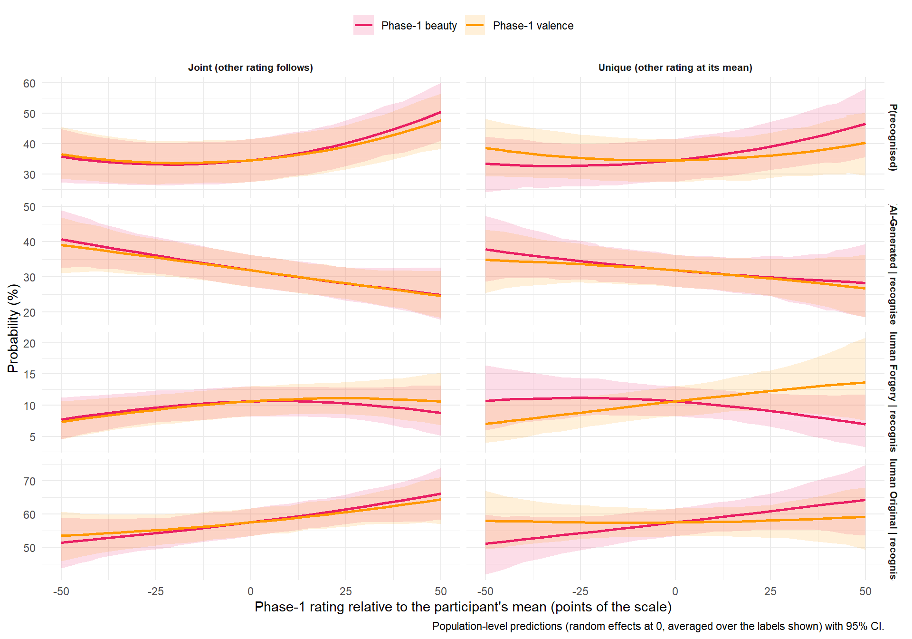

<!-- Estimates are computed on the cluster (`./hpc extract`, see server/estimates.R) and read from models/estimates/. -->

## Data Preparation


::: {.cell}

```{.r .cell-code  code-fold="false"}
library(tidyverse)
library(easystats)
library(patchwork)

df <- read.csv("../data/data_memory_task.csv") |>
  mutate(Condition = fct_relevel(Condition, "Human Original", "Human Forgery", "AI-Generated", "New Items"),
         AnswerCondition = fct_relevel(AnswerCondition, "Human Original", "Human Forgery", "AI-Generated", "Not recognized"),
         AnswerBelief = fct_relevel(AnswerBelief, "Human Original", "Human Forgery", "AI Original", "AI Copy", "Not recognized"),
         Belief = fct_relevel(Belief, "Human Original", "Human Forgery", "AI Original", "AI Copy", "None"))

dfsub <- read.csv("../data/data_participants.csv") |> 
  filter(Participant %in% df$Participant)

cols <- c(
  # Condition
  "Human Original" = "#F51D56",
  "Human Forgery" = "#F5A41D",
  "AI-Generated" = "#1D9AF5",
  "AI Original" = "#1D9AF5",
  "AI Copy" = "#4CAF50",
  "Not recognized" = "#607D8B",
  # Style
  "Abstract and Avant-garde" = "#E41A1C", 
  "Classical" = "#377EB8", 
  "Impressionist and Expressionist" = "#4DAF4A",
  "Romantic and Realism" = "#FF7F00"
)

source("server/estimates.R") # memory_info
source("report.R")           # make_asis(), make_tables(), make_markdown(), read_estimates()

estimates <- read_estimates(names(memory_info))
provenance_table(estimates)
```

::: {.cell-output-display}


Table: Provenance of the estimates read by this report.

|Model                 |Fit                       | Draws| Max_Rhat|Extracted        |
|:---------------------|:-------------------------|-----:|--------:|:----------------|
|MemoryCondition       |MemoryCondition.rds       |  4000|    1.131|2026-09-22 20:32 |
|MemoryBelief          |MemoryBelief.rds          |  4000|    1.043|2026-09-22 20:33 |
|MemoryConditionBelief |MemoryConditionBelief.rds |  4000|    1.031|2026-09-23 15:50 |


:::
:::


## How to read this report

Four Bayesian categorical mixed models of what participants remembered in the
follow-up session (220 participants × 96 items = 21,120 rows: 48 seen in Phase 1,
48 new).

| model | outcome | predictor | levels of the predictor |
| --- | --- | --- | --- |
| **Memory of Condition** | `AnswerCondition`: which label the participant recalls being shown | `Condition`: the label actually shown in Phase 1 | Human Original, Human Forgery, AI-Generated, **New Items** (never seen) |
| **Memory of Beliefs** | `AnswerBelief`: what the participant recalls believing the artwork was | `Belief`: what they actually reported believing in Phase 2 | Human Original, Human Forgery, AI Original, AI Copy, None |
| **Memory of the Condition by Belief** | `AnswerCondition` | `Condition` **+** `Belief` (additive; old items with a recorded belief only, 10,416 rows) | Belief: Human Original, Human Forgery, AI Original, AI Copy |
| **Memory by Phase-1 Appraisal** (MemoryAppraisal, its own section) | `AnswerCondition` | `Condition` + Phase-1 beauty and valence, each centred within participant, with quadratic terms (old items only, 10,560 rows) | continuous |

All outcomes include **Not recognized** (item judged "new"): correct for
`New Items`, forgetting for the seen levels. The third model asks whether the
recalled label is reconstructed from one's own Phase-2 belief: its `Belief`
means and contrasts are averaged over the label actually shown (computed over
the observed trials, see `memory_observed()` in `server/estimates.R`), so a
`Belief` effect is the effect of the belief with the label held constant.

Each section: figure of the probability of each answer per level, convergence,
marginal means, contrasts (coloured tables of interest + the complete set), and
an auto-generated summary. Every table has a folded Markdown twin; the Summary
section writes `data/results_memory_contrasts.csv` and
`data/results_memory_means.csv`.

Estimates are probabilities and contrasts (`Level1 - Level2`) differences of
probabilities, reported in percentage points as posterior medians with 95% CI
and probability of direction (`pd`). "Credible" = CI excludes 0 (no
multiplicity correction).

## Delay


::: {.cell}

```{.r .cell-code}
dfsub |> 
  ggplot(aes(x=Delay)) +
  geom_histogram(bins=30) +
  theme_minimal()
```

::: {.cell-output-display}
{width=672}
:::
:::


The mean and median days between the two experiments were 46.95 and 47.00, respectively.

## Memory of Condition

### Main Model


::: {.cell}

```{.r .cell-code}
# Dodging order of the answers in the figures
make_group <- function(resp, covariate = NULL) {
  group <- case_when(  
    resp == "Not recognized" ~ 0,
    resp == "Human Original" ~ 1,
    resp == "AI-Generated" ~ 2,
    resp == "AI Original" ~ 2,
    resp == "Human Forgery" ~ 3,
    resp == "AI Copy" ~ 4,
    .default = NA)
  
  if(!is.null(covariate)) {
    covariate <- insight::format_value(normalize(covariate), style_positive="plus")
    group <- paste0(group, covariate)
  }
  group
}

dat_cond1 <- estimates$MemoryCondition$means |>
  mutate(group = make_group(Response))

p_cond1 <- dat_cond1 |> 
  ggplot(aes(x=Condition,  y = Median, color = Response)) +
  geom_line(aes(group=group), position = position_dodge(width=0.1), linewidth = 1,
            show.legend = FALSE) +
  geom_pointrange(aes(group=group, ymin = CI_low, ymax = CI_high), position = position_dodge(width=0.1),
                  key_glyph = "point") +
  scale_y_continuous(label = scales::percent, limits = c(0,1), expand = c(0, 0)) +
  scale_color_manual(values = cols) +
  guides(color = guide_legend(override.aes = list(size = 3))) +
  labs(y="Proportion of answers", color = "Answer", x =  "Experimental Condition",
       title = "Memory of the Experimental Condition") +
  theme_minimal() 
p_cond1
```

::: {.cell-output-display}
{width=672}
:::
:::


::: {.cell}

```{.r .cell-code}
make_contrasts <- function(c, answer=NULL, condition=NULL, title="Marginal Contrasts") {

  if(!is.null(answer)) {
    c <- filter(c, str_detect(Response1, answer) & str_detect(Response2, answer))
  }
  if(!is.null(condition)) {
    c <- filter(c, str_detect(Level1, condition) & str_detect(Level2, condition))
  }

  # Collapse a constant Response/Level pair into one Category column
  if(length(unique(c$Response1)) == 1 & all(c$Response1 == c$Response2)) {
    c <- cbind(data.frame("Category" = c$Response1[1]), c)
    c$Response1 <- NULL
    c$Response2 <- NULL
  }
  if(length(unique(c$Level1)) == 1 & all(c$Level1 == c$Level2)) {
    c <- cbind(data.frame("Category" = c$Level1[1]), c)
    c$Level1 <- NULL
    c$Level2 <- NULL
  }

  c <- arrange(c, desc(abs(Median)))
  t <- format_table(c, zap_small = TRUE)

  t$effectsize <- as.numeric(c$Median)
  t$sig <- as.numeric(c$pd)

  g <- gt::gt(t) |>
    gt::data_color(columns = "effectsize", target_columns = "Median", method = "numeric",
palette = c("red", "red", "white", "green", "green"), domain = c(-0.7, 0.7)) |>
    gt::data_color(columns = "sig", target_columns = "pd", fn = \(x) {
      ifelse(x > 0.99, "#FFC107", ifelse(x > 0.97, "#FFEB3B", ifelse(x > 0.95, "#FFF59D", "white")))
    }) |>
    gt::cols_hide(c("effectsize", "sig")) |>
    gt::tab_header(title = title)

  # Markdown twin: colour coding replaced by an Effect column
  md <- t[setdiff(names(t), c("effectsize", "sig"))]
  md$Effect <- ifelse(sign(c$CI_low) != sign(c$CI_high), "n.s.",
                      ifelse(c$Median < 0, "Negative", "Positive"))
  make_asis(as.character(knitr::knit_print(g)), "", make_markdown(md, title), "")
}

# Convergence, marginal means and the complete contrast set
make_memory_tables <- function(est) {
  means_fmt <- as.data.frame(est$means)[c(est$by, "Response", "Median", "CI_low", "CI_high")]
  num <- vapply(means_fmt, is.numeric, logical(1))
  means_fmt[num] <- lapply(means_fmt[num], insight::format_value, zap_small = TRUE)

  all_con <- as.data.frame(est$contrasts)
  all_con$Effect <- ifelse(sign(all_con$CI_low) != sign(all_con$CI_high), "n.s.",
                           ifelse(all_con$Median < 0, "Negative", "Positive"))
  all_fmt <- all_con[c("Level1", "Response1", "Level2", "Response2", "Median", "CI_low", "CI_high", "pd", "Effect")]
  n <- vapply(all_fmt, is.numeric, logical(1))
  all_fmt[n] <- lapply(all_fmt[n], insight::format_value, zap_small = TRUE)

  make_asis(
    make_tables(est$diag,
                c("Model", "Family", "N_obs", "N_participants", "Chains", "Draws",
                  "Max_Rhat", "Min_ESS_ratio", "Divergent_pct", "Criterion"),
                sprintf("%s: convergence", est$label)),
    make_tables(means_fmt, names(means_fmt),
                sprintf("%s: probability of each answer per %s (marginal means)", est$label, est$by)),
    # Markdown only (120-300 rows)
    make_markdown(all_fmt, sprintf("%s: all %d contrasts", est$label, nrow(all_fmt)))
  )
}

# Generated summary of the credible same-answer contrasts
make_memory_summary <- function(est) {
  d <- as.data.frame(est$contrasts)
  d <- d[d$Response1 == d$Response2, ]
  d$Credible <- sign(d$CI_low) == sign(d$CI_high)
  pp <- function(x) insight::format_value(100 * x)
  out <- c(sprintf(
    "**%s.** Each row of the model is the probability of one answer. The differences below are between %s levels *within* the same answer, in percentage points, as posterior medians with 95%% CI; `pd` is the probability of direction. An effect is called credible when the CI excludes 0. Contrasts *across* answers are in the full table above.",
    est$label, est$by), "")
  for (r in unique(d$Response1)) {
    dr <- d[d$Response1 == r, ]
    cred <- dr[dr$Credible, ]
    if (nrow(cred) == 0) {
      out <- c(out, sprintf("- **%s**: no credible difference between any pair of %s levels.", r, est$by))
      next
    }
    cred <- cred[order(-abs(cred$Median)), ]
    out <- c(out, sprintf("- **%s**: %s.%s", r,
      paste(sprintf("%s - %s %s pp [%s, %s]", cred$Level1, cred$Level2,
                    pp(cred$Median), pp(cred$CI_low), pp(cred$CI_high)), collapse = "; "),
      if (nrow(cred) < nrow(dr)) sprintf(" The other %d pair(s) are not credible.", nrow(dr) - nrow(cred)) else ""))
  }
  make_asis("", '::: {.callout-tip title="Summary of credible effects (generated from the tables above)"}',
            "", out, "", ":::", "")
}
```
:::


::: {.cell}

```{.r .cell-code}
make_memory_tables(estimates$MemoryCondition)
```

::: {.cell-output-display}

```{=html}
<div id="abkzugpthv" style="padding-left:0px;padding-right:0px;padding-top:10px;padding-bottom:10px;overflow-x:auto;overflow-y:auto;width:auto;height:auto;">
<style>#abkzugpthv table {
  font-family: system-ui, 'Segoe UI', Roboto, Helvetica, Arial, sans-serif, 'Apple Color Emoji', 'Segoe UI Emoji', 'Segoe UI Symbol', 'Noto Color Emoji';
  -webkit-font-smoothing: antialiased;
  -moz-osx-font-smoothing: grayscale;
}

#abkzugpthv thead, #abkzugpthv tbody, #abkzugpthv tfoot, #abkzugpthv tr, #abkzugpthv td, #abkzugpthv th {
  border-style: none;
}

#abkzugpthv p {
  margin: 0;
  padding: 0;
}

#abkzugpthv .gt_table {
  display: table;
  border-collapse: collapse;
  line-height: normal;
  margin-left: auto;
  margin-right: auto;
  color: #333333;
  font-size: 13px;
  font-weight: normal;
  font-style: normal;
  background-color: #FFFFFF;
  width: auto;
  border-top-style: solid;
  border-top-width: 3px;
  border-top-color: #D5D5D5;
  border-right-style: solid;
  border-right-width: 3px;
  border-right-color: #D5D5D5;
  border-bottom-style: solid;
  border-bottom-width: 3px;
  border-bottom-color: #D5D5D5;
  border-left-style: solid;
  border-left-width: 3px;
  border-left-color: #D5D5D5;
}

#abkzugpthv .gt_caption {
  padding-top: 4px;
  padding-bottom: 4px;
}

#abkzugpthv .gt_title {
  color: #333333;
  font-size: 125%;
  font-weight: initial;
  padding-top: 4px;
  padding-bottom: 4px;
  padding-left: 5px;
  padding-right: 5px;
  border-bottom-color: #FFFFFF;
  border-bottom-width: 0;
}

#abkzugpthv .gt_subtitle {
  color: #333333;
  font-size: 85%;
  font-weight: initial;
  padding-top: 3px;
  padding-bottom: 5px;
  padding-left: 5px;
  padding-right: 5px;
  border-top-color: #FFFFFF;
  border-top-width: 0;
}

#abkzugpthv .gt_heading {
  background-color: #FFFFFF;
  text-align: left;
  border-bottom-color: #FFFFFF;
  border-left-style: none;
  border-left-width: 1px;
  border-left-color: #D3D3D3;
  border-right-style: none;
  border-right-width: 1px;
  border-right-color: #D3D3D3;
}

#abkzugpthv .gt_bottom_border {
  border-bottom-style: solid;
  border-bottom-width: 2px;
  border-bottom-color: #D5D5D5;
}

#abkzugpthv .gt_col_headings {
  border-top-style: solid;
  border-top-width: 2px;
  border-top-color: #D5D5D5;
  border-bottom-style: solid;
  border-bottom-width: 2px;
  border-bottom-color: #D5D5D5;
  border-left-style: none;
  border-left-width: 1px;
  border-left-color: #D3D3D3;
  border-right-style: none;
  border-right-width: 1px;
  border-right-color: #D3D3D3;
}

#abkzugpthv .gt_col_heading {
  color: #FFFFFF;
  background-color: #000000;
  font-size: 100%;
  font-weight: normal;
  text-transform: inherit;
  border-left-style: none;
  border-left-width: 1px;
  border-left-color: #D3D3D3;
  border-right-style: none;
  border-right-width: 1px;
  border-right-color: #D3D3D3;
  vertical-align: bottom;
  padding-top: 5px;
  padding-bottom: 6px;
  padding-left: 5px;
  padding-right: 5px;
  overflow-x: hidden;
}

#abkzugpthv .gt_column_spanner_outer {
  color: #FFFFFF;
  background-color: #000000;
  font-size: 100%;
  font-weight: normal;
  text-transform: inherit;
  padding-top: 0;
  padding-bottom: 0;
  padding-left: 4px;
  padding-right: 4px;
}

#abkzugpthv .gt_column_spanner_outer:first-child {
  padding-left: 0;
}

#abkzugpthv .gt_column_spanner_outer:last-child {
  padding-right: 0;
}

#abkzugpthv .gt_column_spanner {
  border-bottom-style: solid;
  border-bottom-width: 2px;
  border-bottom-color: #D5D5D5;
  vertical-align: bottom;
  padding-top: 5px;
  padding-bottom: 5px;
  overflow-x: hidden;
  display: inline-block;
  width: 100%;
}

#abkzugpthv .gt_spanner_row {
  border-bottom-style: hidden;
}

#abkzugpthv .gt_group_heading {
  padding-top: 8px;
  padding-bottom: 8px;
  padding-left: 5px;
  padding-right: 5px;
  color: #333333;
  background-color: #FFFFFF;
  font-size: 100%;
  font-weight: initial;
  text-transform: inherit;
  border-top-style: solid;
  border-top-width: 2px;
  border-top-color: #D5D5D5;
  border-bottom-style: solid;
  border-bottom-width: 2px;
  border-bottom-color: #D5D5D5;
  border-left-style: none;
  border-left-width: 1px;
  border-left-color: #D3D3D3;
  border-right-style: none;
  border-right-width: 1px;
  border-right-color: #D3D3D3;
  vertical-align: middle;
  text-align: left;
}

#abkzugpthv .gt_empty_group_heading {
  padding: 0.5px;
  color: #333333;
  background-color: #FFFFFF;
  font-size: 100%;
  font-weight: initial;
  border-top-style: solid;
  border-top-width: 2px;
  border-top-color: #D5D5D5;
  border-bottom-style: solid;
  border-bottom-width: 2px;
  border-bottom-color: #D5D5D5;
  vertical-align: middle;
}

#abkzugpthv .gt_from_md > :first-child {
  margin-top: 0;
}

#abkzugpthv .gt_from_md > :last-child {
  margin-bottom: 0;
}

#abkzugpthv .gt_row {
  padding-top: 8px;
  padding-bottom: 8px;
  padding-left: 5px;
  padding-right: 5px;
  margin: 10px;
  border-top-style: solid;
  border-top-width: 1px;
  border-top-color: #D5D5D5;
  border-left-style: solid;
  border-left-width: 1px;
  border-left-color: #D5D5D5;
  border-right-style: solid;
  border-right-width: 1px;
  border-right-color: #D5D5D5;
  vertical-align: middle;
  overflow-x: hidden;
}

#abkzugpthv .gt_stub {
  color: #333333;
  background-color: #FFFFFF;
  font-size: 100%;
  font-weight: initial;
  text-transform: inherit;
  border-right-style: solid;
  border-right-width: 2px;
  border-right-color: #5F5F5F;
  padding-left: 5px;
  padding-right: 5px;
}

#abkzugpthv .gt_stub_row_group {
  color: #333333;
  background-color: #FFFFFF;
  font-size: 100%;
  font-weight: initial;
  text-transform: inherit;
  border-right-style: solid;
  border-right-width: 2px;
  border-right-color: #D3D3D3;
  padding-left: 5px;
  padding-right: 5px;
  vertical-align: top;
}

#abkzugpthv .gt_row_group_first td {
  border-top-width: 2px;
}

#abkzugpthv .gt_row_group_first th {
  border-top-width: 2px;
}

#abkzugpthv .gt_summary_row {
  color: #333333;
  background-color: #D5D5D5;
  text-transform: inherit;
  padding-top: 8px;
  padding-bottom: 8px;
  padding-left: 5px;
  padding-right: 5px;
}

#abkzugpthv .gt_first_summary_row {
  border-top-style: solid;
  border-top-color: #D5D5D5;
}

#abkzugpthv .gt_first_summary_row.thick {
  border-top-width: 2px;
}

#abkzugpthv .gt_last_summary_row {
  padding-top: 8px;
  padding-bottom: 8px;
  padding-left: 5px;
  padding-right: 5px;
  border-bottom-style: solid;
  border-bottom-width: 2px;
  border-bottom-color: #D5D5D5;
}

#abkzugpthv .gt_grand_summary_row {
  color: #FFFFFF;
  background-color: #929292;
  text-transform: inherit;
  padding-top: 8px;
  padding-bottom: 8px;
  padding-left: 5px;
  padding-right: 5px;
}

#abkzugpthv .gt_first_grand_summary_row {
  padding-top: 8px;
  padding-bottom: 8px;
  padding-left: 5px;
  padding-right: 5px;
  border-top-style: double;
  border-top-width: 6px;
  border-top-color: #D5D5D5;
}

#abkzugpthv .gt_last_grand_summary_row_top {
  padding-top: 8px;
  padding-bottom: 8px;
  padding-left: 5px;
  padding-right: 5px;
  border-bottom-style: double;
  border-bottom-width: 6px;
  border-bottom-color: #D5D5D5;
}

#abkzugpthv .gt_striped {
  background-color: #F4F4F4;
}

#abkzugpthv .gt_table_body {
  border-top-style: solid;
  border-top-width: 2px;
  border-top-color: #D5D5D5;
  border-bottom-style: solid;
  border-bottom-width: 2px;
  border-bottom-color: #D5D5D5;
}

#abkzugpthv .gt_footnotes {
  color: #333333;
  background-color: #FFFFFF;
  border-bottom-style: none;
  border-bottom-width: 2px;
  border-bottom-color: #D3D3D3;
  border-left-style: none;
  border-left-width: 2px;
  border-left-color: #D3D3D3;
  border-right-style: none;
  border-right-width: 2px;
  border-right-color: #D3D3D3;
}

#abkzugpthv .gt_footnote {
  margin: 0px;
  font-size: 90%;
  padding-top: 4px;
  padding-bottom: 4px;
  padding-left: 5px;
  padding-right: 5px;
}

#abkzugpthv .gt_sourcenotes {
  color: #333333;
  background-color: #FFFFFF;
  border-bottom-style: none;
  border-bottom-width: 2px;
  border-bottom-color: #D3D3D3;
  border-left-style: none;
  border-left-width: 2px;
  border-left-color: #D3D3D3;
  border-right-style: none;
  border-right-width: 2px;
  border-right-color: #D3D3D3;
}

#abkzugpthv .gt_sourcenote {
  font-size: 90%;
  padding-top: 4px;
  padding-bottom: 4px;
  padding-left: 5px;
  padding-right: 5px;
}

#abkzugpthv .gt_left {
  text-align: left;
}

#abkzugpthv .gt_center {
  text-align: center;
}

#abkzugpthv .gt_right {
  text-align: right;
  font-variant-numeric: tabular-nums;
}

#abkzugpthv .gt_font_normal {
  font-weight: normal;
}

#abkzugpthv .gt_font_bold {
  font-weight: bold;
}

#abkzugpthv .gt_font_italic {
  font-style: italic;
}

#abkzugpthv .gt_super {
  font-size: 65%;
}

#abkzugpthv .gt_footnote_marks {
  font-size: 75%;
  vertical-align: 0.4em;
  position: initial;
}

#abkzugpthv .gt_asterisk {
  font-size: 100%;
  vertical-align: 0;
}

#abkzugpthv .gt_indent_1 {
  text-indent: 5px;
}

#abkzugpthv .gt_indent_2 {
  text-indent: 10px;
}

#abkzugpthv .gt_indent_3 {
  text-indent: 15px;
}

#abkzugpthv .gt_indent_4 {
  text-indent: 20px;
}

#abkzugpthv .gt_indent_5 {
  text-indent: 25px;
}

#abkzugpthv .katex-display {
  display: inline-flex !important;
  margin-bottom: 0.75em !important;
}

#abkzugpthv div.Reactable > div.rt-table > div.rt-thead > div.rt-tr.rt-tr-group-header > div.rt-th-group:after {
  height: 0px !important;
}
</style>
<table class="gt_table" data-quarto-disable-processing="false" data-quarto-bootstrap="false">
  <thead>
    <tr class="gt_heading">
      <td colspan="10" class="gt_heading gt_title gt_font_normal gt_bottom_border" style>Memory of the Experimental Condition: convergence</td>
    </tr>
    
    <tr class="gt_col_headings">
      <th class="gt_col_heading gt_columns_bottom_border gt_left" rowspan="1" colspan="1" scope="col" id="Model">Model</th>
      <th class="gt_col_heading gt_columns_bottom_border gt_left" rowspan="1" colspan="1" scope="col" id="Family">Family</th>
      <th class="gt_col_heading gt_columns_bottom_border gt_right" rowspan="1" colspan="1" scope="col" id="N_obs">N_obs</th>
      <th class="gt_col_heading gt_columns_bottom_border gt_right" rowspan="1" colspan="1" scope="col" id="N_participants">N_participants</th>
      <th class="gt_col_heading gt_columns_bottom_border gt_right" rowspan="1" colspan="1" scope="col" id="Chains">Chains</th>
      <th class="gt_col_heading gt_columns_bottom_border gt_right" rowspan="1" colspan="1" scope="col" id="Draws">Draws</th>
      <th class="gt_col_heading gt_columns_bottom_border gt_right" rowspan="1" colspan="1" scope="col" id="Max_Rhat">Max_Rhat</th>
      <th class="gt_col_heading gt_columns_bottom_border gt_right" rowspan="1" colspan="1" scope="col" id="Min_ESS_ratio">Min_ESS_ratio</th>
      <th class="gt_col_heading gt_columns_bottom_border gt_right" rowspan="1" colspan="1" scope="col" id="Divergent_pct">Divergent_pct</th>
      <th class="gt_col_heading gt_columns_bottom_border gt_left" rowspan="1" colspan="1" scope="col" id="Criterion">Criterion</th>
    </tr>
  </thead>
  <tbody class="gt_table_body">
    <tr><td headers="Model" class="gt_row gt_left">MemoryCondition</td>
<td headers="Family" class="gt_row gt_left">Categorical</td>
<td headers="N_obs" class="gt_row gt_right">21120</td>
<td headers="N_participants" class="gt_row gt_right">220</td>
<td headers="Chains" class="gt_row gt_right">8</td>
<td headers="Draws" class="gt_row gt_right">4000</td>
<td headers="Max_Rhat" class="gt_row gt_right">1.131</td>
<td headers="Min_ESS_ratio" class="gt_row gt_right">0.011</td>
<td headers="Divergent_pct" class="gt_row gt_right">1.45</td>
<td headers="Criterion" class="gt_row gt_left">loo</td></tr>
  </tbody>
  
</table>
</div>
```


::: {.callout-note collapse="true" title="Memory of the Experimental Condition: convergence (Markdown table, for text readers)"}

|Model           |Family      | N_obs| N_participants| Chains| Draws| Max_Rhat| Min_ESS_ratio| Divergent_pct|Criterion |
|:---------------|:-----------|-----:|--------------:|------:|-----:|--------:|-------------:|-------------:|:---------|
|MemoryCondition |Categorical | 21120|            220|      8|  4000|    1.131|         0.011|          1.45|loo       |

:::

```{=html}
<div id="vjbcyfpygf" style="padding-left:0px;padding-right:0px;padding-top:10px;padding-bottom:10px;overflow-x:auto;overflow-y:auto;width:auto;height:auto;">
<style>#vjbcyfpygf table {
  font-family: system-ui, 'Segoe UI', Roboto, Helvetica, Arial, sans-serif, 'Apple Color Emoji', 'Segoe UI Emoji', 'Segoe UI Symbol', 'Noto Color Emoji';
  -webkit-font-smoothing: antialiased;
  -moz-osx-font-smoothing: grayscale;
}

#vjbcyfpygf thead, #vjbcyfpygf tbody, #vjbcyfpygf tfoot, #vjbcyfpygf tr, #vjbcyfpygf td, #vjbcyfpygf th {
  border-style: none;
}

#vjbcyfpygf p {
  margin: 0;
  padding: 0;
}

#vjbcyfpygf .gt_table {
  display: table;
  border-collapse: collapse;
  line-height: normal;
  margin-left: auto;
  margin-right: auto;
  color: #333333;
  font-size: 13px;
  font-weight: normal;
  font-style: normal;
  background-color: #FFFFFF;
  width: auto;
  border-top-style: solid;
  border-top-width: 3px;
  border-top-color: #D5D5D5;
  border-right-style: solid;
  border-right-width: 3px;
  border-right-color: #D5D5D5;
  border-bottom-style: solid;
  border-bottom-width: 3px;
  border-bottom-color: #D5D5D5;
  border-left-style: solid;
  border-left-width: 3px;
  border-left-color: #D5D5D5;
}

#vjbcyfpygf .gt_caption {
  padding-top: 4px;
  padding-bottom: 4px;
}

#vjbcyfpygf .gt_title {
  color: #333333;
  font-size: 125%;
  font-weight: initial;
  padding-top: 4px;
  padding-bottom: 4px;
  padding-left: 5px;
  padding-right: 5px;
  border-bottom-color: #FFFFFF;
  border-bottom-width: 0;
}

#vjbcyfpygf .gt_subtitle {
  color: #333333;
  font-size: 85%;
  font-weight: initial;
  padding-top: 3px;
  padding-bottom: 5px;
  padding-left: 5px;
  padding-right: 5px;
  border-top-color: #FFFFFF;
  border-top-width: 0;
}

#vjbcyfpygf .gt_heading {
  background-color: #FFFFFF;
  text-align: left;
  border-bottom-color: #FFFFFF;
  border-left-style: none;
  border-left-width: 1px;
  border-left-color: #D3D3D3;
  border-right-style: none;
  border-right-width: 1px;
  border-right-color: #D3D3D3;
}

#vjbcyfpygf .gt_bottom_border {
  border-bottom-style: solid;
  border-bottom-width: 2px;
  border-bottom-color: #D5D5D5;
}

#vjbcyfpygf .gt_col_headings {
  border-top-style: solid;
  border-top-width: 2px;
  border-top-color: #D5D5D5;
  border-bottom-style: solid;
  border-bottom-width: 2px;
  border-bottom-color: #D5D5D5;
  border-left-style: none;
  border-left-width: 1px;
  border-left-color: #D3D3D3;
  border-right-style: none;
  border-right-width: 1px;
  border-right-color: #D3D3D3;
}

#vjbcyfpygf .gt_col_heading {
  color: #FFFFFF;
  background-color: #000000;
  font-size: 100%;
  font-weight: normal;
  text-transform: inherit;
  border-left-style: none;
  border-left-width: 1px;
  border-left-color: #D3D3D3;
  border-right-style: none;
  border-right-width: 1px;
  border-right-color: #D3D3D3;
  vertical-align: bottom;
  padding-top: 5px;
  padding-bottom: 6px;
  padding-left: 5px;
  padding-right: 5px;
  overflow-x: hidden;
}

#vjbcyfpygf .gt_column_spanner_outer {
  color: #FFFFFF;
  background-color: #000000;
  font-size: 100%;
  font-weight: normal;
  text-transform: inherit;
  padding-top: 0;
  padding-bottom: 0;
  padding-left: 4px;
  padding-right: 4px;
}

#vjbcyfpygf .gt_column_spanner_outer:first-child {
  padding-left: 0;
}

#vjbcyfpygf .gt_column_spanner_outer:last-child {
  padding-right: 0;
}

#vjbcyfpygf .gt_column_spanner {
  border-bottom-style: solid;
  border-bottom-width: 2px;
  border-bottom-color: #D5D5D5;
  vertical-align: bottom;
  padding-top: 5px;
  padding-bottom: 5px;
  overflow-x: hidden;
  display: inline-block;
  width: 100%;
}

#vjbcyfpygf .gt_spanner_row {
  border-bottom-style: hidden;
}

#vjbcyfpygf .gt_group_heading {
  padding-top: 8px;
  padding-bottom: 8px;
  padding-left: 5px;
  padding-right: 5px;
  color: #333333;
  background-color: #FFFFFF;
  font-size: 100%;
  font-weight: initial;
  text-transform: inherit;
  border-top-style: solid;
  border-top-width: 2px;
  border-top-color: #D5D5D5;
  border-bottom-style: solid;
  border-bottom-width: 2px;
  border-bottom-color: #D5D5D5;
  border-left-style: none;
  border-left-width: 1px;
  border-left-color: #D3D3D3;
  border-right-style: none;
  border-right-width: 1px;
  border-right-color: #D3D3D3;
  vertical-align: middle;
  text-align: left;
}

#vjbcyfpygf .gt_empty_group_heading {
  padding: 0.5px;
  color: #333333;
  background-color: #FFFFFF;
  font-size: 100%;
  font-weight: initial;
  border-top-style: solid;
  border-top-width: 2px;
  border-top-color: #D5D5D5;
  border-bottom-style: solid;
  border-bottom-width: 2px;
  border-bottom-color: #D5D5D5;
  vertical-align: middle;
}

#vjbcyfpygf .gt_from_md > :first-child {
  margin-top: 0;
}

#vjbcyfpygf .gt_from_md > :last-child {
  margin-bottom: 0;
}

#vjbcyfpygf .gt_row {
  padding-top: 8px;
  padding-bottom: 8px;
  padding-left: 5px;
  padding-right: 5px;
  margin: 10px;
  border-top-style: solid;
  border-top-width: 1px;
  border-top-color: #D5D5D5;
  border-left-style: solid;
  border-left-width: 1px;
  border-left-color: #D5D5D5;
  border-right-style: solid;
  border-right-width: 1px;
  border-right-color: #D5D5D5;
  vertical-align: middle;
  overflow-x: hidden;
}

#vjbcyfpygf .gt_stub {
  color: #333333;
  background-color: #FFFFFF;
  font-size: 100%;
  font-weight: initial;
  text-transform: inherit;
  border-right-style: solid;
  border-right-width: 2px;
  border-right-color: #5F5F5F;
  padding-left: 5px;
  padding-right: 5px;
}

#vjbcyfpygf .gt_stub_row_group {
  color: #333333;
  background-color: #FFFFFF;
  font-size: 100%;
  font-weight: initial;
  text-transform: inherit;
  border-right-style: solid;
  border-right-width: 2px;
  border-right-color: #D3D3D3;
  padding-left: 5px;
  padding-right: 5px;
  vertical-align: top;
}

#vjbcyfpygf .gt_row_group_first td {
  border-top-width: 2px;
}

#vjbcyfpygf .gt_row_group_first th {
  border-top-width: 2px;
}

#vjbcyfpygf .gt_summary_row {
  color: #333333;
  background-color: #D5D5D5;
  text-transform: inherit;
  padding-top: 8px;
  padding-bottom: 8px;
  padding-left: 5px;
  padding-right: 5px;
}

#vjbcyfpygf .gt_first_summary_row {
  border-top-style: solid;
  border-top-color: #D5D5D5;
}

#vjbcyfpygf .gt_first_summary_row.thick {
  border-top-width: 2px;
}

#vjbcyfpygf .gt_last_summary_row {
  padding-top: 8px;
  padding-bottom: 8px;
  padding-left: 5px;
  padding-right: 5px;
  border-bottom-style: solid;
  border-bottom-width: 2px;
  border-bottom-color: #D5D5D5;
}

#vjbcyfpygf .gt_grand_summary_row {
  color: #FFFFFF;
  background-color: #929292;
  text-transform: inherit;
  padding-top: 8px;
  padding-bottom: 8px;
  padding-left: 5px;
  padding-right: 5px;
}

#vjbcyfpygf .gt_first_grand_summary_row {
  padding-top: 8px;
  padding-bottom: 8px;
  padding-left: 5px;
  padding-right: 5px;
  border-top-style: double;
  border-top-width: 6px;
  border-top-color: #D5D5D5;
}

#vjbcyfpygf .gt_last_grand_summary_row_top {
  padding-top: 8px;
  padding-bottom: 8px;
  padding-left: 5px;
  padding-right: 5px;
  border-bottom-style: double;
  border-bottom-width: 6px;
  border-bottom-color: #D5D5D5;
}

#vjbcyfpygf .gt_striped {
  background-color: #F4F4F4;
}

#vjbcyfpygf .gt_table_body {
  border-top-style: solid;
  border-top-width: 2px;
  border-top-color: #D5D5D5;
  border-bottom-style: solid;
  border-bottom-width: 2px;
  border-bottom-color: #D5D5D5;
}

#vjbcyfpygf .gt_footnotes {
  color: #333333;
  background-color: #FFFFFF;
  border-bottom-style: none;
  border-bottom-width: 2px;
  border-bottom-color: #D3D3D3;
  border-left-style: none;
  border-left-width: 2px;
  border-left-color: #D3D3D3;
  border-right-style: none;
  border-right-width: 2px;
  border-right-color: #D3D3D3;
}

#vjbcyfpygf .gt_footnote {
  margin: 0px;
  font-size: 90%;
  padding-top: 4px;
  padding-bottom: 4px;
  padding-left: 5px;
  padding-right: 5px;
}

#vjbcyfpygf .gt_sourcenotes {
  color: #333333;
  background-color: #FFFFFF;
  border-bottom-style: none;
  border-bottom-width: 2px;
  border-bottom-color: #D3D3D3;
  border-left-style: none;
  border-left-width: 2px;
  border-left-color: #D3D3D3;
  border-right-style: none;
  border-right-width: 2px;
  border-right-color: #D3D3D3;
}

#vjbcyfpygf .gt_sourcenote {
  font-size: 90%;
  padding-top: 4px;
  padding-bottom: 4px;
  padding-left: 5px;
  padding-right: 5px;
}

#vjbcyfpygf .gt_left {
  text-align: left;
}

#vjbcyfpygf .gt_center {
  text-align: center;
}

#vjbcyfpygf .gt_right {
  text-align: right;
  font-variant-numeric: tabular-nums;
}

#vjbcyfpygf .gt_font_normal {
  font-weight: normal;
}

#vjbcyfpygf .gt_font_bold {
  font-weight: bold;
}

#vjbcyfpygf .gt_font_italic {
  font-style: italic;
}

#vjbcyfpygf .gt_super {
  font-size: 65%;
}

#vjbcyfpygf .gt_footnote_marks {
  font-size: 75%;
  vertical-align: 0.4em;
  position: initial;
}

#vjbcyfpygf .gt_asterisk {
  font-size: 100%;
  vertical-align: 0;
}

#vjbcyfpygf .gt_indent_1 {
  text-indent: 5px;
}

#vjbcyfpygf .gt_indent_2 {
  text-indent: 10px;
}

#vjbcyfpygf .gt_indent_3 {
  text-indent: 15px;
}

#vjbcyfpygf .gt_indent_4 {
  text-indent: 20px;
}

#vjbcyfpygf .gt_indent_5 {
  text-indent: 25px;
}

#vjbcyfpygf .katex-display {
  display: inline-flex !important;
  margin-bottom: 0.75em !important;
}

#vjbcyfpygf div.Reactable > div.rt-table > div.rt-thead > div.rt-tr.rt-tr-group-header > div.rt-th-group:after {
  height: 0px !important;
}
</style>
<table class="gt_table" data-quarto-disable-processing="false" data-quarto-bootstrap="false">
  <thead>
    <tr class="gt_heading">
      <td colspan="5" class="gt_heading gt_title gt_font_normal gt_bottom_border" style>Memory of the Experimental Condition: probability of each answer per Condition (marginal means)</td>
    </tr>
    
    <tr class="gt_col_headings">
      <th class="gt_col_heading gt_columns_bottom_border gt_center" rowspan="1" colspan="1" scope="col" id="Condition">Condition</th>
      <th class="gt_col_heading gt_columns_bottom_border gt_center" rowspan="1" colspan="1" scope="col" id="Response">Response</th>
      <th class="gt_col_heading gt_columns_bottom_border gt_right" rowspan="1" colspan="1" scope="col" id="Median">Median</th>
      <th class="gt_col_heading gt_columns_bottom_border gt_right" rowspan="1" colspan="1" scope="col" id="CI_low">CI_low</th>
      <th class="gt_col_heading gt_columns_bottom_border gt_right" rowspan="1" colspan="1" scope="col" id="CI_high">CI_high</th>
    </tr>
  </thead>
  <tbody class="gt_table_body">
    <tr><td headers="Condition" class="gt_row gt_center">Human Original</td>
<td headers="Response" class="gt_row gt_center">Human Original</td>
<td headers="Median" class="gt_row gt_right">0.23</td>
<td headers="CI_low" class="gt_row gt_right">0.21</td>
<td headers="CI_high" class="gt_row gt_right">0.25</td></tr>
    <tr><td headers="Condition" class="gt_row gt_center gt_striped">Human Forgery</td>
<td headers="Response" class="gt_row gt_center gt_striped">Human Original</td>
<td headers="Median" class="gt_row gt_right gt_striped">0.22</td>
<td headers="CI_low" class="gt_row gt_right gt_striped">0.20</td>
<td headers="CI_high" class="gt_row gt_right gt_striped">0.24</td></tr>
    <tr><td headers="Condition" class="gt_row gt_center">AI-Generated</td>
<td headers="Response" class="gt_row gt_center">Human Original</td>
<td headers="Median" class="gt_row gt_right">0.21</td>
<td headers="CI_low" class="gt_row gt_right">0.19</td>
<td headers="CI_high" class="gt_row gt_right">0.24</td></tr>
    <tr><td headers="Condition" class="gt_row gt_center gt_striped">New Items</td>
<td headers="Response" class="gt_row gt_center gt_striped">Human Original</td>
<td headers="Median" class="gt_row gt_right gt_striped">0.06</td>
<td headers="CI_low" class="gt_row gt_right gt_striped">0.05</td>
<td headers="CI_high" class="gt_row gt_right gt_striped">0.07</td></tr>
    <tr><td headers="Condition" class="gt_row gt_center">Human Original</td>
<td headers="Response" class="gt_row gt_center">Human Forgery</td>
<td headers="Median" class="gt_row gt_right">0.06</td>
<td headers="CI_low" class="gt_row gt_right">0.06</td>
<td headers="CI_high" class="gt_row gt_right">0.07</td></tr>
    <tr><td headers="Condition" class="gt_row gt_center gt_striped">Human Forgery</td>
<td headers="Response" class="gt_row gt_center gt_striped">Human Forgery</td>
<td headers="Median" class="gt_row gt_right gt_striped">0.07</td>
<td headers="CI_low" class="gt_row gt_right gt_striped">0.06</td>
<td headers="CI_high" class="gt_row gt_right gt_striped">0.08</td></tr>
    <tr><td headers="Condition" class="gt_row gt_center">AI-Generated</td>
<td headers="Response" class="gt_row gt_center">Human Forgery</td>
<td headers="Median" class="gt_row gt_right">0.07</td>
<td headers="CI_low" class="gt_row gt_right">0.06</td>
<td headers="CI_high" class="gt_row gt_right">0.07</td></tr>
    <tr><td headers="Condition" class="gt_row gt_center gt_striped">New Items</td>
<td headers="Response" class="gt_row gt_center gt_striped">Human Forgery</td>
<td headers="Median" class="gt_row gt_right gt_striped">0.02</td>
<td headers="CI_low" class="gt_row gt_right gt_striped">0.01</td>
<td headers="CI_high" class="gt_row gt_right gt_striped">0.02</td></tr>
    <tr><td headers="Condition" class="gt_row gt_center">Human Original</td>
<td headers="Response" class="gt_row gt_center">AI-Generated</td>
<td headers="Median" class="gt_row gt_right">0.15</td>
<td headers="CI_low" class="gt_row gt_right">0.13</td>
<td headers="CI_high" class="gt_row gt_right">0.17</td></tr>
    <tr><td headers="Condition" class="gt_row gt_center gt_striped">Human Forgery</td>
<td headers="Response" class="gt_row gt_center gt_striped">AI-Generated</td>
<td headers="Median" class="gt_row gt_right gt_striped">0.14</td>
<td headers="CI_low" class="gt_row gt_right gt_striped">0.12</td>
<td headers="CI_high" class="gt_row gt_right gt_striped">0.16</td></tr>
    <tr><td headers="Condition" class="gt_row gt_center">AI-Generated</td>
<td headers="Response" class="gt_row gt_center">AI-Generated</td>
<td headers="Median" class="gt_row gt_right">0.15</td>
<td headers="CI_low" class="gt_row gt_right">0.13</td>
<td headers="CI_high" class="gt_row gt_right">0.17</td></tr>
    <tr><td headers="Condition" class="gt_row gt_center gt_striped">New Items</td>
<td headers="Response" class="gt_row gt_center gt_striped">AI-Generated</td>
<td headers="Median" class="gt_row gt_right gt_striped">0.04</td>
<td headers="CI_low" class="gt_row gt_right gt_striped">0.03</td>
<td headers="CI_high" class="gt_row gt_right gt_striped">0.04</td></tr>
    <tr><td headers="Condition" class="gt_row gt_center">Human Original</td>
<td headers="Response" class="gt_row gt_center">Not recognized</td>
<td headers="Median" class="gt_row gt_right">0.56</td>
<td headers="CI_low" class="gt_row gt_right">0.53</td>
<td headers="CI_high" class="gt_row gt_right">0.59</td></tr>
    <tr><td headers="Condition" class="gt_row gt_center gt_striped">Human Forgery</td>
<td headers="Response" class="gt_row gt_center gt_striped">Not recognized</td>
<td headers="Median" class="gt_row gt_right gt_striped">0.57</td>
<td headers="CI_low" class="gt_row gt_right gt_striped">0.54</td>
<td headers="CI_high" class="gt_row gt_right gt_striped">0.61</td></tr>
    <tr><td headers="Condition" class="gt_row gt_center">AI-Generated</td>
<td headers="Response" class="gt_row gt_center">Not recognized</td>
<td headers="Median" class="gt_row gt_right">0.57</td>
<td headers="CI_low" class="gt_row gt_right">0.54</td>
<td headers="CI_high" class="gt_row gt_right">0.61</td></tr>
    <tr><td headers="Condition" class="gt_row gt_center gt_striped">New Items</td>
<td headers="Response" class="gt_row gt_center gt_striped">Not recognized</td>
<td headers="Median" class="gt_row gt_right gt_striped">0.89</td>
<td headers="CI_low" class="gt_row gt_right gt_striped">0.87</td>
<td headers="CI_high" class="gt_row gt_right gt_striped">0.90</td></tr>
  </tbody>
  
</table>
</div>
```


::: {.callout-note collapse="true" title="Memory of the Experimental Condition: probability of each answer per Condition (marginal means) (Markdown table, for text readers)"}

|Condition      |Response       |Median |CI_low |CI_high |
|:--------------|:--------------|:------|:------|:-------|
|Human Original |Human Original |0.23   |0.21   |0.25    |
|Human Forgery  |Human Original |0.22   |0.20   |0.24    |
|AI-Generated   |Human Original |0.21   |0.19   |0.24    |
|New Items      |Human Original |0.06   |0.05   |0.07    |
|Human Original |Human Forgery  |0.06   |0.06   |0.07    |
|Human Forgery  |Human Forgery  |0.07   |0.06   |0.08    |
|AI-Generated   |Human Forgery  |0.07   |0.06   |0.07    |
|New Items      |Human Forgery  |0.02   |0.01   |0.02    |
|Human Original |AI-Generated   |0.15   |0.13   |0.17    |
|Human Forgery  |AI-Generated   |0.14   |0.12   |0.16    |
|AI-Generated   |AI-Generated   |0.15   |0.13   |0.17    |
|New Items      |AI-Generated   |0.04   |0.03   |0.04    |
|Human Original |Not recognized |0.56   |0.53   |0.59    |
|Human Forgery  |Not recognized |0.57   |0.54   |0.61    |
|AI-Generated   |Not recognized |0.57   |0.54   |0.61    |
|New Items      |Not recognized |0.89   |0.87   |0.90    |

:::

::: {.callout-note collapse="true" title="Memory of the Experimental Condition: all 120 contrasts (Markdown table, for text readers)"}

|Level1         |Response1      |Level2         |Response2      |Median |CI_low |CI_high |pd   |Effect   |
|:--------------|:--------------|:--------------|:--------------|:------|:------|:-------|:----|:--------|
|Human Forgery  |Human Original |Human Original |Human Original |-0.01  |-0.03  |0.01    |0.82 |n.s.     |
|AI-Generated   |Human Original |Human Original |Human Original |-0.01  |-0.03  |0.01    |0.91 |n.s.     |
|New Items      |Human Original |Human Original |Human Original |-0.17  |-0.19  |-0.14   |1.00 |Negative |
|Human Original |Human Forgery  |Human Original |Human Original |-0.16  |-0.19  |-0.14   |1.00 |Negative |
|Human Forgery  |Human Forgery  |Human Original |Human Original |-0.16  |-0.18  |-0.14   |1.00 |Negative |
|AI-Generated   |Human Forgery  |Human Original |Human Original |-0.16  |-0.18  |-0.14   |1.00 |Negative |
|New Items      |Human Forgery  |Human Original |Human Original |-0.21  |-0.23  |-0.19   |1.00 |Negative |
|Human Original |AI-Generated   |Human Original |Human Original |-0.08  |-0.10  |-0.05   |1.00 |Negative |
|Human Forgery  |AI-Generated   |Human Original |Human Original |-0.09  |-0.11  |-0.06   |1.00 |Negative |
|AI-Generated   |AI-Generated   |Human Original |Human Original |-0.08  |-0.11  |-0.06   |1.00 |Negative |
|New Items      |AI-Generated   |Human Original |Human Original |-0.19  |-0.21  |-0.17   |1.00 |Negative |
|Human Original |Not recognized |Human Original |Human Original |0.33   |0.28   |0.39    |1.00 |Positive |
|Human Forgery  |Not recognized |Human Original |Human Original |0.35   |0.30   |0.40    |1.00 |Positive |
|AI-Generated   |Not recognized |Human Original |Human Original |0.35   |0.30   |0.40    |1.00 |Positive |
|New Items      |Not recognized |Human Original |Human Original |0.66   |0.64   |0.68    |1.00 |Positive |
|AI-Generated   |Human Original |Human Forgery  |Human Original |0.00   |-0.02  |0.01    |0.69 |n.s.     |
|New Items      |Human Original |Human Forgery  |Human Original |-0.16  |-0.18  |-0.13   |1.00 |Negative |
|Human Original |Human Forgery  |Human Forgery  |Human Original |-0.16  |-0.18  |-0.14   |1.00 |Negative |
|Human Forgery  |Human Forgery  |Human Forgery  |Human Original |-0.15  |-0.17  |-0.13   |1.00 |Negative |
|AI-Generated   |Human Forgery  |Human Forgery  |Human Original |-0.15  |-0.17  |-0.13   |1.00 |Negative |
|New Items      |Human Forgery  |Human Forgery  |Human Original |-0.20  |-0.22  |-0.18   |1.00 |Negative |
|Human Original |AI-Generated   |Human Forgery  |Human Original |-0.07  |-0.09  |-0.05   |1.00 |Negative |
|Human Forgery  |AI-Generated   |Human Forgery  |Human Original |-0.08  |-0.10  |-0.05   |1.00 |Negative |
|AI-Generated   |AI-Generated   |Human Forgery  |Human Original |-0.07  |-0.10  |-0.05   |1.00 |Negative |
|New Items      |AI-Generated   |Human Forgery  |Human Original |-0.18  |-0.21  |-0.16   |1.00 |Negative |
|Human Original |Not recognized |Human Forgery  |Human Original |0.34   |0.29   |0.39    |1.00 |Positive |
|Human Forgery  |Not recognized |Human Forgery  |Human Original |0.36   |0.30   |0.41    |1.00 |Positive |
|AI-Generated   |Not recognized |Human Forgery  |Human Original |0.36   |0.31   |0.40    |1.00 |Positive |
|New Items      |Not recognized |Human Forgery  |Human Original |0.67   |0.65   |0.68    |1.00 |Positive |
|New Items      |Human Original |AI-Generated   |Human Original |-0.15  |-0.18  |-0.13   |1.00 |Negative |
|Human Original |Human Forgery  |AI-Generated   |Human Original |-0.15  |-0.17  |-0.13   |1.00 |Negative |
|Human Forgery  |Human Forgery  |AI-Generated   |Human Original |-0.15  |-0.17  |-0.13   |1.00 |Negative |
|AI-Generated   |Human Forgery  |AI-Generated   |Human Original |-0.15  |-0.17  |-0.13   |1.00 |Negative |
|New Items      |Human Forgery  |AI-Generated   |Human Original |-0.20  |-0.22  |-0.18   |1.00 |Negative |
|Human Original |AI-Generated   |AI-Generated   |Human Original |-0.07  |-0.09  |-0.04   |1.00 |Negative |
|Human Forgery  |AI-Generated   |AI-Generated   |Human Original |-0.07  |-0.10  |-0.05   |1.00 |Negative |
|AI-Generated   |AI-Generated   |AI-Generated   |Human Original |-0.07  |-0.09  |-0.04   |1.00 |Negative |
|New Items      |AI-Generated   |AI-Generated   |Human Original |-0.18  |-0.20  |-0.15   |1.00 |Negative |
|Human Original |Not recognized |AI-Generated   |Human Original |0.35   |0.30   |0.39    |1.00 |Positive |
|Human Forgery  |Not recognized |AI-Generated   |Human Original |0.36   |0.31   |0.41    |1.00 |Positive |
|AI-Generated   |Not recognized |AI-Generated   |Human Original |0.36   |0.31   |0.41    |1.00 |Positive |
|New Items      |Not recognized |AI-Generated   |Human Original |0.67   |0.65   |0.69    |1.00 |Positive |
|Human Original |Human Forgery  |New Items      |Human Original |0.00   |-0.01  |0.02    |0.67 |n.s.     |
|Human Forgery  |Human Forgery  |New Items      |Human Original |0.01   |-0.01  |0.02    |0.82 |n.s.     |
|AI-Generated   |Human Forgery  |New Items      |Human Original |0.00   |-0.01  |0.02    |0.75 |n.s.     |
|New Items      |Human Forgery  |New Items      |Human Original |-0.04  |-0.05  |-0.04   |1.00 |Negative |
|Human Original |AI-Generated   |New Items      |Human Original |0.09   |0.06   |0.11    |1.00 |Positive |
|Human Forgery  |AI-Generated   |New Items      |Human Original |0.08   |0.06   |0.10    |1.00 |Positive |
|AI-Generated   |AI-Generated   |New Items      |Human Original |0.09   |0.06   |0.11    |1.00 |Positive |
|New Items      |AI-Generated   |New Items      |Human Original |-0.02  |-0.03  |-0.02   |1.00 |Negative |
|Human Original |Not recognized |New Items      |Human Original |0.50   |0.47   |0.53    |1.00 |Positive |
|Human Forgery  |Not recognized |New Items      |Human Original |0.51   |0.48   |0.54    |1.00 |Positive |
|AI-Generated   |Not recognized |New Items      |Human Original |0.51   |0.48   |0.54    |1.00 |Positive |
|New Items      |Not recognized |New Items      |Human Original |0.83   |0.80   |0.85    |1.00 |Positive |
|Human Forgery  |Human Forgery  |Human Original |Human Forgery  |0.00   |-0.01  |0.02    |0.73 |n.s.     |
|AI-Generated   |Human Forgery  |Human Original |Human Forgery  |0.00   |-0.01  |0.01    |0.63 |n.s.     |
|New Items      |Human Forgery  |Human Original |Human Forgery  |-0.05  |-0.06  |-0.04   |1.00 |Negative |
|Human Original |AI-Generated   |Human Original |Human Forgery  |0.08   |0.07   |0.11    |1.00 |Positive |
|Human Forgery  |AI-Generated   |Human Original |Human Forgery  |0.08   |0.06   |0.10    |1.00 |Positive |
|AI-Generated   |AI-Generated   |Human Original |Human Forgery  |0.08   |0.06   |0.10    |1.00 |Positive |
|New Items      |AI-Generated   |Human Original |Human Forgery  |-0.03  |-0.04  |-0.01   |1.00 |Negative |
|Human Original |Not recognized |Human Original |Human Forgery  |0.50   |0.46   |0.54    |1.00 |Positive |
|Human Forgery  |Not recognized |Human Original |Human Forgery  |0.51   |0.47   |0.55    |1.00 |Positive |
|AI-Generated   |Not recognized |Human Original |Human Forgery  |0.51   |0.47   |0.55    |1.00 |Positive |
|New Items      |Not recognized |Human Original |Human Forgery  |0.82   |0.81   |0.84    |1.00 |Positive |
|AI-Generated   |Human Forgery  |Human Forgery  |Human Forgery  |0.00   |-0.01  |0.01    |0.61 |n.s.     |
|New Items      |Human Forgery  |Human Forgery  |Human Forgery  |-0.05  |-0.06  |-0.04   |1.00 |Negative |
|Human Original |AI-Generated   |Human Forgery  |Human Forgery  |0.08   |0.06   |0.10    |1.00 |Positive |
|Human Forgery  |AI-Generated   |Human Forgery  |Human Forgery  |0.07   |0.05   |0.09    |1.00 |Positive |
|AI-Generated   |AI-Generated   |Human Forgery  |Human Forgery  |0.08   |0.06   |0.10    |1.00 |Positive |
|New Items      |AI-Generated   |Human Forgery  |Human Forgery  |-0.03  |-0.04  |-0.02   |1.00 |Negative |
|Human Original |Not recognized |Human Forgery  |Human Forgery  |0.49   |0.46   |0.53    |1.00 |Positive |
|Human Forgery  |Not recognized |Human Forgery  |Human Forgery  |0.51   |0.47   |0.55    |1.00 |Positive |
|AI-Generated   |Not recognized |Human Forgery  |Human Forgery  |0.51   |0.47   |0.55    |1.00 |Positive |
|New Items      |Not recognized |Human Forgery  |Human Forgery  |0.82   |0.80   |0.83    |1.00 |Positive |
|New Items      |Human Forgery  |AI-Generated   |Human Forgery  |-0.05  |-0.06  |-0.04   |1.00 |Negative |
|Human Original |AI-Generated   |AI-Generated   |Human Forgery  |0.08   |0.06   |0.10    |1.00 |Positive |
|Human Forgery  |AI-Generated   |AI-Generated   |Human Forgery  |0.07   |0.06   |0.09    |1.00 |Positive |
|AI-Generated   |AI-Generated   |AI-Generated   |Human Forgery  |0.08   |0.06   |0.10    |1.00 |Positive |
|New Items      |AI-Generated   |AI-Generated   |Human Forgery  |-0.03  |-0.04  |-0.02   |1.00 |Negative |
|Human Original |Not recognized |AI-Generated   |Human Forgery  |0.50   |0.46   |0.53    |1.00 |Positive |
|Human Forgery  |Not recognized |AI-Generated   |Human Forgery  |0.51   |0.47   |0.55    |1.00 |Positive |
|AI-Generated   |Not recognized |AI-Generated   |Human Forgery  |0.51   |0.47   |0.55    |1.00 |Positive |
|New Items      |Not recognized |AI-Generated   |Human Forgery  |0.82   |0.81   |0.83    |1.00 |Positive |
|Human Original |AI-Generated   |New Items      |Human Forgery  |0.13   |0.11   |0.15    |1.00 |Positive |
|Human Forgery  |AI-Generated   |New Items      |Human Forgery  |0.12   |0.10   |0.14    |1.00 |Positive |
|AI-Generated   |AI-Generated   |New Items      |Human Forgery  |0.13   |0.11   |0.15    |1.00 |Positive |
|New Items      |AI-Generated   |New Items      |Human Forgery  |0.02   |0.01   |0.03    |1.00 |Positive |
|Human Original |Not recognized |New Items      |Human Forgery  |0.54   |0.51   |0.58    |1.00 |Positive |
|Human Forgery  |Not recognized |New Items      |Human Forgery  |0.56   |0.53   |0.59    |1.00 |Positive |
|AI-Generated   |Not recognized |New Items      |Human Forgery  |0.56   |0.52   |0.59    |1.00 |Positive |
|New Items      |Not recognized |New Items      |Human Forgery  |0.87   |0.85   |0.88    |1.00 |Positive |
|Human Forgery  |AI-Generated   |Human Original |AI-Generated   |-0.01  |-0.02  |0.01    |0.85 |n.s.     |
|AI-Generated   |AI-Generated   |Human Original |AI-Generated   |0.00   |-0.02  |0.01    |0.62 |n.s.     |
|New Items      |AI-Generated   |Human Original |AI-Generated   |-0.11  |-0.13  |-0.09   |1.00 |Negative |
|Human Original |Not recognized |Human Original |AI-Generated   |0.41   |0.36   |0.46    |1.00 |Positive |
|Human Forgery  |Not recognized |Human Original |AI-Generated   |0.43   |0.38   |0.47    |1.00 |Positive |
|AI-Generated   |Not recognized |Human Original |AI-Generated   |0.43   |0.38   |0.47    |1.00 |Positive |
|New Items      |Not recognized |Human Original |AI-Generated   |0.74   |0.72   |0.75    |1.00 |Positive |
|AI-Generated   |AI-Generated   |Human Forgery  |AI-Generated   |0.01   |-0.01  |0.02    |0.76 |n.s.     |
|New Items      |AI-Generated   |Human Forgery  |AI-Generated   |-0.10  |-0.13  |-0.08   |1.00 |Negative |
|Human Original |Not recognized |Human Forgery  |AI-Generated   |0.42   |0.37   |0.47    |1.00 |Positive |
|Human Forgery  |Not recognized |Human Forgery  |AI-Generated   |0.43   |0.39   |0.48    |1.00 |Positive |
|AI-Generated   |Not recognized |Human Forgery  |AI-Generated   |0.43   |0.39   |0.48    |1.00 |Positive |
|New Items      |Not recognized |Human Forgery  |AI-Generated   |0.75   |0.73   |0.76    |1.00 |Positive |
|New Items      |AI-Generated   |AI-Generated   |AI-Generated   |-0.11  |-0.13  |-0.09   |1.00 |Negative |
|Human Original |Not recognized |AI-Generated   |AI-Generated   |0.42   |0.37   |0.46    |1.00 |Positive |
|Human Forgery  |Not recognized |AI-Generated   |AI-Generated   |0.43   |0.38   |0.47    |1.00 |Positive |
|AI-Generated   |Not recognized |AI-Generated   |AI-Generated   |0.43   |0.38   |0.48    |1.00 |Positive |
|New Items      |Not recognized |AI-Generated   |AI-Generated   |0.74   |0.72   |0.76    |1.00 |Positive |
|Human Original |Not recognized |New Items      |AI-Generated   |0.52   |0.49   |0.55    |1.00 |Positive |
|Human Forgery  |Not recognized |New Items      |AI-Generated   |0.54   |0.51   |0.57    |1.00 |Positive |
|AI-Generated   |Not recognized |New Items      |AI-Generated   |0.54   |0.51   |0.57    |1.00 |Positive |
|New Items      |Not recognized |New Items      |AI-Generated   |0.85   |0.83   |0.87    |1.00 |Positive |
|Human Forgery  |Not recognized |Human Original |Not recognized |0.01   |-0.01  |0.03    |0.90 |n.s.     |
|AI-Generated   |Not recognized |Human Original |Not recognized |0.01   |-0.01  |0.03    |0.90 |n.s.     |
|New Items      |Not recognized |Human Original |Not recognized |0.32   |0.28   |0.37    |1.00 |Positive |
|AI-Generated   |Not recognized |Human Forgery  |Not recognized |0.00   |-0.02  |0.02    |0.51 |n.s.     |
|New Items      |Not recognized |Human Forgery  |Not recognized |0.31   |0.27   |0.36    |1.00 |Positive |
|New Items      |Not recognized |AI-Generated   |Not recognized |0.31   |0.27   |0.36    |1.00 |Positive |

:::
:::
:::


::: {.cell}

```{.r .cell-code}
c <- estimates$MemoryCondition$contrasts
make_contrasts(c, answer="Not recognized",
               title="Memory of Condition: forgetting ('Not recognized') by condition")
```

::: {.cell-output-display}

```{=html}
<div id="fzgdchdquw" style="padding-left:0px;padding-right:0px;padding-top:10px;padding-bottom:10px;overflow-x:auto;overflow-y:auto;width:auto;height:auto;">
<style>#fzgdchdquw table {
  font-family: system-ui, 'Segoe UI', Roboto, Helvetica, Arial, sans-serif, 'Apple Color Emoji', 'Segoe UI Emoji', 'Segoe UI Symbol', 'Noto Color Emoji';
  -webkit-font-smoothing: antialiased;
  -moz-osx-font-smoothing: grayscale;
}

#fzgdchdquw thead, #fzgdchdquw tbody, #fzgdchdquw tfoot, #fzgdchdquw tr, #fzgdchdquw td, #fzgdchdquw th {
  border-style: none;
}

#fzgdchdquw p {
  margin: 0;
  padding: 0;
}

#fzgdchdquw .gt_table {
  display: table;
  border-collapse: collapse;
  line-height: normal;
  margin-left: auto;
  margin-right: auto;
  color: #333333;
  font-size: 16px;
  font-weight: normal;
  font-style: normal;
  background-color: #FFFFFF;
  width: auto;
  border-top-style: solid;
  border-top-width: 2px;
  border-top-color: #A8A8A8;
  border-right-style: none;
  border-right-width: 2px;
  border-right-color: #D3D3D3;
  border-bottom-style: solid;
  border-bottom-width: 2px;
  border-bottom-color: #A8A8A8;
  border-left-style: none;
  border-left-width: 2px;
  border-left-color: #D3D3D3;
}

#fzgdchdquw .gt_caption {
  padding-top: 4px;
  padding-bottom: 4px;
}

#fzgdchdquw .gt_title {
  color: #333333;
  font-size: 125%;
  font-weight: initial;
  padding-top: 4px;
  padding-bottom: 4px;
  padding-left: 5px;
  padding-right: 5px;
  border-bottom-color: #FFFFFF;
  border-bottom-width: 0;
}

#fzgdchdquw .gt_subtitle {
  color: #333333;
  font-size: 85%;
  font-weight: initial;
  padding-top: 3px;
  padding-bottom: 5px;
  padding-left: 5px;
  padding-right: 5px;
  border-top-color: #FFFFFF;
  border-top-width: 0;
}

#fzgdchdquw .gt_heading {
  background-color: #FFFFFF;
  text-align: center;
  border-bottom-color: #FFFFFF;
  border-left-style: none;
  border-left-width: 1px;
  border-left-color: #D3D3D3;
  border-right-style: none;
  border-right-width: 1px;
  border-right-color: #D3D3D3;
}

#fzgdchdquw .gt_bottom_border {
  border-bottom-style: solid;
  border-bottom-width: 2px;
  border-bottom-color: #D3D3D3;
}

#fzgdchdquw .gt_col_headings {
  border-top-style: solid;
  border-top-width: 2px;
  border-top-color: #D3D3D3;
  border-bottom-style: solid;
  border-bottom-width: 2px;
  border-bottom-color: #D3D3D3;
  border-left-style: none;
  border-left-width: 1px;
  border-left-color: #D3D3D3;
  border-right-style: none;
  border-right-width: 1px;
  border-right-color: #D3D3D3;
}

#fzgdchdquw .gt_col_heading {
  color: #333333;
  background-color: #FFFFFF;
  font-size: 100%;
  font-weight: normal;
  text-transform: inherit;
  border-left-style: none;
  border-left-width: 1px;
  border-left-color: #D3D3D3;
  border-right-style: none;
  border-right-width: 1px;
  border-right-color: #D3D3D3;
  vertical-align: bottom;
  padding-top: 5px;
  padding-bottom: 6px;
  padding-left: 5px;
  padding-right: 5px;
  overflow-x: hidden;
}

#fzgdchdquw .gt_column_spanner_outer {
  color: #333333;
  background-color: #FFFFFF;
  font-size: 100%;
  font-weight: normal;
  text-transform: inherit;
  padding-top: 0;
  padding-bottom: 0;
  padding-left: 4px;
  padding-right: 4px;
}

#fzgdchdquw .gt_column_spanner_outer:first-child {
  padding-left: 0;
}

#fzgdchdquw .gt_column_spanner_outer:last-child {
  padding-right: 0;
}

#fzgdchdquw .gt_column_spanner {
  border-bottom-style: solid;
  border-bottom-width: 2px;
  border-bottom-color: #D3D3D3;
  vertical-align: bottom;
  padding-top: 5px;
  padding-bottom: 5px;
  overflow-x: hidden;
  display: inline-block;
  width: 100%;
}

#fzgdchdquw .gt_spanner_row {
  border-bottom-style: hidden;
}

#fzgdchdquw .gt_group_heading {
  padding-top: 8px;
  padding-bottom: 8px;
  padding-left: 5px;
  padding-right: 5px;
  color: #333333;
  background-color: #FFFFFF;
  font-size: 100%;
  font-weight: initial;
  text-transform: inherit;
  border-top-style: solid;
  border-top-width: 2px;
  border-top-color: #D3D3D3;
  border-bottom-style: solid;
  border-bottom-width: 2px;
  border-bottom-color: #D3D3D3;
  border-left-style: none;
  border-left-width: 1px;
  border-left-color: #D3D3D3;
  border-right-style: none;
  border-right-width: 1px;
  border-right-color: #D3D3D3;
  vertical-align: middle;
  text-align: left;
}

#fzgdchdquw .gt_empty_group_heading {
  padding: 0.5px;
  color: #333333;
  background-color: #FFFFFF;
  font-size: 100%;
  font-weight: initial;
  border-top-style: solid;
  border-top-width: 2px;
  border-top-color: #D3D3D3;
  border-bottom-style: solid;
  border-bottom-width: 2px;
  border-bottom-color: #D3D3D3;
  vertical-align: middle;
}

#fzgdchdquw .gt_from_md > :first-child {
  margin-top: 0;
}

#fzgdchdquw .gt_from_md > :last-child {
  margin-bottom: 0;
}

#fzgdchdquw .gt_row {
  padding-top: 8px;
  padding-bottom: 8px;
  padding-left: 5px;
  padding-right: 5px;
  margin: 10px;
  border-top-style: solid;
  border-top-width: 1px;
  border-top-color: #D3D3D3;
  border-left-style: none;
  border-left-width: 1px;
  border-left-color: #D3D3D3;
  border-right-style: none;
  border-right-width: 1px;
  border-right-color: #D3D3D3;
  vertical-align: middle;
  overflow-x: hidden;
}

#fzgdchdquw .gt_stub {
  color: #333333;
  background-color: #FFFFFF;
  font-size: 100%;
  font-weight: initial;
  text-transform: inherit;
  border-right-style: solid;
  border-right-width: 2px;
  border-right-color: #D3D3D3;
  padding-left: 5px;
  padding-right: 5px;
}

#fzgdchdquw .gt_stub_row_group {
  color: #333333;
  background-color: #FFFFFF;
  font-size: 100%;
  font-weight: initial;
  text-transform: inherit;
  border-right-style: solid;
  border-right-width: 2px;
  border-right-color: #D3D3D3;
  padding-left: 5px;
  padding-right: 5px;
  vertical-align: top;
}

#fzgdchdquw .gt_row_group_first td {
  border-top-width: 2px;
}

#fzgdchdquw .gt_row_group_first th {
  border-top-width: 2px;
}

#fzgdchdquw .gt_summary_row {
  color: #333333;
  background-color: #FFFFFF;
  text-transform: inherit;
  padding-top: 8px;
  padding-bottom: 8px;
  padding-left: 5px;
  padding-right: 5px;
}

#fzgdchdquw .gt_first_summary_row {
  border-top-style: solid;
  border-top-color: #D3D3D3;
}

#fzgdchdquw .gt_first_summary_row.thick {
  border-top-width: 2px;
}

#fzgdchdquw .gt_last_summary_row {
  padding-top: 8px;
  padding-bottom: 8px;
  padding-left: 5px;
  padding-right: 5px;
  border-bottom-style: solid;
  border-bottom-width: 2px;
  border-bottom-color: #D3D3D3;
}

#fzgdchdquw .gt_grand_summary_row {
  color: #333333;
  background-color: #FFFFFF;
  text-transform: inherit;
  padding-top: 8px;
  padding-bottom: 8px;
  padding-left: 5px;
  padding-right: 5px;
}

#fzgdchdquw .gt_first_grand_summary_row {
  padding-top: 8px;
  padding-bottom: 8px;
  padding-left: 5px;
  padding-right: 5px;
  border-top-style: double;
  border-top-width: 6px;
  border-top-color: #D3D3D3;
}

#fzgdchdquw .gt_last_grand_summary_row_top {
  padding-top: 8px;
  padding-bottom: 8px;
  padding-left: 5px;
  padding-right: 5px;
  border-bottom-style: double;
  border-bottom-width: 6px;
  border-bottom-color: #D3D3D3;
}

#fzgdchdquw .gt_striped {
  background-color: rgba(128, 128, 128, 0.05);
}

#fzgdchdquw .gt_table_body {
  border-top-style: solid;
  border-top-width: 2px;
  border-top-color: #D3D3D3;
  border-bottom-style: solid;
  border-bottom-width: 2px;
  border-bottom-color: #D3D3D3;
}

#fzgdchdquw .gt_footnotes {
  color: #333333;
  background-color: #FFFFFF;
  border-bottom-style: none;
  border-bottom-width: 2px;
  border-bottom-color: #D3D3D3;
  border-left-style: none;
  border-left-width: 2px;
  border-left-color: #D3D3D3;
  border-right-style: none;
  border-right-width: 2px;
  border-right-color: #D3D3D3;
}

#fzgdchdquw .gt_footnote {
  margin: 0px;
  font-size: 90%;
  padding-top: 4px;
  padding-bottom: 4px;
  padding-left: 5px;
  padding-right: 5px;
}

#fzgdchdquw .gt_sourcenotes {
  color: #333333;
  background-color: #FFFFFF;
  border-bottom-style: none;
  border-bottom-width: 2px;
  border-bottom-color: #D3D3D3;
  border-left-style: none;
  border-left-width: 2px;
  border-left-color: #D3D3D3;
  border-right-style: none;
  border-right-width: 2px;
  border-right-color: #D3D3D3;
}

#fzgdchdquw .gt_sourcenote {
  font-size: 90%;
  padding-top: 4px;
  padding-bottom: 4px;
  padding-left: 5px;
  padding-right: 5px;
}

#fzgdchdquw .gt_left {
  text-align: left;
}

#fzgdchdquw .gt_center {
  text-align: center;
}

#fzgdchdquw .gt_right {
  text-align: right;
  font-variant-numeric: tabular-nums;
}

#fzgdchdquw .gt_font_normal {
  font-weight: normal;
}

#fzgdchdquw .gt_font_bold {
  font-weight: bold;
}

#fzgdchdquw .gt_font_italic {
  font-style: italic;
}

#fzgdchdquw .gt_super {
  font-size: 65%;
}

#fzgdchdquw .gt_footnote_marks {
  font-size: 75%;
  vertical-align: 0.4em;
  position: initial;
}

#fzgdchdquw .gt_asterisk {
  font-size: 100%;
  vertical-align: 0;
}

#fzgdchdquw .gt_indent_1 {
  text-indent: 5px;
}

#fzgdchdquw .gt_indent_2 {
  text-indent: 10px;
}

#fzgdchdquw .gt_indent_3 {
  text-indent: 15px;
}

#fzgdchdquw .gt_indent_4 {
  text-indent: 20px;
}

#fzgdchdquw .gt_indent_5 {
  text-indent: 25px;
}

#fzgdchdquw .katex-display {
  display: inline-flex !important;
  margin-bottom: 0.75em !important;
}

#fzgdchdquw div.Reactable > div.rt-table > div.rt-thead > div.rt-tr.rt-tr-group-header > div.rt-th-group:after {
  height: 0px !important;
}
</style>
<table class="gt_table" data-quarto-disable-processing="false" data-quarto-bootstrap="false">
  <thead>
    <tr class="gt_heading">
      <td colspan="6" class="gt_heading gt_title gt_font_normal gt_bottom_border" style>Memory of Condition: forgetting ('Not recognized') by condition</td>
    </tr>
    
    <tr class="gt_col_headings">
      <th class="gt_col_heading gt_columns_bottom_border gt_left" rowspan="1" colspan="1" scope="col" id="Category">Category</th>
      <th class="gt_col_heading gt_columns_bottom_border gt_left" rowspan="1" colspan="1" scope="col" id="Level1">Level1</th>
      <th class="gt_col_heading gt_columns_bottom_border gt_left" rowspan="1" colspan="1" scope="col" id="Level2">Level2</th>
      <th class="gt_col_heading gt_columns_bottom_border gt_right" rowspan="1" colspan="1" scope="col" id="Median">Median</th>
      <th class="gt_col_heading gt_columns_bottom_border gt_left" rowspan="1" colspan="1" scope="col" id="CI">CI</th>
      <th class="gt_col_heading gt_columns_bottom_border gt_right" rowspan="1" colspan="1" scope="col" id="pd">pd</th>
    </tr>
  </thead>
  <tbody class="gt_table_body">
    <tr><td headers="Category" class="gt_row gt_left">Not recognized</td>
<td headers="Level1" class="gt_row gt_left">New Items</td>
<td headers="Level2" class="gt_row gt_left">Human Original</td>
<td headers="Median" class="gt_row gt_right" style="background-color: #42FF30; color: #000000;">0.32</td>
<td headers="CI" class="gt_row gt_left">[ 0.28, 0.37]</td>
<td headers="pd" class="gt_row gt_right" style="background-color: #FFC107; color: #000000;">100%</td></tr>
    <tr><td headers="Category" class="gt_row gt_left">Not recognized</td>
<td headers="Level1" class="gt_row gt_left">New Items</td>
<td headers="Level2" class="gt_row gt_left">Human Forgery</td>
<td headers="Median" class="gt_row gt_right" style="background-color: #52FF3D; color: #000000;">0.31</td>
<td headers="CI" class="gt_row gt_left">[ 0.27, 0.36]</td>
<td headers="pd" class="gt_row gt_right" style="background-color: #FFC107; color: #000000;">100%</td></tr>
    <tr><td headers="Category" class="gt_row gt_left">Not recognized</td>
<td headers="Level1" class="gt_row gt_left">New Items</td>
<td headers="Level2" class="gt_row gt_left">AI-Generated</td>
<td headers="Median" class="gt_row gt_right" style="background-color: #52FF3D; color: #000000;">0.31</td>
<td headers="CI" class="gt_row gt_left">[ 0.27, 0.36]</td>
<td headers="pd" class="gt_row gt_right" style="background-color: #FFC107; color: #000000;">100%</td></tr>
    <tr><td headers="Category" class="gt_row gt_left">Not recognized</td>
<td headers="Level1" class="gt_row gt_left">AI-Generated</td>
<td headers="Level2" class="gt_row gt_left">Human Original</td>
<td headers="Median" class="gt_row gt_right" style="background-color: #FAFFF7; color: #000000;">0.01</td>
<td headers="CI" class="gt_row gt_left">[-0.01, 0.03]</td>
<td headers="pd" class="gt_row gt_right" style="background-color: #FFFFFF; color: #000000;">90.10%</td></tr>
    <tr><td headers="Category" class="gt_row gt_left">Not recognized</td>
<td headers="Level1" class="gt_row gt_left">Human Forgery</td>
<td headers="Level2" class="gt_row gt_left">Human Original</td>
<td headers="Median" class="gt_row gt_right" style="background-color: #FAFFF7; color: #000000;">0.01</td>
<td headers="CI" class="gt_row gt_left">[-0.01, 0.03]</td>
<td headers="pd" class="gt_row gt_right" style="background-color: #FFFFFF; color: #000000;">89.98%</td></tr>
    <tr><td headers="Category" class="gt_row gt_left">Not recognized</td>
<td headers="Level1" class="gt_row gt_left">AI-Generated</td>
<td headers="Level2" class="gt_row gt_left">Human Forgery</td>
<td headers="Median" class="gt_row gt_right" style="background-color: #FFFFFF; color: #000000;">0.00</td>
<td headers="CI" class="gt_row gt_left">[-0.02, 0.02]</td>
<td headers="pd" class="gt_row gt_right" style="background-color: #FFFFFF; color: #000000;">50.55%</td></tr>
  </tbody>
  
</table>
</div>
```


::: {.callout-note collapse="true" title="Memory of Condition: forgetting ('Not recognized') by condition (Markdown table, for text readers)"}

|Category       |Level1        |Level2         |Median |CI            |pd     |Effect   |
|:--------------|:-------------|:--------------|:------|:-------------|:------|:--------|
|Not recognized |New Items     |Human Original |0.32   |[ 0.28, 0.37] |100%   |Positive |
|Not recognized |New Items     |Human Forgery  |0.31   |[ 0.27, 0.36] |100%   |Positive |
|Not recognized |New Items     |AI-Generated   |0.31   |[ 0.27, 0.36] |100%   |Positive |
|Not recognized |AI-Generated  |Human Original |0.01   |[-0.01, 0.03] |90.10% |n.s.     |
|Not recognized |Human Forgery |Human Original |0.01   |[-0.01, 0.03] |89.98% |n.s.     |
|Not recognized |AI-Generated  |Human Forgery  |0.00   |[-0.02, 0.02] |50.55% |n.s.     |

:::

:::

```{.r .cell-code}
make_contrasts(c, condition="Human Original",
               title="Memory of Condition: which answer, within the Human Original condition")
```

::: {.cell-output-display}

```{=html}
<div id="koqekqfmms" style="padding-left:0px;padding-right:0px;padding-top:10px;padding-bottom:10px;overflow-x:auto;overflow-y:auto;width:auto;height:auto;">
<style>#koqekqfmms table {
  font-family: system-ui, 'Segoe UI', Roboto, Helvetica, Arial, sans-serif, 'Apple Color Emoji', 'Segoe UI Emoji', 'Segoe UI Symbol', 'Noto Color Emoji';
  -webkit-font-smoothing: antialiased;
  -moz-osx-font-smoothing: grayscale;
}

#koqekqfmms thead, #koqekqfmms tbody, #koqekqfmms tfoot, #koqekqfmms tr, #koqekqfmms td, #koqekqfmms th {
  border-style: none;
}

#koqekqfmms p {
  margin: 0;
  padding: 0;
}

#koqekqfmms .gt_table {
  display: table;
  border-collapse: collapse;
  line-height: normal;
  margin-left: auto;
  margin-right: auto;
  color: #333333;
  font-size: 16px;
  font-weight: normal;
  font-style: normal;
  background-color: #FFFFFF;
  width: auto;
  border-top-style: solid;
  border-top-width: 2px;
  border-top-color: #A8A8A8;
  border-right-style: none;
  border-right-width: 2px;
  border-right-color: #D3D3D3;
  border-bottom-style: solid;
  border-bottom-width: 2px;
  border-bottom-color: #A8A8A8;
  border-left-style: none;
  border-left-width: 2px;
  border-left-color: #D3D3D3;
}

#koqekqfmms .gt_caption {
  padding-top: 4px;
  padding-bottom: 4px;
}

#koqekqfmms .gt_title {
  color: #333333;
  font-size: 125%;
  font-weight: initial;
  padding-top: 4px;
  padding-bottom: 4px;
  padding-left: 5px;
  padding-right: 5px;
  border-bottom-color: #FFFFFF;
  border-bottom-width: 0;
}

#koqekqfmms .gt_subtitle {
  color: #333333;
  font-size: 85%;
  font-weight: initial;
  padding-top: 3px;
  padding-bottom: 5px;
  padding-left: 5px;
  padding-right: 5px;
  border-top-color: #FFFFFF;
  border-top-width: 0;
}

#koqekqfmms .gt_heading {
  background-color: #FFFFFF;
  text-align: center;
  border-bottom-color: #FFFFFF;
  border-left-style: none;
  border-left-width: 1px;
  border-left-color: #D3D3D3;
  border-right-style: none;
  border-right-width: 1px;
  border-right-color: #D3D3D3;
}

#koqekqfmms .gt_bottom_border {
  border-bottom-style: solid;
  border-bottom-width: 2px;
  border-bottom-color: #D3D3D3;
}

#koqekqfmms .gt_col_headings {
  border-top-style: solid;
  border-top-width: 2px;
  border-top-color: #D3D3D3;
  border-bottom-style: solid;
  border-bottom-width: 2px;
  border-bottom-color: #D3D3D3;
  border-left-style: none;
  border-left-width: 1px;
  border-left-color: #D3D3D3;
  border-right-style: none;
  border-right-width: 1px;
  border-right-color: #D3D3D3;
}

#koqekqfmms .gt_col_heading {
  color: #333333;
  background-color: #FFFFFF;
  font-size: 100%;
  font-weight: normal;
  text-transform: inherit;
  border-left-style: none;
  border-left-width: 1px;
  border-left-color: #D3D3D3;
  border-right-style: none;
  border-right-width: 1px;
  border-right-color: #D3D3D3;
  vertical-align: bottom;
  padding-top: 5px;
  padding-bottom: 6px;
  padding-left: 5px;
  padding-right: 5px;
  overflow-x: hidden;
}

#koqekqfmms .gt_column_spanner_outer {
  color: #333333;
  background-color: #FFFFFF;
  font-size: 100%;
  font-weight: normal;
  text-transform: inherit;
  padding-top: 0;
  padding-bottom: 0;
  padding-left: 4px;
  padding-right: 4px;
}

#koqekqfmms .gt_column_spanner_outer:first-child {
  padding-left: 0;
}

#koqekqfmms .gt_column_spanner_outer:last-child {
  padding-right: 0;
}

#koqekqfmms .gt_column_spanner {
  border-bottom-style: solid;
  border-bottom-width: 2px;
  border-bottom-color: #D3D3D3;
  vertical-align: bottom;
  padding-top: 5px;
  padding-bottom: 5px;
  overflow-x: hidden;
  display: inline-block;
  width: 100%;
}

#koqekqfmms .gt_spanner_row {
  border-bottom-style: hidden;
}

#koqekqfmms .gt_group_heading {
  padding-top: 8px;
  padding-bottom: 8px;
  padding-left: 5px;
  padding-right: 5px;
  color: #333333;
  background-color: #FFFFFF;
  font-size: 100%;
  font-weight: initial;
  text-transform: inherit;
  border-top-style: solid;
  border-top-width: 2px;
  border-top-color: #D3D3D3;
  border-bottom-style: solid;
  border-bottom-width: 2px;
  border-bottom-color: #D3D3D3;
  border-left-style: none;
  border-left-width: 1px;
  border-left-color: #D3D3D3;
  border-right-style: none;
  border-right-width: 1px;
  border-right-color: #D3D3D3;
  vertical-align: middle;
  text-align: left;
}

#koqekqfmms .gt_empty_group_heading {
  padding: 0.5px;
  color: #333333;
  background-color: #FFFFFF;
  font-size: 100%;
  font-weight: initial;
  border-top-style: solid;
  border-top-width: 2px;
  border-top-color: #D3D3D3;
  border-bottom-style: solid;
  border-bottom-width: 2px;
  border-bottom-color: #D3D3D3;
  vertical-align: middle;
}

#koqekqfmms .gt_from_md > :first-child {
  margin-top: 0;
}

#koqekqfmms .gt_from_md > :last-child {
  margin-bottom: 0;
}

#koqekqfmms .gt_row {
  padding-top: 8px;
  padding-bottom: 8px;
  padding-left: 5px;
  padding-right: 5px;
  margin: 10px;
  border-top-style: solid;
  border-top-width: 1px;
  border-top-color: #D3D3D3;
  border-left-style: none;
  border-left-width: 1px;
  border-left-color: #D3D3D3;
  border-right-style: none;
  border-right-width: 1px;
  border-right-color: #D3D3D3;
  vertical-align: middle;
  overflow-x: hidden;
}

#koqekqfmms .gt_stub {
  color: #333333;
  background-color: #FFFFFF;
  font-size: 100%;
  font-weight: initial;
  text-transform: inherit;
  border-right-style: solid;
  border-right-width: 2px;
  border-right-color: #D3D3D3;
  padding-left: 5px;
  padding-right: 5px;
}

#koqekqfmms .gt_stub_row_group {
  color: #333333;
  background-color: #FFFFFF;
  font-size: 100%;
  font-weight: initial;
  text-transform: inherit;
  border-right-style: solid;
  border-right-width: 2px;
  border-right-color: #D3D3D3;
  padding-left: 5px;
  padding-right: 5px;
  vertical-align: top;
}

#koqekqfmms .gt_row_group_first td {
  border-top-width: 2px;
}

#koqekqfmms .gt_row_group_first th {
  border-top-width: 2px;
}

#koqekqfmms .gt_summary_row {
  color: #333333;
  background-color: #FFFFFF;
  text-transform: inherit;
  padding-top: 8px;
  padding-bottom: 8px;
  padding-left: 5px;
  padding-right: 5px;
}

#koqekqfmms .gt_first_summary_row {
  border-top-style: solid;
  border-top-color: #D3D3D3;
}

#koqekqfmms .gt_first_summary_row.thick {
  border-top-width: 2px;
}

#koqekqfmms .gt_last_summary_row {
  padding-top: 8px;
  padding-bottom: 8px;
  padding-left: 5px;
  padding-right: 5px;
  border-bottom-style: solid;
  border-bottom-width: 2px;
  border-bottom-color: #D3D3D3;
}

#koqekqfmms .gt_grand_summary_row {
  color: #333333;
  background-color: #FFFFFF;
  text-transform: inherit;
  padding-top: 8px;
  padding-bottom: 8px;
  padding-left: 5px;
  padding-right: 5px;
}

#koqekqfmms .gt_first_grand_summary_row {
  padding-top: 8px;
  padding-bottom: 8px;
  padding-left: 5px;
  padding-right: 5px;
  border-top-style: double;
  border-top-width: 6px;
  border-top-color: #D3D3D3;
}

#koqekqfmms .gt_last_grand_summary_row_top {
  padding-top: 8px;
  padding-bottom: 8px;
  padding-left: 5px;
  padding-right: 5px;
  border-bottom-style: double;
  border-bottom-width: 6px;
  border-bottom-color: #D3D3D3;
}

#koqekqfmms .gt_striped {
  background-color: rgba(128, 128, 128, 0.05);
}

#koqekqfmms .gt_table_body {
  border-top-style: solid;
  border-top-width: 2px;
  border-top-color: #D3D3D3;
  border-bottom-style: solid;
  border-bottom-width: 2px;
  border-bottom-color: #D3D3D3;
}

#koqekqfmms .gt_footnotes {
  color: #333333;
  background-color: #FFFFFF;
  border-bottom-style: none;
  border-bottom-width: 2px;
  border-bottom-color: #D3D3D3;
  border-left-style: none;
  border-left-width: 2px;
  border-left-color: #D3D3D3;
  border-right-style: none;
  border-right-width: 2px;
  border-right-color: #D3D3D3;
}

#koqekqfmms .gt_footnote {
  margin: 0px;
  font-size: 90%;
  padding-top: 4px;
  padding-bottom: 4px;
  padding-left: 5px;
  padding-right: 5px;
}

#koqekqfmms .gt_sourcenotes {
  color: #333333;
  background-color: #FFFFFF;
  border-bottom-style: none;
  border-bottom-width: 2px;
  border-bottom-color: #D3D3D3;
  border-left-style: none;
  border-left-width: 2px;
  border-left-color: #D3D3D3;
  border-right-style: none;
  border-right-width: 2px;
  border-right-color: #D3D3D3;
}

#koqekqfmms .gt_sourcenote {
  font-size: 90%;
  padding-top: 4px;
  padding-bottom: 4px;
  padding-left: 5px;
  padding-right: 5px;
}

#koqekqfmms .gt_left {
  text-align: left;
}

#koqekqfmms .gt_center {
  text-align: center;
}

#koqekqfmms .gt_right {
  text-align: right;
  font-variant-numeric: tabular-nums;
}

#koqekqfmms .gt_font_normal {
  font-weight: normal;
}

#koqekqfmms .gt_font_bold {
  font-weight: bold;
}

#koqekqfmms .gt_font_italic {
  font-style: italic;
}

#koqekqfmms .gt_super {
  font-size: 65%;
}

#koqekqfmms .gt_footnote_marks {
  font-size: 75%;
  vertical-align: 0.4em;
  position: initial;
}

#koqekqfmms .gt_asterisk {
  font-size: 100%;
  vertical-align: 0;
}

#koqekqfmms .gt_indent_1 {
  text-indent: 5px;
}

#koqekqfmms .gt_indent_2 {
  text-indent: 10px;
}

#koqekqfmms .gt_indent_3 {
  text-indent: 15px;
}

#koqekqfmms .gt_indent_4 {
  text-indent: 20px;
}

#koqekqfmms .gt_indent_5 {
  text-indent: 25px;
}

#koqekqfmms .katex-display {
  display: inline-flex !important;
  margin-bottom: 0.75em !important;
}

#koqekqfmms div.Reactable > div.rt-table > div.rt-thead > div.rt-tr.rt-tr-group-header > div.rt-th-group:after {
  height: 0px !important;
}
</style>
<table class="gt_table" data-quarto-disable-processing="false" data-quarto-bootstrap="false">
  <thead>
    <tr class="gt_heading">
      <td colspan="6" class="gt_heading gt_title gt_font_normal gt_bottom_border" style>Memory of Condition: which answer, within the Human Original condition</td>
    </tr>
    
    <tr class="gt_col_headings">
      <th class="gt_col_heading gt_columns_bottom_border gt_left" rowspan="1" colspan="1" scope="col" id="Category">Category</th>
      <th class="gt_col_heading gt_columns_bottom_border gt_left" rowspan="1" colspan="1" scope="col" id="Response1">Response1</th>
      <th class="gt_col_heading gt_columns_bottom_border gt_left" rowspan="1" colspan="1" scope="col" id="Response2">Response2</th>
      <th class="gt_col_heading gt_columns_bottom_border gt_right" rowspan="1" colspan="1" scope="col" id="Median">Median</th>
      <th class="gt_col_heading gt_columns_bottom_border gt_left" rowspan="1" colspan="1" scope="col" id="CI">CI</th>
      <th class="gt_col_heading gt_columns_bottom_border gt_right" rowspan="1" colspan="1" scope="col" id="pd">pd</th>
    </tr>
  </thead>
  <tbody class="gt_table_body">
    <tr><td headers="Category" class="gt_row gt_left">Human Original</td>
<td headers="Response1" class="gt_row gt_left">Not recognized</td>
<td headers="Response2" class="gt_row gt_left">Human Forgery</td>
<td headers="Median" class="gt_row gt_right" style="background-color: #00FF00; color: #000000;">0.50</td>
<td headers="CI" class="gt_row gt_left">[ 0.46,  0.54]</td>
<td headers="pd" class="gt_row gt_right" style="background-color: #FFC107; color: #000000;">100%</td></tr>
    <tr><td headers="Category" class="gt_row gt_left">Human Original</td>
<td headers="Response1" class="gt_row gt_left">Not recognized</td>
<td headers="Response2" class="gt_row gt_left">AI-Generated</td>
<td headers="Median" class="gt_row gt_right" style="background-color: #00FF00; color: #000000;">0.41</td>
<td headers="CI" class="gt_row gt_left">[ 0.36,  0.46]</td>
<td headers="pd" class="gt_row gt_right" style="background-color: #FFC107; color: #000000;">100%</td></tr>
    <tr><td headers="Category" class="gt_row gt_left">Human Original</td>
<td headers="Response1" class="gt_row gt_left">Not recognized</td>
<td headers="Response2" class="gt_row gt_left">Human Original</td>
<td headers="Median" class="gt_row gt_right" style="background-color: #34FF24; color: #000000;">0.33</td>
<td headers="CI" class="gt_row gt_left">[ 0.28,  0.39]</td>
<td headers="pd" class="gt_row gt_right" style="background-color: #FFC107; color: #000000;">100%</td></tr>
    <tr><td headers="Category" class="gt_row gt_left">Human Original</td>
<td headers="Response1" class="gt_row gt_left">Human Forgery</td>
<td headers="Response2" class="gt_row gt_left">Human Original</td>
<td headers="Median" class="gt_row gt_right" style="background-color: #FFA489; color: #000000;">-0.16</td>
<td headers="CI" class="gt_row gt_left">[-0.19, -0.14]</td>
<td headers="pd" class="gt_row gt_right" style="background-color: #FFC107; color: #000000;">100%</td></tr>
    <tr><td headers="Category" class="gt_row gt_left">Human Original</td>
<td headers="Response1" class="gt_row gt_left">AI-Generated</td>
<td headers="Response2" class="gt_row gt_left">Human Forgery</td>
<td headers="Median" class="gt_row gt_right" style="background-color: #DCFFCF; color: #000000;">0.08</td>
<td headers="CI" class="gt_row gt_left">[ 0.07,  0.11]</td>
<td headers="pd" class="gt_row gt_right" style="background-color: #FFC107; color: #000000;">100%</td></tr>
    <tr><td headers="Category" class="gt_row gt_left">Human Original</td>
<td headers="Response1" class="gt_row gt_left">AI-Generated</td>
<td headers="Response2" class="gt_row gt_left">Human Original</td>
<td headers="Median" class="gt_row gt_right" style="background-color: #FFD4C5; color: #000000;">-0.08</td>
<td headers="CI" class="gt_row gt_left">[-0.10, -0.05]</td>
<td headers="pd" class="gt_row gt_right" style="background-color: #FFC107; color: #000000;">100%</td></tr>
  </tbody>
  
</table>
</div>
```


::: {.callout-note collapse="true" title="Memory of Condition: which answer, within the Human Original condition (Markdown table, for text readers)"}

|Category       |Response1      |Response2      |Median |CI             |pd   |Effect   |
|:--------------|:--------------|:--------------|:------|:--------------|:----|:--------|
|Human Original |Not recognized |Human Forgery  |0.50   |[ 0.46,  0.54] |100% |Positive |
|Human Original |Not recognized |AI-Generated   |0.41   |[ 0.36,  0.46] |100% |Positive |
|Human Original |Not recognized |Human Original |0.33   |[ 0.28,  0.39] |100% |Positive |
|Human Original |Human Forgery  |Human Original |-0.16  |[-0.19, -0.14] |100% |Negative |
|Human Original |AI-Generated   |Human Forgery  |0.08   |[ 0.07,  0.11] |100% |Positive |
|Human Original |AI-Generated   |Human Original |-0.08  |[-0.10, -0.05] |100% |Negative |

:::

:::

```{.r .cell-code}
make_contrasts(c, condition="New Items",
               title="Memory of Condition: which answer, within the New Items condition")
```

::: {.cell-output .cell-output-stderr}

```
Warning: Some values were outside the color scale and will be treated as NA
```


:::

::: {.cell-output-display}

```{=html}
<div id="pcywxvryin" style="padding-left:0px;padding-right:0px;padding-top:10px;padding-bottom:10px;overflow-x:auto;overflow-y:auto;width:auto;height:auto;">
<style>#pcywxvryin table {
  font-family: system-ui, 'Segoe UI', Roboto, Helvetica, Arial, sans-serif, 'Apple Color Emoji', 'Segoe UI Emoji', 'Segoe UI Symbol', 'Noto Color Emoji';
  -webkit-font-smoothing: antialiased;
  -moz-osx-font-smoothing: grayscale;
}

#pcywxvryin thead, #pcywxvryin tbody, #pcywxvryin tfoot, #pcywxvryin tr, #pcywxvryin td, #pcywxvryin th {
  border-style: none;
}

#pcywxvryin p {
  margin: 0;
  padding: 0;
}

#pcywxvryin .gt_table {
  display: table;
  border-collapse: collapse;
  line-height: normal;
  margin-left: auto;
  margin-right: auto;
  color: #333333;
  font-size: 16px;
  font-weight: normal;
  font-style: normal;
  background-color: #FFFFFF;
  width: auto;
  border-top-style: solid;
  border-top-width: 2px;
  border-top-color: #A8A8A8;
  border-right-style: none;
  border-right-width: 2px;
  border-right-color: #D3D3D3;
  border-bottom-style: solid;
  border-bottom-width: 2px;
  border-bottom-color: #A8A8A8;
  border-left-style: none;
  border-left-width: 2px;
  border-left-color: #D3D3D3;
}

#pcywxvryin .gt_caption {
  padding-top: 4px;
  padding-bottom: 4px;
}

#pcywxvryin .gt_title {
  color: #333333;
  font-size: 125%;
  font-weight: initial;
  padding-top: 4px;
  padding-bottom: 4px;
  padding-left: 5px;
  padding-right: 5px;
  border-bottom-color: #FFFFFF;
  border-bottom-width: 0;
}

#pcywxvryin .gt_subtitle {
  color: #333333;
  font-size: 85%;
  font-weight: initial;
  padding-top: 3px;
  padding-bottom: 5px;
  padding-left: 5px;
  padding-right: 5px;
  border-top-color: #FFFFFF;
  border-top-width: 0;
}

#pcywxvryin .gt_heading {
  background-color: #FFFFFF;
  text-align: center;
  border-bottom-color: #FFFFFF;
  border-left-style: none;
  border-left-width: 1px;
  border-left-color: #D3D3D3;
  border-right-style: none;
  border-right-width: 1px;
  border-right-color: #D3D3D3;
}

#pcywxvryin .gt_bottom_border {
  border-bottom-style: solid;
  border-bottom-width: 2px;
  border-bottom-color: #D3D3D3;
}

#pcywxvryin .gt_col_headings {
  border-top-style: solid;
  border-top-width: 2px;
  border-top-color: #D3D3D3;
  border-bottom-style: solid;
  border-bottom-width: 2px;
  border-bottom-color: #D3D3D3;
  border-left-style: none;
  border-left-width: 1px;
  border-left-color: #D3D3D3;
  border-right-style: none;
  border-right-width: 1px;
  border-right-color: #D3D3D3;
}

#pcywxvryin .gt_col_heading {
  color: #333333;
  background-color: #FFFFFF;
  font-size: 100%;
  font-weight: normal;
  text-transform: inherit;
  border-left-style: none;
  border-left-width: 1px;
  border-left-color: #D3D3D3;
  border-right-style: none;
  border-right-width: 1px;
  border-right-color: #D3D3D3;
  vertical-align: bottom;
  padding-top: 5px;
  padding-bottom: 6px;
  padding-left: 5px;
  padding-right: 5px;
  overflow-x: hidden;
}

#pcywxvryin .gt_column_spanner_outer {
  color: #333333;
  background-color: #FFFFFF;
  font-size: 100%;
  font-weight: normal;
  text-transform: inherit;
  padding-top: 0;
  padding-bottom: 0;
  padding-left: 4px;
  padding-right: 4px;
}

#pcywxvryin .gt_column_spanner_outer:first-child {
  padding-left: 0;
}

#pcywxvryin .gt_column_spanner_outer:last-child {
  padding-right: 0;
}

#pcywxvryin .gt_column_spanner {
  border-bottom-style: solid;
  border-bottom-width: 2px;
  border-bottom-color: #D3D3D3;
  vertical-align: bottom;
  padding-top: 5px;
  padding-bottom: 5px;
  overflow-x: hidden;
  display: inline-block;
  width: 100%;
}

#pcywxvryin .gt_spanner_row {
  border-bottom-style: hidden;
}

#pcywxvryin .gt_group_heading {
  padding-top: 8px;
  padding-bottom: 8px;
  padding-left: 5px;
  padding-right: 5px;
  color: #333333;
  background-color: #FFFFFF;
  font-size: 100%;
  font-weight: initial;
  text-transform: inherit;
  border-top-style: solid;
  border-top-width: 2px;
  border-top-color: #D3D3D3;
  border-bottom-style: solid;
  border-bottom-width: 2px;
  border-bottom-color: #D3D3D3;
  border-left-style: none;
  border-left-width: 1px;
  border-left-color: #D3D3D3;
  border-right-style: none;
  border-right-width: 1px;
  border-right-color: #D3D3D3;
  vertical-align: middle;
  text-align: left;
}

#pcywxvryin .gt_empty_group_heading {
  padding: 0.5px;
  color: #333333;
  background-color: #FFFFFF;
  font-size: 100%;
  font-weight: initial;
  border-top-style: solid;
  border-top-width: 2px;
  border-top-color: #D3D3D3;
  border-bottom-style: solid;
  border-bottom-width: 2px;
  border-bottom-color: #D3D3D3;
  vertical-align: middle;
}

#pcywxvryin .gt_from_md > :first-child {
  margin-top: 0;
}

#pcywxvryin .gt_from_md > :last-child {
  margin-bottom: 0;
}

#pcywxvryin .gt_row {
  padding-top: 8px;
  padding-bottom: 8px;
  padding-left: 5px;
  padding-right: 5px;
  margin: 10px;
  border-top-style: solid;
  border-top-width: 1px;
  border-top-color: #D3D3D3;
  border-left-style: none;
  border-left-width: 1px;
  border-left-color: #D3D3D3;
  border-right-style: none;
  border-right-width: 1px;
  border-right-color: #D3D3D3;
  vertical-align: middle;
  overflow-x: hidden;
}

#pcywxvryin .gt_stub {
  color: #333333;
  background-color: #FFFFFF;
  font-size: 100%;
  font-weight: initial;
  text-transform: inherit;
  border-right-style: solid;
  border-right-width: 2px;
  border-right-color: #D3D3D3;
  padding-left: 5px;
  padding-right: 5px;
}

#pcywxvryin .gt_stub_row_group {
  color: #333333;
  background-color: #FFFFFF;
  font-size: 100%;
  font-weight: initial;
  text-transform: inherit;
  border-right-style: solid;
  border-right-width: 2px;
  border-right-color: #D3D3D3;
  padding-left: 5px;
  padding-right: 5px;
  vertical-align: top;
}

#pcywxvryin .gt_row_group_first td {
  border-top-width: 2px;
}

#pcywxvryin .gt_row_group_first th {
  border-top-width: 2px;
}

#pcywxvryin .gt_summary_row {
  color: #333333;
  background-color: #FFFFFF;
  text-transform: inherit;
  padding-top: 8px;
  padding-bottom: 8px;
  padding-left: 5px;
  padding-right: 5px;
}

#pcywxvryin .gt_first_summary_row {
  border-top-style: solid;
  border-top-color: #D3D3D3;
}

#pcywxvryin .gt_first_summary_row.thick {
  border-top-width: 2px;
}

#pcywxvryin .gt_last_summary_row {
  padding-top: 8px;
  padding-bottom: 8px;
  padding-left: 5px;
  padding-right: 5px;
  border-bottom-style: solid;
  border-bottom-width: 2px;
  border-bottom-color: #D3D3D3;
}

#pcywxvryin .gt_grand_summary_row {
  color: #333333;
  background-color: #FFFFFF;
  text-transform: inherit;
  padding-top: 8px;
  padding-bottom: 8px;
  padding-left: 5px;
  padding-right: 5px;
}

#pcywxvryin .gt_first_grand_summary_row {
  padding-top: 8px;
  padding-bottom: 8px;
  padding-left: 5px;
  padding-right: 5px;
  border-top-style: double;
  border-top-width: 6px;
  border-top-color: #D3D3D3;
}

#pcywxvryin .gt_last_grand_summary_row_top {
  padding-top: 8px;
  padding-bottom: 8px;
  padding-left: 5px;
  padding-right: 5px;
  border-bottom-style: double;
  border-bottom-width: 6px;
  border-bottom-color: #D3D3D3;
}

#pcywxvryin .gt_striped {
  background-color: rgba(128, 128, 128, 0.05);
}

#pcywxvryin .gt_table_body {
  border-top-style: solid;
  border-top-width: 2px;
  border-top-color: #D3D3D3;
  border-bottom-style: solid;
  border-bottom-width: 2px;
  border-bottom-color: #D3D3D3;
}

#pcywxvryin .gt_footnotes {
  color: #333333;
  background-color: #FFFFFF;
  border-bottom-style: none;
  border-bottom-width: 2px;
  border-bottom-color: #D3D3D3;
  border-left-style: none;
  border-left-width: 2px;
  border-left-color: #D3D3D3;
  border-right-style: none;
  border-right-width: 2px;
  border-right-color: #D3D3D3;
}

#pcywxvryin .gt_footnote {
  margin: 0px;
  font-size: 90%;
  padding-top: 4px;
  padding-bottom: 4px;
  padding-left: 5px;
  padding-right: 5px;
}

#pcywxvryin .gt_sourcenotes {
  color: #333333;
  background-color: #FFFFFF;
  border-bottom-style: none;
  border-bottom-width: 2px;
  border-bottom-color: #D3D3D3;
  border-left-style: none;
  border-left-width: 2px;
  border-left-color: #D3D3D3;
  border-right-style: none;
  border-right-width: 2px;
  border-right-color: #D3D3D3;
}

#pcywxvryin .gt_sourcenote {
  font-size: 90%;
  padding-top: 4px;
  padding-bottom: 4px;
  padding-left: 5px;
  padding-right: 5px;
}

#pcywxvryin .gt_left {
  text-align: left;
}

#pcywxvryin .gt_center {
  text-align: center;
}

#pcywxvryin .gt_right {
  text-align: right;
  font-variant-numeric: tabular-nums;
}

#pcywxvryin .gt_font_normal {
  font-weight: normal;
}

#pcywxvryin .gt_font_bold {
  font-weight: bold;
}

#pcywxvryin .gt_font_italic {
  font-style: italic;
}

#pcywxvryin .gt_super {
  font-size: 65%;
}

#pcywxvryin .gt_footnote_marks {
  font-size: 75%;
  vertical-align: 0.4em;
  position: initial;
}

#pcywxvryin .gt_asterisk {
  font-size: 100%;
  vertical-align: 0;
}

#pcywxvryin .gt_indent_1 {
  text-indent: 5px;
}

#pcywxvryin .gt_indent_2 {
  text-indent: 10px;
}

#pcywxvryin .gt_indent_3 {
  text-indent: 15px;
}

#pcywxvryin .gt_indent_4 {
  text-indent: 20px;
}

#pcywxvryin .gt_indent_5 {
  text-indent: 25px;
}

#pcywxvryin .katex-display {
  display: inline-flex !important;
  margin-bottom: 0.75em !important;
}

#pcywxvryin div.Reactable > div.rt-table > div.rt-thead > div.rt-tr.rt-tr-group-header > div.rt-th-group:after {
  height: 0px !important;
}
</style>
<table class="gt_table" data-quarto-disable-processing="false" data-quarto-bootstrap="false">
  <thead>
    <tr class="gt_heading">
      <td colspan="6" class="gt_heading gt_title gt_font_normal gt_bottom_border" style>Memory of Condition: which answer, within the New Items condition</td>
    </tr>
    
    <tr class="gt_col_headings">
      <th class="gt_col_heading gt_columns_bottom_border gt_left" rowspan="1" colspan="1" scope="col" id="Category">Category</th>
      <th class="gt_col_heading gt_columns_bottom_border gt_left" rowspan="1" colspan="1" scope="col" id="Response1">Response1</th>
      <th class="gt_col_heading gt_columns_bottom_border gt_left" rowspan="1" colspan="1" scope="col" id="Response2">Response2</th>
      <th class="gt_col_heading gt_columns_bottom_border gt_right" rowspan="1" colspan="1" scope="col" id="Median">Median</th>
      <th class="gt_col_heading gt_columns_bottom_border gt_left" rowspan="1" colspan="1" scope="col" id="CI">CI</th>
      <th class="gt_col_heading gt_columns_bottom_border gt_right" rowspan="1" colspan="1" scope="col" id="pd">pd</th>
    </tr>
  </thead>
  <tbody class="gt_table_body">
    <tr><td headers="Category" class="gt_row gt_left">New Items</td>
<td headers="Response1" class="gt_row gt_left">Not recognized</td>
<td headers="Response2" class="gt_row gt_left">Human Forgery</td>
<td headers="Median" class="gt_row gt_right" style="background-color: #808080; color: #FFFFFF;">0.87</td>
<td headers="CI" class="gt_row gt_left">[ 0.85,  0.88]</td>
<td headers="pd" class="gt_row gt_right" style="background-color: #FFC107; color: #000000;">100%</td></tr>
    <tr><td headers="Category" class="gt_row gt_left">New Items</td>
<td headers="Response1" class="gt_row gt_left">Not recognized</td>
<td headers="Response2" class="gt_row gt_left">AI-Generated</td>
<td headers="Median" class="gt_row gt_right" style="background-color: #808080; color: #FFFFFF;">0.85</td>
<td headers="CI" class="gt_row gt_left">[ 0.83,  0.87]</td>
<td headers="pd" class="gt_row gt_right" style="background-color: #FFC107; color: #000000;">100%</td></tr>
    <tr><td headers="Category" class="gt_row gt_left">New Items</td>
<td headers="Response1" class="gt_row gt_left">Not recognized</td>
<td headers="Response2" class="gt_row gt_left">Human Original</td>
<td headers="Median" class="gt_row gt_right" style="background-color: #808080; color: #FFFFFF;">0.83</td>
<td headers="CI" class="gt_row gt_left">[ 0.80,  0.85]</td>
<td headers="pd" class="gt_row gt_right" style="background-color: #FFC107; color: #000000;">100%</td></tr>
    <tr><td headers="Category" class="gt_row gt_left">New Items</td>
<td headers="Response1" class="gt_row gt_left">Human Forgery</td>
<td headers="Response2" class="gt_row gt_left">Human Original</td>
<td headers="Median" class="gt_row gt_right" style="background-color: #FFE7DF; color: #000000;">-0.04</td>
<td headers="CI" class="gt_row gt_left">[-0.05, -0.04]</td>
<td headers="pd" class="gt_row gt_right" style="background-color: #FFC107; color: #000000;">100%</td></tr>
    <tr><td headers="Category" class="gt_row gt_left">New Items</td>
<td headers="Response1" class="gt_row gt_left">AI-Generated</td>
<td headers="Response2" class="gt_row gt_left">Human Original</td>
<td headers="Median" class="gt_row gt_right" style="background-color: #FFF2ED; color: #000000;">-0.02</td>
<td headers="CI" class="gt_row gt_left">[-0.03, -0.02]</td>
<td headers="pd" class="gt_row gt_right" style="background-color: #FFC107; color: #000000;">100%</td></tr>
    <tr><td headers="Category" class="gt_row gt_left">New Items</td>
<td headers="Response1" class="gt_row gt_left">AI-Generated</td>
<td headers="Response2" class="gt_row gt_left">Human Forgery</td>
<td headers="Median" class="gt_row gt_right" style="background-color: #F7FFF4; color: #000000;">0.02</td>
<td headers="CI" class="gt_row gt_left">[ 0.01,  0.03]</td>
<td headers="pd" class="gt_row gt_right" style="background-color: #FFC107; color: #000000;">100%</td></tr>
  </tbody>
  
</table>
</div>
```


::: {.callout-note collapse="true" title="Memory of Condition: which answer, within the New Items condition (Markdown table, for text readers)"}

|Category  |Response1      |Response2      |Median |CI             |pd   |Effect   |
|:---------|:--------------|:--------------|:------|:--------------|:----|:--------|
|New Items |Not recognized |Human Forgery  |0.87   |[ 0.85,  0.88] |100% |Positive |
|New Items |Not recognized |AI-Generated   |0.85   |[ 0.83,  0.87] |100% |Positive |
|New Items |Not recognized |Human Original |0.83   |[ 0.80,  0.85] |100% |Positive |
|New Items |Human Forgery  |Human Original |-0.04  |[-0.05, -0.04] |100% |Negative |
|New Items |AI-Generated   |Human Original |-0.02  |[-0.03, -0.02] |100% |Negative |
|New Items |AI-Generated   |Human Forgery  |0.02   |[ 0.01,  0.03] |100% |Positive |

:::

:::
:::


::: {.cell}

```{.r .cell-code}
make_memory_summary(estimates$MemoryCondition)
```

::: {.cell-output-display}

::: {.callout-tip title="Summary of credible effects (generated from the tables above)"}

**Memory of the Experimental Condition.** Each row of the model is the probability of one answer. The differences below are between Condition levels *within* the same answer, in percentage points, as posterior medians with 95% CI; `pd` is the probability of direction. An effect is called credible when the CI excludes 0. Contrasts *across* answers are in the full table above.

- **Human Original**: New Items - Human Original -16.66 pp [-19.31, -14.11]; New Items - Human Forgery -15.85 pp [-18.46, -13.29]; New Items - AI-Generated -15.38 pp [-18.06, -12.84]. The other 3 pair(s) are not credible.
- **Human Forgery**: New Items - Human Forgery -5.02 pp [-6.12, -3.98]; New Items - AI-Generated -4.84 pp [-5.94, -3.83]; New Items - Human Original -4.65 pp [-5.70, -3.68]. The other 3 pair(s) are not credible.
- **AI-Generated**: New Items - Human Original -11.15 pp [-13.44, -8.84]; New Items - AI-Generated -10.92 pp [-13.25, -8.70]; New Items - Human Forgery -10.30 pp [-12.51, -8.11]. The other 3 pair(s) are not credible.
- **Not recognized**: New Items - Human Original 32.50 pp [28.02, 36.86]; New Items - Human Forgery 31.22 pp [26.71, 35.51]; New Items - AI-Generated 31.22 pp [26.65, 35.59]. The other 3 pair(s) are not credible.

:::

:::
:::


## Memory of Beliefs

### Main Model


::: {.cell}

```{.r .cell-code}
dat_belief1a <- estimates$MemoryBelief$means |>
  mutate(group = make_group(Response))

p_belief1a <- dat_belief1a |> 
  ggplot(aes(x=Belief,  y = Median, color = Response)) +
  geom_line(aes(group=group), position = position_dodge(width=0.1), linewidth = 1, 
            show.legend = FALSE) +
  geom_pointrange(aes(group=group, ymin = CI_low, ymax = CI_high), position = position_dodge(width=0.1),
                  key_glyph = "point") +
  scale_y_continuous(label = scales::percent, limits = c(0,1), expand = c(0, 0)) +
  scale_color_manual(values = cols) +
  guides(color = guide_legend(override.aes = list(size = 3))) +
  labs(y="Proportion of answers", color = "Answer", x =  "Original Belief",
       title = "Memory of Beliefs") +
  theme_minimal()
p_belief1a
```

::: {.cell-output-display}
{width=672}
:::
:::


::: {.cell}

```{.r .cell-code}
make_memory_tables(estimates$MemoryBelief)
```

::: {.cell-output-display}

```{=html}
<div id="vfkqxmyhau" style="padding-left:0px;padding-right:0px;padding-top:10px;padding-bottom:10px;overflow-x:auto;overflow-y:auto;width:auto;height:auto;">
<style>#vfkqxmyhau table {
  font-family: system-ui, 'Segoe UI', Roboto, Helvetica, Arial, sans-serif, 'Apple Color Emoji', 'Segoe UI Emoji', 'Segoe UI Symbol', 'Noto Color Emoji';
  -webkit-font-smoothing: antialiased;
  -moz-osx-font-smoothing: grayscale;
}

#vfkqxmyhau thead, #vfkqxmyhau tbody, #vfkqxmyhau tfoot, #vfkqxmyhau tr, #vfkqxmyhau td, #vfkqxmyhau th {
  border-style: none;
}

#vfkqxmyhau p {
  margin: 0;
  padding: 0;
}

#vfkqxmyhau .gt_table {
  display: table;
  border-collapse: collapse;
  line-height: normal;
  margin-left: auto;
  margin-right: auto;
  color: #333333;
  font-size: 13px;
  font-weight: normal;
  font-style: normal;
  background-color: #FFFFFF;
  width: auto;
  border-top-style: solid;
  border-top-width: 3px;
  border-top-color: #D5D5D5;
  border-right-style: solid;
  border-right-width: 3px;
  border-right-color: #D5D5D5;
  border-bottom-style: solid;
  border-bottom-width: 3px;
  border-bottom-color: #D5D5D5;
  border-left-style: solid;
  border-left-width: 3px;
  border-left-color: #D5D5D5;
}

#vfkqxmyhau .gt_caption {
  padding-top: 4px;
  padding-bottom: 4px;
}

#vfkqxmyhau .gt_title {
  color: #333333;
  font-size: 125%;
  font-weight: initial;
  padding-top: 4px;
  padding-bottom: 4px;
  padding-left: 5px;
  padding-right: 5px;
  border-bottom-color: #FFFFFF;
  border-bottom-width: 0;
}

#vfkqxmyhau .gt_subtitle {
  color: #333333;
  font-size: 85%;
  font-weight: initial;
  padding-top: 3px;
  padding-bottom: 5px;
  padding-left: 5px;
  padding-right: 5px;
  border-top-color: #FFFFFF;
  border-top-width: 0;
}

#vfkqxmyhau .gt_heading {
  background-color: #FFFFFF;
  text-align: left;
  border-bottom-color: #FFFFFF;
  border-left-style: none;
  border-left-width: 1px;
  border-left-color: #D3D3D3;
  border-right-style: none;
  border-right-width: 1px;
  border-right-color: #D3D3D3;
}

#vfkqxmyhau .gt_bottom_border {
  border-bottom-style: solid;
  border-bottom-width: 2px;
  border-bottom-color: #D5D5D5;
}

#vfkqxmyhau .gt_col_headings {
  border-top-style: solid;
  border-top-width: 2px;
  border-top-color: #D5D5D5;
  border-bottom-style: solid;
  border-bottom-width: 2px;
  border-bottom-color: #D5D5D5;
  border-left-style: none;
  border-left-width: 1px;
  border-left-color: #D3D3D3;
  border-right-style: none;
  border-right-width: 1px;
  border-right-color: #D3D3D3;
}

#vfkqxmyhau .gt_col_heading {
  color: #FFFFFF;
  background-color: #000000;
  font-size: 100%;
  font-weight: normal;
  text-transform: inherit;
  border-left-style: none;
  border-left-width: 1px;
  border-left-color: #D3D3D3;
  border-right-style: none;
  border-right-width: 1px;
  border-right-color: #D3D3D3;
  vertical-align: bottom;
  padding-top: 5px;
  padding-bottom: 6px;
  padding-left: 5px;
  padding-right: 5px;
  overflow-x: hidden;
}

#vfkqxmyhau .gt_column_spanner_outer {
  color: #FFFFFF;
  background-color: #000000;
  font-size: 100%;
  font-weight: normal;
  text-transform: inherit;
  padding-top: 0;
  padding-bottom: 0;
  padding-left: 4px;
  padding-right: 4px;
}

#vfkqxmyhau .gt_column_spanner_outer:first-child {
  padding-left: 0;
}

#vfkqxmyhau .gt_column_spanner_outer:last-child {
  padding-right: 0;
}

#vfkqxmyhau .gt_column_spanner {
  border-bottom-style: solid;
  border-bottom-width: 2px;
  border-bottom-color: #D5D5D5;
  vertical-align: bottom;
  padding-top: 5px;
  padding-bottom: 5px;
  overflow-x: hidden;
  display: inline-block;
  width: 100%;
}

#vfkqxmyhau .gt_spanner_row {
  border-bottom-style: hidden;
}

#vfkqxmyhau .gt_group_heading {
  padding-top: 8px;
  padding-bottom: 8px;
  padding-left: 5px;
  padding-right: 5px;
  color: #333333;
  background-color: #FFFFFF;
  font-size: 100%;
  font-weight: initial;
  text-transform: inherit;
  border-top-style: solid;
  border-top-width: 2px;
  border-top-color: #D5D5D5;
  border-bottom-style: solid;
  border-bottom-width: 2px;
  border-bottom-color: #D5D5D5;
  border-left-style: none;
  border-left-width: 1px;
  border-left-color: #D3D3D3;
  border-right-style: none;
  border-right-width: 1px;
  border-right-color: #D3D3D3;
  vertical-align: middle;
  text-align: left;
}

#vfkqxmyhau .gt_empty_group_heading {
  padding: 0.5px;
  color: #333333;
  background-color: #FFFFFF;
  font-size: 100%;
  font-weight: initial;
  border-top-style: solid;
  border-top-width: 2px;
  border-top-color: #D5D5D5;
  border-bottom-style: solid;
  border-bottom-width: 2px;
  border-bottom-color: #D5D5D5;
  vertical-align: middle;
}

#vfkqxmyhau .gt_from_md > :first-child {
  margin-top: 0;
}

#vfkqxmyhau .gt_from_md > :last-child {
  margin-bottom: 0;
}

#vfkqxmyhau .gt_row {
  padding-top: 8px;
  padding-bottom: 8px;
  padding-left: 5px;
  padding-right: 5px;
  margin: 10px;
  border-top-style: solid;
  border-top-width: 1px;
  border-top-color: #D5D5D5;
  border-left-style: solid;
  border-left-width: 1px;
  border-left-color: #D5D5D5;
  border-right-style: solid;
  border-right-width: 1px;
  border-right-color: #D5D5D5;
  vertical-align: middle;
  overflow-x: hidden;
}

#vfkqxmyhau .gt_stub {
  color: #333333;
  background-color: #FFFFFF;
  font-size: 100%;
  font-weight: initial;
  text-transform: inherit;
  border-right-style: solid;
  border-right-width: 2px;
  border-right-color: #5F5F5F;
  padding-left: 5px;
  padding-right: 5px;
}

#vfkqxmyhau .gt_stub_row_group {
  color: #333333;
  background-color: #FFFFFF;
  font-size: 100%;
  font-weight: initial;
  text-transform: inherit;
  border-right-style: solid;
  border-right-width: 2px;
  border-right-color: #D3D3D3;
  padding-left: 5px;
  padding-right: 5px;
  vertical-align: top;
}

#vfkqxmyhau .gt_row_group_first td {
  border-top-width: 2px;
}

#vfkqxmyhau .gt_row_group_first th {
  border-top-width: 2px;
}

#vfkqxmyhau .gt_summary_row {
  color: #333333;
  background-color: #D5D5D5;
  text-transform: inherit;
  padding-top: 8px;
  padding-bottom: 8px;
  padding-left: 5px;
  padding-right: 5px;
}

#vfkqxmyhau .gt_first_summary_row {
  border-top-style: solid;
  border-top-color: #D5D5D5;
}

#vfkqxmyhau .gt_first_summary_row.thick {
  border-top-width: 2px;
}

#vfkqxmyhau .gt_last_summary_row {
  padding-top: 8px;
  padding-bottom: 8px;
  padding-left: 5px;
  padding-right: 5px;
  border-bottom-style: solid;
  border-bottom-width: 2px;
  border-bottom-color: #D5D5D5;
}

#vfkqxmyhau .gt_grand_summary_row {
  color: #FFFFFF;
  background-color: #929292;
  text-transform: inherit;
  padding-top: 8px;
  padding-bottom: 8px;
  padding-left: 5px;
  padding-right: 5px;
}

#vfkqxmyhau .gt_first_grand_summary_row {
  padding-top: 8px;
  padding-bottom: 8px;
  padding-left: 5px;
  padding-right: 5px;
  border-top-style: double;
  border-top-width: 6px;
  border-top-color: #D5D5D5;
}

#vfkqxmyhau .gt_last_grand_summary_row_top {
  padding-top: 8px;
  padding-bottom: 8px;
  padding-left: 5px;
  padding-right: 5px;
  border-bottom-style: double;
  border-bottom-width: 6px;
  border-bottom-color: #D5D5D5;
}

#vfkqxmyhau .gt_striped {
  background-color: #F4F4F4;
}

#vfkqxmyhau .gt_table_body {
  border-top-style: solid;
  border-top-width: 2px;
  border-top-color: #D5D5D5;
  border-bottom-style: solid;
  border-bottom-width: 2px;
  border-bottom-color: #D5D5D5;
}

#vfkqxmyhau .gt_footnotes {
  color: #333333;
  background-color: #FFFFFF;
  border-bottom-style: none;
  border-bottom-width: 2px;
  border-bottom-color: #D3D3D3;
  border-left-style: none;
  border-left-width: 2px;
  border-left-color: #D3D3D3;
  border-right-style: none;
  border-right-width: 2px;
  border-right-color: #D3D3D3;
}

#vfkqxmyhau .gt_footnote {
  margin: 0px;
  font-size: 90%;
  padding-top: 4px;
  padding-bottom: 4px;
  padding-left: 5px;
  padding-right: 5px;
}

#vfkqxmyhau .gt_sourcenotes {
  color: #333333;
  background-color: #FFFFFF;
  border-bottom-style: none;
  border-bottom-width: 2px;
  border-bottom-color: #D3D3D3;
  border-left-style: none;
  border-left-width: 2px;
  border-left-color: #D3D3D3;
  border-right-style: none;
  border-right-width: 2px;
  border-right-color: #D3D3D3;
}

#vfkqxmyhau .gt_sourcenote {
  font-size: 90%;
  padding-top: 4px;
  padding-bottom: 4px;
  padding-left: 5px;
  padding-right: 5px;
}

#vfkqxmyhau .gt_left {
  text-align: left;
}

#vfkqxmyhau .gt_center {
  text-align: center;
}

#vfkqxmyhau .gt_right {
  text-align: right;
  font-variant-numeric: tabular-nums;
}

#vfkqxmyhau .gt_font_normal {
  font-weight: normal;
}

#vfkqxmyhau .gt_font_bold {
  font-weight: bold;
}

#vfkqxmyhau .gt_font_italic {
  font-style: italic;
}

#vfkqxmyhau .gt_super {
  font-size: 65%;
}

#vfkqxmyhau .gt_footnote_marks {
  font-size: 75%;
  vertical-align: 0.4em;
  position: initial;
}

#vfkqxmyhau .gt_asterisk {
  font-size: 100%;
  vertical-align: 0;
}

#vfkqxmyhau .gt_indent_1 {
  text-indent: 5px;
}

#vfkqxmyhau .gt_indent_2 {
  text-indent: 10px;
}

#vfkqxmyhau .gt_indent_3 {
  text-indent: 15px;
}

#vfkqxmyhau .gt_indent_4 {
  text-indent: 20px;
}

#vfkqxmyhau .gt_indent_5 {
  text-indent: 25px;
}

#vfkqxmyhau .katex-display {
  display: inline-flex !important;
  margin-bottom: 0.75em !important;
}

#vfkqxmyhau div.Reactable > div.rt-table > div.rt-thead > div.rt-tr.rt-tr-group-header > div.rt-th-group:after {
  height: 0px !important;
}
</style>
<table class="gt_table" data-quarto-disable-processing="false" data-quarto-bootstrap="false">
  <thead>
    <tr class="gt_heading">
      <td colspan="10" class="gt_heading gt_title gt_font_normal gt_bottom_border" style>Memory of Beliefs: convergence</td>
    </tr>
    
    <tr class="gt_col_headings">
      <th class="gt_col_heading gt_columns_bottom_border gt_left" rowspan="1" colspan="1" scope="col" id="Model">Model</th>
      <th class="gt_col_heading gt_columns_bottom_border gt_left" rowspan="1" colspan="1" scope="col" id="Family">Family</th>
      <th class="gt_col_heading gt_columns_bottom_border gt_right" rowspan="1" colspan="1" scope="col" id="N_obs">N_obs</th>
      <th class="gt_col_heading gt_columns_bottom_border gt_right" rowspan="1" colspan="1" scope="col" id="N_participants">N_participants</th>
      <th class="gt_col_heading gt_columns_bottom_border gt_right" rowspan="1" colspan="1" scope="col" id="Chains">Chains</th>
      <th class="gt_col_heading gt_columns_bottom_border gt_right" rowspan="1" colspan="1" scope="col" id="Draws">Draws</th>
      <th class="gt_col_heading gt_columns_bottom_border gt_right" rowspan="1" colspan="1" scope="col" id="Max_Rhat">Max_Rhat</th>
      <th class="gt_col_heading gt_columns_bottom_border gt_right" rowspan="1" colspan="1" scope="col" id="Min_ESS_ratio">Min_ESS_ratio</th>
      <th class="gt_col_heading gt_columns_bottom_border gt_right" rowspan="1" colspan="1" scope="col" id="Divergent_pct">Divergent_pct</th>
      <th class="gt_col_heading gt_columns_bottom_border gt_left" rowspan="1" colspan="1" scope="col" id="Criterion">Criterion</th>
    </tr>
  </thead>
  <tbody class="gt_table_body">
    <tr><td headers="Model" class="gt_row gt_left">MemoryBelief</td>
<td headers="Family" class="gt_row gt_left">Categorical</td>
<td headers="N_obs" class="gt_row gt_right">21120</td>
<td headers="N_participants" class="gt_row gt_right">220</td>
<td headers="Chains" class="gt_row gt_right">8</td>
<td headers="Draws" class="gt_row gt_right">4000</td>
<td headers="Max_Rhat" class="gt_row gt_right">1.043</td>
<td headers="Min_ESS_ratio" class="gt_row gt_right">0.035</td>
<td headers="Divergent_pct" class="gt_row gt_right">0</td>
<td headers="Criterion" class="gt_row gt_left">loo</td></tr>
  </tbody>
  
</table>
</div>
```


::: {.callout-note collapse="true" title="Memory of Beliefs: convergence (Markdown table, for text readers)"}

|Model        |Family      | N_obs| N_participants| Chains| Draws| Max_Rhat| Min_ESS_ratio| Divergent_pct|Criterion |
|:------------|:-----------|-----:|--------------:|------:|-----:|--------:|-------------:|-------------:|:---------|
|MemoryBelief |Categorical | 21120|            220|      8|  4000|    1.043|         0.035|             0|loo       |

:::

```{=html}
<div id="eislxrqawu" style="padding-left:0px;padding-right:0px;padding-top:10px;padding-bottom:10px;overflow-x:auto;overflow-y:auto;width:auto;height:auto;">
<style>#eislxrqawu table {
  font-family: system-ui, 'Segoe UI', Roboto, Helvetica, Arial, sans-serif, 'Apple Color Emoji', 'Segoe UI Emoji', 'Segoe UI Symbol', 'Noto Color Emoji';
  -webkit-font-smoothing: antialiased;
  -moz-osx-font-smoothing: grayscale;
}

#eislxrqawu thead, #eislxrqawu tbody, #eislxrqawu tfoot, #eislxrqawu tr, #eislxrqawu td, #eislxrqawu th {
  border-style: none;
}

#eislxrqawu p {
  margin: 0;
  padding: 0;
}

#eislxrqawu .gt_table {
  display: table;
  border-collapse: collapse;
  line-height: normal;
  margin-left: auto;
  margin-right: auto;
  color: #333333;
  font-size: 13px;
  font-weight: normal;
  font-style: normal;
  background-color: #FFFFFF;
  width: auto;
  border-top-style: solid;
  border-top-width: 3px;
  border-top-color: #D5D5D5;
  border-right-style: solid;
  border-right-width: 3px;
  border-right-color: #D5D5D5;
  border-bottom-style: solid;
  border-bottom-width: 3px;
  border-bottom-color: #D5D5D5;
  border-left-style: solid;
  border-left-width: 3px;
  border-left-color: #D5D5D5;
}

#eislxrqawu .gt_caption {
  padding-top: 4px;
  padding-bottom: 4px;
}

#eislxrqawu .gt_title {
  color: #333333;
  font-size: 125%;
  font-weight: initial;
  padding-top: 4px;
  padding-bottom: 4px;
  padding-left: 5px;
  padding-right: 5px;
  border-bottom-color: #FFFFFF;
  border-bottom-width: 0;
}

#eislxrqawu .gt_subtitle {
  color: #333333;
  font-size: 85%;
  font-weight: initial;
  padding-top: 3px;
  padding-bottom: 5px;
  padding-left: 5px;
  padding-right: 5px;
  border-top-color: #FFFFFF;
  border-top-width: 0;
}

#eislxrqawu .gt_heading {
  background-color: #FFFFFF;
  text-align: left;
  border-bottom-color: #FFFFFF;
  border-left-style: none;
  border-left-width: 1px;
  border-left-color: #D3D3D3;
  border-right-style: none;
  border-right-width: 1px;
  border-right-color: #D3D3D3;
}

#eislxrqawu .gt_bottom_border {
  border-bottom-style: solid;
  border-bottom-width: 2px;
  border-bottom-color: #D5D5D5;
}

#eislxrqawu .gt_col_headings {
  border-top-style: solid;
  border-top-width: 2px;
  border-top-color: #D5D5D5;
  border-bottom-style: solid;
  border-bottom-width: 2px;
  border-bottom-color: #D5D5D5;
  border-left-style: none;
  border-left-width: 1px;
  border-left-color: #D3D3D3;
  border-right-style: none;
  border-right-width: 1px;
  border-right-color: #D3D3D3;
}

#eislxrqawu .gt_col_heading {
  color: #FFFFFF;
  background-color: #000000;
  font-size: 100%;
  font-weight: normal;
  text-transform: inherit;
  border-left-style: none;
  border-left-width: 1px;
  border-left-color: #D3D3D3;
  border-right-style: none;
  border-right-width: 1px;
  border-right-color: #D3D3D3;
  vertical-align: bottom;
  padding-top: 5px;
  padding-bottom: 6px;
  padding-left: 5px;
  padding-right: 5px;
  overflow-x: hidden;
}

#eislxrqawu .gt_column_spanner_outer {
  color: #FFFFFF;
  background-color: #000000;
  font-size: 100%;
  font-weight: normal;
  text-transform: inherit;
  padding-top: 0;
  padding-bottom: 0;
  padding-left: 4px;
  padding-right: 4px;
}

#eislxrqawu .gt_column_spanner_outer:first-child {
  padding-left: 0;
}

#eislxrqawu .gt_column_spanner_outer:last-child {
  padding-right: 0;
}

#eislxrqawu .gt_column_spanner {
  border-bottom-style: solid;
  border-bottom-width: 2px;
  border-bottom-color: #D5D5D5;
  vertical-align: bottom;
  padding-top: 5px;
  padding-bottom: 5px;
  overflow-x: hidden;
  display: inline-block;
  width: 100%;
}

#eislxrqawu .gt_spanner_row {
  border-bottom-style: hidden;
}

#eislxrqawu .gt_group_heading {
  padding-top: 8px;
  padding-bottom: 8px;
  padding-left: 5px;
  padding-right: 5px;
  color: #333333;
  background-color: #FFFFFF;
  font-size: 100%;
  font-weight: initial;
  text-transform: inherit;
  border-top-style: solid;
  border-top-width: 2px;
  border-top-color: #D5D5D5;
  border-bottom-style: solid;
  border-bottom-width: 2px;
  border-bottom-color: #D5D5D5;
  border-left-style: none;
  border-left-width: 1px;
  border-left-color: #D3D3D3;
  border-right-style: none;
  border-right-width: 1px;
  border-right-color: #D3D3D3;
  vertical-align: middle;
  text-align: left;
}

#eislxrqawu .gt_empty_group_heading {
  padding: 0.5px;
  color: #333333;
  background-color: #FFFFFF;
  font-size: 100%;
  font-weight: initial;
  border-top-style: solid;
  border-top-width: 2px;
  border-top-color: #D5D5D5;
  border-bottom-style: solid;
  border-bottom-width: 2px;
  border-bottom-color: #D5D5D5;
  vertical-align: middle;
}

#eislxrqawu .gt_from_md > :first-child {
  margin-top: 0;
}

#eislxrqawu .gt_from_md > :last-child {
  margin-bottom: 0;
}

#eislxrqawu .gt_row {
  padding-top: 8px;
  padding-bottom: 8px;
  padding-left: 5px;
  padding-right: 5px;
  margin: 10px;
  border-top-style: solid;
  border-top-width: 1px;
  border-top-color: #D5D5D5;
  border-left-style: solid;
  border-left-width: 1px;
  border-left-color: #D5D5D5;
  border-right-style: solid;
  border-right-width: 1px;
  border-right-color: #D5D5D5;
  vertical-align: middle;
  overflow-x: hidden;
}

#eislxrqawu .gt_stub {
  color: #333333;
  background-color: #FFFFFF;
  font-size: 100%;
  font-weight: initial;
  text-transform: inherit;
  border-right-style: solid;
  border-right-width: 2px;
  border-right-color: #5F5F5F;
  padding-left: 5px;
  padding-right: 5px;
}

#eislxrqawu .gt_stub_row_group {
  color: #333333;
  background-color: #FFFFFF;
  font-size: 100%;
  font-weight: initial;
  text-transform: inherit;
  border-right-style: solid;
  border-right-width: 2px;
  border-right-color: #D3D3D3;
  padding-left: 5px;
  padding-right: 5px;
  vertical-align: top;
}

#eislxrqawu .gt_row_group_first td {
  border-top-width: 2px;
}

#eislxrqawu .gt_row_group_first th {
  border-top-width: 2px;
}

#eislxrqawu .gt_summary_row {
  color: #333333;
  background-color: #D5D5D5;
  text-transform: inherit;
  padding-top: 8px;
  padding-bottom: 8px;
  padding-left: 5px;
  padding-right: 5px;
}

#eislxrqawu .gt_first_summary_row {
  border-top-style: solid;
  border-top-color: #D5D5D5;
}

#eislxrqawu .gt_first_summary_row.thick {
  border-top-width: 2px;
}

#eislxrqawu .gt_last_summary_row {
  padding-top: 8px;
  padding-bottom: 8px;
  padding-left: 5px;
  padding-right: 5px;
  border-bottom-style: solid;
  border-bottom-width: 2px;
  border-bottom-color: #D5D5D5;
}

#eislxrqawu .gt_grand_summary_row {
  color: #FFFFFF;
  background-color: #929292;
  text-transform: inherit;
  padding-top: 8px;
  padding-bottom: 8px;
  padding-left: 5px;
  padding-right: 5px;
}

#eislxrqawu .gt_first_grand_summary_row {
  padding-top: 8px;
  padding-bottom: 8px;
  padding-left: 5px;
  padding-right: 5px;
  border-top-style: double;
  border-top-width: 6px;
  border-top-color: #D5D5D5;
}

#eislxrqawu .gt_last_grand_summary_row_top {
  padding-top: 8px;
  padding-bottom: 8px;
  padding-left: 5px;
  padding-right: 5px;
  border-bottom-style: double;
  border-bottom-width: 6px;
  border-bottom-color: #D5D5D5;
}

#eislxrqawu .gt_striped {
  background-color: #F4F4F4;
}

#eislxrqawu .gt_table_body {
  border-top-style: solid;
  border-top-width: 2px;
  border-top-color: #D5D5D5;
  border-bottom-style: solid;
  border-bottom-width: 2px;
  border-bottom-color: #D5D5D5;
}

#eislxrqawu .gt_footnotes {
  color: #333333;
  background-color: #FFFFFF;
  border-bottom-style: none;
  border-bottom-width: 2px;
  border-bottom-color: #D3D3D3;
  border-left-style: none;
  border-left-width: 2px;
  border-left-color: #D3D3D3;
  border-right-style: none;
  border-right-width: 2px;
  border-right-color: #D3D3D3;
}

#eislxrqawu .gt_footnote {
  margin: 0px;
  font-size: 90%;
  padding-top: 4px;
  padding-bottom: 4px;
  padding-left: 5px;
  padding-right: 5px;
}

#eislxrqawu .gt_sourcenotes {
  color: #333333;
  background-color: #FFFFFF;
  border-bottom-style: none;
  border-bottom-width: 2px;
  border-bottom-color: #D3D3D3;
  border-left-style: none;
  border-left-width: 2px;
  border-left-color: #D3D3D3;
  border-right-style: none;
  border-right-width: 2px;
  border-right-color: #D3D3D3;
}

#eislxrqawu .gt_sourcenote {
  font-size: 90%;
  padding-top: 4px;
  padding-bottom: 4px;
  padding-left: 5px;
  padding-right: 5px;
}

#eislxrqawu .gt_left {
  text-align: left;
}

#eislxrqawu .gt_center {
  text-align: center;
}

#eislxrqawu .gt_right {
  text-align: right;
  font-variant-numeric: tabular-nums;
}

#eislxrqawu .gt_font_normal {
  font-weight: normal;
}

#eislxrqawu .gt_font_bold {
  font-weight: bold;
}

#eislxrqawu .gt_font_italic {
  font-style: italic;
}

#eislxrqawu .gt_super {
  font-size: 65%;
}

#eislxrqawu .gt_footnote_marks {
  font-size: 75%;
  vertical-align: 0.4em;
  position: initial;
}

#eislxrqawu .gt_asterisk {
  font-size: 100%;
  vertical-align: 0;
}

#eislxrqawu .gt_indent_1 {
  text-indent: 5px;
}

#eislxrqawu .gt_indent_2 {
  text-indent: 10px;
}

#eislxrqawu .gt_indent_3 {
  text-indent: 15px;
}

#eislxrqawu .gt_indent_4 {
  text-indent: 20px;
}

#eislxrqawu .gt_indent_5 {
  text-indent: 25px;
}

#eislxrqawu .katex-display {
  display: inline-flex !important;
  margin-bottom: 0.75em !important;
}

#eislxrqawu div.Reactable > div.rt-table > div.rt-thead > div.rt-tr.rt-tr-group-header > div.rt-th-group:after {
  height: 0px !important;
}
</style>
<table class="gt_table" data-quarto-disable-processing="false" data-quarto-bootstrap="false">
  <thead>
    <tr class="gt_heading">
      <td colspan="5" class="gt_heading gt_title gt_font_normal gt_bottom_border" style>Memory of Beliefs: probability of each answer per Belief (marginal means)</td>
    </tr>
    
    <tr class="gt_col_headings">
      <th class="gt_col_heading gt_columns_bottom_border gt_center" rowspan="1" colspan="1" scope="col" id="Belief">Belief</th>
      <th class="gt_col_heading gt_columns_bottom_border gt_center" rowspan="1" colspan="1" scope="col" id="Response">Response</th>
      <th class="gt_col_heading gt_columns_bottom_border gt_right" rowspan="1" colspan="1" scope="col" id="Median">Median</th>
      <th class="gt_col_heading gt_columns_bottom_border gt_right" rowspan="1" colspan="1" scope="col" id="CI_low">CI_low</th>
      <th class="gt_col_heading gt_columns_bottom_border gt_right" rowspan="1" colspan="1" scope="col" id="CI_high">CI_high</th>
    </tr>
  </thead>
  <tbody class="gt_table_body">
    <tr><td headers="Belief" class="gt_row gt_center">Human Original</td>
<td headers="Response" class="gt_row gt_center">Human Original</td>
<td headers="Median" class="gt_row gt_right">0.21</td>
<td headers="CI_low" class="gt_row gt_right">0.19</td>
<td headers="CI_high" class="gt_row gt_right">0.23</td></tr>
    <tr><td headers="Belief" class="gt_row gt_center gt_striped">Human Forgery</td>
<td headers="Response" class="gt_row gt_center gt_striped">Human Original</td>
<td headers="Median" class="gt_row gt_right gt_striped">0.17</td>
<td headers="CI_low" class="gt_row gt_right gt_striped">0.15</td>
<td headers="CI_high" class="gt_row gt_right gt_striped">0.20</td></tr>
    <tr><td headers="Belief" class="gt_row gt_center">AI Original</td>
<td headers="Response" class="gt_row gt_center">Human Original</td>
<td headers="Median" class="gt_row gt_right">0.13</td>
<td headers="CI_low" class="gt_row gt_right">0.11</td>
<td headers="CI_high" class="gt_row gt_right">0.14</td></tr>
    <tr><td headers="Belief" class="gt_row gt_center gt_striped">AI Copy</td>
<td headers="Response" class="gt_row gt_center gt_striped">Human Original</td>
<td headers="Median" class="gt_row gt_right gt_striped">0.14</td>
<td headers="CI_low" class="gt_row gt_right gt_striped">0.12</td>
<td headers="CI_high" class="gt_row gt_right gt_striped">0.16</td></tr>
    <tr><td headers="Belief" class="gt_row gt_center">None</td>
<td headers="Response" class="gt_row gt_center">Human Original</td>
<td headers="Median" class="gt_row gt_right">0.06</td>
<td headers="CI_low" class="gt_row gt_right">0.06</td>
<td headers="CI_high" class="gt_row gt_right">0.08</td></tr>
    <tr><td headers="Belief" class="gt_row gt_center gt_striped">Human Original</td>
<td headers="Response" class="gt_row gt_center gt_striped">Human Forgery</td>
<td headers="Median" class="gt_row gt_right gt_striped">0.07</td>
<td headers="CI_low" class="gt_row gt_right gt_striped">0.06</td>
<td headers="CI_high" class="gt_row gt_right gt_striped">0.08</td></tr>
    <tr><td headers="Belief" class="gt_row gt_center">Human Forgery</td>
<td headers="Response" class="gt_row gt_center">Human Forgery</td>
<td headers="Median" class="gt_row gt_right">0.09</td>
<td headers="CI_low" class="gt_row gt_right">0.07</td>
<td headers="CI_high" class="gt_row gt_right">0.10</td></tr>
    <tr><td headers="Belief" class="gt_row gt_center gt_striped">AI Original</td>
<td headers="Response" class="gt_row gt_center gt_striped">Human Forgery</td>
<td headers="Median" class="gt_row gt_right gt_striped">0.06</td>
<td headers="CI_low" class="gt_row gt_right gt_striped">0.05</td>
<td headers="CI_high" class="gt_row gt_right gt_striped">0.07</td></tr>
    <tr><td headers="Belief" class="gt_row gt_center">AI Copy</td>
<td headers="Response" class="gt_row gt_center">Human Forgery</td>
<td headers="Median" class="gt_row gt_right">0.07</td>
<td headers="CI_low" class="gt_row gt_right">0.06</td>
<td headers="CI_high" class="gt_row gt_right">0.09</td></tr>
    <tr><td headers="Belief" class="gt_row gt_center gt_striped">None</td>
<td headers="Response" class="gt_row gt_center gt_striped">Human Forgery</td>
<td headers="Median" class="gt_row gt_right gt_striped">0.03</td>
<td headers="CI_low" class="gt_row gt_right gt_striped">0.02</td>
<td headers="CI_high" class="gt_row gt_right gt_striped">0.03</td></tr>
    <tr><td headers="Belief" class="gt_row gt_center">Human Original</td>
<td headers="Response" class="gt_row gt_center">AI Original</td>
<td headers="Median" class="gt_row gt_right">0.09</td>
<td headers="CI_low" class="gt_row gt_right">0.08</td>
<td headers="CI_high" class="gt_row gt_right">0.11</td></tr>
    <tr><td headers="Belief" class="gt_row gt_center gt_striped">Human Forgery</td>
<td headers="Response" class="gt_row gt_center gt_striped">AI Original</td>
<td headers="Median" class="gt_row gt_right gt_striped">0.10</td>
<td headers="CI_low" class="gt_row gt_right gt_striped">0.08</td>
<td headers="CI_high" class="gt_row gt_right gt_striped">0.12</td></tr>
    <tr><td headers="Belief" class="gt_row gt_center">AI Original</td>
<td headers="Response" class="gt_row gt_center">AI Original</td>
<td headers="Median" class="gt_row gt_right">0.16</td>
<td headers="CI_low" class="gt_row gt_right">0.13</td>
<td headers="CI_high" class="gt_row gt_right">0.18</td></tr>
    <tr><td headers="Belief" class="gt_row gt_center gt_striped">AI Copy</td>
<td headers="Response" class="gt_row gt_center gt_striped">AI Original</td>
<td headers="Median" class="gt_row gt_right gt_striped">0.13</td>
<td headers="CI_low" class="gt_row gt_right gt_striped">0.11</td>
<td headers="CI_high" class="gt_row gt_right gt_striped">0.15</td></tr>
    <tr><td headers="Belief" class="gt_row gt_center">None</td>
<td headers="Response" class="gt_row gt_center">AI Original</td>
<td headers="Median" class="gt_row gt_right">0.04</td>
<td headers="CI_low" class="gt_row gt_right">0.03</td>
<td headers="CI_high" class="gt_row gt_right">0.05</td></tr>
    <tr><td headers="Belief" class="gt_row gt_center gt_striped">Human Original</td>
<td headers="Response" class="gt_row gt_center gt_striped">AI Copy</td>
<td headers="Median" class="gt_row gt_right gt_striped">0.03</td>
<td headers="CI_low" class="gt_row gt_right gt_striped">0.02</td>
<td headers="CI_high" class="gt_row gt_right gt_striped">0.04</td></tr>
    <tr><td headers="Belief" class="gt_row gt_center">Human Forgery</td>
<td headers="Response" class="gt_row gt_center">AI Copy</td>
<td headers="Median" class="gt_row gt_right">0.04</td>
<td headers="CI_low" class="gt_row gt_right">0.03</td>
<td headers="CI_high" class="gt_row gt_right">0.05</td></tr>
    <tr><td headers="Belief" class="gt_row gt_center gt_striped">AI Original</td>
<td headers="Response" class="gt_row gt_center gt_striped">AI Copy</td>
<td headers="Median" class="gt_row gt_right gt_striped">0.05</td>
<td headers="CI_low" class="gt_row gt_right gt_striped">0.04</td>
<td headers="CI_high" class="gt_row gt_right gt_striped">0.06</td></tr>
    <tr><td headers="Belief" class="gt_row gt_center">AI Copy</td>
<td headers="Response" class="gt_row gt_center">AI Copy</td>
<td headers="Median" class="gt_row gt_right">0.05</td>
<td headers="CI_low" class="gt_row gt_right">0.04</td>
<td headers="CI_high" class="gt_row gt_right">0.06</td></tr>
    <tr><td headers="Belief" class="gt_row gt_center gt_striped">None</td>
<td headers="Response" class="gt_row gt_center gt_striped">AI Copy</td>
<td headers="Median" class="gt_row gt_right gt_striped">0.01</td>
<td headers="CI_low" class="gt_row gt_right gt_striped">0.01</td>
<td headers="CI_high" class="gt_row gt_right gt_striped">0.01</td></tr>
    <tr><td headers="Belief" class="gt_row gt_center">Human Original</td>
<td headers="Response" class="gt_row gt_center">Not recognized</td>
<td headers="Median" class="gt_row gt_right">0.60</td>
<td headers="CI_low" class="gt_row gt_right">0.56</td>
<td headers="CI_high" class="gt_row gt_right">0.64</td></tr>
    <tr><td headers="Belief" class="gt_row gt_center gt_striped">Human Forgery</td>
<td headers="Response" class="gt_row gt_center gt_striped">Not recognized</td>
<td headers="Median" class="gt_row gt_right gt_striped">0.60</td>
<td headers="CI_low" class="gt_row gt_right gt_striped">0.56</td>
<td headers="CI_high" class="gt_row gt_right gt_striped">0.64</td></tr>
    <tr><td headers="Belief" class="gt_row gt_center">AI Original</td>
<td headers="Response" class="gt_row gt_center">Not recognized</td>
<td headers="Median" class="gt_row gt_right">0.61</td>
<td headers="CI_low" class="gt_row gt_right">0.57</td>
<td headers="CI_high" class="gt_row gt_right">0.65</td></tr>
    <tr><td headers="Belief" class="gt_row gt_center gt_striped">AI Copy</td>
<td headers="Response" class="gt_row gt_center gt_striped">Not recognized</td>
<td headers="Median" class="gt_row gt_right gt_striped">0.62</td>
<td headers="CI_low" class="gt_row gt_right gt_striped">0.58</td>
<td headers="CI_high" class="gt_row gt_right gt_striped">0.65</td></tr>
    <tr><td headers="Belief" class="gt_row gt_center">None</td>
<td headers="Response" class="gt_row gt_center">Not recognized</td>
<td headers="Median" class="gt_row gt_right">0.86</td>
<td headers="CI_low" class="gt_row gt_right">0.84</td>
<td headers="CI_high" class="gt_row gt_right">0.88</td></tr>
  </tbody>
  
</table>
</div>
```


::: {.callout-note collapse="true" title="Memory of Beliefs: probability of each answer per Belief (marginal means) (Markdown table, for text readers)"}

|Belief         |Response       |Median |CI_low |CI_high |
|:--------------|:--------------|:------|:------|:-------|
|Human Original |Human Original |0.21   |0.19   |0.23    |
|Human Forgery  |Human Original |0.17   |0.15   |0.20    |
|AI Original    |Human Original |0.13   |0.11   |0.14    |
|AI Copy        |Human Original |0.14   |0.12   |0.16    |
|None           |Human Original |0.06   |0.06   |0.08    |
|Human Original |Human Forgery  |0.07   |0.06   |0.08    |
|Human Forgery  |Human Forgery  |0.09   |0.07   |0.10    |
|AI Original    |Human Forgery  |0.06   |0.05   |0.07    |
|AI Copy        |Human Forgery  |0.07   |0.06   |0.09    |
|None           |Human Forgery  |0.03   |0.02   |0.03    |
|Human Original |AI Original    |0.09   |0.08   |0.11    |
|Human Forgery  |AI Original    |0.10   |0.08   |0.12    |
|AI Original    |AI Original    |0.16   |0.13   |0.18    |
|AI Copy        |AI Original    |0.13   |0.11   |0.15    |
|None           |AI Original    |0.04   |0.03   |0.05    |
|Human Original |AI Copy        |0.03   |0.02   |0.04    |
|Human Forgery  |AI Copy        |0.04   |0.03   |0.05    |
|AI Original    |AI Copy        |0.05   |0.04   |0.06    |
|AI Copy        |AI Copy        |0.05   |0.04   |0.06    |
|None           |AI Copy        |0.01   |0.01   |0.01    |
|Human Original |Not recognized |0.60   |0.56   |0.64    |
|Human Forgery  |Not recognized |0.60   |0.56   |0.64    |
|AI Original    |Not recognized |0.61   |0.57   |0.65    |
|AI Copy        |Not recognized |0.62   |0.58   |0.65    |
|None           |Not recognized |0.86   |0.84   |0.88    |

:::

::: {.callout-note collapse="true" title="Memory of Beliefs: all 300 contrasts (Markdown table, for text readers)"}

|Level1         |Response1      |Level2         |Response2      |Median |CI_low |CI_high |pd   |Effect   |
|:--------------|:--------------|:--------------|:--------------|:------|:------|:-------|:----|:--------|
|Human Forgery  |Human Original |Human Original |Human Original |-0.03  |-0.05  |-0.01   |1.00 |Negative |
|AI Original    |Human Original |Human Original |Human Original |-0.08  |-0.10  |-0.06   |1.00 |Negative |
|AI Copy        |Human Original |Human Original |Human Original |-0.07  |-0.09  |-0.05   |1.00 |Negative |
|None           |Human Original |Human Original |Human Original |-0.14  |-0.17  |-0.11   |1.00 |Negative |
|Human Original |Human Forgery  |Human Original |Human Original |-0.13  |-0.15  |-0.11   |1.00 |Negative |
|Human Forgery  |Human Forgery  |Human Original |Human Original |-0.12  |-0.14  |-0.10   |1.00 |Negative |
|AI Original    |Human Forgery  |Human Original |Human Original |-0.15  |-0.17  |-0.13   |1.00 |Negative |
|AI Copy        |Human Forgery  |Human Original |Human Original |-0.13  |-0.15  |-0.11   |1.00 |Negative |
|None           |Human Forgery  |Human Original |Human Original |-0.18  |-0.20  |-0.16   |1.00 |Negative |
|Human Original |AI Original    |Human Original |Human Original |-0.11  |-0.14  |-0.09   |1.00 |Negative |
|Human Forgery  |AI Original    |Human Original |Human Original |-0.10  |-0.13  |-0.08   |1.00 |Negative |
|AI Original    |AI Original    |Human Original |Human Original |-0.05  |-0.07  |-0.02   |1.00 |Negative |
|AI Copy        |AI Original    |Human Original |Human Original |-0.08  |-0.10  |-0.06   |1.00 |Negative |
|None           |AI Original    |Human Original |Human Original |-0.17  |-0.19  |-0.15   |1.00 |Negative |
|Human Original |AI Copy        |Human Original |Human Original |-0.18  |-0.20  |-0.16   |1.00 |Negative |
|Human Forgery  |AI Copy        |Human Original |Human Original |-0.17  |-0.19  |-0.14   |1.00 |Negative |
|AI Original    |AI Copy        |Human Original |Human Original |-0.16  |-0.18  |-0.14   |1.00 |Negative |
|AI Copy        |AI Copy        |Human Original |Human Original |-0.16  |-0.18  |-0.14   |1.00 |Negative |
|None           |AI Copy        |Human Original |Human Original |-0.19  |-0.22  |-0.17   |1.00 |Negative |
|Human Original |Not recognized |Human Original |Human Original |0.40   |0.34   |0.45    |1.00 |Positive |
|Human Forgery  |Not recognized |Human Original |Human Original |0.39   |0.33   |0.45    |1.00 |Positive |
|AI Original    |Not recognized |Human Original |Human Original |0.40   |0.34   |0.46    |1.00 |Positive |
|AI Copy        |Not recognized |Human Original |Human Original |0.41   |0.35   |0.46    |1.00 |Positive |
|None           |Not recognized |Human Original |Human Original |0.66   |0.63   |0.67    |1.00 |Positive |
|AI Original    |Human Original |Human Forgery  |Human Original |-0.05  |-0.07  |-0.03   |1.00 |Negative |
|AI Copy        |Human Original |Human Forgery  |Human Original |-0.04  |-0.06  |-0.01   |1.00 |Negative |
|None           |Human Original |Human Forgery  |Human Original |-0.11  |-0.14  |-0.08   |1.00 |Negative |
|Human Original |Human Forgery  |Human Forgery  |Human Original |-0.10  |-0.12  |-0.08   |1.00 |Negative |
|Human Forgery  |Human Forgery  |Human Forgery  |Human Original |-0.09  |-0.11  |-0.06   |1.00 |Negative |
|AI Original    |Human Forgery  |Human Forgery  |Human Original |-0.11  |-0.14  |-0.09   |1.00 |Negative |
|AI Copy        |Human Forgery  |Human Forgery  |Human Original |-0.10  |-0.12  |-0.08   |1.00 |Negative |
|None           |Human Forgery  |Human Forgery  |Human Original |-0.15  |-0.17  |-0.12   |1.00 |Negative |
|Human Original |AI Original    |Human Forgery  |Human Original |-0.08  |-0.11  |-0.06   |1.00 |Negative |
|Human Forgery  |AI Original    |Human Forgery  |Human Original |-0.07  |-0.10  |-0.04   |1.00 |Negative |
|AI Original    |AI Original    |Human Forgery  |Human Original |-0.02  |-0.05  |0.01    |0.89 |n.s.     |
|AI Copy        |AI Original    |Human Forgery  |Human Original |-0.05  |-0.07  |-0.02   |1.00 |Negative |
|None           |AI Original    |Human Forgery  |Human Original |-0.14  |-0.16  |-0.11   |1.00 |Negative |
|Human Original |AI Copy        |Human Forgery  |Human Original |-0.14  |-0.17  |-0.12   |1.00 |Negative |
|Human Forgery  |AI Copy        |Human Forgery  |Human Original |-0.13  |-0.16  |-0.11   |1.00 |Negative |
|AI Original    |AI Copy        |Human Forgery  |Human Original |-0.12  |-0.15  |-0.10   |1.00 |Negative |
|AI Copy        |AI Copy        |Human Forgery  |Human Original |-0.13  |-0.15  |-0.11   |1.00 |Negative |
|None           |AI Copy        |Human Forgery  |Human Original |-0.16  |-0.19  |-0.14   |1.00 |Negative |
|Human Original |Not recognized |Human Forgery  |Human Original |0.43   |0.37   |0.48    |1.00 |Positive |
|Human Forgery  |Not recognized |Human Forgery  |Human Original |0.43   |0.36   |0.48    |1.00 |Positive |
|AI Original    |Not recognized |Human Forgery  |Human Original |0.44   |0.38   |0.49    |1.00 |Positive |
|AI Copy        |Not recognized |Human Forgery  |Human Original |0.44   |0.39   |0.49    |1.00 |Positive |
|None           |Not recognized |Human Forgery  |Human Original |0.69   |0.66   |0.71    |1.00 |Positive |
|AI Copy        |Human Original |AI Original    |Human Original |0.01   |-0.01  |0.03    |0.86 |n.s.     |
|None           |Human Original |AI Original    |Human Original |-0.06  |-0.08  |-0.04   |1.00 |Negative |
|Human Original |Human Forgery  |AI Original    |Human Original |-0.05  |-0.07  |-0.04   |1.00 |Negative |
|Human Forgery  |Human Forgery  |AI Original    |Human Original |-0.04  |-0.06  |-0.02   |1.00 |Negative |
|AI Original    |Human Forgery  |AI Original    |Human Original |-0.07  |-0.09  |-0.05   |1.00 |Negative |
|AI Copy        |Human Forgery  |AI Original    |Human Original |-0.05  |-0.07  |-0.03   |1.00 |Negative |
|None           |Human Forgery  |AI Original    |Human Original |-0.10  |-0.12  |-0.08   |1.00 |Negative |
|Human Original |AI Original    |AI Original    |Human Original |-0.03  |-0.05  |-0.01   |1.00 |Negative |
|Human Forgery  |AI Original    |AI Original    |Human Original |-0.02  |-0.05  |0.00    |0.97 |n.s.     |
|AI Original    |AI Original    |AI Original    |Human Original |0.03   |0.00   |0.06    |0.99 |Positive |
|AI Copy        |AI Original    |AI Original    |Human Original |0.00   |-0.02  |0.03    |0.52 |n.s.     |
|None           |AI Original    |AI Original    |Human Original |-0.09  |-0.11  |-0.07   |1.00 |Negative |
|Human Original |AI Copy        |AI Original    |Human Original |-0.10  |-0.11  |-0.08   |1.00 |Negative |
|Human Forgery  |AI Copy        |AI Original    |Human Original |-0.09  |-0.11  |-0.07   |1.00 |Negative |
|AI Original    |AI Copy        |AI Original    |Human Original |-0.08  |-0.10  |-0.06   |1.00 |Negative |
|AI Copy        |AI Copy        |AI Original    |Human Original |-0.08  |-0.10  |-0.06   |1.00 |Negative |
|None           |AI Copy        |AI Original    |Human Original |-0.11  |-0.13  |-0.10   |1.00 |Negative |
|Human Original |Not recognized |AI Original    |Human Original |0.48   |0.43   |0.52    |1.00 |Positive |
|Human Forgery  |Not recognized |AI Original    |Human Original |0.47   |0.42   |0.52    |1.00 |Positive |
|AI Original    |Not recognized |AI Original    |Human Original |0.48   |0.43   |0.54    |1.00 |Positive |
|AI Copy        |Not recognized |AI Original    |Human Original |0.49   |0.44   |0.54    |1.00 |Positive |
|None           |Not recognized |AI Original    |Human Original |0.74   |0.71   |0.75    |1.00 |Positive |
|None           |Human Original |AI Copy        |Human Original |-0.07  |-0.10  |-0.05   |1.00 |Negative |
|Human Original |Human Forgery  |AI Copy        |Human Original |-0.06  |-0.08  |-0.05   |1.00 |Negative |
|Human Forgery  |Human Forgery  |AI Copy        |Human Original |-0.05  |-0.07  |-0.03   |1.00 |Negative |
|AI Original    |Human Forgery  |AI Copy        |Human Original |-0.08  |-0.10  |-0.06   |1.00 |Negative |
|AI Copy        |Human Forgery  |AI Copy        |Human Original |-0.06  |-0.08  |-0.04   |1.00 |Negative |
|None           |Human Forgery  |AI Copy        |Human Original |-0.11  |-0.13  |-0.09   |1.00 |Negative |
|Human Original |AI Original    |AI Copy        |Human Original |-0.05  |-0.07  |-0.02   |1.00 |Negative |
|Human Forgery  |AI Original    |AI Copy        |Human Original |-0.04  |-0.06  |-0.01   |0.99 |Negative |
|AI Original    |AI Original    |AI Copy        |Human Original |0.02   |-0.01  |0.05    |0.94 |n.s.     |
|AI Copy        |AI Original    |AI Copy        |Human Original |-0.01  |-0.03  |0.02    |0.79 |n.s.     |
|None           |AI Original    |AI Copy        |Human Original |-0.10  |-0.12  |-0.08   |1.00 |Negative |
|Human Original |AI Copy        |AI Copy        |Human Original |-0.11  |-0.13  |-0.09   |1.00 |Negative |
|Human Forgery  |AI Copy        |AI Copy        |Human Original |-0.10  |-0.12  |-0.08   |1.00 |Negative |
|AI Original    |AI Copy        |AI Copy        |Human Original |-0.09  |-0.11  |-0.07   |1.00 |Negative |
|AI Copy        |AI Copy        |AI Copy        |Human Original |-0.09  |-0.11  |-0.07   |1.00 |Negative |
|None           |AI Copy        |AI Copy        |Human Original |-0.12  |-0.15  |-0.11   |1.00 |Negative |
|Human Original |Not recognized |AI Copy        |Human Original |0.46   |0.41   |0.51    |1.00 |Positive |
|Human Forgery  |Not recognized |AI Copy        |Human Original |0.46   |0.41   |0.51    |1.00 |Positive |
|AI Original    |Not recognized |AI Copy        |Human Original |0.47   |0.42   |0.52    |1.00 |Positive |
|AI Copy        |Not recognized |AI Copy        |Human Original |0.48   |0.42   |0.53    |1.00 |Positive |
|None           |Not recognized |AI Copy        |Human Original |0.72   |0.70   |0.74    |1.00 |Positive |
|Human Original |Human Forgery  |None           |Human Original |0.01   |-0.01  |0.02    |0.83 |n.s.     |
|Human Forgery  |Human Forgery  |None           |Human Original |0.02   |0.00   |0.04    |0.97 |n.s.     |
|AI Original    |Human Forgery  |None           |Human Original |-0.01  |-0.02  |0.01    |0.74 |n.s.     |
|AI Copy        |Human Forgery  |None           |Human Original |0.01   |-0.01  |0.03    |0.82 |n.s.     |
|None           |Human Forgery  |None           |Human Original |-0.04  |-0.05  |-0.03   |1.00 |Negative |
|Human Original |AI Original    |None           |Human Original |0.03   |0.01   |0.05    |1.00 |Positive |
|Human Forgery  |AI Original    |None           |Human Original |0.04   |0.01   |0.06    |1.00 |Positive |
|AI Original    |AI Original    |None           |Human Original |0.09   |0.06   |0.12    |1.00 |Positive |
|AI Copy        |AI Original    |None           |Human Original |0.06   |0.04   |0.09    |1.00 |Positive |
|None           |AI Original    |None           |Human Original |-0.03  |-0.04  |-0.02   |1.00 |Negative |
|Human Original |AI Copy        |None           |Human Original |-0.04  |-0.05  |-0.02   |1.00 |Negative |
|Human Forgery  |AI Copy        |None           |Human Original |-0.03  |-0.04  |-0.01   |1.00 |Negative |
|AI Original    |AI Copy        |None           |Human Original |-0.01  |-0.03  |0.00    |0.97 |n.s.     |
|AI Copy        |AI Copy        |None           |Human Original |-0.02  |-0.04  |0.00    |1.00 |Negative |
|None           |AI Copy        |None           |Human Original |-0.05  |-0.06  |-0.05   |1.00 |Negative |
|Human Original |Not recognized |None           |Human Original |0.54   |0.50   |0.57    |1.00 |Positive |
|Human Forgery  |Not recognized |None           |Human Original |0.53   |0.49   |0.57    |1.00 |Positive |
|AI Original    |Not recognized |None           |Human Original |0.54   |0.50   |0.58    |1.00 |Positive |
|AI Copy        |Not recognized |None           |Human Original |0.55   |0.51   |0.59    |1.00 |Positive |
|None           |Not recognized |None           |Human Original |0.80   |0.76   |0.82    |1.00 |Positive |
|Human Forgery  |Human Forgery  |Human Original |Human Forgery  |0.01   |0.00   |0.03    |0.95 |n.s.     |
|AI Original    |Human Forgery  |Human Original |Human Forgery  |-0.01  |-0.03  |0.00    |0.98 |Negative |
|AI Copy        |Human Forgery  |Human Original |Human Forgery  |0.00   |-0.01  |0.01    |0.53 |n.s.     |
|None           |Human Forgery  |Human Original |Human Forgery  |-0.05  |-0.06  |-0.03   |1.00 |Negative |
|Human Original |AI Original    |Human Original |Human Forgery  |0.02   |0.00   |0.04    |0.99 |Positive |
|Human Forgery  |AI Original    |Human Original |Human Forgery  |0.03   |0.01   |0.05    |1.00 |Positive |
|AI Original    |AI Original    |Human Original |Human Forgery  |0.08   |0.06   |0.11    |1.00 |Positive |
|AI Copy        |AI Original    |Human Original |Human Forgery  |0.05   |0.03   |0.07    |1.00 |Positive |
|None           |AI Original    |Human Original |Human Forgery  |-0.04  |-0.05  |-0.02   |1.00 |Negative |
|Human Original |AI Copy        |Human Original |Human Forgery  |-0.04  |-0.05  |-0.03   |1.00 |Negative |
|Human Forgery  |AI Copy        |Human Original |Human Forgery  |-0.03  |-0.05  |-0.02   |1.00 |Negative |
|AI Original    |AI Copy        |Human Original |Human Forgery  |-0.02  |-0.03  |-0.01   |1.00 |Negative |
|AI Copy        |AI Copy        |Human Original |Human Forgery  |-0.03  |-0.04  |-0.02   |1.00 |Negative |
|None           |AI Copy        |Human Original |Human Forgery  |-0.06  |-0.07  |-0.05   |1.00 |Negative |
|Human Original |Not recognized |Human Original |Human Forgery  |0.53   |0.48   |0.57    |1.00 |Positive |
|Human Forgery  |Not recognized |Human Original |Human Forgery  |0.53   |0.48   |0.57    |1.00 |Positive |
|AI Original    |Not recognized |Human Original |Human Forgery  |0.54   |0.49   |0.58    |1.00 |Positive |
|AI Copy        |Not recognized |Human Original |Human Forgery  |0.55   |0.50   |0.59    |1.00 |Positive |
|None           |Not recognized |Human Original |Human Forgery  |0.79   |0.76   |0.80    |1.00 |Positive |
|AI Original    |Human Forgery  |Human Forgery  |Human Forgery  |-0.03  |-0.04  |-0.01   |1.00 |Negative |
|AI Copy        |Human Forgery  |Human Forgery  |Human Forgery  |-0.01  |-0.03  |0.01    |0.91 |n.s.     |
|None           |Human Forgery  |Human Forgery  |Human Forgery  |-0.06  |-0.08  |-0.04   |1.00 |Negative |
|Human Original |AI Original    |Human Forgery  |Human Forgery  |0.01   |-0.01  |0.03    |0.73 |n.s.     |
|Human Forgery  |AI Original    |Human Forgery  |Human Forgery  |0.02   |-0.01  |0.04    |0.89 |n.s.     |
|AI Original    |AI Original    |Human Forgery  |Human Forgery  |0.07   |0.05   |0.10    |1.00 |Positive |
|AI Copy        |AI Original    |Human Forgery  |Human Forgery  |0.04   |0.02   |0.07    |1.00 |Positive |
|None           |AI Original    |Human Forgery  |Human Forgery  |-0.05  |-0.07  |-0.03   |1.00 |Negative |
|Human Original |AI Copy        |Human Forgery  |Human Forgery  |-0.06  |-0.07  |-0.04   |1.00 |Negative |
|Human Forgery  |AI Copy        |Human Forgery  |Human Forgery  |-0.05  |-0.06  |-0.03   |1.00 |Negative |
|AI Original    |AI Copy        |Human Forgery  |Human Forgery  |-0.04  |-0.05  |-0.02   |1.00 |Negative |
|AI Copy        |AI Copy        |Human Forgery  |Human Forgery  |-0.04  |-0.06  |-0.02   |1.00 |Negative |
|None           |AI Copy        |Human Forgery  |Human Forgery  |-0.07  |-0.09  |-0.06   |1.00 |Negative |
|Human Original |Not recognized |Human Forgery  |Human Forgery  |0.52   |0.47   |0.56    |1.00 |Positive |
|Human Forgery  |Not recognized |Human Forgery  |Human Forgery  |0.51   |0.46   |0.56    |1.00 |Positive |
|AI Original    |Not recognized |Human Forgery  |Human Forgery  |0.52   |0.47   |0.57    |1.00 |Positive |
|AI Copy        |Not recognized |Human Forgery  |Human Forgery  |0.53   |0.48   |0.58    |1.00 |Positive |
|None           |Not recognized |Human Forgery  |Human Forgery  |0.77   |0.75   |0.79    |1.00 |Positive |
|AI Copy        |Human Forgery  |AI Original    |Human Forgery  |0.01   |0.00   |0.03    |0.96 |n.s.     |
|None           |Human Forgery  |AI Original    |Human Forgery  |-0.03  |-0.05  |-0.02   |1.00 |Negative |
|Human Original |AI Original    |AI Original    |Human Forgery  |0.03   |0.01   |0.05    |1.00 |Positive |
|Human Forgery  |AI Original    |AI Original    |Human Forgery  |0.04   |0.02   |0.07    |1.00 |Positive |
|AI Original    |AI Original    |AI Original    |Human Forgery  |0.10   |0.07   |0.12    |1.00 |Positive |
|AI Copy        |AI Original    |AI Original    |Human Forgery  |0.07   |0.05   |0.09    |1.00 |Positive |
|None           |AI Original    |AI Original    |Human Forgery  |-0.02  |-0.04  |-0.01   |1.00 |Negative |
|Human Original |AI Copy        |AI Original    |Human Forgery  |-0.03  |-0.04  |-0.02   |1.00 |Negative |
|Human Forgery  |AI Copy        |AI Original    |Human Forgery  |-0.02  |-0.04  |0.00    |0.99 |Negative |
|AI Original    |AI Copy        |AI Original    |Human Forgery  |-0.01  |-0.02  |0.01    |0.89 |n.s.     |
|AI Copy        |AI Copy        |AI Original    |Human Forgery  |-0.01  |-0.03  |0.00    |0.98 |Negative |
|None           |AI Copy        |AI Original    |Human Forgery  |-0.05  |-0.06  |-0.04   |1.00 |Negative |
|Human Original |Not recognized |AI Original    |Human Forgery  |0.54   |0.50   |0.58    |1.00 |Positive |
|Human Forgery  |Not recognized |AI Original    |Human Forgery  |0.54   |0.49   |0.58    |1.00 |Positive |
|AI Original    |Not recognized |AI Original    |Human Forgery  |0.55   |0.50   |0.59    |1.00 |Positive |
|AI Copy        |Not recognized |AI Original    |Human Forgery  |0.56   |0.51   |0.60    |1.00 |Positive |
|None           |Not recognized |AI Original    |Human Forgery  |0.80   |0.78   |0.82    |1.00 |Positive |
|None           |Human Forgery  |AI Copy        |Human Forgery  |-0.05  |-0.06  |-0.03   |1.00 |Negative |
|Human Original |AI Original    |AI Copy        |Human Forgery  |0.02   |0.00   |0.04    |0.98 |Positive |
|Human Forgery  |AI Original    |AI Copy        |Human Forgery  |0.03   |0.01   |0.05    |0.99 |Positive |
|AI Original    |AI Original    |AI Copy        |Human Forgery  |0.08   |0.06   |0.11    |1.00 |Positive |
|AI Copy        |AI Original    |AI Copy        |Human Forgery  |0.05   |0.03   |0.08    |1.00 |Positive |
|None           |AI Original    |AI Copy        |Human Forgery  |-0.04  |-0.05  |-0.02   |1.00 |Negative |
|Human Original |AI Copy        |AI Copy        |Human Forgery  |-0.04  |-0.06  |-0.03   |1.00 |Negative |
|Human Forgery  |AI Copy        |AI Copy        |Human Forgery  |-0.03  |-0.05  |-0.02   |1.00 |Negative |
|AI Original    |AI Copy        |AI Copy        |Human Forgery  |-0.02  |-0.04  |-0.01   |1.00 |Negative |
|AI Copy        |AI Copy        |AI Copy        |Human Forgery  |-0.03  |-0.04  |-0.01   |1.00 |Negative |
|None           |AI Copy        |AI Copy        |Human Forgery  |-0.06  |-0.08  |-0.05   |1.00 |Negative |
|Human Original |Not recognized |AI Copy        |Human Forgery  |0.53   |0.48   |0.57    |1.00 |Positive |
|Human Forgery  |Not recognized |AI Copy        |Human Forgery  |0.53   |0.48   |0.57    |1.00 |Positive |
|AI Original    |Not recognized |AI Copy        |Human Forgery  |0.54   |0.49   |0.58    |1.00 |Positive |
|AI Copy        |Not recognized |AI Copy        |Human Forgery  |0.54   |0.49   |0.59    |1.00 |Positive |
|None           |Not recognized |AI Copy        |Human Forgery  |0.79   |0.76   |0.81    |1.00 |Positive |
|Human Original |AI Original    |None           |Human Forgery  |0.06   |0.05   |0.08    |1.00 |Positive |
|Human Forgery  |AI Original    |None           |Human Forgery  |0.07   |0.05   |0.10    |1.00 |Positive |
|AI Original    |AI Original    |None           |Human Forgery  |0.13   |0.10   |0.16    |1.00 |Positive |
|AI Copy        |AI Original    |None           |Human Forgery  |0.10   |0.08   |0.12    |1.00 |Positive |
|None           |AI Original    |None           |Human Forgery  |0.01   |0.00   |0.02    |0.98 |Positive |
|Human Original |AI Copy        |None           |Human Forgery  |0.00   |-0.01  |0.01    |0.69 |n.s.     |
|Human Forgery  |AI Copy        |None           |Human Forgery  |0.01   |0.00   |0.03    |0.98 |Positive |
|AI Original    |AI Copy        |None           |Human Forgery  |0.02   |0.01   |0.04    |1.00 |Positive |
|AI Copy        |AI Copy        |None           |Human Forgery  |0.02   |0.01   |0.03    |1.00 |Positive |
|None           |AI Copy        |None           |Human Forgery  |-0.02  |-0.02  |-0.01   |1.00 |Negative |
|Human Original |Not recognized |None           |Human Forgery  |0.57   |0.54   |0.61    |1.00 |Positive |
|Human Forgery  |Not recognized |None           |Human Forgery  |0.57   |0.53   |0.61    |1.00 |Positive |
|AI Original    |Not recognized |None           |Human Forgery  |0.58   |0.54   |0.62    |1.00 |Positive |
|AI Copy        |Not recognized |None           |Human Forgery  |0.59   |0.55   |0.63    |1.00 |Positive |
|None           |Not recognized |None           |Human Forgery  |0.83   |0.81   |0.85    |1.00 |Positive |
|Human Forgery  |AI Original    |Human Original |AI Original    |0.01   |-0.01  |0.03    |0.86 |n.s.     |
|AI Original    |AI Original    |Human Original |AI Original    |0.06   |0.05   |0.09    |1.00 |Positive |
|AI Copy        |AI Original    |Human Original |AI Original    |0.03   |0.02   |0.05    |1.00 |Positive |
|None           |AI Original    |Human Original |AI Original    |-0.06  |-0.08  |-0.04   |1.00 |Negative |
|Human Original |AI Copy        |Human Original |AI Original    |-0.06  |-0.08  |-0.05   |1.00 |Negative |
|Human Forgery  |AI Copy        |Human Original |AI Original    |-0.05  |-0.07  |-0.03   |1.00 |Negative |
|AI Original    |AI Copy        |Human Original |AI Original    |-0.04  |-0.06  |-0.03   |1.00 |Negative |
|AI Copy        |AI Copy        |Human Original |AI Original    |-0.05  |-0.06  |-0.03   |1.00 |Negative |
|None           |AI Copy        |Human Original |AI Original    |-0.08  |-0.10  |-0.07   |1.00 |Negative |
|Human Original |Not recognized |Human Original |AI Original    |0.51   |0.46   |0.55    |1.00 |Positive |
|Human Forgery  |Not recognized |Human Original |AI Original    |0.51   |0.46   |0.56    |1.00 |Positive |
|AI Original    |Not recognized |Human Original |AI Original    |0.52   |0.47   |0.57    |1.00 |Positive |
|AI Copy        |Not recognized |Human Original |AI Original    |0.53   |0.47   |0.57    |1.00 |Positive |
|None           |Not recognized |Human Original |AI Original    |0.77   |0.74   |0.79    |1.00 |Positive |
|AI Original    |AI Original    |Human Forgery  |AI Original    |0.06   |0.03   |0.08    |1.00 |Positive |
|AI Copy        |AI Original    |Human Forgery  |AI Original    |0.03   |0.00   |0.05    |0.99 |Positive |
|None           |AI Original    |Human Forgery  |AI Original    |-0.06  |-0.09  |-0.04   |1.00 |Negative |
|Human Original |AI Copy        |Human Forgery  |AI Original    |-0.07  |-0.09  |-0.05   |1.00 |Negative |
|Human Forgery  |AI Copy        |Human Forgery  |AI Original    |-0.06  |-0.09  |-0.04   |1.00 |Negative |
|AI Original    |AI Copy        |Human Forgery  |AI Original    |-0.05  |-0.07  |-0.03   |1.00 |Negative |
|AI Copy        |AI Copy        |Human Forgery  |AI Original    |-0.05  |-0.08  |-0.03   |1.00 |Negative |
|None           |AI Copy        |Human Forgery  |AI Original    |-0.09  |-0.11  |-0.07   |1.00 |Negative |
|Human Original |Not recognized |Human Forgery  |AI Original    |0.50   |0.45   |0.55    |1.00 |Positive |
|Human Forgery  |Not recognized |Human Forgery  |AI Original    |0.50   |0.44   |0.55    |1.00 |Positive |
|AI Original    |Not recognized |Human Forgery  |AI Original    |0.51   |0.45   |0.56    |1.00 |Positive |
|AI Copy        |Not recognized |Human Forgery  |AI Original    |0.52   |0.46   |0.57    |1.00 |Positive |
|None           |Not recognized |Human Forgery  |AI Original    |0.76   |0.73   |0.78    |1.00 |Positive |
|AI Copy        |AI Original    |AI Original    |AI Original    |-0.03  |-0.05  |-0.01   |1.00 |Negative |
|None           |AI Original    |AI Original    |AI Original    |-0.12  |-0.15  |-0.09   |1.00 |Negative |
|Human Original |AI Copy        |AI Original    |AI Original    |-0.13  |-0.15  |-0.10   |1.00 |Negative |
|Human Forgery  |AI Copy        |AI Original    |AI Original    |-0.12  |-0.14  |-0.09   |1.00 |Negative |
|AI Original    |AI Copy        |AI Original    |AI Original    |-0.11  |-0.13  |-0.08   |1.00 |Negative |
|AI Copy        |AI Copy        |AI Original    |AI Original    |-0.11  |-0.14  |-0.09   |1.00 |Negative |
|None           |AI Copy        |AI Original    |AI Original    |-0.14  |-0.17  |-0.12   |1.00 |Negative |
|Human Original |Not recognized |AI Original    |AI Original    |0.45   |0.39   |0.50    |1.00 |Positive |
|Human Forgery  |Not recognized |AI Original    |AI Original    |0.44   |0.38   |0.50    |1.00 |Positive |
|AI Original    |Not recognized |AI Original    |AI Original    |0.45   |0.39   |0.51    |1.00 |Positive |
|AI Copy        |Not recognized |AI Original    |AI Original    |0.46   |0.40   |0.52    |1.00 |Positive |
|None           |Not recognized |AI Original    |AI Original    |0.70   |0.67   |0.73    |1.00 |Positive |
|None           |AI Original    |AI Copy        |AI Original    |-0.09  |-0.12  |-0.07   |1.00 |Negative |
|Human Original |AI Copy        |AI Copy        |AI Original    |-0.10  |-0.12  |-0.08   |1.00 |Negative |
|Human Forgery  |AI Copy        |AI Copy        |AI Original    |-0.09  |-0.11  |-0.06   |1.00 |Negative |
|AI Original    |AI Copy        |AI Copy        |AI Original    |-0.08  |-0.10  |-0.05   |1.00 |Negative |
|AI Copy        |AI Copy        |AI Copy        |AI Original    |-0.08  |-0.10  |-0.06   |1.00 |Negative |
|None           |AI Copy        |AI Copy        |AI Original    |-0.11  |-0.14  |-0.09   |1.00 |Negative |
|Human Original |Not recognized |AI Copy        |AI Original    |0.48   |0.42   |0.52    |1.00 |Positive |
|Human Forgery  |Not recognized |AI Copy        |AI Original    |0.47   |0.42   |0.53    |1.00 |Positive |
|AI Original    |Not recognized |AI Copy        |AI Original    |0.48   |0.43   |0.54    |1.00 |Positive |
|AI Copy        |Not recognized |AI Copy        |AI Original    |0.49   |0.43   |0.54    |1.00 |Positive |
|None           |Not recognized |AI Copy        |AI Original    |0.73   |0.71   |0.76    |1.00 |Positive |
|Human Original |AI Copy        |None           |AI Original    |-0.01  |-0.02  |0.00    |0.90 |n.s.     |
|Human Forgery  |AI Copy        |None           |AI Original    |0.00   |-0.01  |0.02    |0.70 |n.s.     |
|AI Original    |AI Copy        |None           |AI Original    |0.01   |0.00   |0.03    |0.97 |n.s.     |
|AI Copy        |AI Copy        |None           |AI Original    |0.01   |0.00   |0.02    |0.92 |n.s.     |
|None           |AI Copy        |None           |AI Original    |-0.02  |-0.03  |-0.02   |1.00 |Negative |
|Human Original |Not recognized |None           |AI Original    |0.56   |0.53   |0.60    |1.00 |Positive |
|Human Forgery  |Not recognized |None           |AI Original    |0.56   |0.52   |0.60    |1.00 |Positive |
|AI Original    |Not recognized |None           |AI Original    |0.57   |0.53   |0.61    |1.00 |Positive |
|AI Copy        |Not recognized |None           |AI Original    |0.58   |0.54   |0.62    |1.00 |Positive |
|None           |Not recognized |None           |AI Original    |0.82   |0.79   |0.85    |1.00 |Positive |
|Human Forgery  |AI Copy        |Human Original |AI Copy        |0.01   |0.00   |0.02    |0.96 |n.s.     |
|AI Original    |AI Copy        |Human Original |AI Copy        |0.02   |0.01   |0.03    |1.00 |Positive |
|AI Copy        |AI Copy        |Human Original |AI Copy        |0.02   |0.01   |0.03    |1.00 |Positive |
|None           |AI Copy        |Human Original |AI Copy        |-0.02  |-0.03  |-0.01   |1.00 |Negative |
|Human Original |Not recognized |Human Original |AI Copy        |0.57   |0.53   |0.61    |1.00 |Positive |
|Human Forgery  |Not recognized |Human Original |AI Copy        |0.57   |0.52   |0.61    |1.00 |Positive |
|AI Original    |Not recognized |Human Original |AI Copy        |0.58   |0.54   |0.62    |1.00 |Positive |
|AI Copy        |Not recognized |Human Original |AI Copy        |0.59   |0.54   |0.63    |1.00 |Positive |
|None           |Not recognized |Human Original |AI Copy        |0.83   |0.81   |0.85    |1.00 |Positive |
|AI Original    |AI Copy        |Human Forgery  |AI Copy        |0.01   |-0.01  |0.02    |0.91 |n.s.     |
|AI Copy        |AI Copy        |Human Forgery  |AI Copy        |0.01   |-0.01  |0.02    |0.79 |n.s.     |
|None           |AI Copy        |Human Forgery  |AI Copy        |-0.03  |-0.04  |-0.02   |1.00 |Negative |
|Human Original |Not recognized |Human Forgery  |AI Copy        |0.56   |0.52   |0.60    |1.00 |Positive |
|Human Forgery  |Not recognized |Human Forgery  |AI Copy        |0.56   |0.51   |0.60    |1.00 |Positive |
|AI Original    |Not recognized |Human Forgery  |AI Copy        |0.57   |0.52   |0.61    |1.00 |Positive |
|AI Copy        |Not recognized |Human Forgery  |AI Copy        |0.58   |0.53   |0.62    |1.00 |Positive |
|None           |Not recognized |Human Forgery  |AI Copy        |0.82   |0.80   |0.84    |1.00 |Positive |
|AI Copy        |AI Copy        |AI Original    |AI Copy        |0.00   |-0.02  |0.01    |0.75 |n.s.     |
|None           |AI Copy        |AI Original    |AI Copy        |-0.04  |-0.05  |-0.03   |1.00 |Negative |
|Human Original |Not recognized |AI Original    |AI Copy        |0.55   |0.51   |0.59    |1.00 |Positive |
|Human Forgery  |Not recognized |AI Original    |AI Copy        |0.55   |0.50   |0.59    |1.00 |Positive |
|AI Original    |Not recognized |AI Original    |AI Copy        |0.56   |0.51   |0.60    |1.00 |Positive |
|AI Copy        |Not recognized |AI Original    |AI Copy        |0.57   |0.52   |0.61    |1.00 |Positive |
|None           |Not recognized |AI Original    |AI Copy        |0.81   |0.79   |0.83    |1.00 |Positive |
|None           |AI Copy        |AI Copy        |AI Copy        |-0.03  |-0.05  |-0.02   |1.00 |Negative |
|Human Original |Not recognized |AI Copy        |AI Copy        |0.56   |0.51   |0.59    |1.00 |Positive |
|Human Forgery  |Not recognized |AI Copy        |AI Copy        |0.55   |0.51   |0.60    |1.00 |Positive |
|AI Original    |Not recognized |AI Copy        |AI Copy        |0.56   |0.52   |0.61    |1.00 |Positive |
|AI Copy        |Not recognized |AI Copy        |AI Copy        |0.57   |0.53   |0.61    |1.00 |Positive |
|None           |Not recognized |AI Copy        |AI Copy        |0.81   |0.79   |0.83    |1.00 |Positive |
|Human Original |Not recognized |None           |AI Copy        |0.59   |0.55   |0.62    |1.00 |Positive |
|Human Forgery  |Not recognized |None           |AI Copy        |0.59   |0.55   |0.63    |1.00 |Positive |
|AI Original    |Not recognized |None           |AI Copy        |0.60   |0.56   |0.64    |1.00 |Positive |
|AI Copy        |Not recognized |None           |AI Copy        |0.61   |0.57   |0.64    |1.00 |Positive |
|None           |Not recognized |None           |AI Copy        |0.85   |0.82   |0.87    |1.00 |Positive |
|Human Forgery  |Not recognized |Human Original |Not recognized |0.00   |-0.03  |0.03    |0.54 |n.s.     |
|AI Original    |Not recognized |Human Original |Not recognized |0.01   |-0.02  |0.03    |0.75 |n.s.     |
|AI Copy        |Not recognized |Human Original |Not recognized |0.02   |-0.01  |0.04    |0.93 |n.s.     |
|None           |Not recognized |Human Original |Not recognized |0.26   |0.21   |0.31    |1.00 |Positive |
|AI Original    |Not recognized |Human Forgery  |Not recognized |0.01   |-0.02  |0.04    |0.72 |n.s.     |
|AI Copy        |Not recognized |Human Forgery  |Not recognized |0.02   |-0.01  |0.05    |0.88 |n.s.     |
|None           |Not recognized |Human Forgery  |Not recognized |0.26   |0.21   |0.31    |1.00 |Positive |
|AI Copy        |Not recognized |AI Original    |Not recognized |0.01   |-0.02  |0.04    |0.74 |n.s.     |
|None           |Not recognized |AI Original    |Not recognized |0.25   |0.20   |0.30    |1.00 |Positive |
|None           |Not recognized |AI Copy        |Not recognized |0.24   |0.19   |0.29    |1.00 |Positive |

:::
:::
:::


::: {.cell}

```{.r .cell-code}
c <- estimates$MemoryBelief$contrasts
make_contrasts(c, answer="Not recognized",
               title="Memory of Beliefs: forgetting ('Not recognized') by original belief")
```

::: {.cell-output-display}

```{=html}
<div id="yarkkxqskj" style="padding-left:0px;padding-right:0px;padding-top:10px;padding-bottom:10px;overflow-x:auto;overflow-y:auto;width:auto;height:auto;">
<style>#yarkkxqskj table {
  font-family: system-ui, 'Segoe UI', Roboto, Helvetica, Arial, sans-serif, 'Apple Color Emoji', 'Segoe UI Emoji', 'Segoe UI Symbol', 'Noto Color Emoji';
  -webkit-font-smoothing: antialiased;
  -moz-osx-font-smoothing: grayscale;
}

#yarkkxqskj thead, #yarkkxqskj tbody, #yarkkxqskj tfoot, #yarkkxqskj tr, #yarkkxqskj td, #yarkkxqskj th {
  border-style: none;
}

#yarkkxqskj p {
  margin: 0;
  padding: 0;
}

#yarkkxqskj .gt_table {
  display: table;
  border-collapse: collapse;
  line-height: normal;
  margin-left: auto;
  margin-right: auto;
  color: #333333;
  font-size: 16px;
  font-weight: normal;
  font-style: normal;
  background-color: #FFFFFF;
  width: auto;
  border-top-style: solid;
  border-top-width: 2px;
  border-top-color: #A8A8A8;
  border-right-style: none;
  border-right-width: 2px;
  border-right-color: #D3D3D3;
  border-bottom-style: solid;
  border-bottom-width: 2px;
  border-bottom-color: #A8A8A8;
  border-left-style: none;
  border-left-width: 2px;
  border-left-color: #D3D3D3;
}

#yarkkxqskj .gt_caption {
  padding-top: 4px;
  padding-bottom: 4px;
}

#yarkkxqskj .gt_title {
  color: #333333;
  font-size: 125%;
  font-weight: initial;
  padding-top: 4px;
  padding-bottom: 4px;
  padding-left: 5px;
  padding-right: 5px;
  border-bottom-color: #FFFFFF;
  border-bottom-width: 0;
}

#yarkkxqskj .gt_subtitle {
  color: #333333;
  font-size: 85%;
  font-weight: initial;
  padding-top: 3px;
  padding-bottom: 5px;
  padding-left: 5px;
  padding-right: 5px;
  border-top-color: #FFFFFF;
  border-top-width: 0;
}

#yarkkxqskj .gt_heading {
  background-color: #FFFFFF;
  text-align: center;
  border-bottom-color: #FFFFFF;
  border-left-style: none;
  border-left-width: 1px;
  border-left-color: #D3D3D3;
  border-right-style: none;
  border-right-width: 1px;
  border-right-color: #D3D3D3;
}

#yarkkxqskj .gt_bottom_border {
  border-bottom-style: solid;
  border-bottom-width: 2px;
  border-bottom-color: #D3D3D3;
}

#yarkkxqskj .gt_col_headings {
  border-top-style: solid;
  border-top-width: 2px;
  border-top-color: #D3D3D3;
  border-bottom-style: solid;
  border-bottom-width: 2px;
  border-bottom-color: #D3D3D3;
  border-left-style: none;
  border-left-width: 1px;
  border-left-color: #D3D3D3;
  border-right-style: none;
  border-right-width: 1px;
  border-right-color: #D3D3D3;
}

#yarkkxqskj .gt_col_heading {
  color: #333333;
  background-color: #FFFFFF;
  font-size: 100%;
  font-weight: normal;
  text-transform: inherit;
  border-left-style: none;
  border-left-width: 1px;
  border-left-color: #D3D3D3;
  border-right-style: none;
  border-right-width: 1px;
  border-right-color: #D3D3D3;
  vertical-align: bottom;
  padding-top: 5px;
  padding-bottom: 6px;
  padding-left: 5px;
  padding-right: 5px;
  overflow-x: hidden;
}

#yarkkxqskj .gt_column_spanner_outer {
  color: #333333;
  background-color: #FFFFFF;
  font-size: 100%;
  font-weight: normal;
  text-transform: inherit;
  padding-top: 0;
  padding-bottom: 0;
  padding-left: 4px;
  padding-right: 4px;
}

#yarkkxqskj .gt_column_spanner_outer:first-child {
  padding-left: 0;
}

#yarkkxqskj .gt_column_spanner_outer:last-child {
  padding-right: 0;
}

#yarkkxqskj .gt_column_spanner {
  border-bottom-style: solid;
  border-bottom-width: 2px;
  border-bottom-color: #D3D3D3;
  vertical-align: bottom;
  padding-top: 5px;
  padding-bottom: 5px;
  overflow-x: hidden;
  display: inline-block;
  width: 100%;
}

#yarkkxqskj .gt_spanner_row {
  border-bottom-style: hidden;
}

#yarkkxqskj .gt_group_heading {
  padding-top: 8px;
  padding-bottom: 8px;
  padding-left: 5px;
  padding-right: 5px;
  color: #333333;
  background-color: #FFFFFF;
  font-size: 100%;
  font-weight: initial;
  text-transform: inherit;
  border-top-style: solid;
  border-top-width: 2px;
  border-top-color: #D3D3D3;
  border-bottom-style: solid;
  border-bottom-width: 2px;
  border-bottom-color: #D3D3D3;
  border-left-style: none;
  border-left-width: 1px;
  border-left-color: #D3D3D3;
  border-right-style: none;
  border-right-width: 1px;
  border-right-color: #D3D3D3;
  vertical-align: middle;
  text-align: left;
}

#yarkkxqskj .gt_empty_group_heading {
  padding: 0.5px;
  color: #333333;
  background-color: #FFFFFF;
  font-size: 100%;
  font-weight: initial;
  border-top-style: solid;
  border-top-width: 2px;
  border-top-color: #D3D3D3;
  border-bottom-style: solid;
  border-bottom-width: 2px;
  border-bottom-color: #D3D3D3;
  vertical-align: middle;
}

#yarkkxqskj .gt_from_md > :first-child {
  margin-top: 0;
}

#yarkkxqskj .gt_from_md > :last-child {
  margin-bottom: 0;
}

#yarkkxqskj .gt_row {
  padding-top: 8px;
  padding-bottom: 8px;
  padding-left: 5px;
  padding-right: 5px;
  margin: 10px;
  border-top-style: solid;
  border-top-width: 1px;
  border-top-color: #D3D3D3;
  border-left-style: none;
  border-left-width: 1px;
  border-left-color: #D3D3D3;
  border-right-style: none;
  border-right-width: 1px;
  border-right-color: #D3D3D3;
  vertical-align: middle;
  overflow-x: hidden;
}

#yarkkxqskj .gt_stub {
  color: #333333;
  background-color: #FFFFFF;
  font-size: 100%;
  font-weight: initial;
  text-transform: inherit;
  border-right-style: solid;
  border-right-width: 2px;
  border-right-color: #D3D3D3;
  padding-left: 5px;
  padding-right: 5px;
}

#yarkkxqskj .gt_stub_row_group {
  color: #333333;
  background-color: #FFFFFF;
  font-size: 100%;
  font-weight: initial;
  text-transform: inherit;
  border-right-style: solid;
  border-right-width: 2px;
  border-right-color: #D3D3D3;
  padding-left: 5px;
  padding-right: 5px;
  vertical-align: top;
}

#yarkkxqskj .gt_row_group_first td {
  border-top-width: 2px;
}

#yarkkxqskj .gt_row_group_first th {
  border-top-width: 2px;
}

#yarkkxqskj .gt_summary_row {
  color: #333333;
  background-color: #FFFFFF;
  text-transform: inherit;
  padding-top: 8px;
  padding-bottom: 8px;
  padding-left: 5px;
  padding-right: 5px;
}

#yarkkxqskj .gt_first_summary_row {
  border-top-style: solid;
  border-top-color: #D3D3D3;
}

#yarkkxqskj .gt_first_summary_row.thick {
  border-top-width: 2px;
}

#yarkkxqskj .gt_last_summary_row {
  padding-top: 8px;
  padding-bottom: 8px;
  padding-left: 5px;
  padding-right: 5px;
  border-bottom-style: solid;
  border-bottom-width: 2px;
  border-bottom-color: #D3D3D3;
}

#yarkkxqskj .gt_grand_summary_row {
  color: #333333;
  background-color: #FFFFFF;
  text-transform: inherit;
  padding-top: 8px;
  padding-bottom: 8px;
  padding-left: 5px;
  padding-right: 5px;
}

#yarkkxqskj .gt_first_grand_summary_row {
  padding-top: 8px;
  padding-bottom: 8px;
  padding-left: 5px;
  padding-right: 5px;
  border-top-style: double;
  border-top-width: 6px;
  border-top-color: #D3D3D3;
}

#yarkkxqskj .gt_last_grand_summary_row_top {
  padding-top: 8px;
  padding-bottom: 8px;
  padding-left: 5px;
  padding-right: 5px;
  border-bottom-style: double;
  border-bottom-width: 6px;
  border-bottom-color: #D3D3D3;
}

#yarkkxqskj .gt_striped {
  background-color: rgba(128, 128, 128, 0.05);
}

#yarkkxqskj .gt_table_body {
  border-top-style: solid;
  border-top-width: 2px;
  border-top-color: #D3D3D3;
  border-bottom-style: solid;
  border-bottom-width: 2px;
  border-bottom-color: #D3D3D3;
}

#yarkkxqskj .gt_footnotes {
  color: #333333;
  background-color: #FFFFFF;
  border-bottom-style: none;
  border-bottom-width: 2px;
  border-bottom-color: #D3D3D3;
  border-left-style: none;
  border-left-width: 2px;
  border-left-color: #D3D3D3;
  border-right-style: none;
  border-right-width: 2px;
  border-right-color: #D3D3D3;
}

#yarkkxqskj .gt_footnote {
  margin: 0px;
  font-size: 90%;
  padding-top: 4px;
  padding-bottom: 4px;
  padding-left: 5px;
  padding-right: 5px;
}

#yarkkxqskj .gt_sourcenotes {
  color: #333333;
  background-color: #FFFFFF;
  border-bottom-style: none;
  border-bottom-width: 2px;
  border-bottom-color: #D3D3D3;
  border-left-style: none;
  border-left-width: 2px;
  border-left-color: #D3D3D3;
  border-right-style: none;
  border-right-width: 2px;
  border-right-color: #D3D3D3;
}

#yarkkxqskj .gt_sourcenote {
  font-size: 90%;
  padding-top: 4px;
  padding-bottom: 4px;
  padding-left: 5px;
  padding-right: 5px;
}

#yarkkxqskj .gt_left {
  text-align: left;
}

#yarkkxqskj .gt_center {
  text-align: center;
}

#yarkkxqskj .gt_right {
  text-align: right;
  font-variant-numeric: tabular-nums;
}

#yarkkxqskj .gt_font_normal {
  font-weight: normal;
}

#yarkkxqskj .gt_font_bold {
  font-weight: bold;
}

#yarkkxqskj .gt_font_italic {
  font-style: italic;
}

#yarkkxqskj .gt_super {
  font-size: 65%;
}

#yarkkxqskj .gt_footnote_marks {
  font-size: 75%;
  vertical-align: 0.4em;
  position: initial;
}

#yarkkxqskj .gt_asterisk {
  font-size: 100%;
  vertical-align: 0;
}

#yarkkxqskj .gt_indent_1 {
  text-indent: 5px;
}

#yarkkxqskj .gt_indent_2 {
  text-indent: 10px;
}

#yarkkxqskj .gt_indent_3 {
  text-indent: 15px;
}

#yarkkxqskj .gt_indent_4 {
  text-indent: 20px;
}

#yarkkxqskj .gt_indent_5 {
  text-indent: 25px;
}

#yarkkxqskj .katex-display {
  display: inline-flex !important;
  margin-bottom: 0.75em !important;
}

#yarkkxqskj div.Reactable > div.rt-table > div.rt-thead > div.rt-tr.rt-tr-group-header > div.rt-th-group:after {
  height: 0px !important;
}
</style>
<table class="gt_table" data-quarto-disable-processing="false" data-quarto-bootstrap="false">
  <thead>
    <tr class="gt_heading">
      <td colspan="6" class="gt_heading gt_title gt_font_normal gt_bottom_border" style>Memory of Beliefs: forgetting ('Not recognized') by original belief</td>
    </tr>
    
    <tr class="gt_col_headings">
      <th class="gt_col_heading gt_columns_bottom_border gt_left" rowspan="1" colspan="1" scope="col" id="Category">Category</th>
      <th class="gt_col_heading gt_columns_bottom_border gt_left" rowspan="1" colspan="1" scope="col" id="Level1">Level1</th>
      <th class="gt_col_heading gt_columns_bottom_border gt_left" rowspan="1" colspan="1" scope="col" id="Level2">Level2</th>
      <th class="gt_col_heading gt_columns_bottom_border gt_right" rowspan="1" colspan="1" scope="col" id="Median">Median</th>
      <th class="gt_col_heading gt_columns_bottom_border gt_left" rowspan="1" colspan="1" scope="col" id="CI">CI</th>
      <th class="gt_col_heading gt_columns_bottom_border gt_right" rowspan="1" colspan="1" scope="col" id="pd">pd</th>
    </tr>
  </thead>
  <tbody class="gt_table_body">
    <tr><td headers="Category" class="gt_row gt_left">Not recognized</td>
<td headers="Level1" class="gt_row gt_left">None</td>
<td headers="Level2" class="gt_row gt_left">Human Forgery</td>
<td headers="Median" class="gt_row gt_right" style="background-color: #7EFF65; color: #000000;">0.26</td>
<td headers="CI" class="gt_row gt_left">[ 0.21, 0.31]</td>
<td headers="pd" class="gt_row gt_right" style="background-color: #FFC107; color: #000000;">100%</td></tr>
    <tr><td headers="Category" class="gt_row gt_left">Not recognized</td>
<td headers="Level1" class="gt_row gt_left">None</td>
<td headers="Level2" class="gt_row gt_left">Human Original</td>
<td headers="Median" class="gt_row gt_right" style="background-color: #7FFF66; color: #000000;">0.26</td>
<td headers="CI" class="gt_row gt_left">[ 0.21, 0.31]</td>
<td headers="pd" class="gt_row gt_right" style="background-color: #FFC107; color: #000000;">100%</td></tr>
    <tr><td headers="Category" class="gt_row gt_left">Not recognized</td>
<td headers="Level1" class="gt_row gt_left">None</td>
<td headers="Level2" class="gt_row gt_left">AI Original</td>
<td headers="Median" class="gt_row gt_right" style="background-color: #85FF6B; color: #000000;">0.25</td>
<td headers="CI" class="gt_row gt_left">[ 0.20, 0.30]</td>
<td headers="pd" class="gt_row gt_right" style="background-color: #FFC107; color: #000000;">100%</td></tr>
    <tr><td headers="Category" class="gt_row gt_left">Not recognized</td>
<td headers="Level1" class="gt_row gt_left">None</td>
<td headers="Level2" class="gt_row gt_left">AI Copy</td>
<td headers="Median" class="gt_row gt_right" style="background-color: #8BFF71; color: #000000;">0.24</td>
<td headers="CI" class="gt_row gt_left">[ 0.19, 0.29]</td>
<td headers="pd" class="gt_row gt_right" style="background-color: #FFC107; color: #000000;">100%</td></tr>
    <tr><td headers="Category" class="gt_row gt_left">Not recognized</td>
<td headers="Level1" class="gt_row gt_left">AI Copy</td>
<td headers="Level2" class="gt_row gt_left">Human Forgery</td>
<td headers="Median" class="gt_row gt_right" style="background-color: #F8FFF4; color: #000000;">0.02</td>
<td headers="CI" class="gt_row gt_left">[-0.01, 0.05]</td>
<td headers="pd" class="gt_row gt_right" style="background-color: #FFFFFF; color: #000000;">87.60%</td></tr>
    <tr><td headers="Category" class="gt_row gt_left">Not recognized</td>
<td headers="Level1" class="gt_row gt_left">AI Copy</td>
<td headers="Level2" class="gt_row gt_left">Human Original</td>
<td headers="Median" class="gt_row gt_right" style="background-color: #F8FFF5; color: #000000;">0.02</td>
<td headers="CI" class="gt_row gt_left">[-0.01, 0.04]</td>
<td headers="pd" class="gt_row gt_right" style="background-color: #FFFFFF; color: #000000;">92.58%</td></tr>
    <tr><td headers="Category" class="gt_row gt_left">Not recognized</td>
<td headers="Level1" class="gt_row gt_left">AI Original</td>
<td headers="Level2" class="gt_row gt_left">Human Forgery</td>
<td headers="Median" class="gt_row gt_right" style="background-color: #FBFFF9; color: #000000;">0.01</td>
<td headers="CI" class="gt_row gt_left">[-0.02, 0.04]</td>
<td headers="pd" class="gt_row gt_right" style="background-color: #FFFFFF; color: #000000;">72.00%</td></tr>
    <tr><td headers="Category" class="gt_row gt_left">Not recognized</td>
<td headers="Level1" class="gt_row gt_left">AI Copy</td>
<td headers="Level2" class="gt_row gt_left">AI Original</td>
<td headers="Median" class="gt_row gt_right" style="background-color: #FBFFFA; color: #000000;">0.01</td>
<td headers="CI" class="gt_row gt_left">[-0.02, 0.04]</td>
<td headers="pd" class="gt_row gt_right" style="background-color: #FFFFFF; color: #000000;">73.90%</td></tr>
    <tr><td headers="Category" class="gt_row gt_left">Not recognized</td>
<td headers="Level1" class="gt_row gt_left">AI Original</td>
<td headers="Level2" class="gt_row gt_left">Human Original</td>
<td headers="Median" class="gt_row gt_right" style="background-color: #FCFFFA; color: #000000;">0.01</td>
<td headers="CI" class="gt_row gt_left">[-0.02, 0.03]</td>
<td headers="pd" class="gt_row gt_right" style="background-color: #FFFFFF; color: #000000;">74.52%</td></tr>
    <tr><td headers="Category" class="gt_row gt_left">Not recognized</td>
<td headers="Level1" class="gt_row gt_left">Human Forgery</td>
<td headers="Level2" class="gt_row gt_left">Human Original</td>
<td headers="Median" class="gt_row gt_right" style="background-color: #FFFEFE; color: #000000;">0.00</td>
<td headers="CI" class="gt_row gt_left">[-0.03, 0.03]</td>
<td headers="pd" class="gt_row gt_right" style="background-color: #FFFFFF; color: #000000;">53.55%</td></tr>
  </tbody>
  
</table>
</div>
```


::: {.callout-note collapse="true" title="Memory of Beliefs: forgetting ('Not recognized') by original belief (Markdown table, for text readers)"}

|Category       |Level1        |Level2         |Median |CI            |pd     |Effect   |
|:--------------|:-------------|:--------------|:------|:-------------|:------|:--------|
|Not recognized |None          |Human Forgery  |0.26   |[ 0.21, 0.31] |100%   |Positive |
|Not recognized |None          |Human Original |0.26   |[ 0.21, 0.31] |100%   |Positive |
|Not recognized |None          |AI Original    |0.25   |[ 0.20, 0.30] |100%   |Positive |
|Not recognized |None          |AI Copy        |0.24   |[ 0.19, 0.29] |100%   |Positive |
|Not recognized |AI Copy       |Human Forgery  |0.02   |[-0.01, 0.05] |87.60% |n.s.     |
|Not recognized |AI Copy       |Human Original |0.02   |[-0.01, 0.04] |92.58% |n.s.     |
|Not recognized |AI Original   |Human Forgery  |0.01   |[-0.02, 0.04] |72.00% |n.s.     |
|Not recognized |AI Copy       |AI Original    |0.01   |[-0.02, 0.04] |73.90% |n.s.     |
|Not recognized |AI Original   |Human Original |0.01   |[-0.02, 0.03] |74.52% |n.s.     |
|Not recognized |Human Forgery |Human Original |0.00   |[-0.03, 0.03] |53.55% |n.s.     |

:::

:::

```{.r .cell-code}
make_contrasts(c, condition="Human Original",
               title="Memory of Beliefs: which answer, within the Human Original belief")
```

::: {.cell-output-display}

```{=html}
<div id="mxbboflooe" style="padding-left:0px;padding-right:0px;padding-top:10px;padding-bottom:10px;overflow-x:auto;overflow-y:auto;width:auto;height:auto;">
<style>#mxbboflooe table {
  font-family: system-ui, 'Segoe UI', Roboto, Helvetica, Arial, sans-serif, 'Apple Color Emoji', 'Segoe UI Emoji', 'Segoe UI Symbol', 'Noto Color Emoji';
  -webkit-font-smoothing: antialiased;
  -moz-osx-font-smoothing: grayscale;
}

#mxbboflooe thead, #mxbboflooe tbody, #mxbboflooe tfoot, #mxbboflooe tr, #mxbboflooe td, #mxbboflooe th {
  border-style: none;
}

#mxbboflooe p {
  margin: 0;
  padding: 0;
}

#mxbboflooe .gt_table {
  display: table;
  border-collapse: collapse;
  line-height: normal;
  margin-left: auto;
  margin-right: auto;
  color: #333333;
  font-size: 16px;
  font-weight: normal;
  font-style: normal;
  background-color: #FFFFFF;
  width: auto;
  border-top-style: solid;
  border-top-width: 2px;
  border-top-color: #A8A8A8;
  border-right-style: none;
  border-right-width: 2px;
  border-right-color: #D3D3D3;
  border-bottom-style: solid;
  border-bottom-width: 2px;
  border-bottom-color: #A8A8A8;
  border-left-style: none;
  border-left-width: 2px;
  border-left-color: #D3D3D3;
}

#mxbboflooe .gt_caption {
  padding-top: 4px;
  padding-bottom: 4px;
}

#mxbboflooe .gt_title {
  color: #333333;
  font-size: 125%;
  font-weight: initial;
  padding-top: 4px;
  padding-bottom: 4px;
  padding-left: 5px;
  padding-right: 5px;
  border-bottom-color: #FFFFFF;
  border-bottom-width: 0;
}

#mxbboflooe .gt_subtitle {
  color: #333333;
  font-size: 85%;
  font-weight: initial;
  padding-top: 3px;
  padding-bottom: 5px;
  padding-left: 5px;
  padding-right: 5px;
  border-top-color: #FFFFFF;
  border-top-width: 0;
}

#mxbboflooe .gt_heading {
  background-color: #FFFFFF;
  text-align: center;
  border-bottom-color: #FFFFFF;
  border-left-style: none;
  border-left-width: 1px;
  border-left-color: #D3D3D3;
  border-right-style: none;
  border-right-width: 1px;
  border-right-color: #D3D3D3;
}

#mxbboflooe .gt_bottom_border {
  border-bottom-style: solid;
  border-bottom-width: 2px;
  border-bottom-color: #D3D3D3;
}

#mxbboflooe .gt_col_headings {
  border-top-style: solid;
  border-top-width: 2px;
  border-top-color: #D3D3D3;
  border-bottom-style: solid;
  border-bottom-width: 2px;
  border-bottom-color: #D3D3D3;
  border-left-style: none;
  border-left-width: 1px;
  border-left-color: #D3D3D3;
  border-right-style: none;
  border-right-width: 1px;
  border-right-color: #D3D3D3;
}

#mxbboflooe .gt_col_heading {
  color: #333333;
  background-color: #FFFFFF;
  font-size: 100%;
  font-weight: normal;
  text-transform: inherit;
  border-left-style: none;
  border-left-width: 1px;
  border-left-color: #D3D3D3;
  border-right-style: none;
  border-right-width: 1px;
  border-right-color: #D3D3D3;
  vertical-align: bottom;
  padding-top: 5px;
  padding-bottom: 6px;
  padding-left: 5px;
  padding-right: 5px;
  overflow-x: hidden;
}

#mxbboflooe .gt_column_spanner_outer {
  color: #333333;
  background-color: #FFFFFF;
  font-size: 100%;
  font-weight: normal;
  text-transform: inherit;
  padding-top: 0;
  padding-bottom: 0;
  padding-left: 4px;
  padding-right: 4px;
}

#mxbboflooe .gt_column_spanner_outer:first-child {
  padding-left: 0;
}

#mxbboflooe .gt_column_spanner_outer:last-child {
  padding-right: 0;
}

#mxbboflooe .gt_column_spanner {
  border-bottom-style: solid;
  border-bottom-width: 2px;
  border-bottom-color: #D3D3D3;
  vertical-align: bottom;
  padding-top: 5px;
  padding-bottom: 5px;
  overflow-x: hidden;
  display: inline-block;
  width: 100%;
}

#mxbboflooe .gt_spanner_row {
  border-bottom-style: hidden;
}

#mxbboflooe .gt_group_heading {
  padding-top: 8px;
  padding-bottom: 8px;
  padding-left: 5px;
  padding-right: 5px;
  color: #333333;
  background-color: #FFFFFF;
  font-size: 100%;
  font-weight: initial;
  text-transform: inherit;
  border-top-style: solid;
  border-top-width: 2px;
  border-top-color: #D3D3D3;
  border-bottom-style: solid;
  border-bottom-width: 2px;
  border-bottom-color: #D3D3D3;
  border-left-style: none;
  border-left-width: 1px;
  border-left-color: #D3D3D3;
  border-right-style: none;
  border-right-width: 1px;
  border-right-color: #D3D3D3;
  vertical-align: middle;
  text-align: left;
}

#mxbboflooe .gt_empty_group_heading {
  padding: 0.5px;
  color: #333333;
  background-color: #FFFFFF;
  font-size: 100%;
  font-weight: initial;
  border-top-style: solid;
  border-top-width: 2px;
  border-top-color: #D3D3D3;
  border-bottom-style: solid;
  border-bottom-width: 2px;
  border-bottom-color: #D3D3D3;
  vertical-align: middle;
}

#mxbboflooe .gt_from_md > :first-child {
  margin-top: 0;
}

#mxbboflooe .gt_from_md > :last-child {
  margin-bottom: 0;
}

#mxbboflooe .gt_row {
  padding-top: 8px;
  padding-bottom: 8px;
  padding-left: 5px;
  padding-right: 5px;
  margin: 10px;
  border-top-style: solid;
  border-top-width: 1px;
  border-top-color: #D3D3D3;
  border-left-style: none;
  border-left-width: 1px;
  border-left-color: #D3D3D3;
  border-right-style: none;
  border-right-width: 1px;
  border-right-color: #D3D3D3;
  vertical-align: middle;
  overflow-x: hidden;
}

#mxbboflooe .gt_stub {
  color: #333333;
  background-color: #FFFFFF;
  font-size: 100%;
  font-weight: initial;
  text-transform: inherit;
  border-right-style: solid;
  border-right-width: 2px;
  border-right-color: #D3D3D3;
  padding-left: 5px;
  padding-right: 5px;
}

#mxbboflooe .gt_stub_row_group {
  color: #333333;
  background-color: #FFFFFF;
  font-size: 100%;
  font-weight: initial;
  text-transform: inherit;
  border-right-style: solid;
  border-right-width: 2px;
  border-right-color: #D3D3D3;
  padding-left: 5px;
  padding-right: 5px;
  vertical-align: top;
}

#mxbboflooe .gt_row_group_first td {
  border-top-width: 2px;
}

#mxbboflooe .gt_row_group_first th {
  border-top-width: 2px;
}

#mxbboflooe .gt_summary_row {
  color: #333333;
  background-color: #FFFFFF;
  text-transform: inherit;
  padding-top: 8px;
  padding-bottom: 8px;
  padding-left: 5px;
  padding-right: 5px;
}

#mxbboflooe .gt_first_summary_row {
  border-top-style: solid;
  border-top-color: #D3D3D3;
}

#mxbboflooe .gt_first_summary_row.thick {
  border-top-width: 2px;
}

#mxbboflooe .gt_last_summary_row {
  padding-top: 8px;
  padding-bottom: 8px;
  padding-left: 5px;
  padding-right: 5px;
  border-bottom-style: solid;
  border-bottom-width: 2px;
  border-bottom-color: #D3D3D3;
}

#mxbboflooe .gt_grand_summary_row {
  color: #333333;
  background-color: #FFFFFF;
  text-transform: inherit;
  padding-top: 8px;
  padding-bottom: 8px;
  padding-left: 5px;
  padding-right: 5px;
}

#mxbboflooe .gt_first_grand_summary_row {
  padding-top: 8px;
  padding-bottom: 8px;
  padding-left: 5px;
  padding-right: 5px;
  border-top-style: double;
  border-top-width: 6px;
  border-top-color: #D3D3D3;
}

#mxbboflooe .gt_last_grand_summary_row_top {
  padding-top: 8px;
  padding-bottom: 8px;
  padding-left: 5px;
  padding-right: 5px;
  border-bottom-style: double;
  border-bottom-width: 6px;
  border-bottom-color: #D3D3D3;
}

#mxbboflooe .gt_striped {
  background-color: rgba(128, 128, 128, 0.05);
}

#mxbboflooe .gt_table_body {
  border-top-style: solid;
  border-top-width: 2px;
  border-top-color: #D3D3D3;
  border-bottom-style: solid;
  border-bottom-width: 2px;
  border-bottom-color: #D3D3D3;
}

#mxbboflooe .gt_footnotes {
  color: #333333;
  background-color: #FFFFFF;
  border-bottom-style: none;
  border-bottom-width: 2px;
  border-bottom-color: #D3D3D3;
  border-left-style: none;
  border-left-width: 2px;
  border-left-color: #D3D3D3;
  border-right-style: none;
  border-right-width: 2px;
  border-right-color: #D3D3D3;
}

#mxbboflooe .gt_footnote {
  margin: 0px;
  font-size: 90%;
  padding-top: 4px;
  padding-bottom: 4px;
  padding-left: 5px;
  padding-right: 5px;
}

#mxbboflooe .gt_sourcenotes {
  color: #333333;
  background-color: #FFFFFF;
  border-bottom-style: none;
  border-bottom-width: 2px;
  border-bottom-color: #D3D3D3;
  border-left-style: none;
  border-left-width: 2px;
  border-left-color: #D3D3D3;
  border-right-style: none;
  border-right-width: 2px;
  border-right-color: #D3D3D3;
}

#mxbboflooe .gt_sourcenote {
  font-size: 90%;
  padding-top: 4px;
  padding-bottom: 4px;
  padding-left: 5px;
  padding-right: 5px;
}

#mxbboflooe .gt_left {
  text-align: left;
}

#mxbboflooe .gt_center {
  text-align: center;
}

#mxbboflooe .gt_right {
  text-align: right;
  font-variant-numeric: tabular-nums;
}

#mxbboflooe .gt_font_normal {
  font-weight: normal;
}

#mxbboflooe .gt_font_bold {
  font-weight: bold;
}

#mxbboflooe .gt_font_italic {
  font-style: italic;
}

#mxbboflooe .gt_super {
  font-size: 65%;
}

#mxbboflooe .gt_footnote_marks {
  font-size: 75%;
  vertical-align: 0.4em;
  position: initial;
}

#mxbboflooe .gt_asterisk {
  font-size: 100%;
  vertical-align: 0;
}

#mxbboflooe .gt_indent_1 {
  text-indent: 5px;
}

#mxbboflooe .gt_indent_2 {
  text-indent: 10px;
}

#mxbboflooe .gt_indent_3 {
  text-indent: 15px;
}

#mxbboflooe .gt_indent_4 {
  text-indent: 20px;
}

#mxbboflooe .gt_indent_5 {
  text-indent: 25px;
}

#mxbboflooe .katex-display {
  display: inline-flex !important;
  margin-bottom: 0.75em !important;
}

#mxbboflooe div.Reactable > div.rt-table > div.rt-thead > div.rt-tr.rt-tr-group-header > div.rt-th-group:after {
  height: 0px !important;
}
</style>
<table class="gt_table" data-quarto-disable-processing="false" data-quarto-bootstrap="false">
  <thead>
    <tr class="gt_heading">
      <td colspan="6" class="gt_heading gt_title gt_font_normal gt_bottom_border" style>Memory of Beliefs: which answer, within the Human Original belief</td>
    </tr>
    
    <tr class="gt_col_headings">
      <th class="gt_col_heading gt_columns_bottom_border gt_left" rowspan="1" colspan="1" scope="col" id="Category">Category</th>
      <th class="gt_col_heading gt_columns_bottom_border gt_left" rowspan="1" colspan="1" scope="col" id="Response1">Response1</th>
      <th class="gt_col_heading gt_columns_bottom_border gt_left" rowspan="1" colspan="1" scope="col" id="Response2">Response2</th>
      <th class="gt_col_heading gt_columns_bottom_border gt_right" rowspan="1" colspan="1" scope="col" id="Median">Median</th>
      <th class="gt_col_heading gt_columns_bottom_border gt_left" rowspan="1" colspan="1" scope="col" id="CI">CI</th>
      <th class="gt_col_heading gt_columns_bottom_border gt_right" rowspan="1" colspan="1" scope="col" id="pd">pd</th>
    </tr>
  </thead>
  <tbody class="gt_table_body">
    <tr><td headers="Category" class="gt_row gt_left">Human Original</td>
<td headers="Response1" class="gt_row gt_left">Not recognized</td>
<td headers="Response2" class="gt_row gt_left">AI Copy</td>
<td headers="Median" class="gt_row gt_right" style="background-color: #00FF00; color: #000000;">0.57</td>
<td headers="CI" class="gt_row gt_left">[ 0.53,  0.61]</td>
<td headers="pd" class="gt_row gt_right" style="background-color: #FFC107; color: #000000;">100%</td></tr>
    <tr><td headers="Category" class="gt_row gt_left">Human Original</td>
<td headers="Response1" class="gt_row gt_left">Not recognized</td>
<td headers="Response2" class="gt_row gt_left">Human Forgery</td>
<td headers="Median" class="gt_row gt_right" style="background-color: #00FF00; color: #000000;">0.53</td>
<td headers="CI" class="gt_row gt_left">[ 0.48,  0.57]</td>
<td headers="pd" class="gt_row gt_right" style="background-color: #FFC107; color: #000000;">100%</td></tr>
    <tr><td headers="Category" class="gt_row gt_left">Human Original</td>
<td headers="Response1" class="gt_row gt_left">Not recognized</td>
<td headers="Response2" class="gt_row gt_left">AI Original</td>
<td headers="Median" class="gt_row gt_right" style="background-color: #00FF00; color: #000000;">0.51</td>
<td headers="CI" class="gt_row gt_left">[ 0.46,  0.55]</td>
<td headers="pd" class="gt_row gt_right" style="background-color: #FFC107; color: #000000;">100%</td></tr>
    <tr><td headers="Category" class="gt_row gt_left">Human Original</td>
<td headers="Response1" class="gt_row gt_left">Not recognized</td>
<td headers="Response2" class="gt_row gt_left">Human Original</td>
<td headers="Median" class="gt_row gt_right" style="background-color: #00FF00; color: #000000;">0.40</td>
<td headers="CI" class="gt_row gt_left">[ 0.34,  0.45]</td>
<td headers="pd" class="gt_row gt_right" style="background-color: #FFC107; color: #000000;">100%</td></tr>
    <tr><td headers="Category" class="gt_row gt_left">Human Original</td>
<td headers="Response1" class="gt_row gt_left">AI Copy</td>
<td headers="Response2" class="gt_row gt_left">Human Original</td>
<td headers="Median" class="gt_row gt_right" style="background-color: #FF9D81; color: #000000;">-0.18</td>
<td headers="CI" class="gt_row gt_left">[-0.20, -0.16]</td>
<td headers="pd" class="gt_row gt_right" style="background-color: #FFC107; color: #000000;">100%</td></tr>
    <tr><td headers="Category" class="gt_row gt_left">Human Original</td>
<td headers="Response1" class="gt_row gt_left">Human Forgery</td>
<td headers="Response2" class="gt_row gt_left">Human Original</td>
<td headers="Median" class="gt_row gt_right" style="background-color: #FFB69F; color: #000000;">-0.13</td>
<td headers="CI" class="gt_row gt_left">[-0.15, -0.11]</td>
<td headers="pd" class="gt_row gt_right" style="background-color: #FFC107; color: #000000;">100%</td></tr>
    <tr><td headers="Category" class="gt_row gt_left">Human Original</td>
<td headers="Response1" class="gt_row gt_left">AI Original</td>
<td headers="Response2" class="gt_row gt_left">Human Original</td>
<td headers="Median" class="gt_row gt_right" style="background-color: #FFC0AC; color: #000000;">-0.11</td>
<td headers="CI" class="gt_row gt_left">[-0.14, -0.09]</td>
<td headers="pd" class="gt_row gt_right" style="background-color: #FFC107; color: #000000;">100%</td></tr>
    <tr><td headers="Category" class="gt_row gt_left">Human Original</td>
<td headers="Response1" class="gt_row gt_left">AI Copy</td>
<td headers="Response2" class="gt_row gt_left">AI Original</td>
<td headers="Median" class="gt_row gt_right" style="background-color: #FFDED2; color: #000000;">-0.06</td>
<td headers="CI" class="gt_row gt_left">[-0.08, -0.05]</td>
<td headers="pd" class="gt_row gt_right" style="background-color: #FFC107; color: #000000;">100%</td></tr>
    <tr><td headers="Category" class="gt_row gt_left">Human Original</td>
<td headers="Response1" class="gt_row gt_left">AI Copy</td>
<td headers="Response2" class="gt_row gt_left">Human Forgery</td>
<td headers="Median" class="gt_row gt_right" style="background-color: #FFE7DF; color: #000000;">-0.04</td>
<td headers="CI" class="gt_row gt_left">[-0.05, -0.03]</td>
<td headers="pd" class="gt_row gt_right" style="background-color: #FFC107; color: #000000;">100%</td></tr>
    <tr><td headers="Category" class="gt_row gt_left">Human Original</td>
<td headers="Response1" class="gt_row gt_left">AI Original</td>
<td headers="Response2" class="gt_row gt_left">Human Forgery</td>
<td headers="Median" class="gt_row gt_right" style="background-color: #F8FFF5; color: #000000;">0.02</td>
<td headers="CI" class="gt_row gt_left">[ 0.00,  0.04]</td>
<td headers="pd" class="gt_row gt_right" style="background-color: #FFC107; color: #000000;">99.22%</td></tr>
  </tbody>
  
</table>
</div>
```


::: {.callout-note collapse="true" title="Memory of Beliefs: which answer, within the Human Original belief (Markdown table, for text readers)"}

|Category       |Response1      |Response2      |Median |CI             |pd     |Effect   |
|:--------------|:--------------|:--------------|:------|:--------------|:------|:--------|
|Human Original |Not recognized |AI Copy        |0.57   |[ 0.53,  0.61] |100%   |Positive |
|Human Original |Not recognized |Human Forgery  |0.53   |[ 0.48,  0.57] |100%   |Positive |
|Human Original |Not recognized |AI Original    |0.51   |[ 0.46,  0.55] |100%   |Positive |
|Human Original |Not recognized |Human Original |0.40   |[ 0.34,  0.45] |100%   |Positive |
|Human Original |AI Copy        |Human Original |-0.18  |[-0.20, -0.16] |100%   |Negative |
|Human Original |Human Forgery  |Human Original |-0.13  |[-0.15, -0.11] |100%   |Negative |
|Human Original |AI Original    |Human Original |-0.11  |[-0.14, -0.09] |100%   |Negative |
|Human Original |AI Copy        |AI Original    |-0.06  |[-0.08, -0.05] |100%   |Negative |
|Human Original |AI Copy        |Human Forgery  |-0.04  |[-0.05, -0.03] |100%   |Negative |
|Human Original |AI Original    |Human Forgery  |0.02   |[ 0.00,  0.04] |99.22% |Positive |

:::

:::
:::


::: {.cell}

```{.r .cell-code}
make_memory_summary(estimates$MemoryBelief)
```

::: {.cell-output-display}

::: {.callout-tip title="Summary of credible effects (generated from the tables above)"}

**Memory of Beliefs.** Each row of the model is the probability of one answer. The differences below are between Belief levels *within* the same answer, in percentage points, as posterior medians with 95% CI; `pd` is the probability of direction. An effect is called credible when the CI excludes 0. Contrasts *across* answers are in the full table above.

- **Human Original**: None - Human Original -14.08 pp [-16.68, -11.39]; None - Human Forgery -10.94 pp [-13.75, -8.15]; AI Original - Human Original -8.02 pp [-9.95, -6.15]; None - AI Copy -7.12 pp [-9.51, -4.80]; AI Copy - Human Original -6.90 pp [-8.79, -5.09]; None - AI Original -6.01 pp [-8.33, -3.77]; AI Original - Human Forgery -4.89 pp [-7.27, -2.61]; AI Copy - Human Forgery -3.77 pp [-6.17, -1.46]; Human Forgery - Human Original -3.16 pp [-5.27, -0.98]. The other 1 pair(s) are not credible.
- **Human Forgery**: None - Human Forgery -5.78 pp [-7.60, -4.08]; None - AI Copy -4.60 pp [-6.14, -3.14]; None - Human Original -4.55 pp [-5.78, -3.34]; None - AI Original -3.19 pp [-4.70, -1.85]; AI Original - Human Forgery -2.56 pp [-4.32, -0.89]; AI Original - Human Original -1.37 pp [-2.58, -0.05]. The other 4 pair(s) are not credible.
- **AI Original**: None - AI Original -11.99 pp [-15.04, -9.22]; None - AI Copy -8.99 pp [-11.64, -6.56]; AI Original - Human Original 6.47 pp [4.65, 8.52]; None - Human Forgery -6.44 pp [-9.10, -4.07]; AI Original - Human Forgery 5.54 pp [3.27, 7.87]; None - Human Original -5.52 pp [-7.56, -3.57]; AI Copy - Human Original 3.49 pp [1.87, 5.19]; AI Copy - AI Original -2.97 pp [-5.19, -0.88]; AI Copy - Human Forgery 2.54 pp [0.41, 4.63]. The other 1 pair(s) are not credible.
- **AI Copy**: None - AI Original -3.84 pp [-5.06, -2.75]; None - AI Copy -3.40 pp [-4.55, -2.41]; None - Human Forgery -2.80 pp [-4.21, -1.70]; AI Original - Human Original 2.05 pp [1.03, 3.16]; None - Human Original -1.79 pp [-2.51, -1.12]; AI Copy - Human Original 1.60 pp [0.68, 2.66]. The other 4 pair(s) are not credible.
- **Not recognized**: None - Human Forgery 26.05 pp [20.71, 31.17]; None - Human Original 25.98 pp [20.93, 30.73]; None - AI Original 25.14 pp [19.75, 30.08]; None - AI Copy 24.20 pp [19.18, 29.17]. The other 6 pair(s) are not credible.

:::

:::
:::


## Memory of the Condition by Belief

Does the recalled label follow what the participant came to believe about the
artwork (Phase 2), once the label actually shown is controlled for?


::: {.cell}

```{.r .cell-code}
dat_cb <- estimates$MemoryConditionBelief$means |>
  mutate(group = make_group(Response))

dat_cb |>
  ggplot(aes(x = Belief, y = Median, color = Response)) +
  geom_line(aes(group = group), position = position_dodge(width = 0.1), linewidth = 1,
            show.legend = FALSE) +
  geom_pointrange(aes(group = group, ymin = CI_low, ymax = CI_high), position = position_dodge(width = 0.1),
                  key_glyph = "point") +
  scale_y_continuous(label = scales::percent, limits = c(0, 1), expand = c(0, 0)) +
  scale_color_manual(values = cols) +
  guides(color = guide_legend(override.aes = list(size = 3))) +
  labs(y = "Proportion of answers (averaged over the label shown)", color = "Recalled label",
       x = "Own belief in Phase 2", title = "Memory of the Condition by Belief") +
  theme_minimal()
```

::: {.cell-output-display}
{width=672}
:::
:::


::: {.cell}

```{.r .cell-code}
make_memory_tables(estimates$MemoryConditionBelief)
```

::: {.cell-output-display}

```{=html}
<div id="ijfvqyjqqo" style="padding-left:0px;padding-right:0px;padding-top:10px;padding-bottom:10px;overflow-x:auto;overflow-y:auto;width:auto;height:auto;">
<style>#ijfvqyjqqo table {
  font-family: system-ui, 'Segoe UI', Roboto, Helvetica, Arial, sans-serif, 'Apple Color Emoji', 'Segoe UI Emoji', 'Segoe UI Symbol', 'Noto Color Emoji';
  -webkit-font-smoothing: antialiased;
  -moz-osx-font-smoothing: grayscale;
}

#ijfvqyjqqo thead, #ijfvqyjqqo tbody, #ijfvqyjqqo tfoot, #ijfvqyjqqo tr, #ijfvqyjqqo td, #ijfvqyjqqo th {
  border-style: none;
}

#ijfvqyjqqo p {
  margin: 0;
  padding: 0;
}

#ijfvqyjqqo .gt_table {
  display: table;
  border-collapse: collapse;
  line-height: normal;
  margin-left: auto;
  margin-right: auto;
  color: #333333;
  font-size: 13px;
  font-weight: normal;
  font-style: normal;
  background-color: #FFFFFF;
  width: auto;
  border-top-style: solid;
  border-top-width: 3px;
  border-top-color: #D5D5D5;
  border-right-style: solid;
  border-right-width: 3px;
  border-right-color: #D5D5D5;
  border-bottom-style: solid;
  border-bottom-width: 3px;
  border-bottom-color: #D5D5D5;
  border-left-style: solid;
  border-left-width: 3px;
  border-left-color: #D5D5D5;
}

#ijfvqyjqqo .gt_caption {
  padding-top: 4px;
  padding-bottom: 4px;
}

#ijfvqyjqqo .gt_title {
  color: #333333;
  font-size: 125%;
  font-weight: initial;
  padding-top: 4px;
  padding-bottom: 4px;
  padding-left: 5px;
  padding-right: 5px;
  border-bottom-color: #FFFFFF;
  border-bottom-width: 0;
}

#ijfvqyjqqo .gt_subtitle {
  color: #333333;
  font-size: 85%;
  font-weight: initial;
  padding-top: 3px;
  padding-bottom: 5px;
  padding-left: 5px;
  padding-right: 5px;
  border-top-color: #FFFFFF;
  border-top-width: 0;
}

#ijfvqyjqqo .gt_heading {
  background-color: #FFFFFF;
  text-align: left;
  border-bottom-color: #FFFFFF;
  border-left-style: none;
  border-left-width: 1px;
  border-left-color: #D3D3D3;
  border-right-style: none;
  border-right-width: 1px;
  border-right-color: #D3D3D3;
}

#ijfvqyjqqo .gt_bottom_border {
  border-bottom-style: solid;
  border-bottom-width: 2px;
  border-bottom-color: #D5D5D5;
}

#ijfvqyjqqo .gt_col_headings {
  border-top-style: solid;
  border-top-width: 2px;
  border-top-color: #D5D5D5;
  border-bottom-style: solid;
  border-bottom-width: 2px;
  border-bottom-color: #D5D5D5;
  border-left-style: none;
  border-left-width: 1px;
  border-left-color: #D3D3D3;
  border-right-style: none;
  border-right-width: 1px;
  border-right-color: #D3D3D3;
}

#ijfvqyjqqo .gt_col_heading {
  color: #FFFFFF;
  background-color: #000000;
  font-size: 100%;
  font-weight: normal;
  text-transform: inherit;
  border-left-style: none;
  border-left-width: 1px;
  border-left-color: #D3D3D3;
  border-right-style: none;
  border-right-width: 1px;
  border-right-color: #D3D3D3;
  vertical-align: bottom;
  padding-top: 5px;
  padding-bottom: 6px;
  padding-left: 5px;
  padding-right: 5px;
  overflow-x: hidden;
}

#ijfvqyjqqo .gt_column_spanner_outer {
  color: #FFFFFF;
  background-color: #000000;
  font-size: 100%;
  font-weight: normal;
  text-transform: inherit;
  padding-top: 0;
  padding-bottom: 0;
  padding-left: 4px;
  padding-right: 4px;
}

#ijfvqyjqqo .gt_column_spanner_outer:first-child {
  padding-left: 0;
}

#ijfvqyjqqo .gt_column_spanner_outer:last-child {
  padding-right: 0;
}

#ijfvqyjqqo .gt_column_spanner {
  border-bottom-style: solid;
  border-bottom-width: 2px;
  border-bottom-color: #D5D5D5;
  vertical-align: bottom;
  padding-top: 5px;
  padding-bottom: 5px;
  overflow-x: hidden;
  display: inline-block;
  width: 100%;
}

#ijfvqyjqqo .gt_spanner_row {
  border-bottom-style: hidden;
}

#ijfvqyjqqo .gt_group_heading {
  padding-top: 8px;
  padding-bottom: 8px;
  padding-left: 5px;
  padding-right: 5px;
  color: #333333;
  background-color: #FFFFFF;
  font-size: 100%;
  font-weight: initial;
  text-transform: inherit;
  border-top-style: solid;
  border-top-width: 2px;
  border-top-color: #D5D5D5;
  border-bottom-style: solid;
  border-bottom-width: 2px;
  border-bottom-color: #D5D5D5;
  border-left-style: none;
  border-left-width: 1px;
  border-left-color: #D3D3D3;
  border-right-style: none;
  border-right-width: 1px;
  border-right-color: #D3D3D3;
  vertical-align: middle;
  text-align: left;
}

#ijfvqyjqqo .gt_empty_group_heading {
  padding: 0.5px;
  color: #333333;
  background-color: #FFFFFF;
  font-size: 100%;
  font-weight: initial;
  border-top-style: solid;
  border-top-width: 2px;
  border-top-color: #D5D5D5;
  border-bottom-style: solid;
  border-bottom-width: 2px;
  border-bottom-color: #D5D5D5;
  vertical-align: middle;
}

#ijfvqyjqqo .gt_from_md > :first-child {
  margin-top: 0;
}

#ijfvqyjqqo .gt_from_md > :last-child {
  margin-bottom: 0;
}

#ijfvqyjqqo .gt_row {
  padding-top: 8px;
  padding-bottom: 8px;
  padding-left: 5px;
  padding-right: 5px;
  margin: 10px;
  border-top-style: solid;
  border-top-width: 1px;
  border-top-color: #D5D5D5;
  border-left-style: solid;
  border-left-width: 1px;
  border-left-color: #D5D5D5;
  border-right-style: solid;
  border-right-width: 1px;
  border-right-color: #D5D5D5;
  vertical-align: middle;
  overflow-x: hidden;
}

#ijfvqyjqqo .gt_stub {
  color: #333333;
  background-color: #FFFFFF;
  font-size: 100%;
  font-weight: initial;
  text-transform: inherit;
  border-right-style: solid;
  border-right-width: 2px;
  border-right-color: #5F5F5F;
  padding-left: 5px;
  padding-right: 5px;
}

#ijfvqyjqqo .gt_stub_row_group {
  color: #333333;
  background-color: #FFFFFF;
  font-size: 100%;
  font-weight: initial;
  text-transform: inherit;
  border-right-style: solid;
  border-right-width: 2px;
  border-right-color: #D3D3D3;
  padding-left: 5px;
  padding-right: 5px;
  vertical-align: top;
}

#ijfvqyjqqo .gt_row_group_first td {
  border-top-width: 2px;
}

#ijfvqyjqqo .gt_row_group_first th {
  border-top-width: 2px;
}

#ijfvqyjqqo .gt_summary_row {
  color: #333333;
  background-color: #D5D5D5;
  text-transform: inherit;
  padding-top: 8px;
  padding-bottom: 8px;
  padding-left: 5px;
  padding-right: 5px;
}

#ijfvqyjqqo .gt_first_summary_row {
  border-top-style: solid;
  border-top-color: #D5D5D5;
}

#ijfvqyjqqo .gt_first_summary_row.thick {
  border-top-width: 2px;
}

#ijfvqyjqqo .gt_last_summary_row {
  padding-top: 8px;
  padding-bottom: 8px;
  padding-left: 5px;
  padding-right: 5px;
  border-bottom-style: solid;
  border-bottom-width: 2px;
  border-bottom-color: #D5D5D5;
}

#ijfvqyjqqo .gt_grand_summary_row {
  color: #FFFFFF;
  background-color: #929292;
  text-transform: inherit;
  padding-top: 8px;
  padding-bottom: 8px;
  padding-left: 5px;
  padding-right: 5px;
}

#ijfvqyjqqo .gt_first_grand_summary_row {
  padding-top: 8px;
  padding-bottom: 8px;
  padding-left: 5px;
  padding-right: 5px;
  border-top-style: double;
  border-top-width: 6px;
  border-top-color: #D5D5D5;
}

#ijfvqyjqqo .gt_last_grand_summary_row_top {
  padding-top: 8px;
  padding-bottom: 8px;
  padding-left: 5px;
  padding-right: 5px;
  border-bottom-style: double;
  border-bottom-width: 6px;
  border-bottom-color: #D5D5D5;
}

#ijfvqyjqqo .gt_striped {
  background-color: #F4F4F4;
}

#ijfvqyjqqo .gt_table_body {
  border-top-style: solid;
  border-top-width: 2px;
  border-top-color: #D5D5D5;
  border-bottom-style: solid;
  border-bottom-width: 2px;
  border-bottom-color: #D5D5D5;
}

#ijfvqyjqqo .gt_footnotes {
  color: #333333;
  background-color: #FFFFFF;
  border-bottom-style: none;
  border-bottom-width: 2px;
  border-bottom-color: #D3D3D3;
  border-left-style: none;
  border-left-width: 2px;
  border-left-color: #D3D3D3;
  border-right-style: none;
  border-right-width: 2px;
  border-right-color: #D3D3D3;
}

#ijfvqyjqqo .gt_footnote {
  margin: 0px;
  font-size: 90%;
  padding-top: 4px;
  padding-bottom: 4px;
  padding-left: 5px;
  padding-right: 5px;
}

#ijfvqyjqqo .gt_sourcenotes {
  color: #333333;
  background-color: #FFFFFF;
  border-bottom-style: none;
  border-bottom-width: 2px;
  border-bottom-color: #D3D3D3;
  border-left-style: none;
  border-left-width: 2px;
  border-left-color: #D3D3D3;
  border-right-style: none;
  border-right-width: 2px;
  border-right-color: #D3D3D3;
}

#ijfvqyjqqo .gt_sourcenote {
  font-size: 90%;
  padding-top: 4px;
  padding-bottom: 4px;
  padding-left: 5px;
  padding-right: 5px;
}

#ijfvqyjqqo .gt_left {
  text-align: left;
}

#ijfvqyjqqo .gt_center {
  text-align: center;
}

#ijfvqyjqqo .gt_right {
  text-align: right;
  font-variant-numeric: tabular-nums;
}

#ijfvqyjqqo .gt_font_normal {
  font-weight: normal;
}

#ijfvqyjqqo .gt_font_bold {
  font-weight: bold;
}

#ijfvqyjqqo .gt_font_italic {
  font-style: italic;
}

#ijfvqyjqqo .gt_super {
  font-size: 65%;
}

#ijfvqyjqqo .gt_footnote_marks {
  font-size: 75%;
  vertical-align: 0.4em;
  position: initial;
}

#ijfvqyjqqo .gt_asterisk {
  font-size: 100%;
  vertical-align: 0;
}

#ijfvqyjqqo .gt_indent_1 {
  text-indent: 5px;
}

#ijfvqyjqqo .gt_indent_2 {
  text-indent: 10px;
}

#ijfvqyjqqo .gt_indent_3 {
  text-indent: 15px;
}

#ijfvqyjqqo .gt_indent_4 {
  text-indent: 20px;
}

#ijfvqyjqqo .gt_indent_5 {
  text-indent: 25px;
}

#ijfvqyjqqo .katex-display {
  display: inline-flex !important;
  margin-bottom: 0.75em !important;
}

#ijfvqyjqqo div.Reactable > div.rt-table > div.rt-thead > div.rt-tr.rt-tr-group-header > div.rt-th-group:after {
  height: 0px !important;
}
</style>
<table class="gt_table" data-quarto-disable-processing="false" data-quarto-bootstrap="false">
  <thead>
    <tr class="gt_heading">
      <td colspan="10" class="gt_heading gt_title gt_font_normal gt_bottom_border" style>Memory of the Condition by Belief: convergence</td>
    </tr>
    
    <tr class="gt_col_headings">
      <th class="gt_col_heading gt_columns_bottom_border gt_left" rowspan="1" colspan="1" scope="col" id="Model">Model</th>
      <th class="gt_col_heading gt_columns_bottom_border gt_left" rowspan="1" colspan="1" scope="col" id="Family">Family</th>
      <th class="gt_col_heading gt_columns_bottom_border gt_right" rowspan="1" colspan="1" scope="col" id="N_obs">N_obs</th>
      <th class="gt_col_heading gt_columns_bottom_border gt_right" rowspan="1" colspan="1" scope="col" id="N_participants">N_participants</th>
      <th class="gt_col_heading gt_columns_bottom_border gt_right" rowspan="1" colspan="1" scope="col" id="Chains">Chains</th>
      <th class="gt_col_heading gt_columns_bottom_border gt_right" rowspan="1" colspan="1" scope="col" id="Draws">Draws</th>
      <th class="gt_col_heading gt_columns_bottom_border gt_right" rowspan="1" colspan="1" scope="col" id="Max_Rhat">Max_Rhat</th>
      <th class="gt_col_heading gt_columns_bottom_border gt_right" rowspan="1" colspan="1" scope="col" id="Min_ESS_ratio">Min_ESS_ratio</th>
      <th class="gt_col_heading gt_columns_bottom_border gt_right" rowspan="1" colspan="1" scope="col" id="Divergent_pct">Divergent_pct</th>
      <th class="gt_col_heading gt_columns_bottom_border gt_left" rowspan="1" colspan="1" scope="col" id="Criterion">Criterion</th>
    </tr>
  </thead>
  <tbody class="gt_table_body">
    <tr><td headers="Model" class="gt_row gt_left">MemoryConditionBelief</td>
<td headers="Family" class="gt_row gt_left">Categorical</td>
<td headers="N_obs" class="gt_row gt_right">10416</td>
<td headers="N_participants" class="gt_row gt_right">217</td>
<td headers="Chains" class="gt_row gt_right">8</td>
<td headers="Draws" class="gt_row gt_right">4000</td>
<td headers="Max_Rhat" class="gt_row gt_right">1.031</td>
<td headers="Min_ESS_ratio" class="gt_row gt_right">0.078</td>
<td headers="Divergent_pct" class="gt_row gt_right">0</td>
<td headers="Criterion" class="gt_row gt_left">loo</td></tr>
  </tbody>
  
</table>
</div>
```


::: {.callout-note collapse="true" title="Memory of the Condition by Belief: convergence (Markdown table, for text readers)"}

|Model                 |Family      | N_obs| N_participants| Chains| Draws| Max_Rhat| Min_ESS_ratio| Divergent_pct|Criterion |
|:---------------------|:-----------|-----:|--------------:|------:|-----:|--------:|-------------:|-------------:|:---------|
|MemoryConditionBelief |Categorical | 10416|            217|      8|  4000|    1.031|         0.078|             0|loo       |

:::

```{=html}
<div id="ggcmxplvcz" style="padding-left:0px;padding-right:0px;padding-top:10px;padding-bottom:10px;overflow-x:auto;overflow-y:auto;width:auto;height:auto;">
<style>#ggcmxplvcz table {
  font-family: system-ui, 'Segoe UI', Roboto, Helvetica, Arial, sans-serif, 'Apple Color Emoji', 'Segoe UI Emoji', 'Segoe UI Symbol', 'Noto Color Emoji';
  -webkit-font-smoothing: antialiased;
  -moz-osx-font-smoothing: grayscale;
}

#ggcmxplvcz thead, #ggcmxplvcz tbody, #ggcmxplvcz tfoot, #ggcmxplvcz tr, #ggcmxplvcz td, #ggcmxplvcz th {
  border-style: none;
}

#ggcmxplvcz p {
  margin: 0;
  padding: 0;
}

#ggcmxplvcz .gt_table {
  display: table;
  border-collapse: collapse;
  line-height: normal;
  margin-left: auto;
  margin-right: auto;
  color: #333333;
  font-size: 13px;
  font-weight: normal;
  font-style: normal;
  background-color: #FFFFFF;
  width: auto;
  border-top-style: solid;
  border-top-width: 3px;
  border-top-color: #D5D5D5;
  border-right-style: solid;
  border-right-width: 3px;
  border-right-color: #D5D5D5;
  border-bottom-style: solid;
  border-bottom-width: 3px;
  border-bottom-color: #D5D5D5;
  border-left-style: solid;
  border-left-width: 3px;
  border-left-color: #D5D5D5;
}

#ggcmxplvcz .gt_caption {
  padding-top: 4px;
  padding-bottom: 4px;
}

#ggcmxplvcz .gt_title {
  color: #333333;
  font-size: 125%;
  font-weight: initial;
  padding-top: 4px;
  padding-bottom: 4px;
  padding-left: 5px;
  padding-right: 5px;
  border-bottom-color: #FFFFFF;
  border-bottom-width: 0;
}

#ggcmxplvcz .gt_subtitle {
  color: #333333;
  font-size: 85%;
  font-weight: initial;
  padding-top: 3px;
  padding-bottom: 5px;
  padding-left: 5px;
  padding-right: 5px;
  border-top-color: #FFFFFF;
  border-top-width: 0;
}

#ggcmxplvcz .gt_heading {
  background-color: #FFFFFF;
  text-align: left;
  border-bottom-color: #FFFFFF;
  border-left-style: none;
  border-left-width: 1px;
  border-left-color: #D3D3D3;
  border-right-style: none;
  border-right-width: 1px;
  border-right-color: #D3D3D3;
}

#ggcmxplvcz .gt_bottom_border {
  border-bottom-style: solid;
  border-bottom-width: 2px;
  border-bottom-color: #D5D5D5;
}

#ggcmxplvcz .gt_col_headings {
  border-top-style: solid;
  border-top-width: 2px;
  border-top-color: #D5D5D5;
  border-bottom-style: solid;
  border-bottom-width: 2px;
  border-bottom-color: #D5D5D5;
  border-left-style: none;
  border-left-width: 1px;
  border-left-color: #D3D3D3;
  border-right-style: none;
  border-right-width: 1px;
  border-right-color: #D3D3D3;
}

#ggcmxplvcz .gt_col_heading {
  color: #FFFFFF;
  background-color: #000000;
  font-size: 100%;
  font-weight: normal;
  text-transform: inherit;
  border-left-style: none;
  border-left-width: 1px;
  border-left-color: #D3D3D3;
  border-right-style: none;
  border-right-width: 1px;
  border-right-color: #D3D3D3;
  vertical-align: bottom;
  padding-top: 5px;
  padding-bottom: 6px;
  padding-left: 5px;
  padding-right: 5px;
  overflow-x: hidden;
}

#ggcmxplvcz .gt_column_spanner_outer {
  color: #FFFFFF;
  background-color: #000000;
  font-size: 100%;
  font-weight: normal;
  text-transform: inherit;
  padding-top: 0;
  padding-bottom: 0;
  padding-left: 4px;
  padding-right: 4px;
}

#ggcmxplvcz .gt_column_spanner_outer:first-child {
  padding-left: 0;
}

#ggcmxplvcz .gt_column_spanner_outer:last-child {
  padding-right: 0;
}

#ggcmxplvcz .gt_column_spanner {
  border-bottom-style: solid;
  border-bottom-width: 2px;
  border-bottom-color: #D5D5D5;
  vertical-align: bottom;
  padding-top: 5px;
  padding-bottom: 5px;
  overflow-x: hidden;
  display: inline-block;
  width: 100%;
}

#ggcmxplvcz .gt_spanner_row {
  border-bottom-style: hidden;
}

#ggcmxplvcz .gt_group_heading {
  padding-top: 8px;
  padding-bottom: 8px;
  padding-left: 5px;
  padding-right: 5px;
  color: #333333;
  background-color: #FFFFFF;
  font-size: 100%;
  font-weight: initial;
  text-transform: inherit;
  border-top-style: solid;
  border-top-width: 2px;
  border-top-color: #D5D5D5;
  border-bottom-style: solid;
  border-bottom-width: 2px;
  border-bottom-color: #D5D5D5;
  border-left-style: none;
  border-left-width: 1px;
  border-left-color: #D3D3D3;
  border-right-style: none;
  border-right-width: 1px;
  border-right-color: #D3D3D3;
  vertical-align: middle;
  text-align: left;
}

#ggcmxplvcz .gt_empty_group_heading {
  padding: 0.5px;
  color: #333333;
  background-color: #FFFFFF;
  font-size: 100%;
  font-weight: initial;
  border-top-style: solid;
  border-top-width: 2px;
  border-top-color: #D5D5D5;
  border-bottom-style: solid;
  border-bottom-width: 2px;
  border-bottom-color: #D5D5D5;
  vertical-align: middle;
}

#ggcmxplvcz .gt_from_md > :first-child {
  margin-top: 0;
}

#ggcmxplvcz .gt_from_md > :last-child {
  margin-bottom: 0;
}

#ggcmxplvcz .gt_row {
  padding-top: 8px;
  padding-bottom: 8px;
  padding-left: 5px;
  padding-right: 5px;
  margin: 10px;
  border-top-style: solid;
  border-top-width: 1px;
  border-top-color: #D5D5D5;
  border-left-style: solid;
  border-left-width: 1px;
  border-left-color: #D5D5D5;
  border-right-style: solid;
  border-right-width: 1px;
  border-right-color: #D5D5D5;
  vertical-align: middle;
  overflow-x: hidden;
}

#ggcmxplvcz .gt_stub {
  color: #333333;
  background-color: #FFFFFF;
  font-size: 100%;
  font-weight: initial;
  text-transform: inherit;
  border-right-style: solid;
  border-right-width: 2px;
  border-right-color: #5F5F5F;
  padding-left: 5px;
  padding-right: 5px;
}

#ggcmxplvcz .gt_stub_row_group {
  color: #333333;
  background-color: #FFFFFF;
  font-size: 100%;
  font-weight: initial;
  text-transform: inherit;
  border-right-style: solid;
  border-right-width: 2px;
  border-right-color: #D3D3D3;
  padding-left: 5px;
  padding-right: 5px;
  vertical-align: top;
}

#ggcmxplvcz .gt_row_group_first td {
  border-top-width: 2px;
}

#ggcmxplvcz .gt_row_group_first th {
  border-top-width: 2px;
}

#ggcmxplvcz .gt_summary_row {
  color: #333333;
  background-color: #D5D5D5;
  text-transform: inherit;
  padding-top: 8px;
  padding-bottom: 8px;
  padding-left: 5px;
  padding-right: 5px;
}

#ggcmxplvcz .gt_first_summary_row {
  border-top-style: solid;
  border-top-color: #D5D5D5;
}

#ggcmxplvcz .gt_first_summary_row.thick {
  border-top-width: 2px;
}

#ggcmxplvcz .gt_last_summary_row {
  padding-top: 8px;
  padding-bottom: 8px;
  padding-left: 5px;
  padding-right: 5px;
  border-bottom-style: solid;
  border-bottom-width: 2px;
  border-bottom-color: #D5D5D5;
}

#ggcmxplvcz .gt_grand_summary_row {
  color: #FFFFFF;
  background-color: #929292;
  text-transform: inherit;
  padding-top: 8px;
  padding-bottom: 8px;
  padding-left: 5px;
  padding-right: 5px;
}

#ggcmxplvcz .gt_first_grand_summary_row {
  padding-top: 8px;
  padding-bottom: 8px;
  padding-left: 5px;
  padding-right: 5px;
  border-top-style: double;
  border-top-width: 6px;
  border-top-color: #D5D5D5;
}

#ggcmxplvcz .gt_last_grand_summary_row_top {
  padding-top: 8px;
  padding-bottom: 8px;
  padding-left: 5px;
  padding-right: 5px;
  border-bottom-style: double;
  border-bottom-width: 6px;
  border-bottom-color: #D5D5D5;
}

#ggcmxplvcz .gt_striped {
  background-color: #F4F4F4;
}

#ggcmxplvcz .gt_table_body {
  border-top-style: solid;
  border-top-width: 2px;
  border-top-color: #D5D5D5;
  border-bottom-style: solid;
  border-bottom-width: 2px;
  border-bottom-color: #D5D5D5;
}

#ggcmxplvcz .gt_footnotes {
  color: #333333;
  background-color: #FFFFFF;
  border-bottom-style: none;
  border-bottom-width: 2px;
  border-bottom-color: #D3D3D3;
  border-left-style: none;
  border-left-width: 2px;
  border-left-color: #D3D3D3;
  border-right-style: none;
  border-right-width: 2px;
  border-right-color: #D3D3D3;
}

#ggcmxplvcz .gt_footnote {
  margin: 0px;
  font-size: 90%;
  padding-top: 4px;
  padding-bottom: 4px;
  padding-left: 5px;
  padding-right: 5px;
}

#ggcmxplvcz .gt_sourcenotes {
  color: #333333;
  background-color: #FFFFFF;
  border-bottom-style: none;
  border-bottom-width: 2px;
  border-bottom-color: #D3D3D3;
  border-left-style: none;
  border-left-width: 2px;
  border-left-color: #D3D3D3;
  border-right-style: none;
  border-right-width: 2px;
  border-right-color: #D3D3D3;
}

#ggcmxplvcz .gt_sourcenote {
  font-size: 90%;
  padding-top: 4px;
  padding-bottom: 4px;
  padding-left: 5px;
  padding-right: 5px;
}

#ggcmxplvcz .gt_left {
  text-align: left;
}

#ggcmxplvcz .gt_center {
  text-align: center;
}

#ggcmxplvcz .gt_right {
  text-align: right;
  font-variant-numeric: tabular-nums;
}

#ggcmxplvcz .gt_font_normal {
  font-weight: normal;
}

#ggcmxplvcz .gt_font_bold {
  font-weight: bold;
}

#ggcmxplvcz .gt_font_italic {
  font-style: italic;
}

#ggcmxplvcz .gt_super {
  font-size: 65%;
}

#ggcmxplvcz .gt_footnote_marks {
  font-size: 75%;
  vertical-align: 0.4em;
  position: initial;
}

#ggcmxplvcz .gt_asterisk {
  font-size: 100%;
  vertical-align: 0;
}

#ggcmxplvcz .gt_indent_1 {
  text-indent: 5px;
}

#ggcmxplvcz .gt_indent_2 {
  text-indent: 10px;
}

#ggcmxplvcz .gt_indent_3 {
  text-indent: 15px;
}

#ggcmxplvcz .gt_indent_4 {
  text-indent: 20px;
}

#ggcmxplvcz .gt_indent_5 {
  text-indent: 25px;
}

#ggcmxplvcz .katex-display {
  display: inline-flex !important;
  margin-bottom: 0.75em !important;
}

#ggcmxplvcz div.Reactable > div.rt-table > div.rt-thead > div.rt-tr.rt-tr-group-header > div.rt-th-group:after {
  height: 0px !important;
}
</style>
<table class="gt_table" data-quarto-disable-processing="false" data-quarto-bootstrap="false">
  <thead>
    <tr class="gt_heading">
      <td colspan="5" class="gt_heading gt_title gt_font_normal gt_bottom_border" style>Memory of the Condition by Belief: probability of each answer per Belief (marginal means)</td>
    </tr>
    
    <tr class="gt_col_headings">
      <th class="gt_col_heading gt_columns_bottom_border gt_center" rowspan="1" colspan="1" scope="col" id="Belief">Belief</th>
      <th class="gt_col_heading gt_columns_bottom_border gt_center" rowspan="1" colspan="1" scope="col" id="Response">Response</th>
      <th class="gt_col_heading gt_columns_bottom_border gt_right" rowspan="1" colspan="1" scope="col" id="Median">Median</th>
      <th class="gt_col_heading gt_columns_bottom_border gt_right" rowspan="1" colspan="1" scope="col" id="CI_low">CI_low</th>
      <th class="gt_col_heading gt_columns_bottom_border gt_right" rowspan="1" colspan="1" scope="col" id="CI_high">CI_high</th>
    </tr>
  </thead>
  <tbody class="gt_table_body">
    <tr><td headers="Belief" class="gt_row gt_center">Human Original</td>
<td headers="Response" class="gt_row gt_center">Human Original</td>
<td headers="Median" class="gt_row gt_right">0.25</td>
<td headers="CI_low" class="gt_row gt_right">0.23</td>
<td headers="CI_high" class="gt_row gt_right">0.26</td></tr>
    <tr><td headers="Belief" class="gt_row gt_center gt_striped">Human Forgery</td>
<td headers="Response" class="gt_row gt_center gt_striped">Human Original</td>
<td headers="Median" class="gt_row gt_right gt_striped">0.22</td>
<td headers="CI_low" class="gt_row gt_right gt_striped">0.20</td>
<td headers="CI_high" class="gt_row gt_right gt_striped">0.25</td></tr>
    <tr><td headers="Belief" class="gt_row gt_center">AI Original</td>
<td headers="Response" class="gt_row gt_center">Human Original</td>
<td headers="Median" class="gt_row gt_right">0.19</td>
<td headers="CI_low" class="gt_row gt_right">0.17</td>
<td headers="CI_high" class="gt_row gt_right">0.21</td></tr>
    <tr><td headers="Belief" class="gt_row gt_center gt_striped">AI Copy</td>
<td headers="Response" class="gt_row gt_center gt_striped">Human Original</td>
<td headers="Median" class="gt_row gt_right gt_striped">0.20</td>
<td headers="CI_low" class="gt_row gt_right gt_striped">0.18</td>
<td headers="CI_high" class="gt_row gt_right gt_striped">0.21</td></tr>
    <tr><td headers="Belief" class="gt_row gt_center">Human Original</td>
<td headers="Response" class="gt_row gt_center">Human Forgery</td>
<td headers="Median" class="gt_row gt_right">0.07</td>
<td headers="CI_low" class="gt_row gt_right">0.06</td>
<td headers="CI_high" class="gt_row gt_right">0.08</td></tr>
    <tr><td headers="Belief" class="gt_row gt_center gt_striped">Human Forgery</td>
<td headers="Response" class="gt_row gt_center gt_striped">Human Forgery</td>
<td headers="Median" class="gt_row gt_right gt_striped">0.07</td>
<td headers="CI_low" class="gt_row gt_right gt_striped">0.06</td>
<td headers="CI_high" class="gt_row gt_right gt_striped">0.09</td></tr>
    <tr><td headers="Belief" class="gt_row gt_center">AI Original</td>
<td headers="Response" class="gt_row gt_center">Human Forgery</td>
<td headers="Median" class="gt_row gt_right">0.05</td>
<td headers="CI_low" class="gt_row gt_right">0.04</td>
<td headers="CI_high" class="gt_row gt_right">0.06</td></tr>
    <tr><td headers="Belief" class="gt_row gt_center gt_striped">AI Copy</td>
<td headers="Response" class="gt_row gt_center gt_striped">Human Forgery</td>
<td headers="Median" class="gt_row gt_right gt_striped">0.06</td>
<td headers="CI_low" class="gt_row gt_right gt_striped">0.05</td>
<td headers="CI_high" class="gt_row gt_right gt_striped">0.07</td></tr>
    <tr><td headers="Belief" class="gt_row gt_center">Human Original</td>
<td headers="Response" class="gt_row gt_center">AI-Generated</td>
<td headers="Median" class="gt_row gt_right">0.12</td>
<td headers="CI_low" class="gt_row gt_right">0.11</td>
<td headers="CI_high" class="gt_row gt_right">0.13</td></tr>
    <tr><td headers="Belief" class="gt_row gt_center gt_striped">Human Forgery</td>
<td headers="Response" class="gt_row gt_center gt_striped">AI-Generated</td>
<td headers="Median" class="gt_row gt_right gt_striped">0.14</td>
<td headers="CI_low" class="gt_row gt_right gt_striped">0.12</td>
<td headers="CI_high" class="gt_row gt_right gt_striped">0.16</td></tr>
    <tr><td headers="Belief" class="gt_row gt_center">AI Original</td>
<td headers="Response" class="gt_row gt_center">AI-Generated</td>
<td headers="Median" class="gt_row gt_right">0.19</td>
<td headers="CI_low" class="gt_row gt_right">0.17</td>
<td headers="CI_high" class="gt_row gt_right">0.21</td></tr>
    <tr><td headers="Belief" class="gt_row gt_center gt_striped">AI Copy</td>
<td headers="Response" class="gt_row gt_center gt_striped">AI-Generated</td>
<td headers="Median" class="gt_row gt_right gt_striped">0.16</td>
<td headers="CI_low" class="gt_row gt_right gt_striped">0.14</td>
<td headers="CI_high" class="gt_row gt_right gt_striped">0.17</td></tr>
    <tr><td headers="Belief" class="gt_row gt_center">Human Original</td>
<td headers="Response" class="gt_row gt_center">Not recognized</td>
<td headers="Median" class="gt_row gt_right">0.56</td>
<td headers="CI_low" class="gt_row gt_right">0.55</td>
<td headers="CI_high" class="gt_row gt_right">0.58</td></tr>
    <tr><td headers="Belief" class="gt_row gt_center gt_striped">Human Forgery</td>
<td headers="Response" class="gt_row gt_center gt_striped">Not recognized</td>
<td headers="Median" class="gt_row gt_right gt_striped">0.56</td>
<td headers="CI_low" class="gt_row gt_right gt_striped">0.54</td>
<td headers="CI_high" class="gt_row gt_right gt_striped">0.59</td></tr>
    <tr><td headers="Belief" class="gt_row gt_center">AI Original</td>
<td headers="Response" class="gt_row gt_center">Not recognized</td>
<td headers="Median" class="gt_row gt_right">0.57</td>
<td headers="CI_low" class="gt_row gt_right">0.55</td>
<td headers="CI_high" class="gt_row gt_right">0.59</td></tr>
    <tr><td headers="Belief" class="gt_row gt_center gt_striped">AI Copy</td>
<td headers="Response" class="gt_row gt_center gt_striped">Not recognized</td>
<td headers="Median" class="gt_row gt_right gt_striped">0.58</td>
<td headers="CI_low" class="gt_row gt_right gt_striped">0.56</td>
<td headers="CI_high" class="gt_row gt_right gt_striped">0.60</td></tr>
  </tbody>
  
</table>
</div>
```


::: {.callout-note collapse="true" title="Memory of the Condition by Belief: probability of each answer per Belief (marginal means) (Markdown table, for text readers)"}

|Belief         |Response       |Median |CI_low |CI_high |
|:--------------|:--------------|:------|:------|:-------|
|Human Original |Human Original |0.25   |0.23   |0.26    |
|Human Forgery  |Human Original |0.22   |0.20   |0.25    |
|AI Original    |Human Original |0.19   |0.17   |0.21    |
|AI Copy        |Human Original |0.20   |0.18   |0.21    |
|Human Original |Human Forgery  |0.07   |0.06   |0.08    |
|Human Forgery  |Human Forgery  |0.07   |0.06   |0.09    |
|AI Original    |Human Forgery  |0.05   |0.04   |0.06    |
|AI Copy        |Human Forgery  |0.06   |0.05   |0.07    |
|Human Original |AI-Generated   |0.12   |0.11   |0.13    |
|Human Forgery  |AI-Generated   |0.14   |0.12   |0.16    |
|AI Original    |AI-Generated   |0.19   |0.17   |0.21    |
|AI Copy        |AI-Generated   |0.16   |0.14   |0.17    |
|Human Original |Not recognized |0.56   |0.55   |0.58    |
|Human Forgery  |Not recognized |0.56   |0.54   |0.59    |
|AI Original    |Not recognized |0.57   |0.55   |0.59    |
|AI Copy        |Not recognized |0.58   |0.56   |0.60    |

:::

::: {.callout-note collapse="true" title="Memory of the Condition by Belief: all 120 contrasts (Markdown table, for text readers)"}

|Level1         |Response1      |Level2         |Response2      |Median |CI_low |CI_high |pd   |Effect   |
|:--------------|:--------------|:--------------|:--------------|:------|:------|:-------|:----|:--------|
|Human Original |Human Original |Human Forgery  |Human Original |0.02   |0.00   |0.05    |0.95 |n.s.     |
|Human Original |Human Original |AI Original    |Human Original |0.05   |0.03   |0.08    |1.00 |Positive |
|Human Original |Human Original |AI Copy        |Human Original |0.05   |0.03   |0.07    |1.00 |Positive |
|Human Original |Human Original |Human Original |Human Forgery  |0.18   |0.16   |0.19    |1.00 |Positive |
|Human Original |Human Original |Human Forgery  |Human Forgery  |0.17   |0.16   |0.19    |1.00 |Positive |
|Human Original |Human Original |AI Original    |Human Forgery  |0.19   |0.18   |0.21    |1.00 |Positive |
|Human Original |Human Original |AI Copy        |Human Forgery  |0.18   |0.17   |0.20    |1.00 |Positive |
|Human Original |Human Original |Human Original |AI-Generated   |0.13   |0.11   |0.14    |1.00 |Positive |
|Human Original |Human Original |Human Forgery  |AI-Generated   |0.11   |0.08   |0.13    |1.00 |Positive |
|Human Original |Human Original |AI Original    |AI-Generated   |0.06   |0.04   |0.08    |1.00 |Positive |
|Human Original |Human Original |AI Copy        |AI-Generated   |0.09   |0.07   |0.11    |1.00 |Positive |
|Human Original |Human Original |Human Original |Not recognized |-0.32  |-0.34  |-0.30   |1.00 |Negative |
|Human Original |Human Original |Human Forgery  |Not recognized |-0.32  |-0.34  |-0.29   |1.00 |Negative |
|Human Original |Human Original |AI Original    |Not recognized |-0.32  |-0.34  |-0.30   |1.00 |Negative |
|Human Original |Human Original |AI Copy        |Not recognized |-0.34  |-0.36  |-0.31   |1.00 |Negative |
|Human Forgery  |Human Original |AI Original    |Human Original |0.03   |0.01   |0.06    |0.99 |Positive |
|Human Forgery  |Human Original |AI Copy        |Human Original |0.03   |0.00   |0.06    |0.99 |Positive |
|Human Forgery  |Human Original |Human Original |Human Forgery  |0.15   |0.13   |0.18    |1.00 |Positive |
|Human Forgery  |Human Original |Human Forgery  |Human Forgery  |0.15   |0.13   |0.18    |1.00 |Positive |
|Human Forgery  |Human Original |AI Original    |Human Forgery  |0.17   |0.15   |0.20    |1.00 |Positive |
|Human Forgery  |Human Original |AI Copy        |Human Forgery  |0.16   |0.14   |0.19    |1.00 |Positive |
|Human Forgery  |Human Original |Human Original |AI-Generated   |0.11   |0.08   |0.13    |1.00 |Positive |
|Human Forgery  |Human Original |Human Forgery  |AI-Generated   |0.09   |0.05   |0.12    |1.00 |Positive |
|Human Forgery  |Human Original |AI Original    |AI-Generated   |0.04   |0.01   |0.06    |1.00 |Positive |
|Human Forgery  |Human Original |AI Copy        |AI-Generated   |0.07   |0.04   |0.09    |1.00 |Positive |
|Human Forgery  |Human Original |Human Original |Not recognized |-0.34  |-0.36  |-0.31   |1.00 |Negative |
|Human Forgery  |Human Original |Human Forgery  |Not recognized |-0.34  |-0.38  |-0.30   |1.00 |Negative |
|Human Forgery  |Human Original |AI Original    |Not recognized |-0.34  |-0.37  |-0.31   |1.00 |Negative |
|Human Forgery  |Human Original |AI Copy        |Not recognized |-0.36  |-0.39  |-0.33   |1.00 |Negative |
|AI Original    |Human Original |AI Copy        |Human Original |0.00   |-0.03  |0.02    |0.66 |n.s.     |
|AI Original    |Human Original |Human Original |Human Forgery  |0.12   |0.10   |0.14    |1.00 |Positive |
|AI Original    |Human Original |Human Forgery  |Human Forgery  |0.12   |0.10   |0.14    |1.00 |Positive |
|AI Original    |Human Original |AI Original    |Human Forgery  |0.14   |0.12   |0.16    |1.00 |Positive |
|AI Original    |Human Original |AI Copy        |Human Forgery  |0.13   |0.11   |0.15    |1.00 |Positive |
|AI Original    |Human Original |Human Original |AI-Generated   |0.07   |0.05   |0.09    |1.00 |Positive |
|AI Original    |Human Original |Human Forgery  |AI-Generated   |0.05   |0.03   |0.08    |1.00 |Positive |
|AI Original    |Human Original |AI Original    |AI-Generated   |0.00   |-0.02  |0.03    |0.59 |n.s.     |
|AI Original    |Human Original |AI Copy        |AI-Generated   |0.03   |0.01   |0.05    |1.00 |Positive |
|AI Original    |Human Original |Human Original |Not recognized |-0.37  |-0.39  |-0.35   |1.00 |Negative |
|AI Original    |Human Original |Human Forgery  |Not recognized |-0.37  |-0.40  |-0.34   |1.00 |Negative |
|AI Original    |Human Original |AI Original    |Not recognized |-0.38  |-0.41  |-0.34   |1.00 |Negative |
|AI Original    |Human Original |AI Copy        |Not recognized |-0.39  |-0.42  |-0.37   |1.00 |Negative |
|AI Copy        |Human Original |Human Original |Human Forgery  |0.13   |0.11   |0.14    |1.00 |Positive |
|AI Copy        |Human Original |Human Forgery  |Human Forgery  |0.12   |0.10   |0.14    |1.00 |Positive |
|AI Copy        |Human Original |AI Original    |Human Forgery  |0.14   |0.12   |0.16    |1.00 |Positive |
|AI Copy        |Human Original |AI Copy        |Human Forgery  |0.13   |0.11   |0.15    |1.00 |Positive |
|AI Copy        |Human Original |Human Original |AI-Generated   |0.08   |0.06   |0.10    |1.00 |Positive |
|AI Copy        |Human Original |Human Forgery  |AI-Generated   |0.06   |0.03   |0.08    |1.00 |Positive |
|AI Copy        |Human Original |AI Original    |AI-Generated   |0.01   |-0.02  |0.03    |0.75 |n.s.     |
|AI Copy        |Human Original |AI Copy        |AI-Generated   |0.04   |0.01   |0.06    |1.00 |Positive |
|AI Copy        |Human Original |Human Original |Not recognized |-0.37  |-0.39  |-0.35   |1.00 |Negative |
|AI Copy        |Human Original |Human Forgery  |Not recognized |-0.37  |-0.40  |-0.34   |1.00 |Negative |
|AI Copy        |Human Original |AI Original    |Not recognized |-0.37  |-0.40  |-0.35   |1.00 |Negative |
|AI Copy        |Human Original |AI Copy        |Not recognized |-0.39  |-0.42  |-0.36   |1.00 |Negative |
|Human Original |Human Forgery  |Human Forgery  |Human Forgery  |0.00   |-0.02  |0.01    |0.60 |n.s.     |
|Human Original |Human Forgery  |AI Original    |Human Forgery  |0.02   |0.01   |0.03    |1.00 |Positive |
|Human Original |Human Forgery  |AI Copy        |Human Forgery  |0.01   |0.00   |0.02    |0.90 |n.s.     |
|Human Original |Human Forgery  |Human Original |AI-Generated   |-0.05  |-0.06  |-0.04   |1.00 |Negative |
|Human Original |Human Forgery  |Human Forgery  |AI-Generated   |-0.07  |-0.09  |-0.05   |1.00 |Negative |
|Human Original |Human Forgery  |AI Original    |AI-Generated   |-0.12  |-0.14  |-0.10   |1.00 |Negative |
|Human Original |Human Forgery  |AI Copy        |AI-Generated   |-0.09  |-0.10  |-0.07   |1.00 |Negative |
|Human Original |Human Forgery  |Human Original |Not recognized |-0.49  |-0.51  |-0.48   |1.00 |Negative |
|Human Original |Human Forgery  |Human Forgery  |Not recognized |-0.49  |-0.52  |-0.47   |1.00 |Negative |
|Human Original |Human Forgery  |AI Original    |Not recognized |-0.50  |-0.52  |-0.48   |1.00 |Negative |
|Human Original |Human Forgery  |AI Copy        |Not recognized |-0.51  |-0.53  |-0.49   |1.00 |Negative |
|Human Forgery  |Human Forgery  |AI Original    |Human Forgery  |0.02   |0.00   |0.04    |0.99 |Positive |
|Human Forgery  |Human Forgery  |AI Copy        |Human Forgery  |0.01   |-0.01  |0.03    |0.88 |n.s.     |
|Human Forgery  |Human Forgery  |Human Original |AI-Generated   |-0.05  |-0.06  |-0.03   |1.00 |Negative |
|Human Forgery  |Human Forgery  |Human Forgery  |AI-Generated   |-0.07  |-0.09  |-0.04   |1.00 |Negative |
|Human Forgery  |Human Forgery  |AI Original    |AI-Generated   |-0.12  |-0.14  |-0.09   |1.00 |Negative |
|Human Forgery  |Human Forgery  |AI Copy        |AI-Generated   |-0.09  |-0.11  |-0.07   |1.00 |Negative |
|Human Forgery  |Human Forgery  |Human Original |Not recognized |-0.49  |-0.51  |-0.47   |1.00 |Negative |
|Human Forgery  |Human Forgery  |Human Forgery  |Not recognized |-0.49  |-0.52  |-0.46   |1.00 |Negative |
|Human Forgery  |Human Forgery  |AI Original    |Not recognized |-0.50  |-0.52  |-0.47   |1.00 |Negative |
|Human Forgery  |Human Forgery  |AI Copy        |Not recognized |-0.51  |-0.53  |-0.49   |1.00 |Negative |
|AI Original    |Human Forgery  |AI Copy        |Human Forgery  |-0.01  |-0.03  |0.00    |0.94 |n.s.     |
|AI Original    |Human Forgery  |Human Original |AI-Generated   |-0.07  |-0.08  |-0.05   |1.00 |Negative |
|AI Original    |Human Forgery  |Human Forgery  |AI-Generated   |-0.09  |-0.11  |-0.07   |1.00 |Negative |
|AI Original    |Human Forgery  |AI Original    |AI-Generated   |-0.14  |-0.16  |-0.12   |1.00 |Negative |
|AI Original    |Human Forgery  |AI Copy        |AI-Generated   |-0.11  |-0.12  |-0.09   |1.00 |Negative |
|AI Original    |Human Forgery  |Human Original |Not recognized |-0.51  |-0.53  |-0.50   |1.00 |Negative |
|AI Original    |Human Forgery  |Human Forgery  |Not recognized |-0.51  |-0.54  |-0.48   |1.00 |Negative |
|AI Original    |Human Forgery  |AI Original    |Not recognized |-0.52  |-0.54  |-0.49   |1.00 |Negative |
|AI Original    |Human Forgery  |AI Copy        |Not recognized |-0.53  |-0.55  |-0.51   |1.00 |Negative |
|AI Copy        |Human Forgery  |Human Original |AI-Generated   |-0.06  |-0.07  |-0.04   |1.00 |Negative |
|AI Copy        |Human Forgery  |Human Forgery  |AI-Generated   |-0.08  |-0.10  |-0.06   |1.00 |Negative |
|AI Copy        |Human Forgery  |AI Original    |AI-Generated   |-0.13  |-0.14  |-0.11   |1.00 |Negative |
|AI Copy        |Human Forgery  |AI Copy        |AI-Generated   |-0.10  |-0.11  |-0.08   |1.00 |Negative |
|AI Copy        |Human Forgery  |Human Original |Not recognized |-0.50  |-0.52  |-0.49   |1.00 |Negative |
|AI Copy        |Human Forgery  |Human Forgery  |Not recognized |-0.50  |-0.53  |-0.47   |1.00 |Negative |
|AI Copy        |Human Forgery  |AI Original    |Not recognized |-0.51  |-0.53  |-0.48   |1.00 |Negative |
|AI Copy        |Human Forgery  |AI Copy        |Not recognized |-0.52  |-0.54  |-0.50   |1.00 |Negative |
|Human Original |AI-Generated   |Human Forgery  |AI-Generated   |-0.02  |-0.04  |0.00    |0.98 |Negative |
|Human Original |AI-Generated   |AI Original    |AI-Generated   |-0.07  |-0.09  |-0.05   |1.00 |Negative |
|Human Original |AI-Generated   |AI Copy        |AI-Generated   |-0.04  |-0.06  |-0.02   |1.00 |Negative |
|Human Original |AI-Generated   |Human Original |Not recognized |-0.45  |-0.46  |-0.43   |1.00 |Negative |
|Human Original |AI-Generated   |Human Forgery  |Not recognized |-0.44  |-0.47  |-0.42   |1.00 |Negative |
|Human Original |AI-Generated   |AI Original    |Not recognized |-0.45  |-0.47  |-0.43   |1.00 |Negative |
|Human Original |AI-Generated   |AI Copy        |Not recognized |-0.46  |-0.48  |-0.44   |1.00 |Negative |
|Human Forgery  |AI-Generated   |AI Original    |AI-Generated   |-0.05  |-0.07  |-0.02   |1.00 |Negative |
|Human Forgery  |AI-Generated   |AI Copy        |AI-Generated   |-0.02  |-0.04  |0.01    |0.94 |n.s.     |
|Human Forgery  |AI-Generated   |Human Original |Not recognized |-0.42  |-0.45  |-0.40   |1.00 |Negative |
|Human Forgery  |AI-Generated   |Human Forgery  |Not recognized |-0.42  |-0.46  |-0.39   |1.00 |Negative |
|Human Forgery  |AI-Generated   |AI Original    |Not recognized |-0.43  |-0.45  |-0.40   |1.00 |Negative |
|Human Forgery  |AI-Generated   |AI Copy        |Not recognized |-0.44  |-0.47  |-0.42   |1.00 |Negative |
|AI Original    |AI-Generated   |AI Copy        |AI-Generated   |0.03   |0.01   |0.05    |1.00 |Positive |
|AI Original    |AI-Generated   |Human Original |Not recognized |-0.38  |-0.40  |-0.36   |1.00 |Negative |
|AI Original    |AI-Generated   |Human Forgery  |Not recognized |-0.37  |-0.40  |-0.35   |1.00 |Negative |
|AI Original    |AI-Generated   |AI Original    |Not recognized |-0.38  |-0.41  |-0.35   |1.00 |Negative |
|AI Original    |AI-Generated   |AI Copy        |Not recognized |-0.39  |-0.42  |-0.37   |1.00 |Negative |
|AI Copy        |AI-Generated   |Human Original |Not recognized |-0.41  |-0.43  |-0.39   |1.00 |Negative |
|AI Copy        |AI-Generated   |Human Forgery  |Not recognized |-0.40  |-0.43  |-0.38   |1.00 |Negative |
|AI Copy        |AI-Generated   |AI Original    |Not recognized |-0.41  |-0.43  |-0.39   |1.00 |Negative |
|AI Copy        |AI-Generated   |AI Copy        |Not recognized |-0.42  |-0.45  |-0.40   |1.00 |Negative |
|Human Original |Not recognized |Human Forgery  |Not recognized |0.00   |-0.03  |0.03    |0.55 |n.s.     |
|Human Original |Not recognized |AI Original    |Not recognized |0.00   |-0.03  |0.02    |0.64 |n.s.     |
|Human Original |Not recognized |AI Copy        |Not recognized |-0.02  |-0.04  |0.00    |0.94 |n.s.     |
|Human Forgery  |Not recognized |AI Original    |Not recognized |-0.01  |-0.04  |0.03    |0.65 |n.s.     |
|Human Forgery  |Not recognized |AI Copy        |Not recognized |-0.02  |-0.05  |0.01    |0.90 |n.s.     |
|AI Original    |Not recognized |AI Copy        |Not recognized |-0.01  |-0.04  |0.01    |0.85 |n.s.     |

:::
:::
:::


::: {.cell}

```{.r .cell-code}
c <- estimates$MemoryConditionBelief$contrasts
make_contrasts(c, answer = "AI-Generated",
               title = "Memory of the Condition by Belief: recalling 'AI-Generated', by own belief")
```

::: {.cell-output-display}

```{=html}
<div id="cjnxjvhfam" style="padding-left:0px;padding-right:0px;padding-top:10px;padding-bottom:10px;overflow-x:auto;overflow-y:auto;width:auto;height:auto;">
<style>#cjnxjvhfam table {
  font-family: system-ui, 'Segoe UI', Roboto, Helvetica, Arial, sans-serif, 'Apple Color Emoji', 'Segoe UI Emoji', 'Segoe UI Symbol', 'Noto Color Emoji';
  -webkit-font-smoothing: antialiased;
  -moz-osx-font-smoothing: grayscale;
}

#cjnxjvhfam thead, #cjnxjvhfam tbody, #cjnxjvhfam tfoot, #cjnxjvhfam tr, #cjnxjvhfam td, #cjnxjvhfam th {
  border-style: none;
}

#cjnxjvhfam p {
  margin: 0;
  padding: 0;
}

#cjnxjvhfam .gt_table {
  display: table;
  border-collapse: collapse;
  line-height: normal;
  margin-left: auto;
  margin-right: auto;
  color: #333333;
  font-size: 16px;
  font-weight: normal;
  font-style: normal;
  background-color: #FFFFFF;
  width: auto;
  border-top-style: solid;
  border-top-width: 2px;
  border-top-color: #A8A8A8;
  border-right-style: none;
  border-right-width: 2px;
  border-right-color: #D3D3D3;
  border-bottom-style: solid;
  border-bottom-width: 2px;
  border-bottom-color: #A8A8A8;
  border-left-style: none;
  border-left-width: 2px;
  border-left-color: #D3D3D3;
}

#cjnxjvhfam .gt_caption {
  padding-top: 4px;
  padding-bottom: 4px;
}

#cjnxjvhfam .gt_title {
  color: #333333;
  font-size: 125%;
  font-weight: initial;
  padding-top: 4px;
  padding-bottom: 4px;
  padding-left: 5px;
  padding-right: 5px;
  border-bottom-color: #FFFFFF;
  border-bottom-width: 0;
}

#cjnxjvhfam .gt_subtitle {
  color: #333333;
  font-size: 85%;
  font-weight: initial;
  padding-top: 3px;
  padding-bottom: 5px;
  padding-left: 5px;
  padding-right: 5px;
  border-top-color: #FFFFFF;
  border-top-width: 0;
}

#cjnxjvhfam .gt_heading {
  background-color: #FFFFFF;
  text-align: center;
  border-bottom-color: #FFFFFF;
  border-left-style: none;
  border-left-width: 1px;
  border-left-color: #D3D3D3;
  border-right-style: none;
  border-right-width: 1px;
  border-right-color: #D3D3D3;
}

#cjnxjvhfam .gt_bottom_border {
  border-bottom-style: solid;
  border-bottom-width: 2px;
  border-bottom-color: #D3D3D3;
}

#cjnxjvhfam .gt_col_headings {
  border-top-style: solid;
  border-top-width: 2px;
  border-top-color: #D3D3D3;
  border-bottom-style: solid;
  border-bottom-width: 2px;
  border-bottom-color: #D3D3D3;
  border-left-style: none;
  border-left-width: 1px;
  border-left-color: #D3D3D3;
  border-right-style: none;
  border-right-width: 1px;
  border-right-color: #D3D3D3;
}

#cjnxjvhfam .gt_col_heading {
  color: #333333;
  background-color: #FFFFFF;
  font-size: 100%;
  font-weight: normal;
  text-transform: inherit;
  border-left-style: none;
  border-left-width: 1px;
  border-left-color: #D3D3D3;
  border-right-style: none;
  border-right-width: 1px;
  border-right-color: #D3D3D3;
  vertical-align: bottom;
  padding-top: 5px;
  padding-bottom: 6px;
  padding-left: 5px;
  padding-right: 5px;
  overflow-x: hidden;
}

#cjnxjvhfam .gt_column_spanner_outer {
  color: #333333;
  background-color: #FFFFFF;
  font-size: 100%;
  font-weight: normal;
  text-transform: inherit;
  padding-top: 0;
  padding-bottom: 0;
  padding-left: 4px;
  padding-right: 4px;
}

#cjnxjvhfam .gt_column_spanner_outer:first-child {
  padding-left: 0;
}

#cjnxjvhfam .gt_column_spanner_outer:last-child {
  padding-right: 0;
}

#cjnxjvhfam .gt_column_spanner {
  border-bottom-style: solid;
  border-bottom-width: 2px;
  border-bottom-color: #D3D3D3;
  vertical-align: bottom;
  padding-top: 5px;
  padding-bottom: 5px;
  overflow-x: hidden;
  display: inline-block;
  width: 100%;
}

#cjnxjvhfam .gt_spanner_row {
  border-bottom-style: hidden;
}

#cjnxjvhfam .gt_group_heading {
  padding-top: 8px;
  padding-bottom: 8px;
  padding-left: 5px;
  padding-right: 5px;
  color: #333333;
  background-color: #FFFFFF;
  font-size: 100%;
  font-weight: initial;
  text-transform: inherit;
  border-top-style: solid;
  border-top-width: 2px;
  border-top-color: #D3D3D3;
  border-bottom-style: solid;
  border-bottom-width: 2px;
  border-bottom-color: #D3D3D3;
  border-left-style: none;
  border-left-width: 1px;
  border-left-color: #D3D3D3;
  border-right-style: none;
  border-right-width: 1px;
  border-right-color: #D3D3D3;
  vertical-align: middle;
  text-align: left;
}

#cjnxjvhfam .gt_empty_group_heading {
  padding: 0.5px;
  color: #333333;
  background-color: #FFFFFF;
  font-size: 100%;
  font-weight: initial;
  border-top-style: solid;
  border-top-width: 2px;
  border-top-color: #D3D3D3;
  border-bottom-style: solid;
  border-bottom-width: 2px;
  border-bottom-color: #D3D3D3;
  vertical-align: middle;
}

#cjnxjvhfam .gt_from_md > :first-child {
  margin-top: 0;
}

#cjnxjvhfam .gt_from_md > :last-child {
  margin-bottom: 0;
}

#cjnxjvhfam .gt_row {
  padding-top: 8px;
  padding-bottom: 8px;
  padding-left: 5px;
  padding-right: 5px;
  margin: 10px;
  border-top-style: solid;
  border-top-width: 1px;
  border-top-color: #D3D3D3;
  border-left-style: none;
  border-left-width: 1px;
  border-left-color: #D3D3D3;
  border-right-style: none;
  border-right-width: 1px;
  border-right-color: #D3D3D3;
  vertical-align: middle;
  overflow-x: hidden;
}

#cjnxjvhfam .gt_stub {
  color: #333333;
  background-color: #FFFFFF;
  font-size: 100%;
  font-weight: initial;
  text-transform: inherit;
  border-right-style: solid;
  border-right-width: 2px;
  border-right-color: #D3D3D3;
  padding-left: 5px;
  padding-right: 5px;
}

#cjnxjvhfam .gt_stub_row_group {
  color: #333333;
  background-color: #FFFFFF;
  font-size: 100%;
  font-weight: initial;
  text-transform: inherit;
  border-right-style: solid;
  border-right-width: 2px;
  border-right-color: #D3D3D3;
  padding-left: 5px;
  padding-right: 5px;
  vertical-align: top;
}

#cjnxjvhfam .gt_row_group_first td {
  border-top-width: 2px;
}

#cjnxjvhfam .gt_row_group_first th {
  border-top-width: 2px;
}

#cjnxjvhfam .gt_summary_row {
  color: #333333;
  background-color: #FFFFFF;
  text-transform: inherit;
  padding-top: 8px;
  padding-bottom: 8px;
  padding-left: 5px;
  padding-right: 5px;
}

#cjnxjvhfam .gt_first_summary_row {
  border-top-style: solid;
  border-top-color: #D3D3D3;
}

#cjnxjvhfam .gt_first_summary_row.thick {
  border-top-width: 2px;
}

#cjnxjvhfam .gt_last_summary_row {
  padding-top: 8px;
  padding-bottom: 8px;
  padding-left: 5px;
  padding-right: 5px;
  border-bottom-style: solid;
  border-bottom-width: 2px;
  border-bottom-color: #D3D3D3;
}

#cjnxjvhfam .gt_grand_summary_row {
  color: #333333;
  background-color: #FFFFFF;
  text-transform: inherit;
  padding-top: 8px;
  padding-bottom: 8px;
  padding-left: 5px;
  padding-right: 5px;
}

#cjnxjvhfam .gt_first_grand_summary_row {
  padding-top: 8px;
  padding-bottom: 8px;
  padding-left: 5px;
  padding-right: 5px;
  border-top-style: double;
  border-top-width: 6px;
  border-top-color: #D3D3D3;
}

#cjnxjvhfam .gt_last_grand_summary_row_top {
  padding-top: 8px;
  padding-bottom: 8px;
  padding-left: 5px;
  padding-right: 5px;
  border-bottom-style: double;
  border-bottom-width: 6px;
  border-bottom-color: #D3D3D3;
}

#cjnxjvhfam .gt_striped {
  background-color: rgba(128, 128, 128, 0.05);
}

#cjnxjvhfam .gt_table_body {
  border-top-style: solid;
  border-top-width: 2px;
  border-top-color: #D3D3D3;
  border-bottom-style: solid;
  border-bottom-width: 2px;
  border-bottom-color: #D3D3D3;
}

#cjnxjvhfam .gt_footnotes {
  color: #333333;
  background-color: #FFFFFF;
  border-bottom-style: none;
  border-bottom-width: 2px;
  border-bottom-color: #D3D3D3;
  border-left-style: none;
  border-left-width: 2px;
  border-left-color: #D3D3D3;
  border-right-style: none;
  border-right-width: 2px;
  border-right-color: #D3D3D3;
}

#cjnxjvhfam .gt_footnote {
  margin: 0px;
  font-size: 90%;
  padding-top: 4px;
  padding-bottom: 4px;
  padding-left: 5px;
  padding-right: 5px;
}

#cjnxjvhfam .gt_sourcenotes {
  color: #333333;
  background-color: #FFFFFF;
  border-bottom-style: none;
  border-bottom-width: 2px;
  border-bottom-color: #D3D3D3;
  border-left-style: none;
  border-left-width: 2px;
  border-left-color: #D3D3D3;
  border-right-style: none;
  border-right-width: 2px;
  border-right-color: #D3D3D3;
}

#cjnxjvhfam .gt_sourcenote {
  font-size: 90%;
  padding-top: 4px;
  padding-bottom: 4px;
  padding-left: 5px;
  padding-right: 5px;
}

#cjnxjvhfam .gt_left {
  text-align: left;
}

#cjnxjvhfam .gt_center {
  text-align: center;
}

#cjnxjvhfam .gt_right {
  text-align: right;
  font-variant-numeric: tabular-nums;
}

#cjnxjvhfam .gt_font_normal {
  font-weight: normal;
}

#cjnxjvhfam .gt_font_bold {
  font-weight: bold;
}

#cjnxjvhfam .gt_font_italic {
  font-style: italic;
}

#cjnxjvhfam .gt_super {
  font-size: 65%;
}

#cjnxjvhfam .gt_footnote_marks {
  font-size: 75%;
  vertical-align: 0.4em;
  position: initial;
}

#cjnxjvhfam .gt_asterisk {
  font-size: 100%;
  vertical-align: 0;
}

#cjnxjvhfam .gt_indent_1 {
  text-indent: 5px;
}

#cjnxjvhfam .gt_indent_2 {
  text-indent: 10px;
}

#cjnxjvhfam .gt_indent_3 {
  text-indent: 15px;
}

#cjnxjvhfam .gt_indent_4 {
  text-indent: 20px;
}

#cjnxjvhfam .gt_indent_5 {
  text-indent: 25px;
}

#cjnxjvhfam .katex-display {
  display: inline-flex !important;
  margin-bottom: 0.75em !important;
}

#cjnxjvhfam div.Reactable > div.rt-table > div.rt-thead > div.rt-tr.rt-tr-group-header > div.rt-th-group:after {
  height: 0px !important;
}
</style>
<table class="gt_table" data-quarto-disable-processing="false" data-quarto-bootstrap="false">
  <thead>
    <tr class="gt_heading">
      <td colspan="6" class="gt_heading gt_title gt_font_normal gt_bottom_border" style>Memory of the Condition by Belief: recalling 'AI-Generated', by own belief</td>
    </tr>
    
    <tr class="gt_col_headings">
      <th class="gt_col_heading gt_columns_bottom_border gt_left" rowspan="1" colspan="1" scope="col" id="Category">Category</th>
      <th class="gt_col_heading gt_columns_bottom_border gt_left" rowspan="1" colspan="1" scope="col" id="Level1">Level1</th>
      <th class="gt_col_heading gt_columns_bottom_border gt_left" rowspan="1" colspan="1" scope="col" id="Level2">Level2</th>
      <th class="gt_col_heading gt_columns_bottom_border gt_right" rowspan="1" colspan="1" scope="col" id="Median">Median</th>
      <th class="gt_col_heading gt_columns_bottom_border gt_left" rowspan="1" colspan="1" scope="col" id="CI">CI</th>
      <th class="gt_col_heading gt_columns_bottom_border gt_right" rowspan="1" colspan="1" scope="col" id="pd">pd</th>
    </tr>
  </thead>
  <tbody class="gt_table_body">
    <tr><td headers="Category" class="gt_row gt_left">AI-Generated</td>
<td headers="Level1" class="gt_row gt_left">Human Original</td>
<td headers="Level2" class="gt_row gt_left">AI Original</td>
<td headers="Median" class="gt_row gt_right" style="background-color: #FFD9CC; color: #000000;">-0.07</td>
<td headers="CI" class="gt_row gt_left">[-0.09, -0.05]</td>
<td headers="pd" class="gt_row gt_right" style="background-color: #FFC107; color: #000000;">100%</td></tr>
    <tr><td headers="Category" class="gt_row gt_left">AI-Generated</td>
<td headers="Level1" class="gt_row gt_left">Human Forgery</td>
<td headers="Level2" class="gt_row gt_left">AI Original</td>
<td headers="Median" class="gt_row gt_right" style="background-color: #FFE4DB; color: #000000;">-0.05</td>
<td headers="CI" class="gt_row gt_left">[-0.07, -0.02]</td>
<td headers="pd" class="gt_row gt_right" style="background-color: #FFC107; color: #000000;">100%</td></tr>
    <tr><td headers="Category" class="gt_row gt_left">AI-Generated</td>
<td headers="Level1" class="gt_row gt_left">Human Original</td>
<td headers="Level2" class="gt_row gt_left">AI Copy</td>
<td headers="Median" class="gt_row gt_right" style="background-color: #FFE9E2; color: #000000;">-0.04</td>
<td headers="CI" class="gt_row gt_left">[-0.06, -0.02]</td>
<td headers="pd" class="gt_row gt_right" style="background-color: #FFC107; color: #000000;">100%</td></tr>
    <tr><td headers="Category" class="gt_row gt_left">AI-Generated</td>
<td headers="Level1" class="gt_row gt_left">AI Original</td>
<td headers="Level2" class="gt_row gt_left">AI Copy</td>
<td headers="Median" class="gt_row gt_right" style="background-color: #F3FFEE; color: #000000;">0.03</td>
<td headers="CI" class="gt_row gt_left">[ 0.01,  0.05]</td>
<td headers="pd" class="gt_row gt_right" style="background-color: #FFC107; color: #000000;">99.62%</td></tr>
    <tr><td headers="Category" class="gt_row gt_left">AI-Generated</td>
<td headers="Level1" class="gt_row gt_left">Human Original</td>
<td headers="Level2" class="gt_row gt_left">Human Forgery</td>
<td headers="Median" class="gt_row gt_right" style="background-color: #FFF4EF; color: #000000;">-0.02</td>
<td headers="CI" class="gt_row gt_left">[-0.04,  0.00]</td>
<td headers="pd" class="gt_row gt_right" style="background-color: #FFEB3B; color: #000000;">97.78%</td></tr>
    <tr><td headers="Category" class="gt_row gt_left">AI-Generated</td>
<td headers="Level1" class="gt_row gt_left">Human Forgery</td>
<td headers="Level2" class="gt_row gt_left">AI Copy</td>
<td headers="Median" class="gt_row gt_right" style="background-color: #FFF5F1; color: #000000;">-0.02</td>
<td headers="CI" class="gt_row gt_left">[-0.04,  0.01]</td>
<td headers="pd" class="gt_row gt_right" style="background-color: #FFFFFF; color: #000000;">94.30%</td></tr>
  </tbody>
  
</table>
</div>
```


::: {.callout-note collapse="true" title="Memory of the Condition by Belief: recalling 'AI-Generated', by own belief (Markdown table, for text readers)"}

|Category     |Level1         |Level2        |Median |CI             |pd     |Effect   |
|:------------|:--------------|:-------------|:------|:--------------|:------|:--------|
|AI-Generated |Human Original |AI Original   |-0.07  |[-0.09, -0.05] |100%   |Negative |
|AI-Generated |Human Forgery  |AI Original   |-0.05  |[-0.07, -0.02] |100%   |Negative |
|AI-Generated |Human Original |AI Copy       |-0.04  |[-0.06, -0.02] |100%   |Negative |
|AI-Generated |AI Original    |AI Copy       |0.03   |[ 0.01,  0.05] |99.62% |Positive |
|AI-Generated |Human Original |Human Forgery |-0.02  |[-0.04,  0.00] |97.78% |Negative |
|AI-Generated |Human Forgery  |AI Copy       |-0.02  |[-0.04,  0.01] |94.30% |n.s.     |

:::

:::

```{.r .cell-code}
make_contrasts(c, answer = "Human Original",
               title = "Memory of the Condition by Belief: recalling 'Human Original', by own belief")
```

::: {.cell-output-display}

```{=html}
<div id="ckdwiepbqm" style="padding-left:0px;padding-right:0px;padding-top:10px;padding-bottom:10px;overflow-x:auto;overflow-y:auto;width:auto;height:auto;">
<style>#ckdwiepbqm table {
  font-family: system-ui, 'Segoe UI', Roboto, Helvetica, Arial, sans-serif, 'Apple Color Emoji', 'Segoe UI Emoji', 'Segoe UI Symbol', 'Noto Color Emoji';
  -webkit-font-smoothing: antialiased;
  -moz-osx-font-smoothing: grayscale;
}

#ckdwiepbqm thead, #ckdwiepbqm tbody, #ckdwiepbqm tfoot, #ckdwiepbqm tr, #ckdwiepbqm td, #ckdwiepbqm th {
  border-style: none;
}

#ckdwiepbqm p {
  margin: 0;
  padding: 0;
}

#ckdwiepbqm .gt_table {
  display: table;
  border-collapse: collapse;
  line-height: normal;
  margin-left: auto;
  margin-right: auto;
  color: #333333;
  font-size: 16px;
  font-weight: normal;
  font-style: normal;
  background-color: #FFFFFF;
  width: auto;
  border-top-style: solid;
  border-top-width: 2px;
  border-top-color: #A8A8A8;
  border-right-style: none;
  border-right-width: 2px;
  border-right-color: #D3D3D3;
  border-bottom-style: solid;
  border-bottom-width: 2px;
  border-bottom-color: #A8A8A8;
  border-left-style: none;
  border-left-width: 2px;
  border-left-color: #D3D3D3;
}

#ckdwiepbqm .gt_caption {
  padding-top: 4px;
  padding-bottom: 4px;
}

#ckdwiepbqm .gt_title {
  color: #333333;
  font-size: 125%;
  font-weight: initial;
  padding-top: 4px;
  padding-bottom: 4px;
  padding-left: 5px;
  padding-right: 5px;
  border-bottom-color: #FFFFFF;
  border-bottom-width: 0;
}

#ckdwiepbqm .gt_subtitle {
  color: #333333;
  font-size: 85%;
  font-weight: initial;
  padding-top: 3px;
  padding-bottom: 5px;
  padding-left: 5px;
  padding-right: 5px;
  border-top-color: #FFFFFF;
  border-top-width: 0;
}

#ckdwiepbqm .gt_heading {
  background-color: #FFFFFF;
  text-align: center;
  border-bottom-color: #FFFFFF;
  border-left-style: none;
  border-left-width: 1px;
  border-left-color: #D3D3D3;
  border-right-style: none;
  border-right-width: 1px;
  border-right-color: #D3D3D3;
}

#ckdwiepbqm .gt_bottom_border {
  border-bottom-style: solid;
  border-bottom-width: 2px;
  border-bottom-color: #D3D3D3;
}

#ckdwiepbqm .gt_col_headings {
  border-top-style: solid;
  border-top-width: 2px;
  border-top-color: #D3D3D3;
  border-bottom-style: solid;
  border-bottom-width: 2px;
  border-bottom-color: #D3D3D3;
  border-left-style: none;
  border-left-width: 1px;
  border-left-color: #D3D3D3;
  border-right-style: none;
  border-right-width: 1px;
  border-right-color: #D3D3D3;
}

#ckdwiepbqm .gt_col_heading {
  color: #333333;
  background-color: #FFFFFF;
  font-size: 100%;
  font-weight: normal;
  text-transform: inherit;
  border-left-style: none;
  border-left-width: 1px;
  border-left-color: #D3D3D3;
  border-right-style: none;
  border-right-width: 1px;
  border-right-color: #D3D3D3;
  vertical-align: bottom;
  padding-top: 5px;
  padding-bottom: 6px;
  padding-left: 5px;
  padding-right: 5px;
  overflow-x: hidden;
}

#ckdwiepbqm .gt_column_spanner_outer {
  color: #333333;
  background-color: #FFFFFF;
  font-size: 100%;
  font-weight: normal;
  text-transform: inherit;
  padding-top: 0;
  padding-bottom: 0;
  padding-left: 4px;
  padding-right: 4px;
}

#ckdwiepbqm .gt_column_spanner_outer:first-child {
  padding-left: 0;
}

#ckdwiepbqm .gt_column_spanner_outer:last-child {
  padding-right: 0;
}

#ckdwiepbqm .gt_column_spanner {
  border-bottom-style: solid;
  border-bottom-width: 2px;
  border-bottom-color: #D3D3D3;
  vertical-align: bottom;
  padding-top: 5px;
  padding-bottom: 5px;
  overflow-x: hidden;
  display: inline-block;
  width: 100%;
}

#ckdwiepbqm .gt_spanner_row {
  border-bottom-style: hidden;
}

#ckdwiepbqm .gt_group_heading {
  padding-top: 8px;
  padding-bottom: 8px;
  padding-left: 5px;
  padding-right: 5px;
  color: #333333;
  background-color: #FFFFFF;
  font-size: 100%;
  font-weight: initial;
  text-transform: inherit;
  border-top-style: solid;
  border-top-width: 2px;
  border-top-color: #D3D3D3;
  border-bottom-style: solid;
  border-bottom-width: 2px;
  border-bottom-color: #D3D3D3;
  border-left-style: none;
  border-left-width: 1px;
  border-left-color: #D3D3D3;
  border-right-style: none;
  border-right-width: 1px;
  border-right-color: #D3D3D3;
  vertical-align: middle;
  text-align: left;
}

#ckdwiepbqm .gt_empty_group_heading {
  padding: 0.5px;
  color: #333333;
  background-color: #FFFFFF;
  font-size: 100%;
  font-weight: initial;
  border-top-style: solid;
  border-top-width: 2px;
  border-top-color: #D3D3D3;
  border-bottom-style: solid;
  border-bottom-width: 2px;
  border-bottom-color: #D3D3D3;
  vertical-align: middle;
}

#ckdwiepbqm .gt_from_md > :first-child {
  margin-top: 0;
}

#ckdwiepbqm .gt_from_md > :last-child {
  margin-bottom: 0;
}

#ckdwiepbqm .gt_row {
  padding-top: 8px;
  padding-bottom: 8px;
  padding-left: 5px;
  padding-right: 5px;
  margin: 10px;
  border-top-style: solid;
  border-top-width: 1px;
  border-top-color: #D3D3D3;
  border-left-style: none;
  border-left-width: 1px;
  border-left-color: #D3D3D3;
  border-right-style: none;
  border-right-width: 1px;
  border-right-color: #D3D3D3;
  vertical-align: middle;
  overflow-x: hidden;
}

#ckdwiepbqm .gt_stub {
  color: #333333;
  background-color: #FFFFFF;
  font-size: 100%;
  font-weight: initial;
  text-transform: inherit;
  border-right-style: solid;
  border-right-width: 2px;
  border-right-color: #D3D3D3;
  padding-left: 5px;
  padding-right: 5px;
}

#ckdwiepbqm .gt_stub_row_group {
  color: #333333;
  background-color: #FFFFFF;
  font-size: 100%;
  font-weight: initial;
  text-transform: inherit;
  border-right-style: solid;
  border-right-width: 2px;
  border-right-color: #D3D3D3;
  padding-left: 5px;
  padding-right: 5px;
  vertical-align: top;
}

#ckdwiepbqm .gt_row_group_first td {
  border-top-width: 2px;
}

#ckdwiepbqm .gt_row_group_first th {
  border-top-width: 2px;
}

#ckdwiepbqm .gt_summary_row {
  color: #333333;
  background-color: #FFFFFF;
  text-transform: inherit;
  padding-top: 8px;
  padding-bottom: 8px;
  padding-left: 5px;
  padding-right: 5px;
}

#ckdwiepbqm .gt_first_summary_row {
  border-top-style: solid;
  border-top-color: #D3D3D3;
}

#ckdwiepbqm .gt_first_summary_row.thick {
  border-top-width: 2px;
}

#ckdwiepbqm .gt_last_summary_row {
  padding-top: 8px;
  padding-bottom: 8px;
  padding-left: 5px;
  padding-right: 5px;
  border-bottom-style: solid;
  border-bottom-width: 2px;
  border-bottom-color: #D3D3D3;
}

#ckdwiepbqm .gt_grand_summary_row {
  color: #333333;
  background-color: #FFFFFF;
  text-transform: inherit;
  padding-top: 8px;
  padding-bottom: 8px;
  padding-left: 5px;
  padding-right: 5px;
}

#ckdwiepbqm .gt_first_grand_summary_row {
  padding-top: 8px;
  padding-bottom: 8px;
  padding-left: 5px;
  padding-right: 5px;
  border-top-style: double;
  border-top-width: 6px;
  border-top-color: #D3D3D3;
}

#ckdwiepbqm .gt_last_grand_summary_row_top {
  padding-top: 8px;
  padding-bottom: 8px;
  padding-left: 5px;
  padding-right: 5px;
  border-bottom-style: double;
  border-bottom-width: 6px;
  border-bottom-color: #D3D3D3;
}

#ckdwiepbqm .gt_striped {
  background-color: rgba(128, 128, 128, 0.05);
}

#ckdwiepbqm .gt_table_body {
  border-top-style: solid;
  border-top-width: 2px;
  border-top-color: #D3D3D3;
  border-bottom-style: solid;
  border-bottom-width: 2px;
  border-bottom-color: #D3D3D3;
}

#ckdwiepbqm .gt_footnotes {
  color: #333333;
  background-color: #FFFFFF;
  border-bottom-style: none;
  border-bottom-width: 2px;
  border-bottom-color: #D3D3D3;
  border-left-style: none;
  border-left-width: 2px;
  border-left-color: #D3D3D3;
  border-right-style: none;
  border-right-width: 2px;
  border-right-color: #D3D3D3;
}

#ckdwiepbqm .gt_footnote {
  margin: 0px;
  font-size: 90%;
  padding-top: 4px;
  padding-bottom: 4px;
  padding-left: 5px;
  padding-right: 5px;
}

#ckdwiepbqm .gt_sourcenotes {
  color: #333333;
  background-color: #FFFFFF;
  border-bottom-style: none;
  border-bottom-width: 2px;
  border-bottom-color: #D3D3D3;
  border-left-style: none;
  border-left-width: 2px;
  border-left-color: #D3D3D3;
  border-right-style: none;
  border-right-width: 2px;
  border-right-color: #D3D3D3;
}

#ckdwiepbqm .gt_sourcenote {
  font-size: 90%;
  padding-top: 4px;
  padding-bottom: 4px;
  padding-left: 5px;
  padding-right: 5px;
}

#ckdwiepbqm .gt_left {
  text-align: left;
}

#ckdwiepbqm .gt_center {
  text-align: center;
}

#ckdwiepbqm .gt_right {
  text-align: right;
  font-variant-numeric: tabular-nums;
}

#ckdwiepbqm .gt_font_normal {
  font-weight: normal;
}

#ckdwiepbqm .gt_font_bold {
  font-weight: bold;
}

#ckdwiepbqm .gt_font_italic {
  font-style: italic;
}

#ckdwiepbqm .gt_super {
  font-size: 65%;
}

#ckdwiepbqm .gt_footnote_marks {
  font-size: 75%;
  vertical-align: 0.4em;
  position: initial;
}

#ckdwiepbqm .gt_asterisk {
  font-size: 100%;
  vertical-align: 0;
}

#ckdwiepbqm .gt_indent_1 {
  text-indent: 5px;
}

#ckdwiepbqm .gt_indent_2 {
  text-indent: 10px;
}

#ckdwiepbqm .gt_indent_3 {
  text-indent: 15px;
}

#ckdwiepbqm .gt_indent_4 {
  text-indent: 20px;
}

#ckdwiepbqm .gt_indent_5 {
  text-indent: 25px;
}

#ckdwiepbqm .katex-display {
  display: inline-flex !important;
  margin-bottom: 0.75em !important;
}

#ckdwiepbqm div.Reactable > div.rt-table > div.rt-thead > div.rt-tr.rt-tr-group-header > div.rt-th-group:after {
  height: 0px !important;
}
</style>
<table class="gt_table" data-quarto-disable-processing="false" data-quarto-bootstrap="false">
  <thead>
    <tr class="gt_heading">
      <td colspan="6" class="gt_heading gt_title gt_font_normal gt_bottom_border" style>Memory of the Condition by Belief: recalling 'Human Original', by own belief</td>
    </tr>
    
    <tr class="gt_col_headings">
      <th class="gt_col_heading gt_columns_bottom_border gt_left" rowspan="1" colspan="1" scope="col" id="Category">Category</th>
      <th class="gt_col_heading gt_columns_bottom_border gt_left" rowspan="1" colspan="1" scope="col" id="Level1">Level1</th>
      <th class="gt_col_heading gt_columns_bottom_border gt_left" rowspan="1" colspan="1" scope="col" id="Level2">Level2</th>
      <th class="gt_col_heading gt_columns_bottom_border gt_right" rowspan="1" colspan="1" scope="col" id="Median">Median</th>
      <th class="gt_col_heading gt_columns_bottom_border gt_left" rowspan="1" colspan="1" scope="col" id="CI">CI</th>
      <th class="gt_col_heading gt_columns_bottom_border gt_right" rowspan="1" colspan="1" scope="col" id="pd">pd</th>
    </tr>
  </thead>
  <tbody class="gt_table_body">
    <tr><td headers="Category" class="gt_row gt_left">Human Original</td>
<td headers="Level1" class="gt_row gt_left">Human Original</td>
<td headers="Level2" class="gt_row gt_left">AI Original</td>
<td headers="Median" class="gt_row gt_right" style="background-color: #E9FFE0; color: #000000;">0.05</td>
<td headers="CI" class="gt_row gt_left">[ 0.03, 0.08]</td>
<td headers="pd" class="gt_row gt_right" style="background-color: #FFC107; color: #000000;">100%</td></tr>
    <tr><td headers="Category" class="gt_row gt_left">Human Original</td>
<td headers="Level1" class="gt_row gt_left">Human Original</td>
<td headers="Level2" class="gt_row gt_left">AI Copy</td>
<td headers="Median" class="gt_row gt_right" style="background-color: #EBFFE3; color: #000000;">0.05</td>
<td headers="CI" class="gt_row gt_left">[ 0.03, 0.07]</td>
<td headers="pd" class="gt_row gt_right" style="background-color: #FFC107; color: #000000;">100%</td></tr>
    <tr><td headers="Category" class="gt_row gt_left">Human Original</td>
<td headers="Level1" class="gt_row gt_left">Human Forgery</td>
<td headers="Level2" class="gt_row gt_left">AI Original</td>
<td headers="Median" class="gt_row gt_right" style="background-color: #F1FFEC; color: #000000;">0.03</td>
<td headers="CI" class="gt_row gt_left">[ 0.01, 0.06]</td>
<td headers="pd" class="gt_row gt_right" style="background-color: #FFC107; color: #000000;">99.40%</td></tr>
    <tr><td headers="Category" class="gt_row gt_left">Human Original</td>
<td headers="Level1" class="gt_row gt_left">Human Forgery</td>
<td headers="Level2" class="gt_row gt_left">AI Copy</td>
<td headers="Median" class="gt_row gt_right" style="background-color: #F3FFEF; color: #000000;">0.03</td>
<td headers="CI" class="gt_row gt_left">[ 0.00, 0.06]</td>
<td headers="pd" class="gt_row gt_right" style="background-color: #FFEB3B; color: #000000;">98.52%</td></tr>
    <tr><td headers="Category" class="gt_row gt_left">Human Original</td>
<td headers="Level1" class="gt_row gt_left">Human Original</td>
<td headers="Level2" class="gt_row gt_left">Human Forgery</td>
<td headers="Median" class="gt_row gt_right" style="background-color: #F6FFF3; color: #000000;">0.02</td>
<td headers="CI" class="gt_row gt_left">[ 0.00, 0.05]</td>
<td headers="pd" class="gt_row gt_right" style="background-color: #FFF59D; color: #000000;">95.23%</td></tr>
    <tr><td headers="Category" class="gt_row gt_left">Human Original</td>
<td headers="Level1" class="gt_row gt_left">AI Original</td>
<td headers="Level2" class="gt_row gt_left">AI Copy</td>
<td headers="Median" class="gt_row gt_right" style="background-color: #FFFCFB; color: #000000;">0.00</td>
<td headers="CI" class="gt_row gt_left">[-0.03, 0.02]</td>
<td headers="pd" class="gt_row gt_right" style="background-color: #FFFFFF; color: #000000;">66.12%</td></tr>
  </tbody>
  
</table>
</div>
```


::: {.callout-note collapse="true" title="Memory of the Condition by Belief: recalling 'Human Original', by own belief (Markdown table, for text readers)"}

|Category       |Level1         |Level2        |Median |CI            |pd     |Effect   |
|:--------------|:--------------|:-------------|:------|:-------------|:------|:--------|
|Human Original |Human Original |AI Original   |0.05   |[ 0.03, 0.08] |100%   |Positive |
|Human Original |Human Original |AI Copy       |0.05   |[ 0.03, 0.07] |100%   |Positive |
|Human Original |Human Forgery  |AI Original   |0.03   |[ 0.01, 0.06] |99.40% |Positive |
|Human Original |Human Forgery  |AI Copy       |0.03   |[ 0.00, 0.06] |98.52% |Positive |
|Human Original |Human Original |Human Forgery |0.02   |[ 0.00, 0.05] |95.23% |n.s.     |
|Human Original |AI Original    |AI Copy       |0.00   |[-0.03, 0.02] |66.12% |n.s.     |

:::

:::

```{.r .cell-code}
make_contrasts(c, answer = "Human Forgery",
               title = "Memory of the Condition by Belief: recalling 'Human Forgery', by own belief")
```

::: {.cell-output-display}

```{=html}
<div id="uazesvbyez" style="padding-left:0px;padding-right:0px;padding-top:10px;padding-bottom:10px;overflow-x:auto;overflow-y:auto;width:auto;height:auto;">
<style>#uazesvbyez table {
  font-family: system-ui, 'Segoe UI', Roboto, Helvetica, Arial, sans-serif, 'Apple Color Emoji', 'Segoe UI Emoji', 'Segoe UI Symbol', 'Noto Color Emoji';
  -webkit-font-smoothing: antialiased;
  -moz-osx-font-smoothing: grayscale;
}

#uazesvbyez thead, #uazesvbyez tbody, #uazesvbyez tfoot, #uazesvbyez tr, #uazesvbyez td, #uazesvbyez th {
  border-style: none;
}

#uazesvbyez p {
  margin: 0;
  padding: 0;
}

#uazesvbyez .gt_table {
  display: table;
  border-collapse: collapse;
  line-height: normal;
  margin-left: auto;
  margin-right: auto;
  color: #333333;
  font-size: 16px;
  font-weight: normal;
  font-style: normal;
  background-color: #FFFFFF;
  width: auto;
  border-top-style: solid;
  border-top-width: 2px;
  border-top-color: #A8A8A8;
  border-right-style: none;
  border-right-width: 2px;
  border-right-color: #D3D3D3;
  border-bottom-style: solid;
  border-bottom-width: 2px;
  border-bottom-color: #A8A8A8;
  border-left-style: none;
  border-left-width: 2px;
  border-left-color: #D3D3D3;
}

#uazesvbyez .gt_caption {
  padding-top: 4px;
  padding-bottom: 4px;
}

#uazesvbyez .gt_title {
  color: #333333;
  font-size: 125%;
  font-weight: initial;
  padding-top: 4px;
  padding-bottom: 4px;
  padding-left: 5px;
  padding-right: 5px;
  border-bottom-color: #FFFFFF;
  border-bottom-width: 0;
}

#uazesvbyez .gt_subtitle {
  color: #333333;
  font-size: 85%;
  font-weight: initial;
  padding-top: 3px;
  padding-bottom: 5px;
  padding-left: 5px;
  padding-right: 5px;
  border-top-color: #FFFFFF;
  border-top-width: 0;
}

#uazesvbyez .gt_heading {
  background-color: #FFFFFF;
  text-align: center;
  border-bottom-color: #FFFFFF;
  border-left-style: none;
  border-left-width: 1px;
  border-left-color: #D3D3D3;
  border-right-style: none;
  border-right-width: 1px;
  border-right-color: #D3D3D3;
}

#uazesvbyez .gt_bottom_border {
  border-bottom-style: solid;
  border-bottom-width: 2px;
  border-bottom-color: #D3D3D3;
}

#uazesvbyez .gt_col_headings {
  border-top-style: solid;
  border-top-width: 2px;
  border-top-color: #D3D3D3;
  border-bottom-style: solid;
  border-bottom-width: 2px;
  border-bottom-color: #D3D3D3;
  border-left-style: none;
  border-left-width: 1px;
  border-left-color: #D3D3D3;
  border-right-style: none;
  border-right-width: 1px;
  border-right-color: #D3D3D3;
}

#uazesvbyez .gt_col_heading {
  color: #333333;
  background-color: #FFFFFF;
  font-size: 100%;
  font-weight: normal;
  text-transform: inherit;
  border-left-style: none;
  border-left-width: 1px;
  border-left-color: #D3D3D3;
  border-right-style: none;
  border-right-width: 1px;
  border-right-color: #D3D3D3;
  vertical-align: bottom;
  padding-top: 5px;
  padding-bottom: 6px;
  padding-left: 5px;
  padding-right: 5px;
  overflow-x: hidden;
}

#uazesvbyez .gt_column_spanner_outer {
  color: #333333;
  background-color: #FFFFFF;
  font-size: 100%;
  font-weight: normal;
  text-transform: inherit;
  padding-top: 0;
  padding-bottom: 0;
  padding-left: 4px;
  padding-right: 4px;
}

#uazesvbyez .gt_column_spanner_outer:first-child {
  padding-left: 0;
}

#uazesvbyez .gt_column_spanner_outer:last-child {
  padding-right: 0;
}

#uazesvbyez .gt_column_spanner {
  border-bottom-style: solid;
  border-bottom-width: 2px;
  border-bottom-color: #D3D3D3;
  vertical-align: bottom;
  padding-top: 5px;
  padding-bottom: 5px;
  overflow-x: hidden;
  display: inline-block;
  width: 100%;
}

#uazesvbyez .gt_spanner_row {
  border-bottom-style: hidden;
}

#uazesvbyez .gt_group_heading {
  padding-top: 8px;
  padding-bottom: 8px;
  padding-left: 5px;
  padding-right: 5px;
  color: #333333;
  background-color: #FFFFFF;
  font-size: 100%;
  font-weight: initial;
  text-transform: inherit;
  border-top-style: solid;
  border-top-width: 2px;
  border-top-color: #D3D3D3;
  border-bottom-style: solid;
  border-bottom-width: 2px;
  border-bottom-color: #D3D3D3;
  border-left-style: none;
  border-left-width: 1px;
  border-left-color: #D3D3D3;
  border-right-style: none;
  border-right-width: 1px;
  border-right-color: #D3D3D3;
  vertical-align: middle;
  text-align: left;
}

#uazesvbyez .gt_empty_group_heading {
  padding: 0.5px;
  color: #333333;
  background-color: #FFFFFF;
  font-size: 100%;
  font-weight: initial;
  border-top-style: solid;
  border-top-width: 2px;
  border-top-color: #D3D3D3;
  border-bottom-style: solid;
  border-bottom-width: 2px;
  border-bottom-color: #D3D3D3;
  vertical-align: middle;
}

#uazesvbyez .gt_from_md > :first-child {
  margin-top: 0;
}

#uazesvbyez .gt_from_md > :last-child {
  margin-bottom: 0;
}

#uazesvbyez .gt_row {
  padding-top: 8px;
  padding-bottom: 8px;
  padding-left: 5px;
  padding-right: 5px;
  margin: 10px;
  border-top-style: solid;
  border-top-width: 1px;
  border-top-color: #D3D3D3;
  border-left-style: none;
  border-left-width: 1px;
  border-left-color: #D3D3D3;
  border-right-style: none;
  border-right-width: 1px;
  border-right-color: #D3D3D3;
  vertical-align: middle;
  overflow-x: hidden;
}

#uazesvbyez .gt_stub {
  color: #333333;
  background-color: #FFFFFF;
  font-size: 100%;
  font-weight: initial;
  text-transform: inherit;
  border-right-style: solid;
  border-right-width: 2px;
  border-right-color: #D3D3D3;
  padding-left: 5px;
  padding-right: 5px;
}

#uazesvbyez .gt_stub_row_group {
  color: #333333;
  background-color: #FFFFFF;
  font-size: 100%;
  font-weight: initial;
  text-transform: inherit;
  border-right-style: solid;
  border-right-width: 2px;
  border-right-color: #D3D3D3;
  padding-left: 5px;
  padding-right: 5px;
  vertical-align: top;
}

#uazesvbyez .gt_row_group_first td {
  border-top-width: 2px;
}

#uazesvbyez .gt_row_group_first th {
  border-top-width: 2px;
}

#uazesvbyez .gt_summary_row {
  color: #333333;
  background-color: #FFFFFF;
  text-transform: inherit;
  padding-top: 8px;
  padding-bottom: 8px;
  padding-left: 5px;
  padding-right: 5px;
}

#uazesvbyez .gt_first_summary_row {
  border-top-style: solid;
  border-top-color: #D3D3D3;
}

#uazesvbyez .gt_first_summary_row.thick {
  border-top-width: 2px;
}

#uazesvbyez .gt_last_summary_row {
  padding-top: 8px;
  padding-bottom: 8px;
  padding-left: 5px;
  padding-right: 5px;
  border-bottom-style: solid;
  border-bottom-width: 2px;
  border-bottom-color: #D3D3D3;
}

#uazesvbyez .gt_grand_summary_row {
  color: #333333;
  background-color: #FFFFFF;
  text-transform: inherit;
  padding-top: 8px;
  padding-bottom: 8px;
  padding-left: 5px;
  padding-right: 5px;
}

#uazesvbyez .gt_first_grand_summary_row {
  padding-top: 8px;
  padding-bottom: 8px;
  padding-left: 5px;
  padding-right: 5px;
  border-top-style: double;
  border-top-width: 6px;
  border-top-color: #D3D3D3;
}

#uazesvbyez .gt_last_grand_summary_row_top {
  padding-top: 8px;
  padding-bottom: 8px;
  padding-left: 5px;
  padding-right: 5px;
  border-bottom-style: double;
  border-bottom-width: 6px;
  border-bottom-color: #D3D3D3;
}

#uazesvbyez .gt_striped {
  background-color: rgba(128, 128, 128, 0.05);
}

#uazesvbyez .gt_table_body {
  border-top-style: solid;
  border-top-width: 2px;
  border-top-color: #D3D3D3;
  border-bottom-style: solid;
  border-bottom-width: 2px;
  border-bottom-color: #D3D3D3;
}

#uazesvbyez .gt_footnotes {
  color: #333333;
  background-color: #FFFFFF;
  border-bottom-style: none;
  border-bottom-width: 2px;
  border-bottom-color: #D3D3D3;
  border-left-style: none;
  border-left-width: 2px;
  border-left-color: #D3D3D3;
  border-right-style: none;
  border-right-width: 2px;
  border-right-color: #D3D3D3;
}

#uazesvbyez .gt_footnote {
  margin: 0px;
  font-size: 90%;
  padding-top: 4px;
  padding-bottom: 4px;
  padding-left: 5px;
  padding-right: 5px;
}

#uazesvbyez .gt_sourcenotes {
  color: #333333;
  background-color: #FFFFFF;
  border-bottom-style: none;
  border-bottom-width: 2px;
  border-bottom-color: #D3D3D3;
  border-left-style: none;
  border-left-width: 2px;
  border-left-color: #D3D3D3;
  border-right-style: none;
  border-right-width: 2px;
  border-right-color: #D3D3D3;
}

#uazesvbyez .gt_sourcenote {
  font-size: 90%;
  padding-top: 4px;
  padding-bottom: 4px;
  padding-left: 5px;
  padding-right: 5px;
}

#uazesvbyez .gt_left {
  text-align: left;
}

#uazesvbyez .gt_center {
  text-align: center;
}

#uazesvbyez .gt_right {
  text-align: right;
  font-variant-numeric: tabular-nums;
}

#uazesvbyez .gt_font_normal {
  font-weight: normal;
}

#uazesvbyez .gt_font_bold {
  font-weight: bold;
}

#uazesvbyez .gt_font_italic {
  font-style: italic;
}

#uazesvbyez .gt_super {
  font-size: 65%;
}

#uazesvbyez .gt_footnote_marks {
  font-size: 75%;
  vertical-align: 0.4em;
  position: initial;
}

#uazesvbyez .gt_asterisk {
  font-size: 100%;
  vertical-align: 0;
}

#uazesvbyez .gt_indent_1 {
  text-indent: 5px;
}

#uazesvbyez .gt_indent_2 {
  text-indent: 10px;
}

#uazesvbyez .gt_indent_3 {
  text-indent: 15px;
}

#uazesvbyez .gt_indent_4 {
  text-indent: 20px;
}

#uazesvbyez .gt_indent_5 {
  text-indent: 25px;
}

#uazesvbyez .katex-display {
  display: inline-flex !important;
  margin-bottom: 0.75em !important;
}

#uazesvbyez div.Reactable > div.rt-table > div.rt-thead > div.rt-tr.rt-tr-group-header > div.rt-th-group:after {
  height: 0px !important;
}
</style>
<table class="gt_table" data-quarto-disable-processing="false" data-quarto-bootstrap="false">
  <thead>
    <tr class="gt_heading">
      <td colspan="6" class="gt_heading gt_title gt_font_normal gt_bottom_border" style>Memory of the Condition by Belief: recalling 'Human Forgery', by own belief</td>
    </tr>
    
    <tr class="gt_col_headings">
      <th class="gt_col_heading gt_columns_bottom_border gt_left" rowspan="1" colspan="1" scope="col" id="Category">Category</th>
      <th class="gt_col_heading gt_columns_bottom_border gt_left" rowspan="1" colspan="1" scope="col" id="Level1">Level1</th>
      <th class="gt_col_heading gt_columns_bottom_border gt_left" rowspan="1" colspan="1" scope="col" id="Level2">Level2</th>
      <th class="gt_col_heading gt_columns_bottom_border gt_right" rowspan="1" colspan="1" scope="col" id="Median">Median</th>
      <th class="gt_col_heading gt_columns_bottom_border gt_left" rowspan="1" colspan="1" scope="col" id="CI">CI</th>
      <th class="gt_col_heading gt_columns_bottom_border gt_right" rowspan="1" colspan="1" scope="col" id="pd">pd</th>
    </tr>
  </thead>
  <tbody class="gt_table_body">
    <tr><td headers="Category" class="gt_row gt_left">Human Forgery</td>
<td headers="Level1" class="gt_row gt_left">Human Forgery</td>
<td headers="Level2" class="gt_row gt_left">AI Original</td>
<td headers="Median" class="gt_row gt_right" style="background-color: #F7FFF3; color: #000000;">0.02</td>
<td headers="CI" class="gt_row gt_left">[ 0.00, 0.04]</td>
<td headers="pd" class="gt_row gt_right" style="background-color: #FFC107; color: #000000;">99.38%</td></tr>
    <tr><td headers="Category" class="gt_row gt_left">Human Forgery</td>
<td headers="Level1" class="gt_row gt_left">Human Original</td>
<td headers="Level2" class="gt_row gt_left">AI Original</td>
<td headers="Median" class="gt_row gt_right" style="background-color: #F8FFF4; color: #000000;">0.02</td>
<td headers="CI" class="gt_row gt_left">[ 0.01, 0.03]</td>
<td headers="pd" class="gt_row gt_right" style="background-color: #FFC107; color: #000000;">99.88%</td></tr>
    <tr><td headers="Category" class="gt_row gt_left">Human Forgery</td>
<td headers="Level1" class="gt_row gt_left">AI Original</td>
<td headers="Level2" class="gt_row gt_left">AI Copy</td>
<td headers="Median" class="gt_row gt_right" style="background-color: #FFF9F7; color: #000000;">-0.01</td>
<td headers="CI" class="gt_row gt_left">[-0.03, 0.00]</td>
<td headers="pd" class="gt_row gt_right" style="background-color: #FFFFFF; color: #000000;">93.53%</td></tr>
    <tr><td headers="Category" class="gt_row gt_left">Human Forgery</td>
<td headers="Level1" class="gt_row gt_left">Human Forgery</td>
<td headers="Level2" class="gt_row gt_left">AI Copy</td>
<td headers="Median" class="gt_row gt_right" style="background-color: #FBFFF9; color: #000000;">0.01</td>
<td headers="CI" class="gt_row gt_left">[-0.01, 0.03]</td>
<td headers="pd" class="gt_row gt_right" style="background-color: #FFFFFF; color: #000000;">87.58%</td></tr>
    <tr><td headers="Category" class="gt_row gt_left">Human Forgery</td>
<td headers="Level1" class="gt_row gt_left">Human Original</td>
<td headers="Level2" class="gt_row gt_left">AI Copy</td>
<td headers="Median" class="gt_row gt_right" style="background-color: #FCFFFA; color: #000000;">0.01</td>
<td headers="CI" class="gt_row gt_left">[ 0.00, 0.02]</td>
<td headers="pd" class="gt_row gt_right" style="background-color: #FFFFFF; color: #000000;">89.95%</td></tr>
    <tr><td headers="Category" class="gt_row gt_left">Human Forgery</td>
<td headers="Level1" class="gt_row gt_left">Human Original</td>
<td headers="Level2" class="gt_row gt_left">Human Forgery</td>
<td headers="Median" class="gt_row gt_right" style="background-color: #FFFEFD; color: #000000;">0.00</td>
<td headers="CI" class="gt_row gt_left">[-0.02, 0.01]</td>
<td headers="pd" class="gt_row gt_right" style="background-color: #FFFFFF; color: #000000;">59.88%</td></tr>
  </tbody>
  
</table>
</div>
```


::: {.callout-note collapse="true" title="Memory of the Condition by Belief: recalling 'Human Forgery', by own belief (Markdown table, for text readers)"}

|Category      |Level1         |Level2        |Median |CI            |pd     |Effect   |
|:-------------|:--------------|:-------------|:------|:-------------|:------|:--------|
|Human Forgery |Human Forgery  |AI Original   |0.02   |[ 0.00, 0.04] |99.38% |Positive |
|Human Forgery |Human Original |AI Original   |0.02   |[ 0.01, 0.03] |99.88% |Positive |
|Human Forgery |AI Original    |AI Copy       |-0.01  |[-0.03, 0.00] |93.53% |n.s.     |
|Human Forgery |Human Forgery  |AI Copy       |0.01   |[-0.01, 0.03] |87.58% |n.s.     |
|Human Forgery |Human Original |AI Copy       |0.01   |[ 0.00, 0.02] |89.95% |n.s.     |
|Human Forgery |Human Original |Human Forgery |0.00   |[-0.02, 0.01] |59.88% |n.s.     |

:::

:::
:::


Among **recognised** items only (each answer probability divided by the
probability of recognising the item, per draw), and the difference from the
Human Original belief:


```{.r .cell-code}
D <- estimates$MemoryConditionBelief$draws # draws x Belief x answer
rec <- 1 - D[, , "Not recognized"]
describe_pp <- function(x) {
  ci <- bayestestR::eti(x)
  data.frame(Median = 100 * median(x), CI_low = 100 * ci$CI_low, CI_high = 100 * ci$CI_high,
             pd = as.numeric(bayestestR::p_direction(x)))
}
dat_rec <- bind_rows(lapply(setdiff(dimnames(D)[[3]], "Not recognized"), function(a) {
  bind_rows(lapply(dimnames(D)[[2]], function(b) {
    p <- D[, b, a] / rec[, b]
    p0 <- D[, "Human Original", a] / rec[, "Human Original"]
    cbind(data.frame(Answer = a, Belief = b),
          setNames(describe_pp(p)[1:3], c("P", "P_low", "P_high")),
          describe_pp(p - p0))
  }))
})) |>
  mutate(P = sprintf("%s [%s, %s]", insight::format_value(P), insight::format_value(P_low), insight::format_value(P_high)),
         Diff = ifelse(Belief == "Human Original", "", insight::format_value(Median)),
         CI = ifelse(Belief == "Human Original", "", sprintf("[%s, %s]", insight::format_value(CI_low), insight::format_value(CI_high))),
         pd_fmt = ifelse(Belief == "Human Original", "", insight::format_pd(pd, name = NULL)),
         Effect = ifelse(Belief == "Human Original", "",
                         ifelse(sign(CI_low) != sign(CI_high), "n.s.", ifelse(Median < 0, "Negative", "Positive")))) |>
  rename(Contrast = Answer)
make_tables(dat_rec, c("Contrast", "Belief", "P", "Diff", "CI", "pd_fmt", "Effect"),
            "Memory of the Condition by Belief: P(recalled label | recognised), in %, and difference from the Human Original belief (percentage points)")
```

```{=html}
<div id="ozbugzqjlr" style="padding-left:0px;padding-right:0px;padding-top:10px;padding-bottom:10px;overflow-x:auto;overflow-y:auto;width:auto;height:auto;">
<style>#ozbugzqjlr table {
  font-family: system-ui, 'Segoe UI', Roboto, Helvetica, Arial, sans-serif, 'Apple Color Emoji', 'Segoe UI Emoji', 'Segoe UI Symbol', 'Noto Color Emoji';
  -webkit-font-smoothing: antialiased;
  -moz-osx-font-smoothing: grayscale;
}

#ozbugzqjlr thead, #ozbugzqjlr tbody, #ozbugzqjlr tfoot, #ozbugzqjlr tr, #ozbugzqjlr td, #ozbugzqjlr th {
  border-style: none;
}

#ozbugzqjlr p {
  margin: 0;
  padding: 0;
}

#ozbugzqjlr .gt_table {
  display: table;
  border-collapse: collapse;
  line-height: normal;
  margin-left: auto;
  margin-right: auto;
  color: #333333;
  font-size: 13px;
  font-weight: normal;
  font-style: normal;
  background-color: #FFFFFF;
  width: auto;
  border-top-style: solid;
  border-top-width: 3px;
  border-top-color: #D5D5D5;
  border-right-style: solid;
  border-right-width: 3px;
  border-right-color: #D5D5D5;
  border-bottom-style: solid;
  border-bottom-width: 3px;
  border-bottom-color: #D5D5D5;
  border-left-style: solid;
  border-left-width: 3px;
  border-left-color: #D5D5D5;
}

#ozbugzqjlr .gt_caption {
  padding-top: 4px;
  padding-bottom: 4px;
}

#ozbugzqjlr .gt_title {
  color: #333333;
  font-size: 125%;
  font-weight: initial;
  padding-top: 4px;
  padding-bottom: 4px;
  padding-left: 5px;
  padding-right: 5px;
  border-bottom-color: #FFFFFF;
  border-bottom-width: 0;
}

#ozbugzqjlr .gt_subtitle {
  color: #333333;
  font-size: 85%;
  font-weight: initial;
  padding-top: 3px;
  padding-bottom: 5px;
  padding-left: 5px;
  padding-right: 5px;
  border-top-color: #FFFFFF;
  border-top-width: 0;
}

#ozbugzqjlr .gt_heading {
  background-color: #FFFFFF;
  text-align: left;
  border-bottom-color: #FFFFFF;
  border-left-style: none;
  border-left-width: 1px;
  border-left-color: #D3D3D3;
  border-right-style: none;
  border-right-width: 1px;
  border-right-color: #D3D3D3;
}

#ozbugzqjlr .gt_bottom_border {
  border-bottom-style: solid;
  border-bottom-width: 2px;
  border-bottom-color: #D5D5D5;
}

#ozbugzqjlr .gt_col_headings {
  border-top-style: solid;
  border-top-width: 2px;
  border-top-color: #D5D5D5;
  border-bottom-style: solid;
  border-bottom-width: 2px;
  border-bottom-color: #D5D5D5;
  border-left-style: none;
  border-left-width: 1px;
  border-left-color: #D3D3D3;
  border-right-style: none;
  border-right-width: 1px;
  border-right-color: #D3D3D3;
}

#ozbugzqjlr .gt_col_heading {
  color: #FFFFFF;
  background-color: #000000;
  font-size: 100%;
  font-weight: normal;
  text-transform: inherit;
  border-left-style: none;
  border-left-width: 1px;
  border-left-color: #D3D3D3;
  border-right-style: none;
  border-right-width: 1px;
  border-right-color: #D3D3D3;
  vertical-align: bottom;
  padding-top: 5px;
  padding-bottom: 6px;
  padding-left: 5px;
  padding-right: 5px;
  overflow-x: hidden;
}

#ozbugzqjlr .gt_column_spanner_outer {
  color: #FFFFFF;
  background-color: #000000;
  font-size: 100%;
  font-weight: normal;
  text-transform: inherit;
  padding-top: 0;
  padding-bottom: 0;
  padding-left: 4px;
  padding-right: 4px;
}

#ozbugzqjlr .gt_column_spanner_outer:first-child {
  padding-left: 0;
}

#ozbugzqjlr .gt_column_spanner_outer:last-child {
  padding-right: 0;
}

#ozbugzqjlr .gt_column_spanner {
  border-bottom-style: solid;
  border-bottom-width: 2px;
  border-bottom-color: #D5D5D5;
  vertical-align: bottom;
  padding-top: 5px;
  padding-bottom: 5px;
  overflow-x: hidden;
  display: inline-block;
  width: 100%;
}

#ozbugzqjlr .gt_spanner_row {
  border-bottom-style: hidden;
}

#ozbugzqjlr .gt_group_heading {
  padding-top: 8px;
  padding-bottom: 8px;
  padding-left: 5px;
  padding-right: 5px;
  color: #333333;
  background-color: #FFFFFF;
  font-size: 100%;
  font-weight: initial;
  text-transform: inherit;
  border-top-style: solid;
  border-top-width: 2px;
  border-top-color: #D5D5D5;
  border-bottom-style: solid;
  border-bottom-width: 2px;
  border-bottom-color: #D5D5D5;
  border-left-style: none;
  border-left-width: 1px;
  border-left-color: #D3D3D3;
  border-right-style: none;
  border-right-width: 1px;
  border-right-color: #D3D3D3;
  vertical-align: middle;
  text-align: left;
}

#ozbugzqjlr .gt_empty_group_heading {
  padding: 0.5px;
  color: #333333;
  background-color: #FFFFFF;
  font-size: 100%;
  font-weight: initial;
  border-top-style: solid;
  border-top-width: 2px;
  border-top-color: #D5D5D5;
  border-bottom-style: solid;
  border-bottom-width: 2px;
  border-bottom-color: #D5D5D5;
  vertical-align: middle;
}

#ozbugzqjlr .gt_from_md > :first-child {
  margin-top: 0;
}

#ozbugzqjlr .gt_from_md > :last-child {
  margin-bottom: 0;
}

#ozbugzqjlr .gt_row {
  padding-top: 8px;
  padding-bottom: 8px;
  padding-left: 5px;
  padding-right: 5px;
  margin: 10px;
  border-top-style: solid;
  border-top-width: 1px;
  border-top-color: #D5D5D5;
  border-left-style: solid;
  border-left-width: 1px;
  border-left-color: #D5D5D5;
  border-right-style: solid;
  border-right-width: 1px;
  border-right-color: #D5D5D5;
  vertical-align: middle;
  overflow-x: hidden;
}

#ozbugzqjlr .gt_stub {
  color: #333333;
  background-color: #FFFFFF;
  font-size: 100%;
  font-weight: initial;
  text-transform: inherit;
  border-right-style: solid;
  border-right-width: 2px;
  border-right-color: #5F5F5F;
  padding-left: 5px;
  padding-right: 5px;
}

#ozbugzqjlr .gt_stub_row_group {
  color: #333333;
  background-color: #FFFFFF;
  font-size: 100%;
  font-weight: initial;
  text-transform: inherit;
  border-right-style: solid;
  border-right-width: 2px;
  border-right-color: #D3D3D3;
  padding-left: 5px;
  padding-right: 5px;
  vertical-align: top;
}

#ozbugzqjlr .gt_row_group_first td {
  border-top-width: 2px;
}

#ozbugzqjlr .gt_row_group_first th {
  border-top-width: 2px;
}

#ozbugzqjlr .gt_summary_row {
  color: #333333;
  background-color: #D5D5D5;
  text-transform: inherit;
  padding-top: 8px;
  padding-bottom: 8px;
  padding-left: 5px;
  padding-right: 5px;
}

#ozbugzqjlr .gt_first_summary_row {
  border-top-style: solid;
  border-top-color: #D5D5D5;
}

#ozbugzqjlr .gt_first_summary_row.thick {
  border-top-width: 2px;
}

#ozbugzqjlr .gt_last_summary_row {
  padding-top: 8px;
  padding-bottom: 8px;
  padding-left: 5px;
  padding-right: 5px;
  border-bottom-style: solid;
  border-bottom-width: 2px;
  border-bottom-color: #D5D5D5;
}

#ozbugzqjlr .gt_grand_summary_row {
  color: #FFFFFF;
  background-color: #929292;
  text-transform: inherit;
  padding-top: 8px;
  padding-bottom: 8px;
  padding-left: 5px;
  padding-right: 5px;
}

#ozbugzqjlr .gt_first_grand_summary_row {
  padding-top: 8px;
  padding-bottom: 8px;
  padding-left: 5px;
  padding-right: 5px;
  border-top-style: double;
  border-top-width: 6px;
  border-top-color: #D5D5D5;
}

#ozbugzqjlr .gt_last_grand_summary_row_top {
  padding-top: 8px;
  padding-bottom: 8px;
  padding-left: 5px;
  padding-right: 5px;
  border-bottom-style: double;
  border-bottom-width: 6px;
  border-bottom-color: #D5D5D5;
}

#ozbugzqjlr .gt_striped {
  background-color: #F4F4F4;
}

#ozbugzqjlr .gt_table_body {
  border-top-style: solid;
  border-top-width: 2px;
  border-top-color: #D5D5D5;
  border-bottom-style: solid;
  border-bottom-width: 2px;
  border-bottom-color: #D5D5D5;
}

#ozbugzqjlr .gt_footnotes {
  color: #333333;
  background-color: #FFFFFF;
  border-bottom-style: none;
  border-bottom-width: 2px;
  border-bottom-color: #D3D3D3;
  border-left-style: none;
  border-left-width: 2px;
  border-left-color: #D3D3D3;
  border-right-style: none;
  border-right-width: 2px;
  border-right-color: #D3D3D3;
}

#ozbugzqjlr .gt_footnote {
  margin: 0px;
  font-size: 90%;
  padding-top: 4px;
  padding-bottom: 4px;
  padding-left: 5px;
  padding-right: 5px;
}

#ozbugzqjlr .gt_sourcenotes {
  color: #333333;
  background-color: #FFFFFF;
  border-bottom-style: none;
  border-bottom-width: 2px;
  border-bottom-color: #D3D3D3;
  border-left-style: none;
  border-left-width: 2px;
  border-left-color: #D3D3D3;
  border-right-style: none;
  border-right-width: 2px;
  border-right-color: #D3D3D3;
}

#ozbugzqjlr .gt_sourcenote {
  font-size: 90%;
  padding-top: 4px;
  padding-bottom: 4px;
  padding-left: 5px;
  padding-right: 5px;
}

#ozbugzqjlr .gt_left {
  text-align: left;
}

#ozbugzqjlr .gt_center {
  text-align: center;
}

#ozbugzqjlr .gt_right {
  text-align: right;
  font-variant-numeric: tabular-nums;
}

#ozbugzqjlr .gt_font_normal {
  font-weight: normal;
}

#ozbugzqjlr .gt_font_bold {
  font-weight: bold;
}

#ozbugzqjlr .gt_font_italic {
  font-style: italic;
}

#ozbugzqjlr .gt_super {
  font-size: 65%;
}

#ozbugzqjlr .gt_footnote_marks {
  font-size: 75%;
  vertical-align: 0.4em;
  position: initial;
}

#ozbugzqjlr .gt_asterisk {
  font-size: 100%;
  vertical-align: 0;
}

#ozbugzqjlr .gt_indent_1 {
  text-indent: 5px;
}

#ozbugzqjlr .gt_indent_2 {
  text-indent: 10px;
}

#ozbugzqjlr .gt_indent_3 {
  text-indent: 15px;
}

#ozbugzqjlr .gt_indent_4 {
  text-indent: 20px;
}

#ozbugzqjlr .gt_indent_5 {
  text-indent: 25px;
}

#ozbugzqjlr .katex-display {
  display: inline-flex !important;
  margin-bottom: 0.75em !important;
}

#ozbugzqjlr div.Reactable > div.rt-table > div.rt-thead > div.rt-tr.rt-tr-group-header > div.rt-th-group:after {
  height: 0px !important;
}
</style>
<table class="gt_table" data-quarto-disable-processing="false" data-quarto-bootstrap="false">
  <thead>
    <tr class="gt_heading">
      <td colspan="6" class="gt_heading gt_title gt_font_normal gt_bottom_border" style>Memory of the Condition by Belief: P(recalled label | recognised), in %, and difference from the Human Original belief (percentage points)</td>
    </tr>
    
    <tr class="gt_col_headings">
      <th class="gt_col_heading gt_columns_bottom_border gt_left" rowspan="1" colspan="1" scope="col" id="Belief">Belief</th>
      <th class="gt_col_heading gt_columns_bottom_border gt_left" rowspan="1" colspan="1" scope="col" id="P">P</th>
      <th class="gt_col_heading gt_columns_bottom_border gt_right" rowspan="1" colspan="1" scope="col" id="Diff">Diff</th>
      <th class="gt_col_heading gt_columns_bottom_border gt_left" rowspan="1" colspan="1" scope="col" id="CI">CI</th>
      <th class="gt_col_heading gt_columns_bottom_border gt_right" rowspan="1" colspan="1" scope="col" id="pd_fmt">pd_fmt</th>
      <th class="gt_col_heading gt_columns_bottom_border gt_left" rowspan="1" colspan="1" scope="col" id="Effect">Effect</th>
    </tr>
  </thead>
  <tbody class="gt_table_body">
    <tr class="gt_group_heading_row">
      <th colspan="6" class="gt_group_heading" scope="colgroup" id="Human Original">Human Original</th>
    </tr>
    <tr class="gt_row_group_first"><td headers="Human Original  Belief" class="gt_row gt_left">Human Original</td>
<td headers="Human Original  P" class="gt_row gt_left">56.49 [54.33, 58.62]</td>
<td headers="Human Original  Diff" class="gt_row gt_right"></td>
<td headers="Human Original  CI" class="gt_row gt_left"></td>
<td headers="Human Original  pd_fmt" class="gt_row gt_right"></td>
<td headers="Human Original  Effect" class="gt_row gt_left"></td></tr>
    <tr><td headers="Human Original  Belief" class="gt_row gt_left gt_striped" style="background-color: #FFEBEE;">Human Forgery</td>
<td headers="Human Original  P" class="gt_row gt_left gt_striped" style="background-color: #FFEBEE;">51.40 [47.52, 55.33]</td>
<td headers="Human Original  Diff" class="gt_row gt_right gt_striped" style="background-color: #FFEBEE;">-5.09</td>
<td headers="Human Original  CI" class="gt_row gt_left gt_striped" style="background-color: #FFEBEE;">[-9.61, -0.73]</td>
<td headers="Human Original  pd_fmt" class="gt_row gt_right gt_striped" style="background-color: #FFEBEE;">98.90%</td>
<td headers="Human Original  Effect" class="gt_row gt_left gt_striped" style="background-color: #FFEBEE;">Negative</td></tr>
    <tr><td headers="Human Original  Belief" class="gt_row gt_left" style="background-color: #FFEBEE;">AI Original</td>
<td headers="Human Original  P" class="gt_row gt_left" style="background-color: #FFEBEE;">44.25 [40.96, 47.46]</td>
<td headers="Human Original  Diff" class="gt_row gt_right" style="background-color: #FFEBEE;">-12.21</td>
<td headers="Human Original  CI" class="gt_row gt_left" style="background-color: #FFEBEE;">[-16.17, -8.30]</td>
<td headers="Human Original  pd_fmt" class="gt_row gt_right" style="background-color: #FFEBEE;">100%</td>
<td headers="Human Original  Effect" class="gt_row gt_left" style="background-color: #FFEBEE;">Negative</td></tr>
    <tr><td headers="Human Original  Belief" class="gt_row gt_left gt_striped" style="background-color: #FFEBEE;">AI Copy</td>
<td headers="Human Original  P" class="gt_row gt_left gt_striped" style="background-color: #FFEBEE;">47.02 [43.87, 50.17]</td>
<td headers="Human Original  Diff" class="gt_row gt_right gt_striped" style="background-color: #FFEBEE;">-9.53</td>
<td headers="Human Original  CI" class="gt_row gt_left gt_striped" style="background-color: #FFEBEE;">[-13.36, -5.51]</td>
<td headers="Human Original  pd_fmt" class="gt_row gt_right gt_striped" style="background-color: #FFEBEE;">100%</td>
<td headers="Human Original  Effect" class="gt_row gt_left gt_striped" style="background-color: #FFEBEE;">Negative</td></tr>
    <tr class="gt_group_heading_row">
      <th colspan="6" class="gt_group_heading" scope="colgroup" id="Human Forgery">Human Forgery</th>
    </tr>
    <tr class="gt_row_group_first"><td headers="Human Forgery  Belief" class="gt_row gt_left">Human Original</td>
<td headers="Human Forgery  P" class="gt_row gt_left">16.23 [14.70, 17.81]</td>
<td headers="Human Forgery  Diff" class="gt_row gt_right"></td>
<td headers="Human Forgery  CI" class="gt_row gt_left"></td>
<td headers="Human Forgery  pd_fmt" class="gt_row gt_right"></td>
<td headers="Human Forgery  Effect" class="gt_row gt_left"></td></tr>
    <tr><td headers="Human Forgery  Belief" class="gt_row gt_left gt_striped" style="color: #9E9E9E;">Human Forgery</td>
<td headers="Human Forgery  P" class="gt_row gt_left gt_striped" style="color: #9E9E9E;">16.60 [13.74, 19.62]</td>
<td headers="Human Forgery  Diff" class="gt_row gt_right gt_striped" style="color: #9E9E9E;">0.36</td>
<td headers="Human Forgery  CI" class="gt_row gt_left gt_striped" style="color: #9E9E9E;">[-2.97, 3.78]</td>
<td headers="Human Forgery  pd_fmt" class="gt_row gt_right gt_striped" style="color: #9E9E9E;">59.30%</td>
<td headers="Human Forgery  Effect" class="gt_row gt_left gt_striped" style="color: #9E9E9E;">n.s.</td></tr>
    <tr><td headers="Human Forgery  Belief" class="gt_row gt_left" style="background-color: #FFEBEE;">AI Original</td>
<td headers="Human Forgery  P" class="gt_row gt_left" style="background-color: #FFEBEE;">12.08 [9.96, 14.39]</td>
<td headers="Human Forgery  Diff" class="gt_row gt_right" style="background-color: #FFEBEE;">-4.18</td>
<td headers="Human Forgery  CI" class="gt_row gt_left" style="background-color: #FFEBEE;">[-6.83, -1.33]</td>
<td headers="Human Forgery  pd_fmt" class="gt_row gt_right" style="background-color: #FFEBEE;">99.80%</td>
<td headers="Human Forgery  Effect" class="gt_row gt_left" style="background-color: #FFEBEE;">Negative</td></tr>
    <tr><td headers="Human Forgery  Belief" class="gt_row gt_left gt_striped" style="color: #9E9E9E;">AI Copy</td>
<td headers="Human Forgery  P" class="gt_row gt_left gt_striped" style="color: #9E9E9E;">15.03 [12.91, 17.40]</td>
<td headers="Human Forgery  Diff" class="gt_row gt_right gt_striped" style="color: #9E9E9E;">-1.21</td>
<td headers="Human Forgery  CI" class="gt_row gt_left gt_striped" style="color: #9E9E9E;">[-3.82, 1.61]</td>
<td headers="Human Forgery  pd_fmt" class="gt_row gt_right gt_striped" style="color: #9E9E9E;">79.85%</td>
<td headers="Human Forgery  Effect" class="gt_row gt_left gt_striped" style="color: #9E9E9E;">n.s.</td></tr>
    <tr class="gt_group_heading_row">
      <th colspan="6" class="gt_group_heading" scope="colgroup" id="AI-Generated">AI-Generated</th>
    </tr>
    <tr class="gt_row_group_first"><td headers="AI-Generated  Belief" class="gt_row gt_left">Human Original</td>
<td headers="AI-Generated  P" class="gt_row gt_left">27.28 [25.25, 29.29]</td>
<td headers="AI-Generated  Diff" class="gt_row gt_right"></td>
<td headers="AI-Generated  CI" class="gt_row gt_left"></td>
<td headers="AI-Generated  pd_fmt" class="gt_row gt_right"></td>
<td headers="AI-Generated  Effect" class="gt_row gt_left"></td></tr>
    <tr><td headers="AI-Generated  Belief" class="gt_row gt_left gt_striped" style="background-color: #E8F5E9;">Human Forgery</td>
<td headers="AI-Generated  P" class="gt_row gt_left gt_striped" style="background-color: #E8F5E9;">31.96 [28.39, 35.83]</td>
<td headers="AI-Generated  Diff" class="gt_row gt_right gt_striped" style="background-color: #E8F5E9;">4.66</td>
<td headers="AI-Generated  CI" class="gt_row gt_left gt_striped" style="background-color: #E8F5E9;">[0.48, 9.07]</td>
<td headers="AI-Generated  pd_fmt" class="gt_row gt_right gt_striped" style="background-color: #E8F5E9;">98.52%</td>
<td headers="AI-Generated  Effect" class="gt_row gt_left gt_striped" style="background-color: #E8F5E9;">Positive</td></tr>
    <tr><td headers="AI-Generated  Belief" class="gt_row gt_left" style="background-color: #E8F5E9;">AI Original</td>
<td headers="AI-Generated  P" class="gt_row gt_left" style="background-color: #E8F5E9;">43.61 [40.41, 46.86]</td>
<td headers="AI-Generated  Diff" class="gt_row gt_right" style="background-color: #E8F5E9;">16.39</td>
<td headers="AI-Generated  CI" class="gt_row gt_left" style="background-color: #E8F5E9;">[12.42, 20.24]</td>
<td headers="AI-Generated  pd_fmt" class="gt_row gt_right" style="background-color: #E8F5E9;">100%</td>
<td headers="AI-Generated  Effect" class="gt_row gt_left" style="background-color: #E8F5E9;">Positive</td></tr>
    <tr><td headers="AI-Generated  Belief" class="gt_row gt_left gt_striped" style="background-color: #E8F5E9;">AI Copy</td>
<td headers="AI-Generated  P" class="gt_row gt_left gt_striped" style="background-color: #E8F5E9;">37.95 [34.77, 41.04]</td>
<td headers="AI-Generated  Diff" class="gt_row gt_right gt_striped" style="background-color: #E8F5E9;">10.70</td>
<td headers="AI-Generated  CI" class="gt_row gt_left gt_striped" style="background-color: #E8F5E9;">[6.88, 14.46]</td>
<td headers="AI-Generated  pd_fmt" class="gt_row gt_right gt_striped" style="background-color: #E8F5E9;">100%</td>
<td headers="AI-Generated  Effect" class="gt_row gt_left gt_striped" style="background-color: #E8F5E9;">Positive</td></tr>
  </tbody>
  
</table>
</div>
```


::: {.callout-note collapse="true" title="Memory of the Condition by Belief: P(recalled label | recognised), in %, and difference from the Human Original belief (percentage points) (Markdown table, for text readers)"}

|Contrast       |Belief         |P                    |Diff   |CI              |pd_fmt |Effect   |
|:--------------|:--------------|:--------------------|:------|:---------------|:------|:--------|
|Human Original |Human Original |56.49 [54.33, 58.62] |       |                |       |         |
|Human Original |Human Forgery  |51.40 [47.52, 55.33] |-5.09  |[-9.61, -0.73]  |98.90% |Negative |
|Human Original |AI Original    |44.25 [40.96, 47.46] |-12.21 |[-16.17, -8.30] |100%   |Negative |
|Human Original |AI Copy        |47.02 [43.87, 50.17] |-9.53  |[-13.36, -5.51] |100%   |Negative |
|Human Forgery  |Human Original |16.23 [14.70, 17.81] |       |                |       |         |
|Human Forgery  |Human Forgery  |16.60 [13.74, 19.62] |0.36   |[-2.97, 3.78]   |59.30% |n.s.     |
|Human Forgery  |AI Original    |12.08 [9.96, 14.39]  |-4.18  |[-6.83, -1.33]  |99.80% |Negative |
|Human Forgery  |AI Copy        |15.03 [12.91, 17.40] |-1.21  |[-3.82, 1.61]   |79.85% |n.s.     |
|AI-Generated   |Human Original |27.28 [25.25, 29.29] |       |                |       |         |
|AI-Generated   |Human Forgery  |31.96 [28.39, 35.83] |4.66   |[0.48, 9.07]    |98.52% |Positive |
|AI-Generated   |AI Original    |43.61 [40.41, 46.86] |16.39  |[12.42, 20.24]  |100%   |Positive |
|AI-Generated   |AI Copy        |37.95 [34.77, 41.04] |10.70  |[6.88, 14.46]   |100%   |Positive |

:::


::: {.cell}

```{.r .cell-code}
make_memory_summary(estimates$MemoryConditionBelief)
```

::: {.cell-output-display}

::: {.callout-tip title="Summary of credible effects (generated from the tables above)"}

**Memory of the Condition by Belief.** Each row of the model is the probability of one answer. The differences below are between Belief levels *within* the same answer, in percentage points, as posterior medians with 95% CI; `pd` is the probability of direction. An effect is called credible when the CI excludes 0. Contrasts *across* answers are in the full table above.

- **Human Original**: Human Original - AI Original 5.49 pp [3.41, 7.60]; Human Original - AI Copy 5.00 pp [2.92, 7.07]; Human Forgery - AI Original 3.37 pp [0.73, 6.07]; Human Forgery - AI Copy 2.89 pp [0.27, 5.58]. The other 2 pair(s) are not credible.
- **Human Forgery**: Human Forgery - AI Original 2.03 pp [0.42, 3.75]; Human Original - AI Original 1.86 pp [0.61, 3.05]. The other 4 pair(s) are not credible.
- **AI-Generated**: Human Original - AI Original -6.95 pp [-8.93, -5.01]; Human Forgery - AI Original -4.87 pp [-7.30, -2.32]; Human Original - AI Copy -3.95 pp [-5.75, -2.18]; AI Original - AI Copy 2.97 pp [0.77, 5.29]; Human Original - Human Forgery -2.09 pp [-4.22, -0.05]. The other 1 pair(s) are not credible.
- **Not recognized**: no credible difference between any pair of Belief levels.

:::

:::
:::


## Memory by Phase-1 Appraisal

Hypothesis 1 of the follow-up preregistration (`memory/ethics/preregistration.md`,
after Lee et al., 2023; Salgues et al., 2024): artworks that received
**extreme** aesthetic ratings in Phase 1, positive *or* negative, are better
recognised than those rated neutrally -- a U-shaped relation that a linear
predictor cannot show. The Phase-1 ratings were given ~47 days before the
memory test and exist for old items only, so they speak to what was encoded;
the follow-up ratings (self-relevance, follow-up beauty) were given in the
same trial as the recognition judgment and raise false alarms as much as
hits (`6_selfrelevance.qmd`, section C).

### Observed


::: {.cell}

```{.r .cell-code}
old <- df |>
  filter(Type == "Old", !is.na(Beauty), !is.na(Valence)) |>
  mutate(Beauty_w = Beauty - mean(Beauty), Valence_w = Valence - mean(Valence), .by = "Participant")
hit_bins <- bind_rows(
  mutate(old, Rating = "Beauty", Scale = "Absolute (% of the scale)",
         Bin = cut(100 * Beauty, c(-1, 0, 15, 30, 45, 55, 70, 85, 99.99, 100))),
  mutate(old, Rating = "Valence", Scale = "Absolute (% of the scale)",
         Bin = cut(100 * Valence, c(-1, 1, 20, 40, 60, 80, 99, 100))),
  mutate(old, Rating = "Beauty", Scale = "Relative to the participant's mean (points)",
         Bin = cut(100 * Beauty_w, c(-100, -50, -35, -20, -10, 0, 10, 20, 35, 100))),
  mutate(old, Rating = "Valence", Scale = "Relative to the participant's mean (points)",
         Bin = cut(100 * Valence_w, c(-100, -50, -33, -17, 0, 17, 33, 50, 100)))
) |>
  summarise(x = mean(100 * ifelse(str_starts(Scale, "Absolute"), ifelse(Rating == "Beauty", Beauty, Valence),
                                  ifelse(Rating == "Beauty", Beauty_w, Valence_w))),
            p = mean(Recognition == "Yes"), n = n(), .by = c(Rating, Scale, Bin)) |>
  mutate(SE = sqrt(p * (1 - p) / n))

ggplot(hit_bins, aes(x = x, y = 100 * p, color = Rating)) +
  geom_hline(yintercept = 100 * mean(old$Recognition == "Yes"), linetype = "dotted", color = "grey60") +
  geom_line(alpha = 0.6) +
  geom_pointrange(aes(ymin = 100 * (p - 1.96 * SE), ymax = 100 * (p + 1.96 * SE), size = n)) +
  facet_wrap(~Scale, scales = "free_x") +
  scale_size(range = c(0.1, 0.7), guide = "none") +
  scale_color_manual(values = c(Beauty = "#E91E63", Valence = "#FF9800")) +
  labs(x = "Phase-1 rating", y = "Recognised at follow-up (%)", color = NULL,
       caption = "Old items; observed hit rates per bin with 95% CI (not model-based). Dotted line: overall hit rate. Point size: number of trials.") +
  theme_minimal() +
  theme(legend.position = "top", strip.text = element_text(face = "bold"))
```

::: {.cell-output-display}
{width=960}
:::
:::


### Model

**MemoryAppraisal** (`server/models.R`): the recalled label, with "Not
recognized" carrying recognition as in the models above, on the label shown
and on Phase-1 beauty and valence, each centred within participant and
entered with a quadratic term (old items only; participant intercepts and
linear slopes, item intercepts). Beauty and valence correlate strongly
within participant, so the **unique** curves move one rating with the other
held at the participant's mean, and the **joint** curves move it with the
other following along their within-person regression (how the two usually
co-vary). "Extremity" is the average of the -2 SD and +2 SD predictions
minus the prediction at the mean (> 0: both extremes above the mean, a U);
"Asymmetry" is +2 SD minus -2 SD.


```{.r .cell-code}
appraisal_ready <- file.exists("models/estimates/MemoryAppraisal.rds")
if (!appraisal_ready) {
  make_asis("", '::: {.callout-warning title="Estimates not available yet"}',
            "`MemoryAppraisal`: in `analysis/server`, `./hpc combine MemoryAppraisal` (check 4,000 draws), `./hpc extract MemoryAppraisal`, then `./hpc pull 'estimates/MemoryAppraisal.rds'`.",
            ":::", "")
} else {
  est_app <- read_estimates("MemoryAppraisal")$MemoryAppraisal
  app <- memory_grid_effects(est_app)
  fixed <- est_app$fixed |>
    filter(str_detect(Parameter, "Beauty|Valence")) |>
    mutate(Answer = str_match(Parameter, "^b_mu([^_]+)_")[, 2],
           Term = str_remove(Parameter, "^b_mu[^_]+_"),
           Effect = ifelse(sign(CI_low) != sign(CI_high), "n.s.", ifelse(Median < 0, "Negative", "Positive")),
           Diff = insight::format_value(Median),
           CI = sprintf("[%s, %s]", insight::format_value(CI_low), insight::format_value(CI_high)),
           pd_fmt = insight::format_pd(pd, name = NULL))
  eff <- app$effects |>
    mutate(Effect_label = Effect,
           Effect = ifelse(sign(CI_low) != sign(CI_high), "n.s.", ifelse(Median < 0, "Negative", "Positive")),
           Diff = insight::format_value(Median),
           CI = sprintf("[%s, %s]", insight::format_value(CI_low), insight::format_value(CI_high)),
           pd_fmt = insight::format_pd(pd, name = NULL),
           Contrast = paste(Outcome, "-", Type, "path"))
  make_asis(
    make_tables(est_app$diag, c("Model", "Family", "N_obs", "N_participants", "Chains", "Draws", "Max_Rhat", "Min_ESS_ratio", "Divergent_pct"),
                "Convergence of MemoryAppraisal"),
    make_tables(fixed, c("Answer", "Term", "Diff", "CI", "pd_fmt", "Effect"),
                "MemoryAppraisal: fixed effects of the ratings (log-odds of each answer vs. 'Human Original'; ratings on 0-1)"),
    make_tables(filter(eff, Outcome == "P(recognised)"), c("Contrast", "Predictor", "Effect_label", "Diff", "CI", "pd_fmt", "Effect"),
                "MemoryAppraisal: P(recognised) at -2 / -1 / +1 / +2 SD of the rating minus at the participant's mean, in percentage points"),
    make_tables(filter(eff, Outcome != "P(recognised)", Effect_label %in% c("-2 SD", "+2 SD", "Extremity", "Asymmetry")),
                c("Contrast", "Predictor", "Effect_label", "Diff", "CI", "pd_fmt", "Effect"),
                "MemoryAppraisal: recalled label among recognised artworks, at the extremes of the rating minus at the mean, in percentage points")
  )
}
```

```{=html}
<div id="ynnsrsqhzp" style="padding-left:0px;padding-right:0px;padding-top:10px;padding-bottom:10px;overflow-x:auto;overflow-y:auto;width:auto;height:auto;">
<style>#ynnsrsqhzp table {
  font-family: system-ui, 'Segoe UI', Roboto, Helvetica, Arial, sans-serif, 'Apple Color Emoji', 'Segoe UI Emoji', 'Segoe UI Symbol', 'Noto Color Emoji';
  -webkit-font-smoothing: antialiased;
  -moz-osx-font-smoothing: grayscale;
}

#ynnsrsqhzp thead, #ynnsrsqhzp tbody, #ynnsrsqhzp tfoot, #ynnsrsqhzp tr, #ynnsrsqhzp td, #ynnsrsqhzp th {
  border-style: none;
}

#ynnsrsqhzp p {
  margin: 0;
  padding: 0;
}

#ynnsrsqhzp .gt_table {
  display: table;
  border-collapse: collapse;
  line-height: normal;
  margin-left: auto;
  margin-right: auto;
  color: #333333;
  font-size: 13px;
  font-weight: normal;
  font-style: normal;
  background-color: #FFFFFF;
  width: auto;
  border-top-style: solid;
  border-top-width: 3px;
  border-top-color: #D5D5D5;
  border-right-style: solid;
  border-right-width: 3px;
  border-right-color: #D5D5D5;
  border-bottom-style: solid;
  border-bottom-width: 3px;
  border-bottom-color: #D5D5D5;
  border-left-style: solid;
  border-left-width: 3px;
  border-left-color: #D5D5D5;
}

#ynnsrsqhzp .gt_caption {
  padding-top: 4px;
  padding-bottom: 4px;
}

#ynnsrsqhzp .gt_title {
  color: #333333;
  font-size: 125%;
  font-weight: initial;
  padding-top: 4px;
  padding-bottom: 4px;
  padding-left: 5px;
  padding-right: 5px;
  border-bottom-color: #FFFFFF;
  border-bottom-width: 0;
}

#ynnsrsqhzp .gt_subtitle {
  color: #333333;
  font-size: 85%;
  font-weight: initial;
  padding-top: 3px;
  padding-bottom: 5px;
  padding-left: 5px;
  padding-right: 5px;
  border-top-color: #FFFFFF;
  border-top-width: 0;
}

#ynnsrsqhzp .gt_heading {
  background-color: #FFFFFF;
  text-align: left;
  border-bottom-color: #FFFFFF;
  border-left-style: none;
  border-left-width: 1px;
  border-left-color: #D3D3D3;
  border-right-style: none;
  border-right-width: 1px;
  border-right-color: #D3D3D3;
}

#ynnsrsqhzp .gt_bottom_border {
  border-bottom-style: solid;
  border-bottom-width: 2px;
  border-bottom-color: #D5D5D5;
}

#ynnsrsqhzp .gt_col_headings {
  border-top-style: solid;
  border-top-width: 2px;
  border-top-color: #D5D5D5;
  border-bottom-style: solid;
  border-bottom-width: 2px;
  border-bottom-color: #D5D5D5;
  border-left-style: none;
  border-left-width: 1px;
  border-left-color: #D3D3D3;
  border-right-style: none;
  border-right-width: 1px;
  border-right-color: #D3D3D3;
}

#ynnsrsqhzp .gt_col_heading {
  color: #FFFFFF;
  background-color: #000000;
  font-size: 100%;
  font-weight: normal;
  text-transform: inherit;
  border-left-style: none;
  border-left-width: 1px;
  border-left-color: #D3D3D3;
  border-right-style: none;
  border-right-width: 1px;
  border-right-color: #D3D3D3;
  vertical-align: bottom;
  padding-top: 5px;
  padding-bottom: 6px;
  padding-left: 5px;
  padding-right: 5px;
  overflow-x: hidden;
}

#ynnsrsqhzp .gt_column_spanner_outer {
  color: #FFFFFF;
  background-color: #000000;
  font-size: 100%;
  font-weight: normal;
  text-transform: inherit;
  padding-top: 0;
  padding-bottom: 0;
  padding-left: 4px;
  padding-right: 4px;
}

#ynnsrsqhzp .gt_column_spanner_outer:first-child {
  padding-left: 0;
}

#ynnsrsqhzp .gt_column_spanner_outer:last-child {
  padding-right: 0;
}

#ynnsrsqhzp .gt_column_spanner {
  border-bottom-style: solid;
  border-bottom-width: 2px;
  border-bottom-color: #D5D5D5;
  vertical-align: bottom;
  padding-top: 5px;
  padding-bottom: 5px;
  overflow-x: hidden;
  display: inline-block;
  width: 100%;
}

#ynnsrsqhzp .gt_spanner_row {
  border-bottom-style: hidden;
}

#ynnsrsqhzp .gt_group_heading {
  padding-top: 8px;
  padding-bottom: 8px;
  padding-left: 5px;
  padding-right: 5px;
  color: #333333;
  background-color: #FFFFFF;
  font-size: 100%;
  font-weight: initial;
  text-transform: inherit;
  border-top-style: solid;
  border-top-width: 2px;
  border-top-color: #D5D5D5;
  border-bottom-style: solid;
  border-bottom-width: 2px;
  border-bottom-color: #D5D5D5;
  border-left-style: none;
  border-left-width: 1px;
  border-left-color: #D3D3D3;
  border-right-style: none;
  border-right-width: 1px;
  border-right-color: #D3D3D3;
  vertical-align: middle;
  text-align: left;
}

#ynnsrsqhzp .gt_empty_group_heading {
  padding: 0.5px;
  color: #333333;
  background-color: #FFFFFF;
  font-size: 100%;
  font-weight: initial;
  border-top-style: solid;
  border-top-width: 2px;
  border-top-color: #D5D5D5;
  border-bottom-style: solid;
  border-bottom-width: 2px;
  border-bottom-color: #D5D5D5;
  vertical-align: middle;
}

#ynnsrsqhzp .gt_from_md > :first-child {
  margin-top: 0;
}

#ynnsrsqhzp .gt_from_md > :last-child {
  margin-bottom: 0;
}

#ynnsrsqhzp .gt_row {
  padding-top: 8px;
  padding-bottom: 8px;
  padding-left: 5px;
  padding-right: 5px;
  margin: 10px;
  border-top-style: solid;
  border-top-width: 1px;
  border-top-color: #D5D5D5;
  border-left-style: solid;
  border-left-width: 1px;
  border-left-color: #D5D5D5;
  border-right-style: solid;
  border-right-width: 1px;
  border-right-color: #D5D5D5;
  vertical-align: middle;
  overflow-x: hidden;
}

#ynnsrsqhzp .gt_stub {
  color: #333333;
  background-color: #FFFFFF;
  font-size: 100%;
  font-weight: initial;
  text-transform: inherit;
  border-right-style: solid;
  border-right-width: 2px;
  border-right-color: #5F5F5F;
  padding-left: 5px;
  padding-right: 5px;
}

#ynnsrsqhzp .gt_stub_row_group {
  color: #333333;
  background-color: #FFFFFF;
  font-size: 100%;
  font-weight: initial;
  text-transform: inherit;
  border-right-style: solid;
  border-right-width: 2px;
  border-right-color: #D3D3D3;
  padding-left: 5px;
  padding-right: 5px;
  vertical-align: top;
}

#ynnsrsqhzp .gt_row_group_first td {
  border-top-width: 2px;
}

#ynnsrsqhzp .gt_row_group_first th {
  border-top-width: 2px;
}

#ynnsrsqhzp .gt_summary_row {
  color: #333333;
  background-color: #D5D5D5;
  text-transform: inherit;
  padding-top: 8px;
  padding-bottom: 8px;
  padding-left: 5px;
  padding-right: 5px;
}

#ynnsrsqhzp .gt_first_summary_row {
  border-top-style: solid;
  border-top-color: #D5D5D5;
}

#ynnsrsqhzp .gt_first_summary_row.thick {
  border-top-width: 2px;
}

#ynnsrsqhzp .gt_last_summary_row {
  padding-top: 8px;
  padding-bottom: 8px;
  padding-left: 5px;
  padding-right: 5px;
  border-bottom-style: solid;
  border-bottom-width: 2px;
  border-bottom-color: #D5D5D5;
}

#ynnsrsqhzp .gt_grand_summary_row {
  color: #FFFFFF;
  background-color: #929292;
  text-transform: inherit;
  padding-top: 8px;
  padding-bottom: 8px;
  padding-left: 5px;
  padding-right: 5px;
}

#ynnsrsqhzp .gt_first_grand_summary_row {
  padding-top: 8px;
  padding-bottom: 8px;
  padding-left: 5px;
  padding-right: 5px;
  border-top-style: double;
  border-top-width: 6px;
  border-top-color: #D5D5D5;
}

#ynnsrsqhzp .gt_last_grand_summary_row_top {
  padding-top: 8px;
  padding-bottom: 8px;
  padding-left: 5px;
  padding-right: 5px;
  border-bottom-style: double;
  border-bottom-width: 6px;
  border-bottom-color: #D5D5D5;
}

#ynnsrsqhzp .gt_striped {
  background-color: #F4F4F4;
}

#ynnsrsqhzp .gt_table_body {
  border-top-style: solid;
  border-top-width: 2px;
  border-top-color: #D5D5D5;
  border-bottom-style: solid;
  border-bottom-width: 2px;
  border-bottom-color: #D5D5D5;
}

#ynnsrsqhzp .gt_footnotes {
  color: #333333;
  background-color: #FFFFFF;
  border-bottom-style: none;
  border-bottom-width: 2px;
  border-bottom-color: #D3D3D3;
  border-left-style: none;
  border-left-width: 2px;
  border-left-color: #D3D3D3;
  border-right-style: none;
  border-right-width: 2px;
  border-right-color: #D3D3D3;
}

#ynnsrsqhzp .gt_footnote {
  margin: 0px;
  font-size: 90%;
  padding-top: 4px;
  padding-bottom: 4px;
  padding-left: 5px;
  padding-right: 5px;
}

#ynnsrsqhzp .gt_sourcenotes {
  color: #333333;
  background-color: #FFFFFF;
  border-bottom-style: none;
  border-bottom-width: 2px;
  border-bottom-color: #D3D3D3;
  border-left-style: none;
  border-left-width: 2px;
  border-left-color: #D3D3D3;
  border-right-style: none;
  border-right-width: 2px;
  border-right-color: #D3D3D3;
}

#ynnsrsqhzp .gt_sourcenote {
  font-size: 90%;
  padding-top: 4px;
  padding-bottom: 4px;
  padding-left: 5px;
  padding-right: 5px;
}

#ynnsrsqhzp .gt_left {
  text-align: left;
}

#ynnsrsqhzp .gt_center {
  text-align: center;
}

#ynnsrsqhzp .gt_right {
  text-align: right;
  font-variant-numeric: tabular-nums;
}

#ynnsrsqhzp .gt_font_normal {
  font-weight: normal;
}

#ynnsrsqhzp .gt_font_bold {
  font-weight: bold;
}

#ynnsrsqhzp .gt_font_italic {
  font-style: italic;
}

#ynnsrsqhzp .gt_super {
  font-size: 65%;
}

#ynnsrsqhzp .gt_footnote_marks {
  font-size: 75%;
  vertical-align: 0.4em;
  position: initial;
}

#ynnsrsqhzp .gt_asterisk {
  font-size: 100%;
  vertical-align: 0;
}

#ynnsrsqhzp .gt_indent_1 {
  text-indent: 5px;
}

#ynnsrsqhzp .gt_indent_2 {
  text-indent: 10px;
}

#ynnsrsqhzp .gt_indent_3 {
  text-indent: 15px;
}

#ynnsrsqhzp .gt_indent_4 {
  text-indent: 20px;
}

#ynnsrsqhzp .gt_indent_5 {
  text-indent: 25px;
}

#ynnsrsqhzp .katex-display {
  display: inline-flex !important;
  margin-bottom: 0.75em !important;
}

#ynnsrsqhzp div.Reactable > div.rt-table > div.rt-thead > div.rt-tr.rt-tr-group-header > div.rt-th-group:after {
  height: 0px !important;
}
</style>
<table class="gt_table" data-quarto-disable-processing="false" data-quarto-bootstrap="false">
  <thead>
    <tr class="gt_heading">
      <td colspan="9" class="gt_heading gt_title gt_font_normal gt_bottom_border" style>Convergence of MemoryAppraisal</td>
    </tr>
    
    <tr class="gt_col_headings">
      <th class="gt_col_heading gt_columns_bottom_border gt_left" rowspan="1" colspan="1" scope="col" id="Model">Model</th>
      <th class="gt_col_heading gt_columns_bottom_border gt_left" rowspan="1" colspan="1" scope="col" id="Family">Family</th>
      <th class="gt_col_heading gt_columns_bottom_border gt_right" rowspan="1" colspan="1" scope="col" id="N_obs">N_obs</th>
      <th class="gt_col_heading gt_columns_bottom_border gt_right" rowspan="1" colspan="1" scope="col" id="N_participants">N_participants</th>
      <th class="gt_col_heading gt_columns_bottom_border gt_right" rowspan="1" colspan="1" scope="col" id="Chains">Chains</th>
      <th class="gt_col_heading gt_columns_bottom_border gt_right" rowspan="1" colspan="1" scope="col" id="Draws">Draws</th>
      <th class="gt_col_heading gt_columns_bottom_border gt_right" rowspan="1" colspan="1" scope="col" id="Max_Rhat">Max_Rhat</th>
      <th class="gt_col_heading gt_columns_bottom_border gt_right" rowspan="1" colspan="1" scope="col" id="Min_ESS_ratio">Min_ESS_ratio</th>
      <th class="gt_col_heading gt_columns_bottom_border gt_right" rowspan="1" colspan="1" scope="col" id="Divergent_pct">Divergent_pct</th>
    </tr>
  </thead>
  <tbody class="gt_table_body">
    <tr><td headers="Model" class="gt_row gt_left">MemoryAppraisal</td>
<td headers="Family" class="gt_row gt_left">Categorical</td>
<td headers="N_obs" class="gt_row gt_right">10560</td>
<td headers="N_participants" class="gt_row gt_right">220</td>
<td headers="Chains" class="gt_row gt_right">8</td>
<td headers="Draws" class="gt_row gt_right">4000</td>
<td headers="Max_Rhat" class="gt_row gt_right">1.018</td>
<td headers="Min_ESS_ratio" class="gt_row gt_right">0.136</td>
<td headers="Divergent_pct" class="gt_row gt_right">0</td></tr>
  </tbody>
  
</table>
</div>
```


::: {.callout-note collapse="true" title="Convergence of MemoryAppraisal (Markdown table, for text readers)"}

|Model           |Family      | N_obs| N_participants| Chains| Draws| Max_Rhat| Min_ESS_ratio| Divergent_pct|
|:---------------|:-----------|-----:|--------------:|------:|-----:|--------:|-------------:|-------------:|
|MemoryAppraisal |Categorical | 10560|            220|      8|  4000|    1.018|         0.136|             0|

:::

```{=html}
<div id="ykqvravmkx" style="padding-left:0px;padding-right:0px;padding-top:10px;padding-bottom:10px;overflow-x:auto;overflow-y:auto;width:auto;height:auto;">
<style>#ykqvravmkx table {
  font-family: system-ui, 'Segoe UI', Roboto, Helvetica, Arial, sans-serif, 'Apple Color Emoji', 'Segoe UI Emoji', 'Segoe UI Symbol', 'Noto Color Emoji';
  -webkit-font-smoothing: antialiased;
  -moz-osx-font-smoothing: grayscale;
}

#ykqvravmkx thead, #ykqvravmkx tbody, #ykqvravmkx tfoot, #ykqvravmkx tr, #ykqvravmkx td, #ykqvravmkx th {
  border-style: none;
}

#ykqvravmkx p {
  margin: 0;
  padding: 0;
}

#ykqvravmkx .gt_table {
  display: table;
  border-collapse: collapse;
  line-height: normal;
  margin-left: auto;
  margin-right: auto;
  color: #333333;
  font-size: 13px;
  font-weight: normal;
  font-style: normal;
  background-color: #FFFFFF;
  width: auto;
  border-top-style: solid;
  border-top-width: 3px;
  border-top-color: #D5D5D5;
  border-right-style: solid;
  border-right-width: 3px;
  border-right-color: #D5D5D5;
  border-bottom-style: solid;
  border-bottom-width: 3px;
  border-bottom-color: #D5D5D5;
  border-left-style: solid;
  border-left-width: 3px;
  border-left-color: #D5D5D5;
}

#ykqvravmkx .gt_caption {
  padding-top: 4px;
  padding-bottom: 4px;
}

#ykqvravmkx .gt_title {
  color: #333333;
  font-size: 125%;
  font-weight: initial;
  padding-top: 4px;
  padding-bottom: 4px;
  padding-left: 5px;
  padding-right: 5px;
  border-bottom-color: #FFFFFF;
  border-bottom-width: 0;
}

#ykqvravmkx .gt_subtitle {
  color: #333333;
  font-size: 85%;
  font-weight: initial;
  padding-top: 3px;
  padding-bottom: 5px;
  padding-left: 5px;
  padding-right: 5px;
  border-top-color: #FFFFFF;
  border-top-width: 0;
}

#ykqvravmkx .gt_heading {
  background-color: #FFFFFF;
  text-align: left;
  border-bottom-color: #FFFFFF;
  border-left-style: none;
  border-left-width: 1px;
  border-left-color: #D3D3D3;
  border-right-style: none;
  border-right-width: 1px;
  border-right-color: #D3D3D3;
}

#ykqvravmkx .gt_bottom_border {
  border-bottom-style: solid;
  border-bottom-width: 2px;
  border-bottom-color: #D5D5D5;
}

#ykqvravmkx .gt_col_headings {
  border-top-style: solid;
  border-top-width: 2px;
  border-top-color: #D5D5D5;
  border-bottom-style: solid;
  border-bottom-width: 2px;
  border-bottom-color: #D5D5D5;
  border-left-style: none;
  border-left-width: 1px;
  border-left-color: #D3D3D3;
  border-right-style: none;
  border-right-width: 1px;
  border-right-color: #D3D3D3;
}

#ykqvravmkx .gt_col_heading {
  color: #FFFFFF;
  background-color: #000000;
  font-size: 100%;
  font-weight: normal;
  text-transform: inherit;
  border-left-style: none;
  border-left-width: 1px;
  border-left-color: #D3D3D3;
  border-right-style: none;
  border-right-width: 1px;
  border-right-color: #D3D3D3;
  vertical-align: bottom;
  padding-top: 5px;
  padding-bottom: 6px;
  padding-left: 5px;
  padding-right: 5px;
  overflow-x: hidden;
}

#ykqvravmkx .gt_column_spanner_outer {
  color: #FFFFFF;
  background-color: #000000;
  font-size: 100%;
  font-weight: normal;
  text-transform: inherit;
  padding-top: 0;
  padding-bottom: 0;
  padding-left: 4px;
  padding-right: 4px;
}

#ykqvravmkx .gt_column_spanner_outer:first-child {
  padding-left: 0;
}

#ykqvravmkx .gt_column_spanner_outer:last-child {
  padding-right: 0;
}

#ykqvravmkx .gt_column_spanner {
  border-bottom-style: solid;
  border-bottom-width: 2px;
  border-bottom-color: #D5D5D5;
  vertical-align: bottom;
  padding-top: 5px;
  padding-bottom: 5px;
  overflow-x: hidden;
  display: inline-block;
  width: 100%;
}

#ykqvravmkx .gt_spanner_row {
  border-bottom-style: hidden;
}

#ykqvravmkx .gt_group_heading {
  padding-top: 8px;
  padding-bottom: 8px;
  padding-left: 5px;
  padding-right: 5px;
  color: #333333;
  background-color: #FFFFFF;
  font-size: 100%;
  font-weight: initial;
  text-transform: inherit;
  border-top-style: solid;
  border-top-width: 2px;
  border-top-color: #D5D5D5;
  border-bottom-style: solid;
  border-bottom-width: 2px;
  border-bottom-color: #D5D5D5;
  border-left-style: none;
  border-left-width: 1px;
  border-left-color: #D3D3D3;
  border-right-style: none;
  border-right-width: 1px;
  border-right-color: #D3D3D3;
  vertical-align: middle;
  text-align: left;
}

#ykqvravmkx .gt_empty_group_heading {
  padding: 0.5px;
  color: #333333;
  background-color: #FFFFFF;
  font-size: 100%;
  font-weight: initial;
  border-top-style: solid;
  border-top-width: 2px;
  border-top-color: #D5D5D5;
  border-bottom-style: solid;
  border-bottom-width: 2px;
  border-bottom-color: #D5D5D5;
  vertical-align: middle;
}

#ykqvravmkx .gt_from_md > :first-child {
  margin-top: 0;
}

#ykqvravmkx .gt_from_md > :last-child {
  margin-bottom: 0;
}

#ykqvravmkx .gt_row {
  padding-top: 8px;
  padding-bottom: 8px;
  padding-left: 5px;
  padding-right: 5px;
  margin: 10px;
  border-top-style: solid;
  border-top-width: 1px;
  border-top-color: #D5D5D5;
  border-left-style: solid;
  border-left-width: 1px;
  border-left-color: #D5D5D5;
  border-right-style: solid;
  border-right-width: 1px;
  border-right-color: #D5D5D5;
  vertical-align: middle;
  overflow-x: hidden;
}

#ykqvravmkx .gt_stub {
  color: #333333;
  background-color: #FFFFFF;
  font-size: 100%;
  font-weight: initial;
  text-transform: inherit;
  border-right-style: solid;
  border-right-width: 2px;
  border-right-color: #5F5F5F;
  padding-left: 5px;
  padding-right: 5px;
}

#ykqvravmkx .gt_stub_row_group {
  color: #333333;
  background-color: #FFFFFF;
  font-size: 100%;
  font-weight: initial;
  text-transform: inherit;
  border-right-style: solid;
  border-right-width: 2px;
  border-right-color: #D3D3D3;
  padding-left: 5px;
  padding-right: 5px;
  vertical-align: top;
}

#ykqvravmkx .gt_row_group_first td {
  border-top-width: 2px;
}

#ykqvravmkx .gt_row_group_first th {
  border-top-width: 2px;
}

#ykqvravmkx .gt_summary_row {
  color: #333333;
  background-color: #D5D5D5;
  text-transform: inherit;
  padding-top: 8px;
  padding-bottom: 8px;
  padding-left: 5px;
  padding-right: 5px;
}

#ykqvravmkx .gt_first_summary_row {
  border-top-style: solid;
  border-top-color: #D5D5D5;
}

#ykqvravmkx .gt_first_summary_row.thick {
  border-top-width: 2px;
}

#ykqvravmkx .gt_last_summary_row {
  padding-top: 8px;
  padding-bottom: 8px;
  padding-left: 5px;
  padding-right: 5px;
  border-bottom-style: solid;
  border-bottom-width: 2px;
  border-bottom-color: #D5D5D5;
}

#ykqvravmkx .gt_grand_summary_row {
  color: #FFFFFF;
  background-color: #929292;
  text-transform: inherit;
  padding-top: 8px;
  padding-bottom: 8px;
  padding-left: 5px;
  padding-right: 5px;
}

#ykqvravmkx .gt_first_grand_summary_row {
  padding-top: 8px;
  padding-bottom: 8px;
  padding-left: 5px;
  padding-right: 5px;
  border-top-style: double;
  border-top-width: 6px;
  border-top-color: #D5D5D5;
}

#ykqvravmkx .gt_last_grand_summary_row_top {
  padding-top: 8px;
  padding-bottom: 8px;
  padding-left: 5px;
  padding-right: 5px;
  border-bottom-style: double;
  border-bottom-width: 6px;
  border-bottom-color: #D5D5D5;
}

#ykqvravmkx .gt_striped {
  background-color: #F4F4F4;
}

#ykqvravmkx .gt_table_body {
  border-top-style: solid;
  border-top-width: 2px;
  border-top-color: #D5D5D5;
  border-bottom-style: solid;
  border-bottom-width: 2px;
  border-bottom-color: #D5D5D5;
}

#ykqvravmkx .gt_footnotes {
  color: #333333;
  background-color: #FFFFFF;
  border-bottom-style: none;
  border-bottom-width: 2px;
  border-bottom-color: #D3D3D3;
  border-left-style: none;
  border-left-width: 2px;
  border-left-color: #D3D3D3;
  border-right-style: none;
  border-right-width: 2px;
  border-right-color: #D3D3D3;
}

#ykqvravmkx .gt_footnote {
  margin: 0px;
  font-size: 90%;
  padding-top: 4px;
  padding-bottom: 4px;
  padding-left: 5px;
  padding-right: 5px;
}

#ykqvravmkx .gt_sourcenotes {
  color: #333333;
  background-color: #FFFFFF;
  border-bottom-style: none;
  border-bottom-width: 2px;
  border-bottom-color: #D3D3D3;
  border-left-style: none;
  border-left-width: 2px;
  border-left-color: #D3D3D3;
  border-right-style: none;
  border-right-width: 2px;
  border-right-color: #D3D3D3;
}

#ykqvravmkx .gt_sourcenote {
  font-size: 90%;
  padding-top: 4px;
  padding-bottom: 4px;
  padding-left: 5px;
  padding-right: 5px;
}

#ykqvravmkx .gt_left {
  text-align: left;
}

#ykqvravmkx .gt_center {
  text-align: center;
}

#ykqvravmkx .gt_right {
  text-align: right;
  font-variant-numeric: tabular-nums;
}

#ykqvravmkx .gt_font_normal {
  font-weight: normal;
}

#ykqvravmkx .gt_font_bold {
  font-weight: bold;
}

#ykqvravmkx .gt_font_italic {
  font-style: italic;
}

#ykqvravmkx .gt_super {
  font-size: 65%;
}

#ykqvravmkx .gt_footnote_marks {
  font-size: 75%;
  vertical-align: 0.4em;
  position: initial;
}

#ykqvravmkx .gt_asterisk {
  font-size: 100%;
  vertical-align: 0;
}

#ykqvravmkx .gt_indent_1 {
  text-indent: 5px;
}

#ykqvravmkx .gt_indent_2 {
  text-indent: 10px;
}

#ykqvravmkx .gt_indent_3 {
  text-indent: 15px;
}

#ykqvravmkx .gt_indent_4 {
  text-indent: 20px;
}

#ykqvravmkx .gt_indent_5 {
  text-indent: 25px;
}

#ykqvravmkx .katex-display {
  display: inline-flex !important;
  margin-bottom: 0.75em !important;
}

#ykqvravmkx div.Reactable > div.rt-table > div.rt-thead > div.rt-tr.rt-tr-group-header > div.rt-th-group:after {
  height: 0px !important;
}
</style>
<table class="gt_table" data-quarto-disable-processing="false" data-quarto-bootstrap="false">
  <thead>
    <tr class="gt_heading">
      <td colspan="6" class="gt_heading gt_title gt_font_normal gt_bottom_border" style>MemoryAppraisal: fixed effects of the ratings (log-odds of each answer vs. 'Human Original'; ratings on 0-1)</td>
    </tr>
    
    <tr class="gt_col_headings">
      <th class="gt_col_heading gt_columns_bottom_border gt_left" rowspan="1" colspan="1" scope="col" id="Answer">Answer</th>
      <th class="gt_col_heading gt_columns_bottom_border gt_left" rowspan="1" colspan="1" scope="col" id="Term">Term</th>
      <th class="gt_col_heading gt_columns_bottom_border gt_right" rowspan="1" colspan="1" scope="col" id="Diff">Diff</th>
      <th class="gt_col_heading gt_columns_bottom_border gt_left" rowspan="1" colspan="1" scope="col" id="CI">CI</th>
      <th class="gt_col_heading gt_columns_bottom_border gt_right" rowspan="1" colspan="1" scope="col" id="pd_fmt">pd_fmt</th>
      <th class="gt_col_heading gt_columns_bottom_border gt_left" rowspan="1" colspan="1" scope="col" id="Effect">Effect</th>
    </tr>
  </thead>
  <tbody class="gt_table_body">
    <tr><td headers="Answer" class="gt_row gt_left" style="color: #9E9E9E;">HumanForgery</td>
<td headers="Term" class="gt_row gt_left" style="color: #9E9E9E;">Beauty_w</td>
<td headers="Diff" class="gt_row gt_right" style="color: #9E9E9E;">-0.65</td>
<td headers="CI" class="gt_row gt_left" style="color: #9E9E9E;">[-1.41, 0.17]</td>
<td headers="pd_fmt" class="gt_row gt_right" style="color: #9E9E9E;">94.67%</td>
<td headers="Effect" class="gt_row gt_left" style="color: #9E9E9E;">n.s.</td></tr>
    <tr><td headers="Answer" class="gt_row gt_left gt_striped" style="color: #9E9E9E;">HumanForgery</td>
<td headers="Term" class="gt_row gt_left gt_striped" style="color: #9E9E9E;">IBeauty_wE2</td>
<td headers="Diff" class="gt_row gt_right gt_striped" style="color: #9E9E9E;">-0.81</td>
<td headers="CI" class="gt_row gt_left gt_striped" style="color: #9E9E9E;">[-2.65, 0.96]</td>
<td headers="pd_fmt" class="gt_row gt_right gt_striped" style="color: #9E9E9E;">80.70%</td>
<td headers="Effect" class="gt_row gt_left gt_striped" style="color: #9E9E9E;">n.s.</td></tr>
    <tr><td headers="Answer" class="gt_row gt_left" style="color: #9E9E9E;">HumanForgery</td>
<td headers="Term" class="gt_row gt_left" style="color: #9E9E9E;">Valence_w</td>
<td headers="Diff" class="gt_row gt_right" style="color: #9E9E9E;">0.63</td>
<td headers="CI" class="gt_row gt_left" style="color: #9E9E9E;">[-0.09, 1.36]</td>
<td headers="pd_fmt" class="gt_row gt_right" style="color: #9E9E9E;">96.23%</td>
<td headers="Effect" class="gt_row gt_left" style="color: #9E9E9E;">n.s.</td></tr>
    <tr><td headers="Answer" class="gt_row gt_left gt_striped" style="color: #9E9E9E;">HumanForgery</td>
<td headers="Term" class="gt_row gt_left gt_striped" style="color: #9E9E9E;">IValence_wE2</td>
<td headers="Diff" class="gt_row gt_right gt_striped" style="color: #9E9E9E;">-0.42</td>
<td headers="CI" class="gt_row gt_left gt_striped" style="color: #9E9E9E;">[-1.96, 1.20]</td>
<td headers="pd_fmt" class="gt_row gt_right gt_striped" style="color: #9E9E9E;">70.43%</td>
<td headers="Effect" class="gt_row gt_left gt_striped" style="color: #9E9E9E;">n.s.</td></tr>
    <tr><td headers="Answer" class="gt_row gt_left" style="color: #9E9E9E;">AIGenerated</td>
<td headers="Term" class="gt_row gt_left" style="color: #9E9E9E;">Beauty_w</td>
<td headers="Diff" class="gt_row gt_right" style="color: #9E9E9E;">-0.51</td>
<td headers="CI" class="gt_row gt_left" style="color: #9E9E9E;">[-1.09, 8.29e-03]</td>
<td headers="pd_fmt" class="gt_row gt_right" style="color: #9E9E9E;">96.50%</td>
<td headers="Effect" class="gt_row gt_left" style="color: #9E9E9E;">n.s.</td></tr>
    <tr><td headers="Answer" class="gt_row gt_left gt_striped" style="color: #9E9E9E;">AIGenerated</td>
<td headers="Term" class="gt_row gt_left gt_striped" style="color: #9E9E9E;">IBeauty_wE2</td>
<td headers="Diff" class="gt_row gt_right gt_striped" style="color: #9E9E9E;">0.12</td>
<td headers="CI" class="gt_row gt_left gt_striped" style="color: #9E9E9E;">[-1.27, 1.53]</td>
<td headers="pd_fmt" class="gt_row gt_right gt_striped" style="color: #9E9E9E;">56.97%</td>
<td headers="Effect" class="gt_row gt_left gt_striped" style="color: #9E9E9E;">n.s.</td></tr>
    <tr><td headers="Answer" class="gt_row gt_left" style="color: #9E9E9E;">AIGenerated</td>
<td headers="Term" class="gt_row gt_left" style="color: #9E9E9E;">Valence_w</td>
<td headers="Diff" class="gt_row gt_right" style="color: #9E9E9E;">-0.27</td>
<td headers="CI" class="gt_row gt_left" style="color: #9E9E9E;">[-0.75, 0.28]</td>
<td headers="pd_fmt" class="gt_row gt_right" style="color: #9E9E9E;">85.72%</td>
<td headers="Effect" class="gt_row gt_left" style="color: #9E9E9E;">n.s.</td></tr>
    <tr><td headers="Answer" class="gt_row gt_left gt_striped" style="color: #9E9E9E;">AIGenerated</td>
<td headers="Term" class="gt_row gt_left gt_striped" style="color: #9E9E9E;">IValence_wE2</td>
<td headers="Diff" class="gt_row gt_right gt_striped" style="color: #9E9E9E;">-0.24</td>
<td headers="CI" class="gt_row gt_left gt_striped" style="color: #9E9E9E;">[-1.58, 1.01]</td>
<td headers="pd_fmt" class="gt_row gt_right gt_striped" style="color: #9E9E9E;">64.80%</td>
<td headers="Effect" class="gt_row gt_left gt_striped" style="color: #9E9E9E;">n.s.</td></tr>
    <tr><td headers="Answer" class="gt_row gt_left" style="background-color: #FFEBEE;">Notrecognized</td>
<td headers="Term" class="gt_row gt_left" style="background-color: #FFEBEE;">Beauty_w</td>
<td headers="Diff" class="gt_row gt_right" style="background-color: #FFEBEE;">-0.78</td>
<td headers="CI" class="gt_row gt_left" style="background-color: #FFEBEE;">[-1.21, -0.36]</td>
<td headers="pd_fmt" class="gt_row gt_right" style="background-color: #FFEBEE;">100%</td>
<td headers="Effect" class="gt_row gt_left" style="background-color: #FFEBEE;">Negative</td></tr>
    <tr><td headers="Answer" class="gt_row gt_left gt_striped" style="color: #9E9E9E;">Notrecognized</td>
<td headers="Term" class="gt_row gt_left gt_striped" style="color: #9E9E9E;">IBeauty_wE2</td>
<td headers="Diff" class="gt_row gt_right gt_striped" style="color: #9E9E9E;">-0.85</td>
<td headers="CI" class="gt_row gt_left gt_striped" style="color: #9E9E9E;">[-2.07, 0.27]</td>
<td headers="pd_fmt" class="gt_row gt_right gt_striped" style="color: #9E9E9E;">92.70%</td>
<td headers="Effect" class="gt_row gt_left gt_striped" style="color: #9E9E9E;">n.s.</td></tr>
    <tr><td headers="Answer" class="gt_row gt_left" style="color: #9E9E9E;">Notrecognized</td>
<td headers="Term" class="gt_row gt_left" style="color: #9E9E9E;">Valence_w</td>
<td headers="Diff" class="gt_row gt_right" style="color: #9E9E9E;">-0.09</td>
<td headers="CI" class="gt_row gt_left" style="color: #9E9E9E;">[-0.49, 0.33]</td>
<td headers="pd_fmt" class="gt_row gt_right" style="color: #9E9E9E;">66.67%</td>
<td headers="Effect" class="gt_row gt_left" style="color: #9E9E9E;">n.s.</td></tr>
    <tr><td headers="Answer" class="gt_row gt_left gt_striped" style="color: #9E9E9E;">Notrecognized</td>
<td headers="Term" class="gt_row gt_left gt_striped" style="color: #9E9E9E;">IValence_wE2</td>
<td headers="Diff" class="gt_row gt_right gt_striped" style="color: #9E9E9E;">-0.90</td>
<td headers="CI" class="gt_row gt_left gt_striped" style="color: #9E9E9E;">[-1.91, 0.18]</td>
<td headers="pd_fmt" class="gt_row gt_right gt_striped" style="color: #9E9E9E;">95.17%</td>
<td headers="Effect" class="gt_row gt_left gt_striped" style="color: #9E9E9E;">n.s.</td></tr>
  </tbody>
  
</table>
</div>
```


::: {.callout-note collapse="true" title="MemoryAppraisal: fixed effects of the ratings (log-odds of each answer vs. 'Human Original'; ratings on 0-1) (Markdown table, for text readers)"}

|Answer        |Term         |Diff  |CI                |pd_fmt |Effect   |
|:-------------|:------------|:-----|:-----------------|:------|:--------|
|HumanForgery  |Beauty_w     |-0.65 |[-1.41, 0.17]     |94.67% |n.s.     |
|HumanForgery  |IBeauty_wE2  |-0.81 |[-2.65, 0.96]     |80.70% |n.s.     |
|HumanForgery  |Valence_w    |0.63  |[-0.09, 1.36]     |96.23% |n.s.     |
|HumanForgery  |IValence_wE2 |-0.42 |[-1.96, 1.20]     |70.43% |n.s.     |
|AIGenerated   |Beauty_w     |-0.51 |[-1.09, 8.29e-03] |96.50% |n.s.     |
|AIGenerated   |IBeauty_wE2  |0.12  |[-1.27, 1.53]     |56.97% |n.s.     |
|AIGenerated   |Valence_w    |-0.27 |[-0.75, 0.28]     |85.72% |n.s.     |
|AIGenerated   |IValence_wE2 |-0.24 |[-1.58, 1.01]     |64.80% |n.s.     |
|Notrecognized |Beauty_w     |-0.78 |[-1.21, -0.36]    |100%   |Negative |
|Notrecognized |IBeauty_wE2  |-0.85 |[-2.07, 0.27]     |92.70% |n.s.     |
|Notrecognized |Valence_w    |-0.09 |[-0.49, 0.33]     |66.67% |n.s.     |
|Notrecognized |IValence_wE2 |-0.90 |[-1.91, 0.18]     |95.17% |n.s.     |

:::

```{=html}
<div id="rcueifulqt" style="padding-left:0px;padding-right:0px;padding-top:10px;padding-bottom:10px;overflow-x:auto;overflow-y:auto;width:auto;height:auto;">
<style>#rcueifulqt table {
  font-family: system-ui, 'Segoe UI', Roboto, Helvetica, Arial, sans-serif, 'Apple Color Emoji', 'Segoe UI Emoji', 'Segoe UI Symbol', 'Noto Color Emoji';
  -webkit-font-smoothing: antialiased;
  -moz-osx-font-smoothing: grayscale;
}

#rcueifulqt thead, #rcueifulqt tbody, #rcueifulqt tfoot, #rcueifulqt tr, #rcueifulqt td, #rcueifulqt th {
  border-style: none;
}

#rcueifulqt p {
  margin: 0;
  padding: 0;
}

#rcueifulqt .gt_table {
  display: table;
  border-collapse: collapse;
  line-height: normal;
  margin-left: auto;
  margin-right: auto;
  color: #333333;
  font-size: 13px;
  font-weight: normal;
  font-style: normal;
  background-color: #FFFFFF;
  width: auto;
  border-top-style: solid;
  border-top-width: 3px;
  border-top-color: #D5D5D5;
  border-right-style: solid;
  border-right-width: 3px;
  border-right-color: #D5D5D5;
  border-bottom-style: solid;
  border-bottom-width: 3px;
  border-bottom-color: #D5D5D5;
  border-left-style: solid;
  border-left-width: 3px;
  border-left-color: #D5D5D5;
}

#rcueifulqt .gt_caption {
  padding-top: 4px;
  padding-bottom: 4px;
}

#rcueifulqt .gt_title {
  color: #333333;
  font-size: 125%;
  font-weight: initial;
  padding-top: 4px;
  padding-bottom: 4px;
  padding-left: 5px;
  padding-right: 5px;
  border-bottom-color: #FFFFFF;
  border-bottom-width: 0;
}

#rcueifulqt .gt_subtitle {
  color: #333333;
  font-size: 85%;
  font-weight: initial;
  padding-top: 3px;
  padding-bottom: 5px;
  padding-left: 5px;
  padding-right: 5px;
  border-top-color: #FFFFFF;
  border-top-width: 0;
}

#rcueifulqt .gt_heading {
  background-color: #FFFFFF;
  text-align: left;
  border-bottom-color: #FFFFFF;
  border-left-style: none;
  border-left-width: 1px;
  border-left-color: #D3D3D3;
  border-right-style: none;
  border-right-width: 1px;
  border-right-color: #D3D3D3;
}

#rcueifulqt .gt_bottom_border {
  border-bottom-style: solid;
  border-bottom-width: 2px;
  border-bottom-color: #D5D5D5;
}

#rcueifulqt .gt_col_headings {
  border-top-style: solid;
  border-top-width: 2px;
  border-top-color: #D5D5D5;
  border-bottom-style: solid;
  border-bottom-width: 2px;
  border-bottom-color: #D5D5D5;
  border-left-style: none;
  border-left-width: 1px;
  border-left-color: #D3D3D3;
  border-right-style: none;
  border-right-width: 1px;
  border-right-color: #D3D3D3;
}

#rcueifulqt .gt_col_heading {
  color: #FFFFFF;
  background-color: #000000;
  font-size: 100%;
  font-weight: normal;
  text-transform: inherit;
  border-left-style: none;
  border-left-width: 1px;
  border-left-color: #D3D3D3;
  border-right-style: none;
  border-right-width: 1px;
  border-right-color: #D3D3D3;
  vertical-align: bottom;
  padding-top: 5px;
  padding-bottom: 6px;
  padding-left: 5px;
  padding-right: 5px;
  overflow-x: hidden;
}

#rcueifulqt .gt_column_spanner_outer {
  color: #FFFFFF;
  background-color: #000000;
  font-size: 100%;
  font-weight: normal;
  text-transform: inherit;
  padding-top: 0;
  padding-bottom: 0;
  padding-left: 4px;
  padding-right: 4px;
}

#rcueifulqt .gt_column_spanner_outer:first-child {
  padding-left: 0;
}

#rcueifulqt .gt_column_spanner_outer:last-child {
  padding-right: 0;
}

#rcueifulqt .gt_column_spanner {
  border-bottom-style: solid;
  border-bottom-width: 2px;
  border-bottom-color: #D5D5D5;
  vertical-align: bottom;
  padding-top: 5px;
  padding-bottom: 5px;
  overflow-x: hidden;
  display: inline-block;
  width: 100%;
}

#rcueifulqt .gt_spanner_row {
  border-bottom-style: hidden;
}

#rcueifulqt .gt_group_heading {
  padding-top: 8px;
  padding-bottom: 8px;
  padding-left: 5px;
  padding-right: 5px;
  color: #333333;
  background-color: #FFFFFF;
  font-size: 100%;
  font-weight: initial;
  text-transform: inherit;
  border-top-style: solid;
  border-top-width: 2px;
  border-top-color: #D5D5D5;
  border-bottom-style: solid;
  border-bottom-width: 2px;
  border-bottom-color: #D5D5D5;
  border-left-style: none;
  border-left-width: 1px;
  border-left-color: #D3D3D3;
  border-right-style: none;
  border-right-width: 1px;
  border-right-color: #D3D3D3;
  vertical-align: middle;
  text-align: left;
}

#rcueifulqt .gt_empty_group_heading {
  padding: 0.5px;
  color: #333333;
  background-color: #FFFFFF;
  font-size: 100%;
  font-weight: initial;
  border-top-style: solid;
  border-top-width: 2px;
  border-top-color: #D5D5D5;
  border-bottom-style: solid;
  border-bottom-width: 2px;
  border-bottom-color: #D5D5D5;
  vertical-align: middle;
}

#rcueifulqt .gt_from_md > :first-child {
  margin-top: 0;
}

#rcueifulqt .gt_from_md > :last-child {
  margin-bottom: 0;
}

#rcueifulqt .gt_row {
  padding-top: 8px;
  padding-bottom: 8px;
  padding-left: 5px;
  padding-right: 5px;
  margin: 10px;
  border-top-style: solid;
  border-top-width: 1px;
  border-top-color: #D5D5D5;
  border-left-style: solid;
  border-left-width: 1px;
  border-left-color: #D5D5D5;
  border-right-style: solid;
  border-right-width: 1px;
  border-right-color: #D5D5D5;
  vertical-align: middle;
  overflow-x: hidden;
}

#rcueifulqt .gt_stub {
  color: #333333;
  background-color: #FFFFFF;
  font-size: 100%;
  font-weight: initial;
  text-transform: inherit;
  border-right-style: solid;
  border-right-width: 2px;
  border-right-color: #5F5F5F;
  padding-left: 5px;
  padding-right: 5px;
}

#rcueifulqt .gt_stub_row_group {
  color: #333333;
  background-color: #FFFFFF;
  font-size: 100%;
  font-weight: initial;
  text-transform: inherit;
  border-right-style: solid;
  border-right-width: 2px;
  border-right-color: #D3D3D3;
  padding-left: 5px;
  padding-right: 5px;
  vertical-align: top;
}

#rcueifulqt .gt_row_group_first td {
  border-top-width: 2px;
}

#rcueifulqt .gt_row_group_first th {
  border-top-width: 2px;
}

#rcueifulqt .gt_summary_row {
  color: #333333;
  background-color: #D5D5D5;
  text-transform: inherit;
  padding-top: 8px;
  padding-bottom: 8px;
  padding-left: 5px;
  padding-right: 5px;
}

#rcueifulqt .gt_first_summary_row {
  border-top-style: solid;
  border-top-color: #D5D5D5;
}

#rcueifulqt .gt_first_summary_row.thick {
  border-top-width: 2px;
}

#rcueifulqt .gt_last_summary_row {
  padding-top: 8px;
  padding-bottom: 8px;
  padding-left: 5px;
  padding-right: 5px;
  border-bottom-style: solid;
  border-bottom-width: 2px;
  border-bottom-color: #D5D5D5;
}

#rcueifulqt .gt_grand_summary_row {
  color: #FFFFFF;
  background-color: #929292;
  text-transform: inherit;
  padding-top: 8px;
  padding-bottom: 8px;
  padding-left: 5px;
  padding-right: 5px;
}

#rcueifulqt .gt_first_grand_summary_row {
  padding-top: 8px;
  padding-bottom: 8px;
  padding-left: 5px;
  padding-right: 5px;
  border-top-style: double;
  border-top-width: 6px;
  border-top-color: #D5D5D5;
}

#rcueifulqt .gt_last_grand_summary_row_top {
  padding-top: 8px;
  padding-bottom: 8px;
  padding-left: 5px;
  padding-right: 5px;
  border-bottom-style: double;
  border-bottom-width: 6px;
  border-bottom-color: #D5D5D5;
}

#rcueifulqt .gt_striped {
  background-color: #F4F4F4;
}

#rcueifulqt .gt_table_body {
  border-top-style: solid;
  border-top-width: 2px;
  border-top-color: #D5D5D5;
  border-bottom-style: solid;
  border-bottom-width: 2px;
  border-bottom-color: #D5D5D5;
}

#rcueifulqt .gt_footnotes {
  color: #333333;
  background-color: #FFFFFF;
  border-bottom-style: none;
  border-bottom-width: 2px;
  border-bottom-color: #D3D3D3;
  border-left-style: none;
  border-left-width: 2px;
  border-left-color: #D3D3D3;
  border-right-style: none;
  border-right-width: 2px;
  border-right-color: #D3D3D3;
}

#rcueifulqt .gt_footnote {
  margin: 0px;
  font-size: 90%;
  padding-top: 4px;
  padding-bottom: 4px;
  padding-left: 5px;
  padding-right: 5px;
}

#rcueifulqt .gt_sourcenotes {
  color: #333333;
  background-color: #FFFFFF;
  border-bottom-style: none;
  border-bottom-width: 2px;
  border-bottom-color: #D3D3D3;
  border-left-style: none;
  border-left-width: 2px;
  border-left-color: #D3D3D3;
  border-right-style: none;
  border-right-width: 2px;
  border-right-color: #D3D3D3;
}

#rcueifulqt .gt_sourcenote {
  font-size: 90%;
  padding-top: 4px;
  padding-bottom: 4px;
  padding-left: 5px;
  padding-right: 5px;
}

#rcueifulqt .gt_left {
  text-align: left;
}

#rcueifulqt .gt_center {
  text-align: center;
}

#rcueifulqt .gt_right {
  text-align: right;
  font-variant-numeric: tabular-nums;
}

#rcueifulqt .gt_font_normal {
  font-weight: normal;
}

#rcueifulqt .gt_font_bold {
  font-weight: bold;
}

#rcueifulqt .gt_font_italic {
  font-style: italic;
}

#rcueifulqt .gt_super {
  font-size: 65%;
}

#rcueifulqt .gt_footnote_marks {
  font-size: 75%;
  vertical-align: 0.4em;
  position: initial;
}

#rcueifulqt .gt_asterisk {
  font-size: 100%;
  vertical-align: 0;
}

#rcueifulqt .gt_indent_1 {
  text-indent: 5px;
}

#rcueifulqt .gt_indent_2 {
  text-indent: 10px;
}

#rcueifulqt .gt_indent_3 {
  text-indent: 15px;
}

#rcueifulqt .gt_indent_4 {
  text-indent: 20px;
}

#rcueifulqt .gt_indent_5 {
  text-indent: 25px;
}

#rcueifulqt .katex-display {
  display: inline-flex !important;
  margin-bottom: 0.75em !important;
}

#rcueifulqt div.Reactable > div.rt-table > div.rt-thead > div.rt-tr.rt-tr-group-header > div.rt-th-group:after {
  height: 0px !important;
}
</style>
<table class="gt_table" data-quarto-disable-processing="false" data-quarto-bootstrap="false">
  <thead>
    <tr class="gt_heading">
      <td colspan="6" class="gt_heading gt_title gt_font_normal gt_bottom_border" style>MemoryAppraisal: P(recognised) at -2 / -1 / +1 / +2 SD of the rating minus at the participant's mean, in percentage points</td>
    </tr>
    
    <tr class="gt_col_headings">
      <th class="gt_col_heading gt_columns_bottom_border gt_left" rowspan="1" colspan="1" scope="col" id="Predictor">Predictor</th>
      <th class="gt_col_heading gt_columns_bottom_border gt_left" rowspan="1" colspan="1" scope="col" id="Effect_label">Effect_label</th>
      <th class="gt_col_heading gt_columns_bottom_border gt_right" rowspan="1" colspan="1" scope="col" id="Diff">Diff</th>
      <th class="gt_col_heading gt_columns_bottom_border gt_left" rowspan="1" colspan="1" scope="col" id="CI">CI</th>
      <th class="gt_col_heading gt_columns_bottom_border gt_right" rowspan="1" colspan="1" scope="col" id="pd_fmt">pd_fmt</th>
      <th class="gt_col_heading gt_columns_bottom_border gt_left" rowspan="1" colspan="1" scope="col" id="Effect">Effect</th>
    </tr>
  </thead>
  <tbody class="gt_table_body">
    <tr class="gt_group_heading_row">
      <th colspan="6" class="gt_group_heading" scope="colgroup" id="P(recognised) - joint path">P(recognised) - joint path</th>
    </tr>
    <tr class="gt_row_group_first"><td headers="P(recognised) - joint path  Predictor" class="gt_row gt_left" style="color: #9E9E9E;">Beauty_w</td>
<td headers="P(recognised) - joint path  Effect_label" class="gt_row gt_left" style="color: #9E9E9E;">-2 SD</td>
<td headers="P(recognised) - joint path  Diff" class="gt_row gt_right" style="color: #9E9E9E;">-0.02</td>
<td headers="P(recognised) - joint path  CI" class="gt_row gt_left" style="color: #9E9E9E;">[-4.05, 4.19]</td>
<td headers="P(recognised) - joint path  pd_fmt" class="gt_row gt_right" style="color: #9E9E9E;">50.40%</td>
<td headers="P(recognised) - joint path  Effect" class="gt_row gt_left" style="color: #9E9E9E;">n.s.</td></tr>
    <tr><td headers="P(recognised) - joint path  Predictor" class="gt_row gt_left gt_striped" style="color: #9E9E9E;">Beauty_w</td>
<td headers="P(recognised) - joint path  Effect_label" class="gt_row gt_left gt_striped" style="color: #9E9E9E;">-1 SD</td>
<td headers="P(recognised) - joint path  Diff" class="gt_row gt_right gt_striped" style="color: #9E9E9E;">-1.42</td>
<td headers="P(recognised) - joint path  CI" class="gt_row gt_left gt_striped" style="color: #9E9E9E;">[-3.01, 0.06]</td>
<td headers="P(recognised) - joint path  pd_fmt" class="gt_row gt_right gt_striped" style="color: #9E9E9E;">96.47%</td>
<td headers="P(recognised) - joint path  Effect" class="gt_row gt_left gt_striped" style="color: #9E9E9E;">n.s.</td></tr>
    <tr><td headers="P(recognised) - joint path  Predictor" class="gt_row gt_left" style="background-color: #E8F5E9;">Beauty_w</td>
<td headers="P(recognised) - joint path  Effect_label" class="gt_row gt_left" style="background-color: #E8F5E9;">+1 SD</td>
<td headers="P(recognised) - joint path  Diff" class="gt_row gt_right" style="background-color: #E8F5E9;">4.34</td>
<td headers="P(recognised) - joint path  CI" class="gt_row gt_left" style="background-color: #E8F5E9;">[2.55, 6.16]</td>
<td headers="P(recognised) - joint path  pd_fmt" class="gt_row gt_right" style="background-color: #E8F5E9;">100%</td>
<td headers="P(recognised) - joint path  Effect" class="gt_row gt_left" style="background-color: #E8F5E9;">Positive</td></tr>
    <tr><td headers="P(recognised) - joint path  Predictor" class="gt_row gt_left gt_striped" style="background-color: #E8F5E9;">Beauty_w</td>
<td headers="P(recognised) - joint path  Effect_label" class="gt_row gt_left gt_striped" style="background-color: #E8F5E9;">+2 SD</td>
<td headers="P(recognised) - joint path  Diff" class="gt_row gt_right gt_striped" style="background-color: #E8F5E9;">11.98</td>
<td headers="P(recognised) - joint path  CI" class="gt_row gt_left gt_striped" style="background-color: #E8F5E9;">[6.89, 17.28]</td>
<td headers="P(recognised) - joint path  pd_fmt" class="gt_row gt_right gt_striped" style="background-color: #E8F5E9;">100%</td>
<td headers="P(recognised) - joint path  Effect" class="gt_row gt_left gt_striped" style="background-color: #E8F5E9;">Positive</td></tr>
    <tr><td headers="P(recognised) - joint path  Predictor" class="gt_row gt_left" style="background-color: #E8F5E9;">Beauty_w</td>
<td headers="P(recognised) - joint path  Effect_label" class="gt_row gt_left" style="background-color: #E8F5E9;">Extremity</td>
<td headers="P(recognised) - joint path  Diff" class="gt_row gt_right" style="background-color: #E8F5E9;">6.01</td>
<td headers="P(recognised) - joint path  CI" class="gt_row gt_left" style="background-color: #E8F5E9;">[2.25, 9.68]</td>
<td headers="P(recognised) - joint path  pd_fmt" class="gt_row gt_right" style="background-color: #E8F5E9;">99.92%</td>
<td headers="P(recognised) - joint path  Effect" class="gt_row gt_left" style="background-color: #E8F5E9;">Positive</td></tr>
    <tr><td headers="P(recognised) - joint path  Predictor" class="gt_row gt_left gt_striped" style="background-color: #E8F5E9;">Beauty_w</td>
<td headers="P(recognised) - joint path  Effect_label" class="gt_row gt_left gt_striped" style="background-color: #E8F5E9;">Asymmetry</td>
<td headers="P(recognised) - joint path  Diff" class="gt_row gt_right gt_striped" style="background-color: #E8F5E9;">11.93</td>
<td headers="P(recognised) - joint path  CI" class="gt_row gt_left gt_striped" style="background-color: #E8F5E9;">[6.06, 17.89]</td>
<td headers="P(recognised) - joint path  pd_fmt" class="gt_row gt_right gt_striped" style="background-color: #E8F5E9;">100%</td>
<td headers="P(recognised) - joint path  Effect" class="gt_row gt_left gt_striped" style="background-color: #E8F5E9;">Positive</td></tr>
    <tr><td headers="P(recognised) - joint path  Predictor" class="gt_row gt_left" style="color: #9E9E9E;">Valence_w</td>
<td headers="P(recognised) - joint path  Effect_label" class="gt_row gt_left" style="color: #9E9E9E;">-2 SD</td>
<td headers="P(recognised) - joint path  Diff" class="gt_row gt_right" style="color: #9E9E9E;">1.06</td>
<td headers="P(recognised) - joint path  CI" class="gt_row gt_left" style="color: #9E9E9E;">[-2.97, 5.94]</td>
<td headers="P(recognised) - joint path  pd_fmt" class="gt_row gt_right" style="color: #9E9E9E;">68.38%</td>
<td headers="P(recognised) - joint path  Effect" class="gt_row gt_left" style="color: #9E9E9E;">n.s.</td></tr>
    <tr><td headers="P(recognised) - joint path  Predictor" class="gt_row gt_left gt_striped" style="color: #9E9E9E;">Valence_w</td>
<td headers="P(recognised) - joint path  Effect_label" class="gt_row gt_left gt_striped" style="color: #9E9E9E;">-1 SD</td>
<td headers="P(recognised) - joint path  Diff" class="gt_row gt_right gt_striped" style="color: #9E9E9E;">-0.89</td>
<td headers="P(recognised) - joint path  CI" class="gt_row gt_left gt_striped" style="color: #9E9E9E;">[-2.55, 0.70]</td>
<td headers="P(recognised) - joint path  pd_fmt" class="gt_row gt_right gt_striped" style="color: #9E9E9E;">86.17%</td>
<td headers="P(recognised) - joint path  Effect" class="gt_row gt_left gt_striped" style="color: #9E9E9E;">n.s.</td></tr>
    <tr><td headers="P(recognised) - joint path  Predictor" class="gt_row gt_left" style="background-color: #E8F5E9;">Valence_w</td>
<td headers="P(recognised) - joint path  Effect_label" class="gt_row gt_left" style="background-color: #E8F5E9;">+1 SD</td>
<td headers="P(recognised) - joint path  Diff" class="gt_row gt_right" style="background-color: #E8F5E9;">3.84</td>
<td headers="P(recognised) - joint path  CI" class="gt_row gt_left" style="background-color: #E8F5E9;">[2.02, 5.66]</td>
<td headers="P(recognised) - joint path  pd_fmt" class="gt_row gt_right" style="background-color: #E8F5E9;">100%</td>
<td headers="P(recognised) - joint path  Effect" class="gt_row gt_left" style="background-color: #E8F5E9;">Positive</td></tr>
    <tr><td headers="P(recognised) - joint path  Predictor" class="gt_row gt_left gt_striped" style="background-color: #E8F5E9;">Valence_w</td>
<td headers="P(recognised) - joint path  Effect_label" class="gt_row gt_left gt_striped" style="background-color: #E8F5E9;">+2 SD</td>
<td headers="P(recognised) - joint path  Diff" class="gt_row gt_right gt_striped" style="background-color: #E8F5E9;">11.05</td>
<td headers="P(recognised) - joint path  CI" class="gt_row gt_left gt_striped" style="background-color: #E8F5E9;">[5.77, 16.18]</td>
<td headers="P(recognised) - joint path  pd_fmt" class="gt_row gt_right gt_striped" style="background-color: #E8F5E9;">100%</td>
<td headers="P(recognised) - joint path  Effect" class="gt_row gt_left gt_striped" style="background-color: #E8F5E9;">Positive</td></tr>
    <tr><td headers="P(recognised) - joint path  Predictor" class="gt_row gt_left" style="background-color: #E8F5E9;">Valence_w</td>
<td headers="P(recognised) - joint path  Effect_label" class="gt_row gt_left" style="background-color: #E8F5E9;">Extremity</td>
<td headers="P(recognised) - joint path  Diff" class="gt_row gt_right" style="background-color: #E8F5E9;">6.04</td>
<td headers="P(recognised) - joint path  CI" class="gt_row gt_left" style="background-color: #E8F5E9;">[2.49, 10.11]</td>
<td headers="P(recognised) - joint path  pd_fmt" class="gt_row gt_right" style="background-color: #E8F5E9;">99.90%</td>
<td headers="P(recognised) - joint path  Effect" class="gt_row gt_left" style="background-color: #E8F5E9;">Positive</td></tr>
    <tr><td headers="P(recognised) - joint path  Predictor" class="gt_row gt_left gt_striped" style="background-color: #E8F5E9;">Valence_w</td>
<td headers="P(recognised) - joint path  Effect_label" class="gt_row gt_left gt_striped" style="background-color: #E8F5E9;">Asymmetry</td>
<td headers="P(recognised) - joint path  Diff" class="gt_row gt_right gt_striped" style="background-color: #E8F5E9;">9.81</td>
<td headers="P(recognised) - joint path  CI" class="gt_row gt_left gt_striped" style="background-color: #E8F5E9;">[3.75, 15.92]</td>
<td headers="P(recognised) - joint path  pd_fmt" class="gt_row gt_right gt_striped" style="background-color: #E8F5E9;">99.92%</td>
<td headers="P(recognised) - joint path  Effect" class="gt_row gt_left gt_striped" style="background-color: #E8F5E9;">Positive</td></tr>
    <tr class="gt_group_heading_row">
      <th colspan="6" class="gt_group_heading" scope="colgroup" id="P(recognised) - unique path">P(recognised) - unique path</th>
    </tr>
    <tr class="gt_row_group_first"><td headers="P(recognised) - unique path  Predictor" class="gt_row gt_left" style="color: #9E9E9E;">Beauty_w</td>
<td headers="P(recognised) - unique path  Effect_label" class="gt_row gt_left" style="color: #9E9E9E;">-2 SD</td>
<td headers="P(recognised) - unique path  Diff" class="gt_row gt_right" style="color: #9E9E9E;">-1.65</td>
<td headers="P(recognised) - unique path  CI" class="gt_row gt_left" style="color: #9E9E9E;">[-6.09, 3.36]</td>
<td headers="P(recognised) - unique path  pd_fmt" class="gt_row gt_right" style="color: #9E9E9E;">75.50%</td>
<td headers="P(recognised) - unique path  Effect" class="gt_row gt_left" style="color: #9E9E9E;">n.s.</td></tr>
    <tr><td headers="P(recognised) - unique path  Predictor" class="gt_row gt_left gt_striped" style="color: #9E9E9E;">Beauty_w</td>
<td headers="P(recognised) - unique path  Effect_label" class="gt_row gt_left gt_striped" style="color: #9E9E9E;">-1 SD</td>
<td headers="P(recognised) - unique path  Diff" class="gt_row gt_right gt_striped" style="color: #9E9E9E;">-1.68</td>
<td headers="P(recognised) - unique path  CI" class="gt_row gt_left gt_striped" style="color: #9E9E9E;">[-3.37, 0.25]</td>
<td headers="P(recognised) - unique path  pd_fmt" class="gt_row gt_right gt_striped" style="color: #9E9E9E;">96.03%</td>
<td headers="P(recognised) - unique path  Effect" class="gt_row gt_left gt_striped" style="color: #9E9E9E;">n.s.</td></tr>
    <tr><td headers="P(recognised) - unique path  Predictor" class="gt_row gt_left" style="background-color: #E8F5E9;">Beauty_w</td>
<td headers="P(recognised) - unique path  Effect_label" class="gt_row gt_left" style="background-color: #E8F5E9;">+1 SD</td>
<td headers="P(recognised) - unique path  Diff" class="gt_row gt_right" style="background-color: #E8F5E9;">3.50</td>
<td headers="P(recognised) - unique path  CI" class="gt_row gt_left" style="background-color: #E8F5E9;">[0.97, 5.80]</td>
<td headers="P(recognised) - unique path  pd_fmt" class="gt_row gt_right" style="background-color: #E8F5E9;">99.80%</td>
<td headers="P(recognised) - unique path  Effect" class="gt_row gt_left" style="background-color: #E8F5E9;">Positive</td></tr>
    <tr><td headers="P(recognised) - unique path  Predictor" class="gt_row gt_left gt_striped" style="background-color: #E8F5E9;">Beauty_w</td>
<td headers="P(recognised) - unique path  Effect_label" class="gt_row gt_left gt_striped" style="background-color: #E8F5E9;">+2 SD</td>
<td headers="P(recognised) - unique path  Diff" class="gt_row gt_right gt_striped" style="background-color: #E8F5E9;">9.11</td>
<td headers="P(recognised) - unique path  CI" class="gt_row gt_left gt_striped" style="background-color: #E8F5E9;">[2.52, 15.75]</td>
<td headers="P(recognised) - unique path  pd_fmt" class="gt_row gt_right gt_striped" style="background-color: #E8F5E9;">99.67%</td>
<td headers="P(recognised) - unique path  Effect" class="gt_row gt_left gt_striped" style="background-color: #E8F5E9;">Positive</td></tr>
    <tr><td headers="P(recognised) - unique path  Predictor" class="gt_row gt_left" style="color: #9E9E9E;">Beauty_w</td>
<td headers="P(recognised) - unique path  Effect_label" class="gt_row gt_left" style="color: #9E9E9E;">Extremity</td>
<td headers="P(recognised) - unique path  Diff" class="gt_row gt_right" style="color: #9E9E9E;">3.74</td>
<td headers="P(recognised) - unique path  CI" class="gt_row gt_left" style="color: #9E9E9E;">[-0.66, 7.95]</td>
<td headers="P(recognised) - unique path  pd_fmt" class="gt_row gt_right" style="color: #9E9E9E;">96.05%</td>
<td headers="P(recognised) - unique path  Effect" class="gt_row gt_left" style="color: #9E9E9E;">n.s.</td></tr>
    <tr><td headers="P(recognised) - unique path  Predictor" class="gt_row gt_left gt_striped" style="background-color: #E8F5E9;">Beauty_w</td>
<td headers="P(recognised) - unique path  Effect_label" class="gt_row gt_left gt_striped" style="background-color: #E8F5E9;">Asymmetry</td>
<td headers="P(recognised) - unique path  Diff" class="gt_row gt_right gt_striped" style="background-color: #E8F5E9;">10.72</td>
<td headers="P(recognised) - unique path  CI" class="gt_row gt_left gt_striped" style="background-color: #E8F5E9;">[3.19, 18.28]</td>
<td headers="P(recognised) - unique path  pd_fmt" class="gt_row gt_right gt_striped" style="background-color: #E8F5E9;">99.72%</td>
<td headers="P(recognised) - unique path  Effect" class="gt_row gt_left gt_striped" style="background-color: #E8F5E9;">Positive</td></tr>
    <tr><td headers="P(recognised) - unique path  Predictor" class="gt_row gt_left" style="color: #9E9E9E;">Valence_w</td>
<td headers="P(recognised) - unique path  Effect_label" class="gt_row gt_left" style="color: #9E9E9E;">-2 SD</td>
<td headers="P(recognised) - unique path  Diff" class="gt_row gt_right" style="color: #9E9E9E;">3.02</td>
<td headers="P(recognised) - unique path  CI" class="gt_row gt_left" style="color: #9E9E9E;">[-2.40, 8.29]</td>
<td headers="P(recognised) - unique path  pd_fmt" class="gt_row gt_right" style="color: #9E9E9E;">87.10%</td>
<td headers="P(recognised) - unique path  Effect" class="gt_row gt_left" style="color: #9E9E9E;">n.s.</td></tr>
    <tr><td headers="P(recognised) - unique path  Predictor" class="gt_row gt_left gt_striped" style="color: #9E9E9E;">Valence_w</td>
<td headers="P(recognised) - unique path  Effect_label" class="gt_row gt_left gt_striped" style="color: #9E9E9E;">-1 SD</td>
<td headers="P(recognised) - unique path  Diff" class="gt_row gt_right gt_striped" style="color: #9E9E9E;">0.54</td>
<td headers="P(recognised) - unique path  CI" class="gt_row gt_left gt_striped" style="color: #9E9E9E;">[-1.36, 2.65]</td>
<td headers="P(recognised) - unique path  pd_fmt" class="gt_row gt_right gt_striped" style="color: #9E9E9E;">71.23%</td>
<td headers="P(recognised) - unique path  Effect" class="gt_row gt_left gt_striped" style="color: #9E9E9E;">n.s.</td></tr>
    <tr><td headers="P(recognised) - unique path  Predictor" class="gt_row gt_left" style="color: #9E9E9E;">Valence_w</td>
<td headers="P(recognised) - unique path  Effect_label" class="gt_row gt_left" style="color: #9E9E9E;">+1 SD</td>
<td headers="P(recognised) - unique path  Diff" class="gt_row gt_right" style="color: #9E9E9E;">1.28</td>
<td headers="P(recognised) - unique path  CI" class="gt_row gt_left" style="color: #9E9E9E;">[-0.93, 3.84]</td>
<td headers="P(recognised) - unique path  pd_fmt" class="gt_row gt_right" style="color: #9E9E9E;">85.85%</td>
<td headers="P(recognised) - unique path  Effect" class="gt_row gt_left" style="color: #9E9E9E;">n.s.</td></tr>
    <tr><td headers="P(recognised) - unique path  Predictor" class="gt_row gt_left gt_striped" style="color: #9E9E9E;">Valence_w</td>
<td headers="P(recognised) - unique path  Effect_label" class="gt_row gt_left gt_striped" style="color: #9E9E9E;">+2 SD</td>
<td headers="P(recognised) - unique path  Diff" class="gt_row gt_right gt_striped" style="color: #9E9E9E;">4.64</td>
<td headers="P(recognised) - unique path  CI" class="gt_row gt_left gt_striped" style="color: #9E9E9E;">[-1.74, 11.54]</td>
<td headers="P(recognised) - unique path  pd_fmt" class="gt_row gt_right gt_striped" style="color: #9E9E9E;">92.17%</td>
<td headers="P(recognised) - unique path  Effect" class="gt_row gt_left gt_striped" style="color: #9E9E9E;">n.s.</td></tr>
    <tr><td headers="P(recognised) - unique path  Predictor" class="gt_row gt_left" style="color: #9E9E9E;">Valence_w</td>
<td headers="P(recognised) - unique path  Effect_label" class="gt_row gt_left" style="color: #9E9E9E;">Extremity</td>
<td headers="P(recognised) - unique path  Diff" class="gt_row gt_right" style="color: #9E9E9E;">3.88</td>
<td headers="P(recognised) - unique path  CI" class="gt_row gt_left" style="color: #9E9E9E;">[-0.74, 8.26]</td>
<td headers="P(recognised) - unique path  pd_fmt" class="gt_row gt_right" style="color: #9E9E9E;">96.10%</td>
<td headers="P(recognised) - unique path  Effect" class="gt_row gt_left" style="color: #9E9E9E;">n.s.</td></tr>
    <tr><td headers="P(recognised) - unique path  Predictor" class="gt_row gt_left gt_striped" style="color: #9E9E9E;">Valence_w</td>
<td headers="P(recognised) - unique path  Effect_label" class="gt_row gt_left gt_striped" style="color: #9E9E9E;">Asymmetry</td>
<td headers="P(recognised) - unique path  Diff" class="gt_row gt_right gt_striped" style="color: #9E9E9E;">1.60</td>
<td headers="P(recognised) - unique path  CI" class="gt_row gt_left gt_striped" style="color: #9E9E9E;">[-6.72, 8.99]</td>
<td headers="P(recognised) - unique path  pd_fmt" class="gt_row gt_right gt_striped" style="color: #9E9E9E;">65.28%</td>
<td headers="P(recognised) - unique path  Effect" class="gt_row gt_left gt_striped" style="color: #9E9E9E;">n.s.</td></tr>
  </tbody>
  
</table>
</div>
```


::: {.callout-note collapse="true" title="MemoryAppraisal: P(recognised) at -2 / -1 / +1 / +2 SD of the rating minus at the participant's mean, in percentage points (Markdown table, for text readers)"}

|Contrast                    |Predictor |Effect_label |Diff  |CI             |pd_fmt |Effect   |
|:---------------------------|:---------|:------------|:-----|:--------------|:------|:--------|
|P(recognised) - joint path  |Beauty_w  |-2 SD        |-0.02 |[-4.05, 4.19]  |50.40% |n.s.     |
|P(recognised) - joint path  |Beauty_w  |-1 SD        |-1.42 |[-3.01, 0.06]  |96.47% |n.s.     |
|P(recognised) - joint path  |Beauty_w  |+1 SD        |4.34  |[2.55, 6.16]   |100%   |Positive |
|P(recognised) - joint path  |Beauty_w  |+2 SD        |11.98 |[6.89, 17.28]  |100%   |Positive |
|P(recognised) - joint path  |Beauty_w  |Extremity    |6.01  |[2.25, 9.68]   |99.92% |Positive |
|P(recognised) - joint path  |Beauty_w  |Asymmetry    |11.93 |[6.06, 17.89]  |100%   |Positive |
|P(recognised) - joint path  |Valence_w |-2 SD        |1.06  |[-2.97, 5.94]  |68.38% |n.s.     |
|P(recognised) - joint path  |Valence_w |-1 SD        |-0.89 |[-2.55, 0.70]  |86.17% |n.s.     |
|P(recognised) - joint path  |Valence_w |+1 SD        |3.84  |[2.02, 5.66]   |100%   |Positive |
|P(recognised) - joint path  |Valence_w |+2 SD        |11.05 |[5.77, 16.18]  |100%   |Positive |
|P(recognised) - joint path  |Valence_w |Extremity    |6.04  |[2.49, 10.11]  |99.90% |Positive |
|P(recognised) - joint path  |Valence_w |Asymmetry    |9.81  |[3.75, 15.92]  |99.92% |Positive |
|P(recognised) - unique path |Beauty_w  |-2 SD        |-1.65 |[-6.09, 3.36]  |75.50% |n.s.     |
|P(recognised) - unique path |Beauty_w  |-1 SD        |-1.68 |[-3.37, 0.25]  |96.03% |n.s.     |
|P(recognised) - unique path |Beauty_w  |+1 SD        |3.50  |[0.97, 5.80]   |99.80% |Positive |
|P(recognised) - unique path |Beauty_w  |+2 SD        |9.11  |[2.52, 15.75]  |99.67% |Positive |
|P(recognised) - unique path |Beauty_w  |Extremity    |3.74  |[-0.66, 7.95]  |96.05% |n.s.     |
|P(recognised) - unique path |Beauty_w  |Asymmetry    |10.72 |[3.19, 18.28]  |99.72% |Positive |
|P(recognised) - unique path |Valence_w |-2 SD        |3.02  |[-2.40, 8.29]  |87.10% |n.s.     |
|P(recognised) - unique path |Valence_w |-1 SD        |0.54  |[-1.36, 2.65]  |71.23% |n.s.     |
|P(recognised) - unique path |Valence_w |+1 SD        |1.28  |[-0.93, 3.84]  |85.85% |n.s.     |
|P(recognised) - unique path |Valence_w |+2 SD        |4.64  |[-1.74, 11.54] |92.17% |n.s.     |
|P(recognised) - unique path |Valence_w |Extremity    |3.88  |[-0.74, 8.26]  |96.10% |n.s.     |
|P(recognised) - unique path |Valence_w |Asymmetry    |1.60  |[-6.72, 8.99]  |65.28% |n.s.     |

:::

```{=html}
<div id="ntsgowggtt" style="padding-left:0px;padding-right:0px;padding-top:10px;padding-bottom:10px;overflow-x:auto;overflow-y:auto;width:auto;height:auto;">
<style>#ntsgowggtt table {
  font-family: system-ui, 'Segoe UI', Roboto, Helvetica, Arial, sans-serif, 'Apple Color Emoji', 'Segoe UI Emoji', 'Segoe UI Symbol', 'Noto Color Emoji';
  -webkit-font-smoothing: antialiased;
  -moz-osx-font-smoothing: grayscale;
}

#ntsgowggtt thead, #ntsgowggtt tbody, #ntsgowggtt tfoot, #ntsgowggtt tr, #ntsgowggtt td, #ntsgowggtt th {
  border-style: none;
}

#ntsgowggtt p {
  margin: 0;
  padding: 0;
}

#ntsgowggtt .gt_table {
  display: table;
  border-collapse: collapse;
  line-height: normal;
  margin-left: auto;
  margin-right: auto;
  color: #333333;
  font-size: 13px;
  font-weight: normal;
  font-style: normal;
  background-color: #FFFFFF;
  width: auto;
  border-top-style: solid;
  border-top-width: 3px;
  border-top-color: #D5D5D5;
  border-right-style: solid;
  border-right-width: 3px;
  border-right-color: #D5D5D5;
  border-bottom-style: solid;
  border-bottom-width: 3px;
  border-bottom-color: #D5D5D5;
  border-left-style: solid;
  border-left-width: 3px;
  border-left-color: #D5D5D5;
}

#ntsgowggtt .gt_caption {
  padding-top: 4px;
  padding-bottom: 4px;
}

#ntsgowggtt .gt_title {
  color: #333333;
  font-size: 125%;
  font-weight: initial;
  padding-top: 4px;
  padding-bottom: 4px;
  padding-left: 5px;
  padding-right: 5px;
  border-bottom-color: #FFFFFF;
  border-bottom-width: 0;
}

#ntsgowggtt .gt_subtitle {
  color: #333333;
  font-size: 85%;
  font-weight: initial;
  padding-top: 3px;
  padding-bottom: 5px;
  padding-left: 5px;
  padding-right: 5px;
  border-top-color: #FFFFFF;
  border-top-width: 0;
}

#ntsgowggtt .gt_heading {
  background-color: #FFFFFF;
  text-align: left;
  border-bottom-color: #FFFFFF;
  border-left-style: none;
  border-left-width: 1px;
  border-left-color: #D3D3D3;
  border-right-style: none;
  border-right-width: 1px;
  border-right-color: #D3D3D3;
}

#ntsgowggtt .gt_bottom_border {
  border-bottom-style: solid;
  border-bottom-width: 2px;
  border-bottom-color: #D5D5D5;
}

#ntsgowggtt .gt_col_headings {
  border-top-style: solid;
  border-top-width: 2px;
  border-top-color: #D5D5D5;
  border-bottom-style: solid;
  border-bottom-width: 2px;
  border-bottom-color: #D5D5D5;
  border-left-style: none;
  border-left-width: 1px;
  border-left-color: #D3D3D3;
  border-right-style: none;
  border-right-width: 1px;
  border-right-color: #D3D3D3;
}

#ntsgowggtt .gt_col_heading {
  color: #FFFFFF;
  background-color: #000000;
  font-size: 100%;
  font-weight: normal;
  text-transform: inherit;
  border-left-style: none;
  border-left-width: 1px;
  border-left-color: #D3D3D3;
  border-right-style: none;
  border-right-width: 1px;
  border-right-color: #D3D3D3;
  vertical-align: bottom;
  padding-top: 5px;
  padding-bottom: 6px;
  padding-left: 5px;
  padding-right: 5px;
  overflow-x: hidden;
}

#ntsgowggtt .gt_column_spanner_outer {
  color: #FFFFFF;
  background-color: #000000;
  font-size: 100%;
  font-weight: normal;
  text-transform: inherit;
  padding-top: 0;
  padding-bottom: 0;
  padding-left: 4px;
  padding-right: 4px;
}

#ntsgowggtt .gt_column_spanner_outer:first-child {
  padding-left: 0;
}

#ntsgowggtt .gt_column_spanner_outer:last-child {
  padding-right: 0;
}

#ntsgowggtt .gt_column_spanner {
  border-bottom-style: solid;
  border-bottom-width: 2px;
  border-bottom-color: #D5D5D5;
  vertical-align: bottom;
  padding-top: 5px;
  padding-bottom: 5px;
  overflow-x: hidden;
  display: inline-block;
  width: 100%;
}

#ntsgowggtt .gt_spanner_row {
  border-bottom-style: hidden;
}

#ntsgowggtt .gt_group_heading {
  padding-top: 8px;
  padding-bottom: 8px;
  padding-left: 5px;
  padding-right: 5px;
  color: #333333;
  background-color: #FFFFFF;
  font-size: 100%;
  font-weight: initial;
  text-transform: inherit;
  border-top-style: solid;
  border-top-width: 2px;
  border-top-color: #D5D5D5;
  border-bottom-style: solid;
  border-bottom-width: 2px;
  border-bottom-color: #D5D5D5;
  border-left-style: none;
  border-left-width: 1px;
  border-left-color: #D3D3D3;
  border-right-style: none;
  border-right-width: 1px;
  border-right-color: #D3D3D3;
  vertical-align: middle;
  text-align: left;
}

#ntsgowggtt .gt_empty_group_heading {
  padding: 0.5px;
  color: #333333;
  background-color: #FFFFFF;
  font-size: 100%;
  font-weight: initial;
  border-top-style: solid;
  border-top-width: 2px;
  border-top-color: #D5D5D5;
  border-bottom-style: solid;
  border-bottom-width: 2px;
  border-bottom-color: #D5D5D5;
  vertical-align: middle;
}

#ntsgowggtt .gt_from_md > :first-child {
  margin-top: 0;
}

#ntsgowggtt .gt_from_md > :last-child {
  margin-bottom: 0;
}

#ntsgowggtt .gt_row {
  padding-top: 8px;
  padding-bottom: 8px;
  padding-left: 5px;
  padding-right: 5px;
  margin: 10px;
  border-top-style: solid;
  border-top-width: 1px;
  border-top-color: #D5D5D5;
  border-left-style: solid;
  border-left-width: 1px;
  border-left-color: #D5D5D5;
  border-right-style: solid;
  border-right-width: 1px;
  border-right-color: #D5D5D5;
  vertical-align: middle;
  overflow-x: hidden;
}

#ntsgowggtt .gt_stub {
  color: #333333;
  background-color: #FFFFFF;
  font-size: 100%;
  font-weight: initial;
  text-transform: inherit;
  border-right-style: solid;
  border-right-width: 2px;
  border-right-color: #5F5F5F;
  padding-left: 5px;
  padding-right: 5px;
}

#ntsgowggtt .gt_stub_row_group {
  color: #333333;
  background-color: #FFFFFF;
  font-size: 100%;
  font-weight: initial;
  text-transform: inherit;
  border-right-style: solid;
  border-right-width: 2px;
  border-right-color: #D3D3D3;
  padding-left: 5px;
  padding-right: 5px;
  vertical-align: top;
}

#ntsgowggtt .gt_row_group_first td {
  border-top-width: 2px;
}

#ntsgowggtt .gt_row_group_first th {
  border-top-width: 2px;
}

#ntsgowggtt .gt_summary_row {
  color: #333333;
  background-color: #D5D5D5;
  text-transform: inherit;
  padding-top: 8px;
  padding-bottom: 8px;
  padding-left: 5px;
  padding-right: 5px;
}

#ntsgowggtt .gt_first_summary_row {
  border-top-style: solid;
  border-top-color: #D5D5D5;
}

#ntsgowggtt .gt_first_summary_row.thick {
  border-top-width: 2px;
}

#ntsgowggtt .gt_last_summary_row {
  padding-top: 8px;
  padding-bottom: 8px;
  padding-left: 5px;
  padding-right: 5px;
  border-bottom-style: solid;
  border-bottom-width: 2px;
  border-bottom-color: #D5D5D5;
}

#ntsgowggtt .gt_grand_summary_row {
  color: #FFFFFF;
  background-color: #929292;
  text-transform: inherit;
  padding-top: 8px;
  padding-bottom: 8px;
  padding-left: 5px;
  padding-right: 5px;
}

#ntsgowggtt .gt_first_grand_summary_row {
  padding-top: 8px;
  padding-bottom: 8px;
  padding-left: 5px;
  padding-right: 5px;
  border-top-style: double;
  border-top-width: 6px;
  border-top-color: #D5D5D5;
}

#ntsgowggtt .gt_last_grand_summary_row_top {
  padding-top: 8px;
  padding-bottom: 8px;
  padding-left: 5px;
  padding-right: 5px;
  border-bottom-style: double;
  border-bottom-width: 6px;
  border-bottom-color: #D5D5D5;
}

#ntsgowggtt .gt_striped {
  background-color: #F4F4F4;
}

#ntsgowggtt .gt_table_body {
  border-top-style: solid;
  border-top-width: 2px;
  border-top-color: #D5D5D5;
  border-bottom-style: solid;
  border-bottom-width: 2px;
  border-bottom-color: #D5D5D5;
}

#ntsgowggtt .gt_footnotes {
  color: #333333;
  background-color: #FFFFFF;
  border-bottom-style: none;
  border-bottom-width: 2px;
  border-bottom-color: #D3D3D3;
  border-left-style: none;
  border-left-width: 2px;
  border-left-color: #D3D3D3;
  border-right-style: none;
  border-right-width: 2px;
  border-right-color: #D3D3D3;
}

#ntsgowggtt .gt_footnote {
  margin: 0px;
  font-size: 90%;
  padding-top: 4px;
  padding-bottom: 4px;
  padding-left: 5px;
  padding-right: 5px;
}

#ntsgowggtt .gt_sourcenotes {
  color: #333333;
  background-color: #FFFFFF;
  border-bottom-style: none;
  border-bottom-width: 2px;
  border-bottom-color: #D3D3D3;
  border-left-style: none;
  border-left-width: 2px;
  border-left-color: #D3D3D3;
  border-right-style: none;
  border-right-width: 2px;
  border-right-color: #D3D3D3;
}

#ntsgowggtt .gt_sourcenote {
  font-size: 90%;
  padding-top: 4px;
  padding-bottom: 4px;
  padding-left: 5px;
  padding-right: 5px;
}

#ntsgowggtt .gt_left {
  text-align: left;
}

#ntsgowggtt .gt_center {
  text-align: center;
}

#ntsgowggtt .gt_right {
  text-align: right;
  font-variant-numeric: tabular-nums;
}

#ntsgowggtt .gt_font_normal {
  font-weight: normal;
}

#ntsgowggtt .gt_font_bold {
  font-weight: bold;
}

#ntsgowggtt .gt_font_italic {
  font-style: italic;
}

#ntsgowggtt .gt_super {
  font-size: 65%;
}

#ntsgowggtt .gt_footnote_marks {
  font-size: 75%;
  vertical-align: 0.4em;
  position: initial;
}

#ntsgowggtt .gt_asterisk {
  font-size: 100%;
  vertical-align: 0;
}

#ntsgowggtt .gt_indent_1 {
  text-indent: 5px;
}

#ntsgowggtt .gt_indent_2 {
  text-indent: 10px;
}

#ntsgowggtt .gt_indent_3 {
  text-indent: 15px;
}

#ntsgowggtt .gt_indent_4 {
  text-indent: 20px;
}

#ntsgowggtt .gt_indent_5 {
  text-indent: 25px;
}

#ntsgowggtt .katex-display {
  display: inline-flex !important;
  margin-bottom: 0.75em !important;
}

#ntsgowggtt div.Reactable > div.rt-table > div.rt-thead > div.rt-tr.rt-tr-group-header > div.rt-th-group:after {
  height: 0px !important;
}
</style>
<table class="gt_table" data-quarto-disable-processing="false" data-quarto-bootstrap="false">
  <thead>
    <tr class="gt_heading">
      <td colspan="6" class="gt_heading gt_title gt_font_normal gt_bottom_border" style>MemoryAppraisal: recalled label among recognised artworks, at the extremes of the rating minus at the mean, in percentage points</td>
    </tr>
    
    <tr class="gt_col_headings">
      <th class="gt_col_heading gt_columns_bottom_border gt_left" rowspan="1" colspan="1" scope="col" id="Predictor">Predictor</th>
      <th class="gt_col_heading gt_columns_bottom_border gt_left" rowspan="1" colspan="1" scope="col" id="Effect_label">Effect_label</th>
      <th class="gt_col_heading gt_columns_bottom_border gt_right" rowspan="1" colspan="1" scope="col" id="Diff">Diff</th>
      <th class="gt_col_heading gt_columns_bottom_border gt_left" rowspan="1" colspan="1" scope="col" id="CI">CI</th>
      <th class="gt_col_heading gt_columns_bottom_border gt_right" rowspan="1" colspan="1" scope="col" id="pd_fmt">pd_fmt</th>
      <th class="gt_col_heading gt_columns_bottom_border gt_left" rowspan="1" colspan="1" scope="col" id="Effect">Effect</th>
    </tr>
  </thead>
  <tbody class="gt_table_body">
    <tr class="gt_group_heading_row">
      <th colspan="6" class="gt_group_heading" scope="colgroup" id="P(Human Original | recognised) - joint path">P(Human Original | recognised) - joint path</th>
    </tr>
    <tr class="gt_row_group_first"><td headers="P(Human Original | recognised) - joint path  Predictor" class="gt_row gt_left" style="color: #9E9E9E;">Beauty_w</td>
<td headers="P(Human Original | recognised) - joint path  Effect_label" class="gt_row gt_left" style="color: #9E9E9E;">-2 SD</td>
<td headers="P(Human Original | recognised) - joint path  Diff" class="gt_row gt_right" style="color: #9E9E9E;">-5.17</td>
<td headers="P(Human Original | recognised) - joint path  CI" class="gt_row gt_left" style="color: #9E9E9E;">[-10.74, 0.14]</td>
<td headers="P(Human Original | recognised) - joint path  pd_fmt" class="gt_row gt_right" style="color: #9E9E9E;">96.95%</td>
<td headers="P(Human Original | recognised) - joint path  Effect" class="gt_row gt_left" style="color: #9E9E9E;">n.s.</td></tr>
    <tr><td headers="P(Human Original | recognised) - joint path  Predictor" class="gt_row gt_left gt_striped" style="background-color: #E8F5E9;">Beauty_w</td>
<td headers="P(Human Original | recognised) - joint path  Effect_label" class="gt_row gt_left gt_striped" style="background-color: #E8F5E9;">+2 SD</td>
<td headers="P(Human Original | recognised) - joint path  Diff" class="gt_row gt_right gt_striped" style="background-color: #E8F5E9;">6.99</td>
<td headers="P(Human Original | recognised) - joint path  CI" class="gt_row gt_left gt_striped" style="background-color: #E8F5E9;">[1.02, 12.84]</td>
<td headers="P(Human Original | recognised) - joint path  pd_fmt" class="gt_row gt_right gt_striped" style="background-color: #E8F5E9;">98.80%</td>
<td headers="P(Human Original | recognised) - joint path  Effect" class="gt_row gt_left gt_striped" style="background-color: #E8F5E9;">Positive</td></tr>
    <tr><td headers="P(Human Original | recognised) - joint path  Predictor" class="gt_row gt_left" style="color: #9E9E9E;">Beauty_w</td>
<td headers="P(Human Original | recognised) - joint path  Effect_label" class="gt_row gt_left" style="color: #9E9E9E;">Extremity</td>
<td headers="P(Human Original | recognised) - joint path  Diff" class="gt_row gt_right" style="color: #9E9E9E;">0.89</td>
<td headers="P(Human Original | recognised) - joint path  CI" class="gt_row gt_left" style="color: #9E9E9E;">[-3.57, 5.40]</td>
<td headers="P(Human Original | recognised) - joint path  pd_fmt" class="gt_row gt_right" style="color: #9E9E9E;">64.95%</td>
<td headers="P(Human Original | recognised) - joint path  Effect" class="gt_row gt_left" style="color: #9E9E9E;">n.s.</td></tr>
    <tr><td headers="P(Human Original | recognised) - joint path  Predictor" class="gt_row gt_left gt_striped" style="background-color: #E8F5E9;">Beauty_w</td>
<td headers="P(Human Original | recognised) - joint path  Effect_label" class="gt_row gt_left gt_striped" style="background-color: #E8F5E9;">Asymmetry</td>
<td headers="P(Human Original | recognised) - joint path  Diff" class="gt_row gt_right gt_striped" style="background-color: #E8F5E9;">12.26</td>
<td headers="P(Human Original | recognised) - joint path  CI" class="gt_row gt_left gt_striped" style="background-color: #E8F5E9;">[4.86, 19.00]</td>
<td headers="P(Human Original | recognised) - joint path  pd_fmt" class="gt_row gt_right gt_striped" style="background-color: #E8F5E9;">99.98%</td>
<td headers="P(Human Original | recognised) - joint path  Effect" class="gt_row gt_left gt_striped" style="background-color: #E8F5E9;">Positive</td></tr>
    <tr><td headers="P(Human Original | recognised) - joint path  Predictor" class="gt_row gt_left" style="color: #9E9E9E;">Valence_w</td>
<td headers="P(Human Original | recognised) - joint path  Effect_label" class="gt_row gt_left" style="color: #9E9E9E;">-2 SD</td>
<td headers="P(Human Original | recognised) - joint path  Diff" class="gt_row gt_right" style="color: #9E9E9E;">-3.78</td>
<td headers="P(Human Original | recognised) - joint path  CI" class="gt_row gt_left" style="color: #9E9E9E;">[-9.51, 1.89]</td>
<td headers="P(Human Original | recognised) - joint path  pd_fmt" class="gt_row gt_right" style="color: #9E9E9E;">89.85%</td>
<td headers="P(Human Original | recognised) - joint path  Effect" class="gt_row gt_left" style="color: #9E9E9E;">n.s.</td></tr>
    <tr><td headers="P(Human Original | recognised) - joint path  Predictor" class="gt_row gt_left gt_striped" style="background-color: #E8F5E9;">Valence_w</td>
<td headers="P(Human Original | recognised) - joint path  Effect_label" class="gt_row gt_left gt_striped" style="background-color: #E8F5E9;">+2 SD</td>
<td headers="P(Human Original | recognised) - joint path  Diff" class="gt_row gt_right gt_striped" style="background-color: #E8F5E9;">6.18</td>
<td headers="P(Human Original | recognised) - joint path  CI" class="gt_row gt_left gt_striped" style="background-color: #E8F5E9;">[0.40, 12.42]</td>
<td headers="P(Human Original | recognised) - joint path  pd_fmt" class="gt_row gt_right gt_striped" style="background-color: #E8F5E9;">97.72%</td>
<td headers="P(Human Original | recognised) - joint path  Effect" class="gt_row gt_left gt_striped" style="background-color: #E8F5E9;">Positive</td></tr>
    <tr><td headers="P(Human Original | recognised) - joint path  Predictor" class="gt_row gt_left" style="color: #9E9E9E;">Valence_w</td>
<td headers="P(Human Original | recognised) - joint path  Effect_label" class="gt_row gt_left" style="color: #9E9E9E;">Extremity</td>
<td headers="P(Human Original | recognised) - joint path  Diff" class="gt_row gt_right" style="color: #9E9E9E;">1.21</td>
<td headers="P(Human Original | recognised) - joint path  CI" class="gt_row gt_left" style="color: #9E9E9E;">[-3.51, 5.92]</td>
<td headers="P(Human Original | recognised) - joint path  pd_fmt" class="gt_row gt_right" style="color: #9E9E9E;">68.88%</td>
<td headers="P(Human Original | recognised) - joint path  Effect" class="gt_row gt_left" style="color: #9E9E9E;">n.s.</td></tr>
    <tr><td headers="P(Human Original | recognised) - joint path  Predictor" class="gt_row gt_left gt_striped" style="background-color: #E8F5E9;">Valence_w</td>
<td headers="P(Human Original | recognised) - joint path  Effect_label" class="gt_row gt_left gt_striped" style="background-color: #E8F5E9;">Asymmetry</td>
<td headers="P(Human Original | recognised) - joint path  Diff" class="gt_row gt_right gt_striped" style="background-color: #E8F5E9;">9.88</td>
<td headers="P(Human Original | recognised) - joint path  CI" class="gt_row gt_left gt_striped" style="background-color: #E8F5E9;">[2.37, 16.76]</td>
<td headers="P(Human Original | recognised) - joint path  pd_fmt" class="gt_row gt_right gt_striped" style="background-color: #E8F5E9;">99.67%</td>
<td headers="P(Human Original | recognised) - joint path  Effect" class="gt_row gt_left gt_striped" style="background-color: #E8F5E9;">Positive</td></tr>
    <tr class="gt_group_heading_row">
      <th colspan="6" class="gt_group_heading" scope="colgroup" id="P(Human Original | recognised) - unique path">P(Human Original | recognised) - unique path</th>
    </tr>
    <tr class="gt_row_group_first"><td headers="P(Human Original | recognised) - unique path  Predictor" class="gt_row gt_left" style="color: #9E9E9E;">Beauty_w</td>
<td headers="P(Human Original | recognised) - unique path  Effect_label" class="gt_row gt_left" style="color: #9E9E9E;">-2 SD</td>
<td headers="P(Human Original | recognised) - unique path  Diff" class="gt_row gt_right" style="color: #9E9E9E;">-5.37</td>
<td headers="P(Human Original | recognised) - unique path  CI" class="gt_row gt_left" style="color: #9E9E9E;">[-11.77, 1.47]</td>
<td headers="P(Human Original | recognised) - unique path  pd_fmt" class="gt_row gt_right" style="color: #9E9E9E;">94.83%</td>
<td headers="P(Human Original | recognised) - unique path  Effect" class="gt_row gt_left" style="color: #9E9E9E;">n.s.</td></tr>
    <tr><td headers="P(Human Original | recognised) - unique path  Predictor" class="gt_row gt_left gt_striped" style="color: #9E9E9E;">Beauty_w</td>
<td headers="P(Human Original | recognised) - unique path  Effect_label" class="gt_row gt_left gt_striped" style="color: #9E9E9E;">+2 SD</td>
<td headers="P(Human Original | recognised) - unique path  Diff" class="gt_row gt_right gt_striped" style="color: #9E9E9E;">5.76</td>
<td headers="P(Human Original | recognised) - unique path  CI" class="gt_row gt_left gt_striped" style="color: #9E9E9E;">[-2.26, 13.36]</td>
<td headers="P(Human Original | recognised) - unique path  pd_fmt" class="gt_row gt_right gt_striped" style="color: #9E9E9E;">91.40%</td>
<td headers="P(Human Original | recognised) - unique path  Effect" class="gt_row gt_left gt_striped" style="color: #9E9E9E;">n.s.</td></tr>
    <tr><td headers="P(Human Original | recognised) - unique path  Predictor" class="gt_row gt_left" style="color: #9E9E9E;">Beauty_w</td>
<td headers="P(Human Original | recognised) - unique path  Effect_label" class="gt_row gt_left" style="color: #9E9E9E;">Extremity</td>
<td headers="P(Human Original | recognised) - unique path  Diff" class="gt_row gt_right" style="color: #9E9E9E;">0.17</td>
<td headers="P(Human Original | recognised) - unique path  CI" class="gt_row gt_left" style="color: #9E9E9E;">[-4.93, 5.55]</td>
<td headers="P(Human Original | recognised) - unique path  pd_fmt" class="gt_row gt_right" style="color: #9E9E9E;">52.58%</td>
<td headers="P(Human Original | recognised) - unique path  Effect" class="gt_row gt_left" style="color: #9E9E9E;">n.s.</td></tr>
    <tr><td headers="P(Human Original | recognised) - unique path  Predictor" class="gt_row gt_left gt_striped" style="background-color: #E8F5E9;">Beauty_w</td>
<td headers="P(Human Original | recognised) - unique path  Effect_label" class="gt_row gt_left gt_striped" style="background-color: #E8F5E9;">Asymmetry</td>
<td headers="P(Human Original | recognised) - unique path  Diff" class="gt_row gt_right gt_striped" style="background-color: #E8F5E9;">11.00</td>
<td headers="P(Human Original | recognised) - unique path  CI" class="gt_row gt_left gt_striped" style="background-color: #E8F5E9;">[1.18, 20.76]</td>
<td headers="P(Human Original | recognised) - unique path  pd_fmt" class="gt_row gt_right gt_striped" style="background-color: #E8F5E9;">98.38%</td>
<td headers="P(Human Original | recognised) - unique path  Effect" class="gt_row gt_left gt_striped" style="background-color: #E8F5E9;">Positive</td></tr>
    <tr><td headers="P(Human Original | recognised) - unique path  Predictor" class="gt_row gt_left" style="color: #9E9E9E;">Valence_w</td>
<td headers="P(Human Original | recognised) - unique path  Effect_label" class="gt_row gt_left" style="color: #9E9E9E;">-2 SD</td>
<td headers="P(Human Original | recognised) - unique path  Diff" class="gt_row gt_right" style="color: #9E9E9E;">0.46</td>
<td headers="P(Human Original | recognised) - unique path  CI" class="gt_row gt_left" style="color: #9E9E9E;">[-6.77, 7.10]</td>
<td headers="P(Human Original | recognised) - unique path  pd_fmt" class="gt_row gt_right" style="color: #9E9E9E;">55.30%</td>
<td headers="P(Human Original | recognised) - unique path  Effect" class="gt_row gt_left" style="color: #9E9E9E;">n.s.</td></tr>
    <tr><td headers="P(Human Original | recognised) - unique path  Predictor" class="gt_row gt_left gt_striped" style="color: #9E9E9E;">Valence_w</td>
<td headers="P(Human Original | recognised) - unique path  Effect_label" class="gt_row gt_left gt_striped" style="color: #9E9E9E;">+2 SD</td>
<td headers="P(Human Original | recognised) - unique path  Diff" class="gt_row gt_right gt_striped" style="color: #9E9E9E;">1.31</td>
<td headers="P(Human Original | recognised) - unique path  CI" class="gt_row gt_left gt_striped" style="color: #9E9E9E;">[-6.40, 9.20]</td>
<td headers="P(Human Original | recognised) - unique path  pd_fmt" class="gt_row gt_right gt_striped" style="color: #9E9E9E;">62.20%</td>
<td headers="P(Human Original | recognised) - unique path  Effect" class="gt_row gt_left gt_striped" style="color: #9E9E9E;">n.s.</td></tr>
    <tr><td headers="P(Human Original | recognised) - unique path  Predictor" class="gt_row gt_left" style="color: #9E9E9E;">Valence_w</td>
<td headers="P(Human Original | recognised) - unique path  Effect_label" class="gt_row gt_left" style="color: #9E9E9E;">Extremity</td>
<td headers="P(Human Original | recognised) - unique path  Diff" class="gt_row gt_right" style="color: #9E9E9E;">0.91</td>
<td headers="P(Human Original | recognised) - unique path  CI" class="gt_row gt_left" style="color: #9E9E9E;">[-4.35, 6.61]</td>
<td headers="P(Human Original | recognised) - unique path  pd_fmt" class="gt_row gt_right" style="color: #9E9E9E;">62.00%</td>
<td headers="P(Human Original | recognised) - unique path  Effect" class="gt_row gt_left" style="color: #9E9E9E;">n.s.</td></tr>
    <tr><td headers="P(Human Original | recognised) - unique path  Predictor" class="gt_row gt_left gt_striped" style="color: #9E9E9E;">Valence_w</td>
<td headers="P(Human Original | recognised) - unique path  Effect_label" class="gt_row gt_left gt_striped" style="color: #9E9E9E;">Asymmetry</td>
<td headers="P(Human Original | recognised) - unique path  Diff" class="gt_row gt_right gt_striped" style="color: #9E9E9E;">0.99</td>
<td headers="P(Human Original | recognised) - unique path  CI" class="gt_row gt_left gt_striped" style="color: #9E9E9E;">[-9.39, 10.91]</td>
<td headers="P(Human Original | recognised) - unique path  pd_fmt" class="gt_row gt_right gt_striped" style="color: #9E9E9E;">57.65%</td>
<td headers="P(Human Original | recognised) - unique path  Effect" class="gt_row gt_left gt_striped" style="color: #9E9E9E;">n.s.</td></tr>
    <tr class="gt_group_heading_row">
      <th colspan="6" class="gt_group_heading" scope="colgroup" id="P(Human Forgery | recognised) - joint path">P(Human Forgery | recognised) - joint path</th>
    </tr>
    <tr class="gt_row_group_first"><td headers="P(Human Forgery | recognised) - joint path  Predictor" class="gt_row gt_left" style="color: #9E9E9E;">Beauty_w</td>
<td headers="P(Human Forgery | recognised) - joint path  Effect_label" class="gt_row gt_left" style="color: #9E9E9E;">-2 SD</td>
<td headers="P(Human Forgery | recognised) - joint path  Diff" class="gt_row gt_right" style="color: #9E9E9E;">-2.20</td>
<td headers="P(Human Forgery | recognised) - joint path  CI" class="gt_row gt_left" style="color: #9E9E9E;">[-4.97, 0.43]</td>
<td headers="P(Human Forgery | recognised) - joint path  pd_fmt" class="gt_row gt_right" style="color: #9E9E9E;">93.83%</td>
<td headers="P(Human Forgery | recognised) - joint path  Effect" class="gt_row gt_left" style="color: #9E9E9E;">n.s.</td></tr>
    <tr><td headers="P(Human Forgery | recognised) - joint path  Predictor" class="gt_row gt_left gt_striped" style="color: #9E9E9E;">Beauty_w</td>
<td headers="P(Human Forgery | recognised) - joint path  Effect_label" class="gt_row gt_left gt_striped" style="color: #9E9E9E;">+2 SD</td>
<td headers="P(Human Forgery | recognised) - joint path  Diff" class="gt_row gt_right gt_striped" style="color: #9E9E9E;">-1.26</td>
<td headers="P(Human Forgery | recognised) - joint path  CI" class="gt_row gt_left gt_striped" style="color: #9E9E9E;">[-4.46, 2.45]</td>
<td headers="P(Human Forgery | recognised) - joint path  pd_fmt" class="gt_row gt_right gt_striped" style="color: #9E9E9E;">74.67%</td>
<td headers="P(Human Forgery | recognised) - joint path  Effect" class="gt_row gt_left gt_striped" style="color: #9E9E9E;">n.s.</td></tr>
    <tr><td headers="P(Human Forgery | recognised) - joint path  Predictor" class="gt_row gt_left" style="color: #9E9E9E;">Beauty_w</td>
<td headers="P(Human Forgery | recognised) - joint path  Effect_label" class="gt_row gt_left" style="color: #9E9E9E;">Extremity</td>
<td headers="P(Human Forgery | recognised) - joint path  Diff" class="gt_row gt_right" style="color: #9E9E9E;">-1.69</td>
<td headers="P(Human Forgery | recognised) - joint path  CI" class="gt_row gt_left" style="color: #9E9E9E;">[-4.03, 0.74]</td>
<td headers="P(Human Forgery | recognised) - joint path  pd_fmt" class="gt_row gt_right" style="color: #9E9E9E;">91.33%</td>
<td headers="P(Human Forgery | recognised) - joint path  Effect" class="gt_row gt_left" style="color: #9E9E9E;">n.s.</td></tr>
    <tr><td headers="P(Human Forgery | recognised) - joint path  Predictor" class="gt_row gt_left gt_striped" style="color: #9E9E9E;">Beauty_w</td>
<td headers="P(Human Forgery | recognised) - joint path  Effect_label" class="gt_row gt_left gt_striped" style="color: #9E9E9E;">Asymmetry</td>
<td headers="P(Human Forgery | recognised) - joint path  Diff" class="gt_row gt_right gt_striped" style="color: #9E9E9E;">0.94</td>
<td headers="P(Human Forgery | recognised) - joint path  CI" class="gt_row gt_left gt_striped" style="color: #9E9E9E;">[-2.94, 5.09]</td>
<td headers="P(Human Forgery | recognised) - joint path  pd_fmt" class="gt_row gt_right gt_striped" style="color: #9E9E9E;">67.92%</td>
<td headers="P(Human Forgery | recognised) - joint path  Effect" class="gt_row gt_left gt_striped" style="color: #9E9E9E;">n.s.</td></tr>
    <tr><td headers="P(Human Forgery | recognised) - joint path  Predictor" class="gt_row gt_left" style="background-color: #FFEBEE;">Valence_w</td>
<td headers="P(Human Forgery | recognised) - joint path  Effect_label" class="gt_row gt_left" style="background-color: #FFEBEE;">-2 SD</td>
<td headers="P(Human Forgery | recognised) - joint path  Diff" class="gt_row gt_right" style="background-color: #FFEBEE;">-2.84</td>
<td headers="P(Human Forgery | recognised) - joint path  CI" class="gt_row gt_left" style="background-color: #FFEBEE;">[-5.42, -0.05]</td>
<td headers="P(Human Forgery | recognised) - joint path  pd_fmt" class="gt_row gt_right" style="background-color: #FFEBEE;">97.75%</td>
<td headers="P(Human Forgery | recognised) - joint path  Effect" class="gt_row gt_left" style="background-color: #FFEBEE;">Negative</td></tr>
    <tr><td headers="P(Human Forgery | recognised) - joint path  Predictor" class="gt_row gt_left gt_striped" style="color: #9E9E9E;">Valence_w</td>
<td headers="P(Human Forgery | recognised) - joint path  Effect_label" class="gt_row gt_left gt_striped" style="color: #9E9E9E;">+2 SD</td>
<td headers="P(Human Forgery | recognised) - joint path  Diff" class="gt_row gt_right gt_striped" style="color: #9E9E9E;">0.17</td>
<td headers="P(Human Forgery | recognised) - joint path  CI" class="gt_row gt_left gt_striped" style="color: #9E9E9E;">[-3.16, 4.13]</td>
<td headers="P(Human Forgery | recognised) - joint path  pd_fmt" class="gt_row gt_right gt_striped" style="color: #9E9E9E;">53.65%</td>
<td headers="P(Human Forgery | recognised) - joint path  Effect" class="gt_row gt_left gt_striped" style="color: #9E9E9E;">n.s.</td></tr>
    <tr><td headers="P(Human Forgery | recognised) - joint path  Predictor" class="gt_row gt_left" style="color: #9E9E9E;">Valence_w</td>
<td headers="P(Human Forgery | recognised) - joint path  Effect_label" class="gt_row gt_left" style="color: #9E9E9E;">Extremity</td>
<td headers="P(Human Forgery | recognised) - joint path  Diff" class="gt_row gt_right" style="color: #9E9E9E;">-1.29</td>
<td headers="P(Human Forgery | recognised) - joint path  CI" class="gt_row gt_left" style="color: #9E9E9E;">[-3.73, 1.15]</td>
<td headers="P(Human Forgery | recognised) - joint path  pd_fmt" class="gt_row gt_right" style="color: #9E9E9E;">85.50%</td>
<td headers="P(Human Forgery | recognised) - joint path  Effect" class="gt_row gt_left" style="color: #9E9E9E;">n.s.</td></tr>
    <tr><td headers="P(Human Forgery | recognised) - joint path  Predictor" class="gt_row gt_left gt_striped" style="color: #9E9E9E;">Valence_w</td>
<td headers="P(Human Forgery | recognised) - joint path  Effect_label" class="gt_row gt_left gt_striped" style="color: #9E9E9E;">Asymmetry</td>
<td headers="P(Human Forgery | recognised) - joint path  Diff" class="gt_row gt_right gt_striped" style="color: #9E9E9E;">2.89</td>
<td headers="P(Human Forgery | recognised) - joint path  CI" class="gt_row gt_left gt_striped" style="color: #9E9E9E;">[-1.21, 7.16]</td>
<td headers="P(Human Forgery | recognised) - joint path  pd_fmt" class="gt_row gt_right gt_striped" style="color: #9E9E9E;">92.70%</td>
<td headers="P(Human Forgery | recognised) - joint path  Effect" class="gt_row gt_left gt_striped" style="color: #9E9E9E;">n.s.</td></tr>
    <tr class="gt_group_heading_row">
      <th colspan="6" class="gt_group_heading" scope="colgroup" id="P(Human Forgery | recognised) - unique path">P(Human Forgery | recognised) - unique path</th>
    </tr>
    <tr class="gt_row_group_first"><td headers="P(Human Forgery | recognised) - unique path  Predictor" class="gt_row gt_left" style="color: #9E9E9E;">Beauty_w</td>
<td headers="P(Human Forgery | recognised) - unique path  Effect_label" class="gt_row gt_left" style="color: #9E9E9E;">-2 SD</td>
<td headers="P(Human Forgery | recognised) - unique path  Diff" class="gt_row gt_right" style="color: #9E9E9E;">0.36</td>
<td headers="P(Human Forgery | recognised) - unique path  CI" class="gt_row gt_left" style="color: #9E9E9E;">[-3.08, 4.55]</td>
<td headers="P(Human Forgery | recognised) - unique path  pd_fmt" class="gt_row gt_right" style="color: #9E9E9E;">57.65%</td>
<td headers="P(Human Forgery | recognised) - unique path  Effect" class="gt_row gt_left" style="color: #9E9E9E;">n.s.</td></tr>
    <tr><td headers="P(Human Forgery | recognised) - unique path  Predictor" class="gt_row gt_left gt_striped" style="color: #9E9E9E;">Beauty_w</td>
<td headers="P(Human Forgery | recognised) - unique path  Effect_label" class="gt_row gt_left gt_striped" style="color: #9E9E9E;">+2 SD</td>
<td headers="P(Human Forgery | recognised) - unique path  Diff" class="gt_row gt_right gt_striped" style="color: #9E9E9E;">-2.89</td>
<td headers="P(Human Forgery | recognised) - unique path  CI" class="gt_row gt_left gt_striped" style="color: #9E9E9E;">[-6.55, 0.83]</td>
<td headers="P(Human Forgery | recognised) - unique path  pd_fmt" class="gt_row gt_right gt_striped" style="color: #9E9E9E;">92.73%</td>
<td headers="P(Human Forgery | recognised) - unique path  Effect" class="gt_row gt_left gt_striped" style="color: #9E9E9E;">n.s.</td></tr>
    <tr><td headers="P(Human Forgery | recognised) - unique path  Predictor" class="gt_row gt_left" style="color: #9E9E9E;">Beauty_w</td>
<td headers="P(Human Forgery | recognised) - unique path  Effect_label" class="gt_row gt_left" style="color: #9E9E9E;">Extremity</td>
<td headers="P(Human Forgery | recognised) - unique path  Diff" class="gt_row gt_right" style="color: #9E9E9E;">-1.19</td>
<td headers="P(Human Forgery | recognised) - unique path  CI" class="gt_row gt_left" style="color: #9E9E9E;">[-3.86, 1.47]</td>
<td headers="P(Human Forgery | recognised) - unique path  pd_fmt" class="gt_row gt_right" style="color: #9E9E9E;">80.53%</td>
<td headers="P(Human Forgery | recognised) - unique path  Effect" class="gt_row gt_left" style="color: #9E9E9E;">n.s.</td></tr>
    <tr><td headers="P(Human Forgery | recognised) - unique path  Predictor" class="gt_row gt_left gt_striped" style="color: #9E9E9E;">Beauty_w</td>
<td headers="P(Human Forgery | recognised) - unique path  Effect_label" class="gt_row gt_left gt_striped" style="color: #9E9E9E;">Asymmetry</td>
<td headers="P(Human Forgery | recognised) - unique path  Diff" class="gt_row gt_right gt_striped" style="color: #9E9E9E;">-3.23</td>
<td headers="P(Human Forgery | recognised) - unique path  CI" class="gt_row gt_left gt_striped" style="color: #9E9E9E;">[-8.82, 2.08]</td>
<td headers="P(Human Forgery | recognised) - unique path  pd_fmt" class="gt_row gt_right gt_striped" style="color: #9E9E9E;">88.48%</td>
<td headers="P(Human Forgery | recognised) - unique path  Effect" class="gt_row gt_left gt_striped" style="color: #9E9E9E;">n.s.</td></tr>
    <tr><td headers="P(Human Forgery | recognised) - unique path  Predictor" class="gt_row gt_left" style="background-color: #FFEBEE;">Valence_w</td>
<td headers="P(Human Forgery | recognised) - unique path  Effect_label" class="gt_row gt_left" style="background-color: #FFEBEE;">-2 SD</td>
<td headers="P(Human Forgery | recognised) - unique path  Diff" class="gt_row gt_right" style="background-color: #FFEBEE;">-3.23</td>
<td headers="P(Human Forgery | recognised) - unique path  CI" class="gt_row gt_left" style="background-color: #FFEBEE;">[-6.22, -0.18]</td>
<td headers="P(Human Forgery | recognised) - unique path  pd_fmt" class="gt_row gt_right" style="background-color: #FFEBEE;">97.28%</td>
<td headers="P(Human Forgery | recognised) - unique path  Effect" class="gt_row gt_left" style="background-color: #FFEBEE;">Negative</td></tr>
    <tr><td headers="P(Human Forgery | recognised) - unique path  Predictor" class="gt_row gt_left gt_striped" style="color: #9E9E9E;">Valence_w</td>
<td headers="P(Human Forgery | recognised) - unique path  Effect_label" class="gt_row gt_left gt_striped" style="color: #9E9E9E;">+2 SD</td>
<td headers="P(Human Forgery | recognised) - unique path  Diff" class="gt_row gt_right gt_striped" style="color: #9E9E9E;">2.76</td>
<td headers="P(Human Forgery | recognised) - unique path  CI" class="gt_row gt_left gt_striped" style="color: #9E9E9E;">[-2.12, 8.56]</td>
<td headers="P(Human Forgery | recognised) - unique path  pd_fmt" class="gt_row gt_right gt_striped" style="color: #9E9E9E;">86.48%</td>
<td headers="P(Human Forgery | recognised) - unique path  Effect" class="gt_row gt_left gt_striped" style="color: #9E9E9E;">n.s.</td></tr>
    <tr><td headers="P(Human Forgery | recognised) - unique path  Predictor" class="gt_row gt_left" style="color: #9E9E9E;">Valence_w</td>
<td headers="P(Human Forgery | recognised) - unique path  Effect_label" class="gt_row gt_left" style="color: #9E9E9E;">Extremity</td>
<td headers="P(Human Forgery | recognised) - unique path  Diff" class="gt_row gt_right" style="color: #9E9E9E;">-0.16</td>
<td headers="P(Human Forgery | recognised) - unique path  CI" class="gt_row gt_left" style="color: #9E9E9E;">[-3.06, 3.15]</td>
<td headers="P(Human Forgery | recognised) - unique path  pd_fmt" class="gt_row gt_right" style="color: #9E9E9E;">54.12%</td>
<td headers="P(Human Forgery | recognised) - unique path  Effect" class="gt_row gt_left" style="color: #9E9E9E;">n.s.</td></tr>
    <tr><td headers="P(Human Forgery | recognised) - unique path  Predictor" class="gt_row gt_left gt_striped" style="color: #9E9E9E;">Valence_w</td>
<td headers="P(Human Forgery | recognised) - unique path  Effect_label" class="gt_row gt_left gt_striped" style="color: #9E9E9E;">Asymmetry</td>
<td headers="P(Human Forgery | recognised) - unique path  Diff" class="gt_row gt_right gt_striped" style="color: #9E9E9E;">5.87</td>
<td headers="P(Human Forgery | recognised) - unique path  CI" class="gt_row gt_left gt_striped" style="color: #9E9E9E;">[-0.23, 12.35]</td>
<td headers="P(Human Forgery | recognised) - unique path  pd_fmt" class="gt_row gt_right gt_striped" style="color: #9E9E9E;">98.02%</td>
<td headers="P(Human Forgery | recognised) - unique path  Effect" class="gt_row gt_left gt_striped" style="color: #9E9E9E;">n.s.</td></tr>
    <tr class="gt_group_heading_row">
      <th colspan="6" class="gt_group_heading" scope="colgroup" id="P(AI-Generated | recognised) - joint path">P(AI-Generated | recognised) - joint path</th>
    </tr>
    <tr class="gt_row_group_first"><td headers="P(AI-Generated | recognised) - joint path  Predictor" class="gt_row gt_left" style="background-color: #E8F5E9;">Beauty_w</td>
<td headers="P(AI-Generated | recognised) - joint path  Effect_label" class="gt_row gt_left" style="background-color: #E8F5E9;">-2 SD</td>
<td headers="P(AI-Generated | recognised) - joint path  Diff" class="gt_row gt_right" style="background-color: #E8F5E9;">7.36</td>
<td headers="P(AI-Generated | recognised) - joint path  CI" class="gt_row gt_left" style="background-color: #E8F5E9;">[1.79, 12.71]</td>
<td headers="P(AI-Generated | recognised) - joint path  pd_fmt" class="gt_row gt_right" style="background-color: #E8F5E9;">99.58%</td>
<td headers="P(AI-Generated | recognised) - joint path  Effect" class="gt_row gt_left" style="background-color: #E8F5E9;">Positive</td></tr>
    <tr><td headers="P(AI-Generated | recognised) - joint path  Predictor" class="gt_row gt_left gt_striped" style="background-color: #FFEBEE;">Beauty_w</td>
<td headers="P(AI-Generated | recognised) - joint path  Effect_label" class="gt_row gt_left gt_striped" style="background-color: #FFEBEE;">+2 SD</td>
<td headers="P(AI-Generated | recognised) - joint path  Diff" class="gt_row gt_right gt_striped" style="background-color: #FFEBEE;">-5.88</td>
<td headers="P(AI-Generated | recognised) - joint path  CI" class="gt_row gt_left gt_striped" style="background-color: #FFEBEE;">[-11.44, -0.26]</td>
<td headers="P(AI-Generated | recognised) - joint path  pd_fmt" class="gt_row gt_right gt_striped" style="background-color: #FFEBEE;">97.58%</td>
<td headers="P(AI-Generated | recognised) - joint path  Effect" class="gt_row gt_left gt_striped" style="background-color: #FFEBEE;">Negative</td></tr>
    <tr><td headers="P(AI-Generated | recognised) - joint path  Predictor" class="gt_row gt_left" style="color: #9E9E9E;">Beauty_w</td>
<td headers="P(AI-Generated | recognised) - joint path  Effect_label" class="gt_row gt_left" style="color: #9E9E9E;">Extremity</td>
<td headers="P(AI-Generated | recognised) - joint path  Diff" class="gt_row gt_right" style="color: #9E9E9E;">0.76</td>
<td headers="P(AI-Generated | recognised) - joint path  CI" class="gt_row gt_left" style="color: #9E9E9E;">[-3.73, 4.91]</td>
<td headers="P(AI-Generated | recognised) - joint path  pd_fmt" class="gt_row gt_right" style="color: #9E9E9E;">62.92%</td>
<td headers="P(AI-Generated | recognised) - joint path  Effect" class="gt_row gt_left" style="color: #9E9E9E;">n.s.</td></tr>
    <tr><td headers="P(AI-Generated | recognised) - joint path  Predictor" class="gt_row gt_left gt_striped" style="background-color: #FFEBEE;">Beauty_w</td>
<td headers="P(AI-Generated | recognised) - joint path  Effect_label" class="gt_row gt_left gt_striped" style="background-color: #FFEBEE;">Asymmetry</td>
<td headers="P(AI-Generated | recognised) - joint path  Diff" class="gt_row gt_right gt_striped" style="background-color: #FFEBEE;">-13.30</td>
<td headers="P(AI-Generated | recognised) - joint path  CI" class="gt_row gt_left gt_striped" style="background-color: #FFEBEE;">[-20.76, -6.50]</td>
<td headers="P(AI-Generated | recognised) - joint path  pd_fmt" class="gt_row gt_right gt_striped" style="background-color: #FFEBEE;">99.98%</td>
<td headers="P(AI-Generated | recognised) - joint path  Effect" class="gt_row gt_left gt_striped" style="background-color: #FFEBEE;">Negative</td></tr>
    <tr><td headers="P(AI-Generated | recognised) - joint path  Predictor" class="gt_row gt_left" style="background-color: #E8F5E9;">Valence_w</td>
<td headers="P(AI-Generated | recognised) - joint path  Effect_label" class="gt_row gt_left" style="background-color: #E8F5E9;">-2 SD</td>
<td headers="P(AI-Generated | recognised) - joint path  Diff" class="gt_row gt_right" style="background-color: #E8F5E9;">6.47</td>
<td headers="P(AI-Generated | recognised) - joint path  CI" class="gt_row gt_left" style="background-color: #E8F5E9;">[1.02, 12.74]</td>
<td headers="P(AI-Generated | recognised) - joint path  pd_fmt" class="gt_row gt_right" style="background-color: #E8F5E9;">98.58%</td>
<td headers="P(AI-Generated | recognised) - joint path  Effect" class="gt_row gt_left" style="background-color: #E8F5E9;">Positive</td></tr>
    <tr><td headers="P(AI-Generated | recognised) - joint path  Predictor" class="gt_row gt_left gt_striped" style="background-color: #FFEBEE;">Valence_w</td>
<td headers="P(AI-Generated | recognised) - joint path  Effect_label" class="gt_row gt_left gt_striped" style="background-color: #FFEBEE;">+2 SD</td>
<td headers="P(AI-Generated | recognised) - joint path  Diff" class="gt_row gt_right gt_striped" style="background-color: #FFEBEE;">-6.43</td>
<td headers="P(AI-Generated | recognised) - joint path  CI" class="gt_row gt_left gt_striped" style="background-color: #FFEBEE;">[-12.19, -0.74]</td>
<td headers="P(AI-Generated | recognised) - joint path  pd_fmt" class="gt_row gt_right gt_striped" style="background-color: #FFEBEE;">98.40%</td>
<td headers="P(AI-Generated | recognised) - joint path  Effect" class="gt_row gt_left gt_striped" style="background-color: #FFEBEE;">Negative</td></tr>
    <tr><td headers="P(AI-Generated | recognised) - joint path  Predictor" class="gt_row gt_left" style="color: #9E9E9E;">Valence_w</td>
<td headers="P(AI-Generated | recognised) - joint path  Effect_label" class="gt_row gt_left" style="color: #9E9E9E;">Extremity</td>
<td headers="P(AI-Generated | recognised) - joint path  Diff" class="gt_row gt_right" style="color: #9E9E9E;">0.10</td>
<td headers="P(AI-Generated | recognised) - joint path  CI" class="gt_row gt_left" style="color: #9E9E9E;">[-4.65, 4.62]</td>
<td headers="P(AI-Generated | recognised) - joint path  pd_fmt" class="gt_row gt_right" style="color: #9E9E9E;">51.58%</td>
<td headers="P(AI-Generated | recognised) - joint path  Effect" class="gt_row gt_left" style="color: #9E9E9E;">n.s.</td></tr>
    <tr><td headers="P(AI-Generated | recognised) - joint path  Predictor" class="gt_row gt_left gt_striped" style="background-color: #FFEBEE;">Valence_w</td>
<td headers="P(AI-Generated | recognised) - joint path  Effect_label" class="gt_row gt_left gt_striped" style="background-color: #FFEBEE;">Asymmetry</td>
<td headers="P(AI-Generated | recognised) - joint path  Diff" class="gt_row gt_right gt_striped" style="background-color: #FFEBEE;">-12.88</td>
<td headers="P(AI-Generated | recognised) - joint path  CI" class="gt_row gt_left gt_striped" style="background-color: #FFEBEE;">[-20.15, -5.92]</td>
<td headers="P(AI-Generated | recognised) - joint path  pd_fmt" class="gt_row gt_right gt_striped" style="background-color: #FFEBEE;">100%</td>
<td headers="P(AI-Generated | recognised) - joint path  Effect" class="gt_row gt_left gt_striped" style="background-color: #FFEBEE;">Negative</td></tr>
    <tr class="gt_group_heading_row">
      <th colspan="6" class="gt_group_heading" scope="colgroup" id="P(AI-Generated | recognised) - unique path">P(AI-Generated | recognised) - unique path</th>
    </tr>
    <tr class="gt_row_group_first"><td headers="P(AI-Generated | recognised) - unique path  Predictor" class="gt_row gt_left" style="color: #9E9E9E;">Beauty_w</td>
<td headers="P(AI-Generated | recognised) - unique path  Effect_label" class="gt_row gt_left" style="color: #9E9E9E;">-2 SD</td>
<td headers="P(AI-Generated | recognised) - unique path  Diff" class="gt_row gt_right" style="color: #9E9E9E;">4.80</td>
<td headers="P(AI-Generated | recognised) - unique path  CI" class="gt_row gt_left" style="color: #9E9E9E;">[-1.43, 11.53]</td>
<td headers="P(AI-Generated | recognised) - unique path  pd_fmt" class="gt_row gt_right" style="color: #9E9E9E;">93.27%</td>
<td headers="P(AI-Generated | recognised) - unique path  Effect" class="gt_row gt_left" style="color: #9E9E9E;">n.s.</td></tr>
    <tr><td headers="P(AI-Generated | recognised) - unique path  Predictor" class="gt_row gt_left gt_striped" style="color: #9E9E9E;">Beauty_w</td>
<td headers="P(AI-Generated | recognised) - unique path  Effect_label" class="gt_row gt_left gt_striped" style="color: #9E9E9E;">+2 SD</td>
<td headers="P(AI-Generated | recognised) - unique path  Diff" class="gt_row gt_right gt_striped" style="color: #9E9E9E;">-3.03</td>
<td headers="P(AI-Generated | recognised) - unique path  CI" class="gt_row gt_left gt_striped" style="color: #9E9E9E;">[-10.57, 4.56]</td>
<td headers="P(AI-Generated | recognised) - unique path  pd_fmt" class="gt_row gt_right gt_striped" style="color: #9E9E9E;">76.65%</td>
<td headers="P(AI-Generated | recognised) - unique path  Effect" class="gt_row gt_left gt_striped" style="color: #9E9E9E;">n.s.</td></tr>
    <tr><td headers="P(AI-Generated | recognised) - unique path  Predictor" class="gt_row gt_left" style="color: #9E9E9E;">Beauty_w</td>
<td headers="P(AI-Generated | recognised) - unique path  Effect_label" class="gt_row gt_left" style="color: #9E9E9E;">Extremity</td>
<td headers="P(AI-Generated | recognised) - unique path  Diff" class="gt_row gt_right" style="color: #9E9E9E;">0.90</td>
<td headers="P(AI-Generated | recognised) - unique path  CI" class="gt_row gt_left" style="color: #9E9E9E;">[-4.22, 6.15]</td>
<td headers="P(AI-Generated | recognised) - unique path  pd_fmt" class="gt_row gt_right" style="color: #9E9E9E;">64.08%</td>
<td headers="P(AI-Generated | recognised) - unique path  Effect" class="gt_row gt_left" style="color: #9E9E9E;">n.s.</td></tr>
    <tr><td headers="P(AI-Generated | recognised) - unique path  Predictor" class="gt_row gt_left gt_striped" style="color: #9E9E9E;">Beauty_w</td>
<td headers="P(AI-Generated | recognised) - unique path  Effect_label" class="gt_row gt_left gt_striped" style="color: #9E9E9E;">Asymmetry</td>
<td headers="P(AI-Generated | recognised) - unique path  Diff" class="gt_row gt_right gt_striped" style="color: #9E9E9E;">-7.84</td>
<td headers="P(AI-Generated | recognised) - unique path  CI" class="gt_row gt_left gt_striped" style="color: #9E9E9E;">[-17.07, 2.09]</td>
<td headers="P(AI-Generated | recognised) - unique path  pd_fmt" class="gt_row gt_right gt_striped" style="color: #9E9E9E;">93.80%</td>
<td headers="P(AI-Generated | recognised) - unique path  Effect" class="gt_row gt_left gt_striped" style="color: #9E9E9E;">n.s.</td></tr>
    <tr><td headers="P(AI-Generated | recognised) - unique path  Predictor" class="gt_row gt_left" style="color: #9E9E9E;">Valence_w</td>
<td headers="P(AI-Generated | recognised) - unique path  Effect_label" class="gt_row gt_left" style="color: #9E9E9E;">-2 SD</td>
<td headers="P(AI-Generated | recognised) - unique path  Diff" class="gt_row gt_right" style="color: #9E9E9E;">2.72</td>
<td headers="P(AI-Generated | recognised) - unique path  CI" class="gt_row gt_left" style="color: #9E9E9E;">[-4.46, 9.41]</td>
<td headers="P(AI-Generated | recognised) - unique path  pd_fmt" class="gt_row gt_right" style="color: #9E9E9E;">77.78%</td>
<td headers="P(AI-Generated | recognised) - unique path  Effect" class="gt_row gt_left" style="color: #9E9E9E;">n.s.</td></tr>
    <tr><td headers="P(AI-Generated | recognised) - unique path  Predictor" class="gt_row gt_left gt_striped" style="color: #9E9E9E;">Valence_w</td>
<td headers="P(AI-Generated | recognised) - unique path  Effect_label" class="gt_row gt_left gt_striped" style="color: #9E9E9E;">+2 SD</td>
<td headers="P(AI-Generated | recognised) - unique path  Diff" class="gt_row gt_right gt_striped" style="color: #9E9E9E;">-4.45</td>
<td headers="P(AI-Generated | recognised) - unique path  CI" class="gt_row gt_left gt_striped" style="color: #9E9E9E;">[-11.61, 3.29]</td>
<td headers="P(AI-Generated | recognised) - unique path  pd_fmt" class="gt_row gt_right gt_striped" style="color: #9E9E9E;">87.22%</td>
<td headers="P(AI-Generated | recognised) - unique path  Effect" class="gt_row gt_left gt_striped" style="color: #9E9E9E;">n.s.</td></tr>
    <tr><td headers="P(AI-Generated | recognised) - unique path  Predictor" class="gt_row gt_left" style="color: #9E9E9E;">Valence_w</td>
<td headers="P(AI-Generated | recognised) - unique path  Effect_label" class="gt_row gt_left" style="color: #9E9E9E;">Extremity</td>
<td headers="P(AI-Generated | recognised) - unique path  Diff" class="gt_row gt_right" style="color: #9E9E9E;">-0.77</td>
<td headers="P(AI-Generated | recognised) - unique path  CI" class="gt_row gt_left" style="color: #9E9E9E;">[-6.36, 4.47]</td>
<td headers="P(AI-Generated | recognised) - unique path  pd_fmt" class="gt_row gt_right" style="color: #9E9E9E;">61.82%</td>
<td headers="P(AI-Generated | recognised) - unique path  Effect" class="gt_row gt_left" style="color: #9E9E9E;">n.s.</td></tr>
    <tr><td headers="P(AI-Generated | recognised) - unique path  Predictor" class="gt_row gt_left gt_striped" style="color: #9E9E9E;">Valence_w</td>
<td headers="P(AI-Generated | recognised) - unique path  Effect_label" class="gt_row gt_left gt_striped" style="color: #9E9E9E;">Asymmetry</td>
<td headers="P(AI-Generated | recognised) - unique path  Diff" class="gt_row gt_right gt_striped" style="color: #9E9E9E;">-7.09</td>
<td headers="P(AI-Generated | recognised) - unique path  CI" class="gt_row gt_left gt_striped" style="color: #9E9E9E;">[-16.63, 2.18]</td>
<td headers="P(AI-Generated | recognised) - unique path  pd_fmt" class="gt_row gt_right gt_striped" style="color: #9E9E9E;">92.80%</td>
<td headers="P(AI-Generated | recognised) - unique path  Effect" class="gt_row gt_left gt_striped" style="color: #9E9E9E;">n.s.</td></tr>
  </tbody>
  
</table>
</div>
```


::: {.callout-note collapse="true" title="MemoryAppraisal: recalled label among recognised artworks, at the extremes of the rating minus at the mean, in percentage points (Markdown table, for text readers)"}

|Contrast                                          |Predictor |Effect_label |Diff   |CI              |pd_fmt |Effect   |
|:-------------------------------------------------|:---------|:------------|:------|:---------------|:------|:--------|
|P(Human Original &#124; recognised) - joint path  |Beauty_w  |-2 SD        |-5.17  |[-10.74, 0.14]  |96.95% |n.s.     |
|P(Human Original &#124; recognised) - joint path  |Beauty_w  |+2 SD        |6.99   |[1.02, 12.84]   |98.80% |Positive |
|P(Human Original &#124; recognised) - joint path  |Beauty_w  |Extremity    |0.89   |[-3.57, 5.40]   |64.95% |n.s.     |
|P(Human Original &#124; recognised) - joint path  |Beauty_w  |Asymmetry    |12.26  |[4.86, 19.00]   |99.98% |Positive |
|P(Human Original &#124; recognised) - joint path  |Valence_w |-2 SD        |-3.78  |[-9.51, 1.89]   |89.85% |n.s.     |
|P(Human Original &#124; recognised) - joint path  |Valence_w |+2 SD        |6.18   |[0.40, 12.42]   |97.72% |Positive |
|P(Human Original &#124; recognised) - joint path  |Valence_w |Extremity    |1.21   |[-3.51, 5.92]   |68.88% |n.s.     |
|P(Human Original &#124; recognised) - joint path  |Valence_w |Asymmetry    |9.88   |[2.37, 16.76]   |99.67% |Positive |
|P(Human Original &#124; recognised) - unique path |Beauty_w  |-2 SD        |-5.37  |[-11.77, 1.47]  |94.83% |n.s.     |
|P(Human Original &#124; recognised) - unique path |Beauty_w  |+2 SD        |5.76   |[-2.26, 13.36]  |91.40% |n.s.     |
|P(Human Original &#124; recognised) - unique path |Beauty_w  |Extremity    |0.17   |[-4.93, 5.55]   |52.58% |n.s.     |
|P(Human Original &#124; recognised) - unique path |Beauty_w  |Asymmetry    |11.00  |[1.18, 20.76]   |98.38% |Positive |
|P(Human Original &#124; recognised) - unique path |Valence_w |-2 SD        |0.46   |[-6.77, 7.10]   |55.30% |n.s.     |
|P(Human Original &#124; recognised) - unique path |Valence_w |+2 SD        |1.31   |[-6.40, 9.20]   |62.20% |n.s.     |
|P(Human Original &#124; recognised) - unique path |Valence_w |Extremity    |0.91   |[-4.35, 6.61]   |62.00% |n.s.     |
|P(Human Original &#124; recognised) - unique path |Valence_w |Asymmetry    |0.99   |[-9.39, 10.91]  |57.65% |n.s.     |
|P(Human Forgery &#124; recognised) - joint path   |Beauty_w  |-2 SD        |-2.20  |[-4.97, 0.43]   |93.83% |n.s.     |
|P(Human Forgery &#124; recognised) - joint path   |Beauty_w  |+2 SD        |-1.26  |[-4.46, 2.45]   |74.67% |n.s.     |
|P(Human Forgery &#124; recognised) - joint path   |Beauty_w  |Extremity    |-1.69  |[-4.03, 0.74]   |91.33% |n.s.     |
|P(Human Forgery &#124; recognised) - joint path   |Beauty_w  |Asymmetry    |0.94   |[-2.94, 5.09]   |67.92% |n.s.     |
|P(Human Forgery &#124; recognised) - joint path   |Valence_w |-2 SD        |-2.84  |[-5.42, -0.05]  |97.75% |Negative |
|P(Human Forgery &#124; recognised) - joint path   |Valence_w |+2 SD        |0.17   |[-3.16, 4.13]   |53.65% |n.s.     |
|P(Human Forgery &#124; recognised) - joint path   |Valence_w |Extremity    |-1.29  |[-3.73, 1.15]   |85.50% |n.s.     |
|P(Human Forgery &#124; recognised) - joint path   |Valence_w |Asymmetry    |2.89   |[-1.21, 7.16]   |92.70% |n.s.     |
|P(Human Forgery &#124; recognised) - unique path  |Beauty_w  |-2 SD        |0.36   |[-3.08, 4.55]   |57.65% |n.s.     |
|P(Human Forgery &#124; recognised) - unique path  |Beauty_w  |+2 SD        |-2.89  |[-6.55, 0.83]   |92.73% |n.s.     |
|P(Human Forgery &#124; recognised) - unique path  |Beauty_w  |Extremity    |-1.19  |[-3.86, 1.47]   |80.53% |n.s.     |
|P(Human Forgery &#124; recognised) - unique path  |Beauty_w  |Asymmetry    |-3.23  |[-8.82, 2.08]   |88.48% |n.s.     |
|P(Human Forgery &#124; recognised) - unique path  |Valence_w |-2 SD        |-3.23  |[-6.22, -0.18]  |97.28% |Negative |
|P(Human Forgery &#124; recognised) - unique path  |Valence_w |+2 SD        |2.76   |[-2.12, 8.56]   |86.48% |n.s.     |
|P(Human Forgery &#124; recognised) - unique path  |Valence_w |Extremity    |-0.16  |[-3.06, 3.15]   |54.12% |n.s.     |
|P(Human Forgery &#124; recognised) - unique path  |Valence_w |Asymmetry    |5.87   |[-0.23, 12.35]  |98.02% |n.s.     |
|P(AI-Generated &#124; recognised) - joint path    |Beauty_w  |-2 SD        |7.36   |[1.79, 12.71]   |99.58% |Positive |
|P(AI-Generated &#124; recognised) - joint path    |Beauty_w  |+2 SD        |-5.88  |[-11.44, -0.26] |97.58% |Negative |
|P(AI-Generated &#124; recognised) - joint path    |Beauty_w  |Extremity    |0.76   |[-3.73, 4.91]   |62.92% |n.s.     |
|P(AI-Generated &#124; recognised) - joint path    |Beauty_w  |Asymmetry    |-13.30 |[-20.76, -6.50] |99.98% |Negative |
|P(AI-Generated &#124; recognised) - joint path    |Valence_w |-2 SD        |6.47   |[1.02, 12.74]   |98.58% |Positive |
|P(AI-Generated &#124; recognised) - joint path    |Valence_w |+2 SD        |-6.43  |[-12.19, -0.74] |98.40% |Negative |
|P(AI-Generated &#124; recognised) - joint path    |Valence_w |Extremity    |0.10   |[-4.65, 4.62]   |51.58% |n.s.     |
|P(AI-Generated &#124; recognised) - joint path    |Valence_w |Asymmetry    |-12.88 |[-20.15, -5.92] |100%   |Negative |
|P(AI-Generated &#124; recognised) - unique path   |Beauty_w  |-2 SD        |4.80   |[-1.43, 11.53]  |93.27% |n.s.     |
|P(AI-Generated &#124; recognised) - unique path   |Beauty_w  |+2 SD        |-3.03  |[-10.57, 4.56]  |76.65% |n.s.     |
|P(AI-Generated &#124; recognised) - unique path   |Beauty_w  |Extremity    |0.90   |[-4.22, 6.15]   |64.08% |n.s.     |
|P(AI-Generated &#124; recognised) - unique path   |Beauty_w  |Asymmetry    |-7.84  |[-17.07, 2.09]  |93.80% |n.s.     |
|P(AI-Generated &#124; recognised) - unique path   |Valence_w |-2 SD        |2.72   |[-4.46, 9.41]   |77.78% |n.s.     |
|P(AI-Generated &#124; recognised) - unique path   |Valence_w |+2 SD        |-4.45  |[-11.61, 3.29]  |87.22% |n.s.     |
|P(AI-Generated &#124; recognised) - unique path   |Valence_w |Extremity    |-0.77  |[-6.36, 4.47]   |61.82% |n.s.     |
|P(AI-Generated &#124; recognised) - unique path   |Valence_w |Asymmetry    |-7.09  |[-16.63, 2.18]  |92.80% |n.s.     |

:::


::: {.cell}

```{.r .cell-code}
app$curves |>
  filter(abs(x) <= 0.5) |>
  mutate(Predictor = recode(Predictor, Beauty_w = "Phase-1 beauty", Valence_w = "Phase-1 valence"),
         Type = recode(Type, unique = "Unique (other rating at its mean)", joint = "Joint (other rating follows)")) |>
  ggplot(aes(x = 100 * x, y = Median, color = Predictor, fill = Predictor)) +
  geom_ribbon(aes(ymin = CI_low, ymax = CI_high), alpha = 0.15, color = NA) +
  geom_line(linewidth = 1) +
  facet_grid(fct_relevel(Outcome, "P(recognised)") ~ Type, scales = "free_y") +
  scale_color_manual(values = c("Phase-1 beauty" = "#E91E63", "Phase-1 valence" = "#FF9800")) +
  scale_fill_manual(values = c("Phase-1 beauty" = "#E91E63", "Phase-1 valence" = "#FF9800")) +
  labs(x = "Phase-1 rating relative to the participant's mean (points of the scale)", y = "Probability (%)",
       color = NULL, fill = NULL,
       caption = "Population-level predictions (random effects at 0, averaged over the labels shown) with 95% CI.") +
  theme_minimal() +
  theme(legend.position = "top", strip.text = element_text(face = "bold", size = 8))
```

::: {.cell-output-display}
{width=960}
:::
:::


::: {.cell}

```{.r .cell-code}
write.csv(app$effects, "../data/results_memory_appraisal.csv", row.names = FALSE)
```
:::


The observed bins and the model disagree at the negative end, and the
reason is the artworks themselves: across items, the works that people rated
as uglier and more negative (relative to their own average) were the more
memorable ones, as were those of higher normative arousal (item-level
correlations below). The raw bins mix this item memorability with the effect
of a person's own appraisal; the model's item intercepts separate them.
Within items, rating a work as more beautiful or more positive than one's
average goes with better recognition, increasingly so at the top of the
range, while rating it as much less beautiful than average does not help:
the extremity effect of the preregistration holds on the positive side only,
the same asymmetric (convex) pattern as self-relevance and authenticity
against beauty (`6_selfrelevance.qmd`, `5_realitydeterminants.qmd`,
"Exploratory checks").


::: {.cell}

```{.r .cell-code}
items_mem <- old |>
  summarise(Hit = mean(Recognition == "Yes"), Beauty_w = mean(Beauty_w), Valence_w = mean(Valence_w),
            Arousal = first(Norms_Arousal), .by = "Item")
knitr::kable(data.frame(
  With = c("Mean relative beauty", "Mean relative valence", "Normative arousal (VAPS)"),
  r = sprintf("%.2f", c(cor(items_mem$Hit, items_mem$Beauty_w), cor(items_mem$Hit, items_mem$Valence_w), cor(items_mem$Hit, items_mem$Arousal)))
), format = "pipe", caption = "Item-level correlations of the hit rate (48 old items)")
```

::: {.cell-output-display}


Table: Item-level correlations of the hit rate (48 old items)

|With                     |r     |
|:------------------------|:-----|
|Mean relative beauty     |-0.29 |
|Mean relative valence    |-0.34 |
|Normative arousal (VAPS) |0.30  |


:::
:::


## Summary

- `data/results_memory_contrasts.csv`: every contrast (level × answer pair), probability scale, with `pd` and `Credible`.
- `data/results_memory_means.csv`: probability of each answer per level.


::: {.cell}

```{.r .cell-code}
results_memory_contrasts <- bind_rows(lapply(unname(estimates), function(e) {
  d <- as.data.frame(e$contrasts)
  d$Model <- e$outcome
  d$Predictor <- e$by
  d$Credible <- sign(d$CI_low) == sign(d$CI_high)
  d[c("Model", "Predictor", "Level1", "Response1", "Level2", "Response2",
      "Median", "CI_low", "CI_high", "pd", "Credible")]
})) |>
  arrange(Model, Response1, Response2, Level1, Level2)
write.csv(results_memory_contrasts, "../data/results_memory_contrasts.csv", row.names = FALSE)

results_memory_means <- bind_rows(lapply(unname(estimates), function(e) {
  d <- as.data.frame(e$means)
  data.frame(Model = e$outcome, Predictor = e$by, Level = as.character(d[[e$by]]),
             Response = as.character(d$Response), Median = d$Median,
             CI_low = d$CI_low, CI_high = d$CI_high)
})) |>
  arrange(Model, Level, Response)
write.csv(results_memory_means, "../data/results_memory_means.csv", row.names = FALSE)

make_tables(bind_rows(lapply(unname(estimates), `[[`, "diag")),
            c("Model", "Family", "N_obs", "N_participants", "Chains", "Draws",
              "Max_Rhat", "Min_ESS_ratio", "Divergent_pct", "Criterion"),
            "Convergence of the memory models")
```

::: {.cell-output-display}

```{=html}
<div id="gcihmnawpb" style="padding-left:0px;padding-right:0px;padding-top:10px;padding-bottom:10px;overflow-x:auto;overflow-y:auto;width:auto;height:auto;">
<style>#gcihmnawpb table {
  font-family: system-ui, 'Segoe UI', Roboto, Helvetica, Arial, sans-serif, 'Apple Color Emoji', 'Segoe UI Emoji', 'Segoe UI Symbol', 'Noto Color Emoji';
  -webkit-font-smoothing: antialiased;
  -moz-osx-font-smoothing: grayscale;
}

#gcihmnawpb thead, #gcihmnawpb tbody, #gcihmnawpb tfoot, #gcihmnawpb tr, #gcihmnawpb td, #gcihmnawpb th {
  border-style: none;
}

#gcihmnawpb p {
  margin: 0;
  padding: 0;
}

#gcihmnawpb .gt_table {
  display: table;
  border-collapse: collapse;
  line-height: normal;
  margin-left: auto;
  margin-right: auto;
  color: #333333;
  font-size: 13px;
  font-weight: normal;
  font-style: normal;
  background-color: #FFFFFF;
  width: auto;
  border-top-style: solid;
  border-top-width: 3px;
  border-top-color: #D5D5D5;
  border-right-style: solid;
  border-right-width: 3px;
  border-right-color: #D5D5D5;
  border-bottom-style: solid;
  border-bottom-width: 3px;
  border-bottom-color: #D5D5D5;
  border-left-style: solid;
  border-left-width: 3px;
  border-left-color: #D5D5D5;
}

#gcihmnawpb .gt_caption {
  padding-top: 4px;
  padding-bottom: 4px;
}

#gcihmnawpb .gt_title {
  color: #333333;
  font-size: 125%;
  font-weight: initial;
  padding-top: 4px;
  padding-bottom: 4px;
  padding-left: 5px;
  padding-right: 5px;
  border-bottom-color: #FFFFFF;
  border-bottom-width: 0;
}

#gcihmnawpb .gt_subtitle {
  color: #333333;
  font-size: 85%;
  font-weight: initial;
  padding-top: 3px;
  padding-bottom: 5px;
  padding-left: 5px;
  padding-right: 5px;
  border-top-color: #FFFFFF;
  border-top-width: 0;
}

#gcihmnawpb .gt_heading {
  background-color: #FFFFFF;
  text-align: left;
  border-bottom-color: #FFFFFF;
  border-left-style: none;
  border-left-width: 1px;
  border-left-color: #D3D3D3;
  border-right-style: none;
  border-right-width: 1px;
  border-right-color: #D3D3D3;
}

#gcihmnawpb .gt_bottom_border {
  border-bottom-style: solid;
  border-bottom-width: 2px;
  border-bottom-color: #D5D5D5;
}

#gcihmnawpb .gt_col_headings {
  border-top-style: solid;
  border-top-width: 2px;
  border-top-color: #D5D5D5;
  border-bottom-style: solid;
  border-bottom-width: 2px;
  border-bottom-color: #D5D5D5;
  border-left-style: none;
  border-left-width: 1px;
  border-left-color: #D3D3D3;
  border-right-style: none;
  border-right-width: 1px;
  border-right-color: #D3D3D3;
}

#gcihmnawpb .gt_col_heading {
  color: #FFFFFF;
  background-color: #000000;
  font-size: 100%;
  font-weight: normal;
  text-transform: inherit;
  border-left-style: none;
  border-left-width: 1px;
  border-left-color: #D3D3D3;
  border-right-style: none;
  border-right-width: 1px;
  border-right-color: #D3D3D3;
  vertical-align: bottom;
  padding-top: 5px;
  padding-bottom: 6px;
  padding-left: 5px;
  padding-right: 5px;
  overflow-x: hidden;
}

#gcihmnawpb .gt_column_spanner_outer {
  color: #FFFFFF;
  background-color: #000000;
  font-size: 100%;
  font-weight: normal;
  text-transform: inherit;
  padding-top: 0;
  padding-bottom: 0;
  padding-left: 4px;
  padding-right: 4px;
}

#gcihmnawpb .gt_column_spanner_outer:first-child {
  padding-left: 0;
}

#gcihmnawpb .gt_column_spanner_outer:last-child {
  padding-right: 0;
}

#gcihmnawpb .gt_column_spanner {
  border-bottom-style: solid;
  border-bottom-width: 2px;
  border-bottom-color: #D5D5D5;
  vertical-align: bottom;
  padding-top: 5px;
  padding-bottom: 5px;
  overflow-x: hidden;
  display: inline-block;
  width: 100%;
}

#gcihmnawpb .gt_spanner_row {
  border-bottom-style: hidden;
}

#gcihmnawpb .gt_group_heading {
  padding-top: 8px;
  padding-bottom: 8px;
  padding-left: 5px;
  padding-right: 5px;
  color: #333333;
  background-color: #FFFFFF;
  font-size: 100%;
  font-weight: initial;
  text-transform: inherit;
  border-top-style: solid;
  border-top-width: 2px;
  border-top-color: #D5D5D5;
  border-bottom-style: solid;
  border-bottom-width: 2px;
  border-bottom-color: #D5D5D5;
  border-left-style: none;
  border-left-width: 1px;
  border-left-color: #D3D3D3;
  border-right-style: none;
  border-right-width: 1px;
  border-right-color: #D3D3D3;
  vertical-align: middle;
  text-align: left;
}

#gcihmnawpb .gt_empty_group_heading {
  padding: 0.5px;
  color: #333333;
  background-color: #FFFFFF;
  font-size: 100%;
  font-weight: initial;
  border-top-style: solid;
  border-top-width: 2px;
  border-top-color: #D5D5D5;
  border-bottom-style: solid;
  border-bottom-width: 2px;
  border-bottom-color: #D5D5D5;
  vertical-align: middle;
}

#gcihmnawpb .gt_from_md > :first-child {
  margin-top: 0;
}

#gcihmnawpb .gt_from_md > :last-child {
  margin-bottom: 0;
}

#gcihmnawpb .gt_row {
  padding-top: 8px;
  padding-bottom: 8px;
  padding-left: 5px;
  padding-right: 5px;
  margin: 10px;
  border-top-style: solid;
  border-top-width: 1px;
  border-top-color: #D5D5D5;
  border-left-style: solid;
  border-left-width: 1px;
  border-left-color: #D5D5D5;
  border-right-style: solid;
  border-right-width: 1px;
  border-right-color: #D5D5D5;
  vertical-align: middle;
  overflow-x: hidden;
}

#gcihmnawpb .gt_stub {
  color: #333333;
  background-color: #FFFFFF;
  font-size: 100%;
  font-weight: initial;
  text-transform: inherit;
  border-right-style: solid;
  border-right-width: 2px;
  border-right-color: #5F5F5F;
  padding-left: 5px;
  padding-right: 5px;
}

#gcihmnawpb .gt_stub_row_group {
  color: #333333;
  background-color: #FFFFFF;
  font-size: 100%;
  font-weight: initial;
  text-transform: inherit;
  border-right-style: solid;
  border-right-width: 2px;
  border-right-color: #D3D3D3;
  padding-left: 5px;
  padding-right: 5px;
  vertical-align: top;
}

#gcihmnawpb .gt_row_group_first td {
  border-top-width: 2px;
}

#gcihmnawpb .gt_row_group_first th {
  border-top-width: 2px;
}

#gcihmnawpb .gt_summary_row {
  color: #333333;
  background-color: #D5D5D5;
  text-transform: inherit;
  padding-top: 8px;
  padding-bottom: 8px;
  padding-left: 5px;
  padding-right: 5px;
}

#gcihmnawpb .gt_first_summary_row {
  border-top-style: solid;
  border-top-color: #D5D5D5;
}

#gcihmnawpb .gt_first_summary_row.thick {
  border-top-width: 2px;
}

#gcihmnawpb .gt_last_summary_row {
  padding-top: 8px;
  padding-bottom: 8px;
  padding-left: 5px;
  padding-right: 5px;
  border-bottom-style: solid;
  border-bottom-width: 2px;
  border-bottom-color: #D5D5D5;
}

#gcihmnawpb .gt_grand_summary_row {
  color: #FFFFFF;
  background-color: #929292;
  text-transform: inherit;
  padding-top: 8px;
  padding-bottom: 8px;
  padding-left: 5px;
  padding-right: 5px;
}

#gcihmnawpb .gt_first_grand_summary_row {
  padding-top: 8px;
  padding-bottom: 8px;
  padding-left: 5px;
  padding-right: 5px;
  border-top-style: double;
  border-top-width: 6px;
  border-top-color: #D5D5D5;
}

#gcihmnawpb .gt_last_grand_summary_row_top {
  padding-top: 8px;
  padding-bottom: 8px;
  padding-left: 5px;
  padding-right: 5px;
  border-bottom-style: double;
  border-bottom-width: 6px;
  border-bottom-color: #D5D5D5;
}

#gcihmnawpb .gt_striped {
  background-color: #F4F4F4;
}

#gcihmnawpb .gt_table_body {
  border-top-style: solid;
  border-top-width: 2px;
  border-top-color: #D5D5D5;
  border-bottom-style: solid;
  border-bottom-width: 2px;
  border-bottom-color: #D5D5D5;
}

#gcihmnawpb .gt_footnotes {
  color: #333333;
  background-color: #FFFFFF;
  border-bottom-style: none;
  border-bottom-width: 2px;
  border-bottom-color: #D3D3D3;
  border-left-style: none;
  border-left-width: 2px;
  border-left-color: #D3D3D3;
  border-right-style: none;
  border-right-width: 2px;
  border-right-color: #D3D3D3;
}

#gcihmnawpb .gt_footnote {
  margin: 0px;
  font-size: 90%;
  padding-top: 4px;
  padding-bottom: 4px;
  padding-left: 5px;
  padding-right: 5px;
}

#gcihmnawpb .gt_sourcenotes {
  color: #333333;
  background-color: #FFFFFF;
  border-bottom-style: none;
  border-bottom-width: 2px;
  border-bottom-color: #D3D3D3;
  border-left-style: none;
  border-left-width: 2px;
  border-left-color: #D3D3D3;
  border-right-style: none;
  border-right-width: 2px;
  border-right-color: #D3D3D3;
}

#gcihmnawpb .gt_sourcenote {
  font-size: 90%;
  padding-top: 4px;
  padding-bottom: 4px;
  padding-left: 5px;
  padding-right: 5px;
}

#gcihmnawpb .gt_left {
  text-align: left;
}

#gcihmnawpb .gt_center {
  text-align: center;
}

#gcihmnawpb .gt_right {
  text-align: right;
  font-variant-numeric: tabular-nums;
}

#gcihmnawpb .gt_font_normal {
  font-weight: normal;
}

#gcihmnawpb .gt_font_bold {
  font-weight: bold;
}

#gcihmnawpb .gt_font_italic {
  font-style: italic;
}

#gcihmnawpb .gt_super {
  font-size: 65%;
}

#gcihmnawpb .gt_footnote_marks {
  font-size: 75%;
  vertical-align: 0.4em;
  position: initial;
}

#gcihmnawpb .gt_asterisk {
  font-size: 100%;
  vertical-align: 0;
}

#gcihmnawpb .gt_indent_1 {
  text-indent: 5px;
}

#gcihmnawpb .gt_indent_2 {
  text-indent: 10px;
}

#gcihmnawpb .gt_indent_3 {
  text-indent: 15px;
}

#gcihmnawpb .gt_indent_4 {
  text-indent: 20px;
}

#gcihmnawpb .gt_indent_5 {
  text-indent: 25px;
}

#gcihmnawpb .katex-display {
  display: inline-flex !important;
  margin-bottom: 0.75em !important;
}

#gcihmnawpb div.Reactable > div.rt-table > div.rt-thead > div.rt-tr.rt-tr-group-header > div.rt-th-group:after {
  height: 0px !important;
}
</style>
<table class="gt_table" data-quarto-disable-processing="false" data-quarto-bootstrap="false">
  <thead>
    <tr class="gt_heading">
      <td colspan="10" class="gt_heading gt_title gt_font_normal gt_bottom_border" style>Convergence of the memory models</td>
    </tr>
    
    <tr class="gt_col_headings">
      <th class="gt_col_heading gt_columns_bottom_border gt_left" rowspan="1" colspan="1" scope="col" id="Model">Model</th>
      <th class="gt_col_heading gt_columns_bottom_border gt_left" rowspan="1" colspan="1" scope="col" id="Family">Family</th>
      <th class="gt_col_heading gt_columns_bottom_border gt_right" rowspan="1" colspan="1" scope="col" id="N_obs">N_obs</th>
      <th class="gt_col_heading gt_columns_bottom_border gt_right" rowspan="1" colspan="1" scope="col" id="N_participants">N_participants</th>
      <th class="gt_col_heading gt_columns_bottom_border gt_right" rowspan="1" colspan="1" scope="col" id="Chains">Chains</th>
      <th class="gt_col_heading gt_columns_bottom_border gt_right" rowspan="1" colspan="1" scope="col" id="Draws">Draws</th>
      <th class="gt_col_heading gt_columns_bottom_border gt_right" rowspan="1" colspan="1" scope="col" id="Max_Rhat">Max_Rhat</th>
      <th class="gt_col_heading gt_columns_bottom_border gt_right" rowspan="1" colspan="1" scope="col" id="Min_ESS_ratio">Min_ESS_ratio</th>
      <th class="gt_col_heading gt_columns_bottom_border gt_right" rowspan="1" colspan="1" scope="col" id="Divergent_pct">Divergent_pct</th>
      <th class="gt_col_heading gt_columns_bottom_border gt_left" rowspan="1" colspan="1" scope="col" id="Criterion">Criterion</th>
    </tr>
  </thead>
  <tbody class="gt_table_body">
    <tr><td headers="Model" class="gt_row gt_left">MemoryCondition</td>
<td headers="Family" class="gt_row gt_left">Categorical</td>
<td headers="N_obs" class="gt_row gt_right">21120</td>
<td headers="N_participants" class="gt_row gt_right">220</td>
<td headers="Chains" class="gt_row gt_right">8</td>
<td headers="Draws" class="gt_row gt_right">4000</td>
<td headers="Max_Rhat" class="gt_row gt_right">1.131</td>
<td headers="Min_ESS_ratio" class="gt_row gt_right">0.011</td>
<td headers="Divergent_pct" class="gt_row gt_right">1.45</td>
<td headers="Criterion" class="gt_row gt_left">loo</td></tr>
    <tr><td headers="Model" class="gt_row gt_left gt_striped">MemoryBelief</td>
<td headers="Family" class="gt_row gt_left gt_striped">Categorical</td>
<td headers="N_obs" class="gt_row gt_right gt_striped">21120</td>
<td headers="N_participants" class="gt_row gt_right gt_striped">220</td>
<td headers="Chains" class="gt_row gt_right gt_striped">8</td>
<td headers="Draws" class="gt_row gt_right gt_striped">4000</td>
<td headers="Max_Rhat" class="gt_row gt_right gt_striped">1.043</td>
<td headers="Min_ESS_ratio" class="gt_row gt_right gt_striped">0.035</td>
<td headers="Divergent_pct" class="gt_row gt_right gt_striped">0.00</td>
<td headers="Criterion" class="gt_row gt_left gt_striped">loo</td></tr>
    <tr><td headers="Model" class="gt_row gt_left">MemoryConditionBelief</td>
<td headers="Family" class="gt_row gt_left">Categorical</td>
<td headers="N_obs" class="gt_row gt_right">10416</td>
<td headers="N_participants" class="gt_row gt_right">217</td>
<td headers="Chains" class="gt_row gt_right">8</td>
<td headers="Draws" class="gt_row gt_right">4000</td>
<td headers="Max_Rhat" class="gt_row gt_right">1.031</td>
<td headers="Min_ESS_ratio" class="gt_row gt_right">0.078</td>
<td headers="Divergent_pct" class="gt_row gt_right">0.00</td>
<td headers="Criterion" class="gt_row gt_left">loo</td></tr>
  </tbody>
  
</table>
</div>
```


::: {.callout-note collapse="true" title="Convergence of the memory models (Markdown table, for text readers)"}

|Model                 |Family      | N_obs| N_participants| Chains| Draws| Max_Rhat| Min_ESS_ratio| Divergent_pct|Criterion |
|:---------------------|:-----------|-----:|--------------:|------:|-----:|--------:|-------------:|-------------:|:---------|
|MemoryCondition       |Categorical | 21120|            220|      8|  4000|    1.131|         0.011|          1.45|loo       |
|MemoryBelief          |Categorical | 21120|            220|      8|  4000|    1.043|         0.035|          0.00|loo       |
|MemoryConditionBelief |Categorical | 10416|            217|      8|  4000|    1.031|         0.078|          0.00|loo       |

:::

:::
:::


::: {.cell}

```{.r .cell-code}
credible <- results_memory_contrasts |>
  filter(Credible, Response1 == Response2) |>
  mutate(Answer = Response1,
         Contrast = paste(Level1, "-", Level2),
         Diff_pp = insight::format_value(100 * Median),
         CI = sprintf("[%s, %s]", insight::format_value(100 * CI_low), insight::format_value(100 * CI_high)),
         pd_fmt = insight::format_pd(pd, name = NULL),
         Effect = ifelse(Median < 0, "Negative", "Positive")) |>
  arrange(Model, Answer, desc(abs(Median))) |>
  select(Model, Answer, Contrast, Diff_pp, CI, pd_fmt, Effect)

make_tables(credible, names(credible),
            "Credible differences in the probability of each answer between levels, in percentage points")
```

::: {.cell-output-display}

```{=html}
<div id="qbsrdhpxgk" style="padding-left:0px;padding-right:0px;padding-top:10px;padding-bottom:10px;overflow-x:auto;overflow-y:auto;width:auto;height:auto;">
<style>#qbsrdhpxgk table {
  font-family: system-ui, 'Segoe UI', Roboto, Helvetica, Arial, sans-serif, 'Apple Color Emoji', 'Segoe UI Emoji', 'Segoe UI Symbol', 'Noto Color Emoji';
  -webkit-font-smoothing: antialiased;
  -moz-osx-font-smoothing: grayscale;
}

#qbsrdhpxgk thead, #qbsrdhpxgk tbody, #qbsrdhpxgk tfoot, #qbsrdhpxgk tr, #qbsrdhpxgk td, #qbsrdhpxgk th {
  border-style: none;
}

#qbsrdhpxgk p {
  margin: 0;
  padding: 0;
}

#qbsrdhpxgk .gt_table {
  display: table;
  border-collapse: collapse;
  line-height: normal;
  margin-left: auto;
  margin-right: auto;
  color: #333333;
  font-size: 13px;
  font-weight: normal;
  font-style: normal;
  background-color: #FFFFFF;
  width: auto;
  border-top-style: solid;
  border-top-width: 3px;
  border-top-color: #D5D5D5;
  border-right-style: solid;
  border-right-width: 3px;
  border-right-color: #D5D5D5;
  border-bottom-style: solid;
  border-bottom-width: 3px;
  border-bottom-color: #D5D5D5;
  border-left-style: solid;
  border-left-width: 3px;
  border-left-color: #D5D5D5;
}

#qbsrdhpxgk .gt_caption {
  padding-top: 4px;
  padding-bottom: 4px;
}

#qbsrdhpxgk .gt_title {
  color: #333333;
  font-size: 125%;
  font-weight: initial;
  padding-top: 4px;
  padding-bottom: 4px;
  padding-left: 5px;
  padding-right: 5px;
  border-bottom-color: #FFFFFF;
  border-bottom-width: 0;
}

#qbsrdhpxgk .gt_subtitle {
  color: #333333;
  font-size: 85%;
  font-weight: initial;
  padding-top: 3px;
  padding-bottom: 5px;
  padding-left: 5px;
  padding-right: 5px;
  border-top-color: #FFFFFF;
  border-top-width: 0;
}

#qbsrdhpxgk .gt_heading {
  background-color: #FFFFFF;
  text-align: left;
  border-bottom-color: #FFFFFF;
  border-left-style: none;
  border-left-width: 1px;
  border-left-color: #D3D3D3;
  border-right-style: none;
  border-right-width: 1px;
  border-right-color: #D3D3D3;
}

#qbsrdhpxgk .gt_bottom_border {
  border-bottom-style: solid;
  border-bottom-width: 2px;
  border-bottom-color: #D5D5D5;
}

#qbsrdhpxgk .gt_col_headings {
  border-top-style: solid;
  border-top-width: 2px;
  border-top-color: #D5D5D5;
  border-bottom-style: solid;
  border-bottom-width: 2px;
  border-bottom-color: #D5D5D5;
  border-left-style: none;
  border-left-width: 1px;
  border-left-color: #D3D3D3;
  border-right-style: none;
  border-right-width: 1px;
  border-right-color: #D3D3D3;
}

#qbsrdhpxgk .gt_col_heading {
  color: #FFFFFF;
  background-color: #000000;
  font-size: 100%;
  font-weight: normal;
  text-transform: inherit;
  border-left-style: none;
  border-left-width: 1px;
  border-left-color: #D3D3D3;
  border-right-style: none;
  border-right-width: 1px;
  border-right-color: #D3D3D3;
  vertical-align: bottom;
  padding-top: 5px;
  padding-bottom: 6px;
  padding-left: 5px;
  padding-right: 5px;
  overflow-x: hidden;
}

#qbsrdhpxgk .gt_column_spanner_outer {
  color: #FFFFFF;
  background-color: #000000;
  font-size: 100%;
  font-weight: normal;
  text-transform: inherit;
  padding-top: 0;
  padding-bottom: 0;
  padding-left: 4px;
  padding-right: 4px;
}

#qbsrdhpxgk .gt_column_spanner_outer:first-child {
  padding-left: 0;
}

#qbsrdhpxgk .gt_column_spanner_outer:last-child {
  padding-right: 0;
}

#qbsrdhpxgk .gt_column_spanner {
  border-bottom-style: solid;
  border-bottom-width: 2px;
  border-bottom-color: #D5D5D5;
  vertical-align: bottom;
  padding-top: 5px;
  padding-bottom: 5px;
  overflow-x: hidden;
  display: inline-block;
  width: 100%;
}

#qbsrdhpxgk .gt_spanner_row {
  border-bottom-style: hidden;
}

#qbsrdhpxgk .gt_group_heading {
  padding-top: 8px;
  padding-bottom: 8px;
  padding-left: 5px;
  padding-right: 5px;
  color: #333333;
  background-color: #FFFFFF;
  font-size: 100%;
  font-weight: initial;
  text-transform: inherit;
  border-top-style: solid;
  border-top-width: 2px;
  border-top-color: #D5D5D5;
  border-bottom-style: solid;
  border-bottom-width: 2px;
  border-bottom-color: #D5D5D5;
  border-left-style: none;
  border-left-width: 1px;
  border-left-color: #D3D3D3;
  border-right-style: none;
  border-right-width: 1px;
  border-right-color: #D3D3D3;
  vertical-align: middle;
  text-align: left;
}

#qbsrdhpxgk .gt_empty_group_heading {
  padding: 0.5px;
  color: #333333;
  background-color: #FFFFFF;
  font-size: 100%;
  font-weight: initial;
  border-top-style: solid;
  border-top-width: 2px;
  border-top-color: #D5D5D5;
  border-bottom-style: solid;
  border-bottom-width: 2px;
  border-bottom-color: #D5D5D5;
  vertical-align: middle;
}

#qbsrdhpxgk .gt_from_md > :first-child {
  margin-top: 0;
}

#qbsrdhpxgk .gt_from_md > :last-child {
  margin-bottom: 0;
}

#qbsrdhpxgk .gt_row {
  padding-top: 8px;
  padding-bottom: 8px;
  padding-left: 5px;
  padding-right: 5px;
  margin: 10px;
  border-top-style: solid;
  border-top-width: 1px;
  border-top-color: #D5D5D5;
  border-left-style: solid;
  border-left-width: 1px;
  border-left-color: #D5D5D5;
  border-right-style: solid;
  border-right-width: 1px;
  border-right-color: #D5D5D5;
  vertical-align: middle;
  overflow-x: hidden;
}

#qbsrdhpxgk .gt_stub {
  color: #333333;
  background-color: #FFFFFF;
  font-size: 100%;
  font-weight: initial;
  text-transform: inherit;
  border-right-style: solid;
  border-right-width: 2px;
  border-right-color: #5F5F5F;
  padding-left: 5px;
  padding-right: 5px;
}

#qbsrdhpxgk .gt_stub_row_group {
  color: #333333;
  background-color: #FFFFFF;
  font-size: 100%;
  font-weight: initial;
  text-transform: inherit;
  border-right-style: solid;
  border-right-width: 2px;
  border-right-color: #D3D3D3;
  padding-left: 5px;
  padding-right: 5px;
  vertical-align: top;
}

#qbsrdhpxgk .gt_row_group_first td {
  border-top-width: 2px;
}

#qbsrdhpxgk .gt_row_group_first th {
  border-top-width: 2px;
}

#qbsrdhpxgk .gt_summary_row {
  color: #333333;
  background-color: #D5D5D5;
  text-transform: inherit;
  padding-top: 8px;
  padding-bottom: 8px;
  padding-left: 5px;
  padding-right: 5px;
}

#qbsrdhpxgk .gt_first_summary_row {
  border-top-style: solid;
  border-top-color: #D5D5D5;
}

#qbsrdhpxgk .gt_first_summary_row.thick {
  border-top-width: 2px;
}

#qbsrdhpxgk .gt_last_summary_row {
  padding-top: 8px;
  padding-bottom: 8px;
  padding-left: 5px;
  padding-right: 5px;
  border-bottom-style: solid;
  border-bottom-width: 2px;
  border-bottom-color: #D5D5D5;
}

#qbsrdhpxgk .gt_grand_summary_row {
  color: #FFFFFF;
  background-color: #929292;
  text-transform: inherit;
  padding-top: 8px;
  padding-bottom: 8px;
  padding-left: 5px;
  padding-right: 5px;
}

#qbsrdhpxgk .gt_first_grand_summary_row {
  padding-top: 8px;
  padding-bottom: 8px;
  padding-left: 5px;
  padding-right: 5px;
  border-top-style: double;
  border-top-width: 6px;
  border-top-color: #D5D5D5;
}

#qbsrdhpxgk .gt_last_grand_summary_row_top {
  padding-top: 8px;
  padding-bottom: 8px;
  padding-left: 5px;
  padding-right: 5px;
  border-bottom-style: double;
  border-bottom-width: 6px;
  border-bottom-color: #D5D5D5;
}

#qbsrdhpxgk .gt_striped {
  background-color: #F4F4F4;
}

#qbsrdhpxgk .gt_table_body {
  border-top-style: solid;
  border-top-width: 2px;
  border-top-color: #D5D5D5;
  border-bottom-style: solid;
  border-bottom-width: 2px;
  border-bottom-color: #D5D5D5;
}

#qbsrdhpxgk .gt_footnotes {
  color: #333333;
  background-color: #FFFFFF;
  border-bottom-style: none;
  border-bottom-width: 2px;
  border-bottom-color: #D3D3D3;
  border-left-style: none;
  border-left-width: 2px;
  border-left-color: #D3D3D3;
  border-right-style: none;
  border-right-width: 2px;
  border-right-color: #D3D3D3;
}

#qbsrdhpxgk .gt_footnote {
  margin: 0px;
  font-size: 90%;
  padding-top: 4px;
  padding-bottom: 4px;
  padding-left: 5px;
  padding-right: 5px;
}

#qbsrdhpxgk .gt_sourcenotes {
  color: #333333;
  background-color: #FFFFFF;
  border-bottom-style: none;
  border-bottom-width: 2px;
  border-bottom-color: #D3D3D3;
  border-left-style: none;
  border-left-width: 2px;
  border-left-color: #D3D3D3;
  border-right-style: none;
  border-right-width: 2px;
  border-right-color: #D3D3D3;
}

#qbsrdhpxgk .gt_sourcenote {
  font-size: 90%;
  padding-top: 4px;
  padding-bottom: 4px;
  padding-left: 5px;
  padding-right: 5px;
}

#qbsrdhpxgk .gt_left {
  text-align: left;
}

#qbsrdhpxgk .gt_center {
  text-align: center;
}

#qbsrdhpxgk .gt_right {
  text-align: right;
  font-variant-numeric: tabular-nums;
}

#qbsrdhpxgk .gt_font_normal {
  font-weight: normal;
}

#qbsrdhpxgk .gt_font_bold {
  font-weight: bold;
}

#qbsrdhpxgk .gt_font_italic {
  font-style: italic;
}

#qbsrdhpxgk .gt_super {
  font-size: 65%;
}

#qbsrdhpxgk .gt_footnote_marks {
  font-size: 75%;
  vertical-align: 0.4em;
  position: initial;
}

#qbsrdhpxgk .gt_asterisk {
  font-size: 100%;
  vertical-align: 0;
}

#qbsrdhpxgk .gt_indent_1 {
  text-indent: 5px;
}

#qbsrdhpxgk .gt_indent_2 {
  text-indent: 10px;
}

#qbsrdhpxgk .gt_indent_3 {
  text-indent: 15px;
}

#qbsrdhpxgk .gt_indent_4 {
  text-indent: 20px;
}

#qbsrdhpxgk .gt_indent_5 {
  text-indent: 25px;
}

#qbsrdhpxgk .katex-display {
  display: inline-flex !important;
  margin-bottom: 0.75em !important;
}

#qbsrdhpxgk div.Reactable > div.rt-table > div.rt-thead > div.rt-tr.rt-tr-group-header > div.rt-th-group:after {
  height: 0px !important;
}
</style>
<table class="gt_table" data-quarto-disable-processing="false" data-quarto-bootstrap="false">
  <thead>
    <tr class="gt_heading">
      <td colspan="6" class="gt_heading gt_title gt_font_normal gt_bottom_border" style>Credible differences in the probability of each answer between levels, in percentage points</td>
    </tr>
    
    <tr class="gt_col_headings">
      <th class="gt_col_heading gt_columns_bottom_border gt_left" rowspan="1" colspan="1" scope="col" id="Model">Model</th>
      <th class="gt_col_heading gt_columns_bottom_border gt_left" rowspan="1" colspan="1" scope="col" id="Answer">Answer</th>
      <th class="gt_col_heading gt_columns_bottom_border gt_right" rowspan="1" colspan="1" scope="col" id="Diff_pp">Diff_pp</th>
      <th class="gt_col_heading gt_columns_bottom_border gt_left" rowspan="1" colspan="1" scope="col" id="CI">CI</th>
      <th class="gt_col_heading gt_columns_bottom_border gt_right" rowspan="1" colspan="1" scope="col" id="pd_fmt">pd_fmt</th>
      <th class="gt_col_heading gt_columns_bottom_border gt_left" rowspan="1" colspan="1" scope="col" id="Effect">Effect</th>
    </tr>
  </thead>
  <tbody class="gt_table_body">
    <tr class="gt_group_heading_row">
      <th colspan="6" class="gt_group_heading" scope="colgroup" id="None - AI Original">None - AI Original</th>
    </tr>
    <tr class="gt_row_group_first"><td headers="None - AI Original  Model" class="gt_row gt_left" style="background-color: #FFEBEE;">MemoryBelief</td>
<td headers="None - AI Original  Answer" class="gt_row gt_left" style="background-color: #FFEBEE;">AI Copy</td>
<td headers="None - AI Original  Diff_pp" class="gt_row gt_right" style="background-color: #FFEBEE;">-3.84</td>
<td headers="None - AI Original  CI" class="gt_row gt_left" style="background-color: #FFEBEE;">[-5.06, -2.75]</td>
<td headers="None - AI Original  pd_fmt" class="gt_row gt_right" style="background-color: #FFEBEE;">100%</td>
<td headers="None - AI Original  Effect" class="gt_row gt_left" style="background-color: #FFEBEE;">Negative</td></tr>
    <tr><td headers="None - AI Original  Model" class="gt_row gt_left gt_striped" style="background-color: #FFEBEE;">MemoryBelief</td>
<td headers="None - AI Original  Answer" class="gt_row gt_left gt_striped" style="background-color: #FFEBEE;">AI Original</td>
<td headers="None - AI Original  Diff_pp" class="gt_row gt_right gt_striped" style="background-color: #FFEBEE;">-11.99</td>
<td headers="None - AI Original  CI" class="gt_row gt_left gt_striped" style="background-color: #FFEBEE;">[-15.04, -9.22]</td>
<td headers="None - AI Original  pd_fmt" class="gt_row gt_right gt_striped" style="background-color: #FFEBEE;">100%</td>
<td headers="None - AI Original  Effect" class="gt_row gt_left gt_striped" style="background-color: #FFEBEE;">Negative</td></tr>
    <tr><td headers="None - AI Original  Model" class="gt_row gt_left" style="background-color: #FFEBEE;">MemoryBelief</td>
<td headers="None - AI Original  Answer" class="gt_row gt_left" style="background-color: #FFEBEE;">Human Forgery</td>
<td headers="None - AI Original  Diff_pp" class="gt_row gt_right" style="background-color: #FFEBEE;">-3.19</td>
<td headers="None - AI Original  CI" class="gt_row gt_left" style="background-color: #FFEBEE;">[-4.70, -1.85]</td>
<td headers="None - AI Original  pd_fmt" class="gt_row gt_right" style="background-color: #FFEBEE;">100%</td>
<td headers="None - AI Original  Effect" class="gt_row gt_left" style="background-color: #FFEBEE;">Negative</td></tr>
    <tr><td headers="None - AI Original  Model" class="gt_row gt_left gt_striped" style="background-color: #FFEBEE;">MemoryBelief</td>
<td headers="None - AI Original  Answer" class="gt_row gt_left gt_striped" style="background-color: #FFEBEE;">Human Original</td>
<td headers="None - AI Original  Diff_pp" class="gt_row gt_right gt_striped" style="background-color: #FFEBEE;">-6.01</td>
<td headers="None - AI Original  CI" class="gt_row gt_left gt_striped" style="background-color: #FFEBEE;">[-8.33, -3.77]</td>
<td headers="None - AI Original  pd_fmt" class="gt_row gt_right gt_striped" style="background-color: #FFEBEE;">100%</td>
<td headers="None - AI Original  Effect" class="gt_row gt_left gt_striped" style="background-color: #FFEBEE;">Negative</td></tr>
    <tr><td headers="None - AI Original  Model" class="gt_row gt_left" style="background-color: #E8F5E9;">MemoryBelief</td>
<td headers="None - AI Original  Answer" class="gt_row gt_left" style="background-color: #E8F5E9;">Not recognized</td>
<td headers="None - AI Original  Diff_pp" class="gt_row gt_right" style="background-color: #E8F5E9;">25.14</td>
<td headers="None - AI Original  CI" class="gt_row gt_left" style="background-color: #E8F5E9;">[19.75, 30.08]</td>
<td headers="None - AI Original  pd_fmt" class="gt_row gt_right" style="background-color: #E8F5E9;">100%</td>
<td headers="None - AI Original  Effect" class="gt_row gt_left" style="background-color: #E8F5E9;">Positive</td></tr>
    <tr class="gt_group_heading_row">
      <th colspan="6" class="gt_group_heading" scope="colgroup" id="None - AI Copy">None - AI Copy</th>
    </tr>
    <tr class="gt_row_group_first"><td headers="None - AI Copy  Model" class="gt_row gt_left gt_striped" style="background-color: #FFEBEE;">MemoryBelief</td>
<td headers="None - AI Copy  Answer" class="gt_row gt_left gt_striped" style="background-color: #FFEBEE;">AI Copy</td>
<td headers="None - AI Copy  Diff_pp" class="gt_row gt_right gt_striped" style="background-color: #FFEBEE;">-3.40</td>
<td headers="None - AI Copy  CI" class="gt_row gt_left gt_striped" style="background-color: #FFEBEE;">[-4.55, -2.41]</td>
<td headers="None - AI Copy  pd_fmt" class="gt_row gt_right gt_striped" style="background-color: #FFEBEE;">100%</td>
<td headers="None - AI Copy  Effect" class="gt_row gt_left gt_striped" style="background-color: #FFEBEE;">Negative</td></tr>
    <tr><td headers="None - AI Copy  Model" class="gt_row gt_left" style="background-color: #FFEBEE;">MemoryBelief</td>
<td headers="None - AI Copy  Answer" class="gt_row gt_left" style="background-color: #FFEBEE;">AI Original</td>
<td headers="None - AI Copy  Diff_pp" class="gt_row gt_right" style="background-color: #FFEBEE;">-8.99</td>
<td headers="None - AI Copy  CI" class="gt_row gt_left" style="background-color: #FFEBEE;">[-11.64, -6.56]</td>
<td headers="None - AI Copy  pd_fmt" class="gt_row gt_right" style="background-color: #FFEBEE;">100%</td>
<td headers="None - AI Copy  Effect" class="gt_row gt_left" style="background-color: #FFEBEE;">Negative</td></tr>
    <tr><td headers="None - AI Copy  Model" class="gt_row gt_left gt_striped" style="background-color: #FFEBEE;">MemoryBelief</td>
<td headers="None - AI Copy  Answer" class="gt_row gt_left gt_striped" style="background-color: #FFEBEE;">Human Forgery</td>
<td headers="None - AI Copy  Diff_pp" class="gt_row gt_right gt_striped" style="background-color: #FFEBEE;">-4.60</td>
<td headers="None - AI Copy  CI" class="gt_row gt_left gt_striped" style="background-color: #FFEBEE;">[-6.14, -3.14]</td>
<td headers="None - AI Copy  pd_fmt" class="gt_row gt_right gt_striped" style="background-color: #FFEBEE;">100%</td>
<td headers="None - AI Copy  Effect" class="gt_row gt_left gt_striped" style="background-color: #FFEBEE;">Negative</td></tr>
    <tr><td headers="None - AI Copy  Model" class="gt_row gt_left" style="background-color: #FFEBEE;">MemoryBelief</td>
<td headers="None - AI Copy  Answer" class="gt_row gt_left" style="background-color: #FFEBEE;">Human Original</td>
<td headers="None - AI Copy  Diff_pp" class="gt_row gt_right" style="background-color: #FFEBEE;">-7.12</td>
<td headers="None - AI Copy  CI" class="gt_row gt_left" style="background-color: #FFEBEE;">[-9.51, -4.80]</td>
<td headers="None - AI Copy  pd_fmt" class="gt_row gt_right" style="background-color: #FFEBEE;">100%</td>
<td headers="None - AI Copy  Effect" class="gt_row gt_left" style="background-color: #FFEBEE;">Negative</td></tr>
    <tr><td headers="None - AI Copy  Model" class="gt_row gt_left gt_striped" style="background-color: #E8F5E9;">MemoryBelief</td>
<td headers="None - AI Copy  Answer" class="gt_row gt_left gt_striped" style="background-color: #E8F5E9;">Not recognized</td>
<td headers="None - AI Copy  Diff_pp" class="gt_row gt_right gt_striped" style="background-color: #E8F5E9;">24.20</td>
<td headers="None - AI Copy  CI" class="gt_row gt_left gt_striped" style="background-color: #E8F5E9;">[19.18, 29.17]</td>
<td headers="None - AI Copy  pd_fmt" class="gt_row gt_right gt_striped" style="background-color: #E8F5E9;">100%</td>
<td headers="None - AI Copy  Effect" class="gt_row gt_left gt_striped" style="background-color: #E8F5E9;">Positive</td></tr>
    <tr class="gt_group_heading_row">
      <th colspan="6" class="gt_group_heading" scope="colgroup" id="None - Human Forgery">None - Human Forgery</th>
    </tr>
    <tr class="gt_row_group_first"><td headers="None - Human Forgery  Model" class="gt_row gt_left" style="background-color: #FFEBEE;">MemoryBelief</td>
<td headers="None - Human Forgery  Answer" class="gt_row gt_left" style="background-color: #FFEBEE;">AI Copy</td>
<td headers="None - Human Forgery  Diff_pp" class="gt_row gt_right" style="background-color: #FFEBEE;">-2.80</td>
<td headers="None - Human Forgery  CI" class="gt_row gt_left" style="background-color: #FFEBEE;">[-4.21, -1.70]</td>
<td headers="None - Human Forgery  pd_fmt" class="gt_row gt_right" style="background-color: #FFEBEE;">100%</td>
<td headers="None - Human Forgery  Effect" class="gt_row gt_left" style="background-color: #FFEBEE;">Negative</td></tr>
    <tr><td headers="None - Human Forgery  Model" class="gt_row gt_left gt_striped" style="background-color: #FFEBEE;">MemoryBelief</td>
<td headers="None - Human Forgery  Answer" class="gt_row gt_left gt_striped" style="background-color: #FFEBEE;">AI Original</td>
<td headers="None - Human Forgery  Diff_pp" class="gt_row gt_right gt_striped" style="background-color: #FFEBEE;">-6.44</td>
<td headers="None - Human Forgery  CI" class="gt_row gt_left gt_striped" style="background-color: #FFEBEE;">[-9.10, -4.07]</td>
<td headers="None - Human Forgery  pd_fmt" class="gt_row gt_right gt_striped" style="background-color: #FFEBEE;">100%</td>
<td headers="None - Human Forgery  Effect" class="gt_row gt_left gt_striped" style="background-color: #FFEBEE;">Negative</td></tr>
    <tr><td headers="None - Human Forgery  Model" class="gt_row gt_left" style="background-color: #FFEBEE;">MemoryBelief</td>
<td headers="None - Human Forgery  Answer" class="gt_row gt_left" style="background-color: #FFEBEE;">Human Forgery</td>
<td headers="None - Human Forgery  Diff_pp" class="gt_row gt_right" style="background-color: #FFEBEE;">-5.78</td>
<td headers="None - Human Forgery  CI" class="gt_row gt_left" style="background-color: #FFEBEE;">[-7.60, -4.08]</td>
<td headers="None - Human Forgery  pd_fmt" class="gt_row gt_right" style="background-color: #FFEBEE;">100%</td>
<td headers="None - Human Forgery  Effect" class="gt_row gt_left" style="background-color: #FFEBEE;">Negative</td></tr>
    <tr><td headers="None - Human Forgery  Model" class="gt_row gt_left gt_striped" style="background-color: #FFEBEE;">MemoryBelief</td>
<td headers="None - Human Forgery  Answer" class="gt_row gt_left gt_striped" style="background-color: #FFEBEE;">Human Original</td>
<td headers="None - Human Forgery  Diff_pp" class="gt_row gt_right gt_striped" style="background-color: #FFEBEE;">-10.94</td>
<td headers="None - Human Forgery  CI" class="gt_row gt_left gt_striped" style="background-color: #FFEBEE;">[-13.75, -8.15]</td>
<td headers="None - Human Forgery  pd_fmt" class="gt_row gt_right gt_striped" style="background-color: #FFEBEE;">100%</td>
<td headers="None - Human Forgery  Effect" class="gt_row gt_left gt_striped" style="background-color: #FFEBEE;">Negative</td></tr>
    <tr><td headers="None - Human Forgery  Model" class="gt_row gt_left" style="background-color: #E8F5E9;">MemoryBelief</td>
<td headers="None - Human Forgery  Answer" class="gt_row gt_left" style="background-color: #E8F5E9;">Not recognized</td>
<td headers="None - Human Forgery  Diff_pp" class="gt_row gt_right" style="background-color: #E8F5E9;">26.05</td>
<td headers="None - Human Forgery  CI" class="gt_row gt_left" style="background-color: #E8F5E9;">[20.71, 31.17]</td>
<td headers="None - Human Forgery  pd_fmt" class="gt_row gt_right" style="background-color: #E8F5E9;">100%</td>
<td headers="None - Human Forgery  Effect" class="gt_row gt_left" style="background-color: #E8F5E9;">Positive</td></tr>
    <tr class="gt_group_heading_row">
      <th colspan="6" class="gt_group_heading" scope="colgroup" id="AI Original - Human Original">AI Original - Human Original</th>
    </tr>
    <tr class="gt_row_group_first"><td headers="AI Original - Human Original  Model" class="gt_row gt_left gt_striped" style="background-color: #E8F5E9;">MemoryBelief</td>
<td headers="AI Original - Human Original  Answer" class="gt_row gt_left gt_striped" style="background-color: #E8F5E9;">AI Copy</td>
<td headers="AI Original - Human Original  Diff_pp" class="gt_row gt_right gt_striped" style="background-color: #E8F5E9;">2.05</td>
<td headers="AI Original - Human Original  CI" class="gt_row gt_left gt_striped" style="background-color: #E8F5E9;">[1.03, 3.16]</td>
<td headers="AI Original - Human Original  pd_fmt" class="gt_row gt_right gt_striped" style="background-color: #E8F5E9;">100%</td>
<td headers="AI Original - Human Original  Effect" class="gt_row gt_left gt_striped" style="background-color: #E8F5E9;">Positive</td></tr>
    <tr><td headers="AI Original - Human Original  Model" class="gt_row gt_left" style="background-color: #E8F5E9;">MemoryBelief</td>
<td headers="AI Original - Human Original  Answer" class="gt_row gt_left" style="background-color: #E8F5E9;">AI Original</td>
<td headers="AI Original - Human Original  Diff_pp" class="gt_row gt_right" style="background-color: #E8F5E9;">6.47</td>
<td headers="AI Original - Human Original  CI" class="gt_row gt_left" style="background-color: #E8F5E9;">[4.65, 8.52]</td>
<td headers="AI Original - Human Original  pd_fmt" class="gt_row gt_right" style="background-color: #E8F5E9;">100%</td>
<td headers="AI Original - Human Original  Effect" class="gt_row gt_left" style="background-color: #E8F5E9;">Positive</td></tr>
    <tr><td headers="AI Original - Human Original  Model" class="gt_row gt_left gt_striped" style="background-color: #FFEBEE;">MemoryBelief</td>
<td headers="AI Original - Human Original  Answer" class="gt_row gt_left gt_striped" style="background-color: #FFEBEE;">Human Forgery</td>
<td headers="AI Original - Human Original  Diff_pp" class="gt_row gt_right gt_striped" style="background-color: #FFEBEE;">-1.37</td>
<td headers="AI Original - Human Original  CI" class="gt_row gt_left gt_striped" style="background-color: #FFEBEE;">[-2.58, -0.05]</td>
<td headers="AI Original - Human Original  pd_fmt" class="gt_row gt_right gt_striped" style="background-color: #FFEBEE;">97.80%</td>
<td headers="AI Original - Human Original  Effect" class="gt_row gt_left gt_striped" style="background-color: #FFEBEE;">Negative</td></tr>
    <tr><td headers="AI Original - Human Original  Model" class="gt_row gt_left" style="background-color: #FFEBEE;">MemoryBelief</td>
<td headers="AI Original - Human Original  Answer" class="gt_row gt_left" style="background-color: #FFEBEE;">Human Original</td>
<td headers="AI Original - Human Original  Diff_pp" class="gt_row gt_right" style="background-color: #FFEBEE;">-8.02</td>
<td headers="AI Original - Human Original  CI" class="gt_row gt_left" style="background-color: #FFEBEE;">[-9.95, -6.15]</td>
<td headers="AI Original - Human Original  pd_fmt" class="gt_row gt_right" style="background-color: #FFEBEE;">100%</td>
<td headers="AI Original - Human Original  Effect" class="gt_row gt_left" style="background-color: #FFEBEE;">Negative</td></tr>
    <tr class="gt_group_heading_row">
      <th colspan="6" class="gt_group_heading" scope="colgroup" id="None - Human Original">None - Human Original</th>
    </tr>
    <tr class="gt_row_group_first"><td headers="None - Human Original  Model" class="gt_row gt_left gt_striped" style="background-color: #FFEBEE;">MemoryBelief</td>
<td headers="None - Human Original  Answer" class="gt_row gt_left gt_striped" style="background-color: #FFEBEE;">AI Copy</td>
<td headers="None - Human Original  Diff_pp" class="gt_row gt_right gt_striped" style="background-color: #FFEBEE;">-1.79</td>
<td headers="None - Human Original  CI" class="gt_row gt_left gt_striped" style="background-color: #FFEBEE;">[-2.51, -1.12]</td>
<td headers="None - Human Original  pd_fmt" class="gt_row gt_right gt_striped" style="background-color: #FFEBEE;">100%</td>
<td headers="None - Human Original  Effect" class="gt_row gt_left gt_striped" style="background-color: #FFEBEE;">Negative</td></tr>
    <tr><td headers="None - Human Original  Model" class="gt_row gt_left" style="background-color: #FFEBEE;">MemoryBelief</td>
<td headers="None - Human Original  Answer" class="gt_row gt_left" style="background-color: #FFEBEE;">AI Original</td>
<td headers="None - Human Original  Diff_pp" class="gt_row gt_right" style="background-color: #FFEBEE;">-5.52</td>
<td headers="None - Human Original  CI" class="gt_row gt_left" style="background-color: #FFEBEE;">[-7.56, -3.57]</td>
<td headers="None - Human Original  pd_fmt" class="gt_row gt_right" style="background-color: #FFEBEE;">100%</td>
<td headers="None - Human Original  Effect" class="gt_row gt_left" style="background-color: #FFEBEE;">Negative</td></tr>
    <tr><td headers="None - Human Original  Model" class="gt_row gt_left gt_striped" style="background-color: #FFEBEE;">MemoryBelief</td>
<td headers="None - Human Original  Answer" class="gt_row gt_left gt_striped" style="background-color: #FFEBEE;">Human Forgery</td>
<td headers="None - Human Original  Diff_pp" class="gt_row gt_right gt_striped" style="background-color: #FFEBEE;">-4.55</td>
<td headers="None - Human Original  CI" class="gt_row gt_left gt_striped" style="background-color: #FFEBEE;">[-5.78, -3.34]</td>
<td headers="None - Human Original  pd_fmt" class="gt_row gt_right gt_striped" style="background-color: #FFEBEE;">100%</td>
<td headers="None - Human Original  Effect" class="gt_row gt_left gt_striped" style="background-color: #FFEBEE;">Negative</td></tr>
    <tr><td headers="None - Human Original  Model" class="gt_row gt_left" style="background-color: #FFEBEE;">MemoryBelief</td>
<td headers="None - Human Original  Answer" class="gt_row gt_left" style="background-color: #FFEBEE;">Human Original</td>
<td headers="None - Human Original  Diff_pp" class="gt_row gt_right" style="background-color: #FFEBEE;">-14.08</td>
<td headers="None - Human Original  CI" class="gt_row gt_left" style="background-color: #FFEBEE;">[-16.68, -11.39]</td>
<td headers="None - Human Original  pd_fmt" class="gt_row gt_right" style="background-color: #FFEBEE;">100%</td>
<td headers="None - Human Original  Effect" class="gt_row gt_left" style="background-color: #FFEBEE;">Negative</td></tr>
    <tr><td headers="None - Human Original  Model" class="gt_row gt_left gt_striped" style="background-color: #E8F5E9;">MemoryBelief</td>
<td headers="None - Human Original  Answer" class="gt_row gt_left gt_striped" style="background-color: #E8F5E9;">Not recognized</td>
<td headers="None - Human Original  Diff_pp" class="gt_row gt_right gt_striped" style="background-color: #E8F5E9;">25.98</td>
<td headers="None - Human Original  CI" class="gt_row gt_left gt_striped" style="background-color: #E8F5E9;">[20.93, 30.73]</td>
<td headers="None - Human Original  pd_fmt" class="gt_row gt_right gt_striped" style="background-color: #E8F5E9;">100%</td>
<td headers="None - Human Original  Effect" class="gt_row gt_left gt_striped" style="background-color: #E8F5E9;">Positive</td></tr>
    <tr class="gt_group_heading_row">
      <th colspan="6" class="gt_group_heading" scope="colgroup" id="AI Copy - Human Original">AI Copy - Human Original</th>
    </tr>
    <tr class="gt_row_group_first"><td headers="AI Copy - Human Original  Model" class="gt_row gt_left" style="background-color: #E8F5E9;">MemoryBelief</td>
<td headers="AI Copy - Human Original  Answer" class="gt_row gt_left" style="background-color: #E8F5E9;">AI Copy</td>
<td headers="AI Copy - Human Original  Diff_pp" class="gt_row gt_right" style="background-color: #E8F5E9;">1.60</td>
<td headers="AI Copy - Human Original  CI" class="gt_row gt_left" style="background-color: #E8F5E9;">[0.68, 2.66]</td>
<td headers="AI Copy - Human Original  pd_fmt" class="gt_row gt_right" style="background-color: #E8F5E9;">100%</td>
<td headers="AI Copy - Human Original  Effect" class="gt_row gt_left" style="background-color: #E8F5E9;">Positive</td></tr>
    <tr><td headers="AI Copy - Human Original  Model" class="gt_row gt_left gt_striped" style="background-color: #E8F5E9;">MemoryBelief</td>
<td headers="AI Copy - Human Original  Answer" class="gt_row gt_left gt_striped" style="background-color: #E8F5E9;">AI Original</td>
<td headers="AI Copy - Human Original  Diff_pp" class="gt_row gt_right gt_striped" style="background-color: #E8F5E9;">3.49</td>
<td headers="AI Copy - Human Original  CI" class="gt_row gt_left gt_striped" style="background-color: #E8F5E9;">[1.87, 5.19]</td>
<td headers="AI Copy - Human Original  pd_fmt" class="gt_row gt_right gt_striped" style="background-color: #E8F5E9;">100%</td>
<td headers="AI Copy - Human Original  Effect" class="gt_row gt_left gt_striped" style="background-color: #E8F5E9;">Positive</td></tr>
    <tr><td headers="AI Copy - Human Original  Model" class="gt_row gt_left" style="background-color: #FFEBEE;">MemoryBelief</td>
<td headers="AI Copy - Human Original  Answer" class="gt_row gt_left" style="background-color: #FFEBEE;">Human Original</td>
<td headers="AI Copy - Human Original  Diff_pp" class="gt_row gt_right" style="background-color: #FFEBEE;">-6.90</td>
<td headers="AI Copy - Human Original  CI" class="gt_row gt_left" style="background-color: #FFEBEE;">[-8.79, -5.09]</td>
<td headers="AI Copy - Human Original  pd_fmt" class="gt_row gt_right" style="background-color: #FFEBEE;">100%</td>
<td headers="AI Copy - Human Original  Effect" class="gt_row gt_left" style="background-color: #FFEBEE;">Negative</td></tr>
    <tr class="gt_group_heading_row">
      <th colspan="6" class="gt_group_heading" scope="colgroup" id="AI Original - Human Forgery">AI Original - Human Forgery</th>
    </tr>
    <tr class="gt_row_group_first"><td headers="AI Original - Human Forgery  Model" class="gt_row gt_left gt_striped" style="background-color: #E8F5E9;">MemoryBelief</td>
<td headers="AI Original - Human Forgery  Answer" class="gt_row gt_left gt_striped" style="background-color: #E8F5E9;">AI Original</td>
<td headers="AI Original - Human Forgery  Diff_pp" class="gt_row gt_right gt_striped" style="background-color: #E8F5E9;">5.54</td>
<td headers="AI Original - Human Forgery  CI" class="gt_row gt_left gt_striped" style="background-color: #E8F5E9;">[3.27, 7.87]</td>
<td headers="AI Original - Human Forgery  pd_fmt" class="gt_row gt_right gt_striped" style="background-color: #E8F5E9;">100%</td>
<td headers="AI Original - Human Forgery  Effect" class="gt_row gt_left gt_striped" style="background-color: #E8F5E9;">Positive</td></tr>
    <tr><td headers="AI Original - Human Forgery  Model" class="gt_row gt_left" style="background-color: #FFEBEE;">MemoryBelief</td>
<td headers="AI Original - Human Forgery  Answer" class="gt_row gt_left" style="background-color: #FFEBEE;">Human Forgery</td>
<td headers="AI Original - Human Forgery  Diff_pp" class="gt_row gt_right" style="background-color: #FFEBEE;">-2.56</td>
<td headers="AI Original - Human Forgery  CI" class="gt_row gt_left" style="background-color: #FFEBEE;">[-4.32, -0.89]</td>
<td headers="AI Original - Human Forgery  pd_fmt" class="gt_row gt_right" style="background-color: #FFEBEE;">99.92%</td>
<td headers="AI Original - Human Forgery  Effect" class="gt_row gt_left" style="background-color: #FFEBEE;">Negative</td></tr>
    <tr><td headers="AI Original - Human Forgery  Model" class="gt_row gt_left gt_striped" style="background-color: #FFEBEE;">MemoryBelief</td>
<td headers="AI Original - Human Forgery  Answer" class="gt_row gt_left gt_striped" style="background-color: #FFEBEE;">Human Original</td>
<td headers="AI Original - Human Forgery  Diff_pp" class="gt_row gt_right gt_striped" style="background-color: #FFEBEE;">-4.89</td>
<td headers="AI Original - Human Forgery  CI" class="gt_row gt_left gt_striped" style="background-color: #FFEBEE;">[-7.27, -2.61]</td>
<td headers="AI Original - Human Forgery  pd_fmt" class="gt_row gt_right gt_striped" style="background-color: #FFEBEE;">100%</td>
<td headers="AI Original - Human Forgery  Effect" class="gt_row gt_left gt_striped" style="background-color: #FFEBEE;">Negative</td></tr>
    <tr class="gt_group_heading_row">
      <th colspan="6" class="gt_group_heading" scope="colgroup" id="AI Copy - AI Original">AI Copy - AI Original</th>
    </tr>
    <tr class="gt_row_group_first"><td headers="AI Copy - AI Original  Model" class="gt_row gt_left" style="background-color: #FFEBEE;">MemoryBelief</td>
<td headers="AI Copy - AI Original  Answer" class="gt_row gt_left" style="background-color: #FFEBEE;">AI Original</td>
<td headers="AI Copy - AI Original  Diff_pp" class="gt_row gt_right" style="background-color: #FFEBEE;">-2.97</td>
<td headers="AI Copy - AI Original  CI" class="gt_row gt_left" style="background-color: #FFEBEE;">[-5.19, -0.88]</td>
<td headers="AI Copy - AI Original  pd_fmt" class="gt_row gt_right" style="background-color: #FFEBEE;">99.83%</td>
<td headers="AI Copy - AI Original  Effect" class="gt_row gt_left" style="background-color: #FFEBEE;">Negative</td></tr>
    <tr class="gt_group_heading_row">
      <th colspan="6" class="gt_group_heading" scope="colgroup" id="AI Copy - Human Forgery">AI Copy - Human Forgery</th>
    </tr>
    <tr class="gt_row_group_first"><td headers="AI Copy - Human Forgery  Model" class="gt_row gt_left gt_striped" style="background-color: #E8F5E9;">MemoryBelief</td>
<td headers="AI Copy - Human Forgery  Answer" class="gt_row gt_left gt_striped" style="background-color: #E8F5E9;">AI Original</td>
<td headers="AI Copy - Human Forgery  Diff_pp" class="gt_row gt_right gt_striped" style="background-color: #E8F5E9;">2.54</td>
<td headers="AI Copy - Human Forgery  CI" class="gt_row gt_left gt_striped" style="background-color: #E8F5E9;">[0.41, 4.63]</td>
<td headers="AI Copy - Human Forgery  pd_fmt" class="gt_row gt_right gt_striped" style="background-color: #E8F5E9;">99.02%</td>
<td headers="AI Copy - Human Forgery  Effect" class="gt_row gt_left gt_striped" style="background-color: #E8F5E9;">Positive</td></tr>
    <tr><td headers="AI Copy - Human Forgery  Model" class="gt_row gt_left" style="background-color: #FFEBEE;">MemoryBelief</td>
<td headers="AI Copy - Human Forgery  Answer" class="gt_row gt_left" style="background-color: #FFEBEE;">Human Original</td>
<td headers="AI Copy - Human Forgery  Diff_pp" class="gt_row gt_right" style="background-color: #FFEBEE;">-3.77</td>
<td headers="AI Copy - Human Forgery  CI" class="gt_row gt_left" style="background-color: #FFEBEE;">[-6.17, -1.46]</td>
<td headers="AI Copy - Human Forgery  pd_fmt" class="gt_row gt_right" style="background-color: #FFEBEE;">99.95%</td>
<td headers="AI Copy - Human Forgery  Effect" class="gt_row gt_left" style="background-color: #FFEBEE;">Negative</td></tr>
    <tr class="gt_group_heading_row">
      <th colspan="6" class="gt_group_heading" scope="colgroup" id="Human Forgery - Human Original">Human Forgery - Human Original</th>
    </tr>
    <tr class="gt_row_group_first"><td headers="Human Forgery - Human Original  Model" class="gt_row gt_left gt_striped" style="background-color: #FFEBEE;">MemoryBelief</td>
<td headers="Human Forgery - Human Original  Answer" class="gt_row gt_left gt_striped" style="background-color: #FFEBEE;">Human Original</td>
<td headers="Human Forgery - Human Original  Diff_pp" class="gt_row gt_right gt_striped" style="background-color: #FFEBEE;">-3.16</td>
<td headers="Human Forgery - Human Original  CI" class="gt_row gt_left gt_striped" style="background-color: #FFEBEE;">[-5.27, -0.98]</td>
<td headers="Human Forgery - Human Original  pd_fmt" class="gt_row gt_right gt_striped" style="background-color: #FFEBEE;">99.62%</td>
<td headers="Human Forgery - Human Original  Effect" class="gt_row gt_left gt_striped" style="background-color: #FFEBEE;">Negative</td></tr>
    <tr class="gt_group_heading_row">
      <th colspan="6" class="gt_group_heading" scope="colgroup" id="New Items - Human Original">New Items - Human Original</th>
    </tr>
    <tr class="gt_row_group_first"><td headers="New Items - Human Original  Model" class="gt_row gt_left" style="background-color: #FFEBEE;">MemoryCondition</td>
<td headers="New Items - Human Original  Answer" class="gt_row gt_left" style="background-color: #FFEBEE;">AI-Generated</td>
<td headers="New Items - Human Original  Diff_pp" class="gt_row gt_right" style="background-color: #FFEBEE;">-11.15</td>
<td headers="New Items - Human Original  CI" class="gt_row gt_left" style="background-color: #FFEBEE;">[-13.44, -8.84]</td>
<td headers="New Items - Human Original  pd_fmt" class="gt_row gt_right" style="background-color: #FFEBEE;">100%</td>
<td headers="New Items - Human Original  Effect" class="gt_row gt_left" style="background-color: #FFEBEE;">Negative</td></tr>
    <tr><td headers="New Items - Human Original  Model" class="gt_row gt_left gt_striped" style="background-color: #FFEBEE;">MemoryCondition</td>
<td headers="New Items - Human Original  Answer" class="gt_row gt_left gt_striped" style="background-color: #FFEBEE;">Human Forgery</td>
<td headers="New Items - Human Original  Diff_pp" class="gt_row gt_right gt_striped" style="background-color: #FFEBEE;">-4.65</td>
<td headers="New Items - Human Original  CI" class="gt_row gt_left gt_striped" style="background-color: #FFEBEE;">[-5.70, -3.68]</td>
<td headers="New Items - Human Original  pd_fmt" class="gt_row gt_right gt_striped" style="background-color: #FFEBEE;">100%</td>
<td headers="New Items - Human Original  Effect" class="gt_row gt_left gt_striped" style="background-color: #FFEBEE;">Negative</td></tr>
    <tr><td headers="New Items - Human Original  Model" class="gt_row gt_left" style="background-color: #FFEBEE;">MemoryCondition</td>
<td headers="New Items - Human Original  Answer" class="gt_row gt_left" style="background-color: #FFEBEE;">Human Original</td>
<td headers="New Items - Human Original  Diff_pp" class="gt_row gt_right" style="background-color: #FFEBEE;">-16.66</td>
<td headers="New Items - Human Original  CI" class="gt_row gt_left" style="background-color: #FFEBEE;">[-19.31, -14.11]</td>
<td headers="New Items - Human Original  pd_fmt" class="gt_row gt_right" style="background-color: #FFEBEE;">100%</td>
<td headers="New Items - Human Original  Effect" class="gt_row gt_left" style="background-color: #FFEBEE;">Negative</td></tr>
    <tr><td headers="New Items - Human Original  Model" class="gt_row gt_left gt_striped" style="background-color: #E8F5E9;">MemoryCondition</td>
<td headers="New Items - Human Original  Answer" class="gt_row gt_left gt_striped" style="background-color: #E8F5E9;">Not recognized</td>
<td headers="New Items - Human Original  Diff_pp" class="gt_row gt_right gt_striped" style="background-color: #E8F5E9;">32.50</td>
<td headers="New Items - Human Original  CI" class="gt_row gt_left gt_striped" style="background-color: #E8F5E9;">[28.02, 36.86]</td>
<td headers="New Items - Human Original  pd_fmt" class="gt_row gt_right gt_striped" style="background-color: #E8F5E9;">100%</td>
<td headers="New Items - Human Original  Effect" class="gt_row gt_left gt_striped" style="background-color: #E8F5E9;">Positive</td></tr>
    <tr class="gt_group_heading_row">
      <th colspan="6" class="gt_group_heading" scope="colgroup" id="New Items - AI-Generated">New Items - AI-Generated</th>
    </tr>
    <tr class="gt_row_group_first"><td headers="New Items - AI-Generated  Model" class="gt_row gt_left" style="background-color: #FFEBEE;">MemoryCondition</td>
<td headers="New Items - AI-Generated  Answer" class="gt_row gt_left" style="background-color: #FFEBEE;">AI-Generated</td>
<td headers="New Items - AI-Generated  Diff_pp" class="gt_row gt_right" style="background-color: #FFEBEE;">-10.92</td>
<td headers="New Items - AI-Generated  CI" class="gt_row gt_left" style="background-color: #FFEBEE;">[-13.25, -8.70]</td>
<td headers="New Items - AI-Generated  pd_fmt" class="gt_row gt_right" style="background-color: #FFEBEE;">100%</td>
<td headers="New Items - AI-Generated  Effect" class="gt_row gt_left" style="background-color: #FFEBEE;">Negative</td></tr>
    <tr><td headers="New Items - AI-Generated  Model" class="gt_row gt_left gt_striped" style="background-color: #FFEBEE;">MemoryCondition</td>
<td headers="New Items - AI-Generated  Answer" class="gt_row gt_left gt_striped" style="background-color: #FFEBEE;">Human Forgery</td>
<td headers="New Items - AI-Generated  Diff_pp" class="gt_row gt_right gt_striped" style="background-color: #FFEBEE;">-4.84</td>
<td headers="New Items - AI-Generated  CI" class="gt_row gt_left gt_striped" style="background-color: #FFEBEE;">[-5.94, -3.83]</td>
<td headers="New Items - AI-Generated  pd_fmt" class="gt_row gt_right gt_striped" style="background-color: #FFEBEE;">100%</td>
<td headers="New Items - AI-Generated  Effect" class="gt_row gt_left gt_striped" style="background-color: #FFEBEE;">Negative</td></tr>
    <tr><td headers="New Items - AI-Generated  Model" class="gt_row gt_left" style="background-color: #FFEBEE;">MemoryCondition</td>
<td headers="New Items - AI-Generated  Answer" class="gt_row gt_left" style="background-color: #FFEBEE;">Human Original</td>
<td headers="New Items - AI-Generated  Diff_pp" class="gt_row gt_right" style="background-color: #FFEBEE;">-15.38</td>
<td headers="New Items - AI-Generated  CI" class="gt_row gt_left" style="background-color: #FFEBEE;">[-18.06, -12.84]</td>
<td headers="New Items - AI-Generated  pd_fmt" class="gt_row gt_right" style="background-color: #FFEBEE;">100%</td>
<td headers="New Items - AI-Generated  Effect" class="gt_row gt_left" style="background-color: #FFEBEE;">Negative</td></tr>
    <tr><td headers="New Items - AI-Generated  Model" class="gt_row gt_left gt_striped" style="background-color: #E8F5E9;">MemoryCondition</td>
<td headers="New Items - AI-Generated  Answer" class="gt_row gt_left gt_striped" style="background-color: #E8F5E9;">Not recognized</td>
<td headers="New Items - AI-Generated  Diff_pp" class="gt_row gt_right gt_striped" style="background-color: #E8F5E9;">31.22</td>
<td headers="New Items - AI-Generated  CI" class="gt_row gt_left gt_striped" style="background-color: #E8F5E9;">[26.65, 35.59]</td>
<td headers="New Items - AI-Generated  pd_fmt" class="gt_row gt_right gt_striped" style="background-color: #E8F5E9;">100%</td>
<td headers="New Items - AI-Generated  Effect" class="gt_row gt_left gt_striped" style="background-color: #E8F5E9;">Positive</td></tr>
    <tr class="gt_group_heading_row">
      <th colspan="6" class="gt_group_heading" scope="colgroup" id="New Items - Human Forgery">New Items - Human Forgery</th>
    </tr>
    <tr class="gt_row_group_first"><td headers="New Items - Human Forgery  Model" class="gt_row gt_left" style="background-color: #FFEBEE;">MemoryCondition</td>
<td headers="New Items - Human Forgery  Answer" class="gt_row gt_left" style="background-color: #FFEBEE;">AI-Generated</td>
<td headers="New Items - Human Forgery  Diff_pp" class="gt_row gt_right" style="background-color: #FFEBEE;">-10.30</td>
<td headers="New Items - Human Forgery  CI" class="gt_row gt_left" style="background-color: #FFEBEE;">[-12.51, -8.11]</td>
<td headers="New Items - Human Forgery  pd_fmt" class="gt_row gt_right" style="background-color: #FFEBEE;">100%</td>
<td headers="New Items - Human Forgery  Effect" class="gt_row gt_left" style="background-color: #FFEBEE;">Negative</td></tr>
    <tr><td headers="New Items - Human Forgery  Model" class="gt_row gt_left gt_striped" style="background-color: #FFEBEE;">MemoryCondition</td>
<td headers="New Items - Human Forgery  Answer" class="gt_row gt_left gt_striped" style="background-color: #FFEBEE;">Human Forgery</td>
<td headers="New Items - Human Forgery  Diff_pp" class="gt_row gt_right gt_striped" style="background-color: #FFEBEE;">-5.02</td>
<td headers="New Items - Human Forgery  CI" class="gt_row gt_left gt_striped" style="background-color: #FFEBEE;">[-6.12, -3.98]</td>
<td headers="New Items - Human Forgery  pd_fmt" class="gt_row gt_right gt_striped" style="background-color: #FFEBEE;">100%</td>
<td headers="New Items - Human Forgery  Effect" class="gt_row gt_left gt_striped" style="background-color: #FFEBEE;">Negative</td></tr>
    <tr><td headers="New Items - Human Forgery  Model" class="gt_row gt_left" style="background-color: #FFEBEE;">MemoryCondition</td>
<td headers="New Items - Human Forgery  Answer" class="gt_row gt_left" style="background-color: #FFEBEE;">Human Original</td>
<td headers="New Items - Human Forgery  Diff_pp" class="gt_row gt_right" style="background-color: #FFEBEE;">-15.85</td>
<td headers="New Items - Human Forgery  CI" class="gt_row gt_left" style="background-color: #FFEBEE;">[-18.46, -13.29]</td>
<td headers="New Items - Human Forgery  pd_fmt" class="gt_row gt_right" style="background-color: #FFEBEE;">100%</td>
<td headers="New Items - Human Forgery  Effect" class="gt_row gt_left" style="background-color: #FFEBEE;">Negative</td></tr>
    <tr><td headers="New Items - Human Forgery  Model" class="gt_row gt_left gt_striped" style="background-color: #E8F5E9;">MemoryCondition</td>
<td headers="New Items - Human Forgery  Answer" class="gt_row gt_left gt_striped" style="background-color: #E8F5E9;">Not recognized</td>
<td headers="New Items - Human Forgery  Diff_pp" class="gt_row gt_right gt_striped" style="background-color: #E8F5E9;">31.22</td>
<td headers="New Items - Human Forgery  CI" class="gt_row gt_left gt_striped" style="background-color: #E8F5E9;">[26.71, 35.51]</td>
<td headers="New Items - Human Forgery  pd_fmt" class="gt_row gt_right gt_striped" style="background-color: #E8F5E9;">100%</td>
<td headers="New Items - Human Forgery  Effect" class="gt_row gt_left gt_striped" style="background-color: #E8F5E9;">Positive</td></tr>
    <tr class="gt_group_heading_row">
      <th colspan="6" class="gt_group_heading" scope="colgroup" id="Human Original - AI Original">Human Original - AI Original</th>
    </tr>
    <tr class="gt_row_group_first"><td headers="Human Original - AI Original  Model" class="gt_row gt_left" style="background-color: #FFEBEE;">MemoryConditionBelief</td>
<td headers="Human Original - AI Original  Answer" class="gt_row gt_left" style="background-color: #FFEBEE;">AI-Generated</td>
<td headers="Human Original - AI Original  Diff_pp" class="gt_row gt_right" style="background-color: #FFEBEE;">-6.95</td>
<td headers="Human Original - AI Original  CI" class="gt_row gt_left" style="background-color: #FFEBEE;">[-8.93, -5.01]</td>
<td headers="Human Original - AI Original  pd_fmt" class="gt_row gt_right" style="background-color: #FFEBEE;">100%</td>
<td headers="Human Original - AI Original  Effect" class="gt_row gt_left" style="background-color: #FFEBEE;">Negative</td></tr>
    <tr><td headers="Human Original - AI Original  Model" class="gt_row gt_left gt_striped" style="background-color: #E8F5E9;">MemoryConditionBelief</td>
<td headers="Human Original - AI Original  Answer" class="gt_row gt_left gt_striped" style="background-color: #E8F5E9;">Human Forgery</td>
<td headers="Human Original - AI Original  Diff_pp" class="gt_row gt_right gt_striped" style="background-color: #E8F5E9;">1.86</td>
<td headers="Human Original - AI Original  CI" class="gt_row gt_left gt_striped" style="background-color: #E8F5E9;">[0.61, 3.05]</td>
<td headers="Human Original - AI Original  pd_fmt" class="gt_row gt_right gt_striped" style="background-color: #E8F5E9;">99.88%</td>
<td headers="Human Original - AI Original  Effect" class="gt_row gt_left gt_striped" style="background-color: #E8F5E9;">Positive</td></tr>
    <tr><td headers="Human Original - AI Original  Model" class="gt_row gt_left" style="background-color: #E8F5E9;">MemoryConditionBelief</td>
<td headers="Human Original - AI Original  Answer" class="gt_row gt_left" style="background-color: #E8F5E9;">Human Original</td>
<td headers="Human Original - AI Original  Diff_pp" class="gt_row gt_right" style="background-color: #E8F5E9;">5.49</td>
<td headers="Human Original - AI Original  CI" class="gt_row gt_left" style="background-color: #E8F5E9;">[3.41, 7.60]</td>
<td headers="Human Original - AI Original  pd_fmt" class="gt_row gt_right" style="background-color: #E8F5E9;">100%</td>
<td headers="Human Original - AI Original  Effect" class="gt_row gt_left" style="background-color: #E8F5E9;">Positive</td></tr>
    <tr class="gt_group_heading_row">
      <th colspan="6" class="gt_group_heading" scope="colgroup" id="Human Forgery - AI Original">Human Forgery - AI Original</th>
    </tr>
    <tr class="gt_row_group_first"><td headers="Human Forgery - AI Original  Model" class="gt_row gt_left gt_striped" style="background-color: #FFEBEE;">MemoryConditionBelief</td>
<td headers="Human Forgery - AI Original  Answer" class="gt_row gt_left gt_striped" style="background-color: #FFEBEE;">AI-Generated</td>
<td headers="Human Forgery - AI Original  Diff_pp" class="gt_row gt_right gt_striped" style="background-color: #FFEBEE;">-4.87</td>
<td headers="Human Forgery - AI Original  CI" class="gt_row gt_left gt_striped" style="background-color: #FFEBEE;">[-7.30, -2.32]</td>
<td headers="Human Forgery - AI Original  pd_fmt" class="gt_row gt_right gt_striped" style="background-color: #FFEBEE;">100%</td>
<td headers="Human Forgery - AI Original  Effect" class="gt_row gt_left gt_striped" style="background-color: #FFEBEE;">Negative</td></tr>
    <tr><td headers="Human Forgery - AI Original  Model" class="gt_row gt_left" style="background-color: #E8F5E9;">MemoryConditionBelief</td>
<td headers="Human Forgery - AI Original  Answer" class="gt_row gt_left" style="background-color: #E8F5E9;">Human Forgery</td>
<td headers="Human Forgery - AI Original  Diff_pp" class="gt_row gt_right" style="background-color: #E8F5E9;">2.03</td>
<td headers="Human Forgery - AI Original  CI" class="gt_row gt_left" style="background-color: #E8F5E9;">[0.42, 3.75]</td>
<td headers="Human Forgery - AI Original  pd_fmt" class="gt_row gt_right" style="background-color: #E8F5E9;">99.38%</td>
<td headers="Human Forgery - AI Original  Effect" class="gt_row gt_left" style="background-color: #E8F5E9;">Positive</td></tr>
    <tr><td headers="Human Forgery - AI Original  Model" class="gt_row gt_left gt_striped" style="background-color: #E8F5E9;">MemoryConditionBelief</td>
<td headers="Human Forgery - AI Original  Answer" class="gt_row gt_left gt_striped" style="background-color: #E8F5E9;">Human Original</td>
<td headers="Human Forgery - AI Original  Diff_pp" class="gt_row gt_right gt_striped" style="background-color: #E8F5E9;">3.37</td>
<td headers="Human Forgery - AI Original  CI" class="gt_row gt_left gt_striped" style="background-color: #E8F5E9;">[0.73, 6.07]</td>
<td headers="Human Forgery - AI Original  pd_fmt" class="gt_row gt_right gt_striped" style="background-color: #E8F5E9;">99.40%</td>
<td headers="Human Forgery - AI Original  Effect" class="gt_row gt_left gt_striped" style="background-color: #E8F5E9;">Positive</td></tr>
    <tr class="gt_group_heading_row">
      <th colspan="6" class="gt_group_heading" scope="colgroup" id="Human Original - AI Copy">Human Original - AI Copy</th>
    </tr>
    <tr class="gt_row_group_first"><td headers="Human Original - AI Copy  Model" class="gt_row gt_left" style="background-color: #FFEBEE;">MemoryConditionBelief</td>
<td headers="Human Original - AI Copy  Answer" class="gt_row gt_left" style="background-color: #FFEBEE;">AI-Generated</td>
<td headers="Human Original - AI Copy  Diff_pp" class="gt_row gt_right" style="background-color: #FFEBEE;">-3.95</td>
<td headers="Human Original - AI Copy  CI" class="gt_row gt_left" style="background-color: #FFEBEE;">[-5.75, -2.18]</td>
<td headers="Human Original - AI Copy  pd_fmt" class="gt_row gt_right" style="background-color: #FFEBEE;">100%</td>
<td headers="Human Original - AI Copy  Effect" class="gt_row gt_left" style="background-color: #FFEBEE;">Negative</td></tr>
    <tr><td headers="Human Original - AI Copy  Model" class="gt_row gt_left gt_striped" style="background-color: #E8F5E9;">MemoryConditionBelief</td>
<td headers="Human Original - AI Copy  Answer" class="gt_row gt_left gt_striped" style="background-color: #E8F5E9;">Human Original</td>
<td headers="Human Original - AI Copy  Diff_pp" class="gt_row gt_right gt_striped" style="background-color: #E8F5E9;">5.00</td>
<td headers="Human Original - AI Copy  CI" class="gt_row gt_left gt_striped" style="background-color: #E8F5E9;">[2.92, 7.07]</td>
<td headers="Human Original - AI Copy  pd_fmt" class="gt_row gt_right gt_striped" style="background-color: #E8F5E9;">100%</td>
<td headers="Human Original - AI Copy  Effect" class="gt_row gt_left gt_striped" style="background-color: #E8F5E9;">Positive</td></tr>
    <tr class="gt_group_heading_row">
      <th colspan="6" class="gt_group_heading" scope="colgroup" id="AI Original - AI Copy">AI Original - AI Copy</th>
    </tr>
    <tr class="gt_row_group_first"><td headers="AI Original - AI Copy  Model" class="gt_row gt_left" style="background-color: #E8F5E9;">MemoryConditionBelief</td>
<td headers="AI Original - AI Copy  Answer" class="gt_row gt_left" style="background-color: #E8F5E9;">AI-Generated</td>
<td headers="AI Original - AI Copy  Diff_pp" class="gt_row gt_right" style="background-color: #E8F5E9;">2.97</td>
<td headers="AI Original - AI Copy  CI" class="gt_row gt_left" style="background-color: #E8F5E9;">[0.77, 5.29]</td>
<td headers="AI Original - AI Copy  pd_fmt" class="gt_row gt_right" style="background-color: #E8F5E9;">99.62%</td>
<td headers="AI Original - AI Copy  Effect" class="gt_row gt_left" style="background-color: #E8F5E9;">Positive</td></tr>
    <tr class="gt_group_heading_row">
      <th colspan="6" class="gt_group_heading" scope="colgroup" id="Human Original - Human Forgery">Human Original - Human Forgery</th>
    </tr>
    <tr class="gt_row_group_first"><td headers="Human Original - Human Forgery  Model" class="gt_row gt_left gt_striped" style="background-color: #FFEBEE;">MemoryConditionBelief</td>
<td headers="Human Original - Human Forgery  Answer" class="gt_row gt_left gt_striped" style="background-color: #FFEBEE;">AI-Generated</td>
<td headers="Human Original - Human Forgery  Diff_pp" class="gt_row gt_right gt_striped" style="background-color: #FFEBEE;">-2.09</td>
<td headers="Human Original - Human Forgery  CI" class="gt_row gt_left gt_striped" style="background-color: #FFEBEE;">[-4.22, -0.05]</td>
<td headers="Human Original - Human Forgery  pd_fmt" class="gt_row gt_right gt_striped" style="background-color: #FFEBEE;">97.78%</td>
<td headers="Human Original - Human Forgery  Effect" class="gt_row gt_left gt_striped" style="background-color: #FFEBEE;">Negative</td></tr>
    <tr class="gt_group_heading_row">
      <th colspan="6" class="gt_group_heading" scope="colgroup" id="Human Forgery - AI Copy">Human Forgery - AI Copy</th>
    </tr>
    <tr class="gt_row_group_first"><td headers="Human Forgery - AI Copy  Model" class="gt_row gt_left" style="background-color: #E8F5E9;">MemoryConditionBelief</td>
<td headers="Human Forgery - AI Copy  Answer" class="gt_row gt_left" style="background-color: #E8F5E9;">Human Original</td>
<td headers="Human Forgery - AI Copy  Diff_pp" class="gt_row gt_right" style="background-color: #E8F5E9;">2.89</td>
<td headers="Human Forgery - AI Copy  CI" class="gt_row gt_left" style="background-color: #E8F5E9;">[0.27, 5.58]</td>
<td headers="Human Forgery - AI Copy  pd_fmt" class="gt_row gt_right" style="background-color: #E8F5E9;">98.52%</td>
<td headers="Human Forgery - AI Copy  Effect" class="gt_row gt_left" style="background-color: #E8F5E9;">Positive</td></tr>
  </tbody>
  
</table>
</div>
```


::: {.callout-note collapse="true" title="Credible differences in the probability of each answer between levels, in percentage points (Markdown table, for text readers)"}

|Model                 |Answer         |Contrast                       |Diff_pp |CI               |pd_fmt |Effect   |
|:---------------------|:--------------|:------------------------------|:-------|:----------------|:------|:--------|
|MemoryBelief          |AI Copy        |None - AI Original             |-3.84   |[-5.06, -2.75]   |100%   |Negative |
|MemoryBelief          |AI Copy        |None - AI Copy                 |-3.40   |[-4.55, -2.41]   |100%   |Negative |
|MemoryBelief          |AI Copy        |None - Human Forgery           |-2.80   |[-4.21, -1.70]   |100%   |Negative |
|MemoryBelief          |AI Copy        |AI Original - Human Original   |2.05    |[1.03, 3.16]     |100%   |Positive |
|MemoryBelief          |AI Copy        |None - Human Original          |-1.79   |[-2.51, -1.12]   |100%   |Negative |
|MemoryBelief          |AI Copy        |AI Copy - Human Original       |1.60    |[0.68, 2.66]     |100%   |Positive |
|MemoryBelief          |AI Original    |None - AI Original             |-11.99  |[-15.04, -9.22]  |100%   |Negative |
|MemoryBelief          |AI Original    |None - AI Copy                 |-8.99   |[-11.64, -6.56]  |100%   |Negative |
|MemoryBelief          |AI Original    |AI Original - Human Original   |6.47    |[4.65, 8.52]     |100%   |Positive |
|MemoryBelief          |AI Original    |None - Human Forgery           |-6.44   |[-9.10, -4.07]   |100%   |Negative |
|MemoryBelief          |AI Original    |AI Original - Human Forgery    |5.54    |[3.27, 7.87]     |100%   |Positive |
|MemoryBelief          |AI Original    |None - Human Original          |-5.52   |[-7.56, -3.57]   |100%   |Negative |
|MemoryBelief          |AI Original    |AI Copy - Human Original       |3.49    |[1.87, 5.19]     |100%   |Positive |
|MemoryBelief          |AI Original    |AI Copy - AI Original          |-2.97   |[-5.19, -0.88]   |99.83% |Negative |
|MemoryBelief          |AI Original    |AI Copy - Human Forgery        |2.54    |[0.41, 4.63]     |99.02% |Positive |
|MemoryBelief          |Human Forgery  |None - Human Forgery           |-5.78   |[-7.60, -4.08]   |100%   |Negative |
|MemoryBelief          |Human Forgery  |None - AI Copy                 |-4.60   |[-6.14, -3.14]   |100%   |Negative |
|MemoryBelief          |Human Forgery  |None - Human Original          |-4.55   |[-5.78, -3.34]   |100%   |Negative |
|MemoryBelief          |Human Forgery  |None - AI Original             |-3.19   |[-4.70, -1.85]   |100%   |Negative |
|MemoryBelief          |Human Forgery  |AI Original - Human Forgery    |-2.56   |[-4.32, -0.89]   |99.92% |Negative |
|MemoryBelief          |Human Forgery  |AI Original - Human Original   |-1.37   |[-2.58, -0.05]   |97.80% |Negative |
|MemoryBelief          |Human Original |None - Human Original          |-14.08  |[-16.68, -11.39] |100%   |Negative |
|MemoryBelief          |Human Original |None - Human Forgery           |-10.94  |[-13.75, -8.15]  |100%   |Negative |
|MemoryBelief          |Human Original |AI Original - Human Original   |-8.02   |[-9.95, -6.15]   |100%   |Negative |
|MemoryBelief          |Human Original |None - AI Copy                 |-7.12   |[-9.51, -4.80]   |100%   |Negative |
|MemoryBelief          |Human Original |AI Copy - Human Original       |-6.90   |[-8.79, -5.09]   |100%   |Negative |
|MemoryBelief          |Human Original |None - AI Original             |-6.01   |[-8.33, -3.77]   |100%   |Negative |
|MemoryBelief          |Human Original |AI Original - Human Forgery    |-4.89   |[-7.27, -2.61]   |100%   |Negative |
|MemoryBelief          |Human Original |AI Copy - Human Forgery        |-3.77   |[-6.17, -1.46]   |99.95% |Negative |
|MemoryBelief          |Human Original |Human Forgery - Human Original |-3.16   |[-5.27, -0.98]   |99.62% |Negative |
|MemoryBelief          |Not recognized |None - Human Forgery           |26.05   |[20.71, 31.17]   |100%   |Positive |
|MemoryBelief          |Not recognized |None - Human Original          |25.98   |[20.93, 30.73]   |100%   |Positive |
|MemoryBelief          |Not recognized |None - AI Original             |25.14   |[19.75, 30.08]   |100%   |Positive |
|MemoryBelief          |Not recognized |None - AI Copy                 |24.20   |[19.18, 29.17]   |100%   |Positive |
|MemoryCondition       |AI-Generated   |New Items - Human Original     |-11.15  |[-13.44, -8.84]  |100%   |Negative |
|MemoryCondition       |AI-Generated   |New Items - AI-Generated       |-10.92  |[-13.25, -8.70]  |100%   |Negative |
|MemoryCondition       |AI-Generated   |New Items - Human Forgery      |-10.30  |[-12.51, -8.11]  |100%   |Negative |
|MemoryCondition       |Human Forgery  |New Items - Human Forgery      |-5.02   |[-6.12, -3.98]   |100%   |Negative |
|MemoryCondition       |Human Forgery  |New Items - AI-Generated       |-4.84   |[-5.94, -3.83]   |100%   |Negative |
|MemoryCondition       |Human Forgery  |New Items - Human Original     |-4.65   |[-5.70, -3.68]   |100%   |Negative |
|MemoryCondition       |Human Original |New Items - Human Original     |-16.66  |[-19.31, -14.11] |100%   |Negative |
|MemoryCondition       |Human Original |New Items - Human Forgery      |-15.85  |[-18.46, -13.29] |100%   |Negative |
|MemoryCondition       |Human Original |New Items - AI-Generated       |-15.38  |[-18.06, -12.84] |100%   |Negative |
|MemoryCondition       |Not recognized |New Items - Human Original     |32.50   |[28.02, 36.86]   |100%   |Positive |
|MemoryCondition       |Not recognized |New Items - Human Forgery      |31.22   |[26.71, 35.51]   |100%   |Positive |
|MemoryCondition       |Not recognized |New Items - AI-Generated       |31.22   |[26.65, 35.59]   |100%   |Positive |
|MemoryConditionBelief |AI-Generated   |Human Original - AI Original   |-6.95   |[-8.93, -5.01]   |100%   |Negative |
|MemoryConditionBelief |AI-Generated   |Human Forgery - AI Original    |-4.87   |[-7.30, -2.32]   |100%   |Negative |
|MemoryConditionBelief |AI-Generated   |Human Original - AI Copy       |-3.95   |[-5.75, -2.18]   |100%   |Negative |
|MemoryConditionBelief |AI-Generated   |AI Original - AI Copy          |2.97    |[0.77, 5.29]     |99.62% |Positive |
|MemoryConditionBelief |AI-Generated   |Human Original - Human Forgery |-2.09   |[-4.22, -0.05]   |97.78% |Negative |
|MemoryConditionBelief |Human Forgery  |Human Forgery - AI Original    |2.03    |[0.42, 3.75]     |99.38% |Positive |
|MemoryConditionBelief |Human Forgery  |Human Original - AI Original   |1.86    |[0.61, 3.05]     |99.88% |Positive |
|MemoryConditionBelief |Human Original |Human Original - AI Original   |5.49    |[3.41, 7.60]     |100%   |Positive |
|MemoryConditionBelief |Human Original |Human Original - AI Copy       |5.00    |[2.92, 7.07]     |100%   |Positive |
|MemoryConditionBelief |Human Original |Human Forgery - AI Original    |3.37    |[0.73, 6.07]     |99.40% |Positive |
|MemoryConditionBelief |Human Original |Human Forgery - AI Copy        |2.89    |[0.27, 5.58]     |98.52% |Positive |

:::

:::
:::

