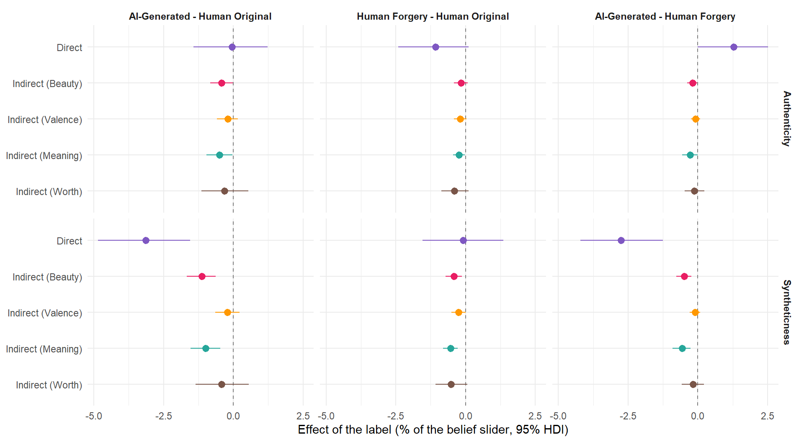
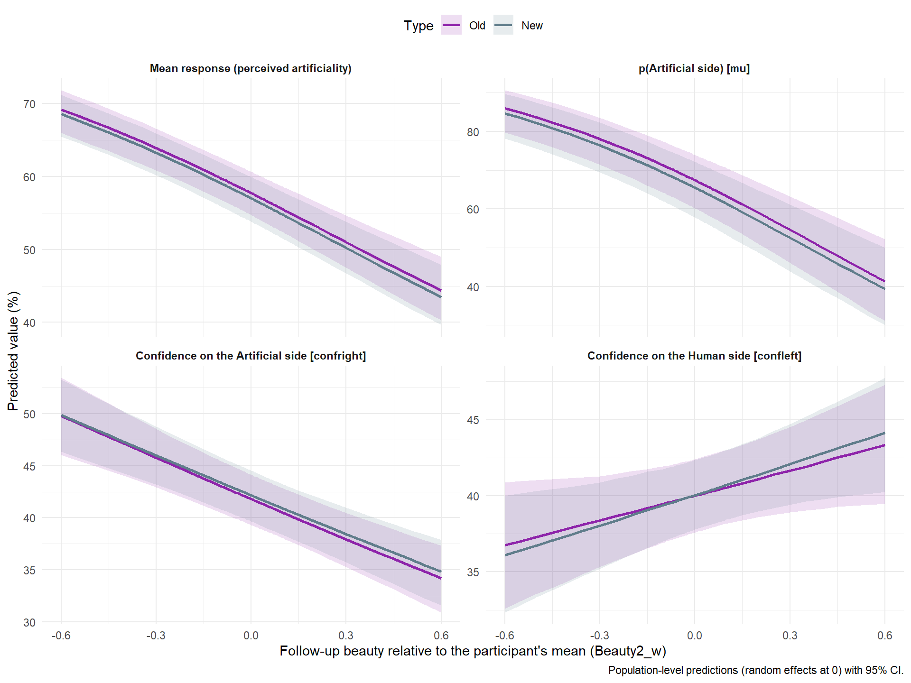
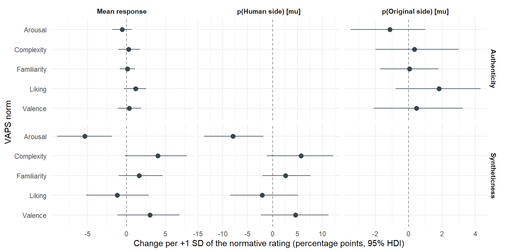
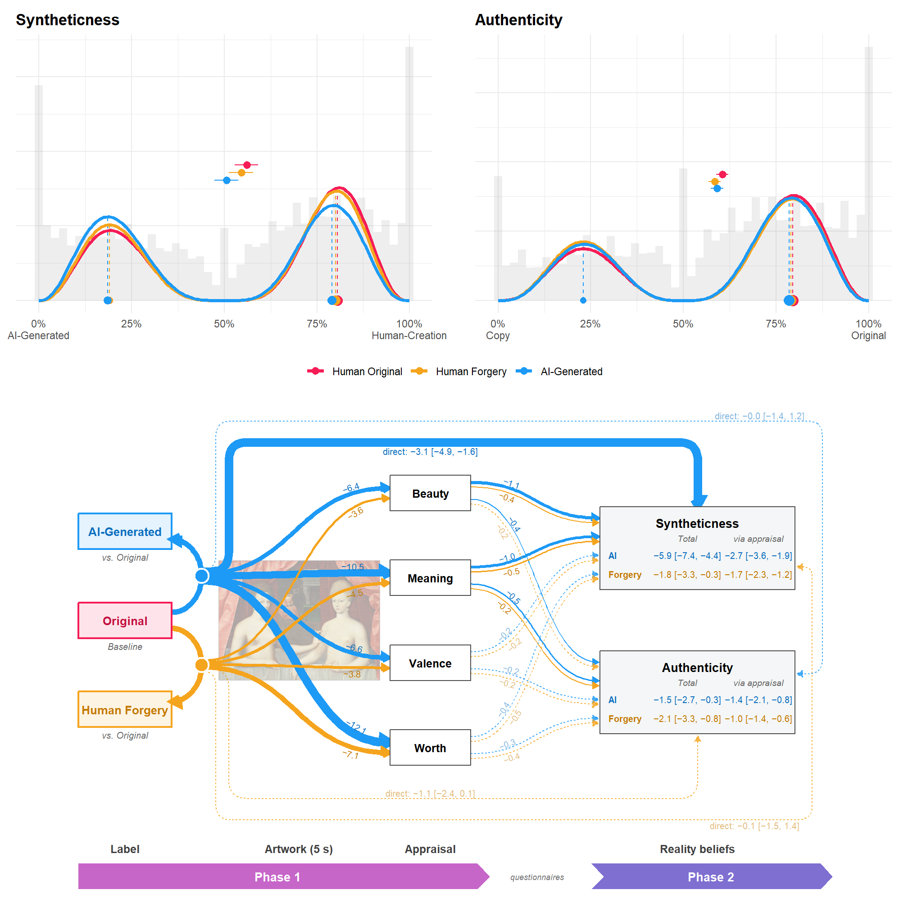
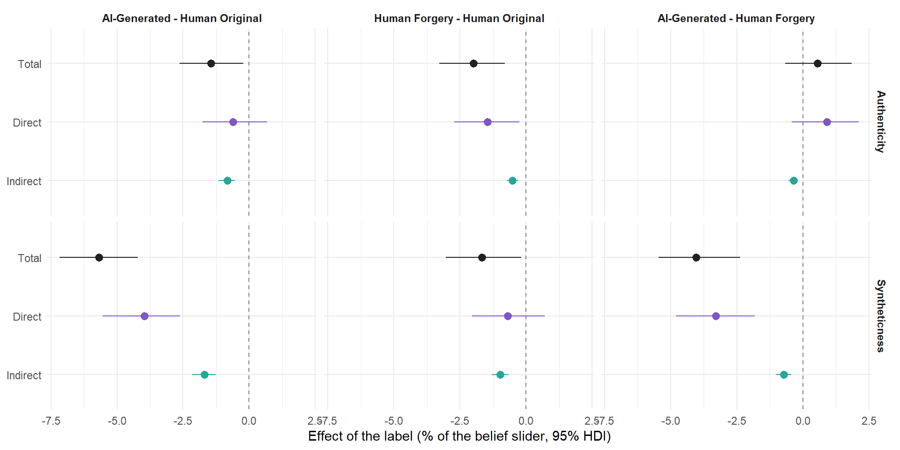

<!-- Estimates are computed on the cluster (`./hpc extract RealityBeauty AuthenticityBeauty`, see server/estimates.R: mediation_info, get_mediation_estimates()) and read from models/estimates/. The mediation itself (mediation_effects()) runs here, on the stored predictions. -->

## Data Preparation


::: {.cell}

```{.r .cell-code  code-fold="false"}
library(tidyverse)
library(easystats)
library(patchwork)


cols <- c(
  "Human Original" = "#F51D56",
  "Human Forgery" = "#F5A41D",
  "AI-Generated" = "#1D9AF5",
  # Type of follow-up item (ArtificialityBeauty)
  "Old" = "#8E24AA",
  "New" = "#607D8B")

source("server/estimates.R") # mediation_info, mediation_effects(), prep_contrasts()
source("report.R")           # make_asis(), make_tables(), read_estimates(), get_choco_plot()

# Trial file: only for the observed histograms of Figure 3
dftask <- read.csv("../data/data_task.csv") |>
  mutate(Condition = fct_relevel(Condition, "Human Original", "Human Forgery", "AI-Generated"))

estimates <- read_estimates(c(names(mediation_info), names(appraisal_info), names(items_info)))
# The label effects of the main models (Condition * Emotion), for comparison
reference <- read_estimates(c("Beauty", "Reality", "Authenticity"))
provenance_table(c(estimates, reference))
```

::: {.cell-output-display}


Table: Provenance of the estimates read by this report.

|Model                     |Fit                           | Draws| Max_Rhat|Extracted        |
|:-------------------------|:-----------------------------|-----:|--------:|:----------------|
|RealityBeauty             |RealityBeauty.rds             |  4000|    1.073|2026-09-24 09:35 |
|AuthenticityBeauty        |AuthenticityBeauty.rds        |  4000|    1.050|2026-09-23 17:39 |
|RealityBeautyControl      |RealityBeautyControl.rds      |  4000|    1.044|2026-09-23 19:55 |
|AuthenticityBeautyControl |AuthenticityBeautyControl.rds |  4000|    1.056|2026-09-23 20:36 |
|ArtificialityBeauty       |ArtificialityBeauty.rds       |  4000|    1.198|2026-09-23 20:05 |
|RealityAppraisal          |RealityAppraisal.rds          |  4000|    1.057|2026-09-23 20:31 |
|AuthenticityAppraisal     |AuthenticityAppraisal.rds     |  4000|    1.060|2026-09-23 20:56 |
|RealityItems              |RealityItems.rds              |  4000|    1.077|2026-09-24 09:36 |
|AuthenticityItems         |AuthenticityItems.rds         |  4000|    1.036|2026-09-23 21:12 |
|Beauty                    |Beauty.rds                    |  4000|    1.068|2026-09-22 19:58 |
|Reality                   |Reality.rds                   |  4000|    1.071|2026-09-22 19:57 |
|Authenticity              |Authenticity.rds              |  4000|    1.065|2026-09-22 19:57 |


:::

```{.r .cell-code  code-fold="false"}
# The mediation, once per model (bootstrap of the label -> beauty path over
# participants, one resample per posterior draw), on the mean response and on
# the main CHOCO parameters (same bootstrap draws for all)
# (ArtificialityBeauty is not a mediation: by = Type, see its own section)
main_models <- c("RealityBeauty", "AuthenticityBeauty")
control_models <- c(RealityBeauty = "RealityBeautyControl", AuthenticityBeauty = "AuthenticityBeautyControl")
mediation <- lapply(estimates[c(main_models, unname(control_models))], mediation_effects)
choco_pars <- c("mu", "confright", "confleft")
mediation_pars <- lapply(estimates[main_models], function(e) {
  lapply(setNames(nm = choco_pars), function(p) mediation_effects(e, par = p))
})
# Joint appraisal mediators and item properties (their own sections)
appraisal_models <- c(Syntheticness = "RealityAppraisal", Authenticity = "AuthenticityAppraisal")
appraisal <- setNames(lapply(estimates[appraisal_models], function(e) {
  lapply(setNames(nm = c("response", choco_pars)), function(p) appraisal_effects(e, par = p))
}), names(appraisal_models))
items_models <- c(Syntheticness = "RealityItems", Authenticity = "AuthenticityItems")
items <- setNames(lapply(estimates[items_models], function(e) {
  lapply(setNames(nm = c("response", "mu")), function(p) items_effects(e, par = p))
}), names(items_models))

# Plain-language names of the CHOCO parameters, per belief (right = the "1" end)
par_labels <- list(
  RealityBeauty = c(response = "Mean response (syntheticness)",
                    mu = "p(Human side) [mu]",
                    confright = "Confidence on the Human side [confright]",
                    confleft = "Confidence on the AI side [confleft]"),
  AuthenticityBeauty = c(response = "Mean response (authenticity)",
                         mu = "p(Original side) [mu]",
                         confright = "Confidence on the Original side [confright]",
                         confleft = "Confidence on the Copy side [confleft]"),
  ArtificialityBeauty = c(response = "Mean response (perceived artificiality)",
                          mu = "p(Artificial side) [mu]",
                          confright = "Confidence on the Artificial side [confright]",
                          confleft = "Confidence on the Human side [confleft]"))
```
:::


## How to read this report

The question is whether the labels lower the Phase-2 reality beliefs
**directly**, or **through the lower beauty they induced in Phase 1**
(label → beauty → belief). The label is randomised and beauty is rated
before the belief, so the label → belief effect decomposes as a mediation.
The reverse path (belief → beauty) cannot be tested: the only Phase-1
"belief" is the label itself.

| model | outcome | predictors | data |
| --- | --- | --- | --- |
| **RealityBeauty** | `Reality` (syntheticness; 0 = AI-Generated, 1 = Human Creation) | `Condition * Beauty_w` | 317 participants × 48 trials |
| **AuthenticityBeauty** | `Authenticity` (0 = Copy / Forgery, 1 = Original) | `Condition * Beauty_w` | same |
| **RealityBeautyControl**, **AuthenticityBeautyControl** | as above | `Condition * Beauty_w + Beauty2_w` | 217 follow-up participants × 48 trials |
| **RealityAppraisal**, **AuthenticityAppraisal** | as above | `Condition * (Beauty_w + Valence_w + Meaning_w + Worth_w)` | 317 participants × 48 trials |
| **RealityItems**, **AuthenticityItems** | as above | `Condition + Style + z(VAPS norms)` | 317 participants × 48 trials |
| **ArtificialityBeauty** | `PerceivedArtificiality` (0 = Very Human, 1 = Very Artificial), follow-up | `Type * Beauty2_w` (Type = Old / New item) | 220 participants, every item judged "new" |

Both are CHOCO models with `Condition * Beauty_w` on `mu`, `confright` and
`confleft` (random `Condition * Beauty_w` slopes over participants,
`Condition + Beauty_w` over items), on the precisions (item intercept only)
and on `pex` / `bex` / `pmid` (participant intercept only). `Beauty_w` is the
Phase-1 beauty centred within participant: its slope is "this artwork vs.
my other artworks", and it is 0 at a participant's average beauty. There is
no Emotion term.

What each section reports, all in **% of the belief slider** unless stated
otherwise, as posterior medians with 95% CI (HDI for the mediation) and the
probability of direction (`pd`); "credible" = CI excludes 0:

- **Predicted belief by beauty**: the population-level prediction per label
  across `Beauty_w` (random effects at 0, 95% CI), for the mean response
  (the expected value of the CHOCO mixture) and for its three main
  parameters: `mu`, the probability of answering on the right-hand side of
  the slider (Human / Original), and `confright` / `confleft`, the confidence
  (distance from the midpoint) of the answers on each side. They show whether
  the label and beauty act on the *choice* or on the *confidence* in it.
- **Label contrasts at average beauty**: the label effect with beauty held at
  the participant's mean (`Beauty_w = 0`), for every CHOCO parameter. Compare
  with the label effect of the main model (no beauty term), shown alongside.
- **Beauty slopes**: the change in the belief per +10% of the beauty slider,
  per label, and the differences between labels (the interaction on the
  response scale: does a "fake" label weaken the beauty cue?).
- **Mediation**, for each contrast `c1 - c0`, with `E[Y | c, m]` the
  prediction under label `c` at beauty `m`, and `M_c` the mean `Beauty_w`
  under label `c`:
  - *Mediator (a)*: `M_c1 - M_c0`, in % of the **beauty** slider;
  - *Total*: `E[Y | c1, M_c1] - E[Y | c0, M_c0]`;
  - *Direct*: `E[Y | c1, M_c0] - E[Y | c0, M_c0]` (the label, beauty held
    where the reference label leaves it);
  - *Indirect*: `E[Y | c1, M_c1] - E[Y | c1, M_c0]` (beauty moved as the label
    moves it, the label held fixed);
  - *Proportion mediated*: Indirect / Total, only meaningful when the Total
    is credible.
- **Mediation by parameter**: the same Total / Direct / Indirect effects on
  `mu`, `confright` and `confleft` (percentage points of each parameter).

**Appraisal components.** Beauty is only one of the four Phase-1 ratings,
and the others were lowered by the labels too. The appraisal models enter
beauty, valence, meaning and worth of the same trial as *joint* mediators
(each rescaled to 0-1 and centred within participant), with their
interaction with the label. For each contrast: the direct effect, the joint
indirect effect (all four ratings shifted as the label shifts them) and the
*unique* indirect effect of each rating (only that rating shifted, the others
held where the reference label leaves them: slope under the target label ×
the label's shift in that rating, bootstrapped over participants). Worth is
a divergent test: a downstream valuation, not expected to carry a unique
route to the belief. Within participants, beauty correlates .76 with
valence, .62 with worth and .44 with meaning, so unique effects of the
collinear ratings are estimated less precisely than the joint one.

**Item properties.** Style and the VAPS norms (liking, valence, arousal,
complexity, familiarity; z-scored over the 48 items) as item-level
predictors: which artworks are judged synthetic or copied, independently of
the label and of the participant's own ratings. Descriptive (48 items).

Two further sections address the objection that beauty and belief could
share a common cause (some works are simply more appealing, and look more
human, to a given person), and whether the "less beautiful → more
artificial" inference needs a label at all:

- **Robustness: label-free beauty.** The same models on the follow-up
  participants, with the follow-up beauty of the same artwork (`Beauty2_w`,
  centred within participant) added as a covariate. It was rated ~47 days
  later, after the debrief, and the label had no effect on it: a label-free
  measure of how appealing the work is to that person. Predictions and
  mediation are computed at `Beauty2_w = 0`. If the Phase-1 beauty slope and
  the direct / indirect effects hold, the mediation is not reducible to
  stable appeal.
- **Never-labelled artworks.** In the follow-up, artworks judged "new" were
  rated for how easily they could be AI-generated. The 48 new items never
  carried a label; the model gives the slope of perceived artificiality on
  follow-up beauty for new vs. old (missed) items.

Caveats: predictions are evaluated at the mean beauty per label (an
approximation for a non-linear model) and at the population level (random
effects at 0); measurement error in beauty attenuates the slope, so the
indirect effect is a lower bound; beauty is not randomised, so a
person-specific appeal of the artwork could drive both beauty and belief
(the planned control is follow-up beauty, `Beauty2`).

## Convergence


```{.r .cell-code}
convergence_by_class <- function(est) {
  est$convergence |>
    mutate(Class = case_when(
      startsWith(variable, "b_") | startsWith(variable, "Intercept") ~ "b (fixed effects)",
      startsWith(variable, "sd_") ~ "sd (random-effect SDs)",
      startsWith(variable, "cor_") ~ "cor (random-effect correlations)",
      .default = "other")) |>
    summarise(N = n(), Max_Rhat = round(max(rhat, na.rm = TRUE), 3),
              Min_ESS_bulk = round(min(ess_bulk, na.rm = TRUE)), .by = "Class") |>
    mutate(Model = est$outcome, .before = 1)
}

make_asis(
  make_tables(bind_rows(lapply(estimates, `[[`, "diag")),
              c("Model", "Family", "N_obs", "N_participants", "Chains", "Draws", "Max_Rhat", "Min_ESS_ratio", "Divergent_pct"),
              "Convergence of the determinants models"),
  make_tables(bind_rows(lapply(estimates, convergence_by_class)),
              c("Model", "Class", "N", "Max_Rhat", "Min_ESS_bulk"),
              "Convergence by parameter class (the fixed effects are what the report uses)")
)
```

```{=html}
<div id="lhjanbgfvj" style="padding-left:0px;padding-right:0px;padding-top:10px;padding-bottom:10px;overflow-x:auto;overflow-y:auto;width:auto;height:auto;">
<style>#lhjanbgfvj table {
  font-family: system-ui, 'Segoe UI', Roboto, Helvetica, Arial, sans-serif, 'Apple Color Emoji', 'Segoe UI Emoji', 'Segoe UI Symbol', 'Noto Color Emoji';
  -webkit-font-smoothing: antialiased;
  -moz-osx-font-smoothing: grayscale;
}

#lhjanbgfvj thead, #lhjanbgfvj tbody, #lhjanbgfvj tfoot, #lhjanbgfvj tr, #lhjanbgfvj td, #lhjanbgfvj th {
  border-style: none;
}

#lhjanbgfvj p {
  margin: 0;
  padding: 0;
}

#lhjanbgfvj .gt_table {
  display: table;
  border-collapse: collapse;
  line-height: normal;
  margin-left: auto;
  margin-right: auto;
  color: #333333;
  font-size: 13px;
  font-weight: normal;
  font-style: normal;
  background-color: #FFFFFF;
  width: auto;
  border-top-style: solid;
  border-top-width: 3px;
  border-top-color: #D5D5D5;
  border-right-style: solid;
  border-right-width: 3px;
  border-right-color: #D5D5D5;
  border-bottom-style: solid;
  border-bottom-width: 3px;
  border-bottom-color: #D5D5D5;
  border-left-style: solid;
  border-left-width: 3px;
  border-left-color: #D5D5D5;
}

#lhjanbgfvj .gt_caption {
  padding-top: 4px;
  padding-bottom: 4px;
}

#lhjanbgfvj .gt_title {
  color: #333333;
  font-size: 125%;
  font-weight: initial;
  padding-top: 4px;
  padding-bottom: 4px;
  padding-left: 5px;
  padding-right: 5px;
  border-bottom-color: #FFFFFF;
  border-bottom-width: 0;
}

#lhjanbgfvj .gt_subtitle {
  color: #333333;
  font-size: 85%;
  font-weight: initial;
  padding-top: 3px;
  padding-bottom: 5px;
  padding-left: 5px;
  padding-right: 5px;
  border-top-color: #FFFFFF;
  border-top-width: 0;
}

#lhjanbgfvj .gt_heading {
  background-color: #FFFFFF;
  text-align: left;
  border-bottom-color: #FFFFFF;
  border-left-style: none;
  border-left-width: 1px;
  border-left-color: #D3D3D3;
  border-right-style: none;
  border-right-width: 1px;
  border-right-color: #D3D3D3;
}

#lhjanbgfvj .gt_bottom_border {
  border-bottom-style: solid;
  border-bottom-width: 2px;
  border-bottom-color: #D5D5D5;
}

#lhjanbgfvj .gt_col_headings {
  border-top-style: solid;
  border-top-width: 2px;
  border-top-color: #D5D5D5;
  border-bottom-style: solid;
  border-bottom-width: 2px;
  border-bottom-color: #D5D5D5;
  border-left-style: none;
  border-left-width: 1px;
  border-left-color: #D3D3D3;
  border-right-style: none;
  border-right-width: 1px;
  border-right-color: #D3D3D3;
}

#lhjanbgfvj .gt_col_heading {
  color: #FFFFFF;
  background-color: #000000;
  font-size: 100%;
  font-weight: normal;
  text-transform: inherit;
  border-left-style: none;
  border-left-width: 1px;
  border-left-color: #D3D3D3;
  border-right-style: none;
  border-right-width: 1px;
  border-right-color: #D3D3D3;
  vertical-align: bottom;
  padding-top: 5px;
  padding-bottom: 6px;
  padding-left: 5px;
  padding-right: 5px;
  overflow-x: hidden;
}

#lhjanbgfvj .gt_column_spanner_outer {
  color: #FFFFFF;
  background-color: #000000;
  font-size: 100%;
  font-weight: normal;
  text-transform: inherit;
  padding-top: 0;
  padding-bottom: 0;
  padding-left: 4px;
  padding-right: 4px;
}

#lhjanbgfvj .gt_column_spanner_outer:first-child {
  padding-left: 0;
}

#lhjanbgfvj .gt_column_spanner_outer:last-child {
  padding-right: 0;
}

#lhjanbgfvj .gt_column_spanner {
  border-bottom-style: solid;
  border-bottom-width: 2px;
  border-bottom-color: #D5D5D5;
  vertical-align: bottom;
  padding-top: 5px;
  padding-bottom: 5px;
  overflow-x: hidden;
  display: inline-block;
  width: 100%;
}

#lhjanbgfvj .gt_spanner_row {
  border-bottom-style: hidden;
}

#lhjanbgfvj .gt_group_heading {
  padding-top: 8px;
  padding-bottom: 8px;
  padding-left: 5px;
  padding-right: 5px;
  color: #333333;
  background-color: #FFFFFF;
  font-size: 100%;
  font-weight: initial;
  text-transform: inherit;
  border-top-style: solid;
  border-top-width: 2px;
  border-top-color: #D5D5D5;
  border-bottom-style: solid;
  border-bottom-width: 2px;
  border-bottom-color: #D5D5D5;
  border-left-style: none;
  border-left-width: 1px;
  border-left-color: #D3D3D3;
  border-right-style: none;
  border-right-width: 1px;
  border-right-color: #D3D3D3;
  vertical-align: middle;
  text-align: left;
}

#lhjanbgfvj .gt_empty_group_heading {
  padding: 0.5px;
  color: #333333;
  background-color: #FFFFFF;
  font-size: 100%;
  font-weight: initial;
  border-top-style: solid;
  border-top-width: 2px;
  border-top-color: #D5D5D5;
  border-bottom-style: solid;
  border-bottom-width: 2px;
  border-bottom-color: #D5D5D5;
  vertical-align: middle;
}

#lhjanbgfvj .gt_from_md > :first-child {
  margin-top: 0;
}

#lhjanbgfvj .gt_from_md > :last-child {
  margin-bottom: 0;
}

#lhjanbgfvj .gt_row {
  padding-top: 8px;
  padding-bottom: 8px;
  padding-left: 5px;
  padding-right: 5px;
  margin: 10px;
  border-top-style: solid;
  border-top-width: 1px;
  border-top-color: #D5D5D5;
  border-left-style: solid;
  border-left-width: 1px;
  border-left-color: #D5D5D5;
  border-right-style: solid;
  border-right-width: 1px;
  border-right-color: #D5D5D5;
  vertical-align: middle;
  overflow-x: hidden;
}

#lhjanbgfvj .gt_stub {
  color: #333333;
  background-color: #FFFFFF;
  font-size: 100%;
  font-weight: initial;
  text-transform: inherit;
  border-right-style: solid;
  border-right-width: 2px;
  border-right-color: #5F5F5F;
  padding-left: 5px;
  padding-right: 5px;
}

#lhjanbgfvj .gt_stub_row_group {
  color: #333333;
  background-color: #FFFFFF;
  font-size: 100%;
  font-weight: initial;
  text-transform: inherit;
  border-right-style: solid;
  border-right-width: 2px;
  border-right-color: #D3D3D3;
  padding-left: 5px;
  padding-right: 5px;
  vertical-align: top;
}

#lhjanbgfvj .gt_row_group_first td {
  border-top-width: 2px;
}

#lhjanbgfvj .gt_row_group_first th {
  border-top-width: 2px;
}

#lhjanbgfvj .gt_summary_row {
  color: #333333;
  background-color: #D5D5D5;
  text-transform: inherit;
  padding-top: 8px;
  padding-bottom: 8px;
  padding-left: 5px;
  padding-right: 5px;
}

#lhjanbgfvj .gt_first_summary_row {
  border-top-style: solid;
  border-top-color: #D5D5D5;
}

#lhjanbgfvj .gt_first_summary_row.thick {
  border-top-width: 2px;
}

#lhjanbgfvj .gt_last_summary_row {
  padding-top: 8px;
  padding-bottom: 8px;
  padding-left: 5px;
  padding-right: 5px;
  border-bottom-style: solid;
  border-bottom-width: 2px;
  border-bottom-color: #D5D5D5;
}

#lhjanbgfvj .gt_grand_summary_row {
  color: #FFFFFF;
  background-color: #929292;
  text-transform: inherit;
  padding-top: 8px;
  padding-bottom: 8px;
  padding-left: 5px;
  padding-right: 5px;
}

#lhjanbgfvj .gt_first_grand_summary_row {
  padding-top: 8px;
  padding-bottom: 8px;
  padding-left: 5px;
  padding-right: 5px;
  border-top-style: double;
  border-top-width: 6px;
  border-top-color: #D5D5D5;
}

#lhjanbgfvj .gt_last_grand_summary_row_top {
  padding-top: 8px;
  padding-bottom: 8px;
  padding-left: 5px;
  padding-right: 5px;
  border-bottom-style: double;
  border-bottom-width: 6px;
  border-bottom-color: #D5D5D5;
}

#lhjanbgfvj .gt_striped {
  background-color: #F4F4F4;
}

#lhjanbgfvj .gt_table_body {
  border-top-style: solid;
  border-top-width: 2px;
  border-top-color: #D5D5D5;
  border-bottom-style: solid;
  border-bottom-width: 2px;
  border-bottom-color: #D5D5D5;
}

#lhjanbgfvj .gt_footnotes {
  color: #333333;
  background-color: #FFFFFF;
  border-bottom-style: none;
  border-bottom-width: 2px;
  border-bottom-color: #D3D3D3;
  border-left-style: none;
  border-left-width: 2px;
  border-left-color: #D3D3D3;
  border-right-style: none;
  border-right-width: 2px;
  border-right-color: #D3D3D3;
}

#lhjanbgfvj .gt_footnote {
  margin: 0px;
  font-size: 90%;
  padding-top: 4px;
  padding-bottom: 4px;
  padding-left: 5px;
  padding-right: 5px;
}

#lhjanbgfvj .gt_sourcenotes {
  color: #333333;
  background-color: #FFFFFF;
  border-bottom-style: none;
  border-bottom-width: 2px;
  border-bottom-color: #D3D3D3;
  border-left-style: none;
  border-left-width: 2px;
  border-left-color: #D3D3D3;
  border-right-style: none;
  border-right-width: 2px;
  border-right-color: #D3D3D3;
}

#lhjanbgfvj .gt_sourcenote {
  font-size: 90%;
  padding-top: 4px;
  padding-bottom: 4px;
  padding-left: 5px;
  padding-right: 5px;
}

#lhjanbgfvj .gt_left {
  text-align: left;
}

#lhjanbgfvj .gt_center {
  text-align: center;
}

#lhjanbgfvj .gt_right {
  text-align: right;
  font-variant-numeric: tabular-nums;
}

#lhjanbgfvj .gt_font_normal {
  font-weight: normal;
}

#lhjanbgfvj .gt_font_bold {
  font-weight: bold;
}

#lhjanbgfvj .gt_font_italic {
  font-style: italic;
}

#lhjanbgfvj .gt_super {
  font-size: 65%;
}

#lhjanbgfvj .gt_footnote_marks {
  font-size: 75%;
  vertical-align: 0.4em;
  position: initial;
}

#lhjanbgfvj .gt_asterisk {
  font-size: 100%;
  vertical-align: 0;
}

#lhjanbgfvj .gt_indent_1 {
  text-indent: 5px;
}

#lhjanbgfvj .gt_indent_2 {
  text-indent: 10px;
}

#lhjanbgfvj .gt_indent_3 {
  text-indent: 15px;
}

#lhjanbgfvj .gt_indent_4 {
  text-indent: 20px;
}

#lhjanbgfvj .gt_indent_5 {
  text-indent: 25px;
}

#lhjanbgfvj .katex-display {
  display: inline-flex !important;
  margin-bottom: 0.75em !important;
}

#lhjanbgfvj div.Reactable > div.rt-table > div.rt-thead > div.rt-tr.rt-tr-group-header > div.rt-th-group:after {
  height: 0px !important;
}
</style>
<table class="gt_table" data-quarto-disable-processing="false" data-quarto-bootstrap="false">
  <thead>
    <tr class="gt_heading">
      <td colspan="9" class="gt_heading gt_title gt_font_normal gt_bottom_border" style>Convergence of the determinants models</td>
    </tr>
    
    <tr class="gt_col_headings">
      <th class="gt_col_heading gt_columns_bottom_border gt_left" rowspan="1" colspan="1" scope="col" id="Model">Model</th>
      <th class="gt_col_heading gt_columns_bottom_border gt_left" rowspan="1" colspan="1" scope="col" id="Family">Family</th>
      <th class="gt_col_heading gt_columns_bottom_border gt_right" rowspan="1" colspan="1" scope="col" id="N_obs">N_obs</th>
      <th class="gt_col_heading gt_columns_bottom_border gt_right" rowspan="1" colspan="1" scope="col" id="N_participants">N_participants</th>
      <th class="gt_col_heading gt_columns_bottom_border gt_right" rowspan="1" colspan="1" scope="col" id="Chains">Chains</th>
      <th class="gt_col_heading gt_columns_bottom_border gt_right" rowspan="1" colspan="1" scope="col" id="Draws">Draws</th>
      <th class="gt_col_heading gt_columns_bottom_border gt_right" rowspan="1" colspan="1" scope="col" id="Max_Rhat">Max_Rhat</th>
      <th class="gt_col_heading gt_columns_bottom_border gt_right" rowspan="1" colspan="1" scope="col" id="Min_ESS_ratio">Min_ESS_ratio</th>
      <th class="gt_col_heading gt_columns_bottom_border gt_right" rowspan="1" colspan="1" scope="col" id="Divergent_pct">Divergent_pct</th>
    </tr>
  </thead>
  <tbody class="gt_table_body">
    <tr><td headers="Model" class="gt_row gt_left">RealityBeauty</td>
<td headers="Family" class="gt_row gt_left">CHOCO</td>
<td headers="N_obs" class="gt_row gt_right">15216</td>
<td headers="N_participants" class="gt_row gt_right">317</td>
<td headers="Chains" class="gt_row gt_right">8</td>
<td headers="Draws" class="gt_row gt_right">4000</td>
<td headers="Max_Rhat" class="gt_row gt_right">1.073</td>
<td headers="Min_ESS_ratio" class="gt_row gt_right">0.024</td>
<td headers="Divergent_pct" class="gt_row gt_right">0</td></tr>
    <tr><td headers="Model" class="gt_row gt_left gt_striped">AuthenticityBeauty</td>
<td headers="Family" class="gt_row gt_left gt_striped">CHOCO</td>
<td headers="N_obs" class="gt_row gt_right gt_striped">15216</td>
<td headers="N_participants" class="gt_row gt_right gt_striped">317</td>
<td headers="Chains" class="gt_row gt_right gt_striped">8</td>
<td headers="Draws" class="gt_row gt_right gt_striped">4000</td>
<td headers="Max_Rhat" class="gt_row gt_right gt_striped">1.050</td>
<td headers="Min_ESS_ratio" class="gt_row gt_right gt_striped">0.032</td>
<td headers="Divergent_pct" class="gt_row gt_right gt_striped">0</td></tr>
    <tr><td headers="Model" class="gt_row gt_left">RealityBeautyControl</td>
<td headers="Family" class="gt_row gt_left">CHOCO</td>
<td headers="N_obs" class="gt_row gt_right">10416</td>
<td headers="N_participants" class="gt_row gt_right">217</td>
<td headers="Chains" class="gt_row gt_right">8</td>
<td headers="Draws" class="gt_row gt_right">4000</td>
<td headers="Max_Rhat" class="gt_row gt_right">1.044</td>
<td headers="Min_ESS_ratio" class="gt_row gt_right">0.041</td>
<td headers="Divergent_pct" class="gt_row gt_right">0</td></tr>
    <tr><td headers="Model" class="gt_row gt_left gt_striped">AuthenticityBeautyControl</td>
<td headers="Family" class="gt_row gt_left gt_striped">CHOCO</td>
<td headers="N_obs" class="gt_row gt_right gt_striped">10416</td>
<td headers="N_participants" class="gt_row gt_right gt_striped">217</td>
<td headers="Chains" class="gt_row gt_right gt_striped">8</td>
<td headers="Draws" class="gt_row gt_right gt_striped">4000</td>
<td headers="Max_Rhat" class="gt_row gt_right gt_striped">1.056</td>
<td headers="Min_ESS_ratio" class="gt_row gt_right gt_striped">0.029</td>
<td headers="Divergent_pct" class="gt_row gt_right gt_striped">0</td></tr>
    <tr><td headers="Model" class="gt_row gt_left">ArtificialityBeauty</td>
<td headers="Family" class="gt_row gt_left">CHOCO</td>
<td headers="N_obs" class="gt_row gt_right">15393</td>
<td headers="N_participants" class="gt_row gt_right">220</td>
<td headers="Chains" class="gt_row gt_right">8</td>
<td headers="Draws" class="gt_row gt_right">4000</td>
<td headers="Max_Rhat" class="gt_row gt_right">1.198</td>
<td headers="Min_ESS_ratio" class="gt_row gt_right">0.007</td>
<td headers="Divergent_pct" class="gt_row gt_right">0</td></tr>
    <tr><td headers="Model" class="gt_row gt_left gt_striped">RealityAppraisal</td>
<td headers="Family" class="gt_row gt_left gt_striped">CHOCO</td>
<td headers="N_obs" class="gt_row gt_right gt_striped">15216</td>
<td headers="N_participants" class="gt_row gt_right gt_striped">317</td>
<td headers="Chains" class="gt_row gt_right gt_striped">8</td>
<td headers="Draws" class="gt_row gt_right gt_striped">4000</td>
<td headers="Max_Rhat" class="gt_row gt_right gt_striped">1.057</td>
<td headers="Min_ESS_ratio" class="gt_row gt_right gt_striped">0.034</td>
<td headers="Divergent_pct" class="gt_row gt_right gt_striped">0</td></tr>
    <tr><td headers="Model" class="gt_row gt_left">AuthenticityAppraisal</td>
<td headers="Family" class="gt_row gt_left">CHOCO</td>
<td headers="N_obs" class="gt_row gt_right">15216</td>
<td headers="N_participants" class="gt_row gt_right">317</td>
<td headers="Chains" class="gt_row gt_right">8</td>
<td headers="Draws" class="gt_row gt_right">4000</td>
<td headers="Max_Rhat" class="gt_row gt_right">1.060</td>
<td headers="Min_ESS_ratio" class="gt_row gt_right">0.037</td>
<td headers="Divergent_pct" class="gt_row gt_right">0</td></tr>
    <tr><td headers="Model" class="gt_row gt_left gt_striped">RealityItems</td>
<td headers="Family" class="gt_row gt_left gt_striped">CHOCO</td>
<td headers="N_obs" class="gt_row gt_right gt_striped">15216</td>
<td headers="N_participants" class="gt_row gt_right gt_striped">317</td>
<td headers="Chains" class="gt_row gt_right gt_striped">8</td>
<td headers="Draws" class="gt_row gt_right gt_striped">4000</td>
<td headers="Max_Rhat" class="gt_row gt_right gt_striped">1.077</td>
<td headers="Min_ESS_ratio" class="gt_row gt_right gt_striped">0.022</td>
<td headers="Divergent_pct" class="gt_row gt_right gt_striped">0</td></tr>
    <tr><td headers="Model" class="gt_row gt_left">AuthenticityItems</td>
<td headers="Family" class="gt_row gt_left">CHOCO</td>
<td headers="N_obs" class="gt_row gt_right">15216</td>
<td headers="N_participants" class="gt_row gt_right">317</td>
<td headers="Chains" class="gt_row gt_right">8</td>
<td headers="Draws" class="gt_row gt_right">4000</td>
<td headers="Max_Rhat" class="gt_row gt_right">1.036</td>
<td headers="Min_ESS_ratio" class="gt_row gt_right">0.051</td>
<td headers="Divergent_pct" class="gt_row gt_right">0</td></tr>
  </tbody>
  
</table>
</div>
```


::: {.callout-note collapse="true" title="Convergence of the determinants models (Markdown table, for text readers)"}

|Model                     |Family | N_obs| N_participants| Chains| Draws| Max_Rhat| Min_ESS_ratio| Divergent_pct|
|:-------------------------|:------|-----:|--------------:|------:|-----:|--------:|-------------:|-------------:|
|RealityBeauty             |CHOCO  | 15216|            317|      8|  4000|    1.073|         0.024|             0|
|AuthenticityBeauty        |CHOCO  | 15216|            317|      8|  4000|    1.050|         0.032|             0|
|RealityBeautyControl      |CHOCO  | 10416|            217|      8|  4000|    1.044|         0.041|             0|
|AuthenticityBeautyControl |CHOCO  | 10416|            217|      8|  4000|    1.056|         0.029|             0|
|ArtificialityBeauty       |CHOCO  | 15393|            220|      8|  4000|    1.198|         0.007|             0|
|RealityAppraisal          |CHOCO  | 15216|            317|      8|  4000|    1.057|         0.034|             0|
|AuthenticityAppraisal     |CHOCO  | 15216|            317|      8|  4000|    1.060|         0.037|             0|
|RealityItems              |CHOCO  | 15216|            317|      8|  4000|    1.077|         0.022|             0|
|AuthenticityItems         |CHOCO  | 15216|            317|      8|  4000|    1.036|         0.051|             0|

:::

```{=html}
<div id="pnesehtpmg" style="padding-left:0px;padding-right:0px;padding-top:10px;padding-bottom:10px;overflow-x:auto;overflow-y:auto;width:auto;height:auto;">
<style>#pnesehtpmg table {
  font-family: system-ui, 'Segoe UI', Roboto, Helvetica, Arial, sans-serif, 'Apple Color Emoji', 'Segoe UI Emoji', 'Segoe UI Symbol', 'Noto Color Emoji';
  -webkit-font-smoothing: antialiased;
  -moz-osx-font-smoothing: grayscale;
}

#pnesehtpmg thead, #pnesehtpmg tbody, #pnesehtpmg tfoot, #pnesehtpmg tr, #pnesehtpmg td, #pnesehtpmg th {
  border-style: none;
}

#pnesehtpmg p {
  margin: 0;
  padding: 0;
}

#pnesehtpmg .gt_table {
  display: table;
  border-collapse: collapse;
  line-height: normal;
  margin-left: auto;
  margin-right: auto;
  color: #333333;
  font-size: 13px;
  font-weight: normal;
  font-style: normal;
  background-color: #FFFFFF;
  width: auto;
  border-top-style: solid;
  border-top-width: 3px;
  border-top-color: #D5D5D5;
  border-right-style: solid;
  border-right-width: 3px;
  border-right-color: #D5D5D5;
  border-bottom-style: solid;
  border-bottom-width: 3px;
  border-bottom-color: #D5D5D5;
  border-left-style: solid;
  border-left-width: 3px;
  border-left-color: #D5D5D5;
}

#pnesehtpmg .gt_caption {
  padding-top: 4px;
  padding-bottom: 4px;
}

#pnesehtpmg .gt_title {
  color: #333333;
  font-size: 125%;
  font-weight: initial;
  padding-top: 4px;
  padding-bottom: 4px;
  padding-left: 5px;
  padding-right: 5px;
  border-bottom-color: #FFFFFF;
  border-bottom-width: 0;
}

#pnesehtpmg .gt_subtitle {
  color: #333333;
  font-size: 85%;
  font-weight: initial;
  padding-top: 3px;
  padding-bottom: 5px;
  padding-left: 5px;
  padding-right: 5px;
  border-top-color: #FFFFFF;
  border-top-width: 0;
}

#pnesehtpmg .gt_heading {
  background-color: #FFFFFF;
  text-align: left;
  border-bottom-color: #FFFFFF;
  border-left-style: none;
  border-left-width: 1px;
  border-left-color: #D3D3D3;
  border-right-style: none;
  border-right-width: 1px;
  border-right-color: #D3D3D3;
}

#pnesehtpmg .gt_bottom_border {
  border-bottom-style: solid;
  border-bottom-width: 2px;
  border-bottom-color: #D5D5D5;
}

#pnesehtpmg .gt_col_headings {
  border-top-style: solid;
  border-top-width: 2px;
  border-top-color: #D5D5D5;
  border-bottom-style: solid;
  border-bottom-width: 2px;
  border-bottom-color: #D5D5D5;
  border-left-style: none;
  border-left-width: 1px;
  border-left-color: #D3D3D3;
  border-right-style: none;
  border-right-width: 1px;
  border-right-color: #D3D3D3;
}

#pnesehtpmg .gt_col_heading {
  color: #FFFFFF;
  background-color: #000000;
  font-size: 100%;
  font-weight: normal;
  text-transform: inherit;
  border-left-style: none;
  border-left-width: 1px;
  border-left-color: #D3D3D3;
  border-right-style: none;
  border-right-width: 1px;
  border-right-color: #D3D3D3;
  vertical-align: bottom;
  padding-top: 5px;
  padding-bottom: 6px;
  padding-left: 5px;
  padding-right: 5px;
  overflow-x: hidden;
}

#pnesehtpmg .gt_column_spanner_outer {
  color: #FFFFFF;
  background-color: #000000;
  font-size: 100%;
  font-weight: normal;
  text-transform: inherit;
  padding-top: 0;
  padding-bottom: 0;
  padding-left: 4px;
  padding-right: 4px;
}

#pnesehtpmg .gt_column_spanner_outer:first-child {
  padding-left: 0;
}

#pnesehtpmg .gt_column_spanner_outer:last-child {
  padding-right: 0;
}

#pnesehtpmg .gt_column_spanner {
  border-bottom-style: solid;
  border-bottom-width: 2px;
  border-bottom-color: #D5D5D5;
  vertical-align: bottom;
  padding-top: 5px;
  padding-bottom: 5px;
  overflow-x: hidden;
  display: inline-block;
  width: 100%;
}

#pnesehtpmg .gt_spanner_row {
  border-bottom-style: hidden;
}

#pnesehtpmg .gt_group_heading {
  padding-top: 8px;
  padding-bottom: 8px;
  padding-left: 5px;
  padding-right: 5px;
  color: #333333;
  background-color: #FFFFFF;
  font-size: 100%;
  font-weight: initial;
  text-transform: inherit;
  border-top-style: solid;
  border-top-width: 2px;
  border-top-color: #D5D5D5;
  border-bottom-style: solid;
  border-bottom-width: 2px;
  border-bottom-color: #D5D5D5;
  border-left-style: none;
  border-left-width: 1px;
  border-left-color: #D3D3D3;
  border-right-style: none;
  border-right-width: 1px;
  border-right-color: #D3D3D3;
  vertical-align: middle;
  text-align: left;
}

#pnesehtpmg .gt_empty_group_heading {
  padding: 0.5px;
  color: #333333;
  background-color: #FFFFFF;
  font-size: 100%;
  font-weight: initial;
  border-top-style: solid;
  border-top-width: 2px;
  border-top-color: #D5D5D5;
  border-bottom-style: solid;
  border-bottom-width: 2px;
  border-bottom-color: #D5D5D5;
  vertical-align: middle;
}

#pnesehtpmg .gt_from_md > :first-child {
  margin-top: 0;
}

#pnesehtpmg .gt_from_md > :last-child {
  margin-bottom: 0;
}

#pnesehtpmg .gt_row {
  padding-top: 8px;
  padding-bottom: 8px;
  padding-left: 5px;
  padding-right: 5px;
  margin: 10px;
  border-top-style: solid;
  border-top-width: 1px;
  border-top-color: #D5D5D5;
  border-left-style: solid;
  border-left-width: 1px;
  border-left-color: #D5D5D5;
  border-right-style: solid;
  border-right-width: 1px;
  border-right-color: #D5D5D5;
  vertical-align: middle;
  overflow-x: hidden;
}

#pnesehtpmg .gt_stub {
  color: #333333;
  background-color: #FFFFFF;
  font-size: 100%;
  font-weight: initial;
  text-transform: inherit;
  border-right-style: solid;
  border-right-width: 2px;
  border-right-color: #5F5F5F;
  padding-left: 5px;
  padding-right: 5px;
}

#pnesehtpmg .gt_stub_row_group {
  color: #333333;
  background-color: #FFFFFF;
  font-size: 100%;
  font-weight: initial;
  text-transform: inherit;
  border-right-style: solid;
  border-right-width: 2px;
  border-right-color: #D3D3D3;
  padding-left: 5px;
  padding-right: 5px;
  vertical-align: top;
}

#pnesehtpmg .gt_row_group_first td {
  border-top-width: 2px;
}

#pnesehtpmg .gt_row_group_first th {
  border-top-width: 2px;
}

#pnesehtpmg .gt_summary_row {
  color: #333333;
  background-color: #D5D5D5;
  text-transform: inherit;
  padding-top: 8px;
  padding-bottom: 8px;
  padding-left: 5px;
  padding-right: 5px;
}

#pnesehtpmg .gt_first_summary_row {
  border-top-style: solid;
  border-top-color: #D5D5D5;
}

#pnesehtpmg .gt_first_summary_row.thick {
  border-top-width: 2px;
}

#pnesehtpmg .gt_last_summary_row {
  padding-top: 8px;
  padding-bottom: 8px;
  padding-left: 5px;
  padding-right: 5px;
  border-bottom-style: solid;
  border-bottom-width: 2px;
  border-bottom-color: #D5D5D5;
}

#pnesehtpmg .gt_grand_summary_row {
  color: #FFFFFF;
  background-color: #929292;
  text-transform: inherit;
  padding-top: 8px;
  padding-bottom: 8px;
  padding-left: 5px;
  padding-right: 5px;
}

#pnesehtpmg .gt_first_grand_summary_row {
  padding-top: 8px;
  padding-bottom: 8px;
  padding-left: 5px;
  padding-right: 5px;
  border-top-style: double;
  border-top-width: 6px;
  border-top-color: #D5D5D5;
}

#pnesehtpmg .gt_last_grand_summary_row_top {
  padding-top: 8px;
  padding-bottom: 8px;
  padding-left: 5px;
  padding-right: 5px;
  border-bottom-style: double;
  border-bottom-width: 6px;
  border-bottom-color: #D5D5D5;
}

#pnesehtpmg .gt_striped {
  background-color: #F4F4F4;
}

#pnesehtpmg .gt_table_body {
  border-top-style: solid;
  border-top-width: 2px;
  border-top-color: #D5D5D5;
  border-bottom-style: solid;
  border-bottom-width: 2px;
  border-bottom-color: #D5D5D5;
}

#pnesehtpmg .gt_footnotes {
  color: #333333;
  background-color: #FFFFFF;
  border-bottom-style: none;
  border-bottom-width: 2px;
  border-bottom-color: #D3D3D3;
  border-left-style: none;
  border-left-width: 2px;
  border-left-color: #D3D3D3;
  border-right-style: none;
  border-right-width: 2px;
  border-right-color: #D3D3D3;
}

#pnesehtpmg .gt_footnote {
  margin: 0px;
  font-size: 90%;
  padding-top: 4px;
  padding-bottom: 4px;
  padding-left: 5px;
  padding-right: 5px;
}

#pnesehtpmg .gt_sourcenotes {
  color: #333333;
  background-color: #FFFFFF;
  border-bottom-style: none;
  border-bottom-width: 2px;
  border-bottom-color: #D3D3D3;
  border-left-style: none;
  border-left-width: 2px;
  border-left-color: #D3D3D3;
  border-right-style: none;
  border-right-width: 2px;
  border-right-color: #D3D3D3;
}

#pnesehtpmg .gt_sourcenote {
  font-size: 90%;
  padding-top: 4px;
  padding-bottom: 4px;
  padding-left: 5px;
  padding-right: 5px;
}

#pnesehtpmg .gt_left {
  text-align: left;
}

#pnesehtpmg .gt_center {
  text-align: center;
}

#pnesehtpmg .gt_right {
  text-align: right;
  font-variant-numeric: tabular-nums;
}

#pnesehtpmg .gt_font_normal {
  font-weight: normal;
}

#pnesehtpmg .gt_font_bold {
  font-weight: bold;
}

#pnesehtpmg .gt_font_italic {
  font-style: italic;
}

#pnesehtpmg .gt_super {
  font-size: 65%;
}

#pnesehtpmg .gt_footnote_marks {
  font-size: 75%;
  vertical-align: 0.4em;
  position: initial;
}

#pnesehtpmg .gt_asterisk {
  font-size: 100%;
  vertical-align: 0;
}

#pnesehtpmg .gt_indent_1 {
  text-indent: 5px;
}

#pnesehtpmg .gt_indent_2 {
  text-indent: 10px;
}

#pnesehtpmg .gt_indent_3 {
  text-indent: 15px;
}

#pnesehtpmg .gt_indent_4 {
  text-indent: 20px;
}

#pnesehtpmg .gt_indent_5 {
  text-indent: 25px;
}

#pnesehtpmg .katex-display {
  display: inline-flex !important;
  margin-bottom: 0.75em !important;
}

#pnesehtpmg div.Reactable > div.rt-table > div.rt-thead > div.rt-tr.rt-tr-group-header > div.rt-th-group:after {
  height: 0px !important;
}
</style>
<table class="gt_table" data-quarto-disable-processing="false" data-quarto-bootstrap="false">
  <thead>
    <tr class="gt_heading">
      <td colspan="5" class="gt_heading gt_title gt_font_normal gt_bottom_border" style>Convergence by parameter class (the fixed effects are what the report uses)</td>
    </tr>
    
    <tr class="gt_col_headings">
      <th class="gt_col_heading gt_columns_bottom_border gt_left" rowspan="1" colspan="1" scope="col" id="Model">Model</th>
      <th class="gt_col_heading gt_columns_bottom_border gt_left" rowspan="1" colspan="1" scope="col" id="Class">Class</th>
      <th class="gt_col_heading gt_columns_bottom_border gt_right" rowspan="1" colspan="1" scope="col" id="N">N</th>
      <th class="gt_col_heading gt_columns_bottom_border gt_right" rowspan="1" colspan="1" scope="col" id="Max_Rhat">Max_Rhat</th>
      <th class="gt_col_heading gt_columns_bottom_border gt_right" rowspan="1" colspan="1" scope="col" id="Min_ESS_bulk">Min_ESS_bulk</th>
    </tr>
  </thead>
  <tbody class="gt_table_body">
    <tr><td headers="Model" class="gt_row gt_left">RealityBeauty</td>
<td headers="Class" class="gt_row gt_left">b (fixed effects)</td>
<td headers="N" class="gt_row gt_right">56</td>
<td headers="Max_Rhat" class="gt_row gt_right">1.073</td>
<td headers="Min_ESS_bulk" class="gt_row gt_right">111</td></tr>
    <tr><td headers="Model" class="gt_row gt_left gt_striped">RealityBeauty</td>
<td headers="Class" class="gt_row gt_left gt_striped">sd (random-effect SDs)</td>
<td headers="N" class="gt_row gt_right gt_striped">47</td>
<td headers="Max_Rhat" class="gt_row gt_right gt_striped">1.039</td>
<td headers="Min_ESS_bulk" class="gt_row gt_right gt_striped">235</td></tr>
    <tr><td headers="Model" class="gt_row gt_left">RealityBeauty</td>
<td headers="Class" class="gt_row gt_left">cor (random-effect correlations)</td>
<td headers="N" class="gt_row gt_right">93</td>
<td headers="Max_Rhat" class="gt_row gt_right">1.069</td>
<td headers="Min_ESS_bulk" class="gt_row gt_right">94</td></tr>
    <tr><td headers="Model" class="gt_row gt_left gt_striped">RealityBeauty</td>
<td headers="Class" class="gt_row gt_left gt_striped">other</td>
<td headers="N" class="gt_row gt_right gt_striped">2</td>
<td headers="Max_Rhat" class="gt_row gt_right gt_striped">1.009</td>
<td headers="Min_ESS_bulk" class="gt_row gt_right gt_striped">726</td></tr>
    <tr><td headers="Model" class="gt_row gt_left">AuthenticityBeauty</td>
<td headers="Class" class="gt_row gt_left">b (fixed effects)</td>
<td headers="N" class="gt_row gt_right">56</td>
<td headers="Max_Rhat" class="gt_row gt_right">1.037</td>
<td headers="Min_ESS_bulk" class="gt_row gt_right">130</td></tr>
    <tr><td headers="Model" class="gt_row gt_left gt_striped">AuthenticityBeauty</td>
<td headers="Class" class="gt_row gt_left gt_striped">sd (random-effect SDs)</td>
<td headers="N" class="gt_row gt_right gt_striped">47</td>
<td headers="Max_Rhat" class="gt_row gt_right gt_striped">1.036</td>
<td headers="Min_ESS_bulk" class="gt_row gt_right gt_striped">297</td></tr>
    <tr><td headers="Model" class="gt_row gt_left">AuthenticityBeauty</td>
<td headers="Class" class="gt_row gt_left">cor (random-effect correlations)</td>
<td headers="N" class="gt_row gt_right">93</td>
<td headers="Max_Rhat" class="gt_row gt_right">1.050</td>
<td headers="Min_ESS_bulk" class="gt_row gt_right">187</td></tr>
    <tr><td headers="Model" class="gt_row gt_left gt_striped">AuthenticityBeauty</td>
<td headers="Class" class="gt_row gt_left gt_striped">other</td>
<td headers="N" class="gt_row gt_right gt_striped">2</td>
<td headers="Max_Rhat" class="gt_row gt_right gt_striped">1.010</td>
<td headers="Min_ESS_bulk" class="gt_row gt_right gt_striped">650</td></tr>
    <tr><td headers="Model" class="gt_row gt_left">RealityBeautyControl</td>
<td headers="Class" class="gt_row gt_left">b (fixed effects)</td>
<td headers="N" class="gt_row gt_right">64</td>
<td headers="Max_Rhat" class="gt_row gt_right">1.036</td>
<td headers="Min_ESS_bulk" class="gt_row gt_right">178</td></tr>
    <tr><td headers="Model" class="gt_row gt_left gt_striped">RealityBeautyControl</td>
<td headers="Class" class="gt_row gt_left gt_striped">sd (random-effect SDs)</td>
<td headers="N" class="gt_row gt_right gt_striped">52</td>
<td headers="Max_Rhat" class="gt_row gt_right gt_striped">1.019</td>
<td headers="Min_ESS_bulk" class="gt_row gt_right gt_striped">261</td></tr>
    <tr><td headers="Model" class="gt_row gt_left">RealityBeautyControl</td>
<td headers="Class" class="gt_row gt_left">cor (random-effect correlations)</td>
<td headers="N" class="gt_row gt_right">123</td>
<td headers="Max_Rhat" class="gt_row gt_right">1.044</td>
<td headers="Min_ESS_bulk" class="gt_row gt_right">166</td></tr>
    <tr><td headers="Model" class="gt_row gt_left gt_striped">RealityBeautyControl</td>
<td headers="Class" class="gt_row gt_left gt_striped">other</td>
<td headers="N" class="gt_row gt_right gt_striped">2</td>
<td headers="Max_Rhat" class="gt_row gt_right gt_striped">1.007</td>
<td headers="Min_ESS_bulk" class="gt_row gt_right gt_striped">903</td></tr>
    <tr><td headers="Model" class="gt_row gt_left">AuthenticityBeautyControl</td>
<td headers="Class" class="gt_row gt_left">b (fixed effects)</td>
<td headers="N" class="gt_row gt_right">64</td>
<td headers="Max_Rhat" class="gt_row gt_right">1.056</td>
<td headers="Min_ESS_bulk" class="gt_row gt_right">117</td></tr>
    <tr><td headers="Model" class="gt_row gt_left gt_striped">AuthenticityBeautyControl</td>
<td headers="Class" class="gt_row gt_left gt_striped">sd (random-effect SDs)</td>
<td headers="N" class="gt_row gt_right gt_striped">52</td>
<td headers="Max_Rhat" class="gt_row gt_right gt_striped">1.027</td>
<td headers="Min_ESS_bulk" class="gt_row gt_right gt_striped">330</td></tr>
    <tr><td headers="Model" class="gt_row gt_left">AuthenticityBeautyControl</td>
<td headers="Class" class="gt_row gt_left">cor (random-effect correlations)</td>
<td headers="N" class="gt_row gt_right">123</td>
<td headers="Max_Rhat" class="gt_row gt_right">1.030</td>
<td headers="Min_ESS_bulk" class="gt_row gt_right">257</td></tr>
    <tr><td headers="Model" class="gt_row gt_left gt_striped">AuthenticityBeautyControl</td>
<td headers="Class" class="gt_row gt_left gt_striped">other</td>
<td headers="N" class="gt_row gt_right gt_striped">2</td>
<td headers="Max_Rhat" class="gt_row gt_right gt_striped">1.006</td>
<td headers="Min_ESS_bulk" class="gt_row gt_right gt_striped">806</td></tr>
    <tr><td headers="Model" class="gt_row gt_left">ArtificialityBeauty</td>
<td headers="Class" class="gt_row gt_left">b (fixed effects)</td>
<td headers="N" class="gt_row gt_right">40</td>
<td headers="Max_Rhat" class="gt_row gt_right">1.034</td>
<td headers="Min_ESS_bulk" class="gt_row gt_right">248</td></tr>
    <tr><td headers="Model" class="gt_row gt_left gt_striped">ArtificialityBeauty</td>
<td headers="Class" class="gt_row gt_left gt_striped">sd (random-effect SDs)</td>
<td headers="N" class="gt_row gt_right gt_striped">31</td>
<td headers="Max_Rhat" class="gt_row gt_right gt_striped">1.042</td>
<td headers="Min_ESS_bulk" class="gt_row gt_right gt_striped">162</td></tr>
    <tr><td headers="Model" class="gt_row gt_left">ArtificialityBeauty</td>
<td headers="Class" class="gt_row gt_left">cor (random-effect correlations)</td>
<td headers="N" class="gt_row gt_right">33</td>
<td headers="Max_Rhat" class="gt_row gt_right">1.198</td>
<td headers="Min_ESS_bulk" class="gt_row gt_right">30</td></tr>
    <tr><td headers="Model" class="gt_row gt_left gt_striped">ArtificialityBeauty</td>
<td headers="Class" class="gt_row gt_left gt_striped">other</td>
<td headers="N" class="gt_row gt_right gt_striped">2</td>
<td headers="Max_Rhat" class="gt_row gt_right gt_striped">1.007</td>
<td headers="Min_ESS_bulk" class="gt_row gt_right gt_striped">728</td></tr>
    <tr><td headers="Model" class="gt_row gt_left">RealityAppraisal</td>
<td headers="Class" class="gt_row gt_left">b (fixed effects)</td>
<td headers="N" class="gt_row gt_right">104</td>
<td headers="Max_Rhat" class="gt_row gt_right">1.048</td>
<td headers="Min_ESS_bulk" class="gt_row gt_right">136</td></tr>
    <tr><td headers="Model" class="gt_row gt_left gt_striped">RealityAppraisal</td>
<td headers="Class" class="gt_row gt_left gt_striped">sd (random-effect SDs)</td>
<td headers="N" class="gt_row gt_right gt_striped">37</td>
<td headers="Max_Rhat" class="gt_row gt_right gt_striped">1.034</td>
<td headers="Min_ESS_bulk" class="gt_row gt_right gt_striped">243</td></tr>
    <tr><td headers="Model" class="gt_row gt_left">RealityAppraisal</td>
<td headers="Class" class="gt_row gt_left">cor (random-effect correlations)</td>
<td headers="N" class="gt_row gt_right">72</td>
<td headers="Max_Rhat" class="gt_row gt_right">1.057</td>
<td headers="Min_ESS_bulk" class="gt_row gt_right">134</td></tr>
    <tr><td headers="Model" class="gt_row gt_left gt_striped">RealityAppraisal</td>
<td headers="Class" class="gt_row gt_left gt_striped">other</td>
<td headers="N" class="gt_row gt_right gt_striped">2</td>
<td headers="Max_Rhat" class="gt_row gt_right gt_striped">1.005</td>
<td headers="Min_ESS_bulk" class="gt_row gt_right gt_striped">629</td></tr>
    <tr><td headers="Model" class="gt_row gt_left">AuthenticityAppraisal</td>
<td headers="Class" class="gt_row gt_left">b (fixed effects)</td>
<td headers="N" class="gt_row gt_right">104</td>
<td headers="Max_Rhat" class="gt_row gt_right">1.060</td>
<td headers="Min_ESS_bulk" class="gt_row gt_right">149</td></tr>
    <tr><td headers="Model" class="gt_row gt_left gt_striped">AuthenticityAppraisal</td>
<td headers="Class" class="gt_row gt_left gt_striped">sd (random-effect SDs)</td>
<td headers="N" class="gt_row gt_right gt_striped">37</td>
<td headers="Max_Rhat" class="gt_row gt_right gt_striped">1.021</td>
<td headers="Min_ESS_bulk" class="gt_row gt_right gt_striped">290</td></tr>
    <tr><td headers="Model" class="gt_row gt_left">AuthenticityAppraisal</td>
<td headers="Class" class="gt_row gt_left">cor (random-effect correlations)</td>
<td headers="N" class="gt_row gt_right">72</td>
<td headers="Max_Rhat" class="gt_row gt_right">1.031</td>
<td headers="Min_ESS_bulk" class="gt_row gt_right">291</td></tr>
    <tr><td headers="Model" class="gt_row gt_left gt_striped">AuthenticityAppraisal</td>
<td headers="Class" class="gt_row gt_left gt_striped">other</td>
<td headers="N" class="gt_row gt_right gt_striped">2</td>
<td headers="Max_Rhat" class="gt_row gt_right gt_striped">1.007</td>
<td headers="Min_ESS_bulk" class="gt_row gt_right gt_striped">662</td></tr>
    <tr><td headers="Model" class="gt_row gt_left">RealityItems</td>
<td headers="Class" class="gt_row gt_left">b (fixed effects)</td>
<td headers="N" class="gt_row gt_right">72</td>
<td headers="Max_Rhat" class="gt_row gt_right">1.077</td>
<td headers="Min_ESS_bulk" class="gt_row gt_right">87</td></tr>
    <tr><td headers="Model" class="gt_row gt_left gt_striped">RealityItems</td>
<td headers="Class" class="gt_row gt_left gt_striped">sd (random-effect SDs)</td>
<td headers="N" class="gt_row gt_right gt_striped">19</td>
<td headers="Max_Rhat" class="gt_row gt_right gt_striped">1.027</td>
<td headers="Min_ESS_bulk" class="gt_row gt_right gt_striped">238</td></tr>
    <tr><td headers="Model" class="gt_row gt_left">RealityItems</td>
<td headers="Class" class="gt_row gt_left">cor (random-effect correlations)</td>
<td headers="N" class="gt_row gt_right">9</td>
<td headers="Max_Rhat" class="gt_row gt_right">1.010</td>
<td headers="Min_ESS_bulk" class="gt_row gt_right">895</td></tr>
    <tr><td headers="Model" class="gt_row gt_left gt_striped">RealityItems</td>
<td headers="Class" class="gt_row gt_left gt_striped">other</td>
<td headers="N" class="gt_row gt_right gt_striped">2</td>
<td headers="Max_Rhat" class="gt_row gt_right gt_striped">1.008</td>
<td headers="Min_ESS_bulk" class="gt_row gt_right gt_striped">726</td></tr>
    <tr><td headers="Model" class="gt_row gt_left">AuthenticityItems</td>
<td headers="Class" class="gt_row gt_left">b (fixed effects)</td>
<td headers="N" class="gt_row gt_right">72</td>
<td headers="Max_Rhat" class="gt_row gt_right">1.036</td>
<td headers="Min_ESS_bulk" class="gt_row gt_right">205</td></tr>
    <tr><td headers="Model" class="gt_row gt_left gt_striped">AuthenticityItems</td>
<td headers="Class" class="gt_row gt_left gt_striped">sd (random-effect SDs)</td>
<td headers="N" class="gt_row gt_right gt_striped">19</td>
<td headers="Max_Rhat" class="gt_row gt_right gt_striped">1.025</td>
<td headers="Min_ESS_bulk" class="gt_row gt_right gt_striped">315</td></tr>
    <tr><td headers="Model" class="gt_row gt_left">AuthenticityItems</td>
<td headers="Class" class="gt_row gt_left">cor (random-effect correlations)</td>
<td headers="N" class="gt_row gt_right">9</td>
<td headers="Max_Rhat" class="gt_row gt_right">1.013</td>
<td headers="Min_ESS_bulk" class="gt_row gt_right">933</td></tr>
    <tr><td headers="Model" class="gt_row gt_left gt_striped">AuthenticityItems</td>
<td headers="Class" class="gt_row gt_left gt_striped">other</td>
<td headers="N" class="gt_row gt_right gt_striped">2</td>
<td headers="Max_Rhat" class="gt_row gt_right gt_striped">1.005</td>
<td headers="Min_ESS_bulk" class="gt_row gt_right gt_striped">801</td></tr>
  </tbody>
  
</table>
</div>
```


::: {.callout-note collapse="true" title="Convergence by parameter class (the fixed effects are what the report uses) (Markdown table, for text readers)"}

|Model                     |Class                            |   N| Max_Rhat| Min_ESS_bulk|
|:-------------------------|:--------------------------------|---:|--------:|------------:|
|RealityBeauty             |b (fixed effects)                |  56|    1.073|          111|
|RealityBeauty             |sd (random-effect SDs)           |  47|    1.039|          235|
|RealityBeauty             |cor (random-effect correlations) |  93|    1.069|           94|
|RealityBeauty             |other                            |   2|    1.009|          726|
|AuthenticityBeauty        |b (fixed effects)                |  56|    1.037|          130|
|AuthenticityBeauty        |sd (random-effect SDs)           |  47|    1.036|          297|
|AuthenticityBeauty        |cor (random-effect correlations) |  93|    1.050|          187|
|AuthenticityBeauty        |other                            |   2|    1.010|          650|
|RealityBeautyControl      |b (fixed effects)                |  64|    1.036|          178|
|RealityBeautyControl      |sd (random-effect SDs)           |  52|    1.019|          261|
|RealityBeautyControl      |cor (random-effect correlations) | 123|    1.044|          166|
|RealityBeautyControl      |other                            |   2|    1.007|          903|
|AuthenticityBeautyControl |b (fixed effects)                |  64|    1.056|          117|
|AuthenticityBeautyControl |sd (random-effect SDs)           |  52|    1.027|          330|
|AuthenticityBeautyControl |cor (random-effect correlations) | 123|    1.030|          257|
|AuthenticityBeautyControl |other                            |   2|    1.006|          806|
|ArtificialityBeauty       |b (fixed effects)                |  40|    1.034|          248|
|ArtificialityBeauty       |sd (random-effect SDs)           |  31|    1.042|          162|
|ArtificialityBeauty       |cor (random-effect correlations) |  33|    1.198|           30|
|ArtificialityBeauty       |other                            |   2|    1.007|          728|
|RealityAppraisal          |b (fixed effects)                | 104|    1.048|          136|
|RealityAppraisal          |sd (random-effect SDs)           |  37|    1.034|          243|
|RealityAppraisal          |cor (random-effect correlations) |  72|    1.057|          134|
|RealityAppraisal          |other                            |   2|    1.005|          629|
|AuthenticityAppraisal     |b (fixed effects)                | 104|    1.060|          149|
|AuthenticityAppraisal     |sd (random-effect SDs)           |  37|    1.021|          290|
|AuthenticityAppraisal     |cor (random-effect correlations) |  72|    1.031|          291|
|AuthenticityAppraisal     |other                            |   2|    1.007|          662|
|RealityItems              |b (fixed effects)                |  72|    1.077|           87|
|RealityItems              |sd (random-effect SDs)           |  19|    1.027|          238|
|RealityItems              |cor (random-effect correlations) |   9|    1.010|          895|
|RealityItems              |other                            |   2|    1.008|          726|
|AuthenticityItems         |b (fixed effects)                |  72|    1.036|          205|
|AuthenticityItems         |sd (random-effect SDs)           |  19|    1.025|          315|
|AuthenticityItems         |cor (random-effect correlations) |   9|    1.013|          933|
|AuthenticityItems         |other                            |   2|    1.005|          801|

:::


::: {.cell}

```{.r .cell-code}
# Helpers shared by both model sections

# Credible / Effect (sign) / formatted columns. The mediation tables' own
# "Effect" (Total, Direct, ...) is kept as "Path".
format_effects <- function(dat) {
  if ("Effect" %in% names(dat)) dat <- rename(dat, Path = Effect)
  dat |>
    mutate(Credible = sign(CI_low) == sign(CI_high),
           Effect = ifelse(!Credible, "n.s.", ifelse(Median < 0, "Negative", "Positive")),
           Diff = insight::format_value(Median, zap_small = TRUE),
           CI = sprintf("[%s, %s]", insight::format_value(CI_low, zap_small = TRUE),
                        insight::format_value(CI_high, zap_small = TRUE)),
           pd_fmt = insight::format_pd(pd, name = NULL))
}

plot_predictions <- function(name, xlab = "Phase-1 beauty relative to the participant's mean (Beauty_w)") {
  est <- estimates[[name]]
  by <- if (is.null(est$by)) "Condition" else est$by
  labs_par <- par_labels[[name]]
  mats <- c(list(response = est$grid_draws), est$grid_dpars[choco_pars])
  pred <- bind_rows(lapply(names(mats), function(p) {
    P <- mats[[p]]
    cbind(est$grid, Parameter = labs_par[[p]],
          Median = apply(P, 2, median),
          CI_low = apply(P, 2, quantile, 0.025),
          CI_high = apply(P, 2, quantile, 0.975))
  })) |>
    mutate(Parameter = factor(Parameter, levels = labs_par))

  ggplot(pred, aes(x = .data[[est$mediator]], color = .data[[by]], fill = .data[[by]])) +
    geom_ribbon(aes(ymin = 100 * CI_low, ymax = 100 * CI_high), alpha = 0.15, color = NA) +
    geom_line(aes(y = 100 * Median), linewidth = 1) +
    facet_wrap(~Parameter, scales = "free_y") +
    scale_color_manual(values = cols) +
    scale_fill_manual(values = cols) +
    labs(x = xlab, y = "Predicted value (%)",
         color = ifelse(by == "Condition", "Label", by), fill = ifelse(by == "Condition", "Label", by),
         caption = "Population-level predictions (random effects at 0) with 95% CI.") +
    theme_minimal() +
    theme(legend.position = "top", strip.text = element_text(face = "bold"))
}

section_tables <- function(name, reference_name) {
  est <- estimates[[name]]
  med <- mediation[[name]]

  con <- prep_contrasts(est$contrasts, est$outcome) |>
    filter(Parameter %in% c("response", "mu", "confright", "confleft", "pex", "bex", "pmid"))
  ref <- prep_contrasts(reference[[reference_name]]$contrasts, reference_name) |>
    filter(Parameter == "response") |>
    mutate(Parameter = "response (main model, no beauty term)")
  con <- bind_rows(con, ref) |> arrange(Contrast)

  make_asis(
    make_tables(con, c("Contrast", "Parameter", "Diff", "CI", "pd_fmt", "Effect"),
                sprintf("%s: label contrasts at average beauty (%% of the slider for response and the probability parameters)", est$label)),
    make_tables(format_effects(med$slopes), c("Condition", "Diff", "CI", "pd_fmt", "Effect"),
                sprintf("%s: change per +10%% of Phase-1 beauty (%% of the belief slider), per label and between labels", est$label)),
    make_tables(format_effects(med$effects), c("Contrast", "Path", "Diff", "CI", "pd_fmt", "Effect"),
                sprintf("%s: mediation of the label effect by Phase-1 beauty", est$label)),
    make_tables(
      bind_rows(lapply(choco_pars, function(p) {
        mutate(mediation_pars[[name]][[p]]$effects, Parameter = par_labels[[name]][[p]])
      })) |>
        filter(Effect %in% c("Total", "Direct", "Indirect")) |>
        format_effects() |>
        arrange(Contrast),
      c("Contrast", "Parameter", "Path", "Diff", "CI", "pd_fmt", "Effect"),
      sprintf("%s: mediation by CHOCO parameter (percentage points of each parameter)", est$label))
  )
}
```
:::


## Syntheticness


::: {.cell}

```{.r .cell-code}
plot_predictions("RealityBeauty")
```

::: {.cell-output-display}
{width=960}
:::
:::


```{.r .cell-code}
section_tables("RealityBeauty", "Reality")
```

```{=html}
<div id="madeoniclv" style="padding-left:0px;padding-right:0px;padding-top:10px;padding-bottom:10px;overflow-x:auto;overflow-y:auto;width:auto;height:auto;">
<style>#madeoniclv table {
  font-family: system-ui, 'Segoe UI', Roboto, Helvetica, Arial, sans-serif, 'Apple Color Emoji', 'Segoe UI Emoji', 'Segoe UI Symbol', 'Noto Color Emoji';
  -webkit-font-smoothing: antialiased;
  -moz-osx-font-smoothing: grayscale;
}

#madeoniclv thead, #madeoniclv tbody, #madeoniclv tfoot, #madeoniclv tr, #madeoniclv td, #madeoniclv th {
  border-style: none;
}

#madeoniclv p {
  margin: 0;
  padding: 0;
}

#madeoniclv .gt_table {
  display: table;
  border-collapse: collapse;
  line-height: normal;
  margin-left: auto;
  margin-right: auto;
  color: #333333;
  font-size: 13px;
  font-weight: normal;
  font-style: normal;
  background-color: #FFFFFF;
  width: auto;
  border-top-style: solid;
  border-top-width: 3px;
  border-top-color: #D5D5D5;
  border-right-style: solid;
  border-right-width: 3px;
  border-right-color: #D5D5D5;
  border-bottom-style: solid;
  border-bottom-width: 3px;
  border-bottom-color: #D5D5D5;
  border-left-style: solid;
  border-left-width: 3px;
  border-left-color: #D5D5D5;
}

#madeoniclv .gt_caption {
  padding-top: 4px;
  padding-bottom: 4px;
}

#madeoniclv .gt_title {
  color: #333333;
  font-size: 125%;
  font-weight: initial;
  padding-top: 4px;
  padding-bottom: 4px;
  padding-left: 5px;
  padding-right: 5px;
  border-bottom-color: #FFFFFF;
  border-bottom-width: 0;
}

#madeoniclv .gt_subtitle {
  color: #333333;
  font-size: 85%;
  font-weight: initial;
  padding-top: 3px;
  padding-bottom: 5px;
  padding-left: 5px;
  padding-right: 5px;
  border-top-color: #FFFFFF;
  border-top-width: 0;
}

#madeoniclv .gt_heading {
  background-color: #FFFFFF;
  text-align: left;
  border-bottom-color: #FFFFFF;
  border-left-style: none;
  border-left-width: 1px;
  border-left-color: #D3D3D3;
  border-right-style: none;
  border-right-width: 1px;
  border-right-color: #D3D3D3;
}

#madeoniclv .gt_bottom_border {
  border-bottom-style: solid;
  border-bottom-width: 2px;
  border-bottom-color: #D5D5D5;
}

#madeoniclv .gt_col_headings {
  border-top-style: solid;
  border-top-width: 2px;
  border-top-color: #D5D5D5;
  border-bottom-style: solid;
  border-bottom-width: 2px;
  border-bottom-color: #D5D5D5;
  border-left-style: none;
  border-left-width: 1px;
  border-left-color: #D3D3D3;
  border-right-style: none;
  border-right-width: 1px;
  border-right-color: #D3D3D3;
}

#madeoniclv .gt_col_heading {
  color: #FFFFFF;
  background-color: #000000;
  font-size: 100%;
  font-weight: normal;
  text-transform: inherit;
  border-left-style: none;
  border-left-width: 1px;
  border-left-color: #D3D3D3;
  border-right-style: none;
  border-right-width: 1px;
  border-right-color: #D3D3D3;
  vertical-align: bottom;
  padding-top: 5px;
  padding-bottom: 6px;
  padding-left: 5px;
  padding-right: 5px;
  overflow-x: hidden;
}

#madeoniclv .gt_column_spanner_outer {
  color: #FFFFFF;
  background-color: #000000;
  font-size: 100%;
  font-weight: normal;
  text-transform: inherit;
  padding-top: 0;
  padding-bottom: 0;
  padding-left: 4px;
  padding-right: 4px;
}

#madeoniclv .gt_column_spanner_outer:first-child {
  padding-left: 0;
}

#madeoniclv .gt_column_spanner_outer:last-child {
  padding-right: 0;
}

#madeoniclv .gt_column_spanner {
  border-bottom-style: solid;
  border-bottom-width: 2px;
  border-bottom-color: #D5D5D5;
  vertical-align: bottom;
  padding-top: 5px;
  padding-bottom: 5px;
  overflow-x: hidden;
  display: inline-block;
  width: 100%;
}

#madeoniclv .gt_spanner_row {
  border-bottom-style: hidden;
}

#madeoniclv .gt_group_heading {
  padding-top: 8px;
  padding-bottom: 8px;
  padding-left: 5px;
  padding-right: 5px;
  color: #333333;
  background-color: #FFFFFF;
  font-size: 100%;
  font-weight: initial;
  text-transform: inherit;
  border-top-style: solid;
  border-top-width: 2px;
  border-top-color: #D5D5D5;
  border-bottom-style: solid;
  border-bottom-width: 2px;
  border-bottom-color: #D5D5D5;
  border-left-style: none;
  border-left-width: 1px;
  border-left-color: #D3D3D3;
  border-right-style: none;
  border-right-width: 1px;
  border-right-color: #D3D3D3;
  vertical-align: middle;
  text-align: left;
}

#madeoniclv .gt_empty_group_heading {
  padding: 0.5px;
  color: #333333;
  background-color: #FFFFFF;
  font-size: 100%;
  font-weight: initial;
  border-top-style: solid;
  border-top-width: 2px;
  border-top-color: #D5D5D5;
  border-bottom-style: solid;
  border-bottom-width: 2px;
  border-bottom-color: #D5D5D5;
  vertical-align: middle;
}

#madeoniclv .gt_from_md > :first-child {
  margin-top: 0;
}

#madeoniclv .gt_from_md > :last-child {
  margin-bottom: 0;
}

#madeoniclv .gt_row {
  padding-top: 8px;
  padding-bottom: 8px;
  padding-left: 5px;
  padding-right: 5px;
  margin: 10px;
  border-top-style: solid;
  border-top-width: 1px;
  border-top-color: #D5D5D5;
  border-left-style: solid;
  border-left-width: 1px;
  border-left-color: #D5D5D5;
  border-right-style: solid;
  border-right-width: 1px;
  border-right-color: #D5D5D5;
  vertical-align: middle;
  overflow-x: hidden;
}

#madeoniclv .gt_stub {
  color: #333333;
  background-color: #FFFFFF;
  font-size: 100%;
  font-weight: initial;
  text-transform: inherit;
  border-right-style: solid;
  border-right-width: 2px;
  border-right-color: #5F5F5F;
  padding-left: 5px;
  padding-right: 5px;
}

#madeoniclv .gt_stub_row_group {
  color: #333333;
  background-color: #FFFFFF;
  font-size: 100%;
  font-weight: initial;
  text-transform: inherit;
  border-right-style: solid;
  border-right-width: 2px;
  border-right-color: #D3D3D3;
  padding-left: 5px;
  padding-right: 5px;
  vertical-align: top;
}

#madeoniclv .gt_row_group_first td {
  border-top-width: 2px;
}

#madeoniclv .gt_row_group_first th {
  border-top-width: 2px;
}

#madeoniclv .gt_summary_row {
  color: #333333;
  background-color: #D5D5D5;
  text-transform: inherit;
  padding-top: 8px;
  padding-bottom: 8px;
  padding-left: 5px;
  padding-right: 5px;
}

#madeoniclv .gt_first_summary_row {
  border-top-style: solid;
  border-top-color: #D5D5D5;
}

#madeoniclv .gt_first_summary_row.thick {
  border-top-width: 2px;
}

#madeoniclv .gt_last_summary_row {
  padding-top: 8px;
  padding-bottom: 8px;
  padding-left: 5px;
  padding-right: 5px;
  border-bottom-style: solid;
  border-bottom-width: 2px;
  border-bottom-color: #D5D5D5;
}

#madeoniclv .gt_grand_summary_row {
  color: #FFFFFF;
  background-color: #929292;
  text-transform: inherit;
  padding-top: 8px;
  padding-bottom: 8px;
  padding-left: 5px;
  padding-right: 5px;
}

#madeoniclv .gt_first_grand_summary_row {
  padding-top: 8px;
  padding-bottom: 8px;
  padding-left: 5px;
  padding-right: 5px;
  border-top-style: double;
  border-top-width: 6px;
  border-top-color: #D5D5D5;
}

#madeoniclv .gt_last_grand_summary_row_top {
  padding-top: 8px;
  padding-bottom: 8px;
  padding-left: 5px;
  padding-right: 5px;
  border-bottom-style: double;
  border-bottom-width: 6px;
  border-bottom-color: #D5D5D5;
}

#madeoniclv .gt_striped {
  background-color: #F4F4F4;
}

#madeoniclv .gt_table_body {
  border-top-style: solid;
  border-top-width: 2px;
  border-top-color: #D5D5D5;
  border-bottom-style: solid;
  border-bottom-width: 2px;
  border-bottom-color: #D5D5D5;
}

#madeoniclv .gt_footnotes {
  color: #333333;
  background-color: #FFFFFF;
  border-bottom-style: none;
  border-bottom-width: 2px;
  border-bottom-color: #D3D3D3;
  border-left-style: none;
  border-left-width: 2px;
  border-left-color: #D3D3D3;
  border-right-style: none;
  border-right-width: 2px;
  border-right-color: #D3D3D3;
}

#madeoniclv .gt_footnote {
  margin: 0px;
  font-size: 90%;
  padding-top: 4px;
  padding-bottom: 4px;
  padding-left: 5px;
  padding-right: 5px;
}

#madeoniclv .gt_sourcenotes {
  color: #333333;
  background-color: #FFFFFF;
  border-bottom-style: none;
  border-bottom-width: 2px;
  border-bottom-color: #D3D3D3;
  border-left-style: none;
  border-left-width: 2px;
  border-left-color: #D3D3D3;
  border-right-style: none;
  border-right-width: 2px;
  border-right-color: #D3D3D3;
}

#madeoniclv .gt_sourcenote {
  font-size: 90%;
  padding-top: 4px;
  padding-bottom: 4px;
  padding-left: 5px;
  padding-right: 5px;
}

#madeoniclv .gt_left {
  text-align: left;
}

#madeoniclv .gt_center {
  text-align: center;
}

#madeoniclv .gt_right {
  text-align: right;
  font-variant-numeric: tabular-nums;
}

#madeoniclv .gt_font_normal {
  font-weight: normal;
}

#madeoniclv .gt_font_bold {
  font-weight: bold;
}

#madeoniclv .gt_font_italic {
  font-style: italic;
}

#madeoniclv .gt_super {
  font-size: 65%;
}

#madeoniclv .gt_footnote_marks {
  font-size: 75%;
  vertical-align: 0.4em;
  position: initial;
}

#madeoniclv .gt_asterisk {
  font-size: 100%;
  vertical-align: 0;
}

#madeoniclv .gt_indent_1 {
  text-indent: 5px;
}

#madeoniclv .gt_indent_2 {
  text-indent: 10px;
}

#madeoniclv .gt_indent_3 {
  text-indent: 15px;
}

#madeoniclv .gt_indent_4 {
  text-indent: 20px;
}

#madeoniclv .gt_indent_5 {
  text-indent: 25px;
}

#madeoniclv .katex-display {
  display: inline-flex !important;
  margin-bottom: 0.75em !important;
}

#madeoniclv div.Reactable > div.rt-table > div.rt-thead > div.rt-tr.rt-tr-group-header > div.rt-th-group:after {
  height: 0px !important;
}
</style>
<table class="gt_table" data-quarto-disable-processing="false" data-quarto-bootstrap="false">
  <thead>
    <tr class="gt_heading">
      <td colspan="5" class="gt_heading gt_title gt_font_normal gt_bottom_border" style>Syntheticness by Phase-1 Beauty: label contrasts at average beauty (% of the slider for response and the probability parameters)</td>
    </tr>
    
    <tr class="gt_col_headings">
      <th class="gt_col_heading gt_columns_bottom_border gt_left" rowspan="1" colspan="1" scope="col" id="Parameter">Parameter</th>
      <th class="gt_col_heading gt_columns_bottom_border gt_right" rowspan="1" colspan="1" scope="col" id="Diff">Diff</th>
      <th class="gt_col_heading gt_columns_bottom_border gt_left" rowspan="1" colspan="1" scope="col" id="CI">CI</th>
      <th class="gt_col_heading gt_columns_bottom_border gt_right" rowspan="1" colspan="1" scope="col" id="pd_fmt">pd_fmt</th>
      <th class="gt_col_heading gt_columns_bottom_border gt_left" rowspan="1" colspan="1" scope="col" id="Effect">Effect</th>
    </tr>
  </thead>
  <tbody class="gt_table_body">
    <tr class="gt_group_heading_row">
      <th colspan="5" class="gt_group_heading" scope="colgroup" id="AI-Generated - Human Original">AI-Generated - Human Original</th>
    </tr>
    <tr class="gt_row_group_first"><td headers="AI-Generated - Human Original  Parameter" class="gt_row gt_left" style="background-color: #FFEBEE;">response</td>
<td headers="AI-Generated - Human Original  Diff" class="gt_row gt_right" style="background-color: #FFEBEE;">-3.75</td>
<td headers="AI-Generated - Human Original  CI" class="gt_row gt_left" style="background-color: #FFEBEE;">[-5.26, -2.36]</td>
<td headers="AI-Generated - Human Original  pd_fmt" class="gt_row gt_right" style="background-color: #FFEBEE;">100%</td>
<td headers="AI-Generated - Human Original  Effect" class="gt_row gt_left" style="background-color: #FFEBEE;">Negative</td></tr>
    <tr><td headers="AI-Generated - Human Original  Parameter" class="gt_row gt_left gt_striped" style="background-color: #FFEBEE;">mu</td>
<td headers="AI-Generated - Human Original  Diff" class="gt_row gt_right gt_striped" style="background-color: #FFEBEE;">-5.42</td>
<td headers="AI-Generated - Human Original  CI" class="gt_row gt_left gt_striped" style="background-color: #FFEBEE;">[-7.90, -3.10]</td>
<td headers="AI-Generated - Human Original  pd_fmt" class="gt_row gt_right gt_striped" style="background-color: #FFEBEE;">100%</td>
<td headers="AI-Generated - Human Original  Effect" class="gt_row gt_left gt_striped" style="background-color: #FFEBEE;">Negative</td></tr>
    <tr><td headers="AI-Generated - Human Original  Parameter" class="gt_row gt_left" style="background-color: #FFEBEE;">confright</td>
<td headers="AI-Generated - Human Original  Diff" class="gt_row gt_right" style="background-color: #FFEBEE;">-1.76</td>
<td headers="AI-Generated - Human Original  CI" class="gt_row gt_left" style="background-color: #FFEBEE;">[-2.73, -0.77]</td>
<td headers="AI-Generated - Human Original  pd_fmt" class="gt_row gt_right" style="background-color: #FFEBEE;">100%</td>
<td headers="AI-Generated - Human Original  Effect" class="gt_row gt_left" style="background-color: #FFEBEE;">Negative</td></tr>
    <tr><td headers="AI-Generated - Human Original  Parameter" class="gt_row gt_left gt_striped" style="color: #9E9E9E;">confleft</td>
<td headers="AI-Generated - Human Original  Diff" class="gt_row gt_right gt_striped" style="color: #9E9E9E;">0.43</td>
<td headers="AI-Generated - Human Original  CI" class="gt_row gt_left gt_striped" style="color: #9E9E9E;">[-0.85, 1.66]</td>
<td headers="AI-Generated - Human Original  pd_fmt" class="gt_row gt_right gt_striped" style="color: #9E9E9E;">76.17%</td>
<td headers="AI-Generated - Human Original  Effect" class="gt_row gt_left gt_striped" style="color: #9E9E9E;">n.s.</td></tr>
    <tr><td headers="AI-Generated - Human Original  Parameter" class="gt_row gt_left" style="background-color: #E8F5E9;">pex</td>
<td headers="AI-Generated - Human Original  Diff" class="gt_row gt_right" style="background-color: #E8F5E9;">0.21</td>
<td headers="AI-Generated - Human Original  CI" class="gt_row gt_left" style="background-color: #E8F5E9;">[0.05, 0.52]</td>
<td headers="AI-Generated - Human Original  pd_fmt" class="gt_row gt_right" style="background-color: #E8F5E9;">99.65%</td>
<td headers="AI-Generated - Human Original  Effect" class="gt_row gt_left" style="background-color: #E8F5E9;">Positive</td></tr>
    <tr><td headers="AI-Generated - Human Original  Parameter" class="gt_row gt_left gt_striped" style="color: #9E9E9E;">bex</td>
<td headers="AI-Generated - Human Original  Diff" class="gt_row gt_right gt_striped" style="color: #9E9E9E;">-3.01</td>
<td headers="AI-Generated - Human Original  CI" class="gt_row gt_left gt_striped" style="color: #9E9E9E;">[-9.79, 3.77]</td>
<td headers="AI-Generated - Human Original  pd_fmt" class="gt_row gt_right gt_striped" style="color: #9E9E9E;">81.45%</td>
<td headers="AI-Generated - Human Original  Effect" class="gt_row gt_left gt_striped" style="color: #9E9E9E;">n.s.</td></tr>
    <tr><td headers="AI-Generated - Human Original  Parameter" class="gt_row gt_left" style="color: #9E9E9E;">pmid</td>
<td headers="AI-Generated - Human Original  Diff" class="gt_row gt_right" style="color: #9E9E9E;">-0.02</td>
<td headers="AI-Generated - Human Original  CI" class="gt_row gt_left" style="color: #9E9E9E;">[-0.14, 0.09]</td>
<td headers="AI-Generated - Human Original  pd_fmt" class="gt_row gt_right" style="color: #9E9E9E;">65.18%</td>
<td headers="AI-Generated - Human Original  Effect" class="gt_row gt_left" style="color: #9E9E9E;">n.s.</td></tr>
    <tr><td headers="AI-Generated - Human Original  Parameter" class="gt_row gt_left gt_striped" style="background-color: #FFEBEE;">response (main model, no beauty term)</td>
<td headers="AI-Generated - Human Original  Diff" class="gt_row gt_right gt_striped" style="background-color: #FFEBEE;">-5.51</td>
<td headers="AI-Generated - Human Original  CI" class="gt_row gt_left gt_striped" style="background-color: #FFEBEE;">[-6.94, -4.12]</td>
<td headers="AI-Generated - Human Original  pd_fmt" class="gt_row gt_right gt_striped" style="background-color: #FFEBEE;">100%</td>
<td headers="AI-Generated - Human Original  Effect" class="gt_row gt_left gt_striped" style="background-color: #FFEBEE;">Negative</td></tr>
    <tr class="gt_group_heading_row">
      <th colspan="5" class="gt_group_heading" scope="colgroup" id="Human Forgery - Human Original">Human Forgery - Human Original</th>
    </tr>
    <tr class="gt_row_group_first"><td headers="Human Forgery - Human Original  Parameter" class="gt_row gt_left" style="color: #9E9E9E;">response</td>
<td headers="Human Forgery - Human Original  Diff" class="gt_row gt_right" style="color: #9E9E9E;">-0.48</td>
<td headers="Human Forgery - Human Original  CI" class="gt_row gt_left" style="color: #9E9E9E;">[-1.87, 0.93]</td>
<td headers="Human Forgery - Human Original  pd_fmt" class="gt_row gt_right" style="color: #9E9E9E;">74.83%</td>
<td headers="Human Forgery - Human Original  Effect" class="gt_row gt_left" style="color: #9E9E9E;">n.s.</td></tr>
    <tr><td headers="Human Forgery - Human Original  Parameter" class="gt_row gt_left gt_striped" style="color: #9E9E9E;">mu</td>
<td headers="Human Forgery - Human Original  Diff" class="gt_row gt_right gt_striped" style="color: #9E9E9E;">-0.53</td>
<td headers="Human Forgery - Human Original  CI" class="gt_row gt_left gt_striped" style="color: #9E9E9E;">[-2.80, 1.83]</td>
<td headers="Human Forgery - Human Original  pd_fmt" class="gt_row gt_right gt_striped" style="color: #9E9E9E;">67.85%</td>
<td headers="Human Forgery - Human Original  Effect" class="gt_row gt_left gt_striped" style="color: #9E9E9E;">n.s.</td></tr>
    <tr><td headers="Human Forgery - Human Original  Parameter" class="gt_row gt_left" style="color: #9E9E9E;">confright</td>
<td headers="Human Forgery - Human Original  Diff" class="gt_row gt_right" style="color: #9E9E9E;">-0.38</td>
<td headers="Human Forgery - Human Original  CI" class="gt_row gt_left" style="color: #9E9E9E;">[-1.45, 0.68]</td>
<td headers="Human Forgery - Human Original  pd_fmt" class="gt_row gt_right" style="color: #9E9E9E;">76.22%</td>
<td headers="Human Forgery - Human Original  Effect" class="gt_row gt_left" style="color: #9E9E9E;">n.s.</td></tr>
    <tr><td headers="Human Forgery - Human Original  Parameter" class="gt_row gt_left gt_striped" style="color: #9E9E9E;">confleft</td>
<td headers="Human Forgery - Human Original  Diff" class="gt_row gt_right gt_striped" style="color: #9E9E9E;">0.32</td>
<td headers="Human Forgery - Human Original  CI" class="gt_row gt_left gt_striped" style="color: #9E9E9E;">[-0.97, 1.54]</td>
<td headers="Human Forgery - Human Original  pd_fmt" class="gt_row gt_right gt_striped" style="color: #9E9E9E;">68.83%</td>
<td headers="Human Forgery - Human Original  Effect" class="gt_row gt_left gt_striped" style="color: #9E9E9E;">n.s.</td></tr>
    <tr><td headers="Human Forgery - Human Original  Parameter" class="gt_row gt_left" style="color: #9E9E9E;">pex</td>
<td headers="Human Forgery - Human Original  Diff" class="gt_row gt_right" style="color: #9E9E9E;">0.05</td>
<td headers="Human Forgery - Human Original  CI" class="gt_row gt_left" style="color: #9E9E9E;">[-0.11, 0.23]</td>
<td headers="Human Forgery - Human Original  pd_fmt" class="gt_row gt_right" style="color: #9E9E9E;">74.28%</td>
<td headers="Human Forgery - Human Original  Effect" class="gt_row gt_left" style="color: #9E9E9E;">n.s.</td></tr>
    <tr><td headers="Human Forgery - Human Original  Parameter" class="gt_row gt_left gt_striped" style="color: #9E9E9E;">bex</td>
<td headers="Human Forgery - Human Original  Diff" class="gt_row gt_right gt_striped" style="color: #9E9E9E;">1.17</td>
<td headers="Human Forgery - Human Original  CI" class="gt_row gt_left gt_striped" style="color: #9E9E9E;">[-6.03, 7.93]</td>
<td headers="Human Forgery - Human Original  pd_fmt" class="gt_row gt_right gt_striped" style="color: #9E9E9E;">62.22%</td>
<td headers="Human Forgery - Human Original  Effect" class="gt_row gt_left gt_striped" style="color: #9E9E9E;">n.s.</td></tr>
    <tr><td headers="Human Forgery - Human Original  Parameter" class="gt_row gt_left" style="color: #9E9E9E;">pmid</td>
<td headers="Human Forgery - Human Original  Diff" class="gt_row gt_right" style="color: #9E9E9E;">-0.08</td>
<td headers="Human Forgery - Human Original  CI" class="gt_row gt_left" style="color: #9E9E9E;">[-0.21, 0.02]</td>
<td headers="Human Forgery - Human Original  pd_fmt" class="gt_row gt_right" style="color: #9E9E9E;">94.35%</td>
<td headers="Human Forgery - Human Original  Effect" class="gt_row gt_left" style="color: #9E9E9E;">n.s.</td></tr>
    <tr><td headers="Human Forgery - Human Original  Parameter" class="gt_row gt_left gt_striped" style="background-color: #FFEBEE;">response (main model, no beauty term)</td>
<td headers="Human Forgery - Human Original  Diff" class="gt_row gt_right gt_striped" style="background-color: #FFEBEE;">-1.48</td>
<td headers="Human Forgery - Human Original  CI" class="gt_row gt_left gt_striped" style="background-color: #FFEBEE;">[-2.91, -0.11]</td>
<td headers="Human Forgery - Human Original  pd_fmt" class="gt_row gt_right gt_striped" style="background-color: #FFEBEE;">98.30%</td>
<td headers="Human Forgery - Human Original  Effect" class="gt_row gt_left gt_striped" style="background-color: #FFEBEE;">Negative</td></tr>
    <tr class="gt_group_heading_row">
      <th colspan="5" class="gt_group_heading" scope="colgroup" id="AI-Generated - Human Forgery">AI-Generated - Human Forgery</th>
    </tr>
    <tr class="gt_row_group_first"><td headers="AI-Generated - Human Forgery  Parameter" class="gt_row gt_left" style="background-color: #FFEBEE;">response</td>
<td headers="AI-Generated - Human Forgery  Diff" class="gt_row gt_right" style="background-color: #FFEBEE;">-3.29</td>
<td headers="AI-Generated - Human Forgery  CI" class="gt_row gt_left" style="background-color: #FFEBEE;">[-4.83, -1.82]</td>
<td headers="AI-Generated - Human Forgery  pd_fmt" class="gt_row gt_right" style="background-color: #FFEBEE;">100%</td>
<td headers="AI-Generated - Human Forgery  Effect" class="gt_row gt_left" style="background-color: #FFEBEE;">Negative</td></tr>
    <tr><td headers="AI-Generated - Human Forgery  Parameter" class="gt_row gt_left gt_striped" style="background-color: #FFEBEE;">mu</td>
<td headers="AI-Generated - Human Forgery  Diff" class="gt_row gt_right gt_striped" style="background-color: #FFEBEE;">-4.91</td>
<td headers="AI-Generated - Human Forgery  CI" class="gt_row gt_left gt_striped" style="background-color: #FFEBEE;">[-7.33, -2.46]</td>
<td headers="AI-Generated - Human Forgery  pd_fmt" class="gt_row gt_right gt_striped" style="background-color: #FFEBEE;">100%</td>
<td headers="AI-Generated - Human Forgery  Effect" class="gt_row gt_left gt_striped" style="background-color: #FFEBEE;">Negative</td></tr>
    <tr><td headers="AI-Generated - Human Forgery  Parameter" class="gt_row gt_left" style="background-color: #FFEBEE;">confright</td>
<td headers="AI-Generated - Human Forgery  Diff" class="gt_row gt_right" style="background-color: #FFEBEE;">-1.38</td>
<td headers="AI-Generated - Human Forgery  CI" class="gt_row gt_left" style="background-color: #FFEBEE;">[-2.47, -0.24]</td>
<td headers="AI-Generated - Human Forgery  pd_fmt" class="gt_row gt_right" style="background-color: #FFEBEE;">99.20%</td>
<td headers="AI-Generated - Human Forgery  Effect" class="gt_row gt_left" style="background-color: #FFEBEE;">Negative</td></tr>
    <tr><td headers="AI-Generated - Human Forgery  Parameter" class="gt_row gt_left gt_striped" style="color: #9E9E9E;">confleft</td>
<td headers="AI-Generated - Human Forgery  Diff" class="gt_row gt_right gt_striped" style="color: #9E9E9E;">0.13</td>
<td headers="AI-Generated - Human Forgery  CI" class="gt_row gt_left gt_striped" style="color: #9E9E9E;">[-1.20, 1.44]</td>
<td headers="AI-Generated - Human Forgery  pd_fmt" class="gt_row gt_right gt_striped" style="color: #9E9E9E;">57.40%</td>
<td headers="AI-Generated - Human Forgery  Effect" class="gt_row gt_left gt_striped" style="color: #9E9E9E;">n.s.</td></tr>
    <tr><td headers="AI-Generated - Human Forgery  Parameter" class="gt_row gt_left" style="color: #9E9E9E;">pex</td>
<td headers="AI-Generated - Human Forgery  Diff" class="gt_row gt_right" style="color: #9E9E9E;">0.16</td>
<td headers="AI-Generated - Human Forgery  CI" class="gt_row gt_left" style="color: #9E9E9E;">[-0.01, 0.46]</td>
<td headers="AI-Generated - Human Forgery  pd_fmt" class="gt_row gt_right" style="color: #9E9E9E;">96.12%</td>
<td headers="AI-Generated - Human Forgery  Effect" class="gt_row gt_left" style="color: #9E9E9E;">n.s.</td></tr>
    <tr><td headers="AI-Generated - Human Forgery  Parameter" class="gt_row gt_left gt_striped" style="color: #9E9E9E;">bex</td>
<td headers="AI-Generated - Human Forgery  Diff" class="gt_row gt_right gt_striped" style="color: #9E9E9E;">-4.17</td>
<td headers="AI-Generated - Human Forgery  CI" class="gt_row gt_left gt_striped" style="color: #9E9E9E;">[-10.65, 2.40]</td>
<td headers="AI-Generated - Human Forgery  pd_fmt" class="gt_row gt_right gt_striped" style="color: #9E9E9E;">88.75%</td>
<td headers="AI-Generated - Human Forgery  Effect" class="gt_row gt_left gt_striped" style="color: #9E9E9E;">n.s.</td></tr>
    <tr><td headers="AI-Generated - Human Forgery  Parameter" class="gt_row gt_left" style="color: #9E9E9E;">pmid</td>
<td headers="AI-Generated - Human Forgery  Diff" class="gt_row gt_right" style="color: #9E9E9E;">0.06</td>
<td headers="AI-Generated - Human Forgery  CI" class="gt_row gt_left" style="color: #9E9E9E;">[-0.04, 0.18]</td>
<td headers="AI-Generated - Human Forgery  pd_fmt" class="gt_row gt_right" style="color: #9E9E9E;">88.12%</td>
<td headers="AI-Generated - Human Forgery  Effect" class="gt_row gt_left" style="color: #9E9E9E;">n.s.</td></tr>
    <tr><td headers="AI-Generated - Human Forgery  Parameter" class="gt_row gt_left gt_striped" style="background-color: #FFEBEE;">response (main model, no beauty term)</td>
<td headers="AI-Generated - Human Forgery  Diff" class="gt_row gt_right gt_striped" style="background-color: #FFEBEE;">-4.00</td>
<td headers="AI-Generated - Human Forgery  CI" class="gt_row gt_left gt_striped" style="background-color: #FFEBEE;">[-5.54, -2.54]</td>
<td headers="AI-Generated - Human Forgery  pd_fmt" class="gt_row gt_right gt_striped" style="background-color: #FFEBEE;">100%</td>
<td headers="AI-Generated - Human Forgery  Effect" class="gt_row gt_left gt_striped" style="background-color: #FFEBEE;">Negative</td></tr>
  </tbody>
  
</table>
</div>
```


::: {.callout-note collapse="true" title="Syntheticness by Phase-1 Beauty: label contrasts at average beauty (% of the slider for response and the probability parameters) (Markdown table, for text readers)"}

|Contrast                       |Parameter                             |Diff  |CI             |pd_fmt |Effect   |
|:------------------------------|:-------------------------------------|:-----|:--------------|:------|:--------|
|AI-Generated - Human Original  |response                              |-3.75 |[-5.26, -2.36] |100%   |Negative |
|AI-Generated - Human Original  |mu                                    |-5.42 |[-7.90, -3.10] |100%   |Negative |
|AI-Generated - Human Original  |confright                             |-1.76 |[-2.73, -0.77] |100%   |Negative |
|AI-Generated - Human Original  |confleft                              |0.43  |[-0.85, 1.66]  |76.17% |n.s.     |
|AI-Generated - Human Original  |pex                                   |0.21  |[0.05, 0.52]   |99.65% |Positive |
|AI-Generated - Human Original  |bex                                   |-3.01 |[-9.79, 3.77]  |81.45% |n.s.     |
|AI-Generated - Human Original  |pmid                                  |-0.02 |[-0.14, 0.09]  |65.18% |n.s.     |
|AI-Generated - Human Original  |response (main model, no beauty term) |-5.51 |[-6.94, -4.12] |100%   |Negative |
|Human Forgery - Human Original |response                              |-0.48 |[-1.87, 0.93]  |74.83% |n.s.     |
|Human Forgery - Human Original |mu                                    |-0.53 |[-2.80, 1.83]  |67.85% |n.s.     |
|Human Forgery - Human Original |confright                             |-0.38 |[-1.45, 0.68]  |76.22% |n.s.     |
|Human Forgery - Human Original |confleft                              |0.32  |[-0.97, 1.54]  |68.83% |n.s.     |
|Human Forgery - Human Original |pex                                   |0.05  |[-0.11, 0.23]  |74.28% |n.s.     |
|Human Forgery - Human Original |bex                                   |1.17  |[-6.03, 7.93]  |62.22% |n.s.     |
|Human Forgery - Human Original |pmid                                  |-0.08 |[-0.21, 0.02]  |94.35% |n.s.     |
|Human Forgery - Human Original |response (main model, no beauty term) |-1.48 |[-2.91, -0.11] |98.30% |Negative |
|AI-Generated - Human Forgery   |response                              |-3.29 |[-4.83, -1.82] |100%   |Negative |
|AI-Generated - Human Forgery   |mu                                    |-4.91 |[-7.33, -2.46] |100%   |Negative |
|AI-Generated - Human Forgery   |confright                             |-1.38 |[-2.47, -0.24] |99.20% |Negative |
|AI-Generated - Human Forgery   |confleft                              |0.13  |[-1.20, 1.44]  |57.40% |n.s.     |
|AI-Generated - Human Forgery   |pex                                   |0.16  |[-0.01, 0.46]  |96.12% |n.s.     |
|AI-Generated - Human Forgery   |bex                                   |-4.17 |[-10.65, 2.40] |88.75% |n.s.     |
|AI-Generated - Human Forgery   |pmid                                  |0.06  |[-0.04, 0.18]  |88.12% |n.s.     |
|AI-Generated - Human Forgery   |response (main model, no beauty term) |-4.00 |[-5.54, -2.54] |100%   |Negative |

:::

```{=html}
<div id="ccvsffbgvp" style="padding-left:0px;padding-right:0px;padding-top:10px;padding-bottom:10px;overflow-x:auto;overflow-y:auto;width:auto;height:auto;">
<style>#ccvsffbgvp table {
  font-family: system-ui, 'Segoe UI', Roboto, Helvetica, Arial, sans-serif, 'Apple Color Emoji', 'Segoe UI Emoji', 'Segoe UI Symbol', 'Noto Color Emoji';
  -webkit-font-smoothing: antialiased;
  -moz-osx-font-smoothing: grayscale;
}

#ccvsffbgvp thead, #ccvsffbgvp tbody, #ccvsffbgvp tfoot, #ccvsffbgvp tr, #ccvsffbgvp td, #ccvsffbgvp th {
  border-style: none;
}

#ccvsffbgvp p {
  margin: 0;
  padding: 0;
}

#ccvsffbgvp .gt_table {
  display: table;
  border-collapse: collapse;
  line-height: normal;
  margin-left: auto;
  margin-right: auto;
  color: #333333;
  font-size: 13px;
  font-weight: normal;
  font-style: normal;
  background-color: #FFFFFF;
  width: auto;
  border-top-style: solid;
  border-top-width: 3px;
  border-top-color: #D5D5D5;
  border-right-style: solid;
  border-right-width: 3px;
  border-right-color: #D5D5D5;
  border-bottom-style: solid;
  border-bottom-width: 3px;
  border-bottom-color: #D5D5D5;
  border-left-style: solid;
  border-left-width: 3px;
  border-left-color: #D5D5D5;
}

#ccvsffbgvp .gt_caption {
  padding-top: 4px;
  padding-bottom: 4px;
}

#ccvsffbgvp .gt_title {
  color: #333333;
  font-size: 125%;
  font-weight: initial;
  padding-top: 4px;
  padding-bottom: 4px;
  padding-left: 5px;
  padding-right: 5px;
  border-bottom-color: #FFFFFF;
  border-bottom-width: 0;
}

#ccvsffbgvp .gt_subtitle {
  color: #333333;
  font-size: 85%;
  font-weight: initial;
  padding-top: 3px;
  padding-bottom: 5px;
  padding-left: 5px;
  padding-right: 5px;
  border-top-color: #FFFFFF;
  border-top-width: 0;
}

#ccvsffbgvp .gt_heading {
  background-color: #FFFFFF;
  text-align: left;
  border-bottom-color: #FFFFFF;
  border-left-style: none;
  border-left-width: 1px;
  border-left-color: #D3D3D3;
  border-right-style: none;
  border-right-width: 1px;
  border-right-color: #D3D3D3;
}

#ccvsffbgvp .gt_bottom_border {
  border-bottom-style: solid;
  border-bottom-width: 2px;
  border-bottom-color: #D5D5D5;
}

#ccvsffbgvp .gt_col_headings {
  border-top-style: solid;
  border-top-width: 2px;
  border-top-color: #D5D5D5;
  border-bottom-style: solid;
  border-bottom-width: 2px;
  border-bottom-color: #D5D5D5;
  border-left-style: none;
  border-left-width: 1px;
  border-left-color: #D3D3D3;
  border-right-style: none;
  border-right-width: 1px;
  border-right-color: #D3D3D3;
}

#ccvsffbgvp .gt_col_heading {
  color: #FFFFFF;
  background-color: #000000;
  font-size: 100%;
  font-weight: normal;
  text-transform: inherit;
  border-left-style: none;
  border-left-width: 1px;
  border-left-color: #D3D3D3;
  border-right-style: none;
  border-right-width: 1px;
  border-right-color: #D3D3D3;
  vertical-align: bottom;
  padding-top: 5px;
  padding-bottom: 6px;
  padding-left: 5px;
  padding-right: 5px;
  overflow-x: hidden;
}

#ccvsffbgvp .gt_column_spanner_outer {
  color: #FFFFFF;
  background-color: #000000;
  font-size: 100%;
  font-weight: normal;
  text-transform: inherit;
  padding-top: 0;
  padding-bottom: 0;
  padding-left: 4px;
  padding-right: 4px;
}

#ccvsffbgvp .gt_column_spanner_outer:first-child {
  padding-left: 0;
}

#ccvsffbgvp .gt_column_spanner_outer:last-child {
  padding-right: 0;
}

#ccvsffbgvp .gt_column_spanner {
  border-bottom-style: solid;
  border-bottom-width: 2px;
  border-bottom-color: #D5D5D5;
  vertical-align: bottom;
  padding-top: 5px;
  padding-bottom: 5px;
  overflow-x: hidden;
  display: inline-block;
  width: 100%;
}

#ccvsffbgvp .gt_spanner_row {
  border-bottom-style: hidden;
}

#ccvsffbgvp .gt_group_heading {
  padding-top: 8px;
  padding-bottom: 8px;
  padding-left: 5px;
  padding-right: 5px;
  color: #333333;
  background-color: #FFFFFF;
  font-size: 100%;
  font-weight: initial;
  text-transform: inherit;
  border-top-style: solid;
  border-top-width: 2px;
  border-top-color: #D5D5D5;
  border-bottom-style: solid;
  border-bottom-width: 2px;
  border-bottom-color: #D5D5D5;
  border-left-style: none;
  border-left-width: 1px;
  border-left-color: #D3D3D3;
  border-right-style: none;
  border-right-width: 1px;
  border-right-color: #D3D3D3;
  vertical-align: middle;
  text-align: left;
}

#ccvsffbgvp .gt_empty_group_heading {
  padding: 0.5px;
  color: #333333;
  background-color: #FFFFFF;
  font-size: 100%;
  font-weight: initial;
  border-top-style: solid;
  border-top-width: 2px;
  border-top-color: #D5D5D5;
  border-bottom-style: solid;
  border-bottom-width: 2px;
  border-bottom-color: #D5D5D5;
  vertical-align: middle;
}

#ccvsffbgvp .gt_from_md > :first-child {
  margin-top: 0;
}

#ccvsffbgvp .gt_from_md > :last-child {
  margin-bottom: 0;
}

#ccvsffbgvp .gt_row {
  padding-top: 8px;
  padding-bottom: 8px;
  padding-left: 5px;
  padding-right: 5px;
  margin: 10px;
  border-top-style: solid;
  border-top-width: 1px;
  border-top-color: #D5D5D5;
  border-left-style: solid;
  border-left-width: 1px;
  border-left-color: #D5D5D5;
  border-right-style: solid;
  border-right-width: 1px;
  border-right-color: #D5D5D5;
  vertical-align: middle;
  overflow-x: hidden;
}

#ccvsffbgvp .gt_stub {
  color: #333333;
  background-color: #FFFFFF;
  font-size: 100%;
  font-weight: initial;
  text-transform: inherit;
  border-right-style: solid;
  border-right-width: 2px;
  border-right-color: #5F5F5F;
  padding-left: 5px;
  padding-right: 5px;
}

#ccvsffbgvp .gt_stub_row_group {
  color: #333333;
  background-color: #FFFFFF;
  font-size: 100%;
  font-weight: initial;
  text-transform: inherit;
  border-right-style: solid;
  border-right-width: 2px;
  border-right-color: #D3D3D3;
  padding-left: 5px;
  padding-right: 5px;
  vertical-align: top;
}

#ccvsffbgvp .gt_row_group_first td {
  border-top-width: 2px;
}

#ccvsffbgvp .gt_row_group_first th {
  border-top-width: 2px;
}

#ccvsffbgvp .gt_summary_row {
  color: #333333;
  background-color: #D5D5D5;
  text-transform: inherit;
  padding-top: 8px;
  padding-bottom: 8px;
  padding-left: 5px;
  padding-right: 5px;
}

#ccvsffbgvp .gt_first_summary_row {
  border-top-style: solid;
  border-top-color: #D5D5D5;
}

#ccvsffbgvp .gt_first_summary_row.thick {
  border-top-width: 2px;
}

#ccvsffbgvp .gt_last_summary_row {
  padding-top: 8px;
  padding-bottom: 8px;
  padding-left: 5px;
  padding-right: 5px;
  border-bottom-style: solid;
  border-bottom-width: 2px;
  border-bottom-color: #D5D5D5;
}

#ccvsffbgvp .gt_grand_summary_row {
  color: #FFFFFF;
  background-color: #929292;
  text-transform: inherit;
  padding-top: 8px;
  padding-bottom: 8px;
  padding-left: 5px;
  padding-right: 5px;
}

#ccvsffbgvp .gt_first_grand_summary_row {
  padding-top: 8px;
  padding-bottom: 8px;
  padding-left: 5px;
  padding-right: 5px;
  border-top-style: double;
  border-top-width: 6px;
  border-top-color: #D5D5D5;
}

#ccvsffbgvp .gt_last_grand_summary_row_top {
  padding-top: 8px;
  padding-bottom: 8px;
  padding-left: 5px;
  padding-right: 5px;
  border-bottom-style: double;
  border-bottom-width: 6px;
  border-bottom-color: #D5D5D5;
}

#ccvsffbgvp .gt_striped {
  background-color: #F4F4F4;
}

#ccvsffbgvp .gt_table_body {
  border-top-style: solid;
  border-top-width: 2px;
  border-top-color: #D5D5D5;
  border-bottom-style: solid;
  border-bottom-width: 2px;
  border-bottom-color: #D5D5D5;
}

#ccvsffbgvp .gt_footnotes {
  color: #333333;
  background-color: #FFFFFF;
  border-bottom-style: none;
  border-bottom-width: 2px;
  border-bottom-color: #D3D3D3;
  border-left-style: none;
  border-left-width: 2px;
  border-left-color: #D3D3D3;
  border-right-style: none;
  border-right-width: 2px;
  border-right-color: #D3D3D3;
}

#ccvsffbgvp .gt_footnote {
  margin: 0px;
  font-size: 90%;
  padding-top: 4px;
  padding-bottom: 4px;
  padding-left: 5px;
  padding-right: 5px;
}

#ccvsffbgvp .gt_sourcenotes {
  color: #333333;
  background-color: #FFFFFF;
  border-bottom-style: none;
  border-bottom-width: 2px;
  border-bottom-color: #D3D3D3;
  border-left-style: none;
  border-left-width: 2px;
  border-left-color: #D3D3D3;
  border-right-style: none;
  border-right-width: 2px;
  border-right-color: #D3D3D3;
}

#ccvsffbgvp .gt_sourcenote {
  font-size: 90%;
  padding-top: 4px;
  padding-bottom: 4px;
  padding-left: 5px;
  padding-right: 5px;
}

#ccvsffbgvp .gt_left {
  text-align: left;
}

#ccvsffbgvp .gt_center {
  text-align: center;
}

#ccvsffbgvp .gt_right {
  text-align: right;
  font-variant-numeric: tabular-nums;
}

#ccvsffbgvp .gt_font_normal {
  font-weight: normal;
}

#ccvsffbgvp .gt_font_bold {
  font-weight: bold;
}

#ccvsffbgvp .gt_font_italic {
  font-style: italic;
}

#ccvsffbgvp .gt_super {
  font-size: 65%;
}

#ccvsffbgvp .gt_footnote_marks {
  font-size: 75%;
  vertical-align: 0.4em;
  position: initial;
}

#ccvsffbgvp .gt_asterisk {
  font-size: 100%;
  vertical-align: 0;
}

#ccvsffbgvp .gt_indent_1 {
  text-indent: 5px;
}

#ccvsffbgvp .gt_indent_2 {
  text-indent: 10px;
}

#ccvsffbgvp .gt_indent_3 {
  text-indent: 15px;
}

#ccvsffbgvp .gt_indent_4 {
  text-indent: 20px;
}

#ccvsffbgvp .gt_indent_5 {
  text-indent: 25px;
}

#ccvsffbgvp .katex-display {
  display: inline-flex !important;
  margin-bottom: 0.75em !important;
}

#ccvsffbgvp div.Reactable > div.rt-table > div.rt-thead > div.rt-tr.rt-tr-group-header > div.rt-th-group:after {
  height: 0px !important;
}
</style>
<table class="gt_table" data-quarto-disable-processing="false" data-quarto-bootstrap="false">
  <thead>
    <tr class="gt_heading">
      <td colspan="5" class="gt_heading gt_title gt_font_normal gt_bottom_border" style>Syntheticness by Phase-1 Beauty: change per +10% of Phase-1 beauty (% of the belief slider), per label and between labels</td>
    </tr>
    
    <tr class="gt_col_headings">
      <th class="gt_col_heading gt_columns_bottom_border gt_left" rowspan="1" colspan="1" scope="col" id="Condition">Condition</th>
      <th class="gt_col_heading gt_columns_bottom_border gt_right" rowspan="1" colspan="1" scope="col" id="Diff">Diff</th>
      <th class="gt_col_heading gt_columns_bottom_border gt_left" rowspan="1" colspan="1" scope="col" id="CI">CI</th>
      <th class="gt_col_heading gt_columns_bottom_border gt_right" rowspan="1" colspan="1" scope="col" id="pd_fmt">pd_fmt</th>
      <th class="gt_col_heading gt_columns_bottom_border gt_left" rowspan="1" colspan="1" scope="col" id="Effect">Effect</th>
    </tr>
  </thead>
  <tbody class="gt_table_body">
    <tr><td headers="Condition" class="gt_row gt_left" style="background-color: #E8F5E9;">Human Original</td>
<td headers="Diff" class="gt_row gt_right" style="background-color: #E8F5E9;">3.36</td>
<td headers="CI" class="gt_row gt_left" style="background-color: #E8F5E9;">[2.78, 3.95]</td>
<td headers="pd_fmt" class="gt_row gt_right" style="background-color: #E8F5E9;">100%</td>
<td headers="Effect" class="gt_row gt_left" style="background-color: #E8F5E9;">Positive</td></tr>
    <tr><td headers="Condition" class="gt_row gt_left gt_striped" style="background-color: #E8F5E9;">Human Forgery</td>
<td headers="Diff" class="gt_row gt_right gt_striped" style="background-color: #E8F5E9;">2.70</td>
<td headers="CI" class="gt_row gt_left gt_striped" style="background-color: #E8F5E9;">[2.11, 3.30]</td>
<td headers="pd_fmt" class="gt_row gt_right gt_striped" style="background-color: #E8F5E9;">100%</td>
<td headers="Effect" class="gt_row gt_left gt_striped" style="background-color: #E8F5E9;">Positive</td></tr>
    <tr><td headers="Condition" class="gt_row gt_left" style="background-color: #E8F5E9;">AI-Generated</td>
<td headers="Diff" class="gt_row gt_right" style="background-color: #E8F5E9;">2.67</td>
<td headers="CI" class="gt_row gt_left" style="background-color: #E8F5E9;">[2.10, 3.27]</td>
<td headers="pd_fmt" class="gt_row gt_right" style="background-color: #E8F5E9;">100%</td>
<td headers="Effect" class="gt_row gt_left" style="background-color: #E8F5E9;">Positive</td></tr>
    <tr><td headers="Condition" class="gt_row gt_left gt_striped" style="background-color: #FFEBEE;">AI-Generated - Human Original</td>
<td headers="Diff" class="gt_row gt_right gt_striped" style="background-color: #FFEBEE;">-0.69</td>
<td headers="CI" class="gt_row gt_left gt_striped" style="background-color: #FFEBEE;">[-1.31, -0.05]</td>
<td headers="pd_fmt" class="gt_row gt_right gt_striped" style="background-color: #FFEBEE;">98.30%</td>
<td headers="Effect" class="gt_row gt_left gt_striped" style="background-color: #FFEBEE;">Negative</td></tr>
    <tr><td headers="Condition" class="gt_row gt_left" style="background-color: #FFEBEE;">Human Forgery - Human Original</td>
<td headers="Diff" class="gt_row gt_right" style="background-color: #FFEBEE;">-0.66</td>
<td headers="CI" class="gt_row gt_left" style="background-color: #FFEBEE;">[-1.31, 0.00]</td>
<td headers="pd_fmt" class="gt_row gt_right" style="background-color: #FFEBEE;">97.45%</td>
<td headers="Effect" class="gt_row gt_left" style="background-color: #FFEBEE;">Negative</td></tr>
    <tr><td headers="Condition" class="gt_row gt_left gt_striped" style="color: #9E9E9E;">AI-Generated - Human Forgery</td>
<td headers="Diff" class="gt_row gt_right gt_striped" style="color: #9E9E9E;">-0.03</td>
<td headers="CI" class="gt_row gt_left gt_striped" style="color: #9E9E9E;">[-0.72, 0.60]</td>
<td headers="pd_fmt" class="gt_row gt_right gt_striped" style="color: #9E9E9E;">53.75%</td>
<td headers="Effect" class="gt_row gt_left gt_striped" style="color: #9E9E9E;">n.s.</td></tr>
  </tbody>
  
</table>
</div>
```


::: {.callout-note collapse="true" title="Syntheticness by Phase-1 Beauty: change per +10% of Phase-1 beauty (% of the belief slider), per label and between labels (Markdown table, for text readers)"}

|Condition                      |Diff  |CI             |pd_fmt |Effect   |
|:------------------------------|:-----|:--------------|:------|:--------|
|Human Original                 |3.36  |[2.78, 3.95]   |100%   |Positive |
|Human Forgery                  |2.70  |[2.11, 3.30]   |100%   |Positive |
|AI-Generated                   |2.67  |[2.10, 3.27]   |100%   |Positive |
|AI-Generated - Human Original  |-0.69 |[-1.31, -0.05] |98.30% |Negative |
|Human Forgery - Human Original |-0.66 |[-1.31, 0.00]  |97.45% |Negative |
|AI-Generated - Human Forgery   |-0.03 |[-0.72, 0.60]  |53.75% |n.s.     |

:::

```{=html}
<div id="sxbkrqzpeq" style="padding-left:0px;padding-right:0px;padding-top:10px;padding-bottom:10px;overflow-x:auto;overflow-y:auto;width:auto;height:auto;">
<style>#sxbkrqzpeq table {
  font-family: system-ui, 'Segoe UI', Roboto, Helvetica, Arial, sans-serif, 'Apple Color Emoji', 'Segoe UI Emoji', 'Segoe UI Symbol', 'Noto Color Emoji';
  -webkit-font-smoothing: antialiased;
  -moz-osx-font-smoothing: grayscale;
}

#sxbkrqzpeq thead, #sxbkrqzpeq tbody, #sxbkrqzpeq tfoot, #sxbkrqzpeq tr, #sxbkrqzpeq td, #sxbkrqzpeq th {
  border-style: none;
}

#sxbkrqzpeq p {
  margin: 0;
  padding: 0;
}

#sxbkrqzpeq .gt_table {
  display: table;
  border-collapse: collapse;
  line-height: normal;
  margin-left: auto;
  margin-right: auto;
  color: #333333;
  font-size: 13px;
  font-weight: normal;
  font-style: normal;
  background-color: #FFFFFF;
  width: auto;
  border-top-style: solid;
  border-top-width: 3px;
  border-top-color: #D5D5D5;
  border-right-style: solid;
  border-right-width: 3px;
  border-right-color: #D5D5D5;
  border-bottom-style: solid;
  border-bottom-width: 3px;
  border-bottom-color: #D5D5D5;
  border-left-style: solid;
  border-left-width: 3px;
  border-left-color: #D5D5D5;
}

#sxbkrqzpeq .gt_caption {
  padding-top: 4px;
  padding-bottom: 4px;
}

#sxbkrqzpeq .gt_title {
  color: #333333;
  font-size: 125%;
  font-weight: initial;
  padding-top: 4px;
  padding-bottom: 4px;
  padding-left: 5px;
  padding-right: 5px;
  border-bottom-color: #FFFFFF;
  border-bottom-width: 0;
}

#sxbkrqzpeq .gt_subtitle {
  color: #333333;
  font-size: 85%;
  font-weight: initial;
  padding-top: 3px;
  padding-bottom: 5px;
  padding-left: 5px;
  padding-right: 5px;
  border-top-color: #FFFFFF;
  border-top-width: 0;
}

#sxbkrqzpeq .gt_heading {
  background-color: #FFFFFF;
  text-align: left;
  border-bottom-color: #FFFFFF;
  border-left-style: none;
  border-left-width: 1px;
  border-left-color: #D3D3D3;
  border-right-style: none;
  border-right-width: 1px;
  border-right-color: #D3D3D3;
}

#sxbkrqzpeq .gt_bottom_border {
  border-bottom-style: solid;
  border-bottom-width: 2px;
  border-bottom-color: #D5D5D5;
}

#sxbkrqzpeq .gt_col_headings {
  border-top-style: solid;
  border-top-width: 2px;
  border-top-color: #D5D5D5;
  border-bottom-style: solid;
  border-bottom-width: 2px;
  border-bottom-color: #D5D5D5;
  border-left-style: none;
  border-left-width: 1px;
  border-left-color: #D3D3D3;
  border-right-style: none;
  border-right-width: 1px;
  border-right-color: #D3D3D3;
}

#sxbkrqzpeq .gt_col_heading {
  color: #FFFFFF;
  background-color: #000000;
  font-size: 100%;
  font-weight: normal;
  text-transform: inherit;
  border-left-style: none;
  border-left-width: 1px;
  border-left-color: #D3D3D3;
  border-right-style: none;
  border-right-width: 1px;
  border-right-color: #D3D3D3;
  vertical-align: bottom;
  padding-top: 5px;
  padding-bottom: 6px;
  padding-left: 5px;
  padding-right: 5px;
  overflow-x: hidden;
}

#sxbkrqzpeq .gt_column_spanner_outer {
  color: #FFFFFF;
  background-color: #000000;
  font-size: 100%;
  font-weight: normal;
  text-transform: inherit;
  padding-top: 0;
  padding-bottom: 0;
  padding-left: 4px;
  padding-right: 4px;
}

#sxbkrqzpeq .gt_column_spanner_outer:first-child {
  padding-left: 0;
}

#sxbkrqzpeq .gt_column_spanner_outer:last-child {
  padding-right: 0;
}

#sxbkrqzpeq .gt_column_spanner {
  border-bottom-style: solid;
  border-bottom-width: 2px;
  border-bottom-color: #D5D5D5;
  vertical-align: bottom;
  padding-top: 5px;
  padding-bottom: 5px;
  overflow-x: hidden;
  display: inline-block;
  width: 100%;
}

#sxbkrqzpeq .gt_spanner_row {
  border-bottom-style: hidden;
}

#sxbkrqzpeq .gt_group_heading {
  padding-top: 8px;
  padding-bottom: 8px;
  padding-left: 5px;
  padding-right: 5px;
  color: #333333;
  background-color: #FFFFFF;
  font-size: 100%;
  font-weight: initial;
  text-transform: inherit;
  border-top-style: solid;
  border-top-width: 2px;
  border-top-color: #D5D5D5;
  border-bottom-style: solid;
  border-bottom-width: 2px;
  border-bottom-color: #D5D5D5;
  border-left-style: none;
  border-left-width: 1px;
  border-left-color: #D3D3D3;
  border-right-style: none;
  border-right-width: 1px;
  border-right-color: #D3D3D3;
  vertical-align: middle;
  text-align: left;
}

#sxbkrqzpeq .gt_empty_group_heading {
  padding: 0.5px;
  color: #333333;
  background-color: #FFFFFF;
  font-size: 100%;
  font-weight: initial;
  border-top-style: solid;
  border-top-width: 2px;
  border-top-color: #D5D5D5;
  border-bottom-style: solid;
  border-bottom-width: 2px;
  border-bottom-color: #D5D5D5;
  vertical-align: middle;
}

#sxbkrqzpeq .gt_from_md > :first-child {
  margin-top: 0;
}

#sxbkrqzpeq .gt_from_md > :last-child {
  margin-bottom: 0;
}

#sxbkrqzpeq .gt_row {
  padding-top: 8px;
  padding-bottom: 8px;
  padding-left: 5px;
  padding-right: 5px;
  margin: 10px;
  border-top-style: solid;
  border-top-width: 1px;
  border-top-color: #D5D5D5;
  border-left-style: solid;
  border-left-width: 1px;
  border-left-color: #D5D5D5;
  border-right-style: solid;
  border-right-width: 1px;
  border-right-color: #D5D5D5;
  vertical-align: middle;
  overflow-x: hidden;
}

#sxbkrqzpeq .gt_stub {
  color: #333333;
  background-color: #FFFFFF;
  font-size: 100%;
  font-weight: initial;
  text-transform: inherit;
  border-right-style: solid;
  border-right-width: 2px;
  border-right-color: #5F5F5F;
  padding-left: 5px;
  padding-right: 5px;
}

#sxbkrqzpeq .gt_stub_row_group {
  color: #333333;
  background-color: #FFFFFF;
  font-size: 100%;
  font-weight: initial;
  text-transform: inherit;
  border-right-style: solid;
  border-right-width: 2px;
  border-right-color: #D3D3D3;
  padding-left: 5px;
  padding-right: 5px;
  vertical-align: top;
}

#sxbkrqzpeq .gt_row_group_first td {
  border-top-width: 2px;
}

#sxbkrqzpeq .gt_row_group_first th {
  border-top-width: 2px;
}

#sxbkrqzpeq .gt_summary_row {
  color: #333333;
  background-color: #D5D5D5;
  text-transform: inherit;
  padding-top: 8px;
  padding-bottom: 8px;
  padding-left: 5px;
  padding-right: 5px;
}

#sxbkrqzpeq .gt_first_summary_row {
  border-top-style: solid;
  border-top-color: #D5D5D5;
}

#sxbkrqzpeq .gt_first_summary_row.thick {
  border-top-width: 2px;
}

#sxbkrqzpeq .gt_last_summary_row {
  padding-top: 8px;
  padding-bottom: 8px;
  padding-left: 5px;
  padding-right: 5px;
  border-bottom-style: solid;
  border-bottom-width: 2px;
  border-bottom-color: #D5D5D5;
}

#sxbkrqzpeq .gt_grand_summary_row {
  color: #FFFFFF;
  background-color: #929292;
  text-transform: inherit;
  padding-top: 8px;
  padding-bottom: 8px;
  padding-left: 5px;
  padding-right: 5px;
}

#sxbkrqzpeq .gt_first_grand_summary_row {
  padding-top: 8px;
  padding-bottom: 8px;
  padding-left: 5px;
  padding-right: 5px;
  border-top-style: double;
  border-top-width: 6px;
  border-top-color: #D5D5D5;
}

#sxbkrqzpeq .gt_last_grand_summary_row_top {
  padding-top: 8px;
  padding-bottom: 8px;
  padding-left: 5px;
  padding-right: 5px;
  border-bottom-style: double;
  border-bottom-width: 6px;
  border-bottom-color: #D5D5D5;
}

#sxbkrqzpeq .gt_striped {
  background-color: #F4F4F4;
}

#sxbkrqzpeq .gt_table_body {
  border-top-style: solid;
  border-top-width: 2px;
  border-top-color: #D5D5D5;
  border-bottom-style: solid;
  border-bottom-width: 2px;
  border-bottom-color: #D5D5D5;
}

#sxbkrqzpeq .gt_footnotes {
  color: #333333;
  background-color: #FFFFFF;
  border-bottom-style: none;
  border-bottom-width: 2px;
  border-bottom-color: #D3D3D3;
  border-left-style: none;
  border-left-width: 2px;
  border-left-color: #D3D3D3;
  border-right-style: none;
  border-right-width: 2px;
  border-right-color: #D3D3D3;
}

#sxbkrqzpeq .gt_footnote {
  margin: 0px;
  font-size: 90%;
  padding-top: 4px;
  padding-bottom: 4px;
  padding-left: 5px;
  padding-right: 5px;
}

#sxbkrqzpeq .gt_sourcenotes {
  color: #333333;
  background-color: #FFFFFF;
  border-bottom-style: none;
  border-bottom-width: 2px;
  border-bottom-color: #D3D3D3;
  border-left-style: none;
  border-left-width: 2px;
  border-left-color: #D3D3D3;
  border-right-style: none;
  border-right-width: 2px;
  border-right-color: #D3D3D3;
}

#sxbkrqzpeq .gt_sourcenote {
  font-size: 90%;
  padding-top: 4px;
  padding-bottom: 4px;
  padding-left: 5px;
  padding-right: 5px;
}

#sxbkrqzpeq .gt_left {
  text-align: left;
}

#sxbkrqzpeq .gt_center {
  text-align: center;
}

#sxbkrqzpeq .gt_right {
  text-align: right;
  font-variant-numeric: tabular-nums;
}

#sxbkrqzpeq .gt_font_normal {
  font-weight: normal;
}

#sxbkrqzpeq .gt_font_bold {
  font-weight: bold;
}

#sxbkrqzpeq .gt_font_italic {
  font-style: italic;
}

#sxbkrqzpeq .gt_super {
  font-size: 65%;
}

#sxbkrqzpeq .gt_footnote_marks {
  font-size: 75%;
  vertical-align: 0.4em;
  position: initial;
}

#sxbkrqzpeq .gt_asterisk {
  font-size: 100%;
  vertical-align: 0;
}

#sxbkrqzpeq .gt_indent_1 {
  text-indent: 5px;
}

#sxbkrqzpeq .gt_indent_2 {
  text-indent: 10px;
}

#sxbkrqzpeq .gt_indent_3 {
  text-indent: 15px;
}

#sxbkrqzpeq .gt_indent_4 {
  text-indent: 20px;
}

#sxbkrqzpeq .gt_indent_5 {
  text-indent: 25px;
}

#sxbkrqzpeq .katex-display {
  display: inline-flex !important;
  margin-bottom: 0.75em !important;
}

#sxbkrqzpeq div.Reactable > div.rt-table > div.rt-thead > div.rt-tr.rt-tr-group-header > div.rt-th-group:after {
  height: 0px !important;
}
</style>
<table class="gt_table" data-quarto-disable-processing="false" data-quarto-bootstrap="false">
  <thead>
    <tr class="gt_heading">
      <td colspan="5" class="gt_heading gt_title gt_font_normal gt_bottom_border" style>Syntheticness by Phase-1 Beauty: mediation of the label effect by Phase-1 beauty</td>
    </tr>
    
    <tr class="gt_col_headings">
      <th class="gt_col_heading gt_columns_bottom_border gt_left" rowspan="1" colspan="1" scope="col" id="Path">Path</th>
      <th class="gt_col_heading gt_columns_bottom_border gt_right" rowspan="1" colspan="1" scope="col" id="Diff">Diff</th>
      <th class="gt_col_heading gt_columns_bottom_border gt_left" rowspan="1" colspan="1" scope="col" id="CI">CI</th>
      <th class="gt_col_heading gt_columns_bottom_border gt_right" rowspan="1" colspan="1" scope="col" id="pd_fmt">pd_fmt</th>
      <th class="gt_col_heading gt_columns_bottom_border gt_left" rowspan="1" colspan="1" scope="col" id="Effect">Effect</th>
    </tr>
  </thead>
  <tbody class="gt_table_body">
    <tr class="gt_group_heading_row">
      <th colspan="5" class="gt_group_heading" scope="colgroup" id="AI-Generated - Human Original">AI-Generated - Human Original</th>
    </tr>
    <tr class="gt_row_group_first"><td headers="AI-Generated - Human Original  Path" class="gt_row gt_left" style="background-color: #FFEBEE;">Mediator (a)</td>
<td headers="AI-Generated - Human Original  Diff" class="gt_row gt_right" style="background-color: #FFEBEE;">-6.37</td>
<td headers="AI-Generated - Human Original  CI" class="gt_row gt_left" style="background-color: #FFEBEE;">[-7.29, -5.44]</td>
<td headers="AI-Generated - Human Original  pd_fmt" class="gt_row gt_right" style="background-color: #FFEBEE;">100%</td>
<td headers="AI-Generated - Human Original  Effect" class="gt_row gt_left" style="background-color: #FFEBEE;">Negative</td></tr>
    <tr><td headers="AI-Generated - Human Original  Path" class="gt_row gt_left gt_striped" style="background-color: #FFEBEE;">Total</td>
<td headers="AI-Generated - Human Original  Diff" class="gt_row gt_right gt_striped" style="background-color: #FFEBEE;">-5.68</td>
<td headers="AI-Generated - Human Original  CI" class="gt_row gt_left gt_striped" style="background-color: #FFEBEE;">[-7.17, -4.22]</td>
<td headers="AI-Generated - Human Original  pd_fmt" class="gt_row gt_right gt_striped" style="background-color: #FFEBEE;">100%</td>
<td headers="AI-Generated - Human Original  Effect" class="gt_row gt_left gt_striped" style="background-color: #FFEBEE;">Negative</td></tr>
    <tr><td headers="AI-Generated - Human Original  Path" class="gt_row gt_left" style="background-color: #FFEBEE;">Direct</td>
<td headers="AI-Generated - Human Original  Diff" class="gt_row gt_right" style="background-color: #FFEBEE;">-3.97</td>
<td headers="AI-Generated - Human Original  CI" class="gt_row gt_left" style="background-color: #FFEBEE;">[-5.54, -2.62]</td>
<td headers="AI-Generated - Human Original  pd_fmt" class="gt_row gt_right" style="background-color: #FFEBEE;">100%</td>
<td headers="AI-Generated - Human Original  Effect" class="gt_row gt_left" style="background-color: #FFEBEE;">Negative</td></tr>
    <tr><td headers="AI-Generated - Human Original  Path" class="gt_row gt_left gt_striped" style="background-color: #FFEBEE;">Indirect</td>
<td headers="AI-Generated - Human Original  Diff" class="gt_row gt_right gt_striped" style="background-color: #FFEBEE;">-1.70</td>
<td headers="AI-Generated - Human Original  CI" class="gt_row gt_left gt_striped" style="background-color: #FFEBEE;">[-2.15, -1.26]</td>
<td headers="AI-Generated - Human Original  pd_fmt" class="gt_row gt_right gt_striped" style="background-color: #FFEBEE;">100%</td>
<td headers="AI-Generated - Human Original  Effect" class="gt_row gt_left gt_striped" style="background-color: #FFEBEE;">Negative</td></tr>
    <tr><td headers="AI-Generated - Human Original  Path" class="gt_row gt_left" style="background-color: #E8F5E9;">Proportion mediated</td>
<td headers="AI-Generated - Human Original  Diff" class="gt_row gt_right" style="background-color: #E8F5E9;">30.00</td>
<td headers="AI-Generated - Human Original  CI" class="gt_row gt_left" style="background-color: #E8F5E9;">[20.27, 40.63]</td>
<td headers="AI-Generated - Human Original  pd_fmt" class="gt_row gt_right" style="background-color: #E8F5E9;">100%</td>
<td headers="AI-Generated - Human Original  Effect" class="gt_row gt_left" style="background-color: #E8F5E9;">Positive</td></tr>
    <tr class="gt_group_heading_row">
      <th colspan="5" class="gt_group_heading" scope="colgroup" id="Human Forgery - Human Original">Human Forgery - Human Original</th>
    </tr>
    <tr class="gt_row_group_first"><td headers="Human Forgery - Human Original  Path" class="gt_row gt_left gt_striped" style="background-color: #FFEBEE;">Mediator (a)</td>
<td headers="Human Forgery - Human Original  Diff" class="gt_row gt_right gt_striped" style="background-color: #FFEBEE;">-3.63</td>
<td headers="Human Forgery - Human Original  CI" class="gt_row gt_left gt_striped" style="background-color: #FFEBEE;">[-4.49, -2.70]</td>
<td headers="Human Forgery - Human Original  pd_fmt" class="gt_row gt_right gt_striped" style="background-color: #FFEBEE;">100%</td>
<td headers="Human Forgery - Human Original  Effect" class="gt_row gt_left gt_striped" style="background-color: #FFEBEE;">Negative</td></tr>
    <tr><td headers="Human Forgery - Human Original  Path" class="gt_row gt_left" style="background-color: #FFEBEE;">Total</td>
<td headers="Human Forgery - Human Original  Diff" class="gt_row gt_right" style="background-color: #FFEBEE;">-1.67</td>
<td headers="Human Forgery - Human Original  CI" class="gt_row gt_left" style="background-color: #FFEBEE;">[-3.03, -0.18]</td>
<td headers="Human Forgery - Human Original  pd_fmt" class="gt_row gt_right" style="background-color: #FFEBEE;">98.85%</td>
<td headers="Human Forgery - Human Original  Effect" class="gt_row gt_left" style="background-color: #FFEBEE;">Negative</td></tr>
    <tr><td headers="Human Forgery - Human Original  Path" class="gt_row gt_left gt_striped" style="color: #9E9E9E;">Direct</td>
<td headers="Human Forgery - Human Original  Diff" class="gt_row gt_right gt_striped" style="color: #9E9E9E;">-0.70</td>
<td headers="Human Forgery - Human Original  CI" class="gt_row gt_left gt_striped" style="color: #9E9E9E;">[-2.04, 0.72]</td>
<td headers="Human Forgery - Human Original  pd_fmt" class="gt_row gt_right gt_striped" style="color: #9E9E9E;">83.55%</td>
<td headers="Human Forgery - Human Original  Effect" class="gt_row gt_left gt_striped" style="color: #9E9E9E;">n.s.</td></tr>
    <tr><td headers="Human Forgery - Human Original  Path" class="gt_row gt_left" style="background-color: #FFEBEE;">Indirect</td>
<td headers="Human Forgery - Human Original  Diff" class="gt_row gt_right" style="background-color: #FFEBEE;">-0.97</td>
<td headers="Human Forgery - Human Original  CI" class="gt_row gt_left" style="background-color: #FFEBEE;">[-1.30, -0.65]</td>
<td headers="Human Forgery - Human Original  pd_fmt" class="gt_row gt_right" style="background-color: #FFEBEE;">100%</td>
<td headers="Human Forgery - Human Original  Effect" class="gt_row gt_left" style="background-color: #FFEBEE;">Negative</td></tr>
    <tr><td headers="Human Forgery - Human Original  Path" class="gt_row gt_left gt_striped" style="background-color: #E8F5E9;">Proportion mediated</td>
<td headers="Human Forgery - Human Original  Diff" class="gt_row gt_right gt_striped" style="background-color: #E8F5E9;">57.86</td>
<td headers="Human Forgery - Human Original  CI" class="gt_row gt_left gt_striped" style="background-color: #E8F5E9;">[23.96, 199.08]</td>
<td headers="Human Forgery - Human Original  pd_fmt" class="gt_row gt_right gt_striped" style="background-color: #E8F5E9;">98.85%</td>
<td headers="Human Forgery - Human Original  Effect" class="gt_row gt_left gt_striped" style="background-color: #E8F5E9;">Positive</td></tr>
    <tr class="gt_group_heading_row">
      <th colspan="5" class="gt_group_heading" scope="colgroup" id="AI-Generated - Human Forgery">AI-Generated - Human Forgery</th>
    </tr>
    <tr class="gt_row_group_first"><td headers="AI-Generated - Human Forgery  Path" class="gt_row gt_left" style="background-color: #FFEBEE;">Mediator (a)</td>
<td headers="AI-Generated - Human Forgery  Diff" class="gt_row gt_right" style="background-color: #FFEBEE;">-2.75</td>
<td headers="AI-Generated - Human Forgery  CI" class="gt_row gt_left" style="background-color: #FFEBEE;">[-3.67, -1.82]</td>
<td headers="AI-Generated - Human Forgery  pd_fmt" class="gt_row gt_right" style="background-color: #FFEBEE;">100%</td>
<td headers="AI-Generated - Human Forgery  Effect" class="gt_row gt_left" style="background-color: #FFEBEE;">Negative</td></tr>
    <tr><td headers="AI-Generated - Human Forgery  Path" class="gt_row gt_left gt_striped" style="background-color: #FFEBEE;">Total</td>
<td headers="AI-Generated - Human Forgery  Diff" class="gt_row gt_right gt_striped" style="background-color: #FFEBEE;">-4.03</td>
<td headers="AI-Generated - Human Forgery  CI" class="gt_row gt_left gt_striped" style="background-color: #FFEBEE;">[-5.45, -2.36]</td>
<td headers="AI-Generated - Human Forgery  pd_fmt" class="gt_row gt_right gt_striped" style="background-color: #FFEBEE;">100%</td>
<td headers="AI-Generated - Human Forgery  Effect" class="gt_row gt_left gt_striped" style="background-color: #FFEBEE;">Negative</td></tr>
    <tr><td headers="AI-Generated - Human Forgery  Path" class="gt_row gt_left" style="background-color: #FFEBEE;">Direct</td>
<td headers="AI-Generated - Human Forgery  Diff" class="gt_row gt_right" style="background-color: #FFEBEE;">-3.29</td>
<td headers="AI-Generated - Human Forgery  CI" class="gt_row gt_left" style="background-color: #FFEBEE;">[-4.81, -1.82]</td>
<td headers="AI-Generated - Human Forgery  pd_fmt" class="gt_row gt_right" style="background-color: #FFEBEE;">100%</td>
<td headers="AI-Generated - Human Forgery  Effect" class="gt_row gt_left" style="background-color: #FFEBEE;">Negative</td></tr>
    <tr><td headers="AI-Generated - Human Forgery  Path" class="gt_row gt_left gt_striped" style="background-color: #FFEBEE;">Indirect</td>
<td headers="AI-Generated - Human Forgery  Diff" class="gt_row gt_right gt_striped" style="background-color: #FFEBEE;">-0.73</td>
<td headers="AI-Generated - Human Forgery  CI" class="gt_row gt_left gt_striped" style="background-color: #FFEBEE;">[-1.03, -0.43]</td>
<td headers="AI-Generated - Human Forgery  pd_fmt" class="gt_row gt_right gt_striped" style="background-color: #FFEBEE;">100%</td>
<td headers="AI-Generated - Human Forgery  Effect" class="gt_row gt_left gt_striped" style="background-color: #FFEBEE;">Negative</td></tr>
    <tr><td headers="AI-Generated - Human Forgery  Path" class="gt_row gt_left" style="background-color: #E8F5E9;">Proportion mediated</td>
<td headers="AI-Generated - Human Forgery  Diff" class="gt_row gt_right" style="background-color: #E8F5E9;">18.28</td>
<td headers="AI-Generated - Human Forgery  CI" class="gt_row gt_left" style="background-color: #E8F5E9;">[9.23, 28.53]</td>
<td headers="AI-Generated - Human Forgery  pd_fmt" class="gt_row gt_right" style="background-color: #E8F5E9;">100%</td>
<td headers="AI-Generated - Human Forgery  Effect" class="gt_row gt_left" style="background-color: #E8F5E9;">Positive</td></tr>
  </tbody>
  
</table>
</div>
```


::: {.callout-note collapse="true" title="Syntheticness by Phase-1 Beauty: mediation of the label effect by Phase-1 beauty (Markdown table, for text readers)"}

|Contrast                       |Path                |Diff  |CI              |pd_fmt |Effect   |
|:------------------------------|:-------------------|:-----|:---------------|:------|:--------|
|AI-Generated - Human Original  |Mediator (a)        |-6.37 |[-7.29, -5.44]  |100%   |Negative |
|AI-Generated - Human Original  |Total               |-5.68 |[-7.17, -4.22]  |100%   |Negative |
|AI-Generated - Human Original  |Direct              |-3.97 |[-5.54, -2.62]  |100%   |Negative |
|AI-Generated - Human Original  |Indirect            |-1.70 |[-2.15, -1.26]  |100%   |Negative |
|AI-Generated - Human Original  |Proportion mediated |30.00 |[20.27, 40.63]  |100%   |Positive |
|Human Forgery - Human Original |Mediator (a)        |-3.63 |[-4.49, -2.70]  |100%   |Negative |
|Human Forgery - Human Original |Total               |-1.67 |[-3.03, -0.18]  |98.85% |Negative |
|Human Forgery - Human Original |Direct              |-0.70 |[-2.04, 0.72]   |83.55% |n.s.     |
|Human Forgery - Human Original |Indirect            |-0.97 |[-1.30, -0.65]  |100%   |Negative |
|Human Forgery - Human Original |Proportion mediated |57.86 |[23.96, 199.08] |98.85% |Positive |
|AI-Generated - Human Forgery   |Mediator (a)        |-2.75 |[-3.67, -1.82]  |100%   |Negative |
|AI-Generated - Human Forgery   |Total               |-4.03 |[-5.45, -2.36]  |100%   |Negative |
|AI-Generated - Human Forgery   |Direct              |-3.29 |[-4.81, -1.82]  |100%   |Negative |
|AI-Generated - Human Forgery   |Indirect            |-0.73 |[-1.03, -0.43]  |100%   |Negative |
|AI-Generated - Human Forgery   |Proportion mediated |18.28 |[9.23, 28.53]   |100%   |Positive |

:::

```{=html}
<div id="qxrcqipylm" style="padding-left:0px;padding-right:0px;padding-top:10px;padding-bottom:10px;overflow-x:auto;overflow-y:auto;width:auto;height:auto;">
<style>#qxrcqipylm table {
  font-family: system-ui, 'Segoe UI', Roboto, Helvetica, Arial, sans-serif, 'Apple Color Emoji', 'Segoe UI Emoji', 'Segoe UI Symbol', 'Noto Color Emoji';
  -webkit-font-smoothing: antialiased;
  -moz-osx-font-smoothing: grayscale;
}

#qxrcqipylm thead, #qxrcqipylm tbody, #qxrcqipylm tfoot, #qxrcqipylm tr, #qxrcqipylm td, #qxrcqipylm th {
  border-style: none;
}

#qxrcqipylm p {
  margin: 0;
  padding: 0;
}

#qxrcqipylm .gt_table {
  display: table;
  border-collapse: collapse;
  line-height: normal;
  margin-left: auto;
  margin-right: auto;
  color: #333333;
  font-size: 13px;
  font-weight: normal;
  font-style: normal;
  background-color: #FFFFFF;
  width: auto;
  border-top-style: solid;
  border-top-width: 3px;
  border-top-color: #D5D5D5;
  border-right-style: solid;
  border-right-width: 3px;
  border-right-color: #D5D5D5;
  border-bottom-style: solid;
  border-bottom-width: 3px;
  border-bottom-color: #D5D5D5;
  border-left-style: solid;
  border-left-width: 3px;
  border-left-color: #D5D5D5;
}

#qxrcqipylm .gt_caption {
  padding-top: 4px;
  padding-bottom: 4px;
}

#qxrcqipylm .gt_title {
  color: #333333;
  font-size: 125%;
  font-weight: initial;
  padding-top: 4px;
  padding-bottom: 4px;
  padding-left: 5px;
  padding-right: 5px;
  border-bottom-color: #FFFFFF;
  border-bottom-width: 0;
}

#qxrcqipylm .gt_subtitle {
  color: #333333;
  font-size: 85%;
  font-weight: initial;
  padding-top: 3px;
  padding-bottom: 5px;
  padding-left: 5px;
  padding-right: 5px;
  border-top-color: #FFFFFF;
  border-top-width: 0;
}

#qxrcqipylm .gt_heading {
  background-color: #FFFFFF;
  text-align: left;
  border-bottom-color: #FFFFFF;
  border-left-style: none;
  border-left-width: 1px;
  border-left-color: #D3D3D3;
  border-right-style: none;
  border-right-width: 1px;
  border-right-color: #D3D3D3;
}

#qxrcqipylm .gt_bottom_border {
  border-bottom-style: solid;
  border-bottom-width: 2px;
  border-bottom-color: #D5D5D5;
}

#qxrcqipylm .gt_col_headings {
  border-top-style: solid;
  border-top-width: 2px;
  border-top-color: #D5D5D5;
  border-bottom-style: solid;
  border-bottom-width: 2px;
  border-bottom-color: #D5D5D5;
  border-left-style: none;
  border-left-width: 1px;
  border-left-color: #D3D3D3;
  border-right-style: none;
  border-right-width: 1px;
  border-right-color: #D3D3D3;
}

#qxrcqipylm .gt_col_heading {
  color: #FFFFFF;
  background-color: #000000;
  font-size: 100%;
  font-weight: normal;
  text-transform: inherit;
  border-left-style: none;
  border-left-width: 1px;
  border-left-color: #D3D3D3;
  border-right-style: none;
  border-right-width: 1px;
  border-right-color: #D3D3D3;
  vertical-align: bottom;
  padding-top: 5px;
  padding-bottom: 6px;
  padding-left: 5px;
  padding-right: 5px;
  overflow-x: hidden;
}

#qxrcqipylm .gt_column_spanner_outer {
  color: #FFFFFF;
  background-color: #000000;
  font-size: 100%;
  font-weight: normal;
  text-transform: inherit;
  padding-top: 0;
  padding-bottom: 0;
  padding-left: 4px;
  padding-right: 4px;
}

#qxrcqipylm .gt_column_spanner_outer:first-child {
  padding-left: 0;
}

#qxrcqipylm .gt_column_spanner_outer:last-child {
  padding-right: 0;
}

#qxrcqipylm .gt_column_spanner {
  border-bottom-style: solid;
  border-bottom-width: 2px;
  border-bottom-color: #D5D5D5;
  vertical-align: bottom;
  padding-top: 5px;
  padding-bottom: 5px;
  overflow-x: hidden;
  display: inline-block;
  width: 100%;
}

#qxrcqipylm .gt_spanner_row {
  border-bottom-style: hidden;
}

#qxrcqipylm .gt_group_heading {
  padding-top: 8px;
  padding-bottom: 8px;
  padding-left: 5px;
  padding-right: 5px;
  color: #333333;
  background-color: #FFFFFF;
  font-size: 100%;
  font-weight: initial;
  text-transform: inherit;
  border-top-style: solid;
  border-top-width: 2px;
  border-top-color: #D5D5D5;
  border-bottom-style: solid;
  border-bottom-width: 2px;
  border-bottom-color: #D5D5D5;
  border-left-style: none;
  border-left-width: 1px;
  border-left-color: #D3D3D3;
  border-right-style: none;
  border-right-width: 1px;
  border-right-color: #D3D3D3;
  vertical-align: middle;
  text-align: left;
}

#qxrcqipylm .gt_empty_group_heading {
  padding: 0.5px;
  color: #333333;
  background-color: #FFFFFF;
  font-size: 100%;
  font-weight: initial;
  border-top-style: solid;
  border-top-width: 2px;
  border-top-color: #D5D5D5;
  border-bottom-style: solid;
  border-bottom-width: 2px;
  border-bottom-color: #D5D5D5;
  vertical-align: middle;
}

#qxrcqipylm .gt_from_md > :first-child {
  margin-top: 0;
}

#qxrcqipylm .gt_from_md > :last-child {
  margin-bottom: 0;
}

#qxrcqipylm .gt_row {
  padding-top: 8px;
  padding-bottom: 8px;
  padding-left: 5px;
  padding-right: 5px;
  margin: 10px;
  border-top-style: solid;
  border-top-width: 1px;
  border-top-color: #D5D5D5;
  border-left-style: solid;
  border-left-width: 1px;
  border-left-color: #D5D5D5;
  border-right-style: solid;
  border-right-width: 1px;
  border-right-color: #D5D5D5;
  vertical-align: middle;
  overflow-x: hidden;
}

#qxrcqipylm .gt_stub {
  color: #333333;
  background-color: #FFFFFF;
  font-size: 100%;
  font-weight: initial;
  text-transform: inherit;
  border-right-style: solid;
  border-right-width: 2px;
  border-right-color: #5F5F5F;
  padding-left: 5px;
  padding-right: 5px;
}

#qxrcqipylm .gt_stub_row_group {
  color: #333333;
  background-color: #FFFFFF;
  font-size: 100%;
  font-weight: initial;
  text-transform: inherit;
  border-right-style: solid;
  border-right-width: 2px;
  border-right-color: #D3D3D3;
  padding-left: 5px;
  padding-right: 5px;
  vertical-align: top;
}

#qxrcqipylm .gt_row_group_first td {
  border-top-width: 2px;
}

#qxrcqipylm .gt_row_group_first th {
  border-top-width: 2px;
}

#qxrcqipylm .gt_summary_row {
  color: #333333;
  background-color: #D5D5D5;
  text-transform: inherit;
  padding-top: 8px;
  padding-bottom: 8px;
  padding-left: 5px;
  padding-right: 5px;
}

#qxrcqipylm .gt_first_summary_row {
  border-top-style: solid;
  border-top-color: #D5D5D5;
}

#qxrcqipylm .gt_first_summary_row.thick {
  border-top-width: 2px;
}

#qxrcqipylm .gt_last_summary_row {
  padding-top: 8px;
  padding-bottom: 8px;
  padding-left: 5px;
  padding-right: 5px;
  border-bottom-style: solid;
  border-bottom-width: 2px;
  border-bottom-color: #D5D5D5;
}

#qxrcqipylm .gt_grand_summary_row {
  color: #FFFFFF;
  background-color: #929292;
  text-transform: inherit;
  padding-top: 8px;
  padding-bottom: 8px;
  padding-left: 5px;
  padding-right: 5px;
}

#qxrcqipylm .gt_first_grand_summary_row {
  padding-top: 8px;
  padding-bottom: 8px;
  padding-left: 5px;
  padding-right: 5px;
  border-top-style: double;
  border-top-width: 6px;
  border-top-color: #D5D5D5;
}

#qxrcqipylm .gt_last_grand_summary_row_top {
  padding-top: 8px;
  padding-bottom: 8px;
  padding-left: 5px;
  padding-right: 5px;
  border-bottom-style: double;
  border-bottom-width: 6px;
  border-bottom-color: #D5D5D5;
}

#qxrcqipylm .gt_striped {
  background-color: #F4F4F4;
}

#qxrcqipylm .gt_table_body {
  border-top-style: solid;
  border-top-width: 2px;
  border-top-color: #D5D5D5;
  border-bottom-style: solid;
  border-bottom-width: 2px;
  border-bottom-color: #D5D5D5;
}

#qxrcqipylm .gt_footnotes {
  color: #333333;
  background-color: #FFFFFF;
  border-bottom-style: none;
  border-bottom-width: 2px;
  border-bottom-color: #D3D3D3;
  border-left-style: none;
  border-left-width: 2px;
  border-left-color: #D3D3D3;
  border-right-style: none;
  border-right-width: 2px;
  border-right-color: #D3D3D3;
}

#qxrcqipylm .gt_footnote {
  margin: 0px;
  font-size: 90%;
  padding-top: 4px;
  padding-bottom: 4px;
  padding-left: 5px;
  padding-right: 5px;
}

#qxrcqipylm .gt_sourcenotes {
  color: #333333;
  background-color: #FFFFFF;
  border-bottom-style: none;
  border-bottom-width: 2px;
  border-bottom-color: #D3D3D3;
  border-left-style: none;
  border-left-width: 2px;
  border-left-color: #D3D3D3;
  border-right-style: none;
  border-right-width: 2px;
  border-right-color: #D3D3D3;
}

#qxrcqipylm .gt_sourcenote {
  font-size: 90%;
  padding-top: 4px;
  padding-bottom: 4px;
  padding-left: 5px;
  padding-right: 5px;
}

#qxrcqipylm .gt_left {
  text-align: left;
}

#qxrcqipylm .gt_center {
  text-align: center;
}

#qxrcqipylm .gt_right {
  text-align: right;
  font-variant-numeric: tabular-nums;
}

#qxrcqipylm .gt_font_normal {
  font-weight: normal;
}

#qxrcqipylm .gt_font_bold {
  font-weight: bold;
}

#qxrcqipylm .gt_font_italic {
  font-style: italic;
}

#qxrcqipylm .gt_super {
  font-size: 65%;
}

#qxrcqipylm .gt_footnote_marks {
  font-size: 75%;
  vertical-align: 0.4em;
  position: initial;
}

#qxrcqipylm .gt_asterisk {
  font-size: 100%;
  vertical-align: 0;
}

#qxrcqipylm .gt_indent_1 {
  text-indent: 5px;
}

#qxrcqipylm .gt_indent_2 {
  text-indent: 10px;
}

#qxrcqipylm .gt_indent_3 {
  text-indent: 15px;
}

#qxrcqipylm .gt_indent_4 {
  text-indent: 20px;
}

#qxrcqipylm .gt_indent_5 {
  text-indent: 25px;
}

#qxrcqipylm .katex-display {
  display: inline-flex !important;
  margin-bottom: 0.75em !important;
}

#qxrcqipylm div.Reactable > div.rt-table > div.rt-thead > div.rt-tr.rt-tr-group-header > div.rt-th-group:after {
  height: 0px !important;
}
</style>
<table class="gt_table" data-quarto-disable-processing="false" data-quarto-bootstrap="false">
  <thead>
    <tr class="gt_heading">
      <td colspan="6" class="gt_heading gt_title gt_font_normal gt_bottom_border" style>Syntheticness by Phase-1 Beauty: mediation by CHOCO parameter (percentage points of each parameter)</td>
    </tr>
    
    <tr class="gt_col_headings">
      <th class="gt_col_heading gt_columns_bottom_border gt_left" rowspan="1" colspan="1" scope="col" id="Parameter">Parameter</th>
      <th class="gt_col_heading gt_columns_bottom_border gt_left" rowspan="1" colspan="1" scope="col" id="Path">Path</th>
      <th class="gt_col_heading gt_columns_bottom_border gt_right" rowspan="1" colspan="1" scope="col" id="Diff">Diff</th>
      <th class="gt_col_heading gt_columns_bottom_border gt_left" rowspan="1" colspan="1" scope="col" id="CI">CI</th>
      <th class="gt_col_heading gt_columns_bottom_border gt_right" rowspan="1" colspan="1" scope="col" id="pd_fmt">pd_fmt</th>
      <th class="gt_col_heading gt_columns_bottom_border gt_left" rowspan="1" colspan="1" scope="col" id="Effect">Effect</th>
    </tr>
  </thead>
  <tbody class="gt_table_body">
    <tr class="gt_group_heading_row">
      <th colspan="6" class="gt_group_heading" scope="colgroup" id="AI-Generated - Human Forgery">AI-Generated - Human Forgery</th>
    </tr>
    <tr class="gt_row_group_first"><td headers="AI-Generated - Human Forgery  Parameter" class="gt_row gt_left" style="background-color: #FFEBEE;">p(Human side) [mu]</td>
<td headers="AI-Generated - Human Forgery  Path" class="gt_row gt_left" style="background-color: #FFEBEE;">Total</td>
<td headers="AI-Generated - Human Forgery  Diff" class="gt_row gt_right" style="background-color: #FFEBEE;">-5.88</td>
<td headers="AI-Generated - Human Forgery  CI" class="gt_row gt_left" style="background-color: #FFEBEE;">[-8.47, -3.50]</td>
<td headers="AI-Generated - Human Forgery  pd_fmt" class="gt_row gt_right" style="background-color: #FFEBEE;">100%</td>
<td headers="AI-Generated - Human Forgery  Effect" class="gt_row gt_left" style="background-color: #FFEBEE;">Negative</td></tr>
    <tr><td headers="AI-Generated - Human Forgery  Parameter" class="gt_row gt_left gt_striped" style="background-color: #FFEBEE;">p(Human side) [mu]</td>
<td headers="AI-Generated - Human Forgery  Path" class="gt_row gt_left gt_striped" style="background-color: #FFEBEE;">Direct</td>
<td headers="AI-Generated - Human Forgery  Diff" class="gt_row gt_right gt_striped" style="background-color: #FFEBEE;">-4.90</td>
<td headers="AI-Generated - Human Forgery  CI" class="gt_row gt_left gt_striped" style="background-color: #FFEBEE;">[-7.31, -2.43]</td>
<td headers="AI-Generated - Human Forgery  pd_fmt" class="gt_row gt_right gt_striped" style="background-color: #FFEBEE;">100%</td>
<td headers="AI-Generated - Human Forgery  Effect" class="gt_row gt_left gt_striped" style="background-color: #FFEBEE;">Negative</td></tr>
    <tr><td headers="AI-Generated - Human Forgery  Parameter" class="gt_row gt_left" style="background-color: #FFEBEE;">p(Human side) [mu]</td>
<td headers="AI-Generated - Human Forgery  Path" class="gt_row gt_left" style="background-color: #FFEBEE;">Indirect</td>
<td headers="AI-Generated - Human Forgery  Diff" class="gt_row gt_right" style="background-color: #FFEBEE;">-0.98</td>
<td headers="AI-Generated - Human Forgery  CI" class="gt_row gt_left" style="background-color: #FFEBEE;">[-1.41, -0.55]</td>
<td headers="AI-Generated - Human Forgery  pd_fmt" class="gt_row gt_right" style="background-color: #FFEBEE;">100%</td>
<td headers="AI-Generated - Human Forgery  Effect" class="gt_row gt_left" style="background-color: #FFEBEE;">Negative</td></tr>
    <tr><td headers="AI-Generated - Human Forgery  Parameter" class="gt_row gt_left gt_striped" style="background-color: #FFEBEE;">Confidence on the Human side [confright]</td>
<td headers="AI-Generated - Human Forgery  Path" class="gt_row gt_left gt_striped" style="background-color: #FFEBEE;">Total</td>
<td headers="AI-Generated - Human Forgery  Diff" class="gt_row gt_right gt_striped" style="background-color: #FFEBEE;">-1.76</td>
<td headers="AI-Generated - Human Forgery  CI" class="gt_row gt_left gt_striped" style="background-color: #FFEBEE;">[-2.83, -0.55]</td>
<td headers="AI-Generated - Human Forgery  pd_fmt" class="gt_row gt_right gt_striped" style="background-color: #FFEBEE;">99.92%</td>
<td headers="AI-Generated - Human Forgery  Effect" class="gt_row gt_left gt_striped" style="background-color: #FFEBEE;">Negative</td></tr>
    <tr><td headers="AI-Generated - Human Forgery  Parameter" class="gt_row gt_left" style="background-color: #FFEBEE;">Confidence on the Human side [confright]</td>
<td headers="AI-Generated - Human Forgery  Path" class="gt_row gt_left" style="background-color: #FFEBEE;">Direct</td>
<td headers="AI-Generated - Human Forgery  Diff" class="gt_row gt_right" style="background-color: #FFEBEE;">-1.39</td>
<td headers="AI-Generated - Human Forgery  CI" class="gt_row gt_left" style="background-color: #FFEBEE;">[-2.49, -0.26]</td>
<td headers="AI-Generated - Human Forgery  pd_fmt" class="gt_row gt_right" style="background-color: #FFEBEE;">99.20%</td>
<td headers="AI-Generated - Human Forgery  Effect" class="gt_row gt_left" style="background-color: #FFEBEE;">Negative</td></tr>
    <tr><td headers="AI-Generated - Human Forgery  Parameter" class="gt_row gt_left gt_striped" style="background-color: #FFEBEE;">Confidence on the Human side [confright]</td>
<td headers="AI-Generated - Human Forgery  Path" class="gt_row gt_left gt_striped" style="background-color: #FFEBEE;">Indirect</td>
<td headers="AI-Generated - Human Forgery  Diff" class="gt_row gt_right gt_striped" style="background-color: #FFEBEE;">-0.37</td>
<td headers="AI-Generated - Human Forgery  CI" class="gt_row gt_left gt_striped" style="background-color: #FFEBEE;">[-0.56, -0.20]</td>
<td headers="AI-Generated - Human Forgery  pd_fmt" class="gt_row gt_right gt_striped" style="background-color: #FFEBEE;">100%</td>
<td headers="AI-Generated - Human Forgery  Effect" class="gt_row gt_left gt_striped" style="background-color: #FFEBEE;">Negative</td></tr>
    <tr><td headers="AI-Generated - Human Forgery  Parameter" class="gt_row gt_left" style="color: #9E9E9E;">Confidence on the AI side [confleft]</td>
<td headers="AI-Generated - Human Forgery  Path" class="gt_row gt_left" style="color: #9E9E9E;">Total</td>
<td headers="AI-Generated - Human Forgery  Diff" class="gt_row gt_right" style="color: #9E9E9E;">0.41</td>
<td headers="AI-Generated - Human Forgery  CI" class="gt_row gt_left" style="color: #9E9E9E;">[-0.94, 1.67]</td>
<td headers="AI-Generated - Human Forgery  pd_fmt" class="gt_row gt_right" style="color: #9E9E9E;">73.30%</td>
<td headers="AI-Generated - Human Forgery  Effect" class="gt_row gt_left" style="color: #9E9E9E;">n.s.</td></tr>
    <tr><td headers="AI-Generated - Human Forgery  Parameter" class="gt_row gt_left gt_striped" style="color: #9E9E9E;">Confidence on the AI side [confleft]</td>
<td headers="AI-Generated - Human Forgery  Path" class="gt_row gt_left gt_striped" style="color: #9E9E9E;">Direct</td>
<td headers="AI-Generated - Human Forgery  Diff" class="gt_row gt_right gt_striped" style="color: #9E9E9E;">0.15</td>
<td headers="AI-Generated - Human Forgery  CI" class="gt_row gt_left gt_striped" style="color: #9E9E9E;">[-1.11, 1.51]</td>
<td headers="AI-Generated - Human Forgery  pd_fmt" class="gt_row gt_right gt_striped" style="color: #9E9E9E;">58.50%</td>
<td headers="AI-Generated - Human Forgery  Effect" class="gt_row gt_left gt_striped" style="color: #9E9E9E;">n.s.</td></tr>
    <tr><td headers="AI-Generated - Human Forgery  Parameter" class="gt_row gt_left" style="background-color: #E8F5E9;">Confidence on the AI side [confleft]</td>
<td headers="AI-Generated - Human Forgery  Path" class="gt_row gt_left" style="background-color: #E8F5E9;">Indirect</td>
<td headers="AI-Generated - Human Forgery  Diff" class="gt_row gt_right" style="background-color: #E8F5E9;">0.26</td>
<td headers="AI-Generated - Human Forgery  CI" class="gt_row gt_left" style="background-color: #E8F5E9;">[0.11, 0.42]</td>
<td headers="AI-Generated - Human Forgery  pd_fmt" class="gt_row gt_right" style="background-color: #E8F5E9;">100%</td>
<td headers="AI-Generated - Human Forgery  Effect" class="gt_row gt_left" style="background-color: #E8F5E9;">Positive</td></tr>
    <tr class="gt_group_heading_row">
      <th colspan="6" class="gt_group_heading" scope="colgroup" id="AI-Generated - Human Original">AI-Generated - Human Original</th>
    </tr>
    <tr class="gt_row_group_first"><td headers="AI-Generated - Human Original  Parameter" class="gt_row gt_left gt_striped" style="background-color: #FFEBEE;">p(Human side) [mu]</td>
<td headers="AI-Generated - Human Original  Path" class="gt_row gt_left gt_striped" style="background-color: #FFEBEE;">Total</td>
<td headers="AI-Generated - Human Original  Diff" class="gt_row gt_right gt_striped" style="background-color: #FFEBEE;">-8.10</td>
<td headers="AI-Generated - Human Original  CI" class="gt_row gt_left gt_striped" style="background-color: #FFEBEE;">[-10.46, -5.68]</td>
<td headers="AI-Generated - Human Original  pd_fmt" class="gt_row gt_right gt_striped" style="background-color: #FFEBEE;">100%</td>
<td headers="AI-Generated - Human Original  Effect" class="gt_row gt_left gt_striped" style="background-color: #FFEBEE;">Negative</td></tr>
    <tr><td headers="AI-Generated - Human Original  Parameter" class="gt_row gt_left" style="background-color: #FFEBEE;">p(Human side) [mu]</td>
<td headers="AI-Generated - Human Original  Path" class="gt_row gt_left" style="background-color: #FFEBEE;">Direct</td>
<td headers="AI-Generated - Human Original  Diff" class="gt_row gt_right" style="background-color: #FFEBEE;">-5.81</td>
<td headers="AI-Generated - Human Original  CI" class="gt_row gt_left" style="background-color: #FFEBEE;">[-8.23, -3.43]</td>
<td headers="AI-Generated - Human Original  pd_fmt" class="gt_row gt_right" style="background-color: #FFEBEE;">100%</td>
<td headers="AI-Generated - Human Original  Effect" class="gt_row gt_left" style="background-color: #FFEBEE;">Negative</td></tr>
    <tr><td headers="AI-Generated - Human Original  Parameter" class="gt_row gt_left gt_striped" style="background-color: #FFEBEE;">p(Human side) [mu]</td>
<td headers="AI-Generated - Human Original  Path" class="gt_row gt_left gt_striped" style="background-color: #FFEBEE;">Indirect</td>
<td headers="AI-Generated - Human Original  Diff" class="gt_row gt_right gt_striped" style="background-color: #FFEBEE;">-2.27</td>
<td headers="AI-Generated - Human Original  CI" class="gt_row gt_left gt_striped" style="background-color: #FFEBEE;">[-3.01, -1.60]</td>
<td headers="AI-Generated - Human Original  pd_fmt" class="gt_row gt_right gt_striped" style="background-color: #FFEBEE;">100%</td>
<td headers="AI-Generated - Human Original  Effect" class="gt_row gt_left gt_striped" style="background-color: #FFEBEE;">Negative</td></tr>
    <tr><td headers="AI-Generated - Human Original  Parameter" class="gt_row gt_left" style="background-color: #FFEBEE;">Confidence on the Human side [confright]</td>
<td headers="AI-Generated - Human Original  Path" class="gt_row gt_left" style="background-color: #FFEBEE;">Total</td>
<td headers="AI-Generated - Human Original  Diff" class="gt_row gt_right" style="background-color: #FFEBEE;">-2.61</td>
<td headers="AI-Generated - Human Original  CI" class="gt_row gt_left" style="background-color: #FFEBEE;">[-3.59, -1.62]</td>
<td headers="AI-Generated - Human Original  pd_fmt" class="gt_row gt_right" style="background-color: #FFEBEE;">100%</td>
<td headers="AI-Generated - Human Original  Effect" class="gt_row gt_left" style="background-color: #FFEBEE;">Negative</td></tr>
    <tr><td headers="AI-Generated - Human Original  Parameter" class="gt_row gt_left gt_striped" style="background-color: #FFEBEE;">Confidence on the Human side [confright]</td>
<td headers="AI-Generated - Human Original  Path" class="gt_row gt_left gt_striped" style="background-color: #FFEBEE;">Direct</td>
<td headers="AI-Generated - Human Original  Diff" class="gt_row gt_right gt_striped" style="background-color: #FFEBEE;">-1.74</td>
<td headers="AI-Generated - Human Original  CI" class="gt_row gt_left gt_striped" style="background-color: #FFEBEE;">[-2.66, -0.72]</td>
<td headers="AI-Generated - Human Original  pd_fmt" class="gt_row gt_right gt_striped" style="background-color: #FFEBEE;">100%</td>
<td headers="AI-Generated - Human Original  Effect" class="gt_row gt_left gt_striped" style="background-color: #FFEBEE;">Negative</td></tr>
    <tr><td headers="AI-Generated - Human Original  Parameter" class="gt_row gt_left" style="background-color: #FFEBEE;">Confidence on the Human side [confright]</td>
<td headers="AI-Generated - Human Original  Path" class="gt_row gt_left" style="background-color: #FFEBEE;">Indirect</td>
<td headers="AI-Generated - Human Original  Diff" class="gt_row gt_right" style="background-color: #FFEBEE;">-0.87</td>
<td headers="AI-Generated - Human Original  CI" class="gt_row gt_left" style="background-color: #FFEBEE;">[-1.19, -0.55]</td>
<td headers="AI-Generated - Human Original  pd_fmt" class="gt_row gt_right" style="background-color: #FFEBEE;">100%</td>
<td headers="AI-Generated - Human Original  Effect" class="gt_row gt_left" style="background-color: #FFEBEE;">Negative</td></tr>
    <tr><td headers="AI-Generated - Human Original  Parameter" class="gt_row gt_left gt_striped" style="color: #9E9E9E;">Confidence on the AI side [confleft]</td>
<td headers="AI-Generated - Human Original  Path" class="gt_row gt_left gt_striped" style="color: #9E9E9E;">Total</td>
<td headers="AI-Generated - Human Original  Diff" class="gt_row gt_right gt_striped" style="color: #9E9E9E;">0.96</td>
<td headers="AI-Generated - Human Original  CI" class="gt_row gt_left gt_striped" style="color: #9E9E9E;">[-0.28, 2.19]</td>
<td headers="AI-Generated - Human Original  pd_fmt" class="gt_row gt_right gt_striped" style="color: #9E9E9E;">93.47%</td>
<td headers="AI-Generated - Human Original  Effect" class="gt_row gt_left gt_striped" style="color: #9E9E9E;">n.s.</td></tr>
    <tr><td headers="AI-Generated - Human Original  Parameter" class="gt_row gt_left" style="color: #9E9E9E;">Confidence on the AI side [confleft]</td>
<td headers="AI-Generated - Human Original  Path" class="gt_row gt_left" style="color: #9E9E9E;">Direct</td>
<td headers="AI-Generated - Human Original  Diff" class="gt_row gt_right" style="color: #9E9E9E;">0.35</td>
<td headers="AI-Generated - Human Original  CI" class="gt_row gt_left" style="color: #9E9E9E;">[-1.04, 1.52]</td>
<td headers="AI-Generated - Human Original  pd_fmt" class="gt_row gt_right" style="color: #9E9E9E;">70.95%</td>
<td headers="AI-Generated - Human Original  Effect" class="gt_row gt_left" style="color: #9E9E9E;">n.s.</td></tr>
    <tr><td headers="AI-Generated - Human Original  Parameter" class="gt_row gt_left gt_striped" style="background-color: #E8F5E9;">Confidence on the AI side [confleft]</td>
<td headers="AI-Generated - Human Original  Path" class="gt_row gt_left gt_striped" style="background-color: #E8F5E9;">Indirect</td>
<td headers="AI-Generated - Human Original  Diff" class="gt_row gt_right gt_striped" style="background-color: #E8F5E9;">0.61</td>
<td headers="AI-Generated - Human Original  CI" class="gt_row gt_left gt_striped" style="background-color: #E8F5E9;">[0.31, 0.92]</td>
<td headers="AI-Generated - Human Original  pd_fmt" class="gt_row gt_right gt_striped" style="background-color: #E8F5E9;">100%</td>
<td headers="AI-Generated - Human Original  Effect" class="gt_row gt_left gt_striped" style="background-color: #E8F5E9;">Positive</td></tr>
    <tr class="gt_group_heading_row">
      <th colspan="6" class="gt_group_heading" scope="colgroup" id="Human Forgery - Human Original">Human Forgery - Human Original</th>
    </tr>
    <tr class="gt_row_group_first"><td headers="Human Forgery - Human Original  Parameter" class="gt_row gt_left" style="color: #9E9E9E;">p(Human side) [mu]</td>
<td headers="Human Forgery - Human Original  Path" class="gt_row gt_left" style="color: #9E9E9E;">Total</td>
<td headers="Human Forgery - Human Original  Diff" class="gt_row gt_right" style="color: #9E9E9E;">-2.24</td>
<td headers="Human Forgery - Human Original  CI" class="gt_row gt_left" style="color: #9E9E9E;">[-4.48, 0.21]</td>
<td headers="Human Forgery - Human Original  pd_fmt" class="gt_row gt_right" style="color: #9E9E9E;">96.83%</td>
<td headers="Human Forgery - Human Original  Effect" class="gt_row gt_left" style="color: #9E9E9E;">n.s.</td></tr>
    <tr><td headers="Human Forgery - Human Original  Parameter" class="gt_row gt_left gt_striped" style="color: #9E9E9E;">p(Human side) [mu]</td>
<td headers="Human Forgery - Human Original  Path" class="gt_row gt_left gt_striped" style="color: #9E9E9E;">Direct</td>
<td headers="Human Forgery - Human Original  Diff" class="gt_row gt_right gt_striped" style="color: #9E9E9E;">-0.84</td>
<td headers="Human Forgery - Human Original  CI" class="gt_row gt_left gt_striped" style="color: #9E9E9E;">[-3.05, 1.52]</td>
<td headers="Human Forgery - Human Original  pd_fmt" class="gt_row gt_right gt_striped" style="color: #9E9E9E;">76.30%</td>
<td headers="Human Forgery - Human Original  Effect" class="gt_row gt_left gt_striped" style="color: #9E9E9E;">n.s.</td></tr>
    <tr><td headers="Human Forgery - Human Original  Parameter" class="gt_row gt_left" style="background-color: #FFEBEE;">p(Human side) [mu]</td>
<td headers="Human Forgery - Human Original  Path" class="gt_row gt_left" style="background-color: #FFEBEE;">Indirect</td>
<td headers="Human Forgery - Human Original  Diff" class="gt_row gt_right" style="background-color: #FFEBEE;">-1.39</td>
<td headers="Human Forgery - Human Original  CI" class="gt_row gt_left" style="background-color: #FFEBEE;">[-1.91, -0.92]</td>
<td headers="Human Forgery - Human Original  pd_fmt" class="gt_row gt_right" style="background-color: #FFEBEE;">100%</td>
<td headers="Human Forgery - Human Original  Effect" class="gt_row gt_left" style="background-color: #FFEBEE;">Negative</td></tr>
    <tr><td headers="Human Forgery - Human Original  Parameter" class="gt_row gt_left gt_striped" style="color: #9E9E9E;">Confidence on the Human side [confright]</td>
<td headers="Human Forgery - Human Original  Path" class="gt_row gt_left gt_striped" style="color: #9E9E9E;">Total</td>
<td headers="Human Forgery - Human Original  Diff" class="gt_row gt_right gt_striped" style="color: #9E9E9E;">-0.85</td>
<td headers="Human Forgery - Human Original  CI" class="gt_row gt_left gt_striped" style="color: #9E9E9E;">[-1.85, 0.21]</td>
<td headers="Human Forgery - Human Original  pd_fmt" class="gt_row gt_right gt_striped" style="color: #9E9E9E;">94.88%</td>
<td headers="Human Forgery - Human Original  Effect" class="gt_row gt_left gt_striped" style="color: #9E9E9E;">n.s.</td></tr>
    <tr><td headers="Human Forgery - Human Original  Parameter" class="gt_row gt_left" style="color: #9E9E9E;">Confidence on the Human side [confright]</td>
<td headers="Human Forgery - Human Original  Path" class="gt_row gt_left" style="color: #9E9E9E;">Direct</td>
<td headers="Human Forgery - Human Original  Diff" class="gt_row gt_right" style="color: #9E9E9E;">-0.42</td>
<td headers="Human Forgery - Human Original  CI" class="gt_row gt_left" style="color: #9E9E9E;">[-1.45, 0.61]</td>
<td headers="Human Forgery - Human Original  pd_fmt" class="gt_row gt_right" style="color: #9E9E9E;">78.42%</td>
<td headers="Human Forgery - Human Original  Effect" class="gt_row gt_left" style="color: #9E9E9E;">n.s.</td></tr>
    <tr><td headers="Human Forgery - Human Original  Parameter" class="gt_row gt_left gt_striped" style="background-color: #FFEBEE;">Confidence on the Human side [confright]</td>
<td headers="Human Forgery - Human Original  Path" class="gt_row gt_left gt_striped" style="background-color: #FFEBEE;">Indirect</td>
<td headers="Human Forgery - Human Original  Diff" class="gt_row gt_right gt_striped" style="background-color: #FFEBEE;">-0.43</td>
<td headers="Human Forgery - Human Original  CI" class="gt_row gt_left gt_striped" style="background-color: #FFEBEE;">[-0.63, -0.26]</td>
<td headers="Human Forgery - Human Original  pd_fmt" class="gt_row gt_right gt_striped" style="background-color: #FFEBEE;">100%</td>
<td headers="Human Forgery - Human Original  Effect" class="gt_row gt_left gt_striped" style="background-color: #FFEBEE;">Negative</td></tr>
    <tr><td headers="Human Forgery - Human Original  Parameter" class="gt_row gt_left" style="color: #9E9E9E;">Confidence on the AI side [confleft]</td>
<td headers="Human Forgery - Human Original  Path" class="gt_row gt_left" style="color: #9E9E9E;">Total</td>
<td headers="Human Forgery - Human Original  Diff" class="gt_row gt_right" style="color: #9E9E9E;">0.58</td>
<td headers="Human Forgery - Human Original  CI" class="gt_row gt_left" style="color: #9E9E9E;">[-0.69, 1.82]</td>
<td headers="Human Forgery - Human Original  pd_fmt" class="gt_row gt_right" style="color: #9E9E9E;">80.83%</td>
<td headers="Human Forgery - Human Original  Effect" class="gt_row gt_left" style="color: #9E9E9E;">n.s.</td></tr>
    <tr><td headers="Human Forgery - Human Original  Parameter" class="gt_row gt_left gt_striped" style="color: #9E9E9E;">Confidence on the AI side [confleft]</td>
<td headers="Human Forgery - Human Original  Path" class="gt_row gt_left gt_striped" style="color: #9E9E9E;">Direct</td>
<td headers="Human Forgery - Human Original  Diff" class="gt_row gt_right gt_striped" style="color: #9E9E9E;">0.44</td>
<td headers="Human Forgery - Human Original  CI" class="gt_row gt_left gt_striped" style="color: #9E9E9E;">[-0.84, 1.71]</td>
<td headers="Human Forgery - Human Original  pd_fmt" class="gt_row gt_right gt_striped" style="color: #9E9E9E;">75.28%</td>
<td headers="Human Forgery - Human Original  Effect" class="gt_row gt_left gt_striped" style="color: #9E9E9E;">n.s.</td></tr>
    <tr><td headers="Human Forgery - Human Original  Parameter" class="gt_row gt_left" style="color: #9E9E9E;">Confidence on the AI side [confleft]</td>
<td headers="Human Forgery - Human Original  Path" class="gt_row gt_left" style="color: #9E9E9E;">Indirect</td>
<td headers="Human Forgery - Human Original  Diff" class="gt_row gt_right" style="color: #9E9E9E;">0.12</td>
<td headers="Human Forgery - Human Original  CI" class="gt_row gt_left" style="color: #9E9E9E;">[-0.06, 0.29]</td>
<td headers="Human Forgery - Human Original  pd_fmt" class="gt_row gt_right" style="color: #9E9E9E;">91.88%</td>
<td headers="Human Forgery - Human Original  Effect" class="gt_row gt_left" style="color: #9E9E9E;">n.s.</td></tr>
  </tbody>
  
</table>
</div>
```


::: {.callout-note collapse="true" title="Syntheticness by Phase-1 Beauty: mediation by CHOCO parameter (percentage points of each parameter) (Markdown table, for text readers)"}

|Contrast                       |Parameter                                |Path     |Diff  |CI              |pd_fmt |Effect   |
|:------------------------------|:----------------------------------------|:--------|:-----|:---------------|:------|:--------|
|AI-Generated - Human Forgery   |p(Human side) [mu]                       |Total    |-5.88 |[-8.47, -3.50]  |100%   |Negative |
|AI-Generated - Human Forgery   |p(Human side) [mu]                       |Direct   |-4.90 |[-7.31, -2.43]  |100%   |Negative |
|AI-Generated - Human Forgery   |p(Human side) [mu]                       |Indirect |-0.98 |[-1.41, -0.55]  |100%   |Negative |
|AI-Generated - Human Forgery   |Confidence on the Human side [confright] |Total    |-1.76 |[-2.83, -0.55]  |99.92% |Negative |
|AI-Generated - Human Forgery   |Confidence on the Human side [confright] |Direct   |-1.39 |[-2.49, -0.26]  |99.20% |Negative |
|AI-Generated - Human Forgery   |Confidence on the Human side [confright] |Indirect |-0.37 |[-0.56, -0.20]  |100%   |Negative |
|AI-Generated - Human Forgery   |Confidence on the AI side [confleft]     |Total    |0.41  |[-0.94, 1.67]   |73.30% |n.s.     |
|AI-Generated - Human Forgery   |Confidence on the AI side [confleft]     |Direct   |0.15  |[-1.11, 1.51]   |58.50% |n.s.     |
|AI-Generated - Human Forgery   |Confidence on the AI side [confleft]     |Indirect |0.26  |[0.11, 0.42]    |100%   |Positive |
|AI-Generated - Human Original  |p(Human side) [mu]                       |Total    |-8.10 |[-10.46, -5.68] |100%   |Negative |
|AI-Generated - Human Original  |p(Human side) [mu]                       |Direct   |-5.81 |[-8.23, -3.43]  |100%   |Negative |
|AI-Generated - Human Original  |p(Human side) [mu]                       |Indirect |-2.27 |[-3.01, -1.60]  |100%   |Negative |
|AI-Generated - Human Original  |Confidence on the Human side [confright] |Total    |-2.61 |[-3.59, -1.62]  |100%   |Negative |
|AI-Generated - Human Original  |Confidence on the Human side [confright] |Direct   |-1.74 |[-2.66, -0.72]  |100%   |Negative |
|AI-Generated - Human Original  |Confidence on the Human side [confright] |Indirect |-0.87 |[-1.19, -0.55]  |100%   |Negative |
|AI-Generated - Human Original  |Confidence on the AI side [confleft]     |Total    |0.96  |[-0.28, 2.19]   |93.47% |n.s.     |
|AI-Generated - Human Original  |Confidence on the AI side [confleft]     |Direct   |0.35  |[-1.04, 1.52]   |70.95% |n.s.     |
|AI-Generated - Human Original  |Confidence on the AI side [confleft]     |Indirect |0.61  |[0.31, 0.92]    |100%   |Positive |
|Human Forgery - Human Original |p(Human side) [mu]                       |Total    |-2.24 |[-4.48, 0.21]   |96.83% |n.s.     |
|Human Forgery - Human Original |p(Human side) [mu]                       |Direct   |-0.84 |[-3.05, 1.52]   |76.30% |n.s.     |
|Human Forgery - Human Original |p(Human side) [mu]                       |Indirect |-1.39 |[-1.91, -0.92]  |100%   |Negative |
|Human Forgery - Human Original |Confidence on the Human side [confright] |Total    |-0.85 |[-1.85, 0.21]   |94.88% |n.s.     |
|Human Forgery - Human Original |Confidence on the Human side [confright] |Direct   |-0.42 |[-1.45, 0.61]   |78.42% |n.s.     |
|Human Forgery - Human Original |Confidence on the Human side [confright] |Indirect |-0.43 |[-0.63, -0.26]  |100%   |Negative |
|Human Forgery - Human Original |Confidence on the AI side [confleft]     |Total    |0.58  |[-0.69, 1.82]   |80.83% |n.s.     |
|Human Forgery - Human Original |Confidence on the AI side [confleft]     |Direct   |0.44  |[-0.84, 1.71]   |75.28% |n.s.     |
|Human Forgery - Human Original |Confidence on the AI side [confleft]     |Indirect |0.12  |[-0.06, 0.29]   |91.88% |n.s.     |

:::

## Authenticity


::: {.cell}

```{.r .cell-code}
plot_predictions("AuthenticityBeauty")
```

::: {.cell-output-display}
{width=960}
:::
:::


```{.r .cell-code}
section_tables("AuthenticityBeauty", "Authenticity")
```

```{=html}
<div id="dynegzbdho" style="padding-left:0px;padding-right:0px;padding-top:10px;padding-bottom:10px;overflow-x:auto;overflow-y:auto;width:auto;height:auto;">
<style>#dynegzbdho table {
  font-family: system-ui, 'Segoe UI', Roboto, Helvetica, Arial, sans-serif, 'Apple Color Emoji', 'Segoe UI Emoji', 'Segoe UI Symbol', 'Noto Color Emoji';
  -webkit-font-smoothing: antialiased;
  -moz-osx-font-smoothing: grayscale;
}

#dynegzbdho thead, #dynegzbdho tbody, #dynegzbdho tfoot, #dynegzbdho tr, #dynegzbdho td, #dynegzbdho th {
  border-style: none;
}

#dynegzbdho p {
  margin: 0;
  padding: 0;
}

#dynegzbdho .gt_table {
  display: table;
  border-collapse: collapse;
  line-height: normal;
  margin-left: auto;
  margin-right: auto;
  color: #333333;
  font-size: 13px;
  font-weight: normal;
  font-style: normal;
  background-color: #FFFFFF;
  width: auto;
  border-top-style: solid;
  border-top-width: 3px;
  border-top-color: #D5D5D5;
  border-right-style: solid;
  border-right-width: 3px;
  border-right-color: #D5D5D5;
  border-bottom-style: solid;
  border-bottom-width: 3px;
  border-bottom-color: #D5D5D5;
  border-left-style: solid;
  border-left-width: 3px;
  border-left-color: #D5D5D5;
}

#dynegzbdho .gt_caption {
  padding-top: 4px;
  padding-bottom: 4px;
}

#dynegzbdho .gt_title {
  color: #333333;
  font-size: 125%;
  font-weight: initial;
  padding-top: 4px;
  padding-bottom: 4px;
  padding-left: 5px;
  padding-right: 5px;
  border-bottom-color: #FFFFFF;
  border-bottom-width: 0;
}

#dynegzbdho .gt_subtitle {
  color: #333333;
  font-size: 85%;
  font-weight: initial;
  padding-top: 3px;
  padding-bottom: 5px;
  padding-left: 5px;
  padding-right: 5px;
  border-top-color: #FFFFFF;
  border-top-width: 0;
}

#dynegzbdho .gt_heading {
  background-color: #FFFFFF;
  text-align: left;
  border-bottom-color: #FFFFFF;
  border-left-style: none;
  border-left-width: 1px;
  border-left-color: #D3D3D3;
  border-right-style: none;
  border-right-width: 1px;
  border-right-color: #D3D3D3;
}

#dynegzbdho .gt_bottom_border {
  border-bottom-style: solid;
  border-bottom-width: 2px;
  border-bottom-color: #D5D5D5;
}

#dynegzbdho .gt_col_headings {
  border-top-style: solid;
  border-top-width: 2px;
  border-top-color: #D5D5D5;
  border-bottom-style: solid;
  border-bottom-width: 2px;
  border-bottom-color: #D5D5D5;
  border-left-style: none;
  border-left-width: 1px;
  border-left-color: #D3D3D3;
  border-right-style: none;
  border-right-width: 1px;
  border-right-color: #D3D3D3;
}

#dynegzbdho .gt_col_heading {
  color: #FFFFFF;
  background-color: #000000;
  font-size: 100%;
  font-weight: normal;
  text-transform: inherit;
  border-left-style: none;
  border-left-width: 1px;
  border-left-color: #D3D3D3;
  border-right-style: none;
  border-right-width: 1px;
  border-right-color: #D3D3D3;
  vertical-align: bottom;
  padding-top: 5px;
  padding-bottom: 6px;
  padding-left: 5px;
  padding-right: 5px;
  overflow-x: hidden;
}

#dynegzbdho .gt_column_spanner_outer {
  color: #FFFFFF;
  background-color: #000000;
  font-size: 100%;
  font-weight: normal;
  text-transform: inherit;
  padding-top: 0;
  padding-bottom: 0;
  padding-left: 4px;
  padding-right: 4px;
}

#dynegzbdho .gt_column_spanner_outer:first-child {
  padding-left: 0;
}

#dynegzbdho .gt_column_spanner_outer:last-child {
  padding-right: 0;
}

#dynegzbdho .gt_column_spanner {
  border-bottom-style: solid;
  border-bottom-width: 2px;
  border-bottom-color: #D5D5D5;
  vertical-align: bottom;
  padding-top: 5px;
  padding-bottom: 5px;
  overflow-x: hidden;
  display: inline-block;
  width: 100%;
}

#dynegzbdho .gt_spanner_row {
  border-bottom-style: hidden;
}

#dynegzbdho .gt_group_heading {
  padding-top: 8px;
  padding-bottom: 8px;
  padding-left: 5px;
  padding-right: 5px;
  color: #333333;
  background-color: #FFFFFF;
  font-size: 100%;
  font-weight: initial;
  text-transform: inherit;
  border-top-style: solid;
  border-top-width: 2px;
  border-top-color: #D5D5D5;
  border-bottom-style: solid;
  border-bottom-width: 2px;
  border-bottom-color: #D5D5D5;
  border-left-style: none;
  border-left-width: 1px;
  border-left-color: #D3D3D3;
  border-right-style: none;
  border-right-width: 1px;
  border-right-color: #D3D3D3;
  vertical-align: middle;
  text-align: left;
}

#dynegzbdho .gt_empty_group_heading {
  padding: 0.5px;
  color: #333333;
  background-color: #FFFFFF;
  font-size: 100%;
  font-weight: initial;
  border-top-style: solid;
  border-top-width: 2px;
  border-top-color: #D5D5D5;
  border-bottom-style: solid;
  border-bottom-width: 2px;
  border-bottom-color: #D5D5D5;
  vertical-align: middle;
}

#dynegzbdho .gt_from_md > :first-child {
  margin-top: 0;
}

#dynegzbdho .gt_from_md > :last-child {
  margin-bottom: 0;
}

#dynegzbdho .gt_row {
  padding-top: 8px;
  padding-bottom: 8px;
  padding-left: 5px;
  padding-right: 5px;
  margin: 10px;
  border-top-style: solid;
  border-top-width: 1px;
  border-top-color: #D5D5D5;
  border-left-style: solid;
  border-left-width: 1px;
  border-left-color: #D5D5D5;
  border-right-style: solid;
  border-right-width: 1px;
  border-right-color: #D5D5D5;
  vertical-align: middle;
  overflow-x: hidden;
}

#dynegzbdho .gt_stub {
  color: #333333;
  background-color: #FFFFFF;
  font-size: 100%;
  font-weight: initial;
  text-transform: inherit;
  border-right-style: solid;
  border-right-width: 2px;
  border-right-color: #5F5F5F;
  padding-left: 5px;
  padding-right: 5px;
}

#dynegzbdho .gt_stub_row_group {
  color: #333333;
  background-color: #FFFFFF;
  font-size: 100%;
  font-weight: initial;
  text-transform: inherit;
  border-right-style: solid;
  border-right-width: 2px;
  border-right-color: #D3D3D3;
  padding-left: 5px;
  padding-right: 5px;
  vertical-align: top;
}

#dynegzbdho .gt_row_group_first td {
  border-top-width: 2px;
}

#dynegzbdho .gt_row_group_first th {
  border-top-width: 2px;
}

#dynegzbdho .gt_summary_row {
  color: #333333;
  background-color: #D5D5D5;
  text-transform: inherit;
  padding-top: 8px;
  padding-bottom: 8px;
  padding-left: 5px;
  padding-right: 5px;
}

#dynegzbdho .gt_first_summary_row {
  border-top-style: solid;
  border-top-color: #D5D5D5;
}

#dynegzbdho .gt_first_summary_row.thick {
  border-top-width: 2px;
}

#dynegzbdho .gt_last_summary_row {
  padding-top: 8px;
  padding-bottom: 8px;
  padding-left: 5px;
  padding-right: 5px;
  border-bottom-style: solid;
  border-bottom-width: 2px;
  border-bottom-color: #D5D5D5;
}

#dynegzbdho .gt_grand_summary_row {
  color: #FFFFFF;
  background-color: #929292;
  text-transform: inherit;
  padding-top: 8px;
  padding-bottom: 8px;
  padding-left: 5px;
  padding-right: 5px;
}

#dynegzbdho .gt_first_grand_summary_row {
  padding-top: 8px;
  padding-bottom: 8px;
  padding-left: 5px;
  padding-right: 5px;
  border-top-style: double;
  border-top-width: 6px;
  border-top-color: #D5D5D5;
}

#dynegzbdho .gt_last_grand_summary_row_top {
  padding-top: 8px;
  padding-bottom: 8px;
  padding-left: 5px;
  padding-right: 5px;
  border-bottom-style: double;
  border-bottom-width: 6px;
  border-bottom-color: #D5D5D5;
}

#dynegzbdho .gt_striped {
  background-color: #F4F4F4;
}

#dynegzbdho .gt_table_body {
  border-top-style: solid;
  border-top-width: 2px;
  border-top-color: #D5D5D5;
  border-bottom-style: solid;
  border-bottom-width: 2px;
  border-bottom-color: #D5D5D5;
}

#dynegzbdho .gt_footnotes {
  color: #333333;
  background-color: #FFFFFF;
  border-bottom-style: none;
  border-bottom-width: 2px;
  border-bottom-color: #D3D3D3;
  border-left-style: none;
  border-left-width: 2px;
  border-left-color: #D3D3D3;
  border-right-style: none;
  border-right-width: 2px;
  border-right-color: #D3D3D3;
}

#dynegzbdho .gt_footnote {
  margin: 0px;
  font-size: 90%;
  padding-top: 4px;
  padding-bottom: 4px;
  padding-left: 5px;
  padding-right: 5px;
}

#dynegzbdho .gt_sourcenotes {
  color: #333333;
  background-color: #FFFFFF;
  border-bottom-style: none;
  border-bottom-width: 2px;
  border-bottom-color: #D3D3D3;
  border-left-style: none;
  border-left-width: 2px;
  border-left-color: #D3D3D3;
  border-right-style: none;
  border-right-width: 2px;
  border-right-color: #D3D3D3;
}

#dynegzbdho .gt_sourcenote {
  font-size: 90%;
  padding-top: 4px;
  padding-bottom: 4px;
  padding-left: 5px;
  padding-right: 5px;
}

#dynegzbdho .gt_left {
  text-align: left;
}

#dynegzbdho .gt_center {
  text-align: center;
}

#dynegzbdho .gt_right {
  text-align: right;
  font-variant-numeric: tabular-nums;
}

#dynegzbdho .gt_font_normal {
  font-weight: normal;
}

#dynegzbdho .gt_font_bold {
  font-weight: bold;
}

#dynegzbdho .gt_font_italic {
  font-style: italic;
}

#dynegzbdho .gt_super {
  font-size: 65%;
}

#dynegzbdho .gt_footnote_marks {
  font-size: 75%;
  vertical-align: 0.4em;
  position: initial;
}

#dynegzbdho .gt_asterisk {
  font-size: 100%;
  vertical-align: 0;
}

#dynegzbdho .gt_indent_1 {
  text-indent: 5px;
}

#dynegzbdho .gt_indent_2 {
  text-indent: 10px;
}

#dynegzbdho .gt_indent_3 {
  text-indent: 15px;
}

#dynegzbdho .gt_indent_4 {
  text-indent: 20px;
}

#dynegzbdho .gt_indent_5 {
  text-indent: 25px;
}

#dynegzbdho .katex-display {
  display: inline-flex !important;
  margin-bottom: 0.75em !important;
}

#dynegzbdho div.Reactable > div.rt-table > div.rt-thead > div.rt-tr.rt-tr-group-header > div.rt-th-group:after {
  height: 0px !important;
}
</style>
<table class="gt_table" data-quarto-disable-processing="false" data-quarto-bootstrap="false">
  <thead>
    <tr class="gt_heading">
      <td colspan="5" class="gt_heading gt_title gt_font_normal gt_bottom_border" style>Authenticity by Phase-1 Beauty: label contrasts at average beauty (% of the slider for response and the probability parameters)</td>
    </tr>
    
    <tr class="gt_col_headings">
      <th class="gt_col_heading gt_columns_bottom_border gt_left" rowspan="1" colspan="1" scope="col" id="Parameter">Parameter</th>
      <th class="gt_col_heading gt_columns_bottom_border gt_right" rowspan="1" colspan="1" scope="col" id="Diff">Diff</th>
      <th class="gt_col_heading gt_columns_bottom_border gt_left" rowspan="1" colspan="1" scope="col" id="CI">CI</th>
      <th class="gt_col_heading gt_columns_bottom_border gt_right" rowspan="1" colspan="1" scope="col" id="pd_fmt">pd_fmt</th>
      <th class="gt_col_heading gt_columns_bottom_border gt_left" rowspan="1" colspan="1" scope="col" id="Effect">Effect</th>
    </tr>
  </thead>
  <tbody class="gt_table_body">
    <tr class="gt_group_heading_row">
      <th colspan="5" class="gt_group_heading" scope="colgroup" id="AI-Generated - Human Original">AI-Generated - Human Original</th>
    </tr>
    <tr class="gt_row_group_first"><td headers="AI-Generated - Human Original  Parameter" class="gt_row gt_left" style="color: #9E9E9E;">response</td>
<td headers="AI-Generated - Human Original  Diff" class="gt_row gt_right" style="color: #9E9E9E;">-0.40</td>
<td headers="AI-Generated - Human Original  CI" class="gt_row gt_left" style="color: #9E9E9E;">[-1.61, 0.82]</td>
<td headers="AI-Generated - Human Original  pd_fmt" class="gt_row gt_right" style="color: #9E9E9E;">73.85%</td>
<td headers="AI-Generated - Human Original  Effect" class="gt_row gt_left" style="color: #9E9E9E;">n.s.</td></tr>
    <tr><td headers="AI-Generated - Human Original  Parameter" class="gt_row gt_left gt_striped" style="color: #9E9E9E;">mu</td>
<td headers="AI-Generated - Human Original  Diff" class="gt_row gt_right gt_striped" style="color: #9E9E9E;">-0.73</td>
<td headers="AI-Generated - Human Original  CI" class="gt_row gt_left gt_striped" style="color: #9E9E9E;">[-2.78, 1.38]</td>
<td headers="AI-Generated - Human Original  pd_fmt" class="gt_row gt_right gt_striped" style="color: #9E9E9E;">74.78%</td>
<td headers="AI-Generated - Human Original  Effect" class="gt_row gt_left gt_striped" style="color: #9E9E9E;">n.s.</td></tr>
    <tr><td headers="AI-Generated - Human Original  Parameter" class="gt_row gt_left" style="color: #9E9E9E;">confright</td>
<td headers="AI-Generated - Human Original  Diff" class="gt_row gt_right" style="color: #9E9E9E;">-0.32</td>
<td headers="AI-Generated - Human Original  CI" class="gt_row gt_left" style="color: #9E9E9E;">[-1.32, 0.69]</td>
<td headers="AI-Generated - Human Original  pd_fmt" class="gt_row gt_right" style="color: #9E9E9E;">74.00%</td>
<td headers="AI-Generated - Human Original  Effect" class="gt_row gt_left" style="color: #9E9E9E;">n.s.</td></tr>
    <tr><td headers="AI-Generated - Human Original  Parameter" class="gt_row gt_left gt_striped" style="color: #9E9E9E;">confleft</td>
<td headers="AI-Generated - Human Original  Diff" class="gt_row gt_right gt_striped" style="color: #9E9E9E;">-0.57</td>
<td headers="AI-Generated - Human Original  CI" class="gt_row gt_left gt_striped" style="color: #9E9E9E;">[-1.93, 0.81]</td>
<td headers="AI-Generated - Human Original  pd_fmt" class="gt_row gt_right gt_striped" style="color: #9E9E9E;">80.12%</td>
<td headers="AI-Generated - Human Original  Effect" class="gt_row gt_left gt_striped" style="color: #9E9E9E;">n.s.</td></tr>
    <tr><td headers="AI-Generated - Human Original  Parameter" class="gt_row gt_left" style="color: #9E9E9E;">pex</td>
<td headers="AI-Generated - Human Original  Diff" class="gt_row gt_right" style="color: #9E9E9E;">0.08</td>
<td headers="AI-Generated - Human Original  CI" class="gt_row gt_left" style="color: #9E9E9E;">[-0.10, 0.33]</td>
<td headers="AI-Generated - Human Original  pd_fmt" class="gt_row gt_right" style="color: #9E9E9E;">84.08%</td>
<td headers="AI-Generated - Human Original  Effect" class="gt_row gt_left" style="color: #9E9E9E;">n.s.</td></tr>
    <tr><td headers="AI-Generated - Human Original  Parameter" class="gt_row gt_left gt_striped" style="color: #9E9E9E;">bex</td>
<td headers="AI-Generated - Human Original  Diff" class="gt_row gt_right gt_striped" style="color: #9E9E9E;">0.03</td>
<td headers="AI-Generated - Human Original  CI" class="gt_row gt_left gt_striped" style="color: #9E9E9E;">[-7.00, 7.04]</td>
<td headers="AI-Generated - Human Original  pd_fmt" class="gt_row gt_right gt_striped" style="color: #9E9E9E;">50.28%</td>
<td headers="AI-Generated - Human Original  Effect" class="gt_row gt_left gt_striped" style="color: #9E9E9E;">n.s.</td></tr>
    <tr><td headers="AI-Generated - Human Original  Parameter" class="gt_row gt_left" style="color: #9E9E9E;">pmid</td>
<td headers="AI-Generated - Human Original  Diff" class="gt_row gt_right" style="color: #9E9E9E;">0.02</td>
<td headers="AI-Generated - Human Original  CI" class="gt_row gt_left" style="color: #9E9E9E;">[-0.08, 0.13]</td>
<td headers="AI-Generated - Human Original  pd_fmt" class="gt_row gt_right" style="color: #9E9E9E;">64.28%</td>
<td headers="AI-Generated - Human Original  Effect" class="gt_row gt_left" style="color: #9E9E9E;">n.s.</td></tr>
    <tr><td headers="AI-Generated - Human Original  Parameter" class="gt_row gt_left gt_striped" style="background-color: #FFEBEE;">response (main model, no beauty term)</td>
<td headers="AI-Generated - Human Original  Diff" class="gt_row gt_right gt_striped" style="background-color: #FFEBEE;">-1.39</td>
<td headers="AI-Generated - Human Original  CI" class="gt_row gt_left gt_striped" style="background-color: #FFEBEE;">[-2.64, -0.19]</td>
<td headers="AI-Generated - Human Original  pd_fmt" class="gt_row gt_right gt_striped" style="background-color: #FFEBEE;">98.65%</td>
<td headers="AI-Generated - Human Original  Effect" class="gt_row gt_left gt_striped" style="background-color: #FFEBEE;">Negative</td></tr>
    <tr class="gt_group_heading_row">
      <th colspan="5" class="gt_group_heading" scope="colgroup" id="Human Forgery - Human Original">Human Forgery - Human Original</th>
    </tr>
    <tr class="gt_row_group_first"><td headers="Human Forgery - Human Original  Parameter" class="gt_row gt_left" style="background-color: #FFEBEE;">response</td>
<td headers="Human Forgery - Human Original  Diff" class="gt_row gt_right" style="background-color: #FFEBEE;">-1.30</td>
<td headers="Human Forgery - Human Original  CI" class="gt_row gt_left" style="background-color: #FFEBEE;">[-2.56, -0.07]</td>
<td headers="Human Forgery - Human Original  pd_fmt" class="gt_row gt_right" style="background-color: #FFEBEE;">98.15%</td>
<td headers="Human Forgery - Human Original  Effect" class="gt_row gt_left" style="background-color: #FFEBEE;">Negative</td></tr>
    <tr><td headers="Human Forgery - Human Original  Parameter" class="gt_row gt_left gt_striped" style="background-color: #FFEBEE;">mu</td>
<td headers="Human Forgery - Human Original  Diff" class="gt_row gt_right gt_striped" style="background-color: #FFEBEE;">-2.43</td>
<td headers="Human Forgery - Human Original  CI" class="gt_row gt_left gt_striped" style="background-color: #FFEBEE;">[-4.63, -0.38]</td>
<td headers="Human Forgery - Human Original  pd_fmt" class="gt_row gt_right gt_striped" style="background-color: #FFEBEE;">98.88%</td>
<td headers="Human Forgery - Human Original  Effect" class="gt_row gt_left gt_striped" style="background-color: #FFEBEE;">Negative</td></tr>
    <tr><td headers="Human Forgery - Human Original  Parameter" class="gt_row gt_left" style="color: #9E9E9E;">confright</td>
<td headers="Human Forgery - Human Original  Diff" class="gt_row gt_right" style="color: #9E9E9E;">0.16</td>
<td headers="Human Forgery - Human Original  CI" class="gt_row gt_left" style="color: #9E9E9E;">[-0.83, 1.14]</td>
<td headers="Human Forgery - Human Original  pd_fmt" class="gt_row gt_right" style="color: #9E9E9E;">62.70%</td>
<td headers="Human Forgery - Human Original  Effect" class="gt_row gt_left" style="color: #9E9E9E;">n.s.</td></tr>
    <tr><td headers="Human Forgery - Human Original  Parameter" class="gt_row gt_left gt_striped" style="color: #9E9E9E;">confleft</td>
<td headers="Human Forgery - Human Original  Diff" class="gt_row gt_right gt_striped" style="color: #9E9E9E;">0.10</td>
<td headers="Human Forgery - Human Original  CI" class="gt_row gt_left gt_striped" style="color: #9E9E9E;">[-1.22, 1.47]</td>
<td headers="Human Forgery - Human Original  pd_fmt" class="gt_row gt_right gt_striped" style="color: #9E9E9E;">55.67%</td>
<td headers="Human Forgery - Human Original  Effect" class="gt_row gt_left gt_striped" style="color: #9E9E9E;">n.s.</td></tr>
    <tr><td headers="Human Forgery - Human Original  Parameter" class="gt_row gt_left" style="color: #9E9E9E;">pex</td>
<td headers="Human Forgery - Human Original  Diff" class="gt_row gt_right" style="color: #9E9E9E;">0.03</td>
<td headers="Human Forgery - Human Original  CI" class="gt_row gt_left" style="color: #9E9E9E;">[-0.16, 0.24]</td>
<td headers="Human Forgery - Human Original  pd_fmt" class="gt_row gt_right" style="color: #9E9E9E;">62.48%</td>
<td headers="Human Forgery - Human Original  Effect" class="gt_row gt_left" style="color: #9E9E9E;">n.s.</td></tr>
    <tr><td headers="Human Forgery - Human Original  Parameter" class="gt_row gt_left gt_striped" style="color: #9E9E9E;">bex</td>
<td headers="Human Forgery - Human Original  Diff" class="gt_row gt_right gt_striped" style="color: #9E9E9E;">-4.97</td>
<td headers="Human Forgery - Human Original  CI" class="gt_row gt_left gt_striped" style="color: #9E9E9E;">[-12.05, 2.16]</td>
<td headers="Human Forgery - Human Original  pd_fmt" class="gt_row gt_right gt_striped" style="color: #9E9E9E;">91.38%</td>
<td headers="Human Forgery - Human Original  Effect" class="gt_row gt_left gt_striped" style="color: #9E9E9E;">n.s.</td></tr>
    <tr><td headers="Human Forgery - Human Original  Parameter" class="gt_row gt_left" style="color: #9E9E9E;">pmid</td>
<td headers="Human Forgery - Human Original  Diff" class="gt_row gt_right" style="color: #9E9E9E;">-0.05</td>
<td headers="Human Forgery - Human Original  CI" class="gt_row gt_left" style="color: #9E9E9E;">[-0.15, 0.04]</td>
<td headers="Human Forgery - Human Original  pd_fmt" class="gt_row gt_right" style="color: #9E9E9E;">86.60%</td>
<td headers="Human Forgery - Human Original  Effect" class="gt_row gt_left" style="color: #9E9E9E;">n.s.</td></tr>
    <tr><td headers="Human Forgery - Human Original  Parameter" class="gt_row gt_left gt_striped" style="background-color: #FFEBEE;">response (main model, no beauty term)</td>
<td headers="Human Forgery - Human Original  Diff" class="gt_row gt_right gt_striped" style="background-color: #FFEBEE;">-2.05</td>
<td headers="Human Forgery - Human Original  CI" class="gt_row gt_left gt_striped" style="background-color: #FFEBEE;">[-3.31, -0.86]</td>
<td headers="Human Forgery - Human Original  pd_fmt" class="gt_row gt_right gt_striped" style="background-color: #FFEBEE;">99.92%</td>
<td headers="Human Forgery - Human Original  Effect" class="gt_row gt_left gt_striped" style="background-color: #FFEBEE;">Negative</td></tr>
    <tr class="gt_group_heading_row">
      <th colspan="5" class="gt_group_heading" scope="colgroup" id="AI-Generated - Human Forgery">AI-Generated - Human Forgery</th>
    </tr>
    <tr class="gt_row_group_first"><td headers="AI-Generated - Human Forgery  Parameter" class="gt_row gt_left" style="color: #9E9E9E;">response</td>
<td headers="AI-Generated - Human Forgery  Diff" class="gt_row gt_right" style="color: #9E9E9E;">0.91</td>
<td headers="AI-Generated - Human Forgery  CI" class="gt_row gt_left" style="color: #9E9E9E;">[-0.37, 2.19]</td>
<td headers="AI-Generated - Human Forgery  pd_fmt" class="gt_row gt_right" style="color: #9E9E9E;">91.47%</td>
<td headers="AI-Generated - Human Forgery  Effect" class="gt_row gt_left" style="color: #9E9E9E;">n.s.</td></tr>
    <tr><td headers="AI-Generated - Human Forgery  Parameter" class="gt_row gt_left gt_striped" style="color: #9E9E9E;">mu</td>
<td headers="AI-Generated - Human Forgery  Diff" class="gt_row gt_right gt_striped" style="color: #9E9E9E;">1.75</td>
<td headers="AI-Generated - Human Forgery  CI" class="gt_row gt_left gt_striped" style="color: #9E9E9E;">[-0.48, 3.95]</td>
<td headers="AI-Generated - Human Forgery  pd_fmt" class="gt_row gt_right gt_striped" style="color: #9E9E9E;">93.75%</td>
<td headers="AI-Generated - Human Forgery  Effect" class="gt_row gt_left gt_striped" style="color: #9E9E9E;">n.s.</td></tr>
    <tr><td headers="AI-Generated - Human Forgery  Parameter" class="gt_row gt_left" style="color: #9E9E9E;">confright</td>
<td headers="AI-Generated - Human Forgery  Diff" class="gt_row gt_right" style="color: #9E9E9E;">-0.49</td>
<td headers="AI-Generated - Human Forgery  CI" class="gt_row gt_left" style="color: #9E9E9E;">[-1.49, 0.58]</td>
<td headers="AI-Generated - Human Forgery  pd_fmt" class="gt_row gt_right" style="color: #9E9E9E;">81.58%</td>
<td headers="AI-Generated - Human Forgery  Effect" class="gt_row gt_left" style="color: #9E9E9E;">n.s.</td></tr>
    <tr><td headers="AI-Generated - Human Forgery  Parameter" class="gt_row gt_left gt_striped" style="color: #9E9E9E;">confleft</td>
<td headers="AI-Generated - Human Forgery  Diff" class="gt_row gt_right gt_striped" style="color: #9E9E9E;">-0.68</td>
<td headers="AI-Generated - Human Forgery  CI" class="gt_row gt_left gt_striped" style="color: #9E9E9E;">[-2.11, 0.75]</td>
<td headers="AI-Generated - Human Forgery  pd_fmt" class="gt_row gt_right gt_striped" style="color: #9E9E9E;">82.42%</td>
<td headers="AI-Generated - Human Forgery  Effect" class="gt_row gt_left gt_striped" style="color: #9E9E9E;">n.s.</td></tr>
    <tr><td headers="AI-Generated - Human Forgery  Parameter" class="gt_row gt_left" style="color: #9E9E9E;">pex</td>
<td headers="AI-Generated - Human Forgery  Diff" class="gt_row gt_right" style="color: #9E9E9E;">0.06</td>
<td headers="AI-Generated - Human Forgery  CI" class="gt_row gt_left" style="color: #9E9E9E;">[-0.14, 0.29]</td>
<td headers="AI-Generated - Human Forgery  pd_fmt" class="gt_row gt_right" style="color: #9E9E9E;">73.15%</td>
<td headers="AI-Generated - Human Forgery  Effect" class="gt_row gt_left" style="color: #9E9E9E;">n.s.</td></tr>
    <tr><td headers="AI-Generated - Human Forgery  Parameter" class="gt_row gt_left gt_striped" style="color: #9E9E9E;">bex</td>
<td headers="AI-Generated - Human Forgery  Diff" class="gt_row gt_right gt_striped" style="color: #9E9E9E;">5.01</td>
<td headers="AI-Generated - Human Forgery  CI" class="gt_row gt_left gt_striped" style="color: #9E9E9E;">[-2.32, 12.11]</td>
<td headers="AI-Generated - Human Forgery  pd_fmt" class="gt_row gt_right gt_striped" style="color: #9E9E9E;">90.75%</td>
<td headers="AI-Generated - Human Forgery  Effect" class="gt_row gt_left gt_striped" style="color: #9E9E9E;">n.s.</td></tr>
    <tr><td headers="AI-Generated - Human Forgery  Parameter" class="gt_row gt_left" style="color: #9E9E9E;">pmid</td>
<td headers="AI-Generated - Human Forgery  Diff" class="gt_row gt_right" style="color: #9E9E9E;">0.07</td>
<td headers="AI-Generated - Human Forgery  CI" class="gt_row gt_left" style="color: #9E9E9E;">[-0.03, 0.18]</td>
<td headers="AI-Generated - Human Forgery  pd_fmt" class="gt_row gt_right" style="color: #9E9E9E;">91.85%</td>
<td headers="AI-Generated - Human Forgery  Effect" class="gt_row gt_left" style="color: #9E9E9E;">n.s.</td></tr>
    <tr><td headers="AI-Generated - Human Forgery  Parameter" class="gt_row gt_left gt_striped" style="color: #9E9E9E;">response (main model, no beauty term)</td>
<td headers="AI-Generated - Human Forgery  Diff" class="gt_row gt_right gt_striped" style="color: #9E9E9E;">0.66</td>
<td headers="AI-Generated - Human Forgery  CI" class="gt_row gt_left gt_striped" style="color: #9E9E9E;">[-0.63, 1.96]</td>
<td headers="AI-Generated - Human Forgery  pd_fmt" class="gt_row gt_right gt_striped" style="color: #9E9E9E;">84.85%</td>
<td headers="AI-Generated - Human Forgery  Effect" class="gt_row gt_left gt_striped" style="color: #9E9E9E;">n.s.</td></tr>
  </tbody>
  
</table>
</div>
```


::: {.callout-note collapse="true" title="Authenticity by Phase-1 Beauty: label contrasts at average beauty (% of the slider for response and the probability parameters) (Markdown table, for text readers)"}

|Contrast                       |Parameter                             |Diff  |CI             |pd_fmt |Effect   |
|:------------------------------|:-------------------------------------|:-----|:--------------|:------|:--------|
|AI-Generated - Human Original  |response                              |-0.40 |[-1.61, 0.82]  |73.85% |n.s.     |
|AI-Generated - Human Original  |mu                                    |-0.73 |[-2.78, 1.38]  |74.78% |n.s.     |
|AI-Generated - Human Original  |confright                             |-0.32 |[-1.32, 0.69]  |74.00% |n.s.     |
|AI-Generated - Human Original  |confleft                              |-0.57 |[-1.93, 0.81]  |80.12% |n.s.     |
|AI-Generated - Human Original  |pex                                   |0.08  |[-0.10, 0.33]  |84.08% |n.s.     |
|AI-Generated - Human Original  |bex                                   |0.03  |[-7.00, 7.04]  |50.28% |n.s.     |
|AI-Generated - Human Original  |pmid                                  |0.02  |[-0.08, 0.13]  |64.28% |n.s.     |
|AI-Generated - Human Original  |response (main model, no beauty term) |-1.39 |[-2.64, -0.19] |98.65% |Negative |
|Human Forgery - Human Original |response                              |-1.30 |[-2.56, -0.07] |98.15% |Negative |
|Human Forgery - Human Original |mu                                    |-2.43 |[-4.63, -0.38] |98.88% |Negative |
|Human Forgery - Human Original |confright                             |0.16  |[-0.83, 1.14]  |62.70% |n.s.     |
|Human Forgery - Human Original |confleft                              |0.10  |[-1.22, 1.47]  |55.67% |n.s.     |
|Human Forgery - Human Original |pex                                   |0.03  |[-0.16, 0.24]  |62.48% |n.s.     |
|Human Forgery - Human Original |bex                                   |-4.97 |[-12.05, 2.16] |91.38% |n.s.     |
|Human Forgery - Human Original |pmid                                  |-0.05 |[-0.15, 0.04]  |86.60% |n.s.     |
|Human Forgery - Human Original |response (main model, no beauty term) |-2.05 |[-3.31, -0.86] |99.92% |Negative |
|AI-Generated - Human Forgery   |response                              |0.91  |[-0.37, 2.19]  |91.47% |n.s.     |
|AI-Generated - Human Forgery   |mu                                    |1.75  |[-0.48, 3.95]  |93.75% |n.s.     |
|AI-Generated - Human Forgery   |confright                             |-0.49 |[-1.49, 0.58]  |81.58% |n.s.     |
|AI-Generated - Human Forgery   |confleft                              |-0.68 |[-2.11, 0.75]  |82.42% |n.s.     |
|AI-Generated - Human Forgery   |pex                                   |0.06  |[-0.14, 0.29]  |73.15% |n.s.     |
|AI-Generated - Human Forgery   |bex                                   |5.01  |[-2.32, 12.11] |90.75% |n.s.     |
|AI-Generated - Human Forgery   |pmid                                  |0.07  |[-0.03, 0.18]  |91.85% |n.s.     |
|AI-Generated - Human Forgery   |response (main model, no beauty term) |0.66  |[-0.63, 1.96]  |84.85% |n.s.     |

:::

```{=html}
<div id="ehjoagtzqm" style="padding-left:0px;padding-right:0px;padding-top:10px;padding-bottom:10px;overflow-x:auto;overflow-y:auto;width:auto;height:auto;">
<style>#ehjoagtzqm table {
  font-family: system-ui, 'Segoe UI', Roboto, Helvetica, Arial, sans-serif, 'Apple Color Emoji', 'Segoe UI Emoji', 'Segoe UI Symbol', 'Noto Color Emoji';
  -webkit-font-smoothing: antialiased;
  -moz-osx-font-smoothing: grayscale;
}

#ehjoagtzqm thead, #ehjoagtzqm tbody, #ehjoagtzqm tfoot, #ehjoagtzqm tr, #ehjoagtzqm td, #ehjoagtzqm th {
  border-style: none;
}

#ehjoagtzqm p {
  margin: 0;
  padding: 0;
}

#ehjoagtzqm .gt_table {
  display: table;
  border-collapse: collapse;
  line-height: normal;
  margin-left: auto;
  margin-right: auto;
  color: #333333;
  font-size: 13px;
  font-weight: normal;
  font-style: normal;
  background-color: #FFFFFF;
  width: auto;
  border-top-style: solid;
  border-top-width: 3px;
  border-top-color: #D5D5D5;
  border-right-style: solid;
  border-right-width: 3px;
  border-right-color: #D5D5D5;
  border-bottom-style: solid;
  border-bottom-width: 3px;
  border-bottom-color: #D5D5D5;
  border-left-style: solid;
  border-left-width: 3px;
  border-left-color: #D5D5D5;
}

#ehjoagtzqm .gt_caption {
  padding-top: 4px;
  padding-bottom: 4px;
}

#ehjoagtzqm .gt_title {
  color: #333333;
  font-size: 125%;
  font-weight: initial;
  padding-top: 4px;
  padding-bottom: 4px;
  padding-left: 5px;
  padding-right: 5px;
  border-bottom-color: #FFFFFF;
  border-bottom-width: 0;
}

#ehjoagtzqm .gt_subtitle {
  color: #333333;
  font-size: 85%;
  font-weight: initial;
  padding-top: 3px;
  padding-bottom: 5px;
  padding-left: 5px;
  padding-right: 5px;
  border-top-color: #FFFFFF;
  border-top-width: 0;
}

#ehjoagtzqm .gt_heading {
  background-color: #FFFFFF;
  text-align: left;
  border-bottom-color: #FFFFFF;
  border-left-style: none;
  border-left-width: 1px;
  border-left-color: #D3D3D3;
  border-right-style: none;
  border-right-width: 1px;
  border-right-color: #D3D3D3;
}

#ehjoagtzqm .gt_bottom_border {
  border-bottom-style: solid;
  border-bottom-width: 2px;
  border-bottom-color: #D5D5D5;
}

#ehjoagtzqm .gt_col_headings {
  border-top-style: solid;
  border-top-width: 2px;
  border-top-color: #D5D5D5;
  border-bottom-style: solid;
  border-bottom-width: 2px;
  border-bottom-color: #D5D5D5;
  border-left-style: none;
  border-left-width: 1px;
  border-left-color: #D3D3D3;
  border-right-style: none;
  border-right-width: 1px;
  border-right-color: #D3D3D3;
}

#ehjoagtzqm .gt_col_heading {
  color: #FFFFFF;
  background-color: #000000;
  font-size: 100%;
  font-weight: normal;
  text-transform: inherit;
  border-left-style: none;
  border-left-width: 1px;
  border-left-color: #D3D3D3;
  border-right-style: none;
  border-right-width: 1px;
  border-right-color: #D3D3D3;
  vertical-align: bottom;
  padding-top: 5px;
  padding-bottom: 6px;
  padding-left: 5px;
  padding-right: 5px;
  overflow-x: hidden;
}

#ehjoagtzqm .gt_column_spanner_outer {
  color: #FFFFFF;
  background-color: #000000;
  font-size: 100%;
  font-weight: normal;
  text-transform: inherit;
  padding-top: 0;
  padding-bottom: 0;
  padding-left: 4px;
  padding-right: 4px;
}

#ehjoagtzqm .gt_column_spanner_outer:first-child {
  padding-left: 0;
}

#ehjoagtzqm .gt_column_spanner_outer:last-child {
  padding-right: 0;
}

#ehjoagtzqm .gt_column_spanner {
  border-bottom-style: solid;
  border-bottom-width: 2px;
  border-bottom-color: #D5D5D5;
  vertical-align: bottom;
  padding-top: 5px;
  padding-bottom: 5px;
  overflow-x: hidden;
  display: inline-block;
  width: 100%;
}

#ehjoagtzqm .gt_spanner_row {
  border-bottom-style: hidden;
}

#ehjoagtzqm .gt_group_heading {
  padding-top: 8px;
  padding-bottom: 8px;
  padding-left: 5px;
  padding-right: 5px;
  color: #333333;
  background-color: #FFFFFF;
  font-size: 100%;
  font-weight: initial;
  text-transform: inherit;
  border-top-style: solid;
  border-top-width: 2px;
  border-top-color: #D5D5D5;
  border-bottom-style: solid;
  border-bottom-width: 2px;
  border-bottom-color: #D5D5D5;
  border-left-style: none;
  border-left-width: 1px;
  border-left-color: #D3D3D3;
  border-right-style: none;
  border-right-width: 1px;
  border-right-color: #D3D3D3;
  vertical-align: middle;
  text-align: left;
}

#ehjoagtzqm .gt_empty_group_heading {
  padding: 0.5px;
  color: #333333;
  background-color: #FFFFFF;
  font-size: 100%;
  font-weight: initial;
  border-top-style: solid;
  border-top-width: 2px;
  border-top-color: #D5D5D5;
  border-bottom-style: solid;
  border-bottom-width: 2px;
  border-bottom-color: #D5D5D5;
  vertical-align: middle;
}

#ehjoagtzqm .gt_from_md > :first-child {
  margin-top: 0;
}

#ehjoagtzqm .gt_from_md > :last-child {
  margin-bottom: 0;
}

#ehjoagtzqm .gt_row {
  padding-top: 8px;
  padding-bottom: 8px;
  padding-left: 5px;
  padding-right: 5px;
  margin: 10px;
  border-top-style: solid;
  border-top-width: 1px;
  border-top-color: #D5D5D5;
  border-left-style: solid;
  border-left-width: 1px;
  border-left-color: #D5D5D5;
  border-right-style: solid;
  border-right-width: 1px;
  border-right-color: #D5D5D5;
  vertical-align: middle;
  overflow-x: hidden;
}

#ehjoagtzqm .gt_stub {
  color: #333333;
  background-color: #FFFFFF;
  font-size: 100%;
  font-weight: initial;
  text-transform: inherit;
  border-right-style: solid;
  border-right-width: 2px;
  border-right-color: #5F5F5F;
  padding-left: 5px;
  padding-right: 5px;
}

#ehjoagtzqm .gt_stub_row_group {
  color: #333333;
  background-color: #FFFFFF;
  font-size: 100%;
  font-weight: initial;
  text-transform: inherit;
  border-right-style: solid;
  border-right-width: 2px;
  border-right-color: #D3D3D3;
  padding-left: 5px;
  padding-right: 5px;
  vertical-align: top;
}

#ehjoagtzqm .gt_row_group_first td {
  border-top-width: 2px;
}

#ehjoagtzqm .gt_row_group_first th {
  border-top-width: 2px;
}

#ehjoagtzqm .gt_summary_row {
  color: #333333;
  background-color: #D5D5D5;
  text-transform: inherit;
  padding-top: 8px;
  padding-bottom: 8px;
  padding-left: 5px;
  padding-right: 5px;
}

#ehjoagtzqm .gt_first_summary_row {
  border-top-style: solid;
  border-top-color: #D5D5D5;
}

#ehjoagtzqm .gt_first_summary_row.thick {
  border-top-width: 2px;
}

#ehjoagtzqm .gt_last_summary_row {
  padding-top: 8px;
  padding-bottom: 8px;
  padding-left: 5px;
  padding-right: 5px;
  border-bottom-style: solid;
  border-bottom-width: 2px;
  border-bottom-color: #D5D5D5;
}

#ehjoagtzqm .gt_grand_summary_row {
  color: #FFFFFF;
  background-color: #929292;
  text-transform: inherit;
  padding-top: 8px;
  padding-bottom: 8px;
  padding-left: 5px;
  padding-right: 5px;
}

#ehjoagtzqm .gt_first_grand_summary_row {
  padding-top: 8px;
  padding-bottom: 8px;
  padding-left: 5px;
  padding-right: 5px;
  border-top-style: double;
  border-top-width: 6px;
  border-top-color: #D5D5D5;
}

#ehjoagtzqm .gt_last_grand_summary_row_top {
  padding-top: 8px;
  padding-bottom: 8px;
  padding-left: 5px;
  padding-right: 5px;
  border-bottom-style: double;
  border-bottom-width: 6px;
  border-bottom-color: #D5D5D5;
}

#ehjoagtzqm .gt_striped {
  background-color: #F4F4F4;
}

#ehjoagtzqm .gt_table_body {
  border-top-style: solid;
  border-top-width: 2px;
  border-top-color: #D5D5D5;
  border-bottom-style: solid;
  border-bottom-width: 2px;
  border-bottom-color: #D5D5D5;
}

#ehjoagtzqm .gt_footnotes {
  color: #333333;
  background-color: #FFFFFF;
  border-bottom-style: none;
  border-bottom-width: 2px;
  border-bottom-color: #D3D3D3;
  border-left-style: none;
  border-left-width: 2px;
  border-left-color: #D3D3D3;
  border-right-style: none;
  border-right-width: 2px;
  border-right-color: #D3D3D3;
}

#ehjoagtzqm .gt_footnote {
  margin: 0px;
  font-size: 90%;
  padding-top: 4px;
  padding-bottom: 4px;
  padding-left: 5px;
  padding-right: 5px;
}

#ehjoagtzqm .gt_sourcenotes {
  color: #333333;
  background-color: #FFFFFF;
  border-bottom-style: none;
  border-bottom-width: 2px;
  border-bottom-color: #D3D3D3;
  border-left-style: none;
  border-left-width: 2px;
  border-left-color: #D3D3D3;
  border-right-style: none;
  border-right-width: 2px;
  border-right-color: #D3D3D3;
}

#ehjoagtzqm .gt_sourcenote {
  font-size: 90%;
  padding-top: 4px;
  padding-bottom: 4px;
  padding-left: 5px;
  padding-right: 5px;
}

#ehjoagtzqm .gt_left {
  text-align: left;
}

#ehjoagtzqm .gt_center {
  text-align: center;
}

#ehjoagtzqm .gt_right {
  text-align: right;
  font-variant-numeric: tabular-nums;
}

#ehjoagtzqm .gt_font_normal {
  font-weight: normal;
}

#ehjoagtzqm .gt_font_bold {
  font-weight: bold;
}

#ehjoagtzqm .gt_font_italic {
  font-style: italic;
}

#ehjoagtzqm .gt_super {
  font-size: 65%;
}

#ehjoagtzqm .gt_footnote_marks {
  font-size: 75%;
  vertical-align: 0.4em;
  position: initial;
}

#ehjoagtzqm .gt_asterisk {
  font-size: 100%;
  vertical-align: 0;
}

#ehjoagtzqm .gt_indent_1 {
  text-indent: 5px;
}

#ehjoagtzqm .gt_indent_2 {
  text-indent: 10px;
}

#ehjoagtzqm .gt_indent_3 {
  text-indent: 15px;
}

#ehjoagtzqm .gt_indent_4 {
  text-indent: 20px;
}

#ehjoagtzqm .gt_indent_5 {
  text-indent: 25px;
}

#ehjoagtzqm .katex-display {
  display: inline-flex !important;
  margin-bottom: 0.75em !important;
}

#ehjoagtzqm div.Reactable > div.rt-table > div.rt-thead > div.rt-tr.rt-tr-group-header > div.rt-th-group:after {
  height: 0px !important;
}
</style>
<table class="gt_table" data-quarto-disable-processing="false" data-quarto-bootstrap="false">
  <thead>
    <tr class="gt_heading">
      <td colspan="5" class="gt_heading gt_title gt_font_normal gt_bottom_border" style>Authenticity by Phase-1 Beauty: change per +10% of Phase-1 beauty (% of the belief slider), per label and between labels</td>
    </tr>
    
    <tr class="gt_col_headings">
      <th class="gt_col_heading gt_columns_bottom_border gt_left" rowspan="1" colspan="1" scope="col" id="Condition">Condition</th>
      <th class="gt_col_heading gt_columns_bottom_border gt_right" rowspan="1" colspan="1" scope="col" id="Diff">Diff</th>
      <th class="gt_col_heading gt_columns_bottom_border gt_left" rowspan="1" colspan="1" scope="col" id="CI">CI</th>
      <th class="gt_col_heading gt_columns_bottom_border gt_right" rowspan="1" colspan="1" scope="col" id="pd_fmt">pd_fmt</th>
      <th class="gt_col_heading gt_columns_bottom_border gt_left" rowspan="1" colspan="1" scope="col" id="Effect">Effect</th>
    </tr>
  </thead>
  <tbody class="gt_table_body">
    <tr><td headers="Condition" class="gt_row gt_left" style="background-color: #E8F5E9;">Human Original</td>
<td headers="Diff" class="gt_row gt_right" style="background-color: #E8F5E9;">1.94</td>
<td headers="CI" class="gt_row gt_left" style="background-color: #E8F5E9;">[1.45, 2.36]</td>
<td headers="pd_fmt" class="gt_row gt_right" style="background-color: #E8F5E9;">100%</td>
<td headers="Effect" class="gt_row gt_left" style="background-color: #E8F5E9;">Positive</td></tr>
    <tr><td headers="Condition" class="gt_row gt_left gt_striped" style="background-color: #E8F5E9;">Human Forgery</td>
<td headers="Diff" class="gt_row gt_right gt_striped" style="background-color: #E8F5E9;">1.43</td>
<td headers="CI" class="gt_row gt_left gt_striped" style="background-color: #E8F5E9;">[0.98, 1.90]</td>
<td headers="pd_fmt" class="gt_row gt_right gt_striped" style="background-color: #E8F5E9;">100%</td>
<td headers="Effect" class="gt_row gt_left gt_striped" style="background-color: #E8F5E9;">Positive</td></tr>
    <tr><td headers="Condition" class="gt_row gt_left" style="background-color: #E8F5E9;">AI-Generated</td>
<td headers="Diff" class="gt_row gt_right" style="background-color: #E8F5E9;">1.31</td>
<td headers="CI" class="gt_row gt_left" style="background-color: #E8F5E9;">[0.83, 1.75]</td>
<td headers="pd_fmt" class="gt_row gt_right" style="background-color: #E8F5E9;">100%</td>
<td headers="Effect" class="gt_row gt_left" style="background-color: #E8F5E9;">Positive</td></tr>
    <tr><td headers="Condition" class="gt_row gt_left gt_striped" style="background-color: #FFEBEE;">AI-Generated - Human Original</td>
<td headers="Diff" class="gt_row gt_right gt_striped" style="background-color: #FFEBEE;">-0.62</td>
<td headers="CI" class="gt_row gt_left gt_striped" style="background-color: #FFEBEE;">[-1.15, -0.06]</td>
<td headers="pd_fmt" class="gt_row gt_right gt_striped" style="background-color: #FFEBEE;">98.98%</td>
<td headers="Effect" class="gt_row gt_left gt_striped" style="background-color: #FFEBEE;">Negative</td></tr>
    <tr><td headers="Condition" class="gt_row gt_left" style="color: #9E9E9E;">Human Forgery - Human Original</td>
<td headers="Diff" class="gt_row gt_right" style="color: #9E9E9E;">-0.50</td>
<td headers="CI" class="gt_row gt_left" style="color: #9E9E9E;">[-1.12, 0.01]</td>
<td headers="pd_fmt" class="gt_row gt_right" style="color: #9E9E9E;">96.38%</td>
<td headers="Effect" class="gt_row gt_left" style="color: #9E9E9E;">n.s.</td></tr>
    <tr><td headers="Condition" class="gt_row gt_left gt_striped" style="color: #9E9E9E;">AI-Generated - Human Forgery</td>
<td headers="Diff" class="gt_row gt_right gt_striped" style="color: #9E9E9E;">-0.12</td>
<td headers="CI" class="gt_row gt_left gt_striped" style="color: #9E9E9E;">[-0.70, 0.43]</td>
<td headers="pd_fmt" class="gt_row gt_right gt_striped" style="color: #9E9E9E;">66.75%</td>
<td headers="Effect" class="gt_row gt_left gt_striped" style="color: #9E9E9E;">n.s.</td></tr>
  </tbody>
  
</table>
</div>
```


::: {.callout-note collapse="true" title="Authenticity by Phase-1 Beauty: change per +10% of Phase-1 beauty (% of the belief slider), per label and between labels (Markdown table, for text readers)"}

|Condition                      |Diff  |CI             |pd_fmt |Effect   |
|:------------------------------|:-----|:--------------|:------|:--------|
|Human Original                 |1.94  |[1.45, 2.36]   |100%   |Positive |
|Human Forgery                  |1.43  |[0.98, 1.90]   |100%   |Positive |
|AI-Generated                   |1.31  |[0.83, 1.75]   |100%   |Positive |
|AI-Generated - Human Original  |-0.62 |[-1.15, -0.06] |98.98% |Negative |
|Human Forgery - Human Original |-0.50 |[-1.12, 0.01]  |96.38% |n.s.     |
|AI-Generated - Human Forgery   |-0.12 |[-0.70, 0.43]  |66.75% |n.s.     |

:::

```{=html}
<div id="gkvwcwnzys" style="padding-left:0px;padding-right:0px;padding-top:10px;padding-bottom:10px;overflow-x:auto;overflow-y:auto;width:auto;height:auto;">
<style>#gkvwcwnzys table {
  font-family: system-ui, 'Segoe UI', Roboto, Helvetica, Arial, sans-serif, 'Apple Color Emoji', 'Segoe UI Emoji', 'Segoe UI Symbol', 'Noto Color Emoji';
  -webkit-font-smoothing: antialiased;
  -moz-osx-font-smoothing: grayscale;
}

#gkvwcwnzys thead, #gkvwcwnzys tbody, #gkvwcwnzys tfoot, #gkvwcwnzys tr, #gkvwcwnzys td, #gkvwcwnzys th {
  border-style: none;
}

#gkvwcwnzys p {
  margin: 0;
  padding: 0;
}

#gkvwcwnzys .gt_table {
  display: table;
  border-collapse: collapse;
  line-height: normal;
  margin-left: auto;
  margin-right: auto;
  color: #333333;
  font-size: 13px;
  font-weight: normal;
  font-style: normal;
  background-color: #FFFFFF;
  width: auto;
  border-top-style: solid;
  border-top-width: 3px;
  border-top-color: #D5D5D5;
  border-right-style: solid;
  border-right-width: 3px;
  border-right-color: #D5D5D5;
  border-bottom-style: solid;
  border-bottom-width: 3px;
  border-bottom-color: #D5D5D5;
  border-left-style: solid;
  border-left-width: 3px;
  border-left-color: #D5D5D5;
}

#gkvwcwnzys .gt_caption {
  padding-top: 4px;
  padding-bottom: 4px;
}

#gkvwcwnzys .gt_title {
  color: #333333;
  font-size: 125%;
  font-weight: initial;
  padding-top: 4px;
  padding-bottom: 4px;
  padding-left: 5px;
  padding-right: 5px;
  border-bottom-color: #FFFFFF;
  border-bottom-width: 0;
}

#gkvwcwnzys .gt_subtitle {
  color: #333333;
  font-size: 85%;
  font-weight: initial;
  padding-top: 3px;
  padding-bottom: 5px;
  padding-left: 5px;
  padding-right: 5px;
  border-top-color: #FFFFFF;
  border-top-width: 0;
}

#gkvwcwnzys .gt_heading {
  background-color: #FFFFFF;
  text-align: left;
  border-bottom-color: #FFFFFF;
  border-left-style: none;
  border-left-width: 1px;
  border-left-color: #D3D3D3;
  border-right-style: none;
  border-right-width: 1px;
  border-right-color: #D3D3D3;
}

#gkvwcwnzys .gt_bottom_border {
  border-bottom-style: solid;
  border-bottom-width: 2px;
  border-bottom-color: #D5D5D5;
}

#gkvwcwnzys .gt_col_headings {
  border-top-style: solid;
  border-top-width: 2px;
  border-top-color: #D5D5D5;
  border-bottom-style: solid;
  border-bottom-width: 2px;
  border-bottom-color: #D5D5D5;
  border-left-style: none;
  border-left-width: 1px;
  border-left-color: #D3D3D3;
  border-right-style: none;
  border-right-width: 1px;
  border-right-color: #D3D3D3;
}

#gkvwcwnzys .gt_col_heading {
  color: #FFFFFF;
  background-color: #000000;
  font-size: 100%;
  font-weight: normal;
  text-transform: inherit;
  border-left-style: none;
  border-left-width: 1px;
  border-left-color: #D3D3D3;
  border-right-style: none;
  border-right-width: 1px;
  border-right-color: #D3D3D3;
  vertical-align: bottom;
  padding-top: 5px;
  padding-bottom: 6px;
  padding-left: 5px;
  padding-right: 5px;
  overflow-x: hidden;
}

#gkvwcwnzys .gt_column_spanner_outer {
  color: #FFFFFF;
  background-color: #000000;
  font-size: 100%;
  font-weight: normal;
  text-transform: inherit;
  padding-top: 0;
  padding-bottom: 0;
  padding-left: 4px;
  padding-right: 4px;
}

#gkvwcwnzys .gt_column_spanner_outer:first-child {
  padding-left: 0;
}

#gkvwcwnzys .gt_column_spanner_outer:last-child {
  padding-right: 0;
}

#gkvwcwnzys .gt_column_spanner {
  border-bottom-style: solid;
  border-bottom-width: 2px;
  border-bottom-color: #D5D5D5;
  vertical-align: bottom;
  padding-top: 5px;
  padding-bottom: 5px;
  overflow-x: hidden;
  display: inline-block;
  width: 100%;
}

#gkvwcwnzys .gt_spanner_row {
  border-bottom-style: hidden;
}

#gkvwcwnzys .gt_group_heading {
  padding-top: 8px;
  padding-bottom: 8px;
  padding-left: 5px;
  padding-right: 5px;
  color: #333333;
  background-color: #FFFFFF;
  font-size: 100%;
  font-weight: initial;
  text-transform: inherit;
  border-top-style: solid;
  border-top-width: 2px;
  border-top-color: #D5D5D5;
  border-bottom-style: solid;
  border-bottom-width: 2px;
  border-bottom-color: #D5D5D5;
  border-left-style: none;
  border-left-width: 1px;
  border-left-color: #D3D3D3;
  border-right-style: none;
  border-right-width: 1px;
  border-right-color: #D3D3D3;
  vertical-align: middle;
  text-align: left;
}

#gkvwcwnzys .gt_empty_group_heading {
  padding: 0.5px;
  color: #333333;
  background-color: #FFFFFF;
  font-size: 100%;
  font-weight: initial;
  border-top-style: solid;
  border-top-width: 2px;
  border-top-color: #D5D5D5;
  border-bottom-style: solid;
  border-bottom-width: 2px;
  border-bottom-color: #D5D5D5;
  vertical-align: middle;
}

#gkvwcwnzys .gt_from_md > :first-child {
  margin-top: 0;
}

#gkvwcwnzys .gt_from_md > :last-child {
  margin-bottom: 0;
}

#gkvwcwnzys .gt_row {
  padding-top: 8px;
  padding-bottom: 8px;
  padding-left: 5px;
  padding-right: 5px;
  margin: 10px;
  border-top-style: solid;
  border-top-width: 1px;
  border-top-color: #D5D5D5;
  border-left-style: solid;
  border-left-width: 1px;
  border-left-color: #D5D5D5;
  border-right-style: solid;
  border-right-width: 1px;
  border-right-color: #D5D5D5;
  vertical-align: middle;
  overflow-x: hidden;
}

#gkvwcwnzys .gt_stub {
  color: #333333;
  background-color: #FFFFFF;
  font-size: 100%;
  font-weight: initial;
  text-transform: inherit;
  border-right-style: solid;
  border-right-width: 2px;
  border-right-color: #5F5F5F;
  padding-left: 5px;
  padding-right: 5px;
}

#gkvwcwnzys .gt_stub_row_group {
  color: #333333;
  background-color: #FFFFFF;
  font-size: 100%;
  font-weight: initial;
  text-transform: inherit;
  border-right-style: solid;
  border-right-width: 2px;
  border-right-color: #D3D3D3;
  padding-left: 5px;
  padding-right: 5px;
  vertical-align: top;
}

#gkvwcwnzys .gt_row_group_first td {
  border-top-width: 2px;
}

#gkvwcwnzys .gt_row_group_first th {
  border-top-width: 2px;
}

#gkvwcwnzys .gt_summary_row {
  color: #333333;
  background-color: #D5D5D5;
  text-transform: inherit;
  padding-top: 8px;
  padding-bottom: 8px;
  padding-left: 5px;
  padding-right: 5px;
}

#gkvwcwnzys .gt_first_summary_row {
  border-top-style: solid;
  border-top-color: #D5D5D5;
}

#gkvwcwnzys .gt_first_summary_row.thick {
  border-top-width: 2px;
}

#gkvwcwnzys .gt_last_summary_row {
  padding-top: 8px;
  padding-bottom: 8px;
  padding-left: 5px;
  padding-right: 5px;
  border-bottom-style: solid;
  border-bottom-width: 2px;
  border-bottom-color: #D5D5D5;
}

#gkvwcwnzys .gt_grand_summary_row {
  color: #FFFFFF;
  background-color: #929292;
  text-transform: inherit;
  padding-top: 8px;
  padding-bottom: 8px;
  padding-left: 5px;
  padding-right: 5px;
}

#gkvwcwnzys .gt_first_grand_summary_row {
  padding-top: 8px;
  padding-bottom: 8px;
  padding-left: 5px;
  padding-right: 5px;
  border-top-style: double;
  border-top-width: 6px;
  border-top-color: #D5D5D5;
}

#gkvwcwnzys .gt_last_grand_summary_row_top {
  padding-top: 8px;
  padding-bottom: 8px;
  padding-left: 5px;
  padding-right: 5px;
  border-bottom-style: double;
  border-bottom-width: 6px;
  border-bottom-color: #D5D5D5;
}

#gkvwcwnzys .gt_striped {
  background-color: #F4F4F4;
}

#gkvwcwnzys .gt_table_body {
  border-top-style: solid;
  border-top-width: 2px;
  border-top-color: #D5D5D5;
  border-bottom-style: solid;
  border-bottom-width: 2px;
  border-bottom-color: #D5D5D5;
}

#gkvwcwnzys .gt_footnotes {
  color: #333333;
  background-color: #FFFFFF;
  border-bottom-style: none;
  border-bottom-width: 2px;
  border-bottom-color: #D3D3D3;
  border-left-style: none;
  border-left-width: 2px;
  border-left-color: #D3D3D3;
  border-right-style: none;
  border-right-width: 2px;
  border-right-color: #D3D3D3;
}

#gkvwcwnzys .gt_footnote {
  margin: 0px;
  font-size: 90%;
  padding-top: 4px;
  padding-bottom: 4px;
  padding-left: 5px;
  padding-right: 5px;
}

#gkvwcwnzys .gt_sourcenotes {
  color: #333333;
  background-color: #FFFFFF;
  border-bottom-style: none;
  border-bottom-width: 2px;
  border-bottom-color: #D3D3D3;
  border-left-style: none;
  border-left-width: 2px;
  border-left-color: #D3D3D3;
  border-right-style: none;
  border-right-width: 2px;
  border-right-color: #D3D3D3;
}

#gkvwcwnzys .gt_sourcenote {
  font-size: 90%;
  padding-top: 4px;
  padding-bottom: 4px;
  padding-left: 5px;
  padding-right: 5px;
}

#gkvwcwnzys .gt_left {
  text-align: left;
}

#gkvwcwnzys .gt_center {
  text-align: center;
}

#gkvwcwnzys .gt_right {
  text-align: right;
  font-variant-numeric: tabular-nums;
}

#gkvwcwnzys .gt_font_normal {
  font-weight: normal;
}

#gkvwcwnzys .gt_font_bold {
  font-weight: bold;
}

#gkvwcwnzys .gt_font_italic {
  font-style: italic;
}

#gkvwcwnzys .gt_super {
  font-size: 65%;
}

#gkvwcwnzys .gt_footnote_marks {
  font-size: 75%;
  vertical-align: 0.4em;
  position: initial;
}

#gkvwcwnzys .gt_asterisk {
  font-size: 100%;
  vertical-align: 0;
}

#gkvwcwnzys .gt_indent_1 {
  text-indent: 5px;
}

#gkvwcwnzys .gt_indent_2 {
  text-indent: 10px;
}

#gkvwcwnzys .gt_indent_3 {
  text-indent: 15px;
}

#gkvwcwnzys .gt_indent_4 {
  text-indent: 20px;
}

#gkvwcwnzys .gt_indent_5 {
  text-indent: 25px;
}

#gkvwcwnzys .katex-display {
  display: inline-flex !important;
  margin-bottom: 0.75em !important;
}

#gkvwcwnzys div.Reactable > div.rt-table > div.rt-thead > div.rt-tr.rt-tr-group-header > div.rt-th-group:after {
  height: 0px !important;
}
</style>
<table class="gt_table" data-quarto-disable-processing="false" data-quarto-bootstrap="false">
  <thead>
    <tr class="gt_heading">
      <td colspan="5" class="gt_heading gt_title gt_font_normal gt_bottom_border" style>Authenticity by Phase-1 Beauty: mediation of the label effect by Phase-1 beauty</td>
    </tr>
    
    <tr class="gt_col_headings">
      <th class="gt_col_heading gt_columns_bottom_border gt_left" rowspan="1" colspan="1" scope="col" id="Path">Path</th>
      <th class="gt_col_heading gt_columns_bottom_border gt_right" rowspan="1" colspan="1" scope="col" id="Diff">Diff</th>
      <th class="gt_col_heading gt_columns_bottom_border gt_left" rowspan="1" colspan="1" scope="col" id="CI">CI</th>
      <th class="gt_col_heading gt_columns_bottom_border gt_right" rowspan="1" colspan="1" scope="col" id="pd_fmt">pd_fmt</th>
      <th class="gt_col_heading gt_columns_bottom_border gt_left" rowspan="1" colspan="1" scope="col" id="Effect">Effect</th>
    </tr>
  </thead>
  <tbody class="gt_table_body">
    <tr class="gt_group_heading_row">
      <th colspan="5" class="gt_group_heading" scope="colgroup" id="AI-Generated - Human Original">AI-Generated - Human Original</th>
    </tr>
    <tr class="gt_row_group_first"><td headers="AI-Generated - Human Original  Path" class="gt_row gt_left" style="background-color: #FFEBEE;">Mediator (a)</td>
<td headers="AI-Generated - Human Original  Diff" class="gt_row gt_right" style="background-color: #FFEBEE;">-6.37</td>
<td headers="AI-Generated - Human Original  CI" class="gt_row gt_left" style="background-color: #FFEBEE;">[-7.29, -5.44]</td>
<td headers="AI-Generated - Human Original  pd_fmt" class="gt_row gt_right" style="background-color: #FFEBEE;">100%</td>
<td headers="AI-Generated - Human Original  Effect" class="gt_row gt_left" style="background-color: #FFEBEE;">Negative</td></tr>
    <tr><td headers="AI-Generated - Human Original  Path" class="gt_row gt_left gt_striped" style="background-color: #FFEBEE;">Total</td>
<td headers="AI-Generated - Human Original  Diff" class="gt_row gt_right gt_striped" style="background-color: #FFEBEE;">-1.44</td>
<td headers="AI-Generated - Human Original  CI" class="gt_row gt_left gt_striped" style="background-color: #FFEBEE;">[-2.63, -0.23]</td>
<td headers="AI-Generated - Human Original  pd_fmt" class="gt_row gt_right gt_striped" style="background-color: #FFEBEE;">98.88%</td>
<td headers="AI-Generated - Human Original  Effect" class="gt_row gt_left gt_striped" style="background-color: #FFEBEE;">Negative</td></tr>
    <tr><td headers="AI-Generated - Human Original  Path" class="gt_row gt_left" style="color: #9E9E9E;">Direct</td>
<td headers="AI-Generated - Human Original  Diff" class="gt_row gt_right" style="color: #9E9E9E;">-0.61</td>
<td headers="AI-Generated - Human Original  CI" class="gt_row gt_left" style="color: #9E9E9E;">[-1.76, 0.69]</td>
<td headers="AI-Generated - Human Original  pd_fmt" class="gt_row gt_right" style="color: #9E9E9E;">83.40%</td>
<td headers="AI-Generated - Human Original  Effect" class="gt_row gt_left" style="color: #9E9E9E;">n.s.</td></tr>
    <tr><td headers="AI-Generated - Human Original  Path" class="gt_row gt_left gt_striped" style="background-color: #FFEBEE;">Indirect</td>
<td headers="AI-Generated - Human Original  Diff" class="gt_row gt_right gt_striped" style="background-color: #FFEBEE;">-0.83</td>
<td headers="AI-Generated - Human Original  CI" class="gt_row gt_left gt_striped" style="background-color: #FFEBEE;">[-1.16, -0.54]</td>
<td headers="AI-Generated - Human Original  pd_fmt" class="gt_row gt_right gt_striped" style="background-color: #FFEBEE;">100%</td>
<td headers="AI-Generated - Human Original  Effect" class="gt_row gt_left gt_striped" style="background-color: #FFEBEE;">Negative</td></tr>
    <tr><td headers="AI-Generated - Human Original  Path" class="gt_row gt_left" style="background-color: #E8F5E9;">Proportion mediated</td>
<td headers="AI-Generated - Human Original  Diff" class="gt_row gt_right" style="background-color: #E8F5E9;">57.19</td>
<td headers="AI-Generated - Human Original  CI" class="gt_row gt_left" style="background-color: #E8F5E9;">[20.18, 212.80]</td>
<td headers="AI-Generated - Human Original  pd_fmt" class="gt_row gt_right" style="background-color: #E8F5E9;">98.88%</td>
<td headers="AI-Generated - Human Original  Effect" class="gt_row gt_left" style="background-color: #E8F5E9;">Positive</td></tr>
    <tr class="gt_group_heading_row">
      <th colspan="5" class="gt_group_heading" scope="colgroup" id="Human Forgery - Human Original">Human Forgery - Human Original</th>
    </tr>
    <tr class="gt_row_group_first"><td headers="Human Forgery - Human Original  Path" class="gt_row gt_left gt_striped" style="background-color: #FFEBEE;">Mediator (a)</td>
<td headers="Human Forgery - Human Original  Diff" class="gt_row gt_right gt_striped" style="background-color: #FFEBEE;">-3.63</td>
<td headers="Human Forgery - Human Original  CI" class="gt_row gt_left gt_striped" style="background-color: #FFEBEE;">[-4.49, -2.70]</td>
<td headers="Human Forgery - Human Original  pd_fmt" class="gt_row gt_right gt_striped" style="background-color: #FFEBEE;">100%</td>
<td headers="Human Forgery - Human Original  Effect" class="gt_row gt_left gt_striped" style="background-color: #FFEBEE;">Negative</td></tr>
    <tr><td headers="Human Forgery - Human Original  Path" class="gt_row gt_left" style="background-color: #FFEBEE;">Total</td>
<td headers="Human Forgery - Human Original  Diff" class="gt_row gt_right" style="background-color: #FFEBEE;">-1.99</td>
<td headers="Human Forgery - Human Original  CI" class="gt_row gt_left" style="background-color: #FFEBEE;">[-3.28, -0.80]</td>
<td headers="Human Forgery - Human Original  pd_fmt" class="gt_row gt_right" style="background-color: #FFEBEE;">99.98%</td>
<td headers="Human Forgery - Human Original  Effect" class="gt_row gt_left" style="background-color: #FFEBEE;">Negative</td></tr>
    <tr><td headers="Human Forgery - Human Original  Path" class="gt_row gt_left gt_striped" style="background-color: #FFEBEE;">Direct</td>
<td headers="Human Forgery - Human Original  Diff" class="gt_row gt_right gt_striped" style="background-color: #FFEBEE;">-1.46</td>
<td headers="Human Forgery - Human Original  CI" class="gt_row gt_left gt_striped" style="background-color: #FFEBEE;">[-2.72, -0.25]</td>
<td headers="Human Forgery - Human Original  pd_fmt" class="gt_row gt_right gt_striped" style="background-color: #FFEBEE;">99.17%</td>
<td headers="Human Forgery - Human Original  Effect" class="gt_row gt_left gt_striped" style="background-color: #FFEBEE;">Negative</td></tr>
    <tr><td headers="Human Forgery - Human Original  Path" class="gt_row gt_left" style="background-color: #FFEBEE;">Indirect</td>
<td headers="Human Forgery - Human Original  Diff" class="gt_row gt_right" style="background-color: #FFEBEE;">-0.52</td>
<td headers="Human Forgery - Human Original  CI" class="gt_row gt_left" style="background-color: #FFEBEE;">[-0.72, -0.30]</td>
<td headers="Human Forgery - Human Original  pd_fmt" class="gt_row gt_right" style="background-color: #FFEBEE;">100%</td>
<td headers="Human Forgery - Human Original  Effect" class="gt_row gt_left" style="background-color: #FFEBEE;">Negative</td></tr>
    <tr><td headers="Human Forgery - Human Original  Path" class="gt_row gt_left gt_striped" style="background-color: #E8F5E9;">Proportion mediated</td>
<td headers="Human Forgery - Human Original  Diff" class="gt_row gt_right gt_striped" style="background-color: #E8F5E9;">26.19</td>
<td headers="Human Forgery - Human Original  CI" class="gt_row gt_left gt_striped" style="background-color: #E8F5E9;">[10.93, 56.11]</td>
<td headers="Human Forgery - Human Original  pd_fmt" class="gt_row gt_right gt_striped" style="background-color: #E8F5E9;">99.98%</td>
<td headers="Human Forgery - Human Original  Effect" class="gt_row gt_left gt_striped" style="background-color: #E8F5E9;">Positive</td></tr>
    <tr class="gt_group_heading_row">
      <th colspan="5" class="gt_group_heading" scope="colgroup" id="AI-Generated - Human Forgery">AI-Generated - Human Forgery</th>
    </tr>
    <tr class="gt_row_group_first"><td headers="AI-Generated - Human Forgery  Path" class="gt_row gt_left" style="background-color: #FFEBEE;">Mediator (a)</td>
<td headers="AI-Generated - Human Forgery  Diff" class="gt_row gt_right" style="background-color: #FFEBEE;">-2.75</td>
<td headers="AI-Generated - Human Forgery  CI" class="gt_row gt_left" style="background-color: #FFEBEE;">[-3.67, -1.82]</td>
<td headers="AI-Generated - Human Forgery  pd_fmt" class="gt_row gt_right" style="background-color: #FFEBEE;">100%</td>
<td headers="AI-Generated - Human Forgery  Effect" class="gt_row gt_left" style="background-color: #FFEBEE;">Negative</td></tr>
    <tr><td headers="AI-Generated - Human Forgery  Path" class="gt_row gt_left gt_striped" style="color: #9E9E9E;">Total</td>
<td headers="AI-Generated - Human Forgery  Diff" class="gt_row gt_right gt_striped" style="color: #9E9E9E;">0.56</td>
<td headers="AI-Generated - Human Forgery  CI" class="gt_row gt_left gt_striped" style="color: #9E9E9E;">[-0.67, 1.85]</td>
<td headers="AI-Generated - Human Forgery  pd_fmt" class="gt_row gt_right gt_striped" style="color: #9E9E9E;">79.67%</td>
<td headers="AI-Generated - Human Forgery  Effect" class="gt_row gt_left gt_striped" style="color: #9E9E9E;">n.s.</td></tr>
    <tr><td headers="AI-Generated - Human Forgery  Path" class="gt_row gt_left" style="color: #9E9E9E;">Direct</td>
<td headers="AI-Generated - Human Forgery  Diff" class="gt_row gt_right" style="color: #9E9E9E;">0.92</td>
<td headers="AI-Generated - Human Forgery  CI" class="gt_row gt_left" style="color: #9E9E9E;">[-0.42, 2.12]</td>
<td headers="AI-Generated - Human Forgery  pd_fmt" class="gt_row gt_right" style="color: #9E9E9E;">91.65%</td>
<td headers="AI-Generated - Human Forgery  Effect" class="gt_row gt_left" style="color: #9E9E9E;">n.s.</td></tr>
    <tr><td headers="AI-Generated - Human Forgery  Path" class="gt_row gt_left gt_striped" style="background-color: #FFEBEE;">Indirect</td>
<td headers="AI-Generated - Human Forgery  Diff" class="gt_row gt_right gt_striped" style="background-color: #FFEBEE;">-0.35</td>
<td headers="AI-Generated - Human Forgery  CI" class="gt_row gt_left gt_striped" style="background-color: #FFEBEE;">[-0.54, -0.20]</td>
<td headers="AI-Generated - Human Forgery  pd_fmt" class="gt_row gt_right gt_striped" style="background-color: #FFEBEE;">100%</td>
<td headers="AI-Generated - Human Forgery  Effect" class="gt_row gt_left gt_striped" style="background-color: #FFEBEE;">Negative</td></tr>
    <tr><td headers="AI-Generated - Human Forgery  Path" class="gt_row gt_left" style="color: #9E9E9E;">Proportion mediated</td>
<td headers="AI-Generated - Human Forgery  Diff" class="gt_row gt_right" style="color: #9E9E9E;">-38.19</td>
<td headers="AI-Generated - Human Forgery  CI" class="gt_row gt_left" style="color: #9E9E9E;">[-654.96, 624.54]</td>
<td headers="AI-Generated - Human Forgery  pd_fmt" class="gt_row gt_right" style="color: #9E9E9E;">79.67%</td>
<td headers="AI-Generated - Human Forgery  Effect" class="gt_row gt_left" style="color: #9E9E9E;">n.s.</td></tr>
  </tbody>
  
</table>
</div>
```


::: {.callout-note collapse="true" title="Authenticity by Phase-1 Beauty: mediation of the label effect by Phase-1 beauty (Markdown table, for text readers)"}

|Contrast                       |Path                |Diff   |CI                |pd_fmt |Effect   |
|:------------------------------|:-------------------|:------|:-----------------|:------|:--------|
|AI-Generated - Human Original  |Mediator (a)        |-6.37  |[-7.29, -5.44]    |100%   |Negative |
|AI-Generated - Human Original  |Total               |-1.44  |[-2.63, -0.23]    |98.88% |Negative |
|AI-Generated - Human Original  |Direct              |-0.61  |[-1.76, 0.69]     |83.40% |n.s.     |
|AI-Generated - Human Original  |Indirect            |-0.83  |[-1.16, -0.54]    |100%   |Negative |
|AI-Generated - Human Original  |Proportion mediated |57.19  |[20.18, 212.80]   |98.88% |Positive |
|Human Forgery - Human Original |Mediator (a)        |-3.63  |[-4.49, -2.70]    |100%   |Negative |
|Human Forgery - Human Original |Total               |-1.99  |[-3.28, -0.80]    |99.98% |Negative |
|Human Forgery - Human Original |Direct              |-1.46  |[-2.72, -0.25]    |99.17% |Negative |
|Human Forgery - Human Original |Indirect            |-0.52  |[-0.72, -0.30]    |100%   |Negative |
|Human Forgery - Human Original |Proportion mediated |26.19  |[10.93, 56.11]    |99.98% |Positive |
|AI-Generated - Human Forgery   |Mediator (a)        |-2.75  |[-3.67, -1.82]    |100%   |Negative |
|AI-Generated - Human Forgery   |Total               |0.56   |[-0.67, 1.85]     |79.67% |n.s.     |
|AI-Generated - Human Forgery   |Direct              |0.92   |[-0.42, 2.12]     |91.65% |n.s.     |
|AI-Generated - Human Forgery   |Indirect            |-0.35  |[-0.54, -0.20]    |100%   |Negative |
|AI-Generated - Human Forgery   |Proportion mediated |-38.19 |[-654.96, 624.54] |79.67% |n.s.     |

:::

```{=html}
<div id="acglpdotaf" style="padding-left:0px;padding-right:0px;padding-top:10px;padding-bottom:10px;overflow-x:auto;overflow-y:auto;width:auto;height:auto;">
<style>#acglpdotaf table {
  font-family: system-ui, 'Segoe UI', Roboto, Helvetica, Arial, sans-serif, 'Apple Color Emoji', 'Segoe UI Emoji', 'Segoe UI Symbol', 'Noto Color Emoji';
  -webkit-font-smoothing: antialiased;
  -moz-osx-font-smoothing: grayscale;
}

#acglpdotaf thead, #acglpdotaf tbody, #acglpdotaf tfoot, #acglpdotaf tr, #acglpdotaf td, #acglpdotaf th {
  border-style: none;
}

#acglpdotaf p {
  margin: 0;
  padding: 0;
}

#acglpdotaf .gt_table {
  display: table;
  border-collapse: collapse;
  line-height: normal;
  margin-left: auto;
  margin-right: auto;
  color: #333333;
  font-size: 13px;
  font-weight: normal;
  font-style: normal;
  background-color: #FFFFFF;
  width: auto;
  border-top-style: solid;
  border-top-width: 3px;
  border-top-color: #D5D5D5;
  border-right-style: solid;
  border-right-width: 3px;
  border-right-color: #D5D5D5;
  border-bottom-style: solid;
  border-bottom-width: 3px;
  border-bottom-color: #D5D5D5;
  border-left-style: solid;
  border-left-width: 3px;
  border-left-color: #D5D5D5;
}

#acglpdotaf .gt_caption {
  padding-top: 4px;
  padding-bottom: 4px;
}

#acglpdotaf .gt_title {
  color: #333333;
  font-size: 125%;
  font-weight: initial;
  padding-top: 4px;
  padding-bottom: 4px;
  padding-left: 5px;
  padding-right: 5px;
  border-bottom-color: #FFFFFF;
  border-bottom-width: 0;
}

#acglpdotaf .gt_subtitle {
  color: #333333;
  font-size: 85%;
  font-weight: initial;
  padding-top: 3px;
  padding-bottom: 5px;
  padding-left: 5px;
  padding-right: 5px;
  border-top-color: #FFFFFF;
  border-top-width: 0;
}

#acglpdotaf .gt_heading {
  background-color: #FFFFFF;
  text-align: left;
  border-bottom-color: #FFFFFF;
  border-left-style: none;
  border-left-width: 1px;
  border-left-color: #D3D3D3;
  border-right-style: none;
  border-right-width: 1px;
  border-right-color: #D3D3D3;
}

#acglpdotaf .gt_bottom_border {
  border-bottom-style: solid;
  border-bottom-width: 2px;
  border-bottom-color: #D5D5D5;
}

#acglpdotaf .gt_col_headings {
  border-top-style: solid;
  border-top-width: 2px;
  border-top-color: #D5D5D5;
  border-bottom-style: solid;
  border-bottom-width: 2px;
  border-bottom-color: #D5D5D5;
  border-left-style: none;
  border-left-width: 1px;
  border-left-color: #D3D3D3;
  border-right-style: none;
  border-right-width: 1px;
  border-right-color: #D3D3D3;
}

#acglpdotaf .gt_col_heading {
  color: #FFFFFF;
  background-color: #000000;
  font-size: 100%;
  font-weight: normal;
  text-transform: inherit;
  border-left-style: none;
  border-left-width: 1px;
  border-left-color: #D3D3D3;
  border-right-style: none;
  border-right-width: 1px;
  border-right-color: #D3D3D3;
  vertical-align: bottom;
  padding-top: 5px;
  padding-bottom: 6px;
  padding-left: 5px;
  padding-right: 5px;
  overflow-x: hidden;
}

#acglpdotaf .gt_column_spanner_outer {
  color: #FFFFFF;
  background-color: #000000;
  font-size: 100%;
  font-weight: normal;
  text-transform: inherit;
  padding-top: 0;
  padding-bottom: 0;
  padding-left: 4px;
  padding-right: 4px;
}

#acglpdotaf .gt_column_spanner_outer:first-child {
  padding-left: 0;
}

#acglpdotaf .gt_column_spanner_outer:last-child {
  padding-right: 0;
}

#acglpdotaf .gt_column_spanner {
  border-bottom-style: solid;
  border-bottom-width: 2px;
  border-bottom-color: #D5D5D5;
  vertical-align: bottom;
  padding-top: 5px;
  padding-bottom: 5px;
  overflow-x: hidden;
  display: inline-block;
  width: 100%;
}

#acglpdotaf .gt_spanner_row {
  border-bottom-style: hidden;
}

#acglpdotaf .gt_group_heading {
  padding-top: 8px;
  padding-bottom: 8px;
  padding-left: 5px;
  padding-right: 5px;
  color: #333333;
  background-color: #FFFFFF;
  font-size: 100%;
  font-weight: initial;
  text-transform: inherit;
  border-top-style: solid;
  border-top-width: 2px;
  border-top-color: #D5D5D5;
  border-bottom-style: solid;
  border-bottom-width: 2px;
  border-bottom-color: #D5D5D5;
  border-left-style: none;
  border-left-width: 1px;
  border-left-color: #D3D3D3;
  border-right-style: none;
  border-right-width: 1px;
  border-right-color: #D3D3D3;
  vertical-align: middle;
  text-align: left;
}

#acglpdotaf .gt_empty_group_heading {
  padding: 0.5px;
  color: #333333;
  background-color: #FFFFFF;
  font-size: 100%;
  font-weight: initial;
  border-top-style: solid;
  border-top-width: 2px;
  border-top-color: #D5D5D5;
  border-bottom-style: solid;
  border-bottom-width: 2px;
  border-bottom-color: #D5D5D5;
  vertical-align: middle;
}

#acglpdotaf .gt_from_md > :first-child {
  margin-top: 0;
}

#acglpdotaf .gt_from_md > :last-child {
  margin-bottom: 0;
}

#acglpdotaf .gt_row {
  padding-top: 8px;
  padding-bottom: 8px;
  padding-left: 5px;
  padding-right: 5px;
  margin: 10px;
  border-top-style: solid;
  border-top-width: 1px;
  border-top-color: #D5D5D5;
  border-left-style: solid;
  border-left-width: 1px;
  border-left-color: #D5D5D5;
  border-right-style: solid;
  border-right-width: 1px;
  border-right-color: #D5D5D5;
  vertical-align: middle;
  overflow-x: hidden;
}

#acglpdotaf .gt_stub {
  color: #333333;
  background-color: #FFFFFF;
  font-size: 100%;
  font-weight: initial;
  text-transform: inherit;
  border-right-style: solid;
  border-right-width: 2px;
  border-right-color: #5F5F5F;
  padding-left: 5px;
  padding-right: 5px;
}

#acglpdotaf .gt_stub_row_group {
  color: #333333;
  background-color: #FFFFFF;
  font-size: 100%;
  font-weight: initial;
  text-transform: inherit;
  border-right-style: solid;
  border-right-width: 2px;
  border-right-color: #D3D3D3;
  padding-left: 5px;
  padding-right: 5px;
  vertical-align: top;
}

#acglpdotaf .gt_row_group_first td {
  border-top-width: 2px;
}

#acglpdotaf .gt_row_group_first th {
  border-top-width: 2px;
}

#acglpdotaf .gt_summary_row {
  color: #333333;
  background-color: #D5D5D5;
  text-transform: inherit;
  padding-top: 8px;
  padding-bottom: 8px;
  padding-left: 5px;
  padding-right: 5px;
}

#acglpdotaf .gt_first_summary_row {
  border-top-style: solid;
  border-top-color: #D5D5D5;
}

#acglpdotaf .gt_first_summary_row.thick {
  border-top-width: 2px;
}

#acglpdotaf .gt_last_summary_row {
  padding-top: 8px;
  padding-bottom: 8px;
  padding-left: 5px;
  padding-right: 5px;
  border-bottom-style: solid;
  border-bottom-width: 2px;
  border-bottom-color: #D5D5D5;
}

#acglpdotaf .gt_grand_summary_row {
  color: #FFFFFF;
  background-color: #929292;
  text-transform: inherit;
  padding-top: 8px;
  padding-bottom: 8px;
  padding-left: 5px;
  padding-right: 5px;
}

#acglpdotaf .gt_first_grand_summary_row {
  padding-top: 8px;
  padding-bottom: 8px;
  padding-left: 5px;
  padding-right: 5px;
  border-top-style: double;
  border-top-width: 6px;
  border-top-color: #D5D5D5;
}

#acglpdotaf .gt_last_grand_summary_row_top {
  padding-top: 8px;
  padding-bottom: 8px;
  padding-left: 5px;
  padding-right: 5px;
  border-bottom-style: double;
  border-bottom-width: 6px;
  border-bottom-color: #D5D5D5;
}

#acglpdotaf .gt_striped {
  background-color: #F4F4F4;
}

#acglpdotaf .gt_table_body {
  border-top-style: solid;
  border-top-width: 2px;
  border-top-color: #D5D5D5;
  border-bottom-style: solid;
  border-bottom-width: 2px;
  border-bottom-color: #D5D5D5;
}

#acglpdotaf .gt_footnotes {
  color: #333333;
  background-color: #FFFFFF;
  border-bottom-style: none;
  border-bottom-width: 2px;
  border-bottom-color: #D3D3D3;
  border-left-style: none;
  border-left-width: 2px;
  border-left-color: #D3D3D3;
  border-right-style: none;
  border-right-width: 2px;
  border-right-color: #D3D3D3;
}

#acglpdotaf .gt_footnote {
  margin: 0px;
  font-size: 90%;
  padding-top: 4px;
  padding-bottom: 4px;
  padding-left: 5px;
  padding-right: 5px;
}

#acglpdotaf .gt_sourcenotes {
  color: #333333;
  background-color: #FFFFFF;
  border-bottom-style: none;
  border-bottom-width: 2px;
  border-bottom-color: #D3D3D3;
  border-left-style: none;
  border-left-width: 2px;
  border-left-color: #D3D3D3;
  border-right-style: none;
  border-right-width: 2px;
  border-right-color: #D3D3D3;
}

#acglpdotaf .gt_sourcenote {
  font-size: 90%;
  padding-top: 4px;
  padding-bottom: 4px;
  padding-left: 5px;
  padding-right: 5px;
}

#acglpdotaf .gt_left {
  text-align: left;
}

#acglpdotaf .gt_center {
  text-align: center;
}

#acglpdotaf .gt_right {
  text-align: right;
  font-variant-numeric: tabular-nums;
}

#acglpdotaf .gt_font_normal {
  font-weight: normal;
}

#acglpdotaf .gt_font_bold {
  font-weight: bold;
}

#acglpdotaf .gt_font_italic {
  font-style: italic;
}

#acglpdotaf .gt_super {
  font-size: 65%;
}

#acglpdotaf .gt_footnote_marks {
  font-size: 75%;
  vertical-align: 0.4em;
  position: initial;
}

#acglpdotaf .gt_asterisk {
  font-size: 100%;
  vertical-align: 0;
}

#acglpdotaf .gt_indent_1 {
  text-indent: 5px;
}

#acglpdotaf .gt_indent_2 {
  text-indent: 10px;
}

#acglpdotaf .gt_indent_3 {
  text-indent: 15px;
}

#acglpdotaf .gt_indent_4 {
  text-indent: 20px;
}

#acglpdotaf .gt_indent_5 {
  text-indent: 25px;
}

#acglpdotaf .katex-display {
  display: inline-flex !important;
  margin-bottom: 0.75em !important;
}

#acglpdotaf div.Reactable > div.rt-table > div.rt-thead > div.rt-tr.rt-tr-group-header > div.rt-th-group:after {
  height: 0px !important;
}
</style>
<table class="gt_table" data-quarto-disable-processing="false" data-quarto-bootstrap="false">
  <thead>
    <tr class="gt_heading">
      <td colspan="6" class="gt_heading gt_title gt_font_normal gt_bottom_border" style>Authenticity by Phase-1 Beauty: mediation by CHOCO parameter (percentage points of each parameter)</td>
    </tr>
    
    <tr class="gt_col_headings">
      <th class="gt_col_heading gt_columns_bottom_border gt_left" rowspan="1" colspan="1" scope="col" id="Parameter">Parameter</th>
      <th class="gt_col_heading gt_columns_bottom_border gt_left" rowspan="1" colspan="1" scope="col" id="Path">Path</th>
      <th class="gt_col_heading gt_columns_bottom_border gt_right" rowspan="1" colspan="1" scope="col" id="Diff">Diff</th>
      <th class="gt_col_heading gt_columns_bottom_border gt_left" rowspan="1" colspan="1" scope="col" id="CI">CI</th>
      <th class="gt_col_heading gt_columns_bottom_border gt_right" rowspan="1" colspan="1" scope="col" id="pd_fmt">pd_fmt</th>
      <th class="gt_col_heading gt_columns_bottom_border gt_left" rowspan="1" colspan="1" scope="col" id="Effect">Effect</th>
    </tr>
  </thead>
  <tbody class="gt_table_body">
    <tr class="gt_group_heading_row">
      <th colspan="6" class="gt_group_heading" scope="colgroup" id="AI-Generated - Human Forgery">AI-Generated - Human Forgery</th>
    </tr>
    <tr class="gt_row_group_first"><td headers="AI-Generated - Human Forgery  Parameter" class="gt_row gt_left" style="color: #9E9E9E;">p(Original side) [mu]</td>
<td headers="AI-Generated - Human Forgery  Path" class="gt_row gt_left" style="color: #9E9E9E;">Total</td>
<td headers="AI-Generated - Human Forgery  Diff" class="gt_row gt_right" style="color: #9E9E9E;">1.30</td>
<td headers="AI-Generated - Human Forgery  CI" class="gt_row gt_left" style="color: #9E9E9E;">[-0.87, 3.52]</td>
<td headers="AI-Generated - Human Forgery  pd_fmt" class="gt_row gt_right" style="color: #9E9E9E;">87.22%</td>
<td headers="AI-Generated - Human Forgery  Effect" class="gt_row gt_left" style="color: #9E9E9E;">n.s.</td></tr>
    <tr><td headers="AI-Generated - Human Forgery  Parameter" class="gt_row gt_left gt_striped" style="color: #9E9E9E;">p(Original side) [mu]</td>
<td headers="AI-Generated - Human Forgery  Path" class="gt_row gt_left gt_striped" style="color: #9E9E9E;">Direct</td>
<td headers="AI-Generated - Human Forgery  Diff" class="gt_row gt_right gt_striped" style="color: #9E9E9E;">1.76</td>
<td headers="AI-Generated - Human Forgery  CI" class="gt_row gt_left gt_striped" style="color: #9E9E9E;">[-0.45, 3.97]</td>
<td headers="AI-Generated - Human Forgery  pd_fmt" class="gt_row gt_right gt_striped" style="color: #9E9E9E;">93.75%</td>
<td headers="AI-Generated - Human Forgery  Effect" class="gt_row gt_left gt_striped" style="color: #9E9E9E;">n.s.</td></tr>
    <tr><td headers="AI-Generated - Human Forgery  Parameter" class="gt_row gt_left" style="background-color: #FFEBEE;">p(Original side) [mu]</td>
<td headers="AI-Generated - Human Forgery  Path" class="gt_row gt_left" style="background-color: #FFEBEE;">Indirect</td>
<td headers="AI-Generated - Human Forgery  Diff" class="gt_row gt_right" style="background-color: #FFEBEE;">-0.45</td>
<td headers="AI-Generated - Human Forgery  CI" class="gt_row gt_left" style="background-color: #FFEBEE;">[-0.72, -0.20]</td>
<td headers="AI-Generated - Human Forgery  pd_fmt" class="gt_row gt_right" style="background-color: #FFEBEE;">100%</td>
<td headers="AI-Generated - Human Forgery  Effect" class="gt_row gt_left" style="background-color: #FFEBEE;">Negative</td></tr>
    <tr><td headers="AI-Generated - Human Forgery  Parameter" class="gt_row gt_left gt_striped" style="color: #9E9E9E;">Confidence on the Original side [confright]</td>
<td headers="AI-Generated - Human Forgery  Path" class="gt_row gt_left gt_striped" style="color: #9E9E9E;">Total</td>
<td headers="AI-Generated - Human Forgery  Diff" class="gt_row gt_right gt_striped" style="color: #9E9E9E;">-0.72</td>
<td headers="AI-Generated - Human Forgery  CI" class="gt_row gt_left gt_striped" style="color: #9E9E9E;">[-1.74, 0.35]</td>
<td headers="AI-Generated - Human Forgery  pd_fmt" class="gt_row gt_right gt_striped" style="color: #9E9E9E;">90.18%</td>
<td headers="AI-Generated - Human Forgery  Effect" class="gt_row gt_left gt_striped" style="color: #9E9E9E;">n.s.</td></tr>
    <tr><td headers="AI-Generated - Human Forgery  Parameter" class="gt_row gt_left" style="color: #9E9E9E;">Confidence on the Original side [confright]</td>
<td headers="AI-Generated - Human Forgery  Path" class="gt_row gt_left" style="color: #9E9E9E;">Direct</td>
<td headers="AI-Generated - Human Forgery  Diff" class="gt_row gt_right" style="color: #9E9E9E;">-0.48</td>
<td headers="AI-Generated - Human Forgery  CI" class="gt_row gt_left" style="color: #9E9E9E;">[-1.49, 0.57]</td>
<td headers="AI-Generated - Human Forgery  pd_fmt" class="gt_row gt_right" style="color: #9E9E9E;">81.03%</td>
<td headers="AI-Generated - Human Forgery  Effect" class="gt_row gt_left" style="color: #9E9E9E;">n.s.</td></tr>
    <tr><td headers="AI-Generated - Human Forgery  Parameter" class="gt_row gt_left gt_striped" style="background-color: #FFEBEE;">Confidence on the Original side [confright]</td>
<td headers="AI-Generated - Human Forgery  Path" class="gt_row gt_left gt_striped" style="background-color: #FFEBEE;">Indirect</td>
<td headers="AI-Generated - Human Forgery  Diff" class="gt_row gt_right gt_striped" style="background-color: #FFEBEE;">-0.23</td>
<td headers="AI-Generated - Human Forgery  CI" class="gt_row gt_left gt_striped" style="background-color: #FFEBEE;">[-0.39, -0.10]</td>
<td headers="AI-Generated - Human Forgery  pd_fmt" class="gt_row gt_right gt_striped" style="background-color: #FFEBEE;">100%</td>
<td headers="AI-Generated - Human Forgery  Effect" class="gt_row gt_left gt_striped" style="background-color: #FFEBEE;">Negative</td></tr>
    <tr><td headers="AI-Generated - Human Forgery  Parameter" class="gt_row gt_left" style="color: #9E9E9E;">Confidence on the Copy side [confleft]</td>
<td headers="AI-Generated - Human Forgery  Path" class="gt_row gt_left" style="color: #9E9E9E;">Total</td>
<td headers="AI-Generated - Human Forgery  Diff" class="gt_row gt_right" style="color: #9E9E9E;">-0.47</td>
<td headers="AI-Generated - Human Forgery  CI" class="gt_row gt_left" style="color: #9E9E9E;">[-1.88, 0.95]</td>
<td headers="AI-Generated - Human Forgery  pd_fmt" class="gt_row gt_right" style="color: #9E9E9E;">73.90%</td>
<td headers="AI-Generated - Human Forgery  Effect" class="gt_row gt_left" style="color: #9E9E9E;">n.s.</td></tr>
    <tr><td headers="AI-Generated - Human Forgery  Parameter" class="gt_row gt_left gt_striped" style="color: #9E9E9E;">Confidence on the Copy side [confleft]</td>
<td headers="AI-Generated - Human Forgery  Path" class="gt_row gt_left gt_striped" style="color: #9E9E9E;">Direct</td>
<td headers="AI-Generated - Human Forgery  Diff" class="gt_row gt_right gt_striped" style="color: #9E9E9E;">-0.66</td>
<td headers="AI-Generated - Human Forgery  CI" class="gt_row gt_left gt_striped" style="color: #9E9E9E;">[-2.02, 0.80]</td>
<td headers="AI-Generated - Human Forgery  pd_fmt" class="gt_row gt_right gt_striped" style="color: #9E9E9E;">81.70%</td>
<td headers="AI-Generated - Human Forgery  Effect" class="gt_row gt_left gt_striped" style="color: #9E9E9E;">n.s.</td></tr>
    <tr><td headers="AI-Generated - Human Forgery  Parameter" class="gt_row gt_left" style="background-color: #E8F5E9;">Confidence on the Copy side [confleft]</td>
<td headers="AI-Generated - Human Forgery  Path" class="gt_row gt_left" style="background-color: #E8F5E9;">Indirect</td>
<td headers="AI-Generated - Human Forgery  Diff" class="gt_row gt_right" style="background-color: #E8F5E9;">0.19</td>
<td headers="AI-Generated - Human Forgery  CI" class="gt_row gt_left" style="background-color: #E8F5E9;">[0.05, 0.36]</td>
<td headers="AI-Generated - Human Forgery  pd_fmt" class="gt_row gt_right" style="background-color: #E8F5E9;">99.48%</td>
<td headers="AI-Generated - Human Forgery  Effect" class="gt_row gt_left" style="background-color: #E8F5E9;">Positive</td></tr>
    <tr class="gt_group_heading_row">
      <th colspan="6" class="gt_group_heading" scope="colgroup" id="AI-Generated - Human Original">AI-Generated - Human Original</th>
    </tr>
    <tr class="gt_row_group_first"><td headers="AI-Generated - Human Original  Parameter" class="gt_row gt_left gt_striped" style="background-color: #FFEBEE;">p(Original side) [mu]</td>
<td headers="AI-Generated - Human Original  Path" class="gt_row gt_left gt_striped" style="background-color: #FFEBEE;">Total</td>
<td headers="AI-Generated - Human Original  Diff" class="gt_row gt_right gt_striped" style="background-color: #FFEBEE;">-2.15</td>
<td headers="AI-Generated - Human Original  CI" class="gt_row gt_left gt_striped" style="background-color: #FFEBEE;">[-4.15, -0.04]</td>
<td headers="AI-Generated - Human Original  pd_fmt" class="gt_row gt_right gt_striped" style="background-color: #FFEBEE;">97.85%</td>
<td headers="AI-Generated - Human Original  Effect" class="gt_row gt_left gt_striped" style="background-color: #FFEBEE;">Negative</td></tr>
    <tr><td headers="AI-Generated - Human Original  Parameter" class="gt_row gt_left" style="color: #9E9E9E;">p(Original side) [mu]</td>
<td headers="AI-Generated - Human Original  Path" class="gt_row gt_left" style="color: #9E9E9E;">Direct</td>
<td headers="AI-Generated - Human Original  Diff" class="gt_row gt_right" style="color: #9E9E9E;">-1.08</td>
<td headers="AI-Generated - Human Original  CI" class="gt_row gt_left" style="color: #9E9E9E;">[-3.01, 1.17]</td>
<td headers="AI-Generated - Human Original  pd_fmt" class="gt_row gt_right" style="color: #9E9E9E;">84.42%</td>
<td headers="AI-Generated - Human Original  Effect" class="gt_row gt_left" style="color: #9E9E9E;">n.s.</td></tr>
    <tr><td headers="AI-Generated - Human Original  Parameter" class="gt_row gt_left gt_striped" style="background-color: #FFEBEE;">p(Original side) [mu]</td>
<td headers="AI-Generated - Human Original  Path" class="gt_row gt_left gt_striped" style="background-color: #FFEBEE;">Indirect</td>
<td headers="AI-Generated - Human Original  Diff" class="gt_row gt_right gt_striped" style="background-color: #FFEBEE;">-1.06</td>
<td headers="AI-Generated - Human Original  CI" class="gt_row gt_left gt_striped" style="background-color: #FFEBEE;">[-1.56, -0.51]</td>
<td headers="AI-Generated - Human Original  pd_fmt" class="gt_row gt_right gt_striped" style="background-color: #FFEBEE;">100%</td>
<td headers="AI-Generated - Human Original  Effect" class="gt_row gt_left gt_striped" style="background-color: #FFEBEE;">Negative</td></tr>
    <tr><td headers="AI-Generated - Human Original  Parameter" class="gt_row gt_left" style="color: #9E9E9E;">Confidence on the Original side [confright]</td>
<td headers="AI-Generated - Human Original  Path" class="gt_row gt_left" style="color: #9E9E9E;">Total</td>
<td headers="AI-Generated - Human Original  Diff" class="gt_row gt_right" style="color: #9E9E9E;">-0.96</td>
<td headers="AI-Generated - Human Original  CI" class="gt_row gt_left" style="color: #9E9E9E;">[-1.96, 0.04]</td>
<td headers="AI-Generated - Human Original  pd_fmt" class="gt_row gt_right" style="color: #9E9E9E;">96.62%</td>
<td headers="AI-Generated - Human Original  Effect" class="gt_row gt_left" style="color: #9E9E9E;">n.s.</td></tr>
    <tr><td headers="AI-Generated - Human Original  Parameter" class="gt_row gt_left gt_striped" style="color: #9E9E9E;">Confidence on the Original side [confright]</td>
<td headers="AI-Generated - Human Original  Path" class="gt_row gt_left gt_striped" style="color: #9E9E9E;">Direct</td>
<td headers="AI-Generated - Human Original  Diff" class="gt_row gt_right gt_striped" style="color: #9E9E9E;">-0.40</td>
<td headers="AI-Generated - Human Original  CI" class="gt_row gt_left gt_striped" style="color: #9E9E9E;">[-1.36, 0.63]</td>
<td headers="AI-Generated - Human Original  pd_fmt" class="gt_row gt_right gt_striped" style="color: #9E9E9E;">78.15%</td>
<td headers="AI-Generated - Human Original  Effect" class="gt_row gt_left gt_striped" style="color: #9E9E9E;">n.s.</td></tr>
    <tr><td headers="AI-Generated - Human Original  Parameter" class="gt_row gt_left" style="background-color: #FFEBEE;">Confidence on the Original side [confright]</td>
<td headers="AI-Generated - Human Original  Path" class="gt_row gt_left" style="background-color: #FFEBEE;">Indirect</td>
<td headers="AI-Generated - Human Original  Diff" class="gt_row gt_right" style="background-color: #FFEBEE;">-0.55</td>
<td headers="AI-Generated - Human Original  CI" class="gt_row gt_left" style="background-color: #FFEBEE;">[-0.85, -0.27]</td>
<td headers="AI-Generated - Human Original  pd_fmt" class="gt_row gt_right" style="background-color: #FFEBEE;">100%</td>
<td headers="AI-Generated - Human Original  Effect" class="gt_row gt_left" style="background-color: #FFEBEE;">Negative</td></tr>
    <tr><td headers="AI-Generated - Human Original  Parameter" class="gt_row gt_left gt_striped" style="color: #9E9E9E;">Confidence on the Copy side [confleft]</td>
<td headers="AI-Generated - Human Original  Path" class="gt_row gt_left gt_striped" style="color: #9E9E9E;">Total</td>
<td headers="AI-Generated - Human Original  Diff" class="gt_row gt_right gt_striped" style="color: #9E9E9E;">-0.22</td>
<td headers="AI-Generated - Human Original  CI" class="gt_row gt_left gt_striped" style="color: #9E9E9E;">[-1.60, 1.13]</td>
<td headers="AI-Generated - Human Original  pd_fmt" class="gt_row gt_right gt_striped" style="color: #9E9E9E;">62.88%</td>
<td headers="AI-Generated - Human Original  Effect" class="gt_row gt_left gt_striped" style="color: #9E9E9E;">n.s.</td></tr>
    <tr><td headers="AI-Generated - Human Original  Parameter" class="gt_row gt_left" style="color: #9E9E9E;">Confidence on the Copy side [confleft]</td>
<td headers="AI-Generated - Human Original  Path" class="gt_row gt_left" style="color: #9E9E9E;">Direct</td>
<td headers="AI-Generated - Human Original  Diff" class="gt_row gt_right" style="color: #9E9E9E;">-0.67</td>
<td headers="AI-Generated - Human Original  CI" class="gt_row gt_left" style="color: #9E9E9E;">[-2.09, 0.70]</td>
<td headers="AI-Generated - Human Original  pd_fmt" class="gt_row gt_right" style="color: #9E9E9E;">83.12%</td>
<td headers="AI-Generated - Human Original  Effect" class="gt_row gt_left" style="color: #9E9E9E;">n.s.</td></tr>
    <tr><td headers="AI-Generated - Human Original  Parameter" class="gt_row gt_left gt_striped" style="background-color: #E8F5E9;">Confidence on the Copy side [confleft]</td>
<td headers="AI-Generated - Human Original  Path" class="gt_row gt_left gt_striped" style="background-color: #E8F5E9;">Indirect</td>
<td headers="AI-Generated - Human Original  Diff" class="gt_row gt_right gt_striped" style="background-color: #E8F5E9;">0.44</td>
<td headers="AI-Generated - Human Original  CI" class="gt_row gt_left gt_striped" style="background-color: #E8F5E9;">[0.13, 0.80]</td>
<td headers="AI-Generated - Human Original  pd_fmt" class="gt_row gt_right gt_striped" style="background-color: #E8F5E9;">99.48%</td>
<td headers="AI-Generated - Human Original  Effect" class="gt_row gt_left gt_striped" style="background-color: #E8F5E9;">Positive</td></tr>
    <tr class="gt_group_heading_row">
      <th colspan="6" class="gt_group_heading" scope="colgroup" id="Human Forgery - Human Original">Human Forgery - Human Original</th>
    </tr>
    <tr class="gt_row_group_first"><td headers="Human Forgery - Human Original  Parameter" class="gt_row gt_left" style="background-color: #FFEBEE;">p(Original side) [mu]</td>
<td headers="Human Forgery - Human Original  Path" class="gt_row gt_left" style="background-color: #FFEBEE;">Total</td>
<td headers="Human Forgery - Human Original  Diff" class="gt_row gt_right" style="background-color: #FFEBEE;">-3.39</td>
<td headers="Human Forgery - Human Original  CI" class="gt_row gt_left" style="background-color: #FFEBEE;">[-5.54, -1.28]</td>
<td headers="Human Forgery - Human Original  pd_fmt" class="gt_row gt_right" style="background-color: #FFEBEE;">99.90%</td>
<td headers="Human Forgery - Human Original  Effect" class="gt_row gt_left" style="background-color: #FFEBEE;">Negative</td></tr>
    <tr><td headers="Human Forgery - Human Original  Parameter" class="gt_row gt_left gt_striped" style="background-color: #FFEBEE;">p(Original side) [mu]</td>
<td headers="Human Forgery - Human Original  Path" class="gt_row gt_left gt_striped" style="background-color: #FFEBEE;">Direct</td>
<td headers="Human Forgery - Human Original  Diff" class="gt_row gt_right gt_striped" style="background-color: #FFEBEE;">-2.72</td>
<td headers="Human Forgery - Human Original  CI" class="gt_row gt_left gt_striped" style="background-color: #FFEBEE;">[-4.87, -0.64]</td>
<td headers="Human Forgery - Human Original  pd_fmt" class="gt_row gt_right gt_striped" style="background-color: #FFEBEE;">99.52%</td>
<td headers="Human Forgery - Human Original  Effect" class="gt_row gt_left gt_striped" style="background-color: #FFEBEE;">Negative</td></tr>
    <tr><td headers="Human Forgery - Human Original  Parameter" class="gt_row gt_left" style="background-color: #FFEBEE;">p(Original side) [mu]</td>
<td headers="Human Forgery - Human Original  Path" class="gt_row gt_left" style="background-color: #FFEBEE;">Indirect</td>
<td headers="Human Forgery - Human Original  Diff" class="gt_row gt_right" style="background-color: #FFEBEE;">-0.67</td>
<td headers="Human Forgery - Human Original  CI" class="gt_row gt_left" style="background-color: #FFEBEE;">[-1.00, -0.34]</td>
<td headers="Human Forgery - Human Original  pd_fmt" class="gt_row gt_right" style="background-color: #FFEBEE;">100%</td>
<td headers="Human Forgery - Human Original  Effect" class="gt_row gt_left" style="background-color: #FFEBEE;">Negative</td></tr>
    <tr><td headers="Human Forgery - Human Original  Parameter" class="gt_row gt_left gt_striped" style="color: #9E9E9E;">Confidence on the Original side [confright]</td>
<td headers="Human Forgery - Human Original  Path" class="gt_row gt_left gt_striped" style="color: #9E9E9E;">Total</td>
<td headers="Human Forgery - Human Original  Diff" class="gt_row gt_right gt_striped" style="color: #9E9E9E;">-0.23</td>
<td headers="Human Forgery - Human Original  CI" class="gt_row gt_left gt_striped" style="color: #9E9E9E;">[-1.19, 0.75]</td>
<td headers="Human Forgery - Human Original  pd_fmt" class="gt_row gt_right gt_striped" style="color: #9E9E9E;">68.08%</td>
<td headers="Human Forgery - Human Original  Effect" class="gt_row gt_left gt_striped" style="color: #9E9E9E;">n.s.</td></tr>
    <tr><td headers="Human Forgery - Human Original  Parameter" class="gt_row gt_left" style="color: #9E9E9E;">Confidence on the Original side [confright]</td>
<td headers="Human Forgery - Human Original  Path" class="gt_row gt_left" style="color: #9E9E9E;">Direct</td>
<td headers="Human Forgery - Human Original  Diff" class="gt_row gt_right" style="color: #9E9E9E;">0.22</td>
<td headers="Human Forgery - Human Original  CI" class="gt_row gt_left" style="color: #9E9E9E;">[-0.81, 1.12]</td>
<td headers="Human Forgery - Human Original  pd_fmt" class="gt_row gt_right" style="color: #9E9E9E;">67.12%</td>
<td headers="Human Forgery - Human Original  Effect" class="gt_row gt_left" style="color: #9E9E9E;">n.s.</td></tr>
    <tr><td headers="Human Forgery - Human Original  Parameter" class="gt_row gt_left gt_striped" style="background-color: #FFEBEE;">Confidence on the Original side [confright]</td>
<td headers="Human Forgery - Human Original  Path" class="gt_row gt_left gt_striped" style="background-color: #FFEBEE;">Indirect</td>
<td headers="Human Forgery - Human Original  Diff" class="gt_row gt_right gt_striped" style="background-color: #FFEBEE;">-0.45</td>
<td headers="Human Forgery - Human Original  CI" class="gt_row gt_left gt_striped" style="background-color: #FFEBEE;">[-0.64, -0.26]</td>
<td headers="Human Forgery - Human Original  pd_fmt" class="gt_row gt_right gt_striped" style="background-color: #FFEBEE;">100%</td>
<td headers="Human Forgery - Human Original  Effect" class="gt_row gt_left gt_striped" style="background-color: #FFEBEE;">Negative</td></tr>
    <tr><td headers="Human Forgery - Human Original  Parameter" class="gt_row gt_left" style="color: #9E9E9E;">Confidence on the Copy side [confleft]</td>
<td headers="Human Forgery - Human Original  Path" class="gt_row gt_left" style="color: #9E9E9E;">Total</td>
<td headers="Human Forgery - Human Original  Diff" class="gt_row gt_right" style="color: #9E9E9E;">0.24</td>
<td headers="Human Forgery - Human Original  CI" class="gt_row gt_left" style="color: #9E9E9E;">[-1.02, 1.66]</td>
<td headers="Human Forgery - Human Original  pd_fmt" class="gt_row gt_right" style="color: #9E9E9E;">63.58%</td>
<td headers="Human Forgery - Human Original  Effect" class="gt_row gt_left" style="color: #9E9E9E;">n.s.</td></tr>
    <tr><td headers="Human Forgery - Human Original  Parameter" class="gt_row gt_left gt_striped" style="color: #9E9E9E;">Confidence on the Copy side [confleft]</td>
<td headers="Human Forgery - Human Original  Path" class="gt_row gt_left gt_striped" style="color: #9E9E9E;">Direct</td>
<td headers="Human Forgery - Human Original  Diff" class="gt_row gt_right gt_striped" style="color: #9E9E9E;">0.24</td>
<td headers="Human Forgery - Human Original  CI" class="gt_row gt_left gt_striped" style="color: #9E9E9E;">[-1.06, 1.67]</td>
<td headers="Human Forgery - Human Original  pd_fmt" class="gt_row gt_right gt_striped" style="color: #9E9E9E;">63.30%</td>
<td headers="Human Forgery - Human Original  Effect" class="gt_row gt_left gt_striped" style="color: #9E9E9E;">n.s.</td></tr>
    <tr><td headers="Human Forgery - Human Original  Parameter" class="gt_row gt_left" style="color: #9E9E9E;">Confidence on the Copy side [confleft]</td>
<td headers="Human Forgery - Human Original  Path" class="gt_row gt_left" style="color: #9E9E9E;">Indirect</td>
<td headers="Human Forgery - Human Original  Diff" class="gt_row gt_right" style="color: #9E9E9E;">0.00</td>
<td headers="Human Forgery - Human Original  CI" class="gt_row gt_left" style="color: #9E9E9E;">[-0.20, 0.17]</td>
<td headers="Human Forgery - Human Original  pd_fmt" class="gt_row gt_right" style="color: #9E9E9E;">51.62%</td>
<td headers="Human Forgery - Human Original  Effect" class="gt_row gt_left" style="color: #9E9E9E;">n.s.</td></tr>
  </tbody>
  
</table>
</div>
```


::: {.callout-note collapse="true" title="Authenticity by Phase-1 Beauty: mediation by CHOCO parameter (percentage points of each parameter) (Markdown table, for text readers)"}

|Contrast                       |Parameter                                   |Path     |Diff  |CI             |pd_fmt |Effect   |
|:------------------------------|:-------------------------------------------|:--------|:-----|:--------------|:------|:--------|
|AI-Generated - Human Forgery   |p(Original side) [mu]                       |Total    |1.30  |[-0.87, 3.52]  |87.22% |n.s.     |
|AI-Generated - Human Forgery   |p(Original side) [mu]                       |Direct   |1.76  |[-0.45, 3.97]  |93.75% |n.s.     |
|AI-Generated - Human Forgery   |p(Original side) [mu]                       |Indirect |-0.45 |[-0.72, -0.20] |100%   |Negative |
|AI-Generated - Human Forgery   |Confidence on the Original side [confright] |Total    |-0.72 |[-1.74, 0.35]  |90.18% |n.s.     |
|AI-Generated - Human Forgery   |Confidence on the Original side [confright] |Direct   |-0.48 |[-1.49, 0.57]  |81.03% |n.s.     |
|AI-Generated - Human Forgery   |Confidence on the Original side [confright] |Indirect |-0.23 |[-0.39, -0.10] |100%   |Negative |
|AI-Generated - Human Forgery   |Confidence on the Copy side [confleft]      |Total    |-0.47 |[-1.88, 0.95]  |73.90% |n.s.     |
|AI-Generated - Human Forgery   |Confidence on the Copy side [confleft]      |Direct   |-0.66 |[-2.02, 0.80]  |81.70% |n.s.     |
|AI-Generated - Human Forgery   |Confidence on the Copy side [confleft]      |Indirect |0.19  |[0.05, 0.36]   |99.48% |Positive |
|AI-Generated - Human Original  |p(Original side) [mu]                       |Total    |-2.15 |[-4.15, -0.04] |97.85% |Negative |
|AI-Generated - Human Original  |p(Original side) [mu]                       |Direct   |-1.08 |[-3.01, 1.17]  |84.42% |n.s.     |
|AI-Generated - Human Original  |p(Original side) [mu]                       |Indirect |-1.06 |[-1.56, -0.51] |100%   |Negative |
|AI-Generated - Human Original  |Confidence on the Original side [confright] |Total    |-0.96 |[-1.96, 0.04]  |96.62% |n.s.     |
|AI-Generated - Human Original  |Confidence on the Original side [confright] |Direct   |-0.40 |[-1.36, 0.63]  |78.15% |n.s.     |
|AI-Generated - Human Original  |Confidence on the Original side [confright] |Indirect |-0.55 |[-0.85, -0.27] |100%   |Negative |
|AI-Generated - Human Original  |Confidence on the Copy side [confleft]      |Total    |-0.22 |[-1.60, 1.13]  |62.88% |n.s.     |
|AI-Generated - Human Original  |Confidence on the Copy side [confleft]      |Direct   |-0.67 |[-2.09, 0.70]  |83.12% |n.s.     |
|AI-Generated - Human Original  |Confidence on the Copy side [confleft]      |Indirect |0.44  |[0.13, 0.80]   |99.48% |Positive |
|Human Forgery - Human Original |p(Original side) [mu]                       |Total    |-3.39 |[-5.54, -1.28] |99.90% |Negative |
|Human Forgery - Human Original |p(Original side) [mu]                       |Direct   |-2.72 |[-4.87, -0.64] |99.52% |Negative |
|Human Forgery - Human Original |p(Original side) [mu]                       |Indirect |-0.67 |[-1.00, -0.34] |100%   |Negative |
|Human Forgery - Human Original |Confidence on the Original side [confright] |Total    |-0.23 |[-1.19, 0.75]  |68.08% |n.s.     |
|Human Forgery - Human Original |Confidence on the Original side [confright] |Direct   |0.22  |[-0.81, 1.12]  |67.12% |n.s.     |
|Human Forgery - Human Original |Confidence on the Original side [confright] |Indirect |-0.45 |[-0.64, -0.26] |100%   |Negative |
|Human Forgery - Human Original |Confidence on the Copy side [confleft]      |Total    |0.24  |[-1.02, 1.66]  |63.58% |n.s.     |
|Human Forgery - Human Original |Confidence on the Copy side [confleft]      |Direct   |0.24  |[-1.06, 1.67]  |63.30% |n.s.     |
|Human Forgery - Human Original |Confidence on the Copy side [confleft]      |Indirect |0.00  |[-0.20, 0.17]  |51.62% |n.s.     |

:::

## Appraisal components

The decomposition as a path diagram, laid out on the timeline of the
experiment (saved to `figures/determinants_diagram.png`; the bottom panel of
the manuscript's Figure 3, see below). The two curved arrows between the labels are the contrasts
(Original, the baseline, → AI-Generated above and → Forgery below), and every
path of a contrast starts from its hub. Label → rating: the label's effect on
each Phase-1 rating (% of its scale); rating → belief: the unique indirect
effect through that rating; brackets: the direct effect (AI-Generated above,
Forgery below; the effect on the belief the label does not imply runs around
the right); in each belief: the total and the joint indirect effect, all in %
of the belief scale. Coefficients run along their path, AI-Generated above it
and Forgery below. The artwork (a Phase-1 stimulus) marks what participants
saw between the label and the ratings. Line width scales with the effect;
dashed and faded = 95% HDI includes 0.


::: {.cell}

```{.r .cell-code}
# Path diagram of the appraisal decomposition on the timeline of the
# experiment (see the text above). `eff`: appraisal_effects()$effects of both
# beliefs, with a Belief column; `image`: the artwork drawn behind the label ->
# rating paths.
plot_appraisal_diagram <- function(eff, image = "../experiment/stimuli/stimuli/10130.jpg") {
  meds <- c("Beauty", "Meaning", "Valence", "Worth")
  key <- c("AI-Generated - Human Original" = "AI", "Human Forgery - Human Original" = "Forgery")
  col_line <- c(AI = cols[["AI-Generated"]], Forgery = cols[["Human Forgery"]])
  col_text <- c(AI = "#0B6FBF", Forgery = "#C47A00")
  col_node <- c("AI-Generated" = "#0B6FBF", "Human Original" = "#C4103F", "Human Forgery" = "#C47A00")
  # text: darker shade of the contrast colour, faded when the HDI includes 0
  tcol <- function(k, credible = TRUE) {
    rgb <- col2rgb(col_text[k]) / 255
    a <- ifelse(credible, 1, 0.5)
    grDevices::rgb(1 - a * (1 - rgb[1, ]), 1 - a * (1 - rgb[2, ]), 1 - a * (1 - rgb[3, ]))
  }
  num <- function(x) gsub("-", "\u2212", sprintf("%.1f", x))
  ci <- function(m, lo, hi) sprintf("%s [%s, %s]", num(m), num(lo), num(hi))
  inner <- function(x) str_extract(x, "(?<=\\().*(?=\\))")

  # S-curve (cubic Bezier, horizontal at both ends) from (x0, y0) to (x1, y1),
  # shifted by `off` along its normal; `t` returns points, positions and
  # tangent angles (degrees) at the requested t.
  scurve <- function(x0, y0, x1, y1, off = 0, t = seq(0, 1, length.out = 60), k = 0.5) {
    cx0 <- x0 + k * (x1 - x0); cx1 <- x1 - k * (x1 - x0)
    x <- (1 - t)^3 * x0 + 3 * (1 - t)^2 * t * cx0 + 3 * (1 - t) * t^2 * cx1 + t^3 * x1
    y <- (1 - t)^3 * y0 + 3 * (1 - t)^2 * t * y0 + 3 * (1 - t) * t^2 * y1 + t^3 * y1
    dx <- 3 * (1 - t)^2 * (cx0 - x0) + 6 * (1 - t) * t * (cx1 - cx0) + 3 * t^2 * (x1 - cx1)
    dy <- 6 * (1 - t) * t * (y1 - y0)
    len <- sqrt(dx^2 + dy^2)
    tibble(t = t, x = x - dy / len * off, y = y + dx / len * off,
           angle = atan2(dy, dx) * 180 / pi, nx = -dy / len, ny = dx / len)
  }
  # Orthogonal polyline with rounded corners (quadratic Bezier at each corner)
  rounded <- function(x, y, r = 0.2, n = 12) {
    px <- x[1]; py <- y[1]
    m <- length(x)
    for (i in 2:(m - 1)) {
      lin <- sqrt((x[i] - x[i - 1])^2 + (y[i] - y[i - 1])^2)
      lout <- sqrt((x[i + 1] - x[i])^2 + (y[i + 1] - y[i])^2)
      ri <- min(r, if (i == 2) lin else lin / 2, if (i == m - 1) lout * 0.6 else lout / 2)
      ux <- (x[i] - x[i - 1]) / lin; uy <- (y[i] - y[i - 1]) / lin
      vx <- (x[i + 1] - x[i]) / lout; vy <- (y[i + 1] - y[i]) / lout
      ax <- x[i] - ux * ri; ay <- y[i] - uy * ri
      bx <- x[i] + vx * ri; by <- y[i] + vy * ri
      s <- seq(0, 1, length.out = n)
      px <- c(px, (1 - s)^2 * ax + 2 * (1 - s) * s * x[i] + s^2 * bx)
      py <- c(py, (1 - s)^2 * ay + 2 * (1 - s) * s * y[i] + s^2 * by)
    }
    tibble(x = c(px, x[m]), y = c(py, y[m]))
  }

  eff <- eff |>
    filter(Contrast %in% names(key)) |>
    mutate(Key = unname(key[Contrast]), Credible = sign(CI_low) == sign(CI_high))

  # Layout (x = time, left to right) -------------------------------------
  lab <- tibble(name = c("AI-Generated", "Original", "Human Forgery"),
                cond = c("AI-Generated", "Human Original", "Human Forgery"),
                sub = c("vs. Original", "Baseline", "vs. Original"),
                x = 0, y = c(1.05, 0, -1.05), w = 1.1, h = 0.42)
  app <- tibble(name = meds, x = 3.6, y = c(1.5, 0.5, -0.5, -1.5), w = 0.95, h = 0.42)
  bel <- tibble(name = c("Syntheticness", "Authenticity"), x = 6.75, y = c(0.85, -0.85), w = 2.3, h = 0.98)
  hub <- tibble(Key = c("AI", "Forgery"), s = c(1, -1), x = 0.9, y = c(0.525, -0.525))
  rect <- function(d) mutate(d, xmin = x - w / 2, xmax = x + w / 2, ymin = y - h / 2, ymax = y + h / 2)
  lab <- rect(lab); app <- rect(app); bel <- rect(bel)
  lw <- function(m, credible, k) ifelse(credible, pmax(abs(m) * k, 0.5), 0.4)

  # Contrast arcs: from the right edge of Original to AI (up) / Forgery (down)
  arcs <- bind_rows(lapply(c(AI = 1, Forgery = -1), function(s) {
    th <- seq(-pi / 2, pi / 2, length.out = 80)
    tibble(x = 0.55 + 0.35 * cos(th), y = s * (0.525 + 0.43 * sin(th)))
  }), .id = "Key")

  # Label -> rating (mediator shift): S-curves leaving the hub horizontally,
  # start points spread over the hub in the order of their targets
  start <- setNames(c(0.025, 0, -0.025, -0.05), meds)
  a <- eff |>
    filter(Belief == "Syntheticness", Path %in% paste0("Mediator (", meds, ")")) |>
    mutate(to = inner(Path)) |>
    left_join(select(hub, Key, s, x0 = x, y0 = y), by = "Key") |>
    left_join(select(app, to = name, x1 = xmin, y1 = y), by = "to") |>
    mutate(y0 = y0 + ifelse(Key == "AI", start[to], start[to] + 0.025),
           x1 = x1 - 0.02, y1 = y1 + ifelse(Key == "AI", 0.06, -0.06),
           w = lw(Median, Credible, 0.28), id = paste(Key, to))
  a_path <- a |>
    rowwise() |>
    reframe(id, Key, Credible, w, scurve(x0, y0, x1, y1))
  # Coefficients along the paths, off the line (AI above, Forgery below)
  dodge <- function(key, w) ifelse(key == "AI", 1, -1) * (0.05 + w * 0.0125)
  a_lab <- a |>
    rowwise() |>
    reframe(Key, Credible, Median, d = dodge(Key, w), scurve(x0, y0, x1, y1, t = 0.85)) |>
    mutate(x = x + nx * d, y = y + ny * d)

  # Rating -> belief (unique indirect), one line per contrast, side by side
  arrive <- setNames(c(0.33, 0.11, -0.11, -0.33), meds)
  ind <- eff |>
    filter(Path %in% paste0("Indirect (", meds, ")")) |>
    mutate(from = inner(Path)) |>
    left_join(select(app, from = name, x0 = xmax, y0 = y), by = "from") |>
    left_join(select(bel, Belief = name, x1 = xmin, y1 = y), by = "Belief") |>
    mutate(y0 = y0 + ifelse(Belief == "Syntheticness", 0.1, -0.1),
           y1 = y1 + arrive[from], x1 = x1 - 0.02,
           off = ifelse(Key == "AI", 1, -1) * 0.028,
           w = lw(Median, Credible, 1.1), id = paste(Key, from, Belief))
  ind_path <- ind |>
    rowwise() |>
    reframe(id, Key, Credible, w, scurve(x0, y0, x1, y1, off))
  ind_lab <- ind |>
    rowwise() |>
    reframe(Key, Credible, Median, d = dodge(Key, w), scurve(x0, y0, x1, y1, off, t = 0.25)) |>
    mutate(x = x + nx * d, y = y + ny * d)

  # Direct effects: AI above, Forgery below; the belief the label implies
  # through the inner bracket, the other one around the right
  bx <- bel$x[1]
  right <- c(AI = 8.22, Forgery = 8.1)
  ytop_card <- abs(bel$y[1]) + bel$h[1] / 2 + 0.02
  dir <- eff |>
    filter(Path == "Direct") |>
    left_join(hub, by = "Key") |>
    mutate(own = (Key == "AI" & Belief == "Syntheticness") | (Key == "Forgery" & Belief == "Authenticity"),
           ytop = s * ifelse(own, 2.1, 2.35),
           w = lw(Median, Credible, 1.1),
           lx = ifelse(own, app$x[1], (bx + right[Key]) / 2),
           # inner bracket: label inside it; outer bracket: outside
           ly = ytop + s * ifelse(own, -1, 1) * (0.06 + w * 0.0125),
           id = paste(Key, Belief))
  dir_path <- bind_rows(lapply(seq_len(nrow(dir)), function(i) {
    d <- dir[i, ]
    y0 <- d$y + d$s * ifelse(d$own, 0.05, 0.075)
    if (d$own) {
      xv <- d$x + 0.32
      p <- rounded(c(d$x, xv, xv, bx, bx), c(y0, y0, d$ytop, d$ytop, d$s * ytop_card), r = 0.22)
    } else {
      xv <- d$x + 0.17
      yt <- bel$y[bel$name == d$Belief] + d$s * 0.22
      p <- rounded(c(d$x, xv, xv, right[[d$Key]], right[[d$Key]], max(bel$xmax) + 0.02),
                   c(y0, y0, d$ytop, d$ytop, yt, yt), r = 0.17)
    }
    mutate(p, id = d$id, Key = d$Key, Credible = d$Credible, w = d$w)
  })) |>
    mutate(id = factor(id, levels = dir$id[order(dir$w)]))

  # Belief cards: total and joint indirect effect per contrast
  tot <- eff |>
    filter(Path %in% c("Total", "Indirect (joint)")) |>
    mutate(txt = ci(Median, CI_low, CI_high)) |>
    left_join(select(bel, Belief = name, bx = x, by = y, bxmin = xmin), by = "Belief") |>
    mutate(x = bx + ifelse(Path == "Total", -0.12, 0.72),
           y = by - ifelse(Key == "AI", 0.08, 0.3))

  # Image (faded towards white)
  img <- jpeg::readJPEG(image)
  img <- 1 - 0.35 * (1 - img)
  iw <- 1.9; ih <- iw * dim(img)[1] / dim(img)[2]; ix <- 2.05

  # Timeline
  chev <- function(x0, x1, y0, y1, tip = 0.14, notch = TRUE) {
    ym <- (y0 + y1) / 2
    tibble(x = c(x0, x1, x1 + tip, x1, x0, if (notch) x0 + tip else x0),
           y = c(y1, y1, ym, y0, y0, ym))
  }
  yband <- c(-3.17, -2.87)
  bands <- bind_rows(
    mutate(chev(-0.55, max(app$xmax) + 0.08, yband[1], yband[2], notch = FALSE), Phase = "Phase 1"),
    mutate(chev(min(bel$xmin) - 0.1, right[["AI"]] - 0.02, yband[1], yband[2]), Phase = "Phase 2"))
  col_phase <- c("Phase 1" = "#C766C9", "Phase 2" = "#7E6FD1")
  titles <- tibble(x = c(0, ix, app$x[1], bx), y = -2.74,
                   txt = c("Label", "Artwork (5 s)", "Appraisal", "Reality beliefs"))

  arr <- arrow(length = unit(2, "mm"), type = "closed")
  txt_size <- 2.7

  ggplot() +
    annotation_raster(img, ix - iw / 2, ix + iw / 2, -ih / 2, ih / 2) +
    annotate("rect", xmin = ix - iw / 2, xmax = ix + iw / 2, ymin = -ih / 2, ymax = ih / 2,
             fill = NA, color = "grey80", linewidth = 0.3) +
    # direct effects (white halo so that the crossing reads)
    geom_path(data = filter(dir_path, x > max(bel$xmax) - 0.01), aes(x = x, y = y, group = id, linewidth = w + 1.2),
              color = "white", lineend = "butt") +
    geom_path(data = dir_path, aes(x = x, y = y, group = id, color = Key, linewidth = w,
                                   linetype = Credible, alpha = Credible),
              arrow = arr, lineend = "butt", linejoin = "mitre") +
    geom_text(data = dir, aes(x = lx, y = ly, label = paste0("direct: ", ci(Median, CI_low, CI_high)),
                              color = I(tcol(Key, Credible))), size = txt_size) +
    # label -> rating
    geom_path(data = a_path, aes(x = x, y = y, group = id, color = Key, linewidth = w,
                                 linetype = Credible, alpha = Credible), arrow = arr, lineend = "butt", linejoin = "mitre") +
    geom_text(data = a_lab, aes(x = x, y = y, angle = angle, label = num(Median), color = I(tcol(Key, Credible))),
              size = txt_size) +
    # rating -> belief
    geom_path(data = ind_path, aes(x = x, y = y, group = id, color = Key, linewidth = w,
                                   linetype = Credible, alpha = Credible), arrow = arr, lineend = "butt", linejoin = "mitre") +
    geom_text(data = ind_lab, aes(x = x, y = y, angle = angle, label = num(Median), color = I(tcol(Key, Credible))),
              size = txt_size - 0.2) +
    # contrast arcs and hubs
    geom_path(data = arcs, aes(x = x, y = y, group = Key, color = Key), linewidth = 2.2,
              arrow = arrow(length = unit(2.6, "mm"), type = "closed"), lineend = "butt", linejoin = "mitre") +
    geom_point(data = hub, aes(x = x, y = y, fill = Key), shape = 21, color = "white", stroke = 1.2, size = 5) +
    # nodes
    geom_rect(data = lab, aes(xmin = xmin, xmax = xmax, ymin = ymin, ymax = ymax, fill = cond, color = cond),
              linewidth = 0.8, alpha = 0.12) +
    geom_text(data = lab, aes(x = x, y = y, label = name, color = I(col_node[cond])), fontface = "bold", size = 3.4) +
    geom_text(data = lab, aes(x = x, y = ymin - 0.09, label = sub), fontface = "italic", size = 2.7, color = "grey40") +
    geom_rect(data = app, aes(xmin = xmin, xmax = xmax, ymin = ymin, ymax = ymax),
              fill = "white", color = "grey30", linewidth = 0.5) +
    geom_text(data = app, aes(x = x, y = y, label = name), fontface = "bold", size = 3.3) +
    geom_rect(data = bel, aes(xmin = xmin, xmax = xmax, ymin = ymin, ymax = ymax),
              fill = "#F4F6F7", color = "grey30", linewidth = 0.5) +
    geom_text(data = bel, aes(x = x, y = y + 0.3, label = name), fontface = "bold", size = 3.5) +
    geom_text(data = distinct(select(tot, Belief, Path, x, by)),
              aes(x = x, y = by + 0.12, label = ifelse(Path == "Total", "Total", "via appraisal")),
              size = txt_size - 0.2, color = "grey40", fontface = "italic") +
    geom_text(data = tot, aes(x = x, y = y, label = txt, color = I(tcol(Key, Credible))), size = txt_size) +
    geom_text(data = distinct(select(tot, Key, bxmin, y)),
              aes(x = bxmin + 0.1, y = y, label = ifelse(Key == "AI", "AI", "Forgery"), color = I(tcol(Key))),
              hjust = 0, size = txt_size, fontface = "bold") +
    # timeline
    geom_polygon(data = bands, aes(x = x, y = y, group = Phase, fill = Phase)) +
    annotate("text", x = c((max(app$xmax) - 0.47) / 2, (min(bel$xmin) + right[["AI"]]) / 2), y = mean(yband),
             label = c("Phase 1", "Phase 2"), color = "white", fontface = "bold", size = 3.6) +
    annotate("text", x = (max(app$xmax) + min(bel$xmin)) / 2 + 0.02, y = mean(yband), label = "questionnaires",
             color = "grey45", fontface = "italic", size = 2.4) +
    geom_text(data = titles, aes(x = x, y = y, label = txt), fontface = "bold", size = 3.3,
              vjust = 0, color = "grey25") +
    scale_color_manual(values = c(col_line, cols), guide = "none") +
    scale_fill_manual(values = c(col_line, cols, col_phase), guide = "none") +
    scale_linewidth_identity() +
    scale_linetype_manual(values = c(`TRUE` = "solid", `FALSE` = "22"), guide = "none") +
    scale_alpha_manual(values = c(`TRUE` = 1, `FALSE` = 0.8), guide = "none") +
    coord_fixed(xlim = c(-0.6, 8.35), ylim = c(-3.2, 2.55), expand = FALSE, clip = "off") +
    theme_void() +
    theme(plot.margin = margin(8, 8, 8, 8))
}

eff_diagram <- bind_rows(lapply(names(appraisal), function(b) mutate(appraisal[[b]]$response$effects, Belief = b)))
p_diagram <- plot_appraisal_diagram(eff_diagram)
ggsave("figures/determinants_diagram.png", p_diagram, width = 10.5, height = 6.75, dpi = 300, bg = "white")
p_diagram
```

::: {.cell-output-display}
{width=1008}
:::
:::


::: {.cell}

```{.r .cell-code}
dat_app <- bind_rows(lapply(names(appraisal_models), function(o) {
  mutate(appraisal[[o]]$response$effects, Belief = o)
})) |>
  mutate(Contrast = fct_relevel(Contrast, contrast_order))

dat_app |>
  filter(Path %in% c("Direct", "Indirect (Beauty)", "Indirect (Valence)", "Indirect (Meaning)", "Indirect (Worth)")) |>
  mutate(Path = fct_relevel(Path, "Direct", "Indirect (Beauty)", "Indirect (Valence)", "Indirect (Meaning)", "Indirect (Worth)")) |>
  ggplot(aes(x = Median, y = Path, xmin = CI_low, xmax = CI_high, color = Path)) +
  geom_vline(xintercept = 0, linetype = "dashed", color = "grey50") +
  geom_pointrange() +
  facet_grid(Belief ~ Contrast) +
  scale_y_discrete(limits = rev) +
  scale_color_manual(values = c("Direct" = "#7E57C2", "Indirect (Beauty)" = "#E91E63", "Indirect (Valence)" = "#FF9800",
                                "Indirect (Meaning)" = "#26A69A", "Indirect (Worth)" = "#795548"), guide = "none") +
  labs(x = "Effect of the label (% of the belief slider, 95% HDI)", y = NULL) +
  theme_minimal() +
  theme(strip.text = element_text(face = "bold"))
```

::: {.cell-output-display}
{width=960}
:::
:::


```{.r .cell-code}
tab_app <- dat_app |>
  mutate(Contrast = paste0(Belief, ": ", Contrast)) |>
  format_effects() |>
  mutate(Path = fct_relevel(Path, "Total", "Direct", "Indirect (joint)", "Indirect (joint, exact)")) |>
  arrange(Contrast, Path)

tab_cues <- bind_rows(lapply(names(appraisal_models), function(o) {
  mutate(appraisal[[o]]$response$cues, Contrast = o)
})) |>
  format_effects()

tab_app_pars <- bind_rows(lapply(names(appraisal_models), function(o) {
  bind_rows(lapply(choco_pars, function(p) {
    mutate(appraisal[[o]][[p]]$effects, Parameter = par_labels[[main_models[match(o, names(appraisal_models))]]][[p]])
  })) |>
    mutate(Contrast = paste0(o, ": ", Contrast))
})) |>
  filter(Path %in% c("Direct", "Indirect (Beauty)", "Indirect (Valence)", "Indirect (Meaning)", "Indirect (Worth)")) |>
  format_effects() |>
  arrange(Contrast, Parameter, Path)

make_asis(
  make_tables(tab_app, c("Contrast", "Path", "Diff", "CI", "pd_fmt", "Effect"),
              "Decomposition of the label effect by the four Phase-1 ratings (% of the belief slider; Mediator rows: % of that rating's scale)"),
  make_tables(tab_cues, c("Contrast", "Mediator", "Condition", "Diff", "CI", "pd_fmt", "Effect"),
              "Unique change in the belief per +10% of each rating, the others held constant, per label and between labels"),
  make_tables(tab_app_pars, c("Contrast", "Parameter", "Path", "Diff", "CI", "pd_fmt", "Effect"),
              "Direct and unique indirect effects on the CHOCO parameters (percentage points)")
)
```

```{=html}
<div id="gsnuzeycic" style="padding-left:0px;padding-right:0px;padding-top:10px;padding-bottom:10px;overflow-x:auto;overflow-y:auto;width:auto;height:auto;">
<style>#gsnuzeycic table {
  font-family: system-ui, 'Segoe UI', Roboto, Helvetica, Arial, sans-serif, 'Apple Color Emoji', 'Segoe UI Emoji', 'Segoe UI Symbol', 'Noto Color Emoji';
  -webkit-font-smoothing: antialiased;
  -moz-osx-font-smoothing: grayscale;
}

#gsnuzeycic thead, #gsnuzeycic tbody, #gsnuzeycic tfoot, #gsnuzeycic tr, #gsnuzeycic td, #gsnuzeycic th {
  border-style: none;
}

#gsnuzeycic p {
  margin: 0;
  padding: 0;
}

#gsnuzeycic .gt_table {
  display: table;
  border-collapse: collapse;
  line-height: normal;
  margin-left: auto;
  margin-right: auto;
  color: #333333;
  font-size: 13px;
  font-weight: normal;
  font-style: normal;
  background-color: #FFFFFF;
  width: auto;
  border-top-style: solid;
  border-top-width: 3px;
  border-top-color: #D5D5D5;
  border-right-style: solid;
  border-right-width: 3px;
  border-right-color: #D5D5D5;
  border-bottom-style: solid;
  border-bottom-width: 3px;
  border-bottom-color: #D5D5D5;
  border-left-style: solid;
  border-left-width: 3px;
  border-left-color: #D5D5D5;
}

#gsnuzeycic .gt_caption {
  padding-top: 4px;
  padding-bottom: 4px;
}

#gsnuzeycic .gt_title {
  color: #333333;
  font-size: 125%;
  font-weight: initial;
  padding-top: 4px;
  padding-bottom: 4px;
  padding-left: 5px;
  padding-right: 5px;
  border-bottom-color: #FFFFFF;
  border-bottom-width: 0;
}

#gsnuzeycic .gt_subtitle {
  color: #333333;
  font-size: 85%;
  font-weight: initial;
  padding-top: 3px;
  padding-bottom: 5px;
  padding-left: 5px;
  padding-right: 5px;
  border-top-color: #FFFFFF;
  border-top-width: 0;
}

#gsnuzeycic .gt_heading {
  background-color: #FFFFFF;
  text-align: left;
  border-bottom-color: #FFFFFF;
  border-left-style: none;
  border-left-width: 1px;
  border-left-color: #D3D3D3;
  border-right-style: none;
  border-right-width: 1px;
  border-right-color: #D3D3D3;
}

#gsnuzeycic .gt_bottom_border {
  border-bottom-style: solid;
  border-bottom-width: 2px;
  border-bottom-color: #D5D5D5;
}

#gsnuzeycic .gt_col_headings {
  border-top-style: solid;
  border-top-width: 2px;
  border-top-color: #D5D5D5;
  border-bottom-style: solid;
  border-bottom-width: 2px;
  border-bottom-color: #D5D5D5;
  border-left-style: none;
  border-left-width: 1px;
  border-left-color: #D3D3D3;
  border-right-style: none;
  border-right-width: 1px;
  border-right-color: #D3D3D3;
}

#gsnuzeycic .gt_col_heading {
  color: #FFFFFF;
  background-color: #000000;
  font-size: 100%;
  font-weight: normal;
  text-transform: inherit;
  border-left-style: none;
  border-left-width: 1px;
  border-left-color: #D3D3D3;
  border-right-style: none;
  border-right-width: 1px;
  border-right-color: #D3D3D3;
  vertical-align: bottom;
  padding-top: 5px;
  padding-bottom: 6px;
  padding-left: 5px;
  padding-right: 5px;
  overflow-x: hidden;
}

#gsnuzeycic .gt_column_spanner_outer {
  color: #FFFFFF;
  background-color: #000000;
  font-size: 100%;
  font-weight: normal;
  text-transform: inherit;
  padding-top: 0;
  padding-bottom: 0;
  padding-left: 4px;
  padding-right: 4px;
}

#gsnuzeycic .gt_column_spanner_outer:first-child {
  padding-left: 0;
}

#gsnuzeycic .gt_column_spanner_outer:last-child {
  padding-right: 0;
}

#gsnuzeycic .gt_column_spanner {
  border-bottom-style: solid;
  border-bottom-width: 2px;
  border-bottom-color: #D5D5D5;
  vertical-align: bottom;
  padding-top: 5px;
  padding-bottom: 5px;
  overflow-x: hidden;
  display: inline-block;
  width: 100%;
}

#gsnuzeycic .gt_spanner_row {
  border-bottom-style: hidden;
}

#gsnuzeycic .gt_group_heading {
  padding-top: 8px;
  padding-bottom: 8px;
  padding-left: 5px;
  padding-right: 5px;
  color: #333333;
  background-color: #FFFFFF;
  font-size: 100%;
  font-weight: initial;
  text-transform: inherit;
  border-top-style: solid;
  border-top-width: 2px;
  border-top-color: #D5D5D5;
  border-bottom-style: solid;
  border-bottom-width: 2px;
  border-bottom-color: #D5D5D5;
  border-left-style: none;
  border-left-width: 1px;
  border-left-color: #D3D3D3;
  border-right-style: none;
  border-right-width: 1px;
  border-right-color: #D3D3D3;
  vertical-align: middle;
  text-align: left;
}

#gsnuzeycic .gt_empty_group_heading {
  padding: 0.5px;
  color: #333333;
  background-color: #FFFFFF;
  font-size: 100%;
  font-weight: initial;
  border-top-style: solid;
  border-top-width: 2px;
  border-top-color: #D5D5D5;
  border-bottom-style: solid;
  border-bottom-width: 2px;
  border-bottom-color: #D5D5D5;
  vertical-align: middle;
}

#gsnuzeycic .gt_from_md > :first-child {
  margin-top: 0;
}

#gsnuzeycic .gt_from_md > :last-child {
  margin-bottom: 0;
}

#gsnuzeycic .gt_row {
  padding-top: 8px;
  padding-bottom: 8px;
  padding-left: 5px;
  padding-right: 5px;
  margin: 10px;
  border-top-style: solid;
  border-top-width: 1px;
  border-top-color: #D5D5D5;
  border-left-style: solid;
  border-left-width: 1px;
  border-left-color: #D5D5D5;
  border-right-style: solid;
  border-right-width: 1px;
  border-right-color: #D5D5D5;
  vertical-align: middle;
  overflow-x: hidden;
}

#gsnuzeycic .gt_stub {
  color: #333333;
  background-color: #FFFFFF;
  font-size: 100%;
  font-weight: initial;
  text-transform: inherit;
  border-right-style: solid;
  border-right-width: 2px;
  border-right-color: #5F5F5F;
  padding-left: 5px;
  padding-right: 5px;
}

#gsnuzeycic .gt_stub_row_group {
  color: #333333;
  background-color: #FFFFFF;
  font-size: 100%;
  font-weight: initial;
  text-transform: inherit;
  border-right-style: solid;
  border-right-width: 2px;
  border-right-color: #D3D3D3;
  padding-left: 5px;
  padding-right: 5px;
  vertical-align: top;
}

#gsnuzeycic .gt_row_group_first td {
  border-top-width: 2px;
}

#gsnuzeycic .gt_row_group_first th {
  border-top-width: 2px;
}

#gsnuzeycic .gt_summary_row {
  color: #333333;
  background-color: #D5D5D5;
  text-transform: inherit;
  padding-top: 8px;
  padding-bottom: 8px;
  padding-left: 5px;
  padding-right: 5px;
}

#gsnuzeycic .gt_first_summary_row {
  border-top-style: solid;
  border-top-color: #D5D5D5;
}

#gsnuzeycic .gt_first_summary_row.thick {
  border-top-width: 2px;
}

#gsnuzeycic .gt_last_summary_row {
  padding-top: 8px;
  padding-bottom: 8px;
  padding-left: 5px;
  padding-right: 5px;
  border-bottom-style: solid;
  border-bottom-width: 2px;
  border-bottom-color: #D5D5D5;
}

#gsnuzeycic .gt_grand_summary_row {
  color: #FFFFFF;
  background-color: #929292;
  text-transform: inherit;
  padding-top: 8px;
  padding-bottom: 8px;
  padding-left: 5px;
  padding-right: 5px;
}

#gsnuzeycic .gt_first_grand_summary_row {
  padding-top: 8px;
  padding-bottom: 8px;
  padding-left: 5px;
  padding-right: 5px;
  border-top-style: double;
  border-top-width: 6px;
  border-top-color: #D5D5D5;
}

#gsnuzeycic .gt_last_grand_summary_row_top {
  padding-top: 8px;
  padding-bottom: 8px;
  padding-left: 5px;
  padding-right: 5px;
  border-bottom-style: double;
  border-bottom-width: 6px;
  border-bottom-color: #D5D5D5;
}

#gsnuzeycic .gt_striped {
  background-color: #F4F4F4;
}

#gsnuzeycic .gt_table_body {
  border-top-style: solid;
  border-top-width: 2px;
  border-top-color: #D5D5D5;
  border-bottom-style: solid;
  border-bottom-width: 2px;
  border-bottom-color: #D5D5D5;
}

#gsnuzeycic .gt_footnotes {
  color: #333333;
  background-color: #FFFFFF;
  border-bottom-style: none;
  border-bottom-width: 2px;
  border-bottom-color: #D3D3D3;
  border-left-style: none;
  border-left-width: 2px;
  border-left-color: #D3D3D3;
  border-right-style: none;
  border-right-width: 2px;
  border-right-color: #D3D3D3;
}

#gsnuzeycic .gt_footnote {
  margin: 0px;
  font-size: 90%;
  padding-top: 4px;
  padding-bottom: 4px;
  padding-left: 5px;
  padding-right: 5px;
}

#gsnuzeycic .gt_sourcenotes {
  color: #333333;
  background-color: #FFFFFF;
  border-bottom-style: none;
  border-bottom-width: 2px;
  border-bottom-color: #D3D3D3;
  border-left-style: none;
  border-left-width: 2px;
  border-left-color: #D3D3D3;
  border-right-style: none;
  border-right-width: 2px;
  border-right-color: #D3D3D3;
}

#gsnuzeycic .gt_sourcenote {
  font-size: 90%;
  padding-top: 4px;
  padding-bottom: 4px;
  padding-left: 5px;
  padding-right: 5px;
}

#gsnuzeycic .gt_left {
  text-align: left;
}

#gsnuzeycic .gt_center {
  text-align: center;
}

#gsnuzeycic .gt_right {
  text-align: right;
  font-variant-numeric: tabular-nums;
}

#gsnuzeycic .gt_font_normal {
  font-weight: normal;
}

#gsnuzeycic .gt_font_bold {
  font-weight: bold;
}

#gsnuzeycic .gt_font_italic {
  font-style: italic;
}

#gsnuzeycic .gt_super {
  font-size: 65%;
}

#gsnuzeycic .gt_footnote_marks {
  font-size: 75%;
  vertical-align: 0.4em;
  position: initial;
}

#gsnuzeycic .gt_asterisk {
  font-size: 100%;
  vertical-align: 0;
}

#gsnuzeycic .gt_indent_1 {
  text-indent: 5px;
}

#gsnuzeycic .gt_indent_2 {
  text-indent: 10px;
}

#gsnuzeycic .gt_indent_3 {
  text-indent: 15px;
}

#gsnuzeycic .gt_indent_4 {
  text-indent: 20px;
}

#gsnuzeycic .gt_indent_5 {
  text-indent: 25px;
}

#gsnuzeycic .katex-display {
  display: inline-flex !important;
  margin-bottom: 0.75em !important;
}

#gsnuzeycic div.Reactable > div.rt-table > div.rt-thead > div.rt-tr.rt-tr-group-header > div.rt-th-group:after {
  height: 0px !important;
}
</style>
<table class="gt_table" data-quarto-disable-processing="false" data-quarto-bootstrap="false">
  <thead>
    <tr class="gt_heading">
      <td colspan="5" class="gt_heading gt_title gt_font_normal gt_bottom_border" style>Decomposition of the label effect by the four Phase-1 ratings (% of the belief slider; Mediator rows: % of that rating's scale)</td>
    </tr>
    
    <tr class="gt_col_headings">
      <th class="gt_col_heading gt_columns_bottom_border gt_center" rowspan="1" colspan="1" scope="col" id="Path">Path</th>
      <th class="gt_col_heading gt_columns_bottom_border gt_right" rowspan="1" colspan="1" scope="col" id="Diff">Diff</th>
      <th class="gt_col_heading gt_columns_bottom_border gt_left" rowspan="1" colspan="1" scope="col" id="CI">CI</th>
      <th class="gt_col_heading gt_columns_bottom_border gt_right" rowspan="1" colspan="1" scope="col" id="pd_fmt">pd_fmt</th>
      <th class="gt_col_heading gt_columns_bottom_border gt_left" rowspan="1" colspan="1" scope="col" id="Effect">Effect</th>
    </tr>
  </thead>
  <tbody class="gt_table_body">
    <tr class="gt_group_heading_row">
      <th colspan="5" class="gt_group_heading" scope="colgroup" id="Authenticity: AI-Generated - Human Forgery">Authenticity: AI-Generated - Human Forgery</th>
    </tr>
    <tr class="gt_row_group_first"><td headers="Authenticity: AI-Generated - Human Forgery  Path" class="gt_row gt_center" style="color: #9E9E9E;">Total</td>
<td headers="Authenticity: AI-Generated - Human Forgery  Diff" class="gt_row gt_right" style="color: #9E9E9E;">0.60</td>
<td headers="Authenticity: AI-Generated - Human Forgery  CI" class="gt_row gt_left" style="color: #9E9E9E;">[-0.64, 1.84]</td>
<td headers="Authenticity: AI-Generated - Human Forgery  pd_fmt" class="gt_row gt_right" style="color: #9E9E9E;">82.97%</td>
<td headers="Authenticity: AI-Generated - Human Forgery  Effect" class="gt_row gt_left" style="color: #9E9E9E;">n.s.</td></tr>
    <tr><td headers="Authenticity: AI-Generated - Human Forgery  Path" class="gt_row gt_center gt_striped" style="background-color: #E8F5E9;">Direct</td>
<td headers="Authenticity: AI-Generated - Human Forgery  Diff" class="gt_row gt_right gt_striped" style="background-color: #E8F5E9;">1.28</td>
<td headers="Authenticity: AI-Generated - Human Forgery  CI" class="gt_row gt_left gt_striped" style="background-color: #E8F5E9;">[0.00, 2.52]</td>
<td headers="Authenticity: AI-Generated - Human Forgery  pd_fmt" class="gt_row gt_right gt_striped" style="background-color: #E8F5E9;">97.72%</td>
<td headers="Authenticity: AI-Generated - Human Forgery  Effect" class="gt_row gt_left gt_striped" style="background-color: #E8F5E9;">Positive</td></tr>
    <tr><td headers="Authenticity: AI-Generated - Human Forgery  Path" class="gt_row gt_center" style="background-color: #FFEBEE;">Indirect (joint)</td>
<td headers="Authenticity: AI-Generated - Human Forgery  Diff" class="gt_row gt_right" style="background-color: #FFEBEE;">-0.67</td>
<td headers="Authenticity: AI-Generated - Human Forgery  CI" class="gt_row gt_left" style="background-color: #FFEBEE;">[-1.02, -0.35]</td>
<td headers="Authenticity: AI-Generated - Human Forgery  pd_fmt" class="gt_row gt_right" style="background-color: #FFEBEE;">100%</td>
<td headers="Authenticity: AI-Generated - Human Forgery  Effect" class="gt_row gt_left" style="background-color: #FFEBEE;">Negative</td></tr>
    <tr><td headers="Authenticity: AI-Generated - Human Forgery  Path" class="gt_row gt_center gt_striped" style="background-color: #FFEBEE;">Indirect (joint, exact)</td>
<td headers="Authenticity: AI-Generated - Human Forgery  Diff" class="gt_row gt_right gt_striped" style="background-color: #FFEBEE;">-0.68</td>
<td headers="Authenticity: AI-Generated - Human Forgery  CI" class="gt_row gt_left gt_striped" style="background-color: #FFEBEE;">[-0.96, -0.36]</td>
<td headers="Authenticity: AI-Generated - Human Forgery  pd_fmt" class="gt_row gt_right gt_striped" style="background-color: #FFEBEE;">100%</td>
<td headers="Authenticity: AI-Generated - Human Forgery  Effect" class="gt_row gt_left gt_striped" style="background-color: #FFEBEE;">Negative</td></tr>
    <tr><td headers="Authenticity: AI-Generated - Human Forgery  Path" class="gt_row gt_center" style="background-color: #FFEBEE;">Indirect (Beauty)</td>
<td headers="Authenticity: AI-Generated - Human Forgery  Diff" class="gt_row gt_right" style="background-color: #FFEBEE;">-0.18</td>
<td headers="Authenticity: AI-Generated - Human Forgery  CI" class="gt_row gt_left" style="background-color: #FFEBEE;">[-0.38, -0.01]</td>
<td headers="Authenticity: AI-Generated - Human Forgery  pd_fmt" class="gt_row gt_right" style="background-color: #FFEBEE;">98.17%</td>
<td headers="Authenticity: AI-Generated - Human Forgery  Effect" class="gt_row gt_left" style="background-color: #FFEBEE;">Negative</td></tr>
    <tr><td headers="Authenticity: AI-Generated - Human Forgery  Path" class="gt_row gt_center gt_striped" style="background-color: #FFEBEE;">Indirect (Meaning)</td>
<td headers="Authenticity: AI-Generated - Human Forgery  Diff" class="gt_row gt_right gt_striped" style="background-color: #FFEBEE;">-0.28</td>
<td headers="Authenticity: AI-Generated - Human Forgery  CI" class="gt_row gt_left gt_striped" style="background-color: #FFEBEE;">[-0.56, 0.00]</td>
<td headers="Authenticity: AI-Generated - Human Forgery  pd_fmt" class="gt_row gt_right gt_striped" style="background-color: #FFEBEE;">98.58%</td>
<td headers="Authenticity: AI-Generated - Human Forgery  Effect" class="gt_row gt_left gt_striped" style="background-color: #FFEBEE;">Negative</td></tr>
    <tr><td headers="Authenticity: AI-Generated - Human Forgery  Path" class="gt_row gt_center" style="color: #9E9E9E;">Indirect (Valence)</td>
<td headers="Authenticity: AI-Generated - Human Forgery  Diff" class="gt_row gt_right" style="color: #9E9E9E;">-0.08</td>
<td headers="Authenticity: AI-Generated - Human Forgery  CI" class="gt_row gt_left" style="color: #9E9E9E;">[-0.25, 0.08]</td>
<td headers="Authenticity: AI-Generated - Human Forgery  pd_fmt" class="gt_row gt_right" style="color: #9E9E9E;">84.12%</td>
<td headers="Authenticity: AI-Generated - Human Forgery  Effect" class="gt_row gt_left" style="color: #9E9E9E;">n.s.</td></tr>
    <tr><td headers="Authenticity: AI-Generated - Human Forgery  Path" class="gt_row gt_center gt_striped" style="color: #9E9E9E;">Indirect (Worth)</td>
<td headers="Authenticity: AI-Generated - Human Forgery  Diff" class="gt_row gt_right gt_striped" style="color: #9E9E9E;">-0.13</td>
<td headers="Authenticity: AI-Generated - Human Forgery  CI" class="gt_row gt_left gt_striped" style="color: #9E9E9E;">[-0.47, 0.23]</td>
<td headers="Authenticity: AI-Generated - Human Forgery  pd_fmt" class="gt_row gt_right gt_striped" style="color: #9E9E9E;">76.38%</td>
<td headers="Authenticity: AI-Generated - Human Forgery  Effect" class="gt_row gt_left gt_striped" style="color: #9E9E9E;">n.s.</td></tr>
    <tr><td headers="Authenticity: AI-Generated - Human Forgery  Path" class="gt_row gt_center" style="background-color: #FFEBEE;">Mediator (Beauty)</td>
<td headers="Authenticity: AI-Generated - Human Forgery  Diff" class="gt_row gt_right" style="background-color: #FFEBEE;">-2.75</td>
<td headers="Authenticity: AI-Generated - Human Forgery  CI" class="gt_row gt_left" style="background-color: #FFEBEE;">[-3.67, -1.82]</td>
<td headers="Authenticity: AI-Generated - Human Forgery  pd_fmt" class="gt_row gt_right" style="background-color: #FFEBEE;">100%</td>
<td headers="Authenticity: AI-Generated - Human Forgery  Effect" class="gt_row gt_left" style="background-color: #FFEBEE;">Negative</td></tr>
    <tr><td headers="Authenticity: AI-Generated - Human Forgery  Path" class="gt_row gt_center gt_striped" style="background-color: #FFEBEE;">Mediator (Meaning)</td>
<td headers="Authenticity: AI-Generated - Human Forgery  Diff" class="gt_row gt_right gt_striped" style="background-color: #FFEBEE;">-5.96</td>
<td headers="Authenticity: AI-Generated - Human Forgery  CI" class="gt_row gt_left gt_striped" style="background-color: #FFEBEE;">[-7.20, -4.81]</td>
<td headers="Authenticity: AI-Generated - Human Forgery  pd_fmt" class="gt_row gt_right gt_striped" style="background-color: #FFEBEE;">100%</td>
<td headers="Authenticity: AI-Generated - Human Forgery  Effect" class="gt_row gt_left gt_striped" style="background-color: #FFEBEE;">Negative</td></tr>
    <tr><td headers="Authenticity: AI-Generated - Human Forgery  Path" class="gt_row gt_center" style="background-color: #FFEBEE;">Mediator (Valence)</td>
<td headers="Authenticity: AI-Generated - Human Forgery  Diff" class="gt_row gt_right" style="background-color: #FFEBEE;">-2.80</td>
<td headers="Authenticity: AI-Generated - Human Forgery  CI" class="gt_row gt_left" style="background-color: #FFEBEE;">[-3.81, -1.75]</td>
<td headers="Authenticity: AI-Generated - Human Forgery  pd_fmt" class="gt_row gt_right" style="background-color: #FFEBEE;">100%</td>
<td headers="Authenticity: AI-Generated - Human Forgery  Effect" class="gt_row gt_left" style="background-color: #FFEBEE;">Negative</td></tr>
    <tr><td headers="Authenticity: AI-Generated - Human Forgery  Path" class="gt_row gt_center gt_striped" style="background-color: #FFEBEE;">Mediator (Worth)</td>
<td headers="Authenticity: AI-Generated - Human Forgery  Diff" class="gt_row gt_right gt_striped" style="background-color: #FFEBEE;">-4.97</td>
<td headers="Authenticity: AI-Generated - Human Forgery  CI" class="gt_row gt_left gt_striped" style="background-color: #FFEBEE;">[-5.95, -3.92]</td>
<td headers="Authenticity: AI-Generated - Human Forgery  pd_fmt" class="gt_row gt_right gt_striped" style="background-color: #FFEBEE;">100%</td>
<td headers="Authenticity: AI-Generated - Human Forgery  Effect" class="gt_row gt_left gt_striped" style="background-color: #FFEBEE;">Negative</td></tr>
    <tr class="gt_group_heading_row">
      <th colspan="5" class="gt_group_heading" scope="colgroup" id="Authenticity: AI-Generated - Human Original">Authenticity: AI-Generated - Human Original</th>
    </tr>
    <tr class="gt_row_group_first"><td headers="Authenticity: AI-Generated - Human Original  Path" class="gt_row gt_center" style="background-color: #FFEBEE;">Total</td>
<td headers="Authenticity: AI-Generated - Human Original  Diff" class="gt_row gt_right" style="background-color: #FFEBEE;">-1.49</td>
<td headers="Authenticity: AI-Generated - Human Original  CI" class="gt_row gt_left" style="background-color: #FFEBEE;">[-2.71, -0.31]</td>
<td headers="Authenticity: AI-Generated - Human Original  pd_fmt" class="gt_row gt_right" style="background-color: #FFEBEE;">99.25%</td>
<td headers="Authenticity: AI-Generated - Human Original  Effect" class="gt_row gt_left" style="background-color: #FFEBEE;">Negative</td></tr>
    <tr><td headers="Authenticity: AI-Generated - Human Original  Path" class="gt_row gt_center gt_striped" style="color: #9E9E9E;">Direct</td>
<td headers="Authenticity: AI-Generated - Human Original  Diff" class="gt_row gt_right gt_striped" style="color: #9E9E9E;">-0.05</td>
<td headers="Authenticity: AI-Generated - Human Original  CI" class="gt_row gt_left gt_striped" style="color: #9E9E9E;">[-1.43, 1.23]</td>
<td headers="Authenticity: AI-Generated - Human Original  pd_fmt" class="gt_row gt_right gt_striped" style="color: #9E9E9E;">52.88%</td>
<td headers="Authenticity: AI-Generated - Human Original  Effect" class="gt_row gt_left gt_striped" style="color: #9E9E9E;">n.s.</td></tr>
    <tr><td headers="Authenticity: AI-Generated - Human Original  Path" class="gt_row gt_center" style="background-color: #FFEBEE;">Indirect (joint)</td>
<td headers="Authenticity: AI-Generated - Human Original  Diff" class="gt_row gt_right" style="background-color: #FFEBEE;">-1.43</td>
<td headers="Authenticity: AI-Generated - Human Original  CI" class="gt_row gt_left" style="background-color: #FFEBEE;">[-2.13, -0.76]</td>
<td headers="Authenticity: AI-Generated - Human Original  pd_fmt" class="gt_row gt_right" style="background-color: #FFEBEE;">100%</td>
<td headers="Authenticity: AI-Generated - Human Original  Effect" class="gt_row gt_left" style="background-color: #FFEBEE;">Negative</td></tr>
    <tr><td headers="Authenticity: AI-Generated - Human Original  Path" class="gt_row gt_center gt_striped" style="background-color: #FFEBEE;">Indirect (joint, exact)</td>
<td headers="Authenticity: AI-Generated - Human Original  Diff" class="gt_row gt_right gt_striped" style="background-color: #FFEBEE;">-1.43</td>
<td headers="Authenticity: AI-Generated - Human Original  CI" class="gt_row gt_left gt_striped" style="background-color: #FFEBEE;">[-2.10, -0.76]</td>
<td headers="Authenticity: AI-Generated - Human Original  pd_fmt" class="gt_row gt_right gt_striped" style="background-color: #FFEBEE;">100%</td>
<td headers="Authenticity: AI-Generated - Human Original  Effect" class="gt_row gt_left gt_striped" style="background-color: #FFEBEE;">Negative</td></tr>
    <tr><td headers="Authenticity: AI-Generated - Human Original  Path" class="gt_row gt_center" style="background-color: #FFEBEE;">Indirect (Beauty)</td>
<td headers="Authenticity: AI-Generated - Human Original  Diff" class="gt_row gt_right" style="background-color: #FFEBEE;">-0.42</td>
<td headers="Authenticity: AI-Generated - Human Original  CI" class="gt_row gt_left" style="background-color: #FFEBEE;">[-0.82, -0.01]</td>
<td headers="Authenticity: AI-Generated - Human Original  pd_fmt" class="gt_row gt_right" style="background-color: #FFEBEE;">98.15%</td>
<td headers="Authenticity: AI-Generated - Human Original  Effect" class="gt_row gt_left" style="background-color: #FFEBEE;">Negative</td></tr>
    <tr><td headers="Authenticity: AI-Generated - Human Original  Path" class="gt_row gt_center gt_striped" style="background-color: #FFEBEE;">Indirect (Meaning)</td>
<td headers="Authenticity: AI-Generated - Human Original  Diff" class="gt_row gt_right gt_striped" style="background-color: #FFEBEE;">-0.49</td>
<td headers="Authenticity: AI-Generated - Human Original  CI" class="gt_row gt_left gt_striped" style="background-color: #FFEBEE;">[-0.96, -0.03]</td>
<td headers="Authenticity: AI-Generated - Human Original  pd_fmt" class="gt_row gt_right gt_striped" style="background-color: #FFEBEE;">98.58%</td>
<td headers="Authenticity: AI-Generated - Human Original  Effect" class="gt_row gt_left gt_striped" style="background-color: #FFEBEE;">Negative</td></tr>
    <tr><td headers="Authenticity: AI-Generated - Human Original  Path" class="gt_row gt_center" style="color: #9E9E9E;">Indirect (Valence)</td>
<td headers="Authenticity: AI-Generated - Human Original  Diff" class="gt_row gt_right" style="color: #9E9E9E;">-0.19</td>
<td headers="Authenticity: AI-Generated - Human Original  CI" class="gt_row gt_left" style="color: #9E9E9E;">[-0.59, 0.17]</td>
<td headers="Authenticity: AI-Generated - Human Original  pd_fmt" class="gt_row gt_right" style="color: #9E9E9E;">84.17%</td>
<td headers="Authenticity: AI-Generated - Human Original  Effect" class="gt_row gt_left" style="color: #9E9E9E;">n.s.</td></tr>
    <tr><td headers="Authenticity: AI-Generated - Human Original  Path" class="gt_row gt_center gt_striped" style="color: #9E9E9E;">Indirect (Worth)</td>
<td headers="Authenticity: AI-Generated - Human Original  Diff" class="gt_row gt_right gt_striped" style="color: #9E9E9E;">-0.32</td>
<td headers="Authenticity: AI-Generated - Human Original  CI" class="gt_row gt_left gt_striped" style="color: #9E9E9E;">[-1.14, 0.54]</td>
<td headers="Authenticity: AI-Generated - Human Original  pd_fmt" class="gt_row gt_right gt_striped" style="color: #9E9E9E;">76.42%</td>
<td headers="Authenticity: AI-Generated - Human Original  Effect" class="gt_row gt_left gt_striped" style="color: #9E9E9E;">n.s.</td></tr>
    <tr><td headers="Authenticity: AI-Generated - Human Original  Path" class="gt_row gt_center" style="background-color: #FFEBEE;">Mediator (Beauty)</td>
<td headers="Authenticity: AI-Generated - Human Original  Diff" class="gt_row gt_right" style="background-color: #FFEBEE;">-6.37</td>
<td headers="Authenticity: AI-Generated - Human Original  CI" class="gt_row gt_left" style="background-color: #FFEBEE;">[-7.29, -5.44]</td>
<td headers="Authenticity: AI-Generated - Human Original  pd_fmt" class="gt_row gt_right" style="background-color: #FFEBEE;">100%</td>
<td headers="Authenticity: AI-Generated - Human Original  Effect" class="gt_row gt_left" style="background-color: #FFEBEE;">Negative</td></tr>
    <tr><td headers="Authenticity: AI-Generated - Human Original  Path" class="gt_row gt_center gt_striped" style="background-color: #FFEBEE;">Mediator (Meaning)</td>
<td headers="Authenticity: AI-Generated - Human Original  Diff" class="gt_row gt_right gt_striped" style="background-color: #FFEBEE;">-10.47</td>
<td headers="Authenticity: AI-Generated - Human Original  CI" class="gt_row gt_left gt_striped" style="background-color: #FFEBEE;">[-11.76, -9.22]</td>
<td headers="Authenticity: AI-Generated - Human Original  pd_fmt" class="gt_row gt_right gt_striped" style="background-color: #FFEBEE;">100%</td>
<td headers="Authenticity: AI-Generated - Human Original  Effect" class="gt_row gt_left gt_striped" style="background-color: #FFEBEE;">Negative</td></tr>
    <tr><td headers="Authenticity: AI-Generated - Human Original  Path" class="gt_row gt_center" style="background-color: #FFEBEE;">Mediator (Valence)</td>
<td headers="Authenticity: AI-Generated - Human Original  Diff" class="gt_row gt_right" style="background-color: #FFEBEE;">-6.56</td>
<td headers="Authenticity: AI-Generated - Human Original  CI" class="gt_row gt_left" style="background-color: #FFEBEE;">[-7.64, -5.49]</td>
<td headers="Authenticity: AI-Generated - Human Original  pd_fmt" class="gt_row gt_right" style="background-color: #FFEBEE;">100%</td>
<td headers="Authenticity: AI-Generated - Human Original  Effect" class="gt_row gt_left" style="background-color: #FFEBEE;">Negative</td></tr>
    <tr><td headers="Authenticity: AI-Generated - Human Original  Path" class="gt_row gt_center gt_striped" style="background-color: #FFEBEE;">Mediator (Worth)</td>
<td headers="Authenticity: AI-Generated - Human Original  Diff" class="gt_row gt_right gt_striped" style="background-color: #FFEBEE;">-12.10</td>
<td headers="Authenticity: AI-Generated - Human Original  CI" class="gt_row gt_left gt_striped" style="background-color: #FFEBEE;">[-13.37, -10.79]</td>
<td headers="Authenticity: AI-Generated - Human Original  pd_fmt" class="gt_row gt_right gt_striped" style="background-color: #FFEBEE;">100%</td>
<td headers="Authenticity: AI-Generated - Human Original  Effect" class="gt_row gt_left gt_striped" style="background-color: #FFEBEE;">Negative</td></tr>
    <tr class="gt_group_heading_row">
      <th colspan="5" class="gt_group_heading" scope="colgroup" id="Authenticity: Human Forgery - Human Original">Authenticity: Human Forgery - Human Original</th>
    </tr>
    <tr class="gt_row_group_first"><td headers="Authenticity: Human Forgery - Human Original  Path" class="gt_row gt_center" style="background-color: #FFEBEE;">Total</td>
<td headers="Authenticity: Human Forgery - Human Original  Diff" class="gt_row gt_right" style="background-color: #FFEBEE;">-2.09</td>
<td headers="Authenticity: Human Forgery - Human Original  CI" class="gt_row gt_left" style="background-color: #FFEBEE;">[-3.33, -0.84]</td>
<td headers="Authenticity: Human Forgery - Human Original  pd_fmt" class="gt_row gt_right" style="background-color: #FFEBEE;">99.90%</td>
<td headers="Authenticity: Human Forgery - Human Original  Effect" class="gt_row gt_left" style="background-color: #FFEBEE;">Negative</td></tr>
    <tr><td headers="Authenticity: Human Forgery - Human Original  Path" class="gt_row gt_center gt_striped" style="color: #9E9E9E;">Direct</td>
<td headers="Authenticity: Human Forgery - Human Original  Diff" class="gt_row gt_right gt_striped" style="color: #9E9E9E;">-1.08</td>
<td headers="Authenticity: Human Forgery - Human Original  CI" class="gt_row gt_left gt_striped" style="color: #9E9E9E;">[-2.42, 0.11]</td>
<td headers="Authenticity: Human Forgery - Human Original  pd_fmt" class="gt_row gt_right gt_striped" style="color: #9E9E9E;">95.60%</td>
<td headers="Authenticity: Human Forgery - Human Original  Effect" class="gt_row gt_left gt_striped" style="color: #9E9E9E;">n.s.</td></tr>
    <tr><td headers="Authenticity: Human Forgery - Human Original  Path" class="gt_row gt_center" style="background-color: #FFEBEE;">Indirect (joint)</td>
<td headers="Authenticity: Human Forgery - Human Original  Diff" class="gt_row gt_right" style="background-color: #FFEBEE;">-1.00</td>
<td headers="Authenticity: Human Forgery - Human Original  CI" class="gt_row gt_left" style="background-color: #FFEBEE;">[-1.43, -0.63]</td>
<td headers="Authenticity: Human Forgery - Human Original  pd_fmt" class="gt_row gt_right" style="background-color: #FFEBEE;">100%</td>
<td headers="Authenticity: Human Forgery - Human Original  Effect" class="gt_row gt_left" style="background-color: #FFEBEE;">Negative</td></tr>
    <tr><td headers="Authenticity: Human Forgery - Human Original  Path" class="gt_row gt_center gt_striped" style="background-color: #FFEBEE;">Indirect (joint, exact)</td>
<td headers="Authenticity: Human Forgery - Human Original  Diff" class="gt_row gt_right gt_striped" style="background-color: #FFEBEE;">-1.01</td>
<td headers="Authenticity: Human Forgery - Human Original  CI" class="gt_row gt_left gt_striped" style="background-color: #FFEBEE;">[-1.36, -0.64]</td>
<td headers="Authenticity: Human Forgery - Human Original  pd_fmt" class="gt_row gt_right gt_striped" style="background-color: #FFEBEE;">100%</td>
<td headers="Authenticity: Human Forgery - Human Original  Effect" class="gt_row gt_left gt_striped" style="background-color: #FFEBEE;">Negative</td></tr>
    <tr><td headers="Authenticity: Human Forgery - Human Original  Path" class="gt_row gt_center" style="color: #9E9E9E;">Indirect (Beauty)</td>
<td headers="Authenticity: Human Forgery - Human Original  Diff" class="gt_row gt_right" style="color: #9E9E9E;">-0.16</td>
<td headers="Authenticity: Human Forgery - Human Original  CI" class="gt_row gt_left" style="color: #9E9E9E;">[-0.41, 0.08]</td>
<td headers="Authenticity: Human Forgery - Human Original  pd_fmt" class="gt_row gt_right" style="color: #9E9E9E;">90.38%</td>
<td headers="Authenticity: Human Forgery - Human Original  Effect" class="gt_row gt_left" style="color: #9E9E9E;">n.s.</td></tr>
    <tr><td headers="Authenticity: Human Forgery - Human Original  Path" class="gt_row gt_center gt_striped" style="background-color: #FFEBEE;">Indirect (Meaning)</td>
<td headers="Authenticity: Human Forgery - Human Original  Diff" class="gt_row gt_right gt_striped" style="background-color: #FFEBEE;">-0.24</td>
<td headers="Authenticity: Human Forgery - Human Original  CI" class="gt_row gt_left gt_striped" style="background-color: #FFEBEE;">[-0.45, -0.03]</td>
<td headers="Authenticity: Human Forgery - Human Original  pd_fmt" class="gt_row gt_right gt_striped" style="background-color: #FFEBEE;">99.12%</td>
<td headers="Authenticity: Human Forgery - Human Original  Effect" class="gt_row gt_left gt_striped" style="background-color: #FFEBEE;">Negative</td></tr>
    <tr><td headers="Authenticity: Human Forgery - Human Original  Path" class="gt_row gt_center" style="color: #9E9E9E;">Indirect (Valence)</td>
<td headers="Authenticity: Human Forgery - Human Original  Diff" class="gt_row gt_right" style="color: #9E9E9E;">-0.20</td>
<td headers="Authenticity: Human Forgery - Human Original  CI" class="gt_row gt_left" style="color: #9E9E9E;">[-0.41, 0.03]</td>
<td headers="Authenticity: Human Forgery - Human Original  pd_fmt" class="gt_row gt_right" style="color: #9E9E9E;">96.20%</td>
<td headers="Authenticity: Human Forgery - Human Original  Effect" class="gt_row gt_left" style="color: #9E9E9E;">n.s.</td></tr>
    <tr><td headers="Authenticity: Human Forgery - Human Original  Path" class="gt_row gt_center gt_striped" style="color: #9E9E9E;">Indirect (Worth)</td>
<td headers="Authenticity: Human Forgery - Human Original  Diff" class="gt_row gt_right gt_striped" style="color: #9E9E9E;">-0.40</td>
<td headers="Authenticity: Human Forgery - Human Original  CI" class="gt_row gt_left gt_striped" style="color: #9E9E9E;">[-0.86, 0.11]</td>
<td headers="Authenticity: Human Forgery - Human Original  pd_fmt" class="gt_row gt_right gt_striped" style="color: #9E9E9E;">95.25%</td>
<td headers="Authenticity: Human Forgery - Human Original  Effect" class="gt_row gt_left gt_striped" style="color: #9E9E9E;">n.s.</td></tr>
    <tr><td headers="Authenticity: Human Forgery - Human Original  Path" class="gt_row gt_center" style="background-color: #FFEBEE;">Mediator (Beauty)</td>
<td headers="Authenticity: Human Forgery - Human Original  Diff" class="gt_row gt_right" style="background-color: #FFEBEE;">-3.63</td>
<td headers="Authenticity: Human Forgery - Human Original  CI" class="gt_row gt_left" style="background-color: #FFEBEE;">[-4.49, -2.70]</td>
<td headers="Authenticity: Human Forgery - Human Original  pd_fmt" class="gt_row gt_right" style="background-color: #FFEBEE;">100%</td>
<td headers="Authenticity: Human Forgery - Human Original  Effect" class="gt_row gt_left" style="background-color: #FFEBEE;">Negative</td></tr>
    <tr><td headers="Authenticity: Human Forgery - Human Original  Path" class="gt_row gt_center gt_striped" style="background-color: #FFEBEE;">Mediator (Meaning)</td>
<td headers="Authenticity: Human Forgery - Human Original  Diff" class="gt_row gt_right gt_striped" style="background-color: #FFEBEE;">-4.51</td>
<td headers="Authenticity: Human Forgery - Human Original  CI" class="gt_row gt_left gt_striped" style="background-color: #FFEBEE;">[-5.57, -3.45]</td>
<td headers="Authenticity: Human Forgery - Human Original  pd_fmt" class="gt_row gt_right gt_striped" style="background-color: #FFEBEE;">100%</td>
<td headers="Authenticity: Human Forgery - Human Original  Effect" class="gt_row gt_left gt_striped" style="background-color: #FFEBEE;">Negative</td></tr>
    <tr><td headers="Authenticity: Human Forgery - Human Original  Path" class="gt_row gt_center" style="background-color: #FFEBEE;">Mediator (Valence)</td>
<td headers="Authenticity: Human Forgery - Human Original  Diff" class="gt_row gt_right" style="background-color: #FFEBEE;">-3.78</td>
<td headers="Authenticity: Human Forgery - Human Original  CI" class="gt_row gt_left" style="background-color: #FFEBEE;">[-4.79, -2.81]</td>
<td headers="Authenticity: Human Forgery - Human Original  pd_fmt" class="gt_row gt_right" style="background-color: #FFEBEE;">100%</td>
<td headers="Authenticity: Human Forgery - Human Original  Effect" class="gt_row gt_left" style="background-color: #FFEBEE;">Negative</td></tr>
    <tr><td headers="Authenticity: Human Forgery - Human Original  Path" class="gt_row gt_center gt_striped" style="background-color: #FFEBEE;">Mediator (Worth)</td>
<td headers="Authenticity: Human Forgery - Human Original  Diff" class="gt_row gt_right gt_striped" style="background-color: #FFEBEE;">-7.13</td>
<td headers="Authenticity: Human Forgery - Human Original  CI" class="gt_row gt_left gt_striped" style="background-color: #FFEBEE;">[-8.14, -6.07]</td>
<td headers="Authenticity: Human Forgery - Human Original  pd_fmt" class="gt_row gt_right gt_striped" style="background-color: #FFEBEE;">100%</td>
<td headers="Authenticity: Human Forgery - Human Original  Effect" class="gt_row gt_left gt_striped" style="background-color: #FFEBEE;">Negative</td></tr>
    <tr class="gt_group_heading_row">
      <th colspan="5" class="gt_group_heading" scope="colgroup" id="Syntheticness: AI-Generated - Human Forgery">Syntheticness: AI-Generated - Human Forgery</th>
    </tr>
    <tr class="gt_row_group_first"><td headers="Syntheticness: AI-Generated - Human Forgery  Path" class="gt_row gt_center" style="background-color: #FFEBEE;">Total</td>
<td headers="Syntheticness: AI-Generated - Human Forgery  Diff" class="gt_row gt_right" style="background-color: #FFEBEE;">-4.06</td>
<td headers="Syntheticness: AI-Generated - Human Forgery  CI" class="gt_row gt_left" style="background-color: #FFEBEE;">[-5.47, -2.52]</td>
<td headers="Syntheticness: AI-Generated - Human Forgery  pd_fmt" class="gt_row gt_right" style="background-color: #FFEBEE;">100%</td>
<td headers="Syntheticness: AI-Generated - Human Forgery  Effect" class="gt_row gt_left" style="background-color: #FFEBEE;">Negative</td></tr>
    <tr><td headers="Syntheticness: AI-Generated - Human Forgery  Path" class="gt_row gt_center gt_striped" style="background-color: #FFEBEE;">Direct</td>
<td headers="Syntheticness: AI-Generated - Human Forgery  Diff" class="gt_row gt_right gt_striped" style="background-color: #FFEBEE;">-2.75</td>
<td headers="Syntheticness: AI-Generated - Human Forgery  CI" class="gt_row gt_left gt_striped" style="background-color: #FFEBEE;">[-4.20, -1.25]</td>
<td headers="Syntheticness: AI-Generated - Human Forgery  pd_fmt" class="gt_row gt_right gt_striped" style="background-color: #FFEBEE;">99.95%</td>
<td headers="Syntheticness: AI-Generated - Human Forgery  Effect" class="gt_row gt_left gt_striped" style="background-color: #FFEBEE;">Negative</td></tr>
    <tr><td headers="Syntheticness: AI-Generated - Human Forgery  Path" class="gt_row gt_center" style="background-color: #FFEBEE;">Indirect (joint)</td>
<td headers="Syntheticness: AI-Generated - Human Forgery  Diff" class="gt_row gt_right" style="background-color: #FFEBEE;">-1.31</td>
<td headers="Syntheticness: AI-Generated - Human Forgery  CI" class="gt_row gt_left" style="background-color: #FFEBEE;">[-1.77, -0.86]</td>
<td headers="Syntheticness: AI-Generated - Human Forgery  pd_fmt" class="gt_row gt_right" style="background-color: #FFEBEE;">100%</td>
<td headers="Syntheticness: AI-Generated - Human Forgery  Effect" class="gt_row gt_left" style="background-color: #FFEBEE;">Negative</td></tr>
    <tr><td headers="Syntheticness: AI-Generated - Human Forgery  Path" class="gt_row gt_center gt_striped" style="background-color: #FFEBEE;">Indirect (joint, exact)</td>
<td headers="Syntheticness: AI-Generated - Human Forgery  Diff" class="gt_row gt_right gt_striped" style="background-color: #FFEBEE;">-1.31</td>
<td headers="Syntheticness: AI-Generated - Human Forgery  CI" class="gt_row gt_left gt_striped" style="background-color: #FFEBEE;">[-1.68, -0.95]</td>
<td headers="Syntheticness: AI-Generated - Human Forgery  pd_fmt" class="gt_row gt_right gt_striped" style="background-color: #FFEBEE;">100%</td>
<td headers="Syntheticness: AI-Generated - Human Forgery  Effect" class="gt_row gt_left gt_striped" style="background-color: #FFEBEE;">Negative</td></tr>
    <tr><td headers="Syntheticness: AI-Generated - Human Forgery  Path" class="gt_row gt_center" style="background-color: #FFEBEE;">Indirect (Beauty)</td>
<td headers="Syntheticness: AI-Generated - Human Forgery  Diff" class="gt_row gt_right" style="background-color: #FFEBEE;">-0.48</td>
<td headers="Syntheticness: AI-Generated - Human Forgery  CI" class="gt_row gt_left" style="background-color: #FFEBEE;">[-0.76, -0.23]</td>
<td headers="Syntheticness: AI-Generated - Human Forgery  pd_fmt" class="gt_row gt_right" style="background-color: #FFEBEE;">100%</td>
<td headers="Syntheticness: AI-Generated - Human Forgery  Effect" class="gt_row gt_left" style="background-color: #FFEBEE;">Negative</td></tr>
    <tr><td headers="Syntheticness: AI-Generated - Human Forgery  Path" class="gt_row gt_center gt_striped" style="background-color: #FFEBEE;">Indirect (Meaning)</td>
<td headers="Syntheticness: AI-Generated - Human Forgery  Diff" class="gt_row gt_right gt_striped" style="background-color: #FFEBEE;">-0.56</td>
<td headers="Syntheticness: AI-Generated - Human Forgery  CI" class="gt_row gt_left gt_striped" style="background-color: #FFEBEE;">[-0.90, -0.26]</td>
<td headers="Syntheticness: AI-Generated - Human Forgery  pd_fmt" class="gt_row gt_right gt_striped" style="background-color: #FFEBEE;">99.95%</td>
<td headers="Syntheticness: AI-Generated - Human Forgery  Effect" class="gt_row gt_left gt_striped" style="background-color: #FFEBEE;">Negative</td></tr>
    <tr><td headers="Syntheticness: AI-Generated - Human Forgery  Path" class="gt_row gt_center" style="color: #9E9E9E;">Indirect (Valence)</td>
<td headers="Syntheticness: AI-Generated - Human Forgery  Diff" class="gt_row gt_right" style="color: #9E9E9E;">-0.09</td>
<td headers="Syntheticness: AI-Generated - Human Forgery  CI" class="gt_row gt_left" style="color: #9E9E9E;">[-0.29, 0.09]</td>
<td headers="Syntheticness: AI-Generated - Human Forgery  pd_fmt" class="gt_row gt_right" style="color: #9E9E9E;">83.30%</td>
<td headers="Syntheticness: AI-Generated - Human Forgery  Effect" class="gt_row gt_left" style="color: #9E9E9E;">n.s.</td></tr>
    <tr><td headers="Syntheticness: AI-Generated - Human Forgery  Path" class="gt_row gt_center gt_striped" style="color: #9E9E9E;">Indirect (Worth)</td>
<td headers="Syntheticness: AI-Generated - Human Forgery  Diff" class="gt_row gt_right gt_striped" style="color: #9E9E9E;">-0.16</td>
<td headers="Syntheticness: AI-Generated - Human Forgery  CI" class="gt_row gt_left gt_striped" style="color: #9E9E9E;">[-0.57, 0.22]</td>
<td headers="Syntheticness: AI-Generated - Human Forgery  pd_fmt" class="gt_row gt_right gt_striped" style="color: #9E9E9E;">78.60%</td>
<td headers="Syntheticness: AI-Generated - Human Forgery  Effect" class="gt_row gt_left gt_striped" style="color: #9E9E9E;">n.s.</td></tr>
    <tr><td headers="Syntheticness: AI-Generated - Human Forgery  Path" class="gt_row gt_center" style="background-color: #FFEBEE;">Mediator (Beauty)</td>
<td headers="Syntheticness: AI-Generated - Human Forgery  Diff" class="gt_row gt_right" style="background-color: #FFEBEE;">-2.75</td>
<td headers="Syntheticness: AI-Generated - Human Forgery  CI" class="gt_row gt_left" style="background-color: #FFEBEE;">[-3.67, -1.82]</td>
<td headers="Syntheticness: AI-Generated - Human Forgery  pd_fmt" class="gt_row gt_right" style="background-color: #FFEBEE;">100%</td>
<td headers="Syntheticness: AI-Generated - Human Forgery  Effect" class="gt_row gt_left" style="background-color: #FFEBEE;">Negative</td></tr>
    <tr><td headers="Syntheticness: AI-Generated - Human Forgery  Path" class="gt_row gt_center gt_striped" style="background-color: #FFEBEE;">Mediator (Meaning)</td>
<td headers="Syntheticness: AI-Generated - Human Forgery  Diff" class="gt_row gt_right gt_striped" style="background-color: #FFEBEE;">-5.96</td>
<td headers="Syntheticness: AI-Generated - Human Forgery  CI" class="gt_row gt_left gt_striped" style="background-color: #FFEBEE;">[-7.20, -4.81]</td>
<td headers="Syntheticness: AI-Generated - Human Forgery  pd_fmt" class="gt_row gt_right gt_striped" style="background-color: #FFEBEE;">100%</td>
<td headers="Syntheticness: AI-Generated - Human Forgery  Effect" class="gt_row gt_left gt_striped" style="background-color: #FFEBEE;">Negative</td></tr>
    <tr><td headers="Syntheticness: AI-Generated - Human Forgery  Path" class="gt_row gt_center" style="background-color: #FFEBEE;">Mediator (Valence)</td>
<td headers="Syntheticness: AI-Generated - Human Forgery  Diff" class="gt_row gt_right" style="background-color: #FFEBEE;">-2.80</td>
<td headers="Syntheticness: AI-Generated - Human Forgery  CI" class="gt_row gt_left" style="background-color: #FFEBEE;">[-3.81, -1.75]</td>
<td headers="Syntheticness: AI-Generated - Human Forgery  pd_fmt" class="gt_row gt_right" style="background-color: #FFEBEE;">100%</td>
<td headers="Syntheticness: AI-Generated - Human Forgery  Effect" class="gt_row gt_left" style="background-color: #FFEBEE;">Negative</td></tr>
    <tr><td headers="Syntheticness: AI-Generated - Human Forgery  Path" class="gt_row gt_center gt_striped" style="background-color: #FFEBEE;">Mediator (Worth)</td>
<td headers="Syntheticness: AI-Generated - Human Forgery  Diff" class="gt_row gt_right gt_striped" style="background-color: #FFEBEE;">-4.97</td>
<td headers="Syntheticness: AI-Generated - Human Forgery  CI" class="gt_row gt_left gt_striped" style="background-color: #FFEBEE;">[-5.95, -3.92]</td>
<td headers="Syntheticness: AI-Generated - Human Forgery  pd_fmt" class="gt_row gt_right gt_striped" style="background-color: #FFEBEE;">100%</td>
<td headers="Syntheticness: AI-Generated - Human Forgery  Effect" class="gt_row gt_left gt_striped" style="background-color: #FFEBEE;">Negative</td></tr>
    <tr class="gt_group_heading_row">
      <th colspan="5" class="gt_group_heading" scope="colgroup" id="Syntheticness: AI-Generated - Human Original">Syntheticness: AI-Generated - Human Original</th>
    </tr>
    <tr class="gt_row_group_first"><td headers="Syntheticness: AI-Generated - Human Original  Path" class="gt_row gt_center" style="background-color: #FFEBEE;">Total</td>
<td headers="Syntheticness: AI-Generated - Human Original  Diff" class="gt_row gt_right" style="background-color: #FFEBEE;">-5.89</td>
<td headers="Syntheticness: AI-Generated - Human Original  CI" class="gt_row gt_left" style="background-color: #FFEBEE;">[-7.36, -4.39]</td>
<td headers="Syntheticness: AI-Generated - Human Original  pd_fmt" class="gt_row gt_right" style="background-color: #FFEBEE;">100%</td>
<td headers="Syntheticness: AI-Generated - Human Original  Effect" class="gt_row gt_left" style="background-color: #FFEBEE;">Negative</td></tr>
    <tr><td headers="Syntheticness: AI-Generated - Human Original  Path" class="gt_row gt_center gt_striped" style="background-color: #FFEBEE;">Direct</td>
<td headers="Syntheticness: AI-Generated - Human Original  Diff" class="gt_row gt_right gt_striped" style="background-color: #FFEBEE;">-3.14</td>
<td headers="Syntheticness: AI-Generated - Human Original  CI" class="gt_row gt_left gt_striped" style="background-color: #FFEBEE;">[-4.85, -1.55]</td>
<td headers="Syntheticness: AI-Generated - Human Original  pd_fmt" class="gt_row gt_right gt_striped" style="background-color: #FFEBEE;">99.98%</td>
<td headers="Syntheticness: AI-Generated - Human Original  Effect" class="gt_row gt_left gt_striped" style="background-color: #FFEBEE;">Negative</td></tr>
    <tr><td headers="Syntheticness: AI-Generated - Human Original  Path" class="gt_row gt_center" style="background-color: #FFEBEE;">Indirect (joint)</td>
<td headers="Syntheticness: AI-Generated - Human Original  Diff" class="gt_row gt_right" style="background-color: #FFEBEE;">-2.74</td>
<td headers="Syntheticness: AI-Generated - Human Original  CI" class="gt_row gt_left" style="background-color: #FFEBEE;">[-3.65, -1.90]</td>
<td headers="Syntheticness: AI-Generated - Human Original  pd_fmt" class="gt_row gt_right" style="background-color: #FFEBEE;">100%</td>
<td headers="Syntheticness: AI-Generated - Human Original  Effect" class="gt_row gt_left" style="background-color: #FFEBEE;">Negative</td></tr>
    <tr><td headers="Syntheticness: AI-Generated - Human Original  Path" class="gt_row gt_center gt_striped" style="background-color: #FFEBEE;">Indirect (joint, exact)</td>
<td headers="Syntheticness: AI-Generated - Human Original  Diff" class="gt_row gt_right gt_striped" style="background-color: #FFEBEE;">-2.74</td>
<td headers="Syntheticness: AI-Generated - Human Original  CI" class="gt_row gt_left gt_striped" style="background-color: #FFEBEE;">[-3.50, -1.88]</td>
<td headers="Syntheticness: AI-Generated - Human Original  pd_fmt" class="gt_row gt_right gt_striped" style="background-color: #FFEBEE;">100%</td>
<td headers="Syntheticness: AI-Generated - Human Original  Effect" class="gt_row gt_left gt_striped" style="background-color: #FFEBEE;">Negative</td></tr>
    <tr><td headers="Syntheticness: AI-Generated - Human Original  Path" class="gt_row gt_center" style="background-color: #FFEBEE;">Indirect (Beauty)</td>
<td headers="Syntheticness: AI-Generated - Human Original  Diff" class="gt_row gt_right" style="background-color: #FFEBEE;">-1.13</td>
<td headers="Syntheticness: AI-Generated - Human Original  CI" class="gt_row gt_left" style="background-color: #FFEBEE;">[-1.67, -0.63]</td>
<td headers="Syntheticness: AI-Generated - Human Original  pd_fmt" class="gt_row gt_right" style="background-color: #FFEBEE;">100%</td>
<td headers="Syntheticness: AI-Generated - Human Original  Effect" class="gt_row gt_left" style="background-color: #FFEBEE;">Negative</td></tr>
    <tr><td headers="Syntheticness: AI-Generated - Human Original  Path" class="gt_row gt_center gt_striped" style="background-color: #FFEBEE;">Indirect (Meaning)</td>
<td headers="Syntheticness: AI-Generated - Human Original  Diff" class="gt_row gt_right gt_striped" style="background-color: #FFEBEE;">-0.99</td>
<td headers="Syntheticness: AI-Generated - Human Original  CI" class="gt_row gt_left gt_striped" style="background-color: #FFEBEE;">[-1.53, -0.46]</td>
<td headers="Syntheticness: AI-Generated - Human Original  pd_fmt" class="gt_row gt_right gt_striped" style="background-color: #FFEBEE;">99.95%</td>
<td headers="Syntheticness: AI-Generated - Human Original  Effect" class="gt_row gt_left gt_striped" style="background-color: #FFEBEE;">Negative</td></tr>
    <tr><td headers="Syntheticness: AI-Generated - Human Original  Path" class="gt_row gt_center" style="color: #9E9E9E;">Indirect (Valence)</td>
<td headers="Syntheticness: AI-Generated - Human Original  Diff" class="gt_row gt_right" style="color: #9E9E9E;">-0.21</td>
<td headers="Syntheticness: AI-Generated - Human Original  CI" class="gt_row gt_left" style="color: #9E9E9E;">[-0.64, 0.23]</td>
<td headers="Syntheticness: AI-Generated - Human Original  pd_fmt" class="gt_row gt_right" style="color: #9E9E9E;">82.97%</td>
<td headers="Syntheticness: AI-Generated - Human Original  Effect" class="gt_row gt_left" style="color: #9E9E9E;">n.s.</td></tr>
    <tr><td headers="Syntheticness: AI-Generated - Human Original  Path" class="gt_row gt_center gt_striped" style="color: #9E9E9E;">Indirect (Worth)</td>
<td headers="Syntheticness: AI-Generated - Human Original  Diff" class="gt_row gt_right gt_striped" style="color: #9E9E9E;">-0.42</td>
<td headers="Syntheticness: AI-Generated - Human Original  CI" class="gt_row gt_left gt_striped" style="color: #9E9E9E;">[-1.36, 0.55]</td>
<td headers="Syntheticness: AI-Generated - Human Original  pd_fmt" class="gt_row gt_right gt_striped" style="color: #9E9E9E;">79.35%</td>
<td headers="Syntheticness: AI-Generated - Human Original  Effect" class="gt_row gt_left gt_striped" style="color: #9E9E9E;">n.s.</td></tr>
    <tr><td headers="Syntheticness: AI-Generated - Human Original  Path" class="gt_row gt_center" style="background-color: #FFEBEE;">Mediator (Beauty)</td>
<td headers="Syntheticness: AI-Generated - Human Original  Diff" class="gt_row gt_right" style="background-color: #FFEBEE;">-6.37</td>
<td headers="Syntheticness: AI-Generated - Human Original  CI" class="gt_row gt_left" style="background-color: #FFEBEE;">[-7.29, -5.44]</td>
<td headers="Syntheticness: AI-Generated - Human Original  pd_fmt" class="gt_row gt_right" style="background-color: #FFEBEE;">100%</td>
<td headers="Syntheticness: AI-Generated - Human Original  Effect" class="gt_row gt_left" style="background-color: #FFEBEE;">Negative</td></tr>
    <tr><td headers="Syntheticness: AI-Generated - Human Original  Path" class="gt_row gt_center gt_striped" style="background-color: #FFEBEE;">Mediator (Meaning)</td>
<td headers="Syntheticness: AI-Generated - Human Original  Diff" class="gt_row gt_right gt_striped" style="background-color: #FFEBEE;">-10.47</td>
<td headers="Syntheticness: AI-Generated - Human Original  CI" class="gt_row gt_left gt_striped" style="background-color: #FFEBEE;">[-11.76, -9.22]</td>
<td headers="Syntheticness: AI-Generated - Human Original  pd_fmt" class="gt_row gt_right gt_striped" style="background-color: #FFEBEE;">100%</td>
<td headers="Syntheticness: AI-Generated - Human Original  Effect" class="gt_row gt_left gt_striped" style="background-color: #FFEBEE;">Negative</td></tr>
    <tr><td headers="Syntheticness: AI-Generated - Human Original  Path" class="gt_row gt_center" style="background-color: #FFEBEE;">Mediator (Valence)</td>
<td headers="Syntheticness: AI-Generated - Human Original  Diff" class="gt_row gt_right" style="background-color: #FFEBEE;">-6.56</td>
<td headers="Syntheticness: AI-Generated - Human Original  CI" class="gt_row gt_left" style="background-color: #FFEBEE;">[-7.64, -5.49]</td>
<td headers="Syntheticness: AI-Generated - Human Original  pd_fmt" class="gt_row gt_right" style="background-color: #FFEBEE;">100%</td>
<td headers="Syntheticness: AI-Generated - Human Original  Effect" class="gt_row gt_left" style="background-color: #FFEBEE;">Negative</td></tr>
    <tr><td headers="Syntheticness: AI-Generated - Human Original  Path" class="gt_row gt_center gt_striped" style="background-color: #FFEBEE;">Mediator (Worth)</td>
<td headers="Syntheticness: AI-Generated - Human Original  Diff" class="gt_row gt_right gt_striped" style="background-color: #FFEBEE;">-12.10</td>
<td headers="Syntheticness: AI-Generated - Human Original  CI" class="gt_row gt_left gt_striped" style="background-color: #FFEBEE;">[-13.37, -10.79]</td>
<td headers="Syntheticness: AI-Generated - Human Original  pd_fmt" class="gt_row gt_right gt_striped" style="background-color: #FFEBEE;">100%</td>
<td headers="Syntheticness: AI-Generated - Human Original  Effect" class="gt_row gt_left gt_striped" style="background-color: #FFEBEE;">Negative</td></tr>
    <tr class="gt_group_heading_row">
      <th colspan="5" class="gt_group_heading" scope="colgroup" id="Syntheticness: Human Forgery - Human Original">Syntheticness: Human Forgery - Human Original</th>
    </tr>
    <tr class="gt_row_group_first"><td headers="Syntheticness: Human Forgery - Human Original  Path" class="gt_row gt_center" style="background-color: #FFEBEE;">Total</td>
<td headers="Syntheticness: Human Forgery - Human Original  Diff" class="gt_row gt_right" style="background-color: #FFEBEE;">-1.83</td>
<td headers="Syntheticness: Human Forgery - Human Original  CI" class="gt_row gt_left" style="background-color: #FFEBEE;">[-3.27, -0.32]</td>
<td headers="Syntheticness: Human Forgery - Human Original  pd_fmt" class="gt_row gt_right" style="background-color: #FFEBEE;">99.28%</td>
<td headers="Syntheticness: Human Forgery - Human Original  Effect" class="gt_row gt_left" style="background-color: #FFEBEE;">Negative</td></tr>
    <tr><td headers="Syntheticness: Human Forgery - Human Original  Path" class="gt_row gt_center gt_striped" style="color: #9E9E9E;">Direct</td>
<td headers="Syntheticness: Human Forgery - Human Original  Diff" class="gt_row gt_right gt_striped" style="color: #9E9E9E;">-0.08</td>
<td headers="Syntheticness: Human Forgery - Human Original  CI" class="gt_row gt_left gt_striped" style="color: #9E9E9E;">[-1.55, 1.36]</td>
<td headers="Syntheticness: Human Forgery - Human Original  pd_fmt" class="gt_row gt_right gt_striped" style="color: #9E9E9E;">54.00%</td>
<td headers="Syntheticness: Human Forgery - Human Original  Effect" class="gt_row gt_left gt_striped" style="color: #9E9E9E;">n.s.</td></tr>
    <tr><td headers="Syntheticness: Human Forgery - Human Original  Path" class="gt_row gt_center" style="background-color: #FFEBEE;">Indirect (joint)</td>
<td headers="Syntheticness: Human Forgery - Human Original  Diff" class="gt_row gt_right" style="background-color: #FFEBEE;">-1.74</td>
<td headers="Syntheticness: Human Forgery - Human Original  CI" class="gt_row gt_left" style="background-color: #FFEBEE;">[-2.31, -1.23]</td>
<td headers="Syntheticness: Human Forgery - Human Original  pd_fmt" class="gt_row gt_right" style="background-color: #FFEBEE;">100%</td>
<td headers="Syntheticness: Human Forgery - Human Original  Effect" class="gt_row gt_left" style="background-color: #FFEBEE;">Negative</td></tr>
    <tr><td headers="Syntheticness: Human Forgery - Human Original  Path" class="gt_row gt_center gt_striped" style="background-color: #FFEBEE;">Indirect (joint, exact)</td>
<td headers="Syntheticness: Human Forgery - Human Original  Diff" class="gt_row gt_right gt_striped" style="background-color: #FFEBEE;">-1.75</td>
<td headers="Syntheticness: Human Forgery - Human Original  CI" class="gt_row gt_left gt_striped" style="background-color: #FFEBEE;">[-2.19, -1.31]</td>
<td headers="Syntheticness: Human Forgery - Human Original  pd_fmt" class="gt_row gt_right gt_striped" style="background-color: #FFEBEE;">100%</td>
<td headers="Syntheticness: Human Forgery - Human Original  Effect" class="gt_row gt_left gt_striped" style="background-color: #FFEBEE;">Negative</td></tr>
    <tr><td headers="Syntheticness: Human Forgery - Human Original  Path" class="gt_row gt_center" style="background-color: #FFEBEE;">Indirect (Beauty)</td>
<td headers="Syntheticness: Human Forgery - Human Original  Diff" class="gt_row gt_right" style="background-color: #FFEBEE;">-0.41</td>
<td headers="Syntheticness: Human Forgery - Human Original  CI" class="gt_row gt_left" style="background-color: #FFEBEE;">[-0.71, -0.12]</td>
<td headers="Syntheticness: Human Forgery - Human Original  pd_fmt" class="gt_row gt_right" style="background-color: #FFEBEE;">99.88%</td>
<td headers="Syntheticness: Human Forgery - Human Original  Effect" class="gt_row gt_left" style="background-color: #FFEBEE;">Negative</td></tr>
    <tr><td headers="Syntheticness: Human Forgery - Human Original  Path" class="gt_row gt_center gt_striped" style="background-color: #FFEBEE;">Indirect (Meaning)</td>
<td headers="Syntheticness: Human Forgery - Human Original  Diff" class="gt_row gt_right gt_striped" style="background-color: #FFEBEE;">-0.53</td>
<td headers="Syntheticness: Human Forgery - Human Original  CI" class="gt_row gt_left gt_striped" style="background-color: #FFEBEE;">[-0.80, -0.28]</td>
<td headers="Syntheticness: Human Forgery - Human Original  pd_fmt" class="gt_row gt_right gt_striped" style="background-color: #FFEBEE;">100%</td>
<td headers="Syntheticness: Human Forgery - Human Original  Effect" class="gt_row gt_left gt_striped" style="background-color: #FFEBEE;">Negative</td></tr>
    <tr><td headers="Syntheticness: Human Forgery - Human Original  Path" class="gt_row gt_center" style="color: #9E9E9E;">Indirect (Valence)</td>
<td headers="Syntheticness: Human Forgery - Human Original  Diff" class="gt_row gt_right" style="color: #9E9E9E;">-0.25</td>
<td headers="Syntheticness: Human Forgery - Human Original  CI" class="gt_row gt_left" style="color: #9E9E9E;">[-0.51, 0.00]</td>
<td headers="Syntheticness: Human Forgery - Human Original  pd_fmt" class="gt_row gt_right" style="color: #9E9E9E;">97.88%</td>
<td headers="Syntheticness: Human Forgery - Human Original  Effect" class="gt_row gt_left" style="color: #9E9E9E;">n.s.</td></tr>
    <tr><td headers="Syntheticness: Human Forgery - Human Original  Path" class="gt_row gt_center gt_striped" style="color: #9E9E9E;">Indirect (Worth)</td>
<td headers="Syntheticness: Human Forgery - Human Original  Diff" class="gt_row gt_right gt_striped" style="color: #9E9E9E;">-0.53</td>
<td headers="Syntheticness: Human Forgery - Human Original  CI" class="gt_row gt_left gt_striped" style="color: #9E9E9E;">[-1.08, 0.07]</td>
<td headers="Syntheticness: Human Forgery - Human Original  pd_fmt" class="gt_row gt_right gt_striped" style="color: #9E9E9E;">97.02%</td>
<td headers="Syntheticness: Human Forgery - Human Original  Effect" class="gt_row gt_left gt_striped" style="color: #9E9E9E;">n.s.</td></tr>
    <tr><td headers="Syntheticness: Human Forgery - Human Original  Path" class="gt_row gt_center" style="background-color: #FFEBEE;">Mediator (Beauty)</td>
<td headers="Syntheticness: Human Forgery - Human Original  Diff" class="gt_row gt_right" style="background-color: #FFEBEE;">-3.63</td>
<td headers="Syntheticness: Human Forgery - Human Original  CI" class="gt_row gt_left" style="background-color: #FFEBEE;">[-4.49, -2.70]</td>
<td headers="Syntheticness: Human Forgery - Human Original  pd_fmt" class="gt_row gt_right" style="background-color: #FFEBEE;">100%</td>
<td headers="Syntheticness: Human Forgery - Human Original  Effect" class="gt_row gt_left" style="background-color: #FFEBEE;">Negative</td></tr>
    <tr><td headers="Syntheticness: Human Forgery - Human Original  Path" class="gt_row gt_center gt_striped" style="background-color: #FFEBEE;">Mediator (Meaning)</td>
<td headers="Syntheticness: Human Forgery - Human Original  Diff" class="gt_row gt_right gt_striped" style="background-color: #FFEBEE;">-4.51</td>
<td headers="Syntheticness: Human Forgery - Human Original  CI" class="gt_row gt_left gt_striped" style="background-color: #FFEBEE;">[-5.57, -3.45]</td>
<td headers="Syntheticness: Human Forgery - Human Original  pd_fmt" class="gt_row gt_right gt_striped" style="background-color: #FFEBEE;">100%</td>
<td headers="Syntheticness: Human Forgery - Human Original  Effect" class="gt_row gt_left gt_striped" style="background-color: #FFEBEE;">Negative</td></tr>
    <tr><td headers="Syntheticness: Human Forgery - Human Original  Path" class="gt_row gt_center" style="background-color: #FFEBEE;">Mediator (Valence)</td>
<td headers="Syntheticness: Human Forgery - Human Original  Diff" class="gt_row gt_right" style="background-color: #FFEBEE;">-3.78</td>
<td headers="Syntheticness: Human Forgery - Human Original  CI" class="gt_row gt_left" style="background-color: #FFEBEE;">[-4.79, -2.81]</td>
<td headers="Syntheticness: Human Forgery - Human Original  pd_fmt" class="gt_row gt_right" style="background-color: #FFEBEE;">100%</td>
<td headers="Syntheticness: Human Forgery - Human Original  Effect" class="gt_row gt_left" style="background-color: #FFEBEE;">Negative</td></tr>
    <tr><td headers="Syntheticness: Human Forgery - Human Original  Path" class="gt_row gt_center gt_striped" style="background-color: #FFEBEE;">Mediator (Worth)</td>
<td headers="Syntheticness: Human Forgery - Human Original  Diff" class="gt_row gt_right gt_striped" style="background-color: #FFEBEE;">-7.13</td>
<td headers="Syntheticness: Human Forgery - Human Original  CI" class="gt_row gt_left gt_striped" style="background-color: #FFEBEE;">[-8.14, -6.07]</td>
<td headers="Syntheticness: Human Forgery - Human Original  pd_fmt" class="gt_row gt_right gt_striped" style="background-color: #FFEBEE;">100%</td>
<td headers="Syntheticness: Human Forgery - Human Original  Effect" class="gt_row gt_left gt_striped" style="background-color: #FFEBEE;">Negative</td></tr>
  </tbody>
  
</table>
</div>
```


::: {.callout-note collapse="true" title="Decomposition of the label effect by the four Phase-1 ratings (% of the belief slider; Mediator rows: % of that rating's scale) (Markdown table, for text readers)"}

|Contrast                                      |Path                    |Diff   |CI               |pd_fmt |Effect   |
|:---------------------------------------------|:-----------------------|:------|:----------------|:------|:--------|
|Authenticity: AI-Generated - Human Forgery    |Total                   |0.60   |[-0.64, 1.84]    |82.97% |n.s.     |
|Authenticity: AI-Generated - Human Forgery    |Direct                  |1.28   |[0.00, 2.52]     |97.72% |Positive |
|Authenticity: AI-Generated - Human Forgery    |Indirect (joint)        |-0.67  |[-1.02, -0.35]   |100%   |Negative |
|Authenticity: AI-Generated - Human Forgery    |Indirect (joint, exact) |-0.68  |[-0.96, -0.36]   |100%   |Negative |
|Authenticity: AI-Generated - Human Forgery    |Indirect (Beauty)       |-0.18  |[-0.38, -0.01]   |98.17% |Negative |
|Authenticity: AI-Generated - Human Forgery    |Indirect (Meaning)      |-0.28  |[-0.56, 0.00]    |98.58% |Negative |
|Authenticity: AI-Generated - Human Forgery    |Indirect (Valence)      |-0.08  |[-0.25, 0.08]    |84.12% |n.s.     |
|Authenticity: AI-Generated - Human Forgery    |Indirect (Worth)        |-0.13  |[-0.47, 0.23]    |76.38% |n.s.     |
|Authenticity: AI-Generated - Human Forgery    |Mediator (Beauty)       |-2.75  |[-3.67, -1.82]   |100%   |Negative |
|Authenticity: AI-Generated - Human Forgery    |Mediator (Meaning)      |-5.96  |[-7.20, -4.81]   |100%   |Negative |
|Authenticity: AI-Generated - Human Forgery    |Mediator (Valence)      |-2.80  |[-3.81, -1.75]   |100%   |Negative |
|Authenticity: AI-Generated - Human Forgery    |Mediator (Worth)        |-4.97  |[-5.95, -3.92]   |100%   |Negative |
|Authenticity: AI-Generated - Human Original   |Total                   |-1.49  |[-2.71, -0.31]   |99.25% |Negative |
|Authenticity: AI-Generated - Human Original   |Direct                  |-0.05  |[-1.43, 1.23]    |52.88% |n.s.     |
|Authenticity: AI-Generated - Human Original   |Indirect (joint)        |-1.43  |[-2.13, -0.76]   |100%   |Negative |
|Authenticity: AI-Generated - Human Original   |Indirect (joint, exact) |-1.43  |[-2.10, -0.76]   |100%   |Negative |
|Authenticity: AI-Generated - Human Original   |Indirect (Beauty)       |-0.42  |[-0.82, -0.01]   |98.15% |Negative |
|Authenticity: AI-Generated - Human Original   |Indirect (Meaning)      |-0.49  |[-0.96, -0.03]   |98.58% |Negative |
|Authenticity: AI-Generated - Human Original   |Indirect (Valence)      |-0.19  |[-0.59, 0.17]    |84.17% |n.s.     |
|Authenticity: AI-Generated - Human Original   |Indirect (Worth)        |-0.32  |[-1.14, 0.54]    |76.42% |n.s.     |
|Authenticity: AI-Generated - Human Original   |Mediator (Beauty)       |-6.37  |[-7.29, -5.44]   |100%   |Negative |
|Authenticity: AI-Generated - Human Original   |Mediator (Meaning)      |-10.47 |[-11.76, -9.22]  |100%   |Negative |
|Authenticity: AI-Generated - Human Original   |Mediator (Valence)      |-6.56  |[-7.64, -5.49]   |100%   |Negative |
|Authenticity: AI-Generated - Human Original   |Mediator (Worth)        |-12.10 |[-13.37, -10.79] |100%   |Negative |
|Authenticity: Human Forgery - Human Original  |Total                   |-2.09  |[-3.33, -0.84]   |99.90% |Negative |
|Authenticity: Human Forgery - Human Original  |Direct                  |-1.08  |[-2.42, 0.11]    |95.60% |n.s.     |
|Authenticity: Human Forgery - Human Original  |Indirect (joint)        |-1.00  |[-1.43, -0.63]   |100%   |Negative |
|Authenticity: Human Forgery - Human Original  |Indirect (joint, exact) |-1.01  |[-1.36, -0.64]   |100%   |Negative |
|Authenticity: Human Forgery - Human Original  |Indirect (Beauty)       |-0.16  |[-0.41, 0.08]    |90.38% |n.s.     |
|Authenticity: Human Forgery - Human Original  |Indirect (Meaning)      |-0.24  |[-0.45, -0.03]   |99.12% |Negative |
|Authenticity: Human Forgery - Human Original  |Indirect (Valence)      |-0.20  |[-0.41, 0.03]    |96.20% |n.s.     |
|Authenticity: Human Forgery - Human Original  |Indirect (Worth)        |-0.40  |[-0.86, 0.11]    |95.25% |n.s.     |
|Authenticity: Human Forgery - Human Original  |Mediator (Beauty)       |-3.63  |[-4.49, -2.70]   |100%   |Negative |
|Authenticity: Human Forgery - Human Original  |Mediator (Meaning)      |-4.51  |[-5.57, -3.45]   |100%   |Negative |
|Authenticity: Human Forgery - Human Original  |Mediator (Valence)      |-3.78  |[-4.79, -2.81]   |100%   |Negative |
|Authenticity: Human Forgery - Human Original  |Mediator (Worth)        |-7.13  |[-8.14, -6.07]   |100%   |Negative |
|Syntheticness: AI-Generated - Human Forgery   |Total                   |-4.06  |[-5.47, -2.52]   |100%   |Negative |
|Syntheticness: AI-Generated - Human Forgery   |Direct                  |-2.75  |[-4.20, -1.25]   |99.95% |Negative |
|Syntheticness: AI-Generated - Human Forgery   |Indirect (joint)        |-1.31  |[-1.77, -0.86]   |100%   |Negative |
|Syntheticness: AI-Generated - Human Forgery   |Indirect (joint, exact) |-1.31  |[-1.68, -0.95]   |100%   |Negative |
|Syntheticness: AI-Generated - Human Forgery   |Indirect (Beauty)       |-0.48  |[-0.76, -0.23]   |100%   |Negative |
|Syntheticness: AI-Generated - Human Forgery   |Indirect (Meaning)      |-0.56  |[-0.90, -0.26]   |99.95% |Negative |
|Syntheticness: AI-Generated - Human Forgery   |Indirect (Valence)      |-0.09  |[-0.29, 0.09]    |83.30% |n.s.     |
|Syntheticness: AI-Generated - Human Forgery   |Indirect (Worth)        |-0.16  |[-0.57, 0.22]    |78.60% |n.s.     |
|Syntheticness: AI-Generated - Human Forgery   |Mediator (Beauty)       |-2.75  |[-3.67, -1.82]   |100%   |Negative |
|Syntheticness: AI-Generated - Human Forgery   |Mediator (Meaning)      |-5.96  |[-7.20, -4.81]   |100%   |Negative |
|Syntheticness: AI-Generated - Human Forgery   |Mediator (Valence)      |-2.80  |[-3.81, -1.75]   |100%   |Negative |
|Syntheticness: AI-Generated - Human Forgery   |Mediator (Worth)        |-4.97  |[-5.95, -3.92]   |100%   |Negative |
|Syntheticness: AI-Generated - Human Original  |Total                   |-5.89  |[-7.36, -4.39]   |100%   |Negative |
|Syntheticness: AI-Generated - Human Original  |Direct                  |-3.14  |[-4.85, -1.55]   |99.98% |Negative |
|Syntheticness: AI-Generated - Human Original  |Indirect (joint)        |-2.74  |[-3.65, -1.90]   |100%   |Negative |
|Syntheticness: AI-Generated - Human Original  |Indirect (joint, exact) |-2.74  |[-3.50, -1.88]   |100%   |Negative |
|Syntheticness: AI-Generated - Human Original  |Indirect (Beauty)       |-1.13  |[-1.67, -0.63]   |100%   |Negative |
|Syntheticness: AI-Generated - Human Original  |Indirect (Meaning)      |-0.99  |[-1.53, -0.46]   |99.95% |Negative |
|Syntheticness: AI-Generated - Human Original  |Indirect (Valence)      |-0.21  |[-0.64, 0.23]    |82.97% |n.s.     |
|Syntheticness: AI-Generated - Human Original  |Indirect (Worth)        |-0.42  |[-1.36, 0.55]    |79.35% |n.s.     |
|Syntheticness: AI-Generated - Human Original  |Mediator (Beauty)       |-6.37  |[-7.29, -5.44]   |100%   |Negative |
|Syntheticness: AI-Generated - Human Original  |Mediator (Meaning)      |-10.47 |[-11.76, -9.22]  |100%   |Negative |
|Syntheticness: AI-Generated - Human Original  |Mediator (Valence)      |-6.56  |[-7.64, -5.49]   |100%   |Negative |
|Syntheticness: AI-Generated - Human Original  |Mediator (Worth)        |-12.10 |[-13.37, -10.79] |100%   |Negative |
|Syntheticness: Human Forgery - Human Original |Total                   |-1.83  |[-3.27, -0.32]   |99.28% |Negative |
|Syntheticness: Human Forgery - Human Original |Direct                  |-0.08  |[-1.55, 1.36]    |54.00% |n.s.     |
|Syntheticness: Human Forgery - Human Original |Indirect (joint)        |-1.74  |[-2.31, -1.23]   |100%   |Negative |
|Syntheticness: Human Forgery - Human Original |Indirect (joint, exact) |-1.75  |[-2.19, -1.31]   |100%   |Negative |
|Syntheticness: Human Forgery - Human Original |Indirect (Beauty)       |-0.41  |[-0.71, -0.12]   |99.88% |Negative |
|Syntheticness: Human Forgery - Human Original |Indirect (Meaning)      |-0.53  |[-0.80, -0.28]   |100%   |Negative |
|Syntheticness: Human Forgery - Human Original |Indirect (Valence)      |-0.25  |[-0.51, 0.00]    |97.88% |n.s.     |
|Syntheticness: Human Forgery - Human Original |Indirect (Worth)        |-0.53  |[-1.08, 0.07]    |97.02% |n.s.     |
|Syntheticness: Human Forgery - Human Original |Mediator (Beauty)       |-3.63  |[-4.49, -2.70]   |100%   |Negative |
|Syntheticness: Human Forgery - Human Original |Mediator (Meaning)      |-4.51  |[-5.57, -3.45]   |100%   |Negative |
|Syntheticness: Human Forgery - Human Original |Mediator (Valence)      |-3.78  |[-4.79, -2.81]   |100%   |Negative |
|Syntheticness: Human Forgery - Human Original |Mediator (Worth)        |-7.13  |[-8.14, -6.07]   |100%   |Negative |

:::

```{=html}
<div id="uifnsnhiag" style="padding-left:0px;padding-right:0px;padding-top:10px;padding-bottom:10px;overflow-x:auto;overflow-y:auto;width:auto;height:auto;">
<style>#uifnsnhiag table {
  font-family: system-ui, 'Segoe UI', Roboto, Helvetica, Arial, sans-serif, 'Apple Color Emoji', 'Segoe UI Emoji', 'Segoe UI Symbol', 'Noto Color Emoji';
  -webkit-font-smoothing: antialiased;
  -moz-osx-font-smoothing: grayscale;
}

#uifnsnhiag thead, #uifnsnhiag tbody, #uifnsnhiag tfoot, #uifnsnhiag tr, #uifnsnhiag td, #uifnsnhiag th {
  border-style: none;
}

#uifnsnhiag p {
  margin: 0;
  padding: 0;
}

#uifnsnhiag .gt_table {
  display: table;
  border-collapse: collapse;
  line-height: normal;
  margin-left: auto;
  margin-right: auto;
  color: #333333;
  font-size: 13px;
  font-weight: normal;
  font-style: normal;
  background-color: #FFFFFF;
  width: auto;
  border-top-style: solid;
  border-top-width: 3px;
  border-top-color: #D5D5D5;
  border-right-style: solid;
  border-right-width: 3px;
  border-right-color: #D5D5D5;
  border-bottom-style: solid;
  border-bottom-width: 3px;
  border-bottom-color: #D5D5D5;
  border-left-style: solid;
  border-left-width: 3px;
  border-left-color: #D5D5D5;
}

#uifnsnhiag .gt_caption {
  padding-top: 4px;
  padding-bottom: 4px;
}

#uifnsnhiag .gt_title {
  color: #333333;
  font-size: 125%;
  font-weight: initial;
  padding-top: 4px;
  padding-bottom: 4px;
  padding-left: 5px;
  padding-right: 5px;
  border-bottom-color: #FFFFFF;
  border-bottom-width: 0;
}

#uifnsnhiag .gt_subtitle {
  color: #333333;
  font-size: 85%;
  font-weight: initial;
  padding-top: 3px;
  padding-bottom: 5px;
  padding-left: 5px;
  padding-right: 5px;
  border-top-color: #FFFFFF;
  border-top-width: 0;
}

#uifnsnhiag .gt_heading {
  background-color: #FFFFFF;
  text-align: left;
  border-bottom-color: #FFFFFF;
  border-left-style: none;
  border-left-width: 1px;
  border-left-color: #D3D3D3;
  border-right-style: none;
  border-right-width: 1px;
  border-right-color: #D3D3D3;
}

#uifnsnhiag .gt_bottom_border {
  border-bottom-style: solid;
  border-bottom-width: 2px;
  border-bottom-color: #D5D5D5;
}

#uifnsnhiag .gt_col_headings {
  border-top-style: solid;
  border-top-width: 2px;
  border-top-color: #D5D5D5;
  border-bottom-style: solid;
  border-bottom-width: 2px;
  border-bottom-color: #D5D5D5;
  border-left-style: none;
  border-left-width: 1px;
  border-left-color: #D3D3D3;
  border-right-style: none;
  border-right-width: 1px;
  border-right-color: #D3D3D3;
}

#uifnsnhiag .gt_col_heading {
  color: #FFFFFF;
  background-color: #000000;
  font-size: 100%;
  font-weight: normal;
  text-transform: inherit;
  border-left-style: none;
  border-left-width: 1px;
  border-left-color: #D3D3D3;
  border-right-style: none;
  border-right-width: 1px;
  border-right-color: #D3D3D3;
  vertical-align: bottom;
  padding-top: 5px;
  padding-bottom: 6px;
  padding-left: 5px;
  padding-right: 5px;
  overflow-x: hidden;
}

#uifnsnhiag .gt_column_spanner_outer {
  color: #FFFFFF;
  background-color: #000000;
  font-size: 100%;
  font-weight: normal;
  text-transform: inherit;
  padding-top: 0;
  padding-bottom: 0;
  padding-left: 4px;
  padding-right: 4px;
}

#uifnsnhiag .gt_column_spanner_outer:first-child {
  padding-left: 0;
}

#uifnsnhiag .gt_column_spanner_outer:last-child {
  padding-right: 0;
}

#uifnsnhiag .gt_column_spanner {
  border-bottom-style: solid;
  border-bottom-width: 2px;
  border-bottom-color: #D5D5D5;
  vertical-align: bottom;
  padding-top: 5px;
  padding-bottom: 5px;
  overflow-x: hidden;
  display: inline-block;
  width: 100%;
}

#uifnsnhiag .gt_spanner_row {
  border-bottom-style: hidden;
}

#uifnsnhiag .gt_group_heading {
  padding-top: 8px;
  padding-bottom: 8px;
  padding-left: 5px;
  padding-right: 5px;
  color: #333333;
  background-color: #FFFFFF;
  font-size: 100%;
  font-weight: initial;
  text-transform: inherit;
  border-top-style: solid;
  border-top-width: 2px;
  border-top-color: #D5D5D5;
  border-bottom-style: solid;
  border-bottom-width: 2px;
  border-bottom-color: #D5D5D5;
  border-left-style: none;
  border-left-width: 1px;
  border-left-color: #D3D3D3;
  border-right-style: none;
  border-right-width: 1px;
  border-right-color: #D3D3D3;
  vertical-align: middle;
  text-align: left;
}

#uifnsnhiag .gt_empty_group_heading {
  padding: 0.5px;
  color: #333333;
  background-color: #FFFFFF;
  font-size: 100%;
  font-weight: initial;
  border-top-style: solid;
  border-top-width: 2px;
  border-top-color: #D5D5D5;
  border-bottom-style: solid;
  border-bottom-width: 2px;
  border-bottom-color: #D5D5D5;
  vertical-align: middle;
}

#uifnsnhiag .gt_from_md > :first-child {
  margin-top: 0;
}

#uifnsnhiag .gt_from_md > :last-child {
  margin-bottom: 0;
}

#uifnsnhiag .gt_row {
  padding-top: 8px;
  padding-bottom: 8px;
  padding-left: 5px;
  padding-right: 5px;
  margin: 10px;
  border-top-style: solid;
  border-top-width: 1px;
  border-top-color: #D5D5D5;
  border-left-style: solid;
  border-left-width: 1px;
  border-left-color: #D5D5D5;
  border-right-style: solid;
  border-right-width: 1px;
  border-right-color: #D5D5D5;
  vertical-align: middle;
  overflow-x: hidden;
}

#uifnsnhiag .gt_stub {
  color: #333333;
  background-color: #FFFFFF;
  font-size: 100%;
  font-weight: initial;
  text-transform: inherit;
  border-right-style: solid;
  border-right-width: 2px;
  border-right-color: #5F5F5F;
  padding-left: 5px;
  padding-right: 5px;
}

#uifnsnhiag .gt_stub_row_group {
  color: #333333;
  background-color: #FFFFFF;
  font-size: 100%;
  font-weight: initial;
  text-transform: inherit;
  border-right-style: solid;
  border-right-width: 2px;
  border-right-color: #D3D3D3;
  padding-left: 5px;
  padding-right: 5px;
  vertical-align: top;
}

#uifnsnhiag .gt_row_group_first td {
  border-top-width: 2px;
}

#uifnsnhiag .gt_row_group_first th {
  border-top-width: 2px;
}

#uifnsnhiag .gt_summary_row {
  color: #333333;
  background-color: #D5D5D5;
  text-transform: inherit;
  padding-top: 8px;
  padding-bottom: 8px;
  padding-left: 5px;
  padding-right: 5px;
}

#uifnsnhiag .gt_first_summary_row {
  border-top-style: solid;
  border-top-color: #D5D5D5;
}

#uifnsnhiag .gt_first_summary_row.thick {
  border-top-width: 2px;
}

#uifnsnhiag .gt_last_summary_row {
  padding-top: 8px;
  padding-bottom: 8px;
  padding-left: 5px;
  padding-right: 5px;
  border-bottom-style: solid;
  border-bottom-width: 2px;
  border-bottom-color: #D5D5D5;
}

#uifnsnhiag .gt_grand_summary_row {
  color: #FFFFFF;
  background-color: #929292;
  text-transform: inherit;
  padding-top: 8px;
  padding-bottom: 8px;
  padding-left: 5px;
  padding-right: 5px;
}

#uifnsnhiag .gt_first_grand_summary_row {
  padding-top: 8px;
  padding-bottom: 8px;
  padding-left: 5px;
  padding-right: 5px;
  border-top-style: double;
  border-top-width: 6px;
  border-top-color: #D5D5D5;
}

#uifnsnhiag .gt_last_grand_summary_row_top {
  padding-top: 8px;
  padding-bottom: 8px;
  padding-left: 5px;
  padding-right: 5px;
  border-bottom-style: double;
  border-bottom-width: 6px;
  border-bottom-color: #D5D5D5;
}

#uifnsnhiag .gt_striped {
  background-color: #F4F4F4;
}

#uifnsnhiag .gt_table_body {
  border-top-style: solid;
  border-top-width: 2px;
  border-top-color: #D5D5D5;
  border-bottom-style: solid;
  border-bottom-width: 2px;
  border-bottom-color: #D5D5D5;
}

#uifnsnhiag .gt_footnotes {
  color: #333333;
  background-color: #FFFFFF;
  border-bottom-style: none;
  border-bottom-width: 2px;
  border-bottom-color: #D3D3D3;
  border-left-style: none;
  border-left-width: 2px;
  border-left-color: #D3D3D3;
  border-right-style: none;
  border-right-width: 2px;
  border-right-color: #D3D3D3;
}

#uifnsnhiag .gt_footnote {
  margin: 0px;
  font-size: 90%;
  padding-top: 4px;
  padding-bottom: 4px;
  padding-left: 5px;
  padding-right: 5px;
}

#uifnsnhiag .gt_sourcenotes {
  color: #333333;
  background-color: #FFFFFF;
  border-bottom-style: none;
  border-bottom-width: 2px;
  border-bottom-color: #D3D3D3;
  border-left-style: none;
  border-left-width: 2px;
  border-left-color: #D3D3D3;
  border-right-style: none;
  border-right-width: 2px;
  border-right-color: #D3D3D3;
}

#uifnsnhiag .gt_sourcenote {
  font-size: 90%;
  padding-top: 4px;
  padding-bottom: 4px;
  padding-left: 5px;
  padding-right: 5px;
}

#uifnsnhiag .gt_left {
  text-align: left;
}

#uifnsnhiag .gt_center {
  text-align: center;
}

#uifnsnhiag .gt_right {
  text-align: right;
  font-variant-numeric: tabular-nums;
}

#uifnsnhiag .gt_font_normal {
  font-weight: normal;
}

#uifnsnhiag .gt_font_bold {
  font-weight: bold;
}

#uifnsnhiag .gt_font_italic {
  font-style: italic;
}

#uifnsnhiag .gt_super {
  font-size: 65%;
}

#uifnsnhiag .gt_footnote_marks {
  font-size: 75%;
  vertical-align: 0.4em;
  position: initial;
}

#uifnsnhiag .gt_asterisk {
  font-size: 100%;
  vertical-align: 0;
}

#uifnsnhiag .gt_indent_1 {
  text-indent: 5px;
}

#uifnsnhiag .gt_indent_2 {
  text-indent: 10px;
}

#uifnsnhiag .gt_indent_3 {
  text-indent: 15px;
}

#uifnsnhiag .gt_indent_4 {
  text-indent: 20px;
}

#uifnsnhiag .gt_indent_5 {
  text-indent: 25px;
}

#uifnsnhiag .katex-display {
  display: inline-flex !important;
  margin-bottom: 0.75em !important;
}

#uifnsnhiag div.Reactable > div.rt-table > div.rt-thead > div.rt-tr.rt-tr-group-header > div.rt-th-group:after {
  height: 0px !important;
}
</style>
<table class="gt_table" data-quarto-disable-processing="false" data-quarto-bootstrap="false">
  <thead>
    <tr class="gt_heading">
      <td colspan="6" class="gt_heading gt_title gt_font_normal gt_bottom_border" style>Unique change in the belief per +10% of each rating, the others held constant, per label and between labels</td>
    </tr>
    
    <tr class="gt_col_headings">
      <th class="gt_col_heading gt_columns_bottom_border gt_left" rowspan="1" colspan="1" scope="col" id="Mediator">Mediator</th>
      <th class="gt_col_heading gt_columns_bottom_border gt_left" rowspan="1" colspan="1" scope="col" id="Condition">Condition</th>
      <th class="gt_col_heading gt_columns_bottom_border gt_right" rowspan="1" colspan="1" scope="col" id="Diff">Diff</th>
      <th class="gt_col_heading gt_columns_bottom_border gt_left" rowspan="1" colspan="1" scope="col" id="CI">CI</th>
      <th class="gt_col_heading gt_columns_bottom_border gt_right" rowspan="1" colspan="1" scope="col" id="pd_fmt">pd_fmt</th>
      <th class="gt_col_heading gt_columns_bottom_border gt_left" rowspan="1" colspan="1" scope="col" id="Effect">Effect</th>
    </tr>
  </thead>
  <tbody class="gt_table_body">
    <tr class="gt_group_heading_row">
      <th colspan="6" class="gt_group_heading" scope="colgroup" id="Syntheticness">Syntheticness</th>
    </tr>
    <tr class="gt_row_group_first"><td headers="Syntheticness  Mediator" class="gt_row gt_left" style="background-color: #E8F5E9;">Beauty</td>
<td headers="Syntheticness  Condition" class="gt_row gt_left" style="background-color: #E8F5E9;">Human Original</td>
<td headers="Syntheticness  Diff" class="gt_row gt_right" style="background-color: #E8F5E9;">1.99</td>
<td headers="Syntheticness  CI" class="gt_row gt_left" style="background-color: #E8F5E9;">[1.18, 2.73]</td>
<td headers="Syntheticness  pd_fmt" class="gt_row gt_right" style="background-color: #E8F5E9;">100%</td>
<td headers="Syntheticness  Effect" class="gt_row gt_left" style="background-color: #E8F5E9;">Positive</td></tr>
    <tr><td headers="Syntheticness  Mediator" class="gt_row gt_left gt_striped" style="background-color: #E8F5E9;">Beauty</td>
<td headers="Syntheticness  Condition" class="gt_row gt_left gt_striped" style="background-color: #E8F5E9;">Human Forgery</td>
<td headers="Syntheticness  Diff" class="gt_row gt_right gt_striped" style="background-color: #E8F5E9;">1.16</td>
<td headers="Syntheticness  CI" class="gt_row gt_left gt_striped" style="background-color: #E8F5E9;">[0.42, 1.94]</td>
<td headers="Syntheticness  pd_fmt" class="gt_row gt_right gt_striped" style="background-color: #E8F5E9;">99.88%</td>
<td headers="Syntheticness  Effect" class="gt_row gt_left gt_striped" style="background-color: #E8F5E9;">Positive</td></tr>
    <tr><td headers="Syntheticness  Mediator" class="gt_row gt_left" style="background-color: #E8F5E9;">Beauty</td>
<td headers="Syntheticness  Condition" class="gt_row gt_left" style="background-color: #E8F5E9;">AI-Generated</td>
<td headers="Syntheticness  Diff" class="gt_row gt_right" style="background-color: #E8F5E9;">1.78</td>
<td headers="Syntheticness  CI" class="gt_row gt_left" style="background-color: #E8F5E9;">[1.03, 2.55]</td>
<td headers="Syntheticness  pd_fmt" class="gt_row gt_right" style="background-color: #E8F5E9;">100%</td>
<td headers="Syntheticness  Effect" class="gt_row gt_left" style="background-color: #E8F5E9;">Positive</td></tr>
    <tr><td headers="Syntheticness  Mediator" class="gt_row gt_left gt_striped" style="color: #9E9E9E;">Beauty</td>
<td headers="Syntheticness  Condition" class="gt_row gt_left gt_striped" style="color: #9E9E9E;">AI-Generated - Human Original</td>
<td headers="Syntheticness  Diff" class="gt_row gt_right gt_striped" style="color: #9E9E9E;">-0.20</td>
<td headers="Syntheticness  CI" class="gt_row gt_left gt_striped" style="color: #9E9E9E;">[-1.19, 0.78]</td>
<td headers="Syntheticness  pd_fmt" class="gt_row gt_right gt_striped" style="color: #9E9E9E;">65.03%</td>
<td headers="Syntheticness  Effect" class="gt_row gt_left gt_striped" style="color: #9E9E9E;">n.s.</td></tr>
    <tr><td headers="Syntheticness  Mediator" class="gt_row gt_left" style="color: #9E9E9E;">Beauty</td>
<td headers="Syntheticness  Condition" class="gt_row gt_left" style="color: #9E9E9E;">Human Forgery - Human Original</td>
<td headers="Syntheticness  Diff" class="gt_row gt_right" style="color: #9E9E9E;">-0.82</td>
<td headers="Syntheticness  CI" class="gt_row gt_left" style="color: #9E9E9E;">[-1.82, 0.12]</td>
<td headers="Syntheticness  pd_fmt" class="gt_row gt_right" style="color: #9E9E9E;">95.15%</td>
<td headers="Syntheticness  Effect" class="gt_row gt_left" style="color: #9E9E9E;">n.s.</td></tr>
    <tr><td headers="Syntheticness  Mediator" class="gt_row gt_left gt_striped" style="color: #9E9E9E;">Beauty</td>
<td headers="Syntheticness  Condition" class="gt_row gt_left gt_striped" style="color: #9E9E9E;">AI-Generated - Human Forgery</td>
<td headers="Syntheticness  Diff" class="gt_row gt_right gt_striped" style="color: #9E9E9E;">0.62</td>
<td headers="Syntheticness  CI" class="gt_row gt_left gt_striped" style="color: #9E9E9E;">[-0.40, 1.58]</td>
<td headers="Syntheticness  pd_fmt" class="gt_row gt_right gt_striped" style="color: #9E9E9E;">88.55%</td>
<td headers="Syntheticness  Effect" class="gt_row gt_left gt_striped" style="color: #9E9E9E;">n.s.</td></tr>
    <tr><td headers="Syntheticness  Mediator" class="gt_row gt_left" style="color: #9E9E9E;">Valence</td>
<td headers="Syntheticness  Condition" class="gt_row gt_left" style="color: #9E9E9E;">Human Original</td>
<td headers="Syntheticness  Diff" class="gt_row gt_right" style="color: #9E9E9E;">0.28</td>
<td headers="Syntheticness  CI" class="gt_row gt_left" style="color: #9E9E9E;">[-0.41, 0.87]</td>
<td headers="Syntheticness  pd_fmt" class="gt_row gt_right" style="color: #9E9E9E;">79.95%</td>
<td headers="Syntheticness  Effect" class="gt_row gt_left" style="color: #9E9E9E;">n.s.</td></tr>
    <tr><td headers="Syntheticness  Mediator" class="gt_row gt_left gt_striped" style="background-color: #E8F5E9;">Valence</td>
<td headers="Syntheticness  Condition" class="gt_row gt_left gt_striped" style="background-color: #E8F5E9;">Human Forgery</td>
<td headers="Syntheticness  Diff" class="gt_row gt_right gt_striped" style="background-color: #E8F5E9;">0.68</td>
<td headers="Syntheticness  CI" class="gt_row gt_left gt_striped" style="background-color: #E8F5E9;">[0.05, 1.36]</td>
<td headers="Syntheticness  pd_fmt" class="gt_row gt_right gt_striped" style="background-color: #E8F5E9;">97.90%</td>
<td headers="Syntheticness  Effect" class="gt_row gt_left gt_striped" style="background-color: #E8F5E9;">Positive</td></tr>
    <tr><td headers="Syntheticness  Mediator" class="gt_row gt_left" style="color: #9E9E9E;">Valence</td>
<td headers="Syntheticness  Condition" class="gt_row gt_left" style="color: #9E9E9E;">AI-Generated</td>
<td headers="Syntheticness  Diff" class="gt_row gt_right" style="color: #9E9E9E;">0.33</td>
<td headers="Syntheticness  CI" class="gt_row gt_left" style="color: #9E9E9E;">[-0.33, 0.99]</td>
<td headers="Syntheticness  pd_fmt" class="gt_row gt_right" style="color: #9E9E9E;">83.30%</td>
<td headers="Syntheticness  Effect" class="gt_row gt_left" style="color: #9E9E9E;">n.s.</td></tr>
    <tr><td headers="Syntheticness  Mediator" class="gt_row gt_left gt_striped" style="color: #9E9E9E;">Valence</td>
<td headers="Syntheticness  Condition" class="gt_row gt_left gt_striped" style="color: #9E9E9E;">AI-Generated - Human Original</td>
<td headers="Syntheticness  Diff" class="gt_row gt_right gt_striped" style="color: #9E9E9E;">0.06</td>
<td headers="Syntheticness  CI" class="gt_row gt_left gt_striped" style="color: #9E9E9E;">[-0.75, 0.90]</td>
<td headers="Syntheticness  pd_fmt" class="gt_row gt_right gt_striped" style="color: #9E9E9E;">55.93%</td>
<td headers="Syntheticness  Effect" class="gt_row gt_left gt_striped" style="color: #9E9E9E;">n.s.</td></tr>
    <tr><td headers="Syntheticness  Mediator" class="gt_row gt_left" style="color: #9E9E9E;">Valence</td>
<td headers="Syntheticness  Condition" class="gt_row gt_left" style="color: #9E9E9E;">Human Forgery - Human Original</td>
<td headers="Syntheticness  Diff" class="gt_row gt_right" style="color: #9E9E9E;">0.42</td>
<td headers="Syntheticness  CI" class="gt_row gt_left" style="color: #9E9E9E;">[-0.39, 1.28]</td>
<td headers="Syntheticness  pd_fmt" class="gt_row gt_right" style="color: #9E9E9E;">82.97%</td>
<td headers="Syntheticness  Effect" class="gt_row gt_left" style="color: #9E9E9E;">n.s.</td></tr>
    <tr><td headers="Syntheticness  Mediator" class="gt_row gt_left gt_striped" style="color: #9E9E9E;">Valence</td>
<td headers="Syntheticness  Condition" class="gt_row gt_left gt_striped" style="color: #9E9E9E;">AI-Generated - Human Forgery</td>
<td headers="Syntheticness  Diff" class="gt_row gt_right gt_striped" style="color: #9E9E9E;">-0.35</td>
<td headers="Syntheticness  CI" class="gt_row gt_left gt_striped" style="color: #9E9E9E;">[-1.21, 0.54]</td>
<td headers="Syntheticness  pd_fmt" class="gt_row gt_right gt_striped" style="color: #9E9E9E;">78.53%</td>
<td headers="Syntheticness  Effect" class="gt_row gt_left gt_striped" style="color: #9E9E9E;">n.s.</td></tr>
    <tr><td headers="Syntheticness  Mediator" class="gt_row gt_left" style="background-color: #E8F5E9;">Meaning</td>
<td headers="Syntheticness  Condition" class="gt_row gt_left" style="background-color: #E8F5E9;">Human Original</td>
<td headers="Syntheticness  Diff" class="gt_row gt_right" style="background-color: #E8F5E9;">0.98</td>
<td headers="Syntheticness  CI" class="gt_row gt_left" style="background-color: #E8F5E9;">[0.48, 1.49]</td>
<td headers="Syntheticness  pd_fmt" class="gt_row gt_right" style="background-color: #E8F5E9;">99.98%</td>
<td headers="Syntheticness  Effect" class="gt_row gt_left" style="background-color: #E8F5E9;">Positive</td></tr>
    <tr><td headers="Syntheticness  Mediator" class="gt_row gt_left gt_striped" style="background-color: #E8F5E9;">Meaning</td>
<td headers="Syntheticness  Condition" class="gt_row gt_left gt_striped" style="background-color: #E8F5E9;">Human Forgery</td>
<td headers="Syntheticness  Diff" class="gt_row gt_right gt_striped" style="background-color: #E8F5E9;">1.22</td>
<td headers="Syntheticness  CI" class="gt_row gt_left gt_striped" style="background-color: #E8F5E9;">[0.69, 1.71]</td>
<td headers="Syntheticness  pd_fmt" class="gt_row gt_right gt_striped" style="background-color: #E8F5E9;">100%</td>
<td headers="Syntheticness  Effect" class="gt_row gt_left gt_striped" style="background-color: #E8F5E9;">Positive</td></tr>
    <tr><td headers="Syntheticness  Mediator" class="gt_row gt_left" style="background-color: #E8F5E9;">Meaning</td>
<td headers="Syntheticness  Condition" class="gt_row gt_left" style="background-color: #E8F5E9;">AI-Generated</td>
<td headers="Syntheticness  Diff" class="gt_row gt_right" style="background-color: #E8F5E9;">0.95</td>
<td headers="Syntheticness  CI" class="gt_row gt_left" style="background-color: #E8F5E9;">[0.48, 1.48]</td>
<td headers="Syntheticness  pd_fmt" class="gt_row gt_right" style="background-color: #E8F5E9;">99.95%</td>
<td headers="Syntheticness  Effect" class="gt_row gt_left" style="background-color: #E8F5E9;">Positive</td></tr>
    <tr><td headers="Syntheticness  Mediator" class="gt_row gt_left gt_striped" style="color: #9E9E9E;">Meaning</td>
<td headers="Syntheticness  Condition" class="gt_row gt_left gt_striped" style="color: #9E9E9E;">AI-Generated - Human Original</td>
<td headers="Syntheticness  Diff" class="gt_row gt_right gt_striped" style="color: #9E9E9E;">-0.04</td>
<td headers="Syntheticness  CI" class="gt_row gt_left gt_striped" style="color: #9E9E9E;">[-0.68, 0.63]</td>
<td headers="Syntheticness  pd_fmt" class="gt_row gt_right gt_striped" style="color: #9E9E9E;">54.47%</td>
<td headers="Syntheticness  Effect" class="gt_row gt_left gt_striped" style="color: #9E9E9E;">n.s.</td></tr>
    <tr><td headers="Syntheticness  Mediator" class="gt_row gt_left" style="color: #9E9E9E;">Meaning</td>
<td headers="Syntheticness  Condition" class="gt_row gt_left" style="color: #9E9E9E;">Human Forgery - Human Original</td>
<td headers="Syntheticness  Diff" class="gt_row gt_right" style="color: #9E9E9E;">0.23</td>
<td headers="Syntheticness  CI" class="gt_row gt_left" style="color: #9E9E9E;">[-0.42, 0.86]</td>
<td headers="Syntheticness  pd_fmt" class="gt_row gt_right" style="color: #9E9E9E;">75.25%</td>
<td headers="Syntheticness  Effect" class="gt_row gt_left" style="color: #9E9E9E;">n.s.</td></tr>
    <tr><td headers="Syntheticness  Mediator" class="gt_row gt_left gt_striped" style="color: #9E9E9E;">Meaning</td>
<td headers="Syntheticness  Condition" class="gt_row gt_left gt_striped" style="color: #9E9E9E;">AI-Generated - Human Forgery</td>
<td headers="Syntheticness  Diff" class="gt_row gt_right gt_striped" style="color: #9E9E9E;">-0.27</td>
<td headers="Syntheticness  CI" class="gt_row gt_left gt_striped" style="color: #9E9E9E;">[-0.94, 0.38]</td>
<td headers="Syntheticness  pd_fmt" class="gt_row gt_right gt_striped" style="color: #9E9E9E;">76.72%</td>
<td headers="Syntheticness  Effect" class="gt_row gt_left gt_striped" style="color: #9E9E9E;">n.s.</td></tr>
    <tr><td headers="Syntheticness  Mediator" class="gt_row gt_left" style="background-color: #E8F5E9;">Worth</td>
<td headers="Syntheticness  Condition" class="gt_row gt_left" style="background-color: #E8F5E9;">Human Original</td>
<td headers="Syntheticness  Diff" class="gt_row gt_right" style="background-color: #E8F5E9;">1.12</td>
<td headers="Syntheticness  CI" class="gt_row gt_left" style="background-color: #E8F5E9;">[0.42, 1.78]</td>
<td headers="Syntheticness  pd_fmt" class="gt_row gt_right" style="background-color: #E8F5E9;">99.92%</td>
<td headers="Syntheticness  Effect" class="gt_row gt_left" style="background-color: #E8F5E9;">Positive</td></tr>
    <tr><td headers="Syntheticness  Mediator" class="gt_row gt_left gt_striped" style="color: #9E9E9E;">Worth</td>
<td headers="Syntheticness  Condition" class="gt_row gt_left gt_striped" style="color: #9E9E9E;">Human Forgery</td>
<td headers="Syntheticness  Diff" class="gt_row gt_right gt_striped" style="color: #9E9E9E;">0.74</td>
<td headers="Syntheticness  CI" class="gt_row gt_left gt_striped" style="color: #9E9E9E;">[-0.11, 1.49]</td>
<td headers="Syntheticness  pd_fmt" class="gt_row gt_right gt_striped" style="color: #9E9E9E;">96.70%</td>
<td headers="Syntheticness  Effect" class="gt_row gt_left gt_striped" style="color: #9E9E9E;">n.s.</td></tr>
    <tr><td headers="Syntheticness  Mediator" class="gt_row gt_left" style="color: #9E9E9E;">Worth</td>
<td headers="Syntheticness  Condition" class="gt_row gt_left" style="color: #9E9E9E;">AI-Generated</td>
<td headers="Syntheticness  Diff" class="gt_row gt_right" style="color: #9E9E9E;">0.33</td>
<td headers="Syntheticness  CI" class="gt_row gt_left" style="color: #9E9E9E;">[-0.47, 1.11]</td>
<td headers="Syntheticness  pd_fmt" class="gt_row gt_right" style="color: #9E9E9E;">78.60%</td>
<td headers="Syntheticness  Effect" class="gt_row gt_left" style="color: #9E9E9E;">n.s.</td></tr>
    <tr><td headers="Syntheticness  Mediator" class="gt_row gt_left gt_striped" style="color: #9E9E9E;">Worth</td>
<td headers="Syntheticness  Condition" class="gt_row gt_left gt_striped" style="color: #9E9E9E;">AI-Generated - Human Original</td>
<td headers="Syntheticness  Diff" class="gt_row gt_right gt_striped" style="color: #9E9E9E;">-0.79</td>
<td headers="Syntheticness  CI" class="gt_row gt_left gt_striped" style="color: #9E9E9E;">[-1.77, 0.17]</td>
<td headers="Syntheticness  pd_fmt" class="gt_row gt_right gt_striped" style="color: #9E9E9E;">94.40%</td>
<td headers="Syntheticness  Effect" class="gt_row gt_left gt_striped" style="color: #9E9E9E;">n.s.</td></tr>
    <tr><td headers="Syntheticness  Mediator" class="gt_row gt_left" style="color: #9E9E9E;">Worth</td>
<td headers="Syntheticness  Condition" class="gt_row gt_left" style="color: #9E9E9E;">Human Forgery - Human Original</td>
<td headers="Syntheticness  Diff" class="gt_row gt_right" style="color: #9E9E9E;">-0.37</td>
<td headers="Syntheticness  CI" class="gt_row gt_left" style="color: #9E9E9E;">[-1.33, 0.60]</td>
<td headers="Syntheticness  pd_fmt" class="gt_row gt_right" style="color: #9E9E9E;">78.27%</td>
<td headers="Syntheticness  Effect" class="gt_row gt_left" style="color: #9E9E9E;">n.s.</td></tr>
    <tr><td headers="Syntheticness  Mediator" class="gt_row gt_left gt_striped" style="color: #9E9E9E;">Worth</td>
<td headers="Syntheticness  Condition" class="gt_row gt_left gt_striped" style="color: #9E9E9E;">AI-Generated - Human Forgery</td>
<td headers="Syntheticness  Diff" class="gt_row gt_right gt_striped" style="color: #9E9E9E;">-0.41</td>
<td headers="Syntheticness  CI" class="gt_row gt_left gt_striped" style="color: #9E9E9E;">[-1.53, 0.65]</td>
<td headers="Syntheticness  pd_fmt" class="gt_row gt_right gt_striped" style="color: #9E9E9E;">76.50%</td>
<td headers="Syntheticness  Effect" class="gt_row gt_left gt_striped" style="color: #9E9E9E;">n.s.</td></tr>
    <tr class="gt_group_heading_row">
      <th colspan="6" class="gt_group_heading" scope="colgroup" id="Authenticity">Authenticity</th>
    </tr>
    <tr class="gt_row_group_first"><td headers="Authenticity  Mediator" class="gt_row gt_left" style="background-color: #E8F5E9;">Beauty</td>
<td headers="Authenticity  Condition" class="gt_row gt_left" style="background-color: #E8F5E9;">Human Original</td>
<td headers="Authenticity  Diff" class="gt_row gt_right" style="background-color: #E8F5E9;">0.94</td>
<td headers="Authenticity  CI" class="gt_row gt_left" style="background-color: #E8F5E9;">[0.28, 1.56]</td>
<td headers="Authenticity  pd_fmt" class="gt_row gt_right" style="background-color: #E8F5E9;">99.80%</td>
<td headers="Authenticity  Effect" class="gt_row gt_left" style="background-color: #E8F5E9;">Positive</td></tr>
    <tr><td headers="Authenticity  Mediator" class="gt_row gt_left gt_striped" style="color: #9E9E9E;">Beauty</td>
<td headers="Authenticity  Condition" class="gt_row gt_left gt_striped" style="color: #9E9E9E;">Human Forgery</td>
<td headers="Authenticity  Diff" class="gt_row gt_right gt_striped" style="color: #9E9E9E;">0.44</td>
<td headers="Authenticity  CI" class="gt_row gt_left gt_striped" style="color: #9E9E9E;">[-0.24, 1.07]</td>
<td headers="Authenticity  pd_fmt" class="gt_row gt_right gt_striped" style="color: #9E9E9E;">90.25%</td>
<td headers="Authenticity  Effect" class="gt_row gt_left gt_striped" style="color: #9E9E9E;">n.s.</td></tr>
    <tr><td headers="Authenticity  Mediator" class="gt_row gt_left" style="background-color: #E8F5E9;">Beauty</td>
<td headers="Authenticity  Condition" class="gt_row gt_left" style="background-color: #E8F5E9;">AI-Generated</td>
<td headers="Authenticity  Diff" class="gt_row gt_right" style="background-color: #E8F5E9;">0.67</td>
<td headers="Authenticity  CI" class="gt_row gt_left" style="background-color: #E8F5E9;">[0.09, 1.33]</td>
<td headers="Authenticity  pd_fmt" class="gt_row gt_right" style="background-color: #E8F5E9;">98.17%</td>
<td headers="Authenticity  Effect" class="gt_row gt_left" style="background-color: #E8F5E9;">Positive</td></tr>
    <tr><td headers="Authenticity  Mediator" class="gt_row gt_left gt_striped" style="color: #9E9E9E;">Beauty</td>
<td headers="Authenticity  Condition" class="gt_row gt_left gt_striped" style="color: #9E9E9E;">AI-Generated - Human Original</td>
<td headers="Authenticity  Diff" class="gt_row gt_right gt_striped" style="color: #9E9E9E;">-0.27</td>
<td headers="Authenticity  CI" class="gt_row gt_left gt_striped" style="color: #9E9E9E;">[-1.11, 0.56]</td>
<td headers="Authenticity  pd_fmt" class="gt_row gt_right gt_striped" style="color: #9E9E9E;">73.98%</td>
<td headers="Authenticity  Effect" class="gt_row gt_left gt_striped" style="color: #9E9E9E;">n.s.</td></tr>
    <tr><td headers="Authenticity  Mediator" class="gt_row gt_left" style="color: #9E9E9E;">Beauty</td>
<td headers="Authenticity  Condition" class="gt_row gt_left" style="color: #9E9E9E;">Human Forgery - Human Original</td>
<td headers="Authenticity  Diff" class="gt_row gt_right" style="color: #9E9E9E;">-0.51</td>
<td headers="Authenticity  CI" class="gt_row gt_left" style="color: #9E9E9E;">[-1.34, 0.32]</td>
<td headers="Authenticity  pd_fmt" class="gt_row gt_right" style="color: #9E9E9E;">87.58%</td>
<td headers="Authenticity  Effect" class="gt_row gt_left" style="color: #9E9E9E;">n.s.</td></tr>
    <tr><td headers="Authenticity  Mediator" class="gt_row gt_left gt_striped" style="color: #9E9E9E;">Beauty</td>
<td headers="Authenticity  Condition" class="gt_row gt_left gt_striped" style="color: #9E9E9E;">AI-Generated - Human Forgery</td>
<td headers="Authenticity  Diff" class="gt_row gt_right gt_striped" style="color: #9E9E9E;">0.23</td>
<td headers="Authenticity  CI" class="gt_row gt_left gt_striped" style="color: #9E9E9E;">[-0.64, 1.12]</td>
<td headers="Authenticity  pd_fmt" class="gt_row gt_right gt_striped" style="color: #9E9E9E;">70.05%</td>
<td headers="Authenticity  Effect" class="gt_row gt_left gt_striped" style="color: #9E9E9E;">n.s.</td></tr>
    <tr><td headers="Authenticity  Mediator" class="gt_row gt_left" style="color: #9E9E9E;">Valence</td>
<td headers="Authenticity  Condition" class="gt_row gt_left" style="color: #9E9E9E;">Human Original</td>
<td headers="Authenticity  Diff" class="gt_row gt_right" style="color: #9E9E9E;">0.51</td>
<td headers="Authenticity  CI" class="gt_row gt_left" style="color: #9E9E9E;">[-0.08, 1.02]</td>
<td headers="Authenticity  pd_fmt" class="gt_row gt_right" style="color: #9E9E9E;">95.97%</td>
<td headers="Authenticity  Effect" class="gt_row gt_left" style="color: #9E9E9E;">n.s.</td></tr>
    <tr><td headers="Authenticity  Mediator" class="gt_row gt_left gt_striped" style="color: #9E9E9E;">Valence</td>
<td headers="Authenticity  Condition" class="gt_row gt_left gt_striped" style="color: #9E9E9E;">Human Forgery</td>
<td headers="Authenticity  Diff" class="gt_row gt_right gt_striped" style="color: #9E9E9E;">0.53</td>
<td headers="Authenticity  CI" class="gt_row gt_left gt_striped" style="color: #9E9E9E;">[-0.05, 1.09]</td>
<td headers="Authenticity  pd_fmt" class="gt_row gt_right gt_striped" style="color: #9E9E9E;">96.17%</td>
<td headers="Authenticity  Effect" class="gt_row gt_left gt_striped" style="color: #9E9E9E;">n.s.</td></tr>
    <tr><td headers="Authenticity  Mediator" class="gt_row gt_left" style="color: #9E9E9E;">Valence</td>
<td headers="Authenticity  Condition" class="gt_row gt_left" style="color: #9E9E9E;">AI-Generated</td>
<td headers="Authenticity  Diff" class="gt_row gt_right" style="color: #9E9E9E;">0.29</td>
<td headers="Authenticity  CI" class="gt_row gt_left" style="color: #9E9E9E;">[-0.27, 0.87]</td>
<td headers="Authenticity  pd_fmt" class="gt_row gt_right" style="color: #9E9E9E;">84.12%</td>
<td headers="Authenticity  Effect" class="gt_row gt_left" style="color: #9E9E9E;">n.s.</td></tr>
    <tr><td headers="Authenticity  Mediator" class="gt_row gt_left gt_striped" style="color: #9E9E9E;">Valence</td>
<td headers="Authenticity  Condition" class="gt_row gt_left gt_striped" style="color: #9E9E9E;">AI-Generated - Human Original</td>
<td headers="Authenticity  Diff" class="gt_row gt_right gt_striped" style="color: #9E9E9E;">-0.22</td>
<td headers="Authenticity  CI" class="gt_row gt_left gt_striped" style="color: #9E9E9E;">[-0.95, 0.50]</td>
<td headers="Authenticity  pd_fmt" class="gt_row gt_right gt_striped" style="color: #9E9E9E;">71.67%</td>
<td headers="Authenticity  Effect" class="gt_row gt_left gt_striped" style="color: #9E9E9E;">n.s.</td></tr>
    <tr><td headers="Authenticity  Mediator" class="gt_row gt_left" style="color: #9E9E9E;">Valence</td>
<td headers="Authenticity  Condition" class="gt_row gt_left" style="color: #9E9E9E;">Human Forgery - Human Original</td>
<td headers="Authenticity  Diff" class="gt_row gt_right" style="color: #9E9E9E;">0.02</td>
<td headers="Authenticity  CI" class="gt_row gt_left" style="color: #9E9E9E;">[-0.74, 0.74]</td>
<td headers="Authenticity  pd_fmt" class="gt_row gt_right" style="color: #9E9E9E;">51.50%</td>
<td headers="Authenticity  Effect" class="gt_row gt_left" style="color: #9E9E9E;">n.s.</td></tr>
    <tr><td headers="Authenticity  Mediator" class="gt_row gt_left gt_striped" style="color: #9E9E9E;">Valence</td>
<td headers="Authenticity  Condition" class="gt_row gt_left gt_striped" style="color: #9E9E9E;">AI-Generated - Human Forgery</td>
<td headers="Authenticity  Diff" class="gt_row gt_right gt_striped" style="color: #9E9E9E;">-0.23</td>
<td headers="Authenticity  CI" class="gt_row gt_left gt_striped" style="color: #9E9E9E;">[-1.00, 0.60]</td>
<td headers="Authenticity  pd_fmt" class="gt_row gt_right gt_striped" style="color: #9E9E9E;">71.28%</td>
<td headers="Authenticity  Effect" class="gt_row gt_left gt_striped" style="color: #9E9E9E;">n.s.</td></tr>
    <tr><td headers="Authenticity  Mediator" class="gt_row gt_left" style="background-color: #E8F5E9;">Meaning</td>
<td headers="Authenticity  Condition" class="gt_row gt_left" style="background-color: #E8F5E9;">Human Original</td>
<td headers="Authenticity  Diff" class="gt_row gt_right" style="background-color: #E8F5E9;">0.47</td>
<td headers="Authenticity  CI" class="gt_row gt_left" style="background-color: #E8F5E9;">[0.05, 0.90]</td>
<td headers="Authenticity  pd_fmt" class="gt_row gt_right" style="background-color: #E8F5E9;">98.60%</td>
<td headers="Authenticity  Effect" class="gt_row gt_left" style="background-color: #E8F5E9;">Positive</td></tr>
    <tr><td headers="Authenticity  Mediator" class="gt_row gt_left gt_striped" style="background-color: #E8F5E9;">Meaning</td>
<td headers="Authenticity  Condition" class="gt_row gt_left gt_striped" style="background-color: #E8F5E9;">Human Forgery</td>
<td headers="Authenticity  Diff" class="gt_row gt_right gt_striped" style="background-color: #E8F5E9;">0.55</td>
<td headers="Authenticity  CI" class="gt_row gt_left gt_striped" style="background-color: #E8F5E9;">[0.11, 1.00]</td>
<td headers="Authenticity  pd_fmt" class="gt_row gt_right gt_striped" style="background-color: #E8F5E9;">99.12%</td>
<td headers="Authenticity  Effect" class="gt_row gt_left gt_striped" style="background-color: #E8F5E9;">Positive</td></tr>
    <tr><td headers="Authenticity  Mediator" class="gt_row gt_left" style="background-color: #E8F5E9;">Meaning</td>
<td headers="Authenticity  Condition" class="gt_row gt_left" style="background-color: #E8F5E9;">AI-Generated</td>
<td headers="Authenticity  Diff" class="gt_row gt_right" style="background-color: #E8F5E9;">0.47</td>
<td headers="Authenticity  CI" class="gt_row gt_left" style="background-color: #E8F5E9;">[0.01, 0.90]</td>
<td headers="Authenticity  pd_fmt" class="gt_row gt_right" style="background-color: #E8F5E9;">98.58%</td>
<td headers="Authenticity  Effect" class="gt_row gt_left" style="background-color: #E8F5E9;">Positive</td></tr>
    <tr><td headers="Authenticity  Mediator" class="gt_row gt_left gt_striped" style="color: #9E9E9E;">Meaning</td>
<td headers="Authenticity  Condition" class="gt_row gt_left gt_striped" style="color: #9E9E9E;">AI-Generated - Human Original</td>
<td headers="Authenticity  Diff" class="gt_row gt_right gt_striped" style="color: #9E9E9E;">0.00</td>
<td headers="Authenticity  CI" class="gt_row gt_left gt_striped" style="color: #9E9E9E;">[-0.56, 0.58]</td>
<td headers="Authenticity  pd_fmt" class="gt_row gt_right gt_striped" style="color: #9E9E9E;">50.60%</td>
<td headers="Authenticity  Effect" class="gt_row gt_left gt_striped" style="color: #9E9E9E;">n.s.</td></tr>
    <tr><td headers="Authenticity  Mediator" class="gt_row gt_left" style="color: #9E9E9E;">Meaning</td>
<td headers="Authenticity  Condition" class="gt_row gt_left" style="color: #9E9E9E;">Human Forgery - Human Original</td>
<td headers="Authenticity  Diff" class="gt_row gt_right" style="color: #9E9E9E;">0.07</td>
<td headers="Authenticity  CI" class="gt_row gt_left" style="color: #9E9E9E;">[-0.47, 0.64]</td>
<td headers="Authenticity  pd_fmt" class="gt_row gt_right" style="color: #9E9E9E;">59.35%</td>
<td headers="Authenticity  Effect" class="gt_row gt_left" style="color: #9E9E9E;">n.s.</td></tr>
    <tr><td headers="Authenticity  Mediator" class="gt_row gt_left gt_striped" style="color: #9E9E9E;">Meaning</td>
<td headers="Authenticity  Condition" class="gt_row gt_left gt_striped" style="color: #9E9E9E;">AI-Generated - Human Forgery</td>
<td headers="Authenticity  Diff" class="gt_row gt_right gt_striped" style="color: #9E9E9E;">-0.07</td>
<td headers="Authenticity  CI" class="gt_row gt_left gt_striped" style="color: #9E9E9E;">[-0.63, 0.54]</td>
<td headers="Authenticity  pd_fmt" class="gt_row gt_right gt_striped" style="color: #9E9E9E;">59.38%</td>
<td headers="Authenticity  Effect" class="gt_row gt_left gt_striped" style="color: #9E9E9E;">n.s.</td></tr>
    <tr><td headers="Authenticity  Mediator" class="gt_row gt_left" style="color: #9E9E9E;">Worth</td>
<td headers="Authenticity  Condition" class="gt_row gt_left" style="color: #9E9E9E;">Human Original</td>
<td headers="Authenticity  Diff" class="gt_row gt_right" style="color: #9E9E9E;">0.51</td>
<td headers="Authenticity  CI" class="gt_row gt_left" style="color: #9E9E9E;">[-0.06, 1.07]</td>
<td headers="Authenticity  pd_fmt" class="gt_row gt_right" style="color: #9E9E9E;">96.28%</td>
<td headers="Authenticity  Effect" class="gt_row gt_left" style="color: #9E9E9E;">n.s.</td></tr>
    <tr><td headers="Authenticity  Mediator" class="gt_row gt_left gt_striped" style="color: #9E9E9E;">Worth</td>
<td headers="Authenticity  Condition" class="gt_row gt_left gt_striped" style="color: #9E9E9E;">Human Forgery</td>
<td headers="Authenticity  Diff" class="gt_row gt_right gt_striped" style="color: #9E9E9E;">0.57</td>
<td headers="Authenticity  CI" class="gt_row gt_left gt_striped" style="color: #9E9E9E;">[-0.12, 1.24]</td>
<td headers="Authenticity  pd_fmt" class="gt_row gt_right gt_striped" style="color: #9E9E9E;">95.17%</td>
<td headers="Authenticity  Effect" class="gt_row gt_left gt_striped" style="color: #9E9E9E;">n.s.</td></tr>
    <tr><td headers="Authenticity  Mediator" class="gt_row gt_left" style="color: #9E9E9E;">Worth</td>
<td headers="Authenticity  Condition" class="gt_row gt_left" style="color: #9E9E9E;">AI-Generated</td>
<td headers="Authenticity  Diff" class="gt_row gt_right" style="color: #9E9E9E;">0.26</td>
<td headers="Authenticity  CI" class="gt_row gt_left" style="color: #9E9E9E;">[-0.44, 0.94]</td>
<td headers="Authenticity  pd_fmt" class="gt_row gt_right" style="color: #9E9E9E;">76.38%</td>
<td headers="Authenticity  Effect" class="gt_row gt_left" style="color: #9E9E9E;">n.s.</td></tr>
    <tr><td headers="Authenticity  Mediator" class="gt_row gt_left gt_striped" style="color: #9E9E9E;">Worth</td>
<td headers="Authenticity  Condition" class="gt_row gt_left gt_striped" style="color: #9E9E9E;">AI-Generated - Human Original</td>
<td headers="Authenticity  Diff" class="gt_row gt_right gt_striped" style="color: #9E9E9E;">-0.25</td>
<td headers="Authenticity  CI" class="gt_row gt_left gt_striped" style="color: #9E9E9E;">[-1.10, 0.57]</td>
<td headers="Authenticity  pd_fmt" class="gt_row gt_right gt_striped" style="color: #9E9E9E;">72.28%</td>
<td headers="Authenticity  Effect" class="gt_row gt_left gt_striped" style="color: #9E9E9E;">n.s.</td></tr>
    <tr><td headers="Authenticity  Mediator" class="gt_row gt_left" style="color: #9E9E9E;">Worth</td>
<td headers="Authenticity  Condition" class="gt_row gt_left" style="color: #9E9E9E;">Human Forgery - Human Original</td>
<td headers="Authenticity  Diff" class="gt_row gt_right" style="color: #9E9E9E;">0.05</td>
<td headers="Authenticity  CI" class="gt_row gt_left" style="color: #9E9E9E;">[-0.74, 0.91]</td>
<td headers="Authenticity  pd_fmt" class="gt_row gt_right" style="color: #9E9E9E;">54.70%</td>
<td headers="Authenticity  Effect" class="gt_row gt_left" style="color: #9E9E9E;">n.s.</td></tr>
    <tr><td headers="Authenticity  Mediator" class="gt_row gt_left gt_striped" style="color: #9E9E9E;">Worth</td>
<td headers="Authenticity  Condition" class="gt_row gt_left gt_striped" style="color: #9E9E9E;">AI-Generated - Human Forgery</td>
<td headers="Authenticity  Diff" class="gt_row gt_right gt_striped" style="color: #9E9E9E;">-0.30</td>
<td headers="Authenticity  CI" class="gt_row gt_left gt_striped" style="color: #9E9E9E;">[-1.26, 0.64]</td>
<td headers="Authenticity  pd_fmt" class="gt_row gt_right gt_striped" style="color: #9E9E9E;">73.75%</td>
<td headers="Authenticity  Effect" class="gt_row gt_left gt_striped" style="color: #9E9E9E;">n.s.</td></tr>
  </tbody>
  
</table>
</div>
```


::: {.callout-note collapse="true" title="Unique change in the belief per +10% of each rating, the others held constant, per label and between labels (Markdown table, for text readers)"}

|Contrast      |Mediator |Condition                      |Diff  |CI            |pd_fmt |Effect   |
|:-------------|:--------|:------------------------------|:-----|:-------------|:------|:--------|
|Syntheticness |Beauty   |Human Original                 |1.99  |[1.18, 2.73]  |100%   |Positive |
|Syntheticness |Beauty   |Human Forgery                  |1.16  |[0.42, 1.94]  |99.88% |Positive |
|Syntheticness |Beauty   |AI-Generated                   |1.78  |[1.03, 2.55]  |100%   |Positive |
|Syntheticness |Beauty   |AI-Generated - Human Original  |-0.20 |[-1.19, 0.78] |65.03% |n.s.     |
|Syntheticness |Beauty   |Human Forgery - Human Original |-0.82 |[-1.82, 0.12] |95.15% |n.s.     |
|Syntheticness |Beauty   |AI-Generated - Human Forgery   |0.62  |[-0.40, 1.58] |88.55% |n.s.     |
|Syntheticness |Valence  |Human Original                 |0.28  |[-0.41, 0.87] |79.95% |n.s.     |
|Syntheticness |Valence  |Human Forgery                  |0.68  |[0.05, 1.36]  |97.90% |Positive |
|Syntheticness |Valence  |AI-Generated                   |0.33  |[-0.33, 0.99] |83.30% |n.s.     |
|Syntheticness |Valence  |AI-Generated - Human Original  |0.06  |[-0.75, 0.90] |55.93% |n.s.     |
|Syntheticness |Valence  |Human Forgery - Human Original |0.42  |[-0.39, 1.28] |82.97% |n.s.     |
|Syntheticness |Valence  |AI-Generated - Human Forgery   |-0.35 |[-1.21, 0.54] |78.53% |n.s.     |
|Syntheticness |Meaning  |Human Original                 |0.98  |[0.48, 1.49]  |99.98% |Positive |
|Syntheticness |Meaning  |Human Forgery                  |1.22  |[0.69, 1.71]  |100%   |Positive |
|Syntheticness |Meaning  |AI-Generated                   |0.95  |[0.48, 1.48]  |99.95% |Positive |
|Syntheticness |Meaning  |AI-Generated - Human Original  |-0.04 |[-0.68, 0.63] |54.47% |n.s.     |
|Syntheticness |Meaning  |Human Forgery - Human Original |0.23  |[-0.42, 0.86] |75.25% |n.s.     |
|Syntheticness |Meaning  |AI-Generated - Human Forgery   |-0.27 |[-0.94, 0.38] |76.72% |n.s.     |
|Syntheticness |Worth    |Human Original                 |1.12  |[0.42, 1.78]  |99.92% |Positive |
|Syntheticness |Worth    |Human Forgery                  |0.74  |[-0.11, 1.49] |96.70% |n.s.     |
|Syntheticness |Worth    |AI-Generated                   |0.33  |[-0.47, 1.11] |78.60% |n.s.     |
|Syntheticness |Worth    |AI-Generated - Human Original  |-0.79 |[-1.77, 0.17] |94.40% |n.s.     |
|Syntheticness |Worth    |Human Forgery - Human Original |-0.37 |[-1.33, 0.60] |78.27% |n.s.     |
|Syntheticness |Worth    |AI-Generated - Human Forgery   |-0.41 |[-1.53, 0.65] |76.50% |n.s.     |
|Authenticity  |Beauty   |Human Original                 |0.94  |[0.28, 1.56]  |99.80% |Positive |
|Authenticity  |Beauty   |Human Forgery                  |0.44  |[-0.24, 1.07] |90.25% |n.s.     |
|Authenticity  |Beauty   |AI-Generated                   |0.67  |[0.09, 1.33]  |98.17% |Positive |
|Authenticity  |Beauty   |AI-Generated - Human Original  |-0.27 |[-1.11, 0.56] |73.98% |n.s.     |
|Authenticity  |Beauty   |Human Forgery - Human Original |-0.51 |[-1.34, 0.32] |87.58% |n.s.     |
|Authenticity  |Beauty   |AI-Generated - Human Forgery   |0.23  |[-0.64, 1.12] |70.05% |n.s.     |
|Authenticity  |Valence  |Human Original                 |0.51  |[-0.08, 1.02] |95.97% |n.s.     |
|Authenticity  |Valence  |Human Forgery                  |0.53  |[-0.05, 1.09] |96.17% |n.s.     |
|Authenticity  |Valence  |AI-Generated                   |0.29  |[-0.27, 0.87] |84.12% |n.s.     |
|Authenticity  |Valence  |AI-Generated - Human Original  |-0.22 |[-0.95, 0.50] |71.67% |n.s.     |
|Authenticity  |Valence  |Human Forgery - Human Original |0.02  |[-0.74, 0.74] |51.50% |n.s.     |
|Authenticity  |Valence  |AI-Generated - Human Forgery   |-0.23 |[-1.00, 0.60] |71.28% |n.s.     |
|Authenticity  |Meaning  |Human Original                 |0.47  |[0.05, 0.90]  |98.60% |Positive |
|Authenticity  |Meaning  |Human Forgery                  |0.55  |[0.11, 1.00]  |99.12% |Positive |
|Authenticity  |Meaning  |AI-Generated                   |0.47  |[0.01, 0.90]  |98.58% |Positive |
|Authenticity  |Meaning  |AI-Generated - Human Original  |0.00  |[-0.56, 0.58] |50.60% |n.s.     |
|Authenticity  |Meaning  |Human Forgery - Human Original |0.07  |[-0.47, 0.64] |59.35% |n.s.     |
|Authenticity  |Meaning  |AI-Generated - Human Forgery   |-0.07 |[-0.63, 0.54] |59.38% |n.s.     |
|Authenticity  |Worth    |Human Original                 |0.51  |[-0.06, 1.07] |96.28% |n.s.     |
|Authenticity  |Worth    |Human Forgery                  |0.57  |[-0.12, 1.24] |95.17% |n.s.     |
|Authenticity  |Worth    |AI-Generated                   |0.26  |[-0.44, 0.94] |76.38% |n.s.     |
|Authenticity  |Worth    |AI-Generated - Human Original  |-0.25 |[-1.10, 0.57] |72.28% |n.s.     |
|Authenticity  |Worth    |Human Forgery - Human Original |0.05  |[-0.74, 0.91] |54.70% |n.s.     |
|Authenticity  |Worth    |AI-Generated - Human Forgery   |-0.30 |[-1.26, 0.64] |73.75% |n.s.     |

:::

```{=html}
<div id="ksmlyvqnrv" style="padding-left:0px;padding-right:0px;padding-top:10px;padding-bottom:10px;overflow-x:auto;overflow-y:auto;width:auto;height:auto;">
<style>#ksmlyvqnrv table {
  font-family: system-ui, 'Segoe UI', Roboto, Helvetica, Arial, sans-serif, 'Apple Color Emoji', 'Segoe UI Emoji', 'Segoe UI Symbol', 'Noto Color Emoji';
  -webkit-font-smoothing: antialiased;
  -moz-osx-font-smoothing: grayscale;
}

#ksmlyvqnrv thead, #ksmlyvqnrv tbody, #ksmlyvqnrv tfoot, #ksmlyvqnrv tr, #ksmlyvqnrv td, #ksmlyvqnrv th {
  border-style: none;
}

#ksmlyvqnrv p {
  margin: 0;
  padding: 0;
}

#ksmlyvqnrv .gt_table {
  display: table;
  border-collapse: collapse;
  line-height: normal;
  margin-left: auto;
  margin-right: auto;
  color: #333333;
  font-size: 13px;
  font-weight: normal;
  font-style: normal;
  background-color: #FFFFFF;
  width: auto;
  border-top-style: solid;
  border-top-width: 3px;
  border-top-color: #D5D5D5;
  border-right-style: solid;
  border-right-width: 3px;
  border-right-color: #D5D5D5;
  border-bottom-style: solid;
  border-bottom-width: 3px;
  border-bottom-color: #D5D5D5;
  border-left-style: solid;
  border-left-width: 3px;
  border-left-color: #D5D5D5;
}

#ksmlyvqnrv .gt_caption {
  padding-top: 4px;
  padding-bottom: 4px;
}

#ksmlyvqnrv .gt_title {
  color: #333333;
  font-size: 125%;
  font-weight: initial;
  padding-top: 4px;
  padding-bottom: 4px;
  padding-left: 5px;
  padding-right: 5px;
  border-bottom-color: #FFFFFF;
  border-bottom-width: 0;
}

#ksmlyvqnrv .gt_subtitle {
  color: #333333;
  font-size: 85%;
  font-weight: initial;
  padding-top: 3px;
  padding-bottom: 5px;
  padding-left: 5px;
  padding-right: 5px;
  border-top-color: #FFFFFF;
  border-top-width: 0;
}

#ksmlyvqnrv .gt_heading {
  background-color: #FFFFFF;
  text-align: left;
  border-bottom-color: #FFFFFF;
  border-left-style: none;
  border-left-width: 1px;
  border-left-color: #D3D3D3;
  border-right-style: none;
  border-right-width: 1px;
  border-right-color: #D3D3D3;
}

#ksmlyvqnrv .gt_bottom_border {
  border-bottom-style: solid;
  border-bottom-width: 2px;
  border-bottom-color: #D5D5D5;
}

#ksmlyvqnrv .gt_col_headings {
  border-top-style: solid;
  border-top-width: 2px;
  border-top-color: #D5D5D5;
  border-bottom-style: solid;
  border-bottom-width: 2px;
  border-bottom-color: #D5D5D5;
  border-left-style: none;
  border-left-width: 1px;
  border-left-color: #D3D3D3;
  border-right-style: none;
  border-right-width: 1px;
  border-right-color: #D3D3D3;
}

#ksmlyvqnrv .gt_col_heading {
  color: #FFFFFF;
  background-color: #000000;
  font-size: 100%;
  font-weight: normal;
  text-transform: inherit;
  border-left-style: none;
  border-left-width: 1px;
  border-left-color: #D3D3D3;
  border-right-style: none;
  border-right-width: 1px;
  border-right-color: #D3D3D3;
  vertical-align: bottom;
  padding-top: 5px;
  padding-bottom: 6px;
  padding-left: 5px;
  padding-right: 5px;
  overflow-x: hidden;
}

#ksmlyvqnrv .gt_column_spanner_outer {
  color: #FFFFFF;
  background-color: #000000;
  font-size: 100%;
  font-weight: normal;
  text-transform: inherit;
  padding-top: 0;
  padding-bottom: 0;
  padding-left: 4px;
  padding-right: 4px;
}

#ksmlyvqnrv .gt_column_spanner_outer:first-child {
  padding-left: 0;
}

#ksmlyvqnrv .gt_column_spanner_outer:last-child {
  padding-right: 0;
}

#ksmlyvqnrv .gt_column_spanner {
  border-bottom-style: solid;
  border-bottom-width: 2px;
  border-bottom-color: #D5D5D5;
  vertical-align: bottom;
  padding-top: 5px;
  padding-bottom: 5px;
  overflow-x: hidden;
  display: inline-block;
  width: 100%;
}

#ksmlyvqnrv .gt_spanner_row {
  border-bottom-style: hidden;
}

#ksmlyvqnrv .gt_group_heading {
  padding-top: 8px;
  padding-bottom: 8px;
  padding-left: 5px;
  padding-right: 5px;
  color: #333333;
  background-color: #FFFFFF;
  font-size: 100%;
  font-weight: initial;
  text-transform: inherit;
  border-top-style: solid;
  border-top-width: 2px;
  border-top-color: #D5D5D5;
  border-bottom-style: solid;
  border-bottom-width: 2px;
  border-bottom-color: #D5D5D5;
  border-left-style: none;
  border-left-width: 1px;
  border-left-color: #D3D3D3;
  border-right-style: none;
  border-right-width: 1px;
  border-right-color: #D3D3D3;
  vertical-align: middle;
  text-align: left;
}

#ksmlyvqnrv .gt_empty_group_heading {
  padding: 0.5px;
  color: #333333;
  background-color: #FFFFFF;
  font-size: 100%;
  font-weight: initial;
  border-top-style: solid;
  border-top-width: 2px;
  border-top-color: #D5D5D5;
  border-bottom-style: solid;
  border-bottom-width: 2px;
  border-bottom-color: #D5D5D5;
  vertical-align: middle;
}

#ksmlyvqnrv .gt_from_md > :first-child {
  margin-top: 0;
}

#ksmlyvqnrv .gt_from_md > :last-child {
  margin-bottom: 0;
}

#ksmlyvqnrv .gt_row {
  padding-top: 8px;
  padding-bottom: 8px;
  padding-left: 5px;
  padding-right: 5px;
  margin: 10px;
  border-top-style: solid;
  border-top-width: 1px;
  border-top-color: #D5D5D5;
  border-left-style: solid;
  border-left-width: 1px;
  border-left-color: #D5D5D5;
  border-right-style: solid;
  border-right-width: 1px;
  border-right-color: #D5D5D5;
  vertical-align: middle;
  overflow-x: hidden;
}

#ksmlyvqnrv .gt_stub {
  color: #333333;
  background-color: #FFFFFF;
  font-size: 100%;
  font-weight: initial;
  text-transform: inherit;
  border-right-style: solid;
  border-right-width: 2px;
  border-right-color: #5F5F5F;
  padding-left: 5px;
  padding-right: 5px;
}

#ksmlyvqnrv .gt_stub_row_group {
  color: #333333;
  background-color: #FFFFFF;
  font-size: 100%;
  font-weight: initial;
  text-transform: inherit;
  border-right-style: solid;
  border-right-width: 2px;
  border-right-color: #D3D3D3;
  padding-left: 5px;
  padding-right: 5px;
  vertical-align: top;
}

#ksmlyvqnrv .gt_row_group_first td {
  border-top-width: 2px;
}

#ksmlyvqnrv .gt_row_group_first th {
  border-top-width: 2px;
}

#ksmlyvqnrv .gt_summary_row {
  color: #333333;
  background-color: #D5D5D5;
  text-transform: inherit;
  padding-top: 8px;
  padding-bottom: 8px;
  padding-left: 5px;
  padding-right: 5px;
}

#ksmlyvqnrv .gt_first_summary_row {
  border-top-style: solid;
  border-top-color: #D5D5D5;
}

#ksmlyvqnrv .gt_first_summary_row.thick {
  border-top-width: 2px;
}

#ksmlyvqnrv .gt_last_summary_row {
  padding-top: 8px;
  padding-bottom: 8px;
  padding-left: 5px;
  padding-right: 5px;
  border-bottom-style: solid;
  border-bottom-width: 2px;
  border-bottom-color: #D5D5D5;
}

#ksmlyvqnrv .gt_grand_summary_row {
  color: #FFFFFF;
  background-color: #929292;
  text-transform: inherit;
  padding-top: 8px;
  padding-bottom: 8px;
  padding-left: 5px;
  padding-right: 5px;
}

#ksmlyvqnrv .gt_first_grand_summary_row {
  padding-top: 8px;
  padding-bottom: 8px;
  padding-left: 5px;
  padding-right: 5px;
  border-top-style: double;
  border-top-width: 6px;
  border-top-color: #D5D5D5;
}

#ksmlyvqnrv .gt_last_grand_summary_row_top {
  padding-top: 8px;
  padding-bottom: 8px;
  padding-left: 5px;
  padding-right: 5px;
  border-bottom-style: double;
  border-bottom-width: 6px;
  border-bottom-color: #D5D5D5;
}

#ksmlyvqnrv .gt_striped {
  background-color: #F4F4F4;
}

#ksmlyvqnrv .gt_table_body {
  border-top-style: solid;
  border-top-width: 2px;
  border-top-color: #D5D5D5;
  border-bottom-style: solid;
  border-bottom-width: 2px;
  border-bottom-color: #D5D5D5;
}

#ksmlyvqnrv .gt_footnotes {
  color: #333333;
  background-color: #FFFFFF;
  border-bottom-style: none;
  border-bottom-width: 2px;
  border-bottom-color: #D3D3D3;
  border-left-style: none;
  border-left-width: 2px;
  border-left-color: #D3D3D3;
  border-right-style: none;
  border-right-width: 2px;
  border-right-color: #D3D3D3;
}

#ksmlyvqnrv .gt_footnote {
  margin: 0px;
  font-size: 90%;
  padding-top: 4px;
  padding-bottom: 4px;
  padding-left: 5px;
  padding-right: 5px;
}

#ksmlyvqnrv .gt_sourcenotes {
  color: #333333;
  background-color: #FFFFFF;
  border-bottom-style: none;
  border-bottom-width: 2px;
  border-bottom-color: #D3D3D3;
  border-left-style: none;
  border-left-width: 2px;
  border-left-color: #D3D3D3;
  border-right-style: none;
  border-right-width: 2px;
  border-right-color: #D3D3D3;
}

#ksmlyvqnrv .gt_sourcenote {
  font-size: 90%;
  padding-top: 4px;
  padding-bottom: 4px;
  padding-left: 5px;
  padding-right: 5px;
}

#ksmlyvqnrv .gt_left {
  text-align: left;
}

#ksmlyvqnrv .gt_center {
  text-align: center;
}

#ksmlyvqnrv .gt_right {
  text-align: right;
  font-variant-numeric: tabular-nums;
}

#ksmlyvqnrv .gt_font_normal {
  font-weight: normal;
}

#ksmlyvqnrv .gt_font_bold {
  font-weight: bold;
}

#ksmlyvqnrv .gt_font_italic {
  font-style: italic;
}

#ksmlyvqnrv .gt_super {
  font-size: 65%;
}

#ksmlyvqnrv .gt_footnote_marks {
  font-size: 75%;
  vertical-align: 0.4em;
  position: initial;
}

#ksmlyvqnrv .gt_asterisk {
  font-size: 100%;
  vertical-align: 0;
}

#ksmlyvqnrv .gt_indent_1 {
  text-indent: 5px;
}

#ksmlyvqnrv .gt_indent_2 {
  text-indent: 10px;
}

#ksmlyvqnrv .gt_indent_3 {
  text-indent: 15px;
}

#ksmlyvqnrv .gt_indent_4 {
  text-indent: 20px;
}

#ksmlyvqnrv .gt_indent_5 {
  text-indent: 25px;
}

#ksmlyvqnrv .katex-display {
  display: inline-flex !important;
  margin-bottom: 0.75em !important;
}

#ksmlyvqnrv div.Reactable > div.rt-table > div.rt-thead > div.rt-tr.rt-tr-group-header > div.rt-th-group:after {
  height: 0px !important;
}
</style>
<table class="gt_table" data-quarto-disable-processing="false" data-quarto-bootstrap="false">
  <thead>
    <tr class="gt_heading">
      <td colspan="6" class="gt_heading gt_title gt_font_normal gt_bottom_border" style>Direct and unique indirect effects on the CHOCO parameters (percentage points)</td>
    </tr>
    
    <tr class="gt_col_headings">
      <th class="gt_col_heading gt_columns_bottom_border gt_left" rowspan="1" colspan="1" scope="col" id="Parameter">Parameter</th>
      <th class="gt_col_heading gt_columns_bottom_border gt_left" rowspan="1" colspan="1" scope="col" id="Path">Path</th>
      <th class="gt_col_heading gt_columns_bottom_border gt_right" rowspan="1" colspan="1" scope="col" id="Diff">Diff</th>
      <th class="gt_col_heading gt_columns_bottom_border gt_left" rowspan="1" colspan="1" scope="col" id="CI">CI</th>
      <th class="gt_col_heading gt_columns_bottom_border gt_right" rowspan="1" colspan="1" scope="col" id="pd_fmt">pd_fmt</th>
      <th class="gt_col_heading gt_columns_bottom_border gt_left" rowspan="1" colspan="1" scope="col" id="Effect">Effect</th>
    </tr>
  </thead>
  <tbody class="gt_table_body">
    <tr class="gt_group_heading_row">
      <th colspan="6" class="gt_group_heading" scope="colgroup" id="Authenticity: AI-Generated - Human Forgery">Authenticity: AI-Generated - Human Forgery</th>
    </tr>
    <tr class="gt_row_group_first"><td headers="Authenticity: AI-Generated - Human Forgery  Parameter" class="gt_row gt_left" style="color: #9E9E9E;">Confidence on the Copy side [confleft]</td>
<td headers="Authenticity: AI-Generated - Human Forgery  Path" class="gt_row gt_left" style="color: #9E9E9E;">Direct</td>
<td headers="Authenticity: AI-Generated - Human Forgery  Diff" class="gt_row gt_right" style="color: #9E9E9E;">-0.72</td>
<td headers="Authenticity: AI-Generated - Human Forgery  CI" class="gt_row gt_left" style="color: #9E9E9E;">[-2.17, 0.80]</td>
<td headers="Authenticity: AI-Generated - Human Forgery  pd_fmt" class="gt_row gt_right" style="color: #9E9E9E;">83.93%</td>
<td headers="Authenticity: AI-Generated - Human Forgery  Effect" class="gt_row gt_left" style="color: #9E9E9E;">n.s.</td></tr>
    <tr><td headers="Authenticity: AI-Generated - Human Forgery  Parameter" class="gt_row gt_left gt_striped" style="color: #9E9E9E;">Confidence on the Copy side [confleft]</td>
<td headers="Authenticity: AI-Generated - Human Forgery  Path" class="gt_row gt_left gt_striped" style="color: #9E9E9E;">Indirect (Beauty)</td>
<td headers="Authenticity: AI-Generated - Human Forgery  Diff" class="gt_row gt_right gt_striped" style="color: #9E9E9E;">0.18</td>
<td headers="Authenticity: AI-Generated - Human Forgery  CI" class="gt_row gt_left gt_striped" style="color: #9E9E9E;">[0.00, 0.40]</td>
<td headers="Authenticity: AI-Generated - Human Forgery  pd_fmt" class="gt_row gt_right gt_striped" style="color: #9E9E9E;">97.82%</td>
<td headers="Authenticity: AI-Generated - Human Forgery  Effect" class="gt_row gt_left gt_striped" style="color: #9E9E9E;">n.s.</td></tr>
    <tr><td headers="Authenticity: AI-Generated - Human Forgery  Parameter" class="gt_row gt_left" style="color: #9E9E9E;">Confidence on the Copy side [confleft]</td>
<td headers="Authenticity: AI-Generated - Human Forgery  Path" class="gt_row gt_left" style="color: #9E9E9E;">Indirect (Meaning)</td>
<td headers="Authenticity: AI-Generated - Human Forgery  Diff" class="gt_row gt_right" style="color: #9E9E9E;">0.11</td>
<td headers="Authenticity: AI-Generated - Human Forgery  CI" class="gt_row gt_left" style="color: #9E9E9E;">[-0.18, 0.39]</td>
<td headers="Authenticity: AI-Generated - Human Forgery  pd_fmt" class="gt_row gt_right" style="color: #9E9E9E;">77.22%</td>
<td headers="Authenticity: AI-Generated - Human Forgery  Effect" class="gt_row gt_left" style="color: #9E9E9E;">n.s.</td></tr>
    <tr><td headers="Authenticity: AI-Generated - Human Forgery  Parameter" class="gt_row gt_left gt_striped" style="color: #9E9E9E;">Confidence on the Copy side [confleft]</td>
<td headers="Authenticity: AI-Generated - Human Forgery  Path" class="gt_row gt_left gt_striped" style="color: #9E9E9E;">Indirect (Valence)</td>
<td headers="Authenticity: AI-Generated - Human Forgery  Diff" class="gt_row gt_right gt_striped" style="color: #9E9E9E;">-0.01</td>
<td headers="Authenticity: AI-Generated - Human Forgery  CI" class="gt_row gt_left gt_striped" style="color: #9E9E9E;">[-0.18, 0.16]</td>
<td headers="Authenticity: AI-Generated - Human Forgery  pd_fmt" class="gt_row gt_right gt_striped" style="color: #9E9E9E;">55.75%</td>
<td headers="Authenticity: AI-Generated - Human Forgery  Effect" class="gt_row gt_left gt_striped" style="color: #9E9E9E;">n.s.</td></tr>
    <tr><td headers="Authenticity: AI-Generated - Human Forgery  Parameter" class="gt_row gt_left" style="color: #9E9E9E;">Confidence on the Copy side [confleft]</td>
<td headers="Authenticity: AI-Generated - Human Forgery  Path" class="gt_row gt_left" style="color: #9E9E9E;">Indirect (Worth)</td>
<td headers="Authenticity: AI-Generated - Human Forgery  Diff" class="gt_row gt_right" style="color: #9E9E9E;">-0.05</td>
<td headers="Authenticity: AI-Generated - Human Forgery  CI" class="gt_row gt_left" style="color: #9E9E9E;">[-0.45, 0.34]</td>
<td headers="Authenticity: AI-Generated - Human Forgery  pd_fmt" class="gt_row gt_right" style="color: #9E9E9E;">60.10%</td>
<td headers="Authenticity: AI-Generated - Human Forgery  Effect" class="gt_row gt_left" style="color: #9E9E9E;">n.s.</td></tr>
    <tr><td headers="Authenticity: AI-Generated - Human Forgery  Parameter" class="gt_row gt_left gt_striped" style="color: #9E9E9E;">Confidence on the Original side [confright]</td>
<td headers="Authenticity: AI-Generated - Human Forgery  Path" class="gt_row gt_left gt_striped" style="color: #9E9E9E;">Direct</td>
<td headers="Authenticity: AI-Generated - Human Forgery  Diff" class="gt_row gt_right gt_striped" style="color: #9E9E9E;">0.07</td>
<td headers="Authenticity: AI-Generated - Human Forgery  CI" class="gt_row gt_left gt_striped" style="color: #9E9E9E;">[-0.97, 1.07]</td>
<td headers="Authenticity: AI-Generated - Human Forgery  pd_fmt" class="gt_row gt_right gt_striped" style="color: #9E9E9E;">55.73%</td>
<td headers="Authenticity: AI-Generated - Human Forgery  Effect" class="gt_row gt_left gt_striped" style="color: #9E9E9E;">n.s.</td></tr>
    <tr><td headers="Authenticity: AI-Generated - Human Forgery  Parameter" class="gt_row gt_left" style="color: #9E9E9E;">Confidence on the Original side [confright]</td>
<td headers="Authenticity: AI-Generated - Human Forgery  Path" class="gt_row gt_left" style="color: #9E9E9E;">Indirect (Beauty)</td>
<td headers="Authenticity: AI-Generated - Human Forgery  Diff" class="gt_row gt_right" style="color: #9E9E9E;">-0.05</td>
<td headers="Authenticity: AI-Generated - Human Forgery  CI" class="gt_row gt_left" style="color: #9E9E9E;">[-0.21, 0.11]</td>
<td headers="Authenticity: AI-Generated - Human Forgery  pd_fmt" class="gt_row gt_right" style="color: #9E9E9E;">73.28%</td>
<td headers="Authenticity: AI-Generated - Human Forgery  Effect" class="gt_row gt_left" style="color: #9E9E9E;">n.s.</td></tr>
    <tr><td headers="Authenticity: AI-Generated - Human Forgery  Parameter" class="gt_row gt_left gt_striped" style="color: #9E9E9E;">Confidence on the Original side [confright]</td>
<td headers="Authenticity: AI-Generated - Human Forgery  Path" class="gt_row gt_left gt_striped" style="color: #9E9E9E;">Indirect (Meaning)</td>
<td headers="Authenticity: AI-Generated - Human Forgery  Diff" class="gt_row gt_right gt_striped" style="color: #9E9E9E;">-0.17</td>
<td headers="Authenticity: AI-Generated - Human Forgery  CI" class="gt_row gt_left gt_striped" style="color: #9E9E9E;">[-0.40, 0.05]</td>
<td headers="Authenticity: AI-Generated - Human Forgery  pd_fmt" class="gt_row gt_right gt_striped" style="color: #9E9E9E;">92.95%</td>
<td headers="Authenticity: AI-Generated - Human Forgery  Effect" class="gt_row gt_left gt_striped" style="color: #9E9E9E;">n.s.</td></tr>
    <tr><td headers="Authenticity: AI-Generated - Human Forgery  Parameter" class="gt_row gt_left" style="color: #9E9E9E;">Confidence on the Original side [confright]</td>
<td headers="Authenticity: AI-Generated - Human Forgery  Path" class="gt_row gt_left" style="color: #9E9E9E;">Indirect (Valence)</td>
<td headers="Authenticity: AI-Generated - Human Forgery  Diff" class="gt_row gt_right" style="color: #9E9E9E;">0.01</td>
<td headers="Authenticity: AI-Generated - Human Forgery  CI" class="gt_row gt_left" style="color: #9E9E9E;">[-0.13, 0.15]</td>
<td headers="Authenticity: AI-Generated - Human Forgery  pd_fmt" class="gt_row gt_right" style="color: #9E9E9E;">53.23%</td>
<td headers="Authenticity: AI-Generated - Human Forgery  Effect" class="gt_row gt_left" style="color: #9E9E9E;">n.s.</td></tr>
    <tr><td headers="Authenticity: AI-Generated - Human Forgery  Parameter" class="gt_row gt_left gt_striped" style="background-color: #FFEBEE;">Confidence on the Original side [confright]</td>
<td headers="Authenticity: AI-Generated - Human Forgery  Path" class="gt_row gt_left gt_striped" style="background-color: #FFEBEE;">Indirect (Worth)</td>
<td headers="Authenticity: AI-Generated - Human Forgery  Diff" class="gt_row gt_right gt_striped" style="background-color: #FFEBEE;">-0.50</td>
<td headers="Authenticity: AI-Generated - Human Forgery  CI" class="gt_row gt_left gt_striped" style="background-color: #FFEBEE;">[-0.81, -0.20]</td>
<td headers="Authenticity: AI-Generated - Human Forgery  pd_fmt" class="gt_row gt_right gt_striped" style="background-color: #FFEBEE;">99.98%</td>
<td headers="Authenticity: AI-Generated - Human Forgery  Effect" class="gt_row gt_left gt_striped" style="background-color: #FFEBEE;">Negative</td></tr>
    <tr><td headers="Authenticity: AI-Generated - Human Forgery  Parameter" class="gt_row gt_left" style="color: #9E9E9E;">p(Original side) [mu]</td>
<td headers="Authenticity: AI-Generated - Human Forgery  Path" class="gt_row gt_left" style="color: #9E9E9E;">Direct</td>
<td headers="Authenticity: AI-Generated - Human Forgery  Diff" class="gt_row gt_right" style="color: #9E9E9E;">2.07</td>
<td headers="Authenticity: AI-Generated - Human Forgery  CI" class="gt_row gt_left" style="color: #9E9E9E;">[-0.12, 4.21]</td>
<td headers="Authenticity: AI-Generated - Human Forgery  pd_fmt" class="gt_row gt_right" style="color: #9E9E9E;">96.78%</td>
<td headers="Authenticity: AI-Generated - Human Forgery  Effect" class="gt_row gt_left" style="color: #9E9E9E;">n.s.</td></tr>
    <tr><td headers="Authenticity: AI-Generated - Human Forgery  Parameter" class="gt_row gt_left gt_striped" style="color: #9E9E9E;">p(Original side) [mu]</td>
<td headers="Authenticity: AI-Generated - Human Forgery  Path" class="gt_row gt_left gt_striped" style="color: #9E9E9E;">Indirect (Beauty)</td>
<td headers="Authenticity: AI-Generated - Human Forgery  Diff" class="gt_row gt_right gt_striped" style="color: #9E9E9E;">-0.24</td>
<td headers="Authenticity: AI-Generated - Human Forgery  CI" class="gt_row gt_left gt_striped" style="color: #9E9E9E;">[-0.56, 0.06]</td>
<td headers="Authenticity: AI-Generated - Human Forgery  pd_fmt" class="gt_row gt_right gt_striped" style="color: #9E9E9E;">95.35%</td>
<td headers="Authenticity: AI-Generated - Human Forgery  Effect" class="gt_row gt_left gt_striped" style="color: #9E9E9E;">n.s.</td></tr>
    <tr><td headers="Authenticity: AI-Generated - Human Forgery  Parameter" class="gt_row gt_left" style="color: #9E9E9E;">p(Original side) [mu]</td>
<td headers="Authenticity: AI-Generated - Human Forgery  Path" class="gt_row gt_left" style="color: #9E9E9E;">Indirect (Meaning)</td>
<td headers="Authenticity: AI-Generated - Human Forgery  Diff" class="gt_row gt_right" style="color: #9E9E9E;">-0.38</td>
<td headers="Authenticity: AI-Generated - Human Forgery  CI" class="gt_row gt_left" style="color: #9E9E9E;">[-0.84, 0.09]</td>
<td headers="Authenticity: AI-Generated - Human Forgery  pd_fmt" class="gt_row gt_right" style="color: #9E9E9E;">95.20%</td>
<td headers="Authenticity: AI-Generated - Human Forgery  Effect" class="gt_row gt_left" style="color: #9E9E9E;">n.s.</td></tr>
    <tr><td headers="Authenticity: AI-Generated - Human Forgery  Parameter" class="gt_row gt_left gt_striped" style="color: #9E9E9E;">p(Original side) [mu]</td>
<td headers="Authenticity: AI-Generated - Human Forgery  Path" class="gt_row gt_left gt_striped" style="color: #9E9E9E;">Indirect (Valence)</td>
<td headers="Authenticity: AI-Generated - Human Forgery  Diff" class="gt_row gt_right gt_striped" style="color: #9E9E9E;">-0.15</td>
<td headers="Authenticity: AI-Generated - Human Forgery  CI" class="gt_row gt_left gt_striped" style="color: #9E9E9E;">[-0.44, 0.13]</td>
<td headers="Authenticity: AI-Generated - Human Forgery  pd_fmt" class="gt_row gt_right gt_striped" style="color: #9E9E9E;">86.50%</td>
<td headers="Authenticity: AI-Generated - Human Forgery  Effect" class="gt_row gt_left gt_striped" style="color: #9E9E9E;">n.s.</td></tr>
    <tr><td headers="Authenticity: AI-Generated - Human Forgery  Parameter" class="gt_row gt_left" style="color: #9E9E9E;">p(Original side) [mu]</td>
<td headers="Authenticity: AI-Generated - Human Forgery  Path" class="gt_row gt_left" style="color: #9E9E9E;">Indirect (Worth)</td>
<td headers="Authenticity: AI-Generated - Human Forgery  Diff" class="gt_row gt_right" style="color: #9E9E9E;">0.05</td>
<td headers="Authenticity: AI-Generated - Human Forgery  CI" class="gt_row gt_left" style="color: #9E9E9E;">[-0.55, 0.65]</td>
<td headers="Authenticity: AI-Generated - Human Forgery  pd_fmt" class="gt_row gt_right" style="color: #9E9E9E;">56.15%</td>
<td headers="Authenticity: AI-Generated - Human Forgery  Effect" class="gt_row gt_left" style="color: #9E9E9E;">n.s.</td></tr>
    <tr class="gt_group_heading_row">
      <th colspan="6" class="gt_group_heading" scope="colgroup" id="Authenticity: AI-Generated - Human Original">Authenticity: AI-Generated - Human Original</th>
    </tr>
    <tr class="gt_row_group_first"><td headers="Authenticity: AI-Generated - Human Original  Parameter" class="gt_row gt_left gt_striped" style="color: #9E9E9E;">Confidence on the Copy side [confleft]</td>
<td headers="Authenticity: AI-Generated - Human Original  Path" class="gt_row gt_left gt_striped" style="color: #9E9E9E;">Direct</td>
<td headers="Authenticity: AI-Generated - Human Original  Diff" class="gt_row gt_right gt_striped" style="color: #9E9E9E;">-0.75</td>
<td headers="Authenticity: AI-Generated - Human Original  CI" class="gt_row gt_left gt_striped" style="color: #9E9E9E;">[-2.37, 0.88]</td>
<td headers="Authenticity: AI-Generated - Human Original  pd_fmt" class="gt_row gt_right gt_striped" style="color: #9E9E9E;">82.38%</td>
<td headers="Authenticity: AI-Generated - Human Original  Effect" class="gt_row gt_left gt_striped" style="color: #9E9E9E;">n.s.</td></tr>
    <tr><td headers="Authenticity: AI-Generated - Human Original  Parameter" class="gt_row gt_left" style="color: #9E9E9E;">Confidence on the Copy side [confleft]</td>
<td headers="Authenticity: AI-Generated - Human Original  Path" class="gt_row gt_left" style="color: #9E9E9E;">Indirect (Beauty)</td>
<td headers="Authenticity: AI-Generated - Human Original  Diff" class="gt_row gt_right" style="color: #9E9E9E;">0.44</td>
<td headers="Authenticity: AI-Generated - Human Original  CI" class="gt_row gt_left" style="color: #9E9E9E;">[-0.01, 0.87]</td>
<td headers="Authenticity: AI-Generated - Human Original  pd_fmt" class="gt_row gt_right" style="color: #9E9E9E;">97.82%</td>
<td headers="Authenticity: AI-Generated - Human Original  Effect" class="gt_row gt_left" style="color: #9E9E9E;">n.s.</td></tr>
    <tr><td headers="Authenticity: AI-Generated - Human Original  Parameter" class="gt_row gt_left gt_striped" style="color: #9E9E9E;">Confidence on the Copy side [confleft]</td>
<td headers="Authenticity: AI-Generated - Human Original  Path" class="gt_row gt_left gt_striped" style="color: #9E9E9E;">Indirect (Meaning)</td>
<td headers="Authenticity: AI-Generated - Human Original  Diff" class="gt_row gt_right gt_striped" style="color: #9E9E9E;">0.19</td>
<td headers="Authenticity: AI-Generated - Human Original  CI" class="gt_row gt_left gt_striped" style="color: #9E9E9E;">[-0.28, 0.70]</td>
<td headers="Authenticity: AI-Generated - Human Original  pd_fmt" class="gt_row gt_right gt_striped" style="color: #9E9E9E;">77.22%</td>
<td headers="Authenticity: AI-Generated - Human Original  Effect" class="gt_row gt_left gt_striped" style="color: #9E9E9E;">n.s.</td></tr>
    <tr><td headers="Authenticity: AI-Generated - Human Original  Parameter" class="gt_row gt_left" style="color: #9E9E9E;">Confidence on the Copy side [confleft]</td>
<td headers="Authenticity: AI-Generated - Human Original  Path" class="gt_row gt_left" style="color: #9E9E9E;">Indirect (Valence)</td>
<td headers="Authenticity: AI-Generated - Human Original  Diff" class="gt_row gt_right" style="color: #9E9E9E;">-0.03</td>
<td headers="Authenticity: AI-Generated - Human Original  CI" class="gt_row gt_left" style="color: #9E9E9E;">[-0.39, 0.39]</td>
<td headers="Authenticity: AI-Generated - Human Original  pd_fmt" class="gt_row gt_right" style="color: #9E9E9E;">55.75%</td>
<td headers="Authenticity: AI-Generated - Human Original  Effect" class="gt_row gt_left" style="color: #9E9E9E;">n.s.</td></tr>
    <tr><td headers="Authenticity: AI-Generated - Human Original  Parameter" class="gt_row gt_left gt_striped" style="color: #9E9E9E;">Confidence on the Copy side [confleft]</td>
<td headers="Authenticity: AI-Generated - Human Original  Path" class="gt_row gt_left gt_striped" style="color: #9E9E9E;">Indirect (Worth)</td>
<td headers="Authenticity: AI-Generated - Human Original  Diff" class="gt_row gt_right gt_striped" style="color: #9E9E9E;">-0.13</td>
<td headers="Authenticity: AI-Generated - Human Original  CI" class="gt_row gt_left gt_striped" style="color: #9E9E9E;">[-1.12, 0.78]</td>
<td headers="Authenticity: AI-Generated - Human Original  pd_fmt" class="gt_row gt_right gt_striped" style="color: #9E9E9E;">60.10%</td>
<td headers="Authenticity: AI-Generated - Human Original  Effect" class="gt_row gt_left gt_striped" style="color: #9E9E9E;">n.s.</td></tr>
    <tr><td headers="Authenticity: AI-Generated - Human Original  Parameter" class="gt_row gt_left" style="color: #9E9E9E;">Confidence on the Original side [confright]</td>
<td headers="Authenticity: AI-Generated - Human Original  Path" class="gt_row gt_left" style="color: #9E9E9E;">Direct</td>
<td headers="Authenticity: AI-Generated - Human Original  Diff" class="gt_row gt_right" style="color: #9E9E9E;">0.62</td>
<td headers="Authenticity: AI-Generated - Human Original  CI" class="gt_row gt_left" style="color: #9E9E9E;">[-0.43, 1.83]</td>
<td headers="Authenticity: AI-Generated - Human Original  pd_fmt" class="gt_row gt_right" style="color: #9E9E9E;">87.70%</td>
<td headers="Authenticity: AI-Generated - Human Original  Effect" class="gt_row gt_left" style="color: #9E9E9E;">n.s.</td></tr>
    <tr><td headers="Authenticity: AI-Generated - Human Original  Parameter" class="gt_row gt_left gt_striped" style="color: #9E9E9E;">Confidence on the Original side [confright]</td>
<td headers="Authenticity: AI-Generated - Human Original  Path" class="gt_row gt_left gt_striped" style="color: #9E9E9E;">Indirect (Beauty)</td>
<td headers="Authenticity: AI-Generated - Human Original  Diff" class="gt_row gt_right gt_striped" style="color: #9E9E9E;">-0.11</td>
<td headers="Authenticity: AI-Generated - Human Original  CI" class="gt_row gt_left gt_striped" style="color: #9E9E9E;">[-0.47, 0.25]</td>
<td headers="Authenticity: AI-Generated - Human Original  pd_fmt" class="gt_row gt_right gt_striped" style="color: #9E9E9E;">73.28%</td>
<td headers="Authenticity: AI-Generated - Human Original  Effect" class="gt_row gt_left gt_striped" style="color: #9E9E9E;">n.s.</td></tr>
    <tr><td headers="Authenticity: AI-Generated - Human Original  Parameter" class="gt_row gt_left" style="color: #9E9E9E;">Confidence on the Original side [confright]</td>
<td headers="Authenticity: AI-Generated - Human Original  Path" class="gt_row gt_left" style="color: #9E9E9E;">Indirect (Meaning)</td>
<td headers="Authenticity: AI-Generated - Human Original  Diff" class="gt_row gt_right" style="color: #9E9E9E;">-0.29</td>
<td headers="Authenticity: AI-Generated - Human Original  CI" class="gt_row gt_left" style="color: #9E9E9E;">[-0.68, 0.09]</td>
<td headers="Authenticity: AI-Generated - Human Original  pd_fmt" class="gt_row gt_right" style="color: #9E9E9E;">92.95%</td>
<td headers="Authenticity: AI-Generated - Human Original  Effect" class="gt_row gt_left" style="color: #9E9E9E;">n.s.</td></tr>
    <tr><td headers="Authenticity: AI-Generated - Human Original  Parameter" class="gt_row gt_left gt_striped" style="color: #9E9E9E;">Confidence on the Original side [confright]</td>
<td headers="Authenticity: AI-Generated - Human Original  Path" class="gt_row gt_left gt_striped" style="color: #9E9E9E;">Indirect (Valence)</td>
<td headers="Authenticity: AI-Generated - Human Original  Diff" class="gt_row gt_right gt_striped" style="color: #9E9E9E;">0.01</td>
<td headers="Authenticity: AI-Generated - Human Original  CI" class="gt_row gt_left gt_striped" style="color: #9E9E9E;">[-0.30, 0.34]</td>
<td headers="Authenticity: AI-Generated - Human Original  pd_fmt" class="gt_row gt_right gt_striped" style="color: #9E9E9E;">53.23%</td>
<td headers="Authenticity: AI-Generated - Human Original  Effect" class="gt_row gt_left gt_striped" style="color: #9E9E9E;">n.s.</td></tr>
    <tr><td headers="Authenticity: AI-Generated - Human Original  Parameter" class="gt_row gt_left" style="background-color: #FFEBEE;">Confidence on the Original side [confright]</td>
<td headers="Authenticity: AI-Generated - Human Original  Path" class="gt_row gt_left" style="background-color: #FFEBEE;">Indirect (Worth)</td>
<td headers="Authenticity: AI-Generated - Human Original  Diff" class="gt_row gt_right" style="background-color: #FFEBEE;">-1.22</td>
<td headers="Authenticity: AI-Generated - Human Original  CI" class="gt_row gt_left" style="background-color: #FFEBEE;">[-1.92, -0.50]</td>
<td headers="Authenticity: AI-Generated - Human Original  pd_fmt" class="gt_row gt_right" style="background-color: #FFEBEE;">99.98%</td>
<td headers="Authenticity: AI-Generated - Human Original  Effect" class="gt_row gt_left" style="background-color: #FFEBEE;">Negative</td></tr>
    <tr><td headers="Authenticity: AI-Generated - Human Original  Parameter" class="gt_row gt_left gt_striped" style="color: #9E9E9E;">p(Original side) [mu]</td>
<td headers="Authenticity: AI-Generated - Human Original  Path" class="gt_row gt_left gt_striped" style="color: #9E9E9E;">Direct</td>
<td headers="Authenticity: AI-Generated - Human Original  Diff" class="gt_row gt_right gt_striped" style="color: #9E9E9E;">-0.72</td>
<td headers="Authenticity: AI-Generated - Human Original  CI" class="gt_row gt_left gt_striped" style="color: #9E9E9E;">[-3.08, 1.54]</td>
<td headers="Authenticity: AI-Generated - Human Original  pd_fmt" class="gt_row gt_right gt_striped" style="color: #9E9E9E;">73.02%</td>
<td headers="Authenticity: AI-Generated - Human Original  Effect" class="gt_row gt_left gt_striped" style="color: #9E9E9E;">n.s.</td></tr>
    <tr><td headers="Authenticity: AI-Generated - Human Original  Parameter" class="gt_row gt_left" style="color: #9E9E9E;">p(Original side) [mu]</td>
<td headers="Authenticity: AI-Generated - Human Original  Path" class="gt_row gt_left" style="color: #9E9E9E;">Indirect (Beauty)</td>
<td headers="Authenticity: AI-Generated - Human Original  Diff" class="gt_row gt_right" style="color: #9E9E9E;">-0.57</td>
<td headers="Authenticity: AI-Generated - Human Original  CI" class="gt_row gt_left" style="color: #9E9E9E;">[-1.24, 0.13]</td>
<td headers="Authenticity: AI-Generated - Human Original  pd_fmt" class="gt_row gt_right" style="color: #9E9E9E;">95.35%</td>
<td headers="Authenticity: AI-Generated - Human Original  Effect" class="gt_row gt_left" style="color: #9E9E9E;">n.s.</td></tr>
    <tr><td headers="Authenticity: AI-Generated - Human Original  Parameter" class="gt_row gt_left gt_striped" style="color: #9E9E9E;">p(Original side) [mu]</td>
<td headers="Authenticity: AI-Generated - Human Original  Path" class="gt_row gt_left gt_striped" style="color: #9E9E9E;">Indirect (Meaning)</td>
<td headers="Authenticity: AI-Generated - Human Original  Diff" class="gt_row gt_right gt_striped" style="color: #9E9E9E;">-0.67</td>
<td headers="Authenticity: AI-Generated - Human Original  CI" class="gt_row gt_left gt_striped" style="color: #9E9E9E;">[-1.45, 0.14]</td>
<td headers="Authenticity: AI-Generated - Human Original  pd_fmt" class="gt_row gt_right gt_striped" style="color: #9E9E9E;">95.20%</td>
<td headers="Authenticity: AI-Generated - Human Original  Effect" class="gt_row gt_left gt_striped" style="color: #9E9E9E;">n.s.</td></tr>
    <tr><td headers="Authenticity: AI-Generated - Human Original  Parameter" class="gt_row gt_left" style="color: #9E9E9E;">p(Original side) [mu]</td>
<td headers="Authenticity: AI-Generated - Human Original  Path" class="gt_row gt_left" style="color: #9E9E9E;">Indirect (Valence)</td>
<td headers="Authenticity: AI-Generated - Human Original  Diff" class="gt_row gt_right" style="color: #9E9E9E;">-0.36</td>
<td headers="Authenticity: AI-Generated - Human Original  CI" class="gt_row gt_left" style="color: #9E9E9E;">[-0.97, 0.33]</td>
<td headers="Authenticity: AI-Generated - Human Original  pd_fmt" class="gt_row gt_right" style="color: #9E9E9E;">86.50%</td>
<td headers="Authenticity: AI-Generated - Human Original  Effect" class="gt_row gt_left" style="color: #9E9E9E;">n.s.</td></tr>
    <tr><td headers="Authenticity: AI-Generated - Human Original  Parameter" class="gt_row gt_left gt_striped" style="color: #9E9E9E;">p(Original side) [mu]</td>
<td headers="Authenticity: AI-Generated - Human Original  Path" class="gt_row gt_left gt_striped" style="color: #9E9E9E;">Indirect (Worth)</td>
<td headers="Authenticity: AI-Generated - Human Original  Diff" class="gt_row gt_right gt_striped" style="color: #9E9E9E;">0.11</td>
<td headers="Authenticity: AI-Generated - Human Original  CI" class="gt_row gt_left gt_striped" style="color: #9E9E9E;">[-1.26, 1.63]</td>
<td headers="Authenticity: AI-Generated - Human Original  pd_fmt" class="gt_row gt_right gt_striped" style="color: #9E9E9E;">56.15%</td>
<td headers="Authenticity: AI-Generated - Human Original  Effect" class="gt_row gt_left gt_striped" style="color: #9E9E9E;">n.s.</td></tr>
    <tr class="gt_group_heading_row">
      <th colspan="6" class="gt_group_heading" scope="colgroup" id="Authenticity: Human Forgery - Human Original">Authenticity: Human Forgery - Human Original</th>
    </tr>
    <tr class="gt_row_group_first"><td headers="Authenticity: Human Forgery - Human Original  Parameter" class="gt_row gt_left" style="color: #9E9E9E;">Confidence on the Copy side [confleft]</td>
<td headers="Authenticity: Human Forgery - Human Original  Path" class="gt_row gt_left" style="color: #9E9E9E;">Direct</td>
<td headers="Authenticity: Human Forgery - Human Original  Diff" class="gt_row gt_right" style="color: #9E9E9E;">0.32</td>
<td headers="Authenticity: Human Forgery - Human Original  CI" class="gt_row gt_left" style="color: #9E9E9E;">[-1.14, 1.66]</td>
<td headers="Authenticity: Human Forgery - Human Original  pd_fmt" class="gt_row gt_right" style="color: #9E9E9E;">67.88%</td>
<td headers="Authenticity: Human Forgery - Human Original  Effect" class="gt_row gt_left" style="color: #9E9E9E;">n.s.</td></tr>
    <tr><td headers="Authenticity: Human Forgery - Human Original  Parameter" class="gt_row gt_left gt_striped" style="color: #9E9E9E;">Confidence on the Copy side [confleft]</td>
<td headers="Authenticity: Human Forgery - Human Original  Path" class="gt_row gt_left gt_striped" style="color: #9E9E9E;">Indirect (Beauty)</td>
<td headers="Authenticity: Human Forgery - Human Original  Diff" class="gt_row gt_right gt_striped" style="color: #9E9E9E;">0.08</td>
<td headers="Authenticity: Human Forgery - Human Original  CI" class="gt_row gt_left gt_striped" style="color: #9E9E9E;">[-0.18, 0.36]</td>
<td headers="Authenticity: Human Forgery - Human Original  pd_fmt" class="gt_row gt_right gt_striped" style="color: #9E9E9E;">74.15%</td>
<td headers="Authenticity: Human Forgery - Human Original  Effect" class="gt_row gt_left gt_striped" style="color: #9E9E9E;">n.s.</td></tr>
    <tr><td headers="Authenticity: Human Forgery - Human Original  Parameter" class="gt_row gt_left" style="color: #9E9E9E;">Confidence on the Copy side [confleft]</td>
<td headers="Authenticity: Human Forgery - Human Original  Path" class="gt_row gt_left" style="color: #9E9E9E;">Indirect (Meaning)</td>
<td headers="Authenticity: Human Forgery - Human Original  Diff" class="gt_row gt_right" style="color: #9E9E9E;">0.03</td>
<td headers="Authenticity: Human Forgery - Human Original  CI" class="gt_row gt_left" style="color: #9E9E9E;">[-0.18, 0.24]</td>
<td headers="Authenticity: Human Forgery - Human Original  pd_fmt" class="gt_row gt_right" style="color: #9E9E9E;">59.50%</td>
<td headers="Authenticity: Human Forgery - Human Original  Effect" class="gt_row gt_left" style="color: #9E9E9E;">n.s.</td></tr>
    <tr><td headers="Authenticity: Human Forgery - Human Original  Parameter" class="gt_row gt_left gt_striped" style="color: #9E9E9E;">Confidence on the Copy side [confleft]</td>
<td headers="Authenticity: Human Forgery - Human Original  Path" class="gt_row gt_left gt_striped" style="color: #9E9E9E;">Indirect (Valence)</td>
<td headers="Authenticity: Human Forgery - Human Original  Diff" class="gt_row gt_right gt_striped" style="color: #9E9E9E;">-0.05</td>
<td headers="Authenticity: Human Forgery - Human Original  CI" class="gt_row gt_left gt_striped" style="color: #9E9E9E;">[-0.30, 0.17]</td>
<td headers="Authenticity: Human Forgery - Human Original  pd_fmt" class="gt_row gt_right gt_striped" style="color: #9E9E9E;">67.83%</td>
<td headers="Authenticity: Human Forgery - Human Original  Effect" class="gt_row gt_left gt_striped" style="color: #9E9E9E;">n.s.</td></tr>
    <tr><td headers="Authenticity: Human Forgery - Human Original  Parameter" class="gt_row gt_left" style="color: #9E9E9E;">Confidence on the Copy side [confleft]</td>
<td headers="Authenticity: Human Forgery - Human Original  Path" class="gt_row gt_left" style="color: #9E9E9E;">Indirect (Worth)</td>
<td headers="Authenticity: Human Forgery - Human Original  Diff" class="gt_row gt_right" style="color: #9E9E9E;">-0.17</td>
<td headers="Authenticity: Human Forgery - Human Original  CI" class="gt_row gt_left" style="color: #9E9E9E;">[-0.69, 0.35]</td>
<td headers="Authenticity: Human Forgery - Human Original  pd_fmt" class="gt_row gt_right" style="color: #9E9E9E;">73.22%</td>
<td headers="Authenticity: Human Forgery - Human Original  Effect" class="gt_row gt_left" style="color: #9E9E9E;">n.s.</td></tr>
    <tr><td headers="Authenticity: Human Forgery - Human Original  Parameter" class="gt_row gt_left gt_striped" style="color: #9E9E9E;">Confidence on the Original side [confright]</td>
<td headers="Authenticity: Human Forgery - Human Original  Path" class="gt_row gt_left gt_striped" style="color: #9E9E9E;">Direct</td>
<td headers="Authenticity: Human Forgery - Human Original  Diff" class="gt_row gt_right gt_striped" style="color: #9E9E9E;">0.54</td>
<td headers="Authenticity: Human Forgery - Human Original  CI" class="gt_row gt_left gt_striped" style="color: #9E9E9E;">[-0.43, 1.58]</td>
<td headers="Authenticity: Human Forgery - Human Original  pd_fmt" class="gt_row gt_right gt_striped" style="color: #9E9E9E;">85.80%</td>
<td headers="Authenticity: Human Forgery - Human Original  Effect" class="gt_row gt_left gt_striped" style="color: #9E9E9E;">n.s.</td></tr>
    <tr><td headers="Authenticity: Human Forgery - Human Original  Parameter" class="gt_row gt_left" style="color: #9E9E9E;">Confidence on the Original side [confright]</td>
<td headers="Authenticity: Human Forgery - Human Original  Path" class="gt_row gt_left" style="color: #9E9E9E;">Indirect (Beauty)</td>
<td headers="Authenticity: Human Forgery - Human Original  Diff" class="gt_row gt_right" style="color: #9E9E9E;">-0.17</td>
<td headers="Authenticity: Human Forgery - Human Original  CI" class="gt_row gt_left" style="color: #9E9E9E;">[-0.41, 0.01]</td>
<td headers="Authenticity: Human Forgery - Human Original  pd_fmt" class="gt_row gt_right" style="color: #9E9E9E;">96.43%</td>
<td headers="Authenticity: Human Forgery - Human Original  Effect" class="gt_row gt_left" style="color: #9E9E9E;">n.s.</td></tr>
    <tr><td headers="Authenticity: Human Forgery - Human Original  Parameter" class="gt_row gt_left gt_striped" style="background-color: #FFEBEE;">Confidence on the Original side [confright]</td>
<td headers="Authenticity: Human Forgery - Human Original  Path" class="gt_row gt_left gt_striped" style="background-color: #FFEBEE;">Indirect (Meaning)</td>
<td headers="Authenticity: Human Forgery - Human Original  Diff" class="gt_row gt_right gt_striped" style="background-color: #FFEBEE;">-0.24</td>
<td headers="Authenticity: Human Forgery - Human Original  CI" class="gt_row gt_left gt_striped" style="background-color: #FFEBEE;">[-0.42, -0.08]</td>
<td headers="Authenticity: Human Forgery - Human Original  pd_fmt" class="gt_row gt_right gt_striped" style="background-color: #FFEBEE;">99.90%</td>
<td headers="Authenticity: Human Forgery - Human Original  Effect" class="gt_row gt_left gt_striped" style="background-color: #FFEBEE;">Negative</td></tr>
    <tr><td headers="Authenticity: Human Forgery - Human Original  Parameter" class="gt_row gt_left" style="color: #9E9E9E;">Confidence on the Original side [confright]</td>
<td headers="Authenticity: Human Forgery - Human Original  Path" class="gt_row gt_left" style="color: #9E9E9E;">Indirect (Valence)</td>
<td headers="Authenticity: Human Forgery - Human Original  Diff" class="gt_row gt_right" style="color: #9E9E9E;">-0.05</td>
<td headers="Authenticity: Human Forgery - Human Original  CI" class="gt_row gt_left" style="color: #9E9E9E;">[-0.22, 0.14]</td>
<td headers="Authenticity: Human Forgery - Human Original  pd_fmt" class="gt_row gt_right" style="color: #9E9E9E;">70.20%</td>
<td headers="Authenticity: Human Forgery - Human Original  Effect" class="gt_row gt_left" style="color: #9E9E9E;">n.s.</td></tr>
    <tr><td headers="Authenticity: Human Forgery - Human Original  Parameter" class="gt_row gt_left gt_striped" style="background-color: #FFEBEE;">Confidence on the Original side [confright]</td>
<td headers="Authenticity: Human Forgery - Human Original  Path" class="gt_row gt_left gt_striped" style="background-color: #FFEBEE;">Indirect (Worth)</td>
<td headers="Authenticity: Human Forgery - Human Original  Diff" class="gt_row gt_right gt_striped" style="background-color: #FFEBEE;">-0.40</td>
<td headers="Authenticity: Human Forgery - Human Original  CI" class="gt_row gt_left gt_striped" style="background-color: #FFEBEE;">[-0.79, 0.00]</td>
<td headers="Authenticity: Human Forgery - Human Original  pd_fmt" class="gt_row gt_right gt_striped" style="background-color: #FFEBEE;">98.00%</td>
<td headers="Authenticity: Human Forgery - Human Original  Effect" class="gt_row gt_left gt_striped" style="background-color: #FFEBEE;">Negative</td></tr>
    <tr><td headers="Authenticity: Human Forgery - Human Original  Parameter" class="gt_row gt_left" style="background-color: #FFEBEE;">p(Original side) [mu]</td>
<td headers="Authenticity: Human Forgery - Human Original  Path" class="gt_row gt_left" style="background-color: #FFEBEE;">Direct</td>
<td headers="Authenticity: Human Forgery - Human Original  Diff" class="gt_row gt_right" style="background-color: #FFEBEE;">-2.17</td>
<td headers="Authenticity: Human Forgery - Human Original  CI" class="gt_row gt_left" style="background-color: #FFEBEE;">[-4.48, -0.10]</td>
<td headers="Authenticity: Human Forgery - Human Original  pd_fmt" class="gt_row gt_right" style="background-color: #FFEBEE;">97.50%</td>
<td headers="Authenticity: Human Forgery - Human Original  Effect" class="gt_row gt_left" style="background-color: #FFEBEE;">Negative</td></tr>
    <tr><td headers="Authenticity: Human Forgery - Human Original  Parameter" class="gt_row gt_left gt_striped" style="color: #9E9E9E;">p(Original side) [mu]</td>
<td headers="Authenticity: Human Forgery - Human Original  Path" class="gt_row gt_left gt_striped" style="color: #9E9E9E;">Indirect (Beauty)</td>
<td headers="Authenticity: Human Forgery - Human Original  Diff" class="gt_row gt_right gt_striped" style="color: #9E9E9E;">-0.15</td>
<td headers="Authenticity: Human Forgery - Human Original  CI" class="gt_row gt_left gt_striped" style="color: #9E9E9E;">[-0.55, 0.28]</td>
<td headers="Authenticity: Human Forgery - Human Original  pd_fmt" class="gt_row gt_right gt_striped" style="color: #9E9E9E;">77.42%</td>
<td headers="Authenticity: Human Forgery - Human Original  Effect" class="gt_row gt_left gt_striped" style="color: #9E9E9E;">n.s.</td></tr>
    <tr><td headers="Authenticity: Human Forgery - Human Original  Parameter" class="gt_row gt_left" style="color: #9E9E9E;">p(Original side) [mu]</td>
<td headers="Authenticity: Human Forgery - Human Original  Path" class="gt_row gt_left" style="color: #9E9E9E;">Indirect (Meaning)</td>
<td headers="Authenticity: Human Forgery - Human Original  Diff" class="gt_row gt_right" style="color: #9E9E9E;">-0.28</td>
<td headers="Authenticity: Human Forgery - Human Original  CI" class="gt_row gt_left" style="color: #9E9E9E;">[-0.65, 0.07]</td>
<td headers="Authenticity: Human Forgery - Human Original  pd_fmt" class="gt_row gt_right" style="color: #9E9E9E;">95.05%</td>
<td headers="Authenticity: Human Forgery - Human Original  Effect" class="gt_row gt_left" style="color: #9E9E9E;">n.s.</td></tr>
    <tr><td headers="Authenticity: Human Forgery - Human Original  Parameter" class="gt_row gt_left gt_striped" style="color: #9E9E9E;">p(Original side) [mu]</td>
<td headers="Authenticity: Human Forgery - Human Original  Path" class="gt_row gt_left gt_striped" style="color: #9E9E9E;">Indirect (Valence)</td>
<td headers="Authenticity: Human Forgery - Human Original  Diff" class="gt_row gt_right gt_striped" style="color: #9E9E9E;">-0.34</td>
<td headers="Authenticity: Human Forgery - Human Original  CI" class="gt_row gt_left gt_striped" style="color: #9E9E9E;">[-0.70, 0.06]</td>
<td headers="Authenticity: Human Forgery - Human Original  pd_fmt" class="gt_row gt_right gt_striped" style="color: #9E9E9E;">96.62%</td>
<td headers="Authenticity: Human Forgery - Human Original  Effect" class="gt_row gt_left gt_striped" style="color: #9E9E9E;">n.s.</td></tr>
    <tr><td headers="Authenticity: Human Forgery - Human Original  Parameter" class="gt_row gt_left" style="color: #9E9E9E;">p(Original side) [mu]</td>
<td headers="Authenticity: Human Forgery - Human Original  Path" class="gt_row gt_left" style="color: #9E9E9E;">Indirect (Worth)</td>
<td headers="Authenticity: Human Forgery - Human Original  Diff" class="gt_row gt_right" style="color: #9E9E9E;">-0.54</td>
<td headers="Authenticity: Human Forgery - Human Original  CI" class="gt_row gt_left" style="color: #9E9E9E;">[-1.39, 0.27]</td>
<td headers="Authenticity: Human Forgery - Human Original  pd_fmt" class="gt_row gt_right" style="color: #9E9E9E;">90.33%</td>
<td headers="Authenticity: Human Forgery - Human Original  Effect" class="gt_row gt_left" style="color: #9E9E9E;">n.s.</td></tr>
    <tr class="gt_group_heading_row">
      <th colspan="6" class="gt_group_heading" scope="colgroup" id="Syntheticness: AI-Generated - Human Forgery">Syntheticness: AI-Generated - Human Forgery</th>
    </tr>
    <tr class="gt_row_group_first"><td headers="Syntheticness: AI-Generated - Human Forgery  Parameter" class="gt_row gt_left gt_striped" style="color: #9E9E9E;">Confidence on the AI side [confleft]</td>
<td headers="Syntheticness: AI-Generated - Human Forgery  Path" class="gt_row gt_left gt_striped" style="color: #9E9E9E;">Direct</td>
<td headers="Syntheticness: AI-Generated - Human Forgery  Diff" class="gt_row gt_right gt_striped" style="color: #9E9E9E;">0.12</td>
<td headers="Syntheticness: AI-Generated - Human Forgery  CI" class="gt_row gt_left gt_striped" style="color: #9E9E9E;">[-1.30, 1.38]</td>
<td headers="Syntheticness: AI-Generated - Human Forgery  pd_fmt" class="gt_row gt_right gt_striped" style="color: #9E9E9E;">56.67%</td>
<td headers="Syntheticness: AI-Generated - Human Forgery  Effect" class="gt_row gt_left gt_striped" style="color: #9E9E9E;">n.s.</td></tr>
    <tr><td headers="Syntheticness: AI-Generated - Human Forgery  Parameter" class="gt_row gt_left" style="background-color: #E8F5E9;">Confidence on the AI side [confleft]</td>
<td headers="Syntheticness: AI-Generated - Human Forgery  Path" class="gt_row gt_left" style="background-color: #E8F5E9;">Indirect (Beauty)</td>
<td headers="Syntheticness: AI-Generated - Human Forgery  Diff" class="gt_row gt_right" style="background-color: #E8F5E9;">0.20</td>
<td headers="Syntheticness: AI-Generated - Human Forgery  CI" class="gt_row gt_left" style="background-color: #E8F5E9;">[0.02, 0.40]</td>
<td headers="Syntheticness: AI-Generated - Human Forgery  pd_fmt" class="gt_row gt_right" style="background-color: #E8F5E9;">99.00%</td>
<td headers="Syntheticness: AI-Generated - Human Forgery  Effect" class="gt_row gt_left" style="background-color: #E8F5E9;">Positive</td></tr>
    <tr><td headers="Syntheticness: AI-Generated - Human Forgery  Parameter" class="gt_row gt_left gt_striped" style="background-color: #E8F5E9;">Confidence on the AI side [confleft]</td>
<td headers="Syntheticness: AI-Generated - Human Forgery  Path" class="gt_row gt_left gt_striped" style="background-color: #E8F5E9;">Indirect (Meaning)</td>
<td headers="Syntheticness: AI-Generated - Human Forgery  Diff" class="gt_row gt_right gt_striped" style="background-color: #E8F5E9;">0.32</td>
<td headers="Syntheticness: AI-Generated - Human Forgery  CI" class="gt_row gt_left gt_striped" style="background-color: #E8F5E9;">[0.05, 0.58]</td>
<td headers="Syntheticness: AI-Generated - Human Forgery  pd_fmt" class="gt_row gt_right gt_striped" style="background-color: #E8F5E9;">99.35%</td>
<td headers="Syntheticness: AI-Generated - Human Forgery  Effect" class="gt_row gt_left gt_striped" style="background-color: #E8F5E9;">Positive</td></tr>
    <tr><td headers="Syntheticness: AI-Generated - Human Forgery  Parameter" class="gt_row gt_left" style="color: #9E9E9E;">Confidence on the AI side [confleft]</td>
<td headers="Syntheticness: AI-Generated - Human Forgery  Path" class="gt_row gt_left" style="color: #9E9E9E;">Indirect (Valence)</td>
<td headers="Syntheticness: AI-Generated - Human Forgery  Diff" class="gt_row gt_right" style="color: #9E9E9E;">0.09</td>
<td headers="Syntheticness: AI-Generated - Human Forgery  CI" class="gt_row gt_left" style="color: #9E9E9E;">[-0.06, 0.26]</td>
<td headers="Syntheticness: AI-Generated - Human Forgery  pd_fmt" class="gt_row gt_right" style="color: #9E9E9E;">88.50%</td>
<td headers="Syntheticness: AI-Generated - Human Forgery  Effect" class="gt_row gt_left" style="color: #9E9E9E;">n.s.</td></tr>
    <tr><td headers="Syntheticness: AI-Generated - Human Forgery  Parameter" class="gt_row gt_left gt_striped" style="color: #9E9E9E;">Confidence on the AI side [confleft]</td>
<td headers="Syntheticness: AI-Generated - Human Forgery  Path" class="gt_row gt_left gt_striped" style="color: #9E9E9E;">Indirect (Worth)</td>
<td headers="Syntheticness: AI-Generated - Human Forgery  Diff" class="gt_row gt_right gt_striped" style="color: #9E9E9E;">-0.32</td>
<td headers="Syntheticness: AI-Generated - Human Forgery  CI" class="gt_row gt_left gt_striped" style="color: #9E9E9E;">[-0.63, 0.04]</td>
<td headers="Syntheticness: AI-Generated - Human Forgery  pd_fmt" class="gt_row gt_right gt_striped" style="color: #9E9E9E;">97.40%</td>
<td headers="Syntheticness: AI-Generated - Human Forgery  Effect" class="gt_row gt_left gt_striped" style="color: #9E9E9E;">n.s.</td></tr>
    <tr><td headers="Syntheticness: AI-Generated - Human Forgery  Parameter" class="gt_row gt_left" style="color: #9E9E9E;">Confidence on the Human side [confright]</td>
<td headers="Syntheticness: AI-Generated - Human Forgery  Path" class="gt_row gt_left" style="color: #9E9E9E;">Direct</td>
<td headers="Syntheticness: AI-Generated - Human Forgery  Diff" class="gt_row gt_right" style="color: #9E9E9E;">-0.81</td>
<td headers="Syntheticness: AI-Generated - Human Forgery  CI" class="gt_row gt_left" style="color: #9E9E9E;">[-1.92, 0.30]</td>
<td headers="Syntheticness: AI-Generated - Human Forgery  pd_fmt" class="gt_row gt_right" style="color: #9E9E9E;">91.83%</td>
<td headers="Syntheticness: AI-Generated - Human Forgery  Effect" class="gt_row gt_left" style="color: #9E9E9E;">n.s.</td></tr>
    <tr><td headers="Syntheticness: AI-Generated - Human Forgery  Parameter" class="gt_row gt_left gt_striped" style="background-color: #FFEBEE;">Confidence on the Human side [confright]</td>
<td headers="Syntheticness: AI-Generated - Human Forgery  Path" class="gt_row gt_left gt_striped" style="background-color: #FFEBEE;">Indirect (Beauty)</td>
<td headers="Syntheticness: AI-Generated - Human Forgery  Diff" class="gt_row gt_right gt_striped" style="background-color: #FFEBEE;">-0.23</td>
<td headers="Syntheticness: AI-Generated - Human Forgery  CI" class="gt_row gt_left gt_striped" style="background-color: #FFEBEE;">[-0.41, -0.07]</td>
<td headers="Syntheticness: AI-Generated - Human Forgery  pd_fmt" class="gt_row gt_right gt_striped" style="background-color: #FFEBEE;">99.88%</td>
<td headers="Syntheticness: AI-Generated - Human Forgery  Effect" class="gt_row gt_left gt_striped" style="background-color: #FFEBEE;">Negative</td></tr>
    <tr><td headers="Syntheticness: AI-Generated - Human Forgery  Parameter" class="gt_row gt_left" style="background-color: #FFEBEE;">Confidence on the Human side [confright]</td>
<td headers="Syntheticness: AI-Generated - Human Forgery  Path" class="gt_row gt_left" style="background-color: #FFEBEE;">Indirect (Meaning)</td>
<td headers="Syntheticness: AI-Generated - Human Forgery  Diff" class="gt_row gt_right" style="background-color: #FFEBEE;">-0.22</td>
<td headers="Syntheticness: AI-Generated - Human Forgery  CI" class="gt_row gt_left" style="background-color: #FFEBEE;">[-0.44, 0.00]</td>
<td headers="Syntheticness: AI-Generated - Human Forgery  pd_fmt" class="gt_row gt_right" style="background-color: #FFEBEE;">98.12%</td>
<td headers="Syntheticness: AI-Generated - Human Forgery  Effect" class="gt_row gt_left" style="background-color: #FFEBEE;">Negative</td></tr>
    <tr><td headers="Syntheticness: AI-Generated - Human Forgery  Parameter" class="gt_row gt_left gt_striped" style="color: #9E9E9E;">Confidence on the Human side [confright]</td>
<td headers="Syntheticness: AI-Generated - Human Forgery  Path" class="gt_row gt_left gt_striped" style="color: #9E9E9E;">Indirect (Valence)</td>
<td headers="Syntheticness: AI-Generated - Human Forgery  Diff" class="gt_row gt_right gt_striped" style="color: #9E9E9E;">0.02</td>
<td headers="Syntheticness: AI-Generated - Human Forgery  CI" class="gt_row gt_left gt_striped" style="color: #9E9E9E;">[-0.11, 0.17]</td>
<td headers="Syntheticness: AI-Generated - Human Forgery  pd_fmt" class="gt_row gt_right gt_striped" style="color: #9E9E9E;">61.58%</td>
<td headers="Syntheticness: AI-Generated - Human Forgery  Effect" class="gt_row gt_left gt_striped" style="color: #9E9E9E;">n.s.</td></tr>
    <tr><td headers="Syntheticness: AI-Generated - Human Forgery  Parameter" class="gt_row gt_left" style="background-color: #FFEBEE;">Confidence on the Human side [confright]</td>
<td headers="Syntheticness: AI-Generated - Human Forgery  Path" class="gt_row gt_left" style="background-color: #FFEBEE;">Indirect (Worth)</td>
<td headers="Syntheticness: AI-Generated - Human Forgery  Diff" class="gt_row gt_right" style="background-color: #FFEBEE;">-0.43</td>
<td headers="Syntheticness: AI-Generated - Human Forgery  CI" class="gt_row gt_left" style="background-color: #FFEBEE;">[-0.74, -0.13]</td>
<td headers="Syntheticness: AI-Generated - Human Forgery  pd_fmt" class="gt_row gt_right" style="background-color: #FFEBEE;">99.83%</td>
<td headers="Syntheticness: AI-Generated - Human Forgery  Effect" class="gt_row gt_left" style="background-color: #FFEBEE;">Negative</td></tr>
    <tr><td headers="Syntheticness: AI-Generated - Human Forgery  Parameter" class="gt_row gt_left gt_striped" style="background-color: #FFEBEE;">p(Human side) [mu]</td>
<td headers="Syntheticness: AI-Generated - Human Forgery  Path" class="gt_row gt_left gt_striped" style="background-color: #FFEBEE;">Direct</td>
<td headers="Syntheticness: AI-Generated - Human Forgery  Diff" class="gt_row gt_right gt_striped" style="background-color: #FFEBEE;">-4.25</td>
<td headers="Syntheticness: AI-Generated - Human Forgery  CI" class="gt_row gt_left gt_striped" style="background-color: #FFEBEE;">[-6.68, -1.77]</td>
<td headers="Syntheticness: AI-Generated - Human Forgery  pd_fmt" class="gt_row gt_right gt_striped" style="background-color: #FFEBEE;">99.90%</td>
<td headers="Syntheticness: AI-Generated - Human Forgery  Effect" class="gt_row gt_left gt_striped" style="background-color: #FFEBEE;">Negative</td></tr>
    <tr><td headers="Syntheticness: AI-Generated - Human Forgery  Parameter" class="gt_row gt_left" style="background-color: #FFEBEE;">p(Human side) [mu]</td>
<td headers="Syntheticness: AI-Generated - Human Forgery  Path" class="gt_row gt_left" style="background-color: #FFEBEE;">Indirect (Beauty)</td>
<td headers="Syntheticness: AI-Generated - Human Forgery  Diff" class="gt_row gt_right" style="background-color: #FFEBEE;">-0.63</td>
<td headers="Syntheticness: AI-Generated - Human Forgery  CI" class="gt_row gt_left" style="background-color: #FFEBEE;">[-1.07, -0.27]</td>
<td headers="Syntheticness: AI-Generated - Human Forgery  pd_fmt" class="gt_row gt_right" style="background-color: #FFEBEE;">100%</td>
<td headers="Syntheticness: AI-Generated - Human Forgery  Effect" class="gt_row gt_left" style="background-color: #FFEBEE;">Negative</td></tr>
    <tr><td headers="Syntheticness: AI-Generated - Human Forgery  Parameter" class="gt_row gt_left gt_striped" style="background-color: #FFEBEE;">p(Human side) [mu]</td>
<td headers="Syntheticness: AI-Generated - Human Forgery  Path" class="gt_row gt_left gt_striped" style="background-color: #FFEBEE;">Indirect (Meaning)</td>
<td headers="Syntheticness: AI-Generated - Human Forgery  Diff" class="gt_row gt_right gt_striped" style="background-color: #FFEBEE;">-0.73</td>
<td headers="Syntheticness: AI-Generated - Human Forgery  CI" class="gt_row gt_left gt_striped" style="background-color: #FFEBEE;">[-1.23, -0.18]</td>
<td headers="Syntheticness: AI-Generated - Human Forgery  pd_fmt" class="gt_row gt_right gt_striped" style="background-color: #FFEBEE;">99.75%</td>
<td headers="Syntheticness: AI-Generated - Human Forgery  Effect" class="gt_row gt_left gt_striped" style="background-color: #FFEBEE;">Negative</td></tr>
    <tr><td headers="Syntheticness: AI-Generated - Human Forgery  Parameter" class="gt_row gt_left" style="color: #9E9E9E;">p(Human side) [mu]</td>
<td headers="Syntheticness: AI-Generated - Human Forgery  Path" class="gt_row gt_left" style="color: #9E9E9E;">Indirect (Valence)</td>
<td headers="Syntheticness: AI-Generated - Human Forgery  Diff" class="gt_row gt_right" style="color: #9E9E9E;">-0.13</td>
<td headers="Syntheticness: AI-Generated - Human Forgery  CI" class="gt_row gt_left" style="color: #9E9E9E;">[-0.45, 0.18]</td>
<td headers="Syntheticness: AI-Generated - Human Forgery  pd_fmt" class="gt_row gt_right" style="color: #9E9E9E;">80.03%</td>
<td headers="Syntheticness: AI-Generated - Human Forgery  Effect" class="gt_row gt_left" style="color: #9E9E9E;">n.s.</td></tr>
    <tr><td headers="Syntheticness: AI-Generated - Human Forgery  Parameter" class="gt_row gt_left gt_striped" style="color: #9E9E9E;">p(Human side) [mu]</td>
<td headers="Syntheticness: AI-Generated - Human Forgery  Path" class="gt_row gt_left gt_striped" style="color: #9E9E9E;">Indirect (Worth)</td>
<td headers="Syntheticness: AI-Generated - Human Forgery  Diff" class="gt_row gt_right gt_striped" style="color: #9E9E9E;">-0.20</td>
<td headers="Syntheticness: AI-Generated - Human Forgery  CI" class="gt_row gt_left gt_striped" style="color: #9E9E9E;">[-0.86, 0.43]</td>
<td headers="Syntheticness: AI-Generated - Human Forgery  pd_fmt" class="gt_row gt_right gt_striped" style="color: #9E9E9E;">73.25%</td>
<td headers="Syntheticness: AI-Generated - Human Forgery  Effect" class="gt_row gt_left gt_striped" style="color: #9E9E9E;">n.s.</td></tr>
    <tr class="gt_group_heading_row">
      <th colspan="6" class="gt_group_heading" scope="colgroup" id="Syntheticness: AI-Generated - Human Original">Syntheticness: AI-Generated - Human Original</th>
    </tr>
    <tr class="gt_row_group_first"><td headers="Syntheticness: AI-Generated - Human Original  Parameter" class="gt_row gt_left" style="color: #9E9E9E;">Confidence on the AI side [confleft]</td>
<td headers="Syntheticness: AI-Generated - Human Original  Path" class="gt_row gt_left" style="color: #9E9E9E;">Direct</td>
<td headers="Syntheticness: AI-Generated - Human Original  Diff" class="gt_row gt_right" style="color: #9E9E9E;">0.43</td>
<td headers="Syntheticness: AI-Generated - Human Original  CI" class="gt_row gt_left" style="color: #9E9E9E;">[-1.03, 1.79]</td>
<td headers="Syntheticness: AI-Generated - Human Original  pd_fmt" class="gt_row gt_right" style="color: #9E9E9E;">72.35%</td>
<td headers="Syntheticness: AI-Generated - Human Original  Effect" class="gt_row gt_left" style="color: #9E9E9E;">n.s.</td></tr>
    <tr><td headers="Syntheticness: AI-Generated - Human Original  Parameter" class="gt_row gt_left gt_striped" style="background-color: #E8F5E9;">Confidence on the AI side [confleft]</td>
<td headers="Syntheticness: AI-Generated - Human Original  Path" class="gt_row gt_left gt_striped" style="background-color: #E8F5E9;">Indirect (Beauty)</td>
<td headers="Syntheticness: AI-Generated - Human Original  Diff" class="gt_row gt_right gt_striped" style="background-color: #E8F5E9;">0.47</td>
<td headers="Syntheticness: AI-Generated - Human Original  CI" class="gt_row gt_left gt_striped" style="background-color: #E8F5E9;">[0.06, 0.88]</td>
<td headers="Syntheticness: AI-Generated - Human Original  pd_fmt" class="gt_row gt_right gt_striped" style="background-color: #E8F5E9;">99.00%</td>
<td headers="Syntheticness: AI-Generated - Human Original  Effect" class="gt_row gt_left gt_striped" style="background-color: #E8F5E9;">Positive</td></tr>
    <tr><td headers="Syntheticness: AI-Generated - Human Original  Parameter" class="gt_row gt_left" style="background-color: #E8F5E9;">Confidence on the AI side [confleft]</td>
<td headers="Syntheticness: AI-Generated - Human Original  Path" class="gt_row gt_left" style="background-color: #E8F5E9;">Indirect (Meaning)</td>
<td headers="Syntheticness: AI-Generated - Human Original  Diff" class="gt_row gt_right" style="background-color: #E8F5E9;">0.57</td>
<td headers="Syntheticness: AI-Generated - Human Original  CI" class="gt_row gt_left" style="background-color: #E8F5E9;">[0.10, 1.01]</td>
<td headers="Syntheticness: AI-Generated - Human Original  pd_fmt" class="gt_row gt_right" style="background-color: #E8F5E9;">99.35%</td>
<td headers="Syntheticness: AI-Generated - Human Original  Effect" class="gt_row gt_left" style="background-color: #E8F5E9;">Positive</td></tr>
    <tr><td headers="Syntheticness: AI-Generated - Human Original  Parameter" class="gt_row gt_left gt_striped" style="color: #9E9E9E;">Confidence on the AI side [confleft]</td>
<td headers="Syntheticness: AI-Generated - Human Original  Path" class="gt_row gt_left gt_striped" style="color: #9E9E9E;">Indirect (Valence)</td>
<td headers="Syntheticness: AI-Generated - Human Original  Diff" class="gt_row gt_right gt_striped" style="color: #9E9E9E;">0.22</td>
<td headers="Syntheticness: AI-Generated - Human Original  CI" class="gt_row gt_left gt_striped" style="color: #9E9E9E;">[-0.13, 0.60]</td>
<td headers="Syntheticness: AI-Generated - Human Original  pd_fmt" class="gt_row gt_right gt_striped" style="color: #9E9E9E;">88.50%</td>
<td headers="Syntheticness: AI-Generated - Human Original  Effect" class="gt_row gt_left gt_striped" style="color: #9E9E9E;">n.s.</td></tr>
    <tr><td headers="Syntheticness: AI-Generated - Human Original  Parameter" class="gt_row gt_left" style="background-color: #FFEBEE;">Confidence on the AI side [confleft]</td>
<td headers="Syntheticness: AI-Generated - Human Original  Path" class="gt_row gt_left" style="background-color: #FFEBEE;">Indirect (Worth)</td>
<td headers="Syntheticness: AI-Generated - Human Original  Diff" class="gt_row gt_right" style="background-color: #FFEBEE;">-0.78</td>
<td headers="Syntheticness: AI-Generated - Human Original  CI" class="gt_row gt_left" style="background-color: #FFEBEE;">[-1.62, -0.01]</td>
<td headers="Syntheticness: AI-Generated - Human Original  pd_fmt" class="gt_row gt_right" style="background-color: #FFEBEE;">97.40%</td>
<td headers="Syntheticness: AI-Generated - Human Original  Effect" class="gt_row gt_left" style="background-color: #FFEBEE;">Negative</td></tr>
    <tr><td headers="Syntheticness: AI-Generated - Human Original  Parameter" class="gt_row gt_left gt_striped" style="color: #9E9E9E;">Confidence on the Human side [confright]</td>
<td headers="Syntheticness: AI-Generated - Human Original  Path" class="gt_row gt_left gt_striped" style="color: #9E9E9E;">Direct</td>
<td headers="Syntheticness: AI-Generated - Human Original  Diff" class="gt_row gt_right gt_striped" style="color: #9E9E9E;">-0.56</td>
<td headers="Syntheticness: AI-Generated - Human Original  CI" class="gt_row gt_left gt_striped" style="color: #9E9E9E;">[-1.64, 0.56]</td>
<td headers="Syntheticness: AI-Generated - Human Original  pd_fmt" class="gt_row gt_right gt_striped" style="color: #9E9E9E;">84.15%</td>
<td headers="Syntheticness: AI-Generated - Human Original  Effect" class="gt_row gt_left gt_striped" style="color: #9E9E9E;">n.s.</td></tr>
    <tr><td headers="Syntheticness: AI-Generated - Human Original  Parameter" class="gt_row gt_left" style="background-color: #FFEBEE;">Confidence on the Human side [confright]</td>
<td headers="Syntheticness: AI-Generated - Human Original  Path" class="gt_row gt_left" style="background-color: #FFEBEE;">Indirect (Beauty)</td>
<td headers="Syntheticness: AI-Generated - Human Original  Diff" class="gt_row gt_right" style="background-color: #FFEBEE;">-0.53</td>
<td headers="Syntheticness: AI-Generated - Human Original  CI" class="gt_row gt_left" style="background-color: #FFEBEE;">[-0.91, -0.17]</td>
<td headers="Syntheticness: AI-Generated - Human Original  pd_fmt" class="gt_row gt_right" style="background-color: #FFEBEE;">99.88%</td>
<td headers="Syntheticness: AI-Generated - Human Original  Effect" class="gt_row gt_left" style="background-color: #FFEBEE;">Negative</td></tr>
    <tr><td headers="Syntheticness: AI-Generated - Human Original  Parameter" class="gt_row gt_left gt_striped" style="background-color: #FFEBEE;">Confidence on the Human side [confright]</td>
<td headers="Syntheticness: AI-Generated - Human Original  Path" class="gt_row gt_left gt_striped" style="background-color: #FFEBEE;">Indirect (Meaning)</td>
<td headers="Syntheticness: AI-Generated - Human Original  Diff" class="gt_row gt_right gt_striped" style="background-color: #FFEBEE;">-0.39</td>
<td headers="Syntheticness: AI-Generated - Human Original  CI" class="gt_row gt_left gt_striped" style="background-color: #FFEBEE;">[-0.75, -0.02]</td>
<td headers="Syntheticness: AI-Generated - Human Original  pd_fmt" class="gt_row gt_right gt_striped" style="background-color: #FFEBEE;">98.12%</td>
<td headers="Syntheticness: AI-Generated - Human Original  Effect" class="gt_row gt_left gt_striped" style="background-color: #FFEBEE;">Negative</td></tr>
    <tr><td headers="Syntheticness: AI-Generated - Human Original  Parameter" class="gt_row gt_left" style="color: #9E9E9E;">Confidence on the Human side [confright]</td>
<td headers="Syntheticness: AI-Generated - Human Original  Path" class="gt_row gt_left" style="color: #9E9E9E;">Indirect (Valence)</td>
<td headers="Syntheticness: AI-Generated - Human Original  Diff" class="gt_row gt_right" style="color: #9E9E9E;">0.05</td>
<td headers="Syntheticness: AI-Generated - Human Original  CI" class="gt_row gt_left" style="color: #9E9E9E;">[-0.26, 0.38]</td>
<td headers="Syntheticness: AI-Generated - Human Original  pd_fmt" class="gt_row gt_right" style="color: #9E9E9E;">61.58%</td>
<td headers="Syntheticness: AI-Generated - Human Original  Effect" class="gt_row gt_left" style="color: #9E9E9E;">n.s.</td></tr>
    <tr><td headers="Syntheticness: AI-Generated - Human Original  Parameter" class="gt_row gt_left gt_striped" style="background-color: #FFEBEE;">Confidence on the Human side [confright]</td>
<td headers="Syntheticness: AI-Generated - Human Original  Path" class="gt_row gt_left gt_striped" style="background-color: #FFEBEE;">Indirect (Worth)</td>
<td headers="Syntheticness: AI-Generated - Human Original  Diff" class="gt_row gt_right gt_striped" style="background-color: #FFEBEE;">-1.05</td>
<td headers="Syntheticness: AI-Generated - Human Original  CI" class="gt_row gt_left gt_striped" style="background-color: #FFEBEE;">[-1.82, -0.37]</td>
<td headers="Syntheticness: AI-Generated - Human Original  pd_fmt" class="gt_row gt_right gt_striped" style="background-color: #FFEBEE;">99.83%</td>
<td headers="Syntheticness: AI-Generated - Human Original  Effect" class="gt_row gt_left gt_striped" style="background-color: #FFEBEE;">Negative</td></tr>
    <tr><td headers="Syntheticness: AI-Generated - Human Original  Parameter" class="gt_row gt_left" style="background-color: #FFEBEE;">p(Human side) [mu]</td>
<td headers="Syntheticness: AI-Generated - Human Original  Path" class="gt_row gt_left" style="background-color: #FFEBEE;">Direct</td>
<td headers="Syntheticness: AI-Generated - Human Original  Diff" class="gt_row gt_right" style="background-color: #FFEBEE;">-4.91</td>
<td headers="Syntheticness: AI-Generated - Human Original  CI" class="gt_row gt_left" style="background-color: #FFEBEE;">[-7.62, -2.34]</td>
<td headers="Syntheticness: AI-Generated - Human Original  pd_fmt" class="gt_row gt_right" style="background-color: #FFEBEE;">99.98%</td>
<td headers="Syntheticness: AI-Generated - Human Original  Effect" class="gt_row gt_left" style="background-color: #FFEBEE;">Negative</td></tr>
    <tr><td headers="Syntheticness: AI-Generated - Human Original  Parameter" class="gt_row gt_left gt_striped" style="background-color: #FFEBEE;">p(Human side) [mu]</td>
<td headers="Syntheticness: AI-Generated - Human Original  Path" class="gt_row gt_left gt_striped" style="background-color: #FFEBEE;">Indirect (Beauty)</td>
<td headers="Syntheticness: AI-Generated - Human Original  Diff" class="gt_row gt_right gt_striped" style="background-color: #FFEBEE;">-1.48</td>
<td headers="Syntheticness: AI-Generated - Human Original  CI" class="gt_row gt_left gt_striped" style="background-color: #FFEBEE;">[-2.32, -0.68]</td>
<td headers="Syntheticness: AI-Generated - Human Original  pd_fmt" class="gt_row gt_right gt_striped" style="background-color: #FFEBEE;">100%</td>
<td headers="Syntheticness: AI-Generated - Human Original  Effect" class="gt_row gt_left gt_striped" style="background-color: #FFEBEE;">Negative</td></tr>
    <tr><td headers="Syntheticness: AI-Generated - Human Original  Parameter" class="gt_row gt_left" style="background-color: #FFEBEE;">p(Human side) [mu]</td>
<td headers="Syntheticness: AI-Generated - Human Original  Path" class="gt_row gt_left" style="background-color: #FFEBEE;">Indirect (Meaning)</td>
<td headers="Syntheticness: AI-Generated - Human Original  Diff" class="gt_row gt_right" style="background-color: #FFEBEE;">-1.28</td>
<td headers="Syntheticness: AI-Generated - Human Original  CI" class="gt_row gt_left" style="background-color: #FFEBEE;">[-2.10, -0.35]</td>
<td headers="Syntheticness: AI-Generated - Human Original  pd_fmt" class="gt_row gt_right" style="background-color: #FFEBEE;">99.75%</td>
<td headers="Syntheticness: AI-Generated - Human Original  Effect" class="gt_row gt_left" style="background-color: #FFEBEE;">Negative</td></tr>
    <tr><td headers="Syntheticness: AI-Generated - Human Original  Parameter" class="gt_row gt_left gt_striped" style="color: #9E9E9E;">p(Human side) [mu]</td>
<td headers="Syntheticness: AI-Generated - Human Original  Path" class="gt_row gt_left gt_striped" style="color: #9E9E9E;">Indirect (Valence)</td>
<td headers="Syntheticness: AI-Generated - Human Original  Diff" class="gt_row gt_right gt_striped" style="color: #9E9E9E;">-0.30</td>
<td headers="Syntheticness: AI-Generated - Human Original  CI" class="gt_row gt_left gt_striped" style="color: #9E9E9E;">[-1.01, 0.42]</td>
<td headers="Syntheticness: AI-Generated - Human Original  pd_fmt" class="gt_row gt_right gt_striped" style="color: #9E9E9E;">80.03%</td>
<td headers="Syntheticness: AI-Generated - Human Original  Effect" class="gt_row gt_left gt_striped" style="color: #9E9E9E;">n.s.</td></tr>
    <tr><td headers="Syntheticness: AI-Generated - Human Original  Parameter" class="gt_row gt_left" style="color: #9E9E9E;">p(Human side) [mu]</td>
<td headers="Syntheticness: AI-Generated - Human Original  Path" class="gt_row gt_left" style="color: #9E9E9E;">Indirect (Worth)</td>
<td headers="Syntheticness: AI-Generated - Human Original  Diff" class="gt_row gt_right" style="color: #9E9E9E;">-0.50</td>
<td headers="Syntheticness: AI-Generated - Human Original  CI" class="gt_row gt_left" style="color: #9E9E9E;">[-2.00, 1.08]</td>
<td headers="Syntheticness: AI-Generated - Human Original  pd_fmt" class="gt_row gt_right" style="color: #9E9E9E;">73.25%</td>
<td headers="Syntheticness: AI-Generated - Human Original  Effect" class="gt_row gt_left" style="color: #9E9E9E;">n.s.</td></tr>
    <tr class="gt_group_heading_row">
      <th colspan="6" class="gt_group_heading" scope="colgroup" id="Syntheticness: Human Forgery - Human Original">Syntheticness: Human Forgery - Human Original</th>
    </tr>
    <tr class="gt_row_group_first"><td headers="Syntheticness: Human Forgery - Human Original  Parameter" class="gt_row gt_left gt_striped" style="color: #9E9E9E;">Confidence on the AI side [confleft]</td>
<td headers="Syntheticness: Human Forgery - Human Original  Path" class="gt_row gt_left gt_striped" style="color: #9E9E9E;">Direct</td>
<td headers="Syntheticness: Human Forgery - Human Original  Diff" class="gt_row gt_right gt_striped" style="color: #9E9E9E;">0.60</td>
<td headers="Syntheticness: Human Forgery - Human Original  CI" class="gt_row gt_left gt_striped" style="color: #9E9E9E;">[-0.65, 1.92]</td>
<td headers="Syntheticness: Human Forgery - Human Original  pd_fmt" class="gt_row gt_right gt_striped" style="color: #9E9E9E;">81.47%</td>
<td headers="Syntheticness: Human Forgery - Human Original  Effect" class="gt_row gt_left gt_striped" style="color: #9E9E9E;">n.s.</td></tr>
    <tr><td headers="Syntheticness: Human Forgery - Human Original  Parameter" class="gt_row gt_left" style="color: #9E9E9E;">Confidence on the AI side [confleft]</td>
<td headers="Syntheticness: Human Forgery - Human Original  Path" class="gt_row gt_left" style="color: #9E9E9E;">Indirect (Beauty)</td>
<td headers="Syntheticness: Human Forgery - Human Original  Diff" class="gt_row gt_right" style="color: #9E9E9E;">0.12</td>
<td headers="Syntheticness: Human Forgery - Human Original  CI" class="gt_row gt_left" style="color: #9E9E9E;">[-0.10, 0.37]</td>
<td headers="Syntheticness: Human Forgery - Human Original  pd_fmt" class="gt_row gt_right" style="color: #9E9E9E;">84.75%</td>
<td headers="Syntheticness: Human Forgery - Human Original  Effect" class="gt_row gt_left" style="color: #9E9E9E;">n.s.</td></tr>
    <tr><td headers="Syntheticness: Human Forgery - Human Original  Parameter" class="gt_row gt_left gt_striped" style="color: #9E9E9E;">Confidence on the AI side [confleft]</td>
<td headers="Syntheticness: Human Forgery - Human Original  Path" class="gt_row gt_left gt_striped" style="color: #9E9E9E;">Indirect (Meaning)</td>
<td headers="Syntheticness: Human Forgery - Human Original  Diff" class="gt_row gt_right gt_striped" style="color: #9E9E9E;">0.12</td>
<td headers="Syntheticness: Human Forgery - Human Original  CI" class="gt_row gt_left gt_striped" style="color: #9E9E9E;">[-0.07, 0.32]</td>
<td headers="Syntheticness: Human Forgery - Human Original  pd_fmt" class="gt_row gt_right gt_striped" style="color: #9E9E9E;">88.78%</td>
<td headers="Syntheticness: Human Forgery - Human Original  Effect" class="gt_row gt_left gt_striped" style="color: #9E9E9E;">n.s.</td></tr>
    <tr><td headers="Syntheticness: Human Forgery - Human Original  Parameter" class="gt_row gt_left" style="color: #9E9E9E;">Confidence on the AI side [confleft]</td>
<td headers="Syntheticness: Human Forgery - Human Original  Path" class="gt_row gt_left" style="color: #9E9E9E;">Indirect (Valence)</td>
<td headers="Syntheticness: Human Forgery - Human Original  Diff" class="gt_row gt_right" style="color: #9E9E9E;">0.09</td>
<td headers="Syntheticness: Human Forgery - Human Original  CI" class="gt_row gt_left" style="color: #9E9E9E;">[-0.12, 0.31]</td>
<td headers="Syntheticness: Human Forgery - Human Original  pd_fmt" class="gt_row gt_right" style="color: #9E9E9E;">83.20%</td>
<td headers="Syntheticness: Human Forgery - Human Original  Effect" class="gt_row gt_left" style="color: #9E9E9E;">n.s.</td></tr>
    <tr><td headers="Syntheticness: Human Forgery - Human Original  Parameter" class="gt_row gt_left gt_striped" style="color: #9E9E9E;">Confidence on the AI side [confleft]</td>
<td headers="Syntheticness: Human Forgery - Human Original  Path" class="gt_row gt_left gt_striped" style="color: #9E9E9E;">Indirect (Worth)</td>
<td headers="Syntheticness: Human Forgery - Human Original  Diff" class="gt_row gt_right gt_striped" style="color: #9E9E9E;">-0.44</td>
<td headers="Syntheticness: Human Forgery - Human Original  CI" class="gt_row gt_left gt_striped" style="color: #9E9E9E;">[-0.92, 0.03]</td>
<td headers="Syntheticness: Human Forgery - Human Original  pd_fmt" class="gt_row gt_right gt_striped" style="color: #9E9E9E;">96.67%</td>
<td headers="Syntheticness: Human Forgery - Human Original  Effect" class="gt_row gt_left gt_striped" style="color: #9E9E9E;">n.s.</td></tr>
    <tr><td headers="Syntheticness: Human Forgery - Human Original  Parameter" class="gt_row gt_left" style="color: #9E9E9E;">Confidence on the Human side [confright]</td>
<td headers="Syntheticness: Human Forgery - Human Original  Path" class="gt_row gt_left" style="color: #9E9E9E;">Direct</td>
<td headers="Syntheticness: Human Forgery - Human Original  Diff" class="gt_row gt_right" style="color: #9E9E9E;">0.03</td>
<td headers="Syntheticness: Human Forgery - Human Original  CI" class="gt_row gt_left" style="color: #9E9E9E;">[-1.01, 1.10]</td>
<td headers="Syntheticness: Human Forgery - Human Original  pd_fmt" class="gt_row gt_right" style="color: #9E9E9E;">52.50%</td>
<td headers="Syntheticness: Human Forgery - Human Original  Effect" class="gt_row gt_left" style="color: #9E9E9E;">n.s.</td></tr>
    <tr><td headers="Syntheticness: Human Forgery - Human Original  Parameter" class="gt_row gt_left gt_striped" style="color: #9E9E9E;">Confidence on the Human side [confright]</td>
<td headers="Syntheticness: Human Forgery - Human Original  Path" class="gt_row gt_left gt_striped" style="color: #9E9E9E;">Indirect (Beauty)</td>
<td headers="Syntheticness: Human Forgery - Human Original  Diff" class="gt_row gt_right gt_striped" style="color: #9E9E9E;">-0.19</td>
<td headers="Syntheticness: Human Forgery - Human Original  CI" class="gt_row gt_left gt_striped" style="color: #9E9E9E;">[-0.40, 0.03]</td>
<td headers="Syntheticness: Human Forgery - Human Original  pd_fmt" class="gt_row gt_right gt_striped" style="color: #9E9E9E;">96.23%</td>
<td headers="Syntheticness: Human Forgery - Human Original  Effect" class="gt_row gt_left gt_striped" style="color: #9E9E9E;">n.s.</td></tr>
    <tr><td headers="Syntheticness: Human Forgery - Human Original  Parameter" class="gt_row gt_left" style="color: #9E9E9E;">Confidence on the Human side [confright]</td>
<td headers="Syntheticness: Human Forgery - Human Original  Path" class="gt_row gt_left" style="color: #9E9E9E;">Indirect (Meaning)</td>
<td headers="Syntheticness: Human Forgery - Human Original  Diff" class="gt_row gt_right" style="color: #9E9E9E;">-0.03</td>
<td headers="Syntheticness: Human Forgery - Human Original  CI" class="gt_row gt_left" style="color: #9E9E9E;">[-0.19, 0.13]</td>
<td headers="Syntheticness: Human Forgery - Human Original  pd_fmt" class="gt_row gt_right" style="color: #9E9E9E;">65.22%</td>
<td headers="Syntheticness: Human Forgery - Human Original  Effect" class="gt_row gt_left" style="color: #9E9E9E;">n.s.</td></tr>
    <tr><td headers="Syntheticness: Human Forgery - Human Original  Parameter" class="gt_row gt_left gt_striped" style="color: #9E9E9E;">Confidence on the Human side [confright]</td>
<td headers="Syntheticness: Human Forgery - Human Original  Path" class="gt_row gt_left gt_striped" style="color: #9E9E9E;">Indirect (Valence)</td>
<td headers="Syntheticness: Human Forgery - Human Original  Diff" class="gt_row gt_right gt_striped" style="color: #9E9E9E;">-0.10</td>
<td headers="Syntheticness: Human Forgery - Human Original  CI" class="gt_row gt_left gt_striped" style="color: #9E9E9E;">[-0.29, 0.07]</td>
<td headers="Syntheticness: Human Forgery - Human Original  pd_fmt" class="gt_row gt_right gt_striped" style="color: #9E9E9E;">87.83%</td>
<td headers="Syntheticness: Human Forgery - Human Original  Effect" class="gt_row gt_left gt_striped" style="color: #9E9E9E;">n.s.</td></tr>
    <tr><td headers="Syntheticness: Human Forgery - Human Original  Parameter" class="gt_row gt_left" style="background-color: #FFEBEE;">Confidence on the Human side [confright]</td>
<td headers="Syntheticness: Human Forgery - Human Original  Path" class="gt_row gt_left" style="background-color: #FFEBEE;">Indirect (Worth)</td>
<td headers="Syntheticness: Human Forgery - Human Original  Diff" class="gt_row gt_right" style="background-color: #FFEBEE;">-0.53</td>
<td headers="Syntheticness: Human Forgery - Human Original  CI" class="gt_row gt_left" style="background-color: #FFEBEE;">[-0.93, -0.14]</td>
<td headers="Syntheticness: Human Forgery - Human Original  pd_fmt" class="gt_row gt_right" style="background-color: #FFEBEE;">99.70%</td>
<td headers="Syntheticness: Human Forgery - Human Original  Effect" class="gt_row gt_left" style="background-color: #FFEBEE;">Negative</td></tr>
    <tr><td headers="Syntheticness: Human Forgery - Human Original  Parameter" class="gt_row gt_left gt_striped" style="color: #9E9E9E;">p(Human side) [mu]</td>
<td headers="Syntheticness: Human Forgery - Human Original  Path" class="gt_row gt_left gt_striped" style="color: #9E9E9E;">Direct</td>
<td headers="Syntheticness: Human Forgery - Human Original  Diff" class="gt_row gt_right gt_striped" style="color: #9E9E9E;">0.04</td>
<td headers="Syntheticness: Human Forgery - Human Original  CI" class="gt_row gt_left gt_striped" style="color: #9E9E9E;">[-2.35, 2.36]</td>
<td headers="Syntheticness: Human Forgery - Human Original  pd_fmt" class="gt_row gt_right gt_striped" style="color: #9E9E9E;">51.45%</td>
<td headers="Syntheticness: Human Forgery - Human Original  Effect" class="gt_row gt_left gt_striped" style="color: #9E9E9E;">n.s.</td></tr>
    <tr><td headers="Syntheticness: Human Forgery - Human Original  Parameter" class="gt_row gt_left" style="background-color: #FFEBEE;">p(Human side) [mu]</td>
<td headers="Syntheticness: Human Forgery - Human Original  Path" class="gt_row gt_left" style="background-color: #FFEBEE;">Indirect (Beauty)</td>
<td headers="Syntheticness: Human Forgery - Human Original  Diff" class="gt_row gt_right" style="background-color: #FFEBEE;">-0.56</td>
<td headers="Syntheticness: Human Forgery - Human Original  CI" class="gt_row gt_left" style="background-color: #FFEBEE;">[-1.01, -0.08]</td>
<td headers="Syntheticness: Human Forgery - Human Original  pd_fmt" class="gt_row gt_right" style="background-color: #FFEBEE;">99.50%</td>
<td headers="Syntheticness: Human Forgery - Human Original  Effect" class="gt_row gt_left" style="background-color: #FFEBEE;">Negative</td></tr>
    <tr><td headers="Syntheticness: Human Forgery - Human Original  Parameter" class="gt_row gt_left gt_striped" style="background-color: #FFEBEE;">p(Human side) [mu]</td>
<td headers="Syntheticness: Human Forgery - Human Original  Path" class="gt_row gt_left gt_striped" style="background-color: #FFEBEE;">Indirect (Meaning)</td>
<td headers="Syntheticness: Human Forgery - Human Original  Diff" class="gt_row gt_right gt_striped" style="background-color: #FFEBEE;">-0.84</td>
<td headers="Syntheticness: Human Forgery - Human Original  CI" class="gt_row gt_left gt_striped" style="background-color: #FFEBEE;">[-1.29, -0.44]</td>
<td headers="Syntheticness: Human Forgery - Human Original  pd_fmt" class="gt_row gt_right gt_striped" style="background-color: #FFEBEE;">100%</td>
<td headers="Syntheticness: Human Forgery - Human Original  Effect" class="gt_row gt_left gt_striped" style="background-color: #FFEBEE;">Negative</td></tr>
    <tr><td headers="Syntheticness: Human Forgery - Human Original  Parameter" class="gt_row gt_left" style="color: #9E9E9E;">p(Human side) [mu]</td>
<td headers="Syntheticness: Human Forgery - Human Original  Path" class="gt_row gt_left" style="color: #9E9E9E;">Indirect (Valence)</td>
<td headers="Syntheticness: Human Forgery - Human Original  Diff" class="gt_row gt_right" style="color: #9E9E9E;">-0.34</td>
<td headers="Syntheticness: Human Forgery - Human Original  CI" class="gt_row gt_left" style="color: #9E9E9E;">[-0.75, 0.08]</td>
<td headers="Syntheticness: Human Forgery - Human Original  pd_fmt" class="gt_row gt_right" style="color: #9E9E9E;">95.85%</td>
<td headers="Syntheticness: Human Forgery - Human Original  Effect" class="gt_row gt_left" style="color: #9E9E9E;">n.s.</td></tr>
    <tr><td headers="Syntheticness: Human Forgery - Human Original  Parameter" class="gt_row gt_left gt_striped" style="color: #9E9E9E;">p(Human side) [mu]</td>
<td headers="Syntheticness: Human Forgery - Human Original  Path" class="gt_row gt_left gt_striped" style="color: #9E9E9E;">Indirect (Worth)</td>
<td headers="Syntheticness: Human Forgery - Human Original  Diff" class="gt_row gt_right gt_striped" style="color: #9E9E9E;">-0.77</td>
<td headers="Syntheticness: Human Forgery - Human Original  CI" class="gt_row gt_left gt_striped" style="color: #9E9E9E;">[-1.72, 0.11]</td>
<td headers="Syntheticness: Human Forgery - Human Original  pd_fmt" class="gt_row gt_right gt_striped" style="color: #9E9E9E;">95.67%</td>
<td headers="Syntheticness: Human Forgery - Human Original  Effect" class="gt_row gt_left gt_striped" style="color: #9E9E9E;">n.s.</td></tr>
  </tbody>
  
</table>
</div>
```


::: {.callout-note collapse="true" title="Direct and unique indirect effects on the CHOCO parameters (percentage points) (Markdown table, for text readers)"}

|Contrast                                      |Parameter                                   |Path               |Diff  |CI             |pd_fmt |Effect   |
|:---------------------------------------------|:-------------------------------------------|:------------------|:-----|:--------------|:------|:--------|
|Authenticity: AI-Generated - Human Forgery    |Confidence on the Copy side [confleft]      |Direct             |-0.72 |[-2.17, 0.80]  |83.93% |n.s.     |
|Authenticity: AI-Generated - Human Forgery    |Confidence on the Copy side [confleft]      |Indirect (Beauty)  |0.18  |[0.00, 0.40]   |97.82% |n.s.     |
|Authenticity: AI-Generated - Human Forgery    |Confidence on the Copy side [confleft]      |Indirect (Meaning) |0.11  |[-0.18, 0.39]  |77.22% |n.s.     |
|Authenticity: AI-Generated - Human Forgery    |Confidence on the Copy side [confleft]      |Indirect (Valence) |-0.01 |[-0.18, 0.16]  |55.75% |n.s.     |
|Authenticity: AI-Generated - Human Forgery    |Confidence on the Copy side [confleft]      |Indirect (Worth)   |-0.05 |[-0.45, 0.34]  |60.10% |n.s.     |
|Authenticity: AI-Generated - Human Forgery    |Confidence on the Original side [confright] |Direct             |0.07  |[-0.97, 1.07]  |55.73% |n.s.     |
|Authenticity: AI-Generated - Human Forgery    |Confidence on the Original side [confright] |Indirect (Beauty)  |-0.05 |[-0.21, 0.11]  |73.28% |n.s.     |
|Authenticity: AI-Generated - Human Forgery    |Confidence on the Original side [confright] |Indirect (Meaning) |-0.17 |[-0.40, 0.05]  |92.95% |n.s.     |
|Authenticity: AI-Generated - Human Forgery    |Confidence on the Original side [confright] |Indirect (Valence) |0.01  |[-0.13, 0.15]  |53.23% |n.s.     |
|Authenticity: AI-Generated - Human Forgery    |Confidence on the Original side [confright] |Indirect (Worth)   |-0.50 |[-0.81, -0.20] |99.98% |Negative |
|Authenticity: AI-Generated - Human Forgery    |p(Original side) [mu]                       |Direct             |2.07  |[-0.12, 4.21]  |96.78% |n.s.     |
|Authenticity: AI-Generated - Human Forgery    |p(Original side) [mu]                       |Indirect (Beauty)  |-0.24 |[-0.56, 0.06]  |95.35% |n.s.     |
|Authenticity: AI-Generated - Human Forgery    |p(Original side) [mu]                       |Indirect (Meaning) |-0.38 |[-0.84, 0.09]  |95.20% |n.s.     |
|Authenticity: AI-Generated - Human Forgery    |p(Original side) [mu]                       |Indirect (Valence) |-0.15 |[-0.44, 0.13]  |86.50% |n.s.     |
|Authenticity: AI-Generated - Human Forgery    |p(Original side) [mu]                       |Indirect (Worth)   |0.05  |[-0.55, 0.65]  |56.15% |n.s.     |
|Authenticity: AI-Generated - Human Original   |Confidence on the Copy side [confleft]      |Direct             |-0.75 |[-2.37, 0.88]  |82.38% |n.s.     |
|Authenticity: AI-Generated - Human Original   |Confidence on the Copy side [confleft]      |Indirect (Beauty)  |0.44  |[-0.01, 0.87]  |97.82% |n.s.     |
|Authenticity: AI-Generated - Human Original   |Confidence on the Copy side [confleft]      |Indirect (Meaning) |0.19  |[-0.28, 0.70]  |77.22% |n.s.     |
|Authenticity: AI-Generated - Human Original   |Confidence on the Copy side [confleft]      |Indirect (Valence) |-0.03 |[-0.39, 0.39]  |55.75% |n.s.     |
|Authenticity: AI-Generated - Human Original   |Confidence on the Copy side [confleft]      |Indirect (Worth)   |-0.13 |[-1.12, 0.78]  |60.10% |n.s.     |
|Authenticity: AI-Generated - Human Original   |Confidence on the Original side [confright] |Direct             |0.62  |[-0.43, 1.83]  |87.70% |n.s.     |
|Authenticity: AI-Generated - Human Original   |Confidence on the Original side [confright] |Indirect (Beauty)  |-0.11 |[-0.47, 0.25]  |73.28% |n.s.     |
|Authenticity: AI-Generated - Human Original   |Confidence on the Original side [confright] |Indirect (Meaning) |-0.29 |[-0.68, 0.09]  |92.95% |n.s.     |
|Authenticity: AI-Generated - Human Original   |Confidence on the Original side [confright] |Indirect (Valence) |0.01  |[-0.30, 0.34]  |53.23% |n.s.     |
|Authenticity: AI-Generated - Human Original   |Confidence on the Original side [confright] |Indirect (Worth)   |-1.22 |[-1.92, -0.50] |99.98% |Negative |
|Authenticity: AI-Generated - Human Original   |p(Original side) [mu]                       |Direct             |-0.72 |[-3.08, 1.54]  |73.02% |n.s.     |
|Authenticity: AI-Generated - Human Original   |p(Original side) [mu]                       |Indirect (Beauty)  |-0.57 |[-1.24, 0.13]  |95.35% |n.s.     |
|Authenticity: AI-Generated - Human Original   |p(Original side) [mu]                       |Indirect (Meaning) |-0.67 |[-1.45, 0.14]  |95.20% |n.s.     |
|Authenticity: AI-Generated - Human Original   |p(Original side) [mu]                       |Indirect (Valence) |-0.36 |[-0.97, 0.33]  |86.50% |n.s.     |
|Authenticity: AI-Generated - Human Original   |p(Original side) [mu]                       |Indirect (Worth)   |0.11  |[-1.26, 1.63]  |56.15% |n.s.     |
|Authenticity: Human Forgery - Human Original  |Confidence on the Copy side [confleft]      |Direct             |0.32  |[-1.14, 1.66]  |67.88% |n.s.     |
|Authenticity: Human Forgery - Human Original  |Confidence on the Copy side [confleft]      |Indirect (Beauty)  |0.08  |[-0.18, 0.36]  |74.15% |n.s.     |
|Authenticity: Human Forgery - Human Original  |Confidence on the Copy side [confleft]      |Indirect (Meaning) |0.03  |[-0.18, 0.24]  |59.50% |n.s.     |
|Authenticity: Human Forgery - Human Original  |Confidence on the Copy side [confleft]      |Indirect (Valence) |-0.05 |[-0.30, 0.17]  |67.83% |n.s.     |
|Authenticity: Human Forgery - Human Original  |Confidence on the Copy side [confleft]      |Indirect (Worth)   |-0.17 |[-0.69, 0.35]  |73.22% |n.s.     |
|Authenticity: Human Forgery - Human Original  |Confidence on the Original side [confright] |Direct             |0.54  |[-0.43, 1.58]  |85.80% |n.s.     |
|Authenticity: Human Forgery - Human Original  |Confidence on the Original side [confright] |Indirect (Beauty)  |-0.17 |[-0.41, 0.01]  |96.43% |n.s.     |
|Authenticity: Human Forgery - Human Original  |Confidence on the Original side [confright] |Indirect (Meaning) |-0.24 |[-0.42, -0.08] |99.90% |Negative |
|Authenticity: Human Forgery - Human Original  |Confidence on the Original side [confright] |Indirect (Valence) |-0.05 |[-0.22, 0.14]  |70.20% |n.s.     |
|Authenticity: Human Forgery - Human Original  |Confidence on the Original side [confright] |Indirect (Worth)   |-0.40 |[-0.79, 0.00]  |98.00% |Negative |
|Authenticity: Human Forgery - Human Original  |p(Original side) [mu]                       |Direct             |-2.17 |[-4.48, -0.10] |97.50% |Negative |
|Authenticity: Human Forgery - Human Original  |p(Original side) [mu]                       |Indirect (Beauty)  |-0.15 |[-0.55, 0.28]  |77.42% |n.s.     |
|Authenticity: Human Forgery - Human Original  |p(Original side) [mu]                       |Indirect (Meaning) |-0.28 |[-0.65, 0.07]  |95.05% |n.s.     |
|Authenticity: Human Forgery - Human Original  |p(Original side) [mu]                       |Indirect (Valence) |-0.34 |[-0.70, 0.06]  |96.62% |n.s.     |
|Authenticity: Human Forgery - Human Original  |p(Original side) [mu]                       |Indirect (Worth)   |-0.54 |[-1.39, 0.27]  |90.33% |n.s.     |
|Syntheticness: AI-Generated - Human Forgery   |Confidence on the AI side [confleft]        |Direct             |0.12  |[-1.30, 1.38]  |56.67% |n.s.     |
|Syntheticness: AI-Generated - Human Forgery   |Confidence on the AI side [confleft]        |Indirect (Beauty)  |0.20  |[0.02, 0.40]   |99.00% |Positive |
|Syntheticness: AI-Generated - Human Forgery   |Confidence on the AI side [confleft]        |Indirect (Meaning) |0.32  |[0.05, 0.58]   |99.35% |Positive |
|Syntheticness: AI-Generated - Human Forgery   |Confidence on the AI side [confleft]        |Indirect (Valence) |0.09  |[-0.06, 0.26]  |88.50% |n.s.     |
|Syntheticness: AI-Generated - Human Forgery   |Confidence on the AI side [confleft]        |Indirect (Worth)   |-0.32 |[-0.63, 0.04]  |97.40% |n.s.     |
|Syntheticness: AI-Generated - Human Forgery   |Confidence on the Human side [confright]    |Direct             |-0.81 |[-1.92, 0.30]  |91.83% |n.s.     |
|Syntheticness: AI-Generated - Human Forgery   |Confidence on the Human side [confright]    |Indirect (Beauty)  |-0.23 |[-0.41, -0.07] |99.88% |Negative |
|Syntheticness: AI-Generated - Human Forgery   |Confidence on the Human side [confright]    |Indirect (Meaning) |-0.22 |[-0.44, 0.00]  |98.12% |Negative |
|Syntheticness: AI-Generated - Human Forgery   |Confidence on the Human side [confright]    |Indirect (Valence) |0.02  |[-0.11, 0.17]  |61.58% |n.s.     |
|Syntheticness: AI-Generated - Human Forgery   |Confidence on the Human side [confright]    |Indirect (Worth)   |-0.43 |[-0.74, -0.13] |99.83% |Negative |
|Syntheticness: AI-Generated - Human Forgery   |p(Human side) [mu]                          |Direct             |-4.25 |[-6.68, -1.77] |99.90% |Negative |
|Syntheticness: AI-Generated - Human Forgery   |p(Human side) [mu]                          |Indirect (Beauty)  |-0.63 |[-1.07, -0.27] |100%   |Negative |
|Syntheticness: AI-Generated - Human Forgery   |p(Human side) [mu]                          |Indirect (Meaning) |-0.73 |[-1.23, -0.18] |99.75% |Negative |
|Syntheticness: AI-Generated - Human Forgery   |p(Human side) [mu]                          |Indirect (Valence) |-0.13 |[-0.45, 0.18]  |80.03% |n.s.     |
|Syntheticness: AI-Generated - Human Forgery   |p(Human side) [mu]                          |Indirect (Worth)   |-0.20 |[-0.86, 0.43]  |73.25% |n.s.     |
|Syntheticness: AI-Generated - Human Original  |Confidence on the AI side [confleft]        |Direct             |0.43  |[-1.03, 1.79]  |72.35% |n.s.     |
|Syntheticness: AI-Generated - Human Original  |Confidence on the AI side [confleft]        |Indirect (Beauty)  |0.47  |[0.06, 0.88]   |99.00% |Positive |
|Syntheticness: AI-Generated - Human Original  |Confidence on the AI side [confleft]        |Indirect (Meaning) |0.57  |[0.10, 1.01]   |99.35% |Positive |
|Syntheticness: AI-Generated - Human Original  |Confidence on the AI side [confleft]        |Indirect (Valence) |0.22  |[-0.13, 0.60]  |88.50% |n.s.     |
|Syntheticness: AI-Generated - Human Original  |Confidence on the AI side [confleft]        |Indirect (Worth)   |-0.78 |[-1.62, -0.01] |97.40% |Negative |
|Syntheticness: AI-Generated - Human Original  |Confidence on the Human side [confright]    |Direct             |-0.56 |[-1.64, 0.56]  |84.15% |n.s.     |
|Syntheticness: AI-Generated - Human Original  |Confidence on the Human side [confright]    |Indirect (Beauty)  |-0.53 |[-0.91, -0.17] |99.88% |Negative |
|Syntheticness: AI-Generated - Human Original  |Confidence on the Human side [confright]    |Indirect (Meaning) |-0.39 |[-0.75, -0.02] |98.12% |Negative |
|Syntheticness: AI-Generated - Human Original  |Confidence on the Human side [confright]    |Indirect (Valence) |0.05  |[-0.26, 0.38]  |61.58% |n.s.     |
|Syntheticness: AI-Generated - Human Original  |Confidence on the Human side [confright]    |Indirect (Worth)   |-1.05 |[-1.82, -0.37] |99.83% |Negative |
|Syntheticness: AI-Generated - Human Original  |p(Human side) [mu]                          |Direct             |-4.91 |[-7.62, -2.34] |99.98% |Negative |
|Syntheticness: AI-Generated - Human Original  |p(Human side) [mu]                          |Indirect (Beauty)  |-1.48 |[-2.32, -0.68] |100%   |Negative |
|Syntheticness: AI-Generated - Human Original  |p(Human side) [mu]                          |Indirect (Meaning) |-1.28 |[-2.10, -0.35] |99.75% |Negative |
|Syntheticness: AI-Generated - Human Original  |p(Human side) [mu]                          |Indirect (Valence) |-0.30 |[-1.01, 0.42]  |80.03% |n.s.     |
|Syntheticness: AI-Generated - Human Original  |p(Human side) [mu]                          |Indirect (Worth)   |-0.50 |[-2.00, 1.08]  |73.25% |n.s.     |
|Syntheticness: Human Forgery - Human Original |Confidence on the AI side [confleft]        |Direct             |0.60  |[-0.65, 1.92]  |81.47% |n.s.     |
|Syntheticness: Human Forgery - Human Original |Confidence on the AI side [confleft]        |Indirect (Beauty)  |0.12  |[-0.10, 0.37]  |84.75% |n.s.     |
|Syntheticness: Human Forgery - Human Original |Confidence on the AI side [confleft]        |Indirect (Meaning) |0.12  |[-0.07, 0.32]  |88.78% |n.s.     |
|Syntheticness: Human Forgery - Human Original |Confidence on the AI side [confleft]        |Indirect (Valence) |0.09  |[-0.12, 0.31]  |83.20% |n.s.     |
|Syntheticness: Human Forgery - Human Original |Confidence on the AI side [confleft]        |Indirect (Worth)   |-0.44 |[-0.92, 0.03]  |96.67% |n.s.     |
|Syntheticness: Human Forgery - Human Original |Confidence on the Human side [confright]    |Direct             |0.03  |[-1.01, 1.10]  |52.50% |n.s.     |
|Syntheticness: Human Forgery - Human Original |Confidence on the Human side [confright]    |Indirect (Beauty)  |-0.19 |[-0.40, 0.03]  |96.23% |n.s.     |
|Syntheticness: Human Forgery - Human Original |Confidence on the Human side [confright]    |Indirect (Meaning) |-0.03 |[-0.19, 0.13]  |65.22% |n.s.     |
|Syntheticness: Human Forgery - Human Original |Confidence on the Human side [confright]    |Indirect (Valence) |-0.10 |[-0.29, 0.07]  |87.83% |n.s.     |
|Syntheticness: Human Forgery - Human Original |Confidence on the Human side [confright]    |Indirect (Worth)   |-0.53 |[-0.93, -0.14] |99.70% |Negative |
|Syntheticness: Human Forgery - Human Original |p(Human side) [mu]                          |Direct             |0.04  |[-2.35, 2.36]  |51.45% |n.s.     |
|Syntheticness: Human Forgery - Human Original |p(Human side) [mu]                          |Indirect (Beauty)  |-0.56 |[-1.01, -0.08] |99.50% |Negative |
|Syntheticness: Human Forgery - Human Original |p(Human side) [mu]                          |Indirect (Meaning) |-0.84 |[-1.29, -0.44] |100%   |Negative |
|Syntheticness: Human Forgery - Human Original |p(Human side) [mu]                          |Indirect (Valence) |-0.34 |[-0.75, 0.08]  |95.85% |n.s.     |
|Syntheticness: Human Forgery - Human Original |p(Human side) [mu]                          |Indirect (Worth)   |-0.77 |[-1.72, 0.11]  |95.67% |n.s.     |

:::

## Robustness: label-free beauty

The same decomposition with the follow-up beauty of the artwork as a
covariate (participants who returned for the follow-up), next to the main
models (all participants). *Mediator (a)* is in % of the beauty slider, the
other paths in % of the belief slider.


```{.r .cell-code}
dat_rob <- bind_rows(lapply(main_models, function(n) {
  outcome <- ifelse(n == "RealityBeauty", "Syntheticness", "Authenticity")
  bind_rows(
    mutate(mediation[[n]]$effects, Model = "Main (all participants)"),
    mutate(mediation[[control_models[[n]]]]$effects, Model = "+ follow-up beauty (follow-up participants)")
  ) |>
    mutate(Contrast = paste0(outcome, ": ", Contrast))
})) |>
  filter(Effect %in% c("Mediator (a)", "Total", "Direct", "Indirect")) |>
  format_effects() |>
  mutate(Path = fct_relevel(Path, "Mediator (a)", "Total", "Direct", "Indirect")) |>
  arrange(Contrast, Path, desc(Model))

dat_rob_slopes <- bind_rows(lapply(main_models, function(n) {
  outcome <- ifelse(n == "RealityBeauty", "Syntheticness", "Authenticity")
  bind_rows(
    mutate(mediation[[n]]$slopes, Model = "Main", Predictor = "Phase-1 beauty"),
    mutate(mediation[[control_models[[n]]]]$slopes, Model = "+ follow-up beauty", Predictor = "Phase-1 beauty"),
    mutate(rename(covariate_slopes(estimates[[control_models[[n]]]], "Beauty2_w"), Condition = Level),
           Model = "+ follow-up beauty", Predictor = "Follow-up beauty")
  ) |>
    mutate(Contrast = outcome)
})) |>
  format_effects()

make_asis(
  make_tables(dat_rob, c("Contrast", "Path", "Model", "Diff", "CI", "pd_fmt", "Effect"),
              "Mediation of the label effect by Phase-1 beauty, with and without controlling for follow-up beauty"),
  make_tables(dat_rob_slopes, c("Contrast", "Predictor", "Model", "Condition", "Diff", "CI", "pd_fmt", "Effect"),
              "Change in the belief per +10% of beauty (% of the belief slider), per label and between labels")
)
```

```{=html}
<div id="ahtfubdzkj" style="padding-left:0px;padding-right:0px;padding-top:10px;padding-bottom:10px;overflow-x:auto;overflow-y:auto;width:auto;height:auto;">
<style>#ahtfubdzkj table {
  font-family: system-ui, 'Segoe UI', Roboto, Helvetica, Arial, sans-serif, 'Apple Color Emoji', 'Segoe UI Emoji', 'Segoe UI Symbol', 'Noto Color Emoji';
  -webkit-font-smoothing: antialiased;
  -moz-osx-font-smoothing: grayscale;
}

#ahtfubdzkj thead, #ahtfubdzkj tbody, #ahtfubdzkj tfoot, #ahtfubdzkj tr, #ahtfubdzkj td, #ahtfubdzkj th {
  border-style: none;
}

#ahtfubdzkj p {
  margin: 0;
  padding: 0;
}

#ahtfubdzkj .gt_table {
  display: table;
  border-collapse: collapse;
  line-height: normal;
  margin-left: auto;
  margin-right: auto;
  color: #333333;
  font-size: 13px;
  font-weight: normal;
  font-style: normal;
  background-color: #FFFFFF;
  width: auto;
  border-top-style: solid;
  border-top-width: 3px;
  border-top-color: #D5D5D5;
  border-right-style: solid;
  border-right-width: 3px;
  border-right-color: #D5D5D5;
  border-bottom-style: solid;
  border-bottom-width: 3px;
  border-bottom-color: #D5D5D5;
  border-left-style: solid;
  border-left-width: 3px;
  border-left-color: #D5D5D5;
}

#ahtfubdzkj .gt_caption {
  padding-top: 4px;
  padding-bottom: 4px;
}

#ahtfubdzkj .gt_title {
  color: #333333;
  font-size: 125%;
  font-weight: initial;
  padding-top: 4px;
  padding-bottom: 4px;
  padding-left: 5px;
  padding-right: 5px;
  border-bottom-color: #FFFFFF;
  border-bottom-width: 0;
}

#ahtfubdzkj .gt_subtitle {
  color: #333333;
  font-size: 85%;
  font-weight: initial;
  padding-top: 3px;
  padding-bottom: 5px;
  padding-left: 5px;
  padding-right: 5px;
  border-top-color: #FFFFFF;
  border-top-width: 0;
}

#ahtfubdzkj .gt_heading {
  background-color: #FFFFFF;
  text-align: left;
  border-bottom-color: #FFFFFF;
  border-left-style: none;
  border-left-width: 1px;
  border-left-color: #D3D3D3;
  border-right-style: none;
  border-right-width: 1px;
  border-right-color: #D3D3D3;
}

#ahtfubdzkj .gt_bottom_border {
  border-bottom-style: solid;
  border-bottom-width: 2px;
  border-bottom-color: #D5D5D5;
}

#ahtfubdzkj .gt_col_headings {
  border-top-style: solid;
  border-top-width: 2px;
  border-top-color: #D5D5D5;
  border-bottom-style: solid;
  border-bottom-width: 2px;
  border-bottom-color: #D5D5D5;
  border-left-style: none;
  border-left-width: 1px;
  border-left-color: #D3D3D3;
  border-right-style: none;
  border-right-width: 1px;
  border-right-color: #D3D3D3;
}

#ahtfubdzkj .gt_col_heading {
  color: #FFFFFF;
  background-color: #000000;
  font-size: 100%;
  font-weight: normal;
  text-transform: inherit;
  border-left-style: none;
  border-left-width: 1px;
  border-left-color: #D3D3D3;
  border-right-style: none;
  border-right-width: 1px;
  border-right-color: #D3D3D3;
  vertical-align: bottom;
  padding-top: 5px;
  padding-bottom: 6px;
  padding-left: 5px;
  padding-right: 5px;
  overflow-x: hidden;
}

#ahtfubdzkj .gt_column_spanner_outer {
  color: #FFFFFF;
  background-color: #000000;
  font-size: 100%;
  font-weight: normal;
  text-transform: inherit;
  padding-top: 0;
  padding-bottom: 0;
  padding-left: 4px;
  padding-right: 4px;
}

#ahtfubdzkj .gt_column_spanner_outer:first-child {
  padding-left: 0;
}

#ahtfubdzkj .gt_column_spanner_outer:last-child {
  padding-right: 0;
}

#ahtfubdzkj .gt_column_spanner {
  border-bottom-style: solid;
  border-bottom-width: 2px;
  border-bottom-color: #D5D5D5;
  vertical-align: bottom;
  padding-top: 5px;
  padding-bottom: 5px;
  overflow-x: hidden;
  display: inline-block;
  width: 100%;
}

#ahtfubdzkj .gt_spanner_row {
  border-bottom-style: hidden;
}

#ahtfubdzkj .gt_group_heading {
  padding-top: 8px;
  padding-bottom: 8px;
  padding-left: 5px;
  padding-right: 5px;
  color: #333333;
  background-color: #FFFFFF;
  font-size: 100%;
  font-weight: initial;
  text-transform: inherit;
  border-top-style: solid;
  border-top-width: 2px;
  border-top-color: #D5D5D5;
  border-bottom-style: solid;
  border-bottom-width: 2px;
  border-bottom-color: #D5D5D5;
  border-left-style: none;
  border-left-width: 1px;
  border-left-color: #D3D3D3;
  border-right-style: none;
  border-right-width: 1px;
  border-right-color: #D3D3D3;
  vertical-align: middle;
  text-align: left;
}

#ahtfubdzkj .gt_empty_group_heading {
  padding: 0.5px;
  color: #333333;
  background-color: #FFFFFF;
  font-size: 100%;
  font-weight: initial;
  border-top-style: solid;
  border-top-width: 2px;
  border-top-color: #D5D5D5;
  border-bottom-style: solid;
  border-bottom-width: 2px;
  border-bottom-color: #D5D5D5;
  vertical-align: middle;
}

#ahtfubdzkj .gt_from_md > :first-child {
  margin-top: 0;
}

#ahtfubdzkj .gt_from_md > :last-child {
  margin-bottom: 0;
}

#ahtfubdzkj .gt_row {
  padding-top: 8px;
  padding-bottom: 8px;
  padding-left: 5px;
  padding-right: 5px;
  margin: 10px;
  border-top-style: solid;
  border-top-width: 1px;
  border-top-color: #D5D5D5;
  border-left-style: solid;
  border-left-width: 1px;
  border-left-color: #D5D5D5;
  border-right-style: solid;
  border-right-width: 1px;
  border-right-color: #D5D5D5;
  vertical-align: middle;
  overflow-x: hidden;
}

#ahtfubdzkj .gt_stub {
  color: #333333;
  background-color: #FFFFFF;
  font-size: 100%;
  font-weight: initial;
  text-transform: inherit;
  border-right-style: solid;
  border-right-width: 2px;
  border-right-color: #5F5F5F;
  padding-left: 5px;
  padding-right: 5px;
}

#ahtfubdzkj .gt_stub_row_group {
  color: #333333;
  background-color: #FFFFFF;
  font-size: 100%;
  font-weight: initial;
  text-transform: inherit;
  border-right-style: solid;
  border-right-width: 2px;
  border-right-color: #D3D3D3;
  padding-left: 5px;
  padding-right: 5px;
  vertical-align: top;
}

#ahtfubdzkj .gt_row_group_first td {
  border-top-width: 2px;
}

#ahtfubdzkj .gt_row_group_first th {
  border-top-width: 2px;
}

#ahtfubdzkj .gt_summary_row {
  color: #333333;
  background-color: #D5D5D5;
  text-transform: inherit;
  padding-top: 8px;
  padding-bottom: 8px;
  padding-left: 5px;
  padding-right: 5px;
}

#ahtfubdzkj .gt_first_summary_row {
  border-top-style: solid;
  border-top-color: #D5D5D5;
}

#ahtfubdzkj .gt_first_summary_row.thick {
  border-top-width: 2px;
}

#ahtfubdzkj .gt_last_summary_row {
  padding-top: 8px;
  padding-bottom: 8px;
  padding-left: 5px;
  padding-right: 5px;
  border-bottom-style: solid;
  border-bottom-width: 2px;
  border-bottom-color: #D5D5D5;
}

#ahtfubdzkj .gt_grand_summary_row {
  color: #FFFFFF;
  background-color: #929292;
  text-transform: inherit;
  padding-top: 8px;
  padding-bottom: 8px;
  padding-left: 5px;
  padding-right: 5px;
}

#ahtfubdzkj .gt_first_grand_summary_row {
  padding-top: 8px;
  padding-bottom: 8px;
  padding-left: 5px;
  padding-right: 5px;
  border-top-style: double;
  border-top-width: 6px;
  border-top-color: #D5D5D5;
}

#ahtfubdzkj .gt_last_grand_summary_row_top {
  padding-top: 8px;
  padding-bottom: 8px;
  padding-left: 5px;
  padding-right: 5px;
  border-bottom-style: double;
  border-bottom-width: 6px;
  border-bottom-color: #D5D5D5;
}

#ahtfubdzkj .gt_striped {
  background-color: #F4F4F4;
}

#ahtfubdzkj .gt_table_body {
  border-top-style: solid;
  border-top-width: 2px;
  border-top-color: #D5D5D5;
  border-bottom-style: solid;
  border-bottom-width: 2px;
  border-bottom-color: #D5D5D5;
}

#ahtfubdzkj .gt_footnotes {
  color: #333333;
  background-color: #FFFFFF;
  border-bottom-style: none;
  border-bottom-width: 2px;
  border-bottom-color: #D3D3D3;
  border-left-style: none;
  border-left-width: 2px;
  border-left-color: #D3D3D3;
  border-right-style: none;
  border-right-width: 2px;
  border-right-color: #D3D3D3;
}

#ahtfubdzkj .gt_footnote {
  margin: 0px;
  font-size: 90%;
  padding-top: 4px;
  padding-bottom: 4px;
  padding-left: 5px;
  padding-right: 5px;
}

#ahtfubdzkj .gt_sourcenotes {
  color: #333333;
  background-color: #FFFFFF;
  border-bottom-style: none;
  border-bottom-width: 2px;
  border-bottom-color: #D3D3D3;
  border-left-style: none;
  border-left-width: 2px;
  border-left-color: #D3D3D3;
  border-right-style: none;
  border-right-width: 2px;
  border-right-color: #D3D3D3;
}

#ahtfubdzkj .gt_sourcenote {
  font-size: 90%;
  padding-top: 4px;
  padding-bottom: 4px;
  padding-left: 5px;
  padding-right: 5px;
}

#ahtfubdzkj .gt_left {
  text-align: left;
}

#ahtfubdzkj .gt_center {
  text-align: center;
}

#ahtfubdzkj .gt_right {
  text-align: right;
  font-variant-numeric: tabular-nums;
}

#ahtfubdzkj .gt_font_normal {
  font-weight: normal;
}

#ahtfubdzkj .gt_font_bold {
  font-weight: bold;
}

#ahtfubdzkj .gt_font_italic {
  font-style: italic;
}

#ahtfubdzkj .gt_super {
  font-size: 65%;
}

#ahtfubdzkj .gt_footnote_marks {
  font-size: 75%;
  vertical-align: 0.4em;
  position: initial;
}

#ahtfubdzkj .gt_asterisk {
  font-size: 100%;
  vertical-align: 0;
}

#ahtfubdzkj .gt_indent_1 {
  text-indent: 5px;
}

#ahtfubdzkj .gt_indent_2 {
  text-indent: 10px;
}

#ahtfubdzkj .gt_indent_3 {
  text-indent: 15px;
}

#ahtfubdzkj .gt_indent_4 {
  text-indent: 20px;
}

#ahtfubdzkj .gt_indent_5 {
  text-indent: 25px;
}

#ahtfubdzkj .katex-display {
  display: inline-flex !important;
  margin-bottom: 0.75em !important;
}

#ahtfubdzkj div.Reactable > div.rt-table > div.rt-thead > div.rt-tr.rt-tr-group-header > div.rt-th-group:after {
  height: 0px !important;
}
</style>
<table class="gt_table" data-quarto-disable-processing="false" data-quarto-bootstrap="false">
  <thead>
    <tr class="gt_heading">
      <td colspan="6" class="gt_heading gt_title gt_font_normal gt_bottom_border" style>Mediation of the label effect by Phase-1 beauty, with and without controlling for follow-up beauty</td>
    </tr>
    
    <tr class="gt_col_headings">
      <th class="gt_col_heading gt_columns_bottom_border gt_center" rowspan="1" colspan="1" scope="col" id="Path">Path</th>
      <th class="gt_col_heading gt_columns_bottom_border gt_left" rowspan="1" colspan="1" scope="col" id="Model">Model</th>
      <th class="gt_col_heading gt_columns_bottom_border gt_right" rowspan="1" colspan="1" scope="col" id="Diff">Diff</th>
      <th class="gt_col_heading gt_columns_bottom_border gt_left" rowspan="1" colspan="1" scope="col" id="CI">CI</th>
      <th class="gt_col_heading gt_columns_bottom_border gt_right" rowspan="1" colspan="1" scope="col" id="pd_fmt">pd_fmt</th>
      <th class="gt_col_heading gt_columns_bottom_border gt_left" rowspan="1" colspan="1" scope="col" id="Effect">Effect</th>
    </tr>
  </thead>
  <tbody class="gt_table_body">
    <tr class="gt_group_heading_row">
      <th colspan="6" class="gt_group_heading" scope="colgroup" id="Authenticity: AI-Generated - Human Forgery">Authenticity: AI-Generated - Human Forgery</th>
    </tr>
    <tr class="gt_row_group_first"><td headers="Authenticity: AI-Generated - Human Forgery  Path" class="gt_row gt_center" style="background-color: #FFEBEE;">Mediator (a)</td>
<td headers="Authenticity: AI-Generated - Human Forgery  Model" class="gt_row gt_left" style="background-color: #FFEBEE;">Main (all participants)</td>
<td headers="Authenticity: AI-Generated - Human Forgery  Diff" class="gt_row gt_right" style="background-color: #FFEBEE;">-2.75</td>
<td headers="Authenticity: AI-Generated - Human Forgery  CI" class="gt_row gt_left" style="background-color: #FFEBEE;">[-3.67, -1.82]</td>
<td headers="Authenticity: AI-Generated - Human Forgery  pd_fmt" class="gt_row gt_right" style="background-color: #FFEBEE;">100%</td>
<td headers="Authenticity: AI-Generated - Human Forgery  Effect" class="gt_row gt_left" style="background-color: #FFEBEE;">Negative</td></tr>
    <tr><td headers="Authenticity: AI-Generated - Human Forgery  Path" class="gt_row gt_center gt_striped" style="background-color: #FFEBEE;">Mediator (a)</td>
<td headers="Authenticity: AI-Generated - Human Forgery  Model" class="gt_row gt_left gt_striped" style="background-color: #FFEBEE;">+ follow-up beauty (follow-up participants)</td>
<td headers="Authenticity: AI-Generated - Human Forgery  Diff" class="gt_row gt_right gt_striped" style="background-color: #FFEBEE;">-2.20</td>
<td headers="Authenticity: AI-Generated - Human Forgery  CI" class="gt_row gt_left gt_striped" style="background-color: #FFEBEE;">[-3.31, -1.09]</td>
<td headers="Authenticity: AI-Generated - Human Forgery  pd_fmt" class="gt_row gt_right gt_striped" style="background-color: #FFEBEE;">100%</td>
<td headers="Authenticity: AI-Generated - Human Forgery  Effect" class="gt_row gt_left gt_striped" style="background-color: #FFEBEE;">Negative</td></tr>
    <tr><td headers="Authenticity: AI-Generated - Human Forgery  Path" class="gt_row gt_center" style="color: #9E9E9E;">Total</td>
<td headers="Authenticity: AI-Generated - Human Forgery  Model" class="gt_row gt_left" style="color: #9E9E9E;">Main (all participants)</td>
<td headers="Authenticity: AI-Generated - Human Forgery  Diff" class="gt_row gt_right" style="color: #9E9E9E;">0.56</td>
<td headers="Authenticity: AI-Generated - Human Forgery  CI" class="gt_row gt_left" style="color: #9E9E9E;">[-0.67, 1.85]</td>
<td headers="Authenticity: AI-Generated - Human Forgery  pd_fmt" class="gt_row gt_right" style="color: #9E9E9E;">79.67%</td>
<td headers="Authenticity: AI-Generated - Human Forgery  Effect" class="gt_row gt_left" style="color: #9E9E9E;">n.s.</td></tr>
    <tr><td headers="Authenticity: AI-Generated - Human Forgery  Path" class="gt_row gt_center gt_striped" style="color: #9E9E9E;">Total</td>
<td headers="Authenticity: AI-Generated - Human Forgery  Model" class="gt_row gt_left gt_striped" style="color: #9E9E9E;">+ follow-up beauty (follow-up participants)</td>
<td headers="Authenticity: AI-Generated - Human Forgery  Diff" class="gt_row gt_right gt_striped" style="color: #9E9E9E;">0.92</td>
<td headers="Authenticity: AI-Generated - Human Forgery  CI" class="gt_row gt_left gt_striped" style="color: #9E9E9E;">[-0.53, 2.58]</td>
<td headers="Authenticity: AI-Generated - Human Forgery  pd_fmt" class="gt_row gt_right gt_striped" style="color: #9E9E9E;">87.80%</td>
<td headers="Authenticity: AI-Generated - Human Forgery  Effect" class="gt_row gt_left gt_striped" style="color: #9E9E9E;">n.s.</td></tr>
    <tr><td headers="Authenticity: AI-Generated - Human Forgery  Path" class="gt_row gt_center" style="color: #9E9E9E;">Direct</td>
<td headers="Authenticity: AI-Generated - Human Forgery  Model" class="gt_row gt_left" style="color: #9E9E9E;">Main (all participants)</td>
<td headers="Authenticity: AI-Generated - Human Forgery  Diff" class="gt_row gt_right" style="color: #9E9E9E;">0.92</td>
<td headers="Authenticity: AI-Generated - Human Forgery  CI" class="gt_row gt_left" style="color: #9E9E9E;">[-0.42, 2.12]</td>
<td headers="Authenticity: AI-Generated - Human Forgery  pd_fmt" class="gt_row gt_right" style="color: #9E9E9E;">91.65%</td>
<td headers="Authenticity: AI-Generated - Human Forgery  Effect" class="gt_row gt_left" style="color: #9E9E9E;">n.s.</td></tr>
    <tr><td headers="Authenticity: AI-Generated - Human Forgery  Path" class="gt_row gt_center gt_striped" style="color: #9E9E9E;">Direct</td>
<td headers="Authenticity: AI-Generated - Human Forgery  Model" class="gt_row gt_left gt_striped" style="color: #9E9E9E;">+ follow-up beauty (follow-up participants)</td>
<td headers="Authenticity: AI-Generated - Human Forgery  Diff" class="gt_row gt_right gt_striped" style="color: #9E9E9E;">1.18</td>
<td headers="Authenticity: AI-Generated - Human Forgery  CI" class="gt_row gt_left gt_striped" style="color: #9E9E9E;">[-0.29, 2.80]</td>
<td headers="Authenticity: AI-Generated - Human Forgery  pd_fmt" class="gt_row gt_right gt_striped" style="color: #9E9E9E;">93.62%</td>
<td headers="Authenticity: AI-Generated - Human Forgery  Effect" class="gt_row gt_left gt_striped" style="color: #9E9E9E;">n.s.</td></tr>
    <tr><td headers="Authenticity: AI-Generated - Human Forgery  Path" class="gt_row gt_center" style="background-color: #FFEBEE;">Indirect</td>
<td headers="Authenticity: AI-Generated - Human Forgery  Model" class="gt_row gt_left" style="background-color: #FFEBEE;">Main (all participants)</td>
<td headers="Authenticity: AI-Generated - Human Forgery  Diff" class="gt_row gt_right" style="background-color: #FFEBEE;">-0.35</td>
<td headers="Authenticity: AI-Generated - Human Forgery  CI" class="gt_row gt_left" style="background-color: #FFEBEE;">[-0.54, -0.20]</td>
<td headers="Authenticity: AI-Generated - Human Forgery  pd_fmt" class="gt_row gt_right" style="background-color: #FFEBEE;">100%</td>
<td headers="Authenticity: AI-Generated - Human Forgery  Effect" class="gt_row gt_left" style="background-color: #FFEBEE;">Negative</td></tr>
    <tr><td headers="Authenticity: AI-Generated - Human Forgery  Path" class="gt_row gt_center gt_striped" style="background-color: #FFEBEE;">Indirect</td>
<td headers="Authenticity: AI-Generated - Human Forgery  Model" class="gt_row gt_left gt_striped" style="background-color: #FFEBEE;">+ follow-up beauty (follow-up participants)</td>
<td headers="Authenticity: AI-Generated - Human Forgery  Diff" class="gt_row gt_right gt_striped" style="background-color: #FFEBEE;">-0.25</td>
<td headers="Authenticity: AI-Generated - Human Forgery  CI" class="gt_row gt_left gt_striped" style="background-color: #FFEBEE;">[-0.46, -0.09]</td>
<td headers="Authenticity: AI-Generated - Human Forgery  pd_fmt" class="gt_row gt_right gt_striped" style="background-color: #FFEBEE;">99.98%</td>
<td headers="Authenticity: AI-Generated - Human Forgery  Effect" class="gt_row gt_left gt_striped" style="background-color: #FFEBEE;">Negative</td></tr>
    <tr class="gt_group_heading_row">
      <th colspan="6" class="gt_group_heading" scope="colgroup" id="Authenticity: AI-Generated - Human Original">Authenticity: AI-Generated - Human Original</th>
    </tr>
    <tr class="gt_row_group_first"><td headers="Authenticity: AI-Generated - Human Original  Path" class="gt_row gt_center" style="background-color: #FFEBEE;">Mediator (a)</td>
<td headers="Authenticity: AI-Generated - Human Original  Model" class="gt_row gt_left" style="background-color: #FFEBEE;">Main (all participants)</td>
<td headers="Authenticity: AI-Generated - Human Original  Diff" class="gt_row gt_right" style="background-color: #FFEBEE;">-6.37</td>
<td headers="Authenticity: AI-Generated - Human Original  CI" class="gt_row gt_left" style="background-color: #FFEBEE;">[-7.29, -5.44]</td>
<td headers="Authenticity: AI-Generated - Human Original  pd_fmt" class="gt_row gt_right" style="background-color: #FFEBEE;">100%</td>
<td headers="Authenticity: AI-Generated - Human Original  Effect" class="gt_row gt_left" style="background-color: #FFEBEE;">Negative</td></tr>
    <tr><td headers="Authenticity: AI-Generated - Human Original  Path" class="gt_row gt_center gt_striped" style="background-color: #FFEBEE;">Mediator (a)</td>
<td headers="Authenticity: AI-Generated - Human Original  Model" class="gt_row gt_left gt_striped" style="background-color: #FFEBEE;">+ follow-up beauty (follow-up participants)</td>
<td headers="Authenticity: AI-Generated - Human Original  Diff" class="gt_row gt_right gt_striped" style="background-color: #FFEBEE;">-5.89</td>
<td headers="Authenticity: AI-Generated - Human Original  CI" class="gt_row gt_left gt_striped" style="background-color: #FFEBEE;">[-7.02, -4.88]</td>
<td headers="Authenticity: AI-Generated - Human Original  pd_fmt" class="gt_row gt_right gt_striped" style="background-color: #FFEBEE;">100%</td>
<td headers="Authenticity: AI-Generated - Human Original  Effect" class="gt_row gt_left gt_striped" style="background-color: #FFEBEE;">Negative</td></tr>
    <tr><td headers="Authenticity: AI-Generated - Human Original  Path" class="gt_row gt_center" style="background-color: #FFEBEE;">Total</td>
<td headers="Authenticity: AI-Generated - Human Original  Model" class="gt_row gt_left" style="background-color: #FFEBEE;">Main (all participants)</td>
<td headers="Authenticity: AI-Generated - Human Original  Diff" class="gt_row gt_right" style="background-color: #FFEBEE;">-1.44</td>
<td headers="Authenticity: AI-Generated - Human Original  CI" class="gt_row gt_left" style="background-color: #FFEBEE;">[-2.63, -0.23]</td>
<td headers="Authenticity: AI-Generated - Human Original  pd_fmt" class="gt_row gt_right" style="background-color: #FFEBEE;">98.88%</td>
<td headers="Authenticity: AI-Generated - Human Original  Effect" class="gt_row gt_left" style="background-color: #FFEBEE;">Negative</td></tr>
    <tr><td headers="Authenticity: AI-Generated - Human Original  Path" class="gt_row gt_center gt_striped" style="color: #9E9E9E;">Total</td>
<td headers="Authenticity: AI-Generated - Human Original  Model" class="gt_row gt_left gt_striped" style="color: #9E9E9E;">+ follow-up beauty (follow-up participants)</td>
<td headers="Authenticity: AI-Generated - Human Original  Diff" class="gt_row gt_right gt_striped" style="color: #9E9E9E;">-1.24</td>
<td headers="Authenticity: AI-Generated - Human Original  CI" class="gt_row gt_left gt_striped" style="color: #9E9E9E;">[-2.62, 0.20]</td>
<td headers="Authenticity: AI-Generated - Human Original  pd_fmt" class="gt_row gt_right gt_striped" style="color: #9E9E9E;">95.62%</td>
<td headers="Authenticity: AI-Generated - Human Original  Effect" class="gt_row gt_left gt_striped" style="color: #9E9E9E;">n.s.</td></tr>
    <tr><td headers="Authenticity: AI-Generated - Human Original  Path" class="gt_row gt_center" style="color: #9E9E9E;">Direct</td>
<td headers="Authenticity: AI-Generated - Human Original  Model" class="gt_row gt_left" style="color: #9E9E9E;">Main (all participants)</td>
<td headers="Authenticity: AI-Generated - Human Original  Diff" class="gt_row gt_right" style="color: #9E9E9E;">-0.61</td>
<td headers="Authenticity: AI-Generated - Human Original  CI" class="gt_row gt_left" style="color: #9E9E9E;">[-1.76, 0.69]</td>
<td headers="Authenticity: AI-Generated - Human Original  pd_fmt" class="gt_row gt_right" style="color: #9E9E9E;">83.40%</td>
<td headers="Authenticity: AI-Generated - Human Original  Effect" class="gt_row gt_left" style="color: #9E9E9E;">n.s.</td></tr>
    <tr><td headers="Authenticity: AI-Generated - Human Original  Path" class="gt_row gt_center gt_striped" style="color: #9E9E9E;">Direct</td>
<td headers="Authenticity: AI-Generated - Human Original  Model" class="gt_row gt_left gt_striped" style="color: #9E9E9E;">+ follow-up beauty (follow-up participants)</td>
<td headers="Authenticity: AI-Generated - Human Original  Diff" class="gt_row gt_right gt_striped" style="color: #9E9E9E;">-0.54</td>
<td headers="Authenticity: AI-Generated - Human Original  CI" class="gt_row gt_left gt_striped" style="color: #9E9E9E;">[-1.91, 0.89]</td>
<td headers="Authenticity: AI-Generated - Human Original  pd_fmt" class="gt_row gt_right gt_striped" style="color: #9E9E9E;">76.78%</td>
<td headers="Authenticity: AI-Generated - Human Original  Effect" class="gt_row gt_left gt_striped" style="color: #9E9E9E;">n.s.</td></tr>
    <tr><td headers="Authenticity: AI-Generated - Human Original  Path" class="gt_row gt_center" style="background-color: #FFEBEE;">Indirect</td>
<td headers="Authenticity: AI-Generated - Human Original  Model" class="gt_row gt_left" style="background-color: #FFEBEE;">Main (all participants)</td>
<td headers="Authenticity: AI-Generated - Human Original  Diff" class="gt_row gt_right" style="background-color: #FFEBEE;">-0.83</td>
<td headers="Authenticity: AI-Generated - Human Original  CI" class="gt_row gt_left" style="background-color: #FFEBEE;">[-1.16, -0.54]</td>
<td headers="Authenticity: AI-Generated - Human Original  pd_fmt" class="gt_row gt_right" style="background-color: #FFEBEE;">100%</td>
<td headers="Authenticity: AI-Generated - Human Original  Effect" class="gt_row gt_left" style="background-color: #FFEBEE;">Negative</td></tr>
    <tr><td headers="Authenticity: AI-Generated - Human Original  Path" class="gt_row gt_center gt_striped" style="background-color: #FFEBEE;">Indirect</td>
<td headers="Authenticity: AI-Generated - Human Original  Model" class="gt_row gt_left gt_striped" style="background-color: #FFEBEE;">+ follow-up beauty (follow-up participants)</td>
<td headers="Authenticity: AI-Generated - Human Original  Diff" class="gt_row gt_right gt_striped" style="background-color: #FFEBEE;">-0.69</td>
<td headers="Authenticity: AI-Generated - Human Original  CI" class="gt_row gt_left gt_striped" style="background-color: #FFEBEE;">[-1.03, -0.33]</td>
<td headers="Authenticity: AI-Generated - Human Original  pd_fmt" class="gt_row gt_right gt_striped" style="background-color: #FFEBEE;">99.98%</td>
<td headers="Authenticity: AI-Generated - Human Original  Effect" class="gt_row gt_left gt_striped" style="background-color: #FFEBEE;">Negative</td></tr>
    <tr class="gt_group_heading_row">
      <th colspan="6" class="gt_group_heading" scope="colgroup" id="Authenticity: Human Forgery - Human Original">Authenticity: Human Forgery - Human Original</th>
    </tr>
    <tr class="gt_row_group_first"><td headers="Authenticity: Human Forgery - Human Original  Path" class="gt_row gt_center" style="background-color: #FFEBEE;">Mediator (a)</td>
<td headers="Authenticity: Human Forgery - Human Original  Model" class="gt_row gt_left" style="background-color: #FFEBEE;">Main (all participants)</td>
<td headers="Authenticity: Human Forgery - Human Original  Diff" class="gt_row gt_right" style="background-color: #FFEBEE;">-3.63</td>
<td headers="Authenticity: Human Forgery - Human Original  CI" class="gt_row gt_left" style="background-color: #FFEBEE;">[-4.49, -2.70]</td>
<td headers="Authenticity: Human Forgery - Human Original  pd_fmt" class="gt_row gt_right" style="background-color: #FFEBEE;">100%</td>
<td headers="Authenticity: Human Forgery - Human Original  Effect" class="gt_row gt_left" style="background-color: #FFEBEE;">Negative</td></tr>
    <tr><td headers="Authenticity: Human Forgery - Human Original  Path" class="gt_row gt_center gt_striped" style="background-color: #FFEBEE;">Mediator (a)</td>
<td headers="Authenticity: Human Forgery - Human Original  Model" class="gt_row gt_left gt_striped" style="background-color: #FFEBEE;">+ follow-up beauty (follow-up participants)</td>
<td headers="Authenticity: Human Forgery - Human Original  Diff" class="gt_row gt_right gt_striped" style="background-color: #FFEBEE;">-3.69</td>
<td headers="Authenticity: Human Forgery - Human Original  CI" class="gt_row gt_left gt_striped" style="background-color: #FFEBEE;">[-4.82, -2.63]</td>
<td headers="Authenticity: Human Forgery - Human Original  pd_fmt" class="gt_row gt_right gt_striped" style="background-color: #FFEBEE;">100%</td>
<td headers="Authenticity: Human Forgery - Human Original  Effect" class="gt_row gt_left gt_striped" style="background-color: #FFEBEE;">Negative</td></tr>
    <tr><td headers="Authenticity: Human Forgery - Human Original  Path" class="gt_row gt_center" style="background-color: #FFEBEE;">Total</td>
<td headers="Authenticity: Human Forgery - Human Original  Model" class="gt_row gt_left" style="background-color: #FFEBEE;">Main (all participants)</td>
<td headers="Authenticity: Human Forgery - Human Original  Diff" class="gt_row gt_right" style="background-color: #FFEBEE;">-1.99</td>
<td headers="Authenticity: Human Forgery - Human Original  CI" class="gt_row gt_left" style="background-color: #FFEBEE;">[-3.28, -0.80]</td>
<td headers="Authenticity: Human Forgery - Human Original  pd_fmt" class="gt_row gt_right" style="background-color: #FFEBEE;">99.98%</td>
<td headers="Authenticity: Human Forgery - Human Original  Effect" class="gt_row gt_left" style="background-color: #FFEBEE;">Negative</td></tr>
    <tr><td headers="Authenticity: Human Forgery - Human Original  Path" class="gt_row gt_center gt_striped" style="background-color: #FFEBEE;">Total</td>
<td headers="Authenticity: Human Forgery - Human Original  Model" class="gt_row gt_left gt_striped" style="background-color: #FFEBEE;">+ follow-up beauty (follow-up participants)</td>
<td headers="Authenticity: Human Forgery - Human Original  Diff" class="gt_row gt_right gt_striped" style="background-color: #FFEBEE;">-2.16</td>
<td headers="Authenticity: Human Forgery - Human Original  CI" class="gt_row gt_left gt_striped" style="background-color: #FFEBEE;">[-3.63, -0.63]</td>
<td headers="Authenticity: Human Forgery - Human Original  pd_fmt" class="gt_row gt_right gt_striped" style="background-color: #FFEBEE;">99.60%</td>
<td headers="Authenticity: Human Forgery - Human Original  Effect" class="gt_row gt_left gt_striped" style="background-color: #FFEBEE;">Negative</td></tr>
    <tr><td headers="Authenticity: Human Forgery - Human Original  Path" class="gt_row gt_center" style="background-color: #FFEBEE;">Direct</td>
<td headers="Authenticity: Human Forgery - Human Original  Model" class="gt_row gt_left" style="background-color: #FFEBEE;">Main (all participants)</td>
<td headers="Authenticity: Human Forgery - Human Original  Diff" class="gt_row gt_right" style="background-color: #FFEBEE;">-1.46</td>
<td headers="Authenticity: Human Forgery - Human Original  CI" class="gt_row gt_left" style="background-color: #FFEBEE;">[-2.72, -0.25]</td>
<td headers="Authenticity: Human Forgery - Human Original  pd_fmt" class="gt_row gt_right" style="background-color: #FFEBEE;">99.17%</td>
<td headers="Authenticity: Human Forgery - Human Original  Effect" class="gt_row gt_left" style="background-color: #FFEBEE;">Negative</td></tr>
    <tr><td headers="Authenticity: Human Forgery - Human Original  Path" class="gt_row gt_center gt_striped" style="background-color: #FFEBEE;">Direct</td>
<td headers="Authenticity: Human Forgery - Human Original  Model" class="gt_row gt_left gt_striped" style="background-color: #FFEBEE;">+ follow-up beauty (follow-up participants)</td>
<td headers="Authenticity: Human Forgery - Human Original  Diff" class="gt_row gt_right gt_striped" style="background-color: #FFEBEE;">-1.72</td>
<td headers="Authenticity: Human Forgery - Human Original  CI" class="gt_row gt_left gt_striped" style="background-color: #FFEBEE;">[-3.25, -0.25]</td>
<td headers="Authenticity: Human Forgery - Human Original  pd_fmt" class="gt_row gt_right gt_striped" style="background-color: #FFEBEE;">98.35%</td>
<td headers="Authenticity: Human Forgery - Human Original  Effect" class="gt_row gt_left gt_striped" style="background-color: #FFEBEE;">Negative</td></tr>
    <tr><td headers="Authenticity: Human Forgery - Human Original  Path" class="gt_row gt_center" style="background-color: #FFEBEE;">Indirect</td>
<td headers="Authenticity: Human Forgery - Human Original  Model" class="gt_row gt_left" style="background-color: #FFEBEE;">Main (all participants)</td>
<td headers="Authenticity: Human Forgery - Human Original  Diff" class="gt_row gt_right" style="background-color: #FFEBEE;">-0.52</td>
<td headers="Authenticity: Human Forgery - Human Original  CI" class="gt_row gt_left" style="background-color: #FFEBEE;">[-0.72, -0.30]</td>
<td headers="Authenticity: Human Forgery - Human Original  pd_fmt" class="gt_row gt_right" style="background-color: #FFEBEE;">100%</td>
<td headers="Authenticity: Human Forgery - Human Original  Effect" class="gt_row gt_left" style="background-color: #FFEBEE;">Negative</td></tr>
    <tr><td headers="Authenticity: Human Forgery - Human Original  Path" class="gt_row gt_center gt_striped" style="background-color: #FFEBEE;">Indirect</td>
<td headers="Authenticity: Human Forgery - Human Original  Model" class="gt_row gt_left gt_striped" style="background-color: #FFEBEE;">+ follow-up beauty (follow-up participants)</td>
<td headers="Authenticity: Human Forgery - Human Original  Diff" class="gt_row gt_right gt_striped" style="background-color: #FFEBEE;">-0.43</td>
<td headers="Authenticity: Human Forgery - Human Original  CI" class="gt_row gt_left gt_striped" style="background-color: #FFEBEE;">[-0.69, -0.20]</td>
<td headers="Authenticity: Human Forgery - Human Original  pd_fmt" class="gt_row gt_right gt_striped" style="background-color: #FFEBEE;">100%</td>
<td headers="Authenticity: Human Forgery - Human Original  Effect" class="gt_row gt_left gt_striped" style="background-color: #FFEBEE;">Negative</td></tr>
    <tr class="gt_group_heading_row">
      <th colspan="6" class="gt_group_heading" scope="colgroup" id="Syntheticness: AI-Generated - Human Forgery">Syntheticness: AI-Generated - Human Forgery</th>
    </tr>
    <tr class="gt_row_group_first"><td headers="Syntheticness: AI-Generated - Human Forgery  Path" class="gt_row gt_center" style="background-color: #FFEBEE;">Mediator (a)</td>
<td headers="Syntheticness: AI-Generated - Human Forgery  Model" class="gt_row gt_left" style="background-color: #FFEBEE;">Main (all participants)</td>
<td headers="Syntheticness: AI-Generated - Human Forgery  Diff" class="gt_row gt_right" style="background-color: #FFEBEE;">-2.75</td>
<td headers="Syntheticness: AI-Generated - Human Forgery  CI" class="gt_row gt_left" style="background-color: #FFEBEE;">[-3.67, -1.82]</td>
<td headers="Syntheticness: AI-Generated - Human Forgery  pd_fmt" class="gt_row gt_right" style="background-color: #FFEBEE;">100%</td>
<td headers="Syntheticness: AI-Generated - Human Forgery  Effect" class="gt_row gt_left" style="background-color: #FFEBEE;">Negative</td></tr>
    <tr><td headers="Syntheticness: AI-Generated - Human Forgery  Path" class="gt_row gt_center gt_striped" style="background-color: #FFEBEE;">Mediator (a)</td>
<td headers="Syntheticness: AI-Generated - Human Forgery  Model" class="gt_row gt_left gt_striped" style="background-color: #FFEBEE;">+ follow-up beauty (follow-up participants)</td>
<td headers="Syntheticness: AI-Generated - Human Forgery  Diff" class="gt_row gt_right gt_striped" style="background-color: #FFEBEE;">-2.20</td>
<td headers="Syntheticness: AI-Generated - Human Forgery  CI" class="gt_row gt_left gt_striped" style="background-color: #FFEBEE;">[-3.31, -1.09]</td>
<td headers="Syntheticness: AI-Generated - Human Forgery  pd_fmt" class="gt_row gt_right gt_striped" style="background-color: #FFEBEE;">100%</td>
<td headers="Syntheticness: AI-Generated - Human Forgery  Effect" class="gt_row gt_left gt_striped" style="background-color: #FFEBEE;">Negative</td></tr>
    <tr><td headers="Syntheticness: AI-Generated - Human Forgery  Path" class="gt_row gt_center" style="background-color: #FFEBEE;">Total</td>
<td headers="Syntheticness: AI-Generated - Human Forgery  Model" class="gt_row gt_left" style="background-color: #FFEBEE;">Main (all participants)</td>
<td headers="Syntheticness: AI-Generated - Human Forgery  Diff" class="gt_row gt_right" style="background-color: #FFEBEE;">-4.03</td>
<td headers="Syntheticness: AI-Generated - Human Forgery  CI" class="gt_row gt_left" style="background-color: #FFEBEE;">[-5.45, -2.36]</td>
<td headers="Syntheticness: AI-Generated - Human Forgery  pd_fmt" class="gt_row gt_right" style="background-color: #FFEBEE;">100%</td>
<td headers="Syntheticness: AI-Generated - Human Forgery  Effect" class="gt_row gt_left" style="background-color: #FFEBEE;">Negative</td></tr>
    <tr><td headers="Syntheticness: AI-Generated - Human Forgery  Path" class="gt_row gt_center gt_striped" style="background-color: #FFEBEE;">Total</td>
<td headers="Syntheticness: AI-Generated - Human Forgery  Model" class="gt_row gt_left gt_striped" style="background-color: #FFEBEE;">+ follow-up beauty (follow-up participants)</td>
<td headers="Syntheticness: AI-Generated - Human Forgery  Diff" class="gt_row gt_right gt_striped" style="background-color: #FFEBEE;">-3.53</td>
<td headers="Syntheticness: AI-Generated - Human Forgery  CI" class="gt_row gt_left gt_striped" style="background-color: #FFEBEE;">[-5.39, -1.62]</td>
<td headers="Syntheticness: AI-Generated - Human Forgery  pd_fmt" class="gt_row gt_right gt_striped" style="background-color: #FFEBEE;">100%</td>
<td headers="Syntheticness: AI-Generated - Human Forgery  Effect" class="gt_row gt_left gt_striped" style="background-color: #FFEBEE;">Negative</td></tr>
    <tr><td headers="Syntheticness: AI-Generated - Human Forgery  Path" class="gt_row gt_center" style="background-color: #FFEBEE;">Direct</td>
<td headers="Syntheticness: AI-Generated - Human Forgery  Model" class="gt_row gt_left" style="background-color: #FFEBEE;">Main (all participants)</td>
<td headers="Syntheticness: AI-Generated - Human Forgery  Diff" class="gt_row gt_right" style="background-color: #FFEBEE;">-3.29</td>
<td headers="Syntheticness: AI-Generated - Human Forgery  CI" class="gt_row gt_left" style="background-color: #FFEBEE;">[-4.81, -1.82]</td>
<td headers="Syntheticness: AI-Generated - Human Forgery  pd_fmt" class="gt_row gt_right" style="background-color: #FFEBEE;">100%</td>
<td headers="Syntheticness: AI-Generated - Human Forgery  Effect" class="gt_row gt_left" style="background-color: #FFEBEE;">Negative</td></tr>
    <tr><td headers="Syntheticness: AI-Generated - Human Forgery  Path" class="gt_row gt_center gt_striped" style="background-color: #FFEBEE;">Direct</td>
<td headers="Syntheticness: AI-Generated - Human Forgery  Model" class="gt_row gt_left gt_striped" style="background-color: #FFEBEE;">+ follow-up beauty (follow-up participants)</td>
<td headers="Syntheticness: AI-Generated - Human Forgery  Diff" class="gt_row gt_right gt_striped" style="background-color: #FFEBEE;">-3.04</td>
<td headers="Syntheticness: AI-Generated - Human Forgery  CI" class="gt_row gt_left gt_striped" style="background-color: #FFEBEE;">[-4.96, -1.19]</td>
<td headers="Syntheticness: AI-Generated - Human Forgery  pd_fmt" class="gt_row gt_right gt_striped" style="background-color: #FFEBEE;">99.92%</td>
<td headers="Syntheticness: AI-Generated - Human Forgery  Effect" class="gt_row gt_left gt_striped" style="background-color: #FFEBEE;">Negative</td></tr>
    <tr><td headers="Syntheticness: AI-Generated - Human Forgery  Path" class="gt_row gt_center" style="background-color: #FFEBEE;">Indirect</td>
<td headers="Syntheticness: AI-Generated - Human Forgery  Model" class="gt_row gt_left" style="background-color: #FFEBEE;">Main (all participants)</td>
<td headers="Syntheticness: AI-Generated - Human Forgery  Diff" class="gt_row gt_right" style="background-color: #FFEBEE;">-0.73</td>
<td headers="Syntheticness: AI-Generated - Human Forgery  CI" class="gt_row gt_left" style="background-color: #FFEBEE;">[-1.03, -0.43]</td>
<td headers="Syntheticness: AI-Generated - Human Forgery  pd_fmt" class="gt_row gt_right" style="background-color: #FFEBEE;">100%</td>
<td headers="Syntheticness: AI-Generated - Human Forgery  Effect" class="gt_row gt_left" style="background-color: #FFEBEE;">Negative</td></tr>
    <tr><td headers="Syntheticness: AI-Generated - Human Forgery  Path" class="gt_row gt_center gt_striped" style="background-color: #FFEBEE;">Indirect</td>
<td headers="Syntheticness: AI-Generated - Human Forgery  Model" class="gt_row gt_left gt_striped" style="background-color: #FFEBEE;">+ follow-up beauty (follow-up participants)</td>
<td headers="Syntheticness: AI-Generated - Human Forgery  Diff" class="gt_row gt_right gt_striped" style="background-color: #FFEBEE;">-0.47</td>
<td headers="Syntheticness: AI-Generated - Human Forgery  CI" class="gt_row gt_left gt_striped" style="background-color: #FFEBEE;">[-0.78, -0.20]</td>
<td headers="Syntheticness: AI-Generated - Human Forgery  pd_fmt" class="gt_row gt_right gt_striped" style="background-color: #FFEBEE;">100%</td>
<td headers="Syntheticness: AI-Generated - Human Forgery  Effect" class="gt_row gt_left gt_striped" style="background-color: #FFEBEE;">Negative</td></tr>
    <tr class="gt_group_heading_row">
      <th colspan="6" class="gt_group_heading" scope="colgroup" id="Syntheticness: AI-Generated - Human Original">Syntheticness: AI-Generated - Human Original</th>
    </tr>
    <tr class="gt_row_group_first"><td headers="Syntheticness: AI-Generated - Human Original  Path" class="gt_row gt_center" style="background-color: #FFEBEE;">Mediator (a)</td>
<td headers="Syntheticness: AI-Generated - Human Original  Model" class="gt_row gt_left" style="background-color: #FFEBEE;">Main (all participants)</td>
<td headers="Syntheticness: AI-Generated - Human Original  Diff" class="gt_row gt_right" style="background-color: #FFEBEE;">-6.37</td>
<td headers="Syntheticness: AI-Generated - Human Original  CI" class="gt_row gt_left" style="background-color: #FFEBEE;">[-7.29, -5.44]</td>
<td headers="Syntheticness: AI-Generated - Human Original  pd_fmt" class="gt_row gt_right" style="background-color: #FFEBEE;">100%</td>
<td headers="Syntheticness: AI-Generated - Human Original  Effect" class="gt_row gt_left" style="background-color: #FFEBEE;">Negative</td></tr>
    <tr><td headers="Syntheticness: AI-Generated - Human Original  Path" class="gt_row gt_center gt_striped" style="background-color: #FFEBEE;">Mediator (a)</td>
<td headers="Syntheticness: AI-Generated - Human Original  Model" class="gt_row gt_left gt_striped" style="background-color: #FFEBEE;">+ follow-up beauty (follow-up participants)</td>
<td headers="Syntheticness: AI-Generated - Human Original  Diff" class="gt_row gt_right gt_striped" style="background-color: #FFEBEE;">-5.89</td>
<td headers="Syntheticness: AI-Generated - Human Original  CI" class="gt_row gt_left gt_striped" style="background-color: #FFEBEE;">[-7.02, -4.88]</td>
<td headers="Syntheticness: AI-Generated - Human Original  pd_fmt" class="gt_row gt_right gt_striped" style="background-color: #FFEBEE;">100%</td>
<td headers="Syntheticness: AI-Generated - Human Original  Effect" class="gt_row gt_left gt_striped" style="background-color: #FFEBEE;">Negative</td></tr>
    <tr><td headers="Syntheticness: AI-Generated - Human Original  Path" class="gt_row gt_center" style="background-color: #FFEBEE;">Total</td>
<td headers="Syntheticness: AI-Generated - Human Original  Model" class="gt_row gt_left" style="background-color: #FFEBEE;">Main (all participants)</td>
<td headers="Syntheticness: AI-Generated - Human Original  Diff" class="gt_row gt_right" style="background-color: #FFEBEE;">-5.68</td>
<td headers="Syntheticness: AI-Generated - Human Original  CI" class="gt_row gt_left" style="background-color: #FFEBEE;">[-7.17, -4.22]</td>
<td headers="Syntheticness: AI-Generated - Human Original  pd_fmt" class="gt_row gt_right" style="background-color: #FFEBEE;">100%</td>
<td headers="Syntheticness: AI-Generated - Human Original  Effect" class="gt_row gt_left" style="background-color: #FFEBEE;">Negative</td></tr>
    <tr><td headers="Syntheticness: AI-Generated - Human Original  Path" class="gt_row gt_center gt_striped" style="background-color: #FFEBEE;">Total</td>
<td headers="Syntheticness: AI-Generated - Human Original  Model" class="gt_row gt_left gt_striped" style="background-color: #FFEBEE;">+ follow-up beauty (follow-up participants)</td>
<td headers="Syntheticness: AI-Generated - Human Original  Diff" class="gt_row gt_right gt_striped" style="background-color: #FFEBEE;">-4.91</td>
<td headers="Syntheticness: AI-Generated - Human Original  CI" class="gt_row gt_left gt_striped" style="background-color: #FFEBEE;">[-6.74, -3.10]</td>
<td headers="Syntheticness: AI-Generated - Human Original  pd_fmt" class="gt_row gt_right gt_striped" style="background-color: #FFEBEE;">100%</td>
<td headers="Syntheticness: AI-Generated - Human Original  Effect" class="gt_row gt_left gt_striped" style="background-color: #FFEBEE;">Negative</td></tr>
    <tr><td headers="Syntheticness: AI-Generated - Human Original  Path" class="gt_row gt_center" style="background-color: #FFEBEE;">Direct</td>
<td headers="Syntheticness: AI-Generated - Human Original  Model" class="gt_row gt_left" style="background-color: #FFEBEE;">Main (all participants)</td>
<td headers="Syntheticness: AI-Generated - Human Original  Diff" class="gt_row gt_right" style="background-color: #FFEBEE;">-3.97</td>
<td headers="Syntheticness: AI-Generated - Human Original  CI" class="gt_row gt_left" style="background-color: #FFEBEE;">[-5.54, -2.62]</td>
<td headers="Syntheticness: AI-Generated - Human Original  pd_fmt" class="gt_row gt_right" style="background-color: #FFEBEE;">100%</td>
<td headers="Syntheticness: AI-Generated - Human Original  Effect" class="gt_row gt_left" style="background-color: #FFEBEE;">Negative</td></tr>
    <tr><td headers="Syntheticness: AI-Generated - Human Original  Path" class="gt_row gt_center gt_striped" style="background-color: #FFEBEE;">Direct</td>
<td headers="Syntheticness: AI-Generated - Human Original  Model" class="gt_row gt_left gt_striped" style="background-color: #FFEBEE;">+ follow-up beauty (follow-up participants)</td>
<td headers="Syntheticness: AI-Generated - Human Original  Diff" class="gt_row gt_right gt_striped" style="background-color: #FFEBEE;">-3.65</td>
<td headers="Syntheticness: AI-Generated - Human Original  CI" class="gt_row gt_left gt_striped" style="background-color: #FFEBEE;">[-5.54, -1.90]</td>
<td headers="Syntheticness: AI-Generated - Human Original  pd_fmt" class="gt_row gt_right gt_striped" style="background-color: #FFEBEE;">100%</td>
<td headers="Syntheticness: AI-Generated - Human Original  Effect" class="gt_row gt_left gt_striped" style="background-color: #FFEBEE;">Negative</td></tr>
    <tr><td headers="Syntheticness: AI-Generated - Human Original  Path" class="gt_row gt_center" style="background-color: #FFEBEE;">Indirect</td>
<td headers="Syntheticness: AI-Generated - Human Original  Model" class="gt_row gt_left" style="background-color: #FFEBEE;">Main (all participants)</td>
<td headers="Syntheticness: AI-Generated - Human Original  Diff" class="gt_row gt_right" style="background-color: #FFEBEE;">-1.70</td>
<td headers="Syntheticness: AI-Generated - Human Original  CI" class="gt_row gt_left" style="background-color: #FFEBEE;">[-2.15, -1.26]</td>
<td headers="Syntheticness: AI-Generated - Human Original  pd_fmt" class="gt_row gt_right" style="background-color: #FFEBEE;">100%</td>
<td headers="Syntheticness: AI-Generated - Human Original  Effect" class="gt_row gt_left" style="background-color: #FFEBEE;">Negative</td></tr>
    <tr><td headers="Syntheticness: AI-Generated - Human Original  Path" class="gt_row gt_center gt_striped" style="background-color: #FFEBEE;">Indirect</td>
<td headers="Syntheticness: AI-Generated - Human Original  Model" class="gt_row gt_left gt_striped" style="background-color: #FFEBEE;">+ follow-up beauty (follow-up participants)</td>
<td headers="Syntheticness: AI-Generated - Human Original  Diff" class="gt_row gt_right gt_striped" style="background-color: #FFEBEE;">-1.27</td>
<td headers="Syntheticness: AI-Generated - Human Original  CI" class="gt_row gt_left gt_striped" style="background-color: #FFEBEE;">[-1.79, -0.83]</td>
<td headers="Syntheticness: AI-Generated - Human Original  pd_fmt" class="gt_row gt_right gt_striped" style="background-color: #FFEBEE;">100%</td>
<td headers="Syntheticness: AI-Generated - Human Original  Effect" class="gt_row gt_left gt_striped" style="background-color: #FFEBEE;">Negative</td></tr>
    <tr class="gt_group_heading_row">
      <th colspan="6" class="gt_group_heading" scope="colgroup" id="Syntheticness: Human Forgery - Human Original">Syntheticness: Human Forgery - Human Original</th>
    </tr>
    <tr class="gt_row_group_first"><td headers="Syntheticness: Human Forgery - Human Original  Path" class="gt_row gt_center" style="background-color: #FFEBEE;">Mediator (a)</td>
<td headers="Syntheticness: Human Forgery - Human Original  Model" class="gt_row gt_left" style="background-color: #FFEBEE;">Main (all participants)</td>
<td headers="Syntheticness: Human Forgery - Human Original  Diff" class="gt_row gt_right" style="background-color: #FFEBEE;">-3.63</td>
<td headers="Syntheticness: Human Forgery - Human Original  CI" class="gt_row gt_left" style="background-color: #FFEBEE;">[-4.49, -2.70]</td>
<td headers="Syntheticness: Human Forgery - Human Original  pd_fmt" class="gt_row gt_right" style="background-color: #FFEBEE;">100%</td>
<td headers="Syntheticness: Human Forgery - Human Original  Effect" class="gt_row gt_left" style="background-color: #FFEBEE;">Negative</td></tr>
    <tr><td headers="Syntheticness: Human Forgery - Human Original  Path" class="gt_row gt_center gt_striped" style="background-color: #FFEBEE;">Mediator (a)</td>
<td headers="Syntheticness: Human Forgery - Human Original  Model" class="gt_row gt_left gt_striped" style="background-color: #FFEBEE;">+ follow-up beauty (follow-up participants)</td>
<td headers="Syntheticness: Human Forgery - Human Original  Diff" class="gt_row gt_right gt_striped" style="background-color: #FFEBEE;">-3.69</td>
<td headers="Syntheticness: Human Forgery - Human Original  CI" class="gt_row gt_left gt_striped" style="background-color: #FFEBEE;">[-4.82, -2.63]</td>
<td headers="Syntheticness: Human Forgery - Human Original  pd_fmt" class="gt_row gt_right gt_striped" style="background-color: #FFEBEE;">100%</td>
<td headers="Syntheticness: Human Forgery - Human Original  Effect" class="gt_row gt_left gt_striped" style="background-color: #FFEBEE;">Negative</td></tr>
    <tr><td headers="Syntheticness: Human Forgery - Human Original  Path" class="gt_row gt_center" style="background-color: #FFEBEE;">Total</td>
<td headers="Syntheticness: Human Forgery - Human Original  Model" class="gt_row gt_left" style="background-color: #FFEBEE;">Main (all participants)</td>
<td headers="Syntheticness: Human Forgery - Human Original  Diff" class="gt_row gt_right" style="background-color: #FFEBEE;">-1.67</td>
<td headers="Syntheticness: Human Forgery - Human Original  CI" class="gt_row gt_left" style="background-color: #FFEBEE;">[-3.03, -0.18]</td>
<td headers="Syntheticness: Human Forgery - Human Original  pd_fmt" class="gt_row gt_right" style="background-color: #FFEBEE;">98.85%</td>
<td headers="Syntheticness: Human Forgery - Human Original  Effect" class="gt_row gt_left" style="background-color: #FFEBEE;">Negative</td></tr>
    <tr><td headers="Syntheticness: Human Forgery - Human Original  Path" class="gt_row gt_center gt_striped" style="color: #9E9E9E;">Total</td>
<td headers="Syntheticness: Human Forgery - Human Original  Model" class="gt_row gt_left gt_striped" style="color: #9E9E9E;">+ follow-up beauty (follow-up participants)</td>
<td headers="Syntheticness: Human Forgery - Human Original  Diff" class="gt_row gt_right gt_striped" style="color: #9E9E9E;">-1.38</td>
<td headers="Syntheticness: Human Forgery - Human Original  CI" class="gt_row gt_left gt_striped" style="color: #9E9E9E;">[-3.19, 0.35]</td>
<td headers="Syntheticness: Human Forgery - Human Original  pd_fmt" class="gt_row gt_right gt_striped" style="color: #9E9E9E;">93.92%</td>
<td headers="Syntheticness: Human Forgery - Human Original  Effect" class="gt_row gt_left gt_striped" style="color: #9E9E9E;">n.s.</td></tr>
    <tr><td headers="Syntheticness: Human Forgery - Human Original  Path" class="gt_row gt_center" style="color: #9E9E9E;">Direct</td>
<td headers="Syntheticness: Human Forgery - Human Original  Model" class="gt_row gt_left" style="color: #9E9E9E;">Main (all participants)</td>
<td headers="Syntheticness: Human Forgery - Human Original  Diff" class="gt_row gt_right" style="color: #9E9E9E;">-0.70</td>
<td headers="Syntheticness: Human Forgery - Human Original  CI" class="gt_row gt_left" style="color: #9E9E9E;">[-2.04, 0.72]</td>
<td headers="Syntheticness: Human Forgery - Human Original  pd_fmt" class="gt_row gt_right" style="color: #9E9E9E;">83.55%</td>
<td headers="Syntheticness: Human Forgery - Human Original  Effect" class="gt_row gt_left" style="color: #9E9E9E;">n.s.</td></tr>
    <tr><td headers="Syntheticness: Human Forgery - Human Original  Path" class="gt_row gt_center gt_striped" style="color: #9E9E9E;">Direct</td>
<td headers="Syntheticness: Human Forgery - Human Original  Model" class="gt_row gt_left gt_striped" style="color: #9E9E9E;">+ follow-up beauty (follow-up participants)</td>
<td headers="Syntheticness: Human Forgery - Human Original  Diff" class="gt_row gt_right gt_striped" style="color: #9E9E9E;">-0.66</td>
<td headers="Syntheticness: Human Forgery - Human Original  CI" class="gt_row gt_left gt_striped" style="color: #9E9E9E;">[-2.40, 1.13]</td>
<td headers="Syntheticness: Human Forgery - Human Original  pd_fmt" class="gt_row gt_right gt_striped" style="color: #9E9E9E;">76.80%</td>
<td headers="Syntheticness: Human Forgery - Human Original  Effect" class="gt_row gt_left gt_striped" style="color: #9E9E9E;">n.s.</td></tr>
    <tr><td headers="Syntheticness: Human Forgery - Human Original  Path" class="gt_row gt_center" style="background-color: #FFEBEE;">Indirect</td>
<td headers="Syntheticness: Human Forgery - Human Original  Model" class="gt_row gt_left" style="background-color: #FFEBEE;">Main (all participants)</td>
<td headers="Syntheticness: Human Forgery - Human Original  Diff" class="gt_row gt_right" style="background-color: #FFEBEE;">-0.97</td>
<td headers="Syntheticness: Human Forgery - Human Original  CI" class="gt_row gt_left" style="background-color: #FFEBEE;">[-1.30, -0.65]</td>
<td headers="Syntheticness: Human Forgery - Human Original  pd_fmt" class="gt_row gt_right" style="background-color: #FFEBEE;">100%</td>
<td headers="Syntheticness: Human Forgery - Human Original  Effect" class="gt_row gt_left" style="background-color: #FFEBEE;">Negative</td></tr>
    <tr><td headers="Syntheticness: Human Forgery - Human Original  Path" class="gt_row gt_center gt_striped" style="background-color: #FFEBEE;">Indirect</td>
<td headers="Syntheticness: Human Forgery - Human Original  Model" class="gt_row gt_left gt_striped" style="background-color: #FFEBEE;">+ follow-up beauty (follow-up participants)</td>
<td headers="Syntheticness: Human Forgery - Human Original  Diff" class="gt_row gt_right gt_striped" style="background-color: #FFEBEE;">-0.72</td>
<td headers="Syntheticness: Human Forgery - Human Original  CI" class="gt_row gt_left gt_striped" style="background-color: #FFEBEE;">[-1.08, -0.41]</td>
<td headers="Syntheticness: Human Forgery - Human Original  pd_fmt" class="gt_row gt_right gt_striped" style="background-color: #FFEBEE;">100%</td>
<td headers="Syntheticness: Human Forgery - Human Original  Effect" class="gt_row gt_left gt_striped" style="background-color: #FFEBEE;">Negative</td></tr>
  </tbody>
  
</table>
</div>
```


::: {.callout-note collapse="true" title="Mediation of the label effect by Phase-1 beauty, with and without controlling for follow-up beauty (Markdown table, for text readers)"}

|Contrast                                      |Path         |Model                                       |Diff  |CI             |pd_fmt |Effect   |
|:---------------------------------------------|:------------|:-------------------------------------------|:-----|:--------------|:------|:--------|
|Authenticity: AI-Generated - Human Forgery    |Mediator (a) |Main (all participants)                     |-2.75 |[-3.67, -1.82] |100%   |Negative |
|Authenticity: AI-Generated - Human Forgery    |Mediator (a) |+ follow-up beauty (follow-up participants) |-2.20 |[-3.31, -1.09] |100%   |Negative |
|Authenticity: AI-Generated - Human Forgery    |Total        |Main (all participants)                     |0.56  |[-0.67, 1.85]  |79.67% |n.s.     |
|Authenticity: AI-Generated - Human Forgery    |Total        |+ follow-up beauty (follow-up participants) |0.92  |[-0.53, 2.58]  |87.80% |n.s.     |
|Authenticity: AI-Generated - Human Forgery    |Direct       |Main (all participants)                     |0.92  |[-0.42, 2.12]  |91.65% |n.s.     |
|Authenticity: AI-Generated - Human Forgery    |Direct       |+ follow-up beauty (follow-up participants) |1.18  |[-0.29, 2.80]  |93.62% |n.s.     |
|Authenticity: AI-Generated - Human Forgery    |Indirect     |Main (all participants)                     |-0.35 |[-0.54, -0.20] |100%   |Negative |
|Authenticity: AI-Generated - Human Forgery    |Indirect     |+ follow-up beauty (follow-up participants) |-0.25 |[-0.46, -0.09] |99.98% |Negative |
|Authenticity: AI-Generated - Human Original   |Mediator (a) |Main (all participants)                     |-6.37 |[-7.29, -5.44] |100%   |Negative |
|Authenticity: AI-Generated - Human Original   |Mediator (a) |+ follow-up beauty (follow-up participants) |-5.89 |[-7.02, -4.88] |100%   |Negative |
|Authenticity: AI-Generated - Human Original   |Total        |Main (all participants)                     |-1.44 |[-2.63, -0.23] |98.88% |Negative |
|Authenticity: AI-Generated - Human Original   |Total        |+ follow-up beauty (follow-up participants) |-1.24 |[-2.62, 0.20]  |95.62% |n.s.     |
|Authenticity: AI-Generated - Human Original   |Direct       |Main (all participants)                     |-0.61 |[-1.76, 0.69]  |83.40% |n.s.     |
|Authenticity: AI-Generated - Human Original   |Direct       |+ follow-up beauty (follow-up participants) |-0.54 |[-1.91, 0.89]  |76.78% |n.s.     |
|Authenticity: AI-Generated - Human Original   |Indirect     |Main (all participants)                     |-0.83 |[-1.16, -0.54] |100%   |Negative |
|Authenticity: AI-Generated - Human Original   |Indirect     |+ follow-up beauty (follow-up participants) |-0.69 |[-1.03, -0.33] |99.98% |Negative |
|Authenticity: Human Forgery - Human Original  |Mediator (a) |Main (all participants)                     |-3.63 |[-4.49, -2.70] |100%   |Negative |
|Authenticity: Human Forgery - Human Original  |Mediator (a) |+ follow-up beauty (follow-up participants) |-3.69 |[-4.82, -2.63] |100%   |Negative |
|Authenticity: Human Forgery - Human Original  |Total        |Main (all participants)                     |-1.99 |[-3.28, -0.80] |99.98% |Negative |
|Authenticity: Human Forgery - Human Original  |Total        |+ follow-up beauty (follow-up participants) |-2.16 |[-3.63, -0.63] |99.60% |Negative |
|Authenticity: Human Forgery - Human Original  |Direct       |Main (all participants)                     |-1.46 |[-2.72, -0.25] |99.17% |Negative |
|Authenticity: Human Forgery - Human Original  |Direct       |+ follow-up beauty (follow-up participants) |-1.72 |[-3.25, -0.25] |98.35% |Negative |
|Authenticity: Human Forgery - Human Original  |Indirect     |Main (all participants)                     |-0.52 |[-0.72, -0.30] |100%   |Negative |
|Authenticity: Human Forgery - Human Original  |Indirect     |+ follow-up beauty (follow-up participants) |-0.43 |[-0.69, -0.20] |100%   |Negative |
|Syntheticness: AI-Generated - Human Forgery   |Mediator (a) |Main (all participants)                     |-2.75 |[-3.67, -1.82] |100%   |Negative |
|Syntheticness: AI-Generated - Human Forgery   |Mediator (a) |+ follow-up beauty (follow-up participants) |-2.20 |[-3.31, -1.09] |100%   |Negative |
|Syntheticness: AI-Generated - Human Forgery   |Total        |Main (all participants)                     |-4.03 |[-5.45, -2.36] |100%   |Negative |
|Syntheticness: AI-Generated - Human Forgery   |Total        |+ follow-up beauty (follow-up participants) |-3.53 |[-5.39, -1.62] |100%   |Negative |
|Syntheticness: AI-Generated - Human Forgery   |Direct       |Main (all participants)                     |-3.29 |[-4.81, -1.82] |100%   |Negative |
|Syntheticness: AI-Generated - Human Forgery   |Direct       |+ follow-up beauty (follow-up participants) |-3.04 |[-4.96, -1.19] |99.92% |Negative |
|Syntheticness: AI-Generated - Human Forgery   |Indirect     |Main (all participants)                     |-0.73 |[-1.03, -0.43] |100%   |Negative |
|Syntheticness: AI-Generated - Human Forgery   |Indirect     |+ follow-up beauty (follow-up participants) |-0.47 |[-0.78, -0.20] |100%   |Negative |
|Syntheticness: AI-Generated - Human Original  |Mediator (a) |Main (all participants)                     |-6.37 |[-7.29, -5.44] |100%   |Negative |
|Syntheticness: AI-Generated - Human Original  |Mediator (a) |+ follow-up beauty (follow-up participants) |-5.89 |[-7.02, -4.88] |100%   |Negative |
|Syntheticness: AI-Generated - Human Original  |Total        |Main (all participants)                     |-5.68 |[-7.17, -4.22] |100%   |Negative |
|Syntheticness: AI-Generated - Human Original  |Total        |+ follow-up beauty (follow-up participants) |-4.91 |[-6.74, -3.10] |100%   |Negative |
|Syntheticness: AI-Generated - Human Original  |Direct       |Main (all participants)                     |-3.97 |[-5.54, -2.62] |100%   |Negative |
|Syntheticness: AI-Generated - Human Original  |Direct       |+ follow-up beauty (follow-up participants) |-3.65 |[-5.54, -1.90] |100%   |Negative |
|Syntheticness: AI-Generated - Human Original  |Indirect     |Main (all participants)                     |-1.70 |[-2.15, -1.26] |100%   |Negative |
|Syntheticness: AI-Generated - Human Original  |Indirect     |+ follow-up beauty (follow-up participants) |-1.27 |[-1.79, -0.83] |100%   |Negative |
|Syntheticness: Human Forgery - Human Original |Mediator (a) |Main (all participants)                     |-3.63 |[-4.49, -2.70] |100%   |Negative |
|Syntheticness: Human Forgery - Human Original |Mediator (a) |+ follow-up beauty (follow-up participants) |-3.69 |[-4.82, -2.63] |100%   |Negative |
|Syntheticness: Human Forgery - Human Original |Total        |Main (all participants)                     |-1.67 |[-3.03, -0.18] |98.85% |Negative |
|Syntheticness: Human Forgery - Human Original |Total        |+ follow-up beauty (follow-up participants) |-1.38 |[-3.19, 0.35]  |93.92% |n.s.     |
|Syntheticness: Human Forgery - Human Original |Direct       |Main (all participants)                     |-0.70 |[-2.04, 0.72]  |83.55% |n.s.     |
|Syntheticness: Human Forgery - Human Original |Direct       |+ follow-up beauty (follow-up participants) |-0.66 |[-2.40, 1.13]  |76.80% |n.s.     |
|Syntheticness: Human Forgery - Human Original |Indirect     |Main (all participants)                     |-0.97 |[-1.30, -0.65] |100%   |Negative |
|Syntheticness: Human Forgery - Human Original |Indirect     |+ follow-up beauty (follow-up participants) |-0.72 |[-1.08, -0.41] |100%   |Negative |

:::

```{=html}
<div id="bscuoernfb" style="padding-left:0px;padding-right:0px;padding-top:10px;padding-bottom:10px;overflow-x:auto;overflow-y:auto;width:auto;height:auto;">
<style>#bscuoernfb table {
  font-family: system-ui, 'Segoe UI', Roboto, Helvetica, Arial, sans-serif, 'Apple Color Emoji', 'Segoe UI Emoji', 'Segoe UI Symbol', 'Noto Color Emoji';
  -webkit-font-smoothing: antialiased;
  -moz-osx-font-smoothing: grayscale;
}

#bscuoernfb thead, #bscuoernfb tbody, #bscuoernfb tfoot, #bscuoernfb tr, #bscuoernfb td, #bscuoernfb th {
  border-style: none;
}

#bscuoernfb p {
  margin: 0;
  padding: 0;
}

#bscuoernfb .gt_table {
  display: table;
  border-collapse: collapse;
  line-height: normal;
  margin-left: auto;
  margin-right: auto;
  color: #333333;
  font-size: 13px;
  font-weight: normal;
  font-style: normal;
  background-color: #FFFFFF;
  width: auto;
  border-top-style: solid;
  border-top-width: 3px;
  border-top-color: #D5D5D5;
  border-right-style: solid;
  border-right-width: 3px;
  border-right-color: #D5D5D5;
  border-bottom-style: solid;
  border-bottom-width: 3px;
  border-bottom-color: #D5D5D5;
  border-left-style: solid;
  border-left-width: 3px;
  border-left-color: #D5D5D5;
}

#bscuoernfb .gt_caption {
  padding-top: 4px;
  padding-bottom: 4px;
}

#bscuoernfb .gt_title {
  color: #333333;
  font-size: 125%;
  font-weight: initial;
  padding-top: 4px;
  padding-bottom: 4px;
  padding-left: 5px;
  padding-right: 5px;
  border-bottom-color: #FFFFFF;
  border-bottom-width: 0;
}

#bscuoernfb .gt_subtitle {
  color: #333333;
  font-size: 85%;
  font-weight: initial;
  padding-top: 3px;
  padding-bottom: 5px;
  padding-left: 5px;
  padding-right: 5px;
  border-top-color: #FFFFFF;
  border-top-width: 0;
}

#bscuoernfb .gt_heading {
  background-color: #FFFFFF;
  text-align: left;
  border-bottom-color: #FFFFFF;
  border-left-style: none;
  border-left-width: 1px;
  border-left-color: #D3D3D3;
  border-right-style: none;
  border-right-width: 1px;
  border-right-color: #D3D3D3;
}

#bscuoernfb .gt_bottom_border {
  border-bottom-style: solid;
  border-bottom-width: 2px;
  border-bottom-color: #D5D5D5;
}

#bscuoernfb .gt_col_headings {
  border-top-style: solid;
  border-top-width: 2px;
  border-top-color: #D5D5D5;
  border-bottom-style: solid;
  border-bottom-width: 2px;
  border-bottom-color: #D5D5D5;
  border-left-style: none;
  border-left-width: 1px;
  border-left-color: #D3D3D3;
  border-right-style: none;
  border-right-width: 1px;
  border-right-color: #D3D3D3;
}

#bscuoernfb .gt_col_heading {
  color: #FFFFFF;
  background-color: #000000;
  font-size: 100%;
  font-weight: normal;
  text-transform: inherit;
  border-left-style: none;
  border-left-width: 1px;
  border-left-color: #D3D3D3;
  border-right-style: none;
  border-right-width: 1px;
  border-right-color: #D3D3D3;
  vertical-align: bottom;
  padding-top: 5px;
  padding-bottom: 6px;
  padding-left: 5px;
  padding-right: 5px;
  overflow-x: hidden;
}

#bscuoernfb .gt_column_spanner_outer {
  color: #FFFFFF;
  background-color: #000000;
  font-size: 100%;
  font-weight: normal;
  text-transform: inherit;
  padding-top: 0;
  padding-bottom: 0;
  padding-left: 4px;
  padding-right: 4px;
}

#bscuoernfb .gt_column_spanner_outer:first-child {
  padding-left: 0;
}

#bscuoernfb .gt_column_spanner_outer:last-child {
  padding-right: 0;
}

#bscuoernfb .gt_column_spanner {
  border-bottom-style: solid;
  border-bottom-width: 2px;
  border-bottom-color: #D5D5D5;
  vertical-align: bottom;
  padding-top: 5px;
  padding-bottom: 5px;
  overflow-x: hidden;
  display: inline-block;
  width: 100%;
}

#bscuoernfb .gt_spanner_row {
  border-bottom-style: hidden;
}

#bscuoernfb .gt_group_heading {
  padding-top: 8px;
  padding-bottom: 8px;
  padding-left: 5px;
  padding-right: 5px;
  color: #333333;
  background-color: #FFFFFF;
  font-size: 100%;
  font-weight: initial;
  text-transform: inherit;
  border-top-style: solid;
  border-top-width: 2px;
  border-top-color: #D5D5D5;
  border-bottom-style: solid;
  border-bottom-width: 2px;
  border-bottom-color: #D5D5D5;
  border-left-style: none;
  border-left-width: 1px;
  border-left-color: #D3D3D3;
  border-right-style: none;
  border-right-width: 1px;
  border-right-color: #D3D3D3;
  vertical-align: middle;
  text-align: left;
}

#bscuoernfb .gt_empty_group_heading {
  padding: 0.5px;
  color: #333333;
  background-color: #FFFFFF;
  font-size: 100%;
  font-weight: initial;
  border-top-style: solid;
  border-top-width: 2px;
  border-top-color: #D5D5D5;
  border-bottom-style: solid;
  border-bottom-width: 2px;
  border-bottom-color: #D5D5D5;
  vertical-align: middle;
}

#bscuoernfb .gt_from_md > :first-child {
  margin-top: 0;
}

#bscuoernfb .gt_from_md > :last-child {
  margin-bottom: 0;
}

#bscuoernfb .gt_row {
  padding-top: 8px;
  padding-bottom: 8px;
  padding-left: 5px;
  padding-right: 5px;
  margin: 10px;
  border-top-style: solid;
  border-top-width: 1px;
  border-top-color: #D5D5D5;
  border-left-style: solid;
  border-left-width: 1px;
  border-left-color: #D5D5D5;
  border-right-style: solid;
  border-right-width: 1px;
  border-right-color: #D5D5D5;
  vertical-align: middle;
  overflow-x: hidden;
}

#bscuoernfb .gt_stub {
  color: #333333;
  background-color: #FFFFFF;
  font-size: 100%;
  font-weight: initial;
  text-transform: inherit;
  border-right-style: solid;
  border-right-width: 2px;
  border-right-color: #5F5F5F;
  padding-left: 5px;
  padding-right: 5px;
}

#bscuoernfb .gt_stub_row_group {
  color: #333333;
  background-color: #FFFFFF;
  font-size: 100%;
  font-weight: initial;
  text-transform: inherit;
  border-right-style: solid;
  border-right-width: 2px;
  border-right-color: #D3D3D3;
  padding-left: 5px;
  padding-right: 5px;
  vertical-align: top;
}

#bscuoernfb .gt_row_group_first td {
  border-top-width: 2px;
}

#bscuoernfb .gt_row_group_first th {
  border-top-width: 2px;
}

#bscuoernfb .gt_summary_row {
  color: #333333;
  background-color: #D5D5D5;
  text-transform: inherit;
  padding-top: 8px;
  padding-bottom: 8px;
  padding-left: 5px;
  padding-right: 5px;
}

#bscuoernfb .gt_first_summary_row {
  border-top-style: solid;
  border-top-color: #D5D5D5;
}

#bscuoernfb .gt_first_summary_row.thick {
  border-top-width: 2px;
}

#bscuoernfb .gt_last_summary_row {
  padding-top: 8px;
  padding-bottom: 8px;
  padding-left: 5px;
  padding-right: 5px;
  border-bottom-style: solid;
  border-bottom-width: 2px;
  border-bottom-color: #D5D5D5;
}

#bscuoernfb .gt_grand_summary_row {
  color: #FFFFFF;
  background-color: #929292;
  text-transform: inherit;
  padding-top: 8px;
  padding-bottom: 8px;
  padding-left: 5px;
  padding-right: 5px;
}

#bscuoernfb .gt_first_grand_summary_row {
  padding-top: 8px;
  padding-bottom: 8px;
  padding-left: 5px;
  padding-right: 5px;
  border-top-style: double;
  border-top-width: 6px;
  border-top-color: #D5D5D5;
}

#bscuoernfb .gt_last_grand_summary_row_top {
  padding-top: 8px;
  padding-bottom: 8px;
  padding-left: 5px;
  padding-right: 5px;
  border-bottom-style: double;
  border-bottom-width: 6px;
  border-bottom-color: #D5D5D5;
}

#bscuoernfb .gt_striped {
  background-color: #F4F4F4;
}

#bscuoernfb .gt_table_body {
  border-top-style: solid;
  border-top-width: 2px;
  border-top-color: #D5D5D5;
  border-bottom-style: solid;
  border-bottom-width: 2px;
  border-bottom-color: #D5D5D5;
}

#bscuoernfb .gt_footnotes {
  color: #333333;
  background-color: #FFFFFF;
  border-bottom-style: none;
  border-bottom-width: 2px;
  border-bottom-color: #D3D3D3;
  border-left-style: none;
  border-left-width: 2px;
  border-left-color: #D3D3D3;
  border-right-style: none;
  border-right-width: 2px;
  border-right-color: #D3D3D3;
}

#bscuoernfb .gt_footnote {
  margin: 0px;
  font-size: 90%;
  padding-top: 4px;
  padding-bottom: 4px;
  padding-left: 5px;
  padding-right: 5px;
}

#bscuoernfb .gt_sourcenotes {
  color: #333333;
  background-color: #FFFFFF;
  border-bottom-style: none;
  border-bottom-width: 2px;
  border-bottom-color: #D3D3D3;
  border-left-style: none;
  border-left-width: 2px;
  border-left-color: #D3D3D3;
  border-right-style: none;
  border-right-width: 2px;
  border-right-color: #D3D3D3;
}

#bscuoernfb .gt_sourcenote {
  font-size: 90%;
  padding-top: 4px;
  padding-bottom: 4px;
  padding-left: 5px;
  padding-right: 5px;
}

#bscuoernfb .gt_left {
  text-align: left;
}

#bscuoernfb .gt_center {
  text-align: center;
}

#bscuoernfb .gt_right {
  text-align: right;
  font-variant-numeric: tabular-nums;
}

#bscuoernfb .gt_font_normal {
  font-weight: normal;
}

#bscuoernfb .gt_font_bold {
  font-weight: bold;
}

#bscuoernfb .gt_font_italic {
  font-style: italic;
}

#bscuoernfb .gt_super {
  font-size: 65%;
}

#bscuoernfb .gt_footnote_marks {
  font-size: 75%;
  vertical-align: 0.4em;
  position: initial;
}

#bscuoernfb .gt_asterisk {
  font-size: 100%;
  vertical-align: 0;
}

#bscuoernfb .gt_indent_1 {
  text-indent: 5px;
}

#bscuoernfb .gt_indent_2 {
  text-indent: 10px;
}

#bscuoernfb .gt_indent_3 {
  text-indent: 15px;
}

#bscuoernfb .gt_indent_4 {
  text-indent: 20px;
}

#bscuoernfb .gt_indent_5 {
  text-indent: 25px;
}

#bscuoernfb .katex-display {
  display: inline-flex !important;
  margin-bottom: 0.75em !important;
}

#bscuoernfb div.Reactable > div.rt-table > div.rt-thead > div.rt-tr.rt-tr-group-header > div.rt-th-group:after {
  height: 0px !important;
}
</style>
<table class="gt_table" data-quarto-disable-processing="false" data-quarto-bootstrap="false">
  <thead>
    <tr class="gt_heading">
      <td colspan="7" class="gt_heading gt_title gt_font_normal gt_bottom_border" style>Change in the belief per +10% of beauty (% of the belief slider), per label and between labels</td>
    </tr>
    
    <tr class="gt_col_headings">
      <th class="gt_col_heading gt_columns_bottom_border gt_left" rowspan="1" colspan="1" scope="col" id="Predictor">Predictor</th>
      <th class="gt_col_heading gt_columns_bottom_border gt_left" rowspan="1" colspan="1" scope="col" id="Model">Model</th>
      <th class="gt_col_heading gt_columns_bottom_border gt_left" rowspan="1" colspan="1" scope="col" id="Condition">Condition</th>
      <th class="gt_col_heading gt_columns_bottom_border gt_right" rowspan="1" colspan="1" scope="col" id="Diff">Diff</th>
      <th class="gt_col_heading gt_columns_bottom_border gt_left" rowspan="1" colspan="1" scope="col" id="CI">CI</th>
      <th class="gt_col_heading gt_columns_bottom_border gt_right" rowspan="1" colspan="1" scope="col" id="pd_fmt">pd_fmt</th>
      <th class="gt_col_heading gt_columns_bottom_border gt_left" rowspan="1" colspan="1" scope="col" id="Effect">Effect</th>
    </tr>
  </thead>
  <tbody class="gt_table_body">
    <tr class="gt_group_heading_row">
      <th colspan="7" class="gt_group_heading" scope="colgroup" id="Syntheticness">Syntheticness</th>
    </tr>
    <tr class="gt_row_group_first"><td headers="Syntheticness  Predictor" class="gt_row gt_left" style="background-color: #E8F5E9;">Phase-1 beauty</td>
<td headers="Syntheticness  Model" class="gt_row gt_left" style="background-color: #E8F5E9;">Main</td>
<td headers="Syntheticness  Condition" class="gt_row gt_left" style="background-color: #E8F5E9;">Human Original</td>
<td headers="Syntheticness  Diff" class="gt_row gt_right" style="background-color: #E8F5E9;">3.36</td>
<td headers="Syntheticness  CI" class="gt_row gt_left" style="background-color: #E8F5E9;">[2.78, 3.95]</td>
<td headers="Syntheticness  pd_fmt" class="gt_row gt_right" style="background-color: #E8F5E9;">100%</td>
<td headers="Syntheticness  Effect" class="gt_row gt_left" style="background-color: #E8F5E9;">Positive</td></tr>
    <tr><td headers="Syntheticness  Predictor" class="gt_row gt_left gt_striped" style="background-color: #E8F5E9;">Phase-1 beauty</td>
<td headers="Syntheticness  Model" class="gt_row gt_left gt_striped" style="background-color: #E8F5E9;">Main</td>
<td headers="Syntheticness  Condition" class="gt_row gt_left gt_striped" style="background-color: #E8F5E9;">Human Forgery</td>
<td headers="Syntheticness  Diff" class="gt_row gt_right gt_striped" style="background-color: #E8F5E9;">2.70</td>
<td headers="Syntheticness  CI" class="gt_row gt_left gt_striped" style="background-color: #E8F5E9;">[2.11, 3.30]</td>
<td headers="Syntheticness  pd_fmt" class="gt_row gt_right gt_striped" style="background-color: #E8F5E9;">100%</td>
<td headers="Syntheticness  Effect" class="gt_row gt_left gt_striped" style="background-color: #E8F5E9;">Positive</td></tr>
    <tr><td headers="Syntheticness  Predictor" class="gt_row gt_left" style="background-color: #E8F5E9;">Phase-1 beauty</td>
<td headers="Syntheticness  Model" class="gt_row gt_left" style="background-color: #E8F5E9;">Main</td>
<td headers="Syntheticness  Condition" class="gt_row gt_left" style="background-color: #E8F5E9;">AI-Generated</td>
<td headers="Syntheticness  Diff" class="gt_row gt_right" style="background-color: #E8F5E9;">2.67</td>
<td headers="Syntheticness  CI" class="gt_row gt_left" style="background-color: #E8F5E9;">[2.10, 3.27]</td>
<td headers="Syntheticness  pd_fmt" class="gt_row gt_right" style="background-color: #E8F5E9;">100%</td>
<td headers="Syntheticness  Effect" class="gt_row gt_left" style="background-color: #E8F5E9;">Positive</td></tr>
    <tr><td headers="Syntheticness  Predictor" class="gt_row gt_left gt_striped" style="background-color: #FFEBEE;">Phase-1 beauty</td>
<td headers="Syntheticness  Model" class="gt_row gt_left gt_striped" style="background-color: #FFEBEE;">Main</td>
<td headers="Syntheticness  Condition" class="gt_row gt_left gt_striped" style="background-color: #FFEBEE;">AI-Generated - Human Original</td>
<td headers="Syntheticness  Diff" class="gt_row gt_right gt_striped" style="background-color: #FFEBEE;">-0.69</td>
<td headers="Syntheticness  CI" class="gt_row gt_left gt_striped" style="background-color: #FFEBEE;">[-1.31, -0.05]</td>
<td headers="Syntheticness  pd_fmt" class="gt_row gt_right gt_striped" style="background-color: #FFEBEE;">98.30%</td>
<td headers="Syntheticness  Effect" class="gt_row gt_left gt_striped" style="background-color: #FFEBEE;">Negative</td></tr>
    <tr><td headers="Syntheticness  Predictor" class="gt_row gt_left" style="background-color: #FFEBEE;">Phase-1 beauty</td>
<td headers="Syntheticness  Model" class="gt_row gt_left" style="background-color: #FFEBEE;">Main</td>
<td headers="Syntheticness  Condition" class="gt_row gt_left" style="background-color: #FFEBEE;">Human Forgery - Human Original</td>
<td headers="Syntheticness  Diff" class="gt_row gt_right" style="background-color: #FFEBEE;">-0.66</td>
<td headers="Syntheticness  CI" class="gt_row gt_left" style="background-color: #FFEBEE;">[-1.31, 0.00]</td>
<td headers="Syntheticness  pd_fmt" class="gt_row gt_right" style="background-color: #FFEBEE;">97.45%</td>
<td headers="Syntheticness  Effect" class="gt_row gt_left" style="background-color: #FFEBEE;">Negative</td></tr>
    <tr><td headers="Syntheticness  Predictor" class="gt_row gt_left gt_striped" style="color: #9E9E9E;">Phase-1 beauty</td>
<td headers="Syntheticness  Model" class="gt_row gt_left gt_striped" style="color: #9E9E9E;">Main</td>
<td headers="Syntheticness  Condition" class="gt_row gt_left gt_striped" style="color: #9E9E9E;">AI-Generated - Human Forgery</td>
<td headers="Syntheticness  Diff" class="gt_row gt_right gt_striped" style="color: #9E9E9E;">-0.03</td>
<td headers="Syntheticness  CI" class="gt_row gt_left gt_striped" style="color: #9E9E9E;">[-0.72, 0.60]</td>
<td headers="Syntheticness  pd_fmt" class="gt_row gt_right gt_striped" style="color: #9E9E9E;">53.75%</td>
<td headers="Syntheticness  Effect" class="gt_row gt_left gt_striped" style="color: #9E9E9E;">n.s.</td></tr>
    <tr><td headers="Syntheticness  Predictor" class="gt_row gt_left" style="background-color: #E8F5E9;">Phase-1 beauty</td>
<td headers="Syntheticness  Model" class="gt_row gt_left" style="background-color: #E8F5E9;">+ follow-up beauty</td>
<td headers="Syntheticness  Condition" class="gt_row gt_left" style="background-color: #E8F5E9;">Human Original</td>
<td headers="Syntheticness  Diff" class="gt_row gt_right" style="background-color: #E8F5E9;">2.51</td>
<td headers="Syntheticness  CI" class="gt_row gt_left" style="background-color: #E8F5E9;">[1.85, 3.25]</td>
<td headers="Syntheticness  pd_fmt" class="gt_row gt_right" style="background-color: #E8F5E9;">100%</td>
<td headers="Syntheticness  Effect" class="gt_row gt_left" style="background-color: #E8F5E9;">Positive</td></tr>
    <tr><td headers="Syntheticness  Predictor" class="gt_row gt_left gt_striped" style="background-color: #E8F5E9;">Phase-1 beauty</td>
<td headers="Syntheticness  Model" class="gt_row gt_left gt_striped" style="background-color: #E8F5E9;">+ follow-up beauty</td>
<td headers="Syntheticness  Condition" class="gt_row gt_left gt_striped" style="background-color: #E8F5E9;">Human Forgery</td>
<td headers="Syntheticness  Diff" class="gt_row gt_right gt_striped" style="background-color: #E8F5E9;">1.97</td>
<td headers="Syntheticness  CI" class="gt_row gt_left gt_striped" style="background-color: #E8F5E9;">[1.27, 2.68]</td>
<td headers="Syntheticness  pd_fmt" class="gt_row gt_right gt_striped" style="background-color: #E8F5E9;">100%</td>
<td headers="Syntheticness  Effect" class="gt_row gt_left gt_striped" style="background-color: #E8F5E9;">Positive</td></tr>
    <tr><td headers="Syntheticness  Predictor" class="gt_row gt_left" style="background-color: #E8F5E9;">Phase-1 beauty</td>
<td headers="Syntheticness  Model" class="gt_row gt_left" style="background-color: #E8F5E9;">+ follow-up beauty</td>
<td headers="Syntheticness  Condition" class="gt_row gt_left" style="background-color: #E8F5E9;">AI-Generated</td>
<td headers="Syntheticness  Diff" class="gt_row gt_right" style="background-color: #E8F5E9;">2.17</td>
<td headers="Syntheticness  CI" class="gt_row gt_left" style="background-color: #E8F5E9;">[1.49, 2.88]</td>
<td headers="Syntheticness  pd_fmt" class="gt_row gt_right" style="background-color: #E8F5E9;">100%</td>
<td headers="Syntheticness  Effect" class="gt_row gt_left" style="background-color: #E8F5E9;">Positive</td></tr>
    <tr><td headers="Syntheticness  Predictor" class="gt_row gt_left gt_striped" style="color: #9E9E9E;">Phase-1 beauty</td>
<td headers="Syntheticness  Model" class="gt_row gt_left gt_striped" style="color: #9E9E9E;">+ follow-up beauty</td>
<td headers="Syntheticness  Condition" class="gt_row gt_left gt_striped" style="color: #9E9E9E;">AI-Generated - Human Original</td>
<td headers="Syntheticness  Diff" class="gt_row gt_right gt_striped" style="color: #9E9E9E;">-0.34</td>
<td headers="Syntheticness  CI" class="gt_row gt_left gt_striped" style="color: #9E9E9E;">[-1.10, 0.45]</td>
<td headers="Syntheticness  pd_fmt" class="gt_row gt_right gt_striped" style="color: #9E9E9E;">79.72%</td>
<td headers="Syntheticness  Effect" class="gt_row gt_left gt_striped" style="color: #9E9E9E;">n.s.</td></tr>
    <tr><td headers="Syntheticness  Predictor" class="gt_row gt_left" style="color: #9E9E9E;">Phase-1 beauty</td>
<td headers="Syntheticness  Model" class="gt_row gt_left" style="color: #9E9E9E;">+ follow-up beauty</td>
<td headers="Syntheticness  Condition" class="gt_row gt_left" style="color: #9E9E9E;">Human Forgery - Human Original</td>
<td headers="Syntheticness  Diff" class="gt_row gt_right" style="color: #9E9E9E;">-0.53</td>
<td headers="Syntheticness  CI" class="gt_row gt_left" style="color: #9E9E9E;">[-1.30, 0.24]</td>
<td headers="Syntheticness  pd_fmt" class="gt_row gt_right" style="color: #9E9E9E;">90.88%</td>
<td headers="Syntheticness  Effect" class="gt_row gt_left" style="color: #9E9E9E;">n.s.</td></tr>
    <tr><td headers="Syntheticness  Predictor" class="gt_row gt_left gt_striped" style="color: #9E9E9E;">Phase-1 beauty</td>
<td headers="Syntheticness  Model" class="gt_row gt_left gt_striped" style="color: #9E9E9E;">+ follow-up beauty</td>
<td headers="Syntheticness  Condition" class="gt_row gt_left gt_striped" style="color: #9E9E9E;">AI-Generated - Human Forgery</td>
<td headers="Syntheticness  Diff" class="gt_row gt_right gt_striped" style="color: #9E9E9E;">0.19</td>
<td headers="Syntheticness  CI" class="gt_row gt_left gt_striped" style="color: #9E9E9E;">[-0.61, 1.03]</td>
<td headers="Syntheticness  pd_fmt" class="gt_row gt_right gt_striped" style="color: #9E9E9E;">67.95%</td>
<td headers="Syntheticness  Effect" class="gt_row gt_left gt_striped" style="color: #9E9E9E;">n.s.</td></tr>
    <tr><td headers="Syntheticness  Predictor" class="gt_row gt_left" style="background-color: #E8F5E9;">Follow-up beauty</td>
<td headers="Syntheticness  Model" class="gt_row gt_left" style="background-color: #E8F5E9;">+ follow-up beauty</td>
<td headers="Syntheticness  Condition" class="gt_row gt_left" style="background-color: #E8F5E9;">Human Original</td>
<td headers="Syntheticness  Diff" class="gt_row gt_right" style="background-color: #E8F5E9;">1.66</td>
<td headers="Syntheticness  CI" class="gt_row gt_left" style="background-color: #E8F5E9;">[1.24, 2.12]</td>
<td headers="Syntheticness  pd_fmt" class="gt_row gt_right" style="background-color: #E8F5E9;">100%</td>
<td headers="Syntheticness  Effect" class="gt_row gt_left" style="background-color: #E8F5E9;">Positive</td></tr>
    <tr><td headers="Syntheticness  Predictor" class="gt_row gt_left gt_striped" style="background-color: #E8F5E9;">Follow-up beauty</td>
<td headers="Syntheticness  Model" class="gt_row gt_left gt_striped" style="background-color: #E8F5E9;">+ follow-up beauty</td>
<td headers="Syntheticness  Condition" class="gt_row gt_left gt_striped" style="background-color: #E8F5E9;">Human Forgery</td>
<td headers="Syntheticness  Diff" class="gt_row gt_right gt_striped" style="background-color: #E8F5E9;">1.67</td>
<td headers="Syntheticness  CI" class="gt_row gt_left gt_striped" style="background-color: #E8F5E9;">[1.24, 2.12]</td>
<td headers="Syntheticness  pd_fmt" class="gt_row gt_right gt_striped" style="background-color: #E8F5E9;">100%</td>
<td headers="Syntheticness  Effect" class="gt_row gt_left gt_striped" style="background-color: #E8F5E9;">Positive</td></tr>
    <tr><td headers="Syntheticness  Predictor" class="gt_row gt_left" style="background-color: #E8F5E9;">Follow-up beauty</td>
<td headers="Syntheticness  Model" class="gt_row gt_left" style="background-color: #E8F5E9;">+ follow-up beauty</td>
<td headers="Syntheticness  Condition" class="gt_row gt_left" style="background-color: #E8F5E9;">AI-Generated</td>
<td headers="Syntheticness  Diff" class="gt_row gt_right" style="background-color: #E8F5E9;">1.68</td>
<td headers="Syntheticness  CI" class="gt_row gt_left" style="background-color: #E8F5E9;">[1.28, 2.17]</td>
<td headers="Syntheticness  pd_fmt" class="gt_row gt_right" style="background-color: #E8F5E9;">100%</td>
<td headers="Syntheticness  Effect" class="gt_row gt_left" style="background-color: #E8F5E9;">Positive</td></tr>
    <tr class="gt_group_heading_row">
      <th colspan="7" class="gt_group_heading" scope="colgroup" id="Authenticity">Authenticity</th>
    </tr>
    <tr class="gt_row_group_first"><td headers="Authenticity  Predictor" class="gt_row gt_left gt_striped" style="background-color: #E8F5E9;">Phase-1 beauty</td>
<td headers="Authenticity  Model" class="gt_row gt_left gt_striped" style="background-color: #E8F5E9;">Main</td>
<td headers="Authenticity  Condition" class="gt_row gt_left gt_striped" style="background-color: #E8F5E9;">Human Original</td>
<td headers="Authenticity  Diff" class="gt_row gt_right gt_striped" style="background-color: #E8F5E9;">1.94</td>
<td headers="Authenticity  CI" class="gt_row gt_left gt_striped" style="background-color: #E8F5E9;">[1.45, 2.36]</td>
<td headers="Authenticity  pd_fmt" class="gt_row gt_right gt_striped" style="background-color: #E8F5E9;">100%</td>
<td headers="Authenticity  Effect" class="gt_row gt_left gt_striped" style="background-color: #E8F5E9;">Positive</td></tr>
    <tr><td headers="Authenticity  Predictor" class="gt_row gt_left" style="background-color: #E8F5E9;">Phase-1 beauty</td>
<td headers="Authenticity  Model" class="gt_row gt_left" style="background-color: #E8F5E9;">Main</td>
<td headers="Authenticity  Condition" class="gt_row gt_left" style="background-color: #E8F5E9;">Human Forgery</td>
<td headers="Authenticity  Diff" class="gt_row gt_right" style="background-color: #E8F5E9;">1.43</td>
<td headers="Authenticity  CI" class="gt_row gt_left" style="background-color: #E8F5E9;">[0.98, 1.90]</td>
<td headers="Authenticity  pd_fmt" class="gt_row gt_right" style="background-color: #E8F5E9;">100%</td>
<td headers="Authenticity  Effect" class="gt_row gt_left" style="background-color: #E8F5E9;">Positive</td></tr>
    <tr><td headers="Authenticity  Predictor" class="gt_row gt_left gt_striped" style="background-color: #E8F5E9;">Phase-1 beauty</td>
<td headers="Authenticity  Model" class="gt_row gt_left gt_striped" style="background-color: #E8F5E9;">Main</td>
<td headers="Authenticity  Condition" class="gt_row gt_left gt_striped" style="background-color: #E8F5E9;">AI-Generated</td>
<td headers="Authenticity  Diff" class="gt_row gt_right gt_striped" style="background-color: #E8F5E9;">1.31</td>
<td headers="Authenticity  CI" class="gt_row gt_left gt_striped" style="background-color: #E8F5E9;">[0.83, 1.75]</td>
<td headers="Authenticity  pd_fmt" class="gt_row gt_right gt_striped" style="background-color: #E8F5E9;">100%</td>
<td headers="Authenticity  Effect" class="gt_row gt_left gt_striped" style="background-color: #E8F5E9;">Positive</td></tr>
    <tr><td headers="Authenticity  Predictor" class="gt_row gt_left" style="background-color: #FFEBEE;">Phase-1 beauty</td>
<td headers="Authenticity  Model" class="gt_row gt_left" style="background-color: #FFEBEE;">Main</td>
<td headers="Authenticity  Condition" class="gt_row gt_left" style="background-color: #FFEBEE;">AI-Generated - Human Original</td>
<td headers="Authenticity  Diff" class="gt_row gt_right" style="background-color: #FFEBEE;">-0.62</td>
<td headers="Authenticity  CI" class="gt_row gt_left" style="background-color: #FFEBEE;">[-1.15, -0.06]</td>
<td headers="Authenticity  pd_fmt" class="gt_row gt_right" style="background-color: #FFEBEE;">98.98%</td>
<td headers="Authenticity  Effect" class="gt_row gt_left" style="background-color: #FFEBEE;">Negative</td></tr>
    <tr><td headers="Authenticity  Predictor" class="gt_row gt_left gt_striped" style="color: #9E9E9E;">Phase-1 beauty</td>
<td headers="Authenticity  Model" class="gt_row gt_left gt_striped" style="color: #9E9E9E;">Main</td>
<td headers="Authenticity  Condition" class="gt_row gt_left gt_striped" style="color: #9E9E9E;">Human Forgery - Human Original</td>
<td headers="Authenticity  Diff" class="gt_row gt_right gt_striped" style="color: #9E9E9E;">-0.50</td>
<td headers="Authenticity  CI" class="gt_row gt_left gt_striped" style="color: #9E9E9E;">[-1.12, 0.01]</td>
<td headers="Authenticity  pd_fmt" class="gt_row gt_right gt_striped" style="color: #9E9E9E;">96.38%</td>
<td headers="Authenticity  Effect" class="gt_row gt_left gt_striped" style="color: #9E9E9E;">n.s.</td></tr>
    <tr><td headers="Authenticity  Predictor" class="gt_row gt_left" style="color: #9E9E9E;">Phase-1 beauty</td>
<td headers="Authenticity  Model" class="gt_row gt_left" style="color: #9E9E9E;">Main</td>
<td headers="Authenticity  Condition" class="gt_row gt_left" style="color: #9E9E9E;">AI-Generated - Human Forgery</td>
<td headers="Authenticity  Diff" class="gt_row gt_right" style="color: #9E9E9E;">-0.12</td>
<td headers="Authenticity  CI" class="gt_row gt_left" style="color: #9E9E9E;">[-0.70, 0.43]</td>
<td headers="Authenticity  pd_fmt" class="gt_row gt_right" style="color: #9E9E9E;">66.75%</td>
<td headers="Authenticity  Effect" class="gt_row gt_left" style="color: #9E9E9E;">n.s.</td></tr>
    <tr><td headers="Authenticity  Predictor" class="gt_row gt_left gt_striped" style="background-color: #E8F5E9;">Phase-1 beauty</td>
<td headers="Authenticity  Model" class="gt_row gt_left gt_striped" style="background-color: #E8F5E9;">+ follow-up beauty</td>
<td headers="Authenticity  Condition" class="gt_row gt_left gt_striped" style="background-color: #E8F5E9;">Human Original</td>
<td headers="Authenticity  Diff" class="gt_row gt_right gt_striped" style="background-color: #E8F5E9;">1.64</td>
<td headers="Authenticity  CI" class="gt_row gt_left gt_striped" style="background-color: #E8F5E9;">[1.07, 2.17]</td>
<td headers="Authenticity  pd_fmt" class="gt_row gt_right gt_striped" style="background-color: #E8F5E9;">100%</td>
<td headers="Authenticity  Effect" class="gt_row gt_left gt_striped" style="background-color: #E8F5E9;">Positive</td></tr>
    <tr><td headers="Authenticity  Predictor" class="gt_row gt_left" style="background-color: #E8F5E9;">Phase-1 beauty</td>
<td headers="Authenticity  Model" class="gt_row gt_left" style="background-color: #E8F5E9;">+ follow-up beauty</td>
<td headers="Authenticity  Condition" class="gt_row gt_left" style="background-color: #E8F5E9;">Human Forgery</td>
<td headers="Authenticity  Diff" class="gt_row gt_right" style="background-color: #E8F5E9;">1.19</td>
<td headers="Authenticity  CI" class="gt_row gt_left" style="background-color: #E8F5E9;">[0.63, 1.76]</td>
<td headers="Authenticity  pd_fmt" class="gt_row gt_right" style="background-color: #E8F5E9;">100%</td>
<td headers="Authenticity  Effect" class="gt_row gt_left" style="background-color: #E8F5E9;">Positive</td></tr>
    <tr><td headers="Authenticity  Predictor" class="gt_row gt_left gt_striped" style="background-color: #E8F5E9;">Phase-1 beauty</td>
<td headers="Authenticity  Model" class="gt_row gt_left gt_striped" style="background-color: #E8F5E9;">+ follow-up beauty</td>
<td headers="Authenticity  Condition" class="gt_row gt_left gt_striped" style="background-color: #E8F5E9;">AI-Generated</td>
<td headers="Authenticity  Diff" class="gt_row gt_right gt_striped" style="background-color: #E8F5E9;">1.18</td>
<td headers="Authenticity  CI" class="gt_row gt_left gt_striped" style="background-color: #E8F5E9;">[0.62, 1.75]</td>
<td headers="Authenticity  pd_fmt" class="gt_row gt_right gt_striped" style="background-color: #E8F5E9;">99.98%</td>
<td headers="Authenticity  Effect" class="gt_row gt_left gt_striped" style="background-color: #E8F5E9;">Positive</td></tr>
    <tr><td headers="Authenticity  Predictor" class="gt_row gt_left" style="color: #9E9E9E;">Phase-1 beauty</td>
<td headers="Authenticity  Model" class="gt_row gt_left" style="color: #9E9E9E;">+ follow-up beauty</td>
<td headers="Authenticity  Condition" class="gt_row gt_left" style="color: #9E9E9E;">AI-Generated - Human Original</td>
<td headers="Authenticity  Diff" class="gt_row gt_right" style="color: #9E9E9E;">-0.47</td>
<td headers="Authenticity  CI" class="gt_row gt_left" style="color: #9E9E9E;">[-1.11, 0.22]</td>
<td headers="Authenticity  pd_fmt" class="gt_row gt_right" style="color: #9E9E9E;">91.72%</td>
<td headers="Authenticity  Effect" class="gt_row gt_left" style="color: #9E9E9E;">n.s.</td></tr>
    <tr><td headers="Authenticity  Predictor" class="gt_row gt_left gt_striped" style="color: #9E9E9E;">Phase-1 beauty</td>
<td headers="Authenticity  Model" class="gt_row gt_left gt_striped" style="color: #9E9E9E;">+ follow-up beauty</td>
<td headers="Authenticity  Condition" class="gt_row gt_left gt_striped" style="color: #9E9E9E;">Human Forgery - Human Original</td>
<td headers="Authenticity  Diff" class="gt_row gt_right gt_striped" style="color: #9E9E9E;">-0.46</td>
<td headers="Authenticity  CI" class="gt_row gt_left gt_striped" style="color: #9E9E9E;">[-1.13, 0.22]</td>
<td headers="Authenticity  pd_fmt" class="gt_row gt_right gt_striped" style="color: #9E9E9E;">90.35%</td>
<td headers="Authenticity  Effect" class="gt_row gt_left gt_striped" style="color: #9E9E9E;">n.s.</td></tr>
    <tr><td headers="Authenticity  Predictor" class="gt_row gt_left" style="color: #9E9E9E;">Phase-1 beauty</td>
<td headers="Authenticity  Model" class="gt_row gt_left" style="color: #9E9E9E;">+ follow-up beauty</td>
<td headers="Authenticity  Condition" class="gt_row gt_left" style="color: #9E9E9E;">AI-Generated - Human Forgery</td>
<td headers="Authenticity  Diff" class="gt_row gt_right" style="color: #9E9E9E;">0.00</td>
<td headers="Authenticity  CI" class="gt_row gt_left" style="color: #9E9E9E;">[-0.72, 0.71]</td>
<td headers="Authenticity  pd_fmt" class="gt_row gt_right" style="color: #9E9E9E;">50.35%</td>
<td headers="Authenticity  Effect" class="gt_row gt_left" style="color: #9E9E9E;">n.s.</td></tr>
    <tr><td headers="Authenticity  Predictor" class="gt_row gt_left gt_striped" style="background-color: #E8F5E9;">Follow-up beauty</td>
<td headers="Authenticity  Model" class="gt_row gt_left gt_striped" style="background-color: #E8F5E9;">+ follow-up beauty</td>
<td headers="Authenticity  Condition" class="gt_row gt_left gt_striped" style="background-color: #E8F5E9;">Human Original</td>
<td headers="Authenticity  Diff" class="gt_row gt_right gt_striped" style="background-color: #E8F5E9;">0.55</td>
<td headers="Authenticity  CI" class="gt_row gt_left gt_striped" style="background-color: #E8F5E9;">[0.17, 0.92]</td>
<td headers="Authenticity  pd_fmt" class="gt_row gt_right gt_striped" style="background-color: #E8F5E9;">99.80%</td>
<td headers="Authenticity  Effect" class="gt_row gt_left gt_striped" style="background-color: #E8F5E9;">Positive</td></tr>
    <tr><td headers="Authenticity  Predictor" class="gt_row gt_left" style="background-color: #E8F5E9;">Follow-up beauty</td>
<td headers="Authenticity  Model" class="gt_row gt_left" style="background-color: #E8F5E9;">+ follow-up beauty</td>
<td headers="Authenticity  Condition" class="gt_row gt_left" style="background-color: #E8F5E9;">Human Forgery</td>
<td headers="Authenticity  Diff" class="gt_row gt_right" style="background-color: #E8F5E9;">0.55</td>
<td headers="Authenticity  CI" class="gt_row gt_left" style="background-color: #E8F5E9;">[0.16, 0.94]</td>
<td headers="Authenticity  pd_fmt" class="gt_row gt_right" style="background-color: #E8F5E9;">99.70%</td>
<td headers="Authenticity  Effect" class="gt_row gt_left" style="background-color: #E8F5E9;">Positive</td></tr>
    <tr><td headers="Authenticity  Predictor" class="gt_row gt_left gt_striped" style="background-color: #E8F5E9;">Follow-up beauty</td>
<td headers="Authenticity  Model" class="gt_row gt_left gt_striped" style="background-color: #E8F5E9;">+ follow-up beauty</td>
<td headers="Authenticity  Condition" class="gt_row gt_left gt_striped" style="background-color: #E8F5E9;">AI-Generated</td>
<td headers="Authenticity  Diff" class="gt_row gt_right gt_striped" style="background-color: #E8F5E9;">0.54</td>
<td headers="Authenticity  CI" class="gt_row gt_left gt_striped" style="background-color: #E8F5E9;">[0.17, 0.91]</td>
<td headers="Authenticity  pd_fmt" class="gt_row gt_right gt_striped" style="background-color: #E8F5E9;">99.78%</td>
<td headers="Authenticity  Effect" class="gt_row gt_left gt_striped" style="background-color: #E8F5E9;">Positive</td></tr>
  </tbody>
  
</table>
</div>
```


::: {.callout-note collapse="true" title="Change in the belief per +10% of beauty (% of the belief slider), per label and between labels (Markdown table, for text readers)"}

|Contrast      |Predictor        |Model              |Condition                      |Diff  |CI             |pd_fmt |Effect   |
|:-------------|:----------------|:------------------|:------------------------------|:-----|:--------------|:------|:--------|
|Syntheticness |Phase-1 beauty   |Main               |Human Original                 |3.36  |[2.78, 3.95]   |100%   |Positive |
|Syntheticness |Phase-1 beauty   |Main               |Human Forgery                  |2.70  |[2.11, 3.30]   |100%   |Positive |
|Syntheticness |Phase-1 beauty   |Main               |AI-Generated                   |2.67  |[2.10, 3.27]   |100%   |Positive |
|Syntheticness |Phase-1 beauty   |Main               |AI-Generated - Human Original  |-0.69 |[-1.31, -0.05] |98.30% |Negative |
|Syntheticness |Phase-1 beauty   |Main               |Human Forgery - Human Original |-0.66 |[-1.31, 0.00]  |97.45% |Negative |
|Syntheticness |Phase-1 beauty   |Main               |AI-Generated - Human Forgery   |-0.03 |[-0.72, 0.60]  |53.75% |n.s.     |
|Syntheticness |Phase-1 beauty   |+ follow-up beauty |Human Original                 |2.51  |[1.85, 3.25]   |100%   |Positive |
|Syntheticness |Phase-1 beauty   |+ follow-up beauty |Human Forgery                  |1.97  |[1.27, 2.68]   |100%   |Positive |
|Syntheticness |Phase-1 beauty   |+ follow-up beauty |AI-Generated                   |2.17  |[1.49, 2.88]   |100%   |Positive |
|Syntheticness |Phase-1 beauty   |+ follow-up beauty |AI-Generated - Human Original  |-0.34 |[-1.10, 0.45]  |79.72% |n.s.     |
|Syntheticness |Phase-1 beauty   |+ follow-up beauty |Human Forgery - Human Original |-0.53 |[-1.30, 0.24]  |90.88% |n.s.     |
|Syntheticness |Phase-1 beauty   |+ follow-up beauty |AI-Generated - Human Forgery   |0.19  |[-0.61, 1.03]  |67.95% |n.s.     |
|Syntheticness |Follow-up beauty |+ follow-up beauty |Human Original                 |1.66  |[1.24, 2.12]   |100%   |Positive |
|Syntheticness |Follow-up beauty |+ follow-up beauty |Human Forgery                  |1.67  |[1.24, 2.12]   |100%   |Positive |
|Syntheticness |Follow-up beauty |+ follow-up beauty |AI-Generated                   |1.68  |[1.28, 2.17]   |100%   |Positive |
|Authenticity  |Phase-1 beauty   |Main               |Human Original                 |1.94  |[1.45, 2.36]   |100%   |Positive |
|Authenticity  |Phase-1 beauty   |Main               |Human Forgery                  |1.43  |[0.98, 1.90]   |100%   |Positive |
|Authenticity  |Phase-1 beauty   |Main               |AI-Generated                   |1.31  |[0.83, 1.75]   |100%   |Positive |
|Authenticity  |Phase-1 beauty   |Main               |AI-Generated - Human Original  |-0.62 |[-1.15, -0.06] |98.98% |Negative |
|Authenticity  |Phase-1 beauty   |Main               |Human Forgery - Human Original |-0.50 |[-1.12, 0.01]  |96.38% |n.s.     |
|Authenticity  |Phase-1 beauty   |Main               |AI-Generated - Human Forgery   |-0.12 |[-0.70, 0.43]  |66.75% |n.s.     |
|Authenticity  |Phase-1 beauty   |+ follow-up beauty |Human Original                 |1.64  |[1.07, 2.17]   |100%   |Positive |
|Authenticity  |Phase-1 beauty   |+ follow-up beauty |Human Forgery                  |1.19  |[0.63, 1.76]   |100%   |Positive |
|Authenticity  |Phase-1 beauty   |+ follow-up beauty |AI-Generated                   |1.18  |[0.62, 1.75]   |99.98% |Positive |
|Authenticity  |Phase-1 beauty   |+ follow-up beauty |AI-Generated - Human Original  |-0.47 |[-1.11, 0.22]  |91.72% |n.s.     |
|Authenticity  |Phase-1 beauty   |+ follow-up beauty |Human Forgery - Human Original |-0.46 |[-1.13, 0.22]  |90.35% |n.s.     |
|Authenticity  |Phase-1 beauty   |+ follow-up beauty |AI-Generated - Human Forgery   |0.00  |[-0.72, 0.71]  |50.35% |n.s.     |
|Authenticity  |Follow-up beauty |+ follow-up beauty |Human Original                 |0.55  |[0.17, 0.92]   |99.80% |Positive |
|Authenticity  |Follow-up beauty |+ follow-up beauty |Human Forgery                  |0.55  |[0.16, 0.94]   |99.70% |Positive |
|Authenticity  |Follow-up beauty |+ follow-up beauty |AI-Generated                   |0.54  |[0.17, 0.91]   |99.78% |Positive |

:::

## Never-labelled artworks: perceived artificiality


::: {.cell}

```{.r .cell-code}
plot_predictions("ArtificialityBeauty", xlab = "Follow-up beauty relative to the participant's mean (Beauty2_w)")
```

::: {.cell-output-display}
{width=960}
:::
:::


```{.r .cell-code}
est_art <- estimates$ArtificialityBeauty
dat_art <- bind_rows(lapply(c("response", choco_pars), function(p) {
  mutate(grid_slopes(est_art, par = p), Contrast = par_labels$ArtificialityBeauty[[p]])
})) |>
  format_effects()
dat_art_type <- prep_contrasts(est_art$contrasts, est_art$outcome) |>
  filter(Parameter %in% c("response", "mu", "confright", "confleft"))
make_asis(
  make_tables(dat_art_type, c("Contrast", "Parameter", "Diff", "CI", "pd_fmt", "Effect"),
              "Perceived artificiality: New - Old items at average follow-up beauty (% of the slider / of the parameter)"),
  make_tables(dat_art, c("Contrast", "Level", "Diff", "CI", "pd_fmt", "Effect"),
              "Change in perceived artificiality per +10% of follow-up beauty, for old (missed) and new (never labelled) items, and their difference")
)
```

```{=html}
<div id="inqzphgxia" style="padding-left:0px;padding-right:0px;padding-top:10px;padding-bottom:10px;overflow-x:auto;overflow-y:auto;width:auto;height:auto;">
<style>#inqzphgxia table {
  font-family: system-ui, 'Segoe UI', Roboto, Helvetica, Arial, sans-serif, 'Apple Color Emoji', 'Segoe UI Emoji', 'Segoe UI Symbol', 'Noto Color Emoji';
  -webkit-font-smoothing: antialiased;
  -moz-osx-font-smoothing: grayscale;
}

#inqzphgxia thead, #inqzphgxia tbody, #inqzphgxia tfoot, #inqzphgxia tr, #inqzphgxia td, #inqzphgxia th {
  border-style: none;
}

#inqzphgxia p {
  margin: 0;
  padding: 0;
}

#inqzphgxia .gt_table {
  display: table;
  border-collapse: collapse;
  line-height: normal;
  margin-left: auto;
  margin-right: auto;
  color: #333333;
  font-size: 13px;
  font-weight: normal;
  font-style: normal;
  background-color: #FFFFFF;
  width: auto;
  border-top-style: solid;
  border-top-width: 3px;
  border-top-color: #D5D5D5;
  border-right-style: solid;
  border-right-width: 3px;
  border-right-color: #D5D5D5;
  border-bottom-style: solid;
  border-bottom-width: 3px;
  border-bottom-color: #D5D5D5;
  border-left-style: solid;
  border-left-width: 3px;
  border-left-color: #D5D5D5;
}

#inqzphgxia .gt_caption {
  padding-top: 4px;
  padding-bottom: 4px;
}

#inqzphgxia .gt_title {
  color: #333333;
  font-size: 125%;
  font-weight: initial;
  padding-top: 4px;
  padding-bottom: 4px;
  padding-left: 5px;
  padding-right: 5px;
  border-bottom-color: #FFFFFF;
  border-bottom-width: 0;
}

#inqzphgxia .gt_subtitle {
  color: #333333;
  font-size: 85%;
  font-weight: initial;
  padding-top: 3px;
  padding-bottom: 5px;
  padding-left: 5px;
  padding-right: 5px;
  border-top-color: #FFFFFF;
  border-top-width: 0;
}

#inqzphgxia .gt_heading {
  background-color: #FFFFFF;
  text-align: left;
  border-bottom-color: #FFFFFF;
  border-left-style: none;
  border-left-width: 1px;
  border-left-color: #D3D3D3;
  border-right-style: none;
  border-right-width: 1px;
  border-right-color: #D3D3D3;
}

#inqzphgxia .gt_bottom_border {
  border-bottom-style: solid;
  border-bottom-width: 2px;
  border-bottom-color: #D5D5D5;
}

#inqzphgxia .gt_col_headings {
  border-top-style: solid;
  border-top-width: 2px;
  border-top-color: #D5D5D5;
  border-bottom-style: solid;
  border-bottom-width: 2px;
  border-bottom-color: #D5D5D5;
  border-left-style: none;
  border-left-width: 1px;
  border-left-color: #D3D3D3;
  border-right-style: none;
  border-right-width: 1px;
  border-right-color: #D3D3D3;
}

#inqzphgxia .gt_col_heading {
  color: #FFFFFF;
  background-color: #000000;
  font-size: 100%;
  font-weight: normal;
  text-transform: inherit;
  border-left-style: none;
  border-left-width: 1px;
  border-left-color: #D3D3D3;
  border-right-style: none;
  border-right-width: 1px;
  border-right-color: #D3D3D3;
  vertical-align: bottom;
  padding-top: 5px;
  padding-bottom: 6px;
  padding-left: 5px;
  padding-right: 5px;
  overflow-x: hidden;
}

#inqzphgxia .gt_column_spanner_outer {
  color: #FFFFFF;
  background-color: #000000;
  font-size: 100%;
  font-weight: normal;
  text-transform: inherit;
  padding-top: 0;
  padding-bottom: 0;
  padding-left: 4px;
  padding-right: 4px;
}

#inqzphgxia .gt_column_spanner_outer:first-child {
  padding-left: 0;
}

#inqzphgxia .gt_column_spanner_outer:last-child {
  padding-right: 0;
}

#inqzphgxia .gt_column_spanner {
  border-bottom-style: solid;
  border-bottom-width: 2px;
  border-bottom-color: #D5D5D5;
  vertical-align: bottom;
  padding-top: 5px;
  padding-bottom: 5px;
  overflow-x: hidden;
  display: inline-block;
  width: 100%;
}

#inqzphgxia .gt_spanner_row {
  border-bottom-style: hidden;
}

#inqzphgxia .gt_group_heading {
  padding-top: 8px;
  padding-bottom: 8px;
  padding-left: 5px;
  padding-right: 5px;
  color: #333333;
  background-color: #FFFFFF;
  font-size: 100%;
  font-weight: initial;
  text-transform: inherit;
  border-top-style: solid;
  border-top-width: 2px;
  border-top-color: #D5D5D5;
  border-bottom-style: solid;
  border-bottom-width: 2px;
  border-bottom-color: #D5D5D5;
  border-left-style: none;
  border-left-width: 1px;
  border-left-color: #D3D3D3;
  border-right-style: none;
  border-right-width: 1px;
  border-right-color: #D3D3D3;
  vertical-align: middle;
  text-align: left;
}

#inqzphgxia .gt_empty_group_heading {
  padding: 0.5px;
  color: #333333;
  background-color: #FFFFFF;
  font-size: 100%;
  font-weight: initial;
  border-top-style: solid;
  border-top-width: 2px;
  border-top-color: #D5D5D5;
  border-bottom-style: solid;
  border-bottom-width: 2px;
  border-bottom-color: #D5D5D5;
  vertical-align: middle;
}

#inqzphgxia .gt_from_md > :first-child {
  margin-top: 0;
}

#inqzphgxia .gt_from_md > :last-child {
  margin-bottom: 0;
}

#inqzphgxia .gt_row {
  padding-top: 8px;
  padding-bottom: 8px;
  padding-left: 5px;
  padding-right: 5px;
  margin: 10px;
  border-top-style: solid;
  border-top-width: 1px;
  border-top-color: #D5D5D5;
  border-left-style: solid;
  border-left-width: 1px;
  border-left-color: #D5D5D5;
  border-right-style: solid;
  border-right-width: 1px;
  border-right-color: #D5D5D5;
  vertical-align: middle;
  overflow-x: hidden;
}

#inqzphgxia .gt_stub {
  color: #333333;
  background-color: #FFFFFF;
  font-size: 100%;
  font-weight: initial;
  text-transform: inherit;
  border-right-style: solid;
  border-right-width: 2px;
  border-right-color: #5F5F5F;
  padding-left: 5px;
  padding-right: 5px;
}

#inqzphgxia .gt_stub_row_group {
  color: #333333;
  background-color: #FFFFFF;
  font-size: 100%;
  font-weight: initial;
  text-transform: inherit;
  border-right-style: solid;
  border-right-width: 2px;
  border-right-color: #D3D3D3;
  padding-left: 5px;
  padding-right: 5px;
  vertical-align: top;
}

#inqzphgxia .gt_row_group_first td {
  border-top-width: 2px;
}

#inqzphgxia .gt_row_group_first th {
  border-top-width: 2px;
}

#inqzphgxia .gt_summary_row {
  color: #333333;
  background-color: #D5D5D5;
  text-transform: inherit;
  padding-top: 8px;
  padding-bottom: 8px;
  padding-left: 5px;
  padding-right: 5px;
}

#inqzphgxia .gt_first_summary_row {
  border-top-style: solid;
  border-top-color: #D5D5D5;
}

#inqzphgxia .gt_first_summary_row.thick {
  border-top-width: 2px;
}

#inqzphgxia .gt_last_summary_row {
  padding-top: 8px;
  padding-bottom: 8px;
  padding-left: 5px;
  padding-right: 5px;
  border-bottom-style: solid;
  border-bottom-width: 2px;
  border-bottom-color: #D5D5D5;
}

#inqzphgxia .gt_grand_summary_row {
  color: #FFFFFF;
  background-color: #929292;
  text-transform: inherit;
  padding-top: 8px;
  padding-bottom: 8px;
  padding-left: 5px;
  padding-right: 5px;
}

#inqzphgxia .gt_first_grand_summary_row {
  padding-top: 8px;
  padding-bottom: 8px;
  padding-left: 5px;
  padding-right: 5px;
  border-top-style: double;
  border-top-width: 6px;
  border-top-color: #D5D5D5;
}

#inqzphgxia .gt_last_grand_summary_row_top {
  padding-top: 8px;
  padding-bottom: 8px;
  padding-left: 5px;
  padding-right: 5px;
  border-bottom-style: double;
  border-bottom-width: 6px;
  border-bottom-color: #D5D5D5;
}

#inqzphgxia .gt_striped {
  background-color: #F4F4F4;
}

#inqzphgxia .gt_table_body {
  border-top-style: solid;
  border-top-width: 2px;
  border-top-color: #D5D5D5;
  border-bottom-style: solid;
  border-bottom-width: 2px;
  border-bottom-color: #D5D5D5;
}

#inqzphgxia .gt_footnotes {
  color: #333333;
  background-color: #FFFFFF;
  border-bottom-style: none;
  border-bottom-width: 2px;
  border-bottom-color: #D3D3D3;
  border-left-style: none;
  border-left-width: 2px;
  border-left-color: #D3D3D3;
  border-right-style: none;
  border-right-width: 2px;
  border-right-color: #D3D3D3;
}

#inqzphgxia .gt_footnote {
  margin: 0px;
  font-size: 90%;
  padding-top: 4px;
  padding-bottom: 4px;
  padding-left: 5px;
  padding-right: 5px;
}

#inqzphgxia .gt_sourcenotes {
  color: #333333;
  background-color: #FFFFFF;
  border-bottom-style: none;
  border-bottom-width: 2px;
  border-bottom-color: #D3D3D3;
  border-left-style: none;
  border-left-width: 2px;
  border-left-color: #D3D3D3;
  border-right-style: none;
  border-right-width: 2px;
  border-right-color: #D3D3D3;
}

#inqzphgxia .gt_sourcenote {
  font-size: 90%;
  padding-top: 4px;
  padding-bottom: 4px;
  padding-left: 5px;
  padding-right: 5px;
}

#inqzphgxia .gt_left {
  text-align: left;
}

#inqzphgxia .gt_center {
  text-align: center;
}

#inqzphgxia .gt_right {
  text-align: right;
  font-variant-numeric: tabular-nums;
}

#inqzphgxia .gt_font_normal {
  font-weight: normal;
}

#inqzphgxia .gt_font_bold {
  font-weight: bold;
}

#inqzphgxia .gt_font_italic {
  font-style: italic;
}

#inqzphgxia .gt_super {
  font-size: 65%;
}

#inqzphgxia .gt_footnote_marks {
  font-size: 75%;
  vertical-align: 0.4em;
  position: initial;
}

#inqzphgxia .gt_asterisk {
  font-size: 100%;
  vertical-align: 0;
}

#inqzphgxia .gt_indent_1 {
  text-indent: 5px;
}

#inqzphgxia .gt_indent_2 {
  text-indent: 10px;
}

#inqzphgxia .gt_indent_3 {
  text-indent: 15px;
}

#inqzphgxia .gt_indent_4 {
  text-indent: 20px;
}

#inqzphgxia .gt_indent_5 {
  text-indent: 25px;
}

#inqzphgxia .katex-display {
  display: inline-flex !important;
  margin-bottom: 0.75em !important;
}

#inqzphgxia div.Reactable > div.rt-table > div.rt-thead > div.rt-tr.rt-tr-group-header > div.rt-th-group:after {
  height: 0px !important;
}
</style>
<table class="gt_table" data-quarto-disable-processing="false" data-quarto-bootstrap="false">
  <thead>
    <tr class="gt_heading">
      <td colspan="5" class="gt_heading gt_title gt_font_normal gt_bottom_border" style>Perceived artificiality: New - Old items at average follow-up beauty (% of the slider / of the parameter)</td>
    </tr>
    
    <tr class="gt_col_headings">
      <th class="gt_col_heading gt_columns_bottom_border gt_left" rowspan="1" colspan="1" scope="col" id="Parameter">Parameter</th>
      <th class="gt_col_heading gt_columns_bottom_border gt_right" rowspan="1" colspan="1" scope="col" id="Diff">Diff</th>
      <th class="gt_col_heading gt_columns_bottom_border gt_left" rowspan="1" colspan="1" scope="col" id="CI">CI</th>
      <th class="gt_col_heading gt_columns_bottom_border gt_right" rowspan="1" colspan="1" scope="col" id="pd_fmt">pd_fmt</th>
      <th class="gt_col_heading gt_columns_bottom_border gt_left" rowspan="1" colspan="1" scope="col" id="Effect">Effect</th>
    </tr>
  </thead>
  <tbody class="gt_table_body">
    <tr class="gt_group_heading_row">
      <th colspan="5" class="gt_group_heading" scope="colgroup" id="New - Old">New - Old</th>
    </tr>
    <tr class="gt_row_group_first"><td headers="New - Old  Parameter" class="gt_row gt_left" style="color: #9E9E9E;">response</td>
<td headers="New - Old  Diff" class="gt_row gt_right" style="color: #9E9E9E;">-0.74</td>
<td headers="New - Old  CI" class="gt_row gt_left" style="color: #9E9E9E;">[-3.73, 2.43]</td>
<td headers="New - Old  pd_fmt" class="gt_row gt_right" style="color: #9E9E9E;">67.90%</td>
<td headers="New - Old  Effect" class="gt_row gt_left" style="color: #9E9E9E;">n.s.</td></tr>
    <tr><td headers="New - Old  Parameter" class="gt_row gt_left gt_striped" style="color: #9E9E9E;">mu</td>
<td headers="New - Old  Diff" class="gt_row gt_right gt_striped" style="color: #9E9E9E;">-2.00</td>
<td headers="New - Old  CI" class="gt_row gt_left gt_striped" style="color: #9E9E9E;">[-9.13, 5.46]</td>
<td headers="New - Old  pd_fmt" class="gt_row gt_right gt_striped" style="color: #9E9E9E;">70.30%</td>
<td headers="New - Old  Effect" class="gt_row gt_left gt_striped" style="color: #9E9E9E;">n.s.</td></tr>
    <tr><td headers="New - Old  Parameter" class="gt_row gt_left" style="color: #9E9E9E;">confright</td>
<td headers="New - Old  Diff" class="gt_row gt_right" style="color: #9E9E9E;">0.37</td>
<td headers="New - Old  CI" class="gt_row gt_left" style="color: #9E9E9E;">[-1.67, 2.41]</td>
<td headers="New - Old  pd_fmt" class="gt_row gt_right" style="color: #9E9E9E;">63.28%</td>
<td headers="New - Old  Effect" class="gt_row gt_left" style="color: #9E9E9E;">n.s.</td></tr>
    <tr><td headers="New - Old  Parameter" class="gt_row gt_left gt_striped" style="color: #9E9E9E;">confleft</td>
<td headers="New - Old  Diff" class="gt_row gt_right gt_striped" style="color: #9E9E9E;">0.03</td>
<td headers="New - Old  CI" class="gt_row gt_left gt_striped" style="color: #9E9E9E;">[-1.46, 1.58]</td>
<td headers="New - Old  pd_fmt" class="gt_row gt_right gt_striped" style="color: #9E9E9E;">52.23%</td>
<td headers="New - Old  Effect" class="gt_row gt_left gt_striped" style="color: #9E9E9E;">n.s.</td></tr>
  </tbody>
  
</table>
</div>
```


::: {.callout-note collapse="true" title="Perceived artificiality: New - Old items at average follow-up beauty (% of the slider / of the parameter) (Markdown table, for text readers)"}

|Contrast  |Parameter |Diff  |CI            |pd_fmt |Effect |
|:---------|:---------|:-----|:-------------|:------|:------|
|New - Old |response  |-0.74 |[-3.73, 2.43] |67.90% |n.s.   |
|New - Old |mu        |-2.00 |[-9.13, 5.46] |70.30% |n.s.   |
|New - Old |confright |0.37  |[-1.67, 2.41] |63.28% |n.s.   |
|New - Old |confleft  |0.03  |[-1.46, 1.58] |52.23% |n.s.   |

:::

```{=html}
<div id="xbkgxdqbvu" style="padding-left:0px;padding-right:0px;padding-top:10px;padding-bottom:10px;overflow-x:auto;overflow-y:auto;width:auto;height:auto;">
<style>#xbkgxdqbvu table {
  font-family: system-ui, 'Segoe UI', Roboto, Helvetica, Arial, sans-serif, 'Apple Color Emoji', 'Segoe UI Emoji', 'Segoe UI Symbol', 'Noto Color Emoji';
  -webkit-font-smoothing: antialiased;
  -moz-osx-font-smoothing: grayscale;
}

#xbkgxdqbvu thead, #xbkgxdqbvu tbody, #xbkgxdqbvu tfoot, #xbkgxdqbvu tr, #xbkgxdqbvu td, #xbkgxdqbvu th {
  border-style: none;
}

#xbkgxdqbvu p {
  margin: 0;
  padding: 0;
}

#xbkgxdqbvu .gt_table {
  display: table;
  border-collapse: collapse;
  line-height: normal;
  margin-left: auto;
  margin-right: auto;
  color: #333333;
  font-size: 13px;
  font-weight: normal;
  font-style: normal;
  background-color: #FFFFFF;
  width: auto;
  border-top-style: solid;
  border-top-width: 3px;
  border-top-color: #D5D5D5;
  border-right-style: solid;
  border-right-width: 3px;
  border-right-color: #D5D5D5;
  border-bottom-style: solid;
  border-bottom-width: 3px;
  border-bottom-color: #D5D5D5;
  border-left-style: solid;
  border-left-width: 3px;
  border-left-color: #D5D5D5;
}

#xbkgxdqbvu .gt_caption {
  padding-top: 4px;
  padding-bottom: 4px;
}

#xbkgxdqbvu .gt_title {
  color: #333333;
  font-size: 125%;
  font-weight: initial;
  padding-top: 4px;
  padding-bottom: 4px;
  padding-left: 5px;
  padding-right: 5px;
  border-bottom-color: #FFFFFF;
  border-bottom-width: 0;
}

#xbkgxdqbvu .gt_subtitle {
  color: #333333;
  font-size: 85%;
  font-weight: initial;
  padding-top: 3px;
  padding-bottom: 5px;
  padding-left: 5px;
  padding-right: 5px;
  border-top-color: #FFFFFF;
  border-top-width: 0;
}

#xbkgxdqbvu .gt_heading {
  background-color: #FFFFFF;
  text-align: left;
  border-bottom-color: #FFFFFF;
  border-left-style: none;
  border-left-width: 1px;
  border-left-color: #D3D3D3;
  border-right-style: none;
  border-right-width: 1px;
  border-right-color: #D3D3D3;
}

#xbkgxdqbvu .gt_bottom_border {
  border-bottom-style: solid;
  border-bottom-width: 2px;
  border-bottom-color: #D5D5D5;
}

#xbkgxdqbvu .gt_col_headings {
  border-top-style: solid;
  border-top-width: 2px;
  border-top-color: #D5D5D5;
  border-bottom-style: solid;
  border-bottom-width: 2px;
  border-bottom-color: #D5D5D5;
  border-left-style: none;
  border-left-width: 1px;
  border-left-color: #D3D3D3;
  border-right-style: none;
  border-right-width: 1px;
  border-right-color: #D3D3D3;
}

#xbkgxdqbvu .gt_col_heading {
  color: #FFFFFF;
  background-color: #000000;
  font-size: 100%;
  font-weight: normal;
  text-transform: inherit;
  border-left-style: none;
  border-left-width: 1px;
  border-left-color: #D3D3D3;
  border-right-style: none;
  border-right-width: 1px;
  border-right-color: #D3D3D3;
  vertical-align: bottom;
  padding-top: 5px;
  padding-bottom: 6px;
  padding-left: 5px;
  padding-right: 5px;
  overflow-x: hidden;
}

#xbkgxdqbvu .gt_column_spanner_outer {
  color: #FFFFFF;
  background-color: #000000;
  font-size: 100%;
  font-weight: normal;
  text-transform: inherit;
  padding-top: 0;
  padding-bottom: 0;
  padding-left: 4px;
  padding-right: 4px;
}

#xbkgxdqbvu .gt_column_spanner_outer:first-child {
  padding-left: 0;
}

#xbkgxdqbvu .gt_column_spanner_outer:last-child {
  padding-right: 0;
}

#xbkgxdqbvu .gt_column_spanner {
  border-bottom-style: solid;
  border-bottom-width: 2px;
  border-bottom-color: #D5D5D5;
  vertical-align: bottom;
  padding-top: 5px;
  padding-bottom: 5px;
  overflow-x: hidden;
  display: inline-block;
  width: 100%;
}

#xbkgxdqbvu .gt_spanner_row {
  border-bottom-style: hidden;
}

#xbkgxdqbvu .gt_group_heading {
  padding-top: 8px;
  padding-bottom: 8px;
  padding-left: 5px;
  padding-right: 5px;
  color: #333333;
  background-color: #FFFFFF;
  font-size: 100%;
  font-weight: initial;
  text-transform: inherit;
  border-top-style: solid;
  border-top-width: 2px;
  border-top-color: #D5D5D5;
  border-bottom-style: solid;
  border-bottom-width: 2px;
  border-bottom-color: #D5D5D5;
  border-left-style: none;
  border-left-width: 1px;
  border-left-color: #D3D3D3;
  border-right-style: none;
  border-right-width: 1px;
  border-right-color: #D3D3D3;
  vertical-align: middle;
  text-align: left;
}

#xbkgxdqbvu .gt_empty_group_heading {
  padding: 0.5px;
  color: #333333;
  background-color: #FFFFFF;
  font-size: 100%;
  font-weight: initial;
  border-top-style: solid;
  border-top-width: 2px;
  border-top-color: #D5D5D5;
  border-bottom-style: solid;
  border-bottom-width: 2px;
  border-bottom-color: #D5D5D5;
  vertical-align: middle;
}

#xbkgxdqbvu .gt_from_md > :first-child {
  margin-top: 0;
}

#xbkgxdqbvu .gt_from_md > :last-child {
  margin-bottom: 0;
}

#xbkgxdqbvu .gt_row {
  padding-top: 8px;
  padding-bottom: 8px;
  padding-left: 5px;
  padding-right: 5px;
  margin: 10px;
  border-top-style: solid;
  border-top-width: 1px;
  border-top-color: #D5D5D5;
  border-left-style: solid;
  border-left-width: 1px;
  border-left-color: #D5D5D5;
  border-right-style: solid;
  border-right-width: 1px;
  border-right-color: #D5D5D5;
  vertical-align: middle;
  overflow-x: hidden;
}

#xbkgxdqbvu .gt_stub {
  color: #333333;
  background-color: #FFFFFF;
  font-size: 100%;
  font-weight: initial;
  text-transform: inherit;
  border-right-style: solid;
  border-right-width: 2px;
  border-right-color: #5F5F5F;
  padding-left: 5px;
  padding-right: 5px;
}

#xbkgxdqbvu .gt_stub_row_group {
  color: #333333;
  background-color: #FFFFFF;
  font-size: 100%;
  font-weight: initial;
  text-transform: inherit;
  border-right-style: solid;
  border-right-width: 2px;
  border-right-color: #D3D3D3;
  padding-left: 5px;
  padding-right: 5px;
  vertical-align: top;
}

#xbkgxdqbvu .gt_row_group_first td {
  border-top-width: 2px;
}

#xbkgxdqbvu .gt_row_group_first th {
  border-top-width: 2px;
}

#xbkgxdqbvu .gt_summary_row {
  color: #333333;
  background-color: #D5D5D5;
  text-transform: inherit;
  padding-top: 8px;
  padding-bottom: 8px;
  padding-left: 5px;
  padding-right: 5px;
}

#xbkgxdqbvu .gt_first_summary_row {
  border-top-style: solid;
  border-top-color: #D5D5D5;
}

#xbkgxdqbvu .gt_first_summary_row.thick {
  border-top-width: 2px;
}

#xbkgxdqbvu .gt_last_summary_row {
  padding-top: 8px;
  padding-bottom: 8px;
  padding-left: 5px;
  padding-right: 5px;
  border-bottom-style: solid;
  border-bottom-width: 2px;
  border-bottom-color: #D5D5D5;
}

#xbkgxdqbvu .gt_grand_summary_row {
  color: #FFFFFF;
  background-color: #929292;
  text-transform: inherit;
  padding-top: 8px;
  padding-bottom: 8px;
  padding-left: 5px;
  padding-right: 5px;
}

#xbkgxdqbvu .gt_first_grand_summary_row {
  padding-top: 8px;
  padding-bottom: 8px;
  padding-left: 5px;
  padding-right: 5px;
  border-top-style: double;
  border-top-width: 6px;
  border-top-color: #D5D5D5;
}

#xbkgxdqbvu .gt_last_grand_summary_row_top {
  padding-top: 8px;
  padding-bottom: 8px;
  padding-left: 5px;
  padding-right: 5px;
  border-bottom-style: double;
  border-bottom-width: 6px;
  border-bottom-color: #D5D5D5;
}

#xbkgxdqbvu .gt_striped {
  background-color: #F4F4F4;
}

#xbkgxdqbvu .gt_table_body {
  border-top-style: solid;
  border-top-width: 2px;
  border-top-color: #D5D5D5;
  border-bottom-style: solid;
  border-bottom-width: 2px;
  border-bottom-color: #D5D5D5;
}

#xbkgxdqbvu .gt_footnotes {
  color: #333333;
  background-color: #FFFFFF;
  border-bottom-style: none;
  border-bottom-width: 2px;
  border-bottom-color: #D3D3D3;
  border-left-style: none;
  border-left-width: 2px;
  border-left-color: #D3D3D3;
  border-right-style: none;
  border-right-width: 2px;
  border-right-color: #D3D3D3;
}

#xbkgxdqbvu .gt_footnote {
  margin: 0px;
  font-size: 90%;
  padding-top: 4px;
  padding-bottom: 4px;
  padding-left: 5px;
  padding-right: 5px;
}

#xbkgxdqbvu .gt_sourcenotes {
  color: #333333;
  background-color: #FFFFFF;
  border-bottom-style: none;
  border-bottom-width: 2px;
  border-bottom-color: #D3D3D3;
  border-left-style: none;
  border-left-width: 2px;
  border-left-color: #D3D3D3;
  border-right-style: none;
  border-right-width: 2px;
  border-right-color: #D3D3D3;
}

#xbkgxdqbvu .gt_sourcenote {
  font-size: 90%;
  padding-top: 4px;
  padding-bottom: 4px;
  padding-left: 5px;
  padding-right: 5px;
}

#xbkgxdqbvu .gt_left {
  text-align: left;
}

#xbkgxdqbvu .gt_center {
  text-align: center;
}

#xbkgxdqbvu .gt_right {
  text-align: right;
  font-variant-numeric: tabular-nums;
}

#xbkgxdqbvu .gt_font_normal {
  font-weight: normal;
}

#xbkgxdqbvu .gt_font_bold {
  font-weight: bold;
}

#xbkgxdqbvu .gt_font_italic {
  font-style: italic;
}

#xbkgxdqbvu .gt_super {
  font-size: 65%;
}

#xbkgxdqbvu .gt_footnote_marks {
  font-size: 75%;
  vertical-align: 0.4em;
  position: initial;
}

#xbkgxdqbvu .gt_asterisk {
  font-size: 100%;
  vertical-align: 0;
}

#xbkgxdqbvu .gt_indent_1 {
  text-indent: 5px;
}

#xbkgxdqbvu .gt_indent_2 {
  text-indent: 10px;
}

#xbkgxdqbvu .gt_indent_3 {
  text-indent: 15px;
}

#xbkgxdqbvu .gt_indent_4 {
  text-indent: 20px;
}

#xbkgxdqbvu .gt_indent_5 {
  text-indent: 25px;
}

#xbkgxdqbvu .katex-display {
  display: inline-flex !important;
  margin-bottom: 0.75em !important;
}

#xbkgxdqbvu div.Reactable > div.rt-table > div.rt-thead > div.rt-tr.rt-tr-group-header > div.rt-th-group:after {
  height: 0px !important;
}
</style>
<table class="gt_table" data-quarto-disable-processing="false" data-quarto-bootstrap="false">
  <thead>
    <tr class="gt_heading">
      <td colspan="5" class="gt_heading gt_title gt_font_normal gt_bottom_border" style>Change in perceived artificiality per +10% of follow-up beauty, for old (missed) and new (never labelled) items, and their difference</td>
    </tr>
    
    <tr class="gt_col_headings">
      <th class="gt_col_heading gt_columns_bottom_border gt_left" rowspan="1" colspan="1" scope="col" id="Level">Level</th>
      <th class="gt_col_heading gt_columns_bottom_border gt_right" rowspan="1" colspan="1" scope="col" id="Diff">Diff</th>
      <th class="gt_col_heading gt_columns_bottom_border gt_left" rowspan="1" colspan="1" scope="col" id="CI">CI</th>
      <th class="gt_col_heading gt_columns_bottom_border gt_right" rowspan="1" colspan="1" scope="col" id="pd_fmt">pd_fmt</th>
      <th class="gt_col_heading gt_columns_bottom_border gt_left" rowspan="1" colspan="1" scope="col" id="Effect">Effect</th>
    </tr>
  </thead>
  <tbody class="gt_table_body">
    <tr class="gt_group_heading_row">
      <th colspan="5" class="gt_group_heading" scope="colgroup" id="Mean response (perceived artificiality)">Mean response (perceived artificiality)</th>
    </tr>
    <tr class="gt_row_group_first"><td headers="Mean response (perceived artificiality)  Level" class="gt_row gt_left" style="background-color: #FFEBEE;">Old</td>
<td headers="Mean response (perceived artificiality)  Diff" class="gt_row gt_right" style="background-color: #FFEBEE;">-2.17</td>
<td headers="Mean response (perceived artificiality)  CI" class="gt_row gt_left" style="background-color: #FFEBEE;">[-2.70, -1.64]</td>
<td headers="Mean response (perceived artificiality)  pd_fmt" class="gt_row gt_right" style="background-color: #FFEBEE;">100%</td>
<td headers="Mean response (perceived artificiality)  Effect" class="gt_row gt_left" style="background-color: #FFEBEE;">Negative</td></tr>
    <tr><td headers="Mean response (perceived artificiality)  Level" class="gt_row gt_left gt_striped" style="background-color: #FFEBEE;">New</td>
<td headers="Mean response (perceived artificiality)  Diff" class="gt_row gt_right gt_striped" style="background-color: #FFEBEE;">-2.20</td>
<td headers="Mean response (perceived artificiality)  CI" class="gt_row gt_left gt_striped" style="background-color: #FFEBEE;">[-2.72, -1.71]</td>
<td headers="Mean response (perceived artificiality)  pd_fmt" class="gt_row gt_right gt_striped" style="background-color: #FFEBEE;">100%</td>
<td headers="Mean response (perceived artificiality)  Effect" class="gt_row gt_left gt_striped" style="background-color: #FFEBEE;">Negative</td></tr>
    <tr><td headers="Mean response (perceived artificiality)  Level" class="gt_row gt_left" style="color: #9E9E9E;">New - Old</td>
<td headers="Mean response (perceived artificiality)  Diff" class="gt_row gt_right" style="color: #9E9E9E;">-0.03</td>
<td headers="Mean response (perceived artificiality)  CI" class="gt_row gt_left" style="color: #9E9E9E;">[-0.55, 0.46]</td>
<td headers="Mean response (perceived artificiality)  pd_fmt" class="gt_row gt_right" style="color: #9E9E9E;">53.90%</td>
<td headers="Mean response (perceived artificiality)  Effect" class="gt_row gt_left" style="color: #9E9E9E;">n.s.</td></tr>
    <tr class="gt_group_heading_row">
      <th colspan="5" class="gt_group_heading" scope="colgroup" id="p(Artificial side) [mu]">p(Artificial side) [mu]</th>
    </tr>
    <tr class="gt_row_group_first"><td headers="p(Artificial side) [mu]  Level" class="gt_row gt_left gt_striped" style="background-color: #FFEBEE;">Old</td>
<td headers="p(Artificial side) [mu]  Diff" class="gt_row gt_right gt_striped" style="background-color: #FFEBEE;">-3.94</td>
<td headers="p(Artificial side) [mu]  CI" class="gt_row gt_left gt_striped" style="background-color: #FFEBEE;">[-5.21, -2.76]</td>
<td headers="p(Artificial side) [mu]  pd_fmt" class="gt_row gt_right gt_striped" style="background-color: #FFEBEE;">100%</td>
<td headers="p(Artificial side) [mu]  Effect" class="gt_row gt_left gt_striped" style="background-color: #FFEBEE;">Negative</td></tr>
    <tr><td headers="p(Artificial side) [mu]  Level" class="gt_row gt_left" style="background-color: #FFEBEE;">New</td>
<td headers="p(Artificial side) [mu]  Diff" class="gt_row gt_right" style="background-color: #FFEBEE;">-4.02</td>
<td headers="p(Artificial side) [mu]  CI" class="gt_row gt_left" style="background-color: #FFEBEE;">[-5.14, -2.84]</td>
<td headers="p(Artificial side) [mu]  pd_fmt" class="gt_row gt_right" style="background-color: #FFEBEE;">100%</td>
<td headers="p(Artificial side) [mu]  Effect" class="gt_row gt_left" style="background-color: #FFEBEE;">Negative</td></tr>
    <tr><td headers="p(Artificial side) [mu]  Level" class="gt_row gt_left gt_striped" style="color: #9E9E9E;">New - Old</td>
<td headers="p(Artificial side) [mu]  Diff" class="gt_row gt_right gt_striped" style="color: #9E9E9E;">-0.07</td>
<td headers="p(Artificial side) [mu]  CI" class="gt_row gt_left gt_striped" style="color: #9E9E9E;">[-1.20, 1.15]</td>
<td headers="p(Artificial side) [mu]  pd_fmt" class="gt_row gt_right gt_striped" style="color: #9E9E9E;">55.00%</td>
<td headers="p(Artificial side) [mu]  Effect" class="gt_row gt_left gt_striped" style="color: #9E9E9E;">n.s.</td></tr>
    <tr class="gt_group_heading_row">
      <th colspan="5" class="gt_group_heading" scope="colgroup" id="Confidence on the Artificial side [confright]">Confidence on the Artificial side [confright]</th>
    </tr>
    <tr class="gt_row_group_first"><td headers="Confidence on the Artificial side [confright]  Level" class="gt_row gt_left" style="background-color: #FFEBEE;">Old</td>
<td headers="Confidence on the Artificial side [confright]  Diff" class="gt_row gt_right" style="background-color: #FFEBEE;">-1.31</td>
<td headers="Confidence on the Artificial side [confright]  CI" class="gt_row gt_left" style="background-color: #FFEBEE;">[-1.74, -0.89]</td>
<td headers="Confidence on the Artificial side [confright]  pd_fmt" class="gt_row gt_right" style="background-color: #FFEBEE;">100%</td>
<td headers="Confidence on the Artificial side [confright]  Effect" class="gt_row gt_left" style="background-color: #FFEBEE;">Negative</td></tr>
    <tr><td headers="Confidence on the Artificial side [confright]  Level" class="gt_row gt_left gt_striped" style="background-color: #FFEBEE;">New</td>
<td headers="Confidence on the Artificial side [confright]  Diff" class="gt_row gt_right gt_striped" style="background-color: #FFEBEE;">-1.27</td>
<td headers="Confidence on the Artificial side [confright]  CI" class="gt_row gt_left gt_striped" style="background-color: #FFEBEE;">[-1.67, -0.88]</td>
<td headers="Confidence on the Artificial side [confright]  pd_fmt" class="gt_row gt_right gt_striped" style="background-color: #FFEBEE;">100%</td>
<td headers="Confidence on the Artificial side [confright]  Effect" class="gt_row gt_left gt_striped" style="background-color: #FFEBEE;">Negative</td></tr>
    <tr><td headers="Confidence on the Artificial side [confright]  Level" class="gt_row gt_left" style="color: #9E9E9E;">New - Old</td>
<td headers="Confidence on the Artificial side [confright]  Diff" class="gt_row gt_right" style="color: #9E9E9E;">0.04</td>
<td headers="Confidence on the Artificial side [confright]  CI" class="gt_row gt_left" style="color: #9E9E9E;">[-0.44, 0.52]</td>
<td headers="Confidence on the Artificial side [confright]  pd_fmt" class="gt_row gt_right" style="color: #9E9E9E;">57.00%</td>
<td headers="Confidence on the Artificial side [confright]  Effect" class="gt_row gt_left" style="color: #9E9E9E;">n.s.</td></tr>
    <tr class="gt_group_heading_row">
      <th colspan="5" class="gt_group_heading" scope="colgroup" id="Confidence on the Human side [confleft]">Confidence on the Human side [confleft]</th>
    </tr>
    <tr class="gt_row_group_first"><td headers="Confidence on the Human side [confleft]  Level" class="gt_row gt_left gt_striped" style="background-color: #E8F5E9;">Old</td>
<td headers="Confidence on the Human side [confleft]  Diff" class="gt_row gt_right gt_striped" style="background-color: #E8F5E9;">0.55</td>
<td headers="Confidence on the Human side [confleft]  CI" class="gt_row gt_left gt_striped" style="background-color: #E8F5E9;">[0.01, 1.12]</td>
<td headers="Confidence on the Human side [confleft]  pd_fmt" class="gt_row gt_right gt_striped" style="background-color: #E8F5E9;">97.42%</td>
<td headers="Confidence on the Human side [confleft]  Effect" class="gt_row gt_left gt_striped" style="background-color: #E8F5E9;">Positive</td></tr>
    <tr><td headers="Confidence on the Human side [confleft]  Level" class="gt_row gt_left" style="background-color: #E8F5E9;">New</td>
<td headers="Confidence on the Human side [confleft]  Diff" class="gt_row gt_right" style="background-color: #E8F5E9;">0.67</td>
<td headers="Confidence on the Human side [confleft]  CI" class="gt_row gt_left" style="background-color: #E8F5E9;">[0.10, 1.15]</td>
<td headers="Confidence on the Human side [confleft]  pd_fmt" class="gt_row gt_right" style="background-color: #E8F5E9;">99.40%</td>
<td headers="Confidence on the Human side [confleft]  Effect" class="gt_row gt_left" style="background-color: #E8F5E9;">Positive</td></tr>
    <tr><td headers="Confidence on the Human side [confleft]  Level" class="gt_row gt_left gt_striped" style="color: #9E9E9E;">New - Old</td>
<td headers="Confidence on the Human side [confleft]  Diff" class="gt_row gt_right gt_striped" style="color: #9E9E9E;">0.11</td>
<td headers="Confidence on the Human side [confleft]  CI" class="gt_row gt_left gt_striped" style="color: #9E9E9E;">[-0.51, 0.78]</td>
<td headers="Confidence on the Human side [confleft]  pd_fmt" class="gt_row gt_right gt_striped" style="color: #9E9E9E;">64.22%</td>
<td headers="Confidence on the Human side [confleft]  Effect" class="gt_row gt_left gt_striped" style="color: #9E9E9E;">n.s.</td></tr>
  </tbody>
  
</table>
</div>
```


::: {.callout-note collapse="true" title="Change in perceived artificiality per +10% of follow-up beauty, for old (missed) and new (never labelled) items, and their difference (Markdown table, for text readers)"}

|Contrast                                      |Level     |Diff  |CI             |pd_fmt |Effect   |
|:---------------------------------------------|:---------|:-----|:--------------|:------|:--------|
|Mean response (perceived artificiality)       |Old       |-2.17 |[-2.70, -1.64] |100%   |Negative |
|Mean response (perceived artificiality)       |New       |-2.20 |[-2.72, -1.71] |100%   |Negative |
|Mean response (perceived artificiality)       |New - Old |-0.03 |[-0.55, 0.46]  |53.90% |n.s.     |
|p(Artificial side) [mu]                       |Old       |-3.94 |[-5.21, -2.76] |100%   |Negative |
|p(Artificial side) [mu]                       |New       |-4.02 |[-5.14, -2.84] |100%   |Negative |
|p(Artificial side) [mu]                       |New - Old |-0.07 |[-1.20, 1.15]  |55.00% |n.s.     |
|Confidence on the Artificial side [confright] |Old       |-1.31 |[-1.74, -0.89] |100%   |Negative |
|Confidence on the Artificial side [confright] |New       |-1.27 |[-1.67, -0.88] |100%   |Negative |
|Confidence on the Artificial side [confright] |New - Old |0.04  |[-0.44, 0.52]  |57.00% |n.s.     |
|Confidence on the Human side [confleft]       |Old       |0.55  |[0.01, 1.12]   |97.42% |Positive |
|Confidence on the Human side [confleft]       |New       |0.67  |[0.10, 1.15]   |99.40% |Positive |
|Confidence on the Human side [confleft]       |New - Old |0.11  |[-0.51, 0.78]  |64.22% |n.s.     |

:::

## Item properties


::: {.cell}

```{.r .cell-code}
dat_items <- bind_rows(lapply(names(items_models), function(o) {
  bind_rows(
    mutate(items[[o]]$response$slopes, Parameter = "Mean response"),
    mutate(items[[o]]$mu$slopes, Parameter = par_labels[[main_models[match(o, names(items_models))]]][["mu"]])
  ) |>
    mutate(Belief = o)
}))

dat_items |>
  ggplot(aes(x = Median, y = Predictor, xmin = CI_low, xmax = CI_high)) +
  geom_vline(xintercept = 0, linetype = "dashed", color = "grey50") +
  geom_pointrange(color = "#37474F") +
  facet_grid(Belief ~ Parameter, scales = "free_x") +
  scale_y_discrete(limits = rev) +
  labs(x = "Change per +1 SD of the normative rating (percentage points, 95% HDI)", y = "VAPS norm") +
  theme_minimal() +
  theme(strip.text = element_text(face = "bold"))
```

::: {.cell-output-display}
{width=864}
:::
:::


```{.r .cell-code}
make_asis(
  make_tables(format_effects(mutate(dat_items, Contrast = paste0(Belief, " - ", Parameter))),
              c("Contrast", "Predictor", "Diff", "CI", "pd_fmt", "Effect"),
              "Change per +1 SD of each VAPS norm, the others held constant (averaged over labels and styles)"),
  make_tables(bind_rows(lapply(names(items_models), function(o) mutate(items[[o]]$response$style_means, Contrast = o))) |>
                format_effects(),
              c("Contrast", "Style", "Diff", "CI"),
              "Predicted belief per style (% of the slider, norms at their mean, averaged over labels)"),
  make_tables(bind_rows(lapply(names(items_models), function(o) {
                mutate(items[[o]]$response$style_contrasts, Style = Contrast, Contrast = o)
              })) |> format_effects(),
              c("Contrast", "Style", "Diff", "CI", "pd_fmt", "Effect"),
              "Differences between styles (% of the belief slider)")
)
```

```{=html}
<div id="dblgthrlho" style="padding-left:0px;padding-right:0px;padding-top:10px;padding-bottom:10px;overflow-x:auto;overflow-y:auto;width:auto;height:auto;">
<style>#dblgthrlho table {
  font-family: system-ui, 'Segoe UI', Roboto, Helvetica, Arial, sans-serif, 'Apple Color Emoji', 'Segoe UI Emoji', 'Segoe UI Symbol', 'Noto Color Emoji';
  -webkit-font-smoothing: antialiased;
  -moz-osx-font-smoothing: grayscale;
}

#dblgthrlho thead, #dblgthrlho tbody, #dblgthrlho tfoot, #dblgthrlho tr, #dblgthrlho td, #dblgthrlho th {
  border-style: none;
}

#dblgthrlho p {
  margin: 0;
  padding: 0;
}

#dblgthrlho .gt_table {
  display: table;
  border-collapse: collapse;
  line-height: normal;
  margin-left: auto;
  margin-right: auto;
  color: #333333;
  font-size: 13px;
  font-weight: normal;
  font-style: normal;
  background-color: #FFFFFF;
  width: auto;
  border-top-style: solid;
  border-top-width: 3px;
  border-top-color: #D5D5D5;
  border-right-style: solid;
  border-right-width: 3px;
  border-right-color: #D5D5D5;
  border-bottom-style: solid;
  border-bottom-width: 3px;
  border-bottom-color: #D5D5D5;
  border-left-style: solid;
  border-left-width: 3px;
  border-left-color: #D5D5D5;
}

#dblgthrlho .gt_caption {
  padding-top: 4px;
  padding-bottom: 4px;
}

#dblgthrlho .gt_title {
  color: #333333;
  font-size: 125%;
  font-weight: initial;
  padding-top: 4px;
  padding-bottom: 4px;
  padding-left: 5px;
  padding-right: 5px;
  border-bottom-color: #FFFFFF;
  border-bottom-width: 0;
}

#dblgthrlho .gt_subtitle {
  color: #333333;
  font-size: 85%;
  font-weight: initial;
  padding-top: 3px;
  padding-bottom: 5px;
  padding-left: 5px;
  padding-right: 5px;
  border-top-color: #FFFFFF;
  border-top-width: 0;
}

#dblgthrlho .gt_heading {
  background-color: #FFFFFF;
  text-align: left;
  border-bottom-color: #FFFFFF;
  border-left-style: none;
  border-left-width: 1px;
  border-left-color: #D3D3D3;
  border-right-style: none;
  border-right-width: 1px;
  border-right-color: #D3D3D3;
}

#dblgthrlho .gt_bottom_border {
  border-bottom-style: solid;
  border-bottom-width: 2px;
  border-bottom-color: #D5D5D5;
}

#dblgthrlho .gt_col_headings {
  border-top-style: solid;
  border-top-width: 2px;
  border-top-color: #D5D5D5;
  border-bottom-style: solid;
  border-bottom-width: 2px;
  border-bottom-color: #D5D5D5;
  border-left-style: none;
  border-left-width: 1px;
  border-left-color: #D3D3D3;
  border-right-style: none;
  border-right-width: 1px;
  border-right-color: #D3D3D3;
}

#dblgthrlho .gt_col_heading {
  color: #FFFFFF;
  background-color: #000000;
  font-size: 100%;
  font-weight: normal;
  text-transform: inherit;
  border-left-style: none;
  border-left-width: 1px;
  border-left-color: #D3D3D3;
  border-right-style: none;
  border-right-width: 1px;
  border-right-color: #D3D3D3;
  vertical-align: bottom;
  padding-top: 5px;
  padding-bottom: 6px;
  padding-left: 5px;
  padding-right: 5px;
  overflow-x: hidden;
}

#dblgthrlho .gt_column_spanner_outer {
  color: #FFFFFF;
  background-color: #000000;
  font-size: 100%;
  font-weight: normal;
  text-transform: inherit;
  padding-top: 0;
  padding-bottom: 0;
  padding-left: 4px;
  padding-right: 4px;
}

#dblgthrlho .gt_column_spanner_outer:first-child {
  padding-left: 0;
}

#dblgthrlho .gt_column_spanner_outer:last-child {
  padding-right: 0;
}

#dblgthrlho .gt_column_spanner {
  border-bottom-style: solid;
  border-bottom-width: 2px;
  border-bottom-color: #D5D5D5;
  vertical-align: bottom;
  padding-top: 5px;
  padding-bottom: 5px;
  overflow-x: hidden;
  display: inline-block;
  width: 100%;
}

#dblgthrlho .gt_spanner_row {
  border-bottom-style: hidden;
}

#dblgthrlho .gt_group_heading {
  padding-top: 8px;
  padding-bottom: 8px;
  padding-left: 5px;
  padding-right: 5px;
  color: #333333;
  background-color: #FFFFFF;
  font-size: 100%;
  font-weight: initial;
  text-transform: inherit;
  border-top-style: solid;
  border-top-width: 2px;
  border-top-color: #D5D5D5;
  border-bottom-style: solid;
  border-bottom-width: 2px;
  border-bottom-color: #D5D5D5;
  border-left-style: none;
  border-left-width: 1px;
  border-left-color: #D3D3D3;
  border-right-style: none;
  border-right-width: 1px;
  border-right-color: #D3D3D3;
  vertical-align: middle;
  text-align: left;
}

#dblgthrlho .gt_empty_group_heading {
  padding: 0.5px;
  color: #333333;
  background-color: #FFFFFF;
  font-size: 100%;
  font-weight: initial;
  border-top-style: solid;
  border-top-width: 2px;
  border-top-color: #D5D5D5;
  border-bottom-style: solid;
  border-bottom-width: 2px;
  border-bottom-color: #D5D5D5;
  vertical-align: middle;
}

#dblgthrlho .gt_from_md > :first-child {
  margin-top: 0;
}

#dblgthrlho .gt_from_md > :last-child {
  margin-bottom: 0;
}

#dblgthrlho .gt_row {
  padding-top: 8px;
  padding-bottom: 8px;
  padding-left: 5px;
  padding-right: 5px;
  margin: 10px;
  border-top-style: solid;
  border-top-width: 1px;
  border-top-color: #D5D5D5;
  border-left-style: solid;
  border-left-width: 1px;
  border-left-color: #D5D5D5;
  border-right-style: solid;
  border-right-width: 1px;
  border-right-color: #D5D5D5;
  vertical-align: middle;
  overflow-x: hidden;
}

#dblgthrlho .gt_stub {
  color: #333333;
  background-color: #FFFFFF;
  font-size: 100%;
  font-weight: initial;
  text-transform: inherit;
  border-right-style: solid;
  border-right-width: 2px;
  border-right-color: #5F5F5F;
  padding-left: 5px;
  padding-right: 5px;
}

#dblgthrlho .gt_stub_row_group {
  color: #333333;
  background-color: #FFFFFF;
  font-size: 100%;
  font-weight: initial;
  text-transform: inherit;
  border-right-style: solid;
  border-right-width: 2px;
  border-right-color: #D3D3D3;
  padding-left: 5px;
  padding-right: 5px;
  vertical-align: top;
}

#dblgthrlho .gt_row_group_first td {
  border-top-width: 2px;
}

#dblgthrlho .gt_row_group_first th {
  border-top-width: 2px;
}

#dblgthrlho .gt_summary_row {
  color: #333333;
  background-color: #D5D5D5;
  text-transform: inherit;
  padding-top: 8px;
  padding-bottom: 8px;
  padding-left: 5px;
  padding-right: 5px;
}

#dblgthrlho .gt_first_summary_row {
  border-top-style: solid;
  border-top-color: #D5D5D5;
}

#dblgthrlho .gt_first_summary_row.thick {
  border-top-width: 2px;
}

#dblgthrlho .gt_last_summary_row {
  padding-top: 8px;
  padding-bottom: 8px;
  padding-left: 5px;
  padding-right: 5px;
  border-bottom-style: solid;
  border-bottom-width: 2px;
  border-bottom-color: #D5D5D5;
}

#dblgthrlho .gt_grand_summary_row {
  color: #FFFFFF;
  background-color: #929292;
  text-transform: inherit;
  padding-top: 8px;
  padding-bottom: 8px;
  padding-left: 5px;
  padding-right: 5px;
}

#dblgthrlho .gt_first_grand_summary_row {
  padding-top: 8px;
  padding-bottom: 8px;
  padding-left: 5px;
  padding-right: 5px;
  border-top-style: double;
  border-top-width: 6px;
  border-top-color: #D5D5D5;
}

#dblgthrlho .gt_last_grand_summary_row_top {
  padding-top: 8px;
  padding-bottom: 8px;
  padding-left: 5px;
  padding-right: 5px;
  border-bottom-style: double;
  border-bottom-width: 6px;
  border-bottom-color: #D5D5D5;
}

#dblgthrlho .gt_striped {
  background-color: #F4F4F4;
}

#dblgthrlho .gt_table_body {
  border-top-style: solid;
  border-top-width: 2px;
  border-top-color: #D5D5D5;
  border-bottom-style: solid;
  border-bottom-width: 2px;
  border-bottom-color: #D5D5D5;
}

#dblgthrlho .gt_footnotes {
  color: #333333;
  background-color: #FFFFFF;
  border-bottom-style: none;
  border-bottom-width: 2px;
  border-bottom-color: #D3D3D3;
  border-left-style: none;
  border-left-width: 2px;
  border-left-color: #D3D3D3;
  border-right-style: none;
  border-right-width: 2px;
  border-right-color: #D3D3D3;
}

#dblgthrlho .gt_footnote {
  margin: 0px;
  font-size: 90%;
  padding-top: 4px;
  padding-bottom: 4px;
  padding-left: 5px;
  padding-right: 5px;
}

#dblgthrlho .gt_sourcenotes {
  color: #333333;
  background-color: #FFFFFF;
  border-bottom-style: none;
  border-bottom-width: 2px;
  border-bottom-color: #D3D3D3;
  border-left-style: none;
  border-left-width: 2px;
  border-left-color: #D3D3D3;
  border-right-style: none;
  border-right-width: 2px;
  border-right-color: #D3D3D3;
}

#dblgthrlho .gt_sourcenote {
  font-size: 90%;
  padding-top: 4px;
  padding-bottom: 4px;
  padding-left: 5px;
  padding-right: 5px;
}

#dblgthrlho .gt_left {
  text-align: left;
}

#dblgthrlho .gt_center {
  text-align: center;
}

#dblgthrlho .gt_right {
  text-align: right;
  font-variant-numeric: tabular-nums;
}

#dblgthrlho .gt_font_normal {
  font-weight: normal;
}

#dblgthrlho .gt_font_bold {
  font-weight: bold;
}

#dblgthrlho .gt_font_italic {
  font-style: italic;
}

#dblgthrlho .gt_super {
  font-size: 65%;
}

#dblgthrlho .gt_footnote_marks {
  font-size: 75%;
  vertical-align: 0.4em;
  position: initial;
}

#dblgthrlho .gt_asterisk {
  font-size: 100%;
  vertical-align: 0;
}

#dblgthrlho .gt_indent_1 {
  text-indent: 5px;
}

#dblgthrlho .gt_indent_2 {
  text-indent: 10px;
}

#dblgthrlho .gt_indent_3 {
  text-indent: 15px;
}

#dblgthrlho .gt_indent_4 {
  text-indent: 20px;
}

#dblgthrlho .gt_indent_5 {
  text-indent: 25px;
}

#dblgthrlho .katex-display {
  display: inline-flex !important;
  margin-bottom: 0.75em !important;
}

#dblgthrlho div.Reactable > div.rt-table > div.rt-thead > div.rt-tr.rt-tr-group-header > div.rt-th-group:after {
  height: 0px !important;
}
</style>
<table class="gt_table" data-quarto-disable-processing="false" data-quarto-bootstrap="false">
  <thead>
    <tr class="gt_heading">
      <td colspan="5" class="gt_heading gt_title gt_font_normal gt_bottom_border" style>Change per +1 SD of each VAPS norm, the others held constant (averaged over labels and styles)</td>
    </tr>
    
    <tr class="gt_col_headings">
      <th class="gt_col_heading gt_columns_bottom_border gt_left" rowspan="1" colspan="1" scope="col" id="Predictor">Predictor</th>
      <th class="gt_col_heading gt_columns_bottom_border gt_right" rowspan="1" colspan="1" scope="col" id="Diff">Diff</th>
      <th class="gt_col_heading gt_columns_bottom_border gt_left" rowspan="1" colspan="1" scope="col" id="CI">CI</th>
      <th class="gt_col_heading gt_columns_bottom_border gt_right" rowspan="1" colspan="1" scope="col" id="pd_fmt">pd_fmt</th>
      <th class="gt_col_heading gt_columns_bottom_border gt_left" rowspan="1" colspan="1" scope="col" id="Effect">Effect</th>
    </tr>
  </thead>
  <tbody class="gt_table_body">
    <tr class="gt_group_heading_row">
      <th colspan="5" class="gt_group_heading" scope="colgroup" id="Syntheticness - Mean response">Syntheticness - Mean response</th>
    </tr>
    <tr class="gt_row_group_first"><td headers="Syntheticness - Mean response  Predictor" class="gt_row gt_left" style="color: #9E9E9E;">Liking</td>
<td headers="Syntheticness - Mean response  Diff" class="gt_row gt_right" style="color: #9E9E9E;">-1.23</td>
<td headers="Syntheticness - Mean response  CI" class="gt_row gt_left" style="color: #9E9E9E;">[-5.20, 2.87]</td>
<td headers="Syntheticness - Mean response  pd_fmt" class="gt_row gt_right" style="color: #9E9E9E;">72.35%</td>
<td headers="Syntheticness - Mean response  Effect" class="gt_row gt_left" style="color: #9E9E9E;">n.s.</td></tr>
    <tr><td headers="Syntheticness - Mean response  Predictor" class="gt_row gt_left gt_striped" style="color: #9E9E9E;">Valence</td>
<td headers="Syntheticness - Mean response  Diff" class="gt_row gt_right gt_striped" style="color: #9E9E9E;">3.02</td>
<td headers="Syntheticness - Mean response  CI" class="gt_row gt_left gt_striped" style="color: #9E9E9E;">[-1.18, 6.80]</td>
<td headers="Syntheticness - Mean response  pd_fmt" class="gt_row gt_right gt_striped" style="color: #9E9E9E;">92.95%</td>
<td headers="Syntheticness - Mean response  Effect" class="gt_row gt_left gt_striped" style="color: #9E9E9E;">n.s.</td></tr>
    <tr><td headers="Syntheticness - Mean response  Predictor" class="gt_row gt_left" style="background-color: #FFEBEE;">Arousal</td>
<td headers="Syntheticness - Mean response  Diff" class="gt_row gt_right" style="background-color: #FFEBEE;">-5.40</td>
<td headers="Syntheticness - Mean response  CI" class="gt_row gt_left" style="background-color: #FFEBEE;">[-8.98, -1.90]</td>
<td headers="Syntheticness - Mean response  pd_fmt" class="gt_row gt_right" style="background-color: #FFEBEE;">99.83%</td>
<td headers="Syntheticness - Mean response  Effect" class="gt_row gt_left" style="background-color: #FFEBEE;">Negative</td></tr>
    <tr><td headers="Syntheticness - Mean response  Predictor" class="gt_row gt_left gt_striped" style="color: #9E9E9E;">Complexity</td>
<td headers="Syntheticness - Mean response  Diff" class="gt_row gt_right gt_striped" style="color: #9E9E9E;">4.02</td>
<td headers="Syntheticness - Mean response  CI" class="gt_row gt_left gt_striped" style="color: #9E9E9E;">[-0.25, 7.74]</td>
<td headers="Syntheticness - Mean response  pd_fmt" class="gt_row gt_right gt_striped" style="color: #9E9E9E;">97.25%</td>
<td headers="Syntheticness - Mean response  Effect" class="gt_row gt_left gt_striped" style="color: #9E9E9E;">n.s.</td></tr>
    <tr><td headers="Syntheticness - Mean response  Predictor" class="gt_row gt_left" style="color: #9E9E9E;">Familiarity</td>
<td headers="Syntheticness - Mean response  Diff" class="gt_row gt_right" style="color: #9E9E9E;">1.63</td>
<td headers="Syntheticness - Mean response  CI" class="gt_row gt_left" style="color: #9E9E9E;">[-1.02, 4.62]</td>
<td headers="Syntheticness - Mean response  pd_fmt" class="gt_row gt_right" style="color: #9E9E9E;">87.80%</td>
<td headers="Syntheticness - Mean response  Effect" class="gt_row gt_left" style="color: #9E9E9E;">n.s.</td></tr>
    <tr class="gt_group_heading_row">
      <th colspan="5" class="gt_group_heading" scope="colgroup" id="Syntheticness - p(Human side) [mu]">Syntheticness - p(Human side) [mu]</th>
    </tr>
    <tr class="gt_row_group_first"><td headers="Syntheticness - p(Human side) [mu]  Predictor" class="gt_row gt_left gt_striped" style="color: #9E9E9E;">Liking</td>
<td headers="Syntheticness - p(Human side) [mu]  Diff" class="gt_row gt_right gt_striped" style="color: #9E9E9E;">-2.08</td>
<td headers="Syntheticness - p(Human side) [mu]  CI" class="gt_row gt_left gt_striped" style="color: #9E9E9E;">[-8.53, 5.13]</td>
<td headers="Syntheticness - p(Human side) [mu]  pd_fmt" class="gt_row gt_right gt_striped" style="color: #9E9E9E;">72.45%</td>
<td headers="Syntheticness - p(Human side) [mu]  Effect" class="gt_row gt_left gt_striped" style="color: #9E9E9E;">n.s.</td></tr>
    <tr><td headers="Syntheticness - p(Human side) [mu]  Predictor" class="gt_row gt_left" style="color: #9E9E9E;">Valence</td>
<td headers="Syntheticness - p(Human side) [mu]  Diff" class="gt_row gt_right" style="color: #9E9E9E;">4.61</td>
<td headers="Syntheticness - p(Human side) [mu]  CI" class="gt_row gt_left" style="color: #9E9E9E;">[-2.31, 11.24]</td>
<td headers="Syntheticness - p(Human side) [mu]  pd_fmt" class="gt_row gt_right" style="color: #9E9E9E;">91.05%</td>
<td headers="Syntheticness - p(Human side) [mu]  Effect" class="gt_row gt_left" style="color: #9E9E9E;">n.s.</td></tr>
    <tr><td headers="Syntheticness - p(Human side) [mu]  Predictor" class="gt_row gt_left gt_striped" style="background-color: #FFEBEE;">Arousal</td>
<td headers="Syntheticness - p(Human side) [mu]  Diff" class="gt_row gt_right gt_striped" style="background-color: #FFEBEE;">-7.97</td>
<td headers="Syntheticness - p(Human side) [mu]  CI" class="gt_row gt_left gt_striped" style="background-color: #FFEBEE;">[-13.79, -1.88]</td>
<td headers="Syntheticness - p(Human side) [mu]  pd_fmt" class="gt_row gt_right gt_striped" style="background-color: #FFEBEE;">99.52%</td>
<td headers="Syntheticness - p(Human side) [mu]  Effect" class="gt_row gt_left gt_striped" style="background-color: #FFEBEE;">Negative</td></tr>
    <tr><td headers="Syntheticness - p(Human side) [mu]  Predictor" class="gt_row gt_left" style="color: #9E9E9E;">Complexity</td>
<td headers="Syntheticness - p(Human side) [mu]  Diff" class="gt_row gt_right" style="color: #9E9E9E;">5.72</td>
<td headers="Syntheticness - p(Human side) [mu]  CI" class="gt_row gt_left" style="color: #9E9E9E;">[-1.15, 12.26]</td>
<td headers="Syntheticness - p(Human side) [mu]  pd_fmt" class="gt_row gt_right" style="color: #9E9E9E;">95.05%</td>
<td headers="Syntheticness - p(Human side) [mu]  Effect" class="gt_row gt_left" style="color: #9E9E9E;">n.s.</td></tr>
    <tr><td headers="Syntheticness - p(Human side) [mu]  Predictor" class="gt_row gt_left gt_striped" style="color: #9E9E9E;">Familiarity</td>
<td headers="Syntheticness - p(Human side) [mu]  Diff" class="gt_row gt_right gt_striped" style="color: #9E9E9E;">2.61</td>
<td headers="Syntheticness - p(Human side) [mu]  CI" class="gt_row gt_left gt_striped" style="color: #9E9E9E;">[-2.01, 7.61]</td>
<td headers="Syntheticness - p(Human side) [mu]  pd_fmt" class="gt_row gt_right gt_striped" style="color: #9E9E9E;">87.17%</td>
<td headers="Syntheticness - p(Human side) [mu]  Effect" class="gt_row gt_left gt_striped" style="color: #9E9E9E;">n.s.</td></tr>
    <tr class="gt_group_heading_row">
      <th colspan="5" class="gt_group_heading" scope="colgroup" id="Authenticity - Mean response">Authenticity - Mean response</th>
    </tr>
    <tr class="gt_row_group_first"><td headers="Authenticity - Mean response  Predictor" class="gt_row gt_left" style="color: #9E9E9E;">Liking</td>
<td headers="Authenticity - Mean response  Diff" class="gt_row gt_right" style="color: #9E9E9E;">1.15</td>
<td headers="Authenticity - Mean response  CI" class="gt_row gt_left" style="color: #9E9E9E;">[-0.35, 2.52]</td>
<td headers="Authenticity - Mean response  pd_fmt" class="gt_row gt_right" style="color: #9E9E9E;">93.95%</td>
<td headers="Authenticity - Mean response  Effect" class="gt_row gt_left" style="color: #9E9E9E;">n.s.</td></tr>
    <tr><td headers="Authenticity - Mean response  Predictor" class="gt_row gt_left gt_striped" style="color: #9E9E9E;">Valence</td>
<td headers="Authenticity - Mean response  Diff" class="gt_row gt_right gt_striped" style="color: #9E9E9E;">0.34</td>
<td headers="Authenticity - Mean response  CI" class="gt_row gt_left gt_striped" style="color: #9E9E9E;">[-1.13, 1.89]</td>
<td headers="Authenticity - Mean response  pd_fmt" class="gt_row gt_right gt_striped" style="color: #9E9E9E;">68.33%</td>
<td headers="Authenticity - Mean response  Effect" class="gt_row gt_left gt_striped" style="color: #9E9E9E;">n.s.</td></tr>
    <tr><td headers="Authenticity - Mean response  Predictor" class="gt_row gt_left" style="color: #9E9E9E;">Arousal</td>
<td headers="Authenticity - Mean response  Diff" class="gt_row gt_right" style="color: #9E9E9E;">-0.59</td>
<td headers="Authenticity - Mean response  CI" class="gt_row gt_left" style="color: #9E9E9E;">[-1.83, 0.65]</td>
<td headers="Authenticity - Mean response  pd_fmt" class="gt_row gt_right" style="color: #9E9E9E;">82.23%</td>
<td headers="Authenticity - Mean response  Effect" class="gt_row gt_left" style="color: #9E9E9E;">n.s.</td></tr>
    <tr><td headers="Authenticity - Mean response  Predictor" class="gt_row gt_left gt_striped" style="color: #9E9E9E;">Complexity</td>
<td headers="Authenticity - Mean response  Diff" class="gt_row gt_right gt_striped" style="color: #9E9E9E;">0.26</td>
<td headers="Authenticity - Mean response  CI" class="gt_row gt_left gt_striped" style="color: #9E9E9E;">[-1.05, 1.74]</td>
<td headers="Authenticity - Mean response  pd_fmt" class="gt_row gt_right gt_striped" style="color: #9E9E9E;">64.68%</td>
<td headers="Authenticity - Mean response  Effect" class="gt_row gt_left gt_striped" style="color: #9E9E9E;">n.s.</td></tr>
    <tr><td headers="Authenticity - Mean response  Predictor" class="gt_row gt_left" style="color: #9E9E9E;">Familiarity</td>
<td headers="Authenticity - Mean response  Diff" class="gt_row gt_right" style="color: #9E9E9E;">0.11</td>
<td headers="Authenticity - Mean response  CI" class="gt_row gt_left" style="color: #9E9E9E;">[-0.87, 1.10]</td>
<td headers="Authenticity - Mean response  pd_fmt" class="gt_row gt_right" style="color: #9E9E9E;">58.75%</td>
<td headers="Authenticity - Mean response  Effect" class="gt_row gt_left" style="color: #9E9E9E;">n.s.</td></tr>
    <tr class="gt_group_heading_row">
      <th colspan="5" class="gt_group_heading" scope="colgroup" id="Authenticity - p(Original side) [mu]">Authenticity - p(Original side) [mu]</th>
    </tr>
    <tr class="gt_row_group_first"><td headers="Authenticity - p(Original side) [mu]  Predictor" class="gt_row gt_left gt_striped" style="color: #9E9E9E;">Liking</td>
<td headers="Authenticity - p(Original side) [mu]  Diff" class="gt_row gt_right gt_striped" style="color: #9E9E9E;">1.81</td>
<td headers="Authenticity - p(Original side) [mu]  CI" class="gt_row gt_left gt_striped" style="color: #9E9E9E;">[-0.78, 4.30]</td>
<td headers="Authenticity - p(Original side) [mu]  pd_fmt" class="gt_row gt_right gt_striped" style="color: #9E9E9E;">91.75%</td>
<td headers="Authenticity - p(Original side) [mu]  Effect" class="gt_row gt_left gt_striped" style="color: #9E9E9E;">n.s.</td></tr>
    <tr><td headers="Authenticity - p(Original side) [mu]  Predictor" class="gt_row gt_left" style="color: #9E9E9E;">Valence</td>
<td headers="Authenticity - p(Original side) [mu]  Diff" class="gt_row gt_right" style="color: #9E9E9E;">0.48</td>
<td headers="Authenticity - p(Original side) [mu]  CI" class="gt_row gt_left" style="color: #9E9E9E;">[-2.08, 3.24]</td>
<td headers="Authenticity - p(Original side) [mu]  pd_fmt" class="gt_row gt_right" style="color: #9E9E9E;">64.55%</td>
<td headers="Authenticity - p(Original side) [mu]  Effect" class="gt_row gt_left" style="color: #9E9E9E;">n.s.</td></tr>
    <tr><td headers="Authenticity - p(Original side) [mu]  Predictor" class="gt_row gt_left gt_striped" style="color: #9E9E9E;">Arousal</td>
<td headers="Authenticity - p(Original side) [mu]  Diff" class="gt_row gt_right gt_striped" style="color: #9E9E9E;">-1.13</td>
<td headers="Authenticity - p(Original side) [mu]  CI" class="gt_row gt_left gt_striped" style="color: #9E9E9E;">[-3.46, 0.99]</td>
<td headers="Authenticity - p(Original side) [mu]  pd_fmt" class="gt_row gt_right gt_striped" style="color: #9E9E9E;">84.38%</td>
<td headers="Authenticity - p(Original side) [mu]  Effect" class="gt_row gt_left gt_striped" style="color: #9E9E9E;">n.s.</td></tr>
    <tr><td headers="Authenticity - p(Original side) [mu]  Predictor" class="gt_row gt_left" style="color: #9E9E9E;">Complexity</td>
<td headers="Authenticity - p(Original side) [mu]  Diff" class="gt_row gt_right" style="color: #9E9E9E;">0.35</td>
<td headers="Authenticity - p(Original side) [mu]  CI" class="gt_row gt_left" style="color: #9E9E9E;">[-1.98, 3.00]</td>
<td headers="Authenticity - p(Original side) [mu]  pd_fmt" class="gt_row gt_right" style="color: #9E9E9E;">61.45%</td>
<td headers="Authenticity - p(Original side) [mu]  Effect" class="gt_row gt_left" style="color: #9E9E9E;">n.s.</td></tr>
    <tr><td headers="Authenticity - p(Original side) [mu]  Predictor" class="gt_row gt_left gt_striped" style="color: #9E9E9E;">Familiarity</td>
<td headers="Authenticity - p(Original side) [mu]  Diff" class="gt_row gt_right gt_striped" style="color: #9E9E9E;">0.06</td>
<td headers="Authenticity - p(Original side) [mu]  CI" class="gt_row gt_left gt_striped" style="color: #9E9E9E;">[-1.72, 1.78]</td>
<td headers="Authenticity - p(Original side) [mu]  pd_fmt" class="gt_row gt_right gt_striped" style="color: #9E9E9E;">52.90%</td>
<td headers="Authenticity - p(Original side) [mu]  Effect" class="gt_row gt_left gt_striped" style="color: #9E9E9E;">n.s.</td></tr>
  </tbody>
  
</table>
</div>
```


::: {.callout-note collapse="true" title="Change per +1 SD of each VAPS norm, the others held constant (averaged over labels and styles) (Markdown table, for text readers)"}

|Contrast                             |Predictor   |Diff  |CI              |pd_fmt |Effect   |
|:------------------------------------|:-----------|:-----|:---------------|:------|:--------|
|Syntheticness - Mean response        |Liking      |-1.23 |[-5.20, 2.87]   |72.35% |n.s.     |
|Syntheticness - Mean response        |Valence     |3.02  |[-1.18, 6.80]   |92.95% |n.s.     |
|Syntheticness - Mean response        |Arousal     |-5.40 |[-8.98, -1.90]  |99.83% |Negative |
|Syntheticness - Mean response        |Complexity  |4.02  |[-0.25, 7.74]   |97.25% |n.s.     |
|Syntheticness - Mean response        |Familiarity |1.63  |[-1.02, 4.62]   |87.80% |n.s.     |
|Syntheticness - p(Human side) [mu]   |Liking      |-2.08 |[-8.53, 5.13]   |72.45% |n.s.     |
|Syntheticness - p(Human side) [mu]   |Valence     |4.61  |[-2.31, 11.24]  |91.05% |n.s.     |
|Syntheticness - p(Human side) [mu]   |Arousal     |-7.97 |[-13.79, -1.88] |99.52% |Negative |
|Syntheticness - p(Human side) [mu]   |Complexity  |5.72  |[-1.15, 12.26]  |95.05% |n.s.     |
|Syntheticness - p(Human side) [mu]   |Familiarity |2.61  |[-2.01, 7.61]   |87.17% |n.s.     |
|Authenticity - Mean response         |Liking      |1.15  |[-0.35, 2.52]   |93.95% |n.s.     |
|Authenticity - Mean response         |Valence     |0.34  |[-1.13, 1.89]   |68.33% |n.s.     |
|Authenticity - Mean response         |Arousal     |-0.59 |[-1.83, 0.65]   |82.23% |n.s.     |
|Authenticity - Mean response         |Complexity  |0.26  |[-1.05, 1.74]   |64.68% |n.s.     |
|Authenticity - Mean response         |Familiarity |0.11  |[-0.87, 1.10]   |58.75% |n.s.     |
|Authenticity - p(Original side) [mu] |Liking      |1.81  |[-0.78, 4.30]   |91.75% |n.s.     |
|Authenticity - p(Original side) [mu] |Valence     |0.48  |[-2.08, 3.24]   |64.55% |n.s.     |
|Authenticity - p(Original side) [mu] |Arousal     |-1.13 |[-3.46, 0.99]   |84.38% |n.s.     |
|Authenticity - p(Original side) [mu] |Complexity  |0.35  |[-1.98, 3.00]   |61.45% |n.s.     |
|Authenticity - p(Original side) [mu] |Familiarity |0.06  |[-1.72, 1.78]   |52.90% |n.s.     |

:::

```{=html}
<div id="pobafkxbtg" style="padding-left:0px;padding-right:0px;padding-top:10px;padding-bottom:10px;overflow-x:auto;overflow-y:auto;width:auto;height:auto;">
<style>#pobafkxbtg table {
  font-family: system-ui, 'Segoe UI', Roboto, Helvetica, Arial, sans-serif, 'Apple Color Emoji', 'Segoe UI Emoji', 'Segoe UI Symbol', 'Noto Color Emoji';
  -webkit-font-smoothing: antialiased;
  -moz-osx-font-smoothing: grayscale;
}

#pobafkxbtg thead, #pobafkxbtg tbody, #pobafkxbtg tfoot, #pobafkxbtg tr, #pobafkxbtg td, #pobafkxbtg th {
  border-style: none;
}

#pobafkxbtg p {
  margin: 0;
  padding: 0;
}

#pobafkxbtg .gt_table {
  display: table;
  border-collapse: collapse;
  line-height: normal;
  margin-left: auto;
  margin-right: auto;
  color: #333333;
  font-size: 13px;
  font-weight: normal;
  font-style: normal;
  background-color: #FFFFFF;
  width: auto;
  border-top-style: solid;
  border-top-width: 3px;
  border-top-color: #D5D5D5;
  border-right-style: solid;
  border-right-width: 3px;
  border-right-color: #D5D5D5;
  border-bottom-style: solid;
  border-bottom-width: 3px;
  border-bottom-color: #D5D5D5;
  border-left-style: solid;
  border-left-width: 3px;
  border-left-color: #D5D5D5;
}

#pobafkxbtg .gt_caption {
  padding-top: 4px;
  padding-bottom: 4px;
}

#pobafkxbtg .gt_title {
  color: #333333;
  font-size: 125%;
  font-weight: initial;
  padding-top: 4px;
  padding-bottom: 4px;
  padding-left: 5px;
  padding-right: 5px;
  border-bottom-color: #FFFFFF;
  border-bottom-width: 0;
}

#pobafkxbtg .gt_subtitle {
  color: #333333;
  font-size: 85%;
  font-weight: initial;
  padding-top: 3px;
  padding-bottom: 5px;
  padding-left: 5px;
  padding-right: 5px;
  border-top-color: #FFFFFF;
  border-top-width: 0;
}

#pobafkxbtg .gt_heading {
  background-color: #FFFFFF;
  text-align: left;
  border-bottom-color: #FFFFFF;
  border-left-style: none;
  border-left-width: 1px;
  border-left-color: #D3D3D3;
  border-right-style: none;
  border-right-width: 1px;
  border-right-color: #D3D3D3;
}

#pobafkxbtg .gt_bottom_border {
  border-bottom-style: solid;
  border-bottom-width: 2px;
  border-bottom-color: #D5D5D5;
}

#pobafkxbtg .gt_col_headings {
  border-top-style: solid;
  border-top-width: 2px;
  border-top-color: #D5D5D5;
  border-bottom-style: solid;
  border-bottom-width: 2px;
  border-bottom-color: #D5D5D5;
  border-left-style: none;
  border-left-width: 1px;
  border-left-color: #D3D3D3;
  border-right-style: none;
  border-right-width: 1px;
  border-right-color: #D3D3D3;
}

#pobafkxbtg .gt_col_heading {
  color: #FFFFFF;
  background-color: #000000;
  font-size: 100%;
  font-weight: normal;
  text-transform: inherit;
  border-left-style: none;
  border-left-width: 1px;
  border-left-color: #D3D3D3;
  border-right-style: none;
  border-right-width: 1px;
  border-right-color: #D3D3D3;
  vertical-align: bottom;
  padding-top: 5px;
  padding-bottom: 6px;
  padding-left: 5px;
  padding-right: 5px;
  overflow-x: hidden;
}

#pobafkxbtg .gt_column_spanner_outer {
  color: #FFFFFF;
  background-color: #000000;
  font-size: 100%;
  font-weight: normal;
  text-transform: inherit;
  padding-top: 0;
  padding-bottom: 0;
  padding-left: 4px;
  padding-right: 4px;
}

#pobafkxbtg .gt_column_spanner_outer:first-child {
  padding-left: 0;
}

#pobafkxbtg .gt_column_spanner_outer:last-child {
  padding-right: 0;
}

#pobafkxbtg .gt_column_spanner {
  border-bottom-style: solid;
  border-bottom-width: 2px;
  border-bottom-color: #D5D5D5;
  vertical-align: bottom;
  padding-top: 5px;
  padding-bottom: 5px;
  overflow-x: hidden;
  display: inline-block;
  width: 100%;
}

#pobafkxbtg .gt_spanner_row {
  border-bottom-style: hidden;
}

#pobafkxbtg .gt_group_heading {
  padding-top: 8px;
  padding-bottom: 8px;
  padding-left: 5px;
  padding-right: 5px;
  color: #333333;
  background-color: #FFFFFF;
  font-size: 100%;
  font-weight: initial;
  text-transform: inherit;
  border-top-style: solid;
  border-top-width: 2px;
  border-top-color: #D5D5D5;
  border-bottom-style: solid;
  border-bottom-width: 2px;
  border-bottom-color: #D5D5D5;
  border-left-style: none;
  border-left-width: 1px;
  border-left-color: #D3D3D3;
  border-right-style: none;
  border-right-width: 1px;
  border-right-color: #D3D3D3;
  vertical-align: middle;
  text-align: left;
}

#pobafkxbtg .gt_empty_group_heading {
  padding: 0.5px;
  color: #333333;
  background-color: #FFFFFF;
  font-size: 100%;
  font-weight: initial;
  border-top-style: solid;
  border-top-width: 2px;
  border-top-color: #D5D5D5;
  border-bottom-style: solid;
  border-bottom-width: 2px;
  border-bottom-color: #D5D5D5;
  vertical-align: middle;
}

#pobafkxbtg .gt_from_md > :first-child {
  margin-top: 0;
}

#pobafkxbtg .gt_from_md > :last-child {
  margin-bottom: 0;
}

#pobafkxbtg .gt_row {
  padding-top: 8px;
  padding-bottom: 8px;
  padding-left: 5px;
  padding-right: 5px;
  margin: 10px;
  border-top-style: solid;
  border-top-width: 1px;
  border-top-color: #D5D5D5;
  border-left-style: solid;
  border-left-width: 1px;
  border-left-color: #D5D5D5;
  border-right-style: solid;
  border-right-width: 1px;
  border-right-color: #D5D5D5;
  vertical-align: middle;
  overflow-x: hidden;
}

#pobafkxbtg .gt_stub {
  color: #333333;
  background-color: #FFFFFF;
  font-size: 100%;
  font-weight: initial;
  text-transform: inherit;
  border-right-style: solid;
  border-right-width: 2px;
  border-right-color: #5F5F5F;
  padding-left: 5px;
  padding-right: 5px;
}

#pobafkxbtg .gt_stub_row_group {
  color: #333333;
  background-color: #FFFFFF;
  font-size: 100%;
  font-weight: initial;
  text-transform: inherit;
  border-right-style: solid;
  border-right-width: 2px;
  border-right-color: #D3D3D3;
  padding-left: 5px;
  padding-right: 5px;
  vertical-align: top;
}

#pobafkxbtg .gt_row_group_first td {
  border-top-width: 2px;
}

#pobafkxbtg .gt_row_group_first th {
  border-top-width: 2px;
}

#pobafkxbtg .gt_summary_row {
  color: #333333;
  background-color: #D5D5D5;
  text-transform: inherit;
  padding-top: 8px;
  padding-bottom: 8px;
  padding-left: 5px;
  padding-right: 5px;
}

#pobafkxbtg .gt_first_summary_row {
  border-top-style: solid;
  border-top-color: #D5D5D5;
}

#pobafkxbtg .gt_first_summary_row.thick {
  border-top-width: 2px;
}

#pobafkxbtg .gt_last_summary_row {
  padding-top: 8px;
  padding-bottom: 8px;
  padding-left: 5px;
  padding-right: 5px;
  border-bottom-style: solid;
  border-bottom-width: 2px;
  border-bottom-color: #D5D5D5;
}

#pobafkxbtg .gt_grand_summary_row {
  color: #FFFFFF;
  background-color: #929292;
  text-transform: inherit;
  padding-top: 8px;
  padding-bottom: 8px;
  padding-left: 5px;
  padding-right: 5px;
}

#pobafkxbtg .gt_first_grand_summary_row {
  padding-top: 8px;
  padding-bottom: 8px;
  padding-left: 5px;
  padding-right: 5px;
  border-top-style: double;
  border-top-width: 6px;
  border-top-color: #D5D5D5;
}

#pobafkxbtg .gt_last_grand_summary_row_top {
  padding-top: 8px;
  padding-bottom: 8px;
  padding-left: 5px;
  padding-right: 5px;
  border-bottom-style: double;
  border-bottom-width: 6px;
  border-bottom-color: #D5D5D5;
}

#pobafkxbtg .gt_striped {
  background-color: #F4F4F4;
}

#pobafkxbtg .gt_table_body {
  border-top-style: solid;
  border-top-width: 2px;
  border-top-color: #D5D5D5;
  border-bottom-style: solid;
  border-bottom-width: 2px;
  border-bottom-color: #D5D5D5;
}

#pobafkxbtg .gt_footnotes {
  color: #333333;
  background-color: #FFFFFF;
  border-bottom-style: none;
  border-bottom-width: 2px;
  border-bottom-color: #D3D3D3;
  border-left-style: none;
  border-left-width: 2px;
  border-left-color: #D3D3D3;
  border-right-style: none;
  border-right-width: 2px;
  border-right-color: #D3D3D3;
}

#pobafkxbtg .gt_footnote {
  margin: 0px;
  font-size: 90%;
  padding-top: 4px;
  padding-bottom: 4px;
  padding-left: 5px;
  padding-right: 5px;
}

#pobafkxbtg .gt_sourcenotes {
  color: #333333;
  background-color: #FFFFFF;
  border-bottom-style: none;
  border-bottom-width: 2px;
  border-bottom-color: #D3D3D3;
  border-left-style: none;
  border-left-width: 2px;
  border-left-color: #D3D3D3;
  border-right-style: none;
  border-right-width: 2px;
  border-right-color: #D3D3D3;
}

#pobafkxbtg .gt_sourcenote {
  font-size: 90%;
  padding-top: 4px;
  padding-bottom: 4px;
  padding-left: 5px;
  padding-right: 5px;
}

#pobafkxbtg .gt_left {
  text-align: left;
}

#pobafkxbtg .gt_center {
  text-align: center;
}

#pobafkxbtg .gt_right {
  text-align: right;
  font-variant-numeric: tabular-nums;
}

#pobafkxbtg .gt_font_normal {
  font-weight: normal;
}

#pobafkxbtg .gt_font_bold {
  font-weight: bold;
}

#pobafkxbtg .gt_font_italic {
  font-style: italic;
}

#pobafkxbtg .gt_super {
  font-size: 65%;
}

#pobafkxbtg .gt_footnote_marks {
  font-size: 75%;
  vertical-align: 0.4em;
  position: initial;
}

#pobafkxbtg .gt_asterisk {
  font-size: 100%;
  vertical-align: 0;
}

#pobafkxbtg .gt_indent_1 {
  text-indent: 5px;
}

#pobafkxbtg .gt_indent_2 {
  text-indent: 10px;
}

#pobafkxbtg .gt_indent_3 {
  text-indent: 15px;
}

#pobafkxbtg .gt_indent_4 {
  text-indent: 20px;
}

#pobafkxbtg .gt_indent_5 {
  text-indent: 25px;
}

#pobafkxbtg .katex-display {
  display: inline-flex !important;
  margin-bottom: 0.75em !important;
}

#pobafkxbtg div.Reactable > div.rt-table > div.rt-thead > div.rt-tr.rt-tr-group-header > div.rt-th-group:after {
  height: 0px !important;
}
</style>
<table class="gt_table" data-quarto-disable-processing="false" data-quarto-bootstrap="false">
  <thead>
    <tr class="gt_heading">
      <td colspan="3" class="gt_heading gt_title gt_font_normal gt_bottom_border" style>Predicted belief per style (% of the slider, norms at their mean, averaged over labels)</td>
    </tr>
    
    <tr class="gt_col_headings">
      <th class="gt_col_heading gt_columns_bottom_border gt_left" rowspan="1" colspan="1" scope="col" id="Style">Style</th>
      <th class="gt_col_heading gt_columns_bottom_border gt_right" rowspan="1" colspan="1" scope="col" id="Diff">Diff</th>
      <th class="gt_col_heading gt_columns_bottom_border gt_left" rowspan="1" colspan="1" scope="col" id="CI">CI</th>
    </tr>
  </thead>
  <tbody class="gt_table_body">
    <tr class="gt_group_heading_row">
      <th colspan="3" class="gt_group_heading" scope="colgroup" id="Syntheticness">Syntheticness</th>
    </tr>
    <tr class="gt_row_group_first"><td headers="Syntheticness  Style" class="gt_row gt_left">Abstract and Avant-garde</td>
<td headers="Syntheticness  Diff" class="gt_row gt_right">46.87</td>
<td headers="Syntheticness  CI" class="gt_row gt_left">[41.60, 52.18]</td></tr>
    <tr><td headers="Syntheticness  Style" class="gt_row gt_left gt_striped">Classical</td>
<td headers="Syntheticness  Diff" class="gt_row gt_right gt_striped">59.54</td>
<td headers="Syntheticness  CI" class="gt_row gt_left gt_striped">[54.66, 63.97]</td></tr>
    <tr><td headers="Syntheticness  Style" class="gt_row gt_left">Impressionist and Expressionist</td>
<td headers="Syntheticness  Diff" class="gt_row gt_right">58.17</td>
<td headers="Syntheticness  CI" class="gt_row gt_left">[53.42, 62.81]</td></tr>
    <tr><td headers="Syntheticness  Style" class="gt_row gt_left gt_striped">Romantic and Realism</td>
<td headers="Syntheticness  Diff" class="gt_row gt_right gt_striped">50.53</td>
<td headers="Syntheticness  CI" class="gt_row gt_left gt_striped">[45.65, 55.63]</td></tr>
    <tr class="gt_group_heading_row">
      <th colspan="3" class="gt_group_heading" scope="colgroup" id="Authenticity">Authenticity</th>
    </tr>
    <tr class="gt_row_group_first"><td headers="Authenticity  Style" class="gt_row gt_left">Abstract and Avant-garde</td>
<td headers="Authenticity  Diff" class="gt_row gt_right">59.77</td>
<td headers="Authenticity  CI" class="gt_row gt_left">[57.77, 62.01]</td></tr>
    <tr><td headers="Authenticity  Style" class="gt_row gt_left gt_striped">Classical</td>
<td headers="Authenticity  Diff" class="gt_row gt_right gt_striped">60.39</td>
<td headers="Authenticity  CI" class="gt_row gt_left gt_striped">[58.44, 62.70]</td></tr>
    <tr><td headers="Authenticity  Style" class="gt_row gt_left">Impressionist and Expressionist</td>
<td headers="Authenticity  Diff" class="gt_row gt_right">58.13</td>
<td headers="Authenticity  CI" class="gt_row gt_left">[55.95, 60.19]</td></tr>
    <tr><td headers="Authenticity  Style" class="gt_row gt_left gt_striped">Romantic and Realism</td>
<td headers="Authenticity  Diff" class="gt_row gt_right gt_striped">58.45</td>
<td headers="Authenticity  CI" class="gt_row gt_left gt_striped">[56.36, 60.51]</td></tr>
  </tbody>
  
</table>
</div>
```


::: {.callout-note collapse="true" title="Predicted belief per style (% of the slider, norms at their mean, averaged over labels) (Markdown table, for text readers)"}

|Contrast      |Style                           |Diff  |CI             |
|:-------------|:-------------------------------|:-----|:--------------|
|Syntheticness |Abstract and Avant-garde        |46.87 |[41.60, 52.18] |
|Syntheticness |Classical                       |59.54 |[54.66, 63.97] |
|Syntheticness |Impressionist and Expressionist |58.17 |[53.42, 62.81] |
|Syntheticness |Romantic and Realism            |50.53 |[45.65, 55.63] |
|Authenticity  |Abstract and Avant-garde        |59.77 |[57.77, 62.01] |
|Authenticity  |Classical                       |60.39 |[58.44, 62.70] |
|Authenticity  |Impressionist and Expressionist |58.13 |[55.95, 60.19] |
|Authenticity  |Romantic and Realism            |58.45 |[56.36, 60.51] |

:::

```{=html}
<div id="tawaezrpco" style="padding-left:0px;padding-right:0px;padding-top:10px;padding-bottom:10px;overflow-x:auto;overflow-y:auto;width:auto;height:auto;">
<style>#tawaezrpco table {
  font-family: system-ui, 'Segoe UI', Roboto, Helvetica, Arial, sans-serif, 'Apple Color Emoji', 'Segoe UI Emoji', 'Segoe UI Symbol', 'Noto Color Emoji';
  -webkit-font-smoothing: antialiased;
  -moz-osx-font-smoothing: grayscale;
}

#tawaezrpco thead, #tawaezrpco tbody, #tawaezrpco tfoot, #tawaezrpco tr, #tawaezrpco td, #tawaezrpco th {
  border-style: none;
}

#tawaezrpco p {
  margin: 0;
  padding: 0;
}

#tawaezrpco .gt_table {
  display: table;
  border-collapse: collapse;
  line-height: normal;
  margin-left: auto;
  margin-right: auto;
  color: #333333;
  font-size: 13px;
  font-weight: normal;
  font-style: normal;
  background-color: #FFFFFF;
  width: auto;
  border-top-style: solid;
  border-top-width: 3px;
  border-top-color: #D5D5D5;
  border-right-style: solid;
  border-right-width: 3px;
  border-right-color: #D5D5D5;
  border-bottom-style: solid;
  border-bottom-width: 3px;
  border-bottom-color: #D5D5D5;
  border-left-style: solid;
  border-left-width: 3px;
  border-left-color: #D5D5D5;
}

#tawaezrpco .gt_caption {
  padding-top: 4px;
  padding-bottom: 4px;
}

#tawaezrpco .gt_title {
  color: #333333;
  font-size: 125%;
  font-weight: initial;
  padding-top: 4px;
  padding-bottom: 4px;
  padding-left: 5px;
  padding-right: 5px;
  border-bottom-color: #FFFFFF;
  border-bottom-width: 0;
}

#tawaezrpco .gt_subtitle {
  color: #333333;
  font-size: 85%;
  font-weight: initial;
  padding-top: 3px;
  padding-bottom: 5px;
  padding-left: 5px;
  padding-right: 5px;
  border-top-color: #FFFFFF;
  border-top-width: 0;
}

#tawaezrpco .gt_heading {
  background-color: #FFFFFF;
  text-align: left;
  border-bottom-color: #FFFFFF;
  border-left-style: none;
  border-left-width: 1px;
  border-left-color: #D3D3D3;
  border-right-style: none;
  border-right-width: 1px;
  border-right-color: #D3D3D3;
}

#tawaezrpco .gt_bottom_border {
  border-bottom-style: solid;
  border-bottom-width: 2px;
  border-bottom-color: #D5D5D5;
}

#tawaezrpco .gt_col_headings {
  border-top-style: solid;
  border-top-width: 2px;
  border-top-color: #D5D5D5;
  border-bottom-style: solid;
  border-bottom-width: 2px;
  border-bottom-color: #D5D5D5;
  border-left-style: none;
  border-left-width: 1px;
  border-left-color: #D3D3D3;
  border-right-style: none;
  border-right-width: 1px;
  border-right-color: #D3D3D3;
}

#tawaezrpco .gt_col_heading {
  color: #FFFFFF;
  background-color: #000000;
  font-size: 100%;
  font-weight: normal;
  text-transform: inherit;
  border-left-style: none;
  border-left-width: 1px;
  border-left-color: #D3D3D3;
  border-right-style: none;
  border-right-width: 1px;
  border-right-color: #D3D3D3;
  vertical-align: bottom;
  padding-top: 5px;
  padding-bottom: 6px;
  padding-left: 5px;
  padding-right: 5px;
  overflow-x: hidden;
}

#tawaezrpco .gt_column_spanner_outer {
  color: #FFFFFF;
  background-color: #000000;
  font-size: 100%;
  font-weight: normal;
  text-transform: inherit;
  padding-top: 0;
  padding-bottom: 0;
  padding-left: 4px;
  padding-right: 4px;
}

#tawaezrpco .gt_column_spanner_outer:first-child {
  padding-left: 0;
}

#tawaezrpco .gt_column_spanner_outer:last-child {
  padding-right: 0;
}

#tawaezrpco .gt_column_spanner {
  border-bottom-style: solid;
  border-bottom-width: 2px;
  border-bottom-color: #D5D5D5;
  vertical-align: bottom;
  padding-top: 5px;
  padding-bottom: 5px;
  overflow-x: hidden;
  display: inline-block;
  width: 100%;
}

#tawaezrpco .gt_spanner_row {
  border-bottom-style: hidden;
}

#tawaezrpco .gt_group_heading {
  padding-top: 8px;
  padding-bottom: 8px;
  padding-left: 5px;
  padding-right: 5px;
  color: #333333;
  background-color: #FFFFFF;
  font-size: 100%;
  font-weight: initial;
  text-transform: inherit;
  border-top-style: solid;
  border-top-width: 2px;
  border-top-color: #D5D5D5;
  border-bottom-style: solid;
  border-bottom-width: 2px;
  border-bottom-color: #D5D5D5;
  border-left-style: none;
  border-left-width: 1px;
  border-left-color: #D3D3D3;
  border-right-style: none;
  border-right-width: 1px;
  border-right-color: #D3D3D3;
  vertical-align: middle;
  text-align: left;
}

#tawaezrpco .gt_empty_group_heading {
  padding: 0.5px;
  color: #333333;
  background-color: #FFFFFF;
  font-size: 100%;
  font-weight: initial;
  border-top-style: solid;
  border-top-width: 2px;
  border-top-color: #D5D5D5;
  border-bottom-style: solid;
  border-bottom-width: 2px;
  border-bottom-color: #D5D5D5;
  vertical-align: middle;
}

#tawaezrpco .gt_from_md > :first-child {
  margin-top: 0;
}

#tawaezrpco .gt_from_md > :last-child {
  margin-bottom: 0;
}

#tawaezrpco .gt_row {
  padding-top: 8px;
  padding-bottom: 8px;
  padding-left: 5px;
  padding-right: 5px;
  margin: 10px;
  border-top-style: solid;
  border-top-width: 1px;
  border-top-color: #D5D5D5;
  border-left-style: solid;
  border-left-width: 1px;
  border-left-color: #D5D5D5;
  border-right-style: solid;
  border-right-width: 1px;
  border-right-color: #D5D5D5;
  vertical-align: middle;
  overflow-x: hidden;
}

#tawaezrpco .gt_stub {
  color: #333333;
  background-color: #FFFFFF;
  font-size: 100%;
  font-weight: initial;
  text-transform: inherit;
  border-right-style: solid;
  border-right-width: 2px;
  border-right-color: #5F5F5F;
  padding-left: 5px;
  padding-right: 5px;
}

#tawaezrpco .gt_stub_row_group {
  color: #333333;
  background-color: #FFFFFF;
  font-size: 100%;
  font-weight: initial;
  text-transform: inherit;
  border-right-style: solid;
  border-right-width: 2px;
  border-right-color: #D3D3D3;
  padding-left: 5px;
  padding-right: 5px;
  vertical-align: top;
}

#tawaezrpco .gt_row_group_first td {
  border-top-width: 2px;
}

#tawaezrpco .gt_row_group_first th {
  border-top-width: 2px;
}

#tawaezrpco .gt_summary_row {
  color: #333333;
  background-color: #D5D5D5;
  text-transform: inherit;
  padding-top: 8px;
  padding-bottom: 8px;
  padding-left: 5px;
  padding-right: 5px;
}

#tawaezrpco .gt_first_summary_row {
  border-top-style: solid;
  border-top-color: #D5D5D5;
}

#tawaezrpco .gt_first_summary_row.thick {
  border-top-width: 2px;
}

#tawaezrpco .gt_last_summary_row {
  padding-top: 8px;
  padding-bottom: 8px;
  padding-left: 5px;
  padding-right: 5px;
  border-bottom-style: solid;
  border-bottom-width: 2px;
  border-bottom-color: #D5D5D5;
}

#tawaezrpco .gt_grand_summary_row {
  color: #FFFFFF;
  background-color: #929292;
  text-transform: inherit;
  padding-top: 8px;
  padding-bottom: 8px;
  padding-left: 5px;
  padding-right: 5px;
}

#tawaezrpco .gt_first_grand_summary_row {
  padding-top: 8px;
  padding-bottom: 8px;
  padding-left: 5px;
  padding-right: 5px;
  border-top-style: double;
  border-top-width: 6px;
  border-top-color: #D5D5D5;
}

#tawaezrpco .gt_last_grand_summary_row_top {
  padding-top: 8px;
  padding-bottom: 8px;
  padding-left: 5px;
  padding-right: 5px;
  border-bottom-style: double;
  border-bottom-width: 6px;
  border-bottom-color: #D5D5D5;
}

#tawaezrpco .gt_striped {
  background-color: #F4F4F4;
}

#tawaezrpco .gt_table_body {
  border-top-style: solid;
  border-top-width: 2px;
  border-top-color: #D5D5D5;
  border-bottom-style: solid;
  border-bottom-width: 2px;
  border-bottom-color: #D5D5D5;
}

#tawaezrpco .gt_footnotes {
  color: #333333;
  background-color: #FFFFFF;
  border-bottom-style: none;
  border-bottom-width: 2px;
  border-bottom-color: #D3D3D3;
  border-left-style: none;
  border-left-width: 2px;
  border-left-color: #D3D3D3;
  border-right-style: none;
  border-right-width: 2px;
  border-right-color: #D3D3D3;
}

#tawaezrpco .gt_footnote {
  margin: 0px;
  font-size: 90%;
  padding-top: 4px;
  padding-bottom: 4px;
  padding-left: 5px;
  padding-right: 5px;
}

#tawaezrpco .gt_sourcenotes {
  color: #333333;
  background-color: #FFFFFF;
  border-bottom-style: none;
  border-bottom-width: 2px;
  border-bottom-color: #D3D3D3;
  border-left-style: none;
  border-left-width: 2px;
  border-left-color: #D3D3D3;
  border-right-style: none;
  border-right-width: 2px;
  border-right-color: #D3D3D3;
}

#tawaezrpco .gt_sourcenote {
  font-size: 90%;
  padding-top: 4px;
  padding-bottom: 4px;
  padding-left: 5px;
  padding-right: 5px;
}

#tawaezrpco .gt_left {
  text-align: left;
}

#tawaezrpco .gt_center {
  text-align: center;
}

#tawaezrpco .gt_right {
  text-align: right;
  font-variant-numeric: tabular-nums;
}

#tawaezrpco .gt_font_normal {
  font-weight: normal;
}

#tawaezrpco .gt_font_bold {
  font-weight: bold;
}

#tawaezrpco .gt_font_italic {
  font-style: italic;
}

#tawaezrpco .gt_super {
  font-size: 65%;
}

#tawaezrpco .gt_footnote_marks {
  font-size: 75%;
  vertical-align: 0.4em;
  position: initial;
}

#tawaezrpco .gt_asterisk {
  font-size: 100%;
  vertical-align: 0;
}

#tawaezrpco .gt_indent_1 {
  text-indent: 5px;
}

#tawaezrpco .gt_indent_2 {
  text-indent: 10px;
}

#tawaezrpco .gt_indent_3 {
  text-indent: 15px;
}

#tawaezrpco .gt_indent_4 {
  text-indent: 20px;
}

#tawaezrpco .gt_indent_5 {
  text-indent: 25px;
}

#tawaezrpco .katex-display {
  display: inline-flex !important;
  margin-bottom: 0.75em !important;
}

#tawaezrpco div.Reactable > div.rt-table > div.rt-thead > div.rt-tr.rt-tr-group-header > div.rt-th-group:after {
  height: 0px !important;
}
</style>
<table class="gt_table" data-quarto-disable-processing="false" data-quarto-bootstrap="false">
  <thead>
    <tr class="gt_heading">
      <td colspan="5" class="gt_heading gt_title gt_font_normal gt_bottom_border" style>Differences between styles (% of the belief slider)</td>
    </tr>
    
    <tr class="gt_col_headings">
      <th class="gt_col_heading gt_columns_bottom_border gt_left" rowspan="1" colspan="1" scope="col" id="Style">Style</th>
      <th class="gt_col_heading gt_columns_bottom_border gt_right" rowspan="1" colspan="1" scope="col" id="Diff">Diff</th>
      <th class="gt_col_heading gt_columns_bottom_border gt_left" rowspan="1" colspan="1" scope="col" id="CI">CI</th>
      <th class="gt_col_heading gt_columns_bottom_border gt_right" rowspan="1" colspan="1" scope="col" id="pd_fmt">pd_fmt</th>
      <th class="gt_col_heading gt_columns_bottom_border gt_left" rowspan="1" colspan="1" scope="col" id="Effect">Effect</th>
    </tr>
  </thead>
  <tbody class="gt_table_body">
    <tr class="gt_group_heading_row">
      <th colspan="5" class="gt_group_heading" scope="colgroup" id="Syntheticness">Syntheticness</th>
    </tr>
    <tr class="gt_row_group_first"><td headers="Syntheticness  Style" class="gt_row gt_left" style="background-color: #E8F5E9;">Classical - Abstract and Avant-garde</td>
<td headers="Syntheticness  Diff" class="gt_row gt_right" style="background-color: #E8F5E9;">12.62</td>
<td headers="Syntheticness  CI" class="gt_row gt_left" style="background-color: #E8F5E9;">[5.27, 19.57]</td>
<td headers="Syntheticness  pd_fmt" class="gt_row gt_right" style="background-color: #E8F5E9;">99.98%</td>
<td headers="Syntheticness  Effect" class="gt_row gt_left" style="background-color: #E8F5E9;">Positive</td></tr>
    <tr><td headers="Syntheticness  Style" class="gt_row gt_left gt_striped" style="background-color: #E8F5E9;">Impressionist and Expressionist - Abstract and Avant-garde</td>
<td headers="Syntheticness  Diff" class="gt_row gt_right gt_striped" style="background-color: #E8F5E9;">11.32</td>
<td headers="Syntheticness  CI" class="gt_row gt_left gt_striped" style="background-color: #E8F5E9;">[4.31, 18.09]</td>
<td headers="Syntheticness  pd_fmt" class="gt_row gt_right gt_striped" style="background-color: #E8F5E9;">99.95%</td>
<td headers="Syntheticness  Effect" class="gt_row gt_left gt_striped" style="background-color: #E8F5E9;">Positive</td></tr>
    <tr><td headers="Syntheticness  Style" class="gt_row gt_left" style="color: #9E9E9E;">Romantic and Realism - Abstract and Avant-garde</td>
<td headers="Syntheticness  Diff" class="gt_row gt_right" style="color: #9E9E9E;">3.62</td>
<td headers="Syntheticness  CI" class="gt_row gt_left" style="color: #9E9E9E;">[-3.32, 10.30]</td>
<td headers="Syntheticness  pd_fmt" class="gt_row gt_right" style="color: #9E9E9E;">84.35%</td>
<td headers="Syntheticness  Effect" class="gt_row gt_left" style="color: #9E9E9E;">n.s.</td></tr>
    <tr><td headers="Syntheticness  Style" class="gt_row gt_left gt_striped" style="color: #9E9E9E;">Impressionist and Expressionist - Classical</td>
<td headers="Syntheticness  Diff" class="gt_row gt_right gt_striped" style="color: #9E9E9E;">-1.36</td>
<td headers="Syntheticness  CI" class="gt_row gt_left gt_striped" style="color: #9E9E9E;">[-7.76, 5.09]</td>
<td headers="Syntheticness  pd_fmt" class="gt_row gt_right gt_striped" style="color: #9E9E9E;">65.97%</td>
<td headers="Syntheticness  Effect" class="gt_row gt_left gt_striped" style="color: #9E9E9E;">n.s.</td></tr>
    <tr><td headers="Syntheticness  Style" class="gt_row gt_left" style="background-color: #FFEBEE;">Romantic and Realism - Classical</td>
<td headers="Syntheticness  Diff" class="gt_row gt_right" style="background-color: #FFEBEE;">-9.00</td>
<td headers="Syntheticness  CI" class="gt_row gt_left" style="background-color: #FFEBEE;">[-15.90, -2.40]</td>
<td headers="Syntheticness  pd_fmt" class="gt_row gt_right" style="background-color: #FFEBEE;">99.40%</td>
<td headers="Syntheticness  Effect" class="gt_row gt_left" style="background-color: #FFEBEE;">Negative</td></tr>
    <tr><td headers="Syntheticness  Style" class="gt_row gt_left gt_striped" style="background-color: #FFEBEE;">Romantic and Realism - Impressionist and Expressionist</td>
<td headers="Syntheticness  Diff" class="gt_row gt_right gt_striped" style="background-color: #FFEBEE;">-7.72</td>
<td headers="Syntheticness  CI" class="gt_row gt_left gt_striped" style="background-color: #FFEBEE;">[-14.18, -0.91]</td>
<td headers="Syntheticness  pd_fmt" class="gt_row gt_right gt_striped" style="background-color: #FFEBEE;">98.83%</td>
<td headers="Syntheticness  Effect" class="gt_row gt_left gt_striped" style="background-color: #FFEBEE;">Negative</td></tr>
    <tr class="gt_group_heading_row">
      <th colspan="5" class="gt_group_heading" scope="colgroup" id="Authenticity">Authenticity</th>
    </tr>
    <tr class="gt_row_group_first"><td headers="Authenticity  Style" class="gt_row gt_left" style="color: #9E9E9E;">Classical - Abstract and Avant-garde</td>
<td headers="Authenticity  Diff" class="gt_row gt_right" style="color: #9E9E9E;">0.67</td>
<td headers="Authenticity  CI" class="gt_row gt_left" style="color: #9E9E9E;">[-1.79, 3.23]</td>
<td headers="Authenticity  pd_fmt" class="gt_row gt_right" style="color: #9E9E9E;">70.30%</td>
<td headers="Authenticity  Effect" class="gt_row gt_left" style="color: #9E9E9E;">n.s.</td></tr>
    <tr><td headers="Authenticity  Style" class="gt_row gt_left gt_striped" style="color: #9E9E9E;">Impressionist and Expressionist - Abstract and Avant-garde</td>
<td headers="Authenticity  Diff" class="gt_row gt_right gt_striped" style="color: #9E9E9E;">-1.60</td>
<td headers="Authenticity  CI" class="gt_row gt_left gt_striped" style="color: #9E9E9E;">[-4.02, 0.78]</td>
<td headers="Authenticity  pd_fmt" class="gt_row gt_right gt_striped" style="color: #9E9E9E;">90.40%</td>
<td headers="Authenticity  Effect" class="gt_row gt_left gt_striped" style="color: #9E9E9E;">n.s.</td></tr>
    <tr><td headers="Authenticity  Style" class="gt_row gt_left" style="color: #9E9E9E;">Romantic and Realism - Abstract and Avant-garde</td>
<td headers="Authenticity  Diff" class="gt_row gt_right" style="color: #9E9E9E;">-1.30</td>
<td headers="Authenticity  CI" class="gt_row gt_left" style="color: #9E9E9E;">[-3.63, 1.03]</td>
<td headers="Authenticity  pd_fmt" class="gt_row gt_right" style="color: #9E9E9E;">85.78%</td>
<td headers="Authenticity  Effect" class="gt_row gt_left" style="color: #9E9E9E;">n.s.</td></tr>
    <tr><td headers="Authenticity  Style" class="gt_row gt_left gt_striped" style="color: #9E9E9E;">Impressionist and Expressionist - Classical</td>
<td headers="Authenticity  Diff" class="gt_row gt_right gt_striped" style="color: #9E9E9E;">-2.29</td>
<td headers="Authenticity  CI" class="gt_row gt_left gt_striped" style="color: #9E9E9E;">[-4.82, 0.18]</td>
<td headers="Authenticity  pd_fmt" class="gt_row gt_right gt_striped" style="color: #9E9E9E;">96.15%</td>
<td headers="Authenticity  Effect" class="gt_row gt_left gt_striped" style="color: #9E9E9E;">n.s.</td></tr>
    <tr><td headers="Authenticity  Style" class="gt_row gt_left" style="color: #9E9E9E;">Romantic and Realism - Classical</td>
<td headers="Authenticity  Diff" class="gt_row gt_right" style="color: #9E9E9E;">-1.96</td>
<td headers="Authenticity  CI" class="gt_row gt_left" style="color: #9E9E9E;">[-4.35, 0.43]</td>
<td headers="Authenticity  pd_fmt" class="gt_row gt_right" style="color: #9E9E9E;">94.70%</td>
<td headers="Authenticity  Effect" class="gt_row gt_left" style="color: #9E9E9E;">n.s.</td></tr>
    <tr><td headers="Authenticity  Style" class="gt_row gt_left gt_striped" style="color: #9E9E9E;">Romantic and Realism - Impressionist and Expressionist</td>
<td headers="Authenticity  Diff" class="gt_row gt_right gt_striped" style="color: #9E9E9E;">0.32</td>
<td headers="Authenticity  CI" class="gt_row gt_left gt_striped" style="color: #9E9E9E;">[-2.10, 2.61]</td>
<td headers="Authenticity  pd_fmt" class="gt_row gt_right gt_striped" style="color: #9E9E9E;">60.60%</td>
<td headers="Authenticity  Effect" class="gt_row gt_left gt_striped" style="color: #9E9E9E;">n.s.</td></tr>
  </tbody>
  
</table>
</div>
```


::: {.callout-note collapse="true" title="Differences between styles (% of the belief slider) (Markdown table, for text readers)"}

|Contrast      |Style                                                      |Diff  |CI              |pd_fmt |Effect   |
|:-------------|:----------------------------------------------------------|:-----|:---------------|:------|:--------|
|Syntheticness |Classical - Abstract and Avant-garde                       |12.62 |[5.27, 19.57]   |99.98% |Positive |
|Syntheticness |Impressionist and Expressionist - Abstract and Avant-garde |11.32 |[4.31, 18.09]   |99.95% |Positive |
|Syntheticness |Romantic and Realism - Abstract and Avant-garde            |3.62  |[-3.32, 10.30]  |84.35% |n.s.     |
|Syntheticness |Impressionist and Expressionist - Classical                |-1.36 |[-7.76, 5.09]   |65.97% |n.s.     |
|Syntheticness |Romantic and Realism - Classical                           |-9.00 |[-15.90, -2.40] |99.40% |Negative |
|Syntheticness |Romantic and Realism - Impressionist and Expressionist     |-7.72 |[-14.18, -0.91] |98.83% |Negative |
|Authenticity  |Classical - Abstract and Avant-garde                       |0.67  |[-1.79, 3.23]   |70.30% |n.s.     |
|Authenticity  |Impressionist and Expressionist - Abstract and Avant-garde |-1.60 |[-4.02, 0.78]   |90.40% |n.s.     |
|Authenticity  |Romantic and Realism - Abstract and Avant-garde            |-1.30 |[-3.63, 1.03]   |85.78% |n.s.     |
|Authenticity  |Impressionist and Expressionist - Classical                |-2.29 |[-4.82, 0.18]   |96.15% |n.s.     |
|Authenticity  |Romantic and Realism - Classical                           |-1.96 |[-4.35, 0.43]   |94.70% |n.s.     |
|Authenticity  |Romantic and Realism - Impressionist and Expressionist     |0.32  |[-2.10, 2.61]   |60.60% |n.s.     |

:::

## Figure 3

Manuscript Figure 3. Top: the label effects on the two Phase-2 beliefs, from
the main `Reality` and `Authenticity` models (the same panels as in
`3_models.qmd`). Bottom: the appraisal decomposition diagram above.


::: {.cell}

```{.r .cell-code}
p_reality <- get_choco_plot(get_marginal_densities(reference$Reality$marginal, adjust = 0.5),
                            title = "Syntheticness", observed = "Reality",
                            xlabs = c("0%\nAI-Generated", "100%\nHuman-Creation"))
p_authenticity <- get_choco_plot(get_marginal_densities(reference$Authenticity$marginal, adjust = 0.5),
                                 title = "Authenticity", xlabs = c("0%\nCopy", "100%\nOriginal"))

# (right margin: keeps "Human-Creation" clear of the next panel's "Copy")
figure3_top <- (p_reality + theme(plot.margin = margin(5.5, 30, 5.5, 5.5)) | p_authenticity) +
  plot_layout(guides = "collect") &
  theme(legend.position = "bottom", legend.title = element_blank())
figure3 <- wrap_plots(figure3_top, p_diagram, ncol = 1, heights = c(1, 1.75))

ggsave("figures/figure3.png", figure3, width = 10.5, height = 10.5, dpi = 300, bg = "white")
figure3
```

::: {.cell-output-display}
{width=1008}
:::
:::


## Summary


::: {.cell}

```{.r .cell-code}
dat_med <- bind_rows(lapply(names(mediation), function(n) {
  mutate(mediation[[n]]$effects, Model = n, Outcome = estimates[[n]]$label)
}))

dat_med |>
  filter(Model %in% main_models, Effect %in% c("Total", "Direct", "Indirect")) |>
  mutate(Effect = fct_relevel(Effect, "Total", "Direct", "Indirect"),
         Contrast = fct_relevel(Contrast, contrast_order),
         Outcome = str_remove(Outcome, " by Phase-1 Beauty")) |>
  ggplot(aes(x = Median, y = Effect, xmin = CI_low, xmax = CI_high, color = Effect)) +
  geom_vline(xintercept = 0, linetype = "dashed", color = "grey50") +
  geom_pointrange() +
  facet_grid(Outcome ~ Contrast) +
  scale_y_discrete(limits = rev) +
  scale_color_manual(values = c("Total" = "#212121", "Direct" = "#7E57C2", "Indirect" = "#26A69A"), guide = "none") +
  labs(x = "Effect of the label (% of the belief slider, 95% HDI)", y = NULL) +
  theme_minimal() +
  theme(strip.text = element_text(face = "bold"))
```

::: {.cell-output-display}
{width=960}
:::
:::


Auto-generated summary of the mediation (for text readers):


```{.r .cell-code}
fmt <- function(d, e) {
  r <- d[d$Effect == e, ]
  sprintf("%s [%s, %s]", insight::format_value(r$Median), insight::format_value(r$CI_low), insight::format_value(r$CI_high))
}
lines <- unlist(lapply(split(dat_med, list(dat_med$Outcome, dat_med$Contrast), drop = TRUE), function(d) {
  total_credible <- with(d[d$Effect == "Total", ], sign(CI_low) == sign(CI_high))
  sprintf("- **%s, %s**: total %s, direct %s, indirect %s%s (label effect on beauty: %s%% of the beauty slider).",
          d$Outcome[1], d$Contrast[1], fmt(d, "Total"), fmt(d, "Direct"), fmt(d, "Indirect"),
          if (total_credible) paste0("; ", fmt(d, "Proportion mediated"), "% mediated") else "; total not credible, proportion not interpretable",
          fmt(d, "Mediator (a)"))
}))
make_asis(lines)
```

- **Authenticity by Phase-1 Beauty, AI-Generated - Human Forgery**: total 0.56 [-0.67, 1.85], direct 0.92 [-0.42, 2.12], indirect -0.35 [-0.54, -0.20]; total not credible, proportion not interpretable (label effect on beauty: -2.75 [-3.67, -1.82]% of the beauty slider).
- **Authenticity by Phase-1 Beauty, controlling follow-up Beauty, AI-Generated - Human Forgery**: total 0.92 [-0.53, 2.58], direct 1.18 [-0.29, 2.80], indirect -0.25 [-0.46, -0.09]; total not credible, proportion not interpretable (label effect on beauty: -2.20 [-3.31, -1.09]% of the beauty slider).
- **Syntheticness by Phase-1 Beauty, AI-Generated - Human Forgery**: total -4.03 [-5.45, -2.36], direct -3.29 [-4.81, -1.82], indirect -0.73 [-1.03, -0.43]; 18.28 [9.23, 28.53]% mediated (label effect on beauty: -2.75 [-3.67, -1.82]% of the beauty slider).
- **Syntheticness by Phase-1 Beauty, controlling follow-up Beauty, AI-Generated - Human Forgery**: total -3.53 [-5.39, -1.62], direct -3.04 [-4.96, -1.19], indirect -0.47 [-0.78, -0.20]; 13.36 [4.62, 27.54]% mediated (label effect on beauty: -2.20 [-3.31, -1.09]% of the beauty slider).
- **Authenticity by Phase-1 Beauty, AI-Generated - Human Original**: total -1.44 [-2.63, -0.23], direct -0.61 [-1.76, 0.69], indirect -0.83 [-1.16, -0.54]; 57.19 [20.18, 212.80]% mediated (label effect on beauty: -6.37 [-7.29, -5.44]% of the beauty slider).
- **Authenticity by Phase-1 Beauty, controlling follow-up Beauty, AI-Generated - Human Original**: total -1.24 [-2.62, 0.20], direct -0.54 [-1.91, 0.89], indirect -0.69 [-1.03, -0.33]; total not credible, proportion not interpretable (label effect on beauty: -5.89 [-7.02, -4.88]% of the beauty slider).
- **Syntheticness by Phase-1 Beauty, AI-Generated - Human Original**: total -5.68 [-7.17, -4.22], direct -3.97 [-5.54, -2.62], indirect -1.70 [-2.15, -1.26]; 30.00 [20.27, 40.63]% mediated (label effect on beauty: -6.37 [-7.29, -5.44]% of the beauty slider).
- **Syntheticness by Phase-1 Beauty, controlling follow-up Beauty, AI-Generated - Human Original**: total -4.91 [-6.74, -3.10], direct -3.65 [-5.54, -1.90], indirect -1.27 [-1.79, -0.83]; 25.81 [13.76, 40.14]% mediated (label effect on beauty: -5.89 [-7.02, -4.88]% of the beauty slider).
- **Authenticity by Phase-1 Beauty, Human Forgery - Human Original**: total -1.99 [-3.28, -0.80], direct -1.46 [-2.72, -0.25], indirect -0.52 [-0.72, -0.30]; 26.19 [10.93, 56.11]% mediated (label effect on beauty: -3.63 [-4.49, -2.70]% of the beauty slider).
- **Authenticity by Phase-1 Beauty, controlling follow-up Beauty, Human Forgery - Human Original**: total -2.16 [-3.63, -0.63], direct -1.72 [-3.25, -0.25], indirect -0.43 [-0.69, -0.20]; 20.06 [5.85, 52.78]% mediated (label effect on beauty: -3.69 [-4.82, -2.63]% of the beauty slider).
- **Syntheticness by Phase-1 Beauty, Human Forgery - Human Original**: total -1.67 [-3.03, -0.18], direct -0.70 [-2.04, 0.72], indirect -0.97 [-1.30, -0.65]; 57.86 [23.96, 199.08]% mediated (label effect on beauty: -3.63 [-4.49, -2.70]% of the beauty slider).
- **Syntheticness by Phase-1 Beauty, controlling follow-up Beauty, Human Forgery - Human Original**: total -1.38 [-3.19, 0.35], direct -0.66 [-2.40, 1.13], indirect -0.72 [-1.08, -0.41]; total not credible, proportion not interpretable (label effect on beauty: -3.69 [-4.82, -2.63]% of the beauty slider).

Files written:

- `data/results_determinants_mediation.csv`: mediator path, total, direct, indirect effect and proportion mediated per model × contrast.
- `data/results_determinants_slopes.csv`: beauty slopes per label and their differences (and, for the control models, the follow-up beauty slope).
- `data/results_determinants_artificiality.csv`: slopes of perceived artificiality on follow-up beauty per item type, response and CHOCO parameters.
- `data/results_determinants_appraisal.csv`: decomposition by the four Phase-1 ratings (total, direct, joint and unique indirect effects, rating shifts), response and CHOCO parameters.
- `data/results_determinants_items.csv`: slopes per SD of each VAPS norm and style differences.
- `data/results_determinants_contrasts.csv`: label contrasts at average beauty, every CHOCO parameter.


::: {.cell}

```{.r .cell-code}
write.csv(dat_med, "../data/results_determinants_mediation.csv", row.names = FALSE)
bind_rows(
  bind_rows(lapply(names(mediation), function(n) mutate(mediation[[n]]$slopes, Model = n, Predictor = "Beauty_w", .before = 1))),
  bind_rows(lapply(control_models, function(n) {
    mutate(rename(covariate_slopes(estimates[[n]], "Beauty2_w"), Condition = Level), Model = n, Predictor = "Beauty2_w", .before = 1)
  }))
) |>
  write.csv("../data/results_determinants_slopes.csv", row.names = FALSE)
bind_rows(lapply(c("response", choco_pars), function(p) mutate(grid_slopes(estimates$ArtificialityBeauty, par = p), Parameter = p, .before = 1))) |>
  write.csv("../data/results_determinants_artificiality.csv", row.names = FALSE)
bind_rows(lapply(names(appraisal_models), function(o) {
  bind_rows(lapply(names(appraisal[[o]]), function(p) mutate(appraisal[[o]][[p]]$effects, Belief = o, Parameter = p, .before = 1)))
})) |>
  write.csv("../data/results_determinants_appraisal.csv", row.names = FALSE)
bind_rows(lapply(names(items_models), function(o) {
  bind_rows(lapply(names(items[[o]]), function(p) {
    bind_rows(
      mutate(rename(items[[o]][[p]]$slopes, Term = Predictor), Type = "Norm slope (per SD)"),
      mutate(rename(items[[o]][[p]]$style_contrasts, Term = Contrast), Type = "Style difference")
    ) |>
      mutate(Belief = o, Parameter = p, .before = 1)
  }))
})) |>
  write.csv("../data/results_determinants_items.csv", row.names = FALSE)
bind_rows(lapply(estimates, function(e) {
  prep_contrasts(e$contrasts, e$outcome) |>
    mutate(Model = e$outcome) |>
    select(Model, Contrast, Parameter, Difference, CI_low, CI_high, Difference_pct, CI_low_pct, CI_high_pct, pd, Credible, Effect)
})) |>
  write.csv("../data/results_determinants_contrasts.csv", row.names = FALSE)
```
:::

