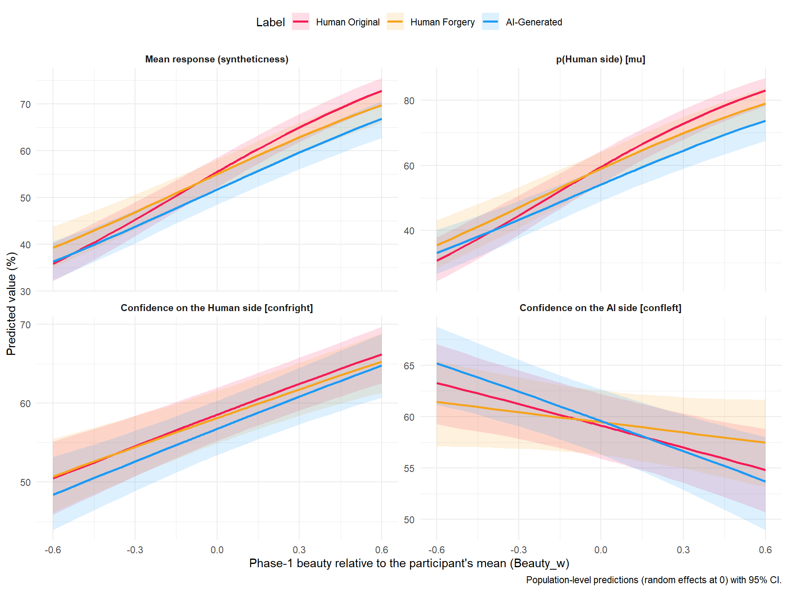
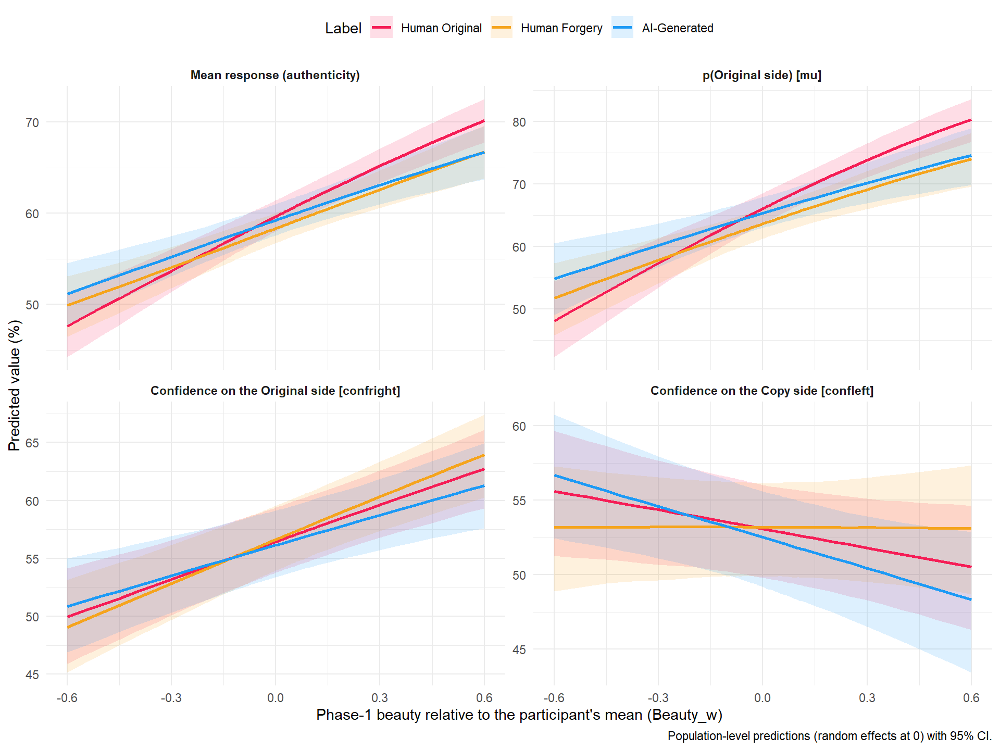
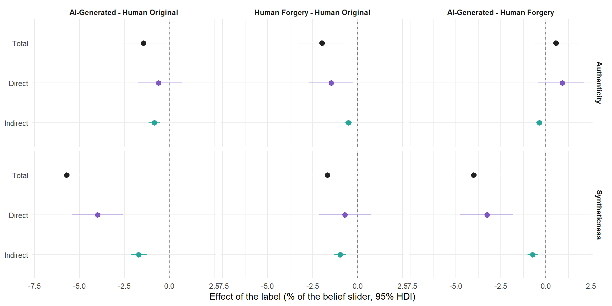

<!-- Estimates are computed on the cluster (`./hpc extract RealityBeauty AuthenticityBeauty`, see server/estimates.R: mediation_info, get_mediation_estimates()) and read from models/estimates/. The mediation itself (mediation_effects()) runs here, on the stored predictions. -->

## Data Preparation


::: {.cell}

```{.r .cell-code  code-fold="false"}
library(tidyverse)
library(easystats)
library(patchwork)


cols <- c(
  "Human Original" = "#F51D56",
  "Human Forgery" = "#F5A41D",
  "AI-Generated" = "#1D9AF5")

source("server/estimates.R") # mediation_info, mediation_effects(), prep_contrasts()
source("report.R")           # make_asis(), make_tables(), make_markdown(), read_estimates()

estimates <- read_estimates(names(mediation_info))
# The label effects of the main models (Condition * Emotion), for comparison
reference <- read_estimates(c("Beauty", "Reality", "Authenticity"))
provenance_table(c(estimates, reference))
```

::: {.cell-output-display}


Table: Provenance of the estimates read by this report.

|Model              |Fit                    | Draws| Max_Rhat|Extracted        |
|:------------------|:----------------------|-----:|--------:|:----------------|
|RealityBeauty      |RealityBeauty.rds      |  4000|    1.109|2026-09-23 17:39 |
|AuthenticityBeauty |AuthenticityBeauty.rds |  4000|    1.050|2026-09-23 17:39 |
|Beauty             |Beauty.rds             |  4000|    1.068|2026-09-22 19:58 |
|Reality            |Reality.rds            |  4000|    1.071|2026-09-22 19:57 |
|Authenticity       |Authenticity.rds       |  4000|    1.065|2026-09-22 19:57 |


:::

```{.r .cell-code  code-fold="false"}
# The mediation, once per model (bootstrap of the label -> beauty path over
# participants, one resample per posterior draw), on the mean response and on
# the main CHOCO parameters (same bootstrap draws for all)
mediation <- lapply(estimates, mediation_effects)
choco_pars <- c("mu", "confright", "confleft")
mediation_pars <- lapply(estimates, function(e) {
  lapply(setNames(nm = choco_pars), function(p) mediation_effects(e, par = p))
})

# Plain-language names of the CHOCO parameters, per belief (right = the "1" end)
par_labels <- list(
  RealityBeauty = c(response = "Mean response (syntheticness)",
                    mu = "p(Human side) [mu]",
                    confright = "Confidence on the Human side [confright]",
                    confleft = "Confidence on the AI side [confleft]"),
  AuthenticityBeauty = c(response = "Mean response (authenticity)",
                         mu = "p(Original side) [mu]",
                         confright = "Confidence on the Original side [confright]",
                         confleft = "Confidence on the Copy side [confleft]"))
```
:::


## How to read this report

The question is whether the labels lower the Phase-2 reality beliefs
**directly**, or **through the lower beauty they induced in Phase 1**
(label → beauty → belief). The label is randomised and beauty is rated
before the belief, so the label → belief effect decomposes as a mediation.
The reverse path (belief → beauty) cannot be tested: the only Phase-1
"belief" is the label itself.

| model | outcome | predictors | data |
| --- | --- | --- | --- |
| **RealityBeauty** | `Reality` (syntheticness; 0 = AI-Generated, 1 = Human Creation) | `Condition * Beauty_w` | 317 participants × 48 trials |
| **AuthenticityBeauty** | `Authenticity` (0 = Copy / Forgery, 1 = Original) | `Condition * Beauty_w` | same |

Both are CHOCO models with `Condition * Beauty_w` on `mu`, `confright` and
`confleft` (random `Condition * Beauty_w` slopes over participants,
`Condition + Beauty_w` over items), on the precisions (item intercept only)
and on `pex` / `bex` / `pmid` (participant intercept only). `Beauty_w` is the
Phase-1 beauty centred within participant: its slope is "this artwork vs.
my other artworks", and it is 0 at a participant's average beauty. There is
no Emotion term.

What each section reports, all in **% of the belief slider** unless stated
otherwise, as posterior medians with 95% CI (HDI for the mediation) and the
probability of direction (`pd`); "credible" = CI excludes 0:

- **Predicted belief by beauty**: the population-level prediction per label
  across `Beauty_w` (random effects at 0, 95% CI), for the mean response
  (the expected value of the CHOCO mixture) and for its three main
  parameters: `mu`, the probability of answering on the right-hand side of
  the slider (Human / Original), and `confright` / `confleft`, the confidence
  (distance from the midpoint) of the answers on each side. They show whether
  the label and beauty act on the *choice* or on the *confidence* in it.
- **Label contrasts at average beauty**: the label effect with beauty held at
  the participant's mean (`Beauty_w = 0`), for every CHOCO parameter. Compare
  with the label effect of the main model (no beauty term), shown alongside.
- **Beauty slopes**: the change in the belief per +10% of the beauty slider,
  per label, and the differences between labels (the interaction on the
  response scale: does a "fake" label weaken the beauty cue?).
- **Mediation**, for each contrast `c1 - c0`, with `E[Y | c, m]` the
  prediction under label `c` at beauty `m`, and `M_c` the mean `Beauty_w`
  under label `c`:
  - *Mediator (a)*: `M_c1 - M_c0`, in % of the **beauty** slider;
  - *Total*: `E[Y | c1, M_c1] - E[Y | c0, M_c0]`;
  - *Direct*: `E[Y | c1, M_c0] - E[Y | c0, M_c0]` (the label, beauty held
    where the reference label leaves it);
  - *Indirect*: `E[Y | c1, M_c1] - E[Y | c1, M_c0]` (beauty moved as the label
    moves it, the label held fixed);
  - *Proportion mediated*: Indirect / Total, only meaningful when the Total
    is credible.
- **Mediation by parameter**: the same Total / Direct / Indirect effects on
  `mu`, `confright` and `confleft` (percentage points of each parameter).

Caveats: predictions are evaluated at the mean beauty per label (an
approximation for a non-linear model) and at the population level (random
effects at 0); measurement error in beauty attenuates the slope, so the
indirect effect is a lower bound; beauty is not randomised, so a
person-specific appeal of the artwork could drive both beauty and belief
(the planned control is follow-up beauty, `Beauty2`).

## Convergence


```{.r .cell-code}
convergence_by_class <- function(est) {
  est$convergence |>
    mutate(Class = case_when(
      startsWith(variable, "b_") | startsWith(variable, "Intercept") ~ "b (fixed effects)",
      startsWith(variable, "sd_") ~ "sd (random-effect SDs)",
      startsWith(variable, "cor_") ~ "cor (random-effect correlations)",
      .default = "other")) |>
    summarise(N = n(), Max_Rhat = round(max(rhat, na.rm = TRUE), 3),
              Min_ESS_bulk = round(min(ess_bulk, na.rm = TRUE)), .by = "Class") |>
    mutate(Model = est$outcome, .before = 1)
}

make_asis(
  make_tables(bind_rows(lapply(estimates, `[[`, "diag")),
              c("Model", "Family", "N_obs", "N_participants", "Chains", "Draws", "Max_Rhat", "Min_ESS_ratio", "Divergent_pct"),
              "Convergence of the determinants models"),
  make_tables(bind_rows(lapply(estimates, convergence_by_class)),
              c("Model", "Class", "N", "Max_Rhat", "Min_ESS_bulk"),
              "Convergence by parameter class (the fixed effects are what the report uses)")
)
```

```{=html}
<div id="lhjanbgfvj" style="padding-left:0px;padding-right:0px;padding-top:10px;padding-bottom:10px;overflow-x:auto;overflow-y:auto;width:auto;height:auto;">
<style>#lhjanbgfvj table {
  font-family: system-ui, 'Segoe UI', Roboto, Helvetica, Arial, sans-serif, 'Apple Color Emoji', 'Segoe UI Emoji', 'Segoe UI Symbol', 'Noto Color Emoji';
  -webkit-font-smoothing: antialiased;
  -moz-osx-font-smoothing: grayscale;
}

#lhjanbgfvj thead, #lhjanbgfvj tbody, #lhjanbgfvj tfoot, #lhjanbgfvj tr, #lhjanbgfvj td, #lhjanbgfvj th {
  border-style: none;
}

#lhjanbgfvj p {
  margin: 0;
  padding: 0;
}

#lhjanbgfvj .gt_table {
  display: table;
  border-collapse: collapse;
  line-height: normal;
  margin-left: auto;
  margin-right: auto;
  color: #333333;
  font-size: 13px;
  font-weight: normal;
  font-style: normal;
  background-color: #FFFFFF;
  width: auto;
  border-top-style: solid;
  border-top-width: 3px;
  border-top-color: #D5D5D5;
  border-right-style: solid;
  border-right-width: 3px;
  border-right-color: #D5D5D5;
  border-bottom-style: solid;
  border-bottom-width: 3px;
  border-bottom-color: #D5D5D5;
  border-left-style: solid;
  border-left-width: 3px;
  border-left-color: #D5D5D5;
}

#lhjanbgfvj .gt_caption {
  padding-top: 4px;
  padding-bottom: 4px;
}

#lhjanbgfvj .gt_title {
  color: #333333;
  font-size: 125%;
  font-weight: initial;
  padding-top: 4px;
  padding-bottom: 4px;
  padding-left: 5px;
  padding-right: 5px;
  border-bottom-color: #FFFFFF;
  border-bottom-width: 0;
}

#lhjanbgfvj .gt_subtitle {
  color: #333333;
  font-size: 85%;
  font-weight: initial;
  padding-top: 3px;
  padding-bottom: 5px;
  padding-left: 5px;
  padding-right: 5px;
  border-top-color: #FFFFFF;
  border-top-width: 0;
}

#lhjanbgfvj .gt_heading {
  background-color: #FFFFFF;
  text-align: left;
  border-bottom-color: #FFFFFF;
  border-left-style: none;
  border-left-width: 1px;
  border-left-color: #D3D3D3;
  border-right-style: none;
  border-right-width: 1px;
  border-right-color: #D3D3D3;
}

#lhjanbgfvj .gt_bottom_border {
  border-bottom-style: solid;
  border-bottom-width: 2px;
  border-bottom-color: #D5D5D5;
}

#lhjanbgfvj .gt_col_headings {
  border-top-style: solid;
  border-top-width: 2px;
  border-top-color: #D5D5D5;
  border-bottom-style: solid;
  border-bottom-width: 2px;
  border-bottom-color: #D5D5D5;
  border-left-style: none;
  border-left-width: 1px;
  border-left-color: #D3D3D3;
  border-right-style: none;
  border-right-width: 1px;
  border-right-color: #D3D3D3;
}

#lhjanbgfvj .gt_col_heading {
  color: #FFFFFF;
  background-color: #000000;
  font-size: 100%;
  font-weight: normal;
  text-transform: inherit;
  border-left-style: none;
  border-left-width: 1px;
  border-left-color: #D3D3D3;
  border-right-style: none;
  border-right-width: 1px;
  border-right-color: #D3D3D3;
  vertical-align: bottom;
  padding-top: 5px;
  padding-bottom: 6px;
  padding-left: 5px;
  padding-right: 5px;
  overflow-x: hidden;
}

#lhjanbgfvj .gt_column_spanner_outer {
  color: #FFFFFF;
  background-color: #000000;
  font-size: 100%;
  font-weight: normal;
  text-transform: inherit;
  padding-top: 0;
  padding-bottom: 0;
  padding-left: 4px;
  padding-right: 4px;
}

#lhjanbgfvj .gt_column_spanner_outer:first-child {
  padding-left: 0;
}

#lhjanbgfvj .gt_column_spanner_outer:last-child {
  padding-right: 0;
}

#lhjanbgfvj .gt_column_spanner {
  border-bottom-style: solid;
  border-bottom-width: 2px;
  border-bottom-color: #D5D5D5;
  vertical-align: bottom;
  padding-top: 5px;
  padding-bottom: 5px;
  overflow-x: hidden;
  display: inline-block;
  width: 100%;
}

#lhjanbgfvj .gt_spanner_row {
  border-bottom-style: hidden;
}

#lhjanbgfvj .gt_group_heading {
  padding-top: 8px;
  padding-bottom: 8px;
  padding-left: 5px;
  padding-right: 5px;
  color: #333333;
  background-color: #FFFFFF;
  font-size: 100%;
  font-weight: initial;
  text-transform: inherit;
  border-top-style: solid;
  border-top-width: 2px;
  border-top-color: #D5D5D5;
  border-bottom-style: solid;
  border-bottom-width: 2px;
  border-bottom-color: #D5D5D5;
  border-left-style: none;
  border-left-width: 1px;
  border-left-color: #D3D3D3;
  border-right-style: none;
  border-right-width: 1px;
  border-right-color: #D3D3D3;
  vertical-align: middle;
  text-align: left;
}

#lhjanbgfvj .gt_empty_group_heading {
  padding: 0.5px;
  color: #333333;
  background-color: #FFFFFF;
  font-size: 100%;
  font-weight: initial;
  border-top-style: solid;
  border-top-width: 2px;
  border-top-color: #D5D5D5;
  border-bottom-style: solid;
  border-bottom-width: 2px;
  border-bottom-color: #D5D5D5;
  vertical-align: middle;
}

#lhjanbgfvj .gt_from_md > :first-child {
  margin-top: 0;
}

#lhjanbgfvj .gt_from_md > :last-child {
  margin-bottom: 0;
}

#lhjanbgfvj .gt_row {
  padding-top: 8px;
  padding-bottom: 8px;
  padding-left: 5px;
  padding-right: 5px;
  margin: 10px;
  border-top-style: solid;
  border-top-width: 1px;
  border-top-color: #D5D5D5;
  border-left-style: solid;
  border-left-width: 1px;
  border-left-color: #D5D5D5;
  border-right-style: solid;
  border-right-width: 1px;
  border-right-color: #D5D5D5;
  vertical-align: middle;
  overflow-x: hidden;
}

#lhjanbgfvj .gt_stub {
  color: #333333;
  background-color: #FFFFFF;
  font-size: 100%;
  font-weight: initial;
  text-transform: inherit;
  border-right-style: solid;
  border-right-width: 2px;
  border-right-color: #5F5F5F;
  padding-left: 5px;
  padding-right: 5px;
}

#lhjanbgfvj .gt_stub_row_group {
  color: #333333;
  background-color: #FFFFFF;
  font-size: 100%;
  font-weight: initial;
  text-transform: inherit;
  border-right-style: solid;
  border-right-width: 2px;
  border-right-color: #D3D3D3;
  padding-left: 5px;
  padding-right: 5px;
  vertical-align: top;
}

#lhjanbgfvj .gt_row_group_first td {
  border-top-width: 2px;
}

#lhjanbgfvj .gt_row_group_first th {
  border-top-width: 2px;
}

#lhjanbgfvj .gt_summary_row {
  color: #333333;
  background-color: #D5D5D5;
  text-transform: inherit;
  padding-top: 8px;
  padding-bottom: 8px;
  padding-left: 5px;
  padding-right: 5px;
}

#lhjanbgfvj .gt_first_summary_row {
  border-top-style: solid;
  border-top-color: #D5D5D5;
}

#lhjanbgfvj .gt_first_summary_row.thick {
  border-top-width: 2px;
}

#lhjanbgfvj .gt_last_summary_row {
  padding-top: 8px;
  padding-bottom: 8px;
  padding-left: 5px;
  padding-right: 5px;
  border-bottom-style: solid;
  border-bottom-width: 2px;
  border-bottom-color: #D5D5D5;
}

#lhjanbgfvj .gt_grand_summary_row {
  color: #FFFFFF;
  background-color: #929292;
  text-transform: inherit;
  padding-top: 8px;
  padding-bottom: 8px;
  padding-left: 5px;
  padding-right: 5px;
}

#lhjanbgfvj .gt_first_grand_summary_row {
  padding-top: 8px;
  padding-bottom: 8px;
  padding-left: 5px;
  padding-right: 5px;
  border-top-style: double;
  border-top-width: 6px;
  border-top-color: #D5D5D5;
}

#lhjanbgfvj .gt_last_grand_summary_row_top {
  padding-top: 8px;
  padding-bottom: 8px;
  padding-left: 5px;
  padding-right: 5px;
  border-bottom-style: double;
  border-bottom-width: 6px;
  border-bottom-color: #D5D5D5;
}

#lhjanbgfvj .gt_striped {
  background-color: #F4F4F4;
}

#lhjanbgfvj .gt_table_body {
  border-top-style: solid;
  border-top-width: 2px;
  border-top-color: #D5D5D5;
  border-bottom-style: solid;
  border-bottom-width: 2px;
  border-bottom-color: #D5D5D5;
}

#lhjanbgfvj .gt_footnotes {
  color: #333333;
  background-color: #FFFFFF;
  border-bottom-style: none;
  border-bottom-width: 2px;
  border-bottom-color: #D3D3D3;
  border-left-style: none;
  border-left-width: 2px;
  border-left-color: #D3D3D3;
  border-right-style: none;
  border-right-width: 2px;
  border-right-color: #D3D3D3;
}

#lhjanbgfvj .gt_footnote {
  margin: 0px;
  font-size: 90%;
  padding-top: 4px;
  padding-bottom: 4px;
  padding-left: 5px;
  padding-right: 5px;
}

#lhjanbgfvj .gt_sourcenotes {
  color: #333333;
  background-color: #FFFFFF;
  border-bottom-style: none;
  border-bottom-width: 2px;
  border-bottom-color: #D3D3D3;
  border-left-style: none;
  border-left-width: 2px;
  border-left-color: #D3D3D3;
  border-right-style: none;
  border-right-width: 2px;
  border-right-color: #D3D3D3;
}

#lhjanbgfvj .gt_sourcenote {
  font-size: 90%;
  padding-top: 4px;
  padding-bottom: 4px;
  padding-left: 5px;
  padding-right: 5px;
}

#lhjanbgfvj .gt_left {
  text-align: left;
}

#lhjanbgfvj .gt_center {
  text-align: center;
}

#lhjanbgfvj .gt_right {
  text-align: right;
  font-variant-numeric: tabular-nums;
}

#lhjanbgfvj .gt_font_normal {
  font-weight: normal;
}

#lhjanbgfvj .gt_font_bold {
  font-weight: bold;
}

#lhjanbgfvj .gt_font_italic {
  font-style: italic;
}

#lhjanbgfvj .gt_super {
  font-size: 65%;
}

#lhjanbgfvj .gt_footnote_marks {
  font-size: 75%;
  vertical-align: 0.4em;
  position: initial;
}

#lhjanbgfvj .gt_asterisk {
  font-size: 100%;
  vertical-align: 0;
}

#lhjanbgfvj .gt_indent_1 {
  text-indent: 5px;
}

#lhjanbgfvj .gt_indent_2 {
  text-indent: 10px;
}

#lhjanbgfvj .gt_indent_3 {
  text-indent: 15px;
}

#lhjanbgfvj .gt_indent_4 {
  text-indent: 20px;
}

#lhjanbgfvj .gt_indent_5 {
  text-indent: 25px;
}

#lhjanbgfvj .katex-display {
  display: inline-flex !important;
  margin-bottom: 0.75em !important;
}

#lhjanbgfvj div.Reactable > div.rt-table > div.rt-thead > div.rt-tr.rt-tr-group-header > div.rt-th-group:after {
  height: 0px !important;
}
</style>
<table class="gt_table" data-quarto-disable-processing="false" data-quarto-bootstrap="false">
  <thead>
    <tr class="gt_heading">
      <td colspan="9" class="gt_heading gt_title gt_font_normal gt_bottom_border" style>Convergence of the determinants models</td>
    </tr>
    
    <tr class="gt_col_headings">
      <th class="gt_col_heading gt_columns_bottom_border gt_left" rowspan="1" colspan="1" scope="col" id="Model">Model</th>
      <th class="gt_col_heading gt_columns_bottom_border gt_left" rowspan="1" colspan="1" scope="col" id="Family">Family</th>
      <th class="gt_col_heading gt_columns_bottom_border gt_right" rowspan="1" colspan="1" scope="col" id="N_obs">N_obs</th>
      <th class="gt_col_heading gt_columns_bottom_border gt_right" rowspan="1" colspan="1" scope="col" id="N_participants">N_participants</th>
      <th class="gt_col_heading gt_columns_bottom_border gt_right" rowspan="1" colspan="1" scope="col" id="Chains">Chains</th>
      <th class="gt_col_heading gt_columns_bottom_border gt_right" rowspan="1" colspan="1" scope="col" id="Draws">Draws</th>
      <th class="gt_col_heading gt_columns_bottom_border gt_right" rowspan="1" colspan="1" scope="col" id="Max_Rhat">Max_Rhat</th>
      <th class="gt_col_heading gt_columns_bottom_border gt_right" rowspan="1" colspan="1" scope="col" id="Min_ESS_ratio">Min_ESS_ratio</th>
      <th class="gt_col_heading gt_columns_bottom_border gt_right" rowspan="1" colspan="1" scope="col" id="Divergent_pct">Divergent_pct</th>
    </tr>
  </thead>
  <tbody class="gt_table_body">
    <tr><td headers="Model" class="gt_row gt_left">RealityBeauty</td>
<td headers="Family" class="gt_row gt_left">CHOCO</td>
<td headers="N_obs" class="gt_row gt_right">15216</td>
<td headers="N_participants" class="gt_row gt_right">317</td>
<td headers="Chains" class="gt_row gt_right">8</td>
<td headers="Draws" class="gt_row gt_right">4000</td>
<td headers="Max_Rhat" class="gt_row gt_right">1.109</td>
<td headers="Min_ESS_ratio" class="gt_row gt_right">0.014</td>
<td headers="Divergent_pct" class="gt_row gt_right">0</td></tr>
    <tr><td headers="Model" class="gt_row gt_left gt_striped">AuthenticityBeauty</td>
<td headers="Family" class="gt_row gt_left gt_striped">CHOCO</td>
<td headers="N_obs" class="gt_row gt_right gt_striped">15216</td>
<td headers="N_participants" class="gt_row gt_right gt_striped">317</td>
<td headers="Chains" class="gt_row gt_right gt_striped">8</td>
<td headers="Draws" class="gt_row gt_right gt_striped">4000</td>
<td headers="Max_Rhat" class="gt_row gt_right gt_striped">1.050</td>
<td headers="Min_ESS_ratio" class="gt_row gt_right gt_striped">0.032</td>
<td headers="Divergent_pct" class="gt_row gt_right gt_striped">0</td></tr>
  </tbody>
  
</table>
</div>
```


::: {.callout-note collapse="true" title="Convergence of the determinants models (Markdown table, for text readers)"}

|Model              |Family | N_obs| N_participants| Chains| Draws| Max_Rhat| Min_ESS_ratio| Divergent_pct|
|:------------------|:------|-----:|--------------:|------:|-----:|--------:|-------------:|-------------:|
|RealityBeauty      |CHOCO  | 15216|            317|      8|  4000|    1.109|         0.014|             0|
|AuthenticityBeauty |CHOCO  | 15216|            317|      8|  4000|    1.050|         0.032|             0|

:::

```{=html}
<div id="pnesehtpmg" style="padding-left:0px;padding-right:0px;padding-top:10px;padding-bottom:10px;overflow-x:auto;overflow-y:auto;width:auto;height:auto;">
<style>#pnesehtpmg table {
  font-family: system-ui, 'Segoe UI', Roboto, Helvetica, Arial, sans-serif, 'Apple Color Emoji', 'Segoe UI Emoji', 'Segoe UI Symbol', 'Noto Color Emoji';
  -webkit-font-smoothing: antialiased;
  -moz-osx-font-smoothing: grayscale;
}

#pnesehtpmg thead, #pnesehtpmg tbody, #pnesehtpmg tfoot, #pnesehtpmg tr, #pnesehtpmg td, #pnesehtpmg th {
  border-style: none;
}

#pnesehtpmg p {
  margin: 0;
  padding: 0;
}

#pnesehtpmg .gt_table {
  display: table;
  border-collapse: collapse;
  line-height: normal;
  margin-left: auto;
  margin-right: auto;
  color: #333333;
  font-size: 13px;
  font-weight: normal;
  font-style: normal;
  background-color: #FFFFFF;
  width: auto;
  border-top-style: solid;
  border-top-width: 3px;
  border-top-color: #D5D5D5;
  border-right-style: solid;
  border-right-width: 3px;
  border-right-color: #D5D5D5;
  border-bottom-style: solid;
  border-bottom-width: 3px;
  border-bottom-color: #D5D5D5;
  border-left-style: solid;
  border-left-width: 3px;
  border-left-color: #D5D5D5;
}

#pnesehtpmg .gt_caption {
  padding-top: 4px;
  padding-bottom: 4px;
}

#pnesehtpmg .gt_title {
  color: #333333;
  font-size: 125%;
  font-weight: initial;
  padding-top: 4px;
  padding-bottom: 4px;
  padding-left: 5px;
  padding-right: 5px;
  border-bottom-color: #FFFFFF;
  border-bottom-width: 0;
}

#pnesehtpmg .gt_subtitle {
  color: #333333;
  font-size: 85%;
  font-weight: initial;
  padding-top: 3px;
  padding-bottom: 5px;
  padding-left: 5px;
  padding-right: 5px;
  border-top-color: #FFFFFF;
  border-top-width: 0;
}

#pnesehtpmg .gt_heading {
  background-color: #FFFFFF;
  text-align: left;
  border-bottom-color: #FFFFFF;
  border-left-style: none;
  border-left-width: 1px;
  border-left-color: #D3D3D3;
  border-right-style: none;
  border-right-width: 1px;
  border-right-color: #D3D3D3;
}

#pnesehtpmg .gt_bottom_border {
  border-bottom-style: solid;
  border-bottom-width: 2px;
  border-bottom-color: #D5D5D5;
}

#pnesehtpmg .gt_col_headings {
  border-top-style: solid;
  border-top-width: 2px;
  border-top-color: #D5D5D5;
  border-bottom-style: solid;
  border-bottom-width: 2px;
  border-bottom-color: #D5D5D5;
  border-left-style: none;
  border-left-width: 1px;
  border-left-color: #D3D3D3;
  border-right-style: none;
  border-right-width: 1px;
  border-right-color: #D3D3D3;
}

#pnesehtpmg .gt_col_heading {
  color: #FFFFFF;
  background-color: #000000;
  font-size: 100%;
  font-weight: normal;
  text-transform: inherit;
  border-left-style: none;
  border-left-width: 1px;
  border-left-color: #D3D3D3;
  border-right-style: none;
  border-right-width: 1px;
  border-right-color: #D3D3D3;
  vertical-align: bottom;
  padding-top: 5px;
  padding-bottom: 6px;
  padding-left: 5px;
  padding-right: 5px;
  overflow-x: hidden;
}

#pnesehtpmg .gt_column_spanner_outer {
  color: #FFFFFF;
  background-color: #000000;
  font-size: 100%;
  font-weight: normal;
  text-transform: inherit;
  padding-top: 0;
  padding-bottom: 0;
  padding-left: 4px;
  padding-right: 4px;
}

#pnesehtpmg .gt_column_spanner_outer:first-child {
  padding-left: 0;
}

#pnesehtpmg .gt_column_spanner_outer:last-child {
  padding-right: 0;
}

#pnesehtpmg .gt_column_spanner {
  border-bottom-style: solid;
  border-bottom-width: 2px;
  border-bottom-color: #D5D5D5;
  vertical-align: bottom;
  padding-top: 5px;
  padding-bottom: 5px;
  overflow-x: hidden;
  display: inline-block;
  width: 100%;
}

#pnesehtpmg .gt_spanner_row {
  border-bottom-style: hidden;
}

#pnesehtpmg .gt_group_heading {
  padding-top: 8px;
  padding-bottom: 8px;
  padding-left: 5px;
  padding-right: 5px;
  color: #333333;
  background-color: #FFFFFF;
  font-size: 100%;
  font-weight: initial;
  text-transform: inherit;
  border-top-style: solid;
  border-top-width: 2px;
  border-top-color: #D5D5D5;
  border-bottom-style: solid;
  border-bottom-width: 2px;
  border-bottom-color: #D5D5D5;
  border-left-style: none;
  border-left-width: 1px;
  border-left-color: #D3D3D3;
  border-right-style: none;
  border-right-width: 1px;
  border-right-color: #D3D3D3;
  vertical-align: middle;
  text-align: left;
}

#pnesehtpmg .gt_empty_group_heading {
  padding: 0.5px;
  color: #333333;
  background-color: #FFFFFF;
  font-size: 100%;
  font-weight: initial;
  border-top-style: solid;
  border-top-width: 2px;
  border-top-color: #D5D5D5;
  border-bottom-style: solid;
  border-bottom-width: 2px;
  border-bottom-color: #D5D5D5;
  vertical-align: middle;
}

#pnesehtpmg .gt_from_md > :first-child {
  margin-top: 0;
}

#pnesehtpmg .gt_from_md > :last-child {
  margin-bottom: 0;
}

#pnesehtpmg .gt_row {
  padding-top: 8px;
  padding-bottom: 8px;
  padding-left: 5px;
  padding-right: 5px;
  margin: 10px;
  border-top-style: solid;
  border-top-width: 1px;
  border-top-color: #D5D5D5;
  border-left-style: solid;
  border-left-width: 1px;
  border-left-color: #D5D5D5;
  border-right-style: solid;
  border-right-width: 1px;
  border-right-color: #D5D5D5;
  vertical-align: middle;
  overflow-x: hidden;
}

#pnesehtpmg .gt_stub {
  color: #333333;
  background-color: #FFFFFF;
  font-size: 100%;
  font-weight: initial;
  text-transform: inherit;
  border-right-style: solid;
  border-right-width: 2px;
  border-right-color: #5F5F5F;
  padding-left: 5px;
  padding-right: 5px;
}

#pnesehtpmg .gt_stub_row_group {
  color: #333333;
  background-color: #FFFFFF;
  font-size: 100%;
  font-weight: initial;
  text-transform: inherit;
  border-right-style: solid;
  border-right-width: 2px;
  border-right-color: #D3D3D3;
  padding-left: 5px;
  padding-right: 5px;
  vertical-align: top;
}

#pnesehtpmg .gt_row_group_first td {
  border-top-width: 2px;
}

#pnesehtpmg .gt_row_group_first th {
  border-top-width: 2px;
}

#pnesehtpmg .gt_summary_row {
  color: #333333;
  background-color: #D5D5D5;
  text-transform: inherit;
  padding-top: 8px;
  padding-bottom: 8px;
  padding-left: 5px;
  padding-right: 5px;
}

#pnesehtpmg .gt_first_summary_row {
  border-top-style: solid;
  border-top-color: #D5D5D5;
}

#pnesehtpmg .gt_first_summary_row.thick {
  border-top-width: 2px;
}

#pnesehtpmg .gt_last_summary_row {
  padding-top: 8px;
  padding-bottom: 8px;
  padding-left: 5px;
  padding-right: 5px;
  border-bottom-style: solid;
  border-bottom-width: 2px;
  border-bottom-color: #D5D5D5;
}

#pnesehtpmg .gt_grand_summary_row {
  color: #FFFFFF;
  background-color: #929292;
  text-transform: inherit;
  padding-top: 8px;
  padding-bottom: 8px;
  padding-left: 5px;
  padding-right: 5px;
}

#pnesehtpmg .gt_first_grand_summary_row {
  padding-top: 8px;
  padding-bottom: 8px;
  padding-left: 5px;
  padding-right: 5px;
  border-top-style: double;
  border-top-width: 6px;
  border-top-color: #D5D5D5;
}

#pnesehtpmg .gt_last_grand_summary_row_top {
  padding-top: 8px;
  padding-bottom: 8px;
  padding-left: 5px;
  padding-right: 5px;
  border-bottom-style: double;
  border-bottom-width: 6px;
  border-bottom-color: #D5D5D5;
}

#pnesehtpmg .gt_striped {
  background-color: #F4F4F4;
}

#pnesehtpmg .gt_table_body {
  border-top-style: solid;
  border-top-width: 2px;
  border-top-color: #D5D5D5;
  border-bottom-style: solid;
  border-bottom-width: 2px;
  border-bottom-color: #D5D5D5;
}

#pnesehtpmg .gt_footnotes {
  color: #333333;
  background-color: #FFFFFF;
  border-bottom-style: none;
  border-bottom-width: 2px;
  border-bottom-color: #D3D3D3;
  border-left-style: none;
  border-left-width: 2px;
  border-left-color: #D3D3D3;
  border-right-style: none;
  border-right-width: 2px;
  border-right-color: #D3D3D3;
}

#pnesehtpmg .gt_footnote {
  margin: 0px;
  font-size: 90%;
  padding-top: 4px;
  padding-bottom: 4px;
  padding-left: 5px;
  padding-right: 5px;
}

#pnesehtpmg .gt_sourcenotes {
  color: #333333;
  background-color: #FFFFFF;
  border-bottom-style: none;
  border-bottom-width: 2px;
  border-bottom-color: #D3D3D3;
  border-left-style: none;
  border-left-width: 2px;
  border-left-color: #D3D3D3;
  border-right-style: none;
  border-right-width: 2px;
  border-right-color: #D3D3D3;
}

#pnesehtpmg .gt_sourcenote {
  font-size: 90%;
  padding-top: 4px;
  padding-bottom: 4px;
  padding-left: 5px;
  padding-right: 5px;
}

#pnesehtpmg .gt_left {
  text-align: left;
}

#pnesehtpmg .gt_center {
  text-align: center;
}

#pnesehtpmg .gt_right {
  text-align: right;
  font-variant-numeric: tabular-nums;
}

#pnesehtpmg .gt_font_normal {
  font-weight: normal;
}

#pnesehtpmg .gt_font_bold {
  font-weight: bold;
}

#pnesehtpmg .gt_font_italic {
  font-style: italic;
}

#pnesehtpmg .gt_super {
  font-size: 65%;
}

#pnesehtpmg .gt_footnote_marks {
  font-size: 75%;
  vertical-align: 0.4em;
  position: initial;
}

#pnesehtpmg .gt_asterisk {
  font-size: 100%;
  vertical-align: 0;
}

#pnesehtpmg .gt_indent_1 {
  text-indent: 5px;
}

#pnesehtpmg .gt_indent_2 {
  text-indent: 10px;
}

#pnesehtpmg .gt_indent_3 {
  text-indent: 15px;
}

#pnesehtpmg .gt_indent_4 {
  text-indent: 20px;
}

#pnesehtpmg .gt_indent_5 {
  text-indent: 25px;
}

#pnesehtpmg .katex-display {
  display: inline-flex !important;
  margin-bottom: 0.75em !important;
}

#pnesehtpmg div.Reactable > div.rt-table > div.rt-thead > div.rt-tr.rt-tr-group-header > div.rt-th-group:after {
  height: 0px !important;
}
</style>
<table class="gt_table" data-quarto-disable-processing="false" data-quarto-bootstrap="false">
  <thead>
    <tr class="gt_heading">
      <td colspan="5" class="gt_heading gt_title gt_font_normal gt_bottom_border" style>Convergence by parameter class (the fixed effects are what the report uses)</td>
    </tr>
    
    <tr class="gt_col_headings">
      <th class="gt_col_heading gt_columns_bottom_border gt_left" rowspan="1" colspan="1" scope="col" id="Model">Model</th>
      <th class="gt_col_heading gt_columns_bottom_border gt_left" rowspan="1" colspan="1" scope="col" id="Class">Class</th>
      <th class="gt_col_heading gt_columns_bottom_border gt_right" rowspan="1" colspan="1" scope="col" id="N">N</th>
      <th class="gt_col_heading gt_columns_bottom_border gt_right" rowspan="1" colspan="1" scope="col" id="Max_Rhat">Max_Rhat</th>
      <th class="gt_col_heading gt_columns_bottom_border gt_right" rowspan="1" colspan="1" scope="col" id="Min_ESS_bulk">Min_ESS_bulk</th>
    </tr>
  </thead>
  <tbody class="gt_table_body">
    <tr><td headers="Model" class="gt_row gt_left">RealityBeauty</td>
<td headers="Class" class="gt_row gt_left">b (fixed effects)</td>
<td headers="N" class="gt_row gt_right">56</td>
<td headers="Max_Rhat" class="gt_row gt_right">1.083</td>
<td headers="Min_ESS_bulk" class="gt_row gt_right">76</td></tr>
    <tr><td headers="Model" class="gt_row gt_left gt_striped">RealityBeauty</td>
<td headers="Class" class="gt_row gt_left gt_striped">sd (random-effect SDs)</td>
<td headers="N" class="gt_row gt_right gt_striped">47</td>
<td headers="Max_Rhat" class="gt_row gt_right gt_striped">1.022</td>
<td headers="Min_ESS_bulk" class="gt_row gt_right gt_striped">342</td></tr>
    <tr><td headers="Model" class="gt_row gt_left">RealityBeauty</td>
<td headers="Class" class="gt_row gt_left">cor (random-effect correlations)</td>
<td headers="N" class="gt_row gt_right">93</td>
<td headers="Max_Rhat" class="gt_row gt_right">1.109</td>
<td headers="Min_ESS_bulk" class="gt_row gt_right">56</td></tr>
    <tr><td headers="Model" class="gt_row gt_left gt_striped">RealityBeauty</td>
<td headers="Class" class="gt_row gt_left gt_striped">other</td>
<td headers="N" class="gt_row gt_right gt_striped">2</td>
<td headers="Max_Rhat" class="gt_row gt_right gt_striped">1.010</td>
<td headers="Min_ESS_bulk" class="gt_row gt_right gt_striped">686</td></tr>
    <tr><td headers="Model" class="gt_row gt_left">AuthenticityBeauty</td>
<td headers="Class" class="gt_row gt_left">b (fixed effects)</td>
<td headers="N" class="gt_row gt_right">56</td>
<td headers="Max_Rhat" class="gt_row gt_right">1.037</td>
<td headers="Min_ESS_bulk" class="gt_row gt_right">130</td></tr>
    <tr><td headers="Model" class="gt_row gt_left gt_striped">AuthenticityBeauty</td>
<td headers="Class" class="gt_row gt_left gt_striped">sd (random-effect SDs)</td>
<td headers="N" class="gt_row gt_right gt_striped">47</td>
<td headers="Max_Rhat" class="gt_row gt_right gt_striped">1.036</td>
<td headers="Min_ESS_bulk" class="gt_row gt_right gt_striped">297</td></tr>
    <tr><td headers="Model" class="gt_row gt_left">AuthenticityBeauty</td>
<td headers="Class" class="gt_row gt_left">cor (random-effect correlations)</td>
<td headers="N" class="gt_row gt_right">93</td>
<td headers="Max_Rhat" class="gt_row gt_right">1.050</td>
<td headers="Min_ESS_bulk" class="gt_row gt_right">187</td></tr>
    <tr><td headers="Model" class="gt_row gt_left gt_striped">AuthenticityBeauty</td>
<td headers="Class" class="gt_row gt_left gt_striped">other</td>
<td headers="N" class="gt_row gt_right gt_striped">2</td>
<td headers="Max_Rhat" class="gt_row gt_right gt_striped">1.010</td>
<td headers="Min_ESS_bulk" class="gt_row gt_right gt_striped">650</td></tr>
  </tbody>
  
</table>
</div>
```


::: {.callout-note collapse="true" title="Convergence by parameter class (the fixed effects are what the report uses) (Markdown table, for text readers)"}

|Model              |Class                            |  N| Max_Rhat| Min_ESS_bulk|
|:------------------|:--------------------------------|--:|--------:|------------:|
|RealityBeauty      |b (fixed effects)                | 56|    1.083|           76|
|RealityBeauty      |sd (random-effect SDs)           | 47|    1.022|          342|
|RealityBeauty      |cor (random-effect correlations) | 93|    1.109|           56|
|RealityBeauty      |other                            |  2|    1.010|          686|
|AuthenticityBeauty |b (fixed effects)                | 56|    1.037|          130|
|AuthenticityBeauty |sd (random-effect SDs)           | 47|    1.036|          297|
|AuthenticityBeauty |cor (random-effect correlations) | 93|    1.050|          187|
|AuthenticityBeauty |other                            |  2|    1.010|          650|

:::


::: {.cell}

```{.r .cell-code}
# Helpers shared by both model sections

# Credible / Effect (sign) / formatted columns. The mediation tables' own
# "Effect" (Total, Direct, ...) is kept as "Path".
format_effects <- function(dat) {
  if ("Effect" %in% names(dat)) dat <- rename(dat, Path = Effect)
  dat |>
    mutate(Credible = sign(CI_low) == sign(CI_high),
           Effect = ifelse(!Credible, "n.s.", ifelse(Median < 0, "Negative", "Positive")),
           Diff = insight::format_value(Median, zap_small = TRUE),
           CI = sprintf("[%s, %s]", insight::format_value(CI_low, zap_small = TRUE),
                        insight::format_value(CI_high, zap_small = TRUE)),
           pd_fmt = insight::format_pd(pd, name = NULL))
}

plot_predictions <- function(name) {
  est <- estimates[[name]]
  labs_par <- par_labels[[name]]
  mats <- c(list(response = est$grid_draws), est$grid_dpars[choco_pars])
  pred <- bind_rows(lapply(names(mats), function(p) {
    P <- mats[[p]]
    cbind(est$grid, Parameter = labs_par[[p]],
          Median = apply(P, 2, median),
          CI_low = apply(P, 2, quantile, 0.025),
          CI_high = apply(P, 2, quantile, 0.975))
  })) |>
    mutate(Parameter = factor(Parameter, levels = labs_par))

  ggplot(pred, aes(x = Beauty_w, color = Condition, fill = Condition)) +
    geom_ribbon(aes(ymin = 100 * CI_low, ymax = 100 * CI_high), alpha = 0.15, color = NA) +
    geom_line(aes(y = 100 * Median), linewidth = 1) +
    facet_wrap(~Parameter, scales = "free_y") +
    scale_color_manual(values = cols) +
    scale_fill_manual(values = cols) +
    labs(x = "Phase-1 beauty relative to the participant's mean (Beauty_w)",
         y = "Predicted value (%)", color = "Label", fill = "Label",
         caption = "Population-level predictions (random effects at 0) with 95% CI.") +
    theme_minimal() +
    theme(legend.position = "top", strip.text = element_text(face = "bold"))
}

section_tables <- function(name, reference_name) {
  est <- estimates[[name]]
  med <- mediation[[name]]

  con <- prep_contrasts(est$contrasts, est$outcome) |>
    filter(Parameter %in% c("response", "mu", "confright", "confleft", "pex", "bex", "pmid"))
  ref <- prep_contrasts(reference[[reference_name]]$contrasts, reference_name) |>
    filter(Parameter == "response") |>
    mutate(Parameter = "response (main model, no beauty term)")
  con <- bind_rows(con, ref) |> arrange(Contrast)

  make_asis(
    make_tables(con, c("Contrast", "Parameter", "Diff", "CI", "pd_fmt", "Effect"),
                sprintf("%s: label contrasts at average beauty (%% of the slider for response and the probability parameters)", est$label)),
    make_tables(format_effects(med$slopes), c("Condition", "Diff", "CI", "pd_fmt", "Effect"),
                sprintf("%s: change per +10%% of Phase-1 beauty (%% of the belief slider), per label and between labels", est$label)),
    make_tables(format_effects(med$effects), c("Contrast", "Path", "Diff", "CI", "pd_fmt", "Effect"),
                sprintf("%s: mediation of the label effect by Phase-1 beauty", est$label)),
    make_tables(
      bind_rows(lapply(choco_pars, function(p) {
        mutate(mediation_pars[[name]][[p]]$effects, Parameter = par_labels[[name]][[p]])
      })) |>
        filter(Effect %in% c("Total", "Direct", "Indirect")) |>
        format_effects() |>
        arrange(Contrast),
      c("Contrast", "Parameter", "Path", "Diff", "CI", "pd_fmt", "Effect"),
      sprintf("%s: mediation by CHOCO parameter (percentage points of each parameter)", est$label))
  )
}
```
:::


## Syntheticness


::: {.cell}

```{.r .cell-code}
plot_predictions("RealityBeauty")
```

::: {.cell-output-display}
{width=960}
:::
:::


```{.r .cell-code}
section_tables("RealityBeauty", "Reality")
```

```{=html}
<div id="madeoniclv" style="padding-left:0px;padding-right:0px;padding-top:10px;padding-bottom:10px;overflow-x:auto;overflow-y:auto;width:auto;height:auto;">
<style>#madeoniclv table {
  font-family: system-ui, 'Segoe UI', Roboto, Helvetica, Arial, sans-serif, 'Apple Color Emoji', 'Segoe UI Emoji', 'Segoe UI Symbol', 'Noto Color Emoji';
  -webkit-font-smoothing: antialiased;
  -moz-osx-font-smoothing: grayscale;
}

#madeoniclv thead, #madeoniclv tbody, #madeoniclv tfoot, #madeoniclv tr, #madeoniclv td, #madeoniclv th {
  border-style: none;
}

#madeoniclv p {
  margin: 0;
  padding: 0;
}

#madeoniclv .gt_table {
  display: table;
  border-collapse: collapse;
  line-height: normal;
  margin-left: auto;
  margin-right: auto;
  color: #333333;
  font-size: 13px;
  font-weight: normal;
  font-style: normal;
  background-color: #FFFFFF;
  width: auto;
  border-top-style: solid;
  border-top-width: 3px;
  border-top-color: #D5D5D5;
  border-right-style: solid;
  border-right-width: 3px;
  border-right-color: #D5D5D5;
  border-bottom-style: solid;
  border-bottom-width: 3px;
  border-bottom-color: #D5D5D5;
  border-left-style: solid;
  border-left-width: 3px;
  border-left-color: #D5D5D5;
}

#madeoniclv .gt_caption {
  padding-top: 4px;
  padding-bottom: 4px;
}

#madeoniclv .gt_title {
  color: #333333;
  font-size: 125%;
  font-weight: initial;
  padding-top: 4px;
  padding-bottom: 4px;
  padding-left: 5px;
  padding-right: 5px;
  border-bottom-color: #FFFFFF;
  border-bottom-width: 0;
}

#madeoniclv .gt_subtitle {
  color: #333333;
  font-size: 85%;
  font-weight: initial;
  padding-top: 3px;
  padding-bottom: 5px;
  padding-left: 5px;
  padding-right: 5px;
  border-top-color: #FFFFFF;
  border-top-width: 0;
}

#madeoniclv .gt_heading {
  background-color: #FFFFFF;
  text-align: left;
  border-bottom-color: #FFFFFF;
  border-left-style: none;
  border-left-width: 1px;
  border-left-color: #D3D3D3;
  border-right-style: none;
  border-right-width: 1px;
  border-right-color: #D3D3D3;
}

#madeoniclv .gt_bottom_border {
  border-bottom-style: solid;
  border-bottom-width: 2px;
  border-bottom-color: #D5D5D5;
}

#madeoniclv .gt_col_headings {
  border-top-style: solid;
  border-top-width: 2px;
  border-top-color: #D5D5D5;
  border-bottom-style: solid;
  border-bottom-width: 2px;
  border-bottom-color: #D5D5D5;
  border-left-style: none;
  border-left-width: 1px;
  border-left-color: #D3D3D3;
  border-right-style: none;
  border-right-width: 1px;
  border-right-color: #D3D3D3;
}

#madeoniclv .gt_col_heading {
  color: #FFFFFF;
  background-color: #000000;
  font-size: 100%;
  font-weight: normal;
  text-transform: inherit;
  border-left-style: none;
  border-left-width: 1px;
  border-left-color: #D3D3D3;
  border-right-style: none;
  border-right-width: 1px;
  border-right-color: #D3D3D3;
  vertical-align: bottom;
  padding-top: 5px;
  padding-bottom: 6px;
  padding-left: 5px;
  padding-right: 5px;
  overflow-x: hidden;
}

#madeoniclv .gt_column_spanner_outer {
  color: #FFFFFF;
  background-color: #000000;
  font-size: 100%;
  font-weight: normal;
  text-transform: inherit;
  padding-top: 0;
  padding-bottom: 0;
  padding-left: 4px;
  padding-right: 4px;
}

#madeoniclv .gt_column_spanner_outer:first-child {
  padding-left: 0;
}

#madeoniclv .gt_column_spanner_outer:last-child {
  padding-right: 0;
}

#madeoniclv .gt_column_spanner {
  border-bottom-style: solid;
  border-bottom-width: 2px;
  border-bottom-color: #D5D5D5;
  vertical-align: bottom;
  padding-top: 5px;
  padding-bottom: 5px;
  overflow-x: hidden;
  display: inline-block;
  width: 100%;
}

#madeoniclv .gt_spanner_row {
  border-bottom-style: hidden;
}

#madeoniclv .gt_group_heading {
  padding-top: 8px;
  padding-bottom: 8px;
  padding-left: 5px;
  padding-right: 5px;
  color: #333333;
  background-color: #FFFFFF;
  font-size: 100%;
  font-weight: initial;
  text-transform: inherit;
  border-top-style: solid;
  border-top-width: 2px;
  border-top-color: #D5D5D5;
  border-bottom-style: solid;
  border-bottom-width: 2px;
  border-bottom-color: #D5D5D5;
  border-left-style: none;
  border-left-width: 1px;
  border-left-color: #D3D3D3;
  border-right-style: none;
  border-right-width: 1px;
  border-right-color: #D3D3D3;
  vertical-align: middle;
  text-align: left;
}

#madeoniclv .gt_empty_group_heading {
  padding: 0.5px;
  color: #333333;
  background-color: #FFFFFF;
  font-size: 100%;
  font-weight: initial;
  border-top-style: solid;
  border-top-width: 2px;
  border-top-color: #D5D5D5;
  border-bottom-style: solid;
  border-bottom-width: 2px;
  border-bottom-color: #D5D5D5;
  vertical-align: middle;
}

#madeoniclv .gt_from_md > :first-child {
  margin-top: 0;
}

#madeoniclv .gt_from_md > :last-child {
  margin-bottom: 0;
}

#madeoniclv .gt_row {
  padding-top: 8px;
  padding-bottom: 8px;
  padding-left: 5px;
  padding-right: 5px;
  margin: 10px;
  border-top-style: solid;
  border-top-width: 1px;
  border-top-color: #D5D5D5;
  border-left-style: solid;
  border-left-width: 1px;
  border-left-color: #D5D5D5;
  border-right-style: solid;
  border-right-width: 1px;
  border-right-color: #D5D5D5;
  vertical-align: middle;
  overflow-x: hidden;
}

#madeoniclv .gt_stub {
  color: #333333;
  background-color: #FFFFFF;
  font-size: 100%;
  font-weight: initial;
  text-transform: inherit;
  border-right-style: solid;
  border-right-width: 2px;
  border-right-color: #5F5F5F;
  padding-left: 5px;
  padding-right: 5px;
}

#madeoniclv .gt_stub_row_group {
  color: #333333;
  background-color: #FFFFFF;
  font-size: 100%;
  font-weight: initial;
  text-transform: inherit;
  border-right-style: solid;
  border-right-width: 2px;
  border-right-color: #D3D3D3;
  padding-left: 5px;
  padding-right: 5px;
  vertical-align: top;
}

#madeoniclv .gt_row_group_first td {
  border-top-width: 2px;
}

#madeoniclv .gt_row_group_first th {
  border-top-width: 2px;
}

#madeoniclv .gt_summary_row {
  color: #333333;
  background-color: #D5D5D5;
  text-transform: inherit;
  padding-top: 8px;
  padding-bottom: 8px;
  padding-left: 5px;
  padding-right: 5px;
}

#madeoniclv .gt_first_summary_row {
  border-top-style: solid;
  border-top-color: #D5D5D5;
}

#madeoniclv .gt_first_summary_row.thick {
  border-top-width: 2px;
}

#madeoniclv .gt_last_summary_row {
  padding-top: 8px;
  padding-bottom: 8px;
  padding-left: 5px;
  padding-right: 5px;
  border-bottom-style: solid;
  border-bottom-width: 2px;
  border-bottom-color: #D5D5D5;
}

#madeoniclv .gt_grand_summary_row {
  color: #FFFFFF;
  background-color: #929292;
  text-transform: inherit;
  padding-top: 8px;
  padding-bottom: 8px;
  padding-left: 5px;
  padding-right: 5px;
}

#madeoniclv .gt_first_grand_summary_row {
  padding-top: 8px;
  padding-bottom: 8px;
  padding-left: 5px;
  padding-right: 5px;
  border-top-style: double;
  border-top-width: 6px;
  border-top-color: #D5D5D5;
}

#madeoniclv .gt_last_grand_summary_row_top {
  padding-top: 8px;
  padding-bottom: 8px;
  padding-left: 5px;
  padding-right: 5px;
  border-bottom-style: double;
  border-bottom-width: 6px;
  border-bottom-color: #D5D5D5;
}

#madeoniclv .gt_striped {
  background-color: #F4F4F4;
}

#madeoniclv .gt_table_body {
  border-top-style: solid;
  border-top-width: 2px;
  border-top-color: #D5D5D5;
  border-bottom-style: solid;
  border-bottom-width: 2px;
  border-bottom-color: #D5D5D5;
}

#madeoniclv .gt_footnotes {
  color: #333333;
  background-color: #FFFFFF;
  border-bottom-style: none;
  border-bottom-width: 2px;
  border-bottom-color: #D3D3D3;
  border-left-style: none;
  border-left-width: 2px;
  border-left-color: #D3D3D3;
  border-right-style: none;
  border-right-width: 2px;
  border-right-color: #D3D3D3;
}

#madeoniclv .gt_footnote {
  margin: 0px;
  font-size: 90%;
  padding-top: 4px;
  padding-bottom: 4px;
  padding-left: 5px;
  padding-right: 5px;
}

#madeoniclv .gt_sourcenotes {
  color: #333333;
  background-color: #FFFFFF;
  border-bottom-style: none;
  border-bottom-width: 2px;
  border-bottom-color: #D3D3D3;
  border-left-style: none;
  border-left-width: 2px;
  border-left-color: #D3D3D3;
  border-right-style: none;
  border-right-width: 2px;
  border-right-color: #D3D3D3;
}

#madeoniclv .gt_sourcenote {
  font-size: 90%;
  padding-top: 4px;
  padding-bottom: 4px;
  padding-left: 5px;
  padding-right: 5px;
}

#madeoniclv .gt_left {
  text-align: left;
}

#madeoniclv .gt_center {
  text-align: center;
}

#madeoniclv .gt_right {
  text-align: right;
  font-variant-numeric: tabular-nums;
}

#madeoniclv .gt_font_normal {
  font-weight: normal;
}

#madeoniclv .gt_font_bold {
  font-weight: bold;
}

#madeoniclv .gt_font_italic {
  font-style: italic;
}

#madeoniclv .gt_super {
  font-size: 65%;
}

#madeoniclv .gt_footnote_marks {
  font-size: 75%;
  vertical-align: 0.4em;
  position: initial;
}

#madeoniclv .gt_asterisk {
  font-size: 100%;
  vertical-align: 0;
}

#madeoniclv .gt_indent_1 {
  text-indent: 5px;
}

#madeoniclv .gt_indent_2 {
  text-indent: 10px;
}

#madeoniclv .gt_indent_3 {
  text-indent: 15px;
}

#madeoniclv .gt_indent_4 {
  text-indent: 20px;
}

#madeoniclv .gt_indent_5 {
  text-indent: 25px;
}

#madeoniclv .katex-display {
  display: inline-flex !important;
  margin-bottom: 0.75em !important;
}

#madeoniclv div.Reactable > div.rt-table > div.rt-thead > div.rt-tr.rt-tr-group-header > div.rt-th-group:after {
  height: 0px !important;
}
</style>
<table class="gt_table" data-quarto-disable-processing="false" data-quarto-bootstrap="false">
  <thead>
    <tr class="gt_heading">
      <td colspan="5" class="gt_heading gt_title gt_font_normal gt_bottom_border" style>Syntheticness by Phase-1 Beauty: label contrasts at average beauty (% of the slider for response and the probability parameters)</td>
    </tr>
    
    <tr class="gt_col_headings">
      <th class="gt_col_heading gt_columns_bottom_border gt_left" rowspan="1" colspan="1" scope="col" id="Parameter">Parameter</th>
      <th class="gt_col_heading gt_columns_bottom_border gt_right" rowspan="1" colspan="1" scope="col" id="Diff">Diff</th>
      <th class="gt_col_heading gt_columns_bottom_border gt_left" rowspan="1" colspan="1" scope="col" id="CI">CI</th>
      <th class="gt_col_heading gt_columns_bottom_border gt_right" rowspan="1" colspan="1" scope="col" id="pd_fmt">pd_fmt</th>
      <th class="gt_col_heading gt_columns_bottom_border gt_left" rowspan="1" colspan="1" scope="col" id="Effect">Effect</th>
    </tr>
  </thead>
  <tbody class="gt_table_body">
    <tr class="gt_group_heading_row">
      <th colspan="5" class="gt_group_heading" scope="colgroup" id="AI-Generated - Human Original">AI-Generated - Human Original</th>
    </tr>
    <tr class="gt_row_group_first"><td headers="AI-Generated - Human Original  Parameter" class="gt_row gt_left" style="background-color: #FFEBEE;">response</td>
<td headers="AI-Generated - Human Original  Diff" class="gt_row gt_right" style="background-color: #FFEBEE;">-3.76</td>
<td headers="AI-Generated - Human Original  CI" class="gt_row gt_left" style="background-color: #FFEBEE;">[-5.20, -2.33]</td>
<td headers="AI-Generated - Human Original  pd_fmt" class="gt_row gt_right" style="background-color: #FFEBEE;">100%</td>
<td headers="AI-Generated - Human Original  Effect" class="gt_row gt_left" style="background-color: #FFEBEE;">Negative</td></tr>
    <tr><td headers="AI-Generated - Human Original  Parameter" class="gt_row gt_left gt_striped" style="background-color: #FFEBEE;">mu</td>
<td headers="AI-Generated - Human Original  Diff" class="gt_row gt_right gt_striped" style="background-color: #FFEBEE;">-5.42</td>
<td headers="AI-Generated - Human Original  CI" class="gt_row gt_left gt_striped" style="background-color: #FFEBEE;">[-7.73, -3.09]</td>
<td headers="AI-Generated - Human Original  pd_fmt" class="gt_row gt_right gt_striped" style="background-color: #FFEBEE;">100%</td>
<td headers="AI-Generated - Human Original  Effect" class="gt_row gt_left gt_striped" style="background-color: #FFEBEE;">Negative</td></tr>
    <tr><td headers="AI-Generated - Human Original  Parameter" class="gt_row gt_left" style="background-color: #FFEBEE;">confright</td>
<td headers="AI-Generated - Human Original  Diff" class="gt_row gt_right" style="background-color: #FFEBEE;">-1.77</td>
<td headers="AI-Generated - Human Original  CI" class="gt_row gt_left" style="background-color: #FFEBEE;">[-2.74, -0.81]</td>
<td headers="AI-Generated - Human Original  pd_fmt" class="gt_row gt_right" style="background-color: #FFEBEE;">100%</td>
<td headers="AI-Generated - Human Original  Effect" class="gt_row gt_left" style="background-color: #FFEBEE;">Negative</td></tr>
    <tr><td headers="AI-Generated - Human Original  Parameter" class="gt_row gt_left gt_striped" style="color: #9E9E9E;">confleft</td>
<td headers="AI-Generated - Human Original  Diff" class="gt_row gt_right gt_striped" style="color: #9E9E9E;">0.45</td>
<td headers="AI-Generated - Human Original  CI" class="gt_row gt_left gt_striped" style="color: #9E9E9E;">[-0.72, 1.67]</td>
<td headers="AI-Generated - Human Original  pd_fmt" class="gt_row gt_right gt_striped" style="color: #9E9E9E;">77.30%</td>
<td headers="AI-Generated - Human Original  Effect" class="gt_row gt_left gt_striped" style="color: #9E9E9E;">n.s.</td></tr>
    <tr><td headers="AI-Generated - Human Original  Parameter" class="gt_row gt_left" style="background-color: #E8F5E9;">pex</td>
<td headers="AI-Generated - Human Original  Diff" class="gt_row gt_right" style="background-color: #E8F5E9;">0.21</td>
<td headers="AI-Generated - Human Original  CI" class="gt_row gt_left" style="background-color: #E8F5E9;">[0.04, 0.54]</td>
<td headers="AI-Generated - Human Original  pd_fmt" class="gt_row gt_right" style="background-color: #E8F5E9;">99.48%</td>
<td headers="AI-Generated - Human Original  Effect" class="gt_row gt_left" style="background-color: #E8F5E9;">Positive</td></tr>
    <tr><td headers="AI-Generated - Human Original  Parameter" class="gt_row gt_left gt_striped" style="color: #9E9E9E;">bex</td>
<td headers="AI-Generated - Human Original  Diff" class="gt_row gt_right gt_striped" style="color: #9E9E9E;">-3.08</td>
<td headers="AI-Generated - Human Original  CI" class="gt_row gt_left gt_striped" style="color: #9E9E9E;">[-9.89, 3.77]</td>
<td headers="AI-Generated - Human Original  pd_fmt" class="gt_row gt_right gt_striped" style="color: #9E9E9E;">81.55%</td>
<td headers="AI-Generated - Human Original  Effect" class="gt_row gt_left gt_striped" style="color: #9E9E9E;">n.s.</td></tr>
    <tr><td headers="AI-Generated - Human Original  Parameter" class="gt_row gt_left" style="color: #9E9E9E;">pmid</td>
<td headers="AI-Generated - Human Original  Diff" class="gt_row gt_right" style="color: #9E9E9E;">-0.02</td>
<td headers="AI-Generated - Human Original  CI" class="gt_row gt_left" style="color: #9E9E9E;">[-0.14, 0.09]</td>
<td headers="AI-Generated - Human Original  pd_fmt" class="gt_row gt_right" style="color: #9E9E9E;">64.38%</td>
<td headers="AI-Generated - Human Original  Effect" class="gt_row gt_left" style="color: #9E9E9E;">n.s.</td></tr>
    <tr><td headers="AI-Generated - Human Original  Parameter" class="gt_row gt_left gt_striped" style="background-color: #FFEBEE;">response (main model, no beauty term)</td>
<td headers="AI-Generated - Human Original  Diff" class="gt_row gt_right gt_striped" style="background-color: #FFEBEE;">-5.51</td>
<td headers="AI-Generated - Human Original  CI" class="gt_row gt_left gt_striped" style="background-color: #FFEBEE;">[-6.94, -4.12]</td>
<td headers="AI-Generated - Human Original  pd_fmt" class="gt_row gt_right gt_striped" style="background-color: #FFEBEE;">100%</td>
<td headers="AI-Generated - Human Original  Effect" class="gt_row gt_left gt_striped" style="background-color: #FFEBEE;">Negative</td></tr>
    <tr class="gt_group_heading_row">
      <th colspan="5" class="gt_group_heading" scope="colgroup" id="Human Forgery - Human Original">Human Forgery - Human Original</th>
    </tr>
    <tr class="gt_row_group_first"><td headers="Human Forgery - Human Original  Parameter" class="gt_row gt_left" style="color: #9E9E9E;">response</td>
<td headers="Human Forgery - Human Original  Diff" class="gt_row gt_right" style="color: #9E9E9E;">-0.50</td>
<td headers="Human Forgery - Human Original  CI" class="gt_row gt_left" style="color: #9E9E9E;">[-1.95, 0.95]</td>
<td headers="Human Forgery - Human Original  pd_fmt" class="gt_row gt_right" style="color: #9E9E9E;">75.67%</td>
<td headers="Human Forgery - Human Original  Effect" class="gt_row gt_left" style="color: #9E9E9E;">n.s.</td></tr>
    <tr><td headers="Human Forgery - Human Original  Parameter" class="gt_row gt_left gt_striped" style="color: #9E9E9E;">mu</td>
<td headers="Human Forgery - Human Original  Diff" class="gt_row gt_right gt_striped" style="color: #9E9E9E;">-0.52</td>
<td headers="Human Forgery - Human Original  CI" class="gt_row gt_left gt_striped" style="color: #9E9E9E;">[-2.87, 1.78]</td>
<td headers="Human Forgery - Human Original  pd_fmt" class="gt_row gt_right gt_striped" style="color: #9E9E9E;">67.77%</td>
<td headers="Human Forgery - Human Original  Effect" class="gt_row gt_left gt_striped" style="color: #9E9E9E;">n.s.</td></tr>
    <tr><td headers="Human Forgery - Human Original  Parameter" class="gt_row gt_left" style="color: #9E9E9E;">confright</td>
<td headers="Human Forgery - Human Original  Diff" class="gt_row gt_right" style="color: #9E9E9E;">-0.40</td>
<td headers="Human Forgery - Human Original  CI" class="gt_row gt_left" style="color: #9E9E9E;">[-1.52, 0.72]</td>
<td headers="Human Forgery - Human Original  pd_fmt" class="gt_row gt_right" style="color: #9E9E9E;">76.65%</td>
<td headers="Human Forgery - Human Original  Effect" class="gt_row gt_left" style="color: #9E9E9E;">n.s.</td></tr>
    <tr><td headers="Human Forgery - Human Original  Parameter" class="gt_row gt_left gt_striped" style="color: #9E9E9E;">confleft</td>
<td headers="Human Forgery - Human Original  Diff" class="gt_row gt_right gt_striped" style="color: #9E9E9E;">0.35</td>
<td headers="Human Forgery - Human Original  CI" class="gt_row gt_left gt_striped" style="color: #9E9E9E;">[-0.88, 1.56]</td>
<td headers="Human Forgery - Human Original  pd_fmt" class="gt_row gt_right gt_striped" style="color: #9E9E9E;">71.60%</td>
<td headers="Human Forgery - Human Original  Effect" class="gt_row gt_left gt_striped" style="color: #9E9E9E;">n.s.</td></tr>
    <tr><td headers="Human Forgery - Human Original  Parameter" class="gt_row gt_left" style="color: #9E9E9E;">pex</td>
<td headers="Human Forgery - Human Original  Diff" class="gt_row gt_right" style="color: #9E9E9E;">0.04</td>
<td headers="Human Forgery - Human Original  CI" class="gt_row gt_left" style="color: #9E9E9E;">[-0.11, 0.24]</td>
<td headers="Human Forgery - Human Original  pd_fmt" class="gt_row gt_right" style="color: #9E9E9E;">73.80%</td>
<td headers="Human Forgery - Human Original  Effect" class="gt_row gt_left" style="color: #9E9E9E;">n.s.</td></tr>
    <tr><td headers="Human Forgery - Human Original  Parameter" class="gt_row gt_left gt_striped" style="color: #9E9E9E;">bex</td>
<td headers="Human Forgery - Human Original  Diff" class="gt_row gt_right gt_striped" style="color: #9E9E9E;">1.19</td>
<td headers="Human Forgery - Human Original  CI" class="gt_row gt_left gt_striped" style="color: #9E9E9E;">[-5.64, 8.22]</td>
<td headers="Human Forgery - Human Original  pd_fmt" class="gt_row gt_right gt_striped" style="color: #9E9E9E;">63.50%</td>
<td headers="Human Forgery - Human Original  Effect" class="gt_row gt_left gt_striped" style="color: #9E9E9E;">n.s.</td></tr>
    <tr><td headers="Human Forgery - Human Original  Parameter" class="gt_row gt_left" style="color: #9E9E9E;">pmid</td>
<td headers="Human Forgery - Human Original  Diff" class="gt_row gt_right" style="color: #9E9E9E;">-0.08</td>
<td headers="Human Forgery - Human Original  CI" class="gt_row gt_left" style="color: #9E9E9E;">[-0.20, 0.02]</td>
<td headers="Human Forgery - Human Original  pd_fmt" class="gt_row gt_right" style="color: #9E9E9E;">94.42%</td>
<td headers="Human Forgery - Human Original  Effect" class="gt_row gt_left" style="color: #9E9E9E;">n.s.</td></tr>
    <tr><td headers="Human Forgery - Human Original  Parameter" class="gt_row gt_left gt_striped" style="background-color: #FFEBEE;">response (main model, no beauty term)</td>
<td headers="Human Forgery - Human Original  Diff" class="gt_row gt_right gt_striped" style="background-color: #FFEBEE;">-1.48</td>
<td headers="Human Forgery - Human Original  CI" class="gt_row gt_left gt_striped" style="background-color: #FFEBEE;">[-2.91, -0.11]</td>
<td headers="Human Forgery - Human Original  pd_fmt" class="gt_row gt_right gt_striped" style="background-color: #FFEBEE;">98.30%</td>
<td headers="Human Forgery - Human Original  Effect" class="gt_row gt_left gt_striped" style="background-color: #FFEBEE;">Negative</td></tr>
    <tr class="gt_group_heading_row">
      <th colspan="5" class="gt_group_heading" scope="colgroup" id="AI-Generated - Human Forgery">AI-Generated - Human Forgery</th>
    </tr>
    <tr class="gt_row_group_first"><td headers="AI-Generated - Human Forgery  Parameter" class="gt_row gt_left" style="background-color: #FFEBEE;">response</td>
<td headers="AI-Generated - Human Forgery  Diff" class="gt_row gt_right" style="background-color: #FFEBEE;">-3.27</td>
<td headers="AI-Generated - Human Forgery  CI" class="gt_row gt_left" style="background-color: #FFEBEE;">[-4.76, -1.76]</td>
<td headers="AI-Generated - Human Forgery  pd_fmt" class="gt_row gt_right" style="background-color: #FFEBEE;">99.98%</td>
<td headers="AI-Generated - Human Forgery  Effect" class="gt_row gt_left" style="background-color: #FFEBEE;">Negative</td></tr>
    <tr><td headers="AI-Generated - Human Forgery  Parameter" class="gt_row gt_left gt_striped" style="background-color: #FFEBEE;">mu</td>
<td headers="AI-Generated - Human Forgery  Diff" class="gt_row gt_right gt_striped" style="background-color: #FFEBEE;">-4.87</td>
<td headers="AI-Generated - Human Forgery  CI" class="gt_row gt_left gt_striped" style="background-color: #FFEBEE;">[-7.32, -2.49]</td>
<td headers="AI-Generated - Human Forgery  pd_fmt" class="gt_row gt_right gt_striped" style="background-color: #FFEBEE;">99.95%</td>
<td headers="AI-Generated - Human Forgery  Effect" class="gt_row gt_left gt_striped" style="background-color: #FFEBEE;">Negative</td></tr>
    <tr><td headers="AI-Generated - Human Forgery  Parameter" class="gt_row gt_left" style="background-color: #FFEBEE;">confright</td>
<td headers="AI-Generated - Human Forgery  Diff" class="gt_row gt_right" style="background-color: #FFEBEE;">-1.37</td>
<td headers="AI-Generated - Human Forgery  CI" class="gt_row gt_left" style="background-color: #FFEBEE;">[-2.48, -0.26]</td>
<td headers="AI-Generated - Human Forgery  pd_fmt" class="gt_row gt_right" style="background-color: #FFEBEE;">99.22%</td>
<td headers="AI-Generated - Human Forgery  Effect" class="gt_row gt_left" style="background-color: #FFEBEE;">Negative</td></tr>
    <tr><td headers="AI-Generated - Human Forgery  Parameter" class="gt_row gt_left gt_striped" style="color: #9E9E9E;">confleft</td>
<td headers="AI-Generated - Human Forgery  Diff" class="gt_row gt_right gt_striped" style="color: #9E9E9E;">0.12</td>
<td headers="AI-Generated - Human Forgery  CI" class="gt_row gt_left gt_striped" style="color: #9E9E9E;">[-1.21, 1.44]</td>
<td headers="AI-Generated - Human Forgery  pd_fmt" class="gt_row gt_right gt_striped" style="color: #9E9E9E;">56.35%</td>
<td headers="AI-Generated - Human Forgery  Effect" class="gt_row gt_left gt_striped" style="color: #9E9E9E;">n.s.</td></tr>
    <tr><td headers="AI-Generated - Human Forgery  Parameter" class="gt_row gt_left" style="color: #9E9E9E;">pex</td>
<td headers="AI-Generated - Human Forgery  Diff" class="gt_row gt_right" style="color: #9E9E9E;">0.16</td>
<td headers="AI-Generated - Human Forgery  CI" class="gt_row gt_left" style="color: #9E9E9E;">[-0.01, 0.48]</td>
<td headers="AI-Generated - Human Forgery  pd_fmt" class="gt_row gt_right" style="color: #9E9E9E;">97.00%</td>
<td headers="AI-Generated - Human Forgery  Effect" class="gt_row gt_left" style="color: #9E9E9E;">n.s.</td></tr>
    <tr><td headers="AI-Generated - Human Forgery  Parameter" class="gt_row gt_left gt_striped" style="color: #9E9E9E;">bex</td>
<td headers="AI-Generated - Human Forgery  Diff" class="gt_row gt_right gt_striped" style="color: #9E9E9E;">-4.21</td>
<td headers="AI-Generated - Human Forgery  CI" class="gt_row gt_left gt_striped" style="color: #9E9E9E;">[-11.58, 2.96]</td>
<td headers="AI-Generated - Human Forgery  pd_fmt" class="gt_row gt_right gt_striped" style="color: #9E9E9E;">88.48%</td>
<td headers="AI-Generated - Human Forgery  Effect" class="gt_row gt_left gt_striped" style="color: #9E9E9E;">n.s.</td></tr>
    <tr><td headers="AI-Generated - Human Forgery  Parameter" class="gt_row gt_left" style="color: #9E9E9E;">pmid</td>
<td headers="AI-Generated - Human Forgery  Diff" class="gt_row gt_right" style="color: #9E9E9E;">0.06</td>
<td headers="AI-Generated - Human Forgery  CI" class="gt_row gt_left" style="color: #9E9E9E;">[-0.04, 0.18]</td>
<td headers="AI-Generated - Human Forgery  pd_fmt" class="gt_row gt_right" style="color: #9E9E9E;">88.20%</td>
<td headers="AI-Generated - Human Forgery  Effect" class="gt_row gt_left" style="color: #9E9E9E;">n.s.</td></tr>
    <tr><td headers="AI-Generated - Human Forgery  Parameter" class="gt_row gt_left gt_striped" style="background-color: #FFEBEE;">response (main model, no beauty term)</td>
<td headers="AI-Generated - Human Forgery  Diff" class="gt_row gt_right gt_striped" style="background-color: #FFEBEE;">-4.00</td>
<td headers="AI-Generated - Human Forgery  CI" class="gt_row gt_left gt_striped" style="background-color: #FFEBEE;">[-5.54, -2.54]</td>
<td headers="AI-Generated - Human Forgery  pd_fmt" class="gt_row gt_right gt_striped" style="background-color: #FFEBEE;">100%</td>
<td headers="AI-Generated - Human Forgery  Effect" class="gt_row gt_left gt_striped" style="background-color: #FFEBEE;">Negative</td></tr>
  </tbody>
  
</table>
</div>
```


::: {.callout-note collapse="true" title="Syntheticness by Phase-1 Beauty: label contrasts at average beauty (% of the slider for response and the probability parameters) (Markdown table, for text readers)"}

|Contrast                       |Parameter                             |Diff  |CI             |pd_fmt |Effect   |
|:------------------------------|:-------------------------------------|:-----|:--------------|:------|:--------|
|AI-Generated - Human Original  |response                              |-3.76 |[-5.20, -2.33] |100%   |Negative |
|AI-Generated - Human Original  |mu                                    |-5.42 |[-7.73, -3.09] |100%   |Negative |
|AI-Generated - Human Original  |confright                             |-1.77 |[-2.74, -0.81] |100%   |Negative |
|AI-Generated - Human Original  |confleft                              |0.45  |[-0.72, 1.67]  |77.30% |n.s.     |
|AI-Generated - Human Original  |pex                                   |0.21  |[0.04, 0.54]   |99.48% |Positive |
|AI-Generated - Human Original  |bex                                   |-3.08 |[-9.89, 3.77]  |81.55% |n.s.     |
|AI-Generated - Human Original  |pmid                                  |-0.02 |[-0.14, 0.09]  |64.38% |n.s.     |
|AI-Generated - Human Original  |response (main model, no beauty term) |-5.51 |[-6.94, -4.12] |100%   |Negative |
|Human Forgery - Human Original |response                              |-0.50 |[-1.95, 0.95]  |75.67% |n.s.     |
|Human Forgery - Human Original |mu                                    |-0.52 |[-2.87, 1.78]  |67.77% |n.s.     |
|Human Forgery - Human Original |confright                             |-0.40 |[-1.52, 0.72]  |76.65% |n.s.     |
|Human Forgery - Human Original |confleft                              |0.35  |[-0.88, 1.56]  |71.60% |n.s.     |
|Human Forgery - Human Original |pex                                   |0.04  |[-0.11, 0.24]  |73.80% |n.s.     |
|Human Forgery - Human Original |bex                                   |1.19  |[-5.64, 8.22]  |63.50% |n.s.     |
|Human Forgery - Human Original |pmid                                  |-0.08 |[-0.20, 0.02]  |94.42% |n.s.     |
|Human Forgery - Human Original |response (main model, no beauty term) |-1.48 |[-2.91, -0.11] |98.30% |Negative |
|AI-Generated - Human Forgery   |response                              |-3.27 |[-4.76, -1.76] |99.98% |Negative |
|AI-Generated - Human Forgery   |mu                                    |-4.87 |[-7.32, -2.49] |99.95% |Negative |
|AI-Generated - Human Forgery   |confright                             |-1.37 |[-2.48, -0.26] |99.22% |Negative |
|AI-Generated - Human Forgery   |confleft                              |0.12  |[-1.21, 1.44]  |56.35% |n.s.     |
|AI-Generated - Human Forgery   |pex                                   |0.16  |[-0.01, 0.48]  |97.00% |n.s.     |
|AI-Generated - Human Forgery   |bex                                   |-4.21 |[-11.58, 2.96] |88.48% |n.s.     |
|AI-Generated - Human Forgery   |pmid                                  |0.06  |[-0.04, 0.18]  |88.20% |n.s.     |
|AI-Generated - Human Forgery   |response (main model, no beauty term) |-4.00 |[-5.54, -2.54] |100%   |Negative |

:::

```{=html}
<div id="ccvsffbgvp" style="padding-left:0px;padding-right:0px;padding-top:10px;padding-bottom:10px;overflow-x:auto;overflow-y:auto;width:auto;height:auto;">
<style>#ccvsffbgvp table {
  font-family: system-ui, 'Segoe UI', Roboto, Helvetica, Arial, sans-serif, 'Apple Color Emoji', 'Segoe UI Emoji', 'Segoe UI Symbol', 'Noto Color Emoji';
  -webkit-font-smoothing: antialiased;
  -moz-osx-font-smoothing: grayscale;
}

#ccvsffbgvp thead, #ccvsffbgvp tbody, #ccvsffbgvp tfoot, #ccvsffbgvp tr, #ccvsffbgvp td, #ccvsffbgvp th {
  border-style: none;
}

#ccvsffbgvp p {
  margin: 0;
  padding: 0;
}

#ccvsffbgvp .gt_table {
  display: table;
  border-collapse: collapse;
  line-height: normal;
  margin-left: auto;
  margin-right: auto;
  color: #333333;
  font-size: 13px;
  font-weight: normal;
  font-style: normal;
  background-color: #FFFFFF;
  width: auto;
  border-top-style: solid;
  border-top-width: 3px;
  border-top-color: #D5D5D5;
  border-right-style: solid;
  border-right-width: 3px;
  border-right-color: #D5D5D5;
  border-bottom-style: solid;
  border-bottom-width: 3px;
  border-bottom-color: #D5D5D5;
  border-left-style: solid;
  border-left-width: 3px;
  border-left-color: #D5D5D5;
}

#ccvsffbgvp .gt_caption {
  padding-top: 4px;
  padding-bottom: 4px;
}

#ccvsffbgvp .gt_title {
  color: #333333;
  font-size: 125%;
  font-weight: initial;
  padding-top: 4px;
  padding-bottom: 4px;
  padding-left: 5px;
  padding-right: 5px;
  border-bottom-color: #FFFFFF;
  border-bottom-width: 0;
}

#ccvsffbgvp .gt_subtitle {
  color: #333333;
  font-size: 85%;
  font-weight: initial;
  padding-top: 3px;
  padding-bottom: 5px;
  padding-left: 5px;
  padding-right: 5px;
  border-top-color: #FFFFFF;
  border-top-width: 0;
}

#ccvsffbgvp .gt_heading {
  background-color: #FFFFFF;
  text-align: left;
  border-bottom-color: #FFFFFF;
  border-left-style: none;
  border-left-width: 1px;
  border-left-color: #D3D3D3;
  border-right-style: none;
  border-right-width: 1px;
  border-right-color: #D3D3D3;
}

#ccvsffbgvp .gt_bottom_border {
  border-bottom-style: solid;
  border-bottom-width: 2px;
  border-bottom-color: #D5D5D5;
}

#ccvsffbgvp .gt_col_headings {
  border-top-style: solid;
  border-top-width: 2px;
  border-top-color: #D5D5D5;
  border-bottom-style: solid;
  border-bottom-width: 2px;
  border-bottom-color: #D5D5D5;
  border-left-style: none;
  border-left-width: 1px;
  border-left-color: #D3D3D3;
  border-right-style: none;
  border-right-width: 1px;
  border-right-color: #D3D3D3;
}

#ccvsffbgvp .gt_col_heading {
  color: #FFFFFF;
  background-color: #000000;
  font-size: 100%;
  font-weight: normal;
  text-transform: inherit;
  border-left-style: none;
  border-left-width: 1px;
  border-left-color: #D3D3D3;
  border-right-style: none;
  border-right-width: 1px;
  border-right-color: #D3D3D3;
  vertical-align: bottom;
  padding-top: 5px;
  padding-bottom: 6px;
  padding-left: 5px;
  padding-right: 5px;
  overflow-x: hidden;
}

#ccvsffbgvp .gt_column_spanner_outer {
  color: #FFFFFF;
  background-color: #000000;
  font-size: 100%;
  font-weight: normal;
  text-transform: inherit;
  padding-top: 0;
  padding-bottom: 0;
  padding-left: 4px;
  padding-right: 4px;
}

#ccvsffbgvp .gt_column_spanner_outer:first-child {
  padding-left: 0;
}

#ccvsffbgvp .gt_column_spanner_outer:last-child {
  padding-right: 0;
}

#ccvsffbgvp .gt_column_spanner {
  border-bottom-style: solid;
  border-bottom-width: 2px;
  border-bottom-color: #D5D5D5;
  vertical-align: bottom;
  padding-top: 5px;
  padding-bottom: 5px;
  overflow-x: hidden;
  display: inline-block;
  width: 100%;
}

#ccvsffbgvp .gt_spanner_row {
  border-bottom-style: hidden;
}

#ccvsffbgvp .gt_group_heading {
  padding-top: 8px;
  padding-bottom: 8px;
  padding-left: 5px;
  padding-right: 5px;
  color: #333333;
  background-color: #FFFFFF;
  font-size: 100%;
  font-weight: initial;
  text-transform: inherit;
  border-top-style: solid;
  border-top-width: 2px;
  border-top-color: #D5D5D5;
  border-bottom-style: solid;
  border-bottom-width: 2px;
  border-bottom-color: #D5D5D5;
  border-left-style: none;
  border-left-width: 1px;
  border-left-color: #D3D3D3;
  border-right-style: none;
  border-right-width: 1px;
  border-right-color: #D3D3D3;
  vertical-align: middle;
  text-align: left;
}

#ccvsffbgvp .gt_empty_group_heading {
  padding: 0.5px;
  color: #333333;
  background-color: #FFFFFF;
  font-size: 100%;
  font-weight: initial;
  border-top-style: solid;
  border-top-width: 2px;
  border-top-color: #D5D5D5;
  border-bottom-style: solid;
  border-bottom-width: 2px;
  border-bottom-color: #D5D5D5;
  vertical-align: middle;
}

#ccvsffbgvp .gt_from_md > :first-child {
  margin-top: 0;
}

#ccvsffbgvp .gt_from_md > :last-child {
  margin-bottom: 0;
}

#ccvsffbgvp .gt_row {
  padding-top: 8px;
  padding-bottom: 8px;
  padding-left: 5px;
  padding-right: 5px;
  margin: 10px;
  border-top-style: solid;
  border-top-width: 1px;
  border-top-color: #D5D5D5;
  border-left-style: solid;
  border-left-width: 1px;
  border-left-color: #D5D5D5;
  border-right-style: solid;
  border-right-width: 1px;
  border-right-color: #D5D5D5;
  vertical-align: middle;
  overflow-x: hidden;
}

#ccvsffbgvp .gt_stub {
  color: #333333;
  background-color: #FFFFFF;
  font-size: 100%;
  font-weight: initial;
  text-transform: inherit;
  border-right-style: solid;
  border-right-width: 2px;
  border-right-color: #5F5F5F;
  padding-left: 5px;
  padding-right: 5px;
}

#ccvsffbgvp .gt_stub_row_group {
  color: #333333;
  background-color: #FFFFFF;
  font-size: 100%;
  font-weight: initial;
  text-transform: inherit;
  border-right-style: solid;
  border-right-width: 2px;
  border-right-color: #D3D3D3;
  padding-left: 5px;
  padding-right: 5px;
  vertical-align: top;
}

#ccvsffbgvp .gt_row_group_first td {
  border-top-width: 2px;
}

#ccvsffbgvp .gt_row_group_first th {
  border-top-width: 2px;
}

#ccvsffbgvp .gt_summary_row {
  color: #333333;
  background-color: #D5D5D5;
  text-transform: inherit;
  padding-top: 8px;
  padding-bottom: 8px;
  padding-left: 5px;
  padding-right: 5px;
}

#ccvsffbgvp .gt_first_summary_row {
  border-top-style: solid;
  border-top-color: #D5D5D5;
}

#ccvsffbgvp .gt_first_summary_row.thick {
  border-top-width: 2px;
}

#ccvsffbgvp .gt_last_summary_row {
  padding-top: 8px;
  padding-bottom: 8px;
  padding-left: 5px;
  padding-right: 5px;
  border-bottom-style: solid;
  border-bottom-width: 2px;
  border-bottom-color: #D5D5D5;
}

#ccvsffbgvp .gt_grand_summary_row {
  color: #FFFFFF;
  background-color: #929292;
  text-transform: inherit;
  padding-top: 8px;
  padding-bottom: 8px;
  padding-left: 5px;
  padding-right: 5px;
}

#ccvsffbgvp .gt_first_grand_summary_row {
  padding-top: 8px;
  padding-bottom: 8px;
  padding-left: 5px;
  padding-right: 5px;
  border-top-style: double;
  border-top-width: 6px;
  border-top-color: #D5D5D5;
}

#ccvsffbgvp .gt_last_grand_summary_row_top {
  padding-top: 8px;
  padding-bottom: 8px;
  padding-left: 5px;
  padding-right: 5px;
  border-bottom-style: double;
  border-bottom-width: 6px;
  border-bottom-color: #D5D5D5;
}

#ccvsffbgvp .gt_striped {
  background-color: #F4F4F4;
}

#ccvsffbgvp .gt_table_body {
  border-top-style: solid;
  border-top-width: 2px;
  border-top-color: #D5D5D5;
  border-bottom-style: solid;
  border-bottom-width: 2px;
  border-bottom-color: #D5D5D5;
}

#ccvsffbgvp .gt_footnotes {
  color: #333333;
  background-color: #FFFFFF;
  border-bottom-style: none;
  border-bottom-width: 2px;
  border-bottom-color: #D3D3D3;
  border-left-style: none;
  border-left-width: 2px;
  border-left-color: #D3D3D3;
  border-right-style: none;
  border-right-width: 2px;
  border-right-color: #D3D3D3;
}

#ccvsffbgvp .gt_footnote {
  margin: 0px;
  font-size: 90%;
  padding-top: 4px;
  padding-bottom: 4px;
  padding-left: 5px;
  padding-right: 5px;
}

#ccvsffbgvp .gt_sourcenotes {
  color: #333333;
  background-color: #FFFFFF;
  border-bottom-style: none;
  border-bottom-width: 2px;
  border-bottom-color: #D3D3D3;
  border-left-style: none;
  border-left-width: 2px;
  border-left-color: #D3D3D3;
  border-right-style: none;
  border-right-width: 2px;
  border-right-color: #D3D3D3;
}

#ccvsffbgvp .gt_sourcenote {
  font-size: 90%;
  padding-top: 4px;
  padding-bottom: 4px;
  padding-left: 5px;
  padding-right: 5px;
}

#ccvsffbgvp .gt_left {
  text-align: left;
}

#ccvsffbgvp .gt_center {
  text-align: center;
}

#ccvsffbgvp .gt_right {
  text-align: right;
  font-variant-numeric: tabular-nums;
}

#ccvsffbgvp .gt_font_normal {
  font-weight: normal;
}

#ccvsffbgvp .gt_font_bold {
  font-weight: bold;
}

#ccvsffbgvp .gt_font_italic {
  font-style: italic;
}

#ccvsffbgvp .gt_super {
  font-size: 65%;
}

#ccvsffbgvp .gt_footnote_marks {
  font-size: 75%;
  vertical-align: 0.4em;
  position: initial;
}

#ccvsffbgvp .gt_asterisk {
  font-size: 100%;
  vertical-align: 0;
}

#ccvsffbgvp .gt_indent_1 {
  text-indent: 5px;
}

#ccvsffbgvp .gt_indent_2 {
  text-indent: 10px;
}

#ccvsffbgvp .gt_indent_3 {
  text-indent: 15px;
}

#ccvsffbgvp .gt_indent_4 {
  text-indent: 20px;
}

#ccvsffbgvp .gt_indent_5 {
  text-indent: 25px;
}

#ccvsffbgvp .katex-display {
  display: inline-flex !important;
  margin-bottom: 0.75em !important;
}

#ccvsffbgvp div.Reactable > div.rt-table > div.rt-thead > div.rt-tr.rt-tr-group-header > div.rt-th-group:after {
  height: 0px !important;
}
</style>
<table class="gt_table" data-quarto-disable-processing="false" data-quarto-bootstrap="false">
  <thead>
    <tr class="gt_heading">
      <td colspan="5" class="gt_heading gt_title gt_font_normal gt_bottom_border" style>Syntheticness by Phase-1 Beauty: change per +10% of Phase-1 beauty (% of the belief slider), per label and between labels</td>
    </tr>
    
    <tr class="gt_col_headings">
      <th class="gt_col_heading gt_columns_bottom_border gt_left" rowspan="1" colspan="1" scope="col" id="Condition">Condition</th>
      <th class="gt_col_heading gt_columns_bottom_border gt_right" rowspan="1" colspan="1" scope="col" id="Diff">Diff</th>
      <th class="gt_col_heading gt_columns_bottom_border gt_left" rowspan="1" colspan="1" scope="col" id="CI">CI</th>
      <th class="gt_col_heading gt_columns_bottom_border gt_right" rowspan="1" colspan="1" scope="col" id="pd_fmt">pd_fmt</th>
      <th class="gt_col_heading gt_columns_bottom_border gt_left" rowspan="1" colspan="1" scope="col" id="Effect">Effect</th>
    </tr>
  </thead>
  <tbody class="gt_table_body">
    <tr><td headers="Condition" class="gt_row gt_left" style="background-color: #E8F5E9;">Human Original</td>
<td headers="Diff" class="gt_row gt_right" style="background-color: #E8F5E9;">3.37</td>
<td headers="CI" class="gt_row gt_left" style="background-color: #E8F5E9;">[2.78, 3.92]</td>
<td headers="pd_fmt" class="gt_row gt_right" style="background-color: #E8F5E9;">100%</td>
<td headers="Effect" class="gt_row gt_left" style="background-color: #E8F5E9;">Positive</td></tr>
    <tr><td headers="Condition" class="gt_row gt_left gt_striped" style="background-color: #E8F5E9;">Human Forgery</td>
<td headers="Diff" class="gt_row gt_right gt_striped" style="background-color: #E8F5E9;">2.70</td>
<td headers="CI" class="gt_row gt_left gt_striped" style="background-color: #E8F5E9;">[2.11, 3.27]</td>
<td headers="pd_fmt" class="gt_row gt_right gt_striped" style="background-color: #E8F5E9;">100%</td>
<td headers="Effect" class="gt_row gt_left gt_striped" style="background-color: #E8F5E9;">Positive</td></tr>
    <tr><td headers="Condition" class="gt_row gt_left" style="background-color: #E8F5E9;">AI-Generated</td>
<td headers="Diff" class="gt_row gt_right" style="background-color: #E8F5E9;">2.68</td>
<td headers="CI" class="gt_row gt_left" style="background-color: #E8F5E9;">[2.11, 3.27]</td>
<td headers="pd_fmt" class="gt_row gt_right" style="background-color: #E8F5E9;">100%</td>
<td headers="Effect" class="gt_row gt_left" style="background-color: #E8F5E9;">Positive</td></tr>
    <tr><td headers="Condition" class="gt_row gt_left gt_striped" style="background-color: #FFEBEE;">AI-Generated - Human Original</td>
<td headers="Diff" class="gt_row gt_right gt_striped" style="background-color: #FFEBEE;">-0.68</td>
<td headers="CI" class="gt_row gt_left gt_striped" style="background-color: #FFEBEE;">[-1.39, -0.05]</td>
<td headers="pd_fmt" class="gt_row gt_right gt_striped" style="background-color: #FFEBEE;">97.78%</td>
<td headers="Effect" class="gt_row gt_left gt_striped" style="background-color: #FFEBEE;">Negative</td></tr>
    <tr><td headers="Condition" class="gt_row gt_left" style="background-color: #FFEBEE;">Human Forgery - Human Original</td>
<td headers="Diff" class="gt_row gt_right" style="background-color: #FFEBEE;">-0.65</td>
<td headers="CI" class="gt_row gt_left" style="background-color: #FFEBEE;">[-1.32, -0.01]</td>
<td headers="pd_fmt" class="gt_row gt_right" style="background-color: #FFEBEE;">97.72%</td>
<td headers="Effect" class="gt_row gt_left" style="background-color: #FFEBEE;">Negative</td></tr>
    <tr><td headers="Condition" class="gt_row gt_left gt_striped" style="color: #9E9E9E;">AI-Generated - Human Forgery</td>
<td headers="Diff" class="gt_row gt_right gt_striped" style="color: #9E9E9E;">-0.02</td>
<td headers="CI" class="gt_row gt_left gt_striped" style="color: #9E9E9E;">[-0.75, 0.64]</td>
<td headers="pd_fmt" class="gt_row gt_right gt_striped" style="color: #9E9E9E;">52.20%</td>
<td headers="Effect" class="gt_row gt_left gt_striped" style="color: #9E9E9E;">n.s.</td></tr>
  </tbody>
  
</table>
</div>
```


::: {.callout-note collapse="true" title="Syntheticness by Phase-1 Beauty: change per +10% of Phase-1 beauty (% of the belief slider), per label and between labels (Markdown table, for text readers)"}

|Condition                      |Diff  |CI             |pd_fmt |Effect   |
|:------------------------------|:-----|:--------------|:------|:--------|
|Human Original                 |3.37  |[2.78, 3.92]   |100%   |Positive |
|Human Forgery                  |2.70  |[2.11, 3.27]   |100%   |Positive |
|AI-Generated                   |2.68  |[2.11, 3.27]   |100%   |Positive |
|AI-Generated - Human Original  |-0.68 |[-1.39, -0.05] |97.78% |Negative |
|Human Forgery - Human Original |-0.65 |[-1.32, -0.01] |97.72% |Negative |
|AI-Generated - Human Forgery   |-0.02 |[-0.75, 0.64]  |52.20% |n.s.     |

:::

```{=html}
<div id="sxbkrqzpeq" style="padding-left:0px;padding-right:0px;padding-top:10px;padding-bottom:10px;overflow-x:auto;overflow-y:auto;width:auto;height:auto;">
<style>#sxbkrqzpeq table {
  font-family: system-ui, 'Segoe UI', Roboto, Helvetica, Arial, sans-serif, 'Apple Color Emoji', 'Segoe UI Emoji', 'Segoe UI Symbol', 'Noto Color Emoji';
  -webkit-font-smoothing: antialiased;
  -moz-osx-font-smoothing: grayscale;
}

#sxbkrqzpeq thead, #sxbkrqzpeq tbody, #sxbkrqzpeq tfoot, #sxbkrqzpeq tr, #sxbkrqzpeq td, #sxbkrqzpeq th {
  border-style: none;
}

#sxbkrqzpeq p {
  margin: 0;
  padding: 0;
}

#sxbkrqzpeq .gt_table {
  display: table;
  border-collapse: collapse;
  line-height: normal;
  margin-left: auto;
  margin-right: auto;
  color: #333333;
  font-size: 13px;
  font-weight: normal;
  font-style: normal;
  background-color: #FFFFFF;
  width: auto;
  border-top-style: solid;
  border-top-width: 3px;
  border-top-color: #D5D5D5;
  border-right-style: solid;
  border-right-width: 3px;
  border-right-color: #D5D5D5;
  border-bottom-style: solid;
  border-bottom-width: 3px;
  border-bottom-color: #D5D5D5;
  border-left-style: solid;
  border-left-width: 3px;
  border-left-color: #D5D5D5;
}

#sxbkrqzpeq .gt_caption {
  padding-top: 4px;
  padding-bottom: 4px;
}

#sxbkrqzpeq .gt_title {
  color: #333333;
  font-size: 125%;
  font-weight: initial;
  padding-top: 4px;
  padding-bottom: 4px;
  padding-left: 5px;
  padding-right: 5px;
  border-bottom-color: #FFFFFF;
  border-bottom-width: 0;
}

#sxbkrqzpeq .gt_subtitle {
  color: #333333;
  font-size: 85%;
  font-weight: initial;
  padding-top: 3px;
  padding-bottom: 5px;
  padding-left: 5px;
  padding-right: 5px;
  border-top-color: #FFFFFF;
  border-top-width: 0;
}

#sxbkrqzpeq .gt_heading {
  background-color: #FFFFFF;
  text-align: left;
  border-bottom-color: #FFFFFF;
  border-left-style: none;
  border-left-width: 1px;
  border-left-color: #D3D3D3;
  border-right-style: none;
  border-right-width: 1px;
  border-right-color: #D3D3D3;
}

#sxbkrqzpeq .gt_bottom_border {
  border-bottom-style: solid;
  border-bottom-width: 2px;
  border-bottom-color: #D5D5D5;
}

#sxbkrqzpeq .gt_col_headings {
  border-top-style: solid;
  border-top-width: 2px;
  border-top-color: #D5D5D5;
  border-bottom-style: solid;
  border-bottom-width: 2px;
  border-bottom-color: #D5D5D5;
  border-left-style: none;
  border-left-width: 1px;
  border-left-color: #D3D3D3;
  border-right-style: none;
  border-right-width: 1px;
  border-right-color: #D3D3D3;
}

#sxbkrqzpeq .gt_col_heading {
  color: #FFFFFF;
  background-color: #000000;
  font-size: 100%;
  font-weight: normal;
  text-transform: inherit;
  border-left-style: none;
  border-left-width: 1px;
  border-left-color: #D3D3D3;
  border-right-style: none;
  border-right-width: 1px;
  border-right-color: #D3D3D3;
  vertical-align: bottom;
  padding-top: 5px;
  padding-bottom: 6px;
  padding-left: 5px;
  padding-right: 5px;
  overflow-x: hidden;
}

#sxbkrqzpeq .gt_column_spanner_outer {
  color: #FFFFFF;
  background-color: #000000;
  font-size: 100%;
  font-weight: normal;
  text-transform: inherit;
  padding-top: 0;
  padding-bottom: 0;
  padding-left: 4px;
  padding-right: 4px;
}

#sxbkrqzpeq .gt_column_spanner_outer:first-child {
  padding-left: 0;
}

#sxbkrqzpeq .gt_column_spanner_outer:last-child {
  padding-right: 0;
}

#sxbkrqzpeq .gt_column_spanner {
  border-bottom-style: solid;
  border-bottom-width: 2px;
  border-bottom-color: #D5D5D5;
  vertical-align: bottom;
  padding-top: 5px;
  padding-bottom: 5px;
  overflow-x: hidden;
  display: inline-block;
  width: 100%;
}

#sxbkrqzpeq .gt_spanner_row {
  border-bottom-style: hidden;
}

#sxbkrqzpeq .gt_group_heading {
  padding-top: 8px;
  padding-bottom: 8px;
  padding-left: 5px;
  padding-right: 5px;
  color: #333333;
  background-color: #FFFFFF;
  font-size: 100%;
  font-weight: initial;
  text-transform: inherit;
  border-top-style: solid;
  border-top-width: 2px;
  border-top-color: #D5D5D5;
  border-bottom-style: solid;
  border-bottom-width: 2px;
  border-bottom-color: #D5D5D5;
  border-left-style: none;
  border-left-width: 1px;
  border-left-color: #D3D3D3;
  border-right-style: none;
  border-right-width: 1px;
  border-right-color: #D3D3D3;
  vertical-align: middle;
  text-align: left;
}

#sxbkrqzpeq .gt_empty_group_heading {
  padding: 0.5px;
  color: #333333;
  background-color: #FFFFFF;
  font-size: 100%;
  font-weight: initial;
  border-top-style: solid;
  border-top-width: 2px;
  border-top-color: #D5D5D5;
  border-bottom-style: solid;
  border-bottom-width: 2px;
  border-bottom-color: #D5D5D5;
  vertical-align: middle;
}

#sxbkrqzpeq .gt_from_md > :first-child {
  margin-top: 0;
}

#sxbkrqzpeq .gt_from_md > :last-child {
  margin-bottom: 0;
}

#sxbkrqzpeq .gt_row {
  padding-top: 8px;
  padding-bottom: 8px;
  padding-left: 5px;
  padding-right: 5px;
  margin: 10px;
  border-top-style: solid;
  border-top-width: 1px;
  border-top-color: #D5D5D5;
  border-left-style: solid;
  border-left-width: 1px;
  border-left-color: #D5D5D5;
  border-right-style: solid;
  border-right-width: 1px;
  border-right-color: #D5D5D5;
  vertical-align: middle;
  overflow-x: hidden;
}

#sxbkrqzpeq .gt_stub {
  color: #333333;
  background-color: #FFFFFF;
  font-size: 100%;
  font-weight: initial;
  text-transform: inherit;
  border-right-style: solid;
  border-right-width: 2px;
  border-right-color: #5F5F5F;
  padding-left: 5px;
  padding-right: 5px;
}

#sxbkrqzpeq .gt_stub_row_group {
  color: #333333;
  background-color: #FFFFFF;
  font-size: 100%;
  font-weight: initial;
  text-transform: inherit;
  border-right-style: solid;
  border-right-width: 2px;
  border-right-color: #D3D3D3;
  padding-left: 5px;
  padding-right: 5px;
  vertical-align: top;
}

#sxbkrqzpeq .gt_row_group_first td {
  border-top-width: 2px;
}

#sxbkrqzpeq .gt_row_group_first th {
  border-top-width: 2px;
}

#sxbkrqzpeq .gt_summary_row {
  color: #333333;
  background-color: #D5D5D5;
  text-transform: inherit;
  padding-top: 8px;
  padding-bottom: 8px;
  padding-left: 5px;
  padding-right: 5px;
}

#sxbkrqzpeq .gt_first_summary_row {
  border-top-style: solid;
  border-top-color: #D5D5D5;
}

#sxbkrqzpeq .gt_first_summary_row.thick {
  border-top-width: 2px;
}

#sxbkrqzpeq .gt_last_summary_row {
  padding-top: 8px;
  padding-bottom: 8px;
  padding-left: 5px;
  padding-right: 5px;
  border-bottom-style: solid;
  border-bottom-width: 2px;
  border-bottom-color: #D5D5D5;
}

#sxbkrqzpeq .gt_grand_summary_row {
  color: #FFFFFF;
  background-color: #929292;
  text-transform: inherit;
  padding-top: 8px;
  padding-bottom: 8px;
  padding-left: 5px;
  padding-right: 5px;
}

#sxbkrqzpeq .gt_first_grand_summary_row {
  padding-top: 8px;
  padding-bottom: 8px;
  padding-left: 5px;
  padding-right: 5px;
  border-top-style: double;
  border-top-width: 6px;
  border-top-color: #D5D5D5;
}

#sxbkrqzpeq .gt_last_grand_summary_row_top {
  padding-top: 8px;
  padding-bottom: 8px;
  padding-left: 5px;
  padding-right: 5px;
  border-bottom-style: double;
  border-bottom-width: 6px;
  border-bottom-color: #D5D5D5;
}

#sxbkrqzpeq .gt_striped {
  background-color: #F4F4F4;
}

#sxbkrqzpeq .gt_table_body {
  border-top-style: solid;
  border-top-width: 2px;
  border-top-color: #D5D5D5;
  border-bottom-style: solid;
  border-bottom-width: 2px;
  border-bottom-color: #D5D5D5;
}

#sxbkrqzpeq .gt_footnotes {
  color: #333333;
  background-color: #FFFFFF;
  border-bottom-style: none;
  border-bottom-width: 2px;
  border-bottom-color: #D3D3D3;
  border-left-style: none;
  border-left-width: 2px;
  border-left-color: #D3D3D3;
  border-right-style: none;
  border-right-width: 2px;
  border-right-color: #D3D3D3;
}

#sxbkrqzpeq .gt_footnote {
  margin: 0px;
  font-size: 90%;
  padding-top: 4px;
  padding-bottom: 4px;
  padding-left: 5px;
  padding-right: 5px;
}

#sxbkrqzpeq .gt_sourcenotes {
  color: #333333;
  background-color: #FFFFFF;
  border-bottom-style: none;
  border-bottom-width: 2px;
  border-bottom-color: #D3D3D3;
  border-left-style: none;
  border-left-width: 2px;
  border-left-color: #D3D3D3;
  border-right-style: none;
  border-right-width: 2px;
  border-right-color: #D3D3D3;
}

#sxbkrqzpeq .gt_sourcenote {
  font-size: 90%;
  padding-top: 4px;
  padding-bottom: 4px;
  padding-left: 5px;
  padding-right: 5px;
}

#sxbkrqzpeq .gt_left {
  text-align: left;
}

#sxbkrqzpeq .gt_center {
  text-align: center;
}

#sxbkrqzpeq .gt_right {
  text-align: right;
  font-variant-numeric: tabular-nums;
}

#sxbkrqzpeq .gt_font_normal {
  font-weight: normal;
}

#sxbkrqzpeq .gt_font_bold {
  font-weight: bold;
}

#sxbkrqzpeq .gt_font_italic {
  font-style: italic;
}

#sxbkrqzpeq .gt_super {
  font-size: 65%;
}

#sxbkrqzpeq .gt_footnote_marks {
  font-size: 75%;
  vertical-align: 0.4em;
  position: initial;
}

#sxbkrqzpeq .gt_asterisk {
  font-size: 100%;
  vertical-align: 0;
}

#sxbkrqzpeq .gt_indent_1 {
  text-indent: 5px;
}

#sxbkrqzpeq .gt_indent_2 {
  text-indent: 10px;
}

#sxbkrqzpeq .gt_indent_3 {
  text-indent: 15px;
}

#sxbkrqzpeq .gt_indent_4 {
  text-indent: 20px;
}

#sxbkrqzpeq .gt_indent_5 {
  text-indent: 25px;
}

#sxbkrqzpeq .katex-display {
  display: inline-flex !important;
  margin-bottom: 0.75em !important;
}

#sxbkrqzpeq div.Reactable > div.rt-table > div.rt-thead > div.rt-tr.rt-tr-group-header > div.rt-th-group:after {
  height: 0px !important;
}
</style>
<table class="gt_table" data-quarto-disable-processing="false" data-quarto-bootstrap="false">
  <thead>
    <tr class="gt_heading">
      <td colspan="5" class="gt_heading gt_title gt_font_normal gt_bottom_border" style>Syntheticness by Phase-1 Beauty: mediation of the label effect by Phase-1 beauty</td>
    </tr>
    
    <tr class="gt_col_headings">
      <th class="gt_col_heading gt_columns_bottom_border gt_left" rowspan="1" colspan="1" scope="col" id="Path">Path</th>
      <th class="gt_col_heading gt_columns_bottom_border gt_right" rowspan="1" colspan="1" scope="col" id="Diff">Diff</th>
      <th class="gt_col_heading gt_columns_bottom_border gt_left" rowspan="1" colspan="1" scope="col" id="CI">CI</th>
      <th class="gt_col_heading gt_columns_bottom_border gt_right" rowspan="1" colspan="1" scope="col" id="pd_fmt">pd_fmt</th>
      <th class="gt_col_heading gt_columns_bottom_border gt_left" rowspan="1" colspan="1" scope="col" id="Effect">Effect</th>
    </tr>
  </thead>
  <tbody class="gt_table_body">
    <tr class="gt_group_heading_row">
      <th colspan="5" class="gt_group_heading" scope="colgroup" id="AI-Generated - Human Original">AI-Generated - Human Original</th>
    </tr>
    <tr class="gt_row_group_first"><td headers="AI-Generated - Human Original  Path" class="gt_row gt_left" style="background-color: #FFEBEE;">Mediator (a)</td>
<td headers="AI-Generated - Human Original  Diff" class="gt_row gt_right" style="background-color: #FFEBEE;">-6.37</td>
<td headers="AI-Generated - Human Original  CI" class="gt_row gt_left" style="background-color: #FFEBEE;">[-7.29, -5.44]</td>
<td headers="AI-Generated - Human Original  pd_fmt" class="gt_row gt_right" style="background-color: #FFEBEE;">100%</td>
<td headers="AI-Generated - Human Original  Effect" class="gt_row gt_left" style="background-color: #FFEBEE;">Negative</td></tr>
    <tr><td headers="AI-Generated - Human Original  Path" class="gt_row gt_left gt_striped" style="background-color: #FFEBEE;">Total</td>
<td headers="AI-Generated - Human Original  Diff" class="gt_row gt_right gt_striped" style="background-color: #FFEBEE;">-5.70</td>
<td headers="AI-Generated - Human Original  CI" class="gt_row gt_left gt_striped" style="background-color: #FFEBEE;">[-7.15, -4.28]</td>
<td headers="AI-Generated - Human Original  pd_fmt" class="gt_row gt_right gt_striped" style="background-color: #FFEBEE;">100%</td>
<td headers="AI-Generated - Human Original  Effect" class="gt_row gt_left gt_striped" style="background-color: #FFEBEE;">Negative</td></tr>
    <tr><td headers="AI-Generated - Human Original  Path" class="gt_row gt_left" style="background-color: #FFEBEE;">Direct</td>
<td headers="AI-Generated - Human Original  Diff" class="gt_row gt_right" style="background-color: #FFEBEE;">-3.99</td>
<td headers="AI-Generated - Human Original  CI" class="gt_row gt_left" style="background-color: #FFEBEE;">[-5.43, -2.58]</td>
<td headers="AI-Generated - Human Original  pd_fmt" class="gt_row gt_right" style="background-color: #FFEBEE;">100%</td>
<td headers="AI-Generated - Human Original  Effect" class="gt_row gt_left" style="background-color: #FFEBEE;">Negative</td></tr>
    <tr><td headers="AI-Generated - Human Original  Path" class="gt_row gt_left gt_striped" style="background-color: #FFEBEE;">Indirect</td>
<td headers="AI-Generated - Human Original  Diff" class="gt_row gt_right gt_striped" style="background-color: #FFEBEE;">-1.70</td>
<td headers="AI-Generated - Human Original  CI" class="gt_row gt_left gt_striped" style="background-color: #FFEBEE;">[-2.14, -1.25]</td>
<td headers="AI-Generated - Human Original  pd_fmt" class="gt_row gt_right gt_striped" style="background-color: #FFEBEE;">100%</td>
<td headers="AI-Generated - Human Original  Effect" class="gt_row gt_left gt_striped" style="background-color: #FFEBEE;">Negative</td></tr>
    <tr><td headers="AI-Generated - Human Original  Path" class="gt_row gt_left" style="background-color: #E8F5E9;">Proportion mediated</td>
<td headers="AI-Generated - Human Original  Diff" class="gt_row gt_right" style="background-color: #E8F5E9;">29.96</td>
<td headers="AI-Generated - Human Original  CI" class="gt_row gt_left" style="background-color: #E8F5E9;">[20.86, 40.92]</td>
<td headers="AI-Generated - Human Original  pd_fmt" class="gt_row gt_right" style="background-color: #E8F5E9;">100%</td>
<td headers="AI-Generated - Human Original  Effect" class="gt_row gt_left" style="background-color: #E8F5E9;">Positive</td></tr>
    <tr class="gt_group_heading_row">
      <th colspan="5" class="gt_group_heading" scope="colgroup" id="Human Forgery - Human Original">Human Forgery - Human Original</th>
    </tr>
    <tr class="gt_row_group_first"><td headers="Human Forgery - Human Original  Path" class="gt_row gt_left gt_striped" style="background-color: #FFEBEE;">Mediator (a)</td>
<td headers="Human Forgery - Human Original  Diff" class="gt_row gt_right gt_striped" style="background-color: #FFEBEE;">-3.63</td>
<td headers="Human Forgery - Human Original  CI" class="gt_row gt_left gt_striped" style="background-color: #FFEBEE;">[-4.49, -2.70]</td>
<td headers="Human Forgery - Human Original  pd_fmt" class="gt_row gt_right gt_striped" style="background-color: #FFEBEE;">100%</td>
<td headers="Human Forgery - Human Original  Effect" class="gt_row gt_left gt_striped" style="background-color: #FFEBEE;">Negative</td></tr>
    <tr><td headers="Human Forgery - Human Original  Path" class="gt_row gt_left" style="background-color: #FFEBEE;">Total</td>
<td headers="Human Forgery - Human Original  Diff" class="gt_row gt_right" style="background-color: #FFEBEE;">-1.68</td>
<td headers="Human Forgery - Human Original  CI" class="gt_row gt_left" style="background-color: #FFEBEE;">[-3.07, -0.16]</td>
<td headers="Human Forgery - Human Original  pd_fmt" class="gt_row gt_right" style="background-color: #FFEBEE;">98.98%</td>
<td headers="Human Forgery - Human Original  Effect" class="gt_row gt_left" style="background-color: #FFEBEE;">Negative</td></tr>
    <tr><td headers="Human Forgery - Human Original  Path" class="gt_row gt_left gt_striped" style="color: #9E9E9E;">Direct</td>
<td headers="Human Forgery - Human Original  Diff" class="gt_row gt_right gt_striped" style="color: #9E9E9E;">-0.71</td>
<td headers="Human Forgery - Human Original  CI" class="gt_row gt_left gt_striped" style="color: #9E9E9E;">[-2.15, 0.75]</td>
<td headers="Human Forgery - Human Original  pd_fmt" class="gt_row gt_right gt_striped" style="color: #9E9E9E;">83.65%</td>
<td headers="Human Forgery - Human Original  Effect" class="gt_row gt_left gt_striped" style="color: #9E9E9E;">n.s.</td></tr>
    <tr><td headers="Human Forgery - Human Original  Path" class="gt_row gt_left" style="background-color: #FFEBEE;">Indirect</td>
<td headers="Human Forgery - Human Original  Diff" class="gt_row gt_right" style="background-color: #FFEBEE;">-0.97</td>
<td headers="Human Forgery - Human Original  CI" class="gt_row gt_left" style="background-color: #FFEBEE;">[-1.28, -0.65]</td>
<td headers="Human Forgery - Human Original  pd_fmt" class="gt_row gt_right" style="background-color: #FFEBEE;">100%</td>
<td headers="Human Forgery - Human Original  Effect" class="gt_row gt_left" style="background-color: #FFEBEE;">Negative</td></tr>
    <tr><td headers="Human Forgery - Human Original  Path" class="gt_row gt_left gt_striped" style="background-color: #E8F5E9;">Proportion mediated</td>
<td headers="Human Forgery - Human Original  Diff" class="gt_row gt_right gt_striped" style="background-color: #E8F5E9;">57.26</td>
<td headers="Human Forgery - Human Original  CI" class="gt_row gt_left gt_striped" style="background-color: #E8F5E9;">[19.87, 199.96]</td>
<td headers="Human Forgery - Human Original  pd_fmt" class="gt_row gt_right gt_striped" style="background-color: #E8F5E9;">98.98%</td>
<td headers="Human Forgery - Human Original  Effect" class="gt_row gt_left gt_striped" style="background-color: #E8F5E9;">Positive</td></tr>
    <tr class="gt_group_heading_row">
      <th colspan="5" class="gt_group_heading" scope="colgroup" id="AI-Generated - Human Forgery">AI-Generated - Human Forgery</th>
    </tr>
    <tr class="gt_row_group_first"><td headers="AI-Generated - Human Forgery  Path" class="gt_row gt_left" style="background-color: #FFEBEE;">Mediator (a)</td>
<td headers="AI-Generated - Human Forgery  Diff" class="gt_row gt_right" style="background-color: #FFEBEE;">-2.75</td>
<td headers="AI-Generated - Human Forgery  CI" class="gt_row gt_left" style="background-color: #FFEBEE;">[-3.67, -1.82]</td>
<td headers="AI-Generated - Human Forgery  pd_fmt" class="gt_row gt_right" style="background-color: #FFEBEE;">100%</td>
<td headers="AI-Generated - Human Forgery  Effect" class="gt_row gt_left" style="background-color: #FFEBEE;">Negative</td></tr>
    <tr><td headers="AI-Generated - Human Forgery  Path" class="gt_row gt_left gt_striped" style="background-color: #FFEBEE;">Total</td>
<td headers="AI-Generated - Human Forgery  Diff" class="gt_row gt_right gt_striped" style="background-color: #FFEBEE;">-4.01</td>
<td headers="AI-Generated - Human Forgery  CI" class="gt_row gt_left gt_striped" style="background-color: #FFEBEE;">[-5.47, -2.50]</td>
<td headers="AI-Generated - Human Forgery  pd_fmt" class="gt_row gt_right gt_striped" style="background-color: #FFEBEE;">100%</td>
<td headers="AI-Generated - Human Forgery  Effect" class="gt_row gt_left gt_striped" style="background-color: #FFEBEE;">Negative</td></tr>
    <tr><td headers="AI-Generated - Human Forgery  Path" class="gt_row gt_left" style="background-color: #FFEBEE;">Direct</td>
<td headers="AI-Generated - Human Forgery  Diff" class="gt_row gt_right" style="background-color: #FFEBEE;">-3.27</td>
<td headers="AI-Generated - Human Forgery  CI" class="gt_row gt_left" style="background-color: #FFEBEE;">[-4.78, -1.82]</td>
<td headers="AI-Generated - Human Forgery  pd_fmt" class="gt_row gt_right" style="background-color: #FFEBEE;">99.98%</td>
<td headers="AI-Generated - Human Forgery  Effect" class="gt_row gt_left" style="background-color: #FFEBEE;">Negative</td></tr>
    <tr><td headers="AI-Generated - Human Forgery  Path" class="gt_row gt_left gt_striped" style="background-color: #FFEBEE;">Indirect</td>
<td headers="AI-Generated - Human Forgery  Diff" class="gt_row gt_right gt_striped" style="background-color: #FFEBEE;">-0.73</td>
<td headers="AI-Generated - Human Forgery  CI" class="gt_row gt_left gt_striped" style="background-color: #FFEBEE;">[-1.02, -0.44]</td>
<td headers="AI-Generated - Human Forgery  pd_fmt" class="gt_row gt_right gt_striped" style="background-color: #FFEBEE;">100%</td>
<td headers="AI-Generated - Human Forgery  Effect" class="gt_row gt_left gt_striped" style="background-color: #FFEBEE;">Negative</td></tr>
    <tr><td headers="AI-Generated - Human Forgery  Path" class="gt_row gt_left" style="background-color: #E8F5E9;">Proportion mediated</td>
<td headers="AI-Generated - Human Forgery  Diff" class="gt_row gt_right" style="background-color: #E8F5E9;">18.33</td>
<td headers="AI-Generated - Human Forgery  CI" class="gt_row gt_left" style="background-color: #E8F5E9;">[9.29, 28.63]</td>
<td headers="AI-Generated - Human Forgery  pd_fmt" class="gt_row gt_right" style="background-color: #E8F5E9;">100%</td>
<td headers="AI-Generated - Human Forgery  Effect" class="gt_row gt_left" style="background-color: #E8F5E9;">Positive</td></tr>
  </tbody>
  
</table>
</div>
```


::: {.callout-note collapse="true" title="Syntheticness by Phase-1 Beauty: mediation of the label effect by Phase-1 beauty (Markdown table, for text readers)"}

|Contrast                       |Path                |Diff  |CI              |pd_fmt |Effect   |
|:------------------------------|:-------------------|:-----|:---------------|:------|:--------|
|AI-Generated - Human Original  |Mediator (a)        |-6.37 |[-7.29, -5.44]  |100%   |Negative |
|AI-Generated - Human Original  |Total               |-5.70 |[-7.15, -4.28]  |100%   |Negative |
|AI-Generated - Human Original  |Direct              |-3.99 |[-5.43, -2.58]  |100%   |Negative |
|AI-Generated - Human Original  |Indirect            |-1.70 |[-2.14, -1.25]  |100%   |Negative |
|AI-Generated - Human Original  |Proportion mediated |29.96 |[20.86, 40.92]  |100%   |Positive |
|Human Forgery - Human Original |Mediator (a)        |-3.63 |[-4.49, -2.70]  |100%   |Negative |
|Human Forgery - Human Original |Total               |-1.68 |[-3.07, -0.16]  |98.98% |Negative |
|Human Forgery - Human Original |Direct              |-0.71 |[-2.15, 0.75]   |83.65% |n.s.     |
|Human Forgery - Human Original |Indirect            |-0.97 |[-1.28, -0.65]  |100%   |Negative |
|Human Forgery - Human Original |Proportion mediated |57.26 |[19.87, 199.96] |98.98% |Positive |
|AI-Generated - Human Forgery   |Mediator (a)        |-2.75 |[-3.67, -1.82]  |100%   |Negative |
|AI-Generated - Human Forgery   |Total               |-4.01 |[-5.47, -2.50]  |100%   |Negative |
|AI-Generated - Human Forgery   |Direct              |-3.27 |[-4.78, -1.82]  |99.98% |Negative |
|AI-Generated - Human Forgery   |Indirect            |-0.73 |[-1.02, -0.44]  |100%   |Negative |
|AI-Generated - Human Forgery   |Proportion mediated |18.33 |[9.29, 28.63]   |100%   |Positive |

:::

```{=html}
<div id="qxrcqipylm" style="padding-left:0px;padding-right:0px;padding-top:10px;padding-bottom:10px;overflow-x:auto;overflow-y:auto;width:auto;height:auto;">
<style>#qxrcqipylm table {
  font-family: system-ui, 'Segoe UI', Roboto, Helvetica, Arial, sans-serif, 'Apple Color Emoji', 'Segoe UI Emoji', 'Segoe UI Symbol', 'Noto Color Emoji';
  -webkit-font-smoothing: antialiased;
  -moz-osx-font-smoothing: grayscale;
}

#qxrcqipylm thead, #qxrcqipylm tbody, #qxrcqipylm tfoot, #qxrcqipylm tr, #qxrcqipylm td, #qxrcqipylm th {
  border-style: none;
}

#qxrcqipylm p {
  margin: 0;
  padding: 0;
}

#qxrcqipylm .gt_table {
  display: table;
  border-collapse: collapse;
  line-height: normal;
  margin-left: auto;
  margin-right: auto;
  color: #333333;
  font-size: 13px;
  font-weight: normal;
  font-style: normal;
  background-color: #FFFFFF;
  width: auto;
  border-top-style: solid;
  border-top-width: 3px;
  border-top-color: #D5D5D5;
  border-right-style: solid;
  border-right-width: 3px;
  border-right-color: #D5D5D5;
  border-bottom-style: solid;
  border-bottom-width: 3px;
  border-bottom-color: #D5D5D5;
  border-left-style: solid;
  border-left-width: 3px;
  border-left-color: #D5D5D5;
}

#qxrcqipylm .gt_caption {
  padding-top: 4px;
  padding-bottom: 4px;
}

#qxrcqipylm .gt_title {
  color: #333333;
  font-size: 125%;
  font-weight: initial;
  padding-top: 4px;
  padding-bottom: 4px;
  padding-left: 5px;
  padding-right: 5px;
  border-bottom-color: #FFFFFF;
  border-bottom-width: 0;
}

#qxrcqipylm .gt_subtitle {
  color: #333333;
  font-size: 85%;
  font-weight: initial;
  padding-top: 3px;
  padding-bottom: 5px;
  padding-left: 5px;
  padding-right: 5px;
  border-top-color: #FFFFFF;
  border-top-width: 0;
}

#qxrcqipylm .gt_heading {
  background-color: #FFFFFF;
  text-align: left;
  border-bottom-color: #FFFFFF;
  border-left-style: none;
  border-left-width: 1px;
  border-left-color: #D3D3D3;
  border-right-style: none;
  border-right-width: 1px;
  border-right-color: #D3D3D3;
}

#qxrcqipylm .gt_bottom_border {
  border-bottom-style: solid;
  border-bottom-width: 2px;
  border-bottom-color: #D5D5D5;
}

#qxrcqipylm .gt_col_headings {
  border-top-style: solid;
  border-top-width: 2px;
  border-top-color: #D5D5D5;
  border-bottom-style: solid;
  border-bottom-width: 2px;
  border-bottom-color: #D5D5D5;
  border-left-style: none;
  border-left-width: 1px;
  border-left-color: #D3D3D3;
  border-right-style: none;
  border-right-width: 1px;
  border-right-color: #D3D3D3;
}

#qxrcqipylm .gt_col_heading {
  color: #FFFFFF;
  background-color: #000000;
  font-size: 100%;
  font-weight: normal;
  text-transform: inherit;
  border-left-style: none;
  border-left-width: 1px;
  border-left-color: #D3D3D3;
  border-right-style: none;
  border-right-width: 1px;
  border-right-color: #D3D3D3;
  vertical-align: bottom;
  padding-top: 5px;
  padding-bottom: 6px;
  padding-left: 5px;
  padding-right: 5px;
  overflow-x: hidden;
}

#qxrcqipylm .gt_column_spanner_outer {
  color: #FFFFFF;
  background-color: #000000;
  font-size: 100%;
  font-weight: normal;
  text-transform: inherit;
  padding-top: 0;
  padding-bottom: 0;
  padding-left: 4px;
  padding-right: 4px;
}

#qxrcqipylm .gt_column_spanner_outer:first-child {
  padding-left: 0;
}

#qxrcqipylm .gt_column_spanner_outer:last-child {
  padding-right: 0;
}

#qxrcqipylm .gt_column_spanner {
  border-bottom-style: solid;
  border-bottom-width: 2px;
  border-bottom-color: #D5D5D5;
  vertical-align: bottom;
  padding-top: 5px;
  padding-bottom: 5px;
  overflow-x: hidden;
  display: inline-block;
  width: 100%;
}

#qxrcqipylm .gt_spanner_row {
  border-bottom-style: hidden;
}

#qxrcqipylm .gt_group_heading {
  padding-top: 8px;
  padding-bottom: 8px;
  padding-left: 5px;
  padding-right: 5px;
  color: #333333;
  background-color: #FFFFFF;
  font-size: 100%;
  font-weight: initial;
  text-transform: inherit;
  border-top-style: solid;
  border-top-width: 2px;
  border-top-color: #D5D5D5;
  border-bottom-style: solid;
  border-bottom-width: 2px;
  border-bottom-color: #D5D5D5;
  border-left-style: none;
  border-left-width: 1px;
  border-left-color: #D3D3D3;
  border-right-style: none;
  border-right-width: 1px;
  border-right-color: #D3D3D3;
  vertical-align: middle;
  text-align: left;
}

#qxrcqipylm .gt_empty_group_heading {
  padding: 0.5px;
  color: #333333;
  background-color: #FFFFFF;
  font-size: 100%;
  font-weight: initial;
  border-top-style: solid;
  border-top-width: 2px;
  border-top-color: #D5D5D5;
  border-bottom-style: solid;
  border-bottom-width: 2px;
  border-bottom-color: #D5D5D5;
  vertical-align: middle;
}

#qxrcqipylm .gt_from_md > :first-child {
  margin-top: 0;
}

#qxrcqipylm .gt_from_md > :last-child {
  margin-bottom: 0;
}

#qxrcqipylm .gt_row {
  padding-top: 8px;
  padding-bottom: 8px;
  padding-left: 5px;
  padding-right: 5px;
  margin: 10px;
  border-top-style: solid;
  border-top-width: 1px;
  border-top-color: #D5D5D5;
  border-left-style: solid;
  border-left-width: 1px;
  border-left-color: #D5D5D5;
  border-right-style: solid;
  border-right-width: 1px;
  border-right-color: #D5D5D5;
  vertical-align: middle;
  overflow-x: hidden;
}

#qxrcqipylm .gt_stub {
  color: #333333;
  background-color: #FFFFFF;
  font-size: 100%;
  font-weight: initial;
  text-transform: inherit;
  border-right-style: solid;
  border-right-width: 2px;
  border-right-color: #5F5F5F;
  padding-left: 5px;
  padding-right: 5px;
}

#qxrcqipylm .gt_stub_row_group {
  color: #333333;
  background-color: #FFFFFF;
  font-size: 100%;
  font-weight: initial;
  text-transform: inherit;
  border-right-style: solid;
  border-right-width: 2px;
  border-right-color: #D3D3D3;
  padding-left: 5px;
  padding-right: 5px;
  vertical-align: top;
}

#qxrcqipylm .gt_row_group_first td {
  border-top-width: 2px;
}

#qxrcqipylm .gt_row_group_first th {
  border-top-width: 2px;
}

#qxrcqipylm .gt_summary_row {
  color: #333333;
  background-color: #D5D5D5;
  text-transform: inherit;
  padding-top: 8px;
  padding-bottom: 8px;
  padding-left: 5px;
  padding-right: 5px;
}

#qxrcqipylm .gt_first_summary_row {
  border-top-style: solid;
  border-top-color: #D5D5D5;
}

#qxrcqipylm .gt_first_summary_row.thick {
  border-top-width: 2px;
}

#qxrcqipylm .gt_last_summary_row {
  padding-top: 8px;
  padding-bottom: 8px;
  padding-left: 5px;
  padding-right: 5px;
  border-bottom-style: solid;
  border-bottom-width: 2px;
  border-bottom-color: #D5D5D5;
}

#qxrcqipylm .gt_grand_summary_row {
  color: #FFFFFF;
  background-color: #929292;
  text-transform: inherit;
  padding-top: 8px;
  padding-bottom: 8px;
  padding-left: 5px;
  padding-right: 5px;
}

#qxrcqipylm .gt_first_grand_summary_row {
  padding-top: 8px;
  padding-bottom: 8px;
  padding-left: 5px;
  padding-right: 5px;
  border-top-style: double;
  border-top-width: 6px;
  border-top-color: #D5D5D5;
}

#qxrcqipylm .gt_last_grand_summary_row_top {
  padding-top: 8px;
  padding-bottom: 8px;
  padding-left: 5px;
  padding-right: 5px;
  border-bottom-style: double;
  border-bottom-width: 6px;
  border-bottom-color: #D5D5D5;
}

#qxrcqipylm .gt_striped {
  background-color: #F4F4F4;
}

#qxrcqipylm .gt_table_body {
  border-top-style: solid;
  border-top-width: 2px;
  border-top-color: #D5D5D5;
  border-bottom-style: solid;
  border-bottom-width: 2px;
  border-bottom-color: #D5D5D5;
}

#qxrcqipylm .gt_footnotes {
  color: #333333;
  background-color: #FFFFFF;
  border-bottom-style: none;
  border-bottom-width: 2px;
  border-bottom-color: #D3D3D3;
  border-left-style: none;
  border-left-width: 2px;
  border-left-color: #D3D3D3;
  border-right-style: none;
  border-right-width: 2px;
  border-right-color: #D3D3D3;
}

#qxrcqipylm .gt_footnote {
  margin: 0px;
  font-size: 90%;
  padding-top: 4px;
  padding-bottom: 4px;
  padding-left: 5px;
  padding-right: 5px;
}

#qxrcqipylm .gt_sourcenotes {
  color: #333333;
  background-color: #FFFFFF;
  border-bottom-style: none;
  border-bottom-width: 2px;
  border-bottom-color: #D3D3D3;
  border-left-style: none;
  border-left-width: 2px;
  border-left-color: #D3D3D3;
  border-right-style: none;
  border-right-width: 2px;
  border-right-color: #D3D3D3;
}

#qxrcqipylm .gt_sourcenote {
  font-size: 90%;
  padding-top: 4px;
  padding-bottom: 4px;
  padding-left: 5px;
  padding-right: 5px;
}

#qxrcqipylm .gt_left {
  text-align: left;
}

#qxrcqipylm .gt_center {
  text-align: center;
}

#qxrcqipylm .gt_right {
  text-align: right;
  font-variant-numeric: tabular-nums;
}

#qxrcqipylm .gt_font_normal {
  font-weight: normal;
}

#qxrcqipylm .gt_font_bold {
  font-weight: bold;
}

#qxrcqipylm .gt_font_italic {
  font-style: italic;
}

#qxrcqipylm .gt_super {
  font-size: 65%;
}

#qxrcqipylm .gt_footnote_marks {
  font-size: 75%;
  vertical-align: 0.4em;
  position: initial;
}

#qxrcqipylm .gt_asterisk {
  font-size: 100%;
  vertical-align: 0;
}

#qxrcqipylm .gt_indent_1 {
  text-indent: 5px;
}

#qxrcqipylm .gt_indent_2 {
  text-indent: 10px;
}

#qxrcqipylm .gt_indent_3 {
  text-indent: 15px;
}

#qxrcqipylm .gt_indent_4 {
  text-indent: 20px;
}

#qxrcqipylm .gt_indent_5 {
  text-indent: 25px;
}

#qxrcqipylm .katex-display {
  display: inline-flex !important;
  margin-bottom: 0.75em !important;
}

#qxrcqipylm div.Reactable > div.rt-table > div.rt-thead > div.rt-tr.rt-tr-group-header > div.rt-th-group:after {
  height: 0px !important;
}
</style>
<table class="gt_table" data-quarto-disable-processing="false" data-quarto-bootstrap="false">
  <thead>
    <tr class="gt_heading">
      <td colspan="6" class="gt_heading gt_title gt_font_normal gt_bottom_border" style>Syntheticness by Phase-1 Beauty: mediation by CHOCO parameter (percentage points of each parameter)</td>
    </tr>
    
    <tr class="gt_col_headings">
      <th class="gt_col_heading gt_columns_bottom_border gt_left" rowspan="1" colspan="1" scope="col" id="Parameter">Parameter</th>
      <th class="gt_col_heading gt_columns_bottom_border gt_left" rowspan="1" colspan="1" scope="col" id="Path">Path</th>
      <th class="gt_col_heading gt_columns_bottom_border gt_right" rowspan="1" colspan="1" scope="col" id="Diff">Diff</th>
      <th class="gt_col_heading gt_columns_bottom_border gt_left" rowspan="1" colspan="1" scope="col" id="CI">CI</th>
      <th class="gt_col_heading gt_columns_bottom_border gt_right" rowspan="1" colspan="1" scope="col" id="pd_fmt">pd_fmt</th>
      <th class="gt_col_heading gt_columns_bottom_border gt_left" rowspan="1" colspan="1" scope="col" id="Effect">Effect</th>
    </tr>
  </thead>
  <tbody class="gt_table_body">
    <tr class="gt_group_heading_row">
      <th colspan="6" class="gt_group_heading" scope="colgroup" id="AI-Generated - Human Forgery">AI-Generated - Human Forgery</th>
    </tr>
    <tr class="gt_row_group_first"><td headers="AI-Generated - Human Forgery  Parameter" class="gt_row gt_left" style="background-color: #FFEBEE;">p(Human side) [mu]</td>
<td headers="AI-Generated - Human Forgery  Path" class="gt_row gt_left" style="background-color: #FFEBEE;">Total</td>
<td headers="AI-Generated - Human Forgery  Diff" class="gt_row gt_right" style="background-color: #FFEBEE;">-5.86</td>
<td headers="AI-Generated - Human Forgery  CI" class="gt_row gt_left" style="background-color: #FFEBEE;">[-8.28, -3.41]</td>
<td headers="AI-Generated - Human Forgery  pd_fmt" class="gt_row gt_right" style="background-color: #FFEBEE;">100%</td>
<td headers="AI-Generated - Human Forgery  Effect" class="gt_row gt_left" style="background-color: #FFEBEE;">Negative</td></tr>
    <tr><td headers="AI-Generated - Human Forgery  Parameter" class="gt_row gt_left gt_striped" style="background-color: #FFEBEE;">p(Human side) [mu]</td>
<td headers="AI-Generated - Human Forgery  Path" class="gt_row gt_left gt_striped" style="background-color: #FFEBEE;">Direct</td>
<td headers="AI-Generated - Human Forgery  Diff" class="gt_row gt_right gt_striped" style="background-color: #FFEBEE;">-4.86</td>
<td headers="AI-Generated - Human Forgery  CI" class="gt_row gt_left gt_striped" style="background-color: #FFEBEE;">[-7.28, -2.46]</td>
<td headers="AI-Generated - Human Forgery  pd_fmt" class="gt_row gt_right gt_striped" style="background-color: #FFEBEE;">99.95%</td>
<td headers="AI-Generated - Human Forgery  Effect" class="gt_row gt_left gt_striped" style="background-color: #FFEBEE;">Negative</td></tr>
    <tr><td headers="AI-Generated - Human Forgery  Parameter" class="gt_row gt_left" style="background-color: #FFEBEE;">p(Human side) [mu]</td>
<td headers="AI-Generated - Human Forgery  Path" class="gt_row gt_left" style="background-color: #FFEBEE;">Indirect</td>
<td headers="AI-Generated - Human Forgery  Diff" class="gt_row gt_right" style="background-color: #FFEBEE;">-0.97</td>
<td headers="AI-Generated - Human Forgery  CI" class="gt_row gt_left" style="background-color: #FFEBEE;">[-1.41, -0.57]</td>
<td headers="AI-Generated - Human Forgery  pd_fmt" class="gt_row gt_right" style="background-color: #FFEBEE;">100%</td>
<td headers="AI-Generated - Human Forgery  Effect" class="gt_row gt_left" style="background-color: #FFEBEE;">Negative</td></tr>
    <tr><td headers="AI-Generated - Human Forgery  Parameter" class="gt_row gt_left gt_striped" style="background-color: #FFEBEE;">Confidence on the Human side [confright]</td>
<td headers="AI-Generated - Human Forgery  Path" class="gt_row gt_left gt_striped" style="background-color: #FFEBEE;">Total</td>
<td headers="AI-Generated - Human Forgery  Diff" class="gt_row gt_right gt_striped" style="background-color: #FFEBEE;">-1.75</td>
<td headers="AI-Generated - Human Forgery  CI" class="gt_row gt_left gt_striped" style="background-color: #FFEBEE;">[-2.90, -0.65]</td>
<td headers="AI-Generated - Human Forgery  pd_fmt" class="gt_row gt_right gt_striped" style="background-color: #FFEBEE;">99.92%</td>
<td headers="AI-Generated - Human Forgery  Effect" class="gt_row gt_left gt_striped" style="background-color: #FFEBEE;">Negative</td></tr>
    <tr><td headers="AI-Generated - Human Forgery  Parameter" class="gt_row gt_left" style="background-color: #FFEBEE;">Confidence on the Human side [confright]</td>
<td headers="AI-Generated - Human Forgery  Path" class="gt_row gt_left" style="background-color: #FFEBEE;">Direct</td>
<td headers="AI-Generated - Human Forgery  Diff" class="gt_row gt_right" style="background-color: #FFEBEE;">-1.37</td>
<td headers="AI-Generated - Human Forgery  CI" class="gt_row gt_left" style="background-color: #FFEBEE;">[-2.46, -0.24]</td>
<td headers="AI-Generated - Human Forgery  pd_fmt" class="gt_row gt_right" style="background-color: #FFEBEE;">99.25%</td>
<td headers="AI-Generated - Human Forgery  Effect" class="gt_row gt_left" style="background-color: #FFEBEE;">Negative</td></tr>
    <tr><td headers="AI-Generated - Human Forgery  Parameter" class="gt_row gt_left gt_striped" style="background-color: #FFEBEE;">Confidence on the Human side [confright]</td>
<td headers="AI-Generated - Human Forgery  Path" class="gt_row gt_left gt_striped" style="background-color: #FFEBEE;">Indirect</td>
<td headers="AI-Generated - Human Forgery  Diff" class="gt_row gt_right gt_striped" style="background-color: #FFEBEE;">-0.37</td>
<td headers="AI-Generated - Human Forgery  CI" class="gt_row gt_left gt_striped" style="background-color: #FFEBEE;">[-0.57, -0.21]</td>
<td headers="AI-Generated - Human Forgery  pd_fmt" class="gt_row gt_right gt_striped" style="background-color: #FFEBEE;">100%</td>
<td headers="AI-Generated - Human Forgery  Effect" class="gt_row gt_left gt_striped" style="background-color: #FFEBEE;">Negative</td></tr>
    <tr><td headers="AI-Generated - Human Forgery  Parameter" class="gt_row gt_left" style="color: #9E9E9E;">Confidence on the AI side [confleft]</td>
<td headers="AI-Generated - Human Forgery  Path" class="gt_row gt_left" style="color: #9E9E9E;">Total</td>
<td headers="AI-Generated - Human Forgery  Diff" class="gt_row gt_right" style="color: #9E9E9E;">0.40</td>
<td headers="AI-Generated - Human Forgery  CI" class="gt_row gt_left" style="color: #9E9E9E;">[-0.92, 1.71]</td>
<td headers="AI-Generated - Human Forgery  pd_fmt" class="gt_row gt_right" style="color: #9E9E9E;">71.88%</td>
<td headers="AI-Generated - Human Forgery  Effect" class="gt_row gt_left" style="color: #9E9E9E;">n.s.</td></tr>
    <tr><td headers="AI-Generated - Human Forgery  Parameter" class="gt_row gt_left gt_striped" style="color: #9E9E9E;">Confidence on the AI side [confleft]</td>
<td headers="AI-Generated - Human Forgery  Path" class="gt_row gt_left gt_striped" style="color: #9E9E9E;">Direct</td>
<td headers="AI-Generated - Human Forgery  Diff" class="gt_row gt_right gt_striped" style="color: #9E9E9E;">0.14</td>
<td headers="AI-Generated - Human Forgery  CI" class="gt_row gt_left gt_striped" style="color: #9E9E9E;">[-1.18, 1.47]</td>
<td headers="AI-Generated - Human Forgery  pd_fmt" class="gt_row gt_right gt_striped" style="color: #9E9E9E;">57.40%</td>
<td headers="AI-Generated - Human Forgery  Effect" class="gt_row gt_left gt_striped" style="color: #9E9E9E;">n.s.</td></tr>
    <tr><td headers="AI-Generated - Human Forgery  Parameter" class="gt_row gt_left" style="background-color: #E8F5E9;">Confidence on the AI side [confleft]</td>
<td headers="AI-Generated - Human Forgery  Path" class="gt_row gt_left" style="background-color: #E8F5E9;">Indirect</td>
<td headers="AI-Generated - Human Forgery  Diff" class="gt_row gt_right" style="background-color: #E8F5E9;">0.26</td>
<td headers="AI-Generated - Human Forgery  CI" class="gt_row gt_left" style="background-color: #E8F5E9;">[0.11, 0.42]</td>
<td headers="AI-Generated - Human Forgery  pd_fmt" class="gt_row gt_right" style="background-color: #E8F5E9;">100%</td>
<td headers="AI-Generated - Human Forgery  Effect" class="gt_row gt_left" style="background-color: #E8F5E9;">Positive</td></tr>
    <tr class="gt_group_heading_row">
      <th colspan="6" class="gt_group_heading" scope="colgroup" id="AI-Generated - Human Original">AI-Generated - Human Original</th>
    </tr>
    <tr class="gt_row_group_first"><td headers="AI-Generated - Human Original  Parameter" class="gt_row gt_left gt_striped" style="background-color: #FFEBEE;">p(Human side) [mu]</td>
<td headers="AI-Generated - Human Original  Path" class="gt_row gt_left gt_striped" style="background-color: #FFEBEE;">Total</td>
<td headers="AI-Generated - Human Original  Diff" class="gt_row gt_right gt_striped" style="background-color: #FFEBEE;">-8.12</td>
<td headers="AI-Generated - Human Original  CI" class="gt_row gt_left gt_striped" style="background-color: #FFEBEE;">[-10.29, -5.59]</td>
<td headers="AI-Generated - Human Original  pd_fmt" class="gt_row gt_right gt_striped" style="background-color: #FFEBEE;">100%</td>
<td headers="AI-Generated - Human Original  Effect" class="gt_row gt_left gt_striped" style="background-color: #FFEBEE;">Negative</td></tr>
    <tr><td headers="AI-Generated - Human Original  Parameter" class="gt_row gt_left" style="background-color: #FFEBEE;">p(Human side) [mu]</td>
<td headers="AI-Generated - Human Original  Path" class="gt_row gt_left" style="background-color: #FFEBEE;">Direct</td>
<td headers="AI-Generated - Human Original  Diff" class="gt_row gt_right" style="background-color: #FFEBEE;">-5.82</td>
<td headers="AI-Generated - Human Original  CI" class="gt_row gt_left" style="background-color: #FFEBEE;">[-8.17, -3.51]</td>
<td headers="AI-Generated - Human Original  pd_fmt" class="gt_row gt_right" style="background-color: #FFEBEE;">100%</td>
<td headers="AI-Generated - Human Original  Effect" class="gt_row gt_left" style="background-color: #FFEBEE;">Negative</td></tr>
    <tr><td headers="AI-Generated - Human Original  Parameter" class="gt_row gt_left gt_striped" style="background-color: #FFEBEE;">p(Human side) [mu]</td>
<td headers="AI-Generated - Human Original  Path" class="gt_row gt_left gt_striped" style="background-color: #FFEBEE;">Indirect</td>
<td headers="AI-Generated - Human Original  Diff" class="gt_row gt_right gt_striped" style="background-color: #FFEBEE;">-2.28</td>
<td headers="AI-Generated - Human Original  CI" class="gt_row gt_left gt_striped" style="background-color: #FFEBEE;">[-2.97, -1.59]</td>
<td headers="AI-Generated - Human Original  pd_fmt" class="gt_row gt_right gt_striped" style="background-color: #FFEBEE;">100%</td>
<td headers="AI-Generated - Human Original  Effect" class="gt_row gt_left gt_striped" style="background-color: #FFEBEE;">Negative</td></tr>
    <tr><td headers="AI-Generated - Human Original  Parameter" class="gt_row gt_left" style="background-color: #FFEBEE;">Confidence on the Human side [confright]</td>
<td headers="AI-Generated - Human Original  Path" class="gt_row gt_left" style="background-color: #FFEBEE;">Total</td>
<td headers="AI-Generated - Human Original  Diff" class="gt_row gt_right" style="background-color: #FFEBEE;">-2.63</td>
<td headers="AI-Generated - Human Original  CI" class="gt_row gt_left" style="background-color: #FFEBEE;">[-3.68, -1.67]</td>
<td headers="AI-Generated - Human Original  pd_fmt" class="gt_row gt_right" style="background-color: #FFEBEE;">100%</td>
<td headers="AI-Generated - Human Original  Effect" class="gt_row gt_left" style="background-color: #FFEBEE;">Negative</td></tr>
    <tr><td headers="AI-Generated - Human Original  Parameter" class="gt_row gt_left gt_striped" style="background-color: #FFEBEE;">Confidence on the Human side [confright]</td>
<td headers="AI-Generated - Human Original  Path" class="gt_row gt_left gt_striped" style="background-color: #FFEBEE;">Direct</td>
<td headers="AI-Generated - Human Original  Diff" class="gt_row gt_right gt_striped" style="background-color: #FFEBEE;">-1.75</td>
<td headers="AI-Generated - Human Original  CI" class="gt_row gt_left gt_striped" style="background-color: #FFEBEE;">[-2.74, -0.81]</td>
<td headers="AI-Generated - Human Original  pd_fmt" class="gt_row gt_right gt_striped" style="background-color: #FFEBEE;">100%</td>
<td headers="AI-Generated - Human Original  Effect" class="gt_row gt_left gt_striped" style="background-color: #FFEBEE;">Negative</td></tr>
    <tr><td headers="AI-Generated - Human Original  Parameter" class="gt_row gt_left" style="background-color: #FFEBEE;">Confidence on the Human side [confright]</td>
<td headers="AI-Generated - Human Original  Path" class="gt_row gt_left" style="background-color: #FFEBEE;">Indirect</td>
<td headers="AI-Generated - Human Original  Diff" class="gt_row gt_right" style="background-color: #FFEBEE;">-0.87</td>
<td headers="AI-Generated - Human Original  CI" class="gt_row gt_left" style="background-color: #FFEBEE;">[-1.19, -0.57]</td>
<td headers="AI-Generated - Human Original  pd_fmt" class="gt_row gt_right" style="background-color: #FFEBEE;">100%</td>
<td headers="AI-Generated - Human Original  Effect" class="gt_row gt_left" style="background-color: #FFEBEE;">Negative</td></tr>
    <tr><td headers="AI-Generated - Human Original  Parameter" class="gt_row gt_left gt_striped" style="color: #9E9E9E;">Confidence on the AI side [confleft]</td>
<td headers="AI-Generated - Human Original  Path" class="gt_row gt_left gt_striped" style="color: #9E9E9E;">Total</td>
<td headers="AI-Generated - Human Original  Diff" class="gt_row gt_right gt_striped" style="color: #9E9E9E;">0.98</td>
<td headers="AI-Generated - Human Original  CI" class="gt_row gt_left gt_striped" style="color: #9E9E9E;">[-0.21, 2.19]</td>
<td headers="AI-Generated - Human Original  pd_fmt" class="gt_row gt_right gt_striped" style="color: #9E9E9E;">94.55%</td>
<td headers="AI-Generated - Human Original  Effect" class="gt_row gt_left gt_striped" style="color: #9E9E9E;">n.s.</td></tr>
    <tr><td headers="AI-Generated - Human Original  Parameter" class="gt_row gt_left" style="color: #9E9E9E;">Confidence on the AI side [confleft]</td>
<td headers="AI-Generated - Human Original  Path" class="gt_row gt_left" style="color: #9E9E9E;">Direct</td>
<td headers="AI-Generated - Human Original  Diff" class="gt_row gt_right" style="color: #9E9E9E;">0.36</td>
<td headers="AI-Generated - Human Original  CI" class="gt_row gt_left" style="color: #9E9E9E;">[-0.87, 1.62]</td>
<td headers="AI-Generated - Human Original  pd_fmt" class="gt_row gt_right" style="color: #9E9E9E;">71.92%</td>
<td headers="AI-Generated - Human Original  Effect" class="gt_row gt_left" style="color: #9E9E9E;">n.s.</td></tr>
    <tr><td headers="AI-Generated - Human Original  Parameter" class="gt_row gt_left gt_striped" style="background-color: #E8F5E9;">Confidence on the AI side [confleft]</td>
<td headers="AI-Generated - Human Original  Path" class="gt_row gt_left gt_striped" style="background-color: #E8F5E9;">Indirect</td>
<td headers="AI-Generated - Human Original  Diff" class="gt_row gt_right gt_striped" style="background-color: #E8F5E9;">0.61</td>
<td headers="AI-Generated - Human Original  CI" class="gt_row gt_left gt_striped" style="background-color: #E8F5E9;">[0.32, 0.94]</td>
<td headers="AI-Generated - Human Original  pd_fmt" class="gt_row gt_right gt_striped" style="background-color: #E8F5E9;">100%</td>
<td headers="AI-Generated - Human Original  Effect" class="gt_row gt_left gt_striped" style="background-color: #E8F5E9;">Positive</td></tr>
    <tr class="gt_group_heading_row">
      <th colspan="6" class="gt_group_heading" scope="colgroup" id="Human Forgery - Human Original">Human Forgery - Human Original</th>
    </tr>
    <tr class="gt_row_group_first"><td headers="Human Forgery - Human Original  Parameter" class="gt_row gt_left" style="color: #9E9E9E;">p(Human side) [mu]</td>
<td headers="Human Forgery - Human Original  Path" class="gt_row gt_left" style="color: #9E9E9E;">Total</td>
<td headers="Human Forgery - Human Original  Diff" class="gt_row gt_right" style="color: #9E9E9E;">-2.23</td>
<td headers="Human Forgery - Human Original  CI" class="gt_row gt_left" style="color: #9E9E9E;">[-4.58, 0.07]</td>
<td headers="Human Forgery - Human Original  pd_fmt" class="gt_row gt_right" style="color: #9E9E9E;">97.00%</td>
<td headers="Human Forgery - Human Original  Effect" class="gt_row gt_left" style="color: #9E9E9E;">n.s.</td></tr>
    <tr><td headers="Human Forgery - Human Original  Parameter" class="gt_row gt_left gt_striped" style="color: #9E9E9E;">p(Human side) [mu]</td>
<td headers="Human Forgery - Human Original  Path" class="gt_row gt_left gt_striped" style="color: #9E9E9E;">Direct</td>
<td headers="Human Forgery - Human Original  Diff" class="gt_row gt_right gt_striped" style="color: #9E9E9E;">-0.82</td>
<td headers="Human Forgery - Human Original  CI" class="gt_row gt_left gt_striped" style="color: #9E9E9E;">[-3.16, 1.47]</td>
<td headers="Human Forgery - Human Original  pd_fmt" class="gt_row gt_right gt_striped" style="color: #9E9E9E;">76.95%</td>
<td headers="Human Forgery - Human Original  Effect" class="gt_row gt_left gt_striped" style="color: #9E9E9E;">n.s.</td></tr>
    <tr><td headers="Human Forgery - Human Original  Parameter" class="gt_row gt_left" style="background-color: #FFEBEE;">p(Human side) [mu]</td>
<td headers="Human Forgery - Human Original  Path" class="gt_row gt_left" style="background-color: #FFEBEE;">Indirect</td>
<td headers="Human Forgery - Human Original  Diff" class="gt_row gt_right" style="background-color: #FFEBEE;">-1.39</td>
<td headers="Human Forgery - Human Original  CI" class="gt_row gt_left" style="background-color: #FFEBEE;">[-1.92, -0.94]</td>
<td headers="Human Forgery - Human Original  pd_fmt" class="gt_row gt_right" style="background-color: #FFEBEE;">100%</td>
<td headers="Human Forgery - Human Original  Effect" class="gt_row gt_left" style="background-color: #FFEBEE;">Negative</td></tr>
    <tr><td headers="Human Forgery - Human Original  Parameter" class="gt_row gt_left gt_striped" style="color: #9E9E9E;">Confidence on the Human side [confright]</td>
<td headers="Human Forgery - Human Original  Path" class="gt_row gt_left gt_striped" style="color: #9E9E9E;">Total</td>
<td headers="Human Forgery - Human Original  Diff" class="gt_row gt_right gt_striped" style="color: #9E9E9E;">-0.87</td>
<td headers="Human Forgery - Human Original  CI" class="gt_row gt_left gt_striped" style="color: #9E9E9E;">[-2.03, 0.17]</td>
<td headers="Human Forgery - Human Original  pd_fmt" class="gt_row gt_right gt_striped" style="color: #9E9E9E;">94.17%</td>
<td headers="Human Forgery - Human Original  Effect" class="gt_row gt_left gt_striped" style="color: #9E9E9E;">n.s.</td></tr>
    <tr><td headers="Human Forgery - Human Original  Parameter" class="gt_row gt_left" style="color: #9E9E9E;">Confidence on the Human side [confright]</td>
<td headers="Human Forgery - Human Original  Path" class="gt_row gt_left" style="color: #9E9E9E;">Direct</td>
<td headers="Human Forgery - Human Original  Diff" class="gt_row gt_right" style="color: #9E9E9E;">-0.43</td>
<td headers="Human Forgery - Human Original  CI" class="gt_row gt_left" style="color: #9E9E9E;">[-1.50, 0.67]</td>
<td headers="Human Forgery - Human Original  pd_fmt" class="gt_row gt_right" style="color: #9E9E9E;">78.85%</td>
<td headers="Human Forgery - Human Original  Effect" class="gt_row gt_left" style="color: #9E9E9E;">n.s.</td></tr>
    <tr><td headers="Human Forgery - Human Original  Parameter" class="gt_row gt_left gt_striped" style="background-color: #FFEBEE;">Confidence on the Human side [confright]</td>
<td headers="Human Forgery - Human Original  Path" class="gt_row gt_left gt_striped" style="background-color: #FFEBEE;">Indirect</td>
<td headers="Human Forgery - Human Original  Diff" class="gt_row gt_right gt_striped" style="background-color: #FFEBEE;">-0.44</td>
<td headers="Human Forgery - Human Original  CI" class="gt_row gt_left gt_striped" style="background-color: #FFEBEE;">[-0.63, -0.25]</td>
<td headers="Human Forgery - Human Original  pd_fmt" class="gt_row gt_right gt_striped" style="background-color: #FFEBEE;">100%</td>
<td headers="Human Forgery - Human Original  Effect" class="gt_row gt_left gt_striped" style="background-color: #FFEBEE;">Negative</td></tr>
    <tr><td headers="Human Forgery - Human Original  Parameter" class="gt_row gt_left" style="color: #9E9E9E;">Confidence on the AI side [confleft]</td>
<td headers="Human Forgery - Human Original  Path" class="gt_row gt_left" style="color: #9E9E9E;">Total</td>
<td headers="Human Forgery - Human Original  Diff" class="gt_row gt_right" style="color: #9E9E9E;">0.59</td>
<td headers="Human Forgery - Human Original  CI" class="gt_row gt_left" style="color: #9E9E9E;">[-0.66, 1.80]</td>
<td headers="Human Forgery - Human Original  pd_fmt" class="gt_row gt_right" style="color: #9E9E9E;">82.35%</td>
<td headers="Human Forgery - Human Original  Effect" class="gt_row gt_left" style="color: #9E9E9E;">n.s.</td></tr>
    <tr><td headers="Human Forgery - Human Original  Parameter" class="gt_row gt_left gt_striped" style="color: #9E9E9E;">Confidence on the AI side [confleft]</td>
<td headers="Human Forgery - Human Original  Path" class="gt_row gt_left gt_striped" style="color: #9E9E9E;">Direct</td>
<td headers="Human Forgery - Human Original  Diff" class="gt_row gt_right gt_striped" style="color: #9E9E9E;">0.47</td>
<td headers="Human Forgery - Human Original  CI" class="gt_row gt_left gt_striped" style="color: #9E9E9E;">[-0.73, 1.76]</td>
<td headers="Human Forgery - Human Original  pd_fmt" class="gt_row gt_right gt_striped" style="color: #9E9E9E;">77.12%</td>
<td headers="Human Forgery - Human Original  Effect" class="gt_row gt_left gt_striped" style="color: #9E9E9E;">n.s.</td></tr>
    <tr><td headers="Human Forgery - Human Original  Parameter" class="gt_row gt_left" style="color: #9E9E9E;">Confidence on the AI side [confleft]</td>
<td headers="Human Forgery - Human Original  Path" class="gt_row gt_left" style="color: #9E9E9E;">Indirect</td>
<td headers="Human Forgery - Human Original  Diff" class="gt_row gt_right" style="color: #9E9E9E;">0.12</td>
<td headers="Human Forgery - Human Original  CI" class="gt_row gt_left" style="color: #9E9E9E;">[-0.06, 0.29]</td>
<td headers="Human Forgery - Human Original  pd_fmt" class="gt_row gt_right" style="color: #9E9E9E;">91.30%</td>
<td headers="Human Forgery - Human Original  Effect" class="gt_row gt_left" style="color: #9E9E9E;">n.s.</td></tr>
  </tbody>
  
</table>
</div>
```


::: {.callout-note collapse="true" title="Syntheticness by Phase-1 Beauty: mediation by CHOCO parameter (percentage points of each parameter) (Markdown table, for text readers)"}

|Contrast                       |Parameter                                |Path     |Diff  |CI              |pd_fmt |Effect   |
|:------------------------------|:----------------------------------------|:--------|:-----|:---------------|:------|:--------|
|AI-Generated - Human Forgery   |p(Human side) [mu]                       |Total    |-5.86 |[-8.28, -3.41]  |100%   |Negative |
|AI-Generated - Human Forgery   |p(Human side) [mu]                       |Direct   |-4.86 |[-7.28, -2.46]  |99.95% |Negative |
|AI-Generated - Human Forgery   |p(Human side) [mu]                       |Indirect |-0.97 |[-1.41, -0.57]  |100%   |Negative |
|AI-Generated - Human Forgery   |Confidence on the Human side [confright] |Total    |-1.75 |[-2.90, -0.65]  |99.92% |Negative |
|AI-Generated - Human Forgery   |Confidence on the Human side [confright] |Direct   |-1.37 |[-2.46, -0.24]  |99.25% |Negative |
|AI-Generated - Human Forgery   |Confidence on the Human side [confright] |Indirect |-0.37 |[-0.57, -0.21]  |100%   |Negative |
|AI-Generated - Human Forgery   |Confidence on the AI side [confleft]     |Total    |0.40  |[-0.92, 1.71]   |71.88% |n.s.     |
|AI-Generated - Human Forgery   |Confidence on the AI side [confleft]     |Direct   |0.14  |[-1.18, 1.47]   |57.40% |n.s.     |
|AI-Generated - Human Forgery   |Confidence on the AI side [confleft]     |Indirect |0.26  |[0.11, 0.42]    |100%   |Positive |
|AI-Generated - Human Original  |p(Human side) [mu]                       |Total    |-8.12 |[-10.29, -5.59] |100%   |Negative |
|AI-Generated - Human Original  |p(Human side) [mu]                       |Direct   |-5.82 |[-8.17, -3.51]  |100%   |Negative |
|AI-Generated - Human Original  |p(Human side) [mu]                       |Indirect |-2.28 |[-2.97, -1.59]  |100%   |Negative |
|AI-Generated - Human Original  |Confidence on the Human side [confright] |Total    |-2.63 |[-3.68, -1.67]  |100%   |Negative |
|AI-Generated - Human Original  |Confidence on the Human side [confright] |Direct   |-1.75 |[-2.74, -0.81]  |100%   |Negative |
|AI-Generated - Human Original  |Confidence on the Human side [confright] |Indirect |-0.87 |[-1.19, -0.57]  |100%   |Negative |
|AI-Generated - Human Original  |Confidence on the AI side [confleft]     |Total    |0.98  |[-0.21, 2.19]   |94.55% |n.s.     |
|AI-Generated - Human Original  |Confidence on the AI side [confleft]     |Direct   |0.36  |[-0.87, 1.62]   |71.92% |n.s.     |
|AI-Generated - Human Original  |Confidence on the AI side [confleft]     |Indirect |0.61  |[0.32, 0.94]    |100%   |Positive |
|Human Forgery - Human Original |p(Human side) [mu]                       |Total    |-2.23 |[-4.58, 0.07]   |97.00% |n.s.     |
|Human Forgery - Human Original |p(Human side) [mu]                       |Direct   |-0.82 |[-3.16, 1.47]   |76.95% |n.s.     |
|Human Forgery - Human Original |p(Human side) [mu]                       |Indirect |-1.39 |[-1.92, -0.94]  |100%   |Negative |
|Human Forgery - Human Original |Confidence on the Human side [confright] |Total    |-0.87 |[-2.03, 0.17]   |94.17% |n.s.     |
|Human Forgery - Human Original |Confidence on the Human side [confright] |Direct   |-0.43 |[-1.50, 0.67]   |78.85% |n.s.     |
|Human Forgery - Human Original |Confidence on the Human side [confright] |Indirect |-0.44 |[-0.63, -0.25]  |100%   |Negative |
|Human Forgery - Human Original |Confidence on the AI side [confleft]     |Total    |0.59  |[-0.66, 1.80]   |82.35% |n.s.     |
|Human Forgery - Human Original |Confidence on the AI side [confleft]     |Direct   |0.47  |[-0.73, 1.76]   |77.12% |n.s.     |
|Human Forgery - Human Original |Confidence on the AI side [confleft]     |Indirect |0.12  |[-0.06, 0.29]   |91.30% |n.s.     |

:::

## Authenticity


::: {.cell}

```{.r .cell-code}
plot_predictions("AuthenticityBeauty")
```

::: {.cell-output-display}
{width=960}
:::
:::


```{.r .cell-code}
section_tables("AuthenticityBeauty", "Authenticity")
```

```{=html}
<div id="dynegzbdho" style="padding-left:0px;padding-right:0px;padding-top:10px;padding-bottom:10px;overflow-x:auto;overflow-y:auto;width:auto;height:auto;">
<style>#dynegzbdho table {
  font-family: system-ui, 'Segoe UI', Roboto, Helvetica, Arial, sans-serif, 'Apple Color Emoji', 'Segoe UI Emoji', 'Segoe UI Symbol', 'Noto Color Emoji';
  -webkit-font-smoothing: antialiased;
  -moz-osx-font-smoothing: grayscale;
}

#dynegzbdho thead, #dynegzbdho tbody, #dynegzbdho tfoot, #dynegzbdho tr, #dynegzbdho td, #dynegzbdho th {
  border-style: none;
}

#dynegzbdho p {
  margin: 0;
  padding: 0;
}

#dynegzbdho .gt_table {
  display: table;
  border-collapse: collapse;
  line-height: normal;
  margin-left: auto;
  margin-right: auto;
  color: #333333;
  font-size: 13px;
  font-weight: normal;
  font-style: normal;
  background-color: #FFFFFF;
  width: auto;
  border-top-style: solid;
  border-top-width: 3px;
  border-top-color: #D5D5D5;
  border-right-style: solid;
  border-right-width: 3px;
  border-right-color: #D5D5D5;
  border-bottom-style: solid;
  border-bottom-width: 3px;
  border-bottom-color: #D5D5D5;
  border-left-style: solid;
  border-left-width: 3px;
  border-left-color: #D5D5D5;
}

#dynegzbdho .gt_caption {
  padding-top: 4px;
  padding-bottom: 4px;
}

#dynegzbdho .gt_title {
  color: #333333;
  font-size: 125%;
  font-weight: initial;
  padding-top: 4px;
  padding-bottom: 4px;
  padding-left: 5px;
  padding-right: 5px;
  border-bottom-color: #FFFFFF;
  border-bottom-width: 0;
}

#dynegzbdho .gt_subtitle {
  color: #333333;
  font-size: 85%;
  font-weight: initial;
  padding-top: 3px;
  padding-bottom: 5px;
  padding-left: 5px;
  padding-right: 5px;
  border-top-color: #FFFFFF;
  border-top-width: 0;
}

#dynegzbdho .gt_heading {
  background-color: #FFFFFF;
  text-align: left;
  border-bottom-color: #FFFFFF;
  border-left-style: none;
  border-left-width: 1px;
  border-left-color: #D3D3D3;
  border-right-style: none;
  border-right-width: 1px;
  border-right-color: #D3D3D3;
}

#dynegzbdho .gt_bottom_border {
  border-bottom-style: solid;
  border-bottom-width: 2px;
  border-bottom-color: #D5D5D5;
}

#dynegzbdho .gt_col_headings {
  border-top-style: solid;
  border-top-width: 2px;
  border-top-color: #D5D5D5;
  border-bottom-style: solid;
  border-bottom-width: 2px;
  border-bottom-color: #D5D5D5;
  border-left-style: none;
  border-left-width: 1px;
  border-left-color: #D3D3D3;
  border-right-style: none;
  border-right-width: 1px;
  border-right-color: #D3D3D3;
}

#dynegzbdho .gt_col_heading {
  color: #FFFFFF;
  background-color: #000000;
  font-size: 100%;
  font-weight: normal;
  text-transform: inherit;
  border-left-style: none;
  border-left-width: 1px;
  border-left-color: #D3D3D3;
  border-right-style: none;
  border-right-width: 1px;
  border-right-color: #D3D3D3;
  vertical-align: bottom;
  padding-top: 5px;
  padding-bottom: 6px;
  padding-left: 5px;
  padding-right: 5px;
  overflow-x: hidden;
}

#dynegzbdho .gt_column_spanner_outer {
  color: #FFFFFF;
  background-color: #000000;
  font-size: 100%;
  font-weight: normal;
  text-transform: inherit;
  padding-top: 0;
  padding-bottom: 0;
  padding-left: 4px;
  padding-right: 4px;
}

#dynegzbdho .gt_column_spanner_outer:first-child {
  padding-left: 0;
}

#dynegzbdho .gt_column_spanner_outer:last-child {
  padding-right: 0;
}

#dynegzbdho .gt_column_spanner {
  border-bottom-style: solid;
  border-bottom-width: 2px;
  border-bottom-color: #D5D5D5;
  vertical-align: bottom;
  padding-top: 5px;
  padding-bottom: 5px;
  overflow-x: hidden;
  display: inline-block;
  width: 100%;
}

#dynegzbdho .gt_spanner_row {
  border-bottom-style: hidden;
}

#dynegzbdho .gt_group_heading {
  padding-top: 8px;
  padding-bottom: 8px;
  padding-left: 5px;
  padding-right: 5px;
  color: #333333;
  background-color: #FFFFFF;
  font-size: 100%;
  font-weight: initial;
  text-transform: inherit;
  border-top-style: solid;
  border-top-width: 2px;
  border-top-color: #D5D5D5;
  border-bottom-style: solid;
  border-bottom-width: 2px;
  border-bottom-color: #D5D5D5;
  border-left-style: none;
  border-left-width: 1px;
  border-left-color: #D3D3D3;
  border-right-style: none;
  border-right-width: 1px;
  border-right-color: #D3D3D3;
  vertical-align: middle;
  text-align: left;
}

#dynegzbdho .gt_empty_group_heading {
  padding: 0.5px;
  color: #333333;
  background-color: #FFFFFF;
  font-size: 100%;
  font-weight: initial;
  border-top-style: solid;
  border-top-width: 2px;
  border-top-color: #D5D5D5;
  border-bottom-style: solid;
  border-bottom-width: 2px;
  border-bottom-color: #D5D5D5;
  vertical-align: middle;
}

#dynegzbdho .gt_from_md > :first-child {
  margin-top: 0;
}

#dynegzbdho .gt_from_md > :last-child {
  margin-bottom: 0;
}

#dynegzbdho .gt_row {
  padding-top: 8px;
  padding-bottom: 8px;
  padding-left: 5px;
  padding-right: 5px;
  margin: 10px;
  border-top-style: solid;
  border-top-width: 1px;
  border-top-color: #D5D5D5;
  border-left-style: solid;
  border-left-width: 1px;
  border-left-color: #D5D5D5;
  border-right-style: solid;
  border-right-width: 1px;
  border-right-color: #D5D5D5;
  vertical-align: middle;
  overflow-x: hidden;
}

#dynegzbdho .gt_stub {
  color: #333333;
  background-color: #FFFFFF;
  font-size: 100%;
  font-weight: initial;
  text-transform: inherit;
  border-right-style: solid;
  border-right-width: 2px;
  border-right-color: #5F5F5F;
  padding-left: 5px;
  padding-right: 5px;
}

#dynegzbdho .gt_stub_row_group {
  color: #333333;
  background-color: #FFFFFF;
  font-size: 100%;
  font-weight: initial;
  text-transform: inherit;
  border-right-style: solid;
  border-right-width: 2px;
  border-right-color: #D3D3D3;
  padding-left: 5px;
  padding-right: 5px;
  vertical-align: top;
}

#dynegzbdho .gt_row_group_first td {
  border-top-width: 2px;
}

#dynegzbdho .gt_row_group_first th {
  border-top-width: 2px;
}

#dynegzbdho .gt_summary_row {
  color: #333333;
  background-color: #D5D5D5;
  text-transform: inherit;
  padding-top: 8px;
  padding-bottom: 8px;
  padding-left: 5px;
  padding-right: 5px;
}

#dynegzbdho .gt_first_summary_row {
  border-top-style: solid;
  border-top-color: #D5D5D5;
}

#dynegzbdho .gt_first_summary_row.thick {
  border-top-width: 2px;
}

#dynegzbdho .gt_last_summary_row {
  padding-top: 8px;
  padding-bottom: 8px;
  padding-left: 5px;
  padding-right: 5px;
  border-bottom-style: solid;
  border-bottom-width: 2px;
  border-bottom-color: #D5D5D5;
}

#dynegzbdho .gt_grand_summary_row {
  color: #FFFFFF;
  background-color: #929292;
  text-transform: inherit;
  padding-top: 8px;
  padding-bottom: 8px;
  padding-left: 5px;
  padding-right: 5px;
}

#dynegzbdho .gt_first_grand_summary_row {
  padding-top: 8px;
  padding-bottom: 8px;
  padding-left: 5px;
  padding-right: 5px;
  border-top-style: double;
  border-top-width: 6px;
  border-top-color: #D5D5D5;
}

#dynegzbdho .gt_last_grand_summary_row_top {
  padding-top: 8px;
  padding-bottom: 8px;
  padding-left: 5px;
  padding-right: 5px;
  border-bottom-style: double;
  border-bottom-width: 6px;
  border-bottom-color: #D5D5D5;
}

#dynegzbdho .gt_striped {
  background-color: #F4F4F4;
}

#dynegzbdho .gt_table_body {
  border-top-style: solid;
  border-top-width: 2px;
  border-top-color: #D5D5D5;
  border-bottom-style: solid;
  border-bottom-width: 2px;
  border-bottom-color: #D5D5D5;
}

#dynegzbdho .gt_footnotes {
  color: #333333;
  background-color: #FFFFFF;
  border-bottom-style: none;
  border-bottom-width: 2px;
  border-bottom-color: #D3D3D3;
  border-left-style: none;
  border-left-width: 2px;
  border-left-color: #D3D3D3;
  border-right-style: none;
  border-right-width: 2px;
  border-right-color: #D3D3D3;
}

#dynegzbdho .gt_footnote {
  margin: 0px;
  font-size: 90%;
  padding-top: 4px;
  padding-bottom: 4px;
  padding-left: 5px;
  padding-right: 5px;
}

#dynegzbdho .gt_sourcenotes {
  color: #333333;
  background-color: #FFFFFF;
  border-bottom-style: none;
  border-bottom-width: 2px;
  border-bottom-color: #D3D3D3;
  border-left-style: none;
  border-left-width: 2px;
  border-left-color: #D3D3D3;
  border-right-style: none;
  border-right-width: 2px;
  border-right-color: #D3D3D3;
}

#dynegzbdho .gt_sourcenote {
  font-size: 90%;
  padding-top: 4px;
  padding-bottom: 4px;
  padding-left: 5px;
  padding-right: 5px;
}

#dynegzbdho .gt_left {
  text-align: left;
}

#dynegzbdho .gt_center {
  text-align: center;
}

#dynegzbdho .gt_right {
  text-align: right;
  font-variant-numeric: tabular-nums;
}

#dynegzbdho .gt_font_normal {
  font-weight: normal;
}

#dynegzbdho .gt_font_bold {
  font-weight: bold;
}

#dynegzbdho .gt_font_italic {
  font-style: italic;
}

#dynegzbdho .gt_super {
  font-size: 65%;
}

#dynegzbdho .gt_footnote_marks {
  font-size: 75%;
  vertical-align: 0.4em;
  position: initial;
}

#dynegzbdho .gt_asterisk {
  font-size: 100%;
  vertical-align: 0;
}

#dynegzbdho .gt_indent_1 {
  text-indent: 5px;
}

#dynegzbdho .gt_indent_2 {
  text-indent: 10px;
}

#dynegzbdho .gt_indent_3 {
  text-indent: 15px;
}

#dynegzbdho .gt_indent_4 {
  text-indent: 20px;
}

#dynegzbdho .gt_indent_5 {
  text-indent: 25px;
}

#dynegzbdho .katex-display {
  display: inline-flex !important;
  margin-bottom: 0.75em !important;
}

#dynegzbdho div.Reactable > div.rt-table > div.rt-thead > div.rt-tr.rt-tr-group-header > div.rt-th-group:after {
  height: 0px !important;
}
</style>
<table class="gt_table" data-quarto-disable-processing="false" data-quarto-bootstrap="false">
  <thead>
    <tr class="gt_heading">
      <td colspan="5" class="gt_heading gt_title gt_font_normal gt_bottom_border" style>Authenticity by Phase-1 Beauty: label contrasts at average beauty (% of the slider for response and the probability parameters)</td>
    </tr>
    
    <tr class="gt_col_headings">
      <th class="gt_col_heading gt_columns_bottom_border gt_left" rowspan="1" colspan="1" scope="col" id="Parameter">Parameter</th>
      <th class="gt_col_heading gt_columns_bottom_border gt_right" rowspan="1" colspan="1" scope="col" id="Diff">Diff</th>
      <th class="gt_col_heading gt_columns_bottom_border gt_left" rowspan="1" colspan="1" scope="col" id="CI">CI</th>
      <th class="gt_col_heading gt_columns_bottom_border gt_right" rowspan="1" colspan="1" scope="col" id="pd_fmt">pd_fmt</th>
      <th class="gt_col_heading gt_columns_bottom_border gt_left" rowspan="1" colspan="1" scope="col" id="Effect">Effect</th>
    </tr>
  </thead>
  <tbody class="gt_table_body">
    <tr class="gt_group_heading_row">
      <th colspan="5" class="gt_group_heading" scope="colgroup" id="AI-Generated - Human Original">AI-Generated - Human Original</th>
    </tr>
    <tr class="gt_row_group_first"><td headers="AI-Generated - Human Original  Parameter" class="gt_row gt_left" style="color: #9E9E9E;">response</td>
<td headers="AI-Generated - Human Original  Diff" class="gt_row gt_right" style="color: #9E9E9E;">-0.40</td>
<td headers="AI-Generated - Human Original  CI" class="gt_row gt_left" style="color: #9E9E9E;">[-1.61, 0.82]</td>
<td headers="AI-Generated - Human Original  pd_fmt" class="gt_row gt_right" style="color: #9E9E9E;">73.85%</td>
<td headers="AI-Generated - Human Original  Effect" class="gt_row gt_left" style="color: #9E9E9E;">n.s.</td></tr>
    <tr><td headers="AI-Generated - Human Original  Parameter" class="gt_row gt_left gt_striped" style="color: #9E9E9E;">mu</td>
<td headers="AI-Generated - Human Original  Diff" class="gt_row gt_right gt_striped" style="color: #9E9E9E;">-0.73</td>
<td headers="AI-Generated - Human Original  CI" class="gt_row gt_left gt_striped" style="color: #9E9E9E;">[-2.78, 1.38]</td>
<td headers="AI-Generated - Human Original  pd_fmt" class="gt_row gt_right gt_striped" style="color: #9E9E9E;">74.78%</td>
<td headers="AI-Generated - Human Original  Effect" class="gt_row gt_left gt_striped" style="color: #9E9E9E;">n.s.</td></tr>
    <tr><td headers="AI-Generated - Human Original  Parameter" class="gt_row gt_left" style="color: #9E9E9E;">confright</td>
<td headers="AI-Generated - Human Original  Diff" class="gt_row gt_right" style="color: #9E9E9E;">-0.32</td>
<td headers="AI-Generated - Human Original  CI" class="gt_row gt_left" style="color: #9E9E9E;">[-1.32, 0.69]</td>
<td headers="AI-Generated - Human Original  pd_fmt" class="gt_row gt_right" style="color: #9E9E9E;">74.00%</td>
<td headers="AI-Generated - Human Original  Effect" class="gt_row gt_left" style="color: #9E9E9E;">n.s.</td></tr>
    <tr><td headers="AI-Generated - Human Original  Parameter" class="gt_row gt_left gt_striped" style="color: #9E9E9E;">confleft</td>
<td headers="AI-Generated - Human Original  Diff" class="gt_row gt_right gt_striped" style="color: #9E9E9E;">-0.57</td>
<td headers="AI-Generated - Human Original  CI" class="gt_row gt_left gt_striped" style="color: #9E9E9E;">[-1.93, 0.81]</td>
<td headers="AI-Generated - Human Original  pd_fmt" class="gt_row gt_right gt_striped" style="color: #9E9E9E;">80.12%</td>
<td headers="AI-Generated - Human Original  Effect" class="gt_row gt_left gt_striped" style="color: #9E9E9E;">n.s.</td></tr>
    <tr><td headers="AI-Generated - Human Original  Parameter" class="gt_row gt_left" style="color: #9E9E9E;">pex</td>
<td headers="AI-Generated - Human Original  Diff" class="gt_row gt_right" style="color: #9E9E9E;">0.08</td>
<td headers="AI-Generated - Human Original  CI" class="gt_row gt_left" style="color: #9E9E9E;">[-0.10, 0.33]</td>
<td headers="AI-Generated - Human Original  pd_fmt" class="gt_row gt_right" style="color: #9E9E9E;">84.08%</td>
<td headers="AI-Generated - Human Original  Effect" class="gt_row gt_left" style="color: #9E9E9E;">n.s.</td></tr>
    <tr><td headers="AI-Generated - Human Original  Parameter" class="gt_row gt_left gt_striped" style="color: #9E9E9E;">bex</td>
<td headers="AI-Generated - Human Original  Diff" class="gt_row gt_right gt_striped" style="color: #9E9E9E;">0.03</td>
<td headers="AI-Generated - Human Original  CI" class="gt_row gt_left gt_striped" style="color: #9E9E9E;">[-7.00, 7.04]</td>
<td headers="AI-Generated - Human Original  pd_fmt" class="gt_row gt_right gt_striped" style="color: #9E9E9E;">50.28%</td>
<td headers="AI-Generated - Human Original  Effect" class="gt_row gt_left gt_striped" style="color: #9E9E9E;">n.s.</td></tr>
    <tr><td headers="AI-Generated - Human Original  Parameter" class="gt_row gt_left" style="color: #9E9E9E;">pmid</td>
<td headers="AI-Generated - Human Original  Diff" class="gt_row gt_right" style="color: #9E9E9E;">0.02</td>
<td headers="AI-Generated - Human Original  CI" class="gt_row gt_left" style="color: #9E9E9E;">[-0.08, 0.13]</td>
<td headers="AI-Generated - Human Original  pd_fmt" class="gt_row gt_right" style="color: #9E9E9E;">64.28%</td>
<td headers="AI-Generated - Human Original  Effect" class="gt_row gt_left" style="color: #9E9E9E;">n.s.</td></tr>
    <tr><td headers="AI-Generated - Human Original  Parameter" class="gt_row gt_left gt_striped" style="background-color: #FFEBEE;">response (main model, no beauty term)</td>
<td headers="AI-Generated - Human Original  Diff" class="gt_row gt_right gt_striped" style="background-color: #FFEBEE;">-1.39</td>
<td headers="AI-Generated - Human Original  CI" class="gt_row gt_left gt_striped" style="background-color: #FFEBEE;">[-2.64, -0.19]</td>
<td headers="AI-Generated - Human Original  pd_fmt" class="gt_row gt_right gt_striped" style="background-color: #FFEBEE;">98.65%</td>
<td headers="AI-Generated - Human Original  Effect" class="gt_row gt_left gt_striped" style="background-color: #FFEBEE;">Negative</td></tr>
    <tr class="gt_group_heading_row">
      <th colspan="5" class="gt_group_heading" scope="colgroup" id="Human Forgery - Human Original">Human Forgery - Human Original</th>
    </tr>
    <tr class="gt_row_group_first"><td headers="Human Forgery - Human Original  Parameter" class="gt_row gt_left" style="background-color: #FFEBEE;">response</td>
<td headers="Human Forgery - Human Original  Diff" class="gt_row gt_right" style="background-color: #FFEBEE;">-1.30</td>
<td headers="Human Forgery - Human Original  CI" class="gt_row gt_left" style="background-color: #FFEBEE;">[-2.56, -0.07]</td>
<td headers="Human Forgery - Human Original  pd_fmt" class="gt_row gt_right" style="background-color: #FFEBEE;">98.15%</td>
<td headers="Human Forgery - Human Original  Effect" class="gt_row gt_left" style="background-color: #FFEBEE;">Negative</td></tr>
    <tr><td headers="Human Forgery - Human Original  Parameter" class="gt_row gt_left gt_striped" style="background-color: #FFEBEE;">mu</td>
<td headers="Human Forgery - Human Original  Diff" class="gt_row gt_right gt_striped" style="background-color: #FFEBEE;">-2.43</td>
<td headers="Human Forgery - Human Original  CI" class="gt_row gt_left gt_striped" style="background-color: #FFEBEE;">[-4.63, -0.38]</td>
<td headers="Human Forgery - Human Original  pd_fmt" class="gt_row gt_right gt_striped" style="background-color: #FFEBEE;">98.88%</td>
<td headers="Human Forgery - Human Original  Effect" class="gt_row gt_left gt_striped" style="background-color: #FFEBEE;">Negative</td></tr>
    <tr><td headers="Human Forgery - Human Original  Parameter" class="gt_row gt_left" style="color: #9E9E9E;">confright</td>
<td headers="Human Forgery - Human Original  Diff" class="gt_row gt_right" style="color: #9E9E9E;">0.16</td>
<td headers="Human Forgery - Human Original  CI" class="gt_row gt_left" style="color: #9E9E9E;">[-0.83, 1.14]</td>
<td headers="Human Forgery - Human Original  pd_fmt" class="gt_row gt_right" style="color: #9E9E9E;">62.70%</td>
<td headers="Human Forgery - Human Original  Effect" class="gt_row gt_left" style="color: #9E9E9E;">n.s.</td></tr>
    <tr><td headers="Human Forgery - Human Original  Parameter" class="gt_row gt_left gt_striped" style="color: #9E9E9E;">confleft</td>
<td headers="Human Forgery - Human Original  Diff" class="gt_row gt_right gt_striped" style="color: #9E9E9E;">0.10</td>
<td headers="Human Forgery - Human Original  CI" class="gt_row gt_left gt_striped" style="color: #9E9E9E;">[-1.22, 1.47]</td>
<td headers="Human Forgery - Human Original  pd_fmt" class="gt_row gt_right gt_striped" style="color: #9E9E9E;">55.67%</td>
<td headers="Human Forgery - Human Original  Effect" class="gt_row gt_left gt_striped" style="color: #9E9E9E;">n.s.</td></tr>
    <tr><td headers="Human Forgery - Human Original  Parameter" class="gt_row gt_left" style="color: #9E9E9E;">pex</td>
<td headers="Human Forgery - Human Original  Diff" class="gt_row gt_right" style="color: #9E9E9E;">0.03</td>
<td headers="Human Forgery - Human Original  CI" class="gt_row gt_left" style="color: #9E9E9E;">[-0.16, 0.24]</td>
<td headers="Human Forgery - Human Original  pd_fmt" class="gt_row gt_right" style="color: #9E9E9E;">62.48%</td>
<td headers="Human Forgery - Human Original  Effect" class="gt_row gt_left" style="color: #9E9E9E;">n.s.</td></tr>
    <tr><td headers="Human Forgery - Human Original  Parameter" class="gt_row gt_left gt_striped" style="color: #9E9E9E;">bex</td>
<td headers="Human Forgery - Human Original  Diff" class="gt_row gt_right gt_striped" style="color: #9E9E9E;">-4.97</td>
<td headers="Human Forgery - Human Original  CI" class="gt_row gt_left gt_striped" style="color: #9E9E9E;">[-12.05, 2.16]</td>
<td headers="Human Forgery - Human Original  pd_fmt" class="gt_row gt_right gt_striped" style="color: #9E9E9E;">91.38%</td>
<td headers="Human Forgery - Human Original  Effect" class="gt_row gt_left gt_striped" style="color: #9E9E9E;">n.s.</td></tr>
    <tr><td headers="Human Forgery - Human Original  Parameter" class="gt_row gt_left" style="color: #9E9E9E;">pmid</td>
<td headers="Human Forgery - Human Original  Diff" class="gt_row gt_right" style="color: #9E9E9E;">-0.05</td>
<td headers="Human Forgery - Human Original  CI" class="gt_row gt_left" style="color: #9E9E9E;">[-0.15, 0.04]</td>
<td headers="Human Forgery - Human Original  pd_fmt" class="gt_row gt_right" style="color: #9E9E9E;">86.60%</td>
<td headers="Human Forgery - Human Original  Effect" class="gt_row gt_left" style="color: #9E9E9E;">n.s.</td></tr>
    <tr><td headers="Human Forgery - Human Original  Parameter" class="gt_row gt_left gt_striped" style="background-color: #FFEBEE;">response (main model, no beauty term)</td>
<td headers="Human Forgery - Human Original  Diff" class="gt_row gt_right gt_striped" style="background-color: #FFEBEE;">-2.05</td>
<td headers="Human Forgery - Human Original  CI" class="gt_row gt_left gt_striped" style="background-color: #FFEBEE;">[-3.31, -0.86]</td>
<td headers="Human Forgery - Human Original  pd_fmt" class="gt_row gt_right gt_striped" style="background-color: #FFEBEE;">99.92%</td>
<td headers="Human Forgery - Human Original  Effect" class="gt_row gt_left gt_striped" style="background-color: #FFEBEE;">Negative</td></tr>
    <tr class="gt_group_heading_row">
      <th colspan="5" class="gt_group_heading" scope="colgroup" id="AI-Generated - Human Forgery">AI-Generated - Human Forgery</th>
    </tr>
    <tr class="gt_row_group_first"><td headers="AI-Generated - Human Forgery  Parameter" class="gt_row gt_left" style="color: #9E9E9E;">response</td>
<td headers="AI-Generated - Human Forgery  Diff" class="gt_row gt_right" style="color: #9E9E9E;">0.91</td>
<td headers="AI-Generated - Human Forgery  CI" class="gt_row gt_left" style="color: #9E9E9E;">[-0.37, 2.19]</td>
<td headers="AI-Generated - Human Forgery  pd_fmt" class="gt_row gt_right" style="color: #9E9E9E;">91.47%</td>
<td headers="AI-Generated - Human Forgery  Effect" class="gt_row gt_left" style="color: #9E9E9E;">n.s.</td></tr>
    <tr><td headers="AI-Generated - Human Forgery  Parameter" class="gt_row gt_left gt_striped" style="color: #9E9E9E;">mu</td>
<td headers="AI-Generated - Human Forgery  Diff" class="gt_row gt_right gt_striped" style="color: #9E9E9E;">1.75</td>
<td headers="AI-Generated - Human Forgery  CI" class="gt_row gt_left gt_striped" style="color: #9E9E9E;">[-0.48, 3.95]</td>
<td headers="AI-Generated - Human Forgery  pd_fmt" class="gt_row gt_right gt_striped" style="color: #9E9E9E;">93.75%</td>
<td headers="AI-Generated - Human Forgery  Effect" class="gt_row gt_left gt_striped" style="color: #9E9E9E;">n.s.</td></tr>
    <tr><td headers="AI-Generated - Human Forgery  Parameter" class="gt_row gt_left" style="color: #9E9E9E;">confright</td>
<td headers="AI-Generated - Human Forgery  Diff" class="gt_row gt_right" style="color: #9E9E9E;">-0.49</td>
<td headers="AI-Generated - Human Forgery  CI" class="gt_row gt_left" style="color: #9E9E9E;">[-1.49, 0.58]</td>
<td headers="AI-Generated - Human Forgery  pd_fmt" class="gt_row gt_right" style="color: #9E9E9E;">81.58%</td>
<td headers="AI-Generated - Human Forgery  Effect" class="gt_row gt_left" style="color: #9E9E9E;">n.s.</td></tr>
    <tr><td headers="AI-Generated - Human Forgery  Parameter" class="gt_row gt_left gt_striped" style="color: #9E9E9E;">confleft</td>
<td headers="AI-Generated - Human Forgery  Diff" class="gt_row gt_right gt_striped" style="color: #9E9E9E;">-0.68</td>
<td headers="AI-Generated - Human Forgery  CI" class="gt_row gt_left gt_striped" style="color: #9E9E9E;">[-2.11, 0.75]</td>
<td headers="AI-Generated - Human Forgery  pd_fmt" class="gt_row gt_right gt_striped" style="color: #9E9E9E;">82.42%</td>
<td headers="AI-Generated - Human Forgery  Effect" class="gt_row gt_left gt_striped" style="color: #9E9E9E;">n.s.</td></tr>
    <tr><td headers="AI-Generated - Human Forgery  Parameter" class="gt_row gt_left" style="color: #9E9E9E;">pex</td>
<td headers="AI-Generated - Human Forgery  Diff" class="gt_row gt_right" style="color: #9E9E9E;">0.06</td>
<td headers="AI-Generated - Human Forgery  CI" class="gt_row gt_left" style="color: #9E9E9E;">[-0.14, 0.29]</td>
<td headers="AI-Generated - Human Forgery  pd_fmt" class="gt_row gt_right" style="color: #9E9E9E;">73.15%</td>
<td headers="AI-Generated - Human Forgery  Effect" class="gt_row gt_left" style="color: #9E9E9E;">n.s.</td></tr>
    <tr><td headers="AI-Generated - Human Forgery  Parameter" class="gt_row gt_left gt_striped" style="color: #9E9E9E;">bex</td>
<td headers="AI-Generated - Human Forgery  Diff" class="gt_row gt_right gt_striped" style="color: #9E9E9E;">5.01</td>
<td headers="AI-Generated - Human Forgery  CI" class="gt_row gt_left gt_striped" style="color: #9E9E9E;">[-2.32, 12.11]</td>
<td headers="AI-Generated - Human Forgery  pd_fmt" class="gt_row gt_right gt_striped" style="color: #9E9E9E;">90.75%</td>
<td headers="AI-Generated - Human Forgery  Effect" class="gt_row gt_left gt_striped" style="color: #9E9E9E;">n.s.</td></tr>
    <tr><td headers="AI-Generated - Human Forgery  Parameter" class="gt_row gt_left" style="color: #9E9E9E;">pmid</td>
<td headers="AI-Generated - Human Forgery  Diff" class="gt_row gt_right" style="color: #9E9E9E;">0.07</td>
<td headers="AI-Generated - Human Forgery  CI" class="gt_row gt_left" style="color: #9E9E9E;">[-0.03, 0.18]</td>
<td headers="AI-Generated - Human Forgery  pd_fmt" class="gt_row gt_right" style="color: #9E9E9E;">91.85%</td>
<td headers="AI-Generated - Human Forgery  Effect" class="gt_row gt_left" style="color: #9E9E9E;">n.s.</td></tr>
    <tr><td headers="AI-Generated - Human Forgery  Parameter" class="gt_row gt_left gt_striped" style="color: #9E9E9E;">response (main model, no beauty term)</td>
<td headers="AI-Generated - Human Forgery  Diff" class="gt_row gt_right gt_striped" style="color: #9E9E9E;">0.66</td>
<td headers="AI-Generated - Human Forgery  CI" class="gt_row gt_left gt_striped" style="color: #9E9E9E;">[-0.63, 1.96]</td>
<td headers="AI-Generated - Human Forgery  pd_fmt" class="gt_row gt_right gt_striped" style="color: #9E9E9E;">84.85%</td>
<td headers="AI-Generated - Human Forgery  Effect" class="gt_row gt_left gt_striped" style="color: #9E9E9E;">n.s.</td></tr>
  </tbody>
  
</table>
</div>
```


::: {.callout-note collapse="true" title="Authenticity by Phase-1 Beauty: label contrasts at average beauty (% of the slider for response and the probability parameters) (Markdown table, for text readers)"}

|Contrast                       |Parameter                             |Diff  |CI             |pd_fmt |Effect   |
|:------------------------------|:-------------------------------------|:-----|:--------------|:------|:--------|
|AI-Generated - Human Original  |response                              |-0.40 |[-1.61, 0.82]  |73.85% |n.s.     |
|AI-Generated - Human Original  |mu                                    |-0.73 |[-2.78, 1.38]  |74.78% |n.s.     |
|AI-Generated - Human Original  |confright                             |-0.32 |[-1.32, 0.69]  |74.00% |n.s.     |
|AI-Generated - Human Original  |confleft                              |-0.57 |[-1.93, 0.81]  |80.12% |n.s.     |
|AI-Generated - Human Original  |pex                                   |0.08  |[-0.10, 0.33]  |84.08% |n.s.     |
|AI-Generated - Human Original  |bex                                   |0.03  |[-7.00, 7.04]  |50.28% |n.s.     |
|AI-Generated - Human Original  |pmid                                  |0.02  |[-0.08, 0.13]  |64.28% |n.s.     |
|AI-Generated - Human Original  |response (main model, no beauty term) |-1.39 |[-2.64, -0.19] |98.65% |Negative |
|Human Forgery - Human Original |response                              |-1.30 |[-2.56, -0.07] |98.15% |Negative |
|Human Forgery - Human Original |mu                                    |-2.43 |[-4.63, -0.38] |98.88% |Negative |
|Human Forgery - Human Original |confright                             |0.16  |[-0.83, 1.14]  |62.70% |n.s.     |
|Human Forgery - Human Original |confleft                              |0.10  |[-1.22, 1.47]  |55.67% |n.s.     |
|Human Forgery - Human Original |pex                                   |0.03  |[-0.16, 0.24]  |62.48% |n.s.     |
|Human Forgery - Human Original |bex                                   |-4.97 |[-12.05, 2.16] |91.38% |n.s.     |
|Human Forgery - Human Original |pmid                                  |-0.05 |[-0.15, 0.04]  |86.60% |n.s.     |
|Human Forgery - Human Original |response (main model, no beauty term) |-2.05 |[-3.31, -0.86] |99.92% |Negative |
|AI-Generated - Human Forgery   |response                              |0.91  |[-0.37, 2.19]  |91.47% |n.s.     |
|AI-Generated - Human Forgery   |mu                                    |1.75  |[-0.48, 3.95]  |93.75% |n.s.     |
|AI-Generated - Human Forgery   |confright                             |-0.49 |[-1.49, 0.58]  |81.58% |n.s.     |
|AI-Generated - Human Forgery   |confleft                              |-0.68 |[-2.11, 0.75]  |82.42% |n.s.     |
|AI-Generated - Human Forgery   |pex                                   |0.06  |[-0.14, 0.29]  |73.15% |n.s.     |
|AI-Generated - Human Forgery   |bex                                   |5.01  |[-2.32, 12.11] |90.75% |n.s.     |
|AI-Generated - Human Forgery   |pmid                                  |0.07  |[-0.03, 0.18]  |91.85% |n.s.     |
|AI-Generated - Human Forgery   |response (main model, no beauty term) |0.66  |[-0.63, 1.96]  |84.85% |n.s.     |

:::

```{=html}
<div id="ehjoagtzqm" style="padding-left:0px;padding-right:0px;padding-top:10px;padding-bottom:10px;overflow-x:auto;overflow-y:auto;width:auto;height:auto;">
<style>#ehjoagtzqm table {
  font-family: system-ui, 'Segoe UI', Roboto, Helvetica, Arial, sans-serif, 'Apple Color Emoji', 'Segoe UI Emoji', 'Segoe UI Symbol', 'Noto Color Emoji';
  -webkit-font-smoothing: antialiased;
  -moz-osx-font-smoothing: grayscale;
}

#ehjoagtzqm thead, #ehjoagtzqm tbody, #ehjoagtzqm tfoot, #ehjoagtzqm tr, #ehjoagtzqm td, #ehjoagtzqm th {
  border-style: none;
}

#ehjoagtzqm p {
  margin: 0;
  padding: 0;
}

#ehjoagtzqm .gt_table {
  display: table;
  border-collapse: collapse;
  line-height: normal;
  margin-left: auto;
  margin-right: auto;
  color: #333333;
  font-size: 13px;
  font-weight: normal;
  font-style: normal;
  background-color: #FFFFFF;
  width: auto;
  border-top-style: solid;
  border-top-width: 3px;
  border-top-color: #D5D5D5;
  border-right-style: solid;
  border-right-width: 3px;
  border-right-color: #D5D5D5;
  border-bottom-style: solid;
  border-bottom-width: 3px;
  border-bottom-color: #D5D5D5;
  border-left-style: solid;
  border-left-width: 3px;
  border-left-color: #D5D5D5;
}

#ehjoagtzqm .gt_caption {
  padding-top: 4px;
  padding-bottom: 4px;
}

#ehjoagtzqm .gt_title {
  color: #333333;
  font-size: 125%;
  font-weight: initial;
  padding-top: 4px;
  padding-bottom: 4px;
  padding-left: 5px;
  padding-right: 5px;
  border-bottom-color: #FFFFFF;
  border-bottom-width: 0;
}

#ehjoagtzqm .gt_subtitle {
  color: #333333;
  font-size: 85%;
  font-weight: initial;
  padding-top: 3px;
  padding-bottom: 5px;
  padding-left: 5px;
  padding-right: 5px;
  border-top-color: #FFFFFF;
  border-top-width: 0;
}

#ehjoagtzqm .gt_heading {
  background-color: #FFFFFF;
  text-align: left;
  border-bottom-color: #FFFFFF;
  border-left-style: none;
  border-left-width: 1px;
  border-left-color: #D3D3D3;
  border-right-style: none;
  border-right-width: 1px;
  border-right-color: #D3D3D3;
}

#ehjoagtzqm .gt_bottom_border {
  border-bottom-style: solid;
  border-bottom-width: 2px;
  border-bottom-color: #D5D5D5;
}

#ehjoagtzqm .gt_col_headings {
  border-top-style: solid;
  border-top-width: 2px;
  border-top-color: #D5D5D5;
  border-bottom-style: solid;
  border-bottom-width: 2px;
  border-bottom-color: #D5D5D5;
  border-left-style: none;
  border-left-width: 1px;
  border-left-color: #D3D3D3;
  border-right-style: none;
  border-right-width: 1px;
  border-right-color: #D3D3D3;
}

#ehjoagtzqm .gt_col_heading {
  color: #FFFFFF;
  background-color: #000000;
  font-size: 100%;
  font-weight: normal;
  text-transform: inherit;
  border-left-style: none;
  border-left-width: 1px;
  border-left-color: #D3D3D3;
  border-right-style: none;
  border-right-width: 1px;
  border-right-color: #D3D3D3;
  vertical-align: bottom;
  padding-top: 5px;
  padding-bottom: 6px;
  padding-left: 5px;
  padding-right: 5px;
  overflow-x: hidden;
}

#ehjoagtzqm .gt_column_spanner_outer {
  color: #FFFFFF;
  background-color: #000000;
  font-size: 100%;
  font-weight: normal;
  text-transform: inherit;
  padding-top: 0;
  padding-bottom: 0;
  padding-left: 4px;
  padding-right: 4px;
}

#ehjoagtzqm .gt_column_spanner_outer:first-child {
  padding-left: 0;
}

#ehjoagtzqm .gt_column_spanner_outer:last-child {
  padding-right: 0;
}

#ehjoagtzqm .gt_column_spanner {
  border-bottom-style: solid;
  border-bottom-width: 2px;
  border-bottom-color: #D5D5D5;
  vertical-align: bottom;
  padding-top: 5px;
  padding-bottom: 5px;
  overflow-x: hidden;
  display: inline-block;
  width: 100%;
}

#ehjoagtzqm .gt_spanner_row {
  border-bottom-style: hidden;
}

#ehjoagtzqm .gt_group_heading {
  padding-top: 8px;
  padding-bottom: 8px;
  padding-left: 5px;
  padding-right: 5px;
  color: #333333;
  background-color: #FFFFFF;
  font-size: 100%;
  font-weight: initial;
  text-transform: inherit;
  border-top-style: solid;
  border-top-width: 2px;
  border-top-color: #D5D5D5;
  border-bottom-style: solid;
  border-bottom-width: 2px;
  border-bottom-color: #D5D5D5;
  border-left-style: none;
  border-left-width: 1px;
  border-left-color: #D3D3D3;
  border-right-style: none;
  border-right-width: 1px;
  border-right-color: #D3D3D3;
  vertical-align: middle;
  text-align: left;
}

#ehjoagtzqm .gt_empty_group_heading {
  padding: 0.5px;
  color: #333333;
  background-color: #FFFFFF;
  font-size: 100%;
  font-weight: initial;
  border-top-style: solid;
  border-top-width: 2px;
  border-top-color: #D5D5D5;
  border-bottom-style: solid;
  border-bottom-width: 2px;
  border-bottom-color: #D5D5D5;
  vertical-align: middle;
}

#ehjoagtzqm .gt_from_md > :first-child {
  margin-top: 0;
}

#ehjoagtzqm .gt_from_md > :last-child {
  margin-bottom: 0;
}

#ehjoagtzqm .gt_row {
  padding-top: 8px;
  padding-bottom: 8px;
  padding-left: 5px;
  padding-right: 5px;
  margin: 10px;
  border-top-style: solid;
  border-top-width: 1px;
  border-top-color: #D5D5D5;
  border-left-style: solid;
  border-left-width: 1px;
  border-left-color: #D5D5D5;
  border-right-style: solid;
  border-right-width: 1px;
  border-right-color: #D5D5D5;
  vertical-align: middle;
  overflow-x: hidden;
}

#ehjoagtzqm .gt_stub {
  color: #333333;
  background-color: #FFFFFF;
  font-size: 100%;
  font-weight: initial;
  text-transform: inherit;
  border-right-style: solid;
  border-right-width: 2px;
  border-right-color: #5F5F5F;
  padding-left: 5px;
  padding-right: 5px;
}

#ehjoagtzqm .gt_stub_row_group {
  color: #333333;
  background-color: #FFFFFF;
  font-size: 100%;
  font-weight: initial;
  text-transform: inherit;
  border-right-style: solid;
  border-right-width: 2px;
  border-right-color: #D3D3D3;
  padding-left: 5px;
  padding-right: 5px;
  vertical-align: top;
}

#ehjoagtzqm .gt_row_group_first td {
  border-top-width: 2px;
}

#ehjoagtzqm .gt_row_group_first th {
  border-top-width: 2px;
}

#ehjoagtzqm .gt_summary_row {
  color: #333333;
  background-color: #D5D5D5;
  text-transform: inherit;
  padding-top: 8px;
  padding-bottom: 8px;
  padding-left: 5px;
  padding-right: 5px;
}

#ehjoagtzqm .gt_first_summary_row {
  border-top-style: solid;
  border-top-color: #D5D5D5;
}

#ehjoagtzqm .gt_first_summary_row.thick {
  border-top-width: 2px;
}

#ehjoagtzqm .gt_last_summary_row {
  padding-top: 8px;
  padding-bottom: 8px;
  padding-left: 5px;
  padding-right: 5px;
  border-bottom-style: solid;
  border-bottom-width: 2px;
  border-bottom-color: #D5D5D5;
}

#ehjoagtzqm .gt_grand_summary_row {
  color: #FFFFFF;
  background-color: #929292;
  text-transform: inherit;
  padding-top: 8px;
  padding-bottom: 8px;
  padding-left: 5px;
  padding-right: 5px;
}

#ehjoagtzqm .gt_first_grand_summary_row {
  padding-top: 8px;
  padding-bottom: 8px;
  padding-left: 5px;
  padding-right: 5px;
  border-top-style: double;
  border-top-width: 6px;
  border-top-color: #D5D5D5;
}

#ehjoagtzqm .gt_last_grand_summary_row_top {
  padding-top: 8px;
  padding-bottom: 8px;
  padding-left: 5px;
  padding-right: 5px;
  border-bottom-style: double;
  border-bottom-width: 6px;
  border-bottom-color: #D5D5D5;
}

#ehjoagtzqm .gt_striped {
  background-color: #F4F4F4;
}

#ehjoagtzqm .gt_table_body {
  border-top-style: solid;
  border-top-width: 2px;
  border-top-color: #D5D5D5;
  border-bottom-style: solid;
  border-bottom-width: 2px;
  border-bottom-color: #D5D5D5;
}

#ehjoagtzqm .gt_footnotes {
  color: #333333;
  background-color: #FFFFFF;
  border-bottom-style: none;
  border-bottom-width: 2px;
  border-bottom-color: #D3D3D3;
  border-left-style: none;
  border-left-width: 2px;
  border-left-color: #D3D3D3;
  border-right-style: none;
  border-right-width: 2px;
  border-right-color: #D3D3D3;
}

#ehjoagtzqm .gt_footnote {
  margin: 0px;
  font-size: 90%;
  padding-top: 4px;
  padding-bottom: 4px;
  padding-left: 5px;
  padding-right: 5px;
}

#ehjoagtzqm .gt_sourcenotes {
  color: #333333;
  background-color: #FFFFFF;
  border-bottom-style: none;
  border-bottom-width: 2px;
  border-bottom-color: #D3D3D3;
  border-left-style: none;
  border-left-width: 2px;
  border-left-color: #D3D3D3;
  border-right-style: none;
  border-right-width: 2px;
  border-right-color: #D3D3D3;
}

#ehjoagtzqm .gt_sourcenote {
  font-size: 90%;
  padding-top: 4px;
  padding-bottom: 4px;
  padding-left: 5px;
  padding-right: 5px;
}

#ehjoagtzqm .gt_left {
  text-align: left;
}

#ehjoagtzqm .gt_center {
  text-align: center;
}

#ehjoagtzqm .gt_right {
  text-align: right;
  font-variant-numeric: tabular-nums;
}

#ehjoagtzqm .gt_font_normal {
  font-weight: normal;
}

#ehjoagtzqm .gt_font_bold {
  font-weight: bold;
}

#ehjoagtzqm .gt_font_italic {
  font-style: italic;
}

#ehjoagtzqm .gt_super {
  font-size: 65%;
}

#ehjoagtzqm .gt_footnote_marks {
  font-size: 75%;
  vertical-align: 0.4em;
  position: initial;
}

#ehjoagtzqm .gt_asterisk {
  font-size: 100%;
  vertical-align: 0;
}

#ehjoagtzqm .gt_indent_1 {
  text-indent: 5px;
}

#ehjoagtzqm .gt_indent_2 {
  text-indent: 10px;
}

#ehjoagtzqm .gt_indent_3 {
  text-indent: 15px;
}

#ehjoagtzqm .gt_indent_4 {
  text-indent: 20px;
}

#ehjoagtzqm .gt_indent_5 {
  text-indent: 25px;
}

#ehjoagtzqm .katex-display {
  display: inline-flex !important;
  margin-bottom: 0.75em !important;
}

#ehjoagtzqm div.Reactable > div.rt-table > div.rt-thead > div.rt-tr.rt-tr-group-header > div.rt-th-group:after {
  height: 0px !important;
}
</style>
<table class="gt_table" data-quarto-disable-processing="false" data-quarto-bootstrap="false">
  <thead>
    <tr class="gt_heading">
      <td colspan="5" class="gt_heading gt_title gt_font_normal gt_bottom_border" style>Authenticity by Phase-1 Beauty: change per +10% of Phase-1 beauty (% of the belief slider), per label and between labels</td>
    </tr>
    
    <tr class="gt_col_headings">
      <th class="gt_col_heading gt_columns_bottom_border gt_left" rowspan="1" colspan="1" scope="col" id="Condition">Condition</th>
      <th class="gt_col_heading gt_columns_bottom_border gt_right" rowspan="1" colspan="1" scope="col" id="Diff">Diff</th>
      <th class="gt_col_heading gt_columns_bottom_border gt_left" rowspan="1" colspan="1" scope="col" id="CI">CI</th>
      <th class="gt_col_heading gt_columns_bottom_border gt_right" rowspan="1" colspan="1" scope="col" id="pd_fmt">pd_fmt</th>
      <th class="gt_col_heading gt_columns_bottom_border gt_left" rowspan="1" colspan="1" scope="col" id="Effect">Effect</th>
    </tr>
  </thead>
  <tbody class="gt_table_body">
    <tr><td headers="Condition" class="gt_row gt_left" style="background-color: #E8F5E9;">Human Original</td>
<td headers="Diff" class="gt_row gt_right" style="background-color: #E8F5E9;">1.94</td>
<td headers="CI" class="gt_row gt_left" style="background-color: #E8F5E9;">[1.45, 2.36]</td>
<td headers="pd_fmt" class="gt_row gt_right" style="background-color: #E8F5E9;">100%</td>
<td headers="Effect" class="gt_row gt_left" style="background-color: #E8F5E9;">Positive</td></tr>
    <tr><td headers="Condition" class="gt_row gt_left gt_striped" style="background-color: #E8F5E9;">Human Forgery</td>
<td headers="Diff" class="gt_row gt_right gt_striped" style="background-color: #E8F5E9;">1.43</td>
<td headers="CI" class="gt_row gt_left gt_striped" style="background-color: #E8F5E9;">[0.98, 1.90]</td>
<td headers="pd_fmt" class="gt_row gt_right gt_striped" style="background-color: #E8F5E9;">100%</td>
<td headers="Effect" class="gt_row gt_left gt_striped" style="background-color: #E8F5E9;">Positive</td></tr>
    <tr><td headers="Condition" class="gt_row gt_left" style="background-color: #E8F5E9;">AI-Generated</td>
<td headers="Diff" class="gt_row gt_right" style="background-color: #E8F5E9;">1.31</td>
<td headers="CI" class="gt_row gt_left" style="background-color: #E8F5E9;">[0.83, 1.75]</td>
<td headers="pd_fmt" class="gt_row gt_right" style="background-color: #E8F5E9;">100%</td>
<td headers="Effect" class="gt_row gt_left" style="background-color: #E8F5E9;">Positive</td></tr>
    <tr><td headers="Condition" class="gt_row gt_left gt_striped" style="background-color: #FFEBEE;">AI-Generated - Human Original</td>
<td headers="Diff" class="gt_row gt_right gt_striped" style="background-color: #FFEBEE;">-0.62</td>
<td headers="CI" class="gt_row gt_left gt_striped" style="background-color: #FFEBEE;">[-1.15, -0.06]</td>
<td headers="pd_fmt" class="gt_row gt_right gt_striped" style="background-color: #FFEBEE;">98.98%</td>
<td headers="Effect" class="gt_row gt_left gt_striped" style="background-color: #FFEBEE;">Negative</td></tr>
    <tr><td headers="Condition" class="gt_row gt_left" style="color: #9E9E9E;">Human Forgery - Human Original</td>
<td headers="Diff" class="gt_row gt_right" style="color: #9E9E9E;">-0.50</td>
<td headers="CI" class="gt_row gt_left" style="color: #9E9E9E;">[-1.12, 0.01]</td>
<td headers="pd_fmt" class="gt_row gt_right" style="color: #9E9E9E;">96.38%</td>
<td headers="Effect" class="gt_row gt_left" style="color: #9E9E9E;">n.s.</td></tr>
    <tr><td headers="Condition" class="gt_row gt_left gt_striped" style="color: #9E9E9E;">AI-Generated - Human Forgery</td>
<td headers="Diff" class="gt_row gt_right gt_striped" style="color: #9E9E9E;">-0.12</td>
<td headers="CI" class="gt_row gt_left gt_striped" style="color: #9E9E9E;">[-0.70, 0.43]</td>
<td headers="pd_fmt" class="gt_row gt_right gt_striped" style="color: #9E9E9E;">66.75%</td>
<td headers="Effect" class="gt_row gt_left gt_striped" style="color: #9E9E9E;">n.s.</td></tr>
  </tbody>
  
</table>
</div>
```


::: {.callout-note collapse="true" title="Authenticity by Phase-1 Beauty: change per +10% of Phase-1 beauty (% of the belief slider), per label and between labels (Markdown table, for text readers)"}

|Condition                      |Diff  |CI             |pd_fmt |Effect   |
|:------------------------------|:-----|:--------------|:------|:--------|
|Human Original                 |1.94  |[1.45, 2.36]   |100%   |Positive |
|Human Forgery                  |1.43  |[0.98, 1.90]   |100%   |Positive |
|AI-Generated                   |1.31  |[0.83, 1.75]   |100%   |Positive |
|AI-Generated - Human Original  |-0.62 |[-1.15, -0.06] |98.98% |Negative |
|Human Forgery - Human Original |-0.50 |[-1.12, 0.01]  |96.38% |n.s.     |
|AI-Generated - Human Forgery   |-0.12 |[-0.70, 0.43]  |66.75% |n.s.     |

:::

```{=html}
<div id="gkvwcwnzys" style="padding-left:0px;padding-right:0px;padding-top:10px;padding-bottom:10px;overflow-x:auto;overflow-y:auto;width:auto;height:auto;">
<style>#gkvwcwnzys table {
  font-family: system-ui, 'Segoe UI', Roboto, Helvetica, Arial, sans-serif, 'Apple Color Emoji', 'Segoe UI Emoji', 'Segoe UI Symbol', 'Noto Color Emoji';
  -webkit-font-smoothing: antialiased;
  -moz-osx-font-smoothing: grayscale;
}

#gkvwcwnzys thead, #gkvwcwnzys tbody, #gkvwcwnzys tfoot, #gkvwcwnzys tr, #gkvwcwnzys td, #gkvwcwnzys th {
  border-style: none;
}

#gkvwcwnzys p {
  margin: 0;
  padding: 0;
}

#gkvwcwnzys .gt_table {
  display: table;
  border-collapse: collapse;
  line-height: normal;
  margin-left: auto;
  margin-right: auto;
  color: #333333;
  font-size: 13px;
  font-weight: normal;
  font-style: normal;
  background-color: #FFFFFF;
  width: auto;
  border-top-style: solid;
  border-top-width: 3px;
  border-top-color: #D5D5D5;
  border-right-style: solid;
  border-right-width: 3px;
  border-right-color: #D5D5D5;
  border-bottom-style: solid;
  border-bottom-width: 3px;
  border-bottom-color: #D5D5D5;
  border-left-style: solid;
  border-left-width: 3px;
  border-left-color: #D5D5D5;
}

#gkvwcwnzys .gt_caption {
  padding-top: 4px;
  padding-bottom: 4px;
}

#gkvwcwnzys .gt_title {
  color: #333333;
  font-size: 125%;
  font-weight: initial;
  padding-top: 4px;
  padding-bottom: 4px;
  padding-left: 5px;
  padding-right: 5px;
  border-bottom-color: #FFFFFF;
  border-bottom-width: 0;
}

#gkvwcwnzys .gt_subtitle {
  color: #333333;
  font-size: 85%;
  font-weight: initial;
  padding-top: 3px;
  padding-bottom: 5px;
  padding-left: 5px;
  padding-right: 5px;
  border-top-color: #FFFFFF;
  border-top-width: 0;
}

#gkvwcwnzys .gt_heading {
  background-color: #FFFFFF;
  text-align: left;
  border-bottom-color: #FFFFFF;
  border-left-style: none;
  border-left-width: 1px;
  border-left-color: #D3D3D3;
  border-right-style: none;
  border-right-width: 1px;
  border-right-color: #D3D3D3;
}

#gkvwcwnzys .gt_bottom_border {
  border-bottom-style: solid;
  border-bottom-width: 2px;
  border-bottom-color: #D5D5D5;
}

#gkvwcwnzys .gt_col_headings {
  border-top-style: solid;
  border-top-width: 2px;
  border-top-color: #D5D5D5;
  border-bottom-style: solid;
  border-bottom-width: 2px;
  border-bottom-color: #D5D5D5;
  border-left-style: none;
  border-left-width: 1px;
  border-left-color: #D3D3D3;
  border-right-style: none;
  border-right-width: 1px;
  border-right-color: #D3D3D3;
}

#gkvwcwnzys .gt_col_heading {
  color: #FFFFFF;
  background-color: #000000;
  font-size: 100%;
  font-weight: normal;
  text-transform: inherit;
  border-left-style: none;
  border-left-width: 1px;
  border-left-color: #D3D3D3;
  border-right-style: none;
  border-right-width: 1px;
  border-right-color: #D3D3D3;
  vertical-align: bottom;
  padding-top: 5px;
  padding-bottom: 6px;
  padding-left: 5px;
  padding-right: 5px;
  overflow-x: hidden;
}

#gkvwcwnzys .gt_column_spanner_outer {
  color: #FFFFFF;
  background-color: #000000;
  font-size: 100%;
  font-weight: normal;
  text-transform: inherit;
  padding-top: 0;
  padding-bottom: 0;
  padding-left: 4px;
  padding-right: 4px;
}

#gkvwcwnzys .gt_column_spanner_outer:first-child {
  padding-left: 0;
}

#gkvwcwnzys .gt_column_spanner_outer:last-child {
  padding-right: 0;
}

#gkvwcwnzys .gt_column_spanner {
  border-bottom-style: solid;
  border-bottom-width: 2px;
  border-bottom-color: #D5D5D5;
  vertical-align: bottom;
  padding-top: 5px;
  padding-bottom: 5px;
  overflow-x: hidden;
  display: inline-block;
  width: 100%;
}

#gkvwcwnzys .gt_spanner_row {
  border-bottom-style: hidden;
}

#gkvwcwnzys .gt_group_heading {
  padding-top: 8px;
  padding-bottom: 8px;
  padding-left: 5px;
  padding-right: 5px;
  color: #333333;
  background-color: #FFFFFF;
  font-size: 100%;
  font-weight: initial;
  text-transform: inherit;
  border-top-style: solid;
  border-top-width: 2px;
  border-top-color: #D5D5D5;
  border-bottom-style: solid;
  border-bottom-width: 2px;
  border-bottom-color: #D5D5D5;
  border-left-style: none;
  border-left-width: 1px;
  border-left-color: #D3D3D3;
  border-right-style: none;
  border-right-width: 1px;
  border-right-color: #D3D3D3;
  vertical-align: middle;
  text-align: left;
}

#gkvwcwnzys .gt_empty_group_heading {
  padding: 0.5px;
  color: #333333;
  background-color: #FFFFFF;
  font-size: 100%;
  font-weight: initial;
  border-top-style: solid;
  border-top-width: 2px;
  border-top-color: #D5D5D5;
  border-bottom-style: solid;
  border-bottom-width: 2px;
  border-bottom-color: #D5D5D5;
  vertical-align: middle;
}

#gkvwcwnzys .gt_from_md > :first-child {
  margin-top: 0;
}

#gkvwcwnzys .gt_from_md > :last-child {
  margin-bottom: 0;
}

#gkvwcwnzys .gt_row {
  padding-top: 8px;
  padding-bottom: 8px;
  padding-left: 5px;
  padding-right: 5px;
  margin: 10px;
  border-top-style: solid;
  border-top-width: 1px;
  border-top-color: #D5D5D5;
  border-left-style: solid;
  border-left-width: 1px;
  border-left-color: #D5D5D5;
  border-right-style: solid;
  border-right-width: 1px;
  border-right-color: #D5D5D5;
  vertical-align: middle;
  overflow-x: hidden;
}

#gkvwcwnzys .gt_stub {
  color: #333333;
  background-color: #FFFFFF;
  font-size: 100%;
  font-weight: initial;
  text-transform: inherit;
  border-right-style: solid;
  border-right-width: 2px;
  border-right-color: #5F5F5F;
  padding-left: 5px;
  padding-right: 5px;
}

#gkvwcwnzys .gt_stub_row_group {
  color: #333333;
  background-color: #FFFFFF;
  font-size: 100%;
  font-weight: initial;
  text-transform: inherit;
  border-right-style: solid;
  border-right-width: 2px;
  border-right-color: #D3D3D3;
  padding-left: 5px;
  padding-right: 5px;
  vertical-align: top;
}

#gkvwcwnzys .gt_row_group_first td {
  border-top-width: 2px;
}

#gkvwcwnzys .gt_row_group_first th {
  border-top-width: 2px;
}

#gkvwcwnzys .gt_summary_row {
  color: #333333;
  background-color: #D5D5D5;
  text-transform: inherit;
  padding-top: 8px;
  padding-bottom: 8px;
  padding-left: 5px;
  padding-right: 5px;
}

#gkvwcwnzys .gt_first_summary_row {
  border-top-style: solid;
  border-top-color: #D5D5D5;
}

#gkvwcwnzys .gt_first_summary_row.thick {
  border-top-width: 2px;
}

#gkvwcwnzys .gt_last_summary_row {
  padding-top: 8px;
  padding-bottom: 8px;
  padding-left: 5px;
  padding-right: 5px;
  border-bottom-style: solid;
  border-bottom-width: 2px;
  border-bottom-color: #D5D5D5;
}

#gkvwcwnzys .gt_grand_summary_row {
  color: #FFFFFF;
  background-color: #929292;
  text-transform: inherit;
  padding-top: 8px;
  padding-bottom: 8px;
  padding-left: 5px;
  padding-right: 5px;
}

#gkvwcwnzys .gt_first_grand_summary_row {
  padding-top: 8px;
  padding-bottom: 8px;
  padding-left: 5px;
  padding-right: 5px;
  border-top-style: double;
  border-top-width: 6px;
  border-top-color: #D5D5D5;
}

#gkvwcwnzys .gt_last_grand_summary_row_top {
  padding-top: 8px;
  padding-bottom: 8px;
  padding-left: 5px;
  padding-right: 5px;
  border-bottom-style: double;
  border-bottom-width: 6px;
  border-bottom-color: #D5D5D5;
}

#gkvwcwnzys .gt_striped {
  background-color: #F4F4F4;
}

#gkvwcwnzys .gt_table_body {
  border-top-style: solid;
  border-top-width: 2px;
  border-top-color: #D5D5D5;
  border-bottom-style: solid;
  border-bottom-width: 2px;
  border-bottom-color: #D5D5D5;
}

#gkvwcwnzys .gt_footnotes {
  color: #333333;
  background-color: #FFFFFF;
  border-bottom-style: none;
  border-bottom-width: 2px;
  border-bottom-color: #D3D3D3;
  border-left-style: none;
  border-left-width: 2px;
  border-left-color: #D3D3D3;
  border-right-style: none;
  border-right-width: 2px;
  border-right-color: #D3D3D3;
}

#gkvwcwnzys .gt_footnote {
  margin: 0px;
  font-size: 90%;
  padding-top: 4px;
  padding-bottom: 4px;
  padding-left: 5px;
  padding-right: 5px;
}

#gkvwcwnzys .gt_sourcenotes {
  color: #333333;
  background-color: #FFFFFF;
  border-bottom-style: none;
  border-bottom-width: 2px;
  border-bottom-color: #D3D3D3;
  border-left-style: none;
  border-left-width: 2px;
  border-left-color: #D3D3D3;
  border-right-style: none;
  border-right-width: 2px;
  border-right-color: #D3D3D3;
}

#gkvwcwnzys .gt_sourcenote {
  font-size: 90%;
  padding-top: 4px;
  padding-bottom: 4px;
  padding-left: 5px;
  padding-right: 5px;
}

#gkvwcwnzys .gt_left {
  text-align: left;
}

#gkvwcwnzys .gt_center {
  text-align: center;
}

#gkvwcwnzys .gt_right {
  text-align: right;
  font-variant-numeric: tabular-nums;
}

#gkvwcwnzys .gt_font_normal {
  font-weight: normal;
}

#gkvwcwnzys .gt_font_bold {
  font-weight: bold;
}

#gkvwcwnzys .gt_font_italic {
  font-style: italic;
}

#gkvwcwnzys .gt_super {
  font-size: 65%;
}

#gkvwcwnzys .gt_footnote_marks {
  font-size: 75%;
  vertical-align: 0.4em;
  position: initial;
}

#gkvwcwnzys .gt_asterisk {
  font-size: 100%;
  vertical-align: 0;
}

#gkvwcwnzys .gt_indent_1 {
  text-indent: 5px;
}

#gkvwcwnzys .gt_indent_2 {
  text-indent: 10px;
}

#gkvwcwnzys .gt_indent_3 {
  text-indent: 15px;
}

#gkvwcwnzys .gt_indent_4 {
  text-indent: 20px;
}

#gkvwcwnzys .gt_indent_5 {
  text-indent: 25px;
}

#gkvwcwnzys .katex-display {
  display: inline-flex !important;
  margin-bottom: 0.75em !important;
}

#gkvwcwnzys div.Reactable > div.rt-table > div.rt-thead > div.rt-tr.rt-tr-group-header > div.rt-th-group:after {
  height: 0px !important;
}
</style>
<table class="gt_table" data-quarto-disable-processing="false" data-quarto-bootstrap="false">
  <thead>
    <tr class="gt_heading">
      <td colspan="5" class="gt_heading gt_title gt_font_normal gt_bottom_border" style>Authenticity by Phase-1 Beauty: mediation of the label effect by Phase-1 beauty</td>
    </tr>
    
    <tr class="gt_col_headings">
      <th class="gt_col_heading gt_columns_bottom_border gt_left" rowspan="1" colspan="1" scope="col" id="Path">Path</th>
      <th class="gt_col_heading gt_columns_bottom_border gt_right" rowspan="1" colspan="1" scope="col" id="Diff">Diff</th>
      <th class="gt_col_heading gt_columns_bottom_border gt_left" rowspan="1" colspan="1" scope="col" id="CI">CI</th>
      <th class="gt_col_heading gt_columns_bottom_border gt_right" rowspan="1" colspan="1" scope="col" id="pd_fmt">pd_fmt</th>
      <th class="gt_col_heading gt_columns_bottom_border gt_left" rowspan="1" colspan="1" scope="col" id="Effect">Effect</th>
    </tr>
  </thead>
  <tbody class="gt_table_body">
    <tr class="gt_group_heading_row">
      <th colspan="5" class="gt_group_heading" scope="colgroup" id="AI-Generated - Human Original">AI-Generated - Human Original</th>
    </tr>
    <tr class="gt_row_group_first"><td headers="AI-Generated - Human Original  Path" class="gt_row gt_left" style="background-color: #FFEBEE;">Mediator (a)</td>
<td headers="AI-Generated - Human Original  Diff" class="gt_row gt_right" style="background-color: #FFEBEE;">-6.37</td>
<td headers="AI-Generated - Human Original  CI" class="gt_row gt_left" style="background-color: #FFEBEE;">[-7.29, -5.44]</td>
<td headers="AI-Generated - Human Original  pd_fmt" class="gt_row gt_right" style="background-color: #FFEBEE;">100%</td>
<td headers="AI-Generated - Human Original  Effect" class="gt_row gt_left" style="background-color: #FFEBEE;">Negative</td></tr>
    <tr><td headers="AI-Generated - Human Original  Path" class="gt_row gt_left gt_striped" style="background-color: #FFEBEE;">Total</td>
<td headers="AI-Generated - Human Original  Diff" class="gt_row gt_right gt_striped" style="background-color: #FFEBEE;">-1.44</td>
<td headers="AI-Generated - Human Original  CI" class="gt_row gt_left gt_striped" style="background-color: #FFEBEE;">[-2.63, -0.23]</td>
<td headers="AI-Generated - Human Original  pd_fmt" class="gt_row gt_right gt_striped" style="background-color: #FFEBEE;">98.88%</td>
<td headers="AI-Generated - Human Original  Effect" class="gt_row gt_left gt_striped" style="background-color: #FFEBEE;">Negative</td></tr>
    <tr><td headers="AI-Generated - Human Original  Path" class="gt_row gt_left" style="color: #9E9E9E;">Direct</td>
<td headers="AI-Generated - Human Original  Diff" class="gt_row gt_right" style="color: #9E9E9E;">-0.61</td>
<td headers="AI-Generated - Human Original  CI" class="gt_row gt_left" style="color: #9E9E9E;">[-1.76, 0.69]</td>
<td headers="AI-Generated - Human Original  pd_fmt" class="gt_row gt_right" style="color: #9E9E9E;">83.40%</td>
<td headers="AI-Generated - Human Original  Effect" class="gt_row gt_left" style="color: #9E9E9E;">n.s.</td></tr>
    <tr><td headers="AI-Generated - Human Original  Path" class="gt_row gt_left gt_striped" style="background-color: #FFEBEE;">Indirect</td>
<td headers="AI-Generated - Human Original  Diff" class="gt_row gt_right gt_striped" style="background-color: #FFEBEE;">-0.83</td>
<td headers="AI-Generated - Human Original  CI" class="gt_row gt_left gt_striped" style="background-color: #FFEBEE;">[-1.16, -0.54]</td>
<td headers="AI-Generated - Human Original  pd_fmt" class="gt_row gt_right gt_striped" style="background-color: #FFEBEE;">100%</td>
<td headers="AI-Generated - Human Original  Effect" class="gt_row gt_left gt_striped" style="background-color: #FFEBEE;">Negative</td></tr>
    <tr><td headers="AI-Generated - Human Original  Path" class="gt_row gt_left" style="background-color: #E8F5E9;">Proportion mediated</td>
<td headers="AI-Generated - Human Original  Diff" class="gt_row gt_right" style="background-color: #E8F5E9;">57.19</td>
<td headers="AI-Generated - Human Original  CI" class="gt_row gt_left" style="background-color: #E8F5E9;">[20.18, 212.80]</td>
<td headers="AI-Generated - Human Original  pd_fmt" class="gt_row gt_right" style="background-color: #E8F5E9;">98.88%</td>
<td headers="AI-Generated - Human Original  Effect" class="gt_row gt_left" style="background-color: #E8F5E9;">Positive</td></tr>
    <tr class="gt_group_heading_row">
      <th colspan="5" class="gt_group_heading" scope="colgroup" id="Human Forgery - Human Original">Human Forgery - Human Original</th>
    </tr>
    <tr class="gt_row_group_first"><td headers="Human Forgery - Human Original  Path" class="gt_row gt_left gt_striped" style="background-color: #FFEBEE;">Mediator (a)</td>
<td headers="Human Forgery - Human Original  Diff" class="gt_row gt_right gt_striped" style="background-color: #FFEBEE;">-3.63</td>
<td headers="Human Forgery - Human Original  CI" class="gt_row gt_left gt_striped" style="background-color: #FFEBEE;">[-4.49, -2.70]</td>
<td headers="Human Forgery - Human Original  pd_fmt" class="gt_row gt_right gt_striped" style="background-color: #FFEBEE;">100%</td>
<td headers="Human Forgery - Human Original  Effect" class="gt_row gt_left gt_striped" style="background-color: #FFEBEE;">Negative</td></tr>
    <tr><td headers="Human Forgery - Human Original  Path" class="gt_row gt_left" style="background-color: #FFEBEE;">Total</td>
<td headers="Human Forgery - Human Original  Diff" class="gt_row gt_right" style="background-color: #FFEBEE;">-1.99</td>
<td headers="Human Forgery - Human Original  CI" class="gt_row gt_left" style="background-color: #FFEBEE;">[-3.28, -0.80]</td>
<td headers="Human Forgery - Human Original  pd_fmt" class="gt_row gt_right" style="background-color: #FFEBEE;">99.98%</td>
<td headers="Human Forgery - Human Original  Effect" class="gt_row gt_left" style="background-color: #FFEBEE;">Negative</td></tr>
    <tr><td headers="Human Forgery - Human Original  Path" class="gt_row gt_left gt_striped" style="background-color: #FFEBEE;">Direct</td>
<td headers="Human Forgery - Human Original  Diff" class="gt_row gt_right gt_striped" style="background-color: #FFEBEE;">-1.46</td>
<td headers="Human Forgery - Human Original  CI" class="gt_row gt_left gt_striped" style="background-color: #FFEBEE;">[-2.72, -0.25]</td>
<td headers="Human Forgery - Human Original  pd_fmt" class="gt_row gt_right gt_striped" style="background-color: #FFEBEE;">99.17%</td>
<td headers="Human Forgery - Human Original  Effect" class="gt_row gt_left gt_striped" style="background-color: #FFEBEE;">Negative</td></tr>
    <tr><td headers="Human Forgery - Human Original  Path" class="gt_row gt_left" style="background-color: #FFEBEE;">Indirect</td>
<td headers="Human Forgery - Human Original  Diff" class="gt_row gt_right" style="background-color: #FFEBEE;">-0.52</td>
<td headers="Human Forgery - Human Original  CI" class="gt_row gt_left" style="background-color: #FFEBEE;">[-0.72, -0.30]</td>
<td headers="Human Forgery - Human Original  pd_fmt" class="gt_row gt_right" style="background-color: #FFEBEE;">100%</td>
<td headers="Human Forgery - Human Original  Effect" class="gt_row gt_left" style="background-color: #FFEBEE;">Negative</td></tr>
    <tr><td headers="Human Forgery - Human Original  Path" class="gt_row gt_left gt_striped" style="background-color: #E8F5E9;">Proportion mediated</td>
<td headers="Human Forgery - Human Original  Diff" class="gt_row gt_right gt_striped" style="background-color: #E8F5E9;">26.19</td>
<td headers="Human Forgery - Human Original  CI" class="gt_row gt_left gt_striped" style="background-color: #E8F5E9;">[10.93, 56.11]</td>
<td headers="Human Forgery - Human Original  pd_fmt" class="gt_row gt_right gt_striped" style="background-color: #E8F5E9;">99.98%</td>
<td headers="Human Forgery - Human Original  Effect" class="gt_row gt_left gt_striped" style="background-color: #E8F5E9;">Positive</td></tr>
    <tr class="gt_group_heading_row">
      <th colspan="5" class="gt_group_heading" scope="colgroup" id="AI-Generated - Human Forgery">AI-Generated - Human Forgery</th>
    </tr>
    <tr class="gt_row_group_first"><td headers="AI-Generated - Human Forgery  Path" class="gt_row gt_left" style="background-color: #FFEBEE;">Mediator (a)</td>
<td headers="AI-Generated - Human Forgery  Diff" class="gt_row gt_right" style="background-color: #FFEBEE;">-2.75</td>
<td headers="AI-Generated - Human Forgery  CI" class="gt_row gt_left" style="background-color: #FFEBEE;">[-3.67, -1.82]</td>
<td headers="AI-Generated - Human Forgery  pd_fmt" class="gt_row gt_right" style="background-color: #FFEBEE;">100%</td>
<td headers="AI-Generated - Human Forgery  Effect" class="gt_row gt_left" style="background-color: #FFEBEE;">Negative</td></tr>
    <tr><td headers="AI-Generated - Human Forgery  Path" class="gt_row gt_left gt_striped" style="color: #9E9E9E;">Total</td>
<td headers="AI-Generated - Human Forgery  Diff" class="gt_row gt_right gt_striped" style="color: #9E9E9E;">0.56</td>
<td headers="AI-Generated - Human Forgery  CI" class="gt_row gt_left gt_striped" style="color: #9E9E9E;">[-0.67, 1.85]</td>
<td headers="AI-Generated - Human Forgery  pd_fmt" class="gt_row gt_right gt_striped" style="color: #9E9E9E;">79.67%</td>
<td headers="AI-Generated - Human Forgery  Effect" class="gt_row gt_left gt_striped" style="color: #9E9E9E;">n.s.</td></tr>
    <tr><td headers="AI-Generated - Human Forgery  Path" class="gt_row gt_left" style="color: #9E9E9E;">Direct</td>
<td headers="AI-Generated - Human Forgery  Diff" class="gt_row gt_right" style="color: #9E9E9E;">0.92</td>
<td headers="AI-Generated - Human Forgery  CI" class="gt_row gt_left" style="color: #9E9E9E;">[-0.42, 2.12]</td>
<td headers="AI-Generated - Human Forgery  pd_fmt" class="gt_row gt_right" style="color: #9E9E9E;">91.65%</td>
<td headers="AI-Generated - Human Forgery  Effect" class="gt_row gt_left" style="color: #9E9E9E;">n.s.</td></tr>
    <tr><td headers="AI-Generated - Human Forgery  Path" class="gt_row gt_left gt_striped" style="background-color: #FFEBEE;">Indirect</td>
<td headers="AI-Generated - Human Forgery  Diff" class="gt_row gt_right gt_striped" style="background-color: #FFEBEE;">-0.35</td>
<td headers="AI-Generated - Human Forgery  CI" class="gt_row gt_left gt_striped" style="background-color: #FFEBEE;">[-0.54, -0.20]</td>
<td headers="AI-Generated - Human Forgery  pd_fmt" class="gt_row gt_right gt_striped" style="background-color: #FFEBEE;">100%</td>
<td headers="AI-Generated - Human Forgery  Effect" class="gt_row gt_left gt_striped" style="background-color: #FFEBEE;">Negative</td></tr>
    <tr><td headers="AI-Generated - Human Forgery  Path" class="gt_row gt_left" style="color: #9E9E9E;">Proportion mediated</td>
<td headers="AI-Generated - Human Forgery  Diff" class="gt_row gt_right" style="color: #9E9E9E;">-38.19</td>
<td headers="AI-Generated - Human Forgery  CI" class="gt_row gt_left" style="color: #9E9E9E;">[-654.96, 624.54]</td>
<td headers="AI-Generated - Human Forgery  pd_fmt" class="gt_row gt_right" style="color: #9E9E9E;">79.67%</td>
<td headers="AI-Generated - Human Forgery  Effect" class="gt_row gt_left" style="color: #9E9E9E;">n.s.</td></tr>
  </tbody>
  
</table>
</div>
```


::: {.callout-note collapse="true" title="Authenticity by Phase-1 Beauty: mediation of the label effect by Phase-1 beauty (Markdown table, for text readers)"}

|Contrast                       |Path                |Diff   |CI                |pd_fmt |Effect   |
|:------------------------------|:-------------------|:------|:-----------------|:------|:--------|
|AI-Generated - Human Original  |Mediator (a)        |-6.37  |[-7.29, -5.44]    |100%   |Negative |
|AI-Generated - Human Original  |Total               |-1.44  |[-2.63, -0.23]    |98.88% |Negative |
|AI-Generated - Human Original  |Direct              |-0.61  |[-1.76, 0.69]     |83.40% |n.s.     |
|AI-Generated - Human Original  |Indirect            |-0.83  |[-1.16, -0.54]    |100%   |Negative |
|AI-Generated - Human Original  |Proportion mediated |57.19  |[20.18, 212.80]   |98.88% |Positive |
|Human Forgery - Human Original |Mediator (a)        |-3.63  |[-4.49, -2.70]    |100%   |Negative |
|Human Forgery - Human Original |Total               |-1.99  |[-3.28, -0.80]    |99.98% |Negative |
|Human Forgery - Human Original |Direct              |-1.46  |[-2.72, -0.25]    |99.17% |Negative |
|Human Forgery - Human Original |Indirect            |-0.52  |[-0.72, -0.30]    |100%   |Negative |
|Human Forgery - Human Original |Proportion mediated |26.19  |[10.93, 56.11]    |99.98% |Positive |
|AI-Generated - Human Forgery   |Mediator (a)        |-2.75  |[-3.67, -1.82]    |100%   |Negative |
|AI-Generated - Human Forgery   |Total               |0.56   |[-0.67, 1.85]     |79.67% |n.s.     |
|AI-Generated - Human Forgery   |Direct              |0.92   |[-0.42, 2.12]     |91.65% |n.s.     |
|AI-Generated - Human Forgery   |Indirect            |-0.35  |[-0.54, -0.20]    |100%   |Negative |
|AI-Generated - Human Forgery   |Proportion mediated |-38.19 |[-654.96, 624.54] |79.67% |n.s.     |

:::

```{=html}
<div id="acglpdotaf" style="padding-left:0px;padding-right:0px;padding-top:10px;padding-bottom:10px;overflow-x:auto;overflow-y:auto;width:auto;height:auto;">
<style>#acglpdotaf table {
  font-family: system-ui, 'Segoe UI', Roboto, Helvetica, Arial, sans-serif, 'Apple Color Emoji', 'Segoe UI Emoji', 'Segoe UI Symbol', 'Noto Color Emoji';
  -webkit-font-smoothing: antialiased;
  -moz-osx-font-smoothing: grayscale;
}

#acglpdotaf thead, #acglpdotaf tbody, #acglpdotaf tfoot, #acglpdotaf tr, #acglpdotaf td, #acglpdotaf th {
  border-style: none;
}

#acglpdotaf p {
  margin: 0;
  padding: 0;
}

#acglpdotaf .gt_table {
  display: table;
  border-collapse: collapse;
  line-height: normal;
  margin-left: auto;
  margin-right: auto;
  color: #333333;
  font-size: 13px;
  font-weight: normal;
  font-style: normal;
  background-color: #FFFFFF;
  width: auto;
  border-top-style: solid;
  border-top-width: 3px;
  border-top-color: #D5D5D5;
  border-right-style: solid;
  border-right-width: 3px;
  border-right-color: #D5D5D5;
  border-bottom-style: solid;
  border-bottom-width: 3px;
  border-bottom-color: #D5D5D5;
  border-left-style: solid;
  border-left-width: 3px;
  border-left-color: #D5D5D5;
}

#acglpdotaf .gt_caption {
  padding-top: 4px;
  padding-bottom: 4px;
}

#acglpdotaf .gt_title {
  color: #333333;
  font-size: 125%;
  font-weight: initial;
  padding-top: 4px;
  padding-bottom: 4px;
  padding-left: 5px;
  padding-right: 5px;
  border-bottom-color: #FFFFFF;
  border-bottom-width: 0;
}

#acglpdotaf .gt_subtitle {
  color: #333333;
  font-size: 85%;
  font-weight: initial;
  padding-top: 3px;
  padding-bottom: 5px;
  padding-left: 5px;
  padding-right: 5px;
  border-top-color: #FFFFFF;
  border-top-width: 0;
}

#acglpdotaf .gt_heading {
  background-color: #FFFFFF;
  text-align: left;
  border-bottom-color: #FFFFFF;
  border-left-style: none;
  border-left-width: 1px;
  border-left-color: #D3D3D3;
  border-right-style: none;
  border-right-width: 1px;
  border-right-color: #D3D3D3;
}

#acglpdotaf .gt_bottom_border {
  border-bottom-style: solid;
  border-bottom-width: 2px;
  border-bottom-color: #D5D5D5;
}

#acglpdotaf .gt_col_headings {
  border-top-style: solid;
  border-top-width: 2px;
  border-top-color: #D5D5D5;
  border-bottom-style: solid;
  border-bottom-width: 2px;
  border-bottom-color: #D5D5D5;
  border-left-style: none;
  border-left-width: 1px;
  border-left-color: #D3D3D3;
  border-right-style: none;
  border-right-width: 1px;
  border-right-color: #D3D3D3;
}

#acglpdotaf .gt_col_heading {
  color: #FFFFFF;
  background-color: #000000;
  font-size: 100%;
  font-weight: normal;
  text-transform: inherit;
  border-left-style: none;
  border-left-width: 1px;
  border-left-color: #D3D3D3;
  border-right-style: none;
  border-right-width: 1px;
  border-right-color: #D3D3D3;
  vertical-align: bottom;
  padding-top: 5px;
  padding-bottom: 6px;
  padding-left: 5px;
  padding-right: 5px;
  overflow-x: hidden;
}

#acglpdotaf .gt_column_spanner_outer {
  color: #FFFFFF;
  background-color: #000000;
  font-size: 100%;
  font-weight: normal;
  text-transform: inherit;
  padding-top: 0;
  padding-bottom: 0;
  padding-left: 4px;
  padding-right: 4px;
}

#acglpdotaf .gt_column_spanner_outer:first-child {
  padding-left: 0;
}

#acglpdotaf .gt_column_spanner_outer:last-child {
  padding-right: 0;
}

#acglpdotaf .gt_column_spanner {
  border-bottom-style: solid;
  border-bottom-width: 2px;
  border-bottom-color: #D5D5D5;
  vertical-align: bottom;
  padding-top: 5px;
  padding-bottom: 5px;
  overflow-x: hidden;
  display: inline-block;
  width: 100%;
}

#acglpdotaf .gt_spanner_row {
  border-bottom-style: hidden;
}

#acglpdotaf .gt_group_heading {
  padding-top: 8px;
  padding-bottom: 8px;
  padding-left: 5px;
  padding-right: 5px;
  color: #333333;
  background-color: #FFFFFF;
  font-size: 100%;
  font-weight: initial;
  text-transform: inherit;
  border-top-style: solid;
  border-top-width: 2px;
  border-top-color: #D5D5D5;
  border-bottom-style: solid;
  border-bottom-width: 2px;
  border-bottom-color: #D5D5D5;
  border-left-style: none;
  border-left-width: 1px;
  border-left-color: #D3D3D3;
  border-right-style: none;
  border-right-width: 1px;
  border-right-color: #D3D3D3;
  vertical-align: middle;
  text-align: left;
}

#acglpdotaf .gt_empty_group_heading {
  padding: 0.5px;
  color: #333333;
  background-color: #FFFFFF;
  font-size: 100%;
  font-weight: initial;
  border-top-style: solid;
  border-top-width: 2px;
  border-top-color: #D5D5D5;
  border-bottom-style: solid;
  border-bottom-width: 2px;
  border-bottom-color: #D5D5D5;
  vertical-align: middle;
}

#acglpdotaf .gt_from_md > :first-child {
  margin-top: 0;
}

#acglpdotaf .gt_from_md > :last-child {
  margin-bottom: 0;
}

#acglpdotaf .gt_row {
  padding-top: 8px;
  padding-bottom: 8px;
  padding-left: 5px;
  padding-right: 5px;
  margin: 10px;
  border-top-style: solid;
  border-top-width: 1px;
  border-top-color: #D5D5D5;
  border-left-style: solid;
  border-left-width: 1px;
  border-left-color: #D5D5D5;
  border-right-style: solid;
  border-right-width: 1px;
  border-right-color: #D5D5D5;
  vertical-align: middle;
  overflow-x: hidden;
}

#acglpdotaf .gt_stub {
  color: #333333;
  background-color: #FFFFFF;
  font-size: 100%;
  font-weight: initial;
  text-transform: inherit;
  border-right-style: solid;
  border-right-width: 2px;
  border-right-color: #5F5F5F;
  padding-left: 5px;
  padding-right: 5px;
}

#acglpdotaf .gt_stub_row_group {
  color: #333333;
  background-color: #FFFFFF;
  font-size: 100%;
  font-weight: initial;
  text-transform: inherit;
  border-right-style: solid;
  border-right-width: 2px;
  border-right-color: #D3D3D3;
  padding-left: 5px;
  padding-right: 5px;
  vertical-align: top;
}

#acglpdotaf .gt_row_group_first td {
  border-top-width: 2px;
}

#acglpdotaf .gt_row_group_first th {
  border-top-width: 2px;
}

#acglpdotaf .gt_summary_row {
  color: #333333;
  background-color: #D5D5D5;
  text-transform: inherit;
  padding-top: 8px;
  padding-bottom: 8px;
  padding-left: 5px;
  padding-right: 5px;
}

#acglpdotaf .gt_first_summary_row {
  border-top-style: solid;
  border-top-color: #D5D5D5;
}

#acglpdotaf .gt_first_summary_row.thick {
  border-top-width: 2px;
}

#acglpdotaf .gt_last_summary_row {
  padding-top: 8px;
  padding-bottom: 8px;
  padding-left: 5px;
  padding-right: 5px;
  border-bottom-style: solid;
  border-bottom-width: 2px;
  border-bottom-color: #D5D5D5;
}

#acglpdotaf .gt_grand_summary_row {
  color: #FFFFFF;
  background-color: #929292;
  text-transform: inherit;
  padding-top: 8px;
  padding-bottom: 8px;
  padding-left: 5px;
  padding-right: 5px;
}

#acglpdotaf .gt_first_grand_summary_row {
  padding-top: 8px;
  padding-bottom: 8px;
  padding-left: 5px;
  padding-right: 5px;
  border-top-style: double;
  border-top-width: 6px;
  border-top-color: #D5D5D5;
}

#acglpdotaf .gt_last_grand_summary_row_top {
  padding-top: 8px;
  padding-bottom: 8px;
  padding-left: 5px;
  padding-right: 5px;
  border-bottom-style: double;
  border-bottom-width: 6px;
  border-bottom-color: #D5D5D5;
}

#acglpdotaf .gt_striped {
  background-color: #F4F4F4;
}

#acglpdotaf .gt_table_body {
  border-top-style: solid;
  border-top-width: 2px;
  border-top-color: #D5D5D5;
  border-bottom-style: solid;
  border-bottom-width: 2px;
  border-bottom-color: #D5D5D5;
}

#acglpdotaf .gt_footnotes {
  color: #333333;
  background-color: #FFFFFF;
  border-bottom-style: none;
  border-bottom-width: 2px;
  border-bottom-color: #D3D3D3;
  border-left-style: none;
  border-left-width: 2px;
  border-left-color: #D3D3D3;
  border-right-style: none;
  border-right-width: 2px;
  border-right-color: #D3D3D3;
}

#acglpdotaf .gt_footnote {
  margin: 0px;
  font-size: 90%;
  padding-top: 4px;
  padding-bottom: 4px;
  padding-left: 5px;
  padding-right: 5px;
}

#acglpdotaf .gt_sourcenotes {
  color: #333333;
  background-color: #FFFFFF;
  border-bottom-style: none;
  border-bottom-width: 2px;
  border-bottom-color: #D3D3D3;
  border-left-style: none;
  border-left-width: 2px;
  border-left-color: #D3D3D3;
  border-right-style: none;
  border-right-width: 2px;
  border-right-color: #D3D3D3;
}

#acglpdotaf .gt_sourcenote {
  font-size: 90%;
  padding-top: 4px;
  padding-bottom: 4px;
  padding-left: 5px;
  padding-right: 5px;
}

#acglpdotaf .gt_left {
  text-align: left;
}

#acglpdotaf .gt_center {
  text-align: center;
}

#acglpdotaf .gt_right {
  text-align: right;
  font-variant-numeric: tabular-nums;
}

#acglpdotaf .gt_font_normal {
  font-weight: normal;
}

#acglpdotaf .gt_font_bold {
  font-weight: bold;
}

#acglpdotaf .gt_font_italic {
  font-style: italic;
}

#acglpdotaf .gt_super {
  font-size: 65%;
}

#acglpdotaf .gt_footnote_marks {
  font-size: 75%;
  vertical-align: 0.4em;
  position: initial;
}

#acglpdotaf .gt_asterisk {
  font-size: 100%;
  vertical-align: 0;
}

#acglpdotaf .gt_indent_1 {
  text-indent: 5px;
}

#acglpdotaf .gt_indent_2 {
  text-indent: 10px;
}

#acglpdotaf .gt_indent_3 {
  text-indent: 15px;
}

#acglpdotaf .gt_indent_4 {
  text-indent: 20px;
}

#acglpdotaf .gt_indent_5 {
  text-indent: 25px;
}

#acglpdotaf .katex-display {
  display: inline-flex !important;
  margin-bottom: 0.75em !important;
}

#acglpdotaf div.Reactable > div.rt-table > div.rt-thead > div.rt-tr.rt-tr-group-header > div.rt-th-group:after {
  height: 0px !important;
}
</style>
<table class="gt_table" data-quarto-disable-processing="false" data-quarto-bootstrap="false">
  <thead>
    <tr class="gt_heading">
      <td colspan="6" class="gt_heading gt_title gt_font_normal gt_bottom_border" style>Authenticity by Phase-1 Beauty: mediation by CHOCO parameter (percentage points of each parameter)</td>
    </tr>
    
    <tr class="gt_col_headings">
      <th class="gt_col_heading gt_columns_bottom_border gt_left" rowspan="1" colspan="1" scope="col" id="Parameter">Parameter</th>
      <th class="gt_col_heading gt_columns_bottom_border gt_left" rowspan="1" colspan="1" scope="col" id="Path">Path</th>
      <th class="gt_col_heading gt_columns_bottom_border gt_right" rowspan="1" colspan="1" scope="col" id="Diff">Diff</th>
      <th class="gt_col_heading gt_columns_bottom_border gt_left" rowspan="1" colspan="1" scope="col" id="CI">CI</th>
      <th class="gt_col_heading gt_columns_bottom_border gt_right" rowspan="1" colspan="1" scope="col" id="pd_fmt">pd_fmt</th>
      <th class="gt_col_heading gt_columns_bottom_border gt_left" rowspan="1" colspan="1" scope="col" id="Effect">Effect</th>
    </tr>
  </thead>
  <tbody class="gt_table_body">
    <tr class="gt_group_heading_row">
      <th colspan="6" class="gt_group_heading" scope="colgroup" id="AI-Generated - Human Forgery">AI-Generated - Human Forgery</th>
    </tr>
    <tr class="gt_row_group_first"><td headers="AI-Generated - Human Forgery  Parameter" class="gt_row gt_left" style="color: #9E9E9E;">p(Original side) [mu]</td>
<td headers="AI-Generated - Human Forgery  Path" class="gt_row gt_left" style="color: #9E9E9E;">Total</td>
<td headers="AI-Generated - Human Forgery  Diff" class="gt_row gt_right" style="color: #9E9E9E;">1.30</td>
<td headers="AI-Generated - Human Forgery  CI" class="gt_row gt_left" style="color: #9E9E9E;">[-0.87, 3.52]</td>
<td headers="AI-Generated - Human Forgery  pd_fmt" class="gt_row gt_right" style="color: #9E9E9E;">87.22%</td>
<td headers="AI-Generated - Human Forgery  Effect" class="gt_row gt_left" style="color: #9E9E9E;">n.s.</td></tr>
    <tr><td headers="AI-Generated - Human Forgery  Parameter" class="gt_row gt_left gt_striped" style="color: #9E9E9E;">p(Original side) [mu]</td>
<td headers="AI-Generated - Human Forgery  Path" class="gt_row gt_left gt_striped" style="color: #9E9E9E;">Direct</td>
<td headers="AI-Generated - Human Forgery  Diff" class="gt_row gt_right gt_striped" style="color: #9E9E9E;">1.76</td>
<td headers="AI-Generated - Human Forgery  CI" class="gt_row gt_left gt_striped" style="color: #9E9E9E;">[-0.45, 3.97]</td>
<td headers="AI-Generated - Human Forgery  pd_fmt" class="gt_row gt_right gt_striped" style="color: #9E9E9E;">93.75%</td>
<td headers="AI-Generated - Human Forgery  Effect" class="gt_row gt_left gt_striped" style="color: #9E9E9E;">n.s.</td></tr>
    <tr><td headers="AI-Generated - Human Forgery  Parameter" class="gt_row gt_left" style="background-color: #FFEBEE;">p(Original side) [mu]</td>
<td headers="AI-Generated - Human Forgery  Path" class="gt_row gt_left" style="background-color: #FFEBEE;">Indirect</td>
<td headers="AI-Generated - Human Forgery  Diff" class="gt_row gt_right" style="background-color: #FFEBEE;">-0.45</td>
<td headers="AI-Generated - Human Forgery  CI" class="gt_row gt_left" style="background-color: #FFEBEE;">[-0.72, -0.20]</td>
<td headers="AI-Generated - Human Forgery  pd_fmt" class="gt_row gt_right" style="background-color: #FFEBEE;">100%</td>
<td headers="AI-Generated - Human Forgery  Effect" class="gt_row gt_left" style="background-color: #FFEBEE;">Negative</td></tr>
    <tr><td headers="AI-Generated - Human Forgery  Parameter" class="gt_row gt_left gt_striped" style="color: #9E9E9E;">Confidence on the Original side [confright]</td>
<td headers="AI-Generated - Human Forgery  Path" class="gt_row gt_left gt_striped" style="color: #9E9E9E;">Total</td>
<td headers="AI-Generated - Human Forgery  Diff" class="gt_row gt_right gt_striped" style="color: #9E9E9E;">-0.72</td>
<td headers="AI-Generated - Human Forgery  CI" class="gt_row gt_left gt_striped" style="color: #9E9E9E;">[-1.74, 0.35]</td>
<td headers="AI-Generated - Human Forgery  pd_fmt" class="gt_row gt_right gt_striped" style="color: #9E9E9E;">90.18%</td>
<td headers="AI-Generated - Human Forgery  Effect" class="gt_row gt_left gt_striped" style="color: #9E9E9E;">n.s.</td></tr>
    <tr><td headers="AI-Generated - Human Forgery  Parameter" class="gt_row gt_left" style="color: #9E9E9E;">Confidence on the Original side [confright]</td>
<td headers="AI-Generated - Human Forgery  Path" class="gt_row gt_left" style="color: #9E9E9E;">Direct</td>
<td headers="AI-Generated - Human Forgery  Diff" class="gt_row gt_right" style="color: #9E9E9E;">-0.48</td>
<td headers="AI-Generated - Human Forgery  CI" class="gt_row gt_left" style="color: #9E9E9E;">[-1.49, 0.57]</td>
<td headers="AI-Generated - Human Forgery  pd_fmt" class="gt_row gt_right" style="color: #9E9E9E;">81.03%</td>
<td headers="AI-Generated - Human Forgery  Effect" class="gt_row gt_left" style="color: #9E9E9E;">n.s.</td></tr>
    <tr><td headers="AI-Generated - Human Forgery  Parameter" class="gt_row gt_left gt_striped" style="background-color: #FFEBEE;">Confidence on the Original side [confright]</td>
<td headers="AI-Generated - Human Forgery  Path" class="gt_row gt_left gt_striped" style="background-color: #FFEBEE;">Indirect</td>
<td headers="AI-Generated - Human Forgery  Diff" class="gt_row gt_right gt_striped" style="background-color: #FFEBEE;">-0.23</td>
<td headers="AI-Generated - Human Forgery  CI" class="gt_row gt_left gt_striped" style="background-color: #FFEBEE;">[-0.39, -0.10]</td>
<td headers="AI-Generated - Human Forgery  pd_fmt" class="gt_row gt_right gt_striped" style="background-color: #FFEBEE;">100%</td>
<td headers="AI-Generated - Human Forgery  Effect" class="gt_row gt_left gt_striped" style="background-color: #FFEBEE;">Negative</td></tr>
    <tr><td headers="AI-Generated - Human Forgery  Parameter" class="gt_row gt_left" style="color: #9E9E9E;">Confidence on the Copy side [confleft]</td>
<td headers="AI-Generated - Human Forgery  Path" class="gt_row gt_left" style="color: #9E9E9E;">Total</td>
<td headers="AI-Generated - Human Forgery  Diff" class="gt_row gt_right" style="color: #9E9E9E;">-0.47</td>
<td headers="AI-Generated - Human Forgery  CI" class="gt_row gt_left" style="color: #9E9E9E;">[-1.88, 0.95]</td>
<td headers="AI-Generated - Human Forgery  pd_fmt" class="gt_row gt_right" style="color: #9E9E9E;">73.90%</td>
<td headers="AI-Generated - Human Forgery  Effect" class="gt_row gt_left" style="color: #9E9E9E;">n.s.</td></tr>
    <tr><td headers="AI-Generated - Human Forgery  Parameter" class="gt_row gt_left gt_striped" style="color: #9E9E9E;">Confidence on the Copy side [confleft]</td>
<td headers="AI-Generated - Human Forgery  Path" class="gt_row gt_left gt_striped" style="color: #9E9E9E;">Direct</td>
<td headers="AI-Generated - Human Forgery  Diff" class="gt_row gt_right gt_striped" style="color: #9E9E9E;">-0.66</td>
<td headers="AI-Generated - Human Forgery  CI" class="gt_row gt_left gt_striped" style="color: #9E9E9E;">[-2.02, 0.80]</td>
<td headers="AI-Generated - Human Forgery  pd_fmt" class="gt_row gt_right gt_striped" style="color: #9E9E9E;">81.70%</td>
<td headers="AI-Generated - Human Forgery  Effect" class="gt_row gt_left gt_striped" style="color: #9E9E9E;">n.s.</td></tr>
    <tr><td headers="AI-Generated - Human Forgery  Parameter" class="gt_row gt_left" style="background-color: #E8F5E9;">Confidence on the Copy side [confleft]</td>
<td headers="AI-Generated - Human Forgery  Path" class="gt_row gt_left" style="background-color: #E8F5E9;">Indirect</td>
<td headers="AI-Generated - Human Forgery  Diff" class="gt_row gt_right" style="background-color: #E8F5E9;">0.19</td>
<td headers="AI-Generated - Human Forgery  CI" class="gt_row gt_left" style="background-color: #E8F5E9;">[0.05, 0.36]</td>
<td headers="AI-Generated - Human Forgery  pd_fmt" class="gt_row gt_right" style="background-color: #E8F5E9;">99.48%</td>
<td headers="AI-Generated - Human Forgery  Effect" class="gt_row gt_left" style="background-color: #E8F5E9;">Positive</td></tr>
    <tr class="gt_group_heading_row">
      <th colspan="6" class="gt_group_heading" scope="colgroup" id="AI-Generated - Human Original">AI-Generated - Human Original</th>
    </tr>
    <tr class="gt_row_group_first"><td headers="AI-Generated - Human Original  Parameter" class="gt_row gt_left gt_striped" style="background-color: #FFEBEE;">p(Original side) [mu]</td>
<td headers="AI-Generated - Human Original  Path" class="gt_row gt_left gt_striped" style="background-color: #FFEBEE;">Total</td>
<td headers="AI-Generated - Human Original  Diff" class="gt_row gt_right gt_striped" style="background-color: #FFEBEE;">-2.15</td>
<td headers="AI-Generated - Human Original  CI" class="gt_row gt_left gt_striped" style="background-color: #FFEBEE;">[-4.15, -0.04]</td>
<td headers="AI-Generated - Human Original  pd_fmt" class="gt_row gt_right gt_striped" style="background-color: #FFEBEE;">97.85%</td>
<td headers="AI-Generated - Human Original  Effect" class="gt_row gt_left gt_striped" style="background-color: #FFEBEE;">Negative</td></tr>
    <tr><td headers="AI-Generated - Human Original  Parameter" class="gt_row gt_left" style="color: #9E9E9E;">p(Original side) [mu]</td>
<td headers="AI-Generated - Human Original  Path" class="gt_row gt_left" style="color: #9E9E9E;">Direct</td>
<td headers="AI-Generated - Human Original  Diff" class="gt_row gt_right" style="color: #9E9E9E;">-1.08</td>
<td headers="AI-Generated - Human Original  CI" class="gt_row gt_left" style="color: #9E9E9E;">[-3.01, 1.17]</td>
<td headers="AI-Generated - Human Original  pd_fmt" class="gt_row gt_right" style="color: #9E9E9E;">84.42%</td>
<td headers="AI-Generated - Human Original  Effect" class="gt_row gt_left" style="color: #9E9E9E;">n.s.</td></tr>
    <tr><td headers="AI-Generated - Human Original  Parameter" class="gt_row gt_left gt_striped" style="background-color: #FFEBEE;">p(Original side) [mu]</td>
<td headers="AI-Generated - Human Original  Path" class="gt_row gt_left gt_striped" style="background-color: #FFEBEE;">Indirect</td>
<td headers="AI-Generated - Human Original  Diff" class="gt_row gt_right gt_striped" style="background-color: #FFEBEE;">-1.06</td>
<td headers="AI-Generated - Human Original  CI" class="gt_row gt_left gt_striped" style="background-color: #FFEBEE;">[-1.56, -0.51]</td>
<td headers="AI-Generated - Human Original  pd_fmt" class="gt_row gt_right gt_striped" style="background-color: #FFEBEE;">100%</td>
<td headers="AI-Generated - Human Original  Effect" class="gt_row gt_left gt_striped" style="background-color: #FFEBEE;">Negative</td></tr>
    <tr><td headers="AI-Generated - Human Original  Parameter" class="gt_row gt_left" style="color: #9E9E9E;">Confidence on the Original side [confright]</td>
<td headers="AI-Generated - Human Original  Path" class="gt_row gt_left" style="color: #9E9E9E;">Total</td>
<td headers="AI-Generated - Human Original  Diff" class="gt_row gt_right" style="color: #9E9E9E;">-0.96</td>
<td headers="AI-Generated - Human Original  CI" class="gt_row gt_left" style="color: #9E9E9E;">[-1.96, 0.04]</td>
<td headers="AI-Generated - Human Original  pd_fmt" class="gt_row gt_right" style="color: #9E9E9E;">96.62%</td>
<td headers="AI-Generated - Human Original  Effect" class="gt_row gt_left" style="color: #9E9E9E;">n.s.</td></tr>
    <tr><td headers="AI-Generated - Human Original  Parameter" class="gt_row gt_left gt_striped" style="color: #9E9E9E;">Confidence on the Original side [confright]</td>
<td headers="AI-Generated - Human Original  Path" class="gt_row gt_left gt_striped" style="color: #9E9E9E;">Direct</td>
<td headers="AI-Generated - Human Original  Diff" class="gt_row gt_right gt_striped" style="color: #9E9E9E;">-0.40</td>
<td headers="AI-Generated - Human Original  CI" class="gt_row gt_left gt_striped" style="color: #9E9E9E;">[-1.36, 0.63]</td>
<td headers="AI-Generated - Human Original  pd_fmt" class="gt_row gt_right gt_striped" style="color: #9E9E9E;">78.15%</td>
<td headers="AI-Generated - Human Original  Effect" class="gt_row gt_left gt_striped" style="color: #9E9E9E;">n.s.</td></tr>
    <tr><td headers="AI-Generated - Human Original  Parameter" class="gt_row gt_left" style="background-color: #FFEBEE;">Confidence on the Original side [confright]</td>
<td headers="AI-Generated - Human Original  Path" class="gt_row gt_left" style="background-color: #FFEBEE;">Indirect</td>
<td headers="AI-Generated - Human Original  Diff" class="gt_row gt_right" style="background-color: #FFEBEE;">-0.55</td>
<td headers="AI-Generated - Human Original  CI" class="gt_row gt_left" style="background-color: #FFEBEE;">[-0.85, -0.27]</td>
<td headers="AI-Generated - Human Original  pd_fmt" class="gt_row gt_right" style="background-color: #FFEBEE;">100%</td>
<td headers="AI-Generated - Human Original  Effect" class="gt_row gt_left" style="background-color: #FFEBEE;">Negative</td></tr>
    <tr><td headers="AI-Generated - Human Original  Parameter" class="gt_row gt_left gt_striped" style="color: #9E9E9E;">Confidence on the Copy side [confleft]</td>
<td headers="AI-Generated - Human Original  Path" class="gt_row gt_left gt_striped" style="color: #9E9E9E;">Total</td>
<td headers="AI-Generated - Human Original  Diff" class="gt_row gt_right gt_striped" style="color: #9E9E9E;">-0.22</td>
<td headers="AI-Generated - Human Original  CI" class="gt_row gt_left gt_striped" style="color: #9E9E9E;">[-1.60, 1.13]</td>
<td headers="AI-Generated - Human Original  pd_fmt" class="gt_row gt_right gt_striped" style="color: #9E9E9E;">62.88%</td>
<td headers="AI-Generated - Human Original  Effect" class="gt_row gt_left gt_striped" style="color: #9E9E9E;">n.s.</td></tr>
    <tr><td headers="AI-Generated - Human Original  Parameter" class="gt_row gt_left" style="color: #9E9E9E;">Confidence on the Copy side [confleft]</td>
<td headers="AI-Generated - Human Original  Path" class="gt_row gt_left" style="color: #9E9E9E;">Direct</td>
<td headers="AI-Generated - Human Original  Diff" class="gt_row gt_right" style="color: #9E9E9E;">-0.67</td>
<td headers="AI-Generated - Human Original  CI" class="gt_row gt_left" style="color: #9E9E9E;">[-2.09, 0.70]</td>
<td headers="AI-Generated - Human Original  pd_fmt" class="gt_row gt_right" style="color: #9E9E9E;">83.12%</td>
<td headers="AI-Generated - Human Original  Effect" class="gt_row gt_left" style="color: #9E9E9E;">n.s.</td></tr>
    <tr><td headers="AI-Generated - Human Original  Parameter" class="gt_row gt_left gt_striped" style="background-color: #E8F5E9;">Confidence on the Copy side [confleft]</td>
<td headers="AI-Generated - Human Original  Path" class="gt_row gt_left gt_striped" style="background-color: #E8F5E9;">Indirect</td>
<td headers="AI-Generated - Human Original  Diff" class="gt_row gt_right gt_striped" style="background-color: #E8F5E9;">0.44</td>
<td headers="AI-Generated - Human Original  CI" class="gt_row gt_left gt_striped" style="background-color: #E8F5E9;">[0.13, 0.80]</td>
<td headers="AI-Generated - Human Original  pd_fmt" class="gt_row gt_right gt_striped" style="background-color: #E8F5E9;">99.48%</td>
<td headers="AI-Generated - Human Original  Effect" class="gt_row gt_left gt_striped" style="background-color: #E8F5E9;">Positive</td></tr>
    <tr class="gt_group_heading_row">
      <th colspan="6" class="gt_group_heading" scope="colgroup" id="Human Forgery - Human Original">Human Forgery - Human Original</th>
    </tr>
    <tr class="gt_row_group_first"><td headers="Human Forgery - Human Original  Parameter" class="gt_row gt_left" style="background-color: #FFEBEE;">p(Original side) [mu]</td>
<td headers="Human Forgery - Human Original  Path" class="gt_row gt_left" style="background-color: #FFEBEE;">Total</td>
<td headers="Human Forgery - Human Original  Diff" class="gt_row gt_right" style="background-color: #FFEBEE;">-3.39</td>
<td headers="Human Forgery - Human Original  CI" class="gt_row gt_left" style="background-color: #FFEBEE;">[-5.54, -1.28]</td>
<td headers="Human Forgery - Human Original  pd_fmt" class="gt_row gt_right" style="background-color: #FFEBEE;">99.90%</td>
<td headers="Human Forgery - Human Original  Effect" class="gt_row gt_left" style="background-color: #FFEBEE;">Negative</td></tr>
    <tr><td headers="Human Forgery - Human Original  Parameter" class="gt_row gt_left gt_striped" style="background-color: #FFEBEE;">p(Original side) [mu]</td>
<td headers="Human Forgery - Human Original  Path" class="gt_row gt_left gt_striped" style="background-color: #FFEBEE;">Direct</td>
<td headers="Human Forgery - Human Original  Diff" class="gt_row gt_right gt_striped" style="background-color: #FFEBEE;">-2.72</td>
<td headers="Human Forgery - Human Original  CI" class="gt_row gt_left gt_striped" style="background-color: #FFEBEE;">[-4.87, -0.64]</td>
<td headers="Human Forgery - Human Original  pd_fmt" class="gt_row gt_right gt_striped" style="background-color: #FFEBEE;">99.52%</td>
<td headers="Human Forgery - Human Original  Effect" class="gt_row gt_left gt_striped" style="background-color: #FFEBEE;">Negative</td></tr>
    <tr><td headers="Human Forgery - Human Original  Parameter" class="gt_row gt_left" style="background-color: #FFEBEE;">p(Original side) [mu]</td>
<td headers="Human Forgery - Human Original  Path" class="gt_row gt_left" style="background-color: #FFEBEE;">Indirect</td>
<td headers="Human Forgery - Human Original  Diff" class="gt_row gt_right" style="background-color: #FFEBEE;">-0.67</td>
<td headers="Human Forgery - Human Original  CI" class="gt_row gt_left" style="background-color: #FFEBEE;">[-1.00, -0.34]</td>
<td headers="Human Forgery - Human Original  pd_fmt" class="gt_row gt_right" style="background-color: #FFEBEE;">100%</td>
<td headers="Human Forgery - Human Original  Effect" class="gt_row gt_left" style="background-color: #FFEBEE;">Negative</td></tr>
    <tr><td headers="Human Forgery - Human Original  Parameter" class="gt_row gt_left gt_striped" style="color: #9E9E9E;">Confidence on the Original side [confright]</td>
<td headers="Human Forgery - Human Original  Path" class="gt_row gt_left gt_striped" style="color: #9E9E9E;">Total</td>
<td headers="Human Forgery - Human Original  Diff" class="gt_row gt_right gt_striped" style="color: #9E9E9E;">-0.23</td>
<td headers="Human Forgery - Human Original  CI" class="gt_row gt_left gt_striped" style="color: #9E9E9E;">[-1.19, 0.75]</td>
<td headers="Human Forgery - Human Original  pd_fmt" class="gt_row gt_right gt_striped" style="color: #9E9E9E;">68.08%</td>
<td headers="Human Forgery - Human Original  Effect" class="gt_row gt_left gt_striped" style="color: #9E9E9E;">n.s.</td></tr>
    <tr><td headers="Human Forgery - Human Original  Parameter" class="gt_row gt_left" style="color: #9E9E9E;">Confidence on the Original side [confright]</td>
<td headers="Human Forgery - Human Original  Path" class="gt_row gt_left" style="color: #9E9E9E;">Direct</td>
<td headers="Human Forgery - Human Original  Diff" class="gt_row gt_right" style="color: #9E9E9E;">0.22</td>
<td headers="Human Forgery - Human Original  CI" class="gt_row gt_left" style="color: #9E9E9E;">[-0.81, 1.12]</td>
<td headers="Human Forgery - Human Original  pd_fmt" class="gt_row gt_right" style="color: #9E9E9E;">67.12%</td>
<td headers="Human Forgery - Human Original  Effect" class="gt_row gt_left" style="color: #9E9E9E;">n.s.</td></tr>
    <tr><td headers="Human Forgery - Human Original  Parameter" class="gt_row gt_left gt_striped" style="background-color: #FFEBEE;">Confidence on the Original side [confright]</td>
<td headers="Human Forgery - Human Original  Path" class="gt_row gt_left gt_striped" style="background-color: #FFEBEE;">Indirect</td>
<td headers="Human Forgery - Human Original  Diff" class="gt_row gt_right gt_striped" style="background-color: #FFEBEE;">-0.45</td>
<td headers="Human Forgery - Human Original  CI" class="gt_row gt_left gt_striped" style="background-color: #FFEBEE;">[-0.64, -0.26]</td>
<td headers="Human Forgery - Human Original  pd_fmt" class="gt_row gt_right gt_striped" style="background-color: #FFEBEE;">100%</td>
<td headers="Human Forgery - Human Original  Effect" class="gt_row gt_left gt_striped" style="background-color: #FFEBEE;">Negative</td></tr>
    <tr><td headers="Human Forgery - Human Original  Parameter" class="gt_row gt_left" style="color: #9E9E9E;">Confidence on the Copy side [confleft]</td>
<td headers="Human Forgery - Human Original  Path" class="gt_row gt_left" style="color: #9E9E9E;">Total</td>
<td headers="Human Forgery - Human Original  Diff" class="gt_row gt_right" style="color: #9E9E9E;">0.24</td>
<td headers="Human Forgery - Human Original  CI" class="gt_row gt_left" style="color: #9E9E9E;">[-1.02, 1.66]</td>
<td headers="Human Forgery - Human Original  pd_fmt" class="gt_row gt_right" style="color: #9E9E9E;">63.58%</td>
<td headers="Human Forgery - Human Original  Effect" class="gt_row gt_left" style="color: #9E9E9E;">n.s.</td></tr>
    <tr><td headers="Human Forgery - Human Original  Parameter" class="gt_row gt_left gt_striped" style="color: #9E9E9E;">Confidence on the Copy side [confleft]</td>
<td headers="Human Forgery - Human Original  Path" class="gt_row gt_left gt_striped" style="color: #9E9E9E;">Direct</td>
<td headers="Human Forgery - Human Original  Diff" class="gt_row gt_right gt_striped" style="color: #9E9E9E;">0.24</td>
<td headers="Human Forgery - Human Original  CI" class="gt_row gt_left gt_striped" style="color: #9E9E9E;">[-1.06, 1.67]</td>
<td headers="Human Forgery - Human Original  pd_fmt" class="gt_row gt_right gt_striped" style="color: #9E9E9E;">63.30%</td>
<td headers="Human Forgery - Human Original  Effect" class="gt_row gt_left gt_striped" style="color: #9E9E9E;">n.s.</td></tr>
    <tr><td headers="Human Forgery - Human Original  Parameter" class="gt_row gt_left" style="color: #9E9E9E;">Confidence on the Copy side [confleft]</td>
<td headers="Human Forgery - Human Original  Path" class="gt_row gt_left" style="color: #9E9E9E;">Indirect</td>
<td headers="Human Forgery - Human Original  Diff" class="gt_row gt_right" style="color: #9E9E9E;">0.00</td>
<td headers="Human Forgery - Human Original  CI" class="gt_row gt_left" style="color: #9E9E9E;">[-0.20, 0.17]</td>
<td headers="Human Forgery - Human Original  pd_fmt" class="gt_row gt_right" style="color: #9E9E9E;">51.62%</td>
<td headers="Human Forgery - Human Original  Effect" class="gt_row gt_left" style="color: #9E9E9E;">n.s.</td></tr>
  </tbody>
  
</table>
</div>
```


::: {.callout-note collapse="true" title="Authenticity by Phase-1 Beauty: mediation by CHOCO parameter (percentage points of each parameter) (Markdown table, for text readers)"}

|Contrast                       |Parameter                                   |Path     |Diff  |CI             |pd_fmt |Effect   |
|:------------------------------|:-------------------------------------------|:--------|:-----|:--------------|:------|:--------|
|AI-Generated - Human Forgery   |p(Original side) [mu]                       |Total    |1.30  |[-0.87, 3.52]  |87.22% |n.s.     |
|AI-Generated - Human Forgery   |p(Original side) [mu]                       |Direct   |1.76  |[-0.45, 3.97]  |93.75% |n.s.     |
|AI-Generated - Human Forgery   |p(Original side) [mu]                       |Indirect |-0.45 |[-0.72, -0.20] |100%   |Negative |
|AI-Generated - Human Forgery   |Confidence on the Original side [confright] |Total    |-0.72 |[-1.74, 0.35]  |90.18% |n.s.     |
|AI-Generated - Human Forgery   |Confidence on the Original side [confright] |Direct   |-0.48 |[-1.49, 0.57]  |81.03% |n.s.     |
|AI-Generated - Human Forgery   |Confidence on the Original side [confright] |Indirect |-0.23 |[-0.39, -0.10] |100%   |Negative |
|AI-Generated - Human Forgery   |Confidence on the Copy side [confleft]      |Total    |-0.47 |[-1.88, 0.95]  |73.90% |n.s.     |
|AI-Generated - Human Forgery   |Confidence on the Copy side [confleft]      |Direct   |-0.66 |[-2.02, 0.80]  |81.70% |n.s.     |
|AI-Generated - Human Forgery   |Confidence on the Copy side [confleft]      |Indirect |0.19  |[0.05, 0.36]   |99.48% |Positive |
|AI-Generated - Human Original  |p(Original side) [mu]                       |Total    |-2.15 |[-4.15, -0.04] |97.85% |Negative |
|AI-Generated - Human Original  |p(Original side) [mu]                       |Direct   |-1.08 |[-3.01, 1.17]  |84.42% |n.s.     |
|AI-Generated - Human Original  |p(Original side) [mu]                       |Indirect |-1.06 |[-1.56, -0.51] |100%   |Negative |
|AI-Generated - Human Original  |Confidence on the Original side [confright] |Total    |-0.96 |[-1.96, 0.04]  |96.62% |n.s.     |
|AI-Generated - Human Original  |Confidence on the Original side [confright] |Direct   |-0.40 |[-1.36, 0.63]  |78.15% |n.s.     |
|AI-Generated - Human Original  |Confidence on the Original side [confright] |Indirect |-0.55 |[-0.85, -0.27] |100%   |Negative |
|AI-Generated - Human Original  |Confidence on the Copy side [confleft]      |Total    |-0.22 |[-1.60, 1.13]  |62.88% |n.s.     |
|AI-Generated - Human Original  |Confidence on the Copy side [confleft]      |Direct   |-0.67 |[-2.09, 0.70]  |83.12% |n.s.     |
|AI-Generated - Human Original  |Confidence on the Copy side [confleft]      |Indirect |0.44  |[0.13, 0.80]   |99.48% |Positive |
|Human Forgery - Human Original |p(Original side) [mu]                       |Total    |-3.39 |[-5.54, -1.28] |99.90% |Negative |
|Human Forgery - Human Original |p(Original side) [mu]                       |Direct   |-2.72 |[-4.87, -0.64] |99.52% |Negative |
|Human Forgery - Human Original |p(Original side) [mu]                       |Indirect |-0.67 |[-1.00, -0.34] |100%   |Negative |
|Human Forgery - Human Original |Confidence on the Original side [confright] |Total    |-0.23 |[-1.19, 0.75]  |68.08% |n.s.     |
|Human Forgery - Human Original |Confidence on the Original side [confright] |Direct   |0.22  |[-0.81, 1.12]  |67.12% |n.s.     |
|Human Forgery - Human Original |Confidence on the Original side [confright] |Indirect |-0.45 |[-0.64, -0.26] |100%   |Negative |
|Human Forgery - Human Original |Confidence on the Copy side [confleft]      |Total    |0.24  |[-1.02, 1.66]  |63.58% |n.s.     |
|Human Forgery - Human Original |Confidence on the Copy side [confleft]      |Direct   |0.24  |[-1.06, 1.67]  |63.30% |n.s.     |
|Human Forgery - Human Original |Confidence on the Copy side [confleft]      |Indirect |0.00  |[-0.20, 0.17]  |51.62% |n.s.     |

:::

## Summary


::: {.cell}

```{.r .cell-code}
dat_med <- bind_rows(lapply(names(mediation), function(n) {
  mutate(mediation[[n]]$effects, Model = n, Outcome = estimates[[n]]$label)
}))

dat_med |>
  filter(Effect %in% c("Total", "Direct", "Indirect")) |>
  mutate(Effect = fct_relevel(Effect, "Total", "Direct", "Indirect"),
         Contrast = fct_relevel(Contrast, contrast_order),
         Outcome = str_remove(Outcome, " by Phase-1 Beauty")) |>
  ggplot(aes(x = Median, y = Effect, xmin = CI_low, xmax = CI_high, color = Effect)) +
  geom_vline(xintercept = 0, linetype = "dashed", color = "grey50") +
  geom_pointrange() +
  facet_grid(Outcome ~ Contrast) +
  scale_y_discrete(limits = rev) +
  scale_color_manual(values = c("Total" = "#212121", "Direct" = "#7E57C2", "Indirect" = "#26A69A"), guide = "none") +
  labs(x = "Effect of the label (% of the belief slider, 95% HDI)", y = NULL) +
  theme_minimal() +
  theme(strip.text = element_text(face = "bold"))
```

::: {.cell-output-display}
{width=960}
:::
:::


Auto-generated summary of the mediation (for text readers):


```{.r .cell-code}
fmt <- function(d, e) {
  r <- d[d$Effect == e, ]
  sprintf("%s [%s, %s]", insight::format_value(r$Median), insight::format_value(r$CI_low), insight::format_value(r$CI_high))
}
lines <- unlist(lapply(split(dat_med, list(dat_med$Outcome, dat_med$Contrast), drop = TRUE), function(d) {
  total_credible <- with(d[d$Effect == "Total", ], sign(CI_low) == sign(CI_high))
  sprintf("- **%s, %s**: total %s, direct %s, indirect %s%s (label effect on beauty: %s%% of the beauty slider).",
          d$Outcome[1], d$Contrast[1], fmt(d, "Total"), fmt(d, "Direct"), fmt(d, "Indirect"),
          if (total_credible) paste0("; ", fmt(d, "Proportion mediated"), "% mediated") else "; total not credible, proportion not interpretable",
          fmt(d, "Mediator (a)"))
}))
make_asis(lines)
```

- **Authenticity by Phase-1 Beauty, AI-Generated - Human Forgery**: total 0.56 [-0.67, 1.85], direct 0.92 [-0.42, 2.12], indirect -0.35 [-0.54, -0.20]; total not credible, proportion not interpretable (label effect on beauty: -2.75 [-3.67, -1.82]% of the beauty slider).
- **Syntheticness by Phase-1 Beauty, AI-Generated - Human Forgery**: total -4.01 [-5.47, -2.50], direct -3.27 [-4.78, -1.82], indirect -0.73 [-1.02, -0.44]; 18.33 [9.29, 28.63]% mediated (label effect on beauty: -2.75 [-3.67, -1.82]% of the beauty slider).
- **Authenticity by Phase-1 Beauty, AI-Generated - Human Original**: total -1.44 [-2.63, -0.23], direct -0.61 [-1.76, 0.69], indirect -0.83 [-1.16, -0.54]; 57.19 [20.18, 212.80]% mediated (label effect on beauty: -6.37 [-7.29, -5.44]% of the beauty slider).
- **Syntheticness by Phase-1 Beauty, AI-Generated - Human Original**: total -5.70 [-7.15, -4.28], direct -3.99 [-5.43, -2.58], indirect -1.70 [-2.14, -1.25]; 29.96 [20.86, 40.92]% mediated (label effect on beauty: -6.37 [-7.29, -5.44]% of the beauty slider).
- **Authenticity by Phase-1 Beauty, Human Forgery - Human Original**: total -1.99 [-3.28, -0.80], direct -1.46 [-2.72, -0.25], indirect -0.52 [-0.72, -0.30]; 26.19 [10.93, 56.11]% mediated (label effect on beauty: -3.63 [-4.49, -2.70]% of the beauty slider).
- **Syntheticness by Phase-1 Beauty, Human Forgery - Human Original**: total -1.68 [-3.07, -0.16], direct -0.71 [-2.15, 0.75], indirect -0.97 [-1.28, -0.65]; 57.26 [19.87, 199.96]% mediated (label effect on beauty: -3.63 [-4.49, -2.70]% of the beauty slider).

Files written:

- `data/results_determinants_mediation.csv`: mediator path, total, direct, indirect effect and proportion mediated per model × contrast.
- `data/results_determinants_slopes.csv`: beauty slopes per label and their differences.
- `data/results_determinants_contrasts.csv`: label contrasts at average beauty, every CHOCO parameter.


::: {.cell}

```{.r .cell-code}
write.csv(dat_med, "../data/results_determinants_mediation.csv", row.names = FALSE)
bind_rows(lapply(names(mediation), function(n) mutate(mediation[[n]]$slopes, Model = n, .before = 1))) |>
  write.csv("../data/results_determinants_slopes.csv", row.names = FALSE)
bind_rows(lapply(estimates, function(e) {
  prep_contrasts(e$contrasts, e$outcome) |>
    mutate(Model = e$outcome) |>
    select(Model, Contrast, Parameter, Difference, CI_low, CI_high, Difference_pct, CI_low_pct, CI_high_pct, pd, Credible, Effect)
})) |>
  write.csv("../data/results_determinants_contrasts.csv", row.names = FALSE)
```
:::

