<!-- Estimates are computed on the cluster (`./hpc extract BeautySR BeautySRControl MeaningSR RealitySR AuthenticitySR ArtificialitySR`, see server/estimates.R: sr_models, mediation_info, appraisal_info) and read from models/estimates/. The moderation and decomposition (moderation_effects(), appraisal_effects(), grid_slopes(), covariate_slopes()) run here, on the stored predictions. A model section whose estimates are not there yet prints a note instead (ready() / pending()), so the descriptive sections render on their own. -->

## Data Preparation


::: {.cell}

```{.r .cell-code  code-fold="false"}
library(tidyverse)
library(easystats)
library(patchwork)

cols <- c(
  "Human Original" = "#F51D56",
  "Human Forgery" = "#F5A41D",
  "AI-Generated" = "#1D9AF5",
  "New Items" = "#607D8B",
  # Type of follow-up item (ArtificialitySR, recognition)
  "Old" = "#8E24AA",
  "New" = "#607D8B")

source("server/estimates.R") # sr_models, mediation_info, appraisal_info, moderation_effects(), appraisal_effects()
source("report.R")           # make_asis(), make_tables(), read_estimates(), provenance_table()

# Phase-1/2 trials of the 220 follow-up participants (their 48 old items),
# with the follow-up ratings of the same artwork. The *_w columns are centred
# within participant over these 48 items, as fa_prepare_sr() does (models.R).
dfsr <- read.csv("../data/data_task.csv") |>
  filter(!is.na(SelfRelevance)) |>
  mutate(Condition = fct_relevel(Condition, "Human Original", "Human Forgery", "AI-Generated"),
         SR = round(SelfRelevance * 6)) |>
  mutate(across(c(SelfRelevance, Beauty2, Beauty, Valence, Meaning, Worth, Reality, Authenticity),
                \(x) x - mean(x, na.rm = TRUE), .names = "{.col}_w"),
         .by = "Participant")

# Follow-up file: 220 participants x 96 items (48 old, 48 new), centred over the 96
dfmem <- read.csv("../data/data_memory_task.csv") |>
  mutate(Condition = fct_relevel(Condition, "Human Original", "Human Forgery", "AI-Generated", "New Items"),
         Type = fct_relevel(Type, "Old", "New"),
         AnswerCondition = fct_relevel(AnswerCondition, "Human Original", "Human Forgery", "AI-Generated", "Not recognized"),
         SR = round(SelfRelevance * 6)) |>
  mutate(across(c(SelfRelevance, Beauty2), \(x) x - mean(x, na.rm = TRUE), .names = "{.col}_w"),
         .by = "Participant")

dfsub <- read.csv("../data/data_participants.csv") |>
  filter(Participant %in% dfmem$Participant)

# Estimates: the self-relevance models extracted so far, plus the models
# they are compared with (label effects without an SR term; the beauty-only
# versions of the belief models, same participants)
has_est <- setNames(file.exists(file.path("models", "estimates", paste0(sr_models, ".rds"))), sr_models)
ready <- function(...) all(has_est[c(...)])
estimates <- read_estimates(sr_models[has_est])
reference <- read_estimates(c("SelfRelevance", "Beauty", "Meaning", "Reality", "Authenticity",
                              "RealityBeautyControl", "AuthenticityBeautyControl", "ArtificialityBeauty"))
provenance_table(c(estimates, reference))
```

::: {.cell-output-display}


Table: Provenance of the estimates read by this report.

|Model                     |Fit                           | Draws| Max_Rhat|Extracted        |
|:-------------------------|:-----------------------------|-----:|--------:|:----------------|
|BeautySR                  |BeautySR.rds                  |  4000|    1.041|2026-09-24 19:37 |
|BeautySRControl           |BeautySRControl.rds           |  4000|    1.049|2026-09-24 19:37 |
|BeautySRBetween           |BeautySRBetween.rds           |  4000|    1.033|2026-09-24 23:14 |
|MeaningSR                 |MeaningSR.rds                 |  4000|    1.027|2026-09-24 20:32 |
|RealitySR                 |RealitySR.rds                 |  4000|    1.065|2026-09-24 19:42 |
|AuthenticitySR            |AuthenticitySR.rds            |  4000|    1.042|2026-09-24 19:38 |
|ArtificialitySR           |ArtificialitySR.rds           |  4000|    1.144|2026-09-24 19:43 |
|SelfRelevance             |SelfRelevance.rds             |  4000|    1.085|2026-09-22 20:32 |
|Beauty                    |Beauty.rds                    |  4000|    1.068|2026-09-26 09:12 |
|Meaning                   |Meaning.rds                   |  4000|    1.041|2026-09-25 22:34 |
|Reality                   |Reality.rds                   |  4000|    1.071|2026-09-26 09:12 |
|Authenticity              |Authenticity.rds              |  4000|    1.065|2026-09-26 09:13 |
|RealityBeautyControl      |RealityBeautyControl.rds      |  4000|    1.044|2026-09-23 19:55 |
|AuthenticityBeautyControl |AuthenticityBeautyControl.rds |  4000|    1.056|2026-09-23 20:36 |
|ArtificialityBeauty       |ArtificialityBeauty.rds       |  4000|    1.198|2026-09-23 20:05 |


:::

```{.r .cell-code  code-fold="false"}
# Printed in place of a section whose estimates are missing
pending <- function(...) {
  miss <- c(...)[!has_est[c(...)]]
  if (length(miss) == 0) return(invisible(NULL))
  make_asis(
    "",
    '::: {.callout-warning title="Estimates not available yet"}',
    sprintf("%s: in `analysis/server`, `./hpc combine <model>` (check 4,000 draws), `./hpc extract <model>`, then `./hpc pull 'estimates/*.rds'`. This section fills in on the next render.",
            paste0("`", miss, "`", collapse = ", ")),
    ":::",
    "")
}

# Plain-language names of the parameters, per outcome (right = the "1" end)
par_labels <- list(
  Beauty = c(response = "Mean response (beauty)",
             mu = "p(Beautiful side) [mu]",
             confright = "Confidence on the Beautiful side [confright]",
             confleft = "Confidence on the Ugly side [confleft]"),
  Meaning = c(response = "Mean response (meaning)",
              mu = "Mean of the Discrete Beta [mu]",
              pzero = "p(Not at all meaningful) [pzero]"),
  Reality = c(response = "Mean response (syntheticness)",
              mu = "p(Human side) [mu]",
              confright = "Confidence on the Human side [confright]",
              confleft = "Confidence on the AI side [confleft]"),
  Authenticity = c(response = "Mean response (authenticity)",
                   mu = "p(Original side) [mu]",
                   confright = "Confidence on the Original side [confright]",
                   confleft = "Confidence on the Copy side [confleft]"),
  PerceivedArtificiality = c(response = "Mean response (perceived artificiality)",
                             mu = "p(Artificial side) [mu]",
                             confright = "Confidence on the Artificial side [confright]",
                             confleft = "Confidence on the Human side [confleft]"))
predictor_labels <- c(Beauty = "Phase-1 beauty", SR = "Self-relevance", Beauty2 = "Follow-up beauty")

# (A) Moderation: label gap at low / average / high SR and SR slope per label,
# on the mean response and every modelled parameter
moderation_models <- intersect(c("BeautySR", "BeautySRControl", "BeautySRBetween", "MeaningSR"), names(estimates))
moderation <- lapply(setNames(nm = moderation_models), function(n) {
  info <- mediation_info[[n]]
  rng <- if (info$outcome == "Meaning") 6 else 1
  lapply(setNames(nm = c("response", info$dpars)), function(p) moderation_effects(estimates[[n]], par = p, range = rng))
})

# (B) Phase-1 beauty, SR and follow-up beauty as joint predictors of the beliefs
belief_models <- c(Syntheticness = "RealitySR", Authenticity = "AuthenticitySR")
belief_models <- belief_models[belief_models %in% names(estimates)]
beliefs <- lapply(belief_models, function(n) {
  lapply(setNames(nm = c("response", appraisal_info[[n]]$dpars)), function(p) appraisal_effects(estimates[[n]], par = p))
})
```
:::


## How to read this report

Self-relevance (SR: "how much does this artwork relate to your own
experiences, personality or life?", 0 = Not at all to 6 = Very much) was
rated in the follow-up session, about 47 days after Phase 1, *after* the
debrief (all artworks were genuine human originals) and right after the
follow-up beauty rating, for the 48 old and 48 new artworks. The Phase-1 label
did not move it (see "Self-relevance ratings"). SR is therefore a label-free
measure of how much a person connects with a work, and it enters the models
as a **moderator or a predictor, never as a mediator of the label**.

The section follows the plan of the manuscript's "The Role of
Self-Relevance":

| question | model | outcome | predictors | data |
| --- | --- | --- | --- | --- |
| **(A)** Does self-relevance narrow the label gap (RQ3)? | **BeautySR** | Phase-1 `Beauty` (CHOCO) | `Condition * SR_w` | 220 follow-up participants × 48 old items |
|  | **MeaningSR** | Phase-1 `Meaning` (Discrete Beta, zero hurdle) | `Condition * SR_w` on `mu`, `phi`, `pzero` | same |
|  | **BeautySRControl** | Phase-1 `Beauty` | `Condition * (SR_w + Beauty2_w)` | same |
|  | **BeautySRBetween** | Phase-1 `Beauty` | `Condition * (SR_w + SR_b)`, `SR_b` = the participant's mean SR (centred) | same |
| **(B)** "Self-relevant = human"? | **RealitySR** | `Reality` (syntheticness; 0 = AI, 1 = Human) | `Condition * (Beauty_w + SR_w + Beauty2_w)` | 217 participants (follow-up and Phase 2) × 48 |
|  | **AuthenticitySR** | `Authenticity` (0 = Copy, 1 = Original) | same | same |
|  | **ArtificialitySR** | `PerceivedArtificiality` (0 = Very Human, 1 = Very Artificial) | `Type * (Beauty2_w + SR_w)` (Type = Old / New) | 220 participants, every item judged "new" |
| **(C)** Self-relevance and memory | *not defined yet*: categorical models as in `4_memory.qmd` | `AnswerCondition` / `AnswerBelief` | | 220 × 96 |
| **(D)** Individual differences | *not defined yet*: participant-level indices in `7_correlates.qmd` | | | 220 participants |


```{.r .cell-code}
knitr::kable(
  tibble(Model = sr_models, Estimates = ifelse(has_est, "available", "not yet extracted")),
  format = "pipe", caption = "Status of the self-relevance models at render time."
)
```


Table: Status of the self-relevance models at render time.

|Model           |Estimates |
|:---------------|:---------|
|BeautySR        |available |
|BeautySRControl |available |
|BeautySRBetween |available |
|MeaningSR       |available |
|RealitySR       |available |
|AuthenticitySR  |available |
|ArtificialitySR |available |

`SR_w`, `Beauty_w`, `Beauty2_w` are the ratings on 0-1, centred within
participant over the model's rows: a slope reads "this artwork vs. my other
artworks", and 0 is the participant's average. Within participants, SR
correlates about .57 with follow-up beauty and .40 with Phase-1 beauty (see
"Self-relevance and the other ratings"), so follow-up beauty (label-free as
well) is the competing predictor wherever SR could stand for liking.

What the sections report, as posterior medians with 95% CI (HDI) and the
probability of direction (`pd`); "credible" = CI excludes 0:

- **(A) Label gap by self-relevance** (`moderation_effects()`): the label
  contrast (e.g. AI-Generated − Human Original) at low (−1 SD of `SR_w` over
  trials), average (0) and high (+1 SD) self-relevance, and **High − Low**,
  its change over that range (the interaction on the response scale). The
  gap *narrows* with SR when High − Low has the opposite sign to the gap
  (positive for a negative AI-Generated − Human Original gap). Also the **SR
  slope** per label (change per +10% of the SR scale, ≈ 0.6 points on 0-6)
  and its differences between labels. Units: % of the rating's scale (beauty
  slider; 6-point range for meaning) for the mean response, percentage
  points for the parameters (`mu`, `confright`, `confleft`, `pzero`).
  BeautySRControl evaluates everything at `Beauty2_w = 0` and adds the
  follow-up beauty slope per label: is it self-relevance or liking that goes
  with a larger or smaller gap?
- **(B) Self-relevance and human origin** (`appraisal_effects()`): the
  *unique* change in the belief per +10% of each predictor (Phase-1 beauty,
  SR, follow-up beauty), the others held at the participant's average, per
  label and between labels. Next to them, the same slopes from the models
  without SR (`RealityBeautyControl` / `AuthenticityBeautyControl`, same 217
  participants): does SR take over part of the "beautiful = human" cue? The
  decomposition of the label effect is also given; as the label moves
  neither SR nor follow-up beauty, their indirect effects should be ≈ 0.
  ArtificialitySR asks the same without any label: the SR and follow-up
  beauty slopes of perceived artificiality for old (missed) and new (never
  labelled) items.
- **(C, D)** are observed (not model-based) for now: recognition, source
  memory and false-memory attributions by SR (next to follow-up beauty), and
  participant-level indices (mean SR, SR–beauty coupling, the observed label
  gap) with their dispositional correlates.

Caveats: SR was rated ~47 days later and after the debrief, so a moderation
reads "works that a person *later* finds self-relevant were penalised less
(or more) by the label"; predictions are population-level (random effects at
0) and linear in `SR_w`, while SR is zero-inflated (about 38% of the ratings
are 0) and 4
participants gave the same SR to every artwork (`SR_w` = 0 throughout).

## Convergence


```{.r .cell-code}
pending(sr_models)
```


```{.r .cell-code}
convergence_by_class <- function(est) {
  est$convergence |>
    mutate(Class = case_when(
      startsWith(variable, "b_") | startsWith(variable, "Intercept") ~ "b (fixed effects)",
      startsWith(variable, "sd_") ~ "sd (random-effect SDs)",
      startsWith(variable, "cor_") ~ "cor (random-effect correlations)",
      .default = "other")) |>
    summarise(N = n(), Max_Rhat = round(max(rhat, na.rm = TRUE), 3),
              Min_ESS_bulk = round(min(ess_bulk, na.rm = TRUE)), .by = "Class") |>
    mutate(Model = est$outcome, .before = 1)
}

make_asis(
  make_tables(bind_rows(lapply(estimates, `[[`, "diag")),
              c("Model", "Family", "N_obs", "N_participants", "Chains", "Draws", "Max_Rhat", "Min_ESS_ratio", "Divergent_pct"),
              "Convergence of the self-relevance models"),
  make_tables(bind_rows(lapply(estimates, convergence_by_class)),
              c("Model", "Class", "N", "Max_Rhat", "Min_ESS_bulk"),
              "Convergence by parameter class (the fixed effects are what the report uses)")
)
```

```{=html}
<div id="kyhzlledad" style="padding-left:0px;padding-right:0px;padding-top:10px;padding-bottom:10px;overflow-x:auto;overflow-y:auto;width:auto;height:auto;">
<style>#kyhzlledad table {
  font-family: system-ui, 'Segoe UI', Roboto, Helvetica, Arial, sans-serif, 'Apple Color Emoji', 'Segoe UI Emoji', 'Segoe UI Symbol', 'Noto Color Emoji';
  -webkit-font-smoothing: antialiased;
  -moz-osx-font-smoothing: grayscale;
}

#kyhzlledad thead, #kyhzlledad tbody, #kyhzlledad tfoot, #kyhzlledad tr, #kyhzlledad td, #kyhzlledad th {
  border-style: none;
}

#kyhzlledad p {
  margin: 0;
  padding: 0;
}

#kyhzlledad .gt_table {
  display: table;
  border-collapse: collapse;
  line-height: normal;
  margin-left: auto;
  margin-right: auto;
  color: #333333;
  font-size: 13px;
  font-weight: normal;
  font-style: normal;
  background-color: #FFFFFF;
  width: auto;
  border-top-style: solid;
  border-top-width: 3px;
  border-top-color: #D5D5D5;
  border-right-style: solid;
  border-right-width: 3px;
  border-right-color: #D5D5D5;
  border-bottom-style: solid;
  border-bottom-width: 3px;
  border-bottom-color: #D5D5D5;
  border-left-style: solid;
  border-left-width: 3px;
  border-left-color: #D5D5D5;
}

#kyhzlledad .gt_caption {
  padding-top: 4px;
  padding-bottom: 4px;
}

#kyhzlledad .gt_title {
  color: #333333;
  font-size: 125%;
  font-weight: initial;
  padding-top: 4px;
  padding-bottom: 4px;
  padding-left: 5px;
  padding-right: 5px;
  border-bottom-color: #FFFFFF;
  border-bottom-width: 0;
}

#kyhzlledad .gt_subtitle {
  color: #333333;
  font-size: 85%;
  font-weight: initial;
  padding-top: 3px;
  padding-bottom: 5px;
  padding-left: 5px;
  padding-right: 5px;
  border-top-color: #FFFFFF;
  border-top-width: 0;
}

#kyhzlledad .gt_heading {
  background-color: #FFFFFF;
  text-align: left;
  border-bottom-color: #FFFFFF;
  border-left-style: none;
  border-left-width: 1px;
  border-left-color: #D3D3D3;
  border-right-style: none;
  border-right-width: 1px;
  border-right-color: #D3D3D3;
}

#kyhzlledad .gt_bottom_border {
  border-bottom-style: solid;
  border-bottom-width: 2px;
  border-bottom-color: #D5D5D5;
}

#kyhzlledad .gt_col_headings {
  border-top-style: solid;
  border-top-width: 2px;
  border-top-color: #D5D5D5;
  border-bottom-style: solid;
  border-bottom-width: 2px;
  border-bottom-color: #D5D5D5;
  border-left-style: none;
  border-left-width: 1px;
  border-left-color: #D3D3D3;
  border-right-style: none;
  border-right-width: 1px;
  border-right-color: #D3D3D3;
}

#kyhzlledad .gt_col_heading {
  color: #FFFFFF;
  background-color: #000000;
  font-size: 100%;
  font-weight: normal;
  text-transform: inherit;
  border-left-style: none;
  border-left-width: 1px;
  border-left-color: #D3D3D3;
  border-right-style: none;
  border-right-width: 1px;
  border-right-color: #D3D3D3;
  vertical-align: bottom;
  padding-top: 5px;
  padding-bottom: 6px;
  padding-left: 5px;
  padding-right: 5px;
  overflow-x: hidden;
}

#kyhzlledad .gt_column_spanner_outer {
  color: #FFFFFF;
  background-color: #000000;
  font-size: 100%;
  font-weight: normal;
  text-transform: inherit;
  padding-top: 0;
  padding-bottom: 0;
  padding-left: 4px;
  padding-right: 4px;
}

#kyhzlledad .gt_column_spanner_outer:first-child {
  padding-left: 0;
}

#kyhzlledad .gt_column_spanner_outer:last-child {
  padding-right: 0;
}

#kyhzlledad .gt_column_spanner {
  border-bottom-style: solid;
  border-bottom-width: 2px;
  border-bottom-color: #D5D5D5;
  vertical-align: bottom;
  padding-top: 5px;
  padding-bottom: 5px;
  overflow-x: hidden;
  display: inline-block;
  width: 100%;
}

#kyhzlledad .gt_spanner_row {
  border-bottom-style: hidden;
}

#kyhzlledad .gt_group_heading {
  padding-top: 8px;
  padding-bottom: 8px;
  padding-left: 5px;
  padding-right: 5px;
  color: #333333;
  background-color: #FFFFFF;
  font-size: 100%;
  font-weight: initial;
  text-transform: inherit;
  border-top-style: solid;
  border-top-width: 2px;
  border-top-color: #D5D5D5;
  border-bottom-style: solid;
  border-bottom-width: 2px;
  border-bottom-color: #D5D5D5;
  border-left-style: none;
  border-left-width: 1px;
  border-left-color: #D3D3D3;
  border-right-style: none;
  border-right-width: 1px;
  border-right-color: #D3D3D3;
  vertical-align: middle;
  text-align: left;
}

#kyhzlledad .gt_empty_group_heading {
  padding: 0.5px;
  color: #333333;
  background-color: #FFFFFF;
  font-size: 100%;
  font-weight: initial;
  border-top-style: solid;
  border-top-width: 2px;
  border-top-color: #D5D5D5;
  border-bottom-style: solid;
  border-bottom-width: 2px;
  border-bottom-color: #D5D5D5;
  vertical-align: middle;
}

#kyhzlledad .gt_from_md > :first-child {
  margin-top: 0;
}

#kyhzlledad .gt_from_md > :last-child {
  margin-bottom: 0;
}

#kyhzlledad .gt_row {
  padding-top: 8px;
  padding-bottom: 8px;
  padding-left: 5px;
  padding-right: 5px;
  margin: 10px;
  border-top-style: solid;
  border-top-width: 1px;
  border-top-color: #D5D5D5;
  border-left-style: solid;
  border-left-width: 1px;
  border-left-color: #D5D5D5;
  border-right-style: solid;
  border-right-width: 1px;
  border-right-color: #D5D5D5;
  vertical-align: middle;
  overflow-x: hidden;
}

#kyhzlledad .gt_stub {
  color: #333333;
  background-color: #FFFFFF;
  font-size: 100%;
  font-weight: initial;
  text-transform: inherit;
  border-right-style: solid;
  border-right-width: 2px;
  border-right-color: #5F5F5F;
  padding-left: 5px;
  padding-right: 5px;
}

#kyhzlledad .gt_stub_row_group {
  color: #333333;
  background-color: #FFFFFF;
  font-size: 100%;
  font-weight: initial;
  text-transform: inherit;
  border-right-style: solid;
  border-right-width: 2px;
  border-right-color: #D3D3D3;
  padding-left: 5px;
  padding-right: 5px;
  vertical-align: top;
}

#kyhzlledad .gt_row_group_first td {
  border-top-width: 2px;
}

#kyhzlledad .gt_row_group_first th {
  border-top-width: 2px;
}

#kyhzlledad .gt_summary_row {
  color: #333333;
  background-color: #D5D5D5;
  text-transform: inherit;
  padding-top: 8px;
  padding-bottom: 8px;
  padding-left: 5px;
  padding-right: 5px;
}

#kyhzlledad .gt_first_summary_row {
  border-top-style: solid;
  border-top-color: #D5D5D5;
}

#kyhzlledad .gt_first_summary_row.thick {
  border-top-width: 2px;
}

#kyhzlledad .gt_last_summary_row {
  padding-top: 8px;
  padding-bottom: 8px;
  padding-left: 5px;
  padding-right: 5px;
  border-bottom-style: solid;
  border-bottom-width: 2px;
  border-bottom-color: #D5D5D5;
}

#kyhzlledad .gt_grand_summary_row {
  color: #FFFFFF;
  background-color: #929292;
  text-transform: inherit;
  padding-top: 8px;
  padding-bottom: 8px;
  padding-left: 5px;
  padding-right: 5px;
}

#kyhzlledad .gt_first_grand_summary_row {
  padding-top: 8px;
  padding-bottom: 8px;
  padding-left: 5px;
  padding-right: 5px;
  border-top-style: double;
  border-top-width: 6px;
  border-top-color: #D5D5D5;
}

#kyhzlledad .gt_last_grand_summary_row_top {
  padding-top: 8px;
  padding-bottom: 8px;
  padding-left: 5px;
  padding-right: 5px;
  border-bottom-style: double;
  border-bottom-width: 6px;
  border-bottom-color: #D5D5D5;
}

#kyhzlledad .gt_striped {
  background-color: #F4F4F4;
}

#kyhzlledad .gt_table_body {
  border-top-style: solid;
  border-top-width: 2px;
  border-top-color: #D5D5D5;
  border-bottom-style: solid;
  border-bottom-width: 2px;
  border-bottom-color: #D5D5D5;
}

#kyhzlledad .gt_footnotes {
  color: #333333;
  background-color: #FFFFFF;
  border-bottom-style: none;
  border-bottom-width: 2px;
  border-bottom-color: #D3D3D3;
  border-left-style: none;
  border-left-width: 2px;
  border-left-color: #D3D3D3;
  border-right-style: none;
  border-right-width: 2px;
  border-right-color: #D3D3D3;
}

#kyhzlledad .gt_footnote {
  margin: 0px;
  font-size: 90%;
  padding-top: 4px;
  padding-bottom: 4px;
  padding-left: 5px;
  padding-right: 5px;
}

#kyhzlledad .gt_sourcenotes {
  color: #333333;
  background-color: #FFFFFF;
  border-bottom-style: none;
  border-bottom-width: 2px;
  border-bottom-color: #D3D3D3;
  border-left-style: none;
  border-left-width: 2px;
  border-left-color: #D3D3D3;
  border-right-style: none;
  border-right-width: 2px;
  border-right-color: #D3D3D3;
}

#kyhzlledad .gt_sourcenote {
  font-size: 90%;
  padding-top: 4px;
  padding-bottom: 4px;
  padding-left: 5px;
  padding-right: 5px;
}

#kyhzlledad .gt_left {
  text-align: left;
}

#kyhzlledad .gt_center {
  text-align: center;
}

#kyhzlledad .gt_right {
  text-align: right;
  font-variant-numeric: tabular-nums;
}

#kyhzlledad .gt_font_normal {
  font-weight: normal;
}

#kyhzlledad .gt_font_bold {
  font-weight: bold;
}

#kyhzlledad .gt_font_italic {
  font-style: italic;
}

#kyhzlledad .gt_super {
  font-size: 65%;
}

#kyhzlledad .gt_footnote_marks {
  font-size: 75%;
  vertical-align: 0.4em;
  position: initial;
}

#kyhzlledad .gt_asterisk {
  font-size: 100%;
  vertical-align: 0;
}

#kyhzlledad .gt_indent_1 {
  text-indent: 5px;
}

#kyhzlledad .gt_indent_2 {
  text-indent: 10px;
}

#kyhzlledad .gt_indent_3 {
  text-indent: 15px;
}

#kyhzlledad .gt_indent_4 {
  text-indent: 20px;
}

#kyhzlledad .gt_indent_5 {
  text-indent: 25px;
}

#kyhzlledad .katex-display {
  display: inline-flex !important;
  margin-bottom: 0.75em !important;
}

#kyhzlledad div.Reactable > div.rt-table > div.rt-thead > div.rt-tr.rt-tr-group-header > div.rt-th-group:after {
  height: 0px !important;
}
</style>
<table class="gt_table" data-quarto-disable-processing="false" data-quarto-bootstrap="false">
  <thead>
    <tr class="gt_heading">
      <td colspan="9" class="gt_heading gt_title gt_font_normal gt_bottom_border" style>Convergence of the self-relevance models</td>
    </tr>
    
    <tr class="gt_col_headings">
      <th class="gt_col_heading gt_columns_bottom_border gt_left" rowspan="1" colspan="1" scope="col" id="Model">Model</th>
      <th class="gt_col_heading gt_columns_bottom_border gt_left" rowspan="1" colspan="1" scope="col" id="Family">Family</th>
      <th class="gt_col_heading gt_columns_bottom_border gt_right" rowspan="1" colspan="1" scope="col" id="N_obs">N_obs</th>
      <th class="gt_col_heading gt_columns_bottom_border gt_right" rowspan="1" colspan="1" scope="col" id="N_participants">N_participants</th>
      <th class="gt_col_heading gt_columns_bottom_border gt_right" rowspan="1" colspan="1" scope="col" id="Chains">Chains</th>
      <th class="gt_col_heading gt_columns_bottom_border gt_right" rowspan="1" colspan="1" scope="col" id="Draws">Draws</th>
      <th class="gt_col_heading gt_columns_bottom_border gt_right" rowspan="1" colspan="1" scope="col" id="Max_Rhat">Max_Rhat</th>
      <th class="gt_col_heading gt_columns_bottom_border gt_right" rowspan="1" colspan="1" scope="col" id="Min_ESS_ratio">Min_ESS_ratio</th>
      <th class="gt_col_heading gt_columns_bottom_border gt_right" rowspan="1" colspan="1" scope="col" id="Divergent_pct">Divergent_pct</th>
    </tr>
  </thead>
  <tbody class="gt_table_body">
    <tr><td headers="Model" class="gt_row gt_left">BeautySR</td>
<td headers="Family" class="gt_row gt_left">CHOCO</td>
<td headers="N_obs" class="gt_row gt_right">10560</td>
<td headers="N_participants" class="gt_row gt_right">220</td>
<td headers="Chains" class="gt_row gt_right">8</td>
<td headers="Draws" class="gt_row gt_right">4000</td>
<td headers="Max_Rhat" class="gt_row gt_right">1.041</td>
<td headers="Min_ESS_ratio" class="gt_row gt_right">0.045</td>
<td headers="Divergent_pct" class="gt_row gt_right">0.0</td></tr>
    <tr><td headers="Model" class="gt_row gt_left gt_striped">BeautySRControl</td>
<td headers="Family" class="gt_row gt_left gt_striped">CHOCO</td>
<td headers="N_obs" class="gt_row gt_right gt_striped">10560</td>
<td headers="N_participants" class="gt_row gt_right gt_striped">220</td>
<td headers="Chains" class="gt_row gt_right gt_striped">8</td>
<td headers="Draws" class="gt_row gt_right gt_striped">4000</td>
<td headers="Max_Rhat" class="gt_row gt_right gt_striped">1.049</td>
<td headers="Min_ESS_ratio" class="gt_row gt_right gt_striped">0.042</td>
<td headers="Divergent_pct" class="gt_row gt_right gt_striped">0.0</td></tr>
    <tr><td headers="Model" class="gt_row gt_left">BeautySRBetween</td>
<td headers="Family" class="gt_row gt_left">CHOCO</td>
<td headers="N_obs" class="gt_row gt_right">10560</td>
<td headers="N_participants" class="gt_row gt_right">220</td>
<td headers="Chains" class="gt_row gt_right">8</td>
<td headers="Draws" class="gt_row gt_right">4000</td>
<td headers="Max_Rhat" class="gt_row gt_right">1.033</td>
<td headers="Min_ESS_ratio" class="gt_row gt_right">0.061</td>
<td headers="Divergent_pct" class="gt_row gt_right">0.0</td></tr>
    <tr><td headers="Model" class="gt_row gt_left gt_striped">MeaningSR</td>
<td headers="Family" class="gt_row gt_left gt_striped">Discrete Beta (k = 6) with zero hurdle</td>
<td headers="N_obs" class="gt_row gt_right gt_striped">10560</td>
<td headers="N_participants" class="gt_row gt_right gt_striped">220</td>
<td headers="Chains" class="gt_row gt_right gt_striped">8</td>
<td headers="Draws" class="gt_row gt_right gt_striped">4000</td>
<td headers="Max_Rhat" class="gt_row gt_right gt_striped">1.027</td>
<td headers="Min_ESS_ratio" class="gt_row gt_right gt_striped">0.063</td>
<td headers="Divergent_pct" class="gt_row gt_right gt_striped">0.5</td></tr>
    <tr><td headers="Model" class="gt_row gt_left">RealitySR</td>
<td headers="Family" class="gt_row gt_left">CHOCO</td>
<td headers="N_obs" class="gt_row gt_right">10416</td>
<td headers="N_participants" class="gt_row gt_right">217</td>
<td headers="Chains" class="gt_row gt_right">8</td>
<td headers="Draws" class="gt_row gt_right">4000</td>
<td headers="Max_Rhat" class="gt_row gt_right">1.065</td>
<td headers="Min_ESS_ratio" class="gt_row gt_right">0.022</td>
<td headers="Divergent_pct" class="gt_row gt_right">0.0</td></tr>
    <tr><td headers="Model" class="gt_row gt_left gt_striped">AuthenticitySR</td>
<td headers="Family" class="gt_row gt_left gt_striped">CHOCO</td>
<td headers="N_obs" class="gt_row gt_right gt_striped">10416</td>
<td headers="N_participants" class="gt_row gt_right gt_striped">217</td>
<td headers="Chains" class="gt_row gt_right gt_striped">8</td>
<td headers="Draws" class="gt_row gt_right gt_striped">4000</td>
<td headers="Max_Rhat" class="gt_row gt_right gt_striped">1.042</td>
<td headers="Min_ESS_ratio" class="gt_row gt_right gt_striped">0.044</td>
<td headers="Divergent_pct" class="gt_row gt_right gt_striped">0.0</td></tr>
    <tr><td headers="Model" class="gt_row gt_left">ArtificialitySR</td>
<td headers="Family" class="gt_row gt_left">CHOCO</td>
<td headers="N_obs" class="gt_row gt_right">15393</td>
<td headers="N_participants" class="gt_row gt_right">220</td>
<td headers="Chains" class="gt_row gt_right">8</td>
<td headers="Draws" class="gt_row gt_right">4000</td>
<td headers="Max_Rhat" class="gt_row gt_right">1.144</td>
<td headers="Min_ESS_ratio" class="gt_row gt_right">0.011</td>
<td headers="Divergent_pct" class="gt_row gt_right">0.0</td></tr>
  </tbody>
  
</table>
</div>
```


::: {.callout-note collapse="true" title="Convergence of the self-relevance models (Markdown table, for text readers)"}

|Model           |Family                                 | N_obs| N_participants| Chains| Draws| Max_Rhat| Min_ESS_ratio| Divergent_pct|
|:---------------|:--------------------------------------|-----:|--------------:|------:|-----:|--------:|-------------:|-------------:|
|BeautySR        |CHOCO                                  | 10560|            220|      8|  4000|    1.041|         0.045|           0.0|
|BeautySRControl |CHOCO                                  | 10560|            220|      8|  4000|    1.049|         0.042|           0.0|
|BeautySRBetween |CHOCO                                  | 10560|            220|      8|  4000|    1.033|         0.061|           0.0|
|MeaningSR       |Discrete Beta (k = 6) with zero hurdle | 10560|            220|      8|  4000|    1.027|         0.063|           0.5|
|RealitySR       |CHOCO                                  | 10416|            217|      8|  4000|    1.065|         0.022|           0.0|
|AuthenticitySR  |CHOCO                                  | 10416|            217|      8|  4000|    1.042|         0.044|           0.0|
|ArtificialitySR |CHOCO                                  | 15393|            220|      8|  4000|    1.144|         0.011|           0.0|

:::

```{=html}
<div id="jvfarhhzfb" style="padding-left:0px;padding-right:0px;padding-top:10px;padding-bottom:10px;overflow-x:auto;overflow-y:auto;width:auto;height:auto;">
<style>#jvfarhhzfb table {
  font-family: system-ui, 'Segoe UI', Roboto, Helvetica, Arial, sans-serif, 'Apple Color Emoji', 'Segoe UI Emoji', 'Segoe UI Symbol', 'Noto Color Emoji';
  -webkit-font-smoothing: antialiased;
  -moz-osx-font-smoothing: grayscale;
}

#jvfarhhzfb thead, #jvfarhhzfb tbody, #jvfarhhzfb tfoot, #jvfarhhzfb tr, #jvfarhhzfb td, #jvfarhhzfb th {
  border-style: none;
}

#jvfarhhzfb p {
  margin: 0;
  padding: 0;
}

#jvfarhhzfb .gt_table {
  display: table;
  border-collapse: collapse;
  line-height: normal;
  margin-left: auto;
  margin-right: auto;
  color: #333333;
  font-size: 13px;
  font-weight: normal;
  font-style: normal;
  background-color: #FFFFFF;
  width: auto;
  border-top-style: solid;
  border-top-width: 3px;
  border-top-color: #D5D5D5;
  border-right-style: solid;
  border-right-width: 3px;
  border-right-color: #D5D5D5;
  border-bottom-style: solid;
  border-bottom-width: 3px;
  border-bottom-color: #D5D5D5;
  border-left-style: solid;
  border-left-width: 3px;
  border-left-color: #D5D5D5;
}

#jvfarhhzfb .gt_caption {
  padding-top: 4px;
  padding-bottom: 4px;
}

#jvfarhhzfb .gt_title {
  color: #333333;
  font-size: 125%;
  font-weight: initial;
  padding-top: 4px;
  padding-bottom: 4px;
  padding-left: 5px;
  padding-right: 5px;
  border-bottom-color: #FFFFFF;
  border-bottom-width: 0;
}

#jvfarhhzfb .gt_subtitle {
  color: #333333;
  font-size: 85%;
  font-weight: initial;
  padding-top: 3px;
  padding-bottom: 5px;
  padding-left: 5px;
  padding-right: 5px;
  border-top-color: #FFFFFF;
  border-top-width: 0;
}

#jvfarhhzfb .gt_heading {
  background-color: #FFFFFF;
  text-align: left;
  border-bottom-color: #FFFFFF;
  border-left-style: none;
  border-left-width: 1px;
  border-left-color: #D3D3D3;
  border-right-style: none;
  border-right-width: 1px;
  border-right-color: #D3D3D3;
}

#jvfarhhzfb .gt_bottom_border {
  border-bottom-style: solid;
  border-bottom-width: 2px;
  border-bottom-color: #D5D5D5;
}

#jvfarhhzfb .gt_col_headings {
  border-top-style: solid;
  border-top-width: 2px;
  border-top-color: #D5D5D5;
  border-bottom-style: solid;
  border-bottom-width: 2px;
  border-bottom-color: #D5D5D5;
  border-left-style: none;
  border-left-width: 1px;
  border-left-color: #D3D3D3;
  border-right-style: none;
  border-right-width: 1px;
  border-right-color: #D3D3D3;
}

#jvfarhhzfb .gt_col_heading {
  color: #FFFFFF;
  background-color: #000000;
  font-size: 100%;
  font-weight: normal;
  text-transform: inherit;
  border-left-style: none;
  border-left-width: 1px;
  border-left-color: #D3D3D3;
  border-right-style: none;
  border-right-width: 1px;
  border-right-color: #D3D3D3;
  vertical-align: bottom;
  padding-top: 5px;
  padding-bottom: 6px;
  padding-left: 5px;
  padding-right: 5px;
  overflow-x: hidden;
}

#jvfarhhzfb .gt_column_spanner_outer {
  color: #FFFFFF;
  background-color: #000000;
  font-size: 100%;
  font-weight: normal;
  text-transform: inherit;
  padding-top: 0;
  padding-bottom: 0;
  padding-left: 4px;
  padding-right: 4px;
}

#jvfarhhzfb .gt_column_spanner_outer:first-child {
  padding-left: 0;
}

#jvfarhhzfb .gt_column_spanner_outer:last-child {
  padding-right: 0;
}

#jvfarhhzfb .gt_column_spanner {
  border-bottom-style: solid;
  border-bottom-width: 2px;
  border-bottom-color: #D5D5D5;
  vertical-align: bottom;
  padding-top: 5px;
  padding-bottom: 5px;
  overflow-x: hidden;
  display: inline-block;
  width: 100%;
}

#jvfarhhzfb .gt_spanner_row {
  border-bottom-style: hidden;
}

#jvfarhhzfb .gt_group_heading {
  padding-top: 8px;
  padding-bottom: 8px;
  padding-left: 5px;
  padding-right: 5px;
  color: #333333;
  background-color: #FFFFFF;
  font-size: 100%;
  font-weight: initial;
  text-transform: inherit;
  border-top-style: solid;
  border-top-width: 2px;
  border-top-color: #D5D5D5;
  border-bottom-style: solid;
  border-bottom-width: 2px;
  border-bottom-color: #D5D5D5;
  border-left-style: none;
  border-left-width: 1px;
  border-left-color: #D3D3D3;
  border-right-style: none;
  border-right-width: 1px;
  border-right-color: #D3D3D3;
  vertical-align: middle;
  text-align: left;
}

#jvfarhhzfb .gt_empty_group_heading {
  padding: 0.5px;
  color: #333333;
  background-color: #FFFFFF;
  font-size: 100%;
  font-weight: initial;
  border-top-style: solid;
  border-top-width: 2px;
  border-top-color: #D5D5D5;
  border-bottom-style: solid;
  border-bottom-width: 2px;
  border-bottom-color: #D5D5D5;
  vertical-align: middle;
}

#jvfarhhzfb .gt_from_md > :first-child {
  margin-top: 0;
}

#jvfarhhzfb .gt_from_md > :last-child {
  margin-bottom: 0;
}

#jvfarhhzfb .gt_row {
  padding-top: 8px;
  padding-bottom: 8px;
  padding-left: 5px;
  padding-right: 5px;
  margin: 10px;
  border-top-style: solid;
  border-top-width: 1px;
  border-top-color: #D5D5D5;
  border-left-style: solid;
  border-left-width: 1px;
  border-left-color: #D5D5D5;
  border-right-style: solid;
  border-right-width: 1px;
  border-right-color: #D5D5D5;
  vertical-align: middle;
  overflow-x: hidden;
}

#jvfarhhzfb .gt_stub {
  color: #333333;
  background-color: #FFFFFF;
  font-size: 100%;
  font-weight: initial;
  text-transform: inherit;
  border-right-style: solid;
  border-right-width: 2px;
  border-right-color: #5F5F5F;
  padding-left: 5px;
  padding-right: 5px;
}

#jvfarhhzfb .gt_stub_row_group {
  color: #333333;
  background-color: #FFFFFF;
  font-size: 100%;
  font-weight: initial;
  text-transform: inherit;
  border-right-style: solid;
  border-right-width: 2px;
  border-right-color: #D3D3D3;
  padding-left: 5px;
  padding-right: 5px;
  vertical-align: top;
}

#jvfarhhzfb .gt_row_group_first td {
  border-top-width: 2px;
}

#jvfarhhzfb .gt_row_group_first th {
  border-top-width: 2px;
}

#jvfarhhzfb .gt_summary_row {
  color: #333333;
  background-color: #D5D5D5;
  text-transform: inherit;
  padding-top: 8px;
  padding-bottom: 8px;
  padding-left: 5px;
  padding-right: 5px;
}

#jvfarhhzfb .gt_first_summary_row {
  border-top-style: solid;
  border-top-color: #D5D5D5;
}

#jvfarhhzfb .gt_first_summary_row.thick {
  border-top-width: 2px;
}

#jvfarhhzfb .gt_last_summary_row {
  padding-top: 8px;
  padding-bottom: 8px;
  padding-left: 5px;
  padding-right: 5px;
  border-bottom-style: solid;
  border-bottom-width: 2px;
  border-bottom-color: #D5D5D5;
}

#jvfarhhzfb .gt_grand_summary_row {
  color: #FFFFFF;
  background-color: #929292;
  text-transform: inherit;
  padding-top: 8px;
  padding-bottom: 8px;
  padding-left: 5px;
  padding-right: 5px;
}

#jvfarhhzfb .gt_first_grand_summary_row {
  padding-top: 8px;
  padding-bottom: 8px;
  padding-left: 5px;
  padding-right: 5px;
  border-top-style: double;
  border-top-width: 6px;
  border-top-color: #D5D5D5;
}

#jvfarhhzfb .gt_last_grand_summary_row_top {
  padding-top: 8px;
  padding-bottom: 8px;
  padding-left: 5px;
  padding-right: 5px;
  border-bottom-style: double;
  border-bottom-width: 6px;
  border-bottom-color: #D5D5D5;
}

#jvfarhhzfb .gt_striped {
  background-color: #F4F4F4;
}

#jvfarhhzfb .gt_table_body {
  border-top-style: solid;
  border-top-width: 2px;
  border-top-color: #D5D5D5;
  border-bottom-style: solid;
  border-bottom-width: 2px;
  border-bottom-color: #D5D5D5;
}

#jvfarhhzfb .gt_footnotes {
  color: #333333;
  background-color: #FFFFFF;
  border-bottom-style: none;
  border-bottom-width: 2px;
  border-bottom-color: #D3D3D3;
  border-left-style: none;
  border-left-width: 2px;
  border-left-color: #D3D3D3;
  border-right-style: none;
  border-right-width: 2px;
  border-right-color: #D3D3D3;
}

#jvfarhhzfb .gt_footnote {
  margin: 0px;
  font-size: 90%;
  padding-top: 4px;
  padding-bottom: 4px;
  padding-left: 5px;
  padding-right: 5px;
}

#jvfarhhzfb .gt_sourcenotes {
  color: #333333;
  background-color: #FFFFFF;
  border-bottom-style: none;
  border-bottom-width: 2px;
  border-bottom-color: #D3D3D3;
  border-left-style: none;
  border-left-width: 2px;
  border-left-color: #D3D3D3;
  border-right-style: none;
  border-right-width: 2px;
  border-right-color: #D3D3D3;
}

#jvfarhhzfb .gt_sourcenote {
  font-size: 90%;
  padding-top: 4px;
  padding-bottom: 4px;
  padding-left: 5px;
  padding-right: 5px;
}

#jvfarhhzfb .gt_left {
  text-align: left;
}

#jvfarhhzfb .gt_center {
  text-align: center;
}

#jvfarhhzfb .gt_right {
  text-align: right;
  font-variant-numeric: tabular-nums;
}

#jvfarhhzfb .gt_font_normal {
  font-weight: normal;
}

#jvfarhhzfb .gt_font_bold {
  font-weight: bold;
}

#jvfarhhzfb .gt_font_italic {
  font-style: italic;
}

#jvfarhhzfb .gt_super {
  font-size: 65%;
}

#jvfarhhzfb .gt_footnote_marks {
  font-size: 75%;
  vertical-align: 0.4em;
  position: initial;
}

#jvfarhhzfb .gt_asterisk {
  font-size: 100%;
  vertical-align: 0;
}

#jvfarhhzfb .gt_indent_1 {
  text-indent: 5px;
}

#jvfarhhzfb .gt_indent_2 {
  text-indent: 10px;
}

#jvfarhhzfb .gt_indent_3 {
  text-indent: 15px;
}

#jvfarhhzfb .gt_indent_4 {
  text-indent: 20px;
}

#jvfarhhzfb .gt_indent_5 {
  text-indent: 25px;
}

#jvfarhhzfb .katex-display {
  display: inline-flex !important;
  margin-bottom: 0.75em !important;
}

#jvfarhhzfb div.Reactable > div.rt-table > div.rt-thead > div.rt-tr.rt-tr-group-header > div.rt-th-group:after {
  height: 0px !important;
}
</style>
<table class="gt_table" data-quarto-disable-processing="false" data-quarto-bootstrap="false">
  <thead>
    <tr class="gt_heading">
      <td colspan="5" class="gt_heading gt_title gt_font_normal gt_bottom_border" style>Convergence by parameter class (the fixed effects are what the report uses)</td>
    </tr>
    
    <tr class="gt_col_headings">
      <th class="gt_col_heading gt_columns_bottom_border gt_left" rowspan="1" colspan="1" scope="col" id="Model">Model</th>
      <th class="gt_col_heading gt_columns_bottom_border gt_left" rowspan="1" colspan="1" scope="col" id="Class">Class</th>
      <th class="gt_col_heading gt_columns_bottom_border gt_right" rowspan="1" colspan="1" scope="col" id="N">N</th>
      <th class="gt_col_heading gt_columns_bottom_border gt_right" rowspan="1" colspan="1" scope="col" id="Max_Rhat">Max_Rhat</th>
      <th class="gt_col_heading gt_columns_bottom_border gt_right" rowspan="1" colspan="1" scope="col" id="Min_ESS_bulk">Min_ESS_bulk</th>
    </tr>
  </thead>
  <tbody class="gt_table_body">
    <tr><td headers="Model" class="gt_row gt_left">BeautySR</td>
<td headers="Class" class="gt_row gt_left">b (fixed effects)</td>
<td headers="N" class="gt_row gt_right">56</td>
<td headers="Max_Rhat" class="gt_row gt_right">1.018</td>
<td headers="Min_ESS_bulk" class="gt_row gt_right">322</td></tr>
    <tr><td headers="Model" class="gt_row gt_left gt_striped">BeautySR</td>
<td headers="Class" class="gt_row gt_left gt_striped">sd (random-effect SDs)</td>
<td headers="N" class="gt_row gt_right gt_striped">47</td>
<td headers="Max_Rhat" class="gt_row gt_right gt_striped">1.041</td>
<td headers="Min_ESS_bulk" class="gt_row gt_right gt_striped">181</td></tr>
    <tr><td headers="Model" class="gt_row gt_left">BeautySR</td>
<td headers="Class" class="gt_row gt_left">cor (random-effect correlations)</td>
<td headers="N" class="gt_row gt_right">93</td>
<td headers="Max_Rhat" class="gt_row gt_right">1.036</td>
<td headers="Min_ESS_bulk" class="gt_row gt_right">234</td></tr>
    <tr><td headers="Model" class="gt_row gt_left gt_striped">BeautySR</td>
<td headers="Class" class="gt_row gt_left gt_striped">other</td>
<td headers="N" class="gt_row gt_right gt_striped">2</td>
<td headers="Max_Rhat" class="gt_row gt_right gt_striped">1.013</td>
<td headers="Min_ESS_bulk" class="gt_row gt_right gt_striped">794</td></tr>
    <tr><td headers="Model" class="gt_row gt_left">BeautySRControl</td>
<td headers="Class" class="gt_row gt_left">b (fixed effects)</td>
<td headers="N" class="gt_row gt_right">80</td>
<td headers="Max_Rhat" class="gt_row gt_right">1.037</td>
<td headers="Min_ESS_bulk" class="gt_row gt_right">290</td></tr>
    <tr><td headers="Model" class="gt_row gt_left gt_striped">BeautySRControl</td>
<td headers="Class" class="gt_row gt_left gt_striped">sd (random-effect SDs)</td>
<td headers="N" class="gt_row gt_right gt_striped">65</td>
<td headers="Max_Rhat" class="gt_row gt_right gt_striped">1.024</td>
<td headers="Min_ESS_bulk" class="gt_row gt_right gt_striped">293</td></tr>
    <tr><td headers="Model" class="gt_row gt_left">BeautySRControl</td>
<td headers="Class" class="gt_row gt_left">cor (random-effect correlations)</td>
<td headers="N" class="gt_row gt_right">210</td>
<td headers="Max_Rhat" class="gt_row gt_right">1.049</td>
<td headers="Min_ESS_bulk" class="gt_row gt_right">166</td></tr>
    <tr><td headers="Model" class="gt_row gt_left gt_striped">BeautySRControl</td>
<td headers="Class" class="gt_row gt_left gt_striped">other</td>
<td headers="N" class="gt_row gt_right gt_striped">2</td>
<td headers="Max_Rhat" class="gt_row gt_right gt_striped">1.004</td>
<td headers="Min_ESS_bulk" class="gt_row gt_right gt_striped">889</td></tr>
    <tr><td headers="Model" class="gt_row gt_left">BeautySRBetween</td>
<td headers="Class" class="gt_row gt_left">b (fixed effects)</td>
<td headers="N" class="gt_row gt_right">80</td>
<td headers="Max_Rhat" class="gt_row gt_right">1.013</td>
<td headers="Min_ESS_bulk" class="gt_row gt_right">357</td></tr>
    <tr><td headers="Model" class="gt_row gt_left gt_striped">BeautySRBetween</td>
<td headers="Class" class="gt_row gt_left gt_striped">sd (random-effect SDs)</td>
<td headers="N" class="gt_row gt_right gt_striped">47</td>
<td headers="Max_Rhat" class="gt_row gt_right gt_striped">1.026</td>
<td headers="Min_ESS_bulk" class="gt_row gt_right gt_striped">335</td></tr>
    <tr><td headers="Model" class="gt_row gt_left">BeautySRBetween</td>
<td headers="Class" class="gt_row gt_left">cor (random-effect correlations)</td>
<td headers="N" class="gt_row gt_right">93</td>
<td headers="Max_Rhat" class="gt_row gt_right">1.033</td>
<td headers="Min_ESS_bulk" class="gt_row gt_right">244</td></tr>
    <tr><td headers="Model" class="gt_row gt_left gt_striped">BeautySRBetween</td>
<td headers="Class" class="gt_row gt_left gt_striped">other</td>
<td headers="N" class="gt_row gt_right gt_striped">2</td>
<td headers="Max_Rhat" class="gt_row gt_right gt_striped">1.011</td>
<td headers="Min_ESS_bulk" class="gt_row gt_right gt_striped">897</td></tr>
    <tr><td headers="Model" class="gt_row gt_left">MeaningSR</td>
<td headers="Class" class="gt_row gt_left">b (fixed effects)</td>
<td headers="N" class="gt_row gt_right">21</td>
<td headers="Max_Rhat" class="gt_row gt_right">1.014</td>
<td headers="Min_ESS_bulk" class="gt_row gt_right">395</td></tr>
    <tr><td headers="Model" class="gt_row gt_left gt_striped">MeaningSR</td>
<td headers="Class" class="gt_row gt_left gt_striped">sd (random-effect SDs)</td>
<td headers="N" class="gt_row gt_right gt_striped">30</td>
<td headers="Max_Rhat" class="gt_row gt_right gt_striped">1.024</td>
<td headers="Min_ESS_bulk" class="gt_row gt_right gt_striped">380</td></tr>
    <tr><td headers="Model" class="gt_row gt_left">MeaningSR</td>
<td headers="Class" class="gt_row gt_left">cor (random-effect correlations)</td>
<td headers="N" class="gt_row gt_right">63</td>
<td headers="Max_Rhat" class="gt_row gt_right">1.027</td>
<td headers="Min_ESS_bulk" class="gt_row gt_right">251</td></tr>
    <tr><td headers="Model" class="gt_row gt_left gt_striped">MeaningSR</td>
<td headers="Class" class="gt_row gt_left gt_striped">other</td>
<td headers="N" class="gt_row gt_right gt_striped">2</td>
<td headers="Max_Rhat" class="gt_row gt_right gt_striped">1.011</td>
<td headers="Min_ESS_bulk" class="gt_row gt_right gt_striped">696</td></tr>
    <tr><td headers="Model" class="gt_row gt_left">RealitySR</td>
<td headers="Class" class="gt_row gt_left">b (fixed effects)</td>
<td headers="N" class="gt_row gt_right">86</td>
<td headers="Max_Rhat" class="gt_row gt_right">1.041</td>
<td headers="Min_ESS_bulk" class="gt_row gt_right">189</td></tr>
    <tr><td headers="Model" class="gt_row gt_left gt_striped">RealitySR</td>
<td headers="Class" class="gt_row gt_left gt_striped">sd (random-effect SDs)</td>
<td headers="N" class="gt_row gt_right gt_striped">34</td>
<td headers="Max_Rhat" class="gt_row gt_right gt_striped">1.028</td>
<td headers="Min_ESS_bulk" class="gt_row gt_right gt_striped">386</td></tr>
    <tr><td headers="Model" class="gt_row gt_left">RealitySR</td>
<td headers="Class" class="gt_row gt_left">cor (random-effect correlations)</td>
<td headers="N" class="gt_row gt_right">54</td>
<td headers="Max_Rhat" class="gt_row gt_right">1.065</td>
<td headers="Min_ESS_bulk" class="gt_row gt_right">87</td></tr>
    <tr><td headers="Model" class="gt_row gt_left gt_striped">RealitySR</td>
<td headers="Class" class="gt_row gt_left gt_striped">other</td>
<td headers="N" class="gt_row gt_right gt_striped">2</td>
<td headers="Max_Rhat" class="gt_row gt_right gt_striped">1.006</td>
<td headers="Min_ESS_bulk" class="gt_row gt_right gt_striped">708</td></tr>
    <tr><td headers="Model" class="gt_row gt_left">AuthenticitySR</td>
<td headers="Class" class="gt_row gt_left">b (fixed effects)</td>
<td headers="N" class="gt_row gt_right">86</td>
<td headers="Max_Rhat" class="gt_row gt_right">1.042</td>
<td headers="Min_ESS_bulk" class="gt_row gt_right">175</td></tr>
    <tr><td headers="Model" class="gt_row gt_left gt_striped">AuthenticitySR</td>
<td headers="Class" class="gt_row gt_left gt_striped">sd (random-effect SDs)</td>
<td headers="N" class="gt_row gt_right gt_striped">34</td>
<td headers="Max_Rhat" class="gt_row gt_right gt_striped">1.036</td>
<td headers="Min_ESS_bulk" class="gt_row gt_right gt_striped">250</td></tr>
    <tr><td headers="Model" class="gt_row gt_left">AuthenticitySR</td>
<td headers="Class" class="gt_row gt_left">cor (random-effect correlations)</td>
<td headers="N" class="gt_row gt_right">54</td>
<td headers="Max_Rhat" class="gt_row gt_right">1.023</td>
<td headers="Min_ESS_bulk" class="gt_row gt_right">374</td></tr>
    <tr><td headers="Model" class="gt_row gt_left gt_striped">AuthenticitySR</td>
<td headers="Class" class="gt_row gt_left gt_striped">other</td>
<td headers="N" class="gt_row gt_right gt_striped">2</td>
<td headers="Max_Rhat" class="gt_row gt_right gt_striped">1.007</td>
<td headers="Min_ESS_bulk" class="gt_row gt_right gt_striped">728</td></tr>
    <tr><td headers="Model" class="gt_row gt_left">ArtificialitySR</td>
<td headers="Class" class="gt_row gt_left">b (fixed effects)</td>
<td headers="N" class="gt_row gt_right">56</td>
<td headers="Max_Rhat" class="gt_row gt_right">1.035</td>
<td headers="Min_ESS_bulk" class="gt_row gt_right">273</td></tr>
    <tr><td headers="Model" class="gt_row gt_left gt_striped">ArtificialitySR</td>
<td headers="Class" class="gt_row gt_left gt_striped">sd (random-effect SDs)</td>
<td headers="N" class="gt_row gt_right gt_striped">44</td>
<td headers="Max_Rhat" class="gt_row gt_right gt_striped">1.032</td>
<td headers="Min_ESS_bulk" class="gt_row gt_right gt_striped">215</td></tr>
    <tr><td headers="Model" class="gt_row gt_left">ArtificialitySR</td>
<td headers="Class" class="gt_row gt_left">cor (random-effect correlations)</td>
<td headers="N" class="gt_row gt_right">84</td>
<td headers="Max_Rhat" class="gt_row gt_right">1.144</td>
<td headers="Min_ESS_bulk" class="gt_row gt_right">43</td></tr>
    <tr><td headers="Model" class="gt_row gt_left gt_striped">ArtificialitySR</td>
<td headers="Class" class="gt_row gt_left gt_striped">other</td>
<td headers="N" class="gt_row gt_right gt_striped">2</td>
<td headers="Max_Rhat" class="gt_row gt_right gt_striped">1.011</td>
<td headers="Min_ESS_bulk" class="gt_row gt_right gt_striped">941</td></tr>
  </tbody>
  
</table>
</div>
```


::: {.callout-note collapse="true" title="Convergence by parameter class (the fixed effects are what the report uses) (Markdown table, for text readers)"}

|Model           |Class                            |   N| Max_Rhat| Min_ESS_bulk|
|:---------------|:--------------------------------|---:|--------:|------------:|
|BeautySR        |b (fixed effects)                |  56|    1.018|          322|
|BeautySR        |sd (random-effect SDs)           |  47|    1.041|          181|
|BeautySR        |cor (random-effect correlations) |  93|    1.036|          234|
|BeautySR        |other                            |   2|    1.013|          794|
|BeautySRControl |b (fixed effects)                |  80|    1.037|          290|
|BeautySRControl |sd (random-effect SDs)           |  65|    1.024|          293|
|BeautySRControl |cor (random-effect correlations) | 210|    1.049|          166|
|BeautySRControl |other                            |   2|    1.004|          889|
|BeautySRBetween |b (fixed effects)                |  80|    1.013|          357|
|BeautySRBetween |sd (random-effect SDs)           |  47|    1.026|          335|
|BeautySRBetween |cor (random-effect correlations) |  93|    1.033|          244|
|BeautySRBetween |other                            |   2|    1.011|          897|
|MeaningSR       |b (fixed effects)                |  21|    1.014|          395|
|MeaningSR       |sd (random-effect SDs)           |  30|    1.024|          380|
|MeaningSR       |cor (random-effect correlations) |  63|    1.027|          251|
|MeaningSR       |other                            |   2|    1.011|          696|
|RealitySR       |b (fixed effects)                |  86|    1.041|          189|
|RealitySR       |sd (random-effect SDs)           |  34|    1.028|          386|
|RealitySR       |cor (random-effect correlations) |  54|    1.065|           87|
|RealitySR       |other                            |   2|    1.006|          708|
|AuthenticitySR  |b (fixed effects)                |  86|    1.042|          175|
|AuthenticitySR  |sd (random-effect SDs)           |  34|    1.036|          250|
|AuthenticitySR  |cor (random-effect correlations) |  54|    1.023|          374|
|AuthenticitySR  |other                            |   2|    1.007|          728|
|ArtificialitySR |b (fixed effects)                |  56|    1.035|          273|
|ArtificialitySR |sd (random-effect SDs)           |  44|    1.032|          215|
|ArtificialitySR |cor (random-effect correlations) |  84|    1.144|           43|
|ArtificialitySR |other                            |   2|    1.011|          941|

:::


::: {.cell}

```{.r .cell-code}
# Helpers shared by the model sections

# Credible / Effect (sign) / formatted columns
format_effects <- function(dat) {
  dat |>
    mutate(Credible = sign(CI_low) == sign(CI_high),
           Effect = ifelse(!Credible, "n.s.", ifelse(Median < 0, "Negative", "Positive")),
           Diff = insight::format_value(Median, zap_small = TRUE),
           CI = sprintf("[%s, %s]", insight::format_value(CI_low, zap_small = TRUE),
                        insight::format_value(CI_high, zap_small = TRUE)),
           pd_fmt = insight::format_pd(pd, name = NULL))
}

# Observed trial means (x100: % of the 0-1 scale) with a 95% CI, per rating level
observed_by <- function(data, outcome, by = "Condition", level = "SR") {
  data |>
    filter(!is.na(.data[[outcome]]), !is.na(.data[[level]])) |>
    summarise(Mean = 100 * mean(.data[[outcome]]),
              SE = 100 * sd(.data[[outcome]]) / sqrt(n()),
              n = n(), .by = all_of(c(by, level))) |>
    mutate(Outcome = outcome)
}

plot_observed <- function(dat, by = "Condition", xlab = "Self-relevance (follow-up, 0-6)") {
  dat |>
    ggplot(aes(x = SR, y = Mean, color = .data[[by]])) +
    geom_line(position = position_dodge(width = 0.4), alpha = 0.6) +
    geom_pointrange(aes(ymin = Mean - 1.96 * SE, ymax = Mean + 1.96 * SE, size = n),
                    position = position_dodge(width = 0.4)) +
    facet_wrap(~Outcome, scales = "free_y") +
    scale_x_continuous(breaks = 0:6) +
    scale_size(range = c(0.1, 0.6), guide = "none") +
    scale_color_manual(values = cols) +
    labs(x = xlab, y = "Observed mean (% of the scale)",
         color = ifelse(by == "Condition", "Phase-1 label", by),
         caption = "Trial means with 95% CI (not model-based; trials are not independent). Point size: number of trials.") +
    theme_minimal() +
    theme(legend.position = "top", strip.text = element_text(face = "bold"))
}

# Population-level predictions over SR_w, per label (or Type)
plot_predictions <- function(name, xlab = "Self-relevance relative to the participant's mean (SR_w, 0-1 scale)") {
  est <- estimates[[name]]
  by <- est$by
  outcome <- mediation_info[[name]]$outcome
  labs_par <- par_labels[[outcome]]
  mats <- c(list(response = est$grid_draws), est$grid_dpars)
  mats <- mats[intersect(names(labs_par), names(mats))]
  rng <- if (outcome == "Meaning") 6 else 1
  pred <- bind_rows(lapply(names(mats), function(p) {
    P <- 100 * mats[[p]] / ifelse(p == "response", rng, 1)
    cbind(est$grid, Parameter = labs_par[[p]],
          Median = apply(P, 2, median),
          CI_low = apply(P, 2, quantile, 0.025),
          CI_high = apply(P, 2, quantile, 0.975))
  })) |>
    mutate(Parameter = factor(Parameter, levels = labs_par))
  sd_x <- est$mediator_summary[["SD"]] %||% 0.2

  ggplot(pred, aes(x = .data[[est$mediator]], color = .data[[by]], fill = .data[[by]])) +
    geom_vline(xintercept = c(-sd_x, sd_x), linetype = "dotted", color = "grey60") +
    geom_ribbon(aes(ymin = CI_low, ymax = CI_high), alpha = 0.15, color = NA) +
    geom_line(aes(y = Median), linewidth = 1) +
    facet_wrap(~Parameter, scales = "free_y") +
    scale_color_manual(values = cols) +
    scale_fill_manual(values = cols) +
    labs(x = xlab, y = "Predicted value (%)",
         color = ifelse(by == "Condition", "Label", by), fill = ifelse(by == "Condition", "Label", by),
         caption = "Population-level predictions (random effects at 0; follow-up beauty, where modelled, at the participant's mean) with 95% CI.\nDotted lines: -1 / +1 SD of SR_w over trials (Low / High in the tables).") +
    theme_minimal() +
    theme(legend.position = "top", strip.text = element_text(face = "bold"))
}

# (A) tables: label contrasts at average SR (and the main model's), label
# gaps at low / average / high SR, SR slopes per label
moderation_tables <- function(name) {
  est <- estimates[[name]]
  info <- mediation_info[[name]]
  labs_par <- par_labels[[info$outcome]]
  mod <- moderation[[name]]
  lab <- function(d, p) mutate(d, Parameter = factor(labs_par[[p]], levels = labs_par))

  con <- prep_contrasts(est$contrasts, info$outcome) |>
    filter(Parameter %in% names(labs_par)) |>
    mutate(Parameter = unname(labs_par[as.character(Parameter)]))
  ref <- prep_contrasts(reference[[info$outcome]]$contrasts, info$outcome) |>
    filter(Parameter == "response") |>
    mutate(Parameter = "Mean response, main model (all participants, no SR term)")
  at_labels <- c(Low = "Low SR (-1 SD)", Average = "Average SR", High = "High SR (+1 SD)", `High - Low` = "High - Low")
  gaps <- bind_rows(lapply(names(mod), function(p) lab(mod[[p]]$gaps, p))) |>
    format_effects() |>
    mutate(Contrast = factor(Contrast, levels = contrast_order),
           At = factor(at_labels[At], levels = at_labels)) |>
    arrange(Contrast, Parameter, At)
  slopes <- bind_rows(lapply(names(mod), function(p) lab(mod[[p]]$slopes, p))) |>
    format_effects() |>
    arrange(Parameter)

  make_asis(
    make_tables(bind_rows(con, ref) |> arrange(Contrast), c("Contrast", "Parameter", "Diff", "CI", "pd_fmt", "Effect"),
                sprintf("%s: label contrasts at average self-relevance (%% of the scale / percentage points)", est$label)),
    make_tables(gaps, c("Contrast", "Parameter", "At", "Diff", "CI", "pd_fmt", "Effect"),
                sprintf("%s: label gap at low, average and high self-relevance, and its change (High - Low)", est$label)),
    make_tables(slopes, c("Parameter", "Condition", "Diff", "CI", "pd_fmt", "Effect"),
                sprintf("%s: change per +10%% of self-relevance, per label and between labels", est$label))
  )
}
```
:::


## Self-relevance ratings


::: {.cell}

```{.r .cell-code}
dfmem |>
  summarise(n = n(), .by = c(Condition, SR)) |>
  mutate(p = n / sum(n), .by = "Condition") |>
  ggplot(aes(x = SR, y = p, fill = Condition)) +
  geom_col(position = position_dodge(width = 0.85), width = 0.8) +
  scale_fill_manual(values = cols) +
  scale_x_continuous(breaks = 0:6, labels = c("0\nNot at all", 1:5, "6\nVery much")) +
  scale_y_continuous(labels = scales::percent) +
  labs(x = "Self-relevance (follow-up)", y = "Proportion of ratings", fill = "Phase-1 label") +
  theme_minimal() +
  theme(legend.position = "top")
```

::: {.cell-output-display}
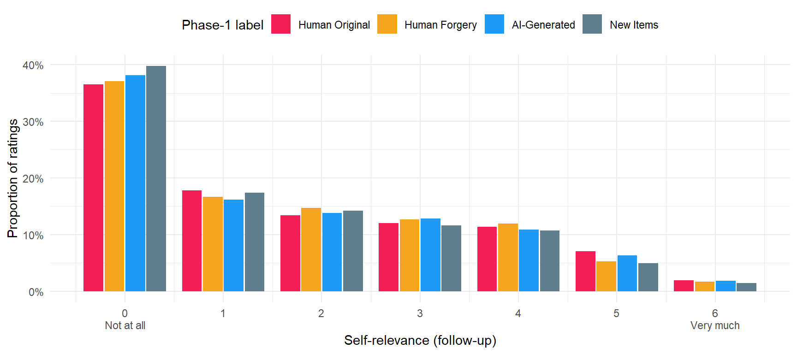{width=864}
:::
:::


Self-relevance was rated for 21120 artworks by
220 participants; 38.5%
of the ratings are 0 ("Not at all") and 7.2%
are 5 or 6. The label effect on SR, from the SelfRelevance model (cumulative;
the change in the probability of answering each category, in percentage
points):


```{.r .cell-code}
prep_contrasts(reference$SelfRelevance$contrasts, "SelfRelevance") |>
  filter(startsWith(Parameter, "response")) |>
  make_tables(c("Contrast", "Parameter", "Diff", "CI", "pd_fmt", "Effect"),
              "Effect of the Phase-1 label on follow-up self-relevance (SelfRelevance model)")
```

```{=html}
<div id="dascsugwlb" style="padding-left:0px;padding-right:0px;padding-top:10px;padding-bottom:10px;overflow-x:auto;overflow-y:auto;width:auto;height:auto;">
<style>#dascsugwlb table {
  font-family: system-ui, 'Segoe UI', Roboto, Helvetica, Arial, sans-serif, 'Apple Color Emoji', 'Segoe UI Emoji', 'Segoe UI Symbol', 'Noto Color Emoji';
  -webkit-font-smoothing: antialiased;
  -moz-osx-font-smoothing: grayscale;
}

#dascsugwlb thead, #dascsugwlb tbody, #dascsugwlb tfoot, #dascsugwlb tr, #dascsugwlb td, #dascsugwlb th {
  border-style: none;
}

#dascsugwlb p {
  margin: 0;
  padding: 0;
}

#dascsugwlb .gt_table {
  display: table;
  border-collapse: collapse;
  line-height: normal;
  margin-left: auto;
  margin-right: auto;
  color: #333333;
  font-size: 13px;
  font-weight: normal;
  font-style: normal;
  background-color: #FFFFFF;
  width: auto;
  border-top-style: solid;
  border-top-width: 3px;
  border-top-color: #D5D5D5;
  border-right-style: solid;
  border-right-width: 3px;
  border-right-color: #D5D5D5;
  border-bottom-style: solid;
  border-bottom-width: 3px;
  border-bottom-color: #D5D5D5;
  border-left-style: solid;
  border-left-width: 3px;
  border-left-color: #D5D5D5;
}

#dascsugwlb .gt_caption {
  padding-top: 4px;
  padding-bottom: 4px;
}

#dascsugwlb .gt_title {
  color: #333333;
  font-size: 125%;
  font-weight: initial;
  padding-top: 4px;
  padding-bottom: 4px;
  padding-left: 5px;
  padding-right: 5px;
  border-bottom-color: #FFFFFF;
  border-bottom-width: 0;
}

#dascsugwlb .gt_subtitle {
  color: #333333;
  font-size: 85%;
  font-weight: initial;
  padding-top: 3px;
  padding-bottom: 5px;
  padding-left: 5px;
  padding-right: 5px;
  border-top-color: #FFFFFF;
  border-top-width: 0;
}

#dascsugwlb .gt_heading {
  background-color: #FFFFFF;
  text-align: left;
  border-bottom-color: #FFFFFF;
  border-left-style: none;
  border-left-width: 1px;
  border-left-color: #D3D3D3;
  border-right-style: none;
  border-right-width: 1px;
  border-right-color: #D3D3D3;
}

#dascsugwlb .gt_bottom_border {
  border-bottom-style: solid;
  border-bottom-width: 2px;
  border-bottom-color: #D5D5D5;
}

#dascsugwlb .gt_col_headings {
  border-top-style: solid;
  border-top-width: 2px;
  border-top-color: #D5D5D5;
  border-bottom-style: solid;
  border-bottom-width: 2px;
  border-bottom-color: #D5D5D5;
  border-left-style: none;
  border-left-width: 1px;
  border-left-color: #D3D3D3;
  border-right-style: none;
  border-right-width: 1px;
  border-right-color: #D3D3D3;
}

#dascsugwlb .gt_col_heading {
  color: #FFFFFF;
  background-color: #000000;
  font-size: 100%;
  font-weight: normal;
  text-transform: inherit;
  border-left-style: none;
  border-left-width: 1px;
  border-left-color: #D3D3D3;
  border-right-style: none;
  border-right-width: 1px;
  border-right-color: #D3D3D3;
  vertical-align: bottom;
  padding-top: 5px;
  padding-bottom: 6px;
  padding-left: 5px;
  padding-right: 5px;
  overflow-x: hidden;
}

#dascsugwlb .gt_column_spanner_outer {
  color: #FFFFFF;
  background-color: #000000;
  font-size: 100%;
  font-weight: normal;
  text-transform: inherit;
  padding-top: 0;
  padding-bottom: 0;
  padding-left: 4px;
  padding-right: 4px;
}

#dascsugwlb .gt_column_spanner_outer:first-child {
  padding-left: 0;
}

#dascsugwlb .gt_column_spanner_outer:last-child {
  padding-right: 0;
}

#dascsugwlb .gt_column_spanner {
  border-bottom-style: solid;
  border-bottom-width: 2px;
  border-bottom-color: #D5D5D5;
  vertical-align: bottom;
  padding-top: 5px;
  padding-bottom: 5px;
  overflow-x: hidden;
  display: inline-block;
  width: 100%;
}

#dascsugwlb .gt_spanner_row {
  border-bottom-style: hidden;
}

#dascsugwlb .gt_group_heading {
  padding-top: 8px;
  padding-bottom: 8px;
  padding-left: 5px;
  padding-right: 5px;
  color: #333333;
  background-color: #FFFFFF;
  font-size: 100%;
  font-weight: initial;
  text-transform: inherit;
  border-top-style: solid;
  border-top-width: 2px;
  border-top-color: #D5D5D5;
  border-bottom-style: solid;
  border-bottom-width: 2px;
  border-bottom-color: #D5D5D5;
  border-left-style: none;
  border-left-width: 1px;
  border-left-color: #D3D3D3;
  border-right-style: none;
  border-right-width: 1px;
  border-right-color: #D3D3D3;
  vertical-align: middle;
  text-align: left;
}

#dascsugwlb .gt_empty_group_heading {
  padding: 0.5px;
  color: #333333;
  background-color: #FFFFFF;
  font-size: 100%;
  font-weight: initial;
  border-top-style: solid;
  border-top-width: 2px;
  border-top-color: #D5D5D5;
  border-bottom-style: solid;
  border-bottom-width: 2px;
  border-bottom-color: #D5D5D5;
  vertical-align: middle;
}

#dascsugwlb .gt_from_md > :first-child {
  margin-top: 0;
}

#dascsugwlb .gt_from_md > :last-child {
  margin-bottom: 0;
}

#dascsugwlb .gt_row {
  padding-top: 8px;
  padding-bottom: 8px;
  padding-left: 5px;
  padding-right: 5px;
  margin: 10px;
  border-top-style: solid;
  border-top-width: 1px;
  border-top-color: #D5D5D5;
  border-left-style: solid;
  border-left-width: 1px;
  border-left-color: #D5D5D5;
  border-right-style: solid;
  border-right-width: 1px;
  border-right-color: #D5D5D5;
  vertical-align: middle;
  overflow-x: hidden;
}

#dascsugwlb .gt_stub {
  color: #333333;
  background-color: #FFFFFF;
  font-size: 100%;
  font-weight: initial;
  text-transform: inherit;
  border-right-style: solid;
  border-right-width: 2px;
  border-right-color: #5F5F5F;
  padding-left: 5px;
  padding-right: 5px;
}

#dascsugwlb .gt_stub_row_group {
  color: #333333;
  background-color: #FFFFFF;
  font-size: 100%;
  font-weight: initial;
  text-transform: inherit;
  border-right-style: solid;
  border-right-width: 2px;
  border-right-color: #D3D3D3;
  padding-left: 5px;
  padding-right: 5px;
  vertical-align: top;
}

#dascsugwlb .gt_row_group_first td {
  border-top-width: 2px;
}

#dascsugwlb .gt_row_group_first th {
  border-top-width: 2px;
}

#dascsugwlb .gt_summary_row {
  color: #333333;
  background-color: #D5D5D5;
  text-transform: inherit;
  padding-top: 8px;
  padding-bottom: 8px;
  padding-left: 5px;
  padding-right: 5px;
}

#dascsugwlb .gt_first_summary_row {
  border-top-style: solid;
  border-top-color: #D5D5D5;
}

#dascsugwlb .gt_first_summary_row.thick {
  border-top-width: 2px;
}

#dascsugwlb .gt_last_summary_row {
  padding-top: 8px;
  padding-bottom: 8px;
  padding-left: 5px;
  padding-right: 5px;
  border-bottom-style: solid;
  border-bottom-width: 2px;
  border-bottom-color: #D5D5D5;
}

#dascsugwlb .gt_grand_summary_row {
  color: #FFFFFF;
  background-color: #929292;
  text-transform: inherit;
  padding-top: 8px;
  padding-bottom: 8px;
  padding-left: 5px;
  padding-right: 5px;
}

#dascsugwlb .gt_first_grand_summary_row {
  padding-top: 8px;
  padding-bottom: 8px;
  padding-left: 5px;
  padding-right: 5px;
  border-top-style: double;
  border-top-width: 6px;
  border-top-color: #D5D5D5;
}

#dascsugwlb .gt_last_grand_summary_row_top {
  padding-top: 8px;
  padding-bottom: 8px;
  padding-left: 5px;
  padding-right: 5px;
  border-bottom-style: double;
  border-bottom-width: 6px;
  border-bottom-color: #D5D5D5;
}

#dascsugwlb .gt_striped {
  background-color: #F4F4F4;
}

#dascsugwlb .gt_table_body {
  border-top-style: solid;
  border-top-width: 2px;
  border-top-color: #D5D5D5;
  border-bottom-style: solid;
  border-bottom-width: 2px;
  border-bottom-color: #D5D5D5;
}

#dascsugwlb .gt_footnotes {
  color: #333333;
  background-color: #FFFFFF;
  border-bottom-style: none;
  border-bottom-width: 2px;
  border-bottom-color: #D3D3D3;
  border-left-style: none;
  border-left-width: 2px;
  border-left-color: #D3D3D3;
  border-right-style: none;
  border-right-width: 2px;
  border-right-color: #D3D3D3;
}

#dascsugwlb .gt_footnote {
  margin: 0px;
  font-size: 90%;
  padding-top: 4px;
  padding-bottom: 4px;
  padding-left: 5px;
  padding-right: 5px;
}

#dascsugwlb .gt_sourcenotes {
  color: #333333;
  background-color: #FFFFFF;
  border-bottom-style: none;
  border-bottom-width: 2px;
  border-bottom-color: #D3D3D3;
  border-left-style: none;
  border-left-width: 2px;
  border-left-color: #D3D3D3;
  border-right-style: none;
  border-right-width: 2px;
  border-right-color: #D3D3D3;
}

#dascsugwlb .gt_sourcenote {
  font-size: 90%;
  padding-top: 4px;
  padding-bottom: 4px;
  padding-left: 5px;
  padding-right: 5px;
}

#dascsugwlb .gt_left {
  text-align: left;
}

#dascsugwlb .gt_center {
  text-align: center;
}

#dascsugwlb .gt_right {
  text-align: right;
  font-variant-numeric: tabular-nums;
}

#dascsugwlb .gt_font_normal {
  font-weight: normal;
}

#dascsugwlb .gt_font_bold {
  font-weight: bold;
}

#dascsugwlb .gt_font_italic {
  font-style: italic;
}

#dascsugwlb .gt_super {
  font-size: 65%;
}

#dascsugwlb .gt_footnote_marks {
  font-size: 75%;
  vertical-align: 0.4em;
  position: initial;
}

#dascsugwlb .gt_asterisk {
  font-size: 100%;
  vertical-align: 0;
}

#dascsugwlb .gt_indent_1 {
  text-indent: 5px;
}

#dascsugwlb .gt_indent_2 {
  text-indent: 10px;
}

#dascsugwlb .gt_indent_3 {
  text-indent: 15px;
}

#dascsugwlb .gt_indent_4 {
  text-indent: 20px;
}

#dascsugwlb .gt_indent_5 {
  text-indent: 25px;
}

#dascsugwlb .katex-display {
  display: inline-flex !important;
  margin-bottom: 0.75em !important;
}

#dascsugwlb div.Reactable > div.rt-table > div.rt-thead > div.rt-tr.rt-tr-group-header > div.rt-th-group:after {
  height: 0px !important;
}
</style>
<table class="gt_table" data-quarto-disable-processing="false" data-quarto-bootstrap="false">
  <thead>
    <tr class="gt_heading">
      <td colspan="5" class="gt_heading gt_title gt_font_normal gt_bottom_border" style>Effect of the Phase-1 label on follow-up self-relevance (SelfRelevance model)</td>
    </tr>
    
    <tr class="gt_col_headings">
      <th class="gt_col_heading gt_columns_bottom_border gt_left" rowspan="1" colspan="1" scope="col" id="Parameter">Parameter</th>
      <th class="gt_col_heading gt_columns_bottom_border gt_right" rowspan="1" colspan="1" scope="col" id="Diff">Diff</th>
      <th class="gt_col_heading gt_columns_bottom_border gt_left" rowspan="1" colspan="1" scope="col" id="CI">CI</th>
      <th class="gt_col_heading gt_columns_bottom_border gt_right" rowspan="1" colspan="1" scope="col" id="pd_fmt">pd_fmt</th>
      <th class="gt_col_heading gt_columns_bottom_border gt_left" rowspan="1" colspan="1" scope="col" id="Effect">Effect</th>
    </tr>
  </thead>
  <tbody class="gt_table_body">
    <tr class="gt_group_heading_row">
      <th colspan="5" class="gt_group_heading" scope="colgroup" id="AI-Generated - Human Original">AI-Generated - Human Original</th>
    </tr>
    <tr class="gt_row_group_first"><td headers="AI-Generated - Human Original  Parameter" class="gt_row gt_left" style="color: #9E9E9E;">response - 0</td>
<td headers="AI-Generated - Human Original  Diff" class="gt_row gt_right" style="color: #9E9E9E;">1.03</td>
<td headers="AI-Generated - Human Original  CI" class="gt_row gt_left" style="color: #9E9E9E;">[-0.10, 2.04]</td>
<td headers="AI-Generated - Human Original  pd_fmt" class="gt_row gt_right" style="color: #9E9E9E;">96.80%</td>
<td headers="AI-Generated - Human Original  Effect" class="gt_row gt_left" style="color: #9E9E9E;">n.s.</td></tr>
    <tr><td headers="AI-Generated - Human Original  Parameter" class="gt_row gt_left gt_striped" style="color: #9E9E9E;">response - 1</td>
<td headers="AI-Generated - Human Original  Diff" class="gt_row gt_right gt_striped" style="color: #9E9E9E;">-0.06</td>
<td headers="AI-Generated - Human Original  CI" class="gt_row gt_left gt_striped" style="color: #9E9E9E;">[-0.49, 0.30]</td>
<td headers="AI-Generated - Human Original  pd_fmt" class="gt_row gt_right gt_striped" style="color: #9E9E9E;">62.20%</td>
<td headers="AI-Generated - Human Original  Effect" class="gt_row gt_left gt_striped" style="color: #9E9E9E;">n.s.</td></tr>
    <tr><td headers="AI-Generated - Human Original  Parameter" class="gt_row gt_left" style="color: #9E9E9E;">response - 2</td>
<td headers="AI-Generated - Human Original  Diff" class="gt_row gt_right" style="color: #9E9E9E;">-0.25</td>
<td headers="AI-Generated - Human Original  CI" class="gt_row gt_left" style="color: #9E9E9E;">[-0.56, 0.04]</td>
<td headers="AI-Generated - Human Original  pd_fmt" class="gt_row gt_right" style="color: #9E9E9E;">95.00%</td>
<td headers="AI-Generated - Human Original  Effect" class="gt_row gt_left" style="color: #9E9E9E;">n.s.</td></tr>
    <tr><td headers="AI-Generated - Human Original  Parameter" class="gt_row gt_left gt_striped" style="color: #9E9E9E;">response - 3</td>
<td headers="AI-Generated - Human Original  Diff" class="gt_row gt_right gt_striped" style="color: #9E9E9E;">-0.30</td>
<td headers="AI-Generated - Human Original  CI" class="gt_row gt_left gt_striped" style="color: #9E9E9E;">[-0.60, 0.03]</td>
<td headers="AI-Generated - Human Original  pd_fmt" class="gt_row gt_right gt_striped" style="color: #9E9E9E;">96.60%</td>
<td headers="AI-Generated - Human Original  Effect" class="gt_row gt_left gt_striped" style="color: #9E9E9E;">n.s.</td></tr>
    <tr><td headers="AI-Generated - Human Original  Parameter" class="gt_row gt_left" style="color: #9E9E9E;">response - 4</td>
<td headers="AI-Generated - Human Original  Diff" class="gt_row gt_right" style="color: #9E9E9E;">-0.25</td>
<td headers="AI-Generated - Human Original  CI" class="gt_row gt_left" style="color: #9E9E9E;">[-0.69, 0.19]</td>
<td headers="AI-Generated - Human Original  pd_fmt" class="gt_row gt_right" style="color: #9E9E9E;">85.60%</td>
<td headers="AI-Generated - Human Original  Effect" class="gt_row gt_left" style="color: #9E9E9E;">n.s.</td></tr>
    <tr><td headers="AI-Generated - Human Original  Parameter" class="gt_row gt_left gt_striped" style="color: #9E9E9E;">response - 5</td>
<td headers="AI-Generated - Human Original  Diff" class="gt_row gt_right gt_striped" style="color: #9E9E9E;">-0.12</td>
<td headers="AI-Generated - Human Original  CI" class="gt_row gt_left gt_striped" style="color: #9E9E9E;">[-0.45, 0.21]</td>
<td headers="AI-Generated - Human Original  pd_fmt" class="gt_row gt_right gt_striped" style="color: #9E9E9E;">75.60%</td>
<td headers="AI-Generated - Human Original  Effect" class="gt_row gt_left gt_striped" style="color: #9E9E9E;">n.s.</td></tr>
    <tr><td headers="AI-Generated - Human Original  Parameter" class="gt_row gt_left" style="color: #9E9E9E;">response - 6</td>
<td headers="AI-Generated - Human Original  Diff" class="gt_row gt_right" style="color: #9E9E9E;">-0.03</td>
<td headers="AI-Generated - Human Original  CI" class="gt_row gt_left" style="color: #9E9E9E;">[-0.12, 0.05]</td>
<td headers="AI-Generated - Human Original  pd_fmt" class="gt_row gt_right" style="color: #9E9E9E;">75.40%</td>
<td headers="AI-Generated - Human Original  Effect" class="gt_row gt_left" style="color: #9E9E9E;">n.s.</td></tr>
    <tr class="gt_group_heading_row">
      <th colspan="5" class="gt_group_heading" scope="colgroup" id="Human Forgery - Human Original">Human Forgery - Human Original</th>
    </tr>
    <tr class="gt_row_group_first"><td headers="Human Forgery - Human Original  Parameter" class="gt_row gt_left gt_striped" style="color: #9E9E9E;">response - 0</td>
<td headers="Human Forgery - Human Original  Diff" class="gt_row gt_right gt_striped" style="color: #9E9E9E;">0.36</td>
<td headers="Human Forgery - Human Original  CI" class="gt_row gt_left gt_striped" style="color: #9E9E9E;">[-0.83, 1.47]</td>
<td headers="Human Forgery - Human Original  pd_fmt" class="gt_row gt_right gt_striped" style="color: #9E9E9E;">70.80%</td>
<td headers="Human Forgery - Human Original  Effect" class="gt_row gt_left gt_striped" style="color: #9E9E9E;">n.s.</td></tr>
    <tr><td headers="Human Forgery - Human Original  Parameter" class="gt_row gt_left" style="color: #9E9E9E;">response - 1</td>
<td headers="Human Forgery - Human Original  Diff" class="gt_row gt_right" style="color: #9E9E9E;">0.09</td>
<td headers="Human Forgery - Human Original  CI" class="gt_row gt_left" style="color: #9E9E9E;">[-0.20, 0.44]</td>
<td headers="Human Forgery - Human Original  pd_fmt" class="gt_row gt_right" style="color: #9E9E9E;">73.20%</td>
<td headers="Human Forgery - Human Original  Effect" class="gt_row gt_left" style="color: #9E9E9E;">n.s.</td></tr>
    <tr><td headers="Human Forgery - Human Original  Parameter" class="gt_row gt_left gt_striped" style="color: #9E9E9E;">response - 2</td>
<td headers="Human Forgery - Human Original  Diff" class="gt_row gt_right gt_striped" style="color: #9E9E9E;">-0.02</td>
<td headers="Human Forgery - Human Original  CI" class="gt_row gt_left gt_striped" style="color: #9E9E9E;">[-0.29, 0.28]</td>
<td headers="Human Forgery - Human Original  pd_fmt" class="gt_row gt_right gt_striped" style="color: #9E9E9E;">55.00%</td>
<td headers="Human Forgery - Human Original  Effect" class="gt_row gt_left gt_striped" style="color: #9E9E9E;">n.s.</td></tr>
    <tr><td headers="Human Forgery - Human Original  Parameter" class="gt_row gt_left" style="color: #9E9E9E;">response - 3</td>
<td headers="Human Forgery - Human Original  Diff" class="gt_row gt_right" style="color: #9E9E9E;">-0.10</td>
<td headers="Human Forgery - Human Original  CI" class="gt_row gt_left" style="color: #9E9E9E;">[-0.44, 0.26]</td>
<td headers="Human Forgery - Human Original  pd_fmt" class="gt_row gt_right" style="color: #9E9E9E;">70.80%</td>
<td headers="Human Forgery - Human Original  Effect" class="gt_row gt_left" style="color: #9E9E9E;">n.s.</td></tr>
    <tr><td headers="Human Forgery - Human Original  Parameter" class="gt_row gt_left gt_striped" style="color: #9E9E9E;">response - 4</td>
<td headers="Human Forgery - Human Original  Diff" class="gt_row gt_right gt_striped" style="color: #9E9E9E;">-0.18</td>
<td headers="Human Forgery - Human Original  CI" class="gt_row gt_left gt_striped" style="color: #9E9E9E;">[-0.60, 0.28]</td>
<td headers="Human Forgery - Human Original  pd_fmt" class="gt_row gt_right gt_striped" style="color: #9E9E9E;">75.00%</td>
<td headers="Human Forgery - Human Original  Effect" class="gt_row gt_left gt_striped" style="color: #9E9E9E;">n.s.</td></tr>
    <tr><td headers="Human Forgery - Human Original  Parameter" class="gt_row gt_left" style="color: #9E9E9E;">response - 5</td>
<td headers="Human Forgery - Human Original  Diff" class="gt_row gt_right" style="color: #9E9E9E;">-0.13</td>
<td headers="Human Forgery - Human Original  CI" class="gt_row gt_left" style="color: #9E9E9E;">[-0.46, 0.21]</td>
<td headers="Human Forgery - Human Original  pd_fmt" class="gt_row gt_right" style="color: #9E9E9E;">76.60%</td>
<td headers="Human Forgery - Human Original  Effect" class="gt_row gt_left" style="color: #9E9E9E;">n.s.</td></tr>
    <tr><td headers="Human Forgery - Human Original  Parameter" class="gt_row gt_left gt_striped" style="color: #9E9E9E;">response - 6</td>
<td headers="Human Forgery - Human Original  Diff" class="gt_row gt_right gt_striped" style="color: #9E9E9E;">-0.04</td>
<td headers="Human Forgery - Human Original  CI" class="gt_row gt_left gt_striped" style="color: #9E9E9E;">[-0.12, 0.05]</td>
<td headers="Human Forgery - Human Original  pd_fmt" class="gt_row gt_right gt_striped" style="color: #9E9E9E;">80.00%</td>
<td headers="Human Forgery - Human Original  Effect" class="gt_row gt_left gt_striped" style="color: #9E9E9E;">n.s.</td></tr>
    <tr class="gt_group_heading_row">
      <th colspan="5" class="gt_group_heading" scope="colgroup" id="AI-Generated - Human Forgery">AI-Generated - Human Forgery</th>
    </tr>
    <tr class="gt_row_group_first"><td headers="AI-Generated - Human Forgery  Parameter" class="gt_row gt_left" style="color: #9E9E9E;">response - 0</td>
<td headers="AI-Generated - Human Forgery  Diff" class="gt_row gt_right" style="color: #9E9E9E;">0.70</td>
<td headers="AI-Generated - Human Forgery  CI" class="gt_row gt_left" style="color: #9E9E9E;">[-0.58, 1.82]</td>
<td headers="AI-Generated - Human Forgery  pd_fmt" class="gt_row gt_right" style="color: #9E9E9E;">88.80%</td>
<td headers="AI-Generated - Human Forgery  Effect" class="gt_row gt_left" style="color: #9E9E9E;">n.s.</td></tr>
    <tr><td headers="AI-Generated - Human Forgery  Parameter" class="gt_row gt_left gt_striped" style="color: #9E9E9E;">response - 1</td>
<td headers="AI-Generated - Human Forgery  Diff" class="gt_row gt_right gt_striped" style="color: #9E9E9E;">-0.15</td>
<td headers="AI-Generated - Human Forgery  CI" class="gt_row gt_left gt_striped" style="color: #9E9E9E;">[-0.63, 0.26]</td>
<td headers="AI-Generated - Human Forgery  pd_fmt" class="gt_row gt_right gt_striped" style="color: #9E9E9E;">77.80%</td>
<td headers="AI-Generated - Human Forgery  Effect" class="gt_row gt_left gt_striped" style="color: #9E9E9E;">n.s.</td></tr>
    <tr><td headers="AI-Generated - Human Forgery  Parameter" class="gt_row gt_left" style="color: #9E9E9E;">response - 2</td>
<td headers="AI-Generated - Human Forgery  Diff" class="gt_row gt_right" style="color: #9E9E9E;">-0.24</td>
<td headers="AI-Generated - Human Forgery  CI" class="gt_row gt_left" style="color: #9E9E9E;">[-0.60, 0.09]</td>
<td headers="AI-Generated - Human Forgery  pd_fmt" class="gt_row gt_right" style="color: #9E9E9E;">90.80%</td>
<td headers="AI-Generated - Human Forgery  Effect" class="gt_row gt_left" style="color: #9E9E9E;">n.s.</td></tr>
    <tr><td headers="AI-Generated - Human Forgery  Parameter" class="gt_row gt_left gt_striped" style="color: #9E9E9E;">response - 3</td>
<td headers="AI-Generated - Human Forgery  Diff" class="gt_row gt_right gt_striped" style="color: #9E9E9E;">-0.20</td>
<td headers="AI-Generated - Human Forgery  CI" class="gt_row gt_left gt_striped" style="color: #9E9E9E;">[-0.55, 0.19]</td>
<td headers="AI-Generated - Human Forgery  pd_fmt" class="gt_row gt_right gt_striped" style="color: #9E9E9E;">86.20%</td>
<td headers="AI-Generated - Human Forgery  Effect" class="gt_row gt_left gt_striped" style="color: #9E9E9E;">n.s.</td></tr>
    <tr><td headers="AI-Generated - Human Forgery  Parameter" class="gt_row gt_left" style="color: #9E9E9E;">response - 4</td>
<td headers="AI-Generated - Human Forgery  Diff" class="gt_row gt_right" style="color: #9E9E9E;">-0.10</td>
<td headers="AI-Generated - Human Forgery  CI" class="gt_row gt_left" style="color: #9E9E9E;">[-0.58, 0.43]</td>
<td headers="AI-Generated - Human Forgery  pd_fmt" class="gt_row gt_right" style="color: #9E9E9E;">63.40%</td>
<td headers="AI-Generated - Human Forgery  Effect" class="gt_row gt_left" style="color: #9E9E9E;">n.s.</td></tr>
    <tr><td headers="AI-Generated - Human Forgery  Parameter" class="gt_row gt_left gt_striped" style="color: #9E9E9E;">response - 5</td>
<td headers="AI-Generated - Human Forgery  Diff" class="gt_row gt_right gt_striped" style="color: #9E9E9E;">-0.01</td>
<td headers="AI-Generated - Human Forgery  CI" class="gt_row gt_left gt_striped" style="color: #9E9E9E;">[-0.39, 0.41]</td>
<td headers="AI-Generated - Human Forgery  pd_fmt" class="gt_row gt_right gt_striped" style="color: #9E9E9E;">52.80%</td>
<td headers="AI-Generated - Human Forgery  Effect" class="gt_row gt_left gt_striped" style="color: #9E9E9E;">n.s.</td></tr>
    <tr><td headers="AI-Generated - Human Forgery  Parameter" class="gt_row gt_left" style="color: #9E9E9E;">response - 6</td>
<td headers="AI-Generated - Human Forgery  Diff" class="gt_row gt_right" style="color: #9E9E9E;">0.00</td>
<td headers="AI-Generated - Human Forgery  CI" class="gt_row gt_left" style="color: #9E9E9E;">[-0.10, 0.11]</td>
<td headers="AI-Generated - Human Forgery  pd_fmt" class="gt_row gt_right" style="color: #9E9E9E;">52.80%</td>
<td headers="AI-Generated - Human Forgery  Effect" class="gt_row gt_left" style="color: #9E9E9E;">n.s.</td></tr>
  </tbody>
  
</table>
</div>
```


::: {.callout-note collapse="true" title="Effect of the Phase-1 label on follow-up self-relevance (SelfRelevance model) (Markdown table, for text readers)"}

|Contrast                       |Parameter    |Diff  |CI            |pd_fmt |Effect |
|:------------------------------|:------------|:-----|:-------------|:------|:------|
|AI-Generated - Human Original  |response - 0 |1.03  |[-0.10, 2.04] |96.80% |n.s.   |
|AI-Generated - Human Original  |response - 1 |-0.06 |[-0.49, 0.30] |62.20% |n.s.   |
|AI-Generated - Human Original  |response - 2 |-0.25 |[-0.56, 0.04] |95.00% |n.s.   |
|AI-Generated - Human Original  |response - 3 |-0.30 |[-0.60, 0.03] |96.60% |n.s.   |
|AI-Generated - Human Original  |response - 4 |-0.25 |[-0.69, 0.19] |85.60% |n.s.   |
|AI-Generated - Human Original  |response - 5 |-0.12 |[-0.45, 0.21] |75.60% |n.s.   |
|AI-Generated - Human Original  |response - 6 |-0.03 |[-0.12, 0.05] |75.40% |n.s.   |
|Human Forgery - Human Original |response - 0 |0.36  |[-0.83, 1.47] |70.80% |n.s.   |
|Human Forgery - Human Original |response - 1 |0.09  |[-0.20, 0.44] |73.20% |n.s.   |
|Human Forgery - Human Original |response - 2 |-0.02 |[-0.29, 0.28] |55.00% |n.s.   |
|Human Forgery - Human Original |response - 3 |-0.10 |[-0.44, 0.26] |70.80% |n.s.   |
|Human Forgery - Human Original |response - 4 |-0.18 |[-0.60, 0.28] |75.00% |n.s.   |
|Human Forgery - Human Original |response - 5 |-0.13 |[-0.46, 0.21] |76.60% |n.s.   |
|Human Forgery - Human Original |response - 6 |-0.04 |[-0.12, 0.05] |80.00% |n.s.   |
|AI-Generated - Human Forgery   |response - 0 |0.70  |[-0.58, 1.82] |88.80% |n.s.   |
|AI-Generated - Human Forgery   |response - 1 |-0.15 |[-0.63, 0.26] |77.80% |n.s.   |
|AI-Generated - Human Forgery   |response - 2 |-0.24 |[-0.60, 0.09] |90.80% |n.s.   |
|AI-Generated - Human Forgery   |response - 3 |-0.20 |[-0.55, 0.19] |86.20% |n.s.   |
|AI-Generated - Human Forgery   |response - 4 |-0.10 |[-0.58, 0.43] |63.40% |n.s.   |
|AI-Generated - Human Forgery   |response - 5 |-0.01 |[-0.39, 0.41] |52.80% |n.s.   |
|AI-Generated - Human Forgery   |response - 6 |0.00  |[-0.10, 0.11] |52.80% |n.s.   |

:::

### Self-relevance and the other ratings

Pooled within-participant correlations over the 48 old items (each rating
centred on the participant's mean; descriptive, trials are not independent):


::: {.cell}

```{.r .cell-code}
vars_w <- c("Self-relevance" = "SelfRelevance_w", "Follow-up beauty" = "Beauty2_w", "Beauty" = "Beauty_w",
            "Valence" = "Valence_w", "Meaning" = "Meaning_w", "Worth" = "Worth_w",
            "Syntheticness" = "Reality_w", "Authenticity" = "Authenticity_w")
r_w <- cor(dfsr[vars_w], use = "pairwise.complete.obs")
dimnames(r_w) <- list(names(vars_w), names(vars_w))
knitr::kable(round(r_w, 2), format = "pipe", caption = "Within-participant correlations (old items)")
```

::: {.cell-output-display}


Table: Within-participant correlations (old items)

|                 | Self-relevance| Follow-up beauty| Beauty| Valence| Meaning| Worth| Syntheticness| Authenticity|
|:----------------|--------------:|----------------:|------:|-------:|-------:|-----:|-------------:|------------:|
|Self-relevance   |           1.00|             0.58|   0.40|    0.37|    0.17|  0.29|          0.14|         0.07|
|Follow-up beauty |           0.58|             1.00|   0.59|    0.54|    0.19|  0.38|          0.19|         0.08|
|Beauty           |           0.40|             0.59|   1.00|    0.77|    0.43|  0.61|          0.21|         0.11|
|Valence          |           0.37|             0.54|   0.77|    1.00|    0.32|  0.58|          0.17|         0.10|
|Meaning          |           0.17|             0.19|   0.43|    0.32|    1.00|  0.54|          0.16|         0.08|
|Worth            |           0.29|             0.38|   0.61|    0.58|    0.54|  1.00|          0.18|         0.09|
|Syntheticness    |           0.14|             0.19|   0.21|    0.17|    0.16|  0.18|          1.00|         0.32|
|Authenticity     |           0.07|             0.08|   0.11|    0.10|    0.08|  0.09|          0.32|         1.00|


:::
:::


## (A) Does self-relevance narrow the label gap?

The question the Introduction sets up (RQ3, after Vessel et al., 2023): is
the Phase-1 penalty of the AI-Generated (and Forgery) label smaller for works
the person finds self-relevant?

### Observed


::: {.cell}

```{.r .cell-code}
bind_rows(observed_by(dfsr, "Beauty"), observed_by(dfsr, "Meaning")) |>
  mutate(Outcome = recode(Outcome, Beauty = "Phase-1 beauty", Meaning = "Phase-1 meaning")) |>
  plot_observed()
```

::: {.cell-output-display}
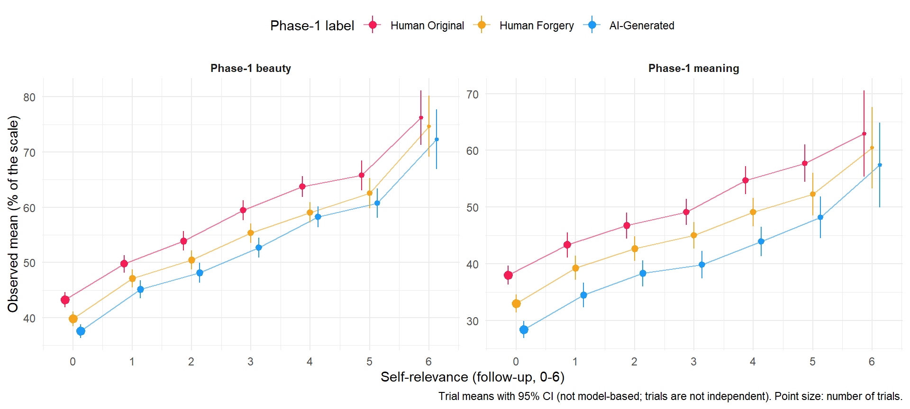{width=960}
:::
:::


### Beauty


```{.r .cell-code}
pending("BeautySR")
```


::: {.cell}

```{.r .cell-code}
plot_predictions("BeautySR")
```

::: {.cell-output-display}
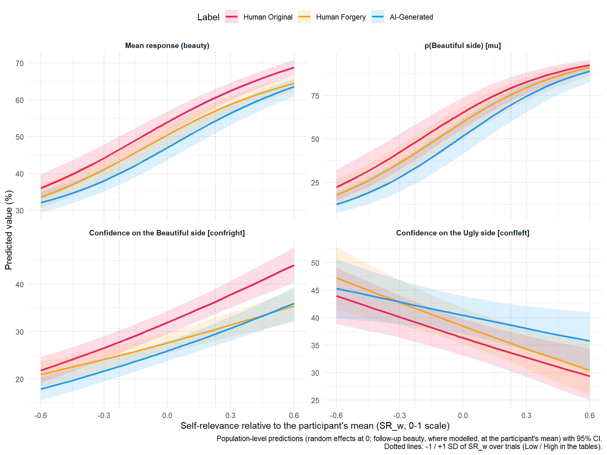{width=960}
:::
:::


```{.r .cell-code}
moderation_tables("BeautySR")
```

```{=html}
<div id="ggcayozvjt" style="padding-left:0px;padding-right:0px;padding-top:10px;padding-bottom:10px;overflow-x:auto;overflow-y:auto;width:auto;height:auto;">
<style>#ggcayozvjt table {
  font-family: system-ui, 'Segoe UI', Roboto, Helvetica, Arial, sans-serif, 'Apple Color Emoji', 'Segoe UI Emoji', 'Segoe UI Symbol', 'Noto Color Emoji';
  -webkit-font-smoothing: antialiased;
  -moz-osx-font-smoothing: grayscale;
}

#ggcayozvjt thead, #ggcayozvjt tbody, #ggcayozvjt tfoot, #ggcayozvjt tr, #ggcayozvjt td, #ggcayozvjt th {
  border-style: none;
}

#ggcayozvjt p {
  margin: 0;
  padding: 0;
}

#ggcayozvjt .gt_table {
  display: table;
  border-collapse: collapse;
  line-height: normal;
  margin-left: auto;
  margin-right: auto;
  color: #333333;
  font-size: 13px;
  font-weight: normal;
  font-style: normal;
  background-color: #FFFFFF;
  width: auto;
  border-top-style: solid;
  border-top-width: 3px;
  border-top-color: #D5D5D5;
  border-right-style: solid;
  border-right-width: 3px;
  border-right-color: #D5D5D5;
  border-bottom-style: solid;
  border-bottom-width: 3px;
  border-bottom-color: #D5D5D5;
  border-left-style: solid;
  border-left-width: 3px;
  border-left-color: #D5D5D5;
}

#ggcayozvjt .gt_caption {
  padding-top: 4px;
  padding-bottom: 4px;
}

#ggcayozvjt .gt_title {
  color: #333333;
  font-size: 125%;
  font-weight: initial;
  padding-top: 4px;
  padding-bottom: 4px;
  padding-left: 5px;
  padding-right: 5px;
  border-bottom-color: #FFFFFF;
  border-bottom-width: 0;
}

#ggcayozvjt .gt_subtitle {
  color: #333333;
  font-size: 85%;
  font-weight: initial;
  padding-top: 3px;
  padding-bottom: 5px;
  padding-left: 5px;
  padding-right: 5px;
  border-top-color: #FFFFFF;
  border-top-width: 0;
}

#ggcayozvjt .gt_heading {
  background-color: #FFFFFF;
  text-align: left;
  border-bottom-color: #FFFFFF;
  border-left-style: none;
  border-left-width: 1px;
  border-left-color: #D3D3D3;
  border-right-style: none;
  border-right-width: 1px;
  border-right-color: #D3D3D3;
}

#ggcayozvjt .gt_bottom_border {
  border-bottom-style: solid;
  border-bottom-width: 2px;
  border-bottom-color: #D5D5D5;
}

#ggcayozvjt .gt_col_headings {
  border-top-style: solid;
  border-top-width: 2px;
  border-top-color: #D5D5D5;
  border-bottom-style: solid;
  border-bottom-width: 2px;
  border-bottom-color: #D5D5D5;
  border-left-style: none;
  border-left-width: 1px;
  border-left-color: #D3D3D3;
  border-right-style: none;
  border-right-width: 1px;
  border-right-color: #D3D3D3;
}

#ggcayozvjt .gt_col_heading {
  color: #FFFFFF;
  background-color: #000000;
  font-size: 100%;
  font-weight: normal;
  text-transform: inherit;
  border-left-style: none;
  border-left-width: 1px;
  border-left-color: #D3D3D3;
  border-right-style: none;
  border-right-width: 1px;
  border-right-color: #D3D3D3;
  vertical-align: bottom;
  padding-top: 5px;
  padding-bottom: 6px;
  padding-left: 5px;
  padding-right: 5px;
  overflow-x: hidden;
}

#ggcayozvjt .gt_column_spanner_outer {
  color: #FFFFFF;
  background-color: #000000;
  font-size: 100%;
  font-weight: normal;
  text-transform: inherit;
  padding-top: 0;
  padding-bottom: 0;
  padding-left: 4px;
  padding-right: 4px;
}

#ggcayozvjt .gt_column_spanner_outer:first-child {
  padding-left: 0;
}

#ggcayozvjt .gt_column_spanner_outer:last-child {
  padding-right: 0;
}

#ggcayozvjt .gt_column_spanner {
  border-bottom-style: solid;
  border-bottom-width: 2px;
  border-bottom-color: #D5D5D5;
  vertical-align: bottom;
  padding-top: 5px;
  padding-bottom: 5px;
  overflow-x: hidden;
  display: inline-block;
  width: 100%;
}

#ggcayozvjt .gt_spanner_row {
  border-bottom-style: hidden;
}

#ggcayozvjt .gt_group_heading {
  padding-top: 8px;
  padding-bottom: 8px;
  padding-left: 5px;
  padding-right: 5px;
  color: #333333;
  background-color: #FFFFFF;
  font-size: 100%;
  font-weight: initial;
  text-transform: inherit;
  border-top-style: solid;
  border-top-width: 2px;
  border-top-color: #D5D5D5;
  border-bottom-style: solid;
  border-bottom-width: 2px;
  border-bottom-color: #D5D5D5;
  border-left-style: none;
  border-left-width: 1px;
  border-left-color: #D3D3D3;
  border-right-style: none;
  border-right-width: 1px;
  border-right-color: #D3D3D3;
  vertical-align: middle;
  text-align: left;
}

#ggcayozvjt .gt_empty_group_heading {
  padding: 0.5px;
  color: #333333;
  background-color: #FFFFFF;
  font-size: 100%;
  font-weight: initial;
  border-top-style: solid;
  border-top-width: 2px;
  border-top-color: #D5D5D5;
  border-bottom-style: solid;
  border-bottom-width: 2px;
  border-bottom-color: #D5D5D5;
  vertical-align: middle;
}

#ggcayozvjt .gt_from_md > :first-child {
  margin-top: 0;
}

#ggcayozvjt .gt_from_md > :last-child {
  margin-bottom: 0;
}

#ggcayozvjt .gt_row {
  padding-top: 8px;
  padding-bottom: 8px;
  padding-left: 5px;
  padding-right: 5px;
  margin: 10px;
  border-top-style: solid;
  border-top-width: 1px;
  border-top-color: #D5D5D5;
  border-left-style: solid;
  border-left-width: 1px;
  border-left-color: #D5D5D5;
  border-right-style: solid;
  border-right-width: 1px;
  border-right-color: #D5D5D5;
  vertical-align: middle;
  overflow-x: hidden;
}

#ggcayozvjt .gt_stub {
  color: #333333;
  background-color: #FFFFFF;
  font-size: 100%;
  font-weight: initial;
  text-transform: inherit;
  border-right-style: solid;
  border-right-width: 2px;
  border-right-color: #5F5F5F;
  padding-left: 5px;
  padding-right: 5px;
}

#ggcayozvjt .gt_stub_row_group {
  color: #333333;
  background-color: #FFFFFF;
  font-size: 100%;
  font-weight: initial;
  text-transform: inherit;
  border-right-style: solid;
  border-right-width: 2px;
  border-right-color: #D3D3D3;
  padding-left: 5px;
  padding-right: 5px;
  vertical-align: top;
}

#ggcayozvjt .gt_row_group_first td {
  border-top-width: 2px;
}

#ggcayozvjt .gt_row_group_first th {
  border-top-width: 2px;
}

#ggcayozvjt .gt_summary_row {
  color: #333333;
  background-color: #D5D5D5;
  text-transform: inherit;
  padding-top: 8px;
  padding-bottom: 8px;
  padding-left: 5px;
  padding-right: 5px;
}

#ggcayozvjt .gt_first_summary_row {
  border-top-style: solid;
  border-top-color: #D5D5D5;
}

#ggcayozvjt .gt_first_summary_row.thick {
  border-top-width: 2px;
}

#ggcayozvjt .gt_last_summary_row {
  padding-top: 8px;
  padding-bottom: 8px;
  padding-left: 5px;
  padding-right: 5px;
  border-bottom-style: solid;
  border-bottom-width: 2px;
  border-bottom-color: #D5D5D5;
}

#ggcayozvjt .gt_grand_summary_row {
  color: #FFFFFF;
  background-color: #929292;
  text-transform: inherit;
  padding-top: 8px;
  padding-bottom: 8px;
  padding-left: 5px;
  padding-right: 5px;
}

#ggcayozvjt .gt_first_grand_summary_row {
  padding-top: 8px;
  padding-bottom: 8px;
  padding-left: 5px;
  padding-right: 5px;
  border-top-style: double;
  border-top-width: 6px;
  border-top-color: #D5D5D5;
}

#ggcayozvjt .gt_last_grand_summary_row_top {
  padding-top: 8px;
  padding-bottom: 8px;
  padding-left: 5px;
  padding-right: 5px;
  border-bottom-style: double;
  border-bottom-width: 6px;
  border-bottom-color: #D5D5D5;
}

#ggcayozvjt .gt_striped {
  background-color: #F4F4F4;
}

#ggcayozvjt .gt_table_body {
  border-top-style: solid;
  border-top-width: 2px;
  border-top-color: #D5D5D5;
  border-bottom-style: solid;
  border-bottom-width: 2px;
  border-bottom-color: #D5D5D5;
}

#ggcayozvjt .gt_footnotes {
  color: #333333;
  background-color: #FFFFFF;
  border-bottom-style: none;
  border-bottom-width: 2px;
  border-bottom-color: #D3D3D3;
  border-left-style: none;
  border-left-width: 2px;
  border-left-color: #D3D3D3;
  border-right-style: none;
  border-right-width: 2px;
  border-right-color: #D3D3D3;
}

#ggcayozvjt .gt_footnote {
  margin: 0px;
  font-size: 90%;
  padding-top: 4px;
  padding-bottom: 4px;
  padding-left: 5px;
  padding-right: 5px;
}

#ggcayozvjt .gt_sourcenotes {
  color: #333333;
  background-color: #FFFFFF;
  border-bottom-style: none;
  border-bottom-width: 2px;
  border-bottom-color: #D3D3D3;
  border-left-style: none;
  border-left-width: 2px;
  border-left-color: #D3D3D3;
  border-right-style: none;
  border-right-width: 2px;
  border-right-color: #D3D3D3;
}

#ggcayozvjt .gt_sourcenote {
  font-size: 90%;
  padding-top: 4px;
  padding-bottom: 4px;
  padding-left: 5px;
  padding-right: 5px;
}

#ggcayozvjt .gt_left {
  text-align: left;
}

#ggcayozvjt .gt_center {
  text-align: center;
}

#ggcayozvjt .gt_right {
  text-align: right;
  font-variant-numeric: tabular-nums;
}

#ggcayozvjt .gt_font_normal {
  font-weight: normal;
}

#ggcayozvjt .gt_font_bold {
  font-weight: bold;
}

#ggcayozvjt .gt_font_italic {
  font-style: italic;
}

#ggcayozvjt .gt_super {
  font-size: 65%;
}

#ggcayozvjt .gt_footnote_marks {
  font-size: 75%;
  vertical-align: 0.4em;
  position: initial;
}

#ggcayozvjt .gt_asterisk {
  font-size: 100%;
  vertical-align: 0;
}

#ggcayozvjt .gt_indent_1 {
  text-indent: 5px;
}

#ggcayozvjt .gt_indent_2 {
  text-indent: 10px;
}

#ggcayozvjt .gt_indent_3 {
  text-indent: 15px;
}

#ggcayozvjt .gt_indent_4 {
  text-indent: 20px;
}

#ggcayozvjt .gt_indent_5 {
  text-indent: 25px;
}

#ggcayozvjt .katex-display {
  display: inline-flex !important;
  margin-bottom: 0.75em !important;
}

#ggcayozvjt div.Reactable > div.rt-table > div.rt-thead > div.rt-tr.rt-tr-group-header > div.rt-th-group:after {
  height: 0px !important;
}
</style>
<table class="gt_table" data-quarto-disable-processing="false" data-quarto-bootstrap="false">
  <thead>
    <tr class="gt_heading">
      <td colspan="5" class="gt_heading gt_title gt_font_normal gt_bottom_border" style>Phase-1 Beauty by Self-Relevance: label contrasts at average self-relevance (% of the scale / percentage points)</td>
    </tr>
    
    <tr class="gt_col_headings">
      <th class="gt_col_heading gt_columns_bottom_border gt_left" rowspan="1" colspan="1" scope="col" id="Parameter">Parameter</th>
      <th class="gt_col_heading gt_columns_bottom_border gt_right" rowspan="1" colspan="1" scope="col" id="Diff">Diff</th>
      <th class="gt_col_heading gt_columns_bottom_border gt_left" rowspan="1" colspan="1" scope="col" id="CI">CI</th>
      <th class="gt_col_heading gt_columns_bottom_border gt_right" rowspan="1" colspan="1" scope="col" id="pd_fmt">pd_fmt</th>
      <th class="gt_col_heading gt_columns_bottom_border gt_left" rowspan="1" colspan="1" scope="col" id="Effect">Effect</th>
    </tr>
  </thead>
  <tbody class="gt_table_body">
    <tr class="gt_group_heading_row">
      <th colspan="5" class="gt_group_heading" scope="colgroup" id="AI-Generated - Human Original">AI-Generated - Human Original</th>
    </tr>
    <tr class="gt_row_group_first"><td headers="AI-Generated - Human Original  Parameter" class="gt_row gt_left" style="background-color: #FFEBEE;">Mean response (beauty)</td>
<td headers="AI-Generated - Human Original  Diff" class="gt_row gt_right" style="background-color: #FFEBEE;">-6.91</td>
<td headers="AI-Generated - Human Original  CI" class="gt_row gt_left" style="background-color: #FFEBEE;">[-8.34, -5.47]</td>
<td headers="AI-Generated - Human Original  pd_fmt" class="gt_row gt_right" style="background-color: #FFEBEE;">100%</td>
<td headers="AI-Generated - Human Original  Effect" class="gt_row gt_left" style="background-color: #FFEBEE;">Negative</td></tr>
    <tr><td headers="AI-Generated - Human Original  Parameter" class="gt_row gt_left gt_striped" style="background-color: #FFEBEE;">p(Beautiful side) [mu]</td>
<td headers="AI-Generated - Human Original  Diff" class="gt_row gt_right gt_striped" style="background-color: #FFEBEE;">-13.62</td>
<td headers="AI-Generated - Human Original  CI" class="gt_row gt_left gt_striped" style="background-color: #FFEBEE;">[-17.64, -9.61]</td>
<td headers="AI-Generated - Human Original  pd_fmt" class="gt_row gt_right gt_striped" style="background-color: #FFEBEE;">100%</td>
<td headers="AI-Generated - Human Original  Effect" class="gt_row gt_left gt_striped" style="background-color: #FFEBEE;">Negative</td></tr>
    <tr><td headers="AI-Generated - Human Original  Parameter" class="gt_row gt_left" style="background-color: #FFEBEE;">Confidence on the Beautiful side [confright]</td>
<td headers="AI-Generated - Human Original  Diff" class="gt_row gt_right" style="background-color: #FFEBEE;">-6.02</td>
<td headers="AI-Generated - Human Original  CI" class="gt_row gt_left" style="background-color: #FFEBEE;">[-7.25, -4.85]</td>
<td headers="AI-Generated - Human Original  pd_fmt" class="gt_row gt_right" style="background-color: #FFEBEE;">100%</td>
<td headers="AI-Generated - Human Original  Effect" class="gt_row gt_left" style="background-color: #FFEBEE;">Negative</td></tr>
    <tr><td headers="AI-Generated - Human Original  Parameter" class="gt_row gt_left gt_striped" style="background-color: #E8F5E9;">Confidence on the Ugly side [confleft]</td>
<td headers="AI-Generated - Human Original  Diff" class="gt_row gt_right gt_striped" style="background-color: #E8F5E9;">4.05</td>
<td headers="AI-Generated - Human Original  CI" class="gt_row gt_left gt_striped" style="background-color: #E8F5E9;">[2.20, 5.94]</td>
<td headers="AI-Generated - Human Original  pd_fmt" class="gt_row gt_right gt_striped" style="background-color: #E8F5E9;">100%</td>
<td headers="AI-Generated - Human Original  Effect" class="gt_row gt_left gt_striped" style="background-color: #E8F5E9;">Positive</td></tr>
    <tr><td headers="AI-Generated - Human Original  Parameter" class="gt_row gt_left" style="background-color: #FFEBEE;">Mean response, main model (all participants, no SR term)</td>
<td headers="AI-Generated - Human Original  Diff" class="gt_row gt_right" style="background-color: #FFEBEE;">-7.06</td>
<td headers="AI-Generated - Human Original  CI" class="gt_row gt_left" style="background-color: #FFEBEE;">[-8.22, -5.92]</td>
<td headers="AI-Generated - Human Original  pd_fmt" class="gt_row gt_right" style="background-color: #FFEBEE;">100%</td>
<td headers="AI-Generated - Human Original  Effect" class="gt_row gt_left" style="background-color: #FFEBEE;">Negative</td></tr>
    <tr class="gt_group_heading_row">
      <th colspan="5" class="gt_group_heading" scope="colgroup" id="Human Forgery - Human Original">Human Forgery - Human Original</th>
    </tr>
    <tr class="gt_row_group_first"><td headers="Human Forgery - Human Original  Parameter" class="gt_row gt_left gt_striped" style="background-color: #FFEBEE;">Mean response (beauty)</td>
<td headers="Human Forgery - Human Original  Diff" class="gt_row gt_right gt_striped" style="background-color: #FFEBEE;">-3.45</td>
<td headers="Human Forgery - Human Original  CI" class="gt_row gt_left gt_striped" style="background-color: #FFEBEE;">[-4.78, -2.20]</td>
<td headers="Human Forgery - Human Original  pd_fmt" class="gt_row gt_right gt_striped" style="background-color: #FFEBEE;">100%</td>
<td headers="Human Forgery - Human Original  Effect" class="gt_row gt_left gt_striped" style="background-color: #FFEBEE;">Negative</td></tr>
    <tr><td headers="Human Forgery - Human Original  Parameter" class="gt_row gt_left" style="background-color: #FFEBEE;">p(Beautiful side) [mu]</td>
<td headers="Human Forgery - Human Original  Diff" class="gt_row gt_right" style="background-color: #FFEBEE;">-5.50</td>
<td headers="Human Forgery - Human Original  CI" class="gt_row gt_left" style="background-color: #FFEBEE;">[-9.05, -2.08]</td>
<td headers="Human Forgery - Human Original  pd_fmt" class="gt_row gt_right" style="background-color: #FFEBEE;">99.85%</td>
<td headers="Human Forgery - Human Original  Effect" class="gt_row gt_left" style="background-color: #FFEBEE;">Negative</td></tr>
    <tr><td headers="Human Forgery - Human Original  Parameter" class="gt_row gt_left gt_striped" style="background-color: #FFEBEE;">Confidence on the Beautiful side [confright]</td>
<td headers="Human Forgery - Human Original  Diff" class="gt_row gt_right gt_striped" style="background-color: #FFEBEE;">-4.31</td>
<td headers="Human Forgery - Human Original  CI" class="gt_row gt_left gt_striped" style="background-color: #FFEBEE;">[-5.52, -3.10]</td>
<td headers="Human Forgery - Human Original  pd_fmt" class="gt_row gt_right gt_striped" style="background-color: #FFEBEE;">100%</td>
<td headers="Human Forgery - Human Original  Effect" class="gt_row gt_left gt_striped" style="background-color: #FFEBEE;">Negative</td></tr>
    <tr><td headers="Human Forgery - Human Original  Parameter" class="gt_row gt_left" style="background-color: #E8F5E9;">Confidence on the Ugly side [confleft]</td>
<td headers="Human Forgery - Human Original  Diff" class="gt_row gt_right" style="background-color: #E8F5E9;">2.13</td>
<td headers="Human Forgery - Human Original  CI" class="gt_row gt_left" style="background-color: #E8F5E9;">[0.13, 4.14]</td>
<td headers="Human Forgery - Human Original  pd_fmt" class="gt_row gt_right" style="background-color: #E8F5E9;">98.20%</td>
<td headers="Human Forgery - Human Original  Effect" class="gt_row gt_left" style="background-color: #E8F5E9;">Positive</td></tr>
    <tr><td headers="Human Forgery - Human Original  Parameter" class="gt_row gt_left gt_striped" style="background-color: #FFEBEE;">Mean response, main model (all participants, no SR term)</td>
<td headers="Human Forgery - Human Original  Diff" class="gt_row gt_right gt_striped" style="background-color: #FFEBEE;">-3.66</td>
<td headers="Human Forgery - Human Original  CI" class="gt_row gt_left gt_striped" style="background-color: #FFEBEE;">[-4.59, -2.80]</td>
<td headers="Human Forgery - Human Original  pd_fmt" class="gt_row gt_right gt_striped" style="background-color: #FFEBEE;">100%</td>
<td headers="Human Forgery - Human Original  Effect" class="gt_row gt_left gt_striped" style="background-color: #FFEBEE;">Negative</td></tr>
    <tr class="gt_group_heading_row">
      <th colspan="5" class="gt_group_heading" scope="colgroup" id="AI-Generated - Human Forgery">AI-Generated - Human Forgery</th>
    </tr>
    <tr class="gt_row_group_first"><td headers="AI-Generated - Human Forgery  Parameter" class="gt_row gt_left" style="background-color: #FFEBEE;">Mean response (beauty)</td>
<td headers="AI-Generated - Human Forgery  Diff" class="gt_row gt_right" style="background-color: #FFEBEE;">-3.45</td>
<td headers="AI-Generated - Human Forgery  CI" class="gt_row gt_left" style="background-color: #FFEBEE;">[-4.93, -2.04]</td>
<td headers="AI-Generated - Human Forgery  pd_fmt" class="gt_row gt_right" style="background-color: #FFEBEE;">100%</td>
<td headers="AI-Generated - Human Forgery  Effect" class="gt_row gt_left" style="background-color: #FFEBEE;">Negative</td></tr>
    <tr><td headers="AI-Generated - Human Forgery  Parameter" class="gt_row gt_left gt_striped" style="background-color: #FFEBEE;">p(Beautiful side) [mu]</td>
<td headers="AI-Generated - Human Forgery  Diff" class="gt_row gt_right gt_striped" style="background-color: #FFEBEE;">-8.11</td>
<td headers="AI-Generated - Human Forgery  CI" class="gt_row gt_left gt_striped" style="background-color: #FFEBEE;">[-12.40, -3.93]</td>
<td headers="AI-Generated - Human Forgery  pd_fmt" class="gt_row gt_right gt_striped" style="background-color: #FFEBEE;">100%</td>
<td headers="AI-Generated - Human Forgery  Effect" class="gt_row gt_left gt_striped" style="background-color: #FFEBEE;">Negative</td></tr>
    <tr><td headers="AI-Generated - Human Forgery  Parameter" class="gt_row gt_left" style="background-color: #FFEBEE;">Confidence on the Beautiful side [confright]</td>
<td headers="AI-Generated - Human Forgery  Diff" class="gt_row gt_right" style="background-color: #FFEBEE;">-1.70</td>
<td headers="AI-Generated - Human Forgery  CI" class="gt_row gt_left" style="background-color: #FFEBEE;">[-2.96, -0.48]</td>
<td headers="AI-Generated - Human Forgery  pd_fmt" class="gt_row gt_right" style="background-color: #FFEBEE;">99.55%</td>
<td headers="AI-Generated - Human Forgery  Effect" class="gt_row gt_left" style="background-color: #FFEBEE;">Negative</td></tr>
    <tr><td headers="AI-Generated - Human Forgery  Parameter" class="gt_row gt_left gt_striped" style="color: #9E9E9E;">Confidence on the Ugly side [confleft]</td>
<td headers="AI-Generated - Human Forgery  Diff" class="gt_row gt_right gt_striped" style="color: #9E9E9E;">1.93</td>
<td headers="AI-Generated - Human Forgery  CI" class="gt_row gt_left gt_striped" style="color: #9E9E9E;">[-0.06, 3.99]</td>
<td headers="AI-Generated - Human Forgery  pd_fmt" class="gt_row gt_right gt_striped" style="color: #9E9E9E;">96.92%</td>
<td headers="AI-Generated - Human Forgery  Effect" class="gt_row gt_left gt_striped" style="color: #9E9E9E;">n.s.</td></tr>
    <tr><td headers="AI-Generated - Human Forgery  Parameter" class="gt_row gt_left" style="background-color: #FFEBEE;">Mean response, main model (all participants, no SR term)</td>
<td headers="AI-Generated - Human Forgery  Diff" class="gt_row gt_right" style="background-color: #FFEBEE;">-3.39</td>
<td headers="AI-Generated - Human Forgery  CI" class="gt_row gt_left" style="background-color: #FFEBEE;">[-4.49, -2.32]</td>
<td headers="AI-Generated - Human Forgery  pd_fmt" class="gt_row gt_right" style="background-color: #FFEBEE;">100%</td>
<td headers="AI-Generated - Human Forgery  Effect" class="gt_row gt_left" style="background-color: #FFEBEE;">Negative</td></tr>
  </tbody>
  
</table>
</div>
```


::: {.callout-note collapse="true" title="Phase-1 Beauty by Self-Relevance: label contrasts at average self-relevance (% of the scale / percentage points) (Markdown table, for text readers)"}

|Contrast                       |Parameter                                                |Diff   |CI              |pd_fmt |Effect   |
|:------------------------------|:--------------------------------------------------------|:------|:---------------|:------|:--------|
|AI-Generated - Human Original  |Mean response (beauty)                                   |-6.91  |[-8.34, -5.47]  |100%   |Negative |
|AI-Generated - Human Original  |p(Beautiful side) [mu]                                   |-13.62 |[-17.64, -9.61] |100%   |Negative |
|AI-Generated - Human Original  |Confidence on the Beautiful side [confright]             |-6.02  |[-7.25, -4.85]  |100%   |Negative |
|AI-Generated - Human Original  |Confidence on the Ugly side [confleft]                   |4.05   |[2.20, 5.94]    |100%   |Positive |
|AI-Generated - Human Original  |Mean response, main model (all participants, no SR term) |-7.06  |[-8.22, -5.92]  |100%   |Negative |
|Human Forgery - Human Original |Mean response (beauty)                                   |-3.45  |[-4.78, -2.20]  |100%   |Negative |
|Human Forgery - Human Original |p(Beautiful side) [mu]                                   |-5.50  |[-9.05, -2.08]  |99.85% |Negative |
|Human Forgery - Human Original |Confidence on the Beautiful side [confright]             |-4.31  |[-5.52, -3.10]  |100%   |Negative |
|Human Forgery - Human Original |Confidence on the Ugly side [confleft]                   |2.13   |[0.13, 4.14]    |98.20% |Positive |
|Human Forgery - Human Original |Mean response, main model (all participants, no SR term) |-3.66  |[-4.59, -2.80]  |100%   |Negative |
|AI-Generated - Human Forgery   |Mean response (beauty)                                   |-3.45  |[-4.93, -2.04]  |100%   |Negative |
|AI-Generated - Human Forgery   |p(Beautiful side) [mu]                                   |-8.11  |[-12.40, -3.93] |100%   |Negative |
|AI-Generated - Human Forgery   |Confidence on the Beautiful side [confright]             |-1.70  |[-2.96, -0.48]  |99.55% |Negative |
|AI-Generated - Human Forgery   |Confidence on the Ugly side [confleft]                   |1.93   |[-0.06, 3.99]   |96.92% |n.s.     |
|AI-Generated - Human Forgery   |Mean response, main model (all participants, no SR term) |-3.39  |[-4.49, -2.32]  |100%   |Negative |

:::

```{=html}
<div id="toajbcuipw" style="padding-left:0px;padding-right:0px;padding-top:10px;padding-bottom:10px;overflow-x:auto;overflow-y:auto;width:auto;height:auto;">
<style>#toajbcuipw table {
  font-family: system-ui, 'Segoe UI', Roboto, Helvetica, Arial, sans-serif, 'Apple Color Emoji', 'Segoe UI Emoji', 'Segoe UI Symbol', 'Noto Color Emoji';
  -webkit-font-smoothing: antialiased;
  -moz-osx-font-smoothing: grayscale;
}

#toajbcuipw thead, #toajbcuipw tbody, #toajbcuipw tfoot, #toajbcuipw tr, #toajbcuipw td, #toajbcuipw th {
  border-style: none;
}

#toajbcuipw p {
  margin: 0;
  padding: 0;
}

#toajbcuipw .gt_table {
  display: table;
  border-collapse: collapse;
  line-height: normal;
  margin-left: auto;
  margin-right: auto;
  color: #333333;
  font-size: 13px;
  font-weight: normal;
  font-style: normal;
  background-color: #FFFFFF;
  width: auto;
  border-top-style: solid;
  border-top-width: 3px;
  border-top-color: #D5D5D5;
  border-right-style: solid;
  border-right-width: 3px;
  border-right-color: #D5D5D5;
  border-bottom-style: solid;
  border-bottom-width: 3px;
  border-bottom-color: #D5D5D5;
  border-left-style: solid;
  border-left-width: 3px;
  border-left-color: #D5D5D5;
}

#toajbcuipw .gt_caption {
  padding-top: 4px;
  padding-bottom: 4px;
}

#toajbcuipw .gt_title {
  color: #333333;
  font-size: 125%;
  font-weight: initial;
  padding-top: 4px;
  padding-bottom: 4px;
  padding-left: 5px;
  padding-right: 5px;
  border-bottom-color: #FFFFFF;
  border-bottom-width: 0;
}

#toajbcuipw .gt_subtitle {
  color: #333333;
  font-size: 85%;
  font-weight: initial;
  padding-top: 3px;
  padding-bottom: 5px;
  padding-left: 5px;
  padding-right: 5px;
  border-top-color: #FFFFFF;
  border-top-width: 0;
}

#toajbcuipw .gt_heading {
  background-color: #FFFFFF;
  text-align: left;
  border-bottom-color: #FFFFFF;
  border-left-style: none;
  border-left-width: 1px;
  border-left-color: #D3D3D3;
  border-right-style: none;
  border-right-width: 1px;
  border-right-color: #D3D3D3;
}

#toajbcuipw .gt_bottom_border {
  border-bottom-style: solid;
  border-bottom-width: 2px;
  border-bottom-color: #D5D5D5;
}

#toajbcuipw .gt_col_headings {
  border-top-style: solid;
  border-top-width: 2px;
  border-top-color: #D5D5D5;
  border-bottom-style: solid;
  border-bottom-width: 2px;
  border-bottom-color: #D5D5D5;
  border-left-style: none;
  border-left-width: 1px;
  border-left-color: #D3D3D3;
  border-right-style: none;
  border-right-width: 1px;
  border-right-color: #D3D3D3;
}

#toajbcuipw .gt_col_heading {
  color: #FFFFFF;
  background-color: #000000;
  font-size: 100%;
  font-weight: normal;
  text-transform: inherit;
  border-left-style: none;
  border-left-width: 1px;
  border-left-color: #D3D3D3;
  border-right-style: none;
  border-right-width: 1px;
  border-right-color: #D3D3D3;
  vertical-align: bottom;
  padding-top: 5px;
  padding-bottom: 6px;
  padding-left: 5px;
  padding-right: 5px;
  overflow-x: hidden;
}

#toajbcuipw .gt_column_spanner_outer {
  color: #FFFFFF;
  background-color: #000000;
  font-size: 100%;
  font-weight: normal;
  text-transform: inherit;
  padding-top: 0;
  padding-bottom: 0;
  padding-left: 4px;
  padding-right: 4px;
}

#toajbcuipw .gt_column_spanner_outer:first-child {
  padding-left: 0;
}

#toajbcuipw .gt_column_spanner_outer:last-child {
  padding-right: 0;
}

#toajbcuipw .gt_column_spanner {
  border-bottom-style: solid;
  border-bottom-width: 2px;
  border-bottom-color: #D5D5D5;
  vertical-align: bottom;
  padding-top: 5px;
  padding-bottom: 5px;
  overflow-x: hidden;
  display: inline-block;
  width: 100%;
}

#toajbcuipw .gt_spanner_row {
  border-bottom-style: hidden;
}

#toajbcuipw .gt_group_heading {
  padding-top: 8px;
  padding-bottom: 8px;
  padding-left: 5px;
  padding-right: 5px;
  color: #333333;
  background-color: #FFFFFF;
  font-size: 100%;
  font-weight: initial;
  text-transform: inherit;
  border-top-style: solid;
  border-top-width: 2px;
  border-top-color: #D5D5D5;
  border-bottom-style: solid;
  border-bottom-width: 2px;
  border-bottom-color: #D5D5D5;
  border-left-style: none;
  border-left-width: 1px;
  border-left-color: #D3D3D3;
  border-right-style: none;
  border-right-width: 1px;
  border-right-color: #D3D3D3;
  vertical-align: middle;
  text-align: left;
}

#toajbcuipw .gt_empty_group_heading {
  padding: 0.5px;
  color: #333333;
  background-color: #FFFFFF;
  font-size: 100%;
  font-weight: initial;
  border-top-style: solid;
  border-top-width: 2px;
  border-top-color: #D5D5D5;
  border-bottom-style: solid;
  border-bottom-width: 2px;
  border-bottom-color: #D5D5D5;
  vertical-align: middle;
}

#toajbcuipw .gt_from_md > :first-child {
  margin-top: 0;
}

#toajbcuipw .gt_from_md > :last-child {
  margin-bottom: 0;
}

#toajbcuipw .gt_row {
  padding-top: 8px;
  padding-bottom: 8px;
  padding-left: 5px;
  padding-right: 5px;
  margin: 10px;
  border-top-style: solid;
  border-top-width: 1px;
  border-top-color: #D5D5D5;
  border-left-style: solid;
  border-left-width: 1px;
  border-left-color: #D5D5D5;
  border-right-style: solid;
  border-right-width: 1px;
  border-right-color: #D5D5D5;
  vertical-align: middle;
  overflow-x: hidden;
}

#toajbcuipw .gt_stub {
  color: #333333;
  background-color: #FFFFFF;
  font-size: 100%;
  font-weight: initial;
  text-transform: inherit;
  border-right-style: solid;
  border-right-width: 2px;
  border-right-color: #5F5F5F;
  padding-left: 5px;
  padding-right: 5px;
}

#toajbcuipw .gt_stub_row_group {
  color: #333333;
  background-color: #FFFFFF;
  font-size: 100%;
  font-weight: initial;
  text-transform: inherit;
  border-right-style: solid;
  border-right-width: 2px;
  border-right-color: #D3D3D3;
  padding-left: 5px;
  padding-right: 5px;
  vertical-align: top;
}

#toajbcuipw .gt_row_group_first td {
  border-top-width: 2px;
}

#toajbcuipw .gt_row_group_first th {
  border-top-width: 2px;
}

#toajbcuipw .gt_summary_row {
  color: #333333;
  background-color: #D5D5D5;
  text-transform: inherit;
  padding-top: 8px;
  padding-bottom: 8px;
  padding-left: 5px;
  padding-right: 5px;
}

#toajbcuipw .gt_first_summary_row {
  border-top-style: solid;
  border-top-color: #D5D5D5;
}

#toajbcuipw .gt_first_summary_row.thick {
  border-top-width: 2px;
}

#toajbcuipw .gt_last_summary_row {
  padding-top: 8px;
  padding-bottom: 8px;
  padding-left: 5px;
  padding-right: 5px;
  border-bottom-style: solid;
  border-bottom-width: 2px;
  border-bottom-color: #D5D5D5;
}

#toajbcuipw .gt_grand_summary_row {
  color: #FFFFFF;
  background-color: #929292;
  text-transform: inherit;
  padding-top: 8px;
  padding-bottom: 8px;
  padding-left: 5px;
  padding-right: 5px;
}

#toajbcuipw .gt_first_grand_summary_row {
  padding-top: 8px;
  padding-bottom: 8px;
  padding-left: 5px;
  padding-right: 5px;
  border-top-style: double;
  border-top-width: 6px;
  border-top-color: #D5D5D5;
}

#toajbcuipw .gt_last_grand_summary_row_top {
  padding-top: 8px;
  padding-bottom: 8px;
  padding-left: 5px;
  padding-right: 5px;
  border-bottom-style: double;
  border-bottom-width: 6px;
  border-bottom-color: #D5D5D5;
}

#toajbcuipw .gt_striped {
  background-color: #F4F4F4;
}

#toajbcuipw .gt_table_body {
  border-top-style: solid;
  border-top-width: 2px;
  border-top-color: #D5D5D5;
  border-bottom-style: solid;
  border-bottom-width: 2px;
  border-bottom-color: #D5D5D5;
}

#toajbcuipw .gt_footnotes {
  color: #333333;
  background-color: #FFFFFF;
  border-bottom-style: none;
  border-bottom-width: 2px;
  border-bottom-color: #D3D3D3;
  border-left-style: none;
  border-left-width: 2px;
  border-left-color: #D3D3D3;
  border-right-style: none;
  border-right-width: 2px;
  border-right-color: #D3D3D3;
}

#toajbcuipw .gt_footnote {
  margin: 0px;
  font-size: 90%;
  padding-top: 4px;
  padding-bottom: 4px;
  padding-left: 5px;
  padding-right: 5px;
}

#toajbcuipw .gt_sourcenotes {
  color: #333333;
  background-color: #FFFFFF;
  border-bottom-style: none;
  border-bottom-width: 2px;
  border-bottom-color: #D3D3D3;
  border-left-style: none;
  border-left-width: 2px;
  border-left-color: #D3D3D3;
  border-right-style: none;
  border-right-width: 2px;
  border-right-color: #D3D3D3;
}

#toajbcuipw .gt_sourcenote {
  font-size: 90%;
  padding-top: 4px;
  padding-bottom: 4px;
  padding-left: 5px;
  padding-right: 5px;
}

#toajbcuipw .gt_left {
  text-align: left;
}

#toajbcuipw .gt_center {
  text-align: center;
}

#toajbcuipw .gt_right {
  text-align: right;
  font-variant-numeric: tabular-nums;
}

#toajbcuipw .gt_font_normal {
  font-weight: normal;
}

#toajbcuipw .gt_font_bold {
  font-weight: bold;
}

#toajbcuipw .gt_font_italic {
  font-style: italic;
}

#toajbcuipw .gt_super {
  font-size: 65%;
}

#toajbcuipw .gt_footnote_marks {
  font-size: 75%;
  vertical-align: 0.4em;
  position: initial;
}

#toajbcuipw .gt_asterisk {
  font-size: 100%;
  vertical-align: 0;
}

#toajbcuipw .gt_indent_1 {
  text-indent: 5px;
}

#toajbcuipw .gt_indent_2 {
  text-indent: 10px;
}

#toajbcuipw .gt_indent_3 {
  text-indent: 15px;
}

#toajbcuipw .gt_indent_4 {
  text-indent: 20px;
}

#toajbcuipw .gt_indent_5 {
  text-indent: 25px;
}

#toajbcuipw .katex-display {
  display: inline-flex !important;
  margin-bottom: 0.75em !important;
}

#toajbcuipw div.Reactable > div.rt-table > div.rt-thead > div.rt-tr.rt-tr-group-header > div.rt-th-group:after {
  height: 0px !important;
}
</style>
<table class="gt_table" data-quarto-disable-processing="false" data-quarto-bootstrap="false">
  <thead>
    <tr class="gt_heading">
      <td colspan="6" class="gt_heading gt_title gt_font_normal gt_bottom_border" style>Phase-1 Beauty by Self-Relevance: label gap at low, average and high self-relevance, and its change (High - Low)</td>
    </tr>
    
    <tr class="gt_col_headings">
      <th class="gt_col_heading gt_columns_bottom_border gt_center" rowspan="1" colspan="1" scope="col" id="Parameter">Parameter</th>
      <th class="gt_col_heading gt_columns_bottom_border gt_center" rowspan="1" colspan="1" scope="col" id="At">At</th>
      <th class="gt_col_heading gt_columns_bottom_border gt_right" rowspan="1" colspan="1" scope="col" id="Diff">Diff</th>
      <th class="gt_col_heading gt_columns_bottom_border gt_left" rowspan="1" colspan="1" scope="col" id="CI">CI</th>
      <th class="gt_col_heading gt_columns_bottom_border gt_right" rowspan="1" colspan="1" scope="col" id="pd_fmt">pd_fmt</th>
      <th class="gt_col_heading gt_columns_bottom_border gt_left" rowspan="1" colspan="1" scope="col" id="Effect">Effect</th>
    </tr>
  </thead>
  <tbody class="gt_table_body">
    <tr class="gt_group_heading_row">
      <th colspan="6" class="gt_group_heading" scope="colgroup" id="AI-Generated - Human Original">AI-Generated - Human Original</th>
    </tr>
    <tr class="gt_row_group_first"><td headers="AI-Generated - Human Original  Parameter" class="gt_row gt_center" style="background-color: #FFEBEE;">Mean response (beauty)</td>
<td headers="AI-Generated - Human Original  At" class="gt_row gt_center" style="background-color: #FFEBEE;">Low SR (-1 SD)</td>
<td headers="AI-Generated - Human Original  Diff" class="gt_row gt_right" style="background-color: #FFEBEE;">-6.48</td>
<td headers="AI-Generated - Human Original  CI" class="gt_row gt_left" style="background-color: #FFEBEE;">[-8.25, -4.65]</td>
<td headers="AI-Generated - Human Original  pd_fmt" class="gt_row gt_right" style="background-color: #FFEBEE;">100%</td>
<td headers="AI-Generated - Human Original  Effect" class="gt_row gt_left" style="background-color: #FFEBEE;">Negative</td></tr>
    <tr><td headers="AI-Generated - Human Original  Parameter" class="gt_row gt_center gt_striped" style="background-color: #FFEBEE;">Mean response (beauty)</td>
<td headers="AI-Generated - Human Original  At" class="gt_row gt_center gt_striped" style="background-color: #FFEBEE;">Average SR</td>
<td headers="AI-Generated - Human Original  Diff" class="gt_row gt_right gt_striped" style="background-color: #FFEBEE;">-6.91</td>
<td headers="AI-Generated - Human Original  CI" class="gt_row gt_left gt_striped" style="background-color: #FFEBEE;">[-8.32, -5.45]</td>
<td headers="AI-Generated - Human Original  pd_fmt" class="gt_row gt_right gt_striped" style="background-color: #FFEBEE;">100%</td>
<td headers="AI-Generated - Human Original  Effect" class="gt_row gt_left gt_striped" style="background-color: #FFEBEE;">Negative</td></tr>
    <tr><td headers="AI-Generated - Human Original  Parameter" class="gt_row gt_center" style="background-color: #FFEBEE;">Mean response (beauty)</td>
<td headers="AI-Generated - Human Original  At" class="gt_row gt_center" style="background-color: #FFEBEE;">High SR (+1 SD)</td>
<td headers="AI-Generated - Human Original  Diff" class="gt_row gt_right" style="background-color: #FFEBEE;">-6.35</td>
<td headers="AI-Generated - Human Original  CI" class="gt_row gt_left" style="background-color: #FFEBEE;">[-8.12, -4.69]</td>
<td headers="AI-Generated - Human Original  pd_fmt" class="gt_row gt_right" style="background-color: #FFEBEE;">100%</td>
<td headers="AI-Generated - Human Original  Effect" class="gt_row gt_left" style="background-color: #FFEBEE;">Negative</td></tr>
    <tr><td headers="AI-Generated - Human Original  Parameter" class="gt_row gt_center gt_striped" style="color: #9E9E9E;">Mean response (beauty)</td>
<td headers="AI-Generated - Human Original  At" class="gt_row gt_center gt_striped" style="color: #9E9E9E;">High - Low</td>
<td headers="AI-Generated - Human Original  Diff" class="gt_row gt_right gt_striped" style="color: #9E9E9E;">0.16</td>
<td headers="AI-Generated - Human Original  CI" class="gt_row gt_left gt_striped" style="color: #9E9E9E;">[-2.31, 2.49]</td>
<td headers="AI-Generated - Human Original  pd_fmt" class="gt_row gt_right gt_striped" style="color: #9E9E9E;">55.35%</td>
<td headers="AI-Generated - Human Original  Effect" class="gt_row gt_left gt_striped" style="color: #9E9E9E;">n.s.</td></tr>
    <tr><td headers="AI-Generated - Human Original  Parameter" class="gt_row gt_center" style="background-color: #FFEBEE;">p(Beautiful side) [mu]</td>
<td headers="AI-Generated - Human Original  At" class="gt_row gt_center" style="background-color: #FFEBEE;">Low SR (-1 SD)</td>
<td headers="AI-Generated - Human Original  Diff" class="gt_row gt_right" style="background-color: #FFEBEE;">-14.66</td>
<td headers="AI-Generated - Human Original  CI" class="gt_row gt_left" style="background-color: #FFEBEE;">[-19.78, -9.94]</td>
<td headers="AI-Generated - Human Original  pd_fmt" class="gt_row gt_right" style="background-color: #FFEBEE;">100%</td>
<td headers="AI-Generated - Human Original  Effect" class="gt_row gt_left" style="background-color: #FFEBEE;">Negative</td></tr>
    <tr><td headers="AI-Generated - Human Original  Parameter" class="gt_row gt_center gt_striped" style="background-color: #FFEBEE;">p(Beautiful side) [mu]</td>
<td headers="AI-Generated - Human Original  At" class="gt_row gt_center gt_striped" style="background-color: #FFEBEE;">Average SR</td>
<td headers="AI-Generated - Human Original  Diff" class="gt_row gt_right gt_striped" style="background-color: #FFEBEE;">-13.62</td>
<td headers="AI-Generated - Human Original  CI" class="gt_row gt_left gt_striped" style="background-color: #FFEBEE;">[-17.83, -9.81]</td>
<td headers="AI-Generated - Human Original  pd_fmt" class="gt_row gt_right gt_striped" style="background-color: #FFEBEE;">100%</td>
<td headers="AI-Generated - Human Original  Effect" class="gt_row gt_left gt_striped" style="background-color: #FFEBEE;">Negative</td></tr>
    <tr><td headers="AI-Generated - Human Original  Parameter" class="gt_row gt_center" style="background-color: #FFEBEE;">p(Beautiful side) [mu]</td>
<td headers="AI-Generated - Human Original  At" class="gt_row gt_center" style="background-color: #FFEBEE;">High SR (+1 SD)</td>
<td headers="AI-Generated - Human Original  Diff" class="gt_row gt_right" style="background-color: #FFEBEE;">-9.64</td>
<td headers="AI-Generated - Human Original  CI" class="gt_row gt_left" style="background-color: #FFEBEE;">[-14.38, -4.83]</td>
<td headers="AI-Generated - Human Original  pd_fmt" class="gt_row gt_right" style="background-color: #FFEBEE;">100%</td>
<td headers="AI-Generated - Human Original  Effect" class="gt_row gt_left" style="background-color: #FFEBEE;">Negative</td></tr>
    <tr><td headers="AI-Generated - Human Original  Parameter" class="gt_row gt_center gt_striped" style="color: #9E9E9E;">p(Beautiful side) [mu]</td>
<td headers="AI-Generated - Human Original  At" class="gt_row gt_center gt_striped" style="color: #9E9E9E;">High - Low</td>
<td headers="AI-Generated - Human Original  Diff" class="gt_row gt_right gt_striped" style="color: #9E9E9E;">4.97</td>
<td headers="AI-Generated - Human Original  CI" class="gt_row gt_left gt_striped" style="color: #9E9E9E;">[-1.86, 11.64]</td>
<td headers="AI-Generated - Human Original  pd_fmt" class="gt_row gt_right gt_striped" style="color: #9E9E9E;">92.20%</td>
<td headers="AI-Generated - Human Original  Effect" class="gt_row gt_left gt_striped" style="color: #9E9E9E;">n.s.</td></tr>
    <tr><td headers="AI-Generated - Human Original  Parameter" class="gt_row gt_center" style="background-color: #FFEBEE;">Confidence on the Beautiful side [confright]</td>
<td headers="AI-Generated - Human Original  At" class="gt_row gt_center" style="background-color: #FFEBEE;">Low SR (-1 SD)</td>
<td headers="AI-Generated - Human Original  Diff" class="gt_row gt_right" style="background-color: #FFEBEE;">-5.21</td>
<td headers="AI-Generated - Human Original  CI" class="gt_row gt_left" style="background-color: #FFEBEE;">[-6.79, -3.49]</td>
<td headers="AI-Generated - Human Original  pd_fmt" class="gt_row gt_right" style="background-color: #FFEBEE;">100%</td>
<td headers="AI-Generated - Human Original  Effect" class="gt_row gt_left" style="background-color: #FFEBEE;">Negative</td></tr>
    <tr><td headers="AI-Generated - Human Original  Parameter" class="gt_row gt_center gt_striped" style="background-color: #FFEBEE;">Confidence on the Beautiful side [confright]</td>
<td headers="AI-Generated - Human Original  At" class="gt_row gt_center gt_striped" style="background-color: #FFEBEE;">Average SR</td>
<td headers="AI-Generated - Human Original  Diff" class="gt_row gt_right gt_striped" style="background-color: #FFEBEE;">-6.02</td>
<td headers="AI-Generated - Human Original  CI" class="gt_row gt_left gt_striped" style="background-color: #FFEBEE;">[-7.25, -4.85]</td>
<td headers="AI-Generated - Human Original  pd_fmt" class="gt_row gt_right gt_striped" style="background-color: #FFEBEE;">100%</td>
<td headers="AI-Generated - Human Original  Effect" class="gt_row gt_left gt_striped" style="background-color: #FFEBEE;">Negative</td></tr>
    <tr><td headers="AI-Generated - Human Original  Parameter" class="gt_row gt_center" style="background-color: #FFEBEE;">Confidence on the Beautiful side [confright]</td>
<td headers="AI-Generated - Human Original  At" class="gt_row gt_center" style="background-color: #FFEBEE;">High SR (+1 SD)</td>
<td headers="AI-Generated - Human Original  Diff" class="gt_row gt_right" style="background-color: #FFEBEE;">-6.86</td>
<td headers="AI-Generated - Human Original  CI" class="gt_row gt_left" style="background-color: #FFEBEE;">[-8.29, -5.30]</td>
<td headers="AI-Generated - Human Original  pd_fmt" class="gt_row gt_right" style="background-color: #FFEBEE;">100%</td>
<td headers="AI-Generated - Human Original  Effect" class="gt_row gt_left" style="background-color: #FFEBEE;">Negative</td></tr>
    <tr><td headers="AI-Generated - Human Original  Parameter" class="gt_row gt_center gt_striped" style="color: #9E9E9E;">Confidence on the Beautiful side [confright]</td>
<td headers="AI-Generated - Human Original  At" class="gt_row gt_center gt_striped" style="color: #9E9E9E;">High - Low</td>
<td headers="AI-Generated - Human Original  Diff" class="gt_row gt_right gt_striped" style="color: #9E9E9E;">-1.65</td>
<td headers="AI-Generated - Human Original  CI" class="gt_row gt_left gt_striped" style="color: #9E9E9E;">[-3.73, 0.24]</td>
<td headers="AI-Generated - Human Original  pd_fmt" class="gt_row gt_right gt_striped" style="color: #9E9E9E;">94.40%</td>
<td headers="AI-Generated - Human Original  Effect" class="gt_row gt_left gt_striped" style="color: #9E9E9E;">n.s.</td></tr>
    <tr><td headers="AI-Generated - Human Original  Parameter" class="gt_row gt_center" style="background-color: #E8F5E9;">Confidence on the Ugly side [confleft]</td>
<td headers="AI-Generated - Human Original  At" class="gt_row gt_center" style="background-color: #E8F5E9;">Low SR (-1 SD)</td>
<td headers="AI-Generated - Human Original  Diff" class="gt_row gt_right" style="background-color: #E8F5E9;">3.11</td>
<td headers="AI-Generated - Human Original  CI" class="gt_row gt_left" style="background-color: #E8F5E9;">[0.85, 5.41]</td>
<td headers="AI-Generated - Human Original  pd_fmt" class="gt_row gt_right" style="background-color: #E8F5E9;">99.55%</td>
<td headers="AI-Generated - Human Original  Effect" class="gt_row gt_left" style="background-color: #E8F5E9;">Positive</td></tr>
    <tr><td headers="AI-Generated - Human Original  Parameter" class="gt_row gt_center gt_striped" style="background-color: #E8F5E9;">Confidence on the Ugly side [confleft]</td>
<td headers="AI-Generated - Human Original  At" class="gt_row gt_center gt_striped" style="background-color: #E8F5E9;">Average SR</td>
<td headers="AI-Generated - Human Original  Diff" class="gt_row gt_right gt_striped" style="background-color: #E8F5E9;">4.05</td>
<td headers="AI-Generated - Human Original  CI" class="gt_row gt_left gt_striped" style="background-color: #E8F5E9;">[2.10, 5.82]</td>
<td headers="AI-Generated - Human Original  pd_fmt" class="gt_row gt_right gt_striped" style="background-color: #E8F5E9;">100%</td>
<td headers="AI-Generated - Human Original  Effect" class="gt_row gt_left gt_striped" style="background-color: #E8F5E9;">Positive</td></tr>
    <tr><td headers="AI-Generated - Human Original  Parameter" class="gt_row gt_center" style="background-color: #E8F5E9;">Confidence on the Ugly side [confleft]</td>
<td headers="AI-Generated - Human Original  At" class="gt_row gt_center" style="background-color: #E8F5E9;">High SR (+1 SD)</td>
<td headers="AI-Generated - Human Original  Diff" class="gt_row gt_right" style="background-color: #E8F5E9;">4.99</td>
<td headers="AI-Generated - Human Original  CI" class="gt_row gt_left" style="background-color: #E8F5E9;">[2.12, 7.94]</td>
<td headers="AI-Generated - Human Original  pd_fmt" class="gt_row gt_right" style="background-color: #E8F5E9;">100%</td>
<td headers="AI-Generated - Human Original  Effect" class="gt_row gt_left" style="background-color: #E8F5E9;">Positive</td></tr>
    <tr><td headers="AI-Generated - Human Original  Parameter" class="gt_row gt_center gt_striped" style="color: #9E9E9E;">Confidence on the Ugly side [confleft]</td>
<td headers="AI-Generated - Human Original  At" class="gt_row gt_center gt_striped" style="color: #9E9E9E;">High - Low</td>
<td headers="AI-Generated - Human Original  Diff" class="gt_row gt_right gt_striped" style="color: #9E9E9E;">1.90</td>
<td headers="AI-Generated - Human Original  CI" class="gt_row gt_left gt_striped" style="color: #9E9E9E;">[-1.78, 5.46]</td>
<td headers="AI-Generated - Human Original  pd_fmt" class="gt_row gt_right gt_striped" style="color: #9E9E9E;">83.67%</td>
<td headers="AI-Generated - Human Original  Effect" class="gt_row gt_left gt_striped" style="color: #9E9E9E;">n.s.</td></tr>
    <tr class="gt_group_heading_row">
      <th colspan="6" class="gt_group_heading" scope="colgroup" id="Human Forgery - Human Original">Human Forgery - Human Original</th>
    </tr>
    <tr class="gt_row_group_first"><td headers="Human Forgery - Human Original  Parameter" class="gt_row gt_center" style="background-color: #FFEBEE;">Mean response (beauty)</td>
<td headers="Human Forgery - Human Original  At" class="gt_row gt_center" style="background-color: #FFEBEE;">Low SR (-1 SD)</td>
<td headers="Human Forgery - Human Original  Diff" class="gt_row gt_right" style="background-color: #FFEBEE;">-3.24</td>
<td headers="Human Forgery - Human Original  CI" class="gt_row gt_left" style="background-color: #FFEBEE;">[-4.87, -1.45]</td>
<td headers="Human Forgery - Human Original  pd_fmt" class="gt_row gt_right" style="background-color: #FFEBEE;">99.98%</td>
<td headers="Human Forgery - Human Original  Effect" class="gt_row gt_left" style="background-color: #FFEBEE;">Negative</td></tr>
    <tr><td headers="Human Forgery - Human Original  Parameter" class="gt_row gt_center gt_striped" style="background-color: #FFEBEE;">Mean response (beauty)</td>
<td headers="Human Forgery - Human Original  At" class="gt_row gt_center gt_striped" style="background-color: #FFEBEE;">Average SR</td>
<td headers="Human Forgery - Human Original  Diff" class="gt_row gt_right gt_striped" style="background-color: #FFEBEE;">-3.45</td>
<td headers="Human Forgery - Human Original  CI" class="gt_row gt_left gt_striped" style="background-color: #FFEBEE;">[-4.76, -2.19]</td>
<td headers="Human Forgery - Human Original  pd_fmt" class="gt_row gt_right gt_striped" style="background-color: #FFEBEE;">100%</td>
<td headers="Human Forgery - Human Original  Effect" class="gt_row gt_left gt_striped" style="background-color: #FFEBEE;">Negative</td></tr>
    <tr><td headers="Human Forgery - Human Original  Parameter" class="gt_row gt_center" style="background-color: #FFEBEE;">Mean response (beauty)</td>
<td headers="Human Forgery - Human Original  At" class="gt_row gt_center" style="background-color: #FFEBEE;">High SR (+1 SD)</td>
<td headers="Human Forgery - Human Original  Diff" class="gt_row gt_right" style="background-color: #FFEBEE;">-3.62</td>
<td headers="Human Forgery - Human Original  CI" class="gt_row gt_left" style="background-color: #FFEBEE;">[-5.04, -2.07]</td>
<td headers="Human Forgery - Human Original  pd_fmt" class="gt_row gt_right" style="background-color: #FFEBEE;">100%</td>
<td headers="Human Forgery - Human Original  Effect" class="gt_row gt_left" style="background-color: #FFEBEE;">Negative</td></tr>
    <tr><td headers="Human Forgery - Human Original  Parameter" class="gt_row gt_center gt_striped" style="color: #9E9E9E;">Mean response (beauty)</td>
<td headers="Human Forgery - Human Original  At" class="gt_row gt_center gt_striped" style="color: #9E9E9E;">High - Low</td>
<td headers="Human Forgery - Human Original  Diff" class="gt_row gt_right gt_striped" style="color: #9E9E9E;">-0.38</td>
<td headers="Human Forgery - Human Original  CI" class="gt_row gt_left gt_striped" style="color: #9E9E9E;">[-2.59, 1.84]</td>
<td headers="Human Forgery - Human Original  pd_fmt" class="gt_row gt_right gt_striped" style="color: #9E9E9E;">63.25%</td>
<td headers="Human Forgery - Human Original  Effect" class="gt_row gt_left gt_striped" style="color: #9E9E9E;">n.s.</td></tr>
    <tr><td headers="Human Forgery - Human Original  Parameter" class="gt_row gt_center" style="background-color: #FFEBEE;">p(Beautiful side) [mu]</td>
<td headers="Human Forgery - Human Original  At" class="gt_row gt_center" style="background-color: #FFEBEE;">Low SR (-1 SD)</td>
<td headers="Human Forgery - Human Original  Diff" class="gt_row gt_right" style="background-color: #FFEBEE;">-6.23</td>
<td headers="Human Forgery - Human Original  CI" class="gt_row gt_left" style="background-color: #FFEBEE;">[-10.87, -1.52]</td>
<td headers="Human Forgery - Human Original  pd_fmt" class="gt_row gt_right" style="background-color: #FFEBEE;">99.42%</td>
<td headers="Human Forgery - Human Original  Effect" class="gt_row gt_left" style="background-color: #FFEBEE;">Negative</td></tr>
    <tr><td headers="Human Forgery - Human Original  Parameter" class="gt_row gt_center gt_striped" style="background-color: #FFEBEE;">p(Beautiful side) [mu]</td>
<td headers="Human Forgery - Human Original  At" class="gt_row gt_center gt_striped" style="background-color: #FFEBEE;">Average SR</td>
<td headers="Human Forgery - Human Original  Diff" class="gt_row gt_right gt_striped" style="background-color: #FFEBEE;">-5.50</td>
<td headers="Human Forgery - Human Original  CI" class="gt_row gt_left gt_striped" style="background-color: #FFEBEE;">[-8.91, -2.00]</td>
<td headers="Human Forgery - Human Original  pd_fmt" class="gt_row gt_right gt_striped" style="background-color: #FFEBEE;">99.85%</td>
<td headers="Human Forgery - Human Original  Effect" class="gt_row gt_left gt_striped" style="background-color: #FFEBEE;">Negative</td></tr>
    <tr><td headers="Human Forgery - Human Original  Parameter" class="gt_row gt_center" style="color: #9E9E9E;">p(Beautiful side) [mu]</td>
<td headers="Human Forgery - Human Original  At" class="gt_row gt_center" style="color: #9E9E9E;">High SR (+1 SD)</td>
<td headers="Human Forgery - Human Original  Diff" class="gt_row gt_right" style="color: #9E9E9E;">-3.78</td>
<td headers="Human Forgery - Human Original  CI" class="gt_row gt_left" style="color: #9E9E9E;">[-7.99, 0.05]</td>
<td headers="Human Forgery - Human Original  pd_fmt" class="gt_row gt_right" style="color: #9E9E9E;">97.28%</td>
<td headers="Human Forgery - Human Original  Effect" class="gt_row gt_left" style="color: #9E9E9E;">n.s.</td></tr>
    <tr><td headers="Human Forgery - Human Original  Parameter" class="gt_row gt_center gt_striped" style="color: #9E9E9E;">p(Beautiful side) [mu]</td>
<td headers="Human Forgery - Human Original  At" class="gt_row gt_center gt_striped" style="color: #9E9E9E;">High - Low</td>
<td headers="Human Forgery - Human Original  Diff" class="gt_row gt_right gt_striped" style="color: #9E9E9E;">2.36</td>
<td headers="Human Forgery - Human Original  CI" class="gt_row gt_left gt_striped" style="color: #9E9E9E;">[-4.25, 8.27]</td>
<td headers="Human Forgery - Human Original  pd_fmt" class="gt_row gt_right gt_striped" style="color: #9E9E9E;">78.20%</td>
<td headers="Human Forgery - Human Original  Effect" class="gt_row gt_left gt_striped" style="color: #9E9E9E;">n.s.</td></tr>
    <tr><td headers="Human Forgery - Human Original  Parameter" class="gt_row gt_center" style="background-color: #FFEBEE;">Confidence on the Beautiful side [confright]</td>
<td headers="Human Forgery - Human Original  At" class="gt_row gt_center" style="background-color: #FFEBEE;">Low SR (-1 SD)</td>
<td headers="Human Forgery - Human Original  Diff" class="gt_row gt_right" style="background-color: #FFEBEE;">-2.86</td>
<td headers="Human Forgery - Human Original  CI" class="gt_row gt_left" style="background-color: #FFEBEE;">[-4.41, -1.15]</td>
<td headers="Human Forgery - Human Original  pd_fmt" class="gt_row gt_right" style="background-color: #FFEBEE;">99.90%</td>
<td headers="Human Forgery - Human Original  Effect" class="gt_row gt_left" style="background-color: #FFEBEE;">Negative</td></tr>
    <tr><td headers="Human Forgery - Human Original  Parameter" class="gt_row gt_center gt_striped" style="background-color: #FFEBEE;">Confidence on the Beautiful side [confright]</td>
<td headers="Human Forgery - Human Original  At" class="gt_row gt_center gt_striped" style="background-color: #FFEBEE;">Average SR</td>
<td headers="Human Forgery - Human Original  Diff" class="gt_row gt_right gt_striped" style="background-color: #FFEBEE;">-4.31</td>
<td headers="Human Forgery - Human Original  CI" class="gt_row gt_left gt_striped" style="background-color: #FFEBEE;">[-5.58, -3.16]</td>
<td headers="Human Forgery - Human Original  pd_fmt" class="gt_row gt_right gt_striped" style="background-color: #FFEBEE;">100%</td>
<td headers="Human Forgery - Human Original  Effect" class="gt_row gt_left gt_striped" style="background-color: #FFEBEE;">Negative</td></tr>
    <tr><td headers="Human Forgery - Human Original  Parameter" class="gt_row gt_center" style="background-color: #FFEBEE;">Confidence on the Beautiful side [confright]</td>
<td headers="Human Forgery - Human Original  At" class="gt_row gt_center" style="background-color: #FFEBEE;">High SR (+1 SD)</td>
<td headers="Human Forgery - Human Original  Diff" class="gt_row gt_right" style="background-color: #FFEBEE;">-5.90</td>
<td headers="Human Forgery - Human Original  CI" class="gt_row gt_left" style="background-color: #FFEBEE;">[-7.52, -4.44]</td>
<td headers="Human Forgery - Human Original  pd_fmt" class="gt_row gt_right" style="background-color: #FFEBEE;">100%</td>
<td headers="Human Forgery - Human Original  Effect" class="gt_row gt_left" style="background-color: #FFEBEE;">Negative</td></tr>
    <tr><td headers="Human Forgery - Human Original  Parameter" class="gt_row gt_center gt_striped" style="background-color: #FFEBEE;">Confidence on the Beautiful side [confright]</td>
<td headers="Human Forgery - Human Original  At" class="gt_row gt_center gt_striped" style="background-color: #FFEBEE;">High - Low</td>
<td headers="Human Forgery - Human Original  Diff" class="gt_row gt_right gt_striped" style="background-color: #FFEBEE;">-2.98</td>
<td headers="Human Forgery - Human Original  CI" class="gt_row gt_left gt_striped" style="background-color: #FFEBEE;">[-5.27, -0.99]</td>
<td headers="Human Forgery - Human Original  pd_fmt" class="gt_row gt_right gt_striped" style="background-color: #FFEBEE;">99.85%</td>
<td headers="Human Forgery - Human Original  Effect" class="gt_row gt_left gt_striped" style="background-color: #FFEBEE;">Negative</td></tr>
    <tr><td headers="Human Forgery - Human Original  Parameter" class="gt_row gt_center" style="background-color: #E8F5E9;">Confidence on the Ugly side [confleft]</td>
<td headers="Human Forgery - Human Original  At" class="gt_row gt_center" style="background-color: #E8F5E9;">Low SR (-1 SD)</td>
<td headers="Human Forgery - Human Original  Diff" class="gt_row gt_right" style="background-color: #E8F5E9;">2.55</td>
<td headers="Human Forgery - Human Original  CI" class="gt_row gt_left" style="background-color: #E8F5E9;">[0.20, 5.12]</td>
<td headers="Human Forgery - Human Original  pd_fmt" class="gt_row gt_right" style="background-color: #E8F5E9;">97.82%</td>
<td headers="Human Forgery - Human Original  Effect" class="gt_row gt_left" style="background-color: #E8F5E9;">Positive</td></tr>
    <tr><td headers="Human Forgery - Human Original  Parameter" class="gt_row gt_center gt_striped" style="background-color: #E8F5E9;">Confidence on the Ugly side [confleft]</td>
<td headers="Human Forgery - Human Original  At" class="gt_row gt_center gt_striped" style="background-color: #E8F5E9;">Average SR</td>
<td headers="Human Forgery - Human Original  Diff" class="gt_row gt_right gt_striped" style="background-color: #E8F5E9;">2.13</td>
<td headers="Human Forgery - Human Original  CI" class="gt_row gt_left gt_striped" style="background-color: #E8F5E9;">[0.23, 4.20]</td>
<td headers="Human Forgery - Human Original  pd_fmt" class="gt_row gt_right gt_striped" style="background-color: #E8F5E9;">98.20%</td>
<td headers="Human Forgery - Human Original  Effect" class="gt_row gt_left gt_striped" style="background-color: #E8F5E9;">Positive</td></tr>
    <tr><td headers="Human Forgery - Human Original  Parameter" class="gt_row gt_center" style="color: #9E9E9E;">Confidence on the Ugly side [confleft]</td>
<td headers="Human Forgery - Human Original  At" class="gt_row gt_center" style="color: #9E9E9E;">High SR (+1 SD)</td>
<td headers="Human Forgery - Human Original  Diff" class="gt_row gt_right" style="color: #9E9E9E;">1.71</td>
<td headers="Human Forgery - Human Original  CI" class="gt_row gt_left" style="color: #9E9E9E;">[-1.08, 5.00]</td>
<td headers="Human Forgery - Human Original  pd_fmt" class="gt_row gt_right" style="color: #9E9E9E;">86.42%</td>
<td headers="Human Forgery - Human Original  Effect" class="gt_row gt_left" style="color: #9E9E9E;">n.s.</td></tr>
    <tr><td headers="Human Forgery - Human Original  Parameter" class="gt_row gt_center gt_striped" style="color: #9E9E9E;">Confidence on the Ugly side [confleft]</td>
<td headers="Human Forgery - Human Original  At" class="gt_row gt_center gt_striped" style="color: #9E9E9E;">High - Low</td>
<td headers="Human Forgery - Human Original  Diff" class="gt_row gt_right gt_striped" style="color: #9E9E9E;">-0.85</td>
<td headers="Human Forgery - Human Original  CI" class="gt_row gt_left gt_striped" style="color: #9E9E9E;">[-4.57, 2.96]</td>
<td headers="Human Forgery - Human Original  pd_fmt" class="gt_row gt_right gt_striped" style="color: #9E9E9E;">67.45%</td>
<td headers="Human Forgery - Human Original  Effect" class="gt_row gt_left gt_striped" style="color: #9E9E9E;">n.s.</td></tr>
    <tr class="gt_group_heading_row">
      <th colspan="6" class="gt_group_heading" scope="colgroup" id="AI-Generated - Human Forgery">AI-Generated - Human Forgery</th>
    </tr>
    <tr class="gt_row_group_first"><td headers="AI-Generated - Human Forgery  Parameter" class="gt_row gt_center" style="background-color: #FFEBEE;">Mean response (beauty)</td>
<td headers="AI-Generated - Human Forgery  At" class="gt_row gt_center" style="background-color: #FFEBEE;">Low SR (-1 SD)</td>
<td headers="AI-Generated - Human Forgery  Diff" class="gt_row gt_right" style="background-color: #FFEBEE;">-3.26</td>
<td headers="AI-Generated - Human Forgery  CI" class="gt_row gt_left" style="background-color: #FFEBEE;">[-5.12, -1.54]</td>
<td headers="AI-Generated - Human Forgery  pd_fmt" class="gt_row gt_right" style="background-color: #FFEBEE;">100%</td>
<td headers="AI-Generated - Human Forgery  Effect" class="gt_row gt_left" style="background-color: #FFEBEE;">Negative</td></tr>
    <tr><td headers="AI-Generated - Human Forgery  Parameter" class="gt_row gt_center gt_striped" style="background-color: #FFEBEE;">Mean response (beauty)</td>
<td headers="AI-Generated - Human Forgery  At" class="gt_row gt_center gt_striped" style="background-color: #FFEBEE;">Average SR</td>
<td headers="AI-Generated - Human Forgery  Diff" class="gt_row gt_right gt_striped" style="background-color: #FFEBEE;">-3.45</td>
<td headers="AI-Generated - Human Forgery  CI" class="gt_row gt_left gt_striped" style="background-color: #FFEBEE;">[-4.93, -2.05]</td>
<td headers="AI-Generated - Human Forgery  pd_fmt" class="gt_row gt_right gt_striped" style="background-color: #FFEBEE;">100%</td>
<td headers="AI-Generated - Human Forgery  Effect" class="gt_row gt_left gt_striped" style="background-color: #FFEBEE;">Negative</td></tr>
    <tr><td headers="AI-Generated - Human Forgery  Parameter" class="gt_row gt_center" style="background-color: #FFEBEE;">Mean response (beauty)</td>
<td headers="AI-Generated - Human Forgery  At" class="gt_row gt_center" style="background-color: #FFEBEE;">High SR (+1 SD)</td>
<td headers="AI-Generated - Human Forgery  Diff" class="gt_row gt_right" style="background-color: #FFEBEE;">-2.71</td>
<td headers="AI-Generated - Human Forgery  CI" class="gt_row gt_left" style="background-color: #FFEBEE;">[-4.73, -1.11]</td>
<td headers="AI-Generated - Human Forgery  pd_fmt" class="gt_row gt_right" style="background-color: #FFEBEE;">99.95%</td>
<td headers="AI-Generated - Human Forgery  Effect" class="gt_row gt_left" style="background-color: #FFEBEE;">Negative</td></tr>
    <tr><td headers="AI-Generated - Human Forgery  Parameter" class="gt_row gt_center gt_striped" style="color: #9E9E9E;">Mean response (beauty)</td>
<td headers="AI-Generated - Human Forgery  At" class="gt_row gt_center gt_striped" style="color: #9E9E9E;">High - Low</td>
<td headers="AI-Generated - Human Forgery  Diff" class="gt_row gt_right gt_striped" style="color: #9E9E9E;">0.52</td>
<td headers="AI-Generated - Human Forgery  CI" class="gt_row gt_left gt_striped" style="color: #9E9E9E;">[-2.04, 2.94]</td>
<td headers="AI-Generated - Human Forgery  pd_fmt" class="gt_row gt_right gt_striped" style="color: #9E9E9E;">66.92%</td>
<td headers="AI-Generated - Human Forgery  Effect" class="gt_row gt_left gt_striped" style="color: #9E9E9E;">n.s.</td></tr>
    <tr><td headers="AI-Generated - Human Forgery  Parameter" class="gt_row gt_center" style="background-color: #FFEBEE;">p(Beautiful side) [mu]</td>
<td headers="AI-Generated - Human Forgery  At" class="gt_row gt_center" style="background-color: #FFEBEE;">Low SR (-1 SD)</td>
<td headers="AI-Generated - Human Forgery  Diff" class="gt_row gt_right" style="background-color: #FFEBEE;">-8.51</td>
<td headers="AI-Generated - Human Forgery  CI" class="gt_row gt_left" style="background-color: #FFEBEE;">[-13.42, -3.56]</td>
<td headers="AI-Generated - Human Forgery  pd_fmt" class="gt_row gt_right" style="background-color: #FFEBEE;">99.98%</td>
<td headers="AI-Generated - Human Forgery  Effect" class="gt_row gt_left" style="background-color: #FFEBEE;">Negative</td></tr>
    <tr><td headers="AI-Generated - Human Forgery  Parameter" class="gt_row gt_center gt_striped" style="background-color: #FFEBEE;">p(Beautiful side) [mu]</td>
<td headers="AI-Generated - Human Forgery  At" class="gt_row gt_center gt_striped" style="background-color: #FFEBEE;">Average SR</td>
<td headers="AI-Generated - Human Forgery  Diff" class="gt_row gt_right gt_striped" style="background-color: #FFEBEE;">-8.11</td>
<td headers="AI-Generated - Human Forgery  CI" class="gt_row gt_left gt_striped" style="background-color: #FFEBEE;">[-12.30, -3.87]</td>
<td headers="AI-Generated - Human Forgery  pd_fmt" class="gt_row gt_right gt_striped" style="background-color: #FFEBEE;">100%</td>
<td headers="AI-Generated - Human Forgery  Effect" class="gt_row gt_left gt_striped" style="background-color: #FFEBEE;">Negative</td></tr>
    <tr><td headers="AI-Generated - Human Forgery  Parameter" class="gt_row gt_center" style="background-color: #FFEBEE;">p(Beautiful side) [mu]</td>
<td headers="AI-Generated - Human Forgery  At" class="gt_row gt_center" style="background-color: #FFEBEE;">High SR (+1 SD)</td>
<td headers="AI-Generated - Human Forgery  Diff" class="gt_row gt_right" style="background-color: #FFEBEE;">-5.83</td>
<td headers="AI-Generated - Human Forgery  CI" class="gt_row gt_left" style="background-color: #FFEBEE;">[-10.82, -0.86]</td>
<td headers="AI-Generated - Human Forgery  pd_fmt" class="gt_row gt_right" style="background-color: #FFEBEE;">99.25%</td>
<td headers="AI-Generated - Human Forgery  Effect" class="gt_row gt_left" style="background-color: #FFEBEE;">Negative</td></tr>
    <tr><td headers="AI-Generated - Human Forgery  Parameter" class="gt_row gt_center gt_striped" style="color: #9E9E9E;">p(Beautiful side) [mu]</td>
<td headers="AI-Generated - Human Forgery  At" class="gt_row gt_center gt_striped" style="color: #9E9E9E;">High - Low</td>
<td headers="AI-Generated - Human Forgery  Diff" class="gt_row gt_right gt_striped" style="color: #9E9E9E;">2.67</td>
<td headers="AI-Generated - Human Forgery  CI" class="gt_row gt_left gt_striped" style="color: #9E9E9E;">[-4.70, 9.11]</td>
<td headers="AI-Generated - Human Forgery  pd_fmt" class="gt_row gt_right gt_striped" style="color: #9E9E9E;">77.78%</td>
<td headers="AI-Generated - Human Forgery  Effect" class="gt_row gt_left gt_striped" style="color: #9E9E9E;">n.s.</td></tr>
    <tr><td headers="AI-Generated - Human Forgery  Parameter" class="gt_row gt_center" style="background-color: #FFEBEE;">Confidence on the Beautiful side [confright]</td>
<td headers="AI-Generated - Human Forgery  At" class="gt_row gt_center" style="background-color: #FFEBEE;">Low SR (-1 SD)</td>
<td headers="AI-Generated - Human Forgery  Diff" class="gt_row gt_right" style="background-color: #FFEBEE;">-2.32</td>
<td headers="AI-Generated - Human Forgery  CI" class="gt_row gt_left" style="background-color: #FFEBEE;">[-3.97, -0.67]</td>
<td headers="AI-Generated - Human Forgery  pd_fmt" class="gt_row gt_right" style="background-color: #FFEBEE;">99.62%</td>
<td headers="AI-Generated - Human Forgery  Effect" class="gt_row gt_left" style="background-color: #FFEBEE;">Negative</td></tr>
    <tr><td headers="AI-Generated - Human Forgery  Parameter" class="gt_row gt_center gt_striped" style="background-color: #FFEBEE;">Confidence on the Beautiful side [confright]</td>
<td headers="AI-Generated - Human Forgery  At" class="gt_row gt_center gt_striped" style="background-color: #FFEBEE;">Average SR</td>
<td headers="AI-Generated - Human Forgery  Diff" class="gt_row gt_right gt_striped" style="background-color: #FFEBEE;">-1.70</td>
<td headers="AI-Generated - Human Forgery  CI" class="gt_row gt_left gt_striped" style="background-color: #FFEBEE;">[-2.92, -0.46]</td>
<td headers="AI-Generated - Human Forgery  pd_fmt" class="gt_row gt_right gt_striped" style="background-color: #FFEBEE;">99.55%</td>
<td headers="AI-Generated - Human Forgery  Effect" class="gt_row gt_left gt_striped" style="background-color: #FFEBEE;">Negative</td></tr>
    <tr><td headers="AI-Generated - Human Forgery  Parameter" class="gt_row gt_center" style="color: #9E9E9E;">Confidence on the Beautiful side [confright]</td>
<td headers="AI-Generated - Human Forgery  At" class="gt_row gt_center" style="color: #9E9E9E;">High SR (+1 SD)</td>
<td headers="AI-Generated - Human Forgery  Diff" class="gt_row gt_right" style="color: #9E9E9E;">-0.96</td>
<td headers="AI-Generated - Human Forgery  CI" class="gt_row gt_left" style="color: #9E9E9E;">[-2.56, 0.58]</td>
<td headers="AI-Generated - Human Forgery  pd_fmt" class="gt_row gt_right" style="color: #9E9E9E;">88.02%</td>
<td headers="AI-Generated - Human Forgery  Effect" class="gt_row gt_left" style="color: #9E9E9E;">n.s.</td></tr>
    <tr><td headers="AI-Generated - Human Forgery  Parameter" class="gt_row gt_center gt_striped" style="color: #9E9E9E;">Confidence on the Beautiful side [confright]</td>
<td headers="AI-Generated - Human Forgery  At" class="gt_row gt_center gt_striped" style="color: #9E9E9E;">High - Low</td>
<td headers="AI-Generated - Human Forgery  Diff" class="gt_row gt_right gt_striped" style="color: #9E9E9E;">1.38</td>
<td headers="AI-Generated - Human Forgery  CI" class="gt_row gt_left gt_striped" style="color: #9E9E9E;">[-0.77, 3.51]</td>
<td headers="AI-Generated - Human Forgery  pd_fmt" class="gt_row gt_right gt_striped" style="color: #9E9E9E;">90.10%</td>
<td headers="AI-Generated - Human Forgery  Effect" class="gt_row gt_left gt_striped" style="color: #9E9E9E;">n.s.</td></tr>
    <tr><td headers="AI-Generated - Human Forgery  Parameter" class="gt_row gt_center" style="color: #9E9E9E;">Confidence on the Ugly side [confleft]</td>
<td headers="AI-Generated - Human Forgery  At" class="gt_row gt_center" style="color: #9E9E9E;">Low SR (-1 SD)</td>
<td headers="AI-Generated - Human Forgery  Diff" class="gt_row gt_right" style="color: #9E9E9E;">0.54</td>
<td headers="AI-Generated - Human Forgery  CI" class="gt_row gt_left" style="color: #9E9E9E;">[-1.97, 2.94]</td>
<td headers="AI-Generated - Human Forgery  pd_fmt" class="gt_row gt_right" style="color: #9E9E9E;">66.42%</td>
<td headers="AI-Generated - Human Forgery  Effect" class="gt_row gt_left" style="color: #9E9E9E;">n.s.</td></tr>
    <tr><td headers="AI-Generated - Human Forgery  Parameter" class="gt_row gt_center gt_striped" style="color: #9E9E9E;">Confidence on the Ugly side [confleft]</td>
<td headers="AI-Generated - Human Forgery  At" class="gt_row gt_center gt_striped" style="color: #9E9E9E;">Average SR</td>
<td headers="AI-Generated - Human Forgery  Diff" class="gt_row gt_right gt_striped" style="color: #9E9E9E;">1.93</td>
<td headers="AI-Generated - Human Forgery  CI" class="gt_row gt_left gt_striped" style="color: #9E9E9E;">[-0.11, 3.92]</td>
<td headers="AI-Generated - Human Forgery  pd_fmt" class="gt_row gt_right gt_striped" style="color: #9E9E9E;">96.92%</td>
<td headers="AI-Generated - Human Forgery  Effect" class="gt_row gt_left gt_striped" style="color: #9E9E9E;">n.s.</td></tr>
    <tr><td headers="AI-Generated - Human Forgery  Parameter" class="gt_row gt_center" style="background-color: #E8F5E9;">Confidence on the Ugly side [confleft]</td>
<td headers="AI-Generated - Human Forgery  At" class="gt_row gt_center" style="background-color: #E8F5E9;">High SR (+1 SD)</td>
<td headers="AI-Generated - Human Forgery  Diff" class="gt_row gt_right" style="background-color: #E8F5E9;">3.23</td>
<td headers="AI-Generated - Human Forgery  CI" class="gt_row gt_left" style="background-color: #E8F5E9;">[0.09, 6.62]</td>
<td headers="AI-Generated - Human Forgery  pd_fmt" class="gt_row gt_right" style="background-color: #E8F5E9;">97.52%</td>
<td headers="AI-Generated - Human Forgery  Effect" class="gt_row gt_left" style="background-color: #E8F5E9;">Positive</td></tr>
    <tr><td headers="AI-Generated - Human Forgery  Parameter" class="gt_row gt_center gt_striped" style="color: #9E9E9E;">Confidence on the Ugly side [confleft]</td>
<td headers="AI-Generated - Human Forgery  At" class="gt_row gt_center gt_striped" style="color: #9E9E9E;">High - Low</td>
<td headers="AI-Generated - Human Forgery  Diff" class="gt_row gt_right gt_striped" style="color: #9E9E9E;">2.75</td>
<td headers="AI-Generated - Human Forgery  CI" class="gt_row gt_left gt_striped" style="color: #9E9E9E;">[-1.38, 6.70]</td>
<td headers="AI-Generated - Human Forgery  pd_fmt" class="gt_row gt_right gt_striped" style="color: #9E9E9E;">89.65%</td>
<td headers="AI-Generated - Human Forgery  Effect" class="gt_row gt_left gt_striped" style="color: #9E9E9E;">n.s.</td></tr>
  </tbody>
  
</table>
</div>
```


::: {.callout-note collapse="true" title="Phase-1 Beauty by Self-Relevance: label gap at low, average and high self-relevance, and its change (High - Low) (Markdown table, for text readers)"}

|Contrast                       |Parameter                                    |At              |Diff   |CI              |pd_fmt |Effect   |
|:------------------------------|:--------------------------------------------|:---------------|:------|:---------------|:------|:--------|
|AI-Generated - Human Original  |Mean response (beauty)                       |Low SR (-1 SD)  |-6.48  |[-8.25, -4.65]  |100%   |Negative |
|AI-Generated - Human Original  |Mean response (beauty)                       |Average SR      |-6.91  |[-8.32, -5.45]  |100%   |Negative |
|AI-Generated - Human Original  |Mean response (beauty)                       |High SR (+1 SD) |-6.35  |[-8.12, -4.69]  |100%   |Negative |
|AI-Generated - Human Original  |Mean response (beauty)                       |High - Low      |0.16   |[-2.31, 2.49]   |55.35% |n.s.     |
|AI-Generated - Human Original  |p(Beautiful side) [mu]                       |Low SR (-1 SD)  |-14.66 |[-19.78, -9.94] |100%   |Negative |
|AI-Generated - Human Original  |p(Beautiful side) [mu]                       |Average SR      |-13.62 |[-17.83, -9.81] |100%   |Negative |
|AI-Generated - Human Original  |p(Beautiful side) [mu]                       |High SR (+1 SD) |-9.64  |[-14.38, -4.83] |100%   |Negative |
|AI-Generated - Human Original  |p(Beautiful side) [mu]                       |High - Low      |4.97   |[-1.86, 11.64]  |92.20% |n.s.     |
|AI-Generated - Human Original  |Confidence on the Beautiful side [confright] |Low SR (-1 SD)  |-5.21  |[-6.79, -3.49]  |100%   |Negative |
|AI-Generated - Human Original  |Confidence on the Beautiful side [confright] |Average SR      |-6.02  |[-7.25, -4.85]  |100%   |Negative |
|AI-Generated - Human Original  |Confidence on the Beautiful side [confright] |High SR (+1 SD) |-6.86  |[-8.29, -5.30]  |100%   |Negative |
|AI-Generated - Human Original  |Confidence on the Beautiful side [confright] |High - Low      |-1.65  |[-3.73, 0.24]   |94.40% |n.s.     |
|AI-Generated - Human Original  |Confidence on the Ugly side [confleft]       |Low SR (-1 SD)  |3.11   |[0.85, 5.41]    |99.55% |Positive |
|AI-Generated - Human Original  |Confidence on the Ugly side [confleft]       |Average SR      |4.05   |[2.10, 5.82]    |100%   |Positive |
|AI-Generated - Human Original  |Confidence on the Ugly side [confleft]       |High SR (+1 SD) |4.99   |[2.12, 7.94]    |100%   |Positive |
|AI-Generated - Human Original  |Confidence on the Ugly side [confleft]       |High - Low      |1.90   |[-1.78, 5.46]   |83.67% |n.s.     |
|Human Forgery - Human Original |Mean response (beauty)                       |Low SR (-1 SD)  |-3.24  |[-4.87, -1.45]  |99.98% |Negative |
|Human Forgery - Human Original |Mean response (beauty)                       |Average SR      |-3.45  |[-4.76, -2.19]  |100%   |Negative |
|Human Forgery - Human Original |Mean response (beauty)                       |High SR (+1 SD) |-3.62  |[-5.04, -2.07]  |100%   |Negative |
|Human Forgery - Human Original |Mean response (beauty)                       |High - Low      |-0.38  |[-2.59, 1.84]   |63.25% |n.s.     |
|Human Forgery - Human Original |p(Beautiful side) [mu]                       |Low SR (-1 SD)  |-6.23  |[-10.87, -1.52] |99.42% |Negative |
|Human Forgery - Human Original |p(Beautiful side) [mu]                       |Average SR      |-5.50  |[-8.91, -2.00]  |99.85% |Negative |
|Human Forgery - Human Original |p(Beautiful side) [mu]                       |High SR (+1 SD) |-3.78  |[-7.99, 0.05]   |97.28% |n.s.     |
|Human Forgery - Human Original |p(Beautiful side) [mu]                       |High - Low      |2.36   |[-4.25, 8.27]   |78.20% |n.s.     |
|Human Forgery - Human Original |Confidence on the Beautiful side [confright] |Low SR (-1 SD)  |-2.86  |[-4.41, -1.15]  |99.90% |Negative |
|Human Forgery - Human Original |Confidence on the Beautiful side [confright] |Average SR      |-4.31  |[-5.58, -3.16]  |100%   |Negative |
|Human Forgery - Human Original |Confidence on the Beautiful side [confright] |High SR (+1 SD) |-5.90  |[-7.52, -4.44]  |100%   |Negative |
|Human Forgery - Human Original |Confidence on the Beautiful side [confright] |High - Low      |-2.98  |[-5.27, -0.99]  |99.85% |Negative |
|Human Forgery - Human Original |Confidence on the Ugly side [confleft]       |Low SR (-1 SD)  |2.55   |[0.20, 5.12]    |97.82% |Positive |
|Human Forgery - Human Original |Confidence on the Ugly side [confleft]       |Average SR      |2.13   |[0.23, 4.20]    |98.20% |Positive |
|Human Forgery - Human Original |Confidence on the Ugly side [confleft]       |High SR (+1 SD) |1.71   |[-1.08, 5.00]   |86.42% |n.s.     |
|Human Forgery - Human Original |Confidence on the Ugly side [confleft]       |High - Low      |-0.85  |[-4.57, 2.96]   |67.45% |n.s.     |
|AI-Generated - Human Forgery   |Mean response (beauty)                       |Low SR (-1 SD)  |-3.26  |[-5.12, -1.54]  |100%   |Negative |
|AI-Generated - Human Forgery   |Mean response (beauty)                       |Average SR      |-3.45  |[-4.93, -2.05]  |100%   |Negative |
|AI-Generated - Human Forgery   |Mean response (beauty)                       |High SR (+1 SD) |-2.71  |[-4.73, -1.11]  |99.95% |Negative |
|AI-Generated - Human Forgery   |Mean response (beauty)                       |High - Low      |0.52   |[-2.04, 2.94]   |66.92% |n.s.     |
|AI-Generated - Human Forgery   |p(Beautiful side) [mu]                       |Low SR (-1 SD)  |-8.51  |[-13.42, -3.56] |99.98% |Negative |
|AI-Generated - Human Forgery   |p(Beautiful side) [mu]                       |Average SR      |-8.11  |[-12.30, -3.87] |100%   |Negative |
|AI-Generated - Human Forgery   |p(Beautiful side) [mu]                       |High SR (+1 SD) |-5.83  |[-10.82, -0.86] |99.25% |Negative |
|AI-Generated - Human Forgery   |p(Beautiful side) [mu]                       |High - Low      |2.67   |[-4.70, 9.11]   |77.78% |n.s.     |
|AI-Generated - Human Forgery   |Confidence on the Beautiful side [confright] |Low SR (-1 SD)  |-2.32  |[-3.97, -0.67]  |99.62% |Negative |
|AI-Generated - Human Forgery   |Confidence on the Beautiful side [confright] |Average SR      |-1.70  |[-2.92, -0.46]  |99.55% |Negative |
|AI-Generated - Human Forgery   |Confidence on the Beautiful side [confright] |High SR (+1 SD) |-0.96  |[-2.56, 0.58]   |88.02% |n.s.     |
|AI-Generated - Human Forgery   |Confidence on the Beautiful side [confright] |High - Low      |1.38   |[-0.77, 3.51]   |90.10% |n.s.     |
|AI-Generated - Human Forgery   |Confidence on the Ugly side [confleft]       |Low SR (-1 SD)  |0.54   |[-1.97, 2.94]   |66.42% |n.s.     |
|AI-Generated - Human Forgery   |Confidence on the Ugly side [confleft]       |Average SR      |1.93   |[-0.11, 3.92]   |96.92% |n.s.     |
|AI-Generated - Human Forgery   |Confidence on the Ugly side [confleft]       |High SR (+1 SD) |3.23   |[0.09, 6.62]    |97.52% |Positive |
|AI-Generated - Human Forgery   |Confidence on the Ugly side [confleft]       |High - Low      |2.75   |[-1.38, 6.70]   |89.65% |n.s.     |

:::

```{=html}
<div id="xmlhampeex" style="padding-left:0px;padding-right:0px;padding-top:10px;padding-bottom:10px;overflow-x:auto;overflow-y:auto;width:auto;height:auto;">
<style>#xmlhampeex table {
  font-family: system-ui, 'Segoe UI', Roboto, Helvetica, Arial, sans-serif, 'Apple Color Emoji', 'Segoe UI Emoji', 'Segoe UI Symbol', 'Noto Color Emoji';
  -webkit-font-smoothing: antialiased;
  -moz-osx-font-smoothing: grayscale;
}

#xmlhampeex thead, #xmlhampeex tbody, #xmlhampeex tfoot, #xmlhampeex tr, #xmlhampeex td, #xmlhampeex th {
  border-style: none;
}

#xmlhampeex p {
  margin: 0;
  padding: 0;
}

#xmlhampeex .gt_table {
  display: table;
  border-collapse: collapse;
  line-height: normal;
  margin-left: auto;
  margin-right: auto;
  color: #333333;
  font-size: 13px;
  font-weight: normal;
  font-style: normal;
  background-color: #FFFFFF;
  width: auto;
  border-top-style: solid;
  border-top-width: 3px;
  border-top-color: #D5D5D5;
  border-right-style: solid;
  border-right-width: 3px;
  border-right-color: #D5D5D5;
  border-bottom-style: solid;
  border-bottom-width: 3px;
  border-bottom-color: #D5D5D5;
  border-left-style: solid;
  border-left-width: 3px;
  border-left-color: #D5D5D5;
}

#xmlhampeex .gt_caption {
  padding-top: 4px;
  padding-bottom: 4px;
}

#xmlhampeex .gt_title {
  color: #333333;
  font-size: 125%;
  font-weight: initial;
  padding-top: 4px;
  padding-bottom: 4px;
  padding-left: 5px;
  padding-right: 5px;
  border-bottom-color: #FFFFFF;
  border-bottom-width: 0;
}

#xmlhampeex .gt_subtitle {
  color: #333333;
  font-size: 85%;
  font-weight: initial;
  padding-top: 3px;
  padding-bottom: 5px;
  padding-left: 5px;
  padding-right: 5px;
  border-top-color: #FFFFFF;
  border-top-width: 0;
}

#xmlhampeex .gt_heading {
  background-color: #FFFFFF;
  text-align: left;
  border-bottom-color: #FFFFFF;
  border-left-style: none;
  border-left-width: 1px;
  border-left-color: #D3D3D3;
  border-right-style: none;
  border-right-width: 1px;
  border-right-color: #D3D3D3;
}

#xmlhampeex .gt_bottom_border {
  border-bottom-style: solid;
  border-bottom-width: 2px;
  border-bottom-color: #D5D5D5;
}

#xmlhampeex .gt_col_headings {
  border-top-style: solid;
  border-top-width: 2px;
  border-top-color: #D5D5D5;
  border-bottom-style: solid;
  border-bottom-width: 2px;
  border-bottom-color: #D5D5D5;
  border-left-style: none;
  border-left-width: 1px;
  border-left-color: #D3D3D3;
  border-right-style: none;
  border-right-width: 1px;
  border-right-color: #D3D3D3;
}

#xmlhampeex .gt_col_heading {
  color: #FFFFFF;
  background-color: #000000;
  font-size: 100%;
  font-weight: normal;
  text-transform: inherit;
  border-left-style: none;
  border-left-width: 1px;
  border-left-color: #D3D3D3;
  border-right-style: none;
  border-right-width: 1px;
  border-right-color: #D3D3D3;
  vertical-align: bottom;
  padding-top: 5px;
  padding-bottom: 6px;
  padding-left: 5px;
  padding-right: 5px;
  overflow-x: hidden;
}

#xmlhampeex .gt_column_spanner_outer {
  color: #FFFFFF;
  background-color: #000000;
  font-size: 100%;
  font-weight: normal;
  text-transform: inherit;
  padding-top: 0;
  padding-bottom: 0;
  padding-left: 4px;
  padding-right: 4px;
}

#xmlhampeex .gt_column_spanner_outer:first-child {
  padding-left: 0;
}

#xmlhampeex .gt_column_spanner_outer:last-child {
  padding-right: 0;
}

#xmlhampeex .gt_column_spanner {
  border-bottom-style: solid;
  border-bottom-width: 2px;
  border-bottom-color: #D5D5D5;
  vertical-align: bottom;
  padding-top: 5px;
  padding-bottom: 5px;
  overflow-x: hidden;
  display: inline-block;
  width: 100%;
}

#xmlhampeex .gt_spanner_row {
  border-bottom-style: hidden;
}

#xmlhampeex .gt_group_heading {
  padding-top: 8px;
  padding-bottom: 8px;
  padding-left: 5px;
  padding-right: 5px;
  color: #333333;
  background-color: #FFFFFF;
  font-size: 100%;
  font-weight: initial;
  text-transform: inherit;
  border-top-style: solid;
  border-top-width: 2px;
  border-top-color: #D5D5D5;
  border-bottom-style: solid;
  border-bottom-width: 2px;
  border-bottom-color: #D5D5D5;
  border-left-style: none;
  border-left-width: 1px;
  border-left-color: #D3D3D3;
  border-right-style: none;
  border-right-width: 1px;
  border-right-color: #D3D3D3;
  vertical-align: middle;
  text-align: left;
}

#xmlhampeex .gt_empty_group_heading {
  padding: 0.5px;
  color: #333333;
  background-color: #FFFFFF;
  font-size: 100%;
  font-weight: initial;
  border-top-style: solid;
  border-top-width: 2px;
  border-top-color: #D5D5D5;
  border-bottom-style: solid;
  border-bottom-width: 2px;
  border-bottom-color: #D5D5D5;
  vertical-align: middle;
}

#xmlhampeex .gt_from_md > :first-child {
  margin-top: 0;
}

#xmlhampeex .gt_from_md > :last-child {
  margin-bottom: 0;
}

#xmlhampeex .gt_row {
  padding-top: 8px;
  padding-bottom: 8px;
  padding-left: 5px;
  padding-right: 5px;
  margin: 10px;
  border-top-style: solid;
  border-top-width: 1px;
  border-top-color: #D5D5D5;
  border-left-style: solid;
  border-left-width: 1px;
  border-left-color: #D5D5D5;
  border-right-style: solid;
  border-right-width: 1px;
  border-right-color: #D5D5D5;
  vertical-align: middle;
  overflow-x: hidden;
}

#xmlhampeex .gt_stub {
  color: #333333;
  background-color: #FFFFFF;
  font-size: 100%;
  font-weight: initial;
  text-transform: inherit;
  border-right-style: solid;
  border-right-width: 2px;
  border-right-color: #5F5F5F;
  padding-left: 5px;
  padding-right: 5px;
}

#xmlhampeex .gt_stub_row_group {
  color: #333333;
  background-color: #FFFFFF;
  font-size: 100%;
  font-weight: initial;
  text-transform: inherit;
  border-right-style: solid;
  border-right-width: 2px;
  border-right-color: #D3D3D3;
  padding-left: 5px;
  padding-right: 5px;
  vertical-align: top;
}

#xmlhampeex .gt_row_group_first td {
  border-top-width: 2px;
}

#xmlhampeex .gt_row_group_first th {
  border-top-width: 2px;
}

#xmlhampeex .gt_summary_row {
  color: #333333;
  background-color: #D5D5D5;
  text-transform: inherit;
  padding-top: 8px;
  padding-bottom: 8px;
  padding-left: 5px;
  padding-right: 5px;
}

#xmlhampeex .gt_first_summary_row {
  border-top-style: solid;
  border-top-color: #D5D5D5;
}

#xmlhampeex .gt_first_summary_row.thick {
  border-top-width: 2px;
}

#xmlhampeex .gt_last_summary_row {
  padding-top: 8px;
  padding-bottom: 8px;
  padding-left: 5px;
  padding-right: 5px;
  border-bottom-style: solid;
  border-bottom-width: 2px;
  border-bottom-color: #D5D5D5;
}

#xmlhampeex .gt_grand_summary_row {
  color: #FFFFFF;
  background-color: #929292;
  text-transform: inherit;
  padding-top: 8px;
  padding-bottom: 8px;
  padding-left: 5px;
  padding-right: 5px;
}

#xmlhampeex .gt_first_grand_summary_row {
  padding-top: 8px;
  padding-bottom: 8px;
  padding-left: 5px;
  padding-right: 5px;
  border-top-style: double;
  border-top-width: 6px;
  border-top-color: #D5D5D5;
}

#xmlhampeex .gt_last_grand_summary_row_top {
  padding-top: 8px;
  padding-bottom: 8px;
  padding-left: 5px;
  padding-right: 5px;
  border-bottom-style: double;
  border-bottom-width: 6px;
  border-bottom-color: #D5D5D5;
}

#xmlhampeex .gt_striped {
  background-color: #F4F4F4;
}

#xmlhampeex .gt_table_body {
  border-top-style: solid;
  border-top-width: 2px;
  border-top-color: #D5D5D5;
  border-bottom-style: solid;
  border-bottom-width: 2px;
  border-bottom-color: #D5D5D5;
}

#xmlhampeex .gt_footnotes {
  color: #333333;
  background-color: #FFFFFF;
  border-bottom-style: none;
  border-bottom-width: 2px;
  border-bottom-color: #D3D3D3;
  border-left-style: none;
  border-left-width: 2px;
  border-left-color: #D3D3D3;
  border-right-style: none;
  border-right-width: 2px;
  border-right-color: #D3D3D3;
}

#xmlhampeex .gt_footnote {
  margin: 0px;
  font-size: 90%;
  padding-top: 4px;
  padding-bottom: 4px;
  padding-left: 5px;
  padding-right: 5px;
}

#xmlhampeex .gt_sourcenotes {
  color: #333333;
  background-color: #FFFFFF;
  border-bottom-style: none;
  border-bottom-width: 2px;
  border-bottom-color: #D3D3D3;
  border-left-style: none;
  border-left-width: 2px;
  border-left-color: #D3D3D3;
  border-right-style: none;
  border-right-width: 2px;
  border-right-color: #D3D3D3;
}

#xmlhampeex .gt_sourcenote {
  font-size: 90%;
  padding-top: 4px;
  padding-bottom: 4px;
  padding-left: 5px;
  padding-right: 5px;
}

#xmlhampeex .gt_left {
  text-align: left;
}

#xmlhampeex .gt_center {
  text-align: center;
}

#xmlhampeex .gt_right {
  text-align: right;
  font-variant-numeric: tabular-nums;
}

#xmlhampeex .gt_font_normal {
  font-weight: normal;
}

#xmlhampeex .gt_font_bold {
  font-weight: bold;
}

#xmlhampeex .gt_font_italic {
  font-style: italic;
}

#xmlhampeex .gt_super {
  font-size: 65%;
}

#xmlhampeex .gt_footnote_marks {
  font-size: 75%;
  vertical-align: 0.4em;
  position: initial;
}

#xmlhampeex .gt_asterisk {
  font-size: 100%;
  vertical-align: 0;
}

#xmlhampeex .gt_indent_1 {
  text-indent: 5px;
}

#xmlhampeex .gt_indent_2 {
  text-indent: 10px;
}

#xmlhampeex .gt_indent_3 {
  text-indent: 15px;
}

#xmlhampeex .gt_indent_4 {
  text-indent: 20px;
}

#xmlhampeex .gt_indent_5 {
  text-indent: 25px;
}

#xmlhampeex .katex-display {
  display: inline-flex !important;
  margin-bottom: 0.75em !important;
}

#xmlhampeex div.Reactable > div.rt-table > div.rt-thead > div.rt-tr.rt-tr-group-header > div.rt-th-group:after {
  height: 0px !important;
}
</style>
<table class="gt_table" data-quarto-disable-processing="false" data-quarto-bootstrap="false">
  <thead>
    <tr class="gt_heading">
      <td colspan="6" class="gt_heading gt_title gt_font_normal gt_bottom_border" style>Phase-1 Beauty by Self-Relevance: change per +10% of self-relevance, per label and between labels</td>
    </tr>
    
    <tr class="gt_col_headings">
      <th class="gt_col_heading gt_columns_bottom_border gt_center" rowspan="1" colspan="1" scope="col" id="Parameter">Parameter</th>
      <th class="gt_col_heading gt_columns_bottom_border gt_left" rowspan="1" colspan="1" scope="col" id="Condition">Condition</th>
      <th class="gt_col_heading gt_columns_bottom_border gt_right" rowspan="1" colspan="1" scope="col" id="Diff">Diff</th>
      <th class="gt_col_heading gt_columns_bottom_border gt_left" rowspan="1" colspan="1" scope="col" id="CI">CI</th>
      <th class="gt_col_heading gt_columns_bottom_border gt_right" rowspan="1" colspan="1" scope="col" id="pd_fmt">pd_fmt</th>
      <th class="gt_col_heading gt_columns_bottom_border gt_left" rowspan="1" colspan="1" scope="col" id="Effect">Effect</th>
    </tr>
  </thead>
  <tbody class="gt_table_body">
    <tr><td headers="Parameter" class="gt_row gt_center" style="background-color: #E8F5E9;">Mean response (beauty)</td>
<td headers="Condition" class="gt_row gt_left" style="background-color: #E8F5E9;">Human Original</td>
<td headers="Diff" class="gt_row gt_right" style="background-color: #E8F5E9;">3.15</td>
<td headers="CI" class="gt_row gt_left" style="background-color: #E8F5E9;">[2.60, 3.64]</td>
<td headers="pd_fmt" class="gt_row gt_right" style="background-color: #E8F5E9;">100%</td>
<td headers="Effect" class="gt_row gt_left" style="background-color: #E8F5E9;">Positive</td></tr>
    <tr><td headers="Parameter" class="gt_row gt_center gt_striped" style="background-color: #E8F5E9;">Mean response (beauty)</td>
<td headers="Condition" class="gt_row gt_left gt_striped" style="background-color: #E8F5E9;">Human Forgery</td>
<td headers="Diff" class="gt_row gt_right gt_striped" style="background-color: #E8F5E9;">3.08</td>
<td headers="CI" class="gt_row gt_left gt_striped" style="background-color: #E8F5E9;">[2.55, 3.60]</td>
<td headers="pd_fmt" class="gt_row gt_right gt_striped" style="background-color: #E8F5E9;">100%</td>
<td headers="Effect" class="gt_row gt_left gt_striped" style="background-color: #E8F5E9;">Positive</td></tr>
    <tr><td headers="Parameter" class="gt_row gt_center" style="background-color: #E8F5E9;">Mean response (beauty)</td>
<td headers="Condition" class="gt_row gt_left" style="background-color: #E8F5E9;">AI-Generated</td>
<td headers="Diff" class="gt_row gt_right" style="background-color: #E8F5E9;">3.22</td>
<td headers="CI" class="gt_row gt_left" style="background-color: #E8F5E9;">[2.73, 3.76]</td>
<td headers="pd_fmt" class="gt_row gt_right" style="background-color: #E8F5E9;">100%</td>
<td headers="Effect" class="gt_row gt_left" style="background-color: #E8F5E9;">Positive</td></tr>
    <tr><td headers="Parameter" class="gt_row gt_center gt_striped" style="color: #9E9E9E;">Mean response (beauty)</td>
<td headers="Condition" class="gt_row gt_left gt_striped" style="color: #9E9E9E;">AI-Generated - Human Original</td>
<td headers="Diff" class="gt_row gt_right gt_striped" style="color: #9E9E9E;">0.08</td>
<td headers="CI" class="gt_row gt_left gt_striped" style="color: #9E9E9E;">[-0.53, 0.64]</td>
<td headers="pd_fmt" class="gt_row gt_right gt_striped" style="color: #9E9E9E;">60.75%</td>
<td headers="Effect" class="gt_row gt_left gt_striped" style="color: #9E9E9E;">n.s.</td></tr>
    <tr><td headers="Parameter" class="gt_row gt_center" style="color: #9E9E9E;">Mean response (beauty)</td>
<td headers="Condition" class="gt_row gt_left" style="color: #9E9E9E;">Human Forgery - Human Original</td>
<td headers="Diff" class="gt_row gt_right" style="color: #9E9E9E;">-0.06</td>
<td headers="CI" class="gt_row gt_left" style="color: #9E9E9E;">[-0.58, 0.49]</td>
<td headers="pd_fmt" class="gt_row gt_right" style="color: #9E9E9E;">58.80%</td>
<td headers="Effect" class="gt_row gt_left" style="color: #9E9E9E;">n.s.</td></tr>
    <tr><td headers="Parameter" class="gt_row gt_center gt_striped" style="color: #9E9E9E;">Mean response (beauty)</td>
<td headers="Condition" class="gt_row gt_left gt_striped" style="color: #9E9E9E;">AI-Generated - Human Forgery</td>
<td headers="Diff" class="gt_row gt_right gt_striped" style="color: #9E9E9E;">0.14</td>
<td headers="CI" class="gt_row gt_left gt_striped" style="color: #9E9E9E;">[-0.52, 0.71]</td>
<td headers="pd_fmt" class="gt_row gt_right gt_striped" style="color: #9E9E9E;">68.30%</td>
<td headers="Effect" class="gt_row gt_left gt_striped" style="color: #9E9E9E;">n.s.</td></tr>
    <tr><td headers="Parameter" class="gt_row gt_center" style="background-color: #E8F5E9;">p(Beautiful side) [mu]</td>
<td headers="Condition" class="gt_row gt_left" style="background-color: #E8F5E9;">Human Original</td>
<td headers="Diff" class="gt_row gt_right" style="background-color: #E8F5E9;">7.06</td>
<td headers="CI" class="gt_row gt_left" style="background-color: #E8F5E9;">[5.64, 8.65]</td>
<td headers="pd_fmt" class="gt_row gt_right" style="background-color: #E8F5E9;">100%</td>
<td headers="Effect" class="gt_row gt_left" style="background-color: #E8F5E9;">Positive</td></tr>
    <tr><td headers="Parameter" class="gt_row gt_center gt_striped" style="background-color: #E8F5E9;">p(Beautiful side) [mu]</td>
<td headers="Condition" class="gt_row gt_left gt_striped" style="background-color: #E8F5E9;">Human Forgery</td>
<td headers="Diff" class="gt_row gt_right gt_striped" style="background-color: #E8F5E9;">7.65</td>
<td headers="CI" class="gt_row gt_left gt_striped" style="background-color: #E8F5E9;">[6.18, 9.08]</td>
<td headers="pd_fmt" class="gt_row gt_right gt_striped" style="background-color: #E8F5E9;">100%</td>
<td headers="Effect" class="gt_row gt_left gt_striped" style="background-color: #E8F5E9;">Positive</td></tr>
    <tr><td headers="Parameter" class="gt_row gt_center" style="background-color: #E8F5E9;">p(Beautiful side) [mu]</td>
<td headers="Condition" class="gt_row gt_left" style="background-color: #E8F5E9;">AI-Generated</td>
<td headers="Diff" class="gt_row gt_right" style="background-color: #E8F5E9;">8.32</td>
<td headers="CI" class="gt_row gt_left" style="background-color: #E8F5E9;">[6.86, 9.73]</td>
<td headers="pd_fmt" class="gt_row gt_right" style="background-color: #E8F5E9;">100%</td>
<td headers="Effect" class="gt_row gt_left" style="background-color: #E8F5E9;">Positive</td></tr>
    <tr><td headers="Parameter" class="gt_row gt_center gt_striped" style="color: #9E9E9E;">p(Beautiful side) [mu]</td>
<td headers="Condition" class="gt_row gt_left gt_striped" style="color: #9E9E9E;">AI-Generated - Human Original</td>
<td headers="Diff" class="gt_row gt_right gt_striped" style="color: #9E9E9E;">1.27</td>
<td headers="CI" class="gt_row gt_left gt_striped" style="color: #9E9E9E;">[-0.43, 2.96]</td>
<td headers="pd_fmt" class="gt_row gt_right gt_striped" style="color: #9E9E9E;">92.45%</td>
<td headers="Effect" class="gt_row gt_left gt_striped" style="color: #9E9E9E;">n.s.</td></tr>
    <tr><td headers="Parameter" class="gt_row gt_center" style="color: #9E9E9E;">p(Beautiful side) [mu]</td>
<td headers="Condition" class="gt_row gt_left" style="color: #9E9E9E;">Human Forgery - Human Original</td>
<td headers="Diff" class="gt_row gt_right" style="color: #9E9E9E;">0.60</td>
<td headers="CI" class="gt_row gt_left" style="color: #9E9E9E;">[-0.90, 2.15]</td>
<td headers="pd_fmt" class="gt_row gt_right" style="color: #9E9E9E;">78.95%</td>
<td headers="Effect" class="gt_row gt_left" style="color: #9E9E9E;">n.s.</td></tr>
    <tr><td headers="Parameter" class="gt_row gt_center gt_striped" style="color: #9E9E9E;">p(Beautiful side) [mu]</td>
<td headers="Condition" class="gt_row gt_left gt_striped" style="color: #9E9E9E;">AI-Generated - Human Forgery</td>
<td headers="Diff" class="gt_row gt_right gt_striped" style="color: #9E9E9E;">0.68</td>
<td headers="CI" class="gt_row gt_left gt_striped" style="color: #9E9E9E;">[-1.10, 2.36]</td>
<td headers="pd_fmt" class="gt_row gt_right gt_striped" style="color: #9E9E9E;">78.12%</td>
<td headers="Effect" class="gt_row gt_left gt_striped" style="color: #9E9E9E;">n.s.</td></tr>
    <tr><td headers="Parameter" class="gt_row gt_center" style="background-color: #E8F5E9;">Confidence on the Beautiful side [confright]</td>
<td headers="Condition" class="gt_row gt_left" style="background-color: #E8F5E9;">Human Original</td>
<td headers="Diff" class="gt_row gt_right" style="background-color: #E8F5E9;">1.88</td>
<td headers="CI" class="gt_row gt_left" style="background-color: #E8F5E9;">[1.43, 2.22]</td>
<td headers="pd_fmt" class="gt_row gt_right" style="background-color: #E8F5E9;">100%</td>
<td headers="Effect" class="gt_row gt_left" style="background-color: #E8F5E9;">Positive</td></tr>
    <tr><td headers="Parameter" class="gt_row gt_center gt_striped" style="background-color: #E8F5E9;">Confidence on the Beautiful side [confright]</td>
<td headers="Condition" class="gt_row gt_left gt_striped" style="background-color: #E8F5E9;">Human Forgery</td>
<td headers="Diff" class="gt_row gt_right gt_striped" style="background-color: #E8F5E9;">1.21</td>
<td headers="CI" class="gt_row gt_left gt_striped" style="background-color: #E8F5E9;">[0.83, 1.58]</td>
<td headers="pd_fmt" class="gt_row gt_right gt_striped" style="background-color: #E8F5E9;">100%</td>
<td headers="Effect" class="gt_row gt_left gt_striped" style="background-color: #E8F5E9;">Positive</td></tr>
    <tr><td headers="Parameter" class="gt_row gt_center" style="background-color: #E8F5E9;">Confidence on the Beautiful side [confright]</td>
<td headers="Condition" class="gt_row gt_left" style="background-color: #E8F5E9;">AI-Generated</td>
<td headers="Diff" class="gt_row gt_right" style="background-color: #E8F5E9;">1.51</td>
<td headers="CI" class="gt_row gt_left" style="background-color: #E8F5E9;">[1.12, 1.88]</td>
<td headers="pd_fmt" class="gt_row gt_right" style="background-color: #E8F5E9;">100%</td>
<td headers="Effect" class="gt_row gt_left" style="background-color: #E8F5E9;">Positive</td></tr>
    <tr><td headers="Parameter" class="gt_row gt_center gt_striped" style="color: #9E9E9E;">Confidence on the Beautiful side [confright]</td>
<td headers="Condition" class="gt_row gt_left gt_striped" style="color: #9E9E9E;">AI-Generated - Human Original</td>
<td headers="Diff" class="gt_row gt_right gt_striped" style="color: #9E9E9E;">-0.37</td>
<td headers="CI" class="gt_row gt_left gt_striped" style="color: #9E9E9E;">[-0.79, 0.09]</td>
<td headers="pd_fmt" class="gt_row gt_right gt_striped" style="color: #9E9E9E;">94.45%</td>
<td headers="Effect" class="gt_row gt_left gt_striped" style="color: #9E9E9E;">n.s.</td></tr>
    <tr><td headers="Parameter" class="gt_row gt_center" style="background-color: #FFEBEE;">Confidence on the Beautiful side [confright]</td>
<td headers="Condition" class="gt_row gt_left" style="background-color: #FFEBEE;">Human Forgery - Human Original</td>
<td headers="Diff" class="gt_row gt_right" style="background-color: #FFEBEE;">-0.66</td>
<td headers="CI" class="gt_row gt_left" style="background-color: #FFEBEE;">[-1.16, -0.22]</td>
<td headers="pd_fmt" class="gt_row gt_right" style="background-color: #FFEBEE;">99.85%</td>
<td headers="Effect" class="gt_row gt_left" style="background-color: #FFEBEE;">Negative</td></tr>
    <tr><td headers="Parameter" class="gt_row gt_center gt_striped" style="color: #9E9E9E;">Confidence on the Beautiful side [confright]</td>
<td headers="Condition" class="gt_row gt_left gt_striped" style="color: #9E9E9E;">AI-Generated - Human Forgery</td>
<td headers="Diff" class="gt_row gt_right gt_striped" style="color: #9E9E9E;">0.30</td>
<td headers="CI" class="gt_row gt_left gt_striped" style="color: #9E9E9E;">[-0.17, 0.77]</td>
<td headers="pd_fmt" class="gt_row gt_right gt_striped" style="color: #9E9E9E;">90.10%</td>
<td headers="Effect" class="gt_row gt_left gt_striped" style="color: #9E9E9E;">n.s.</td></tr>
    <tr><td headers="Parameter" class="gt_row gt_center" style="background-color: #FFEBEE;">Confidence on the Ugly side [confleft]</td>
<td headers="Condition" class="gt_row gt_left" style="background-color: #FFEBEE;">Human Original</td>
<td headers="Diff" class="gt_row gt_right" style="background-color: #FFEBEE;">-1.22</td>
<td headers="CI" class="gt_row gt_left" style="background-color: #FFEBEE;">[-1.84, -0.61]</td>
<td headers="pd_fmt" class="gt_row gt_right" style="background-color: #FFEBEE;">99.98%</td>
<td headers="Effect" class="gt_row gt_left" style="background-color: #FFEBEE;">Negative</td></tr>
    <tr><td headers="Parameter" class="gt_row gt_center gt_striped" style="background-color: #FFEBEE;">Confidence on the Ugly side [confleft]</td>
<td headers="Condition" class="gt_row gt_left gt_striped" style="background-color: #FFEBEE;">Human Forgery</td>
<td headers="Diff" class="gt_row gt_right gt_striped" style="background-color: #FFEBEE;">-1.40</td>
<td headers="CI" class="gt_row gt_left gt_striped" style="background-color: #FFEBEE;">[-2.12, -0.70]</td>
<td headers="pd_fmt" class="gt_row gt_right gt_striped" style="background-color: #FFEBEE;">100%</td>
<td headers="Effect" class="gt_row gt_left gt_striped" style="background-color: #FFEBEE;">Negative</td></tr>
    <tr><td headers="Parameter" class="gt_row gt_center" style="background-color: #FFEBEE;">Confidence on the Ugly side [confleft]</td>
<td headers="Condition" class="gt_row gt_left" style="background-color: #FFEBEE;">AI-Generated</td>
<td headers="Diff" class="gt_row gt_right" style="background-color: #FFEBEE;">-0.80</td>
<td headers="CI" class="gt_row gt_left" style="background-color: #FFEBEE;">[-1.49, -0.16]</td>
<td headers="pd_fmt" class="gt_row gt_right" style="background-color: #FFEBEE;">99.08%</td>
<td headers="Effect" class="gt_row gt_left" style="background-color: #FFEBEE;">Negative</td></tr>
    <tr><td headers="Parameter" class="gt_row gt_center gt_striped" style="color: #9E9E9E;">Confidence on the Ugly side [confleft]</td>
<td headers="Condition" class="gt_row gt_left gt_striped" style="color: #9E9E9E;">AI-Generated - Human Original</td>
<td headers="Diff" class="gt_row gt_right gt_striped" style="color: #9E9E9E;">0.42</td>
<td headers="CI" class="gt_row gt_left gt_striped" style="color: #9E9E9E;">[-0.39, 1.20]</td>
<td headers="pd_fmt" class="gt_row gt_right gt_striped" style="color: #9E9E9E;">83.67%</td>
<td headers="Effect" class="gt_row gt_left gt_striped" style="color: #9E9E9E;">n.s.</td></tr>
    <tr><td headers="Parameter" class="gt_row gt_center" style="color: #9E9E9E;">Confidence on the Ugly side [confleft]</td>
<td headers="Condition" class="gt_row gt_left" style="color: #9E9E9E;">Human Forgery - Human Original</td>
<td headers="Diff" class="gt_row gt_right" style="color: #9E9E9E;">-0.19</td>
<td headers="CI" class="gt_row gt_left" style="color: #9E9E9E;">[-1.01, 0.65]</td>
<td headers="pd_fmt" class="gt_row gt_right" style="color: #9E9E9E;">67.45%</td>
<td headers="Effect" class="gt_row gt_left" style="color: #9E9E9E;">n.s.</td></tr>
    <tr><td headers="Parameter" class="gt_row gt_center gt_striped" style="color: #9E9E9E;">Confidence on the Ugly side [confleft]</td>
<td headers="Condition" class="gt_row gt_left gt_striped" style="color: #9E9E9E;">AI-Generated - Human Forgery</td>
<td headers="Diff" class="gt_row gt_right gt_striped" style="color: #9E9E9E;">0.61</td>
<td headers="CI" class="gt_row gt_left gt_striped" style="color: #9E9E9E;">[-0.30, 1.47]</td>
<td headers="pd_fmt" class="gt_row gt_right gt_striped" style="color: #9E9E9E;">89.65%</td>
<td headers="Effect" class="gt_row gt_left gt_striped" style="color: #9E9E9E;">n.s.</td></tr>
  </tbody>
  
</table>
</div>
```


::: {.callout-note collapse="true" title="Phase-1 Beauty by Self-Relevance: change per +10% of self-relevance, per label and between labels (Markdown table, for text readers)"}

|Parameter                                    |Condition                      |Diff  |CI             |pd_fmt |Effect   |
|:--------------------------------------------|:------------------------------|:-----|:--------------|:------|:--------|
|Mean response (beauty)                       |Human Original                 |3.15  |[2.60, 3.64]   |100%   |Positive |
|Mean response (beauty)                       |Human Forgery                  |3.08  |[2.55, 3.60]   |100%   |Positive |
|Mean response (beauty)                       |AI-Generated                   |3.22  |[2.73, 3.76]   |100%   |Positive |
|Mean response (beauty)                       |AI-Generated - Human Original  |0.08  |[-0.53, 0.64]  |60.75% |n.s.     |
|Mean response (beauty)                       |Human Forgery - Human Original |-0.06 |[-0.58, 0.49]  |58.80% |n.s.     |
|Mean response (beauty)                       |AI-Generated - Human Forgery   |0.14  |[-0.52, 0.71]  |68.30% |n.s.     |
|p(Beautiful side) [mu]                       |Human Original                 |7.06  |[5.64, 8.65]   |100%   |Positive |
|p(Beautiful side) [mu]                       |Human Forgery                  |7.65  |[6.18, 9.08]   |100%   |Positive |
|p(Beautiful side) [mu]                       |AI-Generated                   |8.32  |[6.86, 9.73]   |100%   |Positive |
|p(Beautiful side) [mu]                       |AI-Generated - Human Original  |1.27  |[-0.43, 2.96]  |92.45% |n.s.     |
|p(Beautiful side) [mu]                       |Human Forgery - Human Original |0.60  |[-0.90, 2.15]  |78.95% |n.s.     |
|p(Beautiful side) [mu]                       |AI-Generated - Human Forgery   |0.68  |[-1.10, 2.36]  |78.12% |n.s.     |
|Confidence on the Beautiful side [confright] |Human Original                 |1.88  |[1.43, 2.22]   |100%   |Positive |
|Confidence on the Beautiful side [confright] |Human Forgery                  |1.21  |[0.83, 1.58]   |100%   |Positive |
|Confidence on the Beautiful side [confright] |AI-Generated                   |1.51  |[1.12, 1.88]   |100%   |Positive |
|Confidence on the Beautiful side [confright] |AI-Generated - Human Original  |-0.37 |[-0.79, 0.09]  |94.45% |n.s.     |
|Confidence on the Beautiful side [confright] |Human Forgery - Human Original |-0.66 |[-1.16, -0.22] |99.85% |Negative |
|Confidence on the Beautiful side [confright] |AI-Generated - Human Forgery   |0.30  |[-0.17, 0.77]  |90.10% |n.s.     |
|Confidence on the Ugly side [confleft]       |Human Original                 |-1.22 |[-1.84, -0.61] |99.98% |Negative |
|Confidence on the Ugly side [confleft]       |Human Forgery                  |-1.40 |[-2.12, -0.70] |100%   |Negative |
|Confidence on the Ugly side [confleft]       |AI-Generated                   |-0.80 |[-1.49, -0.16] |99.08% |Negative |
|Confidence on the Ugly side [confleft]       |AI-Generated - Human Original  |0.42  |[-0.39, 1.20]  |83.67% |n.s.     |
|Confidence on the Ugly side [confleft]       |Human Forgery - Human Original |-0.19 |[-1.01, 0.65]  |67.45% |n.s.     |
|Confidence on the Ugly side [confleft]       |AI-Generated - Human Forgery   |0.61  |[-0.30, 1.47]  |89.65% |n.s.     |

:::

### Meaning

The `pzero` rows ask whether a self-relevant work escapes the "not at all
meaningful" answer that the AI label provokes.


```{.r .cell-code}
pending("MeaningSR")
```


::: {.cell}

```{.r .cell-code}
plot_predictions("MeaningSR")
```

::: {.cell-output-display}
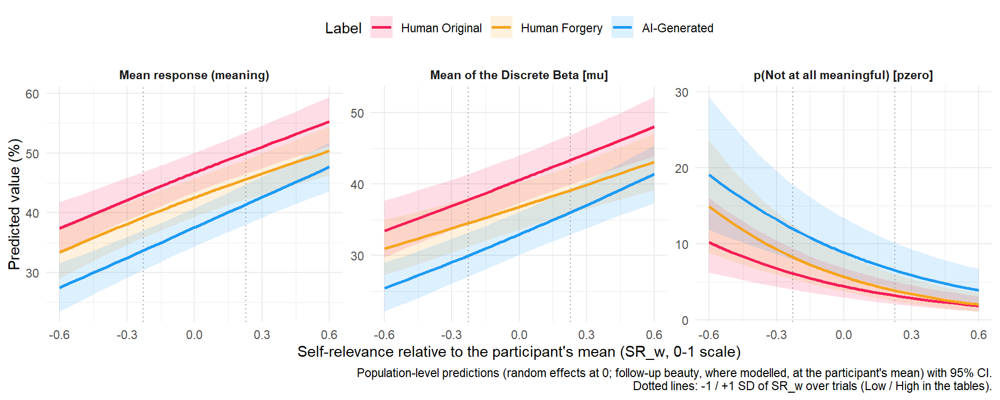{width=960}
:::
:::


```{.r .cell-code}
moderation_tables("MeaningSR")
```

```{=html}
<div id="hbqmswjlwt" style="padding-left:0px;padding-right:0px;padding-top:10px;padding-bottom:10px;overflow-x:auto;overflow-y:auto;width:auto;height:auto;">
<style>#hbqmswjlwt table {
  font-family: system-ui, 'Segoe UI', Roboto, Helvetica, Arial, sans-serif, 'Apple Color Emoji', 'Segoe UI Emoji', 'Segoe UI Symbol', 'Noto Color Emoji';
  -webkit-font-smoothing: antialiased;
  -moz-osx-font-smoothing: grayscale;
}

#hbqmswjlwt thead, #hbqmswjlwt tbody, #hbqmswjlwt tfoot, #hbqmswjlwt tr, #hbqmswjlwt td, #hbqmswjlwt th {
  border-style: none;
}

#hbqmswjlwt p {
  margin: 0;
  padding: 0;
}

#hbqmswjlwt .gt_table {
  display: table;
  border-collapse: collapse;
  line-height: normal;
  margin-left: auto;
  margin-right: auto;
  color: #333333;
  font-size: 13px;
  font-weight: normal;
  font-style: normal;
  background-color: #FFFFFF;
  width: auto;
  border-top-style: solid;
  border-top-width: 3px;
  border-top-color: #D5D5D5;
  border-right-style: solid;
  border-right-width: 3px;
  border-right-color: #D5D5D5;
  border-bottom-style: solid;
  border-bottom-width: 3px;
  border-bottom-color: #D5D5D5;
  border-left-style: solid;
  border-left-width: 3px;
  border-left-color: #D5D5D5;
}

#hbqmswjlwt .gt_caption {
  padding-top: 4px;
  padding-bottom: 4px;
}

#hbqmswjlwt .gt_title {
  color: #333333;
  font-size: 125%;
  font-weight: initial;
  padding-top: 4px;
  padding-bottom: 4px;
  padding-left: 5px;
  padding-right: 5px;
  border-bottom-color: #FFFFFF;
  border-bottom-width: 0;
}

#hbqmswjlwt .gt_subtitle {
  color: #333333;
  font-size: 85%;
  font-weight: initial;
  padding-top: 3px;
  padding-bottom: 5px;
  padding-left: 5px;
  padding-right: 5px;
  border-top-color: #FFFFFF;
  border-top-width: 0;
}

#hbqmswjlwt .gt_heading {
  background-color: #FFFFFF;
  text-align: left;
  border-bottom-color: #FFFFFF;
  border-left-style: none;
  border-left-width: 1px;
  border-left-color: #D3D3D3;
  border-right-style: none;
  border-right-width: 1px;
  border-right-color: #D3D3D3;
}

#hbqmswjlwt .gt_bottom_border {
  border-bottom-style: solid;
  border-bottom-width: 2px;
  border-bottom-color: #D5D5D5;
}

#hbqmswjlwt .gt_col_headings {
  border-top-style: solid;
  border-top-width: 2px;
  border-top-color: #D5D5D5;
  border-bottom-style: solid;
  border-bottom-width: 2px;
  border-bottom-color: #D5D5D5;
  border-left-style: none;
  border-left-width: 1px;
  border-left-color: #D3D3D3;
  border-right-style: none;
  border-right-width: 1px;
  border-right-color: #D3D3D3;
}

#hbqmswjlwt .gt_col_heading {
  color: #FFFFFF;
  background-color: #000000;
  font-size: 100%;
  font-weight: normal;
  text-transform: inherit;
  border-left-style: none;
  border-left-width: 1px;
  border-left-color: #D3D3D3;
  border-right-style: none;
  border-right-width: 1px;
  border-right-color: #D3D3D3;
  vertical-align: bottom;
  padding-top: 5px;
  padding-bottom: 6px;
  padding-left: 5px;
  padding-right: 5px;
  overflow-x: hidden;
}

#hbqmswjlwt .gt_column_spanner_outer {
  color: #FFFFFF;
  background-color: #000000;
  font-size: 100%;
  font-weight: normal;
  text-transform: inherit;
  padding-top: 0;
  padding-bottom: 0;
  padding-left: 4px;
  padding-right: 4px;
}

#hbqmswjlwt .gt_column_spanner_outer:first-child {
  padding-left: 0;
}

#hbqmswjlwt .gt_column_spanner_outer:last-child {
  padding-right: 0;
}

#hbqmswjlwt .gt_column_spanner {
  border-bottom-style: solid;
  border-bottom-width: 2px;
  border-bottom-color: #D5D5D5;
  vertical-align: bottom;
  padding-top: 5px;
  padding-bottom: 5px;
  overflow-x: hidden;
  display: inline-block;
  width: 100%;
}

#hbqmswjlwt .gt_spanner_row {
  border-bottom-style: hidden;
}

#hbqmswjlwt .gt_group_heading {
  padding-top: 8px;
  padding-bottom: 8px;
  padding-left: 5px;
  padding-right: 5px;
  color: #333333;
  background-color: #FFFFFF;
  font-size: 100%;
  font-weight: initial;
  text-transform: inherit;
  border-top-style: solid;
  border-top-width: 2px;
  border-top-color: #D5D5D5;
  border-bottom-style: solid;
  border-bottom-width: 2px;
  border-bottom-color: #D5D5D5;
  border-left-style: none;
  border-left-width: 1px;
  border-left-color: #D3D3D3;
  border-right-style: none;
  border-right-width: 1px;
  border-right-color: #D3D3D3;
  vertical-align: middle;
  text-align: left;
}

#hbqmswjlwt .gt_empty_group_heading {
  padding: 0.5px;
  color: #333333;
  background-color: #FFFFFF;
  font-size: 100%;
  font-weight: initial;
  border-top-style: solid;
  border-top-width: 2px;
  border-top-color: #D5D5D5;
  border-bottom-style: solid;
  border-bottom-width: 2px;
  border-bottom-color: #D5D5D5;
  vertical-align: middle;
}

#hbqmswjlwt .gt_from_md > :first-child {
  margin-top: 0;
}

#hbqmswjlwt .gt_from_md > :last-child {
  margin-bottom: 0;
}

#hbqmswjlwt .gt_row {
  padding-top: 8px;
  padding-bottom: 8px;
  padding-left: 5px;
  padding-right: 5px;
  margin: 10px;
  border-top-style: solid;
  border-top-width: 1px;
  border-top-color: #D5D5D5;
  border-left-style: solid;
  border-left-width: 1px;
  border-left-color: #D5D5D5;
  border-right-style: solid;
  border-right-width: 1px;
  border-right-color: #D5D5D5;
  vertical-align: middle;
  overflow-x: hidden;
}

#hbqmswjlwt .gt_stub {
  color: #333333;
  background-color: #FFFFFF;
  font-size: 100%;
  font-weight: initial;
  text-transform: inherit;
  border-right-style: solid;
  border-right-width: 2px;
  border-right-color: #5F5F5F;
  padding-left: 5px;
  padding-right: 5px;
}

#hbqmswjlwt .gt_stub_row_group {
  color: #333333;
  background-color: #FFFFFF;
  font-size: 100%;
  font-weight: initial;
  text-transform: inherit;
  border-right-style: solid;
  border-right-width: 2px;
  border-right-color: #D3D3D3;
  padding-left: 5px;
  padding-right: 5px;
  vertical-align: top;
}

#hbqmswjlwt .gt_row_group_first td {
  border-top-width: 2px;
}

#hbqmswjlwt .gt_row_group_first th {
  border-top-width: 2px;
}

#hbqmswjlwt .gt_summary_row {
  color: #333333;
  background-color: #D5D5D5;
  text-transform: inherit;
  padding-top: 8px;
  padding-bottom: 8px;
  padding-left: 5px;
  padding-right: 5px;
}

#hbqmswjlwt .gt_first_summary_row {
  border-top-style: solid;
  border-top-color: #D5D5D5;
}

#hbqmswjlwt .gt_first_summary_row.thick {
  border-top-width: 2px;
}

#hbqmswjlwt .gt_last_summary_row {
  padding-top: 8px;
  padding-bottom: 8px;
  padding-left: 5px;
  padding-right: 5px;
  border-bottom-style: solid;
  border-bottom-width: 2px;
  border-bottom-color: #D5D5D5;
}

#hbqmswjlwt .gt_grand_summary_row {
  color: #FFFFFF;
  background-color: #929292;
  text-transform: inherit;
  padding-top: 8px;
  padding-bottom: 8px;
  padding-left: 5px;
  padding-right: 5px;
}

#hbqmswjlwt .gt_first_grand_summary_row {
  padding-top: 8px;
  padding-bottom: 8px;
  padding-left: 5px;
  padding-right: 5px;
  border-top-style: double;
  border-top-width: 6px;
  border-top-color: #D5D5D5;
}

#hbqmswjlwt .gt_last_grand_summary_row_top {
  padding-top: 8px;
  padding-bottom: 8px;
  padding-left: 5px;
  padding-right: 5px;
  border-bottom-style: double;
  border-bottom-width: 6px;
  border-bottom-color: #D5D5D5;
}

#hbqmswjlwt .gt_striped {
  background-color: #F4F4F4;
}

#hbqmswjlwt .gt_table_body {
  border-top-style: solid;
  border-top-width: 2px;
  border-top-color: #D5D5D5;
  border-bottom-style: solid;
  border-bottom-width: 2px;
  border-bottom-color: #D5D5D5;
}

#hbqmswjlwt .gt_footnotes {
  color: #333333;
  background-color: #FFFFFF;
  border-bottom-style: none;
  border-bottom-width: 2px;
  border-bottom-color: #D3D3D3;
  border-left-style: none;
  border-left-width: 2px;
  border-left-color: #D3D3D3;
  border-right-style: none;
  border-right-width: 2px;
  border-right-color: #D3D3D3;
}

#hbqmswjlwt .gt_footnote {
  margin: 0px;
  font-size: 90%;
  padding-top: 4px;
  padding-bottom: 4px;
  padding-left: 5px;
  padding-right: 5px;
}

#hbqmswjlwt .gt_sourcenotes {
  color: #333333;
  background-color: #FFFFFF;
  border-bottom-style: none;
  border-bottom-width: 2px;
  border-bottom-color: #D3D3D3;
  border-left-style: none;
  border-left-width: 2px;
  border-left-color: #D3D3D3;
  border-right-style: none;
  border-right-width: 2px;
  border-right-color: #D3D3D3;
}

#hbqmswjlwt .gt_sourcenote {
  font-size: 90%;
  padding-top: 4px;
  padding-bottom: 4px;
  padding-left: 5px;
  padding-right: 5px;
}

#hbqmswjlwt .gt_left {
  text-align: left;
}

#hbqmswjlwt .gt_center {
  text-align: center;
}

#hbqmswjlwt .gt_right {
  text-align: right;
  font-variant-numeric: tabular-nums;
}

#hbqmswjlwt .gt_font_normal {
  font-weight: normal;
}

#hbqmswjlwt .gt_font_bold {
  font-weight: bold;
}

#hbqmswjlwt .gt_font_italic {
  font-style: italic;
}

#hbqmswjlwt .gt_super {
  font-size: 65%;
}

#hbqmswjlwt .gt_footnote_marks {
  font-size: 75%;
  vertical-align: 0.4em;
  position: initial;
}

#hbqmswjlwt .gt_asterisk {
  font-size: 100%;
  vertical-align: 0;
}

#hbqmswjlwt .gt_indent_1 {
  text-indent: 5px;
}

#hbqmswjlwt .gt_indent_2 {
  text-indent: 10px;
}

#hbqmswjlwt .gt_indent_3 {
  text-indent: 15px;
}

#hbqmswjlwt .gt_indent_4 {
  text-indent: 20px;
}

#hbqmswjlwt .gt_indent_5 {
  text-indent: 25px;
}

#hbqmswjlwt .katex-display {
  display: inline-flex !important;
  margin-bottom: 0.75em !important;
}

#hbqmswjlwt div.Reactable > div.rt-table > div.rt-thead > div.rt-tr.rt-tr-group-header > div.rt-th-group:after {
  height: 0px !important;
}
</style>
<table class="gt_table" data-quarto-disable-processing="false" data-quarto-bootstrap="false">
  <thead>
    <tr class="gt_heading">
      <td colspan="5" class="gt_heading gt_title gt_font_normal gt_bottom_border" style>Phase-1 Meaning by Self-Relevance: label contrasts at average self-relevance (% of the scale / percentage points)</td>
    </tr>
    
    <tr class="gt_col_headings">
      <th class="gt_col_heading gt_columns_bottom_border gt_left" rowspan="1" colspan="1" scope="col" id="Parameter">Parameter</th>
      <th class="gt_col_heading gt_columns_bottom_border gt_right" rowspan="1" colspan="1" scope="col" id="Diff">Diff</th>
      <th class="gt_col_heading gt_columns_bottom_border gt_left" rowspan="1" colspan="1" scope="col" id="CI">CI</th>
      <th class="gt_col_heading gt_columns_bottom_border gt_right" rowspan="1" colspan="1" scope="col" id="pd_fmt">pd_fmt</th>
      <th class="gt_col_heading gt_columns_bottom_border gt_left" rowspan="1" colspan="1" scope="col" id="Effect">Effect</th>
    </tr>
  </thead>
  <tbody class="gt_table_body">
    <tr class="gt_group_heading_row">
      <th colspan="5" class="gt_group_heading" scope="colgroup" id="AI-Generated - Human Original">AI-Generated - Human Original</th>
    </tr>
    <tr class="gt_row_group_first"><td headers="AI-Generated - Human Original  Parameter" class="gt_row gt_left" style="background-color: #FFEBEE;">Mean response (meaning)</td>
<td headers="AI-Generated - Human Original  Diff" class="gt_row gt_right" style="background-color: #FFEBEE;">-9.14</td>
<td headers="AI-Generated - Human Original  CI" class="gt_row gt_left" style="background-color: #FFEBEE;">[-10.98, -7.45]</td>
<td headers="AI-Generated - Human Original  pd_fmt" class="gt_row gt_right" style="background-color: #FFEBEE;">100%</td>
<td headers="AI-Generated - Human Original  Effect" class="gt_row gt_left" style="background-color: #FFEBEE;">Negative</td></tr>
    <tr><td headers="AI-Generated - Human Original  Parameter" class="gt_row gt_left gt_striped" style="background-color: #FFEBEE;">Mean of the Discrete Beta [mu]</td>
<td headers="AI-Generated - Human Original  Diff" class="gt_row gt_right gt_striped" style="background-color: #FFEBEE;">-7.62</td>
<td headers="AI-Generated - Human Original  CI" class="gt_row gt_left gt_striped" style="background-color: #FFEBEE;">[-9.23, -6.07]</td>
<td headers="AI-Generated - Human Original  pd_fmt" class="gt_row gt_right gt_striped" style="background-color: #FFEBEE;">100%</td>
<td headers="AI-Generated - Human Original  Effect" class="gt_row gt_left gt_striped" style="background-color: #FFEBEE;">Negative</td></tr>
    <tr><td headers="AI-Generated - Human Original  Parameter" class="gt_row gt_left" style="background-color: #E8F5E9;">p(Not at all meaningful) [pzero]</td>
<td headers="AI-Generated - Human Original  Diff" class="gt_row gt_right" style="background-color: #E8F5E9;">4.45</td>
<td headers="AI-Generated - Human Original  CI" class="gt_row gt_left" style="background-color: #E8F5E9;">[2.50, 7.17]</td>
<td headers="AI-Generated - Human Original  pd_fmt" class="gt_row gt_right" style="background-color: #E8F5E9;">100%</td>
<td headers="AI-Generated - Human Original  Effect" class="gt_row gt_left" style="background-color: #E8F5E9;">Positive</td></tr>
    <tr><td headers="AI-Generated - Human Original  Parameter" class="gt_row gt_left gt_striped" style="background-color: #FFEBEE;">Mean response, main model (all participants, no SR term)</td>
<td headers="AI-Generated - Human Original  Diff" class="gt_row gt_right gt_striped" style="background-color: #FFEBEE;">-10.40</td>
<td headers="AI-Generated - Human Original  CI" class="gt_row gt_left gt_striped" style="background-color: #FFEBEE;">[-11.93, -8.96]</td>
<td headers="AI-Generated - Human Original  pd_fmt" class="gt_row gt_right gt_striped" style="background-color: #FFEBEE;">100%</td>
<td headers="AI-Generated - Human Original  Effect" class="gt_row gt_left gt_striped" style="background-color: #FFEBEE;">Negative</td></tr>
    <tr class="gt_group_heading_row">
      <th colspan="5" class="gt_group_heading" scope="colgroup" id="Human Forgery - Human Original">Human Forgery - Human Original</th>
    </tr>
    <tr class="gt_row_group_first"><td headers="Human Forgery - Human Original  Parameter" class="gt_row gt_left" style="background-color: #FFEBEE;">Mean response (meaning)</td>
<td headers="Human Forgery - Human Original  Diff" class="gt_row gt_right" style="background-color: #FFEBEE;">-4.16</td>
<td headers="Human Forgery - Human Original  CI" class="gt_row gt_left" style="background-color: #FFEBEE;">[-5.34, -2.94]</td>
<td headers="Human Forgery - Human Original  pd_fmt" class="gt_row gt_right" style="background-color: #FFEBEE;">100%</td>
<td headers="Human Forgery - Human Original  Effect" class="gt_row gt_left" style="background-color: #FFEBEE;">Negative</td></tr>
    <tr><td headers="Human Forgery - Human Original  Parameter" class="gt_row gt_left gt_striped" style="background-color: #FFEBEE;">Mean of the Discrete Beta [mu]</td>
<td headers="Human Forgery - Human Original  Diff" class="gt_row gt_right gt_striped" style="background-color: #FFEBEE;">-3.75</td>
<td headers="Human Forgery - Human Original  CI" class="gt_row gt_left gt_striped" style="background-color: #FFEBEE;">[-4.86, -2.61]</td>
<td headers="Human Forgery - Human Original  pd_fmt" class="gt_row gt_right gt_striped" style="background-color: #FFEBEE;">100%</td>
<td headers="Human Forgery - Human Original  Effect" class="gt_row gt_left gt_striped" style="background-color: #FFEBEE;">Negative</td></tr>
    <tr><td headers="Human Forgery - Human Original  Parameter" class="gt_row gt_left" style="background-color: #E8F5E9;">p(Not at all meaningful) [pzero]</td>
<td headers="Human Forgery - Human Original  Diff" class="gt_row gt_right" style="background-color: #E8F5E9;">1.25</td>
<td headers="Human Forgery - Human Original  CI" class="gt_row gt_left" style="background-color: #E8F5E9;">[0.22, 2.49]</td>
<td headers="Human Forgery - Human Original  pd_fmt" class="gt_row gt_right" style="background-color: #E8F5E9;">99.25%</td>
<td headers="Human Forgery - Human Original  Effect" class="gt_row gt_left" style="background-color: #E8F5E9;">Positive</td></tr>
    <tr><td headers="Human Forgery - Human Original  Parameter" class="gt_row gt_left gt_striped" style="background-color: #FFEBEE;">Mean response, main model (all participants, no SR term)</td>
<td headers="Human Forgery - Human Original  Diff" class="gt_row gt_right gt_striped" style="background-color: #FFEBEE;">-4.26</td>
<td headers="Human Forgery - Human Original  CI" class="gt_row gt_left gt_striped" style="background-color: #FFEBEE;">[-5.27, -3.27]</td>
<td headers="Human Forgery - Human Original  pd_fmt" class="gt_row gt_right gt_striped" style="background-color: #FFEBEE;">100%</td>
<td headers="Human Forgery - Human Original  Effect" class="gt_row gt_left gt_striped" style="background-color: #FFEBEE;">Negative</td></tr>
    <tr class="gt_group_heading_row">
      <th colspan="5" class="gt_group_heading" scope="colgroup" id="AI-Generated - Human Forgery">AI-Generated - Human Forgery</th>
    </tr>
    <tr class="gt_row_group_first"><td headers="AI-Generated - Human Forgery  Parameter" class="gt_row gt_left" style="background-color: #FFEBEE;">Mean response (meaning)</td>
<td headers="AI-Generated - Human Forgery  Diff" class="gt_row gt_right" style="background-color: #FFEBEE;">-4.98</td>
<td headers="AI-Generated - Human Forgery  CI" class="gt_row gt_left" style="background-color: #FFEBEE;">[-6.73, -3.36]</td>
<td headers="AI-Generated - Human Forgery  pd_fmt" class="gt_row gt_right" style="background-color: #FFEBEE;">100%</td>
<td headers="AI-Generated - Human Forgery  Effect" class="gt_row gt_left" style="background-color: #FFEBEE;">Negative</td></tr>
    <tr><td headers="AI-Generated - Human Forgery  Parameter" class="gt_row gt_left gt_striped" style="background-color: #FFEBEE;">Mean of the Discrete Beta [mu]</td>
<td headers="AI-Generated - Human Forgery  Diff" class="gt_row gt_right gt_striped" style="background-color: #FFEBEE;">-3.88</td>
<td headers="AI-Generated - Human Forgery  CI" class="gt_row gt_left gt_striped" style="background-color: #FFEBEE;">[-5.38, -2.41]</td>
<td headers="AI-Generated - Human Forgery  pd_fmt" class="gt_row gt_right gt_striped" style="background-color: #FFEBEE;">100%</td>
<td headers="AI-Generated - Human Forgery  Effect" class="gt_row gt_left gt_striped" style="background-color: #FFEBEE;">Negative</td></tr>
    <tr><td headers="AI-Generated - Human Forgery  Parameter" class="gt_row gt_left" style="background-color: #E8F5E9;">p(Not at all meaningful) [pzero]</td>
<td headers="AI-Generated - Human Forgery  Diff" class="gt_row gt_right" style="background-color: #E8F5E9;">3.19</td>
<td headers="AI-Generated - Human Forgery  CI" class="gt_row gt_left" style="background-color: #E8F5E9;">[1.28, 5.71]</td>
<td headers="AI-Generated - Human Forgery  pd_fmt" class="gt_row gt_right" style="background-color: #E8F5E9;">100%</td>
<td headers="AI-Generated - Human Forgery  Effect" class="gt_row gt_left" style="background-color: #E8F5E9;">Positive</td></tr>
    <tr><td headers="AI-Generated - Human Forgery  Parameter" class="gt_row gt_left gt_striped" style="background-color: #FFEBEE;">Mean response, main model (all participants, no SR term)</td>
<td headers="AI-Generated - Human Forgery  Diff" class="gt_row gt_right gt_striped" style="background-color: #FFEBEE;">-6.16</td>
<td headers="AI-Generated - Human Forgery  CI" class="gt_row gt_left gt_striped" style="background-color: #FFEBEE;">[-7.58, -4.77]</td>
<td headers="AI-Generated - Human Forgery  pd_fmt" class="gt_row gt_right gt_striped" style="background-color: #FFEBEE;">100%</td>
<td headers="AI-Generated - Human Forgery  Effect" class="gt_row gt_left gt_striped" style="background-color: #FFEBEE;">Negative</td></tr>
  </tbody>
  
</table>
</div>
```


::: {.callout-note collapse="true" title="Phase-1 Meaning by Self-Relevance: label contrasts at average self-relevance (% of the scale / percentage points) (Markdown table, for text readers)"}

|Contrast                       |Parameter                                                |Diff   |CI              |pd_fmt |Effect   |
|:------------------------------|:--------------------------------------------------------|:------|:---------------|:------|:--------|
|AI-Generated - Human Original  |Mean response (meaning)                                  |-9.14  |[-10.98, -7.45] |100%   |Negative |
|AI-Generated - Human Original  |Mean of the Discrete Beta [mu]                           |-7.62  |[-9.23, -6.07]  |100%   |Negative |
|AI-Generated - Human Original  |p(Not at all meaningful) [pzero]                         |4.45   |[2.50, 7.17]    |100%   |Positive |
|AI-Generated - Human Original  |Mean response, main model (all participants, no SR term) |-10.40 |[-11.93, -8.96] |100%   |Negative |
|Human Forgery - Human Original |Mean response (meaning)                                  |-4.16  |[-5.34, -2.94]  |100%   |Negative |
|Human Forgery - Human Original |Mean of the Discrete Beta [mu]                           |-3.75  |[-4.86, -2.61]  |100%   |Negative |
|Human Forgery - Human Original |p(Not at all meaningful) [pzero]                         |1.25   |[0.22, 2.49]    |99.25% |Positive |
|Human Forgery - Human Original |Mean response, main model (all participants, no SR term) |-4.26  |[-5.27, -3.27]  |100%   |Negative |
|AI-Generated - Human Forgery   |Mean response (meaning)                                  |-4.98  |[-6.73, -3.36]  |100%   |Negative |
|AI-Generated - Human Forgery   |Mean of the Discrete Beta [mu]                           |-3.88  |[-5.38, -2.41]  |100%   |Negative |
|AI-Generated - Human Forgery   |p(Not at all meaningful) [pzero]                         |3.19   |[1.28, 5.71]    |100%   |Positive |
|AI-Generated - Human Forgery   |Mean response, main model (all participants, no SR term) |-6.16  |[-7.58, -4.77]  |100%   |Negative |

:::

```{=html}
<div id="nzljvseutt" style="padding-left:0px;padding-right:0px;padding-top:10px;padding-bottom:10px;overflow-x:auto;overflow-y:auto;width:auto;height:auto;">
<style>#nzljvseutt table {
  font-family: system-ui, 'Segoe UI', Roboto, Helvetica, Arial, sans-serif, 'Apple Color Emoji', 'Segoe UI Emoji', 'Segoe UI Symbol', 'Noto Color Emoji';
  -webkit-font-smoothing: antialiased;
  -moz-osx-font-smoothing: grayscale;
}

#nzljvseutt thead, #nzljvseutt tbody, #nzljvseutt tfoot, #nzljvseutt tr, #nzljvseutt td, #nzljvseutt th {
  border-style: none;
}

#nzljvseutt p {
  margin: 0;
  padding: 0;
}

#nzljvseutt .gt_table {
  display: table;
  border-collapse: collapse;
  line-height: normal;
  margin-left: auto;
  margin-right: auto;
  color: #333333;
  font-size: 13px;
  font-weight: normal;
  font-style: normal;
  background-color: #FFFFFF;
  width: auto;
  border-top-style: solid;
  border-top-width: 3px;
  border-top-color: #D5D5D5;
  border-right-style: solid;
  border-right-width: 3px;
  border-right-color: #D5D5D5;
  border-bottom-style: solid;
  border-bottom-width: 3px;
  border-bottom-color: #D5D5D5;
  border-left-style: solid;
  border-left-width: 3px;
  border-left-color: #D5D5D5;
}

#nzljvseutt .gt_caption {
  padding-top: 4px;
  padding-bottom: 4px;
}

#nzljvseutt .gt_title {
  color: #333333;
  font-size: 125%;
  font-weight: initial;
  padding-top: 4px;
  padding-bottom: 4px;
  padding-left: 5px;
  padding-right: 5px;
  border-bottom-color: #FFFFFF;
  border-bottom-width: 0;
}

#nzljvseutt .gt_subtitle {
  color: #333333;
  font-size: 85%;
  font-weight: initial;
  padding-top: 3px;
  padding-bottom: 5px;
  padding-left: 5px;
  padding-right: 5px;
  border-top-color: #FFFFFF;
  border-top-width: 0;
}

#nzljvseutt .gt_heading {
  background-color: #FFFFFF;
  text-align: left;
  border-bottom-color: #FFFFFF;
  border-left-style: none;
  border-left-width: 1px;
  border-left-color: #D3D3D3;
  border-right-style: none;
  border-right-width: 1px;
  border-right-color: #D3D3D3;
}

#nzljvseutt .gt_bottom_border {
  border-bottom-style: solid;
  border-bottom-width: 2px;
  border-bottom-color: #D5D5D5;
}

#nzljvseutt .gt_col_headings {
  border-top-style: solid;
  border-top-width: 2px;
  border-top-color: #D5D5D5;
  border-bottom-style: solid;
  border-bottom-width: 2px;
  border-bottom-color: #D5D5D5;
  border-left-style: none;
  border-left-width: 1px;
  border-left-color: #D3D3D3;
  border-right-style: none;
  border-right-width: 1px;
  border-right-color: #D3D3D3;
}

#nzljvseutt .gt_col_heading {
  color: #FFFFFF;
  background-color: #000000;
  font-size: 100%;
  font-weight: normal;
  text-transform: inherit;
  border-left-style: none;
  border-left-width: 1px;
  border-left-color: #D3D3D3;
  border-right-style: none;
  border-right-width: 1px;
  border-right-color: #D3D3D3;
  vertical-align: bottom;
  padding-top: 5px;
  padding-bottom: 6px;
  padding-left: 5px;
  padding-right: 5px;
  overflow-x: hidden;
}

#nzljvseutt .gt_column_spanner_outer {
  color: #FFFFFF;
  background-color: #000000;
  font-size: 100%;
  font-weight: normal;
  text-transform: inherit;
  padding-top: 0;
  padding-bottom: 0;
  padding-left: 4px;
  padding-right: 4px;
}

#nzljvseutt .gt_column_spanner_outer:first-child {
  padding-left: 0;
}

#nzljvseutt .gt_column_spanner_outer:last-child {
  padding-right: 0;
}

#nzljvseutt .gt_column_spanner {
  border-bottom-style: solid;
  border-bottom-width: 2px;
  border-bottom-color: #D5D5D5;
  vertical-align: bottom;
  padding-top: 5px;
  padding-bottom: 5px;
  overflow-x: hidden;
  display: inline-block;
  width: 100%;
}

#nzljvseutt .gt_spanner_row {
  border-bottom-style: hidden;
}

#nzljvseutt .gt_group_heading {
  padding-top: 8px;
  padding-bottom: 8px;
  padding-left: 5px;
  padding-right: 5px;
  color: #333333;
  background-color: #FFFFFF;
  font-size: 100%;
  font-weight: initial;
  text-transform: inherit;
  border-top-style: solid;
  border-top-width: 2px;
  border-top-color: #D5D5D5;
  border-bottom-style: solid;
  border-bottom-width: 2px;
  border-bottom-color: #D5D5D5;
  border-left-style: none;
  border-left-width: 1px;
  border-left-color: #D3D3D3;
  border-right-style: none;
  border-right-width: 1px;
  border-right-color: #D3D3D3;
  vertical-align: middle;
  text-align: left;
}

#nzljvseutt .gt_empty_group_heading {
  padding: 0.5px;
  color: #333333;
  background-color: #FFFFFF;
  font-size: 100%;
  font-weight: initial;
  border-top-style: solid;
  border-top-width: 2px;
  border-top-color: #D5D5D5;
  border-bottom-style: solid;
  border-bottom-width: 2px;
  border-bottom-color: #D5D5D5;
  vertical-align: middle;
}

#nzljvseutt .gt_from_md > :first-child {
  margin-top: 0;
}

#nzljvseutt .gt_from_md > :last-child {
  margin-bottom: 0;
}

#nzljvseutt .gt_row {
  padding-top: 8px;
  padding-bottom: 8px;
  padding-left: 5px;
  padding-right: 5px;
  margin: 10px;
  border-top-style: solid;
  border-top-width: 1px;
  border-top-color: #D5D5D5;
  border-left-style: solid;
  border-left-width: 1px;
  border-left-color: #D5D5D5;
  border-right-style: solid;
  border-right-width: 1px;
  border-right-color: #D5D5D5;
  vertical-align: middle;
  overflow-x: hidden;
}

#nzljvseutt .gt_stub {
  color: #333333;
  background-color: #FFFFFF;
  font-size: 100%;
  font-weight: initial;
  text-transform: inherit;
  border-right-style: solid;
  border-right-width: 2px;
  border-right-color: #5F5F5F;
  padding-left: 5px;
  padding-right: 5px;
}

#nzljvseutt .gt_stub_row_group {
  color: #333333;
  background-color: #FFFFFF;
  font-size: 100%;
  font-weight: initial;
  text-transform: inherit;
  border-right-style: solid;
  border-right-width: 2px;
  border-right-color: #D3D3D3;
  padding-left: 5px;
  padding-right: 5px;
  vertical-align: top;
}

#nzljvseutt .gt_row_group_first td {
  border-top-width: 2px;
}

#nzljvseutt .gt_row_group_first th {
  border-top-width: 2px;
}

#nzljvseutt .gt_summary_row {
  color: #333333;
  background-color: #D5D5D5;
  text-transform: inherit;
  padding-top: 8px;
  padding-bottom: 8px;
  padding-left: 5px;
  padding-right: 5px;
}

#nzljvseutt .gt_first_summary_row {
  border-top-style: solid;
  border-top-color: #D5D5D5;
}

#nzljvseutt .gt_first_summary_row.thick {
  border-top-width: 2px;
}

#nzljvseutt .gt_last_summary_row {
  padding-top: 8px;
  padding-bottom: 8px;
  padding-left: 5px;
  padding-right: 5px;
  border-bottom-style: solid;
  border-bottom-width: 2px;
  border-bottom-color: #D5D5D5;
}

#nzljvseutt .gt_grand_summary_row {
  color: #FFFFFF;
  background-color: #929292;
  text-transform: inherit;
  padding-top: 8px;
  padding-bottom: 8px;
  padding-left: 5px;
  padding-right: 5px;
}

#nzljvseutt .gt_first_grand_summary_row {
  padding-top: 8px;
  padding-bottom: 8px;
  padding-left: 5px;
  padding-right: 5px;
  border-top-style: double;
  border-top-width: 6px;
  border-top-color: #D5D5D5;
}

#nzljvseutt .gt_last_grand_summary_row_top {
  padding-top: 8px;
  padding-bottom: 8px;
  padding-left: 5px;
  padding-right: 5px;
  border-bottom-style: double;
  border-bottom-width: 6px;
  border-bottom-color: #D5D5D5;
}

#nzljvseutt .gt_striped {
  background-color: #F4F4F4;
}

#nzljvseutt .gt_table_body {
  border-top-style: solid;
  border-top-width: 2px;
  border-top-color: #D5D5D5;
  border-bottom-style: solid;
  border-bottom-width: 2px;
  border-bottom-color: #D5D5D5;
}

#nzljvseutt .gt_footnotes {
  color: #333333;
  background-color: #FFFFFF;
  border-bottom-style: none;
  border-bottom-width: 2px;
  border-bottom-color: #D3D3D3;
  border-left-style: none;
  border-left-width: 2px;
  border-left-color: #D3D3D3;
  border-right-style: none;
  border-right-width: 2px;
  border-right-color: #D3D3D3;
}

#nzljvseutt .gt_footnote {
  margin: 0px;
  font-size: 90%;
  padding-top: 4px;
  padding-bottom: 4px;
  padding-left: 5px;
  padding-right: 5px;
}

#nzljvseutt .gt_sourcenotes {
  color: #333333;
  background-color: #FFFFFF;
  border-bottom-style: none;
  border-bottom-width: 2px;
  border-bottom-color: #D3D3D3;
  border-left-style: none;
  border-left-width: 2px;
  border-left-color: #D3D3D3;
  border-right-style: none;
  border-right-width: 2px;
  border-right-color: #D3D3D3;
}

#nzljvseutt .gt_sourcenote {
  font-size: 90%;
  padding-top: 4px;
  padding-bottom: 4px;
  padding-left: 5px;
  padding-right: 5px;
}

#nzljvseutt .gt_left {
  text-align: left;
}

#nzljvseutt .gt_center {
  text-align: center;
}

#nzljvseutt .gt_right {
  text-align: right;
  font-variant-numeric: tabular-nums;
}

#nzljvseutt .gt_font_normal {
  font-weight: normal;
}

#nzljvseutt .gt_font_bold {
  font-weight: bold;
}

#nzljvseutt .gt_font_italic {
  font-style: italic;
}

#nzljvseutt .gt_super {
  font-size: 65%;
}

#nzljvseutt .gt_footnote_marks {
  font-size: 75%;
  vertical-align: 0.4em;
  position: initial;
}

#nzljvseutt .gt_asterisk {
  font-size: 100%;
  vertical-align: 0;
}

#nzljvseutt .gt_indent_1 {
  text-indent: 5px;
}

#nzljvseutt .gt_indent_2 {
  text-indent: 10px;
}

#nzljvseutt .gt_indent_3 {
  text-indent: 15px;
}

#nzljvseutt .gt_indent_4 {
  text-indent: 20px;
}

#nzljvseutt .gt_indent_5 {
  text-indent: 25px;
}

#nzljvseutt .katex-display {
  display: inline-flex !important;
  margin-bottom: 0.75em !important;
}

#nzljvseutt div.Reactable > div.rt-table > div.rt-thead > div.rt-tr.rt-tr-group-header > div.rt-th-group:after {
  height: 0px !important;
}
</style>
<table class="gt_table" data-quarto-disable-processing="false" data-quarto-bootstrap="false">
  <thead>
    <tr class="gt_heading">
      <td colspan="6" class="gt_heading gt_title gt_font_normal gt_bottom_border" style>Phase-1 Meaning by Self-Relevance: label gap at low, average and high self-relevance, and its change (High - Low)</td>
    </tr>
    
    <tr class="gt_col_headings">
      <th class="gt_col_heading gt_columns_bottom_border gt_center" rowspan="1" colspan="1" scope="col" id="Parameter">Parameter</th>
      <th class="gt_col_heading gt_columns_bottom_border gt_center" rowspan="1" colspan="1" scope="col" id="At">At</th>
      <th class="gt_col_heading gt_columns_bottom_border gt_right" rowspan="1" colspan="1" scope="col" id="Diff">Diff</th>
      <th class="gt_col_heading gt_columns_bottom_border gt_left" rowspan="1" colspan="1" scope="col" id="CI">CI</th>
      <th class="gt_col_heading gt_columns_bottom_border gt_right" rowspan="1" colspan="1" scope="col" id="pd_fmt">pd_fmt</th>
      <th class="gt_col_heading gt_columns_bottom_border gt_left" rowspan="1" colspan="1" scope="col" id="Effect">Effect</th>
    </tr>
  </thead>
  <tbody class="gt_table_body">
    <tr class="gt_group_heading_row">
      <th colspan="6" class="gt_group_heading" scope="colgroup" id="AI-Generated - Human Original">AI-Generated - Human Original</th>
    </tr>
    <tr class="gt_row_group_first"><td headers="AI-Generated - Human Original  Parameter" class="gt_row gt_center" style="background-color: #FFEBEE;">Mean response (meaning)</td>
<td headers="AI-Generated - Human Original  At" class="gt_row gt_center" style="background-color: #FFEBEE;">Low SR (-1 SD)</td>
<td headers="AI-Generated - Human Original  Diff" class="gt_row gt_right" style="background-color: #FFEBEE;">-9.57</td>
<td headers="AI-Generated - Human Original  CI" class="gt_row gt_left" style="background-color: #FFEBEE;">[-11.80, -7.61]</td>
<td headers="AI-Generated - Human Original  pd_fmt" class="gt_row gt_right" style="background-color: #FFEBEE;">100%</td>
<td headers="AI-Generated - Human Original  Effect" class="gt_row gt_left" style="background-color: #FFEBEE;">Negative</td></tr>
    <tr><td headers="AI-Generated - Human Original  Parameter" class="gt_row gt_center gt_striped" style="background-color: #FFEBEE;">Mean response (meaning)</td>
<td headers="AI-Generated - Human Original  At" class="gt_row gt_center gt_striped" style="background-color: #FFEBEE;">Average SR</td>
<td headers="AI-Generated - Human Original  Diff" class="gt_row gt_right gt_striped" style="background-color: #FFEBEE;">-9.14</td>
<td headers="AI-Generated - Human Original  CI" class="gt_row gt_left gt_striped" style="background-color: #FFEBEE;">[-11.01, -7.48]</td>
<td headers="AI-Generated - Human Original  pd_fmt" class="gt_row gt_right gt_striped" style="background-color: #FFEBEE;">100%</td>
<td headers="AI-Generated - Human Original  Effect" class="gt_row gt_left gt_striped" style="background-color: #FFEBEE;">Negative</td></tr>
    <tr><td headers="AI-Generated - Human Original  Parameter" class="gt_row gt_center" style="background-color: #FFEBEE;">Mean response (meaning)</td>
<td headers="AI-Generated - Human Original  At" class="gt_row gt_center" style="background-color: #FFEBEE;">High SR (+1 SD)</td>
<td headers="AI-Generated - Human Original  Diff" class="gt_row gt_right" style="background-color: #FFEBEE;">-8.61</td>
<td headers="AI-Generated - Human Original  CI" class="gt_row gt_left" style="background-color: #FFEBEE;">[-10.56, -6.61]</td>
<td headers="AI-Generated - Human Original  pd_fmt" class="gt_row gt_right" style="background-color: #FFEBEE;">100%</td>
<td headers="AI-Generated - Human Original  Effect" class="gt_row gt_left" style="background-color: #FFEBEE;">Negative</td></tr>
    <tr><td headers="AI-Generated - Human Original  Parameter" class="gt_row gt_center gt_striped" style="color: #9E9E9E;">Mean response (meaning)</td>
<td headers="AI-Generated - Human Original  At" class="gt_row gt_center gt_striped" style="color: #9E9E9E;">High - Low</td>
<td headers="AI-Generated - Human Original  Diff" class="gt_row gt_right gt_striped" style="color: #9E9E9E;">0.97</td>
<td headers="AI-Generated - Human Original  CI" class="gt_row gt_left gt_striped" style="color: #9E9E9E;">[-1.09, 3.01]</td>
<td headers="AI-Generated - Human Original  pd_fmt" class="gt_row gt_right gt_striped" style="color: #9E9E9E;">81.20%</td>
<td headers="AI-Generated - Human Original  Effect" class="gt_row gt_left gt_striped" style="color: #9E9E9E;">n.s.</td></tr>
    <tr><td headers="AI-Generated - Human Original  Parameter" class="gt_row gt_center" style="background-color: #FFEBEE;">Mean of the Discrete Beta [mu]</td>
<td headers="AI-Generated - Human Original  At" class="gt_row gt_center" style="background-color: #FFEBEE;">Low SR (-1 SD)</td>
<td headers="AI-Generated - Human Original  Diff" class="gt_row gt_right" style="background-color: #FFEBEE;">-7.84</td>
<td headers="AI-Generated - Human Original  CI" class="gt_row gt_left" style="background-color: #FFEBEE;">[-9.73, -5.94]</td>
<td headers="AI-Generated - Human Original  pd_fmt" class="gt_row gt_right" style="background-color: #FFEBEE;">100%</td>
<td headers="AI-Generated - Human Original  Effect" class="gt_row gt_left" style="background-color: #FFEBEE;">Negative</td></tr>
    <tr><td headers="AI-Generated - Human Original  Parameter" class="gt_row gt_center gt_striped" style="background-color: #FFEBEE;">Mean of the Discrete Beta [mu]</td>
<td headers="AI-Generated - Human Original  At" class="gt_row gt_center gt_striped" style="background-color: #FFEBEE;">Average SR</td>
<td headers="AI-Generated - Human Original  Diff" class="gt_row gt_right gt_striped" style="background-color: #FFEBEE;">-7.62</td>
<td headers="AI-Generated - Human Original  CI" class="gt_row gt_left gt_striped" style="background-color: #FFEBEE;">[-9.19, -6.05]</td>
<td headers="AI-Generated - Human Original  pd_fmt" class="gt_row gt_right gt_striped" style="background-color: #FFEBEE;">100%</td>
<td headers="AI-Generated - Human Original  Effect" class="gt_row gt_left gt_striped" style="background-color: #FFEBEE;">Negative</td></tr>
    <tr><td headers="AI-Generated - Human Original  Parameter" class="gt_row gt_center" style="background-color: #FFEBEE;">Mean of the Discrete Beta [mu]</td>
<td headers="AI-Generated - Human Original  At" class="gt_row gt_center" style="background-color: #FFEBEE;">High SR (+1 SD)</td>
<td headers="AI-Generated - Human Original  Diff" class="gt_row gt_right" style="background-color: #FFEBEE;">-7.32</td>
<td headers="AI-Generated - Human Original  CI" class="gt_row gt_left" style="background-color: #FFEBEE;">[-9.10, -5.46]</td>
<td headers="AI-Generated - Human Original  pd_fmt" class="gt_row gt_right" style="background-color: #FFEBEE;">100%</td>
<td headers="AI-Generated - Human Original  Effect" class="gt_row gt_left" style="background-color: #FFEBEE;">Negative</td></tr>
    <tr><td headers="AI-Generated - Human Original  Parameter" class="gt_row gt_center gt_striped" style="color: #9E9E9E;">Mean of the Discrete Beta [mu]</td>
<td headers="AI-Generated - Human Original  At" class="gt_row gt_center gt_striped" style="color: #9E9E9E;">High - Low</td>
<td headers="AI-Generated - Human Original  Diff" class="gt_row gt_right gt_striped" style="color: #9E9E9E;">0.52</td>
<td headers="AI-Generated - Human Original  CI" class="gt_row gt_left gt_striped" style="color: #9E9E9E;">[-1.56, 2.58]</td>
<td headers="AI-Generated - Human Original  pd_fmt" class="gt_row gt_right gt_striped" style="color: #9E9E9E;">68.27%</td>
<td headers="AI-Generated - Human Original  Effect" class="gt_row gt_left gt_striped" style="color: #9E9E9E;">n.s.</td></tr>
    <tr><td headers="AI-Generated - Human Original  Parameter" class="gt_row gt_center" style="background-color: #E8F5E9;">p(Not at all meaningful) [pzero]</td>
<td headers="AI-Generated - Human Original  At" class="gt_row gt_center" style="background-color: #E8F5E9;">Low SR (-1 SD)</td>
<td headers="AI-Generated - Human Original  Diff" class="gt_row gt_right" style="background-color: #E8F5E9;">5.87</td>
<td headers="AI-Generated - Human Original  CI" class="gt_row gt_left" style="background-color: #E8F5E9;">[3.14, 9.33]</td>
<td headers="AI-Generated - Human Original  pd_fmt" class="gt_row gt_right" style="background-color: #E8F5E9;">100%</td>
<td headers="AI-Generated - Human Original  Effect" class="gt_row gt_left" style="background-color: #E8F5E9;">Positive</td></tr>
    <tr><td headers="AI-Generated - Human Original  Parameter" class="gt_row gt_center gt_striped" style="background-color: #E8F5E9;">p(Not at all meaningful) [pzero]</td>
<td headers="AI-Generated - Human Original  At" class="gt_row gt_center gt_striped" style="background-color: #E8F5E9;">Average SR</td>
<td headers="AI-Generated - Human Original  Diff" class="gt_row gt_right gt_striped" style="background-color: #E8F5E9;">4.45</td>
<td headers="AI-Generated - Human Original  CI" class="gt_row gt_left gt_striped" style="background-color: #E8F5E9;">[2.47, 7.06]</td>
<td headers="AI-Generated - Human Original  pd_fmt" class="gt_row gt_right gt_striped" style="background-color: #E8F5E9;">100%</td>
<td headers="AI-Generated - Human Original  Effect" class="gt_row gt_left gt_striped" style="background-color: #E8F5E9;">Positive</td></tr>
    <tr><td headers="AI-Generated - Human Original  Parameter" class="gt_row gt_center" style="background-color: #E8F5E9;">p(Not at all meaningful) [pzero]</td>
<td headers="AI-Generated - Human Original  At" class="gt_row gt_center" style="background-color: #E8F5E9;">High SR (+1 SD)</td>
<td headers="AI-Generated - Human Original  Diff" class="gt_row gt_right" style="background-color: #E8F5E9;">3.33</td>
<td headers="AI-Generated - Human Original  CI" class="gt_row gt_left" style="background-color: #E8F5E9;">[1.50, 5.56]</td>
<td headers="AI-Generated - Human Original  pd_fmt" class="gt_row gt_right" style="background-color: #E8F5E9;">100%</td>
<td headers="AI-Generated - Human Original  Effect" class="gt_row gt_left" style="background-color: #E8F5E9;">Positive</td></tr>
    <tr><td headers="AI-Generated - Human Original  Parameter" class="gt_row gt_center gt_striped" style="background-color: #FFEBEE;">p(Not at all meaningful) [pzero]</td>
<td headers="AI-Generated - Human Original  At" class="gt_row gt_center gt_striped" style="background-color: #FFEBEE;">High - Low</td>
<td headers="AI-Generated - Human Original  Diff" class="gt_row gt_right gt_striped" style="background-color: #FFEBEE;">-2.50</td>
<td headers="AI-Generated - Human Original  CI" class="gt_row gt_left gt_striped" style="background-color: #FFEBEE;">[-5.08, -0.40]</td>
<td headers="AI-Generated - Human Original  pd_fmt" class="gt_row gt_right gt_striped" style="background-color: #FFEBEE;">99.20%</td>
<td headers="AI-Generated - Human Original  Effect" class="gt_row gt_left gt_striped" style="background-color: #FFEBEE;">Negative</td></tr>
    <tr class="gt_group_heading_row">
      <th colspan="6" class="gt_group_heading" scope="colgroup" id="Human Forgery - Human Original">Human Forgery - Human Original</th>
    </tr>
    <tr class="gt_row_group_first"><td headers="Human Forgery - Human Original  Parameter" class="gt_row gt_center" style="background-color: #FFEBEE;">Mean response (meaning)</td>
<td headers="Human Forgery - Human Original  At" class="gt_row gt_center" style="background-color: #FFEBEE;">Low SR (-1 SD)</td>
<td headers="Human Forgery - Human Original  Diff" class="gt_row gt_right" style="background-color: #FFEBEE;">-4.01</td>
<td headers="Human Forgery - Human Original  CI" class="gt_row gt_left" style="background-color: #FFEBEE;">[-5.59, -2.36]</td>
<td headers="Human Forgery - Human Original  pd_fmt" class="gt_row gt_right" style="background-color: #FFEBEE;">100%</td>
<td headers="Human Forgery - Human Original  Effect" class="gt_row gt_left" style="background-color: #FFEBEE;">Negative</td></tr>
    <tr><td headers="Human Forgery - Human Original  Parameter" class="gt_row gt_center gt_striped" style="background-color: #FFEBEE;">Mean response (meaning)</td>
<td headers="Human Forgery - Human Original  At" class="gt_row gt_center gt_striped" style="background-color: #FFEBEE;">Average SR</td>
<td headers="Human Forgery - Human Original  Diff" class="gt_row gt_right gt_striped" style="background-color: #FFEBEE;">-4.16</td>
<td headers="Human Forgery - Human Original  CI" class="gt_row gt_left gt_striped" style="background-color: #FFEBEE;">[-5.34, -2.94]</td>
<td headers="Human Forgery - Human Original  pd_fmt" class="gt_row gt_right gt_striped" style="background-color: #FFEBEE;">100%</td>
<td headers="Human Forgery - Human Original  Effect" class="gt_row gt_left gt_striped" style="background-color: #FFEBEE;">Negative</td></tr>
    <tr><td headers="Human Forgery - Human Original  Parameter" class="gt_row gt_center" style="background-color: #FFEBEE;">Mean response (meaning)</td>
<td headers="Human Forgery - Human Original  At" class="gt_row gt_center" style="background-color: #FFEBEE;">High SR (+1 SD)</td>
<td headers="Human Forgery - Human Original  Diff" class="gt_row gt_right" style="background-color: #FFEBEE;">-4.39</td>
<td headers="Human Forgery - Human Original  CI" class="gt_row gt_left" style="background-color: #FFEBEE;">[-5.93, -2.95]</td>
<td headers="Human Forgery - Human Original  pd_fmt" class="gt_row gt_right" style="background-color: #FFEBEE;">100%</td>
<td headers="Human Forgery - Human Original  Effect" class="gt_row gt_left" style="background-color: #FFEBEE;">Negative</td></tr>
    <tr><td headers="Human Forgery - Human Original  Parameter" class="gt_row gt_center gt_striped" style="color: #9E9E9E;">Mean response (meaning)</td>
<td headers="Human Forgery - Human Original  At" class="gt_row gt_center gt_striped" style="color: #9E9E9E;">High - Low</td>
<td headers="Human Forgery - Human Original  Diff" class="gt_row gt_right gt_striped" style="color: #9E9E9E;">-0.38</td>
<td headers="Human Forgery - Human Original  CI" class="gt_row gt_left gt_striped" style="color: #9E9E9E;">[-2.46, 1.68]</td>
<td headers="Human Forgery - Human Original  pd_fmt" class="gt_row gt_right gt_striped" style="color: #9E9E9E;">65.12%</td>
<td headers="Human Forgery - Human Original  Effect" class="gt_row gt_left gt_striped" style="color: #9E9E9E;">n.s.</td></tr>
    <tr><td headers="Human Forgery - Human Original  Parameter" class="gt_row gt_center" style="background-color: #FFEBEE;">Mean of the Discrete Beta [mu]</td>
<td headers="Human Forgery - Human Original  At" class="gt_row gt_center" style="background-color: #FFEBEE;">Low SR (-1 SD)</td>
<td headers="Human Forgery - Human Original  Diff" class="gt_row gt_right" style="background-color: #FFEBEE;">-3.27</td>
<td headers="Human Forgery - Human Original  CI" class="gt_row gt_left" style="background-color: #FFEBEE;">[-4.82, -1.65]</td>
<td headers="Human Forgery - Human Original  pd_fmt" class="gt_row gt_right" style="background-color: #FFEBEE;">100%</td>
<td headers="Human Forgery - Human Original  Effect" class="gt_row gt_left" style="background-color: #FFEBEE;">Negative</td></tr>
    <tr><td headers="Human Forgery - Human Original  Parameter" class="gt_row gt_center gt_striped" style="background-color: #FFEBEE;">Mean of the Discrete Beta [mu]</td>
<td headers="Human Forgery - Human Original  At" class="gt_row gt_center gt_striped" style="background-color: #FFEBEE;">Average SR</td>
<td headers="Human Forgery - Human Original  Diff" class="gt_row gt_right gt_striped" style="background-color: #FFEBEE;">-3.75</td>
<td headers="Human Forgery - Human Original  CI" class="gt_row gt_left gt_striped" style="background-color: #FFEBEE;">[-4.86, -2.60]</td>
<td headers="Human Forgery - Human Original  pd_fmt" class="gt_row gt_right gt_striped" style="background-color: #FFEBEE;">100%</td>
<td headers="Human Forgery - Human Original  Effect" class="gt_row gt_left gt_striped" style="background-color: #FFEBEE;">Negative</td></tr>
    <tr><td headers="Human Forgery - Human Original  Parameter" class="gt_row gt_center" style="background-color: #FFEBEE;">Mean of the Discrete Beta [mu]</td>
<td headers="Human Forgery - Human Original  At" class="gt_row gt_center" style="background-color: #FFEBEE;">High SR (+1 SD)</td>
<td headers="Human Forgery - Human Original  Diff" class="gt_row gt_right" style="background-color: #FFEBEE;">-4.21</td>
<td headers="Human Forgery - Human Original  CI" class="gt_row gt_left" style="background-color: #FFEBEE;">[-5.58, -2.71]</td>
<td headers="Human Forgery - Human Original  pd_fmt" class="gt_row gt_right" style="background-color: #FFEBEE;">100%</td>
<td headers="Human Forgery - Human Original  Effect" class="gt_row gt_left" style="background-color: #FFEBEE;">Negative</td></tr>
    <tr><td headers="Human Forgery - Human Original  Parameter" class="gt_row gt_center gt_striped" style="color: #9E9E9E;">Mean of the Discrete Beta [mu]</td>
<td headers="Human Forgery - Human Original  At" class="gt_row gt_center gt_striped" style="color: #9E9E9E;">High - Low</td>
<td headers="Human Forgery - Human Original  Diff" class="gt_row gt_right gt_striped" style="color: #9E9E9E;">-0.90</td>
<td headers="Human Forgery - Human Original  CI" class="gt_row gt_left gt_striped" style="color: #9E9E9E;">[-3.01, 1.11]</td>
<td headers="Human Forgery - Human Original  pd_fmt" class="gt_row gt_right gt_striped" style="color: #9E9E9E;">81.97%</td>
<td headers="Human Forgery - Human Original  Effect" class="gt_row gt_left gt_striped" style="color: #9E9E9E;">n.s.</td></tr>
    <tr><td headers="Human Forgery - Human Original  Parameter" class="gt_row gt_center" style="background-color: #E8F5E9;">p(Not at all meaningful) [pzero]</td>
<td headers="Human Forgery - Human Original  At" class="gt_row gt_center" style="background-color: #E8F5E9;">Low SR (-1 SD)</td>
<td headers="Human Forgery - Human Original  Diff" class="gt_row gt_right" style="background-color: #E8F5E9;">2.16</td>
<td headers="Human Forgery - Human Original  CI" class="gt_row gt_left" style="background-color: #E8F5E9;">[0.54, 4.11]</td>
<td headers="Human Forgery - Human Original  pd_fmt" class="gt_row gt_right" style="background-color: #E8F5E9;">99.72%</td>
<td headers="Human Forgery - Human Original  Effect" class="gt_row gt_left" style="background-color: #E8F5E9;">Positive</td></tr>
    <tr><td headers="Human Forgery - Human Original  Parameter" class="gt_row gt_center gt_striped" style="background-color: #E8F5E9;">p(Not at all meaningful) [pzero]</td>
<td headers="Human Forgery - Human Original  At" class="gt_row gt_center gt_striped" style="background-color: #E8F5E9;">Average SR</td>
<td headers="Human Forgery - Human Original  Diff" class="gt_row gt_right gt_striped" style="background-color: #E8F5E9;">1.25</td>
<td headers="Human Forgery - Human Original  CI" class="gt_row gt_left gt_striped" style="background-color: #E8F5E9;">[0.15, 2.38]</td>
<td headers="Human Forgery - Human Original  pd_fmt" class="gt_row gt_right gt_striped" style="background-color: #E8F5E9;">99.25%</td>
<td headers="Human Forgery - Human Original  Effect" class="gt_row gt_left gt_striped" style="background-color: #E8F5E9;">Positive</td></tr>
    <tr><td headers="Human Forgery - Human Original  Parameter" class="gt_row gt_center" style="color: #9E9E9E;">p(Not at all meaningful) [pzero]</td>
<td headers="Human Forgery - Human Original  At" class="gt_row gt_center" style="color: #9E9E9E;">High SR (+1 SD)</td>
<td headers="Human Forgery - Human Original  Diff" class="gt_row gt_right" style="color: #9E9E9E;">0.67</td>
<td headers="Human Forgery - Human Original  CI" class="gt_row gt_left" style="color: #9E9E9E;">[-0.22, 1.78]</td>
<td headers="Human Forgery - Human Original  pd_fmt" class="gt_row gt_right" style="color: #9E9E9E;">92.70%</td>
<td headers="Human Forgery - Human Original  Effect" class="gt_row gt_left" style="color: #9E9E9E;">n.s.</td></tr>
    <tr><td headers="Human Forgery - Human Original  Parameter" class="gt_row gt_center gt_striped" style="color: #9E9E9E;">p(Not at all meaningful) [pzero]</td>
<td headers="Human Forgery - Human Original  At" class="gt_row gt_center gt_striped" style="color: #9E9E9E;">High - Low</td>
<td headers="Human Forgery - Human Original  Diff" class="gt_row gt_right gt_striped" style="color: #9E9E9E;">-1.48</td>
<td headers="Human Forgery - Human Original  CI" class="gt_row gt_left gt_striped" style="color: #9E9E9E;">[-3.23, 0.07]</td>
<td headers="Human Forgery - Human Original  pd_fmt" class="gt_row gt_right gt_striped" style="color: #9E9E9E;">97.45%</td>
<td headers="Human Forgery - Human Original  Effect" class="gt_row gt_left gt_striped" style="color: #9E9E9E;">n.s.</td></tr>
    <tr class="gt_group_heading_row">
      <th colspan="6" class="gt_group_heading" scope="colgroup" id="AI-Generated - Human Forgery">AI-Generated - Human Forgery</th>
    </tr>
    <tr class="gt_row_group_first"><td headers="AI-Generated - Human Forgery  Parameter" class="gt_row gt_center" style="background-color: #FFEBEE;">Mean response (meaning)</td>
<td headers="AI-Generated - Human Forgery  At" class="gt_row gt_center" style="background-color: #FFEBEE;">Low SR (-1 SD)</td>
<td headers="AI-Generated - Human Forgery  Diff" class="gt_row gt_right" style="background-color: #FFEBEE;">-5.55</td>
<td headers="AI-Generated - Human Forgery  CI" class="gt_row gt_left" style="background-color: #FFEBEE;">[-7.73, -3.59]</td>
<td headers="AI-Generated - Human Forgery  pd_fmt" class="gt_row gt_right" style="background-color: #FFEBEE;">100%</td>
<td headers="AI-Generated - Human Forgery  Effect" class="gt_row gt_left" style="background-color: #FFEBEE;">Negative</td></tr>
    <tr><td headers="AI-Generated - Human Forgery  Parameter" class="gt_row gt_center gt_striped" style="background-color: #FFEBEE;">Mean response (meaning)</td>
<td headers="AI-Generated - Human Forgery  At" class="gt_row gt_center gt_striped" style="background-color: #FFEBEE;">Average SR</td>
<td headers="AI-Generated - Human Forgery  Diff" class="gt_row gt_right gt_striped" style="background-color: #FFEBEE;">-4.98</td>
<td headers="AI-Generated - Human Forgery  CI" class="gt_row gt_left gt_striped" style="background-color: #FFEBEE;">[-6.69, -3.35]</td>
<td headers="AI-Generated - Human Forgery  pd_fmt" class="gt_row gt_right gt_striped" style="background-color: #FFEBEE;">100%</td>
<td headers="AI-Generated - Human Forgery  Effect" class="gt_row gt_left gt_striped" style="background-color: #FFEBEE;">Negative</td></tr>
    <tr><td headers="AI-Generated - Human Forgery  Parameter" class="gt_row gt_center" style="background-color: #FFEBEE;">Mean response (meaning)</td>
<td headers="AI-Generated - Human Forgery  At" class="gt_row gt_center" style="background-color: #FFEBEE;">High SR (+1 SD)</td>
<td headers="AI-Generated - Human Forgery  Diff" class="gt_row gt_right" style="background-color: #FFEBEE;">-4.22</td>
<td headers="AI-Generated - Human Forgery  CI" class="gt_row gt_left" style="background-color: #FFEBEE;">[-6.18, -2.40]</td>
<td headers="AI-Generated - Human Forgery  pd_fmt" class="gt_row gt_right" style="background-color: #FFEBEE;">100%</td>
<td headers="AI-Generated - Human Forgery  Effect" class="gt_row gt_left" style="background-color: #FFEBEE;">Negative</td></tr>
    <tr><td headers="AI-Generated - Human Forgery  Parameter" class="gt_row gt_center gt_striped" style="color: #9E9E9E;">Mean response (meaning)</td>
<td headers="AI-Generated - Human Forgery  At" class="gt_row gt_center gt_striped" style="color: #9E9E9E;">High - Low</td>
<td headers="AI-Generated - Human Forgery  Diff" class="gt_row gt_right gt_striped" style="color: #9E9E9E;">1.33</td>
<td headers="AI-Generated - Human Forgery  CI" class="gt_row gt_left gt_striped" style="color: #9E9E9E;">[-0.89, 3.43]</td>
<td headers="AI-Generated - Human Forgery  pd_fmt" class="gt_row gt_right gt_striped" style="color: #9E9E9E;">89.15%</td>
<td headers="AI-Generated - Human Forgery  Effect" class="gt_row gt_left gt_striped" style="color: #9E9E9E;">n.s.</td></tr>
    <tr><td headers="AI-Generated - Human Forgery  Parameter" class="gt_row gt_center" style="background-color: #FFEBEE;">Mean of the Discrete Beta [mu]</td>
<td headers="AI-Generated - Human Forgery  At" class="gt_row gt_center" style="background-color: #FFEBEE;">Low SR (-1 SD)</td>
<td headers="AI-Generated - Human Forgery  Diff" class="gt_row gt_right" style="background-color: #FFEBEE;">-4.55</td>
<td headers="AI-Generated - Human Forgery  CI" class="gt_row gt_left" style="background-color: #FFEBEE;">[-6.48, -2.62]</td>
<td headers="AI-Generated - Human Forgery  pd_fmt" class="gt_row gt_right" style="background-color: #FFEBEE;">100%</td>
<td headers="AI-Generated - Human Forgery  Effect" class="gt_row gt_left" style="background-color: #FFEBEE;">Negative</td></tr>
    <tr><td headers="AI-Generated - Human Forgery  Parameter" class="gt_row gt_center gt_striped" style="background-color: #FFEBEE;">Mean of the Discrete Beta [mu]</td>
<td headers="AI-Generated - Human Forgery  At" class="gt_row gt_center gt_striped" style="background-color: #FFEBEE;">Average SR</td>
<td headers="AI-Generated - Human Forgery  Diff" class="gt_row gt_right gt_striped" style="background-color: #FFEBEE;">-3.88</td>
<td headers="AI-Generated - Human Forgery  CI" class="gt_row gt_left gt_striped" style="background-color: #FFEBEE;">[-5.38, -2.41]</td>
<td headers="AI-Generated - Human Forgery  pd_fmt" class="gt_row gt_right gt_striped" style="background-color: #FFEBEE;">100%</td>
<td headers="AI-Generated - Human Forgery  Effect" class="gt_row gt_left gt_striped" style="background-color: #FFEBEE;">Negative</td></tr>
    <tr><td headers="AI-Generated - Human Forgery  Parameter" class="gt_row gt_center" style="background-color: #FFEBEE;">Mean of the Discrete Beta [mu]</td>
<td headers="AI-Generated - Human Forgery  At" class="gt_row gt_center" style="background-color: #FFEBEE;">High SR (+1 SD)</td>
<td headers="AI-Generated - Human Forgery  Diff" class="gt_row gt_right" style="background-color: #FFEBEE;">-3.11</td>
<td headers="AI-Generated - Human Forgery  CI" class="gt_row gt_left" style="background-color: #FFEBEE;">[-4.91, -1.43]</td>
<td headers="AI-Generated - Human Forgery  pd_fmt" class="gt_row gt_right" style="background-color: #FFEBEE;">99.95%</td>
<td headers="AI-Generated - Human Forgery  Effect" class="gt_row gt_left" style="background-color: #FFEBEE;">Negative</td></tr>
    <tr><td headers="AI-Generated - Human Forgery  Parameter" class="gt_row gt_center gt_striped" style="color: #9E9E9E;">Mean of the Discrete Beta [mu]</td>
<td headers="AI-Generated - Human Forgery  At" class="gt_row gt_center gt_striped" style="color: #9E9E9E;">High - Low</td>
<td headers="AI-Generated - Human Forgery  Diff" class="gt_row gt_right gt_striped" style="color: #9E9E9E;">1.44</td>
<td headers="AI-Generated - Human Forgery  CI" class="gt_row gt_left gt_striped" style="color: #9E9E9E;">[-0.79, 3.40]</td>
<td headers="AI-Generated - Human Forgery  pd_fmt" class="gt_row gt_right gt_striped" style="color: #9E9E9E;">90.75%</td>
<td headers="AI-Generated - Human Forgery  Effect" class="gt_row gt_left gt_striped" style="color: #9E9E9E;">n.s.</td></tr>
    <tr><td headers="AI-Generated - Human Forgery  Parameter" class="gt_row gt_center" style="background-color: #E8F5E9;">p(Not at all meaningful) [pzero]</td>
<td headers="AI-Generated - Human Forgery  At" class="gt_row gt_center" style="background-color: #E8F5E9;">Low SR (-1 SD)</td>
<td headers="AI-Generated - Human Forgery  Diff" class="gt_row gt_right" style="background-color: #E8F5E9;">3.70</td>
<td headers="AI-Generated - Human Forgery  CI" class="gt_row gt_left" style="background-color: #E8F5E9;">[0.79, 6.73]</td>
<td headers="AI-Generated - Human Forgery  pd_fmt" class="gt_row gt_right" style="background-color: #E8F5E9;">99.70%</td>
<td headers="AI-Generated - Human Forgery  Effect" class="gt_row gt_left" style="background-color: #E8F5E9;">Positive</td></tr>
    <tr><td headers="AI-Generated - Human Forgery  Parameter" class="gt_row gt_center gt_striped" style="background-color: #E8F5E9;">p(Not at all meaningful) [pzero]</td>
<td headers="AI-Generated - Human Forgery  At" class="gt_row gt_center gt_striped" style="background-color: #E8F5E9;">Average SR</td>
<td headers="AI-Generated - Human Forgery  Diff" class="gt_row gt_right gt_striped" style="background-color: #E8F5E9;">3.19</td>
<td headers="AI-Generated - Human Forgery  CI" class="gt_row gt_left gt_striped" style="background-color: #E8F5E9;">[1.11, 5.48]</td>
<td headers="AI-Generated - Human Forgery  pd_fmt" class="gt_row gt_right gt_striped" style="background-color: #E8F5E9;">100%</td>
<td headers="AI-Generated - Human Forgery  Effect" class="gt_row gt_left gt_striped" style="background-color: #E8F5E9;">Positive</td></tr>
    <tr><td headers="AI-Generated - Human Forgery  Parameter" class="gt_row gt_center" style="background-color: #E8F5E9;">p(Not at all meaningful) [pzero]</td>
<td headers="AI-Generated - Human Forgery  At" class="gt_row gt_center" style="background-color: #E8F5E9;">High SR (+1 SD)</td>
<td headers="AI-Generated - Human Forgery  Diff" class="gt_row gt_right" style="background-color: #E8F5E9;">2.65</td>
<td headers="AI-Generated - Human Forgery  CI" class="gt_row gt_left" style="background-color: #E8F5E9;">[0.82, 4.85]</td>
<td headers="AI-Generated - Human Forgery  pd_fmt" class="gt_row gt_right" style="background-color: #E8F5E9;">99.83%</td>
<td headers="AI-Generated - Human Forgery  Effect" class="gt_row gt_left" style="background-color: #E8F5E9;">Positive</td></tr>
    <tr><td headers="AI-Generated - Human Forgery  Parameter" class="gt_row gt_center gt_striped" style="color: #9E9E9E;">p(Not at all meaningful) [pzero]</td>
<td headers="AI-Generated - Human Forgery  At" class="gt_row gt_center gt_striped" style="color: #9E9E9E;">High - Low</td>
<td headers="AI-Generated - Human Forgery  Diff" class="gt_row gt_right gt_striped" style="color: #9E9E9E;">-1.01</td>
<td headers="AI-Generated - Human Forgery  CI" class="gt_row gt_left gt_striped" style="color: #9E9E9E;">[-3.53, 1.60]</td>
<td headers="AI-Generated - Human Forgery  pd_fmt" class="gt_row gt_right gt_striped" style="color: #9E9E9E;">78.77%</td>
<td headers="AI-Generated - Human Forgery  Effect" class="gt_row gt_left gt_striped" style="color: #9E9E9E;">n.s.</td></tr>
  </tbody>
  
</table>
</div>
```


::: {.callout-note collapse="true" title="Phase-1 Meaning by Self-Relevance: label gap at low, average and high self-relevance, and its change (High - Low) (Markdown table, for text readers)"}

|Contrast                       |Parameter                        |At              |Diff  |CI              |pd_fmt |Effect   |
|:------------------------------|:--------------------------------|:---------------|:-----|:---------------|:------|:--------|
|AI-Generated - Human Original  |Mean response (meaning)          |Low SR (-1 SD)  |-9.57 |[-11.80, -7.61] |100%   |Negative |
|AI-Generated - Human Original  |Mean response (meaning)          |Average SR      |-9.14 |[-11.01, -7.48] |100%   |Negative |
|AI-Generated - Human Original  |Mean response (meaning)          |High SR (+1 SD) |-8.61 |[-10.56, -6.61] |100%   |Negative |
|AI-Generated - Human Original  |Mean response (meaning)          |High - Low      |0.97  |[-1.09, 3.01]   |81.20% |n.s.     |
|AI-Generated - Human Original  |Mean of the Discrete Beta [mu]   |Low SR (-1 SD)  |-7.84 |[-9.73, -5.94]  |100%   |Negative |
|AI-Generated - Human Original  |Mean of the Discrete Beta [mu]   |Average SR      |-7.62 |[-9.19, -6.05]  |100%   |Negative |
|AI-Generated - Human Original  |Mean of the Discrete Beta [mu]   |High SR (+1 SD) |-7.32 |[-9.10, -5.46]  |100%   |Negative |
|AI-Generated - Human Original  |Mean of the Discrete Beta [mu]   |High - Low      |0.52  |[-1.56, 2.58]   |68.27% |n.s.     |
|AI-Generated - Human Original  |p(Not at all meaningful) [pzero] |Low SR (-1 SD)  |5.87  |[3.14, 9.33]    |100%   |Positive |
|AI-Generated - Human Original  |p(Not at all meaningful) [pzero] |Average SR      |4.45  |[2.47, 7.06]    |100%   |Positive |
|AI-Generated - Human Original  |p(Not at all meaningful) [pzero] |High SR (+1 SD) |3.33  |[1.50, 5.56]    |100%   |Positive |
|AI-Generated - Human Original  |p(Not at all meaningful) [pzero] |High - Low      |-2.50 |[-5.08, -0.40]  |99.20% |Negative |
|Human Forgery - Human Original |Mean response (meaning)          |Low SR (-1 SD)  |-4.01 |[-5.59, -2.36]  |100%   |Negative |
|Human Forgery - Human Original |Mean response (meaning)          |Average SR      |-4.16 |[-5.34, -2.94]  |100%   |Negative |
|Human Forgery - Human Original |Mean response (meaning)          |High SR (+1 SD) |-4.39 |[-5.93, -2.95]  |100%   |Negative |
|Human Forgery - Human Original |Mean response (meaning)          |High - Low      |-0.38 |[-2.46, 1.68]   |65.12% |n.s.     |
|Human Forgery - Human Original |Mean of the Discrete Beta [mu]   |Low SR (-1 SD)  |-3.27 |[-4.82, -1.65]  |100%   |Negative |
|Human Forgery - Human Original |Mean of the Discrete Beta [mu]   |Average SR      |-3.75 |[-4.86, -2.60]  |100%   |Negative |
|Human Forgery - Human Original |Mean of the Discrete Beta [mu]   |High SR (+1 SD) |-4.21 |[-5.58, -2.71]  |100%   |Negative |
|Human Forgery - Human Original |Mean of the Discrete Beta [mu]   |High - Low      |-0.90 |[-3.01, 1.11]   |81.97% |n.s.     |
|Human Forgery - Human Original |p(Not at all meaningful) [pzero] |Low SR (-1 SD)  |2.16  |[0.54, 4.11]    |99.72% |Positive |
|Human Forgery - Human Original |p(Not at all meaningful) [pzero] |Average SR      |1.25  |[0.15, 2.38]    |99.25% |Positive |
|Human Forgery - Human Original |p(Not at all meaningful) [pzero] |High SR (+1 SD) |0.67  |[-0.22, 1.78]   |92.70% |n.s.     |
|Human Forgery - Human Original |p(Not at all meaningful) [pzero] |High - Low      |-1.48 |[-3.23, 0.07]   |97.45% |n.s.     |
|AI-Generated - Human Forgery   |Mean response (meaning)          |Low SR (-1 SD)  |-5.55 |[-7.73, -3.59]  |100%   |Negative |
|AI-Generated - Human Forgery   |Mean response (meaning)          |Average SR      |-4.98 |[-6.69, -3.35]  |100%   |Negative |
|AI-Generated - Human Forgery   |Mean response (meaning)          |High SR (+1 SD) |-4.22 |[-6.18, -2.40]  |100%   |Negative |
|AI-Generated - Human Forgery   |Mean response (meaning)          |High - Low      |1.33  |[-0.89, 3.43]   |89.15% |n.s.     |
|AI-Generated - Human Forgery   |Mean of the Discrete Beta [mu]   |Low SR (-1 SD)  |-4.55 |[-6.48, -2.62]  |100%   |Negative |
|AI-Generated - Human Forgery   |Mean of the Discrete Beta [mu]   |Average SR      |-3.88 |[-5.38, -2.41]  |100%   |Negative |
|AI-Generated - Human Forgery   |Mean of the Discrete Beta [mu]   |High SR (+1 SD) |-3.11 |[-4.91, -1.43]  |99.95% |Negative |
|AI-Generated - Human Forgery   |Mean of the Discrete Beta [mu]   |High - Low      |1.44  |[-0.79, 3.40]   |90.75% |n.s.     |
|AI-Generated - Human Forgery   |p(Not at all meaningful) [pzero] |Low SR (-1 SD)  |3.70  |[0.79, 6.73]    |99.70% |Positive |
|AI-Generated - Human Forgery   |p(Not at all meaningful) [pzero] |Average SR      |3.19  |[1.11, 5.48]    |100%   |Positive |
|AI-Generated - Human Forgery   |p(Not at all meaningful) [pzero] |High SR (+1 SD) |2.65  |[0.82, 4.85]    |99.83% |Positive |
|AI-Generated - Human Forgery   |p(Not at all meaningful) [pzero] |High - Low      |-1.01 |[-3.53, 1.60]   |78.77% |n.s.     |

:::

```{=html}
<div id="qbzaiylenz" style="padding-left:0px;padding-right:0px;padding-top:10px;padding-bottom:10px;overflow-x:auto;overflow-y:auto;width:auto;height:auto;">
<style>#qbzaiylenz table {
  font-family: system-ui, 'Segoe UI', Roboto, Helvetica, Arial, sans-serif, 'Apple Color Emoji', 'Segoe UI Emoji', 'Segoe UI Symbol', 'Noto Color Emoji';
  -webkit-font-smoothing: antialiased;
  -moz-osx-font-smoothing: grayscale;
}

#qbzaiylenz thead, #qbzaiylenz tbody, #qbzaiylenz tfoot, #qbzaiylenz tr, #qbzaiylenz td, #qbzaiylenz th {
  border-style: none;
}

#qbzaiylenz p {
  margin: 0;
  padding: 0;
}

#qbzaiylenz .gt_table {
  display: table;
  border-collapse: collapse;
  line-height: normal;
  margin-left: auto;
  margin-right: auto;
  color: #333333;
  font-size: 13px;
  font-weight: normal;
  font-style: normal;
  background-color: #FFFFFF;
  width: auto;
  border-top-style: solid;
  border-top-width: 3px;
  border-top-color: #D5D5D5;
  border-right-style: solid;
  border-right-width: 3px;
  border-right-color: #D5D5D5;
  border-bottom-style: solid;
  border-bottom-width: 3px;
  border-bottom-color: #D5D5D5;
  border-left-style: solid;
  border-left-width: 3px;
  border-left-color: #D5D5D5;
}

#qbzaiylenz .gt_caption {
  padding-top: 4px;
  padding-bottom: 4px;
}

#qbzaiylenz .gt_title {
  color: #333333;
  font-size: 125%;
  font-weight: initial;
  padding-top: 4px;
  padding-bottom: 4px;
  padding-left: 5px;
  padding-right: 5px;
  border-bottom-color: #FFFFFF;
  border-bottom-width: 0;
}

#qbzaiylenz .gt_subtitle {
  color: #333333;
  font-size: 85%;
  font-weight: initial;
  padding-top: 3px;
  padding-bottom: 5px;
  padding-left: 5px;
  padding-right: 5px;
  border-top-color: #FFFFFF;
  border-top-width: 0;
}

#qbzaiylenz .gt_heading {
  background-color: #FFFFFF;
  text-align: left;
  border-bottom-color: #FFFFFF;
  border-left-style: none;
  border-left-width: 1px;
  border-left-color: #D3D3D3;
  border-right-style: none;
  border-right-width: 1px;
  border-right-color: #D3D3D3;
}

#qbzaiylenz .gt_bottom_border {
  border-bottom-style: solid;
  border-bottom-width: 2px;
  border-bottom-color: #D5D5D5;
}

#qbzaiylenz .gt_col_headings {
  border-top-style: solid;
  border-top-width: 2px;
  border-top-color: #D5D5D5;
  border-bottom-style: solid;
  border-bottom-width: 2px;
  border-bottom-color: #D5D5D5;
  border-left-style: none;
  border-left-width: 1px;
  border-left-color: #D3D3D3;
  border-right-style: none;
  border-right-width: 1px;
  border-right-color: #D3D3D3;
}

#qbzaiylenz .gt_col_heading {
  color: #FFFFFF;
  background-color: #000000;
  font-size: 100%;
  font-weight: normal;
  text-transform: inherit;
  border-left-style: none;
  border-left-width: 1px;
  border-left-color: #D3D3D3;
  border-right-style: none;
  border-right-width: 1px;
  border-right-color: #D3D3D3;
  vertical-align: bottom;
  padding-top: 5px;
  padding-bottom: 6px;
  padding-left: 5px;
  padding-right: 5px;
  overflow-x: hidden;
}

#qbzaiylenz .gt_column_spanner_outer {
  color: #FFFFFF;
  background-color: #000000;
  font-size: 100%;
  font-weight: normal;
  text-transform: inherit;
  padding-top: 0;
  padding-bottom: 0;
  padding-left: 4px;
  padding-right: 4px;
}

#qbzaiylenz .gt_column_spanner_outer:first-child {
  padding-left: 0;
}

#qbzaiylenz .gt_column_spanner_outer:last-child {
  padding-right: 0;
}

#qbzaiylenz .gt_column_spanner {
  border-bottom-style: solid;
  border-bottom-width: 2px;
  border-bottom-color: #D5D5D5;
  vertical-align: bottom;
  padding-top: 5px;
  padding-bottom: 5px;
  overflow-x: hidden;
  display: inline-block;
  width: 100%;
}

#qbzaiylenz .gt_spanner_row {
  border-bottom-style: hidden;
}

#qbzaiylenz .gt_group_heading {
  padding-top: 8px;
  padding-bottom: 8px;
  padding-left: 5px;
  padding-right: 5px;
  color: #333333;
  background-color: #FFFFFF;
  font-size: 100%;
  font-weight: initial;
  text-transform: inherit;
  border-top-style: solid;
  border-top-width: 2px;
  border-top-color: #D5D5D5;
  border-bottom-style: solid;
  border-bottom-width: 2px;
  border-bottom-color: #D5D5D5;
  border-left-style: none;
  border-left-width: 1px;
  border-left-color: #D3D3D3;
  border-right-style: none;
  border-right-width: 1px;
  border-right-color: #D3D3D3;
  vertical-align: middle;
  text-align: left;
}

#qbzaiylenz .gt_empty_group_heading {
  padding: 0.5px;
  color: #333333;
  background-color: #FFFFFF;
  font-size: 100%;
  font-weight: initial;
  border-top-style: solid;
  border-top-width: 2px;
  border-top-color: #D5D5D5;
  border-bottom-style: solid;
  border-bottom-width: 2px;
  border-bottom-color: #D5D5D5;
  vertical-align: middle;
}

#qbzaiylenz .gt_from_md > :first-child {
  margin-top: 0;
}

#qbzaiylenz .gt_from_md > :last-child {
  margin-bottom: 0;
}

#qbzaiylenz .gt_row {
  padding-top: 8px;
  padding-bottom: 8px;
  padding-left: 5px;
  padding-right: 5px;
  margin: 10px;
  border-top-style: solid;
  border-top-width: 1px;
  border-top-color: #D5D5D5;
  border-left-style: solid;
  border-left-width: 1px;
  border-left-color: #D5D5D5;
  border-right-style: solid;
  border-right-width: 1px;
  border-right-color: #D5D5D5;
  vertical-align: middle;
  overflow-x: hidden;
}

#qbzaiylenz .gt_stub {
  color: #333333;
  background-color: #FFFFFF;
  font-size: 100%;
  font-weight: initial;
  text-transform: inherit;
  border-right-style: solid;
  border-right-width: 2px;
  border-right-color: #5F5F5F;
  padding-left: 5px;
  padding-right: 5px;
}

#qbzaiylenz .gt_stub_row_group {
  color: #333333;
  background-color: #FFFFFF;
  font-size: 100%;
  font-weight: initial;
  text-transform: inherit;
  border-right-style: solid;
  border-right-width: 2px;
  border-right-color: #D3D3D3;
  padding-left: 5px;
  padding-right: 5px;
  vertical-align: top;
}

#qbzaiylenz .gt_row_group_first td {
  border-top-width: 2px;
}

#qbzaiylenz .gt_row_group_first th {
  border-top-width: 2px;
}

#qbzaiylenz .gt_summary_row {
  color: #333333;
  background-color: #D5D5D5;
  text-transform: inherit;
  padding-top: 8px;
  padding-bottom: 8px;
  padding-left: 5px;
  padding-right: 5px;
}

#qbzaiylenz .gt_first_summary_row {
  border-top-style: solid;
  border-top-color: #D5D5D5;
}

#qbzaiylenz .gt_first_summary_row.thick {
  border-top-width: 2px;
}

#qbzaiylenz .gt_last_summary_row {
  padding-top: 8px;
  padding-bottom: 8px;
  padding-left: 5px;
  padding-right: 5px;
  border-bottom-style: solid;
  border-bottom-width: 2px;
  border-bottom-color: #D5D5D5;
}

#qbzaiylenz .gt_grand_summary_row {
  color: #FFFFFF;
  background-color: #929292;
  text-transform: inherit;
  padding-top: 8px;
  padding-bottom: 8px;
  padding-left: 5px;
  padding-right: 5px;
}

#qbzaiylenz .gt_first_grand_summary_row {
  padding-top: 8px;
  padding-bottom: 8px;
  padding-left: 5px;
  padding-right: 5px;
  border-top-style: double;
  border-top-width: 6px;
  border-top-color: #D5D5D5;
}

#qbzaiylenz .gt_last_grand_summary_row_top {
  padding-top: 8px;
  padding-bottom: 8px;
  padding-left: 5px;
  padding-right: 5px;
  border-bottom-style: double;
  border-bottom-width: 6px;
  border-bottom-color: #D5D5D5;
}

#qbzaiylenz .gt_striped {
  background-color: #F4F4F4;
}

#qbzaiylenz .gt_table_body {
  border-top-style: solid;
  border-top-width: 2px;
  border-top-color: #D5D5D5;
  border-bottom-style: solid;
  border-bottom-width: 2px;
  border-bottom-color: #D5D5D5;
}

#qbzaiylenz .gt_footnotes {
  color: #333333;
  background-color: #FFFFFF;
  border-bottom-style: none;
  border-bottom-width: 2px;
  border-bottom-color: #D3D3D3;
  border-left-style: none;
  border-left-width: 2px;
  border-left-color: #D3D3D3;
  border-right-style: none;
  border-right-width: 2px;
  border-right-color: #D3D3D3;
}

#qbzaiylenz .gt_footnote {
  margin: 0px;
  font-size: 90%;
  padding-top: 4px;
  padding-bottom: 4px;
  padding-left: 5px;
  padding-right: 5px;
}

#qbzaiylenz .gt_sourcenotes {
  color: #333333;
  background-color: #FFFFFF;
  border-bottom-style: none;
  border-bottom-width: 2px;
  border-bottom-color: #D3D3D3;
  border-left-style: none;
  border-left-width: 2px;
  border-left-color: #D3D3D3;
  border-right-style: none;
  border-right-width: 2px;
  border-right-color: #D3D3D3;
}

#qbzaiylenz .gt_sourcenote {
  font-size: 90%;
  padding-top: 4px;
  padding-bottom: 4px;
  padding-left: 5px;
  padding-right: 5px;
}

#qbzaiylenz .gt_left {
  text-align: left;
}

#qbzaiylenz .gt_center {
  text-align: center;
}

#qbzaiylenz .gt_right {
  text-align: right;
  font-variant-numeric: tabular-nums;
}

#qbzaiylenz .gt_font_normal {
  font-weight: normal;
}

#qbzaiylenz .gt_font_bold {
  font-weight: bold;
}

#qbzaiylenz .gt_font_italic {
  font-style: italic;
}

#qbzaiylenz .gt_super {
  font-size: 65%;
}

#qbzaiylenz .gt_footnote_marks {
  font-size: 75%;
  vertical-align: 0.4em;
  position: initial;
}

#qbzaiylenz .gt_asterisk {
  font-size: 100%;
  vertical-align: 0;
}

#qbzaiylenz .gt_indent_1 {
  text-indent: 5px;
}

#qbzaiylenz .gt_indent_2 {
  text-indent: 10px;
}

#qbzaiylenz .gt_indent_3 {
  text-indent: 15px;
}

#qbzaiylenz .gt_indent_4 {
  text-indent: 20px;
}

#qbzaiylenz .gt_indent_5 {
  text-indent: 25px;
}

#qbzaiylenz .katex-display {
  display: inline-flex !important;
  margin-bottom: 0.75em !important;
}

#qbzaiylenz div.Reactable > div.rt-table > div.rt-thead > div.rt-tr.rt-tr-group-header > div.rt-th-group:after {
  height: 0px !important;
}
</style>
<table class="gt_table" data-quarto-disable-processing="false" data-quarto-bootstrap="false">
  <thead>
    <tr class="gt_heading">
      <td colspan="6" class="gt_heading gt_title gt_font_normal gt_bottom_border" style>Phase-1 Meaning by Self-Relevance: change per +10% of self-relevance, per label and between labels</td>
    </tr>
    
    <tr class="gt_col_headings">
      <th class="gt_col_heading gt_columns_bottom_border gt_center" rowspan="1" colspan="1" scope="col" id="Parameter">Parameter</th>
      <th class="gt_col_heading gt_columns_bottom_border gt_left" rowspan="1" colspan="1" scope="col" id="Condition">Condition</th>
      <th class="gt_col_heading gt_columns_bottom_border gt_right" rowspan="1" colspan="1" scope="col" id="Diff">Diff</th>
      <th class="gt_col_heading gt_columns_bottom_border gt_left" rowspan="1" colspan="1" scope="col" id="CI">CI</th>
      <th class="gt_col_heading gt_columns_bottom_border gt_right" rowspan="1" colspan="1" scope="col" id="pd_fmt">pd_fmt</th>
      <th class="gt_col_heading gt_columns_bottom_border gt_left" rowspan="1" colspan="1" scope="col" id="Effect">Effect</th>
    </tr>
  </thead>
  <tbody class="gt_table_body">
    <tr><td headers="Parameter" class="gt_row gt_center" style="background-color: #E8F5E9;">Mean response (meaning)</td>
<td headers="Condition" class="gt_row gt_left" style="background-color: #E8F5E9;">Human Original</td>
<td headers="Diff" class="gt_row gt_right" style="background-color: #E8F5E9;">1.48</td>
<td headers="CI" class="gt_row gt_left" style="background-color: #E8F5E9;">[1.04, 1.88]</td>
<td headers="pd_fmt" class="gt_row gt_right" style="background-color: #E8F5E9;">100%</td>
<td headers="Effect" class="gt_row gt_left" style="background-color: #E8F5E9;">Positive</td></tr>
    <tr><td headers="Parameter" class="gt_row gt_center gt_striped" style="background-color: #E8F5E9;">Mean response (meaning)</td>
<td headers="Condition" class="gt_row gt_left gt_striped" style="background-color: #E8F5E9;">Human Forgery</td>
<td headers="Diff" class="gt_row gt_right gt_striped" style="background-color: #E8F5E9;">1.39</td>
<td headers="CI" class="gt_row gt_left gt_striped" style="background-color: #E8F5E9;">[0.96, 1.81]</td>
<td headers="pd_fmt" class="gt_row gt_right gt_striped" style="background-color: #E8F5E9;">100%</td>
<td headers="Effect" class="gt_row gt_left gt_striped" style="background-color: #E8F5E9;">Positive</td></tr>
    <tr><td headers="Parameter" class="gt_row gt_center" style="background-color: #E8F5E9;">Mean response (meaning)</td>
<td headers="Condition" class="gt_row gt_left" style="background-color: #E8F5E9;">AI-Generated</td>
<td headers="Diff" class="gt_row gt_right" style="background-color: #E8F5E9;">1.69</td>
<td headers="CI" class="gt_row gt_left" style="background-color: #E8F5E9;">[1.27, 2.14]</td>
<td headers="pd_fmt" class="gt_row gt_right" style="background-color: #E8F5E9;">100%</td>
<td headers="Effect" class="gt_row gt_left" style="background-color: #E8F5E9;">Positive</td></tr>
    <tr><td headers="Parameter" class="gt_row gt_center gt_striped" style="color: #9E9E9E;">Mean response (meaning)</td>
<td headers="Condition" class="gt_row gt_left gt_striped" style="color: #9E9E9E;">AI-Generated - Human Original</td>
<td headers="Diff" class="gt_row gt_right gt_striped" style="color: #9E9E9E;">0.21</td>
<td headers="CI" class="gt_row gt_left gt_striped" style="color: #9E9E9E;">[-0.24, 0.66]</td>
<td headers="pd_fmt" class="gt_row gt_right gt_striped" style="color: #9E9E9E;">81.40%</td>
<td headers="Effect" class="gt_row gt_left gt_striped" style="color: #9E9E9E;">n.s.</td></tr>
    <tr><td headers="Parameter" class="gt_row gt_center" style="color: #9E9E9E;">Mean response (meaning)</td>
<td headers="Condition" class="gt_row gt_left" style="color: #9E9E9E;">Human Forgery - Human Original</td>
<td headers="Diff" class="gt_row gt_right" style="color: #9E9E9E;">-0.09</td>
<td headers="CI" class="gt_row gt_left" style="color: #9E9E9E;">[-0.55, 0.36]</td>
<td headers="pd_fmt" class="gt_row gt_right" style="color: #9E9E9E;">65.40%</td>
<td headers="Effect" class="gt_row gt_left" style="color: #9E9E9E;">n.s.</td></tr>
    <tr><td headers="Parameter" class="gt_row gt_center gt_striped" style="color: #9E9E9E;">Mean response (meaning)</td>
<td headers="Condition" class="gt_row gt_left gt_striped" style="color: #9E9E9E;">AI-Generated - Human Forgery</td>
<td headers="Diff" class="gt_row gt_right gt_striped" style="color: #9E9E9E;">0.30</td>
<td headers="CI" class="gt_row gt_left gt_striped" style="color: #9E9E9E;">[-0.20, 0.75]</td>
<td headers="pd_fmt" class="gt_row gt_right gt_striped" style="color: #9E9E9E;">89.60%</td>
<td headers="Effect" class="gt_row gt_left gt_striped" style="color: #9E9E9E;">n.s.</td></tr>
    <tr><td headers="Parameter" class="gt_row gt_center" style="background-color: #E8F5E9;">Mean of the Discrete Beta [mu]</td>
<td headers="Condition" class="gt_row gt_left" style="background-color: #E8F5E9;">Human Original</td>
<td headers="Diff" class="gt_row gt_right" style="background-color: #E8F5E9;">1.22</td>
<td headers="CI" class="gt_row gt_left" style="background-color: #E8F5E9;">[0.80, 1.62]</td>
<td headers="pd_fmt" class="gt_row gt_right" style="background-color: #E8F5E9;">100%</td>
<td headers="Effect" class="gt_row gt_left" style="background-color: #E8F5E9;">Positive</td></tr>
    <tr><td headers="Parameter" class="gt_row gt_center gt_striped" style="background-color: #E8F5E9;">Mean of the Discrete Beta [mu]</td>
<td headers="Condition" class="gt_row gt_left gt_striped" style="background-color: #E8F5E9;">Human Forgery</td>
<td headers="Diff" class="gt_row gt_right gt_striped" style="background-color: #E8F5E9;">1.02</td>
<td headers="CI" class="gt_row gt_left gt_striped" style="background-color: #E8F5E9;">[0.62, 1.40]</td>
<td headers="pd_fmt" class="gt_row gt_right gt_striped" style="background-color: #E8F5E9;">100%</td>
<td headers="Effect" class="gt_row gt_left gt_striped" style="background-color: #E8F5E9;">Positive</td></tr>
    <tr><td headers="Parameter" class="gt_row gt_center" style="background-color: #E8F5E9;">Mean of the Discrete Beta [mu]</td>
<td headers="Condition" class="gt_row gt_left" style="background-color: #E8F5E9;">AI-Generated</td>
<td headers="Diff" class="gt_row gt_right" style="background-color: #E8F5E9;">1.33</td>
<td headers="CI" class="gt_row gt_left" style="background-color: #E8F5E9;">[0.93, 1.71]</td>
<td headers="pd_fmt" class="gt_row gt_right" style="background-color: #E8F5E9;">100%</td>
<td headers="Effect" class="gt_row gt_left" style="background-color: #E8F5E9;">Positive</td></tr>
    <tr><td headers="Parameter" class="gt_row gt_center gt_striped" style="color: #9E9E9E;">Mean of the Discrete Beta [mu]</td>
<td headers="Condition" class="gt_row gt_left gt_striped" style="color: #9E9E9E;">AI-Generated - Human Original</td>
<td headers="Diff" class="gt_row gt_right gt_striped" style="color: #9E9E9E;">0.11</td>
<td headers="CI" class="gt_row gt_left gt_striped" style="color: #9E9E9E;">[-0.35, 0.57]</td>
<td headers="pd_fmt" class="gt_row gt_right gt_striped" style="color: #9E9E9E;">68.25%</td>
<td headers="Effect" class="gt_row gt_left gt_striped" style="color: #9E9E9E;">n.s.</td></tr>
    <tr><td headers="Parameter" class="gt_row gt_center" style="color: #9E9E9E;">Mean of the Discrete Beta [mu]</td>
<td headers="Condition" class="gt_row gt_left" style="color: #9E9E9E;">Human Forgery - Human Original</td>
<td headers="Diff" class="gt_row gt_right" style="color: #9E9E9E;">-0.20</td>
<td headers="CI" class="gt_row gt_left" style="color: #9E9E9E;">[-0.66, 0.25]</td>
<td headers="pd_fmt" class="gt_row gt_right" style="color: #9E9E9E;">82.00%</td>
<td headers="Effect" class="gt_row gt_left" style="color: #9E9E9E;">n.s.</td></tr>
    <tr><td headers="Parameter" class="gt_row gt_center gt_striped" style="color: #9E9E9E;">Mean of the Discrete Beta [mu]</td>
<td headers="Condition" class="gt_row gt_left gt_striped" style="color: #9E9E9E;">AI-Generated - Human Forgery</td>
<td headers="Diff" class="gt_row gt_right gt_striped" style="color: #9E9E9E;">0.32</td>
<td headers="CI" class="gt_row gt_left gt_striped" style="color: #9E9E9E;">[-0.17, 0.75]</td>
<td headers="pd_fmt" class="gt_row gt_right gt_striped" style="color: #9E9E9E;">90.75%</td>
<td headers="Effect" class="gt_row gt_left gt_striped" style="color: #9E9E9E;">n.s.</td></tr>
    <tr><td headers="Parameter" class="gt_row gt_center" style="background-color: #FFEBEE;">p(Not at all meaningful) [pzero]</td>
<td headers="Condition" class="gt_row gt_left" style="background-color: #FFEBEE;">Human Original</td>
<td headers="Diff" class="gt_row gt_right" style="background-color: #FFEBEE;">-0.63</td>
<td headers="CI" class="gt_row gt_left" style="background-color: #FFEBEE;">[-0.99, -0.33]</td>
<td headers="pd_fmt" class="gt_row gt_right" style="background-color: #FFEBEE;">100%</td>
<td headers="Effect" class="gt_row gt_left" style="background-color: #FFEBEE;">Negative</td></tr>
    <tr><td headers="Parameter" class="gt_row gt_center gt_striped" style="background-color: #FFEBEE;">p(Not at all meaningful) [pzero]</td>
<td headers="Condition" class="gt_row gt_left gt_striped" style="background-color: #FFEBEE;">Human Forgery</td>
<td headers="Diff" class="gt_row gt_right gt_striped" style="background-color: #FFEBEE;">-0.94</td>
<td headers="CI" class="gt_row gt_left gt_striped" style="background-color: #FFEBEE;">[-1.51, -0.50]</td>
<td headers="pd_fmt" class="gt_row gt_right gt_striped" style="background-color: #FFEBEE;">100%</td>
<td headers="Effect" class="gt_row gt_left gt_striped" style="background-color: #FFEBEE;">Negative</td></tr>
    <tr><td headers="Parameter" class="gt_row gt_center" style="background-color: #FFEBEE;">p(Not at all meaningful) [pzero]</td>
<td headers="Condition" class="gt_row gt_left" style="background-color: #FFEBEE;">AI-Generated</td>
<td headers="Diff" class="gt_row gt_right" style="background-color: #FFEBEE;">-1.18</td>
<td headers="CI" class="gt_row gt_left" style="background-color: #FFEBEE;">[-1.89, -0.59]</td>
<td headers="pd_fmt" class="gt_row gt_right" style="background-color: #FFEBEE;">100%</td>
<td headers="Effect" class="gt_row gt_left" style="background-color: #FFEBEE;">Negative</td></tr>
    <tr><td headers="Parameter" class="gt_row gt_center gt_striped" style="background-color: #FFEBEE;">p(Not at all meaningful) [pzero]</td>
<td headers="Condition" class="gt_row gt_left gt_striped" style="background-color: #FFEBEE;">AI-Generated - Human Original</td>
<td headers="Diff" class="gt_row gt_right gt_striped" style="background-color: #FFEBEE;">-0.55</td>
<td headers="CI" class="gt_row gt_left gt_striped" style="background-color: #FFEBEE;">[-1.10, -0.09]</td>
<td headers="pd_fmt" class="gt_row gt_right gt_striped" style="background-color: #FFEBEE;">99.33%</td>
<td headers="Effect" class="gt_row gt_left gt_striped" style="background-color: #FFEBEE;">Negative</td></tr>
    <tr><td headers="Parameter" class="gt_row gt_center" style="color: #9E9E9E;">p(Not at all meaningful) [pzero]</td>
<td headers="Condition" class="gt_row gt_left" style="color: #9E9E9E;">Human Forgery - Human Original</td>
<td headers="Diff" class="gt_row gt_right" style="color: #9E9E9E;">-0.32</td>
<td headers="CI" class="gt_row gt_left" style="color: #9E9E9E;">[-0.67, 0.02]</td>
<td headers="pd_fmt" class="gt_row gt_right" style="color: #9E9E9E;">97.60%</td>
<td headers="Effect" class="gt_row gt_left" style="color: #9E9E9E;">n.s.</td></tr>
    <tr><td headers="Parameter" class="gt_row gt_center gt_striped" style="color: #9E9E9E;">p(Not at all meaningful) [pzero]</td>
<td headers="Condition" class="gt_row gt_left gt_striped" style="color: #9E9E9E;">AI-Generated - Human Forgery</td>
<td headers="Diff" class="gt_row gt_right gt_striped" style="color: #9E9E9E;">-0.23</td>
<td headers="CI" class="gt_row gt_left gt_striped" style="color: #9E9E9E;">[-0.79, 0.31]</td>
<td headers="pd_fmt" class="gt_row gt_right gt_striped" style="color: #9E9E9E;">80.35%</td>
<td headers="Effect" class="gt_row gt_left gt_striped" style="color: #9E9E9E;">n.s.</td></tr>
  </tbody>
  
</table>
</div>
```


::: {.callout-note collapse="true" title="Phase-1 Meaning by Self-Relevance: change per +10% of self-relevance, per label and between labels (Markdown table, for text readers)"}

|Parameter                        |Condition                      |Diff  |CI             |pd_fmt |Effect   |
|:--------------------------------|:------------------------------|:-----|:--------------|:------|:--------|
|Mean response (meaning)          |Human Original                 |1.48  |[1.04, 1.88]   |100%   |Positive |
|Mean response (meaning)          |Human Forgery                  |1.39  |[0.96, 1.81]   |100%   |Positive |
|Mean response (meaning)          |AI-Generated                   |1.69  |[1.27, 2.14]   |100%   |Positive |
|Mean response (meaning)          |AI-Generated - Human Original  |0.21  |[-0.24, 0.66]  |81.40% |n.s.     |
|Mean response (meaning)          |Human Forgery - Human Original |-0.09 |[-0.55, 0.36]  |65.40% |n.s.     |
|Mean response (meaning)          |AI-Generated - Human Forgery   |0.30  |[-0.20, 0.75]  |89.60% |n.s.     |
|Mean of the Discrete Beta [mu]   |Human Original                 |1.22  |[0.80, 1.62]   |100%   |Positive |
|Mean of the Discrete Beta [mu]   |Human Forgery                  |1.02  |[0.62, 1.40]   |100%   |Positive |
|Mean of the Discrete Beta [mu]   |AI-Generated                   |1.33  |[0.93, 1.71]   |100%   |Positive |
|Mean of the Discrete Beta [mu]   |AI-Generated - Human Original  |0.11  |[-0.35, 0.57]  |68.25% |n.s.     |
|Mean of the Discrete Beta [mu]   |Human Forgery - Human Original |-0.20 |[-0.66, 0.25]  |82.00% |n.s.     |
|Mean of the Discrete Beta [mu]   |AI-Generated - Human Forgery   |0.32  |[-0.17, 0.75]  |90.75% |n.s.     |
|p(Not at all meaningful) [pzero] |Human Original                 |-0.63 |[-0.99, -0.33] |100%   |Negative |
|p(Not at all meaningful) [pzero] |Human Forgery                  |-0.94 |[-1.51, -0.50] |100%   |Negative |
|p(Not at all meaningful) [pzero] |AI-Generated                   |-1.18 |[-1.89, -0.59] |100%   |Negative |
|p(Not at all meaningful) [pzero] |AI-Generated - Human Original  |-0.55 |[-1.10, -0.09] |99.33% |Negative |
|p(Not at all meaningful) [pzero] |Human Forgery - Human Original |-0.32 |[-0.67, 0.02]  |97.60% |n.s.     |
|p(Not at all meaningful) [pzero] |AI-Generated - Human Forgery   |-0.23 |[-0.79, 0.31]  |80.35% |n.s.     |

:::

### The categorical components on the odds scale

The gap tables above are in percentage points. For a probability parameter
(beauty's `mu`, the probability of the "beautiful" side; meaning's `pzero`),
a label effect that is constant on the log-odds scale shrinks in percentage
points as the baseline probability approaches 0 or 1, so a smaller gap at
high self-relevance can be scale compression rather than a weaker label
effect. `moderation_odds()` (estimates.R) gives, at -1 SD and +1 SD of
self-relevance, the two probabilities and their odds ratio, and the
difference in log odds ratios between the two levels ("High - Low"; 0 = no
moderation on the odds scale). This is the check behind the manuscript's
statement (2026-09-25) that self-relevance does not attenuate the label
penalty on any component: the AI label about doubles the odds of a "not at
all meaningful" answer at both levels of self-relevance.


```{.r .cell-code}
odds_table <- function(name, par, what) {
  moderation_odds(estimates[[name]], par = par) |>
    mutate(
      Contrast = factor(Contrast, levels = contrast_order),
      `P (reference)` = ifelse(is.na(P_ref), "", sprintf("%.1f%% [%.1f, %.1f]", P_ref, P_ref_low, P_ref_high)),
      `P (label)` = ifelse(is.na(P), "", sprintf("%.1f%% [%.1f, %.1f]", P, P_low, P_high)),
      Estimate = ifelse(At == "High - Low",
                        sprintf("log-OR difference %.2f [%.2f, %.2f]", OR, OR_low, OR_high),
                        sprintf("OR %.2f [%.2f, %.2f]", OR, OR_low, OR_high)),
      Effect = ifelse(At == "High - Low",
                      ifelse(sign(OR_low) == sign(OR_high), ifelse(OR < 0, "Negative", "Positive"), "n.s."),
                      ifelse(OR_low > 1 | OR_high < 1, ifelse(OR < 1, "Negative", "Positive"), "n.s."))
    ) |>
    arrange(Contrast) |>
    (\(d) make_tables(d, c("Contrast", "At", "P (reference)", "P (label)", "Estimate", "Effect"),
                      sprintf("%s: %s at -1 SD (Low) and +1 SD (High) of self-relevance, on the odds scale", estimates[[name]]$label, what)))()
}
make_asis(
  odds_table("MeaningSR", "pzero", "probability of answering 'not at all meaningful' (pzero)"),
  odds_table("BeautySR", "mu", "probability of the 'beautiful' side (mu)")
)
```

```{=html}
<div id="fshjjinxvi" style="padding-left:0px;padding-right:0px;padding-top:10px;padding-bottom:10px;overflow-x:auto;overflow-y:auto;width:auto;height:auto;">
<style>#fshjjinxvi table {
  font-family: system-ui, 'Segoe UI', Roboto, Helvetica, Arial, sans-serif, 'Apple Color Emoji', 'Segoe UI Emoji', 'Segoe UI Symbol', 'Noto Color Emoji';
  -webkit-font-smoothing: antialiased;
  -moz-osx-font-smoothing: grayscale;
}

#fshjjinxvi thead, #fshjjinxvi tbody, #fshjjinxvi tfoot, #fshjjinxvi tr, #fshjjinxvi td, #fshjjinxvi th {
  border-style: none;
}

#fshjjinxvi p {
  margin: 0;
  padding: 0;
}

#fshjjinxvi .gt_table {
  display: table;
  border-collapse: collapse;
  line-height: normal;
  margin-left: auto;
  margin-right: auto;
  color: #333333;
  font-size: 13px;
  font-weight: normal;
  font-style: normal;
  background-color: #FFFFFF;
  width: auto;
  border-top-style: solid;
  border-top-width: 3px;
  border-top-color: #D5D5D5;
  border-right-style: solid;
  border-right-width: 3px;
  border-right-color: #D5D5D5;
  border-bottom-style: solid;
  border-bottom-width: 3px;
  border-bottom-color: #D5D5D5;
  border-left-style: solid;
  border-left-width: 3px;
  border-left-color: #D5D5D5;
}

#fshjjinxvi .gt_caption {
  padding-top: 4px;
  padding-bottom: 4px;
}

#fshjjinxvi .gt_title {
  color: #333333;
  font-size: 125%;
  font-weight: initial;
  padding-top: 4px;
  padding-bottom: 4px;
  padding-left: 5px;
  padding-right: 5px;
  border-bottom-color: #FFFFFF;
  border-bottom-width: 0;
}

#fshjjinxvi .gt_subtitle {
  color: #333333;
  font-size: 85%;
  font-weight: initial;
  padding-top: 3px;
  padding-bottom: 5px;
  padding-left: 5px;
  padding-right: 5px;
  border-top-color: #FFFFFF;
  border-top-width: 0;
}

#fshjjinxvi .gt_heading {
  background-color: #FFFFFF;
  text-align: left;
  border-bottom-color: #FFFFFF;
  border-left-style: none;
  border-left-width: 1px;
  border-left-color: #D3D3D3;
  border-right-style: none;
  border-right-width: 1px;
  border-right-color: #D3D3D3;
}

#fshjjinxvi .gt_bottom_border {
  border-bottom-style: solid;
  border-bottom-width: 2px;
  border-bottom-color: #D5D5D5;
}

#fshjjinxvi .gt_col_headings {
  border-top-style: solid;
  border-top-width: 2px;
  border-top-color: #D5D5D5;
  border-bottom-style: solid;
  border-bottom-width: 2px;
  border-bottom-color: #D5D5D5;
  border-left-style: none;
  border-left-width: 1px;
  border-left-color: #D3D3D3;
  border-right-style: none;
  border-right-width: 1px;
  border-right-color: #D3D3D3;
}

#fshjjinxvi .gt_col_heading {
  color: #FFFFFF;
  background-color: #000000;
  font-size: 100%;
  font-weight: normal;
  text-transform: inherit;
  border-left-style: none;
  border-left-width: 1px;
  border-left-color: #D3D3D3;
  border-right-style: none;
  border-right-width: 1px;
  border-right-color: #D3D3D3;
  vertical-align: bottom;
  padding-top: 5px;
  padding-bottom: 6px;
  padding-left: 5px;
  padding-right: 5px;
  overflow-x: hidden;
}

#fshjjinxvi .gt_column_spanner_outer {
  color: #FFFFFF;
  background-color: #000000;
  font-size: 100%;
  font-weight: normal;
  text-transform: inherit;
  padding-top: 0;
  padding-bottom: 0;
  padding-left: 4px;
  padding-right: 4px;
}

#fshjjinxvi .gt_column_spanner_outer:first-child {
  padding-left: 0;
}

#fshjjinxvi .gt_column_spanner_outer:last-child {
  padding-right: 0;
}

#fshjjinxvi .gt_column_spanner {
  border-bottom-style: solid;
  border-bottom-width: 2px;
  border-bottom-color: #D5D5D5;
  vertical-align: bottom;
  padding-top: 5px;
  padding-bottom: 5px;
  overflow-x: hidden;
  display: inline-block;
  width: 100%;
}

#fshjjinxvi .gt_spanner_row {
  border-bottom-style: hidden;
}

#fshjjinxvi .gt_group_heading {
  padding-top: 8px;
  padding-bottom: 8px;
  padding-left: 5px;
  padding-right: 5px;
  color: #333333;
  background-color: #FFFFFF;
  font-size: 100%;
  font-weight: initial;
  text-transform: inherit;
  border-top-style: solid;
  border-top-width: 2px;
  border-top-color: #D5D5D5;
  border-bottom-style: solid;
  border-bottom-width: 2px;
  border-bottom-color: #D5D5D5;
  border-left-style: none;
  border-left-width: 1px;
  border-left-color: #D3D3D3;
  border-right-style: none;
  border-right-width: 1px;
  border-right-color: #D3D3D3;
  vertical-align: middle;
  text-align: left;
}

#fshjjinxvi .gt_empty_group_heading {
  padding: 0.5px;
  color: #333333;
  background-color: #FFFFFF;
  font-size: 100%;
  font-weight: initial;
  border-top-style: solid;
  border-top-width: 2px;
  border-top-color: #D5D5D5;
  border-bottom-style: solid;
  border-bottom-width: 2px;
  border-bottom-color: #D5D5D5;
  vertical-align: middle;
}

#fshjjinxvi .gt_from_md > :first-child {
  margin-top: 0;
}

#fshjjinxvi .gt_from_md > :last-child {
  margin-bottom: 0;
}

#fshjjinxvi .gt_row {
  padding-top: 8px;
  padding-bottom: 8px;
  padding-left: 5px;
  padding-right: 5px;
  margin: 10px;
  border-top-style: solid;
  border-top-width: 1px;
  border-top-color: #D5D5D5;
  border-left-style: solid;
  border-left-width: 1px;
  border-left-color: #D5D5D5;
  border-right-style: solid;
  border-right-width: 1px;
  border-right-color: #D5D5D5;
  vertical-align: middle;
  overflow-x: hidden;
}

#fshjjinxvi .gt_stub {
  color: #333333;
  background-color: #FFFFFF;
  font-size: 100%;
  font-weight: initial;
  text-transform: inherit;
  border-right-style: solid;
  border-right-width: 2px;
  border-right-color: #5F5F5F;
  padding-left: 5px;
  padding-right: 5px;
}

#fshjjinxvi .gt_stub_row_group {
  color: #333333;
  background-color: #FFFFFF;
  font-size: 100%;
  font-weight: initial;
  text-transform: inherit;
  border-right-style: solid;
  border-right-width: 2px;
  border-right-color: #D3D3D3;
  padding-left: 5px;
  padding-right: 5px;
  vertical-align: top;
}

#fshjjinxvi .gt_row_group_first td {
  border-top-width: 2px;
}

#fshjjinxvi .gt_row_group_first th {
  border-top-width: 2px;
}

#fshjjinxvi .gt_summary_row {
  color: #333333;
  background-color: #D5D5D5;
  text-transform: inherit;
  padding-top: 8px;
  padding-bottom: 8px;
  padding-left: 5px;
  padding-right: 5px;
}

#fshjjinxvi .gt_first_summary_row {
  border-top-style: solid;
  border-top-color: #D5D5D5;
}

#fshjjinxvi .gt_first_summary_row.thick {
  border-top-width: 2px;
}

#fshjjinxvi .gt_last_summary_row {
  padding-top: 8px;
  padding-bottom: 8px;
  padding-left: 5px;
  padding-right: 5px;
  border-bottom-style: solid;
  border-bottom-width: 2px;
  border-bottom-color: #D5D5D5;
}

#fshjjinxvi .gt_grand_summary_row {
  color: #FFFFFF;
  background-color: #929292;
  text-transform: inherit;
  padding-top: 8px;
  padding-bottom: 8px;
  padding-left: 5px;
  padding-right: 5px;
}

#fshjjinxvi .gt_first_grand_summary_row {
  padding-top: 8px;
  padding-bottom: 8px;
  padding-left: 5px;
  padding-right: 5px;
  border-top-style: double;
  border-top-width: 6px;
  border-top-color: #D5D5D5;
}

#fshjjinxvi .gt_last_grand_summary_row_top {
  padding-top: 8px;
  padding-bottom: 8px;
  padding-left: 5px;
  padding-right: 5px;
  border-bottom-style: double;
  border-bottom-width: 6px;
  border-bottom-color: #D5D5D5;
}

#fshjjinxvi .gt_striped {
  background-color: #F4F4F4;
}

#fshjjinxvi .gt_table_body {
  border-top-style: solid;
  border-top-width: 2px;
  border-top-color: #D5D5D5;
  border-bottom-style: solid;
  border-bottom-width: 2px;
  border-bottom-color: #D5D5D5;
}

#fshjjinxvi .gt_footnotes {
  color: #333333;
  background-color: #FFFFFF;
  border-bottom-style: none;
  border-bottom-width: 2px;
  border-bottom-color: #D3D3D3;
  border-left-style: none;
  border-left-width: 2px;
  border-left-color: #D3D3D3;
  border-right-style: none;
  border-right-width: 2px;
  border-right-color: #D3D3D3;
}

#fshjjinxvi .gt_footnote {
  margin: 0px;
  font-size: 90%;
  padding-top: 4px;
  padding-bottom: 4px;
  padding-left: 5px;
  padding-right: 5px;
}

#fshjjinxvi .gt_sourcenotes {
  color: #333333;
  background-color: #FFFFFF;
  border-bottom-style: none;
  border-bottom-width: 2px;
  border-bottom-color: #D3D3D3;
  border-left-style: none;
  border-left-width: 2px;
  border-left-color: #D3D3D3;
  border-right-style: none;
  border-right-width: 2px;
  border-right-color: #D3D3D3;
}

#fshjjinxvi .gt_sourcenote {
  font-size: 90%;
  padding-top: 4px;
  padding-bottom: 4px;
  padding-left: 5px;
  padding-right: 5px;
}

#fshjjinxvi .gt_left {
  text-align: left;
}

#fshjjinxvi .gt_center {
  text-align: center;
}

#fshjjinxvi .gt_right {
  text-align: right;
  font-variant-numeric: tabular-nums;
}

#fshjjinxvi .gt_font_normal {
  font-weight: normal;
}

#fshjjinxvi .gt_font_bold {
  font-weight: bold;
}

#fshjjinxvi .gt_font_italic {
  font-style: italic;
}

#fshjjinxvi .gt_super {
  font-size: 65%;
}

#fshjjinxvi .gt_footnote_marks {
  font-size: 75%;
  vertical-align: 0.4em;
  position: initial;
}

#fshjjinxvi .gt_asterisk {
  font-size: 100%;
  vertical-align: 0;
}

#fshjjinxvi .gt_indent_1 {
  text-indent: 5px;
}

#fshjjinxvi .gt_indent_2 {
  text-indent: 10px;
}

#fshjjinxvi .gt_indent_3 {
  text-indent: 15px;
}

#fshjjinxvi .gt_indent_4 {
  text-indent: 20px;
}

#fshjjinxvi .gt_indent_5 {
  text-indent: 25px;
}

#fshjjinxvi .katex-display {
  display: inline-flex !important;
  margin-bottom: 0.75em !important;
}

#fshjjinxvi div.Reactable > div.rt-table > div.rt-thead > div.rt-tr.rt-tr-group-header > div.rt-th-group:after {
  height: 0px !important;
}
</style>
<table class="gt_table" data-quarto-disable-processing="false" data-quarto-bootstrap="false">
  <thead>
    <tr class="gt_heading">
      <td colspan="5" class="gt_heading gt_title gt_font_normal gt_bottom_border" style>Phase-1 Meaning by Self-Relevance: probability of answering 'not at all meaningful' (pzero) at -1 SD (Low) and +1 SD (High) of self-relevance, on the odds scale</td>
    </tr>
    
    <tr class="gt_col_headings">
      <th class="gt_col_heading gt_columns_bottom_border gt_left" rowspan="1" colspan="1" scope="col" id="At">At</th>
      <th class="gt_col_heading gt_columns_bottom_border gt_left" rowspan="1" colspan="1" scope="col" id="P-(reference)">P (reference)</th>
      <th class="gt_col_heading gt_columns_bottom_border gt_left" rowspan="1" colspan="1" scope="col" id="P-(label)">P (label)</th>
      <th class="gt_col_heading gt_columns_bottom_border gt_left" rowspan="1" colspan="1" scope="col" id="Estimate">Estimate</th>
      <th class="gt_col_heading gt_columns_bottom_border gt_left" rowspan="1" colspan="1" scope="col" id="Effect">Effect</th>
    </tr>
  </thead>
  <tbody class="gt_table_body">
    <tr class="gt_group_heading_row">
      <th colspan="5" class="gt_group_heading" scope="colgroup" id="AI-Generated - Human Original">AI-Generated - Human Original</th>
    </tr>
    <tr class="gt_row_group_first"><td headers="AI-Generated - Human Original  At" class="gt_row gt_left" style="background-color: #E8F5E9;">Low</td>
<td headers="AI-Generated - Human Original  P (reference)" class="gt_row gt_left" style="background-color: #E8F5E9;">6.1% [3.7, 9.0]</td>
<td headers="AI-Generated - Human Original  P (label)" class="gt_row gt_left" style="background-color: #E8F5E9;">12.0% [7.7, 17.5]</td>
<td headers="AI-Generated - Human Original  Estimate" class="gt_row gt_left" style="background-color: #E8F5E9;">OR 2.10 [1.56, 2.69]</td>
<td headers="AI-Generated - Human Original  Effect" class="gt_row gt_left" style="background-color: #E8F5E9;">Positive</td></tr>
    <tr><td headers="AI-Generated - Human Original  At" class="gt_row gt_left gt_striped" style="background-color: #E8F5E9;">High</td>
<td headers="AI-Generated - Human Original  P (reference)" class="gt_row gt_left gt_striped" style="background-color: #E8F5E9;">3.2% [1.9, 4.7]</td>
<td headers="AI-Generated - Human Original  P (label)" class="gt_row gt_left gt_striped" style="background-color: #E8F5E9;">6.5% [4.0, 9.9]</td>
<td headers="AI-Generated - Human Original  Estimate" class="gt_row gt_left gt_striped" style="background-color: #E8F5E9;">OR 2.12 [1.53, 2.82]</td>
<td headers="AI-Generated - Human Original  Effect" class="gt_row gt_left gt_striped" style="background-color: #E8F5E9;">Positive</td></tr>
    <tr><td headers="AI-Generated - Human Original  At" class="gt_row gt_left" style="color: #9E9E9E;">High - Low</td>
<td headers="AI-Generated - Human Original  P (reference)" class="gt_row gt_left" style="color: #9E9E9E;"></td>
<td headers="AI-Generated - Human Original  P (label)" class="gt_row gt_left" style="color: #9E9E9E;"></td>
<td headers="AI-Generated - Human Original  Estimate" class="gt_row gt_left" style="color: #9E9E9E;">log-OR difference 0.01 [-0.29, 0.29]</td>
<td headers="AI-Generated - Human Original  Effect" class="gt_row gt_left" style="color: #9E9E9E;">n.s.</td></tr>
    <tr class="gt_group_heading_row">
      <th colspan="5" class="gt_group_heading" scope="colgroup" id="Human Forgery - Human Original">Human Forgery - Human Original</th>
    </tr>
    <tr class="gt_row_group_first"><td headers="Human Forgery - Human Original  At" class="gt_row gt_left gt_striped" style="background-color: #E8F5E9;">Low</td>
<td headers="Human Forgery - Human Original  P (reference)" class="gt_row gt_left gt_striped" style="background-color: #E8F5E9;">6.1% [3.7, 9.0]</td>
<td headers="Human Forgery - Human Original  P (label)" class="gt_row gt_left gt_striped" style="background-color: #E8F5E9;">8.3% [5.1, 12.1]</td>
<td headers="Human Forgery - Human Original  Estimate" class="gt_row gt_left gt_striped" style="background-color: #E8F5E9;">OR 1.39 [1.09, 1.74]</td>
<td headers="Human Forgery - Human Original  Effect" class="gt_row gt_left gt_striped" style="background-color: #E8F5E9;">Positive</td></tr>
    <tr><td headers="Human Forgery - Human Original  At" class="gt_row gt_left" style="color: #9E9E9E;">High</td>
<td headers="Human Forgery - Human Original  P (reference)" class="gt_row gt_left" style="color: #9E9E9E;">3.2% [1.9, 4.7]</td>
<td headers="Human Forgery - Human Original  P (label)" class="gt_row gt_left" style="color: #9E9E9E;">3.9% [2.3, 5.8]</td>
<td headers="Human Forgery - Human Original  Estimate" class="gt_row gt_left" style="color: #9E9E9E;">OR 1.22 [0.90, 1.55]</td>
<td headers="Human Forgery - Human Original  Effect" class="gt_row gt_left" style="color: #9E9E9E;">n.s.</td></tr>
    <tr><td headers="Human Forgery - Human Original  At" class="gt_row gt_left gt_striped" style="color: #9E9E9E;">High - Low</td>
<td headers="Human Forgery - Human Original  P (reference)" class="gt_row gt_left gt_striped" style="color: #9E9E9E;"></td>
<td headers="Human Forgery - Human Original  P (label)" class="gt_row gt_left gt_striped" style="color: #9E9E9E;"></td>
<td headers="Human Forgery - Human Original  Estimate" class="gt_row gt_left gt_striped" style="color: #9E9E9E;">log-OR difference -0.13 [-0.40, 0.16]</td>
<td headers="Human Forgery - Human Original  Effect" class="gt_row gt_left gt_striped" style="color: #9E9E9E;">n.s.</td></tr>
    <tr class="gt_group_heading_row">
      <th colspan="5" class="gt_group_heading" scope="colgroup" id="AI-Generated - Human Forgery">AI-Generated - Human Forgery</th>
    </tr>
    <tr class="gt_row_group_first"><td headers="AI-Generated - Human Forgery  At" class="gt_row gt_left" style="background-color: #E8F5E9;">Low</td>
<td headers="AI-Generated - Human Forgery  P (reference)" class="gt_row gt_left" style="background-color: #E8F5E9;">8.3% [5.1, 12.1]</td>
<td headers="AI-Generated - Human Forgery  P (label)" class="gt_row gt_left" style="background-color: #E8F5E9;">12.0% [7.7, 17.5]</td>
<td headers="AI-Generated - Human Forgery  Estimate" class="gt_row gt_left" style="background-color: #E8F5E9;">OR 1.51 [1.11, 1.99]</td>
<td headers="AI-Generated - Human Forgery  Effect" class="gt_row gt_left" style="background-color: #E8F5E9;">Positive</td></tr>
    <tr><td headers="AI-Generated - Human Forgery  At" class="gt_row gt_left gt_striped" style="background-color: #E8F5E9;">High</td>
<td headers="AI-Generated - Human Forgery  P (reference)" class="gt_row gt_left gt_striped" style="background-color: #E8F5E9;">3.9% [2.3, 5.8]</td>
<td headers="AI-Generated - Human Forgery  P (label)" class="gt_row gt_left gt_striped" style="background-color: #E8F5E9;">6.5% [4.0, 9.9]</td>
<td headers="AI-Generated - Human Forgery  Estimate" class="gt_row gt_left gt_striped" style="background-color: #E8F5E9;">OR 1.75 [1.22, 2.40]</td>
<td headers="AI-Generated - Human Forgery  Effect" class="gt_row gt_left gt_striped" style="background-color: #E8F5E9;">Positive</td></tr>
    <tr><td headers="AI-Generated - Human Forgery  At" class="gt_row gt_left" style="color: #9E9E9E;">High - Low</td>
<td headers="AI-Generated - Human Forgery  P (reference)" class="gt_row gt_left" style="color: #9E9E9E;"></td>
<td headers="AI-Generated - Human Forgery  P (label)" class="gt_row gt_left" style="color: #9E9E9E;"></td>
<td headers="AI-Generated - Human Forgery  Estimate" class="gt_row gt_left" style="color: #9E9E9E;">log-OR difference 0.14 [-0.20, 0.48]</td>
<td headers="AI-Generated - Human Forgery  Effect" class="gt_row gt_left" style="color: #9E9E9E;">n.s.</td></tr>
  </tbody>
  
</table>
</div>
```


::: {.callout-note collapse="true" title="Phase-1 Meaning by Self-Relevance: probability of answering 'not at all meaningful' (pzero) at -1 SD (Low) and +1 SD (High) of self-relevance, on the odds scale (Markdown table, for text readers)"}

|Contrast                       |At         |P (reference)    |P (label)         |Estimate                              |Effect   |
|:------------------------------|:----------|:----------------|:-----------------|:-------------------------------------|:--------|
|AI-Generated - Human Original  |Low        |6.1% [3.7, 9.0]  |12.0% [7.7, 17.5] |OR 2.10 [1.56, 2.69]                  |Positive |
|AI-Generated - Human Original  |High       |3.2% [1.9, 4.7]  |6.5% [4.0, 9.9]   |OR 2.12 [1.53, 2.82]                  |Positive |
|AI-Generated - Human Original  |High - Low |                 |                  |log-OR difference 0.01 [-0.29, 0.29]  |n.s.     |
|Human Forgery - Human Original |Low        |6.1% [3.7, 9.0]  |8.3% [5.1, 12.1]  |OR 1.39 [1.09, 1.74]                  |Positive |
|Human Forgery - Human Original |High       |3.2% [1.9, 4.7]  |3.9% [2.3, 5.8]   |OR 1.22 [0.90, 1.55]                  |n.s.     |
|Human Forgery - Human Original |High - Low |                 |                  |log-OR difference -0.13 [-0.40, 0.16] |n.s.     |
|AI-Generated - Human Forgery   |Low        |8.3% [5.1, 12.1] |12.0% [7.7, 17.5] |OR 1.51 [1.11, 1.99]                  |Positive |
|AI-Generated - Human Forgery   |High       |3.9% [2.3, 5.8]  |6.5% [4.0, 9.9]   |OR 1.75 [1.22, 2.40]                  |Positive |
|AI-Generated - Human Forgery   |High - Low |                 |                  |log-OR difference 0.14 [-0.20, 0.48]  |n.s.     |

:::

```{=html}
<div id="hsftezsevl" style="padding-left:0px;padding-right:0px;padding-top:10px;padding-bottom:10px;overflow-x:auto;overflow-y:auto;width:auto;height:auto;">
<style>#hsftezsevl table {
  font-family: system-ui, 'Segoe UI', Roboto, Helvetica, Arial, sans-serif, 'Apple Color Emoji', 'Segoe UI Emoji', 'Segoe UI Symbol', 'Noto Color Emoji';
  -webkit-font-smoothing: antialiased;
  -moz-osx-font-smoothing: grayscale;
}

#hsftezsevl thead, #hsftezsevl tbody, #hsftezsevl tfoot, #hsftezsevl tr, #hsftezsevl td, #hsftezsevl th {
  border-style: none;
}

#hsftezsevl p {
  margin: 0;
  padding: 0;
}

#hsftezsevl .gt_table {
  display: table;
  border-collapse: collapse;
  line-height: normal;
  margin-left: auto;
  margin-right: auto;
  color: #333333;
  font-size: 13px;
  font-weight: normal;
  font-style: normal;
  background-color: #FFFFFF;
  width: auto;
  border-top-style: solid;
  border-top-width: 3px;
  border-top-color: #D5D5D5;
  border-right-style: solid;
  border-right-width: 3px;
  border-right-color: #D5D5D5;
  border-bottom-style: solid;
  border-bottom-width: 3px;
  border-bottom-color: #D5D5D5;
  border-left-style: solid;
  border-left-width: 3px;
  border-left-color: #D5D5D5;
}

#hsftezsevl .gt_caption {
  padding-top: 4px;
  padding-bottom: 4px;
}

#hsftezsevl .gt_title {
  color: #333333;
  font-size: 125%;
  font-weight: initial;
  padding-top: 4px;
  padding-bottom: 4px;
  padding-left: 5px;
  padding-right: 5px;
  border-bottom-color: #FFFFFF;
  border-bottom-width: 0;
}

#hsftezsevl .gt_subtitle {
  color: #333333;
  font-size: 85%;
  font-weight: initial;
  padding-top: 3px;
  padding-bottom: 5px;
  padding-left: 5px;
  padding-right: 5px;
  border-top-color: #FFFFFF;
  border-top-width: 0;
}

#hsftezsevl .gt_heading {
  background-color: #FFFFFF;
  text-align: left;
  border-bottom-color: #FFFFFF;
  border-left-style: none;
  border-left-width: 1px;
  border-left-color: #D3D3D3;
  border-right-style: none;
  border-right-width: 1px;
  border-right-color: #D3D3D3;
}

#hsftezsevl .gt_bottom_border {
  border-bottom-style: solid;
  border-bottom-width: 2px;
  border-bottom-color: #D5D5D5;
}

#hsftezsevl .gt_col_headings {
  border-top-style: solid;
  border-top-width: 2px;
  border-top-color: #D5D5D5;
  border-bottom-style: solid;
  border-bottom-width: 2px;
  border-bottom-color: #D5D5D5;
  border-left-style: none;
  border-left-width: 1px;
  border-left-color: #D3D3D3;
  border-right-style: none;
  border-right-width: 1px;
  border-right-color: #D3D3D3;
}

#hsftezsevl .gt_col_heading {
  color: #FFFFFF;
  background-color: #000000;
  font-size: 100%;
  font-weight: normal;
  text-transform: inherit;
  border-left-style: none;
  border-left-width: 1px;
  border-left-color: #D3D3D3;
  border-right-style: none;
  border-right-width: 1px;
  border-right-color: #D3D3D3;
  vertical-align: bottom;
  padding-top: 5px;
  padding-bottom: 6px;
  padding-left: 5px;
  padding-right: 5px;
  overflow-x: hidden;
}

#hsftezsevl .gt_column_spanner_outer {
  color: #FFFFFF;
  background-color: #000000;
  font-size: 100%;
  font-weight: normal;
  text-transform: inherit;
  padding-top: 0;
  padding-bottom: 0;
  padding-left: 4px;
  padding-right: 4px;
}

#hsftezsevl .gt_column_spanner_outer:first-child {
  padding-left: 0;
}

#hsftezsevl .gt_column_spanner_outer:last-child {
  padding-right: 0;
}

#hsftezsevl .gt_column_spanner {
  border-bottom-style: solid;
  border-bottom-width: 2px;
  border-bottom-color: #D5D5D5;
  vertical-align: bottom;
  padding-top: 5px;
  padding-bottom: 5px;
  overflow-x: hidden;
  display: inline-block;
  width: 100%;
}

#hsftezsevl .gt_spanner_row {
  border-bottom-style: hidden;
}

#hsftezsevl .gt_group_heading {
  padding-top: 8px;
  padding-bottom: 8px;
  padding-left: 5px;
  padding-right: 5px;
  color: #333333;
  background-color: #FFFFFF;
  font-size: 100%;
  font-weight: initial;
  text-transform: inherit;
  border-top-style: solid;
  border-top-width: 2px;
  border-top-color: #D5D5D5;
  border-bottom-style: solid;
  border-bottom-width: 2px;
  border-bottom-color: #D5D5D5;
  border-left-style: none;
  border-left-width: 1px;
  border-left-color: #D3D3D3;
  border-right-style: none;
  border-right-width: 1px;
  border-right-color: #D3D3D3;
  vertical-align: middle;
  text-align: left;
}

#hsftezsevl .gt_empty_group_heading {
  padding: 0.5px;
  color: #333333;
  background-color: #FFFFFF;
  font-size: 100%;
  font-weight: initial;
  border-top-style: solid;
  border-top-width: 2px;
  border-top-color: #D5D5D5;
  border-bottom-style: solid;
  border-bottom-width: 2px;
  border-bottom-color: #D5D5D5;
  vertical-align: middle;
}

#hsftezsevl .gt_from_md > :first-child {
  margin-top: 0;
}

#hsftezsevl .gt_from_md > :last-child {
  margin-bottom: 0;
}

#hsftezsevl .gt_row {
  padding-top: 8px;
  padding-bottom: 8px;
  padding-left: 5px;
  padding-right: 5px;
  margin: 10px;
  border-top-style: solid;
  border-top-width: 1px;
  border-top-color: #D5D5D5;
  border-left-style: solid;
  border-left-width: 1px;
  border-left-color: #D5D5D5;
  border-right-style: solid;
  border-right-width: 1px;
  border-right-color: #D5D5D5;
  vertical-align: middle;
  overflow-x: hidden;
}

#hsftezsevl .gt_stub {
  color: #333333;
  background-color: #FFFFFF;
  font-size: 100%;
  font-weight: initial;
  text-transform: inherit;
  border-right-style: solid;
  border-right-width: 2px;
  border-right-color: #5F5F5F;
  padding-left: 5px;
  padding-right: 5px;
}

#hsftezsevl .gt_stub_row_group {
  color: #333333;
  background-color: #FFFFFF;
  font-size: 100%;
  font-weight: initial;
  text-transform: inherit;
  border-right-style: solid;
  border-right-width: 2px;
  border-right-color: #D3D3D3;
  padding-left: 5px;
  padding-right: 5px;
  vertical-align: top;
}

#hsftezsevl .gt_row_group_first td {
  border-top-width: 2px;
}

#hsftezsevl .gt_row_group_first th {
  border-top-width: 2px;
}

#hsftezsevl .gt_summary_row {
  color: #333333;
  background-color: #D5D5D5;
  text-transform: inherit;
  padding-top: 8px;
  padding-bottom: 8px;
  padding-left: 5px;
  padding-right: 5px;
}

#hsftezsevl .gt_first_summary_row {
  border-top-style: solid;
  border-top-color: #D5D5D5;
}

#hsftezsevl .gt_first_summary_row.thick {
  border-top-width: 2px;
}

#hsftezsevl .gt_last_summary_row {
  padding-top: 8px;
  padding-bottom: 8px;
  padding-left: 5px;
  padding-right: 5px;
  border-bottom-style: solid;
  border-bottom-width: 2px;
  border-bottom-color: #D5D5D5;
}

#hsftezsevl .gt_grand_summary_row {
  color: #FFFFFF;
  background-color: #929292;
  text-transform: inherit;
  padding-top: 8px;
  padding-bottom: 8px;
  padding-left: 5px;
  padding-right: 5px;
}

#hsftezsevl .gt_first_grand_summary_row {
  padding-top: 8px;
  padding-bottom: 8px;
  padding-left: 5px;
  padding-right: 5px;
  border-top-style: double;
  border-top-width: 6px;
  border-top-color: #D5D5D5;
}

#hsftezsevl .gt_last_grand_summary_row_top {
  padding-top: 8px;
  padding-bottom: 8px;
  padding-left: 5px;
  padding-right: 5px;
  border-bottom-style: double;
  border-bottom-width: 6px;
  border-bottom-color: #D5D5D5;
}

#hsftezsevl .gt_striped {
  background-color: #F4F4F4;
}

#hsftezsevl .gt_table_body {
  border-top-style: solid;
  border-top-width: 2px;
  border-top-color: #D5D5D5;
  border-bottom-style: solid;
  border-bottom-width: 2px;
  border-bottom-color: #D5D5D5;
}

#hsftezsevl .gt_footnotes {
  color: #333333;
  background-color: #FFFFFF;
  border-bottom-style: none;
  border-bottom-width: 2px;
  border-bottom-color: #D3D3D3;
  border-left-style: none;
  border-left-width: 2px;
  border-left-color: #D3D3D3;
  border-right-style: none;
  border-right-width: 2px;
  border-right-color: #D3D3D3;
}

#hsftezsevl .gt_footnote {
  margin: 0px;
  font-size: 90%;
  padding-top: 4px;
  padding-bottom: 4px;
  padding-left: 5px;
  padding-right: 5px;
}

#hsftezsevl .gt_sourcenotes {
  color: #333333;
  background-color: #FFFFFF;
  border-bottom-style: none;
  border-bottom-width: 2px;
  border-bottom-color: #D3D3D3;
  border-left-style: none;
  border-left-width: 2px;
  border-left-color: #D3D3D3;
  border-right-style: none;
  border-right-width: 2px;
  border-right-color: #D3D3D3;
}

#hsftezsevl .gt_sourcenote {
  font-size: 90%;
  padding-top: 4px;
  padding-bottom: 4px;
  padding-left: 5px;
  padding-right: 5px;
}

#hsftezsevl .gt_left {
  text-align: left;
}

#hsftezsevl .gt_center {
  text-align: center;
}

#hsftezsevl .gt_right {
  text-align: right;
  font-variant-numeric: tabular-nums;
}

#hsftezsevl .gt_font_normal {
  font-weight: normal;
}

#hsftezsevl .gt_font_bold {
  font-weight: bold;
}

#hsftezsevl .gt_font_italic {
  font-style: italic;
}

#hsftezsevl .gt_super {
  font-size: 65%;
}

#hsftezsevl .gt_footnote_marks {
  font-size: 75%;
  vertical-align: 0.4em;
  position: initial;
}

#hsftezsevl .gt_asterisk {
  font-size: 100%;
  vertical-align: 0;
}

#hsftezsevl .gt_indent_1 {
  text-indent: 5px;
}

#hsftezsevl .gt_indent_2 {
  text-indent: 10px;
}

#hsftezsevl .gt_indent_3 {
  text-indent: 15px;
}

#hsftezsevl .gt_indent_4 {
  text-indent: 20px;
}

#hsftezsevl .gt_indent_5 {
  text-indent: 25px;
}

#hsftezsevl .katex-display {
  display: inline-flex !important;
  margin-bottom: 0.75em !important;
}

#hsftezsevl div.Reactable > div.rt-table > div.rt-thead > div.rt-tr.rt-tr-group-header > div.rt-th-group:after {
  height: 0px !important;
}
</style>
<table class="gt_table" data-quarto-disable-processing="false" data-quarto-bootstrap="false">
  <thead>
    <tr class="gt_heading">
      <td colspan="5" class="gt_heading gt_title gt_font_normal gt_bottom_border" style>Phase-1 Beauty by Self-Relevance: probability of the 'beautiful' side (mu) at -1 SD (Low) and +1 SD (High) of self-relevance, on the odds scale</td>
    </tr>
    
    <tr class="gt_col_headings">
      <th class="gt_col_heading gt_columns_bottom_border gt_left" rowspan="1" colspan="1" scope="col" id="At">At</th>
      <th class="gt_col_heading gt_columns_bottom_border gt_left" rowspan="1" colspan="1" scope="col" id="P-(reference)">P (reference)</th>
      <th class="gt_col_heading gt_columns_bottom_border gt_left" rowspan="1" colspan="1" scope="col" id="P-(label)">P (label)</th>
      <th class="gt_col_heading gt_columns_bottom_border gt_left" rowspan="1" colspan="1" scope="col" id="Estimate">Estimate</th>
      <th class="gt_col_heading gt_columns_bottom_border gt_left" rowspan="1" colspan="1" scope="col" id="Effect">Effect</th>
    </tr>
  </thead>
  <tbody class="gt_table_body">
    <tr class="gt_group_heading_row">
      <th colspan="5" class="gt_group_heading" scope="colgroup" id="AI-Generated - Human Original">AI-Generated - Human Original</th>
    </tr>
    <tr class="gt_row_group_first"><td headers="AI-Generated - Human Original  At" class="gt_row gt_left" style="background-color: #FFEBEE;">Low</td>
<td headers="AI-Generated - Human Original  P (reference)" class="gt_row gt_left" style="background-color: #FFEBEE;">47.9% [37.7, 58.0]</td>
<td headers="AI-Generated - Human Original  P (label)" class="gt_row gt_left" style="background-color: #FFEBEE;">33.1% [23.9, 42.6]</td>
<td headers="AI-Generated - Human Original  Estimate" class="gt_row gt_left" style="background-color: #FFEBEE;">OR 0.54 [0.43, 0.66]</td>
<td headers="AI-Generated - Human Original  Effect" class="gt_row gt_left" style="background-color: #FFEBEE;">Negative</td></tr>
    <tr><td headers="AI-Generated - Human Original  At" class="gt_row gt_left gt_striped" style="background-color: #FFEBEE;">High</td>
<td headers="AI-Generated - Human Original  P (reference)" class="gt_row gt_left gt_striped" style="background-color: #FFEBEE;">79.2% [72.2, 85.7]</td>
<td headers="AI-Generated - Human Original  P (label)" class="gt_row gt_left gt_striped" style="background-color: #FFEBEE;">69.6% [61.1, 78.6]</td>
<td headers="AI-Generated - Human Original  Estimate" class="gt_row gt_left gt_striped" style="background-color: #FFEBEE;">OR 0.60 [0.46, 0.74]</td>
<td headers="AI-Generated - Human Original  Effect" class="gt_row gt_left gt_striped" style="background-color: #FFEBEE;">Negative</td></tr>
    <tr><td headers="AI-Generated - Human Original  At" class="gt_row gt_left" style="color: #9E9E9E;">High - Low</td>
<td headers="AI-Generated - Human Original  P (reference)" class="gt_row gt_left" style="color: #9E9E9E;"></td>
<td headers="AI-Generated - Human Original  P (label)" class="gt_row gt_left" style="color: #9E9E9E;"></td>
<td headers="AI-Generated - Human Original  Estimate" class="gt_row gt_left" style="color: #9E9E9E;">log-OR difference 0.10 [-0.20, 0.39]</td>
<td headers="AI-Generated - Human Original  Effect" class="gt_row gt_left" style="color: #9E9E9E;">n.s.</td></tr>
    <tr class="gt_group_heading_row">
      <th colspan="5" class="gt_group_heading" scope="colgroup" id="Human Forgery - Human Original">Human Forgery - Human Original</th>
    </tr>
    <tr class="gt_row_group_first"><td headers="Human Forgery - Human Original  At" class="gt_row gt_left gt_striped" style="background-color: #FFEBEE;">Low</td>
<td headers="Human Forgery - Human Original  P (reference)" class="gt_row gt_left gt_striped" style="background-color: #FFEBEE;">47.9% [37.7, 58.0]</td>
<td headers="Human Forgery - Human Original  P (label)" class="gt_row gt_left gt_striped" style="background-color: #FFEBEE;">41.6% [32.4, 51.8]</td>
<td headers="Human Forgery - Human Original  Estimate" class="gt_row gt_left gt_striped" style="background-color: #FFEBEE;">OR 0.77 [0.63, 0.93]</td>
<td headers="Human Forgery - Human Original  Effect" class="gt_row gt_left gt_striped" style="background-color: #FFEBEE;">Negative</td></tr>
    <tr><td headers="Human Forgery - Human Original  At" class="gt_row gt_left" style="background-color: #FFEBEE;">High</td>
<td headers="Human Forgery - Human Original  P (reference)" class="gt_row gt_left" style="background-color: #FFEBEE;">79.2% [72.2, 85.7]</td>
<td headers="Human Forgery - Human Original  P (label)" class="gt_row gt_left" style="background-color: #FFEBEE;">75.5% [67.7, 82.5]</td>
<td headers="Human Forgery - Human Original  Estimate" class="gt_row gt_left" style="background-color: #FFEBEE;">OR 0.80 [0.63, 0.99]</td>
<td headers="Human Forgery - Human Original  Effect" class="gt_row gt_left" style="background-color: #FFEBEE;">Negative</td></tr>
    <tr><td headers="Human Forgery - Human Original  At" class="gt_row gt_left gt_striped" style="color: #9E9E9E;">High - Low</td>
<td headers="Human Forgery - Human Original  P (reference)" class="gt_row gt_left gt_striped" style="color: #9E9E9E;"></td>
<td headers="Human Forgery - Human Original  P (label)" class="gt_row gt_left gt_striped" style="color: #9E9E9E;"></td>
<td headers="Human Forgery - Human Original  Estimate" class="gt_row gt_left gt_striped" style="color: #9E9E9E;">log-OR difference 0.03 [-0.26, 0.32]</td>
<td headers="Human Forgery - Human Original  Effect" class="gt_row gt_left gt_striped" style="color: #9E9E9E;">n.s.</td></tr>
    <tr class="gt_group_heading_row">
      <th colspan="5" class="gt_group_heading" scope="colgroup" id="AI-Generated - Human Forgery">AI-Generated - Human Forgery</th>
    </tr>
    <tr class="gt_row_group_first"><td headers="AI-Generated - Human Forgery  At" class="gt_row gt_left" style="background-color: #FFEBEE;">Low</td>
<td headers="AI-Generated - Human Forgery  P (reference)" class="gt_row gt_left" style="background-color: #FFEBEE;">41.6% [32.4, 51.8]</td>
<td headers="AI-Generated - Human Forgery  P (label)" class="gt_row gt_left" style="background-color: #FFEBEE;">33.1% [23.9, 42.6]</td>
<td headers="AI-Generated - Human Forgery  Estimate" class="gt_row gt_left" style="background-color: #FFEBEE;">OR 0.69 [0.56, 0.86]</td>
<td headers="AI-Generated - Human Forgery  Effect" class="gt_row gt_left" style="background-color: #FFEBEE;">Negative</td></tr>
    <tr><td headers="AI-Generated - Human Forgery  At" class="gt_row gt_left gt_striped" style="background-color: #FFEBEE;">High</td>
<td headers="AI-Generated - Human Forgery  P (reference)" class="gt_row gt_left gt_striped" style="background-color: #FFEBEE;">75.5% [67.7, 82.5]</td>
<td headers="AI-Generated - Human Forgery  P (label)" class="gt_row gt_left gt_striped" style="background-color: #FFEBEE;">69.6% [61.1, 78.6]</td>
<td headers="AI-Generated - Human Forgery  Estimate" class="gt_row gt_left gt_striped" style="background-color: #FFEBEE;">OR 0.74 [0.57, 0.93]</td>
<td headers="AI-Generated - Human Forgery  Effect" class="gt_row gt_left gt_striped" style="background-color: #FFEBEE;">Negative</td></tr>
    <tr><td headers="AI-Generated - Human Forgery  At" class="gt_row gt_left" style="color: #9E9E9E;">High - Low</td>
<td headers="AI-Generated - Human Forgery  P (reference)" class="gt_row gt_left" style="color: #9E9E9E;"></td>
<td headers="AI-Generated - Human Forgery  P (label)" class="gt_row gt_left" style="color: #9E9E9E;"></td>
<td headers="AI-Generated - Human Forgery  Estimate" class="gt_row gt_left" style="color: #9E9E9E;">log-OR difference 0.07 [-0.24, 0.38]</td>
<td headers="AI-Generated - Human Forgery  Effect" class="gt_row gt_left" style="color: #9E9E9E;">n.s.</td></tr>
  </tbody>
  
</table>
</div>
```


::: {.callout-note collapse="true" title="Phase-1 Beauty by Self-Relevance: probability of the 'beautiful' side (mu) at -1 SD (Low) and +1 SD (High) of self-relevance, on the odds scale (Markdown table, for text readers)"}

|Contrast                       |At         |P (reference)      |P (label)          |Estimate                             |Effect   |
|:------------------------------|:----------|:------------------|:------------------|:------------------------------------|:--------|
|AI-Generated - Human Original  |Low        |47.9% [37.7, 58.0] |33.1% [23.9, 42.6] |OR 0.54 [0.43, 0.66]                 |Negative |
|AI-Generated - Human Original  |High       |79.2% [72.2, 85.7] |69.6% [61.1, 78.6] |OR 0.60 [0.46, 0.74]                 |Negative |
|AI-Generated - Human Original  |High - Low |                   |                   |log-OR difference 0.10 [-0.20, 0.39] |n.s.     |
|Human Forgery - Human Original |Low        |47.9% [37.7, 58.0] |41.6% [32.4, 51.8] |OR 0.77 [0.63, 0.93]                 |Negative |
|Human Forgery - Human Original |High       |79.2% [72.2, 85.7] |75.5% [67.7, 82.5] |OR 0.80 [0.63, 0.99]                 |Negative |
|Human Forgery - Human Original |High - Low |                   |                   |log-OR difference 0.03 [-0.26, 0.32] |n.s.     |
|AI-Generated - Human Forgery   |Low        |41.6% [32.4, 51.8] |33.1% [23.9, 42.6] |OR 0.69 [0.56, 0.86]                 |Negative |
|AI-Generated - Human Forgery   |High       |75.5% [67.7, 82.5] |69.6% [61.1, 78.6] |OR 0.74 [0.57, 0.93]                 |Negative |
|AI-Generated - Human Forgery   |High - Low |                   |                   |log-OR difference 0.07 [-0.24, 0.38] |n.s.     |

:::

### Controlling for follow-up beauty

The same model with follow-up beauty as a competing moderator
(predictions at `Beauty2_w = 0`). The last table puts the two side by side:
the change in the label gap per +10% of each rating (the differences between
labels of each slope), with and without follow-up beauty in the model.


```{.r .cell-code}
pending("BeautySRControl")
```


::: {.cell}

```{.r .cell-code}
plot_predictions("BeautySRControl")
```

::: {.cell-output-display}
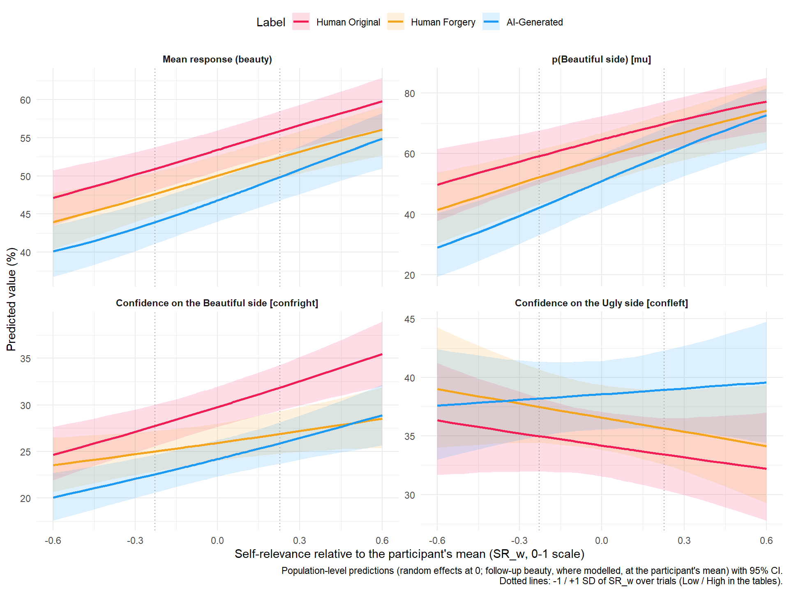{width=960}
:::
:::


```{.r .cell-code}
est_ctrl <- estimates$BeautySRControl
b2_slopes <- bind_rows(lapply(c("response", mediation_info$BeautySRControl$dpars), function(p) {
  covariate_slopes(est_ctrl, "Beauty2_w", par = p, pairs = TRUE) |>
    mutate(Parameter = factor(par_labels$Beauty[[p]], levels = par_labels$Beauty))
})) |>
  rename(Condition = Level) |>
  format_effects() |>
  arrange(Parameter)

gap_change <- bind_rows(
  mutate(moderation$BeautySRControl$response$slopes, Predictor = "Self-relevance", Model = "BeautySRControl"),
  mutate(rename(covariate_slopes(est_ctrl, "Beauty2_w", pairs = TRUE), Condition = Level),
         Predictor = "Follow-up beauty", Model = "BeautySRControl"),
  if (ready("BeautySR")) mutate(moderation$BeautySR$response$slopes, Predictor = "Self-relevance", Model = "BeautySR (no follow-up beauty)")
) |>
  filter(Condition %in% contrast_order) |>
  mutate(Contrast = factor(Condition, levels = contrast_order)) |>
  format_effects() |>
  arrange(Contrast, Predictor, Model)

make_asis(
  moderation_tables("BeautySRControl"),
  make_tables(b2_slopes, c("Parameter", "Condition", "Diff", "CI", "pd_fmt", "Effect"),
              "Phase-1 beauty: change per +10% of follow-up beauty (SR at average), per label and between labels"),
  make_tables(gap_change, c("Contrast", "Predictor", "Model", "Diff", "CI", "pd_fmt", "Effect"),
              "Change in the label gap in Phase-1 beauty (% of the slider) per +10% of self-relevance or of follow-up beauty")
)
```

```{=html}
<div id="uagahqetwy" style="padding-left:0px;padding-right:0px;padding-top:10px;padding-bottom:10px;overflow-x:auto;overflow-y:auto;width:auto;height:auto;">
<style>#uagahqetwy table {
  font-family: system-ui, 'Segoe UI', Roboto, Helvetica, Arial, sans-serif, 'Apple Color Emoji', 'Segoe UI Emoji', 'Segoe UI Symbol', 'Noto Color Emoji';
  -webkit-font-smoothing: antialiased;
  -moz-osx-font-smoothing: grayscale;
}

#uagahqetwy thead, #uagahqetwy tbody, #uagahqetwy tfoot, #uagahqetwy tr, #uagahqetwy td, #uagahqetwy th {
  border-style: none;
}

#uagahqetwy p {
  margin: 0;
  padding: 0;
}

#uagahqetwy .gt_table {
  display: table;
  border-collapse: collapse;
  line-height: normal;
  margin-left: auto;
  margin-right: auto;
  color: #333333;
  font-size: 13px;
  font-weight: normal;
  font-style: normal;
  background-color: #FFFFFF;
  width: auto;
  border-top-style: solid;
  border-top-width: 3px;
  border-top-color: #D5D5D5;
  border-right-style: solid;
  border-right-width: 3px;
  border-right-color: #D5D5D5;
  border-bottom-style: solid;
  border-bottom-width: 3px;
  border-bottom-color: #D5D5D5;
  border-left-style: solid;
  border-left-width: 3px;
  border-left-color: #D5D5D5;
}

#uagahqetwy .gt_caption {
  padding-top: 4px;
  padding-bottom: 4px;
}

#uagahqetwy .gt_title {
  color: #333333;
  font-size: 125%;
  font-weight: initial;
  padding-top: 4px;
  padding-bottom: 4px;
  padding-left: 5px;
  padding-right: 5px;
  border-bottom-color: #FFFFFF;
  border-bottom-width: 0;
}

#uagahqetwy .gt_subtitle {
  color: #333333;
  font-size: 85%;
  font-weight: initial;
  padding-top: 3px;
  padding-bottom: 5px;
  padding-left: 5px;
  padding-right: 5px;
  border-top-color: #FFFFFF;
  border-top-width: 0;
}

#uagahqetwy .gt_heading {
  background-color: #FFFFFF;
  text-align: left;
  border-bottom-color: #FFFFFF;
  border-left-style: none;
  border-left-width: 1px;
  border-left-color: #D3D3D3;
  border-right-style: none;
  border-right-width: 1px;
  border-right-color: #D3D3D3;
}

#uagahqetwy .gt_bottom_border {
  border-bottom-style: solid;
  border-bottom-width: 2px;
  border-bottom-color: #D5D5D5;
}

#uagahqetwy .gt_col_headings {
  border-top-style: solid;
  border-top-width: 2px;
  border-top-color: #D5D5D5;
  border-bottom-style: solid;
  border-bottom-width: 2px;
  border-bottom-color: #D5D5D5;
  border-left-style: none;
  border-left-width: 1px;
  border-left-color: #D3D3D3;
  border-right-style: none;
  border-right-width: 1px;
  border-right-color: #D3D3D3;
}

#uagahqetwy .gt_col_heading {
  color: #FFFFFF;
  background-color: #000000;
  font-size: 100%;
  font-weight: normal;
  text-transform: inherit;
  border-left-style: none;
  border-left-width: 1px;
  border-left-color: #D3D3D3;
  border-right-style: none;
  border-right-width: 1px;
  border-right-color: #D3D3D3;
  vertical-align: bottom;
  padding-top: 5px;
  padding-bottom: 6px;
  padding-left: 5px;
  padding-right: 5px;
  overflow-x: hidden;
}

#uagahqetwy .gt_column_spanner_outer {
  color: #FFFFFF;
  background-color: #000000;
  font-size: 100%;
  font-weight: normal;
  text-transform: inherit;
  padding-top: 0;
  padding-bottom: 0;
  padding-left: 4px;
  padding-right: 4px;
}

#uagahqetwy .gt_column_spanner_outer:first-child {
  padding-left: 0;
}

#uagahqetwy .gt_column_spanner_outer:last-child {
  padding-right: 0;
}

#uagahqetwy .gt_column_spanner {
  border-bottom-style: solid;
  border-bottom-width: 2px;
  border-bottom-color: #D5D5D5;
  vertical-align: bottom;
  padding-top: 5px;
  padding-bottom: 5px;
  overflow-x: hidden;
  display: inline-block;
  width: 100%;
}

#uagahqetwy .gt_spanner_row {
  border-bottom-style: hidden;
}

#uagahqetwy .gt_group_heading {
  padding-top: 8px;
  padding-bottom: 8px;
  padding-left: 5px;
  padding-right: 5px;
  color: #333333;
  background-color: #FFFFFF;
  font-size: 100%;
  font-weight: initial;
  text-transform: inherit;
  border-top-style: solid;
  border-top-width: 2px;
  border-top-color: #D5D5D5;
  border-bottom-style: solid;
  border-bottom-width: 2px;
  border-bottom-color: #D5D5D5;
  border-left-style: none;
  border-left-width: 1px;
  border-left-color: #D3D3D3;
  border-right-style: none;
  border-right-width: 1px;
  border-right-color: #D3D3D3;
  vertical-align: middle;
  text-align: left;
}

#uagahqetwy .gt_empty_group_heading {
  padding: 0.5px;
  color: #333333;
  background-color: #FFFFFF;
  font-size: 100%;
  font-weight: initial;
  border-top-style: solid;
  border-top-width: 2px;
  border-top-color: #D5D5D5;
  border-bottom-style: solid;
  border-bottom-width: 2px;
  border-bottom-color: #D5D5D5;
  vertical-align: middle;
}

#uagahqetwy .gt_from_md > :first-child {
  margin-top: 0;
}

#uagahqetwy .gt_from_md > :last-child {
  margin-bottom: 0;
}

#uagahqetwy .gt_row {
  padding-top: 8px;
  padding-bottom: 8px;
  padding-left: 5px;
  padding-right: 5px;
  margin: 10px;
  border-top-style: solid;
  border-top-width: 1px;
  border-top-color: #D5D5D5;
  border-left-style: solid;
  border-left-width: 1px;
  border-left-color: #D5D5D5;
  border-right-style: solid;
  border-right-width: 1px;
  border-right-color: #D5D5D5;
  vertical-align: middle;
  overflow-x: hidden;
}

#uagahqetwy .gt_stub {
  color: #333333;
  background-color: #FFFFFF;
  font-size: 100%;
  font-weight: initial;
  text-transform: inherit;
  border-right-style: solid;
  border-right-width: 2px;
  border-right-color: #5F5F5F;
  padding-left: 5px;
  padding-right: 5px;
}

#uagahqetwy .gt_stub_row_group {
  color: #333333;
  background-color: #FFFFFF;
  font-size: 100%;
  font-weight: initial;
  text-transform: inherit;
  border-right-style: solid;
  border-right-width: 2px;
  border-right-color: #D3D3D3;
  padding-left: 5px;
  padding-right: 5px;
  vertical-align: top;
}

#uagahqetwy .gt_row_group_first td {
  border-top-width: 2px;
}

#uagahqetwy .gt_row_group_first th {
  border-top-width: 2px;
}

#uagahqetwy .gt_summary_row {
  color: #333333;
  background-color: #D5D5D5;
  text-transform: inherit;
  padding-top: 8px;
  padding-bottom: 8px;
  padding-left: 5px;
  padding-right: 5px;
}

#uagahqetwy .gt_first_summary_row {
  border-top-style: solid;
  border-top-color: #D5D5D5;
}

#uagahqetwy .gt_first_summary_row.thick {
  border-top-width: 2px;
}

#uagahqetwy .gt_last_summary_row {
  padding-top: 8px;
  padding-bottom: 8px;
  padding-left: 5px;
  padding-right: 5px;
  border-bottom-style: solid;
  border-bottom-width: 2px;
  border-bottom-color: #D5D5D5;
}

#uagahqetwy .gt_grand_summary_row {
  color: #FFFFFF;
  background-color: #929292;
  text-transform: inherit;
  padding-top: 8px;
  padding-bottom: 8px;
  padding-left: 5px;
  padding-right: 5px;
}

#uagahqetwy .gt_first_grand_summary_row {
  padding-top: 8px;
  padding-bottom: 8px;
  padding-left: 5px;
  padding-right: 5px;
  border-top-style: double;
  border-top-width: 6px;
  border-top-color: #D5D5D5;
}

#uagahqetwy .gt_last_grand_summary_row_top {
  padding-top: 8px;
  padding-bottom: 8px;
  padding-left: 5px;
  padding-right: 5px;
  border-bottom-style: double;
  border-bottom-width: 6px;
  border-bottom-color: #D5D5D5;
}

#uagahqetwy .gt_striped {
  background-color: #F4F4F4;
}

#uagahqetwy .gt_table_body {
  border-top-style: solid;
  border-top-width: 2px;
  border-top-color: #D5D5D5;
  border-bottom-style: solid;
  border-bottom-width: 2px;
  border-bottom-color: #D5D5D5;
}

#uagahqetwy .gt_footnotes {
  color: #333333;
  background-color: #FFFFFF;
  border-bottom-style: none;
  border-bottom-width: 2px;
  border-bottom-color: #D3D3D3;
  border-left-style: none;
  border-left-width: 2px;
  border-left-color: #D3D3D3;
  border-right-style: none;
  border-right-width: 2px;
  border-right-color: #D3D3D3;
}

#uagahqetwy .gt_footnote {
  margin: 0px;
  font-size: 90%;
  padding-top: 4px;
  padding-bottom: 4px;
  padding-left: 5px;
  padding-right: 5px;
}

#uagahqetwy .gt_sourcenotes {
  color: #333333;
  background-color: #FFFFFF;
  border-bottom-style: none;
  border-bottom-width: 2px;
  border-bottom-color: #D3D3D3;
  border-left-style: none;
  border-left-width: 2px;
  border-left-color: #D3D3D3;
  border-right-style: none;
  border-right-width: 2px;
  border-right-color: #D3D3D3;
}

#uagahqetwy .gt_sourcenote {
  font-size: 90%;
  padding-top: 4px;
  padding-bottom: 4px;
  padding-left: 5px;
  padding-right: 5px;
}

#uagahqetwy .gt_left {
  text-align: left;
}

#uagahqetwy .gt_center {
  text-align: center;
}

#uagahqetwy .gt_right {
  text-align: right;
  font-variant-numeric: tabular-nums;
}

#uagahqetwy .gt_font_normal {
  font-weight: normal;
}

#uagahqetwy .gt_font_bold {
  font-weight: bold;
}

#uagahqetwy .gt_font_italic {
  font-style: italic;
}

#uagahqetwy .gt_super {
  font-size: 65%;
}

#uagahqetwy .gt_footnote_marks {
  font-size: 75%;
  vertical-align: 0.4em;
  position: initial;
}

#uagahqetwy .gt_asterisk {
  font-size: 100%;
  vertical-align: 0;
}

#uagahqetwy .gt_indent_1 {
  text-indent: 5px;
}

#uagahqetwy .gt_indent_2 {
  text-indent: 10px;
}

#uagahqetwy .gt_indent_3 {
  text-indent: 15px;
}

#uagahqetwy .gt_indent_4 {
  text-indent: 20px;
}

#uagahqetwy .gt_indent_5 {
  text-indent: 25px;
}

#uagahqetwy .katex-display {
  display: inline-flex !important;
  margin-bottom: 0.75em !important;
}

#uagahqetwy div.Reactable > div.rt-table > div.rt-thead > div.rt-tr.rt-tr-group-header > div.rt-th-group:after {
  height: 0px !important;
}
</style>
<table class="gt_table" data-quarto-disable-processing="false" data-quarto-bootstrap="false">
  <thead>
    <tr class="gt_heading">
      <td colspan="5" class="gt_heading gt_title gt_font_normal gt_bottom_border" style>Phase-1 Beauty by Self-Relevance, controlling follow-up Beauty: label contrasts at average self-relevance (% of the scale / percentage points)</td>
    </tr>
    
    <tr class="gt_col_headings">
      <th class="gt_col_heading gt_columns_bottom_border gt_left" rowspan="1" colspan="1" scope="col" id="Parameter">Parameter</th>
      <th class="gt_col_heading gt_columns_bottom_border gt_right" rowspan="1" colspan="1" scope="col" id="Diff">Diff</th>
      <th class="gt_col_heading gt_columns_bottom_border gt_left" rowspan="1" colspan="1" scope="col" id="CI">CI</th>
      <th class="gt_col_heading gt_columns_bottom_border gt_right" rowspan="1" colspan="1" scope="col" id="pd_fmt">pd_fmt</th>
      <th class="gt_col_heading gt_columns_bottom_border gt_left" rowspan="1" colspan="1" scope="col" id="Effect">Effect</th>
    </tr>
  </thead>
  <tbody class="gt_table_body">
    <tr class="gt_group_heading_row">
      <th colspan="5" class="gt_group_heading" scope="colgroup" id="AI-Generated - Human Original">AI-Generated - Human Original</th>
    </tr>
    <tr class="gt_row_group_first"><td headers="AI-Generated - Human Original  Parameter" class="gt_row gt_left" style="background-color: #FFEBEE;">Mean response (beauty)</td>
<td headers="AI-Generated - Human Original  Diff" class="gt_row gt_right" style="background-color: #FFEBEE;">-6.60</td>
<td headers="AI-Generated - Human Original  CI" class="gt_row gt_left" style="background-color: #FFEBEE;">[-8.02, -5.19]</td>
<td headers="AI-Generated - Human Original  pd_fmt" class="gt_row gt_right" style="background-color: #FFEBEE;">100%</td>
<td headers="AI-Generated - Human Original  Effect" class="gt_row gt_left" style="background-color: #FFEBEE;">Negative</td></tr>
    <tr><td headers="AI-Generated - Human Original  Parameter" class="gt_row gt_left gt_striped" style="background-color: #FFEBEE;">p(Beautiful side) [mu]</td>
<td headers="AI-Generated - Human Original  Diff" class="gt_row gt_right gt_striped" style="background-color: #FFEBEE;">-13.70</td>
<td headers="AI-Generated - Human Original  CI" class="gt_row gt_left gt_striped" style="background-color: #FFEBEE;">[-17.92, -9.40]</td>
<td headers="AI-Generated - Human Original  pd_fmt" class="gt_row gt_right gt_striped" style="background-color: #FFEBEE;">100%</td>
<td headers="AI-Generated - Human Original  Effect" class="gt_row gt_left gt_striped" style="background-color: #FFEBEE;">Negative</td></tr>
    <tr><td headers="AI-Generated - Human Original  Parameter" class="gt_row gt_left" style="background-color: #FFEBEE;">Confidence on the Beautiful side [confright]</td>
<td headers="AI-Generated - Human Original  Diff" class="gt_row gt_right" style="background-color: #FFEBEE;">-5.56</td>
<td headers="AI-Generated - Human Original  CI" class="gt_row gt_left" style="background-color: #FFEBEE;">[-6.80, -4.36]</td>
<td headers="AI-Generated - Human Original  pd_fmt" class="gt_row gt_right" style="background-color: #FFEBEE;">100%</td>
<td headers="AI-Generated - Human Original  Effect" class="gt_row gt_left" style="background-color: #FFEBEE;">Negative</td></tr>
    <tr><td headers="AI-Generated - Human Original  Parameter" class="gt_row gt_left gt_striped" style="background-color: #E8F5E9;">Confidence on the Ugly side [confleft]</td>
<td headers="AI-Generated - Human Original  Diff" class="gt_row gt_right gt_striped" style="background-color: #E8F5E9;">4.35</td>
<td headers="AI-Generated - Human Original  CI" class="gt_row gt_left gt_striped" style="background-color: #E8F5E9;">[2.31, 6.34]</td>
<td headers="AI-Generated - Human Original  pd_fmt" class="gt_row gt_right gt_striped" style="background-color: #E8F5E9;">100%</td>
<td headers="AI-Generated - Human Original  Effect" class="gt_row gt_left gt_striped" style="background-color: #E8F5E9;">Positive</td></tr>
    <tr><td headers="AI-Generated - Human Original  Parameter" class="gt_row gt_left" style="background-color: #FFEBEE;">Mean response, main model (all participants, no SR term)</td>
<td headers="AI-Generated - Human Original  Diff" class="gt_row gt_right" style="background-color: #FFEBEE;">-7.06</td>
<td headers="AI-Generated - Human Original  CI" class="gt_row gt_left" style="background-color: #FFEBEE;">[-8.22, -5.92]</td>
<td headers="AI-Generated - Human Original  pd_fmt" class="gt_row gt_right" style="background-color: #FFEBEE;">100%</td>
<td headers="AI-Generated - Human Original  Effect" class="gt_row gt_left" style="background-color: #FFEBEE;">Negative</td></tr>
    <tr class="gt_group_heading_row">
      <th colspan="5" class="gt_group_heading" scope="colgroup" id="Human Forgery - Human Original">Human Forgery - Human Original</th>
    </tr>
    <tr class="gt_row_group_first"><td headers="Human Forgery - Human Original  Parameter" class="gt_row gt_left gt_striped" style="background-color: #FFEBEE;">Mean response (beauty)</td>
<td headers="Human Forgery - Human Original  Diff" class="gt_row gt_right gt_striped" style="background-color: #FFEBEE;">-3.34</td>
<td headers="Human Forgery - Human Original  CI" class="gt_row gt_left gt_striped" style="background-color: #FFEBEE;">[-4.61, -2.06]</td>
<td headers="Human Forgery - Human Original  pd_fmt" class="gt_row gt_right gt_striped" style="background-color: #FFEBEE;">100%</td>
<td headers="Human Forgery - Human Original  Effect" class="gt_row gt_left gt_striped" style="background-color: #FFEBEE;">Negative</td></tr>
    <tr><td headers="Human Forgery - Human Original  Parameter" class="gt_row gt_left" style="background-color: #FFEBEE;">p(Beautiful side) [mu]</td>
<td headers="Human Forgery - Human Original  Diff" class="gt_row gt_right" style="background-color: #FFEBEE;">-5.83</td>
<td headers="Human Forgery - Human Original  CI" class="gt_row gt_left" style="background-color: #FFEBEE;">[-9.53, -2.10]</td>
<td headers="Human Forgery - Human Original  pd_fmt" class="gt_row gt_right" style="background-color: #FFEBEE;">99.85%</td>
<td headers="Human Forgery - Human Original  Effect" class="gt_row gt_left" style="background-color: #FFEBEE;">Negative</td></tr>
    <tr><td headers="Human Forgery - Human Original  Parameter" class="gt_row gt_left gt_striped" style="background-color: #FFEBEE;">Confidence on the Beautiful side [confright]</td>
<td headers="Human Forgery - Human Original  Diff" class="gt_row gt_right gt_striped" style="background-color: #FFEBEE;">-3.80</td>
<td headers="Human Forgery - Human Original  CI" class="gt_row gt_left gt_striped" style="background-color: #FFEBEE;">[-4.97, -2.63]</td>
<td headers="Human Forgery - Human Original  pd_fmt" class="gt_row gt_right gt_striped" style="background-color: #FFEBEE;">100%</td>
<td headers="Human Forgery - Human Original  Effect" class="gt_row gt_left gt_striped" style="background-color: #FFEBEE;">Negative</td></tr>
    <tr><td headers="Human Forgery - Human Original  Parameter" class="gt_row gt_left" style="background-color: #E8F5E9;">Confidence on the Ugly side [confleft]</td>
<td headers="Human Forgery - Human Original  Diff" class="gt_row gt_right" style="background-color: #E8F5E9;">2.37</td>
<td headers="Human Forgery - Human Original  CI" class="gt_row gt_left" style="background-color: #E8F5E9;">[0.33, 4.34]</td>
<td headers="Human Forgery - Human Original  pd_fmt" class="gt_row gt_right" style="background-color: #E8F5E9;">98.88%</td>
<td headers="Human Forgery - Human Original  Effect" class="gt_row gt_left" style="background-color: #E8F5E9;">Positive</td></tr>
    <tr><td headers="Human Forgery - Human Original  Parameter" class="gt_row gt_left gt_striped" style="background-color: #FFEBEE;">Mean response, main model (all participants, no SR term)</td>
<td headers="Human Forgery - Human Original  Diff" class="gt_row gt_right gt_striped" style="background-color: #FFEBEE;">-3.66</td>
<td headers="Human Forgery - Human Original  CI" class="gt_row gt_left gt_striped" style="background-color: #FFEBEE;">[-4.59, -2.80]</td>
<td headers="Human Forgery - Human Original  pd_fmt" class="gt_row gt_right gt_striped" style="background-color: #FFEBEE;">100%</td>
<td headers="Human Forgery - Human Original  Effect" class="gt_row gt_left gt_striped" style="background-color: #FFEBEE;">Negative</td></tr>
    <tr class="gt_group_heading_row">
      <th colspan="5" class="gt_group_heading" scope="colgroup" id="AI-Generated - Human Forgery">AI-Generated - Human Forgery</th>
    </tr>
    <tr class="gt_row_group_first"><td headers="AI-Generated - Human Forgery  Parameter" class="gt_row gt_left" style="background-color: #FFEBEE;">Mean response (beauty)</td>
<td headers="AI-Generated - Human Forgery  Diff" class="gt_row gt_right" style="background-color: #FFEBEE;">-3.27</td>
<td headers="AI-Generated - Human Forgery  CI" class="gt_row gt_left" style="background-color: #FFEBEE;">[-4.80, -1.80]</td>
<td headers="AI-Generated - Human Forgery  pd_fmt" class="gt_row gt_right" style="background-color: #FFEBEE;">100%</td>
<td headers="AI-Generated - Human Forgery  Effect" class="gt_row gt_left" style="background-color: #FFEBEE;">Negative</td></tr>
    <tr><td headers="AI-Generated - Human Forgery  Parameter" class="gt_row gt_left gt_striped" style="background-color: #FFEBEE;">p(Beautiful side) [mu]</td>
<td headers="AI-Generated - Human Forgery  Diff" class="gt_row gt_right gt_striped" style="background-color: #FFEBEE;">-7.90</td>
<td headers="AI-Generated - Human Forgery  CI" class="gt_row gt_left gt_striped" style="background-color: #FFEBEE;">[-12.43, -3.39]</td>
<td headers="AI-Generated - Human Forgery  pd_fmt" class="gt_row gt_right gt_striped" style="background-color: #FFEBEE;">99.90%</td>
<td headers="AI-Generated - Human Forgery  Effect" class="gt_row gt_left gt_striped" style="background-color: #FFEBEE;">Negative</td></tr>
    <tr><td headers="AI-Generated - Human Forgery  Parameter" class="gt_row gt_left" style="background-color: #FFEBEE;">Confidence on the Beautiful side [confright]</td>
<td headers="AI-Generated - Human Forgery  Diff" class="gt_row gt_right" style="background-color: #FFEBEE;">-1.76</td>
<td headers="AI-Generated - Human Forgery  CI" class="gt_row gt_left" style="background-color: #FFEBEE;">[-3.05, -0.59]</td>
<td headers="AI-Generated - Human Forgery  pd_fmt" class="gt_row gt_right" style="background-color: #FFEBEE;">99.67%</td>
<td headers="AI-Generated - Human Forgery  Effect" class="gt_row gt_left" style="background-color: #FFEBEE;">Negative</td></tr>
    <tr><td headers="AI-Generated - Human Forgery  Parameter" class="gt_row gt_left gt_striped" style="color: #9E9E9E;">Confidence on the Ugly side [confleft]</td>
<td headers="AI-Generated - Human Forgery  Diff" class="gt_row gt_right gt_striped" style="color: #9E9E9E;">1.99</td>
<td headers="AI-Generated - Human Forgery  CI" class="gt_row gt_left gt_striped" style="color: #9E9E9E;">[-0.15, 4.09]</td>
<td headers="AI-Generated - Human Forgery  pd_fmt" class="gt_row gt_right gt_striped" style="color: #9E9E9E;">96.50%</td>
<td headers="AI-Generated - Human Forgery  Effect" class="gt_row gt_left gt_striped" style="color: #9E9E9E;">n.s.</td></tr>
    <tr><td headers="AI-Generated - Human Forgery  Parameter" class="gt_row gt_left" style="background-color: #FFEBEE;">Mean response, main model (all participants, no SR term)</td>
<td headers="AI-Generated - Human Forgery  Diff" class="gt_row gt_right" style="background-color: #FFEBEE;">-3.39</td>
<td headers="AI-Generated - Human Forgery  CI" class="gt_row gt_left" style="background-color: #FFEBEE;">[-4.49, -2.32]</td>
<td headers="AI-Generated - Human Forgery  pd_fmt" class="gt_row gt_right" style="background-color: #FFEBEE;">100%</td>
<td headers="AI-Generated - Human Forgery  Effect" class="gt_row gt_left" style="background-color: #FFEBEE;">Negative</td></tr>
  </tbody>
  
</table>
</div>
```


::: {.callout-note collapse="true" title="Phase-1 Beauty by Self-Relevance, controlling follow-up Beauty: label contrasts at average self-relevance (% of the scale / percentage points) (Markdown table, for text readers)"}

|Contrast                       |Parameter                                                |Diff   |CI              |pd_fmt |Effect   |
|:------------------------------|:--------------------------------------------------------|:------|:---------------|:------|:--------|
|AI-Generated - Human Original  |Mean response (beauty)                                   |-6.60  |[-8.02, -5.19]  |100%   |Negative |
|AI-Generated - Human Original  |p(Beautiful side) [mu]                                   |-13.70 |[-17.92, -9.40] |100%   |Negative |
|AI-Generated - Human Original  |Confidence on the Beautiful side [confright]             |-5.56  |[-6.80, -4.36]  |100%   |Negative |
|AI-Generated - Human Original  |Confidence on the Ugly side [confleft]                   |4.35   |[2.31, 6.34]    |100%   |Positive |
|AI-Generated - Human Original  |Mean response, main model (all participants, no SR term) |-7.06  |[-8.22, -5.92]  |100%   |Negative |
|Human Forgery - Human Original |Mean response (beauty)                                   |-3.34  |[-4.61, -2.06]  |100%   |Negative |
|Human Forgery - Human Original |p(Beautiful side) [mu]                                   |-5.83  |[-9.53, -2.10]  |99.85% |Negative |
|Human Forgery - Human Original |Confidence on the Beautiful side [confright]             |-3.80  |[-4.97, -2.63]  |100%   |Negative |
|Human Forgery - Human Original |Confidence on the Ugly side [confleft]                   |2.37   |[0.33, 4.34]    |98.88% |Positive |
|Human Forgery - Human Original |Mean response, main model (all participants, no SR term) |-3.66  |[-4.59, -2.80]  |100%   |Negative |
|AI-Generated - Human Forgery   |Mean response (beauty)                                   |-3.27  |[-4.80, -1.80]  |100%   |Negative |
|AI-Generated - Human Forgery   |p(Beautiful side) [mu]                                   |-7.90  |[-12.43, -3.39] |99.90% |Negative |
|AI-Generated - Human Forgery   |Confidence on the Beautiful side [confright]             |-1.76  |[-3.05, -0.59]  |99.67% |Negative |
|AI-Generated - Human Forgery   |Confidence on the Ugly side [confleft]                   |1.99   |[-0.15, 4.09]   |96.50% |n.s.     |
|AI-Generated - Human Forgery   |Mean response, main model (all participants, no SR term) |-3.39  |[-4.49, -2.32]  |100%   |Negative |

:::

```{=html}
<div id="mvspgzpmkv" style="padding-left:0px;padding-right:0px;padding-top:10px;padding-bottom:10px;overflow-x:auto;overflow-y:auto;width:auto;height:auto;">
<style>#mvspgzpmkv table {
  font-family: system-ui, 'Segoe UI', Roboto, Helvetica, Arial, sans-serif, 'Apple Color Emoji', 'Segoe UI Emoji', 'Segoe UI Symbol', 'Noto Color Emoji';
  -webkit-font-smoothing: antialiased;
  -moz-osx-font-smoothing: grayscale;
}

#mvspgzpmkv thead, #mvspgzpmkv tbody, #mvspgzpmkv tfoot, #mvspgzpmkv tr, #mvspgzpmkv td, #mvspgzpmkv th {
  border-style: none;
}

#mvspgzpmkv p {
  margin: 0;
  padding: 0;
}

#mvspgzpmkv .gt_table {
  display: table;
  border-collapse: collapse;
  line-height: normal;
  margin-left: auto;
  margin-right: auto;
  color: #333333;
  font-size: 13px;
  font-weight: normal;
  font-style: normal;
  background-color: #FFFFFF;
  width: auto;
  border-top-style: solid;
  border-top-width: 3px;
  border-top-color: #D5D5D5;
  border-right-style: solid;
  border-right-width: 3px;
  border-right-color: #D5D5D5;
  border-bottom-style: solid;
  border-bottom-width: 3px;
  border-bottom-color: #D5D5D5;
  border-left-style: solid;
  border-left-width: 3px;
  border-left-color: #D5D5D5;
}

#mvspgzpmkv .gt_caption {
  padding-top: 4px;
  padding-bottom: 4px;
}

#mvspgzpmkv .gt_title {
  color: #333333;
  font-size: 125%;
  font-weight: initial;
  padding-top: 4px;
  padding-bottom: 4px;
  padding-left: 5px;
  padding-right: 5px;
  border-bottom-color: #FFFFFF;
  border-bottom-width: 0;
}

#mvspgzpmkv .gt_subtitle {
  color: #333333;
  font-size: 85%;
  font-weight: initial;
  padding-top: 3px;
  padding-bottom: 5px;
  padding-left: 5px;
  padding-right: 5px;
  border-top-color: #FFFFFF;
  border-top-width: 0;
}

#mvspgzpmkv .gt_heading {
  background-color: #FFFFFF;
  text-align: left;
  border-bottom-color: #FFFFFF;
  border-left-style: none;
  border-left-width: 1px;
  border-left-color: #D3D3D3;
  border-right-style: none;
  border-right-width: 1px;
  border-right-color: #D3D3D3;
}

#mvspgzpmkv .gt_bottom_border {
  border-bottom-style: solid;
  border-bottom-width: 2px;
  border-bottom-color: #D5D5D5;
}

#mvspgzpmkv .gt_col_headings {
  border-top-style: solid;
  border-top-width: 2px;
  border-top-color: #D5D5D5;
  border-bottom-style: solid;
  border-bottom-width: 2px;
  border-bottom-color: #D5D5D5;
  border-left-style: none;
  border-left-width: 1px;
  border-left-color: #D3D3D3;
  border-right-style: none;
  border-right-width: 1px;
  border-right-color: #D3D3D3;
}

#mvspgzpmkv .gt_col_heading {
  color: #FFFFFF;
  background-color: #000000;
  font-size: 100%;
  font-weight: normal;
  text-transform: inherit;
  border-left-style: none;
  border-left-width: 1px;
  border-left-color: #D3D3D3;
  border-right-style: none;
  border-right-width: 1px;
  border-right-color: #D3D3D3;
  vertical-align: bottom;
  padding-top: 5px;
  padding-bottom: 6px;
  padding-left: 5px;
  padding-right: 5px;
  overflow-x: hidden;
}

#mvspgzpmkv .gt_column_spanner_outer {
  color: #FFFFFF;
  background-color: #000000;
  font-size: 100%;
  font-weight: normal;
  text-transform: inherit;
  padding-top: 0;
  padding-bottom: 0;
  padding-left: 4px;
  padding-right: 4px;
}

#mvspgzpmkv .gt_column_spanner_outer:first-child {
  padding-left: 0;
}

#mvspgzpmkv .gt_column_spanner_outer:last-child {
  padding-right: 0;
}

#mvspgzpmkv .gt_column_spanner {
  border-bottom-style: solid;
  border-bottom-width: 2px;
  border-bottom-color: #D5D5D5;
  vertical-align: bottom;
  padding-top: 5px;
  padding-bottom: 5px;
  overflow-x: hidden;
  display: inline-block;
  width: 100%;
}

#mvspgzpmkv .gt_spanner_row {
  border-bottom-style: hidden;
}

#mvspgzpmkv .gt_group_heading {
  padding-top: 8px;
  padding-bottom: 8px;
  padding-left: 5px;
  padding-right: 5px;
  color: #333333;
  background-color: #FFFFFF;
  font-size: 100%;
  font-weight: initial;
  text-transform: inherit;
  border-top-style: solid;
  border-top-width: 2px;
  border-top-color: #D5D5D5;
  border-bottom-style: solid;
  border-bottom-width: 2px;
  border-bottom-color: #D5D5D5;
  border-left-style: none;
  border-left-width: 1px;
  border-left-color: #D3D3D3;
  border-right-style: none;
  border-right-width: 1px;
  border-right-color: #D3D3D3;
  vertical-align: middle;
  text-align: left;
}

#mvspgzpmkv .gt_empty_group_heading {
  padding: 0.5px;
  color: #333333;
  background-color: #FFFFFF;
  font-size: 100%;
  font-weight: initial;
  border-top-style: solid;
  border-top-width: 2px;
  border-top-color: #D5D5D5;
  border-bottom-style: solid;
  border-bottom-width: 2px;
  border-bottom-color: #D5D5D5;
  vertical-align: middle;
}

#mvspgzpmkv .gt_from_md > :first-child {
  margin-top: 0;
}

#mvspgzpmkv .gt_from_md > :last-child {
  margin-bottom: 0;
}

#mvspgzpmkv .gt_row {
  padding-top: 8px;
  padding-bottom: 8px;
  padding-left: 5px;
  padding-right: 5px;
  margin: 10px;
  border-top-style: solid;
  border-top-width: 1px;
  border-top-color: #D5D5D5;
  border-left-style: solid;
  border-left-width: 1px;
  border-left-color: #D5D5D5;
  border-right-style: solid;
  border-right-width: 1px;
  border-right-color: #D5D5D5;
  vertical-align: middle;
  overflow-x: hidden;
}

#mvspgzpmkv .gt_stub {
  color: #333333;
  background-color: #FFFFFF;
  font-size: 100%;
  font-weight: initial;
  text-transform: inherit;
  border-right-style: solid;
  border-right-width: 2px;
  border-right-color: #5F5F5F;
  padding-left: 5px;
  padding-right: 5px;
}

#mvspgzpmkv .gt_stub_row_group {
  color: #333333;
  background-color: #FFFFFF;
  font-size: 100%;
  font-weight: initial;
  text-transform: inherit;
  border-right-style: solid;
  border-right-width: 2px;
  border-right-color: #D3D3D3;
  padding-left: 5px;
  padding-right: 5px;
  vertical-align: top;
}

#mvspgzpmkv .gt_row_group_first td {
  border-top-width: 2px;
}

#mvspgzpmkv .gt_row_group_first th {
  border-top-width: 2px;
}

#mvspgzpmkv .gt_summary_row {
  color: #333333;
  background-color: #D5D5D5;
  text-transform: inherit;
  padding-top: 8px;
  padding-bottom: 8px;
  padding-left: 5px;
  padding-right: 5px;
}

#mvspgzpmkv .gt_first_summary_row {
  border-top-style: solid;
  border-top-color: #D5D5D5;
}

#mvspgzpmkv .gt_first_summary_row.thick {
  border-top-width: 2px;
}

#mvspgzpmkv .gt_last_summary_row {
  padding-top: 8px;
  padding-bottom: 8px;
  padding-left: 5px;
  padding-right: 5px;
  border-bottom-style: solid;
  border-bottom-width: 2px;
  border-bottom-color: #D5D5D5;
}

#mvspgzpmkv .gt_grand_summary_row {
  color: #FFFFFF;
  background-color: #929292;
  text-transform: inherit;
  padding-top: 8px;
  padding-bottom: 8px;
  padding-left: 5px;
  padding-right: 5px;
}

#mvspgzpmkv .gt_first_grand_summary_row {
  padding-top: 8px;
  padding-bottom: 8px;
  padding-left: 5px;
  padding-right: 5px;
  border-top-style: double;
  border-top-width: 6px;
  border-top-color: #D5D5D5;
}

#mvspgzpmkv .gt_last_grand_summary_row_top {
  padding-top: 8px;
  padding-bottom: 8px;
  padding-left: 5px;
  padding-right: 5px;
  border-bottom-style: double;
  border-bottom-width: 6px;
  border-bottom-color: #D5D5D5;
}

#mvspgzpmkv .gt_striped {
  background-color: #F4F4F4;
}

#mvspgzpmkv .gt_table_body {
  border-top-style: solid;
  border-top-width: 2px;
  border-top-color: #D5D5D5;
  border-bottom-style: solid;
  border-bottom-width: 2px;
  border-bottom-color: #D5D5D5;
}

#mvspgzpmkv .gt_footnotes {
  color: #333333;
  background-color: #FFFFFF;
  border-bottom-style: none;
  border-bottom-width: 2px;
  border-bottom-color: #D3D3D3;
  border-left-style: none;
  border-left-width: 2px;
  border-left-color: #D3D3D3;
  border-right-style: none;
  border-right-width: 2px;
  border-right-color: #D3D3D3;
}

#mvspgzpmkv .gt_footnote {
  margin: 0px;
  font-size: 90%;
  padding-top: 4px;
  padding-bottom: 4px;
  padding-left: 5px;
  padding-right: 5px;
}

#mvspgzpmkv .gt_sourcenotes {
  color: #333333;
  background-color: #FFFFFF;
  border-bottom-style: none;
  border-bottom-width: 2px;
  border-bottom-color: #D3D3D3;
  border-left-style: none;
  border-left-width: 2px;
  border-left-color: #D3D3D3;
  border-right-style: none;
  border-right-width: 2px;
  border-right-color: #D3D3D3;
}

#mvspgzpmkv .gt_sourcenote {
  font-size: 90%;
  padding-top: 4px;
  padding-bottom: 4px;
  padding-left: 5px;
  padding-right: 5px;
}

#mvspgzpmkv .gt_left {
  text-align: left;
}

#mvspgzpmkv .gt_center {
  text-align: center;
}

#mvspgzpmkv .gt_right {
  text-align: right;
  font-variant-numeric: tabular-nums;
}

#mvspgzpmkv .gt_font_normal {
  font-weight: normal;
}

#mvspgzpmkv .gt_font_bold {
  font-weight: bold;
}

#mvspgzpmkv .gt_font_italic {
  font-style: italic;
}

#mvspgzpmkv .gt_super {
  font-size: 65%;
}

#mvspgzpmkv .gt_footnote_marks {
  font-size: 75%;
  vertical-align: 0.4em;
  position: initial;
}

#mvspgzpmkv .gt_asterisk {
  font-size: 100%;
  vertical-align: 0;
}

#mvspgzpmkv .gt_indent_1 {
  text-indent: 5px;
}

#mvspgzpmkv .gt_indent_2 {
  text-indent: 10px;
}

#mvspgzpmkv .gt_indent_3 {
  text-indent: 15px;
}

#mvspgzpmkv .gt_indent_4 {
  text-indent: 20px;
}

#mvspgzpmkv .gt_indent_5 {
  text-indent: 25px;
}

#mvspgzpmkv .katex-display {
  display: inline-flex !important;
  margin-bottom: 0.75em !important;
}

#mvspgzpmkv div.Reactable > div.rt-table > div.rt-thead > div.rt-tr.rt-tr-group-header > div.rt-th-group:after {
  height: 0px !important;
}
</style>
<table class="gt_table" data-quarto-disable-processing="false" data-quarto-bootstrap="false">
  <thead>
    <tr class="gt_heading">
      <td colspan="6" class="gt_heading gt_title gt_font_normal gt_bottom_border" style>Phase-1 Beauty by Self-Relevance, controlling follow-up Beauty: label gap at low, average and high self-relevance, and its change (High - Low)</td>
    </tr>
    
    <tr class="gt_col_headings">
      <th class="gt_col_heading gt_columns_bottom_border gt_center" rowspan="1" colspan="1" scope="col" id="Parameter">Parameter</th>
      <th class="gt_col_heading gt_columns_bottom_border gt_center" rowspan="1" colspan="1" scope="col" id="At">At</th>
      <th class="gt_col_heading gt_columns_bottom_border gt_right" rowspan="1" colspan="1" scope="col" id="Diff">Diff</th>
      <th class="gt_col_heading gt_columns_bottom_border gt_left" rowspan="1" colspan="1" scope="col" id="CI">CI</th>
      <th class="gt_col_heading gt_columns_bottom_border gt_right" rowspan="1" colspan="1" scope="col" id="pd_fmt">pd_fmt</th>
      <th class="gt_col_heading gt_columns_bottom_border gt_left" rowspan="1" colspan="1" scope="col" id="Effect">Effect</th>
    </tr>
  </thead>
  <tbody class="gt_table_body">
    <tr class="gt_group_heading_row">
      <th colspan="6" class="gt_group_heading" scope="colgroup" id="AI-Generated - Human Original">AI-Generated - Human Original</th>
    </tr>
    <tr class="gt_row_group_first"><td headers="AI-Generated - Human Original  Parameter" class="gt_row gt_center" style="background-color: #FFEBEE;">Mean response (beauty)</td>
<td headers="AI-Generated - Human Original  At" class="gt_row gt_center" style="background-color: #FFEBEE;">Low SR (-1 SD)</td>
<td headers="AI-Generated - Human Original  Diff" class="gt_row gt_right" style="background-color: #FFEBEE;">-7.00</td>
<td headers="AI-Generated - Human Original  CI" class="gt_row gt_left" style="background-color: #FFEBEE;">[-8.83, -5.06]</td>
<td headers="AI-Generated - Human Original  pd_fmt" class="gt_row gt_right" style="background-color: #FFEBEE;">100%</td>
<td headers="AI-Generated - Human Original  Effect" class="gt_row gt_left" style="background-color: #FFEBEE;">Negative</td></tr>
    <tr><td headers="AI-Generated - Human Original  Parameter" class="gt_row gt_center gt_striped" style="background-color: #FFEBEE;">Mean response (beauty)</td>
<td headers="AI-Generated - Human Original  At" class="gt_row gt_center gt_striped" style="background-color: #FFEBEE;">Average SR</td>
<td headers="AI-Generated - Human Original  Diff" class="gt_row gt_right gt_striped" style="background-color: #FFEBEE;">-6.60</td>
<td headers="AI-Generated - Human Original  CI" class="gt_row gt_left gt_striped" style="background-color: #FFEBEE;">[-8.07, -5.24]</td>
<td headers="AI-Generated - Human Original  pd_fmt" class="gt_row gt_right gt_striped" style="background-color: #FFEBEE;">100%</td>
<td headers="AI-Generated - Human Original  Effect" class="gt_row gt_left gt_striped" style="background-color: #FFEBEE;">Negative</td></tr>
    <tr><td headers="AI-Generated - Human Original  Parameter" class="gt_row gt_center" style="background-color: #FFEBEE;">Mean response (beauty)</td>
<td headers="AI-Generated - Human Original  At" class="gt_row gt_center" style="background-color: #FFEBEE;">High SR (+1 SD)</td>
<td headers="AI-Generated - Human Original  Diff" class="gt_row gt_right" style="background-color: #FFEBEE;">-6.00</td>
<td headers="AI-Generated - Human Original  CI" class="gt_row gt_left" style="background-color: #FFEBEE;">[-7.93, -4.04]</td>
<td headers="AI-Generated - Human Original  pd_fmt" class="gt_row gt_right" style="background-color: #FFEBEE;">100%</td>
<td headers="AI-Generated - Human Original  Effect" class="gt_row gt_left" style="background-color: #FFEBEE;">Negative</td></tr>
    <tr><td headers="AI-Generated - Human Original  Parameter" class="gt_row gt_center gt_striped" style="color: #9E9E9E;">Mean response (beauty)</td>
<td headers="AI-Generated - Human Original  At" class="gt_row gt_center gt_striped" style="color: #9E9E9E;">High - Low</td>
<td headers="AI-Generated - Human Original  Diff" class="gt_row gt_right gt_striped" style="color: #9E9E9E;">0.99</td>
<td headers="AI-Generated - Human Original  CI" class="gt_row gt_left gt_striped" style="color: #9E9E9E;">[-1.63, 3.54]</td>
<td headers="AI-Generated - Human Original  pd_fmt" class="gt_row gt_right gt_striped" style="color: #9E9E9E;">76.92%</td>
<td headers="AI-Generated - Human Original  Effect" class="gt_row gt_left gt_striped" style="color: #9E9E9E;">n.s.</td></tr>
    <tr><td headers="AI-Generated - Human Original  Parameter" class="gt_row gt_center" style="background-color: #FFEBEE;">p(Beautiful side) [mu]</td>
<td headers="AI-Generated - Human Original  At" class="gt_row gt_center" style="background-color: #FFEBEE;">Low SR (-1 SD)</td>
<td headers="AI-Generated - Human Original  Diff" class="gt_row gt_right" style="background-color: #FFEBEE;">-16.92</td>
<td headers="AI-Generated - Human Original  CI" class="gt_row gt_left" style="background-color: #FFEBEE;">[-22.75, -11.28]</td>
<td headers="AI-Generated - Human Original  pd_fmt" class="gt_row gt_right" style="background-color: #FFEBEE;">100%</td>
<td headers="AI-Generated - Human Original  Effect" class="gt_row gt_left" style="background-color: #FFEBEE;">Negative</td></tr>
    <tr><td headers="AI-Generated - Human Original  Parameter" class="gt_row gt_center gt_striped" style="background-color: #FFEBEE;">p(Beautiful side) [mu]</td>
<td headers="AI-Generated - Human Original  At" class="gt_row gt_center gt_striped" style="background-color: #FFEBEE;">Average SR</td>
<td headers="AI-Generated - Human Original  Diff" class="gt_row gt_right gt_striped" style="background-color: #FFEBEE;">-13.70</td>
<td headers="AI-Generated - Human Original  CI" class="gt_row gt_left gt_striped" style="background-color: #FFEBEE;">[-17.94, -9.45]</td>
<td headers="AI-Generated - Human Original  pd_fmt" class="gt_row gt_right gt_striped" style="background-color: #FFEBEE;">100%</td>
<td headers="AI-Generated - Human Original  Effect" class="gt_row gt_left gt_striped" style="background-color: #FFEBEE;">Negative</td></tr>
    <tr><td headers="AI-Generated - Human Original  Parameter" class="gt_row gt_center" style="background-color: #FFEBEE;">p(Beautiful side) [mu]</td>
<td headers="AI-Generated - Human Original  At" class="gt_row gt_center" style="background-color: #FFEBEE;">High SR (+1 SD)</td>
<td headers="AI-Generated - Human Original  Diff" class="gt_row gt_right" style="background-color: #FFEBEE;">-10.12</td>
<td headers="AI-Generated - Human Original  CI" class="gt_row gt_left" style="background-color: #FFEBEE;">[-16.11, -4.80]</td>
<td headers="AI-Generated - Human Original  pd_fmt" class="gt_row gt_right" style="background-color: #FFEBEE;">100%</td>
<td headers="AI-Generated - Human Original  Effect" class="gt_row gt_left" style="background-color: #FFEBEE;">Negative</td></tr>
    <tr><td headers="AI-Generated - Human Original  Parameter" class="gt_row gt_center gt_striped" style="color: #9E9E9E;">p(Beautiful side) [mu]</td>
<td headers="AI-Generated - Human Original  At" class="gt_row gt_center gt_striped" style="color: #9E9E9E;">High - Low</td>
<td headers="AI-Generated - Human Original  Diff" class="gt_row gt_right gt_striped" style="color: #9E9E9E;">6.84</td>
<td headers="AI-Generated - Human Original  CI" class="gt_row gt_left gt_striped" style="color: #9E9E9E;">[-0.78, 14.43]</td>
<td headers="AI-Generated - Human Original  pd_fmt" class="gt_row gt_right gt_striped" style="color: #9E9E9E;">96.00%</td>
<td headers="AI-Generated - Human Original  Effect" class="gt_row gt_left gt_striped" style="color: #9E9E9E;">n.s.</td></tr>
    <tr><td headers="AI-Generated - Human Original  Parameter" class="gt_row gt_center" style="background-color: #FFEBEE;">Confidence on the Beautiful side [confright]</td>
<td headers="AI-Generated - Human Original  At" class="gt_row gt_center" style="background-color: #FFEBEE;">Low SR (-1 SD)</td>
<td headers="AI-Generated - Human Original  Diff" class="gt_row gt_right" style="background-color: #FFEBEE;">-5.17</td>
<td headers="AI-Generated - Human Original  CI" class="gt_row gt_left" style="background-color: #FFEBEE;">[-6.75, -3.59]</td>
<td headers="AI-Generated - Human Original  pd_fmt" class="gt_row gt_right" style="background-color: #FFEBEE;">100%</td>
<td headers="AI-Generated - Human Original  Effect" class="gt_row gt_left" style="background-color: #FFEBEE;">Negative</td></tr>
    <tr><td headers="AI-Generated - Human Original  Parameter" class="gt_row gt_center gt_striped" style="background-color: #FFEBEE;">Confidence on the Beautiful side [confright]</td>
<td headers="AI-Generated - Human Original  At" class="gt_row gt_center gt_striped" style="background-color: #FFEBEE;">Average SR</td>
<td headers="AI-Generated - Human Original  Diff" class="gt_row gt_right gt_striped" style="background-color: #FFEBEE;">-5.56</td>
<td headers="AI-Generated - Human Original  CI" class="gt_row gt_left gt_striped" style="background-color: #FFEBEE;">[-6.79, -4.34]</td>
<td headers="AI-Generated - Human Original  pd_fmt" class="gt_row gt_right gt_striped" style="background-color: #FFEBEE;">100%</td>
<td headers="AI-Generated - Human Original  Effect" class="gt_row gt_left gt_striped" style="background-color: #FFEBEE;">Negative</td></tr>
    <tr><td headers="AI-Generated - Human Original  Parameter" class="gt_row gt_center" style="background-color: #FFEBEE;">Confidence on the Beautiful side [confright]</td>
<td headers="AI-Generated - Human Original  At" class="gt_row gt_center" style="background-color: #FFEBEE;">High SR (+1 SD)</td>
<td headers="AI-Generated - Human Original  Diff" class="gt_row gt_right" style="background-color: #FFEBEE;">-5.93</td>
<td headers="AI-Generated - Human Original  CI" class="gt_row gt_left" style="background-color: #FFEBEE;">[-7.66, -4.33]</td>
<td headers="AI-Generated - Human Original  pd_fmt" class="gt_row gt_right" style="background-color: #FFEBEE;">100%</td>
<td headers="AI-Generated - Human Original  Effect" class="gt_row gt_left" style="background-color: #FFEBEE;">Negative</td></tr>
    <tr><td headers="AI-Generated - Human Original  Parameter" class="gt_row gt_center gt_striped" style="color: #9E9E9E;">Confidence on the Beautiful side [confright]</td>
<td headers="AI-Generated - Human Original  At" class="gt_row gt_center gt_striped" style="color: #9E9E9E;">High - Low</td>
<td headers="AI-Generated - Human Original  Diff" class="gt_row gt_right gt_striped" style="color: #9E9E9E;">-0.80</td>
<td headers="AI-Generated - Human Original  CI" class="gt_row gt_left gt_striped" style="color: #9E9E9E;">[-2.81, 1.58]</td>
<td headers="AI-Generated - Human Original  pd_fmt" class="gt_row gt_right gt_striped" style="color: #9E9E9E;">76.28%</td>
<td headers="AI-Generated - Human Original  Effect" class="gt_row gt_left gt_striped" style="color: #9E9E9E;">n.s.</td></tr>
    <tr><td headers="AI-Generated - Human Original  Parameter" class="gt_row gt_center" style="background-color: #E8F5E9;">Confidence on the Ugly side [confleft]</td>
<td headers="AI-Generated - Human Original  At" class="gt_row gt_center" style="background-color: #E8F5E9;">Low SR (-1 SD)</td>
<td headers="AI-Generated - Human Original  Diff" class="gt_row gt_right" style="background-color: #E8F5E9;">3.19</td>
<td headers="AI-Generated - Human Original  CI" class="gt_row gt_left" style="background-color: #E8F5E9;">[0.67, 5.75]</td>
<td headers="AI-Generated - Human Original  pd_fmt" class="gt_row gt_right" style="background-color: #E8F5E9;">99.20%</td>
<td headers="AI-Generated - Human Original  Effect" class="gt_row gt_left" style="background-color: #E8F5E9;">Positive</td></tr>
    <tr><td headers="AI-Generated - Human Original  Parameter" class="gt_row gt_center gt_striped" style="background-color: #E8F5E9;">Confidence on the Ugly side [confleft]</td>
<td headers="AI-Generated - Human Original  At" class="gt_row gt_center gt_striped" style="background-color: #E8F5E9;">Average SR</td>
<td headers="AI-Generated - Human Original  Diff" class="gt_row gt_right gt_striped" style="background-color: #E8F5E9;">4.35</td>
<td headers="AI-Generated - Human Original  CI" class="gt_row gt_left gt_striped" style="background-color: #E8F5E9;">[2.26, 6.27]</td>
<td headers="AI-Generated - Human Original  pd_fmt" class="gt_row gt_right gt_striped" style="background-color: #E8F5E9;">100%</td>
<td headers="AI-Generated - Human Original  Effect" class="gt_row gt_left gt_striped" style="background-color: #E8F5E9;">Positive</td></tr>
    <tr><td headers="AI-Generated - Human Original  Parameter" class="gt_row gt_center" style="background-color: #E8F5E9;">Confidence on the Ugly side [confleft]</td>
<td headers="AI-Generated - Human Original  At" class="gt_row gt_center" style="background-color: #E8F5E9;">High SR (+1 SD)</td>
<td headers="AI-Generated - Human Original  Diff" class="gt_row gt_right" style="background-color: #E8F5E9;">5.52</td>
<td headers="AI-Generated - Human Original  CI" class="gt_row gt_left" style="background-color: #E8F5E9;">[2.55, 8.56]</td>
<td headers="AI-Generated - Human Original  pd_fmt" class="gt_row gt_right" style="background-color: #E8F5E9;">100%</td>
<td headers="AI-Generated - Human Original  Effect" class="gt_row gt_left" style="background-color: #E8F5E9;">Positive</td></tr>
    <tr><td headers="AI-Generated - Human Original  Parameter" class="gt_row gt_center gt_striped" style="color: #9E9E9E;">Confidence on the Ugly side [confleft]</td>
<td headers="AI-Generated - Human Original  At" class="gt_row gt_center gt_striped" style="color: #9E9E9E;">High - Low</td>
<td headers="AI-Generated - Human Original  Diff" class="gt_row gt_right gt_striped" style="color: #9E9E9E;">2.33</td>
<td headers="AI-Generated - Human Original  CI" class="gt_row gt_left gt_striped" style="color: #9E9E9E;">[-1.70, 6.08]</td>
<td headers="AI-Generated - Human Original  pd_fmt" class="gt_row gt_right gt_striped" style="color: #9E9E9E;">87.65%</td>
<td headers="AI-Generated - Human Original  Effect" class="gt_row gt_left gt_striped" style="color: #9E9E9E;">n.s.</td></tr>
    <tr class="gt_group_heading_row">
      <th colspan="6" class="gt_group_heading" scope="colgroup" id="Human Forgery - Human Original">Human Forgery - Human Original</th>
    </tr>
    <tr class="gt_row_group_first"><td headers="Human Forgery - Human Original  Parameter" class="gt_row gt_center" style="background-color: #FFEBEE;">Mean response (beauty)</td>
<td headers="Human Forgery - Human Original  At" class="gt_row gt_center" style="background-color: #FFEBEE;">Low SR (-1 SD)</td>
<td headers="Human Forgery - Human Original  Diff" class="gt_row gt_right" style="background-color: #FFEBEE;">-3.31</td>
<td headers="Human Forgery - Human Original  CI" class="gt_row gt_left" style="background-color: #FFEBEE;">[-5.10, -1.58]</td>
<td headers="Human Forgery - Human Original  pd_fmt" class="gt_row gt_right" style="background-color: #FFEBEE;">100%</td>
<td headers="Human Forgery - Human Original  Effect" class="gt_row gt_left" style="background-color: #FFEBEE;">Negative</td></tr>
    <tr><td headers="Human Forgery - Human Original  Parameter" class="gt_row gt_center gt_striped" style="background-color: #FFEBEE;">Mean response (beauty)</td>
<td headers="Human Forgery - Human Original  At" class="gt_row gt_center gt_striped" style="background-color: #FFEBEE;">Average SR</td>
<td headers="Human Forgery - Human Original  Diff" class="gt_row gt_right gt_striped" style="background-color: #FFEBEE;">-3.34</td>
<td headers="Human Forgery - Human Original  CI" class="gt_row gt_left gt_striped" style="background-color: #FFEBEE;">[-4.60, -2.06]</td>
<td headers="Human Forgery - Human Original  pd_fmt" class="gt_row gt_right gt_striped" style="background-color: #FFEBEE;">100%</td>
<td headers="Human Forgery - Human Original  Effect" class="gt_row gt_left gt_striped" style="background-color: #FFEBEE;">Negative</td></tr>
    <tr><td headers="Human Forgery - Human Original  Parameter" class="gt_row gt_center" style="background-color: #FFEBEE;">Mean response (beauty)</td>
<td headers="Human Forgery - Human Original  At" class="gt_row gt_center" style="background-color: #FFEBEE;">High SR (+1 SD)</td>
<td headers="Human Forgery - Human Original  Diff" class="gt_row gt_right" style="background-color: #FFEBEE;">-3.40</td>
<td headers="Human Forgery - Human Original  CI" class="gt_row gt_left" style="background-color: #FFEBEE;">[-5.08, -1.54]</td>
<td headers="Human Forgery - Human Original  pd_fmt" class="gt_row gt_right" style="background-color: #FFEBEE;">100%</td>
<td headers="Human Forgery - Human Original  Effect" class="gt_row gt_left" style="background-color: #FFEBEE;">Negative</td></tr>
    <tr><td headers="Human Forgery - Human Original  Parameter" class="gt_row gt_center gt_striped" style="color: #9E9E9E;">Mean response (beauty)</td>
<td headers="Human Forgery - Human Original  At" class="gt_row gt_center gt_striped" style="color: #9E9E9E;">High - Low</td>
<td headers="Human Forgery - Human Original  Diff" class="gt_row gt_right gt_striped" style="color: #9E9E9E;">-0.08</td>
<td headers="Human Forgery - Human Original  CI" class="gt_row gt_left gt_striped" style="color: #9E9E9E;">[-2.63, 2.36]</td>
<td headers="Human Forgery - Human Original  pd_fmt" class="gt_row gt_right gt_striped" style="color: #9E9E9E;">52.30%</td>
<td headers="Human Forgery - Human Original  Effect" class="gt_row gt_left gt_striped" style="color: #9E9E9E;">n.s.</td></tr>
    <tr><td headers="Human Forgery - Human Original  Parameter" class="gt_row gt_center" style="background-color: #FFEBEE;">p(Beautiful side) [mu]</td>
<td headers="Human Forgery - Human Original  At" class="gt_row gt_center" style="background-color: #FFEBEE;">Low SR (-1 SD)</td>
<td headers="Human Forgery - Human Original  Diff" class="gt_row gt_right" style="background-color: #FFEBEE;">-6.96</td>
<td headers="Human Forgery - Human Original  CI" class="gt_row gt_left" style="background-color: #FFEBEE;">[-12.26, -1.72]</td>
<td headers="Human Forgery - Human Original  pd_fmt" class="gt_row gt_right" style="background-color: #FFEBEE;">99.30%</td>
<td headers="Human Forgery - Human Original  Effect" class="gt_row gt_left" style="background-color: #FFEBEE;">Negative</td></tr>
    <tr><td headers="Human Forgery - Human Original  Parameter" class="gt_row gt_center gt_striped" style="background-color: #FFEBEE;">p(Beautiful side) [mu]</td>
<td headers="Human Forgery - Human Original  At" class="gt_row gt_center gt_striped" style="background-color: #FFEBEE;">Average SR</td>
<td headers="Human Forgery - Human Original  Diff" class="gt_row gt_right gt_striped" style="background-color: #FFEBEE;">-5.83</td>
<td headers="Human Forgery - Human Original  CI" class="gt_row gt_left gt_striped" style="background-color: #FFEBEE;">[-9.49, -2.06]</td>
<td headers="Human Forgery - Human Original  pd_fmt" class="gt_row gt_right gt_striped" style="background-color: #FFEBEE;">99.85%</td>
<td headers="Human Forgery - Human Original  Effect" class="gt_row gt_left gt_striped" style="background-color: #FFEBEE;">Negative</td></tr>
    <tr><td headers="Human Forgery - Human Original  Parameter" class="gt_row gt_center" style="color: #9E9E9E;">p(Beautiful side) [mu]</td>
<td headers="Human Forgery - Human Original  At" class="gt_row gt_center" style="color: #9E9E9E;">High SR (+1 SD)</td>
<td headers="Human Forgery - Human Original  Diff" class="gt_row gt_right" style="color: #9E9E9E;">-4.64</td>
<td headers="Human Forgery - Human Original  CI" class="gt_row gt_left" style="color: #9E9E9E;">[-10.05, 0.15]</td>
<td headers="Human Forgery - Human Original  pd_fmt" class="gt_row gt_right" style="color: #9E9E9E;">96.65%</td>
<td headers="Human Forgery - Human Original  Effect" class="gt_row gt_left" style="color: #9E9E9E;">n.s.</td></tr>
    <tr><td headers="Human Forgery - Human Original  Parameter" class="gt_row gt_center gt_striped" style="color: #9E9E9E;">p(Beautiful side) [mu]</td>
<td headers="Human Forgery - Human Original  At" class="gt_row gt_center gt_striped" style="color: #9E9E9E;">High - Low</td>
<td headers="Human Forgery - Human Original  Diff" class="gt_row gt_right gt_striped" style="color: #9E9E9E;">2.23</td>
<td headers="Human Forgery - Human Original  CI" class="gt_row gt_left gt_striped" style="color: #9E9E9E;">[-4.85, 10.02]</td>
<td headers="Human Forgery - Human Original  pd_fmt" class="gt_row gt_right gt_striped" style="color: #9E9E9E;">71.05%</td>
<td headers="Human Forgery - Human Original  Effect" class="gt_row gt_left gt_striped" style="color: #9E9E9E;">n.s.</td></tr>
    <tr><td headers="Human Forgery - Human Original  Parameter" class="gt_row gt_center" style="background-color: #FFEBEE;">Confidence on the Beautiful side [confright]</td>
<td headers="Human Forgery - Human Original  At" class="gt_row gt_center" style="background-color: #FFEBEE;">Low SR (-1 SD)</td>
<td headers="Human Forgery - Human Original  Diff" class="gt_row gt_right" style="background-color: #FFEBEE;">-2.72</td>
<td headers="Human Forgery - Human Original  CI" class="gt_row gt_left" style="background-color: #FFEBEE;">[-4.23, -1.08]</td>
<td headers="Human Forgery - Human Original  pd_fmt" class="gt_row gt_right" style="background-color: #FFEBEE;">100%</td>
<td headers="Human Forgery - Human Original  Effect" class="gt_row gt_left" style="background-color: #FFEBEE;">Negative</td></tr>
    <tr><td headers="Human Forgery - Human Original  Parameter" class="gt_row gt_center gt_striped" style="background-color: #FFEBEE;">Confidence on the Beautiful side [confright]</td>
<td headers="Human Forgery - Human Original  At" class="gt_row gt_center gt_striped" style="background-color: #FFEBEE;">Average SR</td>
<td headers="Human Forgery - Human Original  Diff" class="gt_row gt_right gt_striped" style="background-color: #FFEBEE;">-3.80</td>
<td headers="Human Forgery - Human Original  CI" class="gt_row gt_left gt_striped" style="background-color: #FFEBEE;">[-5.04, -2.71]</td>
<td headers="Human Forgery - Human Original  pd_fmt" class="gt_row gt_right gt_striped" style="background-color: #FFEBEE;">100%</td>
<td headers="Human Forgery - Human Original  Effect" class="gt_row gt_left gt_striped" style="background-color: #FFEBEE;">Negative</td></tr>
    <tr><td headers="Human Forgery - Human Original  Parameter" class="gt_row gt_center" style="background-color: #FFEBEE;">Confidence on the Beautiful side [confright]</td>
<td headers="Human Forgery - Human Original  At" class="gt_row gt_center" style="background-color: #FFEBEE;">High SR (+1 SD)</td>
<td headers="Human Forgery - Human Original  Diff" class="gt_row gt_right" style="background-color: #FFEBEE;">-4.93</td>
<td headers="Human Forgery - Human Original  CI" class="gt_row gt_left" style="background-color: #FFEBEE;">[-6.54, -3.32]</td>
<td headers="Human Forgery - Human Original  pd_fmt" class="gt_row gt_right" style="background-color: #FFEBEE;">100%</td>
<td headers="Human Forgery - Human Original  Effect" class="gt_row gt_left" style="background-color: #FFEBEE;">Negative</td></tr>
    <tr><td headers="Human Forgery - Human Original  Parameter" class="gt_row gt_center gt_striped" style="color: #9E9E9E;">Confidence on the Beautiful side [confright]</td>
<td headers="Human Forgery - Human Original  At" class="gt_row gt_center gt_striped" style="color: #9E9E9E;">High - Low</td>
<td headers="Human Forgery - Human Original  Diff" class="gt_row gt_right gt_striped" style="color: #9E9E9E;">-2.22</td>
<td headers="Human Forgery - Human Original  CI" class="gt_row gt_left gt_striped" style="color: #9E9E9E;">[-4.26, 0.12]</td>
<td headers="Human Forgery - Human Original  pd_fmt" class="gt_row gt_right gt_striped" style="color: #9E9E9E;">97.42%</td>
<td headers="Human Forgery - Human Original  Effect" class="gt_row gt_left gt_striped" style="color: #9E9E9E;">n.s.</td></tr>
    <tr><td headers="Human Forgery - Human Original  Parameter" class="gt_row gt_center" style="color: #9E9E9E;">Confidence on the Ugly side [confleft]</td>
<td headers="Human Forgery - Human Original  At" class="gt_row gt_center" style="color: #9E9E9E;">Low SR (-1 SD)</td>
<td headers="Human Forgery - Human Original  Diff" class="gt_row gt_right" style="color: #9E9E9E;">2.50</td>
<td headers="Human Forgery - Human Original  CI" class="gt_row gt_left" style="color: #9E9E9E;">[-0.32, 5.01]</td>
<td headers="Human Forgery - Human Original  pd_fmt" class="gt_row gt_right" style="color: #9E9E9E;">96.38%</td>
<td headers="Human Forgery - Human Original  Effect" class="gt_row gt_left" style="color: #9E9E9E;">n.s.</td></tr>
    <tr><td headers="Human Forgery - Human Original  Parameter" class="gt_row gt_center gt_striped" style="background-color: #E8F5E9;">Confidence on the Ugly side [confleft]</td>
<td headers="Human Forgery - Human Original  At" class="gt_row gt_center gt_striped" style="background-color: #E8F5E9;">Average SR</td>
<td headers="Human Forgery - Human Original  Diff" class="gt_row gt_right gt_striped" style="background-color: #E8F5E9;">2.37</td>
<td headers="Human Forgery - Human Original  CI" class="gt_row gt_left gt_striped" style="background-color: #E8F5E9;">[0.27, 4.27]</td>
<td headers="Human Forgery - Human Original  pd_fmt" class="gt_row gt_right gt_striped" style="background-color: #E8F5E9;">98.88%</td>
<td headers="Human Forgery - Human Original  Effect" class="gt_row gt_left gt_striped" style="background-color: #E8F5E9;">Positive</td></tr>
    <tr><td headers="Human Forgery - Human Original  Parameter" class="gt_row gt_center" style="color: #9E9E9E;">Confidence on the Ugly side [confleft]</td>
<td headers="Human Forgery - Human Original  At" class="gt_row gt_center" style="color: #9E9E9E;">High SR (+1 SD)</td>
<td headers="Human Forgery - Human Original  Diff" class="gt_row gt_right" style="color: #9E9E9E;">2.22</td>
<td headers="Human Forgery - Human Original  CI" class="gt_row gt_left" style="color: #9E9E9E;">[-0.64, 5.21]</td>
<td headers="Human Forgery - Human Original  pd_fmt" class="gt_row gt_right" style="color: #9E9E9E;">93.42%</td>
<td headers="Human Forgery - Human Original  Effect" class="gt_row gt_left" style="color: #9E9E9E;">n.s.</td></tr>
    <tr><td headers="Human Forgery - Human Original  Parameter" class="gt_row gt_center gt_striped" style="color: #9E9E9E;">Confidence on the Ugly side [confleft]</td>
<td headers="Human Forgery - Human Original  At" class="gt_row gt_center gt_striped" style="color: #9E9E9E;">High - Low</td>
<td headers="Human Forgery - Human Original  Diff" class="gt_row gt_right gt_striped" style="color: #9E9E9E;">-0.32</td>
<td headers="Human Forgery - Human Original  CI" class="gt_row gt_left gt_striped" style="color: #9E9E9E;">[-4.15, 3.52]</td>
<td headers="Human Forgery - Human Original  pd_fmt" class="gt_row gt_right gt_striped" style="color: #9E9E9E;">55.53%</td>
<td headers="Human Forgery - Human Original  Effect" class="gt_row gt_left gt_striped" style="color: #9E9E9E;">n.s.</td></tr>
    <tr class="gt_group_heading_row">
      <th colspan="6" class="gt_group_heading" scope="colgroup" id="AI-Generated - Human Forgery">AI-Generated - Human Forgery</th>
    </tr>
    <tr class="gt_row_group_first"><td headers="AI-Generated - Human Forgery  Parameter" class="gt_row gt_center" style="background-color: #FFEBEE;">Mean response (beauty)</td>
<td headers="AI-Generated - Human Forgery  At" class="gt_row gt_center" style="background-color: #FFEBEE;">Low SR (-1 SD)</td>
<td headers="AI-Generated - Human Forgery  Diff" class="gt_row gt_right" style="background-color: #FFEBEE;">-3.71</td>
<td headers="AI-Generated - Human Forgery  CI" class="gt_row gt_left" style="background-color: #FFEBEE;">[-5.68, -1.73]</td>
<td headers="AI-Generated - Human Forgery  pd_fmt" class="gt_row gt_right" style="background-color: #FFEBEE;">99.98%</td>
<td headers="AI-Generated - Human Forgery  Effect" class="gt_row gt_left" style="background-color: #FFEBEE;">Negative</td></tr>
    <tr><td headers="AI-Generated - Human Forgery  Parameter" class="gt_row gt_center gt_striped" style="background-color: #FFEBEE;">Mean response (beauty)</td>
<td headers="AI-Generated - Human Forgery  At" class="gt_row gt_center gt_striped" style="background-color: #FFEBEE;">Average SR</td>
<td headers="AI-Generated - Human Forgery  Diff" class="gt_row gt_right gt_striped" style="background-color: #FFEBEE;">-3.27</td>
<td headers="AI-Generated - Human Forgery  CI" class="gt_row gt_left gt_striped" style="background-color: #FFEBEE;">[-4.77, -1.78]</td>
<td headers="AI-Generated - Human Forgery  pd_fmt" class="gt_row gt_right gt_striped" style="background-color: #FFEBEE;">100%</td>
<td headers="AI-Generated - Human Forgery  Effect" class="gt_row gt_left gt_striped" style="background-color: #FFEBEE;">Negative</td></tr>
    <tr><td headers="AI-Generated - Human Forgery  Parameter" class="gt_row gt_center" style="background-color: #FFEBEE;">Mean response (beauty)</td>
<td headers="AI-Generated - Human Forgery  At" class="gt_row gt_center" style="background-color: #FFEBEE;">High SR (+1 SD)</td>
<td headers="AI-Generated - Human Forgery  Diff" class="gt_row gt_right" style="background-color: #FFEBEE;">-2.59</td>
<td headers="AI-Generated - Human Forgery  CI" class="gt_row gt_left" style="background-color: #FFEBEE;">[-4.58, -0.42]</td>
<td headers="AI-Generated - Human Forgery  pd_fmt" class="gt_row gt_right" style="background-color: #FFEBEE;">99.33%</td>
<td headers="AI-Generated - Human Forgery  Effect" class="gt_row gt_left" style="background-color: #FFEBEE;">Negative</td></tr>
    <tr><td headers="AI-Generated - Human Forgery  Parameter" class="gt_row gt_center gt_striped" style="color: #9E9E9E;">Mean response (beauty)</td>
<td headers="AI-Generated - Human Forgery  At" class="gt_row gt_center gt_striped" style="color: #9E9E9E;">High - Low</td>
<td headers="AI-Generated - Human Forgery  Diff" class="gt_row gt_right gt_striped" style="color: #9E9E9E;">1.10</td>
<td headers="AI-Generated - Human Forgery  CI" class="gt_row gt_left gt_striped" style="color: #9E9E9E;">[-1.53, 4.15]</td>
<td headers="AI-Generated - Human Forgery  pd_fmt" class="gt_row gt_right gt_striped" style="color: #9E9E9E;">78.20%</td>
<td headers="AI-Generated - Human Forgery  Effect" class="gt_row gt_left gt_striped" style="color: #9E9E9E;">n.s.</td></tr>
    <tr><td headers="AI-Generated - Human Forgery  Parameter" class="gt_row gt_center" style="background-color: #FFEBEE;">p(Beautiful side) [mu]</td>
<td headers="AI-Generated - Human Forgery  At" class="gt_row gt_center" style="background-color: #FFEBEE;">Low SR (-1 SD)</td>
<td headers="AI-Generated - Human Forgery  Diff" class="gt_row gt_right" style="background-color: #FFEBEE;">-10.06</td>
<td headers="AI-Generated - Human Forgery  CI" class="gt_row gt_left" style="background-color: #FFEBEE;">[-16.36, -4.22]</td>
<td headers="AI-Generated - Human Forgery  pd_fmt" class="gt_row gt_right" style="background-color: #FFEBEE;">99.95%</td>
<td headers="AI-Generated - Human Forgery  Effect" class="gt_row gt_left" style="background-color: #FFEBEE;">Negative</td></tr>
    <tr><td headers="AI-Generated - Human Forgery  Parameter" class="gt_row gt_center gt_striped" style="background-color: #FFEBEE;">p(Beautiful side) [mu]</td>
<td headers="AI-Generated - Human Forgery  At" class="gt_row gt_center gt_striped" style="background-color: #FFEBEE;">Average SR</td>
<td headers="AI-Generated - Human Forgery  Diff" class="gt_row gt_right gt_striped" style="background-color: #FFEBEE;">-7.90</td>
<td headers="AI-Generated - Human Forgery  CI" class="gt_row gt_left gt_striped" style="background-color: #FFEBEE;">[-12.53, -3.52]</td>
<td headers="AI-Generated - Human Forgery  pd_fmt" class="gt_row gt_right gt_striped" style="background-color: #FFEBEE;">99.90%</td>
<td headers="AI-Generated - Human Forgery  Effect" class="gt_row gt_left gt_striped" style="background-color: #FFEBEE;">Negative</td></tr>
    <tr><td headers="AI-Generated - Human Forgery  Parameter" class="gt_row gt_center" style="color: #9E9E9E;">p(Beautiful side) [mu]</td>
<td headers="AI-Generated - Human Forgery  At" class="gt_row gt_center" style="color: #9E9E9E;">High SR (+1 SD)</td>
<td headers="AI-Generated - Human Forgery  Diff" class="gt_row gt_right" style="color: #9E9E9E;">-5.37</td>
<td headers="AI-Generated - Human Forgery  CI" class="gt_row gt_left" style="color: #9E9E9E;">[-11.43, 1.16]</td>
<td headers="AI-Generated - Human Forgery  pd_fmt" class="gt_row gt_right" style="color: #9E9E9E;">95.83%</td>
<td headers="AI-Generated - Human Forgery  Effect" class="gt_row gt_left" style="color: #9E9E9E;">n.s.</td></tr>
    <tr><td headers="AI-Generated - Human Forgery  Parameter" class="gt_row gt_center gt_striped" style="color: #9E9E9E;">p(Beautiful side) [mu]</td>
<td headers="AI-Generated - Human Forgery  At" class="gt_row gt_center gt_striped" style="color: #9E9E9E;">High - Low</td>
<td headers="AI-Generated - Human Forgery  Diff" class="gt_row gt_right gt_striped" style="color: #9E9E9E;">4.67</td>
<td headers="AI-Generated - Human Forgery  CI" class="gt_row gt_left gt_striped" style="color: #9E9E9E;">[-4.59, 13.08]</td>
<td headers="AI-Generated - Human Forgery  pd_fmt" class="gt_row gt_right gt_striped" style="color: #9E9E9E;">85.55%</td>
<td headers="AI-Generated - Human Forgery  Effect" class="gt_row gt_left gt_striped" style="color: #9E9E9E;">n.s.</td></tr>
    <tr><td headers="AI-Generated - Human Forgery  Parameter" class="gt_row gt_center" style="background-color: #FFEBEE;">Confidence on the Beautiful side [confright]</td>
<td headers="AI-Generated - Human Forgery  At" class="gt_row gt_center" style="background-color: #FFEBEE;">Low SR (-1 SD)</td>
<td headers="AI-Generated - Human Forgery  Diff" class="gt_row gt_right" style="background-color: #FFEBEE;">-2.47</td>
<td headers="AI-Generated - Human Forgery  CI" class="gt_row gt_left" style="background-color: #FFEBEE;">[-4.15, -0.90]</td>
<td headers="AI-Generated - Human Forgery  pd_fmt" class="gt_row gt_right" style="background-color: #FFEBEE;">99.88%</td>
<td headers="AI-Generated - Human Forgery  Effect" class="gt_row gt_left" style="background-color: #FFEBEE;">Negative</td></tr>
    <tr><td headers="AI-Generated - Human Forgery  Parameter" class="gt_row gt_center gt_striped" style="background-color: #FFEBEE;">Confidence on the Beautiful side [confright]</td>
<td headers="AI-Generated - Human Forgery  At" class="gt_row gt_center gt_striped" style="background-color: #FFEBEE;">Average SR</td>
<td headers="AI-Generated - Human Forgery  Diff" class="gt_row gt_right gt_striped" style="background-color: #FFEBEE;">-1.76</td>
<td headers="AI-Generated - Human Forgery  CI" class="gt_row gt_left gt_striped" style="background-color: #FFEBEE;">[-3.02, -0.57]</td>
<td headers="AI-Generated - Human Forgery  pd_fmt" class="gt_row gt_right gt_striped" style="background-color: #FFEBEE;">99.67%</td>
<td headers="AI-Generated - Human Forgery  Effect" class="gt_row gt_left gt_striped" style="background-color: #FFEBEE;">Negative</td></tr>
    <tr><td headers="AI-Generated - Human Forgery  Parameter" class="gt_row gt_center" style="color: #9E9E9E;">Confidence on the Beautiful side [confright]</td>
<td headers="AI-Generated - Human Forgery  At" class="gt_row gt_center" style="color: #9E9E9E;">High SR (+1 SD)</td>
<td headers="AI-Generated - Human Forgery  Diff" class="gt_row gt_right" style="color: #9E9E9E;">-1.02</td>
<td headers="AI-Generated - Human Forgery  CI" class="gt_row gt_left" style="color: #9E9E9E;">[-2.70, 0.69]</td>
<td headers="AI-Generated - Human Forgery  pd_fmt" class="gt_row gt_right" style="color: #9E9E9E;">87.92%</td>
<td headers="AI-Generated - Human Forgery  Effect" class="gt_row gt_left" style="color: #9E9E9E;">n.s.</td></tr>
    <tr><td headers="AI-Generated - Human Forgery  Parameter" class="gt_row gt_center gt_striped" style="color: #9E9E9E;">Confidence on the Beautiful side [confright]</td>
<td headers="AI-Generated - Human Forgery  At" class="gt_row gt_center gt_striped" style="color: #9E9E9E;">High - Low</td>
<td headers="AI-Generated - Human Forgery  Diff" class="gt_row gt_right gt_striped" style="color: #9E9E9E;">1.45</td>
<td headers="AI-Generated - Human Forgery  CI" class="gt_row gt_left gt_striped" style="color: #9E9E9E;">[-0.67, 3.78]</td>
<td headers="AI-Generated - Human Forgery  pd_fmt" class="gt_row gt_right gt_striped" style="color: #9E9E9E;">90.00%</td>
<td headers="AI-Generated - Human Forgery  Effect" class="gt_row gt_left gt_striped" style="color: #9E9E9E;">n.s.</td></tr>
    <tr><td headers="AI-Generated - Human Forgery  Parameter" class="gt_row gt_center" style="color: #9E9E9E;">Confidence on the Ugly side [confleft]</td>
<td headers="AI-Generated - Human Forgery  At" class="gt_row gt_center" style="color: #9E9E9E;">Low SR (-1 SD)</td>
<td headers="AI-Generated - Human Forgery  Diff" class="gt_row gt_right" style="color: #9E9E9E;">0.68</td>
<td headers="AI-Generated - Human Forgery  CI" class="gt_row gt_left" style="color: #9E9E9E;">[-2.00, 3.50]</td>
<td headers="AI-Generated - Human Forgery  pd_fmt" class="gt_row gt_right" style="color: #9E9E9E;">68.62%</td>
<td headers="AI-Generated - Human Forgery  Effect" class="gt_row gt_left" style="color: #9E9E9E;">n.s.</td></tr>
    <tr><td headers="AI-Generated - Human Forgery  Parameter" class="gt_row gt_center gt_striped" style="color: #9E9E9E;">Confidence on the Ugly side [confleft]</td>
<td headers="AI-Generated - Human Forgery  At" class="gt_row gt_center gt_striped" style="color: #9E9E9E;">Average SR</td>
<td headers="AI-Generated - Human Forgery  Diff" class="gt_row gt_right gt_striped" style="color: #9E9E9E;">1.99</td>
<td headers="AI-Generated - Human Forgery  CI" class="gt_row gt_left gt_striped" style="color: #9E9E9E;">[-0.16, 4.07]</td>
<td headers="AI-Generated - Human Forgery  pd_fmt" class="gt_row gt_right gt_striped" style="color: #9E9E9E;">96.50%</td>
<td headers="AI-Generated - Human Forgery  Effect" class="gt_row gt_left gt_striped" style="color: #9E9E9E;">n.s.</td></tr>
    <tr><td headers="AI-Generated - Human Forgery  Parameter" class="gt_row gt_center" style="color: #9E9E9E;">Confidence on the Ugly side [confleft]</td>
<td headers="AI-Generated - Human Forgery  At" class="gt_row gt_center" style="color: #9E9E9E;">High SR (+1 SD)</td>
<td headers="AI-Generated - Human Forgery  Diff" class="gt_row gt_right" style="color: #9E9E9E;">3.30</td>
<td headers="AI-Generated - Human Forgery  CI" class="gt_row gt_left" style="color: #9E9E9E;">[0.00, 6.40]</td>
<td headers="AI-Generated - Human Forgery  pd_fmt" class="gt_row gt_right" style="color: #9E9E9E;">97.47%</td>
<td headers="AI-Generated - Human Forgery  Effect" class="gt_row gt_left" style="color: #9E9E9E;">n.s.</td></tr>
    <tr><td headers="AI-Generated - Human Forgery  Parameter" class="gt_row gt_center gt_striped" style="color: #9E9E9E;">Confidence on the Ugly side [confleft]</td>
<td headers="AI-Generated - Human Forgery  At" class="gt_row gt_center gt_striped" style="color: #9E9E9E;">High - Low</td>
<td headers="AI-Generated - Human Forgery  Diff" class="gt_row gt_right gt_striped" style="color: #9E9E9E;">2.62</td>
<td headers="AI-Generated - Human Forgery  CI" class="gt_row gt_left gt_striped" style="color: #9E9E9E;">[-1.51, 6.75]</td>
<td headers="AI-Generated - Human Forgery  pd_fmt" class="gt_row gt_right gt_striped" style="color: #9E9E9E;">88.20%</td>
<td headers="AI-Generated - Human Forgery  Effect" class="gt_row gt_left gt_striped" style="color: #9E9E9E;">n.s.</td></tr>
  </tbody>
  
</table>
</div>
```


::: {.callout-note collapse="true" title="Phase-1 Beauty by Self-Relevance, controlling follow-up Beauty: label gap at low, average and high self-relevance, and its change (High - Low) (Markdown table, for text readers)"}

|Contrast                       |Parameter                                    |At              |Diff   |CI               |pd_fmt |Effect   |
|:------------------------------|:--------------------------------------------|:---------------|:------|:----------------|:------|:--------|
|AI-Generated - Human Original  |Mean response (beauty)                       |Low SR (-1 SD)  |-7.00  |[-8.83, -5.06]   |100%   |Negative |
|AI-Generated - Human Original  |Mean response (beauty)                       |Average SR      |-6.60  |[-8.07, -5.24]   |100%   |Negative |
|AI-Generated - Human Original  |Mean response (beauty)                       |High SR (+1 SD) |-6.00  |[-7.93, -4.04]   |100%   |Negative |
|AI-Generated - Human Original  |Mean response (beauty)                       |High - Low      |0.99   |[-1.63, 3.54]    |76.92% |n.s.     |
|AI-Generated - Human Original  |p(Beautiful side) [mu]                       |Low SR (-1 SD)  |-16.92 |[-22.75, -11.28] |100%   |Negative |
|AI-Generated - Human Original  |p(Beautiful side) [mu]                       |Average SR      |-13.70 |[-17.94, -9.45]  |100%   |Negative |
|AI-Generated - Human Original  |p(Beautiful side) [mu]                       |High SR (+1 SD) |-10.12 |[-16.11, -4.80]  |100%   |Negative |
|AI-Generated - Human Original  |p(Beautiful side) [mu]                       |High - Low      |6.84   |[-0.78, 14.43]   |96.00% |n.s.     |
|AI-Generated - Human Original  |Confidence on the Beautiful side [confright] |Low SR (-1 SD)  |-5.17  |[-6.75, -3.59]   |100%   |Negative |
|AI-Generated - Human Original  |Confidence on the Beautiful side [confright] |Average SR      |-5.56  |[-6.79, -4.34]   |100%   |Negative |
|AI-Generated - Human Original  |Confidence on the Beautiful side [confright] |High SR (+1 SD) |-5.93  |[-7.66, -4.33]   |100%   |Negative |
|AI-Generated - Human Original  |Confidence on the Beautiful side [confright] |High - Low      |-0.80  |[-2.81, 1.58]    |76.28% |n.s.     |
|AI-Generated - Human Original  |Confidence on the Ugly side [confleft]       |Low SR (-1 SD)  |3.19   |[0.67, 5.75]     |99.20% |Positive |
|AI-Generated - Human Original  |Confidence on the Ugly side [confleft]       |Average SR      |4.35   |[2.26, 6.27]     |100%   |Positive |
|AI-Generated - Human Original  |Confidence on the Ugly side [confleft]       |High SR (+1 SD) |5.52   |[2.55, 8.56]     |100%   |Positive |
|AI-Generated - Human Original  |Confidence on the Ugly side [confleft]       |High - Low      |2.33   |[-1.70, 6.08]    |87.65% |n.s.     |
|Human Forgery - Human Original |Mean response (beauty)                       |Low SR (-1 SD)  |-3.31  |[-5.10, -1.58]   |100%   |Negative |
|Human Forgery - Human Original |Mean response (beauty)                       |Average SR      |-3.34  |[-4.60, -2.06]   |100%   |Negative |
|Human Forgery - Human Original |Mean response (beauty)                       |High SR (+1 SD) |-3.40  |[-5.08, -1.54]   |100%   |Negative |
|Human Forgery - Human Original |Mean response (beauty)                       |High - Low      |-0.08  |[-2.63, 2.36]    |52.30% |n.s.     |
|Human Forgery - Human Original |p(Beautiful side) [mu]                       |Low SR (-1 SD)  |-6.96  |[-12.26, -1.72]  |99.30% |Negative |
|Human Forgery - Human Original |p(Beautiful side) [mu]                       |Average SR      |-5.83  |[-9.49, -2.06]   |99.85% |Negative |
|Human Forgery - Human Original |p(Beautiful side) [mu]                       |High SR (+1 SD) |-4.64  |[-10.05, 0.15]   |96.65% |n.s.     |
|Human Forgery - Human Original |p(Beautiful side) [mu]                       |High - Low      |2.23   |[-4.85, 10.02]   |71.05% |n.s.     |
|Human Forgery - Human Original |Confidence on the Beautiful side [confright] |Low SR (-1 SD)  |-2.72  |[-4.23, -1.08]   |100%   |Negative |
|Human Forgery - Human Original |Confidence on the Beautiful side [confright] |Average SR      |-3.80  |[-5.04, -2.71]   |100%   |Negative |
|Human Forgery - Human Original |Confidence on the Beautiful side [confright] |High SR (+1 SD) |-4.93  |[-6.54, -3.32]   |100%   |Negative |
|Human Forgery - Human Original |Confidence on the Beautiful side [confright] |High - Low      |-2.22  |[-4.26, 0.12]    |97.42% |n.s.     |
|Human Forgery - Human Original |Confidence on the Ugly side [confleft]       |Low SR (-1 SD)  |2.50   |[-0.32, 5.01]    |96.38% |n.s.     |
|Human Forgery - Human Original |Confidence on the Ugly side [confleft]       |Average SR      |2.37   |[0.27, 4.27]     |98.88% |Positive |
|Human Forgery - Human Original |Confidence on the Ugly side [confleft]       |High SR (+1 SD) |2.22   |[-0.64, 5.21]    |93.42% |n.s.     |
|Human Forgery - Human Original |Confidence on the Ugly side [confleft]       |High - Low      |-0.32  |[-4.15, 3.52]    |55.53% |n.s.     |
|AI-Generated - Human Forgery   |Mean response (beauty)                       |Low SR (-1 SD)  |-3.71  |[-5.68, -1.73]   |99.98% |Negative |
|AI-Generated - Human Forgery   |Mean response (beauty)                       |Average SR      |-3.27  |[-4.77, -1.78]   |100%   |Negative |
|AI-Generated - Human Forgery   |Mean response (beauty)                       |High SR (+1 SD) |-2.59  |[-4.58, -0.42]   |99.33% |Negative |
|AI-Generated - Human Forgery   |Mean response (beauty)                       |High - Low      |1.10   |[-1.53, 4.15]    |78.20% |n.s.     |
|AI-Generated - Human Forgery   |p(Beautiful side) [mu]                       |Low SR (-1 SD)  |-10.06 |[-16.36, -4.22]  |99.95% |Negative |
|AI-Generated - Human Forgery   |p(Beautiful side) [mu]                       |Average SR      |-7.90  |[-12.53, -3.52]  |99.90% |Negative |
|AI-Generated - Human Forgery   |p(Beautiful side) [mu]                       |High SR (+1 SD) |-5.37  |[-11.43, 1.16]   |95.83% |n.s.     |
|AI-Generated - Human Forgery   |p(Beautiful side) [mu]                       |High - Low      |4.67   |[-4.59, 13.08]   |85.55% |n.s.     |
|AI-Generated - Human Forgery   |Confidence on the Beautiful side [confright] |Low SR (-1 SD)  |-2.47  |[-4.15, -0.90]   |99.88% |Negative |
|AI-Generated - Human Forgery   |Confidence on the Beautiful side [confright] |Average SR      |-1.76  |[-3.02, -0.57]   |99.67% |Negative |
|AI-Generated - Human Forgery   |Confidence on the Beautiful side [confright] |High SR (+1 SD) |-1.02  |[-2.70, 0.69]    |87.92% |n.s.     |
|AI-Generated - Human Forgery   |Confidence on the Beautiful side [confright] |High - Low      |1.45   |[-0.67, 3.78]    |90.00% |n.s.     |
|AI-Generated - Human Forgery   |Confidence on the Ugly side [confleft]       |Low SR (-1 SD)  |0.68   |[-2.00, 3.50]    |68.62% |n.s.     |
|AI-Generated - Human Forgery   |Confidence on the Ugly side [confleft]       |Average SR      |1.99   |[-0.16, 4.07]    |96.50% |n.s.     |
|AI-Generated - Human Forgery   |Confidence on the Ugly side [confleft]       |High SR (+1 SD) |3.30   |[0.00, 6.40]     |97.47% |n.s.     |
|AI-Generated - Human Forgery   |Confidence on the Ugly side [confleft]       |High - Low      |2.62   |[-1.51, 6.75]    |88.20% |n.s.     |

:::

```{=html}
<div id="lpvdfxzfmd" style="padding-left:0px;padding-right:0px;padding-top:10px;padding-bottom:10px;overflow-x:auto;overflow-y:auto;width:auto;height:auto;">
<style>#lpvdfxzfmd table {
  font-family: system-ui, 'Segoe UI', Roboto, Helvetica, Arial, sans-serif, 'Apple Color Emoji', 'Segoe UI Emoji', 'Segoe UI Symbol', 'Noto Color Emoji';
  -webkit-font-smoothing: antialiased;
  -moz-osx-font-smoothing: grayscale;
}

#lpvdfxzfmd thead, #lpvdfxzfmd tbody, #lpvdfxzfmd tfoot, #lpvdfxzfmd tr, #lpvdfxzfmd td, #lpvdfxzfmd th {
  border-style: none;
}

#lpvdfxzfmd p {
  margin: 0;
  padding: 0;
}

#lpvdfxzfmd .gt_table {
  display: table;
  border-collapse: collapse;
  line-height: normal;
  margin-left: auto;
  margin-right: auto;
  color: #333333;
  font-size: 13px;
  font-weight: normal;
  font-style: normal;
  background-color: #FFFFFF;
  width: auto;
  border-top-style: solid;
  border-top-width: 3px;
  border-top-color: #D5D5D5;
  border-right-style: solid;
  border-right-width: 3px;
  border-right-color: #D5D5D5;
  border-bottom-style: solid;
  border-bottom-width: 3px;
  border-bottom-color: #D5D5D5;
  border-left-style: solid;
  border-left-width: 3px;
  border-left-color: #D5D5D5;
}

#lpvdfxzfmd .gt_caption {
  padding-top: 4px;
  padding-bottom: 4px;
}

#lpvdfxzfmd .gt_title {
  color: #333333;
  font-size: 125%;
  font-weight: initial;
  padding-top: 4px;
  padding-bottom: 4px;
  padding-left: 5px;
  padding-right: 5px;
  border-bottom-color: #FFFFFF;
  border-bottom-width: 0;
}

#lpvdfxzfmd .gt_subtitle {
  color: #333333;
  font-size: 85%;
  font-weight: initial;
  padding-top: 3px;
  padding-bottom: 5px;
  padding-left: 5px;
  padding-right: 5px;
  border-top-color: #FFFFFF;
  border-top-width: 0;
}

#lpvdfxzfmd .gt_heading {
  background-color: #FFFFFF;
  text-align: left;
  border-bottom-color: #FFFFFF;
  border-left-style: none;
  border-left-width: 1px;
  border-left-color: #D3D3D3;
  border-right-style: none;
  border-right-width: 1px;
  border-right-color: #D3D3D3;
}

#lpvdfxzfmd .gt_bottom_border {
  border-bottom-style: solid;
  border-bottom-width: 2px;
  border-bottom-color: #D5D5D5;
}

#lpvdfxzfmd .gt_col_headings {
  border-top-style: solid;
  border-top-width: 2px;
  border-top-color: #D5D5D5;
  border-bottom-style: solid;
  border-bottom-width: 2px;
  border-bottom-color: #D5D5D5;
  border-left-style: none;
  border-left-width: 1px;
  border-left-color: #D3D3D3;
  border-right-style: none;
  border-right-width: 1px;
  border-right-color: #D3D3D3;
}

#lpvdfxzfmd .gt_col_heading {
  color: #FFFFFF;
  background-color: #000000;
  font-size: 100%;
  font-weight: normal;
  text-transform: inherit;
  border-left-style: none;
  border-left-width: 1px;
  border-left-color: #D3D3D3;
  border-right-style: none;
  border-right-width: 1px;
  border-right-color: #D3D3D3;
  vertical-align: bottom;
  padding-top: 5px;
  padding-bottom: 6px;
  padding-left: 5px;
  padding-right: 5px;
  overflow-x: hidden;
}

#lpvdfxzfmd .gt_column_spanner_outer {
  color: #FFFFFF;
  background-color: #000000;
  font-size: 100%;
  font-weight: normal;
  text-transform: inherit;
  padding-top: 0;
  padding-bottom: 0;
  padding-left: 4px;
  padding-right: 4px;
}

#lpvdfxzfmd .gt_column_spanner_outer:first-child {
  padding-left: 0;
}

#lpvdfxzfmd .gt_column_spanner_outer:last-child {
  padding-right: 0;
}

#lpvdfxzfmd .gt_column_spanner {
  border-bottom-style: solid;
  border-bottom-width: 2px;
  border-bottom-color: #D5D5D5;
  vertical-align: bottom;
  padding-top: 5px;
  padding-bottom: 5px;
  overflow-x: hidden;
  display: inline-block;
  width: 100%;
}

#lpvdfxzfmd .gt_spanner_row {
  border-bottom-style: hidden;
}

#lpvdfxzfmd .gt_group_heading {
  padding-top: 8px;
  padding-bottom: 8px;
  padding-left: 5px;
  padding-right: 5px;
  color: #333333;
  background-color: #FFFFFF;
  font-size: 100%;
  font-weight: initial;
  text-transform: inherit;
  border-top-style: solid;
  border-top-width: 2px;
  border-top-color: #D5D5D5;
  border-bottom-style: solid;
  border-bottom-width: 2px;
  border-bottom-color: #D5D5D5;
  border-left-style: none;
  border-left-width: 1px;
  border-left-color: #D3D3D3;
  border-right-style: none;
  border-right-width: 1px;
  border-right-color: #D3D3D3;
  vertical-align: middle;
  text-align: left;
}

#lpvdfxzfmd .gt_empty_group_heading {
  padding: 0.5px;
  color: #333333;
  background-color: #FFFFFF;
  font-size: 100%;
  font-weight: initial;
  border-top-style: solid;
  border-top-width: 2px;
  border-top-color: #D5D5D5;
  border-bottom-style: solid;
  border-bottom-width: 2px;
  border-bottom-color: #D5D5D5;
  vertical-align: middle;
}

#lpvdfxzfmd .gt_from_md > :first-child {
  margin-top: 0;
}

#lpvdfxzfmd .gt_from_md > :last-child {
  margin-bottom: 0;
}

#lpvdfxzfmd .gt_row {
  padding-top: 8px;
  padding-bottom: 8px;
  padding-left: 5px;
  padding-right: 5px;
  margin: 10px;
  border-top-style: solid;
  border-top-width: 1px;
  border-top-color: #D5D5D5;
  border-left-style: solid;
  border-left-width: 1px;
  border-left-color: #D5D5D5;
  border-right-style: solid;
  border-right-width: 1px;
  border-right-color: #D5D5D5;
  vertical-align: middle;
  overflow-x: hidden;
}

#lpvdfxzfmd .gt_stub {
  color: #333333;
  background-color: #FFFFFF;
  font-size: 100%;
  font-weight: initial;
  text-transform: inherit;
  border-right-style: solid;
  border-right-width: 2px;
  border-right-color: #5F5F5F;
  padding-left: 5px;
  padding-right: 5px;
}

#lpvdfxzfmd .gt_stub_row_group {
  color: #333333;
  background-color: #FFFFFF;
  font-size: 100%;
  font-weight: initial;
  text-transform: inherit;
  border-right-style: solid;
  border-right-width: 2px;
  border-right-color: #D3D3D3;
  padding-left: 5px;
  padding-right: 5px;
  vertical-align: top;
}

#lpvdfxzfmd .gt_row_group_first td {
  border-top-width: 2px;
}

#lpvdfxzfmd .gt_row_group_first th {
  border-top-width: 2px;
}

#lpvdfxzfmd .gt_summary_row {
  color: #333333;
  background-color: #D5D5D5;
  text-transform: inherit;
  padding-top: 8px;
  padding-bottom: 8px;
  padding-left: 5px;
  padding-right: 5px;
}

#lpvdfxzfmd .gt_first_summary_row {
  border-top-style: solid;
  border-top-color: #D5D5D5;
}

#lpvdfxzfmd .gt_first_summary_row.thick {
  border-top-width: 2px;
}

#lpvdfxzfmd .gt_last_summary_row {
  padding-top: 8px;
  padding-bottom: 8px;
  padding-left: 5px;
  padding-right: 5px;
  border-bottom-style: solid;
  border-bottom-width: 2px;
  border-bottom-color: #D5D5D5;
}

#lpvdfxzfmd .gt_grand_summary_row {
  color: #FFFFFF;
  background-color: #929292;
  text-transform: inherit;
  padding-top: 8px;
  padding-bottom: 8px;
  padding-left: 5px;
  padding-right: 5px;
}

#lpvdfxzfmd .gt_first_grand_summary_row {
  padding-top: 8px;
  padding-bottom: 8px;
  padding-left: 5px;
  padding-right: 5px;
  border-top-style: double;
  border-top-width: 6px;
  border-top-color: #D5D5D5;
}

#lpvdfxzfmd .gt_last_grand_summary_row_top {
  padding-top: 8px;
  padding-bottom: 8px;
  padding-left: 5px;
  padding-right: 5px;
  border-bottom-style: double;
  border-bottom-width: 6px;
  border-bottom-color: #D5D5D5;
}

#lpvdfxzfmd .gt_striped {
  background-color: #F4F4F4;
}

#lpvdfxzfmd .gt_table_body {
  border-top-style: solid;
  border-top-width: 2px;
  border-top-color: #D5D5D5;
  border-bottom-style: solid;
  border-bottom-width: 2px;
  border-bottom-color: #D5D5D5;
}

#lpvdfxzfmd .gt_footnotes {
  color: #333333;
  background-color: #FFFFFF;
  border-bottom-style: none;
  border-bottom-width: 2px;
  border-bottom-color: #D3D3D3;
  border-left-style: none;
  border-left-width: 2px;
  border-left-color: #D3D3D3;
  border-right-style: none;
  border-right-width: 2px;
  border-right-color: #D3D3D3;
}

#lpvdfxzfmd .gt_footnote {
  margin: 0px;
  font-size: 90%;
  padding-top: 4px;
  padding-bottom: 4px;
  padding-left: 5px;
  padding-right: 5px;
}

#lpvdfxzfmd .gt_sourcenotes {
  color: #333333;
  background-color: #FFFFFF;
  border-bottom-style: none;
  border-bottom-width: 2px;
  border-bottom-color: #D3D3D3;
  border-left-style: none;
  border-left-width: 2px;
  border-left-color: #D3D3D3;
  border-right-style: none;
  border-right-width: 2px;
  border-right-color: #D3D3D3;
}

#lpvdfxzfmd .gt_sourcenote {
  font-size: 90%;
  padding-top: 4px;
  padding-bottom: 4px;
  padding-left: 5px;
  padding-right: 5px;
}

#lpvdfxzfmd .gt_left {
  text-align: left;
}

#lpvdfxzfmd .gt_center {
  text-align: center;
}

#lpvdfxzfmd .gt_right {
  text-align: right;
  font-variant-numeric: tabular-nums;
}

#lpvdfxzfmd .gt_font_normal {
  font-weight: normal;
}

#lpvdfxzfmd .gt_font_bold {
  font-weight: bold;
}

#lpvdfxzfmd .gt_font_italic {
  font-style: italic;
}

#lpvdfxzfmd .gt_super {
  font-size: 65%;
}

#lpvdfxzfmd .gt_footnote_marks {
  font-size: 75%;
  vertical-align: 0.4em;
  position: initial;
}

#lpvdfxzfmd .gt_asterisk {
  font-size: 100%;
  vertical-align: 0;
}

#lpvdfxzfmd .gt_indent_1 {
  text-indent: 5px;
}

#lpvdfxzfmd .gt_indent_2 {
  text-indent: 10px;
}

#lpvdfxzfmd .gt_indent_3 {
  text-indent: 15px;
}

#lpvdfxzfmd .gt_indent_4 {
  text-indent: 20px;
}

#lpvdfxzfmd .gt_indent_5 {
  text-indent: 25px;
}

#lpvdfxzfmd .katex-display {
  display: inline-flex !important;
  margin-bottom: 0.75em !important;
}

#lpvdfxzfmd div.Reactable > div.rt-table > div.rt-thead > div.rt-tr.rt-tr-group-header > div.rt-th-group:after {
  height: 0px !important;
}
</style>
<table class="gt_table" data-quarto-disable-processing="false" data-quarto-bootstrap="false">
  <thead>
    <tr class="gt_heading">
      <td colspan="6" class="gt_heading gt_title gt_font_normal gt_bottom_border" style>Phase-1 Beauty by Self-Relevance, controlling follow-up Beauty: change per +10% of self-relevance, per label and between labels</td>
    </tr>
    
    <tr class="gt_col_headings">
      <th class="gt_col_heading gt_columns_bottom_border gt_center" rowspan="1" colspan="1" scope="col" id="Parameter">Parameter</th>
      <th class="gt_col_heading gt_columns_bottom_border gt_left" rowspan="1" colspan="1" scope="col" id="Condition">Condition</th>
      <th class="gt_col_heading gt_columns_bottom_border gt_right" rowspan="1" colspan="1" scope="col" id="Diff">Diff</th>
      <th class="gt_col_heading gt_columns_bottom_border gt_left" rowspan="1" colspan="1" scope="col" id="CI">CI</th>
      <th class="gt_col_heading gt_columns_bottom_border gt_right" rowspan="1" colspan="1" scope="col" id="pd_fmt">pd_fmt</th>
      <th class="gt_col_heading gt_columns_bottom_border gt_left" rowspan="1" colspan="1" scope="col" id="Effect">Effect</th>
    </tr>
  </thead>
  <tbody class="gt_table_body">
    <tr><td headers="Parameter" class="gt_row gt_center" style="background-color: #E8F5E9;">Mean response (beauty)</td>
<td headers="Condition" class="gt_row gt_left" style="background-color: #E8F5E9;">Human Original</td>
<td headers="Diff" class="gt_row gt_right" style="background-color: #E8F5E9;">1.08</td>
<td headers="CI" class="gt_row gt_left" style="background-color: #E8F5E9;">[0.66, 1.53]</td>
<td headers="pd_fmt" class="gt_row gt_right" style="background-color: #E8F5E9;">100%</td>
<td headers="Effect" class="gt_row gt_left" style="background-color: #E8F5E9;">Positive</td></tr>
    <tr><td headers="Parameter" class="gt_row gt_center gt_striped" style="background-color: #E8F5E9;">Mean response (beauty)</td>
<td headers="Condition" class="gt_row gt_left gt_striped" style="background-color: #E8F5E9;">Human Forgery</td>
<td headers="Diff" class="gt_row gt_right gt_striped" style="background-color: #E8F5E9;">1.06</td>
<td headers="CI" class="gt_row gt_left gt_striped" style="background-color: #E8F5E9;">[0.59, 1.52]</td>
<td headers="pd_fmt" class="gt_row gt_right gt_striped" style="background-color: #E8F5E9;">100%</td>
<td headers="Effect" class="gt_row gt_left gt_striped" style="background-color: #E8F5E9;">Positive</td></tr>
    <tr><td headers="Parameter" class="gt_row gt_center" style="background-color: #E8F5E9;">Mean response (beauty)</td>
<td headers="Condition" class="gt_row gt_left" style="background-color: #E8F5E9;">AI-Generated</td>
<td headers="Diff" class="gt_row gt_right" style="background-color: #E8F5E9;">1.30</td>
<td headers="CI" class="gt_row gt_left" style="background-color: #E8F5E9;">[0.81, 1.83]</td>
<td headers="pd_fmt" class="gt_row gt_right" style="background-color: #E8F5E9;">100%</td>
<td headers="Effect" class="gt_row gt_left" style="background-color: #E8F5E9;">Positive</td></tr>
    <tr><td headers="Parameter" class="gt_row gt_center gt_striped" style="color: #9E9E9E;">Mean response (beauty)</td>
<td headers="Condition" class="gt_row gt_left gt_striped" style="color: #9E9E9E;">AI-Generated - Human Original</td>
<td headers="Diff" class="gt_row gt_right gt_striped" style="color: #9E9E9E;">0.23</td>
<td headers="CI" class="gt_row gt_left gt_striped" style="color: #9E9E9E;">[-0.35, 0.81]</td>
<td headers="pd_fmt" class="gt_row gt_right gt_striped" style="color: #9E9E9E;">77.48%</td>
<td headers="Effect" class="gt_row gt_left gt_striped" style="color: #9E9E9E;">n.s.</td></tr>
    <tr><td headers="Parameter" class="gt_row gt_center" style="color: #9E9E9E;">Mean response (beauty)</td>
<td headers="Condition" class="gt_row gt_left" style="color: #9E9E9E;">Human Forgery - Human Original</td>
<td headers="Diff" class="gt_row gt_right" style="color: #9E9E9E;">-0.01</td>
<td headers="CI" class="gt_row gt_left" style="color: #9E9E9E;">[-0.59, 0.52]</td>
<td headers="pd_fmt" class="gt_row gt_right" style="color: #9E9E9E;">51.73%</td>
<td headers="Effect" class="gt_row gt_left" style="color: #9E9E9E;">n.s.</td></tr>
    <tr><td headers="Parameter" class="gt_row gt_center gt_striped" style="color: #9E9E9E;">Mean response (beauty)</td>
<td headers="Condition" class="gt_row gt_left gt_striped" style="color: #9E9E9E;">AI-Generated - Human Forgery</td>
<td headers="Diff" class="gt_row gt_right gt_striped" style="color: #9E9E9E;">0.25</td>
<td headers="CI" class="gt_row gt_left gt_striped" style="color: #9E9E9E;">[-0.34, 0.94]</td>
<td headers="pd_fmt" class="gt_row gt_right gt_striped" style="color: #9E9E9E;">78.33%</td>
<td headers="Effect" class="gt_row gt_left gt_striped" style="color: #9E9E9E;">n.s.</td></tr>
    <tr><td headers="Parameter" class="gt_row gt_center" style="background-color: #E8F5E9;">p(Beautiful side) [mu]</td>
<td headers="Condition" class="gt_row gt_left" style="background-color: #E8F5E9;">Human Original</td>
<td headers="Diff" class="gt_row gt_right" style="background-color: #E8F5E9;">2.32</td>
<td headers="CI" class="gt_row gt_left" style="background-color: #E8F5E9;">[1.04, 3.64]</td>
<td headers="pd_fmt" class="gt_row gt_right" style="background-color: #E8F5E9;">100%</td>
<td headers="Effect" class="gt_row gt_left" style="background-color: #E8F5E9;">Positive</td></tr>
    <tr><td headers="Parameter" class="gt_row gt_center gt_striped" style="background-color: #E8F5E9;">p(Beautiful side) [mu]</td>
<td headers="Condition" class="gt_row gt_left gt_striped" style="background-color: #E8F5E9;">Human Forgery</td>
<td headers="Diff" class="gt_row gt_right gt_striped" style="background-color: #E8F5E9;">2.81</td>
<td headers="CI" class="gt_row gt_left gt_striped" style="background-color: #E8F5E9;">[1.40, 4.23]</td>
<td headers="pd_fmt" class="gt_row gt_right gt_striped" style="background-color: #E8F5E9;">100%</td>
<td headers="Effect" class="gt_row gt_left gt_striped" style="background-color: #E8F5E9;">Positive</td></tr>
    <tr><td headers="Parameter" class="gt_row gt_center" style="background-color: #E8F5E9;">p(Beautiful side) [mu]</td>
<td headers="Condition" class="gt_row gt_left" style="background-color: #E8F5E9;">AI-Generated</td>
<td headers="Diff" class="gt_row gt_right" style="background-color: #E8F5E9;">3.85</td>
<td headers="CI" class="gt_row gt_left" style="background-color: #E8F5E9;">[2.27, 5.40]</td>
<td headers="pd_fmt" class="gt_row gt_right" style="background-color: #E8F5E9;">100%</td>
<td headers="Effect" class="gt_row gt_left" style="background-color: #E8F5E9;">Positive</td></tr>
    <tr><td headers="Parameter" class="gt_row gt_center gt_striped" style="color: #9E9E9E;">p(Beautiful side) [mu]</td>
<td headers="Condition" class="gt_row gt_left gt_striped" style="color: #9E9E9E;">AI-Generated - Human Original</td>
<td headers="Diff" class="gt_row gt_right gt_striped" style="color: #9E9E9E;">1.54</td>
<td headers="CI" class="gt_row gt_left gt_striped" style="color: #9E9E9E;">[-0.16, 3.27]</td>
<td headers="pd_fmt" class="gt_row gt_right gt_striped" style="color: #9E9E9E;">96.00%</td>
<td headers="Effect" class="gt_row gt_left gt_striped" style="color: #9E9E9E;">n.s.</td></tr>
    <tr><td headers="Parameter" class="gt_row gt_center" style="color: #9E9E9E;">p(Beautiful side) [mu]</td>
<td headers="Condition" class="gt_row gt_left" style="color: #9E9E9E;">Human Forgery - Human Original</td>
<td headers="Diff" class="gt_row gt_right" style="color: #9E9E9E;">0.50</td>
<td headers="CI" class="gt_row gt_left" style="color: #9E9E9E;">[-1.07, 2.24]</td>
<td headers="pd_fmt" class="gt_row gt_right" style="color: #9E9E9E;">71.12%</td>
<td headers="Effect" class="gt_row gt_left" style="color: #9E9E9E;">n.s.</td></tr>
    <tr><td headers="Parameter" class="gt_row gt_center gt_striped" style="color: #9E9E9E;">p(Beautiful side) [mu]</td>
<td headers="Condition" class="gt_row gt_left gt_striped" style="color: #9E9E9E;">AI-Generated - Human Forgery</td>
<td headers="Diff" class="gt_row gt_right gt_striped" style="color: #9E9E9E;">1.05</td>
<td headers="CI" class="gt_row gt_left gt_striped" style="color: #9E9E9E;">[-1.12, 2.87]</td>
<td headers="pd_fmt" class="gt_row gt_right gt_striped" style="color: #9E9E9E;">85.62%</td>
<td headers="Effect" class="gt_row gt_left gt_striped" style="color: #9E9E9E;">n.s.</td></tr>
    <tr><td headers="Parameter" class="gt_row gt_center" style="background-color: #E8F5E9;">Confidence on the Beautiful side [confright]</td>
<td headers="Condition" class="gt_row gt_left" style="background-color: #E8F5E9;">Human Original</td>
<td headers="Diff" class="gt_row gt_right" style="background-color: #E8F5E9;">0.90</td>
<td headers="CI" class="gt_row gt_left" style="background-color: #E8F5E9;">[0.50, 1.28]</td>
<td headers="pd_fmt" class="gt_row gt_right" style="background-color: #E8F5E9;">100%</td>
<td headers="Effect" class="gt_row gt_left" style="background-color: #E8F5E9;">Positive</td></tr>
    <tr><td headers="Parameter" class="gt_row gt_center gt_striped" style="background-color: #E8F5E9;">Confidence on the Beautiful side [confright]</td>
<td headers="Condition" class="gt_row gt_left gt_striped" style="background-color: #E8F5E9;">Human Forgery</td>
<td headers="Diff" class="gt_row gt_right gt_striped" style="background-color: #E8F5E9;">0.42</td>
<td headers="CI" class="gt_row gt_left gt_striped" style="background-color: #E8F5E9;">[0.05, 0.81]</td>
<td headers="pd_fmt" class="gt_row gt_right gt_striped" style="background-color: #E8F5E9;">97.97%</td>
<td headers="Effect" class="gt_row gt_left gt_striped" style="background-color: #E8F5E9;">Positive</td></tr>
    <tr><td headers="Parameter" class="gt_row gt_center" style="background-color: #E8F5E9;">Confidence on the Beautiful side [confright]</td>
<td headers="Condition" class="gt_row gt_left" style="background-color: #E8F5E9;">AI-Generated</td>
<td headers="Diff" class="gt_row gt_right" style="background-color: #E8F5E9;">0.73</td>
<td headers="CI" class="gt_row gt_left" style="background-color: #E8F5E9;">[0.38, 1.10]</td>
<td headers="pd_fmt" class="gt_row gt_right" style="background-color: #E8F5E9;">100%</td>
<td headers="Effect" class="gt_row gt_left" style="background-color: #E8F5E9;">Positive</td></tr>
    <tr><td headers="Parameter" class="gt_row gt_center gt_striped" style="color: #9E9E9E;">Confidence on the Beautiful side [confright]</td>
<td headers="Condition" class="gt_row gt_left gt_striped" style="color: #9E9E9E;">AI-Generated - Human Original</td>
<td headers="Diff" class="gt_row gt_right gt_striped" style="color: #9E9E9E;">-0.18</td>
<td headers="CI" class="gt_row gt_left gt_striped" style="color: #9E9E9E;">[-0.62, 0.35]</td>
<td headers="pd_fmt" class="gt_row gt_right gt_striped" style="color: #9E9E9E;">76.30%</td>
<td headers="Effect" class="gt_row gt_left gt_striped" style="color: #9E9E9E;">n.s.</td></tr>
    <tr><td headers="Parameter" class="gt_row gt_center" style="color: #9E9E9E;">Confidence on the Beautiful side [confright]</td>
<td headers="Condition" class="gt_row gt_left" style="color: #9E9E9E;">Human Forgery - Human Original</td>
<td headers="Diff" class="gt_row gt_right" style="color: #9E9E9E;">-0.49</td>
<td headers="CI" class="gt_row gt_left" style="color: #9E9E9E;">[-0.93, 0.03]</td>
<td headers="pd_fmt" class="gt_row gt_right" style="color: #9E9E9E;">97.42%</td>
<td headers="Effect" class="gt_row gt_left" style="color: #9E9E9E;">n.s.</td></tr>
    <tr><td headers="Parameter" class="gt_row gt_center gt_striped" style="color: #9E9E9E;">Confidence on the Beautiful side [confright]</td>
<td headers="Condition" class="gt_row gt_left gt_striped" style="color: #9E9E9E;">AI-Generated - Human Forgery</td>
<td headers="Diff" class="gt_row gt_right gt_striped" style="color: #9E9E9E;">0.32</td>
<td headers="CI" class="gt_row gt_left gt_striped" style="color: #9E9E9E;">[-0.15, 0.83]</td>
<td headers="pd_fmt" class="gt_row gt_right gt_striped" style="color: #9E9E9E;">89.95%</td>
<td headers="Effect" class="gt_row gt_left gt_striped" style="color: #9E9E9E;">n.s.</td></tr>
    <tr><td headers="Parameter" class="gt_row gt_center" style="color: #9E9E9E;">Confidence on the Ugly side [confleft]</td>
<td headers="Condition" class="gt_row gt_left" style="color: #9E9E9E;">Human Original</td>
<td headers="Diff" class="gt_row gt_right" style="color: #9E9E9E;">-0.34</td>
<td headers="CI" class="gt_row gt_left" style="color: #9E9E9E;">[-0.99, 0.27]</td>
<td headers="pd_fmt" class="gt_row gt_right" style="color: #9E9E9E;">85.32%</td>
<td headers="Effect" class="gt_row gt_left" style="color: #9E9E9E;">n.s.</td></tr>
    <tr><td headers="Parameter" class="gt_row gt_center gt_striped" style="color: #9E9E9E;">Confidence on the Ugly side [confleft]</td>
<td headers="Condition" class="gt_row gt_left gt_striped" style="color: #9E9E9E;">Human Forgery</td>
<td headers="Diff" class="gt_row gt_right gt_striped" style="color: #9E9E9E;">-0.41</td>
<td headers="CI" class="gt_row gt_left gt_striped" style="color: #9E9E9E;">[-1.11, 0.31]</td>
<td headers="pd_fmt" class="gt_row gt_right gt_striped" style="color: #9E9E9E;">87.05%</td>
<td headers="Effect" class="gt_row gt_left gt_striped" style="color: #9E9E9E;">n.s.</td></tr>
    <tr><td headers="Parameter" class="gt_row gt_center" style="color: #9E9E9E;">Confidence on the Ugly side [confleft]</td>
<td headers="Condition" class="gt_row gt_left" style="color: #9E9E9E;">AI-Generated</td>
<td headers="Diff" class="gt_row gt_right" style="color: #9E9E9E;">0.17</td>
<td headers="CI" class="gt_row gt_left" style="color: #9E9E9E;">[-0.49, 0.85]</td>
<td headers="pd_fmt" class="gt_row gt_right" style="color: #9E9E9E;">69.20%</td>
<td headers="Effect" class="gt_row gt_left" style="color: #9E9E9E;">n.s.</td></tr>
    <tr><td headers="Parameter" class="gt_row gt_center gt_striped" style="color: #9E9E9E;">Confidence on the Ugly side [confleft]</td>
<td headers="Condition" class="gt_row gt_left gt_striped" style="color: #9E9E9E;">AI-Generated - Human Original</td>
<td headers="Diff" class="gt_row gt_right gt_striped" style="color: #9E9E9E;">0.51</td>
<td headers="CI" class="gt_row gt_left gt_striped" style="color: #9E9E9E;">[-0.37, 1.34]</td>
<td headers="pd_fmt" class="gt_row gt_right gt_striped" style="color: #9E9E9E;">87.65%</td>
<td headers="Effect" class="gt_row gt_left gt_striped" style="color: #9E9E9E;">n.s.</td></tr>
    <tr><td headers="Parameter" class="gt_row gt_center" style="color: #9E9E9E;">Confidence on the Ugly side [confleft]</td>
<td headers="Condition" class="gt_row gt_left" style="color: #9E9E9E;">Human Forgery - Human Original</td>
<td headers="Diff" class="gt_row gt_right" style="color: #9E9E9E;">-0.07</td>
<td headers="CI" class="gt_row gt_left" style="color: #9E9E9E;">[-0.91, 0.77]</td>
<td headers="pd_fmt" class="gt_row gt_right" style="color: #9E9E9E;">55.53%</td>
<td headers="Effect" class="gt_row gt_left" style="color: #9E9E9E;">n.s.</td></tr>
    <tr><td headers="Parameter" class="gt_row gt_center gt_striped" style="color: #9E9E9E;">Confidence on the Ugly side [confleft]</td>
<td headers="Condition" class="gt_row gt_left gt_striped" style="color: #9E9E9E;">AI-Generated - Human Forgery</td>
<td headers="Diff" class="gt_row gt_right gt_striped" style="color: #9E9E9E;">0.58</td>
<td headers="CI" class="gt_row gt_left gt_striped" style="color: #9E9E9E;">[-0.33, 1.48]</td>
<td headers="pd_fmt" class="gt_row gt_right gt_striped" style="color: #9E9E9E;">88.20%</td>
<td headers="Effect" class="gt_row gt_left gt_striped" style="color: #9E9E9E;">n.s.</td></tr>
  </tbody>
  
</table>
</div>
```


::: {.callout-note collapse="true" title="Phase-1 Beauty by Self-Relevance, controlling follow-up Beauty: change per +10% of self-relevance, per label and between labels (Markdown table, for text readers)"}

|Parameter                                    |Condition                      |Diff  |CI            |pd_fmt |Effect   |
|:--------------------------------------------|:------------------------------|:-----|:-------------|:------|:--------|
|Mean response (beauty)                       |Human Original                 |1.08  |[0.66, 1.53]  |100%   |Positive |
|Mean response (beauty)                       |Human Forgery                  |1.06  |[0.59, 1.52]  |100%   |Positive |
|Mean response (beauty)                       |AI-Generated                   |1.30  |[0.81, 1.83]  |100%   |Positive |
|Mean response (beauty)                       |AI-Generated - Human Original  |0.23  |[-0.35, 0.81] |77.48% |n.s.     |
|Mean response (beauty)                       |Human Forgery - Human Original |-0.01 |[-0.59, 0.52] |51.73% |n.s.     |
|Mean response (beauty)                       |AI-Generated - Human Forgery   |0.25  |[-0.34, 0.94] |78.33% |n.s.     |
|p(Beautiful side) [mu]                       |Human Original                 |2.32  |[1.04, 3.64]  |100%   |Positive |
|p(Beautiful side) [mu]                       |Human Forgery                  |2.81  |[1.40, 4.23]  |100%   |Positive |
|p(Beautiful side) [mu]                       |AI-Generated                   |3.85  |[2.27, 5.40]  |100%   |Positive |
|p(Beautiful side) [mu]                       |AI-Generated - Human Original  |1.54  |[-0.16, 3.27] |96.00% |n.s.     |
|p(Beautiful side) [mu]                       |Human Forgery - Human Original |0.50  |[-1.07, 2.24] |71.12% |n.s.     |
|p(Beautiful side) [mu]                       |AI-Generated - Human Forgery   |1.05  |[-1.12, 2.87] |85.62% |n.s.     |
|Confidence on the Beautiful side [confright] |Human Original                 |0.90  |[0.50, 1.28]  |100%   |Positive |
|Confidence on the Beautiful side [confright] |Human Forgery                  |0.42  |[0.05, 0.81]  |97.97% |Positive |
|Confidence on the Beautiful side [confright] |AI-Generated                   |0.73  |[0.38, 1.10]  |100%   |Positive |
|Confidence on the Beautiful side [confright] |AI-Generated - Human Original  |-0.18 |[-0.62, 0.35] |76.30% |n.s.     |
|Confidence on the Beautiful side [confright] |Human Forgery - Human Original |-0.49 |[-0.93, 0.03] |97.42% |n.s.     |
|Confidence on the Beautiful side [confright] |AI-Generated - Human Forgery   |0.32  |[-0.15, 0.83] |89.95% |n.s.     |
|Confidence on the Ugly side [confleft]       |Human Original                 |-0.34 |[-0.99, 0.27] |85.32% |n.s.     |
|Confidence on the Ugly side [confleft]       |Human Forgery                  |-0.41 |[-1.11, 0.31] |87.05% |n.s.     |
|Confidence on the Ugly side [confleft]       |AI-Generated                   |0.17  |[-0.49, 0.85] |69.20% |n.s.     |
|Confidence on the Ugly side [confleft]       |AI-Generated - Human Original  |0.51  |[-0.37, 1.34] |87.65% |n.s.     |
|Confidence on the Ugly side [confleft]       |Human Forgery - Human Original |-0.07 |[-0.91, 0.77] |55.53% |n.s.     |
|Confidence on the Ugly side [confleft]       |AI-Generated - Human Forgery   |0.58  |[-0.33, 1.48] |88.20% |n.s.     |

:::

```{=html}
<div id="ohxowozjyz" style="padding-left:0px;padding-right:0px;padding-top:10px;padding-bottom:10px;overflow-x:auto;overflow-y:auto;width:auto;height:auto;">
<style>#ohxowozjyz table {
  font-family: system-ui, 'Segoe UI', Roboto, Helvetica, Arial, sans-serif, 'Apple Color Emoji', 'Segoe UI Emoji', 'Segoe UI Symbol', 'Noto Color Emoji';
  -webkit-font-smoothing: antialiased;
  -moz-osx-font-smoothing: grayscale;
}

#ohxowozjyz thead, #ohxowozjyz tbody, #ohxowozjyz tfoot, #ohxowozjyz tr, #ohxowozjyz td, #ohxowozjyz th {
  border-style: none;
}

#ohxowozjyz p {
  margin: 0;
  padding: 0;
}

#ohxowozjyz .gt_table {
  display: table;
  border-collapse: collapse;
  line-height: normal;
  margin-left: auto;
  margin-right: auto;
  color: #333333;
  font-size: 13px;
  font-weight: normal;
  font-style: normal;
  background-color: #FFFFFF;
  width: auto;
  border-top-style: solid;
  border-top-width: 3px;
  border-top-color: #D5D5D5;
  border-right-style: solid;
  border-right-width: 3px;
  border-right-color: #D5D5D5;
  border-bottom-style: solid;
  border-bottom-width: 3px;
  border-bottom-color: #D5D5D5;
  border-left-style: solid;
  border-left-width: 3px;
  border-left-color: #D5D5D5;
}

#ohxowozjyz .gt_caption {
  padding-top: 4px;
  padding-bottom: 4px;
}

#ohxowozjyz .gt_title {
  color: #333333;
  font-size: 125%;
  font-weight: initial;
  padding-top: 4px;
  padding-bottom: 4px;
  padding-left: 5px;
  padding-right: 5px;
  border-bottom-color: #FFFFFF;
  border-bottom-width: 0;
}

#ohxowozjyz .gt_subtitle {
  color: #333333;
  font-size: 85%;
  font-weight: initial;
  padding-top: 3px;
  padding-bottom: 5px;
  padding-left: 5px;
  padding-right: 5px;
  border-top-color: #FFFFFF;
  border-top-width: 0;
}

#ohxowozjyz .gt_heading {
  background-color: #FFFFFF;
  text-align: left;
  border-bottom-color: #FFFFFF;
  border-left-style: none;
  border-left-width: 1px;
  border-left-color: #D3D3D3;
  border-right-style: none;
  border-right-width: 1px;
  border-right-color: #D3D3D3;
}

#ohxowozjyz .gt_bottom_border {
  border-bottom-style: solid;
  border-bottom-width: 2px;
  border-bottom-color: #D5D5D5;
}

#ohxowozjyz .gt_col_headings {
  border-top-style: solid;
  border-top-width: 2px;
  border-top-color: #D5D5D5;
  border-bottom-style: solid;
  border-bottom-width: 2px;
  border-bottom-color: #D5D5D5;
  border-left-style: none;
  border-left-width: 1px;
  border-left-color: #D3D3D3;
  border-right-style: none;
  border-right-width: 1px;
  border-right-color: #D3D3D3;
}

#ohxowozjyz .gt_col_heading {
  color: #FFFFFF;
  background-color: #000000;
  font-size: 100%;
  font-weight: normal;
  text-transform: inherit;
  border-left-style: none;
  border-left-width: 1px;
  border-left-color: #D3D3D3;
  border-right-style: none;
  border-right-width: 1px;
  border-right-color: #D3D3D3;
  vertical-align: bottom;
  padding-top: 5px;
  padding-bottom: 6px;
  padding-left: 5px;
  padding-right: 5px;
  overflow-x: hidden;
}

#ohxowozjyz .gt_column_spanner_outer {
  color: #FFFFFF;
  background-color: #000000;
  font-size: 100%;
  font-weight: normal;
  text-transform: inherit;
  padding-top: 0;
  padding-bottom: 0;
  padding-left: 4px;
  padding-right: 4px;
}

#ohxowozjyz .gt_column_spanner_outer:first-child {
  padding-left: 0;
}

#ohxowozjyz .gt_column_spanner_outer:last-child {
  padding-right: 0;
}

#ohxowozjyz .gt_column_spanner {
  border-bottom-style: solid;
  border-bottom-width: 2px;
  border-bottom-color: #D5D5D5;
  vertical-align: bottom;
  padding-top: 5px;
  padding-bottom: 5px;
  overflow-x: hidden;
  display: inline-block;
  width: 100%;
}

#ohxowozjyz .gt_spanner_row {
  border-bottom-style: hidden;
}

#ohxowozjyz .gt_group_heading {
  padding-top: 8px;
  padding-bottom: 8px;
  padding-left: 5px;
  padding-right: 5px;
  color: #333333;
  background-color: #FFFFFF;
  font-size: 100%;
  font-weight: initial;
  text-transform: inherit;
  border-top-style: solid;
  border-top-width: 2px;
  border-top-color: #D5D5D5;
  border-bottom-style: solid;
  border-bottom-width: 2px;
  border-bottom-color: #D5D5D5;
  border-left-style: none;
  border-left-width: 1px;
  border-left-color: #D3D3D3;
  border-right-style: none;
  border-right-width: 1px;
  border-right-color: #D3D3D3;
  vertical-align: middle;
  text-align: left;
}

#ohxowozjyz .gt_empty_group_heading {
  padding: 0.5px;
  color: #333333;
  background-color: #FFFFFF;
  font-size: 100%;
  font-weight: initial;
  border-top-style: solid;
  border-top-width: 2px;
  border-top-color: #D5D5D5;
  border-bottom-style: solid;
  border-bottom-width: 2px;
  border-bottom-color: #D5D5D5;
  vertical-align: middle;
}

#ohxowozjyz .gt_from_md > :first-child {
  margin-top: 0;
}

#ohxowozjyz .gt_from_md > :last-child {
  margin-bottom: 0;
}

#ohxowozjyz .gt_row {
  padding-top: 8px;
  padding-bottom: 8px;
  padding-left: 5px;
  padding-right: 5px;
  margin: 10px;
  border-top-style: solid;
  border-top-width: 1px;
  border-top-color: #D5D5D5;
  border-left-style: solid;
  border-left-width: 1px;
  border-left-color: #D5D5D5;
  border-right-style: solid;
  border-right-width: 1px;
  border-right-color: #D5D5D5;
  vertical-align: middle;
  overflow-x: hidden;
}

#ohxowozjyz .gt_stub {
  color: #333333;
  background-color: #FFFFFF;
  font-size: 100%;
  font-weight: initial;
  text-transform: inherit;
  border-right-style: solid;
  border-right-width: 2px;
  border-right-color: #5F5F5F;
  padding-left: 5px;
  padding-right: 5px;
}

#ohxowozjyz .gt_stub_row_group {
  color: #333333;
  background-color: #FFFFFF;
  font-size: 100%;
  font-weight: initial;
  text-transform: inherit;
  border-right-style: solid;
  border-right-width: 2px;
  border-right-color: #D3D3D3;
  padding-left: 5px;
  padding-right: 5px;
  vertical-align: top;
}

#ohxowozjyz .gt_row_group_first td {
  border-top-width: 2px;
}

#ohxowozjyz .gt_row_group_first th {
  border-top-width: 2px;
}

#ohxowozjyz .gt_summary_row {
  color: #333333;
  background-color: #D5D5D5;
  text-transform: inherit;
  padding-top: 8px;
  padding-bottom: 8px;
  padding-left: 5px;
  padding-right: 5px;
}

#ohxowozjyz .gt_first_summary_row {
  border-top-style: solid;
  border-top-color: #D5D5D5;
}

#ohxowozjyz .gt_first_summary_row.thick {
  border-top-width: 2px;
}

#ohxowozjyz .gt_last_summary_row {
  padding-top: 8px;
  padding-bottom: 8px;
  padding-left: 5px;
  padding-right: 5px;
  border-bottom-style: solid;
  border-bottom-width: 2px;
  border-bottom-color: #D5D5D5;
}

#ohxowozjyz .gt_grand_summary_row {
  color: #FFFFFF;
  background-color: #929292;
  text-transform: inherit;
  padding-top: 8px;
  padding-bottom: 8px;
  padding-left: 5px;
  padding-right: 5px;
}

#ohxowozjyz .gt_first_grand_summary_row {
  padding-top: 8px;
  padding-bottom: 8px;
  padding-left: 5px;
  padding-right: 5px;
  border-top-style: double;
  border-top-width: 6px;
  border-top-color: #D5D5D5;
}

#ohxowozjyz .gt_last_grand_summary_row_top {
  padding-top: 8px;
  padding-bottom: 8px;
  padding-left: 5px;
  padding-right: 5px;
  border-bottom-style: double;
  border-bottom-width: 6px;
  border-bottom-color: #D5D5D5;
}

#ohxowozjyz .gt_striped {
  background-color: #F4F4F4;
}

#ohxowozjyz .gt_table_body {
  border-top-style: solid;
  border-top-width: 2px;
  border-top-color: #D5D5D5;
  border-bottom-style: solid;
  border-bottom-width: 2px;
  border-bottom-color: #D5D5D5;
}

#ohxowozjyz .gt_footnotes {
  color: #333333;
  background-color: #FFFFFF;
  border-bottom-style: none;
  border-bottom-width: 2px;
  border-bottom-color: #D3D3D3;
  border-left-style: none;
  border-left-width: 2px;
  border-left-color: #D3D3D3;
  border-right-style: none;
  border-right-width: 2px;
  border-right-color: #D3D3D3;
}

#ohxowozjyz .gt_footnote {
  margin: 0px;
  font-size: 90%;
  padding-top: 4px;
  padding-bottom: 4px;
  padding-left: 5px;
  padding-right: 5px;
}

#ohxowozjyz .gt_sourcenotes {
  color: #333333;
  background-color: #FFFFFF;
  border-bottom-style: none;
  border-bottom-width: 2px;
  border-bottom-color: #D3D3D3;
  border-left-style: none;
  border-left-width: 2px;
  border-left-color: #D3D3D3;
  border-right-style: none;
  border-right-width: 2px;
  border-right-color: #D3D3D3;
}

#ohxowozjyz .gt_sourcenote {
  font-size: 90%;
  padding-top: 4px;
  padding-bottom: 4px;
  padding-left: 5px;
  padding-right: 5px;
}

#ohxowozjyz .gt_left {
  text-align: left;
}

#ohxowozjyz .gt_center {
  text-align: center;
}

#ohxowozjyz .gt_right {
  text-align: right;
  font-variant-numeric: tabular-nums;
}

#ohxowozjyz .gt_font_normal {
  font-weight: normal;
}

#ohxowozjyz .gt_font_bold {
  font-weight: bold;
}

#ohxowozjyz .gt_font_italic {
  font-style: italic;
}

#ohxowozjyz .gt_super {
  font-size: 65%;
}

#ohxowozjyz .gt_footnote_marks {
  font-size: 75%;
  vertical-align: 0.4em;
  position: initial;
}

#ohxowozjyz .gt_asterisk {
  font-size: 100%;
  vertical-align: 0;
}

#ohxowozjyz .gt_indent_1 {
  text-indent: 5px;
}

#ohxowozjyz .gt_indent_2 {
  text-indent: 10px;
}

#ohxowozjyz .gt_indent_3 {
  text-indent: 15px;
}

#ohxowozjyz .gt_indent_4 {
  text-indent: 20px;
}

#ohxowozjyz .gt_indent_5 {
  text-indent: 25px;
}

#ohxowozjyz .katex-display {
  display: inline-flex !important;
  margin-bottom: 0.75em !important;
}

#ohxowozjyz div.Reactable > div.rt-table > div.rt-thead > div.rt-tr.rt-tr-group-header > div.rt-th-group:after {
  height: 0px !important;
}
</style>
<table class="gt_table" data-quarto-disable-processing="false" data-quarto-bootstrap="false">
  <thead>
    <tr class="gt_heading">
      <td colspan="6" class="gt_heading gt_title gt_font_normal gt_bottom_border" style>Phase-1 beauty: change per +10% of follow-up beauty (SR at average), per label and between labels</td>
    </tr>
    
    <tr class="gt_col_headings">
      <th class="gt_col_heading gt_columns_bottom_border gt_center" rowspan="1" colspan="1" scope="col" id="Parameter">Parameter</th>
      <th class="gt_col_heading gt_columns_bottom_border gt_left" rowspan="1" colspan="1" scope="col" id="Condition">Condition</th>
      <th class="gt_col_heading gt_columns_bottom_border gt_right" rowspan="1" colspan="1" scope="col" id="Diff">Diff</th>
      <th class="gt_col_heading gt_columns_bottom_border gt_left" rowspan="1" colspan="1" scope="col" id="CI">CI</th>
      <th class="gt_col_heading gt_columns_bottom_border gt_right" rowspan="1" colspan="1" scope="col" id="pd_fmt">pd_fmt</th>
      <th class="gt_col_heading gt_columns_bottom_border gt_left" rowspan="1" colspan="1" scope="col" id="Effect">Effect</th>
    </tr>
  </thead>
  <tbody class="gt_table_body">
    <tr><td headers="Parameter" class="gt_row gt_center" style="background-color: #E8F5E9;">Mean response (beauty)</td>
<td headers="Condition" class="gt_row gt_left" style="background-color: #E8F5E9;">Human Original</td>
<td headers="Diff" class="gt_row gt_right" style="background-color: #E8F5E9;">4.85</td>
<td headers="CI" class="gt_row gt_left" style="background-color: #E8F5E9;">[4.20, 5.52]</td>
<td headers="pd_fmt" class="gt_row gt_right" style="background-color: #E8F5E9;">100%</td>
<td headers="Effect" class="gt_row gt_left" style="background-color: #E8F5E9;">Positive</td></tr>
    <tr><td headers="Parameter" class="gt_row gt_center gt_striped" style="background-color: #E8F5E9;">Mean response (beauty)</td>
<td headers="Condition" class="gt_row gt_left gt_striped" style="background-color: #E8F5E9;">Human Forgery</td>
<td headers="Diff" class="gt_row gt_right gt_striped" style="background-color: #E8F5E9;">4.86</td>
<td headers="CI" class="gt_row gt_left gt_striped" style="background-color: #E8F5E9;">[4.22, 5.58]</td>
<td headers="pd_fmt" class="gt_row gt_right gt_striped" style="background-color: #E8F5E9;">100%</td>
<td headers="Effect" class="gt_row gt_left gt_striped" style="background-color: #E8F5E9;">Positive</td></tr>
    <tr><td headers="Parameter" class="gt_row gt_center" style="background-color: #E8F5E9;">Mean response (beauty)</td>
<td headers="Condition" class="gt_row gt_left" style="background-color: #E8F5E9;">AI-Generated</td>
<td headers="Diff" class="gt_row gt_right" style="background-color: #E8F5E9;">4.72</td>
<td headers="CI" class="gt_row gt_left" style="background-color: #E8F5E9;">[4.03, 5.32]</td>
<td headers="pd_fmt" class="gt_row gt_right" style="background-color: #E8F5E9;">100%</td>
<td headers="Effect" class="gt_row gt_left" style="background-color: #E8F5E9;">Positive</td></tr>
    <tr><td headers="Parameter" class="gt_row gt_center gt_striped" style="color: #9E9E9E;">Mean response (beauty)</td>
<td headers="Condition" class="gt_row gt_left gt_striped" style="color: #9E9E9E;">AI-Generated - Human Original</td>
<td headers="Diff" class="gt_row gt_right gt_striped" style="color: #9E9E9E;">-0.14</td>
<td headers="CI" class="gt_row gt_left gt_striped" style="color: #9E9E9E;">[-0.86, 0.54]</td>
<td headers="pd_fmt" class="gt_row gt_right gt_striped" style="color: #9E9E9E;">64.80%</td>
<td headers="Effect" class="gt_row gt_left gt_striped" style="color: #9E9E9E;">n.s.</td></tr>
    <tr><td headers="Parameter" class="gt_row gt_center" style="color: #9E9E9E;">Mean response (beauty)</td>
<td headers="Condition" class="gt_row gt_left" style="color: #9E9E9E;">Human Forgery - Human Original</td>
<td headers="Diff" class="gt_row gt_right" style="color: #9E9E9E;">0.01</td>
<td headers="CI" class="gt_row gt_left" style="color: #9E9E9E;">[-0.64, 0.60]</td>
<td headers="pd_fmt" class="gt_row gt_right" style="color: #9E9E9E;">50.82%</td>
<td headers="Effect" class="gt_row gt_left" style="color: #9E9E9E;">n.s.</td></tr>
    <tr><td headers="Parameter" class="gt_row gt_center gt_striped" style="color: #9E9E9E;">Mean response (beauty)</td>
<td headers="Condition" class="gt_row gt_left gt_striped" style="color: #9E9E9E;">AI-Generated - Human Forgery</td>
<td headers="Diff" class="gt_row gt_right gt_striped" style="color: #9E9E9E;">-0.15</td>
<td headers="CI" class="gt_row gt_left gt_striped" style="color: #9E9E9E;">[-0.93, 0.51]</td>
<td headers="pd_fmt" class="gt_row gt_right gt_striped" style="color: #9E9E9E;">65.60%</td>
<td headers="Effect" class="gt_row gt_left gt_striped" style="color: #9E9E9E;">n.s.</td></tr>
    <tr><td headers="Parameter" class="gt_row gt_center" style="background-color: #E8F5E9;">p(Beautiful side) [mu]</td>
<td headers="Condition" class="gt_row gt_left" style="background-color: #E8F5E9;">Human Original</td>
<td headers="Diff" class="gt_row gt_right" style="background-color: #E8F5E9;">11.67</td>
<td headers="CI" class="gt_row gt_left" style="background-color: #E8F5E9;">[9.66, 13.58]</td>
<td headers="pd_fmt" class="gt_row gt_right" style="background-color: #E8F5E9;">100%</td>
<td headers="Effect" class="gt_row gt_left" style="background-color: #E8F5E9;">Positive</td></tr>
    <tr><td headers="Parameter" class="gt_row gt_center gt_striped" style="background-color: #E8F5E9;">p(Beautiful side) [mu]</td>
<td headers="Condition" class="gt_row gt_left gt_striped" style="background-color: #E8F5E9;">Human Forgery</td>
<td headers="Diff" class="gt_row gt_right gt_striped" style="background-color: #E8F5E9;">12.47</td>
<td headers="CI" class="gt_row gt_left gt_striped" style="background-color: #E8F5E9;">[10.55, 14.35]</td>
<td headers="pd_fmt" class="gt_row gt_right gt_striped" style="background-color: #E8F5E9;">100%</td>
<td headers="Effect" class="gt_row gt_left gt_striped" style="background-color: #E8F5E9;">Positive</td></tr>
    <tr><td headers="Parameter" class="gt_row gt_center" style="background-color: #E8F5E9;">p(Beautiful side) [mu]</td>
<td headers="Condition" class="gt_row gt_left" style="background-color: #E8F5E9;">AI-Generated</td>
<td headers="Diff" class="gt_row gt_right" style="background-color: #E8F5E9;">11.92</td>
<td headers="CI" class="gt_row gt_left" style="background-color: #E8F5E9;">[10.20, 13.76]</td>
<td headers="pd_fmt" class="gt_row gt_right" style="background-color: #E8F5E9;">100%</td>
<td headers="Effect" class="gt_row gt_left" style="background-color: #E8F5E9;">Positive</td></tr>
    <tr><td headers="Parameter" class="gt_row gt_center gt_striped" style="color: #9E9E9E;">p(Beautiful side) [mu]</td>
<td headers="Condition" class="gt_row gt_left gt_striped" style="color: #9E9E9E;">AI-Generated - Human Original</td>
<td headers="Diff" class="gt_row gt_right gt_striped" style="color: #9E9E9E;">0.26</td>
<td headers="CI" class="gt_row gt_left gt_striped" style="color: #9E9E9E;">[-1.88, 2.36]</td>
<td headers="pd_fmt" class="gt_row gt_right gt_striped" style="color: #9E9E9E;">59.67%</td>
<td headers="Effect" class="gt_row gt_left gt_striped" style="color: #9E9E9E;">n.s.</td></tr>
    <tr><td headers="Parameter" class="gt_row gt_center" style="color: #9E9E9E;">p(Beautiful side) [mu]</td>
<td headers="Condition" class="gt_row gt_left" style="color: #9E9E9E;">Human Forgery - Human Original</td>
<td headers="Diff" class="gt_row gt_right" style="color: #9E9E9E;">0.79</td>
<td headers="CI" class="gt_row gt_left" style="color: #9E9E9E;">[-1.12, 2.67]</td>
<td headers="pd_fmt" class="gt_row gt_right" style="color: #9E9E9E;">80.38%</td>
<td headers="Effect" class="gt_row gt_left" style="color: #9E9E9E;">n.s.</td></tr>
    <tr><td headers="Parameter" class="gt_row gt_center gt_striped" style="color: #9E9E9E;">p(Beautiful side) [mu]</td>
<td headers="Condition" class="gt_row gt_left gt_striped" style="color: #9E9E9E;">AI-Generated - Human Forgery</td>
<td headers="Diff" class="gt_row gt_right gt_striped" style="color: #9E9E9E;">-0.54</td>
<td headers="CI" class="gt_row gt_left gt_striped" style="color: #9E9E9E;">[-2.73, 1.64]</td>
<td headers="pd_fmt" class="gt_row gt_right gt_striped" style="color: #9E9E9E;">68.38%</td>
<td headers="Effect" class="gt_row gt_left gt_striped" style="color: #9E9E9E;">n.s.</td></tr>
    <tr><td headers="Parameter" class="gt_row gt_center" style="background-color: #E8F5E9;">Confidence on the Beautiful side [confright]</td>
<td headers="Condition" class="gt_row gt_left" style="background-color: #E8F5E9;">Human Original</td>
<td headers="Diff" class="gt_row gt_right" style="background-color: #E8F5E9;">2.58</td>
<td headers="CI" class="gt_row gt_left" style="background-color: #E8F5E9;">[2.08, 3.09]</td>
<td headers="pd_fmt" class="gt_row gt_right" style="background-color: #E8F5E9;">100%</td>
<td headers="Effect" class="gt_row gt_left" style="background-color: #E8F5E9;">Positive</td></tr>
    <tr><td headers="Parameter" class="gt_row gt_center gt_striped" style="background-color: #E8F5E9;">Confidence on the Beautiful side [confright]</td>
<td headers="Condition" class="gt_row gt_left gt_striped" style="background-color: #E8F5E9;">Human Forgery</td>
<td headers="Diff" class="gt_row gt_right gt_striped" style="background-color: #E8F5E9;">2.00</td>
<td headers="CI" class="gt_row gt_left gt_striped" style="background-color: #E8F5E9;">[1.45, 2.52]</td>
<td headers="pd_fmt" class="gt_row gt_right gt_striped" style="background-color: #E8F5E9;">100%</td>
<td headers="Effect" class="gt_row gt_left gt_striped" style="background-color: #E8F5E9;">Positive</td></tr>
    <tr><td headers="Parameter" class="gt_row gt_center" style="background-color: #E8F5E9;">Confidence on the Beautiful side [confright]</td>
<td headers="Condition" class="gt_row gt_left" style="background-color: #E8F5E9;">AI-Generated</td>
<td headers="Diff" class="gt_row gt_right" style="background-color: #E8F5E9;">2.02</td>
<td headers="CI" class="gt_row gt_left" style="background-color: #E8F5E9;">[1.50, 2.49]</td>
<td headers="pd_fmt" class="gt_row gt_right" style="background-color: #E8F5E9;">100%</td>
<td headers="Effect" class="gt_row gt_left" style="background-color: #E8F5E9;">Positive</td></tr>
    <tr><td headers="Parameter" class="gt_row gt_center gt_striped" style="color: #9E9E9E;">Confidence on the Beautiful side [confright]</td>
<td headers="Condition" class="gt_row gt_left gt_striped" style="color: #9E9E9E;">AI-Generated - Human Original</td>
<td headers="Diff" class="gt_row gt_right gt_striped" style="color: #9E9E9E;">-0.56</td>
<td headers="CI" class="gt_row gt_left gt_striped" style="color: #9E9E9E;">[-1.15, 0.01]</td>
<td headers="pd_fmt" class="gt_row gt_right gt_striped" style="color: #9E9E9E;">97.20%</td>
<td headers="Effect" class="gt_row gt_left gt_striped" style="color: #9E9E9E;">n.s.</td></tr>
    <tr><td headers="Parameter" class="gt_row gt_center" style="color: #9E9E9E;">Confidence on the Beautiful side [confright]</td>
<td headers="Condition" class="gt_row gt_left" style="color: #9E9E9E;">Human Forgery - Human Original</td>
<td headers="Diff" class="gt_row gt_right" style="color: #9E9E9E;">-0.59</td>
<td headers="CI" class="gt_row gt_left" style="color: #9E9E9E;">[-1.15, 0.01]</td>
<td headers="pd_fmt" class="gt_row gt_right" style="color: #9E9E9E;">97.60%</td>
<td headers="Effect" class="gt_row gt_left" style="color: #9E9E9E;">n.s.</td></tr>
    <tr><td headers="Parameter" class="gt_row gt_center gt_striped" style="color: #9E9E9E;">Confidence on the Beautiful side [confright]</td>
<td headers="Condition" class="gt_row gt_left gt_striped" style="color: #9E9E9E;">AI-Generated - Human Forgery</td>
<td headers="Diff" class="gt_row gt_right gt_striped" style="color: #9E9E9E;">0.03</td>
<td headers="CI" class="gt_row gt_left gt_striped" style="color: #9E9E9E;">[-0.63, 0.64]</td>
<td headers="pd_fmt" class="gt_row gt_right gt_striped" style="color: #9E9E9E;">53.15%</td>
<td headers="Effect" class="gt_row gt_left gt_striped" style="color: #9E9E9E;">n.s.</td></tr>
    <tr><td headers="Parameter" class="gt_row gt_center" style="background-color: #FFEBEE;">Confidence on the Ugly side [confleft]</td>
<td headers="Condition" class="gt_row gt_left" style="background-color: #FFEBEE;">Human Original</td>
<td headers="Diff" class="gt_row gt_right" style="background-color: #FFEBEE;">-2.47</td>
<td headers="CI" class="gt_row gt_left" style="background-color: #FFEBEE;">[-3.26, -1.71]</td>
<td headers="pd_fmt" class="gt_row gt_right" style="background-color: #FFEBEE;">100%</td>
<td headers="Effect" class="gt_row gt_left" style="background-color: #FFEBEE;">Negative</td></tr>
    <tr><td headers="Parameter" class="gt_row gt_center gt_striped" style="background-color: #FFEBEE;">Confidence on the Ugly side [confleft]</td>
<td headers="Condition" class="gt_row gt_left gt_striped" style="background-color: #FFEBEE;">Human Forgery</td>
<td headers="Diff" class="gt_row gt_right gt_striped" style="background-color: #FFEBEE;">-2.53</td>
<td headers="CI" class="gt_row gt_left gt_striped" style="background-color: #FFEBEE;">[-3.35, -1.60]</td>
<td headers="pd_fmt" class="gt_row gt_right gt_striped" style="background-color: #FFEBEE;">100%</td>
<td headers="Effect" class="gt_row gt_left gt_striped" style="background-color: #FFEBEE;">Negative</td></tr>
    <tr><td headers="Parameter" class="gt_row gt_center" style="background-color: #FFEBEE;">Confidence on the Ugly side [confleft]</td>
<td headers="Condition" class="gt_row gt_left" style="background-color: #FFEBEE;">AI-Generated</td>
<td headers="Diff" class="gt_row gt_right" style="background-color: #FFEBEE;">-2.53</td>
<td headers="CI" class="gt_row gt_left" style="background-color: #FFEBEE;">[-3.32, -1.70]</td>
<td headers="pd_fmt" class="gt_row gt_right" style="background-color: #FFEBEE;">100%</td>
<td headers="Effect" class="gt_row gt_left" style="background-color: #FFEBEE;">Negative</td></tr>
    <tr><td headers="Parameter" class="gt_row gt_center gt_striped" style="color: #9E9E9E;">Confidence on the Ugly side [confleft]</td>
<td headers="Condition" class="gt_row gt_left gt_striped" style="color: #9E9E9E;">AI-Generated - Human Original</td>
<td headers="Diff" class="gt_row gt_right gt_striped" style="color: #9E9E9E;">-0.08</td>
<td headers="CI" class="gt_row gt_left gt_striped" style="color: #9E9E9E;">[-0.89, 0.76]</td>
<td headers="pd_fmt" class="gt_row gt_right gt_striped" style="color: #9E9E9E;">56.27%</td>
<td headers="Effect" class="gt_row gt_left gt_striped" style="color: #9E9E9E;">n.s.</td></tr>
    <tr><td headers="Parameter" class="gt_row gt_center" style="color: #9E9E9E;">Confidence on the Ugly side [confleft]</td>
<td headers="Condition" class="gt_row gt_left" style="color: #9E9E9E;">Human Forgery - Human Original</td>
<td headers="Diff" class="gt_row gt_right" style="color: #9E9E9E;">-0.06</td>
<td headers="CI" class="gt_row gt_left" style="color: #9E9E9E;">[-0.91, 0.83]</td>
<td headers="pd_fmt" class="gt_row gt_right" style="color: #9E9E9E;">55.73%</td>
<td headers="Effect" class="gt_row gt_left" style="color: #9E9E9E;">n.s.</td></tr>
    <tr><td headers="Parameter" class="gt_row gt_center gt_striped" style="color: #9E9E9E;">Confidence on the Ugly side [confleft]</td>
<td headers="Condition" class="gt_row gt_left gt_striped" style="color: #9E9E9E;">AI-Generated - Human Forgery</td>
<td headers="Diff" class="gt_row gt_right gt_striped" style="color: #9E9E9E;">-0.01</td>
<td headers="CI" class="gt_row gt_left gt_striped" style="color: #9E9E9E;">[-0.88, 0.97]</td>
<td headers="pd_fmt" class="gt_row gt_right gt_striped" style="color: #9E9E9E;">51.02%</td>
<td headers="Effect" class="gt_row gt_left gt_striped" style="color: #9E9E9E;">n.s.</td></tr>
  </tbody>
  
</table>
</div>
```


::: {.callout-note collapse="true" title="Phase-1 beauty: change per +10% of follow-up beauty (SR at average), per label and between labels (Markdown table, for text readers)"}

|Parameter                                    |Condition                      |Diff  |CI             |pd_fmt |Effect   |
|:--------------------------------------------|:------------------------------|:-----|:--------------|:------|:--------|
|Mean response (beauty)                       |Human Original                 |4.85  |[4.20, 5.52]   |100%   |Positive |
|Mean response (beauty)                       |Human Forgery                  |4.86  |[4.22, 5.58]   |100%   |Positive |
|Mean response (beauty)                       |AI-Generated                   |4.72  |[4.03, 5.32]   |100%   |Positive |
|Mean response (beauty)                       |AI-Generated - Human Original  |-0.14 |[-0.86, 0.54]  |64.80% |n.s.     |
|Mean response (beauty)                       |Human Forgery - Human Original |0.01  |[-0.64, 0.60]  |50.82% |n.s.     |
|Mean response (beauty)                       |AI-Generated - Human Forgery   |-0.15 |[-0.93, 0.51]  |65.60% |n.s.     |
|p(Beautiful side) [mu]                       |Human Original                 |11.67 |[9.66, 13.58]  |100%   |Positive |
|p(Beautiful side) [mu]                       |Human Forgery                  |12.47 |[10.55, 14.35] |100%   |Positive |
|p(Beautiful side) [mu]                       |AI-Generated                   |11.92 |[10.20, 13.76] |100%   |Positive |
|p(Beautiful side) [mu]                       |AI-Generated - Human Original  |0.26  |[-1.88, 2.36]  |59.67% |n.s.     |
|p(Beautiful side) [mu]                       |Human Forgery - Human Original |0.79  |[-1.12, 2.67]  |80.38% |n.s.     |
|p(Beautiful side) [mu]                       |AI-Generated - Human Forgery   |-0.54 |[-2.73, 1.64]  |68.38% |n.s.     |
|Confidence on the Beautiful side [confright] |Human Original                 |2.58  |[2.08, 3.09]   |100%   |Positive |
|Confidence on the Beautiful side [confright] |Human Forgery                  |2.00  |[1.45, 2.52]   |100%   |Positive |
|Confidence on the Beautiful side [confright] |AI-Generated                   |2.02  |[1.50, 2.49]   |100%   |Positive |
|Confidence on the Beautiful side [confright] |AI-Generated - Human Original  |-0.56 |[-1.15, 0.01]  |97.20% |n.s.     |
|Confidence on the Beautiful side [confright] |Human Forgery - Human Original |-0.59 |[-1.15, 0.01]  |97.60% |n.s.     |
|Confidence on the Beautiful side [confright] |AI-Generated - Human Forgery   |0.03  |[-0.63, 0.64]  |53.15% |n.s.     |
|Confidence on the Ugly side [confleft]       |Human Original                 |-2.47 |[-3.26, -1.71] |100%   |Negative |
|Confidence on the Ugly side [confleft]       |Human Forgery                  |-2.53 |[-3.35, -1.60] |100%   |Negative |
|Confidence on the Ugly side [confleft]       |AI-Generated                   |-2.53 |[-3.32, -1.70] |100%   |Negative |
|Confidence on the Ugly side [confleft]       |AI-Generated - Human Original  |-0.08 |[-0.89, 0.76]  |56.27% |n.s.     |
|Confidence on the Ugly side [confleft]       |Human Forgery - Human Original |-0.06 |[-0.91, 0.83]  |55.73% |n.s.     |
|Confidence on the Ugly side [confleft]       |AI-Generated - Human Forgery   |-0.01 |[-0.88, 0.97]  |51.02% |n.s.     |

:::

```{=html}
<div id="gvmfcfkztb" style="padding-left:0px;padding-right:0px;padding-top:10px;padding-bottom:10px;overflow-x:auto;overflow-y:auto;width:auto;height:auto;">
<style>#gvmfcfkztb table {
  font-family: system-ui, 'Segoe UI', Roboto, Helvetica, Arial, sans-serif, 'Apple Color Emoji', 'Segoe UI Emoji', 'Segoe UI Symbol', 'Noto Color Emoji';
  -webkit-font-smoothing: antialiased;
  -moz-osx-font-smoothing: grayscale;
}

#gvmfcfkztb thead, #gvmfcfkztb tbody, #gvmfcfkztb tfoot, #gvmfcfkztb tr, #gvmfcfkztb td, #gvmfcfkztb th {
  border-style: none;
}

#gvmfcfkztb p {
  margin: 0;
  padding: 0;
}

#gvmfcfkztb .gt_table {
  display: table;
  border-collapse: collapse;
  line-height: normal;
  margin-left: auto;
  margin-right: auto;
  color: #333333;
  font-size: 13px;
  font-weight: normal;
  font-style: normal;
  background-color: #FFFFFF;
  width: auto;
  border-top-style: solid;
  border-top-width: 3px;
  border-top-color: #D5D5D5;
  border-right-style: solid;
  border-right-width: 3px;
  border-right-color: #D5D5D5;
  border-bottom-style: solid;
  border-bottom-width: 3px;
  border-bottom-color: #D5D5D5;
  border-left-style: solid;
  border-left-width: 3px;
  border-left-color: #D5D5D5;
}

#gvmfcfkztb .gt_caption {
  padding-top: 4px;
  padding-bottom: 4px;
}

#gvmfcfkztb .gt_title {
  color: #333333;
  font-size: 125%;
  font-weight: initial;
  padding-top: 4px;
  padding-bottom: 4px;
  padding-left: 5px;
  padding-right: 5px;
  border-bottom-color: #FFFFFF;
  border-bottom-width: 0;
}

#gvmfcfkztb .gt_subtitle {
  color: #333333;
  font-size: 85%;
  font-weight: initial;
  padding-top: 3px;
  padding-bottom: 5px;
  padding-left: 5px;
  padding-right: 5px;
  border-top-color: #FFFFFF;
  border-top-width: 0;
}

#gvmfcfkztb .gt_heading {
  background-color: #FFFFFF;
  text-align: left;
  border-bottom-color: #FFFFFF;
  border-left-style: none;
  border-left-width: 1px;
  border-left-color: #D3D3D3;
  border-right-style: none;
  border-right-width: 1px;
  border-right-color: #D3D3D3;
}

#gvmfcfkztb .gt_bottom_border {
  border-bottom-style: solid;
  border-bottom-width: 2px;
  border-bottom-color: #D5D5D5;
}

#gvmfcfkztb .gt_col_headings {
  border-top-style: solid;
  border-top-width: 2px;
  border-top-color: #D5D5D5;
  border-bottom-style: solid;
  border-bottom-width: 2px;
  border-bottom-color: #D5D5D5;
  border-left-style: none;
  border-left-width: 1px;
  border-left-color: #D3D3D3;
  border-right-style: none;
  border-right-width: 1px;
  border-right-color: #D3D3D3;
}

#gvmfcfkztb .gt_col_heading {
  color: #FFFFFF;
  background-color: #000000;
  font-size: 100%;
  font-weight: normal;
  text-transform: inherit;
  border-left-style: none;
  border-left-width: 1px;
  border-left-color: #D3D3D3;
  border-right-style: none;
  border-right-width: 1px;
  border-right-color: #D3D3D3;
  vertical-align: bottom;
  padding-top: 5px;
  padding-bottom: 6px;
  padding-left: 5px;
  padding-right: 5px;
  overflow-x: hidden;
}

#gvmfcfkztb .gt_column_spanner_outer {
  color: #FFFFFF;
  background-color: #000000;
  font-size: 100%;
  font-weight: normal;
  text-transform: inherit;
  padding-top: 0;
  padding-bottom: 0;
  padding-left: 4px;
  padding-right: 4px;
}

#gvmfcfkztb .gt_column_spanner_outer:first-child {
  padding-left: 0;
}

#gvmfcfkztb .gt_column_spanner_outer:last-child {
  padding-right: 0;
}

#gvmfcfkztb .gt_column_spanner {
  border-bottom-style: solid;
  border-bottom-width: 2px;
  border-bottom-color: #D5D5D5;
  vertical-align: bottom;
  padding-top: 5px;
  padding-bottom: 5px;
  overflow-x: hidden;
  display: inline-block;
  width: 100%;
}

#gvmfcfkztb .gt_spanner_row {
  border-bottom-style: hidden;
}

#gvmfcfkztb .gt_group_heading {
  padding-top: 8px;
  padding-bottom: 8px;
  padding-left: 5px;
  padding-right: 5px;
  color: #333333;
  background-color: #FFFFFF;
  font-size: 100%;
  font-weight: initial;
  text-transform: inherit;
  border-top-style: solid;
  border-top-width: 2px;
  border-top-color: #D5D5D5;
  border-bottom-style: solid;
  border-bottom-width: 2px;
  border-bottom-color: #D5D5D5;
  border-left-style: none;
  border-left-width: 1px;
  border-left-color: #D3D3D3;
  border-right-style: none;
  border-right-width: 1px;
  border-right-color: #D3D3D3;
  vertical-align: middle;
  text-align: left;
}

#gvmfcfkztb .gt_empty_group_heading {
  padding: 0.5px;
  color: #333333;
  background-color: #FFFFFF;
  font-size: 100%;
  font-weight: initial;
  border-top-style: solid;
  border-top-width: 2px;
  border-top-color: #D5D5D5;
  border-bottom-style: solid;
  border-bottom-width: 2px;
  border-bottom-color: #D5D5D5;
  vertical-align: middle;
}

#gvmfcfkztb .gt_from_md > :first-child {
  margin-top: 0;
}

#gvmfcfkztb .gt_from_md > :last-child {
  margin-bottom: 0;
}

#gvmfcfkztb .gt_row {
  padding-top: 8px;
  padding-bottom: 8px;
  padding-left: 5px;
  padding-right: 5px;
  margin: 10px;
  border-top-style: solid;
  border-top-width: 1px;
  border-top-color: #D5D5D5;
  border-left-style: solid;
  border-left-width: 1px;
  border-left-color: #D5D5D5;
  border-right-style: solid;
  border-right-width: 1px;
  border-right-color: #D5D5D5;
  vertical-align: middle;
  overflow-x: hidden;
}

#gvmfcfkztb .gt_stub {
  color: #333333;
  background-color: #FFFFFF;
  font-size: 100%;
  font-weight: initial;
  text-transform: inherit;
  border-right-style: solid;
  border-right-width: 2px;
  border-right-color: #5F5F5F;
  padding-left: 5px;
  padding-right: 5px;
}

#gvmfcfkztb .gt_stub_row_group {
  color: #333333;
  background-color: #FFFFFF;
  font-size: 100%;
  font-weight: initial;
  text-transform: inherit;
  border-right-style: solid;
  border-right-width: 2px;
  border-right-color: #D3D3D3;
  padding-left: 5px;
  padding-right: 5px;
  vertical-align: top;
}

#gvmfcfkztb .gt_row_group_first td {
  border-top-width: 2px;
}

#gvmfcfkztb .gt_row_group_first th {
  border-top-width: 2px;
}

#gvmfcfkztb .gt_summary_row {
  color: #333333;
  background-color: #D5D5D5;
  text-transform: inherit;
  padding-top: 8px;
  padding-bottom: 8px;
  padding-left: 5px;
  padding-right: 5px;
}

#gvmfcfkztb .gt_first_summary_row {
  border-top-style: solid;
  border-top-color: #D5D5D5;
}

#gvmfcfkztb .gt_first_summary_row.thick {
  border-top-width: 2px;
}

#gvmfcfkztb .gt_last_summary_row {
  padding-top: 8px;
  padding-bottom: 8px;
  padding-left: 5px;
  padding-right: 5px;
  border-bottom-style: solid;
  border-bottom-width: 2px;
  border-bottom-color: #D5D5D5;
}

#gvmfcfkztb .gt_grand_summary_row {
  color: #FFFFFF;
  background-color: #929292;
  text-transform: inherit;
  padding-top: 8px;
  padding-bottom: 8px;
  padding-left: 5px;
  padding-right: 5px;
}

#gvmfcfkztb .gt_first_grand_summary_row {
  padding-top: 8px;
  padding-bottom: 8px;
  padding-left: 5px;
  padding-right: 5px;
  border-top-style: double;
  border-top-width: 6px;
  border-top-color: #D5D5D5;
}

#gvmfcfkztb .gt_last_grand_summary_row_top {
  padding-top: 8px;
  padding-bottom: 8px;
  padding-left: 5px;
  padding-right: 5px;
  border-bottom-style: double;
  border-bottom-width: 6px;
  border-bottom-color: #D5D5D5;
}

#gvmfcfkztb .gt_striped {
  background-color: #F4F4F4;
}

#gvmfcfkztb .gt_table_body {
  border-top-style: solid;
  border-top-width: 2px;
  border-top-color: #D5D5D5;
  border-bottom-style: solid;
  border-bottom-width: 2px;
  border-bottom-color: #D5D5D5;
}

#gvmfcfkztb .gt_footnotes {
  color: #333333;
  background-color: #FFFFFF;
  border-bottom-style: none;
  border-bottom-width: 2px;
  border-bottom-color: #D3D3D3;
  border-left-style: none;
  border-left-width: 2px;
  border-left-color: #D3D3D3;
  border-right-style: none;
  border-right-width: 2px;
  border-right-color: #D3D3D3;
}

#gvmfcfkztb .gt_footnote {
  margin: 0px;
  font-size: 90%;
  padding-top: 4px;
  padding-bottom: 4px;
  padding-left: 5px;
  padding-right: 5px;
}

#gvmfcfkztb .gt_sourcenotes {
  color: #333333;
  background-color: #FFFFFF;
  border-bottom-style: none;
  border-bottom-width: 2px;
  border-bottom-color: #D3D3D3;
  border-left-style: none;
  border-left-width: 2px;
  border-left-color: #D3D3D3;
  border-right-style: none;
  border-right-width: 2px;
  border-right-color: #D3D3D3;
}

#gvmfcfkztb .gt_sourcenote {
  font-size: 90%;
  padding-top: 4px;
  padding-bottom: 4px;
  padding-left: 5px;
  padding-right: 5px;
}

#gvmfcfkztb .gt_left {
  text-align: left;
}

#gvmfcfkztb .gt_center {
  text-align: center;
}

#gvmfcfkztb .gt_right {
  text-align: right;
  font-variant-numeric: tabular-nums;
}

#gvmfcfkztb .gt_font_normal {
  font-weight: normal;
}

#gvmfcfkztb .gt_font_bold {
  font-weight: bold;
}

#gvmfcfkztb .gt_font_italic {
  font-style: italic;
}

#gvmfcfkztb .gt_super {
  font-size: 65%;
}

#gvmfcfkztb .gt_footnote_marks {
  font-size: 75%;
  vertical-align: 0.4em;
  position: initial;
}

#gvmfcfkztb .gt_asterisk {
  font-size: 100%;
  vertical-align: 0;
}

#gvmfcfkztb .gt_indent_1 {
  text-indent: 5px;
}

#gvmfcfkztb .gt_indent_2 {
  text-indent: 10px;
}

#gvmfcfkztb .gt_indent_3 {
  text-indent: 15px;
}

#gvmfcfkztb .gt_indent_4 {
  text-indent: 20px;
}

#gvmfcfkztb .gt_indent_5 {
  text-indent: 25px;
}

#gvmfcfkztb .katex-display {
  display: inline-flex !important;
  margin-bottom: 0.75em !important;
}

#gvmfcfkztb div.Reactable > div.rt-table > div.rt-thead > div.rt-tr.rt-tr-group-header > div.rt-th-group:after {
  height: 0px !important;
}
</style>
<table class="gt_table" data-quarto-disable-processing="false" data-quarto-bootstrap="false">
  <thead>
    <tr class="gt_heading">
      <td colspan="6" class="gt_heading gt_title gt_font_normal gt_bottom_border" style>Change in the label gap in Phase-1 beauty (% of the slider) per +10% of self-relevance or of follow-up beauty</td>
    </tr>
    
    <tr class="gt_col_headings">
      <th class="gt_col_heading gt_columns_bottom_border gt_left" rowspan="1" colspan="1" scope="col" id="Predictor">Predictor</th>
      <th class="gt_col_heading gt_columns_bottom_border gt_left" rowspan="1" colspan="1" scope="col" id="Model">Model</th>
      <th class="gt_col_heading gt_columns_bottom_border gt_right" rowspan="1" colspan="1" scope="col" id="Diff">Diff</th>
      <th class="gt_col_heading gt_columns_bottom_border gt_left" rowspan="1" colspan="1" scope="col" id="CI">CI</th>
      <th class="gt_col_heading gt_columns_bottom_border gt_right" rowspan="1" colspan="1" scope="col" id="pd_fmt">pd_fmt</th>
      <th class="gt_col_heading gt_columns_bottom_border gt_left" rowspan="1" colspan="1" scope="col" id="Effect">Effect</th>
    </tr>
  </thead>
  <tbody class="gt_table_body">
    <tr class="gt_group_heading_row">
      <th colspan="6" class="gt_group_heading" scope="colgroup" id="AI-Generated - Human Original">AI-Generated - Human Original</th>
    </tr>
    <tr class="gt_row_group_first"><td headers="AI-Generated - Human Original  Predictor" class="gt_row gt_left" style="color: #9E9E9E;">Follow-up beauty</td>
<td headers="AI-Generated - Human Original  Model" class="gt_row gt_left" style="color: #9E9E9E;">BeautySRControl</td>
<td headers="AI-Generated - Human Original  Diff" class="gt_row gt_right" style="color: #9E9E9E;">-0.14</td>
<td headers="AI-Generated - Human Original  CI" class="gt_row gt_left" style="color: #9E9E9E;">[-0.86, 0.54]</td>
<td headers="AI-Generated - Human Original  pd_fmt" class="gt_row gt_right" style="color: #9E9E9E;">64.80%</td>
<td headers="AI-Generated - Human Original  Effect" class="gt_row gt_left" style="color: #9E9E9E;">n.s.</td></tr>
    <tr><td headers="AI-Generated - Human Original  Predictor" class="gt_row gt_left gt_striped" style="color: #9E9E9E;">Self-relevance</td>
<td headers="AI-Generated - Human Original  Model" class="gt_row gt_left gt_striped" style="color: #9E9E9E;">BeautySR (no follow-up beauty)</td>
<td headers="AI-Generated - Human Original  Diff" class="gt_row gt_right gt_striped" style="color: #9E9E9E;">0.08</td>
<td headers="AI-Generated - Human Original  CI" class="gt_row gt_left gt_striped" style="color: #9E9E9E;">[-0.53, 0.64]</td>
<td headers="AI-Generated - Human Original  pd_fmt" class="gt_row gt_right gt_striped" style="color: #9E9E9E;">60.75%</td>
<td headers="AI-Generated - Human Original  Effect" class="gt_row gt_left gt_striped" style="color: #9E9E9E;">n.s.</td></tr>
    <tr><td headers="AI-Generated - Human Original  Predictor" class="gt_row gt_left" style="color: #9E9E9E;">Self-relevance</td>
<td headers="AI-Generated - Human Original  Model" class="gt_row gt_left" style="color: #9E9E9E;">BeautySRControl</td>
<td headers="AI-Generated - Human Original  Diff" class="gt_row gt_right" style="color: #9E9E9E;">0.23</td>
<td headers="AI-Generated - Human Original  CI" class="gt_row gt_left" style="color: #9E9E9E;">[-0.35, 0.81]</td>
<td headers="AI-Generated - Human Original  pd_fmt" class="gt_row gt_right" style="color: #9E9E9E;">77.48%</td>
<td headers="AI-Generated - Human Original  Effect" class="gt_row gt_left" style="color: #9E9E9E;">n.s.</td></tr>
    <tr class="gt_group_heading_row">
      <th colspan="6" class="gt_group_heading" scope="colgroup" id="Human Forgery - Human Original">Human Forgery - Human Original</th>
    </tr>
    <tr class="gt_row_group_first"><td headers="Human Forgery - Human Original  Predictor" class="gt_row gt_left gt_striped" style="color: #9E9E9E;">Follow-up beauty</td>
<td headers="Human Forgery - Human Original  Model" class="gt_row gt_left gt_striped" style="color: #9E9E9E;">BeautySRControl</td>
<td headers="Human Forgery - Human Original  Diff" class="gt_row gt_right gt_striped" style="color: #9E9E9E;">0.01</td>
<td headers="Human Forgery - Human Original  CI" class="gt_row gt_left gt_striped" style="color: #9E9E9E;">[-0.64, 0.60]</td>
<td headers="Human Forgery - Human Original  pd_fmt" class="gt_row gt_right gt_striped" style="color: #9E9E9E;">50.82%</td>
<td headers="Human Forgery - Human Original  Effect" class="gt_row gt_left gt_striped" style="color: #9E9E9E;">n.s.</td></tr>
    <tr><td headers="Human Forgery - Human Original  Predictor" class="gt_row gt_left" style="color: #9E9E9E;">Self-relevance</td>
<td headers="Human Forgery - Human Original  Model" class="gt_row gt_left" style="color: #9E9E9E;">BeautySR (no follow-up beauty)</td>
<td headers="Human Forgery - Human Original  Diff" class="gt_row gt_right" style="color: #9E9E9E;">-0.06</td>
<td headers="Human Forgery - Human Original  CI" class="gt_row gt_left" style="color: #9E9E9E;">[-0.58, 0.49]</td>
<td headers="Human Forgery - Human Original  pd_fmt" class="gt_row gt_right" style="color: #9E9E9E;">58.80%</td>
<td headers="Human Forgery - Human Original  Effect" class="gt_row gt_left" style="color: #9E9E9E;">n.s.</td></tr>
    <tr><td headers="Human Forgery - Human Original  Predictor" class="gt_row gt_left gt_striped" style="color: #9E9E9E;">Self-relevance</td>
<td headers="Human Forgery - Human Original  Model" class="gt_row gt_left gt_striped" style="color: #9E9E9E;">BeautySRControl</td>
<td headers="Human Forgery - Human Original  Diff" class="gt_row gt_right gt_striped" style="color: #9E9E9E;">-0.01</td>
<td headers="Human Forgery - Human Original  CI" class="gt_row gt_left gt_striped" style="color: #9E9E9E;">[-0.59, 0.52]</td>
<td headers="Human Forgery - Human Original  pd_fmt" class="gt_row gt_right gt_striped" style="color: #9E9E9E;">51.73%</td>
<td headers="Human Forgery - Human Original  Effect" class="gt_row gt_left gt_striped" style="color: #9E9E9E;">n.s.</td></tr>
    <tr class="gt_group_heading_row">
      <th colspan="6" class="gt_group_heading" scope="colgroup" id="AI-Generated - Human Forgery">AI-Generated - Human Forgery</th>
    </tr>
    <tr class="gt_row_group_first"><td headers="AI-Generated - Human Forgery  Predictor" class="gt_row gt_left" style="color: #9E9E9E;">Follow-up beauty</td>
<td headers="AI-Generated - Human Forgery  Model" class="gt_row gt_left" style="color: #9E9E9E;">BeautySRControl</td>
<td headers="AI-Generated - Human Forgery  Diff" class="gt_row gt_right" style="color: #9E9E9E;">-0.15</td>
<td headers="AI-Generated - Human Forgery  CI" class="gt_row gt_left" style="color: #9E9E9E;">[-0.93, 0.51]</td>
<td headers="AI-Generated - Human Forgery  pd_fmt" class="gt_row gt_right" style="color: #9E9E9E;">65.60%</td>
<td headers="AI-Generated - Human Forgery  Effect" class="gt_row gt_left" style="color: #9E9E9E;">n.s.</td></tr>
    <tr><td headers="AI-Generated - Human Forgery  Predictor" class="gt_row gt_left gt_striped" style="color: #9E9E9E;">Self-relevance</td>
<td headers="AI-Generated - Human Forgery  Model" class="gt_row gt_left gt_striped" style="color: #9E9E9E;">BeautySR (no follow-up beauty)</td>
<td headers="AI-Generated - Human Forgery  Diff" class="gt_row gt_right gt_striped" style="color: #9E9E9E;">0.14</td>
<td headers="AI-Generated - Human Forgery  CI" class="gt_row gt_left gt_striped" style="color: #9E9E9E;">[-0.52, 0.71]</td>
<td headers="AI-Generated - Human Forgery  pd_fmt" class="gt_row gt_right gt_striped" style="color: #9E9E9E;">68.30%</td>
<td headers="AI-Generated - Human Forgery  Effect" class="gt_row gt_left gt_striped" style="color: #9E9E9E;">n.s.</td></tr>
    <tr><td headers="AI-Generated - Human Forgery  Predictor" class="gt_row gt_left" style="color: #9E9E9E;">Self-relevance</td>
<td headers="AI-Generated - Human Forgery  Model" class="gt_row gt_left" style="color: #9E9E9E;">BeautySRControl</td>
<td headers="AI-Generated - Human Forgery  Diff" class="gt_row gt_right" style="color: #9E9E9E;">0.25</td>
<td headers="AI-Generated - Human Forgery  CI" class="gt_row gt_left" style="color: #9E9E9E;">[-0.34, 0.94]</td>
<td headers="AI-Generated - Human Forgery  pd_fmt" class="gt_row gt_right" style="color: #9E9E9E;">78.33%</td>
<td headers="AI-Generated - Human Forgery  Effect" class="gt_row gt_left" style="color: #9E9E9E;">n.s.</td></tr>
  </tbody>
  
</table>
</div>
```


::: {.callout-note collapse="true" title="Change in the label gap in Phase-1 beauty (% of the slider) per +10% of self-relevance or of follow-up beauty (Markdown table, for text readers)"}

|Contrast                       |Predictor        |Model                          |Diff  |CI            |pd_fmt |Effect |
|:------------------------------|:----------------|:------------------------------|:-----|:-------------|:------|:------|
|AI-Generated - Human Original  |Follow-up beauty |BeautySRControl                |-0.14 |[-0.86, 0.54] |64.80% |n.s.   |
|AI-Generated - Human Original  |Self-relevance   |BeautySR (no follow-up beauty) |0.08  |[-0.53, 0.64] |60.75% |n.s.   |
|AI-Generated - Human Original  |Self-relevance   |BeautySRControl                |0.23  |[-0.35, 0.81] |77.48% |n.s.   |
|Human Forgery - Human Original |Follow-up beauty |BeautySRControl                |0.01  |[-0.64, 0.60] |50.82% |n.s.   |
|Human Forgery - Human Original |Self-relevance   |BeautySR (no follow-up beauty) |-0.06 |[-0.58, 0.49] |58.80% |n.s.   |
|Human Forgery - Human Original |Self-relevance   |BeautySRControl                |-0.01 |[-0.59, 0.52] |51.73% |n.s.   |
|AI-Generated - Human Forgery   |Follow-up beauty |BeautySRControl                |-0.15 |[-0.93, 0.51] |65.60% |n.s.   |
|AI-Generated - Human Forgery   |Self-relevance   |BeautySR (no follow-up beauty) |0.14  |[-0.52, 0.71] |68.30% |n.s.   |
|AI-Generated - Human Forgery   |Self-relevance   |BeautySRControl                |0.25  |[-0.34, 0.94] |78.33% |n.s.   |

:::

### Between persons: the participant's average self-relevance

`SR_w` compares an artwork with the participant's other artworks, so a person
who finds every work self-relevant and one who finds none are alike at
`SR_w = 0`. **BeautySRBetween** adds each participant's mean SR (`SR_b`, 0-1,
centred on the mean of the participant means) next to `SR_w` (a
within-between, or Mundlak, decomposition): its `Condition x SR_b` terms ask
whether people who find art more self-relevant show a smaller label gap. The
`SR_w` terms estimate the same within-person moderation as BeautySR. `SR_b`
slopes are per +10% of the participant's mean SR (0.6 points of the 0-6
scale); the participant means have an SD of
1.07
points. Between-person differences are open to scale use (a participant who
answers high on every slider), which the within-person slopes are not.


```{.r .cell-code}
pending("BeautySRBetween")
```


```{.r .cell-code}
est_btw <- estimates$BeautySRBetween
sr_b_sd <- sd(summarise(dfsr, m = mean(SelfRelevance), .by = "Participant")$m)
btw_slopes <- bind_rows(lapply(c("response", mediation_info$BeautySRBetween$dpars), function(p) {
  covariate_slopes(est_btw, "SR_b", par = p, pairs = TRUE) |>
    mutate(Parameter = factor(par_labels$Beauty[[p]], levels = par_labels$Beauty))
})) |>
  rename(Condition = Level) |>
  format_effects() |>
  arrange(Parameter)

gap_levels <- bind_rows(
  mutate(moderation$BeautySRBetween$response$slopes, Predictor = "Self-relevance, within person (SR_w)", Model = "BeautySRBetween"),
  mutate(rename(covariate_slopes(est_btw, "SR_b", pairs = TRUE), Condition = Level),
         Predictor = "Self-relevance, participant's mean (SR_b)", Model = "BeautySRBetween"),
  if (ready("BeautySR")) mutate(moderation$BeautySR$response$slopes, Predictor = "Self-relevance, within person (SR_w)", Model = "BeautySR (within only)")
) |>
  filter(Condition %in% contrast_order) |>
  mutate(Contrast = factor(Condition, levels = contrast_order)) |>
  format_effects() |>
  arrange(Contrast, Predictor, Model)

make_asis(
  moderation_tables("BeautySRBetween"),
  make_tables(btw_slopes, c("Parameter", "Condition", "Diff", "CI", "pd_fmt", "Effect"),
              "Phase-1 beauty: change per +10% of the participant's mean self-relevance (SR_b), per label and between labels"),
  make_tables(gap_levels, c("Contrast", "Predictor", "Model", "Diff", "CI", "pd_fmt", "Effect"),
              sprintf("Change in the label gap in Phase-1 beauty (%% of the slider) per +10%% of self-relevance, within and between persons (1 SD of the participant means = %.0f%% of the scale)", 100 * sr_b_sd))
)
```

```{=html}
<div id="lejpwkwfps" style="padding-left:0px;padding-right:0px;padding-top:10px;padding-bottom:10px;overflow-x:auto;overflow-y:auto;width:auto;height:auto;">
<style>#lejpwkwfps table {
  font-family: system-ui, 'Segoe UI', Roboto, Helvetica, Arial, sans-serif, 'Apple Color Emoji', 'Segoe UI Emoji', 'Segoe UI Symbol', 'Noto Color Emoji';
  -webkit-font-smoothing: antialiased;
  -moz-osx-font-smoothing: grayscale;
}

#lejpwkwfps thead, #lejpwkwfps tbody, #lejpwkwfps tfoot, #lejpwkwfps tr, #lejpwkwfps td, #lejpwkwfps th {
  border-style: none;
}

#lejpwkwfps p {
  margin: 0;
  padding: 0;
}

#lejpwkwfps .gt_table {
  display: table;
  border-collapse: collapse;
  line-height: normal;
  margin-left: auto;
  margin-right: auto;
  color: #333333;
  font-size: 13px;
  font-weight: normal;
  font-style: normal;
  background-color: #FFFFFF;
  width: auto;
  border-top-style: solid;
  border-top-width: 3px;
  border-top-color: #D5D5D5;
  border-right-style: solid;
  border-right-width: 3px;
  border-right-color: #D5D5D5;
  border-bottom-style: solid;
  border-bottom-width: 3px;
  border-bottom-color: #D5D5D5;
  border-left-style: solid;
  border-left-width: 3px;
  border-left-color: #D5D5D5;
}

#lejpwkwfps .gt_caption {
  padding-top: 4px;
  padding-bottom: 4px;
}

#lejpwkwfps .gt_title {
  color: #333333;
  font-size: 125%;
  font-weight: initial;
  padding-top: 4px;
  padding-bottom: 4px;
  padding-left: 5px;
  padding-right: 5px;
  border-bottom-color: #FFFFFF;
  border-bottom-width: 0;
}

#lejpwkwfps .gt_subtitle {
  color: #333333;
  font-size: 85%;
  font-weight: initial;
  padding-top: 3px;
  padding-bottom: 5px;
  padding-left: 5px;
  padding-right: 5px;
  border-top-color: #FFFFFF;
  border-top-width: 0;
}

#lejpwkwfps .gt_heading {
  background-color: #FFFFFF;
  text-align: left;
  border-bottom-color: #FFFFFF;
  border-left-style: none;
  border-left-width: 1px;
  border-left-color: #D3D3D3;
  border-right-style: none;
  border-right-width: 1px;
  border-right-color: #D3D3D3;
}

#lejpwkwfps .gt_bottom_border {
  border-bottom-style: solid;
  border-bottom-width: 2px;
  border-bottom-color: #D5D5D5;
}

#lejpwkwfps .gt_col_headings {
  border-top-style: solid;
  border-top-width: 2px;
  border-top-color: #D5D5D5;
  border-bottom-style: solid;
  border-bottom-width: 2px;
  border-bottom-color: #D5D5D5;
  border-left-style: none;
  border-left-width: 1px;
  border-left-color: #D3D3D3;
  border-right-style: none;
  border-right-width: 1px;
  border-right-color: #D3D3D3;
}

#lejpwkwfps .gt_col_heading {
  color: #FFFFFF;
  background-color: #000000;
  font-size: 100%;
  font-weight: normal;
  text-transform: inherit;
  border-left-style: none;
  border-left-width: 1px;
  border-left-color: #D3D3D3;
  border-right-style: none;
  border-right-width: 1px;
  border-right-color: #D3D3D3;
  vertical-align: bottom;
  padding-top: 5px;
  padding-bottom: 6px;
  padding-left: 5px;
  padding-right: 5px;
  overflow-x: hidden;
}

#lejpwkwfps .gt_column_spanner_outer {
  color: #FFFFFF;
  background-color: #000000;
  font-size: 100%;
  font-weight: normal;
  text-transform: inherit;
  padding-top: 0;
  padding-bottom: 0;
  padding-left: 4px;
  padding-right: 4px;
}

#lejpwkwfps .gt_column_spanner_outer:first-child {
  padding-left: 0;
}

#lejpwkwfps .gt_column_spanner_outer:last-child {
  padding-right: 0;
}

#lejpwkwfps .gt_column_spanner {
  border-bottom-style: solid;
  border-bottom-width: 2px;
  border-bottom-color: #D5D5D5;
  vertical-align: bottom;
  padding-top: 5px;
  padding-bottom: 5px;
  overflow-x: hidden;
  display: inline-block;
  width: 100%;
}

#lejpwkwfps .gt_spanner_row {
  border-bottom-style: hidden;
}

#lejpwkwfps .gt_group_heading {
  padding-top: 8px;
  padding-bottom: 8px;
  padding-left: 5px;
  padding-right: 5px;
  color: #333333;
  background-color: #FFFFFF;
  font-size: 100%;
  font-weight: initial;
  text-transform: inherit;
  border-top-style: solid;
  border-top-width: 2px;
  border-top-color: #D5D5D5;
  border-bottom-style: solid;
  border-bottom-width: 2px;
  border-bottom-color: #D5D5D5;
  border-left-style: none;
  border-left-width: 1px;
  border-left-color: #D3D3D3;
  border-right-style: none;
  border-right-width: 1px;
  border-right-color: #D3D3D3;
  vertical-align: middle;
  text-align: left;
}

#lejpwkwfps .gt_empty_group_heading {
  padding: 0.5px;
  color: #333333;
  background-color: #FFFFFF;
  font-size: 100%;
  font-weight: initial;
  border-top-style: solid;
  border-top-width: 2px;
  border-top-color: #D5D5D5;
  border-bottom-style: solid;
  border-bottom-width: 2px;
  border-bottom-color: #D5D5D5;
  vertical-align: middle;
}

#lejpwkwfps .gt_from_md > :first-child {
  margin-top: 0;
}

#lejpwkwfps .gt_from_md > :last-child {
  margin-bottom: 0;
}

#lejpwkwfps .gt_row {
  padding-top: 8px;
  padding-bottom: 8px;
  padding-left: 5px;
  padding-right: 5px;
  margin: 10px;
  border-top-style: solid;
  border-top-width: 1px;
  border-top-color: #D5D5D5;
  border-left-style: solid;
  border-left-width: 1px;
  border-left-color: #D5D5D5;
  border-right-style: solid;
  border-right-width: 1px;
  border-right-color: #D5D5D5;
  vertical-align: middle;
  overflow-x: hidden;
}

#lejpwkwfps .gt_stub {
  color: #333333;
  background-color: #FFFFFF;
  font-size: 100%;
  font-weight: initial;
  text-transform: inherit;
  border-right-style: solid;
  border-right-width: 2px;
  border-right-color: #5F5F5F;
  padding-left: 5px;
  padding-right: 5px;
}

#lejpwkwfps .gt_stub_row_group {
  color: #333333;
  background-color: #FFFFFF;
  font-size: 100%;
  font-weight: initial;
  text-transform: inherit;
  border-right-style: solid;
  border-right-width: 2px;
  border-right-color: #D3D3D3;
  padding-left: 5px;
  padding-right: 5px;
  vertical-align: top;
}

#lejpwkwfps .gt_row_group_first td {
  border-top-width: 2px;
}

#lejpwkwfps .gt_row_group_first th {
  border-top-width: 2px;
}

#lejpwkwfps .gt_summary_row {
  color: #333333;
  background-color: #D5D5D5;
  text-transform: inherit;
  padding-top: 8px;
  padding-bottom: 8px;
  padding-left: 5px;
  padding-right: 5px;
}

#lejpwkwfps .gt_first_summary_row {
  border-top-style: solid;
  border-top-color: #D5D5D5;
}

#lejpwkwfps .gt_first_summary_row.thick {
  border-top-width: 2px;
}

#lejpwkwfps .gt_last_summary_row {
  padding-top: 8px;
  padding-bottom: 8px;
  padding-left: 5px;
  padding-right: 5px;
  border-bottom-style: solid;
  border-bottom-width: 2px;
  border-bottom-color: #D5D5D5;
}

#lejpwkwfps .gt_grand_summary_row {
  color: #FFFFFF;
  background-color: #929292;
  text-transform: inherit;
  padding-top: 8px;
  padding-bottom: 8px;
  padding-left: 5px;
  padding-right: 5px;
}

#lejpwkwfps .gt_first_grand_summary_row {
  padding-top: 8px;
  padding-bottom: 8px;
  padding-left: 5px;
  padding-right: 5px;
  border-top-style: double;
  border-top-width: 6px;
  border-top-color: #D5D5D5;
}

#lejpwkwfps .gt_last_grand_summary_row_top {
  padding-top: 8px;
  padding-bottom: 8px;
  padding-left: 5px;
  padding-right: 5px;
  border-bottom-style: double;
  border-bottom-width: 6px;
  border-bottom-color: #D5D5D5;
}

#lejpwkwfps .gt_striped {
  background-color: #F4F4F4;
}

#lejpwkwfps .gt_table_body {
  border-top-style: solid;
  border-top-width: 2px;
  border-top-color: #D5D5D5;
  border-bottom-style: solid;
  border-bottom-width: 2px;
  border-bottom-color: #D5D5D5;
}

#lejpwkwfps .gt_footnotes {
  color: #333333;
  background-color: #FFFFFF;
  border-bottom-style: none;
  border-bottom-width: 2px;
  border-bottom-color: #D3D3D3;
  border-left-style: none;
  border-left-width: 2px;
  border-left-color: #D3D3D3;
  border-right-style: none;
  border-right-width: 2px;
  border-right-color: #D3D3D3;
}

#lejpwkwfps .gt_footnote {
  margin: 0px;
  font-size: 90%;
  padding-top: 4px;
  padding-bottom: 4px;
  padding-left: 5px;
  padding-right: 5px;
}

#lejpwkwfps .gt_sourcenotes {
  color: #333333;
  background-color: #FFFFFF;
  border-bottom-style: none;
  border-bottom-width: 2px;
  border-bottom-color: #D3D3D3;
  border-left-style: none;
  border-left-width: 2px;
  border-left-color: #D3D3D3;
  border-right-style: none;
  border-right-width: 2px;
  border-right-color: #D3D3D3;
}

#lejpwkwfps .gt_sourcenote {
  font-size: 90%;
  padding-top: 4px;
  padding-bottom: 4px;
  padding-left: 5px;
  padding-right: 5px;
}

#lejpwkwfps .gt_left {
  text-align: left;
}

#lejpwkwfps .gt_center {
  text-align: center;
}

#lejpwkwfps .gt_right {
  text-align: right;
  font-variant-numeric: tabular-nums;
}

#lejpwkwfps .gt_font_normal {
  font-weight: normal;
}

#lejpwkwfps .gt_font_bold {
  font-weight: bold;
}

#lejpwkwfps .gt_font_italic {
  font-style: italic;
}

#lejpwkwfps .gt_super {
  font-size: 65%;
}

#lejpwkwfps .gt_footnote_marks {
  font-size: 75%;
  vertical-align: 0.4em;
  position: initial;
}

#lejpwkwfps .gt_asterisk {
  font-size: 100%;
  vertical-align: 0;
}

#lejpwkwfps .gt_indent_1 {
  text-indent: 5px;
}

#lejpwkwfps .gt_indent_2 {
  text-indent: 10px;
}

#lejpwkwfps .gt_indent_3 {
  text-indent: 15px;
}

#lejpwkwfps .gt_indent_4 {
  text-indent: 20px;
}

#lejpwkwfps .gt_indent_5 {
  text-indent: 25px;
}

#lejpwkwfps .katex-display {
  display: inline-flex !important;
  margin-bottom: 0.75em !important;
}

#lejpwkwfps div.Reactable > div.rt-table > div.rt-thead > div.rt-tr.rt-tr-group-header > div.rt-th-group:after {
  height: 0px !important;
}
</style>
<table class="gt_table" data-quarto-disable-processing="false" data-quarto-bootstrap="false">
  <thead>
    <tr class="gt_heading">
      <td colspan="5" class="gt_heading gt_title gt_font_normal gt_bottom_border" style>Phase-1 Beauty by within- and between-person Self-Relevance: label contrasts at average self-relevance (% of the scale / percentage points)</td>
    </tr>
    
    <tr class="gt_col_headings">
      <th class="gt_col_heading gt_columns_bottom_border gt_left" rowspan="1" colspan="1" scope="col" id="Parameter">Parameter</th>
      <th class="gt_col_heading gt_columns_bottom_border gt_right" rowspan="1" colspan="1" scope="col" id="Diff">Diff</th>
      <th class="gt_col_heading gt_columns_bottom_border gt_left" rowspan="1" colspan="1" scope="col" id="CI">CI</th>
      <th class="gt_col_heading gt_columns_bottom_border gt_right" rowspan="1" colspan="1" scope="col" id="pd_fmt">pd_fmt</th>
      <th class="gt_col_heading gt_columns_bottom_border gt_left" rowspan="1" colspan="1" scope="col" id="Effect">Effect</th>
    </tr>
  </thead>
  <tbody class="gt_table_body">
    <tr class="gt_group_heading_row">
      <th colspan="5" class="gt_group_heading" scope="colgroup" id="AI-Generated - Human Original">AI-Generated - Human Original</th>
    </tr>
    <tr class="gt_row_group_first"><td headers="AI-Generated - Human Original  Parameter" class="gt_row gt_left" style="background-color: #FFEBEE;">Mean response (beauty)</td>
<td headers="AI-Generated - Human Original  Diff" class="gt_row gt_right" style="background-color: #FFEBEE;">-6.90</td>
<td headers="AI-Generated - Human Original  CI" class="gt_row gt_left" style="background-color: #FFEBEE;">[-8.27, -5.50]</td>
<td headers="AI-Generated - Human Original  pd_fmt" class="gt_row gt_right" style="background-color: #FFEBEE;">100%</td>
<td headers="AI-Generated - Human Original  Effect" class="gt_row gt_left" style="background-color: #FFEBEE;">Negative</td></tr>
    <tr><td headers="AI-Generated - Human Original  Parameter" class="gt_row gt_left gt_striped" style="background-color: #FFEBEE;">p(Beautiful side) [mu]</td>
<td headers="AI-Generated - Human Original  Diff" class="gt_row gt_right gt_striped" style="background-color: #FFEBEE;">-13.57</td>
<td headers="AI-Generated - Human Original  CI" class="gt_row gt_left gt_striped" style="background-color: #FFEBEE;">[-17.42, -9.44]</td>
<td headers="AI-Generated - Human Original  pd_fmt" class="gt_row gt_right gt_striped" style="background-color: #FFEBEE;">100%</td>
<td headers="AI-Generated - Human Original  Effect" class="gt_row gt_left gt_striped" style="background-color: #FFEBEE;">Negative</td></tr>
    <tr><td headers="AI-Generated - Human Original  Parameter" class="gt_row gt_left" style="background-color: #FFEBEE;">Confidence on the Beautiful side [confright]</td>
<td headers="AI-Generated - Human Original  Diff" class="gt_row gt_right" style="background-color: #FFEBEE;">-6.11</td>
<td headers="AI-Generated - Human Original  CI" class="gt_row gt_left" style="background-color: #FFEBEE;">[-7.27, -4.85]</td>
<td headers="AI-Generated - Human Original  pd_fmt" class="gt_row gt_right" style="background-color: #FFEBEE;">100%</td>
<td headers="AI-Generated - Human Original  Effect" class="gt_row gt_left" style="background-color: #FFEBEE;">Negative</td></tr>
    <tr><td headers="AI-Generated - Human Original  Parameter" class="gt_row gt_left gt_striped" style="background-color: #E8F5E9;">Confidence on the Ugly side [confleft]</td>
<td headers="AI-Generated - Human Original  Diff" class="gt_row gt_right gt_striped" style="background-color: #E8F5E9;">4.03</td>
<td headers="AI-Generated - Human Original  CI" class="gt_row gt_left gt_striped" style="background-color: #E8F5E9;">[2.04, 5.82]</td>
<td headers="AI-Generated - Human Original  pd_fmt" class="gt_row gt_right gt_striped" style="background-color: #E8F5E9;">100%</td>
<td headers="AI-Generated - Human Original  Effect" class="gt_row gt_left gt_striped" style="background-color: #E8F5E9;">Positive</td></tr>
    <tr><td headers="AI-Generated - Human Original  Parameter" class="gt_row gt_left" style="background-color: #FFEBEE;">Mean response, main model (all participants, no SR term)</td>
<td headers="AI-Generated - Human Original  Diff" class="gt_row gt_right" style="background-color: #FFEBEE;">-7.06</td>
<td headers="AI-Generated - Human Original  CI" class="gt_row gt_left" style="background-color: #FFEBEE;">[-8.22, -5.92]</td>
<td headers="AI-Generated - Human Original  pd_fmt" class="gt_row gt_right" style="background-color: #FFEBEE;">100%</td>
<td headers="AI-Generated - Human Original  Effect" class="gt_row gt_left" style="background-color: #FFEBEE;">Negative</td></tr>
    <tr class="gt_group_heading_row">
      <th colspan="5" class="gt_group_heading" scope="colgroup" id="Human Forgery - Human Original">Human Forgery - Human Original</th>
    </tr>
    <tr class="gt_row_group_first"><td headers="Human Forgery - Human Original  Parameter" class="gt_row gt_left gt_striped" style="background-color: #FFEBEE;">Mean response (beauty)</td>
<td headers="Human Forgery - Human Original  Diff" class="gt_row gt_right gt_striped" style="background-color: #FFEBEE;">-3.48</td>
<td headers="Human Forgery - Human Original  CI" class="gt_row gt_left gt_striped" style="background-color: #FFEBEE;">[-4.74, -2.28]</td>
<td headers="Human Forgery - Human Original  pd_fmt" class="gt_row gt_right gt_striped" style="background-color: #FFEBEE;">100%</td>
<td headers="Human Forgery - Human Original  Effect" class="gt_row gt_left gt_striped" style="background-color: #FFEBEE;">Negative</td></tr>
    <tr><td headers="Human Forgery - Human Original  Parameter" class="gt_row gt_left" style="background-color: #FFEBEE;">p(Beautiful side) [mu]</td>
<td headers="Human Forgery - Human Original  Diff" class="gt_row gt_right" style="background-color: #FFEBEE;">-5.48</td>
<td headers="Human Forgery - Human Original  CI" class="gt_row gt_left" style="background-color: #FFEBEE;">[-8.94, -2.10]</td>
<td headers="Human Forgery - Human Original  pd_fmt" class="gt_row gt_right" style="background-color: #FFEBEE;">99.92%</td>
<td headers="Human Forgery - Human Original  Effect" class="gt_row gt_left" style="background-color: #FFEBEE;">Negative</td></tr>
    <tr><td headers="Human Forgery - Human Original  Parameter" class="gt_row gt_left gt_striped" style="background-color: #FFEBEE;">Confidence on the Beautiful side [confright]</td>
<td headers="Human Forgery - Human Original  Diff" class="gt_row gt_right gt_striped" style="background-color: #FFEBEE;">-4.38</td>
<td headers="Human Forgery - Human Original  CI" class="gt_row gt_left gt_striped" style="background-color: #FFEBEE;">[-5.54, -3.23]</td>
<td headers="Human Forgery - Human Original  pd_fmt" class="gt_row gt_right gt_striped" style="background-color: #FFEBEE;">100%</td>
<td headers="Human Forgery - Human Original  Effect" class="gt_row gt_left gt_striped" style="background-color: #FFEBEE;">Negative</td></tr>
    <tr><td headers="Human Forgery - Human Original  Parameter" class="gt_row gt_left" style="background-color: #E8F5E9;">Confidence on the Ugly side [confleft]</td>
<td headers="Human Forgery - Human Original  Diff" class="gt_row gt_right" style="background-color: #E8F5E9;">2.05</td>
<td headers="Human Forgery - Human Original  CI" class="gt_row gt_left" style="background-color: #E8F5E9;">[0.14, 4.08]</td>
<td headers="Human Forgery - Human Original  pd_fmt" class="gt_row gt_right" style="background-color: #E8F5E9;">98.25%</td>
<td headers="Human Forgery - Human Original  Effect" class="gt_row gt_left" style="background-color: #E8F5E9;">Positive</td></tr>
    <tr><td headers="Human Forgery - Human Original  Parameter" class="gt_row gt_left gt_striped" style="background-color: #FFEBEE;">Mean response, main model (all participants, no SR term)</td>
<td headers="Human Forgery - Human Original  Diff" class="gt_row gt_right gt_striped" style="background-color: #FFEBEE;">-3.66</td>
<td headers="Human Forgery - Human Original  CI" class="gt_row gt_left gt_striped" style="background-color: #FFEBEE;">[-4.59, -2.80]</td>
<td headers="Human Forgery - Human Original  pd_fmt" class="gt_row gt_right gt_striped" style="background-color: #FFEBEE;">100%</td>
<td headers="Human Forgery - Human Original  Effect" class="gt_row gt_left gt_striped" style="background-color: #FFEBEE;">Negative</td></tr>
    <tr class="gt_group_heading_row">
      <th colspan="5" class="gt_group_heading" scope="colgroup" id="AI-Generated - Human Forgery">AI-Generated - Human Forgery</th>
    </tr>
    <tr class="gt_row_group_first"><td headers="AI-Generated - Human Forgery  Parameter" class="gt_row gt_left" style="background-color: #FFEBEE;">Mean response (beauty)</td>
<td headers="AI-Generated - Human Forgery  Diff" class="gt_row gt_right" style="background-color: #FFEBEE;">-3.42</td>
<td headers="AI-Generated - Human Forgery  CI" class="gt_row gt_left" style="background-color: #FFEBEE;">[-4.85, -1.99]</td>
<td headers="AI-Generated - Human Forgery  pd_fmt" class="gt_row gt_right" style="background-color: #FFEBEE;">100%</td>
<td headers="AI-Generated - Human Forgery  Effect" class="gt_row gt_left" style="background-color: #FFEBEE;">Negative</td></tr>
    <tr><td headers="AI-Generated - Human Forgery  Parameter" class="gt_row gt_left gt_striped" style="background-color: #FFEBEE;">p(Beautiful side) [mu]</td>
<td headers="AI-Generated - Human Forgery  Diff" class="gt_row gt_right gt_striped" style="background-color: #FFEBEE;">-8.10</td>
<td headers="AI-Generated - Human Forgery  CI" class="gt_row gt_left gt_striped" style="background-color: #FFEBEE;">[-12.15, -3.83]</td>
<td headers="AI-Generated - Human Forgery  pd_fmt" class="gt_row gt_right gt_striped" style="background-color: #FFEBEE;">99.98%</td>
<td headers="AI-Generated - Human Forgery  Effect" class="gt_row gt_left gt_striped" style="background-color: #FFEBEE;">Negative</td></tr>
    <tr><td headers="AI-Generated - Human Forgery  Parameter" class="gt_row gt_left" style="background-color: #FFEBEE;">Confidence on the Beautiful side [confright]</td>
<td headers="AI-Generated - Human Forgery  Diff" class="gt_row gt_right" style="background-color: #FFEBEE;">-1.71</td>
<td headers="AI-Generated - Human Forgery  CI" class="gt_row gt_left" style="background-color: #FFEBEE;">[-2.91, -0.52]</td>
<td headers="AI-Generated - Human Forgery  pd_fmt" class="gt_row gt_right" style="background-color: #FFEBEE;">99.72%</td>
<td headers="AI-Generated - Human Forgery  Effect" class="gt_row gt_left" style="background-color: #FFEBEE;">Negative</td></tr>
    <tr><td headers="AI-Generated - Human Forgery  Parameter" class="gt_row gt_left gt_striped" style="color: #9E9E9E;">Confidence on the Ugly side [confleft]</td>
<td headers="AI-Generated - Human Forgery  Diff" class="gt_row gt_right gt_striped" style="color: #9E9E9E;">1.93</td>
<td headers="AI-Generated - Human Forgery  CI" class="gt_row gt_left gt_striped" style="color: #9E9E9E;">[-0.13, 3.95]</td>
<td headers="AI-Generated - Human Forgery  pd_fmt" class="gt_row gt_right gt_striped" style="color: #9E9E9E;">96.80%</td>
<td headers="AI-Generated - Human Forgery  Effect" class="gt_row gt_left gt_striped" style="color: #9E9E9E;">n.s.</td></tr>
    <tr><td headers="AI-Generated - Human Forgery  Parameter" class="gt_row gt_left" style="background-color: #FFEBEE;">Mean response, main model (all participants, no SR term)</td>
<td headers="AI-Generated - Human Forgery  Diff" class="gt_row gt_right" style="background-color: #FFEBEE;">-3.39</td>
<td headers="AI-Generated - Human Forgery  CI" class="gt_row gt_left" style="background-color: #FFEBEE;">[-4.49, -2.32]</td>
<td headers="AI-Generated - Human Forgery  pd_fmt" class="gt_row gt_right" style="background-color: #FFEBEE;">100%</td>
<td headers="AI-Generated - Human Forgery  Effect" class="gt_row gt_left" style="background-color: #FFEBEE;">Negative</td></tr>
  </tbody>
  
</table>
</div>
```


::: {.callout-note collapse="true" title="Phase-1 Beauty by within- and between-person Self-Relevance: label contrasts at average self-relevance (% of the scale / percentage points) (Markdown table, for text readers)"}

|Contrast                       |Parameter                                                |Diff   |CI              |pd_fmt |Effect   |
|:------------------------------|:--------------------------------------------------------|:------|:---------------|:------|:--------|
|AI-Generated - Human Original  |Mean response (beauty)                                   |-6.90  |[-8.27, -5.50]  |100%   |Negative |
|AI-Generated - Human Original  |p(Beautiful side) [mu]                                   |-13.57 |[-17.42, -9.44] |100%   |Negative |
|AI-Generated - Human Original  |Confidence on the Beautiful side [confright]             |-6.11  |[-7.27, -4.85]  |100%   |Negative |
|AI-Generated - Human Original  |Confidence on the Ugly side [confleft]                   |4.03   |[2.04, 5.82]    |100%   |Positive |
|AI-Generated - Human Original  |Mean response, main model (all participants, no SR term) |-7.06  |[-8.22, -5.92]  |100%   |Negative |
|Human Forgery - Human Original |Mean response (beauty)                                   |-3.48  |[-4.74, -2.28]  |100%   |Negative |
|Human Forgery - Human Original |p(Beautiful side) [mu]                                   |-5.48  |[-8.94, -2.10]  |99.92% |Negative |
|Human Forgery - Human Original |Confidence on the Beautiful side [confright]             |-4.38  |[-5.54, -3.23]  |100%   |Negative |
|Human Forgery - Human Original |Confidence on the Ugly side [confleft]                   |2.05   |[0.14, 4.08]    |98.25% |Positive |
|Human Forgery - Human Original |Mean response, main model (all participants, no SR term) |-3.66  |[-4.59, -2.80]  |100%   |Negative |
|AI-Generated - Human Forgery   |Mean response (beauty)                                   |-3.42  |[-4.85, -1.99]  |100%   |Negative |
|AI-Generated - Human Forgery   |p(Beautiful side) [mu]                                   |-8.10  |[-12.15, -3.83] |99.98% |Negative |
|AI-Generated - Human Forgery   |Confidence on the Beautiful side [confright]             |-1.71  |[-2.91, -0.52]  |99.72% |Negative |
|AI-Generated - Human Forgery   |Confidence on the Ugly side [confleft]                   |1.93   |[-0.13, 3.95]   |96.80% |n.s.     |
|AI-Generated - Human Forgery   |Mean response, main model (all participants, no SR term) |-3.39  |[-4.49, -2.32]  |100%   |Negative |

:::

```{=html}
<div id="sesoasiazx" style="padding-left:0px;padding-right:0px;padding-top:10px;padding-bottom:10px;overflow-x:auto;overflow-y:auto;width:auto;height:auto;">
<style>#sesoasiazx table {
  font-family: system-ui, 'Segoe UI', Roboto, Helvetica, Arial, sans-serif, 'Apple Color Emoji', 'Segoe UI Emoji', 'Segoe UI Symbol', 'Noto Color Emoji';
  -webkit-font-smoothing: antialiased;
  -moz-osx-font-smoothing: grayscale;
}

#sesoasiazx thead, #sesoasiazx tbody, #sesoasiazx tfoot, #sesoasiazx tr, #sesoasiazx td, #sesoasiazx th {
  border-style: none;
}

#sesoasiazx p {
  margin: 0;
  padding: 0;
}

#sesoasiazx .gt_table {
  display: table;
  border-collapse: collapse;
  line-height: normal;
  margin-left: auto;
  margin-right: auto;
  color: #333333;
  font-size: 13px;
  font-weight: normal;
  font-style: normal;
  background-color: #FFFFFF;
  width: auto;
  border-top-style: solid;
  border-top-width: 3px;
  border-top-color: #D5D5D5;
  border-right-style: solid;
  border-right-width: 3px;
  border-right-color: #D5D5D5;
  border-bottom-style: solid;
  border-bottom-width: 3px;
  border-bottom-color: #D5D5D5;
  border-left-style: solid;
  border-left-width: 3px;
  border-left-color: #D5D5D5;
}

#sesoasiazx .gt_caption {
  padding-top: 4px;
  padding-bottom: 4px;
}

#sesoasiazx .gt_title {
  color: #333333;
  font-size: 125%;
  font-weight: initial;
  padding-top: 4px;
  padding-bottom: 4px;
  padding-left: 5px;
  padding-right: 5px;
  border-bottom-color: #FFFFFF;
  border-bottom-width: 0;
}

#sesoasiazx .gt_subtitle {
  color: #333333;
  font-size: 85%;
  font-weight: initial;
  padding-top: 3px;
  padding-bottom: 5px;
  padding-left: 5px;
  padding-right: 5px;
  border-top-color: #FFFFFF;
  border-top-width: 0;
}

#sesoasiazx .gt_heading {
  background-color: #FFFFFF;
  text-align: left;
  border-bottom-color: #FFFFFF;
  border-left-style: none;
  border-left-width: 1px;
  border-left-color: #D3D3D3;
  border-right-style: none;
  border-right-width: 1px;
  border-right-color: #D3D3D3;
}

#sesoasiazx .gt_bottom_border {
  border-bottom-style: solid;
  border-bottom-width: 2px;
  border-bottom-color: #D5D5D5;
}

#sesoasiazx .gt_col_headings {
  border-top-style: solid;
  border-top-width: 2px;
  border-top-color: #D5D5D5;
  border-bottom-style: solid;
  border-bottom-width: 2px;
  border-bottom-color: #D5D5D5;
  border-left-style: none;
  border-left-width: 1px;
  border-left-color: #D3D3D3;
  border-right-style: none;
  border-right-width: 1px;
  border-right-color: #D3D3D3;
}

#sesoasiazx .gt_col_heading {
  color: #FFFFFF;
  background-color: #000000;
  font-size: 100%;
  font-weight: normal;
  text-transform: inherit;
  border-left-style: none;
  border-left-width: 1px;
  border-left-color: #D3D3D3;
  border-right-style: none;
  border-right-width: 1px;
  border-right-color: #D3D3D3;
  vertical-align: bottom;
  padding-top: 5px;
  padding-bottom: 6px;
  padding-left: 5px;
  padding-right: 5px;
  overflow-x: hidden;
}

#sesoasiazx .gt_column_spanner_outer {
  color: #FFFFFF;
  background-color: #000000;
  font-size: 100%;
  font-weight: normal;
  text-transform: inherit;
  padding-top: 0;
  padding-bottom: 0;
  padding-left: 4px;
  padding-right: 4px;
}

#sesoasiazx .gt_column_spanner_outer:first-child {
  padding-left: 0;
}

#sesoasiazx .gt_column_spanner_outer:last-child {
  padding-right: 0;
}

#sesoasiazx .gt_column_spanner {
  border-bottom-style: solid;
  border-bottom-width: 2px;
  border-bottom-color: #D5D5D5;
  vertical-align: bottom;
  padding-top: 5px;
  padding-bottom: 5px;
  overflow-x: hidden;
  display: inline-block;
  width: 100%;
}

#sesoasiazx .gt_spanner_row {
  border-bottom-style: hidden;
}

#sesoasiazx .gt_group_heading {
  padding-top: 8px;
  padding-bottom: 8px;
  padding-left: 5px;
  padding-right: 5px;
  color: #333333;
  background-color: #FFFFFF;
  font-size: 100%;
  font-weight: initial;
  text-transform: inherit;
  border-top-style: solid;
  border-top-width: 2px;
  border-top-color: #D5D5D5;
  border-bottom-style: solid;
  border-bottom-width: 2px;
  border-bottom-color: #D5D5D5;
  border-left-style: none;
  border-left-width: 1px;
  border-left-color: #D3D3D3;
  border-right-style: none;
  border-right-width: 1px;
  border-right-color: #D3D3D3;
  vertical-align: middle;
  text-align: left;
}

#sesoasiazx .gt_empty_group_heading {
  padding: 0.5px;
  color: #333333;
  background-color: #FFFFFF;
  font-size: 100%;
  font-weight: initial;
  border-top-style: solid;
  border-top-width: 2px;
  border-top-color: #D5D5D5;
  border-bottom-style: solid;
  border-bottom-width: 2px;
  border-bottom-color: #D5D5D5;
  vertical-align: middle;
}

#sesoasiazx .gt_from_md > :first-child {
  margin-top: 0;
}

#sesoasiazx .gt_from_md > :last-child {
  margin-bottom: 0;
}

#sesoasiazx .gt_row {
  padding-top: 8px;
  padding-bottom: 8px;
  padding-left: 5px;
  padding-right: 5px;
  margin: 10px;
  border-top-style: solid;
  border-top-width: 1px;
  border-top-color: #D5D5D5;
  border-left-style: solid;
  border-left-width: 1px;
  border-left-color: #D5D5D5;
  border-right-style: solid;
  border-right-width: 1px;
  border-right-color: #D5D5D5;
  vertical-align: middle;
  overflow-x: hidden;
}

#sesoasiazx .gt_stub {
  color: #333333;
  background-color: #FFFFFF;
  font-size: 100%;
  font-weight: initial;
  text-transform: inherit;
  border-right-style: solid;
  border-right-width: 2px;
  border-right-color: #5F5F5F;
  padding-left: 5px;
  padding-right: 5px;
}

#sesoasiazx .gt_stub_row_group {
  color: #333333;
  background-color: #FFFFFF;
  font-size: 100%;
  font-weight: initial;
  text-transform: inherit;
  border-right-style: solid;
  border-right-width: 2px;
  border-right-color: #D3D3D3;
  padding-left: 5px;
  padding-right: 5px;
  vertical-align: top;
}

#sesoasiazx .gt_row_group_first td {
  border-top-width: 2px;
}

#sesoasiazx .gt_row_group_first th {
  border-top-width: 2px;
}

#sesoasiazx .gt_summary_row {
  color: #333333;
  background-color: #D5D5D5;
  text-transform: inherit;
  padding-top: 8px;
  padding-bottom: 8px;
  padding-left: 5px;
  padding-right: 5px;
}

#sesoasiazx .gt_first_summary_row {
  border-top-style: solid;
  border-top-color: #D5D5D5;
}

#sesoasiazx .gt_first_summary_row.thick {
  border-top-width: 2px;
}

#sesoasiazx .gt_last_summary_row {
  padding-top: 8px;
  padding-bottom: 8px;
  padding-left: 5px;
  padding-right: 5px;
  border-bottom-style: solid;
  border-bottom-width: 2px;
  border-bottom-color: #D5D5D5;
}

#sesoasiazx .gt_grand_summary_row {
  color: #FFFFFF;
  background-color: #929292;
  text-transform: inherit;
  padding-top: 8px;
  padding-bottom: 8px;
  padding-left: 5px;
  padding-right: 5px;
}

#sesoasiazx .gt_first_grand_summary_row {
  padding-top: 8px;
  padding-bottom: 8px;
  padding-left: 5px;
  padding-right: 5px;
  border-top-style: double;
  border-top-width: 6px;
  border-top-color: #D5D5D5;
}

#sesoasiazx .gt_last_grand_summary_row_top {
  padding-top: 8px;
  padding-bottom: 8px;
  padding-left: 5px;
  padding-right: 5px;
  border-bottom-style: double;
  border-bottom-width: 6px;
  border-bottom-color: #D5D5D5;
}

#sesoasiazx .gt_striped {
  background-color: #F4F4F4;
}

#sesoasiazx .gt_table_body {
  border-top-style: solid;
  border-top-width: 2px;
  border-top-color: #D5D5D5;
  border-bottom-style: solid;
  border-bottom-width: 2px;
  border-bottom-color: #D5D5D5;
}

#sesoasiazx .gt_footnotes {
  color: #333333;
  background-color: #FFFFFF;
  border-bottom-style: none;
  border-bottom-width: 2px;
  border-bottom-color: #D3D3D3;
  border-left-style: none;
  border-left-width: 2px;
  border-left-color: #D3D3D3;
  border-right-style: none;
  border-right-width: 2px;
  border-right-color: #D3D3D3;
}

#sesoasiazx .gt_footnote {
  margin: 0px;
  font-size: 90%;
  padding-top: 4px;
  padding-bottom: 4px;
  padding-left: 5px;
  padding-right: 5px;
}

#sesoasiazx .gt_sourcenotes {
  color: #333333;
  background-color: #FFFFFF;
  border-bottom-style: none;
  border-bottom-width: 2px;
  border-bottom-color: #D3D3D3;
  border-left-style: none;
  border-left-width: 2px;
  border-left-color: #D3D3D3;
  border-right-style: none;
  border-right-width: 2px;
  border-right-color: #D3D3D3;
}

#sesoasiazx .gt_sourcenote {
  font-size: 90%;
  padding-top: 4px;
  padding-bottom: 4px;
  padding-left: 5px;
  padding-right: 5px;
}

#sesoasiazx .gt_left {
  text-align: left;
}

#sesoasiazx .gt_center {
  text-align: center;
}

#sesoasiazx .gt_right {
  text-align: right;
  font-variant-numeric: tabular-nums;
}

#sesoasiazx .gt_font_normal {
  font-weight: normal;
}

#sesoasiazx .gt_font_bold {
  font-weight: bold;
}

#sesoasiazx .gt_font_italic {
  font-style: italic;
}

#sesoasiazx .gt_super {
  font-size: 65%;
}

#sesoasiazx .gt_footnote_marks {
  font-size: 75%;
  vertical-align: 0.4em;
  position: initial;
}

#sesoasiazx .gt_asterisk {
  font-size: 100%;
  vertical-align: 0;
}

#sesoasiazx .gt_indent_1 {
  text-indent: 5px;
}

#sesoasiazx .gt_indent_2 {
  text-indent: 10px;
}

#sesoasiazx .gt_indent_3 {
  text-indent: 15px;
}

#sesoasiazx .gt_indent_4 {
  text-indent: 20px;
}

#sesoasiazx .gt_indent_5 {
  text-indent: 25px;
}

#sesoasiazx .katex-display {
  display: inline-flex !important;
  margin-bottom: 0.75em !important;
}

#sesoasiazx div.Reactable > div.rt-table > div.rt-thead > div.rt-tr.rt-tr-group-header > div.rt-th-group:after {
  height: 0px !important;
}
</style>
<table class="gt_table" data-quarto-disable-processing="false" data-quarto-bootstrap="false">
  <thead>
    <tr class="gt_heading">
      <td colspan="6" class="gt_heading gt_title gt_font_normal gt_bottom_border" style>Phase-1 Beauty by within- and between-person Self-Relevance: label gap at low, average and high self-relevance, and its change (High - Low)</td>
    </tr>
    
    <tr class="gt_col_headings">
      <th class="gt_col_heading gt_columns_bottom_border gt_center" rowspan="1" colspan="1" scope="col" id="Parameter">Parameter</th>
      <th class="gt_col_heading gt_columns_bottom_border gt_center" rowspan="1" colspan="1" scope="col" id="At">At</th>
      <th class="gt_col_heading gt_columns_bottom_border gt_right" rowspan="1" colspan="1" scope="col" id="Diff">Diff</th>
      <th class="gt_col_heading gt_columns_bottom_border gt_left" rowspan="1" colspan="1" scope="col" id="CI">CI</th>
      <th class="gt_col_heading gt_columns_bottom_border gt_right" rowspan="1" colspan="1" scope="col" id="pd_fmt">pd_fmt</th>
      <th class="gt_col_heading gt_columns_bottom_border gt_left" rowspan="1" colspan="1" scope="col" id="Effect">Effect</th>
    </tr>
  </thead>
  <tbody class="gt_table_body">
    <tr class="gt_group_heading_row">
      <th colspan="6" class="gt_group_heading" scope="colgroup" id="AI-Generated - Human Original">AI-Generated - Human Original</th>
    </tr>
    <tr class="gt_row_group_first"><td headers="AI-Generated - Human Original  Parameter" class="gt_row gt_center" style="background-color: #FFEBEE;">Mean response (beauty)</td>
<td headers="AI-Generated - Human Original  At" class="gt_row gt_center" style="background-color: #FFEBEE;">Low SR (-1 SD)</td>
<td headers="AI-Generated - Human Original  Diff" class="gt_row gt_right" style="background-color: #FFEBEE;">-6.51</td>
<td headers="AI-Generated - Human Original  CI" class="gt_row gt_left" style="background-color: #FFEBEE;">[-8.33, -4.77]</td>
<td headers="AI-Generated - Human Original  pd_fmt" class="gt_row gt_right" style="background-color: #FFEBEE;">100%</td>
<td headers="AI-Generated - Human Original  Effect" class="gt_row gt_left" style="background-color: #FFEBEE;">Negative</td></tr>
    <tr><td headers="AI-Generated - Human Original  Parameter" class="gt_row gt_center gt_striped" style="background-color: #FFEBEE;">Mean response (beauty)</td>
<td headers="AI-Generated - Human Original  At" class="gt_row gt_center gt_striped" style="background-color: #FFEBEE;">Average SR</td>
<td headers="AI-Generated - Human Original  Diff" class="gt_row gt_right gt_striped" style="background-color: #FFEBEE;">-6.90</td>
<td headers="AI-Generated - Human Original  CI" class="gt_row gt_left gt_striped" style="background-color: #FFEBEE;">[-8.27, -5.50]</td>
<td headers="AI-Generated - Human Original  pd_fmt" class="gt_row gt_right gt_striped" style="background-color: #FFEBEE;">100%</td>
<td headers="AI-Generated - Human Original  Effect" class="gt_row gt_left gt_striped" style="background-color: #FFEBEE;">Negative</td></tr>
    <tr><td headers="AI-Generated - Human Original  Parameter" class="gt_row gt_center" style="background-color: #FFEBEE;">Mean response (beauty)</td>
<td headers="AI-Generated - Human Original  At" class="gt_row gt_center" style="background-color: #FFEBEE;">High SR (+1 SD)</td>
<td headers="AI-Generated - Human Original  Diff" class="gt_row gt_right" style="background-color: #FFEBEE;">-6.33</td>
<td headers="AI-Generated - Human Original  CI" class="gt_row gt_left" style="background-color: #FFEBEE;">[-7.99, -4.74]</td>
<td headers="AI-Generated - Human Original  pd_fmt" class="gt_row gt_right" style="background-color: #FFEBEE;">100%</td>
<td headers="AI-Generated - Human Original  Effect" class="gt_row gt_left" style="background-color: #FFEBEE;">Negative</td></tr>
    <tr><td headers="AI-Generated - Human Original  Parameter" class="gt_row gt_center gt_striped" style="color: #9E9E9E;">Mean response (beauty)</td>
<td headers="AI-Generated - Human Original  At" class="gt_row gt_center gt_striped" style="color: #9E9E9E;">High - Low</td>
<td headers="AI-Generated - Human Original  Diff" class="gt_row gt_right gt_striped" style="color: #9E9E9E;">0.15</td>
<td headers="AI-Generated - Human Original  CI" class="gt_row gt_left gt_striped" style="color: #9E9E9E;">[-2.25, 2.52]</td>
<td headers="AI-Generated - Human Original  pd_fmt" class="gt_row gt_right gt_striped" style="color: #9E9E9E;">54.07%</td>
<td headers="AI-Generated - Human Original  Effect" class="gt_row gt_left gt_striped" style="color: #9E9E9E;">n.s.</td></tr>
    <tr><td headers="AI-Generated - Human Original  Parameter" class="gt_row gt_center" style="background-color: #FFEBEE;">p(Beautiful side) [mu]</td>
<td headers="AI-Generated - Human Original  At" class="gt_row gt_center" style="background-color: #FFEBEE;">Low SR (-1 SD)</td>
<td headers="AI-Generated - Human Original  Diff" class="gt_row gt_right" style="background-color: #FFEBEE;">-14.67</td>
<td headers="AI-Generated - Human Original  CI" class="gt_row gt_left" style="background-color: #FFEBEE;">[-19.12, -9.34]</td>
<td headers="AI-Generated - Human Original  pd_fmt" class="gt_row gt_right" style="background-color: #FFEBEE;">100%</td>
<td headers="AI-Generated - Human Original  Effect" class="gt_row gt_left" style="background-color: #FFEBEE;">Negative</td></tr>
    <tr><td headers="AI-Generated - Human Original  Parameter" class="gt_row gt_center gt_striped" style="background-color: #FFEBEE;">p(Beautiful side) [mu]</td>
<td headers="AI-Generated - Human Original  At" class="gt_row gt_center gt_striped" style="background-color: #FFEBEE;">Average SR</td>
<td headers="AI-Generated - Human Original  Diff" class="gt_row gt_right gt_striped" style="background-color: #FFEBEE;">-13.57</td>
<td headers="AI-Generated - Human Original  CI" class="gt_row gt_left gt_striped" style="background-color: #FFEBEE;">[-17.47, -9.54]</td>
<td headers="AI-Generated - Human Original  pd_fmt" class="gt_row gt_right gt_striped" style="background-color: #FFEBEE;">100%</td>
<td headers="AI-Generated - Human Original  Effect" class="gt_row gt_left gt_striped" style="background-color: #FFEBEE;">Negative</td></tr>
    <tr><td headers="AI-Generated - Human Original  Parameter" class="gt_row gt_center" style="background-color: #FFEBEE;">p(Beautiful side) [mu]</td>
<td headers="AI-Generated - Human Original  At" class="gt_row gt_center" style="background-color: #FFEBEE;">High SR (+1 SD)</td>
<td headers="AI-Generated - Human Original  Diff" class="gt_row gt_right" style="background-color: #FFEBEE;">-9.62</td>
<td headers="AI-Generated - Human Original  CI" class="gt_row gt_left" style="background-color: #FFEBEE;">[-14.15, -4.90]</td>
<td headers="AI-Generated - Human Original  pd_fmt" class="gt_row gt_right" style="background-color: #FFEBEE;">100%</td>
<td headers="AI-Generated - Human Original  Effect" class="gt_row gt_left" style="background-color: #FFEBEE;">Negative</td></tr>
    <tr><td headers="AI-Generated - Human Original  Parameter" class="gt_row gt_center gt_striped" style="color: #9E9E9E;">p(Beautiful side) [mu]</td>
<td headers="AI-Generated - Human Original  At" class="gt_row gt_center gt_striped" style="color: #9E9E9E;">High - Low</td>
<td headers="AI-Generated - Human Original  Diff" class="gt_row gt_right gt_striped" style="color: #9E9E9E;">5.04</td>
<td headers="AI-Generated - Human Original  CI" class="gt_row gt_left gt_striped" style="color: #9E9E9E;">[-1.56, 11.81]</td>
<td headers="AI-Generated - Human Original  pd_fmt" class="gt_row gt_right gt_striped" style="color: #9E9E9E;">92.42%</td>
<td headers="AI-Generated - Human Original  Effect" class="gt_row gt_left gt_striped" style="color: #9E9E9E;">n.s.</td></tr>
    <tr><td headers="AI-Generated - Human Original  Parameter" class="gt_row gt_center" style="background-color: #FFEBEE;">Confidence on the Beautiful side [confright]</td>
<td headers="AI-Generated - Human Original  At" class="gt_row gt_center" style="background-color: #FFEBEE;">Low SR (-1 SD)</td>
<td headers="AI-Generated - Human Original  Diff" class="gt_row gt_right" style="background-color: #FFEBEE;">-5.25</td>
<td headers="AI-Generated - Human Original  CI" class="gt_row gt_left" style="background-color: #FFEBEE;">[-6.95, -3.80]</td>
<td headers="AI-Generated - Human Original  pd_fmt" class="gt_row gt_right" style="background-color: #FFEBEE;">100%</td>
<td headers="AI-Generated - Human Original  Effect" class="gt_row gt_left" style="background-color: #FFEBEE;">Negative</td></tr>
    <tr><td headers="AI-Generated - Human Original  Parameter" class="gt_row gt_center gt_striped" style="background-color: #FFEBEE;">Confidence on the Beautiful side [confright]</td>
<td headers="AI-Generated - Human Original  At" class="gt_row gt_center gt_striped" style="background-color: #FFEBEE;">Average SR</td>
<td headers="AI-Generated - Human Original  Diff" class="gt_row gt_right gt_striped" style="background-color: #FFEBEE;">-6.11</td>
<td headers="AI-Generated - Human Original  CI" class="gt_row gt_left gt_striped" style="background-color: #FFEBEE;">[-7.33, -4.94]</td>
<td headers="AI-Generated - Human Original  pd_fmt" class="gt_row gt_right gt_striped" style="background-color: #FFEBEE;">100%</td>
<td headers="AI-Generated - Human Original  Effect" class="gt_row gt_left gt_striped" style="background-color: #FFEBEE;">Negative</td></tr>
    <tr><td headers="AI-Generated - Human Original  Parameter" class="gt_row gt_center" style="background-color: #FFEBEE;">Confidence on the Beautiful side [confright]</td>
<td headers="AI-Generated - Human Original  At" class="gt_row gt_center" style="background-color: #FFEBEE;">High SR (+1 SD)</td>
<td headers="AI-Generated - Human Original  Diff" class="gt_row gt_right" style="background-color: #FFEBEE;">-6.94</td>
<td headers="AI-Generated - Human Original  CI" class="gt_row gt_left" style="background-color: #FFEBEE;">[-8.44, -5.44]</td>
<td headers="AI-Generated - Human Original  pd_fmt" class="gt_row gt_right" style="background-color: #FFEBEE;">100%</td>
<td headers="AI-Generated - Human Original  Effect" class="gt_row gt_left" style="background-color: #FFEBEE;">Negative</td></tr>
    <tr><td headers="AI-Generated - Human Original  Parameter" class="gt_row gt_center gt_striped" style="color: #9E9E9E;">Confidence on the Beautiful side [confright]</td>
<td headers="AI-Generated - Human Original  At" class="gt_row gt_center gt_striped" style="color: #9E9E9E;">High - Low</td>
<td headers="AI-Generated - Human Original  Diff" class="gt_row gt_right gt_striped" style="color: #9E9E9E;">-1.67</td>
<td headers="AI-Generated - Human Original  CI" class="gt_row gt_left gt_striped" style="color: #9E9E9E;">[-3.65, 0.45]</td>
<td headers="AI-Generated - Human Original  pd_fmt" class="gt_row gt_right gt_striped" style="color: #9E9E9E;">94.38%</td>
<td headers="AI-Generated - Human Original  Effect" class="gt_row gt_left gt_striped" style="color: #9E9E9E;">n.s.</td></tr>
    <tr><td headers="AI-Generated - Human Original  Parameter" class="gt_row gt_center" style="background-color: #E8F5E9;">Confidence on the Ugly side [confleft]</td>
<td headers="AI-Generated - Human Original  At" class="gt_row gt_center" style="background-color: #E8F5E9;">Low SR (-1 SD)</td>
<td headers="AI-Generated - Human Original  Diff" class="gt_row gt_right" style="background-color: #E8F5E9;">3.07</td>
<td headers="AI-Generated - Human Original  CI" class="gt_row gt_left" style="background-color: #E8F5E9;">[0.79, 5.39]</td>
<td headers="AI-Generated - Human Original  pd_fmt" class="gt_row gt_right" style="background-color: #E8F5E9;">99.30%</td>
<td headers="AI-Generated - Human Original  Effect" class="gt_row gt_left" style="background-color: #E8F5E9;">Positive</td></tr>
    <tr><td headers="AI-Generated - Human Original  Parameter" class="gt_row gt_center gt_striped" style="background-color: #E8F5E9;">Confidence on the Ugly side [confleft]</td>
<td headers="AI-Generated - Human Original  At" class="gt_row gt_center gt_striped" style="background-color: #E8F5E9;">Average SR</td>
<td headers="AI-Generated - Human Original  Diff" class="gt_row gt_right gt_striped" style="background-color: #E8F5E9;">4.03</td>
<td headers="AI-Generated - Human Original  CI" class="gt_row gt_left gt_striped" style="background-color: #E8F5E9;">[2.06, 5.82]</td>
<td headers="AI-Generated - Human Original  pd_fmt" class="gt_row gt_right gt_striped" style="background-color: #E8F5E9;">100%</td>
<td headers="AI-Generated - Human Original  Effect" class="gt_row gt_left gt_striped" style="background-color: #E8F5E9;">Positive</td></tr>
    <tr><td headers="AI-Generated - Human Original  Parameter" class="gt_row gt_center" style="background-color: #E8F5E9;">Confidence on the Ugly side [confleft]</td>
<td headers="AI-Generated - Human Original  At" class="gt_row gt_center" style="background-color: #E8F5E9;">High SR (+1 SD)</td>
<td headers="AI-Generated - Human Original  Diff" class="gt_row gt_right" style="background-color: #E8F5E9;">4.87</td>
<td headers="AI-Generated - Human Original  CI" class="gt_row gt_left" style="background-color: #E8F5E9;">[1.93, 7.75]</td>
<td headers="AI-Generated - Human Original  pd_fmt" class="gt_row gt_right" style="background-color: #E8F5E9;">99.92%</td>
<td headers="AI-Generated - Human Original  Effect" class="gt_row gt_left" style="background-color: #E8F5E9;">Positive</td></tr>
    <tr><td headers="AI-Generated - Human Original  Parameter" class="gt_row gt_center gt_striped" style="color: #9E9E9E;">Confidence on the Ugly side [confleft]</td>
<td headers="AI-Generated - Human Original  At" class="gt_row gt_center gt_striped" style="color: #9E9E9E;">High - Low</td>
<td headers="AI-Generated - Human Original  Diff" class="gt_row gt_right gt_striped" style="color: #9E9E9E;">1.75</td>
<td headers="AI-Generated - Human Original  CI" class="gt_row gt_left gt_striped" style="color: #9E9E9E;">[-1.77, 5.75]</td>
<td headers="AI-Generated - Human Original  pd_fmt" class="gt_row gt_right gt_striped" style="color: #9E9E9E;">83.08%</td>
<td headers="AI-Generated - Human Original  Effect" class="gt_row gt_left gt_striped" style="color: #9E9E9E;">n.s.</td></tr>
    <tr class="gt_group_heading_row">
      <th colspan="6" class="gt_group_heading" scope="colgroup" id="Human Forgery - Human Original">Human Forgery - Human Original</th>
    </tr>
    <tr class="gt_row_group_first"><td headers="Human Forgery - Human Original  Parameter" class="gt_row gt_center" style="background-color: #FFEBEE;">Mean response (beauty)</td>
<td headers="Human Forgery - Human Original  At" class="gt_row gt_center" style="background-color: #FFEBEE;">Low SR (-1 SD)</td>
<td headers="Human Forgery - Human Original  Diff" class="gt_row gt_right" style="background-color: #FFEBEE;">-3.25</td>
<td headers="Human Forgery - Human Original  CI" class="gt_row gt_left" style="background-color: #FFEBEE;">[-4.97, -1.53]</td>
<td headers="Human Forgery - Human Original  pd_fmt" class="gt_row gt_right" style="background-color: #FFEBEE;">99.98%</td>
<td headers="Human Forgery - Human Original  Effect" class="gt_row gt_left" style="background-color: #FFEBEE;">Negative</td></tr>
    <tr><td headers="Human Forgery - Human Original  Parameter" class="gt_row gt_center gt_striped" style="background-color: #FFEBEE;">Mean response (beauty)</td>
<td headers="Human Forgery - Human Original  At" class="gt_row gt_center gt_striped" style="background-color: #FFEBEE;">Average SR</td>
<td headers="Human Forgery - Human Original  Diff" class="gt_row gt_right gt_striped" style="background-color: #FFEBEE;">-3.48</td>
<td headers="Human Forgery - Human Original  CI" class="gt_row gt_left gt_striped" style="background-color: #FFEBEE;">[-4.72, -2.27]</td>
<td headers="Human Forgery - Human Original  pd_fmt" class="gt_row gt_right gt_striped" style="background-color: #FFEBEE;">100%</td>
<td headers="Human Forgery - Human Original  Effect" class="gt_row gt_left gt_striped" style="background-color: #FFEBEE;">Negative</td></tr>
    <tr><td headers="Human Forgery - Human Original  Parameter" class="gt_row gt_center" style="background-color: #FFEBEE;">Mean response (beauty)</td>
<td headers="Human Forgery - Human Original  At" class="gt_row gt_center" style="background-color: #FFEBEE;">High SR (+1 SD)</td>
<td headers="Human Forgery - Human Original  Diff" class="gt_row gt_right" style="background-color: #FFEBEE;">-3.66</td>
<td headers="Human Forgery - Human Original  CI" class="gt_row gt_left" style="background-color: #FFEBEE;">[-5.13, -2.28]</td>
<td headers="Human Forgery - Human Original  pd_fmt" class="gt_row gt_right" style="background-color: #FFEBEE;">100%</td>
<td headers="Human Forgery - Human Original  Effect" class="gt_row gt_left" style="background-color: #FFEBEE;">Negative</td></tr>
    <tr><td headers="Human Forgery - Human Original  Parameter" class="gt_row gt_center gt_striped" style="color: #9E9E9E;">Mean response (beauty)</td>
<td headers="Human Forgery - Human Original  At" class="gt_row gt_center gt_striped" style="color: #9E9E9E;">High - Low</td>
<td headers="Human Forgery - Human Original  Diff" class="gt_row gt_right gt_striped" style="color: #9E9E9E;">-0.40</td>
<td headers="Human Forgery - Human Original  CI" class="gt_row gt_left gt_striped" style="color: #9E9E9E;">[-2.58, 1.85]</td>
<td headers="Human Forgery - Human Original  pd_fmt" class="gt_row gt_right gt_striped" style="color: #9E9E9E;">63.55%</td>
<td headers="Human Forgery - Human Original  Effect" class="gt_row gt_left gt_striped" style="color: #9E9E9E;">n.s.</td></tr>
    <tr><td headers="Human Forgery - Human Original  Parameter" class="gt_row gt_center" style="background-color: #FFEBEE;">p(Beautiful side) [mu]</td>
<td headers="Human Forgery - Human Original  At" class="gt_row gt_center" style="background-color: #FFEBEE;">Low SR (-1 SD)</td>
<td headers="Human Forgery - Human Original  Diff" class="gt_row gt_right" style="background-color: #FFEBEE;">-6.28</td>
<td headers="Human Forgery - Human Original  CI" class="gt_row gt_left" style="background-color: #FFEBEE;">[-11.34, -1.93]</td>
<td headers="Human Forgery - Human Original  pd_fmt" class="gt_row gt_right" style="background-color: #FFEBEE;">99.33%</td>
<td headers="Human Forgery - Human Original  Effect" class="gt_row gt_left" style="background-color: #FFEBEE;">Negative</td></tr>
    <tr><td headers="Human Forgery - Human Original  Parameter" class="gt_row gt_center gt_striped" style="background-color: #FFEBEE;">p(Beautiful side) [mu]</td>
<td headers="Human Forgery - Human Original  At" class="gt_row gt_center gt_striped" style="background-color: #FFEBEE;">Average SR</td>
<td headers="Human Forgery - Human Original  Diff" class="gt_row gt_right gt_striped" style="background-color: #FFEBEE;">-5.48</td>
<td headers="Human Forgery - Human Original  CI" class="gt_row gt_left gt_striped" style="background-color: #FFEBEE;">[-8.91, -2.09]</td>
<td headers="Human Forgery - Human Original  pd_fmt" class="gt_row gt_right gt_striped" style="background-color: #FFEBEE;">99.92%</td>
<td headers="Human Forgery - Human Original  Effect" class="gt_row gt_left gt_striped" style="background-color: #FFEBEE;">Negative</td></tr>
    <tr><td headers="Human Forgery - Human Original  Parameter" class="gt_row gt_center" style="color: #9E9E9E;">p(Beautiful side) [mu]</td>
<td headers="Human Forgery - Human Original  At" class="gt_row gt_center" style="color: #9E9E9E;">High SR (+1 SD)</td>
<td headers="Human Forgery - Human Original  Diff" class="gt_row gt_right" style="color: #9E9E9E;">-3.78</td>
<td headers="Human Forgery - Human Original  CI" class="gt_row gt_left" style="color: #9E9E9E;">[-7.59, 0.26]</td>
<td headers="Human Forgery - Human Original  pd_fmt" class="gt_row gt_right" style="color: #9E9E9E;">97.25%</td>
<td headers="Human Forgery - Human Original  Effect" class="gt_row gt_left" style="color: #9E9E9E;">n.s.</td></tr>
    <tr><td headers="Human Forgery - Human Original  Parameter" class="gt_row gt_center gt_striped" style="color: #9E9E9E;">p(Beautiful side) [mu]</td>
<td headers="Human Forgery - Human Original  At" class="gt_row gt_center gt_striped" style="color: #9E9E9E;">High - Low</td>
<td headers="Human Forgery - Human Original  Diff" class="gt_row gt_right gt_striped" style="color: #9E9E9E;">2.50</td>
<td headers="Human Forgery - Human Original  CI" class="gt_row gt_left gt_striped" style="color: #9E9E9E;">[-3.93, 8.50]</td>
<td headers="Human Forgery - Human Original  pd_fmt" class="gt_row gt_right gt_striped" style="color: #9E9E9E;">77.75%</td>
<td headers="Human Forgery - Human Original  Effect" class="gt_row gt_left gt_striped" style="color: #9E9E9E;">n.s.</td></tr>
    <tr><td headers="Human Forgery - Human Original  Parameter" class="gt_row gt_center" style="background-color: #FFEBEE;">Confidence on the Beautiful side [confright]</td>
<td headers="Human Forgery - Human Original  At" class="gt_row gt_center" style="background-color: #FFEBEE;">Low SR (-1 SD)</td>
<td headers="Human Forgery - Human Original  Diff" class="gt_row gt_right" style="background-color: #FFEBEE;">-2.93</td>
<td headers="Human Forgery - Human Original  CI" class="gt_row gt_left" style="background-color: #FFEBEE;">[-4.54, -1.33]</td>
<td headers="Human Forgery - Human Original  pd_fmt" class="gt_row gt_right" style="background-color: #FFEBEE;">99.98%</td>
<td headers="Human Forgery - Human Original  Effect" class="gt_row gt_left" style="background-color: #FFEBEE;">Negative</td></tr>
    <tr><td headers="Human Forgery - Human Original  Parameter" class="gt_row gt_center gt_striped" style="background-color: #FFEBEE;">Confidence on the Beautiful side [confright]</td>
<td headers="Human Forgery - Human Original  At" class="gt_row gt_center gt_striped" style="background-color: #FFEBEE;">Average SR</td>
<td headers="Human Forgery - Human Original  Diff" class="gt_row gt_right gt_striped" style="background-color: #FFEBEE;">-4.38</td>
<td headers="Human Forgery - Human Original  CI" class="gt_row gt_left gt_striped" style="background-color: #FFEBEE;">[-5.56, -3.26]</td>
<td headers="Human Forgery - Human Original  pd_fmt" class="gt_row gt_right gt_striped" style="background-color: #FFEBEE;">100%</td>
<td headers="Human Forgery - Human Original  Effect" class="gt_row gt_left gt_striped" style="background-color: #FFEBEE;">Negative</td></tr>
    <tr><td headers="Human Forgery - Human Original  Parameter" class="gt_row gt_center" style="background-color: #FFEBEE;">Confidence on the Beautiful side [confright]</td>
<td headers="Human Forgery - Human Original  At" class="gt_row gt_center" style="background-color: #FFEBEE;">High SR (+1 SD)</td>
<td headers="Human Forgery - Human Original  Diff" class="gt_row gt_right" style="background-color: #FFEBEE;">-5.98</td>
<td headers="Human Forgery - Human Original  CI" class="gt_row gt_left" style="background-color: #FFEBEE;">[-7.53, -4.53]</td>
<td headers="Human Forgery - Human Original  pd_fmt" class="gt_row gt_right" style="background-color: #FFEBEE;">100%</td>
<td headers="Human Forgery - Human Original  Effect" class="gt_row gt_left" style="background-color: #FFEBEE;">Negative</td></tr>
    <tr><td headers="Human Forgery - Human Original  Parameter" class="gt_row gt_center gt_striped" style="background-color: #FFEBEE;">Confidence on the Beautiful side [confright]</td>
<td headers="Human Forgery - Human Original  At" class="gt_row gt_center gt_striped" style="background-color: #FFEBEE;">High - Low</td>
<td headers="Human Forgery - Human Original  Diff" class="gt_row gt_right gt_striped" style="background-color: #FFEBEE;">-3.07</td>
<td headers="Human Forgery - Human Original  CI" class="gt_row gt_left gt_striped" style="background-color: #FFEBEE;">[-5.27, -1.04]</td>
<td headers="Human Forgery - Human Original  pd_fmt" class="gt_row gt_right gt_striped" style="background-color: #FFEBEE;">99.78%</td>
<td headers="Human Forgery - Human Original  Effect" class="gt_row gt_left gt_striped" style="background-color: #FFEBEE;">Negative</td></tr>
    <tr><td headers="Human Forgery - Human Original  Parameter" class="gt_row gt_center" style="background-color: #E8F5E9;">Confidence on the Ugly side [confleft]</td>
<td headers="Human Forgery - Human Original  At" class="gt_row gt_center" style="background-color: #E8F5E9;">Low SR (-1 SD)</td>
<td headers="Human Forgery - Human Original  Diff" class="gt_row gt_right" style="background-color: #E8F5E9;">2.45</td>
<td headers="Human Forgery - Human Original  CI" class="gt_row gt_left" style="background-color: #E8F5E9;">[0.00, 4.79]</td>
<td headers="Human Forgery - Human Original  pd_fmt" class="gt_row gt_right" style="background-color: #E8F5E9;">98.30%</td>
<td headers="Human Forgery - Human Original  Effect" class="gt_row gt_left" style="background-color: #E8F5E9;">Positive</td></tr>
    <tr><td headers="Human Forgery - Human Original  Parameter" class="gt_row gt_center gt_striped" style="background-color: #E8F5E9;">Confidence on the Ugly side [confleft]</td>
<td headers="Human Forgery - Human Original  At" class="gt_row gt_center gt_striped" style="background-color: #E8F5E9;">Average SR</td>
<td headers="Human Forgery - Human Original  Diff" class="gt_row gt_right gt_striped" style="background-color: #E8F5E9;">2.05</td>
<td headers="Human Forgery - Human Original  CI" class="gt_row gt_left gt_striped" style="background-color: #E8F5E9;">[0.13, 4.05]</td>
<td headers="Human Forgery - Human Original  pd_fmt" class="gt_row gt_right gt_striped" style="background-color: #E8F5E9;">98.25%</td>
<td headers="Human Forgery - Human Original  Effect" class="gt_row gt_left gt_striped" style="background-color: #E8F5E9;">Positive</td></tr>
    <tr><td headers="Human Forgery - Human Original  Parameter" class="gt_row gt_center" style="color: #9E9E9E;">Confidence on the Ugly side [confleft]</td>
<td headers="Human Forgery - Human Original  At" class="gt_row gt_center" style="color: #9E9E9E;">High SR (+1 SD)</td>
<td headers="Human Forgery - Human Original  Diff" class="gt_row gt_right" style="color: #9E9E9E;">1.64</td>
<td headers="Human Forgery - Human Original  CI" class="gt_row gt_left" style="color: #9E9E9E;">[-1.40, 4.51]</td>
<td headers="Human Forgery - Human Original  pd_fmt" class="gt_row gt_right" style="color: #9E9E9E;">86.10%</td>
<td headers="Human Forgery - Human Original  Effect" class="gt_row gt_left" style="color: #9E9E9E;">n.s.</td></tr>
    <tr><td headers="Human Forgery - Human Original  Parameter" class="gt_row gt_center gt_striped" style="color: #9E9E9E;">Confidence on the Ugly side [confleft]</td>
<td headers="Human Forgery - Human Original  At" class="gt_row gt_center gt_striped" style="color: #9E9E9E;">High - Low</td>
<td headers="Human Forgery - Human Original  Diff" class="gt_row gt_right gt_striped" style="color: #9E9E9E;">-0.80</td>
<td headers="Human Forgery - Human Original  CI" class="gt_row gt_left gt_striped" style="color: #9E9E9E;">[-4.85, 2.71]</td>
<td headers="Human Forgery - Human Original  pd_fmt" class="gt_row gt_right gt_striped" style="color: #9E9E9E;">66.15%</td>
<td headers="Human Forgery - Human Original  Effect" class="gt_row gt_left gt_striped" style="color: #9E9E9E;">n.s.</td></tr>
    <tr class="gt_group_heading_row">
      <th colspan="6" class="gt_group_heading" scope="colgroup" id="AI-Generated - Human Forgery">AI-Generated - Human Forgery</th>
    </tr>
    <tr class="gt_row_group_first"><td headers="AI-Generated - Human Forgery  Parameter" class="gt_row gt_center" style="background-color: #FFEBEE;">Mean response (beauty)</td>
<td headers="AI-Generated - Human Forgery  At" class="gt_row gt_center" style="background-color: #FFEBEE;">Low SR (-1 SD)</td>
<td headers="AI-Generated - Human Forgery  Diff" class="gt_row gt_right" style="background-color: #FFEBEE;">-3.23</td>
<td headers="AI-Generated - Human Forgery  CI" class="gt_row gt_left" style="background-color: #FFEBEE;">[-5.17, -1.50]</td>
<td headers="AI-Generated - Human Forgery  pd_fmt" class="gt_row gt_right" style="background-color: #FFEBEE;">100%</td>
<td headers="AI-Generated - Human Forgery  Effect" class="gt_row gt_left" style="background-color: #FFEBEE;">Negative</td></tr>
    <tr><td headers="AI-Generated - Human Forgery  Parameter" class="gt_row gt_center gt_striped" style="background-color: #FFEBEE;">Mean response (beauty)</td>
<td headers="AI-Generated - Human Forgery  At" class="gt_row gt_center gt_striped" style="background-color: #FFEBEE;">Average SR</td>
<td headers="AI-Generated - Human Forgery  Diff" class="gt_row gt_right gt_striped" style="background-color: #FFEBEE;">-3.42</td>
<td headers="AI-Generated - Human Forgery  CI" class="gt_row gt_left gt_striped" style="background-color: #FFEBEE;">[-4.84, -1.98]</td>
<td headers="AI-Generated - Human Forgery  pd_fmt" class="gt_row gt_right gt_striped" style="background-color: #FFEBEE;">100%</td>
<td headers="AI-Generated - Human Forgery  Effect" class="gt_row gt_left gt_striped" style="background-color: #FFEBEE;">Negative</td></tr>
    <tr><td headers="AI-Generated - Human Forgery  Parameter" class="gt_row gt_center" style="background-color: #FFEBEE;">Mean response (beauty)</td>
<td headers="AI-Generated - Human Forgery  At" class="gt_row gt_center" style="background-color: #FFEBEE;">High SR (+1 SD)</td>
<td headers="AI-Generated - Human Forgery  Diff" class="gt_row gt_right" style="background-color: #FFEBEE;">-2.70</td>
<td headers="AI-Generated - Human Forgery  CI" class="gt_row gt_left" style="background-color: #FFEBEE;">[-4.43, -0.88]</td>
<td headers="AI-Generated - Human Forgery  pd_fmt" class="gt_row gt_right" style="background-color: #FFEBEE;">99.92%</td>
<td headers="AI-Generated - Human Forgery  Effect" class="gt_row gt_left" style="background-color: #FFEBEE;">Negative</td></tr>
    <tr><td headers="AI-Generated - Human Forgery  Parameter" class="gt_row gt_center gt_striped" style="color: #9E9E9E;">Mean response (beauty)</td>
<td headers="AI-Generated - Human Forgery  At" class="gt_row gt_center gt_striped" style="color: #9E9E9E;">High - Low</td>
<td headers="AI-Generated - Human Forgery  Diff" class="gt_row gt_right gt_striped" style="color: #9E9E9E;">0.54</td>
<td headers="AI-Generated - Human Forgery  CI" class="gt_row gt_left gt_striped" style="color: #9E9E9E;">[-1.96, 2.94]</td>
<td headers="AI-Generated - Human Forgery  pd_fmt" class="gt_row gt_right gt_striped" style="color: #9E9E9E;">65.60%</td>
<td headers="AI-Generated - Human Forgery  Effect" class="gt_row gt_left gt_striped" style="color: #9E9E9E;">n.s.</td></tr>
    <tr><td headers="AI-Generated - Human Forgery  Parameter" class="gt_row gt_center" style="background-color: #FFEBEE;">p(Beautiful side) [mu]</td>
<td headers="AI-Generated - Human Forgery  At" class="gt_row gt_center" style="background-color: #FFEBEE;">Low SR (-1 SD)</td>
<td headers="AI-Generated - Human Forgery  Diff" class="gt_row gt_right" style="background-color: #FFEBEE;">-8.38</td>
<td headers="AI-Generated - Human Forgery  CI" class="gt_row gt_left" style="background-color: #FFEBEE;">[-13.27, -3.08]</td>
<td headers="AI-Generated - Human Forgery  pd_fmt" class="gt_row gt_right" style="background-color: #FFEBEE;">99.90%</td>
<td headers="AI-Generated - Human Forgery  Effect" class="gt_row gt_left" style="background-color: #FFEBEE;">Negative</td></tr>
    <tr><td headers="AI-Generated - Human Forgery  Parameter" class="gt_row gt_center gt_striped" style="background-color: #FFEBEE;">p(Beautiful side) [mu]</td>
<td headers="AI-Generated - Human Forgery  At" class="gt_row gt_center gt_striped" style="background-color: #FFEBEE;">Average SR</td>
<td headers="AI-Generated - Human Forgery  Diff" class="gt_row gt_right gt_striped" style="background-color: #FFEBEE;">-8.10</td>
<td headers="AI-Generated - Human Forgery  CI" class="gt_row gt_left gt_striped" style="background-color: #FFEBEE;">[-11.99, -3.70]</td>
<td headers="AI-Generated - Human Forgery  pd_fmt" class="gt_row gt_right gt_striped" style="background-color: #FFEBEE;">99.98%</td>
<td headers="AI-Generated - Human Forgery  Effect" class="gt_row gt_left gt_striped" style="background-color: #FFEBEE;">Negative</td></tr>
    <tr><td headers="AI-Generated - Human Forgery  Parameter" class="gt_row gt_center" style="background-color: #FFEBEE;">p(Beautiful side) [mu]</td>
<td headers="AI-Generated - Human Forgery  At" class="gt_row gt_center" style="background-color: #FFEBEE;">High SR (+1 SD)</td>
<td headers="AI-Generated - Human Forgery  Diff" class="gt_row gt_right" style="background-color: #FFEBEE;">-5.77</td>
<td headers="AI-Generated - Human Forgery  CI" class="gt_row gt_left" style="background-color: #FFEBEE;">[-10.86, -1.04]</td>
<td headers="AI-Generated - Human Forgery  pd_fmt" class="gt_row gt_right" style="background-color: #FFEBEE;">99.33%</td>
<td headers="AI-Generated - Human Forgery  Effect" class="gt_row gt_left" style="background-color: #FFEBEE;">Negative</td></tr>
    <tr><td headers="AI-Generated - Human Forgery  Parameter" class="gt_row gt_center gt_striped" style="color: #9E9E9E;">p(Beautiful side) [mu]</td>
<td headers="AI-Generated - Human Forgery  At" class="gt_row gt_center gt_striped" style="color: #9E9E9E;">High - Low</td>
<td headers="AI-Generated - Human Forgery  Diff" class="gt_row gt_right gt_striped" style="color: #9E9E9E;">2.46</td>
<td headers="AI-Generated - Human Forgery  CI" class="gt_row gt_left gt_striped" style="color: #9E9E9E;">[-4.02, 9.79]</td>
<td headers="AI-Generated - Human Forgery  pd_fmt" class="gt_row gt_right gt_striped" style="color: #9E9E9E;">75.83%</td>
<td headers="AI-Generated - Human Forgery  Effect" class="gt_row gt_left gt_striped" style="color: #9E9E9E;">n.s.</td></tr>
    <tr><td headers="AI-Generated - Human Forgery  Parameter" class="gt_row gt_center" style="background-color: #FFEBEE;">Confidence on the Beautiful side [confright]</td>
<td headers="AI-Generated - Human Forgery  At" class="gt_row gt_center" style="background-color: #FFEBEE;">Low SR (-1 SD)</td>
<td headers="AI-Generated - Human Forgery  Diff" class="gt_row gt_right" style="background-color: #FFEBEE;">-2.34</td>
<td headers="AI-Generated - Human Forgery  CI" class="gt_row gt_left" style="background-color: #FFEBEE;">[-3.93, -0.77]</td>
<td headers="AI-Generated - Human Forgery  pd_fmt" class="gt_row gt_right" style="background-color: #FFEBEE;">99.65%</td>
<td headers="AI-Generated - Human Forgery  Effect" class="gt_row gt_left" style="background-color: #FFEBEE;">Negative</td></tr>
    <tr><td headers="AI-Generated - Human Forgery  Parameter" class="gt_row gt_center gt_striped" style="background-color: #FFEBEE;">Confidence on the Beautiful side [confright]</td>
<td headers="AI-Generated - Human Forgery  At" class="gt_row gt_center gt_striped" style="background-color: #FFEBEE;">Average SR</td>
<td headers="AI-Generated - Human Forgery  Diff" class="gt_row gt_right gt_striped" style="background-color: #FFEBEE;">-1.71</td>
<td headers="AI-Generated - Human Forgery  CI" class="gt_row gt_left gt_striped" style="background-color: #FFEBEE;">[-2.90, -0.51]</td>
<td headers="AI-Generated - Human Forgery  pd_fmt" class="gt_row gt_right gt_striped" style="background-color: #FFEBEE;">99.72%</td>
<td headers="AI-Generated - Human Forgery  Effect" class="gt_row gt_left gt_striped" style="background-color: #FFEBEE;">Negative</td></tr>
    <tr><td headers="AI-Generated - Human Forgery  Parameter" class="gt_row gt_center" style="color: #9E9E9E;">Confidence on the Beautiful side [confright]</td>
<td headers="AI-Generated - Human Forgery  At" class="gt_row gt_center" style="color: #9E9E9E;">High SR (+1 SD)</td>
<td headers="AI-Generated - Human Forgery  Diff" class="gt_row gt_right" style="color: #9E9E9E;">-0.94</td>
<td headers="AI-Generated - Human Forgery  CI" class="gt_row gt_left" style="color: #9E9E9E;">[-2.43, 0.74]</td>
<td headers="AI-Generated - Human Forgery  pd_fmt" class="gt_row gt_right" style="color: #9E9E9E;">88.52%</td>
<td headers="AI-Generated - Human Forgery  Effect" class="gt_row gt_left" style="color: #9E9E9E;">n.s.</td></tr>
    <tr><td headers="AI-Generated - Human Forgery  Parameter" class="gt_row gt_center gt_striped" style="color: #9E9E9E;">Confidence on the Beautiful side [confright]</td>
<td headers="AI-Generated - Human Forgery  At" class="gt_row gt_center gt_striped" style="color: #9E9E9E;">High - Low</td>
<td headers="AI-Generated - Human Forgery  Diff" class="gt_row gt_right gt_striped" style="color: #9E9E9E;">1.38</td>
<td headers="AI-Generated - Human Forgery  CI" class="gt_row gt_left gt_striped" style="color: #9E9E9E;">[-0.74, 3.42]</td>
<td headers="AI-Generated - Human Forgery  pd_fmt" class="gt_row gt_right gt_striped" style="color: #9E9E9E;">89.90%</td>
<td headers="AI-Generated - Human Forgery  Effect" class="gt_row gt_left gt_striped" style="color: #9E9E9E;">n.s.</td></tr>
    <tr><td headers="AI-Generated - Human Forgery  Parameter" class="gt_row gt_center" style="color: #9E9E9E;">Confidence on the Ugly side [confleft]</td>
<td headers="AI-Generated - Human Forgery  At" class="gt_row gt_center" style="color: #9E9E9E;">Low SR (-1 SD)</td>
<td headers="AI-Generated - Human Forgery  Diff" class="gt_row gt_right" style="color: #9E9E9E;">0.58</td>
<td headers="AI-Generated - Human Forgery  CI" class="gt_row gt_left" style="color: #9E9E9E;">[-1.90, 3.18]</td>
<td headers="AI-Generated - Human Forgery  pd_fmt" class="gt_row gt_right" style="color: #9E9E9E;">67.00%</td>
<td headers="AI-Generated - Human Forgery  Effect" class="gt_row gt_left" style="color: #9E9E9E;">n.s.</td></tr>
    <tr><td headers="AI-Generated - Human Forgery  Parameter" class="gt_row gt_center gt_striped" style="color: #9E9E9E;">Confidence on the Ugly side [confleft]</td>
<td headers="AI-Generated - Human Forgery  At" class="gt_row gt_center gt_striped" style="color: #9E9E9E;">Average SR</td>
<td headers="AI-Generated - Human Forgery  Diff" class="gt_row gt_right gt_striped" style="color: #9E9E9E;">1.93</td>
<td headers="AI-Generated - Human Forgery  CI" class="gt_row gt_left gt_striped" style="color: #9E9E9E;">[-0.04, 4.02]</td>
<td headers="AI-Generated - Human Forgery  pd_fmt" class="gt_row gt_right gt_striped" style="color: #9E9E9E;">96.80%</td>
<td headers="AI-Generated - Human Forgery  Effect" class="gt_row gt_left gt_striped" style="color: #9E9E9E;">n.s.</td></tr>
    <tr><td headers="AI-Generated - Human Forgery  Parameter" class="gt_row gt_center" style="background-color: #E8F5E9;">Confidence on the Ugly side [confleft]</td>
<td headers="AI-Generated - Human Forgery  At" class="gt_row gt_center" style="background-color: #E8F5E9;">High SR (+1 SD)</td>
<td headers="AI-Generated - Human Forgery  Diff" class="gt_row gt_right" style="background-color: #E8F5E9;">3.19</td>
<td headers="AI-Generated - Human Forgery  CI" class="gt_row gt_left" style="background-color: #E8F5E9;">[0.17, 6.45]</td>
<td headers="AI-Generated - Human Forgery  pd_fmt" class="gt_row gt_right" style="background-color: #E8F5E9;">97.75%</td>
<td headers="AI-Generated - Human Forgery  Effect" class="gt_row gt_left" style="background-color: #E8F5E9;">Positive</td></tr>
    <tr><td headers="AI-Generated - Human Forgery  Parameter" class="gt_row gt_center gt_striped" style="color: #9E9E9E;">Confidence on the Ugly side [confleft]</td>
<td headers="AI-Generated - Human Forgery  At" class="gt_row gt_center gt_striped" style="color: #9E9E9E;">High - Low</td>
<td headers="AI-Generated - Human Forgery  Diff" class="gt_row gt_right gt_striped" style="color: #9E9E9E;">2.61</td>
<td headers="AI-Generated - Human Forgery  CI" class="gt_row gt_left gt_striped" style="color: #9E9E9E;">[-1.39, 6.69]</td>
<td headers="AI-Generated - Human Forgery  pd_fmt" class="gt_row gt_right gt_striped" style="color: #9E9E9E;">89.40%</td>
<td headers="AI-Generated - Human Forgery  Effect" class="gt_row gt_left gt_striped" style="color: #9E9E9E;">n.s.</td></tr>
  </tbody>
  
</table>
</div>
```


::: {.callout-note collapse="true" title="Phase-1 Beauty by within- and between-person Self-Relevance: label gap at low, average and high self-relevance, and its change (High - Low) (Markdown table, for text readers)"}

|Contrast                       |Parameter                                    |At              |Diff   |CI              |pd_fmt |Effect   |
|:------------------------------|:--------------------------------------------|:---------------|:------|:---------------|:------|:--------|
|AI-Generated - Human Original  |Mean response (beauty)                       |Low SR (-1 SD)  |-6.51  |[-8.33, -4.77]  |100%   |Negative |
|AI-Generated - Human Original  |Mean response (beauty)                       |Average SR      |-6.90  |[-8.27, -5.50]  |100%   |Negative |
|AI-Generated - Human Original  |Mean response (beauty)                       |High SR (+1 SD) |-6.33  |[-7.99, -4.74]  |100%   |Negative |
|AI-Generated - Human Original  |Mean response (beauty)                       |High - Low      |0.15   |[-2.25, 2.52]   |54.07% |n.s.     |
|AI-Generated - Human Original  |p(Beautiful side) [mu]                       |Low SR (-1 SD)  |-14.67 |[-19.12, -9.34] |100%   |Negative |
|AI-Generated - Human Original  |p(Beautiful side) [mu]                       |Average SR      |-13.57 |[-17.47, -9.54] |100%   |Negative |
|AI-Generated - Human Original  |p(Beautiful side) [mu]                       |High SR (+1 SD) |-9.62  |[-14.15, -4.90] |100%   |Negative |
|AI-Generated - Human Original  |p(Beautiful side) [mu]                       |High - Low      |5.04   |[-1.56, 11.81]  |92.42% |n.s.     |
|AI-Generated - Human Original  |Confidence on the Beautiful side [confright] |Low SR (-1 SD)  |-5.25  |[-6.95, -3.80]  |100%   |Negative |
|AI-Generated - Human Original  |Confidence on the Beautiful side [confright] |Average SR      |-6.11  |[-7.33, -4.94]  |100%   |Negative |
|AI-Generated - Human Original  |Confidence on the Beautiful side [confright] |High SR (+1 SD) |-6.94  |[-8.44, -5.44]  |100%   |Negative |
|AI-Generated - Human Original  |Confidence on the Beautiful side [confright] |High - Low      |-1.67  |[-3.65, 0.45]   |94.38% |n.s.     |
|AI-Generated - Human Original  |Confidence on the Ugly side [confleft]       |Low SR (-1 SD)  |3.07   |[0.79, 5.39]    |99.30% |Positive |
|AI-Generated - Human Original  |Confidence on the Ugly side [confleft]       |Average SR      |4.03   |[2.06, 5.82]    |100%   |Positive |
|AI-Generated - Human Original  |Confidence on the Ugly side [confleft]       |High SR (+1 SD) |4.87   |[1.93, 7.75]    |99.92% |Positive |
|AI-Generated - Human Original  |Confidence on the Ugly side [confleft]       |High - Low      |1.75   |[-1.77, 5.75]   |83.08% |n.s.     |
|Human Forgery - Human Original |Mean response (beauty)                       |Low SR (-1 SD)  |-3.25  |[-4.97, -1.53]  |99.98% |Negative |
|Human Forgery - Human Original |Mean response (beauty)                       |Average SR      |-3.48  |[-4.72, -2.27]  |100%   |Negative |
|Human Forgery - Human Original |Mean response (beauty)                       |High SR (+1 SD) |-3.66  |[-5.13, -2.28]  |100%   |Negative |
|Human Forgery - Human Original |Mean response (beauty)                       |High - Low      |-0.40  |[-2.58, 1.85]   |63.55% |n.s.     |
|Human Forgery - Human Original |p(Beautiful side) [mu]                       |Low SR (-1 SD)  |-6.28  |[-11.34, -1.93] |99.33% |Negative |
|Human Forgery - Human Original |p(Beautiful side) [mu]                       |Average SR      |-5.48  |[-8.91, -2.09]  |99.92% |Negative |
|Human Forgery - Human Original |p(Beautiful side) [mu]                       |High SR (+1 SD) |-3.78  |[-7.59, 0.26]   |97.25% |n.s.     |
|Human Forgery - Human Original |p(Beautiful side) [mu]                       |High - Low      |2.50   |[-3.93, 8.50]   |77.75% |n.s.     |
|Human Forgery - Human Original |Confidence on the Beautiful side [confright] |Low SR (-1 SD)  |-2.93  |[-4.54, -1.33]  |99.98% |Negative |
|Human Forgery - Human Original |Confidence on the Beautiful side [confright] |Average SR      |-4.38  |[-5.56, -3.26]  |100%   |Negative |
|Human Forgery - Human Original |Confidence on the Beautiful side [confright] |High SR (+1 SD) |-5.98  |[-7.53, -4.53]  |100%   |Negative |
|Human Forgery - Human Original |Confidence on the Beautiful side [confright] |High - Low      |-3.07  |[-5.27, -1.04]  |99.78% |Negative |
|Human Forgery - Human Original |Confidence on the Ugly side [confleft]       |Low SR (-1 SD)  |2.45   |[0.00, 4.79]    |98.30% |Positive |
|Human Forgery - Human Original |Confidence on the Ugly side [confleft]       |Average SR      |2.05   |[0.13, 4.05]    |98.25% |Positive |
|Human Forgery - Human Original |Confidence on the Ugly side [confleft]       |High SR (+1 SD) |1.64   |[-1.40, 4.51]   |86.10% |n.s.     |
|Human Forgery - Human Original |Confidence on the Ugly side [confleft]       |High - Low      |-0.80  |[-4.85, 2.71]   |66.15% |n.s.     |
|AI-Generated - Human Forgery   |Mean response (beauty)                       |Low SR (-1 SD)  |-3.23  |[-5.17, -1.50]  |100%   |Negative |
|AI-Generated - Human Forgery   |Mean response (beauty)                       |Average SR      |-3.42  |[-4.84, -1.98]  |100%   |Negative |
|AI-Generated - Human Forgery   |Mean response (beauty)                       |High SR (+1 SD) |-2.70  |[-4.43, -0.88]  |99.92% |Negative |
|AI-Generated - Human Forgery   |Mean response (beauty)                       |High - Low      |0.54   |[-1.96, 2.94]   |65.60% |n.s.     |
|AI-Generated - Human Forgery   |p(Beautiful side) [mu]                       |Low SR (-1 SD)  |-8.38  |[-13.27, -3.08] |99.90% |Negative |
|AI-Generated - Human Forgery   |p(Beautiful side) [mu]                       |Average SR      |-8.10  |[-11.99, -3.70] |99.98% |Negative |
|AI-Generated - Human Forgery   |p(Beautiful side) [mu]                       |High SR (+1 SD) |-5.77  |[-10.86, -1.04] |99.33% |Negative |
|AI-Generated - Human Forgery   |p(Beautiful side) [mu]                       |High - Low      |2.46   |[-4.02, 9.79]   |75.83% |n.s.     |
|AI-Generated - Human Forgery   |Confidence on the Beautiful side [confright] |Low SR (-1 SD)  |-2.34  |[-3.93, -0.77]  |99.65% |Negative |
|AI-Generated - Human Forgery   |Confidence on the Beautiful side [confright] |Average SR      |-1.71  |[-2.90, -0.51]  |99.72% |Negative |
|AI-Generated - Human Forgery   |Confidence on the Beautiful side [confright] |High SR (+1 SD) |-0.94  |[-2.43, 0.74]   |88.52% |n.s.     |
|AI-Generated - Human Forgery   |Confidence on the Beautiful side [confright] |High - Low      |1.38   |[-0.74, 3.42]   |89.90% |n.s.     |
|AI-Generated - Human Forgery   |Confidence on the Ugly side [confleft]       |Low SR (-1 SD)  |0.58   |[-1.90, 3.18]   |67.00% |n.s.     |
|AI-Generated - Human Forgery   |Confidence on the Ugly side [confleft]       |Average SR      |1.93   |[-0.04, 4.02]   |96.80% |n.s.     |
|AI-Generated - Human Forgery   |Confidence on the Ugly side [confleft]       |High SR (+1 SD) |3.19   |[0.17, 6.45]    |97.75% |Positive |
|AI-Generated - Human Forgery   |Confidence on the Ugly side [confleft]       |High - Low      |2.61   |[-1.39, 6.69]   |89.40% |n.s.     |

:::

```{=html}
<div id="xxtldnwbll" style="padding-left:0px;padding-right:0px;padding-top:10px;padding-bottom:10px;overflow-x:auto;overflow-y:auto;width:auto;height:auto;">
<style>#xxtldnwbll table {
  font-family: system-ui, 'Segoe UI', Roboto, Helvetica, Arial, sans-serif, 'Apple Color Emoji', 'Segoe UI Emoji', 'Segoe UI Symbol', 'Noto Color Emoji';
  -webkit-font-smoothing: antialiased;
  -moz-osx-font-smoothing: grayscale;
}

#xxtldnwbll thead, #xxtldnwbll tbody, #xxtldnwbll tfoot, #xxtldnwbll tr, #xxtldnwbll td, #xxtldnwbll th {
  border-style: none;
}

#xxtldnwbll p {
  margin: 0;
  padding: 0;
}

#xxtldnwbll .gt_table {
  display: table;
  border-collapse: collapse;
  line-height: normal;
  margin-left: auto;
  margin-right: auto;
  color: #333333;
  font-size: 13px;
  font-weight: normal;
  font-style: normal;
  background-color: #FFFFFF;
  width: auto;
  border-top-style: solid;
  border-top-width: 3px;
  border-top-color: #D5D5D5;
  border-right-style: solid;
  border-right-width: 3px;
  border-right-color: #D5D5D5;
  border-bottom-style: solid;
  border-bottom-width: 3px;
  border-bottom-color: #D5D5D5;
  border-left-style: solid;
  border-left-width: 3px;
  border-left-color: #D5D5D5;
}

#xxtldnwbll .gt_caption {
  padding-top: 4px;
  padding-bottom: 4px;
}

#xxtldnwbll .gt_title {
  color: #333333;
  font-size: 125%;
  font-weight: initial;
  padding-top: 4px;
  padding-bottom: 4px;
  padding-left: 5px;
  padding-right: 5px;
  border-bottom-color: #FFFFFF;
  border-bottom-width: 0;
}

#xxtldnwbll .gt_subtitle {
  color: #333333;
  font-size: 85%;
  font-weight: initial;
  padding-top: 3px;
  padding-bottom: 5px;
  padding-left: 5px;
  padding-right: 5px;
  border-top-color: #FFFFFF;
  border-top-width: 0;
}

#xxtldnwbll .gt_heading {
  background-color: #FFFFFF;
  text-align: left;
  border-bottom-color: #FFFFFF;
  border-left-style: none;
  border-left-width: 1px;
  border-left-color: #D3D3D3;
  border-right-style: none;
  border-right-width: 1px;
  border-right-color: #D3D3D3;
}

#xxtldnwbll .gt_bottom_border {
  border-bottom-style: solid;
  border-bottom-width: 2px;
  border-bottom-color: #D5D5D5;
}

#xxtldnwbll .gt_col_headings {
  border-top-style: solid;
  border-top-width: 2px;
  border-top-color: #D5D5D5;
  border-bottom-style: solid;
  border-bottom-width: 2px;
  border-bottom-color: #D5D5D5;
  border-left-style: none;
  border-left-width: 1px;
  border-left-color: #D3D3D3;
  border-right-style: none;
  border-right-width: 1px;
  border-right-color: #D3D3D3;
}

#xxtldnwbll .gt_col_heading {
  color: #FFFFFF;
  background-color: #000000;
  font-size: 100%;
  font-weight: normal;
  text-transform: inherit;
  border-left-style: none;
  border-left-width: 1px;
  border-left-color: #D3D3D3;
  border-right-style: none;
  border-right-width: 1px;
  border-right-color: #D3D3D3;
  vertical-align: bottom;
  padding-top: 5px;
  padding-bottom: 6px;
  padding-left: 5px;
  padding-right: 5px;
  overflow-x: hidden;
}

#xxtldnwbll .gt_column_spanner_outer {
  color: #FFFFFF;
  background-color: #000000;
  font-size: 100%;
  font-weight: normal;
  text-transform: inherit;
  padding-top: 0;
  padding-bottom: 0;
  padding-left: 4px;
  padding-right: 4px;
}

#xxtldnwbll .gt_column_spanner_outer:first-child {
  padding-left: 0;
}

#xxtldnwbll .gt_column_spanner_outer:last-child {
  padding-right: 0;
}

#xxtldnwbll .gt_column_spanner {
  border-bottom-style: solid;
  border-bottom-width: 2px;
  border-bottom-color: #D5D5D5;
  vertical-align: bottom;
  padding-top: 5px;
  padding-bottom: 5px;
  overflow-x: hidden;
  display: inline-block;
  width: 100%;
}

#xxtldnwbll .gt_spanner_row {
  border-bottom-style: hidden;
}

#xxtldnwbll .gt_group_heading {
  padding-top: 8px;
  padding-bottom: 8px;
  padding-left: 5px;
  padding-right: 5px;
  color: #333333;
  background-color: #FFFFFF;
  font-size: 100%;
  font-weight: initial;
  text-transform: inherit;
  border-top-style: solid;
  border-top-width: 2px;
  border-top-color: #D5D5D5;
  border-bottom-style: solid;
  border-bottom-width: 2px;
  border-bottom-color: #D5D5D5;
  border-left-style: none;
  border-left-width: 1px;
  border-left-color: #D3D3D3;
  border-right-style: none;
  border-right-width: 1px;
  border-right-color: #D3D3D3;
  vertical-align: middle;
  text-align: left;
}

#xxtldnwbll .gt_empty_group_heading {
  padding: 0.5px;
  color: #333333;
  background-color: #FFFFFF;
  font-size: 100%;
  font-weight: initial;
  border-top-style: solid;
  border-top-width: 2px;
  border-top-color: #D5D5D5;
  border-bottom-style: solid;
  border-bottom-width: 2px;
  border-bottom-color: #D5D5D5;
  vertical-align: middle;
}

#xxtldnwbll .gt_from_md > :first-child {
  margin-top: 0;
}

#xxtldnwbll .gt_from_md > :last-child {
  margin-bottom: 0;
}

#xxtldnwbll .gt_row {
  padding-top: 8px;
  padding-bottom: 8px;
  padding-left: 5px;
  padding-right: 5px;
  margin: 10px;
  border-top-style: solid;
  border-top-width: 1px;
  border-top-color: #D5D5D5;
  border-left-style: solid;
  border-left-width: 1px;
  border-left-color: #D5D5D5;
  border-right-style: solid;
  border-right-width: 1px;
  border-right-color: #D5D5D5;
  vertical-align: middle;
  overflow-x: hidden;
}

#xxtldnwbll .gt_stub {
  color: #333333;
  background-color: #FFFFFF;
  font-size: 100%;
  font-weight: initial;
  text-transform: inherit;
  border-right-style: solid;
  border-right-width: 2px;
  border-right-color: #5F5F5F;
  padding-left: 5px;
  padding-right: 5px;
}

#xxtldnwbll .gt_stub_row_group {
  color: #333333;
  background-color: #FFFFFF;
  font-size: 100%;
  font-weight: initial;
  text-transform: inherit;
  border-right-style: solid;
  border-right-width: 2px;
  border-right-color: #D3D3D3;
  padding-left: 5px;
  padding-right: 5px;
  vertical-align: top;
}

#xxtldnwbll .gt_row_group_first td {
  border-top-width: 2px;
}

#xxtldnwbll .gt_row_group_first th {
  border-top-width: 2px;
}

#xxtldnwbll .gt_summary_row {
  color: #333333;
  background-color: #D5D5D5;
  text-transform: inherit;
  padding-top: 8px;
  padding-bottom: 8px;
  padding-left: 5px;
  padding-right: 5px;
}

#xxtldnwbll .gt_first_summary_row {
  border-top-style: solid;
  border-top-color: #D5D5D5;
}

#xxtldnwbll .gt_first_summary_row.thick {
  border-top-width: 2px;
}

#xxtldnwbll .gt_last_summary_row {
  padding-top: 8px;
  padding-bottom: 8px;
  padding-left: 5px;
  padding-right: 5px;
  border-bottom-style: solid;
  border-bottom-width: 2px;
  border-bottom-color: #D5D5D5;
}

#xxtldnwbll .gt_grand_summary_row {
  color: #FFFFFF;
  background-color: #929292;
  text-transform: inherit;
  padding-top: 8px;
  padding-bottom: 8px;
  padding-left: 5px;
  padding-right: 5px;
}

#xxtldnwbll .gt_first_grand_summary_row {
  padding-top: 8px;
  padding-bottom: 8px;
  padding-left: 5px;
  padding-right: 5px;
  border-top-style: double;
  border-top-width: 6px;
  border-top-color: #D5D5D5;
}

#xxtldnwbll .gt_last_grand_summary_row_top {
  padding-top: 8px;
  padding-bottom: 8px;
  padding-left: 5px;
  padding-right: 5px;
  border-bottom-style: double;
  border-bottom-width: 6px;
  border-bottom-color: #D5D5D5;
}

#xxtldnwbll .gt_striped {
  background-color: #F4F4F4;
}

#xxtldnwbll .gt_table_body {
  border-top-style: solid;
  border-top-width: 2px;
  border-top-color: #D5D5D5;
  border-bottom-style: solid;
  border-bottom-width: 2px;
  border-bottom-color: #D5D5D5;
}

#xxtldnwbll .gt_footnotes {
  color: #333333;
  background-color: #FFFFFF;
  border-bottom-style: none;
  border-bottom-width: 2px;
  border-bottom-color: #D3D3D3;
  border-left-style: none;
  border-left-width: 2px;
  border-left-color: #D3D3D3;
  border-right-style: none;
  border-right-width: 2px;
  border-right-color: #D3D3D3;
}

#xxtldnwbll .gt_footnote {
  margin: 0px;
  font-size: 90%;
  padding-top: 4px;
  padding-bottom: 4px;
  padding-left: 5px;
  padding-right: 5px;
}

#xxtldnwbll .gt_sourcenotes {
  color: #333333;
  background-color: #FFFFFF;
  border-bottom-style: none;
  border-bottom-width: 2px;
  border-bottom-color: #D3D3D3;
  border-left-style: none;
  border-left-width: 2px;
  border-left-color: #D3D3D3;
  border-right-style: none;
  border-right-width: 2px;
  border-right-color: #D3D3D3;
}

#xxtldnwbll .gt_sourcenote {
  font-size: 90%;
  padding-top: 4px;
  padding-bottom: 4px;
  padding-left: 5px;
  padding-right: 5px;
}

#xxtldnwbll .gt_left {
  text-align: left;
}

#xxtldnwbll .gt_center {
  text-align: center;
}

#xxtldnwbll .gt_right {
  text-align: right;
  font-variant-numeric: tabular-nums;
}

#xxtldnwbll .gt_font_normal {
  font-weight: normal;
}

#xxtldnwbll .gt_font_bold {
  font-weight: bold;
}

#xxtldnwbll .gt_font_italic {
  font-style: italic;
}

#xxtldnwbll .gt_super {
  font-size: 65%;
}

#xxtldnwbll .gt_footnote_marks {
  font-size: 75%;
  vertical-align: 0.4em;
  position: initial;
}

#xxtldnwbll .gt_asterisk {
  font-size: 100%;
  vertical-align: 0;
}

#xxtldnwbll .gt_indent_1 {
  text-indent: 5px;
}

#xxtldnwbll .gt_indent_2 {
  text-indent: 10px;
}

#xxtldnwbll .gt_indent_3 {
  text-indent: 15px;
}

#xxtldnwbll .gt_indent_4 {
  text-indent: 20px;
}

#xxtldnwbll .gt_indent_5 {
  text-indent: 25px;
}

#xxtldnwbll .katex-display {
  display: inline-flex !important;
  margin-bottom: 0.75em !important;
}

#xxtldnwbll div.Reactable > div.rt-table > div.rt-thead > div.rt-tr.rt-tr-group-header > div.rt-th-group:after {
  height: 0px !important;
}
</style>
<table class="gt_table" data-quarto-disable-processing="false" data-quarto-bootstrap="false">
  <thead>
    <tr class="gt_heading">
      <td colspan="6" class="gt_heading gt_title gt_font_normal gt_bottom_border" style>Phase-1 Beauty by within- and between-person Self-Relevance: change per +10% of self-relevance, per label and between labels</td>
    </tr>
    
    <tr class="gt_col_headings">
      <th class="gt_col_heading gt_columns_bottom_border gt_center" rowspan="1" colspan="1" scope="col" id="Parameter">Parameter</th>
      <th class="gt_col_heading gt_columns_bottom_border gt_left" rowspan="1" colspan="1" scope="col" id="Condition">Condition</th>
      <th class="gt_col_heading gt_columns_bottom_border gt_right" rowspan="1" colspan="1" scope="col" id="Diff">Diff</th>
      <th class="gt_col_heading gt_columns_bottom_border gt_left" rowspan="1" colspan="1" scope="col" id="CI">CI</th>
      <th class="gt_col_heading gt_columns_bottom_border gt_right" rowspan="1" colspan="1" scope="col" id="pd_fmt">pd_fmt</th>
      <th class="gt_col_heading gt_columns_bottom_border gt_left" rowspan="1" colspan="1" scope="col" id="Effect">Effect</th>
    </tr>
  </thead>
  <tbody class="gt_table_body">
    <tr><td headers="Parameter" class="gt_row gt_center" style="background-color: #E8F5E9;">Mean response (beauty)</td>
<td headers="Condition" class="gt_row gt_left" style="background-color: #E8F5E9;">Human Original</td>
<td headers="Diff" class="gt_row gt_right" style="background-color: #E8F5E9;">3.13</td>
<td headers="CI" class="gt_row gt_left" style="background-color: #E8F5E9;">[2.59, 3.65]</td>
<td headers="pd_fmt" class="gt_row gt_right" style="background-color: #E8F5E9;">100%</td>
<td headers="Effect" class="gt_row gt_left" style="background-color: #E8F5E9;">Positive</td></tr>
    <tr><td headers="Parameter" class="gt_row gt_center gt_striped" style="background-color: #E8F5E9;">Mean response (beauty)</td>
<td headers="Condition" class="gt_row gt_left gt_striped" style="background-color: #E8F5E9;">Human Forgery</td>
<td headers="Diff" class="gt_row gt_right gt_striped" style="background-color: #E8F5E9;">3.06</td>
<td headers="CI" class="gt_row gt_left gt_striped" style="background-color: #E8F5E9;">[2.55, 3.58]</td>
<td headers="pd_fmt" class="gt_row gt_right gt_striped" style="background-color: #E8F5E9;">100%</td>
<td headers="Effect" class="gt_row gt_left gt_striped" style="background-color: #E8F5E9;">Positive</td></tr>
    <tr><td headers="Parameter" class="gt_row gt_center" style="background-color: #E8F5E9;">Mean response (beauty)</td>
<td headers="Condition" class="gt_row gt_left" style="background-color: #E8F5E9;">AI-Generated</td>
<td headers="Diff" class="gt_row gt_right" style="background-color: #E8F5E9;">3.20</td>
<td headers="CI" class="gt_row gt_left" style="background-color: #E8F5E9;">[2.71, 3.71]</td>
<td headers="pd_fmt" class="gt_row gt_right" style="background-color: #E8F5E9;">100%</td>
<td headers="Effect" class="gt_row gt_left" style="background-color: #E8F5E9;">Positive</td></tr>
    <tr><td headers="Parameter" class="gt_row gt_center gt_striped" style="color: #9E9E9E;">Mean response (beauty)</td>
<td headers="Condition" class="gt_row gt_left gt_striped" style="color: #9E9E9E;">AI-Generated - Human Original</td>
<td headers="Diff" class="gt_row gt_right gt_striped" style="color: #9E9E9E;">0.08</td>
<td headers="CI" class="gt_row gt_left gt_striped" style="color: #9E9E9E;">[-0.52, 0.64]</td>
<td headers="pd_fmt" class="gt_row gt_right gt_striped" style="color: #9E9E9E;">59.85%</td>
<td headers="Effect" class="gt_row gt_left gt_striped" style="color: #9E9E9E;">n.s.</td></tr>
    <tr><td headers="Parameter" class="gt_row gt_center" style="color: #9E9E9E;">Mean response (beauty)</td>
<td headers="Condition" class="gt_row gt_left" style="color: #9E9E9E;">Human Forgery - Human Original</td>
<td headers="Diff" class="gt_row gt_right" style="color: #9E9E9E;">-0.06</td>
<td headers="CI" class="gt_row gt_left" style="color: #9E9E9E;">[-0.58, 0.49]</td>
<td headers="pd_fmt" class="gt_row gt_right" style="color: #9E9E9E;">59.77%</td>
<td headers="Effect" class="gt_row gt_left" style="color: #9E9E9E;">n.s.</td></tr>
    <tr><td headers="Parameter" class="gt_row gt_center gt_striped" style="color: #9E9E9E;">Mean response (beauty)</td>
<td headers="Condition" class="gt_row gt_left gt_striped" style="color: #9E9E9E;">AI-Generated - Human Forgery</td>
<td headers="Diff" class="gt_row gt_right gt_striped" style="color: #9E9E9E;">0.14</td>
<td headers="CI" class="gt_row gt_left gt_striped" style="color: #9E9E9E;">[-0.47, 0.73]</td>
<td headers="pd_fmt" class="gt_row gt_right gt_striped" style="color: #9E9E9E;">67.05%</td>
<td headers="Effect" class="gt_row gt_left gt_striped" style="color: #9E9E9E;">n.s.</td></tr>
    <tr><td headers="Parameter" class="gt_row gt_center" style="background-color: #E8F5E9;">p(Beautiful side) [mu]</td>
<td headers="Condition" class="gt_row gt_left" style="background-color: #E8F5E9;">Human Original</td>
<td headers="Diff" class="gt_row gt_right" style="background-color: #E8F5E9;">7.02</td>
<td headers="CI" class="gt_row gt_left" style="background-color: #E8F5E9;">[5.52, 8.49]</td>
<td headers="pd_fmt" class="gt_row gt_right" style="background-color: #E8F5E9;">100%</td>
<td headers="Effect" class="gt_row gt_left" style="background-color: #E8F5E9;">Positive</td></tr>
    <tr><td headers="Parameter" class="gt_row gt_center gt_striped" style="background-color: #E8F5E9;">p(Beautiful side) [mu]</td>
<td headers="Condition" class="gt_row gt_left gt_striped" style="background-color: #E8F5E9;">Human Forgery</td>
<td headers="Diff" class="gt_row gt_right gt_striped" style="background-color: #E8F5E9;">7.61</td>
<td headers="CI" class="gt_row gt_left gt_striped" style="background-color: #E8F5E9;">[6.14, 9.05]</td>
<td headers="pd_fmt" class="gt_row gt_right gt_striped" style="background-color: #E8F5E9;">100%</td>
<td headers="Effect" class="gt_row gt_left gt_striped" style="background-color: #E8F5E9;">Positive</td></tr>
    <tr><td headers="Parameter" class="gt_row gt_center" style="background-color: #E8F5E9;">p(Beautiful side) [mu]</td>
<td headers="Condition" class="gt_row gt_left" style="background-color: #E8F5E9;">AI-Generated</td>
<td headers="Diff" class="gt_row gt_right" style="background-color: #E8F5E9;">8.25</td>
<td headers="CI" class="gt_row gt_left" style="background-color: #E8F5E9;">[6.88, 9.68]</td>
<td headers="pd_fmt" class="gt_row gt_right" style="background-color: #E8F5E9;">100%</td>
<td headers="Effect" class="gt_row gt_left" style="background-color: #E8F5E9;">Positive</td></tr>
    <tr><td headers="Parameter" class="gt_row gt_center gt_striped" style="color: #9E9E9E;">p(Beautiful side) [mu]</td>
<td headers="Condition" class="gt_row gt_left gt_striped" style="color: #9E9E9E;">AI-Generated - Human Original</td>
<td headers="Diff" class="gt_row gt_right gt_striped" style="color: #9E9E9E;">1.28</td>
<td headers="CI" class="gt_row gt_left gt_striped" style="color: #9E9E9E;">[-0.36, 2.96]</td>
<td headers="pd_fmt" class="gt_row gt_right gt_striped" style="color: #9E9E9E;">92.73%</td>
<td headers="Effect" class="gt_row gt_left gt_striped" style="color: #9E9E9E;">n.s.</td></tr>
    <tr><td headers="Parameter" class="gt_row gt_center" style="color: #9E9E9E;">p(Beautiful side) [mu]</td>
<td headers="Condition" class="gt_row gt_left" style="color: #9E9E9E;">Human Forgery - Human Original</td>
<td headers="Diff" class="gt_row gt_right" style="color: #9E9E9E;">0.63</td>
<td headers="CI" class="gt_row gt_left" style="color: #9E9E9E;">[-0.88, 2.16]</td>
<td headers="pd_fmt" class="gt_row gt_right" style="color: #9E9E9E;">78.53%</td>
<td headers="Effect" class="gt_row gt_left" style="color: #9E9E9E;">n.s.</td></tr>
    <tr><td headers="Parameter" class="gt_row gt_center gt_striped" style="color: #9E9E9E;">p(Beautiful side) [mu]</td>
<td headers="Condition" class="gt_row gt_left gt_striped" style="color: #9E9E9E;">AI-Generated - Human Forgery</td>
<td headers="Diff" class="gt_row gt_right gt_striped" style="color: #9E9E9E;">0.63</td>
<td headers="CI" class="gt_row gt_left gt_striped" style="color: #9E9E9E;">[-0.98, 2.48]</td>
<td headers="pd_fmt" class="gt_row gt_right gt_striped" style="color: #9E9E9E;">76.42%</td>
<td headers="Effect" class="gt_row gt_left gt_striped" style="color: #9E9E9E;">n.s.</td></tr>
    <tr><td headers="Parameter" class="gt_row gt_center" style="background-color: #E8F5E9;">Confidence on the Beautiful side [confright]</td>
<td headers="Condition" class="gt_row gt_left" style="background-color: #E8F5E9;">Human Original</td>
<td headers="Diff" class="gt_row gt_right" style="background-color: #E8F5E9;">1.87</td>
<td headers="CI" class="gt_row gt_left" style="background-color: #E8F5E9;">[1.47, 2.26]</td>
<td headers="pd_fmt" class="gt_row gt_right" style="background-color: #E8F5E9;">100%</td>
<td headers="Effect" class="gt_row gt_left" style="background-color: #E8F5E9;">Positive</td></tr>
    <tr><td headers="Parameter" class="gt_row gt_center gt_striped" style="background-color: #E8F5E9;">Confidence on the Beautiful side [confright]</td>
<td headers="Condition" class="gt_row gt_left gt_striped" style="background-color: #E8F5E9;">Human Forgery</td>
<td headers="Diff" class="gt_row gt_right gt_striped" style="background-color: #E8F5E9;">1.19</td>
<td headers="CI" class="gt_row gt_left gt_striped" style="background-color: #E8F5E9;">[0.82, 1.55]</td>
<td headers="pd_fmt" class="gt_row gt_right gt_striped" style="background-color: #E8F5E9;">100%</td>
<td headers="Effect" class="gt_row gt_left gt_striped" style="background-color: #E8F5E9;">Positive</td></tr>
    <tr><td headers="Parameter" class="gt_row gt_center" style="background-color: #E8F5E9;">Confidence on the Beautiful side [confright]</td>
<td headers="Condition" class="gt_row gt_left" style="background-color: #E8F5E9;">AI-Generated</td>
<td headers="Diff" class="gt_row gt_right" style="background-color: #E8F5E9;">1.50</td>
<td headers="CI" class="gt_row gt_left" style="background-color: #E8F5E9;">[1.12, 1.86]</td>
<td headers="pd_fmt" class="gt_row gt_right" style="background-color: #E8F5E9;">100%</td>
<td headers="Effect" class="gt_row gt_left" style="background-color: #E8F5E9;">Positive</td></tr>
    <tr><td headers="Parameter" class="gt_row gt_center gt_striped" style="color: #9E9E9E;">Confidence on the Beautiful side [confright]</td>
<td headers="Condition" class="gt_row gt_left gt_striped" style="color: #9E9E9E;">AI-Generated - Human Original</td>
<td headers="Diff" class="gt_row gt_right gt_striped" style="color: #9E9E9E;">-0.37</td>
<td headers="CI" class="gt_row gt_left gt_striped" style="color: #9E9E9E;">[-0.81, 0.10]</td>
<td headers="pd_fmt" class="gt_row gt_right gt_striped" style="color: #9E9E9E;">94.42%</td>
<td headers="Effect" class="gt_row gt_left gt_striped" style="color: #9E9E9E;">n.s.</td></tr>
    <tr><td headers="Parameter" class="gt_row gt_center" style="background-color: #FFEBEE;">Confidence on the Beautiful side [confright]</td>
<td headers="Condition" class="gt_row gt_left" style="background-color: #FFEBEE;">Human Forgery - Human Original</td>
<td headers="Diff" class="gt_row gt_right" style="background-color: #FFEBEE;">-0.68</td>
<td headers="CI" class="gt_row gt_left" style="background-color: #FFEBEE;">[-1.15, -0.22]</td>
<td headers="pd_fmt" class="gt_row gt_right" style="background-color: #FFEBEE;">99.78%</td>
<td headers="Effect" class="gt_row gt_left" style="background-color: #FFEBEE;">Negative</td></tr>
    <tr><td headers="Parameter" class="gt_row gt_center gt_striped" style="color: #9E9E9E;">Confidence on the Beautiful side [confright]</td>
<td headers="Condition" class="gt_row gt_left gt_striped" style="color: #9E9E9E;">AI-Generated - Human Forgery</td>
<td headers="Diff" class="gt_row gt_right gt_striped" style="color: #9E9E9E;">0.30</td>
<td headers="CI" class="gt_row gt_left gt_striped" style="color: #9E9E9E;">[-0.16, 0.75]</td>
<td headers="pd_fmt" class="gt_row gt_right gt_striped" style="color: #9E9E9E;">89.88%</td>
<td headers="Effect" class="gt_row gt_left gt_striped" style="color: #9E9E9E;">n.s.</td></tr>
    <tr><td headers="Parameter" class="gt_row gt_center" style="background-color: #FFEBEE;">Confidence on the Ugly side [confleft]</td>
<td headers="Condition" class="gt_row gt_left" style="background-color: #FFEBEE;">Human Original</td>
<td headers="Diff" class="gt_row gt_right" style="background-color: #FFEBEE;">-1.22</td>
<td headers="CI" class="gt_row gt_left" style="background-color: #FFEBEE;">[-1.81, -0.60]</td>
<td headers="pd_fmt" class="gt_row gt_right" style="background-color: #FFEBEE;">100%</td>
<td headers="Effect" class="gt_row gt_left" style="background-color: #FFEBEE;">Negative</td></tr>
    <tr><td headers="Parameter" class="gt_row gt_center gt_striped" style="background-color: #FFEBEE;">Confidence on the Ugly side [confleft]</td>
<td headers="Condition" class="gt_row gt_left gt_striped" style="background-color: #FFEBEE;">Human Forgery</td>
<td headers="Diff" class="gt_row gt_right gt_striped" style="background-color: #FFEBEE;">-1.39</td>
<td headers="CI" class="gt_row gt_left gt_striped" style="background-color: #FFEBEE;">[-2.09, -0.67]</td>
<td headers="pd_fmt" class="gt_row gt_right gt_striped" style="background-color: #FFEBEE;">99.98%</td>
<td headers="Effect" class="gt_row gt_left gt_striped" style="background-color: #FFEBEE;">Negative</td></tr>
    <tr><td headers="Parameter" class="gt_row gt_center" style="background-color: #FFEBEE;">Confidence on the Ugly side [confleft]</td>
<td headers="Condition" class="gt_row gt_left" style="background-color: #FFEBEE;">AI-Generated</td>
<td headers="Diff" class="gt_row gt_right" style="background-color: #FFEBEE;">-0.82</td>
<td headers="CI" class="gt_row gt_left" style="background-color: #FFEBEE;">[-1.47, -0.11]</td>
<td headers="pd_fmt" class="gt_row gt_right" style="background-color: #FFEBEE;">99.00%</td>
<td headers="Effect" class="gt_row gt_left" style="background-color: #FFEBEE;">Negative</td></tr>
    <tr><td headers="Parameter" class="gt_row gt_center gt_striped" style="color: #9E9E9E;">Confidence on the Ugly side [confleft]</td>
<td headers="Condition" class="gt_row gt_left gt_striped" style="color: #9E9E9E;">AI-Generated - Human Original</td>
<td headers="Diff" class="gt_row gt_right gt_striped" style="color: #9E9E9E;">0.38</td>
<td headers="CI" class="gt_row gt_left gt_striped" style="color: #9E9E9E;">[-0.37, 1.28]</td>
<td headers="pd_fmt" class="gt_row gt_right gt_striped" style="color: #9E9E9E;">83.08%</td>
<td headers="Effect" class="gt_row gt_left gt_striped" style="color: #9E9E9E;">n.s.</td></tr>
    <tr><td headers="Parameter" class="gt_row gt_center" style="color: #9E9E9E;">Confidence on the Ugly side [confleft]</td>
<td headers="Condition" class="gt_row gt_left" style="color: #9E9E9E;">Human Forgery - Human Original</td>
<td headers="Diff" class="gt_row gt_right" style="color: #9E9E9E;">-0.18</td>
<td headers="CI" class="gt_row gt_left" style="color: #9E9E9E;">[-1.07, 0.59]</td>
<td headers="pd_fmt" class="gt_row gt_right" style="color: #9E9E9E;">66.15%</td>
<td headers="Effect" class="gt_row gt_left" style="color: #9E9E9E;">n.s.</td></tr>
    <tr><td headers="Parameter" class="gt_row gt_center gt_striped" style="color: #9E9E9E;">Confidence on the Ugly side [confleft]</td>
<td headers="Condition" class="gt_row gt_left gt_striped" style="color: #9E9E9E;">AI-Generated - Human Forgery</td>
<td headers="Diff" class="gt_row gt_right gt_striped" style="color: #9E9E9E;">0.58</td>
<td headers="CI" class="gt_row gt_left gt_striped" style="color: #9E9E9E;">[-0.30, 1.48]</td>
<td headers="pd_fmt" class="gt_row gt_right gt_striped" style="color: #9E9E9E;">89.40%</td>
<td headers="Effect" class="gt_row gt_left gt_striped" style="color: #9E9E9E;">n.s.</td></tr>
  </tbody>
  
</table>
</div>
```


::: {.callout-note collapse="true" title="Phase-1 Beauty by within- and between-person Self-Relevance: change per +10% of self-relevance, per label and between labels (Markdown table, for text readers)"}

|Parameter                                    |Condition                      |Diff  |CI             |pd_fmt |Effect   |
|:--------------------------------------------|:------------------------------|:-----|:--------------|:------|:--------|
|Mean response (beauty)                       |Human Original                 |3.13  |[2.59, 3.65]   |100%   |Positive |
|Mean response (beauty)                       |Human Forgery                  |3.06  |[2.55, 3.58]   |100%   |Positive |
|Mean response (beauty)                       |AI-Generated                   |3.20  |[2.71, 3.71]   |100%   |Positive |
|Mean response (beauty)                       |AI-Generated - Human Original  |0.08  |[-0.52, 0.64]  |59.85% |n.s.     |
|Mean response (beauty)                       |Human Forgery - Human Original |-0.06 |[-0.58, 0.49]  |59.77% |n.s.     |
|Mean response (beauty)                       |AI-Generated - Human Forgery   |0.14  |[-0.47, 0.73]  |67.05% |n.s.     |
|p(Beautiful side) [mu]                       |Human Original                 |7.02  |[5.52, 8.49]   |100%   |Positive |
|p(Beautiful side) [mu]                       |Human Forgery                  |7.61  |[6.14, 9.05]   |100%   |Positive |
|p(Beautiful side) [mu]                       |AI-Generated                   |8.25  |[6.88, 9.68]   |100%   |Positive |
|p(Beautiful side) [mu]                       |AI-Generated - Human Original  |1.28  |[-0.36, 2.96]  |92.73% |n.s.     |
|p(Beautiful side) [mu]                       |Human Forgery - Human Original |0.63  |[-0.88, 2.16]  |78.53% |n.s.     |
|p(Beautiful side) [mu]                       |AI-Generated - Human Forgery   |0.63  |[-0.98, 2.48]  |76.42% |n.s.     |
|Confidence on the Beautiful side [confright] |Human Original                 |1.87  |[1.47, 2.26]   |100%   |Positive |
|Confidence on the Beautiful side [confright] |Human Forgery                  |1.19  |[0.82, 1.55]   |100%   |Positive |
|Confidence on the Beautiful side [confright] |AI-Generated                   |1.50  |[1.12, 1.86]   |100%   |Positive |
|Confidence on the Beautiful side [confright] |AI-Generated - Human Original  |-0.37 |[-0.81, 0.10]  |94.42% |n.s.     |
|Confidence on the Beautiful side [confright] |Human Forgery - Human Original |-0.68 |[-1.15, -0.22] |99.78% |Negative |
|Confidence on the Beautiful side [confright] |AI-Generated - Human Forgery   |0.30  |[-0.16, 0.75]  |89.88% |n.s.     |
|Confidence on the Ugly side [confleft]       |Human Original                 |-1.22 |[-1.81, -0.60] |100%   |Negative |
|Confidence on the Ugly side [confleft]       |Human Forgery                  |-1.39 |[-2.09, -0.67] |99.98% |Negative |
|Confidence on the Ugly side [confleft]       |AI-Generated                   |-0.82 |[-1.47, -0.11] |99.00% |Negative |
|Confidence on the Ugly side [confleft]       |AI-Generated - Human Original  |0.38  |[-0.37, 1.28]  |83.08% |n.s.     |
|Confidence on the Ugly side [confleft]       |Human Forgery - Human Original |-0.18 |[-1.07, 0.59]  |66.15% |n.s.     |
|Confidence on the Ugly side [confleft]       |AI-Generated - Human Forgery   |0.58  |[-0.30, 1.48]  |89.40% |n.s.     |

:::

```{=html}
<div id="jeebplyqeq" style="padding-left:0px;padding-right:0px;padding-top:10px;padding-bottom:10px;overflow-x:auto;overflow-y:auto;width:auto;height:auto;">
<style>#jeebplyqeq table {
  font-family: system-ui, 'Segoe UI', Roboto, Helvetica, Arial, sans-serif, 'Apple Color Emoji', 'Segoe UI Emoji', 'Segoe UI Symbol', 'Noto Color Emoji';
  -webkit-font-smoothing: antialiased;
  -moz-osx-font-smoothing: grayscale;
}

#jeebplyqeq thead, #jeebplyqeq tbody, #jeebplyqeq tfoot, #jeebplyqeq tr, #jeebplyqeq td, #jeebplyqeq th {
  border-style: none;
}

#jeebplyqeq p {
  margin: 0;
  padding: 0;
}

#jeebplyqeq .gt_table {
  display: table;
  border-collapse: collapse;
  line-height: normal;
  margin-left: auto;
  margin-right: auto;
  color: #333333;
  font-size: 13px;
  font-weight: normal;
  font-style: normal;
  background-color: #FFFFFF;
  width: auto;
  border-top-style: solid;
  border-top-width: 3px;
  border-top-color: #D5D5D5;
  border-right-style: solid;
  border-right-width: 3px;
  border-right-color: #D5D5D5;
  border-bottom-style: solid;
  border-bottom-width: 3px;
  border-bottom-color: #D5D5D5;
  border-left-style: solid;
  border-left-width: 3px;
  border-left-color: #D5D5D5;
}

#jeebplyqeq .gt_caption {
  padding-top: 4px;
  padding-bottom: 4px;
}

#jeebplyqeq .gt_title {
  color: #333333;
  font-size: 125%;
  font-weight: initial;
  padding-top: 4px;
  padding-bottom: 4px;
  padding-left: 5px;
  padding-right: 5px;
  border-bottom-color: #FFFFFF;
  border-bottom-width: 0;
}

#jeebplyqeq .gt_subtitle {
  color: #333333;
  font-size: 85%;
  font-weight: initial;
  padding-top: 3px;
  padding-bottom: 5px;
  padding-left: 5px;
  padding-right: 5px;
  border-top-color: #FFFFFF;
  border-top-width: 0;
}

#jeebplyqeq .gt_heading {
  background-color: #FFFFFF;
  text-align: left;
  border-bottom-color: #FFFFFF;
  border-left-style: none;
  border-left-width: 1px;
  border-left-color: #D3D3D3;
  border-right-style: none;
  border-right-width: 1px;
  border-right-color: #D3D3D3;
}

#jeebplyqeq .gt_bottom_border {
  border-bottom-style: solid;
  border-bottom-width: 2px;
  border-bottom-color: #D5D5D5;
}

#jeebplyqeq .gt_col_headings {
  border-top-style: solid;
  border-top-width: 2px;
  border-top-color: #D5D5D5;
  border-bottom-style: solid;
  border-bottom-width: 2px;
  border-bottom-color: #D5D5D5;
  border-left-style: none;
  border-left-width: 1px;
  border-left-color: #D3D3D3;
  border-right-style: none;
  border-right-width: 1px;
  border-right-color: #D3D3D3;
}

#jeebplyqeq .gt_col_heading {
  color: #FFFFFF;
  background-color: #000000;
  font-size: 100%;
  font-weight: normal;
  text-transform: inherit;
  border-left-style: none;
  border-left-width: 1px;
  border-left-color: #D3D3D3;
  border-right-style: none;
  border-right-width: 1px;
  border-right-color: #D3D3D3;
  vertical-align: bottom;
  padding-top: 5px;
  padding-bottom: 6px;
  padding-left: 5px;
  padding-right: 5px;
  overflow-x: hidden;
}

#jeebplyqeq .gt_column_spanner_outer {
  color: #FFFFFF;
  background-color: #000000;
  font-size: 100%;
  font-weight: normal;
  text-transform: inherit;
  padding-top: 0;
  padding-bottom: 0;
  padding-left: 4px;
  padding-right: 4px;
}

#jeebplyqeq .gt_column_spanner_outer:first-child {
  padding-left: 0;
}

#jeebplyqeq .gt_column_spanner_outer:last-child {
  padding-right: 0;
}

#jeebplyqeq .gt_column_spanner {
  border-bottom-style: solid;
  border-bottom-width: 2px;
  border-bottom-color: #D5D5D5;
  vertical-align: bottom;
  padding-top: 5px;
  padding-bottom: 5px;
  overflow-x: hidden;
  display: inline-block;
  width: 100%;
}

#jeebplyqeq .gt_spanner_row {
  border-bottom-style: hidden;
}

#jeebplyqeq .gt_group_heading {
  padding-top: 8px;
  padding-bottom: 8px;
  padding-left: 5px;
  padding-right: 5px;
  color: #333333;
  background-color: #FFFFFF;
  font-size: 100%;
  font-weight: initial;
  text-transform: inherit;
  border-top-style: solid;
  border-top-width: 2px;
  border-top-color: #D5D5D5;
  border-bottom-style: solid;
  border-bottom-width: 2px;
  border-bottom-color: #D5D5D5;
  border-left-style: none;
  border-left-width: 1px;
  border-left-color: #D3D3D3;
  border-right-style: none;
  border-right-width: 1px;
  border-right-color: #D3D3D3;
  vertical-align: middle;
  text-align: left;
}

#jeebplyqeq .gt_empty_group_heading {
  padding: 0.5px;
  color: #333333;
  background-color: #FFFFFF;
  font-size: 100%;
  font-weight: initial;
  border-top-style: solid;
  border-top-width: 2px;
  border-top-color: #D5D5D5;
  border-bottom-style: solid;
  border-bottom-width: 2px;
  border-bottom-color: #D5D5D5;
  vertical-align: middle;
}

#jeebplyqeq .gt_from_md > :first-child {
  margin-top: 0;
}

#jeebplyqeq .gt_from_md > :last-child {
  margin-bottom: 0;
}

#jeebplyqeq .gt_row {
  padding-top: 8px;
  padding-bottom: 8px;
  padding-left: 5px;
  padding-right: 5px;
  margin: 10px;
  border-top-style: solid;
  border-top-width: 1px;
  border-top-color: #D5D5D5;
  border-left-style: solid;
  border-left-width: 1px;
  border-left-color: #D5D5D5;
  border-right-style: solid;
  border-right-width: 1px;
  border-right-color: #D5D5D5;
  vertical-align: middle;
  overflow-x: hidden;
}

#jeebplyqeq .gt_stub {
  color: #333333;
  background-color: #FFFFFF;
  font-size: 100%;
  font-weight: initial;
  text-transform: inherit;
  border-right-style: solid;
  border-right-width: 2px;
  border-right-color: #5F5F5F;
  padding-left: 5px;
  padding-right: 5px;
}

#jeebplyqeq .gt_stub_row_group {
  color: #333333;
  background-color: #FFFFFF;
  font-size: 100%;
  font-weight: initial;
  text-transform: inherit;
  border-right-style: solid;
  border-right-width: 2px;
  border-right-color: #D3D3D3;
  padding-left: 5px;
  padding-right: 5px;
  vertical-align: top;
}

#jeebplyqeq .gt_row_group_first td {
  border-top-width: 2px;
}

#jeebplyqeq .gt_row_group_first th {
  border-top-width: 2px;
}

#jeebplyqeq .gt_summary_row {
  color: #333333;
  background-color: #D5D5D5;
  text-transform: inherit;
  padding-top: 8px;
  padding-bottom: 8px;
  padding-left: 5px;
  padding-right: 5px;
}

#jeebplyqeq .gt_first_summary_row {
  border-top-style: solid;
  border-top-color: #D5D5D5;
}

#jeebplyqeq .gt_first_summary_row.thick {
  border-top-width: 2px;
}

#jeebplyqeq .gt_last_summary_row {
  padding-top: 8px;
  padding-bottom: 8px;
  padding-left: 5px;
  padding-right: 5px;
  border-bottom-style: solid;
  border-bottom-width: 2px;
  border-bottom-color: #D5D5D5;
}

#jeebplyqeq .gt_grand_summary_row {
  color: #FFFFFF;
  background-color: #929292;
  text-transform: inherit;
  padding-top: 8px;
  padding-bottom: 8px;
  padding-left: 5px;
  padding-right: 5px;
}

#jeebplyqeq .gt_first_grand_summary_row {
  padding-top: 8px;
  padding-bottom: 8px;
  padding-left: 5px;
  padding-right: 5px;
  border-top-style: double;
  border-top-width: 6px;
  border-top-color: #D5D5D5;
}

#jeebplyqeq .gt_last_grand_summary_row_top {
  padding-top: 8px;
  padding-bottom: 8px;
  padding-left: 5px;
  padding-right: 5px;
  border-bottom-style: double;
  border-bottom-width: 6px;
  border-bottom-color: #D5D5D5;
}

#jeebplyqeq .gt_striped {
  background-color: #F4F4F4;
}

#jeebplyqeq .gt_table_body {
  border-top-style: solid;
  border-top-width: 2px;
  border-top-color: #D5D5D5;
  border-bottom-style: solid;
  border-bottom-width: 2px;
  border-bottom-color: #D5D5D5;
}

#jeebplyqeq .gt_footnotes {
  color: #333333;
  background-color: #FFFFFF;
  border-bottom-style: none;
  border-bottom-width: 2px;
  border-bottom-color: #D3D3D3;
  border-left-style: none;
  border-left-width: 2px;
  border-left-color: #D3D3D3;
  border-right-style: none;
  border-right-width: 2px;
  border-right-color: #D3D3D3;
}

#jeebplyqeq .gt_footnote {
  margin: 0px;
  font-size: 90%;
  padding-top: 4px;
  padding-bottom: 4px;
  padding-left: 5px;
  padding-right: 5px;
}

#jeebplyqeq .gt_sourcenotes {
  color: #333333;
  background-color: #FFFFFF;
  border-bottom-style: none;
  border-bottom-width: 2px;
  border-bottom-color: #D3D3D3;
  border-left-style: none;
  border-left-width: 2px;
  border-left-color: #D3D3D3;
  border-right-style: none;
  border-right-width: 2px;
  border-right-color: #D3D3D3;
}

#jeebplyqeq .gt_sourcenote {
  font-size: 90%;
  padding-top: 4px;
  padding-bottom: 4px;
  padding-left: 5px;
  padding-right: 5px;
}

#jeebplyqeq .gt_left {
  text-align: left;
}

#jeebplyqeq .gt_center {
  text-align: center;
}

#jeebplyqeq .gt_right {
  text-align: right;
  font-variant-numeric: tabular-nums;
}

#jeebplyqeq .gt_font_normal {
  font-weight: normal;
}

#jeebplyqeq .gt_font_bold {
  font-weight: bold;
}

#jeebplyqeq .gt_font_italic {
  font-style: italic;
}

#jeebplyqeq .gt_super {
  font-size: 65%;
}

#jeebplyqeq .gt_footnote_marks {
  font-size: 75%;
  vertical-align: 0.4em;
  position: initial;
}

#jeebplyqeq .gt_asterisk {
  font-size: 100%;
  vertical-align: 0;
}

#jeebplyqeq .gt_indent_1 {
  text-indent: 5px;
}

#jeebplyqeq .gt_indent_2 {
  text-indent: 10px;
}

#jeebplyqeq .gt_indent_3 {
  text-indent: 15px;
}

#jeebplyqeq .gt_indent_4 {
  text-indent: 20px;
}

#jeebplyqeq .gt_indent_5 {
  text-indent: 25px;
}

#jeebplyqeq .katex-display {
  display: inline-flex !important;
  margin-bottom: 0.75em !important;
}

#jeebplyqeq div.Reactable > div.rt-table > div.rt-thead > div.rt-tr.rt-tr-group-header > div.rt-th-group:after {
  height: 0px !important;
}
</style>
<table class="gt_table" data-quarto-disable-processing="false" data-quarto-bootstrap="false">
  <thead>
    <tr class="gt_heading">
      <td colspan="6" class="gt_heading gt_title gt_font_normal gt_bottom_border" style>Phase-1 beauty: change per +10% of the participant's mean self-relevance (SR_b), per label and between labels</td>
    </tr>
    
    <tr class="gt_col_headings">
      <th class="gt_col_heading gt_columns_bottom_border gt_center" rowspan="1" colspan="1" scope="col" id="Parameter">Parameter</th>
      <th class="gt_col_heading gt_columns_bottom_border gt_left" rowspan="1" colspan="1" scope="col" id="Condition">Condition</th>
      <th class="gt_col_heading gt_columns_bottom_border gt_right" rowspan="1" colspan="1" scope="col" id="Diff">Diff</th>
      <th class="gt_col_heading gt_columns_bottom_border gt_left" rowspan="1" colspan="1" scope="col" id="CI">CI</th>
      <th class="gt_col_heading gt_columns_bottom_border gt_right" rowspan="1" colspan="1" scope="col" id="pd_fmt">pd_fmt</th>
      <th class="gt_col_heading gt_columns_bottom_border gt_left" rowspan="1" colspan="1" scope="col" id="Effect">Effect</th>
    </tr>
  </thead>
  <tbody class="gt_table_body">
    <tr><td headers="Parameter" class="gt_row gt_center" style="background-color: #E8F5E9;">Mean response (beauty)</td>
<td headers="Condition" class="gt_row gt_left" style="background-color: #E8F5E9;">Human Original</td>
<td headers="Diff" class="gt_row gt_right" style="background-color: #E8F5E9;">1.81</td>
<td headers="CI" class="gt_row gt_left" style="background-color: #E8F5E9;">[1.03, 2.68]</td>
<td headers="pd_fmt" class="gt_row gt_right" style="background-color: #E8F5E9;">100%</td>
<td headers="Effect" class="gt_row gt_left" style="background-color: #E8F5E9;">Positive</td></tr>
    <tr><td headers="Parameter" class="gt_row gt_center gt_striped" style="background-color: #E8F5E9;">Mean response (beauty)</td>
<td headers="Condition" class="gt_row gt_left gt_striped" style="background-color: #E8F5E9;">Human Forgery</td>
<td headers="Diff" class="gt_row gt_right gt_striped" style="background-color: #E8F5E9;">1.89</td>
<td headers="CI" class="gt_row gt_left gt_striped" style="background-color: #E8F5E9;">[1.11, 2.75]</td>
<td headers="pd_fmt" class="gt_row gt_right gt_striped" style="background-color: #E8F5E9;">100%</td>
<td headers="Effect" class="gt_row gt_left gt_striped" style="background-color: #E8F5E9;">Positive</td></tr>
    <tr><td headers="Parameter" class="gt_row gt_center" style="background-color: #E8F5E9;">Mean response (beauty)</td>
<td headers="Condition" class="gt_row gt_left" style="background-color: #E8F5E9;">AI-Generated</td>
<td headers="Diff" class="gt_row gt_right" style="background-color: #E8F5E9;">2.32</td>
<td headers="CI" class="gt_row gt_left" style="background-color: #E8F5E9;">[1.45, 3.24]</td>
<td headers="pd_fmt" class="gt_row gt_right" style="background-color: #E8F5E9;">100%</td>
<td headers="Effect" class="gt_row gt_left" style="background-color: #E8F5E9;">Positive</td></tr>
    <tr><td headers="Parameter" class="gt_row gt_center gt_striped" style="color: #9E9E9E;">Mean response (beauty)</td>
<td headers="Condition" class="gt_row gt_left gt_striped" style="color: #9E9E9E;">AI-Generated - Human Original</td>
<td headers="Diff" class="gt_row gt_right gt_striped" style="color: #9E9E9E;">0.53</td>
<td headers="CI" class="gt_row gt_left gt_striped" style="color: #9E9E9E;">[-0.12, 1.16]</td>
<td headers="pd_fmt" class="gt_row gt_right gt_striped" style="color: #9E9E9E;">94.25%</td>
<td headers="Effect" class="gt_row gt_left gt_striped" style="color: #9E9E9E;">n.s.</td></tr>
    <tr><td headers="Parameter" class="gt_row gt_center" style="color: #9E9E9E;">Mean response (beauty)</td>
<td headers="Condition" class="gt_row gt_left" style="color: #9E9E9E;">Human Forgery - Human Original</td>
<td headers="Diff" class="gt_row gt_right" style="color: #9E9E9E;">0.10</td>
<td headers="CI" class="gt_row gt_left" style="color: #9E9E9E;">[-0.47, 0.72]</td>
<td headers="pd_fmt" class="gt_row gt_right" style="color: #9E9E9E;">63.52%</td>
<td headers="Effect" class="gt_row gt_left" style="color: #9E9E9E;">n.s.</td></tr>
    <tr><td headers="Parameter" class="gt_row gt_center gt_striped" style="color: #9E9E9E;">Mean response (beauty)</td>
<td headers="Condition" class="gt_row gt_left gt_striped" style="color: #9E9E9E;">AI-Generated - Human Forgery</td>
<td headers="Diff" class="gt_row gt_right gt_striped" style="color: #9E9E9E;">0.43</td>
<td headers="CI" class="gt_row gt_left gt_striped" style="color: #9E9E9E;">[-0.24, 1.16]</td>
<td headers="pd_fmt" class="gt_row gt_right gt_striped" style="color: #9E9E9E;">89.28%</td>
<td headers="Effect" class="gt_row gt_left gt_striped" style="color: #9E9E9E;">n.s.</td></tr>
    <tr><td headers="Parameter" class="gt_row gt_center" style="background-color: #E8F5E9;">p(Beautiful side) [mu]</td>
<td headers="Condition" class="gt_row gt_left" style="background-color: #E8F5E9;">Human Original</td>
<td headers="Diff" class="gt_row gt_right" style="background-color: #E8F5E9;">3.67</td>
<td headers="CI" class="gt_row gt_left" style="background-color: #E8F5E9;">[1.44, 5.96]</td>
<td headers="pd_fmt" class="gt_row gt_right" style="background-color: #E8F5E9;">99.95%</td>
<td headers="Effect" class="gt_row gt_left" style="background-color: #E8F5E9;">Positive</td></tr>
    <tr><td headers="Parameter" class="gt_row gt_center gt_striped" style="background-color: #E8F5E9;">p(Beautiful side) [mu]</td>
<td headers="Condition" class="gt_row gt_left gt_striped" style="background-color: #E8F5E9;">Human Forgery</td>
<td headers="Diff" class="gt_row gt_right gt_striped" style="background-color: #E8F5E9;">3.50</td>
<td headers="CI" class="gt_row gt_left gt_striped" style="background-color: #E8F5E9;">[1.26, 5.85]</td>
<td headers="pd_fmt" class="gt_row gt_right gt_striped" style="background-color: #E8F5E9;">99.90%</td>
<td headers="Effect" class="gt_row gt_left gt_striped" style="background-color: #E8F5E9;">Positive</td></tr>
    <tr><td headers="Parameter" class="gt_row gt_center" style="background-color: #E8F5E9;">p(Beautiful side) [mu]</td>
<td headers="Condition" class="gt_row gt_left" style="background-color: #E8F5E9;">AI-Generated</td>
<td headers="Diff" class="gt_row gt_right" style="background-color: #E8F5E9;">5.13</td>
<td headers="CI" class="gt_row gt_left" style="background-color: #E8F5E9;">[2.76, 7.92]</td>
<td headers="pd_fmt" class="gt_row gt_right" style="background-color: #E8F5E9;">99.98%</td>
<td headers="Effect" class="gt_row gt_left" style="background-color: #E8F5E9;">Positive</td></tr>
    <tr><td headers="Parameter" class="gt_row gt_center gt_striped" style="color: #9E9E9E;">p(Beautiful side) [mu]</td>
<td headers="Condition" class="gt_row gt_left gt_striped" style="color: #9E9E9E;">AI-Generated - Human Original</td>
<td headers="Diff" class="gt_row gt_right gt_striped" style="color: #9E9E9E;">1.47</td>
<td headers="CI" class="gt_row gt_left gt_striped" style="color: #9E9E9E;">[-0.33, 3.37]</td>
<td headers="pd_fmt" class="gt_row gt_right gt_striped" style="color: #9E9E9E;">93.92%</td>
<td headers="Effect" class="gt_row gt_left gt_striped" style="color: #9E9E9E;">n.s.</td></tr>
    <tr><td headers="Parameter" class="gt_row gt_center" style="color: #9E9E9E;">p(Beautiful side) [mu]</td>
<td headers="Condition" class="gt_row gt_left" style="color: #9E9E9E;">Human Forgery - Human Original</td>
<td headers="Diff" class="gt_row gt_right" style="color: #9E9E9E;">-0.17</td>
<td headers="CI" class="gt_row gt_left" style="color: #9E9E9E;">[-1.96, 1.45]</td>
<td headers="pd_fmt" class="gt_row gt_right" style="color: #9E9E9E;">57.73%</td>
<td headers="Effect" class="gt_row gt_left" style="color: #9E9E9E;">n.s.</td></tr>
    <tr><td headers="Parameter" class="gt_row gt_center gt_striped" style="color: #9E9E9E;">p(Beautiful side) [mu]</td>
<td headers="Condition" class="gt_row gt_left gt_striped" style="color: #9E9E9E;">AI-Generated - Human Forgery</td>
<td headers="Diff" class="gt_row gt_right gt_striped" style="color: #9E9E9E;">1.63</td>
<td headers="CI" class="gt_row gt_left gt_striped" style="color: #9E9E9E;">[-0.37, 3.66]</td>
<td headers="pd_fmt" class="gt_row gt_right gt_striped" style="color: #9E9E9E;">94.45%</td>
<td headers="Effect" class="gt_row gt_left gt_striped" style="color: #9E9E9E;">n.s.</td></tr>
    <tr><td headers="Parameter" class="gt_row gt_center" style="background-color: #E8F5E9;">Confidence on the Beautiful side [confright]</td>
<td headers="Condition" class="gt_row gt_left" style="background-color: #E8F5E9;">Human Original</td>
<td headers="Diff" class="gt_row gt_right" style="background-color: #E8F5E9;">1.13</td>
<td headers="CI" class="gt_row gt_left" style="background-color: #E8F5E9;">[0.27, 1.98]</td>
<td headers="pd_fmt" class="gt_row gt_right" style="background-color: #E8F5E9;">99.50%</td>
<td headers="Effect" class="gt_row gt_left" style="background-color: #E8F5E9;">Positive</td></tr>
    <tr><td headers="Parameter" class="gt_row gt_center gt_striped" style="background-color: #E8F5E9;">Confidence on the Beautiful side [confright]</td>
<td headers="Condition" class="gt_row gt_left gt_striped" style="background-color: #E8F5E9;">Human Forgery</td>
<td headers="Diff" class="gt_row gt_right gt_striped" style="background-color: #E8F5E9;">1.48</td>
<td headers="CI" class="gt_row gt_left gt_striped" style="background-color: #E8F5E9;">[0.63, 2.28]</td>
<td headers="pd_fmt" class="gt_row gt_right gt_striped" style="background-color: #E8F5E9;">99.95%</td>
<td headers="Effect" class="gt_row gt_left gt_striped" style="background-color: #E8F5E9;">Positive</td></tr>
    <tr><td headers="Parameter" class="gt_row gt_center" style="background-color: #E8F5E9;">Confidence on the Beautiful side [confright]</td>
<td headers="Condition" class="gt_row gt_left" style="background-color: #E8F5E9;">AI-Generated</td>
<td headers="Diff" class="gt_row gt_right" style="background-color: #E8F5E9;">1.34</td>
<td headers="CI" class="gt_row gt_left" style="background-color: #E8F5E9;">[0.49, 2.13]</td>
<td headers="pd_fmt" class="gt_row gt_right" style="background-color: #E8F5E9;">99.98%</td>
<td headers="Effect" class="gt_row gt_left" style="background-color: #E8F5E9;">Positive</td></tr>
    <tr><td headers="Parameter" class="gt_row gt_center gt_striped" style="color: #9E9E9E;">Confidence on the Beautiful side [confright]</td>
<td headers="Condition" class="gt_row gt_left gt_striped" style="color: #9E9E9E;">AI-Generated - Human Original</td>
<td headers="Diff" class="gt_row gt_right gt_striped" style="color: #9E9E9E;">0.20</td>
<td headers="CI" class="gt_row gt_left gt_striped" style="color: #9E9E9E;">[-0.32, 0.76]</td>
<td headers="pd_fmt" class="gt_row gt_right gt_striped" style="color: #9E9E9E;">77.42%</td>
<td headers="Effect" class="gt_row gt_left gt_striped" style="color: #9E9E9E;">n.s.</td></tr>
    <tr><td headers="Parameter" class="gt_row gt_center" style="color: #9E9E9E;">Confidence on the Beautiful side [confright]</td>
<td headers="Condition" class="gt_row gt_left" style="color: #9E9E9E;">Human Forgery - Human Original</td>
<td headers="Diff" class="gt_row gt_right" style="color: #9E9E9E;">0.34</td>
<td headers="CI" class="gt_row gt_left" style="color: #9E9E9E;">[-0.19, 0.89]</td>
<td headers="pd_fmt" class="gt_row gt_right" style="color: #9E9E9E;">88.38%</td>
<td headers="Effect" class="gt_row gt_left" style="color: #9E9E9E;">n.s.</td></tr>
    <tr><td headers="Parameter" class="gt_row gt_center gt_striped" style="color: #9E9E9E;">Confidence on the Beautiful side [confright]</td>
<td headers="Condition" class="gt_row gt_left gt_striped" style="color: #9E9E9E;">AI-Generated - Human Forgery</td>
<td headers="Diff" class="gt_row gt_right gt_striped" style="color: #9E9E9E;">-0.14</td>
<td headers="CI" class="gt_row gt_left gt_striped" style="color: #9E9E9E;">[-0.64, 0.42]</td>
<td headers="pd_fmt" class="gt_row gt_right gt_striped" style="color: #9E9E9E;">68.70%</td>
<td headers="Effect" class="gt_row gt_left gt_striped" style="color: #9E9E9E;">n.s.</td></tr>
    <tr><td headers="Parameter" class="gt_row gt_center" style="background-color: #FFEBEE;">Confidence on the Ugly side [confleft]</td>
<td headers="Condition" class="gt_row gt_left" style="background-color: #FFEBEE;">Human Original</td>
<td headers="Diff" class="gt_row gt_right" style="background-color: #FFEBEE;">-1.26</td>
<td headers="CI" class="gt_row gt_left" style="background-color: #FFEBEE;">[-2.31, -0.22]</td>
<td headers="pd_fmt" class="gt_row gt_right" style="background-color: #FFEBEE;">99.15%</td>
<td headers="Effect" class="gt_row gt_left" style="background-color: #FFEBEE;">Negative</td></tr>
    <tr><td headers="Parameter" class="gt_row gt_center gt_striped" style="background-color: #FFEBEE;">Confidence on the Ugly side [confleft]</td>
<td headers="Condition" class="gt_row gt_left gt_striped" style="background-color: #FFEBEE;">Human Forgery</td>
<td headers="Diff" class="gt_row gt_right gt_striped" style="background-color: #FFEBEE;">-1.82</td>
<td headers="CI" class="gt_row gt_left gt_striped" style="background-color: #FFEBEE;">[-3.10, -0.78]</td>
<td headers="pd_fmt" class="gt_row gt_right gt_striped" style="background-color: #FFEBEE;">99.98%</td>
<td headers="Effect" class="gt_row gt_left gt_striped" style="background-color: #FFEBEE;">Negative</td></tr>
    <tr><td headers="Parameter" class="gt_row gt_center" style="background-color: #FFEBEE;">Confidence on the Ugly side [confleft]</td>
<td headers="Condition" class="gt_row gt_left" style="background-color: #FFEBEE;">AI-Generated</td>
<td headers="Diff" class="gt_row gt_right" style="background-color: #FFEBEE;">-1.56</td>
<td headers="CI" class="gt_row gt_left" style="background-color: #FFEBEE;">[-2.80, -0.48]</td>
<td headers="pd_fmt" class="gt_row gt_right" style="background-color: #FFEBEE;">99.58%</td>
<td headers="Effect" class="gt_row gt_left" style="background-color: #FFEBEE;">Negative</td></tr>
    <tr><td headers="Parameter" class="gt_row gt_center gt_striped" style="color: #9E9E9E;">Confidence on the Ugly side [confleft]</td>
<td headers="Condition" class="gt_row gt_left gt_striped" style="color: #9E9E9E;">AI-Generated - Human Original</td>
<td headers="Diff" class="gt_row gt_right gt_striped" style="color: #9E9E9E;">-0.29</td>
<td headers="CI" class="gt_row gt_left gt_striped" style="color: #9E9E9E;">[-1.12, 0.59]</td>
<td headers="pd_fmt" class="gt_row gt_right gt_striped" style="color: #9E9E9E;">74.50%</td>
<td headers="Effect" class="gt_row gt_left gt_striped" style="color: #9E9E9E;">n.s.</td></tr>
    <tr><td headers="Parameter" class="gt_row gt_center" style="color: #9E9E9E;">Confidence on the Ugly side [confleft]</td>
<td headers="Condition" class="gt_row gt_left" style="color: #9E9E9E;">Human Forgery - Human Original</td>
<td headers="Diff" class="gt_row gt_right" style="color: #9E9E9E;">-0.55</td>
<td headers="CI" class="gt_row gt_left" style="color: #9E9E9E;">[-1.47, 0.27]</td>
<td headers="pd_fmt" class="gt_row gt_right" style="color: #9E9E9E;">89.28%</td>
<td headers="Effect" class="gt_row gt_left" style="color: #9E9E9E;">n.s.</td></tr>
    <tr><td headers="Parameter" class="gt_row gt_center gt_striped" style="color: #9E9E9E;">Confidence on the Ugly side [confleft]</td>
<td headers="Condition" class="gt_row gt_left gt_striped" style="color: #9E9E9E;">AI-Generated - Human Forgery</td>
<td headers="Diff" class="gt_row gt_right gt_striped" style="color: #9E9E9E;">0.25</td>
<td headers="CI" class="gt_row gt_left gt_striped" style="color: #9E9E9E;">[-0.62, 1.16]</td>
<td headers="pd_fmt" class="gt_row gt_right gt_striped" style="color: #9E9E9E;">70.00%</td>
<td headers="Effect" class="gt_row gt_left gt_striped" style="color: #9E9E9E;">n.s.</td></tr>
  </tbody>
  
</table>
</div>
```


::: {.callout-note collapse="true" title="Phase-1 beauty: change per +10% of the participant's mean self-relevance (SR_b), per label and between labels (Markdown table, for text readers)"}

|Parameter                                    |Condition                      |Diff  |CI             |pd_fmt |Effect   |
|:--------------------------------------------|:------------------------------|:-----|:--------------|:------|:--------|
|Mean response (beauty)                       |Human Original                 |1.81  |[1.03, 2.68]   |100%   |Positive |
|Mean response (beauty)                       |Human Forgery                  |1.89  |[1.11, 2.75]   |100%   |Positive |
|Mean response (beauty)                       |AI-Generated                   |2.32  |[1.45, 3.24]   |100%   |Positive |
|Mean response (beauty)                       |AI-Generated - Human Original  |0.53  |[-0.12, 1.16]  |94.25% |n.s.     |
|Mean response (beauty)                       |Human Forgery - Human Original |0.10  |[-0.47, 0.72]  |63.52% |n.s.     |
|Mean response (beauty)                       |AI-Generated - Human Forgery   |0.43  |[-0.24, 1.16]  |89.28% |n.s.     |
|p(Beautiful side) [mu]                       |Human Original                 |3.67  |[1.44, 5.96]   |99.95% |Positive |
|p(Beautiful side) [mu]                       |Human Forgery                  |3.50  |[1.26, 5.85]   |99.90% |Positive |
|p(Beautiful side) [mu]                       |AI-Generated                   |5.13  |[2.76, 7.92]   |99.98% |Positive |
|p(Beautiful side) [mu]                       |AI-Generated - Human Original  |1.47  |[-0.33, 3.37]  |93.92% |n.s.     |
|p(Beautiful side) [mu]                       |Human Forgery - Human Original |-0.17 |[-1.96, 1.45]  |57.73% |n.s.     |
|p(Beautiful side) [mu]                       |AI-Generated - Human Forgery   |1.63  |[-0.37, 3.66]  |94.45% |n.s.     |
|Confidence on the Beautiful side [confright] |Human Original                 |1.13  |[0.27, 1.98]   |99.50% |Positive |
|Confidence on the Beautiful side [confright] |Human Forgery                  |1.48  |[0.63, 2.28]   |99.95% |Positive |
|Confidence on the Beautiful side [confright] |AI-Generated                   |1.34  |[0.49, 2.13]   |99.98% |Positive |
|Confidence on the Beautiful side [confright] |AI-Generated - Human Original  |0.20  |[-0.32, 0.76]  |77.42% |n.s.     |
|Confidence on the Beautiful side [confright] |Human Forgery - Human Original |0.34  |[-0.19, 0.89]  |88.38% |n.s.     |
|Confidence on the Beautiful side [confright] |AI-Generated - Human Forgery   |-0.14 |[-0.64, 0.42]  |68.70% |n.s.     |
|Confidence on the Ugly side [confleft]       |Human Original                 |-1.26 |[-2.31, -0.22] |99.15% |Negative |
|Confidence on the Ugly side [confleft]       |Human Forgery                  |-1.82 |[-3.10, -0.78] |99.98% |Negative |
|Confidence on the Ugly side [confleft]       |AI-Generated                   |-1.56 |[-2.80, -0.48] |99.58% |Negative |
|Confidence on the Ugly side [confleft]       |AI-Generated - Human Original  |-0.29 |[-1.12, 0.59]  |74.50% |n.s.     |
|Confidence on the Ugly side [confleft]       |Human Forgery - Human Original |-0.55 |[-1.47, 0.27]  |89.28% |n.s.     |
|Confidence on the Ugly side [confleft]       |AI-Generated - Human Forgery   |0.25  |[-0.62, 1.16]  |70.00% |n.s.     |

:::

```{=html}
<div id="mlnnrlcdjk" style="padding-left:0px;padding-right:0px;padding-top:10px;padding-bottom:10px;overflow-x:auto;overflow-y:auto;width:auto;height:auto;">
<style>#mlnnrlcdjk table {
  font-family: system-ui, 'Segoe UI', Roboto, Helvetica, Arial, sans-serif, 'Apple Color Emoji', 'Segoe UI Emoji', 'Segoe UI Symbol', 'Noto Color Emoji';
  -webkit-font-smoothing: antialiased;
  -moz-osx-font-smoothing: grayscale;
}

#mlnnrlcdjk thead, #mlnnrlcdjk tbody, #mlnnrlcdjk tfoot, #mlnnrlcdjk tr, #mlnnrlcdjk td, #mlnnrlcdjk th {
  border-style: none;
}

#mlnnrlcdjk p {
  margin: 0;
  padding: 0;
}

#mlnnrlcdjk .gt_table {
  display: table;
  border-collapse: collapse;
  line-height: normal;
  margin-left: auto;
  margin-right: auto;
  color: #333333;
  font-size: 13px;
  font-weight: normal;
  font-style: normal;
  background-color: #FFFFFF;
  width: auto;
  border-top-style: solid;
  border-top-width: 3px;
  border-top-color: #D5D5D5;
  border-right-style: solid;
  border-right-width: 3px;
  border-right-color: #D5D5D5;
  border-bottom-style: solid;
  border-bottom-width: 3px;
  border-bottom-color: #D5D5D5;
  border-left-style: solid;
  border-left-width: 3px;
  border-left-color: #D5D5D5;
}

#mlnnrlcdjk .gt_caption {
  padding-top: 4px;
  padding-bottom: 4px;
}

#mlnnrlcdjk .gt_title {
  color: #333333;
  font-size: 125%;
  font-weight: initial;
  padding-top: 4px;
  padding-bottom: 4px;
  padding-left: 5px;
  padding-right: 5px;
  border-bottom-color: #FFFFFF;
  border-bottom-width: 0;
}

#mlnnrlcdjk .gt_subtitle {
  color: #333333;
  font-size: 85%;
  font-weight: initial;
  padding-top: 3px;
  padding-bottom: 5px;
  padding-left: 5px;
  padding-right: 5px;
  border-top-color: #FFFFFF;
  border-top-width: 0;
}

#mlnnrlcdjk .gt_heading {
  background-color: #FFFFFF;
  text-align: left;
  border-bottom-color: #FFFFFF;
  border-left-style: none;
  border-left-width: 1px;
  border-left-color: #D3D3D3;
  border-right-style: none;
  border-right-width: 1px;
  border-right-color: #D3D3D3;
}

#mlnnrlcdjk .gt_bottom_border {
  border-bottom-style: solid;
  border-bottom-width: 2px;
  border-bottom-color: #D5D5D5;
}

#mlnnrlcdjk .gt_col_headings {
  border-top-style: solid;
  border-top-width: 2px;
  border-top-color: #D5D5D5;
  border-bottom-style: solid;
  border-bottom-width: 2px;
  border-bottom-color: #D5D5D5;
  border-left-style: none;
  border-left-width: 1px;
  border-left-color: #D3D3D3;
  border-right-style: none;
  border-right-width: 1px;
  border-right-color: #D3D3D3;
}

#mlnnrlcdjk .gt_col_heading {
  color: #FFFFFF;
  background-color: #000000;
  font-size: 100%;
  font-weight: normal;
  text-transform: inherit;
  border-left-style: none;
  border-left-width: 1px;
  border-left-color: #D3D3D3;
  border-right-style: none;
  border-right-width: 1px;
  border-right-color: #D3D3D3;
  vertical-align: bottom;
  padding-top: 5px;
  padding-bottom: 6px;
  padding-left: 5px;
  padding-right: 5px;
  overflow-x: hidden;
}

#mlnnrlcdjk .gt_column_spanner_outer {
  color: #FFFFFF;
  background-color: #000000;
  font-size: 100%;
  font-weight: normal;
  text-transform: inherit;
  padding-top: 0;
  padding-bottom: 0;
  padding-left: 4px;
  padding-right: 4px;
}

#mlnnrlcdjk .gt_column_spanner_outer:first-child {
  padding-left: 0;
}

#mlnnrlcdjk .gt_column_spanner_outer:last-child {
  padding-right: 0;
}

#mlnnrlcdjk .gt_column_spanner {
  border-bottom-style: solid;
  border-bottom-width: 2px;
  border-bottom-color: #D5D5D5;
  vertical-align: bottom;
  padding-top: 5px;
  padding-bottom: 5px;
  overflow-x: hidden;
  display: inline-block;
  width: 100%;
}

#mlnnrlcdjk .gt_spanner_row {
  border-bottom-style: hidden;
}

#mlnnrlcdjk .gt_group_heading {
  padding-top: 8px;
  padding-bottom: 8px;
  padding-left: 5px;
  padding-right: 5px;
  color: #333333;
  background-color: #FFFFFF;
  font-size: 100%;
  font-weight: initial;
  text-transform: inherit;
  border-top-style: solid;
  border-top-width: 2px;
  border-top-color: #D5D5D5;
  border-bottom-style: solid;
  border-bottom-width: 2px;
  border-bottom-color: #D5D5D5;
  border-left-style: none;
  border-left-width: 1px;
  border-left-color: #D3D3D3;
  border-right-style: none;
  border-right-width: 1px;
  border-right-color: #D3D3D3;
  vertical-align: middle;
  text-align: left;
}

#mlnnrlcdjk .gt_empty_group_heading {
  padding: 0.5px;
  color: #333333;
  background-color: #FFFFFF;
  font-size: 100%;
  font-weight: initial;
  border-top-style: solid;
  border-top-width: 2px;
  border-top-color: #D5D5D5;
  border-bottom-style: solid;
  border-bottom-width: 2px;
  border-bottom-color: #D5D5D5;
  vertical-align: middle;
}

#mlnnrlcdjk .gt_from_md > :first-child {
  margin-top: 0;
}

#mlnnrlcdjk .gt_from_md > :last-child {
  margin-bottom: 0;
}

#mlnnrlcdjk .gt_row {
  padding-top: 8px;
  padding-bottom: 8px;
  padding-left: 5px;
  padding-right: 5px;
  margin: 10px;
  border-top-style: solid;
  border-top-width: 1px;
  border-top-color: #D5D5D5;
  border-left-style: solid;
  border-left-width: 1px;
  border-left-color: #D5D5D5;
  border-right-style: solid;
  border-right-width: 1px;
  border-right-color: #D5D5D5;
  vertical-align: middle;
  overflow-x: hidden;
}

#mlnnrlcdjk .gt_stub {
  color: #333333;
  background-color: #FFFFFF;
  font-size: 100%;
  font-weight: initial;
  text-transform: inherit;
  border-right-style: solid;
  border-right-width: 2px;
  border-right-color: #5F5F5F;
  padding-left: 5px;
  padding-right: 5px;
}

#mlnnrlcdjk .gt_stub_row_group {
  color: #333333;
  background-color: #FFFFFF;
  font-size: 100%;
  font-weight: initial;
  text-transform: inherit;
  border-right-style: solid;
  border-right-width: 2px;
  border-right-color: #D3D3D3;
  padding-left: 5px;
  padding-right: 5px;
  vertical-align: top;
}

#mlnnrlcdjk .gt_row_group_first td {
  border-top-width: 2px;
}

#mlnnrlcdjk .gt_row_group_first th {
  border-top-width: 2px;
}

#mlnnrlcdjk .gt_summary_row {
  color: #333333;
  background-color: #D5D5D5;
  text-transform: inherit;
  padding-top: 8px;
  padding-bottom: 8px;
  padding-left: 5px;
  padding-right: 5px;
}

#mlnnrlcdjk .gt_first_summary_row {
  border-top-style: solid;
  border-top-color: #D5D5D5;
}

#mlnnrlcdjk .gt_first_summary_row.thick {
  border-top-width: 2px;
}

#mlnnrlcdjk .gt_last_summary_row {
  padding-top: 8px;
  padding-bottom: 8px;
  padding-left: 5px;
  padding-right: 5px;
  border-bottom-style: solid;
  border-bottom-width: 2px;
  border-bottom-color: #D5D5D5;
}

#mlnnrlcdjk .gt_grand_summary_row {
  color: #FFFFFF;
  background-color: #929292;
  text-transform: inherit;
  padding-top: 8px;
  padding-bottom: 8px;
  padding-left: 5px;
  padding-right: 5px;
}

#mlnnrlcdjk .gt_first_grand_summary_row {
  padding-top: 8px;
  padding-bottom: 8px;
  padding-left: 5px;
  padding-right: 5px;
  border-top-style: double;
  border-top-width: 6px;
  border-top-color: #D5D5D5;
}

#mlnnrlcdjk .gt_last_grand_summary_row_top {
  padding-top: 8px;
  padding-bottom: 8px;
  padding-left: 5px;
  padding-right: 5px;
  border-bottom-style: double;
  border-bottom-width: 6px;
  border-bottom-color: #D5D5D5;
}

#mlnnrlcdjk .gt_striped {
  background-color: #F4F4F4;
}

#mlnnrlcdjk .gt_table_body {
  border-top-style: solid;
  border-top-width: 2px;
  border-top-color: #D5D5D5;
  border-bottom-style: solid;
  border-bottom-width: 2px;
  border-bottom-color: #D5D5D5;
}

#mlnnrlcdjk .gt_footnotes {
  color: #333333;
  background-color: #FFFFFF;
  border-bottom-style: none;
  border-bottom-width: 2px;
  border-bottom-color: #D3D3D3;
  border-left-style: none;
  border-left-width: 2px;
  border-left-color: #D3D3D3;
  border-right-style: none;
  border-right-width: 2px;
  border-right-color: #D3D3D3;
}

#mlnnrlcdjk .gt_footnote {
  margin: 0px;
  font-size: 90%;
  padding-top: 4px;
  padding-bottom: 4px;
  padding-left: 5px;
  padding-right: 5px;
}

#mlnnrlcdjk .gt_sourcenotes {
  color: #333333;
  background-color: #FFFFFF;
  border-bottom-style: none;
  border-bottom-width: 2px;
  border-bottom-color: #D3D3D3;
  border-left-style: none;
  border-left-width: 2px;
  border-left-color: #D3D3D3;
  border-right-style: none;
  border-right-width: 2px;
  border-right-color: #D3D3D3;
}

#mlnnrlcdjk .gt_sourcenote {
  font-size: 90%;
  padding-top: 4px;
  padding-bottom: 4px;
  padding-left: 5px;
  padding-right: 5px;
}

#mlnnrlcdjk .gt_left {
  text-align: left;
}

#mlnnrlcdjk .gt_center {
  text-align: center;
}

#mlnnrlcdjk .gt_right {
  text-align: right;
  font-variant-numeric: tabular-nums;
}

#mlnnrlcdjk .gt_font_normal {
  font-weight: normal;
}

#mlnnrlcdjk .gt_font_bold {
  font-weight: bold;
}

#mlnnrlcdjk .gt_font_italic {
  font-style: italic;
}

#mlnnrlcdjk .gt_super {
  font-size: 65%;
}

#mlnnrlcdjk .gt_footnote_marks {
  font-size: 75%;
  vertical-align: 0.4em;
  position: initial;
}

#mlnnrlcdjk .gt_asterisk {
  font-size: 100%;
  vertical-align: 0;
}

#mlnnrlcdjk .gt_indent_1 {
  text-indent: 5px;
}

#mlnnrlcdjk .gt_indent_2 {
  text-indent: 10px;
}

#mlnnrlcdjk .gt_indent_3 {
  text-indent: 15px;
}

#mlnnrlcdjk .gt_indent_4 {
  text-indent: 20px;
}

#mlnnrlcdjk .gt_indent_5 {
  text-indent: 25px;
}

#mlnnrlcdjk .katex-display {
  display: inline-flex !important;
  margin-bottom: 0.75em !important;
}

#mlnnrlcdjk div.Reactable > div.rt-table > div.rt-thead > div.rt-tr.rt-tr-group-header > div.rt-th-group:after {
  height: 0px !important;
}
</style>
<table class="gt_table" data-quarto-disable-processing="false" data-quarto-bootstrap="false">
  <thead>
    <tr class="gt_heading">
      <td colspan="6" class="gt_heading gt_title gt_font_normal gt_bottom_border" style>Change in the label gap in Phase-1 beauty (% of the slider) per +10% of self-relevance, within and between persons (1 SD of the participant means = 18% of the scale)</td>
    </tr>
    
    <tr class="gt_col_headings">
      <th class="gt_col_heading gt_columns_bottom_border gt_left" rowspan="1" colspan="1" scope="col" id="Predictor">Predictor</th>
      <th class="gt_col_heading gt_columns_bottom_border gt_left" rowspan="1" colspan="1" scope="col" id="Model">Model</th>
      <th class="gt_col_heading gt_columns_bottom_border gt_right" rowspan="1" colspan="1" scope="col" id="Diff">Diff</th>
      <th class="gt_col_heading gt_columns_bottom_border gt_left" rowspan="1" colspan="1" scope="col" id="CI">CI</th>
      <th class="gt_col_heading gt_columns_bottom_border gt_right" rowspan="1" colspan="1" scope="col" id="pd_fmt">pd_fmt</th>
      <th class="gt_col_heading gt_columns_bottom_border gt_left" rowspan="1" colspan="1" scope="col" id="Effect">Effect</th>
    </tr>
  </thead>
  <tbody class="gt_table_body">
    <tr class="gt_group_heading_row">
      <th colspan="6" class="gt_group_heading" scope="colgroup" id="AI-Generated - Human Original">AI-Generated - Human Original</th>
    </tr>
    <tr class="gt_row_group_first"><td headers="AI-Generated - Human Original  Predictor" class="gt_row gt_left" style="color: #9E9E9E;">Self-relevance, participant's mean (SR_b)</td>
<td headers="AI-Generated - Human Original  Model" class="gt_row gt_left" style="color: #9E9E9E;">BeautySRBetween</td>
<td headers="AI-Generated - Human Original  Diff" class="gt_row gt_right" style="color: #9E9E9E;">0.53</td>
<td headers="AI-Generated - Human Original  CI" class="gt_row gt_left" style="color: #9E9E9E;">[-0.12, 1.16]</td>
<td headers="AI-Generated - Human Original  pd_fmt" class="gt_row gt_right" style="color: #9E9E9E;">94.25%</td>
<td headers="AI-Generated - Human Original  Effect" class="gt_row gt_left" style="color: #9E9E9E;">n.s.</td></tr>
    <tr><td headers="AI-Generated - Human Original  Predictor" class="gt_row gt_left gt_striped" style="color: #9E9E9E;">Self-relevance, within person (SR_w)</td>
<td headers="AI-Generated - Human Original  Model" class="gt_row gt_left gt_striped" style="color: #9E9E9E;">BeautySR (within only)</td>
<td headers="AI-Generated - Human Original  Diff" class="gt_row gt_right gt_striped" style="color: #9E9E9E;">0.08</td>
<td headers="AI-Generated - Human Original  CI" class="gt_row gt_left gt_striped" style="color: #9E9E9E;">[-0.53, 0.64]</td>
<td headers="AI-Generated - Human Original  pd_fmt" class="gt_row gt_right gt_striped" style="color: #9E9E9E;">60.75%</td>
<td headers="AI-Generated - Human Original  Effect" class="gt_row gt_left gt_striped" style="color: #9E9E9E;">n.s.</td></tr>
    <tr><td headers="AI-Generated - Human Original  Predictor" class="gt_row gt_left" style="color: #9E9E9E;">Self-relevance, within person (SR_w)</td>
<td headers="AI-Generated - Human Original  Model" class="gt_row gt_left" style="color: #9E9E9E;">BeautySRBetween</td>
<td headers="AI-Generated - Human Original  Diff" class="gt_row gt_right" style="color: #9E9E9E;">0.08</td>
<td headers="AI-Generated - Human Original  CI" class="gt_row gt_left" style="color: #9E9E9E;">[-0.52, 0.64]</td>
<td headers="AI-Generated - Human Original  pd_fmt" class="gt_row gt_right" style="color: #9E9E9E;">59.85%</td>
<td headers="AI-Generated - Human Original  Effect" class="gt_row gt_left" style="color: #9E9E9E;">n.s.</td></tr>
    <tr class="gt_group_heading_row">
      <th colspan="6" class="gt_group_heading" scope="colgroup" id="Human Forgery - Human Original">Human Forgery - Human Original</th>
    </tr>
    <tr class="gt_row_group_first"><td headers="Human Forgery - Human Original  Predictor" class="gt_row gt_left gt_striped" style="color: #9E9E9E;">Self-relevance, participant's mean (SR_b)</td>
<td headers="Human Forgery - Human Original  Model" class="gt_row gt_left gt_striped" style="color: #9E9E9E;">BeautySRBetween</td>
<td headers="Human Forgery - Human Original  Diff" class="gt_row gt_right gt_striped" style="color: #9E9E9E;">0.10</td>
<td headers="Human Forgery - Human Original  CI" class="gt_row gt_left gt_striped" style="color: #9E9E9E;">[-0.47, 0.72]</td>
<td headers="Human Forgery - Human Original  pd_fmt" class="gt_row gt_right gt_striped" style="color: #9E9E9E;">63.52%</td>
<td headers="Human Forgery - Human Original  Effect" class="gt_row gt_left gt_striped" style="color: #9E9E9E;">n.s.</td></tr>
    <tr><td headers="Human Forgery - Human Original  Predictor" class="gt_row gt_left" style="color: #9E9E9E;">Self-relevance, within person (SR_w)</td>
<td headers="Human Forgery - Human Original  Model" class="gt_row gt_left" style="color: #9E9E9E;">BeautySR (within only)</td>
<td headers="Human Forgery - Human Original  Diff" class="gt_row gt_right" style="color: #9E9E9E;">-0.06</td>
<td headers="Human Forgery - Human Original  CI" class="gt_row gt_left" style="color: #9E9E9E;">[-0.58, 0.49]</td>
<td headers="Human Forgery - Human Original  pd_fmt" class="gt_row gt_right" style="color: #9E9E9E;">58.80%</td>
<td headers="Human Forgery - Human Original  Effect" class="gt_row gt_left" style="color: #9E9E9E;">n.s.</td></tr>
    <tr><td headers="Human Forgery - Human Original  Predictor" class="gt_row gt_left gt_striped" style="color: #9E9E9E;">Self-relevance, within person (SR_w)</td>
<td headers="Human Forgery - Human Original  Model" class="gt_row gt_left gt_striped" style="color: #9E9E9E;">BeautySRBetween</td>
<td headers="Human Forgery - Human Original  Diff" class="gt_row gt_right gt_striped" style="color: #9E9E9E;">-0.06</td>
<td headers="Human Forgery - Human Original  CI" class="gt_row gt_left gt_striped" style="color: #9E9E9E;">[-0.58, 0.49]</td>
<td headers="Human Forgery - Human Original  pd_fmt" class="gt_row gt_right gt_striped" style="color: #9E9E9E;">59.77%</td>
<td headers="Human Forgery - Human Original  Effect" class="gt_row gt_left gt_striped" style="color: #9E9E9E;">n.s.</td></tr>
    <tr class="gt_group_heading_row">
      <th colspan="6" class="gt_group_heading" scope="colgroup" id="AI-Generated - Human Forgery">AI-Generated - Human Forgery</th>
    </tr>
    <tr class="gt_row_group_first"><td headers="AI-Generated - Human Forgery  Predictor" class="gt_row gt_left" style="color: #9E9E9E;">Self-relevance, participant's mean (SR_b)</td>
<td headers="AI-Generated - Human Forgery  Model" class="gt_row gt_left" style="color: #9E9E9E;">BeautySRBetween</td>
<td headers="AI-Generated - Human Forgery  Diff" class="gt_row gt_right" style="color: #9E9E9E;">0.43</td>
<td headers="AI-Generated - Human Forgery  CI" class="gt_row gt_left" style="color: #9E9E9E;">[-0.24, 1.16]</td>
<td headers="AI-Generated - Human Forgery  pd_fmt" class="gt_row gt_right" style="color: #9E9E9E;">89.28%</td>
<td headers="AI-Generated - Human Forgery  Effect" class="gt_row gt_left" style="color: #9E9E9E;">n.s.</td></tr>
    <tr><td headers="AI-Generated - Human Forgery  Predictor" class="gt_row gt_left gt_striped" style="color: #9E9E9E;">Self-relevance, within person (SR_w)</td>
<td headers="AI-Generated - Human Forgery  Model" class="gt_row gt_left gt_striped" style="color: #9E9E9E;">BeautySR (within only)</td>
<td headers="AI-Generated - Human Forgery  Diff" class="gt_row gt_right gt_striped" style="color: #9E9E9E;">0.14</td>
<td headers="AI-Generated - Human Forgery  CI" class="gt_row gt_left gt_striped" style="color: #9E9E9E;">[-0.52, 0.71]</td>
<td headers="AI-Generated - Human Forgery  pd_fmt" class="gt_row gt_right gt_striped" style="color: #9E9E9E;">68.30%</td>
<td headers="AI-Generated - Human Forgery  Effect" class="gt_row gt_left gt_striped" style="color: #9E9E9E;">n.s.</td></tr>
    <tr><td headers="AI-Generated - Human Forgery  Predictor" class="gt_row gt_left" style="color: #9E9E9E;">Self-relevance, within person (SR_w)</td>
<td headers="AI-Generated - Human Forgery  Model" class="gt_row gt_left" style="color: #9E9E9E;">BeautySRBetween</td>
<td headers="AI-Generated - Human Forgery  Diff" class="gt_row gt_right" style="color: #9E9E9E;">0.14</td>
<td headers="AI-Generated - Human Forgery  CI" class="gt_row gt_left" style="color: #9E9E9E;">[-0.47, 0.73]</td>
<td headers="AI-Generated - Human Forgery  pd_fmt" class="gt_row gt_right" style="color: #9E9E9E;">67.05%</td>
<td headers="AI-Generated - Human Forgery  Effect" class="gt_row gt_left" style="color: #9E9E9E;">n.s.</td></tr>
  </tbody>
  
</table>
</div>
```


::: {.callout-note collapse="true" title="Change in the label gap in Phase-1 beauty (% of the slider) per +10% of self-relevance, within and between persons (1 SD of the participant means = 18% of the scale) (Markdown table, for text readers)"}

|Contrast                       |Predictor                                 |Model                  |Diff  |CI            |pd_fmt |Effect |
|:------------------------------|:-----------------------------------------|:----------------------|:-----|:-------------|:------|:------|
|AI-Generated - Human Original  |Self-relevance, participant's mean (SR_b) |BeautySRBetween        |0.53  |[-0.12, 1.16] |94.25% |n.s.   |
|AI-Generated - Human Original  |Self-relevance, within person (SR_w)      |BeautySR (within only) |0.08  |[-0.53, 0.64] |60.75% |n.s.   |
|AI-Generated - Human Original  |Self-relevance, within person (SR_w)      |BeautySRBetween        |0.08  |[-0.52, 0.64] |59.85% |n.s.   |
|Human Forgery - Human Original |Self-relevance, participant's mean (SR_b) |BeautySRBetween        |0.10  |[-0.47, 0.72] |63.52% |n.s.   |
|Human Forgery - Human Original |Self-relevance, within person (SR_w)      |BeautySR (within only) |-0.06 |[-0.58, 0.49] |58.80% |n.s.   |
|Human Forgery - Human Original |Self-relevance, within person (SR_w)      |BeautySRBetween        |-0.06 |[-0.58, 0.49] |59.77% |n.s.   |
|AI-Generated - Human Forgery   |Self-relevance, participant's mean (SR_b) |BeautySRBetween        |0.43  |[-0.24, 1.16] |89.28% |n.s.   |
|AI-Generated - Human Forgery   |Self-relevance, within person (SR_w)      |BeautySR (within only) |0.14  |[-0.52, 0.71] |68.30% |n.s.   |
|AI-Generated - Human Forgery   |Self-relevance, within person (SR_w)      |BeautySRBetween        |0.14  |[-0.47, 0.73] |67.05% |n.s.   |

:::

## (B) Self-relevance and human origin

Are works that feel self-relevant judged more human and more original, over
and above how beautiful they are, and does that need a label?

### Observed


::: {.cell}

```{.r .cell-code}
bind_rows(observed_by(dfsr, "Reality"), observed_by(dfsr, "Authenticity")) |>
  mutate(Outcome = recode(Outcome, Reality = "Syntheticness (0 = AI, 100 = Human)",
                          Authenticity = "Authenticity (0 = Copy, 100 = Original)")) |>
  plot_observed()
```

::: {.cell-output-display}
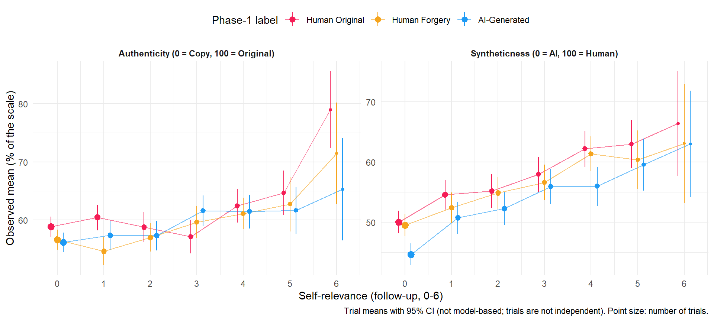{width=960}
:::
:::


::: {.cell}

```{.r .cell-code}
observed_by(filter(dfmem, Recognition == "No"), "PerceivedArtificiality", by = "Type") |>
  mutate(Outcome = "Perceived artificiality, items judged new (0 = Very Human, 100 = Very Artificial)") |>
  plot_observed(by = "Type")
```

::: {.cell-output-display}
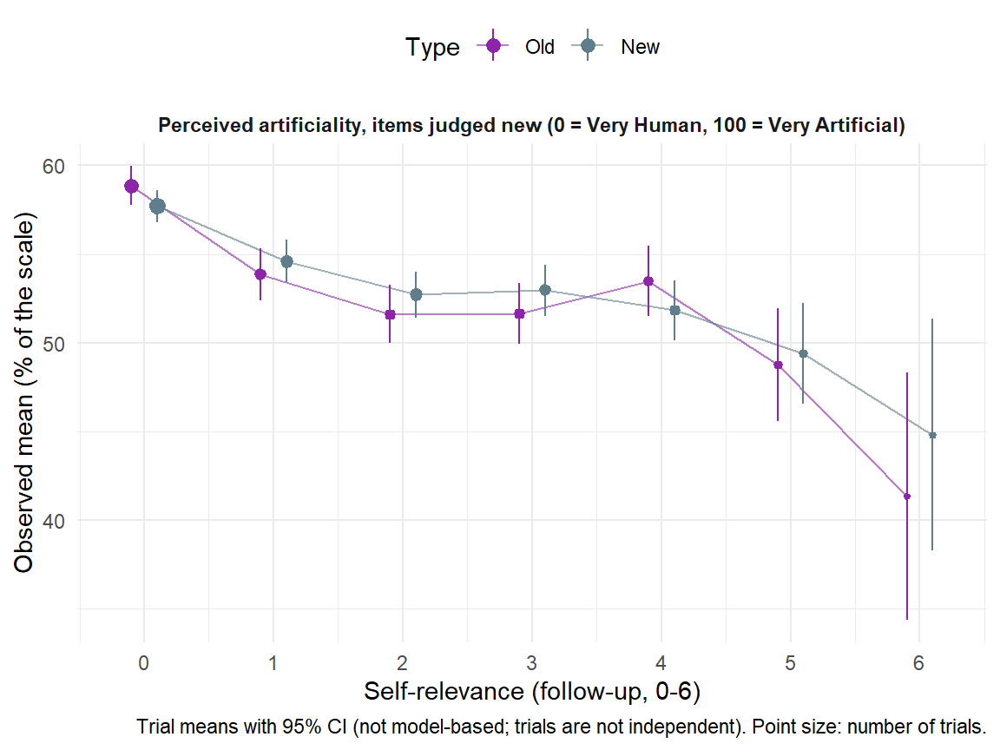{width=576}
:::
:::


### Syntheticness and authenticity


```{.r .cell-code}
pending("RealitySR", "AuthenticitySR")
```


::: {.cell}

```{.r .cell-code}
dat_cues <- bind_rows(lapply(names(beliefs), function(o) mutate(beliefs[[o]]$response$cues, Belief = o))) |>
  mutate(Predictor = factor(predictor_labels[Mediator], levels = predictor_labels))

dat_cues |>
  filter(Condition %in% levels(dfsr$Condition)) |>
  mutate(Condition = factor(Condition, levels = levels(dfsr$Condition))) |>
  ggplot(aes(x = Median, y = Predictor, xmin = CI_low, xmax = CI_high, color = Condition)) +
  geom_vline(xintercept = 0, linetype = "dashed", color = "grey50") +
  geom_pointrange(position = position_dodge(width = 0.5)) +
  facet_wrap(~Belief) +
  scale_y_discrete(limits = rev) +
  scale_color_manual(values = cols) +
  labs(x = "Change in the belief per +10% of the predictor (% of the belief slider, 95% HDI)", y = NULL,
       color = "Label", caption = "The other two predictors held at the participant's average.") +
  theme_minimal() +
  theme(legend.position = "top", strip.text = element_text(face = "bold"))
```

::: {.cell-output-display}
{width=960}
:::
:::


```{.r .cell-code}
tab_cues <- bind_rows(lapply(names(beliefs), function(o) {
  labs_par <- par_labels[[appraisal_info[[belief_models[[o]]]]$outcome]]
  bind_rows(lapply(names(beliefs[[o]]), function(p) {
    mutate(beliefs[[o]][[p]]$cues, Parameter = labs_par[[p]])
  })) |>
    mutate(Contrast = o)
})) |>
  mutate(Predictor = factor(predictor_labels[Mediator], levels = predictor_labels)) |>
  format_effects() |>
  arrange(Contrast, Predictor, Parameter)

# The same slopes without SR in the model (same 217 participants)
tab_ref <- bind_rows(lapply(names(beliefs), function(o) {
  n <- belief_models[[o]]
  ctrl <- reference[[paste0(appraisal_info[[n]]$outcome, "BeautyControl")]]
  bind_rows(
    mutate(dat_cues[dat_cues$Belief == o, ], Model = n),
    mutate(rename(grid_slopes(ctrl), Condition = Level), Predictor = "Phase-1 beauty", Model = paste0(ctrl$outcome, " (no SR)")),
    mutate(rename(covariate_slopes(ctrl, "Beauty2_w", pairs = TRUE), Condition = Level), Predictor = "Follow-up beauty", Model = paste0(ctrl$outcome, " (no SR)"))
  ) |>
    mutate(Contrast = o)
})) |>
  mutate(Predictor = factor(Predictor, levels = predictor_labels),
         Condition = factor(Condition, levels = c(levels(dfsr$Condition), contrast_order))) |>
  format_effects() |>
  arrange(Contrast, Predictor, Condition, Model)

tab_dec <- bind_rows(lapply(names(beliefs), function(o) {
  mutate(beliefs[[o]]$response$effects, Contrast = paste0(o, ": ", Contrast))
})) |>
  filter(Path %in% c("Total", "Direct", "Indirect (Beauty)", "Indirect (SR)", "Indirect (Beauty2)",
                     "Mediator (Beauty)", "Mediator (SR)", "Mediator (Beauty2)")) |>
  mutate(Path = str_replace_all(Path, c("\\(SR\\)" = "(Self-relevance)", "\\(Beauty2\\)" = "(Follow-up beauty)", "\\(Beauty\\)" = "(Phase-1 beauty)"))) |>
  format_effects()

tab_con <- bind_rows(lapply(names(beliefs), function(o) {
  n <- belief_models[[o]]
  outcome <- appraisal_info[[n]]$outcome
  bind_rows(
    prep_contrasts(estimates[[n]]$contrasts, outcome) |> mutate(Model = n),
    prep_contrasts(reference[[outcome]]$contrasts, outcome) |> mutate(Model = paste(outcome, "(main model, no rating terms)"))
  ) |>
    filter(Parameter %in% c("response", "mu", "confright", "confleft")) |>
    mutate(Contrast = paste0(o, ": ", Contrast))
})) |>
  arrange(Contrast, Parameter)

make_asis(
  make_tables(tab_cues, c("Contrast", "Predictor", "Parameter", "Condition", "Diff", "CI", "pd_fmt", "Effect"),
              "Unique change in the belief per +10% of each predictor, the others at the participant's average, per label and between labels (% of the slider / percentage points)"),
  make_tables(tab_ref, c("Contrast", "Predictor", "Condition", "Model", "Diff", "CI", "pd_fmt", "Effect"),
              "Mean response: the same slopes with and without self-relevance in the model"),
  make_tables(tab_dec, c("Contrast", "Path", "Diff", "CI", "pd_fmt", "Effect"),
              "Decomposition of the label effect (% of the belief slider; Mediator rows: the label's shift in that rating, % of its scale)"),
  make_tables(tab_con, c("Contrast", "Model", "Parameter", "Diff", "CI", "pd_fmt", "Effect"),
              "Label contrasts at the participant's average ratings, next to the main model")
)
```

```{=html}
<div id="bwhkvpfjrk" style="padding-left:0px;padding-right:0px;padding-top:10px;padding-bottom:10px;overflow-x:auto;overflow-y:auto;width:auto;height:auto;">
<style>#bwhkvpfjrk table {
  font-family: system-ui, 'Segoe UI', Roboto, Helvetica, Arial, sans-serif, 'Apple Color Emoji', 'Segoe UI Emoji', 'Segoe UI Symbol', 'Noto Color Emoji';
  -webkit-font-smoothing: antialiased;
  -moz-osx-font-smoothing: grayscale;
}

#bwhkvpfjrk thead, #bwhkvpfjrk tbody, #bwhkvpfjrk tfoot, #bwhkvpfjrk tr, #bwhkvpfjrk td, #bwhkvpfjrk th {
  border-style: none;
}

#bwhkvpfjrk p {
  margin: 0;
  padding: 0;
}

#bwhkvpfjrk .gt_table {
  display: table;
  border-collapse: collapse;
  line-height: normal;
  margin-left: auto;
  margin-right: auto;
  color: #333333;
  font-size: 13px;
  font-weight: normal;
  font-style: normal;
  background-color: #FFFFFF;
  width: auto;
  border-top-style: solid;
  border-top-width: 3px;
  border-top-color: #D5D5D5;
  border-right-style: solid;
  border-right-width: 3px;
  border-right-color: #D5D5D5;
  border-bottom-style: solid;
  border-bottom-width: 3px;
  border-bottom-color: #D5D5D5;
  border-left-style: solid;
  border-left-width: 3px;
  border-left-color: #D5D5D5;
}

#bwhkvpfjrk .gt_caption {
  padding-top: 4px;
  padding-bottom: 4px;
}

#bwhkvpfjrk .gt_title {
  color: #333333;
  font-size: 125%;
  font-weight: initial;
  padding-top: 4px;
  padding-bottom: 4px;
  padding-left: 5px;
  padding-right: 5px;
  border-bottom-color: #FFFFFF;
  border-bottom-width: 0;
}

#bwhkvpfjrk .gt_subtitle {
  color: #333333;
  font-size: 85%;
  font-weight: initial;
  padding-top: 3px;
  padding-bottom: 5px;
  padding-left: 5px;
  padding-right: 5px;
  border-top-color: #FFFFFF;
  border-top-width: 0;
}

#bwhkvpfjrk .gt_heading {
  background-color: #FFFFFF;
  text-align: left;
  border-bottom-color: #FFFFFF;
  border-left-style: none;
  border-left-width: 1px;
  border-left-color: #D3D3D3;
  border-right-style: none;
  border-right-width: 1px;
  border-right-color: #D3D3D3;
}

#bwhkvpfjrk .gt_bottom_border {
  border-bottom-style: solid;
  border-bottom-width: 2px;
  border-bottom-color: #D5D5D5;
}

#bwhkvpfjrk .gt_col_headings {
  border-top-style: solid;
  border-top-width: 2px;
  border-top-color: #D5D5D5;
  border-bottom-style: solid;
  border-bottom-width: 2px;
  border-bottom-color: #D5D5D5;
  border-left-style: none;
  border-left-width: 1px;
  border-left-color: #D3D3D3;
  border-right-style: none;
  border-right-width: 1px;
  border-right-color: #D3D3D3;
}

#bwhkvpfjrk .gt_col_heading {
  color: #FFFFFF;
  background-color: #000000;
  font-size: 100%;
  font-weight: normal;
  text-transform: inherit;
  border-left-style: none;
  border-left-width: 1px;
  border-left-color: #D3D3D3;
  border-right-style: none;
  border-right-width: 1px;
  border-right-color: #D3D3D3;
  vertical-align: bottom;
  padding-top: 5px;
  padding-bottom: 6px;
  padding-left: 5px;
  padding-right: 5px;
  overflow-x: hidden;
}

#bwhkvpfjrk .gt_column_spanner_outer {
  color: #FFFFFF;
  background-color: #000000;
  font-size: 100%;
  font-weight: normal;
  text-transform: inherit;
  padding-top: 0;
  padding-bottom: 0;
  padding-left: 4px;
  padding-right: 4px;
}

#bwhkvpfjrk .gt_column_spanner_outer:first-child {
  padding-left: 0;
}

#bwhkvpfjrk .gt_column_spanner_outer:last-child {
  padding-right: 0;
}

#bwhkvpfjrk .gt_column_spanner {
  border-bottom-style: solid;
  border-bottom-width: 2px;
  border-bottom-color: #D5D5D5;
  vertical-align: bottom;
  padding-top: 5px;
  padding-bottom: 5px;
  overflow-x: hidden;
  display: inline-block;
  width: 100%;
}

#bwhkvpfjrk .gt_spanner_row {
  border-bottom-style: hidden;
}

#bwhkvpfjrk .gt_group_heading {
  padding-top: 8px;
  padding-bottom: 8px;
  padding-left: 5px;
  padding-right: 5px;
  color: #333333;
  background-color: #FFFFFF;
  font-size: 100%;
  font-weight: initial;
  text-transform: inherit;
  border-top-style: solid;
  border-top-width: 2px;
  border-top-color: #D5D5D5;
  border-bottom-style: solid;
  border-bottom-width: 2px;
  border-bottom-color: #D5D5D5;
  border-left-style: none;
  border-left-width: 1px;
  border-left-color: #D3D3D3;
  border-right-style: none;
  border-right-width: 1px;
  border-right-color: #D3D3D3;
  vertical-align: middle;
  text-align: left;
}

#bwhkvpfjrk .gt_empty_group_heading {
  padding: 0.5px;
  color: #333333;
  background-color: #FFFFFF;
  font-size: 100%;
  font-weight: initial;
  border-top-style: solid;
  border-top-width: 2px;
  border-top-color: #D5D5D5;
  border-bottom-style: solid;
  border-bottom-width: 2px;
  border-bottom-color: #D5D5D5;
  vertical-align: middle;
}

#bwhkvpfjrk .gt_from_md > :first-child {
  margin-top: 0;
}

#bwhkvpfjrk .gt_from_md > :last-child {
  margin-bottom: 0;
}

#bwhkvpfjrk .gt_row {
  padding-top: 8px;
  padding-bottom: 8px;
  padding-left: 5px;
  padding-right: 5px;
  margin: 10px;
  border-top-style: solid;
  border-top-width: 1px;
  border-top-color: #D5D5D5;
  border-left-style: solid;
  border-left-width: 1px;
  border-left-color: #D5D5D5;
  border-right-style: solid;
  border-right-width: 1px;
  border-right-color: #D5D5D5;
  vertical-align: middle;
  overflow-x: hidden;
}

#bwhkvpfjrk .gt_stub {
  color: #333333;
  background-color: #FFFFFF;
  font-size: 100%;
  font-weight: initial;
  text-transform: inherit;
  border-right-style: solid;
  border-right-width: 2px;
  border-right-color: #5F5F5F;
  padding-left: 5px;
  padding-right: 5px;
}

#bwhkvpfjrk .gt_stub_row_group {
  color: #333333;
  background-color: #FFFFFF;
  font-size: 100%;
  font-weight: initial;
  text-transform: inherit;
  border-right-style: solid;
  border-right-width: 2px;
  border-right-color: #D3D3D3;
  padding-left: 5px;
  padding-right: 5px;
  vertical-align: top;
}

#bwhkvpfjrk .gt_row_group_first td {
  border-top-width: 2px;
}

#bwhkvpfjrk .gt_row_group_first th {
  border-top-width: 2px;
}

#bwhkvpfjrk .gt_summary_row {
  color: #333333;
  background-color: #D5D5D5;
  text-transform: inherit;
  padding-top: 8px;
  padding-bottom: 8px;
  padding-left: 5px;
  padding-right: 5px;
}

#bwhkvpfjrk .gt_first_summary_row {
  border-top-style: solid;
  border-top-color: #D5D5D5;
}

#bwhkvpfjrk .gt_first_summary_row.thick {
  border-top-width: 2px;
}

#bwhkvpfjrk .gt_last_summary_row {
  padding-top: 8px;
  padding-bottom: 8px;
  padding-left: 5px;
  padding-right: 5px;
  border-bottom-style: solid;
  border-bottom-width: 2px;
  border-bottom-color: #D5D5D5;
}

#bwhkvpfjrk .gt_grand_summary_row {
  color: #FFFFFF;
  background-color: #929292;
  text-transform: inherit;
  padding-top: 8px;
  padding-bottom: 8px;
  padding-left: 5px;
  padding-right: 5px;
}

#bwhkvpfjrk .gt_first_grand_summary_row {
  padding-top: 8px;
  padding-bottom: 8px;
  padding-left: 5px;
  padding-right: 5px;
  border-top-style: double;
  border-top-width: 6px;
  border-top-color: #D5D5D5;
}

#bwhkvpfjrk .gt_last_grand_summary_row_top {
  padding-top: 8px;
  padding-bottom: 8px;
  padding-left: 5px;
  padding-right: 5px;
  border-bottom-style: double;
  border-bottom-width: 6px;
  border-bottom-color: #D5D5D5;
}

#bwhkvpfjrk .gt_striped {
  background-color: #F4F4F4;
}

#bwhkvpfjrk .gt_table_body {
  border-top-style: solid;
  border-top-width: 2px;
  border-top-color: #D5D5D5;
  border-bottom-style: solid;
  border-bottom-width: 2px;
  border-bottom-color: #D5D5D5;
}

#bwhkvpfjrk .gt_footnotes {
  color: #333333;
  background-color: #FFFFFF;
  border-bottom-style: none;
  border-bottom-width: 2px;
  border-bottom-color: #D3D3D3;
  border-left-style: none;
  border-left-width: 2px;
  border-left-color: #D3D3D3;
  border-right-style: none;
  border-right-width: 2px;
  border-right-color: #D3D3D3;
}

#bwhkvpfjrk .gt_footnote {
  margin: 0px;
  font-size: 90%;
  padding-top: 4px;
  padding-bottom: 4px;
  padding-left: 5px;
  padding-right: 5px;
}

#bwhkvpfjrk .gt_sourcenotes {
  color: #333333;
  background-color: #FFFFFF;
  border-bottom-style: none;
  border-bottom-width: 2px;
  border-bottom-color: #D3D3D3;
  border-left-style: none;
  border-left-width: 2px;
  border-left-color: #D3D3D3;
  border-right-style: none;
  border-right-width: 2px;
  border-right-color: #D3D3D3;
}

#bwhkvpfjrk .gt_sourcenote {
  font-size: 90%;
  padding-top: 4px;
  padding-bottom: 4px;
  padding-left: 5px;
  padding-right: 5px;
}

#bwhkvpfjrk .gt_left {
  text-align: left;
}

#bwhkvpfjrk .gt_center {
  text-align: center;
}

#bwhkvpfjrk .gt_right {
  text-align: right;
  font-variant-numeric: tabular-nums;
}

#bwhkvpfjrk .gt_font_normal {
  font-weight: normal;
}

#bwhkvpfjrk .gt_font_bold {
  font-weight: bold;
}

#bwhkvpfjrk .gt_font_italic {
  font-style: italic;
}

#bwhkvpfjrk .gt_super {
  font-size: 65%;
}

#bwhkvpfjrk .gt_footnote_marks {
  font-size: 75%;
  vertical-align: 0.4em;
  position: initial;
}

#bwhkvpfjrk .gt_asterisk {
  font-size: 100%;
  vertical-align: 0;
}

#bwhkvpfjrk .gt_indent_1 {
  text-indent: 5px;
}

#bwhkvpfjrk .gt_indent_2 {
  text-indent: 10px;
}

#bwhkvpfjrk .gt_indent_3 {
  text-indent: 15px;
}

#bwhkvpfjrk .gt_indent_4 {
  text-indent: 20px;
}

#bwhkvpfjrk .gt_indent_5 {
  text-indent: 25px;
}

#bwhkvpfjrk .katex-display {
  display: inline-flex !important;
  margin-bottom: 0.75em !important;
}

#bwhkvpfjrk div.Reactable > div.rt-table > div.rt-thead > div.rt-tr.rt-tr-group-header > div.rt-th-group:after {
  height: 0px !important;
}
</style>
<table class="gt_table" data-quarto-disable-processing="false" data-quarto-bootstrap="false">
  <thead>
    <tr class="gt_heading">
      <td colspan="7" class="gt_heading gt_title gt_font_normal gt_bottom_border" style>Unique change in the belief per +10% of each predictor, the others at the participant's average, per label and between labels (% of the slider / percentage points)</td>
    </tr>
    
    <tr class="gt_col_headings">
      <th class="gt_col_heading gt_columns_bottom_border gt_center" rowspan="1" colspan="1" scope="col" id="Predictor">Predictor</th>
      <th class="gt_col_heading gt_columns_bottom_border gt_left" rowspan="1" colspan="1" scope="col" id="Parameter">Parameter</th>
      <th class="gt_col_heading gt_columns_bottom_border gt_left" rowspan="1" colspan="1" scope="col" id="Condition">Condition</th>
      <th class="gt_col_heading gt_columns_bottom_border gt_right" rowspan="1" colspan="1" scope="col" id="Diff">Diff</th>
      <th class="gt_col_heading gt_columns_bottom_border gt_left" rowspan="1" colspan="1" scope="col" id="CI">CI</th>
      <th class="gt_col_heading gt_columns_bottom_border gt_right" rowspan="1" colspan="1" scope="col" id="pd_fmt">pd_fmt</th>
      <th class="gt_col_heading gt_columns_bottom_border gt_left" rowspan="1" colspan="1" scope="col" id="Effect">Effect</th>
    </tr>
  </thead>
  <tbody class="gt_table_body">
    <tr class="gt_group_heading_row">
      <th colspan="7" class="gt_group_heading" scope="colgroup" id="Authenticity">Authenticity</th>
    </tr>
    <tr class="gt_row_group_first"><td headers="Authenticity  Predictor" class="gt_row gt_center" style="color: #9E9E9E;">Phase-1 beauty</td>
<td headers="Authenticity  Parameter" class="gt_row gt_left" style="color: #9E9E9E;">Confidence on the Copy side [confleft]</td>
<td headers="Authenticity  Condition" class="gt_row gt_left" style="color: #9E9E9E;">Human Original</td>
<td headers="Authenticity  Diff" class="gt_row gt_right" style="color: #9E9E9E;">-0.55</td>
<td headers="Authenticity  CI" class="gt_row gt_left" style="color: #9E9E9E;">[-1.19, 0.04]</td>
<td headers="Authenticity  pd_fmt" class="gt_row gt_right" style="color: #9E9E9E;">95.53%</td>
<td headers="Authenticity  Effect" class="gt_row gt_left" style="color: #9E9E9E;">n.s.</td></tr>
    <tr><td headers="Authenticity  Predictor" class="gt_row gt_center gt_striped" style="color: #9E9E9E;">Phase-1 beauty</td>
<td headers="Authenticity  Parameter" class="gt_row gt_left gt_striped" style="color: #9E9E9E;">Confidence on the Copy side [confleft]</td>
<td headers="Authenticity  Condition" class="gt_row gt_left gt_striped" style="color: #9E9E9E;">Human Forgery</td>
<td headers="Authenticity  Diff" class="gt_row gt_right gt_striped" style="color: #9E9E9E;">-0.63</td>
<td headers="Authenticity  CI" class="gt_row gt_left gt_striped" style="color: #9E9E9E;">[-1.24, 0.05]</td>
<td headers="Authenticity  pd_fmt" class="gt_row gt_right gt_striped" style="color: #9E9E9E;">96.78%</td>
<td headers="Authenticity  Effect" class="gt_row gt_left gt_striped" style="color: #9E9E9E;">n.s.</td></tr>
    <tr><td headers="Authenticity  Predictor" class="gt_row gt_center" style="background-color: #FFEBEE;">Phase-1 beauty</td>
<td headers="Authenticity  Parameter" class="gt_row gt_left" style="background-color: #FFEBEE;">Confidence on the Copy side [confleft]</td>
<td headers="Authenticity  Condition" class="gt_row gt_left" style="background-color: #FFEBEE;">AI-Generated</td>
<td headers="Authenticity  Diff" class="gt_row gt_right" style="background-color: #FFEBEE;">-1.28</td>
<td headers="Authenticity  CI" class="gt_row gt_left" style="background-color: #FFEBEE;">[-1.94, -0.68]</td>
<td headers="Authenticity  pd_fmt" class="gt_row gt_right" style="background-color: #FFEBEE;">100%</td>
<td headers="Authenticity  Effect" class="gt_row gt_left" style="background-color: #FFEBEE;">Negative</td></tr>
    <tr><td headers="Authenticity  Predictor" class="gt_row gt_center gt_striped" style="color: #9E9E9E;">Phase-1 beauty</td>
<td headers="Authenticity  Parameter" class="gt_row gt_left gt_striped" style="color: #9E9E9E;">Confidence on the Copy side [confleft]</td>
<td headers="Authenticity  Condition" class="gt_row gt_left gt_striped" style="color: #9E9E9E;">AI-Generated - Human Original</td>
<td headers="Authenticity  Diff" class="gt_row gt_right gt_striped" style="color: #9E9E9E;">-0.73</td>
<td headers="Authenticity  CI" class="gt_row gt_left gt_striped" style="color: #9E9E9E;">[-1.58, 0.11]</td>
<td headers="Authenticity  pd_fmt" class="gt_row gt_right gt_striped" style="color: #9E9E9E;">95.75%</td>
<td headers="Authenticity  Effect" class="gt_row gt_left gt_striped" style="color: #9E9E9E;">n.s.</td></tr>
    <tr><td headers="Authenticity  Predictor" class="gt_row gt_center" style="color: #9E9E9E;">Phase-1 beauty</td>
<td headers="Authenticity  Parameter" class="gt_row gt_left" style="color: #9E9E9E;">Confidence on the Copy side [confleft]</td>
<td headers="Authenticity  Condition" class="gt_row gt_left" style="color: #9E9E9E;">Human Forgery - Human Original</td>
<td headers="Authenticity  Diff" class="gt_row gt_right" style="color: #9E9E9E;">-0.08</td>
<td headers="Authenticity  CI" class="gt_row gt_left" style="color: #9E9E9E;">[-0.90, 0.77]</td>
<td headers="Authenticity  pd_fmt" class="gt_row gt_right" style="color: #9E9E9E;">57.48%</td>
<td headers="Authenticity  Effect" class="gt_row gt_left" style="color: #9E9E9E;">n.s.</td></tr>
    <tr><td headers="Authenticity  Predictor" class="gt_row gt_center gt_striped" style="color: #9E9E9E;">Phase-1 beauty</td>
<td headers="Authenticity  Parameter" class="gt_row gt_left gt_striped" style="color: #9E9E9E;">Confidence on the Copy side [confleft]</td>
<td headers="Authenticity  Condition" class="gt_row gt_left gt_striped" style="color: #9E9E9E;">AI-Generated - Human Forgery</td>
<td headers="Authenticity  Diff" class="gt_row gt_right gt_striped" style="color: #9E9E9E;">-0.65</td>
<td headers="Authenticity  CI" class="gt_row gt_left gt_striped" style="color: #9E9E9E;">[-1.48, 0.30]</td>
<td headers="Authenticity  pd_fmt" class="gt_row gt_right gt_striped" style="color: #9E9E9E;">92.38%</td>
<td headers="Authenticity  Effect" class="gt_row gt_left gt_striped" style="color: #9E9E9E;">n.s.</td></tr>
    <tr><td headers="Authenticity  Predictor" class="gt_row gt_center" style="background-color: #E8F5E9;">Phase-1 beauty</td>
<td headers="Authenticity  Parameter" class="gt_row gt_left" style="background-color: #E8F5E9;">Confidence on the Original side [confright]</td>
<td headers="Authenticity  Condition" class="gt_row gt_left" style="background-color: #E8F5E9;">Human Original</td>
<td headers="Authenticity  Diff" class="gt_row gt_right" style="background-color: #E8F5E9;">0.68</td>
<td headers="Authenticity  CI" class="gt_row gt_left" style="background-color: #E8F5E9;">[0.21, 1.19]</td>
<td headers="Authenticity  pd_fmt" class="gt_row gt_right" style="background-color: #E8F5E9;">99.65%</td>
<td headers="Authenticity  Effect" class="gt_row gt_left" style="background-color: #E8F5E9;">Positive</td></tr>
    <tr><td headers="Authenticity  Predictor" class="gt_row gt_center gt_striped" style="background-color: #E8F5E9;">Phase-1 beauty</td>
<td headers="Authenticity  Parameter" class="gt_row gt_left gt_striped" style="background-color: #E8F5E9;">Confidence on the Original side [confright]</td>
<td headers="Authenticity  Condition" class="gt_row gt_left gt_striped" style="background-color: #E8F5E9;">Human Forgery</td>
<td headers="Authenticity  Diff" class="gt_row gt_right gt_striped" style="background-color: #E8F5E9;">0.85</td>
<td headers="Authenticity  CI" class="gt_row gt_left gt_striped" style="background-color: #E8F5E9;">[0.33, 1.37]</td>
<td headers="Authenticity  pd_fmt" class="gt_row gt_right gt_striped" style="background-color: #E8F5E9;">99.92%</td>
<td headers="Authenticity  Effect" class="gt_row gt_left gt_striped" style="background-color: #E8F5E9;">Positive</td></tr>
    <tr><td headers="Authenticity  Predictor" class="gt_row gt_center" style="color: #9E9E9E;">Phase-1 beauty</td>
<td headers="Authenticity  Parameter" class="gt_row gt_left" style="color: #9E9E9E;">Confidence on the Original side [confright]</td>
<td headers="Authenticity  Condition" class="gt_row gt_left" style="color: #9E9E9E;">AI-Generated</td>
<td headers="Authenticity  Diff" class="gt_row gt_right" style="color: #9E9E9E;">0.43</td>
<td headers="Authenticity  CI" class="gt_row gt_left" style="color: #9E9E9E;">[-0.12, 0.94]</td>
<td headers="Authenticity  pd_fmt" class="gt_row gt_right" style="color: #9E9E9E;">93.88%</td>
<td headers="Authenticity  Effect" class="gt_row gt_left" style="color: #9E9E9E;">n.s.</td></tr>
    <tr><td headers="Authenticity  Predictor" class="gt_row gt_center gt_striped" style="color: #9E9E9E;">Phase-1 beauty</td>
<td headers="Authenticity  Parameter" class="gt_row gt_left gt_striped" style="color: #9E9E9E;">Confidence on the Original side [confright]</td>
<td headers="Authenticity  Condition" class="gt_row gt_left gt_striped" style="color: #9E9E9E;">AI-Generated - Human Original</td>
<td headers="Authenticity  Diff" class="gt_row gt_right gt_striped" style="color: #9E9E9E;">-0.25</td>
<td headers="Authenticity  CI" class="gt_row gt_left gt_striped" style="color: #9E9E9E;">[-0.95, 0.40]</td>
<td headers="Authenticity  pd_fmt" class="gt_row gt_right gt_striped" style="color: #9E9E9E;">76.60%</td>
<td headers="Authenticity  Effect" class="gt_row gt_left gt_striped" style="color: #9E9E9E;">n.s.</td></tr>
    <tr><td headers="Authenticity  Predictor" class="gt_row gt_center" style="color: #9E9E9E;">Phase-1 beauty</td>
<td headers="Authenticity  Parameter" class="gt_row gt_left" style="color: #9E9E9E;">Confidence on the Original side [confright]</td>
<td headers="Authenticity  Condition" class="gt_row gt_left" style="color: #9E9E9E;">Human Forgery - Human Original</td>
<td headers="Authenticity  Diff" class="gt_row gt_right" style="color: #9E9E9E;">0.16</td>
<td headers="Authenticity  CI" class="gt_row gt_left" style="color: #9E9E9E;">[-0.47, 0.83]</td>
<td headers="Authenticity  pd_fmt" class="gt_row gt_right" style="color: #9E9E9E;">68.73%</td>
<td headers="Authenticity  Effect" class="gt_row gt_left" style="color: #9E9E9E;">n.s.</td></tr>
    <tr><td headers="Authenticity  Predictor" class="gt_row gt_center gt_striped" style="color: #9E9E9E;">Phase-1 beauty</td>
<td headers="Authenticity  Parameter" class="gt_row gt_left gt_striped" style="color: #9E9E9E;">Confidence on the Original side [confright]</td>
<td headers="Authenticity  Condition" class="gt_row gt_left gt_striped" style="color: #9E9E9E;">AI-Generated - Human Forgery</td>
<td headers="Authenticity  Diff" class="gt_row gt_right gt_striped" style="color: #9E9E9E;">-0.42</td>
<td headers="Authenticity  CI" class="gt_row gt_left gt_striped" style="color: #9E9E9E;">[-1.11, 0.29]</td>
<td headers="Authenticity  pd_fmt" class="gt_row gt_right gt_striped" style="color: #9E9E9E;">87.60%</td>
<td headers="Authenticity  Effect" class="gt_row gt_left gt_striped" style="color: #9E9E9E;">n.s.</td></tr>
    <tr><td headers="Authenticity  Predictor" class="gt_row gt_center" style="background-color: #E8F5E9;">Phase-1 beauty</td>
<td headers="Authenticity  Parameter" class="gt_row gt_left" style="background-color: #E8F5E9;">Mean response (authenticity)</td>
<td headers="Authenticity  Condition" class="gt_row gt_left" style="background-color: #E8F5E9;">Human Original</td>
<td headers="Authenticity  Diff" class="gt_row gt_right" style="background-color: #E8F5E9;">1.56</td>
<td headers="Authenticity  CI" class="gt_row gt_left" style="background-color: #E8F5E9;">[0.94, 2.10]</td>
<td headers="Authenticity  pd_fmt" class="gt_row gt_right" style="background-color: #E8F5E9;">100%</td>
<td headers="Authenticity  Effect" class="gt_row gt_left" style="background-color: #E8F5E9;">Positive</td></tr>
    <tr><td headers="Authenticity  Predictor" class="gt_row gt_center gt_striped" style="background-color: #E8F5E9;">Phase-1 beauty</td>
<td headers="Authenticity  Parameter" class="gt_row gt_left gt_striped" style="background-color: #E8F5E9;">Mean response (authenticity)</td>
<td headers="Authenticity  Condition" class="gt_row gt_left gt_striped" style="background-color: #E8F5E9;">Human Forgery</td>
<td headers="Authenticity  Diff" class="gt_row gt_right gt_striped" style="background-color: #E8F5E9;">1.01</td>
<td headers="Authenticity  CI" class="gt_row gt_left gt_striped" style="background-color: #E8F5E9;">[0.43, 1.58]</td>
<td headers="Authenticity  pd_fmt" class="gt_row gt_right gt_striped" style="background-color: #E8F5E9;">99.95%</td>
<td headers="Authenticity  Effect" class="gt_row gt_left gt_striped" style="background-color: #E8F5E9;">Positive</td></tr>
    <tr><td headers="Authenticity  Predictor" class="gt_row gt_center" style="background-color: #E8F5E9;">Phase-1 beauty</td>
<td headers="Authenticity  Parameter" class="gt_row gt_left" style="background-color: #E8F5E9;">Mean response (authenticity)</td>
<td headers="Authenticity  Condition" class="gt_row gt_left" style="background-color: #E8F5E9;">AI-Generated</td>
<td headers="Authenticity  Diff" class="gt_row gt_right" style="background-color: #E8F5E9;">1.21</td>
<td headers="Authenticity  CI" class="gt_row gt_left" style="background-color: #E8F5E9;">[0.62, 1.77]</td>
<td headers="Authenticity  pd_fmt" class="gt_row gt_right" style="background-color: #E8F5E9;">100%</td>
<td headers="Authenticity  Effect" class="gt_row gt_left" style="background-color: #E8F5E9;">Positive</td></tr>
    <tr><td headers="Authenticity  Predictor" class="gt_row gt_center gt_striped" style="color: #9E9E9E;">Phase-1 beauty</td>
<td headers="Authenticity  Parameter" class="gt_row gt_left gt_striped" style="color: #9E9E9E;">Mean response (authenticity)</td>
<td headers="Authenticity  Condition" class="gt_row gt_left gt_striped" style="color: #9E9E9E;">AI-Generated - Human Original</td>
<td headers="Authenticity  Diff" class="gt_row gt_right gt_striped" style="color: #9E9E9E;">-0.35</td>
<td headers="Authenticity  CI" class="gt_row gt_left gt_striped" style="color: #9E9E9E;">[-1.16, 0.37]</td>
<td headers="Authenticity  pd_fmt" class="gt_row gt_right gt_striped" style="color: #9E9E9E;">80.62%</td>
<td headers="Authenticity  Effect" class="gt_row gt_left gt_striped" style="color: #9E9E9E;">n.s.</td></tr>
    <tr><td headers="Authenticity  Predictor" class="gt_row gt_center" style="color: #9E9E9E;">Phase-1 beauty</td>
<td headers="Authenticity  Parameter" class="gt_row gt_left" style="color: #9E9E9E;">Mean response (authenticity)</td>
<td headers="Authenticity  Condition" class="gt_row gt_left" style="color: #9E9E9E;">Human Forgery - Human Original</td>
<td headers="Authenticity  Diff" class="gt_row gt_right" style="color: #9E9E9E;">-0.55</td>
<td headers="Authenticity  CI" class="gt_row gt_left" style="color: #9E9E9E;">[-1.27, 0.31]</td>
<td headers="Authenticity  pd_fmt" class="gt_row gt_right" style="color: #9E9E9E;">91.00%</td>
<td headers="Authenticity  Effect" class="gt_row gt_left" style="color: #9E9E9E;">n.s.</td></tr>
    <tr><td headers="Authenticity  Predictor" class="gt_row gt_center gt_striped" style="color: #9E9E9E;">Phase-1 beauty</td>
<td headers="Authenticity  Parameter" class="gt_row gt_left gt_striped" style="color: #9E9E9E;">Mean response (authenticity)</td>
<td headers="Authenticity  Condition" class="gt_row gt_left gt_striped" style="color: #9E9E9E;">AI-Generated - Human Forgery</td>
<td headers="Authenticity  Diff" class="gt_row gt_right gt_striped" style="color: #9E9E9E;">0.19</td>
<td headers="Authenticity  CI" class="gt_row gt_left gt_striped" style="color: #9E9E9E;">[-0.55, 1.04]</td>
<td headers="Authenticity  pd_fmt" class="gt_row gt_right gt_striped" style="color: #9E9E9E;">68.23%</td>
<td headers="Authenticity  Effect" class="gt_row gt_left gt_striped" style="color: #9E9E9E;">n.s.</td></tr>
    <tr><td headers="Authenticity  Predictor" class="gt_row gt_center" style="background-color: #E8F5E9;">Phase-1 beauty</td>
<td headers="Authenticity  Parameter" class="gt_row gt_left" style="background-color: #E8F5E9;">p(Original side) [mu]</td>
<td headers="Authenticity  Condition" class="gt_row gt_left" style="background-color: #E8F5E9;">Human Original</td>
<td headers="Authenticity  Diff" class="gt_row gt_right" style="background-color: #E8F5E9;">2.26</td>
<td headers="Authenticity  CI" class="gt_row gt_left" style="background-color: #E8F5E9;">[1.34, 3.32]</td>
<td headers="Authenticity  pd_fmt" class="gt_row gt_right" style="background-color: #E8F5E9;">100%</td>
<td headers="Authenticity  Effect" class="gt_row gt_left" style="background-color: #E8F5E9;">Positive</td></tr>
    <tr><td headers="Authenticity  Predictor" class="gt_row gt_center gt_striped" style="background-color: #E8F5E9;">Phase-1 beauty</td>
<td headers="Authenticity  Parameter" class="gt_row gt_left gt_striped" style="background-color: #E8F5E9;">p(Original side) [mu]</td>
<td headers="Authenticity  Condition" class="gt_row gt_left gt_striped" style="background-color: #E8F5E9;">Human Forgery</td>
<td headers="Authenticity  Diff" class="gt_row gt_right gt_striped" style="background-color: #E8F5E9;">1.15</td>
<td headers="Authenticity  CI" class="gt_row gt_left gt_striped" style="background-color: #E8F5E9;">[0.20, 2.15]</td>
<td headers="Authenticity  pd_fmt" class="gt_row gt_right gt_striped" style="background-color: #E8F5E9;">99.00%</td>
<td headers="Authenticity  Effect" class="gt_row gt_left gt_striped" style="background-color: #E8F5E9;">Positive</td></tr>
    <tr><td headers="Authenticity  Predictor" class="gt_row gt_center" style="background-color: #E8F5E9;">Phase-1 beauty</td>
<td headers="Authenticity  Parameter" class="gt_row gt_left" style="background-color: #E8F5E9;">p(Original side) [mu]</td>
<td headers="Authenticity  Condition" class="gt_row gt_left" style="background-color: #E8F5E9;">AI-Generated</td>
<td headers="Authenticity  Diff" class="gt_row gt_right" style="background-color: #E8F5E9;">1.57</td>
<td headers="Authenticity  CI" class="gt_row gt_left" style="background-color: #E8F5E9;">[0.60, 2.59]</td>
<td headers="Authenticity  pd_fmt" class="gt_row gt_right" style="background-color: #E8F5E9;">99.92%</td>
<td headers="Authenticity  Effect" class="gt_row gt_left" style="background-color: #E8F5E9;">Positive</td></tr>
    <tr><td headers="Authenticity  Predictor" class="gt_row gt_center gt_striped" style="color: #9E9E9E;">Phase-1 beauty</td>
<td headers="Authenticity  Parameter" class="gt_row gt_left gt_striped" style="color: #9E9E9E;">p(Original side) [mu]</td>
<td headers="Authenticity  Condition" class="gt_row gt_left gt_striped" style="color: #9E9E9E;">AI-Generated - Human Original</td>
<td headers="Authenticity  Diff" class="gt_row gt_right gt_striped" style="color: #9E9E9E;">-0.68</td>
<td headers="Authenticity  CI" class="gt_row gt_left gt_striped" style="color: #9E9E9E;">[-2.07, 0.58]</td>
<td headers="Authenticity  pd_fmt" class="gt_row gt_right gt_striped" style="color: #9E9E9E;">84.38%</td>
<td headers="Authenticity  Effect" class="gt_row gt_left gt_striped" style="color: #9E9E9E;">n.s.</td></tr>
    <tr><td headers="Authenticity  Predictor" class="gt_row gt_center" style="color: #9E9E9E;">Phase-1 beauty</td>
<td headers="Authenticity  Parameter" class="gt_row gt_left" style="color: #9E9E9E;">p(Original side) [mu]</td>
<td headers="Authenticity  Condition" class="gt_row gt_left" style="color: #9E9E9E;">Human Forgery - Human Original</td>
<td headers="Authenticity  Diff" class="gt_row gt_right" style="color: #9E9E9E;">-1.12</td>
<td headers="Authenticity  CI" class="gt_row gt_left" style="color: #9E9E9E;">[-2.39, 0.31]</td>
<td headers="Authenticity  pd_fmt" class="gt_row gt_right" style="color: #9E9E9E;">94.67%</td>
<td headers="Authenticity  Effect" class="gt_row gt_left" style="color: #9E9E9E;">n.s.</td></tr>
    <tr><td headers="Authenticity  Predictor" class="gt_row gt_center gt_striped" style="color: #9E9E9E;">Phase-1 beauty</td>
<td headers="Authenticity  Parameter" class="gt_row gt_left gt_striped" style="color: #9E9E9E;">p(Original side) [mu]</td>
<td headers="Authenticity  Condition" class="gt_row gt_left gt_striped" style="color: #9E9E9E;">AI-Generated - Human Forgery</td>
<td headers="Authenticity  Diff" class="gt_row gt_right gt_striped" style="color: #9E9E9E;">0.43</td>
<td headers="Authenticity  CI" class="gt_row gt_left gt_striped" style="color: #9E9E9E;">[-0.96, 1.76]</td>
<td headers="Authenticity  pd_fmt" class="gt_row gt_right gt_striped" style="color: #9E9E9E;">72.80%</td>
<td headers="Authenticity  Effect" class="gt_row gt_left gt_striped" style="color: #9E9E9E;">n.s.</td></tr>
    <tr><td headers="Authenticity  Predictor" class="gt_row gt_center" style="color: #9E9E9E;">Self-relevance</td>
<td headers="Authenticity  Parameter" class="gt_row gt_left" style="color: #9E9E9E;">Confidence on the Copy side [confleft]</td>
<td headers="Authenticity  Condition" class="gt_row gt_left" style="color: #9E9E9E;">Human Original</td>
<td headers="Authenticity  Diff" class="gt_row gt_right" style="color: #9E9E9E;">0.15</td>
<td headers="Authenticity  CI" class="gt_row gt_left" style="color: #9E9E9E;">[-0.41, 0.73]</td>
<td headers="Authenticity  pd_fmt" class="gt_row gt_right" style="color: #9E9E9E;">68.97%</td>
<td headers="Authenticity  Effect" class="gt_row gt_left" style="color: #9E9E9E;">n.s.</td></tr>
    <tr><td headers="Authenticity  Predictor" class="gt_row gt_center gt_striped" style="color: #9E9E9E;">Self-relevance</td>
<td headers="Authenticity  Parameter" class="gt_row gt_left gt_striped" style="color: #9E9E9E;">Confidence on the Copy side [confleft]</td>
<td headers="Authenticity  Condition" class="gt_row gt_left gt_striped" style="color: #9E9E9E;">Human Forgery</td>
<td headers="Authenticity  Diff" class="gt_row gt_right gt_striped" style="color: #9E9E9E;">-0.11</td>
<td headers="Authenticity  CI" class="gt_row gt_left gt_striped" style="color: #9E9E9E;">[-0.69, 0.50]</td>
<td headers="Authenticity  pd_fmt" class="gt_row gt_right gt_striped" style="color: #9E9E9E;">64.88%</td>
<td headers="Authenticity  Effect" class="gt_row gt_left gt_striped" style="color: #9E9E9E;">n.s.</td></tr>
    <tr><td headers="Authenticity  Predictor" class="gt_row gt_center" style="color: #9E9E9E;">Self-relevance</td>
<td headers="Authenticity  Parameter" class="gt_row gt_left" style="color: #9E9E9E;">Confidence on the Copy side [confleft]</td>
<td headers="Authenticity  Condition" class="gt_row gt_left" style="color: #9E9E9E;">AI-Generated</td>
<td headers="Authenticity  Diff" class="gt_row gt_right" style="color: #9E9E9E;">-0.01</td>
<td headers="Authenticity  CI" class="gt_row gt_left" style="color: #9E9E9E;">[-0.63, 0.57]</td>
<td headers="Authenticity  pd_fmt" class="gt_row gt_right" style="color: #9E9E9E;">51.08%</td>
<td headers="Authenticity  Effect" class="gt_row gt_left" style="color: #9E9E9E;">n.s.</td></tr>
    <tr><td headers="Authenticity  Predictor" class="gt_row gt_center gt_striped" style="color: #9E9E9E;">Self-relevance</td>
<td headers="Authenticity  Parameter" class="gt_row gt_left gt_striped" style="color: #9E9E9E;">Confidence on the Copy side [confleft]</td>
<td headers="Authenticity  Condition" class="gt_row gt_left gt_striped" style="color: #9E9E9E;">AI-Generated - Human Original</td>
<td headers="Authenticity  Diff" class="gt_row gt_right gt_striped" style="color: #9E9E9E;">-0.16</td>
<td headers="Authenticity  CI" class="gt_row gt_left gt_striped" style="color: #9E9E9E;">[-0.94, 0.62]</td>
<td headers="Authenticity  pd_fmt" class="gt_row gt_right gt_striped" style="color: #9E9E9E;">64.92%</td>
<td headers="Authenticity  Effect" class="gt_row gt_left gt_striped" style="color: #9E9E9E;">n.s.</td></tr>
    <tr><td headers="Authenticity  Predictor" class="gt_row gt_center" style="color: #9E9E9E;">Self-relevance</td>
<td headers="Authenticity  Parameter" class="gt_row gt_left" style="color: #9E9E9E;">Confidence on the Copy side [confleft]</td>
<td headers="Authenticity  Condition" class="gt_row gt_left" style="color: #9E9E9E;">Human Forgery - Human Original</td>
<td headers="Authenticity  Diff" class="gt_row gt_right" style="color: #9E9E9E;">-0.25</td>
<td headers="Authenticity  CI" class="gt_row gt_left" style="color: #9E9E9E;">[-1.02, 0.54]</td>
<td headers="Authenticity  pd_fmt" class="gt_row gt_right" style="color: #9E9E9E;">73.98%</td>
<td headers="Authenticity  Effect" class="gt_row gt_left" style="color: #9E9E9E;">n.s.</td></tr>
    <tr><td headers="Authenticity  Predictor" class="gt_row gt_center gt_striped" style="color: #9E9E9E;">Self-relevance</td>
<td headers="Authenticity  Parameter" class="gt_row gt_left gt_striped" style="color: #9E9E9E;">Confidence on the Copy side [confleft]</td>
<td headers="Authenticity  Condition" class="gt_row gt_left gt_striped" style="color: #9E9E9E;">AI-Generated - Human Forgery</td>
<td headers="Authenticity  Diff" class="gt_row gt_right gt_striped" style="color: #9E9E9E;">0.10</td>
<td headers="Authenticity  CI" class="gt_row gt_left gt_striped" style="color: #9E9E9E;">[-0.73, 0.97]</td>
<td headers="Authenticity  pd_fmt" class="gt_row gt_right gt_striped" style="color: #9E9E9E;">59.55%</td>
<td headers="Authenticity  Effect" class="gt_row gt_left gt_striped" style="color: #9E9E9E;">n.s.</td></tr>
    <tr><td headers="Authenticity  Predictor" class="gt_row gt_center" style="color: #9E9E9E;">Self-relevance</td>
<td headers="Authenticity  Parameter" class="gt_row gt_left" style="color: #9E9E9E;">Confidence on the Original side [confright]</td>
<td headers="Authenticity  Condition" class="gt_row gt_left" style="color: #9E9E9E;">Human Original</td>
<td headers="Authenticity  Diff" class="gt_row gt_right" style="color: #9E9E9E;">0.41</td>
<td headers="Authenticity  CI" class="gt_row gt_left" style="color: #9E9E9E;">[-0.01, 0.82]</td>
<td headers="Authenticity  pd_fmt" class="gt_row gt_right" style="color: #9E9E9E;">97.50%</td>
<td headers="Authenticity  Effect" class="gt_row gt_left" style="color: #9E9E9E;">n.s.</td></tr>
    <tr><td headers="Authenticity  Predictor" class="gt_row gt_center gt_striped" style="background-color: #E8F5E9;">Self-relevance</td>
<td headers="Authenticity  Parameter" class="gt_row gt_left gt_striped" style="background-color: #E8F5E9;">Confidence on the Original side [confright]</td>
<td headers="Authenticity  Condition" class="gt_row gt_left gt_striped" style="background-color: #E8F5E9;">Human Forgery</td>
<td headers="Authenticity  Diff" class="gt_row gt_right gt_striped" style="background-color: #E8F5E9;">0.63</td>
<td headers="Authenticity  CI" class="gt_row gt_left gt_striped" style="background-color: #E8F5E9;">[0.14, 1.08]</td>
<td headers="Authenticity  pd_fmt" class="gt_row gt_right gt_striped" style="background-color: #E8F5E9;">99.52%</td>
<td headers="Authenticity  Effect" class="gt_row gt_left gt_striped" style="background-color: #E8F5E9;">Positive</td></tr>
    <tr><td headers="Authenticity  Predictor" class="gt_row gt_center" style="background-color: #E8F5E9;">Self-relevance</td>
<td headers="Authenticity  Parameter" class="gt_row gt_left" style="background-color: #E8F5E9;">Confidence on the Original side [confright]</td>
<td headers="Authenticity  Condition" class="gt_row gt_left" style="background-color: #E8F5E9;">AI-Generated</td>
<td headers="Authenticity  Diff" class="gt_row gt_right" style="background-color: #E8F5E9;">0.47</td>
<td headers="Authenticity  CI" class="gt_row gt_left" style="background-color: #E8F5E9;">[0.06, 0.93]</td>
<td headers="Authenticity  pd_fmt" class="gt_row gt_right" style="background-color: #E8F5E9;">98.30%</td>
<td headers="Authenticity  Effect" class="gt_row gt_left" style="background-color: #E8F5E9;">Positive</td></tr>
    <tr><td headers="Authenticity  Predictor" class="gt_row gt_center gt_striped" style="color: #9E9E9E;">Self-relevance</td>
<td headers="Authenticity  Parameter" class="gt_row gt_left gt_striped" style="color: #9E9E9E;">Confidence on the Original side [confright]</td>
<td headers="Authenticity  Condition" class="gt_row gt_left gt_striped" style="color: #9E9E9E;">AI-Generated - Human Original</td>
<td headers="Authenticity  Diff" class="gt_row gt_right gt_striped" style="color: #9E9E9E;">0.05</td>
<td headers="Authenticity  CI" class="gt_row gt_left gt_striped" style="color: #9E9E9E;">[-0.56, 0.60]</td>
<td headers="Authenticity  pd_fmt" class="gt_row gt_right gt_striped" style="color: #9E9E9E;">57.05%</td>
<td headers="Authenticity  Effect" class="gt_row gt_left gt_striped" style="color: #9E9E9E;">n.s.</td></tr>
    <tr><td headers="Authenticity  Predictor" class="gt_row gt_center" style="color: #9E9E9E;">Self-relevance</td>
<td headers="Authenticity  Parameter" class="gt_row gt_left" style="color: #9E9E9E;">Confidence on the Original side [confright]</td>
<td headers="Authenticity  Condition" class="gt_row gt_left" style="color: #9E9E9E;">Human Forgery - Human Original</td>
<td headers="Authenticity  Diff" class="gt_row gt_right" style="color: #9E9E9E;">0.21</td>
<td headers="Authenticity  CI" class="gt_row gt_left" style="color: #9E9E9E;">[-0.39, 0.83]</td>
<td headers="Authenticity  pd_fmt" class="gt_row gt_right" style="color: #9E9E9E;">75.50%</td>
<td headers="Authenticity  Effect" class="gt_row gt_left" style="color: #9E9E9E;">n.s.</td></tr>
    <tr><td headers="Authenticity  Predictor" class="gt_row gt_center gt_striped" style="color: #9E9E9E;">Self-relevance</td>
<td headers="Authenticity  Parameter" class="gt_row gt_left gt_striped" style="color: #9E9E9E;">Confidence on the Original side [confright]</td>
<td headers="Authenticity  Condition" class="gt_row gt_left gt_striped" style="color: #9E9E9E;">AI-Generated - Human Forgery</td>
<td headers="Authenticity  Diff" class="gt_row gt_right gt_striped" style="color: #9E9E9E;">-0.16</td>
<td headers="Authenticity  CI" class="gt_row gt_left gt_striped" style="color: #9E9E9E;">[-0.76, 0.46]</td>
<td headers="Authenticity  pd_fmt" class="gt_row gt_right gt_striped" style="color: #9E9E9E;">69.38%</td>
<td headers="Authenticity  Effect" class="gt_row gt_left gt_striped" style="color: #9E9E9E;">n.s.</td></tr>
    <tr><td headers="Authenticity  Predictor" class="gt_row gt_center" style="color: #9E9E9E;">Self-relevance</td>
<td headers="Authenticity  Parameter" class="gt_row gt_left" style="color: #9E9E9E;">Mean response (authenticity)</td>
<td headers="Authenticity  Condition" class="gt_row gt_left" style="color: #9E9E9E;">Human Original</td>
<td headers="Authenticity  Diff" class="gt_row gt_right" style="color: #9E9E9E;">0.25</td>
<td headers="Authenticity  CI" class="gt_row gt_left" style="color: #9E9E9E;">[-0.24, 0.79]</td>
<td headers="Authenticity  pd_fmt" class="gt_row gt_right" style="color: #9E9E9E;">82.40%</td>
<td headers="Authenticity  Effect" class="gt_row gt_left" style="color: #9E9E9E;">n.s.</td></tr>
    <tr><td headers="Authenticity  Predictor" class="gt_row gt_center gt_striped" style="background-color: #E8F5E9;">Self-relevance</td>
<td headers="Authenticity  Parameter" class="gt_row gt_left gt_striped" style="background-color: #E8F5E9;">Mean response (authenticity)</td>
<td headers="Authenticity  Condition" class="gt_row gt_left gt_striped" style="background-color: #E8F5E9;">Human Forgery</td>
<td headers="Authenticity  Diff" class="gt_row gt_right gt_striped" style="background-color: #E8F5E9;">0.58</td>
<td headers="Authenticity  CI" class="gt_row gt_left gt_striped" style="background-color: #E8F5E9;">[0.06, 1.15]</td>
<td headers="Authenticity  pd_fmt" class="gt_row gt_right gt_striped" style="background-color: #E8F5E9;">98.00%</td>
<td headers="Authenticity  Effect" class="gt_row gt_left gt_striped" style="background-color: #E8F5E9;">Positive</td></tr>
    <tr><td headers="Authenticity  Predictor" class="gt_row gt_center" style="background-color: #E8F5E9;">Self-relevance</td>
<td headers="Authenticity  Parameter" class="gt_row gt_left" style="background-color: #E8F5E9;">Mean response (authenticity)</td>
<td headers="Authenticity  Condition" class="gt_row gt_left" style="background-color: #E8F5E9;">AI-Generated</td>
<td headers="Authenticity  Diff" class="gt_row gt_right" style="background-color: #E8F5E9;">0.79</td>
<td headers="Authenticity  CI" class="gt_row gt_left" style="background-color: #E8F5E9;">[0.26, 1.32]</td>
<td headers="Authenticity  pd_fmt" class="gt_row gt_right" style="background-color: #E8F5E9;">99.95%</td>
<td headers="Authenticity  Effect" class="gt_row gt_left" style="background-color: #E8F5E9;">Positive</td></tr>
    <tr><td headers="Authenticity  Predictor" class="gt_row gt_center gt_striped" style="color: #9E9E9E;">Self-relevance</td>
<td headers="Authenticity  Parameter" class="gt_row gt_left gt_striped" style="color: #9E9E9E;">Mean response (authenticity)</td>
<td headers="Authenticity  Condition" class="gt_row gt_left gt_striped" style="color: #9E9E9E;">AI-Generated - Human Original</td>
<td headers="Authenticity  Diff" class="gt_row gt_right gt_striped" style="color: #9E9E9E;">0.54</td>
<td headers="Authenticity  CI" class="gt_row gt_left gt_striped" style="color: #9E9E9E;">[-0.22, 1.17]</td>
<td headers="Authenticity  pd_fmt" class="gt_row gt_right gt_striped" style="color: #9E9E9E;">93.30%</td>
<td headers="Authenticity  Effect" class="gt_row gt_left gt_striped" style="color: #9E9E9E;">n.s.</td></tr>
    <tr><td headers="Authenticity  Predictor" class="gt_row gt_center" style="color: #9E9E9E;">Self-relevance</td>
<td headers="Authenticity  Parameter" class="gt_row gt_left" style="color: #9E9E9E;">Mean response (authenticity)</td>
<td headers="Authenticity  Condition" class="gt_row gt_left" style="color: #9E9E9E;">Human Forgery - Human Original</td>
<td headers="Authenticity  Diff" class="gt_row gt_right" style="color: #9E9E9E;">0.32</td>
<td headers="Authenticity  CI" class="gt_row gt_left" style="color: #9E9E9E;">[-0.33, 1.09]</td>
<td headers="Authenticity  pd_fmt" class="gt_row gt_right" style="color: #9E9E9E;">82.15%</td>
<td headers="Authenticity  Effect" class="gt_row gt_left" style="color: #9E9E9E;">n.s.</td></tr>
    <tr><td headers="Authenticity  Predictor" class="gt_row gt_center gt_striped" style="color: #9E9E9E;">Self-relevance</td>
<td headers="Authenticity  Parameter" class="gt_row gt_left gt_striped" style="color: #9E9E9E;">Mean response (authenticity)</td>
<td headers="Authenticity  Condition" class="gt_row gt_left gt_striped" style="color: #9E9E9E;">AI-Generated - Human Forgery</td>
<td headers="Authenticity  Diff" class="gt_row gt_right gt_striped" style="color: #9E9E9E;">0.21</td>
<td headers="Authenticity  CI" class="gt_row gt_left gt_striped" style="color: #9E9E9E;">[-0.53, 0.93]</td>
<td headers="Authenticity  pd_fmt" class="gt_row gt_right gt_striped" style="color: #9E9E9E;">70.50%</td>
<td headers="Authenticity  Effect" class="gt_row gt_left gt_striped" style="color: #9E9E9E;">n.s.</td></tr>
    <tr><td headers="Authenticity  Predictor" class="gt_row gt_center" style="color: #9E9E9E;">Self-relevance</td>
<td headers="Authenticity  Parameter" class="gt_row gt_left" style="color: #9E9E9E;">p(Original side) [mu]</td>
<td headers="Authenticity  Condition" class="gt_row gt_left" style="color: #9E9E9E;">Human Original</td>
<td headers="Authenticity  Diff" class="gt_row gt_right" style="color: #9E9E9E;">0.24</td>
<td headers="Authenticity  CI" class="gt_row gt_left" style="color: #9E9E9E;">[-0.65, 1.15]</td>
<td headers="Authenticity  pd_fmt" class="gt_row gt_right" style="color: #9E9E9E;">69.85%</td>
<td headers="Authenticity  Effect" class="gt_row gt_left" style="color: #9E9E9E;">n.s.</td></tr>
    <tr><td headers="Authenticity  Predictor" class="gt_row gt_center gt_striped" style="color: #9E9E9E;">Self-relevance</td>
<td headers="Authenticity  Parameter" class="gt_row gt_left gt_striped" style="color: #9E9E9E;">p(Original side) [mu]</td>
<td headers="Authenticity  Condition" class="gt_row gt_left gt_striped" style="color: #9E9E9E;">Human Forgery</td>
<td headers="Authenticity  Diff" class="gt_row gt_right gt_striped" style="color: #9E9E9E;">0.65</td>
<td headers="Authenticity  CI" class="gt_row gt_left gt_striped" style="color: #9E9E9E;">[-0.25, 1.58]</td>
<td headers="Authenticity  pd_fmt" class="gt_row gt_right gt_striped" style="color: #9E9E9E;">91.45%</td>
<td headers="Authenticity  Effect" class="gt_row gt_left gt_striped" style="color: #9E9E9E;">n.s.</td></tr>
    <tr><td headers="Authenticity  Predictor" class="gt_row gt_center" style="background-color: #E8F5E9;">Self-relevance</td>
<td headers="Authenticity  Parameter" class="gt_row gt_left" style="background-color: #E8F5E9;">p(Original side) [mu]</td>
<td headers="Authenticity  Condition" class="gt_row gt_left" style="background-color: #E8F5E9;">AI-Generated</td>
<td headers="Authenticity  Diff" class="gt_row gt_right" style="background-color: #E8F5E9;">1.16</td>
<td headers="Authenticity  CI" class="gt_row gt_left" style="background-color: #E8F5E9;">[0.21, 2.05]</td>
<td headers="Authenticity  pd_fmt" class="gt_row gt_right" style="background-color: #E8F5E9;">99.35%</td>
<td headers="Authenticity  Effect" class="gt_row gt_left" style="background-color: #E8F5E9;">Positive</td></tr>
    <tr><td headers="Authenticity  Predictor" class="gt_row gt_center gt_striped" style="color: #9E9E9E;">Self-relevance</td>
<td headers="Authenticity  Parameter" class="gt_row gt_left gt_striped" style="color: #9E9E9E;">p(Original side) [mu]</td>
<td headers="Authenticity  Condition" class="gt_row gt_left gt_striped" style="color: #9E9E9E;">AI-Generated - Human Original</td>
<td headers="Authenticity  Diff" class="gt_row gt_right gt_striped" style="color: #9E9E9E;">0.93</td>
<td headers="Authenticity  CI" class="gt_row gt_left gt_striped" style="color: #9E9E9E;">[-0.26, 2.11]</td>
<td headers="Authenticity  pd_fmt" class="gt_row gt_right gt_striped" style="color: #9E9E9E;">93.27%</td>
<td headers="Authenticity  Effect" class="gt_row gt_left gt_striped" style="color: #9E9E9E;">n.s.</td></tr>
    <tr><td headers="Authenticity  Predictor" class="gt_row gt_center" style="color: #9E9E9E;">Self-relevance</td>
<td headers="Authenticity  Parameter" class="gt_row gt_left" style="color: #9E9E9E;">p(Original side) [mu]</td>
<td headers="Authenticity  Condition" class="gt_row gt_left" style="color: #9E9E9E;">Human Forgery - Human Original</td>
<td headers="Authenticity  Diff" class="gt_row gt_right" style="color: #9E9E9E;">0.41</td>
<td headers="Authenticity  CI" class="gt_row gt_left" style="color: #9E9E9E;">[-0.81, 1.56]</td>
<td headers="Authenticity  pd_fmt" class="gt_row gt_right" style="color: #9E9E9E;">74.62%</td>
<td headers="Authenticity  Effect" class="gt_row gt_left" style="color: #9E9E9E;">n.s.</td></tr>
    <tr><td headers="Authenticity  Predictor" class="gt_row gt_center gt_striped" style="color: #9E9E9E;">Self-relevance</td>
<td headers="Authenticity  Parameter" class="gt_row gt_left gt_striped" style="color: #9E9E9E;">p(Original side) [mu]</td>
<td headers="Authenticity  Condition" class="gt_row gt_left gt_striped" style="color: #9E9E9E;">AI-Generated - Human Forgery</td>
<td headers="Authenticity  Diff" class="gt_row gt_right gt_striped" style="color: #9E9E9E;">0.51</td>
<td headers="Authenticity  CI" class="gt_row gt_left gt_striped" style="color: #9E9E9E;">[-0.81, 1.73]</td>
<td headers="Authenticity  pd_fmt" class="gt_row gt_right gt_striped" style="color: #9E9E9E;">78.15%</td>
<td headers="Authenticity  Effect" class="gt_row gt_left gt_striped" style="color: #9E9E9E;">n.s.</td></tr>
    <tr><td headers="Authenticity  Predictor" class="gt_row gt_center" style="color: #9E9E9E;">Follow-up beauty</td>
<td headers="Authenticity  Parameter" class="gt_row gt_left" style="color: #9E9E9E;">Confidence on the Copy side [confleft]</td>
<td headers="Authenticity  Condition" class="gt_row gt_left" style="color: #9E9E9E;">Human Original</td>
<td headers="Authenticity  Diff" class="gt_row gt_right" style="color: #9E9E9E;">0.28</td>
<td headers="Authenticity  CI" class="gt_row gt_left" style="color: #9E9E9E;">[-0.34, 0.92]</td>
<td headers="Authenticity  pd_fmt" class="gt_row gt_right" style="color: #9E9E9E;">80.15%</td>
<td headers="Authenticity  Effect" class="gt_row gt_left" style="color: #9E9E9E;">n.s.</td></tr>
    <tr><td headers="Authenticity  Predictor" class="gt_row gt_center gt_striped" style="background-color: #E8F5E9;">Follow-up beauty</td>
<td headers="Authenticity  Parameter" class="gt_row gt_left gt_striped" style="background-color: #E8F5E9;">Confidence on the Copy side [confleft]</td>
<td headers="Authenticity  Condition" class="gt_row gt_left gt_striped" style="background-color: #E8F5E9;">Human Forgery</td>
<td headers="Authenticity  Diff" class="gt_row gt_right gt_striped" style="background-color: #E8F5E9;">0.72</td>
<td headers="Authenticity  CI" class="gt_row gt_left gt_striped" style="background-color: #E8F5E9;">[0.05, 1.38]</td>
<td headers="Authenticity  pd_fmt" class="gt_row gt_right gt_striped" style="background-color: #E8F5E9;">98.30%</td>
<td headers="Authenticity  Effect" class="gt_row gt_left gt_striped" style="background-color: #E8F5E9;">Positive</td></tr>
    <tr><td headers="Authenticity  Predictor" class="gt_row gt_center" style="background-color: #E8F5E9;">Follow-up beauty</td>
<td headers="Authenticity  Parameter" class="gt_row gt_left" style="background-color: #E8F5E9;">Confidence on the Copy side [confleft]</td>
<td headers="Authenticity  Condition" class="gt_row gt_left" style="background-color: #E8F5E9;">AI-Generated</td>
<td headers="Authenticity  Diff" class="gt_row gt_right" style="background-color: #E8F5E9;">0.68</td>
<td headers="Authenticity  CI" class="gt_row gt_left" style="background-color: #E8F5E9;">[0.01, 1.32]</td>
<td headers="Authenticity  pd_fmt" class="gt_row gt_right" style="background-color: #E8F5E9;">97.78%</td>
<td headers="Authenticity  Effect" class="gt_row gt_left" style="background-color: #E8F5E9;">Positive</td></tr>
    <tr><td headers="Authenticity  Predictor" class="gt_row gt_center gt_striped" style="color: #9E9E9E;">Follow-up beauty</td>
<td headers="Authenticity  Parameter" class="gt_row gt_left gt_striped" style="color: #9E9E9E;">Confidence on the Copy side [confleft]</td>
<td headers="Authenticity  Condition" class="gt_row gt_left gt_striped" style="color: #9E9E9E;">AI-Generated - Human Original</td>
<td headers="Authenticity  Diff" class="gt_row gt_right gt_striped" style="color: #9E9E9E;">0.40</td>
<td headers="Authenticity  CI" class="gt_row gt_left gt_striped" style="color: #9E9E9E;">[-0.50, 1.26]</td>
<td headers="Authenticity  pd_fmt" class="gt_row gt_right gt_striped" style="color: #9E9E9E;">80.60%</td>
<td headers="Authenticity  Effect" class="gt_row gt_left gt_striped" style="color: #9E9E9E;">n.s.</td></tr>
    <tr><td headers="Authenticity  Predictor" class="gt_row gt_center" style="color: #9E9E9E;">Follow-up beauty</td>
<td headers="Authenticity  Parameter" class="gt_row gt_left" style="color: #9E9E9E;">Confidence on the Copy side [confleft]</td>
<td headers="Authenticity  Condition" class="gt_row gt_left" style="color: #9E9E9E;">Human Forgery - Human Original</td>
<td headers="Authenticity  Diff" class="gt_row gt_right" style="color: #9E9E9E;">0.43</td>
<td headers="Authenticity  CI" class="gt_row gt_left" style="color: #9E9E9E;">[-0.47, 1.27]</td>
<td headers="Authenticity  pd_fmt" class="gt_row gt_right" style="color: #9E9E9E;">83.33%</td>
<td headers="Authenticity  Effect" class="gt_row gt_left" style="color: #9E9E9E;">n.s.</td></tr>
    <tr><td headers="Authenticity  Predictor" class="gt_row gt_center gt_striped" style="color: #9E9E9E;">Follow-up beauty</td>
<td headers="Authenticity  Parameter" class="gt_row gt_left gt_striped" style="color: #9E9E9E;">Confidence on the Copy side [confleft]</td>
<td headers="Authenticity  Condition" class="gt_row gt_left gt_striped" style="color: #9E9E9E;">AI-Generated - Human Forgery</td>
<td headers="Authenticity  Diff" class="gt_row gt_right gt_striped" style="color: #9E9E9E;">-0.05</td>
<td headers="Authenticity  CI" class="gt_row gt_left gt_striped" style="color: #9E9E9E;">[-1.05, 0.89]</td>
<td headers="Authenticity  pd_fmt" class="gt_row gt_right gt_striped" style="color: #9E9E9E;">53.65%</td>
<td headers="Authenticity  Effect" class="gt_row gt_left gt_striped" style="color: #9E9E9E;">n.s.</td></tr>
    <tr><td headers="Authenticity  Predictor" class="gt_row gt_center" style="background-color: #E8F5E9;">Follow-up beauty</td>
<td headers="Authenticity  Parameter" class="gt_row gt_left" style="background-color: #E8F5E9;">Confidence on the Original side [confright]</td>
<td headers="Authenticity  Condition" class="gt_row gt_left" style="background-color: #E8F5E9;">Human Original</td>
<td headers="Authenticity  Diff" class="gt_row gt_right" style="background-color: #E8F5E9;">0.56</td>
<td headers="Authenticity  CI" class="gt_row gt_left" style="background-color: #E8F5E9;">[0.06, 1.06]</td>
<td headers="Authenticity  pd_fmt" class="gt_row gt_right" style="background-color: #E8F5E9;">98.47%</td>
<td headers="Authenticity  Effect" class="gt_row gt_left" style="background-color: #E8F5E9;">Positive</td></tr>
    <tr><td headers="Authenticity  Predictor" class="gt_row gt_center gt_striped" style="color: #9E9E9E;">Follow-up beauty</td>
<td headers="Authenticity  Parameter" class="gt_row gt_left gt_striped" style="color: #9E9E9E;">Confidence on the Original side [confright]</td>
<td headers="Authenticity  Condition" class="gt_row gt_left gt_striped" style="color: #9E9E9E;">Human Forgery</td>
<td headers="Authenticity  Diff" class="gt_row gt_right gt_striped" style="color: #9E9E9E;">0.00</td>
<td headers="Authenticity  CI" class="gt_row gt_left gt_striped" style="color: #9E9E9E;">[-0.54, 0.50]</td>
<td headers="Authenticity  pd_fmt" class="gt_row gt_right gt_striped" style="color: #9E9E9E;">50.62%</td>
<td headers="Authenticity  Effect" class="gt_row gt_left gt_striped" style="color: #9E9E9E;">n.s.</td></tr>
    <tr><td headers="Authenticity  Predictor" class="gt_row gt_center" style="color: #9E9E9E;">Follow-up beauty</td>
<td headers="Authenticity  Parameter" class="gt_row gt_left" style="color: #9E9E9E;">Confidence on the Original side [confright]</td>
<td headers="Authenticity  Condition" class="gt_row gt_left" style="color: #9E9E9E;">AI-Generated</td>
<td headers="Authenticity  Diff" class="gt_row gt_right" style="color: #9E9E9E;">0.39</td>
<td headers="Authenticity  CI" class="gt_row gt_left" style="color: #9E9E9E;">[-0.12, 0.93]</td>
<td headers="Authenticity  pd_fmt" class="gt_row gt_right" style="color: #9E9E9E;">93.47%</td>
<td headers="Authenticity  Effect" class="gt_row gt_left" style="color: #9E9E9E;">n.s.</td></tr>
    <tr><td headers="Authenticity  Predictor" class="gt_row gt_center gt_striped" style="color: #9E9E9E;">Follow-up beauty</td>
<td headers="Authenticity  Parameter" class="gt_row gt_left gt_striped" style="color: #9E9E9E;">Confidence on the Original side [confright]</td>
<td headers="Authenticity  Condition" class="gt_row gt_left gt_striped" style="color: #9E9E9E;">AI-Generated - Human Original</td>
<td headers="Authenticity  Diff" class="gt_row gt_right gt_striped" style="color: #9E9E9E;">-0.16</td>
<td headers="Authenticity  CI" class="gt_row gt_left gt_striped" style="color: #9E9E9E;">[-0.86, 0.49]</td>
<td headers="Authenticity  pd_fmt" class="gt_row gt_right gt_striped" style="color: #9E9E9E;">67.60%</td>
<td headers="Authenticity  Effect" class="gt_row gt_left gt_striped" style="color: #9E9E9E;">n.s.</td></tr>
    <tr><td headers="Authenticity  Predictor" class="gt_row gt_center" style="color: #9E9E9E;">Follow-up beauty</td>
<td headers="Authenticity  Parameter" class="gt_row gt_left" style="color: #9E9E9E;">Confidence on the Original side [confright]</td>
<td headers="Authenticity  Condition" class="gt_row gt_left" style="color: #9E9E9E;">Human Forgery - Human Original</td>
<td headers="Authenticity  Diff" class="gt_row gt_right" style="color: #9E9E9E;">-0.56</td>
<td headers="Authenticity  CI" class="gt_row gt_left" style="color: #9E9E9E;">[-1.25, 0.10]</td>
<td headers="Authenticity  pd_fmt" class="gt_row gt_right" style="color: #9E9E9E;">95.12%</td>
<td headers="Authenticity  Effect" class="gt_row gt_left" style="color: #9E9E9E;">n.s.</td></tr>
    <tr><td headers="Authenticity  Predictor" class="gt_row gt_center gt_striped" style="color: #9E9E9E;">Follow-up beauty</td>
<td headers="Authenticity  Parameter" class="gt_row gt_left gt_striped" style="color: #9E9E9E;">Confidence on the Original side [confright]</td>
<td headers="Authenticity  Condition" class="gt_row gt_left gt_striped" style="color: #9E9E9E;">AI-Generated - Human Forgery</td>
<td headers="Authenticity  Diff" class="gt_row gt_right gt_striped" style="color: #9E9E9E;">0.40</td>
<td headers="Authenticity  CI" class="gt_row gt_left gt_striped" style="color: #9E9E9E;">[-0.29, 1.16]</td>
<td headers="Authenticity  pd_fmt" class="gt_row gt_right gt_striped" style="color: #9E9E9E;">86.30%</td>
<td headers="Authenticity  Effect" class="gt_row gt_left gt_striped" style="color: #9E9E9E;">n.s.</td></tr>
    <tr><td headers="Authenticity  Predictor" class="gt_row gt_center" style="color: #9E9E9E;">Follow-up beauty</td>
<td headers="Authenticity  Parameter" class="gt_row gt_left" style="color: #9E9E9E;">Mean response (authenticity)</td>
<td headers="Authenticity  Condition" class="gt_row gt_left" style="color: #9E9E9E;">Human Original</td>
<td headers="Authenticity  Diff" class="gt_row gt_right" style="color: #9E9E9E;">0.50</td>
<td headers="Authenticity  CI" class="gt_row gt_left" style="color: #9E9E9E;">[-0.11, 1.12]</td>
<td headers="Authenticity  pd_fmt" class="gt_row gt_right" style="color: #9E9E9E;">94.62%</td>
<td headers="Authenticity  Effect" class="gt_row gt_left" style="color: #9E9E9E;">n.s.</td></tr>
    <tr><td headers="Authenticity  Predictor" class="gt_row gt_center gt_striped" style="color: #9E9E9E;">Follow-up beauty</td>
<td headers="Authenticity  Parameter" class="gt_row gt_left gt_striped" style="color: #9E9E9E;">Mean response (authenticity)</td>
<td headers="Authenticity  Condition" class="gt_row gt_left gt_striped" style="color: #9E9E9E;">Human Forgery</td>
<td headers="Authenticity  Diff" class="gt_row gt_right gt_striped" style="color: #9E9E9E;">0.45</td>
<td headers="Authenticity  CI" class="gt_row gt_left gt_striped" style="color: #9E9E9E;">[-0.18, 1.12]</td>
<td headers="Authenticity  pd_fmt" class="gt_row gt_right gt_striped" style="color: #9E9E9E;">91.40%</td>
<td headers="Authenticity  Effect" class="gt_row gt_left gt_striped" style="color: #9E9E9E;">n.s.</td></tr>
    <tr><td headers="Authenticity  Predictor" class="gt_row gt_center" style="color: #9E9E9E;">Follow-up beauty</td>
<td headers="Authenticity  Parameter" class="gt_row gt_left" style="color: #9E9E9E;">Mean response (authenticity)</td>
<td headers="Authenticity  Condition" class="gt_row gt_left" style="color: #9E9E9E;">AI-Generated</td>
<td headers="Authenticity  Diff" class="gt_row gt_right" style="color: #9E9E9E;">-0.13</td>
<td headers="Authenticity  CI" class="gt_row gt_left" style="color: #9E9E9E;">[-0.75, 0.51]</td>
<td headers="Authenticity  pd_fmt" class="gt_row gt_right" style="color: #9E9E9E;">65.55%</td>
<td headers="Authenticity  Effect" class="gt_row gt_left" style="color: #9E9E9E;">n.s.</td></tr>
    <tr><td headers="Authenticity  Predictor" class="gt_row gt_center gt_striped" style="color: #9E9E9E;">Follow-up beauty</td>
<td headers="Authenticity  Parameter" class="gt_row gt_left gt_striped" style="color: #9E9E9E;">Mean response (authenticity)</td>
<td headers="Authenticity  Condition" class="gt_row gt_left gt_striped" style="color: #9E9E9E;">AI-Generated - Human Original</td>
<td headers="Authenticity  Diff" class="gt_row gt_right gt_striped" style="color: #9E9E9E;">-0.63</td>
<td headers="Authenticity  CI" class="gt_row gt_left gt_striped" style="color: #9E9E9E;">[-1.43, 0.13]</td>
<td headers="Authenticity  pd_fmt" class="gt_row gt_right gt_striped" style="color: #9E9E9E;">94.77%</td>
<td headers="Authenticity  Effect" class="gt_row gt_left gt_striped" style="color: #9E9E9E;">n.s.</td></tr>
    <tr><td headers="Authenticity  Predictor" class="gt_row gt_center" style="color: #9E9E9E;">Follow-up beauty</td>
<td headers="Authenticity  Parameter" class="gt_row gt_left" style="color: #9E9E9E;">Mean response (authenticity)</td>
<td headers="Authenticity  Condition" class="gt_row gt_left" style="color: #9E9E9E;">Human Forgery - Human Original</td>
<td headers="Authenticity  Diff" class="gt_row gt_right" style="color: #9E9E9E;">-0.06</td>
<td headers="Authenticity  CI" class="gt_row gt_left" style="color: #9E9E9E;">[-0.83, 0.78]</td>
<td headers="Authenticity  pd_fmt" class="gt_row gt_right" style="color: #9E9E9E;">55.50%</td>
<td headers="Authenticity  Effect" class="gt_row gt_left" style="color: #9E9E9E;">n.s.</td></tr>
    <tr><td headers="Authenticity  Predictor" class="gt_row gt_center gt_striped" style="color: #9E9E9E;">Follow-up beauty</td>
<td headers="Authenticity  Parameter" class="gt_row gt_left gt_striped" style="color: #9E9E9E;">Mean response (authenticity)</td>
<td headers="Authenticity  Condition" class="gt_row gt_left gt_striped" style="color: #9E9E9E;">AI-Generated - Human Forgery</td>
<td headers="Authenticity  Diff" class="gt_row gt_right gt_striped" style="color: #9E9E9E;">-0.57</td>
<td headers="Authenticity  CI" class="gt_row gt_left gt_striped" style="color: #9E9E9E;">[-1.40, 0.28]</td>
<td headers="Authenticity  pd_fmt" class="gt_row gt_right gt_striped" style="color: #9E9E9E;">92.00%</td>
<td headers="Authenticity  Effect" class="gt_row gt_left gt_striped" style="color: #9E9E9E;">n.s.</td></tr>
    <tr><td headers="Authenticity  Predictor" class="gt_row gt_center" style="color: #9E9E9E;">Follow-up beauty</td>
<td headers="Authenticity  Parameter" class="gt_row gt_left" style="color: #9E9E9E;">p(Original side) [mu]</td>
<td headers="Authenticity  Condition" class="gt_row gt_left" style="color: #9E9E9E;">Human Original</td>
<td headers="Authenticity  Diff" class="gt_row gt_right" style="color: #9E9E9E;">0.67</td>
<td headers="Authenticity  CI" class="gt_row gt_left" style="color: #9E9E9E;">[-0.41, 1.72]</td>
<td headers="Authenticity  pd_fmt" class="gt_row gt_right" style="color: #9E9E9E;">88.92%</td>
<td headers="Authenticity  Effect" class="gt_row gt_left" style="color: #9E9E9E;">n.s.</td></tr>
    <tr><td headers="Authenticity  Predictor" class="gt_row gt_center gt_striped" style="color: #9E9E9E;">Follow-up beauty</td>
<td headers="Authenticity  Parameter" class="gt_row gt_left gt_striped" style="color: #9E9E9E;">p(Original side) [mu]</td>
<td headers="Authenticity  Condition" class="gt_row gt_left gt_striped" style="color: #9E9E9E;">Human Forgery</td>
<td headers="Authenticity  Diff" class="gt_row gt_right gt_striped" style="color: #9E9E9E;">1.04</td>
<td headers="Authenticity  CI" class="gt_row gt_left gt_striped" style="color: #9E9E9E;">[-0.04, 2.19]</td>
<td headers="Authenticity  pd_fmt" class="gt_row gt_right gt_striped" style="color: #9E9E9E;">96.62%</td>
<td headers="Authenticity  Effect" class="gt_row gt_left gt_striped" style="color: #9E9E9E;">n.s.</td></tr>
    <tr><td headers="Authenticity  Predictor" class="gt_row gt_center" style="color: #9E9E9E;">Follow-up beauty</td>
<td headers="Authenticity  Parameter" class="gt_row gt_left" style="color: #9E9E9E;">p(Original side) [mu]</td>
<td headers="Authenticity  Condition" class="gt_row gt_left" style="color: #9E9E9E;">AI-Generated</td>
<td headers="Authenticity  Diff" class="gt_row gt_right" style="color: #9E9E9E;">-0.27</td>
<td headers="Authenticity  CI" class="gt_row gt_left" style="color: #9E9E9E;">[-1.34, 0.83]</td>
<td headers="Authenticity  pd_fmt" class="gt_row gt_right" style="color: #9E9E9E;">68.05%</td>
<td headers="Authenticity  Effect" class="gt_row gt_left" style="color: #9E9E9E;">n.s.</td></tr>
    <tr><td headers="Authenticity  Predictor" class="gt_row gt_center gt_striped" style="color: #9E9E9E;">Follow-up beauty</td>
<td headers="Authenticity  Parameter" class="gt_row gt_left gt_striped" style="color: #9E9E9E;">p(Original side) [mu]</td>
<td headers="Authenticity  Condition" class="gt_row gt_left gt_striped" style="color: #9E9E9E;">AI-Generated - Human Original</td>
<td headers="Authenticity  Diff" class="gt_row gt_right gt_striped" style="color: #9E9E9E;">-0.93</td>
<td headers="Authenticity  CI" class="gt_row gt_left gt_striped" style="color: #9E9E9E;">[-2.27, 0.36]</td>
<td headers="Authenticity  pd_fmt" class="gt_row gt_right gt_striped" style="color: #9E9E9E;">91.42%</td>
<td headers="Authenticity  Effect" class="gt_row gt_left gt_striped" style="color: #9E9E9E;">n.s.</td></tr>
    <tr><td headers="Authenticity  Predictor" class="gt_row gt_center" style="color: #9E9E9E;">Follow-up beauty</td>
<td headers="Authenticity  Parameter" class="gt_row gt_left" style="color: #9E9E9E;">p(Original side) [mu]</td>
<td headers="Authenticity  Condition" class="gt_row gt_left" style="color: #9E9E9E;">Human Forgery - Human Original</td>
<td headers="Authenticity  Diff" class="gt_row gt_right" style="color: #9E9E9E;">0.38</td>
<td headers="Authenticity  CI" class="gt_row gt_left" style="color: #9E9E9E;">[-0.98, 1.80]</td>
<td headers="Authenticity  pd_fmt" class="gt_row gt_right" style="color: #9E9E9E;">71.40%</td>
<td headers="Authenticity  Effect" class="gt_row gt_left" style="color: #9E9E9E;">n.s.</td></tr>
    <tr><td headers="Authenticity  Predictor" class="gt_row gt_center gt_striped" style="color: #9E9E9E;">Follow-up beauty</td>
<td headers="Authenticity  Parameter" class="gt_row gt_left gt_striped" style="color: #9E9E9E;">p(Original side) [mu]</td>
<td headers="Authenticity  Condition" class="gt_row gt_left gt_striped" style="color: #9E9E9E;">AI-Generated - Human Forgery</td>
<td headers="Authenticity  Diff" class="gt_row gt_right gt_striped" style="color: #9E9E9E;">-1.31</td>
<td headers="Authenticity  CI" class="gt_row gt_left gt_striped" style="color: #9E9E9E;">[-2.76, 0.07]</td>
<td headers="Authenticity  pd_fmt" class="gt_row gt_right gt_striped" style="color: #9E9E9E;">96.67%</td>
<td headers="Authenticity  Effect" class="gt_row gt_left gt_striped" style="color: #9E9E9E;">n.s.</td></tr>
    <tr class="gt_group_heading_row">
      <th colspan="7" class="gt_group_heading" scope="colgroup" id="Syntheticness">Syntheticness</th>
    </tr>
    <tr class="gt_row_group_first"><td headers="Syntheticness  Predictor" class="gt_row gt_center" style="background-color: #FFEBEE;">Phase-1 beauty</td>
<td headers="Syntheticness  Parameter" class="gt_row gt_left" style="background-color: #FFEBEE;">Confidence on the AI side [confleft]</td>
<td headers="Syntheticness  Condition" class="gt_row gt_left" style="background-color: #FFEBEE;">Human Original</td>
<td headers="Syntheticness  Diff" class="gt_row gt_right" style="background-color: #FFEBEE;">-0.66</td>
<td headers="Syntheticness  CI" class="gt_row gt_left" style="background-color: #FFEBEE;">[-1.18, -0.09]</td>
<td headers="Syntheticness  pd_fmt" class="gt_row gt_right" style="background-color: #FFEBEE;">99.22%</td>
<td headers="Syntheticness  Effect" class="gt_row gt_left" style="background-color: #FFEBEE;">Negative</td></tr>
    <tr><td headers="Syntheticness  Predictor" class="gt_row gt_center gt_striped" style="color: #9E9E9E;">Phase-1 beauty</td>
<td headers="Syntheticness  Parameter" class="gt_row gt_left gt_striped" style="color: #9E9E9E;">Confidence on the AI side [confleft]</td>
<td headers="Syntheticness  Condition" class="gt_row gt_left gt_striped" style="color: #9E9E9E;">Human Forgery</td>
<td headers="Syntheticness  Diff" class="gt_row gt_right gt_striped" style="color: #9E9E9E;">-0.54</td>
<td headers="Syntheticness  CI" class="gt_row gt_left gt_striped" style="color: #9E9E9E;">[-1.13, 0.01]</td>
<td headers="Syntheticness  pd_fmt" class="gt_row gt_right gt_striped" style="color: #9E9E9E;">96.90%</td>
<td headers="Syntheticness  Effect" class="gt_row gt_left gt_striped" style="color: #9E9E9E;">n.s.</td></tr>
    <tr><td headers="Syntheticness  Predictor" class="gt_row gt_center" style="background-color: #FFEBEE;">Phase-1 beauty</td>
<td headers="Syntheticness  Parameter" class="gt_row gt_left" style="background-color: #FFEBEE;">Confidence on the AI side [confleft]</td>
<td headers="Syntheticness  Condition" class="gt_row gt_left" style="background-color: #FFEBEE;">AI-Generated</td>
<td headers="Syntheticness  Diff" class="gt_row gt_right" style="background-color: #FFEBEE;">-1.01</td>
<td headers="Syntheticness  CI" class="gt_row gt_left" style="background-color: #FFEBEE;">[-1.56, -0.46]</td>
<td headers="Syntheticness  pd_fmt" class="gt_row gt_right" style="background-color: #FFEBEE;">99.98%</td>
<td headers="Syntheticness  Effect" class="gt_row gt_left" style="background-color: #FFEBEE;">Negative</td></tr>
    <tr><td headers="Syntheticness  Predictor" class="gt_row gt_center gt_striped" style="color: #9E9E9E;">Phase-1 beauty</td>
<td headers="Syntheticness  Parameter" class="gt_row gt_left gt_striped" style="color: #9E9E9E;">Confidence on the AI side [confleft]</td>
<td headers="Syntheticness  Condition" class="gt_row gt_left gt_striped" style="color: #9E9E9E;">AI-Generated - Human Original</td>
<td headers="Syntheticness  Diff" class="gt_row gt_right gt_striped" style="color: #9E9E9E;">-0.35</td>
<td headers="Syntheticness  CI" class="gt_row gt_left gt_striped" style="color: #9E9E9E;">[-1.08, 0.36]</td>
<td headers="Syntheticness  pd_fmt" class="gt_row gt_right gt_striped" style="color: #9E9E9E;">82.08%</td>
<td headers="Syntheticness  Effect" class="gt_row gt_left gt_striped" style="color: #9E9E9E;">n.s.</td></tr>
    <tr><td headers="Syntheticness  Predictor" class="gt_row gt_center" style="color: #9E9E9E;">Phase-1 beauty</td>
<td headers="Syntheticness  Parameter" class="gt_row gt_left" style="color: #9E9E9E;">Confidence on the AI side [confleft]</td>
<td headers="Syntheticness  Condition" class="gt_row gt_left" style="color: #9E9E9E;">Human Forgery - Human Original</td>
<td headers="Syntheticness  Diff" class="gt_row gt_right" style="color: #9E9E9E;">0.13</td>
<td headers="Syntheticness  CI" class="gt_row gt_left" style="color: #9E9E9E;">[-0.65, 0.87]</td>
<td headers="Syntheticness  pd_fmt" class="gt_row gt_right" style="color: #9E9E9E;">63.55%</td>
<td headers="Syntheticness  Effect" class="gt_row gt_left" style="color: #9E9E9E;">n.s.</td></tr>
    <tr><td headers="Syntheticness  Predictor" class="gt_row gt_center gt_striped" style="color: #9E9E9E;">Phase-1 beauty</td>
<td headers="Syntheticness  Parameter" class="gt_row gt_left gt_striped" style="color: #9E9E9E;">Confidence on the AI side [confleft]</td>
<td headers="Syntheticness  Condition" class="gt_row gt_left gt_striped" style="color: #9E9E9E;">AI-Generated - Human Forgery</td>
<td headers="Syntheticness  Diff" class="gt_row gt_right gt_striped" style="color: #9E9E9E;">-0.47</td>
<td headers="Syntheticness  CI" class="gt_row gt_left gt_striped" style="color: #9E9E9E;">[-1.25, 0.26]</td>
<td headers="Syntheticness  pd_fmt" class="gt_row gt_right gt_striped" style="color: #9E9E9E;">88.62%</td>
<td headers="Syntheticness  Effect" class="gt_row gt_left gt_striped" style="color: #9E9E9E;">n.s.</td></tr>
    <tr><td headers="Syntheticness  Predictor" class="gt_row gt_center" style="background-color: #E8F5E9;">Phase-1 beauty</td>
<td headers="Syntheticness  Parameter" class="gt_row gt_left" style="background-color: #E8F5E9;">Confidence on the Human side [confright]</td>
<td headers="Syntheticness  Condition" class="gt_row gt_left" style="background-color: #E8F5E9;">Human Original</td>
<td headers="Syntheticness  Diff" class="gt_row gt_right" style="background-color: #E8F5E9;">0.97</td>
<td headers="Syntheticness  CI" class="gt_row gt_left" style="background-color: #E8F5E9;">[0.48, 1.51]</td>
<td headers="Syntheticness  pd_fmt" class="gt_row gt_right" style="background-color: #E8F5E9;">100%</td>
<td headers="Syntheticness  Effect" class="gt_row gt_left" style="background-color: #E8F5E9;">Positive</td></tr>
    <tr><td headers="Syntheticness  Predictor" class="gt_row gt_center gt_striped" style="background-color: #E8F5E9;">Phase-1 beauty</td>
<td headers="Syntheticness  Parameter" class="gt_row gt_left gt_striped" style="background-color: #E8F5E9;">Confidence on the Human side [confright]</td>
<td headers="Syntheticness  Condition" class="gt_row gt_left gt_striped" style="background-color: #E8F5E9;">Human Forgery</td>
<td headers="Syntheticness  Diff" class="gt_row gt_right gt_striped" style="background-color: #E8F5E9;">1.10</td>
<td headers="Syntheticness  CI" class="gt_row gt_left gt_striped" style="background-color: #E8F5E9;">[0.55, 1.62]</td>
<td headers="Syntheticness  pd_fmt" class="gt_row gt_right gt_striped" style="background-color: #E8F5E9;">100%</td>
<td headers="Syntheticness  Effect" class="gt_row gt_left gt_striped" style="background-color: #E8F5E9;">Positive</td></tr>
    <tr><td headers="Syntheticness  Predictor" class="gt_row gt_center" style="background-color: #E8F5E9;">Phase-1 beauty</td>
<td headers="Syntheticness  Parameter" class="gt_row gt_left" style="background-color: #E8F5E9;">Confidence on the Human side [confright]</td>
<td headers="Syntheticness  Condition" class="gt_row gt_left" style="background-color: #E8F5E9;">AI-Generated</td>
<td headers="Syntheticness  Diff" class="gt_row gt_right" style="background-color: #E8F5E9;">1.18</td>
<td headers="Syntheticness  CI" class="gt_row gt_left" style="background-color: #E8F5E9;">[0.57, 1.73]</td>
<td headers="Syntheticness  pd_fmt" class="gt_row gt_right" style="background-color: #E8F5E9;">100%</td>
<td headers="Syntheticness  Effect" class="gt_row gt_left" style="background-color: #E8F5E9;">Positive</td></tr>
    <tr><td headers="Syntheticness  Predictor" class="gt_row gt_center gt_striped" style="color: #9E9E9E;">Phase-1 beauty</td>
<td headers="Syntheticness  Parameter" class="gt_row gt_left gt_striped" style="color: #9E9E9E;">Confidence on the Human side [confright]</td>
<td headers="Syntheticness  Condition" class="gt_row gt_left gt_striped" style="color: #9E9E9E;">AI-Generated - Human Original</td>
<td headers="Syntheticness  Diff" class="gt_row gt_right gt_striped" style="color: #9E9E9E;">0.20</td>
<td headers="Syntheticness  CI" class="gt_row gt_left gt_striped" style="color: #9E9E9E;">[-0.51, 0.89]</td>
<td headers="Syntheticness  pd_fmt" class="gt_row gt_right gt_striped" style="color: #9E9E9E;">71.28%</td>
<td headers="Syntheticness  Effect" class="gt_row gt_left gt_striped" style="color: #9E9E9E;">n.s.</td></tr>
    <tr><td headers="Syntheticness  Predictor" class="gt_row gt_center" style="color: #9E9E9E;">Phase-1 beauty</td>
<td headers="Syntheticness  Parameter" class="gt_row gt_left" style="color: #9E9E9E;">Confidence on the Human side [confright]</td>
<td headers="Syntheticness  Condition" class="gt_row gt_left" style="color: #9E9E9E;">Human Forgery - Human Original</td>
<td headers="Syntheticness  Diff" class="gt_row gt_right" style="color: #9E9E9E;">0.13</td>
<td headers="Syntheticness  CI" class="gt_row gt_left" style="color: #9E9E9E;">[-0.49, 0.80]</td>
<td headers="Syntheticness  pd_fmt" class="gt_row gt_right" style="color: #9E9E9E;">64.65%</td>
<td headers="Syntheticness  Effect" class="gt_row gt_left" style="color: #9E9E9E;">n.s.</td></tr>
    <tr><td headers="Syntheticness  Predictor" class="gt_row gt_center gt_striped" style="color: #9E9E9E;">Phase-1 beauty</td>
<td headers="Syntheticness  Parameter" class="gt_row gt_left gt_striped" style="color: #9E9E9E;">Confidence on the Human side [confright]</td>
<td headers="Syntheticness  Condition" class="gt_row gt_left gt_striped" style="color: #9E9E9E;">AI-Generated - Human Forgery</td>
<td headers="Syntheticness  Diff" class="gt_row gt_right gt_striped" style="color: #9E9E9E;">0.07</td>
<td headers="Syntheticness  CI" class="gt_row gt_left gt_striped" style="color: #9E9E9E;">[-0.61, 0.83]</td>
<td headers="Syntheticness  pd_fmt" class="gt_row gt_right gt_striped" style="color: #9E9E9E;">57.73%</td>
<td headers="Syntheticness  Effect" class="gt_row gt_left gt_striped" style="color: #9E9E9E;">n.s.</td></tr>
    <tr><td headers="Syntheticness  Predictor" class="gt_row gt_center" style="background-color: #E8F5E9;">Phase-1 beauty</td>
<td headers="Syntheticness  Parameter" class="gt_row gt_left" style="background-color: #E8F5E9;">Mean response (syntheticness)</td>
<td headers="Syntheticness  Condition" class="gt_row gt_left" style="background-color: #E8F5E9;">Human Original</td>
<td headers="Syntheticness  Diff" class="gt_row gt_right" style="background-color: #E8F5E9;">2.41</td>
<td headers="Syntheticness  CI" class="gt_row gt_left" style="background-color: #E8F5E9;">[1.76, 3.15]</td>
<td headers="Syntheticness  pd_fmt" class="gt_row gt_right" style="background-color: #E8F5E9;">100%</td>
<td headers="Syntheticness  Effect" class="gt_row gt_left" style="background-color: #E8F5E9;">Positive</td></tr>
    <tr><td headers="Syntheticness  Predictor" class="gt_row gt_center gt_striped" style="background-color: #E8F5E9;">Phase-1 beauty</td>
<td headers="Syntheticness  Parameter" class="gt_row gt_left gt_striped" style="background-color: #E8F5E9;">Mean response (syntheticness)</td>
<td headers="Syntheticness  Condition" class="gt_row gt_left gt_striped" style="background-color: #E8F5E9;">Human Forgery</td>
<td headers="Syntheticness  Diff" class="gt_row gt_right gt_striped" style="background-color: #E8F5E9;">1.93</td>
<td headers="Syntheticness  CI" class="gt_row gt_left gt_striped" style="background-color: #E8F5E9;">[1.22, 2.65]</td>
<td headers="Syntheticness  pd_fmt" class="gt_row gt_right gt_striped" style="background-color: #E8F5E9;">100%</td>
<td headers="Syntheticness  Effect" class="gt_row gt_left gt_striped" style="background-color: #E8F5E9;">Positive</td></tr>
    <tr><td headers="Syntheticness  Predictor" class="gt_row gt_center" style="background-color: #E8F5E9;">Phase-1 beauty</td>
<td headers="Syntheticness  Parameter" class="gt_row gt_left" style="background-color: #E8F5E9;">Mean response (syntheticness)</td>
<td headers="Syntheticness  Condition" class="gt_row gt_left" style="background-color: #E8F5E9;">AI-Generated</td>
<td headers="Syntheticness  Diff" class="gt_row gt_right" style="background-color: #E8F5E9;">2.11</td>
<td headers="Syntheticness  CI" class="gt_row gt_left" style="background-color: #E8F5E9;">[1.37, 2.82]</td>
<td headers="Syntheticness  pd_fmt" class="gt_row gt_right" style="background-color: #E8F5E9;">100%</td>
<td headers="Syntheticness  Effect" class="gt_row gt_left" style="background-color: #E8F5E9;">Positive</td></tr>
    <tr><td headers="Syntheticness  Predictor" class="gt_row gt_center gt_striped" style="color: #9E9E9E;">Phase-1 beauty</td>
<td headers="Syntheticness  Parameter" class="gt_row gt_left gt_striped" style="color: #9E9E9E;">Mean response (syntheticness)</td>
<td headers="Syntheticness  Condition" class="gt_row gt_left gt_striped" style="color: #9E9E9E;">AI-Generated - Human Original</td>
<td headers="Syntheticness  Diff" class="gt_row gt_right gt_striped" style="color: #9E9E9E;">-0.30</td>
<td headers="Syntheticness  CI" class="gt_row gt_left gt_striped" style="color: #9E9E9E;">[-1.25, 0.58]</td>
<td headers="Syntheticness  pd_fmt" class="gt_row gt_right gt_striped" style="color: #9E9E9E;">74.40%</td>
<td headers="Syntheticness  Effect" class="gt_row gt_left gt_striped" style="color: #9E9E9E;">n.s.</td></tr>
    <tr><td headers="Syntheticness  Predictor" class="gt_row gt_center" style="color: #9E9E9E;">Phase-1 beauty</td>
<td headers="Syntheticness  Parameter" class="gt_row gt_left" style="color: #9E9E9E;">Mean response (syntheticness)</td>
<td headers="Syntheticness  Condition" class="gt_row gt_left" style="color: #9E9E9E;">Human Forgery - Human Original</td>
<td headers="Syntheticness  Diff" class="gt_row gt_right" style="color: #9E9E9E;">-0.48</td>
<td headers="Syntheticness  CI" class="gt_row gt_left" style="color: #9E9E9E;">[-1.33, 0.43]</td>
<td headers="Syntheticness  pd_fmt" class="gt_row gt_right" style="color: #9E9E9E;">86.08%</td>
<td headers="Syntheticness  Effect" class="gt_row gt_left" style="color: #9E9E9E;">n.s.</td></tr>
    <tr><td headers="Syntheticness  Predictor" class="gt_row gt_center gt_striped" style="color: #9E9E9E;">Phase-1 beauty</td>
<td headers="Syntheticness  Parameter" class="gt_row gt_left gt_striped" style="color: #9E9E9E;">Mean response (syntheticness)</td>
<td headers="Syntheticness  Condition" class="gt_row gt_left gt_striped" style="color: #9E9E9E;">AI-Generated - Human Forgery</td>
<td headers="Syntheticness  Diff" class="gt_row gt_right gt_striped" style="color: #9E9E9E;">0.18</td>
<td headers="Syntheticness  CI" class="gt_row gt_left gt_striped" style="color: #9E9E9E;">[-0.74, 1.11]</td>
<td headers="Syntheticness  pd_fmt" class="gt_row gt_right gt_striped" style="color: #9E9E9E;">64.40%</td>
<td headers="Syntheticness  Effect" class="gt_row gt_left gt_striped" style="color: #9E9E9E;">n.s.</td></tr>
    <tr><td headers="Syntheticness  Predictor" class="gt_row gt_center" style="background-color: #E8F5E9;">Phase-1 beauty</td>
<td headers="Syntheticness  Parameter" class="gt_row gt_left" style="background-color: #E8F5E9;">p(Human side) [mu]</td>
<td headers="Syntheticness  Condition" class="gt_row gt_left" style="background-color: #E8F5E9;">Human Original</td>
<td headers="Syntheticness  Diff" class="gt_row gt_right" style="background-color: #E8F5E9;">3.42</td>
<td headers="Syntheticness  CI" class="gt_row gt_left" style="background-color: #E8F5E9;">[2.26, 4.55]</td>
<td headers="Syntheticness  pd_fmt" class="gt_row gt_right" style="background-color: #E8F5E9;">100%</td>
<td headers="Syntheticness  Effect" class="gt_row gt_left" style="background-color: #E8F5E9;">Positive</td></tr>
    <tr><td headers="Syntheticness  Predictor" class="gt_row gt_center gt_striped" style="background-color: #E8F5E9;">Phase-1 beauty</td>
<td headers="Syntheticness  Parameter" class="gt_row gt_left gt_striped" style="background-color: #E8F5E9;">p(Human side) [mu]</td>
<td headers="Syntheticness  Condition" class="gt_row gt_left gt_striped" style="background-color: #E8F5E9;">Human Forgery</td>
<td headers="Syntheticness  Diff" class="gt_row gt_right gt_striped" style="background-color: #E8F5E9;">2.55</td>
<td headers="Syntheticness  CI" class="gt_row gt_left gt_striped" style="background-color: #E8F5E9;">[1.39, 3.76]</td>
<td headers="Syntheticness  pd_fmt" class="gt_row gt_right gt_striped" style="background-color: #E8F5E9;">100%</td>
<td headers="Syntheticness  Effect" class="gt_row gt_left gt_striped" style="background-color: #E8F5E9;">Positive</td></tr>
    <tr><td headers="Syntheticness  Predictor" class="gt_row gt_center" style="background-color: #E8F5E9;">Phase-1 beauty</td>
<td headers="Syntheticness  Parameter" class="gt_row gt_left" style="background-color: #E8F5E9;">p(Human side) [mu]</td>
<td headers="Syntheticness  Condition" class="gt_row gt_left" style="background-color: #E8F5E9;">AI-Generated</td>
<td headers="Syntheticness  Diff" class="gt_row gt_right" style="background-color: #E8F5E9;">2.70</td>
<td headers="Syntheticness  CI" class="gt_row gt_left" style="background-color: #E8F5E9;">[1.48, 3.89]</td>
<td headers="Syntheticness  pd_fmt" class="gt_row gt_right" style="background-color: #E8F5E9;">99.98%</td>
<td headers="Syntheticness  Effect" class="gt_row gt_left" style="background-color: #E8F5E9;">Positive</td></tr>
    <tr><td headers="Syntheticness  Predictor" class="gt_row gt_center gt_striped" style="color: #9E9E9E;">Phase-1 beauty</td>
<td headers="Syntheticness  Parameter" class="gt_row gt_left gt_striped" style="color: #9E9E9E;">p(Human side) [mu]</td>
<td headers="Syntheticness  Condition" class="gt_row gt_left gt_striped" style="color: #9E9E9E;">AI-Generated - Human Original</td>
<td headers="Syntheticness  Diff" class="gt_row gt_right gt_striped" style="color: #9E9E9E;">-0.71</td>
<td headers="Syntheticness  CI" class="gt_row gt_left gt_striped" style="color: #9E9E9E;">[-2.20, 0.75]</td>
<td headers="Syntheticness  pd_fmt" class="gt_row gt_right gt_striped" style="color: #9E9E9E;">82.78%</td>
<td headers="Syntheticness  Effect" class="gt_row gt_left gt_striped" style="color: #9E9E9E;">n.s.</td></tr>
    <tr><td headers="Syntheticness  Predictor" class="gt_row gt_center" style="color: #9E9E9E;">Phase-1 beauty</td>
<td headers="Syntheticness  Parameter" class="gt_row gt_left" style="color: #9E9E9E;">p(Human side) [mu]</td>
<td headers="Syntheticness  Condition" class="gt_row gt_left" style="color: #9E9E9E;">Human Forgery - Human Original</td>
<td headers="Syntheticness  Diff" class="gt_row gt_right" style="color: #9E9E9E;">-0.85</td>
<td headers="Syntheticness  CI" class="gt_row gt_left" style="color: #9E9E9E;">[-2.35, 0.55]</td>
<td headers="Syntheticness  pd_fmt" class="gt_row gt_right" style="color: #9E9E9E;">87.95%</td>
<td headers="Syntheticness  Effect" class="gt_row gt_left" style="color: #9E9E9E;">n.s.</td></tr>
    <tr><td headers="Syntheticness  Predictor" class="gt_row gt_center gt_striped" style="color: #9E9E9E;">Phase-1 beauty</td>
<td headers="Syntheticness  Parameter" class="gt_row gt_left gt_striped" style="color: #9E9E9E;">p(Human side) [mu]</td>
<td headers="Syntheticness  Condition" class="gt_row gt_left gt_striped" style="color: #9E9E9E;">AI-Generated - Human Forgery</td>
<td headers="Syntheticness  Diff" class="gt_row gt_right gt_striped" style="color: #9E9E9E;">0.17</td>
<td headers="Syntheticness  CI" class="gt_row gt_left gt_striped" style="color: #9E9E9E;">[-1.36, 1.69]</td>
<td headers="Syntheticness  pd_fmt" class="gt_row gt_right gt_striped" style="color: #9E9E9E;">57.73%</td>
<td headers="Syntheticness  Effect" class="gt_row gt_left gt_striped" style="color: #9E9E9E;">n.s.</td></tr>
    <tr><td headers="Syntheticness  Predictor" class="gt_row gt_center" style="color: #9E9E9E;">Self-relevance</td>
<td headers="Syntheticness  Parameter" class="gt_row gt_left" style="color: #9E9E9E;">Confidence on the AI side [confleft]</td>
<td headers="Syntheticness  Condition" class="gt_row gt_left" style="color: #9E9E9E;">Human Original</td>
<td headers="Syntheticness  Diff" class="gt_row gt_right" style="color: #9E9E9E;">0.17</td>
<td headers="Syntheticness  CI" class="gt_row gt_left" style="color: #9E9E9E;">[-0.35, 0.71]</td>
<td headers="Syntheticness  pd_fmt" class="gt_row gt_right" style="color: #9E9E9E;">74.22%</td>
<td headers="Syntheticness  Effect" class="gt_row gt_left" style="color: #9E9E9E;">n.s.</td></tr>
    <tr><td headers="Syntheticness  Predictor" class="gt_row gt_center gt_striped" style="color: #9E9E9E;">Self-relevance</td>
<td headers="Syntheticness  Parameter" class="gt_row gt_left gt_striped" style="color: #9E9E9E;">Confidence on the AI side [confleft]</td>
<td headers="Syntheticness  Condition" class="gt_row gt_left gt_striped" style="color: #9E9E9E;">Human Forgery</td>
<td headers="Syntheticness  Diff" class="gt_row gt_right gt_striped" style="color: #9E9E9E;">0.11</td>
<td headers="Syntheticness  CI" class="gt_row gt_left gt_striped" style="color: #9E9E9E;">[-0.44, 0.62]</td>
<td headers="Syntheticness  pd_fmt" class="gt_row gt_right gt_striped" style="color: #9E9E9E;">65.85%</td>
<td headers="Syntheticness  Effect" class="gt_row gt_left gt_striped" style="color: #9E9E9E;">n.s.</td></tr>
    <tr><td headers="Syntheticness  Predictor" class="gt_row gt_center" style="color: #9E9E9E;">Self-relevance</td>
<td headers="Syntheticness  Parameter" class="gt_row gt_left" style="color: #9E9E9E;">Confidence on the AI side [confleft]</td>
<td headers="Syntheticness  Condition" class="gt_row gt_left" style="color: #9E9E9E;">AI-Generated</td>
<td headers="Syntheticness  Diff" class="gt_row gt_right" style="color: #9E9E9E;">-0.16</td>
<td headers="Syntheticness  CI" class="gt_row gt_left" style="color: #9E9E9E;">[-0.65, 0.39]</td>
<td headers="Syntheticness  pd_fmt" class="gt_row gt_right" style="color: #9E9E9E;">72.22%</td>
<td headers="Syntheticness  Effect" class="gt_row gt_left" style="color: #9E9E9E;">n.s.</td></tr>
    <tr><td headers="Syntheticness  Predictor" class="gt_row gt_center gt_striped" style="color: #9E9E9E;">Self-relevance</td>
<td headers="Syntheticness  Parameter" class="gt_row gt_left gt_striped" style="color: #9E9E9E;">Confidence on the AI side [confleft]</td>
<td headers="Syntheticness  Condition" class="gt_row gt_left gt_striped" style="color: #9E9E9E;">AI-Generated - Human Original</td>
<td headers="Syntheticness  Diff" class="gt_row gt_right gt_striped" style="color: #9E9E9E;">-0.34</td>
<td headers="Syntheticness  CI" class="gt_row gt_left gt_striped" style="color: #9E9E9E;">[-1.02, 0.38]</td>
<td headers="Syntheticness  pd_fmt" class="gt_row gt_right gt_striped" style="color: #9E9E9E;">81.17%</td>
<td headers="Syntheticness  Effect" class="gt_row gt_left gt_striped" style="color: #9E9E9E;">n.s.</td></tr>
    <tr><td headers="Syntheticness  Predictor" class="gt_row gt_center" style="color: #9E9E9E;">Self-relevance</td>
<td headers="Syntheticness  Parameter" class="gt_row gt_left" style="color: #9E9E9E;">Confidence on the AI side [confleft]</td>
<td headers="Syntheticness  Condition" class="gt_row gt_left" style="color: #9E9E9E;">Human Forgery - Human Original</td>
<td headers="Syntheticness  Diff" class="gt_row gt_right" style="color: #9E9E9E;">-0.06</td>
<td headers="Syntheticness  CI" class="gt_row gt_left" style="color: #9E9E9E;">[-0.82, 0.64]</td>
<td headers="Syntheticness  pd_fmt" class="gt_row gt_right" style="color: #9E9E9E;">55.90%</td>
<td headers="Syntheticness  Effect" class="gt_row gt_left" style="color: #9E9E9E;">n.s.</td></tr>
    <tr><td headers="Syntheticness  Predictor" class="gt_row gt_center gt_striped" style="color: #9E9E9E;">Self-relevance</td>
<td headers="Syntheticness  Parameter" class="gt_row gt_left gt_striped" style="color: #9E9E9E;">Confidence on the AI side [confleft]</td>
<td headers="Syntheticness  Condition" class="gt_row gt_left gt_striped" style="color: #9E9E9E;">AI-Generated - Human Forgery</td>
<td headers="Syntheticness  Diff" class="gt_row gt_right gt_striped" style="color: #9E9E9E;">-0.27</td>
<td headers="Syntheticness  CI" class="gt_row gt_left gt_striped" style="color: #9E9E9E;">[-1.02, 0.45]</td>
<td headers="Syntheticness  pd_fmt" class="gt_row gt_right gt_striped" style="color: #9E9E9E;">76.12%</td>
<td headers="Syntheticness  Effect" class="gt_row gt_left gt_striped" style="color: #9E9E9E;">n.s.</td></tr>
    <tr><td headers="Syntheticness  Predictor" class="gt_row gt_center" style="color: #9E9E9E;">Self-relevance</td>
<td headers="Syntheticness  Parameter" class="gt_row gt_left" style="color: #9E9E9E;">Confidence on the Human side [confright]</td>
<td headers="Syntheticness  Condition" class="gt_row gt_left" style="color: #9E9E9E;">Human Original</td>
<td headers="Syntheticness  Diff" class="gt_row gt_right" style="color: #9E9E9E;">0.35</td>
<td headers="Syntheticness  CI" class="gt_row gt_left" style="color: #9E9E9E;">[-0.07, 0.71]</td>
<td headers="Syntheticness  pd_fmt" class="gt_row gt_right" style="color: #9E9E9E;">95.12%</td>
<td headers="Syntheticness  Effect" class="gt_row gt_left" style="color: #9E9E9E;">n.s.</td></tr>
    <tr><td headers="Syntheticness  Predictor" class="gt_row gt_center gt_striped" style="color: #9E9E9E;">Self-relevance</td>
<td headers="Syntheticness  Parameter" class="gt_row gt_left gt_striped" style="color: #9E9E9E;">Confidence on the Human side [confright]</td>
<td headers="Syntheticness  Condition" class="gt_row gt_left gt_striped" style="color: #9E9E9E;">Human Forgery</td>
<td headers="Syntheticness  Diff" class="gt_row gt_right gt_striped" style="color: #9E9E9E;">0.17</td>
<td headers="Syntheticness  CI" class="gt_row gt_left gt_striped" style="color: #9E9E9E;">[-0.27, 0.61]</td>
<td headers="Syntheticness  pd_fmt" class="gt_row gt_right gt_striped" style="color: #9E9E9E;">76.75%</td>
<td headers="Syntheticness  Effect" class="gt_row gt_left gt_striped" style="color: #9E9E9E;">n.s.</td></tr>
    <tr><td headers="Syntheticness  Predictor" class="gt_row gt_center" style="color: #9E9E9E;">Self-relevance</td>
<td headers="Syntheticness  Parameter" class="gt_row gt_left" style="color: #9E9E9E;">Confidence on the Human side [confright]</td>
<td headers="Syntheticness  Condition" class="gt_row gt_left" style="color: #9E9E9E;">AI-Generated</td>
<td headers="Syntheticness  Diff" class="gt_row gt_right" style="color: #9E9E9E;">0.42</td>
<td headers="Syntheticness  CI" class="gt_row gt_left" style="color: #9E9E9E;">[-0.04, 0.85]</td>
<td headers="Syntheticness  pd_fmt" class="gt_row gt_right" style="color: #9E9E9E;">96.85%</td>
<td headers="Syntheticness  Effect" class="gt_row gt_left" style="color: #9E9E9E;">n.s.</td></tr>
    <tr><td headers="Syntheticness  Predictor" class="gt_row gt_center gt_striped" style="color: #9E9E9E;">Self-relevance</td>
<td headers="Syntheticness  Parameter" class="gt_row gt_left gt_striped" style="color: #9E9E9E;">Confidence on the Human side [confright]</td>
<td headers="Syntheticness  Condition" class="gt_row gt_left gt_striped" style="color: #9E9E9E;">AI-Generated - Human Original</td>
<td headers="Syntheticness  Diff" class="gt_row gt_right gt_striped" style="color: #9E9E9E;">0.08</td>
<td headers="Syntheticness  CI" class="gt_row gt_left gt_striped" style="color: #9E9E9E;">[-0.51, 0.64]</td>
<td headers="Syntheticness  pd_fmt" class="gt_row gt_right gt_striped" style="color: #9E9E9E;">60.52%</td>
<td headers="Syntheticness  Effect" class="gt_row gt_left gt_striped" style="color: #9E9E9E;">n.s.</td></tr>
    <tr><td headers="Syntheticness  Predictor" class="gt_row gt_center" style="color: #9E9E9E;">Self-relevance</td>
<td headers="Syntheticness  Parameter" class="gt_row gt_left" style="color: #9E9E9E;">Confidence on the Human side [confright]</td>
<td headers="Syntheticness  Condition" class="gt_row gt_left" style="color: #9E9E9E;">Human Forgery - Human Original</td>
<td headers="Syntheticness  Diff" class="gt_row gt_right" style="color: #9E9E9E;">-0.18</td>
<td headers="Syntheticness  CI" class="gt_row gt_left" style="color: #9E9E9E;">[-0.71, 0.44]</td>
<td headers="Syntheticness  pd_fmt" class="gt_row gt_right" style="color: #9E9E9E;">73.05%</td>
<td headers="Syntheticness  Effect" class="gt_row gt_left" style="color: #9E9E9E;">n.s.</td></tr>
    <tr><td headers="Syntheticness  Predictor" class="gt_row gt_center gt_striped" style="color: #9E9E9E;">Self-relevance</td>
<td headers="Syntheticness  Parameter" class="gt_row gt_left gt_striped" style="color: #9E9E9E;">Confidence on the Human side [confright]</td>
<td headers="Syntheticness  Condition" class="gt_row gt_left gt_striped" style="color: #9E9E9E;">AI-Generated - Human Forgery</td>
<td headers="Syntheticness  Diff" class="gt_row gt_right gt_striped" style="color: #9E9E9E;">0.25</td>
<td headers="Syntheticness  CI" class="gt_row gt_left gt_striped" style="color: #9E9E9E;">[-0.35, 0.91]</td>
<td headers="Syntheticness  pd_fmt" class="gt_row gt_right gt_striped" style="color: #9E9E9E;">79.55%</td>
<td headers="Syntheticness  Effect" class="gt_row gt_left gt_striped" style="color: #9E9E9E;">n.s.</td></tr>
    <tr><td headers="Syntheticness  Predictor" class="gt_row gt_center" style="color: #9E9E9E;">Self-relevance</td>
<td headers="Syntheticness  Parameter" class="gt_row gt_left" style="color: #9E9E9E;">Mean response (syntheticness)</td>
<td headers="Syntheticness  Condition" class="gt_row gt_left" style="color: #9E9E9E;">Human Original</td>
<td headers="Syntheticness  Diff" class="gt_row gt_right" style="color: #9E9E9E;">0.48</td>
<td headers="Syntheticness  CI" class="gt_row gt_left" style="color: #9E9E9E;">[-0.11, 1.11]</td>
<td headers="Syntheticness  pd_fmt" class="gt_row gt_right" style="color: #9E9E9E;">93.53%</td>
<td headers="Syntheticness  Effect" class="gt_row gt_left" style="color: #9E9E9E;">n.s.</td></tr>
    <tr><td headers="Syntheticness  Predictor" class="gt_row gt_center gt_striped" style="color: #9E9E9E;">Self-relevance</td>
<td headers="Syntheticness  Parameter" class="gt_row gt_left gt_striped" style="color: #9E9E9E;">Mean response (syntheticness)</td>
<td headers="Syntheticness  Condition" class="gt_row gt_left gt_striped" style="color: #9E9E9E;">Human Forgery</td>
<td headers="Syntheticness  Diff" class="gt_row gt_right gt_striped" style="color: #9E9E9E;">0.31</td>
<td headers="Syntheticness  CI" class="gt_row gt_left gt_striped" style="color: #9E9E9E;">[-0.28, 0.98]</td>
<td headers="Syntheticness  pd_fmt" class="gt_row gt_right gt_striped" style="color: #9E9E9E;">83.58%</td>
<td headers="Syntheticness  Effect" class="gt_row gt_left gt_striped" style="color: #9E9E9E;">n.s.</td></tr>
    <tr><td headers="Syntheticness  Predictor" class="gt_row gt_center" style="background-color: #E8F5E9;">Self-relevance</td>
<td headers="Syntheticness  Parameter" class="gt_row gt_left" style="background-color: #E8F5E9;">Mean response (syntheticness)</td>
<td headers="Syntheticness  Condition" class="gt_row gt_left" style="background-color: #E8F5E9;">AI-Generated</td>
<td headers="Syntheticness  Diff" class="gt_row gt_right" style="background-color: #E8F5E9;">0.96</td>
<td headers="Syntheticness  CI" class="gt_row gt_left" style="background-color: #E8F5E9;">[0.35, 1.56]</td>
<td headers="Syntheticness  pd_fmt" class="gt_row gt_right" style="background-color: #E8F5E9;">99.90%</td>
<td headers="Syntheticness  Effect" class="gt_row gt_left" style="background-color: #E8F5E9;">Positive</td></tr>
    <tr><td headers="Syntheticness  Predictor" class="gt_row gt_center gt_striped" style="color: #9E9E9E;">Self-relevance</td>
<td headers="Syntheticness  Parameter" class="gt_row gt_left gt_striped" style="color: #9E9E9E;">Mean response (syntheticness)</td>
<td headers="Syntheticness  Condition" class="gt_row gt_left gt_striped" style="color: #9E9E9E;">AI-Generated - Human Original</td>
<td headers="Syntheticness  Diff" class="gt_row gt_right gt_striped" style="color: #9E9E9E;">0.47</td>
<td headers="Syntheticness  CI" class="gt_row gt_left gt_striped" style="color: #9E9E9E;">[-0.35, 1.28]</td>
<td headers="Syntheticness  pd_fmt" class="gt_row gt_right gt_striped" style="color: #9E9E9E;">88.12%</td>
<td headers="Syntheticness  Effect" class="gt_row gt_left gt_striped" style="color: #9E9E9E;">n.s.</td></tr>
    <tr><td headers="Syntheticness  Predictor" class="gt_row gt_center" style="color: #9E9E9E;">Self-relevance</td>
<td headers="Syntheticness  Parameter" class="gt_row gt_left" style="color: #9E9E9E;">Mean response (syntheticness)</td>
<td headers="Syntheticness  Condition" class="gt_row gt_left" style="color: #9E9E9E;">Human Forgery - Human Original</td>
<td headers="Syntheticness  Diff" class="gt_row gt_right" style="color: #9E9E9E;">-0.17</td>
<td headers="Syntheticness  CI" class="gt_row gt_left" style="color: #9E9E9E;">[-1.02, 0.63]</td>
<td headers="Syntheticness  pd_fmt" class="gt_row gt_right" style="color: #9E9E9E;">65.33%</td>
<td headers="Syntheticness  Effect" class="gt_row gt_left" style="color: #9E9E9E;">n.s.</td></tr>
    <tr><td headers="Syntheticness  Predictor" class="gt_row gt_center gt_striped" style="color: #9E9E9E;">Self-relevance</td>
<td headers="Syntheticness  Parameter" class="gt_row gt_left gt_striped" style="color: #9E9E9E;">Mean response (syntheticness)</td>
<td headers="Syntheticness  Condition" class="gt_row gt_left gt_striped" style="color: #9E9E9E;">AI-Generated - Human Forgery</td>
<td headers="Syntheticness  Diff" class="gt_row gt_right gt_striped" style="color: #9E9E9E;">0.65</td>
<td headers="Syntheticness  CI" class="gt_row gt_left gt_striped" style="color: #9E9E9E;">[-0.23, 1.49]</td>
<td headers="Syntheticness  pd_fmt" class="gt_row gt_right gt_striped" style="color: #9E9E9E;">93.42%</td>
<td headers="Syntheticness  Effect" class="gt_row gt_left gt_striped" style="color: #9E9E9E;">n.s.</td></tr>
    <tr><td headers="Syntheticness  Predictor" class="gt_row gt_center" style="color: #9E9E9E;">Self-relevance</td>
<td headers="Syntheticness  Parameter" class="gt_row gt_left" style="color: #9E9E9E;">p(Human side) [mu]</td>
<td headers="Syntheticness  Condition" class="gt_row gt_left" style="color: #9E9E9E;">Human Original</td>
<td headers="Syntheticness  Diff" class="gt_row gt_right" style="color: #9E9E9E;">0.70</td>
<td headers="Syntheticness  CI" class="gt_row gt_left" style="color: #9E9E9E;">[-0.34, 1.69]</td>
<td headers="Syntheticness  pd_fmt" class="gt_row gt_right" style="color: #9E9E9E;">91.12%</td>
<td headers="Syntheticness  Effect" class="gt_row gt_left" style="color: #9E9E9E;">n.s.</td></tr>
    <tr><td headers="Syntheticness  Predictor" class="gt_row gt_center gt_striped" style="color: #9E9E9E;">Self-relevance</td>
<td headers="Syntheticness  Parameter" class="gt_row gt_left gt_striped" style="color: #9E9E9E;">p(Human side) [mu]</td>
<td headers="Syntheticness  Condition" class="gt_row gt_left gt_striped" style="color: #9E9E9E;">Human Forgery</td>
<td headers="Syntheticness  Diff" class="gt_row gt_right gt_striped" style="color: #9E9E9E;">0.49</td>
<td headers="Syntheticness  CI" class="gt_row gt_left gt_striped" style="color: #9E9E9E;">[-0.55, 1.51]</td>
<td headers="Syntheticness  pd_fmt" class="gt_row gt_right gt_striped" style="color: #9E9E9E;">82.15%</td>
<td headers="Syntheticness  Effect" class="gt_row gt_left gt_striped" style="color: #9E9E9E;">n.s.</td></tr>
    <tr><td headers="Syntheticness  Predictor" class="gt_row gt_center" style="background-color: #E8F5E9;">Self-relevance</td>
<td headers="Syntheticness  Parameter" class="gt_row gt_left" style="background-color: #E8F5E9;">p(Human side) [mu]</td>
<td headers="Syntheticness  Condition" class="gt_row gt_left" style="background-color: #E8F5E9;">AI-Generated</td>
<td headers="Syntheticness  Diff" class="gt_row gt_right" style="background-color: #E8F5E9;">1.41</td>
<td headers="Syntheticness  CI" class="gt_row gt_left" style="background-color: #E8F5E9;">[0.41, 2.41]</td>
<td headers="Syntheticness  pd_fmt" class="gt_row gt_right" style="background-color: #E8F5E9;">99.67%</td>
<td headers="Syntheticness  Effect" class="gt_row gt_left" style="background-color: #E8F5E9;">Positive</td></tr>
    <tr><td headers="Syntheticness  Predictor" class="gt_row gt_center gt_striped" style="color: #9E9E9E;">Self-relevance</td>
<td headers="Syntheticness  Parameter" class="gt_row gt_left gt_striped" style="color: #9E9E9E;">p(Human side) [mu]</td>
<td headers="Syntheticness  Condition" class="gt_row gt_left gt_striped" style="color: #9E9E9E;">AI-Generated - Human Original</td>
<td headers="Syntheticness  Diff" class="gt_row gt_right gt_striped" style="color: #9E9E9E;">0.68</td>
<td headers="Syntheticness  CI" class="gt_row gt_left gt_striped" style="color: #9E9E9E;">[-0.59, 2.10]</td>
<td headers="Syntheticness  pd_fmt" class="gt_row gt_right gt_striped" style="color: #9E9E9E;">84.95%</td>
<td headers="Syntheticness  Effect" class="gt_row gt_left gt_striped" style="color: #9E9E9E;">n.s.</td></tr>
    <tr><td headers="Syntheticness  Predictor" class="gt_row gt_center" style="color: #9E9E9E;">Self-relevance</td>
<td headers="Syntheticness  Parameter" class="gt_row gt_left" style="color: #9E9E9E;">p(Human side) [mu]</td>
<td headers="Syntheticness  Condition" class="gt_row gt_left" style="color: #9E9E9E;">Human Forgery - Human Original</td>
<td headers="Syntheticness  Diff" class="gt_row gt_right" style="color: #9E9E9E;">-0.23</td>
<td headers="Syntheticness  CI" class="gt_row gt_left" style="color: #9E9E9E;">[-1.53, 1.21]</td>
<td headers="Syntheticness  pd_fmt" class="gt_row gt_right" style="color: #9E9E9E;">62.40%</td>
<td headers="Syntheticness  Effect" class="gt_row gt_left" style="color: #9E9E9E;">n.s.</td></tr>
    <tr><td headers="Syntheticness  Predictor" class="gt_row gt_center gt_striped" style="color: #9E9E9E;">Self-relevance</td>
<td headers="Syntheticness  Parameter" class="gt_row gt_left gt_striped" style="color: #9E9E9E;">p(Human side) [mu]</td>
<td headers="Syntheticness  Condition" class="gt_row gt_left gt_striped" style="color: #9E9E9E;">AI-Generated - Human Forgery</td>
<td headers="Syntheticness  Diff" class="gt_row gt_right gt_striped" style="color: #9E9E9E;">0.91</td>
<td headers="Syntheticness  CI" class="gt_row gt_left gt_striped" style="color: #9E9E9E;">[-0.55, 2.27]</td>
<td headers="Syntheticness  pd_fmt" class="gt_row gt_right gt_striped" style="color: #9E9E9E;">90.62%</td>
<td headers="Syntheticness  Effect" class="gt_row gt_left gt_striped" style="color: #9E9E9E;">n.s.</td></tr>
    <tr><td headers="Syntheticness  Predictor" class="gt_row gt_center" style="color: #9E9E9E;">Follow-up beauty</td>
<td headers="Syntheticness  Parameter" class="gt_row gt_left" style="color: #9E9E9E;">Confidence on the AI side [confleft]</td>
<td headers="Syntheticness  Condition" class="gt_row gt_left" style="color: #9E9E9E;">Human Original</td>
<td headers="Syntheticness  Diff" class="gt_row gt_right" style="color: #9E9E9E;">-0.14</td>
<td headers="Syntheticness  CI" class="gt_row gt_left" style="color: #9E9E9E;">[-0.73, 0.43]</td>
<td headers="Syntheticness  pd_fmt" class="gt_row gt_right" style="color: #9E9E9E;">69.00%</td>
<td headers="Syntheticness  Effect" class="gt_row gt_left" style="color: #9E9E9E;">n.s.</td></tr>
    <tr><td headers="Syntheticness  Predictor" class="gt_row gt_center gt_striped" style="color: #9E9E9E;">Follow-up beauty</td>
<td headers="Syntheticness  Parameter" class="gt_row gt_left gt_striped" style="color: #9E9E9E;">Confidence on the AI side [confleft]</td>
<td headers="Syntheticness  Condition" class="gt_row gt_left gt_striped" style="color: #9E9E9E;">Human Forgery</td>
<td headers="Syntheticness  Diff" class="gt_row gt_right gt_striped" style="color: #9E9E9E;">-0.05</td>
<td headers="Syntheticness  CI" class="gt_row gt_left gt_striped" style="color: #9E9E9E;">[-0.62, 0.54]</td>
<td headers="Syntheticness  pd_fmt" class="gt_row gt_right gt_striped" style="color: #9E9E9E;">56.85%</td>
<td headers="Syntheticness  Effect" class="gt_row gt_left gt_striped" style="color: #9E9E9E;">n.s.</td></tr>
    <tr><td headers="Syntheticness  Predictor" class="gt_row gt_center" style="color: #9E9E9E;">Follow-up beauty</td>
<td headers="Syntheticness  Parameter" class="gt_row gt_left" style="color: #9E9E9E;">Confidence on the AI side [confleft]</td>
<td headers="Syntheticness  Condition" class="gt_row gt_left" style="color: #9E9E9E;">AI-Generated</td>
<td headers="Syntheticness  Diff" class="gt_row gt_right" style="color: #9E9E9E;">0.12</td>
<td headers="Syntheticness  CI" class="gt_row gt_left" style="color: #9E9E9E;">[-0.48, 0.65]</td>
<td headers="Syntheticness  pd_fmt" class="gt_row gt_right" style="color: #9E9E9E;">66.47%</td>
<td headers="Syntheticness  Effect" class="gt_row gt_left" style="color: #9E9E9E;">n.s.</td></tr>
    <tr><td headers="Syntheticness  Predictor" class="gt_row gt_center gt_striped" style="color: #9E9E9E;">Follow-up beauty</td>
<td headers="Syntheticness  Parameter" class="gt_row gt_left gt_striped" style="color: #9E9E9E;">Confidence on the AI side [confleft]</td>
<td headers="Syntheticness  Condition" class="gt_row gt_left gt_striped" style="color: #9E9E9E;">AI-Generated - Human Original</td>
<td headers="Syntheticness  Diff" class="gt_row gt_right gt_striped" style="color: #9E9E9E;">0.27</td>
<td headers="Syntheticness  CI" class="gt_row gt_left gt_striped" style="color: #9E9E9E;">[-0.47, 0.98]</td>
<td headers="Syntheticness  pd_fmt" class="gt_row gt_right gt_striped" style="color: #9E9E9E;">74.92%</td>
<td headers="Syntheticness  Effect" class="gt_row gt_left gt_striped" style="color: #9E9E9E;">n.s.</td></tr>
    <tr><td headers="Syntheticness  Predictor" class="gt_row gt_center" style="color: #9E9E9E;">Follow-up beauty</td>
<td headers="Syntheticness  Parameter" class="gt_row gt_left" style="color: #9E9E9E;">Confidence on the AI side [confleft]</td>
<td headers="Syntheticness  Condition" class="gt_row gt_left" style="color: #9E9E9E;">Human Forgery - Human Original</td>
<td headers="Syntheticness  Diff" class="gt_row gt_right" style="color: #9E9E9E;">0.08</td>
<td headers="Syntheticness  CI" class="gt_row gt_left" style="color: #9E9E9E;">[-0.64, 0.89]</td>
<td headers="Syntheticness  pd_fmt" class="gt_row gt_right" style="color: #9E9E9E;">58.05%</td>
<td headers="Syntheticness  Effect" class="gt_row gt_left" style="color: #9E9E9E;">n.s.</td></tr>
    <tr><td headers="Syntheticness  Predictor" class="gt_row gt_center gt_striped" style="color: #9E9E9E;">Follow-up beauty</td>
<td headers="Syntheticness  Parameter" class="gt_row gt_left gt_striped" style="color: #9E9E9E;">Confidence on the AI side [confleft]</td>
<td headers="Syntheticness  Condition" class="gt_row gt_left gt_striped" style="color: #9E9E9E;">AI-Generated - Human Forgery</td>
<td headers="Syntheticness  Diff" class="gt_row gt_right gt_striped" style="color: #9E9E9E;">0.17</td>
<td headers="Syntheticness  CI" class="gt_row gt_left gt_striped" style="color: #9E9E9E;">[-0.59, 0.98]</td>
<td headers="Syntheticness  pd_fmt" class="gt_row gt_right gt_striped" style="color: #9E9E9E;">66.40%</td>
<td headers="Syntheticness  Effect" class="gt_row gt_left gt_striped" style="color: #9E9E9E;">n.s.</td></tr>
    <tr><td headers="Syntheticness  Predictor" class="gt_row gt_center" style="background-color: #E8F5E9;">Follow-up beauty</td>
<td headers="Syntheticness  Parameter" class="gt_row gt_left" style="background-color: #E8F5E9;">Confidence on the Human side [confright]</td>
<td headers="Syntheticness  Condition" class="gt_row gt_left" style="background-color: #E8F5E9;">Human Original</td>
<td headers="Syntheticness  Diff" class="gt_row gt_right" style="background-color: #E8F5E9;">0.65</td>
<td headers="Syntheticness  CI" class="gt_row gt_left" style="background-color: #E8F5E9;">[0.15, 1.12]</td>
<td headers="Syntheticness  pd_fmt" class="gt_row gt_right" style="background-color: #E8F5E9;">99.50%</td>
<td headers="Syntheticness  Effect" class="gt_row gt_left" style="background-color: #E8F5E9;">Positive</td></tr>
    <tr><td headers="Syntheticness  Predictor" class="gt_row gt_center gt_striped" style="background-color: #E8F5E9;">Follow-up beauty</td>
<td headers="Syntheticness  Parameter" class="gt_row gt_left gt_striped" style="background-color: #E8F5E9;">Confidence on the Human side [confright]</td>
<td headers="Syntheticness  Condition" class="gt_row gt_left gt_striped" style="background-color: #E8F5E9;">Human Forgery</td>
<td headers="Syntheticness  Diff" class="gt_row gt_right gt_striped" style="background-color: #E8F5E9;">0.58</td>
<td headers="Syntheticness  CI" class="gt_row gt_left gt_striped" style="background-color: #E8F5E9;">[0.06, 1.15]</td>
<td headers="Syntheticness  pd_fmt" class="gt_row gt_right gt_striped" style="background-color: #E8F5E9;">98.15%</td>
<td headers="Syntheticness  Effect" class="gt_row gt_left gt_striped" style="background-color: #E8F5E9;">Positive</td></tr>
    <tr><td headers="Syntheticness  Predictor" class="gt_row gt_center" style="color: #9E9E9E;">Follow-up beauty</td>
<td headers="Syntheticness  Parameter" class="gt_row gt_left" style="color: #9E9E9E;">Confidence on the Human side [confright]</td>
<td headers="Syntheticness  Condition" class="gt_row gt_left" style="color: #9E9E9E;">AI-Generated</td>
<td headers="Syntheticness  Diff" class="gt_row gt_right" style="color: #9E9E9E;">0.34</td>
<td headers="Syntheticness  CI" class="gt_row gt_left" style="color: #9E9E9E;">[-0.24, 0.87]</td>
<td headers="Syntheticness  pd_fmt" class="gt_row gt_right" style="color: #9E9E9E;">88.35%</td>
<td headers="Syntheticness  Effect" class="gt_row gt_left" style="color: #9E9E9E;">n.s.</td></tr>
    <tr><td headers="Syntheticness  Predictor" class="gt_row gt_center gt_striped" style="color: #9E9E9E;">Follow-up beauty</td>
<td headers="Syntheticness  Parameter" class="gt_row gt_left gt_striped" style="color: #9E9E9E;">Confidence on the Human side [confright]</td>
<td headers="Syntheticness  Condition" class="gt_row gt_left gt_striped" style="color: #9E9E9E;">AI-Generated - Human Original</td>
<td headers="Syntheticness  Diff" class="gt_row gt_right gt_striped" style="color: #9E9E9E;">-0.31</td>
<td headers="Syntheticness  CI" class="gt_row gt_left gt_striped" style="color: #9E9E9E;">[-0.99, 0.40]</td>
<td headers="Syntheticness  pd_fmt" class="gt_row gt_right gt_striped" style="color: #9E9E9E;">80.92%</td>
<td headers="Syntheticness  Effect" class="gt_row gt_left gt_striped" style="color: #9E9E9E;">n.s.</td></tr>
    <tr><td headers="Syntheticness  Predictor" class="gt_row gt_center" style="color: #9E9E9E;">Follow-up beauty</td>
<td headers="Syntheticness  Parameter" class="gt_row gt_left" style="color: #9E9E9E;">Confidence on the Human side [confright]</td>
<td headers="Syntheticness  Condition" class="gt_row gt_left" style="color: #9E9E9E;">Human Forgery - Human Original</td>
<td headers="Syntheticness  Diff" class="gt_row gt_right" style="color: #9E9E9E;">-0.07</td>
<td headers="Syntheticness  CI" class="gt_row gt_left" style="color: #9E9E9E;">[-0.76, 0.58]</td>
<td headers="Syntheticness  pd_fmt" class="gt_row gt_right" style="color: #9E9E9E;">58.20%</td>
<td headers="Syntheticness  Effect" class="gt_row gt_left" style="color: #9E9E9E;">n.s.</td></tr>
    <tr><td headers="Syntheticness  Predictor" class="gt_row gt_center gt_striped" style="color: #9E9E9E;">Follow-up beauty</td>
<td headers="Syntheticness  Parameter" class="gt_row gt_left gt_striped" style="color: #9E9E9E;">Confidence on the Human side [confright]</td>
<td headers="Syntheticness  Condition" class="gt_row gt_left gt_striped" style="color: #9E9E9E;">AI-Generated - Human Forgery</td>
<td headers="Syntheticness  Diff" class="gt_row gt_right gt_striped" style="color: #9E9E9E;">-0.23</td>
<td headers="Syntheticness  CI" class="gt_row gt_left gt_striped" style="color: #9E9E9E;">[-1.00, 0.53]</td>
<td headers="Syntheticness  pd_fmt" class="gt_row gt_right gt_striped" style="color: #9E9E9E;">72.80%</td>
<td headers="Syntheticness  Effect" class="gt_row gt_left gt_striped" style="color: #9E9E9E;">n.s.</td></tr>
    <tr><td headers="Syntheticness  Predictor" class="gt_row gt_center" style="background-color: #E8F5E9;">Follow-up beauty</td>
<td headers="Syntheticness  Parameter" class="gt_row gt_left" style="background-color: #E8F5E9;">Mean response (syntheticness)</td>
<td headers="Syntheticness  Condition" class="gt_row gt_left" style="background-color: #E8F5E9;">Human Original</td>
<td headers="Syntheticness  Diff" class="gt_row gt_right" style="background-color: #E8F5E9;">1.54</td>
<td headers="Syntheticness  CI" class="gt_row gt_left" style="background-color: #E8F5E9;">[0.86, 2.27]</td>
<td headers="Syntheticness  pd_fmt" class="gt_row gt_right" style="background-color: #E8F5E9;">100%</td>
<td headers="Syntheticness  Effect" class="gt_row gt_left" style="background-color: #E8F5E9;">Positive</td></tr>
    <tr><td headers="Syntheticness  Predictor" class="gt_row gt_center gt_striped" style="background-color: #E8F5E9;">Follow-up beauty</td>
<td headers="Syntheticness  Parameter" class="gt_row gt_left gt_striped" style="background-color: #E8F5E9;">Mean response (syntheticness)</td>
<td headers="Syntheticness  Condition" class="gt_row gt_left gt_striped" style="background-color: #E8F5E9;">Human Forgery</td>
<td headers="Syntheticness  Diff" class="gt_row gt_right gt_striped" style="background-color: #E8F5E9;">1.56</td>
<td headers="Syntheticness  CI" class="gt_row gt_left gt_striped" style="background-color: #E8F5E9;">[0.81, 2.26]</td>
<td headers="Syntheticness  pd_fmt" class="gt_row gt_right gt_striped" style="background-color: #E8F5E9;">100%</td>
<td headers="Syntheticness  Effect" class="gt_row gt_left gt_striped" style="background-color: #E8F5E9;">Positive</td></tr>
    <tr><td headers="Syntheticness  Predictor" class="gt_row gt_center" style="background-color: #E8F5E9;">Follow-up beauty</td>
<td headers="Syntheticness  Parameter" class="gt_row gt_left" style="background-color: #E8F5E9;">Mean response (syntheticness)</td>
<td headers="Syntheticness  Condition" class="gt_row gt_left" style="background-color: #E8F5E9;">AI-Generated</td>
<td headers="Syntheticness  Diff" class="gt_row gt_right" style="background-color: #E8F5E9;">1.08</td>
<td headers="Syntheticness  CI" class="gt_row gt_left" style="background-color: #E8F5E9;">[0.39, 1.78]</td>
<td headers="Syntheticness  pd_fmt" class="gt_row gt_right" style="background-color: #E8F5E9;">99.88%</td>
<td headers="Syntheticness  Effect" class="gt_row gt_left" style="background-color: #E8F5E9;">Positive</td></tr>
    <tr><td headers="Syntheticness  Predictor" class="gt_row gt_center gt_striped" style="color: #9E9E9E;">Follow-up beauty</td>
<td headers="Syntheticness  Parameter" class="gt_row gt_left gt_striped" style="color: #9E9E9E;">Mean response (syntheticness)</td>
<td headers="Syntheticness  Condition" class="gt_row gt_left gt_striped" style="color: #9E9E9E;">AI-Generated - Human Original</td>
<td headers="Syntheticness  Diff" class="gt_row gt_right gt_striped" style="color: #9E9E9E;">-0.46</td>
<td headers="Syntheticness  CI" class="gt_row gt_left gt_striped" style="color: #9E9E9E;">[-1.35, 0.45]</td>
<td headers="Syntheticness  pd_fmt" class="gt_row gt_right gt_striped" style="color: #9E9E9E;">83.38%</td>
<td headers="Syntheticness  Effect" class="gt_row gt_left gt_striped" style="color: #9E9E9E;">n.s.</td></tr>
    <tr><td headers="Syntheticness  Predictor" class="gt_row gt_center" style="color: #9E9E9E;">Follow-up beauty</td>
<td headers="Syntheticness  Parameter" class="gt_row gt_left" style="color: #9E9E9E;">Mean response (syntheticness)</td>
<td headers="Syntheticness  Condition" class="gt_row gt_left" style="color: #9E9E9E;">Human Forgery - Human Original</td>
<td headers="Syntheticness  Diff" class="gt_row gt_right" style="color: #9E9E9E;">0.02</td>
<td headers="Syntheticness  CI" class="gt_row gt_left" style="color: #9E9E9E;">[-0.92, 0.95]</td>
<td headers="Syntheticness  pd_fmt" class="gt_row gt_right" style="color: #9E9E9E;">51.60%</td>
<td headers="Syntheticness  Effect" class="gt_row gt_left" style="color: #9E9E9E;">n.s.</td></tr>
    <tr><td headers="Syntheticness  Predictor" class="gt_row gt_center gt_striped" style="color: #9E9E9E;">Follow-up beauty</td>
<td headers="Syntheticness  Parameter" class="gt_row gt_left gt_striped" style="color: #9E9E9E;">Mean response (syntheticness)</td>
<td headers="Syntheticness  Condition" class="gt_row gt_left gt_striped" style="color: #9E9E9E;">AI-Generated - Human Forgery</td>
<td headers="Syntheticness  Diff" class="gt_row gt_right gt_striped" style="color: #9E9E9E;">-0.49</td>
<td headers="Syntheticness  CI" class="gt_row gt_left gt_striped" style="color: #9E9E9E;">[-1.45, 0.43]</td>
<td headers="Syntheticness  pd_fmt" class="gt_row gt_right gt_striped" style="color: #9E9E9E;">84.17%</td>
<td headers="Syntheticness  Effect" class="gt_row gt_left gt_striped" style="color: #9E9E9E;">n.s.</td></tr>
    <tr><td headers="Syntheticness  Predictor" class="gt_row gt_center" style="background-color: #E8F5E9;">Follow-up beauty</td>
<td headers="Syntheticness  Parameter" class="gt_row gt_left" style="background-color: #E8F5E9;">p(Human side) [mu]</td>
<td headers="Syntheticness  Condition" class="gt_row gt_left" style="background-color: #E8F5E9;">Human Original</td>
<td headers="Syntheticness  Diff" class="gt_row gt_right" style="background-color: #E8F5E9;">2.27</td>
<td headers="Syntheticness  CI" class="gt_row gt_left" style="background-color: #E8F5E9;">[1.13, 3.46]</td>
<td headers="Syntheticness  pd_fmt" class="gt_row gt_right" style="background-color: #E8F5E9;">100%</td>
<td headers="Syntheticness  Effect" class="gt_row gt_left" style="background-color: #E8F5E9;">Positive</td></tr>
    <tr><td headers="Syntheticness  Predictor" class="gt_row gt_center gt_striped" style="background-color: #E8F5E9;">Follow-up beauty</td>
<td headers="Syntheticness  Parameter" class="gt_row gt_left gt_striped" style="background-color: #E8F5E9;">p(Human side) [mu]</td>
<td headers="Syntheticness  Condition" class="gt_row gt_left gt_striped" style="background-color: #E8F5E9;">Human Forgery</td>
<td headers="Syntheticness  Diff" class="gt_row gt_right gt_striped" style="background-color: #E8F5E9;">2.36</td>
<td headers="Syntheticness  CI" class="gt_row gt_left gt_striped" style="background-color: #E8F5E9;">[1.21, 3.58]</td>
<td headers="Syntheticness  pd_fmt" class="gt_row gt_right gt_striped" style="background-color: #E8F5E9;">100%</td>
<td headers="Syntheticness  Effect" class="gt_row gt_left gt_striped" style="background-color: #E8F5E9;">Positive</td></tr>
    <tr><td headers="Syntheticness  Predictor" class="gt_row gt_center" style="background-color: #E8F5E9;">Follow-up beauty</td>
<td headers="Syntheticness  Parameter" class="gt_row gt_left" style="background-color: #E8F5E9;">p(Human side) [mu]</td>
<td headers="Syntheticness  Condition" class="gt_row gt_left" style="background-color: #E8F5E9;">AI-Generated</td>
<td headers="Syntheticness  Diff" class="gt_row gt_right" style="background-color: #E8F5E9;">1.74</td>
<td headers="Syntheticness  CI" class="gt_row gt_left" style="background-color: #E8F5E9;">[0.56, 2.88]</td>
<td headers="Syntheticness  pd_fmt" class="gt_row gt_right" style="background-color: #E8F5E9;">99.83%</td>
<td headers="Syntheticness  Effect" class="gt_row gt_left" style="background-color: #E8F5E9;">Positive</td></tr>
    <tr><td headers="Syntheticness  Predictor" class="gt_row gt_center gt_striped" style="color: #9E9E9E;">Follow-up beauty</td>
<td headers="Syntheticness  Parameter" class="gt_row gt_left gt_striped" style="color: #9E9E9E;">p(Human side) [mu]</td>
<td headers="Syntheticness  Condition" class="gt_row gt_left gt_striped" style="color: #9E9E9E;">AI-Generated - Human Original</td>
<td headers="Syntheticness  Diff" class="gt_row gt_right gt_striped" style="color: #9E9E9E;">-0.49</td>
<td headers="Syntheticness  CI" class="gt_row gt_left gt_striped" style="color: #9E9E9E;">[-2.06, 0.91]</td>
<td headers="Syntheticness  pd_fmt" class="gt_row gt_right gt_striped" style="color: #9E9E9E;">74.20%</td>
<td headers="Syntheticness  Effect" class="gt_row gt_left gt_striped" style="color: #9E9E9E;">n.s.</td></tr>
    <tr><td headers="Syntheticness  Predictor" class="gt_row gt_center" style="color: #9E9E9E;">Follow-up beauty</td>
<td headers="Syntheticness  Parameter" class="gt_row gt_left" style="color: #9E9E9E;">p(Human side) [mu]</td>
<td headers="Syntheticness  Condition" class="gt_row gt_left" style="color: #9E9E9E;">Human Forgery - Human Original</td>
<td headers="Syntheticness  Diff" class="gt_row gt_right" style="color: #9E9E9E;">0.11</td>
<td headers="Syntheticness  CI" class="gt_row gt_left" style="color: #9E9E9E;">[-1.49, 1.56]</td>
<td headers="Syntheticness  pd_fmt" class="gt_row gt_right" style="color: #9E9E9E;">55.50%</td>
<td headers="Syntheticness  Effect" class="gt_row gt_left" style="color: #9E9E9E;">n.s.</td></tr>
    <tr><td headers="Syntheticness  Predictor" class="gt_row gt_center gt_striped" style="color: #9E9E9E;">Follow-up beauty</td>
<td headers="Syntheticness  Parameter" class="gt_row gt_left gt_striped" style="color: #9E9E9E;">p(Human side) [mu]</td>
<td headers="Syntheticness  Condition" class="gt_row gt_left gt_striped" style="color: #9E9E9E;">AI-Generated - Human Forgery</td>
<td headers="Syntheticness  Diff" class="gt_row gt_right gt_striped" style="color: #9E9E9E;">-0.61</td>
<td headers="Syntheticness  CI" class="gt_row gt_left gt_striped" style="color: #9E9E9E;">[-2.15, 0.93]</td>
<td headers="Syntheticness  pd_fmt" class="gt_row gt_right gt_striped" style="color: #9E9E9E;">77.30%</td>
<td headers="Syntheticness  Effect" class="gt_row gt_left gt_striped" style="color: #9E9E9E;">n.s.</td></tr>
  </tbody>
  
</table>
</div>
```


::: {.callout-note collapse="true" title="Unique change in the belief per +10% of each predictor, the others at the participant's average, per label and between labels (% of the slider / percentage points) (Markdown table, for text readers)"}

|Contrast      |Predictor        |Parameter                                   |Condition                      |Diff  |CI             |pd_fmt |Effect   |
|:-------------|:----------------|:-------------------------------------------|:------------------------------|:-----|:--------------|:------|:--------|
|Authenticity  |Phase-1 beauty   |Confidence on the Copy side [confleft]      |Human Original                 |-0.55 |[-1.19, 0.04]  |95.53% |n.s.     |
|Authenticity  |Phase-1 beauty   |Confidence on the Copy side [confleft]      |Human Forgery                  |-0.63 |[-1.24, 0.05]  |96.78% |n.s.     |
|Authenticity  |Phase-1 beauty   |Confidence on the Copy side [confleft]      |AI-Generated                   |-1.28 |[-1.94, -0.68] |100%   |Negative |
|Authenticity  |Phase-1 beauty   |Confidence on the Copy side [confleft]      |AI-Generated - Human Original  |-0.73 |[-1.58, 0.11]  |95.75% |n.s.     |
|Authenticity  |Phase-1 beauty   |Confidence on the Copy side [confleft]      |Human Forgery - Human Original |-0.08 |[-0.90, 0.77]  |57.48% |n.s.     |
|Authenticity  |Phase-1 beauty   |Confidence on the Copy side [confleft]      |AI-Generated - Human Forgery   |-0.65 |[-1.48, 0.30]  |92.38% |n.s.     |
|Authenticity  |Phase-1 beauty   |Confidence on the Original side [confright] |Human Original                 |0.68  |[0.21, 1.19]   |99.65% |Positive |
|Authenticity  |Phase-1 beauty   |Confidence on the Original side [confright] |Human Forgery                  |0.85  |[0.33, 1.37]   |99.92% |Positive |
|Authenticity  |Phase-1 beauty   |Confidence on the Original side [confright] |AI-Generated                   |0.43  |[-0.12, 0.94]  |93.88% |n.s.     |
|Authenticity  |Phase-1 beauty   |Confidence on the Original side [confright] |AI-Generated - Human Original  |-0.25 |[-0.95, 0.40]  |76.60% |n.s.     |
|Authenticity  |Phase-1 beauty   |Confidence on the Original side [confright] |Human Forgery - Human Original |0.16  |[-0.47, 0.83]  |68.73% |n.s.     |
|Authenticity  |Phase-1 beauty   |Confidence on the Original side [confright] |AI-Generated - Human Forgery   |-0.42 |[-1.11, 0.29]  |87.60% |n.s.     |
|Authenticity  |Phase-1 beauty   |Mean response (authenticity)                |Human Original                 |1.56  |[0.94, 2.10]   |100%   |Positive |
|Authenticity  |Phase-1 beauty   |Mean response (authenticity)                |Human Forgery                  |1.01  |[0.43, 1.58]   |99.95% |Positive |
|Authenticity  |Phase-1 beauty   |Mean response (authenticity)                |AI-Generated                   |1.21  |[0.62, 1.77]   |100%   |Positive |
|Authenticity  |Phase-1 beauty   |Mean response (authenticity)                |AI-Generated - Human Original  |-0.35 |[-1.16, 0.37]  |80.62% |n.s.     |
|Authenticity  |Phase-1 beauty   |Mean response (authenticity)                |Human Forgery - Human Original |-0.55 |[-1.27, 0.31]  |91.00% |n.s.     |
|Authenticity  |Phase-1 beauty   |Mean response (authenticity)                |AI-Generated - Human Forgery   |0.19  |[-0.55, 1.04]  |68.23% |n.s.     |
|Authenticity  |Phase-1 beauty   |p(Original side) [mu]                       |Human Original                 |2.26  |[1.34, 3.32]   |100%   |Positive |
|Authenticity  |Phase-1 beauty   |p(Original side) [mu]                       |Human Forgery                  |1.15  |[0.20, 2.15]   |99.00% |Positive |
|Authenticity  |Phase-1 beauty   |p(Original side) [mu]                       |AI-Generated                   |1.57  |[0.60, 2.59]   |99.92% |Positive |
|Authenticity  |Phase-1 beauty   |p(Original side) [mu]                       |AI-Generated - Human Original  |-0.68 |[-2.07, 0.58]  |84.38% |n.s.     |
|Authenticity  |Phase-1 beauty   |p(Original side) [mu]                       |Human Forgery - Human Original |-1.12 |[-2.39, 0.31]  |94.67% |n.s.     |
|Authenticity  |Phase-1 beauty   |p(Original side) [mu]                       |AI-Generated - Human Forgery   |0.43  |[-0.96, 1.76]  |72.80% |n.s.     |
|Authenticity  |Self-relevance   |Confidence on the Copy side [confleft]      |Human Original                 |0.15  |[-0.41, 0.73]  |68.97% |n.s.     |
|Authenticity  |Self-relevance   |Confidence on the Copy side [confleft]      |Human Forgery                  |-0.11 |[-0.69, 0.50]  |64.88% |n.s.     |
|Authenticity  |Self-relevance   |Confidence on the Copy side [confleft]      |AI-Generated                   |-0.01 |[-0.63, 0.57]  |51.08% |n.s.     |
|Authenticity  |Self-relevance   |Confidence on the Copy side [confleft]      |AI-Generated - Human Original  |-0.16 |[-0.94, 0.62]  |64.92% |n.s.     |
|Authenticity  |Self-relevance   |Confidence on the Copy side [confleft]      |Human Forgery - Human Original |-0.25 |[-1.02, 0.54]  |73.98% |n.s.     |
|Authenticity  |Self-relevance   |Confidence on the Copy side [confleft]      |AI-Generated - Human Forgery   |0.10  |[-0.73, 0.97]  |59.55% |n.s.     |
|Authenticity  |Self-relevance   |Confidence on the Original side [confright] |Human Original                 |0.41  |[-0.01, 0.82]  |97.50% |n.s.     |
|Authenticity  |Self-relevance   |Confidence on the Original side [confright] |Human Forgery                  |0.63  |[0.14, 1.08]   |99.52% |Positive |
|Authenticity  |Self-relevance   |Confidence on the Original side [confright] |AI-Generated                   |0.47  |[0.06, 0.93]   |98.30% |Positive |
|Authenticity  |Self-relevance   |Confidence on the Original side [confright] |AI-Generated - Human Original  |0.05  |[-0.56, 0.60]  |57.05% |n.s.     |
|Authenticity  |Self-relevance   |Confidence on the Original side [confright] |Human Forgery - Human Original |0.21  |[-0.39, 0.83]  |75.50% |n.s.     |
|Authenticity  |Self-relevance   |Confidence on the Original side [confright] |AI-Generated - Human Forgery   |-0.16 |[-0.76, 0.46]  |69.38% |n.s.     |
|Authenticity  |Self-relevance   |Mean response (authenticity)                |Human Original                 |0.25  |[-0.24, 0.79]  |82.40% |n.s.     |
|Authenticity  |Self-relevance   |Mean response (authenticity)                |Human Forgery                  |0.58  |[0.06, 1.15]   |98.00% |Positive |
|Authenticity  |Self-relevance   |Mean response (authenticity)                |AI-Generated                   |0.79  |[0.26, 1.32]   |99.95% |Positive |
|Authenticity  |Self-relevance   |Mean response (authenticity)                |AI-Generated - Human Original  |0.54  |[-0.22, 1.17]  |93.30% |n.s.     |
|Authenticity  |Self-relevance   |Mean response (authenticity)                |Human Forgery - Human Original |0.32  |[-0.33, 1.09]  |82.15% |n.s.     |
|Authenticity  |Self-relevance   |Mean response (authenticity)                |AI-Generated - Human Forgery   |0.21  |[-0.53, 0.93]  |70.50% |n.s.     |
|Authenticity  |Self-relevance   |p(Original side) [mu]                       |Human Original                 |0.24  |[-0.65, 1.15]  |69.85% |n.s.     |
|Authenticity  |Self-relevance   |p(Original side) [mu]                       |Human Forgery                  |0.65  |[-0.25, 1.58]  |91.45% |n.s.     |
|Authenticity  |Self-relevance   |p(Original side) [mu]                       |AI-Generated                   |1.16  |[0.21, 2.05]   |99.35% |Positive |
|Authenticity  |Self-relevance   |p(Original side) [mu]                       |AI-Generated - Human Original  |0.93  |[-0.26, 2.11]  |93.27% |n.s.     |
|Authenticity  |Self-relevance   |p(Original side) [mu]                       |Human Forgery - Human Original |0.41  |[-0.81, 1.56]  |74.62% |n.s.     |
|Authenticity  |Self-relevance   |p(Original side) [mu]                       |AI-Generated - Human Forgery   |0.51  |[-0.81, 1.73]  |78.15% |n.s.     |
|Authenticity  |Follow-up beauty |Confidence on the Copy side [confleft]      |Human Original                 |0.28  |[-0.34, 0.92]  |80.15% |n.s.     |
|Authenticity  |Follow-up beauty |Confidence on the Copy side [confleft]      |Human Forgery                  |0.72  |[0.05, 1.38]   |98.30% |Positive |
|Authenticity  |Follow-up beauty |Confidence on the Copy side [confleft]      |AI-Generated                   |0.68  |[0.01, 1.32]   |97.78% |Positive |
|Authenticity  |Follow-up beauty |Confidence on the Copy side [confleft]      |AI-Generated - Human Original  |0.40  |[-0.50, 1.26]  |80.60% |n.s.     |
|Authenticity  |Follow-up beauty |Confidence on the Copy side [confleft]      |Human Forgery - Human Original |0.43  |[-0.47, 1.27]  |83.33% |n.s.     |
|Authenticity  |Follow-up beauty |Confidence on the Copy side [confleft]      |AI-Generated - Human Forgery   |-0.05 |[-1.05, 0.89]  |53.65% |n.s.     |
|Authenticity  |Follow-up beauty |Confidence on the Original side [confright] |Human Original                 |0.56  |[0.06, 1.06]   |98.47% |Positive |
|Authenticity  |Follow-up beauty |Confidence on the Original side [confright] |Human Forgery                  |0.00  |[-0.54, 0.50]  |50.62% |n.s.     |
|Authenticity  |Follow-up beauty |Confidence on the Original side [confright] |AI-Generated                   |0.39  |[-0.12, 0.93]  |93.47% |n.s.     |
|Authenticity  |Follow-up beauty |Confidence on the Original side [confright] |AI-Generated - Human Original  |-0.16 |[-0.86, 0.49]  |67.60% |n.s.     |
|Authenticity  |Follow-up beauty |Confidence on the Original side [confright] |Human Forgery - Human Original |-0.56 |[-1.25, 0.10]  |95.12% |n.s.     |
|Authenticity  |Follow-up beauty |Confidence on the Original side [confright] |AI-Generated - Human Forgery   |0.40  |[-0.29, 1.16]  |86.30% |n.s.     |
|Authenticity  |Follow-up beauty |Mean response (authenticity)                |Human Original                 |0.50  |[-0.11, 1.12]  |94.62% |n.s.     |
|Authenticity  |Follow-up beauty |Mean response (authenticity)                |Human Forgery                  |0.45  |[-0.18, 1.12]  |91.40% |n.s.     |
|Authenticity  |Follow-up beauty |Mean response (authenticity)                |AI-Generated                   |-0.13 |[-0.75, 0.51]  |65.55% |n.s.     |
|Authenticity  |Follow-up beauty |Mean response (authenticity)                |AI-Generated - Human Original  |-0.63 |[-1.43, 0.13]  |94.77% |n.s.     |
|Authenticity  |Follow-up beauty |Mean response (authenticity)                |Human Forgery - Human Original |-0.06 |[-0.83, 0.78]  |55.50% |n.s.     |
|Authenticity  |Follow-up beauty |Mean response (authenticity)                |AI-Generated - Human Forgery   |-0.57 |[-1.40, 0.28]  |92.00% |n.s.     |
|Authenticity  |Follow-up beauty |p(Original side) [mu]                       |Human Original                 |0.67  |[-0.41, 1.72]  |88.92% |n.s.     |
|Authenticity  |Follow-up beauty |p(Original side) [mu]                       |Human Forgery                  |1.04  |[-0.04, 2.19]  |96.62% |n.s.     |
|Authenticity  |Follow-up beauty |p(Original side) [mu]                       |AI-Generated                   |-0.27 |[-1.34, 0.83]  |68.05% |n.s.     |
|Authenticity  |Follow-up beauty |p(Original side) [mu]                       |AI-Generated - Human Original  |-0.93 |[-2.27, 0.36]  |91.42% |n.s.     |
|Authenticity  |Follow-up beauty |p(Original side) [mu]                       |Human Forgery - Human Original |0.38  |[-0.98, 1.80]  |71.40% |n.s.     |
|Authenticity  |Follow-up beauty |p(Original side) [mu]                       |AI-Generated - Human Forgery   |-1.31 |[-2.76, 0.07]  |96.67% |n.s.     |
|Syntheticness |Phase-1 beauty   |Confidence on the AI side [confleft]        |Human Original                 |-0.66 |[-1.18, -0.09] |99.22% |Negative |
|Syntheticness |Phase-1 beauty   |Confidence on the AI side [confleft]        |Human Forgery                  |-0.54 |[-1.13, 0.01]  |96.90% |n.s.     |
|Syntheticness |Phase-1 beauty   |Confidence on the AI side [confleft]        |AI-Generated                   |-1.01 |[-1.56, -0.46] |99.98% |Negative |
|Syntheticness |Phase-1 beauty   |Confidence on the AI side [confleft]        |AI-Generated - Human Original  |-0.35 |[-1.08, 0.36]  |82.08% |n.s.     |
|Syntheticness |Phase-1 beauty   |Confidence on the AI side [confleft]        |Human Forgery - Human Original |0.13  |[-0.65, 0.87]  |63.55% |n.s.     |
|Syntheticness |Phase-1 beauty   |Confidence on the AI side [confleft]        |AI-Generated - Human Forgery   |-0.47 |[-1.25, 0.26]  |88.62% |n.s.     |
|Syntheticness |Phase-1 beauty   |Confidence on the Human side [confright]    |Human Original                 |0.97  |[0.48, 1.51]   |100%   |Positive |
|Syntheticness |Phase-1 beauty   |Confidence on the Human side [confright]    |Human Forgery                  |1.10  |[0.55, 1.62]   |100%   |Positive |
|Syntheticness |Phase-1 beauty   |Confidence on the Human side [confright]    |AI-Generated                   |1.18  |[0.57, 1.73]   |100%   |Positive |
|Syntheticness |Phase-1 beauty   |Confidence on the Human side [confright]    |AI-Generated - Human Original  |0.20  |[-0.51, 0.89]  |71.28% |n.s.     |
|Syntheticness |Phase-1 beauty   |Confidence on the Human side [confright]    |Human Forgery - Human Original |0.13  |[-0.49, 0.80]  |64.65% |n.s.     |
|Syntheticness |Phase-1 beauty   |Confidence on the Human side [confright]    |AI-Generated - Human Forgery   |0.07  |[-0.61, 0.83]  |57.73% |n.s.     |
|Syntheticness |Phase-1 beauty   |Mean response (syntheticness)               |Human Original                 |2.41  |[1.76, 3.15]   |100%   |Positive |
|Syntheticness |Phase-1 beauty   |Mean response (syntheticness)               |Human Forgery                  |1.93  |[1.22, 2.65]   |100%   |Positive |
|Syntheticness |Phase-1 beauty   |Mean response (syntheticness)               |AI-Generated                   |2.11  |[1.37, 2.82]   |100%   |Positive |
|Syntheticness |Phase-1 beauty   |Mean response (syntheticness)               |AI-Generated - Human Original  |-0.30 |[-1.25, 0.58]  |74.40% |n.s.     |
|Syntheticness |Phase-1 beauty   |Mean response (syntheticness)               |Human Forgery - Human Original |-0.48 |[-1.33, 0.43]  |86.08% |n.s.     |
|Syntheticness |Phase-1 beauty   |Mean response (syntheticness)               |AI-Generated - Human Forgery   |0.18  |[-0.74, 1.11]  |64.40% |n.s.     |
|Syntheticness |Phase-1 beauty   |p(Human side) [mu]                          |Human Original                 |3.42  |[2.26, 4.55]   |100%   |Positive |
|Syntheticness |Phase-1 beauty   |p(Human side) [mu]                          |Human Forgery                  |2.55  |[1.39, 3.76]   |100%   |Positive |
|Syntheticness |Phase-1 beauty   |p(Human side) [mu]                          |AI-Generated                   |2.70  |[1.48, 3.89]   |99.98% |Positive |
|Syntheticness |Phase-1 beauty   |p(Human side) [mu]                          |AI-Generated - Human Original  |-0.71 |[-2.20, 0.75]  |82.78% |n.s.     |
|Syntheticness |Phase-1 beauty   |p(Human side) [mu]                          |Human Forgery - Human Original |-0.85 |[-2.35, 0.55]  |87.95% |n.s.     |
|Syntheticness |Phase-1 beauty   |p(Human side) [mu]                          |AI-Generated - Human Forgery   |0.17  |[-1.36, 1.69]  |57.73% |n.s.     |
|Syntheticness |Self-relevance   |Confidence on the AI side [confleft]        |Human Original                 |0.17  |[-0.35, 0.71]  |74.22% |n.s.     |
|Syntheticness |Self-relevance   |Confidence on the AI side [confleft]        |Human Forgery                  |0.11  |[-0.44, 0.62]  |65.85% |n.s.     |
|Syntheticness |Self-relevance   |Confidence on the AI side [confleft]        |AI-Generated                   |-0.16 |[-0.65, 0.39]  |72.22% |n.s.     |
|Syntheticness |Self-relevance   |Confidence on the AI side [confleft]        |AI-Generated - Human Original  |-0.34 |[-1.02, 0.38]  |81.17% |n.s.     |
|Syntheticness |Self-relevance   |Confidence on the AI side [confleft]        |Human Forgery - Human Original |-0.06 |[-0.82, 0.64]  |55.90% |n.s.     |
|Syntheticness |Self-relevance   |Confidence on the AI side [confleft]        |AI-Generated - Human Forgery   |-0.27 |[-1.02, 0.45]  |76.12% |n.s.     |
|Syntheticness |Self-relevance   |Confidence on the Human side [confright]    |Human Original                 |0.35  |[-0.07, 0.71]  |95.12% |n.s.     |
|Syntheticness |Self-relevance   |Confidence on the Human side [confright]    |Human Forgery                  |0.17  |[-0.27, 0.61]  |76.75% |n.s.     |
|Syntheticness |Self-relevance   |Confidence on the Human side [confright]    |AI-Generated                   |0.42  |[-0.04, 0.85]  |96.85% |n.s.     |
|Syntheticness |Self-relevance   |Confidence on the Human side [confright]    |AI-Generated - Human Original  |0.08  |[-0.51, 0.64]  |60.52% |n.s.     |
|Syntheticness |Self-relevance   |Confidence on the Human side [confright]    |Human Forgery - Human Original |-0.18 |[-0.71, 0.44]  |73.05% |n.s.     |
|Syntheticness |Self-relevance   |Confidence on the Human side [confright]    |AI-Generated - Human Forgery   |0.25  |[-0.35, 0.91]  |79.55% |n.s.     |
|Syntheticness |Self-relevance   |Mean response (syntheticness)               |Human Original                 |0.48  |[-0.11, 1.11]  |93.53% |n.s.     |
|Syntheticness |Self-relevance   |Mean response (syntheticness)               |Human Forgery                  |0.31  |[-0.28, 0.98]  |83.58% |n.s.     |
|Syntheticness |Self-relevance   |Mean response (syntheticness)               |AI-Generated                   |0.96  |[0.35, 1.56]   |99.90% |Positive |
|Syntheticness |Self-relevance   |Mean response (syntheticness)               |AI-Generated - Human Original  |0.47  |[-0.35, 1.28]  |88.12% |n.s.     |
|Syntheticness |Self-relevance   |Mean response (syntheticness)               |Human Forgery - Human Original |-0.17 |[-1.02, 0.63]  |65.33% |n.s.     |
|Syntheticness |Self-relevance   |Mean response (syntheticness)               |AI-Generated - Human Forgery   |0.65  |[-0.23, 1.49]  |93.42% |n.s.     |
|Syntheticness |Self-relevance   |p(Human side) [mu]                          |Human Original                 |0.70  |[-0.34, 1.69]  |91.12% |n.s.     |
|Syntheticness |Self-relevance   |p(Human side) [mu]                          |Human Forgery                  |0.49  |[-0.55, 1.51]  |82.15% |n.s.     |
|Syntheticness |Self-relevance   |p(Human side) [mu]                          |AI-Generated                   |1.41  |[0.41, 2.41]   |99.67% |Positive |
|Syntheticness |Self-relevance   |p(Human side) [mu]                          |AI-Generated - Human Original  |0.68  |[-0.59, 2.10]  |84.95% |n.s.     |
|Syntheticness |Self-relevance   |p(Human side) [mu]                          |Human Forgery - Human Original |-0.23 |[-1.53, 1.21]  |62.40% |n.s.     |
|Syntheticness |Self-relevance   |p(Human side) [mu]                          |AI-Generated - Human Forgery   |0.91  |[-0.55, 2.27]  |90.62% |n.s.     |
|Syntheticness |Follow-up beauty |Confidence on the AI side [confleft]        |Human Original                 |-0.14 |[-0.73, 0.43]  |69.00% |n.s.     |
|Syntheticness |Follow-up beauty |Confidence on the AI side [confleft]        |Human Forgery                  |-0.05 |[-0.62, 0.54]  |56.85% |n.s.     |
|Syntheticness |Follow-up beauty |Confidence on the AI side [confleft]        |AI-Generated                   |0.12  |[-0.48, 0.65]  |66.47% |n.s.     |
|Syntheticness |Follow-up beauty |Confidence on the AI side [confleft]        |AI-Generated - Human Original  |0.27  |[-0.47, 0.98]  |74.92% |n.s.     |
|Syntheticness |Follow-up beauty |Confidence on the AI side [confleft]        |Human Forgery - Human Original |0.08  |[-0.64, 0.89]  |58.05% |n.s.     |
|Syntheticness |Follow-up beauty |Confidence on the AI side [confleft]        |AI-Generated - Human Forgery   |0.17  |[-0.59, 0.98]  |66.40% |n.s.     |
|Syntheticness |Follow-up beauty |Confidence on the Human side [confright]    |Human Original                 |0.65  |[0.15, 1.12]   |99.50% |Positive |
|Syntheticness |Follow-up beauty |Confidence on the Human side [confright]    |Human Forgery                  |0.58  |[0.06, 1.15]   |98.15% |Positive |
|Syntheticness |Follow-up beauty |Confidence on the Human side [confright]    |AI-Generated                   |0.34  |[-0.24, 0.87]  |88.35% |n.s.     |
|Syntheticness |Follow-up beauty |Confidence on the Human side [confright]    |AI-Generated - Human Original  |-0.31 |[-0.99, 0.40]  |80.92% |n.s.     |
|Syntheticness |Follow-up beauty |Confidence on the Human side [confright]    |Human Forgery - Human Original |-0.07 |[-0.76, 0.58]  |58.20% |n.s.     |
|Syntheticness |Follow-up beauty |Confidence on the Human side [confright]    |AI-Generated - Human Forgery   |-0.23 |[-1.00, 0.53]  |72.80% |n.s.     |
|Syntheticness |Follow-up beauty |Mean response (syntheticness)               |Human Original                 |1.54  |[0.86, 2.27]   |100%   |Positive |
|Syntheticness |Follow-up beauty |Mean response (syntheticness)               |Human Forgery                  |1.56  |[0.81, 2.26]   |100%   |Positive |
|Syntheticness |Follow-up beauty |Mean response (syntheticness)               |AI-Generated                   |1.08  |[0.39, 1.78]   |99.88% |Positive |
|Syntheticness |Follow-up beauty |Mean response (syntheticness)               |AI-Generated - Human Original  |-0.46 |[-1.35, 0.45]  |83.38% |n.s.     |
|Syntheticness |Follow-up beauty |Mean response (syntheticness)               |Human Forgery - Human Original |0.02  |[-0.92, 0.95]  |51.60% |n.s.     |
|Syntheticness |Follow-up beauty |Mean response (syntheticness)               |AI-Generated - Human Forgery   |-0.49 |[-1.45, 0.43]  |84.17% |n.s.     |
|Syntheticness |Follow-up beauty |p(Human side) [mu]                          |Human Original                 |2.27  |[1.13, 3.46]   |100%   |Positive |
|Syntheticness |Follow-up beauty |p(Human side) [mu]                          |Human Forgery                  |2.36  |[1.21, 3.58]   |100%   |Positive |
|Syntheticness |Follow-up beauty |p(Human side) [mu]                          |AI-Generated                   |1.74  |[0.56, 2.88]   |99.83% |Positive |
|Syntheticness |Follow-up beauty |p(Human side) [mu]                          |AI-Generated - Human Original  |-0.49 |[-2.06, 0.91]  |74.20% |n.s.     |
|Syntheticness |Follow-up beauty |p(Human side) [mu]                          |Human Forgery - Human Original |0.11  |[-1.49, 1.56]  |55.50% |n.s.     |
|Syntheticness |Follow-up beauty |p(Human side) [mu]                          |AI-Generated - Human Forgery   |-0.61 |[-2.15, 0.93]  |77.30% |n.s.     |

:::

```{=html}
<div id="fgyfwdwgfo" style="padding-left:0px;padding-right:0px;padding-top:10px;padding-bottom:10px;overflow-x:auto;overflow-y:auto;width:auto;height:auto;">
<style>#fgyfwdwgfo table {
  font-family: system-ui, 'Segoe UI', Roboto, Helvetica, Arial, sans-serif, 'Apple Color Emoji', 'Segoe UI Emoji', 'Segoe UI Symbol', 'Noto Color Emoji';
  -webkit-font-smoothing: antialiased;
  -moz-osx-font-smoothing: grayscale;
}

#fgyfwdwgfo thead, #fgyfwdwgfo tbody, #fgyfwdwgfo tfoot, #fgyfwdwgfo tr, #fgyfwdwgfo td, #fgyfwdwgfo th {
  border-style: none;
}

#fgyfwdwgfo p {
  margin: 0;
  padding: 0;
}

#fgyfwdwgfo .gt_table {
  display: table;
  border-collapse: collapse;
  line-height: normal;
  margin-left: auto;
  margin-right: auto;
  color: #333333;
  font-size: 13px;
  font-weight: normal;
  font-style: normal;
  background-color: #FFFFFF;
  width: auto;
  border-top-style: solid;
  border-top-width: 3px;
  border-top-color: #D5D5D5;
  border-right-style: solid;
  border-right-width: 3px;
  border-right-color: #D5D5D5;
  border-bottom-style: solid;
  border-bottom-width: 3px;
  border-bottom-color: #D5D5D5;
  border-left-style: solid;
  border-left-width: 3px;
  border-left-color: #D5D5D5;
}

#fgyfwdwgfo .gt_caption {
  padding-top: 4px;
  padding-bottom: 4px;
}

#fgyfwdwgfo .gt_title {
  color: #333333;
  font-size: 125%;
  font-weight: initial;
  padding-top: 4px;
  padding-bottom: 4px;
  padding-left: 5px;
  padding-right: 5px;
  border-bottom-color: #FFFFFF;
  border-bottom-width: 0;
}

#fgyfwdwgfo .gt_subtitle {
  color: #333333;
  font-size: 85%;
  font-weight: initial;
  padding-top: 3px;
  padding-bottom: 5px;
  padding-left: 5px;
  padding-right: 5px;
  border-top-color: #FFFFFF;
  border-top-width: 0;
}

#fgyfwdwgfo .gt_heading {
  background-color: #FFFFFF;
  text-align: left;
  border-bottom-color: #FFFFFF;
  border-left-style: none;
  border-left-width: 1px;
  border-left-color: #D3D3D3;
  border-right-style: none;
  border-right-width: 1px;
  border-right-color: #D3D3D3;
}

#fgyfwdwgfo .gt_bottom_border {
  border-bottom-style: solid;
  border-bottom-width: 2px;
  border-bottom-color: #D5D5D5;
}

#fgyfwdwgfo .gt_col_headings {
  border-top-style: solid;
  border-top-width: 2px;
  border-top-color: #D5D5D5;
  border-bottom-style: solid;
  border-bottom-width: 2px;
  border-bottom-color: #D5D5D5;
  border-left-style: none;
  border-left-width: 1px;
  border-left-color: #D3D3D3;
  border-right-style: none;
  border-right-width: 1px;
  border-right-color: #D3D3D3;
}

#fgyfwdwgfo .gt_col_heading {
  color: #FFFFFF;
  background-color: #000000;
  font-size: 100%;
  font-weight: normal;
  text-transform: inherit;
  border-left-style: none;
  border-left-width: 1px;
  border-left-color: #D3D3D3;
  border-right-style: none;
  border-right-width: 1px;
  border-right-color: #D3D3D3;
  vertical-align: bottom;
  padding-top: 5px;
  padding-bottom: 6px;
  padding-left: 5px;
  padding-right: 5px;
  overflow-x: hidden;
}

#fgyfwdwgfo .gt_column_spanner_outer {
  color: #FFFFFF;
  background-color: #000000;
  font-size: 100%;
  font-weight: normal;
  text-transform: inherit;
  padding-top: 0;
  padding-bottom: 0;
  padding-left: 4px;
  padding-right: 4px;
}

#fgyfwdwgfo .gt_column_spanner_outer:first-child {
  padding-left: 0;
}

#fgyfwdwgfo .gt_column_spanner_outer:last-child {
  padding-right: 0;
}

#fgyfwdwgfo .gt_column_spanner {
  border-bottom-style: solid;
  border-bottom-width: 2px;
  border-bottom-color: #D5D5D5;
  vertical-align: bottom;
  padding-top: 5px;
  padding-bottom: 5px;
  overflow-x: hidden;
  display: inline-block;
  width: 100%;
}

#fgyfwdwgfo .gt_spanner_row {
  border-bottom-style: hidden;
}

#fgyfwdwgfo .gt_group_heading {
  padding-top: 8px;
  padding-bottom: 8px;
  padding-left: 5px;
  padding-right: 5px;
  color: #333333;
  background-color: #FFFFFF;
  font-size: 100%;
  font-weight: initial;
  text-transform: inherit;
  border-top-style: solid;
  border-top-width: 2px;
  border-top-color: #D5D5D5;
  border-bottom-style: solid;
  border-bottom-width: 2px;
  border-bottom-color: #D5D5D5;
  border-left-style: none;
  border-left-width: 1px;
  border-left-color: #D3D3D3;
  border-right-style: none;
  border-right-width: 1px;
  border-right-color: #D3D3D3;
  vertical-align: middle;
  text-align: left;
}

#fgyfwdwgfo .gt_empty_group_heading {
  padding: 0.5px;
  color: #333333;
  background-color: #FFFFFF;
  font-size: 100%;
  font-weight: initial;
  border-top-style: solid;
  border-top-width: 2px;
  border-top-color: #D5D5D5;
  border-bottom-style: solid;
  border-bottom-width: 2px;
  border-bottom-color: #D5D5D5;
  vertical-align: middle;
}

#fgyfwdwgfo .gt_from_md > :first-child {
  margin-top: 0;
}

#fgyfwdwgfo .gt_from_md > :last-child {
  margin-bottom: 0;
}

#fgyfwdwgfo .gt_row {
  padding-top: 8px;
  padding-bottom: 8px;
  padding-left: 5px;
  padding-right: 5px;
  margin: 10px;
  border-top-style: solid;
  border-top-width: 1px;
  border-top-color: #D5D5D5;
  border-left-style: solid;
  border-left-width: 1px;
  border-left-color: #D5D5D5;
  border-right-style: solid;
  border-right-width: 1px;
  border-right-color: #D5D5D5;
  vertical-align: middle;
  overflow-x: hidden;
}

#fgyfwdwgfo .gt_stub {
  color: #333333;
  background-color: #FFFFFF;
  font-size: 100%;
  font-weight: initial;
  text-transform: inherit;
  border-right-style: solid;
  border-right-width: 2px;
  border-right-color: #5F5F5F;
  padding-left: 5px;
  padding-right: 5px;
}

#fgyfwdwgfo .gt_stub_row_group {
  color: #333333;
  background-color: #FFFFFF;
  font-size: 100%;
  font-weight: initial;
  text-transform: inherit;
  border-right-style: solid;
  border-right-width: 2px;
  border-right-color: #D3D3D3;
  padding-left: 5px;
  padding-right: 5px;
  vertical-align: top;
}

#fgyfwdwgfo .gt_row_group_first td {
  border-top-width: 2px;
}

#fgyfwdwgfo .gt_row_group_first th {
  border-top-width: 2px;
}

#fgyfwdwgfo .gt_summary_row {
  color: #333333;
  background-color: #D5D5D5;
  text-transform: inherit;
  padding-top: 8px;
  padding-bottom: 8px;
  padding-left: 5px;
  padding-right: 5px;
}

#fgyfwdwgfo .gt_first_summary_row {
  border-top-style: solid;
  border-top-color: #D5D5D5;
}

#fgyfwdwgfo .gt_first_summary_row.thick {
  border-top-width: 2px;
}

#fgyfwdwgfo .gt_last_summary_row {
  padding-top: 8px;
  padding-bottom: 8px;
  padding-left: 5px;
  padding-right: 5px;
  border-bottom-style: solid;
  border-bottom-width: 2px;
  border-bottom-color: #D5D5D5;
}

#fgyfwdwgfo .gt_grand_summary_row {
  color: #FFFFFF;
  background-color: #929292;
  text-transform: inherit;
  padding-top: 8px;
  padding-bottom: 8px;
  padding-left: 5px;
  padding-right: 5px;
}

#fgyfwdwgfo .gt_first_grand_summary_row {
  padding-top: 8px;
  padding-bottom: 8px;
  padding-left: 5px;
  padding-right: 5px;
  border-top-style: double;
  border-top-width: 6px;
  border-top-color: #D5D5D5;
}

#fgyfwdwgfo .gt_last_grand_summary_row_top {
  padding-top: 8px;
  padding-bottom: 8px;
  padding-left: 5px;
  padding-right: 5px;
  border-bottom-style: double;
  border-bottom-width: 6px;
  border-bottom-color: #D5D5D5;
}

#fgyfwdwgfo .gt_striped {
  background-color: #F4F4F4;
}

#fgyfwdwgfo .gt_table_body {
  border-top-style: solid;
  border-top-width: 2px;
  border-top-color: #D5D5D5;
  border-bottom-style: solid;
  border-bottom-width: 2px;
  border-bottom-color: #D5D5D5;
}

#fgyfwdwgfo .gt_footnotes {
  color: #333333;
  background-color: #FFFFFF;
  border-bottom-style: none;
  border-bottom-width: 2px;
  border-bottom-color: #D3D3D3;
  border-left-style: none;
  border-left-width: 2px;
  border-left-color: #D3D3D3;
  border-right-style: none;
  border-right-width: 2px;
  border-right-color: #D3D3D3;
}

#fgyfwdwgfo .gt_footnote {
  margin: 0px;
  font-size: 90%;
  padding-top: 4px;
  padding-bottom: 4px;
  padding-left: 5px;
  padding-right: 5px;
}

#fgyfwdwgfo .gt_sourcenotes {
  color: #333333;
  background-color: #FFFFFF;
  border-bottom-style: none;
  border-bottom-width: 2px;
  border-bottom-color: #D3D3D3;
  border-left-style: none;
  border-left-width: 2px;
  border-left-color: #D3D3D3;
  border-right-style: none;
  border-right-width: 2px;
  border-right-color: #D3D3D3;
}

#fgyfwdwgfo .gt_sourcenote {
  font-size: 90%;
  padding-top: 4px;
  padding-bottom: 4px;
  padding-left: 5px;
  padding-right: 5px;
}

#fgyfwdwgfo .gt_left {
  text-align: left;
}

#fgyfwdwgfo .gt_center {
  text-align: center;
}

#fgyfwdwgfo .gt_right {
  text-align: right;
  font-variant-numeric: tabular-nums;
}

#fgyfwdwgfo .gt_font_normal {
  font-weight: normal;
}

#fgyfwdwgfo .gt_font_bold {
  font-weight: bold;
}

#fgyfwdwgfo .gt_font_italic {
  font-style: italic;
}

#fgyfwdwgfo .gt_super {
  font-size: 65%;
}

#fgyfwdwgfo .gt_footnote_marks {
  font-size: 75%;
  vertical-align: 0.4em;
  position: initial;
}

#fgyfwdwgfo .gt_asterisk {
  font-size: 100%;
  vertical-align: 0;
}

#fgyfwdwgfo .gt_indent_1 {
  text-indent: 5px;
}

#fgyfwdwgfo .gt_indent_2 {
  text-indent: 10px;
}

#fgyfwdwgfo .gt_indent_3 {
  text-indent: 15px;
}

#fgyfwdwgfo .gt_indent_4 {
  text-indent: 20px;
}

#fgyfwdwgfo .gt_indent_5 {
  text-indent: 25px;
}

#fgyfwdwgfo .katex-display {
  display: inline-flex !important;
  margin-bottom: 0.75em !important;
}

#fgyfwdwgfo div.Reactable > div.rt-table > div.rt-thead > div.rt-tr.rt-tr-group-header > div.rt-th-group:after {
  height: 0px !important;
}
</style>
<table class="gt_table" data-quarto-disable-processing="false" data-quarto-bootstrap="false">
  <thead>
    <tr class="gt_heading">
      <td colspan="7" class="gt_heading gt_title gt_font_normal gt_bottom_border" style>Mean response: the same slopes with and without self-relevance in the model</td>
    </tr>
    
    <tr class="gt_col_headings">
      <th class="gt_col_heading gt_columns_bottom_border gt_center" rowspan="1" colspan="1" scope="col" id="Predictor">Predictor</th>
      <th class="gt_col_heading gt_columns_bottom_border gt_center" rowspan="1" colspan="1" scope="col" id="Condition">Condition</th>
      <th class="gt_col_heading gt_columns_bottom_border gt_left" rowspan="1" colspan="1" scope="col" id="Model">Model</th>
      <th class="gt_col_heading gt_columns_bottom_border gt_right" rowspan="1" colspan="1" scope="col" id="Diff">Diff</th>
      <th class="gt_col_heading gt_columns_bottom_border gt_left" rowspan="1" colspan="1" scope="col" id="CI">CI</th>
      <th class="gt_col_heading gt_columns_bottom_border gt_right" rowspan="1" colspan="1" scope="col" id="pd_fmt">pd_fmt</th>
      <th class="gt_col_heading gt_columns_bottom_border gt_left" rowspan="1" colspan="1" scope="col" id="Effect">Effect</th>
    </tr>
  </thead>
  <tbody class="gt_table_body">
    <tr class="gt_group_heading_row">
      <th colspan="7" class="gt_group_heading" scope="colgroup" id="Authenticity">Authenticity</th>
    </tr>
    <tr class="gt_row_group_first"><td headers="Authenticity  Predictor" class="gt_row gt_center" style="background-color: #E8F5E9;">Phase-1 beauty</td>
<td headers="Authenticity  Condition" class="gt_row gt_center" style="background-color: #E8F5E9;">Human Original</td>
<td headers="Authenticity  Model" class="gt_row gt_left" style="background-color: #E8F5E9;">AuthenticityBeautyControl (no SR)</td>
<td headers="Authenticity  Diff" class="gt_row gt_right" style="background-color: #E8F5E9;">1.64</td>
<td headers="Authenticity  CI" class="gt_row gt_left" style="background-color: #E8F5E9;">[1.07, 2.17]</td>
<td headers="Authenticity  pd_fmt" class="gt_row gt_right" style="background-color: #E8F5E9;">100%</td>
<td headers="Authenticity  Effect" class="gt_row gt_left" style="background-color: #E8F5E9;">Positive</td></tr>
    <tr><td headers="Authenticity  Predictor" class="gt_row gt_center gt_striped" style="background-color: #E8F5E9;">Phase-1 beauty</td>
<td headers="Authenticity  Condition" class="gt_row gt_center gt_striped" style="background-color: #E8F5E9;">Human Original</td>
<td headers="Authenticity  Model" class="gt_row gt_left gt_striped" style="background-color: #E8F5E9;">AuthenticitySR</td>
<td headers="Authenticity  Diff" class="gt_row gt_right gt_striped" style="background-color: #E8F5E9;">1.56</td>
<td headers="Authenticity  CI" class="gt_row gt_left gt_striped" style="background-color: #E8F5E9;">[0.94, 2.10]</td>
<td headers="Authenticity  pd_fmt" class="gt_row gt_right gt_striped" style="background-color: #E8F5E9;">100%</td>
<td headers="Authenticity  Effect" class="gt_row gt_left gt_striped" style="background-color: #E8F5E9;">Positive</td></tr>
    <tr><td headers="Authenticity  Predictor" class="gt_row gt_center" style="background-color: #E8F5E9;">Phase-1 beauty</td>
<td headers="Authenticity  Condition" class="gt_row gt_center" style="background-color: #E8F5E9;">Human Forgery</td>
<td headers="Authenticity  Model" class="gt_row gt_left" style="background-color: #E8F5E9;">AuthenticityBeautyControl (no SR)</td>
<td headers="Authenticity  Diff" class="gt_row gt_right" style="background-color: #E8F5E9;">1.19</td>
<td headers="Authenticity  CI" class="gt_row gt_left" style="background-color: #E8F5E9;">[0.63, 1.76]</td>
<td headers="Authenticity  pd_fmt" class="gt_row gt_right" style="background-color: #E8F5E9;">100%</td>
<td headers="Authenticity  Effect" class="gt_row gt_left" style="background-color: #E8F5E9;">Positive</td></tr>
    <tr><td headers="Authenticity  Predictor" class="gt_row gt_center gt_striped" style="background-color: #E8F5E9;">Phase-1 beauty</td>
<td headers="Authenticity  Condition" class="gt_row gt_center gt_striped" style="background-color: #E8F5E9;">Human Forgery</td>
<td headers="Authenticity  Model" class="gt_row gt_left gt_striped" style="background-color: #E8F5E9;">AuthenticitySR</td>
<td headers="Authenticity  Diff" class="gt_row gt_right gt_striped" style="background-color: #E8F5E9;">1.01</td>
<td headers="Authenticity  CI" class="gt_row gt_left gt_striped" style="background-color: #E8F5E9;">[0.43, 1.58]</td>
<td headers="Authenticity  pd_fmt" class="gt_row gt_right gt_striped" style="background-color: #E8F5E9;">99.95%</td>
<td headers="Authenticity  Effect" class="gt_row gt_left gt_striped" style="background-color: #E8F5E9;">Positive</td></tr>
    <tr><td headers="Authenticity  Predictor" class="gt_row gt_center" style="background-color: #E8F5E9;">Phase-1 beauty</td>
<td headers="Authenticity  Condition" class="gt_row gt_center" style="background-color: #E8F5E9;">AI-Generated</td>
<td headers="Authenticity  Model" class="gt_row gt_left" style="background-color: #E8F5E9;">AuthenticityBeautyControl (no SR)</td>
<td headers="Authenticity  Diff" class="gt_row gt_right" style="background-color: #E8F5E9;">1.18</td>
<td headers="Authenticity  CI" class="gt_row gt_left" style="background-color: #E8F5E9;">[0.62, 1.75]</td>
<td headers="Authenticity  pd_fmt" class="gt_row gt_right" style="background-color: #E8F5E9;">99.98%</td>
<td headers="Authenticity  Effect" class="gt_row gt_left" style="background-color: #E8F5E9;">Positive</td></tr>
    <tr><td headers="Authenticity  Predictor" class="gt_row gt_center gt_striped" style="background-color: #E8F5E9;">Phase-1 beauty</td>
<td headers="Authenticity  Condition" class="gt_row gt_center gt_striped" style="background-color: #E8F5E9;">AI-Generated</td>
<td headers="Authenticity  Model" class="gt_row gt_left gt_striped" style="background-color: #E8F5E9;">AuthenticitySR</td>
<td headers="Authenticity  Diff" class="gt_row gt_right gt_striped" style="background-color: #E8F5E9;">1.21</td>
<td headers="Authenticity  CI" class="gt_row gt_left gt_striped" style="background-color: #E8F5E9;">[0.62, 1.77]</td>
<td headers="Authenticity  pd_fmt" class="gt_row gt_right gt_striped" style="background-color: #E8F5E9;">100%</td>
<td headers="Authenticity  Effect" class="gt_row gt_left gt_striped" style="background-color: #E8F5E9;">Positive</td></tr>
    <tr><td headers="Authenticity  Predictor" class="gt_row gt_center" style="color: #9E9E9E;">Phase-1 beauty</td>
<td headers="Authenticity  Condition" class="gt_row gt_center" style="color: #9E9E9E;">AI-Generated - Human Original</td>
<td headers="Authenticity  Model" class="gt_row gt_left" style="color: #9E9E9E;">AuthenticityBeautyControl (no SR)</td>
<td headers="Authenticity  Diff" class="gt_row gt_right" style="color: #9E9E9E;">-0.47</td>
<td headers="Authenticity  CI" class="gt_row gt_left" style="color: #9E9E9E;">[-1.11, 0.22]</td>
<td headers="Authenticity  pd_fmt" class="gt_row gt_right" style="color: #9E9E9E;">91.72%</td>
<td headers="Authenticity  Effect" class="gt_row gt_left" style="color: #9E9E9E;">n.s.</td></tr>
    <tr><td headers="Authenticity  Predictor" class="gt_row gt_center gt_striped" style="color: #9E9E9E;">Phase-1 beauty</td>
<td headers="Authenticity  Condition" class="gt_row gt_center gt_striped" style="color: #9E9E9E;">AI-Generated - Human Original</td>
<td headers="Authenticity  Model" class="gt_row gt_left gt_striped" style="color: #9E9E9E;">AuthenticitySR</td>
<td headers="Authenticity  Diff" class="gt_row gt_right gt_striped" style="color: #9E9E9E;">-0.35</td>
<td headers="Authenticity  CI" class="gt_row gt_left gt_striped" style="color: #9E9E9E;">[-1.16, 0.37]</td>
<td headers="Authenticity  pd_fmt" class="gt_row gt_right gt_striped" style="color: #9E9E9E;">80.62%</td>
<td headers="Authenticity  Effect" class="gt_row gt_left gt_striped" style="color: #9E9E9E;">n.s.</td></tr>
    <tr><td headers="Authenticity  Predictor" class="gt_row gt_center" style="color: #9E9E9E;">Phase-1 beauty</td>
<td headers="Authenticity  Condition" class="gt_row gt_center" style="color: #9E9E9E;">Human Forgery - Human Original</td>
<td headers="Authenticity  Model" class="gt_row gt_left" style="color: #9E9E9E;">AuthenticityBeautyControl (no SR)</td>
<td headers="Authenticity  Diff" class="gt_row gt_right" style="color: #9E9E9E;">-0.46</td>
<td headers="Authenticity  CI" class="gt_row gt_left" style="color: #9E9E9E;">[-1.13, 0.22]</td>
<td headers="Authenticity  pd_fmt" class="gt_row gt_right" style="color: #9E9E9E;">90.35%</td>
<td headers="Authenticity  Effect" class="gt_row gt_left" style="color: #9E9E9E;">n.s.</td></tr>
    <tr><td headers="Authenticity  Predictor" class="gt_row gt_center gt_striped" style="color: #9E9E9E;">Phase-1 beauty</td>
<td headers="Authenticity  Condition" class="gt_row gt_center gt_striped" style="color: #9E9E9E;">Human Forgery - Human Original</td>
<td headers="Authenticity  Model" class="gt_row gt_left gt_striped" style="color: #9E9E9E;">AuthenticitySR</td>
<td headers="Authenticity  Diff" class="gt_row gt_right gt_striped" style="color: #9E9E9E;">-0.55</td>
<td headers="Authenticity  CI" class="gt_row gt_left gt_striped" style="color: #9E9E9E;">[-1.27, 0.31]</td>
<td headers="Authenticity  pd_fmt" class="gt_row gt_right gt_striped" style="color: #9E9E9E;">91.00%</td>
<td headers="Authenticity  Effect" class="gt_row gt_left gt_striped" style="color: #9E9E9E;">n.s.</td></tr>
    <tr><td headers="Authenticity  Predictor" class="gt_row gt_center" style="color: #9E9E9E;">Phase-1 beauty</td>
<td headers="Authenticity  Condition" class="gt_row gt_center" style="color: #9E9E9E;">AI-Generated - Human Forgery</td>
<td headers="Authenticity  Model" class="gt_row gt_left" style="color: #9E9E9E;">AuthenticityBeautyControl (no SR)</td>
<td headers="Authenticity  Diff" class="gt_row gt_right" style="color: #9E9E9E;">0.00</td>
<td headers="Authenticity  CI" class="gt_row gt_left" style="color: #9E9E9E;">[-0.72, 0.71]</td>
<td headers="Authenticity  pd_fmt" class="gt_row gt_right" style="color: #9E9E9E;">50.35%</td>
<td headers="Authenticity  Effect" class="gt_row gt_left" style="color: #9E9E9E;">n.s.</td></tr>
    <tr><td headers="Authenticity  Predictor" class="gt_row gt_center gt_striped" style="color: #9E9E9E;">Phase-1 beauty</td>
<td headers="Authenticity  Condition" class="gt_row gt_center gt_striped" style="color: #9E9E9E;">AI-Generated - Human Forgery</td>
<td headers="Authenticity  Model" class="gt_row gt_left gt_striped" style="color: #9E9E9E;">AuthenticitySR</td>
<td headers="Authenticity  Diff" class="gt_row gt_right gt_striped" style="color: #9E9E9E;">0.19</td>
<td headers="Authenticity  CI" class="gt_row gt_left gt_striped" style="color: #9E9E9E;">[-0.55, 1.04]</td>
<td headers="Authenticity  pd_fmt" class="gt_row gt_right gt_striped" style="color: #9E9E9E;">68.23%</td>
<td headers="Authenticity  Effect" class="gt_row gt_left gt_striped" style="color: #9E9E9E;">n.s.</td></tr>
    <tr><td headers="Authenticity  Predictor" class="gt_row gt_center" style="color: #9E9E9E;">Self-relevance</td>
<td headers="Authenticity  Condition" class="gt_row gt_center" style="color: #9E9E9E;">Human Original</td>
<td headers="Authenticity  Model" class="gt_row gt_left" style="color: #9E9E9E;">AuthenticitySR</td>
<td headers="Authenticity  Diff" class="gt_row gt_right" style="color: #9E9E9E;">0.25</td>
<td headers="Authenticity  CI" class="gt_row gt_left" style="color: #9E9E9E;">[-0.24, 0.79]</td>
<td headers="Authenticity  pd_fmt" class="gt_row gt_right" style="color: #9E9E9E;">82.40%</td>
<td headers="Authenticity  Effect" class="gt_row gt_left" style="color: #9E9E9E;">n.s.</td></tr>
    <tr><td headers="Authenticity  Predictor" class="gt_row gt_center gt_striped" style="background-color: #E8F5E9;">Self-relevance</td>
<td headers="Authenticity  Condition" class="gt_row gt_center gt_striped" style="background-color: #E8F5E9;">Human Forgery</td>
<td headers="Authenticity  Model" class="gt_row gt_left gt_striped" style="background-color: #E8F5E9;">AuthenticitySR</td>
<td headers="Authenticity  Diff" class="gt_row gt_right gt_striped" style="background-color: #E8F5E9;">0.58</td>
<td headers="Authenticity  CI" class="gt_row gt_left gt_striped" style="background-color: #E8F5E9;">[0.06, 1.15]</td>
<td headers="Authenticity  pd_fmt" class="gt_row gt_right gt_striped" style="background-color: #E8F5E9;">98.00%</td>
<td headers="Authenticity  Effect" class="gt_row gt_left gt_striped" style="background-color: #E8F5E9;">Positive</td></tr>
    <tr><td headers="Authenticity  Predictor" class="gt_row gt_center" style="background-color: #E8F5E9;">Self-relevance</td>
<td headers="Authenticity  Condition" class="gt_row gt_center" style="background-color: #E8F5E9;">AI-Generated</td>
<td headers="Authenticity  Model" class="gt_row gt_left" style="background-color: #E8F5E9;">AuthenticitySR</td>
<td headers="Authenticity  Diff" class="gt_row gt_right" style="background-color: #E8F5E9;">0.79</td>
<td headers="Authenticity  CI" class="gt_row gt_left" style="background-color: #E8F5E9;">[0.26, 1.32]</td>
<td headers="Authenticity  pd_fmt" class="gt_row gt_right" style="background-color: #E8F5E9;">99.95%</td>
<td headers="Authenticity  Effect" class="gt_row gt_left" style="background-color: #E8F5E9;">Positive</td></tr>
    <tr><td headers="Authenticity  Predictor" class="gt_row gt_center gt_striped" style="color: #9E9E9E;">Self-relevance</td>
<td headers="Authenticity  Condition" class="gt_row gt_center gt_striped" style="color: #9E9E9E;">AI-Generated - Human Original</td>
<td headers="Authenticity  Model" class="gt_row gt_left gt_striped" style="color: #9E9E9E;">AuthenticitySR</td>
<td headers="Authenticity  Diff" class="gt_row gt_right gt_striped" style="color: #9E9E9E;">0.54</td>
<td headers="Authenticity  CI" class="gt_row gt_left gt_striped" style="color: #9E9E9E;">[-0.22, 1.17]</td>
<td headers="Authenticity  pd_fmt" class="gt_row gt_right gt_striped" style="color: #9E9E9E;">93.30%</td>
<td headers="Authenticity  Effect" class="gt_row gt_left gt_striped" style="color: #9E9E9E;">n.s.</td></tr>
    <tr><td headers="Authenticity  Predictor" class="gt_row gt_center" style="color: #9E9E9E;">Self-relevance</td>
<td headers="Authenticity  Condition" class="gt_row gt_center" style="color: #9E9E9E;">Human Forgery - Human Original</td>
<td headers="Authenticity  Model" class="gt_row gt_left" style="color: #9E9E9E;">AuthenticitySR</td>
<td headers="Authenticity  Diff" class="gt_row gt_right" style="color: #9E9E9E;">0.32</td>
<td headers="Authenticity  CI" class="gt_row gt_left" style="color: #9E9E9E;">[-0.33, 1.09]</td>
<td headers="Authenticity  pd_fmt" class="gt_row gt_right" style="color: #9E9E9E;">82.15%</td>
<td headers="Authenticity  Effect" class="gt_row gt_left" style="color: #9E9E9E;">n.s.</td></tr>
    <tr><td headers="Authenticity  Predictor" class="gt_row gt_center gt_striped" style="color: #9E9E9E;">Self-relevance</td>
<td headers="Authenticity  Condition" class="gt_row gt_center gt_striped" style="color: #9E9E9E;">AI-Generated - Human Forgery</td>
<td headers="Authenticity  Model" class="gt_row gt_left gt_striped" style="color: #9E9E9E;">AuthenticitySR</td>
<td headers="Authenticity  Diff" class="gt_row gt_right gt_striped" style="color: #9E9E9E;">0.21</td>
<td headers="Authenticity  CI" class="gt_row gt_left gt_striped" style="color: #9E9E9E;">[-0.53, 0.93]</td>
<td headers="Authenticity  pd_fmt" class="gt_row gt_right gt_striped" style="color: #9E9E9E;">70.50%</td>
<td headers="Authenticity  Effect" class="gt_row gt_left gt_striped" style="color: #9E9E9E;">n.s.</td></tr>
    <tr><td headers="Authenticity  Predictor" class="gt_row gt_center" style="background-color: #E8F5E9;">Follow-up beauty</td>
<td headers="Authenticity  Condition" class="gt_row gt_center" style="background-color: #E8F5E9;">Human Original</td>
<td headers="Authenticity  Model" class="gt_row gt_left" style="background-color: #E8F5E9;">AuthenticityBeautyControl (no SR)</td>
<td headers="Authenticity  Diff" class="gt_row gt_right" style="background-color: #E8F5E9;">0.55</td>
<td headers="Authenticity  CI" class="gt_row gt_left" style="background-color: #E8F5E9;">[0.17, 0.92]</td>
<td headers="Authenticity  pd_fmt" class="gt_row gt_right" style="background-color: #E8F5E9;">99.80%</td>
<td headers="Authenticity  Effect" class="gt_row gt_left" style="background-color: #E8F5E9;">Positive</td></tr>
    <tr><td headers="Authenticity  Predictor" class="gt_row gt_center gt_striped" style="color: #9E9E9E;">Follow-up beauty</td>
<td headers="Authenticity  Condition" class="gt_row gt_center gt_striped" style="color: #9E9E9E;">Human Original</td>
<td headers="Authenticity  Model" class="gt_row gt_left gt_striped" style="color: #9E9E9E;">AuthenticitySR</td>
<td headers="Authenticity  Diff" class="gt_row gt_right gt_striped" style="color: #9E9E9E;">0.50</td>
<td headers="Authenticity  CI" class="gt_row gt_left gt_striped" style="color: #9E9E9E;">[-0.11, 1.12]</td>
<td headers="Authenticity  pd_fmt" class="gt_row gt_right gt_striped" style="color: #9E9E9E;">94.62%</td>
<td headers="Authenticity  Effect" class="gt_row gt_left gt_striped" style="color: #9E9E9E;">n.s.</td></tr>
    <tr><td headers="Authenticity  Predictor" class="gt_row gt_center" style="background-color: #E8F5E9;">Follow-up beauty</td>
<td headers="Authenticity  Condition" class="gt_row gt_center" style="background-color: #E8F5E9;">Human Forgery</td>
<td headers="Authenticity  Model" class="gt_row gt_left" style="background-color: #E8F5E9;">AuthenticityBeautyControl (no SR)</td>
<td headers="Authenticity  Diff" class="gt_row gt_right" style="background-color: #E8F5E9;">0.55</td>
<td headers="Authenticity  CI" class="gt_row gt_left" style="background-color: #E8F5E9;">[0.16, 0.94]</td>
<td headers="Authenticity  pd_fmt" class="gt_row gt_right" style="background-color: #E8F5E9;">99.70%</td>
<td headers="Authenticity  Effect" class="gt_row gt_left" style="background-color: #E8F5E9;">Positive</td></tr>
    <tr><td headers="Authenticity  Predictor" class="gt_row gt_center gt_striped" style="color: #9E9E9E;">Follow-up beauty</td>
<td headers="Authenticity  Condition" class="gt_row gt_center gt_striped" style="color: #9E9E9E;">Human Forgery</td>
<td headers="Authenticity  Model" class="gt_row gt_left gt_striped" style="color: #9E9E9E;">AuthenticitySR</td>
<td headers="Authenticity  Diff" class="gt_row gt_right gt_striped" style="color: #9E9E9E;">0.45</td>
<td headers="Authenticity  CI" class="gt_row gt_left gt_striped" style="color: #9E9E9E;">[-0.18, 1.12]</td>
<td headers="Authenticity  pd_fmt" class="gt_row gt_right gt_striped" style="color: #9E9E9E;">91.40%</td>
<td headers="Authenticity  Effect" class="gt_row gt_left gt_striped" style="color: #9E9E9E;">n.s.</td></tr>
    <tr><td headers="Authenticity  Predictor" class="gt_row gt_center" style="background-color: #E8F5E9;">Follow-up beauty</td>
<td headers="Authenticity  Condition" class="gt_row gt_center" style="background-color: #E8F5E9;">AI-Generated</td>
<td headers="Authenticity  Model" class="gt_row gt_left" style="background-color: #E8F5E9;">AuthenticityBeautyControl (no SR)</td>
<td headers="Authenticity  Diff" class="gt_row gt_right" style="background-color: #E8F5E9;">0.54</td>
<td headers="Authenticity  CI" class="gt_row gt_left" style="background-color: #E8F5E9;">[0.17, 0.91]</td>
<td headers="Authenticity  pd_fmt" class="gt_row gt_right" style="background-color: #E8F5E9;">99.78%</td>
<td headers="Authenticity  Effect" class="gt_row gt_left" style="background-color: #E8F5E9;">Positive</td></tr>
    <tr><td headers="Authenticity  Predictor" class="gt_row gt_center gt_striped" style="color: #9E9E9E;">Follow-up beauty</td>
<td headers="Authenticity  Condition" class="gt_row gt_center gt_striped" style="color: #9E9E9E;">AI-Generated</td>
<td headers="Authenticity  Model" class="gt_row gt_left gt_striped" style="color: #9E9E9E;">AuthenticitySR</td>
<td headers="Authenticity  Diff" class="gt_row gt_right gt_striped" style="color: #9E9E9E;">-0.13</td>
<td headers="Authenticity  CI" class="gt_row gt_left gt_striped" style="color: #9E9E9E;">[-0.75, 0.51]</td>
<td headers="Authenticity  pd_fmt" class="gt_row gt_right gt_striped" style="color: #9E9E9E;">65.55%</td>
<td headers="Authenticity  Effect" class="gt_row gt_left gt_striped" style="color: #9E9E9E;">n.s.</td></tr>
    <tr><td headers="Authenticity  Predictor" class="gt_row gt_center" style="color: #9E9E9E;">Follow-up beauty</td>
<td headers="Authenticity  Condition" class="gt_row gt_center" style="color: #9E9E9E;">AI-Generated - Human Original</td>
<td headers="Authenticity  Model" class="gt_row gt_left" style="color: #9E9E9E;">AuthenticityBeautyControl (no SR)</td>
<td headers="Authenticity  Diff" class="gt_row gt_right" style="color: #9E9E9E;">0.00</td>
<td headers="Authenticity  CI" class="gt_row gt_left" style="color: #9E9E9E;">[-0.02, 0.01]</td>
<td headers="Authenticity  pd_fmt" class="gt_row gt_right" style="color: #9E9E9E;">81.62%</td>
<td headers="Authenticity  Effect" class="gt_row gt_left" style="color: #9E9E9E;">n.s.</td></tr>
    <tr><td headers="Authenticity  Predictor" class="gt_row gt_center gt_striped" style="color: #9E9E9E;">Follow-up beauty</td>
<td headers="Authenticity  Condition" class="gt_row gt_center gt_striped" style="color: #9E9E9E;">AI-Generated - Human Original</td>
<td headers="Authenticity  Model" class="gt_row gt_left gt_striped" style="color: #9E9E9E;">AuthenticitySR</td>
<td headers="Authenticity  Diff" class="gt_row gt_right gt_striped" style="color: #9E9E9E;">-0.63</td>
<td headers="Authenticity  CI" class="gt_row gt_left gt_striped" style="color: #9E9E9E;">[-1.43, 0.13]</td>
<td headers="Authenticity  pd_fmt" class="gt_row gt_right gt_striped" style="color: #9E9E9E;">94.77%</td>
<td headers="Authenticity  Effect" class="gt_row gt_left gt_striped" style="color: #9E9E9E;">n.s.</td></tr>
    <tr><td headers="Authenticity  Predictor" class="gt_row gt_center" style="color: #9E9E9E;">Follow-up beauty</td>
<td headers="Authenticity  Condition" class="gt_row gt_center" style="color: #9E9E9E;">Human Forgery - Human Original</td>
<td headers="Authenticity  Model" class="gt_row gt_left" style="color: #9E9E9E;">AuthenticityBeautyControl (no SR)</td>
<td headers="Authenticity  Diff" class="gt_row gt_right" style="color: #9E9E9E;">0.00</td>
<td headers="Authenticity  CI" class="gt_row gt_left" style="color: #9E9E9E;">[-0.02, 0.03]</td>
<td headers="Authenticity  pd_fmt" class="gt_row gt_right" style="color: #9E9E9E;">61.48%</td>
<td headers="Authenticity  Effect" class="gt_row gt_left" style="color: #9E9E9E;">n.s.</td></tr>
    <tr><td headers="Authenticity  Predictor" class="gt_row gt_center gt_striped" style="color: #9E9E9E;">Follow-up beauty</td>
<td headers="Authenticity  Condition" class="gt_row gt_center gt_striped" style="color: #9E9E9E;">Human Forgery - Human Original</td>
<td headers="Authenticity  Model" class="gt_row gt_left gt_striped" style="color: #9E9E9E;">AuthenticitySR</td>
<td headers="Authenticity  Diff" class="gt_row gt_right gt_striped" style="color: #9E9E9E;">-0.06</td>
<td headers="Authenticity  CI" class="gt_row gt_left gt_striped" style="color: #9E9E9E;">[-0.83, 0.78]</td>
<td headers="Authenticity  pd_fmt" class="gt_row gt_right gt_striped" style="color: #9E9E9E;">55.50%</td>
<td headers="Authenticity  Effect" class="gt_row gt_left gt_striped" style="color: #9E9E9E;">n.s.</td></tr>
    <tr><td headers="Authenticity  Predictor" class="gt_row gt_center" style="color: #9E9E9E;">Follow-up beauty</td>
<td headers="Authenticity  Condition" class="gt_row gt_center" style="color: #9E9E9E;">AI-Generated - Human Forgery</td>
<td headers="Authenticity  Model" class="gt_row gt_left" style="color: #9E9E9E;">AuthenticityBeautyControl (no SR)</td>
<td headers="Authenticity  Diff" class="gt_row gt_right" style="color: #9E9E9E;">-0.01</td>
<td headers="Authenticity  CI" class="gt_row gt_left" style="color: #9E9E9E;">[-0.03, 0.01]</td>
<td headers="Authenticity  pd_fmt" class="gt_row gt_right" style="color: #9E9E9E;">80.53%</td>
<td headers="Authenticity  Effect" class="gt_row gt_left" style="color: #9E9E9E;">n.s.</td></tr>
    <tr><td headers="Authenticity  Predictor" class="gt_row gt_center gt_striped" style="color: #9E9E9E;">Follow-up beauty</td>
<td headers="Authenticity  Condition" class="gt_row gt_center gt_striped" style="color: #9E9E9E;">AI-Generated - Human Forgery</td>
<td headers="Authenticity  Model" class="gt_row gt_left gt_striped" style="color: #9E9E9E;">AuthenticitySR</td>
<td headers="Authenticity  Diff" class="gt_row gt_right gt_striped" style="color: #9E9E9E;">-0.57</td>
<td headers="Authenticity  CI" class="gt_row gt_left gt_striped" style="color: #9E9E9E;">[-1.40, 0.28]</td>
<td headers="Authenticity  pd_fmt" class="gt_row gt_right gt_striped" style="color: #9E9E9E;">92.00%</td>
<td headers="Authenticity  Effect" class="gt_row gt_left gt_striped" style="color: #9E9E9E;">n.s.</td></tr>
    <tr class="gt_group_heading_row">
      <th colspan="7" class="gt_group_heading" scope="colgroup" id="Syntheticness">Syntheticness</th>
    </tr>
    <tr class="gt_row_group_first"><td headers="Syntheticness  Predictor" class="gt_row gt_center" style="background-color: #E8F5E9;">Phase-1 beauty</td>
<td headers="Syntheticness  Condition" class="gt_row gt_center" style="background-color: #E8F5E9;">Human Original</td>
<td headers="Syntheticness  Model" class="gt_row gt_left" style="background-color: #E8F5E9;">RealityBeautyControl (no SR)</td>
<td headers="Syntheticness  Diff" class="gt_row gt_right" style="background-color: #E8F5E9;">2.51</td>
<td headers="Syntheticness  CI" class="gt_row gt_left" style="background-color: #E8F5E9;">[1.85, 3.25]</td>
<td headers="Syntheticness  pd_fmt" class="gt_row gt_right" style="background-color: #E8F5E9;">100%</td>
<td headers="Syntheticness  Effect" class="gt_row gt_left" style="background-color: #E8F5E9;">Positive</td></tr>
    <tr><td headers="Syntheticness  Predictor" class="gt_row gt_center gt_striped" style="background-color: #E8F5E9;">Phase-1 beauty</td>
<td headers="Syntheticness  Condition" class="gt_row gt_center gt_striped" style="background-color: #E8F5E9;">Human Original</td>
<td headers="Syntheticness  Model" class="gt_row gt_left gt_striped" style="background-color: #E8F5E9;">RealitySR</td>
<td headers="Syntheticness  Diff" class="gt_row gt_right gt_striped" style="background-color: #E8F5E9;">2.41</td>
<td headers="Syntheticness  CI" class="gt_row gt_left gt_striped" style="background-color: #E8F5E9;">[1.76, 3.15]</td>
<td headers="Syntheticness  pd_fmt" class="gt_row gt_right gt_striped" style="background-color: #E8F5E9;">100%</td>
<td headers="Syntheticness  Effect" class="gt_row gt_left gt_striped" style="background-color: #E8F5E9;">Positive</td></tr>
    <tr><td headers="Syntheticness  Predictor" class="gt_row gt_center" style="background-color: #E8F5E9;">Phase-1 beauty</td>
<td headers="Syntheticness  Condition" class="gt_row gt_center" style="background-color: #E8F5E9;">Human Forgery</td>
<td headers="Syntheticness  Model" class="gt_row gt_left" style="background-color: #E8F5E9;">RealityBeautyControl (no SR)</td>
<td headers="Syntheticness  Diff" class="gt_row gt_right" style="background-color: #E8F5E9;">1.97</td>
<td headers="Syntheticness  CI" class="gt_row gt_left" style="background-color: #E8F5E9;">[1.27, 2.68]</td>
<td headers="Syntheticness  pd_fmt" class="gt_row gt_right" style="background-color: #E8F5E9;">100%</td>
<td headers="Syntheticness  Effect" class="gt_row gt_left" style="background-color: #E8F5E9;">Positive</td></tr>
    <tr><td headers="Syntheticness  Predictor" class="gt_row gt_center gt_striped" style="background-color: #E8F5E9;">Phase-1 beauty</td>
<td headers="Syntheticness  Condition" class="gt_row gt_center gt_striped" style="background-color: #E8F5E9;">Human Forgery</td>
<td headers="Syntheticness  Model" class="gt_row gt_left gt_striped" style="background-color: #E8F5E9;">RealitySR</td>
<td headers="Syntheticness  Diff" class="gt_row gt_right gt_striped" style="background-color: #E8F5E9;">1.93</td>
<td headers="Syntheticness  CI" class="gt_row gt_left gt_striped" style="background-color: #E8F5E9;">[1.22, 2.65]</td>
<td headers="Syntheticness  pd_fmt" class="gt_row gt_right gt_striped" style="background-color: #E8F5E9;">100%</td>
<td headers="Syntheticness  Effect" class="gt_row gt_left gt_striped" style="background-color: #E8F5E9;">Positive</td></tr>
    <tr><td headers="Syntheticness  Predictor" class="gt_row gt_center" style="background-color: #E8F5E9;">Phase-1 beauty</td>
<td headers="Syntheticness  Condition" class="gt_row gt_center" style="background-color: #E8F5E9;">AI-Generated</td>
<td headers="Syntheticness  Model" class="gt_row gt_left" style="background-color: #E8F5E9;">RealityBeautyControl (no SR)</td>
<td headers="Syntheticness  Diff" class="gt_row gt_right" style="background-color: #E8F5E9;">2.17</td>
<td headers="Syntheticness  CI" class="gt_row gt_left" style="background-color: #E8F5E9;">[1.49, 2.88]</td>
<td headers="Syntheticness  pd_fmt" class="gt_row gt_right" style="background-color: #E8F5E9;">100%</td>
<td headers="Syntheticness  Effect" class="gt_row gt_left" style="background-color: #E8F5E9;">Positive</td></tr>
    <tr><td headers="Syntheticness  Predictor" class="gt_row gt_center gt_striped" style="background-color: #E8F5E9;">Phase-1 beauty</td>
<td headers="Syntheticness  Condition" class="gt_row gt_center gt_striped" style="background-color: #E8F5E9;">AI-Generated</td>
<td headers="Syntheticness  Model" class="gt_row gt_left gt_striped" style="background-color: #E8F5E9;">RealitySR</td>
<td headers="Syntheticness  Diff" class="gt_row gt_right gt_striped" style="background-color: #E8F5E9;">2.11</td>
<td headers="Syntheticness  CI" class="gt_row gt_left gt_striped" style="background-color: #E8F5E9;">[1.37, 2.82]</td>
<td headers="Syntheticness  pd_fmt" class="gt_row gt_right gt_striped" style="background-color: #E8F5E9;">100%</td>
<td headers="Syntheticness  Effect" class="gt_row gt_left gt_striped" style="background-color: #E8F5E9;">Positive</td></tr>
    <tr><td headers="Syntheticness  Predictor" class="gt_row gt_center" style="color: #9E9E9E;">Phase-1 beauty</td>
<td headers="Syntheticness  Condition" class="gt_row gt_center" style="color: #9E9E9E;">AI-Generated - Human Original</td>
<td headers="Syntheticness  Model" class="gt_row gt_left" style="color: #9E9E9E;">RealityBeautyControl (no SR)</td>
<td headers="Syntheticness  Diff" class="gt_row gt_right" style="color: #9E9E9E;">-0.34</td>
<td headers="Syntheticness  CI" class="gt_row gt_left" style="color: #9E9E9E;">[-1.10, 0.45]</td>
<td headers="Syntheticness  pd_fmt" class="gt_row gt_right" style="color: #9E9E9E;">79.72%</td>
<td headers="Syntheticness  Effect" class="gt_row gt_left" style="color: #9E9E9E;">n.s.</td></tr>
    <tr><td headers="Syntheticness  Predictor" class="gt_row gt_center gt_striped" style="color: #9E9E9E;">Phase-1 beauty</td>
<td headers="Syntheticness  Condition" class="gt_row gt_center gt_striped" style="color: #9E9E9E;">AI-Generated - Human Original</td>
<td headers="Syntheticness  Model" class="gt_row gt_left gt_striped" style="color: #9E9E9E;">RealitySR</td>
<td headers="Syntheticness  Diff" class="gt_row gt_right gt_striped" style="color: #9E9E9E;">-0.30</td>
<td headers="Syntheticness  CI" class="gt_row gt_left gt_striped" style="color: #9E9E9E;">[-1.25, 0.58]</td>
<td headers="Syntheticness  pd_fmt" class="gt_row gt_right gt_striped" style="color: #9E9E9E;">74.40%</td>
<td headers="Syntheticness  Effect" class="gt_row gt_left gt_striped" style="color: #9E9E9E;">n.s.</td></tr>
    <tr><td headers="Syntheticness  Predictor" class="gt_row gt_center" style="color: #9E9E9E;">Phase-1 beauty</td>
<td headers="Syntheticness  Condition" class="gt_row gt_center" style="color: #9E9E9E;">Human Forgery - Human Original</td>
<td headers="Syntheticness  Model" class="gt_row gt_left" style="color: #9E9E9E;">RealityBeautyControl (no SR)</td>
<td headers="Syntheticness  Diff" class="gt_row gt_right" style="color: #9E9E9E;">-0.53</td>
<td headers="Syntheticness  CI" class="gt_row gt_left" style="color: #9E9E9E;">[-1.30, 0.24]</td>
<td headers="Syntheticness  pd_fmt" class="gt_row gt_right" style="color: #9E9E9E;">90.88%</td>
<td headers="Syntheticness  Effect" class="gt_row gt_left" style="color: #9E9E9E;">n.s.</td></tr>
    <tr><td headers="Syntheticness  Predictor" class="gt_row gt_center gt_striped" style="color: #9E9E9E;">Phase-1 beauty</td>
<td headers="Syntheticness  Condition" class="gt_row gt_center gt_striped" style="color: #9E9E9E;">Human Forgery - Human Original</td>
<td headers="Syntheticness  Model" class="gt_row gt_left gt_striped" style="color: #9E9E9E;">RealitySR</td>
<td headers="Syntheticness  Diff" class="gt_row gt_right gt_striped" style="color: #9E9E9E;">-0.48</td>
<td headers="Syntheticness  CI" class="gt_row gt_left gt_striped" style="color: #9E9E9E;">[-1.33, 0.43]</td>
<td headers="Syntheticness  pd_fmt" class="gt_row gt_right gt_striped" style="color: #9E9E9E;">86.08%</td>
<td headers="Syntheticness  Effect" class="gt_row gt_left gt_striped" style="color: #9E9E9E;">n.s.</td></tr>
    <tr><td headers="Syntheticness  Predictor" class="gt_row gt_center" style="color: #9E9E9E;">Phase-1 beauty</td>
<td headers="Syntheticness  Condition" class="gt_row gt_center" style="color: #9E9E9E;">AI-Generated - Human Forgery</td>
<td headers="Syntheticness  Model" class="gt_row gt_left" style="color: #9E9E9E;">RealityBeautyControl (no SR)</td>
<td headers="Syntheticness  Diff" class="gt_row gt_right" style="color: #9E9E9E;">0.19</td>
<td headers="Syntheticness  CI" class="gt_row gt_left" style="color: #9E9E9E;">[-0.61, 1.03]</td>
<td headers="Syntheticness  pd_fmt" class="gt_row gt_right" style="color: #9E9E9E;">67.95%</td>
<td headers="Syntheticness  Effect" class="gt_row gt_left" style="color: #9E9E9E;">n.s.</td></tr>
    <tr><td headers="Syntheticness  Predictor" class="gt_row gt_center gt_striped" style="color: #9E9E9E;">Phase-1 beauty</td>
<td headers="Syntheticness  Condition" class="gt_row gt_center gt_striped" style="color: #9E9E9E;">AI-Generated - Human Forgery</td>
<td headers="Syntheticness  Model" class="gt_row gt_left gt_striped" style="color: #9E9E9E;">RealitySR</td>
<td headers="Syntheticness  Diff" class="gt_row gt_right gt_striped" style="color: #9E9E9E;">0.18</td>
<td headers="Syntheticness  CI" class="gt_row gt_left gt_striped" style="color: #9E9E9E;">[-0.74, 1.11]</td>
<td headers="Syntheticness  pd_fmt" class="gt_row gt_right gt_striped" style="color: #9E9E9E;">64.40%</td>
<td headers="Syntheticness  Effect" class="gt_row gt_left gt_striped" style="color: #9E9E9E;">n.s.</td></tr>
    <tr><td headers="Syntheticness  Predictor" class="gt_row gt_center" style="color: #9E9E9E;">Self-relevance</td>
<td headers="Syntheticness  Condition" class="gt_row gt_center" style="color: #9E9E9E;">Human Original</td>
<td headers="Syntheticness  Model" class="gt_row gt_left" style="color: #9E9E9E;">RealitySR</td>
<td headers="Syntheticness  Diff" class="gt_row gt_right" style="color: #9E9E9E;">0.48</td>
<td headers="Syntheticness  CI" class="gt_row gt_left" style="color: #9E9E9E;">[-0.11, 1.11]</td>
<td headers="Syntheticness  pd_fmt" class="gt_row gt_right" style="color: #9E9E9E;">93.53%</td>
<td headers="Syntheticness  Effect" class="gt_row gt_left" style="color: #9E9E9E;">n.s.</td></tr>
    <tr><td headers="Syntheticness  Predictor" class="gt_row gt_center gt_striped" style="color: #9E9E9E;">Self-relevance</td>
<td headers="Syntheticness  Condition" class="gt_row gt_center gt_striped" style="color: #9E9E9E;">Human Forgery</td>
<td headers="Syntheticness  Model" class="gt_row gt_left gt_striped" style="color: #9E9E9E;">RealitySR</td>
<td headers="Syntheticness  Diff" class="gt_row gt_right gt_striped" style="color: #9E9E9E;">0.31</td>
<td headers="Syntheticness  CI" class="gt_row gt_left gt_striped" style="color: #9E9E9E;">[-0.28, 0.98]</td>
<td headers="Syntheticness  pd_fmt" class="gt_row gt_right gt_striped" style="color: #9E9E9E;">83.58%</td>
<td headers="Syntheticness  Effect" class="gt_row gt_left gt_striped" style="color: #9E9E9E;">n.s.</td></tr>
    <tr><td headers="Syntheticness  Predictor" class="gt_row gt_center" style="background-color: #E8F5E9;">Self-relevance</td>
<td headers="Syntheticness  Condition" class="gt_row gt_center" style="background-color: #E8F5E9;">AI-Generated</td>
<td headers="Syntheticness  Model" class="gt_row gt_left" style="background-color: #E8F5E9;">RealitySR</td>
<td headers="Syntheticness  Diff" class="gt_row gt_right" style="background-color: #E8F5E9;">0.96</td>
<td headers="Syntheticness  CI" class="gt_row gt_left" style="background-color: #E8F5E9;">[0.35, 1.56]</td>
<td headers="Syntheticness  pd_fmt" class="gt_row gt_right" style="background-color: #E8F5E9;">99.90%</td>
<td headers="Syntheticness  Effect" class="gt_row gt_left" style="background-color: #E8F5E9;">Positive</td></tr>
    <tr><td headers="Syntheticness  Predictor" class="gt_row gt_center gt_striped" style="color: #9E9E9E;">Self-relevance</td>
<td headers="Syntheticness  Condition" class="gt_row gt_center gt_striped" style="color: #9E9E9E;">AI-Generated - Human Original</td>
<td headers="Syntheticness  Model" class="gt_row gt_left gt_striped" style="color: #9E9E9E;">RealitySR</td>
<td headers="Syntheticness  Diff" class="gt_row gt_right gt_striped" style="color: #9E9E9E;">0.47</td>
<td headers="Syntheticness  CI" class="gt_row gt_left gt_striped" style="color: #9E9E9E;">[-0.35, 1.28]</td>
<td headers="Syntheticness  pd_fmt" class="gt_row gt_right gt_striped" style="color: #9E9E9E;">88.12%</td>
<td headers="Syntheticness  Effect" class="gt_row gt_left gt_striped" style="color: #9E9E9E;">n.s.</td></tr>
    <tr><td headers="Syntheticness  Predictor" class="gt_row gt_center" style="color: #9E9E9E;">Self-relevance</td>
<td headers="Syntheticness  Condition" class="gt_row gt_center" style="color: #9E9E9E;">Human Forgery - Human Original</td>
<td headers="Syntheticness  Model" class="gt_row gt_left" style="color: #9E9E9E;">RealitySR</td>
<td headers="Syntheticness  Diff" class="gt_row gt_right" style="color: #9E9E9E;">-0.17</td>
<td headers="Syntheticness  CI" class="gt_row gt_left" style="color: #9E9E9E;">[-1.02, 0.63]</td>
<td headers="Syntheticness  pd_fmt" class="gt_row gt_right" style="color: #9E9E9E;">65.33%</td>
<td headers="Syntheticness  Effect" class="gt_row gt_left" style="color: #9E9E9E;">n.s.</td></tr>
    <tr><td headers="Syntheticness  Predictor" class="gt_row gt_center gt_striped" style="color: #9E9E9E;">Self-relevance</td>
<td headers="Syntheticness  Condition" class="gt_row gt_center gt_striped" style="color: #9E9E9E;">AI-Generated - Human Forgery</td>
<td headers="Syntheticness  Model" class="gt_row gt_left gt_striped" style="color: #9E9E9E;">RealitySR</td>
<td headers="Syntheticness  Diff" class="gt_row gt_right gt_striped" style="color: #9E9E9E;">0.65</td>
<td headers="Syntheticness  CI" class="gt_row gt_left gt_striped" style="color: #9E9E9E;">[-0.23, 1.49]</td>
<td headers="Syntheticness  pd_fmt" class="gt_row gt_right gt_striped" style="color: #9E9E9E;">93.42%</td>
<td headers="Syntheticness  Effect" class="gt_row gt_left gt_striped" style="color: #9E9E9E;">n.s.</td></tr>
    <tr><td headers="Syntheticness  Predictor" class="gt_row gt_center" style="background-color: #E8F5E9;">Follow-up beauty</td>
<td headers="Syntheticness  Condition" class="gt_row gt_center" style="background-color: #E8F5E9;">Human Original</td>
<td headers="Syntheticness  Model" class="gt_row gt_left" style="background-color: #E8F5E9;">RealityBeautyControl (no SR)</td>
<td headers="Syntheticness  Diff" class="gt_row gt_right" style="background-color: #E8F5E9;">1.66</td>
<td headers="Syntheticness  CI" class="gt_row gt_left" style="background-color: #E8F5E9;">[1.24, 2.12]</td>
<td headers="Syntheticness  pd_fmt" class="gt_row gt_right" style="background-color: #E8F5E9;">100%</td>
<td headers="Syntheticness  Effect" class="gt_row gt_left" style="background-color: #E8F5E9;">Positive</td></tr>
    <tr><td headers="Syntheticness  Predictor" class="gt_row gt_center gt_striped" style="background-color: #E8F5E9;">Follow-up beauty</td>
<td headers="Syntheticness  Condition" class="gt_row gt_center gt_striped" style="background-color: #E8F5E9;">Human Original</td>
<td headers="Syntheticness  Model" class="gt_row gt_left gt_striped" style="background-color: #E8F5E9;">RealitySR</td>
<td headers="Syntheticness  Diff" class="gt_row gt_right gt_striped" style="background-color: #E8F5E9;">1.54</td>
<td headers="Syntheticness  CI" class="gt_row gt_left gt_striped" style="background-color: #E8F5E9;">[0.86, 2.27]</td>
<td headers="Syntheticness  pd_fmt" class="gt_row gt_right gt_striped" style="background-color: #E8F5E9;">100%</td>
<td headers="Syntheticness  Effect" class="gt_row gt_left gt_striped" style="background-color: #E8F5E9;">Positive</td></tr>
    <tr><td headers="Syntheticness  Predictor" class="gt_row gt_center" style="background-color: #E8F5E9;">Follow-up beauty</td>
<td headers="Syntheticness  Condition" class="gt_row gt_center" style="background-color: #E8F5E9;">Human Forgery</td>
<td headers="Syntheticness  Model" class="gt_row gt_left" style="background-color: #E8F5E9;">RealityBeautyControl (no SR)</td>
<td headers="Syntheticness  Diff" class="gt_row gt_right" style="background-color: #E8F5E9;">1.67</td>
<td headers="Syntheticness  CI" class="gt_row gt_left" style="background-color: #E8F5E9;">[1.24, 2.12]</td>
<td headers="Syntheticness  pd_fmt" class="gt_row gt_right" style="background-color: #E8F5E9;">100%</td>
<td headers="Syntheticness  Effect" class="gt_row gt_left" style="background-color: #E8F5E9;">Positive</td></tr>
    <tr><td headers="Syntheticness  Predictor" class="gt_row gt_center gt_striped" style="background-color: #E8F5E9;">Follow-up beauty</td>
<td headers="Syntheticness  Condition" class="gt_row gt_center gt_striped" style="background-color: #E8F5E9;">Human Forgery</td>
<td headers="Syntheticness  Model" class="gt_row gt_left gt_striped" style="background-color: #E8F5E9;">RealitySR</td>
<td headers="Syntheticness  Diff" class="gt_row gt_right gt_striped" style="background-color: #E8F5E9;">1.56</td>
<td headers="Syntheticness  CI" class="gt_row gt_left gt_striped" style="background-color: #E8F5E9;">[0.81, 2.26]</td>
<td headers="Syntheticness  pd_fmt" class="gt_row gt_right gt_striped" style="background-color: #E8F5E9;">100%</td>
<td headers="Syntheticness  Effect" class="gt_row gt_left gt_striped" style="background-color: #E8F5E9;">Positive</td></tr>
    <tr><td headers="Syntheticness  Predictor" class="gt_row gt_center" style="background-color: #E8F5E9;">Follow-up beauty</td>
<td headers="Syntheticness  Condition" class="gt_row gt_center" style="background-color: #E8F5E9;">AI-Generated</td>
<td headers="Syntheticness  Model" class="gt_row gt_left" style="background-color: #E8F5E9;">RealityBeautyControl (no SR)</td>
<td headers="Syntheticness  Diff" class="gt_row gt_right" style="background-color: #E8F5E9;">1.68</td>
<td headers="Syntheticness  CI" class="gt_row gt_left" style="background-color: #E8F5E9;">[1.28, 2.17]</td>
<td headers="Syntheticness  pd_fmt" class="gt_row gt_right" style="background-color: #E8F5E9;">100%</td>
<td headers="Syntheticness  Effect" class="gt_row gt_left" style="background-color: #E8F5E9;">Positive</td></tr>
    <tr><td headers="Syntheticness  Predictor" class="gt_row gt_center gt_striped" style="background-color: #E8F5E9;">Follow-up beauty</td>
<td headers="Syntheticness  Condition" class="gt_row gt_center gt_striped" style="background-color: #E8F5E9;">AI-Generated</td>
<td headers="Syntheticness  Model" class="gt_row gt_left gt_striped" style="background-color: #E8F5E9;">RealitySR</td>
<td headers="Syntheticness  Diff" class="gt_row gt_right gt_striped" style="background-color: #E8F5E9;">1.08</td>
<td headers="Syntheticness  CI" class="gt_row gt_left gt_striped" style="background-color: #E8F5E9;">[0.39, 1.78]</td>
<td headers="Syntheticness  pd_fmt" class="gt_row gt_right gt_striped" style="background-color: #E8F5E9;">99.88%</td>
<td headers="Syntheticness  Effect" class="gt_row gt_left gt_striped" style="background-color: #E8F5E9;">Positive</td></tr>
    <tr><td headers="Syntheticness  Predictor" class="gt_row gt_center" style="color: #9E9E9E;">Follow-up beauty</td>
<td headers="Syntheticness  Condition" class="gt_row gt_center" style="color: #9E9E9E;">AI-Generated - Human Original</td>
<td headers="Syntheticness  Model" class="gt_row gt_left" style="color: #9E9E9E;">RealityBeautyControl (no SR)</td>
<td headers="Syntheticness  Diff" class="gt_row gt_right" style="color: #9E9E9E;">0.01</td>
<td headers="Syntheticness  CI" class="gt_row gt_left" style="color: #9E9E9E;">[-0.03, 0.06]</td>
<td headers="Syntheticness  pd_fmt" class="gt_row gt_right" style="color: #9E9E9E;">74.42%</td>
<td headers="Syntheticness  Effect" class="gt_row gt_left" style="color: #9E9E9E;">n.s.</td></tr>
    <tr><td headers="Syntheticness  Predictor" class="gt_row gt_center gt_striped" style="color: #9E9E9E;">Follow-up beauty</td>
<td headers="Syntheticness  Condition" class="gt_row gt_center gt_striped" style="color: #9E9E9E;">AI-Generated - Human Original</td>
<td headers="Syntheticness  Model" class="gt_row gt_left gt_striped" style="color: #9E9E9E;">RealitySR</td>
<td headers="Syntheticness  Diff" class="gt_row gt_right gt_striped" style="color: #9E9E9E;">-0.46</td>
<td headers="Syntheticness  CI" class="gt_row gt_left gt_striped" style="color: #9E9E9E;">[-1.35, 0.45]</td>
<td headers="Syntheticness  pd_fmt" class="gt_row gt_right gt_striped" style="color: #9E9E9E;">83.38%</td>
<td headers="Syntheticness  Effect" class="gt_row gt_left gt_striped" style="color: #9E9E9E;">n.s.</td></tr>
    <tr><td headers="Syntheticness  Predictor" class="gt_row gt_center" style="color: #9E9E9E;">Follow-up beauty</td>
<td headers="Syntheticness  Condition" class="gt_row gt_center" style="color: #9E9E9E;">Human Forgery - Human Original</td>
<td headers="Syntheticness  Model" class="gt_row gt_left" style="color: #9E9E9E;">RealityBeautyControl (no SR)</td>
<td headers="Syntheticness  Diff" class="gt_row gt_right" style="color: #9E9E9E;">0.01</td>
<td headers="Syntheticness  CI" class="gt_row gt_left" style="color: #9E9E9E;">[-0.03, 0.04]</td>
<td headers="Syntheticness  pd_fmt" class="gt_row gt_right" style="color: #9E9E9E;">71.03%</td>
<td headers="Syntheticness  Effect" class="gt_row gt_left" style="color: #9E9E9E;">n.s.</td></tr>
    <tr><td headers="Syntheticness  Predictor" class="gt_row gt_center gt_striped" style="color: #9E9E9E;">Follow-up beauty</td>
<td headers="Syntheticness  Condition" class="gt_row gt_center gt_striped" style="color: #9E9E9E;">Human Forgery - Human Original</td>
<td headers="Syntheticness  Model" class="gt_row gt_left gt_striped" style="color: #9E9E9E;">RealitySR</td>
<td headers="Syntheticness  Diff" class="gt_row gt_right gt_striped" style="color: #9E9E9E;">0.02</td>
<td headers="Syntheticness  CI" class="gt_row gt_left gt_striped" style="color: #9E9E9E;">[-0.92, 0.95]</td>
<td headers="Syntheticness  pd_fmt" class="gt_row gt_right gt_striped" style="color: #9E9E9E;">51.60%</td>
<td headers="Syntheticness  Effect" class="gt_row gt_left gt_striped" style="color: #9E9E9E;">n.s.</td></tr>
    <tr><td headers="Syntheticness  Predictor" class="gt_row gt_center" style="color: #9E9E9E;">Follow-up beauty</td>
<td headers="Syntheticness  Condition" class="gt_row gt_center" style="color: #9E9E9E;">AI-Generated - Human Forgery</td>
<td headers="Syntheticness  Model" class="gt_row gt_left" style="color: #9E9E9E;">RealityBeautyControl (no SR)</td>
<td headers="Syntheticness  Diff" class="gt_row gt_right" style="color: #9E9E9E;">0.00</td>
<td headers="Syntheticness  CI" class="gt_row gt_left" style="color: #9E9E9E;">[-0.04, 0.05]</td>
<td headers="Syntheticness  pd_fmt" class="gt_row gt_right" style="color: #9E9E9E;">58.48%</td>
<td headers="Syntheticness  Effect" class="gt_row gt_left" style="color: #9E9E9E;">n.s.</td></tr>
    <tr><td headers="Syntheticness  Predictor" class="gt_row gt_center gt_striped" style="color: #9E9E9E;">Follow-up beauty</td>
<td headers="Syntheticness  Condition" class="gt_row gt_center gt_striped" style="color: #9E9E9E;">AI-Generated - Human Forgery</td>
<td headers="Syntheticness  Model" class="gt_row gt_left gt_striped" style="color: #9E9E9E;">RealitySR</td>
<td headers="Syntheticness  Diff" class="gt_row gt_right gt_striped" style="color: #9E9E9E;">-0.49</td>
<td headers="Syntheticness  CI" class="gt_row gt_left gt_striped" style="color: #9E9E9E;">[-1.45, 0.43]</td>
<td headers="Syntheticness  pd_fmt" class="gt_row gt_right gt_striped" style="color: #9E9E9E;">84.17%</td>
<td headers="Syntheticness  Effect" class="gt_row gt_left gt_striped" style="color: #9E9E9E;">n.s.</td></tr>
  </tbody>
  
</table>
</div>
```


::: {.callout-note collapse="true" title="Mean response: the same slopes with and without self-relevance in the model (Markdown table, for text readers)"}

|Contrast      |Predictor        |Condition                      |Model                             |Diff  |CI            |pd_fmt |Effect   |
|:-------------|:----------------|:------------------------------|:---------------------------------|:-----|:-------------|:------|:--------|
|Authenticity  |Phase-1 beauty   |Human Original                 |AuthenticityBeautyControl (no SR) |1.64  |[1.07, 2.17]  |100%   |Positive |
|Authenticity  |Phase-1 beauty   |Human Original                 |AuthenticitySR                    |1.56  |[0.94, 2.10]  |100%   |Positive |
|Authenticity  |Phase-1 beauty   |Human Forgery                  |AuthenticityBeautyControl (no SR) |1.19  |[0.63, 1.76]  |100%   |Positive |
|Authenticity  |Phase-1 beauty   |Human Forgery                  |AuthenticitySR                    |1.01  |[0.43, 1.58]  |99.95% |Positive |
|Authenticity  |Phase-1 beauty   |AI-Generated                   |AuthenticityBeautyControl (no SR) |1.18  |[0.62, 1.75]  |99.98% |Positive |
|Authenticity  |Phase-1 beauty   |AI-Generated                   |AuthenticitySR                    |1.21  |[0.62, 1.77]  |100%   |Positive |
|Authenticity  |Phase-1 beauty   |AI-Generated - Human Original  |AuthenticityBeautyControl (no SR) |-0.47 |[-1.11, 0.22] |91.72% |n.s.     |
|Authenticity  |Phase-1 beauty   |AI-Generated - Human Original  |AuthenticitySR                    |-0.35 |[-1.16, 0.37] |80.62% |n.s.     |
|Authenticity  |Phase-1 beauty   |Human Forgery - Human Original |AuthenticityBeautyControl (no SR) |-0.46 |[-1.13, 0.22] |90.35% |n.s.     |
|Authenticity  |Phase-1 beauty   |Human Forgery - Human Original |AuthenticitySR                    |-0.55 |[-1.27, 0.31] |91.00% |n.s.     |
|Authenticity  |Phase-1 beauty   |AI-Generated - Human Forgery   |AuthenticityBeautyControl (no SR) |0.00  |[-0.72, 0.71] |50.35% |n.s.     |
|Authenticity  |Phase-1 beauty   |AI-Generated - Human Forgery   |AuthenticitySR                    |0.19  |[-0.55, 1.04] |68.23% |n.s.     |
|Authenticity  |Self-relevance   |Human Original                 |AuthenticitySR                    |0.25  |[-0.24, 0.79] |82.40% |n.s.     |
|Authenticity  |Self-relevance   |Human Forgery                  |AuthenticitySR                    |0.58  |[0.06, 1.15]  |98.00% |Positive |
|Authenticity  |Self-relevance   |AI-Generated                   |AuthenticitySR                    |0.79  |[0.26, 1.32]  |99.95% |Positive |
|Authenticity  |Self-relevance   |AI-Generated - Human Original  |AuthenticitySR                    |0.54  |[-0.22, 1.17] |93.30% |n.s.     |
|Authenticity  |Self-relevance   |Human Forgery - Human Original |AuthenticitySR                    |0.32  |[-0.33, 1.09] |82.15% |n.s.     |
|Authenticity  |Self-relevance   |AI-Generated - Human Forgery   |AuthenticitySR                    |0.21  |[-0.53, 0.93] |70.50% |n.s.     |
|Authenticity  |Follow-up beauty |Human Original                 |AuthenticityBeautyControl (no SR) |0.55  |[0.17, 0.92]  |99.80% |Positive |
|Authenticity  |Follow-up beauty |Human Original                 |AuthenticitySR                    |0.50  |[-0.11, 1.12] |94.62% |n.s.     |
|Authenticity  |Follow-up beauty |Human Forgery                  |AuthenticityBeautyControl (no SR) |0.55  |[0.16, 0.94]  |99.70% |Positive |
|Authenticity  |Follow-up beauty |Human Forgery                  |AuthenticitySR                    |0.45  |[-0.18, 1.12] |91.40% |n.s.     |
|Authenticity  |Follow-up beauty |AI-Generated                   |AuthenticityBeautyControl (no SR) |0.54  |[0.17, 0.91]  |99.78% |Positive |
|Authenticity  |Follow-up beauty |AI-Generated                   |AuthenticitySR                    |-0.13 |[-0.75, 0.51] |65.55% |n.s.     |
|Authenticity  |Follow-up beauty |AI-Generated - Human Original  |AuthenticityBeautyControl (no SR) |0.00  |[-0.02, 0.01] |81.62% |n.s.     |
|Authenticity  |Follow-up beauty |AI-Generated - Human Original  |AuthenticitySR                    |-0.63 |[-1.43, 0.13] |94.77% |n.s.     |
|Authenticity  |Follow-up beauty |Human Forgery - Human Original |AuthenticityBeautyControl (no SR) |0.00  |[-0.02, 0.03] |61.48% |n.s.     |
|Authenticity  |Follow-up beauty |Human Forgery - Human Original |AuthenticitySR                    |-0.06 |[-0.83, 0.78] |55.50% |n.s.     |
|Authenticity  |Follow-up beauty |AI-Generated - Human Forgery   |AuthenticityBeautyControl (no SR) |-0.01 |[-0.03, 0.01] |80.53% |n.s.     |
|Authenticity  |Follow-up beauty |AI-Generated - Human Forgery   |AuthenticitySR                    |-0.57 |[-1.40, 0.28] |92.00% |n.s.     |
|Syntheticness |Phase-1 beauty   |Human Original                 |RealityBeautyControl (no SR)      |2.51  |[1.85, 3.25]  |100%   |Positive |
|Syntheticness |Phase-1 beauty   |Human Original                 |RealitySR                         |2.41  |[1.76, 3.15]  |100%   |Positive |
|Syntheticness |Phase-1 beauty   |Human Forgery                  |RealityBeautyControl (no SR)      |1.97  |[1.27, 2.68]  |100%   |Positive |
|Syntheticness |Phase-1 beauty   |Human Forgery                  |RealitySR                         |1.93  |[1.22, 2.65]  |100%   |Positive |
|Syntheticness |Phase-1 beauty   |AI-Generated                   |RealityBeautyControl (no SR)      |2.17  |[1.49, 2.88]  |100%   |Positive |
|Syntheticness |Phase-1 beauty   |AI-Generated                   |RealitySR                         |2.11  |[1.37, 2.82]  |100%   |Positive |
|Syntheticness |Phase-1 beauty   |AI-Generated - Human Original  |RealityBeautyControl (no SR)      |-0.34 |[-1.10, 0.45] |79.72% |n.s.     |
|Syntheticness |Phase-1 beauty   |AI-Generated - Human Original  |RealitySR                         |-0.30 |[-1.25, 0.58] |74.40% |n.s.     |
|Syntheticness |Phase-1 beauty   |Human Forgery - Human Original |RealityBeautyControl (no SR)      |-0.53 |[-1.30, 0.24] |90.88% |n.s.     |
|Syntheticness |Phase-1 beauty   |Human Forgery - Human Original |RealitySR                         |-0.48 |[-1.33, 0.43] |86.08% |n.s.     |
|Syntheticness |Phase-1 beauty   |AI-Generated - Human Forgery   |RealityBeautyControl (no SR)      |0.19  |[-0.61, 1.03] |67.95% |n.s.     |
|Syntheticness |Phase-1 beauty   |AI-Generated - Human Forgery   |RealitySR                         |0.18  |[-0.74, 1.11] |64.40% |n.s.     |
|Syntheticness |Self-relevance   |Human Original                 |RealitySR                         |0.48  |[-0.11, 1.11] |93.53% |n.s.     |
|Syntheticness |Self-relevance   |Human Forgery                  |RealitySR                         |0.31  |[-0.28, 0.98] |83.58% |n.s.     |
|Syntheticness |Self-relevance   |AI-Generated                   |RealitySR                         |0.96  |[0.35, 1.56]  |99.90% |Positive |
|Syntheticness |Self-relevance   |AI-Generated - Human Original  |RealitySR                         |0.47  |[-0.35, 1.28] |88.12% |n.s.     |
|Syntheticness |Self-relevance   |Human Forgery - Human Original |RealitySR                         |-0.17 |[-1.02, 0.63] |65.33% |n.s.     |
|Syntheticness |Self-relevance   |AI-Generated - Human Forgery   |RealitySR                         |0.65  |[-0.23, 1.49] |93.42% |n.s.     |
|Syntheticness |Follow-up beauty |Human Original                 |RealityBeautyControl (no SR)      |1.66  |[1.24, 2.12]  |100%   |Positive |
|Syntheticness |Follow-up beauty |Human Original                 |RealitySR                         |1.54  |[0.86, 2.27]  |100%   |Positive |
|Syntheticness |Follow-up beauty |Human Forgery                  |RealityBeautyControl (no SR)      |1.67  |[1.24, 2.12]  |100%   |Positive |
|Syntheticness |Follow-up beauty |Human Forgery                  |RealitySR                         |1.56  |[0.81, 2.26]  |100%   |Positive |
|Syntheticness |Follow-up beauty |AI-Generated                   |RealityBeautyControl (no SR)      |1.68  |[1.28, 2.17]  |100%   |Positive |
|Syntheticness |Follow-up beauty |AI-Generated                   |RealitySR                         |1.08  |[0.39, 1.78]  |99.88% |Positive |
|Syntheticness |Follow-up beauty |AI-Generated - Human Original  |RealityBeautyControl (no SR)      |0.01  |[-0.03, 0.06] |74.42% |n.s.     |
|Syntheticness |Follow-up beauty |AI-Generated - Human Original  |RealitySR                         |-0.46 |[-1.35, 0.45] |83.38% |n.s.     |
|Syntheticness |Follow-up beauty |Human Forgery - Human Original |RealityBeautyControl (no SR)      |0.01  |[-0.03, 0.04] |71.03% |n.s.     |
|Syntheticness |Follow-up beauty |Human Forgery - Human Original |RealitySR                         |0.02  |[-0.92, 0.95] |51.60% |n.s.     |
|Syntheticness |Follow-up beauty |AI-Generated - Human Forgery   |RealityBeautyControl (no SR)      |0.00  |[-0.04, 0.05] |58.48% |n.s.     |
|Syntheticness |Follow-up beauty |AI-Generated - Human Forgery   |RealitySR                         |-0.49 |[-1.45, 0.43] |84.17% |n.s.     |

:::

```{=html}
<div id="aisijroggo" style="padding-left:0px;padding-right:0px;padding-top:10px;padding-bottom:10px;overflow-x:auto;overflow-y:auto;width:auto;height:auto;">
<style>#aisijroggo table {
  font-family: system-ui, 'Segoe UI', Roboto, Helvetica, Arial, sans-serif, 'Apple Color Emoji', 'Segoe UI Emoji', 'Segoe UI Symbol', 'Noto Color Emoji';
  -webkit-font-smoothing: antialiased;
  -moz-osx-font-smoothing: grayscale;
}

#aisijroggo thead, #aisijroggo tbody, #aisijroggo tfoot, #aisijroggo tr, #aisijroggo td, #aisijroggo th {
  border-style: none;
}

#aisijroggo p {
  margin: 0;
  padding: 0;
}

#aisijroggo .gt_table {
  display: table;
  border-collapse: collapse;
  line-height: normal;
  margin-left: auto;
  margin-right: auto;
  color: #333333;
  font-size: 13px;
  font-weight: normal;
  font-style: normal;
  background-color: #FFFFFF;
  width: auto;
  border-top-style: solid;
  border-top-width: 3px;
  border-top-color: #D5D5D5;
  border-right-style: solid;
  border-right-width: 3px;
  border-right-color: #D5D5D5;
  border-bottom-style: solid;
  border-bottom-width: 3px;
  border-bottom-color: #D5D5D5;
  border-left-style: solid;
  border-left-width: 3px;
  border-left-color: #D5D5D5;
}

#aisijroggo .gt_caption {
  padding-top: 4px;
  padding-bottom: 4px;
}

#aisijroggo .gt_title {
  color: #333333;
  font-size: 125%;
  font-weight: initial;
  padding-top: 4px;
  padding-bottom: 4px;
  padding-left: 5px;
  padding-right: 5px;
  border-bottom-color: #FFFFFF;
  border-bottom-width: 0;
}

#aisijroggo .gt_subtitle {
  color: #333333;
  font-size: 85%;
  font-weight: initial;
  padding-top: 3px;
  padding-bottom: 5px;
  padding-left: 5px;
  padding-right: 5px;
  border-top-color: #FFFFFF;
  border-top-width: 0;
}

#aisijroggo .gt_heading {
  background-color: #FFFFFF;
  text-align: left;
  border-bottom-color: #FFFFFF;
  border-left-style: none;
  border-left-width: 1px;
  border-left-color: #D3D3D3;
  border-right-style: none;
  border-right-width: 1px;
  border-right-color: #D3D3D3;
}

#aisijroggo .gt_bottom_border {
  border-bottom-style: solid;
  border-bottom-width: 2px;
  border-bottom-color: #D5D5D5;
}

#aisijroggo .gt_col_headings {
  border-top-style: solid;
  border-top-width: 2px;
  border-top-color: #D5D5D5;
  border-bottom-style: solid;
  border-bottom-width: 2px;
  border-bottom-color: #D5D5D5;
  border-left-style: none;
  border-left-width: 1px;
  border-left-color: #D3D3D3;
  border-right-style: none;
  border-right-width: 1px;
  border-right-color: #D3D3D3;
}

#aisijroggo .gt_col_heading {
  color: #FFFFFF;
  background-color: #000000;
  font-size: 100%;
  font-weight: normal;
  text-transform: inherit;
  border-left-style: none;
  border-left-width: 1px;
  border-left-color: #D3D3D3;
  border-right-style: none;
  border-right-width: 1px;
  border-right-color: #D3D3D3;
  vertical-align: bottom;
  padding-top: 5px;
  padding-bottom: 6px;
  padding-left: 5px;
  padding-right: 5px;
  overflow-x: hidden;
}

#aisijroggo .gt_column_spanner_outer {
  color: #FFFFFF;
  background-color: #000000;
  font-size: 100%;
  font-weight: normal;
  text-transform: inherit;
  padding-top: 0;
  padding-bottom: 0;
  padding-left: 4px;
  padding-right: 4px;
}

#aisijroggo .gt_column_spanner_outer:first-child {
  padding-left: 0;
}

#aisijroggo .gt_column_spanner_outer:last-child {
  padding-right: 0;
}

#aisijroggo .gt_column_spanner {
  border-bottom-style: solid;
  border-bottom-width: 2px;
  border-bottom-color: #D5D5D5;
  vertical-align: bottom;
  padding-top: 5px;
  padding-bottom: 5px;
  overflow-x: hidden;
  display: inline-block;
  width: 100%;
}

#aisijroggo .gt_spanner_row {
  border-bottom-style: hidden;
}

#aisijroggo .gt_group_heading {
  padding-top: 8px;
  padding-bottom: 8px;
  padding-left: 5px;
  padding-right: 5px;
  color: #333333;
  background-color: #FFFFFF;
  font-size: 100%;
  font-weight: initial;
  text-transform: inherit;
  border-top-style: solid;
  border-top-width: 2px;
  border-top-color: #D5D5D5;
  border-bottom-style: solid;
  border-bottom-width: 2px;
  border-bottom-color: #D5D5D5;
  border-left-style: none;
  border-left-width: 1px;
  border-left-color: #D3D3D3;
  border-right-style: none;
  border-right-width: 1px;
  border-right-color: #D3D3D3;
  vertical-align: middle;
  text-align: left;
}

#aisijroggo .gt_empty_group_heading {
  padding: 0.5px;
  color: #333333;
  background-color: #FFFFFF;
  font-size: 100%;
  font-weight: initial;
  border-top-style: solid;
  border-top-width: 2px;
  border-top-color: #D5D5D5;
  border-bottom-style: solid;
  border-bottom-width: 2px;
  border-bottom-color: #D5D5D5;
  vertical-align: middle;
}

#aisijroggo .gt_from_md > :first-child {
  margin-top: 0;
}

#aisijroggo .gt_from_md > :last-child {
  margin-bottom: 0;
}

#aisijroggo .gt_row {
  padding-top: 8px;
  padding-bottom: 8px;
  padding-left: 5px;
  padding-right: 5px;
  margin: 10px;
  border-top-style: solid;
  border-top-width: 1px;
  border-top-color: #D5D5D5;
  border-left-style: solid;
  border-left-width: 1px;
  border-left-color: #D5D5D5;
  border-right-style: solid;
  border-right-width: 1px;
  border-right-color: #D5D5D5;
  vertical-align: middle;
  overflow-x: hidden;
}

#aisijroggo .gt_stub {
  color: #333333;
  background-color: #FFFFFF;
  font-size: 100%;
  font-weight: initial;
  text-transform: inherit;
  border-right-style: solid;
  border-right-width: 2px;
  border-right-color: #5F5F5F;
  padding-left: 5px;
  padding-right: 5px;
}

#aisijroggo .gt_stub_row_group {
  color: #333333;
  background-color: #FFFFFF;
  font-size: 100%;
  font-weight: initial;
  text-transform: inherit;
  border-right-style: solid;
  border-right-width: 2px;
  border-right-color: #D3D3D3;
  padding-left: 5px;
  padding-right: 5px;
  vertical-align: top;
}

#aisijroggo .gt_row_group_first td {
  border-top-width: 2px;
}

#aisijroggo .gt_row_group_first th {
  border-top-width: 2px;
}

#aisijroggo .gt_summary_row {
  color: #333333;
  background-color: #D5D5D5;
  text-transform: inherit;
  padding-top: 8px;
  padding-bottom: 8px;
  padding-left: 5px;
  padding-right: 5px;
}

#aisijroggo .gt_first_summary_row {
  border-top-style: solid;
  border-top-color: #D5D5D5;
}

#aisijroggo .gt_first_summary_row.thick {
  border-top-width: 2px;
}

#aisijroggo .gt_last_summary_row {
  padding-top: 8px;
  padding-bottom: 8px;
  padding-left: 5px;
  padding-right: 5px;
  border-bottom-style: solid;
  border-bottom-width: 2px;
  border-bottom-color: #D5D5D5;
}

#aisijroggo .gt_grand_summary_row {
  color: #FFFFFF;
  background-color: #929292;
  text-transform: inherit;
  padding-top: 8px;
  padding-bottom: 8px;
  padding-left: 5px;
  padding-right: 5px;
}

#aisijroggo .gt_first_grand_summary_row {
  padding-top: 8px;
  padding-bottom: 8px;
  padding-left: 5px;
  padding-right: 5px;
  border-top-style: double;
  border-top-width: 6px;
  border-top-color: #D5D5D5;
}

#aisijroggo .gt_last_grand_summary_row_top {
  padding-top: 8px;
  padding-bottom: 8px;
  padding-left: 5px;
  padding-right: 5px;
  border-bottom-style: double;
  border-bottom-width: 6px;
  border-bottom-color: #D5D5D5;
}

#aisijroggo .gt_striped {
  background-color: #F4F4F4;
}

#aisijroggo .gt_table_body {
  border-top-style: solid;
  border-top-width: 2px;
  border-top-color: #D5D5D5;
  border-bottom-style: solid;
  border-bottom-width: 2px;
  border-bottom-color: #D5D5D5;
}

#aisijroggo .gt_footnotes {
  color: #333333;
  background-color: #FFFFFF;
  border-bottom-style: none;
  border-bottom-width: 2px;
  border-bottom-color: #D3D3D3;
  border-left-style: none;
  border-left-width: 2px;
  border-left-color: #D3D3D3;
  border-right-style: none;
  border-right-width: 2px;
  border-right-color: #D3D3D3;
}

#aisijroggo .gt_footnote {
  margin: 0px;
  font-size: 90%;
  padding-top: 4px;
  padding-bottom: 4px;
  padding-left: 5px;
  padding-right: 5px;
}

#aisijroggo .gt_sourcenotes {
  color: #333333;
  background-color: #FFFFFF;
  border-bottom-style: none;
  border-bottom-width: 2px;
  border-bottom-color: #D3D3D3;
  border-left-style: none;
  border-left-width: 2px;
  border-left-color: #D3D3D3;
  border-right-style: none;
  border-right-width: 2px;
  border-right-color: #D3D3D3;
}

#aisijroggo .gt_sourcenote {
  font-size: 90%;
  padding-top: 4px;
  padding-bottom: 4px;
  padding-left: 5px;
  padding-right: 5px;
}

#aisijroggo .gt_left {
  text-align: left;
}

#aisijroggo .gt_center {
  text-align: center;
}

#aisijroggo .gt_right {
  text-align: right;
  font-variant-numeric: tabular-nums;
}

#aisijroggo .gt_font_normal {
  font-weight: normal;
}

#aisijroggo .gt_font_bold {
  font-weight: bold;
}

#aisijroggo .gt_font_italic {
  font-style: italic;
}

#aisijroggo .gt_super {
  font-size: 65%;
}

#aisijroggo .gt_footnote_marks {
  font-size: 75%;
  vertical-align: 0.4em;
  position: initial;
}

#aisijroggo .gt_asterisk {
  font-size: 100%;
  vertical-align: 0;
}

#aisijroggo .gt_indent_1 {
  text-indent: 5px;
}

#aisijroggo .gt_indent_2 {
  text-indent: 10px;
}

#aisijroggo .gt_indent_3 {
  text-indent: 15px;
}

#aisijroggo .gt_indent_4 {
  text-indent: 20px;
}

#aisijroggo .gt_indent_5 {
  text-indent: 25px;
}

#aisijroggo .katex-display {
  display: inline-flex !important;
  margin-bottom: 0.75em !important;
}

#aisijroggo div.Reactable > div.rt-table > div.rt-thead > div.rt-tr.rt-tr-group-header > div.rt-th-group:after {
  height: 0px !important;
}
</style>
<table class="gt_table" data-quarto-disable-processing="false" data-quarto-bootstrap="false">
  <thead>
    <tr class="gt_heading">
      <td colspan="5" class="gt_heading gt_title gt_font_normal gt_bottom_border" style>Decomposition of the label effect (% of the belief slider; Mediator rows: the label's shift in that rating, % of its scale)</td>
    </tr>
    
    <tr class="gt_col_headings">
      <th class="gt_col_heading gt_columns_bottom_border gt_left" rowspan="1" colspan="1" scope="col" id="Path">Path</th>
      <th class="gt_col_heading gt_columns_bottom_border gt_right" rowspan="1" colspan="1" scope="col" id="Diff">Diff</th>
      <th class="gt_col_heading gt_columns_bottom_border gt_left" rowspan="1" colspan="1" scope="col" id="CI">CI</th>
      <th class="gt_col_heading gt_columns_bottom_border gt_right" rowspan="1" colspan="1" scope="col" id="pd_fmt">pd_fmt</th>
      <th class="gt_col_heading gt_columns_bottom_border gt_left" rowspan="1" colspan="1" scope="col" id="Effect">Effect</th>
    </tr>
  </thead>
  <tbody class="gt_table_body">
    <tr class="gt_group_heading_row">
      <th colspan="5" class="gt_group_heading" scope="colgroup" id="Syntheticness: AI-Generated - Human Original">Syntheticness: AI-Generated - Human Original</th>
    </tr>
    <tr class="gt_row_group_first"><td headers="Syntheticness: AI-Generated - Human Original  Path" class="gt_row gt_left" style="background-color: #FFEBEE;">Total</td>
<td headers="Syntheticness: AI-Generated - Human Original  Diff" class="gt_row gt_right" style="background-color: #FFEBEE;">-5.21</td>
<td headers="Syntheticness: AI-Generated - Human Original  CI" class="gt_row gt_left" style="background-color: #FFEBEE;">[-7.07, -3.43]</td>
<td headers="Syntheticness: AI-Generated - Human Original  pd_fmt" class="gt_row gt_right" style="background-color: #FFEBEE;">100%</td>
<td headers="Syntheticness: AI-Generated - Human Original  Effect" class="gt_row gt_left" style="background-color: #FFEBEE;">Negative</td></tr>
    <tr><td headers="Syntheticness: AI-Generated - Human Original  Path" class="gt_row gt_left gt_striped" style="background-color: #FFEBEE;">Direct</td>
<td headers="Syntheticness: AI-Generated - Human Original  Diff" class="gt_row gt_right gt_striped" style="background-color: #FFEBEE;">-3.69</td>
<td headers="Syntheticness: AI-Generated - Human Original  CI" class="gt_row gt_left gt_striped" style="background-color: #FFEBEE;">[-5.48, -1.81]</td>
<td headers="Syntheticness: AI-Generated - Human Original  pd_fmt" class="gt_row gt_right gt_striped" style="background-color: #FFEBEE;">99.90%</td>
<td headers="Syntheticness: AI-Generated - Human Original  Effect" class="gt_row gt_left gt_striped" style="background-color: #FFEBEE;">Negative</td></tr>
    <tr><td headers="Syntheticness: AI-Generated - Human Original  Path" class="gt_row gt_left" style="background-color: #FFEBEE;">Indirect (Phase-1 beauty)</td>
<td headers="Syntheticness: AI-Generated - Human Original  Diff" class="gt_row gt_right" style="background-color: #FFEBEE;">-1.23</td>
<td headers="Syntheticness: AI-Generated - Human Original  CI" class="gt_row gt_left" style="background-color: #FFEBEE;">[-1.73, -0.79]</td>
<td headers="Syntheticness: AI-Generated - Human Original  pd_fmt" class="gt_row gt_right" style="background-color: #FFEBEE;">100%</td>
<td headers="Syntheticness: AI-Generated - Human Original  Effect" class="gt_row gt_left" style="background-color: #FFEBEE;">Negative</td></tr>
    <tr><td headers="Syntheticness: AI-Generated - Human Original  Path" class="gt_row gt_left gt_striped" style="color: #9E9E9E;">Indirect (Self-relevance)</td>
<td headers="Syntheticness: AI-Generated - Human Original  Diff" class="gt_row gt_right gt_striped" style="color: #9E9E9E;">-0.08</td>
<td headers="Syntheticness: AI-Generated - Human Original  CI" class="gt_row gt_left gt_striped" style="color: #9E9E9E;">[-0.21, 0.01]</td>
<td headers="Syntheticness: AI-Generated - Human Original  pd_fmt" class="gt_row gt_right gt_striped" style="color: #9E9E9E;">95.15%</td>
<td headers="Syntheticness: AI-Generated - Human Original  Effect" class="gt_row gt_left gt_striped" style="color: #9E9E9E;">n.s.</td></tr>
    <tr><td headers="Syntheticness: AI-Generated - Human Original  Path" class="gt_row gt_left" style="background-color: #FFEBEE;">Indirect (Follow-up beauty)</td>
<td headers="Syntheticness: AI-Generated - Human Original  Diff" class="gt_row gt_right" style="background-color: #FFEBEE;">-0.18</td>
<td headers="Syntheticness: AI-Generated - Human Original  CI" class="gt_row gt_left" style="background-color: #FFEBEE;">[-0.37, -0.03]</td>
<td headers="Syntheticness: AI-Generated - Human Original  pd_fmt" class="gt_row gt_right" style="background-color: #FFEBEE;">99.85%</td>
<td headers="Syntheticness: AI-Generated - Human Original  Effect" class="gt_row gt_left" style="background-color: #FFEBEE;">Negative</td></tr>
    <tr><td headers="Syntheticness: AI-Generated - Human Original  Path" class="gt_row gt_left gt_striped" style="background-color: #FFEBEE;">Mediator (Phase-1 beauty)</td>
<td headers="Syntheticness: AI-Generated - Human Original  Diff" class="gt_row gt_right gt_striped" style="background-color: #FFEBEE;">-5.89</td>
<td headers="Syntheticness: AI-Generated - Human Original  CI" class="gt_row gt_left gt_striped" style="background-color: #FFEBEE;">[-7.02, -4.88]</td>
<td headers="Syntheticness: AI-Generated - Human Original  pd_fmt" class="gt_row gt_right gt_striped" style="background-color: #FFEBEE;">100%</td>
<td headers="Syntheticness: AI-Generated - Human Original  Effect" class="gt_row gt_left gt_striped" style="background-color: #FFEBEE;">Negative</td></tr>
    <tr><td headers="Syntheticness: AI-Generated - Human Original  Path" class="gt_row gt_left" style="color: #9E9E9E;">Mediator (Self-relevance)</td>
<td headers="Syntheticness: AI-Generated - Human Original  Diff" class="gt_row gt_right" style="color: #9E9E9E;">-0.87</td>
<td headers="Syntheticness: AI-Generated - Human Original  CI" class="gt_row gt_left" style="color: #9E9E9E;">[-1.89, 0.17]</td>
<td headers="Syntheticness: AI-Generated - Human Original  pd_fmt" class="gt_row gt_right" style="color: #9E9E9E;">95.25%</td>
<td headers="Syntheticness: AI-Generated - Human Original  Effect" class="gt_row gt_left" style="color: #9E9E9E;">n.s.</td></tr>
    <tr><td headers="Syntheticness: AI-Generated - Human Original  Path" class="gt_row gt_left gt_striped" style="background-color: #FFEBEE;">Mediator (Follow-up beauty)</td>
<td headers="Syntheticness: AI-Generated - Human Original  Diff" class="gt_row gt_right gt_striped" style="background-color: #FFEBEE;">-1.74</td>
<td headers="Syntheticness: AI-Generated - Human Original  CI" class="gt_row gt_left gt_striped" style="background-color: #FFEBEE;">[-2.76, -0.72]</td>
<td headers="Syntheticness: AI-Generated - Human Original  pd_fmt" class="gt_row gt_right gt_striped" style="background-color: #FFEBEE;">99.98%</td>
<td headers="Syntheticness: AI-Generated - Human Original  Effect" class="gt_row gt_left gt_striped" style="background-color: #FFEBEE;">Negative</td></tr>
    <tr class="gt_group_heading_row">
      <th colspan="5" class="gt_group_heading" scope="colgroup" id="Syntheticness: Human Forgery - Human Original">Syntheticness: Human Forgery - Human Original</th>
    </tr>
    <tr class="gt_row_group_first"><td headers="Syntheticness: Human Forgery - Human Original  Path" class="gt_row gt_left" style="color: #9E9E9E;">Total</td>
<td headers="Syntheticness: Human Forgery - Human Original  Diff" class="gt_row gt_right" style="color: #9E9E9E;">-1.54</td>
<td headers="Syntheticness: Human Forgery - Human Original  CI" class="gt_row gt_left" style="color: #9E9E9E;">[-3.30, 0.20]</td>
<td headers="Syntheticness: Human Forgery - Human Original  pd_fmt" class="gt_row gt_right" style="color: #9E9E9E;">95.43%</td>
<td headers="Syntheticness: Human Forgery - Human Original  Effect" class="gt_row gt_left" style="color: #9E9E9E;">n.s.</td></tr>
    <tr><td headers="Syntheticness: Human Forgery - Human Original  Path" class="gt_row gt_left gt_striped" style="color: #9E9E9E;">Direct</td>
<td headers="Syntheticness: Human Forgery - Human Original  Diff" class="gt_row gt_right gt_striped" style="color: #9E9E9E;">-0.64</td>
<td headers="Syntheticness: Human Forgery - Human Original  CI" class="gt_row gt_left gt_striped" style="color: #9E9E9E;">[-2.27, 1.19]</td>
<td headers="Syntheticness: Human Forgery - Human Original  pd_fmt" class="gt_row gt_right gt_striped" style="color: #9E9E9E;">77.08%</td>
<td headers="Syntheticness: Human Forgery - Human Original  Effect" class="gt_row gt_left gt_striped" style="color: #9E9E9E;">n.s.</td></tr>
    <tr><td headers="Syntheticness: Human Forgery - Human Original  Path" class="gt_row gt_left" style="background-color: #FFEBEE;">Indirect (Phase-1 beauty)</td>
<td headers="Syntheticness: Human Forgery - Human Original  Diff" class="gt_row gt_right" style="background-color: #FFEBEE;">-0.70</td>
<td headers="Syntheticness: Human Forgery - Human Original  CI" class="gt_row gt_left" style="background-color: #FFEBEE;">[-1.07, -0.40]</td>
<td headers="Syntheticness: Human Forgery - Human Original  pd_fmt" class="gt_row gt_right" style="background-color: #FFEBEE;">100%</td>
<td headers="Syntheticness: Human Forgery - Human Original  Effect" class="gt_row gt_left" style="background-color: #FFEBEE;">Negative</td></tr>
    <tr><td headers="Syntheticness: Human Forgery - Human Original  Path" class="gt_row gt_left gt_striped" style="color: #9E9E9E;">Indirect (Self-relevance)</td>
<td headers="Syntheticness: Human Forgery - Human Original  Diff" class="gt_row gt_right gt_striped" style="color: #9E9E9E;">-0.02</td>
<td headers="Syntheticness: Human Forgery - Human Original  CI" class="gt_row gt_left gt_striped" style="color: #9E9E9E;">[-0.10, 0.04]</td>
<td headers="Syntheticness: Human Forgery - Human Original  pd_fmt" class="gt_row gt_right gt_striped" style="color: #9E9E9E;">80.03%</td>
<td headers="Syntheticness: Human Forgery - Human Original  Effect" class="gt_row gt_left gt_striped" style="color: #9E9E9E;">n.s.</td></tr>
    <tr><td headers="Syntheticness: Human Forgery - Human Original  Path" class="gt_row gt_left" style="color: #9E9E9E;">Indirect (Follow-up beauty)</td>
<td headers="Syntheticness: Human Forgery - Human Original  Diff" class="gt_row gt_right" style="color: #9E9E9E;">-0.15</td>
<td headers="Syntheticness: Human Forgery - Human Original  CI" class="gt_row gt_left" style="color: #9E9E9E;">[-0.35, 0.02]</td>
<td headers="Syntheticness: Human Forgery - Human Original  pd_fmt" class="gt_row gt_right" style="color: #9E9E9E;">96.90%</td>
<td headers="Syntheticness: Human Forgery - Human Original  Effect" class="gt_row gt_left" style="color: #9E9E9E;">n.s.</td></tr>
    <tr><td headers="Syntheticness: Human Forgery - Human Original  Path" class="gt_row gt_left gt_striped" style="background-color: #FFEBEE;">Mediator (Phase-1 beauty)</td>
<td headers="Syntheticness: Human Forgery - Human Original  Diff" class="gt_row gt_right gt_striped" style="background-color: #FFEBEE;">-3.69</td>
<td headers="Syntheticness: Human Forgery - Human Original  CI" class="gt_row gt_left gt_striped" style="background-color: #FFEBEE;">[-4.82, -2.63]</td>
<td headers="Syntheticness: Human Forgery - Human Original  pd_fmt" class="gt_row gt_right gt_striped" style="background-color: #FFEBEE;">100%</td>
<td headers="Syntheticness: Human Forgery - Human Original  Effect" class="gt_row gt_left gt_striped" style="background-color: #FFEBEE;">Negative</td></tr>
    <tr><td headers="Syntheticness: Human Forgery - Human Original  Path" class="gt_row gt_left" style="color: #9E9E9E;">Mediator (Self-relevance)</td>
<td headers="Syntheticness: Human Forgery - Human Original  Diff" class="gt_row gt_right" style="color: #9E9E9E;">-0.80</td>
<td headers="Syntheticness: Human Forgery - Human Original  CI" class="gt_row gt_left" style="color: #9E9E9E;">[-1.80, 0.23]</td>
<td headers="Syntheticness: Human Forgery - Human Original  pd_fmt" class="gt_row gt_right" style="color: #9E9E9E;">93.90%</td>
<td headers="Syntheticness: Human Forgery - Human Original  Effect" class="gt_row gt_left" style="color: #9E9E9E;">n.s.</td></tr>
    <tr><td headers="Syntheticness: Human Forgery - Human Original  Path" class="gt_row gt_left gt_striped" style="color: #9E9E9E;">Mediator (Follow-up beauty)</td>
<td headers="Syntheticness: Human Forgery - Human Original  Diff" class="gt_row gt_right gt_striped" style="color: #9E9E9E;">-1.03</td>
<td headers="Syntheticness: Human Forgery - Human Original  CI" class="gt_row gt_left gt_striped" style="color: #9E9E9E;">[-2.10, 0.01]</td>
<td headers="Syntheticness: Human Forgery - Human Original  pd_fmt" class="gt_row gt_right gt_striped" style="color: #9E9E9E;">96.90%</td>
<td headers="Syntheticness: Human Forgery - Human Original  Effect" class="gt_row gt_left gt_striped" style="color: #9E9E9E;">n.s.</td></tr>
    <tr class="gt_group_heading_row">
      <th colspan="5" class="gt_group_heading" scope="colgroup" id="Syntheticness: AI-Generated - Human Forgery">Syntheticness: AI-Generated - Human Forgery</th>
    </tr>
    <tr class="gt_row_group_first"><td headers="Syntheticness: AI-Generated - Human Forgery  Path" class="gt_row gt_left" style="background-color: #FFEBEE;">Total</td>
<td headers="Syntheticness: AI-Generated - Human Forgery  Diff" class="gt_row gt_right" style="background-color: #FFEBEE;">-3.67</td>
<td headers="Syntheticness: AI-Generated - Human Forgery  CI" class="gt_row gt_left" style="background-color: #FFEBEE;">[-5.55, -1.81]</td>
<td headers="Syntheticness: AI-Generated - Human Forgery  pd_fmt" class="gt_row gt_right" style="background-color: #FFEBEE;">100%</td>
<td headers="Syntheticness: AI-Generated - Human Forgery  Effect" class="gt_row gt_left" style="background-color: #FFEBEE;">Negative</td></tr>
    <tr><td headers="Syntheticness: AI-Generated - Human Forgery  Path" class="gt_row gt_left gt_striped" style="background-color: #FFEBEE;">Direct</td>
<td headers="Syntheticness: AI-Generated - Human Forgery  Diff" class="gt_row gt_right gt_striped" style="background-color: #FFEBEE;">-3.12</td>
<td headers="Syntheticness: AI-Generated - Human Forgery  CI" class="gt_row gt_left gt_striped" style="background-color: #FFEBEE;">[-4.94, -1.21]</td>
<td headers="Syntheticness: AI-Generated - Human Forgery  pd_fmt" class="gt_row gt_right gt_striped" style="background-color: #FFEBEE;">99.92%</td>
<td headers="Syntheticness: AI-Generated - Human Forgery  Effect" class="gt_row gt_left gt_striped" style="background-color: #FFEBEE;">Negative</td></tr>
    <tr><td headers="Syntheticness: AI-Generated - Human Forgery  Path" class="gt_row gt_left" style="background-color: #FFEBEE;">Indirect (Phase-1 beauty)</td>
<td headers="Syntheticness: AI-Generated - Human Forgery  Diff" class="gt_row gt_right" style="background-color: #FFEBEE;">-0.45</td>
<td headers="Syntheticness: AI-Generated - Human Forgery  CI" class="gt_row gt_left" style="background-color: #FFEBEE;">[-0.76, -0.19]</td>
<td headers="Syntheticness: AI-Generated - Human Forgery  pd_fmt" class="gt_row gt_right" style="background-color: #FFEBEE;">100%</td>
<td headers="Syntheticness: AI-Generated - Human Forgery  Effect" class="gt_row gt_left" style="background-color: #FFEBEE;">Negative</td></tr>
    <tr><td headers="Syntheticness: AI-Generated - Human Forgery  Path" class="gt_row gt_left gt_striped" style="color: #9E9E9E;">Indirect (Self-relevance)</td>
<td headers="Syntheticness: AI-Generated - Human Forgery  Diff" class="gt_row gt_right gt_striped" style="color: #9E9E9E;">-0.01</td>
<td headers="Syntheticness: AI-Generated - Human Forgery  CI" class="gt_row gt_left gt_striped" style="color: #9E9E9E;">[-0.12, 0.11]</td>
<td headers="Syntheticness: AI-Generated - Human Forgery  pd_fmt" class="gt_row gt_right gt_striped" style="color: #9E9E9E;">55.10%</td>
<td headers="Syntheticness: AI-Generated - Human Forgery  Effect" class="gt_row gt_left gt_striped" style="color: #9E9E9E;">n.s.</td></tr>
    <tr><td headers="Syntheticness: AI-Generated - Human Forgery  Path" class="gt_row gt_left" style="color: #9E9E9E;">Indirect (Follow-up beauty)</td>
<td headers="Syntheticness: AI-Generated - Human Forgery  Diff" class="gt_row gt_right" style="color: #9E9E9E;">-0.07</td>
<td headers="Syntheticness: AI-Generated - Human Forgery  CI" class="gt_row gt_left" style="color: #9E9E9E;">[-0.24, 0.03]</td>
<td headers="Syntheticness: AI-Generated - Human Forgery  pd_fmt" class="gt_row gt_right" style="color: #9E9E9E;">89.83%</td>
<td headers="Syntheticness: AI-Generated - Human Forgery  Effect" class="gt_row gt_left" style="color: #9E9E9E;">n.s.</td></tr>
    <tr><td headers="Syntheticness: AI-Generated - Human Forgery  Path" class="gt_row gt_left gt_striped" style="background-color: #FFEBEE;">Mediator (Phase-1 beauty)</td>
<td headers="Syntheticness: AI-Generated - Human Forgery  Diff" class="gt_row gt_right gt_striped" style="background-color: #FFEBEE;">-2.20</td>
<td headers="Syntheticness: AI-Generated - Human Forgery  CI" class="gt_row gt_left gt_striped" style="background-color: #FFEBEE;">[-3.31, -1.09]</td>
<td headers="Syntheticness: AI-Generated - Human Forgery  pd_fmt" class="gt_row gt_right gt_striped" style="background-color: #FFEBEE;">100%</td>
<td headers="Syntheticness: AI-Generated - Human Forgery  Effect" class="gt_row gt_left gt_striped" style="background-color: #FFEBEE;">Negative</td></tr>
    <tr><td headers="Syntheticness: AI-Generated - Human Forgery  Path" class="gt_row gt_left" style="color: #9E9E9E;">Mediator (Self-relevance)</td>
<td headers="Syntheticness: AI-Generated - Human Forgery  Diff" class="gt_row gt_right" style="color: #9E9E9E;">-0.08</td>
<td headers="Syntheticness: AI-Generated - Human Forgery  CI" class="gt_row gt_left" style="color: #9E9E9E;">[-1.15, 1.04]</td>
<td headers="Syntheticness: AI-Generated - Human Forgery  pd_fmt" class="gt_row gt_right" style="color: #9E9E9E;">55.15%</td>
<td headers="Syntheticness: AI-Generated - Human Forgery  Effect" class="gt_row gt_left" style="color: #9E9E9E;">n.s.</td></tr>
    <tr><td headers="Syntheticness: AI-Generated - Human Forgery  Path" class="gt_row gt_left gt_striped" style="color: #9E9E9E;">Mediator (Follow-up beauty)</td>
<td headers="Syntheticness: AI-Generated - Human Forgery  Diff" class="gt_row gt_right gt_striped" style="color: #9E9E9E;">-0.71</td>
<td headers="Syntheticness: AI-Generated - Human Forgery  CI" class="gt_row gt_left gt_striped" style="color: #9E9E9E;">[-1.90, 0.36]</td>
<td headers="Syntheticness: AI-Generated - Human Forgery  pd_fmt" class="gt_row gt_right gt_striped" style="color: #9E9E9E;">89.98%</td>
<td headers="Syntheticness: AI-Generated - Human Forgery  Effect" class="gt_row gt_left gt_striped" style="color: #9E9E9E;">n.s.</td></tr>
    <tr class="gt_group_heading_row">
      <th colspan="5" class="gt_group_heading" scope="colgroup" id="Authenticity: AI-Generated - Human Original">Authenticity: AI-Generated - Human Original</th>
    </tr>
    <tr class="gt_row_group_first"><td headers="Authenticity: AI-Generated - Human Original  Path" class="gt_row gt_left" style="color: #9E9E9E;">Total</td>
<td headers="Authenticity: AI-Generated - Human Original  Diff" class="gt_row gt_right" style="color: #9E9E9E;">-1.32</td>
<td headers="Authenticity: AI-Generated - Human Original  CI" class="gt_row gt_left" style="color: #9E9E9E;">[-2.73, 0.16]</td>
<td headers="Authenticity: AI-Generated - Human Original  pd_fmt" class="gt_row gt_right" style="color: #9E9E9E;">95.65%</td>
<td headers="Authenticity: AI-Generated - Human Original  Effect" class="gt_row gt_left" style="color: #9E9E9E;">n.s.</td></tr>
    <tr><td headers="Authenticity: AI-Generated - Human Original  Path" class="gt_row gt_left gt_striped" style="color: #9E9E9E;">Direct</td>
<td headers="Authenticity: AI-Generated - Human Original  Diff" class="gt_row gt_right gt_striped" style="color: #9E9E9E;">-0.57</td>
<td headers="Authenticity: AI-Generated - Human Original  CI" class="gt_row gt_left gt_striped" style="color: #9E9E9E;">[-2.00, 0.96]</td>
<td headers="Authenticity: AI-Generated - Human Original  pd_fmt" class="gt_row gt_right gt_striped" style="color: #9E9E9E;">77.62%</td>
<td headers="Authenticity: AI-Generated - Human Original  Effect" class="gt_row gt_left gt_striped" style="color: #9E9E9E;">n.s.</td></tr>
    <tr><td headers="Authenticity: AI-Generated - Human Original  Path" class="gt_row gt_left" style="background-color: #FFEBEE;">Indirect (Phase-1 beauty)</td>
<td headers="Authenticity: AI-Generated - Human Original  Diff" class="gt_row gt_right" style="background-color: #FFEBEE;">-0.70</td>
<td headers="Authenticity: AI-Generated - Human Original  CI" class="gt_row gt_left" style="background-color: #FFEBEE;">[-1.10, -0.36]</td>
<td headers="Authenticity: AI-Generated - Human Original  pd_fmt" class="gt_row gt_right" style="background-color: #FFEBEE;">100%</td>
<td headers="Authenticity: AI-Generated - Human Original  Effect" class="gt_row gt_left" style="background-color: #FFEBEE;">Negative</td></tr>
    <tr><td headers="Authenticity: AI-Generated - Human Original  Path" class="gt_row gt_left gt_striped" style="color: #9E9E9E;">Indirect (Self-relevance)</td>
<td headers="Authenticity: AI-Generated - Human Original  Diff" class="gt_row gt_right gt_striped" style="color: #9E9E9E;">-0.06</td>
<td headers="Authenticity: AI-Generated - Human Original  CI" class="gt_row gt_left gt_striped" style="color: #9E9E9E;">[-0.17, 0.02]</td>
<td headers="Authenticity: AI-Generated - Human Original  pd_fmt" class="gt_row gt_right gt_striped" style="color: #9E9E9E;">95.20%</td>
<td headers="Authenticity: AI-Generated - Human Original  Effect" class="gt_row gt_left gt_striped" style="color: #9E9E9E;">n.s.</td></tr>
    <tr><td headers="Authenticity: AI-Generated - Human Original  Path" class="gt_row gt_left" style="color: #9E9E9E;">Indirect (Follow-up beauty)</td>
<td headers="Authenticity: AI-Generated - Human Original  Diff" class="gt_row gt_right" style="color: #9E9E9E;">0.02</td>
<td headers="Authenticity: AI-Generated - Human Original  CI" class="gt_row gt_left" style="color: #9E9E9E;">[-0.10, 0.14]</td>
<td headers="Authenticity: AI-Generated - Human Original  pd_fmt" class="gt_row gt_right" style="color: #9E9E9E;">65.25%</td>
<td headers="Authenticity: AI-Generated - Human Original  Effect" class="gt_row gt_left" style="color: #9E9E9E;">n.s.</td></tr>
    <tr><td headers="Authenticity: AI-Generated - Human Original  Path" class="gt_row gt_left gt_striped" style="background-color: #FFEBEE;">Mediator (Phase-1 beauty)</td>
<td headers="Authenticity: AI-Generated - Human Original  Diff" class="gt_row gt_right gt_striped" style="background-color: #FFEBEE;">-5.89</td>
<td headers="Authenticity: AI-Generated - Human Original  CI" class="gt_row gt_left gt_striped" style="background-color: #FFEBEE;">[-7.02, -4.88]</td>
<td headers="Authenticity: AI-Generated - Human Original  pd_fmt" class="gt_row gt_right gt_striped" style="background-color: #FFEBEE;">100%</td>
<td headers="Authenticity: AI-Generated - Human Original  Effect" class="gt_row gt_left gt_striped" style="background-color: #FFEBEE;">Negative</td></tr>
    <tr><td headers="Authenticity: AI-Generated - Human Original  Path" class="gt_row gt_left" style="color: #9E9E9E;">Mediator (Self-relevance)</td>
<td headers="Authenticity: AI-Generated - Human Original  Diff" class="gt_row gt_right" style="color: #9E9E9E;">-0.87</td>
<td headers="Authenticity: AI-Generated - Human Original  CI" class="gt_row gt_left" style="color: #9E9E9E;">[-1.89, 0.17]</td>
<td headers="Authenticity: AI-Generated - Human Original  pd_fmt" class="gt_row gt_right" style="color: #9E9E9E;">95.25%</td>
<td headers="Authenticity: AI-Generated - Human Original  Effect" class="gt_row gt_left" style="color: #9E9E9E;">n.s.</td></tr>
    <tr><td headers="Authenticity: AI-Generated - Human Original  Path" class="gt_row gt_left gt_striped" style="background-color: #FFEBEE;">Mediator (Follow-up beauty)</td>
<td headers="Authenticity: AI-Generated - Human Original  Diff" class="gt_row gt_right gt_striped" style="background-color: #FFEBEE;">-1.74</td>
<td headers="Authenticity: AI-Generated - Human Original  CI" class="gt_row gt_left gt_striped" style="background-color: #FFEBEE;">[-2.76, -0.72]</td>
<td headers="Authenticity: AI-Generated - Human Original  pd_fmt" class="gt_row gt_right gt_striped" style="background-color: #FFEBEE;">99.98%</td>
<td headers="Authenticity: AI-Generated - Human Original  Effect" class="gt_row gt_left gt_striped" style="background-color: #FFEBEE;">Negative</td></tr>
    <tr class="gt_group_heading_row">
      <th colspan="5" class="gt_group_heading" scope="colgroup" id="Authenticity: Human Forgery - Human Original">Authenticity: Human Forgery - Human Original</th>
    </tr>
    <tr class="gt_row_group_first"><td headers="Authenticity: Human Forgery - Human Original  Path" class="gt_row gt_left" style="background-color: #FFEBEE;">Total</td>
<td headers="Authenticity: Human Forgery - Human Original  Diff" class="gt_row gt_right" style="background-color: #FFEBEE;">-2.26</td>
<td headers="Authenticity: Human Forgery - Human Original  CI" class="gt_row gt_left" style="background-color: #FFEBEE;">[-3.80, -0.79]</td>
<td headers="Authenticity: Human Forgery - Human Original  pd_fmt" class="gt_row gt_right" style="background-color: #FFEBEE;">99.83%</td>
<td headers="Authenticity: Human Forgery - Human Original  Effect" class="gt_row gt_left" style="background-color: #FFEBEE;">Negative</td></tr>
    <tr><td headers="Authenticity: Human Forgery - Human Original  Path" class="gt_row gt_left gt_striped" style="background-color: #FFEBEE;">Direct</td>
<td headers="Authenticity: Human Forgery - Human Original  Diff" class="gt_row gt_right gt_striped" style="background-color: #FFEBEE;">-1.80</td>
<td headers="Authenticity: Human Forgery - Human Original  CI" class="gt_row gt_left gt_striped" style="background-color: #FFEBEE;">[-3.31, -0.34]</td>
<td headers="Authenticity: Human Forgery - Human Original  pd_fmt" class="gt_row gt_right gt_striped" style="background-color: #FFEBEE;">98.92%</td>
<td headers="Authenticity: Human Forgery - Human Original  Effect" class="gt_row gt_left gt_striped" style="background-color: #FFEBEE;">Negative</td></tr>
    <tr><td headers="Authenticity: Human Forgery - Human Original  Path" class="gt_row gt_left" style="background-color: #FFEBEE;">Indirect (Phase-1 beauty)</td>
<td headers="Authenticity: Human Forgery - Human Original  Diff" class="gt_row gt_right" style="background-color: #FFEBEE;">-0.36</td>
<td headers="Authenticity: Human Forgery - Human Original  CI" class="gt_row gt_left" style="background-color: #FFEBEE;">[-0.63, -0.15]</td>
<td headers="Authenticity: Human Forgery - Human Original  pd_fmt" class="gt_row gt_right" style="background-color: #FFEBEE;">99.95%</td>
<td headers="Authenticity: Human Forgery - Human Original  Effect" class="gt_row gt_left" style="background-color: #FFEBEE;">Negative</td></tr>
    <tr><td headers="Authenticity: Human Forgery - Human Original  Path" class="gt_row gt_left gt_striped" style="color: #9E9E9E;">Indirect (Self-relevance)</td>
<td headers="Authenticity: Human Forgery - Human Original  Diff" class="gt_row gt_right gt_striped" style="color: #9E9E9E;">-0.04</td>
<td headers="Authenticity: Human Forgery - Human Original  CI" class="gt_row gt_left gt_striped" style="color: #9E9E9E;">[-0.13, 0.01]</td>
<td headers="Authenticity: Human Forgery - Human Original  pd_fmt" class="gt_row gt_right gt_striped" style="color: #9E9E9E;">92.15%</td>
<td headers="Authenticity: Human Forgery - Human Original  Effect" class="gt_row gt_left gt_striped" style="color: #9E9E9E;">n.s.</td></tr>
    <tr><td headers="Authenticity: Human Forgery - Human Original  Path" class="gt_row gt_left" style="color: #9E9E9E;">Indirect (Follow-up beauty)</td>
<td headers="Authenticity: Human Forgery - Human Original  Diff" class="gt_row gt_right" style="color: #9E9E9E;">-0.04</td>
<td headers="Authenticity: Human Forgery - Human Original  CI" class="gt_row gt_left" style="color: #9E9E9E;">[-0.14, 0.03]</td>
<td headers="Authenticity: Human Forgery - Human Original  pd_fmt" class="gt_row gt_right" style="color: #9E9E9E;">88.67%</td>
<td headers="Authenticity: Human Forgery - Human Original  Effect" class="gt_row gt_left" style="color: #9E9E9E;">n.s.</td></tr>
    <tr><td headers="Authenticity: Human Forgery - Human Original  Path" class="gt_row gt_left gt_striped" style="background-color: #FFEBEE;">Mediator (Phase-1 beauty)</td>
<td headers="Authenticity: Human Forgery - Human Original  Diff" class="gt_row gt_right gt_striped" style="background-color: #FFEBEE;">-3.69</td>
<td headers="Authenticity: Human Forgery - Human Original  CI" class="gt_row gt_left gt_striped" style="background-color: #FFEBEE;">[-4.82, -2.63]</td>
<td headers="Authenticity: Human Forgery - Human Original  pd_fmt" class="gt_row gt_right gt_striped" style="background-color: #FFEBEE;">100%</td>
<td headers="Authenticity: Human Forgery - Human Original  Effect" class="gt_row gt_left gt_striped" style="background-color: #FFEBEE;">Negative</td></tr>
    <tr><td headers="Authenticity: Human Forgery - Human Original  Path" class="gt_row gt_left" style="color: #9E9E9E;">Mediator (Self-relevance)</td>
<td headers="Authenticity: Human Forgery - Human Original  Diff" class="gt_row gt_right" style="color: #9E9E9E;">-0.80</td>
<td headers="Authenticity: Human Forgery - Human Original  CI" class="gt_row gt_left" style="color: #9E9E9E;">[-1.80, 0.23]</td>
<td headers="Authenticity: Human Forgery - Human Original  pd_fmt" class="gt_row gt_right" style="color: #9E9E9E;">93.90%</td>
<td headers="Authenticity: Human Forgery - Human Original  Effect" class="gt_row gt_left" style="color: #9E9E9E;">n.s.</td></tr>
    <tr><td headers="Authenticity: Human Forgery - Human Original  Path" class="gt_row gt_left gt_striped" style="color: #9E9E9E;">Mediator (Follow-up beauty)</td>
<td headers="Authenticity: Human Forgery - Human Original  Diff" class="gt_row gt_right gt_striped" style="color: #9E9E9E;">-1.03</td>
<td headers="Authenticity: Human Forgery - Human Original  CI" class="gt_row gt_left gt_striped" style="color: #9E9E9E;">[-2.10, 0.01]</td>
<td headers="Authenticity: Human Forgery - Human Original  pd_fmt" class="gt_row gt_right gt_striped" style="color: #9E9E9E;">96.90%</td>
<td headers="Authenticity: Human Forgery - Human Original  Effect" class="gt_row gt_left gt_striped" style="color: #9E9E9E;">n.s.</td></tr>
    <tr class="gt_group_heading_row">
      <th colspan="5" class="gt_group_heading" scope="colgroup" id="Authenticity: AI-Generated - Human Forgery">Authenticity: AI-Generated - Human Forgery</th>
    </tr>
    <tr class="gt_row_group_first"><td headers="Authenticity: AI-Generated - Human Forgery  Path" class="gt_row gt_left" style="color: #9E9E9E;">Total</td>
<td headers="Authenticity: AI-Generated - Human Forgery  Diff" class="gt_row gt_right" style="color: #9E9E9E;">0.94</td>
<td headers="Authenticity: AI-Generated - Human Forgery  CI" class="gt_row gt_left" style="color: #9E9E9E;">[-0.57, 2.44]</td>
<td headers="Authenticity: AI-Generated - Human Forgery  pd_fmt" class="gt_row gt_right" style="color: #9E9E9E;">88.75%</td>
<td headers="Authenticity: AI-Generated - Human Forgery  Effect" class="gt_row gt_left" style="color: #9E9E9E;">n.s.</td></tr>
    <tr><td headers="Authenticity: AI-Generated - Human Forgery  Path" class="gt_row gt_left gt_striped" style="color: #9E9E9E;">Direct</td>
<td headers="Authenticity: AI-Generated - Human Forgery  Diff" class="gt_row gt_right gt_striped" style="color: #9E9E9E;">1.21</td>
<td headers="Authenticity: AI-Generated - Human Forgery  CI" class="gt_row gt_left gt_striped" style="color: #9E9E9E;">[-0.30, 2.69]</td>
<td headers="Authenticity: AI-Generated - Human Forgery  pd_fmt" class="gt_row gt_right gt_striped" style="color: #9E9E9E;">94.15%</td>
<td headers="Authenticity: AI-Generated - Human Forgery  Effect" class="gt_row gt_left gt_striped" style="color: #9E9E9E;">n.s.</td></tr>
    <tr><td headers="Authenticity: AI-Generated - Human Forgery  Path" class="gt_row gt_left" style="background-color: #FFEBEE;">Indirect (Phase-1 beauty)</td>
<td headers="Authenticity: AI-Generated - Human Forgery  Diff" class="gt_row gt_right" style="background-color: #FFEBEE;">-0.26</td>
<td headers="Authenticity: AI-Generated - Human Forgery  CI" class="gt_row gt_left" style="background-color: #FFEBEE;">[-0.45, -0.08]</td>
<td headers="Authenticity: AI-Generated - Human Forgery  pd_fmt" class="gt_row gt_right" style="background-color: #FFEBEE;">100%</td>
<td headers="Authenticity: AI-Generated - Human Forgery  Effect" class="gt_row gt_left" style="background-color: #FFEBEE;">Negative</td></tr>
    <tr><td headers="Authenticity: AI-Generated - Human Forgery  Path" class="gt_row gt_left gt_striped" style="color: #9E9E9E;">Indirect (Self-relevance)</td>
<td headers="Authenticity: AI-Generated - Human Forgery  Diff" class="gt_row gt_right gt_striped" style="color: #9E9E9E;">-0.01</td>
<td headers="Authenticity: AI-Generated - Human Forgery  CI" class="gt_row gt_left gt_striped" style="color: #9E9E9E;">[-0.10, 0.09]</td>
<td headers="Authenticity: AI-Generated - Human Forgery  pd_fmt" class="gt_row gt_right gt_striped" style="color: #9E9E9E;">55.20%</td>
<td headers="Authenticity: AI-Generated - Human Forgery  Effect" class="gt_row gt_left gt_striped" style="color: #9E9E9E;">n.s.</td></tr>
    <tr><td headers="Authenticity: AI-Generated - Human Forgery  Path" class="gt_row gt_left" style="color: #9E9E9E;">Indirect (Follow-up beauty)</td>
<td headers="Authenticity: AI-Generated - Human Forgery  Diff" class="gt_row gt_right" style="color: #9E9E9E;">0.00</td>
<td headers="Authenticity: AI-Generated - Human Forgery  CI" class="gt_row gt_left" style="color: #9E9E9E;">[-0.04, 0.09]</td>
<td headers="Authenticity: AI-Generated - Human Forgery  pd_fmt" class="gt_row gt_right" style="color: #9E9E9E;">61.75%</td>
<td headers="Authenticity: AI-Generated - Human Forgery  Effect" class="gt_row gt_left" style="color: #9E9E9E;">n.s.</td></tr>
    <tr><td headers="Authenticity: AI-Generated - Human Forgery  Path" class="gt_row gt_left gt_striped" style="background-color: #FFEBEE;">Mediator (Phase-1 beauty)</td>
<td headers="Authenticity: AI-Generated - Human Forgery  Diff" class="gt_row gt_right gt_striped" style="background-color: #FFEBEE;">-2.20</td>
<td headers="Authenticity: AI-Generated - Human Forgery  CI" class="gt_row gt_left gt_striped" style="background-color: #FFEBEE;">[-3.31, -1.09]</td>
<td headers="Authenticity: AI-Generated - Human Forgery  pd_fmt" class="gt_row gt_right gt_striped" style="background-color: #FFEBEE;">100%</td>
<td headers="Authenticity: AI-Generated - Human Forgery  Effect" class="gt_row gt_left gt_striped" style="background-color: #FFEBEE;">Negative</td></tr>
    <tr><td headers="Authenticity: AI-Generated - Human Forgery  Path" class="gt_row gt_left" style="color: #9E9E9E;">Mediator (Self-relevance)</td>
<td headers="Authenticity: AI-Generated - Human Forgery  Diff" class="gt_row gt_right" style="color: #9E9E9E;">-0.08</td>
<td headers="Authenticity: AI-Generated - Human Forgery  CI" class="gt_row gt_left" style="color: #9E9E9E;">[-1.15, 1.04]</td>
<td headers="Authenticity: AI-Generated - Human Forgery  pd_fmt" class="gt_row gt_right" style="color: #9E9E9E;">55.15%</td>
<td headers="Authenticity: AI-Generated - Human Forgery  Effect" class="gt_row gt_left" style="color: #9E9E9E;">n.s.</td></tr>
    <tr><td headers="Authenticity: AI-Generated - Human Forgery  Path" class="gt_row gt_left gt_striped" style="color: #9E9E9E;">Mediator (Follow-up beauty)</td>
<td headers="Authenticity: AI-Generated - Human Forgery  Diff" class="gt_row gt_right gt_striped" style="color: #9E9E9E;">-0.71</td>
<td headers="Authenticity: AI-Generated - Human Forgery  CI" class="gt_row gt_left gt_striped" style="color: #9E9E9E;">[-1.90, 0.36]</td>
<td headers="Authenticity: AI-Generated - Human Forgery  pd_fmt" class="gt_row gt_right gt_striped" style="color: #9E9E9E;">89.98%</td>
<td headers="Authenticity: AI-Generated - Human Forgery  Effect" class="gt_row gt_left gt_striped" style="color: #9E9E9E;">n.s.</td></tr>
  </tbody>
  
</table>
</div>
```


::: {.callout-note collapse="true" title="Decomposition of the label effect (% of the belief slider; Mediator rows: the label's shift in that rating, % of its scale) (Markdown table, for text readers)"}

|Contrast                                      |Path                        |Diff  |CI             |pd_fmt |Effect   |
|:---------------------------------------------|:---------------------------|:-----|:--------------|:------|:--------|
|Syntheticness: AI-Generated - Human Original  |Total                       |-5.21 |[-7.07, -3.43] |100%   |Negative |
|Syntheticness: AI-Generated - Human Original  |Direct                      |-3.69 |[-5.48, -1.81] |99.90% |Negative |
|Syntheticness: AI-Generated - Human Original  |Indirect (Phase-1 beauty)   |-1.23 |[-1.73, -0.79] |100%   |Negative |
|Syntheticness: AI-Generated - Human Original  |Indirect (Self-relevance)   |-0.08 |[-0.21, 0.01]  |95.15% |n.s.     |
|Syntheticness: AI-Generated - Human Original  |Indirect (Follow-up beauty) |-0.18 |[-0.37, -0.03] |99.85% |Negative |
|Syntheticness: AI-Generated - Human Original  |Mediator (Phase-1 beauty)   |-5.89 |[-7.02, -4.88] |100%   |Negative |
|Syntheticness: AI-Generated - Human Original  |Mediator (Self-relevance)   |-0.87 |[-1.89, 0.17]  |95.25% |n.s.     |
|Syntheticness: AI-Generated - Human Original  |Mediator (Follow-up beauty) |-1.74 |[-2.76, -0.72] |99.98% |Negative |
|Syntheticness: Human Forgery - Human Original |Total                       |-1.54 |[-3.30, 0.20]  |95.43% |n.s.     |
|Syntheticness: Human Forgery - Human Original |Direct                      |-0.64 |[-2.27, 1.19]  |77.08% |n.s.     |
|Syntheticness: Human Forgery - Human Original |Indirect (Phase-1 beauty)   |-0.70 |[-1.07, -0.40] |100%   |Negative |
|Syntheticness: Human Forgery - Human Original |Indirect (Self-relevance)   |-0.02 |[-0.10, 0.04]  |80.03% |n.s.     |
|Syntheticness: Human Forgery - Human Original |Indirect (Follow-up beauty) |-0.15 |[-0.35, 0.02]  |96.90% |n.s.     |
|Syntheticness: Human Forgery - Human Original |Mediator (Phase-1 beauty)   |-3.69 |[-4.82, -2.63] |100%   |Negative |
|Syntheticness: Human Forgery - Human Original |Mediator (Self-relevance)   |-0.80 |[-1.80, 0.23]  |93.90% |n.s.     |
|Syntheticness: Human Forgery - Human Original |Mediator (Follow-up beauty) |-1.03 |[-2.10, 0.01]  |96.90% |n.s.     |
|Syntheticness: AI-Generated - Human Forgery   |Total                       |-3.67 |[-5.55, -1.81] |100%   |Negative |
|Syntheticness: AI-Generated - Human Forgery   |Direct                      |-3.12 |[-4.94, -1.21] |99.92% |Negative |
|Syntheticness: AI-Generated - Human Forgery   |Indirect (Phase-1 beauty)   |-0.45 |[-0.76, -0.19] |100%   |Negative |
|Syntheticness: AI-Generated - Human Forgery   |Indirect (Self-relevance)   |-0.01 |[-0.12, 0.11]  |55.10% |n.s.     |
|Syntheticness: AI-Generated - Human Forgery   |Indirect (Follow-up beauty) |-0.07 |[-0.24, 0.03]  |89.83% |n.s.     |
|Syntheticness: AI-Generated - Human Forgery   |Mediator (Phase-1 beauty)   |-2.20 |[-3.31, -1.09] |100%   |Negative |
|Syntheticness: AI-Generated - Human Forgery   |Mediator (Self-relevance)   |-0.08 |[-1.15, 1.04]  |55.15% |n.s.     |
|Syntheticness: AI-Generated - Human Forgery   |Mediator (Follow-up beauty) |-0.71 |[-1.90, 0.36]  |89.98% |n.s.     |
|Authenticity: AI-Generated - Human Original   |Total                       |-1.32 |[-2.73, 0.16]  |95.65% |n.s.     |
|Authenticity: AI-Generated - Human Original   |Direct                      |-0.57 |[-2.00, 0.96]  |77.62% |n.s.     |
|Authenticity: AI-Generated - Human Original   |Indirect (Phase-1 beauty)   |-0.70 |[-1.10, -0.36] |100%   |Negative |
|Authenticity: AI-Generated - Human Original   |Indirect (Self-relevance)   |-0.06 |[-0.17, 0.02]  |95.20% |n.s.     |
|Authenticity: AI-Generated - Human Original   |Indirect (Follow-up beauty) |0.02  |[-0.10, 0.14]  |65.25% |n.s.     |
|Authenticity: AI-Generated - Human Original   |Mediator (Phase-1 beauty)   |-5.89 |[-7.02, -4.88] |100%   |Negative |
|Authenticity: AI-Generated - Human Original   |Mediator (Self-relevance)   |-0.87 |[-1.89, 0.17]  |95.25% |n.s.     |
|Authenticity: AI-Generated - Human Original   |Mediator (Follow-up beauty) |-1.74 |[-2.76, -0.72] |99.98% |Negative |
|Authenticity: Human Forgery - Human Original  |Total                       |-2.26 |[-3.80, -0.79] |99.83% |Negative |
|Authenticity: Human Forgery - Human Original  |Direct                      |-1.80 |[-3.31, -0.34] |98.92% |Negative |
|Authenticity: Human Forgery - Human Original  |Indirect (Phase-1 beauty)   |-0.36 |[-0.63, -0.15] |99.95% |Negative |
|Authenticity: Human Forgery - Human Original  |Indirect (Self-relevance)   |-0.04 |[-0.13, 0.01]  |92.15% |n.s.     |
|Authenticity: Human Forgery - Human Original  |Indirect (Follow-up beauty) |-0.04 |[-0.14, 0.03]  |88.67% |n.s.     |
|Authenticity: Human Forgery - Human Original  |Mediator (Phase-1 beauty)   |-3.69 |[-4.82, -2.63] |100%   |Negative |
|Authenticity: Human Forgery - Human Original  |Mediator (Self-relevance)   |-0.80 |[-1.80, 0.23]  |93.90% |n.s.     |
|Authenticity: Human Forgery - Human Original  |Mediator (Follow-up beauty) |-1.03 |[-2.10, 0.01]  |96.90% |n.s.     |
|Authenticity: AI-Generated - Human Forgery    |Total                       |0.94  |[-0.57, 2.44]  |88.75% |n.s.     |
|Authenticity: AI-Generated - Human Forgery    |Direct                      |1.21  |[-0.30, 2.69]  |94.15% |n.s.     |
|Authenticity: AI-Generated - Human Forgery    |Indirect (Phase-1 beauty)   |-0.26 |[-0.45, -0.08] |100%   |Negative |
|Authenticity: AI-Generated - Human Forgery    |Indirect (Self-relevance)   |-0.01 |[-0.10, 0.09]  |55.20% |n.s.     |
|Authenticity: AI-Generated - Human Forgery    |Indirect (Follow-up beauty) |0.00  |[-0.04, 0.09]  |61.75% |n.s.     |
|Authenticity: AI-Generated - Human Forgery    |Mediator (Phase-1 beauty)   |-2.20 |[-3.31, -1.09] |100%   |Negative |
|Authenticity: AI-Generated - Human Forgery    |Mediator (Self-relevance)   |-0.08 |[-1.15, 1.04]  |55.15% |n.s.     |
|Authenticity: AI-Generated - Human Forgery    |Mediator (Follow-up beauty) |-0.71 |[-1.90, 0.36]  |89.98% |n.s.     |

:::

```{=html}
<div id="clorxzbidq" style="padding-left:0px;padding-right:0px;padding-top:10px;padding-bottom:10px;overflow-x:auto;overflow-y:auto;width:auto;height:auto;">
<style>#clorxzbidq table {
  font-family: system-ui, 'Segoe UI', Roboto, Helvetica, Arial, sans-serif, 'Apple Color Emoji', 'Segoe UI Emoji', 'Segoe UI Symbol', 'Noto Color Emoji';
  -webkit-font-smoothing: antialiased;
  -moz-osx-font-smoothing: grayscale;
}

#clorxzbidq thead, #clorxzbidq tbody, #clorxzbidq tfoot, #clorxzbidq tr, #clorxzbidq td, #clorxzbidq th {
  border-style: none;
}

#clorxzbidq p {
  margin: 0;
  padding: 0;
}

#clorxzbidq .gt_table {
  display: table;
  border-collapse: collapse;
  line-height: normal;
  margin-left: auto;
  margin-right: auto;
  color: #333333;
  font-size: 13px;
  font-weight: normal;
  font-style: normal;
  background-color: #FFFFFF;
  width: auto;
  border-top-style: solid;
  border-top-width: 3px;
  border-top-color: #D5D5D5;
  border-right-style: solid;
  border-right-width: 3px;
  border-right-color: #D5D5D5;
  border-bottom-style: solid;
  border-bottom-width: 3px;
  border-bottom-color: #D5D5D5;
  border-left-style: solid;
  border-left-width: 3px;
  border-left-color: #D5D5D5;
}

#clorxzbidq .gt_caption {
  padding-top: 4px;
  padding-bottom: 4px;
}

#clorxzbidq .gt_title {
  color: #333333;
  font-size: 125%;
  font-weight: initial;
  padding-top: 4px;
  padding-bottom: 4px;
  padding-left: 5px;
  padding-right: 5px;
  border-bottom-color: #FFFFFF;
  border-bottom-width: 0;
}

#clorxzbidq .gt_subtitle {
  color: #333333;
  font-size: 85%;
  font-weight: initial;
  padding-top: 3px;
  padding-bottom: 5px;
  padding-left: 5px;
  padding-right: 5px;
  border-top-color: #FFFFFF;
  border-top-width: 0;
}

#clorxzbidq .gt_heading {
  background-color: #FFFFFF;
  text-align: left;
  border-bottom-color: #FFFFFF;
  border-left-style: none;
  border-left-width: 1px;
  border-left-color: #D3D3D3;
  border-right-style: none;
  border-right-width: 1px;
  border-right-color: #D3D3D3;
}

#clorxzbidq .gt_bottom_border {
  border-bottom-style: solid;
  border-bottom-width: 2px;
  border-bottom-color: #D5D5D5;
}

#clorxzbidq .gt_col_headings {
  border-top-style: solid;
  border-top-width: 2px;
  border-top-color: #D5D5D5;
  border-bottom-style: solid;
  border-bottom-width: 2px;
  border-bottom-color: #D5D5D5;
  border-left-style: none;
  border-left-width: 1px;
  border-left-color: #D3D3D3;
  border-right-style: none;
  border-right-width: 1px;
  border-right-color: #D3D3D3;
}

#clorxzbidq .gt_col_heading {
  color: #FFFFFF;
  background-color: #000000;
  font-size: 100%;
  font-weight: normal;
  text-transform: inherit;
  border-left-style: none;
  border-left-width: 1px;
  border-left-color: #D3D3D3;
  border-right-style: none;
  border-right-width: 1px;
  border-right-color: #D3D3D3;
  vertical-align: bottom;
  padding-top: 5px;
  padding-bottom: 6px;
  padding-left: 5px;
  padding-right: 5px;
  overflow-x: hidden;
}

#clorxzbidq .gt_column_spanner_outer {
  color: #FFFFFF;
  background-color: #000000;
  font-size: 100%;
  font-weight: normal;
  text-transform: inherit;
  padding-top: 0;
  padding-bottom: 0;
  padding-left: 4px;
  padding-right: 4px;
}

#clorxzbidq .gt_column_spanner_outer:first-child {
  padding-left: 0;
}

#clorxzbidq .gt_column_spanner_outer:last-child {
  padding-right: 0;
}

#clorxzbidq .gt_column_spanner {
  border-bottom-style: solid;
  border-bottom-width: 2px;
  border-bottom-color: #D5D5D5;
  vertical-align: bottom;
  padding-top: 5px;
  padding-bottom: 5px;
  overflow-x: hidden;
  display: inline-block;
  width: 100%;
}

#clorxzbidq .gt_spanner_row {
  border-bottom-style: hidden;
}

#clorxzbidq .gt_group_heading {
  padding-top: 8px;
  padding-bottom: 8px;
  padding-left: 5px;
  padding-right: 5px;
  color: #333333;
  background-color: #FFFFFF;
  font-size: 100%;
  font-weight: initial;
  text-transform: inherit;
  border-top-style: solid;
  border-top-width: 2px;
  border-top-color: #D5D5D5;
  border-bottom-style: solid;
  border-bottom-width: 2px;
  border-bottom-color: #D5D5D5;
  border-left-style: none;
  border-left-width: 1px;
  border-left-color: #D3D3D3;
  border-right-style: none;
  border-right-width: 1px;
  border-right-color: #D3D3D3;
  vertical-align: middle;
  text-align: left;
}

#clorxzbidq .gt_empty_group_heading {
  padding: 0.5px;
  color: #333333;
  background-color: #FFFFFF;
  font-size: 100%;
  font-weight: initial;
  border-top-style: solid;
  border-top-width: 2px;
  border-top-color: #D5D5D5;
  border-bottom-style: solid;
  border-bottom-width: 2px;
  border-bottom-color: #D5D5D5;
  vertical-align: middle;
}

#clorxzbidq .gt_from_md > :first-child {
  margin-top: 0;
}

#clorxzbidq .gt_from_md > :last-child {
  margin-bottom: 0;
}

#clorxzbidq .gt_row {
  padding-top: 8px;
  padding-bottom: 8px;
  padding-left: 5px;
  padding-right: 5px;
  margin: 10px;
  border-top-style: solid;
  border-top-width: 1px;
  border-top-color: #D5D5D5;
  border-left-style: solid;
  border-left-width: 1px;
  border-left-color: #D5D5D5;
  border-right-style: solid;
  border-right-width: 1px;
  border-right-color: #D5D5D5;
  vertical-align: middle;
  overflow-x: hidden;
}

#clorxzbidq .gt_stub {
  color: #333333;
  background-color: #FFFFFF;
  font-size: 100%;
  font-weight: initial;
  text-transform: inherit;
  border-right-style: solid;
  border-right-width: 2px;
  border-right-color: #5F5F5F;
  padding-left: 5px;
  padding-right: 5px;
}

#clorxzbidq .gt_stub_row_group {
  color: #333333;
  background-color: #FFFFFF;
  font-size: 100%;
  font-weight: initial;
  text-transform: inherit;
  border-right-style: solid;
  border-right-width: 2px;
  border-right-color: #D3D3D3;
  padding-left: 5px;
  padding-right: 5px;
  vertical-align: top;
}

#clorxzbidq .gt_row_group_first td {
  border-top-width: 2px;
}

#clorxzbidq .gt_row_group_first th {
  border-top-width: 2px;
}

#clorxzbidq .gt_summary_row {
  color: #333333;
  background-color: #D5D5D5;
  text-transform: inherit;
  padding-top: 8px;
  padding-bottom: 8px;
  padding-left: 5px;
  padding-right: 5px;
}

#clorxzbidq .gt_first_summary_row {
  border-top-style: solid;
  border-top-color: #D5D5D5;
}

#clorxzbidq .gt_first_summary_row.thick {
  border-top-width: 2px;
}

#clorxzbidq .gt_last_summary_row {
  padding-top: 8px;
  padding-bottom: 8px;
  padding-left: 5px;
  padding-right: 5px;
  border-bottom-style: solid;
  border-bottom-width: 2px;
  border-bottom-color: #D5D5D5;
}

#clorxzbidq .gt_grand_summary_row {
  color: #FFFFFF;
  background-color: #929292;
  text-transform: inherit;
  padding-top: 8px;
  padding-bottom: 8px;
  padding-left: 5px;
  padding-right: 5px;
}

#clorxzbidq .gt_first_grand_summary_row {
  padding-top: 8px;
  padding-bottom: 8px;
  padding-left: 5px;
  padding-right: 5px;
  border-top-style: double;
  border-top-width: 6px;
  border-top-color: #D5D5D5;
}

#clorxzbidq .gt_last_grand_summary_row_top {
  padding-top: 8px;
  padding-bottom: 8px;
  padding-left: 5px;
  padding-right: 5px;
  border-bottom-style: double;
  border-bottom-width: 6px;
  border-bottom-color: #D5D5D5;
}

#clorxzbidq .gt_striped {
  background-color: #F4F4F4;
}

#clorxzbidq .gt_table_body {
  border-top-style: solid;
  border-top-width: 2px;
  border-top-color: #D5D5D5;
  border-bottom-style: solid;
  border-bottom-width: 2px;
  border-bottom-color: #D5D5D5;
}

#clorxzbidq .gt_footnotes {
  color: #333333;
  background-color: #FFFFFF;
  border-bottom-style: none;
  border-bottom-width: 2px;
  border-bottom-color: #D3D3D3;
  border-left-style: none;
  border-left-width: 2px;
  border-left-color: #D3D3D3;
  border-right-style: none;
  border-right-width: 2px;
  border-right-color: #D3D3D3;
}

#clorxzbidq .gt_footnote {
  margin: 0px;
  font-size: 90%;
  padding-top: 4px;
  padding-bottom: 4px;
  padding-left: 5px;
  padding-right: 5px;
}

#clorxzbidq .gt_sourcenotes {
  color: #333333;
  background-color: #FFFFFF;
  border-bottom-style: none;
  border-bottom-width: 2px;
  border-bottom-color: #D3D3D3;
  border-left-style: none;
  border-left-width: 2px;
  border-left-color: #D3D3D3;
  border-right-style: none;
  border-right-width: 2px;
  border-right-color: #D3D3D3;
}

#clorxzbidq .gt_sourcenote {
  font-size: 90%;
  padding-top: 4px;
  padding-bottom: 4px;
  padding-left: 5px;
  padding-right: 5px;
}

#clorxzbidq .gt_left {
  text-align: left;
}

#clorxzbidq .gt_center {
  text-align: center;
}

#clorxzbidq .gt_right {
  text-align: right;
  font-variant-numeric: tabular-nums;
}

#clorxzbidq .gt_font_normal {
  font-weight: normal;
}

#clorxzbidq .gt_font_bold {
  font-weight: bold;
}

#clorxzbidq .gt_font_italic {
  font-style: italic;
}

#clorxzbidq .gt_super {
  font-size: 65%;
}

#clorxzbidq .gt_footnote_marks {
  font-size: 75%;
  vertical-align: 0.4em;
  position: initial;
}

#clorxzbidq .gt_asterisk {
  font-size: 100%;
  vertical-align: 0;
}

#clorxzbidq .gt_indent_1 {
  text-indent: 5px;
}

#clorxzbidq .gt_indent_2 {
  text-indent: 10px;
}

#clorxzbidq .gt_indent_3 {
  text-indent: 15px;
}

#clorxzbidq .gt_indent_4 {
  text-indent: 20px;
}

#clorxzbidq .gt_indent_5 {
  text-indent: 25px;
}

#clorxzbidq .katex-display {
  display: inline-flex !important;
  margin-bottom: 0.75em !important;
}

#clorxzbidq div.Reactable > div.rt-table > div.rt-thead > div.rt-tr.rt-tr-group-header > div.rt-th-group:after {
  height: 0px !important;
}
</style>
<table class="gt_table" data-quarto-disable-processing="false" data-quarto-bootstrap="false">
  <thead>
    <tr class="gt_heading">
      <td colspan="6" class="gt_heading gt_title gt_font_normal gt_bottom_border" style>Label contrasts at the participant's average ratings, next to the main model</td>
    </tr>
    
    <tr class="gt_col_headings">
      <th class="gt_col_heading gt_columns_bottom_border gt_left" rowspan="1" colspan="1" scope="col" id="Model">Model</th>
      <th class="gt_col_heading gt_columns_bottom_border gt_left" rowspan="1" colspan="1" scope="col" id="Parameter">Parameter</th>
      <th class="gt_col_heading gt_columns_bottom_border gt_right" rowspan="1" colspan="1" scope="col" id="Diff">Diff</th>
      <th class="gt_col_heading gt_columns_bottom_border gt_left" rowspan="1" colspan="1" scope="col" id="CI">CI</th>
      <th class="gt_col_heading gt_columns_bottom_border gt_right" rowspan="1" colspan="1" scope="col" id="pd_fmt">pd_fmt</th>
      <th class="gt_col_heading gt_columns_bottom_border gt_left" rowspan="1" colspan="1" scope="col" id="Effect">Effect</th>
    </tr>
  </thead>
  <tbody class="gt_table_body">
    <tr class="gt_group_heading_row">
      <th colspan="6" class="gt_group_heading" scope="colgroup" id="Authenticity: AI-Generated - Human Forgery">Authenticity: AI-Generated - Human Forgery</th>
    </tr>
    <tr class="gt_row_group_first"><td headers="Authenticity: AI-Generated - Human Forgery  Model" class="gt_row gt_left" style="color: #9E9E9E;">AuthenticitySR</td>
<td headers="Authenticity: AI-Generated - Human Forgery  Parameter" class="gt_row gt_left" style="color: #9E9E9E;">confleft</td>
<td headers="Authenticity: AI-Generated - Human Forgery  Diff" class="gt_row gt_right" style="color: #9E9E9E;">-1.12</td>
<td headers="Authenticity: AI-Generated - Human Forgery  CI" class="gt_row gt_left" style="color: #9E9E9E;">[-2.89, 0.73]</td>
<td headers="Authenticity: AI-Generated - Human Forgery  pd_fmt" class="gt_row gt_right" style="color: #9E9E9E;">88.02%</td>
<td headers="Authenticity: AI-Generated - Human Forgery  Effect" class="gt_row gt_left" style="color: #9E9E9E;">n.s.</td></tr>
    <tr><td headers="Authenticity: AI-Generated - Human Forgery  Model" class="gt_row gt_left gt_striped" style="color: #9E9E9E;">Authenticity (main model, no rating terms)</td>
<td headers="Authenticity: AI-Generated - Human Forgery  Parameter" class="gt_row gt_left gt_striped" style="color: #9E9E9E;">confleft</td>
<td headers="Authenticity: AI-Generated - Human Forgery  Diff" class="gt_row gt_right gt_striped" style="color: #9E9E9E;">-0.42</td>
<td headers="Authenticity: AI-Generated - Human Forgery  CI" class="gt_row gt_left gt_striped" style="color: #9E9E9E;">[-1.95, 1.05]</td>
<td headers="Authenticity: AI-Generated - Human Forgery  pd_fmt" class="gt_row gt_right gt_striped" style="color: #9E9E9E;">71.35%</td>
<td headers="Authenticity: AI-Generated - Human Forgery  Effect" class="gt_row gt_left gt_striped" style="color: #9E9E9E;">n.s.</td></tr>
    <tr><td headers="Authenticity: AI-Generated - Human Forgery  Model" class="gt_row gt_left" style="color: #9E9E9E;">AuthenticitySR</td>
<td headers="Authenticity: AI-Generated - Human Forgery  Parameter" class="gt_row gt_left" style="color: #9E9E9E;">confright</td>
<td headers="Authenticity: AI-Generated - Human Forgery  Diff" class="gt_row gt_right" style="color: #9E9E9E;">-0.73</td>
<td headers="Authenticity: AI-Generated - Human Forgery  CI" class="gt_row gt_left" style="color: #9E9E9E;">[-1.94, 0.50]</td>
<td headers="Authenticity: AI-Generated - Human Forgery  pd_fmt" class="gt_row gt_right" style="color: #9E9E9E;">88.70%</td>
<td headers="Authenticity: AI-Generated - Human Forgery  Effect" class="gt_row gt_left" style="color: #9E9E9E;">n.s.</td></tr>
    <tr><td headers="Authenticity: AI-Generated - Human Forgery  Model" class="gt_row gt_left gt_striped" style="color: #9E9E9E;">Authenticity (main model, no rating terms)</td>
<td headers="Authenticity: AI-Generated - Human Forgery  Parameter" class="gt_row gt_left gt_striped" style="color: #9E9E9E;">confright</td>
<td headers="Authenticity: AI-Generated - Human Forgery  Diff" class="gt_row gt_right gt_striped" style="color: #9E9E9E;">-0.60</td>
<td headers="Authenticity: AI-Generated - Human Forgery  CI" class="gt_row gt_left gt_striped" style="color: #9E9E9E;">[-1.67, 0.43]</td>
<td headers="Authenticity: AI-Generated - Human Forgery  pd_fmt" class="gt_row gt_right gt_striped" style="color: #9E9E9E;">87.88%</td>
<td headers="Authenticity: AI-Generated - Human Forgery  Effect" class="gt_row gt_left gt_striped" style="color: #9E9E9E;">n.s.</td></tr>
    <tr><td headers="Authenticity: AI-Generated - Human Forgery  Model" class="gt_row gt_left" style="color: #9E9E9E;">AuthenticitySR</td>
<td headers="Authenticity: AI-Generated - Human Forgery  Parameter" class="gt_row gt_left" style="color: #9E9E9E;">mu</td>
<td headers="Authenticity: AI-Generated - Human Forgery  Diff" class="gt_row gt_right" style="color: #9E9E9E;">2.27</td>
<td headers="Authenticity: AI-Generated - Human Forgery  CI" class="gt_row gt_left" style="color: #9E9E9E;">[-0.35, 4.88]</td>
<td headers="Authenticity: AI-Generated - Human Forgery  pd_fmt" class="gt_row gt_right" style="color: #9E9E9E;">95.45%</td>
<td headers="Authenticity: AI-Generated - Human Forgery  Effect" class="gt_row gt_left" style="color: #9E9E9E;">n.s.</td></tr>
    <tr><td headers="Authenticity: AI-Generated - Human Forgery  Model" class="gt_row gt_left gt_striped" style="color: #9E9E9E;">Authenticity (main model, no rating terms)</td>
<td headers="Authenticity: AI-Generated - Human Forgery  Parameter" class="gt_row gt_left gt_striped" style="color: #9E9E9E;">mu</td>
<td headers="Authenticity: AI-Generated - Human Forgery  Diff" class="gt_row gt_right gt_striped" style="color: #9E9E9E;">1.41</td>
<td headers="Authenticity: AI-Generated - Human Forgery  CI" class="gt_row gt_left gt_striped" style="color: #9E9E9E;">[-0.85, 3.60]</td>
<td headers="Authenticity: AI-Generated - Human Forgery  pd_fmt" class="gt_row gt_right gt_striped" style="color: #9E9E9E;">89.15%</td>
<td headers="Authenticity: AI-Generated - Human Forgery  Effect" class="gt_row gt_left gt_striped" style="color: #9E9E9E;">n.s.</td></tr>
    <tr><td headers="Authenticity: AI-Generated - Human Forgery  Model" class="gt_row gt_left" style="color: #9E9E9E;">AuthenticitySR</td>
<td headers="Authenticity: AI-Generated - Human Forgery  Parameter" class="gt_row gt_left" style="color: #9E9E9E;">response</td>
<td headers="Authenticity: AI-Generated - Human Forgery  Diff" class="gt_row gt_right" style="color: #9E9E9E;">1.22</td>
<td headers="Authenticity: AI-Generated - Human Forgery  CI" class="gt_row gt_left" style="color: #9E9E9E;">[-0.27, 2.71]</td>
<td headers="Authenticity: AI-Generated - Human Forgery  pd_fmt" class="gt_row gt_right" style="color: #9E9E9E;">94.30%</td>
<td headers="Authenticity: AI-Generated - Human Forgery  Effect" class="gt_row gt_left" style="color: #9E9E9E;">n.s.</td></tr>
    <tr><td headers="Authenticity: AI-Generated - Human Forgery  Model" class="gt_row gt_left gt_striped" style="color: #9E9E9E;">Authenticity (main model, no rating terms)</td>
<td headers="Authenticity: AI-Generated - Human Forgery  Parameter" class="gt_row gt_left gt_striped" style="color: #9E9E9E;">response</td>
<td headers="Authenticity: AI-Generated - Human Forgery  Diff" class="gt_row gt_right gt_striped" style="color: #9E9E9E;">0.66</td>
<td headers="Authenticity: AI-Generated - Human Forgery  CI" class="gt_row gt_left gt_striped" style="color: #9E9E9E;">[-0.63, 1.96]</td>
<td headers="Authenticity: AI-Generated - Human Forgery  pd_fmt" class="gt_row gt_right gt_striped" style="color: #9E9E9E;">84.85%</td>
<td headers="Authenticity: AI-Generated - Human Forgery  Effect" class="gt_row gt_left gt_striped" style="color: #9E9E9E;">n.s.</td></tr>
    <tr class="gt_group_heading_row">
      <th colspan="6" class="gt_group_heading" scope="colgroup" id="Authenticity: AI-Generated - Human Original">Authenticity: AI-Generated - Human Original</th>
    </tr>
    <tr class="gt_row_group_first"><td headers="Authenticity: AI-Generated - Human Original  Model" class="gt_row gt_left" style="color: #9E9E9E;">AuthenticitySR</td>
<td headers="Authenticity: AI-Generated - Human Original  Parameter" class="gt_row gt_left" style="color: #9E9E9E;">confleft</td>
<td headers="Authenticity: AI-Generated - Human Original  Diff" class="gt_row gt_right" style="color: #9E9E9E;">-0.63</td>
<td headers="Authenticity: AI-Generated - Human Original  CI" class="gt_row gt_left" style="color: #9E9E9E;">[-2.39, 1.10]</td>
<td headers="Authenticity: AI-Generated - Human Original  pd_fmt" class="gt_row gt_right" style="color: #9E9E9E;">75.45%</td>
<td headers="Authenticity: AI-Generated - Human Original  Effect" class="gt_row gt_left" style="color: #9E9E9E;">n.s.</td></tr>
    <tr><td headers="Authenticity: AI-Generated - Human Original  Model" class="gt_row gt_left gt_striped" style="color: #9E9E9E;">Authenticity (main model, no rating terms)</td>
<td headers="Authenticity: AI-Generated - Human Original  Parameter" class="gt_row gt_left gt_striped" style="color: #9E9E9E;">confleft</td>
<td headers="Authenticity: AI-Generated - Human Original  Diff" class="gt_row gt_right gt_striped" style="color: #9E9E9E;">-0.23</td>
<td headers="Authenticity: AI-Generated - Human Original  CI" class="gt_row gt_left gt_striped" style="color: #9E9E9E;">[-1.65, 1.14]</td>
<td headers="Authenticity: AI-Generated - Human Original  pd_fmt" class="gt_row gt_right gt_striped" style="color: #9E9E9E;">62.18%</td>
<td headers="Authenticity: AI-Generated - Human Original  Effect" class="gt_row gt_left gt_striped" style="color: #9E9E9E;">n.s.</td></tr>
    <tr><td headers="Authenticity: AI-Generated - Human Original  Model" class="gt_row gt_left" style="color: #9E9E9E;">AuthenticitySR</td>
<td headers="Authenticity: AI-Generated - Human Original  Parameter" class="gt_row gt_left" style="color: #9E9E9E;">confright</td>
<td headers="Authenticity: AI-Generated - Human Original  Diff" class="gt_row gt_right" style="color: #9E9E9E;">-0.72</td>
<td headers="Authenticity: AI-Generated - Human Original  CI" class="gt_row gt_left" style="color: #9E9E9E;">[-1.91, 0.51]</td>
<td headers="Authenticity: AI-Generated - Human Original  pd_fmt" class="gt_row gt_right" style="color: #9E9E9E;">88.12%</td>
<td headers="Authenticity: AI-Generated - Human Original  Effect" class="gt_row gt_left" style="color: #9E9E9E;">n.s.</td></tr>
    <tr><td headers="Authenticity: AI-Generated - Human Original  Model" class="gt_row gt_left gt_striped" style="color: #9E9E9E;">Authenticity (main model, no rating terms)</td>
<td headers="Authenticity: AI-Generated - Human Original  Parameter" class="gt_row gt_left gt_striped" style="color: #9E9E9E;">confright</td>
<td headers="Authenticity: AI-Generated - Human Original  Diff" class="gt_row gt_right gt_striped" style="color: #9E9E9E;">-0.86</td>
<td headers="Authenticity: AI-Generated - Human Original  CI" class="gt_row gt_left gt_striped" style="color: #9E9E9E;">[-1.85, 0.13]</td>
<td headers="Authenticity: AI-Generated - Human Original  pd_fmt" class="gt_row gt_right gt_striped" style="color: #9E9E9E;">95.75%</td>
<td headers="Authenticity: AI-Generated - Human Original  Effect" class="gt_row gt_left gt_striped" style="color: #9E9E9E;">n.s.</td></tr>
    <tr><td headers="Authenticity: AI-Generated - Human Original  Model" class="gt_row gt_left" style="color: #9E9E9E;">AuthenticitySR</td>
<td headers="Authenticity: AI-Generated - Human Original  Parameter" class="gt_row gt_left" style="color: #9E9E9E;">mu</td>
<td headers="Authenticity: AI-Generated - Human Original  Diff" class="gt_row gt_right" style="color: #9E9E9E;">-0.55</td>
<td headers="Authenticity: AI-Generated - Human Original  CI" class="gt_row gt_left" style="color: #9E9E9E;">[-3.04, 1.99]</td>
<td headers="Authenticity: AI-Generated - Human Original  pd_fmt" class="gt_row gt_right" style="color: #9E9E9E;">67.07%</td>
<td headers="Authenticity: AI-Generated - Human Original  Effect" class="gt_row gt_left" style="color: #9E9E9E;">n.s.</td></tr>
    <tr><td headers="Authenticity: AI-Generated - Human Original  Model" class="gt_row gt_left gt_striped" style="background-color: #FFEBEE;">Authenticity (main model, no rating terms)</td>
<td headers="Authenticity: AI-Generated - Human Original  Parameter" class="gt_row gt_left gt_striped" style="background-color: #FFEBEE;">mu</td>
<td headers="Authenticity: AI-Generated - Human Original  Diff" class="gt_row gt_right gt_striped" style="background-color: #FFEBEE;">-2.10</td>
<td headers="Authenticity: AI-Generated - Human Original  CI" class="gt_row gt_left gt_striped" style="background-color: #FFEBEE;">[-4.26, -0.05]</td>
<td headers="Authenticity: AI-Generated - Human Original  pd_fmt" class="gt_row gt_right gt_striped" style="background-color: #FFEBEE;">97.72%</td>
<td headers="Authenticity: AI-Generated - Human Original  Effect" class="gt_row gt_left gt_striped" style="background-color: #FFEBEE;">Negative</td></tr>
    <tr><td headers="Authenticity: AI-Generated - Human Original  Model" class="gt_row gt_left" style="color: #9E9E9E;">AuthenticitySR</td>
<td headers="Authenticity: AI-Generated - Human Original  Parameter" class="gt_row gt_left" style="color: #9E9E9E;">response</td>
<td headers="Authenticity: AI-Generated - Human Original  Diff" class="gt_row gt_right" style="color: #9E9E9E;">-0.42</td>
<td headers="Authenticity: AI-Generated - Human Original  CI" class="gt_row gt_left" style="color: #9E9E9E;">[-1.87, 1.07]</td>
<td headers="Authenticity: AI-Generated - Human Original  pd_fmt" class="gt_row gt_right" style="color: #9E9E9E;">71.90%</td>
<td headers="Authenticity: AI-Generated - Human Original  Effect" class="gt_row gt_left" style="color: #9E9E9E;">n.s.</td></tr>
    <tr><td headers="Authenticity: AI-Generated - Human Original  Model" class="gt_row gt_left gt_striped" style="background-color: #FFEBEE;">Authenticity (main model, no rating terms)</td>
<td headers="Authenticity: AI-Generated - Human Original  Parameter" class="gt_row gt_left gt_striped" style="background-color: #FFEBEE;">response</td>
<td headers="Authenticity: AI-Generated - Human Original  Diff" class="gt_row gt_right gt_striped" style="background-color: #FFEBEE;">-1.39</td>
<td headers="Authenticity: AI-Generated - Human Original  CI" class="gt_row gt_left gt_striped" style="background-color: #FFEBEE;">[-2.64, -0.19]</td>
<td headers="Authenticity: AI-Generated - Human Original  pd_fmt" class="gt_row gt_right gt_striped" style="background-color: #FFEBEE;">98.65%</td>
<td headers="Authenticity: AI-Generated - Human Original  Effect" class="gt_row gt_left gt_striped" style="background-color: #FFEBEE;">Negative</td></tr>
    <tr class="gt_group_heading_row">
      <th colspan="6" class="gt_group_heading" scope="colgroup" id="Authenticity: Human Forgery - Human Original">Authenticity: Human Forgery - Human Original</th>
    </tr>
    <tr class="gt_row_group_first"><td headers="Authenticity: Human Forgery - Human Original  Model" class="gt_row gt_left" style="color: #9E9E9E;">AuthenticitySR</td>
<td headers="Authenticity: Human Forgery - Human Original  Parameter" class="gt_row gt_left" style="color: #9E9E9E;">confleft</td>
<td headers="Authenticity: Human Forgery - Human Original  Diff" class="gt_row gt_right" style="color: #9E9E9E;">0.50</td>
<td headers="Authenticity: Human Forgery - Human Original  CI" class="gt_row gt_left" style="color: #9E9E9E;">[-1.20, 2.22]</td>
<td headers="Authenticity: Human Forgery - Human Original  pd_fmt" class="gt_row gt_right" style="color: #9E9E9E;">71.88%</td>
<td headers="Authenticity: Human Forgery - Human Original  Effect" class="gt_row gt_left" style="color: #9E9E9E;">n.s.</td></tr>
    <tr><td headers="Authenticity: Human Forgery - Human Original  Model" class="gt_row gt_left gt_striped" style="color: #9E9E9E;">Authenticity (main model, no rating terms)</td>
<td headers="Authenticity: Human Forgery - Human Original  Parameter" class="gt_row gt_left gt_striped" style="color: #9E9E9E;">confleft</td>
<td headers="Authenticity: Human Forgery - Human Original  Diff" class="gt_row gt_right gt_striped" style="color: #9E9E9E;">0.20</td>
<td headers="Authenticity: Human Forgery - Human Original  CI" class="gt_row gt_left gt_striped" style="color: #9E9E9E;">[-1.18, 1.53]</td>
<td headers="Authenticity: Human Forgery - Human Original  pd_fmt" class="gt_row gt_right gt_striped" style="color: #9E9E9E;">61.58%</td>
<td headers="Authenticity: Human Forgery - Human Original  Effect" class="gt_row gt_left gt_striped" style="color: #9E9E9E;">n.s.</td></tr>
    <tr><td headers="Authenticity: Human Forgery - Human Original  Model" class="gt_row gt_left" style="color: #9E9E9E;">AuthenticitySR</td>
<td headers="Authenticity: Human Forgery - Human Original  Parameter" class="gt_row gt_left" style="color: #9E9E9E;">confright</td>
<td headers="Authenticity: Human Forgery - Human Original  Diff" class="gt_row gt_right" style="color: #9E9E9E;">0.01</td>
<td headers="Authenticity: Human Forgery - Human Original  CI" class="gt_row gt_left" style="color: #9E9E9E;">[-1.16, 1.20]</td>
<td headers="Authenticity: Human Forgery - Human Original  pd_fmt" class="gt_row gt_right" style="color: #9E9E9E;">50.55%</td>
<td headers="Authenticity: Human Forgery - Human Original  Effect" class="gt_row gt_left" style="color: #9E9E9E;">n.s.</td></tr>
    <tr><td headers="Authenticity: Human Forgery - Human Original  Model" class="gt_row gt_left gt_striped" style="color: #9E9E9E;">Authenticity (main model, no rating terms)</td>
<td headers="Authenticity: Human Forgery - Human Original  Parameter" class="gt_row gt_left gt_striped" style="color: #9E9E9E;">confright</td>
<td headers="Authenticity: Human Forgery - Human Original  Diff" class="gt_row gt_right gt_striped" style="color: #9E9E9E;">-0.26</td>
<td headers="Authenticity: Human Forgery - Human Original  CI" class="gt_row gt_left gt_striped" style="color: #9E9E9E;">[-1.28, 0.74]</td>
<td headers="Authenticity: Human Forgery - Human Original  pd_fmt" class="gt_row gt_right gt_striped" style="color: #9E9E9E;">69.83%</td>
<td headers="Authenticity: Human Forgery - Human Original  Effect" class="gt_row gt_left gt_striped" style="color: #9E9E9E;">n.s.</td></tr>
    <tr><td headers="Authenticity: Human Forgery - Human Original  Model" class="gt_row gt_left" style="background-color: #FFEBEE;">AuthenticitySR</td>
<td headers="Authenticity: Human Forgery - Human Original  Parameter" class="gt_row gt_left" style="background-color: #FFEBEE;">mu</td>
<td headers="Authenticity: Human Forgery - Human Original  Diff" class="gt_row gt_right" style="background-color: #FFEBEE;">-2.82</td>
<td headers="Authenticity: Human Forgery - Human Original  CI" class="gt_row gt_left" style="background-color: #FFEBEE;">[-5.37, -0.13]</td>
<td headers="Authenticity: Human Forgery - Human Original  pd_fmt" class="gt_row gt_right" style="background-color: #FFEBEE;">98.08%</td>
<td headers="Authenticity: Human Forgery - Human Original  Effect" class="gt_row gt_left" style="background-color: #FFEBEE;">Negative</td></tr>
    <tr><td headers="Authenticity: Human Forgery - Human Original  Model" class="gt_row gt_left gt_striped" style="background-color: #FFEBEE;">Authenticity (main model, no rating terms)</td>
<td headers="Authenticity: Human Forgery - Human Original  Parameter" class="gt_row gt_left gt_striped" style="background-color: #FFEBEE;">mu</td>
<td headers="Authenticity: Human Forgery - Human Original  Diff" class="gt_row gt_right gt_striped" style="background-color: #FFEBEE;">-3.52</td>
<td headers="Authenticity: Human Forgery - Human Original  CI" class="gt_row gt_left gt_striped" style="background-color: #FFEBEE;">[-5.60, -1.40]</td>
<td headers="Authenticity: Human Forgery - Human Original  pd_fmt" class="gt_row gt_right gt_striped" style="background-color: #FFEBEE;">100%</td>
<td headers="Authenticity: Human Forgery - Human Original  Effect" class="gt_row gt_left gt_striped" style="background-color: #FFEBEE;">Negative</td></tr>
    <tr><td headers="Authenticity: Human Forgery - Human Original  Model" class="gt_row gt_left" style="background-color: #FFEBEE;">AuthenticitySR</td>
<td headers="Authenticity: Human Forgery - Human Original  Parameter" class="gt_row gt_left" style="background-color: #FFEBEE;">response</td>
<td headers="Authenticity: Human Forgery - Human Original  Diff" class="gt_row gt_right" style="background-color: #FFEBEE;">-1.64</td>
<td headers="Authenticity: Human Forgery - Human Original  CI" class="gt_row gt_left" style="background-color: #FFEBEE;">[-3.12, -0.13]</td>
<td headers="Authenticity: Human Forgery - Human Original  pd_fmt" class="gt_row gt_right" style="background-color: #FFEBEE;">98.08%</td>
<td headers="Authenticity: Human Forgery - Human Original  Effect" class="gt_row gt_left" style="background-color: #FFEBEE;">Negative</td></tr>
    <tr><td headers="Authenticity: Human Forgery - Human Original  Model" class="gt_row gt_left gt_striped" style="background-color: #FFEBEE;">Authenticity (main model, no rating terms)</td>
<td headers="Authenticity: Human Forgery - Human Original  Parameter" class="gt_row gt_left gt_striped" style="background-color: #FFEBEE;">response</td>
<td headers="Authenticity: Human Forgery - Human Original  Diff" class="gt_row gt_right gt_striped" style="background-color: #FFEBEE;">-2.05</td>
<td headers="Authenticity: Human Forgery - Human Original  CI" class="gt_row gt_left gt_striped" style="background-color: #FFEBEE;">[-3.31, -0.86]</td>
<td headers="Authenticity: Human Forgery - Human Original  pd_fmt" class="gt_row gt_right gt_striped" style="background-color: #FFEBEE;">99.92%</td>
<td headers="Authenticity: Human Forgery - Human Original  Effect" class="gt_row gt_left gt_striped" style="background-color: #FFEBEE;">Negative</td></tr>
    <tr class="gt_group_heading_row">
      <th colspan="6" class="gt_group_heading" scope="colgroup" id="Syntheticness: AI-Generated - Human Forgery">Syntheticness: AI-Generated - Human Forgery</th>
    </tr>
    <tr class="gt_row_group_first"><td headers="Syntheticness: AI-Generated - Human Forgery  Model" class="gt_row gt_left" style="color: #9E9E9E;">RealitySR</td>
<td headers="Syntheticness: AI-Generated - Human Forgery  Parameter" class="gt_row gt_left" style="color: #9E9E9E;">confleft</td>
<td headers="Syntheticness: AI-Generated - Human Forgery  Diff" class="gt_row gt_right" style="color: #9E9E9E;">0.09</td>
<td headers="Syntheticness: AI-Generated - Human Forgery  CI" class="gt_row gt_left" style="color: #9E9E9E;">[-1.39, 1.61]</td>
<td headers="Syntheticness: AI-Generated - Human Forgery  pd_fmt" class="gt_row gt_right" style="color: #9E9E9E;">54.65%</td>
<td headers="Syntheticness: AI-Generated - Human Forgery  Effect" class="gt_row gt_left" style="color: #9E9E9E;">n.s.</td></tr>
    <tr><td headers="Syntheticness: AI-Generated - Human Forgery  Model" class="gt_row gt_left gt_striped" style="color: #9E9E9E;">Reality (main model, no rating terms)</td>
<td headers="Syntheticness: AI-Generated - Human Forgery  Parameter" class="gt_row gt_left gt_striped" style="color: #9E9E9E;">confleft</td>
<td headers="Syntheticness: AI-Generated - Human Forgery  Diff" class="gt_row gt_right gt_striped" style="color: #9E9E9E;">0.50</td>
<td headers="Syntheticness: AI-Generated - Human Forgery  CI" class="gt_row gt_left gt_striped" style="color: #9E9E9E;">[-0.78, 1.81]</td>
<td headers="Syntheticness: AI-Generated - Human Forgery  pd_fmt" class="gt_row gt_right gt_striped" style="color: #9E9E9E;">77.42%</td>
<td headers="Syntheticness: AI-Generated - Human Forgery  Effect" class="gt_row gt_left gt_striped" style="color: #9E9E9E;">n.s.</td></tr>
    <tr><td headers="Syntheticness: AI-Generated - Human Forgery  Model" class="gt_row gt_left" style="background-color: #FFEBEE;">RealitySR</td>
<td headers="Syntheticness: AI-Generated - Human Forgery  Parameter" class="gt_row gt_left" style="background-color: #FFEBEE;">confright</td>
<td headers="Syntheticness: AI-Generated - Human Forgery  Diff" class="gt_row gt_right" style="background-color: #FFEBEE;">-1.52</td>
<td headers="Syntheticness: AI-Generated - Human Forgery  CI" class="gt_row gt_left" style="background-color: #FFEBEE;">[-2.78, -0.29]</td>
<td headers="Syntheticness: AI-Generated - Human Forgery  pd_fmt" class="gt_row gt_right" style="background-color: #FFEBEE;">98.95%</td>
<td headers="Syntheticness: AI-Generated - Human Forgery  Effect" class="gt_row gt_left" style="background-color: #FFEBEE;">Negative</td></tr>
    <tr><td headers="Syntheticness: AI-Generated - Human Forgery  Model" class="gt_row gt_left gt_striped" style="background-color: #FFEBEE;">Reality (main model, no rating terms)</td>
<td headers="Syntheticness: AI-Generated - Human Forgery  Parameter" class="gt_row gt_left gt_striped" style="background-color: #FFEBEE;">confright</td>
<td headers="Syntheticness: AI-Generated - Human Forgery  Diff" class="gt_row gt_right gt_striped" style="background-color: #FFEBEE;">-1.61</td>
<td headers="Syntheticness: AI-Generated - Human Forgery  CI" class="gt_row gt_left gt_striped" style="background-color: #FFEBEE;">[-2.68, -0.51]</td>
<td headers="Syntheticness: AI-Generated - Human Forgery  pd_fmt" class="gt_row gt_right gt_striped" style="background-color: #FFEBEE;">99.70%</td>
<td headers="Syntheticness: AI-Generated - Human Forgery  Effect" class="gt_row gt_left gt_striped" style="background-color: #FFEBEE;">Negative</td></tr>
    <tr><td headers="Syntheticness: AI-Generated - Human Forgery  Model" class="gt_row gt_left" style="background-color: #FFEBEE;">RealitySR</td>
<td headers="Syntheticness: AI-Generated - Human Forgery  Parameter" class="gt_row gt_left" style="background-color: #FFEBEE;">mu</td>
<td headers="Syntheticness: AI-Generated - Human Forgery  Diff" class="gt_row gt_right" style="background-color: #FFEBEE;">-4.51</td>
<td headers="Syntheticness: AI-Generated - Human Forgery  CI" class="gt_row gt_left" style="background-color: #FFEBEE;">[-7.60, -1.37]</td>
<td headers="Syntheticness: AI-Generated - Human Forgery  pd_fmt" class="gt_row gt_right" style="background-color: #FFEBEE;">99.67%</td>
<td headers="Syntheticness: AI-Generated - Human Forgery  Effect" class="gt_row gt_left" style="background-color: #FFEBEE;">Negative</td></tr>
    <tr><td headers="Syntheticness: AI-Generated - Human Forgery  Model" class="gt_row gt_left gt_striped" style="background-color: #FFEBEE;">Reality (main model, no rating terms)</td>
<td headers="Syntheticness: AI-Generated - Human Forgery  Parameter" class="gt_row gt_left gt_striped" style="background-color: #FFEBEE;">mu</td>
<td headers="Syntheticness: AI-Generated - Human Forgery  Diff" class="gt_row gt_right gt_striped" style="background-color: #FFEBEE;">-5.99</td>
<td headers="Syntheticness: AI-Generated - Human Forgery  CI" class="gt_row gt_left gt_striped" style="background-color: #FFEBEE;">[-8.47, -3.49]</td>
<td headers="Syntheticness: AI-Generated - Human Forgery  pd_fmt" class="gt_row gt_right gt_striped" style="background-color: #FFEBEE;">100%</td>
<td headers="Syntheticness: AI-Generated - Human Forgery  Effect" class="gt_row gt_left gt_striped" style="background-color: #FFEBEE;">Negative</td></tr>
    <tr><td headers="Syntheticness: AI-Generated - Human Forgery  Model" class="gt_row gt_left" style="background-color: #FFEBEE;">RealitySR</td>
<td headers="Syntheticness: AI-Generated - Human Forgery  Parameter" class="gt_row gt_left" style="background-color: #FFEBEE;">response</td>
<td headers="Syntheticness: AI-Generated - Human Forgery  Diff" class="gt_row gt_right" style="background-color: #FFEBEE;">-3.10</td>
<td headers="Syntheticness: AI-Generated - Human Forgery  CI" class="gt_row gt_left" style="background-color: #FFEBEE;">[-4.98, -1.23]</td>
<td headers="Syntheticness: AI-Generated - Human Forgery  pd_fmt" class="gt_row gt_right" style="background-color: #FFEBEE;">99.92%</td>
<td headers="Syntheticness: AI-Generated - Human Forgery  Effect" class="gt_row gt_left" style="background-color: #FFEBEE;">Negative</td></tr>
    <tr><td headers="Syntheticness: AI-Generated - Human Forgery  Model" class="gt_row gt_left gt_striped" style="background-color: #FFEBEE;">Reality (main model, no rating terms)</td>
<td headers="Syntheticness: AI-Generated - Human Forgery  Parameter" class="gt_row gt_left gt_striped" style="background-color: #FFEBEE;">response</td>
<td headers="Syntheticness: AI-Generated - Human Forgery  Diff" class="gt_row gt_right gt_striped" style="background-color: #FFEBEE;">-4.00</td>
<td headers="Syntheticness: AI-Generated - Human Forgery  CI" class="gt_row gt_left gt_striped" style="background-color: #FFEBEE;">[-5.54, -2.54]</td>
<td headers="Syntheticness: AI-Generated - Human Forgery  pd_fmt" class="gt_row gt_right gt_striped" style="background-color: #FFEBEE;">100%</td>
<td headers="Syntheticness: AI-Generated - Human Forgery  Effect" class="gt_row gt_left gt_striped" style="background-color: #FFEBEE;">Negative</td></tr>
    <tr class="gt_group_heading_row">
      <th colspan="6" class="gt_group_heading" scope="colgroup" id="Syntheticness: AI-Generated - Human Original">Syntheticness: AI-Generated - Human Original</th>
    </tr>
    <tr class="gt_row_group_first"><td headers="Syntheticness: AI-Generated - Human Original  Model" class="gt_row gt_left" style="color: #9E9E9E;">RealitySR</td>
<td headers="Syntheticness: AI-Generated - Human Original  Parameter" class="gt_row gt_left" style="color: #9E9E9E;">confleft</td>
<td headers="Syntheticness: AI-Generated - Human Original  Diff" class="gt_row gt_right" style="color: #9E9E9E;">0.90</td>
<td headers="Syntheticness: AI-Generated - Human Original  CI" class="gt_row gt_left" style="color: #9E9E9E;">[-0.55, 2.33]</td>
<td headers="Syntheticness: AI-Generated - Human Original  pd_fmt" class="gt_row gt_right" style="color: #9E9E9E;">89.75%</td>
<td headers="Syntheticness: AI-Generated - Human Original  Effect" class="gt_row gt_left" style="color: #9E9E9E;">n.s.</td></tr>
    <tr><td headers="Syntheticness: AI-Generated - Human Original  Model" class="gt_row gt_left gt_striped" style="color: #9E9E9E;">Reality (main model, no rating terms)</td>
<td headers="Syntheticness: AI-Generated - Human Original  Parameter" class="gt_row gt_left gt_striped" style="color: #9E9E9E;">confleft</td>
<td headers="Syntheticness: AI-Generated - Human Original  Diff" class="gt_row gt_right gt_striped" style="color: #9E9E9E;">0.94</td>
<td headers="Syntheticness: AI-Generated - Human Original  CI" class="gt_row gt_left gt_striped" style="color: #9E9E9E;">[-0.39, 2.24]</td>
<td headers="Syntheticness: AI-Generated - Human Original  pd_fmt" class="gt_row gt_right gt_striped" style="color: #9E9E9E;">92.25%</td>
<td headers="Syntheticness: AI-Generated - Human Original  Effect" class="gt_row gt_left gt_striped" style="color: #9E9E9E;">n.s.</td></tr>
    <tr><td headers="Syntheticness: AI-Generated - Human Original  Model" class="gt_row gt_left" style="background-color: #FFEBEE;">RealitySR</td>
<td headers="Syntheticness: AI-Generated - Human Original  Parameter" class="gt_row gt_left" style="background-color: #FFEBEE;">confright</td>
<td headers="Syntheticness: AI-Generated - Human Original  Diff" class="gt_row gt_right" style="background-color: #FFEBEE;">-1.94</td>
<td headers="Syntheticness: AI-Generated - Human Original  CI" class="gt_row gt_left" style="background-color: #FFEBEE;">[-3.20, -0.72]</td>
<td headers="Syntheticness: AI-Generated - Human Original  pd_fmt" class="gt_row gt_right" style="background-color: #FFEBEE;">99.90%</td>
<td headers="Syntheticness: AI-Generated - Human Original  Effect" class="gt_row gt_left" style="background-color: #FFEBEE;">Negative</td></tr>
    <tr><td headers="Syntheticness: AI-Generated - Human Original  Model" class="gt_row gt_left gt_striped" style="background-color: #FFEBEE;">Reality (main model, no rating terms)</td>
<td headers="Syntheticness: AI-Generated - Human Original  Parameter" class="gt_row gt_left gt_striped" style="background-color: #FFEBEE;">confright</td>
<td headers="Syntheticness: AI-Generated - Human Original  Diff" class="gt_row gt_right gt_striped" style="background-color: #FFEBEE;">-2.53</td>
<td headers="Syntheticness: AI-Generated - Human Original  CI" class="gt_row gt_left gt_striped" style="background-color: #FFEBEE;">[-3.53, -1.49]</td>
<td headers="Syntheticness: AI-Generated - Human Original  pd_fmt" class="gt_row gt_right gt_striped" style="background-color: #FFEBEE;">100%</td>
<td headers="Syntheticness: AI-Generated - Human Original  Effect" class="gt_row gt_left gt_striped" style="background-color: #FFEBEE;">Negative</td></tr>
    <tr><td headers="Syntheticness: AI-Generated - Human Original  Model" class="gt_row gt_left" style="background-color: #FFEBEE;">RealitySR</td>
<td headers="Syntheticness: AI-Generated - Human Original  Parameter" class="gt_row gt_left" style="background-color: #FFEBEE;">mu</td>
<td headers="Syntheticness: AI-Generated - Human Original  Diff" class="gt_row gt_right" style="background-color: #FFEBEE;">-4.85</td>
<td headers="Syntheticness: AI-Generated - Human Original  CI" class="gt_row gt_left" style="background-color: #FFEBEE;">[-7.86, -1.88]</td>
<td headers="Syntheticness: AI-Generated - Human Original  pd_fmt" class="gt_row gt_right" style="background-color: #FFEBEE;">99.78%</td>
<td headers="Syntheticness: AI-Generated - Human Original  Effect" class="gt_row gt_left" style="background-color: #FFEBEE;">Negative</td></tr>
    <tr><td headers="Syntheticness: AI-Generated - Human Original  Model" class="gt_row gt_left gt_striped" style="background-color: #FFEBEE;">Reality (main model, no rating terms)</td>
<td headers="Syntheticness: AI-Generated - Human Original  Parameter" class="gt_row gt_left gt_striped" style="background-color: #FFEBEE;">mu</td>
<td headers="Syntheticness: AI-Generated - Human Original  Diff" class="gt_row gt_right gt_striped" style="background-color: #FFEBEE;">-8.09</td>
<td headers="Syntheticness: AI-Generated - Human Original  CI" class="gt_row gt_left gt_striped" style="background-color: #FFEBEE;">[-10.39, -5.76]</td>
<td headers="Syntheticness: AI-Generated - Human Original  pd_fmt" class="gt_row gt_right gt_striped" style="background-color: #FFEBEE;">100%</td>
<td headers="Syntheticness: AI-Generated - Human Original  Effect" class="gt_row gt_left gt_striped" style="background-color: #FFEBEE;">Negative</td></tr>
    <tr><td headers="Syntheticness: AI-Generated - Human Original  Model" class="gt_row gt_left" style="background-color: #FFEBEE;">RealitySR</td>
<td headers="Syntheticness: AI-Generated - Human Original  Parameter" class="gt_row gt_left" style="background-color: #FFEBEE;">response</td>
<td headers="Syntheticness: AI-Generated - Human Original  Diff" class="gt_row gt_right" style="background-color: #FFEBEE;">-3.57</td>
<td headers="Syntheticness: AI-Generated - Human Original  CI" class="gt_row gt_left" style="background-color: #FFEBEE;">[-5.42, -1.76]</td>
<td headers="Syntheticness: AI-Generated - Human Original  pd_fmt" class="gt_row gt_right" style="background-color: #FFEBEE;">99.90%</td>
<td headers="Syntheticness: AI-Generated - Human Original  Effect" class="gt_row gt_left" style="background-color: #FFEBEE;">Negative</td></tr>
    <tr><td headers="Syntheticness: AI-Generated - Human Original  Model" class="gt_row gt_left gt_striped" style="background-color: #FFEBEE;">Reality (main model, no rating terms)</td>
<td headers="Syntheticness: AI-Generated - Human Original  Parameter" class="gt_row gt_left gt_striped" style="background-color: #FFEBEE;">response</td>
<td headers="Syntheticness: AI-Generated - Human Original  Diff" class="gt_row gt_right gt_striped" style="background-color: #FFEBEE;">-5.51</td>
<td headers="Syntheticness: AI-Generated - Human Original  CI" class="gt_row gt_left gt_striped" style="background-color: #FFEBEE;">[-6.94, -4.12]</td>
<td headers="Syntheticness: AI-Generated - Human Original  pd_fmt" class="gt_row gt_right gt_striped" style="background-color: #FFEBEE;">100%</td>
<td headers="Syntheticness: AI-Generated - Human Original  Effect" class="gt_row gt_left gt_striped" style="background-color: #FFEBEE;">Negative</td></tr>
    <tr class="gt_group_heading_row">
      <th colspan="6" class="gt_group_heading" scope="colgroup" id="Syntheticness: Human Forgery - Human Original">Syntheticness: Human Forgery - Human Original</th>
    </tr>
    <tr class="gt_row_group_first"><td headers="Syntheticness: Human Forgery - Human Original  Model" class="gt_row gt_left" style="color: #9E9E9E;">RealitySR</td>
<td headers="Syntheticness: Human Forgery - Human Original  Parameter" class="gt_row gt_left" style="color: #9E9E9E;">confleft</td>
<td headers="Syntheticness: Human Forgery - Human Original  Diff" class="gt_row gt_right" style="color: #9E9E9E;">0.81</td>
<td headers="Syntheticness: Human Forgery - Human Original  CI" class="gt_row gt_left" style="color: #9E9E9E;">[-0.67, 2.24]</td>
<td headers="Syntheticness: Human Forgery - Human Original  pd_fmt" class="gt_row gt_right" style="color: #9E9E9E;">86.62%</td>
<td headers="Syntheticness: Human Forgery - Human Original  Effect" class="gt_row gt_left" style="color: #9E9E9E;">n.s.</td></tr>
    <tr><td headers="Syntheticness: Human Forgery - Human Original  Model" class="gt_row gt_left gt_striped" style="color: #9E9E9E;">Reality (main model, no rating terms)</td>
<td headers="Syntheticness: Human Forgery - Human Original  Parameter" class="gt_row gt_left gt_striped" style="color: #9E9E9E;">confleft</td>
<td headers="Syntheticness: Human Forgery - Human Original  Diff" class="gt_row gt_right gt_striped" style="color: #9E9E9E;">0.44</td>
<td headers="Syntheticness: Human Forgery - Human Original  CI" class="gt_row gt_left gt_striped" style="color: #9E9E9E;">[-0.87, 1.74]</td>
<td headers="Syntheticness: Human Forgery - Human Original  pd_fmt" class="gt_row gt_right gt_striped" style="color: #9E9E9E;">75.22%</td>
<td headers="Syntheticness: Human Forgery - Human Original  Effect" class="gt_row gt_left gt_striped" style="color: #9E9E9E;">n.s.</td></tr>
    <tr><td headers="Syntheticness: Human Forgery - Human Original  Model" class="gt_row gt_left" style="color: #9E9E9E;">RealitySR</td>
<td headers="Syntheticness: Human Forgery - Human Original  Parameter" class="gt_row gt_left" style="color: #9E9E9E;">confright</td>
<td headers="Syntheticness: Human Forgery - Human Original  Diff" class="gt_row gt_right" style="color: #9E9E9E;">-0.42</td>
<td headers="Syntheticness: Human Forgery - Human Original  CI" class="gt_row gt_left" style="color: #9E9E9E;">[-1.65, 0.79]</td>
<td headers="Syntheticness: Human Forgery - Human Original  pd_fmt" class="gt_row gt_right" style="color: #9E9E9E;">75.45%</td>
<td headers="Syntheticness: Human Forgery - Human Original  Effect" class="gt_row gt_left" style="color: #9E9E9E;">n.s.</td></tr>
    <tr><td headers="Syntheticness: Human Forgery - Human Original  Model" class="gt_row gt_left gt_striped" style="color: #9E9E9E;">Reality (main model, no rating terms)</td>
<td headers="Syntheticness: Human Forgery - Human Original  Parameter" class="gt_row gt_left gt_striped" style="color: #9E9E9E;">confright</td>
<td headers="Syntheticness: Human Forgery - Human Original  Diff" class="gt_row gt_right gt_striped" style="color: #9E9E9E;">-0.92</td>
<td headers="Syntheticness: Human Forgery - Human Original  CI" class="gt_row gt_left gt_striped" style="color: #9E9E9E;">[-1.98, 0.10]</td>
<td headers="Syntheticness: Human Forgery - Human Original  pd_fmt" class="gt_row gt_right gt_striped" style="color: #9E9E9E;">96.30%</td>
<td headers="Syntheticness: Human Forgery - Human Original  Effect" class="gt_row gt_left gt_striped" style="color: #9E9E9E;">n.s.</td></tr>
    <tr><td headers="Syntheticness: Human Forgery - Human Original  Model" class="gt_row gt_left" style="color: #9E9E9E;">RealitySR</td>
<td headers="Syntheticness: Human Forgery - Human Original  Parameter" class="gt_row gt_left" style="color: #9E9E9E;">mu</td>
<td headers="Syntheticness: Human Forgery - Human Original  Diff" class="gt_row gt_right" style="color: #9E9E9E;">-0.33</td>
<td headers="Syntheticness: Human Forgery - Human Original  CI" class="gt_row gt_left" style="color: #9E9E9E;">[-3.25, 2.49]</td>
<td headers="Syntheticness: Human Forgery - Human Original  pd_fmt" class="gt_row gt_right" style="color: #9E9E9E;">59.40%</td>
<td headers="Syntheticness: Human Forgery - Human Original  Effect" class="gt_row gt_left" style="color: #9E9E9E;">n.s.</td></tr>
    <tr><td headers="Syntheticness: Human Forgery - Human Original  Model" class="gt_row gt_left gt_striped" style="color: #9E9E9E;">Reality (main model, no rating terms)</td>
<td headers="Syntheticness: Human Forgery - Human Original  Parameter" class="gt_row gt_left gt_striped" style="color: #9E9E9E;">mu</td>
<td headers="Syntheticness: Human Forgery - Human Original  Diff" class="gt_row gt_right gt_striped" style="color: #9E9E9E;">-2.05</td>
<td headers="Syntheticness: Human Forgery - Human Original  CI" class="gt_row gt_left gt_striped" style="color: #9E9E9E;">[-4.43, 0.21]</td>
<td headers="Syntheticness: Human Forgery - Human Original  pd_fmt" class="gt_row gt_right gt_striped" style="color: #9E9E9E;">96.10%</td>
<td headers="Syntheticness: Human Forgery - Human Original  Effect" class="gt_row gt_left gt_striped" style="color: #9E9E9E;">n.s.</td></tr>
    <tr><td headers="Syntheticness: Human Forgery - Human Original  Model" class="gt_row gt_left" style="color: #9E9E9E;">RealitySR</td>
<td headers="Syntheticness: Human Forgery - Human Original  Parameter" class="gt_row gt_left" style="color: #9E9E9E;">response</td>
<td headers="Syntheticness: Human Forgery - Human Original  Diff" class="gt_row gt_right" style="color: #9E9E9E;">-0.47</td>
<td headers="Syntheticness: Human Forgery - Human Original  CI" class="gt_row gt_left" style="color: #9E9E9E;">[-2.21, 1.23]</td>
<td headers="Syntheticness: Human Forgery - Human Original  pd_fmt" class="gt_row gt_right" style="color: #9E9E9E;">70.88%</td>
<td headers="Syntheticness: Human Forgery - Human Original  Effect" class="gt_row gt_left" style="color: #9E9E9E;">n.s.</td></tr>
    <tr><td headers="Syntheticness: Human Forgery - Human Original  Model" class="gt_row gt_left gt_striped" style="background-color: #FFEBEE;">Reality (main model, no rating terms)</td>
<td headers="Syntheticness: Human Forgery - Human Original  Parameter" class="gt_row gt_left gt_striped" style="background-color: #FFEBEE;">response</td>
<td headers="Syntheticness: Human Forgery - Human Original  Diff" class="gt_row gt_right gt_striped" style="background-color: #FFEBEE;">-1.48</td>
<td headers="Syntheticness: Human Forgery - Human Original  CI" class="gt_row gt_left gt_striped" style="background-color: #FFEBEE;">[-2.91, -0.11]</td>
<td headers="Syntheticness: Human Forgery - Human Original  pd_fmt" class="gt_row gt_right gt_striped" style="background-color: #FFEBEE;">98.30%</td>
<td headers="Syntheticness: Human Forgery - Human Original  Effect" class="gt_row gt_left gt_striped" style="background-color: #FFEBEE;">Negative</td></tr>
  </tbody>
  
</table>
</div>
```


::: {.callout-note collapse="true" title="Label contrasts at the participant's average ratings, next to the main model (Markdown table, for text readers)"}

|Contrast                                      |Model                                      |Parameter |Diff  |CI              |pd_fmt |Effect   |
|:---------------------------------------------|:------------------------------------------|:---------|:-----|:---------------|:------|:--------|
|Authenticity: AI-Generated - Human Forgery    |AuthenticitySR                             |confleft  |-1.12 |[-2.89, 0.73]   |88.02% |n.s.     |
|Authenticity: AI-Generated - Human Forgery    |Authenticity (main model, no rating terms) |confleft  |-0.42 |[-1.95, 1.05]   |71.35% |n.s.     |
|Authenticity: AI-Generated - Human Forgery    |AuthenticitySR                             |confright |-0.73 |[-1.94, 0.50]   |88.70% |n.s.     |
|Authenticity: AI-Generated - Human Forgery    |Authenticity (main model, no rating terms) |confright |-0.60 |[-1.67, 0.43]   |87.88% |n.s.     |
|Authenticity: AI-Generated - Human Forgery    |AuthenticitySR                             |mu        |2.27  |[-0.35, 4.88]   |95.45% |n.s.     |
|Authenticity: AI-Generated - Human Forgery    |Authenticity (main model, no rating terms) |mu        |1.41  |[-0.85, 3.60]   |89.15% |n.s.     |
|Authenticity: AI-Generated - Human Forgery    |AuthenticitySR                             |response  |1.22  |[-0.27, 2.71]   |94.30% |n.s.     |
|Authenticity: AI-Generated - Human Forgery    |Authenticity (main model, no rating terms) |response  |0.66  |[-0.63, 1.96]   |84.85% |n.s.     |
|Authenticity: AI-Generated - Human Original   |AuthenticitySR                             |confleft  |-0.63 |[-2.39, 1.10]   |75.45% |n.s.     |
|Authenticity: AI-Generated - Human Original   |Authenticity (main model, no rating terms) |confleft  |-0.23 |[-1.65, 1.14]   |62.18% |n.s.     |
|Authenticity: AI-Generated - Human Original   |AuthenticitySR                             |confright |-0.72 |[-1.91, 0.51]   |88.12% |n.s.     |
|Authenticity: AI-Generated - Human Original   |Authenticity (main model, no rating terms) |confright |-0.86 |[-1.85, 0.13]   |95.75% |n.s.     |
|Authenticity: AI-Generated - Human Original   |AuthenticitySR                             |mu        |-0.55 |[-3.04, 1.99]   |67.07% |n.s.     |
|Authenticity: AI-Generated - Human Original   |Authenticity (main model, no rating terms) |mu        |-2.10 |[-4.26, -0.05]  |97.72% |Negative |
|Authenticity: AI-Generated - Human Original   |AuthenticitySR                             |response  |-0.42 |[-1.87, 1.07]   |71.90% |n.s.     |
|Authenticity: AI-Generated - Human Original   |Authenticity (main model, no rating terms) |response  |-1.39 |[-2.64, -0.19]  |98.65% |Negative |
|Authenticity: Human Forgery - Human Original  |AuthenticitySR                             |confleft  |0.50  |[-1.20, 2.22]   |71.88% |n.s.     |
|Authenticity: Human Forgery - Human Original  |Authenticity (main model, no rating terms) |confleft  |0.20  |[-1.18, 1.53]   |61.58% |n.s.     |
|Authenticity: Human Forgery - Human Original  |AuthenticitySR                             |confright |0.01  |[-1.16, 1.20]   |50.55% |n.s.     |
|Authenticity: Human Forgery - Human Original  |Authenticity (main model, no rating terms) |confright |-0.26 |[-1.28, 0.74]   |69.83% |n.s.     |
|Authenticity: Human Forgery - Human Original  |AuthenticitySR                             |mu        |-2.82 |[-5.37, -0.13]  |98.08% |Negative |
|Authenticity: Human Forgery - Human Original  |Authenticity (main model, no rating terms) |mu        |-3.52 |[-5.60, -1.40]  |100%   |Negative |
|Authenticity: Human Forgery - Human Original  |AuthenticitySR                             |response  |-1.64 |[-3.12, -0.13]  |98.08% |Negative |
|Authenticity: Human Forgery - Human Original  |Authenticity (main model, no rating terms) |response  |-2.05 |[-3.31, -0.86]  |99.92% |Negative |
|Syntheticness: AI-Generated - Human Forgery   |RealitySR                                  |confleft  |0.09  |[-1.39, 1.61]   |54.65% |n.s.     |
|Syntheticness: AI-Generated - Human Forgery   |Reality (main model, no rating terms)      |confleft  |0.50  |[-0.78, 1.81]   |77.42% |n.s.     |
|Syntheticness: AI-Generated - Human Forgery   |RealitySR                                  |confright |-1.52 |[-2.78, -0.29]  |98.95% |Negative |
|Syntheticness: AI-Generated - Human Forgery   |Reality (main model, no rating terms)      |confright |-1.61 |[-2.68, -0.51]  |99.70% |Negative |
|Syntheticness: AI-Generated - Human Forgery   |RealitySR                                  |mu        |-4.51 |[-7.60, -1.37]  |99.67% |Negative |
|Syntheticness: AI-Generated - Human Forgery   |Reality (main model, no rating terms)      |mu        |-5.99 |[-8.47, -3.49]  |100%   |Negative |
|Syntheticness: AI-Generated - Human Forgery   |RealitySR                                  |response  |-3.10 |[-4.98, -1.23]  |99.92% |Negative |
|Syntheticness: AI-Generated - Human Forgery   |Reality (main model, no rating terms)      |response  |-4.00 |[-5.54, -2.54]  |100%   |Negative |
|Syntheticness: AI-Generated - Human Original  |RealitySR                                  |confleft  |0.90  |[-0.55, 2.33]   |89.75% |n.s.     |
|Syntheticness: AI-Generated - Human Original  |Reality (main model, no rating terms)      |confleft  |0.94  |[-0.39, 2.24]   |92.25% |n.s.     |
|Syntheticness: AI-Generated - Human Original  |RealitySR                                  |confright |-1.94 |[-3.20, -0.72]  |99.90% |Negative |
|Syntheticness: AI-Generated - Human Original  |Reality (main model, no rating terms)      |confright |-2.53 |[-3.53, -1.49]  |100%   |Negative |
|Syntheticness: AI-Generated - Human Original  |RealitySR                                  |mu        |-4.85 |[-7.86, -1.88]  |99.78% |Negative |
|Syntheticness: AI-Generated - Human Original  |Reality (main model, no rating terms)      |mu        |-8.09 |[-10.39, -5.76] |100%   |Negative |
|Syntheticness: AI-Generated - Human Original  |RealitySR                                  |response  |-3.57 |[-5.42, -1.76]  |99.90% |Negative |
|Syntheticness: AI-Generated - Human Original  |Reality (main model, no rating terms)      |response  |-5.51 |[-6.94, -4.12]  |100%   |Negative |
|Syntheticness: Human Forgery - Human Original |RealitySR                                  |confleft  |0.81  |[-0.67, 2.24]   |86.62% |n.s.     |
|Syntheticness: Human Forgery - Human Original |Reality (main model, no rating terms)      |confleft  |0.44  |[-0.87, 1.74]   |75.22% |n.s.     |
|Syntheticness: Human Forgery - Human Original |RealitySR                                  |confright |-0.42 |[-1.65, 0.79]   |75.45% |n.s.     |
|Syntheticness: Human Forgery - Human Original |Reality (main model, no rating terms)      |confright |-0.92 |[-1.98, 0.10]   |96.30% |n.s.     |
|Syntheticness: Human Forgery - Human Original |RealitySR                                  |mu        |-0.33 |[-3.25, 2.49]   |59.40% |n.s.     |
|Syntheticness: Human Forgery - Human Original |Reality (main model, no rating terms)      |mu        |-2.05 |[-4.43, 0.21]   |96.10% |n.s.     |
|Syntheticness: Human Forgery - Human Original |RealitySR                                  |response  |-0.47 |[-2.21, 1.23]   |70.88% |n.s.     |
|Syntheticness: Human Forgery - Human Original |Reality (main model, no rating terms)      |response  |-1.48 |[-2.91, -0.11]  |98.30% |Negative |

:::

### Never-labelled artworks: perceived artificiality


```{.r .cell-code}
pending("ArtificialitySR")
```


::: {.cell}

```{.r .cell-code}
plot_predictions("ArtificialitySR")
```

::: {.cell-output-display}
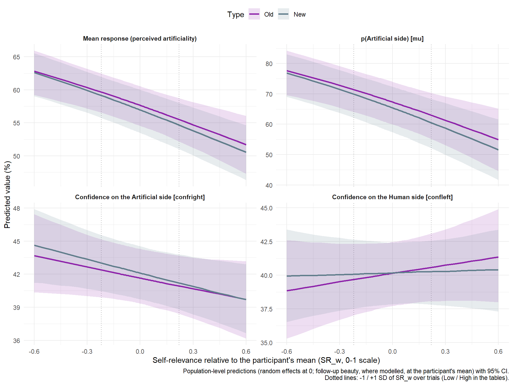{width=960}
:::
:::


```{.r .cell-code}
est_art <- estimates$ArtificialitySR
labs_art <- par_labels$PerceivedArtificiality
dat_art <- bind_rows(lapply(c("response", mediation_info$ArtificialitySR$dpars), function(p) {
  bind_rows(
    mutate(grid_slopes(est_art, par = p), Predictor = "Self-relevance", Model = "ArtificialitySR"),
    mutate(covariate_slopes(est_art, "Beauty2_w", par = p, pairs = TRUE), Predictor = "Follow-up beauty", Model = "ArtificialitySR"),
    mutate(grid_slopes(reference$ArtificialityBeauty, par = p), Predictor = "Follow-up beauty", Model = "ArtificialityBeauty (no SR)")
  ) |>
    mutate(Parameter = factor(labs_art[[p]], levels = labs_art))
})) |>
  mutate(Predictor = factor(Predictor, levels = predictor_labels)) |>
  format_effects() |>
  arrange(Predictor, Parameter, Model)

make_asis(
  make_tables(prep_contrasts(est_art$contrasts, "PerceivedArtificiality") |> filter(Parameter %in% c("response", "mu", "confright", "confleft")),
              c("Contrast", "Parameter", "Diff", "CI", "pd_fmt", "Effect"),
              "Perceived artificiality: New - Old items at average ratings (% of the slider / percentage points)"),
  make_tables(dat_art, c("Predictor", "Parameter", "Model", "Level", "Diff", "CI", "pd_fmt", "Effect"),
              "Change in perceived artificiality per +10% of self-relevance or follow-up beauty, for old (missed) and new (never labelled) items, and their difference")
)
```

```{=html}
<div id="abxwgrqblu" style="padding-left:0px;padding-right:0px;padding-top:10px;padding-bottom:10px;overflow-x:auto;overflow-y:auto;width:auto;height:auto;">
<style>#abxwgrqblu table {
  font-family: system-ui, 'Segoe UI', Roboto, Helvetica, Arial, sans-serif, 'Apple Color Emoji', 'Segoe UI Emoji', 'Segoe UI Symbol', 'Noto Color Emoji';
  -webkit-font-smoothing: antialiased;
  -moz-osx-font-smoothing: grayscale;
}

#abxwgrqblu thead, #abxwgrqblu tbody, #abxwgrqblu tfoot, #abxwgrqblu tr, #abxwgrqblu td, #abxwgrqblu th {
  border-style: none;
}

#abxwgrqblu p {
  margin: 0;
  padding: 0;
}

#abxwgrqblu .gt_table {
  display: table;
  border-collapse: collapse;
  line-height: normal;
  margin-left: auto;
  margin-right: auto;
  color: #333333;
  font-size: 13px;
  font-weight: normal;
  font-style: normal;
  background-color: #FFFFFF;
  width: auto;
  border-top-style: solid;
  border-top-width: 3px;
  border-top-color: #D5D5D5;
  border-right-style: solid;
  border-right-width: 3px;
  border-right-color: #D5D5D5;
  border-bottom-style: solid;
  border-bottom-width: 3px;
  border-bottom-color: #D5D5D5;
  border-left-style: solid;
  border-left-width: 3px;
  border-left-color: #D5D5D5;
}

#abxwgrqblu .gt_caption {
  padding-top: 4px;
  padding-bottom: 4px;
}

#abxwgrqblu .gt_title {
  color: #333333;
  font-size: 125%;
  font-weight: initial;
  padding-top: 4px;
  padding-bottom: 4px;
  padding-left: 5px;
  padding-right: 5px;
  border-bottom-color: #FFFFFF;
  border-bottom-width: 0;
}

#abxwgrqblu .gt_subtitle {
  color: #333333;
  font-size: 85%;
  font-weight: initial;
  padding-top: 3px;
  padding-bottom: 5px;
  padding-left: 5px;
  padding-right: 5px;
  border-top-color: #FFFFFF;
  border-top-width: 0;
}

#abxwgrqblu .gt_heading {
  background-color: #FFFFFF;
  text-align: left;
  border-bottom-color: #FFFFFF;
  border-left-style: none;
  border-left-width: 1px;
  border-left-color: #D3D3D3;
  border-right-style: none;
  border-right-width: 1px;
  border-right-color: #D3D3D3;
}

#abxwgrqblu .gt_bottom_border {
  border-bottom-style: solid;
  border-bottom-width: 2px;
  border-bottom-color: #D5D5D5;
}

#abxwgrqblu .gt_col_headings {
  border-top-style: solid;
  border-top-width: 2px;
  border-top-color: #D5D5D5;
  border-bottom-style: solid;
  border-bottom-width: 2px;
  border-bottom-color: #D5D5D5;
  border-left-style: none;
  border-left-width: 1px;
  border-left-color: #D3D3D3;
  border-right-style: none;
  border-right-width: 1px;
  border-right-color: #D3D3D3;
}

#abxwgrqblu .gt_col_heading {
  color: #FFFFFF;
  background-color: #000000;
  font-size: 100%;
  font-weight: normal;
  text-transform: inherit;
  border-left-style: none;
  border-left-width: 1px;
  border-left-color: #D3D3D3;
  border-right-style: none;
  border-right-width: 1px;
  border-right-color: #D3D3D3;
  vertical-align: bottom;
  padding-top: 5px;
  padding-bottom: 6px;
  padding-left: 5px;
  padding-right: 5px;
  overflow-x: hidden;
}

#abxwgrqblu .gt_column_spanner_outer {
  color: #FFFFFF;
  background-color: #000000;
  font-size: 100%;
  font-weight: normal;
  text-transform: inherit;
  padding-top: 0;
  padding-bottom: 0;
  padding-left: 4px;
  padding-right: 4px;
}

#abxwgrqblu .gt_column_spanner_outer:first-child {
  padding-left: 0;
}

#abxwgrqblu .gt_column_spanner_outer:last-child {
  padding-right: 0;
}

#abxwgrqblu .gt_column_spanner {
  border-bottom-style: solid;
  border-bottom-width: 2px;
  border-bottom-color: #D5D5D5;
  vertical-align: bottom;
  padding-top: 5px;
  padding-bottom: 5px;
  overflow-x: hidden;
  display: inline-block;
  width: 100%;
}

#abxwgrqblu .gt_spanner_row {
  border-bottom-style: hidden;
}

#abxwgrqblu .gt_group_heading {
  padding-top: 8px;
  padding-bottom: 8px;
  padding-left: 5px;
  padding-right: 5px;
  color: #333333;
  background-color: #FFFFFF;
  font-size: 100%;
  font-weight: initial;
  text-transform: inherit;
  border-top-style: solid;
  border-top-width: 2px;
  border-top-color: #D5D5D5;
  border-bottom-style: solid;
  border-bottom-width: 2px;
  border-bottom-color: #D5D5D5;
  border-left-style: none;
  border-left-width: 1px;
  border-left-color: #D3D3D3;
  border-right-style: none;
  border-right-width: 1px;
  border-right-color: #D3D3D3;
  vertical-align: middle;
  text-align: left;
}

#abxwgrqblu .gt_empty_group_heading {
  padding: 0.5px;
  color: #333333;
  background-color: #FFFFFF;
  font-size: 100%;
  font-weight: initial;
  border-top-style: solid;
  border-top-width: 2px;
  border-top-color: #D5D5D5;
  border-bottom-style: solid;
  border-bottom-width: 2px;
  border-bottom-color: #D5D5D5;
  vertical-align: middle;
}

#abxwgrqblu .gt_from_md > :first-child {
  margin-top: 0;
}

#abxwgrqblu .gt_from_md > :last-child {
  margin-bottom: 0;
}

#abxwgrqblu .gt_row {
  padding-top: 8px;
  padding-bottom: 8px;
  padding-left: 5px;
  padding-right: 5px;
  margin: 10px;
  border-top-style: solid;
  border-top-width: 1px;
  border-top-color: #D5D5D5;
  border-left-style: solid;
  border-left-width: 1px;
  border-left-color: #D5D5D5;
  border-right-style: solid;
  border-right-width: 1px;
  border-right-color: #D5D5D5;
  vertical-align: middle;
  overflow-x: hidden;
}

#abxwgrqblu .gt_stub {
  color: #333333;
  background-color: #FFFFFF;
  font-size: 100%;
  font-weight: initial;
  text-transform: inherit;
  border-right-style: solid;
  border-right-width: 2px;
  border-right-color: #5F5F5F;
  padding-left: 5px;
  padding-right: 5px;
}

#abxwgrqblu .gt_stub_row_group {
  color: #333333;
  background-color: #FFFFFF;
  font-size: 100%;
  font-weight: initial;
  text-transform: inherit;
  border-right-style: solid;
  border-right-width: 2px;
  border-right-color: #D3D3D3;
  padding-left: 5px;
  padding-right: 5px;
  vertical-align: top;
}

#abxwgrqblu .gt_row_group_first td {
  border-top-width: 2px;
}

#abxwgrqblu .gt_row_group_first th {
  border-top-width: 2px;
}

#abxwgrqblu .gt_summary_row {
  color: #333333;
  background-color: #D5D5D5;
  text-transform: inherit;
  padding-top: 8px;
  padding-bottom: 8px;
  padding-left: 5px;
  padding-right: 5px;
}

#abxwgrqblu .gt_first_summary_row {
  border-top-style: solid;
  border-top-color: #D5D5D5;
}

#abxwgrqblu .gt_first_summary_row.thick {
  border-top-width: 2px;
}

#abxwgrqblu .gt_last_summary_row {
  padding-top: 8px;
  padding-bottom: 8px;
  padding-left: 5px;
  padding-right: 5px;
  border-bottom-style: solid;
  border-bottom-width: 2px;
  border-bottom-color: #D5D5D5;
}

#abxwgrqblu .gt_grand_summary_row {
  color: #FFFFFF;
  background-color: #929292;
  text-transform: inherit;
  padding-top: 8px;
  padding-bottom: 8px;
  padding-left: 5px;
  padding-right: 5px;
}

#abxwgrqblu .gt_first_grand_summary_row {
  padding-top: 8px;
  padding-bottom: 8px;
  padding-left: 5px;
  padding-right: 5px;
  border-top-style: double;
  border-top-width: 6px;
  border-top-color: #D5D5D5;
}

#abxwgrqblu .gt_last_grand_summary_row_top {
  padding-top: 8px;
  padding-bottom: 8px;
  padding-left: 5px;
  padding-right: 5px;
  border-bottom-style: double;
  border-bottom-width: 6px;
  border-bottom-color: #D5D5D5;
}

#abxwgrqblu .gt_striped {
  background-color: #F4F4F4;
}

#abxwgrqblu .gt_table_body {
  border-top-style: solid;
  border-top-width: 2px;
  border-top-color: #D5D5D5;
  border-bottom-style: solid;
  border-bottom-width: 2px;
  border-bottom-color: #D5D5D5;
}

#abxwgrqblu .gt_footnotes {
  color: #333333;
  background-color: #FFFFFF;
  border-bottom-style: none;
  border-bottom-width: 2px;
  border-bottom-color: #D3D3D3;
  border-left-style: none;
  border-left-width: 2px;
  border-left-color: #D3D3D3;
  border-right-style: none;
  border-right-width: 2px;
  border-right-color: #D3D3D3;
}

#abxwgrqblu .gt_footnote {
  margin: 0px;
  font-size: 90%;
  padding-top: 4px;
  padding-bottom: 4px;
  padding-left: 5px;
  padding-right: 5px;
}

#abxwgrqblu .gt_sourcenotes {
  color: #333333;
  background-color: #FFFFFF;
  border-bottom-style: none;
  border-bottom-width: 2px;
  border-bottom-color: #D3D3D3;
  border-left-style: none;
  border-left-width: 2px;
  border-left-color: #D3D3D3;
  border-right-style: none;
  border-right-width: 2px;
  border-right-color: #D3D3D3;
}

#abxwgrqblu .gt_sourcenote {
  font-size: 90%;
  padding-top: 4px;
  padding-bottom: 4px;
  padding-left: 5px;
  padding-right: 5px;
}

#abxwgrqblu .gt_left {
  text-align: left;
}

#abxwgrqblu .gt_center {
  text-align: center;
}

#abxwgrqblu .gt_right {
  text-align: right;
  font-variant-numeric: tabular-nums;
}

#abxwgrqblu .gt_font_normal {
  font-weight: normal;
}

#abxwgrqblu .gt_font_bold {
  font-weight: bold;
}

#abxwgrqblu .gt_font_italic {
  font-style: italic;
}

#abxwgrqblu .gt_super {
  font-size: 65%;
}

#abxwgrqblu .gt_footnote_marks {
  font-size: 75%;
  vertical-align: 0.4em;
  position: initial;
}

#abxwgrqblu .gt_asterisk {
  font-size: 100%;
  vertical-align: 0;
}

#abxwgrqblu .gt_indent_1 {
  text-indent: 5px;
}

#abxwgrqblu .gt_indent_2 {
  text-indent: 10px;
}

#abxwgrqblu .gt_indent_3 {
  text-indent: 15px;
}

#abxwgrqblu .gt_indent_4 {
  text-indent: 20px;
}

#abxwgrqblu .gt_indent_5 {
  text-indent: 25px;
}

#abxwgrqblu .katex-display {
  display: inline-flex !important;
  margin-bottom: 0.75em !important;
}

#abxwgrqblu div.Reactable > div.rt-table > div.rt-thead > div.rt-tr.rt-tr-group-header > div.rt-th-group:after {
  height: 0px !important;
}
</style>
<table class="gt_table" data-quarto-disable-processing="false" data-quarto-bootstrap="false">
  <thead>
    <tr class="gt_heading">
      <td colspan="5" class="gt_heading gt_title gt_font_normal gt_bottom_border" style>Perceived artificiality: New - Old items at average ratings (% of the slider / percentage points)</td>
    </tr>
    
    <tr class="gt_col_headings">
      <th class="gt_col_heading gt_columns_bottom_border gt_left" rowspan="1" colspan="1" scope="col" id="Parameter">Parameter</th>
      <th class="gt_col_heading gt_columns_bottom_border gt_right" rowspan="1" colspan="1" scope="col" id="Diff">Diff</th>
      <th class="gt_col_heading gt_columns_bottom_border gt_left" rowspan="1" colspan="1" scope="col" id="CI">CI</th>
      <th class="gt_col_heading gt_columns_bottom_border gt_right" rowspan="1" colspan="1" scope="col" id="pd_fmt">pd_fmt</th>
      <th class="gt_col_heading gt_columns_bottom_border gt_left" rowspan="1" colspan="1" scope="col" id="Effect">Effect</th>
    </tr>
  </thead>
  <tbody class="gt_table_body">
    <tr class="gt_group_heading_row">
      <th colspan="5" class="gt_group_heading" scope="colgroup" id="New - Old">New - Old</th>
    </tr>
    <tr class="gt_row_group_first"><td headers="New - Old  Parameter" class="gt_row gt_left" style="color: #9E9E9E;">response</td>
<td headers="New - Old  Diff" class="gt_row gt_right" style="color: #9E9E9E;">-0.77</td>
<td headers="New - Old  CI" class="gt_row gt_left" style="color: #9E9E9E;">[-3.86, 2.51]</td>
<td headers="New - Old  pd_fmt" class="gt_row gt_right" style="color: #9E9E9E;">68.38%</td>
<td headers="New - Old  Effect" class="gt_row gt_left" style="color: #9E9E9E;">n.s.</td></tr>
    <tr><td headers="New - Old  Parameter" class="gt_row gt_left gt_striped" style="color: #9E9E9E;">mu</td>
<td headers="New - Old  Diff" class="gt_row gt_right gt_striped" style="color: #9E9E9E;">-2.07</td>
<td headers="New - Old  CI" class="gt_row gt_left gt_striped" style="color: #9E9E9E;">[-9.23, 5.58]</td>
<td headers="New - Old  pd_fmt" class="gt_row gt_right gt_striped" style="color: #9E9E9E;">70.85%</td>
<td headers="New - Old  Effect" class="gt_row gt_left gt_striped" style="color: #9E9E9E;">n.s.</td></tr>
    <tr><td headers="New - Old  Parameter" class="gt_row gt_left" style="color: #9E9E9E;">confright</td>
<td headers="New - Old  Diff" class="gt_row gt_right" style="color: #9E9E9E;">0.43</td>
<td headers="New - Old  CI" class="gt_row gt_left" style="color: #9E9E9E;">[-1.76, 2.38]</td>
<td headers="New - Old  pd_fmt" class="gt_row gt_right" style="color: #9E9E9E;">66.20%</td>
<td headers="New - Old  Effect" class="gt_row gt_left" style="color: #9E9E9E;">n.s.</td></tr>
    <tr><td headers="New - Old  Parameter" class="gt_row gt_left gt_striped" style="color: #9E9E9E;">confleft</td>
<td headers="New - Old  Diff" class="gt_row gt_right gt_striped" style="color: #9E9E9E;">0.03</td>
<td headers="New - Old  CI" class="gt_row gt_left gt_striped" style="color: #9E9E9E;">[-1.50, 1.62]</td>
<td headers="New - Old  pd_fmt" class="gt_row gt_right gt_striped" style="color: #9E9E9E;">51.82%</td>
<td headers="New - Old  Effect" class="gt_row gt_left gt_striped" style="color: #9E9E9E;">n.s.</td></tr>
  </tbody>
  
</table>
</div>
```


::: {.callout-note collapse="true" title="Perceived artificiality: New - Old items at average ratings (% of the slider / percentage points) (Markdown table, for text readers)"}

|Contrast  |Parameter |Diff  |CI            |pd_fmt |Effect |
|:---------|:---------|:-----|:-------------|:------|:------|
|New - Old |response  |-0.77 |[-3.86, 2.51] |68.38% |n.s.   |
|New - Old |mu        |-2.07 |[-9.23, 5.58] |70.85% |n.s.   |
|New - Old |confright |0.43  |[-1.76, 2.38] |66.20% |n.s.   |
|New - Old |confleft  |0.03  |[-1.50, 1.62] |51.82% |n.s.   |

:::

```{=html}
<div id="eikyikiaif" style="padding-left:0px;padding-right:0px;padding-top:10px;padding-bottom:10px;overflow-x:auto;overflow-y:auto;width:auto;height:auto;">
<style>#eikyikiaif table {
  font-family: system-ui, 'Segoe UI', Roboto, Helvetica, Arial, sans-serif, 'Apple Color Emoji', 'Segoe UI Emoji', 'Segoe UI Symbol', 'Noto Color Emoji';
  -webkit-font-smoothing: antialiased;
  -moz-osx-font-smoothing: grayscale;
}

#eikyikiaif thead, #eikyikiaif tbody, #eikyikiaif tfoot, #eikyikiaif tr, #eikyikiaif td, #eikyikiaif th {
  border-style: none;
}

#eikyikiaif p {
  margin: 0;
  padding: 0;
}

#eikyikiaif .gt_table {
  display: table;
  border-collapse: collapse;
  line-height: normal;
  margin-left: auto;
  margin-right: auto;
  color: #333333;
  font-size: 13px;
  font-weight: normal;
  font-style: normal;
  background-color: #FFFFFF;
  width: auto;
  border-top-style: solid;
  border-top-width: 3px;
  border-top-color: #D5D5D5;
  border-right-style: solid;
  border-right-width: 3px;
  border-right-color: #D5D5D5;
  border-bottom-style: solid;
  border-bottom-width: 3px;
  border-bottom-color: #D5D5D5;
  border-left-style: solid;
  border-left-width: 3px;
  border-left-color: #D5D5D5;
}

#eikyikiaif .gt_caption {
  padding-top: 4px;
  padding-bottom: 4px;
}

#eikyikiaif .gt_title {
  color: #333333;
  font-size: 125%;
  font-weight: initial;
  padding-top: 4px;
  padding-bottom: 4px;
  padding-left: 5px;
  padding-right: 5px;
  border-bottom-color: #FFFFFF;
  border-bottom-width: 0;
}

#eikyikiaif .gt_subtitle {
  color: #333333;
  font-size: 85%;
  font-weight: initial;
  padding-top: 3px;
  padding-bottom: 5px;
  padding-left: 5px;
  padding-right: 5px;
  border-top-color: #FFFFFF;
  border-top-width: 0;
}

#eikyikiaif .gt_heading {
  background-color: #FFFFFF;
  text-align: left;
  border-bottom-color: #FFFFFF;
  border-left-style: none;
  border-left-width: 1px;
  border-left-color: #D3D3D3;
  border-right-style: none;
  border-right-width: 1px;
  border-right-color: #D3D3D3;
}

#eikyikiaif .gt_bottom_border {
  border-bottom-style: solid;
  border-bottom-width: 2px;
  border-bottom-color: #D5D5D5;
}

#eikyikiaif .gt_col_headings {
  border-top-style: solid;
  border-top-width: 2px;
  border-top-color: #D5D5D5;
  border-bottom-style: solid;
  border-bottom-width: 2px;
  border-bottom-color: #D5D5D5;
  border-left-style: none;
  border-left-width: 1px;
  border-left-color: #D3D3D3;
  border-right-style: none;
  border-right-width: 1px;
  border-right-color: #D3D3D3;
}

#eikyikiaif .gt_col_heading {
  color: #FFFFFF;
  background-color: #000000;
  font-size: 100%;
  font-weight: normal;
  text-transform: inherit;
  border-left-style: none;
  border-left-width: 1px;
  border-left-color: #D3D3D3;
  border-right-style: none;
  border-right-width: 1px;
  border-right-color: #D3D3D3;
  vertical-align: bottom;
  padding-top: 5px;
  padding-bottom: 6px;
  padding-left: 5px;
  padding-right: 5px;
  overflow-x: hidden;
}

#eikyikiaif .gt_column_spanner_outer {
  color: #FFFFFF;
  background-color: #000000;
  font-size: 100%;
  font-weight: normal;
  text-transform: inherit;
  padding-top: 0;
  padding-bottom: 0;
  padding-left: 4px;
  padding-right: 4px;
}

#eikyikiaif .gt_column_spanner_outer:first-child {
  padding-left: 0;
}

#eikyikiaif .gt_column_spanner_outer:last-child {
  padding-right: 0;
}

#eikyikiaif .gt_column_spanner {
  border-bottom-style: solid;
  border-bottom-width: 2px;
  border-bottom-color: #D5D5D5;
  vertical-align: bottom;
  padding-top: 5px;
  padding-bottom: 5px;
  overflow-x: hidden;
  display: inline-block;
  width: 100%;
}

#eikyikiaif .gt_spanner_row {
  border-bottom-style: hidden;
}

#eikyikiaif .gt_group_heading {
  padding-top: 8px;
  padding-bottom: 8px;
  padding-left: 5px;
  padding-right: 5px;
  color: #333333;
  background-color: #FFFFFF;
  font-size: 100%;
  font-weight: initial;
  text-transform: inherit;
  border-top-style: solid;
  border-top-width: 2px;
  border-top-color: #D5D5D5;
  border-bottom-style: solid;
  border-bottom-width: 2px;
  border-bottom-color: #D5D5D5;
  border-left-style: none;
  border-left-width: 1px;
  border-left-color: #D3D3D3;
  border-right-style: none;
  border-right-width: 1px;
  border-right-color: #D3D3D3;
  vertical-align: middle;
  text-align: left;
}

#eikyikiaif .gt_empty_group_heading {
  padding: 0.5px;
  color: #333333;
  background-color: #FFFFFF;
  font-size: 100%;
  font-weight: initial;
  border-top-style: solid;
  border-top-width: 2px;
  border-top-color: #D5D5D5;
  border-bottom-style: solid;
  border-bottom-width: 2px;
  border-bottom-color: #D5D5D5;
  vertical-align: middle;
}

#eikyikiaif .gt_from_md > :first-child {
  margin-top: 0;
}

#eikyikiaif .gt_from_md > :last-child {
  margin-bottom: 0;
}

#eikyikiaif .gt_row {
  padding-top: 8px;
  padding-bottom: 8px;
  padding-left: 5px;
  padding-right: 5px;
  margin: 10px;
  border-top-style: solid;
  border-top-width: 1px;
  border-top-color: #D5D5D5;
  border-left-style: solid;
  border-left-width: 1px;
  border-left-color: #D5D5D5;
  border-right-style: solid;
  border-right-width: 1px;
  border-right-color: #D5D5D5;
  vertical-align: middle;
  overflow-x: hidden;
}

#eikyikiaif .gt_stub {
  color: #333333;
  background-color: #FFFFFF;
  font-size: 100%;
  font-weight: initial;
  text-transform: inherit;
  border-right-style: solid;
  border-right-width: 2px;
  border-right-color: #5F5F5F;
  padding-left: 5px;
  padding-right: 5px;
}

#eikyikiaif .gt_stub_row_group {
  color: #333333;
  background-color: #FFFFFF;
  font-size: 100%;
  font-weight: initial;
  text-transform: inherit;
  border-right-style: solid;
  border-right-width: 2px;
  border-right-color: #D3D3D3;
  padding-left: 5px;
  padding-right: 5px;
  vertical-align: top;
}

#eikyikiaif .gt_row_group_first td {
  border-top-width: 2px;
}

#eikyikiaif .gt_row_group_first th {
  border-top-width: 2px;
}

#eikyikiaif .gt_summary_row {
  color: #333333;
  background-color: #D5D5D5;
  text-transform: inherit;
  padding-top: 8px;
  padding-bottom: 8px;
  padding-left: 5px;
  padding-right: 5px;
}

#eikyikiaif .gt_first_summary_row {
  border-top-style: solid;
  border-top-color: #D5D5D5;
}

#eikyikiaif .gt_first_summary_row.thick {
  border-top-width: 2px;
}

#eikyikiaif .gt_last_summary_row {
  padding-top: 8px;
  padding-bottom: 8px;
  padding-left: 5px;
  padding-right: 5px;
  border-bottom-style: solid;
  border-bottom-width: 2px;
  border-bottom-color: #D5D5D5;
}

#eikyikiaif .gt_grand_summary_row {
  color: #FFFFFF;
  background-color: #929292;
  text-transform: inherit;
  padding-top: 8px;
  padding-bottom: 8px;
  padding-left: 5px;
  padding-right: 5px;
}

#eikyikiaif .gt_first_grand_summary_row {
  padding-top: 8px;
  padding-bottom: 8px;
  padding-left: 5px;
  padding-right: 5px;
  border-top-style: double;
  border-top-width: 6px;
  border-top-color: #D5D5D5;
}

#eikyikiaif .gt_last_grand_summary_row_top {
  padding-top: 8px;
  padding-bottom: 8px;
  padding-left: 5px;
  padding-right: 5px;
  border-bottom-style: double;
  border-bottom-width: 6px;
  border-bottom-color: #D5D5D5;
}

#eikyikiaif .gt_striped {
  background-color: #F4F4F4;
}

#eikyikiaif .gt_table_body {
  border-top-style: solid;
  border-top-width: 2px;
  border-top-color: #D5D5D5;
  border-bottom-style: solid;
  border-bottom-width: 2px;
  border-bottom-color: #D5D5D5;
}

#eikyikiaif .gt_footnotes {
  color: #333333;
  background-color: #FFFFFF;
  border-bottom-style: none;
  border-bottom-width: 2px;
  border-bottom-color: #D3D3D3;
  border-left-style: none;
  border-left-width: 2px;
  border-left-color: #D3D3D3;
  border-right-style: none;
  border-right-width: 2px;
  border-right-color: #D3D3D3;
}

#eikyikiaif .gt_footnote {
  margin: 0px;
  font-size: 90%;
  padding-top: 4px;
  padding-bottom: 4px;
  padding-left: 5px;
  padding-right: 5px;
}

#eikyikiaif .gt_sourcenotes {
  color: #333333;
  background-color: #FFFFFF;
  border-bottom-style: none;
  border-bottom-width: 2px;
  border-bottom-color: #D3D3D3;
  border-left-style: none;
  border-left-width: 2px;
  border-left-color: #D3D3D3;
  border-right-style: none;
  border-right-width: 2px;
  border-right-color: #D3D3D3;
}

#eikyikiaif .gt_sourcenote {
  font-size: 90%;
  padding-top: 4px;
  padding-bottom: 4px;
  padding-left: 5px;
  padding-right: 5px;
}

#eikyikiaif .gt_left {
  text-align: left;
}

#eikyikiaif .gt_center {
  text-align: center;
}

#eikyikiaif .gt_right {
  text-align: right;
  font-variant-numeric: tabular-nums;
}

#eikyikiaif .gt_font_normal {
  font-weight: normal;
}

#eikyikiaif .gt_font_bold {
  font-weight: bold;
}

#eikyikiaif .gt_font_italic {
  font-style: italic;
}

#eikyikiaif .gt_super {
  font-size: 65%;
}

#eikyikiaif .gt_footnote_marks {
  font-size: 75%;
  vertical-align: 0.4em;
  position: initial;
}

#eikyikiaif .gt_asterisk {
  font-size: 100%;
  vertical-align: 0;
}

#eikyikiaif .gt_indent_1 {
  text-indent: 5px;
}

#eikyikiaif .gt_indent_2 {
  text-indent: 10px;
}

#eikyikiaif .gt_indent_3 {
  text-indent: 15px;
}

#eikyikiaif .gt_indent_4 {
  text-indent: 20px;
}

#eikyikiaif .gt_indent_5 {
  text-indent: 25px;
}

#eikyikiaif .katex-display {
  display: inline-flex !important;
  margin-bottom: 0.75em !important;
}

#eikyikiaif div.Reactable > div.rt-table > div.rt-thead > div.rt-tr.rt-tr-group-header > div.rt-th-group:after {
  height: 0px !important;
}
</style>
<table class="gt_table" data-quarto-disable-processing="false" data-quarto-bootstrap="false">
  <thead>
    <tr class="gt_heading">
      <td colspan="8" class="gt_heading gt_title gt_font_normal gt_bottom_border" style>Change in perceived artificiality per +10% of self-relevance or follow-up beauty, for old (missed) and new (never labelled) items, and their difference</td>
    </tr>
    
    <tr class="gt_col_headings">
      <th class="gt_col_heading gt_columns_bottom_border gt_center" rowspan="1" colspan="1" scope="col" id="Predictor">Predictor</th>
      <th class="gt_col_heading gt_columns_bottom_border gt_center" rowspan="1" colspan="1" scope="col" id="Parameter">Parameter</th>
      <th class="gt_col_heading gt_columns_bottom_border gt_left" rowspan="1" colspan="1" scope="col" id="Model">Model</th>
      <th class="gt_col_heading gt_columns_bottom_border gt_left" rowspan="1" colspan="1" scope="col" id="Level">Level</th>
      <th class="gt_col_heading gt_columns_bottom_border gt_right" rowspan="1" colspan="1" scope="col" id="Diff">Diff</th>
      <th class="gt_col_heading gt_columns_bottom_border gt_left" rowspan="1" colspan="1" scope="col" id="CI">CI</th>
      <th class="gt_col_heading gt_columns_bottom_border gt_right" rowspan="1" colspan="1" scope="col" id="pd_fmt">pd_fmt</th>
      <th class="gt_col_heading gt_columns_bottom_border gt_left" rowspan="1" colspan="1" scope="col" id="Effect">Effect</th>
    </tr>
  </thead>
  <tbody class="gt_table_body">
    <tr><td headers="Predictor" class="gt_row gt_center" style="background-color: #FFEBEE;">Self-relevance</td>
<td headers="Parameter" class="gt_row gt_center" style="background-color: #FFEBEE;">Mean response (perceived artificiality)</td>
<td headers="Model" class="gt_row gt_left" style="background-color: #FFEBEE;">ArtificialitySR</td>
<td headers="Level" class="gt_row gt_left" style="background-color: #FFEBEE;">Old</td>
<td headers="Diff" class="gt_row gt_right" style="background-color: #FFEBEE;">-0.93</td>
<td headers="CI" class="gt_row gt_left" style="background-color: #FFEBEE;">[-1.38, -0.51]</td>
<td headers="pd_fmt" class="gt_row gt_right" style="background-color: #FFEBEE;">100%</td>
<td headers="Effect" class="gt_row gt_left" style="background-color: #FFEBEE;">Negative</td></tr>
    <tr><td headers="Predictor" class="gt_row gt_center gt_striped" style="background-color: #FFEBEE;">Self-relevance</td>
<td headers="Parameter" class="gt_row gt_center gt_striped" style="background-color: #FFEBEE;">Mean response (perceived artificiality)</td>
<td headers="Model" class="gt_row gt_left gt_striped" style="background-color: #FFEBEE;">ArtificialitySR</td>
<td headers="Level" class="gt_row gt_left gt_striped" style="background-color: #FFEBEE;">New</td>
<td headers="Diff" class="gt_row gt_right gt_striped" style="background-color: #FFEBEE;">-1.02</td>
<td headers="CI" class="gt_row gt_left gt_striped" style="background-color: #FFEBEE;">[-1.43, -0.65]</td>
<td headers="pd_fmt" class="gt_row gt_right gt_striped" style="background-color: #FFEBEE;">100%</td>
<td headers="Effect" class="gt_row gt_left gt_striped" style="background-color: #FFEBEE;">Negative</td></tr>
    <tr><td headers="Predictor" class="gt_row gt_center" style="color: #9E9E9E;">Self-relevance</td>
<td headers="Parameter" class="gt_row gt_center" style="color: #9E9E9E;">Mean response (perceived artificiality)</td>
<td headers="Model" class="gt_row gt_left" style="color: #9E9E9E;">ArtificialitySR</td>
<td headers="Level" class="gt_row gt_left" style="color: #9E9E9E;">New - Old</td>
<td headers="Diff" class="gt_row gt_right" style="color: #9E9E9E;">-0.09</td>
<td headers="CI" class="gt_row gt_left" style="color: #9E9E9E;">[-0.58, 0.45]</td>
<td headers="pd_fmt" class="gt_row gt_right" style="color: #9E9E9E;">61.92%</td>
<td headers="Effect" class="gt_row gt_left" style="color: #9E9E9E;">n.s.</td></tr>
    <tr><td headers="Predictor" class="gt_row gt_center gt_striped" style="background-color: #FFEBEE;">Self-relevance</td>
<td headers="Parameter" class="gt_row gt_center gt_striped" style="background-color: #FFEBEE;">p(Artificial side) [mu]</td>
<td headers="Model" class="gt_row gt_left gt_striped" style="background-color: #FFEBEE;">ArtificialitySR</td>
<td headers="Level" class="gt_row gt_left gt_striped" style="background-color: #FFEBEE;">Old</td>
<td headers="Diff" class="gt_row gt_right gt_striped" style="background-color: #FFEBEE;">-1.90</td>
<td headers="CI" class="gt_row gt_left gt_striped" style="background-color: #FFEBEE;">[-2.91, -0.94]</td>
<td headers="pd_fmt" class="gt_row gt_right gt_striped" style="background-color: #FFEBEE;">100%</td>
<td headers="Effect" class="gt_row gt_left gt_striped" style="background-color: #FFEBEE;">Negative</td></tr>
    <tr><td headers="Predictor" class="gt_row gt_center" style="background-color: #FFEBEE;">Self-relevance</td>
<td headers="Parameter" class="gt_row gt_center" style="background-color: #FFEBEE;">p(Artificial side) [mu]</td>
<td headers="Model" class="gt_row gt_left" style="background-color: #FFEBEE;">ArtificialitySR</td>
<td headers="Level" class="gt_row gt_left" style="background-color: #FFEBEE;">New</td>
<td headers="Diff" class="gt_row gt_right" style="background-color: #FFEBEE;">-2.13</td>
<td headers="CI" class="gt_row gt_left" style="background-color: #FFEBEE;">[-3.08, -1.29]</td>
<td headers="pd_fmt" class="gt_row gt_right" style="background-color: #FFEBEE;">100%</td>
<td headers="Effect" class="gt_row gt_left" style="background-color: #FFEBEE;">Negative</td></tr>
    <tr><td headers="Predictor" class="gt_row gt_center gt_striped" style="color: #9E9E9E;">Self-relevance</td>
<td headers="Parameter" class="gt_row gt_center gt_striped" style="color: #9E9E9E;">p(Artificial side) [mu]</td>
<td headers="Model" class="gt_row gt_left gt_striped" style="color: #9E9E9E;">ArtificialitySR</td>
<td headers="Level" class="gt_row gt_left gt_striped" style="color: #9E9E9E;">New - Old</td>
<td headers="Diff" class="gt_row gt_right gt_striped" style="color: #9E9E9E;">-0.22</td>
<td headers="CI" class="gt_row gt_left gt_striped" style="color: #9E9E9E;">[-1.38, 0.95]</td>
<td headers="pd_fmt" class="gt_row gt_right gt_striped" style="color: #9E9E9E;">64.78%</td>
<td headers="Effect" class="gt_row gt_left gt_striped" style="color: #9E9E9E;">n.s.</td></tr>
    <tr><td headers="Predictor" class="gt_row gt_center" style="color: #9E9E9E;">Self-relevance</td>
<td headers="Parameter" class="gt_row gt_center" style="color: #9E9E9E;">Confidence on the Artificial side [confright]</td>
<td headers="Model" class="gt_row gt_left" style="color: #9E9E9E;">ArtificialitySR</td>
<td headers="Level" class="gt_row gt_left" style="color: #9E9E9E;">Old</td>
<td headers="Diff" class="gt_row gt_right" style="color: #9E9E9E;">-0.34</td>
<td headers="CI" class="gt_row gt_left" style="color: #9E9E9E;">[-0.75, 0.09]</td>
<td headers="pd_fmt" class="gt_row gt_right" style="color: #9E9E9E;">94.58%</td>
<td headers="Effect" class="gt_row gt_left" style="color: #9E9E9E;">n.s.</td></tr>
    <tr><td headers="Predictor" class="gt_row gt_center gt_striped" style="background-color: #FFEBEE;">Self-relevance</td>
<td headers="Parameter" class="gt_row gt_center gt_striped" style="background-color: #FFEBEE;">Confidence on the Artificial side [confright]</td>
<td headers="Model" class="gt_row gt_left gt_striped" style="background-color: #FFEBEE;">ArtificialitySR</td>
<td headers="Level" class="gt_row gt_left gt_striped" style="background-color: #FFEBEE;">New</td>
<td headers="Diff" class="gt_row gt_right gt_striped" style="background-color: #FFEBEE;">-0.41</td>
<td headers="CI" class="gt_row gt_left gt_striped" style="background-color: #FFEBEE;">[-0.77, -0.05]</td>
<td headers="pd_fmt" class="gt_row gt_right gt_striped" style="background-color: #FFEBEE;">98.50%</td>
<td headers="Effect" class="gt_row gt_left gt_striped" style="background-color: #FFEBEE;">Negative</td></tr>
    <tr><td headers="Predictor" class="gt_row gt_center" style="color: #9E9E9E;">Self-relevance</td>
<td headers="Parameter" class="gt_row gt_center" style="color: #9E9E9E;">Confidence on the Artificial side [confright]</td>
<td headers="Model" class="gt_row gt_left" style="color: #9E9E9E;">ArtificialitySR</td>
<td headers="Level" class="gt_row gt_left" style="color: #9E9E9E;">New - Old</td>
<td headers="Diff" class="gt_row gt_right" style="color: #9E9E9E;">-0.07</td>
<td headers="CI" class="gt_row gt_left" style="color: #9E9E9E;">[-0.59, 0.42]</td>
<td headers="pd_fmt" class="gt_row gt_right" style="color: #9E9E9E;">61.98%</td>
<td headers="Effect" class="gt_row gt_left" style="color: #9E9E9E;">n.s.</td></tr>
    <tr><td headers="Predictor" class="gt_row gt_center gt_striped" style="color: #9E9E9E;">Self-relevance</td>
<td headers="Parameter" class="gt_row gt_center gt_striped" style="color: #9E9E9E;">Confidence on the Human side [confleft]</td>
<td headers="Model" class="gt_row gt_left gt_striped" style="color: #9E9E9E;">ArtificialitySR</td>
<td headers="Level" class="gt_row gt_left gt_striped" style="color: #9E9E9E;">Old</td>
<td headers="Diff" class="gt_row gt_right gt_striped" style="color: #9E9E9E;">0.21</td>
<td headers="CI" class="gt_row gt_left gt_striped" style="color: #9E9E9E;">[-0.23, 0.62]</td>
<td headers="pd_fmt" class="gt_row gt_right gt_striped" style="color: #9E9E9E;">82.80%</td>
<td headers="Effect" class="gt_row gt_left gt_striped" style="color: #9E9E9E;">n.s.</td></tr>
    <tr><td headers="Predictor" class="gt_row gt_center" style="color: #9E9E9E;">Self-relevance</td>
<td headers="Parameter" class="gt_row gt_center" style="color: #9E9E9E;">Confidence on the Human side [confleft]</td>
<td headers="Model" class="gt_row gt_left" style="color: #9E9E9E;">ArtificialitySR</td>
<td headers="Level" class="gt_row gt_left" style="color: #9E9E9E;">New</td>
<td headers="Diff" class="gt_row gt_right" style="color: #9E9E9E;">0.03</td>
<td headers="CI" class="gt_row gt_left" style="color: #9E9E9E;">[-0.37, 0.39]</td>
<td headers="pd_fmt" class="gt_row gt_right" style="color: #9E9E9E;">56.75%</td>
<td headers="Effect" class="gt_row gt_left" style="color: #9E9E9E;">n.s.</td></tr>
    <tr><td headers="Predictor" class="gt_row gt_center gt_striped" style="color: #9E9E9E;">Self-relevance</td>
<td headers="Parameter" class="gt_row gt_center gt_striped" style="color: #9E9E9E;">Confidence on the Human side [confleft]</td>
<td headers="Model" class="gt_row gt_left gt_striped" style="color: #9E9E9E;">ArtificialitySR</td>
<td headers="Level" class="gt_row gt_left gt_striped" style="color: #9E9E9E;">New - Old</td>
<td headers="Diff" class="gt_row gt_right gt_striped" style="color: #9E9E9E;">-0.18</td>
<td headers="CI" class="gt_row gt_left gt_striped" style="color: #9E9E9E;">[-0.68, 0.40]</td>
<td headers="pd_fmt" class="gt_row gt_right gt_striped" style="color: #9E9E9E;">73.50%</td>
<td headers="Effect" class="gt_row gt_left gt_striped" style="color: #9E9E9E;">n.s.</td></tr>
    <tr><td headers="Predictor" class="gt_row gt_center" style="background-color: #FFEBEE;">Follow-up beauty</td>
<td headers="Parameter" class="gt_row gt_center" style="background-color: #FFEBEE;">Mean response (perceived artificiality)</td>
<td headers="Model" class="gt_row gt_left" style="background-color: #FFEBEE;">ArtificialityBeauty (no SR)</td>
<td headers="Level" class="gt_row gt_left" style="background-color: #FFEBEE;">Old</td>
<td headers="Diff" class="gt_row gt_right" style="background-color: #FFEBEE;">-2.17</td>
<td headers="CI" class="gt_row gt_left" style="background-color: #FFEBEE;">[-2.70, -1.64]</td>
<td headers="pd_fmt" class="gt_row gt_right" style="background-color: #FFEBEE;">100%</td>
<td headers="Effect" class="gt_row gt_left" style="background-color: #FFEBEE;">Negative</td></tr>
    <tr><td headers="Predictor" class="gt_row gt_center gt_striped" style="background-color: #FFEBEE;">Follow-up beauty</td>
<td headers="Parameter" class="gt_row gt_center gt_striped" style="background-color: #FFEBEE;">Mean response (perceived artificiality)</td>
<td headers="Model" class="gt_row gt_left gt_striped" style="background-color: #FFEBEE;">ArtificialityBeauty (no SR)</td>
<td headers="Level" class="gt_row gt_left gt_striped" style="background-color: #FFEBEE;">New</td>
<td headers="Diff" class="gt_row gt_right gt_striped" style="background-color: #FFEBEE;">-2.20</td>
<td headers="CI" class="gt_row gt_left gt_striped" style="background-color: #FFEBEE;">[-2.72, -1.71]</td>
<td headers="pd_fmt" class="gt_row gt_right gt_striped" style="background-color: #FFEBEE;">100%</td>
<td headers="Effect" class="gt_row gt_left gt_striped" style="background-color: #FFEBEE;">Negative</td></tr>
    <tr><td headers="Predictor" class="gt_row gt_center" style="color: #9E9E9E;">Follow-up beauty</td>
<td headers="Parameter" class="gt_row gt_center" style="color: #9E9E9E;">Mean response (perceived artificiality)</td>
<td headers="Model" class="gt_row gt_left" style="color: #9E9E9E;">ArtificialityBeauty (no SR)</td>
<td headers="Level" class="gt_row gt_left" style="color: #9E9E9E;">New - Old</td>
<td headers="Diff" class="gt_row gt_right" style="color: #9E9E9E;">-0.03</td>
<td headers="CI" class="gt_row gt_left" style="color: #9E9E9E;">[-0.55, 0.46]</td>
<td headers="pd_fmt" class="gt_row gt_right" style="color: #9E9E9E;">53.90%</td>
<td headers="Effect" class="gt_row gt_left" style="color: #9E9E9E;">n.s.</td></tr>
    <tr><td headers="Predictor" class="gt_row gt_center gt_striped" style="background-color: #FFEBEE;">Follow-up beauty</td>
<td headers="Parameter" class="gt_row gt_center gt_striped" style="background-color: #FFEBEE;">Mean response (perceived artificiality)</td>
<td headers="Model" class="gt_row gt_left gt_striped" style="background-color: #FFEBEE;">ArtificialitySR</td>
<td headers="Level" class="gt_row gt_left gt_striped" style="background-color: #FFEBEE;">Old</td>
<td headers="Diff" class="gt_row gt_right gt_striped" style="background-color: #FFEBEE;">-1.70</td>
<td headers="CI" class="gt_row gt_left gt_striped" style="background-color: #FFEBEE;">[-2.23, -1.15]</td>
<td headers="pd_fmt" class="gt_row gt_right gt_striped" style="background-color: #FFEBEE;">100%</td>
<td headers="Effect" class="gt_row gt_left gt_striped" style="background-color: #FFEBEE;">Negative</td></tr>
    <tr><td headers="Predictor" class="gt_row gt_center" style="background-color: #FFEBEE;">Follow-up beauty</td>
<td headers="Parameter" class="gt_row gt_center" style="background-color: #FFEBEE;">Mean response (perceived artificiality)</td>
<td headers="Model" class="gt_row gt_left" style="background-color: #FFEBEE;">ArtificialitySR</td>
<td headers="Level" class="gt_row gt_left" style="background-color: #FFEBEE;">New</td>
<td headers="Diff" class="gt_row gt_right" style="background-color: #FFEBEE;">-1.69</td>
<td headers="CI" class="gt_row gt_left" style="background-color: #FFEBEE;">[-2.21, -1.19]</td>
<td headers="pd_fmt" class="gt_row gt_right" style="background-color: #FFEBEE;">100%</td>
<td headers="Effect" class="gt_row gt_left" style="background-color: #FFEBEE;">Negative</td></tr>
    <tr><td headers="Predictor" class="gt_row gt_center gt_striped" style="color: #9E9E9E;">Follow-up beauty</td>
<td headers="Parameter" class="gt_row gt_center gt_striped" style="color: #9E9E9E;">Mean response (perceived artificiality)</td>
<td headers="Model" class="gt_row gt_left gt_striped" style="color: #9E9E9E;">ArtificialitySR</td>
<td headers="Level" class="gt_row gt_left gt_striped" style="color: #9E9E9E;">New - Old</td>
<td headers="Diff" class="gt_row gt_right gt_striped" style="color: #9E9E9E;">0.02</td>
<td headers="CI" class="gt_row gt_left gt_striped" style="color: #9E9E9E;">[-0.53, 0.57]</td>
<td headers="pd_fmt" class="gt_row gt_right gt_striped" style="color: #9E9E9E;">53.00%</td>
<td headers="Effect" class="gt_row gt_left gt_striped" style="color: #9E9E9E;">n.s.</td></tr>
    <tr><td headers="Predictor" class="gt_row gt_center" style="background-color: #FFEBEE;">Follow-up beauty</td>
<td headers="Parameter" class="gt_row gt_center" style="background-color: #FFEBEE;">p(Artificial side) [mu]</td>
<td headers="Model" class="gt_row gt_left" style="background-color: #FFEBEE;">ArtificialityBeauty (no SR)</td>
<td headers="Level" class="gt_row gt_left" style="background-color: #FFEBEE;">Old</td>
<td headers="Diff" class="gt_row gt_right" style="background-color: #FFEBEE;">-3.94</td>
<td headers="CI" class="gt_row gt_left" style="background-color: #FFEBEE;">[-5.21, -2.76]</td>
<td headers="pd_fmt" class="gt_row gt_right" style="background-color: #FFEBEE;">100%</td>
<td headers="Effect" class="gt_row gt_left" style="background-color: #FFEBEE;">Negative</td></tr>
    <tr><td headers="Predictor" class="gt_row gt_center gt_striped" style="background-color: #FFEBEE;">Follow-up beauty</td>
<td headers="Parameter" class="gt_row gt_center gt_striped" style="background-color: #FFEBEE;">p(Artificial side) [mu]</td>
<td headers="Model" class="gt_row gt_left gt_striped" style="background-color: #FFEBEE;">ArtificialityBeauty (no SR)</td>
<td headers="Level" class="gt_row gt_left gt_striped" style="background-color: #FFEBEE;">New</td>
<td headers="Diff" class="gt_row gt_right gt_striped" style="background-color: #FFEBEE;">-4.02</td>
<td headers="CI" class="gt_row gt_left gt_striped" style="background-color: #FFEBEE;">[-5.14, -2.84]</td>
<td headers="pd_fmt" class="gt_row gt_right gt_striped" style="background-color: #FFEBEE;">100%</td>
<td headers="Effect" class="gt_row gt_left gt_striped" style="background-color: #FFEBEE;">Negative</td></tr>
    <tr><td headers="Predictor" class="gt_row gt_center" style="color: #9E9E9E;">Follow-up beauty</td>
<td headers="Parameter" class="gt_row gt_center" style="color: #9E9E9E;">p(Artificial side) [mu]</td>
<td headers="Model" class="gt_row gt_left" style="color: #9E9E9E;">ArtificialityBeauty (no SR)</td>
<td headers="Level" class="gt_row gt_left" style="color: #9E9E9E;">New - Old</td>
<td headers="Diff" class="gt_row gt_right" style="color: #9E9E9E;">-0.07</td>
<td headers="CI" class="gt_row gt_left" style="color: #9E9E9E;">[-1.20, 1.15]</td>
<td headers="pd_fmt" class="gt_row gt_right" style="color: #9E9E9E;">55.00%</td>
<td headers="Effect" class="gt_row gt_left" style="color: #9E9E9E;">n.s.</td></tr>
    <tr><td headers="Predictor" class="gt_row gt_center gt_striped" style="background-color: #FFEBEE;">Follow-up beauty</td>
<td headers="Parameter" class="gt_row gt_center gt_striped" style="background-color: #FFEBEE;">p(Artificial side) [mu]</td>
<td headers="Model" class="gt_row gt_left gt_striped" style="background-color: #FFEBEE;">ArtificialitySR</td>
<td headers="Level" class="gt_row gt_left gt_striped" style="background-color: #FFEBEE;">Old</td>
<td headers="Diff" class="gt_row gt_right gt_striped" style="background-color: #FFEBEE;">-2.98</td>
<td headers="CI" class="gt_row gt_left gt_striped" style="background-color: #FFEBEE;">[-4.22, -1.74]</td>
<td headers="pd_fmt" class="gt_row gt_right gt_striped" style="background-color: #FFEBEE;">100%</td>
<td headers="Effect" class="gt_row gt_left gt_striped" style="background-color: #FFEBEE;">Negative</td></tr>
    <tr><td headers="Predictor" class="gt_row gt_center" style="background-color: #FFEBEE;">Follow-up beauty</td>
<td headers="Parameter" class="gt_row gt_center" style="background-color: #FFEBEE;">p(Artificial side) [mu]</td>
<td headers="Model" class="gt_row gt_left" style="background-color: #FFEBEE;">ArtificialitySR</td>
<td headers="Level" class="gt_row gt_left" style="background-color: #FFEBEE;">New</td>
<td headers="Diff" class="gt_row gt_right" style="background-color: #FFEBEE;">-2.93</td>
<td headers="CI" class="gt_row gt_left" style="background-color: #FFEBEE;">[-4.08, -1.79]</td>
<td headers="pd_fmt" class="gt_row gt_right" style="background-color: #FFEBEE;">100%</td>
<td headers="Effect" class="gt_row gt_left" style="background-color: #FFEBEE;">Negative</td></tr>
    <tr><td headers="Predictor" class="gt_row gt_center gt_striped" style="color: #9E9E9E;">Follow-up beauty</td>
<td headers="Parameter" class="gt_row gt_center gt_striped" style="color: #9E9E9E;">p(Artificial side) [mu]</td>
<td headers="Model" class="gt_row gt_left gt_striped" style="color: #9E9E9E;">ArtificialitySR</td>
<td headers="Level" class="gt_row gt_left gt_striped" style="color: #9E9E9E;">New - Old</td>
<td headers="Diff" class="gt_row gt_right gt_striped" style="color: #9E9E9E;">0.05</td>
<td headers="CI" class="gt_row gt_left gt_striped" style="color: #9E9E9E;">[-1.15, 1.31]</td>
<td headers="pd_fmt" class="gt_row gt_right gt_striped" style="color: #9E9E9E;">53.67%</td>
<td headers="Effect" class="gt_row gt_left gt_striped" style="color: #9E9E9E;">n.s.</td></tr>
    <tr><td headers="Predictor" class="gt_row gt_center" style="background-color: #FFEBEE;">Follow-up beauty</td>
<td headers="Parameter" class="gt_row gt_center" style="background-color: #FFEBEE;">Confidence on the Artificial side [confright]</td>
<td headers="Model" class="gt_row gt_left" style="background-color: #FFEBEE;">ArtificialityBeauty (no SR)</td>
<td headers="Level" class="gt_row gt_left" style="background-color: #FFEBEE;">Old</td>
<td headers="Diff" class="gt_row gt_right" style="background-color: #FFEBEE;">-1.31</td>
<td headers="CI" class="gt_row gt_left" style="background-color: #FFEBEE;">[-1.74, -0.89]</td>
<td headers="pd_fmt" class="gt_row gt_right" style="background-color: #FFEBEE;">100%</td>
<td headers="Effect" class="gt_row gt_left" style="background-color: #FFEBEE;">Negative</td></tr>
    <tr><td headers="Predictor" class="gt_row gt_center gt_striped" style="background-color: #FFEBEE;">Follow-up beauty</td>
<td headers="Parameter" class="gt_row gt_center gt_striped" style="background-color: #FFEBEE;">Confidence on the Artificial side [confright]</td>
<td headers="Model" class="gt_row gt_left gt_striped" style="background-color: #FFEBEE;">ArtificialityBeauty (no SR)</td>
<td headers="Level" class="gt_row gt_left gt_striped" style="background-color: #FFEBEE;">New</td>
<td headers="Diff" class="gt_row gt_right gt_striped" style="background-color: #FFEBEE;">-1.27</td>
<td headers="CI" class="gt_row gt_left gt_striped" style="background-color: #FFEBEE;">[-1.67, -0.88]</td>
<td headers="pd_fmt" class="gt_row gt_right gt_striped" style="background-color: #FFEBEE;">100%</td>
<td headers="Effect" class="gt_row gt_left gt_striped" style="background-color: #FFEBEE;">Negative</td></tr>
    <tr><td headers="Predictor" class="gt_row gt_center" style="color: #9E9E9E;">Follow-up beauty</td>
<td headers="Parameter" class="gt_row gt_center" style="color: #9E9E9E;">Confidence on the Artificial side [confright]</td>
<td headers="Model" class="gt_row gt_left" style="color: #9E9E9E;">ArtificialityBeauty (no SR)</td>
<td headers="Level" class="gt_row gt_left" style="color: #9E9E9E;">New - Old</td>
<td headers="Diff" class="gt_row gt_right" style="color: #9E9E9E;">0.04</td>
<td headers="CI" class="gt_row gt_left" style="color: #9E9E9E;">[-0.44, 0.52]</td>
<td headers="pd_fmt" class="gt_row gt_right" style="color: #9E9E9E;">57.00%</td>
<td headers="Effect" class="gt_row gt_left" style="color: #9E9E9E;">n.s.</td></tr>
    <tr><td headers="Predictor" class="gt_row gt_center gt_striped" style="background-color: #FFEBEE;">Follow-up beauty</td>
<td headers="Parameter" class="gt_row gt_center gt_striped" style="background-color: #FFEBEE;">Confidence on the Artificial side [confright]</td>
<td headers="Model" class="gt_row gt_left gt_striped" style="background-color: #FFEBEE;">ArtificialitySR</td>
<td headers="Level" class="gt_row gt_left gt_striped" style="background-color: #FFEBEE;">Old</td>
<td headers="Diff" class="gt_row gt_right gt_striped" style="background-color: #FFEBEE;">-1.15</td>
<td headers="CI" class="gt_row gt_left gt_striped" style="background-color: #FFEBEE;">[-1.64, -0.70]</td>
<td headers="pd_fmt" class="gt_row gt_right gt_striped" style="background-color: #FFEBEE;">100%</td>
<td headers="Effect" class="gt_row gt_left gt_striped" style="background-color: #FFEBEE;">Negative</td></tr>
    <tr><td headers="Predictor" class="gt_row gt_center" style="background-color: #FFEBEE;">Follow-up beauty</td>
<td headers="Parameter" class="gt_row gt_center" style="background-color: #FFEBEE;">Confidence on the Artificial side [confright]</td>
<td headers="Model" class="gt_row gt_left" style="background-color: #FFEBEE;">ArtificialitySR</td>
<td headers="Level" class="gt_row gt_left" style="background-color: #FFEBEE;">New</td>
<td headers="Diff" class="gt_row gt_right" style="background-color: #FFEBEE;">-1.08</td>
<td headers="CI" class="gt_row gt_left" style="background-color: #FFEBEE;">[-1.52, -0.66]</td>
<td headers="pd_fmt" class="gt_row gt_right" style="background-color: #FFEBEE;">100%</td>
<td headers="Effect" class="gt_row gt_left" style="background-color: #FFEBEE;">Negative</td></tr>
    <tr><td headers="Predictor" class="gt_row gt_center gt_striped" style="color: #9E9E9E;">Follow-up beauty</td>
<td headers="Parameter" class="gt_row gt_center gt_striped" style="color: #9E9E9E;">Confidence on the Artificial side [confright]</td>
<td headers="Model" class="gt_row gt_left gt_striped" style="color: #9E9E9E;">ArtificialitySR</td>
<td headers="Level" class="gt_row gt_left gt_striped" style="color: #9E9E9E;">New - Old</td>
<td headers="Diff" class="gt_row gt_right gt_striped" style="color: #9E9E9E;">0.07</td>
<td headers="CI" class="gt_row gt_left gt_striped" style="color: #9E9E9E;">[-0.47, 0.57]</td>
<td headers="pd_fmt" class="gt_row gt_right gt_striped" style="color: #9E9E9E;">60.25%</td>
<td headers="Effect" class="gt_row gt_left gt_striped" style="color: #9E9E9E;">n.s.</td></tr>
    <tr><td headers="Predictor" class="gt_row gt_center" style="background-color: #E8F5E9;">Follow-up beauty</td>
<td headers="Parameter" class="gt_row gt_center" style="background-color: #E8F5E9;">Confidence on the Human side [confleft]</td>
<td headers="Model" class="gt_row gt_left" style="background-color: #E8F5E9;">ArtificialityBeauty (no SR)</td>
<td headers="Level" class="gt_row gt_left" style="background-color: #E8F5E9;">Old</td>
<td headers="Diff" class="gt_row gt_right" style="background-color: #E8F5E9;">0.55</td>
<td headers="CI" class="gt_row gt_left" style="background-color: #E8F5E9;">[0.01, 1.12]</td>
<td headers="pd_fmt" class="gt_row gt_right" style="background-color: #E8F5E9;">97.42%</td>
<td headers="Effect" class="gt_row gt_left" style="background-color: #E8F5E9;">Positive</td></tr>
    <tr><td headers="Predictor" class="gt_row gt_center gt_striped" style="background-color: #E8F5E9;">Follow-up beauty</td>
<td headers="Parameter" class="gt_row gt_center gt_striped" style="background-color: #E8F5E9;">Confidence on the Human side [confleft]</td>
<td headers="Model" class="gt_row gt_left gt_striped" style="background-color: #E8F5E9;">ArtificialityBeauty (no SR)</td>
<td headers="Level" class="gt_row gt_left gt_striped" style="background-color: #E8F5E9;">New</td>
<td headers="Diff" class="gt_row gt_right gt_striped" style="background-color: #E8F5E9;">0.67</td>
<td headers="CI" class="gt_row gt_left gt_striped" style="background-color: #E8F5E9;">[0.10, 1.15]</td>
<td headers="pd_fmt" class="gt_row gt_right gt_striped" style="background-color: #E8F5E9;">99.40%</td>
<td headers="Effect" class="gt_row gt_left gt_striped" style="background-color: #E8F5E9;">Positive</td></tr>
    <tr><td headers="Predictor" class="gt_row gt_center" style="color: #9E9E9E;">Follow-up beauty</td>
<td headers="Parameter" class="gt_row gt_center" style="color: #9E9E9E;">Confidence on the Human side [confleft]</td>
<td headers="Model" class="gt_row gt_left" style="color: #9E9E9E;">ArtificialityBeauty (no SR)</td>
<td headers="Level" class="gt_row gt_left" style="color: #9E9E9E;">New - Old</td>
<td headers="Diff" class="gt_row gt_right" style="color: #9E9E9E;">0.11</td>
<td headers="CI" class="gt_row gt_left" style="color: #9E9E9E;">[-0.51, 0.78]</td>
<td headers="pd_fmt" class="gt_row gt_right" style="color: #9E9E9E;">64.22%</td>
<td headers="Effect" class="gt_row gt_left" style="color: #9E9E9E;">n.s.</td></tr>
    <tr><td headers="Predictor" class="gt_row gt_center gt_striped" style="color: #9E9E9E;">Follow-up beauty</td>
<td headers="Parameter" class="gt_row gt_center gt_striped" style="color: #9E9E9E;">Confidence on the Human side [confleft]</td>
<td headers="Model" class="gt_row gt_left gt_striped" style="color: #9E9E9E;">ArtificialitySR</td>
<td headers="Level" class="gt_row gt_left gt_striped" style="color: #9E9E9E;">Old</td>
<td headers="Diff" class="gt_row gt_right gt_striped" style="color: #9E9E9E;">0.42</td>
<td headers="CI" class="gt_row gt_left gt_striped" style="color: #9E9E9E;">[-0.20, 0.98]</td>
<td headers="pd_fmt" class="gt_row gt_right gt_striped" style="color: #9E9E9E;">91.57%</td>
<td headers="Effect" class="gt_row gt_left gt_striped" style="color: #9E9E9E;">n.s.</td></tr>
    <tr><td headers="Predictor" class="gt_row gt_center" style="background-color: #E8F5E9;">Follow-up beauty</td>
<td headers="Parameter" class="gt_row gt_center" style="background-color: #E8F5E9;">Confidence on the Human side [confleft]</td>
<td headers="Model" class="gt_row gt_left" style="background-color: #E8F5E9;">ArtificialitySR</td>
<td headers="Level" class="gt_row gt_left" style="background-color: #E8F5E9;">New</td>
<td headers="Diff" class="gt_row gt_right" style="background-color: #E8F5E9;">0.63</td>
<td headers="CI" class="gt_row gt_left" style="background-color: #E8F5E9;">[0.09, 1.18]</td>
<td headers="pd_fmt" class="gt_row gt_right" style="background-color: #E8F5E9;">98.83%</td>
<td headers="Effect" class="gt_row gt_left" style="background-color: #E8F5E9;">Positive</td></tr>
    <tr><td headers="Predictor" class="gt_row gt_center gt_striped" style="color: #9E9E9E;">Follow-up beauty</td>
<td headers="Parameter" class="gt_row gt_center gt_striped" style="color: #9E9E9E;">Confidence on the Human side [confleft]</td>
<td headers="Model" class="gt_row gt_left gt_striped" style="color: #9E9E9E;">ArtificialitySR</td>
<td headers="Level" class="gt_row gt_left gt_striped" style="color: #9E9E9E;">New - Old</td>
<td headers="Diff" class="gt_row gt_right gt_striped" style="color: #9E9E9E;">0.22</td>
<td headers="CI" class="gt_row gt_left gt_striped" style="color: #9E9E9E;">[-0.44, 0.94]</td>
<td headers="pd_fmt" class="gt_row gt_right gt_striped" style="color: #9E9E9E;">73.35%</td>
<td headers="Effect" class="gt_row gt_left gt_striped" style="color: #9E9E9E;">n.s.</td></tr>
  </tbody>
  
</table>
</div>
```


::: {.callout-note collapse="true" title="Change in perceived artificiality per +10% of self-relevance or follow-up beauty, for old (missed) and new (never labelled) items, and their difference (Markdown table, for text readers)"}

|Predictor        |Parameter                                     |Model                       |Level     |Diff  |CI             |pd_fmt |Effect   |
|:----------------|:---------------------------------------------|:---------------------------|:---------|:-----|:--------------|:------|:--------|
|Self-relevance   |Mean response (perceived artificiality)       |ArtificialitySR             |Old       |-0.93 |[-1.38, -0.51] |100%   |Negative |
|Self-relevance   |Mean response (perceived artificiality)       |ArtificialitySR             |New       |-1.02 |[-1.43, -0.65] |100%   |Negative |
|Self-relevance   |Mean response (perceived artificiality)       |ArtificialitySR             |New - Old |-0.09 |[-0.58, 0.45]  |61.92% |n.s.     |
|Self-relevance   |p(Artificial side) [mu]                       |ArtificialitySR             |Old       |-1.90 |[-2.91, -0.94] |100%   |Negative |
|Self-relevance   |p(Artificial side) [mu]                       |ArtificialitySR             |New       |-2.13 |[-3.08, -1.29] |100%   |Negative |
|Self-relevance   |p(Artificial side) [mu]                       |ArtificialitySR             |New - Old |-0.22 |[-1.38, 0.95]  |64.78% |n.s.     |
|Self-relevance   |Confidence on the Artificial side [confright] |ArtificialitySR             |Old       |-0.34 |[-0.75, 0.09]  |94.58% |n.s.     |
|Self-relevance   |Confidence on the Artificial side [confright] |ArtificialitySR             |New       |-0.41 |[-0.77, -0.05] |98.50% |Negative |
|Self-relevance   |Confidence on the Artificial side [confright] |ArtificialitySR             |New - Old |-0.07 |[-0.59, 0.42]  |61.98% |n.s.     |
|Self-relevance   |Confidence on the Human side [confleft]       |ArtificialitySR             |Old       |0.21  |[-0.23, 0.62]  |82.80% |n.s.     |
|Self-relevance   |Confidence on the Human side [confleft]       |ArtificialitySR             |New       |0.03  |[-0.37, 0.39]  |56.75% |n.s.     |
|Self-relevance   |Confidence on the Human side [confleft]       |ArtificialitySR             |New - Old |-0.18 |[-0.68, 0.40]  |73.50% |n.s.     |
|Follow-up beauty |Mean response (perceived artificiality)       |ArtificialityBeauty (no SR) |Old       |-2.17 |[-2.70, -1.64] |100%   |Negative |
|Follow-up beauty |Mean response (perceived artificiality)       |ArtificialityBeauty (no SR) |New       |-2.20 |[-2.72, -1.71] |100%   |Negative |
|Follow-up beauty |Mean response (perceived artificiality)       |ArtificialityBeauty (no SR) |New - Old |-0.03 |[-0.55, 0.46]  |53.90% |n.s.     |
|Follow-up beauty |Mean response (perceived artificiality)       |ArtificialitySR             |Old       |-1.70 |[-2.23, -1.15] |100%   |Negative |
|Follow-up beauty |Mean response (perceived artificiality)       |ArtificialitySR             |New       |-1.69 |[-2.21, -1.19] |100%   |Negative |
|Follow-up beauty |Mean response (perceived artificiality)       |ArtificialitySR             |New - Old |0.02  |[-0.53, 0.57]  |53.00% |n.s.     |
|Follow-up beauty |p(Artificial side) [mu]                       |ArtificialityBeauty (no SR) |Old       |-3.94 |[-5.21, -2.76] |100%   |Negative |
|Follow-up beauty |p(Artificial side) [mu]                       |ArtificialityBeauty (no SR) |New       |-4.02 |[-5.14, -2.84] |100%   |Negative |
|Follow-up beauty |p(Artificial side) [mu]                       |ArtificialityBeauty (no SR) |New - Old |-0.07 |[-1.20, 1.15]  |55.00% |n.s.     |
|Follow-up beauty |p(Artificial side) [mu]                       |ArtificialitySR             |Old       |-2.98 |[-4.22, -1.74] |100%   |Negative |
|Follow-up beauty |p(Artificial side) [mu]                       |ArtificialitySR             |New       |-2.93 |[-4.08, -1.79] |100%   |Negative |
|Follow-up beauty |p(Artificial side) [mu]                       |ArtificialitySR             |New - Old |0.05  |[-1.15, 1.31]  |53.67% |n.s.     |
|Follow-up beauty |Confidence on the Artificial side [confright] |ArtificialityBeauty (no SR) |Old       |-1.31 |[-1.74, -0.89] |100%   |Negative |
|Follow-up beauty |Confidence on the Artificial side [confright] |ArtificialityBeauty (no SR) |New       |-1.27 |[-1.67, -0.88] |100%   |Negative |
|Follow-up beauty |Confidence on the Artificial side [confright] |ArtificialityBeauty (no SR) |New - Old |0.04  |[-0.44, 0.52]  |57.00% |n.s.     |
|Follow-up beauty |Confidence on the Artificial side [confright] |ArtificialitySR             |Old       |-1.15 |[-1.64, -0.70] |100%   |Negative |
|Follow-up beauty |Confidence on the Artificial side [confright] |ArtificialitySR             |New       |-1.08 |[-1.52, -0.66] |100%   |Negative |
|Follow-up beauty |Confidence on the Artificial side [confright] |ArtificialitySR             |New - Old |0.07  |[-0.47, 0.57]  |60.25% |n.s.     |
|Follow-up beauty |Confidence on the Human side [confleft]       |ArtificialityBeauty (no SR) |Old       |0.55  |[0.01, 1.12]   |97.42% |Positive |
|Follow-up beauty |Confidence on the Human side [confleft]       |ArtificialityBeauty (no SR) |New       |0.67  |[0.10, 1.15]   |99.40% |Positive |
|Follow-up beauty |Confidence on the Human side [confleft]       |ArtificialityBeauty (no SR) |New - Old |0.11  |[-0.51, 0.78]  |64.22% |n.s.     |
|Follow-up beauty |Confidence on the Human side [confleft]       |ArtificialitySR             |Old       |0.42  |[-0.20, 0.98]  |91.57% |n.s.     |
|Follow-up beauty |Confidence on the Human side [confleft]       |ArtificialitySR             |New       |0.63  |[0.09, 1.18]   |98.83% |Positive |
|Follow-up beauty |Confidence on the Human side [confleft]       |ArtificialitySR             |New - Old |0.22  |[-0.44, 0.94]  |73.35% |n.s.     |

:::

## (C) Self-relevance and memory

The self-reference effect (Lee et al., 2023; Salgues et al., 2024) predicts
better memory for self-relevant works. Observed rates and an lme4 pilot
first, then the categorical model (`MemorySR`, as in `4_memory.qmd`) that
separates hits from false alarms. The models of the recalled belief and label
with SR as a covariate are in `4_memory.qmd` ("Memory or Re-inference?").
Chance levels: 1/3 for the label, 1/4 for the belief.


::: {.cell}

```{.r .cell-code}
# "Yes" rate by rating level, for old (hits) and new (false alarms) items,
# by SR and, for comparison, by follow-up beauty on the same 0-6 grid
bind_rows(
  mutate(dfmem, Level = SR, Predictor = "Self-relevance (0-6)"),
  mutate(dfmem, Level = round(Beauty2 * 6), Predictor = "Follow-up beauty (slider, 7 bins)")
) |>
  summarise(p = mean(Recognition == "Yes"), n = n(), .by = c(Predictor, Type, Level)) |>
  mutate(SE = sqrt(p * (1 - p) / n)) |>
  ggplot(aes(x = Level, y = 100 * p, color = Type)) +
  geom_line(alpha = 0.6) +
  geom_pointrange(aes(ymin = 100 * (p - 1.96 * SE), ymax = 100 * (p + 1.96 * SE), size = n)) +
  facet_wrap(~Predictor) +
  scale_x_continuous(breaks = 0:6) +
  scale_size(range = c(0.1, 0.6), guide = "none") +
  scale_color_manual(values = cols, labels = c(Old = "Old (hits)", New = "New (false alarms)")) +
  labs(x = "Rating level", y = "Answered \"seen before\" (%)", color = NULL,
       caption = "Observed rates with 95% CI (not model-based). Point size: number of trials.") +
  theme_minimal() +
  theme(legend.position = "top", strip.text = element_text(face = "bold"))
```

::: {.cell-output-display}
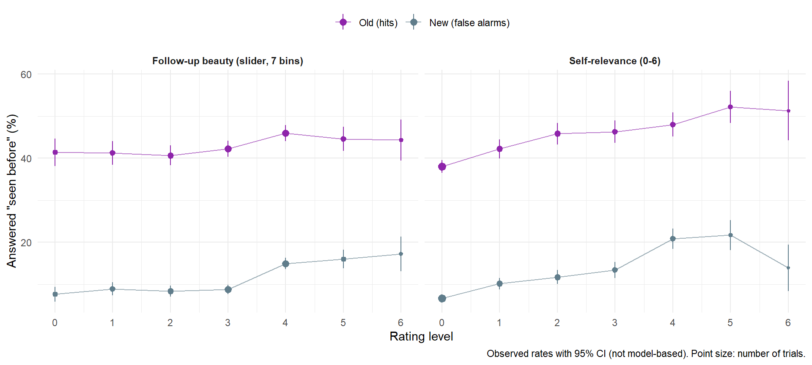{width=960}
:::
:::


Self-relevance and follow-up beauty correlate, so the rates below split the
items at the participant's own mean on both:


::: {.cell}

```{.r .cell-code}
dfmem |>
  mutate(SR = ifelse(SelfRelevance_w > 0, "SR above own mean", "SR at or below own mean"),
         Beauty = ifelse(Beauty2_w > 0, "Beauty above own mean", "Beauty at or below own mean")) |>
  summarise(Yes = 100 * mean(Recognition == "Yes"), n = n(), .by = c(Type, SR, Beauty)) |>
  mutate(Yes = sprintf("%.1f%% (n = %d)", Yes, n)) |>
  select(-n) |>
  pivot_wider(names_from = Type, values_from = Yes, names_prefix = "Seen before: ") |>
  arrange(SR, Beauty) |>
  knitr::kable(format = "pipe", caption = "\"Seen before\" rate by self-relevance and follow-up beauty (relative to the participant's mean)")
```

::: {.cell-output-display}


Table: "Seen before" rate by self-relevance and follow-up beauty (relative to the participant's mean)

|SR                      |Beauty                      |Seen before: New |Seen before: Old |
|:-----------------------|:---------------------------|:----------------|:----------------|
|SR above own mean       |Beauty above own mean       |15.8% (n = 3158) |48.2% (n = 3509) |
|SR above own mean       |Beauty at or below own mean |15.8% (n = 761)  |51.9% (n = 844)  |
|SR at or below own mean |Beauty above own mean       |8.9% (n = 2351)  |37.8% (n = 2298) |
|SR at or below own mean |Beauty at or below own mean |8.1% (n = 4290)  |39.7% (n = 3909) |


:::
:::


Both ratings were given in the same trial as the recognition judgment, so a
higher "seen before" rate for self-relevant or beautiful works can be better
memory (more hits) or a bias to call a liked work familiar (more false
alarms too). An lme4 pilot (not reported) separates the two: "seen before"
on item type and both ratings (centred within participant over the 96
artworks, with quadratic terms); the `New items x` rows are the difference in
slope for new items (false alarms) relative to old items (hits).


::: {.cell cache.extra='ba60455b42efa19d629a119da8b10e9a'}

```{.r .cell-code}
pilot_fa <- dfmem |>
  filter(!is.na(SelfRelevance_w), !is.na(Beauty2_w)) |>
  mutate(Seen = as.integer(Recognition == "Yes"), SR_w = SelfRelevance_w) |>
  (\(d) pilot_coefs("Seen ~ Type * (SR_w + I(SR_w^2) + Beauty2_w + I(Beauty2_w^2)) + (Type | Participant) + (1 | Item)",
                    d, family = binomial))()
```
:::


```{.r .cell-code}
make_asis(make_tables(
  pilot_fa |>
    filter(Term != "(Intercept)") |>
    mutate(Term = pilot_term(Term), z = Estimate / SE,
           Effect = ifelse(abs(z) < 1.96, "n.s.", ifelse(Estimate < 0, "Negative", "Positive")),
           across(c(Estimate, SE, z), \(x) insight::format_value(x))),
  c("Term", "Estimate", "SE", "z", "Effect"),
  "lme4 pilot: log-odds of answering \"seen before\" (ratings on 0-1, centred within participant; reference: old items)"))
```

```{=html}
<div id="mlnnrlcdjk" style="padding-left:0px;padding-right:0px;padding-top:10px;padding-bottom:10px;overflow-x:auto;overflow-y:auto;width:auto;height:auto;">
<style>#mlnnrlcdjk table {
  font-family: system-ui, 'Segoe UI', Roboto, Helvetica, Arial, sans-serif, 'Apple Color Emoji', 'Segoe UI Emoji', 'Segoe UI Symbol', 'Noto Color Emoji';
  -webkit-font-smoothing: antialiased;
  -moz-osx-font-smoothing: grayscale;
}

#mlnnrlcdjk thead, #mlnnrlcdjk tbody, #mlnnrlcdjk tfoot, #mlnnrlcdjk tr, #mlnnrlcdjk td, #mlnnrlcdjk th {
  border-style: none;
}

#mlnnrlcdjk p {
  margin: 0;
  padding: 0;
}

#mlnnrlcdjk .gt_table {
  display: table;
  border-collapse: collapse;
  line-height: normal;
  margin-left: auto;
  margin-right: auto;
  color: #333333;
  font-size: 13px;
  font-weight: normal;
  font-style: normal;
  background-color: #FFFFFF;
  width: auto;
  border-top-style: solid;
  border-top-width: 3px;
  border-top-color: #D5D5D5;
  border-right-style: solid;
  border-right-width: 3px;
  border-right-color: #D5D5D5;
  border-bottom-style: solid;
  border-bottom-width: 3px;
  border-bottom-color: #D5D5D5;
  border-left-style: solid;
  border-left-width: 3px;
  border-left-color: #D5D5D5;
}

#mlnnrlcdjk .gt_caption {
  padding-top: 4px;
  padding-bottom: 4px;
}

#mlnnrlcdjk .gt_title {
  color: #333333;
  font-size: 125%;
  font-weight: initial;
  padding-top: 4px;
  padding-bottom: 4px;
  padding-left: 5px;
  padding-right: 5px;
  border-bottom-color: #FFFFFF;
  border-bottom-width: 0;
}

#mlnnrlcdjk .gt_subtitle {
  color: #333333;
  font-size: 85%;
  font-weight: initial;
  padding-top: 3px;
  padding-bottom: 5px;
  padding-left: 5px;
  padding-right: 5px;
  border-top-color: #FFFFFF;
  border-top-width: 0;
}

#mlnnrlcdjk .gt_heading {
  background-color: #FFFFFF;
  text-align: left;
  border-bottom-color: #FFFFFF;
  border-left-style: none;
  border-left-width: 1px;
  border-left-color: #D3D3D3;
  border-right-style: none;
  border-right-width: 1px;
  border-right-color: #D3D3D3;
}

#mlnnrlcdjk .gt_bottom_border {
  border-bottom-style: solid;
  border-bottom-width: 2px;
  border-bottom-color: #D5D5D5;
}

#mlnnrlcdjk .gt_col_headings {
  border-top-style: solid;
  border-top-width: 2px;
  border-top-color: #D5D5D5;
  border-bottom-style: solid;
  border-bottom-width: 2px;
  border-bottom-color: #D5D5D5;
  border-left-style: none;
  border-left-width: 1px;
  border-left-color: #D3D3D3;
  border-right-style: none;
  border-right-width: 1px;
  border-right-color: #D3D3D3;
}

#mlnnrlcdjk .gt_col_heading {
  color: #FFFFFF;
  background-color: #000000;
  font-size: 100%;
  font-weight: normal;
  text-transform: inherit;
  border-left-style: none;
  border-left-width: 1px;
  border-left-color: #D3D3D3;
  border-right-style: none;
  border-right-width: 1px;
  border-right-color: #D3D3D3;
  vertical-align: bottom;
  padding-top: 5px;
  padding-bottom: 6px;
  padding-left: 5px;
  padding-right: 5px;
  overflow-x: hidden;
}

#mlnnrlcdjk .gt_column_spanner_outer {
  color: #FFFFFF;
  background-color: #000000;
  font-size: 100%;
  font-weight: normal;
  text-transform: inherit;
  padding-top: 0;
  padding-bottom: 0;
  padding-left: 4px;
  padding-right: 4px;
}

#mlnnrlcdjk .gt_column_spanner_outer:first-child {
  padding-left: 0;
}

#mlnnrlcdjk .gt_column_spanner_outer:last-child {
  padding-right: 0;
}

#mlnnrlcdjk .gt_column_spanner {
  border-bottom-style: solid;
  border-bottom-width: 2px;
  border-bottom-color: #D5D5D5;
  vertical-align: bottom;
  padding-top: 5px;
  padding-bottom: 5px;
  overflow-x: hidden;
  display: inline-block;
  width: 100%;
}

#mlnnrlcdjk .gt_spanner_row {
  border-bottom-style: hidden;
}

#mlnnrlcdjk .gt_group_heading {
  padding-top: 8px;
  padding-bottom: 8px;
  padding-left: 5px;
  padding-right: 5px;
  color: #333333;
  background-color: #FFFFFF;
  font-size: 100%;
  font-weight: initial;
  text-transform: inherit;
  border-top-style: solid;
  border-top-width: 2px;
  border-top-color: #D5D5D5;
  border-bottom-style: solid;
  border-bottom-width: 2px;
  border-bottom-color: #D5D5D5;
  border-left-style: none;
  border-left-width: 1px;
  border-left-color: #D3D3D3;
  border-right-style: none;
  border-right-width: 1px;
  border-right-color: #D3D3D3;
  vertical-align: middle;
  text-align: left;
}

#mlnnrlcdjk .gt_empty_group_heading {
  padding: 0.5px;
  color: #333333;
  background-color: #FFFFFF;
  font-size: 100%;
  font-weight: initial;
  border-top-style: solid;
  border-top-width: 2px;
  border-top-color: #D5D5D5;
  border-bottom-style: solid;
  border-bottom-width: 2px;
  border-bottom-color: #D5D5D5;
  vertical-align: middle;
}

#mlnnrlcdjk .gt_from_md > :first-child {
  margin-top: 0;
}

#mlnnrlcdjk .gt_from_md > :last-child {
  margin-bottom: 0;
}

#mlnnrlcdjk .gt_row {
  padding-top: 8px;
  padding-bottom: 8px;
  padding-left: 5px;
  padding-right: 5px;
  margin: 10px;
  border-top-style: solid;
  border-top-width: 1px;
  border-top-color: #D5D5D5;
  border-left-style: solid;
  border-left-width: 1px;
  border-left-color: #D5D5D5;
  border-right-style: solid;
  border-right-width: 1px;
  border-right-color: #D5D5D5;
  vertical-align: middle;
  overflow-x: hidden;
}

#mlnnrlcdjk .gt_stub {
  color: #333333;
  background-color: #FFFFFF;
  font-size: 100%;
  font-weight: initial;
  text-transform: inherit;
  border-right-style: solid;
  border-right-width: 2px;
  border-right-color: #5F5F5F;
  padding-left: 5px;
  padding-right: 5px;
}

#mlnnrlcdjk .gt_stub_row_group {
  color: #333333;
  background-color: #FFFFFF;
  font-size: 100%;
  font-weight: initial;
  text-transform: inherit;
  border-right-style: solid;
  border-right-width: 2px;
  border-right-color: #D3D3D3;
  padding-left: 5px;
  padding-right: 5px;
  vertical-align: top;
}

#mlnnrlcdjk .gt_row_group_first td {
  border-top-width: 2px;
}

#mlnnrlcdjk .gt_row_group_first th {
  border-top-width: 2px;
}

#mlnnrlcdjk .gt_summary_row {
  color: #333333;
  background-color: #D5D5D5;
  text-transform: inherit;
  padding-top: 8px;
  padding-bottom: 8px;
  padding-left: 5px;
  padding-right: 5px;
}

#mlnnrlcdjk .gt_first_summary_row {
  border-top-style: solid;
  border-top-color: #D5D5D5;
}

#mlnnrlcdjk .gt_first_summary_row.thick {
  border-top-width: 2px;
}

#mlnnrlcdjk .gt_last_summary_row {
  padding-top: 8px;
  padding-bottom: 8px;
  padding-left: 5px;
  padding-right: 5px;
  border-bottom-style: solid;
  border-bottom-width: 2px;
  border-bottom-color: #D5D5D5;
}

#mlnnrlcdjk .gt_grand_summary_row {
  color: #FFFFFF;
  background-color: #929292;
  text-transform: inherit;
  padding-top: 8px;
  padding-bottom: 8px;
  padding-left: 5px;
  padding-right: 5px;
}

#mlnnrlcdjk .gt_first_grand_summary_row {
  padding-top: 8px;
  padding-bottom: 8px;
  padding-left: 5px;
  padding-right: 5px;
  border-top-style: double;
  border-top-width: 6px;
  border-top-color: #D5D5D5;
}

#mlnnrlcdjk .gt_last_grand_summary_row_top {
  padding-top: 8px;
  padding-bottom: 8px;
  padding-left: 5px;
  padding-right: 5px;
  border-bottom-style: double;
  border-bottom-width: 6px;
  border-bottom-color: #D5D5D5;
}

#mlnnrlcdjk .gt_striped {
  background-color: #F4F4F4;
}

#mlnnrlcdjk .gt_table_body {
  border-top-style: solid;
  border-top-width: 2px;
  border-top-color: #D5D5D5;
  border-bottom-style: solid;
  border-bottom-width: 2px;
  border-bottom-color: #D5D5D5;
}

#mlnnrlcdjk .gt_footnotes {
  color: #333333;
  background-color: #FFFFFF;
  border-bottom-style: none;
  border-bottom-width: 2px;
  border-bottom-color: #D3D3D3;
  border-left-style: none;
  border-left-width: 2px;
  border-left-color: #D3D3D3;
  border-right-style: none;
  border-right-width: 2px;
  border-right-color: #D3D3D3;
}

#mlnnrlcdjk .gt_footnote {
  margin: 0px;
  font-size: 90%;
  padding-top: 4px;
  padding-bottom: 4px;
  padding-left: 5px;
  padding-right: 5px;
}

#mlnnrlcdjk .gt_sourcenotes {
  color: #333333;
  background-color: #FFFFFF;
  border-bottom-style: none;
  border-bottom-width: 2px;
  border-bottom-color: #D3D3D3;
  border-left-style: none;
  border-left-width: 2px;
  border-left-color: #D3D3D3;
  border-right-style: none;
  border-right-width: 2px;
  border-right-color: #D3D3D3;
}

#mlnnrlcdjk .gt_sourcenote {
  font-size: 90%;
  padding-top: 4px;
  padding-bottom: 4px;
  padding-left: 5px;
  padding-right: 5px;
}

#mlnnrlcdjk .gt_left {
  text-align: left;
}

#mlnnrlcdjk .gt_center {
  text-align: center;
}

#mlnnrlcdjk .gt_right {
  text-align: right;
  font-variant-numeric: tabular-nums;
}

#mlnnrlcdjk .gt_font_normal {
  font-weight: normal;
}

#mlnnrlcdjk .gt_font_bold {
  font-weight: bold;
}

#mlnnrlcdjk .gt_font_italic {
  font-style: italic;
}

#mlnnrlcdjk .gt_super {
  font-size: 65%;
}

#mlnnrlcdjk .gt_footnote_marks {
  font-size: 75%;
  vertical-align: 0.4em;
  position: initial;
}

#mlnnrlcdjk .gt_asterisk {
  font-size: 100%;
  vertical-align: 0;
}

#mlnnrlcdjk .gt_indent_1 {
  text-indent: 5px;
}

#mlnnrlcdjk .gt_indent_2 {
  text-indent: 10px;
}

#mlnnrlcdjk .gt_indent_3 {
  text-indent: 15px;
}

#mlnnrlcdjk .gt_indent_4 {
  text-indent: 20px;
}

#mlnnrlcdjk .gt_indent_5 {
  text-indent: 25px;
}

#mlnnrlcdjk .katex-display {
  display: inline-flex !important;
  margin-bottom: 0.75em !important;
}

#mlnnrlcdjk div.Reactable > div.rt-table > div.rt-thead > div.rt-tr.rt-tr-group-header > div.rt-th-group:after {
  height: 0px !important;
}
</style>
<table class="gt_table" data-quarto-disable-processing="false" data-quarto-bootstrap="false">
  <thead>
    <tr class="gt_heading">
      <td colspan="5" class="gt_heading gt_title gt_font_normal gt_bottom_border" style>lme4 pilot: log-odds of answering "seen before" (ratings on 0-1, centred within participant; reference: old items)</td>
    </tr>
    
    <tr class="gt_col_headings">
      <th class="gt_col_heading gt_columns_bottom_border gt_left" rowspan="1" colspan="1" scope="col" id="Term">Term</th>
      <th class="gt_col_heading gt_columns_bottom_border gt_right" rowspan="1" colspan="1" scope="col" id="Estimate">Estimate</th>
      <th class="gt_col_heading gt_columns_bottom_border gt_right" rowspan="1" colspan="1" scope="col" id="SE">SE</th>
      <th class="gt_col_heading gt_columns_bottom_border gt_right" rowspan="1" colspan="1" scope="col" id="z">z</th>
      <th class="gt_col_heading gt_columns_bottom_border gt_left" rowspan="1" colspan="1" scope="col" id="Effect">Effect</th>
    </tr>
  </thead>
  <tbody class="gt_table_body">
    <tr><td headers="Term" class="gt_row gt_left" style="background-color: #FFEBEE;">New items</td>
<td headers="Estimate" class="gt_row gt_right" style="background-color: #FFEBEE;">-2.39</td>
<td headers="SE" class="gt_row gt_right" style="background-color: #FFEBEE;">0.19</td>
<td headers="z" class="gt_row gt_right" style="background-color: #FFEBEE;">-12.59</td>
<td headers="Effect" class="gt_row gt_left" style="background-color: #FFEBEE;">Negative</td></tr>
    <tr><td headers="Term" class="gt_row gt_left gt_striped" style="background-color: #E8F5E9;">SR (within)</td>
<td headers="Estimate" class="gt_row gt_right gt_striped" style="background-color: #E8F5E9;">1.15</td>
<td headers="SE" class="gt_row gt_right gt_striped" style="background-color: #E8F5E9;">0.14</td>
<td headers="z" class="gt_row gt_right gt_striped" style="background-color: #E8F5E9;">8.31</td>
<td headers="Effect" class="gt_row gt_left gt_striped" style="background-color: #E8F5E9;">Positive</td></tr>
    <tr><td headers="Term" class="gt_row gt_left" style="background-color: #FFEBEE;">I(SR (within)^2)</td>
<td headers="Estimate" class="gt_row gt_right" style="background-color: #FFEBEE;">-1.11</td>
<td headers="SE" class="gt_row gt_right" style="background-color: #FFEBEE;">0.34</td>
<td headers="z" class="gt_row gt_right" style="background-color: #FFEBEE;">-3.22</td>
<td headers="Effect" class="gt_row gt_left" style="background-color: #FFEBEE;">Negative</td></tr>
    <tr><td headers="Term" class="gt_row gt_left gt_striped" style="background-color: #E8F5E9;">follow-up beauty (within)</td>
<td headers="Estimate" class="gt_row gt_right gt_striped" style="background-color: #E8F5E9;">0.47</td>
<td headers="SE" class="gt_row gt_right gt_striped" style="background-color: #E8F5E9;">0.14</td>
<td headers="z" class="gt_row gt_right gt_striped" style="background-color: #E8F5E9;">3.33</td>
<td headers="Effect" class="gt_row gt_left gt_striped" style="background-color: #E8F5E9;">Positive</td></tr>
    <tr><td headers="Term" class="gt_row gt_left" style="background-color: #E8F5E9;">I(follow-up beauty (within)^2)</td>
<td headers="Estimate" class="gt_row gt_right" style="background-color: #E8F5E9;">0.92</td>
<td headers="SE" class="gt_row gt_right" style="background-color: #E8F5E9;">0.43</td>
<td headers="z" class="gt_row gt_right" style="background-color: #E8F5E9;">2.12</td>
<td headers="Effect" class="gt_row gt_left" style="background-color: #E8F5E9;">Positive</td></tr>
    <tr><td headers="Term" class="gt_row gt_left gt_striped" style="color: #9E9E9E;">New items x SR (within)</td>
<td headers="Estimate" class="gt_row gt_right gt_striped" style="color: #9E9E9E;">-0.09</td>
<td headers="SE" class="gt_row gt_right gt_striped" style="color: #9E9E9E;">0.25</td>
<td headers="z" class="gt_row gt_right gt_striped" style="color: #9E9E9E;">-0.35</td>
<td headers="Effect" class="gt_row gt_left gt_striped" style="color: #9E9E9E;">n.s.</td></tr>
    <tr><td headers="Term" class="gt_row gt_left" style="color: #9E9E9E;">New items x I(SR (within)^2)</td>
<td headers="Estimate" class="gt_row gt_right" style="color: #9E9E9E;">-0.14</td>
<td headers="SE" class="gt_row gt_right" style="color: #9E9E9E;">0.64</td>
<td headers="z" class="gt_row gt_right" style="color: #9E9E9E;">-0.23</td>
<td headers="Effect" class="gt_row gt_left" style="color: #9E9E9E;">n.s.</td></tr>
    <tr><td headers="Term" class="gt_row gt_left gt_striped" style="color: #9E9E9E;">New items x follow-up beauty (within)</td>
<td headers="Estimate" class="gt_row gt_right gt_striped" style="color: #9E9E9E;">0.27</td>
<td headers="SE" class="gt_row gt_right gt_striped" style="color: #9E9E9E;">0.25</td>
<td headers="z" class="gt_row gt_right gt_striped" style="color: #9E9E9E;">1.04</td>
<td headers="Effect" class="gt_row gt_left gt_striped" style="color: #9E9E9E;">n.s.</td></tr>
    <tr><td headers="Term" class="gt_row gt_left" style="color: #9E9E9E;">New items x I(follow-up beauty (within)^2)</td>
<td headers="Estimate" class="gt_row gt_right" style="color: #9E9E9E;">-0.98</td>
<td headers="SE" class="gt_row gt_right" style="color: #9E9E9E;">0.79</td>
<td headers="z" class="gt_row gt_right" style="color: #9E9E9E;">-1.24</td>
<td headers="Effect" class="gt_row gt_left" style="color: #9E9E9E;">n.s.</td></tr>
  </tbody>
  
</table>
</div>
```


::: {.callout-note collapse="true" title="lme4 pilot: log-odds of answering "seen before" (ratings on 0-1, centred within participant; reference: old items) (Markdown table, for text readers)"}

|Term                                       |Estimate |SE   |z      |Effect   |
|:------------------------------------------|:--------|:----|:------|:--------|
|New items                                  |-2.39    |0.19 |-12.59 |Negative |
|SR (within)                                |1.15     |0.14 |8.31   |Positive |
|I(SR (within)^2)                           |-1.11    |0.34 |-3.22  |Negative |
|follow-up beauty (within)                  |0.47     |0.14 |3.33   |Positive |
|I(follow-up beauty (within)^2)             |0.92     |0.43 |2.12   |Positive |
|New items x SR (within)                    |-0.09    |0.25 |-0.35  |n.s.     |
|New items x I(SR (within)^2)               |-0.14    |0.64 |-0.23  |n.s.     |
|New items x follow-up beauty (within)      |0.27     |0.25 |1.04   |n.s.     |
|New items x I(follow-up beauty (within)^2) |-0.98    |0.79 |-1.24  |n.s.     |

:::

Self-relevance and follow-up beauty raise the "seen before" rate at least as
much for new artworks as for old ones (the `New items x` slope differences
are close to zero): in this design they index a bias to judge a
self-relevant or liked work as familiar, not better memory. Any model-based
test of a self-reference effect on memory must therefore include the new
items (as `MemoryCondition` does, with its `New Items` level), so that an
effect on hits can be told apart from one on false alarms. The Phase-1
appraisal, rated before any memory judgment and for old items only, is the
cleaner predictor of what was encoded (`4_memory.qmd`, "Memory by Phase-1
Appraisal").

### Model: MemorySR

**MemorySR** (`server/models.R`, 2026-09-25): the categorical model of the
recalled label (as `MemoryCondition`, "Not recognized" carrying recognition)
on all 96 items, with self-relevance and follow-up beauty (centred within
participant over the 96 artworks, quadratic terms as `MemoryAppraisal`)
given separate slopes for old and new items (`Type:`). The Old slopes are
the effect on hits, the New slopes the effect on false alarms; a
self-reference effect on *memory* needs the two to differ. Predictions per
label are averaged over the three old labels ("Old") and shown against the
new items ("New"). Probabilities compress near 0, and the false-alarm rate
is near 10% while the hit rate is near 45%, so the comparison that matters
is on the odds scale (last table).


```{.r .cell-code}
memsr_ready <- file.exists("models/estimates/MemorySR.rds")
if (!memsr_ready) {
  make_asis("", '::: {.callout-warning title="Estimates not available yet"}',
            "`MemorySR`: in `analysis/server`, `./hpc combine MemorySR` (check 4,000 draws), `./hpc extract MemorySR`, then `./hpc pull 'estimates/MemorySR.rds'`.",
            ":::", "")
}
```


```{.r .cell-code}
est_sr <- read_estimates("MemorySR")$MemorySR
g_sr <- est_sr$grid
D_sr <- est_sr$draws
old_levels <- setdiff(unique(g_sr$Level), "New Items")
rows <- lapply(setNames(nm = c(old_levels, "New Items")), function(l) which(g_sr$Level == l))
# Old: the three labels averaged (same grid order within each level)
D_old <- Reduce(`+`, lapply(old_levels, function(l) D_sr[, rows[[l]], , drop = FALSE])) / length(old_levels)
est_old <- list(grid = mutate(g_sr[rows[[old_levels[1]]], ], Level = "Old"), draws = D_old)
est_new <- list(grid = mutate(g_sr[rows[["New Items"]], ], Level = "New"), draws = D_sr[, rows[["New Items"]], , drop = FALSE])
fx_old <- memory_grid_effects(est_old)
fx_new <- memory_grid_effects(est_new)
sr_labels <- c(SR_w = "Self-relevance", Beauty2_w = "Follow-up beauty")
fmt_pp <- function(d) {
  d |> mutate(Predictor = sr_labels[Predictor],
              Effect_at = Effect,
              Effect = ifelse(sign(CI_low) != sign(CI_high), "n.s.", ifelse(Median < 0, "Negative", "Positive")),
              Diff = insight::format_value(Median),
              CI = sprintf("[%s, %s]", insight::format_value(CI_low), insight::format_value(CI_high)),
              pd_fmt = insight::format_pd(pd, name = NULL))
}
rec_pp <- bind_rows(fx_old$effects, fx_new$effects) |>
  filter(Outcome == "P(recognised)", Effect %in% c("-2 SD", "+2 SD")) |> fmt_pp()
lab_pp <- fx_old$effects |>
  filter(Outcome != "P(recognised)", Type == "unique", Effect %in% c("-2 SD", "+2 SD")) |> fmt_pp()
# Odds scale: log odds of "seen before" at +/-2 SD minus at the mean, for
# old (hits) and new (false alarms) items, and their difference
lo <- function(est, type, pred, at) {
  g <- est$grid; i <- which(g$Type == type & g$Predictor == pred & !is.na(g$At) & g$At == at)
  p <- 1 - est$draws[, i, "Not recognized"]
  log(p / (1 - p))
}
odds <- bind_rows(lapply(c("unique", "joint"), function(type) bind_rows(lapply(names(sr_labels), function(pred) bind_rows(lapply(c("-2 SD", "+2 SD"), function(at) {
  d_old <- lo(est_old, type, pred, at) - lo(est_old, type, pred, "Mean")
  d_new <- lo(est_new, type, pred, at) - lo(est_new, type, pred, "Mean")
  desc <- function(x) { ci <- bayestestR::hdi(x, ci = 0.95); c(median(x), ci$CI_low, ci$CI_high, as.numeric(bayestestR::p_direction(x))) }
  o <- desc(d_old); n <- desc(d_new); dd <- desc(d_new - d_old)
  data.frame(Type = type, Predictor = sr_labels[pred], At = at,
             `Old (hits)` = sprintf("%.2f [%.2f, %.2f]", o[1], o[2], o[3]),
             `New (false alarms)` = sprintf("%.2f [%.2f, %.2f]", n[1], n[2], n[3]),
             `New - Old` = sprintf("%.2f [%.2f, %.2f]", dd[1], dd[2], dd[3]),
             pd_fmt = insight::format_pd(dd[4], name = NULL),
             Effect = ifelse(sign(dd[2]) != sign(dd[3]), "n.s.", ifelse(dd[1] < 0, "Negative", "Positive")),
             check.names = FALSE)
}))))))
make_asis(
  make_tables(est_sr$diag, c("Model", "Family", "N_obs", "N_participants", "Chains", "Draws", "Max_Rhat", "Min_ESS_ratio", "Divergent_pct"),
              "Convergence of MemorySR"),
  make_tables(rec_pp, c("Level", "Type", "Predictor", "Effect_at", "Diff", "CI", "pd_fmt", "Effect"),
              "MemorySR: P(\"seen before\") at -2 / +2 SD of the rating minus at the participant's mean, for old items (hits, averaged over the three labels) and new items (false alarms), percentage points (unique: other rating at the mean; joint: it follows along)"),
  make_tables(odds, c("Type", "Predictor", "At", "Old (hits)", "New (false alarms)", "New - Old", "pd_fmt", "Effect"),
              "MemorySR: the same on the log-odds scale (log odds ratio of \"seen before\" at -2 / +2 SD vs. the mean), and the difference between new and old items (0 = the rating raises false alarms as much as hits)"),
  make_tables(lab_pp, c("Type", "Predictor", "Effect_at", "Outcome", "Diff", "CI", "pd_fmt", "Effect"),
              "MemorySR: recalled label among recognised old artworks at -2 / +2 SD of the rating minus at the mean (label shown averaged), percentage points")
)
```

```{=html}
<div id="bwhkvpfjrk" style="padding-left:0px;padding-right:0px;padding-top:10px;padding-bottom:10px;overflow-x:auto;overflow-y:auto;width:auto;height:auto;">
<style>#bwhkvpfjrk table {
  font-family: system-ui, 'Segoe UI', Roboto, Helvetica, Arial, sans-serif, 'Apple Color Emoji', 'Segoe UI Emoji', 'Segoe UI Symbol', 'Noto Color Emoji';
  -webkit-font-smoothing: antialiased;
  -moz-osx-font-smoothing: grayscale;
}

#bwhkvpfjrk thead, #bwhkvpfjrk tbody, #bwhkvpfjrk tfoot, #bwhkvpfjrk tr, #bwhkvpfjrk td, #bwhkvpfjrk th {
  border-style: none;
}

#bwhkvpfjrk p {
  margin: 0;
  padding: 0;
}

#bwhkvpfjrk .gt_table {
  display: table;
  border-collapse: collapse;
  line-height: normal;
  margin-left: auto;
  margin-right: auto;
  color: #333333;
  font-size: 13px;
  font-weight: normal;
  font-style: normal;
  background-color: #FFFFFF;
  width: auto;
  border-top-style: solid;
  border-top-width: 3px;
  border-top-color: #D5D5D5;
  border-right-style: solid;
  border-right-width: 3px;
  border-right-color: #D5D5D5;
  border-bottom-style: solid;
  border-bottom-width: 3px;
  border-bottom-color: #D5D5D5;
  border-left-style: solid;
  border-left-width: 3px;
  border-left-color: #D5D5D5;
}

#bwhkvpfjrk .gt_caption {
  padding-top: 4px;
  padding-bottom: 4px;
}

#bwhkvpfjrk .gt_title {
  color: #333333;
  font-size: 125%;
  font-weight: initial;
  padding-top: 4px;
  padding-bottom: 4px;
  padding-left: 5px;
  padding-right: 5px;
  border-bottom-color: #FFFFFF;
  border-bottom-width: 0;
}

#bwhkvpfjrk .gt_subtitle {
  color: #333333;
  font-size: 85%;
  font-weight: initial;
  padding-top: 3px;
  padding-bottom: 5px;
  padding-left: 5px;
  padding-right: 5px;
  border-top-color: #FFFFFF;
  border-top-width: 0;
}

#bwhkvpfjrk .gt_heading {
  background-color: #FFFFFF;
  text-align: left;
  border-bottom-color: #FFFFFF;
  border-left-style: none;
  border-left-width: 1px;
  border-left-color: #D3D3D3;
  border-right-style: none;
  border-right-width: 1px;
  border-right-color: #D3D3D3;
}

#bwhkvpfjrk .gt_bottom_border {
  border-bottom-style: solid;
  border-bottom-width: 2px;
  border-bottom-color: #D5D5D5;
}

#bwhkvpfjrk .gt_col_headings {
  border-top-style: solid;
  border-top-width: 2px;
  border-top-color: #D5D5D5;
  border-bottom-style: solid;
  border-bottom-width: 2px;
  border-bottom-color: #D5D5D5;
  border-left-style: none;
  border-left-width: 1px;
  border-left-color: #D3D3D3;
  border-right-style: none;
  border-right-width: 1px;
  border-right-color: #D3D3D3;
}

#bwhkvpfjrk .gt_col_heading {
  color: #FFFFFF;
  background-color: #000000;
  font-size: 100%;
  font-weight: normal;
  text-transform: inherit;
  border-left-style: none;
  border-left-width: 1px;
  border-left-color: #D3D3D3;
  border-right-style: none;
  border-right-width: 1px;
  border-right-color: #D3D3D3;
  vertical-align: bottom;
  padding-top: 5px;
  padding-bottom: 6px;
  padding-left: 5px;
  padding-right: 5px;
  overflow-x: hidden;
}

#bwhkvpfjrk .gt_column_spanner_outer {
  color: #FFFFFF;
  background-color: #000000;
  font-size: 100%;
  font-weight: normal;
  text-transform: inherit;
  padding-top: 0;
  padding-bottom: 0;
  padding-left: 4px;
  padding-right: 4px;
}

#bwhkvpfjrk .gt_column_spanner_outer:first-child {
  padding-left: 0;
}

#bwhkvpfjrk .gt_column_spanner_outer:last-child {
  padding-right: 0;
}

#bwhkvpfjrk .gt_column_spanner {
  border-bottom-style: solid;
  border-bottom-width: 2px;
  border-bottom-color: #D5D5D5;
  vertical-align: bottom;
  padding-top: 5px;
  padding-bottom: 5px;
  overflow-x: hidden;
  display: inline-block;
  width: 100%;
}

#bwhkvpfjrk .gt_spanner_row {
  border-bottom-style: hidden;
}

#bwhkvpfjrk .gt_group_heading {
  padding-top: 8px;
  padding-bottom: 8px;
  padding-left: 5px;
  padding-right: 5px;
  color: #333333;
  background-color: #FFFFFF;
  font-size: 100%;
  font-weight: initial;
  text-transform: inherit;
  border-top-style: solid;
  border-top-width: 2px;
  border-top-color: #D5D5D5;
  border-bottom-style: solid;
  border-bottom-width: 2px;
  border-bottom-color: #D5D5D5;
  border-left-style: none;
  border-left-width: 1px;
  border-left-color: #D3D3D3;
  border-right-style: none;
  border-right-width: 1px;
  border-right-color: #D3D3D3;
  vertical-align: middle;
  text-align: left;
}

#bwhkvpfjrk .gt_empty_group_heading {
  padding: 0.5px;
  color: #333333;
  background-color: #FFFFFF;
  font-size: 100%;
  font-weight: initial;
  border-top-style: solid;
  border-top-width: 2px;
  border-top-color: #D5D5D5;
  border-bottom-style: solid;
  border-bottom-width: 2px;
  border-bottom-color: #D5D5D5;
  vertical-align: middle;
}

#bwhkvpfjrk .gt_from_md > :first-child {
  margin-top: 0;
}

#bwhkvpfjrk .gt_from_md > :last-child {
  margin-bottom: 0;
}

#bwhkvpfjrk .gt_row {
  padding-top: 8px;
  padding-bottom: 8px;
  padding-left: 5px;
  padding-right: 5px;
  margin: 10px;
  border-top-style: solid;
  border-top-width: 1px;
  border-top-color: #D5D5D5;
  border-left-style: solid;
  border-left-width: 1px;
  border-left-color: #D5D5D5;
  border-right-style: solid;
  border-right-width: 1px;
  border-right-color: #D5D5D5;
  vertical-align: middle;
  overflow-x: hidden;
}

#bwhkvpfjrk .gt_stub {
  color: #333333;
  background-color: #FFFFFF;
  font-size: 100%;
  font-weight: initial;
  text-transform: inherit;
  border-right-style: solid;
  border-right-width: 2px;
  border-right-color: #5F5F5F;
  padding-left: 5px;
  padding-right: 5px;
}

#bwhkvpfjrk .gt_stub_row_group {
  color: #333333;
  background-color: #FFFFFF;
  font-size: 100%;
  font-weight: initial;
  text-transform: inherit;
  border-right-style: solid;
  border-right-width: 2px;
  border-right-color: #D3D3D3;
  padding-left: 5px;
  padding-right: 5px;
  vertical-align: top;
}

#bwhkvpfjrk .gt_row_group_first td {
  border-top-width: 2px;
}

#bwhkvpfjrk .gt_row_group_first th {
  border-top-width: 2px;
}

#bwhkvpfjrk .gt_summary_row {
  color: #333333;
  background-color: #D5D5D5;
  text-transform: inherit;
  padding-top: 8px;
  padding-bottom: 8px;
  padding-left: 5px;
  padding-right: 5px;
}

#bwhkvpfjrk .gt_first_summary_row {
  border-top-style: solid;
  border-top-color: #D5D5D5;
}

#bwhkvpfjrk .gt_first_summary_row.thick {
  border-top-width: 2px;
}

#bwhkvpfjrk .gt_last_summary_row {
  padding-top: 8px;
  padding-bottom: 8px;
  padding-left: 5px;
  padding-right: 5px;
  border-bottom-style: solid;
  border-bottom-width: 2px;
  border-bottom-color: #D5D5D5;
}

#bwhkvpfjrk .gt_grand_summary_row {
  color: #FFFFFF;
  background-color: #929292;
  text-transform: inherit;
  padding-top: 8px;
  padding-bottom: 8px;
  padding-left: 5px;
  padding-right: 5px;
}

#bwhkvpfjrk .gt_first_grand_summary_row {
  padding-top: 8px;
  padding-bottom: 8px;
  padding-left: 5px;
  padding-right: 5px;
  border-top-style: double;
  border-top-width: 6px;
  border-top-color: #D5D5D5;
}

#bwhkvpfjrk .gt_last_grand_summary_row_top {
  padding-top: 8px;
  padding-bottom: 8px;
  padding-left: 5px;
  padding-right: 5px;
  border-bottom-style: double;
  border-bottom-width: 6px;
  border-bottom-color: #D5D5D5;
}

#bwhkvpfjrk .gt_striped {
  background-color: #F4F4F4;
}

#bwhkvpfjrk .gt_table_body {
  border-top-style: solid;
  border-top-width: 2px;
  border-top-color: #D5D5D5;
  border-bottom-style: solid;
  border-bottom-width: 2px;
  border-bottom-color: #D5D5D5;
}

#bwhkvpfjrk .gt_footnotes {
  color: #333333;
  background-color: #FFFFFF;
  border-bottom-style: none;
  border-bottom-width: 2px;
  border-bottom-color: #D3D3D3;
  border-left-style: none;
  border-left-width: 2px;
  border-left-color: #D3D3D3;
  border-right-style: none;
  border-right-width: 2px;
  border-right-color: #D3D3D3;
}

#bwhkvpfjrk .gt_footnote {
  margin: 0px;
  font-size: 90%;
  padding-top: 4px;
  padding-bottom: 4px;
  padding-left: 5px;
  padding-right: 5px;
}

#bwhkvpfjrk .gt_sourcenotes {
  color: #333333;
  background-color: #FFFFFF;
  border-bottom-style: none;
  border-bottom-width: 2px;
  border-bottom-color: #D3D3D3;
  border-left-style: none;
  border-left-width: 2px;
  border-left-color: #D3D3D3;
  border-right-style: none;
  border-right-width: 2px;
  border-right-color: #D3D3D3;
}

#bwhkvpfjrk .gt_sourcenote {
  font-size: 90%;
  padding-top: 4px;
  padding-bottom: 4px;
  padding-left: 5px;
  padding-right: 5px;
}

#bwhkvpfjrk .gt_left {
  text-align: left;
}

#bwhkvpfjrk .gt_center {
  text-align: center;
}

#bwhkvpfjrk .gt_right {
  text-align: right;
  font-variant-numeric: tabular-nums;
}

#bwhkvpfjrk .gt_font_normal {
  font-weight: normal;
}

#bwhkvpfjrk .gt_font_bold {
  font-weight: bold;
}

#bwhkvpfjrk .gt_font_italic {
  font-style: italic;
}

#bwhkvpfjrk .gt_super {
  font-size: 65%;
}

#bwhkvpfjrk .gt_footnote_marks {
  font-size: 75%;
  vertical-align: 0.4em;
  position: initial;
}

#bwhkvpfjrk .gt_asterisk {
  font-size: 100%;
  vertical-align: 0;
}

#bwhkvpfjrk .gt_indent_1 {
  text-indent: 5px;
}

#bwhkvpfjrk .gt_indent_2 {
  text-indent: 10px;
}

#bwhkvpfjrk .gt_indent_3 {
  text-indent: 15px;
}

#bwhkvpfjrk .gt_indent_4 {
  text-indent: 20px;
}

#bwhkvpfjrk .gt_indent_5 {
  text-indent: 25px;
}

#bwhkvpfjrk .katex-display {
  display: inline-flex !important;
  margin-bottom: 0.75em !important;
}

#bwhkvpfjrk div.Reactable > div.rt-table > div.rt-thead > div.rt-tr.rt-tr-group-header > div.rt-th-group:after {
  height: 0px !important;
}
</style>
<table class="gt_table" data-quarto-disable-processing="false" data-quarto-bootstrap="false">
  <thead>
    <tr class="gt_heading">
      <td colspan="9" class="gt_heading gt_title gt_font_normal gt_bottom_border" style>Convergence of MemorySR</td>
    </tr>
    
    <tr class="gt_col_headings">
      <th class="gt_col_heading gt_columns_bottom_border gt_left" rowspan="1" colspan="1" scope="col" id="Model">Model</th>
      <th class="gt_col_heading gt_columns_bottom_border gt_left" rowspan="1" colspan="1" scope="col" id="Family">Family</th>
      <th class="gt_col_heading gt_columns_bottom_border gt_right" rowspan="1" colspan="1" scope="col" id="N_obs">N_obs</th>
      <th class="gt_col_heading gt_columns_bottom_border gt_right" rowspan="1" colspan="1" scope="col" id="N_participants">N_participants</th>
      <th class="gt_col_heading gt_columns_bottom_border gt_right" rowspan="1" colspan="1" scope="col" id="Chains">Chains</th>
      <th class="gt_col_heading gt_columns_bottom_border gt_right" rowspan="1" colspan="1" scope="col" id="Draws">Draws</th>
      <th class="gt_col_heading gt_columns_bottom_border gt_right" rowspan="1" colspan="1" scope="col" id="Max_Rhat">Max_Rhat</th>
      <th class="gt_col_heading gt_columns_bottom_border gt_right" rowspan="1" colspan="1" scope="col" id="Min_ESS_ratio">Min_ESS_ratio</th>
      <th class="gt_col_heading gt_columns_bottom_border gt_right" rowspan="1" colspan="1" scope="col" id="Divergent_pct">Divergent_pct</th>
    </tr>
  </thead>
  <tbody class="gt_table_body">
    <tr><td headers="Model" class="gt_row gt_left">MemorySR</td>
<td headers="Family" class="gt_row gt_left">Categorical</td>
<td headers="N_obs" class="gt_row gt_right">21120</td>
<td headers="N_participants" class="gt_row gt_right">220</td>
<td headers="Chains" class="gt_row gt_right">8</td>
<td headers="Draws" class="gt_row gt_right">4000</td>
<td headers="Max_Rhat" class="gt_row gt_right">1.085</td>
<td headers="Min_ESS_ratio" class="gt_row gt_right">0.02</td>
<td headers="Divergent_pct" class="gt_row gt_right">0</td></tr>
  </tbody>
  
</table>
</div>
```


::: {.callout-note collapse="true" title="Convergence of MemorySR (Markdown table, for text readers)"}

|Model    |Family      | N_obs| N_participants| Chains| Draws| Max_Rhat| Min_ESS_ratio| Divergent_pct|
|:--------|:-----------|-----:|--------------:|------:|-----:|--------:|-------------:|-------------:|
|MemorySR |Categorical | 21120|            220|      8|  4000|    1.085|          0.02|             0|

:::

```{=html}
<div id="fgyfwdwgfo" style="padding-left:0px;padding-right:0px;padding-top:10px;padding-bottom:10px;overflow-x:auto;overflow-y:auto;width:auto;height:auto;">
<style>#fgyfwdwgfo table {
  font-family: system-ui, 'Segoe UI', Roboto, Helvetica, Arial, sans-serif, 'Apple Color Emoji', 'Segoe UI Emoji', 'Segoe UI Symbol', 'Noto Color Emoji';
  -webkit-font-smoothing: antialiased;
  -moz-osx-font-smoothing: grayscale;
}

#fgyfwdwgfo thead, #fgyfwdwgfo tbody, #fgyfwdwgfo tfoot, #fgyfwdwgfo tr, #fgyfwdwgfo td, #fgyfwdwgfo th {
  border-style: none;
}

#fgyfwdwgfo p {
  margin: 0;
  padding: 0;
}

#fgyfwdwgfo .gt_table {
  display: table;
  border-collapse: collapse;
  line-height: normal;
  margin-left: auto;
  margin-right: auto;
  color: #333333;
  font-size: 13px;
  font-weight: normal;
  font-style: normal;
  background-color: #FFFFFF;
  width: auto;
  border-top-style: solid;
  border-top-width: 3px;
  border-top-color: #D5D5D5;
  border-right-style: solid;
  border-right-width: 3px;
  border-right-color: #D5D5D5;
  border-bottom-style: solid;
  border-bottom-width: 3px;
  border-bottom-color: #D5D5D5;
  border-left-style: solid;
  border-left-width: 3px;
  border-left-color: #D5D5D5;
}

#fgyfwdwgfo .gt_caption {
  padding-top: 4px;
  padding-bottom: 4px;
}

#fgyfwdwgfo .gt_title {
  color: #333333;
  font-size: 125%;
  font-weight: initial;
  padding-top: 4px;
  padding-bottom: 4px;
  padding-left: 5px;
  padding-right: 5px;
  border-bottom-color: #FFFFFF;
  border-bottom-width: 0;
}

#fgyfwdwgfo .gt_subtitle {
  color: #333333;
  font-size: 85%;
  font-weight: initial;
  padding-top: 3px;
  padding-bottom: 5px;
  padding-left: 5px;
  padding-right: 5px;
  border-top-color: #FFFFFF;
  border-top-width: 0;
}

#fgyfwdwgfo .gt_heading {
  background-color: #FFFFFF;
  text-align: left;
  border-bottom-color: #FFFFFF;
  border-left-style: none;
  border-left-width: 1px;
  border-left-color: #D3D3D3;
  border-right-style: none;
  border-right-width: 1px;
  border-right-color: #D3D3D3;
}

#fgyfwdwgfo .gt_bottom_border {
  border-bottom-style: solid;
  border-bottom-width: 2px;
  border-bottom-color: #D5D5D5;
}

#fgyfwdwgfo .gt_col_headings {
  border-top-style: solid;
  border-top-width: 2px;
  border-top-color: #D5D5D5;
  border-bottom-style: solid;
  border-bottom-width: 2px;
  border-bottom-color: #D5D5D5;
  border-left-style: none;
  border-left-width: 1px;
  border-left-color: #D3D3D3;
  border-right-style: none;
  border-right-width: 1px;
  border-right-color: #D3D3D3;
}

#fgyfwdwgfo .gt_col_heading {
  color: #FFFFFF;
  background-color: #000000;
  font-size: 100%;
  font-weight: normal;
  text-transform: inherit;
  border-left-style: none;
  border-left-width: 1px;
  border-left-color: #D3D3D3;
  border-right-style: none;
  border-right-width: 1px;
  border-right-color: #D3D3D3;
  vertical-align: bottom;
  padding-top: 5px;
  padding-bottom: 6px;
  padding-left: 5px;
  padding-right: 5px;
  overflow-x: hidden;
}

#fgyfwdwgfo .gt_column_spanner_outer {
  color: #FFFFFF;
  background-color: #000000;
  font-size: 100%;
  font-weight: normal;
  text-transform: inherit;
  padding-top: 0;
  padding-bottom: 0;
  padding-left: 4px;
  padding-right: 4px;
}

#fgyfwdwgfo .gt_column_spanner_outer:first-child {
  padding-left: 0;
}

#fgyfwdwgfo .gt_column_spanner_outer:last-child {
  padding-right: 0;
}

#fgyfwdwgfo .gt_column_spanner {
  border-bottom-style: solid;
  border-bottom-width: 2px;
  border-bottom-color: #D5D5D5;
  vertical-align: bottom;
  padding-top: 5px;
  padding-bottom: 5px;
  overflow-x: hidden;
  display: inline-block;
  width: 100%;
}

#fgyfwdwgfo .gt_spanner_row {
  border-bottom-style: hidden;
}

#fgyfwdwgfo .gt_group_heading {
  padding-top: 8px;
  padding-bottom: 8px;
  padding-left: 5px;
  padding-right: 5px;
  color: #333333;
  background-color: #FFFFFF;
  font-size: 100%;
  font-weight: initial;
  text-transform: inherit;
  border-top-style: solid;
  border-top-width: 2px;
  border-top-color: #D5D5D5;
  border-bottom-style: solid;
  border-bottom-width: 2px;
  border-bottom-color: #D5D5D5;
  border-left-style: none;
  border-left-width: 1px;
  border-left-color: #D3D3D3;
  border-right-style: none;
  border-right-width: 1px;
  border-right-color: #D3D3D3;
  vertical-align: middle;
  text-align: left;
}

#fgyfwdwgfo .gt_empty_group_heading {
  padding: 0.5px;
  color: #333333;
  background-color: #FFFFFF;
  font-size: 100%;
  font-weight: initial;
  border-top-style: solid;
  border-top-width: 2px;
  border-top-color: #D5D5D5;
  border-bottom-style: solid;
  border-bottom-width: 2px;
  border-bottom-color: #D5D5D5;
  vertical-align: middle;
}

#fgyfwdwgfo .gt_from_md > :first-child {
  margin-top: 0;
}

#fgyfwdwgfo .gt_from_md > :last-child {
  margin-bottom: 0;
}

#fgyfwdwgfo .gt_row {
  padding-top: 8px;
  padding-bottom: 8px;
  padding-left: 5px;
  padding-right: 5px;
  margin: 10px;
  border-top-style: solid;
  border-top-width: 1px;
  border-top-color: #D5D5D5;
  border-left-style: solid;
  border-left-width: 1px;
  border-left-color: #D5D5D5;
  border-right-style: solid;
  border-right-width: 1px;
  border-right-color: #D5D5D5;
  vertical-align: middle;
  overflow-x: hidden;
}

#fgyfwdwgfo .gt_stub {
  color: #333333;
  background-color: #FFFFFF;
  font-size: 100%;
  font-weight: initial;
  text-transform: inherit;
  border-right-style: solid;
  border-right-width: 2px;
  border-right-color: #5F5F5F;
  padding-left: 5px;
  padding-right: 5px;
}

#fgyfwdwgfo .gt_stub_row_group {
  color: #333333;
  background-color: #FFFFFF;
  font-size: 100%;
  font-weight: initial;
  text-transform: inherit;
  border-right-style: solid;
  border-right-width: 2px;
  border-right-color: #D3D3D3;
  padding-left: 5px;
  padding-right: 5px;
  vertical-align: top;
}

#fgyfwdwgfo .gt_row_group_first td {
  border-top-width: 2px;
}

#fgyfwdwgfo .gt_row_group_first th {
  border-top-width: 2px;
}

#fgyfwdwgfo .gt_summary_row {
  color: #333333;
  background-color: #D5D5D5;
  text-transform: inherit;
  padding-top: 8px;
  padding-bottom: 8px;
  padding-left: 5px;
  padding-right: 5px;
}

#fgyfwdwgfo .gt_first_summary_row {
  border-top-style: solid;
  border-top-color: #D5D5D5;
}

#fgyfwdwgfo .gt_first_summary_row.thick {
  border-top-width: 2px;
}

#fgyfwdwgfo .gt_last_summary_row {
  padding-top: 8px;
  padding-bottom: 8px;
  padding-left: 5px;
  padding-right: 5px;
  border-bottom-style: solid;
  border-bottom-width: 2px;
  border-bottom-color: #D5D5D5;
}

#fgyfwdwgfo .gt_grand_summary_row {
  color: #FFFFFF;
  background-color: #929292;
  text-transform: inherit;
  padding-top: 8px;
  padding-bottom: 8px;
  padding-left: 5px;
  padding-right: 5px;
}

#fgyfwdwgfo .gt_first_grand_summary_row {
  padding-top: 8px;
  padding-bottom: 8px;
  padding-left: 5px;
  padding-right: 5px;
  border-top-style: double;
  border-top-width: 6px;
  border-top-color: #D5D5D5;
}

#fgyfwdwgfo .gt_last_grand_summary_row_top {
  padding-top: 8px;
  padding-bottom: 8px;
  padding-left: 5px;
  padding-right: 5px;
  border-bottom-style: double;
  border-bottom-width: 6px;
  border-bottom-color: #D5D5D5;
}

#fgyfwdwgfo .gt_striped {
  background-color: #F4F4F4;
}

#fgyfwdwgfo .gt_table_body {
  border-top-style: solid;
  border-top-width: 2px;
  border-top-color: #D5D5D5;
  border-bottom-style: solid;
  border-bottom-width: 2px;
  border-bottom-color: #D5D5D5;
}

#fgyfwdwgfo .gt_footnotes {
  color: #333333;
  background-color: #FFFFFF;
  border-bottom-style: none;
  border-bottom-width: 2px;
  border-bottom-color: #D3D3D3;
  border-left-style: none;
  border-left-width: 2px;
  border-left-color: #D3D3D3;
  border-right-style: none;
  border-right-width: 2px;
  border-right-color: #D3D3D3;
}

#fgyfwdwgfo .gt_footnote {
  margin: 0px;
  font-size: 90%;
  padding-top: 4px;
  padding-bottom: 4px;
  padding-left: 5px;
  padding-right: 5px;
}

#fgyfwdwgfo .gt_sourcenotes {
  color: #333333;
  background-color: #FFFFFF;
  border-bottom-style: none;
  border-bottom-width: 2px;
  border-bottom-color: #D3D3D3;
  border-left-style: none;
  border-left-width: 2px;
  border-left-color: #D3D3D3;
  border-right-style: none;
  border-right-width: 2px;
  border-right-color: #D3D3D3;
}

#fgyfwdwgfo .gt_sourcenote {
  font-size: 90%;
  padding-top: 4px;
  padding-bottom: 4px;
  padding-left: 5px;
  padding-right: 5px;
}

#fgyfwdwgfo .gt_left {
  text-align: left;
}

#fgyfwdwgfo .gt_center {
  text-align: center;
}

#fgyfwdwgfo .gt_right {
  text-align: right;
  font-variant-numeric: tabular-nums;
}

#fgyfwdwgfo .gt_font_normal {
  font-weight: normal;
}

#fgyfwdwgfo .gt_font_bold {
  font-weight: bold;
}

#fgyfwdwgfo .gt_font_italic {
  font-style: italic;
}

#fgyfwdwgfo .gt_super {
  font-size: 65%;
}

#fgyfwdwgfo .gt_footnote_marks {
  font-size: 75%;
  vertical-align: 0.4em;
  position: initial;
}

#fgyfwdwgfo .gt_asterisk {
  font-size: 100%;
  vertical-align: 0;
}

#fgyfwdwgfo .gt_indent_1 {
  text-indent: 5px;
}

#fgyfwdwgfo .gt_indent_2 {
  text-indent: 10px;
}

#fgyfwdwgfo .gt_indent_3 {
  text-indent: 15px;
}

#fgyfwdwgfo .gt_indent_4 {
  text-indent: 20px;
}

#fgyfwdwgfo .gt_indent_5 {
  text-indent: 25px;
}

#fgyfwdwgfo .katex-display {
  display: inline-flex !important;
  margin-bottom: 0.75em !important;
}

#fgyfwdwgfo div.Reactable > div.rt-table > div.rt-thead > div.rt-tr.rt-tr-group-header > div.rt-th-group:after {
  height: 0px !important;
}
</style>
<table class="gt_table" data-quarto-disable-processing="false" data-quarto-bootstrap="false">
  <thead>
    <tr class="gt_heading">
      <td colspan="8" class="gt_heading gt_title gt_font_normal gt_bottom_border" style>MemorySR: P("seen before") at -2 / +2 SD of the rating minus at the participant's mean, for old items (hits, averaged over the three labels) and new items (false alarms), percentage points (unique: other rating at the mean; joint: it follows along)</td>
    </tr>
    
    <tr class="gt_col_headings">
      <th class="gt_col_heading gt_columns_bottom_border gt_left" rowspan="1" colspan="1" scope="col" id="Level">Level</th>
      <th class="gt_col_heading gt_columns_bottom_border gt_left" rowspan="1" colspan="1" scope="col" id="Type">Type</th>
      <th class="gt_col_heading gt_columns_bottom_border gt_left" rowspan="1" colspan="1" scope="col" id="Predictor">Predictor</th>
      <th class="gt_col_heading gt_columns_bottom_border gt_left" rowspan="1" colspan="1" scope="col" id="Effect_at">Effect_at</th>
      <th class="gt_col_heading gt_columns_bottom_border gt_right" rowspan="1" colspan="1" scope="col" id="Diff">Diff</th>
      <th class="gt_col_heading gt_columns_bottom_border gt_left" rowspan="1" colspan="1" scope="col" id="CI">CI</th>
      <th class="gt_col_heading gt_columns_bottom_border gt_right" rowspan="1" colspan="1" scope="col" id="pd_fmt">pd_fmt</th>
      <th class="gt_col_heading gt_columns_bottom_border gt_left" rowspan="1" colspan="1" scope="col" id="Effect">Effect</th>
    </tr>
  </thead>
  <tbody class="gt_table_body">
    <tr><td headers="Level" class="gt_row gt_left" style="background-color: #FFEBEE;">Old</td>
<td headers="Type" class="gt_row gt_left" style="background-color: #FFEBEE;">joint</td>
<td headers="Predictor" class="gt_row gt_left" style="background-color: #FFEBEE;">Follow-up beauty</td>
<td headers="Effect_at" class="gt_row gt_left" style="background-color: #FFEBEE;">-2 SD</td>
<td headers="Diff" class="gt_row gt_right" style="background-color: #FFEBEE;">-10.72</td>
<td headers="CI" class="gt_row gt_left" style="background-color: #FFEBEE;">[-14.87, -6.47]</td>
<td headers="pd_fmt" class="gt_row gt_right" style="background-color: #FFEBEE;">100%</td>
<td headers="Effect" class="gt_row gt_left" style="background-color: #FFEBEE;">Negative</td></tr>
    <tr><td headers="Level" class="gt_row gt_left gt_striped" style="background-color: #E8F5E9;">Old</td>
<td headers="Type" class="gt_row gt_left gt_striped" style="background-color: #E8F5E9;">joint</td>
<td headers="Predictor" class="gt_row gt_left gt_striped" style="background-color: #E8F5E9;">Follow-up beauty</td>
<td headers="Effect_at" class="gt_row gt_left gt_striped" style="background-color: #E8F5E9;">+2 SD</td>
<td headers="Diff" class="gt_row gt_right gt_striped" style="background-color: #E8F5E9;">15.28</td>
<td headers="CI" class="gt_row gt_left gt_striped" style="background-color: #E8F5E9;">[9.92, 21.13]</td>
<td headers="pd_fmt" class="gt_row gt_right gt_striped" style="background-color: #E8F5E9;">100%</td>
<td headers="Effect" class="gt_row gt_left gt_striped" style="background-color: #E8F5E9;">Positive</td></tr>
    <tr><td headers="Level" class="gt_row gt_left" style="background-color: #FFEBEE;">Old</td>
<td headers="Type" class="gt_row gt_left" style="background-color: #FFEBEE;">joint</td>
<td headers="Predictor" class="gt_row gt_left" style="background-color: #FFEBEE;">Self-relevance</td>
<td headers="Effect_at" class="gt_row gt_left" style="background-color: #FFEBEE;">-2 SD</td>
<td headers="Diff" class="gt_row gt_right" style="background-color: #FFEBEE;">-16.48</td>
<td headers="CI" class="gt_row gt_left" style="background-color: #FFEBEE;">[-20.88, -11.94]</td>
<td headers="pd_fmt" class="gt_row gt_right" style="background-color: #FFEBEE;">100%</td>
<td headers="Effect" class="gt_row gt_left" style="background-color: #FFEBEE;">Negative</td></tr>
    <tr><td headers="Level" class="gt_row gt_left gt_striped" style="background-color: #E8F5E9;">Old</td>
<td headers="Type" class="gt_row gt_left gt_striped" style="background-color: #E8F5E9;">joint</td>
<td headers="Predictor" class="gt_row gt_left gt_striped" style="background-color: #E8F5E9;">Self-relevance</td>
<td headers="Effect_at" class="gt_row gt_left gt_striped" style="background-color: #E8F5E9;">+2 SD</td>
<td headers="Diff" class="gt_row gt_right gt_striped" style="background-color: #E8F5E9;">12.90</td>
<td headers="CI" class="gt_row gt_left gt_striped" style="background-color: #E8F5E9;">[8.71, 16.84]</td>
<td headers="pd_fmt" class="gt_row gt_right gt_striped" style="background-color: #E8F5E9;">100%</td>
<td headers="Effect" class="gt_row gt_left gt_striped" style="background-color: #E8F5E9;">Positive</td></tr>
    <tr><td headers="Level" class="gt_row gt_left" style="color: #9E9E9E;">Old</td>
<td headers="Type" class="gt_row gt_left" style="color: #9E9E9E;">unique</td>
<td headers="Predictor" class="gt_row gt_left" style="color: #9E9E9E;">Follow-up beauty</td>
<td headers="Effect_at" class="gt_row gt_left" style="color: #9E9E9E;">-2 SD</td>
<td headers="Diff" class="gt_row gt_right" style="color: #9E9E9E;">-3.15</td>
<td headers="CI" class="gt_row gt_left" style="color: #9E9E9E;">[-7.91, 1.26]</td>
<td headers="pd_fmt" class="gt_row gt_right" style="color: #9E9E9E;">90.50%</td>
<td headers="Effect" class="gt_row gt_left" style="color: #9E9E9E;">n.s.</td></tr>
    <tr><td headers="Level" class="gt_row gt_left gt_striped" style="background-color: #E8F5E9;">Old</td>
<td headers="Type" class="gt_row gt_left gt_striped" style="background-color: #E8F5E9;">unique</td>
<td headers="Predictor" class="gt_row gt_left gt_striped" style="background-color: #E8F5E9;">Follow-up beauty</td>
<td headers="Effect_at" class="gt_row gt_left gt_striped" style="background-color: #E8F5E9;">+2 SD</td>
<td headers="Diff" class="gt_row gt_right gt_striped" style="background-color: #E8F5E9;">9.08</td>
<td headers="CI" class="gt_row gt_left gt_striped" style="background-color: #E8F5E9;">[3.10, 14.58]</td>
<td headers="pd_fmt" class="gt_row gt_right gt_striped" style="background-color: #E8F5E9;">99.90%</td>
<td headers="Effect" class="gt_row gt_left gt_striped" style="background-color: #E8F5E9;">Positive</td></tr>
    <tr><td headers="Level" class="gt_row gt_left" style="background-color: #FFEBEE;">Old</td>
<td headers="Type" class="gt_row gt_left" style="background-color: #FFEBEE;">unique</td>
<td headers="Predictor" class="gt_row gt_left" style="background-color: #FFEBEE;">Self-relevance</td>
<td headers="Effect_at" class="gt_row gt_left" style="background-color: #FFEBEE;">-2 SD</td>
<td headers="Diff" class="gt_row gt_right" style="background-color: #FFEBEE;">-14.84</td>
<td headers="CI" class="gt_row gt_left" style="background-color: #FFEBEE;">[-19.55, -10.41]</td>
<td headers="pd_fmt" class="gt_row gt_right" style="background-color: #FFEBEE;">100%</td>
<td headers="Effect" class="gt_row gt_left" style="background-color: #FFEBEE;">Negative</td></tr>
    <tr><td headers="Level" class="gt_row gt_left gt_striped" style="background-color: #E8F5E9;">Old</td>
<td headers="Type" class="gt_row gt_left gt_striped" style="background-color: #E8F5E9;">unique</td>
<td headers="Predictor" class="gt_row gt_left gt_striped" style="background-color: #E8F5E9;">Self-relevance</td>
<td headers="Effect_at" class="gt_row gt_left gt_striped" style="background-color: #E8F5E9;">+2 SD</td>
<td headers="Diff" class="gt_row gt_right gt_striped" style="background-color: #E8F5E9;">8.10</td>
<td headers="CI" class="gt_row gt_left gt_striped" style="background-color: #E8F5E9;">[4.25, 12.14]</td>
<td headers="pd_fmt" class="gt_row gt_right gt_striped" style="background-color: #E8F5E9;">100%</td>
<td headers="Effect" class="gt_row gt_left gt_striped" style="background-color: #E8F5E9;">Positive</td></tr>
    <tr><td headers="Level" class="gt_row gt_left" style="background-color: #FFEBEE;">New</td>
<td headers="Type" class="gt_row gt_left" style="background-color: #FFEBEE;">joint</td>
<td headers="Predictor" class="gt_row gt_left" style="background-color: #FFEBEE;">Follow-up beauty</td>
<td headers="Effect_at" class="gt_row gt_left" style="background-color: #FFEBEE;">-2 SD</td>
<td headers="Diff" class="gt_row gt_right" style="background-color: #FFEBEE;">-2.19</td>
<td headers="CI" class="gt_row gt_left" style="background-color: #FFEBEE;">[-3.38, -1.17]</td>
<td headers="pd_fmt" class="gt_row gt_right" style="background-color: #FFEBEE;">100%</td>
<td headers="Effect" class="gt_row gt_left" style="background-color: #FFEBEE;">Negative</td></tr>
    <tr><td headers="Level" class="gt_row gt_left gt_striped" style="background-color: #E8F5E9;">New</td>
<td headers="Type" class="gt_row gt_left gt_striped" style="background-color: #E8F5E9;">joint</td>
<td headers="Predictor" class="gt_row gt_left gt_striped" style="background-color: #E8F5E9;">Follow-up beauty</td>
<td headers="Effect_at" class="gt_row gt_left gt_striped" style="background-color: #E8F5E9;">+2 SD</td>
<td headers="Diff" class="gt_row gt_right gt_striped" style="background-color: #E8F5E9;">2.58</td>
<td headers="CI" class="gt_row gt_left gt_striped" style="background-color: #E8F5E9;">[0.63, 4.73]</td>
<td headers="pd_fmt" class="gt_row gt_right gt_striped" style="background-color: #E8F5E9;">99.90%</td>
<td headers="Effect" class="gt_row gt_left gt_striped" style="background-color: #E8F5E9;">Positive</td></tr>
    <tr><td headers="Level" class="gt_row gt_left" style="background-color: #FFEBEE;">New</td>
<td headers="Type" class="gt_row gt_left" style="background-color: #FFEBEE;">joint</td>
<td headers="Predictor" class="gt_row gt_left" style="background-color: #FFEBEE;">Self-relevance</td>
<td headers="Effect_at" class="gt_row gt_left" style="background-color: #FFEBEE;">-2 SD</td>
<td headers="Diff" class="gt_row gt_right" style="background-color: #FFEBEE;">-2.50</td>
<td headers="CI" class="gt_row gt_left" style="background-color: #FFEBEE;">[-3.74, -1.51]</td>
<td headers="pd_fmt" class="gt_row gt_right" style="background-color: #FFEBEE;">100%</td>
<td headers="Effect" class="gt_row gt_left" style="background-color: #FFEBEE;">Negative</td></tr>
    <tr><td headers="Level" class="gt_row gt_left gt_striped" style="background-color: #E8F5E9;">New</td>
<td headers="Type" class="gt_row gt_left gt_striped" style="background-color: #E8F5E9;">joint</td>
<td headers="Predictor" class="gt_row gt_left gt_striped" style="background-color: #E8F5E9;">Self-relevance</td>
<td headers="Effect_at" class="gt_row gt_left gt_striped" style="background-color: #E8F5E9;">+2 SD</td>
<td headers="Diff" class="gt_row gt_right gt_striped" style="background-color: #E8F5E9;">2.14</td>
<td headers="CI" class="gt_row gt_left gt_striped" style="background-color: #E8F5E9;">[0.78, 3.84]</td>
<td headers="pd_fmt" class="gt_row gt_right gt_striped" style="background-color: #E8F5E9;">99.95%</td>
<td headers="Effect" class="gt_row gt_left gt_striped" style="background-color: #E8F5E9;">Positive</td></tr>
    <tr><td headers="Level" class="gt_row gt_left" style="background-color: #FFEBEE;">New</td>
<td headers="Type" class="gt_row gt_left" style="background-color: #FFEBEE;">unique</td>
<td headers="Predictor" class="gt_row gt_left" style="background-color: #FFEBEE;">Follow-up beauty</td>
<td headers="Effect_at" class="gt_row gt_left" style="background-color: #FFEBEE;">-2 SD</td>
<td headers="Diff" class="gt_row gt_right" style="background-color: #FFEBEE;">-1.31</td>
<td headers="CI" class="gt_row gt_left" style="background-color: #FFEBEE;">[-2.43, -0.13]</td>
<td headers="pd_fmt" class="gt_row gt_right" style="background-color: #FFEBEE;">98.65%</td>
<td headers="Effect" class="gt_row gt_left" style="background-color: #FFEBEE;">Negative</td></tr>
    <tr><td headers="Level" class="gt_row gt_left gt_striped" style="color: #9E9E9E;">New</td>
<td headers="Type" class="gt_row gt_left gt_striped" style="color: #9E9E9E;">unique</td>
<td headers="Predictor" class="gt_row gt_left gt_striped" style="color: #9E9E9E;">Follow-up beauty</td>
<td headers="Effect_at" class="gt_row gt_left gt_striped" style="color: #9E9E9E;">+2 SD</td>
<td headers="Diff" class="gt_row gt_right gt_striped" style="color: #9E9E9E;">1.40</td>
<td headers="CI" class="gt_row gt_left gt_striped" style="color: #9E9E9E;">[-0.23, 3.42]</td>
<td headers="pd_fmt" class="gt_row gt_right gt_striped" style="color: #9E9E9E;">95.85%</td>
<td headers="Effect" class="gt_row gt_left gt_striped" style="color: #9E9E9E;">n.s.</td></tr>
    <tr><td headers="Level" class="gt_row gt_left" style="background-color: #FFEBEE;">New</td>
<td headers="Type" class="gt_row gt_left" style="background-color: #FFEBEE;">unique</td>
<td headers="Predictor" class="gt_row gt_left" style="background-color: #FFEBEE;">Self-relevance</td>
<td headers="Effect_at" class="gt_row gt_left" style="background-color: #FFEBEE;">-2 SD</td>
<td headers="Diff" class="gt_row gt_right" style="background-color: #FFEBEE;">-2.04</td>
<td headers="CI" class="gt_row gt_left" style="background-color: #FFEBEE;">[-3.28, -0.98]</td>
<td headers="pd_fmt" class="gt_row gt_right" style="background-color: #FFEBEE;">99.95%</td>
<td headers="Effect" class="gt_row gt_left" style="background-color: #FFEBEE;">Negative</td></tr>
    <tr><td headers="Level" class="gt_row gt_left gt_striped" style="color: #9E9E9E;">New</td>
<td headers="Type" class="gt_row gt_left gt_striped" style="color: #9E9E9E;">unique</td>
<td headers="Predictor" class="gt_row gt_left gt_striped" style="color: #9E9E9E;">Self-relevance</td>
<td headers="Effect_at" class="gt_row gt_left gt_striped" style="color: #9E9E9E;">+2 SD</td>
<td headers="Diff" class="gt_row gt_right gt_striped" style="color: #9E9E9E;">1.15</td>
<td headers="CI" class="gt_row gt_left gt_striped" style="color: #9E9E9E;">[-0.08, 2.61]</td>
<td headers="pd_fmt" class="gt_row gt_right gt_striped" style="color: #9E9E9E;">96.35%</td>
<td headers="Effect" class="gt_row gt_left gt_striped" style="color: #9E9E9E;">n.s.</td></tr>
  </tbody>
  
</table>
</div>
```


::: {.callout-note collapse="true" title="MemorySR: P("seen before") at -2 / +2 SD of the rating minus at the participant's mean, for old items (hits, averaged over the three labels) and new items (false alarms), percentage points (unique: other rating at the mean; joint: it follows along) (Markdown table, for text readers)"}

|Level |Type   |Predictor        |Effect_at |Diff   |CI               |pd_fmt |Effect   |
|:-----|:------|:----------------|:---------|:------|:----------------|:------|:--------|
|Old   |joint  |Follow-up beauty |-2 SD     |-10.72 |[-14.87, -6.47]  |100%   |Negative |
|Old   |joint  |Follow-up beauty |+2 SD     |15.28  |[9.92, 21.13]    |100%   |Positive |
|Old   |joint  |Self-relevance   |-2 SD     |-16.48 |[-20.88, -11.94] |100%   |Negative |
|Old   |joint  |Self-relevance   |+2 SD     |12.90  |[8.71, 16.84]    |100%   |Positive |
|Old   |unique |Follow-up beauty |-2 SD     |-3.15  |[-7.91, 1.26]    |90.50% |n.s.     |
|Old   |unique |Follow-up beauty |+2 SD     |9.08   |[3.10, 14.58]    |99.90% |Positive |
|Old   |unique |Self-relevance   |-2 SD     |-14.84 |[-19.55, -10.41] |100%   |Negative |
|Old   |unique |Self-relevance   |+2 SD     |8.10   |[4.25, 12.14]    |100%   |Positive |
|New   |joint  |Follow-up beauty |-2 SD     |-2.19  |[-3.38, -1.17]   |100%   |Negative |
|New   |joint  |Follow-up beauty |+2 SD     |2.58   |[0.63, 4.73]     |99.90% |Positive |
|New   |joint  |Self-relevance   |-2 SD     |-2.50  |[-3.74, -1.51]   |100%   |Negative |
|New   |joint  |Self-relevance   |+2 SD     |2.14   |[0.78, 3.84]     |99.95% |Positive |
|New   |unique |Follow-up beauty |-2 SD     |-1.31  |[-2.43, -0.13]   |98.65% |Negative |
|New   |unique |Follow-up beauty |+2 SD     |1.40   |[-0.23, 3.42]    |95.85% |n.s.     |
|New   |unique |Self-relevance   |-2 SD     |-2.04  |[-3.28, -0.98]   |99.95% |Negative |
|New   |unique |Self-relevance   |+2 SD     |1.15   |[-0.08, 2.61]    |96.35% |n.s.     |

:::

```{=html}
<div id="aisijroggo" style="padding-left:0px;padding-right:0px;padding-top:10px;padding-bottom:10px;overflow-x:auto;overflow-y:auto;width:auto;height:auto;">
<style>#aisijroggo table {
  font-family: system-ui, 'Segoe UI', Roboto, Helvetica, Arial, sans-serif, 'Apple Color Emoji', 'Segoe UI Emoji', 'Segoe UI Symbol', 'Noto Color Emoji';
  -webkit-font-smoothing: antialiased;
  -moz-osx-font-smoothing: grayscale;
}

#aisijroggo thead, #aisijroggo tbody, #aisijroggo tfoot, #aisijroggo tr, #aisijroggo td, #aisijroggo th {
  border-style: none;
}

#aisijroggo p {
  margin: 0;
  padding: 0;
}

#aisijroggo .gt_table {
  display: table;
  border-collapse: collapse;
  line-height: normal;
  margin-left: auto;
  margin-right: auto;
  color: #333333;
  font-size: 13px;
  font-weight: normal;
  font-style: normal;
  background-color: #FFFFFF;
  width: auto;
  border-top-style: solid;
  border-top-width: 3px;
  border-top-color: #D5D5D5;
  border-right-style: solid;
  border-right-width: 3px;
  border-right-color: #D5D5D5;
  border-bottom-style: solid;
  border-bottom-width: 3px;
  border-bottom-color: #D5D5D5;
  border-left-style: solid;
  border-left-width: 3px;
  border-left-color: #D5D5D5;
}

#aisijroggo .gt_caption {
  padding-top: 4px;
  padding-bottom: 4px;
}

#aisijroggo .gt_title {
  color: #333333;
  font-size: 125%;
  font-weight: initial;
  padding-top: 4px;
  padding-bottom: 4px;
  padding-left: 5px;
  padding-right: 5px;
  border-bottom-color: #FFFFFF;
  border-bottom-width: 0;
}

#aisijroggo .gt_subtitle {
  color: #333333;
  font-size: 85%;
  font-weight: initial;
  padding-top: 3px;
  padding-bottom: 5px;
  padding-left: 5px;
  padding-right: 5px;
  border-top-color: #FFFFFF;
  border-top-width: 0;
}

#aisijroggo .gt_heading {
  background-color: #FFFFFF;
  text-align: left;
  border-bottom-color: #FFFFFF;
  border-left-style: none;
  border-left-width: 1px;
  border-left-color: #D3D3D3;
  border-right-style: none;
  border-right-width: 1px;
  border-right-color: #D3D3D3;
}

#aisijroggo .gt_bottom_border {
  border-bottom-style: solid;
  border-bottom-width: 2px;
  border-bottom-color: #D5D5D5;
}

#aisijroggo .gt_col_headings {
  border-top-style: solid;
  border-top-width: 2px;
  border-top-color: #D5D5D5;
  border-bottom-style: solid;
  border-bottom-width: 2px;
  border-bottom-color: #D5D5D5;
  border-left-style: none;
  border-left-width: 1px;
  border-left-color: #D3D3D3;
  border-right-style: none;
  border-right-width: 1px;
  border-right-color: #D3D3D3;
}

#aisijroggo .gt_col_heading {
  color: #FFFFFF;
  background-color: #000000;
  font-size: 100%;
  font-weight: normal;
  text-transform: inherit;
  border-left-style: none;
  border-left-width: 1px;
  border-left-color: #D3D3D3;
  border-right-style: none;
  border-right-width: 1px;
  border-right-color: #D3D3D3;
  vertical-align: bottom;
  padding-top: 5px;
  padding-bottom: 6px;
  padding-left: 5px;
  padding-right: 5px;
  overflow-x: hidden;
}

#aisijroggo .gt_column_spanner_outer {
  color: #FFFFFF;
  background-color: #000000;
  font-size: 100%;
  font-weight: normal;
  text-transform: inherit;
  padding-top: 0;
  padding-bottom: 0;
  padding-left: 4px;
  padding-right: 4px;
}

#aisijroggo .gt_column_spanner_outer:first-child {
  padding-left: 0;
}

#aisijroggo .gt_column_spanner_outer:last-child {
  padding-right: 0;
}

#aisijroggo .gt_column_spanner {
  border-bottom-style: solid;
  border-bottom-width: 2px;
  border-bottom-color: #D5D5D5;
  vertical-align: bottom;
  padding-top: 5px;
  padding-bottom: 5px;
  overflow-x: hidden;
  display: inline-block;
  width: 100%;
}

#aisijroggo .gt_spanner_row {
  border-bottom-style: hidden;
}

#aisijroggo .gt_group_heading {
  padding-top: 8px;
  padding-bottom: 8px;
  padding-left: 5px;
  padding-right: 5px;
  color: #333333;
  background-color: #FFFFFF;
  font-size: 100%;
  font-weight: initial;
  text-transform: inherit;
  border-top-style: solid;
  border-top-width: 2px;
  border-top-color: #D5D5D5;
  border-bottom-style: solid;
  border-bottom-width: 2px;
  border-bottom-color: #D5D5D5;
  border-left-style: none;
  border-left-width: 1px;
  border-left-color: #D3D3D3;
  border-right-style: none;
  border-right-width: 1px;
  border-right-color: #D3D3D3;
  vertical-align: middle;
  text-align: left;
}

#aisijroggo .gt_empty_group_heading {
  padding: 0.5px;
  color: #333333;
  background-color: #FFFFFF;
  font-size: 100%;
  font-weight: initial;
  border-top-style: solid;
  border-top-width: 2px;
  border-top-color: #D5D5D5;
  border-bottom-style: solid;
  border-bottom-width: 2px;
  border-bottom-color: #D5D5D5;
  vertical-align: middle;
}

#aisijroggo .gt_from_md > :first-child {
  margin-top: 0;
}

#aisijroggo .gt_from_md > :last-child {
  margin-bottom: 0;
}

#aisijroggo .gt_row {
  padding-top: 8px;
  padding-bottom: 8px;
  padding-left: 5px;
  padding-right: 5px;
  margin: 10px;
  border-top-style: solid;
  border-top-width: 1px;
  border-top-color: #D5D5D5;
  border-left-style: solid;
  border-left-width: 1px;
  border-left-color: #D5D5D5;
  border-right-style: solid;
  border-right-width: 1px;
  border-right-color: #D5D5D5;
  vertical-align: middle;
  overflow-x: hidden;
}

#aisijroggo .gt_stub {
  color: #333333;
  background-color: #FFFFFF;
  font-size: 100%;
  font-weight: initial;
  text-transform: inherit;
  border-right-style: solid;
  border-right-width: 2px;
  border-right-color: #5F5F5F;
  padding-left: 5px;
  padding-right: 5px;
}

#aisijroggo .gt_stub_row_group {
  color: #333333;
  background-color: #FFFFFF;
  font-size: 100%;
  font-weight: initial;
  text-transform: inherit;
  border-right-style: solid;
  border-right-width: 2px;
  border-right-color: #D3D3D3;
  padding-left: 5px;
  padding-right: 5px;
  vertical-align: top;
}

#aisijroggo .gt_row_group_first td {
  border-top-width: 2px;
}

#aisijroggo .gt_row_group_first th {
  border-top-width: 2px;
}

#aisijroggo .gt_summary_row {
  color: #333333;
  background-color: #D5D5D5;
  text-transform: inherit;
  padding-top: 8px;
  padding-bottom: 8px;
  padding-left: 5px;
  padding-right: 5px;
}

#aisijroggo .gt_first_summary_row {
  border-top-style: solid;
  border-top-color: #D5D5D5;
}

#aisijroggo .gt_first_summary_row.thick {
  border-top-width: 2px;
}

#aisijroggo .gt_last_summary_row {
  padding-top: 8px;
  padding-bottom: 8px;
  padding-left: 5px;
  padding-right: 5px;
  border-bottom-style: solid;
  border-bottom-width: 2px;
  border-bottom-color: #D5D5D5;
}

#aisijroggo .gt_grand_summary_row {
  color: #FFFFFF;
  background-color: #929292;
  text-transform: inherit;
  padding-top: 8px;
  padding-bottom: 8px;
  padding-left: 5px;
  padding-right: 5px;
}

#aisijroggo .gt_first_grand_summary_row {
  padding-top: 8px;
  padding-bottom: 8px;
  padding-left: 5px;
  padding-right: 5px;
  border-top-style: double;
  border-top-width: 6px;
  border-top-color: #D5D5D5;
}

#aisijroggo .gt_last_grand_summary_row_top {
  padding-top: 8px;
  padding-bottom: 8px;
  padding-left: 5px;
  padding-right: 5px;
  border-bottom-style: double;
  border-bottom-width: 6px;
  border-bottom-color: #D5D5D5;
}

#aisijroggo .gt_striped {
  background-color: #F4F4F4;
}

#aisijroggo .gt_table_body {
  border-top-style: solid;
  border-top-width: 2px;
  border-top-color: #D5D5D5;
  border-bottom-style: solid;
  border-bottom-width: 2px;
  border-bottom-color: #D5D5D5;
}

#aisijroggo .gt_footnotes {
  color: #333333;
  background-color: #FFFFFF;
  border-bottom-style: none;
  border-bottom-width: 2px;
  border-bottom-color: #D3D3D3;
  border-left-style: none;
  border-left-width: 2px;
  border-left-color: #D3D3D3;
  border-right-style: none;
  border-right-width: 2px;
  border-right-color: #D3D3D3;
}

#aisijroggo .gt_footnote {
  margin: 0px;
  font-size: 90%;
  padding-top: 4px;
  padding-bottom: 4px;
  padding-left: 5px;
  padding-right: 5px;
}

#aisijroggo .gt_sourcenotes {
  color: #333333;
  background-color: #FFFFFF;
  border-bottom-style: none;
  border-bottom-width: 2px;
  border-bottom-color: #D3D3D3;
  border-left-style: none;
  border-left-width: 2px;
  border-left-color: #D3D3D3;
  border-right-style: none;
  border-right-width: 2px;
  border-right-color: #D3D3D3;
}

#aisijroggo .gt_sourcenote {
  font-size: 90%;
  padding-top: 4px;
  padding-bottom: 4px;
  padding-left: 5px;
  padding-right: 5px;
}

#aisijroggo .gt_left {
  text-align: left;
}

#aisijroggo .gt_center {
  text-align: center;
}

#aisijroggo .gt_right {
  text-align: right;
  font-variant-numeric: tabular-nums;
}

#aisijroggo .gt_font_normal {
  font-weight: normal;
}

#aisijroggo .gt_font_bold {
  font-weight: bold;
}

#aisijroggo .gt_font_italic {
  font-style: italic;
}

#aisijroggo .gt_super {
  font-size: 65%;
}

#aisijroggo .gt_footnote_marks {
  font-size: 75%;
  vertical-align: 0.4em;
  position: initial;
}

#aisijroggo .gt_asterisk {
  font-size: 100%;
  vertical-align: 0;
}

#aisijroggo .gt_indent_1 {
  text-indent: 5px;
}

#aisijroggo .gt_indent_2 {
  text-indent: 10px;
}

#aisijroggo .gt_indent_3 {
  text-indent: 15px;
}

#aisijroggo .gt_indent_4 {
  text-indent: 20px;
}

#aisijroggo .gt_indent_5 {
  text-indent: 25px;
}

#aisijroggo .katex-display {
  display: inline-flex !important;
  margin-bottom: 0.75em !important;
}

#aisijroggo div.Reactable > div.rt-table > div.rt-thead > div.rt-tr.rt-tr-group-header > div.rt-th-group:after {
  height: 0px !important;
}
</style>
<table class="gt_table" data-quarto-disable-processing="false" data-quarto-bootstrap="false">
  <thead>
    <tr class="gt_heading">
      <td colspan="8" class="gt_heading gt_title gt_font_normal gt_bottom_border" style>MemorySR: the same on the log-odds scale (log odds ratio of "seen before" at -2 / +2 SD vs. the mean), and the difference between new and old items (0 = the rating raises false alarms as much as hits)</td>
    </tr>
    
    <tr class="gt_col_headings">
      <th class="gt_col_heading gt_columns_bottom_border gt_left" rowspan="1" colspan="1" scope="col" id="Type">Type</th>
      <th class="gt_col_heading gt_columns_bottom_border gt_left" rowspan="1" colspan="1" scope="col" id="Predictor">Predictor</th>
      <th class="gt_col_heading gt_columns_bottom_border gt_left" rowspan="1" colspan="1" scope="col" id="At">At</th>
      <th class="gt_col_heading gt_columns_bottom_border gt_left" rowspan="1" colspan="1" scope="col" id="Old-(hits)">Old (hits)</th>
      <th class="gt_col_heading gt_columns_bottom_border gt_left" rowspan="1" colspan="1" scope="col" id="New-(false-alarms)">New (false alarms)</th>
      <th class="gt_col_heading gt_columns_bottom_border gt_left" rowspan="1" colspan="1" scope="col" id="New---Old">New - Old</th>
      <th class="gt_col_heading gt_columns_bottom_border gt_right" rowspan="1" colspan="1" scope="col" id="pd_fmt">pd_fmt</th>
      <th class="gt_col_heading gt_columns_bottom_border gt_left" rowspan="1" colspan="1" scope="col" id="Effect">Effect</th>
    </tr>
  </thead>
  <tbody class="gt_table_body">
    <tr><td headers="Type" class="gt_row gt_left" style="color: #9E9E9E;">unique</td>
<td headers="Predictor" class="gt_row gt_left" style="color: #9E9E9E;">Self-relevance</td>
<td headers="At" class="gt_row gt_left" style="color: #9E9E9E;">-2 SD</td>
<td headers="Old (hits)" class="gt_row gt_left" style="color: #9E9E9E;">-0.75 [-1.00, -0.52]</td>
<td headers="New (false alarms)" class="gt_row gt_left" style="color: #9E9E9E;">-0.61 [-0.97, -0.27]</td>
<td headers="New - Old" class="gt_row gt_left" style="color: #9E9E9E;">0.14 [-0.23, 0.53]</td>
<td headers="pd_fmt" class="gt_row gt_right" style="color: #9E9E9E;">76.58%</td>
<td headers="Effect" class="gt_row gt_left" style="color: #9E9E9E;">n.s.</td></tr>
    <tr><td headers="Type" class="gt_row gt_left gt_striped" style="color: #9E9E9E;">unique</td>
<td headers="Predictor" class="gt_row gt_left gt_striped" style="color: #9E9E9E;">Self-relevance</td>
<td headers="At" class="gt_row gt_left gt_striped" style="color: #9E9E9E;">+2 SD</td>
<td headers="Old (hits)" class="gt_row gt_left gt_striped" style="color: #9E9E9E;">0.34 [0.19, 0.51]</td>
<td headers="New (false alarms)" class="gt_row gt_left gt_striped" style="color: #9E9E9E;">0.23 [-0.02, 0.46]</td>
<td headers="New - Old" class="gt_row gt_left gt_striped" style="color: #9E9E9E;">-0.11 [-0.38, 0.16]</td>
<td headers="pd_fmt" class="gt_row gt_right gt_striped" style="color: #9E9E9E;">79.35%</td>
<td headers="Effect" class="gt_row gt_left gt_striped" style="color: #9E9E9E;">n.s.</td></tr>
    <tr><td headers="Type" class="gt_row gt_left" style="color: #9E9E9E;">unique</td>
<td headers="Predictor" class="gt_row gt_left" style="color: #9E9E9E;">Follow-up beauty</td>
<td headers="At" class="gt_row gt_left" style="color: #9E9E9E;">-2 SD</td>
<td headers="Old (hits)" class="gt_row gt_left" style="color: #9E9E9E;">-0.14 [-0.36, 0.06]</td>
<td headers="New (false alarms)" class="gt_row gt_left" style="color: #9E9E9E;">-0.35 [-0.65, -0.04]</td>
<td headers="New - Old" class="gt_row gt_left" style="color: #9E9E9E;">-0.21 [-0.55, 0.13]</td>
<td headers="pd_fmt" class="gt_row gt_right" style="color: #9E9E9E;">88.40%</td>
<td headers="Effect" class="gt_row gt_left" style="color: #9E9E9E;">n.s.</td></tr>
    <tr><td headers="Type" class="gt_row gt_left gt_striped" style="color: #9E9E9E;">unique</td>
<td headers="Predictor" class="gt_row gt_left gt_striped" style="color: #9E9E9E;">Follow-up beauty</td>
<td headers="At" class="gt_row gt_left gt_striped" style="color: #9E9E9E;">+2 SD</td>
<td headers="Old (hits)" class="gt_row gt_left gt_striped" style="color: #9E9E9E;">0.38 [0.14, 0.61]</td>
<td headers="New (false alarms)" class="gt_row gt_left gt_striped" style="color: #9E9E9E;">0.28 [-0.02, 0.62]</td>
<td headers="New - Old" class="gt_row gt_left gt_striped" style="color: #9E9E9E;">-0.10 [-0.48, 0.29]</td>
<td headers="pd_fmt" class="gt_row gt_right gt_striped" style="color: #9E9E9E;">70.23%</td>
<td headers="Effect" class="gt_row gt_left gt_striped" style="color: #9E9E9E;">n.s.</td></tr>
    <tr><td headers="Type" class="gt_row gt_left" style="color: #9E9E9E;">joint</td>
<td headers="Predictor" class="gt_row gt_left" style="color: #9E9E9E;">Self-relevance</td>
<td headers="At" class="gt_row gt_left" style="color: #9E9E9E;">-2 SD</td>
<td headers="Old (hits)" class="gt_row gt_left" style="color: #9E9E9E;">-0.86 [-1.11, -0.65]</td>
<td headers="New (false alarms)" class="gt_row gt_left" style="color: #9E9E9E;">-0.82 [-1.15, -0.50]</td>
<td headers="New - Old" class="gt_row gt_left" style="color: #9E9E9E;">0.05 [-0.33, 0.40]</td>
<td headers="pd_fmt" class="gt_row gt_right" style="color: #9E9E9E;">60.62%</td>
<td headers="Effect" class="gt_row gt_left" style="color: #9E9E9E;">n.s.</td></tr>
    <tr><td headers="Type" class="gt_row gt_left gt_striped" style="color: #9E9E9E;">joint</td>
<td headers="Predictor" class="gt_row gt_left gt_striped" style="color: #9E9E9E;">Self-relevance</td>
<td headers="At" class="gt_row gt_left gt_striped" style="color: #9E9E9E;">+2 SD</td>
<td headers="Old (hits)" class="gt_row gt_left gt_striped" style="color: #9E9E9E;">0.54 [0.38, 0.71]</td>
<td headers="New (false alarms)" class="gt_row gt_left gt_striped" style="color: #9E9E9E;">0.40 [0.16, 0.62]</td>
<td headers="New - Old" class="gt_row gt_left gt_striped" style="color: #9E9E9E;">-0.14 [-0.39, 0.11]</td>
<td headers="pd_fmt" class="gt_row gt_right gt_striped" style="color: #9E9E9E;">85.62%</td>
<td headers="Effect" class="gt_row gt_left gt_striped" style="color: #9E9E9E;">n.s.</td></tr>
    <tr><td headers="Type" class="gt_row gt_left" style="color: #9E9E9E;">joint</td>
<td headers="Predictor" class="gt_row gt_left" style="color: #9E9E9E;">Follow-up beauty</td>
<td headers="At" class="gt_row gt_left" style="color: #9E9E9E;">-2 SD</td>
<td headers="Old (hits)" class="gt_row gt_left" style="color: #9E9E9E;">-0.52 [-0.74, -0.33]</td>
<td headers="New (false alarms)" class="gt_row gt_left" style="color: #9E9E9E;">-0.67 [-0.95, -0.36]</td>
<td headers="New - Old" class="gt_row gt_left" style="color: #9E9E9E;">-0.15 [-0.51, 0.16]</td>
<td headers="pd_fmt" class="gt_row gt_right" style="color: #9E9E9E;">81.15%</td>
<td headers="Effect" class="gt_row gt_left" style="color: #9E9E9E;">n.s.</td></tr>
    <tr><td headers="Type" class="gt_row gt_left gt_striped" style="color: #9E9E9E;">joint</td>
<td headers="Predictor" class="gt_row gt_left gt_striped" style="color: #9E9E9E;">Follow-up beauty</td>
<td headers="At" class="gt_row gt_left gt_striped" style="color: #9E9E9E;">+2 SD</td>
<td headers="Old (hits)" class="gt_row gt_left gt_striped" style="color: #9E9E9E;">0.63 [0.41, 0.87]</td>
<td headers="New (false alarms)" class="gt_row gt_left gt_striped" style="color: #9E9E9E;">0.47 [0.15, 0.75]</td>
<td headers="New - Old" class="gt_row gt_left gt_striped" style="color: #9E9E9E;">-0.16 [-0.49, 0.20]</td>
<td headers="pd_fmt" class="gt_row gt_right gt_striped" style="color: #9E9E9E;">82.45%</td>
<td headers="Effect" class="gt_row gt_left gt_striped" style="color: #9E9E9E;">n.s.</td></tr>
  </tbody>
  
</table>
</div>
```


::: {.callout-note collapse="true" title="MemorySR: the same on the log-odds scale (log odds ratio of "seen before" at -2 / +2 SD vs. the mean), and the difference between new and old items (0 = the rating raises false alarms as much as hits) (Markdown table, for text readers)"}

|Type   |Predictor        |At    |Old (hits)           |New (false alarms)   |New - Old           |pd_fmt |Effect |
|:------|:----------------|:-----|:--------------------|:--------------------|:-------------------|:------|:------|
|unique |Self-relevance   |-2 SD |-0.75 [-1.00, -0.52] |-0.61 [-0.97, -0.27] |0.14 [-0.23, 0.53]  |76.58% |n.s.   |
|unique |Self-relevance   |+2 SD |0.34 [0.19, 0.51]    |0.23 [-0.02, 0.46]   |-0.11 [-0.38, 0.16] |79.35% |n.s.   |
|unique |Follow-up beauty |-2 SD |-0.14 [-0.36, 0.06]  |-0.35 [-0.65, -0.04] |-0.21 [-0.55, 0.13] |88.40% |n.s.   |
|unique |Follow-up beauty |+2 SD |0.38 [0.14, 0.61]    |0.28 [-0.02, 0.62]   |-0.10 [-0.48, 0.29] |70.23% |n.s.   |
|joint  |Self-relevance   |-2 SD |-0.86 [-1.11, -0.65] |-0.82 [-1.15, -0.50] |0.05 [-0.33, 0.40]  |60.62% |n.s.   |
|joint  |Self-relevance   |+2 SD |0.54 [0.38, 0.71]    |0.40 [0.16, 0.62]    |-0.14 [-0.39, 0.11] |85.62% |n.s.   |
|joint  |Follow-up beauty |-2 SD |-0.52 [-0.74, -0.33] |-0.67 [-0.95, -0.36] |-0.15 [-0.51, 0.16] |81.15% |n.s.   |
|joint  |Follow-up beauty |+2 SD |0.63 [0.41, 0.87]    |0.47 [0.15, 0.75]    |-0.16 [-0.49, 0.20] |82.45% |n.s.   |

:::

```{=html}
<div id="clorxzbidq" style="padding-left:0px;padding-right:0px;padding-top:10px;padding-bottom:10px;overflow-x:auto;overflow-y:auto;width:auto;height:auto;">
<style>#clorxzbidq table {
  font-family: system-ui, 'Segoe UI', Roboto, Helvetica, Arial, sans-serif, 'Apple Color Emoji', 'Segoe UI Emoji', 'Segoe UI Symbol', 'Noto Color Emoji';
  -webkit-font-smoothing: antialiased;
  -moz-osx-font-smoothing: grayscale;
}

#clorxzbidq thead, #clorxzbidq tbody, #clorxzbidq tfoot, #clorxzbidq tr, #clorxzbidq td, #clorxzbidq th {
  border-style: none;
}

#clorxzbidq p {
  margin: 0;
  padding: 0;
}

#clorxzbidq .gt_table {
  display: table;
  border-collapse: collapse;
  line-height: normal;
  margin-left: auto;
  margin-right: auto;
  color: #333333;
  font-size: 13px;
  font-weight: normal;
  font-style: normal;
  background-color: #FFFFFF;
  width: auto;
  border-top-style: solid;
  border-top-width: 3px;
  border-top-color: #D5D5D5;
  border-right-style: solid;
  border-right-width: 3px;
  border-right-color: #D5D5D5;
  border-bottom-style: solid;
  border-bottom-width: 3px;
  border-bottom-color: #D5D5D5;
  border-left-style: solid;
  border-left-width: 3px;
  border-left-color: #D5D5D5;
}

#clorxzbidq .gt_caption {
  padding-top: 4px;
  padding-bottom: 4px;
}

#clorxzbidq .gt_title {
  color: #333333;
  font-size: 125%;
  font-weight: initial;
  padding-top: 4px;
  padding-bottom: 4px;
  padding-left: 5px;
  padding-right: 5px;
  border-bottom-color: #FFFFFF;
  border-bottom-width: 0;
}

#clorxzbidq .gt_subtitle {
  color: #333333;
  font-size: 85%;
  font-weight: initial;
  padding-top: 3px;
  padding-bottom: 5px;
  padding-left: 5px;
  padding-right: 5px;
  border-top-color: #FFFFFF;
  border-top-width: 0;
}

#clorxzbidq .gt_heading {
  background-color: #FFFFFF;
  text-align: left;
  border-bottom-color: #FFFFFF;
  border-left-style: none;
  border-left-width: 1px;
  border-left-color: #D3D3D3;
  border-right-style: none;
  border-right-width: 1px;
  border-right-color: #D3D3D3;
}

#clorxzbidq .gt_bottom_border {
  border-bottom-style: solid;
  border-bottom-width: 2px;
  border-bottom-color: #D5D5D5;
}

#clorxzbidq .gt_col_headings {
  border-top-style: solid;
  border-top-width: 2px;
  border-top-color: #D5D5D5;
  border-bottom-style: solid;
  border-bottom-width: 2px;
  border-bottom-color: #D5D5D5;
  border-left-style: none;
  border-left-width: 1px;
  border-left-color: #D3D3D3;
  border-right-style: none;
  border-right-width: 1px;
  border-right-color: #D3D3D3;
}

#clorxzbidq .gt_col_heading {
  color: #FFFFFF;
  background-color: #000000;
  font-size: 100%;
  font-weight: normal;
  text-transform: inherit;
  border-left-style: none;
  border-left-width: 1px;
  border-left-color: #D3D3D3;
  border-right-style: none;
  border-right-width: 1px;
  border-right-color: #D3D3D3;
  vertical-align: bottom;
  padding-top: 5px;
  padding-bottom: 6px;
  padding-left: 5px;
  padding-right: 5px;
  overflow-x: hidden;
}

#clorxzbidq .gt_column_spanner_outer {
  color: #FFFFFF;
  background-color: #000000;
  font-size: 100%;
  font-weight: normal;
  text-transform: inherit;
  padding-top: 0;
  padding-bottom: 0;
  padding-left: 4px;
  padding-right: 4px;
}

#clorxzbidq .gt_column_spanner_outer:first-child {
  padding-left: 0;
}

#clorxzbidq .gt_column_spanner_outer:last-child {
  padding-right: 0;
}

#clorxzbidq .gt_column_spanner {
  border-bottom-style: solid;
  border-bottom-width: 2px;
  border-bottom-color: #D5D5D5;
  vertical-align: bottom;
  padding-top: 5px;
  padding-bottom: 5px;
  overflow-x: hidden;
  display: inline-block;
  width: 100%;
}

#clorxzbidq .gt_spanner_row {
  border-bottom-style: hidden;
}

#clorxzbidq .gt_group_heading {
  padding-top: 8px;
  padding-bottom: 8px;
  padding-left: 5px;
  padding-right: 5px;
  color: #333333;
  background-color: #FFFFFF;
  font-size: 100%;
  font-weight: initial;
  text-transform: inherit;
  border-top-style: solid;
  border-top-width: 2px;
  border-top-color: #D5D5D5;
  border-bottom-style: solid;
  border-bottom-width: 2px;
  border-bottom-color: #D5D5D5;
  border-left-style: none;
  border-left-width: 1px;
  border-left-color: #D3D3D3;
  border-right-style: none;
  border-right-width: 1px;
  border-right-color: #D3D3D3;
  vertical-align: middle;
  text-align: left;
}

#clorxzbidq .gt_empty_group_heading {
  padding: 0.5px;
  color: #333333;
  background-color: #FFFFFF;
  font-size: 100%;
  font-weight: initial;
  border-top-style: solid;
  border-top-width: 2px;
  border-top-color: #D5D5D5;
  border-bottom-style: solid;
  border-bottom-width: 2px;
  border-bottom-color: #D5D5D5;
  vertical-align: middle;
}

#clorxzbidq .gt_from_md > :first-child {
  margin-top: 0;
}

#clorxzbidq .gt_from_md > :last-child {
  margin-bottom: 0;
}

#clorxzbidq .gt_row {
  padding-top: 8px;
  padding-bottom: 8px;
  padding-left: 5px;
  padding-right: 5px;
  margin: 10px;
  border-top-style: solid;
  border-top-width: 1px;
  border-top-color: #D5D5D5;
  border-left-style: solid;
  border-left-width: 1px;
  border-left-color: #D5D5D5;
  border-right-style: solid;
  border-right-width: 1px;
  border-right-color: #D5D5D5;
  vertical-align: middle;
  overflow-x: hidden;
}

#clorxzbidq .gt_stub {
  color: #333333;
  background-color: #FFFFFF;
  font-size: 100%;
  font-weight: initial;
  text-transform: inherit;
  border-right-style: solid;
  border-right-width: 2px;
  border-right-color: #5F5F5F;
  padding-left: 5px;
  padding-right: 5px;
}

#clorxzbidq .gt_stub_row_group {
  color: #333333;
  background-color: #FFFFFF;
  font-size: 100%;
  font-weight: initial;
  text-transform: inherit;
  border-right-style: solid;
  border-right-width: 2px;
  border-right-color: #D3D3D3;
  padding-left: 5px;
  padding-right: 5px;
  vertical-align: top;
}

#clorxzbidq .gt_row_group_first td {
  border-top-width: 2px;
}

#clorxzbidq .gt_row_group_first th {
  border-top-width: 2px;
}

#clorxzbidq .gt_summary_row {
  color: #333333;
  background-color: #D5D5D5;
  text-transform: inherit;
  padding-top: 8px;
  padding-bottom: 8px;
  padding-left: 5px;
  padding-right: 5px;
}

#clorxzbidq .gt_first_summary_row {
  border-top-style: solid;
  border-top-color: #D5D5D5;
}

#clorxzbidq .gt_first_summary_row.thick {
  border-top-width: 2px;
}

#clorxzbidq .gt_last_summary_row {
  padding-top: 8px;
  padding-bottom: 8px;
  padding-left: 5px;
  padding-right: 5px;
  border-bottom-style: solid;
  border-bottom-width: 2px;
  border-bottom-color: #D5D5D5;
}

#clorxzbidq .gt_grand_summary_row {
  color: #FFFFFF;
  background-color: #929292;
  text-transform: inherit;
  padding-top: 8px;
  padding-bottom: 8px;
  padding-left: 5px;
  padding-right: 5px;
}

#clorxzbidq .gt_first_grand_summary_row {
  padding-top: 8px;
  padding-bottom: 8px;
  padding-left: 5px;
  padding-right: 5px;
  border-top-style: double;
  border-top-width: 6px;
  border-top-color: #D5D5D5;
}

#clorxzbidq .gt_last_grand_summary_row_top {
  padding-top: 8px;
  padding-bottom: 8px;
  padding-left: 5px;
  padding-right: 5px;
  border-bottom-style: double;
  border-bottom-width: 6px;
  border-bottom-color: #D5D5D5;
}

#clorxzbidq .gt_striped {
  background-color: #F4F4F4;
}

#clorxzbidq .gt_table_body {
  border-top-style: solid;
  border-top-width: 2px;
  border-top-color: #D5D5D5;
  border-bottom-style: solid;
  border-bottom-width: 2px;
  border-bottom-color: #D5D5D5;
}

#clorxzbidq .gt_footnotes {
  color: #333333;
  background-color: #FFFFFF;
  border-bottom-style: none;
  border-bottom-width: 2px;
  border-bottom-color: #D3D3D3;
  border-left-style: none;
  border-left-width: 2px;
  border-left-color: #D3D3D3;
  border-right-style: none;
  border-right-width: 2px;
  border-right-color: #D3D3D3;
}

#clorxzbidq .gt_footnote {
  margin: 0px;
  font-size: 90%;
  padding-top: 4px;
  padding-bottom: 4px;
  padding-left: 5px;
  padding-right: 5px;
}

#clorxzbidq .gt_sourcenotes {
  color: #333333;
  background-color: #FFFFFF;
  border-bottom-style: none;
  border-bottom-width: 2px;
  border-bottom-color: #D3D3D3;
  border-left-style: none;
  border-left-width: 2px;
  border-left-color: #D3D3D3;
  border-right-style: none;
  border-right-width: 2px;
  border-right-color: #D3D3D3;
}

#clorxzbidq .gt_sourcenote {
  font-size: 90%;
  padding-top: 4px;
  padding-bottom: 4px;
  padding-left: 5px;
  padding-right: 5px;
}

#clorxzbidq .gt_left {
  text-align: left;
}

#clorxzbidq .gt_center {
  text-align: center;
}

#clorxzbidq .gt_right {
  text-align: right;
  font-variant-numeric: tabular-nums;
}

#clorxzbidq .gt_font_normal {
  font-weight: normal;
}

#clorxzbidq .gt_font_bold {
  font-weight: bold;
}

#clorxzbidq .gt_font_italic {
  font-style: italic;
}

#clorxzbidq .gt_super {
  font-size: 65%;
}

#clorxzbidq .gt_footnote_marks {
  font-size: 75%;
  vertical-align: 0.4em;
  position: initial;
}

#clorxzbidq .gt_asterisk {
  font-size: 100%;
  vertical-align: 0;
}

#clorxzbidq .gt_indent_1 {
  text-indent: 5px;
}

#clorxzbidq .gt_indent_2 {
  text-indent: 10px;
}

#clorxzbidq .gt_indent_3 {
  text-indent: 15px;
}

#clorxzbidq .gt_indent_4 {
  text-indent: 20px;
}

#clorxzbidq .gt_indent_5 {
  text-indent: 25px;
}

#clorxzbidq .katex-display {
  display: inline-flex !important;
  margin-bottom: 0.75em !important;
}

#clorxzbidq div.Reactable > div.rt-table > div.rt-thead > div.rt-tr.rt-tr-group-header > div.rt-th-group:after {
  height: 0px !important;
}
</style>
<table class="gt_table" data-quarto-disable-processing="false" data-quarto-bootstrap="false">
  <thead>
    <tr class="gt_heading">
      <td colspan="8" class="gt_heading gt_title gt_font_normal gt_bottom_border" style>MemorySR: recalled label among recognised old artworks at -2 / +2 SD of the rating minus at the mean (label shown averaged), percentage points</td>
    </tr>
    
    <tr class="gt_col_headings">
      <th class="gt_col_heading gt_columns_bottom_border gt_left" rowspan="1" colspan="1" scope="col" id="Type">Type</th>
      <th class="gt_col_heading gt_columns_bottom_border gt_left" rowspan="1" colspan="1" scope="col" id="Predictor">Predictor</th>
      <th class="gt_col_heading gt_columns_bottom_border gt_left" rowspan="1" colspan="1" scope="col" id="Effect_at">Effect_at</th>
      <th class="gt_col_heading gt_columns_bottom_border gt_left" rowspan="1" colspan="1" scope="col" id="Outcome">Outcome</th>
      <th class="gt_col_heading gt_columns_bottom_border gt_right" rowspan="1" colspan="1" scope="col" id="Diff">Diff</th>
      <th class="gt_col_heading gt_columns_bottom_border gt_left" rowspan="1" colspan="1" scope="col" id="CI">CI</th>
      <th class="gt_col_heading gt_columns_bottom_border gt_right" rowspan="1" colspan="1" scope="col" id="pd_fmt">pd_fmt</th>
      <th class="gt_col_heading gt_columns_bottom_border gt_left" rowspan="1" colspan="1" scope="col" id="Effect">Effect</th>
    </tr>
  </thead>
  <tbody class="gt_table_body">
    <tr><td headers="Type" class="gt_row gt_left" style="color: #9E9E9E;">unique</td>
<td headers="Predictor" class="gt_row gt_left" style="color: #9E9E9E;">Follow-up beauty</td>
<td headers="Effect_at" class="gt_row gt_left" style="color: #9E9E9E;">-2 SD</td>
<td headers="Outcome" class="gt_row gt_left" style="color: #9E9E9E;">P(Human Original | recognised)</td>
<td headers="Diff" class="gt_row gt_right" style="color: #9E9E9E;">-1.11</td>
<td headers="CI" class="gt_row gt_left" style="color: #9E9E9E;">[-6.94, 4.31]</td>
<td headers="pd_fmt" class="gt_row gt_right" style="color: #9E9E9E;">64.95%</td>
<td headers="Effect" class="gt_row gt_left" style="color: #9E9E9E;">n.s.</td></tr>
    <tr><td headers="Type" class="gt_row gt_left gt_striped" style="color: #9E9E9E;">unique</td>
<td headers="Predictor" class="gt_row gt_left gt_striped" style="color: #9E9E9E;">Follow-up beauty</td>
<td headers="Effect_at" class="gt_row gt_left gt_striped" style="color: #9E9E9E;">+2 SD</td>
<td headers="Outcome" class="gt_row gt_left gt_striped" style="color: #9E9E9E;">P(Human Original | recognised)</td>
<td headers="Diff" class="gt_row gt_right gt_striped" style="color: #9E9E9E;">5.42</td>
<td headers="CI" class="gt_row gt_left gt_striped" style="color: #9E9E9E;">[-1.07, 11.25]</td>
<td headers="pd_fmt" class="gt_row gt_right gt_striped" style="color: #9E9E9E;">95.03%</td>
<td headers="Effect" class="gt_row gt_left gt_striped" style="color: #9E9E9E;">n.s.</td></tr>
    <tr><td headers="Type" class="gt_row gt_left" style="color: #9E9E9E;">unique</td>
<td headers="Predictor" class="gt_row gt_left" style="color: #9E9E9E;">Self-relevance</td>
<td headers="Effect_at" class="gt_row gt_left" style="color: #9E9E9E;">-2 SD</td>
<td headers="Outcome" class="gt_row gt_left" style="color: #9E9E9E;">P(Human Original | recognised)</td>
<td headers="Diff" class="gt_row gt_right" style="color: #9E9E9E;">-1.66</td>
<td headers="CI" class="gt_row gt_left" style="color: #9E9E9E;">[-8.74, 4.64]</td>
<td headers="pd_fmt" class="gt_row gt_right" style="color: #9E9E9E;">68.53%</td>
<td headers="Effect" class="gt_row gt_left" style="color: #9E9E9E;">n.s.</td></tr>
    <tr><td headers="Type" class="gt_row gt_left gt_striped" style="background-color: #E8F5E9;">unique</td>
<td headers="Predictor" class="gt_row gt_left gt_striped" style="background-color: #E8F5E9;">Self-relevance</td>
<td headers="Effect_at" class="gt_row gt_left gt_striped" style="background-color: #E8F5E9;">+2 SD</td>
<td headers="Outcome" class="gt_row gt_left gt_striped" style="background-color: #E8F5E9;">P(Human Original | recognised)</td>
<td headers="Diff" class="gt_row gt_right gt_striped" style="background-color: #E8F5E9;">7.97</td>
<td headers="CI" class="gt_row gt_left gt_striped" style="background-color: #E8F5E9;">[3.66, 12.44]</td>
<td headers="pd_fmt" class="gt_row gt_right gt_striped" style="background-color: #E8F5E9;">99.92%</td>
<td headers="Effect" class="gt_row gt_left gt_striped" style="background-color: #E8F5E9;">Positive</td></tr>
    <tr><td headers="Type" class="gt_row gt_left" style="color: #9E9E9E;">unique</td>
<td headers="Predictor" class="gt_row gt_left" style="color: #9E9E9E;">Follow-up beauty</td>
<td headers="Effect_at" class="gt_row gt_left" style="color: #9E9E9E;">-2 SD</td>
<td headers="Outcome" class="gt_row gt_left" style="color: #9E9E9E;">P(Human Forgery | recognised)</td>
<td headers="Diff" class="gt_row gt_right" style="color: #9E9E9E;">0.63</td>
<td headers="CI" class="gt_row gt_left" style="color: #9E9E9E;">[-2.26, 3.69]</td>
<td headers="pd_fmt" class="gt_row gt_right" style="color: #9E9E9E;">66.10%</td>
<td headers="Effect" class="gt_row gt_left" style="color: #9E9E9E;">n.s.</td></tr>
    <tr><td headers="Type" class="gt_row gt_left gt_striped" style="color: #9E9E9E;">unique</td>
<td headers="Predictor" class="gt_row gt_left gt_striped" style="color: #9E9E9E;">Follow-up beauty</td>
<td headers="Effect_at" class="gt_row gt_left gt_striped" style="color: #9E9E9E;">+2 SD</td>
<td headers="Outcome" class="gt_row gt_left gt_striped" style="color: #9E9E9E;">P(Human Forgery | recognised)</td>
<td headers="Diff" class="gt_row gt_right gt_striped" style="color: #9E9E9E;">0.10</td>
<td headers="CI" class="gt_row gt_left gt_striped" style="color: #9E9E9E;">[-2.96, 3.81]</td>
<td headers="pd_fmt" class="gt_row gt_right gt_striped" style="color: #9E9E9E;">52.35%</td>
<td headers="Effect" class="gt_row gt_left gt_striped" style="color: #9E9E9E;">n.s.</td></tr>
    <tr><td headers="Type" class="gt_row gt_left" style="color: #9E9E9E;">unique</td>
<td headers="Predictor" class="gt_row gt_left" style="color: #9E9E9E;">Self-relevance</td>
<td headers="Effect_at" class="gt_row gt_left" style="color: #9E9E9E;">-2 SD</td>
<td headers="Outcome" class="gt_row gt_left" style="color: #9E9E9E;">P(Human Forgery | recognised)</td>
<td headers="Diff" class="gt_row gt_right" style="color: #9E9E9E;">-0.54</td>
<td headers="CI" class="gt_row gt_left" style="color: #9E9E9E;">[-3.97, 3.03]</td>
<td headers="pd_fmt" class="gt_row gt_right" style="color: #9E9E9E;">61.98%</td>
<td headers="Effect" class="gt_row gt_left" style="color: #9E9E9E;">n.s.</td></tr>
    <tr><td headers="Type" class="gt_row gt_left gt_striped" style="color: #9E9E9E;">unique</td>
<td headers="Predictor" class="gt_row gt_left gt_striped" style="color: #9E9E9E;">Self-relevance</td>
<td headers="Effect_at" class="gt_row gt_left gt_striped" style="color: #9E9E9E;">+2 SD</td>
<td headers="Outcome" class="gt_row gt_left gt_striped" style="color: #9E9E9E;">P(Human Forgery | recognised)</td>
<td headers="Diff" class="gt_row gt_right gt_striped" style="color: #9E9E9E;">-0.99</td>
<td headers="CI" class="gt_row gt_left gt_striped" style="color: #9E9E9E;">[-3.33, 1.26]</td>
<td headers="pd_fmt" class="gt_row gt_right gt_striped" style="color: #9E9E9E;">79.22%</td>
<td headers="Effect" class="gt_row gt_left gt_striped" style="color: #9E9E9E;">n.s.</td></tr>
    <tr><td headers="Type" class="gt_row gt_left" style="color: #9E9E9E;">unique</td>
<td headers="Predictor" class="gt_row gt_left" style="color: #9E9E9E;">Follow-up beauty</td>
<td headers="Effect_at" class="gt_row gt_left" style="color: #9E9E9E;">-2 SD</td>
<td headers="Outcome" class="gt_row gt_left" style="color: #9E9E9E;">P(AI-Generated | recognised)</td>
<td headers="Diff" class="gt_row gt_right" style="color: #9E9E9E;">0.34</td>
<td headers="CI" class="gt_row gt_left" style="color: #9E9E9E;">[-5.54, 6.00]</td>
<td headers="pd_fmt" class="gt_row gt_right" style="color: #9E9E9E;">54.65%</td>
<td headers="Effect" class="gt_row gt_left" style="color: #9E9E9E;">n.s.</td></tr>
    <tr><td headers="Type" class="gt_row gt_left gt_striped" style="color: #9E9E9E;">unique</td>
<td headers="Predictor" class="gt_row gt_left gt_striped" style="color: #9E9E9E;">Follow-up beauty</td>
<td headers="Effect_at" class="gt_row gt_left gt_striped" style="color: #9E9E9E;">+2 SD</td>
<td headers="Outcome" class="gt_row gt_left gt_striped" style="color: #9E9E9E;">P(AI-Generated | recognised)</td>
<td headers="Diff" class="gt_row gt_right gt_striped" style="color: #9E9E9E;">-5.64</td>
<td headers="CI" class="gt_row gt_left gt_striped" style="color: #9E9E9E;">[-11.33, 0.74]</td>
<td headers="pd_fmt" class="gt_row gt_right gt_striped" style="color: #9E9E9E;">95.75%</td>
<td headers="Effect" class="gt_row gt_left gt_striped" style="color: #9E9E9E;">n.s.</td></tr>
    <tr><td headers="Type" class="gt_row gt_left" style="color: #9E9E9E;">unique</td>
<td headers="Predictor" class="gt_row gt_left" style="color: #9E9E9E;">Self-relevance</td>
<td headers="Effect_at" class="gt_row gt_left" style="color: #9E9E9E;">-2 SD</td>
<td headers="Outcome" class="gt_row gt_left" style="color: #9E9E9E;">P(AI-Generated | recognised)</td>
<td headers="Diff" class="gt_row gt_right" style="color: #9E9E9E;">2.01</td>
<td headers="CI" class="gt_row gt_left" style="color: #9E9E9E;">[-4.66, 9.22]</td>
<td headers="pd_fmt" class="gt_row gt_right" style="color: #9E9E9E;">71.17%</td>
<td headers="Effect" class="gt_row gt_left" style="color: #9E9E9E;">n.s.</td></tr>
    <tr><td headers="Type" class="gt_row gt_left gt_striped" style="background-color: #FFEBEE;">unique</td>
<td headers="Predictor" class="gt_row gt_left gt_striped" style="background-color: #FFEBEE;">Self-relevance</td>
<td headers="Effect_at" class="gt_row gt_left gt_striped" style="background-color: #FFEBEE;">+2 SD</td>
<td headers="Outcome" class="gt_row gt_left gt_striped" style="background-color: #FFEBEE;">P(AI-Generated | recognised)</td>
<td headers="Diff" class="gt_row gt_right gt_striped" style="background-color: #FFEBEE;">-7.02</td>
<td headers="CI" class="gt_row gt_left gt_striped" style="background-color: #FFEBEE;">[-11.34, -2.56]</td>
<td headers="pd_fmt" class="gt_row gt_right gt_striped" style="background-color: #FFEBEE;">99.88%</td>
<td headers="Effect" class="gt_row gt_left gt_striped" style="background-color: #FFEBEE;">Negative</td></tr>
  </tbody>
  
</table>
</div>
```


::: {.callout-note collapse="true" title="MemorySR: recalled label among recognised old artworks at -2 / +2 SD of the rating minus at the mean (label shown averaged), percentage points (Markdown table, for text readers)"}

|Type   |Predictor        |Effect_at |Outcome                             |Diff  |CI              |pd_fmt |Effect   |
|:------|:----------------|:---------|:-----------------------------------|:-----|:---------------|:------|:--------|
|unique |Follow-up beauty |-2 SD     |P(Human Original &#124; recognised) |-1.11 |[-6.94, 4.31]   |64.95% |n.s.     |
|unique |Follow-up beauty |+2 SD     |P(Human Original &#124; recognised) |5.42  |[-1.07, 11.25]  |95.03% |n.s.     |
|unique |Self-relevance   |-2 SD     |P(Human Original &#124; recognised) |-1.66 |[-8.74, 4.64]   |68.53% |n.s.     |
|unique |Self-relevance   |+2 SD     |P(Human Original &#124; recognised) |7.97  |[3.66, 12.44]   |99.92% |Positive |
|unique |Follow-up beauty |-2 SD     |P(Human Forgery &#124; recognised)  |0.63  |[-2.26, 3.69]   |66.10% |n.s.     |
|unique |Follow-up beauty |+2 SD     |P(Human Forgery &#124; recognised)  |0.10  |[-2.96, 3.81]   |52.35% |n.s.     |
|unique |Self-relevance   |-2 SD     |P(Human Forgery &#124; recognised)  |-0.54 |[-3.97, 3.03]   |61.98% |n.s.     |
|unique |Self-relevance   |+2 SD     |P(Human Forgery &#124; recognised)  |-0.99 |[-3.33, 1.26]   |79.22% |n.s.     |
|unique |Follow-up beauty |-2 SD     |P(AI-Generated &#124; recognised)   |0.34  |[-5.54, 6.00]   |54.65% |n.s.     |
|unique |Follow-up beauty |+2 SD     |P(AI-Generated &#124; recognised)   |-5.64 |[-11.33, 0.74]  |95.75% |n.s.     |
|unique |Self-relevance   |-2 SD     |P(AI-Generated &#124; recognised)   |2.01  |[-4.66, 9.22]   |71.17% |n.s.     |
|unique |Self-relevance   |+2 SD     |P(AI-Generated &#124; recognised)   |-7.02 |[-11.34, -2.56] |99.88% |Negative |

:::


::: {.cell}

```{.r .cell-code}
bind_rows(fx_old$curves, fx_new$curves) |>
  filter(Type == "unique", abs(x) <= 0.5, Outcome == "P(recognised)") |>
  mutate(Predictor = sr_labels[Predictor], Level = fct_relevel(Level, "Old", "New")) |>
  ggplot(aes(x = 100 * x, y = Median, color = Level, fill = Level)) +
  geom_ribbon(aes(ymin = CI_low, ymax = CI_high), alpha = 0.15, color = NA) +
  geom_line(linewidth = 1) +
  facet_wrap(~Predictor) +
  scale_color_manual(values = c(Old = "#F51D56", New = "#607D8B"), labels = c(Old = "Old (hits)", New = "New (false alarms)")) +
  scale_fill_manual(values = c(Old = "#F51D56", New = "#607D8B"), labels = c(Old = "Old (hits)", New = "New (false alarms)")) +
  labs(x = "Rating relative to the participant's mean (points of the scale)", y = "Answered \"seen before\" (%)",
       color = NULL, fill = NULL,
       caption = "Population-level predictions (random effects at 0; the other rating at the participant's mean; old items averaged over the three labels) with 95% CI.") +
  theme_minimal() +
  theme(legend.position = "top", strip.text = element_text(face = "bold"))
```

::: {.cell-output-display}
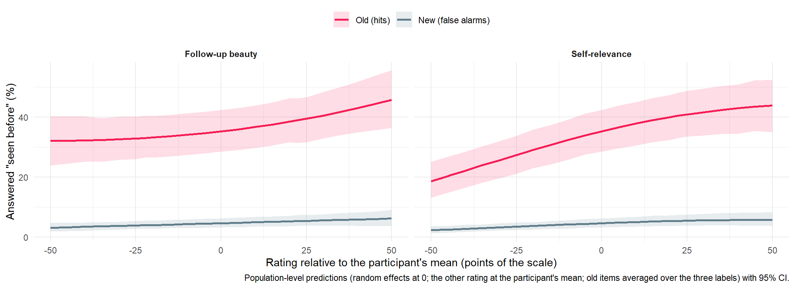{width=1056}
:::
:::


::: {.cell}

```{.r .cell-code}
write.csv(bind_rows(
  mutate(bind_rows(fx_old$effects, fx_new$effects), Table = "Probability (pp)"),
  mutate(odds, Table = "Log odds ratio")
), "../data/results_selfrelevance_memory.csv", row.names = FALSE)
```
:::


### Observed: source memory by self-relevance


::: {.cell}

```{.r .cell-code}
# Source memory of the items recognised as old, by SR (binned: 5-6 are rare)
sr_bins <- function(x) cut(x, c(-1, 0, 2, 4, 6), labels = c("0", "1-2", "3-4", "5-6"))
dfmem |>
  filter(Type == "Old", Recognition == "Yes") |>
  mutate(SR_bin = sr_bins(SR)) |>
  reframe(tibble(Question = c("Label (chance 33%)", "Own Phase-2 belief (chance 25%)"),
                 p = c(mean(as.character(AnswerCondition) == as.character(Condition)),
                       mean((AnswerBelief == Belief)[Belief != "None"])),
                 n = c(n(), sum(Belief != "None"))),
          .by = "SR_bin") |>
  mutate(SE = sqrt(p * (1 - p) / n)) |>
  ggplot(aes(x = SR_bin, y = 100 * p, color = Question, group = Question)) +
  geom_hline(yintercept = c(100 / 3, 25), linetype = "dotted", color = "grey60") +
  geom_line(alpha = 0.6) +
  geom_pointrange(aes(ymin = 100 * (p - 1.96 * SE), ymax = 100 * (p + 1.96 * SE))) +
  scale_color_manual(values = c("#7E57C2", "#26A69A")) +
  labs(x = "Self-relevance (follow-up)", y = "Correct source answer (%)", color = NULL,
       caption = "Items recognised as old; observed rates with 95% CI.") +
  theme_minimal() +
  theme(legend.position = "top")
```

::: {.cell-output-display}
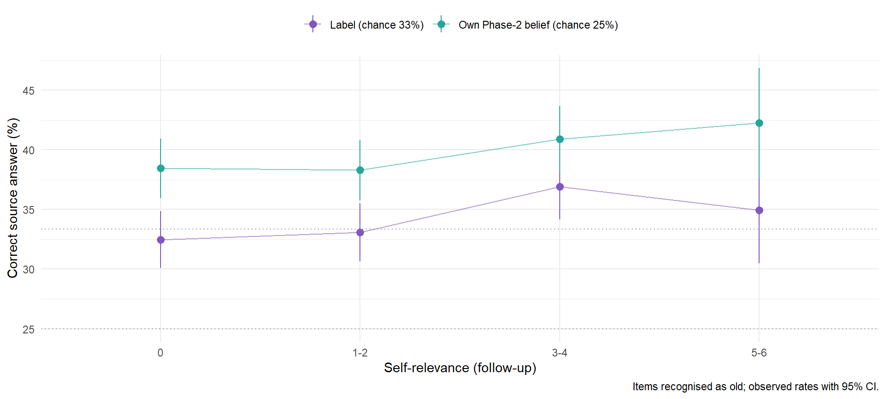{width=960}
:::
:::


Which label do people attach to what they recognise? For old items the
answer can be correct; for new items (false alarms) every label is
fabricated, and a "Human Original" attribution to a self-relevant but never
seen work would be the false-memory counterpart of "self-relevant = human".


::: {.cell}

```{.r .cell-code}
dfmem |>
  filter(Recognition == "Yes") |>
  mutate(SR_bin = sr_bins(SR),
         AnswerCondition = fct_drop(AnswerCondition)) |>
  summarise(n = n(), .by = c(Condition, SR_bin, AnswerCondition)) |>
  mutate(p = n / sum(n), N = sum(n), .by = c(Condition, SR_bin)) |>
  ggplot(aes(x = SR_bin, y = 100 * p, fill = AnswerCondition)) +
  geom_col(position = "stack", width = 0.8) +
  geom_text(data = \(d) distinct(d, Condition, SR_bin, N), aes(x = SR_bin, y = 104, label = paste0("n=", N)),
            inherit.aes = FALSE, size = 2.8, color = "grey40") +
  facet_wrap(~Condition, nrow = 1, labeller = as_labeller(\(x) ifelse(x == "New Items", "New items (false alarms)", paste("Shown as", x)))) +
  scale_fill_manual(values = cols) +
  labs(x = "Self-relevance (follow-up)", y = "Recalled label (%)", fill = "Recalled label",
       caption = "Items answered \"seen before\"; observed proportions.") +
  theme_minimal() +
  theme(legend.position = "top", strip.text = element_text(face = "bold"))
```

::: {.cell-output-display}
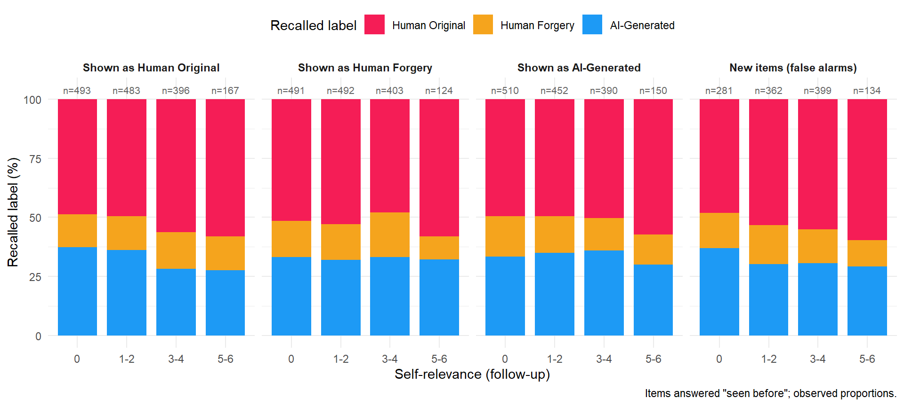{width=960}
:::
:::


## (D) Individual differences

Observed participant-level indices (the model-based ones, with their
reliability, belong in `7_correlates.qmd`): the participant's mean SR, the
**SR–beauty coupling** (correlation of SR with follow-up beauty over their 96
artworks), and the observed label gaps in Phase-1 beauty (mean over 16
artworks per label, % of the slider; noisy).


::: {.cell}

```{.r .cell-code}
dfind <- dfmem |>
  summarise(SR_mean = 100 * mean(SelfRelevance),
            Coupling = suppressWarnings(cor(SelfRelevance, Beauty2)),
            .by = "Participant") |>
  left_join(
    dfsr |>
      summarise(Beauty = 100 * mean(Beauty), .by = c(Participant, Condition)) |>
      pivot_wider(names_from = Condition, values_from = Beauty) |>
      transmute(Participant,
                Gap_AI = `AI-Generated` - `Human Original`,
                Gap_Forgery = `Human Forgery` - `Human Original`),
    by = "Participant") |>
  left_join(select(dfsub, Participant, MINT_Awareness, MINT_Deficit, MINT_Visceroception,
                   BAIT_Positive, BAIT_Negative, Art_Expertise), by = "Participant")

describe_distribution(select(dfind, SR_mean, Coupling, Gap_AI, Gap_Forgery)) |>
  as.data.frame() |>
  select(Variable, Mean, SD, Min, Max, n) |>
  knitr::kable(format = "pipe", digits = 2, caption = "Participant-level indices (SR_mean and gaps in % of the scale)")
```

::: {.cell-output-display}


Table: Participant-level indices (SR_mean and gaps in % of the scale)

|Variable    |  Mean|    SD|    Min|   Max|   n|
|:-----------|-----:|-----:|------:|-----:|---:|
|SR_mean     | 27.20| 17.46|   0.00| 72.74| 220|
|Coupling    |  0.57|  0.19|  -0.36|  0.94| 216|
|Gap_AI      | -5.78|  8.27| -31.14| 18.09| 220|
|Gap_Forgery | -3.68|  8.29| -27.26| 18.44| 220|


:::
:::


::: {.cell}

```{.r .cell-code}
correlation::correlation(select(dfind, SR_mean, Coupling),
                         select(dfind, Gap_AI, Gap_Forgery, MINT_Awareness, MINT_Deficit, MINT_Visceroception,
                                BAIT_Positive, BAIT_Negative, Art_Expertise),
                         p_adjust = "none") |>
  as.data.frame() |>
  transmute(Index = Parameter1, With = Parameter2,
            r = sprintf("%.2f", r),
            CI = sprintf("[%.2f, %.2f]", CI_low, CI_high),
            p = insight::format_p(p, name = NULL), n = n_Obs) |>
  knitr::kable(format = "pipe", row.names = FALSE, caption = "Pearson correlations of the SR indices (exploratory, no correction; questionnaire scores are NA after a failed attention check)")
```

::: {.cell-output-display}


Table: Pearson correlations of the SR indices (exploratory, no correction; questionnaire scores are NA after a failed attention check)

|Index    |With                |r     |CI            |p      |   n|
|:--------|:-------------------|:-----|:-------------|:------|---:|
|SR_mean  |Gap_AI              |0.08  |[-0.05, 0.21] |0.228  | 220|
|SR_mean  |Gap_Forgery         |0.04  |[-0.09, 0.18] |0.511  | 220|
|SR_mean  |MINT_Awareness      |0.09  |[-0.04, 0.22] |0.175  | 216|
|SR_mean  |MINT_Deficit        |0.16  |[0.03, 0.29]  |0.020  | 216|
|SR_mean  |MINT_Visceroception |0.18  |[0.05, 0.31]  |0.007  | 216|
|SR_mean  |BAIT_Positive       |0.05  |[-0.09, 0.18] |0.494  | 212|
|SR_mean  |BAIT_Negative       |0.02  |[-0.11, 0.16] |0.758  | 212|
|SR_mean  |Art_Expertise       |0.27  |[0.14, 0.38]  |< .001 | 220|
|Coupling |Gap_AI              |-0.01 |[-0.14, 0.12] |0.885  | 216|
|Coupling |Gap_Forgery         |0.00  |[-0.13, 0.14] |0.979  | 216|
|Coupling |MINT_Awareness      |0.11  |[-0.02, 0.24] |0.105  | 212|
|Coupling |MINT_Deficit        |0.15  |[0.01, 0.27]  |0.034  | 212|
|Coupling |MINT_Visceroception |0.20  |[0.07, 0.33]  |0.003  | 212|
|Coupling |BAIT_Positive       |-0.03 |[-0.17, 0.11] |0.665  | 208|
|Coupling |BAIT_Negative       |0.07  |[-0.07, 0.20] |0.318  | 208|
|Coupling |Art_Expertise       |0.12  |[-0.01, 0.25] |0.067  | 216|


:::
:::


## Manuscript figure

`figures/figure_selfrelevance.png`, the figure of the manuscript's "The Role
of Self-Relevance": Phase-1 beauty and meaning by self-relevance, per label,
from BeautySR and MeaningSR. Self-relevance is continuous in the models
(`SR_w`, linear on the link scale), and the x-axis is `SR_w` in points of the
0-6 scale (0 = the participant's own mean). Lines and ribbons: population-level
predictions with 95% CI (the observed means by self-relevance are in "(A)
Observed" above).


::: {.cell}

```{.r .cell-code}
fig_outcomes <- c(BeautySR = "Beauty", MeaningSR = "Meaningfulness")
sd_pts <- 6 * estimates$BeautySR$mediator_summary[["SD"]] # Low / High in the tables

fig_pred <- bind_rows(lapply(names(fig_outcomes), function(n) {
  est <- estimates[[n]]
  P <- 100 * est$grid_draws / ifelse(mediation_info[[n]]$outcome == "Meaning", 6, 1)
  tibble(Condition = est$grid$Condition, x = 6 * est$grid$SR_w, Outcome = fig_outcomes[[n]],
         Median = apply(P, 2, median),
         CI_low = apply(P, 2, quantile, 0.025),
         CI_high = apply(P, 2, quantile, 0.975))
})) |>
  filter(abs(x) <= 3)

figure_selfrelevance <- ggplot(fig_pred, aes(x = x, color = Condition, fill = Condition)) +
  geom_vline(xintercept = c(-sd_pts, sd_pts), linetype = "dotted", color = "grey60") +
  geom_ribbon(aes(ymin = CI_low, ymax = CI_high), alpha = 0.15, color = NA) +
  geom_line(aes(y = Median), linewidth = 1.3) +
  facet_wrap(~Outcome, scales = "free_y") +
  scale_x_continuous(breaks = -3:3, labels = c("-3", "-2", "-1", "Own\nmean", "+1", "+2", "+3")) +
  scale_color_manual(values = cols[levels(dfsr$Condition)]) +
  scale_fill_manual(values = cols[levels(dfsr$Condition)]) +
  labs(x = "Self-relevance at follow-up (points above or below the participant's own mean, 0-6 scale)",
       y = "Phase 1 rating (% of the scale)") +
  theme_minimal() +
  theme(legend.position = "bottom", legend.title = element_blank(),
        strip.text = element_text(face = "bold", size = 12))

ggsave("figures/figure_selfrelevance.png", figure_selfrelevance, width = 10.5, height = 4.5, dpi = 300, bg = "white")
figure_selfrelevance
```

::: {.cell-output-display}
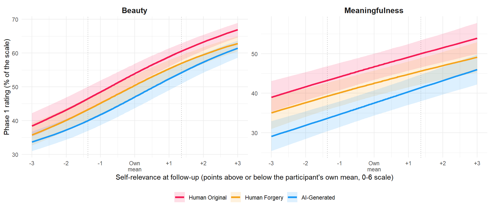{#fig-figure-selfrelevance width=1008}
:::
:::


## Summary

Auto-generated summary of the model-based results (for text readers):


```{.r .cell-code}
fmt <- function(r) {
  f <- function(x) insight::format_value(x, zap_small = TRUE)
  sprintf("%s [%s, %s]", f(r$Median), f(r$CI_low), f(r$CI_high))
}
lines <- c()
for (n in names(moderation)) {
  g <- moderation[[n]]$response$gaps
  s <- moderation[[n]]$response$slopes
  lines <- c(lines, sprintf("- **%s** (%% of the scale): %s", estimates[[n]]$label, paste(vapply(contrast_order, function(ct) {
    d <- g[g$Contrast == ct, ]
    sprintf("%s gap %s at low SR, %s at high SR (change %s)", ct, fmt(d[d$At == "Low", ]), fmt(d[d$At == "High", ]), fmt(d[d$At == "High - Low", ]))
  }, ""), collapse = "; ")),
  sprintf("  - SR slope per +10%%: %s.", paste(sprintf("%s %s", levels(dfsr$Condition), vapply(levels(dfsr$Condition), function(cnd) fmt(s[s$Condition == cnd, ]), "")), collapse = ", ")))
}
for (o in names(beliefs)) {
  cues <- beliefs[[o]]$response$cues
  lines <- c(lines, sprintf("- **%s** (%s; %% of the slider per +10%% of the predictor, others at average): %s.", o, belief_models[[o]],
    paste(vapply(names(predictor_labels), function(k) {
      sprintf("%s: %s", predictor_labels[[k]], paste(sprintf("%s %s", levels(dfsr$Condition), vapply(levels(dfsr$Condition), function(cnd) {
        fmt(cues[cues$Mediator == k & cues$Condition == cnd, ])
      }, "")), collapse = ", "))
    }, ""), collapse = "; ")))
}
if (ready("ArtificialitySR")) {
  sl <- grid_slopes(estimates$ArtificialitySR)
  cv <- covariate_slopes(estimates$ArtificialitySR, "Beauty2_w", pairs = TRUE)
  lines <- c(lines, sprintf("- **Perceived artificiality** (items judged new, %% of the slider per +10%%): SR slope Old %s, New %s; follow-up beauty slope Old %s, New %s.",
    fmt(sl[sl$Level == "Old", ]), fmt(sl[sl$Level == "New", ]), fmt(cv[cv$Level == "Old", ]), fmt(cv[cv$Level == "New", ])))
}
if (length(lines) == 0) lines <- "- No self-relevance model has been extracted yet (see the Convergence section)."
make_asis(lines)
```

- **Phase-1 Beauty by Self-Relevance** (% of the scale): AI-Generated - Human Original gap -6.48 [-8.25, -4.65] at low SR, -6.35 [-8.12, -4.69] at high SR (change 0.16 [-2.31, 2.49]); Human Forgery - Human Original gap -3.24 [-4.87, -1.45] at low SR, -3.62 [-5.04, -2.07] at high SR (change -0.38 [-2.59, 1.84]); AI-Generated - Human Forgery gap -3.26 [-5.12, -1.54] at low SR, -2.71 [-4.73, -1.11] at high SR (change 0.52 [-2.04, 2.94])
  - SR slope per +10%: Human Original 3.15 [2.60, 3.64], Human Forgery 3.08 [2.55, 3.60], AI-Generated 3.22 [2.73, 3.76].
- **Phase-1 Beauty by Self-Relevance, controlling follow-up Beauty** (% of the scale): AI-Generated - Human Original gap -7.00 [-8.83, -5.06] at low SR, -6.00 [-7.93, -4.04] at high SR (change 0.99 [-1.63, 3.54]); Human Forgery - Human Original gap -3.31 [-5.10, -1.58] at low SR, -3.40 [-5.08, -1.54] at high SR (change -0.08 [-2.63, 2.36]); AI-Generated - Human Forgery gap -3.71 [-5.68, -1.73] at low SR, -2.59 [-4.58, -0.42] at high SR (change 1.10 [-1.53, 4.15])
  - SR slope per +10%: Human Original 1.08 [0.66, 1.53], Human Forgery 1.06 [0.59, 1.52], AI-Generated 1.30 [0.81, 1.83].
- **Phase-1 Beauty by within- and between-person Self-Relevance** (% of the scale): AI-Generated - Human Original gap -6.51 [-8.33, -4.77] at low SR, -6.33 [-7.99, -4.74] at high SR (change 0.15 [-2.25, 2.52]); Human Forgery - Human Original gap -3.25 [-4.97, -1.53] at low SR, -3.66 [-5.13, -2.28] at high SR (change -0.40 [-2.58, 1.85]); AI-Generated - Human Forgery gap -3.23 [-5.17, -1.50] at low SR, -2.70 [-4.43, -0.88] at high SR (change 0.54 [-1.96, 2.94])
  - SR slope per +10%: Human Original 3.13 [2.59, 3.65], Human Forgery 3.06 [2.55, 3.58], AI-Generated 3.20 [2.71, 3.71].
- **Phase-1 Meaning by Self-Relevance** (% of the scale): AI-Generated - Human Original gap -9.57 [-11.80, -7.61] at low SR, -8.61 [-10.56, -6.61] at high SR (change 0.97 [-1.09, 3.01]); Human Forgery - Human Original gap -4.01 [-5.59, -2.36] at low SR, -4.39 [-5.93, -2.95] at high SR (change -0.38 [-2.46, 1.68]); AI-Generated - Human Forgery gap -5.55 [-7.73, -3.59] at low SR, -4.22 [-6.18, -2.40] at high SR (change 1.33 [-0.89, 3.43])
  - SR slope per +10%: Human Original 1.48 [1.04, 1.88], Human Forgery 1.39 [0.96, 1.81], AI-Generated 1.69 [1.27, 2.14].
- **Syntheticness** (RealitySR; % of the slider per +10% of the predictor, others at average): Phase-1 beauty: Human Original 2.41 [1.76, 3.15], Human Forgery 1.93 [1.22, 2.65], AI-Generated 2.11 [1.37, 2.82]; Self-relevance: Human Original 0.48 [-0.11, 1.11], Human Forgery 0.31 [-0.28, 0.98], AI-Generated 0.96 [0.35, 1.56]; Follow-up beauty: Human Original 1.54 [0.86, 2.27], Human Forgery 1.56 [0.81, 2.26], AI-Generated 1.08 [0.39, 1.78].
- **Authenticity** (AuthenticitySR; % of the slider per +10% of the predictor, others at average): Phase-1 beauty: Human Original 1.56 [0.94, 2.10], Human Forgery 1.01 [0.43, 1.58], AI-Generated 1.21 [0.62, 1.77]; Self-relevance: Human Original 0.25 [-0.24, 0.79], Human Forgery 0.58 [0.06, 1.15], AI-Generated 0.79 [0.26, 1.32]; Follow-up beauty: Human Original 0.50 [-0.11, 1.12], Human Forgery 0.45 [-0.18, 1.12], AI-Generated -0.13 [-0.75, 0.51].
- **Perceived artificiality** (items judged new, % of the slider per +10%): SR slope Old -0.93 [-1.38, -0.51], New -1.02 [-1.43, -0.65]; follow-up beauty slope Old -1.70 [-2.23, -1.15], New -1.69 [-2.21, -1.19].

Files written (once the corresponding estimates exist):

- `data/results_selfrelevance_moderation.csv`: (A) label gaps at low / average / high SR and their change, SR slopes per label, and (BeautySRControl) the follow-up beauty slopes; mean response and every modelled parameter.
- `data/results_selfrelevance_beliefs.csv`: (B) unique slopes of Phase-1 beauty, SR and follow-up beauty per label (`Cue`), the decomposition of the label effect (`Decomposition`), and the perceived-artificiality slopes per item type.
- `data/results_selfrelevance_contrasts.csv`: label contrasts at average ratings, every parameter, per model.


::: {.cell}

```{.r .cell-code}
if (length(moderation) > 0) {
  bind_rows(lapply(names(moderation), function(n) {
    bind_rows(lapply(names(moderation[[n]]), function(p) {
      bind_rows(
        mutate(moderation[[n]][[p]]$gaps, Table = "Gap"),
        mutate(rename(moderation[[n]][[p]]$slopes, Contrast = Condition), Table = "SR slope"),
        if (n == "BeautySRControl") mutate(rename(covariate_slopes(estimates[[n]], "Beauty2_w", par = p, pairs = TRUE), Contrast = Level), Table = "Beauty2 slope"),
        if (n == "BeautySRBetween") mutate(rename(covariate_slopes(estimates[[n]], "SR_b", par = p, pairs = TRUE), Contrast = Level), Table = "SR_b slope")
      ) |>
        mutate(Model = n, Parameter = p, .before = 1)
    }))
  })) |>
    write.csv("../data/results_selfrelevance_moderation.csv", row.names = FALSE)
}

beliefs_out <- bind_rows(
  bind_rows(lapply(names(beliefs), function(o) {
    bind_rows(lapply(names(beliefs[[o]]), function(p) {
      bind_rows(
        mutate(rename(beliefs[[o]][[p]]$cues, Predictor = Mediator, Contrast = Condition), Table = "Cue"),
        mutate(rename(beliefs[[o]][[p]]$effects, Predictor = Path), Table = "Decomposition")
      ) |>
        mutate(Model = belief_models[[o]], Parameter = p, .before = 1)
    }))
  })),
  if (ready("ArtificialitySR")) bind_rows(lapply(c("response", mediation_info$ArtificialitySR$dpars), function(p) {
    bind_rows(
      mutate(rename(grid_slopes(estimates$ArtificialitySR, par = p), Contrast = Level), Predictor = "SR"),
      mutate(rename(covariate_slopes(estimates$ArtificialitySR, "Beauty2_w", par = p, pairs = TRUE), Contrast = Level), Predictor = "Beauty2")
    ) |>
      mutate(Model = "ArtificialitySR", Parameter = p, Table = "Slope by Type", .before = 1)
  }))
)
if (nrow(beliefs_out) > 0) write.csv(beliefs_out, "../data/results_selfrelevance_beliefs.csv", row.names = FALSE)

bind_rows(lapply(names(estimates), function(n) {
  outcome <- if (n %in% names(mediation_info)) mediation_info[[n]]$outcome else appraisal_info[[n]]$outcome
  prep_contrasts(estimates[[n]]$contrasts, outcome) |>
    mutate(Model = n) |>
    select(Model, Contrast, Parameter, Difference, CI_low, CI_high, Difference_pct, CI_low_pct, CI_high_pct, pd, Credible, Effect)
})) |>
  write.csv("../data/results_selfrelevance_contrasts.csv", row.names = FALSE)
```
:::


## Exploratory checks: centring and shape

Not reported in the manuscript; kept as a record of what was checked
(2026-09-24), for this paper's robustness and for future studies. The
models above centre self-relevance (and beauty) within participant and enter
it linearly. The checks below probe both with quick frequentist fits (lme4
linear mixed models on the 0-100 scale, mgcv GAMs); the rationale for the
centring is set out in `5_realitydeterminants.qmd` ("Exploratory checks").
In short: centring keeps the units of the scale and removes only the
participant's average; it is the right predictor for within-person questions
(is *this* artwork, more self-relevant than my others, penalised less?), and
the between-person question (are people who find art self-relevant less
biased?) needs the participant's mean as a second predictor, not a raw
rating. That question is answered by **BeautySRBetween** in (A); the pilots
below extend the comparison to the other models.

### Within-participant centring


::: {.cell cache.extra='7db475d40954436a0012ed460d5f0cb2'}

```{.r .cell-code}
# Three versions of each rated predictor x: x_w (centred within participant,
# as fitted), x_raw (grand-mean centred), x_w + x_b (x_b = participant mean,
# centred on the mean of the participant means)
add_wb <- function(d, vars) {
  for (v in names(vars)) {
    x <- d[[vars[[v]]]]
    m <- ave(x, d$Participant)
    d[[paste0(v, "_w")]] <- x - m
    d[[paste0(v, "_raw")]] <- x - mean(x)
    d[[paste0(v, "_b")]] <- m - mean(m[!duplicated(d$Participant)])
  }
  d
}
spec3 <- function(rhs_w, rhs_raw, rhs_wb) c("Within (as fitted)" = rhs_w, "Raw" = rhs_raw, "Within + between" = rhs_wb)
run_specs <- function(y, specs, d) {
  bind_rows(lapply(names(specs), function(s) mutate(pilot_coefs(paste(y, specs[[s]]), d), Specification = s, Outcome = y)))
}

# (A) Phase-1 beauty and meaning on the label and SR
d_a <- dfsr |>
  filter(!is.na(Beauty2)) |>
  add_wb(c(SR = "SelfRelevance")) |>
  mutate(Beauty = 100 * Beauty, Meaning = 100 * Meaning)
specs_a <- spec3("~ Condition * SR_w + (Condition + SR_w | Participant) + (1 | Item)",
                 "~ Condition * SR_raw + (Condition + SR_raw | Participant) + (1 | Item)",
                 "~ Condition * (SR_w + SR_b) + (Condition + SR_w | Participant) + (1 | Item)")
pilot_sr_a <- bind_rows(run_specs("Beauty", specs_a, d_a), run_specs("Meaning", specs_a, d_a))

# ...and the label gap per absolute SR level (0, 1-2, 3-4, 5-6), no linearity
d_a$SR_bin <- cut(round(6 * d_a$SelfRelevance), c(-1, 0, 2, 4, 6), labels = c("0", "1-2", "3-4", "5-6"))
pilot_sr_bins <- bind_rows(lapply(c("Beauty", "Meaning"), function(y) {
  mutate(pilot_coefs(paste(y, "~ 0 + SR_bin / Condition + (Condition | Participant) + (1 | Item)"), d_a), Outcome = y)
})) |>
  filter(str_detect(Term, "Condition")) |>
  mutate(SR = str_extract(Term, "(?<=SR_bin)[^:]+"), Contrast = str_remove(str_extract(Term, "Condition.*"), "Condition"))

# (B) beliefs on the label, Phase-1 beauty, SR and follow-up beauty
d_b <- dfsr |>
  filter(!is.na(Beauty2), !is.na(Reality)) |>
  add_wb(c(Beauty = "Beauty", SR = "SelfRelevance", Beauty2 = "Beauty2")) |>
  mutate(Reality = 100 * Reality, Authenticity = 100 * Authenticity)
re_b <- "(Condition + Beauty_w + SR_w + Beauty2_w || Participant) + (1 | Item)"
specs_b <- spec3(paste("~ Condition * (Beauty_w + SR_w + Beauty2_w) +", re_b),
                 "~ Condition * (Beauty_raw + SR_raw + Beauty2_raw) + (Condition + Beauty_raw + SR_raw + Beauty2_raw || Participant) + (1 | Item)",
                 paste("~ Condition * (Beauty_w + SR_w + Beauty2_w) + Beauty_b + SR_b + Beauty2_b +", re_b))
pilot_sr_b <- bind_rows(run_specs("Reality", specs_b, d_b), run_specs("Authenticity", specs_b, d_b))

# (B) perceived artificiality of the artworks judged new
d_art <- dfmem |>
  filter(!is.na(PerceivedArtificiality), !is.na(Beauty2), !is.na(SelfRelevance)) |>
  add_wb(c(Beauty2 = "Beauty2", SR = "SelfRelevance")) |>
  mutate(PerceivedArtificiality = 100 * PerceivedArtificiality)
specs_art <- spec3("~ Type * (Beauty2_w + SR_w) + (Type + Beauty2_w + SR_w || Participant) + (1 | Item)",
                   "~ Type * (Beauty2_raw + SR_raw) + (Type + Beauty2_raw + SR_raw || Participant) + (1 | Item)",
                   "~ Type * (Beauty2_w + SR_w) + Beauty2_b + SR_b + (Type + Beauty2_w + SR_w || Participant) + (1 | Item)")
pilot_sr_art <- run_specs("PerceivedArtificiality", specs_art, d_art)
```
:::


```{.r .cell-code}
make_asis(
  make_tables(pilot_table(pilot_sr_a), c("Outcome", "Specification", "Term", "Unit", "Diff", "SE", "Effect"),
              "lme4 pilots, (A): Phase-1 ratings on the label and SR, three versions of SR (slopes for Originals; 'x' rows: difference in slope under a label; Effect: |t| > 1.96)"),
  make_tables(pilot_sr_bins |>
                mutate(Effect = ifelse(abs(Estimate / SE) < 1.96, "n.s.", ifelse(Estimate < 0, "Negative", "Positive")),
                       Diff = insight::format_value(Estimate), SE = insight::format_value(SE)) |>
                arrange(Outcome, Contrast, SR),
              c("Outcome", "Contrast", "SR", "Diff", "SE", "Effect"),
              "lme4 pilot: label gap (vs. Originals, % of the scale) at each absolute level of self-relevance (0-6)"),
  make_tables(pilot_table(filter(pilot_sr_b, !str_detect(Term, "^Condition[^:]*$"))), c("Outcome", "Specification", "Term", "Unit", "Diff", "SE", "Effect"),
              "lme4 pilots, (B): beliefs on the label, Phase-1 beauty, SR and follow-up beauty, three versions of each predictor"),
  make_tables(pilot_table(filter(pilot_sr_art, Term != "TypeNew")), c("Outcome", "Specification", "Term", "Unit", "Diff", "SE", "Effect"),
              "lme4 pilots, (B): perceived artificiality of the artworks judged new (reference: old items)")
)
```

```{=html}
<div id="bwhkvpfjrk" style="padding-left:0px;padding-right:0px;padding-top:10px;padding-bottom:10px;overflow-x:auto;overflow-y:auto;width:auto;height:auto;">
<style>#bwhkvpfjrk table {
  font-family: system-ui, 'Segoe UI', Roboto, Helvetica, Arial, sans-serif, 'Apple Color Emoji', 'Segoe UI Emoji', 'Segoe UI Symbol', 'Noto Color Emoji';
  -webkit-font-smoothing: antialiased;
  -moz-osx-font-smoothing: grayscale;
}

#bwhkvpfjrk thead, #bwhkvpfjrk tbody, #bwhkvpfjrk tfoot, #bwhkvpfjrk tr, #bwhkvpfjrk td, #bwhkvpfjrk th {
  border-style: none;
}

#bwhkvpfjrk p {
  margin: 0;
  padding: 0;
}

#bwhkvpfjrk .gt_table {
  display: table;
  border-collapse: collapse;
  line-height: normal;
  margin-left: auto;
  margin-right: auto;
  color: #333333;
  font-size: 13px;
  font-weight: normal;
  font-style: normal;
  background-color: #FFFFFF;
  width: auto;
  border-top-style: solid;
  border-top-width: 3px;
  border-top-color: #D5D5D5;
  border-right-style: solid;
  border-right-width: 3px;
  border-right-color: #D5D5D5;
  border-bottom-style: solid;
  border-bottom-width: 3px;
  border-bottom-color: #D5D5D5;
  border-left-style: solid;
  border-left-width: 3px;
  border-left-color: #D5D5D5;
}

#bwhkvpfjrk .gt_caption {
  padding-top: 4px;
  padding-bottom: 4px;
}

#bwhkvpfjrk .gt_title {
  color: #333333;
  font-size: 125%;
  font-weight: initial;
  padding-top: 4px;
  padding-bottom: 4px;
  padding-left: 5px;
  padding-right: 5px;
  border-bottom-color: #FFFFFF;
  border-bottom-width: 0;
}

#bwhkvpfjrk .gt_subtitle {
  color: #333333;
  font-size: 85%;
  font-weight: initial;
  padding-top: 3px;
  padding-bottom: 5px;
  padding-left: 5px;
  padding-right: 5px;
  border-top-color: #FFFFFF;
  border-top-width: 0;
}

#bwhkvpfjrk .gt_heading {
  background-color: #FFFFFF;
  text-align: left;
  border-bottom-color: #FFFFFF;
  border-left-style: none;
  border-left-width: 1px;
  border-left-color: #D3D3D3;
  border-right-style: none;
  border-right-width: 1px;
  border-right-color: #D3D3D3;
}

#bwhkvpfjrk .gt_bottom_border {
  border-bottom-style: solid;
  border-bottom-width: 2px;
  border-bottom-color: #D5D5D5;
}

#bwhkvpfjrk .gt_col_headings {
  border-top-style: solid;
  border-top-width: 2px;
  border-top-color: #D5D5D5;
  border-bottom-style: solid;
  border-bottom-width: 2px;
  border-bottom-color: #D5D5D5;
  border-left-style: none;
  border-left-width: 1px;
  border-left-color: #D3D3D3;
  border-right-style: none;
  border-right-width: 1px;
  border-right-color: #D3D3D3;
}

#bwhkvpfjrk .gt_col_heading {
  color: #FFFFFF;
  background-color: #000000;
  font-size: 100%;
  font-weight: normal;
  text-transform: inherit;
  border-left-style: none;
  border-left-width: 1px;
  border-left-color: #D3D3D3;
  border-right-style: none;
  border-right-width: 1px;
  border-right-color: #D3D3D3;
  vertical-align: bottom;
  padding-top: 5px;
  padding-bottom: 6px;
  padding-left: 5px;
  padding-right: 5px;
  overflow-x: hidden;
}

#bwhkvpfjrk .gt_column_spanner_outer {
  color: #FFFFFF;
  background-color: #000000;
  font-size: 100%;
  font-weight: normal;
  text-transform: inherit;
  padding-top: 0;
  padding-bottom: 0;
  padding-left: 4px;
  padding-right: 4px;
}

#bwhkvpfjrk .gt_column_spanner_outer:first-child {
  padding-left: 0;
}

#bwhkvpfjrk .gt_column_spanner_outer:last-child {
  padding-right: 0;
}

#bwhkvpfjrk .gt_column_spanner {
  border-bottom-style: solid;
  border-bottom-width: 2px;
  border-bottom-color: #D5D5D5;
  vertical-align: bottom;
  padding-top: 5px;
  padding-bottom: 5px;
  overflow-x: hidden;
  display: inline-block;
  width: 100%;
}

#bwhkvpfjrk .gt_spanner_row {
  border-bottom-style: hidden;
}

#bwhkvpfjrk .gt_group_heading {
  padding-top: 8px;
  padding-bottom: 8px;
  padding-left: 5px;
  padding-right: 5px;
  color: #333333;
  background-color: #FFFFFF;
  font-size: 100%;
  font-weight: initial;
  text-transform: inherit;
  border-top-style: solid;
  border-top-width: 2px;
  border-top-color: #D5D5D5;
  border-bottom-style: solid;
  border-bottom-width: 2px;
  border-bottom-color: #D5D5D5;
  border-left-style: none;
  border-left-width: 1px;
  border-left-color: #D3D3D3;
  border-right-style: none;
  border-right-width: 1px;
  border-right-color: #D3D3D3;
  vertical-align: middle;
  text-align: left;
}

#bwhkvpfjrk .gt_empty_group_heading {
  padding: 0.5px;
  color: #333333;
  background-color: #FFFFFF;
  font-size: 100%;
  font-weight: initial;
  border-top-style: solid;
  border-top-width: 2px;
  border-top-color: #D5D5D5;
  border-bottom-style: solid;
  border-bottom-width: 2px;
  border-bottom-color: #D5D5D5;
  vertical-align: middle;
}

#bwhkvpfjrk .gt_from_md > :first-child {
  margin-top: 0;
}

#bwhkvpfjrk .gt_from_md > :last-child {
  margin-bottom: 0;
}

#bwhkvpfjrk .gt_row {
  padding-top: 8px;
  padding-bottom: 8px;
  padding-left: 5px;
  padding-right: 5px;
  margin: 10px;
  border-top-style: solid;
  border-top-width: 1px;
  border-top-color: #D5D5D5;
  border-left-style: solid;
  border-left-width: 1px;
  border-left-color: #D5D5D5;
  border-right-style: solid;
  border-right-width: 1px;
  border-right-color: #D5D5D5;
  vertical-align: middle;
  overflow-x: hidden;
}

#bwhkvpfjrk .gt_stub {
  color: #333333;
  background-color: #FFFFFF;
  font-size: 100%;
  font-weight: initial;
  text-transform: inherit;
  border-right-style: solid;
  border-right-width: 2px;
  border-right-color: #5F5F5F;
  padding-left: 5px;
  padding-right: 5px;
}

#bwhkvpfjrk .gt_stub_row_group {
  color: #333333;
  background-color: #FFFFFF;
  font-size: 100%;
  font-weight: initial;
  text-transform: inherit;
  border-right-style: solid;
  border-right-width: 2px;
  border-right-color: #D3D3D3;
  padding-left: 5px;
  padding-right: 5px;
  vertical-align: top;
}

#bwhkvpfjrk .gt_row_group_first td {
  border-top-width: 2px;
}

#bwhkvpfjrk .gt_row_group_first th {
  border-top-width: 2px;
}

#bwhkvpfjrk .gt_summary_row {
  color: #333333;
  background-color: #D5D5D5;
  text-transform: inherit;
  padding-top: 8px;
  padding-bottom: 8px;
  padding-left: 5px;
  padding-right: 5px;
}

#bwhkvpfjrk .gt_first_summary_row {
  border-top-style: solid;
  border-top-color: #D5D5D5;
}

#bwhkvpfjrk .gt_first_summary_row.thick {
  border-top-width: 2px;
}

#bwhkvpfjrk .gt_last_summary_row {
  padding-top: 8px;
  padding-bottom: 8px;
  padding-left: 5px;
  padding-right: 5px;
  border-bottom-style: solid;
  border-bottom-width: 2px;
  border-bottom-color: #D5D5D5;
}

#bwhkvpfjrk .gt_grand_summary_row {
  color: #FFFFFF;
  background-color: #929292;
  text-transform: inherit;
  padding-top: 8px;
  padding-bottom: 8px;
  padding-left: 5px;
  padding-right: 5px;
}

#bwhkvpfjrk .gt_first_grand_summary_row {
  padding-top: 8px;
  padding-bottom: 8px;
  padding-left: 5px;
  padding-right: 5px;
  border-top-style: double;
  border-top-width: 6px;
  border-top-color: #D5D5D5;
}

#bwhkvpfjrk .gt_last_grand_summary_row_top {
  padding-top: 8px;
  padding-bottom: 8px;
  padding-left: 5px;
  padding-right: 5px;
  border-bottom-style: double;
  border-bottom-width: 6px;
  border-bottom-color: #D5D5D5;
}

#bwhkvpfjrk .gt_striped {
  background-color: #F4F4F4;
}

#bwhkvpfjrk .gt_table_body {
  border-top-style: solid;
  border-top-width: 2px;
  border-top-color: #D5D5D5;
  border-bottom-style: solid;
  border-bottom-width: 2px;
  border-bottom-color: #D5D5D5;
}

#bwhkvpfjrk .gt_footnotes {
  color: #333333;
  background-color: #FFFFFF;
  border-bottom-style: none;
  border-bottom-width: 2px;
  border-bottom-color: #D3D3D3;
  border-left-style: none;
  border-left-width: 2px;
  border-left-color: #D3D3D3;
  border-right-style: none;
  border-right-width: 2px;
  border-right-color: #D3D3D3;
}

#bwhkvpfjrk .gt_footnote {
  margin: 0px;
  font-size: 90%;
  padding-top: 4px;
  padding-bottom: 4px;
  padding-left: 5px;
  padding-right: 5px;
}

#bwhkvpfjrk .gt_sourcenotes {
  color: #333333;
  background-color: #FFFFFF;
  border-bottom-style: none;
  border-bottom-width: 2px;
  border-bottom-color: #D3D3D3;
  border-left-style: none;
  border-left-width: 2px;
  border-left-color: #D3D3D3;
  border-right-style: none;
  border-right-width: 2px;
  border-right-color: #D3D3D3;
}

#bwhkvpfjrk .gt_sourcenote {
  font-size: 90%;
  padding-top: 4px;
  padding-bottom: 4px;
  padding-left: 5px;
  padding-right: 5px;
}

#bwhkvpfjrk .gt_left {
  text-align: left;
}

#bwhkvpfjrk .gt_center {
  text-align: center;
}

#bwhkvpfjrk .gt_right {
  text-align: right;
  font-variant-numeric: tabular-nums;
}

#bwhkvpfjrk .gt_font_normal {
  font-weight: normal;
}

#bwhkvpfjrk .gt_font_bold {
  font-weight: bold;
}

#bwhkvpfjrk .gt_font_italic {
  font-style: italic;
}

#bwhkvpfjrk .gt_super {
  font-size: 65%;
}

#bwhkvpfjrk .gt_footnote_marks {
  font-size: 75%;
  vertical-align: 0.4em;
  position: initial;
}

#bwhkvpfjrk .gt_asterisk {
  font-size: 100%;
  vertical-align: 0;
}

#bwhkvpfjrk .gt_indent_1 {
  text-indent: 5px;
}

#bwhkvpfjrk .gt_indent_2 {
  text-indent: 10px;
}

#bwhkvpfjrk .gt_indent_3 {
  text-indent: 15px;
}

#bwhkvpfjrk .gt_indent_4 {
  text-indent: 20px;
}

#bwhkvpfjrk .gt_indent_5 {
  text-indent: 25px;
}

#bwhkvpfjrk .katex-display {
  display: inline-flex !important;
  margin-bottom: 0.75em !important;
}

#bwhkvpfjrk div.Reactable > div.rt-table > div.rt-thead > div.rt-tr.rt-tr-group-header > div.rt-th-group:after {
  height: 0px !important;
}
</style>
<table class="gt_table" data-quarto-disable-processing="false" data-quarto-bootstrap="false">
  <thead>
    <tr class="gt_heading">
      <td colspan="7" class="gt_heading gt_title gt_font_normal gt_bottom_border" style>lme4 pilots, (A): Phase-1 ratings on the label and SR, three versions of SR (slopes for Originals; 'x' rows: difference in slope under a label; Effect: |t| &gt; 1.96)</td>
    </tr>
    
    <tr class="gt_col_headings">
      <th class="gt_col_heading gt_columns_bottom_border gt_left" rowspan="1" colspan="1" scope="col" id="Outcome">Outcome</th>
      <th class="gt_col_heading gt_columns_bottom_border gt_left" rowspan="1" colspan="1" scope="col" id="Specification">Specification</th>
      <th class="gt_col_heading gt_columns_bottom_border gt_left" rowspan="1" colspan="1" scope="col" id="Term">Term</th>
      <th class="gt_col_heading gt_columns_bottom_border gt_left" rowspan="1" colspan="1" scope="col" id="Unit">Unit</th>
      <th class="gt_col_heading gt_columns_bottom_border gt_right" rowspan="1" colspan="1" scope="col" id="Diff">Diff</th>
      <th class="gt_col_heading gt_columns_bottom_border gt_right" rowspan="1" colspan="1" scope="col" id="SE">SE</th>
      <th class="gt_col_heading gt_columns_bottom_border gt_left" rowspan="1" colspan="1" scope="col" id="Effect">Effect</th>
    </tr>
  </thead>
  <tbody class="gt_table_body">
    <tr><td headers="Outcome" class="gt_row gt_left" style="background-color: #FFEBEE;">Beauty</td>
<td headers="Specification" class="gt_row gt_left" style="background-color: #FFEBEE;">Within (as fitted)</td>
<td headers="Term" class="gt_row gt_left" style="background-color: #FFEBEE;">Forgery</td>
<td headers="Unit" class="gt_row gt_left" style="background-color: #FFEBEE;">% of the scale</td>
<td headers="Diff" class="gt_row gt_right" style="background-color: #FFEBEE;">-2.98</td>
<td headers="SE" class="gt_row gt_right" style="background-color: #FFEBEE;">0.45</td>
<td headers="Effect" class="gt_row gt_left" style="background-color: #FFEBEE;">Negative</td></tr>
    <tr><td headers="Outcome" class="gt_row gt_left gt_striped" style="background-color: #FFEBEE;">Beauty</td>
<td headers="Specification" class="gt_row gt_left gt_striped" style="background-color: #FFEBEE;">Within (as fitted)</td>
<td headers="Term" class="gt_row gt_left gt_striped" style="background-color: #FFEBEE;">AI-Generated</td>
<td headers="Unit" class="gt_row gt_left gt_striped" style="background-color: #FFEBEE;">% of the scale</td>
<td headers="Diff" class="gt_row gt_right gt_striped" style="background-color: #FFEBEE;">-5.32</td>
<td headers="SE" class="gt_row gt_right gt_striped" style="background-color: #FFEBEE;">0.46</td>
<td headers="Effect" class="gt_row gt_left gt_striped" style="background-color: #FFEBEE;">Negative</td></tr>
    <tr><td headers="Outcome" class="gt_row gt_left" style="background-color: #E8F5E9;">Beauty</td>
<td headers="Specification" class="gt_row gt_left" style="background-color: #E8F5E9;">Within (as fitted)</td>
<td headers="Term" class="gt_row gt_left" style="background-color: #E8F5E9;">SR (within)</td>
<td headers="Unit" class="gt_row gt_left" style="background-color: #E8F5E9;">per +10% of the predictor</td>
<td headers="Diff" class="gt_row gt_right" style="background-color: #E8F5E9;">2.54</td>
<td headers="SE" class="gt_row gt_right" style="background-color: #E8F5E9;">0.16</td>
<td headers="Effect" class="gt_row gt_left" style="background-color: #E8F5E9;">Positive</td></tr>
    <tr><td headers="Outcome" class="gt_row gt_left gt_striped" style="background-color: #FFEBEE;">Beauty</td>
<td headers="Specification" class="gt_row gt_left gt_striped" style="background-color: #FFEBEE;">Within (as fitted)</td>
<td headers="Term" class="gt_row gt_left gt_striped" style="background-color: #FFEBEE;">Forgery x SR (within)</td>
<td headers="Unit" class="gt_row gt_left gt_striped" style="background-color: #FFEBEE;">per +10% of the predictor</td>
<td headers="Diff" class="gt_row gt_right gt_striped" style="background-color: #FFEBEE;">-0.37</td>
<td headers="SE" class="gt_row gt_right gt_striped" style="background-color: #FFEBEE;">0.18</td>
<td headers="Effect" class="gt_row gt_left gt_striped" style="background-color: #FFEBEE;">Negative</td></tr>
    <tr><td headers="Outcome" class="gt_row gt_left" style="color: #9E9E9E;">Beauty</td>
<td headers="Specification" class="gt_row gt_left" style="color: #9E9E9E;">Within (as fitted)</td>
<td headers="Term" class="gt_row gt_left" style="color: #9E9E9E;">AI-Generated x SR (within)</td>
<td headers="Unit" class="gt_row gt_left" style="color: #9E9E9E;">per +10% of the predictor</td>
<td headers="Diff" class="gt_row gt_right" style="color: #9E9E9E;">-0.28</td>
<td headers="SE" class="gt_row gt_right" style="color: #9E9E9E;">0.18</td>
<td headers="Effect" class="gt_row gt_left" style="color: #9E9E9E;">n.s.</td></tr>
    <tr><td headers="Outcome" class="gt_row gt_left gt_striped" style="background-color: #FFEBEE;">Beauty</td>
<td headers="Specification" class="gt_row gt_left gt_striped" style="background-color: #FFEBEE;">Raw</td>
<td headers="Term" class="gt_row gt_left gt_striped" style="background-color: #FFEBEE;">Forgery</td>
<td headers="Unit" class="gt_row gt_left gt_striped" style="background-color: #FFEBEE;">% of the scale</td>
<td headers="Diff" class="gt_row gt_right gt_striped" style="background-color: #FFEBEE;">-2.97</td>
<td headers="SE" class="gt_row gt_right gt_striped" style="background-color: #FFEBEE;">0.46</td>
<td headers="Effect" class="gt_row gt_left gt_striped" style="background-color: #FFEBEE;">Negative</td></tr>
    <tr><td headers="Outcome" class="gt_row gt_left" style="background-color: #FFEBEE;">Beauty</td>
<td headers="Specification" class="gt_row gt_left" style="background-color: #FFEBEE;">Raw</td>
<td headers="Term" class="gt_row gt_left" style="background-color: #FFEBEE;">AI-Generated</td>
<td headers="Unit" class="gt_row gt_left" style="background-color: #FFEBEE;">% of the scale</td>
<td headers="Diff" class="gt_row gt_right" style="background-color: #FFEBEE;">-5.32</td>
<td headers="SE" class="gt_row gt_right" style="background-color: #FFEBEE;">0.46</td>
<td headers="Effect" class="gt_row gt_left" style="background-color: #FFEBEE;">Negative</td></tr>
    <tr><td headers="Outcome" class="gt_row gt_left gt_striped" style="background-color: #E8F5E9;">Beauty</td>
<td headers="Specification" class="gt_row gt_left gt_striped" style="background-color: #E8F5E9;">Raw</td>
<td headers="Term" class="gt_row gt_left gt_striped" style="background-color: #E8F5E9;">SR (raw)</td>
<td headers="Unit" class="gt_row gt_left gt_striped" style="background-color: #E8F5E9;">per +10% of the predictor</td>
<td headers="Diff" class="gt_row gt_right gt_striped" style="background-color: #E8F5E9;">2.28</td>
<td headers="SE" class="gt_row gt_right gt_striped" style="background-color: #E8F5E9;">0.15</td>
<td headers="Effect" class="gt_row gt_left gt_striped" style="background-color: #E8F5E9;">Positive</td></tr>
    <tr><td headers="Outcome" class="gt_row gt_left" style="color: #9E9E9E;">Beauty</td>
<td headers="Specification" class="gt_row gt_left" style="color: #9E9E9E;">Raw</td>
<td headers="Term" class="gt_row gt_left" style="color: #9E9E9E;">Forgery x SR (raw)</td>
<td headers="Unit" class="gt_row gt_left" style="color: #9E9E9E;">per +10% of the predictor</td>
<td headers="Diff" class="gt_row gt_right" style="color: #9E9E9E;">-0.11</td>
<td headers="SE" class="gt_row gt_right" style="color: #9E9E9E;">0.15</td>
<td headers="Effect" class="gt_row gt_left" style="color: #9E9E9E;">n.s.</td></tr>
    <tr><td headers="Outcome" class="gt_row gt_left gt_striped" style="color: #9E9E9E;">Beauty</td>
<td headers="Specification" class="gt_row gt_left gt_striped" style="color: #9E9E9E;">Raw</td>
<td headers="Term" class="gt_row gt_left gt_striped" style="color: #9E9E9E;">AI-Generated x SR (raw)</td>
<td headers="Unit" class="gt_row gt_left gt_striped" style="color: #9E9E9E;">per +10% of the predictor</td>
<td headers="Diff" class="gt_row gt_right gt_striped" style="color: #9E9E9E;">-0.03</td>
<td headers="SE" class="gt_row gt_right gt_striped" style="color: #9E9E9E;">0.15</td>
<td headers="Effect" class="gt_row gt_left gt_striped" style="color: #9E9E9E;">n.s.</td></tr>
    <tr><td headers="Outcome" class="gt_row gt_left" style="background-color: #FFEBEE;">Beauty</td>
<td headers="Specification" class="gt_row gt_left" style="background-color: #FFEBEE;">Within + between</td>
<td headers="Term" class="gt_row gt_left" style="background-color: #FFEBEE;">Forgery</td>
<td headers="Unit" class="gt_row gt_left" style="background-color: #FFEBEE;">% of the scale</td>
<td headers="Diff" class="gt_row gt_right" style="background-color: #FFEBEE;">-2.97</td>
<td headers="SE" class="gt_row gt_right" style="background-color: #FFEBEE;">0.45</td>
<td headers="Effect" class="gt_row gt_left" style="background-color: #FFEBEE;">Negative</td></tr>
    <tr><td headers="Outcome" class="gt_row gt_left gt_striped" style="background-color: #FFEBEE;">Beauty</td>
<td headers="Specification" class="gt_row gt_left gt_striped" style="background-color: #FFEBEE;">Within + between</td>
<td headers="Term" class="gt_row gt_left gt_striped" style="background-color: #FFEBEE;">AI-Generated</td>
<td headers="Unit" class="gt_row gt_left gt_striped" style="background-color: #FFEBEE;">% of the scale</td>
<td headers="Diff" class="gt_row gt_right gt_striped" style="background-color: #FFEBEE;">-5.31</td>
<td headers="SE" class="gt_row gt_right gt_striped" style="background-color: #FFEBEE;">0.45</td>
<td headers="Effect" class="gt_row gt_left gt_striped" style="background-color: #FFEBEE;">Negative</td></tr>
    <tr><td headers="Outcome" class="gt_row gt_left" style="background-color: #E8F5E9;">Beauty</td>
<td headers="Specification" class="gt_row gt_left" style="background-color: #E8F5E9;">Within + between</td>
<td headers="Term" class="gt_row gt_left" style="background-color: #E8F5E9;">SR (within)</td>
<td headers="Unit" class="gt_row gt_left" style="background-color: #E8F5E9;">per +10% of the predictor</td>
<td headers="Diff" class="gt_row gt_right" style="background-color: #E8F5E9;">2.51</td>
<td headers="SE" class="gt_row gt_right" style="background-color: #E8F5E9;">0.16</td>
<td headers="Effect" class="gt_row gt_left" style="background-color: #E8F5E9;">Positive</td></tr>
    <tr><td headers="Outcome" class="gt_row gt_left gt_striped" style="background-color: #E8F5E9;">Beauty</td>
<td headers="Specification" class="gt_row gt_left gt_striped" style="background-color: #E8F5E9;">Within + between</td>
<td headers="Term" class="gt_row gt_left gt_striped" style="background-color: #E8F5E9;">SR (between)</td>
<td headers="Unit" class="gt_row gt_left gt_striped" style="background-color: #E8F5E9;">per +10% of the predictor</td>
<td headers="Diff" class="gt_row gt_right gt_striped" style="background-color: #E8F5E9;">1.21</td>
<td headers="SE" class="gt_row gt_right gt_striped" style="background-color: #E8F5E9;">0.36</td>
<td headers="Effect" class="gt_row gt_left gt_striped" style="background-color: #E8F5E9;">Positive</td></tr>
    <tr><td headers="Outcome" class="gt_row gt_left" style="background-color: #FFEBEE;">Beauty</td>
<td headers="Specification" class="gt_row gt_left" style="background-color: #FFEBEE;">Within + between</td>
<td headers="Term" class="gt_row gt_left" style="background-color: #FFEBEE;">Forgery x SR (within)</td>
<td headers="Unit" class="gt_row gt_left" style="background-color: #FFEBEE;">per +10% of the predictor</td>
<td headers="Diff" class="gt_row gt_right" style="background-color: #FFEBEE;">-0.36</td>
<td headers="SE" class="gt_row gt_right" style="background-color: #FFEBEE;">0.18</td>
<td headers="Effect" class="gt_row gt_left" style="background-color: #FFEBEE;">Negative</td></tr>
    <tr><td headers="Outcome" class="gt_row gt_left gt_striped" style="color: #9E9E9E;">Beauty</td>
<td headers="Specification" class="gt_row gt_left gt_striped" style="color: #9E9E9E;">Within + between</td>
<td headers="Term" class="gt_row gt_left gt_striped" style="color: #9E9E9E;">AI-Generated x SR (within)</td>
<td headers="Unit" class="gt_row gt_left gt_striped" style="color: #9E9E9E;">per +10% of the predictor</td>
<td headers="Diff" class="gt_row gt_right gt_striped" style="color: #9E9E9E;">-0.27</td>
<td headers="SE" class="gt_row gt_right gt_striped" style="color: #9E9E9E;">0.18</td>
<td headers="Effect" class="gt_row gt_left gt_striped" style="color: #9E9E9E;">n.s.</td></tr>
    <tr><td headers="Outcome" class="gt_row gt_left" style="color: #9E9E9E;">Beauty</td>
<td headers="Specification" class="gt_row gt_left" style="color: #9E9E9E;">Within + between</td>
<td headers="Term" class="gt_row gt_left" style="color: #9E9E9E;">Forgery x SR (between)</td>
<td headers="Unit" class="gt_row gt_left" style="color: #9E9E9E;">per +10% of the predictor</td>
<td headers="Diff" class="gt_row gt_right" style="color: #9E9E9E;">0.33</td>
<td headers="SE" class="gt_row gt_right" style="color: #9E9E9E;">0.25</td>
<td headers="Effect" class="gt_row gt_left" style="color: #9E9E9E;">n.s.</td></tr>
    <tr><td headers="Outcome" class="gt_row gt_left gt_striped" style="color: #9E9E9E;">Beauty</td>
<td headers="Specification" class="gt_row gt_left gt_striped" style="color: #9E9E9E;">Within + between</td>
<td headers="Term" class="gt_row gt_left gt_striped" style="color: #9E9E9E;">AI-Generated x SR (between)</td>
<td headers="Unit" class="gt_row gt_left gt_striped" style="color: #9E9E9E;">per +10% of the predictor</td>
<td headers="Diff" class="gt_row gt_right gt_striped" style="color: #9E9E9E;">0.41</td>
<td headers="SE" class="gt_row gt_right gt_striped" style="color: #9E9E9E;">0.25</td>
<td headers="Effect" class="gt_row gt_left gt_striped" style="color: #9E9E9E;">n.s.</td></tr>
    <tr><td headers="Outcome" class="gt_row gt_left" style="background-color: #FFEBEE;">Meaning</td>
<td headers="Specification" class="gt_row gt_left" style="background-color: #FFEBEE;">Within (as fitted)</td>
<td headers="Term" class="gt_row gt_left" style="background-color: #FFEBEE;">Forgery</td>
<td headers="Unit" class="gt_row gt_left" style="background-color: #FFEBEE;">% of the scale</td>
<td headers="Diff" class="gt_row gt_right" style="background-color: #FFEBEE;">-4.05</td>
<td headers="SE" class="gt_row gt_right" style="background-color: #FFEBEE;">0.60</td>
<td headers="Effect" class="gt_row gt_left" style="background-color: #FFEBEE;">Negative</td></tr>
    <tr><td headers="Outcome" class="gt_row gt_left gt_striped" style="background-color: #FFEBEE;">Meaning</td>
<td headers="Specification" class="gt_row gt_left gt_striped" style="background-color: #FFEBEE;">Within (as fitted)</td>
<td headers="Term" class="gt_row gt_left gt_striped" style="background-color: #FFEBEE;">AI-Generated</td>
<td headers="Unit" class="gt_row gt_left gt_striped" style="background-color: #FFEBEE;">% of the scale</td>
<td headers="Diff" class="gt_row gt_right gt_striped" style="background-color: #FFEBEE;">-8.85</td>
<td headers="SE" class="gt_row gt_right gt_striped" style="background-color: #FFEBEE;">0.72</td>
<td headers="Effect" class="gt_row gt_left gt_striped" style="background-color: #FFEBEE;">Negative</td></tr>
    <tr><td headers="Outcome" class="gt_row gt_left" style="background-color: #E8F5E9;">Meaning</td>
<td headers="Specification" class="gt_row gt_left" style="background-color: #E8F5E9;">Within (as fitted)</td>
<td headers="Term" class="gt_row gt_left" style="background-color: #E8F5E9;">SR (within)</td>
<td headers="Unit" class="gt_row gt_left" style="background-color: #E8F5E9;">per +10% of the predictor</td>
<td headers="Diff" class="gt_row gt_right" style="background-color: #E8F5E9;">1.66</td>
<td headers="SE" class="gt_row gt_right" style="background-color: #E8F5E9;">0.19</td>
<td headers="Effect" class="gt_row gt_left" style="background-color: #E8F5E9;">Positive</td></tr>
    <tr><td headers="Outcome" class="gt_row gt_left gt_striped" style="color: #9E9E9E;">Meaning</td>
<td headers="Specification" class="gt_row gt_left gt_striped" style="color: #9E9E9E;">Within (as fitted)</td>
<td headers="Term" class="gt_row gt_left gt_striped" style="color: #9E9E9E;">Forgery x SR (within)</td>
<td headers="Unit" class="gt_row gt_left gt_striped" style="color: #9E9E9E;">per +10% of the predictor</td>
<td headers="Diff" class="gt_row gt_right gt_striped" style="color: #9E9E9E;">-0.23</td>
<td headers="SE" class="gt_row gt_right gt_striped" style="color: #9E9E9E;">0.22</td>
<td headers="Effect" class="gt_row gt_left gt_striped" style="color: #9E9E9E;">n.s.</td></tr>
    <tr><td headers="Outcome" class="gt_row gt_left" style="color: #9E9E9E;">Meaning</td>
<td headers="Specification" class="gt_row gt_left" style="color: #9E9E9E;">Within (as fitted)</td>
<td headers="Term" class="gt_row gt_left" style="color: #9E9E9E;">AI-Generated x SR (within)</td>
<td headers="Unit" class="gt_row gt_left" style="color: #9E9E9E;">per +10% of the predictor</td>
<td headers="Diff" class="gt_row gt_right" style="color: #9E9E9E;">-0.05</td>
<td headers="SE" class="gt_row gt_right" style="color: #9E9E9E;">0.22</td>
<td headers="Effect" class="gt_row gt_left" style="color: #9E9E9E;">n.s.</td></tr>
    <tr><td headers="Outcome" class="gt_row gt_left gt_striped" style="background-color: #FFEBEE;">Meaning</td>
<td headers="Specification" class="gt_row gt_left gt_striped" style="background-color: #FFEBEE;">Raw</td>
<td headers="Term" class="gt_row gt_left gt_striped" style="background-color: #FFEBEE;">Forgery</td>
<td headers="Unit" class="gt_row gt_left gt_striped" style="background-color: #FFEBEE;">% of the scale</td>
<td headers="Diff" class="gt_row gt_right gt_striped" style="background-color: #FFEBEE;">-4.04</td>
<td headers="SE" class="gt_row gt_right gt_striped" style="background-color: #FFEBEE;">0.60</td>
<td headers="Effect" class="gt_row gt_left gt_striped" style="background-color: #FFEBEE;">Negative</td></tr>
    <tr><td headers="Outcome" class="gt_row gt_left" style="background-color: #FFEBEE;">Meaning</td>
<td headers="Specification" class="gt_row gt_left" style="background-color: #FFEBEE;">Raw</td>
<td headers="Term" class="gt_row gt_left" style="background-color: #FFEBEE;">AI-Generated</td>
<td headers="Unit" class="gt_row gt_left" style="background-color: #FFEBEE;">% of the scale</td>
<td headers="Diff" class="gt_row gt_right" style="background-color: #FFEBEE;">-8.85</td>
<td headers="SE" class="gt_row gt_right" style="background-color: #FFEBEE;">0.73</td>
<td headers="Effect" class="gt_row gt_left" style="background-color: #FFEBEE;">Negative</td></tr>
    <tr><td headers="Outcome" class="gt_row gt_left gt_striped" style="background-color: #E8F5E9;">Meaning</td>
<td headers="Specification" class="gt_row gt_left gt_striped" style="background-color: #E8F5E9;">Raw</td>
<td headers="Term" class="gt_row gt_left gt_striped" style="background-color: #E8F5E9;">SR (raw)</td>
<td headers="Unit" class="gt_row gt_left gt_striped" style="background-color: #E8F5E9;">per +10% of the predictor</td>
<td headers="Diff" class="gt_row gt_right gt_striped" style="background-color: #E8F5E9;">1.67</td>
<td headers="SE" class="gt_row gt_right gt_striped" style="background-color: #E8F5E9;">0.18</td>
<td headers="Effect" class="gt_row gt_left gt_striped" style="background-color: #E8F5E9;">Positive</td></tr>
    <tr><td headers="Outcome" class="gt_row gt_left" style="color: #9E9E9E;">Meaning</td>
<td headers="Specification" class="gt_row gt_left" style="color: #9E9E9E;">Raw</td>
<td headers="Term" class="gt_row gt_left" style="color: #9E9E9E;">Forgery x SR (raw)</td>
<td headers="Unit" class="gt_row gt_left" style="color: #9E9E9E;">per +10% of the predictor</td>
<td headers="Diff" class="gt_row gt_right" style="color: #9E9E9E;">-0.10</td>
<td headers="SE" class="gt_row gt_right" style="color: #9E9E9E;">0.18</td>
<td headers="Effect" class="gt_row gt_left" style="color: #9E9E9E;">n.s.</td></tr>
    <tr><td headers="Outcome" class="gt_row gt_left gt_striped" style="color: #9E9E9E;">Meaning</td>
<td headers="Specification" class="gt_row gt_left gt_striped" style="color: #9E9E9E;">Raw</td>
<td headers="Term" class="gt_row gt_left gt_striped" style="color: #9E9E9E;">AI-Generated x SR (raw)</td>
<td headers="Unit" class="gt_row gt_left gt_striped" style="color: #9E9E9E;">per +10% of the predictor</td>
<td headers="Diff" class="gt_row gt_right gt_striped" style="color: #9E9E9E;">-0.02</td>
<td headers="SE" class="gt_row gt_right gt_striped" style="color: #9E9E9E;">0.19</td>
<td headers="Effect" class="gt_row gt_left gt_striped" style="color: #9E9E9E;">n.s.</td></tr>
    <tr><td headers="Outcome" class="gt_row gt_left" style="background-color: #FFEBEE;">Meaning</td>
<td headers="Specification" class="gt_row gt_left" style="background-color: #FFEBEE;">Within + between</td>
<td headers="Term" class="gt_row gt_left" style="background-color: #FFEBEE;">Forgery</td>
<td headers="Unit" class="gt_row gt_left" style="background-color: #FFEBEE;">% of the scale</td>
<td headers="Diff" class="gt_row gt_right" style="background-color: #FFEBEE;">-4.05</td>
<td headers="SE" class="gt_row gt_right" style="background-color: #FFEBEE;">0.60</td>
<td headers="Effect" class="gt_row gt_left" style="background-color: #FFEBEE;">Negative</td></tr>
    <tr><td headers="Outcome" class="gt_row gt_left gt_striped" style="background-color: #FFEBEE;">Meaning</td>
<td headers="Specification" class="gt_row gt_left gt_striped" style="background-color: #FFEBEE;">Within + between</td>
<td headers="Term" class="gt_row gt_left gt_striped" style="background-color: #FFEBEE;">AI-Generated</td>
<td headers="Unit" class="gt_row gt_left gt_striped" style="background-color: #FFEBEE;">% of the scale</td>
<td headers="Diff" class="gt_row gt_right gt_striped" style="background-color: #FFEBEE;">-8.84</td>
<td headers="SE" class="gt_row gt_right gt_striped" style="background-color: #FFEBEE;">0.72</td>
<td headers="Effect" class="gt_row gt_left gt_striped" style="background-color: #FFEBEE;">Negative</td></tr>
    <tr><td headers="Outcome" class="gt_row gt_left" style="background-color: #E8F5E9;">Meaning</td>
<td headers="Specification" class="gt_row gt_left" style="background-color: #E8F5E9;">Within + between</td>
<td headers="Term" class="gt_row gt_left" style="background-color: #E8F5E9;">SR (within)</td>
<td headers="Unit" class="gt_row gt_left" style="background-color: #E8F5E9;">per +10% of the predictor</td>
<td headers="Diff" class="gt_row gt_right" style="background-color: #E8F5E9;">1.64</td>
<td headers="SE" class="gt_row gt_right" style="background-color: #E8F5E9;">0.19</td>
<td headers="Effect" class="gt_row gt_left" style="background-color: #E8F5E9;">Positive</td></tr>
    <tr><td headers="Outcome" class="gt_row gt_left gt_striped" style="background-color: #E8F5E9;">Meaning</td>
<td headers="Specification" class="gt_row gt_left gt_striped" style="background-color: #E8F5E9;">Within + between</td>
<td headers="Term" class="gt_row gt_left gt_striped" style="background-color: #E8F5E9;">SR (between)</td>
<td headers="Unit" class="gt_row gt_left gt_striped" style="background-color: #E8F5E9;">per +10% of the predictor</td>
<td headers="Diff" class="gt_row gt_right gt_striped" style="background-color: #E8F5E9;">3.37</td>
<td headers="SE" class="gt_row gt_right gt_striped" style="background-color: #E8F5E9;">0.59</td>
<td headers="Effect" class="gt_row gt_left gt_striped" style="background-color: #E8F5E9;">Positive</td></tr>
    <tr><td headers="Outcome" class="gt_row gt_left" style="color: #9E9E9E;">Meaning</td>
<td headers="Specification" class="gt_row gt_left" style="color: #9E9E9E;">Within + between</td>
<td headers="Term" class="gt_row gt_left" style="color: #9E9E9E;">Forgery x SR (within)</td>
<td headers="Unit" class="gt_row gt_left" style="color: #9E9E9E;">per +10% of the predictor</td>
<td headers="Diff" class="gt_row gt_right" style="color: #9E9E9E;">-0.22</td>
<td headers="SE" class="gt_row gt_right" style="color: #9E9E9E;">0.22</td>
<td headers="Effect" class="gt_row gt_left" style="color: #9E9E9E;">n.s.</td></tr>
    <tr><td headers="Outcome" class="gt_row gt_left gt_striped" style="color: #9E9E9E;">Meaning</td>
<td headers="Specification" class="gt_row gt_left gt_striped" style="color: #9E9E9E;">Within + between</td>
<td headers="Term" class="gt_row gt_left gt_striped" style="color: #9E9E9E;">AI-Generated x SR (within)</td>
<td headers="Unit" class="gt_row gt_left gt_striped" style="color: #9E9E9E;">per +10% of the predictor</td>
<td headers="Diff" class="gt_row gt_right gt_striped" style="color: #9E9E9E;">-0.05</td>
<td headers="SE" class="gt_row gt_right gt_striped" style="color: #9E9E9E;">0.22</td>
<td headers="Effect" class="gt_row gt_left gt_striped" style="color: #9E9E9E;">n.s.</td></tr>
    <tr><td headers="Outcome" class="gt_row gt_left" style="color: #9E9E9E;">Meaning</td>
<td headers="Specification" class="gt_row gt_left" style="color: #9E9E9E;">Within + between</td>
<td headers="Term" class="gt_row gt_left" style="color: #9E9E9E;">Forgery x SR (between)</td>
<td headers="Unit" class="gt_row gt_left" style="color: #9E9E9E;">per +10% of the predictor</td>
<td headers="Diff" class="gt_row gt_right" style="color: #9E9E9E;">0.14</td>
<td headers="SE" class="gt_row gt_right" style="color: #9E9E9E;">0.34</td>
<td headers="Effect" class="gt_row gt_left" style="color: #9E9E9E;">n.s.</td></tr>
    <tr><td headers="Outcome" class="gt_row gt_left gt_striped" style="color: #9E9E9E;">Meaning</td>
<td headers="Specification" class="gt_row gt_left gt_striped" style="color: #9E9E9E;">Within + between</td>
<td headers="Term" class="gt_row gt_left gt_striped" style="color: #9E9E9E;">AI-Generated x SR (between)</td>
<td headers="Unit" class="gt_row gt_left gt_striped" style="color: #9E9E9E;">per +10% of the predictor</td>
<td headers="Diff" class="gt_row gt_right gt_striped" style="color: #9E9E9E;">0.09</td>
<td headers="SE" class="gt_row gt_right gt_striped" style="color: #9E9E9E;">0.41</td>
<td headers="Effect" class="gt_row gt_left gt_striped" style="color: #9E9E9E;">n.s.</td></tr>
  </tbody>
  
</table>
</div>
```


::: {.callout-note collapse="true" title="lme4 pilots, (A): Phase-1 ratings on the label and SR, three versions of SR (slopes for Originals; 'x' rows: difference in slope under a label; Effect: |t| > 1.96) (Markdown table, for text readers)"}

|Outcome |Specification      |Term                        |Unit                      |Diff  |SE   |Effect   |
|:-------|:------------------|:---------------------------|:-------------------------|:-----|:----|:--------|
|Beauty  |Within (as fitted) |Forgery                     |% of the scale            |-2.98 |0.45 |Negative |
|Beauty  |Within (as fitted) |AI-Generated                |% of the scale            |-5.32 |0.46 |Negative |
|Beauty  |Within (as fitted) |SR (within)                 |per +10% of the predictor |2.54  |0.16 |Positive |
|Beauty  |Within (as fitted) |Forgery x SR (within)       |per +10% of the predictor |-0.37 |0.18 |Negative |
|Beauty  |Within (as fitted) |AI-Generated x SR (within)  |per +10% of the predictor |-0.28 |0.18 |n.s.     |
|Beauty  |Raw                |Forgery                     |% of the scale            |-2.97 |0.46 |Negative |
|Beauty  |Raw                |AI-Generated                |% of the scale            |-5.32 |0.46 |Negative |
|Beauty  |Raw                |SR (raw)                    |per +10% of the predictor |2.28  |0.15 |Positive |
|Beauty  |Raw                |Forgery x SR (raw)          |per +10% of the predictor |-0.11 |0.15 |n.s.     |
|Beauty  |Raw                |AI-Generated x SR (raw)     |per +10% of the predictor |-0.03 |0.15 |n.s.     |
|Beauty  |Within + between   |Forgery                     |% of the scale            |-2.97 |0.45 |Negative |
|Beauty  |Within + between   |AI-Generated                |% of the scale            |-5.31 |0.45 |Negative |
|Beauty  |Within + between   |SR (within)                 |per +10% of the predictor |2.51  |0.16 |Positive |
|Beauty  |Within + between   |SR (between)                |per +10% of the predictor |1.21  |0.36 |Positive |
|Beauty  |Within + between   |Forgery x SR (within)       |per +10% of the predictor |-0.36 |0.18 |Negative |
|Beauty  |Within + between   |AI-Generated x SR (within)  |per +10% of the predictor |-0.27 |0.18 |n.s.     |
|Beauty  |Within + between   |Forgery x SR (between)      |per +10% of the predictor |0.33  |0.25 |n.s.     |
|Beauty  |Within + between   |AI-Generated x SR (between) |per +10% of the predictor |0.41  |0.25 |n.s.     |
|Meaning |Within (as fitted) |Forgery                     |% of the scale            |-4.05 |0.60 |Negative |
|Meaning |Within (as fitted) |AI-Generated                |% of the scale            |-8.85 |0.72 |Negative |
|Meaning |Within (as fitted) |SR (within)                 |per +10% of the predictor |1.66  |0.19 |Positive |
|Meaning |Within (as fitted) |Forgery x SR (within)       |per +10% of the predictor |-0.23 |0.22 |n.s.     |
|Meaning |Within (as fitted) |AI-Generated x SR (within)  |per +10% of the predictor |-0.05 |0.22 |n.s.     |
|Meaning |Raw                |Forgery                     |% of the scale            |-4.04 |0.60 |Negative |
|Meaning |Raw                |AI-Generated                |% of the scale            |-8.85 |0.73 |Negative |
|Meaning |Raw                |SR (raw)                    |per +10% of the predictor |1.67  |0.18 |Positive |
|Meaning |Raw                |Forgery x SR (raw)          |per +10% of the predictor |-0.10 |0.18 |n.s.     |
|Meaning |Raw                |AI-Generated x SR (raw)     |per +10% of the predictor |-0.02 |0.19 |n.s.     |
|Meaning |Within + between   |Forgery                     |% of the scale            |-4.05 |0.60 |Negative |
|Meaning |Within + between   |AI-Generated                |% of the scale            |-8.84 |0.72 |Negative |
|Meaning |Within + between   |SR (within)                 |per +10% of the predictor |1.64  |0.19 |Positive |
|Meaning |Within + between   |SR (between)                |per +10% of the predictor |3.37  |0.59 |Positive |
|Meaning |Within + between   |Forgery x SR (within)       |per +10% of the predictor |-0.22 |0.22 |n.s.     |
|Meaning |Within + between   |AI-Generated x SR (within)  |per +10% of the predictor |-0.05 |0.22 |n.s.     |
|Meaning |Within + between   |Forgery x SR (between)      |per +10% of the predictor |0.14  |0.34 |n.s.     |
|Meaning |Within + between   |AI-Generated x SR (between) |per +10% of the predictor |0.09  |0.41 |n.s.     |

:::

```{=html}
<div id="fgyfwdwgfo" style="padding-left:0px;padding-right:0px;padding-top:10px;padding-bottom:10px;overflow-x:auto;overflow-y:auto;width:auto;height:auto;">
<style>#fgyfwdwgfo table {
  font-family: system-ui, 'Segoe UI', Roboto, Helvetica, Arial, sans-serif, 'Apple Color Emoji', 'Segoe UI Emoji', 'Segoe UI Symbol', 'Noto Color Emoji';
  -webkit-font-smoothing: antialiased;
  -moz-osx-font-smoothing: grayscale;
}

#fgyfwdwgfo thead, #fgyfwdwgfo tbody, #fgyfwdwgfo tfoot, #fgyfwdwgfo tr, #fgyfwdwgfo td, #fgyfwdwgfo th {
  border-style: none;
}

#fgyfwdwgfo p {
  margin: 0;
  padding: 0;
}

#fgyfwdwgfo .gt_table {
  display: table;
  border-collapse: collapse;
  line-height: normal;
  margin-left: auto;
  margin-right: auto;
  color: #333333;
  font-size: 13px;
  font-weight: normal;
  font-style: normal;
  background-color: #FFFFFF;
  width: auto;
  border-top-style: solid;
  border-top-width: 3px;
  border-top-color: #D5D5D5;
  border-right-style: solid;
  border-right-width: 3px;
  border-right-color: #D5D5D5;
  border-bottom-style: solid;
  border-bottom-width: 3px;
  border-bottom-color: #D5D5D5;
  border-left-style: solid;
  border-left-width: 3px;
  border-left-color: #D5D5D5;
}

#fgyfwdwgfo .gt_caption {
  padding-top: 4px;
  padding-bottom: 4px;
}

#fgyfwdwgfo .gt_title {
  color: #333333;
  font-size: 125%;
  font-weight: initial;
  padding-top: 4px;
  padding-bottom: 4px;
  padding-left: 5px;
  padding-right: 5px;
  border-bottom-color: #FFFFFF;
  border-bottom-width: 0;
}

#fgyfwdwgfo .gt_subtitle {
  color: #333333;
  font-size: 85%;
  font-weight: initial;
  padding-top: 3px;
  padding-bottom: 5px;
  padding-left: 5px;
  padding-right: 5px;
  border-top-color: #FFFFFF;
  border-top-width: 0;
}

#fgyfwdwgfo .gt_heading {
  background-color: #FFFFFF;
  text-align: left;
  border-bottom-color: #FFFFFF;
  border-left-style: none;
  border-left-width: 1px;
  border-left-color: #D3D3D3;
  border-right-style: none;
  border-right-width: 1px;
  border-right-color: #D3D3D3;
}

#fgyfwdwgfo .gt_bottom_border {
  border-bottom-style: solid;
  border-bottom-width: 2px;
  border-bottom-color: #D5D5D5;
}

#fgyfwdwgfo .gt_col_headings {
  border-top-style: solid;
  border-top-width: 2px;
  border-top-color: #D5D5D5;
  border-bottom-style: solid;
  border-bottom-width: 2px;
  border-bottom-color: #D5D5D5;
  border-left-style: none;
  border-left-width: 1px;
  border-left-color: #D3D3D3;
  border-right-style: none;
  border-right-width: 1px;
  border-right-color: #D3D3D3;
}

#fgyfwdwgfo .gt_col_heading {
  color: #FFFFFF;
  background-color: #000000;
  font-size: 100%;
  font-weight: normal;
  text-transform: inherit;
  border-left-style: none;
  border-left-width: 1px;
  border-left-color: #D3D3D3;
  border-right-style: none;
  border-right-width: 1px;
  border-right-color: #D3D3D3;
  vertical-align: bottom;
  padding-top: 5px;
  padding-bottom: 6px;
  padding-left: 5px;
  padding-right: 5px;
  overflow-x: hidden;
}

#fgyfwdwgfo .gt_column_spanner_outer {
  color: #FFFFFF;
  background-color: #000000;
  font-size: 100%;
  font-weight: normal;
  text-transform: inherit;
  padding-top: 0;
  padding-bottom: 0;
  padding-left: 4px;
  padding-right: 4px;
}

#fgyfwdwgfo .gt_column_spanner_outer:first-child {
  padding-left: 0;
}

#fgyfwdwgfo .gt_column_spanner_outer:last-child {
  padding-right: 0;
}

#fgyfwdwgfo .gt_column_spanner {
  border-bottom-style: solid;
  border-bottom-width: 2px;
  border-bottom-color: #D5D5D5;
  vertical-align: bottom;
  padding-top: 5px;
  padding-bottom: 5px;
  overflow-x: hidden;
  display: inline-block;
  width: 100%;
}

#fgyfwdwgfo .gt_spanner_row {
  border-bottom-style: hidden;
}

#fgyfwdwgfo .gt_group_heading {
  padding-top: 8px;
  padding-bottom: 8px;
  padding-left: 5px;
  padding-right: 5px;
  color: #333333;
  background-color: #FFFFFF;
  font-size: 100%;
  font-weight: initial;
  text-transform: inherit;
  border-top-style: solid;
  border-top-width: 2px;
  border-top-color: #D5D5D5;
  border-bottom-style: solid;
  border-bottom-width: 2px;
  border-bottom-color: #D5D5D5;
  border-left-style: none;
  border-left-width: 1px;
  border-left-color: #D3D3D3;
  border-right-style: none;
  border-right-width: 1px;
  border-right-color: #D3D3D3;
  vertical-align: middle;
  text-align: left;
}

#fgyfwdwgfo .gt_empty_group_heading {
  padding: 0.5px;
  color: #333333;
  background-color: #FFFFFF;
  font-size: 100%;
  font-weight: initial;
  border-top-style: solid;
  border-top-width: 2px;
  border-top-color: #D5D5D5;
  border-bottom-style: solid;
  border-bottom-width: 2px;
  border-bottom-color: #D5D5D5;
  vertical-align: middle;
}

#fgyfwdwgfo .gt_from_md > :first-child {
  margin-top: 0;
}

#fgyfwdwgfo .gt_from_md > :last-child {
  margin-bottom: 0;
}

#fgyfwdwgfo .gt_row {
  padding-top: 8px;
  padding-bottom: 8px;
  padding-left: 5px;
  padding-right: 5px;
  margin: 10px;
  border-top-style: solid;
  border-top-width: 1px;
  border-top-color: #D5D5D5;
  border-left-style: solid;
  border-left-width: 1px;
  border-left-color: #D5D5D5;
  border-right-style: solid;
  border-right-width: 1px;
  border-right-color: #D5D5D5;
  vertical-align: middle;
  overflow-x: hidden;
}

#fgyfwdwgfo .gt_stub {
  color: #333333;
  background-color: #FFFFFF;
  font-size: 100%;
  font-weight: initial;
  text-transform: inherit;
  border-right-style: solid;
  border-right-width: 2px;
  border-right-color: #5F5F5F;
  padding-left: 5px;
  padding-right: 5px;
}

#fgyfwdwgfo .gt_stub_row_group {
  color: #333333;
  background-color: #FFFFFF;
  font-size: 100%;
  font-weight: initial;
  text-transform: inherit;
  border-right-style: solid;
  border-right-width: 2px;
  border-right-color: #D3D3D3;
  padding-left: 5px;
  padding-right: 5px;
  vertical-align: top;
}

#fgyfwdwgfo .gt_row_group_first td {
  border-top-width: 2px;
}

#fgyfwdwgfo .gt_row_group_first th {
  border-top-width: 2px;
}

#fgyfwdwgfo .gt_summary_row {
  color: #333333;
  background-color: #D5D5D5;
  text-transform: inherit;
  padding-top: 8px;
  padding-bottom: 8px;
  padding-left: 5px;
  padding-right: 5px;
}

#fgyfwdwgfo .gt_first_summary_row {
  border-top-style: solid;
  border-top-color: #D5D5D5;
}

#fgyfwdwgfo .gt_first_summary_row.thick {
  border-top-width: 2px;
}

#fgyfwdwgfo .gt_last_summary_row {
  padding-top: 8px;
  padding-bottom: 8px;
  padding-left: 5px;
  padding-right: 5px;
  border-bottom-style: solid;
  border-bottom-width: 2px;
  border-bottom-color: #D5D5D5;
}

#fgyfwdwgfo .gt_grand_summary_row {
  color: #FFFFFF;
  background-color: #929292;
  text-transform: inherit;
  padding-top: 8px;
  padding-bottom: 8px;
  padding-left: 5px;
  padding-right: 5px;
}

#fgyfwdwgfo .gt_first_grand_summary_row {
  padding-top: 8px;
  padding-bottom: 8px;
  padding-left: 5px;
  padding-right: 5px;
  border-top-style: double;
  border-top-width: 6px;
  border-top-color: #D5D5D5;
}

#fgyfwdwgfo .gt_last_grand_summary_row_top {
  padding-top: 8px;
  padding-bottom: 8px;
  padding-left: 5px;
  padding-right: 5px;
  border-bottom-style: double;
  border-bottom-width: 6px;
  border-bottom-color: #D5D5D5;
}

#fgyfwdwgfo .gt_striped {
  background-color: #F4F4F4;
}

#fgyfwdwgfo .gt_table_body {
  border-top-style: solid;
  border-top-width: 2px;
  border-top-color: #D5D5D5;
  border-bottom-style: solid;
  border-bottom-width: 2px;
  border-bottom-color: #D5D5D5;
}

#fgyfwdwgfo .gt_footnotes {
  color: #333333;
  background-color: #FFFFFF;
  border-bottom-style: none;
  border-bottom-width: 2px;
  border-bottom-color: #D3D3D3;
  border-left-style: none;
  border-left-width: 2px;
  border-left-color: #D3D3D3;
  border-right-style: none;
  border-right-width: 2px;
  border-right-color: #D3D3D3;
}

#fgyfwdwgfo .gt_footnote {
  margin: 0px;
  font-size: 90%;
  padding-top: 4px;
  padding-bottom: 4px;
  padding-left: 5px;
  padding-right: 5px;
}

#fgyfwdwgfo .gt_sourcenotes {
  color: #333333;
  background-color: #FFFFFF;
  border-bottom-style: none;
  border-bottom-width: 2px;
  border-bottom-color: #D3D3D3;
  border-left-style: none;
  border-left-width: 2px;
  border-left-color: #D3D3D3;
  border-right-style: none;
  border-right-width: 2px;
  border-right-color: #D3D3D3;
}

#fgyfwdwgfo .gt_sourcenote {
  font-size: 90%;
  padding-top: 4px;
  padding-bottom: 4px;
  padding-left: 5px;
  padding-right: 5px;
}

#fgyfwdwgfo .gt_left {
  text-align: left;
}

#fgyfwdwgfo .gt_center {
  text-align: center;
}

#fgyfwdwgfo .gt_right {
  text-align: right;
  font-variant-numeric: tabular-nums;
}

#fgyfwdwgfo .gt_font_normal {
  font-weight: normal;
}

#fgyfwdwgfo .gt_font_bold {
  font-weight: bold;
}

#fgyfwdwgfo .gt_font_italic {
  font-style: italic;
}

#fgyfwdwgfo .gt_super {
  font-size: 65%;
}

#fgyfwdwgfo .gt_footnote_marks {
  font-size: 75%;
  vertical-align: 0.4em;
  position: initial;
}

#fgyfwdwgfo .gt_asterisk {
  font-size: 100%;
  vertical-align: 0;
}

#fgyfwdwgfo .gt_indent_1 {
  text-indent: 5px;
}

#fgyfwdwgfo .gt_indent_2 {
  text-indent: 10px;
}

#fgyfwdwgfo .gt_indent_3 {
  text-indent: 15px;
}

#fgyfwdwgfo .gt_indent_4 {
  text-indent: 20px;
}

#fgyfwdwgfo .gt_indent_5 {
  text-indent: 25px;
}

#fgyfwdwgfo .katex-display {
  display: inline-flex !important;
  margin-bottom: 0.75em !important;
}

#fgyfwdwgfo div.Reactable > div.rt-table > div.rt-thead > div.rt-tr.rt-tr-group-header > div.rt-th-group:after {
  height: 0px !important;
}
</style>
<table class="gt_table" data-quarto-disable-processing="false" data-quarto-bootstrap="false">
  <thead>
    <tr class="gt_heading">
      <td colspan="5" class="gt_heading gt_title gt_font_normal gt_bottom_border" style>lme4 pilot: label gap (vs. Originals, % of the scale) at each absolute level of self-relevance (0-6)</td>
    </tr>
    
    <tr class="gt_col_headings">
      <th class="gt_col_heading gt_columns_bottom_border gt_left" rowspan="1" colspan="1" scope="col" id="Outcome">Outcome</th>
      <th class="gt_col_heading gt_columns_bottom_border gt_right" rowspan="1" colspan="1" scope="col" id="SR">SR</th>
      <th class="gt_col_heading gt_columns_bottom_border gt_right" rowspan="1" colspan="1" scope="col" id="Diff">Diff</th>
      <th class="gt_col_heading gt_columns_bottom_border gt_right" rowspan="1" colspan="1" scope="col" id="SE">SE</th>
      <th class="gt_col_heading gt_columns_bottom_border gt_left" rowspan="1" colspan="1" scope="col" id="Effect">Effect</th>
    </tr>
  </thead>
  <tbody class="gt_table_body">
    <tr class="gt_group_heading_row">
      <th colspan="5" class="gt_group_heading" scope="colgroup" id="AI-Generated">AI-Generated</th>
    </tr>
    <tr class="gt_row_group_first"><td headers="AI-Generated  Outcome" class="gt_row gt_left" style="background-color: #FFEBEE;">Beauty</td>
<td headers="AI-Generated  SR" class="gt_row gt_right" style="background-color: #FFEBEE;">0</td>
<td headers="AI-Generated  Diff" class="gt_row gt_right" style="background-color: #FFEBEE;">-5.09</td>
<td headers="AI-Generated  SE" class="gt_row gt_right" style="background-color: #FFEBEE;">0.73</td>
<td headers="AI-Generated  Effect" class="gt_row gt_left" style="background-color: #FFEBEE;">Negative</td></tr>
    <tr><td headers="AI-Generated  Outcome" class="gt_row gt_left gt_striped" style="background-color: #FFEBEE;">Beauty</td>
<td headers="AI-Generated  SR" class="gt_row gt_right gt_striped" style="background-color: #FFEBEE;">1-2</td>
<td headers="AI-Generated  Diff" class="gt_row gt_right gt_striped" style="background-color: #FFEBEE;">-5.50</td>
<td headers="AI-Generated  SE" class="gt_row gt_right gt_striped" style="background-color: #FFEBEE;">0.79</td>
<td headers="AI-Generated  Effect" class="gt_row gt_left gt_striped" style="background-color: #FFEBEE;">Negative</td></tr>
    <tr><td headers="AI-Generated  Outcome" class="gt_row gt_left" style="background-color: #FFEBEE;">Beauty</td>
<td headers="AI-Generated  SR" class="gt_row gt_right" style="background-color: #FFEBEE;">3-4</td>
<td headers="AI-Generated  Diff" class="gt_row gt_right" style="background-color: #FFEBEE;">-5.43</td>
<td headers="AI-Generated  SE" class="gt_row gt_right" style="background-color: #FFEBEE;">0.90</td>
<td headers="AI-Generated  Effect" class="gt_row gt_left" style="background-color: #FFEBEE;">Negative</td></tr>
    <tr><td headers="AI-Generated  Outcome" class="gt_row gt_left gt_striped" style="background-color: #FFEBEE;">Beauty</td>
<td headers="AI-Generated  SR" class="gt_row gt_right gt_striped" style="background-color: #FFEBEE;">5-6</td>
<td headers="AI-Generated  Diff" class="gt_row gt_right gt_striped" style="background-color: #FFEBEE;">-4.53</td>
<td headers="AI-Generated  SE" class="gt_row gt_right gt_striped" style="background-color: #FFEBEE;">1.47</td>
<td headers="AI-Generated  Effect" class="gt_row gt_left gt_striped" style="background-color: #FFEBEE;">Negative</td></tr>
    <tr><td headers="AI-Generated  Outcome" class="gt_row gt_left" style="background-color: #FFEBEE;">Meaning</td>
<td headers="AI-Generated  SR" class="gt_row gt_right" style="background-color: #FFEBEE;">0</td>
<td headers="AI-Generated  Diff" class="gt_row gt_right" style="background-color: #FFEBEE;">-8.76</td>
<td headers="AI-Generated  SE" class="gt_row gt_right" style="background-color: #FFEBEE;">1.03</td>
<td headers="AI-Generated  Effect" class="gt_row gt_left" style="background-color: #FFEBEE;">Negative</td></tr>
    <tr><td headers="AI-Generated  Outcome" class="gt_row gt_left gt_striped" style="background-color: #FFEBEE;">Meaning</td>
<td headers="AI-Generated  SR" class="gt_row gt_right gt_striped" style="background-color: #FFEBEE;">1-2</td>
<td headers="AI-Generated  Diff" class="gt_row gt_right gt_striped" style="background-color: #FFEBEE;">-8.84</td>
<td headers="AI-Generated  SE" class="gt_row gt_right gt_striped" style="background-color: #FFEBEE;">1.07</td>
<td headers="AI-Generated  Effect" class="gt_row gt_left gt_striped" style="background-color: #FFEBEE;">Negative</td></tr>
    <tr><td headers="AI-Generated  Outcome" class="gt_row gt_left" style="background-color: #FFEBEE;">Meaning</td>
<td headers="AI-Generated  SR" class="gt_row gt_right" style="background-color: #FFEBEE;">3-4</td>
<td headers="AI-Generated  Diff" class="gt_row gt_right" style="background-color: #FFEBEE;">-9.75</td>
<td headers="AI-Generated  SE" class="gt_row gt_right" style="background-color: #FFEBEE;">1.20</td>
<td headers="AI-Generated  Effect" class="gt_row gt_left" style="background-color: #FFEBEE;">Negative</td></tr>
    <tr><td headers="AI-Generated  Outcome" class="gt_row gt_left gt_striped" style="background-color: #FFEBEE;">Meaning</td>
<td headers="AI-Generated  SR" class="gt_row gt_right gt_striped" style="background-color: #FFEBEE;">5-6</td>
<td headers="AI-Generated  Diff" class="gt_row gt_right gt_striped" style="background-color: #FFEBEE;">-6.68</td>
<td headers="AI-Generated  SE" class="gt_row gt_right gt_striped" style="background-color: #FFEBEE;">1.88</td>
<td headers="AI-Generated  Effect" class="gt_row gt_left gt_striped" style="background-color: #FFEBEE;">Negative</td></tr>
    <tr class="gt_group_heading_row">
      <th colspan="5" class="gt_group_heading" scope="colgroup" id="Human Forgery">Human Forgery</th>
    </tr>
    <tr class="gt_row_group_first"><td headers="Human Forgery  Outcome" class="gt_row gt_left" style="background-color: #FFEBEE;">Beauty</td>
<td headers="Human Forgery  SR" class="gt_row gt_right" style="background-color: #FFEBEE;">0</td>
<td headers="Human Forgery  Diff" class="gt_row gt_right" style="background-color: #FFEBEE;">-2.64</td>
<td headers="Human Forgery  SE" class="gt_row gt_right" style="background-color: #FFEBEE;">0.72</td>
<td headers="Human Forgery  Effect" class="gt_row gt_left" style="background-color: #FFEBEE;">Negative</td></tr>
    <tr><td headers="Human Forgery  Outcome" class="gt_row gt_left gt_striped" style="background-color: #FFEBEE;">Beauty</td>
<td headers="Human Forgery  SR" class="gt_row gt_right gt_striped" style="background-color: #FFEBEE;">1-2</td>
<td headers="Human Forgery  Diff" class="gt_row gt_right gt_striped" style="background-color: #FFEBEE;">-3.09</td>
<td headers="Human Forgery  SE" class="gt_row gt_right gt_striped" style="background-color: #FFEBEE;">0.77</td>
<td headers="Human Forgery  Effect" class="gt_row gt_left gt_striped" style="background-color: #FFEBEE;">Negative</td></tr>
    <tr><td headers="Human Forgery  Outcome" class="gt_row gt_left" style="background-color: #FFEBEE;">Beauty</td>
<td headers="Human Forgery  SR" class="gt_row gt_right" style="background-color: #FFEBEE;">3-4</td>
<td headers="Human Forgery  Diff" class="gt_row gt_right" style="background-color: #FFEBEE;">-3.32</td>
<td headers="Human Forgery  SE" class="gt_row gt_right" style="background-color: #FFEBEE;">0.88</td>
<td headers="Human Forgery  Effect" class="gt_row gt_left" style="background-color: #FFEBEE;">Negative</td></tr>
    <tr><td headers="Human Forgery  Outcome" class="gt_row gt_left gt_striped" style="color: #9E9E9E;">Beauty</td>
<td headers="Human Forgery  SR" class="gt_row gt_right gt_striped" style="color: #9E9E9E;">5-6</td>
<td headers="Human Forgery  Diff" class="gt_row gt_right gt_striped" style="color: #9E9E9E;">-2.84</td>
<td headers="Human Forgery  SE" class="gt_row gt_right gt_striped" style="color: #9E9E9E;">1.52</td>
<td headers="Human Forgery  Effect" class="gt_row gt_left gt_striped" style="color: #9E9E9E;">n.s.</td></tr>
    <tr><td headers="Human Forgery  Outcome" class="gt_row gt_left" style="background-color: #FFEBEE;">Meaning</td>
<td headers="Human Forgery  SR" class="gt_row gt_right" style="background-color: #FFEBEE;">0</td>
<td headers="Human Forgery  Diff" class="gt_row gt_right" style="background-color: #FFEBEE;">-3.81</td>
<td headers="Human Forgery  SE" class="gt_row gt_right" style="background-color: #FFEBEE;">0.93</td>
<td headers="Human Forgery  Effect" class="gt_row gt_left" style="background-color: #FFEBEE;">Negative</td></tr>
    <tr><td headers="Human Forgery  Outcome" class="gt_row gt_left gt_striped" style="background-color: #FFEBEE;">Meaning</td>
<td headers="Human Forgery  SR" class="gt_row gt_right gt_striped" style="background-color: #FFEBEE;">1-2</td>
<td headers="Human Forgery  Diff" class="gt_row gt_right gt_striped" style="background-color: #FFEBEE;">-4.02</td>
<td headers="Human Forgery  SE" class="gt_row gt_right gt_striped" style="background-color: #FFEBEE;">0.97</td>
<td headers="Human Forgery  Effect" class="gt_row gt_left gt_striped" style="background-color: #FFEBEE;">Negative</td></tr>
    <tr><td headers="Human Forgery  Outcome" class="gt_row gt_left" style="background-color: #FFEBEE;">Meaning</td>
<td headers="Human Forgery  SR" class="gt_row gt_right" style="background-color: #FFEBEE;">3-4</td>
<td headers="Human Forgery  Diff" class="gt_row gt_right" style="background-color: #FFEBEE;">-4.46</td>
<td headers="Human Forgery  SE" class="gt_row gt_right" style="background-color: #FFEBEE;">1.10</td>
<td headers="Human Forgery  Effect" class="gt_row gt_left" style="background-color: #FFEBEE;">Negative</td></tr>
    <tr><td headers="Human Forgery  Outcome" class="gt_row gt_left gt_striped" style="background-color: #FFEBEE;">Meaning</td>
<td headers="Human Forgery  SR" class="gt_row gt_right gt_striped" style="background-color: #FFEBEE;">5-6</td>
<td headers="Human Forgery  Diff" class="gt_row gt_right gt_striped" style="background-color: #FFEBEE;">-3.94</td>
<td headers="Human Forgery  SE" class="gt_row gt_right gt_striped" style="background-color: #FFEBEE;">1.87</td>
<td headers="Human Forgery  Effect" class="gt_row gt_left gt_striped" style="background-color: #FFEBEE;">Negative</td></tr>
  </tbody>
  
</table>
</div>
```


::: {.callout-note collapse="true" title="lme4 pilot: label gap (vs. Originals, % of the scale) at each absolute level of self-relevance (0-6) (Markdown table, for text readers)"}

|Outcome |Contrast      |SR  |Diff  |SE   |Effect   |
|:-------|:-------------|:---|:-----|:----|:--------|
|Beauty  |AI-Generated  |0   |-5.09 |0.73 |Negative |
|Beauty  |AI-Generated  |1-2 |-5.50 |0.79 |Negative |
|Beauty  |AI-Generated  |3-4 |-5.43 |0.90 |Negative |
|Beauty  |AI-Generated  |5-6 |-4.53 |1.47 |Negative |
|Beauty  |Human Forgery |0   |-2.64 |0.72 |Negative |
|Beauty  |Human Forgery |1-2 |-3.09 |0.77 |Negative |
|Beauty  |Human Forgery |3-4 |-3.32 |0.88 |Negative |
|Beauty  |Human Forgery |5-6 |-2.84 |1.52 |n.s.     |
|Meaning |AI-Generated  |0   |-8.76 |1.03 |Negative |
|Meaning |AI-Generated  |1-2 |-8.84 |1.07 |Negative |
|Meaning |AI-Generated  |3-4 |-9.75 |1.20 |Negative |
|Meaning |AI-Generated  |5-6 |-6.68 |1.88 |Negative |
|Meaning |Human Forgery |0   |-3.81 |0.93 |Negative |
|Meaning |Human Forgery |1-2 |-4.02 |0.97 |Negative |
|Meaning |Human Forgery |3-4 |-4.46 |1.10 |Negative |
|Meaning |Human Forgery |5-6 |-3.94 |1.87 |Negative |

:::

```{=html}
<div id="aisijroggo" style="padding-left:0px;padding-right:0px;padding-top:10px;padding-bottom:10px;overflow-x:auto;overflow-y:auto;width:auto;height:auto;">
<style>#aisijroggo table {
  font-family: system-ui, 'Segoe UI', Roboto, Helvetica, Arial, sans-serif, 'Apple Color Emoji', 'Segoe UI Emoji', 'Segoe UI Symbol', 'Noto Color Emoji';
  -webkit-font-smoothing: antialiased;
  -moz-osx-font-smoothing: grayscale;
}

#aisijroggo thead, #aisijroggo tbody, #aisijroggo tfoot, #aisijroggo tr, #aisijroggo td, #aisijroggo th {
  border-style: none;
}

#aisijroggo p {
  margin: 0;
  padding: 0;
}

#aisijroggo .gt_table {
  display: table;
  border-collapse: collapse;
  line-height: normal;
  margin-left: auto;
  margin-right: auto;
  color: #333333;
  font-size: 13px;
  font-weight: normal;
  font-style: normal;
  background-color: #FFFFFF;
  width: auto;
  border-top-style: solid;
  border-top-width: 3px;
  border-top-color: #D5D5D5;
  border-right-style: solid;
  border-right-width: 3px;
  border-right-color: #D5D5D5;
  border-bottom-style: solid;
  border-bottom-width: 3px;
  border-bottom-color: #D5D5D5;
  border-left-style: solid;
  border-left-width: 3px;
  border-left-color: #D5D5D5;
}

#aisijroggo .gt_caption {
  padding-top: 4px;
  padding-bottom: 4px;
}

#aisijroggo .gt_title {
  color: #333333;
  font-size: 125%;
  font-weight: initial;
  padding-top: 4px;
  padding-bottom: 4px;
  padding-left: 5px;
  padding-right: 5px;
  border-bottom-color: #FFFFFF;
  border-bottom-width: 0;
}

#aisijroggo .gt_subtitle {
  color: #333333;
  font-size: 85%;
  font-weight: initial;
  padding-top: 3px;
  padding-bottom: 5px;
  padding-left: 5px;
  padding-right: 5px;
  border-top-color: #FFFFFF;
  border-top-width: 0;
}

#aisijroggo .gt_heading {
  background-color: #FFFFFF;
  text-align: left;
  border-bottom-color: #FFFFFF;
  border-left-style: none;
  border-left-width: 1px;
  border-left-color: #D3D3D3;
  border-right-style: none;
  border-right-width: 1px;
  border-right-color: #D3D3D3;
}

#aisijroggo .gt_bottom_border {
  border-bottom-style: solid;
  border-bottom-width: 2px;
  border-bottom-color: #D5D5D5;
}

#aisijroggo .gt_col_headings {
  border-top-style: solid;
  border-top-width: 2px;
  border-top-color: #D5D5D5;
  border-bottom-style: solid;
  border-bottom-width: 2px;
  border-bottom-color: #D5D5D5;
  border-left-style: none;
  border-left-width: 1px;
  border-left-color: #D3D3D3;
  border-right-style: none;
  border-right-width: 1px;
  border-right-color: #D3D3D3;
}

#aisijroggo .gt_col_heading {
  color: #FFFFFF;
  background-color: #000000;
  font-size: 100%;
  font-weight: normal;
  text-transform: inherit;
  border-left-style: none;
  border-left-width: 1px;
  border-left-color: #D3D3D3;
  border-right-style: none;
  border-right-width: 1px;
  border-right-color: #D3D3D3;
  vertical-align: bottom;
  padding-top: 5px;
  padding-bottom: 6px;
  padding-left: 5px;
  padding-right: 5px;
  overflow-x: hidden;
}

#aisijroggo .gt_column_spanner_outer {
  color: #FFFFFF;
  background-color: #000000;
  font-size: 100%;
  font-weight: normal;
  text-transform: inherit;
  padding-top: 0;
  padding-bottom: 0;
  padding-left: 4px;
  padding-right: 4px;
}

#aisijroggo .gt_column_spanner_outer:first-child {
  padding-left: 0;
}

#aisijroggo .gt_column_spanner_outer:last-child {
  padding-right: 0;
}

#aisijroggo .gt_column_spanner {
  border-bottom-style: solid;
  border-bottom-width: 2px;
  border-bottom-color: #D5D5D5;
  vertical-align: bottom;
  padding-top: 5px;
  padding-bottom: 5px;
  overflow-x: hidden;
  display: inline-block;
  width: 100%;
}

#aisijroggo .gt_spanner_row {
  border-bottom-style: hidden;
}

#aisijroggo .gt_group_heading {
  padding-top: 8px;
  padding-bottom: 8px;
  padding-left: 5px;
  padding-right: 5px;
  color: #333333;
  background-color: #FFFFFF;
  font-size: 100%;
  font-weight: initial;
  text-transform: inherit;
  border-top-style: solid;
  border-top-width: 2px;
  border-top-color: #D5D5D5;
  border-bottom-style: solid;
  border-bottom-width: 2px;
  border-bottom-color: #D5D5D5;
  border-left-style: none;
  border-left-width: 1px;
  border-left-color: #D3D3D3;
  border-right-style: none;
  border-right-width: 1px;
  border-right-color: #D3D3D3;
  vertical-align: middle;
  text-align: left;
}

#aisijroggo .gt_empty_group_heading {
  padding: 0.5px;
  color: #333333;
  background-color: #FFFFFF;
  font-size: 100%;
  font-weight: initial;
  border-top-style: solid;
  border-top-width: 2px;
  border-top-color: #D5D5D5;
  border-bottom-style: solid;
  border-bottom-width: 2px;
  border-bottom-color: #D5D5D5;
  vertical-align: middle;
}

#aisijroggo .gt_from_md > :first-child {
  margin-top: 0;
}

#aisijroggo .gt_from_md > :last-child {
  margin-bottom: 0;
}

#aisijroggo .gt_row {
  padding-top: 8px;
  padding-bottom: 8px;
  padding-left: 5px;
  padding-right: 5px;
  margin: 10px;
  border-top-style: solid;
  border-top-width: 1px;
  border-top-color: #D5D5D5;
  border-left-style: solid;
  border-left-width: 1px;
  border-left-color: #D5D5D5;
  border-right-style: solid;
  border-right-width: 1px;
  border-right-color: #D5D5D5;
  vertical-align: middle;
  overflow-x: hidden;
}

#aisijroggo .gt_stub {
  color: #333333;
  background-color: #FFFFFF;
  font-size: 100%;
  font-weight: initial;
  text-transform: inherit;
  border-right-style: solid;
  border-right-width: 2px;
  border-right-color: #5F5F5F;
  padding-left: 5px;
  padding-right: 5px;
}

#aisijroggo .gt_stub_row_group {
  color: #333333;
  background-color: #FFFFFF;
  font-size: 100%;
  font-weight: initial;
  text-transform: inherit;
  border-right-style: solid;
  border-right-width: 2px;
  border-right-color: #D3D3D3;
  padding-left: 5px;
  padding-right: 5px;
  vertical-align: top;
}

#aisijroggo .gt_row_group_first td {
  border-top-width: 2px;
}

#aisijroggo .gt_row_group_first th {
  border-top-width: 2px;
}

#aisijroggo .gt_summary_row {
  color: #333333;
  background-color: #D5D5D5;
  text-transform: inherit;
  padding-top: 8px;
  padding-bottom: 8px;
  padding-left: 5px;
  padding-right: 5px;
}

#aisijroggo .gt_first_summary_row {
  border-top-style: solid;
  border-top-color: #D5D5D5;
}

#aisijroggo .gt_first_summary_row.thick {
  border-top-width: 2px;
}

#aisijroggo .gt_last_summary_row {
  padding-top: 8px;
  padding-bottom: 8px;
  padding-left: 5px;
  padding-right: 5px;
  border-bottom-style: solid;
  border-bottom-width: 2px;
  border-bottom-color: #D5D5D5;
}

#aisijroggo .gt_grand_summary_row {
  color: #FFFFFF;
  background-color: #929292;
  text-transform: inherit;
  padding-top: 8px;
  padding-bottom: 8px;
  padding-left: 5px;
  padding-right: 5px;
}

#aisijroggo .gt_first_grand_summary_row {
  padding-top: 8px;
  padding-bottom: 8px;
  padding-left: 5px;
  padding-right: 5px;
  border-top-style: double;
  border-top-width: 6px;
  border-top-color: #D5D5D5;
}

#aisijroggo .gt_last_grand_summary_row_top {
  padding-top: 8px;
  padding-bottom: 8px;
  padding-left: 5px;
  padding-right: 5px;
  border-bottom-style: double;
  border-bottom-width: 6px;
  border-bottom-color: #D5D5D5;
}

#aisijroggo .gt_striped {
  background-color: #F4F4F4;
}

#aisijroggo .gt_table_body {
  border-top-style: solid;
  border-top-width: 2px;
  border-top-color: #D5D5D5;
  border-bottom-style: solid;
  border-bottom-width: 2px;
  border-bottom-color: #D5D5D5;
}

#aisijroggo .gt_footnotes {
  color: #333333;
  background-color: #FFFFFF;
  border-bottom-style: none;
  border-bottom-width: 2px;
  border-bottom-color: #D3D3D3;
  border-left-style: none;
  border-left-width: 2px;
  border-left-color: #D3D3D3;
  border-right-style: none;
  border-right-width: 2px;
  border-right-color: #D3D3D3;
}

#aisijroggo .gt_footnote {
  margin: 0px;
  font-size: 90%;
  padding-top: 4px;
  padding-bottom: 4px;
  padding-left: 5px;
  padding-right: 5px;
}

#aisijroggo .gt_sourcenotes {
  color: #333333;
  background-color: #FFFFFF;
  border-bottom-style: none;
  border-bottom-width: 2px;
  border-bottom-color: #D3D3D3;
  border-left-style: none;
  border-left-width: 2px;
  border-left-color: #D3D3D3;
  border-right-style: none;
  border-right-width: 2px;
  border-right-color: #D3D3D3;
}

#aisijroggo .gt_sourcenote {
  font-size: 90%;
  padding-top: 4px;
  padding-bottom: 4px;
  padding-left: 5px;
  padding-right: 5px;
}

#aisijroggo .gt_left {
  text-align: left;
}

#aisijroggo .gt_center {
  text-align: center;
}

#aisijroggo .gt_right {
  text-align: right;
  font-variant-numeric: tabular-nums;
}

#aisijroggo .gt_font_normal {
  font-weight: normal;
}

#aisijroggo .gt_font_bold {
  font-weight: bold;
}

#aisijroggo .gt_font_italic {
  font-style: italic;
}

#aisijroggo .gt_super {
  font-size: 65%;
}

#aisijroggo .gt_footnote_marks {
  font-size: 75%;
  vertical-align: 0.4em;
  position: initial;
}

#aisijroggo .gt_asterisk {
  font-size: 100%;
  vertical-align: 0;
}

#aisijroggo .gt_indent_1 {
  text-indent: 5px;
}

#aisijroggo .gt_indent_2 {
  text-indent: 10px;
}

#aisijroggo .gt_indent_3 {
  text-indent: 15px;
}

#aisijroggo .gt_indent_4 {
  text-indent: 20px;
}

#aisijroggo .gt_indent_5 {
  text-indent: 25px;
}

#aisijroggo .katex-display {
  display: inline-flex !important;
  margin-bottom: 0.75em !important;
}

#aisijroggo div.Reactable > div.rt-table > div.rt-thead > div.rt-tr.rt-tr-group-header > div.rt-th-group:after {
  height: 0px !important;
}
</style>
<table class="gt_table" data-quarto-disable-processing="false" data-quarto-bootstrap="false">
  <thead>
    <tr class="gt_heading">
      <td colspan="7" class="gt_heading gt_title gt_font_normal gt_bottom_border" style>lme4 pilots, (B): beliefs on the label, Phase-1 beauty, SR and follow-up beauty, three versions of each predictor</td>
    </tr>
    
    <tr class="gt_col_headings">
      <th class="gt_col_heading gt_columns_bottom_border gt_left" rowspan="1" colspan="1" scope="col" id="Outcome">Outcome</th>
      <th class="gt_col_heading gt_columns_bottom_border gt_left" rowspan="1" colspan="1" scope="col" id="Specification">Specification</th>
      <th class="gt_col_heading gt_columns_bottom_border gt_left" rowspan="1" colspan="1" scope="col" id="Term">Term</th>
      <th class="gt_col_heading gt_columns_bottom_border gt_left" rowspan="1" colspan="1" scope="col" id="Unit">Unit</th>
      <th class="gt_col_heading gt_columns_bottom_border gt_right" rowspan="1" colspan="1" scope="col" id="Diff">Diff</th>
      <th class="gt_col_heading gt_columns_bottom_border gt_right" rowspan="1" colspan="1" scope="col" id="SE">SE</th>
      <th class="gt_col_heading gt_columns_bottom_border gt_left" rowspan="1" colspan="1" scope="col" id="Effect">Effect</th>
    </tr>
  </thead>
  <tbody class="gt_table_body">
    <tr><td headers="Outcome" class="gt_row gt_left" style="background-color: #E8F5E9;">Reality</td>
<td headers="Specification" class="gt_row gt_left" style="background-color: #E8F5E9;">Within (as fitted)</td>
<td headers="Term" class="gt_row gt_left" style="background-color: #E8F5E9;">beauty (within)</td>
<td headers="Unit" class="gt_row gt_left" style="background-color: #E8F5E9;">per +10% of the predictor</td>
<td headers="Diff" class="gt_row gt_right" style="background-color: #E8F5E9;">2.01</td>
<td headers="SE" class="gt_row gt_right" style="background-color: #E8F5E9;">0.34</td>
<td headers="Effect" class="gt_row gt_left" style="background-color: #E8F5E9;">Positive</td></tr>
    <tr><td headers="Outcome" class="gt_row gt_left gt_striped" style="color: #9E9E9E;">Reality</td>
<td headers="Specification" class="gt_row gt_left gt_striped" style="color: #9E9E9E;">Within (as fitted)</td>
<td headers="Term" class="gt_row gt_left gt_striped" style="color: #9E9E9E;">SR (within)</td>
<td headers="Unit" class="gt_row gt_left gt_striped" style="color: #9E9E9E;">per +10% of the predictor</td>
<td headers="Diff" class="gt_row gt_right gt_striped" style="color: #9E9E9E;">0.20</td>
<td headers="SE" class="gt_row gt_right gt_striped" style="color: #9E9E9E;">0.28</td>
<td headers="Effect" class="gt_row gt_left gt_striped" style="color: #9E9E9E;">n.s.</td></tr>
    <tr><td headers="Outcome" class="gt_row gt_left" style="background-color: #E8F5E9;">Reality</td>
<td headers="Specification" class="gt_row gt_left" style="background-color: #E8F5E9;">Within (as fitted)</td>
<td headers="Term" class="gt_row gt_left" style="background-color: #E8F5E9;">follow-up beauty (within)</td>
<td headers="Unit" class="gt_row gt_left" style="background-color: #E8F5E9;">per +10% of the predictor</td>
<td headers="Diff" class="gt_row gt_right" style="background-color: #E8F5E9;">1.72</td>
<td headers="SE" class="gt_row gt_right" style="background-color: #E8F5E9;">0.33</td>
<td headers="Effect" class="gt_row gt_left" style="background-color: #E8F5E9;">Positive</td></tr>
    <tr><td headers="Outcome" class="gt_row gt_left gt_striped" style="color: #9E9E9E;">Reality</td>
<td headers="Specification" class="gt_row gt_left gt_striped" style="color: #9E9E9E;">Within (as fitted)</td>
<td headers="Term" class="gt_row gt_left gt_striped" style="color: #9E9E9E;">Forgery x beauty (within)</td>
<td headers="Unit" class="gt_row gt_left gt_striped" style="color: #9E9E9E;">per +10% of the predictor</td>
<td headers="Diff" class="gt_row gt_right gt_striped" style="color: #9E9E9E;">-0.51</td>
<td headers="SE" class="gt_row gt_right gt_striped" style="color: #9E9E9E;">0.42</td>
<td headers="Effect" class="gt_row gt_left gt_striped" style="color: #9E9E9E;">n.s.</td></tr>
    <tr><td headers="Outcome" class="gt_row gt_left" style="color: #9E9E9E;">Reality</td>
<td headers="Specification" class="gt_row gt_left" style="color: #9E9E9E;">Within (as fitted)</td>
<td headers="Term" class="gt_row gt_left" style="color: #9E9E9E;">AI-Generated x beauty (within)</td>
<td headers="Unit" class="gt_row gt_left" style="color: #9E9E9E;">per +10% of the predictor</td>
<td headers="Diff" class="gt_row gt_right" style="color: #9E9E9E;">-0.29</td>
<td headers="SE" class="gt_row gt_right" style="color: #9E9E9E;">0.42</td>
<td headers="Effect" class="gt_row gt_left" style="color: #9E9E9E;">n.s.</td></tr>
    <tr><td headers="Outcome" class="gt_row gt_left gt_striped" style="color: #9E9E9E;">Reality</td>
<td headers="Specification" class="gt_row gt_left gt_striped" style="color: #9E9E9E;">Within (as fitted)</td>
<td headers="Term" class="gt_row gt_left gt_striped" style="color: #9E9E9E;">Forgery x SR (within)</td>
<td headers="Unit" class="gt_row gt_left gt_striped" style="color: #9E9E9E;">per +10% of the predictor</td>
<td headers="Diff" class="gt_row gt_right gt_striped" style="color: #9E9E9E;">0.02</td>
<td headers="SE" class="gt_row gt_right gt_striped" style="color: #9E9E9E;">0.38</td>
<td headers="Effect" class="gt_row gt_left gt_striped" style="color: #9E9E9E;">n.s.</td></tr>
    <tr><td headers="Outcome" class="gt_row gt_left" style="color: #9E9E9E;">Reality</td>
<td headers="Specification" class="gt_row gt_left" style="color: #9E9E9E;">Within (as fitted)</td>
<td headers="Term" class="gt_row gt_left" style="color: #9E9E9E;">AI-Generated x SR (within)</td>
<td headers="Unit" class="gt_row gt_left" style="color: #9E9E9E;">per +10% of the predictor</td>
<td headers="Diff" class="gt_row gt_right" style="color: #9E9E9E;">0.69</td>
<td headers="SE" class="gt_row gt_right" style="color: #9E9E9E;">0.38</td>
<td headers="Effect" class="gt_row gt_left" style="color: #9E9E9E;">n.s.</td></tr>
    <tr><td headers="Outcome" class="gt_row gt_left gt_striped" style="color: #9E9E9E;">Reality</td>
<td headers="Specification" class="gt_row gt_left gt_striped" style="color: #9E9E9E;">Within (as fitted)</td>
<td headers="Term" class="gt_row gt_left gt_striped" style="color: #9E9E9E;">Forgery x follow-up beauty (within)</td>
<td headers="Unit" class="gt_row gt_left gt_striped" style="color: #9E9E9E;">per +10% of the predictor</td>
<td headers="Diff" class="gt_row gt_right gt_striped" style="color: #9E9E9E;">-0.35</td>
<td headers="SE" class="gt_row gt_right gt_striped" style="color: #9E9E9E;">0.44</td>
<td headers="Effect" class="gt_row gt_left gt_striped" style="color: #9E9E9E;">n.s.</td></tr>
    <tr><td headers="Outcome" class="gt_row gt_left" style="background-color: #FFEBEE;">Reality</td>
<td headers="Specification" class="gt_row gt_left" style="background-color: #FFEBEE;">Within (as fitted)</td>
<td headers="Term" class="gt_row gt_left" style="background-color: #FFEBEE;">AI-Generated x follow-up beauty (within)</td>
<td headers="Unit" class="gt_row gt_left" style="background-color: #FFEBEE;">per +10% of the predictor</td>
<td headers="Diff" class="gt_row gt_right" style="background-color: #FFEBEE;">-0.89</td>
<td headers="SE" class="gt_row gt_right" style="background-color: #FFEBEE;">0.43</td>
<td headers="Effect" class="gt_row gt_left" style="background-color: #FFEBEE;">Negative</td></tr>
    <tr><td headers="Outcome" class="gt_row gt_left gt_striped" style="background-color: #E8F5E9;">Reality</td>
<td headers="Specification" class="gt_row gt_left gt_striped" style="background-color: #E8F5E9;">Raw</td>
<td headers="Term" class="gt_row gt_left gt_striped" style="background-color: #E8F5E9;">beauty (raw)</td>
<td headers="Unit" class="gt_row gt_left gt_striped" style="background-color: #E8F5E9;">per +10% of the predictor</td>
<td headers="Diff" class="gt_row gt_right gt_striped" style="background-color: #E8F5E9;">2.03</td>
<td headers="SE" class="gt_row gt_right gt_striped" style="background-color: #E8F5E9;">0.32</td>
<td headers="Effect" class="gt_row gt_left gt_striped" style="background-color: #E8F5E9;">Positive</td></tr>
    <tr><td headers="Outcome" class="gt_row gt_left" style="color: #9E9E9E;">Reality</td>
<td headers="Specification" class="gt_row gt_left" style="color: #9E9E9E;">Raw</td>
<td headers="Term" class="gt_row gt_left" style="color: #9E9E9E;">SR (raw)</td>
<td headers="Unit" class="gt_row gt_left" style="color: #9E9E9E;">per +10% of the predictor</td>
<td headers="Diff" class="gt_row gt_right" style="color: #9E9E9E;">0.37</td>
<td headers="SE" class="gt_row gt_right" style="color: #9E9E9E;">0.23</td>
<td headers="Effect" class="gt_row gt_left" style="color: #9E9E9E;">n.s.</td></tr>
    <tr><td headers="Outcome" class="gt_row gt_left gt_striped" style="background-color: #E8F5E9;">Reality</td>
<td headers="Specification" class="gt_row gt_left gt_striped" style="background-color: #E8F5E9;">Raw</td>
<td headers="Term" class="gt_row gt_left gt_striped" style="background-color: #E8F5E9;">follow-up beauty (raw)</td>
<td headers="Unit" class="gt_row gt_left gt_striped" style="background-color: #E8F5E9;">per +10% of the predictor</td>
<td headers="Diff" class="gt_row gt_right gt_striped" style="background-color: #E8F5E9;">1.34</td>
<td headers="SE" class="gt_row gt_right gt_striped" style="background-color: #E8F5E9;">0.31</td>
<td headers="Effect" class="gt_row gt_left gt_striped" style="background-color: #E8F5E9;">Positive</td></tr>
    <tr><td headers="Outcome" class="gt_row gt_left" style="color: #9E9E9E;">Reality</td>
<td headers="Specification" class="gt_row gt_left" style="color: #9E9E9E;">Raw</td>
<td headers="Term" class="gt_row gt_left" style="color: #9E9E9E;">Forgery x beauty (raw)</td>
<td headers="Unit" class="gt_row gt_left" style="color: #9E9E9E;">per +10% of the predictor</td>
<td headers="Diff" class="gt_row gt_right" style="color: #9E9E9E;">-0.50</td>
<td headers="SE" class="gt_row gt_right" style="color: #9E9E9E;">0.39</td>
<td headers="Effect" class="gt_row gt_left" style="color: #9E9E9E;">n.s.</td></tr>
    <tr><td headers="Outcome" class="gt_row gt_left gt_striped" style="color: #9E9E9E;">Reality</td>
<td headers="Specification" class="gt_row gt_left gt_striped" style="color: #9E9E9E;">Raw</td>
<td headers="Term" class="gt_row gt_left gt_striped" style="color: #9E9E9E;">AI-Generated x beauty (raw)</td>
<td headers="Unit" class="gt_row gt_left gt_striped" style="color: #9E9E9E;">per +10% of the predictor</td>
<td headers="Diff" class="gt_row gt_right gt_striped" style="color: #9E9E9E;">-0.48</td>
<td headers="SE" class="gt_row gt_right gt_striped" style="color: #9E9E9E;">0.39</td>
<td headers="Effect" class="gt_row gt_left gt_striped" style="color: #9E9E9E;">n.s.</td></tr>
    <tr><td headers="Outcome" class="gt_row gt_left" style="color: #9E9E9E;">Reality</td>
<td headers="Specification" class="gt_row gt_left" style="color: #9E9E9E;">Raw</td>
<td headers="Term" class="gt_row gt_left" style="color: #9E9E9E;">Forgery x SR (raw)</td>
<td headers="Unit" class="gt_row gt_left" style="color: #9E9E9E;">per +10% of the predictor</td>
<td headers="Diff" class="gt_row gt_right" style="color: #9E9E9E;">-0.12</td>
<td headers="SE" class="gt_row gt_right" style="color: #9E9E9E;">0.30</td>
<td headers="Effect" class="gt_row gt_left" style="color: #9E9E9E;">n.s.</td></tr>
    <tr><td headers="Outcome" class="gt_row gt_left gt_striped" style="color: #9E9E9E;">Reality</td>
<td headers="Specification" class="gt_row gt_left gt_striped" style="color: #9E9E9E;">Raw</td>
<td headers="Term" class="gt_row gt_left gt_striped" style="color: #9E9E9E;">AI-Generated x SR (raw)</td>
<td headers="Unit" class="gt_row gt_left gt_striped" style="color: #9E9E9E;">per +10% of the predictor</td>
<td headers="Diff" class="gt_row gt_right gt_striped" style="color: #9E9E9E;">0.42</td>
<td headers="SE" class="gt_row gt_right gt_striped" style="color: #9E9E9E;">0.29</td>
<td headers="Effect" class="gt_row gt_left gt_striped" style="color: #9E9E9E;">n.s.</td></tr>
    <tr><td headers="Outcome" class="gt_row gt_left" style="color: #9E9E9E;">Reality</td>
<td headers="Specification" class="gt_row gt_left" style="color: #9E9E9E;">Raw</td>
<td headers="Term" class="gt_row gt_left" style="color: #9E9E9E;">Forgery x follow-up beauty (raw)</td>
<td headers="Unit" class="gt_row gt_left" style="color: #9E9E9E;">per +10% of the predictor</td>
<td headers="Diff" class="gt_row gt_right" style="color: #9E9E9E;">0.01</td>
<td headers="SE" class="gt_row gt_right" style="color: #9E9E9E;">0.40</td>
<td headers="Effect" class="gt_row gt_left" style="color: #9E9E9E;">n.s.</td></tr>
    <tr><td headers="Outcome" class="gt_row gt_left gt_striped" style="color: #9E9E9E;">Reality</td>
<td headers="Specification" class="gt_row gt_left gt_striped" style="color: #9E9E9E;">Raw</td>
<td headers="Term" class="gt_row gt_left gt_striped" style="color: #9E9E9E;">AI-Generated x follow-up beauty (raw)</td>
<td headers="Unit" class="gt_row gt_left gt_striped" style="color: #9E9E9E;">per +10% of the predictor</td>
<td headers="Diff" class="gt_row gt_right gt_striped" style="color: #9E9E9E;">-0.41</td>
<td headers="SE" class="gt_row gt_right gt_striped" style="color: #9E9E9E;">0.39</td>
<td headers="Effect" class="gt_row gt_left gt_striped" style="color: #9E9E9E;">n.s.</td></tr>
    <tr><td headers="Outcome" class="gt_row gt_left" style="background-color: #E8F5E9;">Reality</td>
<td headers="Specification" class="gt_row gt_left" style="background-color: #E8F5E9;">Within + between</td>
<td headers="Term" class="gt_row gt_left" style="background-color: #E8F5E9;">beauty (within)</td>
<td headers="Unit" class="gt_row gt_left" style="background-color: #E8F5E9;">per +10% of the predictor</td>
<td headers="Diff" class="gt_row gt_right" style="background-color: #E8F5E9;">2.02</td>
<td headers="SE" class="gt_row gt_right" style="background-color: #E8F5E9;">0.34</td>
<td headers="Effect" class="gt_row gt_left" style="background-color: #E8F5E9;">Positive</td></tr>
    <tr><td headers="Outcome" class="gt_row gt_left gt_striped" style="color: #9E9E9E;">Reality</td>
<td headers="Specification" class="gt_row gt_left gt_striped" style="color: #9E9E9E;">Within + between</td>
<td headers="Term" class="gt_row gt_left gt_striped" style="color: #9E9E9E;">SR (within)</td>
<td headers="Unit" class="gt_row gt_left gt_striped" style="color: #9E9E9E;">per +10% of the predictor</td>
<td headers="Diff" class="gt_row gt_right gt_striped" style="color: #9E9E9E;">0.19</td>
<td headers="SE" class="gt_row gt_right gt_striped" style="color: #9E9E9E;">0.28</td>
<td headers="Effect" class="gt_row gt_left gt_striped" style="color: #9E9E9E;">n.s.</td></tr>
    <tr><td headers="Outcome" class="gt_row gt_left" style="background-color: #E8F5E9;">Reality</td>
<td headers="Specification" class="gt_row gt_left" style="background-color: #E8F5E9;">Within + between</td>
<td headers="Term" class="gt_row gt_left" style="background-color: #E8F5E9;">follow-up beauty (within)</td>
<td headers="Unit" class="gt_row gt_left" style="background-color: #E8F5E9;">per +10% of the predictor</td>
<td headers="Diff" class="gt_row gt_right" style="background-color: #E8F5E9;">1.72</td>
<td headers="SE" class="gt_row gt_right" style="background-color: #E8F5E9;">0.33</td>
<td headers="Effect" class="gt_row gt_left" style="background-color: #E8F5E9;">Positive</td></tr>
    <tr><td headers="Outcome" class="gt_row gt_left gt_striped" style="color: #9E9E9E;">Reality</td>
<td headers="Specification" class="gt_row gt_left gt_striped" style="color: #9E9E9E;">Within + between</td>
<td headers="Term" class="gt_row gt_left gt_striped" style="color: #9E9E9E;">beauty (between)</td>
<td headers="Unit" class="gt_row gt_left gt_striped" style="color: #9E9E9E;">per +10% of the predictor</td>
<td headers="Diff" class="gt_row gt_right gt_striped" style="color: #9E9E9E;">1.57</td>
<td headers="SE" class="gt_row gt_right gt_striped" style="color: #9E9E9E;">0.90</td>
<td headers="Effect" class="gt_row gt_left gt_striped" style="color: #9E9E9E;">n.s.</td></tr>
    <tr><td headers="Outcome" class="gt_row gt_left" style="background-color: #E8F5E9;">Reality</td>
<td headers="Specification" class="gt_row gt_left" style="background-color: #E8F5E9;">Within + between</td>
<td headers="Term" class="gt_row gt_left" style="background-color: #E8F5E9;">SR (between)</td>
<td headers="Unit" class="gt_row gt_left" style="background-color: #E8F5E9;">per +10% of the predictor</td>
<td headers="Diff" class="gt_row gt_right" style="background-color: #E8F5E9;">1.02</td>
<td headers="SE" class="gt_row gt_right" style="background-color: #E8F5E9;">0.41</td>
<td headers="Effect" class="gt_row gt_left" style="background-color: #E8F5E9;">Positive</td></tr>
    <tr><td headers="Outcome" class="gt_row gt_left gt_striped" style="color: #9E9E9E;">Reality</td>
<td headers="Specification" class="gt_row gt_left gt_striped" style="color: #9E9E9E;">Within + between</td>
<td headers="Term" class="gt_row gt_left gt_striped" style="color: #9E9E9E;">follow-up beauty (between)</td>
<td headers="Unit" class="gt_row gt_left gt_striped" style="color: #9E9E9E;">per +10% of the predictor</td>
<td headers="Diff" class="gt_row gt_right gt_striped" style="color: #9E9E9E;">-0.19</td>
<td headers="SE" class="gt_row gt_right gt_striped" style="color: #9E9E9E;">0.85</td>
<td headers="Effect" class="gt_row gt_left gt_striped" style="color: #9E9E9E;">n.s.</td></tr>
    <tr><td headers="Outcome" class="gt_row gt_left" style="color: #9E9E9E;">Reality</td>
<td headers="Specification" class="gt_row gt_left" style="color: #9E9E9E;">Within + between</td>
<td headers="Term" class="gt_row gt_left" style="color: #9E9E9E;">Forgery x beauty (within)</td>
<td headers="Unit" class="gt_row gt_left" style="color: #9E9E9E;">per +10% of the predictor</td>
<td headers="Diff" class="gt_row gt_right" style="color: #9E9E9E;">-0.52</td>
<td headers="SE" class="gt_row gt_right" style="color: #9E9E9E;">0.42</td>
<td headers="Effect" class="gt_row gt_left" style="color: #9E9E9E;">n.s.</td></tr>
    <tr><td headers="Outcome" class="gt_row gt_left gt_striped" style="color: #9E9E9E;">Reality</td>
<td headers="Specification" class="gt_row gt_left gt_striped" style="color: #9E9E9E;">Within + between</td>
<td headers="Term" class="gt_row gt_left gt_striped" style="color: #9E9E9E;">AI-Generated x beauty (within)</td>
<td headers="Unit" class="gt_row gt_left gt_striped" style="color: #9E9E9E;">per +10% of the predictor</td>
<td headers="Diff" class="gt_row gt_right gt_striped" style="color: #9E9E9E;">-0.31</td>
<td headers="SE" class="gt_row gt_right gt_striped" style="color: #9E9E9E;">0.42</td>
<td headers="Effect" class="gt_row gt_left gt_striped" style="color: #9E9E9E;">n.s.</td></tr>
    <tr><td headers="Outcome" class="gt_row gt_left" style="color: #9E9E9E;">Reality</td>
<td headers="Specification" class="gt_row gt_left" style="color: #9E9E9E;">Within + between</td>
<td headers="Term" class="gt_row gt_left" style="color: #9E9E9E;">Forgery x SR (within)</td>
<td headers="Unit" class="gt_row gt_left" style="color: #9E9E9E;">per +10% of the predictor</td>
<td headers="Diff" class="gt_row gt_right" style="color: #9E9E9E;">0.04</td>
<td headers="SE" class="gt_row gt_right" style="color: #9E9E9E;">0.38</td>
<td headers="Effect" class="gt_row gt_left" style="color: #9E9E9E;">n.s.</td></tr>
    <tr><td headers="Outcome" class="gt_row gt_left gt_striped" style="color: #9E9E9E;">Reality</td>
<td headers="Specification" class="gt_row gt_left gt_striped" style="color: #9E9E9E;">Within + between</td>
<td headers="Term" class="gt_row gt_left gt_striped" style="color: #9E9E9E;">AI-Generated x SR (within)</td>
<td headers="Unit" class="gt_row gt_left gt_striped" style="color: #9E9E9E;">per +10% of the predictor</td>
<td headers="Diff" class="gt_row gt_right gt_striped" style="color: #9E9E9E;">0.71</td>
<td headers="SE" class="gt_row gt_right gt_striped" style="color: #9E9E9E;">0.38</td>
<td headers="Effect" class="gt_row gt_left gt_striped" style="color: #9E9E9E;">n.s.</td></tr>
    <tr><td headers="Outcome" class="gt_row gt_left" style="color: #9E9E9E;">Reality</td>
<td headers="Specification" class="gt_row gt_left" style="color: #9E9E9E;">Within + between</td>
<td headers="Term" class="gt_row gt_left" style="color: #9E9E9E;">Forgery x follow-up beauty (within)</td>
<td headers="Unit" class="gt_row gt_left" style="color: #9E9E9E;">per +10% of the predictor</td>
<td headers="Diff" class="gt_row gt_right" style="color: #9E9E9E;">-0.36</td>
<td headers="SE" class="gt_row gt_right" style="color: #9E9E9E;">0.44</td>
<td headers="Effect" class="gt_row gt_left" style="color: #9E9E9E;">n.s.</td></tr>
    <tr><td headers="Outcome" class="gt_row gt_left gt_striped" style="background-color: #FFEBEE;">Reality</td>
<td headers="Specification" class="gt_row gt_left gt_striped" style="background-color: #FFEBEE;">Within + between</td>
<td headers="Term" class="gt_row gt_left gt_striped" style="background-color: #FFEBEE;">AI-Generated x follow-up beauty (within)</td>
<td headers="Unit" class="gt_row gt_left gt_striped" style="background-color: #FFEBEE;">per +10% of the predictor</td>
<td headers="Diff" class="gt_row gt_right gt_striped" style="background-color: #FFEBEE;">-0.88</td>
<td headers="SE" class="gt_row gt_right gt_striped" style="background-color: #FFEBEE;">0.43</td>
<td headers="Effect" class="gt_row gt_left gt_striped" style="background-color: #FFEBEE;">Negative</td></tr>
    <tr><td headers="Outcome" class="gt_row gt_left" style="background-color: #E8F5E9;">Authenticity</td>
<td headers="Specification" class="gt_row gt_left" style="background-color: #E8F5E9;">Within (as fitted)</td>
<td headers="Term" class="gt_row gt_left" style="background-color: #E8F5E9;">beauty (within)</td>
<td headers="Unit" class="gt_row gt_left" style="background-color: #E8F5E9;">per +10% of the predictor</td>
<td headers="Diff" class="gt_row gt_right" style="background-color: #E8F5E9;">1.45</td>
<td headers="SE" class="gt_row gt_right" style="background-color: #E8F5E9;">0.31</td>
<td headers="Effect" class="gt_row gt_left" style="background-color: #E8F5E9;">Positive</td></tr>
    <tr><td headers="Outcome" class="gt_row gt_left gt_striped" style="color: #9E9E9E;">Authenticity</td>
<td headers="Specification" class="gt_row gt_left gt_striped" style="color: #9E9E9E;">Within (as fitted)</td>
<td headers="Term" class="gt_row gt_left gt_striped" style="color: #9E9E9E;">SR (within)</td>
<td headers="Unit" class="gt_row gt_left gt_striped" style="color: #9E9E9E;">per +10% of the predictor</td>
<td headers="Diff" class="gt_row gt_right gt_striped" style="color: #9E9E9E;">0.12</td>
<td headers="SE" class="gt_row gt_right gt_striped" style="color: #9E9E9E;">0.27</td>
<td headers="Effect" class="gt_row gt_left gt_striped" style="color: #9E9E9E;">n.s.</td></tr>
    <tr><td headers="Outcome" class="gt_row gt_left" style="background-color: #E8F5E9;">Authenticity</td>
<td headers="Specification" class="gt_row gt_left" style="background-color: #E8F5E9;">Within (as fitted)</td>
<td headers="Term" class="gt_row gt_left" style="background-color: #E8F5E9;">follow-up beauty (within)</td>
<td headers="Unit" class="gt_row gt_left" style="background-color: #E8F5E9;">per +10% of the predictor</td>
<td headers="Diff" class="gt_row gt_right" style="background-color: #E8F5E9;">0.66</td>
<td headers="SE" class="gt_row gt_right" style="background-color: #E8F5E9;">0.33</td>
<td headers="Effect" class="gt_row gt_left" style="background-color: #E8F5E9;">Positive</td></tr>
    <tr><td headers="Outcome" class="gt_row gt_left gt_striped" style="color: #9E9E9E;">Authenticity</td>
<td headers="Specification" class="gt_row gt_left gt_striped" style="color: #9E9E9E;">Within (as fitted)</td>
<td headers="Term" class="gt_row gt_left gt_striped" style="color: #9E9E9E;">Forgery x beauty (within)</td>
<td headers="Unit" class="gt_row gt_left gt_striped" style="color: #9E9E9E;">per +10% of the predictor</td>
<td headers="Diff" class="gt_row gt_right gt_striped" style="color: #9E9E9E;">-0.41</td>
<td headers="SE" class="gt_row gt_right gt_striped" style="color: #9E9E9E;">0.41</td>
<td headers="Effect" class="gt_row gt_left gt_striped" style="color: #9E9E9E;">n.s.</td></tr>
    <tr><td headers="Outcome" class="gt_row gt_left" style="color: #9E9E9E;">Authenticity</td>
<td headers="Specification" class="gt_row gt_left" style="color: #9E9E9E;">Within (as fitted)</td>
<td headers="Term" class="gt_row gt_left" style="color: #9E9E9E;">AI-Generated x beauty (within)</td>
<td headers="Unit" class="gt_row gt_left" style="color: #9E9E9E;">per +10% of the predictor</td>
<td headers="Diff" class="gt_row gt_right" style="color: #9E9E9E;">-0.25</td>
<td headers="SE" class="gt_row gt_right" style="color: #9E9E9E;">0.41</td>
<td headers="Effect" class="gt_row gt_left" style="color: #9E9E9E;">n.s.</td></tr>
    <tr><td headers="Outcome" class="gt_row gt_left gt_striped" style="color: #9E9E9E;">Authenticity</td>
<td headers="Specification" class="gt_row gt_left gt_striped" style="color: #9E9E9E;">Within (as fitted)</td>
<td headers="Term" class="gt_row gt_left gt_striped" style="color: #9E9E9E;">Forgery x SR (within)</td>
<td headers="Unit" class="gt_row gt_left gt_striped" style="color: #9E9E9E;">per +10% of the predictor</td>
<td headers="Diff" class="gt_row gt_right gt_striped" style="color: #9E9E9E;">0.33</td>
<td headers="SE" class="gt_row gt_right gt_striped" style="color: #9E9E9E;">0.38</td>
<td headers="Effect" class="gt_row gt_left gt_striped" style="color: #9E9E9E;">n.s.</td></tr>
    <tr><td headers="Outcome" class="gt_row gt_left" style="color: #9E9E9E;">Authenticity</td>
<td headers="Specification" class="gt_row gt_left" style="color: #9E9E9E;">Within (as fitted)</td>
<td headers="Term" class="gt_row gt_left" style="color: #9E9E9E;">AI-Generated x SR (within)</td>
<td headers="Unit" class="gt_row gt_left" style="color: #9E9E9E;">per +10% of the predictor</td>
<td headers="Diff" class="gt_row gt_right" style="color: #9E9E9E;">0.53</td>
<td headers="SE" class="gt_row gt_right" style="color: #9E9E9E;">0.37</td>
<td headers="Effect" class="gt_row gt_left" style="color: #9E9E9E;">n.s.</td></tr>
    <tr><td headers="Outcome" class="gt_row gt_left gt_striped" style="color: #9E9E9E;">Authenticity</td>
<td headers="Specification" class="gt_row gt_left gt_striped" style="color: #9E9E9E;">Within (as fitted)</td>
<td headers="Term" class="gt_row gt_left gt_striped" style="color: #9E9E9E;">Forgery x follow-up beauty (within)</td>
<td headers="Unit" class="gt_row gt_left gt_striped" style="color: #9E9E9E;">per +10% of the predictor</td>
<td headers="Diff" class="gt_row gt_right gt_striped" style="color: #9E9E9E;">-0.25</td>
<td headers="SE" class="gt_row gt_right gt_striped" style="color: #9E9E9E;">0.43</td>
<td headers="Effect" class="gt_row gt_left gt_striped" style="color: #9E9E9E;">n.s.</td></tr>
    <tr><td headers="Outcome" class="gt_row gt_left" style="background-color: #FFEBEE;">Authenticity</td>
<td headers="Specification" class="gt_row gt_left" style="background-color: #FFEBEE;">Within (as fitted)</td>
<td headers="Term" class="gt_row gt_left" style="background-color: #FFEBEE;">AI-Generated x follow-up beauty (within)</td>
<td headers="Unit" class="gt_row gt_left" style="background-color: #FFEBEE;">per +10% of the predictor</td>
<td headers="Diff" class="gt_row gt_right" style="background-color: #FFEBEE;">-0.93</td>
<td headers="SE" class="gt_row gt_right" style="background-color: #FFEBEE;">0.42</td>
<td headers="Effect" class="gt_row gt_left" style="background-color: #FFEBEE;">Negative</td></tr>
    <tr><td headers="Outcome" class="gt_row gt_left gt_striped" style="background-color: #E8F5E9;">Authenticity</td>
<td headers="Specification" class="gt_row gt_left gt_striped" style="background-color: #E8F5E9;">Raw</td>
<td headers="Term" class="gt_row gt_left gt_striped" style="background-color: #E8F5E9;">beauty (raw)</td>
<td headers="Unit" class="gt_row gt_left gt_striped" style="background-color: #E8F5E9;">per +10% of the predictor</td>
<td headers="Diff" class="gt_row gt_right gt_striped" style="background-color: #E8F5E9;">1.41</td>
<td headers="SE" class="gt_row gt_right gt_striped" style="background-color: #E8F5E9;">0.30</td>
<td headers="Effect" class="gt_row gt_left gt_striped" style="background-color: #E8F5E9;">Positive</td></tr>
    <tr><td headers="Outcome" class="gt_row gt_left" style="color: #9E9E9E;">Authenticity</td>
<td headers="Specification" class="gt_row gt_left" style="color: #9E9E9E;">Raw</td>
<td headers="Term" class="gt_row gt_left" style="color: #9E9E9E;">SR (raw)</td>
<td headers="Unit" class="gt_row gt_left" style="color: #9E9E9E;">per +10% of the predictor</td>
<td headers="Diff" class="gt_row gt_right" style="color: #9E9E9E;">0.15</td>
<td headers="SE" class="gt_row gt_right" style="color: #9E9E9E;">0.22</td>
<td headers="Effect" class="gt_row gt_left" style="color: #9E9E9E;">n.s.</td></tr>
    <tr><td headers="Outcome" class="gt_row gt_left gt_striped" style="color: #9E9E9E;">Authenticity</td>
<td headers="Specification" class="gt_row gt_left gt_striped" style="color: #9E9E9E;">Raw</td>
<td headers="Term" class="gt_row gt_left gt_striped" style="color: #9E9E9E;">follow-up beauty (raw)</td>
<td headers="Unit" class="gt_row gt_left gt_striped" style="color: #9E9E9E;">per +10% of the predictor</td>
<td headers="Diff" class="gt_row gt_right gt_striped" style="color: #9E9E9E;">0.49</td>
<td headers="SE" class="gt_row gt_right gt_striped" style="color: #9E9E9E;">0.31</td>
<td headers="Effect" class="gt_row gt_left gt_striped" style="color: #9E9E9E;">n.s.</td></tr>
    <tr><td headers="Outcome" class="gt_row gt_left" style="color: #9E9E9E;">Authenticity</td>
<td headers="Specification" class="gt_row gt_left" style="color: #9E9E9E;">Raw</td>
<td headers="Term" class="gt_row gt_left" style="color: #9E9E9E;">Forgery x beauty (raw)</td>
<td headers="Unit" class="gt_row gt_left" style="color: #9E9E9E;">per +10% of the predictor</td>
<td headers="Diff" class="gt_row gt_right" style="color: #9E9E9E;">-0.44</td>
<td headers="SE" class="gt_row gt_right" style="color: #9E9E9E;">0.38</td>
<td headers="Effect" class="gt_row gt_left" style="color: #9E9E9E;">n.s.</td></tr>
    <tr><td headers="Outcome" class="gt_row gt_left gt_striped" style="color: #9E9E9E;">Authenticity</td>
<td headers="Specification" class="gt_row gt_left gt_striped" style="color: #9E9E9E;">Raw</td>
<td headers="Term" class="gt_row gt_left gt_striped" style="color: #9E9E9E;">AI-Generated x beauty (raw)</td>
<td headers="Unit" class="gt_row gt_left gt_striped" style="color: #9E9E9E;">per +10% of the predictor</td>
<td headers="Diff" class="gt_row gt_right gt_striped" style="color: #9E9E9E;">-0.29</td>
<td headers="SE" class="gt_row gt_right gt_striped" style="color: #9E9E9E;">0.38</td>
<td headers="Effect" class="gt_row gt_left gt_striped" style="color: #9E9E9E;">n.s.</td></tr>
    <tr><td headers="Outcome" class="gt_row gt_left" style="color: #9E9E9E;">Authenticity</td>
<td headers="Specification" class="gt_row gt_left" style="color: #9E9E9E;">Raw</td>
<td headers="Term" class="gt_row gt_left" style="color: #9E9E9E;">Forgery x SR (raw)</td>
<td headers="Unit" class="gt_row gt_left" style="color: #9E9E9E;">per +10% of the predictor</td>
<td headers="Diff" class="gt_row gt_right" style="color: #9E9E9E;">0.21</td>
<td headers="SE" class="gt_row gt_right" style="color: #9E9E9E;">0.29</td>
<td headers="Effect" class="gt_row gt_left" style="color: #9E9E9E;">n.s.</td></tr>
    <tr><td headers="Outcome" class="gt_row gt_left gt_striped" style="color: #9E9E9E;">Authenticity</td>
<td headers="Specification" class="gt_row gt_left gt_striped" style="color: #9E9E9E;">Raw</td>
<td headers="Term" class="gt_row gt_left gt_striped" style="color: #9E9E9E;">AI-Generated x SR (raw)</td>
<td headers="Unit" class="gt_row gt_left gt_striped" style="color: #9E9E9E;">per +10% of the predictor</td>
<td headers="Diff" class="gt_row gt_right gt_striped" style="color: #9E9E9E;">0.47</td>
<td headers="SE" class="gt_row gt_right gt_striped" style="color: #9E9E9E;">0.28</td>
<td headers="Effect" class="gt_row gt_left gt_striped" style="color: #9E9E9E;">n.s.</td></tr>
    <tr><td headers="Outcome" class="gt_row gt_left" style="color: #9E9E9E;">Authenticity</td>
<td headers="Specification" class="gt_row gt_left" style="color: #9E9E9E;">Raw</td>
<td headers="Term" class="gt_row gt_left" style="color: #9E9E9E;">Forgery x follow-up beauty (raw)</td>
<td headers="Unit" class="gt_row gt_left" style="color: #9E9E9E;">per +10% of the predictor</td>
<td headers="Diff" class="gt_row gt_right" style="color: #9E9E9E;">0.02</td>
<td headers="SE" class="gt_row gt_right" style="color: #9E9E9E;">0.39</td>
<td headers="Effect" class="gt_row gt_left" style="color: #9E9E9E;">n.s.</td></tr>
    <tr><td headers="Outcome" class="gt_row gt_left gt_striped" style="color: #9E9E9E;">Authenticity</td>
<td headers="Specification" class="gt_row gt_left gt_striped" style="color: #9E9E9E;">Raw</td>
<td headers="Term" class="gt_row gt_left gt_striped" style="color: #9E9E9E;">AI-Generated x follow-up beauty (raw)</td>
<td headers="Unit" class="gt_row gt_left gt_striped" style="color: #9E9E9E;">per +10% of the predictor</td>
<td headers="Diff" class="gt_row gt_right gt_striped" style="color: #9E9E9E;">-0.63</td>
<td headers="SE" class="gt_row gt_right gt_striped" style="color: #9E9E9E;">0.38</td>
<td headers="Effect" class="gt_row gt_left gt_striped" style="color: #9E9E9E;">n.s.</td></tr>
    <tr><td headers="Outcome" class="gt_row gt_left" style="background-color: #E8F5E9;">Authenticity</td>
<td headers="Specification" class="gt_row gt_left" style="background-color: #E8F5E9;">Within + between</td>
<td headers="Term" class="gt_row gt_left" style="background-color: #E8F5E9;">beauty (within)</td>
<td headers="Unit" class="gt_row gt_left" style="background-color: #E8F5E9;">per +10% of the predictor</td>
<td headers="Diff" class="gt_row gt_right" style="background-color: #E8F5E9;">1.45</td>
<td headers="SE" class="gt_row gt_right" style="background-color: #E8F5E9;">0.31</td>
<td headers="Effect" class="gt_row gt_left" style="background-color: #E8F5E9;">Positive</td></tr>
    <tr><td headers="Outcome" class="gt_row gt_left gt_striped" style="color: #9E9E9E;">Authenticity</td>
<td headers="Specification" class="gt_row gt_left gt_striped" style="color: #9E9E9E;">Within + between</td>
<td headers="Term" class="gt_row gt_left gt_striped" style="color: #9E9E9E;">SR (within)</td>
<td headers="Unit" class="gt_row gt_left gt_striped" style="color: #9E9E9E;">per +10% of the predictor</td>
<td headers="Diff" class="gt_row gt_right gt_striped" style="color: #9E9E9E;">0.11</td>
<td headers="SE" class="gt_row gt_right gt_striped" style="color: #9E9E9E;">0.27</td>
<td headers="Effect" class="gt_row gt_left gt_striped" style="color: #9E9E9E;">n.s.</td></tr>
    <tr><td headers="Outcome" class="gt_row gt_left" style="background-color: #E8F5E9;">Authenticity</td>
<td headers="Specification" class="gt_row gt_left" style="background-color: #E8F5E9;">Within + between</td>
<td headers="Term" class="gt_row gt_left" style="background-color: #E8F5E9;">follow-up beauty (within)</td>
<td headers="Unit" class="gt_row gt_left" style="background-color: #E8F5E9;">per +10% of the predictor</td>
<td headers="Diff" class="gt_row gt_right" style="background-color: #E8F5E9;">0.66</td>
<td headers="SE" class="gt_row gt_right" style="background-color: #E8F5E9;">0.33</td>
<td headers="Effect" class="gt_row gt_left" style="background-color: #E8F5E9;">Positive</td></tr>
    <tr><td headers="Outcome" class="gt_row gt_left gt_striped" style="color: #9E9E9E;">Authenticity</td>
<td headers="Specification" class="gt_row gt_left gt_striped" style="color: #9E9E9E;">Within + between</td>
<td headers="Term" class="gt_row gt_left gt_striped" style="color: #9E9E9E;">beauty (between)</td>
<td headers="Unit" class="gt_row gt_left gt_striped" style="color: #9E9E9E;">per +10% of the predictor</td>
<td headers="Diff" class="gt_row gt_right gt_striped" style="color: #9E9E9E;">-1.12</td>
<td headers="SE" class="gt_row gt_right gt_striped" style="color: #9E9E9E;">0.93</td>
<td headers="Effect" class="gt_row gt_left gt_striped" style="color: #9E9E9E;">n.s.</td></tr>
    <tr><td headers="Outcome" class="gt_row gt_left" style="color: #9E9E9E;">Authenticity</td>
<td headers="Specification" class="gt_row gt_left" style="color: #9E9E9E;">Within + between</td>
<td headers="Term" class="gt_row gt_left" style="color: #9E9E9E;">SR (between)</td>
<td headers="Unit" class="gt_row gt_left" style="color: #9E9E9E;">per +10% of the predictor</td>
<td headers="Diff" class="gt_row gt_right" style="color: #9E9E9E;">0.32</td>
<td headers="SE" class="gt_row gt_right" style="color: #9E9E9E;">0.42</td>
<td headers="Effect" class="gt_row gt_left" style="color: #9E9E9E;">n.s.</td></tr>
    <tr><td headers="Outcome" class="gt_row gt_left gt_striped" style="color: #9E9E9E;">Authenticity</td>
<td headers="Specification" class="gt_row gt_left gt_striped" style="color: #9E9E9E;">Within + between</td>
<td headers="Term" class="gt_row gt_left gt_striped" style="color: #9E9E9E;">follow-up beauty (between)</td>
<td headers="Unit" class="gt_row gt_left gt_striped" style="color: #9E9E9E;">per +10% of the predictor</td>
<td headers="Diff" class="gt_row gt_right gt_striped" style="color: #9E9E9E;">1.42</td>
<td headers="SE" class="gt_row gt_right gt_striped" style="color: #9E9E9E;">0.88</td>
<td headers="Effect" class="gt_row gt_left gt_striped" style="color: #9E9E9E;">n.s.</td></tr>
    <tr><td headers="Outcome" class="gt_row gt_left" style="color: #9E9E9E;">Authenticity</td>
<td headers="Specification" class="gt_row gt_left" style="color: #9E9E9E;">Within + between</td>
<td headers="Term" class="gt_row gt_left" style="color: #9E9E9E;">Forgery x beauty (within)</td>
<td headers="Unit" class="gt_row gt_left" style="color: #9E9E9E;">per +10% of the predictor</td>
<td headers="Diff" class="gt_row gt_right" style="color: #9E9E9E;">-0.41</td>
<td headers="SE" class="gt_row gt_right" style="color: #9E9E9E;">0.41</td>
<td headers="Effect" class="gt_row gt_left" style="color: #9E9E9E;">n.s.</td></tr>
    <tr><td headers="Outcome" class="gt_row gt_left gt_striped" style="color: #9E9E9E;">Authenticity</td>
<td headers="Specification" class="gt_row gt_left gt_striped" style="color: #9E9E9E;">Within + between</td>
<td headers="Term" class="gt_row gt_left gt_striped" style="color: #9E9E9E;">AI-Generated x beauty (within)</td>
<td headers="Unit" class="gt_row gt_left gt_striped" style="color: #9E9E9E;">per +10% of the predictor</td>
<td headers="Diff" class="gt_row gt_right gt_striped" style="color: #9E9E9E;">-0.25</td>
<td headers="SE" class="gt_row gt_right gt_striped" style="color: #9E9E9E;">0.41</td>
<td headers="Effect" class="gt_row gt_left gt_striped" style="color: #9E9E9E;">n.s.</td></tr>
    <tr><td headers="Outcome" class="gt_row gt_left" style="color: #9E9E9E;">Authenticity</td>
<td headers="Specification" class="gt_row gt_left" style="color: #9E9E9E;">Within + between</td>
<td headers="Term" class="gt_row gt_left" style="color: #9E9E9E;">Forgery x SR (within)</td>
<td headers="Unit" class="gt_row gt_left" style="color: #9E9E9E;">per +10% of the predictor</td>
<td headers="Diff" class="gt_row gt_right" style="color: #9E9E9E;">0.34</td>
<td headers="SE" class="gt_row gt_right" style="color: #9E9E9E;">0.38</td>
<td headers="Effect" class="gt_row gt_left" style="color: #9E9E9E;">n.s.</td></tr>
    <tr><td headers="Outcome" class="gt_row gt_left gt_striped" style="color: #9E9E9E;">Authenticity</td>
<td headers="Specification" class="gt_row gt_left gt_striped" style="color: #9E9E9E;">Within + between</td>
<td headers="Term" class="gt_row gt_left gt_striped" style="color: #9E9E9E;">AI-Generated x SR (within)</td>
<td headers="Unit" class="gt_row gt_left gt_striped" style="color: #9E9E9E;">per +10% of the predictor</td>
<td headers="Diff" class="gt_row gt_right gt_striped" style="color: #9E9E9E;">0.53</td>
<td headers="SE" class="gt_row gt_right gt_striped" style="color: #9E9E9E;">0.37</td>
<td headers="Effect" class="gt_row gt_left gt_striped" style="color: #9E9E9E;">n.s.</td></tr>
    <tr><td headers="Outcome" class="gt_row gt_left" style="color: #9E9E9E;">Authenticity</td>
<td headers="Specification" class="gt_row gt_left" style="color: #9E9E9E;">Within + between</td>
<td headers="Term" class="gt_row gt_left" style="color: #9E9E9E;">Forgery x follow-up beauty (within)</td>
<td headers="Unit" class="gt_row gt_left" style="color: #9E9E9E;">per +10% of the predictor</td>
<td headers="Diff" class="gt_row gt_right" style="color: #9E9E9E;">-0.25</td>
<td headers="SE" class="gt_row gt_right" style="color: #9E9E9E;">0.43</td>
<td headers="Effect" class="gt_row gt_left" style="color: #9E9E9E;">n.s.</td></tr>
    <tr><td headers="Outcome" class="gt_row gt_left gt_striped" style="background-color: #FFEBEE;">Authenticity</td>
<td headers="Specification" class="gt_row gt_left gt_striped" style="background-color: #FFEBEE;">Within + between</td>
<td headers="Term" class="gt_row gt_left gt_striped" style="background-color: #FFEBEE;">AI-Generated x follow-up beauty (within)</td>
<td headers="Unit" class="gt_row gt_left gt_striped" style="background-color: #FFEBEE;">per +10% of the predictor</td>
<td headers="Diff" class="gt_row gt_right gt_striped" style="background-color: #FFEBEE;">-0.93</td>
<td headers="SE" class="gt_row gt_right gt_striped" style="background-color: #FFEBEE;">0.42</td>
<td headers="Effect" class="gt_row gt_left gt_striped" style="background-color: #FFEBEE;">Negative</td></tr>
  </tbody>
  
</table>
</div>
```


::: {.callout-note collapse="true" title="lme4 pilots, (B): beliefs on the label, Phase-1 beauty, SR and follow-up beauty, three versions of each predictor (Markdown table, for text readers)"}

|Outcome      |Specification      |Term                                     |Unit                      |Diff  |SE   |Effect   |
|:------------|:------------------|:----------------------------------------|:-------------------------|:-----|:----|:--------|
|Reality      |Within (as fitted) |beauty (within)                          |per +10% of the predictor |2.01  |0.34 |Positive |
|Reality      |Within (as fitted) |SR (within)                              |per +10% of the predictor |0.20  |0.28 |n.s.     |
|Reality      |Within (as fitted) |follow-up beauty (within)                |per +10% of the predictor |1.72  |0.33 |Positive |
|Reality      |Within (as fitted) |Forgery x beauty (within)                |per +10% of the predictor |-0.51 |0.42 |n.s.     |
|Reality      |Within (as fitted) |AI-Generated x beauty (within)           |per +10% of the predictor |-0.29 |0.42 |n.s.     |
|Reality      |Within (as fitted) |Forgery x SR (within)                    |per +10% of the predictor |0.02  |0.38 |n.s.     |
|Reality      |Within (as fitted) |AI-Generated x SR (within)               |per +10% of the predictor |0.69  |0.38 |n.s.     |
|Reality      |Within (as fitted) |Forgery x follow-up beauty (within)      |per +10% of the predictor |-0.35 |0.44 |n.s.     |
|Reality      |Within (as fitted) |AI-Generated x follow-up beauty (within) |per +10% of the predictor |-0.89 |0.43 |Negative |
|Reality      |Raw                |beauty (raw)                             |per +10% of the predictor |2.03  |0.32 |Positive |
|Reality      |Raw                |SR (raw)                                 |per +10% of the predictor |0.37  |0.23 |n.s.     |
|Reality      |Raw                |follow-up beauty (raw)                   |per +10% of the predictor |1.34  |0.31 |Positive |
|Reality      |Raw                |Forgery x beauty (raw)                   |per +10% of the predictor |-0.50 |0.39 |n.s.     |
|Reality      |Raw                |AI-Generated x beauty (raw)              |per +10% of the predictor |-0.48 |0.39 |n.s.     |
|Reality      |Raw                |Forgery x SR (raw)                       |per +10% of the predictor |-0.12 |0.30 |n.s.     |
|Reality      |Raw                |AI-Generated x SR (raw)                  |per +10% of the predictor |0.42  |0.29 |n.s.     |
|Reality      |Raw                |Forgery x follow-up beauty (raw)         |per +10% of the predictor |0.01  |0.40 |n.s.     |
|Reality      |Raw                |AI-Generated x follow-up beauty (raw)    |per +10% of the predictor |-0.41 |0.39 |n.s.     |
|Reality      |Within + between   |beauty (within)                          |per +10% of the predictor |2.02  |0.34 |Positive |
|Reality      |Within + between   |SR (within)                              |per +10% of the predictor |0.19  |0.28 |n.s.     |
|Reality      |Within + between   |follow-up beauty (within)                |per +10% of the predictor |1.72  |0.33 |Positive |
|Reality      |Within + between   |beauty (between)                         |per +10% of the predictor |1.57  |0.90 |n.s.     |
|Reality      |Within + between   |SR (between)                             |per +10% of the predictor |1.02  |0.41 |Positive |
|Reality      |Within + between   |follow-up beauty (between)               |per +10% of the predictor |-0.19 |0.85 |n.s.     |
|Reality      |Within + between   |Forgery x beauty (within)                |per +10% of the predictor |-0.52 |0.42 |n.s.     |
|Reality      |Within + between   |AI-Generated x beauty (within)           |per +10% of the predictor |-0.31 |0.42 |n.s.     |
|Reality      |Within + between   |Forgery x SR (within)                    |per +10% of the predictor |0.04  |0.38 |n.s.     |
|Reality      |Within + between   |AI-Generated x SR (within)               |per +10% of the predictor |0.71  |0.38 |n.s.     |
|Reality      |Within + between   |Forgery x follow-up beauty (within)      |per +10% of the predictor |-0.36 |0.44 |n.s.     |
|Reality      |Within + between   |AI-Generated x follow-up beauty (within) |per +10% of the predictor |-0.88 |0.43 |Negative |
|Authenticity |Within (as fitted) |beauty (within)                          |per +10% of the predictor |1.45  |0.31 |Positive |
|Authenticity |Within (as fitted) |SR (within)                              |per +10% of the predictor |0.12  |0.27 |n.s.     |
|Authenticity |Within (as fitted) |follow-up beauty (within)                |per +10% of the predictor |0.66  |0.33 |Positive |
|Authenticity |Within (as fitted) |Forgery x beauty (within)                |per +10% of the predictor |-0.41 |0.41 |n.s.     |
|Authenticity |Within (as fitted) |AI-Generated x beauty (within)           |per +10% of the predictor |-0.25 |0.41 |n.s.     |
|Authenticity |Within (as fitted) |Forgery x SR (within)                    |per +10% of the predictor |0.33  |0.38 |n.s.     |
|Authenticity |Within (as fitted) |AI-Generated x SR (within)               |per +10% of the predictor |0.53  |0.37 |n.s.     |
|Authenticity |Within (as fitted) |Forgery x follow-up beauty (within)      |per +10% of the predictor |-0.25 |0.43 |n.s.     |
|Authenticity |Within (as fitted) |AI-Generated x follow-up beauty (within) |per +10% of the predictor |-0.93 |0.42 |Negative |
|Authenticity |Raw                |beauty (raw)                             |per +10% of the predictor |1.41  |0.30 |Positive |
|Authenticity |Raw                |SR (raw)                                 |per +10% of the predictor |0.15  |0.22 |n.s.     |
|Authenticity |Raw                |follow-up beauty (raw)                   |per +10% of the predictor |0.49  |0.31 |n.s.     |
|Authenticity |Raw                |Forgery x beauty (raw)                   |per +10% of the predictor |-0.44 |0.38 |n.s.     |
|Authenticity |Raw                |AI-Generated x beauty (raw)              |per +10% of the predictor |-0.29 |0.38 |n.s.     |
|Authenticity |Raw                |Forgery x SR (raw)                       |per +10% of the predictor |0.21  |0.29 |n.s.     |
|Authenticity |Raw                |AI-Generated x SR (raw)                  |per +10% of the predictor |0.47  |0.28 |n.s.     |
|Authenticity |Raw                |Forgery x follow-up beauty (raw)         |per +10% of the predictor |0.02  |0.39 |n.s.     |
|Authenticity |Raw                |AI-Generated x follow-up beauty (raw)    |per +10% of the predictor |-0.63 |0.38 |n.s.     |
|Authenticity |Within + between   |beauty (within)                          |per +10% of the predictor |1.45  |0.31 |Positive |
|Authenticity |Within + between   |SR (within)                              |per +10% of the predictor |0.11  |0.27 |n.s.     |
|Authenticity |Within + between   |follow-up beauty (within)                |per +10% of the predictor |0.66  |0.33 |Positive |
|Authenticity |Within + between   |beauty (between)                         |per +10% of the predictor |-1.12 |0.93 |n.s.     |
|Authenticity |Within + between   |SR (between)                             |per +10% of the predictor |0.32  |0.42 |n.s.     |
|Authenticity |Within + between   |follow-up beauty (between)               |per +10% of the predictor |1.42  |0.88 |n.s.     |
|Authenticity |Within + between   |Forgery x beauty (within)                |per +10% of the predictor |-0.41 |0.41 |n.s.     |
|Authenticity |Within + between   |AI-Generated x beauty (within)           |per +10% of the predictor |-0.25 |0.41 |n.s.     |
|Authenticity |Within + between   |Forgery x SR (within)                    |per +10% of the predictor |0.34  |0.38 |n.s.     |
|Authenticity |Within + between   |AI-Generated x SR (within)               |per +10% of the predictor |0.53  |0.37 |n.s.     |
|Authenticity |Within + between   |Forgery x follow-up beauty (within)      |per +10% of the predictor |-0.25 |0.43 |n.s.     |
|Authenticity |Within + between   |AI-Generated x follow-up beauty (within) |per +10% of the predictor |-0.93 |0.42 |Negative |

:::

```{=html}
<div id="clorxzbidq" style="padding-left:0px;padding-right:0px;padding-top:10px;padding-bottom:10px;overflow-x:auto;overflow-y:auto;width:auto;height:auto;">
<style>#clorxzbidq table {
  font-family: system-ui, 'Segoe UI', Roboto, Helvetica, Arial, sans-serif, 'Apple Color Emoji', 'Segoe UI Emoji', 'Segoe UI Symbol', 'Noto Color Emoji';
  -webkit-font-smoothing: antialiased;
  -moz-osx-font-smoothing: grayscale;
}

#clorxzbidq thead, #clorxzbidq tbody, #clorxzbidq tfoot, #clorxzbidq tr, #clorxzbidq td, #clorxzbidq th {
  border-style: none;
}

#clorxzbidq p {
  margin: 0;
  padding: 0;
}

#clorxzbidq .gt_table {
  display: table;
  border-collapse: collapse;
  line-height: normal;
  margin-left: auto;
  margin-right: auto;
  color: #333333;
  font-size: 13px;
  font-weight: normal;
  font-style: normal;
  background-color: #FFFFFF;
  width: auto;
  border-top-style: solid;
  border-top-width: 3px;
  border-top-color: #D5D5D5;
  border-right-style: solid;
  border-right-width: 3px;
  border-right-color: #D5D5D5;
  border-bottom-style: solid;
  border-bottom-width: 3px;
  border-bottom-color: #D5D5D5;
  border-left-style: solid;
  border-left-width: 3px;
  border-left-color: #D5D5D5;
}

#clorxzbidq .gt_caption {
  padding-top: 4px;
  padding-bottom: 4px;
}

#clorxzbidq .gt_title {
  color: #333333;
  font-size: 125%;
  font-weight: initial;
  padding-top: 4px;
  padding-bottom: 4px;
  padding-left: 5px;
  padding-right: 5px;
  border-bottom-color: #FFFFFF;
  border-bottom-width: 0;
}

#clorxzbidq .gt_subtitle {
  color: #333333;
  font-size: 85%;
  font-weight: initial;
  padding-top: 3px;
  padding-bottom: 5px;
  padding-left: 5px;
  padding-right: 5px;
  border-top-color: #FFFFFF;
  border-top-width: 0;
}

#clorxzbidq .gt_heading {
  background-color: #FFFFFF;
  text-align: left;
  border-bottom-color: #FFFFFF;
  border-left-style: none;
  border-left-width: 1px;
  border-left-color: #D3D3D3;
  border-right-style: none;
  border-right-width: 1px;
  border-right-color: #D3D3D3;
}

#clorxzbidq .gt_bottom_border {
  border-bottom-style: solid;
  border-bottom-width: 2px;
  border-bottom-color: #D5D5D5;
}

#clorxzbidq .gt_col_headings {
  border-top-style: solid;
  border-top-width: 2px;
  border-top-color: #D5D5D5;
  border-bottom-style: solid;
  border-bottom-width: 2px;
  border-bottom-color: #D5D5D5;
  border-left-style: none;
  border-left-width: 1px;
  border-left-color: #D3D3D3;
  border-right-style: none;
  border-right-width: 1px;
  border-right-color: #D3D3D3;
}

#clorxzbidq .gt_col_heading {
  color: #FFFFFF;
  background-color: #000000;
  font-size: 100%;
  font-weight: normal;
  text-transform: inherit;
  border-left-style: none;
  border-left-width: 1px;
  border-left-color: #D3D3D3;
  border-right-style: none;
  border-right-width: 1px;
  border-right-color: #D3D3D3;
  vertical-align: bottom;
  padding-top: 5px;
  padding-bottom: 6px;
  padding-left: 5px;
  padding-right: 5px;
  overflow-x: hidden;
}

#clorxzbidq .gt_column_spanner_outer {
  color: #FFFFFF;
  background-color: #000000;
  font-size: 100%;
  font-weight: normal;
  text-transform: inherit;
  padding-top: 0;
  padding-bottom: 0;
  padding-left: 4px;
  padding-right: 4px;
}

#clorxzbidq .gt_column_spanner_outer:first-child {
  padding-left: 0;
}

#clorxzbidq .gt_column_spanner_outer:last-child {
  padding-right: 0;
}

#clorxzbidq .gt_column_spanner {
  border-bottom-style: solid;
  border-bottom-width: 2px;
  border-bottom-color: #D5D5D5;
  vertical-align: bottom;
  padding-top: 5px;
  padding-bottom: 5px;
  overflow-x: hidden;
  display: inline-block;
  width: 100%;
}

#clorxzbidq .gt_spanner_row {
  border-bottom-style: hidden;
}

#clorxzbidq .gt_group_heading {
  padding-top: 8px;
  padding-bottom: 8px;
  padding-left: 5px;
  padding-right: 5px;
  color: #333333;
  background-color: #FFFFFF;
  font-size: 100%;
  font-weight: initial;
  text-transform: inherit;
  border-top-style: solid;
  border-top-width: 2px;
  border-top-color: #D5D5D5;
  border-bottom-style: solid;
  border-bottom-width: 2px;
  border-bottom-color: #D5D5D5;
  border-left-style: none;
  border-left-width: 1px;
  border-left-color: #D3D3D3;
  border-right-style: none;
  border-right-width: 1px;
  border-right-color: #D3D3D3;
  vertical-align: middle;
  text-align: left;
}

#clorxzbidq .gt_empty_group_heading {
  padding: 0.5px;
  color: #333333;
  background-color: #FFFFFF;
  font-size: 100%;
  font-weight: initial;
  border-top-style: solid;
  border-top-width: 2px;
  border-top-color: #D5D5D5;
  border-bottom-style: solid;
  border-bottom-width: 2px;
  border-bottom-color: #D5D5D5;
  vertical-align: middle;
}

#clorxzbidq .gt_from_md > :first-child {
  margin-top: 0;
}

#clorxzbidq .gt_from_md > :last-child {
  margin-bottom: 0;
}

#clorxzbidq .gt_row {
  padding-top: 8px;
  padding-bottom: 8px;
  padding-left: 5px;
  padding-right: 5px;
  margin: 10px;
  border-top-style: solid;
  border-top-width: 1px;
  border-top-color: #D5D5D5;
  border-left-style: solid;
  border-left-width: 1px;
  border-left-color: #D5D5D5;
  border-right-style: solid;
  border-right-width: 1px;
  border-right-color: #D5D5D5;
  vertical-align: middle;
  overflow-x: hidden;
}

#clorxzbidq .gt_stub {
  color: #333333;
  background-color: #FFFFFF;
  font-size: 100%;
  font-weight: initial;
  text-transform: inherit;
  border-right-style: solid;
  border-right-width: 2px;
  border-right-color: #5F5F5F;
  padding-left: 5px;
  padding-right: 5px;
}

#clorxzbidq .gt_stub_row_group {
  color: #333333;
  background-color: #FFFFFF;
  font-size: 100%;
  font-weight: initial;
  text-transform: inherit;
  border-right-style: solid;
  border-right-width: 2px;
  border-right-color: #D3D3D3;
  padding-left: 5px;
  padding-right: 5px;
  vertical-align: top;
}

#clorxzbidq .gt_row_group_first td {
  border-top-width: 2px;
}

#clorxzbidq .gt_row_group_first th {
  border-top-width: 2px;
}

#clorxzbidq .gt_summary_row {
  color: #333333;
  background-color: #D5D5D5;
  text-transform: inherit;
  padding-top: 8px;
  padding-bottom: 8px;
  padding-left: 5px;
  padding-right: 5px;
}

#clorxzbidq .gt_first_summary_row {
  border-top-style: solid;
  border-top-color: #D5D5D5;
}

#clorxzbidq .gt_first_summary_row.thick {
  border-top-width: 2px;
}

#clorxzbidq .gt_last_summary_row {
  padding-top: 8px;
  padding-bottom: 8px;
  padding-left: 5px;
  padding-right: 5px;
  border-bottom-style: solid;
  border-bottom-width: 2px;
  border-bottom-color: #D5D5D5;
}

#clorxzbidq .gt_grand_summary_row {
  color: #FFFFFF;
  background-color: #929292;
  text-transform: inherit;
  padding-top: 8px;
  padding-bottom: 8px;
  padding-left: 5px;
  padding-right: 5px;
}

#clorxzbidq .gt_first_grand_summary_row {
  padding-top: 8px;
  padding-bottom: 8px;
  padding-left: 5px;
  padding-right: 5px;
  border-top-style: double;
  border-top-width: 6px;
  border-top-color: #D5D5D5;
}

#clorxzbidq .gt_last_grand_summary_row_top {
  padding-top: 8px;
  padding-bottom: 8px;
  padding-left: 5px;
  padding-right: 5px;
  border-bottom-style: double;
  border-bottom-width: 6px;
  border-bottom-color: #D5D5D5;
}

#clorxzbidq .gt_striped {
  background-color: #F4F4F4;
}

#clorxzbidq .gt_table_body {
  border-top-style: solid;
  border-top-width: 2px;
  border-top-color: #D5D5D5;
  border-bottom-style: solid;
  border-bottom-width: 2px;
  border-bottom-color: #D5D5D5;
}

#clorxzbidq .gt_footnotes {
  color: #333333;
  background-color: #FFFFFF;
  border-bottom-style: none;
  border-bottom-width: 2px;
  border-bottom-color: #D3D3D3;
  border-left-style: none;
  border-left-width: 2px;
  border-left-color: #D3D3D3;
  border-right-style: none;
  border-right-width: 2px;
  border-right-color: #D3D3D3;
}

#clorxzbidq .gt_footnote {
  margin: 0px;
  font-size: 90%;
  padding-top: 4px;
  padding-bottom: 4px;
  padding-left: 5px;
  padding-right: 5px;
}

#clorxzbidq .gt_sourcenotes {
  color: #333333;
  background-color: #FFFFFF;
  border-bottom-style: none;
  border-bottom-width: 2px;
  border-bottom-color: #D3D3D3;
  border-left-style: none;
  border-left-width: 2px;
  border-left-color: #D3D3D3;
  border-right-style: none;
  border-right-width: 2px;
  border-right-color: #D3D3D3;
}

#clorxzbidq .gt_sourcenote {
  font-size: 90%;
  padding-top: 4px;
  padding-bottom: 4px;
  padding-left: 5px;
  padding-right: 5px;
}

#clorxzbidq .gt_left {
  text-align: left;
}

#clorxzbidq .gt_center {
  text-align: center;
}

#clorxzbidq .gt_right {
  text-align: right;
  font-variant-numeric: tabular-nums;
}

#clorxzbidq .gt_font_normal {
  font-weight: normal;
}

#clorxzbidq .gt_font_bold {
  font-weight: bold;
}

#clorxzbidq .gt_font_italic {
  font-style: italic;
}

#clorxzbidq .gt_super {
  font-size: 65%;
}

#clorxzbidq .gt_footnote_marks {
  font-size: 75%;
  vertical-align: 0.4em;
  position: initial;
}

#clorxzbidq .gt_asterisk {
  font-size: 100%;
  vertical-align: 0;
}

#clorxzbidq .gt_indent_1 {
  text-indent: 5px;
}

#clorxzbidq .gt_indent_2 {
  text-indent: 10px;
}

#clorxzbidq .gt_indent_3 {
  text-indent: 15px;
}

#clorxzbidq .gt_indent_4 {
  text-indent: 20px;
}

#clorxzbidq .gt_indent_5 {
  text-indent: 25px;
}

#clorxzbidq .katex-display {
  display: inline-flex !important;
  margin-bottom: 0.75em !important;
}

#clorxzbidq div.Reactable > div.rt-table > div.rt-thead > div.rt-tr.rt-tr-group-header > div.rt-th-group:after {
  height: 0px !important;
}
</style>
<table class="gt_table" data-quarto-disable-processing="false" data-quarto-bootstrap="false">
  <thead>
    <tr class="gt_heading">
      <td colspan="7" class="gt_heading gt_title gt_font_normal gt_bottom_border" style>lme4 pilots, (B): perceived artificiality of the artworks judged new (reference: old items)</td>
    </tr>
    
    <tr class="gt_col_headings">
      <th class="gt_col_heading gt_columns_bottom_border gt_left" rowspan="1" colspan="1" scope="col" id="Outcome">Outcome</th>
      <th class="gt_col_heading gt_columns_bottom_border gt_left" rowspan="1" colspan="1" scope="col" id="Specification">Specification</th>
      <th class="gt_col_heading gt_columns_bottom_border gt_left" rowspan="1" colspan="1" scope="col" id="Term">Term</th>
      <th class="gt_col_heading gt_columns_bottom_border gt_left" rowspan="1" colspan="1" scope="col" id="Unit">Unit</th>
      <th class="gt_col_heading gt_columns_bottom_border gt_left" rowspan="1" colspan="1" scope="col" id="Diff">Diff</th>
      <th class="gt_col_heading gt_columns_bottom_border gt_right" rowspan="1" colspan="1" scope="col" id="SE">SE</th>
      <th class="gt_col_heading gt_columns_bottom_border gt_left" rowspan="1" colspan="1" scope="col" id="Effect">Effect</th>
    </tr>
  </thead>
  <tbody class="gt_table_body">
    <tr><td headers="Outcome" class="gt_row gt_left" style="background-color: #FFEBEE;">PerceivedArtificiality</td>
<td headers="Specification" class="gt_row gt_left" style="background-color: #FFEBEE;">Within (as fitted)</td>
<td headers="Term" class="gt_row gt_left" style="background-color: #FFEBEE;">follow-up beauty (within)</td>
<td headers="Unit" class="gt_row gt_left" style="background-color: #FFEBEE;">per +10% of the predictor</td>
<td headers="Diff" class="gt_row gt_left" style="background-color: #FFEBEE;">-1.43</td>
<td headers="SE" class="gt_row gt_right" style="background-color: #FFEBEE;">0.22</td>
<td headers="Effect" class="gt_row gt_left" style="background-color: #FFEBEE;">Negative</td></tr>
    <tr><td headers="Outcome" class="gt_row gt_left gt_striped" style="background-color: #FFEBEE;">PerceivedArtificiality</td>
<td headers="Specification" class="gt_row gt_left gt_striped" style="background-color: #FFEBEE;">Within (as fitted)</td>
<td headers="Term" class="gt_row gt_left gt_striped" style="background-color: #FFEBEE;">SR (within)</td>
<td headers="Unit" class="gt_row gt_left gt_striped" style="background-color: #FFEBEE;">per +10% of the predictor</td>
<td headers="Diff" class="gt_row gt_left gt_striped" style="background-color: #FFEBEE;">-0.85</td>
<td headers="SE" class="gt_row gt_right gt_striped" style="background-color: #FFEBEE;">0.17</td>
<td headers="Effect" class="gt_row gt_left gt_striped" style="background-color: #FFEBEE;">Negative</td></tr>
    <tr><td headers="Outcome" class="gt_row gt_left" style="color: #9E9E9E;">PerceivedArtificiality</td>
<td headers="Specification" class="gt_row gt_left" style="color: #9E9E9E;">Within (as fitted)</td>
<td headers="Term" class="gt_row gt_left" style="color: #9E9E9E;">New items x follow-up beauty (within)</td>
<td headers="Unit" class="gt_row gt_left" style="color: #9E9E9E;">per +10% of the predictor</td>
<td headers="Diff" class="gt_row gt_left" style="color: #9E9E9E;">8.44e-03</td>
<td headers="SE" class="gt_row gt_right" style="color: #9E9E9E;">0.20</td>
<td headers="Effect" class="gt_row gt_left" style="color: #9E9E9E;">n.s.</td></tr>
    <tr><td headers="Outcome" class="gt_row gt_left gt_striped" style="color: #9E9E9E;">PerceivedArtificiality</td>
<td headers="Specification" class="gt_row gt_left gt_striped" style="color: #9E9E9E;">Within (as fitted)</td>
<td headers="Term" class="gt_row gt_left gt_striped" style="color: #9E9E9E;">New items x SR (within)</td>
<td headers="Unit" class="gt_row gt_left gt_striped" style="color: #9E9E9E;">per +10% of the predictor</td>
<td headers="Diff" class="gt_row gt_left gt_striped" style="color: #9E9E9E;">0.11</td>
<td headers="SE" class="gt_row gt_right gt_striped" style="color: #9E9E9E;">0.19</td>
<td headers="Effect" class="gt_row gt_left gt_striped" style="color: #9E9E9E;">n.s.</td></tr>
    <tr><td headers="Outcome" class="gt_row gt_left" style="background-color: #FFEBEE;">PerceivedArtificiality</td>
<td headers="Specification" class="gt_row gt_left" style="background-color: #FFEBEE;">Raw</td>
<td headers="Term" class="gt_row gt_left" style="background-color: #FFEBEE;">follow-up beauty (raw)</td>
<td headers="Unit" class="gt_row gt_left" style="background-color: #FFEBEE;">per +10% of the predictor</td>
<td headers="Diff" class="gt_row gt_left" style="background-color: #FFEBEE;">-1.36</td>
<td headers="SE" class="gt_row gt_right" style="background-color: #FFEBEE;">0.21</td>
<td headers="Effect" class="gt_row gt_left" style="background-color: #FFEBEE;">Negative</td></tr>
    <tr><td headers="Outcome" class="gt_row gt_left gt_striped" style="background-color: #FFEBEE;">PerceivedArtificiality</td>
<td headers="Specification" class="gt_row gt_left gt_striped" style="background-color: #FFEBEE;">Raw</td>
<td headers="Term" class="gt_row gt_left gt_striped" style="background-color: #FFEBEE;">SR (raw)</td>
<td headers="Unit" class="gt_row gt_left gt_striped" style="background-color: #FFEBEE;">per +10% of the predictor</td>
<td headers="Diff" class="gt_row gt_left gt_striped" style="background-color: #FFEBEE;">-0.87</td>
<td headers="SE" class="gt_row gt_right gt_striped" style="background-color: #FFEBEE;">0.16</td>
<td headers="Effect" class="gt_row gt_left gt_striped" style="background-color: #FFEBEE;">Negative</td></tr>
    <tr><td headers="Outcome" class="gt_row gt_left" style="color: #9E9E9E;">PerceivedArtificiality</td>
<td headers="Specification" class="gt_row gt_left" style="color: #9E9E9E;">Raw</td>
<td headers="Term" class="gt_row gt_left" style="color: #9E9E9E;">New items x follow-up beauty (raw)</td>
<td headers="Unit" class="gt_row gt_left" style="color: #9E9E9E;">per +10% of the predictor</td>
<td headers="Diff" class="gt_row gt_left" style="color: #9E9E9E;">-0.07</td>
<td headers="SE" class="gt_row gt_right" style="color: #9E9E9E;">0.17</td>
<td headers="Effect" class="gt_row gt_left" style="color: #9E9E9E;">n.s.</td></tr>
    <tr><td headers="Outcome" class="gt_row gt_left gt_striped" style="color: #9E9E9E;">PerceivedArtificiality</td>
<td headers="Specification" class="gt_row gt_left gt_striped" style="color: #9E9E9E;">Raw</td>
<td headers="Term" class="gt_row gt_left gt_striped" style="color: #9E9E9E;">New items x SR (raw)</td>
<td headers="Unit" class="gt_row gt_left gt_striped" style="color: #9E9E9E;">per +10% of the predictor</td>
<td headers="Diff" class="gt_row gt_left gt_striped" style="color: #9E9E9E;">0.16</td>
<td headers="SE" class="gt_row gt_right gt_striped" style="color: #9E9E9E;">0.15</td>
<td headers="Effect" class="gt_row gt_left gt_striped" style="color: #9E9E9E;">n.s.</td></tr>
    <tr><td headers="Outcome" class="gt_row gt_left" style="background-color: #FFEBEE;">PerceivedArtificiality</td>
<td headers="Specification" class="gt_row gt_left" style="background-color: #FFEBEE;">Within + between</td>
<td headers="Term" class="gt_row gt_left" style="background-color: #FFEBEE;">follow-up beauty (within)</td>
<td headers="Unit" class="gt_row gt_left" style="background-color: #FFEBEE;">per +10% of the predictor</td>
<td headers="Diff" class="gt_row gt_left" style="background-color: #FFEBEE;">-1.43</td>
<td headers="SE" class="gt_row gt_right" style="background-color: #FFEBEE;">0.22</td>
<td headers="Effect" class="gt_row gt_left" style="background-color: #FFEBEE;">Negative</td></tr>
    <tr><td headers="Outcome" class="gt_row gt_left gt_striped" style="background-color: #FFEBEE;">PerceivedArtificiality</td>
<td headers="Specification" class="gt_row gt_left gt_striped" style="background-color: #FFEBEE;">Within + between</td>
<td headers="Term" class="gt_row gt_left gt_striped" style="background-color: #FFEBEE;">SR (within)</td>
<td headers="Unit" class="gt_row gt_left gt_striped" style="background-color: #FFEBEE;">per +10% of the predictor</td>
<td headers="Diff" class="gt_row gt_left gt_striped" style="background-color: #FFEBEE;">-0.85</td>
<td headers="SE" class="gt_row gt_right gt_striped" style="background-color: #FFEBEE;">0.17</td>
<td headers="Effect" class="gt_row gt_left gt_striped" style="background-color: #FFEBEE;">Negative</td></tr>
    <tr><td headers="Outcome" class="gt_row gt_left" style="color: #9E9E9E;">PerceivedArtificiality</td>
<td headers="Specification" class="gt_row gt_left" style="color: #9E9E9E;">Within + between</td>
<td headers="Term" class="gt_row gt_left" style="color: #9E9E9E;">follow-up beauty (between)</td>
<td headers="Unit" class="gt_row gt_left" style="color: #9E9E9E;">per +10% of the predictor</td>
<td headers="Diff" class="gt_row gt_left" style="color: #9E9E9E;">0.35</td>
<td headers="SE" class="gt_row gt_right" style="color: #9E9E9E;">1.05</td>
<td headers="Effect" class="gt_row gt_left" style="color: #9E9E9E;">n.s.</td></tr>
    <tr><td headers="Outcome" class="gt_row gt_left gt_striped" style="color: #9E9E9E;">PerceivedArtificiality</td>
<td headers="Specification" class="gt_row gt_left gt_striped" style="color: #9E9E9E;">Within + between</td>
<td headers="Term" class="gt_row gt_left gt_striped" style="color: #9E9E9E;">SR (between)</td>
<td headers="Unit" class="gt_row gt_left gt_striped" style="color: #9E9E9E;">per +10% of the predictor</td>
<td headers="Diff" class="gt_row gt_left gt_striped" style="color: #9E9E9E;">-0.51</td>
<td headers="SE" class="gt_row gt_right gt_striped" style="color: #9E9E9E;">0.67</td>
<td headers="Effect" class="gt_row gt_left gt_striped" style="color: #9E9E9E;">n.s.</td></tr>
    <tr><td headers="Outcome" class="gt_row gt_left" style="color: #9E9E9E;">PerceivedArtificiality</td>
<td headers="Specification" class="gt_row gt_left" style="color: #9E9E9E;">Within + between</td>
<td headers="Term" class="gt_row gt_left" style="color: #9E9E9E;">New items x follow-up beauty (within)</td>
<td headers="Unit" class="gt_row gt_left" style="color: #9E9E9E;">per +10% of the predictor</td>
<td headers="Diff" class="gt_row gt_left" style="color: #9E9E9E;">8.45e-03</td>
<td headers="SE" class="gt_row gt_right" style="color: #9E9E9E;">0.20</td>
<td headers="Effect" class="gt_row gt_left" style="color: #9E9E9E;">n.s.</td></tr>
    <tr><td headers="Outcome" class="gt_row gt_left gt_striped" style="color: #9E9E9E;">PerceivedArtificiality</td>
<td headers="Specification" class="gt_row gt_left gt_striped" style="color: #9E9E9E;">Within + between</td>
<td headers="Term" class="gt_row gt_left gt_striped" style="color: #9E9E9E;">New items x SR (within)</td>
<td headers="Unit" class="gt_row gt_left gt_striped" style="color: #9E9E9E;">per +10% of the predictor</td>
<td headers="Diff" class="gt_row gt_left gt_striped" style="color: #9E9E9E;">0.11</td>
<td headers="SE" class="gt_row gt_right gt_striped" style="color: #9E9E9E;">0.19</td>
<td headers="Effect" class="gt_row gt_left gt_striped" style="color: #9E9E9E;">n.s.</td></tr>
  </tbody>
  
</table>
</div>
```


::: {.callout-note collapse="true" title="lme4 pilots, (B): perceived artificiality of the artworks judged new (reference: old items) (Markdown table, for text readers)"}

|Outcome                |Specification      |Term                                  |Unit                      |Diff     |SE   |Effect   |
|:----------------------|:------------------|:-------------------------------------|:-------------------------|:--------|:----|:--------|
|PerceivedArtificiality |Within (as fitted) |follow-up beauty (within)             |per +10% of the predictor |-1.43    |0.22 |Negative |
|PerceivedArtificiality |Within (as fitted) |SR (within)                           |per +10% of the predictor |-0.85    |0.17 |Negative |
|PerceivedArtificiality |Within (as fitted) |New items x follow-up beauty (within) |per +10% of the predictor |8.44e-03 |0.20 |n.s.     |
|PerceivedArtificiality |Within (as fitted) |New items x SR (within)               |per +10% of the predictor |0.11     |0.19 |n.s.     |
|PerceivedArtificiality |Raw                |follow-up beauty (raw)                |per +10% of the predictor |-1.36    |0.21 |Negative |
|PerceivedArtificiality |Raw                |SR (raw)                              |per +10% of the predictor |-0.87    |0.16 |Negative |
|PerceivedArtificiality |Raw                |New items x follow-up beauty (raw)    |per +10% of the predictor |-0.07    |0.17 |n.s.     |
|PerceivedArtificiality |Raw                |New items x SR (raw)                  |per +10% of the predictor |0.16     |0.15 |n.s.     |
|PerceivedArtificiality |Within + between   |follow-up beauty (within)             |per +10% of the predictor |-1.43    |0.22 |Negative |
|PerceivedArtificiality |Within + between   |SR (within)                           |per +10% of the predictor |-0.85    |0.17 |Negative |
|PerceivedArtificiality |Within + between   |follow-up beauty (between)            |per +10% of the predictor |0.35     |1.05 |n.s.     |
|PerceivedArtificiality |Within + between   |SR (between)                          |per +10% of the predictor |-0.51    |0.67 |n.s.     |
|PerceivedArtificiality |Within + between   |New items x follow-up beauty (within) |per +10% of the predictor |8.45e-03 |0.20 |n.s.     |
|PerceivedArtificiality |Within + between   |New items x SR (within)               |per +10% of the predictor |0.11     |0.19 |n.s.     |

:::

None of the conclusions depends on the centring: the label gaps and the SR
slopes are virtually the same in the three versions; the label differences
in the SR slope are small in all of them (at most about -0.4 per +10% of SR
within persons, i.e. if anything a slightly *wider* gap for more
self-relevant works, and about 0 with the raw rating), so none shows a
narrowing of the gap; and the label gap is flat across the absolute levels of
self-relevance (only the rare 5-6 ratings are imprecise). The between-person
terms add two things: people who find art more self-relevant
overall rate it as much more meaningful (a between-person slope about twice
the within-person one) and judge it as more human-made; and the AI gap in
beauty tends to be smaller for them (see BeautySRBetween in (A) for the
Bayesian estimate).

### Shape of the self-relevance links

The preregistration of the follow-up expected extreme Phase-1 appraisals,
positive or negative, to go with high self-relevance (after Lee et al., 2023;
Salgues et al., 2024), i.e. a U-shaped relation that the linear models above
cannot show. Observed first:


```{.r .cell-code}
beauty_bins <- function(x) cut(x, c(-Inf, 0, .15, .3, .45, .55, .7, .85, .9999, Inf),
                               labels = c("= 0", "0-15", "15-30", "30-45", "45-55", "55-70", "70-85", "85-100", "= 100"))
sr_by_beauty <- bind_rows(
  summarise(mutate(dfsr, Bin = beauty_bins(Beauty)), SR = mean(6 * SelfRelevance), n = n(), .by = "Bin") |>
    mutate(Rating = "Phase-1 beauty"),
  summarise(mutate(filter(dfsr, !is.na(Beauty2)), Bin = beauty_bins(Beauty2)), SR = mean(6 * SelfRelevance), n = n(), .by = "Bin") |>
    mutate(Rating = "Follow-up beauty")
) |>
  arrange(Rating, Bin) |>
  mutate(SR = sprintf("%.2f (n = %d)", SR, n)) |>
  select(-n) |>
  pivot_wider(names_from = Rating, values_from = SR)
make_asis(make_tables(sr_by_beauty, c("Bin", "Phase-1 beauty", "Follow-up beauty"),
                      "Observed mean self-relevance (0-6) by beauty (% of the slider; the exact ends as their own bins), old items"))
```

```{=html}
<div id="abxwgrqblu" style="padding-left:0px;padding-right:0px;padding-top:10px;padding-bottom:10px;overflow-x:auto;overflow-y:auto;width:auto;height:auto;">
<style>#abxwgrqblu table {
  font-family: system-ui, 'Segoe UI', Roboto, Helvetica, Arial, sans-serif, 'Apple Color Emoji', 'Segoe UI Emoji', 'Segoe UI Symbol', 'Noto Color Emoji';
  -webkit-font-smoothing: antialiased;
  -moz-osx-font-smoothing: grayscale;
}

#abxwgrqblu thead, #abxwgrqblu tbody, #abxwgrqblu tfoot, #abxwgrqblu tr, #abxwgrqblu td, #abxwgrqblu th {
  border-style: none;
}

#abxwgrqblu p {
  margin: 0;
  padding: 0;
}

#abxwgrqblu .gt_table {
  display: table;
  border-collapse: collapse;
  line-height: normal;
  margin-left: auto;
  margin-right: auto;
  color: #333333;
  font-size: 13px;
  font-weight: normal;
  font-style: normal;
  background-color: #FFFFFF;
  width: auto;
  border-top-style: solid;
  border-top-width: 3px;
  border-top-color: #D5D5D5;
  border-right-style: solid;
  border-right-width: 3px;
  border-right-color: #D5D5D5;
  border-bottom-style: solid;
  border-bottom-width: 3px;
  border-bottom-color: #D5D5D5;
  border-left-style: solid;
  border-left-width: 3px;
  border-left-color: #D5D5D5;
}

#abxwgrqblu .gt_caption {
  padding-top: 4px;
  padding-bottom: 4px;
}

#abxwgrqblu .gt_title {
  color: #333333;
  font-size: 125%;
  font-weight: initial;
  padding-top: 4px;
  padding-bottom: 4px;
  padding-left: 5px;
  padding-right: 5px;
  border-bottom-color: #FFFFFF;
  border-bottom-width: 0;
}

#abxwgrqblu .gt_subtitle {
  color: #333333;
  font-size: 85%;
  font-weight: initial;
  padding-top: 3px;
  padding-bottom: 5px;
  padding-left: 5px;
  padding-right: 5px;
  border-top-color: #FFFFFF;
  border-top-width: 0;
}

#abxwgrqblu .gt_heading {
  background-color: #FFFFFF;
  text-align: left;
  border-bottom-color: #FFFFFF;
  border-left-style: none;
  border-left-width: 1px;
  border-left-color: #D3D3D3;
  border-right-style: none;
  border-right-width: 1px;
  border-right-color: #D3D3D3;
}

#abxwgrqblu .gt_bottom_border {
  border-bottom-style: solid;
  border-bottom-width: 2px;
  border-bottom-color: #D5D5D5;
}

#abxwgrqblu .gt_col_headings {
  border-top-style: solid;
  border-top-width: 2px;
  border-top-color: #D5D5D5;
  border-bottom-style: solid;
  border-bottom-width: 2px;
  border-bottom-color: #D5D5D5;
  border-left-style: none;
  border-left-width: 1px;
  border-left-color: #D3D3D3;
  border-right-style: none;
  border-right-width: 1px;
  border-right-color: #D3D3D3;
}

#abxwgrqblu .gt_col_heading {
  color: #FFFFFF;
  background-color: #000000;
  font-size: 100%;
  font-weight: normal;
  text-transform: inherit;
  border-left-style: none;
  border-left-width: 1px;
  border-left-color: #D3D3D3;
  border-right-style: none;
  border-right-width: 1px;
  border-right-color: #D3D3D3;
  vertical-align: bottom;
  padding-top: 5px;
  padding-bottom: 6px;
  padding-left: 5px;
  padding-right: 5px;
  overflow-x: hidden;
}

#abxwgrqblu .gt_column_spanner_outer {
  color: #FFFFFF;
  background-color: #000000;
  font-size: 100%;
  font-weight: normal;
  text-transform: inherit;
  padding-top: 0;
  padding-bottom: 0;
  padding-left: 4px;
  padding-right: 4px;
}

#abxwgrqblu .gt_column_spanner_outer:first-child {
  padding-left: 0;
}

#abxwgrqblu .gt_column_spanner_outer:last-child {
  padding-right: 0;
}

#abxwgrqblu .gt_column_spanner {
  border-bottom-style: solid;
  border-bottom-width: 2px;
  border-bottom-color: #D5D5D5;
  vertical-align: bottom;
  padding-top: 5px;
  padding-bottom: 5px;
  overflow-x: hidden;
  display: inline-block;
  width: 100%;
}

#abxwgrqblu .gt_spanner_row {
  border-bottom-style: hidden;
}

#abxwgrqblu .gt_group_heading {
  padding-top: 8px;
  padding-bottom: 8px;
  padding-left: 5px;
  padding-right: 5px;
  color: #333333;
  background-color: #FFFFFF;
  font-size: 100%;
  font-weight: initial;
  text-transform: inherit;
  border-top-style: solid;
  border-top-width: 2px;
  border-top-color: #D5D5D5;
  border-bottom-style: solid;
  border-bottom-width: 2px;
  border-bottom-color: #D5D5D5;
  border-left-style: none;
  border-left-width: 1px;
  border-left-color: #D3D3D3;
  border-right-style: none;
  border-right-width: 1px;
  border-right-color: #D3D3D3;
  vertical-align: middle;
  text-align: left;
}

#abxwgrqblu .gt_empty_group_heading {
  padding: 0.5px;
  color: #333333;
  background-color: #FFFFFF;
  font-size: 100%;
  font-weight: initial;
  border-top-style: solid;
  border-top-width: 2px;
  border-top-color: #D5D5D5;
  border-bottom-style: solid;
  border-bottom-width: 2px;
  border-bottom-color: #D5D5D5;
  vertical-align: middle;
}

#abxwgrqblu .gt_from_md > :first-child {
  margin-top: 0;
}

#abxwgrqblu .gt_from_md > :last-child {
  margin-bottom: 0;
}

#abxwgrqblu .gt_row {
  padding-top: 8px;
  padding-bottom: 8px;
  padding-left: 5px;
  padding-right: 5px;
  margin: 10px;
  border-top-style: solid;
  border-top-width: 1px;
  border-top-color: #D5D5D5;
  border-left-style: solid;
  border-left-width: 1px;
  border-left-color: #D5D5D5;
  border-right-style: solid;
  border-right-width: 1px;
  border-right-color: #D5D5D5;
  vertical-align: middle;
  overflow-x: hidden;
}

#abxwgrqblu .gt_stub {
  color: #333333;
  background-color: #FFFFFF;
  font-size: 100%;
  font-weight: initial;
  text-transform: inherit;
  border-right-style: solid;
  border-right-width: 2px;
  border-right-color: #5F5F5F;
  padding-left: 5px;
  padding-right: 5px;
}

#abxwgrqblu .gt_stub_row_group {
  color: #333333;
  background-color: #FFFFFF;
  font-size: 100%;
  font-weight: initial;
  text-transform: inherit;
  border-right-style: solid;
  border-right-width: 2px;
  border-right-color: #D3D3D3;
  padding-left: 5px;
  padding-right: 5px;
  vertical-align: top;
}

#abxwgrqblu .gt_row_group_first td {
  border-top-width: 2px;
}

#abxwgrqblu .gt_row_group_first th {
  border-top-width: 2px;
}

#abxwgrqblu .gt_summary_row {
  color: #333333;
  background-color: #D5D5D5;
  text-transform: inherit;
  padding-top: 8px;
  padding-bottom: 8px;
  padding-left: 5px;
  padding-right: 5px;
}

#abxwgrqblu .gt_first_summary_row {
  border-top-style: solid;
  border-top-color: #D5D5D5;
}

#abxwgrqblu .gt_first_summary_row.thick {
  border-top-width: 2px;
}

#abxwgrqblu .gt_last_summary_row {
  padding-top: 8px;
  padding-bottom: 8px;
  padding-left: 5px;
  padding-right: 5px;
  border-bottom-style: solid;
  border-bottom-width: 2px;
  border-bottom-color: #D5D5D5;
}

#abxwgrqblu .gt_grand_summary_row {
  color: #FFFFFF;
  background-color: #929292;
  text-transform: inherit;
  padding-top: 8px;
  padding-bottom: 8px;
  padding-left: 5px;
  padding-right: 5px;
}

#abxwgrqblu .gt_first_grand_summary_row {
  padding-top: 8px;
  padding-bottom: 8px;
  padding-left: 5px;
  padding-right: 5px;
  border-top-style: double;
  border-top-width: 6px;
  border-top-color: #D5D5D5;
}

#abxwgrqblu .gt_last_grand_summary_row_top {
  padding-top: 8px;
  padding-bottom: 8px;
  padding-left: 5px;
  padding-right: 5px;
  border-bottom-style: double;
  border-bottom-width: 6px;
  border-bottom-color: #D5D5D5;
}

#abxwgrqblu .gt_striped {
  background-color: #F4F4F4;
}

#abxwgrqblu .gt_table_body {
  border-top-style: solid;
  border-top-width: 2px;
  border-top-color: #D5D5D5;
  border-bottom-style: solid;
  border-bottom-width: 2px;
  border-bottom-color: #D5D5D5;
}

#abxwgrqblu .gt_footnotes {
  color: #333333;
  background-color: #FFFFFF;
  border-bottom-style: none;
  border-bottom-width: 2px;
  border-bottom-color: #D3D3D3;
  border-left-style: none;
  border-left-width: 2px;
  border-left-color: #D3D3D3;
  border-right-style: none;
  border-right-width: 2px;
  border-right-color: #D3D3D3;
}

#abxwgrqblu .gt_footnote {
  margin: 0px;
  font-size: 90%;
  padding-top: 4px;
  padding-bottom: 4px;
  padding-left: 5px;
  padding-right: 5px;
}

#abxwgrqblu .gt_sourcenotes {
  color: #333333;
  background-color: #FFFFFF;
  border-bottom-style: none;
  border-bottom-width: 2px;
  border-bottom-color: #D3D3D3;
  border-left-style: none;
  border-left-width: 2px;
  border-left-color: #D3D3D3;
  border-right-style: none;
  border-right-width: 2px;
  border-right-color: #D3D3D3;
}

#abxwgrqblu .gt_sourcenote {
  font-size: 90%;
  padding-top: 4px;
  padding-bottom: 4px;
  padding-left: 5px;
  padding-right: 5px;
}

#abxwgrqblu .gt_left {
  text-align: left;
}

#abxwgrqblu .gt_center {
  text-align: center;
}

#abxwgrqblu .gt_right {
  text-align: right;
  font-variant-numeric: tabular-nums;
}

#abxwgrqblu .gt_font_normal {
  font-weight: normal;
}

#abxwgrqblu .gt_font_bold {
  font-weight: bold;
}

#abxwgrqblu .gt_font_italic {
  font-style: italic;
}

#abxwgrqblu .gt_super {
  font-size: 65%;
}

#abxwgrqblu .gt_footnote_marks {
  font-size: 75%;
  vertical-align: 0.4em;
  position: initial;
}

#abxwgrqblu .gt_asterisk {
  font-size: 100%;
  vertical-align: 0;
}

#abxwgrqblu .gt_indent_1 {
  text-indent: 5px;
}

#abxwgrqblu .gt_indent_2 {
  text-indent: 10px;
}

#abxwgrqblu .gt_indent_3 {
  text-indent: 15px;
}

#abxwgrqblu .gt_indent_4 {
  text-indent: 20px;
}

#abxwgrqblu .gt_indent_5 {
  text-indent: 25px;
}

#abxwgrqblu .katex-display {
  display: inline-flex !important;
  margin-bottom: 0.75em !important;
}

#abxwgrqblu div.Reactable > div.rt-table > div.rt-thead > div.rt-tr.rt-tr-group-header > div.rt-th-group:after {
  height: 0px !important;
}
</style>
<table class="gt_table" data-quarto-disable-processing="false" data-quarto-bootstrap="false">
  <thead>
    <tr class="gt_heading">
      <td colspan="3" class="gt_heading gt_title gt_font_normal gt_bottom_border" style>Observed mean self-relevance (0-6) by beauty (% of the slider; the exact ends as their own bins), old items</td>
    </tr>
    
    <tr class="gt_col_headings">
      <th class="gt_col_heading gt_columns_bottom_border gt_center" rowspan="1" colspan="1" scope="col" id="Bin">Bin</th>
      <th class="gt_col_heading gt_columns_bottom_border gt_left" rowspan="1" colspan="1" scope="col" id="Phase-1-beauty">Phase-1 beauty</th>
      <th class="gt_col_heading gt_columns_bottom_border gt_left" rowspan="1" colspan="1" scope="col" id="Follow-up-beauty">Follow-up beauty</th>
    </tr>
  </thead>
  <tbody class="gt_table_body">
    <tr><td headers="Bin" class="gt_row gt_center">= 0</td>
<td headers="Phase-1 beauty" class="gt_row gt_left">0.24 (n = 172)</td>
<td headers="Follow-up beauty" class="gt_row gt_left">0.16 (n = 331)</td></tr>
    <tr><td headers="Bin" class="gt_row gt_center gt_striped">0-15</td>
<td headers="Phase-1 beauty" class="gt_row gt_left gt_striped">0.72 (n = 917)</td>
<td headers="Follow-up beauty" class="gt_row gt_left gt_striped">0.34 (n = 1004)</td></tr>
    <tr><td headers="Bin" class="gt_row gt_center">15-30</td>
<td headers="Phase-1 beauty" class="gt_row gt_left">1.11 (n = 1249)</td>
<td headers="Follow-up beauty" class="gt_row gt_left">0.84 (n = 1236)</td></tr>
    <tr><td headers="Bin" class="gt_row gt_center gt_striped">30-45</td>
<td headers="Phase-1 beauty" class="gt_row gt_left gt_striped">1.32 (n = 1755)</td>
<td headers="Follow-up beauty" class="gt_row gt_left gt_striped">1.14 (n = 1609)</td></tr>
    <tr><td headers="Bin" class="gt_row gt_center">45-55</td>
<td headers="Phase-1 beauty" class="gt_row gt_left">1.40 (n = 1641)</td>
<td headers="Follow-up beauty" class="gt_row gt_left">1.21 (n = 1409)</td></tr>
    <tr><td headers="Bin" class="gt_row gt_center gt_striped">55-70</td>
<td headers="Phase-1 beauty" class="gt_row gt_left gt_striped">2.10 (n = 2957)</td>
<td headers="Follow-up beauty" class="gt_row gt_left gt_striped">2.17 (n = 2786)</td></tr>
    <tr><td headers="Bin" class="gt_row gt_center">70-85</td>
<td headers="Phase-1 beauty" class="gt_row gt_left">2.52 (n = 1381)</td>
<td headers="Follow-up beauty" class="gt_row gt_left">2.90 (n = 1480)</td></tr>
    <tr><td headers="Bin" class="gt_row gt_center gt_striped">85-100</td>
<td headers="Phase-1 beauty" class="gt_row gt_left gt_striped">3.08 (n = 443)</td>
<td headers="Follow-up beauty" class="gt_row gt_left gt_striped">3.66 (n = 538)</td></tr>
    <tr><td headers="Bin" class="gt_row gt_center">= 100</td>
<td headers="Phase-1 beauty" class="gt_row gt_left">3.56 (n = 45)</td>
<td headers="Follow-up beauty" class="gt_row gt_left">3.93 (n = 167)</td></tr>
  </tbody>
  
</table>
</div>
```


::: {.callout-note collapse="true" title="Observed mean self-relevance (0-6) by beauty (% of the slider; the exact ends as their own bins), old items (Markdown table, for text readers)"}

|Bin    |Phase-1 beauty  |Follow-up beauty |
|:------|:---------------|:----------------|
|= 0    |0.24 (n = 172)  |0.16 (n = 331)   |
|0-15   |0.72 (n = 917)  |0.34 (n = 1004)  |
|15-30  |1.11 (n = 1249) |0.84 (n = 1236)  |
|30-45  |1.32 (n = 1755) |1.14 (n = 1609)  |
|45-55  |1.40 (n = 1641) |1.21 (n = 1409)  |
|55-70  |2.10 (n = 2957) |2.17 (n = 2786)  |
|70-85  |2.52 (n = 1381) |2.90 (n = 1480)  |
|85-100 |3.08 (n = 443)  |3.66 (n = 538)   |
|= 100  |3.56 (n = 45)   |3.93 (n = 167)   |

:::


::: {.cell cache.extra='e1c54c25b22ea90923353ab7f1a05adb'}

```{.r .cell-code}
d_q <- dfsr |>
  filter(!is.na(Beauty2)) |>
  mutate(SR = 100 * SelfRelevance, SR_w = SelfRelevance_w, Beauty100 = 100 * Beauty, Meaning100 = 100 * Meaning)
pilot_sr_quad <- bind_rows(
  mutate(pilot_coefs("SR ~ Beauty_w + I(Beauty_w^2) + (Beauty_w | Participant) + (1 | Item)", d_q), Model = "SR ~ Phase-1 beauty"),
  mutate(pilot_coefs("SR ~ Beauty2_w + I(Beauty2_w^2) + (Beauty2_w | Participant) + (1 | Item)", d_q), Model = "SR ~ follow-up beauty"),
  mutate(pilot_coefs("SR ~ Valence_w + I(Valence_w^2) + (Valence_w | Participant) + (1 | Item)", d_q), Model = "SR ~ Phase-1 valence"),
  mutate(pilot_coefs("Beauty100 ~ Condition * (SR_w + I(SR_w^2)) + (Condition + SR_w | Participant) + (1 | Item)", d_q), Model = "Phase-1 beauty ~ SR (BeautySR)"),
  mutate(pilot_coefs("Meaning100 ~ Condition * (SR_w + I(SR_w^2)) + (Condition + SR_w | Participant) + (1 | Item)", d_q), Model = "Phase-1 meaning ~ SR (MeaningSR)")
)

gam_q <- mutate(d_q, Participant = factor(Participant), Item = factor(Item))
pilot_sr_gam <- bind_rows(lapply(c("Phase-1 beauty" = "Beauty", "Follow-up beauty" = "Beauty2"), function(x) {
  g <- mgcv::bam(as.formula(paste("SR ~ s(", x, ", k = 8) + s(Participant, bs = 're') + s(Item, bs = 're')")),
                 data = gam_q, discrete = TRUE, method = "fREML")
  nd <- data.frame(v = seq(0, 1, length.out = 101), Participant = gam_q$Participant[1], Item = gam_q$Item[1])
  names(nd)[1] <- x
  p <- predict(g, nd, exclude = c("s(Participant)", "s(Item)"), se.fit = TRUE)
  data.frame(x = nd[[x]], Fit = p$fit, SE = p$se.fit)
}), .id = "Rating")
```
:::


```{.r .cell-code}
make_asis(make_tables(
  pilot_sr_quad |>
    filter(str_detect(Term, "_w")) |>
    mutate(Term = pilot_term(Term), z = Estimate / SE,
           Effect = ifelse(abs(z) < 1.96, "n.s.", ifelse(Estimate < 0, "Negative", "Positive")),
           across(c(Estimate, SE, z), \(x) insight::format_value(x))),
  c("Model", "Term", "Estimate", "SE", "z", "Effect"),
  "lme4 pilots: linear and quadratic terms (outcome in %, predictor on 0-1 centred within participant; positive quadratic = convex)"))
```

```{=html}
<div id="eikyikiaif" style="padding-left:0px;padding-right:0px;padding-top:10px;padding-bottom:10px;overflow-x:auto;overflow-y:auto;width:auto;height:auto;">
<style>#eikyikiaif table {
  font-family: system-ui, 'Segoe UI', Roboto, Helvetica, Arial, sans-serif, 'Apple Color Emoji', 'Segoe UI Emoji', 'Segoe UI Symbol', 'Noto Color Emoji';
  -webkit-font-smoothing: antialiased;
  -moz-osx-font-smoothing: grayscale;
}

#eikyikiaif thead, #eikyikiaif tbody, #eikyikiaif tfoot, #eikyikiaif tr, #eikyikiaif td, #eikyikiaif th {
  border-style: none;
}

#eikyikiaif p {
  margin: 0;
  padding: 0;
}

#eikyikiaif .gt_table {
  display: table;
  border-collapse: collapse;
  line-height: normal;
  margin-left: auto;
  margin-right: auto;
  color: #333333;
  font-size: 13px;
  font-weight: normal;
  font-style: normal;
  background-color: #FFFFFF;
  width: auto;
  border-top-style: solid;
  border-top-width: 3px;
  border-top-color: #D5D5D5;
  border-right-style: solid;
  border-right-width: 3px;
  border-right-color: #D5D5D5;
  border-bottom-style: solid;
  border-bottom-width: 3px;
  border-bottom-color: #D5D5D5;
  border-left-style: solid;
  border-left-width: 3px;
  border-left-color: #D5D5D5;
}

#eikyikiaif .gt_caption {
  padding-top: 4px;
  padding-bottom: 4px;
}

#eikyikiaif .gt_title {
  color: #333333;
  font-size: 125%;
  font-weight: initial;
  padding-top: 4px;
  padding-bottom: 4px;
  padding-left: 5px;
  padding-right: 5px;
  border-bottom-color: #FFFFFF;
  border-bottom-width: 0;
}

#eikyikiaif .gt_subtitle {
  color: #333333;
  font-size: 85%;
  font-weight: initial;
  padding-top: 3px;
  padding-bottom: 5px;
  padding-left: 5px;
  padding-right: 5px;
  border-top-color: #FFFFFF;
  border-top-width: 0;
}

#eikyikiaif .gt_heading {
  background-color: #FFFFFF;
  text-align: left;
  border-bottom-color: #FFFFFF;
  border-left-style: none;
  border-left-width: 1px;
  border-left-color: #D3D3D3;
  border-right-style: none;
  border-right-width: 1px;
  border-right-color: #D3D3D3;
}

#eikyikiaif .gt_bottom_border {
  border-bottom-style: solid;
  border-bottom-width: 2px;
  border-bottom-color: #D5D5D5;
}

#eikyikiaif .gt_col_headings {
  border-top-style: solid;
  border-top-width: 2px;
  border-top-color: #D5D5D5;
  border-bottom-style: solid;
  border-bottom-width: 2px;
  border-bottom-color: #D5D5D5;
  border-left-style: none;
  border-left-width: 1px;
  border-left-color: #D3D3D3;
  border-right-style: none;
  border-right-width: 1px;
  border-right-color: #D3D3D3;
}

#eikyikiaif .gt_col_heading {
  color: #FFFFFF;
  background-color: #000000;
  font-size: 100%;
  font-weight: normal;
  text-transform: inherit;
  border-left-style: none;
  border-left-width: 1px;
  border-left-color: #D3D3D3;
  border-right-style: none;
  border-right-width: 1px;
  border-right-color: #D3D3D3;
  vertical-align: bottom;
  padding-top: 5px;
  padding-bottom: 6px;
  padding-left: 5px;
  padding-right: 5px;
  overflow-x: hidden;
}

#eikyikiaif .gt_column_spanner_outer {
  color: #FFFFFF;
  background-color: #000000;
  font-size: 100%;
  font-weight: normal;
  text-transform: inherit;
  padding-top: 0;
  padding-bottom: 0;
  padding-left: 4px;
  padding-right: 4px;
}

#eikyikiaif .gt_column_spanner_outer:first-child {
  padding-left: 0;
}

#eikyikiaif .gt_column_spanner_outer:last-child {
  padding-right: 0;
}

#eikyikiaif .gt_column_spanner {
  border-bottom-style: solid;
  border-bottom-width: 2px;
  border-bottom-color: #D5D5D5;
  vertical-align: bottom;
  padding-top: 5px;
  padding-bottom: 5px;
  overflow-x: hidden;
  display: inline-block;
  width: 100%;
}

#eikyikiaif .gt_spanner_row {
  border-bottom-style: hidden;
}

#eikyikiaif .gt_group_heading {
  padding-top: 8px;
  padding-bottom: 8px;
  padding-left: 5px;
  padding-right: 5px;
  color: #333333;
  background-color: #FFFFFF;
  font-size: 100%;
  font-weight: initial;
  text-transform: inherit;
  border-top-style: solid;
  border-top-width: 2px;
  border-top-color: #D5D5D5;
  border-bottom-style: solid;
  border-bottom-width: 2px;
  border-bottom-color: #D5D5D5;
  border-left-style: none;
  border-left-width: 1px;
  border-left-color: #D3D3D3;
  border-right-style: none;
  border-right-width: 1px;
  border-right-color: #D3D3D3;
  vertical-align: middle;
  text-align: left;
}

#eikyikiaif .gt_empty_group_heading {
  padding: 0.5px;
  color: #333333;
  background-color: #FFFFFF;
  font-size: 100%;
  font-weight: initial;
  border-top-style: solid;
  border-top-width: 2px;
  border-top-color: #D5D5D5;
  border-bottom-style: solid;
  border-bottom-width: 2px;
  border-bottom-color: #D5D5D5;
  vertical-align: middle;
}

#eikyikiaif .gt_from_md > :first-child {
  margin-top: 0;
}

#eikyikiaif .gt_from_md > :last-child {
  margin-bottom: 0;
}

#eikyikiaif .gt_row {
  padding-top: 8px;
  padding-bottom: 8px;
  padding-left: 5px;
  padding-right: 5px;
  margin: 10px;
  border-top-style: solid;
  border-top-width: 1px;
  border-top-color: #D5D5D5;
  border-left-style: solid;
  border-left-width: 1px;
  border-left-color: #D5D5D5;
  border-right-style: solid;
  border-right-width: 1px;
  border-right-color: #D5D5D5;
  vertical-align: middle;
  overflow-x: hidden;
}

#eikyikiaif .gt_stub {
  color: #333333;
  background-color: #FFFFFF;
  font-size: 100%;
  font-weight: initial;
  text-transform: inherit;
  border-right-style: solid;
  border-right-width: 2px;
  border-right-color: #5F5F5F;
  padding-left: 5px;
  padding-right: 5px;
}

#eikyikiaif .gt_stub_row_group {
  color: #333333;
  background-color: #FFFFFF;
  font-size: 100%;
  font-weight: initial;
  text-transform: inherit;
  border-right-style: solid;
  border-right-width: 2px;
  border-right-color: #D3D3D3;
  padding-left: 5px;
  padding-right: 5px;
  vertical-align: top;
}

#eikyikiaif .gt_row_group_first td {
  border-top-width: 2px;
}

#eikyikiaif .gt_row_group_first th {
  border-top-width: 2px;
}

#eikyikiaif .gt_summary_row {
  color: #333333;
  background-color: #D5D5D5;
  text-transform: inherit;
  padding-top: 8px;
  padding-bottom: 8px;
  padding-left: 5px;
  padding-right: 5px;
}

#eikyikiaif .gt_first_summary_row {
  border-top-style: solid;
  border-top-color: #D5D5D5;
}

#eikyikiaif .gt_first_summary_row.thick {
  border-top-width: 2px;
}

#eikyikiaif .gt_last_summary_row {
  padding-top: 8px;
  padding-bottom: 8px;
  padding-left: 5px;
  padding-right: 5px;
  border-bottom-style: solid;
  border-bottom-width: 2px;
  border-bottom-color: #D5D5D5;
}

#eikyikiaif .gt_grand_summary_row {
  color: #FFFFFF;
  background-color: #929292;
  text-transform: inherit;
  padding-top: 8px;
  padding-bottom: 8px;
  padding-left: 5px;
  padding-right: 5px;
}

#eikyikiaif .gt_first_grand_summary_row {
  padding-top: 8px;
  padding-bottom: 8px;
  padding-left: 5px;
  padding-right: 5px;
  border-top-style: double;
  border-top-width: 6px;
  border-top-color: #D5D5D5;
}

#eikyikiaif .gt_last_grand_summary_row_top {
  padding-top: 8px;
  padding-bottom: 8px;
  padding-left: 5px;
  padding-right: 5px;
  border-bottom-style: double;
  border-bottom-width: 6px;
  border-bottom-color: #D5D5D5;
}

#eikyikiaif .gt_striped {
  background-color: #F4F4F4;
}

#eikyikiaif .gt_table_body {
  border-top-style: solid;
  border-top-width: 2px;
  border-top-color: #D5D5D5;
  border-bottom-style: solid;
  border-bottom-width: 2px;
  border-bottom-color: #D5D5D5;
}

#eikyikiaif .gt_footnotes {
  color: #333333;
  background-color: #FFFFFF;
  border-bottom-style: none;
  border-bottom-width: 2px;
  border-bottom-color: #D3D3D3;
  border-left-style: none;
  border-left-width: 2px;
  border-left-color: #D3D3D3;
  border-right-style: none;
  border-right-width: 2px;
  border-right-color: #D3D3D3;
}

#eikyikiaif .gt_footnote {
  margin: 0px;
  font-size: 90%;
  padding-top: 4px;
  padding-bottom: 4px;
  padding-left: 5px;
  padding-right: 5px;
}

#eikyikiaif .gt_sourcenotes {
  color: #333333;
  background-color: #FFFFFF;
  border-bottom-style: none;
  border-bottom-width: 2px;
  border-bottom-color: #D3D3D3;
  border-left-style: none;
  border-left-width: 2px;
  border-left-color: #D3D3D3;
  border-right-style: none;
  border-right-width: 2px;
  border-right-color: #D3D3D3;
}

#eikyikiaif .gt_sourcenote {
  font-size: 90%;
  padding-top: 4px;
  padding-bottom: 4px;
  padding-left: 5px;
  padding-right: 5px;
}

#eikyikiaif .gt_left {
  text-align: left;
}

#eikyikiaif .gt_center {
  text-align: center;
}

#eikyikiaif .gt_right {
  text-align: right;
  font-variant-numeric: tabular-nums;
}

#eikyikiaif .gt_font_normal {
  font-weight: normal;
}

#eikyikiaif .gt_font_bold {
  font-weight: bold;
}

#eikyikiaif .gt_font_italic {
  font-style: italic;
}

#eikyikiaif .gt_super {
  font-size: 65%;
}

#eikyikiaif .gt_footnote_marks {
  font-size: 75%;
  vertical-align: 0.4em;
  position: initial;
}

#eikyikiaif .gt_asterisk {
  font-size: 100%;
  vertical-align: 0;
}

#eikyikiaif .gt_indent_1 {
  text-indent: 5px;
}

#eikyikiaif .gt_indent_2 {
  text-indent: 10px;
}

#eikyikiaif .gt_indent_3 {
  text-indent: 15px;
}

#eikyikiaif .gt_indent_4 {
  text-indent: 20px;
}

#eikyikiaif .gt_indent_5 {
  text-indent: 25px;
}

#eikyikiaif .katex-display {
  display: inline-flex !important;
  margin-bottom: 0.75em !important;
}

#eikyikiaif div.Reactable > div.rt-table > div.rt-thead > div.rt-tr.rt-tr-group-header > div.rt-th-group:after {
  height: 0px !important;
}
</style>
<table class="gt_table" data-quarto-disable-processing="false" data-quarto-bootstrap="false">
  <thead>
    <tr class="gt_heading">
      <td colspan="6" class="gt_heading gt_title gt_font_normal gt_bottom_border" style>lme4 pilots: linear and quadratic terms (outcome in %, predictor on 0-1 centred within participant; positive quadratic = convex)</td>
    </tr>
    
    <tr class="gt_col_headings">
      <th class="gt_col_heading gt_columns_bottom_border gt_left" rowspan="1" colspan="1" scope="col" id="Model">Model</th>
      <th class="gt_col_heading gt_columns_bottom_border gt_left" rowspan="1" colspan="1" scope="col" id="Term">Term</th>
      <th class="gt_col_heading gt_columns_bottom_border gt_right" rowspan="1" colspan="1" scope="col" id="Estimate">Estimate</th>
      <th class="gt_col_heading gt_columns_bottom_border gt_right" rowspan="1" colspan="1" scope="col" id="SE">SE</th>
      <th class="gt_col_heading gt_columns_bottom_border gt_right" rowspan="1" colspan="1" scope="col" id="z">z</th>
      <th class="gt_col_heading gt_columns_bottom_border gt_left" rowspan="1" colspan="1" scope="col" id="Effect">Effect</th>
    </tr>
  </thead>
  <tbody class="gt_table_body">
    <tr><td headers="Model" class="gt_row gt_left" style="background-color: #E8F5E9;">SR ~ Phase-1 beauty</td>
<td headers="Term" class="gt_row gt_left" style="background-color: #E8F5E9;">beauty (within)</td>
<td headers="Estimate" class="gt_row gt_right" style="background-color: #E8F5E9;">34.03</td>
<td headers="SE" class="gt_row gt_right" style="background-color: #E8F5E9;">1.86</td>
<td headers="z" class="gt_row gt_right" style="background-color: #E8F5E9;">18.28</td>
<td headers="Effect" class="gt_row gt_left" style="background-color: #E8F5E9;">Positive</td></tr>
    <tr><td headers="Model" class="gt_row gt_left gt_striped" style="background-color: #E8F5E9;">SR ~ Phase-1 beauty</td>
<td headers="Term" class="gt_row gt_left gt_striped" style="background-color: #E8F5E9;">I(beauty (within)^2)</td>
<td headers="Estimate" class="gt_row gt_right gt_striped" style="background-color: #E8F5E9;">38.97</td>
<td headers="SE" class="gt_row gt_right gt_striped" style="background-color: #E8F5E9;">3.97</td>
<td headers="z" class="gt_row gt_right gt_striped" style="background-color: #E8F5E9;">9.82</td>
<td headers="Effect" class="gt_row gt_left gt_striped" style="background-color: #E8F5E9;">Positive</td></tr>
    <tr><td headers="Model" class="gt_row gt_left" style="background-color: #E8F5E9;">SR ~ follow-up beauty</td>
<td headers="Term" class="gt_row gt_left" style="background-color: #E8F5E9;">follow-up beauty (within)</td>
<td headers="Estimate" class="gt_row gt_right" style="background-color: #E8F5E9;">58.58</td>
<td headers="SE" class="gt_row gt_right" style="background-color: #E8F5E9;">2.16</td>
<td headers="z" class="gt_row gt_right" style="background-color: #E8F5E9;">27.06</td>
<td headers="Effect" class="gt_row gt_left" style="background-color: #E8F5E9;">Positive</td></tr>
    <tr><td headers="Model" class="gt_row gt_left gt_striped" style="background-color: #E8F5E9;">SR ~ follow-up beauty</td>
<td headers="Term" class="gt_row gt_left gt_striped" style="background-color: #E8F5E9;">I(follow-up beauty (within)^2)</td>
<td headers="Estimate" class="gt_row gt_right gt_striped" style="background-color: #E8F5E9;">56.23</td>
<td headers="SE" class="gt_row gt_right gt_striped" style="background-color: #E8F5E9;">3.25</td>
<td headers="z" class="gt_row gt_right gt_striped" style="background-color: #E8F5E9;">17.29</td>
<td headers="Effect" class="gt_row gt_left gt_striped" style="background-color: #E8F5E9;">Positive</td></tr>
    <tr><td headers="Model" class="gt_row gt_left" style="background-color: #E8F5E9;">SR ~ Phase-1 valence</td>
<td headers="Term" class="gt_row gt_left" style="background-color: #E8F5E9;">valence (within)</td>
<td headers="Estimate" class="gt_row gt_right" style="background-color: #E8F5E9;">27.07</td>
<td headers="SE" class="gt_row gt_right" style="background-color: #E8F5E9;">1.77</td>
<td headers="z" class="gt_row gt_right" style="background-color: #E8F5E9;">15.27</td>
<td headers="Effect" class="gt_row gt_left" style="background-color: #E8F5E9;">Positive</td></tr>
    <tr><td headers="Model" class="gt_row gt_left gt_striped" style="background-color: #E8F5E9;">SR ~ Phase-1 valence</td>
<td headers="Term" class="gt_row gt_left gt_striped" style="background-color: #E8F5E9;">I(valence (within)^2)</td>
<td headers="Estimate" class="gt_row gt_right gt_striped" style="background-color: #E8F5E9;">33.86</td>
<td headers="SE" class="gt_row gt_right gt_striped" style="background-color: #E8F5E9;">3.51</td>
<td headers="z" class="gt_row gt_right gt_striped" style="background-color: #E8F5E9;">9.65</td>
<td headers="Effect" class="gt_row gt_left gt_striped" style="background-color: #E8F5E9;">Positive</td></tr>
    <tr><td headers="Model" class="gt_row gt_left" style="background-color: #E8F5E9;">Phase-1 beauty ~ SR (BeautySR)</td>
<td headers="Term" class="gt_row gt_left" style="background-color: #E8F5E9;">SR (within)</td>
<td headers="Estimate" class="gt_row gt_right" style="background-color: #E8F5E9;">26.19</td>
<td headers="SE" class="gt_row gt_right" style="background-color: #E8F5E9;">1.72</td>
<td headers="z" class="gt_row gt_right" style="background-color: #E8F5E9;">15.26</td>
<td headers="Effect" class="gt_row gt_left" style="background-color: #E8F5E9;">Positive</td></tr>
    <tr><td headers="Model" class="gt_row gt_left gt_striped" style="color: #9E9E9E;">Phase-1 beauty ~ SR (BeautySR)</td>
<td headers="Term" class="gt_row gt_left gt_striped" style="color: #9E9E9E;">I(SR (within)^2)</td>
<td headers="Estimate" class="gt_row gt_right gt_striped" style="color: #9E9E9E;">-6.39</td>
<td headers="SE" class="gt_row gt_right gt_striped" style="color: #9E9E9E;">4.19</td>
<td headers="z" class="gt_row gt_right gt_striped" style="color: #9E9E9E;">-1.52</td>
<td headers="Effect" class="gt_row gt_left gt_striped" style="color: #9E9E9E;">n.s.</td></tr>
    <tr><td headers="Model" class="gt_row gt_left" style="background-color: #FFEBEE;">Phase-1 beauty ~ SR (BeautySR)</td>
<td headers="Term" class="gt_row gt_left" style="background-color: #FFEBEE;">Forgery x SR (within)</td>
<td headers="Estimate" class="gt_row gt_right" style="background-color: #FFEBEE;">-4.77</td>
<td headers="SE" class="gt_row gt_right" style="background-color: #FFEBEE;">1.96</td>
<td headers="z" class="gt_row gt_right" style="background-color: #FFEBEE;">-2.44</td>
<td headers="Effect" class="gt_row gt_left" style="background-color: #FFEBEE;">Negative</td></tr>
    <tr><td headers="Model" class="gt_row gt_left gt_striped" style="color: #9E9E9E;">Phase-1 beauty ~ SR (BeautySR)</td>
<td headers="Term" class="gt_row gt_left gt_striped" style="color: #9E9E9E;">AI-Generated x SR (within)</td>
<td headers="Estimate" class="gt_row gt_right gt_striped" style="color: #9E9E9E;">-3.32</td>
<td headers="SE" class="gt_row gt_right gt_striped" style="color: #9E9E9E;">1.94</td>
<td headers="z" class="gt_row gt_right gt_striped" style="color: #9E9E9E;">-1.71</td>
<td headers="Effect" class="gt_row gt_left gt_striped" style="color: #9E9E9E;">n.s.</td></tr>
    <tr><td headers="Model" class="gt_row gt_left" style="color: #9E9E9E;">Phase-1 beauty ~ SR (BeautySR)</td>
<td headers="Term" class="gt_row gt_left" style="color: #9E9E9E;">Forgery x I(SR (within)^2)</td>
<td headers="Estimate" class="gt_row gt_right" style="color: #9E9E9E;">8.79</td>
<td headers="SE" class="gt_row gt_right" style="color: #9E9E9E;">5.57</td>
<td headers="z" class="gt_row gt_right" style="color: #9E9E9E;">1.58</td>
<td headers="Effect" class="gt_row gt_left" style="color: #9E9E9E;">n.s.</td></tr>
    <tr><td headers="Model" class="gt_row gt_left gt_striped" style="color: #9E9E9E;">Phase-1 beauty ~ SR (BeautySR)</td>
<td headers="Term" class="gt_row gt_left gt_striped" style="color: #9E9E9E;">AI-Generated x I(SR (within)^2)</td>
<td headers="Estimate" class="gt_row gt_right gt_striped" style="color: #9E9E9E;">4.39</td>
<td headers="SE" class="gt_row gt_right gt_striped" style="color: #9E9E9E;">5.38</td>
<td headers="z" class="gt_row gt_right gt_striped" style="color: #9E9E9E;">0.82</td>
<td headers="Effect" class="gt_row gt_left gt_striped" style="color: #9E9E9E;">n.s.</td></tr>
    <tr><td headers="Model" class="gt_row gt_left" style="background-color: #E8F5E9;">Phase-1 meaning ~ SR (MeaningSR)</td>
<td headers="Term" class="gt_row gt_left" style="background-color: #E8F5E9;">SR (within)</td>
<td headers="Estimate" class="gt_row gt_right" style="background-color: #E8F5E9;">16.09</td>
<td headers="SE" class="gt_row gt_right" style="background-color: #E8F5E9;">2.03</td>
<td headers="z" class="gt_row gt_right" style="background-color: #E8F5E9;">7.93</td>
<td headers="Effect" class="gt_row gt_left" style="background-color: #E8F5E9;">Positive</td></tr>
    <tr><td headers="Model" class="gt_row gt_left gt_striped" style="color: #9E9E9E;">Phase-1 meaning ~ SR (MeaningSR)</td>
<td headers="Term" class="gt_row gt_left gt_striped" style="color: #9E9E9E;">I(SR (within)^2)</td>
<td headers="Estimate" class="gt_row gt_right gt_striped" style="color: #9E9E9E;">4.53</td>
<td headers="SE" class="gt_row gt_right gt_striped" style="color: #9E9E9E;">5.16</td>
<td headers="z" class="gt_row gt_right gt_striped" style="color: #9E9E9E;">0.88</td>
<td headers="Effect" class="gt_row gt_left gt_striped" style="color: #9E9E9E;">n.s.</td></tr>
    <tr><td headers="Model" class="gt_row gt_left" style="color: #9E9E9E;">Phase-1 meaning ~ SR (MeaningSR)</td>
<td headers="Term" class="gt_row gt_left" style="color: #9E9E9E;">Forgery x SR (within)</td>
<td headers="Estimate" class="gt_row gt_right" style="color: #9E9E9E;">-1.52</td>
<td headers="SE" class="gt_row gt_right" style="color: #9E9E9E;">2.36</td>
<td headers="z" class="gt_row gt_right" style="color: #9E9E9E;">-0.64</td>
<td headers="Effect" class="gt_row gt_left" style="color: #9E9E9E;">n.s.</td></tr>
    <tr><td headers="Model" class="gt_row gt_left gt_striped" style="color: #9E9E9E;">Phase-1 meaning ~ SR (MeaningSR)</td>
<td headers="Term" class="gt_row gt_left gt_striped" style="color: #9E9E9E;">AI-Generated x SR (within)</td>
<td headers="Estimate" class="gt_row gt_right gt_striped" style="color: #9E9E9E;">0.62</td>
<td headers="SE" class="gt_row gt_right gt_striped" style="color: #9E9E9E;">2.35</td>
<td headers="z" class="gt_row gt_right gt_striped" style="color: #9E9E9E;">0.27</td>
<td headers="Effect" class="gt_row gt_left gt_striped" style="color: #9E9E9E;">n.s.</td></tr>
    <tr><td headers="Model" class="gt_row gt_left" style="color: #9E9E9E;">Phase-1 meaning ~ SR (MeaningSR)</td>
<td headers="Term" class="gt_row gt_left" style="color: #9E9E9E;">Forgery x I(SR (within)^2)</td>
<td headers="Estimate" class="gt_row gt_right" style="color: #9E9E9E;">-6.00</td>
<td headers="SE" class="gt_row gt_right" style="color: #9E9E9E;">6.80</td>
<td headers="z" class="gt_row gt_right" style="color: #9E9E9E;">-0.88</td>
<td headers="Effect" class="gt_row gt_left" style="color: #9E9E9E;">n.s.</td></tr>
    <tr><td headers="Model" class="gt_row gt_left gt_striped" style="color: #9E9E9E;">Phase-1 meaning ~ SR (MeaningSR)</td>
<td headers="Term" class="gt_row gt_left gt_striped" style="color: #9E9E9E;">AI-Generated x I(SR (within)^2)</td>
<td headers="Estimate" class="gt_row gt_right gt_striped" style="color: #9E9E9E;">-8.58</td>
<td headers="SE" class="gt_row gt_right gt_striped" style="color: #9E9E9E;">6.72</td>
<td headers="z" class="gt_row gt_right gt_striped" style="color: #9E9E9E;">-1.28</td>
<td headers="Effect" class="gt_row gt_left gt_striped" style="color: #9E9E9E;">n.s.</td></tr>
  </tbody>
  
</table>
</div>
```


::: {.callout-note collapse="true" title="lme4 pilots: linear and quadratic terms (outcome in %, predictor on 0-1 centred within participant; positive quadratic = convex) (Markdown table, for text readers)"}

|Model                            |Term                            |Estimate |SE   |z     |Effect   |
|:--------------------------------|:-------------------------------|:--------|:----|:-----|:--------|
|SR ~ Phase-1 beauty              |beauty (within)                 |34.03    |1.86 |18.28 |Positive |
|SR ~ Phase-1 beauty              |I(beauty (within)^2)            |38.97    |3.97 |9.82  |Positive |
|SR ~ follow-up beauty            |follow-up beauty (within)       |58.58    |2.16 |27.06 |Positive |
|SR ~ follow-up beauty            |I(follow-up beauty (within)^2)  |56.23    |3.25 |17.29 |Positive |
|SR ~ Phase-1 valence             |valence (within)                |27.07    |1.77 |15.27 |Positive |
|SR ~ Phase-1 valence             |I(valence (within)^2)           |33.86    |3.51 |9.65  |Positive |
|Phase-1 beauty ~ SR (BeautySR)   |SR (within)                     |26.19    |1.72 |15.26 |Positive |
|Phase-1 beauty ~ SR (BeautySR)   |I(SR (within)^2)                |-6.39    |4.19 |-1.52 |n.s.     |
|Phase-1 beauty ~ SR (BeautySR)   |Forgery x SR (within)           |-4.77    |1.96 |-2.44 |Negative |
|Phase-1 beauty ~ SR (BeautySR)   |AI-Generated x SR (within)      |-3.32    |1.94 |-1.71 |n.s.     |
|Phase-1 beauty ~ SR (BeautySR)   |Forgery x I(SR (within)^2)      |8.79     |5.57 |1.58  |n.s.     |
|Phase-1 beauty ~ SR (BeautySR)   |AI-Generated x I(SR (within)^2) |4.39     |5.38 |0.82  |n.s.     |
|Phase-1 meaning ~ SR (MeaningSR) |SR (within)                     |16.09    |2.03 |7.93  |Positive |
|Phase-1 meaning ~ SR (MeaningSR) |I(SR (within)^2)                |4.53     |5.16 |0.88  |n.s.     |
|Phase-1 meaning ~ SR (MeaningSR) |Forgery x SR (within)           |-1.52    |2.36 |-0.64 |n.s.     |
|Phase-1 meaning ~ SR (MeaningSR) |AI-Generated x SR (within)      |0.62     |2.35 |0.27  |n.s.     |
|Phase-1 meaning ~ SR (MeaningSR) |Forgery x I(SR (within)^2)      |-6.00    |6.80 |-0.88 |n.s.     |
|Phase-1 meaning ~ SR (MeaningSR) |AI-Generated x I(SR (within)^2) |-8.58    |6.72 |-1.28 |n.s.     |

:::


::: {.cell}

```{.r .cell-code}
ggplot(pilot_sr_gam, aes(x = 100 * x, y = 6 * Fit / 100)) +
  geom_ribbon(aes(ymin = 6 * (Fit - 1.96 * SE) / 100, ymax = 6 * (Fit + 1.96 * SE) / 100), alpha = 0.15) +
  geom_line(linewidth = 1) +
  facet_wrap(~Rating) +
  labs(x = "Beauty (% of the slider, 50 = neutral)", y = "Self-relevance (0-6)",
       caption = "GAM smooths (k = 8) with participant and item random intercepts.") +
  theme_minimal() +
  theme(strip.text = element_text(face = "bold"))
```

::: {.cell-output-display}
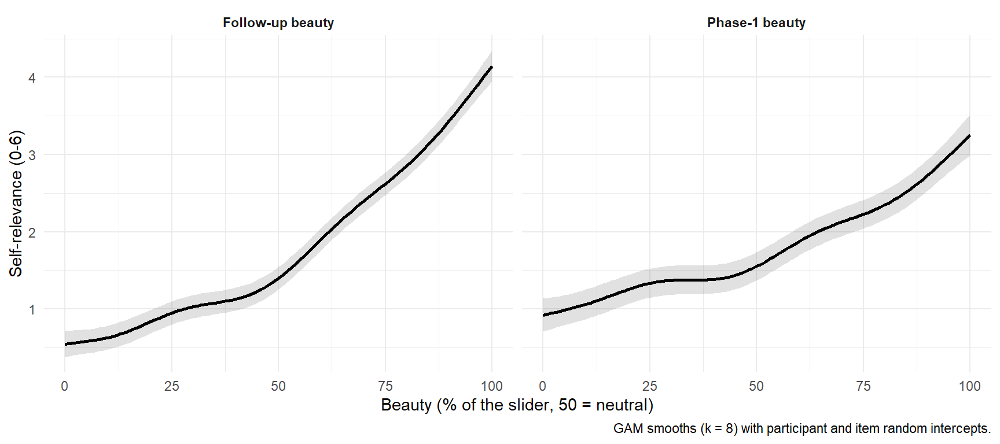{width=864}
:::
:::


Self-relevance rises monotonically with beauty, from the very ugly works
(the least self-relevant of all) to the very beautiful ones. The large
positive quadratic terms reflect **convexity**: self-relevance increases
slowly across the ugly half of the slider and steeply across the beautiful
half, with a step around the neutral point. The vertex of the fitted parabola
lies at the edge of, or outside, the range of the data, so the quadratic does
not describe a U. The preregistered "extreme appraisal, positive or negative
-> high self-relevance" pattern is therefore not supported; only its positive
half is. In the direction the models use (Phase-1 ratings on SR), the
quadratic terms are not credible, so the linear `SR_w` of BeautySR and
MeaningSR is adequate.
