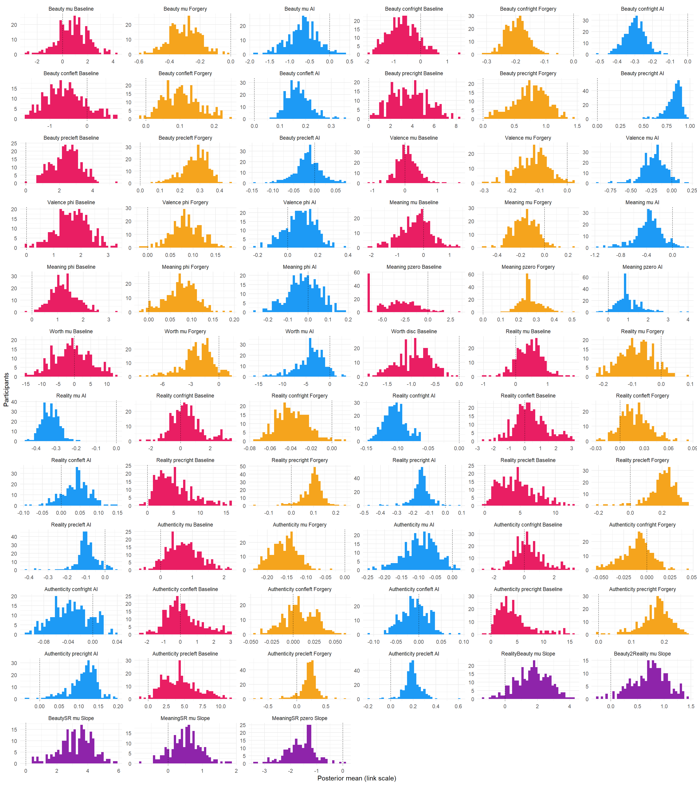
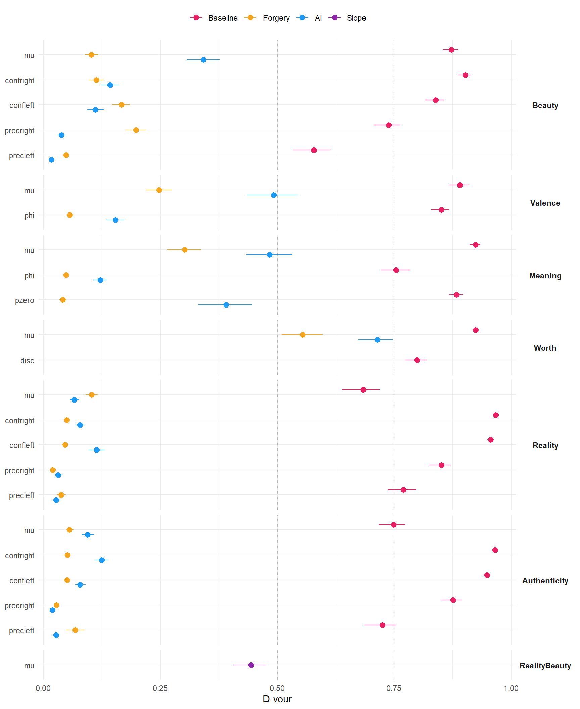
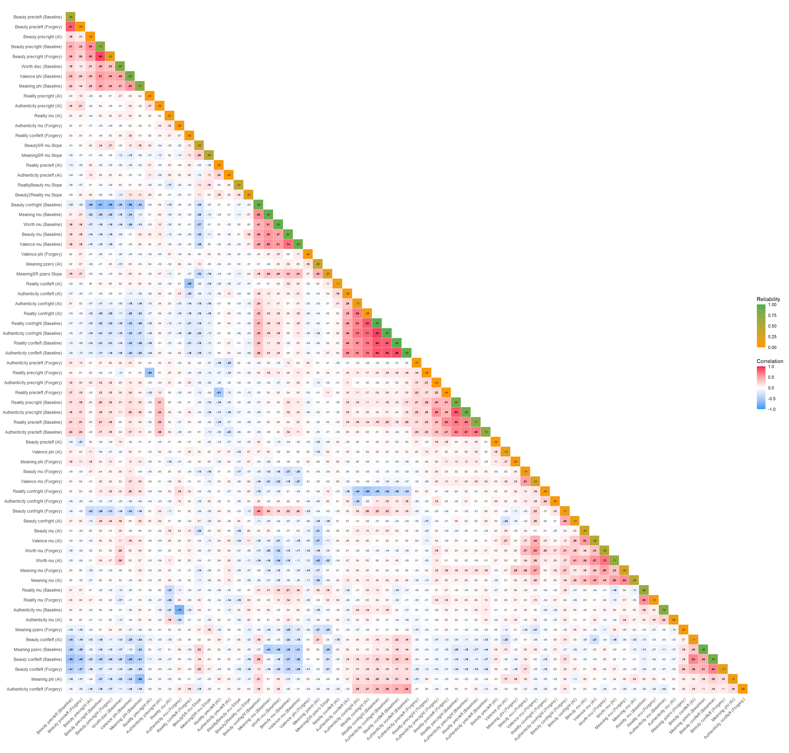
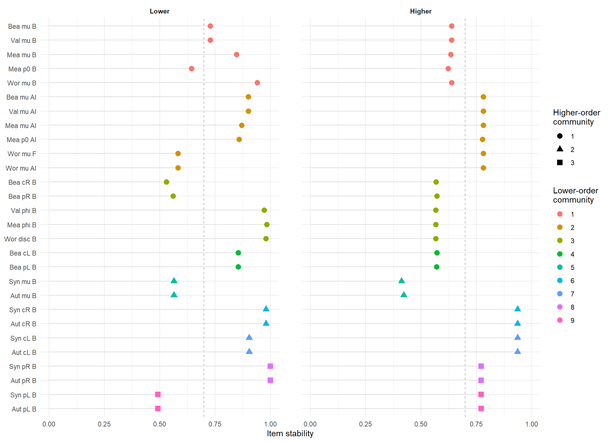
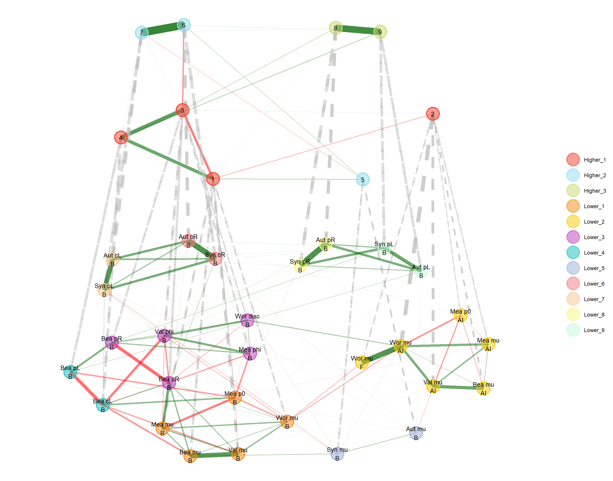
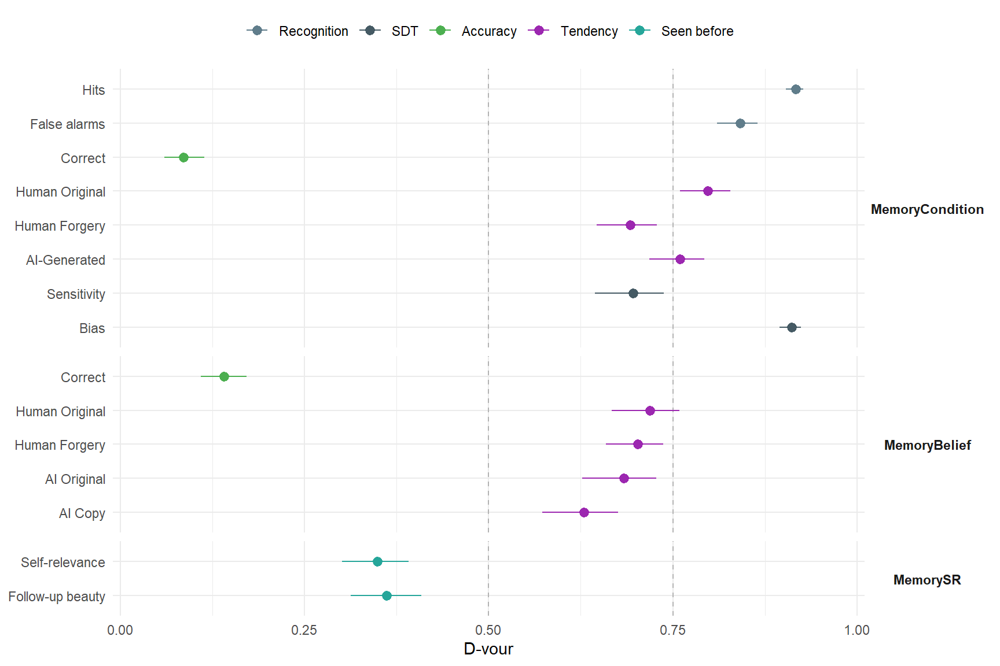

<!-- Participant-level indices are computed on the cluster (`./hpc individual`, get_individual() in server/estimates.R) and read from models/individual/. -->

## Data Preparation


::: {.cell}

```{.r .cell-code  code-fold="false"}
library(tidyverse)
library(easystats)
library(patchwork)
library(ggside)
library(ggnewscale)

source("server/estimates.R") # outcome_info
source("report.R")           # read_estimates(), provenance_table(), make_tables()

dfsub <- read.csv("../data/data_participants.csv")

cols_index <- c("Baseline" = "#E91E63", "Forgery" = "#F5A41D", "AI" = "#1D9AF5", "Slope" = "#8E24AA")
fmt_r <- function(x) sub("^(-?)0\\.", "\\1.", sprintf("%.2f", x)) # .45, -.07

# Models with participant-level indices, in the order of 3_models.qmd, then the
# determinants models (5_realitydeterminants.qmd) with a participant-level slope
models <- intersect(c("Beauty", "Valence", "Meaning", "Worth", "Reality", "Authenticity", "Beauty2", "SelfRelevance", "Artificiality"),
                    names(Filter(function(x) !is.null(x$individual), outcome_info)))
slope_models <- names(Filter(function(x) !is.null(x$individual), mediation_info))
individual <- read_estimates(c(models, slope_models), dir = "individual")
provenance_table(individual)
```

::: {.cell-output-display}


Table: Provenance of the estimates read by this report.

|Model         |Fit               | Draws|Extracted        |
|:-------------|:-----------------|-----:|:----------------|
|Beauty        |Beauty.rds        |  4000|2026-09-22 22:58 |
|Valence       |Valence.rds       |  4000|2026-09-22 22:58 |
|Meaning       |Meaning.rds       |  4000|2026-09-23 09:11 |
|Worth         |Worth.rds         |  4000|2026-09-23 09:22 |
|Reality       |Reality.rds       |  4000|2026-09-23 09:12 |
|Authenticity  |Authenticity.rds  |  4000|2026-09-23 09:14 |
|RealityBeauty |RealityBeauty.rds |  4000|2026-09-24 09:37 |


:::

```{.r .cell-code  code-fold="false"}
# One row per Participant x Model x Parameter x Index (posterior Mean and SD),
# features ordered by model, parameter (registry order) and index
df_long <- bind_rows(lapply(individual, function(e) mutate(e$individual, Model = e$outcome))) |>
  mutate(Model = factor(Model, levels = c(models, slope_models)),
         Parameter = factor(Parameter, levels = unique(unlist(lapply(c(outcome_info[models], mediation_info[slope_models]), `[[`, "individual")))),
         Index = factor(Index, levels = names(cols_index))) |>
  arrange(Model, Parameter, Index) |>
  mutate(Feature = fct_inorder(paste(Model, Parameter, Index, sep = "_")))
features <- levels(df_long$Feature)

# One column per feature (posterior means)
df_wide <- df_long |>
  select(Participant, Feature, Mean) |>
  pivot_wider(names_from = Feature, values_from = Mean)
```
:::


Participant characteristics used as correlates. Gender is coded 0 = female,
1 = male (the 2 "other" excluded), so its correlations are point-biserial;
education and AI use are ordinal ranks. Interoception is given by the three
Mint metaclusters (the average of their items), each followed by its facets (in
italics): *Awareness* (ExAc, RelA, SexS), *Deficit* (CaCo, Urin, Derm, Sati,
Olfa) and *Visceroception* (Resp, Card, Gast). Questionnaire scores are missing
for participants who failed that questionnaire's attention check.


::: {.cell}

```{.r .cell-code}
traits <- c("Age" = "Demographics", "Gender (male)" = "Demographics", "Education" = "Demographics",
            "Art expertise" = "Demographics",
            "AI knowledge" = "AI attitudes", "AI use" = "AI attitudes", "AI attitudes (positive)" = "AI attitudes",
            "AI attitudes (negative)" = "AI attitudes", "AI art realism" = "AI attitudes", "Manipulation distrust" = "AI attitudes",
            "Visual imagery (VVIQ)" = "Imagery & mood", "Depression" = "Imagery & mood",
            "Anxiety" = "Imagery & mood", "Life satisfaction" = "Imagery & mood")

df_traits <- dfsub |>
  transmute(Participant,
            Age,
            `Gender (male)` = case_when(Gender == "Male" ~ 1, Gender == "Female" ~ 0),
            Education = as.numeric(factor(Education, levels = c("High school", "Bachelor", "Master", "Doctorate"))),
            `Art expertise` = Art_Expertise,
            `AI knowledge` = BAIT_AI_Knowledge,
            `AI use` = as.numeric(factor(BAIT_AI_Use, levels = c("Never", "A few times per month", "A few times per week",
                                                                 "Once a day", "A few times per day"))),
            `AI attitudes (positive)` = BAIT_Positive,
            `AI attitudes (negative)` = BAIT_Negative,
            `AI art realism` = BAIT_ArtRealistic,
            `Manipulation distrust` = ManipulationDistrust,
            `Visual imagery (VVIQ)` = VVIQ_Total,
            Depression = PHQ4_Depression,
            Anxiety = PHQ4_Anxiety,
            `Life satisfaction` = LifeSatisfaction,
            across(c(starts_with("MINT_"), -MINT_AttentionCheck))) |>
  rename_with(\(x) str_replace(x, "^MINT_", "MINT "), starts_with("MINT_"))
# Interoception: each Mint metacluster followed by its facets (italics, Markdown),
# in this fixed order rather than clustered
mint <- list(Awareness = c("ExAc", "RelA", "SexS"),
             Deficit = c("CaCo", "Urin", "Derm", "Sati", "Olfa"),
             Visceroception = c("Resp", "Card", "Gast"))
mint_vars <- bind_rows(lapply(names(mint), \(m) data.frame(
  Score = paste("MINT", c(m, mint[[m]])),
  Row = c(m, paste0("*MINT ", mint[[m]], "*")))))
stopifnot(setequal(mint_vars$Score, grep("^MINT", names(df_traits), value = TRUE)))
trait_vars <- bind_rows(data.frame(Score = names(traits), Row = names(traits), RowGroup = unname(traits)),
                        mutate(mint_vars, RowGroup = "Interoception", Fixed = TRUE))

# Order variables by the similarity of their correlation profiles (rows of m):
# hierarchical clustering, branches reordered by average correlation
cluster_order <- function(m) {
  if (nrow(m) < 3) return(rownames(m))
  dend <- reorder(as.dendrogram(hclust(dist(m), method = "average")), rowMeans(m, na.rm = TRUE))
  rownames(m)[order.dendrogram(dend)]
}

# Correlations between row and column variables (data frames with Score, the
# column name in `data`, and the Row / RowGroup or Column / ColGroup it is shown
# as), FDR-corrected across the whole table. Within each group, rows are
# ordered by cluster_order() (RowKey), except in groups whose rows all have
# Fixed = TRUE, which keep their given order; columns keep their given order.
# Row labels may use Markdown (e.g. *italics*).
cor_grid <- function(data, rows, cols) {
  fixed <- rows$Score[if (is.null(rows$Fixed)) FALSE else rows$Fixed %in% TRUE]
  d <- data |>
    correlation(select = rows$Score, select2 = cols$Score, p_adjust = "none") |>
    as.data.frame() |>
    mutate(p_fdr = p.adjust(p, method = "fdr"),
           Label = paste0(fmt_r(r), ifelse(p_fdr < .05, "*", "")),
           Row = rows$Row[match(Parameter1, rows$Score)],
           RowGroup = factor(rows$RowGroup[match(Parameter1, rows$Score)], levels = unique(rows$RowGroup)),
           Column = factor(cols$Column[match(Parameter2, cols$Score)], levels = unique(cols$Column)),
           ColGroup = factor(cols$ColGroup[match(Parameter2, cols$Score)], levels = unique(cols$ColGroup)))
  row_levels <- unlist(lapply(split(d, d$RowGroup), \(g) {
    if (nrow(g) > 0 && all(g$Parameter1 %in% fixed)) return(intersect(fixed, g$Parameter1))
    m <- xtabs(r ~ Parameter1 + Parameter2, data = g)
    cluster_order(unclass(m))
  }), use.names = FALSE)
  mutate(d, RowKey = factor(Parameter1, levels = row_levels))
}

cor_markdown <- function(d, title) {
  d |>
    mutate(Col = paste(ColGroup, Column, sep = ": ")) |>
    arrange(ColGroup, Column, RowGroup, RowKey) |>
    mutate(Row = paste(RowGroup, Row, sep = ": ")) |>
    select(Row, Col, Label) |>
    pivot_wider(names_from = Col, values_from = Label) |>
    make_markdown(title) |>
    make_asis()
}

# col_fill: optional strip colours per column group (named by ColGroup), in
# which case the column-group strips are drawn below the columns
cor_heatmap <- function(d, base_size = 13, text_size = 3.4, col_fill = NULL) {
  facets <- if (is.null(col_fill)) {
    facet_grid(RowGroup ~ ColGroup, scales = "free", space = "free")
  } else {
    ggh4x::facet_grid2(RowGroup ~ ColGroup, scales = "free", space = "free", switch = "x",
                       strip = ggh4x::strip_themed(
                         background_x = ggh4x::elem_list_rect(fill = unname(col_fill[levels(droplevels(d$ColGroup))]), colour = NA),
                         text_x = ggh4x::elem_list_text(colour = "white", face = "bold")))
  }
  d |>
    ggplot(aes(x = Column, y = fct_rev(RowKey))) +
    geom_tile(aes(fill = r), color = "white") +
    geom_text(aes(label = Label, fontface = ifelse(p < .05, "bold", "plain")), size = text_size) +
    facets +
    scale_fill_gradient2(low = "#1D9AF5", mid = "white", high = "#F51D56", midpoint = 0, limits = c(-0.5, 0.5),
                         breaks = c(-0.5, -0.25, 0, 0.25, 0.5), labels = fmt_r, oob = scales::squish, name = "Correlation") +
    scale_x_discrete(position = "top") +
    scale_y_discrete(labels = setNames(d$Row, d$Parameter1)) +
    labs(x = NULL, y = NULL) +
    theme_minimal(base_size = base_size) +
    theme(axis.text.x.top = element_text(angle = 45, hjust = 0, vjust = 0),
          axis.text.y.left = ggtext::element_markdown(hjust = 1),
          panel.grid = element_blank(),
          strip.text = element_text(face = "bold"),
          strip.text.y = element_text(angle = 0, hjust = 0),
          legend.position = "bottom", legend.key.width = unit(3, "lines"))
}
```
:::


## Individual Indices

For each participant and distributional parameter, on the link scale, averaged
over the four emotion quadrants and excluding item effects:

- **Baseline**: the parameter in the Human Original condition
- **Forgery**: Human Forgery − Human Original
- **AI**: AI-Generated − Human Original

Parameters without a participant-level label effect in the model (Worth's
`disc`) have a Baseline only. For Worth, `mu` is the latent location relative
to the shared thresholds and `disc` the participant's discrimination (response
precision), analogous to `phi` / `prec` in the other models.

One index comes from the determinants models of `5_realitydeterminants.qmd`:

- **RealityBeauty `mu` Slope**: the participant's slope of the syntheticness
  choice (`mu`, the probability of answering on the "Human" side) on their own
  Phase-1 beauty (centred within participant), per full range of the beauty
  slider, averaged over the labels: how strongly the participant takes beauty
  as a sign of human authorship (the "beautiful = human" inference).

Models not included (yet):

- **ArtificialityBeauty** (follow-up; *to consider*): the analogous slope of
  perceived artificiality on follow-up beauty (items judged new) is the most
  reliable participant-level slope of the determinants models (D-vour .67
  [.62, .71] in a check on its 2026-09-23 fit, against .44 for the
  RealityBeauty slope) and it correlates with the RealityBeauty slope across
  sessions, ~47 days apart and on different items (r = −.24 [−.36, −.11], n =
  217; roughly −.44 once corrected for both reliabilities). A candidate once
  the rule for participants missing from some models (220 here) is settled
  (see Beauty2); until then, a cross-session validation of the RealityBeauty
  slope. The other determinants models were checked and left out: the label
  modulation of the slopes (D-vour ≤ .11), the per-rating slopes of the
  Appraisal models (≤ .28; collinear mediators), AuthenticityBeauty's slope
  (.29), the *BeautyControl models (their Phase-1 beauty slope correlates .99
  with RealityBeauty's; follow-up beauty slopes .24 / .32) and the Items
  models (label slopes only, which duplicate the indices above).

- **Beauty2** (follow-up): 220 participants; waiting for a rule on how the
  analyses handle participants missing from some models.
- **SelfRelevance** (follow-up): a moderator of the label effect (RQ3) rather
  than an outcome of it; also 220 participants.
- **Artificiality** (follow-up): only old items judged new, i.e. about 9
  trials per label per participant (some none), selected by forgetting.
- **Gaze** (Entropy, Laterality, Centeredness, Max. Shift): no population
  label effect, a sample-count covariate to fix in the prediction grid, and
  274 participants.
- **MemoryCondition, MemoryBelief**: categorical models without Emotion, so no
  baselines and contrasts; their recognition, accuracy and tendency indices are
  assessed separately (see Memory).

`Between_SD` is the SD of the participants' posterior means; `Posterior_SD`
the average posterior SD of a participant's index relative to the sample
(`SD_rel`, which excludes the uncertainty of the population effect).


::: {.cell}

```{.r .cell-code}
summary_ind <- df_long |>
  summarise(N = n(),
            Average = mean(Mean),
            Between_SD = sd(Mean),
            Posterior_SD = mean(SD_rel),
            .by = c(Model, Parameter, Index)) |>
  arrange(Model, Parameter, Index) |>
  mutate(across(where(is.numeric) & !N, \(x) insight::format_value(x)))

make_tables(summary_ind, names(summary_ind), "Participant-level indices (link scale)")
```

::: {.cell-output-display}

```{=html}
<div id="ncrtbthnsk" style="padding-left:0px;padding-right:0px;padding-top:10px;padding-bottom:10px;overflow-x:auto;overflow-y:auto;width:auto;height:auto;">
<style>#ncrtbthnsk table {
  font-family: system-ui, 'Segoe UI', Roboto, Helvetica, Arial, sans-serif, 'Apple Color Emoji', 'Segoe UI Emoji', 'Segoe UI Symbol', 'Noto Color Emoji';
  -webkit-font-smoothing: antialiased;
  -moz-osx-font-smoothing: grayscale;
}

#ncrtbthnsk thead, #ncrtbthnsk tbody, #ncrtbthnsk tfoot, #ncrtbthnsk tr, #ncrtbthnsk td, #ncrtbthnsk th {
  border-style: none;
}

#ncrtbthnsk p {
  margin: 0;
  padding: 0;
}

#ncrtbthnsk .gt_table {
  display: table;
  border-collapse: collapse;
  line-height: normal;
  margin-left: auto;
  margin-right: auto;
  color: #333333;
  font-size: 13px;
  font-weight: normal;
  font-style: normal;
  background-color: #FFFFFF;
  width: auto;
  border-top-style: solid;
  border-top-width: 3px;
  border-top-color: #D5D5D5;
  border-right-style: solid;
  border-right-width: 3px;
  border-right-color: #D5D5D5;
  border-bottom-style: solid;
  border-bottom-width: 3px;
  border-bottom-color: #D5D5D5;
  border-left-style: solid;
  border-left-width: 3px;
  border-left-color: #D5D5D5;
}

#ncrtbthnsk .gt_caption {
  padding-top: 4px;
  padding-bottom: 4px;
}

#ncrtbthnsk .gt_title {
  color: #333333;
  font-size: 125%;
  font-weight: initial;
  padding-top: 4px;
  padding-bottom: 4px;
  padding-left: 5px;
  padding-right: 5px;
  border-bottom-color: #FFFFFF;
  border-bottom-width: 0;
}

#ncrtbthnsk .gt_subtitle {
  color: #333333;
  font-size: 85%;
  font-weight: initial;
  padding-top: 3px;
  padding-bottom: 5px;
  padding-left: 5px;
  padding-right: 5px;
  border-top-color: #FFFFFF;
  border-top-width: 0;
}

#ncrtbthnsk .gt_heading {
  background-color: #FFFFFF;
  text-align: left;
  border-bottom-color: #FFFFFF;
  border-left-style: none;
  border-left-width: 1px;
  border-left-color: #D3D3D3;
  border-right-style: none;
  border-right-width: 1px;
  border-right-color: #D3D3D3;
}

#ncrtbthnsk .gt_bottom_border {
  border-bottom-style: solid;
  border-bottom-width: 2px;
  border-bottom-color: #D5D5D5;
}

#ncrtbthnsk .gt_col_headings {
  border-top-style: solid;
  border-top-width: 2px;
  border-top-color: #D5D5D5;
  border-bottom-style: solid;
  border-bottom-width: 2px;
  border-bottom-color: #D5D5D5;
  border-left-style: none;
  border-left-width: 1px;
  border-left-color: #D3D3D3;
  border-right-style: none;
  border-right-width: 1px;
  border-right-color: #D3D3D3;
}

#ncrtbthnsk .gt_col_heading {
  color: #FFFFFF;
  background-color: #000000;
  font-size: 100%;
  font-weight: normal;
  text-transform: inherit;
  border-left-style: none;
  border-left-width: 1px;
  border-left-color: #D3D3D3;
  border-right-style: none;
  border-right-width: 1px;
  border-right-color: #D3D3D3;
  vertical-align: bottom;
  padding-top: 5px;
  padding-bottom: 6px;
  padding-left: 5px;
  padding-right: 5px;
  overflow-x: hidden;
}

#ncrtbthnsk .gt_column_spanner_outer {
  color: #FFFFFF;
  background-color: #000000;
  font-size: 100%;
  font-weight: normal;
  text-transform: inherit;
  padding-top: 0;
  padding-bottom: 0;
  padding-left: 4px;
  padding-right: 4px;
}

#ncrtbthnsk .gt_column_spanner_outer:first-child {
  padding-left: 0;
}

#ncrtbthnsk .gt_column_spanner_outer:last-child {
  padding-right: 0;
}

#ncrtbthnsk .gt_column_spanner {
  border-bottom-style: solid;
  border-bottom-width: 2px;
  border-bottom-color: #D5D5D5;
  vertical-align: bottom;
  padding-top: 5px;
  padding-bottom: 5px;
  overflow-x: hidden;
  display: inline-block;
  width: 100%;
}

#ncrtbthnsk .gt_spanner_row {
  border-bottom-style: hidden;
}

#ncrtbthnsk .gt_group_heading {
  padding-top: 8px;
  padding-bottom: 8px;
  padding-left: 5px;
  padding-right: 5px;
  color: #333333;
  background-color: #FFFFFF;
  font-size: 100%;
  font-weight: initial;
  text-transform: inherit;
  border-top-style: solid;
  border-top-width: 2px;
  border-top-color: #D5D5D5;
  border-bottom-style: solid;
  border-bottom-width: 2px;
  border-bottom-color: #D5D5D5;
  border-left-style: none;
  border-left-width: 1px;
  border-left-color: #D3D3D3;
  border-right-style: none;
  border-right-width: 1px;
  border-right-color: #D3D3D3;
  vertical-align: middle;
  text-align: left;
}

#ncrtbthnsk .gt_empty_group_heading {
  padding: 0.5px;
  color: #333333;
  background-color: #FFFFFF;
  font-size: 100%;
  font-weight: initial;
  border-top-style: solid;
  border-top-width: 2px;
  border-top-color: #D5D5D5;
  border-bottom-style: solid;
  border-bottom-width: 2px;
  border-bottom-color: #D5D5D5;
  vertical-align: middle;
}

#ncrtbthnsk .gt_from_md > :first-child {
  margin-top: 0;
}

#ncrtbthnsk .gt_from_md > :last-child {
  margin-bottom: 0;
}

#ncrtbthnsk .gt_row {
  padding-top: 8px;
  padding-bottom: 8px;
  padding-left: 5px;
  padding-right: 5px;
  margin: 10px;
  border-top-style: solid;
  border-top-width: 1px;
  border-top-color: #D5D5D5;
  border-left-style: solid;
  border-left-width: 1px;
  border-left-color: #D5D5D5;
  border-right-style: solid;
  border-right-width: 1px;
  border-right-color: #D5D5D5;
  vertical-align: middle;
  overflow-x: hidden;
}

#ncrtbthnsk .gt_stub {
  color: #333333;
  background-color: #FFFFFF;
  font-size: 100%;
  font-weight: initial;
  text-transform: inherit;
  border-right-style: solid;
  border-right-width: 2px;
  border-right-color: #5F5F5F;
  padding-left: 5px;
  padding-right: 5px;
}

#ncrtbthnsk .gt_stub_row_group {
  color: #333333;
  background-color: #FFFFFF;
  font-size: 100%;
  font-weight: initial;
  text-transform: inherit;
  border-right-style: solid;
  border-right-width: 2px;
  border-right-color: #D3D3D3;
  padding-left: 5px;
  padding-right: 5px;
  vertical-align: top;
}

#ncrtbthnsk .gt_row_group_first td {
  border-top-width: 2px;
}

#ncrtbthnsk .gt_row_group_first th {
  border-top-width: 2px;
}

#ncrtbthnsk .gt_summary_row {
  color: #333333;
  background-color: #D5D5D5;
  text-transform: inherit;
  padding-top: 8px;
  padding-bottom: 8px;
  padding-left: 5px;
  padding-right: 5px;
}

#ncrtbthnsk .gt_first_summary_row {
  border-top-style: solid;
  border-top-color: #D5D5D5;
}

#ncrtbthnsk .gt_first_summary_row.thick {
  border-top-width: 2px;
}

#ncrtbthnsk .gt_last_summary_row {
  padding-top: 8px;
  padding-bottom: 8px;
  padding-left: 5px;
  padding-right: 5px;
  border-bottom-style: solid;
  border-bottom-width: 2px;
  border-bottom-color: #D5D5D5;
}

#ncrtbthnsk .gt_grand_summary_row {
  color: #FFFFFF;
  background-color: #929292;
  text-transform: inherit;
  padding-top: 8px;
  padding-bottom: 8px;
  padding-left: 5px;
  padding-right: 5px;
}

#ncrtbthnsk .gt_first_grand_summary_row {
  padding-top: 8px;
  padding-bottom: 8px;
  padding-left: 5px;
  padding-right: 5px;
  border-top-style: double;
  border-top-width: 6px;
  border-top-color: #D5D5D5;
}

#ncrtbthnsk .gt_last_grand_summary_row_top {
  padding-top: 8px;
  padding-bottom: 8px;
  padding-left: 5px;
  padding-right: 5px;
  border-bottom-style: double;
  border-bottom-width: 6px;
  border-bottom-color: #D5D5D5;
}

#ncrtbthnsk .gt_striped {
  background-color: #F4F4F4;
}

#ncrtbthnsk .gt_table_body {
  border-top-style: solid;
  border-top-width: 2px;
  border-top-color: #D5D5D5;
  border-bottom-style: solid;
  border-bottom-width: 2px;
  border-bottom-color: #D5D5D5;
}

#ncrtbthnsk .gt_footnotes {
  color: #333333;
  background-color: #FFFFFF;
  border-bottom-style: none;
  border-bottom-width: 2px;
  border-bottom-color: #D3D3D3;
  border-left-style: none;
  border-left-width: 2px;
  border-left-color: #D3D3D3;
  border-right-style: none;
  border-right-width: 2px;
  border-right-color: #D3D3D3;
}

#ncrtbthnsk .gt_footnote {
  margin: 0px;
  font-size: 90%;
  padding-top: 4px;
  padding-bottom: 4px;
  padding-left: 5px;
  padding-right: 5px;
}

#ncrtbthnsk .gt_sourcenotes {
  color: #333333;
  background-color: #FFFFFF;
  border-bottom-style: none;
  border-bottom-width: 2px;
  border-bottom-color: #D3D3D3;
  border-left-style: none;
  border-left-width: 2px;
  border-left-color: #D3D3D3;
  border-right-style: none;
  border-right-width: 2px;
  border-right-color: #D3D3D3;
}

#ncrtbthnsk .gt_sourcenote {
  font-size: 90%;
  padding-top: 4px;
  padding-bottom: 4px;
  padding-left: 5px;
  padding-right: 5px;
}

#ncrtbthnsk .gt_left {
  text-align: left;
}

#ncrtbthnsk .gt_center {
  text-align: center;
}

#ncrtbthnsk .gt_right {
  text-align: right;
  font-variant-numeric: tabular-nums;
}

#ncrtbthnsk .gt_font_normal {
  font-weight: normal;
}

#ncrtbthnsk .gt_font_bold {
  font-weight: bold;
}

#ncrtbthnsk .gt_font_italic {
  font-style: italic;
}

#ncrtbthnsk .gt_super {
  font-size: 65%;
}

#ncrtbthnsk .gt_footnote_marks {
  font-size: 75%;
  vertical-align: 0.4em;
  position: initial;
}

#ncrtbthnsk .gt_asterisk {
  font-size: 100%;
  vertical-align: 0;
}

#ncrtbthnsk .gt_indent_1 {
  text-indent: 5px;
}

#ncrtbthnsk .gt_indent_2 {
  text-indent: 10px;
}

#ncrtbthnsk .gt_indent_3 {
  text-indent: 15px;
}

#ncrtbthnsk .gt_indent_4 {
  text-indent: 20px;
}

#ncrtbthnsk .gt_indent_5 {
  text-indent: 25px;
}

#ncrtbthnsk .katex-display {
  display: inline-flex !important;
  margin-bottom: 0.75em !important;
}

#ncrtbthnsk div.Reactable > div.rt-table > div.rt-thead > div.rt-tr.rt-tr-group-header > div.rt-th-group:after {
  height: 0px !important;
}
</style>
<table class="gt_table" data-quarto-disable-processing="false" data-quarto-bootstrap="false">
  <thead>
    <tr class="gt_heading">
      <td colspan="7" class="gt_heading gt_title gt_font_normal gt_bottom_border" style>Participant-level indices (link scale)</td>
    </tr>
    
    <tr class="gt_col_headings">
      <th class="gt_col_heading gt_columns_bottom_border gt_center" rowspan="1" colspan="1" scope="col" id="Model">Model</th>
      <th class="gt_col_heading gt_columns_bottom_border gt_center" rowspan="1" colspan="1" scope="col" id="Parameter">Parameter</th>
      <th class="gt_col_heading gt_columns_bottom_border gt_center" rowspan="1" colspan="1" scope="col" id="Index">Index</th>
      <th class="gt_col_heading gt_columns_bottom_border gt_right" rowspan="1" colspan="1" scope="col" id="N">N</th>
      <th class="gt_col_heading gt_columns_bottom_border gt_left" rowspan="1" colspan="1" scope="col" id="Average">Average</th>
      <th class="gt_col_heading gt_columns_bottom_border gt_right" rowspan="1" colspan="1" scope="col" id="Between_SD">Between_SD</th>
      <th class="gt_col_heading gt_columns_bottom_border gt_right" rowspan="1" colspan="1" scope="col" id="Posterior_SD">Posterior_SD</th>
    </tr>
  </thead>
  <tbody class="gt_table_body">
    <tr><td headers="Model" class="gt_row gt_center">Beauty</td>
<td headers="Parameter" class="gt_row gt_center">mu</td>
<td headers="Index" class="gt_row gt_center">Baseline</td>
<td headers="N" class="gt_row gt_right">324</td>
<td headers="Average" class="gt_row gt_left">0.82</td>
<td headers="Between_SD" class="gt_row gt_right">1.19</td>
<td headers="Posterior_SD" class="gt_row gt_right">0.45</td></tr>
    <tr><td headers="Model" class="gt_row gt_center gt_striped">Beauty</td>
<td headers="Parameter" class="gt_row gt_center gt_striped">mu</td>
<td headers="Index" class="gt_row gt_center gt_striped">Forgery</td>
<td headers="N" class="gt_row gt_right gt_striped">324</td>
<td headers="Average" class="gt_row gt_left gt_striped">-0.30</td>
<td headers="Between_SD" class="gt_row gt_right gt_striped">0.10</td>
<td headers="Posterior_SD" class="gt_row gt_right gt_striped">0.29</td></tr>
    <tr><td headers="Model" class="gt_row gt_center">Beauty</td>
<td headers="Parameter" class="gt_row gt_center">mu</td>
<td headers="Index" class="gt_row gt_center">AI</td>
<td headers="N" class="gt_row gt_right">324</td>
<td headers="Average" class="gt_row gt_left">-0.68</td>
<td headers="Between_SD" class="gt_row gt_right">0.38</td>
<td headers="Posterior_SD" class="gt_row gt_right">0.53</td></tr>
    <tr><td headers="Model" class="gt_row gt_center gt_striped">Beauty</td>
<td headers="Parameter" class="gt_row gt_center gt_striped">confright</td>
<td headers="Index" class="gt_row gt_center gt_striped">Baseline</td>
<td headers="N" class="gt_row gt_right gt_striped">324</td>
<td headers="Average" class="gt_row gt_left gt_striped">-0.66</td>
<td headers="Between_SD" class="gt_row gt_right gt_striped">0.54</td>
<td headers="Posterior_SD" class="gt_row gt_right gt_striped">0.18</td></tr>
    <tr><td headers="Model" class="gt_row gt_center">Beauty</td>
<td headers="Parameter" class="gt_row gt_center">confright</td>
<td headers="Index" class="gt_row gt_center">Forgery</td>
<td headers="N" class="gt_row gt_right">324</td>
<td headers="Average" class="gt_row gt_left">-0.20</td>
<td headers="Between_SD" class="gt_row gt_right">0.04</td>
<td headers="Posterior_SD" class="gt_row gt_right">0.11</td></tr>
    <tr><td headers="Model" class="gt_row gt_center gt_striped">Beauty</td>
<td headers="Parameter" class="gt_row gt_center gt_striped">confright</td>
<td headers="Index" class="gt_row gt_center gt_striped">AI</td>
<td headers="N" class="gt_row gt_right gt_striped">324</td>
<td headers="Average" class="gt_row gt_left gt_striped">-0.30</td>
<td headers="Between_SD" class="gt_row gt_right gt_striped">0.06</td>
<td headers="Posterior_SD" class="gt_row gt_right gt_striped">0.14</td></tr>
    <tr><td headers="Model" class="gt_row gt_center">Beauty</td>
<td headers="Parameter" class="gt_row gt_center">confleft</td>
<td headers="Index" class="gt_row gt_center">Baseline</td>
<td headers="N" class="gt_row gt_right">324</td>
<td headers="Average" class="gt_row gt_left">-0.58</td>
<td headers="Between_SD" class="gt_row gt_right">0.52</td>
<td headers="Posterior_SD" class="gt_row gt_right">0.23</td></tr>
    <tr><td headers="Model" class="gt_row gt_center gt_striped">Beauty</td>
<td headers="Parameter" class="gt_row gt_center gt_striped">confleft</td>
<td headers="Index" class="gt_row gt_center gt_striped">Forgery</td>
<td headers="N" class="gt_row gt_right gt_striped">324</td>
<td headers="Average" class="gt_row gt_left gt_striped">0.10</td>
<td headers="Between_SD" class="gt_row gt_right gt_striped">0.05</td>
<td headers="Posterior_SD" class="gt_row gt_right gt_striped">0.11</td></tr>
    <tr><td headers="Model" class="gt_row gt_center">Beauty</td>
<td headers="Parameter" class="gt_row gt_center">confleft</td>
<td headers="Index" class="gt_row gt_center">AI</td>
<td headers="N" class="gt_row gt_right">324</td>
<td headers="Average" class="gt_row gt_left">0.17</td>
<td headers="Between_SD" class="gt_row gt_right">0.05</td>
<td headers="Posterior_SD" class="gt_row gt_right">0.13</td></tr>
    <tr><td headers="Model" class="gt_row gt_center gt_striped">Beauty</td>
<td headers="Parameter" class="gt_row gt_center gt_striped">precright</td>
<td headers="Index" class="gt_row gt_center gt_striped">Baseline</td>
<td headers="N" class="gt_row gt_right gt_striped">324</td>
<td headers="Average" class="gt_row gt_left gt_striped">3.72</td>
<td headers="Between_SD" class="gt_row gt_right gt_striped">1.66</td>
<td headers="Posterior_SD" class="gt_row gt_right gt_striped">0.99</td></tr>
    <tr><td headers="Model" class="gt_row gt_center">Beauty</td>
<td headers="Parameter" class="gt_row gt_center">precright</td>
<td headers="Index" class="gt_row gt_center">Forgery</td>
<td headers="N" class="gt_row gt_right">324</td>
<td headers="Average" class="gt_row gt_left">0.75</td>
<td headers="Between_SD" class="gt_row gt_right">0.27</td>
<td headers="Posterior_SD" class="gt_row gt_right">0.55</td></tr>
    <tr><td headers="Model" class="gt_row gt_center gt_striped">Beauty</td>
<td headers="Parameter" class="gt_row gt_center gt_striped">precright</td>
<td headers="Index" class="gt_row gt_center gt_striped">AI</td>
<td headers="N" class="gt_row gt_right gt_striped">324</td>
<td headers="Average" class="gt_row gt_left gt_striped">0.83</td>
<td headers="Between_SD" class="gt_row gt_right gt_striped">0.08</td>
<td headers="Posterior_SD" class="gt_row gt_right gt_striped">0.40</td></tr>
    <tr><td headers="Model" class="gt_row gt_center">Beauty</td>
<td headers="Parameter" class="gt_row gt_center">precleft</td>
<td headers="Index" class="gt_row gt_center">Baseline</td>
<td headers="N" class="gt_row gt_right">324</td>
<td headers="Average" class="gt_row gt_left">2.42</td>
<td headers="Between_SD" class="gt_row gt_right">0.84</td>
<td headers="Posterior_SD" class="gt_row gt_right">0.71</td></tr>
    <tr><td headers="Model" class="gt_row gt_center gt_striped">Beauty</td>
<td headers="Parameter" class="gt_row gt_center gt_striped">precleft</td>
<td headers="Index" class="gt_row gt_center gt_striped">Forgery</td>
<td headers="N" class="gt_row gt_right gt_striped">324</td>
<td headers="Average" class="gt_row gt_left gt_striped">0.28</td>
<td headers="Between_SD" class="gt_row gt_right gt_striped">0.06</td>
<td headers="Posterior_SD" class="gt_row gt_right gt_striped">0.28</td></tr>
    <tr><td headers="Model" class="gt_row gt_center">Beauty</td>
<td headers="Parameter" class="gt_row gt_center">precleft</td>
<td headers="Index" class="gt_row gt_center">AI</td>
<td headers="N" class="gt_row gt_right">324</td>
<td headers="Average" class="gt_row gt_left">-0.02</td>
<td headers="Between_SD" class="gt_row gt_right">0.03</td>
<td headers="Posterior_SD" class="gt_row gt_right">0.24</td></tr>
    <tr><td headers="Model" class="gt_row gt_center gt_striped">Valence</td>
<td headers="Parameter" class="gt_row gt_center gt_striped">mu</td>
<td headers="Index" class="gt_row gt_center gt_striped">Baseline</td>
<td headers="N" class="gt_row gt_right gt_striped">324</td>
<td headers="Average" class="gt_row gt_left gt_striped">0.08</td>
<td headers="Between_SD" class="gt_row gt_right gt_striped">0.34</td>
<td headers="Posterior_SD" class="gt_row gt_right gt_striped">0.12</td></tr>
    <tr><td headers="Model" class="gt_row gt_center">Valence</td>
<td headers="Parameter" class="gt_row gt_center">mu</td>
<td headers="Index" class="gt_row gt_center">Forgery</td>
<td headers="N" class="gt_row gt_right">324</td>
<td headers="Average" class="gt_row gt_left">-0.12</td>
<td headers="Between_SD" class="gt_row gt_right">0.06</td>
<td headers="Posterior_SD" class="gt_row gt_right">0.10</td></tr>
    <tr><td headers="Model" class="gt_row gt_center gt_striped">Valence</td>
<td headers="Parameter" class="gt_row gt_center gt_striped">mu</td>
<td headers="Index" class="gt_row gt_center gt_striped">AI</td>
<td headers="N" class="gt_row gt_right gt_striped">324</td>
<td headers="Average" class="gt_row gt_left gt_striped">-0.22</td>
<td headers="Between_SD" class="gt_row gt_right gt_striped">0.15</td>
<td headers="Posterior_SD" class="gt_row gt_right gt_striped">0.15</td></tr>
    <tr><td headers="Model" class="gt_row gt_center">Valence</td>
<td headers="Parameter" class="gt_row gt_center">phi</td>
<td headers="Index" class="gt_row gt_center">Baseline</td>
<td headers="N" class="gt_row gt_right">324</td>
<td headers="Average" class="gt_row gt_left">1.69</td>
<td headers="Between_SD" class="gt_row gt_right">0.60</td>
<td headers="Posterior_SD" class="gt_row gt_right">0.25</td></tr>
    <tr><td headers="Model" class="gt_row gt_center gt_striped">Valence</td>
<td headers="Parameter" class="gt_row gt_center gt_striped">phi</td>
<td headers="Index" class="gt_row gt_center gt_striped">Forgery</td>
<td headers="N" class="gt_row gt_right gt_striped">324</td>
<td headers="Average" class="gt_row gt_left gt_striped">0.09</td>
<td headers="Between_SD" class="gt_row gt_right gt_striped">0.03</td>
<td headers="Posterior_SD" class="gt_row gt_right gt_striped">0.14</td></tr>
    <tr><td headers="Model" class="gt_row gt_center">Valence</td>
<td headers="Parameter" class="gt_row gt_center">phi</td>
<td headers="Index" class="gt_row gt_center">AI</td>
<td headers="N" class="gt_row gt_right">324</td>
<td headers="Average" class="gt_row gt_left">0.08</td>
<td headers="Between_SD" class="gt_row gt_right">0.10</td>
<td headers="Posterior_SD" class="gt_row gt_right">0.23</td></tr>
    <tr><td headers="Model" class="gt_row gt_center gt_striped">Meaning</td>
<td headers="Parameter" class="gt_row gt_center gt_striped">mu</td>
<td headers="Index" class="gt_row gt_center gt_striped">Baseline</td>
<td headers="N" class="gt_row gt_right gt_striped">324</td>
<td headers="Average" class="gt_row gt_left gt_striped">-0.30</td>
<td headers="Between_SD" class="gt_row gt_right gt_striped">0.60</td>
<td headers="Posterior_SD" class="gt_row gt_right gt_striped">0.17</td></tr>
    <tr><td headers="Model" class="gt_row gt_center">Meaning</td>
<td headers="Parameter" class="gt_row gt_center">mu</td>
<td headers="Index" class="gt_row gt_center">Forgery</td>
<td headers="N" class="gt_row gt_right">324</td>
<td headers="Average" class="gt_row gt_left">-0.17</td>
<td headers="Between_SD" class="gt_row gt_right">0.11</td>
<td headers="Posterior_SD" class="gt_row gt_right">0.16</td></tr>
    <tr><td headers="Model" class="gt_row gt_center gt_striped">Meaning</td>
<td headers="Parameter" class="gt_row gt_center gt_striped">mu</td>
<td headers="Index" class="gt_row gt_center gt_striped">AI</td>
<td headers="N" class="gt_row gt_right gt_striped">324</td>
<td headers="Average" class="gt_row gt_left gt_striped">-0.37</td>
<td headers="Between_SD" class="gt_row gt_right gt_striped">0.22</td>
<td headers="Posterior_SD" class="gt_row gt_right gt_striped">0.22</td></tr>
    <tr><td headers="Model" class="gt_row gt_center">Meaning</td>
<td headers="Parameter" class="gt_row gt_center">phi</td>
<td headers="Index" class="gt_row gt_center">Baseline</td>
<td headers="N" class="gt_row gt_right">324</td>
<td headers="Average" class="gt_row gt_left">1.26</td>
<td headers="Between_SD" class="gt_row gt_right">0.51</td>
<td headers="Posterior_SD" class="gt_row gt_right">0.29</td></tr>
    <tr><td headers="Model" class="gt_row gt_center gt_striped">Meaning</td>
<td headers="Parameter" class="gt_row gt_center gt_striped">phi</td>
<td headers="Index" class="gt_row gt_center gt_striped">Forgery</td>
<td headers="N" class="gt_row gt_right gt_striped">324</td>
<td headers="Average" class="gt_row gt_left gt_striped">0.08</td>
<td headers="Between_SD" class="gt_row gt_right gt_striped">0.04</td>
<td headers="Posterior_SD" class="gt_row gt_right gt_striped">0.16</td></tr>
    <tr><td headers="Model" class="gt_row gt_center">Meaning</td>
<td headers="Parameter" class="gt_row gt_center">phi</td>
<td headers="Index" class="gt_row gt_center">AI</td>
<td headers="N" class="gt_row gt_right">324</td>
<td headers="Average" class="gt_row gt_left">-0.02</td>
<td headers="Between_SD" class="gt_row gt_right">0.08</td>
<td headers="Posterior_SD" class="gt_row gt_right">0.21</td></tr>
    <tr><td headers="Model" class="gt_row gt_center gt_striped">Meaning</td>
<td headers="Parameter" class="gt_row gt_center gt_striped">pzero</td>
<td headers="Index" class="gt_row gt_center gt_striped">Baseline</td>
<td headers="N" class="gt_row gt_right gt_striped">324</td>
<td headers="Average" class="gt_row gt_left gt_striped">-3.41</td>
<td headers="Between_SD" class="gt_row gt_right gt_striped">2.11</td>
<td headers="Posterior_SD" class="gt_row gt_right gt_striped">0.77</td></tr>
    <tr><td headers="Model" class="gt_row gt_center">Meaning</td>
<td headers="Parameter" class="gt_row gt_center">pzero</td>
<td headers="Index" class="gt_row gt_center">Forgery</td>
<td headers="N" class="gt_row gt_right">324</td>
<td headers="Average" class="gt_row gt_left">0.26</td>
<td headers="Between_SD" class="gt_row gt_right">0.06</td>
<td headers="Posterior_SD" class="gt_row gt_right">0.27</td></tr>
    <tr><td headers="Model" class="gt_row gt_center gt_striped">Meaning</td>
<td headers="Parameter" class="gt_row gt_center gt_striped">pzero</td>
<td headers="Index" class="gt_row gt_center gt_striped">AI</td>
<td headers="N" class="gt_row gt_right gt_striped">324</td>
<td headers="Average" class="gt_row gt_left gt_striped">1.00</td>
<td headers="Between_SD" class="gt_row gt_right gt_striped">0.61</td>
<td headers="Posterior_SD" class="gt_row gt_right gt_striped">0.76</td></tr>
    <tr><td headers="Model" class="gt_row gt_center">Worth</td>
<td headers="Parameter" class="gt_row gt_center">mu</td>
<td headers="Index" class="gt_row gt_center">Baseline</td>
<td headers="N" class="gt_row gt_right">324</td>
<td headers="Average" class="gt_row gt_left">-0.83</td>
<td headers="Between_SD" class="gt_row gt_right">5.68</td>
<td headers="Posterior_SD" class="gt_row gt_right">1.63</td></tr>
    <tr><td headers="Model" class="gt_row gt_center gt_striped">Worth</td>
<td headers="Parameter" class="gt_row gt_center gt_striped">mu</td>
<td headers="Index" class="gt_row gt_center gt_striped">Forgery</td>
<td headers="N" class="gt_row gt_right gt_striped">324</td>
<td headers="Average" class="gt_row gt_left gt_striped">-2.28</td>
<td headers="Between_SD" class="gt_row gt_right gt_striped">1.65</td>
<td headers="Posterior_SD" class="gt_row gt_right gt_striped">1.48</td></tr>
    <tr><td headers="Model" class="gt_row gt_center">Worth</td>
<td headers="Parameter" class="gt_row gt_center">mu</td>
<td headers="Index" class="gt_row gt_center">AI</td>
<td headers="N" class="gt_row gt_right">324</td>
<td headers="Average" class="gt_row gt_left">-4.11</td>
<td headers="Between_SD" class="gt_row gt_right">3.02</td>
<td headers="Posterior_SD" class="gt_row gt_right">1.91</td></tr>
    <tr><td headers="Model" class="gt_row gt_center gt_striped">Worth</td>
<td headers="Parameter" class="gt_row gt_center gt_striped">disc</td>
<td headers="Index" class="gt_row gt_center gt_striped">Baseline</td>
<td headers="N" class="gt_row gt_right gt_striped">324</td>
<td headers="Average" class="gt_row gt_left gt_striped">-0.95</td>
<td headers="Between_SD" class="gt_row gt_right gt_striped">0.35</td>
<td headers="Posterior_SD" class="gt_row gt_right gt_striped">0.18</td></tr>
    <tr><td headers="Model" class="gt_row gt_center">Reality</td>
<td headers="Parameter" class="gt_row gt_center">mu</td>
<td headers="Index" class="gt_row gt_center">Baseline</td>
<td headers="N" class="gt_row gt_right">317</td>
<td headers="Average" class="gt_row gt_left">0.42</td>
<td headers="Between_SD" class="gt_row gt_right">0.41</td>
<td headers="Posterior_SD" class="gt_row gt_right">0.28</td></tr>
    <tr><td headers="Model" class="gt_row gt_center gt_striped">Reality</td>
<td headers="Parameter" class="gt_row gt_center gt_striped">mu</td>
<td headers="Index" class="gt_row gt_center gt_striped">Forgery</td>
<td headers="N" class="gt_row gt_right gt_striped">317</td>
<td headers="Average" class="gt_row gt_left gt_striped">-0.09</td>
<td headers="Between_SD" class="gt_row gt_right gt_striped">0.06</td>
<td headers="Posterior_SD" class="gt_row gt_right gt_striped">0.17</td></tr>
    <tr><td headers="Model" class="gt_row gt_center">Reality</td>
<td headers="Parameter" class="gt_row gt_center">mu</td>
<td headers="Index" class="gt_row gt_center">AI</td>
<td headers="N" class="gt_row gt_right">317</td>
<td headers="Average" class="gt_row gt_left">-0.33</td>
<td headers="Between_SD" class="gt_row gt_right">0.04</td>
<td headers="Posterior_SD" class="gt_row gt_right">0.16</td></tr>
    <tr><td headers="Model" class="gt_row gt_center gt_striped">Reality</td>
<td headers="Parameter" class="gt_row gt_center gt_striped">confright</td>
<td headers="Index" class="gt_row gt_center gt_striped">Baseline</td>
<td headers="N" class="gt_row gt_right gt_striped">317</td>
<td headers="Average" class="gt_row gt_left gt_striped">0.38</td>
<td headers="Between_SD" class="gt_row gt_right gt_striped">1.01</td>
<td headers="Posterior_SD" class="gt_row gt_right gt_striped">0.18</td></tr>
    <tr><td headers="Model" class="gt_row gt_center">Reality</td>
<td headers="Parameter" class="gt_row gt_center">confright</td>
<td headers="Index" class="gt_row gt_center">Forgery</td>
<td headers="N" class="gt_row gt_right">317</td>
<td headers="Average" class="gt_row gt_left">-0.04</td>
<td headers="Between_SD" class="gt_row gt_right">0.02</td>
<td headers="Posterior_SD" class="gt_row gt_right">0.07</td></tr>
    <tr><td headers="Model" class="gt_row gt_center gt_striped">Reality</td>
<td headers="Parameter" class="gt_row gt_center gt_striped">confright</td>
<td headers="Index" class="gt_row gt_center gt_striped">AI</td>
<td headers="N" class="gt_row gt_right gt_striped">317</td>
<td headers="Average" class="gt_row gt_left gt_striped">-0.10</td>
<td headers="Between_SD" class="gt_row gt_right gt_striped">0.02</td>
<td headers="Posterior_SD" class="gt_row gt_right gt_striped">0.06</td></tr>
    <tr><td headers="Model" class="gt_row gt_center">Reality</td>
<td headers="Parameter" class="gt_row gt_center">confleft</td>
<td headers="Index" class="gt_row gt_center">Baseline</td>
<td headers="N" class="gt_row gt_right">317</td>
<td headers="Average" class="gt_row gt_left">0.38</td>
<td headers="Between_SD" class="gt_row gt_right">1.03</td>
<td headers="Posterior_SD" class="gt_row gt_right">0.22</td></tr>
    <tr><td headers="Model" class="gt_row gt_center gt_striped">Reality</td>
<td headers="Parameter" class="gt_row gt_center gt_striped">confleft</td>
<td headers="Index" class="gt_row gt_center gt_striped">Forgery</td>
<td headers="N" class="gt_row gt_right gt_striped">317</td>
<td headers="Average" class="gt_row gt_left gt_striped">0.02</td>
<td headers="Between_SD" class="gt_row gt_right gt_striped">0.02</td>
<td headers="Posterior_SD" class="gt_row gt_right gt_striped">0.08</td></tr>
    <tr><td headers="Model" class="gt_row gt_center">Reality</td>
<td headers="Parameter" class="gt_row gt_center">confleft</td>
<td headers="Index" class="gt_row gt_center">AI</td>
<td headers="N" class="gt_row gt_right">317</td>
<td headers="Average" class="gt_row gt_left">0.04</td>
<td headers="Between_SD" class="gt_row gt_right">0.04</td>
<td headers="Posterior_SD" class="gt_row gt_right">0.10</td></tr>
    <tr><td headers="Model" class="gt_row gt_center gt_striped">Reality</td>
<td headers="Parameter" class="gt_row gt_center gt_striped">precright</td>
<td headers="Index" class="gt_row gt_center gt_striped">Baseline</td>
<td headers="N" class="gt_row gt_right gt_striped">317</td>
<td headers="Average" class="gt_row gt_left gt_striped">5.06</td>
<td headers="Between_SD" class="gt_row gt_right gt_striped">3.35</td>
<td headers="Posterior_SD" class="gt_row gt_right gt_striped">1.40</td></tr>
    <tr><td headers="Model" class="gt_row gt_center">Reality</td>
<td headers="Parameter" class="gt_row gt_center">precright</td>
<td headers="Index" class="gt_row gt_center">Forgery</td>
<td headers="N" class="gt_row gt_right">317</td>
<td headers="Average" class="gt_row gt_left">0.10</td>
<td headers="Between_SD" class="gt_row gt_right">0.04</td>
<td headers="Posterior_SD" class="gt_row gt_right">0.31</td></tr>
    <tr><td headers="Model" class="gt_row gt_center gt_striped">Reality</td>
<td headers="Parameter" class="gt_row gt_center gt_striped">precright</td>
<td headers="Index" class="gt_row gt_center gt_striped">AI</td>
<td headers="N" class="gt_row gt_right gt_striped">317</td>
<td headers="Average" class="gt_row gt_left gt_striped">-0.15</td>
<td headers="Between_SD" class="gt_row gt_right gt_striped">0.06</td>
<td headers="Posterior_SD" class="gt_row gt_right gt_striped">0.32</td></tr>
    <tr><td headers="Model" class="gt_row gt_center">Reality</td>
<td headers="Parameter" class="gt_row gt_center">precleft</td>
<td headers="Index" class="gt_row gt_center">Baseline</td>
<td headers="N" class="gt_row gt_right">317</td>
<td headers="Average" class="gt_row gt_left">4.56</td>
<td headers="Between_SD" class="gt_row gt_right">2.56</td>
<td headers="Posterior_SD" class="gt_row gt_right">1.40</td></tr>
    <tr><td headers="Model" class="gt_row gt_center gt_striped">Reality</td>
<td headers="Parameter" class="gt_row gt_center gt_striped">precleft</td>
<td headers="Index" class="gt_row gt_center gt_striped">Forgery</td>
<td headers="N" class="gt_row gt_right gt_striped">317</td>
<td headers="Average" class="gt_row gt_left gt_striped">0.20</td>
<td headers="Between_SD" class="gt_row gt_right gt_striped">0.08</td>
<td headers="Posterior_SD" class="gt_row gt_right gt_striped">0.42</td></tr>
    <tr><td headers="Model" class="gt_row gt_center">Reality</td>
<td headers="Parameter" class="gt_row gt_center">precleft</td>
<td headers="Index" class="gt_row gt_center">AI</td>
<td headers="N" class="gt_row gt_right">317</td>
<td headers="Average" class="gt_row gt_left">-0.10</td>
<td headers="Between_SD" class="gt_row gt_right">0.06</td>
<td headers="Posterior_SD" class="gt_row gt_right">0.35</td></tr>
    <tr><td headers="Model" class="gt_row gt_center gt_striped">Authenticity</td>
<td headers="Parameter" class="gt_row gt_center gt_striped">mu</td>
<td headers="Index" class="gt_row gt_center gt_striped">Baseline</td>
<td headers="N" class="gt_row gt_right gt_striped">317</td>
<td headers="Average" class="gt_row gt_left gt_striped">0.72</td>
<td headers="Between_SD" class="gt_row gt_right gt_striped">0.51</td>
<td headers="Posterior_SD" class="gt_row gt_right gt_striped">0.30</td></tr>
    <tr><td headers="Model" class="gt_row gt_center">Authenticity</td>
<td headers="Parameter" class="gt_row gt_center">mu</td>
<td headers="Index" class="gt_row gt_center">Forgery</td>
<td headers="N" class="gt_row gt_right">317</td>
<td headers="Average" class="gt_row gt_left">-0.16</td>
<td headers="Between_SD" class="gt_row gt_right">0.03</td>
<td headers="Posterior_SD" class="gt_row gt_right">0.14</td></tr>
    <tr><td headers="Model" class="gt_row gt_center gt_striped">Authenticity</td>
<td headers="Parameter" class="gt_row gt_center gt_striped">mu</td>
<td headers="Index" class="gt_row gt_center gt_striped">AI</td>
<td headers="N" class="gt_row gt_right gt_striped">317</td>
<td headers="Average" class="gt_row gt_left gt_striped">-0.09</td>
<td headers="Between_SD" class="gt_row gt_right gt_striped">0.05</td>
<td headers="Posterior_SD" class="gt_row gt_right gt_striped">0.15</td></tr>
    <tr><td headers="Model" class="gt_row gt_center">Authenticity</td>
<td headers="Parameter" class="gt_row gt_center">confright</td>
<td headers="Index" class="gt_row gt_center">Baseline</td>
<td headers="N" class="gt_row gt_right">317</td>
<td headers="Average" class="gt_row gt_left">0.29</td>
<td headers="Between_SD" class="gt_row gt_right">0.97</td>
<td headers="Posterior_SD" class="gt_row gt_right">0.18</td></tr>
    <tr><td headers="Model" class="gt_row gt_center gt_striped">Authenticity</td>
<td headers="Parameter" class="gt_row gt_center gt_striped">confright</td>
<td headers="Index" class="gt_row gt_center gt_striped">Forgery</td>
<td headers="N" class="gt_row gt_right gt_striped">317</td>
<td headers="Average" class="gt_row gt_left gt_striped">-0.01</td>
<td headers="Between_SD" class="gt_row gt_right gt_striped">0.02</td>
<td headers="Posterior_SD" class="gt_row gt_right gt_striped">0.07</td></tr>
    <tr><td headers="Model" class="gt_row gt_center">Authenticity</td>
<td headers="Parameter" class="gt_row gt_center">confright</td>
<td headers="Index" class="gt_row gt_center">AI</td>
<td headers="N" class="gt_row gt_right">317</td>
<td headers="Average" class="gt_row gt_left">-0.04</td>
<td headers="Between_SD" class="gt_row gt_right">0.03</td>
<td headers="Posterior_SD" class="gt_row gt_right">0.08</td></tr>
    <tr><td headers="Model" class="gt_row gt_center gt_striped">Authenticity</td>
<td headers="Parameter" class="gt_row gt_center gt_striped">confleft</td>
<td headers="Index" class="gt_row gt_center gt_striped">Baseline</td>
<td headers="N" class="gt_row gt_right gt_striped">317</td>
<td headers="Average" class="gt_row gt_left gt_striped">0.12</td>
<td headers="Between_SD" class="gt_row gt_right gt_striped">1.03</td>
<td headers="Posterior_SD" class="gt_row gt_right gt_striped">0.24</td></tr>
    <tr><td headers="Model" class="gt_row gt_center">Authenticity</td>
<td headers="Parameter" class="gt_row gt_center">confleft</td>
<td headers="Index" class="gt_row gt_center">Forgery</td>
<td headers="N" class="gt_row gt_right">317</td>
<td headers="Average" class="gt_row gt_left">7.77e-03</td>
<td headers="Between_SD" class="gt_row gt_right">0.02</td>
<td headers="Posterior_SD" class="gt_row gt_right">0.08</td></tr>
    <tr><td headers="Model" class="gt_row gt_center gt_striped">Authenticity</td>
<td headers="Parameter" class="gt_row gt_center gt_striped">confleft</td>
<td headers="Index" class="gt_row gt_center gt_striped">AI</td>
<td headers="N" class="gt_row gt_right gt_striped">317</td>
<td headers="Average" class="gt_row gt_left gt_striped">-9.11e-03</td>
<td headers="Between_SD" class="gt_row gt_right gt_striped">0.03</td>
<td headers="Posterior_SD" class="gt_row gt_right gt_striped">0.10</td></tr>
    <tr><td headers="Model" class="gt_row gt_center">Authenticity</td>
<td headers="Parameter" class="gt_row gt_center">precright</td>
<td headers="Index" class="gt_row gt_center">Baseline</td>
<td headers="N" class="gt_row gt_right">317</td>
<td headers="Average" class="gt_row gt_left">4.23</td>
<td headers="Between_SD" class="gt_row gt_right">3.18</td>
<td headers="Posterior_SD" class="gt_row gt_right">1.20</td></tr>
    <tr><td headers="Model" class="gt_row gt_center gt_striped">Authenticity</td>
<td headers="Parameter" class="gt_row gt_center gt_striped">precright</td>
<td headers="Index" class="gt_row gt_center gt_striped">Forgery</td>
<td headers="N" class="gt_row gt_right gt_striped">317</td>
<td headers="Average" class="gt_row gt_left gt_striped">0.17</td>
<td headers="Between_SD" class="gt_row gt_right gt_striped">0.05</td>
<td headers="Posterior_SD" class="gt_row gt_right gt_striped">0.28</td></tr>
    <tr><td headers="Model" class="gt_row gt_center">Authenticity</td>
<td headers="Parameter" class="gt_row gt_center">precright</td>
<td headers="Index" class="gt_row gt_center">AI</td>
<td headers="N" class="gt_row gt_right">317</td>
<td headers="Average" class="gt_row gt_left">0.11</td>
<td headers="Between_SD" class="gt_row gt_right">0.04</td>
<td headers="Posterior_SD" class="gt_row gt_right">0.26</td></tr>
    <tr><td headers="Model" class="gt_row gt_center gt_striped">Authenticity</td>
<td headers="Parameter" class="gt_row gt_center gt_striped">precleft</td>
<td headers="Index" class="gt_row gt_center gt_striped">Baseline</td>
<td headers="N" class="gt_row gt_right gt_striped">317</td>
<td headers="Average" class="gt_row gt_left gt_striped">4.42</td>
<td headers="Between_SD" class="gt_row gt_right gt_striped">2.43</td>
<td headers="Posterior_SD" class="gt_row gt_right gt_striped">1.50</td></tr>
    <tr><td headers="Model" class="gt_row gt_center">Authenticity</td>
<td headers="Parameter" class="gt_row gt_center">precleft</td>
<td headers="Index" class="gt_row gt_center">Forgery</td>
<td headers="N" class="gt_row gt_right">317</td>
<td headers="Average" class="gt_row gt_left">0.20</td>
<td headers="Between_SD" class="gt_row gt_right">0.17</td>
<td headers="Posterior_SD" class="gt_row gt_right">0.62</td></tr>
    <tr><td headers="Model" class="gt_row gt_center gt_striped">Authenticity</td>
<td headers="Parameter" class="gt_row gt_center gt_striped">precleft</td>
<td headers="Index" class="gt_row gt_center gt_striped">AI</td>
<td headers="N" class="gt_row gt_right gt_striped">317</td>
<td headers="Average" class="gt_row gt_left gt_striped">0.19</td>
<td headers="Between_SD" class="gt_row gt_right gt_striped">0.08</td>
<td headers="Posterior_SD" class="gt_row gt_right gt_striped">0.46</td></tr>
    <tr><td headers="Model" class="gt_row gt_center">RealityBeauty</td>
<td headers="Parameter" class="gt_row gt_center">mu</td>
<td headers="Index" class="gt_row gt_center">Slope</td>
<td headers="N" class="gt_row gt_right">317</td>
<td headers="Average" class="gt_row gt_left">1.69</td>
<td headers="Between_SD" class="gt_row gt_right">1.03</td>
<td headers="Posterior_SD" class="gt_row gt_right">1.15</td></tr>
  </tbody>
  
</table>
</div>
```


::: {.callout-note collapse="true" title="Participant-level indices (link scale) (Markdown table, for text readers)"}

|Model         |Parameter |Index    |   N|Average   |Between_SD |Posterior_SD |
|:-------------|:---------|:--------|---:|:---------|:----------|:------------|
|Beauty        |mu        |Baseline | 324|0.82      |1.19       |0.45         |
|Beauty        |mu        |Forgery  | 324|-0.30     |0.10       |0.29         |
|Beauty        |mu        |AI       | 324|-0.68     |0.38       |0.53         |
|Beauty        |confright |Baseline | 324|-0.66     |0.54       |0.18         |
|Beauty        |confright |Forgery  | 324|-0.20     |0.04       |0.11         |
|Beauty        |confright |AI       | 324|-0.30     |0.06       |0.14         |
|Beauty        |confleft  |Baseline | 324|-0.58     |0.52       |0.23         |
|Beauty        |confleft  |Forgery  | 324|0.10      |0.05       |0.11         |
|Beauty        |confleft  |AI       | 324|0.17      |0.05       |0.13         |
|Beauty        |precright |Baseline | 324|3.72      |1.66       |0.99         |
|Beauty        |precright |Forgery  | 324|0.75      |0.27       |0.55         |
|Beauty        |precright |AI       | 324|0.83      |0.08       |0.40         |
|Beauty        |precleft  |Baseline | 324|2.42      |0.84       |0.71         |
|Beauty        |precleft  |Forgery  | 324|0.28      |0.06       |0.28         |
|Beauty        |precleft  |AI       | 324|-0.02     |0.03       |0.24         |
|Valence       |mu        |Baseline | 324|0.08      |0.34       |0.12         |
|Valence       |mu        |Forgery  | 324|-0.12     |0.06       |0.10         |
|Valence       |mu        |AI       | 324|-0.22     |0.15       |0.15         |
|Valence       |phi       |Baseline | 324|1.69      |0.60       |0.25         |
|Valence       |phi       |Forgery  | 324|0.09      |0.03       |0.14         |
|Valence       |phi       |AI       | 324|0.08      |0.10       |0.23         |
|Meaning       |mu        |Baseline | 324|-0.30     |0.60       |0.17         |
|Meaning       |mu        |Forgery  | 324|-0.17     |0.11       |0.16         |
|Meaning       |mu        |AI       | 324|-0.37     |0.22       |0.22         |
|Meaning       |phi       |Baseline | 324|1.26      |0.51       |0.29         |
|Meaning       |phi       |Forgery  | 324|0.08      |0.04       |0.16         |
|Meaning       |phi       |AI       | 324|-0.02     |0.08       |0.21         |
|Meaning       |pzero     |Baseline | 324|-3.41     |2.11       |0.77         |
|Meaning       |pzero     |Forgery  | 324|0.26      |0.06       |0.27         |
|Meaning       |pzero     |AI       | 324|1.00      |0.61       |0.76         |
|Worth         |mu        |Baseline | 324|-0.83     |5.68       |1.63         |
|Worth         |mu        |Forgery  | 324|-2.28     |1.65       |1.48         |
|Worth         |mu        |AI       | 324|-4.11     |3.02       |1.91         |
|Worth         |disc      |Baseline | 324|-0.95     |0.35       |0.18         |
|Reality       |mu        |Baseline | 317|0.42      |0.41       |0.28         |
|Reality       |mu        |Forgery  | 317|-0.09     |0.06       |0.17         |
|Reality       |mu        |AI       | 317|-0.33     |0.04       |0.16         |
|Reality       |confright |Baseline | 317|0.38      |1.01       |0.18         |
|Reality       |confright |Forgery  | 317|-0.04     |0.02       |0.07         |
|Reality       |confright |AI       | 317|-0.10     |0.02       |0.06         |
|Reality       |confleft  |Baseline | 317|0.38      |1.03       |0.22         |
|Reality       |confleft  |Forgery  | 317|0.02      |0.02       |0.08         |
|Reality       |confleft  |AI       | 317|0.04      |0.04       |0.10         |
|Reality       |precright |Baseline | 317|5.06      |3.35       |1.40         |
|Reality       |precright |Forgery  | 317|0.10      |0.04       |0.31         |
|Reality       |precright |AI       | 317|-0.15     |0.06       |0.32         |
|Reality       |precleft  |Baseline | 317|4.56      |2.56       |1.40         |
|Reality       |precleft  |Forgery  | 317|0.20      |0.08       |0.42         |
|Reality       |precleft  |AI       | 317|-0.10     |0.06       |0.35         |
|Authenticity  |mu        |Baseline | 317|0.72      |0.51       |0.30         |
|Authenticity  |mu        |Forgery  | 317|-0.16     |0.03       |0.14         |
|Authenticity  |mu        |AI       | 317|-0.09     |0.05       |0.15         |
|Authenticity  |confright |Baseline | 317|0.29      |0.97       |0.18         |
|Authenticity  |confright |Forgery  | 317|-0.01     |0.02       |0.07         |
|Authenticity  |confright |AI       | 317|-0.04     |0.03       |0.08         |
|Authenticity  |confleft  |Baseline | 317|0.12      |1.03       |0.24         |
|Authenticity  |confleft  |Forgery  | 317|7.77e-03  |0.02       |0.08         |
|Authenticity  |confleft  |AI       | 317|-9.11e-03 |0.03       |0.10         |
|Authenticity  |precright |Baseline | 317|4.23      |3.18       |1.20         |
|Authenticity  |precright |Forgery  | 317|0.17      |0.05       |0.28         |
|Authenticity  |precright |AI       | 317|0.11      |0.04       |0.26         |
|Authenticity  |precleft  |Baseline | 317|4.42      |2.43       |1.50         |
|Authenticity  |precleft  |Forgery  | 317|0.20      |0.17       |0.62         |
|Authenticity  |precleft  |AI       | 317|0.19      |0.08       |0.46         |
|RealityBeauty |mu        |Slope    | 317|1.69      |1.03       |1.15         |

:::

:::
:::


::: {.cell}

```{.r .cell-code}
df_long |>
  ggplot(aes(x = Mean, fill = Index)) +
  geom_histogram(bins = 40) +
  geom_vline(xintercept = 0, linetype = "dotted") +
  facet_wrap(~ Feature, scales = "free", ncol = 6, labeller = as_labeller(\(x) str_replace_all(x, "_", " "))) +
  scale_fill_manual(values = cols_index) +
  labs(x = "Posterior mean (link scale)", y = "Participants") +
  theme_minimal() +
  theme(legend.position = "none")
```

::: {.cell-output-display}
{#fig-individual width=1536}
:::
:::


## Reliability

D-vour (`performance::performance_dvour()`): the variability of the
participants' posterior means relative to their average posterior
uncertainty, $\sigma_B^2 / (\sigma_B^2 + \mu_{SD}^2)$, with the posterior SD
taken relative to the sample (`SD_rel`). > .75: strong individual differences;
~ .5: use with caution; < .5: dominated by uncertainty. 95% CIs from 2,000
bootstrap resamples of participants. The posterior SD also carries the
uncertainty of the model's hyperparameters, so D-vour is likely conservative
for the contrasts.


::: {.cell}

```{.r .cell-code}
# The indices as a modelbased::estimate_grouplevel() table
as_grouplevel <- function(d) {
  out <- data.frame(Group = "Participant", Level = d$Participant, Parameter = d$Feature,
                    Coefficient = d$Mean, SD = d$SD_rel)
  attr(out, "coef_name") <- "Coefficient"
  class(out) <- c("estimate_grouplevel", "data.frame")
  out
}
dvour <- function(d) performance::performance_dvour(as_grouplevel(d))[c("Parameter", "D_vour")]

# D-vour per Feature with 95% CI from bootstrap resamples of participants. The
# bootstrap applies performance_dvour()'s formula, sd^2 / (sd^2 + mean(SD)^2),
# to participant x feature matrices (same result, a fraction of the time).
get_dvour <- function(df, n_boot = 2000) {
  wide <- function(v) pivot_wider(df[c("Participant", "Feature", v)], names_from = Feature, values_from = all_of(v))
  M <- as.matrix(wide("Mean")[-1])
  S <- as.matrix(wide("SD_rel")[-1])
  boot <- replicate(n_boot, {
    i <- sample(nrow(M), replace = TRUE)
    v <- apply(M[i, , drop = FALSE], 2, var, na.rm = TRUE)
    v / (v + colMeans(S[i, , drop = FALSE], na.rm = TRUE)^2)
  })
  ci <- data.frame(Parameter = colnames(M),
                   CI_low = apply(boot, 1, quantile, 0.025),
                   CI_high = apply(boot, 1, quantile, 0.975))
  dvour(df) |>
    left_join(ci, by = "Parameter") |>
    mutate(Feature = factor(Parameter, levels = levels(df$Feature)), Parameter = NULL) |>
    left_join(distinct(df, Feature, Model, Parameter, Index), by = "Feature")
}

set.seed(1234)
df_rel <- get_dvour(df_long)

df_rel |>
  mutate(across(c(D_vour, CI_low, CI_high), \(x) insight::format_value(x))) |>
  make_tables(c("Model", "Parameter", "Index", "D_vour", "CI_low", "CI_high"),
              "Reliability (D-vour) of the participant-level indices")
```

::: {.cell-output-display}

```{=html}
<div id="rgkwumazql" style="padding-left:0px;padding-right:0px;padding-top:10px;padding-bottom:10px;overflow-x:auto;overflow-y:auto;width:auto;height:auto;">
<style>#rgkwumazql table {
  font-family: system-ui, 'Segoe UI', Roboto, Helvetica, Arial, sans-serif, 'Apple Color Emoji', 'Segoe UI Emoji', 'Segoe UI Symbol', 'Noto Color Emoji';
  -webkit-font-smoothing: antialiased;
  -moz-osx-font-smoothing: grayscale;
}

#rgkwumazql thead, #rgkwumazql tbody, #rgkwumazql tfoot, #rgkwumazql tr, #rgkwumazql td, #rgkwumazql th {
  border-style: none;
}

#rgkwumazql p {
  margin: 0;
  padding: 0;
}

#rgkwumazql .gt_table {
  display: table;
  border-collapse: collapse;
  line-height: normal;
  margin-left: auto;
  margin-right: auto;
  color: #333333;
  font-size: 13px;
  font-weight: normal;
  font-style: normal;
  background-color: #FFFFFF;
  width: auto;
  border-top-style: solid;
  border-top-width: 3px;
  border-top-color: #D5D5D5;
  border-right-style: solid;
  border-right-width: 3px;
  border-right-color: #D5D5D5;
  border-bottom-style: solid;
  border-bottom-width: 3px;
  border-bottom-color: #D5D5D5;
  border-left-style: solid;
  border-left-width: 3px;
  border-left-color: #D5D5D5;
}

#rgkwumazql .gt_caption {
  padding-top: 4px;
  padding-bottom: 4px;
}

#rgkwumazql .gt_title {
  color: #333333;
  font-size: 125%;
  font-weight: initial;
  padding-top: 4px;
  padding-bottom: 4px;
  padding-left: 5px;
  padding-right: 5px;
  border-bottom-color: #FFFFFF;
  border-bottom-width: 0;
}

#rgkwumazql .gt_subtitle {
  color: #333333;
  font-size: 85%;
  font-weight: initial;
  padding-top: 3px;
  padding-bottom: 5px;
  padding-left: 5px;
  padding-right: 5px;
  border-top-color: #FFFFFF;
  border-top-width: 0;
}

#rgkwumazql .gt_heading {
  background-color: #FFFFFF;
  text-align: left;
  border-bottom-color: #FFFFFF;
  border-left-style: none;
  border-left-width: 1px;
  border-left-color: #D3D3D3;
  border-right-style: none;
  border-right-width: 1px;
  border-right-color: #D3D3D3;
}

#rgkwumazql .gt_bottom_border {
  border-bottom-style: solid;
  border-bottom-width: 2px;
  border-bottom-color: #D5D5D5;
}

#rgkwumazql .gt_col_headings {
  border-top-style: solid;
  border-top-width: 2px;
  border-top-color: #D5D5D5;
  border-bottom-style: solid;
  border-bottom-width: 2px;
  border-bottom-color: #D5D5D5;
  border-left-style: none;
  border-left-width: 1px;
  border-left-color: #D3D3D3;
  border-right-style: none;
  border-right-width: 1px;
  border-right-color: #D3D3D3;
}

#rgkwumazql .gt_col_heading {
  color: #FFFFFF;
  background-color: #000000;
  font-size: 100%;
  font-weight: normal;
  text-transform: inherit;
  border-left-style: none;
  border-left-width: 1px;
  border-left-color: #D3D3D3;
  border-right-style: none;
  border-right-width: 1px;
  border-right-color: #D3D3D3;
  vertical-align: bottom;
  padding-top: 5px;
  padding-bottom: 6px;
  padding-left: 5px;
  padding-right: 5px;
  overflow-x: hidden;
}

#rgkwumazql .gt_column_spanner_outer {
  color: #FFFFFF;
  background-color: #000000;
  font-size: 100%;
  font-weight: normal;
  text-transform: inherit;
  padding-top: 0;
  padding-bottom: 0;
  padding-left: 4px;
  padding-right: 4px;
}

#rgkwumazql .gt_column_spanner_outer:first-child {
  padding-left: 0;
}

#rgkwumazql .gt_column_spanner_outer:last-child {
  padding-right: 0;
}

#rgkwumazql .gt_column_spanner {
  border-bottom-style: solid;
  border-bottom-width: 2px;
  border-bottom-color: #D5D5D5;
  vertical-align: bottom;
  padding-top: 5px;
  padding-bottom: 5px;
  overflow-x: hidden;
  display: inline-block;
  width: 100%;
}

#rgkwumazql .gt_spanner_row {
  border-bottom-style: hidden;
}

#rgkwumazql .gt_group_heading {
  padding-top: 8px;
  padding-bottom: 8px;
  padding-left: 5px;
  padding-right: 5px;
  color: #333333;
  background-color: #FFFFFF;
  font-size: 100%;
  font-weight: initial;
  text-transform: inherit;
  border-top-style: solid;
  border-top-width: 2px;
  border-top-color: #D5D5D5;
  border-bottom-style: solid;
  border-bottom-width: 2px;
  border-bottom-color: #D5D5D5;
  border-left-style: none;
  border-left-width: 1px;
  border-left-color: #D3D3D3;
  border-right-style: none;
  border-right-width: 1px;
  border-right-color: #D3D3D3;
  vertical-align: middle;
  text-align: left;
}

#rgkwumazql .gt_empty_group_heading {
  padding: 0.5px;
  color: #333333;
  background-color: #FFFFFF;
  font-size: 100%;
  font-weight: initial;
  border-top-style: solid;
  border-top-width: 2px;
  border-top-color: #D5D5D5;
  border-bottom-style: solid;
  border-bottom-width: 2px;
  border-bottom-color: #D5D5D5;
  vertical-align: middle;
}

#rgkwumazql .gt_from_md > :first-child {
  margin-top: 0;
}

#rgkwumazql .gt_from_md > :last-child {
  margin-bottom: 0;
}

#rgkwumazql .gt_row {
  padding-top: 8px;
  padding-bottom: 8px;
  padding-left: 5px;
  padding-right: 5px;
  margin: 10px;
  border-top-style: solid;
  border-top-width: 1px;
  border-top-color: #D5D5D5;
  border-left-style: solid;
  border-left-width: 1px;
  border-left-color: #D5D5D5;
  border-right-style: solid;
  border-right-width: 1px;
  border-right-color: #D5D5D5;
  vertical-align: middle;
  overflow-x: hidden;
}

#rgkwumazql .gt_stub {
  color: #333333;
  background-color: #FFFFFF;
  font-size: 100%;
  font-weight: initial;
  text-transform: inherit;
  border-right-style: solid;
  border-right-width: 2px;
  border-right-color: #5F5F5F;
  padding-left: 5px;
  padding-right: 5px;
}

#rgkwumazql .gt_stub_row_group {
  color: #333333;
  background-color: #FFFFFF;
  font-size: 100%;
  font-weight: initial;
  text-transform: inherit;
  border-right-style: solid;
  border-right-width: 2px;
  border-right-color: #D3D3D3;
  padding-left: 5px;
  padding-right: 5px;
  vertical-align: top;
}

#rgkwumazql .gt_row_group_first td {
  border-top-width: 2px;
}

#rgkwumazql .gt_row_group_first th {
  border-top-width: 2px;
}

#rgkwumazql .gt_summary_row {
  color: #333333;
  background-color: #D5D5D5;
  text-transform: inherit;
  padding-top: 8px;
  padding-bottom: 8px;
  padding-left: 5px;
  padding-right: 5px;
}

#rgkwumazql .gt_first_summary_row {
  border-top-style: solid;
  border-top-color: #D5D5D5;
}

#rgkwumazql .gt_first_summary_row.thick {
  border-top-width: 2px;
}

#rgkwumazql .gt_last_summary_row {
  padding-top: 8px;
  padding-bottom: 8px;
  padding-left: 5px;
  padding-right: 5px;
  border-bottom-style: solid;
  border-bottom-width: 2px;
  border-bottom-color: #D5D5D5;
}

#rgkwumazql .gt_grand_summary_row {
  color: #FFFFFF;
  background-color: #929292;
  text-transform: inherit;
  padding-top: 8px;
  padding-bottom: 8px;
  padding-left: 5px;
  padding-right: 5px;
}

#rgkwumazql .gt_first_grand_summary_row {
  padding-top: 8px;
  padding-bottom: 8px;
  padding-left: 5px;
  padding-right: 5px;
  border-top-style: double;
  border-top-width: 6px;
  border-top-color: #D5D5D5;
}

#rgkwumazql .gt_last_grand_summary_row_top {
  padding-top: 8px;
  padding-bottom: 8px;
  padding-left: 5px;
  padding-right: 5px;
  border-bottom-style: double;
  border-bottom-width: 6px;
  border-bottom-color: #D5D5D5;
}

#rgkwumazql .gt_striped {
  background-color: #F4F4F4;
}

#rgkwumazql .gt_table_body {
  border-top-style: solid;
  border-top-width: 2px;
  border-top-color: #D5D5D5;
  border-bottom-style: solid;
  border-bottom-width: 2px;
  border-bottom-color: #D5D5D5;
}

#rgkwumazql .gt_footnotes {
  color: #333333;
  background-color: #FFFFFF;
  border-bottom-style: none;
  border-bottom-width: 2px;
  border-bottom-color: #D3D3D3;
  border-left-style: none;
  border-left-width: 2px;
  border-left-color: #D3D3D3;
  border-right-style: none;
  border-right-width: 2px;
  border-right-color: #D3D3D3;
}

#rgkwumazql .gt_footnote {
  margin: 0px;
  font-size: 90%;
  padding-top: 4px;
  padding-bottom: 4px;
  padding-left: 5px;
  padding-right: 5px;
}

#rgkwumazql .gt_sourcenotes {
  color: #333333;
  background-color: #FFFFFF;
  border-bottom-style: none;
  border-bottom-width: 2px;
  border-bottom-color: #D3D3D3;
  border-left-style: none;
  border-left-width: 2px;
  border-left-color: #D3D3D3;
  border-right-style: none;
  border-right-width: 2px;
  border-right-color: #D3D3D3;
}

#rgkwumazql .gt_sourcenote {
  font-size: 90%;
  padding-top: 4px;
  padding-bottom: 4px;
  padding-left: 5px;
  padding-right: 5px;
}

#rgkwumazql .gt_left {
  text-align: left;
}

#rgkwumazql .gt_center {
  text-align: center;
}

#rgkwumazql .gt_right {
  text-align: right;
  font-variant-numeric: tabular-nums;
}

#rgkwumazql .gt_font_normal {
  font-weight: normal;
}

#rgkwumazql .gt_font_bold {
  font-weight: bold;
}

#rgkwumazql .gt_font_italic {
  font-style: italic;
}

#rgkwumazql .gt_super {
  font-size: 65%;
}

#rgkwumazql .gt_footnote_marks {
  font-size: 75%;
  vertical-align: 0.4em;
  position: initial;
}

#rgkwumazql .gt_asterisk {
  font-size: 100%;
  vertical-align: 0;
}

#rgkwumazql .gt_indent_1 {
  text-indent: 5px;
}

#rgkwumazql .gt_indent_2 {
  text-indent: 10px;
}

#rgkwumazql .gt_indent_3 {
  text-indent: 15px;
}

#rgkwumazql .gt_indent_4 {
  text-indent: 20px;
}

#rgkwumazql .gt_indent_5 {
  text-indent: 25px;
}

#rgkwumazql .katex-display {
  display: inline-flex !important;
  margin-bottom: 0.75em !important;
}

#rgkwumazql div.Reactable > div.rt-table > div.rt-thead > div.rt-tr.rt-tr-group-header > div.rt-th-group:after {
  height: 0px !important;
}
</style>
<table class="gt_table" data-quarto-disable-processing="false" data-quarto-bootstrap="false">
  <thead>
    <tr class="gt_heading">
      <td colspan="6" class="gt_heading gt_title gt_font_normal gt_bottom_border" style>Reliability (D-vour) of the participant-level indices</td>
    </tr>
    
    <tr class="gt_col_headings">
      <th class="gt_col_heading gt_columns_bottom_border gt_center" rowspan="1" colspan="1" scope="col" id="Model">Model</th>
      <th class="gt_col_heading gt_columns_bottom_border gt_center" rowspan="1" colspan="1" scope="col" id="Parameter">Parameter</th>
      <th class="gt_col_heading gt_columns_bottom_border gt_center" rowspan="1" colspan="1" scope="col" id="Index">Index</th>
      <th class="gt_col_heading gt_columns_bottom_border gt_right" rowspan="1" colspan="1" scope="col" id="D_vour">D_vour</th>
      <th class="gt_col_heading gt_columns_bottom_border gt_right" rowspan="1" colspan="1" scope="col" id="CI_low">CI_low</th>
      <th class="gt_col_heading gt_columns_bottom_border gt_right" rowspan="1" colspan="1" scope="col" id="CI_high">CI_high</th>
    </tr>
  </thead>
  <tbody class="gt_table_body">
    <tr><td headers="Model" class="gt_row gt_center">Beauty</td>
<td headers="Parameter" class="gt_row gt_center">mu</td>
<td headers="Index" class="gt_row gt_center">Baseline</td>
<td headers="D_vour" class="gt_row gt_right">0.87</td>
<td headers="CI_low" class="gt_row gt_right">0.85</td>
<td headers="CI_high" class="gt_row gt_right">0.89</td></tr>
    <tr><td headers="Model" class="gt_row gt_center gt_striped">Beauty</td>
<td headers="Parameter" class="gt_row gt_center gt_striped">mu</td>
<td headers="Index" class="gt_row gt_center gt_striped">Forgery</td>
<td headers="D_vour" class="gt_row gt_right gt_striped">0.10</td>
<td headers="CI_low" class="gt_row gt_right gt_striped">0.09</td>
<td headers="CI_high" class="gt_row gt_right gt_striped">0.12</td></tr>
    <tr><td headers="Model" class="gt_row gt_center">Beauty</td>
<td headers="Parameter" class="gt_row gt_center">mu</td>
<td headers="Index" class="gt_row gt_center">AI</td>
<td headers="D_vour" class="gt_row gt_right">0.34</td>
<td headers="CI_low" class="gt_row gt_right">0.31</td>
<td headers="CI_high" class="gt_row gt_right">0.38</td></tr>
    <tr><td headers="Model" class="gt_row gt_center gt_striped">Beauty</td>
<td headers="Parameter" class="gt_row gt_center gt_striped">confright</td>
<td headers="Index" class="gt_row gt_center gt_striped">Baseline</td>
<td headers="D_vour" class="gt_row gt_right gt_striped">0.90</td>
<td headers="CI_low" class="gt_row gt_right gt_striped">0.89</td>
<td headers="CI_high" class="gt_row gt_right gt_striped">0.91</td></tr>
    <tr><td headers="Model" class="gt_row gt_center">Beauty</td>
<td headers="Parameter" class="gt_row gt_center">confright</td>
<td headers="Index" class="gt_row gt_center">Forgery</td>
<td headers="D_vour" class="gt_row gt_right">0.11</td>
<td headers="CI_low" class="gt_row gt_right">0.10</td>
<td headers="CI_high" class="gt_row gt_right">0.13</td></tr>
    <tr><td headers="Model" class="gt_row gt_center gt_striped">Beauty</td>
<td headers="Parameter" class="gt_row gt_center gt_striped">confright</td>
<td headers="Index" class="gt_row gt_center gt_striped">AI</td>
<td headers="D_vour" class="gt_row gt_right gt_striped">0.14</td>
<td headers="CI_low" class="gt_row gt_right gt_striped">0.12</td>
<td headers="CI_high" class="gt_row gt_right gt_striped">0.16</td></tr>
    <tr><td headers="Model" class="gt_row gt_center">Beauty</td>
<td headers="Parameter" class="gt_row gt_center">confleft</td>
<td headers="Index" class="gt_row gt_center">Baseline</td>
<td headers="D_vour" class="gt_row gt_right">0.84</td>
<td headers="CI_low" class="gt_row gt_right">0.82</td>
<td headers="CI_high" class="gt_row gt_right">0.86</td></tr>
    <tr><td headers="Model" class="gt_row gt_center gt_striped">Beauty</td>
<td headers="Parameter" class="gt_row gt_center gt_striped">confleft</td>
<td headers="Index" class="gt_row gt_center gt_striped">Forgery</td>
<td headers="D_vour" class="gt_row gt_right gt_striped">0.17</td>
<td headers="CI_low" class="gt_row gt_right gt_striped">0.15</td>
<td headers="CI_high" class="gt_row gt_right gt_striped">0.18</td></tr>
    <tr><td headers="Model" class="gt_row gt_center">Beauty</td>
<td headers="Parameter" class="gt_row gt_center">confleft</td>
<td headers="Index" class="gt_row gt_center">AI</td>
<td headers="D_vour" class="gt_row gt_right">0.11</td>
<td headers="CI_low" class="gt_row gt_right">0.09</td>
<td headers="CI_high" class="gt_row gt_right">0.13</td></tr>
    <tr><td headers="Model" class="gt_row gt_center gt_striped">Beauty</td>
<td headers="Parameter" class="gt_row gt_center gt_striped">precright</td>
<td headers="Index" class="gt_row gt_center gt_striped">Baseline</td>
<td headers="D_vour" class="gt_row gt_right gt_striped">0.74</td>
<td headers="CI_low" class="gt_row gt_right gt_striped">0.71</td>
<td headers="CI_high" class="gt_row gt_right gt_striped">0.76</td></tr>
    <tr><td headers="Model" class="gt_row gt_center">Beauty</td>
<td headers="Parameter" class="gt_row gt_center">precright</td>
<td headers="Index" class="gt_row gt_center">Forgery</td>
<td headers="D_vour" class="gt_row gt_right">0.20</td>
<td headers="CI_low" class="gt_row gt_right">0.18</td>
<td headers="CI_high" class="gt_row gt_right">0.22</td></tr>
    <tr><td headers="Model" class="gt_row gt_center gt_striped">Beauty</td>
<td headers="Parameter" class="gt_row gt_center gt_striped">precright</td>
<td headers="Index" class="gt_row gt_center gt_striped">AI</td>
<td headers="D_vour" class="gt_row gt_right gt_striped">0.04</td>
<td headers="CI_low" class="gt_row gt_right gt_striped">0.03</td>
<td headers="CI_high" class="gt_row gt_right gt_striped">0.05</td></tr>
    <tr><td headers="Model" class="gt_row gt_center">Beauty</td>
<td headers="Parameter" class="gt_row gt_center">precleft</td>
<td headers="Index" class="gt_row gt_center">Baseline</td>
<td headers="D_vour" class="gt_row gt_right">0.58</td>
<td headers="CI_low" class="gt_row gt_right">0.53</td>
<td headers="CI_high" class="gt_row gt_right">0.61</td></tr>
    <tr><td headers="Model" class="gt_row gt_center gt_striped">Beauty</td>
<td headers="Parameter" class="gt_row gt_center gt_striped">precleft</td>
<td headers="Index" class="gt_row gt_center gt_striped">Forgery</td>
<td headers="D_vour" class="gt_row gt_right gt_striped">0.05</td>
<td headers="CI_low" class="gt_row gt_right gt_striped">0.04</td>
<td headers="CI_high" class="gt_row gt_right gt_striped">0.06</td></tr>
    <tr><td headers="Model" class="gt_row gt_center">Beauty</td>
<td headers="Parameter" class="gt_row gt_center">precleft</td>
<td headers="Index" class="gt_row gt_center">AI</td>
<td headers="D_vour" class="gt_row gt_right">0.02</td>
<td headers="CI_low" class="gt_row gt_right">0.01</td>
<td headers="CI_high" class="gt_row gt_right">0.02</td></tr>
    <tr><td headers="Model" class="gt_row gt_center gt_striped">Valence</td>
<td headers="Parameter" class="gt_row gt_center gt_striped">mu</td>
<td headers="Index" class="gt_row gt_center gt_striped">Baseline</td>
<td headers="D_vour" class="gt_row gt_right gt_striped">0.89</td>
<td headers="CI_low" class="gt_row gt_right gt_striped">0.87</td>
<td headers="CI_high" class="gt_row gt_right gt_striped">0.91</td></tr>
    <tr><td headers="Model" class="gt_row gt_center">Valence</td>
<td headers="Parameter" class="gt_row gt_center">mu</td>
<td headers="Index" class="gt_row gt_center">Forgery</td>
<td headers="D_vour" class="gt_row gt_right">0.25</td>
<td headers="CI_low" class="gt_row gt_right">0.22</td>
<td headers="CI_high" class="gt_row gt_right">0.27</td></tr>
    <tr><td headers="Model" class="gt_row gt_center gt_striped">Valence</td>
<td headers="Parameter" class="gt_row gt_center gt_striped">mu</td>
<td headers="Index" class="gt_row gt_center gt_striped">AI</td>
<td headers="D_vour" class="gt_row gt_right gt_striped">0.49</td>
<td headers="CI_low" class="gt_row gt_right gt_striped">0.43</td>
<td headers="CI_high" class="gt_row gt_right gt_striped">0.55</td></tr>
    <tr><td headers="Model" class="gt_row gt_center">Valence</td>
<td headers="Parameter" class="gt_row gt_center">phi</td>
<td headers="Index" class="gt_row gt_center">Baseline</td>
<td headers="D_vour" class="gt_row gt_right">0.85</td>
<td headers="CI_low" class="gt_row gt_right">0.83</td>
<td headers="CI_high" class="gt_row gt_right">0.87</td></tr>
    <tr><td headers="Model" class="gt_row gt_center gt_striped">Valence</td>
<td headers="Parameter" class="gt_row gt_center gt_striped">phi</td>
<td headers="Index" class="gt_row gt_center gt_striped">Forgery</td>
<td headers="D_vour" class="gt_row gt_right gt_striped">0.06</td>
<td headers="CI_low" class="gt_row gt_right gt_striped">0.05</td>
<td headers="CI_high" class="gt_row gt_right gt_striped">0.06</td></tr>
    <tr><td headers="Model" class="gt_row gt_center">Valence</td>
<td headers="Parameter" class="gt_row gt_center">phi</td>
<td headers="Index" class="gt_row gt_center">AI</td>
<td headers="D_vour" class="gt_row gt_right">0.15</td>
<td headers="CI_low" class="gt_row gt_right">0.13</td>
<td headers="CI_high" class="gt_row gt_right">0.17</td></tr>
    <tr><td headers="Model" class="gt_row gt_center gt_striped">Meaning</td>
<td headers="Parameter" class="gt_row gt_center gt_striped">mu</td>
<td headers="Index" class="gt_row gt_center gt_striped">Baseline</td>
<td headers="D_vour" class="gt_row gt_right gt_striped">0.92</td>
<td headers="CI_low" class="gt_row gt_right gt_striped">0.91</td>
<td headers="CI_high" class="gt_row gt_right gt_striped">0.93</td></tr>
    <tr><td headers="Model" class="gt_row gt_center">Meaning</td>
<td headers="Parameter" class="gt_row gt_center">mu</td>
<td headers="Index" class="gt_row gt_center">Forgery</td>
<td headers="D_vour" class="gt_row gt_right">0.30</td>
<td headers="CI_low" class="gt_row gt_right">0.26</td>
<td headers="CI_high" class="gt_row gt_right">0.34</td></tr>
    <tr><td headers="Model" class="gt_row gt_center gt_striped">Meaning</td>
<td headers="Parameter" class="gt_row gt_center gt_striped">mu</td>
<td headers="Index" class="gt_row gt_center gt_striped">AI</td>
<td headers="D_vour" class="gt_row gt_right gt_striped">0.48</td>
<td headers="CI_low" class="gt_row gt_right gt_striped">0.43</td>
<td headers="CI_high" class="gt_row gt_right gt_striped">0.53</td></tr>
    <tr><td headers="Model" class="gt_row gt_center">Meaning</td>
<td headers="Parameter" class="gt_row gt_center">phi</td>
<td headers="Index" class="gt_row gt_center">Baseline</td>
<td headers="D_vour" class="gt_row gt_right">0.75</td>
<td headers="CI_low" class="gt_row gt_right">0.72</td>
<td headers="CI_high" class="gt_row gt_right">0.78</td></tr>
    <tr><td headers="Model" class="gt_row gt_center gt_striped">Meaning</td>
<td headers="Parameter" class="gt_row gt_center gt_striped">phi</td>
<td headers="Index" class="gt_row gt_center gt_striped">Forgery</td>
<td headers="D_vour" class="gt_row gt_right gt_striped">0.05</td>
<td headers="CI_low" class="gt_row gt_right gt_striped">0.04</td>
<td headers="CI_high" class="gt_row gt_right gt_striped">0.06</td></tr>
    <tr><td headers="Model" class="gt_row gt_center">Meaning</td>
<td headers="Parameter" class="gt_row gt_center">phi</td>
<td headers="Index" class="gt_row gt_center">AI</td>
<td headers="D_vour" class="gt_row gt_right">0.12</td>
<td headers="CI_low" class="gt_row gt_right">0.11</td>
<td headers="CI_high" class="gt_row gt_right">0.14</td></tr>
    <tr><td headers="Model" class="gt_row gt_center gt_striped">Meaning</td>
<td headers="Parameter" class="gt_row gt_center gt_striped">pzero</td>
<td headers="Index" class="gt_row gt_center gt_striped">Baseline</td>
<td headers="D_vour" class="gt_row gt_right gt_striped">0.88</td>
<td headers="CI_low" class="gt_row gt_right gt_striped">0.87</td>
<td headers="CI_high" class="gt_row gt_right gt_striped">0.90</td></tr>
    <tr><td headers="Model" class="gt_row gt_center">Meaning</td>
<td headers="Parameter" class="gt_row gt_center">pzero</td>
<td headers="Index" class="gt_row gt_center">Forgery</td>
<td headers="D_vour" class="gt_row gt_right">0.04</td>
<td headers="CI_low" class="gt_row gt_right">0.03</td>
<td headers="CI_high" class="gt_row gt_right">0.05</td></tr>
    <tr><td headers="Model" class="gt_row gt_center gt_striped">Meaning</td>
<td headers="Parameter" class="gt_row gt_center gt_striped">pzero</td>
<td headers="Index" class="gt_row gt_center gt_striped">AI</td>
<td headers="D_vour" class="gt_row gt_right gt_striped">0.39</td>
<td headers="CI_low" class="gt_row gt_right gt_striped">0.33</td>
<td headers="CI_high" class="gt_row gt_right gt_striped">0.45</td></tr>
    <tr><td headers="Model" class="gt_row gt_center">Worth</td>
<td headers="Parameter" class="gt_row gt_center">mu</td>
<td headers="Index" class="gt_row gt_center">Baseline</td>
<td headers="D_vour" class="gt_row gt_right">0.92</td>
<td headers="CI_low" class="gt_row gt_right">0.92</td>
<td headers="CI_high" class="gt_row gt_right">0.93</td></tr>
    <tr><td headers="Model" class="gt_row gt_center gt_striped">Worth</td>
<td headers="Parameter" class="gt_row gt_center gt_striped">mu</td>
<td headers="Index" class="gt_row gt_center gt_striped">Forgery</td>
<td headers="D_vour" class="gt_row gt_right gt_striped">0.55</td>
<td headers="CI_low" class="gt_row gt_right gt_striped">0.51</td>
<td headers="CI_high" class="gt_row gt_right gt_striped">0.60</td></tr>
    <tr><td headers="Model" class="gt_row gt_center">Worth</td>
<td headers="Parameter" class="gt_row gt_center">mu</td>
<td headers="Index" class="gt_row gt_center">AI</td>
<td headers="D_vour" class="gt_row gt_right">0.71</td>
<td headers="CI_low" class="gt_row gt_right">0.67</td>
<td headers="CI_high" class="gt_row gt_right">0.75</td></tr>
    <tr><td headers="Model" class="gt_row gt_center gt_striped">Worth</td>
<td headers="Parameter" class="gt_row gt_center gt_striped">disc</td>
<td headers="Index" class="gt_row gt_center gt_striped">Baseline</td>
<td headers="D_vour" class="gt_row gt_right gt_striped">0.80</td>
<td headers="CI_low" class="gt_row gt_right gt_striped">0.77</td>
<td headers="CI_high" class="gt_row gt_right gt_striped">0.82</td></tr>
    <tr><td headers="Model" class="gt_row gt_center">Reality</td>
<td headers="Parameter" class="gt_row gt_center">mu</td>
<td headers="Index" class="gt_row gt_center">Baseline</td>
<td headers="D_vour" class="gt_row gt_right">0.68</td>
<td headers="CI_low" class="gt_row gt_right">0.64</td>
<td headers="CI_high" class="gt_row gt_right">0.72</td></tr>
    <tr><td headers="Model" class="gt_row gt_center gt_striped">Reality</td>
<td headers="Parameter" class="gt_row gt_center gt_striped">mu</td>
<td headers="Index" class="gt_row gt_center gt_striped">Forgery</td>
<td headers="D_vour" class="gt_row gt_right gt_striped">0.10</td>
<td headers="CI_low" class="gt_row gt_right gt_striped">0.09</td>
<td headers="CI_high" class="gt_row gt_right gt_striped">0.12</td></tr>
    <tr><td headers="Model" class="gt_row gt_center">Reality</td>
<td headers="Parameter" class="gt_row gt_center">mu</td>
<td headers="Index" class="gt_row gt_center">AI</td>
<td headers="D_vour" class="gt_row gt_right">0.07</td>
<td headers="CI_low" class="gt_row gt_right">0.06</td>
<td headers="CI_high" class="gt_row gt_right">0.08</td></tr>
    <tr><td headers="Model" class="gt_row gt_center gt_striped">Reality</td>
<td headers="Parameter" class="gt_row gt_center gt_striped">confright</td>
<td headers="Index" class="gt_row gt_center gt_striped">Baseline</td>
<td headers="D_vour" class="gt_row gt_right gt_striped">0.97</td>
<td headers="CI_low" class="gt_row gt_right gt_striped">0.96</td>
<td headers="CI_high" class="gt_row gt_right gt_striped">0.97</td></tr>
    <tr><td headers="Model" class="gt_row gt_center">Reality</td>
<td headers="Parameter" class="gt_row gt_center">confright</td>
<td headers="Index" class="gt_row gt_center">Forgery</td>
<td headers="D_vour" class="gt_row gt_right">0.05</td>
<td headers="CI_low" class="gt_row gt_right">0.04</td>
<td headers="CI_high" class="gt_row gt_right">0.06</td></tr>
    <tr><td headers="Model" class="gt_row gt_center gt_striped">Reality</td>
<td headers="Parameter" class="gt_row gt_center gt_striped">confright</td>
<td headers="Index" class="gt_row gt_center gt_striped">AI</td>
<td headers="D_vour" class="gt_row gt_right gt_striped">0.08</td>
<td headers="CI_low" class="gt_row gt_right gt_striped">0.07</td>
<td headers="CI_high" class="gt_row gt_right gt_striped">0.09</td></tr>
    <tr><td headers="Model" class="gt_row gt_center">Reality</td>
<td headers="Parameter" class="gt_row gt_center">confleft</td>
<td headers="Index" class="gt_row gt_center">Baseline</td>
<td headers="D_vour" class="gt_row gt_right">0.96</td>
<td headers="CI_low" class="gt_row gt_right">0.95</td>
<td headers="CI_high" class="gt_row gt_right">0.96</td></tr>
    <tr><td headers="Model" class="gt_row gt_center gt_striped">Reality</td>
<td headers="Parameter" class="gt_row gt_center gt_striped">confleft</td>
<td headers="Index" class="gt_row gt_center gt_striped">Forgery</td>
<td headers="D_vour" class="gt_row gt_right gt_striped">0.05</td>
<td headers="CI_low" class="gt_row gt_right gt_striped">0.04</td>
<td headers="CI_high" class="gt_row gt_right gt_striped">0.05</td></tr>
    <tr><td headers="Model" class="gt_row gt_center">Reality</td>
<td headers="Parameter" class="gt_row gt_center">confleft</td>
<td headers="Index" class="gt_row gt_center">AI</td>
<td headers="D_vour" class="gt_row gt_right">0.11</td>
<td headers="CI_low" class="gt_row gt_right">0.10</td>
<td headers="CI_high" class="gt_row gt_right">0.13</td></tr>
    <tr><td headers="Model" class="gt_row gt_center gt_striped">Reality</td>
<td headers="Parameter" class="gt_row gt_center gt_striped">precright</td>
<td headers="Index" class="gt_row gt_center gt_striped">Baseline</td>
<td headers="D_vour" class="gt_row gt_right gt_striped">0.85</td>
<td headers="CI_low" class="gt_row gt_right gt_striped">0.82</td>
<td headers="CI_high" class="gt_row gt_right gt_striped">0.87</td></tr>
    <tr><td headers="Model" class="gt_row gt_center">Reality</td>
<td headers="Parameter" class="gt_row gt_center">precright</td>
<td headers="Index" class="gt_row gt_center">Forgery</td>
<td headers="D_vour" class="gt_row gt_right">0.02</td>
<td headers="CI_low" class="gt_row gt_right">0.02</td>
<td headers="CI_high" class="gt_row gt_right">0.03</td></tr>
    <tr><td headers="Model" class="gt_row gt_center gt_striped">Reality</td>
<td headers="Parameter" class="gt_row gt_center gt_striped">precright</td>
<td headers="Index" class="gt_row gt_center gt_striped">AI</td>
<td headers="D_vour" class="gt_row gt_right gt_striped">0.03</td>
<td headers="CI_low" class="gt_row gt_right gt_striped">0.02</td>
<td headers="CI_high" class="gt_row gt_right gt_striped">0.04</td></tr>
    <tr><td headers="Model" class="gt_row gt_center">Reality</td>
<td headers="Parameter" class="gt_row gt_center">precleft</td>
<td headers="Index" class="gt_row gt_center">Baseline</td>
<td headers="D_vour" class="gt_row gt_right">0.77</td>
<td headers="CI_low" class="gt_row gt_right">0.74</td>
<td headers="CI_high" class="gt_row gt_right">0.80</td></tr>
    <tr><td headers="Model" class="gt_row gt_center gt_striped">Reality</td>
<td headers="Parameter" class="gt_row gt_center gt_striped">precleft</td>
<td headers="Index" class="gt_row gt_center gt_striped">Forgery</td>
<td headers="D_vour" class="gt_row gt_right gt_striped">0.04</td>
<td headers="CI_low" class="gt_row gt_right gt_striped">0.03</td>
<td headers="CI_high" class="gt_row gt_right gt_striped">0.05</td></tr>
    <tr><td headers="Model" class="gt_row gt_center">Reality</td>
<td headers="Parameter" class="gt_row gt_center">precleft</td>
<td headers="Index" class="gt_row gt_center">AI</td>
<td headers="D_vour" class="gt_row gt_right">0.03</td>
<td headers="CI_low" class="gt_row gt_right">0.02</td>
<td headers="CI_high" class="gt_row gt_right">0.04</td></tr>
    <tr><td headers="Model" class="gt_row gt_center gt_striped">Authenticity</td>
<td headers="Parameter" class="gt_row gt_center gt_striped">mu</td>
<td headers="Index" class="gt_row gt_center gt_striped">Baseline</td>
<td headers="D_vour" class="gt_row gt_right gt_striped">0.75</td>
<td headers="CI_low" class="gt_row gt_right gt_striped">0.72</td>
<td headers="CI_high" class="gt_row gt_right gt_striped">0.77</td></tr>
    <tr><td headers="Model" class="gt_row gt_center">Authenticity</td>
<td headers="Parameter" class="gt_row gt_center">mu</td>
<td headers="Index" class="gt_row gt_center">Forgery</td>
<td headers="D_vour" class="gt_row gt_right">0.06</td>
<td headers="CI_low" class="gt_row gt_right">0.05</td>
<td headers="CI_high" class="gt_row gt_right">0.06</td></tr>
    <tr><td headers="Model" class="gt_row gt_center gt_striped">Authenticity</td>
<td headers="Parameter" class="gt_row gt_center gt_striped">mu</td>
<td headers="Index" class="gt_row gt_center gt_striped">AI</td>
<td headers="D_vour" class="gt_row gt_right gt_striped">0.09</td>
<td headers="CI_low" class="gt_row gt_right gt_striped">0.08</td>
<td headers="CI_high" class="gt_row gt_right gt_striped">0.11</td></tr>
    <tr><td headers="Model" class="gt_row gt_center">Authenticity</td>
<td headers="Parameter" class="gt_row gt_center">confright</td>
<td headers="Index" class="gt_row gt_center">Baseline</td>
<td headers="D_vour" class="gt_row gt_right">0.97</td>
<td headers="CI_low" class="gt_row gt_right">0.96</td>
<td headers="CI_high" class="gt_row gt_right">0.97</td></tr>
    <tr><td headers="Model" class="gt_row gt_center gt_striped">Authenticity</td>
<td headers="Parameter" class="gt_row gt_center gt_striped">confright</td>
<td headers="Index" class="gt_row gt_center gt_striped">Forgery</td>
<td headers="D_vour" class="gt_row gt_right gt_striped">0.05</td>
<td headers="CI_low" class="gt_row gt_right gt_striped">0.04</td>
<td headers="CI_high" class="gt_row gt_right gt_striped">0.06</td></tr>
    <tr><td headers="Model" class="gt_row gt_center">Authenticity</td>
<td headers="Parameter" class="gt_row gt_center">confright</td>
<td headers="Index" class="gt_row gt_center">AI</td>
<td headers="D_vour" class="gt_row gt_right">0.13</td>
<td headers="CI_low" class="gt_row gt_right">0.11</td>
<td headers="CI_high" class="gt_row gt_right">0.14</td></tr>
    <tr><td headers="Model" class="gt_row gt_center gt_striped">Authenticity</td>
<td headers="Parameter" class="gt_row gt_center gt_striped">confleft</td>
<td headers="Index" class="gt_row gt_center gt_striped">Baseline</td>
<td headers="D_vour" class="gt_row gt_right gt_striped">0.95</td>
<td headers="CI_low" class="gt_row gt_right gt_striped">0.94</td>
<td headers="CI_high" class="gt_row gt_right gt_striped">0.96</td></tr>
    <tr><td headers="Model" class="gt_row gt_center">Authenticity</td>
<td headers="Parameter" class="gt_row gt_center">confleft</td>
<td headers="Index" class="gt_row gt_center">Forgery</td>
<td headers="D_vour" class="gt_row gt_right">0.05</td>
<td headers="CI_low" class="gt_row gt_right">0.04</td>
<td headers="CI_high" class="gt_row gt_right">0.06</td></tr>
    <tr><td headers="Model" class="gt_row gt_center gt_striped">Authenticity</td>
<td headers="Parameter" class="gt_row gt_center gt_striped">confleft</td>
<td headers="Index" class="gt_row gt_center gt_striped">AI</td>
<td headers="D_vour" class="gt_row gt_right gt_striped">0.08</td>
<td headers="CI_low" class="gt_row gt_right gt_striped">0.07</td>
<td headers="CI_high" class="gt_row gt_right gt_striped">0.09</td></tr>
    <tr><td headers="Model" class="gt_row gt_center">Authenticity</td>
<td headers="Parameter" class="gt_row gt_center">precright</td>
<td headers="Index" class="gt_row gt_center">Baseline</td>
<td headers="D_vour" class="gt_row gt_right">0.88</td>
<td headers="CI_low" class="gt_row gt_right">0.85</td>
<td headers="CI_high" class="gt_row gt_right">0.90</td></tr>
    <tr><td headers="Model" class="gt_row gt_center gt_striped">Authenticity</td>
<td headers="Parameter" class="gt_row gt_center gt_striped">precright</td>
<td headers="Index" class="gt_row gt_center gt_striped">Forgery</td>
<td headers="D_vour" class="gt_row gt_right gt_striped">0.03</td>
<td headers="CI_low" class="gt_row gt_right gt_striped">0.02</td>
<td headers="CI_high" class="gt_row gt_right gt_striped">0.03</td></tr>
    <tr><td headers="Model" class="gt_row gt_center">Authenticity</td>
<td headers="Parameter" class="gt_row gt_center">precright</td>
<td headers="Index" class="gt_row gt_center">AI</td>
<td headers="D_vour" class="gt_row gt_right">0.02</td>
<td headers="CI_low" class="gt_row gt_right">0.02</td>
<td headers="CI_high" class="gt_row gt_right">0.02</td></tr>
    <tr><td headers="Model" class="gt_row gt_center gt_striped">Authenticity</td>
<td headers="Parameter" class="gt_row gt_center gt_striped">precleft</td>
<td headers="Index" class="gt_row gt_center gt_striped">Baseline</td>
<td headers="D_vour" class="gt_row gt_right gt_striped">0.72</td>
<td headers="CI_low" class="gt_row gt_right gt_striped">0.69</td>
<td headers="CI_high" class="gt_row gt_right gt_striped">0.75</td></tr>
    <tr><td headers="Model" class="gt_row gt_center">Authenticity</td>
<td headers="Parameter" class="gt_row gt_center">precleft</td>
<td headers="Index" class="gt_row gt_center">Forgery</td>
<td headers="D_vour" class="gt_row gt_right">0.07</td>
<td headers="CI_low" class="gt_row gt_right">0.05</td>
<td headers="CI_high" class="gt_row gt_right">0.09</td></tr>
    <tr><td headers="Model" class="gt_row gt_center gt_striped">Authenticity</td>
<td headers="Parameter" class="gt_row gt_center gt_striped">precleft</td>
<td headers="Index" class="gt_row gt_center gt_striped">AI</td>
<td headers="D_vour" class="gt_row gt_right gt_striped">0.03</td>
<td headers="CI_low" class="gt_row gt_right gt_striped">0.02</td>
<td headers="CI_high" class="gt_row gt_right gt_striped">0.04</td></tr>
    <tr><td headers="Model" class="gt_row gt_center">RealityBeauty</td>
<td headers="Parameter" class="gt_row gt_center">mu</td>
<td headers="Index" class="gt_row gt_center">Slope</td>
<td headers="D_vour" class="gt_row gt_right">0.44</td>
<td headers="CI_low" class="gt_row gt_right">0.41</td>
<td headers="CI_high" class="gt_row gt_right">0.48</td></tr>
  </tbody>
  
</table>
</div>
```


::: {.callout-note collapse="true" title="Reliability (D-vour) of the participant-level indices (Markdown table, for text readers)"}

|Model         |Parameter |Index    |D_vour |CI_low |CI_high |
|:-------------|:---------|:--------|:------|:------|:-------|
|Beauty        |mu        |Baseline |0.87   |0.85   |0.89    |
|Beauty        |mu        |Forgery  |0.10   |0.09   |0.12    |
|Beauty        |mu        |AI       |0.34   |0.31   |0.38    |
|Beauty        |confright |Baseline |0.90   |0.89   |0.91    |
|Beauty        |confright |Forgery  |0.11   |0.10   |0.13    |
|Beauty        |confright |AI       |0.14   |0.12   |0.16    |
|Beauty        |confleft  |Baseline |0.84   |0.82   |0.86    |
|Beauty        |confleft  |Forgery  |0.17   |0.15   |0.18    |
|Beauty        |confleft  |AI       |0.11   |0.09   |0.13    |
|Beauty        |precright |Baseline |0.74   |0.71   |0.76    |
|Beauty        |precright |Forgery  |0.20   |0.18   |0.22    |
|Beauty        |precright |AI       |0.04   |0.03   |0.05    |
|Beauty        |precleft  |Baseline |0.58   |0.53   |0.61    |
|Beauty        |precleft  |Forgery  |0.05   |0.04   |0.06    |
|Beauty        |precleft  |AI       |0.02   |0.01   |0.02    |
|Valence       |mu        |Baseline |0.89   |0.87   |0.91    |
|Valence       |mu        |Forgery  |0.25   |0.22   |0.27    |
|Valence       |mu        |AI       |0.49   |0.43   |0.55    |
|Valence       |phi       |Baseline |0.85   |0.83   |0.87    |
|Valence       |phi       |Forgery  |0.06   |0.05   |0.06    |
|Valence       |phi       |AI       |0.15   |0.13   |0.17    |
|Meaning       |mu        |Baseline |0.92   |0.91   |0.93    |
|Meaning       |mu        |Forgery  |0.30   |0.26   |0.34    |
|Meaning       |mu        |AI       |0.48   |0.43   |0.53    |
|Meaning       |phi       |Baseline |0.75   |0.72   |0.78    |
|Meaning       |phi       |Forgery  |0.05   |0.04   |0.06    |
|Meaning       |phi       |AI       |0.12   |0.11   |0.14    |
|Meaning       |pzero     |Baseline |0.88   |0.87   |0.90    |
|Meaning       |pzero     |Forgery  |0.04   |0.03   |0.05    |
|Meaning       |pzero     |AI       |0.39   |0.33   |0.45    |
|Worth         |mu        |Baseline |0.92   |0.92   |0.93    |
|Worth         |mu        |Forgery  |0.55   |0.51   |0.60    |
|Worth         |mu        |AI       |0.71   |0.67   |0.75    |
|Worth         |disc      |Baseline |0.80   |0.77   |0.82    |
|Reality       |mu        |Baseline |0.68   |0.64   |0.72    |
|Reality       |mu        |Forgery  |0.10   |0.09   |0.12    |
|Reality       |mu        |AI       |0.07   |0.06   |0.08    |
|Reality       |confright |Baseline |0.97   |0.96   |0.97    |
|Reality       |confright |Forgery  |0.05   |0.04   |0.06    |
|Reality       |confright |AI       |0.08   |0.07   |0.09    |
|Reality       |confleft  |Baseline |0.96   |0.95   |0.96    |
|Reality       |confleft  |Forgery  |0.05   |0.04   |0.05    |
|Reality       |confleft  |AI       |0.11   |0.10   |0.13    |
|Reality       |precright |Baseline |0.85   |0.82   |0.87    |
|Reality       |precright |Forgery  |0.02   |0.02   |0.03    |
|Reality       |precright |AI       |0.03   |0.02   |0.04    |
|Reality       |precleft  |Baseline |0.77   |0.74   |0.80    |
|Reality       |precleft  |Forgery  |0.04   |0.03   |0.05    |
|Reality       |precleft  |AI       |0.03   |0.02   |0.04    |
|Authenticity  |mu        |Baseline |0.75   |0.72   |0.77    |
|Authenticity  |mu        |Forgery  |0.06   |0.05   |0.06    |
|Authenticity  |mu        |AI       |0.09   |0.08   |0.11    |
|Authenticity  |confright |Baseline |0.97   |0.96   |0.97    |
|Authenticity  |confright |Forgery  |0.05   |0.04   |0.06    |
|Authenticity  |confright |AI       |0.13   |0.11   |0.14    |
|Authenticity  |confleft  |Baseline |0.95   |0.94   |0.96    |
|Authenticity  |confleft  |Forgery  |0.05   |0.04   |0.06    |
|Authenticity  |confleft  |AI       |0.08   |0.07   |0.09    |
|Authenticity  |precright |Baseline |0.88   |0.85   |0.90    |
|Authenticity  |precright |Forgery  |0.03   |0.02   |0.03    |
|Authenticity  |precright |AI       |0.02   |0.02   |0.02    |
|Authenticity  |precleft  |Baseline |0.72   |0.69   |0.75    |
|Authenticity  |precleft  |Forgery  |0.07   |0.05   |0.09    |
|Authenticity  |precleft  |AI       |0.03   |0.02   |0.04    |
|RealityBeauty |mu        |Slope    |0.44   |0.41   |0.48    |

:::

:::
:::


::: {.cell}

```{.r .cell-code}
df_rel |>
  ggplot(aes(x = D_vour, y = fct_rev(Parameter), color = Index)) +
  geom_vline(xintercept = c(0.5, 0.75), linetype = "dashed", color = "grey70") +
  geom_pointrange(aes(xmin = CI_low, xmax = CI_high), position = position_dodge(width = 0.6, reverse = TRUE)) +
  facet_grid(Model ~ ., scales = "free_y", space = "free_y") +
  scale_color_manual(values = cols_index) +
  scale_x_continuous(limits = c(0, 1), expand = c(0, 0.01)) +
  labs(x = "D-vour", y = NULL, color = NULL) +
  theme_minimal() +
  theme(legend.position = "top", strip.text.y = element_text(angle = 0, face = "bold"))
```

::: {.cell-output-display}
{#fig-reliability width=864}
:::
:::


::: {.cell}

```{.r .cell-code}
df_long |>
  filter(Parameter == "mu") |>
  mutate(Rank = rank(Mean, ties.method = "first"), .by = Feature) |>
  ggplot(aes(x = Mean, y = Rank, color = Index)) +
  geom_vline(xintercept = 0, linetype = "dotted") +
  geom_linerange(aes(xmin = Mean - SD_rel, xmax = Mean + SD_rel), alpha = 0.3) +
  geom_point(size = 0.6) +
  geom_xsidedensity(aes(y = after_stat(scaled), fill = Index), color = NA, alpha = 0.6) +
  geom_text(data = filter(df_rel, Parameter == "mu"), aes(x = -Inf, y = Inf, label = paste("D-vour =", fmt_r(D_vour))),
            hjust = -0.1, vjust = 1.5, size = 3.5, fontface = "bold") +
  facet_wrap(~ Feature, scales = "free_x", ncol = 3, labeller = as_labeller(\(x) str_replace_all(x, "_", " "))) +
  scale_color_manual(values = cols_index) +
  scale_fill_manual(values = cols_index) +
  scale_xsidey_continuous(breaks = NULL) +
  labs(x = "Posterior mean (link scale)", y = "Participants (sorted)") +
  theme_minimal() +
  theme(legend.position = "none", axis.text.y = element_blank(), ggside.panel.scale = 0.25)
```

::: {.cell-output-display}
{#fig-caterpillar width=1152}
:::
:::


## Structure

### Correlation Matrix


::: {.cell}

```{.r .cell-code}
df_cor <- df_wide |>
  select(all_of(features)) |>
  correlation(p_adjust = "none", redundant = TRUE) |>
  cor_sort()
order <- levels(df_cor$Parameter1)

df_cor <- as.data.frame(df_cor) |>
  mutate(Parameter1 = factor(Parameter1, levels = order),
         Parameter2 = factor(Parameter2, levels = order)) |>
  filter(as.integer(Parameter1) > as.integer(Parameter2))

df_cor |>
  mutate(r = fmt_r(r)) |>
  select(Parameter1, Parameter2, r) |>
  pivot_wider(names_from = Parameter2, values_from = r) |>
  arrange(Parameter1) |>
  make_markdown("Correlations between participant-level indices") |>
  make_asis()
```

::: {.cell-output-display}
::: {.callout-note collapse="true" title="Correlations between participant-level indices (Markdown table, for text readers)"}

|Parameter1                      |RealityBeauty_mu_Slope |Valence_phi_Forgery |Meaning_pzero_AI |Beauty_precleft_Baseline |Beauty_precleft_Forgery |Beauty_precright_AI |Beauty_precright_Baseline |Beauty_precright_Forgery |Worth_disc_Baseline |Valence_phi_Baseline |Meaning_phi_Baseline |Reality_precright_AI |Authenticity_precright_AI |Reality_confleft_Forgery |Reality_mu_AI |Authenticity_mu_Forgery |Beauty_confright_Baseline |Meaning_mu_Baseline |Worth_mu_Baseline |Beauty_mu_Baseline |Valence_mu_Baseline |Reality_mu_Baseline |Reality_mu_Forgery |Authenticity_mu_Baseline |Authenticity_mu_AI |Reality_confleft_AI |Authenticity_confleft_AI |Authenticity_confright_AI |Reality_confright_AI |Reality_confright_Baseline |Authenticity_confright_Baseline |Reality_confleft_Baseline |Authenticity_confleft_Baseline |Authenticity_precleft_Forgery |Reality_precright_Forgery |Authenticity_precright_Forgery |Reality_precleft_Forgery |Reality_precright_Baseline |Authenticity_precright_Baseline |Reality_precleft_Baseline |Authenticity_precleft_Baseline |Beauty_precleft_AI |Valence_phi_AI |Meaning_phi_Forgery |Meaning_pzero_Forgery |Beauty_confleft_AI |Meaning_pzero_Baseline |Beauty_confleft_Baseline |Beauty_confleft_Forgery |Meaning_phi_AI |Authenticity_confleft_Forgery |Beauty_mu_Forgery |Valence_mu_Forgery |Reality_confright_Forgery |Authenticity_confright_Forgery |Reality_precleft_AI |Authenticity_precleft_AI |Beauty_confright_Forgery |Beauty_confright_AI |Beauty_mu_AI |Valence_mu_AI |Worth_mu_Forgery |Worth_mu_AI |Meaning_mu_Forgery |
|:-------------------------------|:----------------------|:-------------------|:----------------|:------------------------|:-----------------------|:-------------------|:-------------------------|:------------------------|:-------------------|:--------------------|:--------------------|:--------------------|:-------------------------|:------------------------|:-------------|:-----------------------|:-------------------------|:-------------------|:-----------------|:------------------|:-------------------|:-------------------|:------------------|:------------------------|:------------------|:-------------------|:------------------------|:-------------------------|:--------------------|:--------------------------|:-------------------------------|:-------------------------|:------------------------------|:-----------------------------|:-------------------------|:------------------------------|:------------------------|:--------------------------|:-------------------------------|:-------------------------|:------------------------------|:------------------|:--------------|:-------------------|:---------------------|:------------------|:----------------------|:------------------------|:-----------------------|:--------------|:-----------------------------|:-----------------|:------------------|:-------------------------|:------------------------------|:-------------------|:------------------------|:------------------------|:-------------------|:------------|:-------------|:----------------|:-----------|:------------------|
|Valence_phi_Forgery             |.02                    |NA                  |NA               |NA                       |NA                      |NA                  |NA                        |NA                       |NA                  |NA                   |NA                   |NA                   |NA                        |NA                       |NA            |NA                      |NA                        |NA                  |NA                |NA                 |NA                  |NA                  |NA                 |NA                       |NA                 |NA                  |NA                       |NA                        |NA                   |NA                         |NA                              |NA                        |NA                             |NA                            |NA                        |NA                             |NA                       |NA                         |NA                              |NA                        |NA                             |NA                 |NA             |NA                  |NA                    |NA                 |NA                     |NA                       |NA                      |NA             |NA                            |NA                |NA                 |NA                        |NA                             |NA                  |NA                       |NA                       |NA                  |NA           |NA            |NA               |NA          |NA                 |
|Meaning_pzero_AI                |.03                    |.15                 |NA               |NA                       |NA                      |NA                  |NA                        |NA                       |NA                  |NA                   |NA                   |NA                   |NA                        |NA                       |NA            |NA                      |NA                        |NA                  |NA                |NA                 |NA                  |NA                  |NA                 |NA                       |NA                 |NA                  |NA                       |NA                        |NA                   |NA                         |NA                              |NA                        |NA                             |NA                            |NA                        |NA                             |NA                       |NA                         |NA                              |NA                        |NA                             |NA                 |NA             |NA                  |NA                    |NA                 |NA                     |NA                       |NA                      |NA             |NA                            |NA                |NA                 |NA                        |NA                             |NA                  |NA                       |NA                       |NA                  |NA           |NA            |NA               |NA          |NA                 |
|Beauty_precleft_Baseline        |-.06                   |.02                 |.02              |NA                       |NA                      |NA                  |NA                        |NA                       |NA                  |NA                   |NA                   |NA                   |NA                        |NA                       |NA            |NA                      |NA                        |NA                  |NA                |NA                 |NA                  |NA                  |NA                 |NA                       |NA                 |NA                  |NA                       |NA                        |NA                   |NA                         |NA                              |NA                        |NA                             |NA                            |NA                        |NA                             |NA                       |NA                         |NA                              |NA                        |NA                             |NA                 |NA             |NA                  |NA                    |NA                 |NA                     |NA                       |NA                      |NA             |NA                            |NA                |NA                 |NA                        |NA                             |NA                  |NA                       |NA                       |NA                  |NA           |NA            |NA               |NA          |NA                 |
|Beauty_precleft_Forgery         |-.07                   |.07                 |.07              |.81                      |NA                      |NA                  |NA                        |NA                       |NA                  |NA                   |NA                   |NA                   |NA                        |NA                       |NA            |NA                      |NA                        |NA                  |NA                |NA                 |NA                  |NA                  |NA                 |NA                       |NA                 |NA                  |NA                       |NA                        |NA                   |NA                         |NA                              |NA                        |NA                             |NA                            |NA                        |NA                             |NA                       |NA                         |NA                              |NA                        |NA                             |NA                 |NA             |NA                  |NA                    |NA                 |NA                     |NA                       |NA                      |NA             |NA                            |NA                |NA                 |NA                        |NA                             |NA                  |NA                       |NA                       |NA                  |NA           |NA            |NA               |NA          |NA                 |
|Beauty_precright_AI             |.01                    |-.01                |-.06             |.18                      |.11                     |NA                  |NA                        |NA                       |NA                  |NA                   |NA                   |NA                   |NA                        |NA                       |NA            |NA                      |NA                        |NA                  |NA                |NA                 |NA                  |NA                  |NA                 |NA                       |NA                 |NA                  |NA                       |NA                        |NA                   |NA                         |NA                              |NA                        |NA                             |NA                            |NA                        |NA                             |NA                       |NA                         |NA                              |NA                        |NA                             |NA                 |NA             |NA                  |NA                    |NA                 |NA                     |NA                       |NA                      |NA             |NA                            |NA                |NA                 |NA                        |NA                             |NA                  |NA                       |NA                       |NA                  |NA           |NA            |NA               |NA          |NA                 |
|Beauty_precright_Baseline       |-.02                   |-.06                |-.01             |.41                      |.32                     |.59                 |NA                        |NA                       |NA                  |NA                   |NA                   |NA                   |NA                        |NA                       |NA            |NA                      |NA                        |NA                  |NA                |NA                 |NA                  |NA                  |NA                 |NA                       |NA                 |NA                  |NA                       |NA                        |NA                   |NA                         |NA                              |NA                        |NA                             |NA                            |NA                        |NA                             |NA                       |NA                         |NA                              |NA                        |NA                             |NA                 |NA             |NA                  |NA                    |NA                 |NA                     |NA                       |NA                      |NA             |NA                            |NA                |NA                 |NA                        |NA                             |NA                  |NA                       |NA                       |NA                  |NA           |NA            |NA               |NA          |NA                 |
|Beauty_precright_Forgery        |-.04                   |-.01                |.05              |.36                      |.26                     |.50                 |.89                       |NA                       |NA                  |NA                   |NA                   |NA                   |NA                        |NA                       |NA            |NA                      |NA                        |NA                  |NA                |NA                 |NA                  |NA                  |NA                 |NA                       |NA                 |NA                  |NA                       |NA                        |NA                   |NA                         |NA                              |NA                        |NA                             |NA                            |NA                        |NA                             |NA                       |NA                         |NA                              |NA                        |NA                             |NA                 |NA             |NA                  |NA                    |NA                 |NA                     |NA                       |NA                      |NA             |NA                            |NA                |NA                 |NA                        |NA                             |NA                  |NA                       |NA                       |NA                  |NA           |NA            |NA               |NA          |NA                 |
|Worth_disc_Baseline             |.02                    |-.06                |-.11             |.18                      |.10                     |.21                 |.38                       |.32                      |NA                  |NA                   |NA                   |NA                   |NA                        |NA                       |NA            |NA                      |NA                        |NA                  |NA                |NA                 |NA                  |NA                  |NA                 |NA                       |NA                 |NA                  |NA                       |NA                        |NA                   |NA                         |NA                              |NA                        |NA                             |NA                            |NA                        |NA                             |NA                       |NA                         |NA                              |NA                        |NA                             |NA                 |NA             |NA                  |NA                    |NA                 |NA                     |NA                       |NA                      |NA             |NA                            |NA                |NA                 |NA                        |NA                             |NA                  |NA                       |NA                       |NA                  |NA           |NA            |NA               |NA          |NA                 |
|Valence_phi_Baseline            |.01                    |-.04                |.05              |.32                      |.24                     |.30                 |.51                       |.45                      |.48                 |NA                   |NA                   |NA                   |NA                        |NA                       |NA            |NA                      |NA                        |NA                  |NA                |NA                 |NA                  |NA                  |NA                 |NA                       |NA                 |NA                  |NA                       |NA                        |NA                   |NA                         |NA                              |NA                        |NA                             |NA                            |NA                        |NA                             |NA                       |NA                         |NA                              |NA                        |NA                             |NA                 |NA             |NA                  |NA                    |NA                 |NA                     |NA                       |NA                      |NA             |NA                            |NA                |NA                 |NA                        |NA                             |NA                  |NA                       |NA                       |NA                  |NA           |NA            |NA               |NA          |NA                 |
|Meaning_phi_Baseline            |.03                    |-.04                |-.03             |.22                      |.14                     |.25                 |.45                       |.39                      |.37                 |.55                  |NA                   |NA                   |NA                        |NA                       |NA            |NA                      |NA                        |NA                  |NA                |NA                 |NA                  |NA                  |NA                 |NA                       |NA                 |NA                  |NA                       |NA                        |NA                   |NA                         |NA                              |NA                        |NA                             |NA                            |NA                        |NA                             |NA                       |NA                         |NA                              |NA                        |NA                             |NA                 |NA             |NA                  |NA                    |NA                 |NA                     |NA                       |NA                      |NA             |NA                            |NA                |NA                 |NA                        |NA                             |NA                  |NA                       |NA                       |NA                  |NA           |NA            |NA               |NA          |NA                 |
|Reality_precright_AI            |-.06                   |-.05                |.04              |.03                      |.10                     |-.05                |.00                       |.01                      |.07                 |.03                  |.04                  |NA                   |NA                        |NA                       |NA            |NA                      |NA                        |NA                  |NA                |NA                 |NA                  |NA                  |NA                 |NA                       |NA                 |NA                  |NA                       |NA                        |NA                   |NA                         |NA                              |NA                        |NA                             |NA                            |NA                        |NA                             |NA                       |NA                         |NA                              |NA                        |NA                             |NA                 |NA             |NA                  |NA                    |NA                 |NA                     |NA                       |NA                      |NA             |NA                            |NA                |NA                 |NA                        |NA                             |NA                  |NA                       |NA                       |NA                  |NA           |NA            |NA               |NA          |NA                 |
|Authenticity_precright_AI       |-.03                   |-.05                |-.02             |.15                      |.21                     |-.02                |.04                       |-.00                     |-.01                |.09                  |-.02                 |.17                  |NA                        |NA                       |NA            |NA                      |NA                        |NA                  |NA                |NA                 |NA                  |NA                  |NA                 |NA                       |NA                 |NA                  |NA                       |NA                        |NA                   |NA                         |NA                              |NA                        |NA                             |NA                            |NA                        |NA                             |NA                       |NA                         |NA                              |NA                        |NA                             |NA                 |NA             |NA                  |NA                    |NA                 |NA                     |NA                       |NA                      |NA             |NA                            |NA                |NA                 |NA                        |NA                             |NA                  |NA                       |NA                       |NA                  |NA           |NA            |NA               |NA          |NA                 |
|Reality_confleft_Forgery        |-.04                   |.04                 |-.04             |.03                      |.03                     |.01                 |-.00                      |.03                      |.06                 |.12                  |-.01                 |.02                  |.04                       |NA                       |NA            |NA                      |NA                        |NA                  |NA                |NA                 |NA                  |NA                  |NA                 |NA                       |NA                 |NA                  |NA                       |NA                        |NA                   |NA                         |NA                              |NA                        |NA                             |NA                            |NA                        |NA                             |NA                       |NA                         |NA                              |NA                        |NA                             |NA                 |NA             |NA                  |NA                    |NA                 |NA                     |NA                       |NA                      |NA             |NA                            |NA                |NA                 |NA                        |NA                             |NA                  |NA                       |NA                       |NA                  |NA           |NA            |NA               |NA          |NA                 |
|Reality_mu_AI                   |-.17                   |.07                 |-.02             |.05                      |.05                     |-.04                |.05                       |.06                      |.07                 |.09                  |.00                  |.02                  |.02                       |.07                      |NA            |NA                      |NA                        |NA                  |NA                |NA                 |NA                  |NA                  |NA                 |NA                       |NA                 |NA                  |NA                       |NA                        |NA                   |NA                         |NA                              |NA                        |NA                             |NA                            |NA                        |NA                             |NA                       |NA                         |NA                              |NA                        |NA                             |NA                 |NA             |NA                  |NA                    |NA                 |NA                     |NA                       |NA                      |NA             |NA                            |NA                |NA                 |NA                        |NA                             |NA                  |NA                       |NA                       |NA                  |NA           |NA            |NA               |NA          |NA                 |
|Authenticity_mu_Forgery         |-.06                   |-.04                |.06              |.02                      |.01                     |-.01                |-.03                      |-.04                     |-.00                |.02                  |-.00                 |.01                  |.09                       |.07                      |.13           |NA                      |NA                        |NA                  |NA                |NA                 |NA                  |NA                  |NA                 |NA                       |NA                 |NA                  |NA                       |NA                        |NA                   |NA                         |NA                              |NA                        |NA                             |NA                            |NA                        |NA                             |NA                       |NA                         |NA                              |NA                        |NA                             |NA                 |NA             |NA                  |NA                    |NA                 |NA                     |NA                       |NA                      |NA             |NA                            |NA                |NA                 |NA                        |NA                             |NA                  |NA                       |NA                       |NA                  |NA           |NA            |NA               |NA          |NA                 |
|Beauty_confright_Baseline       |-.07                   |.03                 |.01              |-.12                     |-.09                    |-.46                |-.61                      |-.59                     |-.39                |-.56                 |-.43                 |-.02                 |.04                       |-.02                     |-.13          |-.00                    |NA                        |NA                  |NA                |NA                 |NA                  |NA                  |NA                 |NA                       |NA                 |NA                  |NA                       |NA                        |NA                   |NA                         |NA                              |NA                        |NA                             |NA                            |NA                        |NA                             |NA                       |NA                         |NA                              |NA                        |NA                             |NA                 |NA             |NA                  |NA                    |NA                 |NA                     |NA                       |NA                      |NA             |NA                            |NA                |NA                 |NA                        |NA                             |NA                  |NA                       |NA                       |NA                  |NA           |NA            |NA               |NA          |NA                 |
|Meaning_mu_Baseline             |-.11                   |.08                 |-.00             |.07                      |.11                     |-.23                |-.29                      |-.29                     |-.19                |-.34                 |-.10                 |.01                  |.06                       |-.00                     |-.09          |-.05                    |.60                       |NA                  |NA                |NA                 |NA                  |NA                  |NA                 |NA                       |NA                 |NA                  |NA                       |NA                        |NA                   |NA                         |NA                              |NA                        |NA                             |NA                            |NA                        |NA                             |NA                       |NA                         |NA                              |NA                        |NA                             |NA                 |NA             |NA                  |NA                    |NA                 |NA                     |NA                       |NA                      |NA             |NA                            |NA                |NA                 |NA                        |NA                             |NA                  |NA                       |NA                       |NA                  |NA           |NA            |NA               |NA          |NA                 |
|Worth_mu_Baseline               |.02                    |.11                 |.05              |.18                      |.16                     |-.17                |-.15                      |-.19                     |-.16                |-.26                 |-.13                 |-.05                 |.10                       |-.01                     |-.08          |.00                     |.41                       |.51                 |NA                |NA                 |NA                  |NA                  |NA                 |NA                       |NA                 |NA                  |NA                       |NA                        |NA                   |NA                         |NA                              |NA                        |NA                             |NA                            |NA                        |NA                             |NA                       |NA                         |NA                              |NA                        |NA                             |NA                 |NA             |NA                  |NA                    |NA                 |NA                     |NA                       |NA                      |NA             |NA                            |NA                |NA                 |NA                        |NA                             |NA                  |NA                       |NA                       |NA                  |NA           |NA            |NA               |NA          |NA                 |
|Beauty_mu_Baseline              |.01                    |.00                 |.09              |.15                      |.15                     |-.14                |-.15                      |-.15                     |-.09                |-.01                 |.09                  |.08                  |.10                       |-.06                     |-.10          |-.04                    |.45                       |.55                 |.47               |NA                 |NA                  |NA                  |NA                 |NA                       |NA                 |NA                  |NA                       |NA                        |NA                   |NA                         |NA                              |NA                        |NA                             |NA                            |NA                        |NA                             |NA                       |NA                         |NA                              |NA                        |NA                             |NA                 |NA             |NA                  |NA                    |NA                 |NA                     |NA                       |NA                      |NA             |NA                            |NA                |NA                 |NA                        |NA                             |NA                  |NA                       |NA                       |NA                  |NA           |NA            |NA               |NA          |NA                 |
|Valence_mu_Baseline             |-.05                   |.11                 |.05              |.18                      |.15                     |-.13                |-.12                      |-.15                     |-.02                |-.02                 |.06                  |.02                  |.07                       |-.02                     |-.05          |-.05                    |.45                       |.56                 |.51               |.74                |NA                  |NA                  |NA                 |NA                       |NA                 |NA                  |NA                       |NA                        |NA                   |NA                         |NA                              |NA                        |NA                             |NA                            |NA                        |NA                             |NA                       |NA                         |NA                              |NA                        |NA                             |NA                 |NA             |NA                  |NA                    |NA                 |NA                     |NA                       |NA                      |NA             |NA                            |NA                |NA                 |NA                        |NA                             |NA                  |NA                       |NA                       |NA                  |NA           |NA            |NA               |NA          |NA                 |
|Reality_mu_Baseline             |-.02                   |-.07                |.12              |.07                      |.07                     |.01                 |-.02                      |-.05                     |-.10                |-.05                 |-.01                 |-.00                 |.00                       |-.03                     |-.33          |-.11                    |.11                       |.11                 |.19               |.21                |.16                 |NA                  |NA                 |NA                       |NA                 |NA                  |NA                       |NA                        |NA                   |NA                         |NA                              |NA                        |NA                             |NA                            |NA                        |NA                             |NA                       |NA                         |NA                              |NA                        |NA                             |NA                 |NA             |NA                  |NA                    |NA                 |NA                     |NA                       |NA                      |NA             |NA                            |NA                |NA                 |NA                        |NA                             |NA                  |NA                       |NA                       |NA                  |NA           |NA            |NA               |NA          |NA                 |
|Reality_mu_Forgery              |-.18                   |-.09                |-.00             |.08                      |.06                     |.07                 |.03                       |.02                      |-.17                |-.01                 |.03                  |-.06                 |-.07                      |-.06                     |-.26          |.05                     |.03                       |.03                 |.10               |.14                |.10                 |.59                 |NA                 |NA                       |NA                 |NA                  |NA                       |NA                        |NA                   |NA                         |NA                              |NA                        |NA                             |NA                            |NA                        |NA                             |NA                       |NA                         |NA                              |NA                        |NA                             |NA                 |NA             |NA                  |NA                    |NA                 |NA                     |NA                       |NA                      |NA             |NA                            |NA                |NA                 |NA                        |NA                             |NA                  |NA                       |NA                       |NA                  |NA           |NA            |NA               |NA          |NA                 |
|Authenticity_mu_Baseline        |.05                    |-.02                |-.15             |.04                      |.02                     |-.03                |.00                       |-.00                     |-.01                |-.06                 |.05                  |.01                  |-.09                      |-.13                     |-.21          |-.73                    |.03                       |.06                 |-.02              |.04                |.06                 |.18                 |.09                |NA                       |NA                 |NA                  |NA                       |NA                        |NA                   |NA                         |NA                              |NA                        |NA                             |NA                            |NA                        |NA                             |NA                       |NA                         |NA                              |NA                        |NA                             |NA                 |NA             |NA                  |NA                    |NA                 |NA                     |NA                       |NA                      |NA             |NA                            |NA                |NA                 |NA                        |NA                             |NA                  |NA                       |NA                       |NA                  |NA           |NA            |NA               |NA          |NA                 |
|Authenticity_mu_AI              |-.08                   |-.10                |-.06             |.00                      |.02                     |-.01                |-.01                      |.02                      |-.10                |-.00                 |.05                  |.04                  |-.05                      |-.01                     |.18           |-.24                    |.00                       |.01                 |.04               |.09                |.03                 |.08                 |.15                |.24                      |NA                 |NA                  |NA                       |NA                        |NA                   |NA                         |NA                              |NA                        |NA                             |NA                            |NA                        |NA                             |NA                       |NA                         |NA                              |NA                        |NA                             |NA                 |NA             |NA                  |NA                    |NA                 |NA                     |NA                       |NA                      |NA             |NA                            |NA                |NA                 |NA                        |NA                             |NA                  |NA                       |NA                       |NA                  |NA           |NA            |NA               |NA          |NA                 |
|Reality_confleft_AI             |-.07                   |-.02                |.03              |-.02                     |-.03                    |.00                 |.05                       |.05                      |.02                 |.05                  |.06                  |.03                  |-.05                      |-.55                     |-.04          |.01                     |-.01                      |.01                 |.04               |.13                |.08                 |.03                 |.08                |-.00                     |.04                |NA                  |NA                       |NA                        |NA                   |NA                         |NA                              |NA                        |NA                             |NA                            |NA                        |NA                             |NA                       |NA                         |NA                              |NA                        |NA                             |NA                 |NA             |NA                  |NA                    |NA                 |NA                     |NA                       |NA                      |NA             |NA                            |NA                |NA                 |NA                        |NA                             |NA                  |NA                       |NA                       |NA                  |NA           |NA            |NA               |NA          |NA                 |
|Authenticity_confleft_AI        |-.04                   |-.02                |-.03             |-.07                     |-.04                    |-.01                |-.04                      |-.00                     |-.01                |-.11                 |-.08                 |-.06                 |.06                       |-.25                     |-.00          |.11                     |.16                       |.10                 |.06               |.06                |.11                 |-.13                |-.06               |-.08                     |-.10               |.19                 |NA                       |NA                        |NA                   |NA                         |NA                              |NA                        |NA                             |NA                            |NA                        |NA                             |NA                       |NA                         |NA                              |NA                        |NA                             |NA                 |NA             |NA                  |NA                    |NA                 |NA                     |NA                       |NA                      |NA             |NA                            |NA                |NA                 |NA                        |NA                             |NA                  |NA                       |NA                       |NA                  |NA           |NA            |NA               |NA          |NA                 |
|Authenticity_confright_AI       |-.03                   |-.05                |-.03             |.07                      |.02                     |-.07                |-.11                      |-.10                     |-.08                |-.18                 |-.18                 |-.10                 |.04                       |-.14                     |.03           |-.11                    |.24                       |.11                 |.07               |.01                |.07                 |-.01                |-.05               |.14                      |.02                |.11                 |.28                      |NA                        |NA                   |NA                         |NA                              |NA                        |NA                             |NA                            |NA                        |NA                             |NA                       |NA                         |NA                              |NA                        |NA                             |NA                 |NA             |NA                  |NA                    |NA                 |NA                     |NA                       |NA                      |NA             |NA                            |NA                |NA                 |NA                        |NA                             |NA                  |NA                       |NA                       |NA                  |NA           |NA            |NA               |NA          |NA                 |
|Reality_confright_AI            |-.03                   |-.08                |-.04             |-.03                     |-.04                    |-.13                |-.20                      |-.20                     |-.11                |-.26                 |-.23                 |-.07                 |.04                       |-.15                     |-.05          |-.13                    |.32                       |.13                 |.12               |.06                |.12                 |.09                 |.05                |.14                      |.06                |.02                 |.39                      |.69                       |NA                   |NA                         |NA                              |NA                        |NA                             |NA                            |NA                        |NA                             |NA                       |NA                         |NA                              |NA                        |NA                             |NA                 |NA             |NA                  |NA                    |NA                 |NA                     |NA                       |NA                      |NA             |NA                            |NA                |NA                 |NA                        |NA                             |NA                  |NA                       |NA                       |NA                  |NA           |NA            |NA               |NA          |NA                 |
|Reality_confright_Baseline      |-.01                   |-.07                |-.06             |-.07                     |-.07                    |-.12                |-.22                      |-.23                     |-.19                |-.33                 |-.28                 |-.13                 |.04                       |-.21                     |-.10          |-.10                    |.37                       |.16                 |.15               |.03                |.12                 |.10                 |.06                |.10                      |-.00               |.04                 |.46                      |.63                       |.83                  |NA                         |NA                              |NA                        |NA                             |NA                            |NA                        |NA                             |NA                       |NA                         |NA                              |NA                        |NA                             |NA                 |NA             |NA                  |NA                    |NA                 |NA                     |NA                       |NA                      |NA             |NA                            |NA                |NA                 |NA                        |NA                             |NA                  |NA                       |NA                       |NA                  |NA           |NA            |NA               |NA          |NA                 |
|Authenticity_confright_Baseline |-.06                   |-.08                |-.12             |-.05                     |-.07                    |-.14                |-.21                      |-.21                     |-.19                |-.32                 |-.27                 |-.12                 |.05                       |-.20                     |-.07          |-.12                    |.35                       |.19                 |.15               |.02                |.11                 |.03                 |.03                |.15                      |.01                |.06                 |.46                      |.70                       |.77                  |.93                        |NA                              |NA                        |NA                             |NA                            |NA                        |NA                             |NA                       |NA                         |NA                              |NA                        |NA                             |NA                 |NA             |NA                  |NA                    |NA                 |NA                     |NA                       |NA                      |NA             |NA                            |NA                |NA                 |NA                        |NA                             |NA                  |NA                       |NA                       |NA                  |NA           |NA            |NA               |NA          |NA                 |
|Reality_confleft_Baseline       |-.01                   |-.04                |-.06             |-.10                     |-.08                    |-.13                |-.21                      |-.21                     |-.13                |-.33                 |-.28                 |-.18                 |-.01                      |-.21                     |-.07          |-.03                    |.30                       |.11                 |.12               |-.05               |.05                 |-.13                |-.09               |.02                      |-.04               |.03                 |.49                      |.57                       |.70                  |.84                        |.82                             |NA                        |NA                             |NA                            |NA                        |NA                             |NA                       |NA                         |NA                              |NA                        |NA                             |NA                 |NA             |NA                  |NA                    |NA                 |NA                     |NA                       |NA                      |NA             |NA                            |NA                |NA                 |NA                        |NA                             |NA                  |NA                       |NA                       |NA                  |NA           |NA            |NA               |NA          |NA                 |
|Authenticity_confleft_Baseline  |-.04                   |-.06                |-.03             |-.08                     |-.10                    |-.11                |-.17                      |-.15                     |-.16                |-.30                 |-.25                 |-.14                 |.05                       |-.18                     |-.04          |.04                     |.28                       |.13                 |.13               |.00                |.07                 |-.07                |-.01               |-.07                     |-.06               |.05                 |.56                      |.57                       |.70                  |.84                        |.85                             |.88                       |NA                             |NA                            |NA                        |NA                             |NA                       |NA                         |NA                              |NA                        |NA                             |NA                 |NA             |NA                  |NA                    |NA                 |NA                     |NA                       |NA                      |NA             |NA                            |NA                |NA                 |NA                        |NA                             |NA                  |NA                       |NA                       |NA                  |NA           |NA            |NA               |NA          |NA                 |
|Authenticity_precleft_Forgery   |.02                    |.08                 |.01              |.11                      |.10                     |.01                 |.07                       |.06                      |.06                 |.11                  |.03                  |-.01                 |.03                       |.02                      |.07           |-.03                    |-.06                      |.03                 |-.05              |.10                |.03                 |-.00                |-.05               |.00                      |-.07               |-.05                |-.01                     |-.02                      |-.02                 |-.02                       |-.03                            |-.01                      |.00                            |NA                            |NA                        |NA                             |NA                       |NA                         |NA                              |NA                        |NA                             |NA                 |NA             |NA                  |NA                    |NA                 |NA                     |NA                       |NA                      |NA             |NA                            |NA                |NA                 |NA                        |NA                             |NA                  |NA                       |NA                       |NA                  |NA           |NA            |NA               |NA          |NA                 |
|Reality_precright_Forgery       |-.01                   |.05                 |.02              |.04                      |.01                     |.02                 |-.04                      |-.01                     |-.10                |.01                  |-.01                 |-.54                 |.01                       |-.06                     |.05           |.05                     |.06                       |.12                 |.10               |.06                |.11                 |-.03                |-.01               |-.03                     |-.01               |-.01                |.09                      |.10                       |.07                  |.09                        |.14                             |.12                       |.14                            |.14                           |NA                        |NA                             |NA                       |NA                         |NA                              |NA                        |NA                             |NA                 |NA             |NA                  |NA                    |NA                 |NA                     |NA                       |NA                      |NA             |NA                            |NA                |NA                 |NA                        |NA                             |NA                  |NA                       |NA                       |NA                  |NA           |NA            |NA               |NA          |NA                 |
|Authenticity_precright_Forgery  |-.02                   |.01                 |-.10             |.13                      |.09                     |.09                 |.13                       |.12                      |.05                 |.10                  |.09                  |-.03                 |-.04                      |.09                      |.07           |-.00                    |-.05                      |-.04                |-.07              |.05                |.08                 |.01                 |.13                |-.00                     |-.00               |-.01                |.11                      |-.01                      |.02                  |-.00                       |.03                             |.04                       |.08                            |.17                           |.21                       |NA                             |NA                       |NA                         |NA                              |NA                        |NA                             |NA                 |NA             |NA                  |NA                    |NA                 |NA                     |NA                       |NA                      |NA             |NA                            |NA                |NA                 |NA                        |NA                             |NA                  |NA                       |NA                       |NA                  |NA           |NA            |NA               |NA          |NA                 |
|Reality_precleft_Forgery        |-.03                   |-.05                |-.01             |.17                      |.13                     |-.02                |.12                       |.12                      |.08                 |.14                  |.04                  |-.12                 |.10                       |-.03                     |.00           |-.05                    |-.02                      |.02                 |.05               |.04                |.05                 |.07                 |.13                |.06                      |.02                |.02                 |.08                      |.11                       |.07                  |.09                        |.09                             |.07                       |.09                            |.23                           |.17                       |.22                            |NA                       |NA                         |NA                              |NA                        |NA                             |NA                 |NA             |NA                  |NA                    |NA                 |NA                     |NA                       |NA                      |NA             |NA                            |NA                |NA                 |NA                        |NA                             |NA                  |NA                       |NA                       |NA                  |NA           |NA            |NA               |NA          |NA                 |
|Reality_precright_Baseline      |-.02                   |-.08                |-.01             |.17                      |.18                     |.05                 |.20                       |.16                      |.11                 |.17                  |.13                  |-.05                 |.31                       |.01                      |.00           |-.02                    |-.07                      |.04                 |.03               |.13                |.11                 |-.00                |.06                |.03                      |.02                |-.00                |.13                      |.12                       |.11                  |.11                        |.12                             |.09                       |.17                            |.21                           |.28                       |.40                            |.41                      |NA                         |NA                              |NA                        |NA                             |NA                 |NA             |NA                  |NA                    |NA                 |NA                     |NA                       |NA                      |NA             |NA                            |NA                |NA                 |NA                        |NA                             |NA                  |NA                       |NA                       |NA                  |NA           |NA            |NA               |NA          |NA                 |
|Authenticity_precright_Baseline |-.07                   |-.06                |-.05             |.16                      |.17                     |.02                 |.16                       |.13                      |.11                 |.20                  |.16                  |-.00                 |.34                       |.09                      |.06           |-.02                    |-.08                      |-.01                |-.01              |.12                |.09                 |-.03                |.08                |.03                      |-.01               |-.02                |.13                      |.05                       |.08                  |.04                        |.07                             |.04                       |.13                            |.23                           |.20                       |.58                            |.39                      |.83                        |NA                              |NA                        |NA                             |NA                 |NA             |NA                  |NA                    |NA                 |NA                     |NA                       |NA                      |NA             |NA                            |NA                |NA                 |NA                        |NA                             |NA                  |NA                       |NA                       |NA                  |NA           |NA            |NA               |NA          |NA                 |
|Reality_precleft_Baseline       |-.04                   |.02                 |-.02             |.21                      |.21                     |.03                 |.21                       |.18                      |.00                 |.11                  |.08                  |-.05                 |.30                       |.03                      |.02           |-.07                    |-.03                      |.02                 |.04               |.04                |.08                 |.03                 |.06                |.08                      |.02                |-.03                |.13                      |.16                       |.14                  |.19                        |.20                             |.12                       |.20                            |.17                           |.22                       |.33                            |.60                      |.69                        |.65                             |NA                        |NA                             |NA                 |NA             |NA                  |NA                    |NA                 |NA                     |NA                       |NA                      |NA             |NA                            |NA                |NA                 |NA                        |NA                             |NA                  |NA                       |NA                       |NA                  |NA           |NA            |NA               |NA          |NA                 |
|Authenticity_precleft_Baseline  |-.06                   |.02                 |-.05             |.23                      |.23                     |-.02                |.17                       |.15                      |.04                 |.17                  |.10                  |.03                  |.28                       |-.03                     |.06           |-.08                    |-.08                      |-.00                |.02               |.14                |.11                 |.05                 |.10                |.11                      |.08                |-.03                |.05                      |.06                       |.02                  |.01                        |.05                             |-.04                      |.03                            |.22                           |.23                       |.32                            |.41                      |.63                        |.67                             |.68                       |NA                             |NA                 |NA             |NA                  |NA                    |NA                 |NA                     |NA                       |NA                      |NA             |NA                            |NA                |NA                 |NA                        |NA                             |NA                  |NA                       |NA                       |NA                  |NA           |NA            |NA               |NA          |NA                 |
|Beauty_precleft_AI              |-.04                   |-.03                |-.12             |-.09                     |-.21                    |.02                 |-.04                      |-.04                     |.10                 |-.02                 |-.01                 |.01                  |-.05                      |-.01                     |.01           |-.00                    |.08                       |-.02                |-.10              |-.04               |-.02                |-.07                |.03                |-.01                     |-.04               |.04                 |-.03                     |.00                       |-.01                 |.02                        |.03                             |.03                       |.03                            |.07                           |-.03                      |.13                            |.12                      |.03                        |.06                             |.09                       |.01                            |NA                 |NA             |NA                  |NA                    |NA                 |NA                     |NA                       |NA                      |NA             |NA                            |NA                |NA                 |NA                        |NA                             |NA                  |NA                       |NA                       |NA                  |NA           |NA            |NA               |NA          |NA                 |
|Valence_phi_AI                  |-.13                   |.02                 |-.13             |.07                      |.04                     |.11                 |-.06                      |-.07                     |-.04                |.06                  |.01                  |-.03                 |.05                       |.09                      |-.02          |-.01                    |.07                       |.06                 |-.02              |.02                |.00                 |.03                 |.05                |.01                      |.05                |-.01                |.05                      |-.00                      |.04                  |.02                        |.02                             |.03                       |.03                            |.05                           |.10                       |.07                            |.02                      |.05                        |.05                             |.09                       |.00                            |.15                |NA             |NA                  |NA                    |NA                 |NA                     |NA                       |NA                      |NA             |NA                            |NA                |NA                 |NA                        |NA                             |NA                  |NA                       |NA                       |NA                  |NA           |NA            |NA               |NA          |NA                 |
|Meaning_phi_Forgery             |-.07                   |.05                 |-.00             |.12                      |.11                     |.12                 |.04                       |.10                      |-.01                |.10                  |.10                  |-.05                 |.01                       |-.02                     |-.12          |-.07                    |-.03                      |-.09                |-.00              |-.00               |.02                 |.06                 |.07                |.03                      |.09                |.05                 |-.05                     |.02                       |-.03                 |-.01                       |-.01                            |-.03                      |-.06                           |-.00                          |.04                       |.06                            |.11                      |.10                        |.10                             |.10                       |-.00                           |.11                |.17            |NA                  |NA                    |NA                 |NA                     |NA                       |NA                      |NA             |NA                            |NA                |NA                 |NA                        |NA                             |NA                  |NA                       |NA                       |NA                  |NA           |NA            |NA               |NA          |NA                 |
|Meaning_pzero_Forgery           |-.00                   |-.08                |-.27             |-.13                     |-.13                    |-.02                |.01                       |.04                      |.05                 |-.07                 |-.06                 |-.02                 |-.01                      |.02                      |.00           |.03                     |-.06                      |-.14                |-.09              |-.25               |-.17                |-.03                |-.07               |-.00                     |-.10               |.01                 |-.03                     |-.07                      |-.02                 |.01                        |.01                             |.00                       |-.02                           |-.11                          |-.05                      |-.01                           |.03                      |-.01                       |-.02                            |-.02                      |-.02                           |.00                |-.10           |.01                 |NA                    |NA                 |NA                     |NA                       |NA                      |NA             |NA                            |NA                |NA                 |NA                        |NA                             |NA                  |NA                       |NA                       |NA                  |NA           |NA            |NA               |NA          |NA                 |
|Beauty_confleft_AI              |.06                    |-.01                |.21              |-.34                     |-.19                    |-.13                |-.18                      |-.11                     |-.13                |-.28                 |-.24                 |-.10                 |-.05                      |.00                      |-.09          |-.02                    |.16                       |-.08                |-.05              |-.22               |-.19                |-.10                |-.03               |-.03                     |-.03               |-.15                |.04                      |.06                       |.08                  |.14                        |.11                             |.22                       |.19                            |-.05                          |-.03                      |-.11                           |-.10                     |-.08                       |-.11                            |-.08                      |-.13                           |-.05               |-.25           |-.07                |.07                   |NA                 |NA                     |NA                       |NA                      |NA             |NA                            |NA                |NA                 |NA                        |NA                             |NA                  |NA                       |NA                       |NA                  |NA           |NA            |NA               |NA          |NA                 |
|Meaning_pzero_Baseline          |.04                    |.02                 |.00              |-.39                     |-.29                    |-.08                |-.16                      |-.13                     |-.17                |-.10                 |-.32                 |.02                  |-.07                      |-.08                     |.01           |.06                     |-.07                      |-.44                |-.38              |-.39               |-.41                |-.11                |-.07               |-.11                     |-.07               |.05                 |.06                      |.04                       |.03                  |.10                        |.09                             |.18                       |.14                            |-.06                          |-.04                      |-.07                           |-.08                     |-.20                       |-.15                            |-.17                      |-.14                           |.08                |.11            |-.03                |.15                   |.30                |NA                     |NA                       |NA                      |NA             |NA                            |NA                |NA                 |NA                        |NA                             |NA                  |NA                       |NA                       |NA                  |NA           |NA            |NA               |NA          |NA                 |
|Beauty_confleft_Baseline        |-.01                   |-.01                |.00              |-.56                     |-.45                    |-.23                |-.35                      |-.26                     |-.26                |-.49                 |-.41                 |-.11                 |-.08                      |-.05                     |-.07          |.00                     |.28                       |-.06                |-.16              |-.37               |-.36                |-.11                |-.06               |-.02                     |-.07               |-.05                |.12                      |.15                       |.17                  |.22                        |.19                             |.29                       |.25                            |-.04                          |-.04                      |-.08                           |-.07                     |-.13                       |-.15                            |-.10                      |-.17                           |.11                |-.05           |-.08                |.12                   |.63                |.45                    |NA                       |NA                      |NA             |NA                            |NA                |NA                 |NA                        |NA                             |NA                  |NA                       |NA                       |NA                  |NA           |NA            |NA               |NA          |NA                 |
|Beauty_confleft_Forgery         |-.12                   |-.11                |-.02             |-.41                     |-.37                    |-.16                |-.17                      |-.11                     |-.13                |-.20                 |-.25                 |-.03                 |-.03                      |-.00                     |-.04          |.07                     |.10                       |-.14                |-.23              |-.33               |-.29                |-.09                |-.05               |-.07                     |-.05               |-.00                |.07                      |.11                       |.14                  |.16                        |.13                             |.17                       |.17                            |-.12                          |-.10                      |-.11                           |-.07                     |-.14                       |-.12                            |-.13                      |-.16                           |.04                |-.02           |-.12                |.26                   |.38                |.41                    |.64                      |NA                      |NA             |NA                            |NA                |NA                 |NA                        |NA                             |NA                  |NA                       |NA                       |NA                  |NA           |NA            |NA               |NA          |NA                 |
|Meaning_phi_AI                  |-.07                   |.03                 |-.04             |-.15                     |-.11                    |-.04                |-.27                      |-.19                     |-.22                |-.33                 |-.58                 |-.04                 |.03                       |.01                      |-.05          |.00                     |.21                       |.01                 |.09               |-.11               |-.05                |.06                 |.08                |.02                      |.02                |.00                 |.07                      |.18                       |.18                  |.20                        |.18                             |.21                       |.19                            |-.11                          |.06                       |-.01                           |-.03                     |-.03                       |-.03                            |-.02                      |-.04                           |-.01               |.17            |.15                 |.08                   |.09                |.16                    |.25                      |.19                     |NA             |NA                            |NA                |NA                 |NA                        |NA                             |NA                  |NA                       |NA                       |NA                  |NA           |NA            |NA               |NA          |NA                 |
|Authenticity_confleft_Forgery   |.04                    |-.04                |-.06             |-.06                     |-.09                    |-.15                |-.18                      |-.17                     |-.11                |-.16                 |-.19                 |-.02                 |.03                       |.15                      |-.03          |.08                     |.15                       |.03                 |.12               |-.06               |-.01                |-.06                |-.09               |-.13                     |.00                |-.09                |-.03                     |.29                       |.27                  |.34                        |.38                             |.41                       |.46                            |-.01                          |.00                       |-.06                           |-.00                     |.03                        |.01                             |.06                       |-.10                           |.05                |-.02           |-.02                |.08                   |.12                |.11                    |.14                      |.11                     |.18            |NA                            |NA                |NA                 |NA                        |NA                             |NA                  |NA                       |NA                       |NA                  |NA           |NA            |NA               |NA          |NA                 |
|Beauty_mu_Forgery               |-.17                   |.01                 |-.04             |-.00                     |-.03                    |.07                 |.04                       |.05                      |.06                 |.11                  |-.04                 |-.06                 |.03                       |-.04                     |.00           |.02                     |-.09                      |-.12                |-.16              |-.27               |-.20                |-.04                |.03                |.05                      |-.02               |.03                 |.00                      |.03                       |-.02                 |-.02                       |-.03                            |-.03                      |-.02                           |-.05                          |.05                       |.08                            |.03                      |.02                        |.02                             |.03                       |.05                            |-.03               |.02            |.08                 |-.13                  |.01                |.08                    |.09                      |.17                     |.09            |-.07                          |NA                |NA                 |NA                        |NA                             |NA                  |NA                       |NA                       |NA                  |NA           |NA            |NA               |NA          |NA                 |
|Valence_mu_Forgery              |-.06                   |-.01                |-.03             |.03                      |.04                     |-.01                |.08                       |.06                      |.02                 |.17                  |.13                  |-.00                 |.01                       |-.01                     |-.06          |.08                     |-.16                      |-.21                |-.23              |-.15               |-.27                |.03                 |.11                |.00                      |.06                |.05                 |-.05                     |-.02                      |-.00                 |-.06                       |-.08                            |-.09                      |-.07                           |-.02                          |-.06                      |.09                            |.10                      |.11                        |.08                             |.13                       |.09                            |.05                |.13            |.12                 |-.21                  |-.09               |.09                    |.02                      |-.05                    |-.06           |-.08                          |.51               |NA                 |NA                        |NA                             |NA                  |NA                       |NA                       |NA                  |NA           |NA            |NA               |NA          |NA                 |
|Reality_confright_Forgery       |-.03                   |-.01                |-.04             |.02                      |.04                     |.02                 |.10                       |.12                      |.08                 |.20                  |.14                  |-.04                 |-.04                      |.08                      |.03           |.19                     |-.19                      |-.07                |-.09              |.01                |-.04                |-.04                |-.04               |-.09                     |-.02               |-.03                |-.18                     |-.44                      |-.54                 |-.46                       |-.42                            |-.36                      |-.34                           |.04                           |.05                       |.01                            |-.04                     |.03                        |.05                             |-.01                      |.04                            |.02                |.03            |.08                 |-.05                  |-.04               |-.05                   |-.13                     |-.12                    |-.05           |-.08                          |.10               |.15                |NA                        |NA                             |NA                  |NA                       |NA                       |NA                  |NA           |NA            |NA               |NA          |NA                 |
|Authenticity_confright_Forgery  |-.06                   |-.06                |-.08             |-.06                     |-.06                    |-.04                |-.07                      |-.07                     |-.05                |-.06                 |-.06                 |-.04                 |-.03                      |.02                      |-.05          |.10                     |.06                       |-.02                |.04               |.02                |.02                 |-.02                |.07                |-.09                     |-.05               |.01                 |.09                      |-.33                      |-.05                 |.11                        |.13                             |.10                       |.15                            |-.06                          |-.02                      |.13                            |.02                      |-.02                       |.07                             |.01                       |-.01                           |.09                |.05            |.05                 |-.00                  |.05                |.07                    |.03                      |.02                     |-.03           |-.02                          |.10               |.12                |.26                       |NA                             |NA                  |NA                       |NA                       |NA                  |NA           |NA            |NA               |NA          |NA                 |
|Reality_precleft_AI             |.00                    |.02                 |-.04             |-.10                     |-.05                    |.06                 |-.05                      |-.05                     |-.06                |-.09                 |-.05                 |.07                  |-.02                      |.08                      |.03           |-.00                    |.01                       |-.03                |.01               |.00                |-.02                |-.06                |-.04               |.01                      |.02                |-.08                |-.06                     |-.01                      |.01                  |.00                        |-.01                            |-.01                      |.00                            |-.18                          |-.07                      |-.08                           |-.51                     |-.16                       |-.11                            |-.19                      |-.09                           |-.04               |.07            |-.08                |-.08                  |.09                |.02                    |.00                      |-.04                    |.08            |.01                           |.01               |.03                |.01                       |-.02                           |NA                  |NA                       |NA                       |NA                  |NA           |NA            |NA               |NA          |NA                 |
|Authenticity_precleft_AI        |.06                    |-.04                |-.03             |-.04                     |-.04                    |.10                 |.04                       |.05                      |.03                 |-.02                 |-.01                 |.11                  |-.09                      |.06                      |.08           |.05                     |.01                       |-.01                |-.02              |-.06               |-.05                |-.05                |-.14               |-.10                     |-.01               |-.08                |.10                      |.00                       |.06                  |.04                        |.00                             |.07                       |.05                            |-.25                          |-.13                      |-.02                           |-.10                     |-.09                       |-.16                            |-.07                      |-.23                           |-.07               |.07            |.04                 |.00                   |.01                |-.06                   |.02                      |.00                     |.05            |.03                           |-.01              |.05                |-.07                      |.01                            |.23                 |NA                       |NA                       |NA                  |NA           |NA            |NA               |NA          |NA                 |
|Beauty_confright_Forgery        |-.03                   |-.12                |-.04             |-.06                     |-.03                    |-.32                |-.28                      |-.31                     |-.15                |-.32                 |-.18                 |.02                  |.09                       |.02                      |-.11          |.01                     |.49                       |.26                 |.19               |.22                |.20                 |.12                 |.04                |.06                      |.08                |-.03                |.05                      |.12                       |.20                  |.22                        |.22                             |.13                       |.13                            |-.08                          |-.04                      |-.02                           |-.04                     |-.01                       |-.03                            |-.01                      |.06                            |.03                |-.04           |-.11                |-.05                  |.11                |-.07                   |.17                      |.08                     |.06            |.11                           |-.05              |.22                |-.01                      |.13                            |.04                 |.02                      |NA                       |NA                  |NA           |NA            |NA               |NA          |NA                 |
|Beauty_confright_AI             |.06                    |-.06                |-.16             |.07                      |.06                     |-.10                |.16                       |.14                      |.15                 |.00                  |.13                  |.05                  |.08                       |-.04                     |.01           |.00                     |-.11                      |-.08                |-.04              |-.07               |-.07                |-.07                |-.08               |.05                      |-.01               |.01                 |.01                      |-.01                      |.04                  |-.01                       |.00                             |-.03                      |-.03                           |-.03                          |-.17                      |-.03                           |-.01                     |.06                        |.03                             |.02                       |.08                            |.02                |-.24           |-.08                |.08                   |.03                |-.09                   |.04                      |.07                     |-.11           |.01                           |-.03              |.20                |.00                       |.01                            |.04                 |-.00                     |.45                      |NA                  |NA           |NA            |NA               |NA          |NA                 |
|Beauty_mu_AI                    |-.18                   |-.10                |-.31             |-.01                     |-.04                    |.02                 |.03                       |-.01                     |.09                 |-.00                 |.00                  |-.01                 |-.02                      |.10                      |.13           |.04                     |.03                       |.05                 |-.00              |-.01               |.04                 |.03                 |.03                |-.02                     |.01                |.00                 |.03                      |.10                       |.10                  |.07                        |.09                             |.05                       |.02                            |-.02                          |-.09                      |.03                            |-.03                     |-.04                       |.00                             |-.01                      |-.04                           |.03                |.09            |-.00                |.04                   |-.09               |-.07                   |-.05                     |.01                     |.08            |.03                           |.04               |.01                |.01                       |-.05                           |.05                 |.00                      |.04                      |.05                 |NA           |NA            |NA               |NA          |NA                 |
|Valence_mu_AI                   |-.14                   |-.08                |-.37             |-.02                     |-.03                    |-.04                |.06                       |.05                      |.11                 |.15                  |.09                  |-.00                 |-.05                      |.07                      |.06           |.02                     |-.12                      |-.09                |-.21              |-.07               |-.15                |-.04                |.01                |.03                      |.09                |.04                 |.06                      |.04                       |.06                  |.01                        |.02                             |.01                       |.00                            |.04                           |-.11                      |.04                            |-.02                     |.03                        |.01                             |.02                       |.01                            |.07                |.21            |.03                 |-.05                  |-.27               |.03                    |-.03                     |.05                     |.01            |-.02                          |.17               |.44                |.09                       |.03                            |.04                 |.08                      |.10                      |.29                 |.53          |NA            |NA               |NA          |NA                 |
|Worth_mu_Forgery                |-.07                   |-.12                |-.18             |-.08                     |-.04                    |-.02                |.03                       |.03                      |.20                 |.05                  |.09                  |.00                  |-.03                      |.07                      |.02           |.03                     |-.11                      |-.20                |-.32              |-.13               |-.11                |-.01                |.04                |.05                      |-.03               |-.02                |.01                      |-.02                      |-.02                 |-.05                       |-.04                            |-.05                      |-.06                           |.01                           |-.04                      |.15                            |.05                      |.03                        |.05                             |.05                       |.07                            |.05                |.06            |.06                 |-.11                  |-.04               |.06                    |.05                      |.04                     |-.01           |-.09                          |.37               |.52                |.20                       |.17                            |.05                 |.04                      |.31                      |.28                 |.16          |.33           |NA               |NA          |NA                 |
|Worth_mu_AI                     |-.08                   |-.10                |-.42             |-.05                     |-.04                    |.01                 |.09                       |.07                      |.26                 |.03                  |.07                  |-.03                 |-.06                      |.05                      |.11           |.00                     |-.16                      |-.16                |-.34              |-.19               |-.11                |-.16                |-.10               |.05                      |-.04               |-.04                |.07                      |.04                       |.05                  |.00                        |.04                             |.06                       |-.00                           |.01                           |-.08                      |.10                            |.01                      |.02                        |.02                             |-.00                      |-.01                           |.07                |.03            |.02                 |.09                   |-.18               |-.02                   |.02                      |.07                     |.04            |-.01                          |.14               |.26                |.10                       |.08                            |.04                 |.08                      |.17                      |.41                 |.38          |.57           |.72              |NA          |NA                 |
|Meaning_mu_Forgery              |-.09                   |-.14                |-.17             |.03                      |.00                     |-.09                |-.03                      |-.03                     |-.02                |.02                  |.09                  |-.03                 |.04                       |-.01                     |.03           |-.01                    |-.00                      |-.14                |-.12              |-.05               |-.09                |.04                 |.07                |.05                      |.14                |.01                 |.04                      |.06                       |.05                  |.03                        |.04                             |-.02                      |.00                            |-.03                          |.02                       |.12                            |.16                      |.12                        |.13                             |.15                       |.15                            |-.03               |.07            |.28                 |-.05                  |-.06               |-.01                   |.01                      |-.03                    |.06            |-.09                          |.28               |.47                |.04                       |.12                            |.01                 |.10                      |.27                      |.11                 |.15          |.29           |.50              |.33         |NA                 |
|Meaning_mu_AI                   |-.02                   |-.11                |-.30             |.00                      |-.02                    |-.07                |.02                       |.03                      |.02                 |-.03                 |.04                  |-.03                 |.03                       |.02                      |.06           |-.02                    |-.06                      |-.07                |-.12              |-.06               |-.06                |-.10                |-.05               |.05                      |.07                |.04                 |.10                      |.08                       |.10                  |.06                        |.08                             |.08                       |.06                            |-.08                          |-.10                      |.09                            |.05                      |.07                        |.06                             |.03                       |.02                            |-.08               |.01            |.06                 |.03                   |-.13               |-.10                   |-.01                     |-.03                    |.13            |-.05                          |.08               |.20                |.02                       |.05                            |.04                 |.10                      |.14                      |.25                 |.34          |.45           |.34              |.50         |.60                |

:::
:::
:::


::: {.cell}

```{.r .cell-code}
lab <- function(x) str_replace_all(x, c("_" = " ", " Baseline" = " (Baseline)", " Forgery$" = " (Forgery)", " AI$" = " (AI)"))

df_diag <- df_rel |>
  mutate(x = factor(Feature, levels = order), y = x, label = fmt_r(D_vour))

df_cor |>
  ggplot(aes(x = Parameter2, y = Parameter1)) +
  geom_tile(aes(fill = r), color = "white") +
  geom_text(aes(label = fmt_r(r), fontface = ifelse(p < .05, "bold", "plain")), size = 1.9) +
  scale_fill_gradient2(low = "#1D9AF5", mid = "white", high = "#F51D56", midpoint = 0, limits = c(-1, 1), name = "Correlation") +
  ggnewscale::new_scale_fill() +
  geom_tile(data = df_diag, aes(x = x, y = y, fill = D_vour), color = "white") +
  geom_text(data = df_diag, aes(x = x, y = y, label = label), size = 1.9, fontface = "italic") +
  scale_fill_gradient(low = "#FF9800", high = "#4CAF50", limits = c(0, 1), name = "Reliability") +
  scale_x_discrete(limits = order, labels = lab, drop = FALSE) +
  scale_y_discrete(limits = rev(order), labels = lab, drop = FALSE) +
  coord_fixed() +
  labs(x = NULL, y = NULL) +
  theme_minimal() +
  theme(axis.text.x = element_text(angle = 45, hjust = 1), panel.grid = element_blank())
```

::: {.cell-output-display}
{#fig-correlation width=2112}
:::
:::


### Exploratory Graph Analysis

Bootstrapped hierarchical EGA (`EGAnet::bootEGA(EGA.type = "hierEGA")`, 500
parametric bootstraps, pairwise-complete correlations) on the indices with
D-vour > 1/3. Higher-order communities use Leiden (modularity); lower-order
communities use EGAnet's recommended Louvain with consensus clustering. Item
stability is the share of bootstraps in which an index lands in its empirical
community. The dimension scores for the correlates come from this single EGA
(no second round on a stability-filtered set).

The beauty slope of syntheticness (RealityBeauty `mu` Slope) is left out
although its D-vour exceeds 1/3: it is nearly orthogonal to every other index
(all |r| ≤ .18, see the correlation matrix), so it forms no community of its
own. With it included (tried 2026-09-24) the empirical EGA placed it, weakly,
in *Anti-fake bias* and left every other index where it was, but in bootstrap
samples where it is isolated, `bootEGA()` fails. It enters the correlates
directly instead.

::: {.callout-note collapse="true" title="Why not Leiden at both levels"}
The lower order of hierarchical EGA is Louvain's *first* aggregation level;
Leiden returns only its final, fully aggregated partition. With Leiden at both
levels (tried 2026-09-23, 100 bootstraps), the lower order merges into 4
communities (Phase-1 appraisal and precision; Phase-1 label sensitivity;
Phase-2 location and confidence; Phase-2 precision), close to the higher order
above, and the higher order becomes a single community in 74% of bootstraps:
the hierarchy disappears. That 4-community partition is itself stable (the
modal solution in 67% of bootstraps, against 32% for the 9-community lower
order here), so it is the natural choice if a coarser, single-level reduction
is ever preferred.
:::

Node labels: **Bea**uty, **Val**ence, **Mea**ning, **Wor**th, **Syn**theticness
(`Reality`), **Aut**henticity; `cR` / `cL` = confright / confleft, `pR` / `pL` =
precright / precleft, `p0` = pzero; **B** = Baseline, **F** = Forgery,
**AI** = AI-Generated.


::: {.cell}

```{.r .cell-code}
library(EGAnet) # also registers the plot methods when ega-fit comes from the cache

short <- function(x) {
  x |>
    str_replace_all(c("^Beauty" = "Bea", "^Valence" = "Val", "^Meaning" = "Mea", "^Worth" = "Wor",
                      "^Reality" = "Syn", "^Authenticity" = "Aut",
                      "_confright" = "_cR", "_confleft" = "_cL", "_precright" = "_pR", "_precleft" = "_pL",
                      "_pzero" = "_p0", "_Baseline$" = "_B", "_Forgery$" = "_F")) |>
    str_replace_all("_", " ")
}

# The determinants slope is left out (see the text above) and enters the
# correlates directly
ega_features <- as.character(df_rel$Feature[df_rel$D_vour > 1/3 & !df_rel$Model %in% slope_models])
d_ega <- setNames(df_wide[ega_features], short(ega_features))
```
:::


::: {.cell cache.extra='1d2ebfb20238e8c0445222f95547c4e1'}

```{.r .cell-code}
# Cached (~3 min); invalidated whenever the selected indices change
ega <- EGAnet::hierEGA(d_ega, higher.algorithm = "leiden", plot.EGA = FALSE)
ega_boot <- EGAnet::bootEGA(d_ega, EGA.type = "hierEGA", algorithm = "leiden", iter = 500,
                            seed = 1234, ncores = max(1, parallel::detectCores() - 2),
                            plot.itemStability = FALSE, verbose = FALSE)
```
:::


::: {.cell}

```{.r .cell-code}
stab <- ega_boot$stability
df_ega <- data.frame(Index = names(d_ega), Feature = ega_features,
                     Lower = ega$lower_order$wc,
                     Higher = ega$higher_order$wc[as.character(ega$lower_order$wc)],
                     Stability_Lower = stab$lower_order$item.stability$item.stability$empirical.dimensions[names(d_ega)],
                     Stability_Higher = stab$higher_order$item.stability$item.stability$empirical.dimensions[names(d_ega)]) |>
  arrange(Higher, Lower)

df_ega |>
  mutate(across(starts_with("Stability"), \(x) insight::format_value(x))) |>
  make_tables(names(df_ega), "Hierarchical EGA: community membership and item stability")
```

::: {.cell-output-display}

```{=html}
<div id="miilqbnaog" style="padding-left:0px;padding-right:0px;padding-top:10px;padding-bottom:10px;overflow-x:auto;overflow-y:auto;width:auto;height:auto;">
<style>#miilqbnaog table {
  font-family: system-ui, 'Segoe UI', Roboto, Helvetica, Arial, sans-serif, 'Apple Color Emoji', 'Segoe UI Emoji', 'Segoe UI Symbol', 'Noto Color Emoji';
  -webkit-font-smoothing: antialiased;
  -moz-osx-font-smoothing: grayscale;
}

#miilqbnaog thead, #miilqbnaog tbody, #miilqbnaog tfoot, #miilqbnaog tr, #miilqbnaog td, #miilqbnaog th {
  border-style: none;
}

#miilqbnaog p {
  margin: 0;
  padding: 0;
}

#miilqbnaog .gt_table {
  display: table;
  border-collapse: collapse;
  line-height: normal;
  margin-left: auto;
  margin-right: auto;
  color: #333333;
  font-size: 13px;
  font-weight: normal;
  font-style: normal;
  background-color: #FFFFFF;
  width: auto;
  border-top-style: solid;
  border-top-width: 3px;
  border-top-color: #D5D5D5;
  border-right-style: solid;
  border-right-width: 3px;
  border-right-color: #D5D5D5;
  border-bottom-style: solid;
  border-bottom-width: 3px;
  border-bottom-color: #D5D5D5;
  border-left-style: solid;
  border-left-width: 3px;
  border-left-color: #D5D5D5;
}

#miilqbnaog .gt_caption {
  padding-top: 4px;
  padding-bottom: 4px;
}

#miilqbnaog .gt_title {
  color: #333333;
  font-size: 125%;
  font-weight: initial;
  padding-top: 4px;
  padding-bottom: 4px;
  padding-left: 5px;
  padding-right: 5px;
  border-bottom-color: #FFFFFF;
  border-bottom-width: 0;
}

#miilqbnaog .gt_subtitle {
  color: #333333;
  font-size: 85%;
  font-weight: initial;
  padding-top: 3px;
  padding-bottom: 5px;
  padding-left: 5px;
  padding-right: 5px;
  border-top-color: #FFFFFF;
  border-top-width: 0;
}

#miilqbnaog .gt_heading {
  background-color: #FFFFFF;
  text-align: left;
  border-bottom-color: #FFFFFF;
  border-left-style: none;
  border-left-width: 1px;
  border-left-color: #D3D3D3;
  border-right-style: none;
  border-right-width: 1px;
  border-right-color: #D3D3D3;
}

#miilqbnaog .gt_bottom_border {
  border-bottom-style: solid;
  border-bottom-width: 2px;
  border-bottom-color: #D5D5D5;
}

#miilqbnaog .gt_col_headings {
  border-top-style: solid;
  border-top-width: 2px;
  border-top-color: #D5D5D5;
  border-bottom-style: solid;
  border-bottom-width: 2px;
  border-bottom-color: #D5D5D5;
  border-left-style: none;
  border-left-width: 1px;
  border-left-color: #D3D3D3;
  border-right-style: none;
  border-right-width: 1px;
  border-right-color: #D3D3D3;
}

#miilqbnaog .gt_col_heading {
  color: #FFFFFF;
  background-color: #000000;
  font-size: 100%;
  font-weight: normal;
  text-transform: inherit;
  border-left-style: none;
  border-left-width: 1px;
  border-left-color: #D3D3D3;
  border-right-style: none;
  border-right-width: 1px;
  border-right-color: #D3D3D3;
  vertical-align: bottom;
  padding-top: 5px;
  padding-bottom: 6px;
  padding-left: 5px;
  padding-right: 5px;
  overflow-x: hidden;
}

#miilqbnaog .gt_column_spanner_outer {
  color: #FFFFFF;
  background-color: #000000;
  font-size: 100%;
  font-weight: normal;
  text-transform: inherit;
  padding-top: 0;
  padding-bottom: 0;
  padding-left: 4px;
  padding-right: 4px;
}

#miilqbnaog .gt_column_spanner_outer:first-child {
  padding-left: 0;
}

#miilqbnaog .gt_column_spanner_outer:last-child {
  padding-right: 0;
}

#miilqbnaog .gt_column_spanner {
  border-bottom-style: solid;
  border-bottom-width: 2px;
  border-bottom-color: #D5D5D5;
  vertical-align: bottom;
  padding-top: 5px;
  padding-bottom: 5px;
  overflow-x: hidden;
  display: inline-block;
  width: 100%;
}

#miilqbnaog .gt_spanner_row {
  border-bottom-style: hidden;
}

#miilqbnaog .gt_group_heading {
  padding-top: 8px;
  padding-bottom: 8px;
  padding-left: 5px;
  padding-right: 5px;
  color: #333333;
  background-color: #FFFFFF;
  font-size: 100%;
  font-weight: initial;
  text-transform: inherit;
  border-top-style: solid;
  border-top-width: 2px;
  border-top-color: #D5D5D5;
  border-bottom-style: solid;
  border-bottom-width: 2px;
  border-bottom-color: #D5D5D5;
  border-left-style: none;
  border-left-width: 1px;
  border-left-color: #D3D3D3;
  border-right-style: none;
  border-right-width: 1px;
  border-right-color: #D3D3D3;
  vertical-align: middle;
  text-align: left;
}

#miilqbnaog .gt_empty_group_heading {
  padding: 0.5px;
  color: #333333;
  background-color: #FFFFFF;
  font-size: 100%;
  font-weight: initial;
  border-top-style: solid;
  border-top-width: 2px;
  border-top-color: #D5D5D5;
  border-bottom-style: solid;
  border-bottom-width: 2px;
  border-bottom-color: #D5D5D5;
  vertical-align: middle;
}

#miilqbnaog .gt_from_md > :first-child {
  margin-top: 0;
}

#miilqbnaog .gt_from_md > :last-child {
  margin-bottom: 0;
}

#miilqbnaog .gt_row {
  padding-top: 8px;
  padding-bottom: 8px;
  padding-left: 5px;
  padding-right: 5px;
  margin: 10px;
  border-top-style: solid;
  border-top-width: 1px;
  border-top-color: #D5D5D5;
  border-left-style: solid;
  border-left-width: 1px;
  border-left-color: #D5D5D5;
  border-right-style: solid;
  border-right-width: 1px;
  border-right-color: #D5D5D5;
  vertical-align: middle;
  overflow-x: hidden;
}

#miilqbnaog .gt_stub {
  color: #333333;
  background-color: #FFFFFF;
  font-size: 100%;
  font-weight: initial;
  text-transform: inherit;
  border-right-style: solid;
  border-right-width: 2px;
  border-right-color: #5F5F5F;
  padding-left: 5px;
  padding-right: 5px;
}

#miilqbnaog .gt_stub_row_group {
  color: #333333;
  background-color: #FFFFFF;
  font-size: 100%;
  font-weight: initial;
  text-transform: inherit;
  border-right-style: solid;
  border-right-width: 2px;
  border-right-color: #D3D3D3;
  padding-left: 5px;
  padding-right: 5px;
  vertical-align: top;
}

#miilqbnaog .gt_row_group_first td {
  border-top-width: 2px;
}

#miilqbnaog .gt_row_group_first th {
  border-top-width: 2px;
}

#miilqbnaog .gt_summary_row {
  color: #333333;
  background-color: #D5D5D5;
  text-transform: inherit;
  padding-top: 8px;
  padding-bottom: 8px;
  padding-left: 5px;
  padding-right: 5px;
}

#miilqbnaog .gt_first_summary_row {
  border-top-style: solid;
  border-top-color: #D5D5D5;
}

#miilqbnaog .gt_first_summary_row.thick {
  border-top-width: 2px;
}

#miilqbnaog .gt_last_summary_row {
  padding-top: 8px;
  padding-bottom: 8px;
  padding-left: 5px;
  padding-right: 5px;
  border-bottom-style: solid;
  border-bottom-width: 2px;
  border-bottom-color: #D5D5D5;
}

#miilqbnaog .gt_grand_summary_row {
  color: #FFFFFF;
  background-color: #929292;
  text-transform: inherit;
  padding-top: 8px;
  padding-bottom: 8px;
  padding-left: 5px;
  padding-right: 5px;
}

#miilqbnaog .gt_first_grand_summary_row {
  padding-top: 8px;
  padding-bottom: 8px;
  padding-left: 5px;
  padding-right: 5px;
  border-top-style: double;
  border-top-width: 6px;
  border-top-color: #D5D5D5;
}

#miilqbnaog .gt_last_grand_summary_row_top {
  padding-top: 8px;
  padding-bottom: 8px;
  padding-left: 5px;
  padding-right: 5px;
  border-bottom-style: double;
  border-bottom-width: 6px;
  border-bottom-color: #D5D5D5;
}

#miilqbnaog .gt_striped {
  background-color: #F4F4F4;
}

#miilqbnaog .gt_table_body {
  border-top-style: solid;
  border-top-width: 2px;
  border-top-color: #D5D5D5;
  border-bottom-style: solid;
  border-bottom-width: 2px;
  border-bottom-color: #D5D5D5;
}

#miilqbnaog .gt_footnotes {
  color: #333333;
  background-color: #FFFFFF;
  border-bottom-style: none;
  border-bottom-width: 2px;
  border-bottom-color: #D3D3D3;
  border-left-style: none;
  border-left-width: 2px;
  border-left-color: #D3D3D3;
  border-right-style: none;
  border-right-width: 2px;
  border-right-color: #D3D3D3;
}

#miilqbnaog .gt_footnote {
  margin: 0px;
  font-size: 90%;
  padding-top: 4px;
  padding-bottom: 4px;
  padding-left: 5px;
  padding-right: 5px;
}

#miilqbnaog .gt_sourcenotes {
  color: #333333;
  background-color: #FFFFFF;
  border-bottom-style: none;
  border-bottom-width: 2px;
  border-bottom-color: #D3D3D3;
  border-left-style: none;
  border-left-width: 2px;
  border-left-color: #D3D3D3;
  border-right-style: none;
  border-right-width: 2px;
  border-right-color: #D3D3D3;
}

#miilqbnaog .gt_sourcenote {
  font-size: 90%;
  padding-top: 4px;
  padding-bottom: 4px;
  padding-left: 5px;
  padding-right: 5px;
}

#miilqbnaog .gt_left {
  text-align: left;
}

#miilqbnaog .gt_center {
  text-align: center;
}

#miilqbnaog .gt_right {
  text-align: right;
  font-variant-numeric: tabular-nums;
}

#miilqbnaog .gt_font_normal {
  font-weight: normal;
}

#miilqbnaog .gt_font_bold {
  font-weight: bold;
}

#miilqbnaog .gt_font_italic {
  font-style: italic;
}

#miilqbnaog .gt_super {
  font-size: 65%;
}

#miilqbnaog .gt_footnote_marks {
  font-size: 75%;
  vertical-align: 0.4em;
  position: initial;
}

#miilqbnaog .gt_asterisk {
  font-size: 100%;
  vertical-align: 0;
}

#miilqbnaog .gt_indent_1 {
  text-indent: 5px;
}

#miilqbnaog .gt_indent_2 {
  text-indent: 10px;
}

#miilqbnaog .gt_indent_3 {
  text-indent: 15px;
}

#miilqbnaog .gt_indent_4 {
  text-indent: 20px;
}

#miilqbnaog .gt_indent_5 {
  text-indent: 25px;
}

#miilqbnaog .katex-display {
  display: inline-flex !important;
  margin-bottom: 0.75em !important;
}

#miilqbnaog div.Reactable > div.rt-table > div.rt-thead > div.rt-tr.rt-tr-group-header > div.rt-th-group:after {
  height: 0px !important;
}
</style>
<table class="gt_table" data-quarto-disable-processing="false" data-quarto-bootstrap="false">
  <thead>
    <tr class="gt_heading">
      <td colspan="6" class="gt_heading gt_title gt_font_normal gt_bottom_border" style>Hierarchical EGA: community membership and item stability</td>
    </tr>
    
    <tr class="gt_col_headings">
      <th class="gt_col_heading gt_columns_bottom_border gt_left" rowspan="1" colspan="1" scope="col" id="Index">Index</th>
      <th class="gt_col_heading gt_columns_bottom_border gt_left" rowspan="1" colspan="1" scope="col" id="Feature">Feature</th>
      <th class="gt_col_heading gt_columns_bottom_border gt_center" rowspan="1" colspan="1" scope="col" id="Lower">Lower</th>
      <th class="gt_col_heading gt_columns_bottom_border gt_right" rowspan="1" colspan="1" scope="col" id="Higher">Higher</th>
      <th class="gt_col_heading gt_columns_bottom_border gt_right" rowspan="1" colspan="1" scope="col" id="Stability_Lower">Stability_Lower</th>
      <th class="gt_col_heading gt_columns_bottom_border gt_right" rowspan="1" colspan="1" scope="col" id="Stability_Higher">Stability_Higher</th>
    </tr>
  </thead>
  <tbody class="gt_table_body">
    <tr><td headers="Index" class="gt_row gt_left">Bea mu B</td>
<td headers="Feature" class="gt_row gt_left">Beauty_mu_Baseline</td>
<td headers="Lower" class="gt_row gt_center">1</td>
<td headers="Higher" class="gt_row gt_right">1</td>
<td headers="Stability_Lower" class="gt_row gt_right">0.73</td>
<td headers="Stability_Higher" class="gt_row gt_right">0.64</td></tr>
    <tr><td headers="Index" class="gt_row gt_left gt_striped">Val mu B</td>
<td headers="Feature" class="gt_row gt_left gt_striped">Valence_mu_Baseline</td>
<td headers="Lower" class="gt_row gt_center gt_striped">1</td>
<td headers="Higher" class="gt_row gt_right gt_striped">1</td>
<td headers="Stability_Lower" class="gt_row gt_right gt_striped">0.73</td>
<td headers="Stability_Higher" class="gt_row gt_right gt_striped">0.64</td></tr>
    <tr><td headers="Index" class="gt_row gt_left">Mea mu B</td>
<td headers="Feature" class="gt_row gt_left">Meaning_mu_Baseline</td>
<td headers="Lower" class="gt_row gt_center">1</td>
<td headers="Higher" class="gt_row gt_right">1</td>
<td headers="Stability_Lower" class="gt_row gt_right">0.85</td>
<td headers="Stability_Higher" class="gt_row gt_right">0.63</td></tr>
    <tr><td headers="Index" class="gt_row gt_left gt_striped">Mea p0 B</td>
<td headers="Feature" class="gt_row gt_left gt_striped">Meaning_pzero_Baseline</td>
<td headers="Lower" class="gt_row gt_center gt_striped">1</td>
<td headers="Higher" class="gt_row gt_right gt_striped">1</td>
<td headers="Stability_Lower" class="gt_row gt_right gt_striped">0.64</td>
<td headers="Stability_Higher" class="gt_row gt_right gt_striped">0.62</td></tr>
    <tr><td headers="Index" class="gt_row gt_left">Wor mu B</td>
<td headers="Feature" class="gt_row gt_left">Worth_mu_Baseline</td>
<td headers="Lower" class="gt_row gt_center">1</td>
<td headers="Higher" class="gt_row gt_right">1</td>
<td headers="Stability_Lower" class="gt_row gt_right">0.94</td>
<td headers="Stability_Higher" class="gt_row gt_right">0.64</td></tr>
    <tr><td headers="Index" class="gt_row gt_left gt_striped">Bea mu AI</td>
<td headers="Feature" class="gt_row gt_left gt_striped">Beauty_mu_AI</td>
<td headers="Lower" class="gt_row gt_center gt_striped">2</td>
<td headers="Higher" class="gt_row gt_right gt_striped">1</td>
<td headers="Stability_Lower" class="gt_row gt_right gt_striped">0.90</td>
<td headers="Stability_Higher" class="gt_row gt_right gt_striped">0.78</td></tr>
    <tr><td headers="Index" class="gt_row gt_left">Val mu AI</td>
<td headers="Feature" class="gt_row gt_left">Valence_mu_AI</td>
<td headers="Lower" class="gt_row gt_center">2</td>
<td headers="Higher" class="gt_row gt_right">1</td>
<td headers="Stability_Lower" class="gt_row gt_right">0.90</td>
<td headers="Stability_Higher" class="gt_row gt_right">0.78</td></tr>
    <tr><td headers="Index" class="gt_row gt_left gt_striped">Mea mu AI</td>
<td headers="Feature" class="gt_row gt_left gt_striped">Meaning_mu_AI</td>
<td headers="Lower" class="gt_row gt_center gt_striped">2</td>
<td headers="Higher" class="gt_row gt_right gt_striped">1</td>
<td headers="Stability_Lower" class="gt_row gt_right gt_striped">0.87</td>
<td headers="Stability_Higher" class="gt_row gt_right gt_striped">0.78</td></tr>
    <tr><td headers="Index" class="gt_row gt_left">Mea p0 AI</td>
<td headers="Feature" class="gt_row gt_left">Meaning_pzero_AI</td>
<td headers="Lower" class="gt_row gt_center">2</td>
<td headers="Higher" class="gt_row gt_right">1</td>
<td headers="Stability_Lower" class="gt_row gt_right">0.86</td>
<td headers="Stability_Higher" class="gt_row gt_right">0.78</td></tr>
    <tr><td headers="Index" class="gt_row gt_left gt_striped">Wor mu F</td>
<td headers="Feature" class="gt_row gt_left gt_striped">Worth_mu_Forgery</td>
<td headers="Lower" class="gt_row gt_center gt_striped">2</td>
<td headers="Higher" class="gt_row gt_right gt_striped">1</td>
<td headers="Stability_Lower" class="gt_row gt_right gt_striped">0.58</td>
<td headers="Stability_Higher" class="gt_row gt_right gt_striped">0.78</td></tr>
    <tr><td headers="Index" class="gt_row gt_left">Wor mu AI</td>
<td headers="Feature" class="gt_row gt_left">Worth_mu_AI</td>
<td headers="Lower" class="gt_row gt_center">2</td>
<td headers="Higher" class="gt_row gt_right">1</td>
<td headers="Stability_Lower" class="gt_row gt_right">0.58</td>
<td headers="Stability_Higher" class="gt_row gt_right">0.78</td></tr>
    <tr><td headers="Index" class="gt_row gt_left gt_striped">Bea cR B</td>
<td headers="Feature" class="gt_row gt_left gt_striped">Beauty_confright_Baseline</td>
<td headers="Lower" class="gt_row gt_center gt_striped">3</td>
<td headers="Higher" class="gt_row gt_right gt_striped">1</td>
<td headers="Stability_Lower" class="gt_row gt_right gt_striped">0.53</td>
<td headers="Stability_Higher" class="gt_row gt_right gt_striped">0.57</td></tr>
    <tr><td headers="Index" class="gt_row gt_left">Bea pR B</td>
<td headers="Feature" class="gt_row gt_left">Beauty_precright_Baseline</td>
<td headers="Lower" class="gt_row gt_center">3</td>
<td headers="Higher" class="gt_row gt_right">1</td>
<td headers="Stability_Lower" class="gt_row gt_right">0.56</td>
<td headers="Stability_Higher" class="gt_row gt_right">0.57</td></tr>
    <tr><td headers="Index" class="gt_row gt_left gt_striped">Val phi B</td>
<td headers="Feature" class="gt_row gt_left gt_striped">Valence_phi_Baseline</td>
<td headers="Lower" class="gt_row gt_center gt_striped">3</td>
<td headers="Higher" class="gt_row gt_right gt_striped">1</td>
<td headers="Stability_Lower" class="gt_row gt_right gt_striped">0.97</td>
<td headers="Stability_Higher" class="gt_row gt_right gt_striped">0.57</td></tr>
    <tr><td headers="Index" class="gt_row gt_left">Mea phi B</td>
<td headers="Feature" class="gt_row gt_left">Meaning_phi_Baseline</td>
<td headers="Lower" class="gt_row gt_center">3</td>
<td headers="Higher" class="gt_row gt_right">1</td>
<td headers="Stability_Lower" class="gt_row gt_right">0.98</td>
<td headers="Stability_Higher" class="gt_row gt_right">0.57</td></tr>
    <tr><td headers="Index" class="gt_row gt_left gt_striped">Wor disc B</td>
<td headers="Feature" class="gt_row gt_left gt_striped">Worth_disc_Baseline</td>
<td headers="Lower" class="gt_row gt_center gt_striped">3</td>
<td headers="Higher" class="gt_row gt_right gt_striped">1</td>
<td headers="Stability_Lower" class="gt_row gt_right gt_striped">0.98</td>
<td headers="Stability_Higher" class="gt_row gt_right gt_striped">0.57</td></tr>
    <tr><td headers="Index" class="gt_row gt_left">Bea cL B</td>
<td headers="Feature" class="gt_row gt_left">Beauty_confleft_Baseline</td>
<td headers="Lower" class="gt_row gt_center">4</td>
<td headers="Higher" class="gt_row gt_right">1</td>
<td headers="Stability_Lower" class="gt_row gt_right">0.85</td>
<td headers="Stability_Higher" class="gt_row gt_right">0.57</td></tr>
    <tr><td headers="Index" class="gt_row gt_left gt_striped">Bea pL B</td>
<td headers="Feature" class="gt_row gt_left gt_striped">Beauty_precleft_Baseline</td>
<td headers="Lower" class="gt_row gt_center gt_striped">4</td>
<td headers="Higher" class="gt_row gt_right gt_striped">1</td>
<td headers="Stability_Lower" class="gt_row gt_right gt_striped">0.85</td>
<td headers="Stability_Higher" class="gt_row gt_right gt_striped">0.57</td></tr>
    <tr><td headers="Index" class="gt_row gt_left">Syn mu B</td>
<td headers="Feature" class="gt_row gt_left">Reality_mu_Baseline</td>
<td headers="Lower" class="gt_row gt_center">5</td>
<td headers="Higher" class="gt_row gt_right">2</td>
<td headers="Stability_Lower" class="gt_row gt_right">0.56</td>
<td headers="Stability_Higher" class="gt_row gt_right">0.41</td></tr>
    <tr><td headers="Index" class="gt_row gt_left gt_striped">Aut mu B</td>
<td headers="Feature" class="gt_row gt_left gt_striped">Authenticity_mu_Baseline</td>
<td headers="Lower" class="gt_row gt_center gt_striped">5</td>
<td headers="Higher" class="gt_row gt_right gt_striped">2</td>
<td headers="Stability_Lower" class="gt_row gt_right gt_striped">0.56</td>
<td headers="Stability_Higher" class="gt_row gt_right gt_striped">0.42</td></tr>
    <tr><td headers="Index" class="gt_row gt_left">Syn cR B</td>
<td headers="Feature" class="gt_row gt_left">Reality_confright_Baseline</td>
<td headers="Lower" class="gt_row gt_center">6</td>
<td headers="Higher" class="gt_row gt_right">2</td>
<td headers="Stability_Lower" class="gt_row gt_right">0.98</td>
<td headers="Stability_Higher" class="gt_row gt_right">0.94</td></tr>
    <tr><td headers="Index" class="gt_row gt_left gt_striped">Aut cR B</td>
<td headers="Feature" class="gt_row gt_left gt_striped">Authenticity_confright_Baseline</td>
<td headers="Lower" class="gt_row gt_center gt_striped">6</td>
<td headers="Higher" class="gt_row gt_right gt_striped">2</td>
<td headers="Stability_Lower" class="gt_row gt_right gt_striped">0.98</td>
<td headers="Stability_Higher" class="gt_row gt_right gt_striped">0.94</td></tr>
    <tr><td headers="Index" class="gt_row gt_left">Syn cL B</td>
<td headers="Feature" class="gt_row gt_left">Reality_confleft_Baseline</td>
<td headers="Lower" class="gt_row gt_center">7</td>
<td headers="Higher" class="gt_row gt_right">2</td>
<td headers="Stability_Lower" class="gt_row gt_right">0.90</td>
<td headers="Stability_Higher" class="gt_row gt_right">0.94</td></tr>
    <tr><td headers="Index" class="gt_row gt_left gt_striped">Aut cL B</td>
<td headers="Feature" class="gt_row gt_left gt_striped">Authenticity_confleft_Baseline</td>
<td headers="Lower" class="gt_row gt_center gt_striped">7</td>
<td headers="Higher" class="gt_row gt_right gt_striped">2</td>
<td headers="Stability_Lower" class="gt_row gt_right gt_striped">0.90</td>
<td headers="Stability_Higher" class="gt_row gt_right gt_striped">0.94</td></tr>
    <tr><td headers="Index" class="gt_row gt_left">Syn pR B</td>
<td headers="Feature" class="gt_row gt_left">Reality_precright_Baseline</td>
<td headers="Lower" class="gt_row gt_center">8</td>
<td headers="Higher" class="gt_row gt_right">3</td>
<td headers="Stability_Lower" class="gt_row gt_right">1.00</td>
<td headers="Stability_Higher" class="gt_row gt_right">0.77</td></tr>
    <tr><td headers="Index" class="gt_row gt_left gt_striped">Aut pR B</td>
<td headers="Feature" class="gt_row gt_left gt_striped">Authenticity_precright_Baseline</td>
<td headers="Lower" class="gt_row gt_center gt_striped">8</td>
<td headers="Higher" class="gt_row gt_right gt_striped">3</td>
<td headers="Stability_Lower" class="gt_row gt_right gt_striped">1.00</td>
<td headers="Stability_Higher" class="gt_row gt_right gt_striped">0.77</td></tr>
    <tr><td headers="Index" class="gt_row gt_left">Syn pL B</td>
<td headers="Feature" class="gt_row gt_left">Reality_precleft_Baseline</td>
<td headers="Lower" class="gt_row gt_center">9</td>
<td headers="Higher" class="gt_row gt_right">3</td>
<td headers="Stability_Lower" class="gt_row gt_right">0.49</td>
<td headers="Stability_Higher" class="gt_row gt_right">0.77</td></tr>
    <tr><td headers="Index" class="gt_row gt_left gt_striped">Aut pL B</td>
<td headers="Feature" class="gt_row gt_left gt_striped">Authenticity_precleft_Baseline</td>
<td headers="Lower" class="gt_row gt_center gt_striped">9</td>
<td headers="Higher" class="gt_row gt_right gt_striped">3</td>
<td headers="Stability_Lower" class="gt_row gt_right gt_striped">0.49</td>
<td headers="Stability_Higher" class="gt_row gt_right gt_striped">0.77</td></tr>
  </tbody>
  
</table>
</div>
```


::: {.callout-note collapse="true" title="Hierarchical EGA: community membership and item stability (Markdown table, for text readers)"}

|Index      |Feature                         | Lower| Higher|Stability_Lower |Stability_Higher |
|:----------|:-------------------------------|-----:|------:|:---------------|:----------------|
|Bea mu B   |Beauty_mu_Baseline              |     1|      1|0.73            |0.64             |
|Val mu B   |Valence_mu_Baseline             |     1|      1|0.73            |0.64             |
|Mea mu B   |Meaning_mu_Baseline             |     1|      1|0.85            |0.63             |
|Mea p0 B   |Meaning_pzero_Baseline          |     1|      1|0.64            |0.62             |
|Wor mu B   |Worth_mu_Baseline               |     1|      1|0.94            |0.64             |
|Bea mu AI  |Beauty_mu_AI                    |     2|      1|0.90            |0.78             |
|Val mu AI  |Valence_mu_AI                   |     2|      1|0.90            |0.78             |
|Mea mu AI  |Meaning_mu_AI                   |     2|      1|0.87            |0.78             |
|Mea p0 AI  |Meaning_pzero_AI                |     2|      1|0.86            |0.78             |
|Wor mu F   |Worth_mu_Forgery                |     2|      1|0.58            |0.78             |
|Wor mu AI  |Worth_mu_AI                     |     2|      1|0.58            |0.78             |
|Bea cR B   |Beauty_confright_Baseline       |     3|      1|0.53            |0.57             |
|Bea pR B   |Beauty_precright_Baseline       |     3|      1|0.56            |0.57             |
|Val phi B  |Valence_phi_Baseline            |     3|      1|0.97            |0.57             |
|Mea phi B  |Meaning_phi_Baseline            |     3|      1|0.98            |0.57             |
|Wor disc B |Worth_disc_Baseline             |     3|      1|0.98            |0.57             |
|Bea cL B   |Beauty_confleft_Baseline        |     4|      1|0.85            |0.57             |
|Bea pL B   |Beauty_precleft_Baseline        |     4|      1|0.85            |0.57             |
|Syn mu B   |Reality_mu_Baseline             |     5|      2|0.56            |0.41             |
|Aut mu B   |Authenticity_mu_Baseline        |     5|      2|0.56            |0.42             |
|Syn cR B   |Reality_confright_Baseline      |     6|      2|0.98            |0.94             |
|Aut cR B   |Authenticity_confright_Baseline |     6|      2|0.98            |0.94             |
|Syn cL B   |Reality_confleft_Baseline       |     7|      2|0.90            |0.94             |
|Aut cL B   |Authenticity_confleft_Baseline  |     7|      2|0.90            |0.94             |
|Syn pR B   |Reality_precright_Baseline      |     8|      3|1.00            |0.77             |
|Aut pR B   |Authenticity_precright_Baseline |     8|      3|1.00            |0.77             |
|Syn pL B   |Reality_precleft_Baseline       |     9|      3|0.49            |0.77             |
|Aut pL B   |Authenticity_precleft_Baseline  |     9|      3|0.49            |0.77             |

:::

:::

```{.r .cell-code}
bind_rows(
  mutate(as.data.frame(ega_boot$lower_order$frequency), Order = "Lower"),
  mutate(as.data.frame(ega_boot$higher_order$frequency), Order = "Higher")
) |>
  make_tables(c("Order", "# of Factors", "Frequency"), "Number of communities across bootstraps")
```

::: {.cell-output-display}

```{=html}
<div id="wuvvutfunk" style="padding-left:0px;padding-right:0px;padding-top:10px;padding-bottom:10px;overflow-x:auto;overflow-y:auto;width:auto;height:auto;">
<style>#wuvvutfunk table {
  font-family: system-ui, 'Segoe UI', Roboto, Helvetica, Arial, sans-serif, 'Apple Color Emoji', 'Segoe UI Emoji', 'Segoe UI Symbol', 'Noto Color Emoji';
  -webkit-font-smoothing: antialiased;
  -moz-osx-font-smoothing: grayscale;
}

#wuvvutfunk thead, #wuvvutfunk tbody, #wuvvutfunk tfoot, #wuvvutfunk tr, #wuvvutfunk td, #wuvvutfunk th {
  border-style: none;
}

#wuvvutfunk p {
  margin: 0;
  padding: 0;
}

#wuvvutfunk .gt_table {
  display: table;
  border-collapse: collapse;
  line-height: normal;
  margin-left: auto;
  margin-right: auto;
  color: #333333;
  font-size: 13px;
  font-weight: normal;
  font-style: normal;
  background-color: #FFFFFF;
  width: auto;
  border-top-style: solid;
  border-top-width: 3px;
  border-top-color: #D5D5D5;
  border-right-style: solid;
  border-right-width: 3px;
  border-right-color: #D5D5D5;
  border-bottom-style: solid;
  border-bottom-width: 3px;
  border-bottom-color: #D5D5D5;
  border-left-style: solid;
  border-left-width: 3px;
  border-left-color: #D5D5D5;
}

#wuvvutfunk .gt_caption {
  padding-top: 4px;
  padding-bottom: 4px;
}

#wuvvutfunk .gt_title {
  color: #333333;
  font-size: 125%;
  font-weight: initial;
  padding-top: 4px;
  padding-bottom: 4px;
  padding-left: 5px;
  padding-right: 5px;
  border-bottom-color: #FFFFFF;
  border-bottom-width: 0;
}

#wuvvutfunk .gt_subtitle {
  color: #333333;
  font-size: 85%;
  font-weight: initial;
  padding-top: 3px;
  padding-bottom: 5px;
  padding-left: 5px;
  padding-right: 5px;
  border-top-color: #FFFFFF;
  border-top-width: 0;
}

#wuvvutfunk .gt_heading {
  background-color: #FFFFFF;
  text-align: left;
  border-bottom-color: #FFFFFF;
  border-left-style: none;
  border-left-width: 1px;
  border-left-color: #D3D3D3;
  border-right-style: none;
  border-right-width: 1px;
  border-right-color: #D3D3D3;
}

#wuvvutfunk .gt_bottom_border {
  border-bottom-style: solid;
  border-bottom-width: 2px;
  border-bottom-color: #D5D5D5;
}

#wuvvutfunk .gt_col_headings {
  border-top-style: solid;
  border-top-width: 2px;
  border-top-color: #D5D5D5;
  border-bottom-style: solid;
  border-bottom-width: 2px;
  border-bottom-color: #D5D5D5;
  border-left-style: none;
  border-left-width: 1px;
  border-left-color: #D3D3D3;
  border-right-style: none;
  border-right-width: 1px;
  border-right-color: #D3D3D3;
}

#wuvvutfunk .gt_col_heading {
  color: #FFFFFF;
  background-color: #000000;
  font-size: 100%;
  font-weight: normal;
  text-transform: inherit;
  border-left-style: none;
  border-left-width: 1px;
  border-left-color: #D3D3D3;
  border-right-style: none;
  border-right-width: 1px;
  border-right-color: #D3D3D3;
  vertical-align: bottom;
  padding-top: 5px;
  padding-bottom: 6px;
  padding-left: 5px;
  padding-right: 5px;
  overflow-x: hidden;
}

#wuvvutfunk .gt_column_spanner_outer {
  color: #FFFFFF;
  background-color: #000000;
  font-size: 100%;
  font-weight: normal;
  text-transform: inherit;
  padding-top: 0;
  padding-bottom: 0;
  padding-left: 4px;
  padding-right: 4px;
}

#wuvvutfunk .gt_column_spanner_outer:first-child {
  padding-left: 0;
}

#wuvvutfunk .gt_column_spanner_outer:last-child {
  padding-right: 0;
}

#wuvvutfunk .gt_column_spanner {
  border-bottom-style: solid;
  border-bottom-width: 2px;
  border-bottom-color: #D5D5D5;
  vertical-align: bottom;
  padding-top: 5px;
  padding-bottom: 5px;
  overflow-x: hidden;
  display: inline-block;
  width: 100%;
}

#wuvvutfunk .gt_spanner_row {
  border-bottom-style: hidden;
}

#wuvvutfunk .gt_group_heading {
  padding-top: 8px;
  padding-bottom: 8px;
  padding-left: 5px;
  padding-right: 5px;
  color: #333333;
  background-color: #FFFFFF;
  font-size: 100%;
  font-weight: initial;
  text-transform: inherit;
  border-top-style: solid;
  border-top-width: 2px;
  border-top-color: #D5D5D5;
  border-bottom-style: solid;
  border-bottom-width: 2px;
  border-bottom-color: #D5D5D5;
  border-left-style: none;
  border-left-width: 1px;
  border-left-color: #D3D3D3;
  border-right-style: none;
  border-right-width: 1px;
  border-right-color: #D3D3D3;
  vertical-align: middle;
  text-align: left;
}

#wuvvutfunk .gt_empty_group_heading {
  padding: 0.5px;
  color: #333333;
  background-color: #FFFFFF;
  font-size: 100%;
  font-weight: initial;
  border-top-style: solid;
  border-top-width: 2px;
  border-top-color: #D5D5D5;
  border-bottom-style: solid;
  border-bottom-width: 2px;
  border-bottom-color: #D5D5D5;
  vertical-align: middle;
}

#wuvvutfunk .gt_from_md > :first-child {
  margin-top: 0;
}

#wuvvutfunk .gt_from_md > :last-child {
  margin-bottom: 0;
}

#wuvvutfunk .gt_row {
  padding-top: 8px;
  padding-bottom: 8px;
  padding-left: 5px;
  padding-right: 5px;
  margin: 10px;
  border-top-style: solid;
  border-top-width: 1px;
  border-top-color: #D5D5D5;
  border-left-style: solid;
  border-left-width: 1px;
  border-left-color: #D5D5D5;
  border-right-style: solid;
  border-right-width: 1px;
  border-right-color: #D5D5D5;
  vertical-align: middle;
  overflow-x: hidden;
}

#wuvvutfunk .gt_stub {
  color: #333333;
  background-color: #FFFFFF;
  font-size: 100%;
  font-weight: initial;
  text-transform: inherit;
  border-right-style: solid;
  border-right-width: 2px;
  border-right-color: #5F5F5F;
  padding-left: 5px;
  padding-right: 5px;
}

#wuvvutfunk .gt_stub_row_group {
  color: #333333;
  background-color: #FFFFFF;
  font-size: 100%;
  font-weight: initial;
  text-transform: inherit;
  border-right-style: solid;
  border-right-width: 2px;
  border-right-color: #D3D3D3;
  padding-left: 5px;
  padding-right: 5px;
  vertical-align: top;
}

#wuvvutfunk .gt_row_group_first td {
  border-top-width: 2px;
}

#wuvvutfunk .gt_row_group_first th {
  border-top-width: 2px;
}

#wuvvutfunk .gt_summary_row {
  color: #333333;
  background-color: #D5D5D5;
  text-transform: inherit;
  padding-top: 8px;
  padding-bottom: 8px;
  padding-left: 5px;
  padding-right: 5px;
}

#wuvvutfunk .gt_first_summary_row {
  border-top-style: solid;
  border-top-color: #D5D5D5;
}

#wuvvutfunk .gt_first_summary_row.thick {
  border-top-width: 2px;
}

#wuvvutfunk .gt_last_summary_row {
  padding-top: 8px;
  padding-bottom: 8px;
  padding-left: 5px;
  padding-right: 5px;
  border-bottom-style: solid;
  border-bottom-width: 2px;
  border-bottom-color: #D5D5D5;
}

#wuvvutfunk .gt_grand_summary_row {
  color: #FFFFFF;
  background-color: #929292;
  text-transform: inherit;
  padding-top: 8px;
  padding-bottom: 8px;
  padding-left: 5px;
  padding-right: 5px;
}

#wuvvutfunk .gt_first_grand_summary_row {
  padding-top: 8px;
  padding-bottom: 8px;
  padding-left: 5px;
  padding-right: 5px;
  border-top-style: double;
  border-top-width: 6px;
  border-top-color: #D5D5D5;
}

#wuvvutfunk .gt_last_grand_summary_row_top {
  padding-top: 8px;
  padding-bottom: 8px;
  padding-left: 5px;
  padding-right: 5px;
  border-bottom-style: double;
  border-bottom-width: 6px;
  border-bottom-color: #D5D5D5;
}

#wuvvutfunk .gt_striped {
  background-color: #F4F4F4;
}

#wuvvutfunk .gt_table_body {
  border-top-style: solid;
  border-top-width: 2px;
  border-top-color: #D5D5D5;
  border-bottom-style: solid;
  border-bottom-width: 2px;
  border-bottom-color: #D5D5D5;
}

#wuvvutfunk .gt_footnotes {
  color: #333333;
  background-color: #FFFFFF;
  border-bottom-style: none;
  border-bottom-width: 2px;
  border-bottom-color: #D3D3D3;
  border-left-style: none;
  border-left-width: 2px;
  border-left-color: #D3D3D3;
  border-right-style: none;
  border-right-width: 2px;
  border-right-color: #D3D3D3;
}

#wuvvutfunk .gt_footnote {
  margin: 0px;
  font-size: 90%;
  padding-top: 4px;
  padding-bottom: 4px;
  padding-left: 5px;
  padding-right: 5px;
}

#wuvvutfunk .gt_sourcenotes {
  color: #333333;
  background-color: #FFFFFF;
  border-bottom-style: none;
  border-bottom-width: 2px;
  border-bottom-color: #D3D3D3;
  border-left-style: none;
  border-left-width: 2px;
  border-left-color: #D3D3D3;
  border-right-style: none;
  border-right-width: 2px;
  border-right-color: #D3D3D3;
}

#wuvvutfunk .gt_sourcenote {
  font-size: 90%;
  padding-top: 4px;
  padding-bottom: 4px;
  padding-left: 5px;
  padding-right: 5px;
}

#wuvvutfunk .gt_left {
  text-align: left;
}

#wuvvutfunk .gt_center {
  text-align: center;
}

#wuvvutfunk .gt_right {
  text-align: right;
  font-variant-numeric: tabular-nums;
}

#wuvvutfunk .gt_font_normal {
  font-weight: normal;
}

#wuvvutfunk .gt_font_bold {
  font-weight: bold;
}

#wuvvutfunk .gt_font_italic {
  font-style: italic;
}

#wuvvutfunk .gt_super {
  font-size: 65%;
}

#wuvvutfunk .gt_footnote_marks {
  font-size: 75%;
  vertical-align: 0.4em;
  position: initial;
}

#wuvvutfunk .gt_asterisk {
  font-size: 100%;
  vertical-align: 0;
}

#wuvvutfunk .gt_indent_1 {
  text-indent: 5px;
}

#wuvvutfunk .gt_indent_2 {
  text-indent: 10px;
}

#wuvvutfunk .gt_indent_3 {
  text-indent: 15px;
}

#wuvvutfunk .gt_indent_4 {
  text-indent: 20px;
}

#wuvvutfunk .gt_indent_5 {
  text-indent: 25px;
}

#wuvvutfunk .katex-display {
  display: inline-flex !important;
  margin-bottom: 0.75em !important;
}

#wuvvutfunk div.Reactable > div.rt-table > div.rt-thead > div.rt-tr.rt-tr-group-header > div.rt-th-group:after {
  height: 0px !important;
}
</style>
<table class="gt_table" data-quarto-disable-processing="false" data-quarto-bootstrap="false">
  <thead>
    <tr class="gt_heading">
      <td colspan="3" class="gt_heading gt_title gt_font_normal gt_bottom_border" style>Number of communities across bootstraps</td>
    </tr>
    
    <tr class="gt_col_headings">
      <th class="gt_col_heading gt_columns_bottom_border gt_left" rowspan="1" colspan="1" scope="col" id="Order">Order</th>
      <th class="gt_col_heading gt_columns_bottom_border gt_right" rowspan="1" colspan="1" scope="col" id="a#-of-Factors"># of Factors</th>
      <th class="gt_col_heading gt_columns_bottom_border gt_right" rowspan="1" colspan="1" scope="col" id="Frequency">Frequency</th>
    </tr>
  </thead>
  <tbody class="gt_table_body">
    <tr><td headers="Order" class="gt_row gt_left">Lower</td>
<td headers="# of Factors" class="gt_row gt_right">6</td>
<td headers="Frequency" class="gt_row gt_right">0.014</td></tr>
    <tr><td headers="Order" class="gt_row gt_left gt_striped">Lower</td>
<td headers="# of Factors" class="gt_row gt_right gt_striped">7</td>
<td headers="Frequency" class="gt_row gt_right gt_striped">0.094</td></tr>
    <tr><td headers="Order" class="gt_row gt_left">Lower</td>
<td headers="# of Factors" class="gt_row gt_right">8</td>
<td headers="Frequency" class="gt_row gt_right">0.228</td></tr>
    <tr><td headers="Order" class="gt_row gt_left gt_striped">Lower</td>
<td headers="# of Factors" class="gt_row gt_right gt_striped">9</td>
<td headers="Frequency" class="gt_row gt_right gt_striped">0.310</td></tr>
    <tr><td headers="Order" class="gt_row gt_left">Lower</td>
<td headers="# of Factors" class="gt_row gt_right">10</td>
<td headers="Frequency" class="gt_row gt_right">0.210</td></tr>
    <tr><td headers="Order" class="gt_row gt_left gt_striped">Lower</td>
<td headers="# of Factors" class="gt_row gt_right gt_striped">11</td>
<td headers="Frequency" class="gt_row gt_right gt_striped">0.120</td></tr>
    <tr><td headers="Order" class="gt_row gt_left">Lower</td>
<td headers="# of Factors" class="gt_row gt_right">12</td>
<td headers="Frequency" class="gt_row gt_right">0.024</td></tr>
    <tr><td headers="Order" class="gt_row gt_left gt_striped">Higher</td>
<td headers="# of Factors" class="gt_row gt_right gt_striped">1</td>
<td headers="Frequency" class="gt_row gt_right gt_striped">0.006</td></tr>
    <tr><td headers="Order" class="gt_row gt_left">Higher</td>
<td headers="# of Factors" class="gt_row gt_right">2</td>
<td headers="Frequency" class="gt_row gt_right">0.174</td></tr>
    <tr><td headers="Order" class="gt_row gt_left gt_striped">Higher</td>
<td headers="# of Factors" class="gt_row gt_right gt_striped">3</td>
<td headers="Frequency" class="gt_row gt_right gt_striped">0.560</td></tr>
    <tr><td headers="Order" class="gt_row gt_left">Higher</td>
<td headers="# of Factors" class="gt_row gt_right">4</td>
<td headers="Frequency" class="gt_row gt_right">0.252</td></tr>
    <tr><td headers="Order" class="gt_row gt_left gt_striped">Higher</td>
<td headers="# of Factors" class="gt_row gt_right gt_striped">5</td>
<td headers="Frequency" class="gt_row gt_right gt_striped">0.008</td></tr>
  </tbody>
  
</table>
</div>
```


::: {.callout-note collapse="true" title="Number of communities across bootstraps (Markdown table, for text readers)"}

|Order  | # of Factors| Frequency|
|:------|------------:|---------:|
|Lower  |            6|     0.014|
|Lower  |            7|     0.094|
|Lower  |            8|     0.228|
|Lower  |            9|     0.310|
|Lower  |           10|     0.210|
|Lower  |           11|     0.120|
|Lower  |           12|     0.024|
|Higher |            1|     0.006|
|Higher |            2|     0.174|
|Higher |            3|     0.560|
|Higher |            4|     0.252|
|Higher |            5|     0.008|

:::

:::
:::


::: {.cell}

```{.r .cell-code}
df_ega |>
  pivot_longer(starts_with("Stability"), names_to = "Order", names_prefix = "Stability_", values_to = "Stability") |>
  mutate(Order = factor(Order, levels = c("Lower", "Higher")),
         Lower = factor(Lower), Higher = factor(Higher),
         Index = factor(Index, levels = rev(df_ega$Index))) |>
  ggplot(aes(x = Stability, y = Index, color = Lower, shape = Higher)) +
  geom_vline(xintercept = 0.7, linetype = "dashed", color = "grey70") +
  geom_segment(aes(x = 0, xend = Stability, yend = Index), color = "grey85") +
  geom_point(size = 3) +
  facet_wrap(~Order) +
  scale_x_continuous(limits = c(0, 1), breaks = c(0, 0.25, 0.5, 0.75, 1), expand = c(0.02, 0.02)) +
  labs(x = "Item stability", y = NULL, color = "Lower-order\ncommunity", shape = "Higher-order\ncommunity") +
  theme_minimal() +
  theme(strip.text = element_text(face = "bold"), panel.spacing = unit(2, "lines"))
```

::: {.cell-output-display}
{#fig-ega-stability width=1056}
:::
:::


::: {.cell}

```{.r .cell-code}
plot(ega, plot.type = "multilevel", label.size = 3.5, node.size = 9)
```

::: {.cell-output-display}
{#fig-ega-network width=1344}
:::
:::


::: {.cell}

```{.r .cell-code}
# Tentative labels, keyed by a characteristic member so they follow the
# content if the community numbering changes
labels_lower <- c("Bea mu B" = "Aesthetic\nsensitivity", "Bea mu AI" = "Anti-fake\nbias",
                  "Val phi B" = "Rating\nconsistency", "Bea cL B" = "Ugliness\nextremity",
                  "Syn mu B" = "Realness\ntendency", "Syn cR B" = "Realness\nconviction",
                  "Syn cL B" = "Fakeness\nconviction", "Syn pR B" = "Realness\nconsistency",
                  "Syn pL B" = "Fakeness\nconsistency")
labels_higher <- c("Bea mu B" = "Aesthetic appraisal", "Syn mu B" = "Realness beliefs",
                   "Syn pR B" = "Belief consistency")
community_label <- function(members, labels) {
  key <- intersect(names(labels), members)
  if (length(key) == 1) labels[[key]] else paste(members[1], "...")
}

tree_items <- df_ega |> mutate(x = row_number(), Lower = factor(Lower), Higher = factor(Higher))
tree_higher <- summarise(tree_items, Label = community_label(Index, labels_higher), .by = Higher)

# Community colours (edit here), keyed by label: one hue family per higher-order
# community (dark shade), lighter shades for its lower-order communities.
# Unlabelled communities are grey.
colors_higher <- c("Aesthetic appraisal" = "#4A148C",
                   "Realness beliefs"    = "#004D40",
                   "Belief consistency"  = "#3E2723")
colors_lower <- c("Aesthetic sensitivity" = "#6F1FA7",
                  "Anti-fake bias"        = "#942AC3",
                  "Rating consistency"    = "#BA34DF",
                  "Ugliness extremity"    = "#E040FB",
                  "Realness tendency"     = "#0C7573",
                  "Realness conviction"   = "#199DA6",
                  "Fakeness conviction"   = "#26C6DA",
                  "Realness consistency"  = "#6F5751",
                  "Fakeness consistency"  = "#A1887F")
tree_lower <- summarise(tree_items, Label = str_replace_all(community_label(Index, labels_lower), "\n", " "), .by = Lower)
pal_lower <- setNames(coalesce(unname(colors_lower[tree_lower$Label]), "grey50"), tree_lower$Lower)
pal_higher <- setNames(coalesce(unname(colors_higher[tree_higher$Label]), "grey30"), paste0("H", tree_higher$Higher))

# Direction of each connection: sign of the index's network loading on its
# lower-order community, and of the community's loading on its higher-order one
loads_lower <- ega$parameters$lower_loadings
loads_higher <- suppressMessages(EGAnet::net.loads(ega$higher_order))$std
edge_sign <- function(x) factor(ifelse(x < 0, "Negative", "Positive"), levels = c("Positive", "Negative"))
tree_items <- mutate(tree_items, Sign = edge_sign(loads_lower[cbind(Index, as.character(Lower))]))

# Network scores (one row per participant, in the order of df_wide)
scores_lower <- ega$parameters$lower_scores
scores_higher <- EGAnet::net.scores(scores_lower, A = ega$higher_order)$scores$std.scores
```

::: {.cell-output .cell-output-stderr}

```
The default 'loading.method' has changed to "revised" in {EGAnet} version >= 2.0.7.

 For the previous default (version <= 2.0.6), use `loading.method = "original"`
```


:::

```{.r .cell-code}
r_higher <- cor(scores_higher, use = "pairwise.complete.obs")
tree_arcs <- as.data.frame(t(combn(colnames(r_higher), 2))) |>
  setNames(c("From", "To")) |>
  mutate(r = r_higher[cbind(From, To)],
         Color = ifelse(r > 0, "#F51D56", "#1D9AF5"),
         Pair = paste(From, To))
```
:::


Community labels. Phase 1: *Aesthetic sensitivity* (the Baseline level of all
four ratings: finding the Originals beautiful, pleasant, meaningful and
valuable), *Anti-fake bias* (the AI, and Forgery for Worth, contrasts: how much
a non-original label lowers the ratings), *Rating consistency* (the precision
of the ratings) and *Ugliness extremity* (how far into "not beautiful" a
participant goes, and how consistently, when they choose that side). Phase 2:
*Realness tendency* (the propensity to judge the works human and original),
*Realness* / *Fakeness conviction* (how extreme the judgments are on the human
/ original and on the AI / copy side) and *Realness* / *Fakeness consistency*
(their precision).


::: {.cell}

```{.r .cell-code}
# Layout: the indices sit along the diagonal in tree order. A point at position s
# along the diagonal and depth d away from it (towards the upper right) is drawn
# at x = s + d, y = n + 1 - s + d; the correlation cells fill the lower-left half.
n <- nrow(tree_items)
mid <- (n + 1) / 2
d_lower <- 4.5
d_higher <- 8.5
to_xy <- function(df) mutate(df, x = s + d, y = n + 1 - s + d)

# Correlations and reliability, in tree order
tri_cor <- df_wide[tree_items$Feature] |>
  correlation(p_adjust = "none", redundant = TRUE) |>
  as.data.frame() |>
  mutate(i = match(Parameter2, tree_items$Feature), j = match(Parameter1, tree_items$Feature)) |>
  filter(j > i)
tri_diag <- tree_items |>
  left_join(select(df_rel, Feature, D_vour), by = "Feature") |>
  mutate(Color = pal_lower[as.character(Lower)])

# Tree nodes, pulled towards the middle of the diagonal so that they stay above it
tri_lower <- tree_items |>
  summarise(s = mid + 0.8 * (mean(x) - mid), Higher = first(Higher), Stability = mean(Stability_Higher),
            Label = community_label(Index, labels_lower), .by = Lower) |>
  mutate(d = d_lower, Color = pal_lower[as.character(Lower)],
         Sign = edge_sign(loads_higher[cbind(as.character(Lower), as.character(Higher))])) |>
  to_xy()
tri_higher <- tri_lower |>
  summarise(s = mid + 0.6 * (mean(s) - mid), .by = Higher) |>
  left_join(select(tree_higher, Higher, Label), by = "Higher") |>
  mutate(d = d_higher, Color = pal_higher[paste0("H", Higher)]) |>
  to_xy()

# Edges: smooth steps from one depth to the next
curve <- function(s0, d0, s1, d1, t = seq(0, 1, length.out = 50)) {
  data.frame(s = s0 + (s1 - s0) * (3 * t^2 - 2 * t^3), d = d0 + (d1 - d0) * t)
}
tri_edges <- bind_rows(
  transmute(tree_items, Edge = paste("i", x), s0 = x, d0 = 0.5, Lower, Sign,
            s1 = tri_lower$s[match(Lower, tri_lower$Lower)], d1 = d_lower, Stability = Stability_Lower),
  transmute(tri_lower, Edge = paste("l", Lower), s0 = s, d0 = d_lower, Lower, Sign,
            s1 = tri_higher$s[match(Higher, tri_higher$Higher)], d1 = d_higher, Stability)
) |>
  reframe(curve(s0, d0, s1, d1), .by = c(Edge, Lower, Sign, Stability)) |>
  mutate(Color = pal_lower[as.character(Lower)]) |>
  to_xy()

# Correlations between higher-order scores: arcs bulging away from the diagonal
tri_arcs <- tree_arcs |>
  mutate(s1 = tri_higher$s[match(From, tri_higher$Higher)], s2 = tri_higher$s[match(To, tri_higher$Higher)],
         h = 1.5 + 0.15 * abs(s2 - s1)) # clears the node boxes; grows with the span so nested arcs barely cross
tri_arc_paths <- tri_arcs |>
  reframe(t = seq(0, 1, length.out = 60), .by = c(Pair, r, Color, s1, s2, h)) |>
  mutate(s = s1 + t * (s2 - s1), d = d_higher + h * sin(pi * t)) |>
  to_xy()
tri_arc_labels <- tri_arcs |>
  mutate(s = (s1 + s2) / 2, d = d_higher + h) |>
  to_xy()

p_ega_matrix <- ggplot() +
  # Correlations (lower-left half)
  geom_tile(data = tri_cor, aes(x = i, y = n + 1 - j, fill = r), color = "white") +
  geom_text(data = tri_cor, aes(x = i, y = n + 1 - j, label = fmt_r(r), fontface = ifelse(p < .05, "bold", "plain")), size = 3.7) +
  scale_fill_gradient2(low = "#1D9AF5", mid = "white", high = "#F51D56", midpoint = 0, limits = c(-1, 1), breaks = c(-1, 0, 1), name = "Correlation",
                       guide = guide_colourbar(order = 1)) +
  new_scale_fill() +
  # Reliability (diagonal)
  geom_tile(data = tri_diag, aes(x = x, y = n + 1 - x, fill = D_vour), color = "white") +
  geom_text(data = tri_diag, aes(x = x, y = n + 1 - x, label = fmt_r(D_vour)), size = 3.7, fontface = "italic") +
  scale_fill_gradient(low = "#FF9800", high = "#4CAF50", limits = c(0, 1), breaks = c(0, 0.5, 1), name = "Reliability",
                      guide = guide_colourbar(order = 2)) +
  new_scale_fill() +
  # Index labels (rows on the left, columns at the bottom)
  geom_text(data = tri_diag, aes(x = 0.3, y = n + 1 - x, label = lab(Feature), color = Color), hjust = 1, size = 4.8) +
  geom_text(data = tri_diag, aes(x = x, y = 0.3, label = lab(Feature), color = Color), angle = 45, hjust = 1, vjust = 1, size = 4.8) +
  # Tree (upper-right half)
  geom_path(data = tri_edges, aes(x = x, y = y, group = Edge, color = Color, linewidth = Stability, linetype = Sign), alpha = 0.7) +
  scale_linewidth_continuous(range = c(0.2, 2.5), limits = c(0, 1), breaks = c(0.2, 0.8), name = "Stability",
                             guide = guide_legend(order = 4, direction = "vertical")) +
  scale_linetype_manual(values = c("Positive" = "solid", "Negative" = "22"), name = "Loading", drop = FALSE,
                        guide = guide_legend(order = 3, direction = "vertical")) +
  new_scale("linewidth") +
  geom_path(data = tri_arc_paths, aes(x = x, y = y, group = Pair, color = Color, linewidth = pmin(abs(r), 0.5)), alpha = 0.8) +
  scale_linewidth_continuous(range = c(0.8, 3), limits = c(0, 0.5), guide = "none") +
  geom_label(data = tri_lower, aes(x = x, y = y, label = Label, fill = Color), color = "white", fontface = "bold",
             size = 4.8, lineheight = 0.9, label.r = unit(0.4, "lines"), label.padding = unit(0.4, "lines"), linewidth = 0) +
  geom_label(data = tri_higher, aes(x = x, y = y, label = Label, fill = Color), color = "white", fontface = "bold",
             size = 6.2, label.r = unit(0.5, "lines"), label.padding = unit(0.55, "lines"), linewidth = 0) +
  geom_label(data = tri_arc_labels, aes(x = x, y = y, label = fmt_r(r), color = Color),
             fill = "white", size = 6, fontface = "bold", linewidth = 0) +
  scale_color_identity() +
  scale_fill_identity() +
  coord_fixed(clip = "off") +
  scale_x_continuous(limits = c(-5.4, max(tri_arc_paths$x, tri_higher$x) + 2.6), expand = c(0, 0)) +
  scale_y_continuous(limits = c(-5.3, max(tri_arc_paths$y, tri_edges$y) + 0.8), expand = c(0, 0)) +
  theme_void(base_size = 20) +
  theme(legend.position = "inside", legend.position.inside = c(0.99, 0.99), legend.justification = c(1, 1),
        legend.direction = "horizontal", legend.box = "horizontal", legend.box.just = "top",
        legend.title.position = "top", legend.title = element_text(size = 17), legend.text = element_text(size = 14),
        legend.key.width = unit(1.6, "lines"), legend.key.height = unit(0.9, "lines"),
        legend.spacing.x = unit(1.5, "lines"))
p_ega_matrix
```

::: {.cell-output-display}
{#fig-ega-matrix width=1920}
:::
:::


## Memory

Participant-level indices from the two follow-up memory models (220
participants), from the predicted answer probabilities with item effects
excluded, on the logit scale. Accuracy and tendencies are conditional on the
item being recognised:

- **Recognition**: *Hits*, the probability of recognising an old item
  (averaged over its labels); *False alarms*, of calling a new item seen
  (label model only).
- **Accuracy**: the probability of recalling the correct label
  (MemoryCondition) or one's own Phase-2 belief (MemoryBelief), averaged over
  the actual labels / beliefs.
- **Tendency**: the probability of recalling an item as each category,
  whatever it actually was.

Only their reliability is assessed here; they are not part of the structure
analyses above. MemoryCondition's participant-level correlations are its
worst-converged parameters (max Rhat 1.13).


::: {.cell}

```{.r .cell-code}
# MemoryConditionBelief (label recall by own belief) tests reconstruction; it
# has no participant-level indices
memory_models <- c("MemoryCondition", "MemoryBelief")
df_mem <- read_estimates(memory_models, dir = "individual") |>
  lapply(\(e) mutate(e$individual, Model = e$outcome)) |>
  bind_rows() |>
  mutate(Model = factor(Model, levels = memory_models),
         Parameter = factor(Parameter, levels = c("Recognition", "Accuracy", "Tendency")),
         Index = fct_inorder(Index)) |>
  arrange(Model, Parameter) |>
  mutate(Feature = fct_inorder(paste(Model, Parameter, Index, sep = "_")))

set.seed(1234)
df_mem_rel <- get_dvour(df_mem) |>
  left_join(summarise(df_mem, Probability = mean(plogis(Mean)), .by = Feature), by = "Feature")

df_mem_rel |>
  mutate(across(c(Probability, D_vour, CI_low, CI_high), \(x) insight::format_value(x))) |>
  make_tables(c("Model", "Parameter", "Index", "Probability", "D_vour", "CI_low", "CI_high"),
              "Reliability (D-vour) of the memory indices (Probability: sample average)")
```

::: {.cell-output-display}

```{=html}
<div id="paectebtek" style="padding-left:0px;padding-right:0px;padding-top:10px;padding-bottom:10px;overflow-x:auto;overflow-y:auto;width:auto;height:auto;">
<style>#paectebtek table {
  font-family: system-ui, 'Segoe UI', Roboto, Helvetica, Arial, sans-serif, 'Apple Color Emoji', 'Segoe UI Emoji', 'Segoe UI Symbol', 'Noto Color Emoji';
  -webkit-font-smoothing: antialiased;
  -moz-osx-font-smoothing: grayscale;
}

#paectebtek thead, #paectebtek tbody, #paectebtek tfoot, #paectebtek tr, #paectebtek td, #paectebtek th {
  border-style: none;
}

#paectebtek p {
  margin: 0;
  padding: 0;
}

#paectebtek .gt_table {
  display: table;
  border-collapse: collapse;
  line-height: normal;
  margin-left: auto;
  margin-right: auto;
  color: #333333;
  font-size: 13px;
  font-weight: normal;
  font-style: normal;
  background-color: #FFFFFF;
  width: auto;
  border-top-style: solid;
  border-top-width: 3px;
  border-top-color: #D5D5D5;
  border-right-style: solid;
  border-right-width: 3px;
  border-right-color: #D5D5D5;
  border-bottom-style: solid;
  border-bottom-width: 3px;
  border-bottom-color: #D5D5D5;
  border-left-style: solid;
  border-left-width: 3px;
  border-left-color: #D5D5D5;
}

#paectebtek .gt_caption {
  padding-top: 4px;
  padding-bottom: 4px;
}

#paectebtek .gt_title {
  color: #333333;
  font-size: 125%;
  font-weight: initial;
  padding-top: 4px;
  padding-bottom: 4px;
  padding-left: 5px;
  padding-right: 5px;
  border-bottom-color: #FFFFFF;
  border-bottom-width: 0;
}

#paectebtek .gt_subtitle {
  color: #333333;
  font-size: 85%;
  font-weight: initial;
  padding-top: 3px;
  padding-bottom: 5px;
  padding-left: 5px;
  padding-right: 5px;
  border-top-color: #FFFFFF;
  border-top-width: 0;
}

#paectebtek .gt_heading {
  background-color: #FFFFFF;
  text-align: left;
  border-bottom-color: #FFFFFF;
  border-left-style: none;
  border-left-width: 1px;
  border-left-color: #D3D3D3;
  border-right-style: none;
  border-right-width: 1px;
  border-right-color: #D3D3D3;
}

#paectebtek .gt_bottom_border {
  border-bottom-style: solid;
  border-bottom-width: 2px;
  border-bottom-color: #D5D5D5;
}

#paectebtek .gt_col_headings {
  border-top-style: solid;
  border-top-width: 2px;
  border-top-color: #D5D5D5;
  border-bottom-style: solid;
  border-bottom-width: 2px;
  border-bottom-color: #D5D5D5;
  border-left-style: none;
  border-left-width: 1px;
  border-left-color: #D3D3D3;
  border-right-style: none;
  border-right-width: 1px;
  border-right-color: #D3D3D3;
}

#paectebtek .gt_col_heading {
  color: #FFFFFF;
  background-color: #000000;
  font-size: 100%;
  font-weight: normal;
  text-transform: inherit;
  border-left-style: none;
  border-left-width: 1px;
  border-left-color: #D3D3D3;
  border-right-style: none;
  border-right-width: 1px;
  border-right-color: #D3D3D3;
  vertical-align: bottom;
  padding-top: 5px;
  padding-bottom: 6px;
  padding-left: 5px;
  padding-right: 5px;
  overflow-x: hidden;
}

#paectebtek .gt_column_spanner_outer {
  color: #FFFFFF;
  background-color: #000000;
  font-size: 100%;
  font-weight: normal;
  text-transform: inherit;
  padding-top: 0;
  padding-bottom: 0;
  padding-left: 4px;
  padding-right: 4px;
}

#paectebtek .gt_column_spanner_outer:first-child {
  padding-left: 0;
}

#paectebtek .gt_column_spanner_outer:last-child {
  padding-right: 0;
}

#paectebtek .gt_column_spanner {
  border-bottom-style: solid;
  border-bottom-width: 2px;
  border-bottom-color: #D5D5D5;
  vertical-align: bottom;
  padding-top: 5px;
  padding-bottom: 5px;
  overflow-x: hidden;
  display: inline-block;
  width: 100%;
}

#paectebtek .gt_spanner_row {
  border-bottom-style: hidden;
}

#paectebtek .gt_group_heading {
  padding-top: 8px;
  padding-bottom: 8px;
  padding-left: 5px;
  padding-right: 5px;
  color: #333333;
  background-color: #FFFFFF;
  font-size: 100%;
  font-weight: initial;
  text-transform: inherit;
  border-top-style: solid;
  border-top-width: 2px;
  border-top-color: #D5D5D5;
  border-bottom-style: solid;
  border-bottom-width: 2px;
  border-bottom-color: #D5D5D5;
  border-left-style: none;
  border-left-width: 1px;
  border-left-color: #D3D3D3;
  border-right-style: none;
  border-right-width: 1px;
  border-right-color: #D3D3D3;
  vertical-align: middle;
  text-align: left;
}

#paectebtek .gt_empty_group_heading {
  padding: 0.5px;
  color: #333333;
  background-color: #FFFFFF;
  font-size: 100%;
  font-weight: initial;
  border-top-style: solid;
  border-top-width: 2px;
  border-top-color: #D5D5D5;
  border-bottom-style: solid;
  border-bottom-width: 2px;
  border-bottom-color: #D5D5D5;
  vertical-align: middle;
}

#paectebtek .gt_from_md > :first-child {
  margin-top: 0;
}

#paectebtek .gt_from_md > :last-child {
  margin-bottom: 0;
}

#paectebtek .gt_row {
  padding-top: 8px;
  padding-bottom: 8px;
  padding-left: 5px;
  padding-right: 5px;
  margin: 10px;
  border-top-style: solid;
  border-top-width: 1px;
  border-top-color: #D5D5D5;
  border-left-style: solid;
  border-left-width: 1px;
  border-left-color: #D5D5D5;
  border-right-style: solid;
  border-right-width: 1px;
  border-right-color: #D5D5D5;
  vertical-align: middle;
  overflow-x: hidden;
}

#paectebtek .gt_stub {
  color: #333333;
  background-color: #FFFFFF;
  font-size: 100%;
  font-weight: initial;
  text-transform: inherit;
  border-right-style: solid;
  border-right-width: 2px;
  border-right-color: #5F5F5F;
  padding-left: 5px;
  padding-right: 5px;
}

#paectebtek .gt_stub_row_group {
  color: #333333;
  background-color: #FFFFFF;
  font-size: 100%;
  font-weight: initial;
  text-transform: inherit;
  border-right-style: solid;
  border-right-width: 2px;
  border-right-color: #D3D3D3;
  padding-left: 5px;
  padding-right: 5px;
  vertical-align: top;
}

#paectebtek .gt_row_group_first td {
  border-top-width: 2px;
}

#paectebtek .gt_row_group_first th {
  border-top-width: 2px;
}

#paectebtek .gt_summary_row {
  color: #333333;
  background-color: #D5D5D5;
  text-transform: inherit;
  padding-top: 8px;
  padding-bottom: 8px;
  padding-left: 5px;
  padding-right: 5px;
}

#paectebtek .gt_first_summary_row {
  border-top-style: solid;
  border-top-color: #D5D5D5;
}

#paectebtek .gt_first_summary_row.thick {
  border-top-width: 2px;
}

#paectebtek .gt_last_summary_row {
  padding-top: 8px;
  padding-bottom: 8px;
  padding-left: 5px;
  padding-right: 5px;
  border-bottom-style: solid;
  border-bottom-width: 2px;
  border-bottom-color: #D5D5D5;
}

#paectebtek .gt_grand_summary_row {
  color: #FFFFFF;
  background-color: #929292;
  text-transform: inherit;
  padding-top: 8px;
  padding-bottom: 8px;
  padding-left: 5px;
  padding-right: 5px;
}

#paectebtek .gt_first_grand_summary_row {
  padding-top: 8px;
  padding-bottom: 8px;
  padding-left: 5px;
  padding-right: 5px;
  border-top-style: double;
  border-top-width: 6px;
  border-top-color: #D5D5D5;
}

#paectebtek .gt_last_grand_summary_row_top {
  padding-top: 8px;
  padding-bottom: 8px;
  padding-left: 5px;
  padding-right: 5px;
  border-bottom-style: double;
  border-bottom-width: 6px;
  border-bottom-color: #D5D5D5;
}

#paectebtek .gt_striped {
  background-color: #F4F4F4;
}

#paectebtek .gt_table_body {
  border-top-style: solid;
  border-top-width: 2px;
  border-top-color: #D5D5D5;
  border-bottom-style: solid;
  border-bottom-width: 2px;
  border-bottom-color: #D5D5D5;
}

#paectebtek .gt_footnotes {
  color: #333333;
  background-color: #FFFFFF;
  border-bottom-style: none;
  border-bottom-width: 2px;
  border-bottom-color: #D3D3D3;
  border-left-style: none;
  border-left-width: 2px;
  border-left-color: #D3D3D3;
  border-right-style: none;
  border-right-width: 2px;
  border-right-color: #D3D3D3;
}

#paectebtek .gt_footnote {
  margin: 0px;
  font-size: 90%;
  padding-top: 4px;
  padding-bottom: 4px;
  padding-left: 5px;
  padding-right: 5px;
}

#paectebtek .gt_sourcenotes {
  color: #333333;
  background-color: #FFFFFF;
  border-bottom-style: none;
  border-bottom-width: 2px;
  border-bottom-color: #D3D3D3;
  border-left-style: none;
  border-left-width: 2px;
  border-left-color: #D3D3D3;
  border-right-style: none;
  border-right-width: 2px;
  border-right-color: #D3D3D3;
}

#paectebtek .gt_sourcenote {
  font-size: 90%;
  padding-top: 4px;
  padding-bottom: 4px;
  padding-left: 5px;
  padding-right: 5px;
}

#paectebtek .gt_left {
  text-align: left;
}

#paectebtek .gt_center {
  text-align: center;
}

#paectebtek .gt_right {
  text-align: right;
  font-variant-numeric: tabular-nums;
}

#paectebtek .gt_font_normal {
  font-weight: normal;
}

#paectebtek .gt_font_bold {
  font-weight: bold;
}

#paectebtek .gt_font_italic {
  font-style: italic;
}

#paectebtek .gt_super {
  font-size: 65%;
}

#paectebtek .gt_footnote_marks {
  font-size: 75%;
  vertical-align: 0.4em;
  position: initial;
}

#paectebtek .gt_asterisk {
  font-size: 100%;
  vertical-align: 0;
}

#paectebtek .gt_indent_1 {
  text-indent: 5px;
}

#paectebtek .gt_indent_2 {
  text-indent: 10px;
}

#paectebtek .gt_indent_3 {
  text-indent: 15px;
}

#paectebtek .gt_indent_4 {
  text-indent: 20px;
}

#paectebtek .gt_indent_5 {
  text-indent: 25px;
}

#paectebtek .katex-display {
  display: inline-flex !important;
  margin-bottom: 0.75em !important;
}

#paectebtek div.Reactable > div.rt-table > div.rt-thead > div.rt-tr.rt-tr-group-header > div.rt-th-group:after {
  height: 0px !important;
}
</style>
<table class="gt_table" data-quarto-disable-processing="false" data-quarto-bootstrap="false">
  <thead>
    <tr class="gt_heading">
      <td colspan="7" class="gt_heading gt_title gt_font_normal gt_bottom_border" style>Reliability (D-vour) of the memory indices (Probability: sample average)</td>
    </tr>
    
    <tr class="gt_col_headings">
      <th class="gt_col_heading gt_columns_bottom_border gt_center" rowspan="1" colspan="1" scope="col" id="Model">Model</th>
      <th class="gt_col_heading gt_columns_bottom_border gt_center" rowspan="1" colspan="1" scope="col" id="Parameter">Parameter</th>
      <th class="gt_col_heading gt_columns_bottom_border gt_center" rowspan="1" colspan="1" scope="col" id="Index">Index</th>
      <th class="gt_col_heading gt_columns_bottom_border gt_right" rowspan="1" colspan="1" scope="col" id="Probability">Probability</th>
      <th class="gt_col_heading gt_columns_bottom_border gt_right" rowspan="1" colspan="1" scope="col" id="D_vour">D_vour</th>
      <th class="gt_col_heading gt_columns_bottom_border gt_right" rowspan="1" colspan="1" scope="col" id="CI_low">CI_low</th>
      <th class="gt_col_heading gt_columns_bottom_border gt_right" rowspan="1" colspan="1" scope="col" id="CI_high">CI_high</th>
    </tr>
  </thead>
  <tbody class="gt_table_body">
    <tr><td headers="Model" class="gt_row gt_center">MemoryCondition</td>
<td headers="Parameter" class="gt_row gt_center">Recognition</td>
<td headers="Index" class="gt_row gt_center">Hits</td>
<td headers="Probability" class="gt_row gt_right">0.42</td>
<td headers="D_vour" class="gt_row gt_right">0.92</td>
<td headers="CI_low" class="gt_row gt_right">0.90</td>
<td headers="CI_high" class="gt_row gt_right">0.93</td></tr>
    <tr><td headers="Model" class="gt_row gt_center gt_striped">MemoryCondition</td>
<td headers="Parameter" class="gt_row gt_center gt_striped">Recognition</td>
<td headers="Index" class="gt_row gt_center gt_striped">False alarms</td>
<td headers="Probability" class="gt_row gt_right gt_striped">0.09</td>
<td headers="D_vour" class="gt_row gt_right gt_striped">0.84</td>
<td headers="CI_low" class="gt_row gt_right gt_striped">0.81</td>
<td headers="CI_high" class="gt_row gt_right gt_striped">0.87</td></tr>
    <tr><td headers="Model" class="gt_row gt_center">MemoryCondition</td>
<td headers="Parameter" class="gt_row gt_center">Accuracy</td>
<td headers="Index" class="gt_row gt_center">Correct</td>
<td headers="Probability" class="gt_row gt_right">0.34</td>
<td headers="D_vour" class="gt_row gt_right">0.09</td>
<td headers="CI_low" class="gt_row gt_right">0.06</td>
<td headers="CI_high" class="gt_row gt_right">0.11</td></tr>
    <tr><td headers="Model" class="gt_row gt_center gt_striped">MemoryCondition</td>
<td headers="Parameter" class="gt_row gt_center gt_striped">Tendency</td>
<td headers="Index" class="gt_row gt_center gt_striped">Human Original</td>
<td headers="Probability" class="gt_row gt_right gt_striped">0.54</td>
<td headers="D_vour" class="gt_row gt_right gt_striped">0.80</td>
<td headers="CI_low" class="gt_row gt_right gt_striped">0.76</td>
<td headers="CI_high" class="gt_row gt_right gt_striped">0.83</td></tr>
    <tr><td headers="Model" class="gt_row gt_center">MemoryCondition</td>
<td headers="Parameter" class="gt_row gt_center">Tendency</td>
<td headers="Index" class="gt_row gt_center">Human Forgery</td>
<td headers="Probability" class="gt_row gt_right">0.13</td>
<td headers="D_vour" class="gt_row gt_right">0.69</td>
<td headers="CI_low" class="gt_row gt_right">0.65</td>
<td headers="CI_high" class="gt_row gt_right">0.73</td></tr>
    <tr><td headers="Model" class="gt_row gt_center gt_striped">MemoryCondition</td>
<td headers="Parameter" class="gt_row gt_center gt_striped">Tendency</td>
<td headers="Index" class="gt_row gt_center gt_striped">AI-Generated</td>
<td headers="Probability" class="gt_row gt_right gt_striped">0.32</td>
<td headers="D_vour" class="gt_row gt_right gt_striped">0.76</td>
<td headers="CI_low" class="gt_row gt_right gt_striped">0.72</td>
<td headers="CI_high" class="gt_row gt_right gt_striped">0.79</td></tr>
    <tr><td headers="Model" class="gt_row gt_center">MemoryBelief</td>
<td headers="Parameter" class="gt_row gt_center">Accuracy</td>
<td headers="Index" class="gt_row gt_center">Correct</td>
<td headers="Probability" class="gt_row gt_right">0.31</td>
<td headers="D_vour" class="gt_row gt_right">0.14</td>
<td headers="CI_low" class="gt_row gt_right">0.11</td>
<td headers="CI_high" class="gt_row gt_right">0.17</td></tr>
    <tr><td headers="Model" class="gt_row gt_center gt_striped">MemoryBelief</td>
<td headers="Parameter" class="gt_row gt_center gt_striped">Tendency</td>
<td headers="Index" class="gt_row gt_center gt_striped">Human Original</td>
<td headers="Probability" class="gt_row gt_right gt_striped">0.44</td>
<td headers="D_vour" class="gt_row gt_right gt_striped">0.72</td>
<td headers="CI_low" class="gt_row gt_right gt_striped">0.67</td>
<td headers="CI_high" class="gt_row gt_right gt_striped">0.76</td></tr>
    <tr><td headers="Model" class="gt_row gt_center">MemoryBelief</td>
<td headers="Parameter" class="gt_row gt_center">Tendency</td>
<td headers="Index" class="gt_row gt_center">Human Forgery</td>
<td headers="Probability" class="gt_row gt_right">0.16</td>
<td headers="D_vour" class="gt_row gt_right">0.70</td>
<td headers="CI_low" class="gt_row gt_right">0.66</td>
<td headers="CI_high" class="gt_row gt_right">0.74</td></tr>
    <tr><td headers="Model" class="gt_row gt_center gt_striped">MemoryBelief</td>
<td headers="Parameter" class="gt_row gt_center gt_striped">Tendency</td>
<td headers="Index" class="gt_row gt_center gt_striped">AI Original</td>
<td headers="Probability" class="gt_row gt_right gt_striped">0.29</td>
<td headers="D_vour" class="gt_row gt_right gt_striped">0.68</td>
<td headers="CI_low" class="gt_row gt_right gt_striped">0.63</td>
<td headers="CI_high" class="gt_row gt_right gt_striped">0.73</td></tr>
    <tr><td headers="Model" class="gt_row gt_center">MemoryBelief</td>
<td headers="Parameter" class="gt_row gt_center">Tendency</td>
<td headers="Index" class="gt_row gt_center">AI Copy</td>
<td headers="Probability" class="gt_row gt_right">0.08</td>
<td headers="D_vour" class="gt_row gt_right">0.63</td>
<td headers="CI_low" class="gt_row gt_right">0.57</td>
<td headers="CI_high" class="gt_row gt_right">0.68</td></tr>
  </tbody>
  
</table>
</div>
```


::: {.callout-note collapse="true" title="Reliability (D-vour) of the memory indices (Probability: sample average) (Markdown table, for text readers)"}

|Model           |Parameter   |Index          |Probability |D_vour |CI_low |CI_high |
|:---------------|:-----------|:--------------|:-----------|:------|:------|:-------|
|MemoryCondition |Recognition |Hits           |0.42        |0.92   |0.90   |0.93    |
|MemoryCondition |Recognition |False alarms   |0.09        |0.84   |0.81   |0.87    |
|MemoryCondition |Accuracy    |Correct        |0.34        |0.09   |0.06   |0.11    |
|MemoryCondition |Tendency    |Human Original |0.54        |0.80   |0.76   |0.83    |
|MemoryCondition |Tendency    |Human Forgery  |0.13        |0.69   |0.65   |0.73    |
|MemoryCondition |Tendency    |AI-Generated   |0.32        |0.76   |0.72   |0.79    |
|MemoryBelief    |Accuracy    |Correct        |0.31        |0.14   |0.11   |0.17    |
|MemoryBelief    |Tendency    |Human Original |0.44        |0.72   |0.67   |0.76    |
|MemoryBelief    |Tendency    |Human Forgery  |0.16        |0.70   |0.66   |0.74    |
|MemoryBelief    |Tendency    |AI Original    |0.29        |0.68   |0.63   |0.73    |
|MemoryBelief    |Tendency    |AI Copy        |0.08        |0.63   |0.57   |0.68    |

:::

:::
:::


::: {.cell}

```{.r .cell-code}
df_mem_rel |>
  ggplot(aes(x = D_vour, y = fct_rev(Index), color = Parameter)) +
  geom_vline(xintercept = c(0.5, 0.75), linetype = "dashed", color = "grey70") +
  geom_pointrange(aes(xmin = CI_low, xmax = CI_high)) +
  facet_grid(Model ~ ., scales = "free_y", space = "free_y") +
  scale_color_manual(values = c("Recognition" = "#607D8B", "Accuracy" = "#4CAF50", "Tendency" = "#9C27B0")) +
  scale_x_continuous(limits = c(0, 1), expand = c(0, 0.01)) +
  labs(x = "D-vour", y = NULL, color = NULL) +
  theme_minimal() +
  theme(legend.position = "top", strip.text.y = element_text(angle = 0, face = "bold"))
```

::: {.cell-output-display}
{#fig-memory-reliability width=864}
:::
:::


The memory indices with D-vour > 1/3 (all but the two accuracy indices, which
are dominated by uncertainty) are used as correlates, on the logit scale:
*Recognition* (hits and false alarms), and the tendency to recall a recognised
item's label (*Recalled label*) or one's own Phase-2 belief (*Recalled
belief*) as each category. Within a model the tendencies sum to 1, so they are
not independent of each other.


::: {.cell}

```{.r .cell-code}
mem_vars <- df_mem_rel |>
  filter(D_vour > 1/3) |>
  transmute(Score = as.character(Feature), Column = as.character(Index),
            ColGroup = case_when(Parameter == "Recognition" ~ "Recognition",
                                 Model == "MemoryCondition" ~ "Recalled label",
                                 .default = "Recalled belief"))
df_mem_wide <- df_mem |>
  filter(Feature %in% mem_vars$Score) |>
  select(Participant, Feature, Mean) |>
  pivot_wider(names_from = Feature, values_from = Mean)

df_mem_cor <- df_mem_wide |>
  left_join(df_traits, by = "Participant") |>
  cor_grid(trait_vars, mem_vars)
cor_markdown(df_mem_cor, "Correlations between memory indices and participant characteristics (*: FDR-corrected p < .05)")
```

::: {.cell-output-display}
::: {.callout-note collapse="true" title="Correlations between memory indices and participant characteristics (*: FDR-corrected p < .05) (Markdown table, for text readers)"}

|Row                                   |Recognition: Hits |Recognition: False alarms |Recalled label: Human Original |Recalled label: Human Forgery |Recalled label: AI-Generated |Recalled belief: Human Original |Recalled belief: Human Forgery |Recalled belief: AI Original |Recalled belief: AI Copy |
|:-------------------------------------|:-----------------|:-------------------------|:------------------------------|:-----------------------------|:----------------------------|:-------------------------------|:------------------------------|:----------------------------|:------------------------|
|Demographics: Age                     |.04               |.03                       |.20                            |-.17                          |-.09                         |.15                             |-.15                           |.11                          |-.16                     |
|Demographics: Gender (male)           |-.00              |.04                       |-.09                           |.04                           |.06                          |.05                             |-.08                           |-.04                         |-.01                     |
|Demographics: Art expertise           |.06               |.15                       |-.05                           |-.02                          |.07                          |.02                             |-.06                           |-.07                         |.05                      |
|Demographics: Education               |.08               |.11                       |.01                            |-.06                          |.04                          |-.06                            |-.06                           |.09                          |.02                      |
|AI attitudes: AI attitudes (negative) |-.03              |-.02                      |.02                            |.02                           |-.06                         |-.10                            |.07                            |-.02                         |.05                      |
|AI attitudes: AI art realism          |-.06              |-.03                      |-.03                           |-.10                          |.08                          |.05                             |-.10                           |.04                          |.02                      |
|AI attitudes: AI attitudes (positive) |-.03              |.01                       |-.04                           |-.09                          |.11                          |.12                             |-.13                           |-.01                         |-.01                     |
|AI attitudes: Manipulation distrust   |.15               |-.01                      |-.04                           |-.05                          |.08                          |.03                             |.03                            |.05                          |-.10                     |
|AI attitudes: AI knowledge            |.02               |.10                       |-.19                           |.11                           |.14                          |.00                             |-.07                           |-.03                         |.05                      |
|AI attitudes: AI use                  |.08               |.12                       |-.22                           |.12                           |.15                          |-.03                            |.02                            |.00                          |.01                      |
|Imagery & mood: Visual imagery (VVIQ) |-.06              |-.10                      |.02                            |-.03                          |.01                          |.03                             |-.01                           |.08                          |-.05                     |
|Imagery & mood: Depression            |-.05              |-.06                      |-.01                           |.07                           |-.04                         |-.05                            |-.01                           |.06                          |.02                      |
|Imagery & mood: Anxiety               |.01               |-.04                      |-.00                           |.02                           |-.01                         |-.15                            |.06                            |.07                          |.05                      |
|Imagery & mood: Life satisfaction     |-.03              |.00                       |-.02                           |-.06                          |.06                          |.01                             |-.02                           |-.08                         |.08                      |
|Interoception: Awareness              |.03               |-.01                      |.04                            |-.02                          |-.04                         |.03                             |-.02                           |-.01                         |.00                      |
|Interoception: *MINT ExAc*            |.04               |-.05                      |.11                            |-.09                          |-.08                         |.05                             |-.07                           |.04                          |-.00                     |
|Interoception: *MINT RelA*            |.03               |-.00                      |-.04                           |.09                           |-.03                         |-.02                            |-.01                           |-.02                         |.00                      |
|Interoception: *MINT SexS*            |-.00              |.03                       |.03                            |-.05                          |.01                          |.05                             |.01                            |-.03                         |.00                      |
|Interoception: Deficit                |.03               |.10                       |-.06                           |.02                           |.05                          |-.10                            |.04                            |.08                          |.01                      |
|Interoception: *MINT CaCo*            |-.06              |.03                       |-.06                           |-.00                          |.09                          |-.08                            |.01                            |.10                          |.03                      |
|Interoception: *MINT Urin*            |-.03              |.11                       |-.06                           |.04                           |.03                          |-.06                            |.04                            |.06                          |-.08                     |
|Interoception: *MINT Derm*            |.14               |.03                       |.02                            |.00                           |-.04                         |-.04                            |-.02                           |.04                          |.06                      |
|Interoception: *MINT Sati*            |-.01              |.06                       |.01                            |-.06                          |.03                          |-.07                            |.03                            |.05                          |-.02                     |
|Interoception: *MINT Olfa*            |.04               |.07                       |-.11                           |.08                           |.06                          |-.06                            |.08                            |.01                          |.03                      |
|Interoception: Visceroception         |-.04              |.05                       |-.08                           |.06                           |.06                          |-.11                            |.02                            |.06                          |.07                      |
|Interoception: *MINT Resp*            |-.06              |.05                       |-.12                           |.05                           |.10                          |-.10                            |.00                            |.07                          |.08                      |
|Interoception: *MINT Card*            |-.05              |.02                       |-.04                           |.00                           |.08                          |-.06                            |-.01                           |.07                          |.06                      |
|Interoception: *MINT Gast*            |-.01              |.07                       |-.07                           |.12                           |-.01                         |-.13                            |.05                            |.04                          |.07                      |

:::
:::
:::


::: {.cell}

```{.r .cell-code}
cor_heatmap(df_mem_cor)
```

::: {.cell-output-display}
{#fig-memory-correlates width=1056}
:::
:::


## Correlates

Correlations between the dimension scores (the EGA network scores of the
higher-order communities, *Overall*, and of their lower-order communities) and
the participant characteristics (see Data Preparation) and reliable memory
indices (see Memory; 220 participants), and of the beauty slope of
syntheticness (*Beauty = human*, entered directly: it is not part of the EGA).
Phase-2 scores and the slope are missing for the 7 participants without
Phase-2 data.

The scores follow the direction of the loadings: a high *Anti-fake bias* score
is a *higher* AI (and Forgery) − Original contrast, i.e. a smaller penalty for
the non-original labels. *Belief consistency* (the precision of the Phase-2
judgments) is left out: none of its scores correlates with any of these
variables (all |r| ≤ .11).


::: {.cell}

```{.r .cell-code}
# Dimension scores: higher-order ("Overall") and lower-order, grouped by higher-order community
dim_vars <- bind_rows(
  transmute(tree_higher, Score = paste0("H", Higher), Higher, Column = "Overall"),
  tree_items |>
    summarise(Column = str_replace_all(community_label(Index, labels_lower), "\n", " "), .by = c(Lower, Higher)) |>
    transmute(Score = paste0("L", Lower), Higher, Column)
) |>
  mutate(ColGroup = tree_higher$Label[match(Higher, tree_higher$Higher)]) |>
  arrange(Higher, Column != "Overall") |>
  filter(ColGroup != labels_higher[["Syn pR B"]]) |> # Belief consistency: no correlates
  # The determinants slope, not part of the EGA (posterior means, link scale)
  bind_rows(tibble(Score = "RealityBeauty_mu_Slope", Column = "Beauty slope", ColGroup = "Beauty = human"))

# Strip colours: those of the higher-order communities in the EGA figure
fill_higher <- c(setNames(pal_higher[paste0("H", tree_higher$Higher)], tree_higher$Label),
                 "Beauty = human" = cols_index[["Slope"]])

df_scores <- bind_cols(Participant = df_wide$Participant,
                       setNames(as.data.frame(scores_higher), paste0("H", colnames(scores_higher))),
                       setNames(as.data.frame(scores_lower), paste0("L", colnames(scores_lower))),
                       df_wide["RealityBeauty_mu_Slope"])

# Rows: participant characteristics, then the memory indices
row_vars <- bind_rows(trait_vars, transmute(mem_vars, Score, Row = Column, RowGroup = ColGroup))

df_correlates <- df_scores |>
  left_join(df_traits, by = "Participant") |>
  left_join(df_mem_wide, by = "Participant") |>
  cor_grid(row_vars, dim_vars)
cor_markdown(df_correlates, "Correlations between dimension scores and participant characteristics and memory indices (*: FDR-corrected p < .05)")
```

::: {.cell-output-display}
::: {.callout-note collapse="true" title="Correlations between dimension scores and participant characteristics and memory indices (*: FDR-corrected p < .05) (Markdown table, for text readers)"}

|Row                                   |Aesthetic appraisal: Overall |Aesthetic appraisal: Aesthetic sensitivity |Aesthetic appraisal: Anti-fake bias |Aesthetic appraisal: Rating consistency |Aesthetic appraisal: Ugliness extremity |Realness beliefs: Overall |Realness beliefs: Realness tendency |Realness beliefs: Realness conviction |Realness beliefs: Fakeness conviction |Beauty = human: Beauty slope |
|:-------------------------------------|:----------------------------|:------------------------------------------|:-----------------------------------|:---------------------------------------|:---------------------------------------|:-------------------------|:-----------------------------------|:-------------------------------------|:-------------------------------------|:----------------------------|
|Demographics: Age                     |-.15                         |-.10                                       |.13                                 |.03                                     |-.15                                    |.05                       |-.01                                |.05                                   |.05                                   |.02                          |
|Demographics: Art expertise           |.11                          |.35*                                       |-.11                                |-.18*                                   |.08                                     |-.02                      |-.01                                |.00                                   |-.04                                  |-.01                         |
|Demographics: Education               |.07                          |.09                                        |-.03                                |.02                                     |.06                                     |-.12                      |.05                                 |-.10                                  |-.12                                  |.02                          |
|Demographics: Gender (male)           |.15                          |.09                                        |.02                                 |.08                                     |.15                                     |.07                       |.07                                 |.05                                   |.07                                   |-.03                         |
|AI attitudes: AI attitudes (negative) |.12                          |.04                                        |-.36*                               |.07                                     |.09                                     |-.09                      |.00                                 |-.10                                  |-.07                                  |.07                          |
|AI attitudes: Manipulation distrust   |.11                          |.14                                        |.02                                 |-.02                                    |.10                                     |-.01                      |.15                                 |.04                                   |-.07                                  |-.01                         |
|AI attitudes: AI art realism          |-.09                         |-.05                                       |.37*                                |-.05                                    |-.06                                    |.13                       |-.01                                |.13                                   |.12                                   |-.08                         |
|AI attitudes: AI knowledge            |.00                          |.29*                                       |.04                                 |-.23*                                   |-.01                                    |.11                       |.16                                 |.15                                   |.07                                   |-.01                         |
|AI attitudes: AI use                  |-.07                         |.16                                        |.08                                 |-.17*                                   |-.07                                    |.24*                      |.06                                 |.24*                                  |.21*                                  |-.08                         |
|AI attitudes: AI attitudes (positive) |-.03                         |.17*                                       |.25*                                |-.10                                    |-.03                                    |.23*                      |.06                                 |.23*                                  |.22*                                  |-.09                         |
|Imagery & mood: Visual imagery (VVIQ) |-.05                         |-.20*                                      |.12                                 |.11                                     |-.03                                    |-.10                      |-.05                                |-.11                                  |-.09                                  |.03                          |
|Imagery & mood: Depression            |-.07                         |-.02                                       |-.07                                |-.04                                    |-.07                                    |-.04                      |.01                                 |-.03                                  |-.05                                  |.03                          |
|Imagery & mood: Anxiety               |-.08                         |-.01                                       |-.03                                |-.12                                    |-.08                                    |.01                       |.02                                 |.03                                   |-.02                                  |.05                          |
|Imagery & mood: Life satisfaction     |.02                          |.12                                        |.13                                 |-.02                                    |.01                                     |.04                       |.06                                 |.03                                   |.05                                   |-.01                         |
|Interoception: Awareness              |-.06                         |.17*                                       |.02                                 |-.15                                    |-.08                                    |.24*                      |.14                                 |.26*                                  |.21*                                  |-.06                         |
|Interoception: *MINT ExAc*            |-.04                         |.04                                        |.01                                 |-.06                                    |-.04                                    |.20*                      |.10                                 |.20*                                  |.17*                                  |-.01                         |
|Interoception: *MINT RelA*            |.04                          |.21*                                       |.02                                 |-.07                                    |.02                                     |.19*                      |.09                                 |.21*                                  |.14                                   |-.13                         |
|Interoception: *MINT SexS*            |-.14                         |.14                                        |.02                                 |-.20*                                   |-.15                                    |.17*                      |.12                                 |.17*                                  |.15                                   |.01                          |
|Interoception: Deficit                |.02                          |.09                                        |-.07                                |-.10                                    |.01                                     |.11                       |.03                                 |.12                                   |.10                                   |-.01                         |
|Interoception: *MINT CaCo*            |.02                          |.05                                        |-.09                                |-.04                                    |.01                                     |.01                       |-.07                                |.00                                   |.01                                   |.03                          |
|Interoception: *MINT Urin*            |.01                          |.05                                        |.01                                 |-.03                                    |.01                                     |.02                       |.03                                 |.02                                   |.02                                   |.02                          |
|Interoception: *MINT Derm*            |-.05                         |.06                                        |-.10                                |-.15                                    |-.05                                    |.08                       |.07                                 |.10                                   |.06                                   |-.03                         |
|Interoception: *MINT Sati*            |.00                          |.05                                        |-.03                                |-.05                                    |-.00                                    |.13                       |.03                                 |.14                                   |.11                                   |.02                          |
|Interoception: *MINT Olfa*            |.08                          |.06                                        |-.02                                |-.04                                    |.08                                     |.12                       |.03                                 |.11                                   |.13                                   |-.06                         |
|Interoception: Visceroception         |.01                          |.19*                                       |-.05                                |-.11                                    |-.00                                    |.20*                      |.06                                 |.21*                                  |.17*                                  |-.07                         |
|Interoception: *MINT Resp*            |.03                          |.18*                                       |-.01                                |-.07                                    |.01                                     |.19*                      |-.02                                |.19*                                  |.18*                                  |-.07                         |
|Interoception: *MINT Card*            |.03                          |.18*                                       |-.05                                |-.07                                    |.01                                     |.11                       |.10                                 |.13                                   |.08                                   |-.08                         |
|Interoception: *MINT Gast*            |-.02                         |.14                                        |-.07                                |-.15                                    |-.03                                    |.23*                      |.07                                 |.24*                                  |.20*                                  |-.04                         |
|Recognition: False alarms             |.15                          |.08                                        |-.07                                |-.04                                    |.16                                     |.07                       |-.01                                |.09                                   |.04                                   |-.11                         |
|Recognition: Hits                     |.13                          |.01                                        |-.08                                |.05                                     |.13                                     |.05                       |.06                                 |.09                                   |.01                                   |-.11                         |
|Recalled label: Human Original        |-.10                         |-.05                                       |-.02                                |-.00                                    |-.10                                    |.05                       |.06                                 |.07                                   |.03                                   |.06                          |
|Recalled label: AI-Generated          |.02                          |.04                                        |.11                                 |-.04                                    |.03                                     |-.05                      |-.06                                |-.07                                  |-.03                                  |-.07                         |
|Recalled label: Human Forgery         |.10                          |.05                                        |-.08                                |.03                                     |.10                                     |.02                       |-.02                                |.02                                   |.02                                   |-.03                         |
|Recalled belief: AI Original          |-.03                         |-.16                                       |.02                                 |.13                                     |-.03                                    |-.18                      |-.13                                |-.20*                                 |-.14                                  |.04                          |
|Recalled belief: AI Copy              |.06                          |-.04                                       |-.01                                |.01                                     |.07                                     |-.07                      |-.14                                |-.09                                  |-.05                                  |-.01                         |
|Recalled belief: Human Forgery        |-.02                         |.10                                        |-.07                                |-.16                                    |-.02                                    |.14                       |.02                                 |.16                                   |.12                                   |.00                          |
|Recalled belief: Human Original       |.00                          |.08                                        |.00                                 |.04                                     |-.02                                    |.03                       |.18                                 |.06                                   |.00                                   |-.07                         |

:::
:::
:::


::: {.cell}

```{.r .cell-code}
cor_heatmap(df_correlates, col_fill = fill_higher)
```

::: {.cell-output-display}
{#fig-correlates width=1008}
:::
:::


### Figure 4


::: {.cell}

```{.r .cell-code}
# Manuscript Figure 4 (Figure 3 is the determinants figure of 5_realitydeterminants.qmd).
# The legend of the matrix (top) also covers the correlates (bottom).
# free(): the matrix is not aligned with the heatmap's panels, so that it can use the full width
figure4 <- free(p_ega_matrix) /
  (cor_heatmap(df_correlates, base_size = 20, text_size = 5.2, col_fill = fill_higher) +
     theme(legend.position = "none", plot.margin = margin(t = 0.1, unit = "in"))) +
  plot_layout(heights = c(19.4, 15.6))

figure4

ggsave("figures/figure4.png", figure4, width = 20, height = 35, dpi = 300, bg = "white")
```

::: {.cell-output-display}
{#fig-figure4 fig-alt='Top: triangular correlation matrix of the participant-level indices with a tree of their lower- and higher-order communities drawn above the diagonal. Bottom: heatmap of correlations between the community scores and participant characteristics and memory indices.' width=1920}
:::
:::

