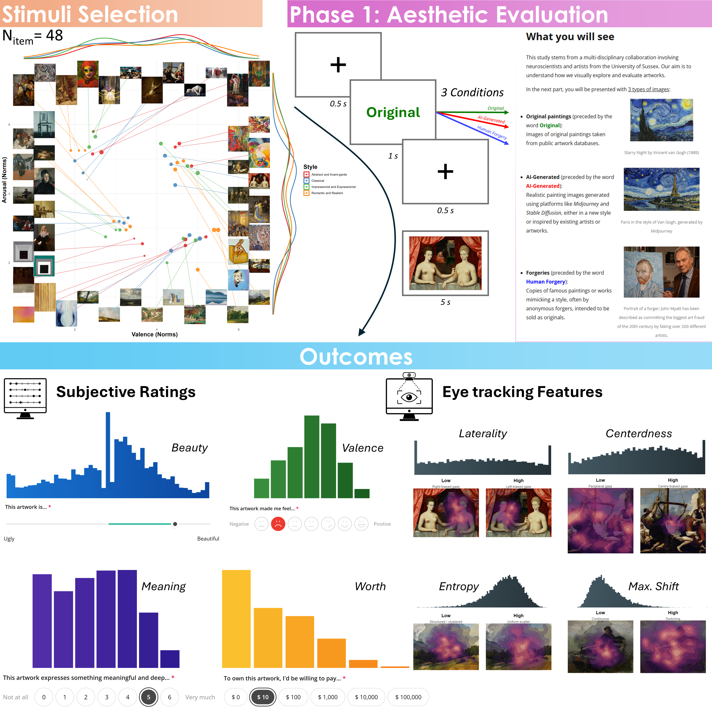

Title ideas: 

- Framing the Fake: The Differential Effect of Forgery vs. AI Labels on Aesthetic Experience
- Art-ificial Beauty: ...
- The Ghost in the Canvas: ...
- Disentangling Aspects of Reality Beliefs in Aesthetic Experience: Syntheticness and Authenticity
- Framing the Fake: Disentangling Aspects of Reality Beliefs in their role in Aesthetic Experience via the Differential Effect of Forgery vs. AI Labels.
- Syntheticness vs. Authenticity: Disentangling Aspects of Reality Beliefs in their role in Aesthetic Experience
- Syntheticness vs. Authenticity: Disentangling the Role of Reality Beliefs in Aesthetic Experience
- Framing the Fake: How Aesthetic Experience is Shaped by the Differential Effect of Forgery vs. AI Labels
- Not All Fakes Are Equally Ugly: Disentangling Syntheticness and Authenticity as Distinct Reality Beliefs Modulating Aesthetic Experience
- Framing the Fake: AI and Forgery Labels Shape Distinct Aspects of Reality Beliefs During Aesthetic Experience
- Not All Fakes Are Equally Ugly: Disentangling the role of Syntheticness and Authenticity Beliefs in Aesthetic Experience

# Introduction

# Methods

## Participants

TODO.

## Procedure

```{r}
#| warning: false
#| label: fig-1
#| apa-twocolumn: true  # A Figure Spanning Two Columns When in Journal Mode
#| out-width: "100%"
#| fig-cap: "TODO."



```

The experiment was implemented with  *JsPsych* [@de2015jspsych] and all materials, including its code, the items, instructions and exact procedure, is available in open-access at https://github.com/RealityBending/FakeArt, where the experiment can also be tested live.

### Aesthetic Judgment (Phase 1)


Participants were first introduced to a cover story framing the experiment as a collaboration between neuroscientists and artists investigating how people visually explore and evaluate artworks (a framing that also justified the use of webcam-based eye-tracking). They were told they would view three categories of images: Original Human paintings (sourced from public art databases), AI-Generated images (produced using generative platforms such as Midjourney and Stable Diffusion, either in a new style or inspired by existing artists or artworks^[This intentionally equivocal description, that leaves open whether AI images were generated with the goal of being new or artist-inspired, was carefully considered and included to preempt the risk that a participant recognizing a genuine painting presented as AI-generated would undermine belief in the whole manipulation.]), and Human Forgeries (copies or stylistic imitations of existing artworks, historically produced by Humans with intent to deceive). Critically, only the participants' *beliefs* were manipulated - all stimuli were, in reality, genuine man-made artworks.

Stimuli from the Vienna Art Picture System [VAPS, @fekete2023vienna] were first grouped into four broad stylistic categories (Abstract and Avant-garde; Impressionist and Expressionist; Romantic and Realism; and Classical). To minimize the influence of prior exposure, only unfamiliar paintings (familiarity ratings below the sample median) were retained. Within each style, the remaining paintings were stratified into four quadrants defined by the upper and lower tertiles of normative arousal and valence, and the three paintings farthest from the style's median arousal/valence were selected from each quadrant. This procedure yielded a final set of 48 paintings - 12 per style, evenly split across the four arousal-valence quadrants (Positive - High Intensity; Positive - Low Intenstiy; Negative - High Intensity, Negative - Low Intensity).

During the first phase of the experiment, participants viewed the 48 artworks (see @fig-1), each preceded by a randomly presented label indicating its purported type ("Original", "Human Forgery" or "AI-Generated"). Following the presentation of each artwork (5 s), participants reported their aesthetic experience across four dimensions encompassing cognitive appraisal, emotional response, semantic processing, and valuation [@leder2004model; @leder2014ten; @kirk2009modulation]: *beauty* (aesthetic quality, composition, and execution), emotional *valence* (the intensity of positive or negative feelings evoked), *meaningfulness* (conceptual richness, symbolism, and profundity), and monetary *worth* (maximum willingness to pay). 
To mitigate common method bias [@podsakoff2003common] and minimize construct overlap, each dimension was assessed with a bespoke scale: an analog slider (Ugly - Beautiful), a 7-point pictorial scale (Negative - Positive), a 7-point numerical scale from 0 (Not at all) to 6 (Very much), and a 6-point discrete logarithmic monetary scale offering choices from \$0 to \$100,000^[The selection, description, wording and presentation of these measures were refined through extensive pilot testing and expert feedback.].
To ensure sustained engagement with the contextual cues, random catch trials were interleaved throughout the block, prompting participants to recall the immediately preceding label.

At the end of Phase 1, participants completed a brief manipulation check questionnaire, framed as a feedback opportunity. Checklist items probed their overall impressions of the relative aesthetic quality of AI-generated versus human-made images, the perceived convincingness of the forged artworks, and the degree to which they trusted the labels (e.g., whether labels seemed mismatched, reversed, or whether they suspected that all images in fact belonged to a single category). Participants who selected believing that every artwork was either genuine or AI-generated were additionally asked to rate their confidence in that belief, which was used as a manipulation distrust proxy. This questionnaire was implemented to help identify suspicious or disengaged participants.

### Questionnaires

Between the two phases of the artwork judgment task, participants completed four questionnaires. The *Beliefs about Artificial Images Technology* scale (BAIT) was originally developed in @makowski2025too to assess expectations regarding the realism of computer-generated content and iteratively extended across subsequent studies. The version administered here (BAIT-14) comprised 14 items spanning two components: beliefs about the realism of AI-generated images, videos, text, and artworks (e.g., "Current AI algorithms can generate very realistic images", "AI-generated art can sometimes surpass human creativity and artistic value"); and general attitudes toward AI, adapted from four items of the General Attitudes towards Artificial Intelligence Scale [GAAIS, @schepman2020initial] capturing perceived danger, worry, excitement, and societal benefit. The questionnaire additionally included two items assessing self-rated AI knowledge and frequency of AI tool use, and one attention check item.

the *Multimodal Interoception Questionnaire* [MINT; **REF UNDER REVIEW**], a 33-item self-report measure of interoceptive sensibility spanning eleven bodily domains, including cardiac, respiratory, gastric, dermal, urogenital, sexual, and olfactory sensations, as well as satiety and excretory awareness. Each domain was assessed with three items (e.g., "I can notice even very subtle changes in the way my heart beats"). Domain scores were computed as the sum of their constituent items. One additional item served as an attention check.


Participants also completed the *Vividness of Visual Imagery Questionnaire* [VVIQ, @marks1973visual], a 16-item measure of the subjective vividness of voluntary visual imagery. Participants were asked to visualize four scenarios in turn (a familiar person, a rising sun, a familiar shop front, and a countryside scene) and, for each of four component images within a scenario, rated the vividness of the resulting mental image.

Finally, participants completed the four-item *Patient Health Questionnaire* [PHQ-4, @kroenke2009ultra; refined version: @makowski2025measuring], a brief screening measure of anxiety and depressive symptoms. Participants additionally rated their global life satisfaction on a single item ["All things considered, how satisfied are you with your life as a whole?", @cheung2014assessing].

### Reality Beliefs (Phase 2)

At the start of the second phase, the cover story was *partially* revealed^[This pseudo-reveal paradigm was developed as an improvement over other designs in related experiments, see **FICTIONERO PREPRINT REF** for discussion]. Participants were informed that some of the Phase 1 labels had been intentionally randomized and were tasked with identifying the true nature of the artworks based on their own judgment (preserving the belief that originals, forgeries and AI-generated stimuli were present). For each briefly re-presented image (1.5 s), participants made two continuous, gut-feeling judgments, probing theoretically distinct aspects of of reality beliefs: *syntheticness* ("AI-generated" vs. "Human Creation") and *authenticity* ("Copy/forgery" vs. "Original Creation"). We treated these two dimensions as orthogonal, such that artworks could in principle occupy any of four categories (Human Original, Human Forgery, AI Original, AI Copy) - the same four-category structure later probed directly in the follow-up memory task^[Ideally, this orthogonal structure would have been also reflected in Phase 1 through four corresponding labels rather than three. We collapsed this to three categories for practical reasons: presenting an artwork under a label such as "AI-generated original" risked a participant recognizing it as a known human painting, which would undermine trust in the labelling manipulation as a whole. Piloting also suggested that the three-category framing was more intuitive and more ecologically valid, as AI-generated and forgeries typically function as stand-alone categories in everyday life]. Finally, participants were debriefed about the true nature of the experiment and the fact that all stimuli were Human artworks.


### Memory Task (Follow-up)

Participants were invited for a follow-up session approximately **X days** after their initial participation. They were first reminded of the two-phase label-manipulation procedure from the original session and we explicitly re-iterated that all previously viewed artworks had, in reality, been genuine human-created originals. They then completed a recognition-memory task in which the original 48 artworks were randomly intermixed with an equal number of novel, previously unseen artworks, presented in randomized order. Novel artworks were drawn from the same VAPS stylistic pool and matched one-to-one to old artworks within each style by minimizing the total Euclidean distance across standardized ratings of valence, arousal, liking, complexity, and familiarity; Bayesian *t*-tests confirmed that old and new items did not differ on any of these norms (all BFs < 1).

For each artwork, participants first rated its beauty once again (using the same slider as in Phase 1) and its personal/self-relevance (the extent to which the artwork related to their own experiences, personality, or life events, independently of how beautiful they found it). They then made an old/new recognition judgement indicating whether they recalled the artwork from the original session. Artworks judged as novel were additionally rated for perceived artificiality (i.e., how easily participants could believe the image was AI-generated). Artworks judged as previously seen instead prompted two source-memory questions: which condition label (Original, AI-Generated, or Human Forgery) was associated with the artwork in Phase 1, and what was their own reality belief response made in Phase 2. Namely, participants had to select which of four categories participants had endorsed, corresponding to the combination of the dichotomized syntheticness and authenticity ratings (Human Original, Human Forgery, AI Original, AI Copy). This design jointly captured item memory (recognition) and source memory in its external and contextual dimension (recall of the assigned label) and internal aspect (one's own past belief).


## Data Analysis

### Preprocessing

Outlier rejection.

### Eye Tracking

Gaze position was sampled continuously via webcam-based eye-tracking (WebGazer.js) throughout each trial and re-expressed in coordinates centered on the stimulus and normalized by stimulus width, preserving the image's aspect ratio and allowing comparison across images of different sizes. Given the noisy and variable nature of webcam-based data, a strict quality control workflow was applied. **X** participants were excluded due to invalid data (>25% consecutive duplicate samples). Off-screen coordinates and samples reflecting implausibly fast transitions (>6 stimulus-widths/second, indicative of blinks or artifacts) were removed. Finally, trials were excluded if they contained fewer than 20 valid samples, showed frozen (SD < 0.02) or excessively noisy (SD > 0.60) gaze on either axis, had less than 50% of samples falling within the stimulus bounds, exhibited severe linear drift (>1 stimulus-width of total displacement), or showed near-uniform spatial scatter consistent with untracked gaze. Finally, **X** participants were excluded for yielding fewer than 2,000 valid samples across the full experiment.

Four simple, robust and interpretable gaze features were computed per trial. *Laterality* was the proportion of samples falling in the left half of the image (vs. the right), and *Centeredness* was the proportion of samples falling within the center portion of the image. *Entropy* quantified the spatial dispersion of gaze: samples were binned into a 5×5 grid, Shannon entropy was computed and normalized by the maximum entropy achievable given the number of valid samples (avoiding artificial deflation on sparse trials). *Max. Shift* captured the single largest reorganization of gaze focus within a trial: for every possible partition of the chronologically ordered samples into an initial and final segment (each with at least 30 samples), the Euclidean distance between the two segments' centroids was computed, and the maximum across all partitions was retained; large values indicate a discrete relocation of attention to a different image region partway through viewing, near-zero values indicate a single stable focus throughout.


### Statistical Models

Model selection:
- Beauty, Beauty2, Syntheticness, Authenticity: Analog slider scales. Bimodal distribution with zero, one, and mipoint inflation. Perfect fit for CHOCO models.
- Valence, 
- Worth, SelfRelevance: monotonically decaying values. Arguably, judgments to these scales - or more specifically, the boundaries between different options (a participant's distinction between \$1000 and \$10000, or between a Self-Relevance rating of 0 and 1) - were the most idiosyncratic. Could have used Zero-inflated beta-discrete models, but better theorethical fit for Ordinal (cumuative) models.


- However, while linear models model the expected mean of the outcome, it is to note that they are not the model class the most suited for our data. On a theoretical level, the outcomes were recorded on scales with particular characteristics (bounded at extremities, some had discrete choices, etc.). Critically, at an empirical level, most display distributions that are better accounted for by other models. For instance, Meaning and Worth displayed characteristic zero-inflation, had Beauty, Syntheticness and Authenticity displayed bimodal distributions with zero, one and mid-point inflations. The latter type of distributions have been recently described as a Choice-Confidence distribution, where the response reflect a conflated process of a discrete choice - e.g., Beautiful vs. Ugly - and a continuous evaluation of degree or confidence. These distributions are better modeled using the Choice-Confidence models, a mixture model of two Beta distributions that provides a much better fit than linear models as well as deeper insights, with parameters reflecting the probability of each discrete choice, as well as the mean and spread of each choice separately.


# Results

## Effect of Label Condition


# Discussion

<!-- Outcome Distribution -->

While empirical aesthetics research frequently observes high correlations among subjective dimensions - often prompting the extraction of a single latent "aesthetic appreciation" factor to mitigate multicollinearity, the present data strongly support preserving the independence of these constructs.
Theoretically, beauty, valence, meaning, and worth map onto distinct cognitive and neural substrates, spanning sensory evaluation, affective response, semantic processing, and reward. Crucially, the empirical distributions of the collected data substantiate this theoretical divergence. Rather than sharing a uniform shape, each dimension exhibited a distinct distributional signature indicative of separate underlying generative processes. Specifically, emotional valence displayed a symmetric unimodal distribution, reflecting a normative, continuous gradient of affective responses. In contrast, meaningfulness demonstrated pronounced zero-inflation, suggesting a partially dichotomous cognitive mechanism whereby artworks are initially gated as either possessing semantic weight or lacking it entirely. Monetary worth followed a monotonically decaying, right-skewed shape highly characteristic of behavioral economic valuation paradigms, where high subjective reward is exceptionally rare. Finally, beauty judgments yielded a complex, bimodal distribution, likely capturing a combination of polarized aesthetic processing and the specific anchoring behaviors elicited by analog sliders. These pronounced morphological differences, while helped by our usage of distinct response formats, suggest that the four scales are not merely redundant probes of a generalized aesthetic halo effect, but capture distinct aspect of the aesthetic experience.


# References

::: {#refs}
:::
